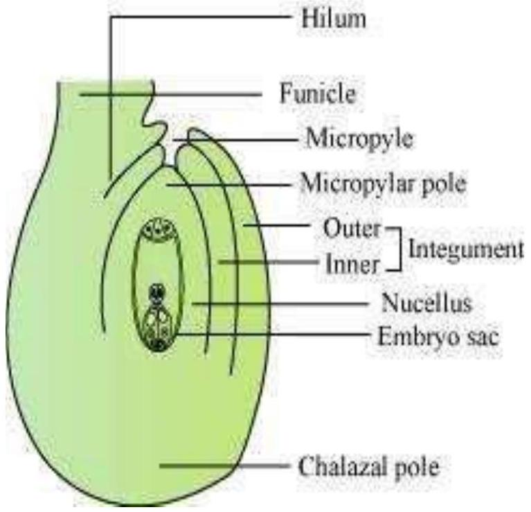
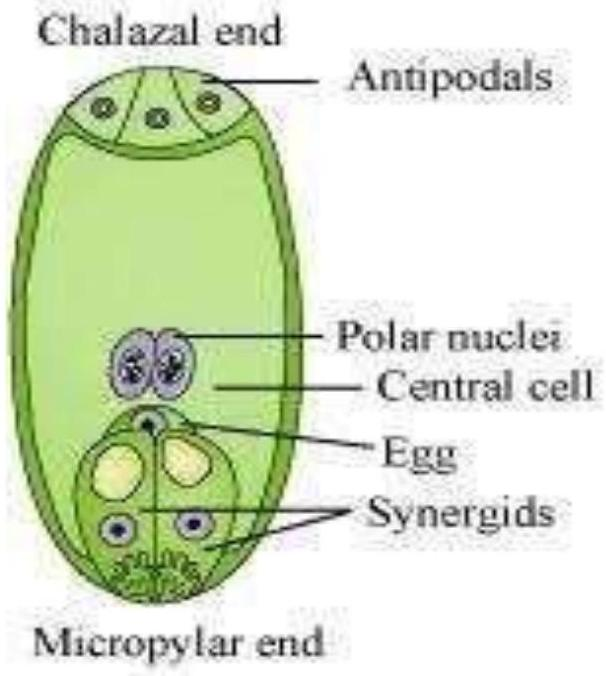

Question 1:
Name the parts of an angiosperm flower in which development of male and female gametophyte take place.
Answer 1:
The male gametophyte or the pollen grain develops inside the pollen chamber of the anther, whereas the female gametophyte (also known as the embryo sac) develops inside the nucellus of the ovule from the functional megaspore.

Question 2:
Differentiate between microsporogenesis and megasporogenesis. Which type of cell division occurs during these events? Name the structures formed at the end of these two events.
Answer 2:

| Microsporogenesis |  | Megasporogenesis |
| :--- | :--- | :--- |
| 1. | It is the process of the formation of microspore tetrads from a microspore mother cell through meiosis. | It is the process of the formation of the four megaspores from a megaspore mother cell in the region of the nucellus through meiosis |
| 2. | It occurs inside the pollen sac of the anther. | It occurs inside the ovule. |

Both events (microsporogenesis and megasporogenesis) involve the process of meiosis or reduction division which results in the formation of haploid gametes from the microspore and megaspore mother cells.

Microsporogenesis results in the formation of haploid microspores from a diploid microspore mother cell. On the other hand, megasporogenesis results in the formation of haploid megaspores from a diploid megaspore mother cell.

## Question 3:

Arrange the following terms in the correct developmental sequence: Pollen grain, sporogenous tissue, microspore tetrad, pollen mother cell, male gametes

## Answer 3:

The correct development sequence is as follows:
Sporogenous tissue - pollen mother cell - microspore tetrad - Pollen grain - male gamete
During the development of microsporangium, each cell of the sporogenous tissue acts as a pollen mother cell and gives rise to a microspore tetrad, containing four haploid microspores by the process of meiosis (microsporogenesis). As the anther matures, these microspores dissociate and develop into pollen grains. The pollen grains mature and give rise to male gametes.

## Question 4:

With a neat, labelled diagram, describe the parts of a typical angiosperm ovule.

## Answer 4:

An ovule is a female megasporangium where the formation of megaspores takes place.

The various parts of an ovule are -

- Funiculus - It is a stalk-like structure which represents the point of attachment of the ovule to the placenta of the ovary.
- Hilum - It is the point where the body of the ovule is attached to the funiculus.
- Integuments -They are the outer layers surrounding the ovule that provide protection to the developing embryo.
- Micropyle - It is a narrow pore formed by the projection of integuments. It marks the point where the pollen tube enters the ovule at the time of fertilization.
- Nucellus - It is a mass of the parenchymatous tissue surrounded by the integuments from the outside. The nucellus provides nutrition to the developing embryo. The embryo sac is located inside the nucellus.
- Chalazal - It is the based swollen part of the nucellus from where the integuments originate.

Question 5:
What is meant by monosporic development of female gametophyte?
Answer 5:
The female gametophyte or the embryo sac develops from a single functional megaspore. This is known as monosporic development of the female gametophyte. In most flowering plants, a single megaspore mother cell present at the micropylar pole of the nucellus region of the ovule undergoes meiosis to produce four haploid megaspores. Later, out of these four megaspores, only one functional megaspore develops into the female gametophyte, while the remaining three degenerate.

## Question 6:

With a neat diagram explain the 7-celled, 8-nucleate nature of the female gametophyte.
Answer 6:

The female gametophyte (embryo sac) develops from a single functional megaspore. This megaspore undergoes three successive mitotic divisions to form eight nucleate embryo sacs.
The first mitotic division in the megaspore forms two nuclei. One nucleus moves towards the micropylar end while the other nucleus moves towards the chalazal end. Then, these nuclei divide at their respective ends and redivide to form eight nucleate stages. As a result, there are four nuclei each at both the ends i.e., at the micropylar and the chalazal end in the embryo sac. At the micropylar end, out of the four nuclei only three differentiate into two synergids and one egg cell. Together they are known as the egg apparatus. Similarly, at the chalazal end, three out of four nuclei differentiates as antipodal cells. The remaining two cells (of the micropylar and the chalazal end) move towards the centre and are known as the polar nuclei, which are situated in a large central cell. Hence, at maturity, the female gametophyte appears as a 7-celled structure, though it has 8 nucleate.

## Question 7:

What are chasmogamous flowers? Can cross-pollination occur in cleistogamous flowers? Give reasons for your answer.

## Answer 7:

There are two types of flowers present in plants namely Oxalis and Viola chasmogamous and cleistogamous flowers.
Chasmogamous flowers have exposed anthers and stigmata similar to the flowers of other species.
Cross-pollination cannot occur in cleistogamous flowers. This is because cleistogamous flowers never open at all. Also, the anther and the stigma lie close to each other in these flowers. Hence, only self-pollination is possible in these flowers.

## Question 8:

Mention two strategies evolved to prevent self-pollination in flowers.

## Answer 8:

Self-pollination involves the transfer of pollen from the stamen to the pistil of the same flower. Two strategies that have evolved to prevent selfpollination in flowers are as follows:

- In certain plants, the stigma of the flower hasthecapability to prevent the germination of pollen grains and hence, prevent the growth of the pollen tube.It is a genetic mechanism to prevent self-pollination called self- incompatibility. Incompatibility may be between individuals of the same species or between individuals of different species. Thus, incompatibility prevents breeding.
- In some plants, the gynoecium matures before the androecium or vice-versa. This phenomenon is known as protogyny or protandry respectively. This prevents the pollen from coming in contact with the stigma of the same flower.

## Question 9:

What is self-incompatibility? Why does self-pollination not lead to seed formation in self-incompatible species?

## Answer 9:

Self-incompatibility is a genetic mechanism in angiosperms that prevents self-pollination. It develops genetic incompatibility between individuals of the same species or between individuals of different species.
The plants which exhibit this phenomenon have the ability to prevent germination of pollen grains and thus, prevent the growth of the pollen tube on the stigma of the flower. This prevents the fusion of the gametes along with the development of the embryo. As a result, no seed formation takes place.

## Question 10:

What is bagging technique? How is it useful in a plant breeding programme?

## Answer 10:

Various artificial hybridization techniques (under various crop improvement programmes) involve the removal of the anther from bisexual flowers without affecting the female reproductive part (pistil) through the process of emasculation. Then, these emasculated flowers are wrapped in bags to prevent pollination by unwanted pollen grains. This process is called bagging.
This technique is an important part of the plant breeding programme as it ensures that pollen grains of only desirable plants are used for fertilization of the stigma to develop the desired plant variety.

## Question 11:

What is triple fusion? Where and how does it take place? Name the nuclei involved in triple fusion.

## Answer 11:

Triple fusion is the fusion of the male gamete with two polar nuclei inside the embryo sac of the angiosperm.

This process of fusion takes place inside the embryo sac.
When pollen grains fall on the stigma, they germinate and give rise to the pollen tube that passes through the style and enters into the ovule. After this, the pollen tube enters one of synergids and releases two male gametes there. Out of the two male gametes, one gamete fuses with the nucleus of the egg cell and forms the zygote (syngamy). The other male gamete fuses with the two polar nuclei present in the central cell to form a triploid primary endosperm nucleus. Since this process involves the fusion of three haploid nuclei, it is known as triple fusion. It results in the formation of the endosperm.
One male gamete nucleus and two polar nuclei are involved in this process.

Question 12:
Why do you think the zygote is dormant for sometime in a fertilized ovule?
Answer 12:
The zygote is formed by the fusion of the male gamete with the nucleus of the egg cell. The zygote remains dormant for some time and waits for the endosperm to form, which develops from the primary endosperm cell resulting from triple fusion. The endosperm provides food for the growing embryo and after the formation of the endosperm, further development of the embryo from the zygote starts.

Question 13:
Differentiate between:

(a) Hypocotyl and epicotyl;
(b) Coleoptile and coleorrhiza;
(c) Integument and testa;
(d) Perisperm and pericarp.

Answer 13:
(a)

| Hypocotyl |  | Epicotyl |
| :--- | :--- | :--- |
| 1. | The portion of the embryonal axis which lies below the cotyledon in a dicot embryo is known as the hypocotyl. | The portion of the embryonal axis which lies above the cotyledon in a dicot embryo is known as the epicotyl. |
| 2. | It terminates with the radicle. | It terminates with the plumule. |

(b)

| Coleoptile | Coleorrhiza |
| :--- | :--- |
| It is a conical protective sheath that encloses the plumule in a monocot seed. | It is an undifferentiated sheath that encloses the radicle and the root cap in a monocot seed. |

(c)

| Integument | Testa |
| :--- | :--- |
| It is the outermost covering of an ovule. It provides protection to it. | It is the outermost covering of a seed. |

(d)

| Perisperm | Pericarp |
| :--- | :--- |
| It is the residual nucellus which persists. It is present in some seeds such as beet and black pepper. | It is the ripened wall of a fruit, which develops from the wall of an ovary. |

Question 14:
Why is apple called a false fruit? Which part(s) of the flower forms the fruit?

Answer 14:
Fruits derived from the ovary and other accessory floral parts are called false fruits. On the contrary, true fruits are those fruits which develop from the ovary, but do not consist of the thalamus or any other floral part. In an apple, the fleshy receptacle forms the main edible part. Hence, it is a false fruit.

## Question 15:

What is meant by emasculation? When and why does a plant breeder employ this technique?

## Answer 15:

Emasculation is the process of removing anthers from bisexual flowers without affecting the female reproductive part (pistil), which is used in various plant hybridization techniques.
Emasculation is performed by plant breeders in bisexual flowers to obtain the desired variety of a plant by crossing a particular plant with the desired pollen grain. To remove the anthers, the flowers are covered with a bag before they open. This ensures that the flower is pollinated by pollen grains obtained from desirable varieties only. Later, the mature, viable, and stored pollen grains are dusted on the bagged stigma by breeders to allow artificial pollination to take place and obtain the desired plant variety.

## Question 16:

If one can induce parthenocarpy through the application of growth substances, which fruits would you select to induce parthenocarpy and why?

## Answer 16:

Parthenocarpy is the process of developing fruits without involving the process of fertilization or seed formation. Therefore, the seedless varieties of economically important fruits such as orange, lemon, water melon etc. are produced using this technique. This technique involves inducing fruit formation by the application of plant growth hormones such as auxins.

## Question 17:

Explain the role of tapetum in the formation pollen-grain wall.

## Answer 17:

Tapetum is the innermost layer of the microsporangium. It provides nourishment to the developing pollen grains. During microsporogenesis, the cells of tapetum produce various enzymes, hormones, amino acids, and other nutritious material required for the development of pollen grains. It also produces the exine layer of the pollen grains, which is composed of the sporopollenin.

## Question 18:

What is apomixis and what is its importance?

## Answer 18:

Apomixis is the mechanism of seed production without involving the process of meiosis and syngamy. It plays an important role in hybrid seed production. The method of producing hybrid seeds by cultivation is very expensive for farmers. Also, by sowing hybrid seeds, it is difficult to maintain hybrid characters as characters segregate during meiosis. Apomixis prevents the loss of specific characters in the hybrid. Also, it is a cost-effective method for producing seeds.

