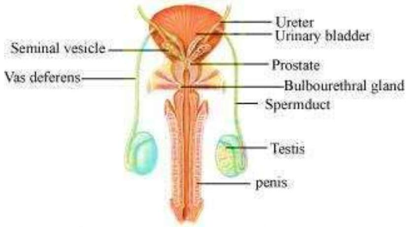
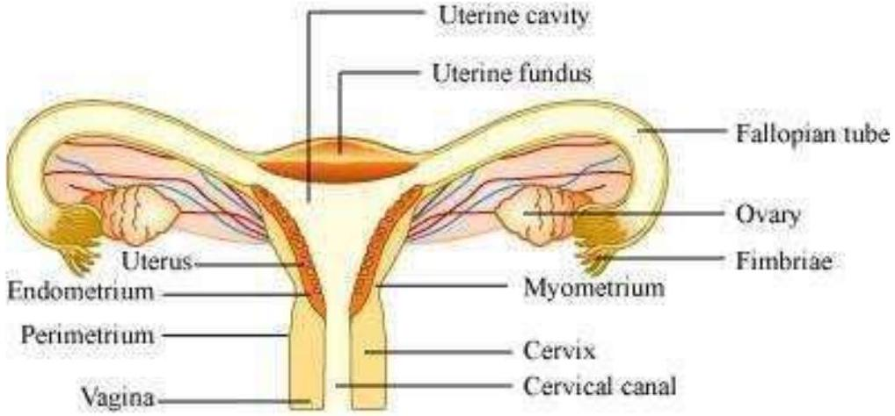
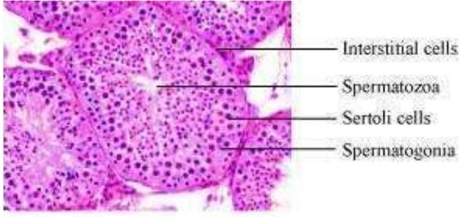
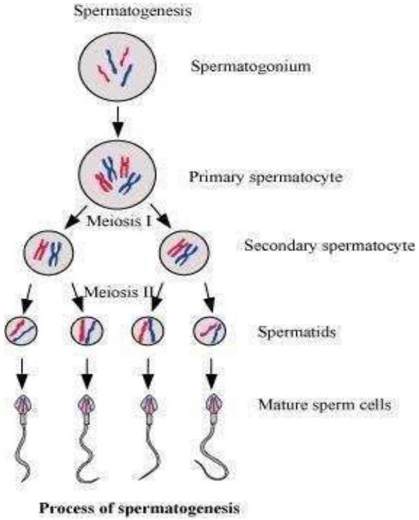
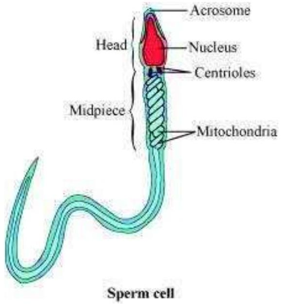
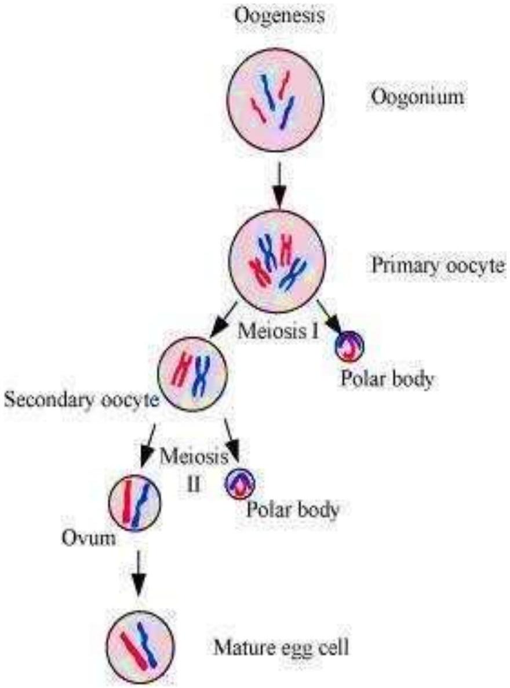
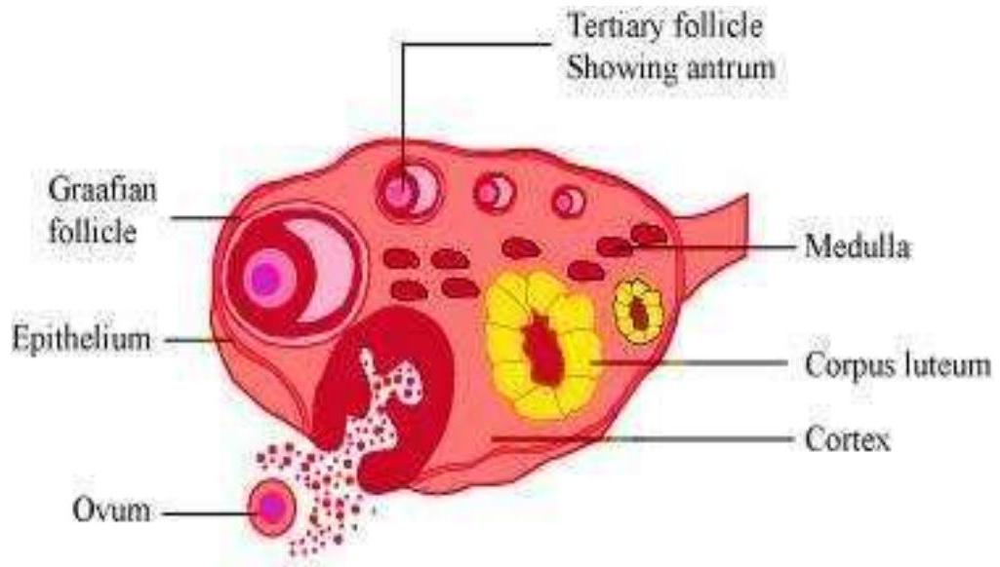
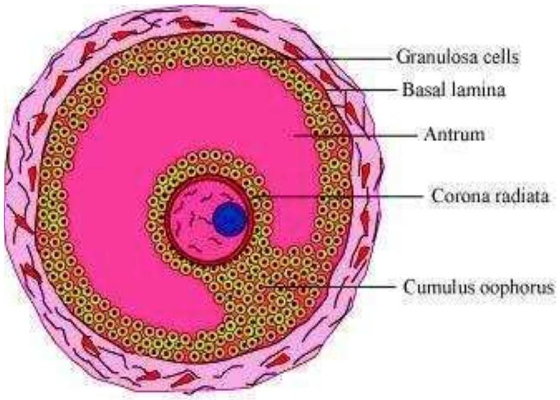

(Chapter - 3) (Human Reproduction)
(Class - XII)
Question 1:
Fill in the blanks:

(a) Humans reproduce $\_\_\_\_$. (asexually/sexually)
(b) Humans are $\_\_\_\_$. (oviparous/viviparous/ovoviviparous)
(c) Fertilization is $\_\_\_\_$in humans. (external/internal)
(d) Male and female gametes are $\_\_\_\_$. (diploid/haploid)
(e) Zygote is $\_\_\_\_$. (diploid/haploid)
(f) The process of release of the ovum from a mature follicle is called $\_\_\_\_$.
(g) Ovulation is induced by a hormone called the $\_\_\_\_$.
(h) The fusion of the male and the female gametes is called $\_\_\_\_$.
(i) Fertilization takes place in the $\_\_\_\_$.
(j) The zygote divides to form $\_\_\_\_$, which is implanted in uterus.
(k) The structure which provides vascular connection between the fetus and uterus is called $\_\_\_\_$.

Answer 1:

(a) Humans reproduce sexually.
(b) Humans are viviparous.
(c) Fertilization is internal in human.
(d) Male and female gametes are haploid.
(e) Zygote is diploid.
(f) The process of release of the ovum from a mature follicle is called ovulation.
(g) Ovulation is induced by a hormone called the luteinizing hormone.
(h) The fusion of the male and the female gametes is called fertilization.
(i) Fertilization takes place in the fallopian tube.
(j) The zygote divides to form blastocyst, which is fertilization implanted in uterus.
(k) The structure which provides vascular connection between the fetus and uterus is called placenta.

## Question 2:

Draw a labeled diagram of male reproductive system.

## Answer 2:

The male reproductive system

## Question 3:

Draw a labeled diagram of female reproductive system.

## Answer 3:

The female reproductive system

## Question 4:

Write two major functions each of testis and ovary.

## Answer 4:

Functions of the Testis

- They produce male gametes called spermatozoa by the process of spermatogenesis.
- The leydig cells of the seminiferous tubules secrete the male sex hormone called testosterone. Testosterone aids the development of secondary sex characteristics in males.

Functions of the ovary

- They produce female gametes called ova by the process of oogenesis.
- The growing Graffian follicles secrete the female sex hormone called estrogen. Estrogen aids the development of secondary sex characteristics in females.

Question 5:
Describe the structure of a seminiferous tubule.
Answer 5:
The production of sperms in the testes takes place in a highly coiled structure called the seminiferous tubules. These tubules are located in the testicular lobules. Each seminiferous tubule is lined by germinal epithelium. It is lined on its inner side by two types of cells namely spermatogonia and sertoli cells respectively. Spermatogonia are male germ cells which produce primary spermatocytes by meiotic divisions. Primary spermatocytes undergo further meiotic division to form secondary spermatocytes and finally, spermatids. Spermatids later metamorphoses into male gametes called spermatozoa. Sertoli cells are known as nurse cells of the testes as they provide nourishment to the germ cells. There are large polygonal cells known as interstitial cells or leydig cells just adjacent to seminiferous tubules. These cells secrete the male hormone called testosterone.

Transverse section of seminiferous tubules

Question 6:
What is spermatogenesis? Briefly describe the process of spermatogenesis.
Answer 6:
Spermatogenesis is the process of the production of sperms from the immature germ cells in males. It takes place in seminiferous tubules present inside the testes. During spermatogenesis, a diploid spermatogonium (male germ cell) increases its size to form a diploid primary spermatocyte. This diploid primary spermatocyte undergoes first meiotic division (meiosis I),
which is a reductional division to form two equal haploid secondary spermatocytes. Each secondary spermatocyte then undergoes second meiotic division (meiosis II) to form two equal haploid spermatids. Hence, a diploid spermatogonium produces four haploid spermatids. These spermatids are transformed into spermatozoa (sperm) by the process called spermiogenesis.

Question 7:
Name the hormones involved in regulation of spermatogenesis.
Answer 7:
Follicle-stimulating hormones (FSH) and luteinizing hormones (LH) are secreted by gonadotropin releasing hormones from the hypothalamus .These hormones are involved in the regulation of the process of spermatogenesis. FSH acts on sertoli cells, whereas LH acts on leydig cells of the testis and stimulates the process of spermatogenesis.

Question 8:
Define spermiogenesis and spermiation.
Answer 8:
Spermiogenesis
It is the process of transforming spermatids into matured spermatozoa or sperms.
Spermiation
It is the process when mature spermatozoa are released from the sertoli cells into the lumen of seminiferous tubules.

## Question 9:

Draw a labeled diagram of sperm.
Answer 9:

## Question 10:

What are the major components of seminal plasma?
Answer 10:
Semen (produced in males) is composed of sperms and seminal plasma. The major components of the seminal plasma in the male reproductive system are mucus, spermatozoa, and various secretions of accessory glands. The seminal plasma is rich in fructose, calcium, ascorbic acid, and certain enzymes. It provides nourishment and protection to sperms.

## Question 11:

What are the major functions of male accessory ducts and glands?
Answer 11:
The male accessory ducts are vasa efferentia, epididymis, vas deferens, and rete testis. They play an important role in the transport and temporary storage of sperms. On the contrary, male accessory glands are seminal vesicles, prostate glands, and bulbourethral glands. These glands secrete fluids that lubricate the reproductive system and sperms. The sperms get dispersed in the fluid which makes their transportation into the female body easier. The fluid is rich in fructose, ascorbic acid, and certain enzymes. They also provide nutrients and activate the sperm.

## Question 12:

What is oogenesis? Give a brief account of oogenesis.

## Answer 12:

Oogenesis is the process of the formation of a mature ovum from the oogonia in females. It takes place in the ovaries. During oogenesis, a diploid oogonium or egg mother cell increases in size and gets transformed into a diploid primary oocyte. This diploid primary oocyte undergoes first meiotic division i.e., meiosis I or reductional division to form two unequal haploid cells. The smaller cell is known as the first polar body, while the larger cell is known as the secondary oocyte. This secondary oocyte undergoes second meiotic division i.e., meiosis II or equational division and gives rise to a second polar body and an ovum. Hence, in the process of oogenesis, a diploid oogonium produces a single haploid ovum while two or three polar bodies are produced.

Process of oogenesis

Question 13:
Draw a labeled diagram of a section through ovary.
Answer 13:

Transerve section of the ovary

Question 14:
Draw a labeled diagram of a Graafian Follicle?
Answer 14:

Structure of the Graafian follicle

Question 15:
Name the functions of the following.

(a) Corpus luteum
(b) Endometrium
(c) Acrosome
(d) Sperm tail
(e) Fimbriae

Answer 14:
(a) Corpus luteum - Corpus luteum is formed from the ruptured Grafiaan follicle. It secretes progesterone hormone during the luteal phase of the menstrual cycle. A high level of progesterone inhibits the secretions of FSH and LH, thereby preventing ovulation. It also allows the endometrium of the uterus to proliferate and to prepare itself for implantation.
(b) Endometrium - It is the innermost lining of the uterus. It is rich in glands and undergoes cyclic changes during various phases of the menstrual cycle to prepare itself for the implantation of the embryo.
(c) Acrosome - It is a cap-like structure present in the anterior part of the head of the sperm. It contains hyaluronidase enzyme, which hydrolyses the outer membrane of the egg, thereby helping the sperm to penetrate the egg at the time of fertilization.
(d) Sperm tail - It is the longest region of the sperm that facilitates the movement of the sperm inside the female reproductive tract.
(e) Fimbriae - They are finger-like projections at the ovarian end of the fallopian tube. They help in the collection of the ovum (after ovulation), which is facilitated by the beating of the cilia.

Question 16:
Identify True/False statements. Correct each false statement to make it true.

(a) Androgens are produced by Sertoli cells. (True/False)
(b) Spermatozoa get nutrition from Sertoli cells. (True/False)
(c) Leydig cells are found in ovary. (True/False)
(d) Leydig cells synthesise androgens. (True/False)
(e) Oogenesis takes place in corpus luteum. (True/False)
(f) Menstrual cycle ceases during pregnancy. (True/False)
(g) Presence or absence of hymen is not a reliable indicator of virginity or sexual experience. (True/False)

Answer 16:

(a) Androgens are produced by Sertoli cells. (False)
Androgens are produced by Leydig cells found in seminiferous tubules of the testis.
(b) Spermatozoa get nutrition from Sertoli cells. (True)
(c) Leydig cells are found in ovary. (False)

Leydig cells are found in the seminiferous tubules of the testis.

(d) Leydig cells synthesise androgens. (True)
(e) Oogenesis takes place in corpus luteum. (False) Oogenesis takes place in the ovary.
(f) Menstrual cycle ceases during pregnancy. (True)
(g) Presence or absence of the hymen is not a reliable indicator of virginity or sexual experience. (True)

Question 17:
What is menstrual cycle? Which hormones regulate menstrual cycle?
Answer 17:
The menstrual cycle is a series of cyclic physiologic changes that take place inside the female reproductive tract in primates. The whole cycle takes around 28 days to complete. The end of the cycle is accompanied by the breakdown of uterine endothelium, which gets released in the form of blood and mucous through the vagina. This is known as menses.
The follicle stimulating hormone (FSH), luteinizing hormone (LH), estrogen, and progesterone are the various hormones that regulate the menstrual cycle. The level of FSH and LH secreted from the anterior pituitary gland increases during the follicular phase. FSH secreted under the influence of RH (releasing hormone) from the hypothalamus stimulates the conversion of a primary follicle into a graafian follicle. The level of LH increases gradually leading to the growth of follicle and secretion of estrogen. Estrogen inhibits the secretion of FSH and stimulates the secretion of luteinizing hormone. It also causes the thickening of the uterine endometrium. The increased level of LH causes the rupturing of the graafian follicle and release the ovum into the fallopian tube. The ruptured graafian follicle changes to corpus luteum and starts secreting progesterone hormone during the luteal phase. Progesterone hormone helps in the maintenance and preparation of endometrium for the implantation of the embryo. High levels of progesterone hormone in the blood decrease the secretion of LH and FSH, therefore inhibiting further ovulation.

## Question 18:

What is parturition? Which hormones are involved in induction of parturition?

## Answer 18:

Parturition is the process of giving birth to a baby as the development of the foetus gets completed in the mother's womb. The hormones involved in this process are oxytocin and relaxin. Oxytocin leads to the contraction of smooth muscles of myometrium of the uterus, which directs the full term foetus towards the birth canal. On the other hand, relaxin hormone causes relaxation of the pelvic ligaments and prepares the uterus for child birth.

## Question 19:

In our society the women are often blamed for giving birth to daughters. Can you explain why this is not correct?

## Answer 19:

All human beings have 23 pairs of chromosomes. Human males have 22 pairs of autosomes and contain one or two types of sex chromosome. They are either X or Y. On the contrary, human females have 22 pairs of autosomes and contain only the X sex chromosome. The sex of an individual is determined by the type of the male gamete (X or Y), which fuses with the X chromosome of the female. If the fertilizing sperm is X, then the baby will be a girl and if it is Y, then the baby will be a boy.
Hence, it is incorrect to blame a woman for the gender of the child.

## Question 20:

How many eggs are released by a human ovary in a month? How many eggs do you think would have been released if the mother gave birth to identical twins? Would your answer change if the twins born were fraternal?

## Answer 20:

An ovary releases an egg every month. When two babies are produced in succession, they are called twins. Generally, twins are produced from a single egg by the separation of early blastomeres resulting from the first zygotic cleavage. As a result, the young ones formed will have the same genetic make- up and are thus, called identical twins.

If the twins born are fraternal, then they would have developed from two separate eggs. This happens when two eggs (one from each ovary) are released at the same time and get fertilized by two separate sperms. Hence, the young ones developed will have separate genes and are therefore, called non-identical or fraternal twins.

## Question 21:

How many eggs do you think were released by the ovary of a female dog which gave birth to 6 puppies?

## Answer 21:

Dogs and rodents are polyovulatory species. In these species, more than one ovum is released from the ovary at the time of ovulation. Hence, six eggs were released by the ovary of a female dog to produce six puppies.

