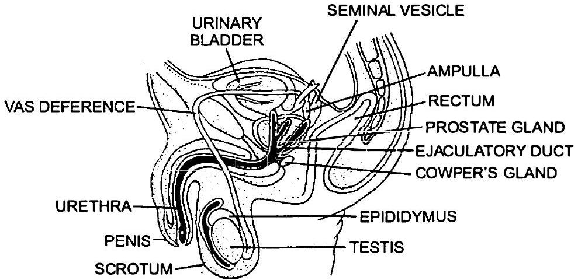
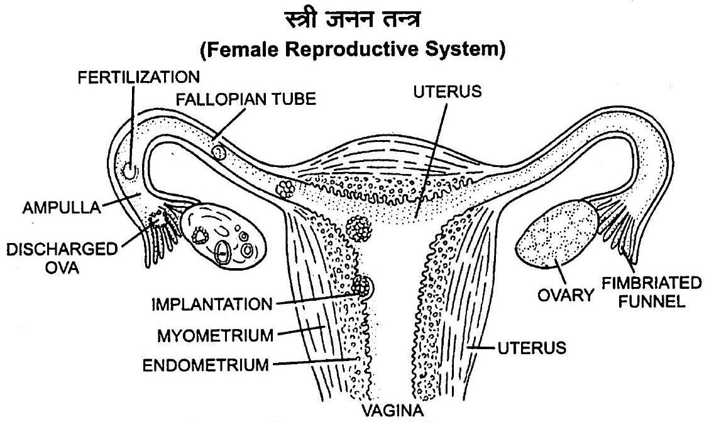
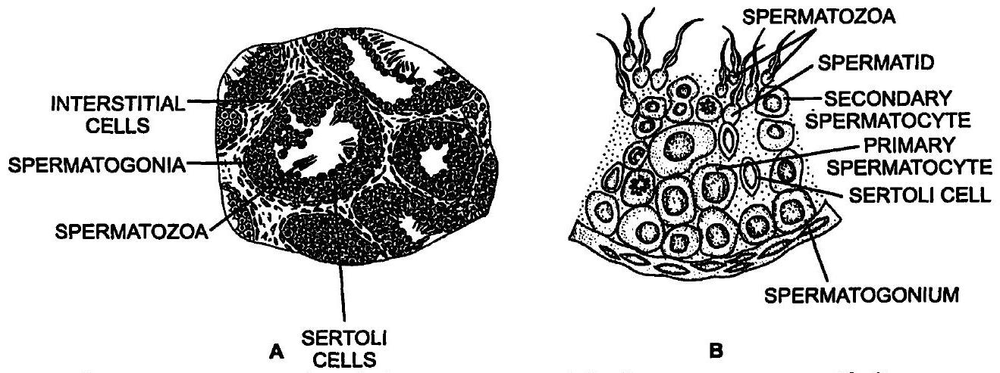
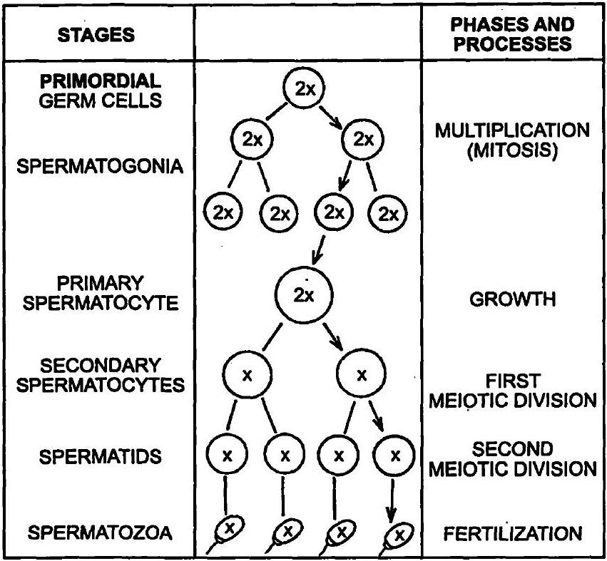
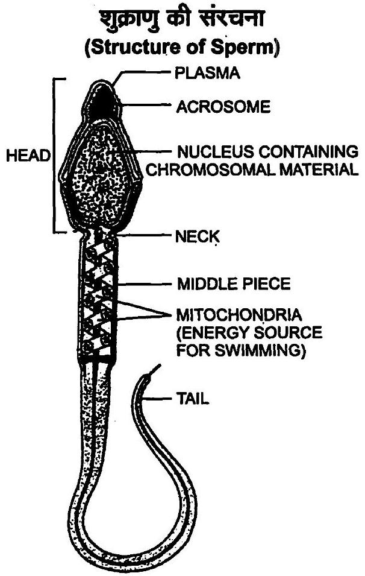
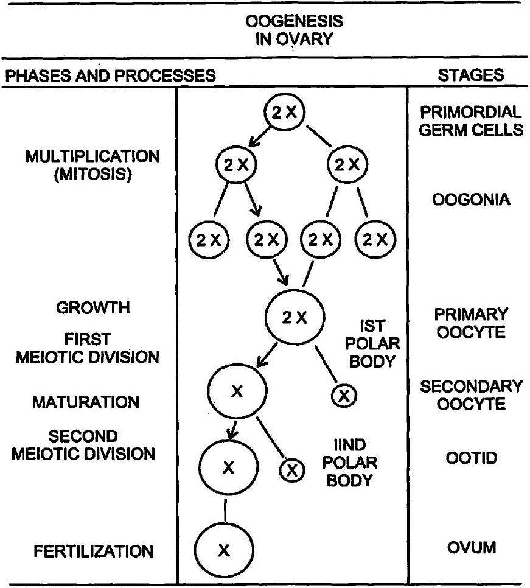
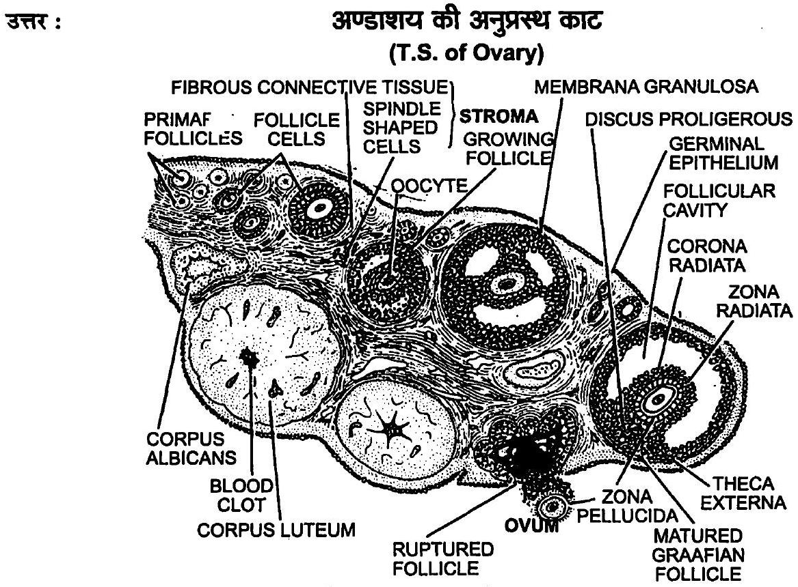
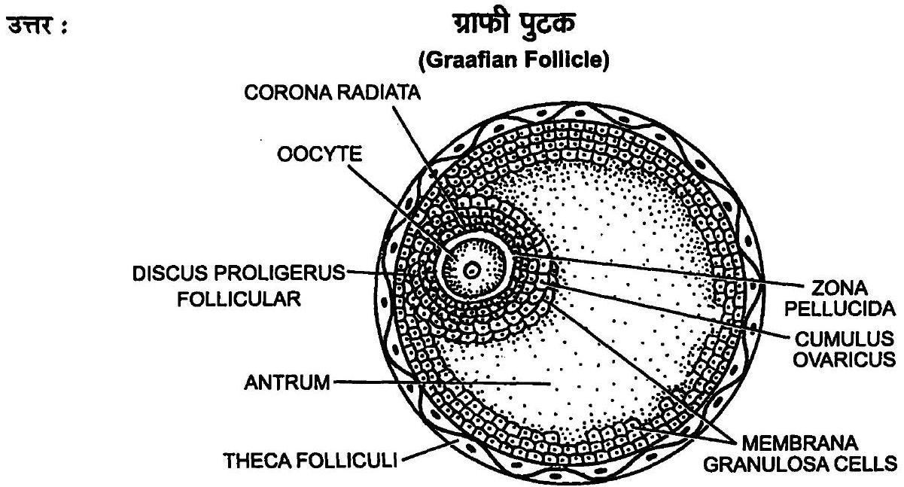
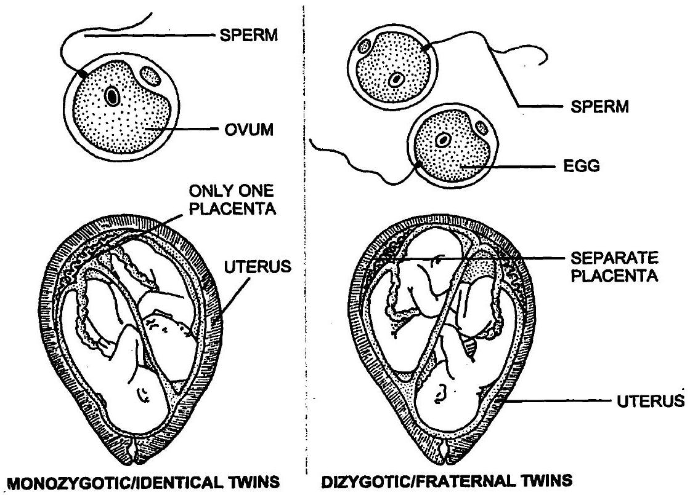

## NCERT पाठ्यपुस्तक के अभ्यास के अन्तर्गत दिए गए प्रश्न एवं उनके उत्तर

प्रश्न 1. रिक्त स्थानों की पूर्ति कीजिए-
(क) मानव $\_\_\_\_$ उत्पत्ति वाला है।
( ख ) मानव $\_\_\_\_$ हैं।
निषेचन होता है।
( घ ) नर एवं मादा युग्मक $\_\_\_\_$ होते हैं।
(ङ) युग्मनज $\_\_\_\_$ होता है।
( च ) एक परिपक्व पुटक से अण्डाणु ( ओवम ) के मोचित होने की प्रक्रिया को $\_\_\_\_$ कहते हैं।
( छ) अण्डोत्सर्ग ( ओव्यूलेशन ) $\_\_\_\_$ नामक हॉर्मोन द्वारा प्रेरित ( इनड्यूस्ड ) होता है।
(ज) नर एवं स्त्री के युग्मक के संलयन ( फ्यूजन ) को $\_\_\_\_$ कहते हैं।
( झ ) निषेचन $\_\_\_\_$ में सम्पन्न होता है।
( ज ) युग्मनज विभक्त होकर $\_\_\_\_$ की रचना करता है जो गर्भाशय में अन्तर्रोपित ( इंप्लांटेड ) होता है।
( ट ) भ्रूण और गर्भाशय के बीच संवहनी सम्पर्क बनाने वाली संरचना को $\_\_\_\_$ कहते हैं।
उत्तर : ( क ) मानव लैंगिक उत्पत्ति वाला है, ( ख ) मानव सजीवप्रजक हैं, ( ग ) मानव में आन्तरिक निषेचन होता है, ( घ ) नर एवं मादा युग्मक अगुणित होते हैं, ( ङ ) युग्मनज द्विगुणित होता है, ( च ) एक परिपक्व पुटक से अण्डाणु (ओवम) के मोचित होने की प्रक्रिया को अण्डोत्सर्ग (ovulation) कहते हैं, ( छ ) अण्डोत्सर्ग (ओव्यूलेशन) ल्यूटीनाइजिंग (LH) नामक हॉर्मोन द्वारा प्रेरित (induced) होता है, (ज ) नर एवं स्त्री के युग्मक के संलयन (फ्यूजन) को निषेचन कहते हैं, ( झ ) निषेचन तुम्बिका (ampulla) तथा संकीर्णपथ (isthumus) के सन्धिस्थल अर्थात् ( फैलोपियन नलिका-fallopian tube) में सम्पन्न होता है, ( ग ) युग्मनज विभक्त होकर ब्लास्टोसिस्ट की रचना करता है जो गर्भाशय में अन्तरोपित (implanted) होता है, ( ट ) भ्रूण और गर्भाशय के बीच संवहनी सम्पर्क बनाने वाली संरचना को अपरा (placenta) कहते हैं। प्रश्न 2. पुरुष जनन तन्त्र का एक नामांकित आरेख बनाएँ।
उत्तर :
पुरुष जनन तन्त्र
(Male Reproductive System)

चित्र-3.1 : पुरुष जनन तन्त्र का आरेखीय चित्रण।

प्रश्न 3. स्त्री जनन तन्त्र का नामांकित आरेख बनाएँ।
उत्तर :

चित्र-3.2 : स्त्री जनन तन्त्र का आरेखीय-काट दृश्य।

प्रश्न 4. वृषण तथा अण्डाशय के बारे में प्रत्येक के दो-दो प्रमुख कार्यों का वर्णन करें।
उत्तर :

## वृषण के कार्य   (Functions of Testis)

(1) वृषण में जनन कोशिकाओं से शुक्रजनन (spermatogenesis) द्वारा शुक्राणुओं (sperms) का निर्माण होता है।
(2) वृषण की सर्टोली कोशिकाएँ (Sertoli cells) शुक्रजन कोशिकाओं तथा शुक्राणुओं का पोषण करती हैं।
(3) वृषण की अन्तराली कोशिकाओं से एन्ड्रोजन (androgens) (टेस्टोस्टेरॉन) हॉर्मोन्स स्रावित होते हैं, ये द्वितीयक लैंगिक लक्षणों (secondary sexual characters) के विकास को प्रेरित करते हैं।
अण्डाशय के कार्य (Functions of Ovary)
(1) अण्डाशय की जनन कोशिकाओं से अण्डजनन द्वारा अण्डाणुओं (ova) का निर्माण होता है।
(2) अण्डाशय की ग्राफियन पुटिका (Graafian follicle) से एस्ट्रोजन हॉर्मोन (estrogen hormone) स्रावित होता है, यह स्त्रियों के द्वितीयक लैंगिक लक्षणों को प्रेरित करता है।
(3) अण्डाशय में बनी संरचना कॉर्पस ल्यूटियम (corpus luteum) से स्रावित प्रोजेस्टेरॉन (progesterone) हॉर्मोन गर्भाशय में निषेचित अण्डाणु को स्थापित करने में सहायक होता है।

प्रश्न 5. शुक्रजनक नलिका की संरचना का वर्णन करें।
उत्तर : शुक्रजनक नलिका (Seminiferous tubules)-वृषण का निर्माण अनेक पालियों से होता है जिनमें से प्रत्येक में एक से तीन शुक्रजनक नलिकाएँ (seminiferous tubules) पायी जाती हैं। शुक्रजनक नलिकाओं के बाहर संयोजी ऊतक में स्थान-स्थान पर अन्तराली कोशिकाओं (interstitial cells) के समूह स्थित होते हैं। इन्हें लेडिग कोशिकाएँ (Leydig's cells) भी कहते हैं। इनसे स्रावित नर हॉर्मोन्स (testosterone) के कारण द्वितीयक लैंगिक लक्षण विकसित होते हैं।

प्रत्येक शुक्रजनक नलिका पतली एवं कुण्डलित होती है। इसकी भीतरी पर्त को जनन एपिथीलियम (germinal epithelium) कहते हैं। जनन एपिथीलियम का निर्माण मुख्य रूप से जनन कोशिकाओं (germ cells) से होता है, इनके मध्य स्थान-स्थान पर सर्टोली कोशिकाएँ (Sertoli cells or nurse cells) पायी जाती हैं। जनन कोशिकाओं से शुक्रजनन द्वारा शुक्राणुओं का निर्माण होता है। शुक्राणु सर्टोली कोशिकाओं से पोषक पदार्थ एवं ऑक्सीजन प्राप्त करते हैं।

चित्र-3.3 : (A) शुक्रजनक नलिकाओं की अनुप्रस्थ काट का आरेखीय चित्रण, (B) एक भाग का वर्धित चित्र।

प्रश्न 6. शुक्रजनन क्या है? संक्षेप में शुक्रजनन की प्रक्रिया का वर्णन करें।
उत्तर : शुक्रजनन (Spermatogenesis)- वृषण में शुक्राणुओं का निर्माण शुक्रजनन द्वारा होता है। शुक्राणुओं का निर्माण किशोरावस्था के समय प्रारम्भ हो जाता है। यह प्रक्रिया लैंगिक हॉर्मोन्स (GnRH, LH, FSH तथा एन्ड्रोजन्स) द्वारा प्रभावित होती है। शुक्रजनन प्रक्रिया को निम्नलिखित तीन चरणों में बाँटा जा सकता है-
(क) गुणन प्रावस्था (Multiplication phase)—शुक्रजनक नलिकाओं की जनन एपिथीलियम की कोशिकाओं में समसूत्री विभाजन द्वारा शुक्राणुजन कोशिका (spermatogonia) का निर्माण होता है। ये कोशिकाएँ द्विगुणित होती हैं।
( ख ) वृद्धि प्रावस्था (Growth phase)- शुक्राणुजन कोशिकाओं में पोषक पदार्थों के संचित होने से कोशिकाओं के आकार में वृद्धि होती है। इन कोशिकाओं को प्राथमिक स्पर्मेटोसाइट्स (primary spermatocytes) कहते हैं।
(ग) परिपक्वन प्रावस्था (Maturation phase)—प्राथमिक स्पर्मेटोसाइट्स में अर्द्धसूत्री विभाजन (meiotic division) होता है। अर्द्धसूत्री प्रथम विभाजन के फलस्वरूप द्वितीयक स्पर्मेटोसाइट्स (secondary spermatocytes) या द्वितीयक शुक्राणु कोशिकाएँ बनती हैं। ये अगुणित होती हैं। द्वितीयक स्पर्मेटोसाइट्स द्वितीय अर्द्धसूत्री विभाजन के फलस्वरूप अगुणित शुक्राणु पूर्व कोशिका या स्पर्मेटिड्स (spermatids) बनाती हैं। इस प्रकार एक प्राथमिक स्पर्मेटोसाइट से चार स्पर्मेटिड्स बनते हैं।

SPERMATOGENSIS IN TESTIS

चित्र-3.4 : शुक्रजनन प्रक्रिया।

शुक्रकायान्तरण या शुक्राणुजनन (spermiogenesis) द्वारा अचल (non-motile) स्पर्मेंटिड से चल (motile) शुक्राणु बनता है। चल शुक्राणु सर्टोली कोशिकाओं में अन्त:स्थापित हो जाते हैं। समय-समय पर शुक्राणु मुक्त होकर शुक्रवाहिनी में पहुँचते रहते हैं। शुक्राणुओं का सर्टोली कोशिकाओं से शुक्रजनन नलिका की गुहा में मुक्त होना स्पर्मिएशन (spermiation) कहलाता है।

प्रश्न 7. शुक्रजनन की प्रक्रिया के नियमन में शामिल हॉर्मोनों के नाम बताएँ।
उत्तर : शुक्रजनन प्रक्रिया के नियमन में निम्नलिखित हॉर्मोन्स सक्रिय भूमिका निभाते हैं-

(i) गोनैडोट्रॉपिन रिलीजिंग हॉर्मोन (Gonadotropin releasing hormone),
(ii) पीत पिण्डकर हॉर्मोन (Luteinizing hormone),
(iii) पुटकोद्दीपक हॉर्मोंन (Follicle stimulating hormone),
(iv) एण्ड्रोजन्स (Androgens)।

प्रश्न 8. शुक्राणुजनन एवं वीर्यसेचन ( स्परमिएशन ) की परिभाषा लिखिए।
उत्तर : शुक्राणुजनन (Spermiogenesis)-गोल अचल स्पर्मेटिड्स (spermatids) के चल शुक्राणुओं (motile sperms) में बदलने की प्रक्रिया को शुक्राणुजनन या शुक्राणु-कायान्तरण (spermiogenesis) कहते हैं।

वीर्यसेचन (Spermiation)-शुक्राणु-कायान्तरण के पश्चात् मुक्त शुक्राणुओं के शीर्ष सर्टोली कोशिकाओं (sertoli cells) में अन्त:स्थापित (embedded) हो जाते हैं। शुक्रजनक नलिकाओं के स्तर से शुक्राणुओं के उनकी गुहा (lumen) में मोचित (released) होने की प्रक्रिया को वीर्यसेचन (spermiation) कहते हैं।

प्रश्न 9. शुक्राणु का एक नामांकित आरेख बनाएँ।
उत्तर :

चित्र-3.5 : शुक्राणु की संरधना।

प्रश्न 10. शुक्रीय प्रद्रव्य ( सेमिनल प्लाज्मा ) के प्रमुख संघटक क्या हैं?
उत्तर : शुक्रीय प्रद्रव्य (seminal plasma) में फ्रक्टोस, प्रोस्टाग्लैंडिन्स, कैल्सियम तथा एन्जाइम होते हैं।
प्रश्न 11. पुरुष की सहायक नलिकाओं एवं ग्रन्थियों के प्रमुख कार्य क्या हैं?
उत्तर : सहायक नलिकाएँ (Accessory ducts)-सहायक नलिकाओं का कार्य वृषण में बने शुक्राणुओं का शरीर से बाहर तक स्थानान्तरण (युग्मक स्थानान्तरण) है। इनका वृषण से बाहर तक का पथ निम्न रहता है-

वासा इफरेन्शिया → एपीडिडिमिस → वासा डिफरेन्शिया → यूरेश ← स्खलन नलिका
पुरुष की-सहायक जनन ग्रन्थियाँ (accessory reproductive glands) जनन प्रक्रिया में सहायक होती हैं-
(i) शुक्राशय (seminal vesicle) से स्रावित चिपचिपा तरल शुक्रीय प्रद्रव्य (seminal plasma) का मुख्य भाग बनाता है। शुक्रीय प्रद्रव्य तथा शुक्राणु परस्पर मिलकर वीर्य बनाते हैं।
(ii) पुर:स्थ ग्रन्थि (Prostate gland)-यह ग्रन्थि मूत्रमार्ग के अधर भाग के चारों ओर स्थित होती है। इससे स्तावित तरल शुक्राणुओं को सक्रिय बनाए रखता है और मूत्रमार्ग की अम्लीयता को समाप्त करता है।
(iii) बल्बोयूरेश्रल या काउपर्स ग्रन्थि (Bulbourethral or Cowper's gland)-यह एक जोड़ी होती है। ये मूत्रमार्ग के पाश्वों में स्थित होती हैं। इन ग्रन्थियों से मैथुन से पूर्व एक क्षारीय एवं चिकने द्रव का स्रावण होता है। यह मूत्रमार्ग की अम्लीयता को समाप्त करके इसे चिकना बनाकर मैथुन में सहायता करता है।

प्रश्न 12. अण्डजनन क्या है? अण्डजनन की संक्षिप्त व्याख्या करें।
उत्तर : अण्डजनन (Oogenesis)-अण्डाशय में द्विगुणित अण्ड मातृ कोशिकाओं से अगुणित अण्ड का निर्माण अण्डजनन कहलाता है। अण्डजनन का प्रारम्भ तभी हो जाता है जब स्त्री अपनी माँ के गर्भ में होती है, लेकिन प्रक्रिया किशोरावस्था तक निलम्बित अवस्था में रहती है।

यह अण्डाशय की ग्राफियन पुटिका (Graafian follicle) में होने वाली प्रक्रिया है। इसके द्वारा.अण्डाणु (ovum) का निर्माण होता है। अण्डजनन पीयूष ग्रन्थि से स्रावित पुटिका प्रेरक हॉर्मोन (FSH) तथा LH के नियन्त्रण में होता है। स्त्री में हॉर्मोंन के प्रभाव से प्रतिमाह एक ग्राफियन पुटिका परिपक्व होती है।

अण्डजनन प्रक्रिया को निम्नलिखित तीन चरणों में बाँटा जा सकता है-
(क) गुणन प्रावस्था (Multiplication phase)-यह प्रावस्था जन्म से पहले अर्थात् भ्रूण अवस्था में ही पूर्ण हो जाती है। अण्डाशय के निर्माण के समय ही प्राथमिक जनन कोशिकाएँ अण्डाशयी पुटिकाओं (ovarian follicles) के रूप में एकत्र हो जाती हैं। इनमें से एक कोशिका अण्डाणु मातृ कोशिका (egg mother cell) के रूप में विभेदित हो जाती है। शिशु जन्म के समय ही सारी अण्डाशयी पुटिकाएँ उपस्थित होती हैं।

चित्र-3.6 : अण्डाशय में अण्डजनन की प्रक्रिया।

(ख) वृद्धि प्रावस्था (Growth phase)-यह प्रावस्था बहुत लम्बी होती है। भ्रूण अवस्था में ही यह प्रारम्भ हो जाती है और लैंगिक परिपक्वन के पश्चात् जब तक उस पुटिका विशेष के परिपक्व होने की अवस्था नहीं आती, तब तक यह वृद्धि प्रावस्था में बनी रहती है।

अण्डाणु मातृ कोशिका अण्डाणुजन कोशिका या ऊगोनियम (oogonium) में विभेदित होकर वृद्धि प्रावस्था में प्रवेश कर जाती है। यह काफी मात्रा में पोषक पदार्थ संचित करती है तथा सामान्य कोशिका से आकार में कई सौ गुना बढ़ जाती है। इसी अवस्था में यह ग्राफियन पुटिका के परिपक्व होने तक रहती है। अब इसे पूर्व अण्डाणु कोशिका या प्राथमिक ऊसाइट (primary oocyte) कहते हैं।
(ग) परिपक्वन प्रावस्था (Maturation phase)-जब ग्राफियन पुटिका परिपक्व होती है, तब उसमें उपस्थित प्राथमिक ऊसाइट में प्रथम अर्द्धसूत्री विभाजन होता है। यह विभाजन असमान होता है और केवल गुणसूत्रों की संख्या आधी करने

के लिए होता है। प्रथम अर्द्धसूत्री विभाजन के पश्चात् एक अगुणित द्वितीयक ऊसाइट या द्वितीयक अण्डाणु कोशिका (secondary oocyte) तथा एक अगुणित लोपिका या धुवीय पिण्ड (polar body) बनती है। इसी अवस्था में प्राफियन पुटिका फटकर अण्डाशय से द्वितीयक अण्डाणु कोशिका को मुक्त करती है।

अण्डाणु में द्वितीय अर्द्धसूत्री विभाजन शुक्राणु के अण्डाणु में प्रवेश के पश्चात् होता है। इसके फलस्वरूप अण्डाणु (ovum) तथा द्वितीय अगुणित लोपिका (ध्रुवीय पिण्ड) का निर्माण होता है। अण्डजनन निरन्तर अन्तराल पर होने वाली एक लम्बी व जटिल प्रक्रिया होती है।

प्रश्न 13. अण्डाशय के अनुप्रस्थ काट (T.S.) का एक नामांकित आरेख बनाएँ।

चित्र-3.7 : अण्डाशय की अनुप्रस्थ काट।

प्रश्न 14. ग्राफी पुटक ( ग्राफिंयन फॉलिकिल ) का एक नामांकित आरेख बनाएँ।

चित्र-3.8 : परिपक्व ग्राफी पुटक (ग्राफियन फॉलिकिल)।

प्रश्न 15. निम्नलिखित के कार्य बताएँ-
( क ) पीत पिण्ड ( कॉर्पस ल्यूटियम )
( ख ) गर्भाशय अन्त:स्तर ( एण्डोमेट्रियम )
( ग ) अग्रपिण्डक ( एक्रोसोम )
( घ ) शुक्राणु पुच्छ ( स्पर्म टेल )
(ङ) झालर ( फ्रिम्बी )।

उत्तर : ( क ) पीत पिण्ड (कॉर्पस ल्यूटियम-Corpus luteum)-यह ग्राफियन पुटिका से अण्डोत्सर्ग के पश्चात् फॉलिकुलर कोशिकाओं और रक्त थक्के से बनी पीले रंग की ग्रन्थिल संरचना है, इससे प्रोजेस्टेरॉन, एस्ट्रोजन्स, रिलैक्सिन आदि हॉर्मोन्स स्रावित होते हैं। प्रोजेस्टेरॉन हॉर्मोन भ्रूण के आरोपण सगर्भता (pregnancy) तथा अपरा (placenta) के निर्माण में सहायता करता है।
(ख) गर्भाशय अन्तःस्तर (एण्डोमेट्रियम-Endometrium)-गर्भाशयी अन्त:स्तर भ्रूण के ब्लास्टोसिस्ट अवस्था में रोपण, अपरा (placenta) निर्माण व सगर्भता बनाए रखने हेतु आवश्यक होता है।
( ग ) अग्रपिण्डक (एक्रोसोम-Acrosome)- शुक्राणु के शीर्ष (head) पर गॉल्जीकाय से बनी टोपी सदृश संरचना अग्रपिण्डक (acrosome) होती है। इससे मुक्त होने वाले स्पर्म लासिन्स जैसे हाइल्यूरोनिडेज (hyaluronidase) एन्जाइम अण्डाणु के रक्षात्मक आवरण का अपघटन (lysis) कर देते हैं। इसके फलस्वरूप शुक्राणु अण्डाणु में प्रवेश कर जाता है।
( घ ) शुक्राणु पुच्छ (स्पर्म टेल-Sperm tail)- शुक्राणु पुच्छ शुक्राणु को निषेचन करने के लिए अण्ड तक पहुँचने हेतु आवश्यक गतिशीलता प्रदान करती है।
(ङ) झालर (फिम्बी-Fimbriae)-अण्डवाहिनी (oviduct) का प्रारम्भिक फनल सदृश चौड़ा भाग जो अण्डाशय के सम्पर्क में होता है, मुखिका (ostium) कहलाता है। यह झालरदार तथा रोमाभि (fimbriated and ciliated) होता है। इसकी अंगुली सदृश रचनाओं को फिम्ब्री कहते हैं। ये अण्डाणुओं को ग्रहण करने में सहायक होती हैं।

प्रश्न 16. सही या गलत कथनों को पहचानें-
( क ) पुंजनों ( एण्ड्रोजन्स ) का उत्पादन सर्टोली कोशिकाओं द्वारा होता है।
(सही/गलत)
(ख) शुक्राणु को सर्टोली कोशिकाओं से पोषण प्राप्त होता है।
(सही/गलत)
(ग) लेडिग कोशिकाएँ अण्डाशय में पायी जाती हैं।
(सही/गलत)
( घ ) लेडिग कोशिकाएँ पुंजनों ( एण्ड्रोजन्स ) को संश्लेषित करती हैं।
(सही/गलत)
(ङ) अण्डजनन पीत पिण्ड ( कॉर्पस ल्यूटियम ) में सम्पन्न होता है।
(सही/गलत)
( च ) सगर्भता ( प्रेगनेंसी ) के दौरान आर्तव चक्र ( मेन्सदुअल साइकिल ) बन्द होता है।
(सही/गलत)
( छ ) योनिच्छद ( हाइमेन ) की उपस्थिति अथवा अनुपस्थिति कौमार्य ( वर्जिनिटी ) या यौन अनुभव का विश्वसनीय संकेत नहीं है।
(सही/गलत)
उत्तर : ( क ) गलत, ( ख ) सही, ( ग ) गलत, ( घ ) सही, ( ङ ) गलत, ( च ) सही, ( छ ) सही।
प्रश्न 17. आर्तव चक्र क्या हैं? आर्तव चक्र ( मेन्सटुअल साइकिल ) का कौन-से हॉर्मोन नियमन करते हैं?
उत्तर : आर्तव चक्र (Menstrual Cycle)- मादा प्राइमेटों के अण्डाशय, सहायक नलिकाओं व हॉर्मोनल स्तर में होने वाले जनन चक्रिक परिवर्तनों को आर्तव चक्र (मेन्सट्रअल साइकिल) कहते हैं। स्त्रियों में ये परिवर्तन माह में एक बार दोहराए जाते हैं। अत: इसे माहवारी चक्र या आर्तव चक्र कहते हैं। प्रथम ऋतुत्राव/रजोधर्म (मेन्सटुएशन) का प्रारम्भ यौवनारम्भ से होता है जिसे रजोदर्शन (मेनार्के-menarche) कहते हैं। स्त्रियों में यह आर्तव चक्र प्राय: 26-28 दिन की अवधि के पश्चात् दोहराया जाता है। ऋतुस्राव में अनिषेचित अण्डाणु कुछ रक्त व गर्भाशयी अन्त:स्तर की खण्डित कोशिकाओं के साथ योनि मार्ग से बाहर आता है। इसमें ऋतुर्राव (menstruation) की अवस्था के बाद पुटिकीय या फॉलिकुलर अवस्था होती है जिसमें गर्भाशय के अन्त:स्तर की टूट-फूट की मरम्मत व नयी वृद्धि होती है तथा पुटिकीय विकास होता है। अगली अवस्था $14$ वें दिन अण्डोत्सर्ग की होती है जिसके बाद पीत अवस्था (luleal phase) या स्रावी अवस्था आती है जिसमें प्रोजेस्टेरॉन के प्रभाव से गर्भाशयी भित्ति का विकास होता है तथा यह अपेक्षित गर्भधारण हेतु तैयार होती है। अण्डोत्सर्ग के बाद पुटिका कॉर्पेस ल्यूटियम बना देती है। निषेचन के अभाव में पुन: ऋतुस्राव अवस्था दोहराई जाती है।

आर्तव चक्र का नियमन (Regulation of Menstural Cycle)-यह पीयूष प्रन्थि तथा अण्डाशयी हॉर्मोन्स द्वारा नियमित होता है। एल०एच० तथा एफ०एस०एच० (Luteinizing Hormone \& Follicle Stimulating Hormone) ग्राफियन पुटिकाओं की वृद्धि, अण्डजनन तथा एस्ट्रोजन्स (estrogens) के स्रावण को प्रेरित करते हैं। एल०एच० का स्रावण आर्तव चक्र के मध्य (लगभग $14$ वें दिन) अपने उच्चतम स्तर पर होता है। इसे एल०एच० सर्ज (L.H. Surge) कहते हैं। यह

ग्राफियन पुटिका के फटने को प्रेरित करता है, यानि अण्डोत्सर्ग हो जाता है। अण्डोत्सर्ग के पश्चात् अण्डाणु फैलोपियन नलिका में आता है जहाँ पर इसका निषेचन होता है। निषेचन के बाद सगर्भता प्रारम्भ होती है। अगर अण्डाणु का निषेचन नहीं हो पाता तो कॉर्पस ल्यूटियम विलुप्त होने लगता है। प्रोजेस्टेरॉन व एस्ट्रोजन की कमी से गर्भाशय की भित्ति का खण्डन प्रारम्भ हो जाता है और रक्तस्ताव शुरू हो जाता है। रक्तस्त्राव के साथ अनिषेचित अण्डाणु भी बाहर आ जाता है। इसी को ऋतुस्त्राव कहते हैं। $4-5$ दिन तक रक्तस्राव होता रहता है। इसके पश्चात् लगभग $9$ दिन में गर्भाशय की भित्ति की मरम्मत हो जाती है।

प्रश्न 18. प्रसव ( पारट्यूरिशन ) क्या है? प्रसव को प्रेरित करने में कौन-से हॉर्मोन शामिल होते हैं?
उत्तर : गर्भावधि के पूर्ण होने पर गर्भाशय की पेशियों में तीव्र संकुचनों (vigorous contraction) के कारण नवजात शिशु (foetus) गर्भाशय से बाहर आ जाता है, इसे प्रसव (parturition) या शिशु जन्म कहा जाता है। प्रसव के संकेत पूर्ण विकसित भ्रूण (foetus) तथा अपरा (placenta) से उत्पन्न होते हैं जो पीयूष ग्रन्थि से ऑक्सीटोसिन (oxytocin) हॉर्मोन के स्रावण को तीव्र करते हैं। ऑक्सीटोसिन या पिटोसिन (pitocin) प्रसव पीड़ा उत्पन्न करके प्रसव सम्पन्न कराता है। अण्डाशय द्वारा स्रावित रिलेक्सिन (relaxin) हॉर्मोन प्यूबिक सिम्फाइसिस को ढीला कर श्रोणि क्षेत्र को चौड़ा कर देता है जिससे प्रसव आसान हो जाता है।

प्रश्न 19. हमारे समाज में लड़कियाँ जन्म देने का दोष महिलाओं को दिया जाता है। बताएँ कि यह क्यों सही नहीं है?
उत्तर : मानव में $23$ जोड़ी गुणसूत्र पाए जाते हैं। इनमें से $22$ जोड़ी गुणसूत्र समजात होते हैं, $23$ वाँ जोड़ी गुणसूत्र स्त्रियों में XX तथा पुरुष में XY होता है। युग्मकजनन द्वारा स्त्रियों के अण्डाशय में उत्पादित सभी अण्डाणु $22+\mathrm{X}$ गुणसूत्र वाले होते हैं, जबकि पुरुष के वृषण में उत्पादित $50 \%$ शुक्राणु $22+X$ गुणसूत्र वाले तथा $50 \%$ शुक्राणु $22+Y$ गुणसूत्र वाले होते हैं। इस कारण स्त्रियों को समयुंग्मकी तथा पुरुषों को विषमयुग्मकी कहा जाता है।

निषेचन के समय यदि $22+\mathrm{X}$ शुक्राणु का समेकन अण्डाणु के साथ होता है, तब मादा सन्तान उत्पन्न होगी, क्योंकि इसकी जीन संरचना $44+\mathrm{XX}$ होगी। यदि अण्डाणु का समेकन $22+\mathrm{Y}$ शुक्राणु के साथ होता है, तब नर सन्तान उत्पन्न होगी, क्योंकि इसकी जीन संरचना $44+\mathrm{XY}$ होगी।

उपर्युक्त कथन से स्पष्ट है कि लिंग निर्धारण में स्त्रियों की कोई भूमिका नहीं होती। ये समयुग्मकी होती हैं, क्योंकि अण्डाशय में केवल एक ही प्रकार के अण्ड उत्पादित होते हैं।

प्रश्न 20. एक माह में मानव अण्डाशय से कितने अण्डे मोचित होते हैं? यदि माता ने समरूप जुड़वाँ बच्चों को जन्म दिया हो तो आप क्या सोचते हैं कि कितने अण्डे मोचित हुए होंगे? क्या आपका उत्तर बदलेगा यदि जन्मे हुए जुड़वाँ बच्चे द्विअण्डज यमज थे?

उत्तर : मानव (स्त्रियों) में प्रत्येक आर्तव चक्र के फलस्वरूप प्रतिमाह एक अण्ड (ovum) ही मोचित होता है।

चित्र-3.9 : जुड़वा बर्च्चों के प्रकार।

समरूप जुड़वाँ (identical twins) का जन्म एक निषेचित युग्मनज (zygote) से ही होता है। प्रथम विभाजन के फलस्वरूप बनी कोरक खण्ड (ब्लास्टोमीयर्स-blastomeres) एक-दूसरे से पृथक् होकर समरूप जुड़वाँ का विकास करती है।

द्विअण्डज यमज (fraternal twins) का विकास अलग-अलग निषेचित युग्मनज से होता है। इनकी जीन संरचना भी भिन्न होती है। इसका तात्पर्य है कि जितने द्विअण्डज यमज होते हैं, उतने ही अण्डाणुओं का निषेचन भिन्न-भिन्न शुक्राणुओं से होता है।

प्रश्न 21. आप क्या सोचते हैं कि कुतिया जिसने $6$ बच्चों को जन्म दिया है, के अण्डाशय से कितने अण्डे मोचित हुए थे?
उत्तर : अण्डाशय से $6$ अण्डे मोचित हुए थे। अनेक छोटे स्तनधारियों में एक बार में अनेक अण्डे मोचित होते हैं जिनके अलग-अलग शुक्राणुओं द्वारा निषेचन से अलग-अलग संतति बनंती है।

