## अध्याय $4$

## वंशागति तथा विविधता के सिद्धांत

$4.1$ मेंडल के वंशागति
के नियम
$4.2$ एक जीन की वंशागति
$4.3$ दो जीनों की वंशागति
$4.4$ बहुजीनी वंशागति
$4.5$ बहुप्रभाविता
$4.6$ लिंग निर्धारण
$4.7$ उत्परिवर्तन (म्यूटेशन)
$4.8$ आनुवंशिक विकार

क्या आपने कभी यह सोचा कि हाथी हमेशा शिशु हाथी को ही जन्म देता है किसी अन्य जानवर को क्यों नहीं या आम के बीज से आम का पौधा ही उगता है, कोई अन्य पौधा क्यों नहीं?

माना कि संतति अपने जनकों से मिलती जुलती है पर क्या वह उनसे बिल्कुल ही अभिन्न होती है, या उनके लक्षणों में कुछ भिन्नता दिखती है? क्या तुमने कभी आश्चर्य किया कि सहोदर कभी एक जैसे दिखते हैं या फिर कभी अलग-अलग क्यों दिखते हैं?

जीव विज्ञान की एक शाखा आनुवंशिकी ( आनुवंशिक विज्ञान ) ऐसे तथा इनसे संबंधित अनेक प्रश्नों पर विचार करती है। इस शाखा में वंशागति और विविधता दोनों का अध्ययन होता है, अर्थात् यह विचार किया जाता है, कि जनक और संतति के लक्षणों में समानता या असमानता क्यों होती है। वंशागति आनुवंशिकी का आधार है। वंशागति वह प्रक्रम है जिससे लक्षण जनक से संतति में जाते हैं तथा विविधता जनक और संतति के लक्षणों की असमानता की अवस्था है।

मानव को 8000-10000 वर्ष ईसा पूर्व यह ज्ञान हो चुका था कि विविधता का कारण लैंगिक जनन की प्रक्रिया में छिपा हुआ है। उसने पादपों और जंतुओं की प्रकृति में उपस्थित जीव विविधता का लाभ उठाया और लाभदायक लक्षणों वाले जीवों को चुनकर उनका प्रजनन करवाया तथा उनसे इच्छित लक्षणों के जीव प्राप्त किए। उदाहरण पुरानी जंगली गायों के कृत्रिम चयन और उनको पालतू बनाकर हमने

आज उच्च भारतीय किस्में प्राप्त कर ली हैं जैसे पंजाब की शाहीवाल गायें। हमें मानना पड़ता है कि भले ही हमारे पूर्वजों को लक्षणों की वंशागति और विविधता का ज्ञान था किंतु उनको इन घटनाओं के वैज्ञानिक आधार के विषय में बहुत कम जानकारी थी।

## $4.1$ मेंडल के वंशागति के नियम

उन्नीसवीं सदी के मघ्य के वर्षों में ही आनुवंशिकता को समझने के संबंध में प्रगति हो सकी। ग्रीगोर मेंडल ने उद्यान मटर के पौधे में सात वर्षों (1856-1863) तक संकरण के प्रयोग किए तथा उनके आधार पर जीवों की वंशागति नियम को प्रस्तावित किया। सांख्यकीय विश्लेषणों और गणितीय तर्कशास्त्र का जीव विज्ञान की समस्याओं के समाधान हेतु प्रथम उपयोग भी मेंडल द्वारा वंशागत अंवेषणों के दौरान ही किया गया। उनके प्रयोगों में नमूनों की विशाल संख्या ने उनके आँकड़ों को विश्वसनीयता प्रदान की। साथ ही उनके परीक्षाधीन पौधों की उत्तरोत्तर पीढ़ियों पर किए गए प्रयोग तथा उनके सफल निष्कर्षों ने सिद्ध किया कि मेंडल के वंशागति नियमों में व्यापकता थी और वे केवल अपुष्ट विचार नहीं थे। मेंडल ने मटर के पौधे के उन लक्षणों पर विचार किया जो सर्वथा विपरीतार्थ थे; जैसे लंबे या बौने पौधे, पीले या हरे बीज। इसके कारण उसे वंशागति नियमों का आधारभूत ढाँचा तैयार करने में सहायता मिली। बाद के वैज्ञानिकों ने इसे विस्तार दिया जिससे विविध नैसर्गिक घटनाओं और उनमें निहित जटिलता का स्पष्टीकरण किया जा सका। मेंडल ने अनेक तद्रूप-प्रजनन-सम, मटर के शुद्ध वंशक्रमों को लेकर कृत्रिम परागण/पर-परागण के प्रयोग किए। तद्रूप-प्रजनन-सम (ट्रू ब्रीडिंग) वंशक्रम वह होता है, जो कई पीढ़ियों तक स्वपरागण के फलस्वरूप स्थायी विशेषक

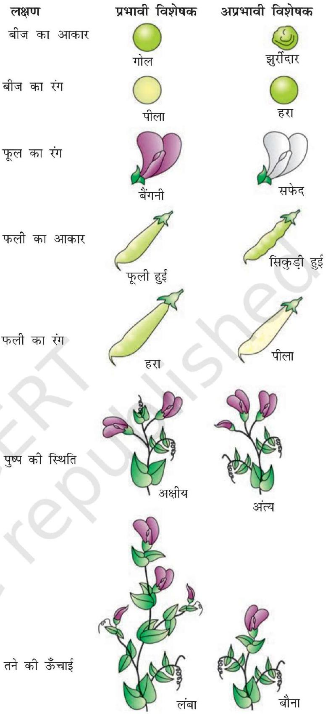
चित्र $4.1$ मेंडल द्वारा अघ्ययन किए गए मटर के पौधे के विपर्यास विशेषकों के सात जोड़े।

(ट्रेट) प्रदर्शित करता है। मेंडल ने मटर की $14$ तद्रूप प्रजननी मटर की किस्मों को छाँटा अर्थात् सात जोड़े विपरीत लक्षणों को लिया, इनके अन्य लक्षण समान थे। इनमें से कुछ उदाहरण इस प्रकार हैं - चिकने या झुर्रीदार बीज, पीले या हरे बीज, फूली हुई या सिकुड़ी हुई फलियाँ, हरी या पीली फलियाँ, लंबे या बौने पौधे (चित्र 4.1, व तालिका 4.1)।

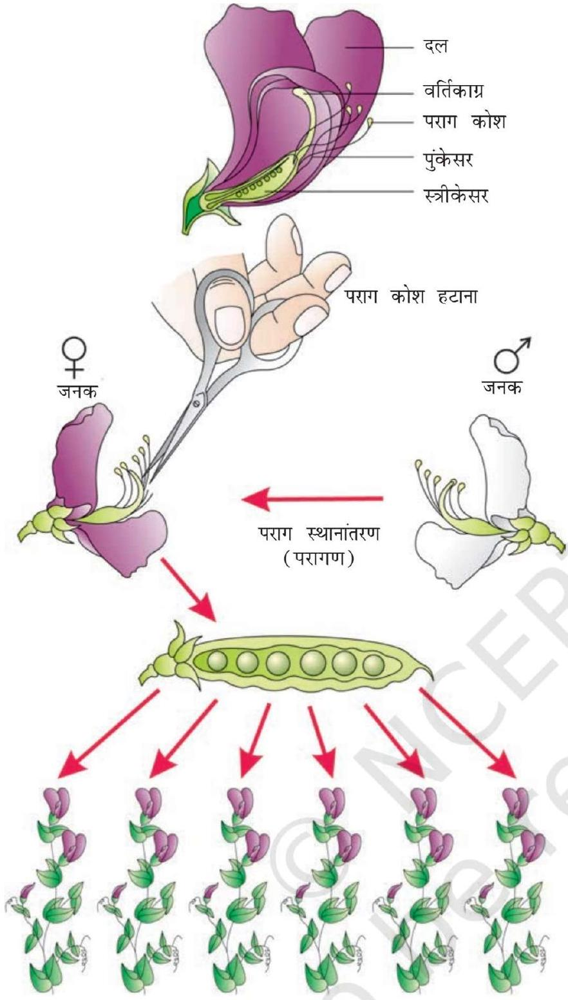
चित्र $4.2$ मटर में संकरण के चरण

तालिका $4.1$ मेंडल द्वारा अध्ययन किए गए मटर के पौधे के विपर्यास विशेषक

| क्र.सं. | लक्ष्ण | विपर्यास विशेषक |
| :--- | :--- | :--- |
| $1$. | तने की ऊँचाई | लंबा/बौना |
| $2$. | फूल का रंग | बैंगनी/सफेद |
| $3$. | फूल की स्थिति | अक्षीय/अंत्य |
| $4$. | फली का आकार | फूला/सिकुड़ा |
| $5$. | फली का रंग | हरा/पीला |
| $6$. | बीज का आकार | गोल/मुर्झाया |
| $7$. | बीज का रंग | पीला/हरा |

## $4.2$ एक जीन की वंशागति

मेंडल ने वंशागत के अध्ययन के लिए एक प्रयोग में मटर के लंबे तथा बौने पौधे का संकरण किया। इस प्रयोग द्वारा एक जीन का आनुवंशिक अध्ययन किया गया। इस संकरण से उत्पन्न बीजों को उगाकर उन्होंने प्रथम संकर पीढ़ी के पौधे प्राप्त किए (चित्र 4.2)। इस पीढ़ी को प्रथम संतति पीढ़ी ( फिलिअल ${ }_{1}$ प्रोजेनी ) या $\mathbf{F}_{\mathbf{1}}$ भी कहा जाता है। मेंडल ने देखा कि $\mathrm{F}_{1}$ पीढ़ी के सभी पौधे लंबे थे अर्थात् अपने लंबे जनक के समान थे, कोई पौधा बौना नहीं था (चित्र 4.3)। इसी प्रकार के परिणाम अन्य विशेषकों वाले संकरण प्रयोगों में भी पाए गए। उन्होंने देखा कि $\mathrm{F}_{1}$ में दो में से एक जनक के लक्षणों की ही अभिव्यक्ति होती है। दूसरे जनक के लक्षण प्रकट नहीं होते।

मेंडल ने फिर $\mathrm{F}_{1}$ के सभी लंबे पौधों को स्वयं परागित किया और उसे देखकर आश्चर्य हुआ कि $\mathrm{F}_{2}$ पीढ़ी में प्रत्युत्पन्न कुछ पौधे बौने थे। जो लक्षण $\mathrm{F}_{1}$ पीढ़ी में नहीं देखा गया, वह अब प्रदर्शित हो गया। बौने पौधों का अनुपात कुल $\mathrm{F}_{2}$ पौधों का $25$ प्रतिशत था जबकि $75$ प्रतिशत पौधे लंबे थे। लंबे और बौनेपन के लक्षण जनकों के समान ही थे और इनमें किसी प्रकार का सम्मिश्रण नहीं था। अर्थात् सभी या तो लंबे थे या बौने, मझोले कद के कोई भी नहीं थे (चित्र 4.3)।

जिन अन्य विशेषकों का अध्ययन किया उनसे भी इसी प्रकार के परिणाम प्राप्त हुए अर्थात् $\mathrm{F}_{1}$ पीढ़ी में केवल एक ही जनकीय लक्षण प्रकट हुआ जबकि $\mathrm{F}_{2}$ पीढ़ी में दोनों विशेषक $3: 1$ के अनुपात में अभिव्यक्त हुए। विपरीत विशेषकों में दोनों $\mathrm{F}_{1}$ या $\mathrm{F}_{2}$ स्तर पर किसी प्रकार का सम्मिश्रण नजर नहीं आया।

इन प्रेक्षणों के आधार पर, मेंडल ने प्रस्तावित किया कि कोई 'वस्तु' अपरिवर्तित रूप में जनक से संतति को युग्मकों के माघ्यम से उत्तरोत्तर पीढ़ियों में अग्रसित होती है। उसने इस वस्तु को 'कारक' (फैक्टर) कहा। अब हम इसे 'जीन' कहते हैं। दूसरे शब्दों में जीन आनुवंशिकता की इकाइयाँ हैं। किस जीन में कौन-सा विशेष लक्ष्ण अभिव्यक्त होगा, इसकी सूचना इसमें निहित होती है। विकल्पी विपरीत लक्षणों के संकेतक जोड़े को युग्म विकल्पी ( अलील ) कहा जाता है। ये एक ही जीन के थोड़ा सा भिन्न रूप होते हैं।

यदि हम प्रत्येक जीन को अक्षरों के प्रतीक दें, तो जो लक्षण $\mathrm{F}_{1}$ पीढ़ी में व्यक्त होता है उसे कैपीटल अक्षर से तथा विपरीत लक्षण की जीन को छोटे अक्षर से व्यक्त किया जाता है। उदाहरण के लिए, ऊँचाई के लक्षण में लंबे के लिए 'T' और बौने के लिए 't' का प्रयोग होता है, T और t एक दूसरे के युग्म विकल्पी (अलील) हैं। दूसरे शब्दों में पौधों में ऊँचाई के एलील जोड़े इस प्रकार होंगे- TT, Tt या tt मेंडल

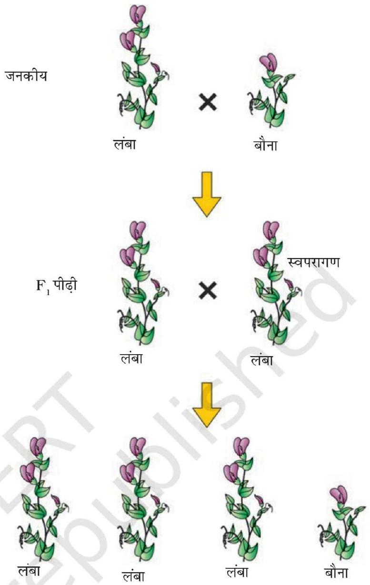
चित्र $4.3$ एक-संकर क्रास का आरेखीय निरूपण

ने यह भी प्रस्तावित किया तद्रूप प्रजननक्षम मटर की लंबी या बौनी प्रजाति में अलील जोड़ा समयुग्मजी ( होमोजाइगस ) क्रमशः TT या tt होगा, TT या tt को पौधे का जीनोटाइप ( जीनी प्ररूप ) और लंबे-बौने को फीनोटाइप ( दृश्य प्ररूप ) कहा गया। अगर किसी पौधे का जीनोटाइप $\mathbf{T t}$ है तो उसका फीनोटाइप क्या होगा?

मेंडल ने पाया कि $\mathrm{F}_{1}$ विषमयुग्मजी Tt का फीनोटाइप दिखने में बिल्कुल TT जनक के समान होता है। इसलिए उसने प्रस्ताव किया कि असमान कारकों के जोड़े में से कोई एक, दूसरे के ऊपर प्रभावी हो जाता है (जैसा कि $\mathrm{F}_{1}$ में) इसे प्रभावी और दूसरे को अप्रभावी नाम दे दिया गया। इस प्रयोग में $\mathbf{T}$ (लंबाई का कारक) $\mathbf{t}$ (बौनेपन के कारक) के ऊपर प्रभावी हो जाता है। जिन अन्य लक्षण युग्मों का उन्होंने अघ्ययन किया, वहाँ भी यही पाया।

प्रभाविता और अप्रभाविता की संकल्पना को याद रखने के लिए यही सुविधाजनक (और तर्कसंगत) होगा कि बड़े (कैपीटल) और छोटे अक्षरों का प्रयोग किया जाए। (लंबे के लिए \$ और बौने के लिए 'd' का प्रयोग न करें; क्योंकि यह याद रखना कठिन रहेगा

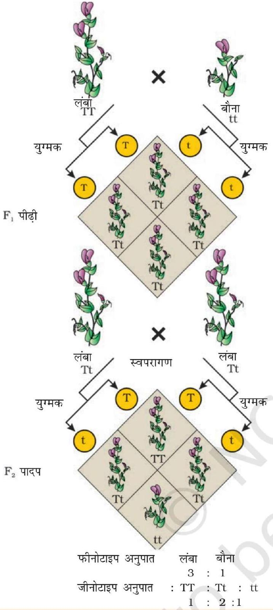
चित्र $4.4$ मेंडल द्वारा संकरित शुद्ध वंशक्रम लंबे तथा शुद्ध वंशक्रम बौने पौधों की क्रॉस को समझने के लिए पनेट वर्ग का उपयोग

सभी संभाव्य युग्मकों को सबसे ऊपर की कतार में बाईं तरफ के स्तंभों में दोनों तरफ लिखा जाता है। सारे संभाव्य संयोजनों का प्रतिरूपण नीचे के वर्गों के बक्सों में किया गया है। सारे का सारा आरेख एक वर्ग की शक्ल में है।

पनेट वर्ग में जनकीय लंबे TT (नर), बौने tt (मादा) पौधे, इनके द्वारा उत्पन्न युग्मक और $\mathrm{F}_{1}, \mathbf{T t}$ संतति पीढ़ी, दर्शाए गए हैं। $\mathbf{T t}$ जीनोटाइप के $\mathrm{F}_{1}$ पौधे स्वपरागित हैं। $\mathrm{F}_{1}$ पीढ़ी के नर (अंड) और मादा (पराग) के द्योतन के लिए क्रमशः $\varphi$ और $\sigma$

के प्रतीकों को काम में लाया गया है। जीनोटाइप Tt के $\mathrm{F}_{1}$ पौधे स्वपरागित किए जाने पर बराबर संख्या में जीनोटाइप $\mathbf{T}$ और $\mathbf{t}$ के युग्मक उत्पन्न करते हैं। जब निषेचन होता है तो जीनोटाइप $\mathbf{T}$ के परागकणों द्वारा जीनोटाइप $\mathbf{T}$ और $\mathbf{t}$ के अंडों को परागित करने की $50$ प्रतिशत संभावना रहती है। साथ ही जीनोटाइप t के परागकणों के जीनोटाइप T और जीनोटाइप t के अंडों को परागित करने की $50$ प्रतिशत संभावना रहती है। संयोग आधारित (यादृच्छिक) निषेचन का परिणाम यह होता है कि प्रत्युत्पन्न जाइगोट TT, Tt या tt जीनोटापों के हो सकते हैं।

पनेट वर्ग से आसानी से देखा जा सकता है कि यादृच्छिक निषेचन के परिणामस्वरूप $1 / 4$ TT, $1 / 2$ Tt और $1 / 4$ tt जीनोटाइप पैदा करते हैं। साथ ही केवल 'लंबा' फीनोटाइप दृष्टिगोचर होता है । $\mathrm{F}_{2}$ अवस्था में $3 / 4$ पौधे लंबे होते हैं जिनमें से कुछ TT और कुछ Tt होते हैं। बाहर से देखने पर TT और Tt पौधों में भेद नहीं किया जा सकता। अतः जीनोटाइप जोड़े Tt से केवल एक ही लक्षण (T) 'लंबे' की अभिव्यक्ति होती है। इसीलिए कहा जाता है कि लक्षण 'लंबा', बौने लक्षण अर्थात् अलील t के ऊपर प्रभावी हो जाता है। इसी लक्षण प्रभाविता का यह असर होता है कि $\mathrm{F}_{1}$ के सारे के सारे पौधे लंबे होते हैं (भले ही जीनोटाइप Tt हो) और $\mathrm{F}_{2}$ पीढ़ी में $3 / 4$ पौधे लंबे होते हैं (भले ही जीनोटाइप के लिहाज से $1 / 2$ Tt और $1 / 4$ TT हों) अंत में जीनोटाइप अनुपात $3 / 4$ लंबे ( $1 / 4 \mathbf{T T} .1 / 2 \mathbf{T t}$ ) और $1 / 4$ ठिगने (tt) दूसरे शब्दों में $3: 1$ का अनुपात पर जीनोटाइप अनुपात होता है $1: 2: 1$ ।

TT: Tt: tt का $1 / 4: 1 / 2: 1 / 4$ के अनुपात को गणित के द्विनामी पद $(\mathrm{ax}+\text { by })^{2}$ में व्यक्त किया जा सकता है जिसमें T और t जीनधारी युग्मक समान आवृत्ति $1 / 2$ में रहते हैं। इस पद का इस प्रकार विस्तार किया जाता है-

$$
(1 / 2 \mathbf{T}+1 / 2 \mathbf{t})^{2}=(1 / 2 \mathbf{T}+1 / 2 \mathbf{t}) \times(1 / 2 \mathbf{T}+1 / 2 \mathbf{t})=1 / 4 \mathbf{T T}+1 / 2 \mathbf{T} \mathbf{t}+1 / 4 \mathbf{t} \mathbf{t}
$$

मेंडल ने $\mathrm{F}_{2}$ पौधों को स्वयं परागित किया और पाया कि $\mathrm{F}_{3}$ और $\mathrm{F}_{4}$ पीढ़ियों में $\mathrm{F}_{2}$ के बौने पौधों ने केवल बौने ही पैदा किए। उसने निष्कर्ष निकाला कि बौनों का जीनोटाइप समयुग्मजी (होमोजाइगस) tt था। आप क्या सोचते हैं? यदि उसने सभी $F_{2}$ के लंबे पौधों को स्वयं परागित किया होता तो उसे क्या देखने को मिलता?

पिछले अनुच्छेदों (पैराग्राफों) से स्पष्ट है कि गणितीय प्रायिकता के प्रयोग से जीनोटाइप अनुपातों की गणना की जा सकती है, किन्तु केवल प्रभावी विशेषक के फीनोटाइप को देखने भर से जीनोटाइप संरचना का ज्ञान संभव नहीं है जैसे कि $\mathrm{F}_{1}$ या $\mathrm{F}_{2}$ के लंबे पौधे का जीनोटाइप TT है या Tt इसका भविष्य ज्ञात नहीं हो सकता। इसलिए $\mathrm{F}_{2}$ के लंबे पौधे के जीनोटाइप-निर्धारण के लिए मेंडल ने $\mathrm{F}_{2}$ के लंबे पौधे का बौने पौधे से संकरण किया। इसे उन्होंने परीक्षार्थ संकरण नाम दिया। इस प्रयोग में प्रभावी फीनोटाइप वाले जीव (यहाँ पर मटर का पौधा, जिसका जीनोटाइप मालूम करना है-परीक्षार्थ जीव) का अप्रभावी पौधे से संकरण किया जाता है न कि स्वपरागण, जैसा पिछले प्रयोगों में किया गया था)। परीक्षार्थ जीव के जीनोटाइप निर्धारण के हेतु ऐसे संकरण की संततियों का विश्लेषण किया जा सकता है। चित्र $4.5$ में ऐसे संकरण के परिणाम दर्शाए गए हैं। यहाँ पर बैंगनी $(\mathrm{W})$ रंग श्वेत $(\mathrm{w})$ के ऊपर प्रभावी है।

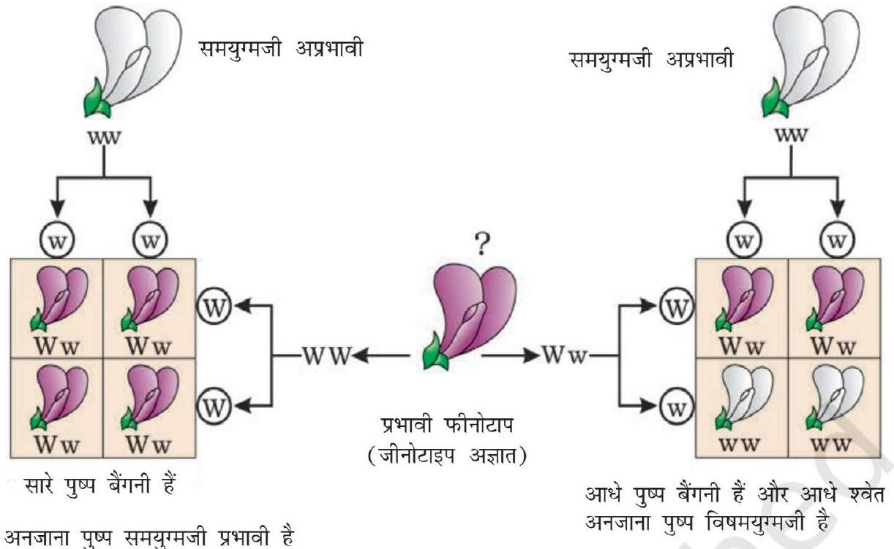
चित्र $4.5$ परीक्षार्थ संकर का आरेखी प्रतिरूपण

पनेट वर्ग का प्रयोग करके परीक्षार्थ संकरण में संतति के स्वरूप को ज्ञात करने का प्रयास करो। आपको क्या अनुपात मिला?

इस संकरण प्रयोग की जीनोटाइपों का उपयोग करके क्या आप परीक्षार्थ संकर की एक सामान्य परीभाषा दे सकते हैं?

एक संकर संकरण प्रयोगों के अपने प्रेक्षणों को आधार बनाकर मेंडल ने इनकी वंशागति संबंधी अपनी समझ के सार रूप के दो सामान्य नियम प्रस्तावित किए। आज इन नियमों को वंशागति के नियमों या सिद्धांतों की संज्ञा दी जाती है - प्रथम नियम है - प्रभाविता नियम और द्वितीय है विसंयोजन नियम।

### 4.2.1 प्रभाविता नियम ( ला ऑफ डोमिनेंस )

(क) लक्षणों का निर्धारण कारक नामक विविक्त ( डिस्क्रीट ) इकाइयों द्वारा होते हैं।
(ख) कारक जोड़ों में होते हैं।
(ग) यदि कारक जोड़ों के दो सदस्य असमान हों तो इनमें से एक कारक दूसरे कारक पर प्रभावी हो जाता है अर्थात् एक 'प्रभावी' और दूसरा 'अप्रभावी' होता है।
$\mathrm{F}_{1}$ में केवल एक जनक लक्षण का प्रकट होना तथा $\mathrm{F}_{2}$ में दोनों जनक लक्षणों का प्रकट होना; प्रभाविता के नियम के द्वारा समझा जा सकता है। इससे यह भी स्पष्ट होता है कि $\mathrm{F}_{2}$ में $3: 1$ का अनुपात क्यों पाया जाता है।

### 4.2.2 विसंयोजन नियम ( लॉ ऑफ सेग्रीग्रेशन )

इस नियम का आधार यह तथ्य है कि अलील आपस में घुलमिल (सम्मिश्रण) नहीं पाते और $\mathrm{F}_{2}$ पीढ़ी में दोनों लक्षणों की फिर से अभिव्यक्ति हो जाती है, भले ही $\mathrm{F}_{1}$ पीढ़ी में

एक प्रकट नहीं होता। यद्यपि जनकों में दोनों अलील विद्यमान होते हैं। युग्मक बनने के समय कारकों के एक जोड़े या अलील के सदस्य विसंयोजित हो जाते हैं और युग्मक को दो में से एक ही कारक प्राप्त होता है। समयुग्मजी जनक द्वारा उत्पन्न सभी युग्मक समान होते हैं जबकि विषमयुग्मजी जनक दो प्रकार के युग्मक उत्पन्न करता है जिनमें समान अनुपात में एक एक अलील होता है।

### 4.2.2.1 अपूर्ण प्रभाविता ( इंकंप्लीट डोमिनेंस )

जब मटर वाले प्रयोग को अन्य विशेषकों के संदर्भ में दोहराया गया तो पता चला कि कभी कभार $F_{1}$ में ऐसा फीनोटाइप आ जाता है जो किसी भी जनक से नहीं मिलता जुलता और इनके बीच का सा लगता है। श्वान पुष्प (स्नेपड्रेगन/एंटीराइनम) में पुष्प रंग की वंशागति अपूर्ण प्रभाविता को समझने के लिए अच्छा उदाहरण है। तद्रूप प्रजननी लाल फूल वाली ( $\mathbf{R R}$ ) और तद्रूप प्रजननी सफेद फूल वाली $(\mathbf{r r})$ प्रजाति के संकरण के परिणामस्वरूप $\mathrm{F}_{1}$ पीढ़ी गुलाबी फूलों (Rr) वाली प्राप्त हुई। (चित्र 4.6) जब इस $\mathrm{F}_{1}$ संतति को स्वयं परागित किया गया तो परिणामों का अनुपात $1$ (RR) लाल : 2 (Rr) गुलाबी : 1 (rr) सफेद था। यहाँ पर जीनोटाइप अनुपात वही था जो किसी भी मेंडलीय एकसंकरण के संकरण में संभावित होता, किन्तु फीनोटाइप अनुपात अर्थात् $3: 1$ प्रभावी : अप्रभावी बदल गया। इस उदाहरण में $\mathbf{R}$ कारक $\mathbf{r}$ कारक पर पूर्णतः प्रभावी नहीं रहा अत: लाल ( $\mathbf{R R}$ ), सफेद ( $\mathbf{r r}$ ) से गुलाबी (Rr) प्राप्त हो गया।
प्रभाविता नामक संकल्पना का स्पष्टीकरण - प्रभाविता वास्तव में क्या है? कुछ अलील प्रभावी और कुछ अप्रभावी क्यों होते हैं? इन बातों को समझने के लिए आवश्यक हो जाता है कि जीन का कार्य समझा जाए। आप जानते ही हैं कि जीन में विशेष विशेषक को अभिव्यक्त करने की सूचना

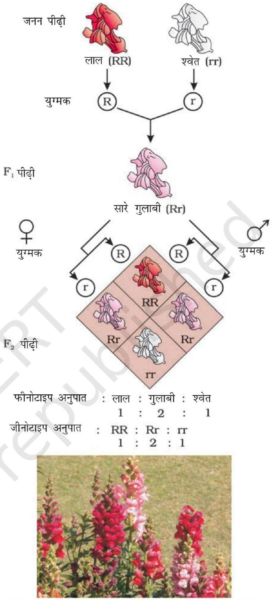
चित्र $4.6$ श्वान पुष्प नामक पौधों में एकसंकर संकरण के परिणाम यहाँ पर एक अलील दूसरे के ऊपर अपूर्णतः प्रभावी है।

निहित रहती है। द्विगुणित जीवों में अलील के जोड़े के रूप में प्रत्येक जीन के दो प्रारूप विद्यमान रहते हैं। यह आवश्यक नहीं है कि अलील के जोड़े हमेशा एक जैसे हों, जैसा कि विषम युग्मज (हैटरोजाइगोट) में होता है। उनमें से एक अलील की भिन्नता का कारण, उसमें आया कोई परिवर्तन हो सकता है (विषय में आप अगले अध्याय में पढ़ेंग) जो अलील में निहित विशेष सूचना को रूपांतरित कर देता है।

उदाहरणार्थ एक ऐसी जीन को लिया जाए जिसमें एक विशेष एंजाइम उत्पन्न करने की सूचना है। इस जीन के दोनों प्रतिरूप इसके दो अलील रूप हैं। मान लेते हैं कि वह सामान्य अलील ऐसा सामान्य एंजाइम उत्पन्न करता है (जैसा अधिकतर संभव है) जो एक सब्सट्रेट 's' के रूपांतरण के लिए आवश्यक है। रूपांतरित अलील सिद्धांततः निम्नलिखित में से किसी एक परिवर्तन के लिए उत्तरदायी हो सकता है।

(क) सामान्य एंजाइम या
(ख) कार्य-अक्षम एंजाइम या
(ग) एंजाइम की अनुपस्थिति

पहले परिवर्तन में रूपांतरित अलील, अरूपांतरित अलील के तुल्य है अर्थात् परिणाम स्वरूप यह भी सब्सट्रेट 'S' को बदल कर उसी पुराने फीनोटाइप/विशेषक का उत्पादन करेगा। इस प्रकार के एलील युग्मों के अनेक उदाहरण हैं। किन्तु जब अलील कोई भी एंजाइम नहीं उत्पन्न करता या कार्य अक्षम एंजाइम का उत्पादन करता है तो फीनोटाइप प्रभावित हो सकता है। फीनोटाइप/विशेषक अरूपांतरित अलील के कार्य के ऊपर ही निर्भर रहता है। सामान्यतः अरूपांतरित (कार्यकारी) अलील जो मौलिक रूप का प्रतिनिधित्व करती है, प्रभावी होती है तथा रूपांतरित अलील अप्रभावी। इसलिए इस उदाहरण में अप्रभावी अलील के दर्शित होने पर या तो एंजाइम बनता ही नहीं है या बने तो कार्यक्षम नहीं होता है।

### 4.2.2.2 सह प्रभाविता ( को डोमिनेंस )

अभी तक हम चर्चा कर रहे थे उन संकरणों (क्रॉसों) की जहाँ $\mathrm{F}_{1}$ दो जनकों में से किसी एक से मिलता था प्रभावी (प्रभाविता) या मध्य लक्षणों वाला (अपूर्ण प्रभाविता)। सह प्रभाविता ऐसी घटना है जिसमें $\mathrm{F}_{1}$ पीढ़ी दोनों जनकों से मिलती-जुलती है। इसका एक अच्छा उदाहरण मानवों में ABO रुधिर वर्गों का निर्धारण करने वाली विभिन्न प्रकार की लाल रुधिर कोशिकाएँ हैं। ABO रुधिर वर्गों का नियंत्रण जीन ' $\boldsymbol{I}$ ' करती है। लाल रुधिर कोशिकाओं की प्लाज्मा झिल्ली में सतह से बाहर निकलते हुए शर्करा बहुलक होते हैं। इस बहुलक का प्रकार क्या होगा यहाँ इस बात का नियंत्रण जीन ' $\boldsymbol{I}$ ' से होता है। इस जीन ' $\boldsymbol{I}$ ' के तीन अलील $\boldsymbol{I}^{\mathrm{A}}$, $\boldsymbol{I}^{\mathrm{B}}$ और $\boldsymbol{i}$ होते हैं। अलील $\boldsymbol{I}^{\mathrm{A}}$ और अलील $\boldsymbol{I}^{\mathrm{B}}$ कुछ भिन्न प्रकार की शर्करा का उत्पादन करते हैं और अलील $\boldsymbol{i}$ किसी भी प्रकार की शर्करा का उत्पादन नहीं करती। मानव जीन (2n) द्विगुणित होता है इसलिए प्रत्येक व्यक्ति में इन तीन में से दो प्रकार के जीन अलील होते हैं। $\boldsymbol{I}^{\mathrm{A}}$ और $\boldsymbol{I}^{\mathbf{B}}$ तो $\boldsymbol{i}$ के ऊपर पूर्णरूप से प्रभावी होते हैं अर्थात् जब $\boldsymbol{I}^{\mathrm{A}}$ और $\boldsymbol{i}$ विद्यमान हों तो केवल $\boldsymbol{I}^{\mathrm{A}}$ अभिव्यक्त होता है और जब $\boldsymbol{I}^{\mathbf{B}}$ और $i$ विद्यमान हों तो केवल $\boldsymbol{I}^{\mathbf{B}}$ अभिव्यक्त होता है, i तो शर्करा बनाता ही नहीं।

जब $\boldsymbol{I}^{\mathrm{A}}$ और $\boldsymbol{I}^{\mathrm{B}}$ दोनों उपस्थित हों तो ये दोनों अपने-अपने प्रकार की शर्करा की अभिव्यक्ति कर देते हैं। यह घटना ही सह-प्रभाविता है। इसी कारण लाल रुधिर कोशिकाओं में A और B दोनों प्रकारों की शर्करा होती है। तीन भिन्न प्रकार के

अलील होने के कारण इनके $6$ संयोजन संभव हैं। इस प्रकार ABO रुधिर वर्गो (तालिका 4.2) के $6$ विभिन्न जीनोटाइप होंगे। प्रश्न है फीनोटाइप कितने होंगे?

तालिका $4.2$ : मानव जनसंख्या में रुधिर वर्गों का आनुवंशिक आधार दर्शाने वाली तालिका
| जनक $1$ से अलील | जनक $2$ से अलील | संतति का जीनोटाइप | संतति के रुधिर वर्ग |
| :--- | :--- | :--- | :--- |
| $I^{A}$ | $I^{A}$ | $I^{A} I^{A}$ | A |
| $I^{A}$ | $I^{B}$ | $I^{A} I^{B}$ | AB |
| $I^{A}$ | $i$ | $I^{A} i$ | A |
| $I^{B}$ | $I^{A}$ | $I^{A} I^{B}$ | AB |
| $I^{B}$ | $I^{B}$ | $I^{B} I^{B}$ | B |
| $I^{B}$ | $i$ | $I^{B} i$ | B |
| $i$ | $i$ | i $i$ | O |

आप यह भी समझ गए होंगे कि ABO रुधिर समूहन बहुअलील (मल्टीपल अलील) का भी अच्छा उदाहरण प्रस्तुत करता है। आप देख सकते हैं कि यहाँ पर दो से अधिक अर्थात् तीन अलील एक ही लक्षण को नियंत्रित करते हैं। क्योंकि एक व्यक्ति में दो ही अलील विद्यमान रह सकते हैं, अतः बहुअलील की क्रियाशीलता समष्टि (जीन संख्या) के अध्ययन में ही दिख सकती है।

कभी-कभी एकल जीन उत्पाद, एक से अधिक प्रभाव छोड़ सकता है। उदाहरण के लिए मटर के बीजों में मंड संश्लेषण का नियंत्रण एक जीन करता है। इसके दो अलील (B और b) होते हैं। कुशल रूप से मंड संश्लेषण BB समयुग्मजों से होता है और इस प्रकार विशाल मंड कण उत्पन्न हो जाते हैं। इसके विपरीत bb समयुग्मजी मंड संश्लेषण में कम कुशल होते हैं और छोटे मंड कणों का उत्पादन कर सकते हैं। पकने पर BB बीज गोल होते हैं और bb झुर्रीदार। विषमयुग्मनज गोल बीज पैदा करते हैं इसलिए लगता है कि B प्रभावी अलील है। Bb बीजों में उत्पन्न मंड कण मझोले आकार के होते हैं। अतएव यदि मंड कण का आकार एक फीनोटाइप मान लिया जाए तो इस दृष्टिकोण से यह अलील अपूर्ण प्रभाविता ही दर्शाता है।

अतएव प्रभाविता न तो किसी जीन का या उसके उत्पाद का स्वायत्त लक्ष्ण है। जिसकी सूचना जीन में निहित है यह उतनी ही निर्भर जीन-उत्पाद पर और उत्पाद द्वारा जनित जीनोटाइप पर होती है जितनी कि हमारे द्वारा परीक्षार्थ चुने गए विशेष जीनोटाइप पर (उस मामले में एक जीन से, एकाधिक जीनोटाइप प्रभावित होते हैं)।

## $4.3$ दो जीनों की वंशागति

मेंडल ने दो लक्षणों में भिन्न मटर के पौधों पर भी संकरण प्रयोग किए जैसे पीले और गोल बीज वाले पौधों का क्रॉस हरे और झुर्रीदार बीज वाले पौधों से किया। (चित्र 4.7) मेंडल ने पाया कि इस प्रकार के जनकों के संकरण से केवल पीले रंग वाले गोल बीज

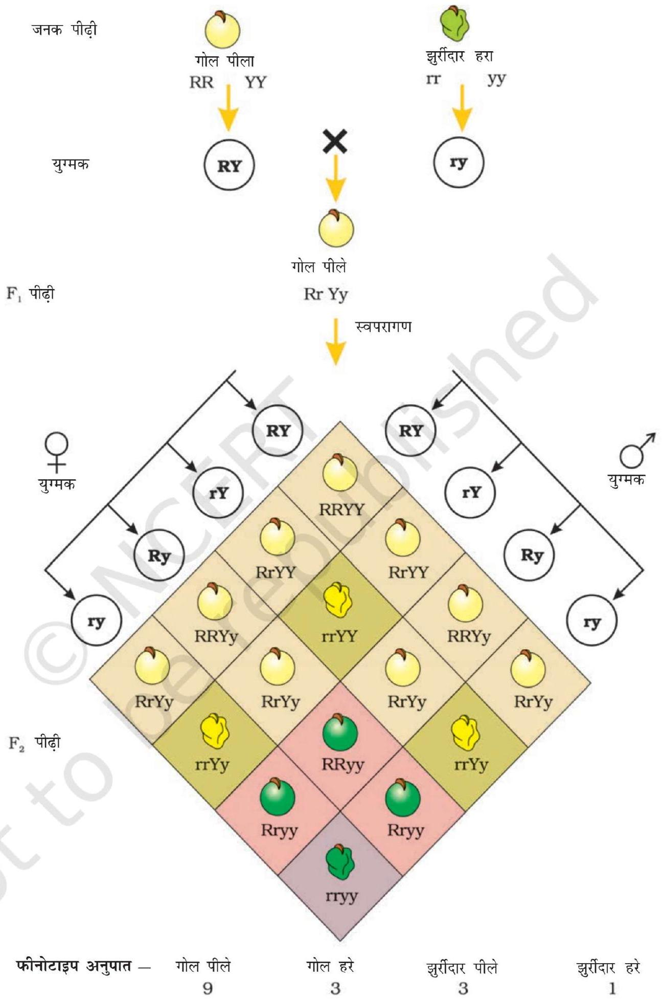
चित्र $4.7$ द्विसंकर क्रॉस के परिणाम जिनमें जनक दो जोड़े विपरीत विशेषकों में भिन्न थे - जैसे बीज का रंग और बीज की आकृति।

के पौधे ही प्राप्त हुए। आप बतला सकते हैं पीले, हरे रंग तथा गोल, झुर्रीदार आकृति में कौन प्रभावी रहा होगा।

पीला रंग, हरे के ऊपर एवं गोल आकृति झुर्रीदार के ऊपर प्रभावी है। यही निष्कर्ष जब पीले एवं हरे तथा गोल एवं झुर्रीदार बीजों वाले पौधों के बीच एकसंकर संकरण अलग-अलग किया गया तो इनके परिणामों से भी निकलता है।

जीनोटाइप प्रतीक $\mathbf{Y}$ प्रभावी पीले बीज वर्ण तथा $\mathbf{y}$ अप्रभावी हरे बीज वर्ण के लिए, R गोल बीज और r झुर्रीदार बीज वालों के लिए प्रयोग करें तो जनकों के जीनोटाइप इस प्रकार लिखे जा सकते हैं RRYY और rryy इनके क्रॉस को चित्र $4.7$ की भाँति लिखा जा सकता है जिसमें जनक पौधों के जीनोटाइप दर्शाए गए हैं। निषेचन होने पर युग्मक $\mathbf{R Y}$ और $\mathbf{r y}$ मिल कर $\mathrm{F}_{1}$ संकर $\mathbf{R r} \mathbf{Y y}$ को उत्पन्न करते हैं। जब मेंडल ने इन $\mathrm{F}_{1}$ पौधों को स्वयं संकरित किया तो पाया कि $\mathrm{F}_{2}$ के $3 / 4$ पौधों के बीज पीले और $1 / 4$ के बीज हरे थे। पीला और हरा रंग $3: 1$ के अनुपात में विसंयोजित हुआ। इसी प्रकार गोल और झुर्रीदार बीज की आकृति भी $3: 1$ अनुपात में विसंयोजित हुई, एक संकर क्रॉस की तरह।

### 4.3.1 स्वतंत्र अपव्यूहन का नियम

द्विसंकर क्रॉसों में (चित्र 4.7) फीनोटाइप गोल-पीला, झुर्रीदार- हरा, गोल-हरा और झुर्रीदार-हरा $9: 3: 3: 1$ के अनुपात में प्रकट हुए। मेंडल द्वारा अध्ययन किए गए कई लक्षण युग्मों में ऐसा ही अनुपात देखा गया।
$9: 3: 3: 1$ के अनुपात को $3$ पीला $: 1$ हरा के साथ $3$ गोल $: 1$ झुर्रीदार को संयोजन श्रेणी के रूप में व्युत्पन्न किया जा सकता है। इस व्युत्पन्न को इस प्रकार भी लिखा जा सकता है- ( $3$ गोल : $1$ झुर्रीदार) ( $3$ पीले : $1$ हरा) $=9$ गोल-पीले : $3$ झुर्रीदार-पीले : $3$ गोल-हरे : $1$ झुर्रीदार -हरे।

द्विसंकर क्रॉसों (2 विशेषकों में भिन्न पौधों के क्रॉस) के प्रेक्षणों पर आधारित मेंडल ने एक दूसरा सामान्य नियम प्रस्तावित किया जिसे 'मेंडल का स्वतंत्र अपव्यूहन नियम' कहा जाता है। यह नियम कहता है कि जब किसी संकर में लक्षणों के दो जोड़े लिए जाते हैं तो किसी एक जोड़े का लक्षण-विसंयोजन दूसरे जोड़े से स्वतंत्र होता है।
$\mathbf{R r} \mathbf{~ Y y}$ पौधे में अर्धसूत्रण कोशिका विभाजन स्वरूप अंड और पराग- उत्पादन के समय, जीन के दो जोड़ी के स्वतंत्र विसंजयोजन को समझने के लिए पनेट वर्ग का सफलतापूर्वक प्रयोग किया जा सकता है। जीन की एक जोड़ी $\mathbf{R}$ और $\mathbf{r}$ के विसंयोजन पर विचार करें तो $50$ प्रतिशत युग्मकों में जीन $\mathbf{R}$ विद्यमान है और $50$ प्रतिशत में जीन $\mathbf{r}$ है। इनमें, $\mathbf{R}$ या $\mathbf{r}$ होने के साथ-साथ अलील $\mathbf{Y}$ या $\mathbf{y}$ भी है। $\mathbf{Y y}$ का विसंयोजन भी $\mathbf{R r}$ के समान ही होता है। याद रखने लायक महत्त्वपूर्ण बात यह है कि $50 \% \mathbf{R}$ और $50$ प्रतिशत $\mathbf{r}$ का विसंयोजन, $50$ प्रतिशत $\mathbf{Y}$ और $50$ प्रतिशत $\mathbf{y}$ के विसंयोजन से स्वतंत्र है। अतएव $\mathbf{R}$ धारी युग्मकों के $50$ प्रतिशत में $\mathbf{Y}$ और दूसरे $50$ प्रतिशत में $\mathbf{y}$, इसी प्रकार
r धारी युग्मकों में $50$ प्रतिशत $\mathbf{Y}$ तथा शेष $50$ प्रतिशत में $\mathbf{y}$ जीन है। अतः युग्मकों के $4$ जीनोटाइप बन जाते हैं। ( $4$ प्रकार के पराग और $4$ प्रकार के अंड), ये चार प्रकार हैं RY, Ry, rY और ry जिनमें प्रत्येक की संख्या कुल युग्मकों की $25$ प्रतिशत : अर्थात् $1 / 4$ है। जब आप पनेट वर्ग के दो पाश्वों में अंड और पराग लिखेंगे तो उन युग्मनजों के संघटन का पता करना आसान होगा जिनसे $\mathrm{F}_{2}$ पौधे उत्पन्न होते हैं। (चित्र 4.7)। यद्यपि पुनेट आरेख में $16$ वर्ग है, किंतु इनमें कितने जीनोटाइप और फीनोटाइप बनते हैं? इसे दिए हुए फार्मेट से ज्ञात करें।

क्या पनेट वर्ग के प्रयोग के आंकड़ों से आप $F_{2}$ अवस्था के जीनोटाइप का पता कर इसे फार्मेट में भर सकते हैं क्या जीनोटाइप अनुपात भी $9: 3: 3: 1$ ही है?

| क्रम संख्या | $\mathrm{F}_{2}$ में पाए गए जीनोटाइप | इनके अनुमानित फीनोटाइप |
| :--- | :--- | :--- |
|  |  |  |

### 4.3.2 वंशागति का क्रोमोसोम सिद्धांत

लक्षणों की वंशागति पर किया गया कार्य $1865$ में प्रकाशित हो चुका था परंतु कई कारणों से $1900$ तक यह कार्य अज्ञात ही रहा। एक तो आज की तरह उन दिनों संचार की सुविधाएँ अच्छी नहीं थीं जिससे कार्य को प्रचार मिल पाता। दूसरे जीन (या मेंडल के कारक) के लिए ये संकल्पना की, वे लक्षणों के नियंत्रक की स्थायी एवं विविक्त इकाईयों के रूप में हैं तथा इनका नियंत्रक की संकल्पना अर्थात् ऐसे अलील जो एक-दूसरे के साथ सम्मिश्रण नहीं होता, मेंडल के समकालीन वैज्ञानिकों को रास नहीं आयी, क्योंकि ये लोग प्रकृति की विविधता के आभासी सतत् रूप से ही परिचित थे। तीसरे, उस समय के जीव विज्ञानियों को मेंडल का जैव घटना के स्पष्टीकरण के लिए अपनाया गया गणित आधारित रास्ता बिल्कुल नया और कई जीव वैज्ञानिकों द्वारा अस्वीकार्य था। अंत में, भले ही मेंडल का कार्य यह इंगित करता था कि कारक (जीन) विविक्त (असतत्) ईकाईयाँ होती हैं, फिर भी वह इनकी उपस्थिति का भौतिक प्रमाण नहीं दे पाया, न यह बता सका कि वे किस पदार्थ की बनी होती हैं।
$1900$ में तीन वैज्ञानिकों (डीव्रीज, कॉरेन्स और वॉन शेरमाक) ने स्वतंत्र रूप से लक्षणों की वंशागति संबंधी मेंडल के परिणामों की पुनः खोज की। इस समय माइक्रोस्कोपी (सूक्ष्म-दर्शन) की तकनीक में प्रगति भी होती जा रही थी और वैज्ञानिक सावधानी से कोशिका विभाजन देखने में समर्थ हो चुके थे। कोशिका-केंद्रक में एक संरचना की खोज हो चुकी थी, जो कोशिका-विभाजन के पहले द्विगुणित एवं विभाजित भी हो जाता है। इनको क्रोमोसोम (रंग जाने के गुण के कारण रंगीन काय) कहा गया। $1902$ तक अर्धसूत्रणी कोशिका विभाजन के दौरान क्रोमोसोम की गति (संचालन) का ज्ञान हो चुका था। वाल्टर सटन और थियोडोर बोमेरी ने देखा कि क्रोमोसोम का

वंशागति तथा विविधता के सिद्धांत
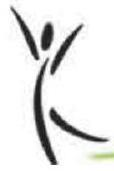

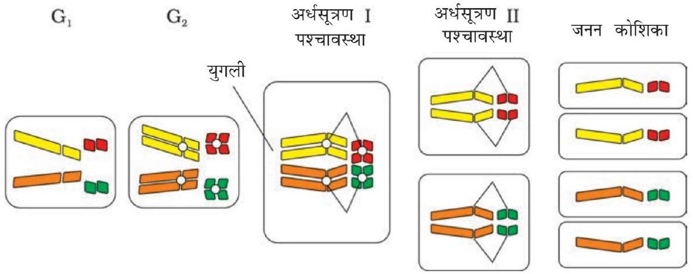
चित्र $4.8$ चार क्रोमोसोम वाली कोशिका में अर्धसूत्रण और जनन कोशिका उत्पादन देख सकते हो कि कैसे ये क्रोमोसोम बनते हैं और जनन कोशिका बनने के दैरान कैसे विसंयोजित होते हैं।

व्यवहार भी जीन जैसा ही है। इन्होंने मेंडल के नियमों (तालिका 4.3) को क्रोमोसोम की गतिविधि (चित्र 4.8) द्वारा समझाया। कोशिका विभाजन की समसूत्रण एवं अधिसूत्रण विधियों में गुणसूत्रों के व्यवहार को ध्यान में रखते हुए इसे समझा जा सकता है। जीन के समान ही गुणसूत्र भी युग्म के रूप में पाये जाते हैं तथा एक एलील के दोनों जीन समजात गुणसूत्रों के समजात स्थान पर विद्यमान रहते हैं।

तालिका $4.3$ क्रोमोसोम और जीन के व्यवहार में तुलना
| A | B |
| :--- | :--- |
| जोड़ों में होते हैं। | जोड़ों में होते हैं। |
| युग्मक जनन के दौरान इस प्रकार विसंयोजित होते हैं कि एक युग्मक जोड़े में से केवल एक ही जा पाता है। | युग्मक जनन के दौरान विसंयोजित होते हैं और जोड़े में से केवल एक ही युग्मक को प्राप्त होता है। |
| अलग-अलग जोड़े एक दूसरे से स्वतंत्र विसंयोजित होते हैं। | एक जोड़ा, दूसरे से स्वतंत्र विसंयोजित होता है। |
| क्या आप बतला सकते हैं कि इन दो स्तंभों A और B में से कौन सा क्रोमोसोम का और कौन सा जीन का प्रतिनिधित्व करता है? यह निर्णय आपने कैसे किया? |  |

अर्धसूत्रण $I$ की पश्चावस्था में क्रोमोसोम के दो जोड़े मेटाफेस पट्टिका पर एक दूसरे से स्वतंत्र रूप से पंक्तिबद्ध हो सकते हैं (चित्र 4.9)। इसे समझने के लिए दाएँ और बाएँ स्तंभों के चार अलग रंगों के क्रोमोसोम की तुलना करो। बाएँ स्तंभ में (संभावना $I$ ) नारंगी और हरे एक साथ विसंयोजित हैं किंतु दाहिने स्तंभ ( संभावना II) में नारंगी क्रामोसोम लाल क्रोमोसोमों के साथ विसंयोजित हो रहा है।

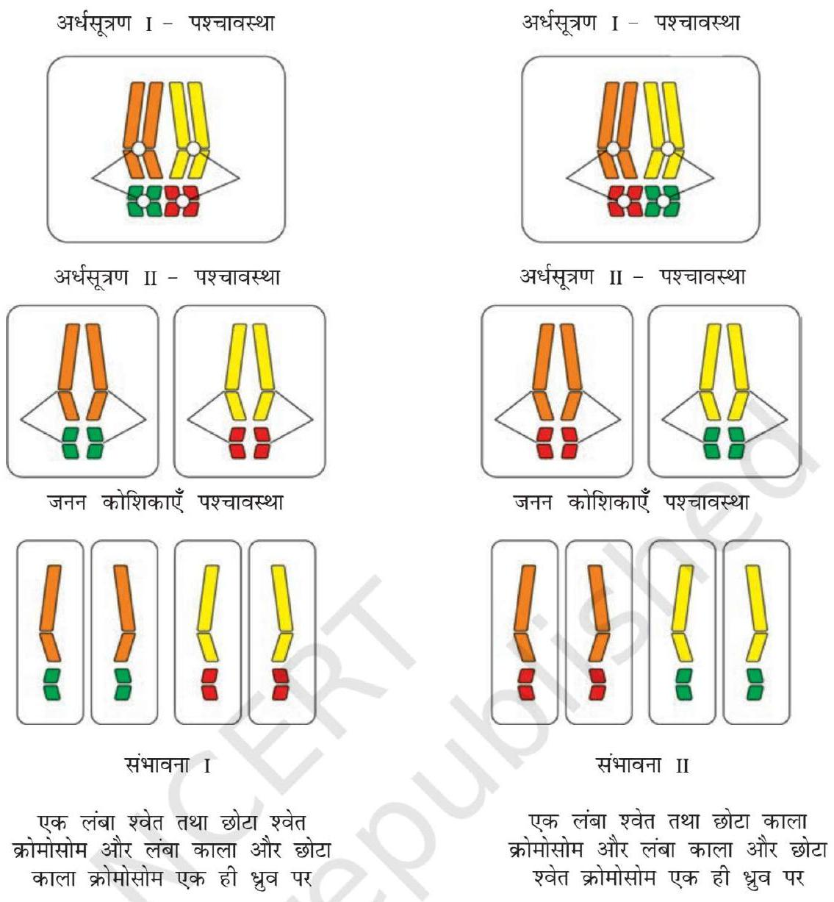
चित्र $4.9$ क्रोमोसोमों का स्वतंत्र संव्यूहन
सटन और बोवेरी ने तर्क प्रस्तुत किया कि क्रोमोसोम युग्म का जोड़ा बन जाना या अलग होना अपने में ले जाए जा रहे कारकों के विसंयोजन का कारण बनेगा। सटन ने क्रोमोसोम के विसंयोजन के ज्ञान को मेंडल के सिद्धांतों के साथ जोड़कर "वंशागति का क्रोमोसोमवाद या सिद्धांत" प्रस्तुत किया।
इस विचार के विश्लेषणों का अनुपालन करते हुए, थामस हंट मोरगन तथा उसके साथियों ने वंशागति का क्रोमोसोम-वाद या सिद्धांत के प्रयोगात्मक सत्यापन
चित्र $4.10$ ड्रोसोफिला मेलनोगैस्टर किए और यौन जनन उत्पादन विभेदन के लिए खोज के आधार की नींव डाली। (अ) नर (ब) मादा

$74$
मोरगन ने फल-मक्खियों (फ्रूटफ्लाई - ड्रोसोफिला मेलनोगैस्टर) पर काम किया, जो ये ऐसे अध्ययनों के लिए उपर्युक्त पाई गयी (चित्र 4.10)। इन्हें प्रयोगशाला में सरल कृत्रिम माध्यमों पर रखा जा सकता था। ये अपना पूरा जीवन चक्र दो सप्ताह में पूरा कर सकती थीं और इनमें एकल मैथुन से विशाल संख्या में संतति मक्खियों का उत्पादन संभव था। साथ ही लिंगों का विभेदन स्पष्ट था। नर और मादा की आसानी से पहचान की जा सकती थी। साथ ही इसमें आनुवंशिक विविधताओं के अनेक प्रकार थे जो कम क्षमता वाले माइक्रोस्कोप से देखे जा सकते थे।
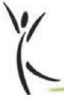

### 4.3.3 सहलग्नता और पुनर्योजन

लिंग-सहलग्न जीनों के अध्ययन हेतु मोरगन ने ड्रोसोफिला में कई द्विसंकर क्रॉस किए। ये मेंडल द्वारा मटर में किए गए द्विसंकर-क्रॉसों के समान थे। उदाहरण के लिए मोरगन

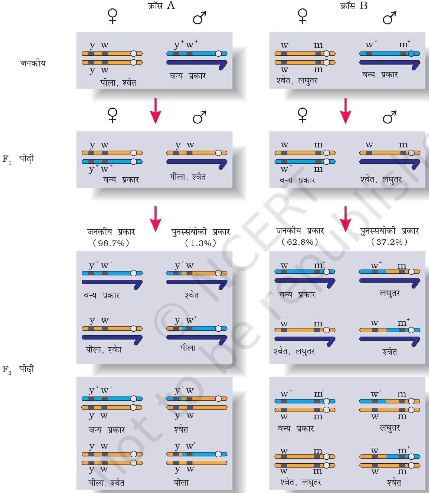
$75$

चित्र $4.11$ सहलग्नता-मौसम द्वारा किए गए दो द्विसंकर क्रॉसों के परिणाम, क्रॉस A में जीन y और w के बीच संकरण दिखलाया गया है, क्रॉस B में w और m जीनों के बीच का संकरण है। यहाँ प्रभावी वन्य प्रकार के अलील को (+) प्रतीक से दिखाया गया है। नोट कीजिए कि y और w के बीच w और m की अपेक्षा सहलग्नता अधिक बलवती है।

ने पीले शरीर और श्वेत आँखों वाली मक्खियों का संकरण भूरे शरीर और लाल आँखों वाली मक्खियों के साथ किया और फिर $\mathrm{F}_{1}$ संततियों को आपस में क्रॉस करवाया। उसने देखा कि ये दो जीन जोड़ी एक दूसरे से स्वतंत्र विसंयोजित नहीं हुई और $\mathrm{F}_{2}$ का अनुपात $9: 3: 3: 1$ से काफी भिन्न मिला (दो जीनों के स्वतंत्र कार्य करने पर यही अनुपात अपेक्षित था।)

मोरगन तथा उसके सहयोगी यह जानते थे कि जीन, क्रोमोसोम में स्थित हैं (यह अगले सेक्सन $4.4$ में समझाया गया है) और इन्होंने शीघ्र ही यह भी जान लिया कि जब द्विसंकर क्रॉस में दो जीन जोड़ी एक ही क्रोमोसोम में स्थित होती हैं तो जनकीय जीन संयोजनों का अनुपात अजनकीय प्रकार से काफी ऊँचा रहता है। मोरगन ने इसका कारण दो जीनों का भौतिक संयोग या जुड़ा होना बतलाया। मोरगन ने इस घटना के लिए सहलग्नता शब्द दिया जो एक ही क्रोमोसोम की जीन जोड़ियों के साथ होने का दयोतन करता है। साथ ही अजनकीय जीन संयोजनों के उत्पादन को पुनर्योजन (रीकोंबीनेशन) कहा गया (चित्र 4.11) मोरगन तथा उसके दल ने यह भी पता किया कि एक ही क्रोमोसोम में स्थित होने पर भी कुछ जीन जोड़ी में अधिक सहलग्नता थीं अर्थात् पुनर्योजन बहुत कम था (चित्र $4.11$ क्रास A)। उदाहरण के लिए उसने पाया कि श्वेत और पीली जीन जोड़ी में सहलग्नता अधिक थीं और इनमें पुनर्योजन $1.3$ प्रतिशत था जबकि श्वेत और लघुपंख जीन का पुनर्योजन अनुपात $37.2$ प्रतिशत था अर्थात् इनमें सहलग्नता कम थी। मोरगन के शिष्य एल्फ्रेड स्टर्टीवेंट ने एक ही क्रोमोसोम के जीन युग्मों की पुनर्योजन-आवृत्ति को जीनों के बीच की दूरी का माप मानकर क्रोमोसोम में इनकी स्थिति के चित्र (रीकोम्बीनेशन मैप) बना दिए। आजकल पूरे जीनोम के अनुक्रम के निर्धारण में आनुवंशिक नक्शे बहुत अधिक काम में लाए जा रहे हैं। ऐसा ही बाद में मानव जीनोम अनुक्रमण परियोजना में भी वर्णित किया गया।

## $4.4$ बहुजीनी वंशागति

मेंडल के अध्ययन में मुख्यतः उन विशेषकों (लक्षणों) का वर्णन किया गया था जिनके स्पष्ट विकल्पी रूप होते हैं, जैसे कि पुष्प का रंग जो या तो बैंगनी होता है अथवा श्वेत। परंतु, यदि आप अपने आस-पास चारों ओर देखेंगे तो आपको पता चलेगा कि ऐसे अनेक लक्षण हैं जो उतने स्पष्ट नहीं हैं तथा प्रवणता में फैले हुए हैं। उदाहरणतः मनुष्यों में हमें केवल लंबे अथवा बौने लोगों के दो विभक्त स्पष्ट विकल्प दृष्टिगत नहीं होते परंतु हमें ऊँचाई (लंबाई) के सभी संभावित परास मिलते हैं। इसे विशेषक (लक्षण) सामान्यतः तीन अथवा अधिक जीनों द्वारा नियंत्रित करते हैं। अतः इन्हें बहुजीनी लक्षण कहते हैं। अनेक जीनों के शामिल होने के अतिरिक्त बहुजीनी वंशागति में पर्यावरण के प्रभाव को भी परखा जाता है। मानव त्वचा का रंग इसका एक अन्य उदाहरण है। बहुजीनी विशेषक (लक्षण) में फीनोटाइप में प्रत्येक अलील का अपना योगदान होता है, अर्थात् प्रत्येक अलील का प्रभाव योजी होता है। इसे भलीभाँति समझने के लिए आइए, कल्पना करें कि तीन जीन A, B, C मनुष्यों में त्वचा के रंग के लिए उत्तरदायी हैं। प्रभावी स्वरूप (अलील) A, B तथा C त्वचा के गहरे रंग का नियमन करते हैं तथा अप्रभावी कारक
a, b तथा c त्वचा के उजले रंग के लिए उत्तरदायी हैं। सभी प्रभावी अलील (AABBCC) के जीनोटाइप का रंग सबसे गहरा होगा तथा सारे अप्रभावी अलील (aabbcc) के जीनोटाइप की त्वचा का रंग सबसे हलका होगा। जैसा कि अपेक्षित है, तीन प्रभावी अलील तथा तीन अप्रभावी अलील वाले जीनोटाइप की त्वचा का रंग इनका मध्यवर्ती होगा। इस प्रकार जीनोटाइप में प्रत्येक प्रकार के अलील की उपस्थिति उस व्यक्ति की त्वचा के गहरे अथवा हलके रंग का निर्धारण करेगी।

## $4.5$ बहुप्रभाविता

हमने अब तक एक दृश्य प्रारूप (फीनोटाइप) अथवा अभिलक्षण के प्रभाव के विषय में ही जाना है। परंतु ऐसे भी दृष्टांत हैं जहाँ एक एकल जीन अनेक दृश्य प्रारूप (फीनोटाइप) लक्षणों को प्रकट कर सकता है। ऐसे जीन को बहुप्रभावी जीन कहते हैं। अधिकतर मामलों में बहुप्रभाविता का मुख्य कारण एक जीन का उपापचयी परिपथ पर प्रभाव है जिससे विभिन्न दृश्य प्रारूप (फीनोटाइप) लक्षण उत्पन्न होते हैं। मनुष्य में होने वाली फेनिलकीटोमेह व्याधि इसका एक उदाहरण है। यह रोग फेनिल-ऐलेनीन हाइड्रॉक्सीलेज नामक एंजाइम के लिए उत्तरदायी जीन में उत्परिवर्तन (एकल जीन उत्परिवर्तन) के कारण होता है। यह अनेक दृश्य प्रारूपिक लक्षणों (फीनोटाइपिक लक्षणों) मानसिक मंदन, बालों के कम होने तथा त्वचीय रंजन द्वारा अभिव्यक्त होता है।

## $4.6$ लिंग निर्धारण

लिंग निर्धारण की क्रिया विधि आनुवंशिक विज्ञानियों के लिए हमेशा एक पहेली ही बनी रही। आनुवंशिक / क्रोमोसोम के द्वारा लिंग निर्धारण के प्रारंभिक संकेत बहुत पूर्व कीटों पर किए गए प्रयोगों से प्राप्त हुए। वास्तव में कीटों पर अनेक कोशिकीय प्रेक्षणों ने लिंग निर्धारण के आनुवंशिक / क्रोमोसोमीय आधार की संकल्पना की ओर इंगित किया। हेंकिंग (1891) ने कुछ कीटों के शुक्रजनन की विभिन्न अवस्थाओं में एक विशेष केंद्रिकीय संरचना का पता लगाया। उन्होंने यह भी देखा कि $50$ प्रतिशत शुक्राणुओं में शुक्रजनन के बाद यह संरचना देखी जाती है जबकि शेष $50$ प्रतिशत में यह नहीं होती। हेंकिंग ने इस संरचना को ' $\mathbf{x}$ काय' नाम दिया। लेकिन इसके महत्त्व को वे समझा नहीं पाए। अन्य वैज्ञानिकों ने अगले शोधकार्यों से यह निष्कर्ष निकाला कि हेंकिंग का 'X' काय वास्तव में क्रोमोसोम ही था। इसीलिए इसे X-क्रोमोसोम कहा गया। यह भी देखा गया कि बहुत से कीटों में लिंग निर्धारण की क्रिया विधि XO प्रकार की होती है अर्थात् सभी अंडों में अन्य क्रोमोसोम (ऑटोसोम) के अलावा एक अतिरिक्त क्रोमोसोम भी होता है। दूसरी ओर कुछ शुक्राणुओं में यह X - क्रोमोसोम होता है, कुछ में नहीं। X - क्रोमोसोम सहित शुक्राणु द्वारा निषेचित अंडे मादा बन जाते हैं और जो X- क्रोमोसोम रहित शुक्राणु से निषेचित होते हैं, वे नर बनते हैं। क्या आप सोचते हैं कि नर और मादा दोनों की क्रोमोसोम संख्या बराबर है? इस $X$ - क्रोमोसोम की लिंग निर्धारण में भूमिका होने से इसे लिंग-क्रोमोसोम ( सैक्स क्रोमोसोम ) नाम दिया गया। शेष क्रोमोसोमों को अलिंग क्रोमोसोम ऑटोसोम नाम दिया गया। टिड्डा $X O$ प्रकार के लिंग निर्धारण का एक उदाहरण है, इसमें नर में अलिंग
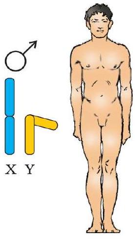
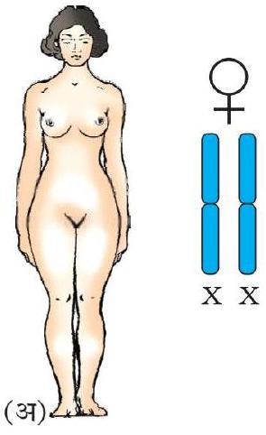
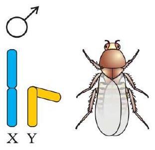
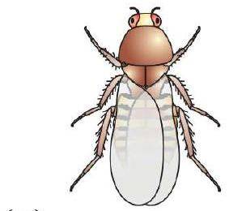
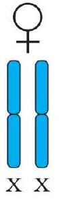
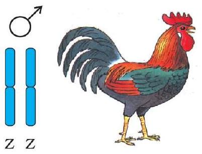
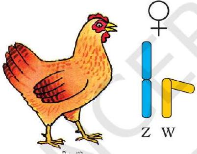

(स)

चित्र $4.12$ क्रोमोसोम भिन्नताओं के द्वारा लिंग निर्धारण (अ,ब) मानव तथा ड्रोसोफिला, मादा में XX क्रोमोसोम (समयुग्मकी) तथा नर में XY (विषमयुग्मकी) स्थिति। (स) अनेक पक्षियों में मादा में असमान क्रोमोसोम ZW तथा नर में समान क्रोमोसोम ZZ ।
क्रोमोसोम के अतिरिक्त केवल एक $X$-क्रोमोसोम होता है जब कि मादा में X-क्रोमोसोम का एक पूरा जोड़ा होता है।

इन प्रेक्षणों की प्रेरणा से लिंग-निर्धारण की क्रियाविधि को समझने के लिए अन्य जातियों में भी अन्वेषण प्रेरित किए गए। कई अन्य कीटों तथा मानव समेत स्तनधारियों में XY प्रकार का लिंग निर्धारण देखा जाता है जहाँ नर और मादा दोनों में क्रोमोसोम संख्या समान होती है। नर में एक क्रोमोसोम तो X होता है पर उसका जोड़ीदार स्पष्टतः छोटा होता है और Y क्रोमोसोम कहलाता है। अलिंग सूत्रों की संख्या नर और मादा में बराबर होती है। दूसरे शब्दों में नर में अलिंग सूत्र के साथ XY और मादा में अलिंग सूत्र के साथ XX उदाहरणार्थ मानव तथा ड्रोसोफिला में नर में अलिंग क्रोमोसोम के अलावा एक $X$ और एक $Y$ क्रोमोसोम होता है जबकि मादा में अलिंग क्रोमोसोमों के अलावा एक जोड़ा X क्रोमोसोम का (चित्र $4.12$ अ तथा ब)।

ऊपर के विवरण में आपने दो प्रकार के लिंग निर्धारण - अर्थात् XO प्रकार और XY प्रकार के विषय में पढ़ा। दोनों में ही नर दो प्रकार के युग्मक पैदा करते हैं जो हैं ( क ) या तो X क्रोमोसोम सहित या रहित और (ख) कुछ युग्मकों में X- क्रोमोसोम, और कुछ में Y क्रोमोसोम। इस प्रकार की लिंग निर्धारण क्रियाविधि को नर विषमयुग्मकता ( हिटिरोगेमिटी ) कहा जाता है। कुछ अन्य जीवों जैसे पक्षियों में दूसरे प्रकार की लिंग निर्धारण क्रियाविधि देखी गयी (चित्र $4.12$ स)। इस विधि में क्रोमोसोम की कुल संख्या नर और मादा दोनों में समान होती है किंतु मादा द्वारा लिंग क्रोमोसोम के लिहाज से दो होता है, अर्थात् मादा विषमयुग्मकता ( हिटिरोगेमिटी ) पाई जाती है। पूर्व वर्णित लिंग निर्धारण से भिन्नता प्रदान करने के उद्देश्य से पक्षियों के लिंग क्रोमोसोमों को Z और W क्रोमोसोम कह दिया गया है। इन जीवों में मादा में एक Z और एक $W$ क्रोमोसोम होता है जबकि नर में अलिंग सूत्रों के अलावा $Z-$ क्रोमोसोम का एक जोड़ा होता है।

### 4.6.1 मानव में लिंग-निर्धारण

जैसाकि पहले समझाया जा चुका है कि मानव का लिंग निर्धारण XY प्रकार का होता है। कुल $23$ जोड़े क्रोमोसोम में से $22$ जोड़े नर और मादा में बिल्कुल एक जैसे होते हैं,

इन्हें अलिंग क्रोमोसोम कहते हैं। मादा में X क्रोमोसोमों का एक जोड़ा भी होता है और नर में X के अतिरिक्त एक क्रोमोसोम Y होता है जो नर लक्षण का निर्धारक होता है। नर में शुक्रजनन के समय दो प्रकार के युग्मक बनते हैं। कुल उत्पन्न शुक्राणु संख्या का $50$ प्रतिशत X युक्त होता है और शेष $50$ प्रतिशत Y युक्त, इनके साथ अलिंग क्रोमोसोम तो होते ही हैं। मादा में केवल एक ही प्रकार के अंडाणु बनते हैं जिनमें X- क्रोमोसोम होता है। अंडाणु के X या Y धारी क्रोमोसोमों से निषेचित होने की प्रायिकता बराबर-बराबर रहती है। यदि अंडाणु का निषेचन X धारी शुक्राणु से हो गया तो युग्मनज (जाइगोट) मादा (XX) में परिवर्धित हो जाता है। इसके विपरीत Y क्रोमोसोम धारी शुक्राणु से निषेचन होने पर नर संतति जन्म लेती है। स्पष्ट है कि शुक्राणु की आनुवंशिक संरचना ही शिशु के लिंग का निर्धारण करती है। यह भी साफ है कि प्रत्येक गर्भावस्था में शिशु के बालक या बालिका होने की प्रायिकता $50$ प्रतिशत रहती है। यह हमारा दुर्भाग्य है कि समाज लड़की पैदा करने के लिए माता को दोष देता है। इस गलत धारणा के कारण उनके साथ अनेक दुर्व्यवहार होते आए हैं।

पक्षियों में लिंग निर्धारण की विधि भिन्न प्रकार की क्यों है? चूजों की उत्पत्ति के लिए जिम्मेदार कौन है शुक्राणु या अंड?

### 4.6.2 मधुप ( मधुमक्खी ) में लिंग निर्धारण

मधुमक्खी में लिंग निर्धारण उस मधुप द्वारा प्राप्त क्रोमोसोम (गुणसूत्र) समुच्चय की संख्या पर निर्भर करता है। एक शुक्राणु एवं अंड के युग्मन से उत्पन्न संतति एक मादा (रानी तथा श्रमिक मधुप) में विकसित होते हैं, तथा एक अनिषेचित अंड, अनिषेचकजनन (पार्थेनोजिनेसिस) द्वारा पुंमधुप (नर-ड्रोन) में विकसित होते हैं। इसका अर्थ यह है कि नर (पुंमधुप) में क्रोमोसोम की संख्या मादा मधुप की अपेक्षा आधी होती है। मादा मधुप द्विगुणित होती है जिसमें $32$ क्रोमोसोम होते हैं तथा पुंमधुप अगुणित अर्थात् $16$ क्रोमोसोम से युक्त होते हैं, इसे अगुणित-द्विगुणिता लिंग निर्धारण प्रणाली कहते हैं तथा इसके विशिष्ट अभिलक्षण होते हैं। जैसे कि नर समसूत्री विभाजन द्वारा

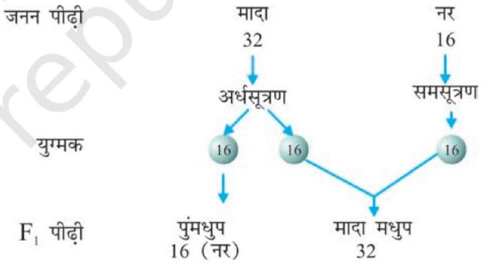
चित्र $4.13$ मधुमक्खी में लिंग निर्धारण।

शुक्राणु उत्पादित करते हैं (चित्र 4.13)। उनके पिता नहीं होते। अतः उनके पुत्र (नर संतति) नहीं हो सकते हैं परन्तु उनके दादा होते हैं तथा पोते हो सकते हैं।

## $4.7$ उत्परिवर्तन ( म्यूटेशन )

उत्परिवर्तन वह क्रिया है जो डीएनए अनुक्रम में बदलाव ला देती है इसके परिणामस्वरुप जीव के जीनोटाइप और फीनोटाइप में परिवर्तन आ जाता है। पुनर्योजन के अतिरिक्त उत्परिवर्तन एक दूसरी क्रिया है जो डीएनए में विविधता लाती है।

अगले अध्याय में आप पढ़ेंगे कि प्रत्येक क्रोमैटिड में एक सिरे से दूसरे सिरे तक अति कुंडलित रूप में एक डीएनए का कुंडल विद्यमान रहता है। अतएव डीएनए खंड

नर

मादा

लिंग का उल्लेख नहीं

प्रभावित व्यक्ति

मैथुन

रिश्तेदारों के बीच मैथुन (सम रक्त मैथुन)

जनक ऊपर और संतति नीचे (बाएँ से दाएँ, जन्म के अनुसार)

नर शिशु वाले जनक रोग से प्रभावित
$5$
पाँच प्रभावहीन संतति

की कमी (हट जाना) या बढ़त (जुड़ना, द्विगुणन) क्रोमोसोमों में बदलाव ला देते हैं। क्योंकि जीन क्रोमोसोम में स्थित मानी जाती हैं, इसलिए क्रोमोसोमों के रूपान्तर असामान्यताओं तथा विपथनों, को जन्म देते हैं। ऐसे क्रोमोसोमीय विपथन कैंसर कोशिकाओं में सामान्यतः देखे जाते हैं।

इसके अतिरिक्त डीएनए के एकल क्षार युग्म (बेस पेयर) के परिवर्तन भी उत्परिवर्तन को जन्म देते हैं। इसे बिंदु उत्परिवर्तन ( पॉइंट म्यूटेशन ) कहते हैं। इस प्रकार के उत्परिवर्तन का जाना माना उदाहरण दात्र कोशिका अरक्तता (सिकल सेल ऐनिमिया) नामक रोग है। डीएनए के क्षार युग्मों के घटने-बढ़ने से फ्रेम शिफ्ट उत्परिवर्तजन उत्पन्न करते हैं (अगले अध्याय में वर्णित)।

इस स्तर पर उत्परिवर्तन की क्रियाविधि की चर्चा विषय परास के बाहर है)। उत्परिवर्तनों का जन्म अनेक रासायनिक और भौतिक कारकों द्वारा होता है। इन्हें उत्परिवर्तजन ( म्यूटाजन ) नाम दिया गया है। पराबैंगनी विकिरण, जीवों में उत्परिवर्तन पैदा कर देते हैं। ये उत्परिवर्तजन ही हैं।

## $4.8$ आनुवंशिक विकार

### 4.8.1 वंशावली विश्लेषण ( पेडीग्री एनालेसिस )

मानव समाज में वंशागत विकारों की बात पुराने समय से चली आ रही है। इसका आधार था, कुछ परिवारों में विशेष लक्षणों के वंशबद्ध रहने की अवधारणा। मेंडल के कार्य की पुनः खोज के बाद मानव के लक्षण प्रतिरूपों की वंशागति के विश्लेषण की बात प्रारंभ हुई। यह स्पष्ट है कि मटर के पौधे और अन्य जीवों में किए गए तुलनार्थ संकर प्रयोग मानव में संभव नहीं है। इसलिए यही विकल्प रह जाता है कि विशेष लक्ष्ण की वंशागति के संबध में वंश के इतिहास का अध्ययन किया जाए। कई पीढ़ियों तक जारी लक्षणों के ऐसे विश्लेषण को वंशावली विश्लेषण कहते हैं। इस प्रक्रिया में वंश वृक्ष (फैमिली ट्री) में एक विशेष लक्ष्ण का पीढ़ी दर पीढ़ी विश्लेषण किया जाता है।
मानव आनुवंशिकी में वंशावली अध्ययन एक महत्त्वपूर्ण उपकरण होता है जिसका उपयोग विशेष लक्षण, अपसामान्यता या रोग का पता लगाने में किया जाता है। वंशावली विश्लेषण में प्रयुक्त कुछ महत्त्वपूर्ण मानक प्रतीकों को चित्र $4.14$ में दर्शाया गया है।

जैसा कि आप इस अध्याय में पढ़ चुके हैं किसी जीव का प्रत्येक लक्ष्ण क्रोमोसोम में विद्यमान डीएनए पर स्थित जीन में निहित होता है। डीएनए ही आनुवंशिक सूचना का वाहक है और यह बिना किसी परिवर्तन के एक से दूसरी पीढ़ी में स्थानांतरित होता जाता

है। हाँ यदा-कदा परिवर्तन/रूपांतरण भी होते रहते हैं। इस प्रकार के परिवर्तन या रूपांतरण को उत्परिवर्तन (म्यूटेशन) कहा जाता है। मानव में कई विकार ऐसे पाए गए हैं, जिनका संबंध क्रोमोसोम या जीन के परिवर्तन रूपांतरण से जोड़ा जा सकता है।

### 4.8.2 मेंडलीय विकार

मोटे तौर पर विकारों को दो श्रेणियों में रखा जा सकता है- मेंडलीय विकार और क्रोमोसोमीय विकार। मेंडलीय विकार वे होते हैं जो एकल जीन के रूपांतरण या उत्परिवर्तन से मुख्यतया निर्धारित हो जाते हैं। ये विकार उसी विधि से संतति में पहुँचते हैं जिनका अध्ययन वंशागति के सिद्धांतों के साथ किया जा चुका है। इस प्रकार के मेंडलीय विकारों की वंशागति के उदाहरण को किसी परिवार में वंशावली विश्लेषण द्वारा खोजा जा सकता है। मेंडलीय विकारों के सर्वविदित उदाहरण हीमोफीलिया, सिस्टिक फ्राइब्रोसिस, दात्र कोशिका अरक्तता, वर्णांधता (कलर ब्लाइंडनेस), फीनाइल कीटोन्यूरिया, थैलेसीमिया इत्यादि हैं। यहाँ यह भी बताना महत्त्वपूर्ण है कि ये मेंडलीय विकार प्रभावी अथवा अप्रभावी हो सकते हैं, साथ ही जैसाकि हीमोफीलिया में होता है। यह लक्षण लिंग क्रोमोसोम-आधारित भी हो सकता है। यह सुस्पष्ट है कि X- लग्न अप्रभावी लक्षण, वाहक मादा (कैरियर मदर) से नर संतति को प्राप्त होता है। इस वंशावली का नमूना चित्र $4.15$ पर प्रस्तुत है जिसमें प्रभावी और अप्रभावी लक्षण दिखलाए गए हैं। अपने अध्यापक से चर्चा करें और अलिंग तथा लिंग क्रोमोसोम से लग्न लक्षणों वाला वंशावली नक्शा बनाएँ। हीमोफीलिया- इस लिंग सहलग्न रोग का व्यापक अध्ययन हो चुका है। इसमें प्रभाव रहित वाहक नारी से नर-संतति को रोग का संचार होता है इस रोग में रुधिर के थक्का बनने से संबद्ध एकल प्रोटीन प्रभावित होता है। यह एकल प्रोटीन एक प्रोटीन श्रंखला का अंशमात्र होता है। इसके कारण आहत व्यक्ति के शरीर की एक छोटी सी चोट से भी रुधिर का निकलना बंद ही नहीं होता। विषमयुग्मजी नारी (वाहक) से यह रोग पुत्रों में जाता है। नारी की रोगग्रस्त होने की संभावना विरल होती है; क्योंकि इस प्रकार की नारी

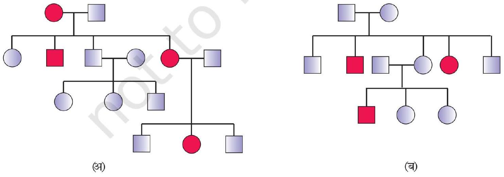
चित्र $4.15$ प्रतीकात्मक वंशावली विश्लेषण ( अ ) अलिंगी क्रोमोसोम पर प्रभावी विशेषक जैसे मायोटोनिक दुष्पोषण (डिस्ट्रोफी) , (ब) आलंगी-क्रोमोसोम पर-अप्रभावी विशेषक जैसे दात्र कोशिका अरक्तता (सिकल सेल एनिमिया)

की माता को कम से कम वाहक और पिता को हीमोफीलिया से ग्रस्त होना आवश्यक होता है। (जो अधिक वय तक जीवित नहीं रह पाता) महारानी विक्टोरिया की वंशावली में अनेक हीमोफीलिया ग्रस्त वंशज थे और रानी स्वयं रोग की वाहक थी।

## वर्णांधता

यह लिंग सहलग्न अप्रभावी विकार है। यह विकार लाल अथवा हरे वर्ण संवेदी शंकु के त्रुटिपूर्ण होने के कारण होता है। परिणामतः व्यक्ति लाल एवं हरे वर्ण (रंग) में विभेद नहीं कर पाता। यह विकार X-क्रोमोसोम पर स्थित कुछ जीनों में उत्परिवर्तन के कारण आता है। लगभग $8 \%$ पुरुषों एवं मात्र $0.4 \%$ नारियों में यह विकार पाया जाता है। इसका कारण है, लाल-हरी वर्णांधता के लिए उत्तरदायी जीनों का X -क्रोमोसोम पर उपस्थित होना। नर (पुरुष) की कोशिकाओं में केवल एक X-क्रोमोसोम होता है, परंतु नारियों में दो X-क्रोमोसोम होते हैं। किसी ऐसे जीन की वाहक नारी के पुत्र के वर्णांध होने की संभावना $50 \%$ है क्योंकि X-संलग्न जीन अप्रभावी है। अतः विषमयुग्मजी जननी स्वयं वर्णांध नहीं होती है। इसका अर्थ यह है कि इसका प्रभाव दूसरे विकल्पी अलील के प्रभावी होने के कारण निरुद्ध हो जाता है। पुत्री (मादा संतति) सामान्यतः वर्णांध नहीं होगी, जब तक कि माँ वाहक एवं पिता वर्णांध न हो।
दात्र कोशिका -अरक्तता ( सिकल सेल एनिमिया ) - यह अलिंग क्रामोसोम लग्न अप्रभावी लक्षण है जो जनकों से संतति में तभी प्रवेश करता है जबकि दोनों जनक जीन के वाहक होते हैं (विषमयुग्मजी)। इस रोग का नियंत्रण अलील का एकल जोड़ा $\mathrm{Hb}^{\mathrm{A}}$ और $\mathrm{Hb}^{\mathrm{s}}$ करता है। रोग का लक्षण (फीनोटाइप) तीन संभव जीनोटाइपों में से केवल $\mathrm{Hb}^{\mathrm{s}}\left(\mathrm{Hb}^{\mathrm{s}} \mathrm{Hb}^{\mathrm{s}}\right)$ वाले समयुग्मकी व्यक्तियों में दर्शित होता है। विषमयुग्मकी $\left(\mathrm{Hb}^{\mathrm{A}} \mathrm{Hb}^{\mathrm{s}}\right)$ व्यक्ति रोग मुक्त होते हैं परंतु वे रोग के वाहक होते हैं। उत्परिवर्तित जीन के संतति में पहुँचने की $50$ प्रतिशत संभावना (अर्थात् दात्र कोशिका के लक्षण आने की) होती है (चित्र 4.16)। इस विकार का कारण हीमोग्लोबिन अणु की बीटा ग्लोबिनशृंखला की छठी स्थिति में एक अमीनों अम्ल ग्लूटैमिक अम्ल (Glu) का वैलीन द्वारा प्रतिस्थापन है। ग्लोबिन प्रोटीन में एमीनो अम्ल का यह प्रतिस्थापन बीटा ग्लोबिन जीन के छठे कोडोन में GAG का GUG द्वारा प्रतिस्थापन के कारण होता है। निम्न ऑक्सीजन तनाव में उत्परिवर्तित हीमोग्लोबिन अणु में बहुलकीकरण हो जाता है जिसके कारण RBC का आकार द्वि-अवतल बिंब से बदलकर दात्राकार (हँसिए के आकार जैसा) हो जाता है।
फीनाइल कीटोनूरिया- यह जन्मजात उपापचयी त्रुटि भी अलिंग क्रोमोसोम अप्रभावी लक्षण की भाँति ही वंशागति प्रदर्शित करती है। रोगी व्यक्ति में फीनाइल ऐलेनीन अमीनो अम्ल को टाइरोसीन अमीनो अम्ल में बदलने के लिए आवश्यक एक एंजाइम की कमी हो जाती है। परिणामस्वरुप फीनाइल ऐलेनीन एकत्रित होता जाता है और फीनाइलपाइरूविक अम्ल तथा अन्य व्युत्पन्नों में बदलता जाता है। इनके एकत्रीकरण से मानसिक दुर्बलता आ जाती है। वृक्क द्वारा कम अवशोषित हो सकने के कारण ये मूत्र के साथ उत्सर्जित हो जाते हैं।

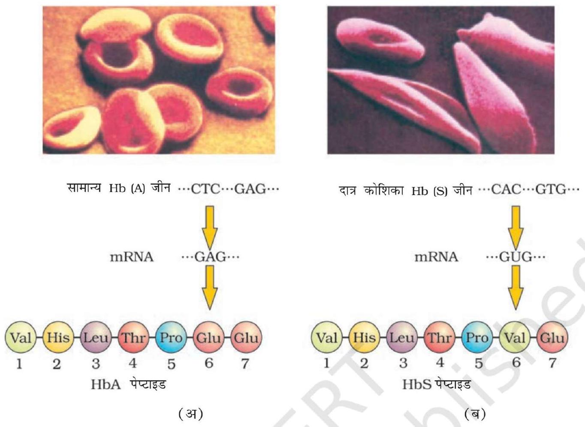
चित्र $4.16$ हीमोग्लोबिन की B शृंखला के संगत अंशों के अमीनो अम्ल संघटन और लाल रुधिर कोशिका के सूक्ष्म-आरेख (अ) सामान्य व्यक्ति से (ब) दात्र कोशिका अरक्तता के रोगी से

## थैलेसीमिया

यह भी एक अलिंग क्रोमोसोम संलग्न अप्रभावी जीन रक्त विकार है जो जनकों से संतति को वंशानुगत प्राप्त होता है, जबकि जनक युगल के दोनों सदस्य अप्रभावी जीन के वाहक (अथवा विषम युग्मजी) होने के कारण अप्रभावित रहते हैं। यह विकार या तो उत्परिवर्तन अथवा विलोपन के परिणामस्वरूप उत्पन्न होता है जिसमें हीमोग्लोबिन बनाने वाले ग्लोबिन की किसी एक शृंखला ( $\alpha$ एवं $\beta$ ) की संश्लेषण दर में कमी आ जाती है। परिणामतः विकृत हीमोग्लोबिन का संश्लेषण होता है तथा रक्ताल्पता (एनीमिया) हो जाती है जो इस रोग का अभिलक्षण है। थैलेसीमिया रोग का वर्गीकरण इस आधार पर किया जाता है कि हीमोग्लोबिन अणु की कौन-सी श्रंखला प्रभावित हुई है। $\alpha$ थैलेसीमिया में $\alpha$-ग्लोबिन शृंखला का उत्पादन प्रभावित होता है जबकि $\beta$-थैलेसीमिया में $\beta$-ग्लोबिन शृंखला प्रभावित होती है। $\alpha$-थैलेसीमिया रोग का नियंत्रण प्रत्येक जनक के क्रोमोसोम $16$ पर दो सन्निकट लग्न जीन HBA1 एवं HBA2 द्वारा नियंत्रित होता है तथा यह चार विकल्पी एलील (जीनों) में से किसी एक अथवा अधिक जीनों के उत्परिवर्तन अथवा विलोपन (हट जाने) के कारण अभिलक्षित होता है। जितने अधिक जीन प्रभावित होंगे, उतनी ही कम मात्रा में अल्फा-ग्लोबिन संश्लेषित होगा; जबकि $\beta$-थैलेसीमिया प्रत्येक जनक के क्रोमोसोम $11$

स्थित एकल जीन द्वारा नियंत्रित होता है तथा यह रोग एक अथवा दोनों जीनों के उत्परिवर्तन के कारण होता है। थैलेसीमिया विकार, दात्र कोशिका अरक्तता (सिकल सेल एनीमिया रोग से इस रूप में भिन्न है कि पहले वाला रोग एक परिमाणात्मक समस्या है जिसमें ग्लोबिन अणु अत्यल्प मात्रा में संश्लेषित होते हैं जबकि दूसरा विकृत ग्लोबिन संश्लेषण की गुणात्मक समस्या है।

### 4.6.3. क्रोमोसोमीय विकार

दूसरी तरफ एक या अधिक क्रोमोसोमों की अनुपस्थिति, अधिकता या असामान्य विन्यास क्रोमोसोमीय विकारों के कारण होते हैं। कोशिका विभाजन के समय क्रोमेटेड के विसंयोजन की अनुपस्थिति के कारण एक क्रोमोसोम की अधिकता या हानि हो जाती है इसे असुगुणिता (एन्युप्लोइडी) कहते हैं। जैसे $21$ वें गुणसूत्र की एक प्रति की अधिकता से डाउन सिंड्रोम हो जाता है। इसी प्रकार एक X गुणसूत्र की हानि से नारियों में टर्नर सिंड्रोम हो जाता है। कोशिका द्रव्य विभाजन न हो सकने के कारण क्रोमोसोम का एक पूरा समुच्य अधिक हो जाता है इसे बहुगुणिता ( पालीप्लोइडी ) कहते हैं। यह अवस्था प्रायः पौधों में पाई जाती है। मानव में क्रोमोसोमों की कुल संख्या $46$ (23 जोड़े) हैं। इनमें से $22$ जोड़े अलिंग सूत्र होते हैं और एक जोड़ा लिंग सूत्रों का।

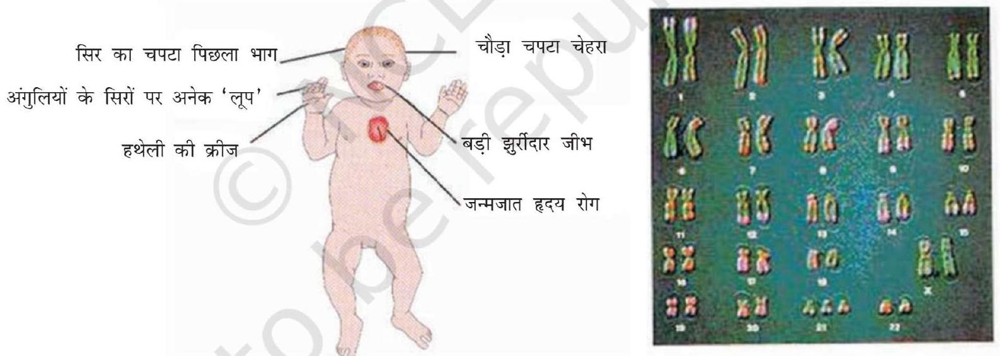
चित्र $4.17$ निरूपक चित्र जिसमें डाउन सिंड्रोम का रोगी तथा उस व्यक्ति के तदनुरूप क्रोमोसोम दर्शाए गए हैं।

कभी-कभी, विरले ही सही, व्यक्ति में क्रोमोसोम का एक अतिरिक्त जोड़ा शामिल हो जाता है या कभी एक जोड़े क्रोमोसोम की कमी हो जाती है। इन स्थितियों को क्रमश: क्रोमोसोम की द्विअधिसूत्री ( टेट्रासोमी ) या द्विन्यूनसूत्री ( नलसोमी ) कहा जाता है। ऐसी स्थिति के प्रभाव से व्यक्ति में गंभीर रोग हो जाता है। क्रोमोसोमीय विकारों का उदाहरण डाउन सिंड्रोम, टर्नर सिंड्रोम, क्लाइनफैल्टर सिंड्रोम है।

डाउन सिंड्रोम - इस आनुवंशिक विकार का कारण $21$ वें क्रोमोसोम की एक अतिरिक्त प्रति का आ जाना ( $21$ की त्रिसूत्रता) है। इस विकार को सर्वप्रथम लैन्गडम डाउन ने (1866) खोजा था। रोगी व्यक्ति छोटे कद और छोटे गोल सिर का होता है, जीभ में खाँच होता है और मुँह आंशिक रूप से खुला रहता है (चित्र 4.17), चौड़ी हथेली में अभिलाक्षणिक पॉल्म कीज होती है। शारीरिक, मनः प्रेरक (साइकोमोटर) और मानसिक विकास अवरूद्ध रहता है। क्लाइनफेल्टर सिंड्रोम - इस आनुवंशिक विकार का कारण X क्रोमोसोम की एक अतिरिक्त प्रतिलिपि है; जिसके कारण केंद्रक में $47$, क्रोमोसोम (XXY) हो जाते हैं। ऐसे व्यक्ति समग्र रूप से तो पुंप्रधान होते हैं, किंतु मादा लक्षण (गाइनीकोमैस्टिजि अर्थात् स्त्रीवत् पुरुष वक्ष का वर्धन) भी व्यक्त हो जाते हैं (चित्र $4.18$ अ) ऐसे व्यक्ति बाँझ होते हैं।
टर्नर सिंड्रोम - इस विकार का कारण एक X क्रोमोसोम का अभाव होता है, अर्थात् $45$ क्रोमोसोम की (XO) स्थिति। ऐसी नारी बाँझ होती है; क्योंकि अंडाशय अल्पवधि 'त होते हैं और द्वितियक लैंगिक लक्षणों का अभाव होता है (चित्र $4.18$ ब)।

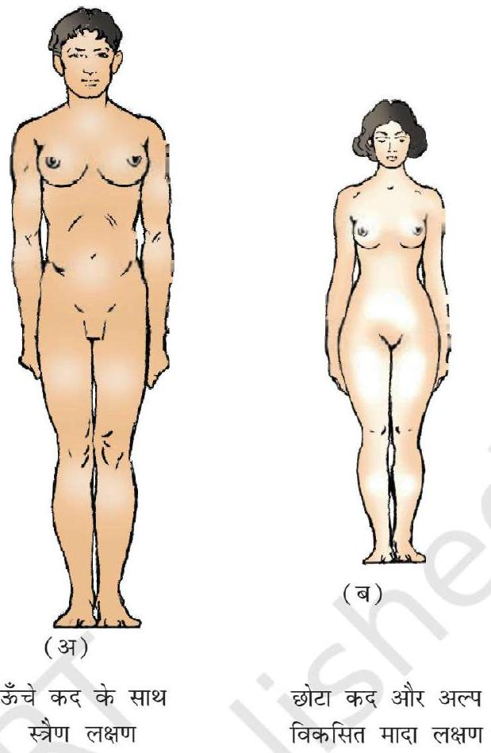
चित्र $4.18$ मानव में सेक्स क्रोमोसोमों की बनावट के कारण उत्पन्न आनुवंशिक विकारों का आरेखीय निरूपण (अ) क्लाइन फेल्टर विकार (ब) टर्नर विकार

## सारांश

आनुवंशिकी या आनुवंशिक विज्ञान, जीव विज्ञान की वह शाखा है जो वंशागति के व्यवहार और सिद्धांतों का अध्ययन करती है। यह तथ्य कि, संतति अपने जनकों से आकृतिक और शरीर क्रियात्मक लक्षणों में मिलती जुलती है अनेक जीव विज्ञानियों का ध्यान आकृष्ट करता रहा। इस घटना का क्रमबद्ध अध्ययन करने वाला सर्वप्रथम वैज्ञानिक मेंडल था। मटर के पौधों में विपरीत लक्षणों की वंशागति के प्रतिरूपों का अध्ययन करते हुए मेंडल ने उन सिद्धांतों को प्रस्तावित किया जो आज वंशागति के 'मेंडल के नियम' के नाम से जाने जाते हैं। उसने प्रस्ताव किया कि लक्षणों के नियामक 'कारक' (बाद में जीन नाम वाले) जोड़े में पाए जाते हैं; जिन्हें अलील कहा गया। उसने देखा कि संतति में लक्षणों की अभिव्यक्ति भिन्न प्रथम पीढ़ी(F1), द्वितीय पीढ़ी (F2) तथा अगली पीढ़ियों में एक निश्चित प्रकार से होती है। कुछ लक्षण दूसरे के ऊपर प्रभावी होते हैं। प्रभावी लक्षणों की अभिव्यक्ति तभी होती है जब कारक विषम युग्मजी अवस्था में भी विद्यमान रहते हैं ('प्रभाविता नियम')।

अप्रभावी लक्षणों की अभिव्यक्ति केवल समयुग्मजी अवस्था में ही होती है। एक अप्रभावी गुण जो विषमयुग्मजी अवस्था में अभिव्यक्त नहीं होता उसकी समयुग्मजी अवस्था में अभिव्यक्ति हो जाती है। अतएव युग्मकों के उत्पादन के दौरान लक्षणों का विसंयोजन हो जाता है।

सभी लक्षण वास्तविक प्रभाविता नहीं दर्शाते। कुछ लक्षण अपूर्ण प्रभाविता तथा कुछ सह-प्रभाविता दिखलाते हैं। जब मेंडल ने दो जोड़े लक्षणों की वंशागति का अध्ययन किया तो पाया गया कि कारक स्वतंत्र रूप से अपव्यूहित होते हैं और यह सभी संभाव्य विकल्पों के साथ होता है। (स्वतंत्र अपव्यूहन नियम) पनेट वर्ग नामक वर्ग तालिका में युग्मकों के विभिन्न संयोजनों का सैद्धांतिक प्रतिरूपण किया गया है। क्रोमोसोम में स्थित कारक (अब जीन) जो लक्षणों का नियमन करते हैं 'जीनोटाइप' कहे जाते हैं और शारीरिक रूप से व्यक्त लक्षणों को फीनोटाइप कहा जाता है।

जब यह जानकारी प्राप्त होने के बाद कि जीन क्रोमोसोमों में स्थित होते हैं, मेंडल के नियमों और अर्धसूत्रण के दौरान होने वाली क्रोमोसोमों के विसंयोजन और अपव्यूहन के बीच सहसंबंध स्थापित किया जा सका। मेंडल नियमों को विस्तार देकर 'वंशागति का क्रोमोसोम-वाद' कहा जाने लगा। बाद में पता चला कि यदि जीन एक ही क्रोमोसोम में स्थित हों तो मेंडल का 'स्वतंत्र अपव्यूहन' नियम लागू नहीं होता। ऐसी जीन को 'सहलग्न' कहा गया। आस पास स्थित जीन एक साथ रहकर ही अपव्यूहित हुई और दूरस्थ जीनों ने पुनर्संयोजित होकर स्वतंत्र अपव्यूहन प्रदर्शित किया। सहलग्नता- मानचित्र (क्रोमोसोम-मैप) वास्तव में, एक ही क्रोमोसोम में स्थित जीनों के विन्यास से संबद्ध होते हैं।

अनेक जीन केवल मादा में प्रकट होती है और लिंग सहलग्न जीन कहलाती है। दो लिंगों (नर और नारी) में क्रोमोसोमों का एक सेट बिल्कुल समान होता है और दूसरा सेट भिन्न होता है। जो कि भिन्न थे, वे लिंग क्रोमोसोम कहलाते हैं। शेष सेट को अलिंग सूत्र (ऑटोसोम) कहा गया। सामान्य नारी में $22$ जोड़े अलिंग क्रोमोसोम के और एक जोड़ा सेक्स क्रोमोसोम (XX) का होता है। नर में अलिंग सूत्र के $22$ जोड़े तो होते ही हैं, एक जोड़ा लिंग सूत्रों का (XY) भी होता है। नर कुक्कुट में लिंग सूत्र ZZ तथा मादा में ZW होते हैं।

आनुवंशिक द्रव्य के परिवर्तन को म्यूटेशन (उत्परिवर्तन) कहते हैं। डी एन ए के एकल क्षारक युग्म का परिवर्तन 'बिन्दु-उत्परिवर्तन' कहलाता है। दात्र कोशिका अरक्तता रोग का कारण हीमोग्लोबिन की बीटा-श्रंखला का संकेतन (कोडिंग) करने वाली जीन के एक क्षारक में परिवर्तन है। वंशागत उत्परिवर्तनों का अध्ययन वंशवृक्ष बनाकर किया जा सकता है। कुछ उत्परिवर्तन पूरे क्रोमोसोम समुच्चय के परिवर्तन से बहुगुणिता या अपूर्ण समुच्चय से (असुगुणितता) संबद्ध हो सकता है। आनुवंशिक विकारों के उत्परिवर्तनी आधार को समझने में इससे सहायता मिलती है। डाउन सिंड्रोम का कारण क्रोमोसोम $21$ की त्रिसूत्रता अर्थात् एक अतिरिक्त $21$ क्रोमोसोम का पाया जाना है, जिसके फलस्वरूप कुल क्रोमोसोम संख्या $47$ हो जाती है। टर्नर सिंड्रोम में एक X क्रोमोसोम गायब हो जाता है और लिंग क्रोमोसोम XO हो जाते हैं, क्लाइन फेल्टर सिंड्रोम में अवस्था XXY प्रदर्शित होती है। ये केंद्रक-प्ररूपों (कैरियोटाइपों) के अध्ययन से आसानी से समझा जा सकता है।

## अभ्यास

1. मेंडल द्वारा प्रयोगों के लिए मटर के पौधे चुनने से क्या लाभ हुए?
2. निम्न में भेद करो -
    (क) प्रभाविता और अप्रभाविता
    (ख) समयुग्मजी और विषमयुग्मजी
    (ग) एकसंकर और द्विसंकर।
3. कोई द्विगुणित जीन $6$ स्थलों के लिए विषमयुग्मजी हैं, कितने प्रकार के युग्मकों का उत्पादन संभव है?
4. एकसंकर क्रॉस का प्रयोग करते हुए, प्रभाविता नियम की व्याख्या करो।
5. परीक्षार्थ संकरण की परिभाषा लिखो और चित्र बनाओ।
6. एक ही जीन स्थल वाले समयुग्मजी मादा और विषमयुग्मजी नर के संकरण से प्राप्त प्रथम संतति पीढ़ी के फीनोटाइप वितरण का पनेट वर्ग बनाकर प्रदर्शन करो।
7. पीले बीज वाले लंबे पौधों (Yy Tt) का संकरण हरे बीज वाले लंबे (yy Tt) पौधे से करने पर निम्न में से किस प्रकार के फीनोटाइप संतति की आशा की जा सकती है
    (क) लंबे-हरे
    (ख) बौने हरे।
8. दो विषमयुग्मजी जनकों का क्रॉस $\boldsymbol{\sigma}$ और $\boldsymbol{\varphi}$ किया गया। मान लें दो स्थल (loci) सहलग्न है, तो द्विसंकर क्रॉस में $\mathrm{F}_{1}$ पीढ़ी के फीनोटाइप के लक्षणों का वितरण क्या होगा?
9. आनुवंशिकी में टी.एच मौरगन के योगदान का संक्षेप में उल्लेख करें।
10. वंशावली विश्लेषण क्या है? यह विश्लेषण किस प्रकार उपयोगी है?
11. मानव में लिंग-निर्धारण कैसे होता है?
12. शिशु का रुधिर वर्ग O है। पिता का रुधिर वर्ग A और माता का B है। जनकों के जीनोटाइप मालूम करें और अन्य संतति में प्रत्याशित जीनोटाइपों की जानकारी प्राप्त करें।
13. निम्न शब्दों को उदाहरण समेत समझाएँ
    (अ) सह प्रभाविता, (ब) अपूर्ण प्रभाविता
14. बिंदु-उत्परिवर्तन क्या है? एक उदाहरण दें।
15. वंशागति के क्रोमोसोम वाद को किसने प्रस्तावित किया ?
16. किन्हीं दो अलिंग सूत्री आनुवंशिक विकारों का उनके लक्षणों सहित उल्लेख करो।
