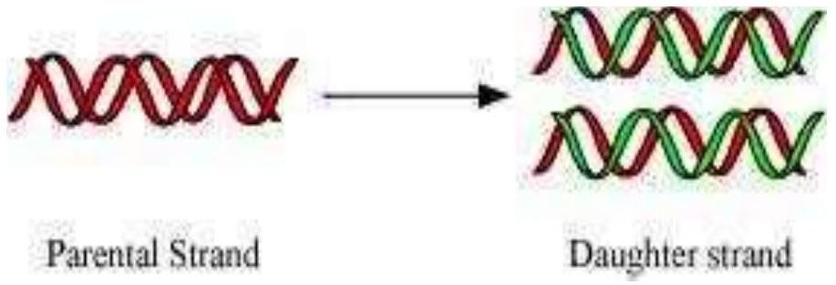
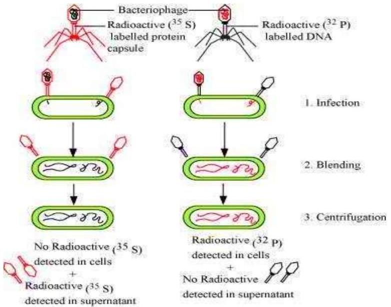
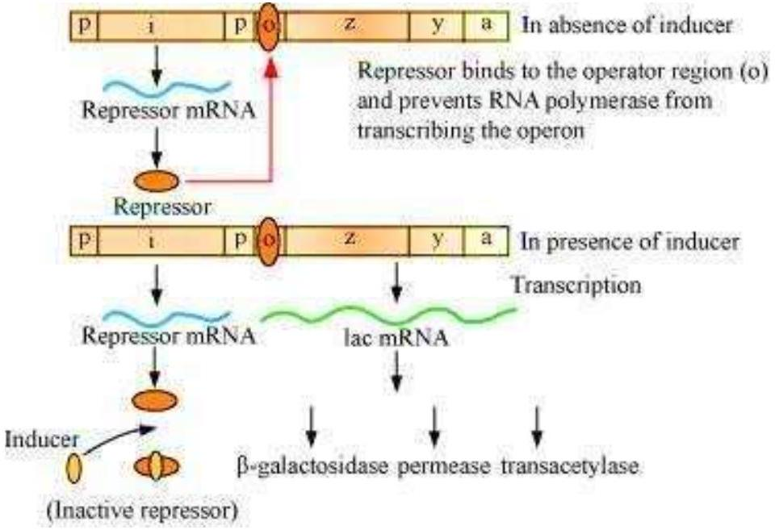
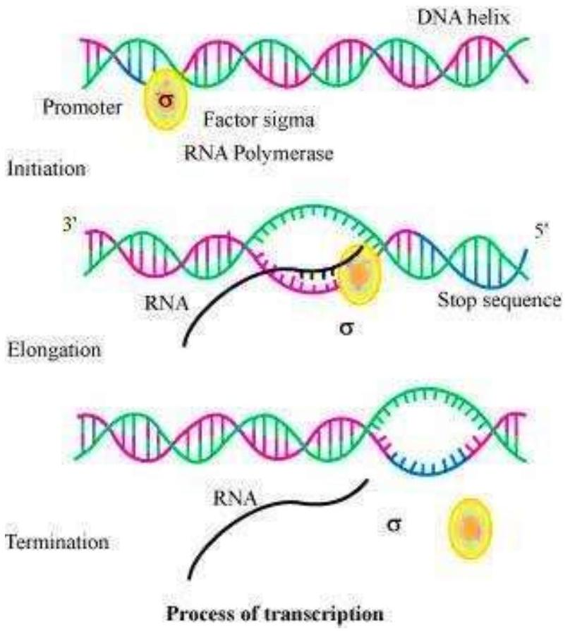
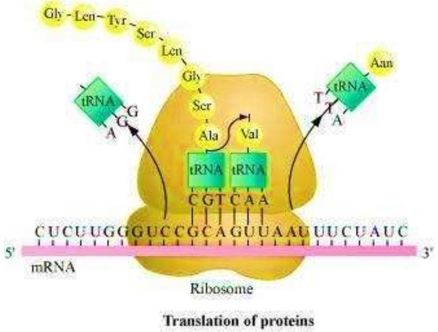

## Question 1:

Group the following as nitrogenous bases and nucleosides:
Adenine, Cytidine, Thymine, Guanosine, Uracil and Cytosine.

## Answer 1:

Nitrogenous bases present in the list are adenine, thymine, uracil, and cytosine.
Nucleosides present in the list are cytidine and guanosine.
## Question 2:

If a double stranded DNA has 20 per cent of cytosine, calculate the per cent of adenine in the DNA.

## Answer 2:

According to Chargaff's rule, the DNA molecule should have an equal ratio of pyrimidine (cytosine and thymine) and purine (adenine and guanine). It means that the number of adenine molecules is equal to thymine molecules and the number of guanine molecules is equal to cytosine molecules.
$\% \mathrm{~A}=\% \mathrm{~T}$ and \% $\mathrm{G}=\% \mathrm{C}$
If dsDNA has $20 \%$ of cytosine, then according to the law, it would have 20\% of guanine.
Thus, percentage of G + C content = 40\%
The remaining 60\% represents both A + T molecule.
Since adenine and guanine are always present in equal numbers, the percentage of adenine molecule is $30 \%$.

## Question 3:

If the sequence of one strand of DNA is written as follows:
5'-ATGCATGCATGCATGCATGCATGCATGC-3'
Write down the sequence of complementary strand in $5^{\prime} \rightarrow 3^{\prime}$ direction

## Answer 3:

The DNA strands are complementary to each other with respect to base sequence. Hence, if the sequence of one strand of DNA is
5'- ATGCATGCATGCATGCATGCATGCATGC - 3'
Then, the sequence of complementary strand in 5' to 3' direction will be
3'- TACGTACGTACGTACGTACGTACGTACG - 5'
Therefore, the sequence of nucleotides on DNA polypeptide in $5^{\prime}$ to $3^{\prime}$ direction is

5'- GCATGCATGCATGCATGCATGCATGCAT- 3'

## Question 4:

If the sequence of the coding strand in a transcription unit is written as follows:
5'-ATGCATGCATGCATGCATGCATGCATGC-3'. Write down the sequence of mRNA.

## Answer 4:

If the coding strand in a transcription unit is
5'- ATGCATGCATGCATGCATGCATGCATGC-3'
Then, the template strand in 3' to 5' direction would be
3' - TACGTACGTACGTACGTACGTACGTACG-5'
It is known that the sequence of mRNA is same as the coding strand of DNA.
However, in RNA, thymine is replaced by uracil.
Hence, the sequence of mRNA will be
5' - AUGCAUGCAUGCAUGCAUGCAUGCAUGC-3'

## Question 5:

Which property of DNA double helix led Watson and Crick to hypothesise semiconservative mode of DNA replication? Explain.

## Answer 5:

Watson and Crick observed that the two strands of DNA are anti-parallel and complementary to each other with respect to their base sequences. This type of arrangement in DNA molecule led to the hypothesis that DNA replication is semiconservative. It means that the double stranded DNA molecule separates and then, each of the separated strand acts as a template for the synthesis of a new complementary strand. As a result, each DNA molecule would have one parental strand and a newly synthesized daughter strand.
Since only one parental strand is conserved in each daughter molecule, it is known as semi-conservative mode of replication.

## Question 6:

Depending upon the chemical nature of the template (DNA or RNA) and the nature of nucleic acids synthesised from it (DNA or RNA), list the types of nucleic acid polymerases.

## Answer 6:

There are two different types of nucleic acid polymerases.

- DNA-dependent DNA polymerases
- DNA-dependent RNA polymerases

The DNA-dependent DNA polymerases use a DNA template for synthesizing a new strand of DNA, whereas DNA-dependent RNA polymerases use a DNA template strand for synthesizing RNA.

## Question 7:

How did Hershey and Chase differentiate between DNA and protein in their experiment while proving that DNA is the genetic material?

## Answer 7:

Hershey and Chase worked with bacteriophage and E.coli to prove that DNA is the genetic material. They used different radioactive isotopes to label DNA and protein coat of the bacteriophage.
They grew some bacteriophages on a medium containing radioactive phosphorus $\left({ }^{32} \mathrm{P}\right)$ to identify DNA and some on a medium containing radioactive sulphur $\left({ }^{35} \mathrm{~S}\right)$ to identify protein. Then, these radioactive labelled phages were allowed to infect E.coli bacteria. After infecting, the protein coat of the bacteriophage was separated from the bacterial cell by blending and then subjected to the process of centrifugation. Since the protein coat was lighter, it was found in the supernatant while the infected bacteria got settled at the bottom of the centrifuge tube. Hence, it was proved that DNA is the genetic material as it was transferred from virus to bacteria.

Hershey and Chase experiment

## Question 8:

Differentiate between the followings:

(a) Repetitive DNA and Satellite DNA
(b) mRNA and tRNA
(c) Template strand and Coding strand

## Answer 8:

(a) Repetitive DNA and satellite DNA

| Repetitive DNA |  | Satellite DNA |
| :--- | :--- | :--- |
| 1. | Repetitive DNA are DNA sequences that contain small segments, which are repeated many times. | Satellite DNA are DNA sequences that contain highly repetitive DNA. |
(b) mRNA and tRNA

| mRNA |  | tRNA |
| :--- | :--- | :--- |
| 1. | mRNA or messenger RNA acts as a template for the process of transcription. | tRNA or transfer RNA acts as an adaptor molecule that carries a specific amino acid to mRNA for the synthesis of polypeptide. |
| 2. | It is a linear molecule. | It has clover leaf shape. |
(c) Template strand and coding strand

| Template strand |  | Coding strand |
| :--- | :--- | :--- |
| 1. | Template strand of DNA acts as a template for the synthesis of mRNA during transcription. | Coding strand is a sequence of DNA that has the same base sequence as that of mRNA (except thymine that is replaced by uracil in DNA). |
| 2. | It runs from 3' to 5'. | It runs from 5'to 3'. |

## Question 9:

List two essential roles of ribosome during translation.

## Answer 9:

The important functions of ribosome during translation are as follows.

- Ribosome acts as the site where protein synthesis takes place from individual amino acids. It is made up of two subunits. The smaller subunit comes in contact with mRNA and forms a protein synthesizing complex whereas the larger subunit acts as an amino acid binding site.
- Ribosome acts as a catalyst for forming peptide bond. For example, 23s $r$-RNA in bacteria acts as a ribozyme.

## Question 10:

In the medium where E. coli was growing, lactose was added, which induced the lac operon. Then, why does lac operon shut down some time after addition of lactose in the medium?

## Answer 10:

Lac operon is a segment of DNA that is made up of three adjacent structural genes, namely, an operator gene, a promoter gene, and a regulator gene. It works in a coordinated manner to metabolize lactose into glucose and galactose.
In lac operon, lactose acts as an inducer. It binds to the repressor and inactivates it. Once the lactose binds to the repressor, RNA polymerase binds to the promoter region. Hence, three structural genes express their product and respective enzymes are produced. These enzymes act on lactose so that lactose is metabolized into glucose and galactose.
After sometime, when the level of inducer decreases as it is completely metabolized by enzymes, it causes synthesis of the repressor from regulator gene. The repressor binds to the operator gene and prevents RNA polymerase from transcribing the operon. Hence, the transcription is stopped. This type of regulation is known as negative regulation.

## Question 11:

Explain (in one or two lines) the function of the followings:

(a) Promoter
(b) tRNA
(c) Exons

## Answer 11:

(a) Promoter

Promoter is a region of DNA that helps in initiating the process of transcription. It serves as the binding site for RNA polymerase.

(b) tRNA

tRNA or transfer RNA is a small RNA that reads the genetic code present on mRNA. It carries specific amino acid to mRNA on ribosome during translation of proteins.

(c) Exons

Exons are coding sequences of DNA in eukaryotes that transcribe for proteins.

## Question 12:

Why is the Human Genome project called a mega project?

## Answer 12:

Human genome project was considered to be a mega project because it had a specific goal to sequence every base pair present in the human genome. It took around 13 years for its completion and got accomplished in year 2006. It was a large scale project, which aimed at developing new technology and generating new information in the field of genomic studies. As a result of it, several new areas and avenues have opened up in the field of genetics, biotechnology, and medical sciences. It provided clues regarding the understanding of human biology.

## Question 13:

What is DNA fingerprinting? Mention its application.

## Answer 13:

DNA fingerprinting is a technique used to identify and analyse the variations in various individuals at the level of DNA. It is based on variability and polymorphism in DNA sequences.
Application

- It is used in forensic science to identify potential crime suspects.
- It is used to establish paternity and family relationships.

- It is used to identify and protect the commercial varieties of crops and livestock.
- It is used to find out the evolutionary history of an organism and trace out the linkages between groups of various organisms.

## Question 14:

Briefly describe the following:

(a) Transcription
(b) Polymorphism
(c) Translation
(d) Bioinformatics

## Answer 14:

(a) Transcription

Transcription is the process of synthesis of RNA from DNA template. A segment of DNA gets copied into mRNA during the process. The process of transcription starts at the promoter region of the template DNA and terminates at the terminator region. The segment of DNA between these two regions is known as transcription unit. The transcription requires RNA polymerase enzyme, a DNA template, four types of ribonucleotides, and certain cofactors such as $\mathrm{Mg}^{2+}$.
The three important events that occur during the process of transcription are as follows.

- Initiation
- Elongation
- Termination

The DNA-dependent RNA polymerase and certain initiation factors $(\sigma)$ bind at the double stranded DNA at the promoter region of the template strand and initiate the process of transcription. RNA polymerase moves along the DNA and leads to the unwinding of DNA duplex into two separate strands. Then, one of the strands, called sense strand, acts as template for mRNA synthesis. The enzyme, RNA polymerase, utilizes nucleoside triphosphates (dNTPs) as raw material and polymerizes them to form mRNA according to the complementary bases present on the template DNA. This process of opening of helix and elongation of polynucleotide chain continues until the enzyme reaches the terminator region. As RNA polymerase reaches the terminator region, the newly synthesized mRNA transcripted along with enzyme is released. Another factor called terminator factor ( $\rho$ ) is required for the termination of the transcription.

(b) Polymorphism

Polymorphism is a form of genetic variation in which distinct nucleotide sequence can exist at a particular site in a DNA molecule. This heritable mutation is observed at a high frequency in a population. It arises due to mutation either in somatic cell or in the germ cells. The germ cell mutation can be transmitted from parents to their offsprings. This results in accumulation of various mutations in a population, leading to variation and polymorphism in the population. This plays a very important role in the process of evolution and speciation.
(c) Translation

Translation is the process of polymerizing amino acid to form a polypeptide chain. The triplet sequence of base pairs in mRNA defines the order and sequence of amino acids in a polypeptide chain.
The process of translation involves three steps.

- Initiation
- Elongation
- Termination

During the initiation of the translation, tRNA gets charged when the amino acid binds to it using ATP. The start (initiation) codon (AUG) present on mRNA is recognized only by the charged tRNA. The ribosome acts as an actual site for the process of translation and contains two separate sites in a large subunit for the attachment of subsequent amino acids. The small
subunit of ribosome binds to mRNA at the initiation codon (AUG) followed by the large subunit. Then, it initiates the process of translation. During the elongation process, the ribosome moves one codon downstream along with mRNA so as to leave the space for binding of another charged tRNA. The amino acid brought by tRNA gets linked with the previous amino acid through a peptide bond and this process continues resulting in the formation of a polypeptide chain. When the ribosome reaches one or more STOP codon (VAA, UAG, and UGA), the process of translation gets terminated. The polypeptide chain is released and the ribosomes get detached from mRNA.

(d) Bioinformatics

Bioinformatics is the application of computational and statistical techniques to the field of molecular biology. It solves the practical problems arising from the management and analysis of biological data. The field of bioinformatics developed after the completion of human genome project (HGP). This is because enormous amount of data has been generated during the process of HGP that has to be managed and stored for easy access and interpretation for future use by various scientists. Hence, bioinformatics involves the creation of biological databases that store the vast information of biology.
It develops certain tools for easy and efficient access to the information and its utilization. Bioinformatics has developed new algorithms and statistical methods to find out the relationship between the data, to predict protein structure and their functions, and to cluster the protein sequences into their related families.

