12087CH02

## उद्देश्य

इस एकक के अध्ययन के पश्चात् आप -

- विभिन्न प्रकार के विलयनों का बनना वर्णित कर सकेंगे;
- विलयन की सांद्रता को विभिन्न मात्रकों में व्यक्त कर सकेंगे;
- हेनरी एवं राउल्ट नियमों को स्पष्ट कर सकेंगे तथा व्याख्या कर सकेंगे;
- आदर्श तथा अनादर्श विलयनों में विभेद कर सकेंगे;
- वास्तविक विलयनों का राउल्ट के नियम से विचलन का कारण बता सकेंगे;
- विलयनों के अणुसंख्य गुणधर्मों का वर्णन कर सकेंगे तथा इनका विलेय के आण्विक द्रव्यमान से संबंध स्थापित कर सकेंगे;
- विलयनों में कुछ विलेयों द्वारा प्रदर्शित असामान्य अणुसंख्य गुणधर्मों को समझा सकेंगे।

## एकक一   विलयन

शरीर में लगभग सभी प्रक्रम किसी न किसी विलयन में घटित होते हैं।

सामान्य जीवन में हम बहुत कम शुद्ध पदार्थों से परिचित होते हैं। अधिकांशतः ये दो या अधिक शुद्ध पदार्थों के मिश्रण होते हैं। उनका जीवन में उपयोग तथा महत्व उनके संगठन पर निर्भर करता है। जैसे, पीतल (जिंक व निकैल का मिश्रण) के गुण जर्मन सिल्वर (कॉपर, जिंक व निकैल का मिश्रण) अथवा काँसे (ताँबे एवं टिन का मिश्रण) से अलग होते हैं। जल में उपस्थित फ्लुओराइड आयनों की $1.0 \mathrm{ppm}$ मात्रा दंत क्षरण को रोकती है। जबकि इसकी $1.5$ ppm मात्रा दाँतों के कर्बुरित (पीलापन) होने का कारण होती है तथा फ्लुओराइड आयनों की अधिक सांद्रता जहरीली हो सकती है (उदाहरणार्थ - सोडियम फ्लुओराइड का चूहों के लिए जहर के रूप में उपयोग) ; अंतशिरा इंजेक्शन हमेशा लवणीय जल में एक निश्चित आयनिक सांद्रता पर घोले जाते हैं जो रक्त प्लाज्मा की सांद्रता के सदृश होती हैं, इत्यादि कुछ उदाहरण हैं।

इस एकक में हम मुख्यतः द्रवीय विलयनों तथा उनको बनाने की विधियों पर विचार करेंगे तत्पश्चात् हम उनके गुणों जैसे वाष्पदाब व अणुसंख्य गुणधर्म का अध्ययन करेंगे। हम विलयनों के प्रकार से प्रारम्भ करेंगे और फिर द्रव विलयनों में उपस्थित विलेय की सांद्रता को व्यक्त करने के विभिन्न विकल्पों को जानेंगे।

## $1.1$ विलयनों के प्रकार

विलयन दो या दो से अधिक अवयवों का समांगी मिश्रण होता है। समांगी मिश्रण से हमारा तात्पर्य है कि मिश्रण में सभी जगह इसका संघटन व गुण एक समान होते हैं। सामान्यतः जो अवयव अधिक मात्रा में उपस्थित होता है, वह विलायक कहलाता है। विलायक विलयन की भौतिक अवस्था निर्धारित करता है, जिसमें विलयन विद्यमान होता है। विलयन में विलायक के अतिरिक्त उपस्थित एक या अधिक अवयव विलेय कहलाते हैं। इस एकक में हम केवल द्विअंगी विलयनों (जिनमें दो अवयव हों) का अध्ययन करेंगे। यहाँ प्रत्येक अवयव ठोस, द्रव अथवा गैस अवस्था में हो सकता है। जिनका संक्षिप्त विवरण सारणी $1.1$ में दिया गया है।

सारणी $1.1$ - विलयनों के प्रकार
| विलयनों के प्रकार | विलेय | विलायक | सामान्य उदाहरण |
| :--- | :--- | :--- | :--- |
| गैसीय विलयन | गैस | गैस | ऑक्सीजन व नाइट्रोजन गैस का मिश्रण |
|  | द्रव | गैस | क्लोरोफॉर्म को नाइट्रोजन गैस में मिश्रित किया जाए |
|  | ठोस | गैस | कपूर का नाइट्रोजन गैस में विलयन |
|  | गैस | द्रव | जल में घुली हुई ऑक्सीजन |
|  | द्रव | द्रव | जल में घुली हुई एथेनॉल |
|  | ठोस | द्रव | जल में घुला हुआ ग्लूकोस |
|  | गैस | ठोस | हाइड्रोजन का पैलेडियम में विलयन |
|  | द्रव | ठोस | पारे का सोडियम के साथ अमलगम |
|  | ठोस | ठोस | ताँबे का सोने में विलयन |

## $1.2$ विलयनों की सांढ़ता को व्यक्त करना

किसी विलयन का संघटन उसकी सांद्रता से व्यक्त किया जा सकता है। सांद्रता को गुणात्मक रूप से या मात्रात्मक रूप से व्यक्त किया जा सकता है। उदाहरणार्थ, गुणात्मक रूप से हम कह सकते हैं कि विलयन तनु है (अर्थात् विलेय की अपेक्षाकृत बहुत कम मात्रा) अथवा यह सांद्र है (अर्थात् विलेय की अपेक्षाकृत बहुत अधिक मात्रा) परंतु वास्तविकता में इस तरह का वर्णन अत्यधिक भ्रम उत्पन्न करता है। अतः विलयनों का मात्रात्मक रूप में वर्णन करने की आवश्यकता होती है। विलयनों की सांद्रता का मात्रात्मक वर्णन हम कई प्रकार से कर सकते हैं।
(i) द्रव्यमान प्रतिशत ( w/w )

विलयनों के अवयवों को द्रव्यमान प्रतिशत में निम्न प्रकार से परिभाषित किया जाता है-

$$
\text { अवयव का द्रव्यमान } \%=\frac{\text { विलयन में उपस्थित अवयव का द्रव्यमान }}{\text { विलयन का कुल द्रव्यमान }} \times 100
$$

उदाहरणार्थ, यदि एक विलयन का वर्णन, जल में $10 \%$ ग्लूकोस का द्रव्यमान, के रूप में किया जाए तो इसका तात्पर्य यह है कि $10$ g ग्लूकोस को $90$ g जल में घोलने पर $100$ g विलयन प्राप्त हुआ। द्रव्यमान प्रतिशत में व्यक्त सांद्रता का उपयोग सामान्य रासायनिक उद्योगों के अनुप्रयोगों में किया जाता है। उदाहरणार्थ व्यावसायिक ब्लीचिंग विलयन में सोडियम हाइपोक्लोराइट का जल में $3.62$ द्रव्यमान प्रतिशत होता है।
(ii) आयतन प्रतिशत ( $\boldsymbol{V} / \boldsymbol{V}$ )

आयतन प्रतिशत को निम्न प्रकार से परिभाषित किया जाता है-

$$
\text { अवयव का प्रतिशत आयतन }=\frac{\text { अवयव का आयतन }}{\text { विलयन का कुल आयतन }} \times 100
$$

उदाहरणार्थ: एथेनॉल का जल में $10 \%$ विलयन का तात्पर्य है कि $10 \mathrm{~mL}$ एथेनॉल को इतने जल में इतना घोलते हैं कि विलयन का कुल आयतन $100 \mathrm{~mL}$ हो जाए। द्रवीय विलयनों

को सामान्यतः इस मात्रक में प्रदर्शित किया जाता है। उदाहरणार्थ, एथिलीन ग्लाइकॉल का $35 \%(V / V)$ विलयन वाहनों के इंजन को ठंडा करने के काम में आता है। इस सांद्रता पर हिमरोधी; जल के हिमांक को 255.4 $\mathrm{K}\left(-17.6^{\circ} \mathrm{C}\right)$ तक कम कर देता है।

## (iii) द्रव्यमान-आयतन प्रतिशत (w/V)

एक अन्य इकाई (मात्रक) जो औषधियों व फार्मेसी में सामान्यतः उपयोग में आती है। वह है $100$ mL विलयन में घुले हुए विलेय का द्रव्यमान।

## (iv) पार्ट्स पर ( प्रति ) मिलियन ( पी.पी.एम. )

जब विलेय की मात्रा अत्यंत सूक्ष्म हो तो सांद्रता को पार्ट्स पर मिलियन (ppm) में प्रदर्शित करना उपयुक्त रहता है-
$\begin{aligned} \text { पाट्स पर }(\text { प्रति }) \text { मिलियन }= & \frac{\text { अवयव के भागों की संख्या }}{\text { विलयन में उपस्थित सभी अवयवों }} \times 10^{6} \\ & \text { के कुल भागों की संख्या }\end{aligned}$

प्रतिशत की भाँति ppm (पार्ट्स पर मिलियन) सांद्रता को भी द्रव्यमान - द्रव्यमान, आयतन - आयतन व द्रव्यमान - आयतन में प्रदर्शित किया जा सकता है। एक लीटर ( $1030$ g) समुद्री जल में $6 \times 10^{-3} \mathrm{~g}$ ऑक्सीजन $\left(\mathrm{O}_{2}\right)$ घुली होती है। इतनी कम सांद्रता को $5.8$ g प्रति $10^{6} \mathrm{~g}$ समुद्री जल ( $5.8 \mathrm{ppm}$ ) से भी व्यक्त किया जा सकता है। जल अथवा वायुमंडल में प्रदूषकों की सांद्रता को प्राय: $\mu \mathrm{g} \mathrm{mL}^{-1}$ अथवा ppm में प्रदर्शित किया जाता है।

## (v) मोल-अंश

$x$ को सामान्यतः मोल-अंश के संकेत के रूप में उपयोग करते हैं और $x$ के दाईं ओर नीचे लिखी हुई संख्या उसके अवयवों को प्रदर्शित करती है-

$$
\text { अवयव का मोल-अंश }=\frac{\text { अवयव के मोलों की संख्या }}{\text { सभी अवयवों के कुल मोलों की संख्या }}
$$

उदाहरणार्थ, एक द्विअंगी विलयन में यदि A व B अवयवों के मोल क्रमशः $n_{\mathrm{A}}$ व $n_{\mathrm{B}}$ हों तो A का मोल-अंश होगा-

$$
x_{\mathrm{A}}=\frac{n_{\mathrm{A}}}{n_{\mathrm{A}}+n_{\mathrm{B}}}
$$

$i$ अवयवों वाले विलयन में -

$$
x_{i}=\frac{n_{i}}{n_{1}+n_{2}+\ldots \ldots+n_{i}}=\frac{n_{i}}{n_{t}}
$$

यह दर्शाया जा सकता है कि दिए गए विलयन में उपस्थित सभी अवयवों के मोल-अंशों का योग एक होता है अर्थात्-

$$
x_{1}+x_{2}+\ldots \ldots \ldots \ldots \ldots . .+x_{i}=1
$$

मोल-अंश इकाई, विलयनों के भौतिक गुणों में संबंध दर्शाने में बहुत उपयोगी है जैसे विलयनों की सांद्रता का वाष्पदाब के साथ संबंध दर्शाने में तथा इसका उपयोग गैसीय मिश्रणों के लिए आवश्यक गणना की व्याख्या करने में भी है।

उदाहरण $1.1$ एथिलीन ग्लाइकॉल $\left(\mathrm{C}_{2} \mathrm{H}_{6} \mathrm{O}_{2}\right)$ के मोल-अंश की गणना करो यदि विलयन में $\mathrm{C}_{2} \mathrm{H}_{6} \mathrm{O}_{2}$ का $20 \%$ द्रव्यमान उपस्थित हो।

हल माना कि हमारे पास $100$ g विलयन है। (हम विलयन की किसी भी मात्रा से प्रारंभ कर सकते हैं क्योंकि परिणाम समान ही होगा।) विलयन में $20$ g एथिलीन ग्लाइकॉल व $80$ g जल होगा। $\mathrm{C}_{2} \mathrm{H}_{6} \mathrm{O}_{2}$ का आण्विक द्रव्यमान $=(12 \times 2)+(1 \times 6)+(16 \times 2)=62 \mathrm{~g} \mathrm{~mol}^{-1}$

$$
\begin{aligned}
& \mathrm{C}_{2} \mathrm{H}_{6} \mathrm{O}_{2} \text { के } \mathrm{mol}=\frac{20 \mathrm{~g}}{62 \mathrm{~g} \mathrm{~mol}^{-1}}=0.322 \mathrm{~mol} \\
& \text { जल के } \mathrm{mol}=\frac{80 \mathrm{~g}}{18 \mathrm{~g} \mathrm{~mol}^{-1}}=4.444 \mathrm{~mol} \\
& x_{\text {ग्लाइकॉल }}=\frac{\mathrm{C}_{2} \mathrm{H}_{6} \mathrm{O}_{2} \text { के } \mathrm{mol}}{\mathrm{C}_{2} \mathrm{H}_{6} \mathrm{O}_{2} \text { के } \mathrm{mol}+\mathrm{H}_{2} \mathrm{O} \text { के } \mathrm{mol}}=\frac{0.322 \mathrm{~mol}}{0.322 \mathrm{~mol}+4.444 \mathrm{~mol}}=0.068
\end{aligned}
$$

इसी प्रकार,

$$
x_{\text {जल }}=\frac{4.444 \mathrm{~mol}}{0.322 \mathrm{~mol}+4.444 \mathrm{~mol}}=0.932
$$

जल के मोल-अंश की गणना निम्नलिखित प्रकार से भी की जा सकती है।

$$
1-0.068=0.932
$$

(vi) मोलरता
एक लीटर (1 क्यूबिक डेसीमीटर) विलयन में घुले हुए विलेय के मोलों की संख्या को उस विलयन की मोलरता (M) कहते हैं।

$$
\text { मोलरता }=\frac{\text { विलेय के मोल }}{\text { विलयन का लीटर में आयतन }}
$$

उदाहरणार्थ NaOH के $0.25 \mathrm{~mol} \mathrm{~L}^{-1}(0.25 \mathrm{M})$ विलयन का तात्पर्य है कि NaOH के $0.25$ मोल को $1$ लीटर (एक क्यूबिक डेसीमीटर) विलयन में घोला गया है।

उदाहरण $1.2$ उस विलयन की मोलरता की गणना कीजिए, जिसमें $5$ g NaOH, $450$ mL विलयन में घुला हुआ है।

हल NaOH के मोल $=\frac{5 \mathrm{~g}}{40 \mathrm{~g} \mathrm{~mol}^{-1}}=0.125 \mathrm{~mol}$
विलयन का लीटर में आयतन $=\frac{450 \mathrm{~mL}}{1000 \mathrm{~mL} \mathrm{~L}^{-1}}$

$$
\begin{aligned}
\text { समीकरण (1.8) का उपयोग करने पर मोलरता } & =\frac{0.125 \mathrm{~mol} \times 1000 \mathrm{~mL} \mathrm{~L}^{-1}}{450 \mathrm{~mL}} \\
& =0.278 \mathrm{M} \\
& =0.278 \mathrm{~mol} \mathrm{~L}^{-1} \\
& =0.278 \mathrm{~mol} \mathrm{dm}^{-3}
\end{aligned}
$$

(vii) मोललता
किसी विलयन की मोललता (m) $1$ kg विलायक में उपस्थित विलेय के मोलों की संख्या के रूप में परिभाषित की जाती है और इसे निम्न प्रकार से व्यक्त करते हैं-
मोललता $(\mathrm{m})=\frac{\text { विलेय के मोल }}{\text { विलायक का किलोग्राम में द्रव्यमान }}$
उदाहरणार्थ, $1.00 \mathrm{~mol} \mathrm{~kg}^{-1}(1.00 \mathrm{~m}) \mathrm{KCl}$ का जलीय विलयन से तात्पर्य है कि $1 \mathrm{~mol}(74.5 \mathrm{~g}) \mathrm{KCl}$ को $1 \mathrm{~kg}$ जल में घोला गया है। विलयनों की सांद्रता व्यक्त करने की प्रत्येक विधि के अपने-अपने गुण एवं दोष होते हैं।
द्रव्यमान प्रतिशत, ppm मोल-अंश तथा मोललता ताप पर निर्भर नहीं करते, जबकि मोलरता ताप पर निर्भर करती है। ऐसा इसलिए होता है कि आयतन ताप पर निर्भर करता है जबकि द्रव्यमान नहीं।

उदाहरण $1.32 .5 \mathrm{~g}$ एथेनोइक अम्ल $\left(\mathrm{CH}_{3} \mathrm{COOH}\right)$ के $75 \mathrm{~g}$ बेन्जीन में विलयन की मोललता की गणना करो।

हल $\mathrm{C}_{2} \mathrm{H}_{4} \mathrm{O}_{2}$ का मोलर द्रव्यमान $=(12 \times 2)+(1 \times 4)+(16 \times 2)=60 \mathrm{~g} \mathrm{~mol}^{-1}$

$$
\begin{aligned}
\mathrm{C}_{2} \mathrm{H}_{4} \mathrm{O}_{2} \text { के मोल } & =\frac{2.5 \mathrm{~g}}{60 \mathrm{~g} \mathrm{~mol}^{-1}}=0.0417 \mathrm{~mol} \\
\text { बेन्जीन का } \mathrm{kg} \text { में द्रव्यमान } & =\frac{75 \mathrm{~g}}{1000 \mathrm{~g} \mathrm{~kg}^{-1}}=75 \times 10^{-3} \mathrm{~kg} \\
\mathrm{C}_{2} \mathrm{H}_{4} \mathrm{O}_{2} \text { की मोललता } & =\frac{\mathrm{C}_{2} \mathrm{H}_{4} \mathrm{O}_{2} \text { के } \mathrm{mol}}{\text { बेन्जीन का } \mathrm{kg} \text { में द्रव्यमान }} \\
& =\frac{0.0417 \mathrm{~mol} \times 1000 \mathrm{~g} \mathrm{~kg}^{-1}}{75 \mathrm{~g}}=0.556 \mathrm{~mol} \mathrm{~kg}^{-1}
\end{aligned}
$$

## पाठ्यनिहित प्रश्न

$1.1$ यदि $22$ g बेन्जीन में $22$ g कार्बनटेट्राक्लोराइड घुली हो तो बेन्जीन एवं कार्बन टेट्राक्लोराइड के द्रव्यमान प्रतिशत की गणना कीजिए।
$1.2$ एक विलयन में बेन्जीन का $30$ द्रव्यमान \% कार्बनटेट्राक्लोराइड में घुला हुआ हो तो बेन्जीन के मोल-अंश की गणना कीजिए।
$1.3$ निम्नलिखित प्रत्येक विलयन की मोलरता की गणना कीजिए-
(क) $30 \mathrm{~g}, \mathrm{Co}\left(\mathrm{NO}_{3}\right)_{2} \cdot 6 \mathrm{H}_{2} \mathrm{O} 4.3$ लीटर विलयन में घुला हुआ हो
(ख) $30 \mathrm{~mL} 0.5 \mathrm{M} \mathrm{H}_{2} \mathrm{SO}_{4}$ को $500 \mathrm{~mL}$ तनु करने पर।
$1.4$ यूरिया $\left(\mathrm{NH}_{2} \mathrm{CONH}_{2}\right)$ के $0.25$ मोलर, $2.5 \mathrm{~kg}$ जलीय विलयन को बनने के लिए आवश्यक यूरिया के द्रव्यमान की गणना कीजिए।
$1.520 \%(w / w)$ जलीय KI का घनत्व $1.202 \mathrm{~g} \mathrm{~mL}^{-1}$ हो तो KI विलयन की (क) मोललता, (ख) मोलरता, (ग) मोल-अंश की गणना कीजिए।

## $1.3$ विलेयता

### 1.3.1 ठोसों की द्रवों में विलेयता

किसी अवयव की विलेयता एक निश्चित ताप पर विलायक की निश्चित मात्रा में घुली हुई उस पदार्थ की अधिकतम मात्रा होती है। यह विलेय एवं विलायक की प्रकृति तथा ताप एवं दाब पर निर्भर करती है। आइए हम इन कारकों के प्रभाव का अध्ययन ठोस अथवा गैस की द्रवों में विलेयता पर करें।

प्रत्येक ठोस दिए गए द्रव में नहीं घुलता जैसे सोडियम क्लोराइड व शर्करा जल में आसानी से घुल जाते हैं, जबकि नैफ़्थैलीन और ऐन्थ्रासीन नहीं घुलते। दूसरी ओर नैफ़्थैलीन व ऐन्थ्रासीन बेन्जीन में आसानी से घुल जाते हैं, जबकि सोडियम क्लोराइड व शर्करा नहीं घुलते। यह देखा गया है कि ध्रुवीय विलेय, ध्रुवीय विलायकों में घुलते हैं जबकि अध्रुवीय विलेय अध्रुवीय विलायकों में। सामान्यतः एक विलेय विलायक में घुल जाता है, यदि दोनों में अंतराआण्विक अन्योन्यक्रियाएं समान हों। हम कह सकते हैं कि "समान-समान को घोलता है" ("like dissolves like")

जब एक ठोस विलेय, द्रव विलायक में डाला जाता है तो यह उसमें घुलने लगता है। यह प्रक्रिया विलीनीकरण (घुलना) कहलाती है। इससे विलयन में विलेय की सांद्रता बढ़ने लगती है। इसी समय विलयन में से कुछ विलेय के कण ठोस विलेय के कणों के साथ संघट्ट कर विलयन से अलग हो जाते हैं। यह प्रक्रिया क्रिस्टलीकरण कहलाती है। एक ऐसी स्थिति आती है, जब दोनों प्रक्रियाओं की गति समान हो जाती है। इस परिस्थिति में विलयन में जाने वाले विलेय कणों की संख्या विलयन से पृथक्कारी विलेय के कणों की संख्या के बराबर होगी और गतिक साम्य की प्रावस्था पहुँच जाएगी। इस स्थिति में दिए गए ताप व दाब पर विलयन में उपस्थित विलेय की सांद्रता स्थिर रहेगी।

विलेय + विलायक ⇌ विलयन

जब गैस को द्रवीय विलायकों में घोला जाता है तब भी ऐसा ही होता है। इस प्रकार का विलयन जिसमें दिए गए ताप एवं दाब पर और अधिक विलेय नहीं घोला जा सके, संतृप्त विलयन कहलाता है, एवं वह विलयन जिसमें उसी ताप पर और अधिक विलेय घोला जा सके, असंतृप्त विलयन कहलाता है। वह विलयन जो कि बिना घुले विलेय के साथ गतिक साम्य में होता है; संतृप्त विलयन कहलाता है एवं इसमें विलायक की दी गई मात्रा में घुली हुई, विलेय की अधिकतम मात्रा होती है। ऐसे विलयनों में विलेय की सांद्रता उसकी विलेयता कहलाती है।

पहले हम देख चुके हैं कि एक पदार्थ में दूसरे की विलेयता पदार्थों की प्रकृति पर निर्भर करती है। इसके अतिरिक्त दो अन्य कारक, ताप एवं दाब भी इस प्रक्रिया को नियंत्रित करते हैं।

## ताप का प्रभाव

ठोसों की द्रवों में विलेयता पर ताप परिवर्तन का महत्वपूर्ण प्रभाव पड़ता है। समीकरण (1.10) द्वारा प्रदर्शित साम्य का अध्ययन करें, गतिक साम्य होने के कारण इसे ले-शातैलिये नियम का पालन करना चाहिए। सामान्यतः यदि निकट संतृप्तता प्राप्त विलयन में घुलने की प्रक्रिया उष्माशोषी $\left(\Delta_{\text {विलयन }} H>0\right)$ हो तो ताप के बढ़ने पर विलेयता बढ़नी चाहिए और यदि यह उष्माक्षेपी ( $\Delta_{\text {विलयन }} H<0$ ) हो तो विलेयता कम होनी चाहिए। ऐसा प्रयोगात्मक रूप से भी देखा गया है।

### 1.3.2 गैसों की द्रवों में विलेयता

चित्र 1.1- गैस की विलेयता पर दाब का प्रभावा विलेय गैस की सांद्रता विलयन के ऊपर उपस्थित गैस पर लगाए गए दाब के समानुपाती होती है।
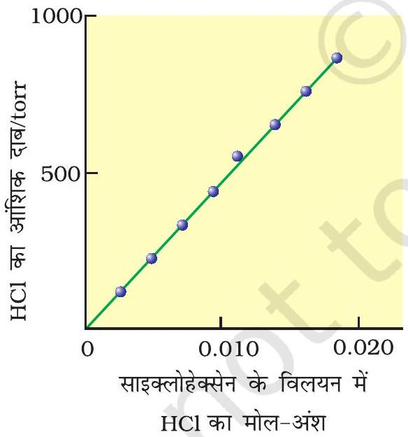

दाब का प्रभाव
ठोसों की द्रवों में विलेयता पर दाब का कोई सार्थक प्रभाव नहीं होता। ऐसा इसलिए होता है; क्योंकि ठोस एवं द्रव अत्यधिक असंपीड्य होते हैं एवं दाब परिवर्तन से सामान्यतः अप्रभावित रहते हैं।

बहुत सी गैसें जल में घुल जाती हैं। ऑक्सीजन जल में बहुत कम मात्रा में घुलती है। ऑक्सीजन की यह घुली हुई मात्रा जलीय जीवन को जीवित रखती है। दूसरी ओर हाइड्रोजन क्लोराइड गैस $(\mathrm{HCl})$ जल में अत्यधिक घुलनशील होती है। गैसों की द्रवों में विलेयता ताप एवं दाब द्वारा बहुत अधिक प्रभावित होती है। दाब बढ़ने पर गैसों की विलेयता बढ़ती जाती है। चित्र $1.1$ (क) में दर्शाये गए गैसों के विलयन के एक निकाय का $p$ दाब एवं $T$ ताप पर अध्ययन करते हैं जिसका निचला भाग विलयन है एवं ऊपरी भाग गैसीय है। मान लें कि यह निकाय गतिक साम्य अवस्था में है; अर्थात् इन परिस्थितियों में गैसीय कणों के विलयन में जाने व उसमें से निकलने की गति समान है। अब गैस के कुछ आयतन को संपीडित कर विलयन पर दाब बढ़ाते हैं (चित्र $1.1$ ख)। इससे विलयन के ऊपर उपस्थित गैसीय कणों की संख्या प्रति इकाई आयतन में बढ़ जाएगी तथा गैसीय कणों की, विलयन की सतह में प्रवेश करने के लिए, उससे टकराने की दर भी बढ़ जाएगी। इससे गैस की विलेयता तब तक बढ़ेगी जब तक कि एक नया साम्य स्थापित न हो जाए। अतः विलयन पर दाब बढ़ने से गैस की विलेयता बढ़ती है।

चित्र $1.2-\mathrm{HCl}$ गैस की साइक्लोहेक्सेन में $293 K$ पर विलेयता के प्रायोगिक परिणाम। रेखा का ढाल हेनरी स्थिरांक $K_{H}$ को व्यक्त करता है।
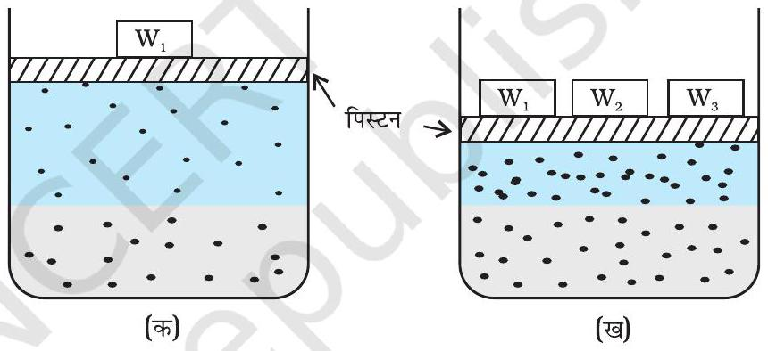

सर्वप्रथम गैस की विलायक में विलेयता तथा दाब के मध्य मात्रात्मक संबंध हेनरी ने दिया, जिसे हेनरी नियम कहते हैं। इसके अनुसार स्थिर ताप पर किसी गैस की द्रव में विलेयता द्रव अथवा विलयन की सतह पर पड़ने वाले गैस के आंशिक दाब के समानुपाती होती है। डाल्टन, जो हेनरी के समकालीन था, ने भी स्वतंत्र रूप से निष्कर्ष निकाला कि किसी द्रवीय विलयन में गैस की विलेयता गैस के आंशिक दाब पर निर्भर करती है। यदि हम विलयन में गैस के मोल-अंश को उसकी विलेयता का माप मानें तो यह कहा जा सकता है कि किसी विलयन में गैस का मोल-अंश उस विलयन के ऊपर उपस्थित गैस के आंशिक दाब के समानुपाती होता है। सामान्य रूप से हेनरी नियम के अनुसार "किसी गैस का वाष्प अवस्था में आंशिक दाब $(\boldsymbol{p})$, उस विलयन में गैस के मोल-अंश ( $\boldsymbol{x}$ ) के समानुपाती होता है" अथवा

$$
p=\mathrm{K}_{\mathrm{H}} x
$$

यहाँ $\mathrm{K}_{\mathrm{H}}$ हेनरी स्थिरांक है। यदि हम गैस के आंशिक दाब एवं विलयन में गैस के मोल-अंश के मध्य आलेख खींचें तो हमें चित्र $1.2$ में दर्शाया गया आलेख प्राप्त होगा।

समान ताप पर विभिन्न गैसों के लिए $\mathrm{K}_{\mathrm{H}}$ का मान भिन्न-भिन्न होता है (सारणी 1.2)। इससे निष्कर्ष निकलता है कि $\mathrm{K}_{\mathrm{H}}$ का मान गैस की प्रकृति पर निर्भर करता है।

समीकरण $1.11$ से स्पष्ट है कि दिए गए दाब पर $\mathrm{K}_{\mathrm{H}}$ का मान जितना अधिक होगा, द्रव में गैस की विलेयता उतनी ही कम होगी। सारणी $1.2$ से देखा जा सकता है कि $\mathrm{N}_{2}$ एवं $\mathrm{O}_{2}$ दोनों के लिए ताप बढ़ने पर $\mathrm{K}_{\mathrm{H}}$ का मान बढ़ता है, जिसका अर्थ है कि ताप बढ़ने पर इन गैसों की विलेयता घटती है। यही कारण है कि जलीय स्पीशीज़ के लिए गर्म जल की तुलना में ठंडे जल में रहना अधिक आरामदायक होता है।

सारणी $1.2$ - जल में कुछ गैसों के लिए हेनरी स्थिरांक $\left(\mathbf{K}_{\mathrm{H}}\right)$ का मान
| गैस | ताप/K | $\boldsymbol{K}_{\mathbf{H}} \boldsymbol{/} \mathbf{k b a r}$ | गैस | ताप/K | $\boldsymbol{K}_{\mathbf{H}} \boldsymbol{/} \mathbf{k b a r}$ |
| :--- | :--- | :--- | :--- | :--- | :--- |
| He | $293$ | $144.97$ | आर्गन | $298$ | $40.3$ |
| $\mathrm{H}_{2}$ | $293$ | $69.16$ | $\mathrm{CO}_{2}$ | $298$ | $1.67$ |
| $\mathrm{N}_{2}$ | $293$ | $76.48$ | फार्मेल्डीहाइड | $298$ | $1.83 \times 10^{-5}$ |
| $\mathrm{N}_{2}$ | $303$ | $88.84$ | मेथेन | $298$ | $0.413$ |
| $\mathrm{O}_{2}$ | $293$ | $34.86$ | वाइनिल क्लोराइड | $298$ | $0.611$ |
| $\mathrm{O}_{2}$ | $303$ | $46.82$ |  |  |  |

उदाहरण $1.4$ यदि $\mathrm{N}_{2}$ गैस को $293$ K पर जल में से प्रवाहित किया जाए तो एक लीटर जल में कितने मिलीमोल $\mathrm{N}_{2}$ गैस विलेय होगी? $\mathrm{N}_{2}$ का आंशिक दाब $0.987$ bar है तथा $293 \mathrm{~K}$ पर $\mathrm{N}_{2}$ के लिए $\mathrm{K}_{\mathrm{H}}$ का मान $76.48$ kbar है।
हल किसी गैस की विलेयता जलीय विलयन में उसके मोल-अंश से संबंधित होती है। विलयन में गैस के मोल-अंश की गणना हेनरी नियम से की जा सकती है। अतैव-

$$
x(\text { नाइट्रोजन })=\frac{p(\text { नाइट्रोजन })}{K_{\mathrm{H}}}=\frac{0.987 \mathrm{bar}}{76,480 \mathrm{bar}}=1.29 \times 10^{-5}
$$

एक लीटर जल में उसके $55.5$ मोल होते हैं माना कि विलयन में $\mathrm{N}_{2}$ के मोलों की संख्या $n$ है।

$$
x(\text { नाइट्रोजन })=\frac{n \mathrm{~mol}}{n \mathrm{~mol}+55.5 \mathrm{~mol}}=\frac{n}{55.5}=1.29 \times 10^{-5}
$$

(चूँकि भिन्न के हर में $55.5$ की तुलना में $n$ का मान बहुत कम है अतः इसे छोड़ दिया गया है।)

इस प्रकार-

$$
\begin{aligned}
n & =1.29 \times 10^{-5} \times 55.5 \mathrm{~mol} \\
& =7.16 \times 10^{-4} \mathrm{~mol} \\
& =\frac{7.16 \times 10^{-4} \mathrm{~mol} \times 1000 \mathrm{~m} \mathrm{~mol}}{1 \mathrm{~mol}} \\
& =0.716 \mathrm{~m} \mathrm{~mol}
\end{aligned}
$$

हेनरी नियम के उद्योगों में अनेक अनुप्रयोग हैं एवं यह कुछ जैविक घटनाओं को समझाता है। इनमें से कुछ ध्यान आकर्षित करने वाली इस प्रकार हैं -

- सोडा-जल एवं शीतल पेयों में $\mathrm{CO}_{2}$ की विलेयता बढ़ाने के लिए बोतल को अधिक दाब पर बंद किया जाता है।
- गहरे समुद्र में श्वास लेते हुए गोताखोरों को अधिक दाब पर गैसों की अधिक घुलनशीलता का सामना करना पड़ सकता है। अधिक बाहरी दाब के कारण श्वास के साथ ली गई वायुमंडलीय गैसों की विलेयता रुधिर में अधिक हो जाती है। जब गोताखोर सतह की ओर आते हैं, बाहरी दाब धीर-धीरे कम होने लगता है। इसके कारण घुली हुई गैसें बाहर निकलती हैं, इससे रुधिर में नाइट्रोजन के बुलबुले बन जाते हैं। यह केशिकाओं में अवरोध उत्पन्न कर देता है और एक चिकत्सीय अवस्था उत्पन्न कर देता है जिसे बेंड्स (Bends) कहते हैं, यह अत्यधिक पीड़ादायक एवं जानलेवा होता है। बेंड्स से तथा नाइट्रोजन की रूधिर में अधिक मात्रा के ज़हरीले प्रभाव से बचने के लिए, गोताखोरों द्वारा श्वास लेने के लिए उपयोग किए जाने वाले टैंकों में, हीलियम मिलाकर तनु की गई वायु को भरा जाता है ( $11.7 \%$ हीलियम, $56.2 \%$ नाइट्रोजन तथा $32.1 \%$ ऑक्सीजन)।
- अधिक ऊँचाई वाली जगहों पर ऑक्सीजन का आंशिक दाब सतही स्थानों से कम होता है अतः इन जगहों पर रहने वाले लोगों एवं आरोहकों के रुधिर और ऊतकों में ऑक्सीजन की सांद्रता निम्न हो जाती है। इसके कारण आरोहक कमज़ोर हो जाते हैं और स्पष्टतया सोच नहीं पाते। इन लक्षणों को ऐनॉक्सिया कहते हैं।

## ताप का प्रभाव

ताप के बढ़ने पर किसी गैस की द्रवों में विलेयता घटती है। घोले जाने पर गैस के अणु द्रव प्रावस्था में विलीन होकर उसमें उपस्थित होते हैं अतः विलीनीकरण के प्रक्रम को संघनन के समकक्ष समझा जा सकता है तथा इस प्रक्रम में ऊर्जा उत्सर्जित होती है। हम पिछले खंड में पढ़ चुके हैं कि विलीनीकरण की प्रक्रिया एक गतिक साम्य की अवस्था में होती है अतः इसे ले-शातैलिये नियम का पालन करना चाहिए। चूँकि घुलनशीलता एक उष्माक्षेपी प्रक्रिया है; अत: ताप बढ़ने पर विलेयता घटनी चाहिए।

## पाठ्यनिहित प्रश्न

$1.6$ सड़े हुए अंडे जैसी गंध वाली विषैली गैस $\mathrm{H}_{2} \mathrm{~S}$ गुणात्मक विश्लेषण में उपयोग की जाती है। यदि $\mathrm{H}_{2} \mathrm{~S}$ गैस की जल में STP पर विलेयता 0.195 M हो तो हेनरी स्थिरांक की गणना कीजिए।
$1.7298 \mathrm{~K}$ पर $\mathrm{CO}_{2}$ गैस की जल में विलेयता के लिए हेनरी स्थिरांक का मान $1.67 \times 10^{8} \mathrm{~Pa}$ है। $500 \mathrm{~mL}$ सोडा जल $2.5 \mathrm{~atm}$ दाब पर बंद किया गया। $298 \mathrm{~K}$ ताप पर घुली हुई $\mathrm{CO}_{2}$ की मात्रा की गणना कीजिए।

## $1.4$ द्रवीय विलयनों का वाष्प दाब

जब विलायक कोई द्रव होता है तो द्रवीय विलयन बनते हैं। विलेय एक गैस, द्रव या ठोस हो सकता है। गैसों के द्रवों में विलयनों का अध्ययन हम पहले ही खंड 1.3.2 में कर चुके हैं। अब हम द्रवों और ठोसों के द्रवों में विलयनों का अध्ययन करेंगे। इस प्रकार के विलयनों में एक या अधिक अवयव वाष्पशील हो सकते हैं। सामान्यतः द्रवीय विलायक वाष्पशील होते हैं। विलेय वाष्पशील हो भी सकते हैं अथवा नहीं भी। हम यहाँ केवल द्विअंगी विलयनों के गुणों का अध्ययन करेंगे, अर्थात् वे विलयन जिनमें दो अवयव होते हैं यानी कि (1) द्रवों का द्रवों में विलयन तथा (2) ठोसों का द्रवों में विलयन।

### 1.4.1 द्रव-द्रव विलयनों का वाष्प दाब

आइए, हम दो वाष्पशील द्रवों के द्विअंगी विलयन का अध्ययन करें और इसके दोनों अवयवों को $1$ व $2$ से अंकित करें। एक बंद पात्र में लेने पर दोनों अवयव वाष्पीकृत होंगे तथा अंततः वाष्प प्रावस्था एवं द्रव प्रावस्था के मध्य एक साम्य स्थापित हो जाएगा। मान लीजिए इस अवस्था में कुल दाब $p_{\text {कुल }}$ तथा अवयव $1$ एवं $2$ के आंशिक वाष्प दाब क्रमशः $p_{1}$ एवं $p_{2}$ हैं। यह आंशिक वाष्प दाब, अवयव $1$ एवं $2$ के मोल-अंश, क्रमशः $x_{1}$ व $x_{2}$ से संबंधित हैं।

फ्रेंच रसायनज्ञ फ्रेंसियस मार्टे राउल्ट (1886) ने इनके बीच एक मात्रात्मक संबंध दिया। यह संबंध राउल्ट नियम के नाम से जाना जाता है। इसके अनुसार वाष्पशील द्रवों के विलयन में प्रत्येक अवयव का आंशिक दाब विलयन में उसके मोल-अंश के समानुपाती होता है। अतः अवयव $1$ के लिए-

$$
p_{1} \propto x_{1}
$$

और $p_{1}=p_{1}^{0} x_{1}$
जहाँ $p_{1}^{0}$ शुद्ध घटक $1$ का समान ताप पर वाष्प दाब है
इसी प्रकार अवयव $2$ के लिए-

$$
p_{2}=p_{2}^{0} x_{2}
$$

जहाँ $p_{2}^{0}$ शुद्ध घटक $2$ के वाष्प दाब को प्रदर्शित करता है।
डाल्टन के आंशिक दाब के नियमानुसार पात्र में विलयन अवस्था का कुल दाब ( $p_{\text {कुल }}$ ) विलयनों के अवयवों के आंशिक दाब के जोड़ के बराबर होता है इसलिए-

$$
p_{\text {कुल }}=p_{1}+p_{2}
$$

$p_{1}$ व $p_{2}$ के मान रखने पर हम पाते हैं कि-

$$
\begin{aligned}
p_{\text {कुल }} & =x_{1} p_{1}^{0}+x_{2} p_{2}^{0} \\
& =\left(1-x_{2}\right) p_{1}^{0}+x_{2} p_{2}^{0} \\
& =p_{1}^{0}+\left(p_{2}^{0}-p_{1}^{0}\right) x_{2}
\end{aligned}
$$

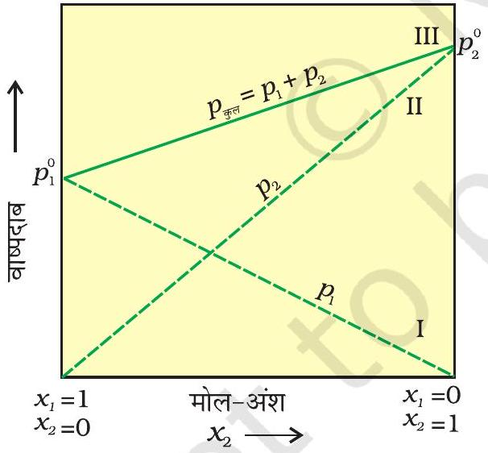
चित्र 1.3-स्थिर ताप पर आदर्श विलयन के वाष्प दाब एवं मोल-अंश का आलेख असतत रेखाएँ I एवं II घटकों के आंशिक दाब को व्यक्त करती हैं (आलेख से देखा जा सकता है कि $p_{1}$ तथा $p_{2}$ क्रमशः $x_{1}$ एवं $x_{2}$ के समानुपाती हैं) चित्र में अंकित रेखा III कुल वाष्प दाब दर्शाती है।

समीकरण $1.16$ से निम्नलिखित परिणाम निकाले जा सकते हैं।

(i) किसी विलयन के कुल वाष्प दाब को उसके किसी अवयव के मोल-अंश से संबंधित किया जा सकता है।
(ii) किसी विलयन का कुल वाष्प दाब अवयव $2$ के मोल-अंश के साथ रेखीय रूप से परिवर्तित होता है।
(iii) शुद्ध अवयव $1$ व $2$ के वाष्प दाब पर निर्भर रहते हुए विलयन का कुल वाष्प दाब अवयव $1$ के मोल-अंश के बढ़ने से कम या ज़्यादा होता है।

किसी विलयन के लिए $p_{1}$ अथवा $p_{2}$ का $x_{1}$ तथा $x_{2}$ के विरुद्ध आलेख चित्र $1.3$ की तरह रेखीय आलेख होता है। जब $x_{1}$ व $x_{2}$ का मान $1$ होता है तो ये रेखाएँ (I व II) क्रमशः बिंदु $p_{1}^{0}$ व $p_{2}^{0}$ से होकर गुज़रती हैं। इसी प्रकार से $p_{\text {कुल }}$ का $x_{2}$ के विरुद्ध आलेख (लाइन III) भी रेखीय होता है (चित्र 1.3)। $p_{\text {कुल }}$ का न्यूनतम मान $p_{1}^{0}$ तथा अधिकतम मान $p_{2}^{0}$ है। यहाँ घटक $1$ घटक $2$ की तुलना में कम वाष्पशील है अर्थात् $p_{1}^{0}<p_{2}^{0}$ ।

विलयन के साथ साम्य में वाष्प प्रावस्था के संघटन का निर्धारण अवयवों के आंशिक दाब से निर्धारित किया जा सकता है। यदि $y_{1}$ एवं $y_{2}$ क्रमशः अवयव $1$ व $2$ के वाष्पीय अवस्था में मोल-अंश हों तब डाल्टन के आंशिक दाब के नियम का उपयोग करने पर-

$$
\begin{aligned}
& p_{1}=y_{1} p_{\text {कुल }} \\
& p_{2}=y_{2} p_{\text {कुल }}
\end{aligned}
$$

सामान्यतः $p_{i}=y_{i} p_{\text {कुल }}$

उदाहरण $1.5298 \mathrm{~K}$ पर क्लोरोफार्म $\left(\mathrm{CHCl}_{3}\right)$ एवं डाइक्लोरोमेथेन $\left(\mathrm{CH}_{2} \mathrm{Cl}_{2}\right)$ के वाष्प दाब क्रमशः $200$ mm Hg व $415$ mm Hg हैं।

(i) $25.5 \mathrm{~g} \mathrm{CHCl}_{3}$ व $40 \mathrm{~g} \mathrm{CH}_{2} \mathrm{Cl}_{2}$ को मिलाकर बनाए गए विलयन के वाष्प दाब की गणना $298$ K पर कीजिए।
(ii) वाष्पीय प्रावस्था के प्रत्येक अवयव के मोल-अंश की गणना कीजिए?

हल (i) $\mathrm{CH}_{2} \mathrm{Cl}_{2}$ का मोलर द्रव्यमान $=(12 \times 1)+(1 \times 2)+(2 \times 35.5)=85 \mathrm{~g} \mathrm{~mol}^{-1}$ $\mathrm{CHCl}_{3}$ का मोलर द्रव्यमान $=(12 \times 1)+(1 \times 1)+(3 \times 35.5)=119.5 \mathrm{~g} \mathrm{~mol}^{-1}$

$$
\begin{aligned}
\mathrm{CH}_{2} \mathrm{Cl}_{2} \text { के मोल } & =\frac{40 \mathrm{~g}}{85 \mathrm{~g} \mathrm{~mol}^{-1}}=0.47 \mathrm{~mol} \\
\mathrm{CHCl}_{3} \text { के मोल } & =\frac{25.5 \mathrm{~g}}{119.5 \mathrm{~g} \mathrm{~mol}^{-1}}=0.213 \mathrm{~mol} \\
\text { कुल मोल } & =0.47+0.213=0.683 \mathrm{~mol} \\
x_{\mathrm{CH}_{2} \mathrm{Cl}_{2}} & =\frac{0.47 \mathrm{~mol}}{0.683 \mathrm{~mol}}=0.688 ; \quad x_{\mathrm{CHCl}_{3}}=1.00-0.688=0.312
\end{aligned}
$$

समीकरण $1.16$ से-

$$
\begin{aligned}
p_{\text {कुल }} & =p_{1}^{0}+\left(p_{2}^{0}-p_{1}^{0}\right) x_{2}=200+(415-200) \times 0.688 \\
& =200+147.9=347.9 \mathrm{~mm} \mathrm{Hg}
\end{aligned}
$$

(ii) समीकरण 1.19, $y_{i}=p_{i} / p_{\text {कुल }}$ का उपयोग करने पर हम गैस प्रावस्था में अवयवों के मोल-अंश की गणना कर सकते हैं।
$$
\begin{aligned}
p_{\mathrm{CH}_{2} \mathrm{Cl}_{2}} & =0.688 \times 415 \mathrm{~mm} \mathrm{Hg}=285.5 \mathrm{~mm} \mathrm{Hg} \\
p_{\mathrm{CHCl}_{3}} & =0.312 \times 200 \mathrm{~mm} \mathrm{Hg}=62.4 \mathrm{~mm} \mathrm{Hg} \\
y_{\mathrm{CH}_{2} \mathrm{Cl}_{2}} & =285.5 \mathrm{~mm} \mathrm{Hg} / 347.9 \mathrm{~mm} \mathrm{Hg}=0.82 \\
y_{\mathrm{CHCl}_{3}} & =62.4 \mathrm{~mm} \mathrm{Hg} / 347.9 \mathrm{~mm} \mathrm{Hg}=0.18
\end{aligned}
$$
नोट - चूँकि $\mathrm{CHCl}_{3}$ की तुलना में $\mathrm{CH}_{2} \mathrm{Cl}_{2}$ ज़्यादा वाष्पशील घटक है ( $p_{\mathrm{CH}_{2} \mathrm{Cl}_{2}}^{O}=415$ mm Hg और $p_{\mathrm{CHCl}_{3}}^{O}=200 \mathrm{~mm} \mathrm{Hg}$ ) और वाष्पीय प्रावस्था में अधिक $\mathrm{CH}_{2} \mathrm{Cl}_{2}$ है $\left(=0.82\right.$ तथा $\left.y_{\mathrm{CHCl}_{3}}=0.18\right)$, अतः इससे यह निष्कर्ष निकाला जा सकता है कि "साम्यावस्था में वाष्प प्रावस्था हमेशा उस अवयव की धनी होती है जो अधिक वाष्पशील होता है।"

### 1.4.2 राउल्ट का नियम; हेनरी के नियम की एक विशेष स्थिति

### 1.4.3 ठोस पदार्थों का   1.4.3 ठोस पदार्थों का द्रवों में विलयन एवं द्रवों में विलयन एवं उनका वाष्पदाब उनका वाष्पदाब

राउल्ट के नियम के अनुसार किसी विलयन में उसके वाष्पशील घटक का वाष्प दाब $p_{\mathrm{i}}=x_{\mathrm{i}} p_{i}^{0}$ द्वारा व्यक्त किया जाता है। किसी द्रव में गैस के विलयन के प्रकरण में गैसीय घटक इतना वाष्पशील है कि वह गैस रूप में ही रहता है तथा हम जानते हैं कि उसकी घुलनशीलता हेनरी के नियम से निर्धारित होती है जिसके अनुसार-

$$
p=K_{\mathrm{H}} x
$$

यदि हम राउल्ट के नियम व हेनरी के नियम की तुलना करें तो देखा जा सकता है कि वाष्पशील घटक अथवा गैस का आंशिक दाब विलयन में उसके मोल-अंश के समानुपाती होता है केवल समानुपातिक स्थिरांक $\mathrm{K}_{\mathrm{H}}$ एवं $p_{i}^{0}$ में भिन्नता होती है। इस प्रकार राउल्ट का नियम, हेनरी के नियम की एक विशेष स्थिति है जिसमें $\mathrm{K}_{\mathrm{H}}$ का मान $p_{i}^{0}$ के मान के बराबर हो जाता है।

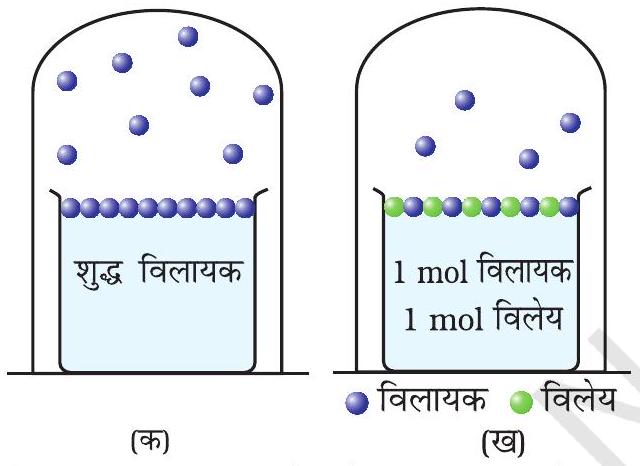
चित्र 1.4- विलायक में विलेय की उपस्थिति के फलस्वरूप विलायक के वाष्प दाब में कमी
(क) विलायक के अणुओं का उसकी सतह से वाष्पन,
(ख) विलयन में विलेय के कण को से दर्शाया गया है यह भी सतह का कुछ भाग घेरते हैं।

विलयनों का एक अलग महत्त्वपूर्ण वर्ग द्रवों में घुले हुए ठोस पदार्थों का है। उदाहरणार्थ, सोडियम क्लोराइड, ग्लूकोस, यूरिया एवं शर्करा का जल में विलयन और आयोडीन, गंधक जैसे ठोसों का कार्बन डाइ सल्फाइड में विलयन। इन विलयनों के कुछ भौतिक गुण शुद्ध विलायकों से बहुत अलग होते हैं, उदाहरण है- वाष्प दाब। किसी दिए गए ताप पर द्रव वाष्पित होता है तथा साम्यावस्था पर द्रव की वाष्प का, द्रव प्रावस्था पर डाला गया दाब उस द्रव का वाष्प दाब कहलाता है (चित्र $1.4$ क)। शुद्ध द्रवों की सारी सतह द्रव के अणुओं द्वारा घिरी रहती है। यदि किसी विलायक में एक अवाष्पशील विलेय डालकर विलयन बनाया जाए तो इस विलयन का वाष्प दाब केवल विलायक के वाष्पदाब के कारण होता है (चित्र $1.4$ ख)। दिए गए ताप पर विलयन का यह वाष्प दाब शुद्ध विलायक के वाष्पदाब से कम होता है। विलयन की सतह पर विलेय व विलायक दोनों के अणु उपस्थित रहते हैं। अतः सतह का विलायक के अणुओं से घिरा भाग कम रह जाता है। इसके कारण सतह छोड़कर जाने वाले विलायक अणुओं की संख्या भी तदनुसार घट जाती है, अतः विलायक का वाष्प दाब भी कम हो जाता है।

विलायक के वाष्प दाब में कमी विलयन में उपस्थित अवाष्पशील विलेय की मात्रा पर निर्भर करती है उसकी प्रकृति पर नहीं, उदाहरणार्थ, $1$ kg जल में $1.0$ मोल सुक्रोस मिलाने पर जल के वाष्प दाब में कमी लगभग वही होती है जो कि $1.0$ मोल यूरिया को जल की उसी मात्रा में उसी ताप पर मिलाने से होती है। राउल्ट नियम को सामान्यतः इस प्रकार व्यक्त किया जाता है "किसी विलयन के प्रत्येक वाष्पशील अवयव का आंशिक वाष्प दाब इसके मोल-अंश के समानुपाती होता है।" अब हम द्विअंगी विलयन में विलायक को $1$ व विलेय को $2$ से व्यक्त करते हैं। जब विलेय अवाष्पशील होता है तो केवल विलायक अणु ही वाष्प अवस्था में होते हैं और वाष्प दाब का कारण होते हैं। यदि $p_{1}$ विलायक का वाष्प दाब व $x_{1}$ इसका मोल-अंश हो, एवं $p_{1}^{0}$ इसकी शुद्ध अवस्था का वाष्पदाब हो, तो राउल्ट के नियमानुसार-

$$
p_{1} \propto x_{1}
$$

और

$$
p_{1}=x_{1} p_{1}^{0}
$$

समानुपाती स्थिरांक शुद्ध विलायक के वाष्प दाब $p_{1}^{0}$ के बराबर होता है, विलायक के वाष्प दाब व मोल-अंश प्रभाज के मध्य खींचा गया आलेख रेखीय होता है (चित्र 1.5)।

चित्र 1.5- यदि कोई विलयन सभी सांद्रणों के लिए राउल्ट के नियम का पालन करता है तो उसका वाष्प दाब एक सरल रेखा में शून्य से शुद्ध विलायक के वाष्प दाब तक बढ़ता जाता है।
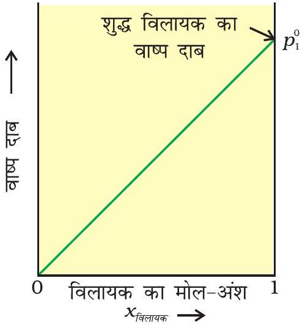

## $1.5$ आदर्श एवं आनादर्श विलयन

द्रव-द्रव विलयनों को राउल्ट के नियम के आधार पर आदर्श एवं अनादर्श विलयनों में वर्गीकृत किया जा सकता है।
1.5.1 आदर्श विलयन ऐसे विलयन जो सभी सांद्रताओं पर राउल्ट के नियम का पालन करते हैं, आदर्श विलयन कहलाते हैं। आदर्श विलयन के दो अन्य मुख्य गुण भी होते हैं। मिश्रण बनाने के लिए शुद्ध अवयवों को मिश्रित करने पर मिश्रण बनाने का ऐंथैल्पी परिवर्तन तथा आयतन परिवर्तन शून्य होता है। अर्थात्

$$
\Delta_{\text {मिश्रण }} H=0, \quad \Delta_{\text {मिश्रण }} V=0
$$

इसका तात्पर्य यह है कि अवयवों को मिश्रित करने पर उष्मा का उत्सर्जन अथवा अवशोषण नहीं होता। इसके अतिरिक्त विलयन का आयतन भी दोनों अवयवों के आयतन के योग के बराबर होता है। आण्विक स्तर पर विलयनों के आदर्श व्यवहार को अवयव A व B के अध्ययन द्वारा समझा जा सकता है। शुद्ध अवयवों में अंतराआण्विक आकर्षण अन्योन्यक्रियाएं A-A और B-B प्रकार की होती हैं। जबकि द्विअंगी विलयनों में इन दोनों अन्योन्यक्रियाओं के अतिरिक्त A-B प्रकार की अन्योन्यक्रियाएँ भी उपस्थित होंगी। यदि $\mathrm{A}-\mathrm{A}$ व $\mathrm{B}-\mathrm{B}$ के बीच अंतराआण्विक आकर्षण बल $\mathrm{A}-\mathrm{B}$ के समान हों तो यह आदर्श विलयन बनाता है।

एक पूर्णरूपेण आदर्श विलयन की संभावना बहुत कम होती है, लेकिन कुछ विलयन व्यवहार में लगभग आदर्श होते हैं। n -हेक्सेन और n -हेप्टेन, ब्रोमोएथेन और क्लोरोएथेन तथा बेन्जीन और टॉलूईन आदि के विलयन इस वर्ग में आते हैं।

जब कोई विलयन सभी सांद्रताओं पर राउल्ट के नियम का पालन नहीं करता तो वह अनादर्श विलयन कहलाता है। इस प्रकार के विलयनों का वाष्पदाब राउल्ट के नियम द्वारा प्रागुक्त (predict) किए गए वाष्प दाब से या तो अधिक होता है या कम (समीकरण 1.16)। यदि यह अधिक होता है तो यह विलयन राउल्ट नियम से धनात्मक विचलन प्रदर्शित करता है और यदि यह कम होता है तो यह ऋणात्मक विचलन प्रदर्शित करता है। ऐसे विलयनों के वाष्प दाब का मोल-अंश के सापेक्ष आलेख, चित्र $1.6$ में दिखाया गया है।

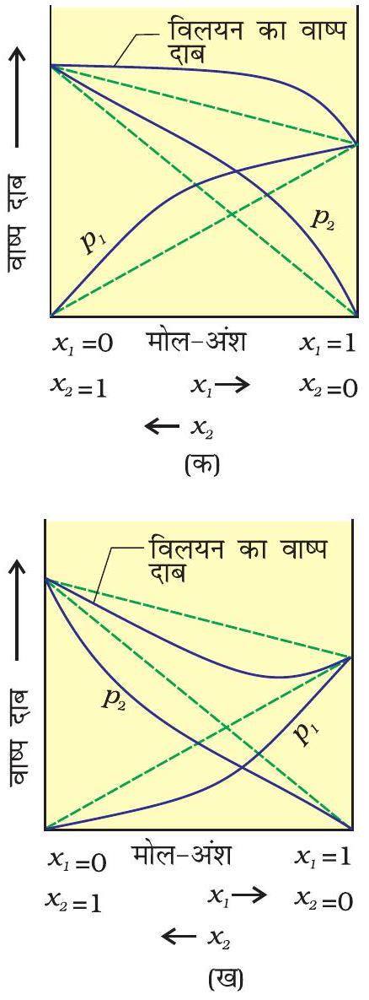
चित्र 1.6- द्विघटकीय निकाय का वाष्प दाब उनके संघटन के कारक के रूप में (क) राउल्ट के नियम से धनात्मक विचलन दर्शाने वाला विलयन (ख) राउल्ट के नियम से ऋणात्मक विचलन दर्शाने वाला विलयन

इन विचलनों का कारण आण्विक स्तर पर अन्योन्यक्रियाओं की प्रकृति में स्थित है। राउल्ट नियम से धनात्मक विचलन की स्थिति में, A-B अन्योन्यक्रियाएं A-A अथवा B-B के बीच अन्योन्यक्रियाओं की तुलना में कमज़ोर होती हैं अर्थात् इस स्थिति में विलेय-विलायक अणुओं के मध्य अंतराआण्विक आकर्षण बल विलेय-विलेय और विलायक-विलायक अणुओं की तुलना में कमज़ोर होते हैं। इसका मतलब इस प्रकार के विलयनों में से A अथवा B के अणु शुद्ध अवयव कि तुलना में अधिक आसानी से पलायन कर सकते हैं। इसके परिणाम स्वरूप वाष्प दाब में वृद्धि होती है जिससे धनात्मक विचलन होता है। एथेनॉल व ऐसीटोन का मिश्रण इसी प्रकार का व्यवहार दर्शाता है। शुद्ध एथेनॉल में अणुओं के मध्य हाइड्रोजन बंध होते हैं। इसमें ऐसीटोन मिलाने पर इसके अणु आतिथेय अणुओं के बीच आ जाते हैं, जिसके कारण आतिथेय अणुओं के बीच पहले से उपस्थित हाइड्रोजन बंध टूट जाते हैं। इससे अंतराआण्विक बल कमज़ोर हो जाने के कारण मिश्रण राउल्ट के नियम से धनात्मक विचलन (चित्र $1.6$ क) दर्शाता है।

कार्बन डाइसल्फाइड को ऐसीटोन में मिलाने पर बने विलयन में विलेय-विलायक अणुओं के मध्य द्विध्रुवीय अन्योन्यक्रियाएं विलेय-विलेय और विलायक-विलायक अणुओं के मध्य अन्योन्यक्रियाओं से कमज़ोर होती हैं। यह विलयन भी धनात्मक विचलन दिखाता है।

राउल्ट के नियम से ऋणात्मक विचलन की स्थिति में A-A व B-B के बीच अंतराआण्विक आर्कषण बल A-B की तुलना में कमज़ोर होता है। इसके फलस्वरूप वाष्पदाब कम हो जाता है अतः ऋणात्मक विचलन प्रदर्शित होता है। फ़ीनॉल व ऐनिलीन का मिश्रण इस प्रकार का उदाहरण है। इस स्थिति में फ़ीनॉलिक प्रोटॉन व ऐनिलीन के नाइट्रोजन अणु के एकाकी इलेक्ट्रॉन युगल के मध्य अंतराआण्विक हाइड्रोजन बंध एक से अणुओं के मध्य हाइड्रोजन बंध की तुलना में मज़बूत होता है। इसी प्रकार से क्लोरोफॉर्म व ऐसीटोन का मिश्रण भी ऐसा विलयन बनता है जो राउल्ट के नियम से ॠणात्मक विचलन दर्शाता है। इसका कारण यह है कि क्लोरोफॉर्म का अणु ऐसीटोन के अणु के साथ हाइड्रोजन बंध बना सकता है जैसा कि आप नीचे दिए चित्र में देख सकते हैं।
<img class="imgSvg" id = "mu2bmqffjt65ylbjy09" src="data:image/svg+xml;base64,PHN2ZyBpZD0ic21pbGVzLW11MmJtcWZmanQ2NXlsYmp5MDkiIHhtbG5zPSJodHRwOi8vd3d3LnczLm9yZy8yMDAwL3N2ZyIgdmlld0JveD0iMCAwIDE5NCAxMjguMDU5NTg2MzAxMTAzNzYiIHN0eWxlPSJ3aWR0aDogMTk0LjI1MDAxMjI0MzI1NjA3cHg7IGhlaWdodDogMTI4LjA1OTU4NjMwMTEwMzc2cHg7IG92ZXJmbG93OiB2aXNpYmxlOyI+PGRlZnM+PGxpbmVhckdyYWRpZW50IGlkPSJsaW5lLW11MmJtcWZmanQ2NXlsYmp5MDktMSIgZ3JhZGllbnRVbml0cz0idXNlclNwYWNlT25Vc2UiIHgxPSIxMjAuNzUwMDEyMjQzMjU5MjMiIHkxPSI0OC4yNzk4MDcyODc4NjA2NTYiIHgyPSIxNTIuMjUwMDEyMjQzMjU2MDciIHkyPSI0OC4yNzk4MjE0MjUxNjc4MyI+PHN0b3Agc3RvcC1jb2xvcj0iY3VycmVudENvbG9yIiBvZmZzZXQ9IjIwJSI+PC9zdG9wPjxzdG9wIHN0b3AtY29sb3I9ImN1cnJlbnRDb2xvciIgb2Zmc2V0PSIxMDAlIj48L3N0b3A+PC9saW5lYXJHcmFkaWVudD48bGluZWFyR3JhZGllbnQgaWQ9ImxpbmUtbXUyYm1xZmZqdDY1eWxiankwOS0zIiBncmFkaWVudFVuaXRzPSJ1c2VyU3BhY2VPblVzZSIgeDE9IjEwNS4wMDAwMjQ0ODY1Mjc5NiIgeTE9IjIxIiB4Mj0iMTIwLjc1MDAxMjI0MzI1OTIzIiB5Mj0iNDguMjc5ODA3Mjg3ODYwNjU2Ij48c3RvcCBzdG9wLWNvbG9yPSJjdXJyZW50Q29sb3IiIG9mZnNldD0iMjAlIj48L3N0b3A+PHN0b3Agc3RvcC1jb2xvcj0iY3VycmVudENvbG9yIiBvZmZzZXQ9IjEwMCUiPjwvc3RvcD48L2xpbmVhckdyYWRpZW50PjxsaW5lYXJHcmFkaWVudCBpZD0ibGluZS1tdTJibXFmZmp0NjV5bGJqeTA5LTUiIGdyYWRpZW50VW5pdHM9InVzZXJTcGFjZU9uVXNlIiB4MT0iMTExLjQ4NTM2Mzk5MTQxOTg1IiB5MT0iNzUuNjY2NjIzMzI3MTQ2NiIgeDI9IjEyNC4wODUzNzM3ODYwMzIzIiB5Mj0iNTMuODQyNzg4ODA2NzAzODE1Ij48c3RvcCBzdG9wLWNvbG9yPSJjdXJyZW50Q29sb3IiIG9mZnNldD0iMjAlIj48L3N0b3A+PHN0b3Agc3RvcC1jb2xvcj0iY3VycmVudENvbG9yIiBvZmZzZXQ9IjEwMCUiPjwvc3RvcD48L2xpbmVhckdyYWRpZW50PjxsaW5lYXJHcmFkaWVudCBpZD0ibGluZS1tdTJibXFmZmp0NjV5bGJqeTA5LTciIGdyYWRpZW50VW5pdHM9InVzZXJTcGFjZU9uVXNlIiB4MT0iMTA0Ljk5OTk5OTk5OTk5MzY2IiB5MT0iNzUuNTU5NjAwNDM4NDE0MTIiIHgyPSIxMjAuNzUwMDEyMjQzMjU5MjMiIHkyPSI0OC4yNzk4MDcyODc4NjA2NTYiPjxzdG9wIHN0b3AtY29sb3I9ImN1cnJlbnRDb2xvciIgb2Zmc2V0PSIyMCUiPjwvc3RvcD48c3RvcCBzdG9wLWNvbG9yPSJjdXJyZW50Q29sb3IiIG9mZnNldD0iMTAwJSI+PC9zdG9wPjwvbGluZWFyR3JhZGllbnQ+PGxpbmVhckdyYWRpZW50IGlkPSJsaW5lLW11MmJtcWZmanQ2NXlsYmp5MDktOSIgZ3JhZGllbnRVbml0cz0idXNlclNwYWNlT25Vc2UiIHgxPSI3My40OTk5OTk5OTk5OTY4MyIgeTE9Ijc1LjU1OTU4NjMwMTEwNjk1IiB4Mj0iMTA0Ljk5OTk5OTk5OTk5MzY2IiB5Mj0iNzUuNTU5NjAwNDM4NDE0MTIiPjxzdG9wIHN0b3AtY29sb3I9ImN1cnJlbnRDb2xvciIgb2Zmc2V0PSIyMCUiPjwvc3RvcD48c3RvcCBzdG9wLWNvbG9yPSJjdXJyZW50Q29sb3IiIG9mZnNldD0iMTAwJSI+PC9zdG9wPjwvbGluZWFyR3JhZGllbnQ+PGxpbmVhckdyYWRpZW50IGlkPSJsaW5lLW11MmJtcWZmanQ2NXlsYmp5MDktMTEiIGdyYWRpZW50VW5pdHM9InVzZXJTcGFjZU9uVXNlIiB4MT0iNDIiIHkxPSI3NS41NTk1NzIxNjM3OTk3NyIgeDI9IjczLjQ5OTk5OTk5OTk5NjgzIiB5Mj0iNzUuNTU5NTg2MzAxMTA2OTUiPjxzdG9wIHN0b3AtY29sb3I9ImN1cnJlbnRDb2xvciIgb2Zmc2V0PSIyMCUiPjwvc3RvcD48c3RvcCBzdG9wLWNvbG9yPSJjdXJyZW50Q29sb3IiIG9mZnNldD0iMTAwJSI+PC9zdG9wPjwvbGluZWFyR3JhZGllbnQ+PGxpbmVhckdyYWRpZW50IGlkPSJsaW5lLW11MmJtcWZmanQ2NXlsYmp5MDktMTMiIGdyYWRpZW50VW5pdHM9InVzZXJTcGFjZU9uVXNlIiB4MT0iNzMuNDk5OTk5OTk5OTk2ODMiIHkxPSI3NS41NTk1ODYzMDExMDY5NSIgeDI9IjczLjUwMDAxNDEzNzMwNCIgeTI9IjQ0LjA1OTU4NjMwMTExMDE0Ij48c3RvcCBzdG9wLWNvbG9yPSJjdXJyZW50Q29sb3IiIG9mZnNldD0iMjAlIj48L3N0b3A+PHN0b3Agc3RvcC1jb2xvcj0iY3VycmVudENvbG9yIiBvZmZzZXQ9IjEwMCUiPjwvc3RvcD48L2xpbmVhckdyYWRpZW50PjxsaW5lYXJHcmFkaWVudCBpZD0ibGluZS1tdTJibXFmZmp0NjV5bGJqeTA5LTE1IiBncmFkaWVudFVuaXRzPSJ1c2VyU3BhY2VPblVzZSIgeDE9IjczLjQ5OTk4NTg2MjY4OTY2IiB5MT0iMTA3LjA1OTU4NjMwMTEwMzc2IiB4Mj0iNzMuNDk5OTk5OTk5OTk2ODMiIHkyPSI3NS41NTk1ODYzMDExMDY5NSI+PHN0b3Agc3RvcC1jb2xvcj0iY3VycmVudENvbG9yIiBvZmZzZXQ9IjIwJSI+PC9zdG9wPjxzdG9wIHN0b3AtY29sb3I9ImN1cnJlbnRDb2xvciIgb2Zmc2V0PSIxMDAlIj48L3N0b3A+PC9saW5lYXJHcmFkaWVudD48L2RlZnM+PG1hc2sgaWQ9InRleHQtbWFzay1tdTJibXFmZmp0NjV5bGJqeTA5Ij48cmVjdCB4PSIwIiB5PSIwIiB3aWR0aD0iMTAwJSIgaGVpZ2h0PSIxMDAlIiBmaWxsPSJ3aGl0ZSI+PC9yZWN0PjxjaXJjbGUgY3g9IjEwNC45OTk5OTk5OTk5OTM2NiIgY3k9Ijc1LjU1OTYwMDQzODQxNDEyIiByPSI3Ljg3NSIgZmlsbD0iYmxhY2siPjwvY2lyY2xlPjxjaXJjbGUgY3g9IjQyIiBjeT0iNzUuNTU5NTcyMTYzNzk5NzciIHI9IjcuODc1IiBmaWxsPSJibGFjayI+PC9jaXJjbGU+PGNpcmNsZSBjeD0iNzMuNTAwMDE0MTM3MzA0IiBjeT0iNDQuMDU5NTg2MzAxMTEwMTQiIHI9IjcuODc1IiBmaWxsPSJibGFjayI+PC9jaXJjbGU+PGNpcmNsZSBjeD0iNzMuNDk5OTg1ODYyNjg5NjYiIGN5PSIxMDcuMDU5NTg2MzAxMTAzNzYiIHI9IjcuODc1IiBmaWxsPSJibGFjayI+PC9jaXJjbGU+PC9tYXNrPjxzdHlsZT4KICAgICAgICAgICAgICAgIC5lbGVtZW50LW11MmJtcWZmanQ2NXlsYmp5MDkgewogICAgICAgICAgICAgICAgICAgIGZvbnQ6IDE0cHggSGVsdmV0aWNhLCBBcmlhbCwgc2Fucy1zZXJpZjsKICAgICAgICAgICAgICAgICAgICBhbGlnbm1lbnQtYmFzZWxpbmU6ICdtaWRkbGUnOwogICAgICAgICAgICAgICAgfQogICAgICAgICAgICAgICAgLnN1Yi1tdTJibXFmZmp0NjV5bGJqeTA5IHsKICAgICAgICAgICAgICAgICAgICBmb250OiA4LjRweCBIZWx2ZXRpY2EsIEFyaWFsLCBzYW5zLXNlcmlmOwogICAgICAgICAgICAgICAgfQogICAgICAgICAgICA8L3N0eWxlPjxnIG1hc2s9InVybCgjdGV4dC1tYXNrLW11MmJtcWZmanQ2NXlsYmp5MDkpIj48bGluZSB4MT0iMTIwLjc1MDAxMjI0MzI1OTIzIiB5MT0iNDguMjc5ODA3Mjg3ODYwNjU2IiB4Mj0iMTUyLjI1MDAxMjI0MzI1NjA3IiB5Mj0iNDguMjc5ODIxNDI1MTY3ODMiIHN0eWxlPSJzdHJva2UtbGluZWNhcDpyb3VuZDtzdHJva2UtZGFzaGFycmF5Om5vbmU7c3Ryb2tlLXdpZHRoOjEuMjYiIHN0cm9rZT0idXJsKCcjbGluZS1tdTJibXFmZmp0NjV5bGJqeTA5LTEnKSI+PC9saW5lPjxsaW5lIHgxPSIxMDUuMDAwMDI0NDg2NTI3OTYiIHkxPSIyMSIgeDI9IjEyMC43NTAwMTIyNDMyNTkyMyIgeTI9IjQ4LjI3OTgwNzI4Nzg2MDY1NiIgc3R5bGU9InN0cm9rZS1saW5lY2FwOnJvdW5kO3N0cm9rZS1kYXNoYXJyYXk6bm9uZTtzdHJva2Utd2lkdGg6MS4yNiIgc3Ryb2tlPSJ1cmwoJyNsaW5lLW11MmJtcWZmanQ2NXlsYmp5MDktMycpIj48L2xpbmU+PGxpbmUgeDE9IjExMS40ODUzNjM5OTE0MTk4NSIgeTE9Ijc1LjY2NjYyMzMyNzE0NjYiIHgyPSIxMjQuMDg1MzczNzg2MDMyMyIgeTI9IjUzLjg0Mjc4ODgwNjcwMzgxNSIgc3R5bGU9InN0cm9rZS1saW5lY2FwOnJvdW5kO3N0cm9rZS1kYXNoYXJyYXk6bm9uZTtzdHJva2Utd2lkdGg6MS4yNiIgc3Ryb2tlPSJ1cmwoJyNsaW5lLW11MmJtcWZmanQ2NXlsYmp5MDktNScpIj48L2xpbmU+PGxpbmUgeDE9IjEwNC45OTk5OTk5OTk5OTM2NiIgeTE9Ijc1LjU1OTYwMDQzODQxNDEyIiB4Mj0iMTIwLjc1MDAxMjI0MzI1OTIzIiB5Mj0iNDguMjc5ODA3Mjg3ODYwNjU2IiBzdHlsZT0ic3Ryb2tlLWxpbmVjYXA6cm91bmQ7c3Ryb2tlLWRhc2hhcnJheTpub25lO3N0cm9rZS13aWR0aDoxLjI2IiBzdHJva2U9InVybCgnI2xpbmUtbXUyYm1xZmZqdDY1eWxiankwOS03JykiPjwvbGluZT48bGluZSB4MT0iNzMuNDk5OTk5OTk5OTk2ODMiIHkxPSI3NS41NTk1ODYzMDExMDY5NSIgeDI9IjEwNC45OTk5OTk5OTk5OTM2NiIgeTI9Ijc1LjU1OTYwMDQzODQxNDEyIiBzdHlsZT0ic3Ryb2tlLWxpbmVjYXA6cm91bmQ7c3Ryb2tlLWRhc2hhcnJheTpub25lO3N0cm9rZS13aWR0aDoxLjI2IiBzdHJva2U9InVybCgnI2xpbmUtbXUyYm1xZmZqdDY1eWxiankwOS05JykiPjwvbGluZT48bGluZSB4MT0iNDIiIHkxPSI3NS41NTk1NzIxNjM3OTk3NyIgeDI9IjczLjQ5OTk5OTk5OTk5NjgzIiB5Mj0iNzUuNTU5NTg2MzAxMTA2OTUiIHN0eWxlPSJzdHJva2UtbGluZWNhcDpyb3VuZDtzdHJva2UtZGFzaGFycmF5Om5vbmU7c3Ryb2tlLXdpZHRoOjEuMjYiIHN0cm9rZT0idXJsKCcjbGluZS1tdTJibXFmZmp0NjV5bGJqeTA5LTExJykiPjwvbGluZT48bGluZSB4MT0iNzMuNDk5OTk5OTk5OTk2ODMiIHkxPSI3NS41NTk1ODYzMDExMDY5NSIgeDI9IjczLjUwMDAxNDEzNzMwNCIgeTI9IjQ0LjA1OTU4NjMwMTExMDE0IiBzdHlsZT0ic3Ryb2tlLWxpbmVjYXA6cm91bmQ7c3Ryb2tlLWRhc2hhcnJheTpub25lO3N0cm9rZS13aWR0aDoxLjI2IiBzdHJva2U9InVybCgnI2xpbmUtbXUyYm1xZmZqdDY1eWxiankwOS0xMycpIj48L2xpbmU+PGxpbmUgeDE9IjczLjQ5OTk4NTg2MjY4OTY2IiB5MT0iMTA3LjA1OTU4NjMwMTEwMzc2IiB4Mj0iNzMuNDk5OTk5OTk5OTk2ODMiIHkyPSI3NS41NTk1ODYzMDExMDY5NSIgc3R5bGU9InN0cm9rZS1saW5lY2FwOnJvdW5kO3N0cm9rZS1kYXNoYXJyYXk6bm9uZTtzdHJva2Utd2lkdGg6MS4yNiIgc3Ryb2tlPSJ1cmwoJyNsaW5lLW11MmJtcWZmanQ2NXlsYmp5MDktMTUnKSI+PC9saW5lPjwvZz48Zz48dGV4dCB4PSIxNTIuMjUwMDEyMjQzMjU2MDciIHk9IjQ4LjI3OTgyMTQyNTE2NzgzIiBjbGFzcz0iZGVidWciIGZpbGw9IiNmZjAwMDAiIHN0eWxlPSIKICAgICAgICAgICAgICAgIGZvbnQ6IDVweCBEcm9pZCBTYW5zLCBzYW5zLXNlcmlmOwogICAgICAgICAgICAiPjwvdGV4dD48dGV4dCB4PSIxMjAuNzUwMDEyMjQzMjU5MjMiIHk9IjQ4LjI3OTgwNzI4Nzg2MDY1NiIgY2xhc3M9ImRlYnVnIiBmaWxsPSIjZmYwMDAwIiBzdHlsZT0iCiAgICAgICAgICAgICAgICBmb250OiA1cHggRHJvaWQgU2Fucywgc2Fucy1zZXJpZjsKICAgICAgICAgICAgIj48L3RleHQ+PHRleHQgeD0iMTA1LjAwMDAyNDQ4NjUyNzk2IiB5PSIyMSIgY2xhc3M9ImRlYnVnIiBmaWxsPSIjZmYwMDAwIiBzdHlsZT0iCiAgICAgICAgICAgICAgICBmb250OiA1cHggRHJvaWQgU2Fucywgc2Fucy1zZXJpZjsKICAgICAgICAgICAgIj48L3RleHQ+PHRleHQgeD0iMTA0Ljk5OTk5OTk5OTk5MzY2IiB5PSI2Ny42ODQ2MDA0Mzg0MTQxMiIgY2xhc3M9ImVsZW1lbnQtbXUyYm1xZmZqdDY1eWxiankwOSIgZmlsbD0iY3VycmVudENvbG9yIiBzdHlsZT0idGV4dC1hbmNob3I6IHN0YXJ0OyBnbHlwaC1vcmllbnRhdGlvbi12ZXJ0aWNhbDogMDsgd3JpdGluZy1tb2RlOiB2ZXJ0aWNhbC1ybDsgdGV4dC1vcmllbnRhdGlvbjogdXByaWdodDsgbGV0dGVyLXNwYWNpbmc6IC0xcHg7IGRpcmVjdGlvbjogbHRyOyI+PHRzcGFuPk88L3RzcGFuPjwvdGV4dD48dGV4dCB4PSIxMDQuOTk5OTk5OTk5OTkzNjYiIHk9Ijc1LjU1OTYwMDQzODQxNDEyIiBjbGFzcz0iZGVidWciIGZpbGw9IiNmZjAwMDAiIHN0eWxlPSIKICAgICAgICAgICAgICAgIGZvbnQ6IDVweCBEcm9pZCBTYW5zLCBzYW5zLXNlcmlmOwogICAgICAgICAgICAiPjwvdGV4dD48dGV4dCB4PSI3My40OTk5OTk5OTk5OTY4MyIgeT0iNzUuNTU5NTg2MzAxMTA2OTUiIGNsYXNzPSJkZWJ1ZyIgZmlsbD0iI2ZmMDAwMCIgc3R5bGU9IgogICAgICAgICAgICAgICAgZm9udDogNXB4IERyb2lkIFNhbnMsIHNhbnMtc2VyaWY7CiAgICAgICAgICAgICI+PC90ZXh0Pjx0ZXh0IHg9IjQ3LjI1IiB5PSI4MC44MDk1NzIxNjM3OTk3NyIgY2xhc3M9ImVsZW1lbnQtbXUyYm1xZmZqdDY1eWxiankwOSIgZmlsbD0iY3VycmVudENvbG9yIiBzdHlsZT0idGV4dC1hbmNob3I6IHN0YXJ0OyB3cml0aW5nLW1vZGU6IGhvcml6b250YWwtdGI7IHRleHQtb3JpZW50YXRpb246IG1peGVkOyBsZXR0ZXItc3BhY2luZzogbm9ybWFsOyBkaXJlY3Rpb246IHJ0bDsgdW5pY29kZS1iaWRpOiBiaWRpLW92ZXJyaWRlOyI+PHRzcGFuIHN0eWxlPSIKICAgICAgICAgICAgICAgIHVuaWNvZGUtYmlkaTogcGxhaW50ZXh0OwogICAgICAgICAgICAgICAgd3JpdGluZy1tb2RlOiBsci10YjsKICAgICAgICAgICAgICAgIGxldHRlci1zcGFjaW5nOiBub3JtYWw7CiAgICAgICAgICAgICAgICB0ZXh0LWFuY2hvcjogc3RhcnQ7CiAgICAgICAgICAgICI+Q2w8L3RzcGFuPjwvdGV4dD48dGV4dCB4PSI0MiIgeT0iNzUuNTU5NTcyMTYzNzk5NzciIGNsYXNzPSJkZWJ1ZyIgZmlsbD0iI2ZmMDAwMCIgc3R5bGU9IgogICAgICAgICAgICAgICAgZm9udDogNXB4IERyb2lkIFNhbnMsIHNhbnMtc2VyaWY7CiAgICAgICAgICAgICI+PC90ZXh0Pjx0ZXh0IHg9IjY4LjI1MDAxNDEzNzMwNCIgeT0iNDkuMzA5NTg2MzAxMTEwMTQiIGNsYXNzPSJlbGVtZW50LW11MmJtcWZmanQ2NXlsYmp5MDkiIGZpbGw9ImN1cnJlbnRDb2xvciIgc3R5bGU9InRleHQtYW5jaG9yOiBzdGFydDsgd3JpdGluZy1tb2RlOiBob3Jpem9udGFsLXRiOyB0ZXh0LW9yaWVudGF0aW9uOiBtaXhlZDsgbGV0dGVyLXNwYWNpbmc6IG5vcm1hbDsgZGlyZWN0aW9uOiBsdHI7Ij48dHNwYW4gc3R5bGU9IgogICAgICAgICAgICAgICAgdW5pY29kZS1iaWRpOiBwbGFpbnRleHQ7CiAgICAgICAgICAgICAgICB3cml0aW5nLW1vZGU6IGxyLXRiOwogICAgICAgICAgICAgICAgbGV0dGVyLXNwYWNpbmc6IG5vcm1hbDsKICAgICAgICAgICAgICAgIHRleHQtYW5jaG9yOiBtaWRkbGU7CiAgICAgICAgICAgICI+Q2w8L3RzcGFuPjwvdGV4dD48dGV4dCB4PSI3My41MDAwMTQxMzczMDQiIHk9IjQ0LjA1OTU4NjMwMTExMDE0IiBjbGFzcz0iZGVidWciIGZpbGw9IiNmZjAwMDAiIHN0eWxlPSIKICAgICAgICAgICAgICAgIGZvbnQ6IDVweCBEcm9pZCBTYW5zLCBzYW5zLXNlcmlmOwogICAgICAgICAgICAiPjwvdGV4dD48dGV4dCB4PSI3My40OTk5ODU4NjI2ODk2NiIgeT0iMTEyLjMwOTU4NjMwMTEwMzc2IiBjbGFzcz0iZWxlbWVudC1tdTJibXFmZmp0NjV5bGJqeTA5IiBmaWxsPSJjdXJyZW50Q29sb3IiIHN0eWxlPSJ0ZXh0LWFuY2hvcjogc3RhcnQ7IHdyaXRpbmctbW9kZTogaG9yaXpvbnRhbC10YjsgdGV4dC1vcmllbnRhdGlvbjogbWl4ZWQ7IGxldHRlci1zcGFjaW5nOiBub3JtYWw7IGRpcmVjdGlvbjogbHRyOyI+PHRzcGFuIHN0eWxlPSIKICAgICAgICAgICAgICAgIHVuaWNvZGUtYmlkaTogcGxhaW50ZXh0OwogICAgICAgICAgICAgICAgd3JpdGluZy1tb2RlOiBsci10YjsKICAgICAgICAgICAgICAgIGxldHRlci1zcGFjaW5nOiBub3JtYWw7CiAgICAgICAgICAgICAgICB0ZXh0LWFuY2hvcjogbWlkZGxlOwogICAgICAgICAgICAiPkNsPC90c3Bhbj48L3RleHQ+PHRleHQgeD0iNzMuNDk5OTg1ODYyNjg5NjYiIHk9IjEwNy4wNTk1ODYzMDExMDM3NiIgY2xhc3M9ImRlYnVnIiBmaWxsPSIjZmYwMDAwIiBzdHlsZT0iCiAgICAgICAgICAgICAgICBmb250OiA1cHggRHJvaWQgU2Fucywgc2Fucy1zZXJpZjsKICAgICAgICAgICAgIj48L3RleHQ+PC9nPjwvc3ZnPg=="/>

ऐसीटोन एवं क्लोरोफॉर्म के मध्य हाइड्रोजन बंध

इसके कारण प्रत्येक घटक के अणुओं की पलायन की प्रवृत्ति कम हो जाती है, जिससे वाष्प दाब में कमी आ जाती है तथा राउल्ट नियम से ॠणात्मक विचलन होता है (चित्र $1.6$ ख)।

कुछ द्रव मिश्रित करने पर स्थिरक्वाथी बनाते हैं जो ऐसे द्विघटकीय मिश्रण हैं, जिनका द्रव व वाष्प प्रावस्था में संघटन समान होता है तथा यह एक स्थिर ताप पर उबलते हैं। ऐसे प्रकरणों में घटकों को प्रभाजी आसवन द्वारा अलग नहीं किया जा सकता। स्थिरक्वाथी दो प्रकार के होते हैं, जिन्हें न्यूनतम क्वथनांकी स्थिरक्वाथी तथा अधिकतम क्वथनांकी स्थिरक्वाथी कहते हैं। विलयन जो एक निश्चित संगठन पर राउल्ट नियम से अत्यधिक धनात्मक विचलन प्रदर्शित करते हैं, न्यूनतमक्वथनांकी स्थिरक्वाथी बनाते हैं।

उदाहरणार्थ शर्कराओं के किण्वन से प्राप्त एथेनॉल एवं जल का मिश्रण प्रभाजी आसवन द्वारा जो विलयन देता है उसमें आयतन के आधार पर लगभग $95 \%$ तक ऐथनॉल होती है। एक बार यह संघटन प्राप्त कर लेने के पश्चात्, जो कि स्थिरक्वाथी संघटन है, द्रव व वाष्प का संघटन समान हो जाता है तथा इसके आगे पृथक्करण नहीं होता।

वे विलयन जो कि राउल्ट नियम से बहुत अधिक ऋणात्मक विचलन दर्शाते हैं, एक विशिष्ट संघटन पर अधिकतम क्वथनांकी स्थिरक्वाथी बनाते हैं। नाइट्रिक अम्ल एवं जल का मिश्रण इस प्रकार के स्थिरक्वाथी का उदाहरण है। इस स्थिरक्वाथी के संघटन में लगभग $68 \%$ नाइट्रिक अम्ल एवं $32 \%$ जल (द्रव्यमान) होता है जिसका क्वथनांक $393.5 \mathrm{~K}$ होता है।

## पाठ्यनिहित प्रश्न

$1.8350 \mathrm{~K}$ पर शुद्ध द्रवों A एवं B के वाष्पदाब क्रमशः $450$ एवं $750 \mathrm{~mm} \mathrm{Hg}$ हैं। यदि कुल वाष्पदाब $600 \mathrm{~mm} \mathrm{Hg}$ हो तो द्रव मिश्रण का संघटन ज्ञात कीजिए। साथ ही वाष्प प्रावस्था का संघटन भी ज्ञात कीजिए।

## $1.6$ अणुसंख्यगुणधर्म और आण्विक   द्रव्यमान की   गणना

### 1.6.1 वाष्प दाब का आपेक्षिक अवनमन

खंड 1.4.3 में हमने जाना कि जब एक अवाष्पशील विलेय विलायक में डाला जाता है तो विलयन का वाष्प दाब घटता है। विलयन के कई गुण वाष्प दाब के अवनमन से संबंधित हैं, वे हैं- (1) विलायक के वाष्प दाब का आपेक्षिक अवनमन (2) विलायक के हिमांक का अवनमन (3) विलायक के क्वथनांक का उन्नयन और (4) विलयन का परासरण दाब। यह सभी गुण विलयन में उपस्थित कुल कणों की संख्या तथा विलेय कणों की संख्या के अनुपात पर निर्भर करते हैं न कि विलेय कणों की प्रकृति पर। ऐसे गुणों को अणुसंख्य गुण धर्म कहते हैं। [अणुसंख्य, (colligative) 'लैटिन भाषा से जिसमें, 'को', का अर्थ है एक साथ और 'लिगेर' का अर्थ है आबंधित] निम्नलिखित खंडों में हम एक-एक करके इन गुणों की विवेचना करेंगे।

खंड 1.4.3 में हमने सीखा कि किसी विलायक का विलयन में वाष्प दाब शुद्ध विलायक के वाष्प दाब से कम होता है। राउल्ट ने सिद्ध किया कि वाष्प दाब का अवनमन केवल विलेय कणों के सांद्रण पर निर्भर करता है, उनकी प्रकृति पर नहीं। खंड 1.4.3 में दिया गया समीकरण $1.20$ विलयन के वाष्प दाब, विलायक के वाष्प दाब एवं मोल-अंश से संबंध स्थापित करता है अर्थात-

$$
p_{1}=x_{1} p_{1}^{0}
$$

विलायक के वाष्प दाब में अवनमन, $\Delta p_{1}$ को निम्न प्रकार से दिया जाता है-

$$
\begin{gathered}
\Delta p_{1}=p_{1}^{0}-p_{1}=p_{1}^{0}-p_{1}^{0} x_{1} \\
=p_{1}^{0}\left(1-x_{1}\right)
\end{gathered}
$$

यह ज्ञात है कि $x_{2}=1-x_{1}$ है, अतः समीकरण $1.23$ निम्न प्रकार से बदल जाता है-

$$
\Delta p_{1}=x_{2} p_{1}^{0}
$$

जिस विलयन में कई अवाष्पशील विलेय होते हैं, उसके वाष्पदाब का अवनमन विभिन्न विलेयों के मोल-अंश के योग पर निर्भर करता है।

समीकरण $1.24$ को इस प्रकार लिख सकते हैं-

$$
\frac{\Delta p_{1}}{p_{1}^{0}}=\frac{p_{1}^{0}-p_{1}}{p_{1}^{0}}=x_{2}
$$

पहले ही बताया जा चुका है कि समीकरण में बाईं ओर लिखा गया पद वाष्पदाब का आपेक्षिक अवनमन कहलाता है तथा इसका मान विलेय के मोल-अंश के बराबर होता है अतः उपरोक्त समीकरण को इस प्रकार लिख सकते हैं-

$$
\frac{p_{1}^{0}-p_{1}}{p_{1}^{0}}=\frac{n_{2}}{n_{1}+n_{2}} \text { चूँकि } x_{2}=\frac{n_{2}}{n_{1}+n_{2}}
$$

यहाँ $n_{1}$ और $n_{2}$ क्रमशः विलयन में उपस्थित विलायक और विलेय के मोलों की संख्या है। तनु विलयन के लिए $n_{2} \ll n_{1}$, अतः $n_{2}$ को हर में से छोड़ देने पर-

$$
\frac{p_{1}^{0}-p_{1}}{p_{1}^{0}}=\frac{n_{2}}{n_{1}^{0}}
$$

या $\frac{p_{1}^{0}-p_{1}}{p_{1}^{0}}=\frac{\mathrm{w}_{2} \times M_{1}}{M_{2} \times \mathrm{w}_{1}}$

यहाँ $\mathrm{w}_{1}$ और $\mathrm{w}_{2}$ तथा $M_{1}$ और $M_{2}$ क्रमशः विलायक और विलेय की मात्रा और मोलर द्रव्यमान हैं।

समीकरण (1.28) में उपस्थित अन्य सभी मात्राएं ज्ञात होने पर विलेय के मोलर द्रव्यमान ( $M_{2}$ ) को परिकलित किया जा सकता है।

उदाहरण $1.6$ किसी ताप पर शुद्ध बेन्जीन का वाष्प दाब $0.850 \mathrm{bar}$ है। $0.5 \mathrm{~g}$ अवाष्पशील विद्युतअनापघट्य ठोस को $39.0 \mathrm{~g}$ बेन्जीन (मोलर द्रव्यमान $78 \mathrm{~g} \mathrm{~mol}^{-1}$ ) में घोला गया। प्राप्त विलयन का वाष्प दाब $0.845$ bar है। ठोस का मोलर द्रव्यमान क्या है?

हल हमें ज्ञात मात्राएं इस प्रकार हैं-

$$
p_{1}^{0}=0.850 \mathrm{bar} ; p=0.845 \mathrm{bar} ; M_{1}=78 \mathrm{~g} \mathrm{~mol}^{-1} ; w_{2}=0.5 \mathrm{~g} ; w_{1}=39 \mathrm{~g}
$$

समीकरण $1.28$ में ये मान रखने पर

$$
\begin{aligned}
& \frac{0.850 \mathrm{bar}-0.845 \mathrm{bar}}{0.850 \mathrm{bar}}=\frac{0.5 \mathrm{~g} \times 78 \mathrm{~g} \mathrm{~mol}^{-1}}{M_{2} \times 39 \mathrm{~g}} \\
& \text { अतः }, M_{2}=170 \mathrm{~g} \mathrm{~mol}^{-1}
\end{aligned}
$$

### 1.6.2 क्वथनांक का उन्नयन

द्रव का ताप बढ़ने पर वाष्प दाब बढ़ता है। यह उस ताप पर उबलता है जिस पर उसका वाष्प दाब वायुमंडलीय दाब के बराबर हो जाता है। उदाहरण के लिए जल 373.15 K $\left(100^{\circ} \mathrm{C}\right)$ पर उबलता है क्योंकि इस ताप पर जल का वाष्प दाब $1.013$ bar (1 वायुमंडल) है। हमने पिछले खंड में जाना कि अवाष्पशील विलेय कि उपस्थिति से विलायक का वाष्प दाब कम हो जाता है। चित्र $1.7$ शुद्ध विलायक और विलयन के वाष्पदाब का ताप के साथ परिवर्तन प्रदर्शित करता है। उदाहरण के लिए सुक्रोस के जलीय विलयन का वाष्पदाब 373.15 K पर $1.013$ bar से कम है। इस विलयन को उबालने के लिए ताप को शुद्ध विलायक (जल) के क्वथनांक से अधिक बढ़ाकर विलयन का वाष्प दाब $1.013$ bar तक बढ़ाना पड़ेगा। अतः किसी भी विलयन का क्वथनांक शुद्ध विलायक, जिसमें विलयन बनाया गया है, के क्वथनांक से हमेशा अधिक

होता है जैसा चित्र $1.7$ में दिखाया गया है। वाष्पदाब के अवनमन के समान ही

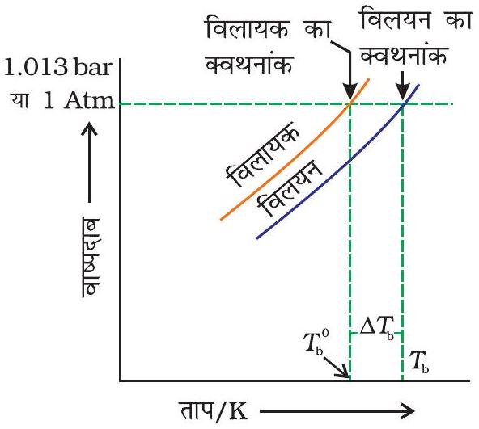
चित्र 1.7- विलयन का वाष्पदाब वक्र, शुद्ध जल के वाष्प दाब वक्र के नीचे है। आरेख दर्शाता है कि $\Delta T_{b}$ विलयन में विलायक के क्वथनांक का उन्नयन है।

यदि $T_{b}^{0}$ शुद्ध विलायक का क्वथनांक है और $T_{b}$ विलयन का क्वथनांक है तो $\Delta T_{b}=T_{b}-T_{b}^{0}$ को क्वथनांक का उन्नयन कहा जाता है।

प्रयोग दर्शाते हैं कि तनु विलयन में क्वथनांक का उन्नयन $\Delta \mathrm{T}_{\mathrm{b}}$, विलयन में उपस्थित विलेय की मोलल सांद्रता के समानुपाती होता है। अतः

$$
\begin{aligned}
& \Delta T_{\mathrm{b}} \propto \mathrm{~m} \\
\text { या } \quad & \Delta T_{\mathrm{b}}=K_{\mathrm{b}} \mathrm{~m}
\end{aligned}
$$

यहाँ m (मोललता) $1$ kg विलायक में विलीन विलेय के मोलों की संख्या है तथा $K_{\mathrm{b}}$ क्वथनांक उन्नयन स्थिरांक या मोलल उन्नयन स्थिरांक (Ebullioscopic Constant) कहलाता है। $K_{\mathrm{b}}$ की इकाई $\mathrm{Kkg} \mathrm{mol}^{-1}$ है। कुछ प्रचलित विलायकों के $K_{\mathrm{b}}$ का मान सारणी $1.3$ में दिया गया है। यदि $M_{2}$ मोलर द्रव्यमान वाले विलेय के $\mathrm{w}_{2}$ ग्राम, $\mathrm{w}_{1}$ ग्राम विलायक में उपस्थित हों तो विलयन की मोललता m निम्न पद द्वारा व्यक्त की जाती है।

$$
\mathrm{m}=\frac{\mathrm{w}_{2} / M_{2}}{\mathrm{w}_{1} / 1000}=\frac{1000 \times \mathrm{w}_{2}}{M_{2} \times \mathrm{w}_{1}}
$$

समीकरण (1.30) में मोललता का मान रखने पर-

$$
\begin{aligned}
& \Delta T_{\mathrm{b}}=\frac{\mathrm{K}_{\mathrm{b}} \times 1000 \times \mathrm{w}_{2}}{M_{2} \times \mathrm{w}_{1}} \\
& M_{2}=\frac{1000 \times \mathrm{w}_{2} \times K_{b}}{\Delta T_{b} \times \mathrm{w}_{1}}
\end{aligned}
$$

अतः विलेय के मोलर द्रव्यमान $M_{2}$ का मान निकालने के लिए उस विलेय की एक ज्ञात मात्रा को ऐसे विलायक की ज्ञात मात्रा में विलीन करके $\Delta T_{\mathrm{b}}$ का मान प्रयोग द्वारा प्राप्त किया जाता है, जिसके लिए $K_{\mathrm{b}}$ का मान ज्ञात हो।

उदाहरण $1.7$ एक सॉसपेन (पात्र) में $18 \mathrm{~g}$ ग्लूकोस $\mathrm{C}_{6} \mathrm{H}_{12} \mathrm{O}_{6}$ को $1 \mathrm{~kg}$ जल में घोला गया। $1.013$ bar दाब पर यह जल किस ताप पर उबलेगा? जल के लिए $K_{\mathrm{b}}$ का मान $0.52 \mathrm{~K} \mathrm{~kg} \mathrm{~mol}^{-1}$ है।

हल ग्लूकोस के मोलों की संख्या $=\frac{18 \mathrm{~g}}{180 \mathrm{~g} \mathrm{~mol}^{-1}}=0.1 \mathrm{~mol}$
विलायक की किलोग्राम में मात्रा $=1 \mathrm{~kg}$
इसलिए ग्लूकोस के विलयन की मोललता $=0.1 \mathrm{~mol} \mathrm{~kg}^{-1}$ (समीकरण $1.9$ द्वारा)
जल के लिए क्वथनांक में परिवर्तन
$\ddot{\mathrm{A}} T_{\mathrm{b}}=K_{\mathrm{b}} \times \mathrm{m}=0.52 \mathrm{~K} \mathrm{~kg} \mathrm{~mol}^{-1} \times 0.1 \mathrm{~mol} \mathrm{~kg}^{-1}=0.052 \mathrm{~K}$
चूँकि $1.013$ bar दाब पर जल $373.15 \mathrm{~K}$ पर उबलता है, अतः विलयन का क्वथनांक
$373.15+0.052=373.202 \mathrm{~K}$ होगा।

उदाहरण $1.8$ बेन्जीन का क्वथनांक $353.23 \mathrm{~K}$ है। $1.80 \mathrm{~g}$ अवाष्पशील विलेय को $90 \mathrm{~g}$ बेन्जीन में घोलने पर विलयन का क्वथनांक बढ़कर $354.11 \mathrm{~K}$ हो जाता है। विलेय के मोलर द्रव्यमान की गणना कीजिए। बेन्जीन के लिए $K_{\mathrm{b}}$ का मान $2.53 \mathrm{~K} \mathrm{~kg} \mathrm{~mol}^{-1}$ है।

हल क्वथनांक का उन्नयन,

$$
\begin{aligned}
\Delta T_{\mathrm{b}} & =354.11 \mathrm{~K}-353.23 \mathrm{~K} \\
& =0.88 \mathrm{~K}
\end{aligned}
$$

समीकरण $1.33$ में यह मान रखने पर

$$
\mathrm{M}_{2}=\frac{2.53 \mathrm{~K} \mathrm{~kg} \mathrm{~mol}^{-1} \times 1.8 \mathrm{~g} \times 1000 \mathrm{~g} \mathrm{~kg}^{-1}}{0.88 \mathrm{~K} \times 90 \mathrm{~g}}=58 \mathrm{~g} \mathrm{~mol}^{-1}
$$

अतः विलेय का मोलर द्रव्यमान, $\mathrm{M}_{2}=58 \mathrm{~g} \mathrm{~mol}^{-1}$
1.6.3 हिमांक का अवनमन वाष्प दाब में कमी के कारण शुद्ध विलायक की तुलना में विलयन के हिमांक का अवनमन होता है (चित्र 1.8)। हम जानते हैं कि किसी पदार्थ के हिमांक पर, ठोस प्रावस्था एवं द्रव प्रावस्था गतिक साम्य में रहती है। अतः किसी पदार्थ के हिमांक बिंदु को इस प्रकार परिभाषित किया जा सकता है कि यह वह ताप है जिसपर द्रव अवस्था का वाष्प दाब उसकी ठोस अवस्था के वाष्प दाब के बराबर होता है। एक विलयन का तभी हिमीकरण होता है जब उसका वाष्प दाब शुद्ध ठोस विलायक के वाष्प दाब के बराबर हो जाए जैसा कि चित्र $1.8$ से स्पष्ट है। राउल्ट के नियम के अनुसार जब एक अवाष्पशील ठोस

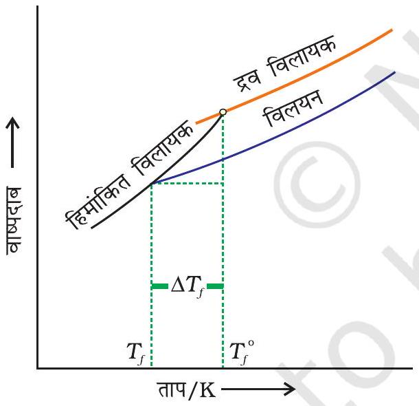
चित्र 1.8- विलयन में विलायक के हिमांक का अवनमन $\left(\Delta T_{f}\right)$ दर्शाने वाला आलेख

विलायक में डाला जाता है तो विलायक का वाष्प दाब कम हो जाता है और अब इसका वाष्पदाब ठोस विलायक के वाष्पदाब के बराबर कुछ कम ताप पर होता है। अतः विलायक का हिमांक घट जाता है।

माना कि $T_{f}^{0}$ शुद्ध विलायक का हिमांक बिंदु है और जब उसमें अवाष्पशील विलेय घुला है तब उसका हिमांक बिंदु $T_{f}$ है। अतः हिमांक में कमी $T_{f}^{0}-T_{f}$ के बराबर होगी।
$\Delta T_{f}=T_{f}^{0}-T_{f}$, इसे हिंमाक का अवनमन कहते हैं।
क्वथनांक के उन्नयन के समान ही तनु विलयन (आदर्श विलयन) का हिमांक अवनमन $\left(\Delta T_{f}\right)$ भी विलयन की मोललता m के समानुपाती
होता है। अतः

$$
\Delta T_{f} \propto \mathrm{~m}
$$

या

$$
\Delta T_{f}=K_{f} \mathrm{~m}
$$

समानुपाती स्थिरांक, $K_{f}$, जो विलायक की प्रकृति पर निर्भर करता है, को हिमांक अवनमन स्थिरांक, मोलल अवनमन स्थिरांक या क्रायोस्कोपिक स्थिरांक कहते हैं। $K_{f}$ की इकाई $\mathrm{K} \mathrm{kg} \mathrm{mol}^{-1}$ है। कुछ प्रचलित विलायकों के $K_{f}$ मान सारणी $1.3$ में दिए गए हैं।

यदि $\mathrm{w}_{2}$ ग्राम विलेय जिसका मोलर द्रव्यमान $M_{2}$ है, की $\mathrm{w}_{1}$ ग्राम विलायक में उपस्थिति विलायक के हिमांक में $\Delta T_{f}$ अवनमन कर दे, तो विलेय की मोललता समीकरण $1.31$ द्वारा दर्शायी जाती है-

$$
\mathrm{m}=\frac{\mathrm{w}_{2} / \mathrm{M}_{2}}{\mathrm{w}_{1} / 1000}
$$

समीकरण (1.34) में मोललता का यह मान रखने पर, हमें प्राप्त होता है-

$$
\begin{aligned}
& \Delta T_{f}=\frac{\mathrm{K}_{f} \times \mathrm{w}_{2} / \mathrm{M}_{2}}{\mathrm{w}_{1} / 1000} \\
& \Delta T_{f}=\frac{\mathrm{K}_{f} \times \mathrm{w}_{2} \times 1000}{\mathrm{M}_{2} \times \mathrm{w}_{1}} \\
& M_{2}=\frac{\mathrm{K}_{f} \times \mathrm{w}_{2} \times 1000}{\Delta T_{f} \times \mathrm{w}_{1}}
\end{aligned}
$$

अतः विलेय का मोलर द्रव्यमान निकालने के लिए हमें $\mathrm{w}_{1}, \mathrm{w}_{2}, \Delta T_{f}$ के साथ मोलल अवनमन स्थिरांक $K_{f}$ का मान भी ज्ञात होना चाहिए। $K_{f}$ एवं $K_{b}$ के मान, जो विलायक की प्रकृति पर निर्भर करते हैं, निम्न संबंधों से प्राप्त किए जा सकते हैं।

$$
\begin{aligned}
& K_{f}=\frac{R \times M_{1} \times T_{f}^{2}}{1000 \times \Delta_{\text {गलन }} H} \\
& K_{b}=\frac{R \times M_{1} \times T_{b}^{2}}{1000 \times \Delta_{\text {वाष्पन }} H}
\end{aligned}
$$

यहाँ $R$ और $M_{1}$ क्रमशः गैस स्थिरांक एवं विलायक का मोलर द्रव्यमान तथा $T_{f}$ तथा $T_{b}$ केल्विन में शुद्ध विलायक के क्रमशः हिमांक एवं क्वथनांक हैं। इसी प्रकार $\Delta_{\text {गलन }} \mathrm{H}$ तथा $\Delta_{\text {वाष्पन }} \mathrm{H}$ क्रमशः विलायक के गलन एवं वाष्पन एन्थैल्पी में परिवर्तन हैं।

सारणी 1.3- कुछ विलायकों के मोलल क्वथनांक उन्नयन स्थिरांक एवं मोलल हिमांक अवनमन स्थिरांक
| विलायक | b. p./K | $\boldsymbol{K}_{\mathbf{b}} \boldsymbol{/} \mathbf{K ~ k g ~ m o l}^{\boldsymbol{-} \mathbf{1}}$ | f. p./K | $\boldsymbol{K}_{\boldsymbol{f}} \boldsymbol{/} \mathbf{K ~ k g ~ m o l}^{\boldsymbol{-} \mathbf{1}}$ |
| :--- | :--- | :--- | :--- | :--- |
| जल | $373.15$ | $0.52$ | $273.0$ | $1.86$ |
| एथेनॉल | $351.5$ | $1.20$ | $155.7$ | $1.99$ |
| साइक्लोहेक्सेन | $353.74$ | $2.79$ | $279.55$ | $20.00$ |
| बेन्जीन | $353.3$ | $2.53$ | $278.6$ | $5.12$ |
| क्लोरोफॉर्म | $334.4$ | $3.63$ | $209.6$ | $4.79$ |
| कार्बन टेट्राक्लोराइड | $350.0$ | $5.03$ | $250.5$ | $31.8$ |
| कार्बन डाइसल्फाइड | $319.4$ | $2.34$ | $164.2$ | $3.83$ |
| डाइएथिल ईथर | $307.8$ | $2.02$ | $156.9$ | $1.79$ |
| ऐसीटिक अम्ल | $391.1$ | $2.93$ | $290.0$ | $3.90$ |

उदाहरण $1.945$ g एथिलीन ग्लाइकॉल $\left(\mathrm{C}_{2} \mathrm{H}_{6} \mathrm{O}_{2}\right)$ को $600$ g जल में मिलाया गया। विलयन के (क) हिमांक अवनमन एवं (ख) हिमांक की गणना कीजिए।

हल हिमांक अवनमन मोललता से संबंधित है, अतः
एथिलीन ग्लाइकॉल के विलयन की मोललता $=\frac{\text { एथिलीन ग्लाइकॉल के मोल }}{\text { जल का } \mathrm{kg} \text { में द्रव्यमान }}$
एथिलीन ग्लाइकॉल के मोल $=\frac{45 \mathrm{~g}}{62 \mathrm{~g} \mathrm{~mol}^{-1}}=0.73 \mathrm{~mol}$
जल का kg में द्रव्यमान $=\frac{600 \mathrm{~g}}{1000 \mathrm{~g} \mathrm{~kg}^{-1}}=0.6 \mathrm{~kg}$
इस प्रकार, एथिलीन ग्लाइकॉल की मोललता $=\frac{0.73 \mathrm{~mol}}{0.60 \mathrm{~kg}}=1.2 \mathrm{~mol} \mathrm{~kg}^{-1}$
अतः हिमांक में अवनमन $\Delta T_{f}=1.86 \mathrm{~K} \mathrm{~kg} \mathrm{~mol}^{-1} \times 1.2 \mathrm{~mol} \mathrm{~kg}^{-1}=2.2 \mathrm{~K}$
जलीय विलयन का हिमांक $=273.15 \mathrm{~K}-2.2 \mathrm{~K}=270.95 \mathrm{~K}$
उदाहरण $1.10$ एक वैद्युतअनअपघट्य के $1.00 \mathrm{~g}$ को $50 \mathrm{~g}$ बेन्जीन में घोलने पर इसके हिमांक में $0.40 \mathrm{~K}$ की कमी हो जाती है। बेन्जीन का हिमांक अवनमन स्थिरांक $5.12 \mathrm{~K} \mathrm{~kg} \mathrm{~mol}^{-1}$ है। विलेय का मोलर द्रव्यमान ज्ञात कीजिए।

हल समीकरण (1.36) में विभिन्न पदों के मान रखने पर हम पाते हैं

$$
\mathrm{M}_{2}=\frac{5.12 \mathrm{~K} \mathrm{~kg} \mathrm{~mol}^{-1} \times 1.00 \mathrm{~g} \times 1000 \mathrm{~g} \mathrm{~kg}^{-1}}{0.40 \mathrm{~K} \times 50 \mathrm{~g}}=256 \mathrm{~g} \mathrm{~mol}^{-1}
$$

अतः विलेय का मोलर द्रव्यमान $=256 \mathrm{~g} \mathrm{~mol}^{-1}$

### 1.6.4 परासरण एवं   परासरण दाब

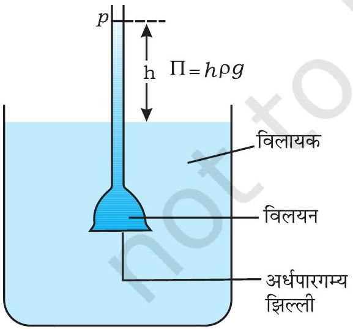
चित्र 1.9- विलायक के परासरण के कारण थिसेल फनल में विलयन का स्तर बढ़ जाता है।

हम प्रकृति अथवा घर में कई परिघटनाओं को देखते हैं। उदाहरणार्थ, कच्चे आमों का अचार डालने के लिए नमकीन जल में भिगोने पर वे संकुचित हो जाते हैं, मुरझाये फूल ताज़े जल में रखने पर ताज़े हो उठते हैं, नमकीन जल में रखने पर रूधिर कोशिकायें सिकुड़ जाती हैं, आदि। इन सभी घटनाओं में एक बात जो समान दिखाई देती है, वह यह है कि ये सभी पदार्थ झिल्लियों से परिबद्ध हैं। ये झिल्लियाँ जंतु या वनस्पति मूल की हो सकती हैं एवं यह सूअर के ब्लेडर या पार्चमेन्ट की तरह प्राकृतिक रूप में मिलती हैं, अथवा सेलोफेन की तरह संश्लेषित प्रकृति की होती हैं।

ये झिल्लियाँ सतत शीट या फिल्म प्रतीत होती हैं, तथापि इनमें अतिसूक्ष्मदर्शीय (Submicroscopic) छिद्रों या रंध्रों का एक नेटवर्क होता है। कुछ विलायक जैसे जल के अणु इन छिद्रों से गुज़र सकते हैं परंतु विलेय के बड़े अणुओं का गमन बाधित होता है। इस प्रकार के गुणों वाली झिल्लियाँ, अर्धपारगम्य झिल्लियाँ (SPM) कहलाती हैं।

मान लीजिए कि केवल विलायक के अणु ही इन अर्धपारगम्य झिल्लियों में से निकल सकते हैं। यदि चित्र $1.9$ में दर्शाये अनुसार यह झिल्ली विलायक एवं विलयन के मध्य रख दी जाए तो विलायक के अणु इस झिल्ली में से निकलकर विलयन की ओर प्रवाहित हो जाएंगे। विलायक के प्रवाह का यह प्रक्रम परासरण कहलाता है।

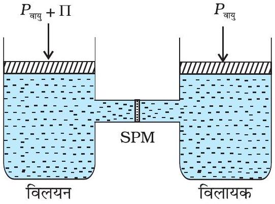
चित्र 1.10- परासरण को रोकने के लिए परासरण दाब के तुल्य अतिरिक्त दाब विलयन पर प्रयुक्त करना चाहिए।

साम्यवस्था प्राप्त होने तक प्रवाह सतत बना रहता है। झिल्ली में से विलायक का अपनी ओर से विलयन की ओर का प्रवाह, विलयन पर अतिरिक्त दाब लगा कर रोका जा सकता है। यह दाब जो कि विलायक के प्रवाह को मात्र रोकता है, परासरण दाब कहलाता है। अर्धपारगम्य झिल्ली में से विलायक का तनु विलयन से सांद्र विलयन की ओर प्रवाह, परासरण के कारण होता है। यह बिंदु ध्यान रखने योग्य है कि विलायक के अणु हमेशा विलयन की निम्न सांद्रता से उच्च सांद्रता की ओर प्रवाह करते हैं। परासरण दाब का विलयन की सांद्रता पर निर्भर होना पाया गया है।

एक विलयन का परासरण दाब वह अतिरिक्त दाब है, जो परासरण को रोकने अर्थात् विलायक के अणुओं को एक अर्धपारगम्य झिल्ली द्वारा विलयन में जाने से रोकने के लिए लगाया जाना चाहिए। यह चित्र $1.10$ में समझाया गया है। परासरण दाब एक अणुसंख्यक गुण है, जो कि विलेय कि अणु संख्या पर निर्भर करता है, न कि उसकी प्रकृति पर। तनु विलयनों के लिए प्रायोगिक तौर पर यह पाया गया है कि परासरण दाब दिए गए ताप $\boldsymbol{T}$ पर, मोलरता, $\mathbf{C}$ के समानुपातिक होता है। अतः

$$
\Pi=C R T
$$

यहाँ $\Pi$ परासरण दाब एवं R गैस नियतांक है।

$$
\Pi=\frac{n_{2}}{V} R T
$$

यहाँ V, विलेय के $n_{2}$ मोलों को रखने वाले विलयन का आयतन लीटर में है। यदि $M_{2}$ मोलर द्रव्यमान का $\mathrm{w}_{2}$ ग्राम विलेय विलयन में उपस्थित हो तब हम-

$$
\begin{aligned}
& \quad n_{2}=\frac{\mathrm{w}_{2}}{M_{2}} \text { एवं } \\
& \Pi V=\frac{\mathrm{w}_{2} R T}{M_{2}} \\
& \text { या } \quad M_{2}=\frac{\mathrm{w}_{2} R T}{\Pi V} \quad \text { लिख सकते हैं, }
\end{aligned}
$$

अतः राशियों $\mathrm{w}_{2}, T, \Pi$ एवं $V$ के ज्ञात होने पर विलेय का मोलर द्रव्यमान परिकलित किया जा सकता है।

विलेयों के मोलर द्रव्यमान ज्ञात करने की एक अन्य विधि परासरण दाब का मापन है। यह विधि प्रोटीनों, बहुलकों एवं अन्य वृहदणुओं के मोलर द्रव्यमान ज्ञात करने की प्रचलित विधि है। परासरण दाब विधि दाब मापन की अन्य विधियों से अधिक उपयोगी है क्योंकि परासरण दाब मापन कमरे के ताप पर होता है एवं मोललता के स्थान पर विलयन की मोलरता उपयोग में ली जाती है। अन्य अणुसंख्यक गुणों की तुलना में तनु विलयनों के लिए भी इसका परिमाण अधिक होता है। विलेयों के मोलर द्रव्यमान ज्ञात करने की परासरण दाब तकनीक विशेष रूप से जैव-अणुओं के लिए उपयोगी है जो उच्चताप पर सामान्यतया स्थायी नहीं होते एवं उन बहुलकों के लिए भी जिनकी विलेयता कम होती है।

दिए गए ताप पर समान परासरण दाब वाले दो विलयन समपरासारी विलयन कहलाते हैं। जब ऐसे विलयन अर्धपारगम्य झिल्ली द्वारा पृथक किए जाते हैं, तो उनके मध्य

परासरण नहीं होता। उदाहरणार्थ, रुधिर कोशिका में स्थित द्रव का परासरण दाब 0.9\% (द्रव्यमान/आयतन) सोडियम क्लोराइड, जिसे सामान्य लवण विलयन कहते हैं, के तुल्यांक होता है एवं इसे अंतःशिरा में अंतःक्षेपित (इंजेक्ट) करना सुरक्षित रहता है। दूसरी ओर, यदि हम कोशिकाओं को 0.9\% (द्रव्यमान/आयतन) से अधिक सोडियम क्लोराइड विलयन में रख दें, तो जल कोशिकाओं से बाहर प्रवाहित हो जाएगा और वे संकुचित हो जाएंगी। इस प्रकार के विलयन को अतिपरासरी विलयन कहा जाता है। यदि लवण की सांद्रता $0.9 \%$ (द्रव्यमान/आयतन) से कम हो तो जल कोशिकाओं के अंदर प्रवाहित होगा और वे फूल जायेंगी। ऐसे विलयन को अल्पपरासरी विलयन कहते हैं।

उदाहरण $1.11$ एक प्रोटीन के $200 \mathrm{~cm}^{3}$ जलीय विलयन में $1.26 \mathrm{~g}$ प्रोटीन है। $300 \mathrm{~K}$ पर इस विलयन का परासरणदाब $2.57 \times 10^{-3}$ bar पाया गया। प्रोटीन के मोलर द्रव्यमान का परिकलन कीजिए।

हल हमें निम्नलिखित राशियाँ ज्ञात हैं-

$$
\begin{aligned}
& \Pi=2.57 \times 10^{-3} \mathrm{bar}, \\
& V=200 \mathrm{~cm}^{3}=0.200 \mathrm{~L} \\
& T=300 \mathrm{~K} \\
& \mathrm{R}=0.083 \mathrm{~L} \text { bar } \mathrm{mol}^{-1} \mathrm{~K}^{-1}
\end{aligned}
$$

इन मानों को समीकरण $1.42$ में प्रतिस्थापित करने पर हम पाते हैं-

$$
M_{2}=\frac{1.26 \mathrm{~g} \times 0.083 \mathrm{~L} \mathrm{bar} \mathrm{~K}^{-1} \mathrm{~mol}^{-1} \times 300 \mathrm{~K}}{2.57 \times 10^{-3} \mathrm{bar} \times 0.200 \mathrm{~L}}=61,022 \mathrm{~g} \mathrm{~mol}^{-1}
$$

इस खंड के प्रारंभ में उल्लेखित परिघटनाओं को परासरण के आधार पर समझाया जा सकता है। अचार बनाने के लिए सांद्र लवणीय विलयन में रखा गया कच्चा आम परासरण के कारण जल का क्षरण कर देता है एवं संकुचित हो जाता है। मुरझाये पुष्प ताज़ा जल में रखने पर पुनः ताज़े हो उठते हैं। वातावरण में जल ह्रास के कारण लचीली हो चुकी गाजर जल में रखकर पुनः उसी अवस्था में प्राप्त की जा सकती है। परासरण के कारण जल इसकी कोशिकाओं के अंदर चला जाता है। यदि रुधिर कोशिकाओं को $0.9 \%$ (द्रव्यमान/आयतन) से कम लवण वाले जल में रखा जाये तो परासरण के कारण जल के रुधिर कोशिका में प्रवाह से ये फूल जाती हैं। जो लोग बहुत अधिक नमक या नमकीन भोजन लेते हैं वे ऊतक कोशिकाओं एवं अंतरा कोशिक स्थानों में जल धारण महसूस करते हैं। इसके परिणामस्वरूप होने वाली स्थूलता या सूजन को शोफ (edema) कहते हैं।

जल का मृदा से पौधों की जड़ों में और फिर पौधे के ऊपर के हिस्सों में पहुँचना आंशिक रूप से परासरण के कारण होता है। मांस में लवण मिलाकर संरक्षण एवं फलों में शर्करा मिलाकर संरक्षण बैक्टीरिया की क्रिया को रोकता है। परासरण के कारण नमक्युक्त मांस एवं मिश्री में पागे गए फल पर स्थिर बैक्टीरियम जल ह्रास के कारण संकुचित होकर मर जाता है।

### 1.6.5 प्रतिलोम परासरण एवं जल शोधन

चित्र $1.10$ में वर्णित विलयन पर यदि परासरण दाब से अधिक दाब लगाया जाए तो परासरण की दिशा को प्रतिवर्तित (Reversed) किया जा सकता है; अर्थात् शुद्ध विलायक अब अर्धपारगम्य झिल्ली के माध्यम से विलयन में से पारगमन करता है। यह परिघटना प्रतिलोम परासरण कहलाती है एवं व्यावहारिक रूप से बहुत उपयोगी है। प्रतिलोम परासरण का उपयोग समुद्री जल के विलवणीकरण में किया जाता है। प्रक्रम

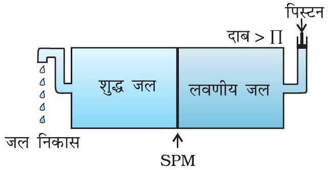
चित्र 1.11- जब विलयन पर परासरण दाब से अधिक दाब लगाया जाता है तो प्रतिलोम परासरण होता है।

का आरेखीय निरूपण चित्र $1.11$ में दर्शाया गया है। जब परासरण दाब से अधिक दाब लगाया जाता है तो शुद्ध जल अर्धपारगम्य झिल्ली के माध्यम से समुद्री जल में से निष्कासित हो जाता है। तो इस उद्देश्य के लिए विभिन्न प्रकार की बहुलकीय झिल्लियाँ उपलब्ध हैं।

प्रतिलोम परासरण के लिए आवश्यक दाब बहुत अधिक होता है। इसके लिए उपयुक्त झिल्ली सेलूलोस ऐसीटेट की फिल्म से बनी होती है जिसे उपयुक्त आधार पर रखा जाता है। सेलूलोस ऐसीटेट जल के लिए पारगम्य है परंतु समुद्री जल में उपस्थित अशुद्धियों एवं आयनों के लिए अपारगम्य है। आजकल बहुत से देश अपनी पेय जल की आवश्यकता के लिए विलवणीकरण संयंत्रों का उपयोग करते हैं।

## पाठ्यनिहित प्रश्न

$1.9298 \mathrm{~K}$ पर शुद्ध जल का वाष्पदाब $23.8 \mathrm{~mm} \mathrm{Hg}$ है। $850 \mathrm{~g}$ जल में $50 \mathrm{~g}$ यूरिया $\left(\mathrm{NH}_{2} \mathrm{CONH}_{2}\right)$ घोला जाता है। इस विलयन के लिए जल के वाष्पदाब एवं इसके आपेक्षिक अवनमन का परिकलन कीजिए।
$1.10750 \mathrm{~mm} \mathrm{Hg}$ दाब पर जल का क्वथनांक $99.63^{\circ} \mathrm{C}$ है। $500 \mathrm{~g}$ जल में कितना सुक्रोस मिलाया जाए कि इसका $100^{\circ} \mathrm{C}$ पर क्वथन हो जाए।
$1.11$ ऐस्कॉर्बिक अम्ल (विटामिन $\mathrm{C}, \mathrm{C}_{6} \mathrm{H}_{8} \mathrm{O}_{6}$ ) के उस द्रव्यमान का परिकलन कीजिए, जिसे $75 \mathrm{~g}$ ऐसीटिक अम्ल में घोलने पर उसके हिमांक में 1.5°C की कमी हो जाए। $\mathrm{K}_{f}=3.9 \mathrm{~K} \mathrm{~kg} \mathrm{~mol}^{-1}$
$1.12185,000$ मोलर द्रव्यमान वाले एक बहुलक के $1.0 \mathrm{~g}$ को $37^{\circ} \mathrm{C}$ पर $450 \mathrm{~mL}$ जल में घोलने से उत्पन्न विलयन के परासरण दाब का पास्कल में परिकलन कीजिए।

## $1.7$ असामान्य मोलर द्रव्यमान

हम जानते हैं कि आयनिक पदार्थ जल में घोलने पर धनायनों एवं ऋणायनों में वियोजित हो जाते हैं। उदाहरणार्थ, यदि हम एक मोल $\mathrm{KCl}(74.5 \mathrm{~g})$ को जल में विलीन करें तो हम विलयन में $\mathrm{K}^{+}$एवं $\mathrm{Cl}^{-}$आयनों में प्रत्येक के एक मोल के मुक्त होने की अपेक्षा करते हैं। यदि ऐसा होता है, तो विलयन में विलेय के कणों के दो मोल होंगे। यदि हम अंतराआयनी आकर्षणों की उपेक्षा करें तो यह आशा की जाती है कि $1$ kg जल में KCl का एक मोल, क्वथनांक को $2 \times 0.52 \mathrm{~K}=1.04 \mathrm{~K}$ बढ़ा देगा। अब, यदि हम वियोजन की मात्रा के बारे में न जानते हों तो हम इस परिणाम पर पहुँचेंगे कि $2$ मोल कणों का द्रव्यमान $74.5 \mathrm{~g}$ है अतः एक मोल KCl का द्रव्यमान $37.25 \mathrm{~g}$ होगा। इससे यह नियम प्रकट होता है कि जब विलेय का आयनों में वियोजन होता है तो प्रायोगिक तौर पर इन विधियों द्वारा ज्ञात किया गया मोलर द्रव्यमान, वास्तविक द्रव्यमान से हमेशा कम होता है।

बेन्जीन में एथेनॉइक अम्ल के अणुओं का (ऐसीटिक अम्ल) हाइड्रोजन बंध बनने के कारण द्वितयन (dimerization) हो जाता है। ऐसा सामान्यतया निम्न परावैद्युतांक वाले विलायकों में होता है। इस प्रकरण में द्वितयन के कारण कणों की संख्या घट जाती है। अणुओं का संगुणन निम्न चित्र में देखा जा सकता है

$$
2 \mathrm{CH}_{3} \mathrm{COOH} \rightleftharpoons\left(\mathrm{CH}_{3} \mathrm{COOH}\right)_{2}
$$

<img class="imgSvg" id = "mu2bmqfr3zm2ve26j1x" src="data:image/svg+xml;base64,PHN2ZyBpZD0ic21pbGVzLW11MmJtcWZyM3ptMnZlMjZqMXgiIHhtbG5zPSJodHRwOi8vd3d3LnczLm9yZy8yMDAwL3N2ZyIgdmlld0JveD0iMCAwIDI0OCA4OS4yNTAwOTE4MjQ0OTI5OCIgc3R5bGU9IndpZHRoOiAyNDcuNjc4ODAxMzE1MjIxODVweDsgaGVpZ2h0OiA4OS4yNTAwOTE4MjQ0OTI5OHB4OyBvdmVyZmxvdzogdmlzaWJsZTsiPjxkZWZzPjxsaW5lYXJHcmFkaWVudCBpZD0ibGluZS1tdTJibXFmcjN6bTJ2ZTI2ajF4LTEiIGdyYWRpZW50VW5pdHM9InVzZXJTcGFjZU9uVXNlIiB4MT0iMTc4LjM5OTAxMTY5ODk5ODYiIHkxPSI1Mi41MDAwNzM0NTk1OTU4MjUiIHgyPSIyMDUuNjc4ODAxMzE1MjIxODUiIHkyPSI2OC4yNTAwOTE4MjQ0OTI5OCI+PHN0b3Agc3RvcC1jb2xvcj0iY3VycmVudENvbG9yIiBvZmZzZXQ9IjIwJSI+PC9zdG9wPjxzdG9wIHN0b3AtY29sb3I9ImN1cnJlbnRDb2xvciIgb2Zmc2V0PSIxMDAlIj48L3N0b3A+PC9saW5lYXJHcmFkaWVudD48bGluZWFyR3JhZGllbnQgaWQ9ImxpbmUtbXUyYm1xZnIzem0ydmUyNmoxeC0zIiBncmFkaWVudFVuaXRzPSJ1c2VyU3BhY2VPblVzZSIgeDE9IjE4MS4yMzQwMTE2OTg5OTc5NiIgeTE9IjUyLjUwMDA3NTM2ODEzMjI4NiIgeDI9IjE4MS4yMzQwMzI5MDQ5NTg3MiIgeTI9IjIxLjAwMDA3NTM2ODEzOTQzNCI+PHN0b3Agc3RvcC1jb2xvcj0iY3VycmVudENvbG9yIiBvZmZzZXQ9IjIwJSI+PC9zdG9wPjxzdG9wIHN0b3AtY29sb3I9ImN1cnJlbnRDb2xvciIgb2Zmc2V0PSIxMDAlIj48L3N0b3A+PC9saW5lYXJHcmFkaWVudD48bGluZWFyR3JhZGllbnQgaWQ9ImxpbmUtbXUyYm1xZnIzem0ydmUyNmoxeC01IiBncmFkaWVudFVuaXRzPSJ1c2VyU3BhY2VPblVzZSIgeDE9IjE3NS41NjQwMTE2OTg5OTkyNSIgeTE9IjUyLjUwMDA3MTU1MTA1OTM2NCIgeDI9IjE3NS41NjQwMzI5MDQ5NjAwMiIgeTI9IjIxLjAwMDA3MTU1MTA2NjQ4MyI+PHN0b3Agc3RvcC1jb2xvcj0iY3VycmVudENvbG9yIiBvZmZzZXQ9IjIwJSI+PC9zdG9wPjxzdG9wIHN0b3AtY29sb3I9ImN1cnJlbnRDb2xvciIgb2Zmc2V0PSIxMDAlIj48L3N0b3A+PC9saW5lYXJHcmFkaWVudD48bGluZWFyR3JhZGllbnQgaWQ9ImxpbmUtbXUyYm1xZnIzem0ydmUyNmoxeC03IiBncmFkaWVudFVuaXRzPSJ1c2VyU3BhY2VPblVzZSIgeDE9IjE1MS4xMTkyMDA4NzY4MTQ1NSIgeTE9IjY4LjI1MDA1NTA5NDY5MTUiIHgyPSIxNzguMzk5MDExNjk4OTk4NiIgeTI9IjUyLjUwMDA3MzQ1OTU5NTgyNSI+PHN0b3Agc3RvcC1jb2xvcj0iY3VycmVudENvbG9yIiBvZmZzZXQ9IjIwJSI+PC9zdG9wPjxzdG9wIHN0b3AtY29sb3I9ImN1cnJlbnRDb2xvciIgb2Zmc2V0PSIxMDAlIj48L3N0b3A+PC9saW5lYXJHcmFkaWVudD48bGluZWFyR3JhZGllbnQgaWQ9ImxpbmUtbXUyYm1xZnIzem0ydmUyNmoxeC05IiBncmFkaWVudFVuaXRzPSJ1c2VyU3BhY2VPblVzZSIgeDE9IjEyMy44Mzk0MTEyNjA1OTEyOSIgeTE9IjUyLjUwMDAzNjcyOTc5NDM0NiIgeDI9IjE1MS4xMTkyMDA4NzY4MTQ1NSIgeTI9IjY4LjI1MDA1NTA5NDY5MTUiPjxzdG9wIHN0b3AtY29sb3I9ImN1cnJlbnRDb2xvciIgb2Zmc2V0PSIyMCUiPjwvc3RvcD48c3RvcCBzdG9wLWNvbG9yPSJjdXJyZW50Q29sb3IiIG9mZnNldD0iMTAwJSI+PC9zdG9wPjwvbGluZWFyR3JhZGllbnQ+PGxpbmVhckdyYWRpZW50IGlkPSJsaW5lLW11MmJtcWZyM3ptMnZlMjZqMXgtMTEiIGdyYWRpZW50VW5pdHM9InVzZXJTcGFjZU9uVXNlIiB4MT0iOTYuNTU5NjAwNDM4NDA3MjciIHkxPSI2OC4yNTAwMTgzNjQ4OTAwMiIgeDI9IjEyMy44Mzk0MTEyNjA1OTEyOSIgeTI9IjUyLjUwMDAzNjcyOTc5NDM0NiI+PHN0b3Agc3RvcC1jb2xvcj0iY3VycmVudENvbG9yIiBvZmZzZXQ9IjIwJSI+PC9zdG9wPjxzdG9wIHN0b3AtY29sb3I9ImN1cnJlbnRDb2xvciIgb2Zmc2V0PSIxMDAlIj48L3N0b3A+PC9saW5lYXJHcmFkaWVudD48bGluZWFyR3JhZGllbnQgaWQ9ImxpbmUtbXUyYm1xZnIzem0ydmUyNmoxeC0xMyIgZ3JhZGllbnRVbml0cz0idXNlclNwYWNlT25Vc2UiIHgxPSI2OS4yNzk4MTA4MjIxODQwMiIgeTE9IjUyLjQ5OTk5OTk5OTk5Mjg2NiIgeDI9Ijk2LjU1OTYwMDQzODQwNzI3IiB5Mj0iNjguMjUwMDE4MzY0ODkwMDIiPjxzdG9wIHN0b3AtY29sb3I9ImN1cnJlbnRDb2xvciIgb2Zmc2V0PSIyMCUiPjwvc3RvcD48c3RvcCBzdG9wLWNvbG9yPSJjdXJyZW50Q29sb3IiIG9mZnNldD0iMTAwJSI+PC9zdG9wPjwvbGluZWFyR3JhZGllbnQ+PGxpbmVhckdyYWRpZW50IGlkPSJsaW5lLW11MmJtcWZyM3ptMnZlMjZqMXgtMTUiIGdyYWRpZW50VW5pdHM9InVzZXJTcGFjZU9uVXNlIiB4MT0iNDIiIHkxPSI2OC4yNDk5ODE2MzUwODg1NSIgeDI9IjY5LjI3OTgxMDgyMjE4NDAyIiB5Mj0iNTIuNDk5OTk5OTk5OTkyODY2Ij48c3RvcCBzdG9wLWNvbG9yPSJjdXJyZW50Q29sb3IiIG9mZnNldD0iMjAlIj48L3N0b3A+PHN0b3Agc3RvcC1jb2xvcj0iY3VycmVudENvbG9yIiBvZmZzZXQ9IjEwMCUiPjwvc3RvcD48L2xpbmVhckdyYWRpZW50PjxsaW5lYXJHcmFkaWVudCBpZD0ibGluZS1tdTJibXFmcjN6bTJ2ZTI2ajF4LTE3IiBncmFkaWVudFVuaXRzPSJ1c2VyU3BhY2VPblVzZSIgeDE9IjcyLjExNDgxMDgyMjE4MzM3IiB5MT0iNTIuNTAwMDAxOTA4NTI5MzMiIHgyPSI3Mi4xMTQ4MzIwMjgxNDQxNCIgeTI9IjIxLjAwMDAwMTkwODUzNjQ3NiI+PHN0b3Agc3RvcC1jb2xvcj0iY3VycmVudENvbG9yIiBvZmZzZXQ9IjIwJSI+PC9zdG9wPjxzdG9wIHN0b3AtY29sb3I9ImN1cnJlbnRDb2xvciIgb2Zmc2V0PSIxMDAlIj48L3N0b3A+PC9saW5lYXJHcmFkaWVudD48bGluZWFyR3JhZGllbnQgaWQ9ImxpbmUtbXUyYm1xZnIzem0ydmUyNmoxeC0xOSIgZ3JhZGllbnRVbml0cz0idXNlclNwYWNlT25Vc2UiIHgxPSI2Ni40NDQ4MTA4MjIxODQ2NiIgeTE9IjUyLjQ5OTk5ODA5MTQ1NjQwNSIgeDI9IjY2LjQ0NDgzMjAyODE0NTQzIiB5Mj0iMjAuOTk5OTk4MDkxNDYzNTI0Ij48c3RvcCBzdG9wLWNvbG9yPSJjdXJyZW50Q29sb3IiIG9mZnNldD0iMjAlIj48L3N0b3A+PHN0b3Agc3RvcC1jb2xvcj0iY3VycmVudENvbG9yIiBvZmZzZXQ9IjEwMCUiPjwvc3RvcD48L2xpbmVhckdyYWRpZW50PjwvZGVmcz48bWFzayBpZD0idGV4dC1tYXNrLW11MmJtcWZyM3ptMnZlMjZqMXgiPjxyZWN0IHg9IjAiIHk9IjAiIHdpZHRoPSIxMDAlIiBoZWlnaHQ9IjEwMCUiIGZpbGw9IndoaXRlIj48L3JlY3Q+PGNpcmNsZSBjeD0iMTc4LjM5OTAzMjkwNDk1OTM3IiBjeT0iMjEuMDAwMDczNDU5NjAyOTYiIHI9IjcuODc1IiBmaWxsPSJibGFjayI+PC9jaXJjbGU+PGNpcmNsZSBjeD0iMTUxLjExOTIwMDg3NjgxNDU1IiBjeT0iNjguMjUwMDU1MDk0NjkxNSIgcj0iNy44NzUiIGZpbGw9ImJsYWNrIj48L2NpcmNsZT48Y2lyY2xlIGN4PSIxMjMuODM5NDExMjYwNTkxMjkiIGN5PSI1Mi41MDAwMzY3Mjk3OTQzNDYiIHI9IjEzLjEyNSIgZmlsbD0iYmxhY2siPjwvY2lyY2xlPjxjaXJjbGUgY3g9Ijk2LjU1OTYwMDQzODQwNzI3IiBjeT0iNjguMjUwMDE4MzY0ODkwMDIiIHI9IjcuODc1IiBmaWxsPSJibGFjayI+PC9jaXJjbGU+PGNpcmNsZSBjeD0iNjkuMjc5ODMyMDI4MTQ0NzgiIGN5PSIyMSIgcj0iNy44NzUiIGZpbGw9ImJsYWNrIj48L2NpcmNsZT48L21hc2s+PHN0eWxlPgogICAgICAgICAgICAgICAgLmVsZW1lbnQtbXUyYm1xZnIzem0ydmUyNmoxeCB7CiAgICAgICAgICAgICAgICAgICAgZm9udDogMTRweCBIZWx2ZXRpY2EsIEFyaWFsLCBzYW5zLXNlcmlmOwogICAgICAgICAgICAgICAgICAgIGFsaWdubWVudC1iYXNlbGluZTogJ21pZGRsZSc7CiAgICAgICAgICAgICAgICB9CiAgICAgICAgICAgICAgICAuc3ViLW11MmJtcWZyM3ptMnZlMjZqMXggewogICAgICAgICAgICAgICAgICAgIGZvbnQ6IDguNHB4IEhlbHZldGljYSwgQXJpYWwsIHNhbnMtc2VyaWY7CiAgICAgICAgICAgICAgICB9CiAgICAgICAgICAgIDwvc3R5bGU+PGcgbWFzaz0idXJsKCN0ZXh0LW1hc2stbXUyYm1xZnIzem0ydmUyNmoxeCkiPjxsaW5lIHgxPSIxNzguMzk5MDExNjk4OTk4NiIgeTE9IjUyLjUwMDA3MzQ1OTU5NTgyNSIgeDI9IjIwNS42Nzg4MDEzMTUyMjE4NSIgeTI9IjY4LjI1MDA5MTgyNDQ5Mjk4IiBzdHlsZT0ic3Ryb2tlLWxpbmVjYXA6cm91bmQ7c3Ryb2tlLWRhc2hhcnJheTpub25lO3N0cm9rZS13aWR0aDoxLjI2IiBzdHJva2U9InVybCgnI2xpbmUtbXUyYm1xZnIzem0ydmUyNmoxeC0xJykiPjwvbGluZT48bGluZSB4MT0iMTgxLjIzNDAxMTY5ODk5Nzk2IiB5MT0iNTIuNTAwMDc1MzY4MTMyMjg2IiB4Mj0iMTgxLjIzNDAzMjkwNDk1ODcyIiB5Mj0iMjEuMDAwMDc1MzY4MTM5NDM0IiBzdHlsZT0ic3Ryb2tlLWxpbmVjYXA6cm91bmQ7c3Ryb2tlLWRhc2hhcnJheTpub25lO3N0cm9rZS13aWR0aDoxLjI2IiBzdHJva2U9InVybCgnI2xpbmUtbXUyYm1xZnIzem0ydmUyNmoxeC0zJykiPjwvbGluZT48bGluZSB4MT0iMTc1LjU2NDAxMTY5ODk5OTI1IiB5MT0iNTIuNTAwMDcxNTUxMDU5MzY0IiB4Mj0iMTc1LjU2NDAzMjkwNDk2MDAyIiB5Mj0iMjEuMDAwMDcxNTUxMDY2NDgzIiBzdHlsZT0ic3Ryb2tlLWxpbmVjYXA6cm91bmQ7c3Ryb2tlLWRhc2hhcnJheTpub25lO3N0cm9rZS13aWR0aDoxLjI2IiBzdHJva2U9InVybCgnI2xpbmUtbXUyYm1xZnIzem0ydmUyNmoxeC01JykiPjwvbGluZT48bGluZSB4MT0iMTUxLjExOTIwMDg3NjgxNDU1IiB5MT0iNjguMjUwMDU1MDk0NjkxNSIgeDI9IjE3OC4zOTkwMTE2OTg5OTg2IiB5Mj0iNTIuNTAwMDczNDU5NTk1ODI1IiBzdHlsZT0ic3Ryb2tlLWxpbmVjYXA6cm91bmQ7c3Ryb2tlLWRhc2hhcnJheTpub25lO3N0cm9rZS13aWR0aDoxLjI2IiBzdHJva2U9InVybCgnI2xpbmUtbXUyYm1xZnIzem0ydmUyNmoxeC03JykiPjwvbGluZT48bGluZSB4MT0iMTIzLjgzOTQxMTI2MDU5MTI5IiB5MT0iNTIuNTAwMDM2NzI5Nzk0MzQ2IiB4Mj0iMTUxLjExOTIwMDg3NjgxNDU1IiB5Mj0iNjguMjUwMDU1MDk0NjkxNSIgc3R5bGU9InN0cm9rZS1saW5lY2FwOnJvdW5kO3N0cm9rZS1kYXNoYXJyYXk6bm9uZTtzdHJva2Utd2lkdGg6MS4yNiIgc3Ryb2tlPSJ1cmwoJyNsaW5lLW11MmJtcWZyM3ptMnZlMjZqMXgtOScpIj48L2xpbmU+PGxpbmUgeDE9Ijk2LjU1OTYwMDQzODQwNzI3IiB5MT0iNjguMjUwMDE4MzY0ODkwMDIiIHgyPSIxMjMuODM5NDExMjYwNTkxMjkiIHkyPSI1Mi41MDAwMzY3Mjk3OTQzNDYiIHN0eWxlPSJzdHJva2UtbGluZWNhcDpyb3VuZDtzdHJva2UtZGFzaGFycmF5Om5vbmU7c3Ryb2tlLXdpZHRoOjEuMjYiIHN0cm9rZT0idXJsKCcjbGluZS1tdTJibXFmcjN6bTJ2ZTI2ajF4LTExJykiPjwvbGluZT48bGluZSB4MT0iNjkuMjc5ODEwODIyMTg0MDIiIHkxPSI1Mi40OTk5OTk5OTk5OTI4NjYiIHgyPSI5Ni41NTk2MDA0Mzg0MDcyNyIgeTI9IjY4LjI1MDAxODM2NDg5MDAyIiBzdHlsZT0ic3Ryb2tlLWxpbmVjYXA6cm91bmQ7c3Ryb2tlLWRhc2hhcnJheTpub25lO3N0cm9rZS13aWR0aDoxLjI2IiBzdHJva2U9InVybCgnI2xpbmUtbXUyYm1xZnIzem0ydmUyNmoxeC0xMycpIj48L2xpbmU+PGxpbmUgeDE9IjQyIiB5MT0iNjguMjQ5OTgxNjM1MDg4NTUiIHgyPSI2OS4yNzk4MTA4MjIxODQwMiIgeTI9IjUyLjQ5OTk5OTk5OTk5Mjg2NiIgc3R5bGU9InN0cm9rZS1saW5lY2FwOnJvdW5kO3N0cm9rZS1kYXNoYXJyYXk6bm9uZTtzdHJva2Utd2lkdGg6MS4yNiIgc3Ryb2tlPSJ1cmwoJyNsaW5lLW11MmJtcWZyM3ptMnZlMjZqMXgtMTUnKSI+PC9saW5lPjxsaW5lIHgxPSI3Mi4xMTQ4MTA4MjIxODMzNyIgeTE9IjUyLjUwMDAwMTkwODUyOTMzIiB4Mj0iNzIuMTE0ODMyMDI4MTQ0MTQiIHkyPSIyMS4wMDAwMDE5MDg1MzY0NzYiIHN0eWxlPSJzdHJva2UtbGluZWNhcDpyb3VuZDtzdHJva2UtZGFzaGFycmF5Om5vbmU7c3Ryb2tlLXdpZHRoOjEuMjYiIHN0cm9rZT0idXJsKCcjbGluZS1tdTJibXFmcjN6bTJ2ZTI2ajF4LTE3JykiPjwvbGluZT48bGluZSB4MT0iNjYuNDQ0ODEwODIyMTg0NjYiIHkxPSI1Mi40OTk5OTgwOTE0NTY0MDUiIHgyPSI2Ni40NDQ4MzIwMjgxNDU0MyIgeTI9IjIwLjk5OTk5ODA5MTQ2MzUyNCIgc3R5bGU9InN0cm9rZS1saW5lY2FwOnJvdW5kO3N0cm9rZS1kYXNoYXJyYXk6bm9uZTtzdHJva2Utd2lkdGg6MS4yNiIgc3Ryb2tlPSJ1cmwoJyNsaW5lLW11MmJtcWZyM3ptMnZlMjZqMXgtMTknKSI+PC9saW5lPjwvZz48Zz48dGV4dCB4PSIyMDUuNjc4ODAxMzE1MjIxODUiIHk9IjY4LjI1MDA5MTgyNDQ5Mjk4IiBjbGFzcz0iZGVidWciIGZpbGw9IiNmZjAwMDAiIHN0eWxlPSIKICAgICAgICAgICAgICAgIGZvbnQ6IDVweCBEcm9pZCBTYW5zLCBzYW5zLXNlcmlmOwogICAgICAgICAgICAiPjwvdGV4dD48dGV4dCB4PSIxNzguMzk5MDExNjk4OTk4NiIgeT0iNTIuNTAwMDczNDU5NTk1ODI1IiBjbGFzcz0iZGVidWciIGZpbGw9IiNmZjAwMDAiIHN0eWxlPSIKICAgICAgICAgICAgICAgIGZvbnQ6IDVweCBEcm9pZCBTYW5zLCBzYW5zLXNlcmlmOwogICAgICAgICAgICAiPjwvdGV4dD48dGV4dCB4PSIxNzMuMTQ5MDMyOTA0OTU5MzciIHk9IjI2LjI1MDA3MzQ1OTYwMjk2IiBjbGFzcz0iZWxlbWVudC1tdTJibXFmcjN6bTJ2ZTI2ajF4IiBmaWxsPSJjdXJyZW50Q29sb3IiIHN0eWxlPSJ0ZXh0LWFuY2hvcjogc3RhcnQ7IHdyaXRpbmctbW9kZTogaG9yaXpvbnRhbC10YjsgdGV4dC1vcmllbnRhdGlvbjogbWl4ZWQ7IGxldHRlci1zcGFjaW5nOiBub3JtYWw7IGRpcmVjdGlvbjogbHRyOyI+PHRzcGFuPk88L3RzcGFuPjwvdGV4dD48dGV4dCB4PSIxNzguMzk5MDMyOTA0OTU5MzciIHk9IjIxLjAwMDA3MzQ1OTYwMjk2IiBjbGFzcz0iZGVidWciIGZpbGw9IiNmZjAwMDAiIHN0eWxlPSIKICAgICAgICAgICAgICAgIGZvbnQ6IDVweCBEcm9pZCBTYW5zLCBzYW5zLXNlcmlmOwogICAgICAgICAgICAiPjwvdGV4dD48dGV4dCB4PSIxNTEuMTE5MjAwODc2ODE0NTUiIHk9IjYwLjM3NTA1NTA5NDY5MTUwNCIgY2xhc3M9ImVsZW1lbnQtbXUyYm1xZnIzem0ydmUyNmoxeCIgZmlsbD0iY3VycmVudENvbG9yIiBzdHlsZT0idGV4dC1hbmNob3I6IHN0YXJ0OyBnbHlwaC1vcmllbnRhdGlvbi12ZXJ0aWNhbDogMDsgd3JpdGluZy1tb2RlOiB2ZXJ0aWNhbC1ybDsgdGV4dC1vcmllbnRhdGlvbjogdXByaWdodDsgbGV0dGVyLXNwYWNpbmc6IC0xcHg7IGRpcmVjdGlvbjogbHRyOyI+PHRzcGFuPk88L3RzcGFuPjwvdGV4dD48dGV4dCB4PSIxNTEuMTE5MjAwODc2ODE0NTUiIHk9IjY4LjI1MDA1NTA5NDY5MTUiIGNsYXNzPSJkZWJ1ZyIgZmlsbD0iI2ZmMDAwMCIgc3R5bGU9IgogICAgICAgICAgICAgICAgZm9udDogNXB4IERyb2lkIFNhbnMsIHNhbnMtc2VyaWY7CiAgICAgICAgICAgICI+PC90ZXh0Pjx0ZXh0IHg9IjEyMy44Mzk0MTEyNjA1OTEyOSIgeT0iNTcuNzUwMDM2NzI5Nzk0MzQ2IiBjbGFzcz0iZWxlbWVudC1tdTJibXFmcjN6bTJ2ZTI2ajF4IiBmaWxsPSJjdXJyZW50Q29sb3IiIHN0eWxlPSJ0ZXh0LWFuY2hvcjogc3RhcnQ7IGdseXBoLW9yaWVudGF0aW9uLXZlcnRpY2FsOiAwOyB3cml0aW5nLW1vZGU6IHZlcnRpY2FsLXJsOyB0ZXh0LW9yaWVudGF0aW9uOiB1cHJpZ2h0OyBsZXR0ZXItc3BhY2luZzogLTFweDsgZGlyZWN0aW9uOiBydGw7IHVuaWNvZGUtYmlkaTogYmlkaS1vdmVycmlkZTsiPjx0c3BhbiBzdHlsZT0iCiAgICAgICAgICAgICAgICB1bmljb2RlLWJpZGk6IHBsYWludGV4dDsKICAgICAgICAgICAgICAgIHdyaXRpbmctbW9kZTogbHItdGI7CiAgICAgICAgICAgICAgICBsZXR0ZXItc3BhY2luZzogbm9ybWFsOwogICAgICAgICAgICAgICAgdGV4dC1hbmNob3I6IG1pZGRsZTsKICAgICAgICAgICAgIj5IZzwvdHNwYW4+PC90ZXh0Pjx0ZXh0IHg9IjEyMy44Mzk0MTEyNjA1OTEyOSIgeT0iNTIuNTAwMDM2NzI5Nzk0MzQ2IiBjbGFzcz0iZGVidWciIGZpbGw9IiNmZjAwMDAiIHN0eWxlPSIKICAgICAgICAgICAgICAgIGZvbnQ6IDVweCBEcm9pZCBTYW5zLCBzYW5zLXNlcmlmOwogICAgICAgICAgICAiPjwvdGV4dD48dGV4dCB4PSI5Ni41NTk2MDA0Mzg0MDcyNyIgeT0iNjAuMzc1MDE4MzY0ODkwMDI1IiBjbGFzcz0iZWxlbWVudC1tdTJibXFmcjN6bTJ2ZTI2ajF4IiBmaWxsPSJjdXJyZW50Q29sb3IiIHN0eWxlPSJ0ZXh0LWFuY2hvcjogc3RhcnQ7IGdseXBoLW9yaWVudGF0aW9uLXZlcnRpY2FsOiAwOyB3cml0aW5nLW1vZGU6IHZlcnRpY2FsLXJsOyB0ZXh0LW9yaWVudGF0aW9uOiB1cHJpZ2h0OyBsZXR0ZXItc3BhY2luZzogLTFweDsgZGlyZWN0aW9uOiBsdHI7Ij48dHNwYW4+TzwvdHNwYW4+PC90ZXh0Pjx0ZXh0IHg9Ijk2LjU1OTYwMDQzODQwNzI3IiB5PSI2OC4yNTAwMTgzNjQ4OTAwMiIgY2xhc3M9ImRlYnVnIiBmaWxsPSIjZmYwMDAwIiBzdHlsZT0iCiAgICAgICAgICAgICAgICBmb250OiA1cHggRHJvaWQgU2Fucywgc2Fucy1zZXJpZjsKICAgICAgICAgICAgIj48L3RleHQ+PHRleHQgeD0iNjkuMjc5ODEwODIyMTg0MDIiIHk9IjUyLjQ5OTk5OTk5OTk5Mjg2NiIgY2xhc3M9ImRlYnVnIiBmaWxsPSIjZmYwMDAwIiBzdHlsZT0iCiAgICAgICAgICAgICAgICBmb250OiA1cHggRHJvaWQgU2Fucywgc2Fucy1zZXJpZjsKICAgICAgICAgICAgIj48L3RleHQ+PHRleHQgeD0iNDIiIHk9IjY4LjI0OTk4MTYzNTA4ODU1IiBjbGFzcz0iZGVidWciIGZpbGw9IiNmZjAwMDAiIHN0eWxlPSIKICAgICAgICAgICAgICAgIGZvbnQ6IDVweCBEcm9pZCBTYW5zLCBzYW5zLXNlcmlmOwogICAgICAgICAgICAiPjwvdGV4dD48dGV4dCB4PSI2NC4wMjk4MzIwMjgxNDQ3OCIgeT0iMjYuMjUiIGNsYXNzPSJlbGVtZW50LW11MmJtcWZyM3ptMnZlMjZqMXgiIGZpbGw9ImN1cnJlbnRDb2xvciIgc3R5bGU9InRleHQtYW5jaG9yOiBzdGFydDsgd3JpdGluZy1tb2RlOiBob3Jpem9udGFsLXRiOyB0ZXh0LW9yaWVudGF0aW9uOiBtaXhlZDsgbGV0dGVyLXNwYWNpbmc6IG5vcm1hbDsgZGlyZWN0aW9uOiBsdHI7Ij48dHNwYW4+TzwvdHNwYW4+PC90ZXh0Pjx0ZXh0IHg9IjY5LjI3OTgzMjAyODE0NDc4IiB5PSIyMSIgY2xhc3M9ImRlYnVnIiBmaWxsPSIjZmYwMDAwIiBzdHlsZT0iCiAgICAgICAgICAgICAgICBmb250OiA1cHggRHJvaWQgU2Fucywgc2Fucy1zZXJpZjsKICAgICAgICAgICAgIj48L3RleHQ+PC9nPjwvc3ZnPg=="/>

अणुओं का संगुणन

यहाँ बेशक यह कहा जा सकता है कि यदि बेन्जीन में एथेनॉइक अम्ल के समस्त अणु संगुणित हो जायें तो एथेनॉइक अम्ल का $\Delta T_{b}$ या $\Delta T_{f}$ सामान्य मान से आधा होगा। इस $\Delta T_{\mathrm{b}}$ या $\Delta T_{f}$ के आधार पर परिकलित मोलर द्रव्यमान अनुमानित मान का दो गुना होगा। ऐसा मोलर द्रव्यमान जो अनुमानित या सामान्य मान की तुलना में निम्न या उच्च होता है असामान्य मोलर द्रव्यमान कहलाता है।
$1880$ में वान्ट हॉफ ने वियोजन और संयोजन की सीमा के निर्धारण के लिए एक गुणक, $i$, जिसे वान्ट हॉफ गुणक कहते हैं, प्रतिपादित किया। इस गुणक, $i$, को निम्नानुसार परिभाषित किया जाता है -

$$
\begin{aligned}
& i=\frac{\text { सामान्य मोलर द्रव्यमान }}{\text { असामान्य मोलर द्रव्यमान }}=\frac{\text { प्रेक्षित अणुसंख्यक गुण }}{\text { परिकलित अणुसंख्यक गुण }} \\
& i=\frac{\text { संगुणन/वियोजन के पश्चात् कणों के कुल मोलों की संख्या }}{\text { संगुणन/वियोजन के पूर्व कणों के मोलों की संख्या }}
\end{aligned}
$$

यहाँ असामान्य मोलर द्रव्यमान प्रायोगिक तौर पर ज्ञात किया गया मोलर द्रव्यमान है तथा अणुसंख्यक गुणों का परिकलन यह मानकर किया गया है कि अवाष्पशील विलेय न तो संयोजित होता है और न ही वियोजित। संगुणन की स्थिति में $i$ का मान एक से कम जबकि वियोजन में यह एक से अधिक होता है। उदाहरण के लिए, जलीय KCl के लिए $i$ का मान $2$ के नजदीक एवं बेन्जीन में एथेनॉइक अम्ल के लिए लगभग $0.5$ होता है।

वान्ट हॉफ गुणक को शामिल करने पर अणुसंख्यक गुणों के लिए समीकरण निम्नानुसार संशोधित हो जाते हैं-

विलायक के वाष्पदाब में आपेक्षिक अवनमन, $\frac{p_{1}^{\mathrm{o}}-p_{1}}{p_{1}^{\mathrm{o}}}=i . \frac{n_{2}}{n_{1}}$

$$
\begin{aligned}
& \text { क्वथनांक का उन्नयन, } \Delta T_{b}=i K_{b} \mathrm{~m} \\
& \text { हिमांक का अवनमन, } \Delta T_{f}=i K_{f} \mathrm{~m}
\end{aligned}
$$

विलयन का परासरण दाब, $\Pi=\frac{i n_{2} R T}{V}$
सारणी $1.4$ में बहुत सारे प्रबल वैद्युत अपघट्यों के लिए $i$ के मान दर्शाए गए हैं। KCl , NaCl एवं $\mathrm{MgSO}_{4}$ के लिए जैसे ही विलयन बहुत तनु होता है, $i$ का मान $2$ के नज़दीक पहुँच जाता है। जैसी की अपेक्षा है $\mathrm{K}_{2} \mathrm{SO}_{4}$ के लिए $i$ का मान $3$ के नज़दीक होता है।

सारणी $1.4-\mathrm{NaCl}, \mathrm{KCl}, \mathrm{MgSO}_{4}$ एवं $\mathrm{K}_{2} \mathrm{SO}_{4}$ के लिए विभिन्न सांद्रणों पर वान्ट हॉफ कारक ( $\boldsymbol{i}$ ) के मान
| लवण | ${ }^{*} \boldsymbol{i}$ के मान |  |  | विलेय के पूर्ण वियोजन के लिए वान्ट हॉफ कारक ' $i$ ' का मान |
| :--- | :--- | :--- | :--- | :--- |
|  | $0.1$ m | $0.01$ m | $0.001$ m |  |
| NaCl | $1.87$ | $1.94$ | $1.97$ | $2.00$ |
| KCl | $1.85$ | $1.94$ | $1.98$ | $2.00$ |
| $\mathrm{MgSO}_{4}$ | $1.21$ | $1.53$ | $1.82$ | $2.00$ |
| $\mathrm{K}_{2} \mathrm{SO}_{4}$ | $2.32$ | $2.70$ | $2.84$ | $3.00$ |

[^0]उदाहरण $1.122 \mathrm{~g}$ बेन्ज़ोइक अम्ल $25 \mathrm{~g}$ बेन्जीन में घोलने पर हिमांक में $1.62 \mathrm{~K}$ का अवनमन होता है। बेन्जीन के लिए मोलल अवनमन स्थिरांक $4.9 \mathrm{~K} \mathrm{~kg} \mathrm{~mol}^{-1}$ है। यदि यह विलयन में द्वितय (dimer) बनाता है तो अम्ल का संगुणन कितने प्रतिशत होगा?

हल दिए गए मान निम्नानुसार हैं-

$$
\mathrm{w}_{2}=2 \mathrm{~g}, K_{f}=4.9 \mathrm{~K} \mathrm{~kg} \mathrm{~mol}^{-1}, \mathrm{w}_{1}=25 \mathrm{~g} ; \AA T_{f}=1.62 \mathrm{~K}
$$

समीकरण $1.36$ में यह मान रखने पर, हमें प्राप्त होता है-

$$
M_{2}=\frac{4.9 \mathrm{~K} \mathrm{~kg} \mathrm{~mol}^{-1} \times 2 \mathrm{~g} \times 1000 \mathrm{~g} \mathrm{~kg}^{-1}}{25 \mathrm{~g} \times 1.62 \mathrm{~K}}=241.98 \mathrm{~g} \mathrm{~mol}^{-1}
$$

अतः बेन्जीन में बेन्ज़ोइक अम्ल का प्रायोगिक आण्विक द्रव्यमान $=241.98 \mathrm{~g} \mathrm{~mol}^{-1}$ अब अम्ल के लिए निम्नलिखित साम्यावस्था पर विचार करें-

$$
2 \mathrm{C}_{6} \mathrm{H}_{5} \mathrm{COOH} \rightleftharpoons\left(\mathrm{C}_{6} \mathrm{H}_{5} \mathrm{COOH}\right)_{2}
$$

यदि विलेय के संगुणन की मात्रा को ' $x$ ' द्वारा व्यक्त किया जाए, तो साम्यावस्था पर असंगुणित बेन्ज़ोइक अम्ल के अणुओं की मात्रा $(1-x)$ मोल होगी अतः बेन्ज़ोइक अम्ल के संगुणित अणुओं के $\frac{x}{2}$ मोल होंगे।

इस प्रकार साम्यावस्था पर कणों के मोलों की कुल संख्या-

$$
1-x+\frac{x}{2}=1-\frac{x}{2} \text { होगी। }
$$

अतः साम्यावस्था पर कणों के मोलों की यह संख्या वान्ट हॉफ गुणक ' $i$ ' के बराबर होगी।

$$
\begin{aligned}
& \text { किंतु } i=\frac{\text { सामान्य मोलर द्रव्यमान }}{\text { असामान्य मोलर द्रव्यमान }} \\
& \qquad \begin{aligned}
& =\frac{122 \mathrm{~g} \mathrm{~mol}^{-1}}{241.98 \mathrm{~g} \mathrm{~mol}^{-1}} \\
\text { या } \frac{x}{2} & =1-\frac{122}{241.98} \\
& =1-0.504 \\
& =0.496 \\
\text { या } x & =2 \times 0.496 \\
& =0.992
\end{aligned}
\end{aligned}
$$

अतः बेन्ज़ोइक अम्ल का बेन्जीन में संगुणन $99.2 \%$ है।

उदाहरण $1.131 .06 \mathrm{~g} \mathrm{~mL}^{-1}$ घनत्व वाले ऐसीटिक अम्ल $\left(\mathrm{CH}_{3} \mathrm{COOH}\right)$ के $0.6 \mathrm{~mL}$ को $1$ लीटर जल में घोला गया। अम्ल की इस सांद्रता के लिए हिमांक में अवनमन $0.0205^{\circ} \mathrm{C}$ प्रेक्षित किया गया। अम्ल के लिए वान्ट हॉफ गुणक एवं वियोजन स्थिरांक का परिकलन कीजिए।

हल ऐसीटिक अम्ल के मोलों की संख्या $=\frac{0.6 \mathrm{~mL} \times 1.06 \mathrm{~g} \mathrm{~mL}^{-1}}{60 \mathrm{~g} \mathrm{~mol}^{-1}}=0.0106 \mathrm{~mol}=n$

$$
\text { मोललता }=\frac{0.0106 \mathrm{~mol}}{1000 \mathrm{~mL} \times 1 \mathrm{~g} \mathrm{~mL}^{-1}}=0.0106 \mathrm{~mol} \mathrm{~kg}^{-1}
$$

समीकरण (1.35) का उपयोग करने पर

$$
\Delta T_{f}=1.86 \mathrm{~K} \mathrm{~kg} \mathrm{~mol}^{-1} \times 0.0106 \mathrm{~mol} \mathrm{~kg}^{-1}=0.0197 \mathrm{~K}
$$

वान्ट हॉफ गुणक, $i=\frac{\text { प्रेक्षित हिमांक }}{\text { परिकलित हिमांक }}=\frac{0.0205 \mathrm{~K}}{0.0197 \mathrm{~K}}=1.041$
ऐसीटिक अम्ल एक दुर्बल वैद्युतअपघट्य है एवं यह प्रति अणु दो आयनों- ऐसीटेट तथा हाइड्रोजन में वियोजित होगा। यदि ऐसीटिक अम्ल के वियोजन की मात्रा $x$ हो तो अवियोजित ऐसीटिक अम्ल के $n(1-x)$ मोल होंगे एवं $n x$ मोल $\mathrm{CH}_{3} \mathrm{COO}^{-}$एवं $n x$ मोल $\mathrm{H}^{+}$आयनों के होंगे।

$$
\begin{array}{ccc}
\mathrm{CH}_{3} \mathrm{COOH} & \rightleftharpoons & \mathrm{H}^{+}+\mathrm{CH}_{3} \mathrm{COO}^{-} \\
n \text { मोल } & 0 & 0
\end{array}
$$

$n(1-x)$ मोल $n x$ मोल $n x$ मोल
अतः कणों के कुल मोल हैं- $n(1-x+x+x)=n(1+x)$

$$
i=\frac{\mathrm{n}(1+x)}{n}=1+x=1.041
$$

अतः ऐसीटिक अम्ल के वियोजन की मात्रा $=x=1.041-1.000=0.041$
तब

$$
\begin{aligned}
{\left[\mathrm{CH}_{3} \mathrm{COOH}\right] } & =n(1-x)=0.0106(1-0.041) \\
{\left[\mathrm{CH}_{3} \mathrm{COO}^{-}\right] } & =n x \\
& =0.0106 \times 0.041 \\
{\left[\mathrm{H}^{+}\right]=n x } & =0.0106 \times 0.041
\end{aligned}
$$

$$
\begin{aligned}
\mathrm{K}_{\mathrm{a}} & =\frac{\left[\mathrm{CH}_{3} \mathrm{COO}^{-}\right]\left[\mathrm{H}^{+}\right]}{\left[\mathrm{CH}_{3} \mathrm{COOH}\right]} \\
& =\frac{0.0106 \times 0.041 \times 0.0106 \times 0.041}{0.0106(1.00-0.041)} \\
& =1.86 \times 10^{-5}
\end{aligned}
$$

## સારાંશ

विलयन दो या अधिक पदार्थों का समांगी मिश्रण होता है। विलयनों को ठोस विलयन, द्रव विलयन एवं गैस विलयन में वर्गीकृत किया जाता है। किसी विलयन की सांद्रता मोल-अंश, मोललता, मोलरता और प्रतिशत में व्यक्त की जा सकती है। किसी गैस की द्रव में विलेयता हेनरी के नियम द्वारा निर्धारित होती है जिसके अनुसार किसी दिए गए ताप पर किसी गैस की द्रव में विलेयता गैस के आंशिक दाब के समानुपाती होती है। किसी विलायक में अवाष्पशील विलेय को घोलने से विलायक के वाष्प दाब में कमी होती है तथा विलायक के वाष्प दाब में यह कमी राउल्ट के नियम द्वारा निर्धारित होती है। जिसके अनुसार विलयन में किसी विलायक के वाष्प दाब में आपेक्षिक अवनमन, विलयन में उपस्थित विलेय के मोल-अंश के बराबर होता है। किंतु द्विघटकीय द्रव विलयन में यदि विलयन के दोनों ही घटक वाष्पशील हों, तो राउल्ट के नियम का दूसरा रूप प्रयोग में लाया जाता है। गणितीय रूप में राउल्ट के नियम का कथन $p_{\text {कुल }}=p_{1}^{0} x_{1}+p_{2}^{0} x_{2}$ है। वे विलयन जो राउल्ट के नियम का सभी सांद्रताओं पर पालन करते हैं; आदर्श विलयन कहलाते हैं। राउल्ट के नियम से दो प्रकार के विचलन होते हैं जिन्हें धनात्मक एवं ऋणात्मक विचलन कहते हैं। राउल्ट के नियम से बहुत अधिक विचलन से स्थिरक्वाथी विलयन बनते हैं।

विलयनों के वे गुण जो उनमें विलेय पदार्थों की रासायनिक पहचान पर निर्भर न होकर विलेय पदार्थों के कणों की संख्या पर निर्भर करते हैं, जैसे- वाष्प दाब का आपेक्षिक अवनमन; क्वथनांक का उन्नयन; हिमांक का अवनमन एवं परासरण दाब; अणुसंख्य गुणधर्म कहलाते हैं। यदि विलयन पर उसके परासरण दाब से अधिक बाहरी दबाव लगाया जाए तो परासरण की प्रक्रिया की दिशा को विपरीत किया जा सकता है। अणुसंख्य गुणधर्मों का प्रयोग विभिन्न प्रकार के विलेयों के आण्विक द्रव्यमान के निर्धारण में किया जाता है। विलयन में वियोजित होने वाले विलेय के आण्विक द्रव्यमान का मान उनके वास्तविक आण्विक द्रव्यमान से कम तथा संगुणित होने वाले विलेयों का आण्विक द्रव्यमान वास्तविक मान से अधिक प्राप्त होता है।

मात्रात्मक दृष्टि से, किसी विलेय के वियोजन अथवा संगुणन की मात्रा वान्ट हॉफ गुणक ' $i$ ' द्वारा व्यक्त की जा सकती है। इस गुणक को सामान्य मोलर द्रव्यमान एवं प्रायोगिक मोलर द्रव्यमान के अनुपात के रूप में परिभाषित किया जाता है।

## अभ्यास

$1.1$ विलयन को परिभाषित कीजिए। कितने प्रकार के विभिन्न विलयन संभव हैं? प्रत्येक प्रकार के विलयन के संबंध में एक उदाहरण देकर संक्षेप में लिखिए।
$1.2$ एक ऐसे ठोस विलयन का उदाहरण दीजिए जिसमें विलेय कोई गैस हो।
$1.3$ निम्न पदों को परिभाषित कीजिए-
(i) मोल-अंश
(ii) मोललता
(iii) मोलरता
(iv) द्रव्यमान प्रतिशत
$1.4$ प्रयोगशाला कार्य के लिए प्रयोग में लाया जाने वाला सांद्र नाइट्रिक अम्ल द्रव्यमान की दृष्टि से नाइट्रिक अम्ल का $68 \%$ जलीय विलयन है। यदि इस विलयन का घनत्व $1.504 \mathrm{~g} \mathrm{~mL}^{-1}$ हो तो अम्ल के इस नमूने की मोलरता क्या होगी?
$1.5$ ग्लूकोस का एक जलीय विलयन $10 \%(w / w)$ है। विलयन की मोललता तथा विलयन में प्रत्येक घटक का मोल-अंश क्या है? यदि विलयन का घनत्व $1.2 \mathrm{~g} \mathrm{~mL}^{-1}$ हो तो विलयन की मोलरता क्या होगी?

$1.6$ यदि $1$ g मिश्रण में $\mathrm{Na}_{2} \mathrm{CO}_{3}$ एवं $\mathrm{NaHCO}_{3}$ के मोलों की संख्या समान हो तो इस मिश्रण से पूर्णतः क्रिया करने के लिए $0.1 \mathrm{M} \mathrm{HCl}$ के कितने mL की आवश्यकता होगी?
$1.7$ द्रव्यमान की दृष्टि से $25 \%$ विलयन के $300 \mathrm{~g}$ एवं $40 \%$ के $400 \mathrm{~g}$ को आपस में मिलाने पर प्राप्त मिश्रण का द्रव्यमान प्रतिशत सांद्रण निकालिए।
$1.8222 .6 \mathrm{~g}$ एथिलीन ग्लाइकॉल, $\mathrm{C}_{2} \mathrm{H}_{4}(\mathrm{OH})_{2}$ तथा $200 \mathrm{~g}$ जल को मिलाकर प्रतिहिम मिश्रण बनाया गया। विलयन की मोललता की गणना कीजिए। यदि विलयन का घनत्व $1.072 \mathrm{~g} \mathrm{~mL}^{-1}$ हो तो विलयन की मोलरता निकालिए।
$1.9$ एक पेय जल का नमूना क्लोरोफॉर्म $\left(\mathrm{CHCl}_{3}\right)$ से, कैंसरजन्य समझे जाने की सीमा तक बहुत अधिक संदूषित है। इसमें संदूषण की सीमा $15 \mathrm{ppm}$ (द्रव्यमान में) है-
    (i) इसे द्रव्यमान प्रतिशत में व्यक्त कीजिए।
    (ii) जल के नमूने में क्लोरोफॉर्म की मोललता ज्ञात कीजिए।
$1.10$ ऐल्कोहॉल एवं जल के एक विलयन में आण्विक अन्योन्यक्रिया की क्या भूमिका है?
$1.11$ ताप बढ़ाने पर गैसों की द्रवों में विलेयता में, हमेशा कमी आने की प्रवृत्ति क्यों होती है?
$1.12$ हेनरी का नियम तथा इसके कुछ महत्वपूर्ण अनुप्रयोग लिखिए।
$1.136 .56 \times 10^{-3} \mathrm{~g}$ एथेन युक्त एक संतृप्त विलयन में एथेन का आंशिक दाब $1$ bar है। यदि विलयन में $5.00 \times 10^{-2} \mathrm{~g}$ एथेन हो तो गैस का आंशिक दाब क्या होगा?
$1.14$ राउल्ट के नियम से धनात्मक एवं ऋणात्मक विचलन का क्या अर्थ है तथा $\Delta_{\text {मिश्रण }} H$ के चिन्ह का इन विचलनों से कैसे संबंधित है?
$1.15$ विलायक के सामान्य क्वथनांक पर एक अवाष्पशील विलेय का $2 \%$ जलीय विलयन का $1.004 \mathrm{bar}$ वाष्प दाब है। विलेय का मोलर द्रव्यमान क्या है?
$1.16$ हेप्टेन एवं ऑक्टेन एक आदर्श विलयन बनाते हैं। $373 \mathrm{~K}$ पर दोनों द्रव घटकों के वाष्प दाब क्रमशः $105.2 \mathrm{kPa}$ तथा $46.8$ kPa हैं। $26.0$ g हेप्टेन एवं $35.0$ g ऑक्टेन के मिश्रण का वाष्प दाब क्या होगा?
$1.17300 \mathrm{~K}$ पर जल का वाष्प दाब $12.3 \mathrm{kPa}$ है। इसमें बने अवाष्पशील विलेय के एक मोलल विलयन का वाष्प दाब ज्ञात कीजिए।
$1.18114 \mathrm{~g}$ ऑक्टेन में किसी अवाष्पशील विलेय (मोलर द्रव्यमान $40 \mathrm{~g} \mathrm{~mol}^{-1}$ ) की कितनी मात्रा घोली जाए कि ऑक्टेन का वाष्प दाब घट कर मूल का $80 \%$ रह जाए।
$1.19$ एक विलयन जिसे एक अवाष्पशील ठोस के $30$ g को $90$ g जल में विलीन करके बनाया गया है। उसका $298$ K पर वाष्प दाब $2.8$ kPa है। विलयन में $18$ g जल और मिलाया जाता है जिससे नया वाष्प दाब $298$ K पर $2.9$ kPa हो जाता है। निम्नलिखित की गणना कीजिए।
    (i) विलेय का मोलर द्रव्यमान (ii) $298$ K पर जल का वाष्प दाब।
$1.20$ शक्कर के $5 \%$ (द्रव्यमान) जलीय विलयन का हिमांक $271 \mathrm{~K}$ है। यदि शुद्ध जल का हिमांक $273.15 \mathrm{~K}$ है तो ग्लूकोस के $5 \%$ जलीय विलयन के हिमांक की गणना कीजिए।
$1.21$ दो तत्व A एवं B मिलकर $\mathrm{AB}_{2}$ एवं $\mathrm{AB}_{4}$ सूत्र वाले दो यौगिक बनाते हैं। $20 \mathrm{~g}$ बेन्जीन में घोलने पर $1 \mathrm{~g} \mathrm{AB}_{2}$ हिमांक को 2.3 K अवनमित करता है। जबकि $1.0 \mathrm{~g} \mathrm{AB}_{4}$ से 1.3 K का अवनमन होता है। बेन्जीन के लिए मोलर अवनमन स्थिरांक $5.1 \mathrm{~K} \mathrm{~kg} \mathrm{~mol}^{-1}$ है। A एवं B के परमाणवीय द्रव्यमान की गणना कीजिए।
$1.22300 \mathrm{~K}$ पर $36 \mathrm{~g}$ प्रति लीटर सांद्रता वाले ग्लूकोस के विलयन का परासरण दाब $4.98 \mathrm{bar}$ है। यदि इसी ताप पर विलयन का परासरण दाब $1.52$ bar हो तो उसकी सांद्रता क्या होगी?

$1.23$ निम्नलिखित युग्मों में उपस्थित सबसे महत्वपूर्ण अंतरआण्विक आकर्षण बलों का सुझाव दीजिए।
(i) n-हेक्सेन व n-ऑक्टेन
(ii) $\mathrm{I}_{2}$ तथा $\mathrm{CCl}_{4}$
(iii) $\mathrm{NaClO}_{4}$ तथा $\mathrm{H}_{2} \mathrm{O}$
(iv) मेथेनॉल तथा ऐसीटोन
(v) ऐसीटोनाइट्राइल $\left(\mathrm{CH}_{3} \mathrm{CN}\right)$ तथा ऐसीटोन $\left(\mathrm{C}_{3} \mathrm{H}_{6} \mathrm{O}\right)$
$1.24$ विलेय-विलायक आकर्षण के आधार पर निम्नलिखित को n-ऑक्टेन की विलेयता के बढ़ते क्रम में व्यवस्थित कीजिए-$\mathrm{KCl}, \mathrm{CH}_{3} \mathrm{OH}, \mathrm{CH}_{3} \mathrm{CN}$, साइक्लोहेक्सेन।
$1.25$ पहचानिए कि निम्नलिखित यौगिकों में से कौन से जल में अत्यधिक विलेय, आंशिक रूप से विलेय तथा अविलेय हैं।
(i) फ़ीनॉल
(ii) टॉलूईन
(iii) फार्मिक अम्ल
(iv) एथिलीन ग्लाइकॉल
(v) क्लोरोफॉर्म
(vi) पेन्टेनॉल
$1.26$ यदि किसी झील के जल का घनत्व $1.25 \mathrm{~g} \mathrm{~mL}^{-1}$ है तथा उसमें $92 \mathrm{~g} \mathrm{Na}^{+}$आयन प्रति किलो जल में उपस्थित हैं। तो झील में $\mathrm{Na}^{+}$आयन की मोलरता ज्ञात कीजिए।
$1.27$ अगर CuS का विलेयता गुणनफल $6 \times 10^{-16}$ है तो जलीय विलयन में उसकी अधिकतम मोलरता ज्ञात कीजिए।
$1.28$ जब $6.5$ g, ऐस्पिरीन $\left(\mathrm{C}_{9} \mathrm{H}_{8} \mathrm{O}_{4}\right)$ को $450$ g ऐसिटोनाइट्राइल $\left(\mathrm{CH}_{3} \mathrm{CN}\right)$ में घोला जाए तो ऐस्पिरीन का ऐसीटोनाइट्राइल में भार प्रतिशत ज्ञात कीजिए।
$1.29$ नैलॉर्फ़ीन $\left(\mathrm{C}_{19} \mathrm{H}_{21} \mathrm{NO}_{3}\right)$ जो कि मॉर्फीन जैसी होती है, का उपयोग स्वापक उपभोक्ताओं द्वारा स्वापक छोड़ने से उत्पन्न लक्षणों को दूर करने में किया जाता है। सामान्यतया नैलॉफ़ीन की $1.5 \mathrm{mg}$ खुराक दी जाती है। उपरोक्त खुराक के लिए $1.5 \times 10^{-3} \mathrm{~m}$ जलीय विलयन का कितना द्रव्यमान आवश्यक होगा?
$1.30$ बेन्ज़ोइक अम्ल का मेथेनॉल में $0.15$ m विलयन बनाने के लिए आवश्यक मात्रा की गणना कीजिए।
$1.31$ ऐसीटिक अम्ल, ट्राइक्लोरोएसीटिक अम्ल एवं ट्राइफ्लुओरो एसीटिक अम्ल की समान मात्रा से जल के हिमांक में अवनमन इनके उपरोक्त दिए गए क्रम में बढ़ता है। संक्षेप में समझाइए।
$1.32 \mathrm{CH}_{3}-\mathrm{CH}_{2}-\mathrm{CHCl}-\mathrm{COOH}$ के $10 \mathrm{~g}$ को $250 \mathrm{~g}$ जल में मिलाने से होने वाले हिमांक का अवनमन परिकलित कीजिए। ( $K_{a}=1.4 \times 10^{-3}, K_{f}=1.86 \mathrm{~K} \mathrm{~kg} \mathrm{~mol}^{-1}$ )
$1.33 \mathrm{CH}_{2} \mathrm{FCOOH}$ के $19.5 \mathrm{~g}$ को $500 \mathrm{~g} \mathrm{H}_{2} \mathrm{O}$ में घोलने पर जल के हिमांक में $1.0^{\circ} \mathrm{C}$ का अवनमन देखा गया। फ्लुओरोएसीटिक अम्ल का वान्ट हॉफ गुणक तथा वियोजन स्थिरांक परिकलित कीजिए।
$1.34293 \mathrm{~K}$ पर जल का वाष्प दाब $17.535 \mathrm{~mm} \mathrm{Hg}$ है। यदि $25 \mathrm{~g}$ ग्लूकोस को $450 \mathrm{~g}$ जल में घोलें तो $293 \mathrm{~K}$ पर जल का वाष्प दाब परिकलित कीजिए।
$1.35298 \mathrm{~K}$ पर मेथेन की बेन्जीन पर मोललता का हेनरी स्थिरांक $4.27 \times 10^{5} \mathrm{~mm} \mathrm{Hg}$ है। $298 \mathrm{~K}$ तथा $760 \mathrm{~mm} \mathrm{Hg}$ दाब पर मेथेन की बेन्जीन में विलेयता परिकलित कीजिए।
$1.36100 \mathrm{~g}$ द्रव A (मोलर द्रव्यमान $140 \mathrm{~g} \mathrm{~mol}^{-1}$ ) को $1000 \mathrm{~g}$ द्रव B (मोलर द्रव्यमान $180 \mathrm{~g} \mathrm{~mol}^{-1}$ ) में घोला गया। शुद्ध द्रव B का वाष्प दाब $500$ Torr पाया गया। शुद्ध द्रव A का वाष्प दाब तथा विलयन में उसका वाष्प दाब परिकलित कीजिए यदि विलयन का कुल वाष्प दाब $475$ Torr हो।
$1.37328 \mathrm{~K}$ पर शुद्ध ऐसीटोन एवं क्लोरोफॉर्म के वाष्प दाब क्रमशः $741.8 \mathrm{~mm} \mathrm{Hg}$ तथा $632.8 \mathrm{~mm} \mathrm{Hg}$ हैं। यह मानते हुए कि संघटन के सम्पूर्ण परास में ये आदर्श विलयन बनाते हैं, $p_{\text {कुल }}, p_{\text {क्लोरोफाम }}$, तथा $p_{\text {ऐसीटोन }}$ को $x_{\text {ऐसीटोन }}$ के फलन के रूप में आलेखित कीजिए। मिश्रण के विभिन्न संघटनों के प्रेक्षित प्रायोगिक आंकड़े निम्नलिखित हैं।

| $100 \times\left(x_{\text {ऐसीटोन }}\right)$ | $0$ | $11.8$ | $23.4$ | $36.0$ | $50.8$ | $58.2$ | $64.5$ | $72.1$ |
| :--- | :--- | :--- | :--- | :--- | :--- | :--- | :--- | :--- |
| $\mathrm{p}_{\text {ऐसीटोन }} / \mathrm{mm} \mathrm{Hg}$ | $0$ | $54.9$ | $110.1$ | $202.4$ | $322.7$ | $405.9$ | $454.1$ | $521.1$ |
| $\mathrm{P}_{\text {क्लोरोफार्म }} / \mathrm{mm} \mathrm{Hg}$ | $632.8$ | $548.1$ | $469.4$ | $359.7$ | $257.7$ | $193.6$ | $161.2$ | $120.7$ |

उपरोक्त आंकड़ों को भी उसी ग्राफ में आलेखित कीजिए और इंगित कीजिए कि क्या इसमें आदर्श विलयन से धनात्मक अथवा ऋणात्मक विचलन है?

$1.38$ संघटनों के संपूर्ण परास में बेन्जीन तथा टॉलूईन आदर्श विलयन बनाते हैं। $300 \mathrm{~K}$ पर शुद्ध बेन्जीन तथा टॉलूईन का वाष्प दाब क्रमशः $50.71 \mathrm{~mm} \mathrm{Hg}$ तथा $32.06 \mathrm{~mm} \mathrm{Hg}$ है। यदि $80 \mathrm{~g}$ बेन्जीन को $100 \mathrm{~g}$ टॉलूईन में मिलाया जाये तो वाष्प अवस्था में उपस्थित बेन्जीन के मोल-अंश परिकलित कीजिए।
$1.39$ वायु अनेक गैसों की मिश्रण है। $298 \mathrm{~K}$ पर आयतन में मुख्य घटक ऑक्सीजन और नाइट्रोजन लगभग $20 \%$ एवं $79 \%$ के अनुपात में हैं। $10$ वायुमंडल दाब पर जल वायु के साथ साम्य में है। $298 \mathrm{~K}$ पर यदि ऑक्सीजन तथा नाइट्रोजन के हेनरी स्थिरांक क्रमशः $3.30 \times 10^{7} \mathrm{~mm}$ तथा $6.51 \times 10^{7} \mathrm{~mm}$ है, तो जल में इन गैसों का संघटन ज्ञात कीजिए।
$1.40$ यदि जल का परासरण दाब $27^{\circ} \mathrm{C}$ पर $0.75$ वायुमंडल हो तो $2.5$ लीटर जल में घुले $\mathrm{CaCl}_{2}(i=2.47)$ की मात्रा परिकलित कीजिए।
$1.412$ लीटर जल में $25^{\circ} \mathrm{C}$ पर $\mathrm{K}_{2} \mathrm{SO}_{4}$ के $25$ mg, को घोलने पर बनने वाले विलयन का परासरण दाब, यह मानते हुए ज्ञात कीजिए कि $\mathrm{K}_{2} \mathrm{SO}_{4}$ पूर्णतः वियोजित हो गया है।

## कुछ पाठ्यनिहित प्रश्नों के उत्तर

$1.1 \mathrm{C}_{6} \mathrm{H}_{6}=15.28 \%, \mathrm{CCl}_{4}=84.72 \%$
$1.2$ 0.459, $0.541$
1.3 0.024 M, 0.03 M
$1.436 .964 \mathrm{~g}$
$1.51 .5 \mathrm{~mol} \mathrm{~kg}^{-1}, 1.45 \mathrm{~mol} \mathrm{~L}^{-1}, 0.0263$
$1.923 .4$ mm Hg
$1.10121 .67 \mathrm{~g}$
$1.115 .077 \mathrm{~g}$
1.12 30.96 Pa

[^0]:    * $i$ के मान अपूर्ण वियोजन के लिए हैं।

