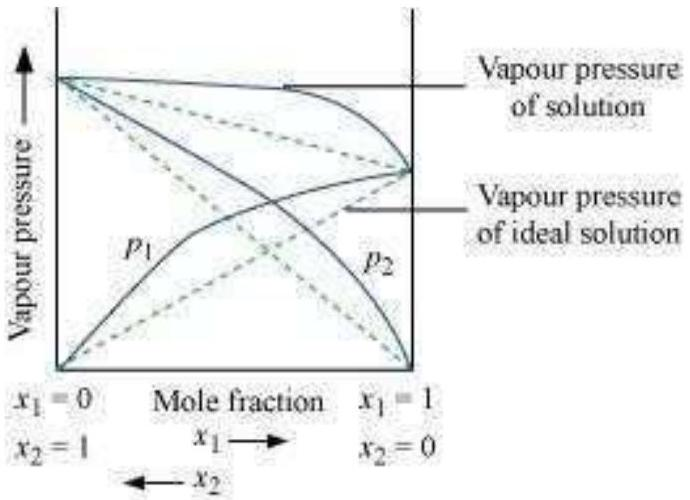
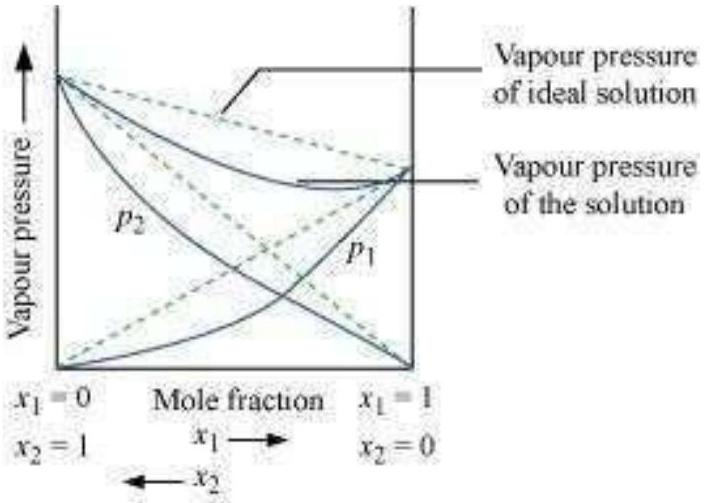
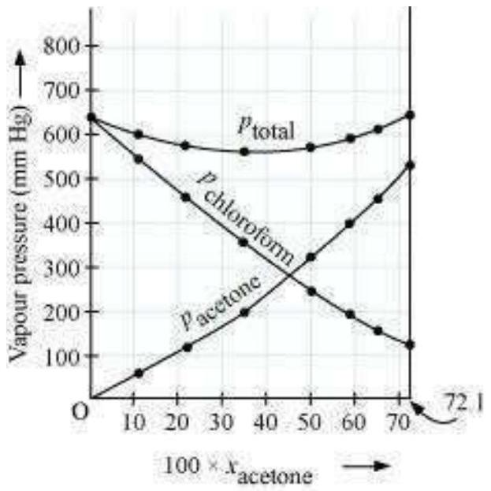

## (Chapter 2)(Solutions) XII

## Intext Questions

Question 2.1:
Calculate the mass percentage of benzene $\left(\mathrm{C}_{6} \mathrm{H}_{6}\right)$ and carbon tetrachloride $\left(\mathrm{CCl}_{4}\right)$ if 22 g of benzene is dissolved in 122 g of carbon tetrachloride. Answer
Mass percentage of $\mathrm{C}_{6} \mathrm{H}_{6}$

$$
=\frac{\text { Mass of } \mathrm{C}_{6} \mathrm{H}_{6}}{\text { Total mass of the solution }} \times 100 \%
$$

$$
\begin{aligned}
& =\frac{\text { Mass of } \mathrm{C}_{6} \mathrm{H}_{6}}{\text { Mass of } \mathrm{C}_{6} \mathrm{H}_{6}+\text { Mass of } \mathrm{CCl}_{4}} \times 100 \% \\
& =\frac{22}{22+122} \times 100 \% \\
& =15.28 \% \\
& =\frac{\text { Mass of } \mathrm{CCl}_{4}}{\text { Total mass of the solution }} \times 100 \%
\end{aligned}
$$

Mass percentage of $\mathrm{CCl}_{4}$

$$
\begin{aligned}
& =\frac{\text { Mass of } \mathrm{CCl}_{4}}{\text { Mass of } \mathrm{C}_{6} \mathrm{H}_{6}+\text { Mass of } \mathrm{CCl}_{4}} \times 100 \% \\
& =\frac{122}{22+122} \times 100 \% \\
& =84.72 \%
\end{aligned}
$$

Alternatively,
Mass percentage of $\mathrm{CCl}_{4}=(100-15.28) \%$
= 84.72\%

Question 2.2:
Calculate the mole fraction of benzene in solution containing 30\% by mass in carbon tetrachloride.

Answer
Let the total mass of the solution be 100 g and the mass of benzene be 30 g .
∴ Mass of carbon tetrachloride $=(100-30) \mathrm{g}$
$=70 \mathrm{~g}$
Molar mass of benzene $\left(\mathrm{C}_{6} \mathrm{H}_{6}\right)=(6 \times 12+6 \times 1) \mathrm{g} \mathrm{mol}^{-1}$
$=78 \mathrm{~g} \mathrm{~mol}^{-1}$
∴ Number of moles of $\mathrm{C}_{6} \mathrm{H}_{6}=\frac{30}{78} \mathrm{~mol}$
$=0.3846 \mathrm{~mol}$
Molar mass of carbon tetrachloride $\left(\mathrm{CCl}_{4}\right)=1 \times 12+4 \times 355$
$=154 \mathrm{~g} \mathrm{~mol}^{-1}$
∴ Number of moles of $\mathrm{CCl}_{4}=\frac{70}{154} \mathrm{~mol}$
$=0.4545 \mathrm{~mol}$
Thus, the mole fraction of $\mathrm{C}_{6} \mathrm{H}_{6}$ is given as:
$\frac{\text { Number of moles of } \mathrm{C}_{6} \mathrm{H}_{6}}{\text { Number of moles of } \mathrm{C}_{6} \mathrm{H}_{6}+\text { Number of moles of } \mathrm{CCl}_{4}}$

$$
\begin{aligned}
& =\frac{0.3846}{0.3846+0.4545} \\
& =0.458
\end{aligned}
$$

Question 2.3:
Calculate the molarity of each of the following solutions: (a) 30 g of $\mathrm{Co}\left(\mathrm{NO}_{3}\right)_{2} .6 \mathrm{H}_{2} \mathrm{O}$ in 4.3 L of solution (b) 30 mL of $0.5 \mathrm{M} \mathrm{H}_{2} \mathrm{SO}_{4}$ diluted to 500 mL .
Answer
Molarity is given by:

$$
\text { Molarity }=\frac{\text { Moles of solute }}{\text { Volume of solution in litre }}
$$

(a) Molar mass of $\mathrm{Co}\left(\mathrm{NO}_{3}\right)_{2} .6 \mathrm{H}_{2} \mathrm{O}=59+2(14+3 \times 16)+6 \times 18$

$$
=291 \mathrm{~g} \mathrm{~mol}^{-1}
$$

∴ Moles of $\mathrm{Co}\left(\mathrm{NO}_{3}\right)_{2} .6 \mathrm{H}_{2} \mathrm{O}=\frac{30}{291} \mathrm{~mol}$

$$
\text { = } 0.103 \mathrm{~mol}
$$

Therefore, molarity $=\frac{0.103 \mathrm{~mol}}{4.3 \mathrm{~L}}$
= 0.023 M
(b) Number of moles present in 1000 mL of $0.5 \mathrm{M} \mathrm{H}_{2} \mathrm{SO}_{4}=0.5 \mathrm{~mol}$
∴ Number of moles present in 30 mL of $0.5 \mathrm{M} \mathrm{H}_{2} \mathrm{SO}_{4}=\frac{0.5 \times 30}{1000} \mathrm{~mol}$

$$
\text { = } 0.015 \mathrm{~mol}
$$

Therefore, molarity $=\frac{0.015}{0.5 \mathrm{~L}} \mathrm{~mol}$
= 0.03 M

Question 2.4:
Calculate the mass of urea $\left(\mathrm{NH}_{2} \mathrm{CONH}_{2}\right)$ required in making 2.5 kg of 0.25 molal aqueous solution.

Answer
Molar mass of urea $\left(\mathrm{NH}_{2} \mathrm{CONH}_{2}\right)=2(1 \times 14+2 \times 1)+1 \times 12+1 \times 16$

$$
=60 \mathrm{~g} \mathrm{~mol}^{-1}
$$

0.25 molar aqueous solution of urea means:

1000 g of water contains 0.25 mol = (0.25 × 60)g of urea

$$
\text { = } 15 \text { g of urea }
$$

That is,
$(1000+15) \mathrm{g}$ of solution contains 15 g of urea
Therefore, $2.5 \mathrm{~kg}(2500 \mathrm{~g})$ of solution contains

$$
=\frac{15 \times 2500}{1000+15} \mathrm{~g}
$$

$$
\begin{aligned}
& =36.95 \mathrm{~g} \\
& =37 \mathrm{~g} \text { of urea (approximately) }
\end{aligned}
$$

Hence, mass of urea required = 37 g
Note: There is a slight variation in this answer and the one given in the NCERT textbook.

Question 2.5:
Calculate (a) molality (b) molarity and (c) mole fraction of KI if the density of 20\% (mass/mass) aqueous KI is $1.202 \mathrm{~g} \mathrm{~mL}^{-1}$.

Answer

(a) Molar mass of $\mathrm{KI}=39+127=166 \mathrm{~g} \mathrm{~mol}^{-1}$

20\% (mass/mass) aqueous solution of KI means 20 g of KI is present in 100 g of solution. That is,

$$
\begin{aligned}
& 20 \mathrm{~g} \text { of } \mathrm{KI} \text { is present in }(100-20) \mathrm{g} \text { of water }=80 \mathrm{~g} \text { of water } \\
& \qquad=\frac{\text { Moles of } \mathrm{KI}}{\text { Mass of water in } \mathrm{kg}}
\end{aligned}
$$

$$
\begin{aligned}
& \frac{20}{166} \mathrm{~m} \\
= & \frac{16.08}{0} \mathrm{~m} \\
= & 1.506 \mathrm{~m} \\
= & 1.51 \mathrm{~m} \text { (approximately) }
\end{aligned}
$$

(b) It is given that the density of the solution $=1.202 \mathrm{~g} \mathrm{~mL}^{-1}$
$$
\begin{aligned}
& \therefore \text { Volume of } 100 \mathrm{~g} \text { solution }=\frac{\text { Mass }}{\text { Density }} \\
& =\frac{100 \mathrm{~g}}{1.202 \mathrm{~g} \mathrm{~mL}} \\
& =83.19 \mathrm{~mL} \\
& =83.19 \times 10^{-3} \mathrm{~L}
\end{aligned}
$$
Therefore, molarity of the solution
$$
=\frac{\frac{20}{166} \mathrm{~mol}}{83.19 \times 10^{-3} \mathrm{~L}}
$$
$=1.45 \mathrm{M}$
(c) Moles of KI

Moles of water

$$
\begin{array}{ll}
\text { Therefore, } & =\frac{20}{166}=0.12 \mathrm{~mol} \\
=0.0263 & =\frac{80}{18}=4.44 \mathrm{~mol}
\end{array}
$$

mole fraction of KI

$$
=\frac{0.12}{0.12+4.44}
$$

Question

$$
=\frac{\text { Moles of KI }}{\text { Moles of KI + Moles of water }} 2.6:
$$

$\mathrm{H}_{2} \mathrm{~S}$, a toxic
gas with rotten egg like
smell, is used for the qualitative analysis. If the solubility of $\mathrm{H}_{2} \mathrm{~S}$ in water at STP is 0.195 m, calculate Henry's law constant.

Answer
It is given that the solubility of $\mathrm{H}_{2} \mathrm{~S}$ in water at STP is 0.195 m, i.e., 0.195 mol of $\mathrm{H}_{2} \mathrm{~S}$ is dissolved in 1000 g of water.

$$
\begin{aligned}
& \qquad=\frac{1000 \mathrm{~g}}{18 \mathrm{~g} \mathrm{~mol}^{-1}} \\
& \begin{array}{l}
\text { Moles of water } \\
=55.56 \mathrm{~mol}
\end{array}
\end{aligned}
$$

$$
=\frac{\text { Moles of } \mathrm{H}_{2} \mathrm{~S}}{\text { Moles of } \mathrm{H}_{2} \mathrm{~S}+\text { Moles of water }}
$$

$$
\begin{aligned}
& =\frac{0.195}{0.195+55.56} \\
& =0.0035
\end{aligned}
$$

At STP, pressure $(p)=0.987$ bar
According to Henry's law: $p=$

$$
\begin{aligned}
& \mathrm{K}_{\mathrm{H} X} \\
& \begin{aligned}
\Rightarrow \mathrm{K}_{\mathrm{H}} & =\frac{p}{x} \\
& =\frac{0.987}{0.0035} \mathrm{bar}
\end{aligned} \\
& =282 \text { bar }
\end{aligned}
$$

Question 2.7:
Henry's law constant for $\mathrm{CO}_{2}$ in water is $1.67 \times 10^{8} \mathrm{~Pa}$ at 298 K. Calculate the quantity of $\mathrm{CO}_{2}$ in 500 mL of soda water when packed under 2.5 atm $\mathrm{CO}_{2}$ pressure at 298 K.

Answer
It is given that:

$$
\begin{aligned}
& \mathrm{K}_{\mathrm{H}}=1.67 \times 10^{8} \mathrm{~Pa} \\
& p_{\mathrm{CO}_{2}}=2.5 \mathrm{~atm}=2.5 \times 1.01325 \times 10^{5} \mathrm{~Pa} \\
& =2.533125 \times 10^{5} \mathrm{~Pa}
\end{aligned}
$$

According to Henry's law:

$$
\begin{aligned}
& p_{\mathrm{CO}_{2}}=\mathrm{K}_{\mathrm{H}} x \\
& \Rightarrow x=\frac{p_{\mathrm{CO}_{2}}}{\mathrm{~K}_{\mathrm{H}}} \\
& \quad=\frac{2.533125 \times 10^{5}}{1.67 \times 10^{8}} \\
& =0.00152
\end{aligned}
$$

We can write,

$$
n_{\mathrm{CO}_{2}} \text { is negligible as compared to }{ }^{n_{\mathrm{H}_{2} \mathrm{O}}} \quad \text { [Since, ] }
$$

In 500 mL of soda water, the volume of water = 500 mL [Neglecting the amount of soda present] We can write:

$$
\begin{aligned}
& 500 \mathrm{~mL} \text { of water }=500 \mathrm{~g} \text { of water } \\
& =\frac{500}{18} \mathrm{~mol} \text { of water } \\
& =27.78 \mathrm{~mol} \text { of water }
\end{aligned}
$$

Now, $\frac{n_{\mathrm{CO}_{2}}}{n_{\mathrm{H}_{2} \mathrm{O}}}=x$
$\frac{n_{\mathrm{CO}_{2}}}{27.78}=0.00152$

$$
n_{\mathrm{CO}_{2}}=0.042 \mathrm{~mol}
$$

Hence, quantity of $\mathrm{CO}_{2}$ in 500 mL of soda water $=(0.042 \times 44) \mathrm{g}$

$$
=1.848 \mathrm{~g}
$$

Question 2.8:
The vapour pressure of pure liquids A and B are 450 and 700 mm Hg respectively, at 350 K. Find out the composition of the liquid mixture if total vapour pressure is 600 mm Hg. Also find the composition of the vapour phase.

Answer
It is given that:

$$
\begin{aligned}
& p_{\mathrm{A}}^{0}=450 \mathrm{~mm} \text { of } \mathrm{Hg} \\
& p_{\mathrm{B}}^{0}=700 \mathrm{~mm} \text { of } \mathrm{Hg} \\
& p_{\text {total }}=600 \mathrm{~mm} \text { of } \mathrm{Hg}
\end{aligned}
$$

From Raoult's law, we

$$
\begin{aligned}
& \Rightarrow p_{\text {total }}=p_{\mathrm{A}}^{0} x_{\mathrm{A}}+p_{\mathrm{B}}^{0}\left(1-x_{\mathrm{A}}\right) \\
& \Rightarrow p_{\text {total }}=p_{\mathrm{A}}^{0} x_{\mathrm{A}}+p_{\mathrm{B}}^{0}-p_{\mathrm{B}}^{0} x_{\mathrm{A}} \\
& \Rightarrow p_{\text {total }}=\left(p_{\mathrm{A}}^{0}-p_{\mathrm{B}}^{0}\right) x_{\mathrm{A}}+p_{\mathrm{B}}^{0} \\
& \Rightarrow 600=(450-700) x_{\mathrm{A}}+700
\end{aligned}
$$

$$
\begin{aligned}
& p_{\mathrm{A}}=p_{\mathrm{A}}^{0} x_{\mathrm{A}} \\
& p_{\mathrm{B}}=p_{\mathrm{B}}^{0} x_{\mathrm{B}}=p_{\mathrm{B}}^{0}\left(1-x_{\mathrm{A}}\right)
\end{aligned}
$$

$$
\begin{gathered}
\text { Therefore, total } \\
\text { pressure, } \\
p_{\text {total }}=p_{\mathrm{A}}+p_{\mathrm{B}}
\end{gathered}
$$

Therefore,

$$
\begin{aligned}
& =1-0.4 \\
& =0.6
\end{aligned}
$$

Now, $p_{\mathrm{A}}=p_{\mathrm{A}}^{0} x_{\mathrm{A}}$

$$
\begin{aligned}
& =450 \times 0.4=180 \mathrm{~mm} \text { of } \mathrm{Hg} \\
& p_{\mathrm{B}}=p_{\mathrm{B}}^{0} x_{\mathrm{B}} \\
& =700 \times 0.6
\end{aligned}
$$

$=420 \mathrm{~mm}$ of Hg Now, in the vapour phase: Mole fraction of liquid $\mathrm{A}=\frac{p_{\mathrm{A}}}{p_{\mathrm{A}}+p_{\mathrm{B}}}$

$$
\begin{aligned}
& =\frac{180}{180+420} \\
& =\frac{180}{600} \\
& =0.30
\end{aligned}
$$

And, mole fraction of liquid $\mathrm{B}=1-0.30$

$$
\text { = } 0.70
$$

Question 2.9:
Vapour pressure of pure water at 298 K is 23.8 mm Hg. 50 g of urea $\left(\mathrm{NH}_{2} \mathrm{CONH}_{2}\right)$ is dissolved in 850 g of water. Calculate the vapour pressure of water for this solution and its relative lowering.

Answer
It is given that vapour pressure of water, $p_{1}^{0}=23.8 \mathrm{~mm}$ of Hg
Weight of water taken, $w_{1}=850 \mathrm{~g}$
Weight of urea taken, $W_{2}=50 \mathrm{~g}$
Molecular weight of water, $M_{1}=18 \mathrm{~g} \mathrm{~mol}^{-1}$
Molecular weight of urea, $M_{2}=60 \mathrm{~g} \mathrm{~mol}^{-1}$
Now, we have to calculate vapour pressure of water in the solution. We take vapour pressure as $p_{1}$.
Now, from Raoult's law, we have:

$$
\begin{aligned}
& \frac{p_{1}^{0}-p_{1}}{p_{1}^{0}}=\frac{n_{2}}{n_{1}+n_{2}} \\
& \Rightarrow \frac{p_{1}^{0}-p_{1}}{p_{1}^{0}}=\frac{\frac{w_{2}}{M_{2}}}{\frac{w_{1}}{M_{1}}+\frac{w_{2}}{M_{2}}} \\
& \Rightarrow \frac{23.8-p_{1}}{23.8}=\frac{\frac{50}{60}}{\frac{850}{18}+\frac{50}{60}} \\
& \Rightarrow \frac{23.8-p_{1}}{23.8}=\frac{0.83}{47.22+0.83} \\
& \Rightarrow \frac{23.8-p_{1}}{23.8}=0.0173 \\
& \Rightarrow p_{1}=23.4 \mathrm{~mm} \text { of } \mathrm{Hg}
\end{aligned}
$$

Hence, the vapour pressure of water in the given solution is 23.4 mm of Hg and its relative lowering is 0.0173.

Question 2.10:
Boiling point of water at 750 mm Hg is 99.63°C. How much sucrose is to be added to 500 g of water such that it boils at 100°C. Molal elevation constant for water is $0.52 \mathrm{~K} \mathrm{~kg} \mathrm{~mol}^{-1}$. Answer

Here, elevation of boiling point $\Delta T_{b}=(100+273)-(99.63+273)$

$$
=0.37 \mathrm{~K}
$$

Mass of water, $w_{1}=500 \mathrm{~g}$
Molar mass of sucrose $\left(\mathrm{C}_{12} \mathrm{H}_{22} \mathrm{O}_{11}\right), M_{2}=11 \times 12+22 \times 1+11 \times 16$

$$
=342 \mathrm{~g} \mathrm{~mol}^{-1}
$$

Molal elevation constant, $K_{b}=0.52 \mathrm{~K} \mathrm{~kg} \mathrm{~mol}^{-1}$ We
know that:

$$
\begin{aligned}
& \Delta T_{b}=\frac{K_{b} \times 1000 \times w_{2}}{M_{2} \times w_{1}} \\
& \Rightarrow w_{2}=\frac{\Delta T_{b} \times M_{2} \times w_{1}}{K_{b} \times 1000} \\
& =\frac{0.37 \times 342 \times 500}{0.52 \times 1000} \\
& =121.67 \mathrm{~g} \text { (approximately) }
\end{aligned}
$$

Hence, 121.67 g of sucrose is to be added.
Note: There is a slight variation in this answer and the one given in the NCERT textbook.

Question 2.11:
Calculate the mass of ascorbic acid (Vitamin C, $\mathrm{C}_{6} \mathrm{H}_{8} \mathrm{O}_{6}$ ) to be dissolved in 75 g of acetic acid to lower its melting point by 1.5°C. $K_{f}=3.9 \mathrm{~K} \mathrm{~kg} \mathrm{~mol}^{-1}$.

Answer
Mass of acetic acid, $w_{1}=75 \mathrm{~g}$
Molar mass of ascorbic acid $\left(\mathrm{C}_{6} \mathrm{H}_{8} \mathrm{O}_{6}\right)$, $M_{2}=6 \times 12+8 \times 1+6 \times 16$

$$
=176 \mathrm{~g} \mathrm{~mol}^{-1}
$$

Lowering of melting point, $\Delta T_{f}=1.5 \mathrm{~K}$ We
know that:

$$
\begin{aligned}
& \Delta T_{f}=\frac{K_{f} \times w_{2} \times 1000}{M_{2} \times w_{1}} \\
& \Rightarrow w_{2}=\frac{\Delta T_{f} \times M_{2} \times w_{1}}{K_{f} \times 1000} \\
& \quad=\frac{1.5 \times 176 \times 75}{3.9 \times 1000} \\
& =5.08 \mathrm{~g} \text { (approx) }
\end{aligned}
$$

Hence, 5.08 g of ascorbic acid is needed to be dissolved.
Note: There is a slight variation in this answer and the one given in the NCERT textbook.

Question 2.12:
Calculate the osmotic pressure in pascals exerted by a solution prepared by dissolving 1.0 g of polymer of molar mass 185,000 in 450 mL of water at 37°C.

Answer
It is given that:
Volume of water, $V=450 \mathrm{~mL}=0.45 \mathrm{~L}$
Temperature, $T=(37+273) \mathrm{K}=310 \mathrm{~K}$
Number of moles of the polymer, $n=\frac{1}{185000} \mathrm{~mol}$
We know that:

Osmotic pressure,

$$
\pi=\frac{n}{V} \mathrm{R} T
$$

$$
\begin{aligned}
& =\frac{1}{185000} \mathrm{~mol} \times \frac{1}{0.45 \mathrm{~L}} \times 8.314 \times 10^{3} \mathrm{PaL} \mathrm{~K}^{-1} \mathrm{~mol}^{-1} \times 310 \mathrm{~K} \\
& =30.98 \mathrm{~Pa} \\
& =31 \mathrm{~Pa} \text { (approximately) }
\end{aligned}
$$

## Exercises Solutions

## (Chapter 2)(Solutions)   XII

Question 2.1:
Calculate the mass percentage of benzene $\left(\mathrm{C}_{6} \mathrm{H}_{6}\right)$ and carbon tetrachloride $\left(\mathrm{CCl}_{4}\right)$ if 22 g of benzene is dissolved in 122 g of carbon tetrachloride. Answer

$$
=\frac{\text { Mass of } \mathrm{C}_{6} \mathrm{H}_{6}}{\text { Total mass of the solution }} \times 100 \%
$$

Mass percentage of $\mathrm{C}_{6} \mathrm{H}_{6}$

$$
\begin{aligned}
& =\frac{\text { Mass of } \mathrm{C}_{6} \mathrm{H}_{6}}{\text { Mass of } \mathrm{C}_{6} \mathrm{H}_{6}+\text { Mass of } \mathrm{CCl}_{4}} \times 100 \% \\
& =\frac{22}{22+122} \times 100 \% \\
& =15.28 \%
\end{aligned}
$$

$$
=\frac{\text { Mass of } \mathrm{CCl}_{4}}{\text { Total mass of the solution }} \times 100 \%
$$

Mass percentage of $\mathrm{CCl}_{4}$

$$
\begin{aligned}
& =\frac{\text { Mass of } \mathrm{CCl}_{4}}{\text { Mass of } \mathrm{C}_{6} \mathrm{H}_{6}+\text { Mass of } \mathrm{CCl}_{4}} \times 100 \% \\
& =\frac{122}{22+122} \times 100 \% \\
& =84.72 \%
\end{aligned}
$$

Alternatively,
Mass percentage of $\mathrm{CCl}_{4}=(100-15.28) \%$
= 84.72\%

Question 2.2:
Calculate the mole fraction of benzene in solution containing 30\% by mass in carbon tetrachloride.

Answer
Let the total mass of the solution be 100 g and the mass of benzene be 30 g .

$$
\begin{aligned}
& \therefore \text { Mass of carbon tetrachloride }=(100-30) \mathrm{g} \\
& =70 \mathrm{~g}
\end{aligned}
$$

Molar mass of benzene $\left(\mathrm{C}_{6} \mathrm{H}_{6}\right)=(6 \times 12+6 \times 1) \mathrm{g} \mathrm{mol}^{-1}$

$$
=78 \mathrm{~g} \mathrm{~mol}^{-1}
$$

∴ Number of moles of $\mathrm{C}_{6} \mathrm{H}_{6}=\frac{30}{78} \mathrm{~mol}$
$=0.3846 \mathrm{~mol}$
Molar mass of carbon tetrachloride $\left(\mathrm{CCl}_{4}\right)=1 \times 12+4 \times 355$
$=154 \mathrm{~g} \mathrm{~mol}^{-1}$
∴ Number of moles of $\mathrm{CCl}_{4}=\frac{70}{154} \mathrm{~mol}$
$=0.4545 \mathrm{~mol}$
Thus, the mole fraction of $\mathrm{C}_{6} \mathrm{H}_{6}$ is given as:
$\xrightarrow[\text { Number of moles of } \mathrm{C}_{6} \mathrm{H}_{6}+\text { Number of moles of } \mathrm{CCl}_{4}]{\text { Number of }}$

$$
\begin{aligned}
& =\frac{0.3846}{0.3846+0.4545} \\
& =0.458
\end{aligned}
$$

Question 2.3:
Calculate the molarity of each of the following solutions: (a) 30 g of $\mathrm{Co}\left(\mathrm{NO}_{3}\right)_{2} .6 \mathrm{H}_{2} \mathrm{O}$ in 4.3 L of solution (b) 30 mL of $0.5 \mathrm{M} \mathrm{H}_{2} \mathrm{SO}_{4}$ diluted to 500 mL .
Answer
Molarity is given by:

$$
\text { Molarity }=\frac{\text { Moles of solute }}{\text { Volume of solution in litre }}
$$

(a) Molar mass of $\mathrm{Co}\left(\mathrm{NO}_{3}\right)_{2} \cdot 6 \mathrm{H}_{2} \mathrm{O}=59+2(14+3 \times 16)+6 \times 18$
$=291 \mathrm{~g} \mathrm{~mol}^{-1}$
∴ Moles of $\mathrm{Co}\left(\mathrm{NO}_{3}\right)_{2} .6 \mathrm{H}_{2} \mathrm{O}=\frac{30}{291} \mathrm{~mol}$
$=0.103 \mathrm{~mol}$
Therefore, molarity $=\frac{0.103 \mathrm{~mol}}{4.3 \mathrm{~L}}$
= 0.023 M

(b) Number of moles present in 1000 mL of $0.5 \mathrm{M} \mathrm{H}_{2} \mathrm{SO}_{4}=0.5 \mathrm{~mol}$
∴ Number of moles present in 30 mL of $0.5 \mathrm{M} \mathrm{H}_{2} \mathrm{SO}_{4}=\frac{0.5 \times 30}{1000} \mathrm{~mol}$
$=0.015 \mathrm{~mol}$
Therefore, molarity $=\frac{0.015}{0.5 \mathrm{~L}} \mathrm{~mol}$
$=0.03 \mathrm{M}$

Question 2.4:
Calculate the mass of urea $\left(\mathrm{NH}_{2} \mathrm{CONH}_{2}\right)$ required in making 2.5 kg of 0.25 molal aqueous solution.
Answer
Molar mass of urea $\left(\mathrm{NH}_{2} \mathrm{CONH}_{2}\right)=2(1 \times 14+2 \times 1)+1 \times 12+1 \times 16$
$=60 \mathrm{~g} \mathrm{~mol}^{-1}$
0.25 molar aqueous solution of urea means:
1000 g of water contains 0.25 mol = (0.25 × 60)g of urea
= 15 g of urea
That is,
$(1000+15) \mathrm{g}$ of solution contains 15 g of urea
Therefore, $2.5 \mathrm{~kg}(2500 \mathrm{~g})$ of solution contains

$$
=\frac{15 \times 2500}{1000+15} \mathrm{~g}
$$

$=36.95 \mathrm{~g}$
= 37 g of urea (approximately)
Hence, mass of urea required = 37 g
Note: There is a slight variation in this answer and the one given in the NCERT textbook.

Question 2.5:
Calculate (a) molality (b) molarity and (c) mole fraction of KI if the density of 20\% (mass/mass) aqueous KI is $1.202 \mathrm{~g} \mathrm{~mL}^{-1}$.
Answer
(a) Molar mass of $\mathrm{KI}=39+127=166 \mathrm{~g} \mathrm{~mol}^{-1}$
20\% (mass/mass) aqueous solution of KI means 20 g of KI is present in 100 g of solution.
That is,
20 g of KI is present in $(100-20) \mathrm{g}$ of water $=80 \mathrm{~g}$ of water
Therefore, molality of the solution $=\frac{\text { Moles of KI }}{\text { Mass of water in kg }}$

$$
\begin{aligned}
& \frac{20}{166} \mathrm{~m} \\
= & \frac{16.08}{} \\
= & 1.506 \mathrm{~m} \\
= & 1.51 \mathrm{~m} \text { (approximately) }
\end{aligned}
$$

(b) It is given that the density of the solution $=1.202 \mathrm{~g} \mathrm{~mL}^{-1}$
∴ Volume of 100 g solution $=\frac{\text { Mass }}{\text { Density }}$

$$
\begin{aligned}
& =\frac{100 \mathrm{~g}}{1.202 \mathrm{~g} \mathrm{~mL}^{-1}} \\
& =83.19 \mathrm{~mL} \\
& =83.19 \times 10^{-3} \mathrm{~L}
\end{aligned}
$$

Therefore, molarity of the solution

$$
=\frac{\frac{20}{166} \mathrm{~mol}}{83.19 \times 10^{-3} \mathrm{~L}}
$$

$=1.45 \mathrm{M}$
(c) Moles of KI

$$
=\frac{20}{166}=0.12 \mathrm{~mol}
$$

Moles of water

$$
=\frac{80}{18}=4.44 \mathrm{~mol}
$$

Therefore, mole

$$
=\frac{\text { Moles of KI }}{\text { Moles of KI + Moles of water fraction of KI }}
$$

$$
=\frac{0.12}{0.12+4.44}
$$

$$
\text { = } 0.0263
$$

Question 2.6:
$\mathrm{H}_{2} \mathrm{~S}$, a toxic gas with rotten egg like smell, is used for the qualitative analysis. If the solubility of $\mathrm{H}_{2} \mathrm{~S}$ in water at STP is 0.195 m, calculate Henry's law constant.

Answer
It is given that the solubility of $\mathrm{H}_{2} \mathrm{~S}$ in water at STP is 0.195 m, i.e., 0.195 mol of $\mathrm{H}_{2} \mathrm{~S}$ is dissolved in 1000 g of water.

$$
\begin{aligned}
& \qquad=\frac{1000 \mathrm{~g}}{18 \mathrm{~g} \mathrm{~mol}^{-1}} \\
& \text { Moles of water } \\
& =55.56 \mathrm{~mol} \\
& \therefore \text { Mole fraction of } \mathrm{H}_{2} \mathrm{~S}, x \\
& =\frac{0.195}{0.195+55.56} \\
& =0.0035
\end{aligned}
$$

At STP, pressure $(p)=0.987$ bar
According to Henry's law: $p=$
$\mathrm{K}_{\mathrm{H}} x$

$$
\begin{aligned}
& \Rightarrow \mathrm{K}_{\mathrm{H}}=\frac{p}{x} \\
& \quad=\frac{0.987}{0.0035} \mathrm{bar} \\
& =282 \mathrm{bar}
\end{aligned}
$$

Question 2.7:
A solution is obtained by mixing 300 g of 25\% solution and 400 g of 40\% solution by mass.
Calculate the mass percentage of the resulting solution.
Answer

Total amount of solute present in the mixture is given by,

$$
\begin{aligned}
& 300 \times \frac{25}{100}+400 \times \frac{40}{100} \\
& =75+160 \\
& =235 \mathrm{~g}
\end{aligned}
$$

Total amount of solution $=300+400=700 \mathrm{~g}$
Therefore, mass percentage $(\mathrm{w} / \mathrm{w})$ of the solute in the resulting solution, $=\frac{235}{700} \times 100 \%$
= 33.57\%
And, mass percentage (w/w) of the solvent in the resulting solution,

$$
\begin{aligned}
& =(100-33.57) \% \\
& =66.43 \%
\end{aligned}
$$

Question 2.8:
The vapour pressure of pure liquids A and B are 450 and 700 mm Hg respectively, at 350 K. Find out the composition of the liquid mixture if total vapour pressure is 600 mm Hg . Also find the composition of the vapour phase.

Answer
It is given that:

$$
\begin{aligned}
& p_{\mathrm{A}}^{0}=450 \mathrm{~mm} \text { of } \mathrm{Hg} \\
& p_{\mathrm{B}}^{0}=700 \mathrm{~mm} \text { of } \mathrm{Hg} \\
& p_{\text {total }}=600 \mathrm{~mm} \text { of } \mathrm{Hg}
\end{aligned}
$$

From Raoult's law, we have:
$p_{\mathrm{A}}=p_{\mathrm{A}}^{0} x_{\mathrm{A}} \quad$ Therefore, total pressure, $p_{\text {total }}=p_{\mathrm{A}}+p_{\mathrm{B}}$ $p_{\mathrm{B}}=p_{\mathrm{B}}^{0} x_{\mathrm{B}}=p_{\mathrm{B}}^{0}\left(1-x_{\mathrm{A}}\right)$ $\Rightarrow p_{\text {total }}=p_{\mathrm{A}}^{0} x_{\mathrm{A}}+p_{\mathrm{B}}^{0}\left(1-x_{\mathrm{A}}\right)$ $\Rightarrow p_{\text {total }}=p_{\mathrm{A}}^{0} x_{\mathrm{A}}+p_{\mathrm{B}}^{0}-p_{\mathrm{B}}^{0} x_{\mathrm{A}}$ $\Rightarrow p_{\text {total }}=\left(p_{\mathrm{A}}^{0}-p_{\mathrm{B}}^{0}\right) x_{\mathrm{A}}+p_{\mathrm{B}}^{0}$ $\Rightarrow 600=(450-700) x_{\mathrm{A}}+700$ $\Rightarrow-100=-250 x_{\mathrm{A}}$ $\Rightarrow x_{\mathrm{A}}=0.4$ Therefore,

$$
x_{\mathrm{B}}=1-x_{\mathrm{A}} \quad=1-0.4
$$

= 0.6 Now, $p_{\mathrm{A}}=p_{\mathrm{A}}^{0} x_{\mathrm{A}}$ $=450 \times 0.4=180 \mathrm{~mm}$ of Hg $p_{\mathrm{B}}=p_{\mathrm{B}}^{0} x_{\mathrm{B}}$ $=700 \times 0.6$ $=\frac{p_{\mathrm{A}}}{p_{\mathrm{A}}+p_{\mathrm{B}}}$ $=\frac{180}{180+420}$ $=\frac{180}{600}$ = 0.30
And, mole fraction of liquid $\mathrm{B}=1-0.30$ = 0.70

Question 2.9:
Vapour pressure of pure water at 298 K is 23.8 mm Hg .50 g of urea $\left(\mathrm{NH}_{2} \mathrm{CONH}_{2}\right)$ is dissolved in 850 g of water. Calculate the vapour pressure of water for this solution and its relative lowering.

Answer
It is given that vapour pressure of water, $p_{1}^{0}=23.8 \mathrm{~mm}$ of Hg
Weight of water taken, $w_{1}=850 \mathrm{~g}$
Weight of urea taken, $\mathrm{w}_{2}=50 \mathrm{~g}$
Molecular weight of water, $M_{1}=18 \mathrm{~g} \mathrm{~mol}^{-1}$
Molecular weight of urea, $M_{2}=60 \mathrm{~g} \mathrm{~mol}^{-1}$
Now, we have to calculate vapour pressure of water in the solution. We take vapour pressure as $p_{1}$.
Now, from Raoult's law, we have:

$$
\begin{aligned}
& \frac{p_{1}^{0}-p_{1}}{p_{1}^{0}}=\frac{n_{2}}{n_{1}+n_{2}} \\
& \Rightarrow \frac{p_{1}^{0}-p_{1}}{p_{1}^{0}}=\frac{\frac{w_{2}}{M_{2}}}{\frac{w_{1}}{M_{1}}+\frac{w_{2}}{M_{2}}} \\
& \Rightarrow \frac{23.8-p_{1}}{23.8}=\frac{\frac{50}{60}}{\frac{850}{18}+\frac{50}{60}} \\
& \Rightarrow \frac{23.8-p_{1}}{23.8}=\frac{0.83}{47.22+0.83} \\
& \Rightarrow \frac{23.8-p_{1}}{23.8}=0.0173 \\
& \Rightarrow p_{1}=23.4 \mathrm{~mm} \text { of } \mathrm{Hg}
\end{aligned}
$$

Hence, the vapour pressure of water in the given solution is 23.4 mm of Hg and its relative lowering is 0.0173.

Question 2.10:
Boiling point of water at 750 mm Hg is 99.63°C. How much sucrose is to be added to 500 g of water such that it boils at 100°C. Molal elevation constant for water is $0.52 \mathrm{~K} \mathrm{~kg} \mathrm{~mol}^{-1}$. Answer

Here, elevation of boiling point $\Delta T_{b}=(100+273)-(99.63+273)$
= 0.37 K
Mass of water, $w_{1}=500 \mathrm{~g}$
Molar mass of sucrose $\left(\mathrm{C}_{12} \mathrm{H}_{22} \mathrm{O}_{11}\right), M_{2}=11 \times 12+22 \times 1+11 \times 16$

$$
=342 \mathrm{~g} \mathrm{~mol}^{-1}
$$

Molal elevation constant, $K_{b}=0.52 \mathrm{~K} \mathrm{~kg} \mathrm{~mol}^{-1}$ We
know that:

$$
\begin{aligned}
& \Delta T_{b}=\frac{K_{b} \times 1000 \times w_{2}}{M_{2} \times w_{1}} \\
& \Rightarrow w_{2}=\frac{\Delta T_{b} \times M_{2} \times w_{1}}{K_{b} \times 1000} \\
& =\frac{0.37 \times 342 \times 500}{0.52 \times 1000} \\
& =121.67 \mathrm{~g} \text { (approximately) }
\end{aligned}
$$

Hence, 121.67 g of sucrose is to be added.
Note: There is a slight variation in this answer and the one given in the NCERT textbook.

Question 2.11:
Calculate the mass of ascorbic acid (Vitamin C, $\mathrm{C}_{6} \mathrm{H}_{8} \mathrm{O}_{6}$ ) to be dissolved in 75 g of acetic acid to lower its melting point by 1.5°C. $K_{f}=3.9 \mathrm{~K} \mathrm{~kg} \mathrm{~mol}^{-1}$.
Answer
Mass of acetic acid, $w_{1}=75 \mathrm{~g}$
Molar mass of ascorbic acid $\left(\mathrm{C}_{6} \mathrm{H}_{8} \mathrm{O}_{6}\right)$, $M_{2}=6 \times 12+8 \times 1+6 \times 16$

$$
=176 \mathrm{~g} \mathrm{~mol}^{-1}
$$

Lowering of melting point, $\Delta T_{f}=1.5 \mathrm{~K}$ We
know that:

$$
\begin{aligned}
& \Delta T_{f}=\frac{K_{f} \times w_{2} \times 1000}{M_{2} \times w_{1}} \\
& \Rightarrow w_{2}=\frac{\Delta T_{f} \times M_{2} \times w_{1}}{K_{f} \times 1000} \\
& \quad=\frac{1.5 \times 176 \times 75}{3.9 \times 1000} \\
& =5.08 \mathrm{~g} \text { (approx) }
\end{aligned}
$$

Hence, 5.08 g of ascorbic acid is needed to be dissolved.
Note: There is a slight variation in this answer and the one given in the NCERT textbook.

Question 2.12:
Calculate the osmotic pressure in pascals exerted by a solution prepared by dissolving 1.0 g of polymer of molar mass 185,000 in 450 mL of water at 37°C.

Answer
It is given that:
Volume of water, $V=450 \mathrm{~mL}=0.45 \mathrm{~L}$
Temperature, $T=(37+273) \mathrm{K}=310 \mathrm{~K}$
Number of moles of the polymer, $n=\frac{1}{185000} \mathrm{~mol}$
We know that:
Osmotic pressure,

$$
\pi=\frac{n}{V} \mathrm{R} T
$$

$$
\begin{aligned}
& =\frac{1}{185000} \mathrm{~mol} \times \frac{1}{0.45 \mathrm{~L}} \times 8.314 \times 10^{3} \mathrm{PaL} \mathrm{~K}^{-1} \mathrm{~mol}^{-1} \times 310 \mathrm{~K} \\
& =30.98 \mathrm{~Pa} \\
& =31 \mathrm{~Pa} \text { (approximately) }
\end{aligned}
$$

Question 2.13:
The partial pressure of ethane over a solution containing $6.56 \times 10^{-3} \mathrm{~g}$ of ethane is 1 bar. If the solution contains $5.00 \times 10^{-2} \mathrm{~g}$ of ethane, then what shall be the partial pressure of the gas?

Answer
Molar mass of ethane $\left(\mathrm{C}_{2} \mathrm{H}_{6}\right)=2 \times 12+6 \times 1$

$$
=30 \mathrm{~g} \mathrm{~mol}^{-1}
$$

∴ Number of moles present in $6.56 \times 10^{-2} \mathrm{~g}$ of ethane

$$
=\frac{6.56 \times 10^{-2}}{30}
$$

$=2.187 \times 10^{-3} \mathrm{~mol}$
Let the number of moles of the solvent be $x$. According to Henry's law,

$$
\begin{aligned}
& p=K_{\mathrm{H}} x \\
& \Rightarrow 1 \mathrm{bar}=K_{\mathrm{H}} \cdot \frac{2.187 \times 10^{-3}}{2.187 \times 10^{-3}+x} \\
& \Rightarrow 1 \mathrm{bar}=K_{\mathrm{H}} \frac{2.187 \times 10^{-3}}{x} \\
& \Rightarrow K_{\mathrm{H}}=\frac{x}{2.187 \times 10^{-3}} \text { bar } \quad\left(\text { Since } x \gg 2.187 \times 10^{-3}\right)
\end{aligned}
$$

Number of moles present in $5.00 \times 10^{-2} \mathrm{~g}$ of ethane

$$
=\frac{5.00 \times 10^{-2}}{30} \mathrm{~mol}
$$

$=1.67 \times 10^{-3} \mathrm{~mol}$ According
to Henry's law,

$$
\begin{aligned}
p & =K_{\mathrm{H} X} \\
& =\frac{x}{2.187 \times 10^{-3}} \times \frac{1.67 \times 10^{-3}}{\left(1.67 \times 10^{-3}\right)+x} \\
& =\frac{x}{2.187 \times 10^{-3}} \times \frac{1.67 \times 10^{-3}}{x} \quad\left(\text { Since, } x \gg 1.67 \times 10^{-3}\right)
\end{aligned}
$$

= 0.764 bar
Hence, partial pressure of the gas shall be 0.764 bar.

Question 2.14:
What is meant by positive and negative deviations from Raoult's law and how is the sign of $\Delta_{\mathrm{sol}} H$ related to positive and negative deviations from Raoult's law?

Answer
According to Raoult's law, the partial vapour pressure of each volatile component in any solution is directly proportional to its mole fraction. The solutions which obey Raoult's law over the entire range of concentration are known as ideal solutions. The solutions that do not obey Raoult's law (non-ideal solutions) have vapour pressures either higher or lower than that predicted by Raoult's law. If the vapour pressure is higher, then the solution is said to exhibit positive deviation, and if it is lower, then the solution is said to exhibit negative deviation from Raoult's law.

Vapour pressure of a two-component solution showing positive deviation from Raoult's law

Vapour pressure of a two-component solution showing negative deviation from Raoult's law

In the case of an ideal solution, the enthalpy of the mixing of the pure components for forming the solution is zero.

$$
\Delta_{\mathrm{sol}} H=0
$$

In the case of solutions showing positive deviations, absorption of heat takes place.

$$
\therefore \Delta_{\text {sol }} H=\text { Positive }
$$

In the case of solutions showing negative deviations, evolution of heat takes place.

$$
\therefore \Delta_{\text {sol }} H=\text { Negative }
$$

Question 2.15:
An aqueous solution of 2\% non-volatile solute exerts a pressure of 1.004 bar at the normal boiling point of the solvent. What is the molar mass of the solute?

Answer
Here,
Vapour pressure of the solution at normal boiling point $\left(p_{1}\right)=1.004$ bar
Vapour pressure of pure water at normal boiling point $\left(p_{1}^{0}\right)=1.013$ bar
Mass of solute, $\left(w_{2}\right)=2 \mathrm{~g}$
Mass of solvent (water), $\left(w_{1}\right)=98 \mathrm{~g}$
Molar mass of solvent (water), $\left(M_{1}\right)=18 \mathrm{~g} \mathrm{~mol}^{-1}$ According
to Raoult's law,

$$
\begin{aligned}
& \frac{p_{1}^{0}-p_{1}}{p_{1}^{0}}=\frac{w_{2} \times M_{1}}{M_{2} \times w_{1}} \\
& \Rightarrow \frac{1.013-1.004}{1.013}=\frac{2 \times 18}{M_{2} \times 98} \\
& \Rightarrow \frac{0.009}{1.013}=\frac{2 \times 18}{M_{2} \times 98} \\
& \Rightarrow M_{2}=\frac{1.013 \times 2 \times 18}{0.009 \times 98} \\
& =41.35 \mathrm{~g} \mathrm{~mol}^{-1}
\end{aligned}
$$

Hence, the molar mass of the solute is $41.35 \mathrm{~g} \mathrm{~mol}^{-1}$.

Question 2.16:
Heptane and octane form an ideal solution. At 373 K, the vapour pressures of the two liquid components are 105.2 kPa and 46.8 kPa respectively. What will be the vapour pressure of a mixture of 26.0 g of heptane and 35 g of octane?

Answer

Vapour pressure of

$$
\left(p_{1}^{0}\right)=105.2 \mathrm{kPa}
$$

heptane heptane
Vapour pressure of $\left(p_{2}^{0}\right)=46.8 \mathrm{kPa}$
octane
We know that,
Molar mass of heptane $\left(\mathrm{C}_{7} \mathrm{H}_{16}\right)=7 \times 12+16 \times 1$

$$
=100 \mathrm{~g} \mathrm{~mol}^{-1}
$$

∴ Number of moles of heptane $=\frac{26}{100} \mathrm{~mol}$

$$
\text { = } 0.26 \mathrm{~mol}
$$

Molar mass of octane $\left(\mathrm{C}_{8} \mathrm{H}_{18}\right)=8 \times 12+18 \times 1$

$$
=114 \mathrm{~g} \mathrm{~mol}^{-1}
$$

∴ Number of moles of octane $=\frac{35}{114} \mathrm{~mol}$

$$
\text { = } 0.31 \mathrm{~mol}
$$

Mole fraction of heptane, $x_{1}=\frac{0.26}{0.26+0.31}$

$$
=0.456
$$

And, mole fraction of octane, $x_{2}=1-0.456$

$$
=0.544
$$

Now, partial pressure of heptane, $p_{1}=x_{1} p_{1}^{0}$

$$
\begin{aligned}
& =0.456 \times 105.2 \\
& =47.97 \mathrm{kPa}
\end{aligned}
$$

Partial pressure of octane, $p_{2}=x_{2} p_{2}^{0}$

$$
\begin{aligned}
& =0.544 \times 46.8 \\
& =25.46 \mathrm{kPa}
\end{aligned}
$$

Hence, vapour pressure of solution, $p_{\text {total }}=p_{1}+p_{2}$

$$
\begin{aligned}
& =47.97+25.46 \\
& =73.43 \mathrm{kPa}
\end{aligned}
$$

Question 2.17:
The vapour pressure of water is 12.3 kPa at 300 k. Calculate vapour pressure of 1 molal solution of a non-volatile solute in it.

Answer
1 molal solution means 1 mol of the solute is present in 100 g of the solvent (water).
Molar mass of water $=18 \mathrm{~g} \mathrm{~mol}^{-1}$

$$
\begin{aligned}
& \therefore \text { Number of moles present in } 1000 \mathrm{~g} \text { of water } \quad=\frac{1000}{18} \\
& =55.56 \mathrm{~mol}
\end{aligned}
$$

Therefore, mole fraction of the solute in the solution is

$$
x_{2}=\frac{1}{1+55.56}=0.0177 .
$$

It is given that,

Vapour pressure of water, $p_{1}^{0} \quad=12.3 \mathrm{kPa}$
Applying the relation,

$$
\frac{p_{1}^{0}-p_{1}}{p_{1}^{0}}=x_{2}
$$

$$
\begin{aligned}
& \Rightarrow \frac{12.3-p_{1}}{12.3}=0.0177 \\
& \Rightarrow p_{1}=12.0823 \\
& =12.08 \mathrm{kPa} \text { (approximately) }
\end{aligned} \Rightarrow 12.3-p_{1}=0.2177
$$

Hence, the vapour pressure of the solution is 12.08 kPa.

Question 2.18:
Calculate the mass of a non-volatile solute (molar mass $40 \mathrm{~g} \mathrm{~mol}^{-1}$ ) which should be dissolved in 114 g octane to reduce its vapour pressure to 80\%.
Answer
Let the vapour pressure of pure octane be $p_{1}^{0}$.
Then, the vapour pressure of the octane after dissolving the non-volatile solute is

$$
\frac{80}{100} p_{1}^{0}=0.8 p_{1}^{0} .
$$

Molar mass of solute, $M_{2}=40 \mathrm{~g} \mathrm{~mol}^{-1}$
Mass of octane, $w_{1}=114 \mathrm{~g}$
Molar mass of octane, $\left(\mathrm{C}_{8} \mathrm{H}_{18}\right), M_{1}=8 \times 12+18 \times 1$

$$
=114 \mathrm{~g} \mathrm{~mol}^{-1}
$$

Applying the relation,

$$
\begin{aligned}
& \frac{p_{1}^{0}-p_{1}}{p_{1}^{0}}=\frac{w_{2} \times M_{1}}{M_{2} \times w_{1}} \\
& \Rightarrow \frac{p_{1}^{0}-0.8 p_{1}^{0}}{p_{1}^{0}}=\frac{w_{2} \times 114}{40 \times 114} \\
& \Rightarrow \frac{0.2 p_{1}^{0}}{p_{1}^{0}}=\frac{w_{2}}{40} \\
& \Rightarrow 0.2=\frac{w_{2}}{40} \\
& \Rightarrow w_{2}=8 \mathrm{~g}
\end{aligned}
$$

Hence, the required mass of the solute is 8 g .

Question 2.19:
A solution containing 30 g of non-volatile solute exactly in 90 g of water has a vapour pressure of 2.8 kPa at 298 k. Further, 18 g of water is then added to the solution and the new vapour pressure becomes 2.9 kPa at 298 K. Calculate:

i. molar mass of the solute
ii. vapour pressure of water at 298 K.

Answer

(i) Let, the molar mass of the solute be $\mathrm{M} \mathrm{g} \mathrm{mol}^{-1}$
$$
n_{1}=\frac{90 \mathrm{~g}}{18 \mathrm{~g} \mathrm{~mol}^{-1}}=5 \mathrm{~mol}
$$
Now, the no. of moles of solvent (water),
$$
n_{2}=\frac{30 \mathrm{~g}}{\mathrm{M} \mathrm{~mol}^{-1}}=\frac{30}{\mathrm{M}} \mathrm{~mol}
$$

And, the no. of moles of solute,

$$
p_{1}=2.8 \mathrm{kPa}
$$

Applying the relation:

$$
\begin{aligned}
& \frac{p_{1}^{0}-p_{1}}{p_{1}^{0}}=\frac{n_{2}}{n_{1}+n_{2}} \\
& \Rightarrow \frac{p_{1}^{0}-2.8}{p_{1}^{0}}=\frac{\frac{30}{\mathrm{M}}}{5+\frac{30}{\mathrm{M}}} \\
& \Rightarrow 1-\frac{2.8}{p_{1}^{0}}=\frac{\frac{30}{\mathrm{M}}}{\frac{5 \mathrm{M}+30}{\mathrm{M}}} \\
& \Rightarrow 1-\frac{2.8}{p_{1}^{0}}=\frac{30}{5 \mathrm{M}+30} \\
& \Rightarrow \frac{2.8}{p_{1}^{0}}=1-\frac{30}{5 \mathrm{M}+30} \\
& \Rightarrow \frac{2.8}{p_{1}^{0}}=\frac{5 \mathrm{M}+30-30}{5 \mathrm{M}+30} \\
& \Rightarrow \frac{2.8}{p_{1}^{0}}=\frac{5 \mathrm{M}}{5 \mathrm{M}+30} \\
& \Rightarrow \frac{p_{1}^{0}}{2.8}=\frac{5 \mathrm{M}+30}{5 \mathrm{M}}
\end{aligned}
$$

After the addition of 18 g of water:

$$
\begin{aligned}
& n_{1}=\frac{90+18 \mathrm{~g}}{18}=6 \mathrm{~mol} \\
& p_{1}=2.9 \mathrm{kPa}
\end{aligned}
$$

Again, applying the relation:

$$
\begin{aligned}
& \frac{p_{1}^{0}-p_{1}}{p_{1}^{0}}=\frac{n_{2}}{n_{1}+n_{2}} \\
& \Rightarrow \frac{p_{1}^{0}-2.9}{p_{1}^{0}}=\frac{\frac{30}{\mathrm{M}}}{6+\frac{30}{\mathrm{M}}} \\
& \Rightarrow 1-\frac{2.9}{p_{1}^{0}}=\frac{\frac{30}{\mathrm{M}}}{\frac{6 \mathrm{M}+30}{\mathrm{M}}} \\
& \Rightarrow 1-\frac{2.9}{p_{1}^{0}}=\frac{30}{6 \mathrm{M}+30} \\
& \Rightarrow \frac{2.9}{p_{1}^{0}}=1-\frac{30}{6 \mathrm{M}+30} \\
& \Rightarrow \frac{2.9}{p_{1}^{0}}=\frac{6 \mathrm{M}+30-30}{6 \mathrm{M}+30} \\
& \Rightarrow \frac{2.9}{p_{1}^{0}}=\frac{6 \mathrm{M}}{6 \mathrm{M}+30} \\
& \Rightarrow \frac{p_{1}^{0}}{2.9}=\frac{6 \mathrm{M}+30}{6 \mathrm{M}}
\end{aligned}
$$

Dividing equation (i) by (ii), we have:

$$
\begin{aligned}
& \frac{2.9}{2.8}=\frac{\frac{5 \mathrm{M}+30}{5 \mathrm{M}}}{\frac{6 \mathrm{M}+30}{6 \mathrm{M}}} \\
& \Rightarrow \frac{2.9}{2.8} \times \frac{6 \mathrm{M}+30}{6}=\frac{5 \mathrm{M}+30}{5} \\
& \Rightarrow 2.9 \times 5 \times(6 \mathrm{M}+30)=2.8 \times 6 \times(5 \mathrm{M}+30) \\
& \Rightarrow 87 \mathrm{M}+435=84 \mathrm{M}+504 \\
& \Rightarrow 3 \mathrm{M}=69 \\
& \Rightarrow \mathrm{M}=23 \mathrm{u}
\end{aligned}
$$

Therefore, the molar mass of the solute is $23 \mathrm{~g} \mathrm{~mol}^{-1}$.
(ii) Putting the value of ' M ' in equation (i), we have:

$$
\frac{p_{1}^{0}}{2.8}=\frac{5 \times 23+30}{5 \times 23}
$$

$$
\Rightarrow \frac{p_{1}^{0}}{2.8}=\frac{145}{115}
$$

$$
\Rightarrow p_{1}^{0}=3.53
$$

Hence, the vapour pressure of water at 298 K is 3.53 kPa.

Question 2.20:
A 5\% solution (by mass) of cane sugar in water has freezing point of 271 K. Calculate the freezing point of $5 \%$ glucose in water if freezing point of pure water is 273.15 K .

Answer
Here, $\Delta T_{f}=(273.15-271) \mathrm{K}$
= 2.15 K
Molar mass of sugar $\left(\mathrm{C}_{12} \mathrm{H}_{22} \mathrm{O}_{11}\right)=12 \times 12+22 \times 1+11 \times 16$

$$
=342 \mathrm{~g} \mathrm{~mol}^{-1}
$$

5\% solution (by mass) of cane sugar in water means 5 g of cane sugar is present in (100 $-5) \mathrm{g}=95 \mathrm{~g}$ of water.

Now, number of moles of cane sugar $=\frac{5}{342} \mathrm{~mol}$
$=0.0146 \mathrm{~mol}$
Therefore, molality of the solution,

$$
m=\frac{0.0146 \mathrm{~mol}}{0.095 \mathrm{~kg}}
$$

$=0.1537 \mathrm{~mol} \mathrm{~kg}^{-1}$
Applying the relation,

$$
\begin{aligned}
& \Delta T_{f}=K_{f} \times m \\
& \begin{aligned}
\Rightarrow K_{f} & =\frac{\Delta T_{f}}{m} \\
& =\frac{2.15 \mathrm{~K}}{0.1537 \mathrm{~mol} \mathrm{~kg}^{-1}}
\end{aligned} \\
& =13.99 \mathrm{~K} \mathrm{~kg} \mathrm{~mol}^{-1}
\end{aligned}
$$

Molar of glucose $\left(\mathrm{C}_{6} \mathrm{H}_{12} \mathrm{O}_{6}\right)=6 \times 12+12 \times 1+6 \times 16=$
$180 \mathrm{~g} \mathrm{~mol}^{-1}$
5\% glucose in water means 5 g of glucose is present in $(100-5) \mathrm{g}=95 \mathrm{~g}$ of water.
∴ Number of moles of glucose $=\frac{5}{180} \mathrm{~mol}$
$=0.0278 \mathrm{~mol}$
Therefore, molality of the solution,

$$
m=\frac{0.0278 \mathrm{~mol}}{0.095 \mathrm{~kg}}
$$

$=0.2926 \mathrm{~mol} \mathrm{~kg}^{-1}$
Applying the relation,

$$
\begin{aligned}
& \Delta T_{f}=K_{f} \times m \\
& =13.99 \mathrm{~K} \mathrm{~kg} \mathrm{~mol}^{-1} \times 0.2926 \mathrm{~mol} \mathrm{~kg}^{-1} \\
& =4.09 \mathrm{~K} \text { (approximately) }
\end{aligned}
$$

Hence, the freezing point of 5\% glucose solution is $(273.15-4.09) \mathrm{K}=269.06 \mathrm{~K}$.

Question 2.21:
Two elements A and B form compounds having formula AB2 and AB4. When dissolved in 20 g of benzene $\left(\mathrm{C}_{6} \mathrm{H}_{6}\right)$, 1 g of $\mathrm{AB}_{2}$ lowers the freezing point by 2.3 Kwhereas 1.0 g of $\mathrm{AB}_{4}$ lowers it by 1.3 K. The molar depression constant for benzene is 5.1 Kkg mol ${ }^{-1}$.

Calculate atomic masses of A and B.
Answer
We know that,

$$
\begin{aligned}
& M_{2}=\frac{1000 \times w_{2} \times k_{f}}{\Delta T_{f} \times w_{1}} \\
& \quad M_{\mathrm{AB}_{2}}=\frac{1000 \times 1 \times 5.1}{2.3 \times 20}
\end{aligned}
$$

$$
\begin{aligned}
& =110.87 \mathrm{~g} \mathrm{~mol}^{-1} \\
& M_{\mathrm{AB}_{4}}=\frac{1000 \times 1 \times 5.1}{1.3 \times 20} \\
& =196.15 \mathrm{~g} \mathrm{~mol}^{-1}
\end{aligned}
$$

Now, we have the molar masses of $\mathrm{AB}_{2}$ and $\mathrm{AB}_{4}$ as $110.87 \mathrm{~g} \mathrm{~mol}^{-1}$ and $196.15 \mathrm{~g} \mathrm{~mol}^{-1}$ respectively.

Let the atomic masses of A and B be x and y respectively.
Now, we can write:

$$
\begin{aligned}
& x+2 y=110.87 \\
& x+4 y=196.15
\end{aligned}
$$

Subtracting equation (i) from (ii), we have

$$
\begin{aligned}
& 2 y=85.28 \\
& \Rightarrow y=42.64
\end{aligned}
$$

Putting the value of ' $y$ ' in equation (1), we have $x$

$$
\begin{aligned}
& +2 \times 42.64=110.87 \\
& \Rightarrow x=25.59
\end{aligned}
$$

Hence, the atomic masses of A and B are 25.59 u and 42.64 u respectively.

Question 2.22:
At 300 K, 36 g of glucose present in a litre of its solution has an osmotic pressure of 4.98 bar. If the osmotic pressure of the solution is 1.52 bars at the same temperature, what would be its concentration?

Answer
Here,

$$
\begin{aligned}
& T=300 \mathrm{~K} \sqcap \\
& =1.52 \mathrm{bar} \\
& \mathrm{R}=0.083 \mathrm{bar} \mathrm{~L} \mathrm{~K}^{-1} \mathrm{~mol}^{-1}
\end{aligned}
$$

Applying the relation, $п=$
CRT

$$
\begin{aligned}
& \Rightarrow C=\frac{\pi}{\mathrm{R} T} \\
&=\frac{1.52 \mathrm{bar}}{0.083 \mathrm{bar} \mathrm{~L} \mathrm{~K}^{-1} \mathrm{~mol}^{-1} \times 300 \mathrm{~K}} \\
&=0.061 \mathrm{~mol}
\end{aligned}
$$

Since the volume of the solution is 1 L , the concentration of the solution would be 0.061 M.

Question 2.23:
Suggest the most important type of intermolecular attractive interaction in the following pairs.

(i) n-hexane and n-octane
(ii) $\mathrm{I}_{2}$ and $\mathrm{CCl}_{4}$
(iii) $\mathrm{NaClO}_{4}$ and water
(iv) methanol and acetone
(v) acetonitrile $\left(\mathrm{CH}_{3} \mathrm{CN}\right)$ and acetone $\left(\mathrm{C}_{3} \mathrm{H}_{6} \mathrm{O}\right)$. Answer
(i) Van der Wall's forces of attraction.
(ii) Van der Wall's forces of attraction.
(iii) Ion-diople interaction.

(iv) Dipole-dipole interaction.
(v) Dipole-dipole interaction.

Question 2.24:
Based on solute-solvent interactions, arrange the following in order of increasing solubility in n-octane and explain. Cyclohexane, $\mathrm{KCl}, \mathrm{CH}_{3} \mathrm{OH}, \mathrm{CH}_{3} \mathrm{CN}$.

Answer
$n$-octane is a non-polar solvent. Therefore, the solubility of a non-polar solute is more than that of a polar solute in the $n$-octane.

The order of increasing polarity is:
Cyclohexane $<\mathrm{CH}_{3} \mathrm{CN}<\mathrm{CH}_{3} \mathrm{OH}<\mathrm{KCl}$
Therefore, the order of increasing solubility is:
$\mathrm{KCl}<\mathrm{CH}_{3} \mathrm{OH}<\mathrm{CH}_{3} \mathrm{CN}<$ Cyclohexane

Question 2.25:
Amongst the following compounds, identify which are insoluble, partially soluble and highly soluble in water?
(i) phenol (ii) toluene (iii) formic acid
(iv) ethylene glycol (v) chloroform (vi) pentanol.

Answer

(i) Phenol $\left(\mathrm{C}_{6} \mathrm{H}_{5} \mathrm{OH}\right)$ has the polar group -OH and non-polar group $-\mathrm{C}_{6} \mathrm{H}_{5}$. Thus, phenol is partially soluble in water.

(ii) Toluene $\left(\mathrm{C}_{6} \mathrm{H}_{5}-\mathrm{CH}_{3}\right)$ has no polar groups. Thus, toluene is insoluble in water.

(iii) Formic acid $(\mathrm{HCOOH})$ has the polar group -OH and can form H -bond with water. Thus, formic acid is highly soluble in water.
(iv) Ethylene glycol
<img class="imgSvg" id = "mu6yxddtru2v712xil" src="data:image/svg+xml;base64,PHN2ZyBpZD0ic21pbGVzLW11Nnl4ZGR0cnUydjcxMnhpbCIgeG1sbnM9Imh0dHA6Ly93d3cudzMub3JnLzIwMDAvc3ZnIiB2aWV3Qm94PSIwIDAgMTY2IDU3Ljc1MDA1NTA5NDY5ODY1IiBzdHlsZT0id2lkdGg6IDE2NS44MzkzOTAwNTQ2MzA1NHB4OyBoZWlnaHQ6IDU3Ljc1MDA1NTA5NDY5ODY1cHg7IG92ZXJmbG93OiB2aXNpYmxlOyI+PGRlZnM+PGxpbmVhckdyYWRpZW50IGlkPSJsaW5lLW11Nnl4ZGR0cnUydjcxMnhpbC0xIiBncmFkaWVudFVuaXRzPSJ1c2VyU3BhY2VPblVzZSIgeDE9Ijk2LjU1OTYwMDQzODQwNzI3IiB5MT0iMjEuMDAwMDM2NzI5ODAxNDgiIHgyPSIxMjMuODM5MzkwMDU0NjMwNTQiIHkyPSIzNi43NTAwNTUwOTQ2OTg2NSI+PHN0b3Agc3RvcC1jb2xvcj0iY3VycmVudENvbG9yIiBvZmZzZXQ9IjIwJSI+PC9zdG9wPjxzdG9wIHN0b3AtY29sb3I9ImN1cnJlbnRDb2xvciIgb2Zmc2V0PSIxMDAlIj48L3N0b3A+PC9saW5lYXJHcmFkaWVudD48bGluZWFyR3JhZGllbnQgaWQ9ImxpbmUtbXU2eXhkZHRydTJ2NzEyeGlsLTMiIGdyYWRpZW50VW5pdHM9InVzZXJTcGFjZU9uVXNlIiB4MT0iNjkuMjc5Nzg5NjE2MjIzMjUiIHkxPSIzNi43NTAwMTgzNjQ4OTcxNyIgeDI9Ijk2LjU1OTYwMDQzODQwNzI3IiB5Mj0iMjEuMDAwMDM2NzI5ODAxNDgiPjxzdG9wIHN0b3AtY29sb3I9ImN1cnJlbnRDb2xvciIgb2Zmc2V0PSIyMCUiPjwvc3RvcD48c3RvcCBzdG9wLWNvbG9yPSJjdXJyZW50Q29sb3IiIG9mZnNldD0iMTAwJSI+PC9zdG9wPjwvbGluZWFyR3JhZGllbnQ+PGxpbmVhckdyYWRpZW50IGlkPSJsaW5lLW11Nnl4ZGR0cnUydjcxMnhpbC01IiBncmFkaWVudFVuaXRzPSJ1c2VyU3BhY2VPblVzZSIgeDE9IjQyIiB5MT0iMjEiIHgyPSI2OS4yNzk3ODk2MTYyMjMyNSIgeTI9IjM2Ljc1MDAxODM2NDg5NzE3Ij48c3RvcCBzdG9wLWNvbG9yPSJjdXJyZW50Q29sb3IiIG9mZnNldD0iMjAlIj48L3N0b3A+PHN0b3Agc3RvcC1jb2xvcj0iY3VycmVudENvbG9yIiBvZmZzZXQ9IjEwMCUiPjwvc3RvcD48L2xpbmVhckdyYWRpZW50PjwvZGVmcz48bWFzayBpZD0idGV4dC1tYXNrLW11Nnl4ZGR0cnUydjcxMnhpbCI+PHJlY3QgeD0iMCIgeT0iMCIgd2lkdGg9IjEwMCUiIGhlaWdodD0iMTAwJSIgZmlsbD0id2hpdGUiPjwvcmVjdD48Y2lyY2xlIGN4PSIxMjMuODM5MzkwMDU0NjMwNTQiIGN5PSIzNi43NTAwNTUwOTQ2OTg2NSIgcj0iNy44NzUiIGZpbGw9ImJsYWNrIj48L2NpcmNsZT48Y2lyY2xlIGN4PSI0MiIgY3k9IjIxIiByPSI3Ljg3NSIgZmlsbD0iYmxhY2siPjwvY2lyY2xlPjwvbWFzaz48c3R5bGU+CiAgICAgICAgICAgICAgICAuZWxlbWVudC1tdTZ5eGRkdHJ1MnY3MTJ4aWwgewogICAgICAgICAgICAgICAgICAgIGZvbnQ6IDE0cHggSGVsdmV0aWNhLCBBcmlhbCwgc2Fucy1zZXJpZjsKICAgICAgICAgICAgICAgICAgICBhbGlnbm1lbnQtYmFzZWxpbmU6ICdtaWRkbGUnOwogICAgICAgICAgICAgICAgfQogICAgICAgICAgICAgICAgLnN1Yi1tdTZ5eGRkdHJ1MnY3MTJ4aWwgewogICAgICAgICAgICAgICAgICAgIGZvbnQ6IDguNHB4IEhlbHZldGljYSwgQXJpYWwsIHNhbnMtc2VyaWY7CiAgICAgICAgICAgICAgICB9CiAgICAgICAgICAgIDwvc3R5bGU+PGcgbWFzaz0idXJsKCN0ZXh0LW1hc2stbXU2eXhkZHRydTJ2NzEyeGlsKSI+PGxpbmUgeDE9Ijk2LjU1OTYwMDQzODQwNzI3IiB5MT0iMjEuMDAwMDM2NzI5ODAxNDgiIHgyPSIxMjMuODM5MzkwMDU0NjMwNTQiIHkyPSIzNi43NTAwNTUwOTQ2OTg2NSIgc3R5bGU9InN0cm9rZS1saW5lY2FwOnJvdW5kO3N0cm9rZS1kYXNoYXJyYXk6bm9uZTtzdHJva2Utd2lkdGg6MS4yNiIgc3Ryb2tlPSJ1cmwoJyNsaW5lLW11Nnl4ZGR0cnUydjcxMnhpbC0xJykiPjwvbGluZT48bGluZSB4MT0iNjkuMjc5Nzg5NjE2MjIzMjUiIHkxPSIzNi43NTAwMTgzNjQ4OTcxNyIgeDI9Ijk2LjU1OTYwMDQzODQwNzI3IiB5Mj0iMjEuMDAwMDM2NzI5ODAxNDgiIHN0eWxlPSJzdHJva2UtbGluZWNhcDpyb3VuZDtzdHJva2UtZGFzaGFycmF5Om5vbmU7c3Ryb2tlLXdpZHRoOjEuMjYiIHN0cm9rZT0idXJsKCcjbGluZS1tdTZ5eGRkdHJ1MnY3MTJ4aWwtMycpIj48L2xpbmU+PGxpbmUgeDE9IjQyIiB5MT0iMjEiIHgyPSI2OS4yNzk3ODk2MTYyMjMyNSIgeTI9IjM2Ljc1MDAxODM2NDg5NzE3IiBzdHlsZT0ic3Ryb2tlLWxpbmVjYXA6cm91bmQ7c3Ryb2tlLWRhc2hhcnJheTpub25lO3N0cm9rZS13aWR0aDoxLjI2IiBzdHJva2U9InVybCgnI2xpbmUtbXU2eXhkZHRydTJ2NzEyeGlsLTUnKSI+PC9saW5lPjwvZz48Zz48dGV4dCB4PSIxMTkuOTAxODkwMDU0NjMwNTQiIHk9IjQyLjAwMDA1NTA5NDY5ODY1IiBjbGFzcz0iZWxlbWVudC1tdTZ5eGRkdHJ1MnY3MTJ4aWwiIGZpbGw9ImN1cnJlbnRDb2xvciIgc3R5bGU9InRleHQtYW5jaG9yOiBzdGFydDsgd3JpdGluZy1tb2RlOiBob3Jpem9udGFsLXRiOyB0ZXh0LW9yaWVudGF0aW9uOiBtaXhlZDsgbGV0dGVyLXNwYWNpbmc6IG5vcm1hbDsgZGlyZWN0aW9uOiBsdHI7Ij48dHNwYW4+TzwvdHNwYW4+PHRzcGFuIHN0eWxlPSJ1bmljb2RlLWJpZGk6IHBsYWludGV4dDsiPkg8L3RzcGFuPjwvdGV4dD48dGV4dCB4PSIxMjMuODM5MzkwMDU0NjMwNTQiIHk9IjM2Ljc1MDA1NTA5NDY5ODY1IiBjbGFzcz0iZGVidWciIGZpbGw9IiNmZjAwMDAiIHN0eWxlPSIKICAgICAgICAgICAgICAgIGZvbnQ6IDVweCBEcm9pZCBTYW5zLCBzYW5zLXNlcmlmOwogICAgICAgICAgICAiPjwvdGV4dD48dGV4dCB4PSI5Ni41NTk2MDA0Mzg0MDcyNyIgeT0iMjEuMDAwMDM2NzI5ODAxNDgiIGNsYXNzPSJkZWJ1ZyIgZmlsbD0iI2ZmMDAwMCIgc3R5bGU9IgogICAgICAgICAgICAgICAgZm9udDogNXB4IERyb2lkIFNhbnMsIHNhbnMtc2VyaWY7CiAgICAgICAgICAgICI+PC90ZXh0Pjx0ZXh0IHg9IjY5LjI3OTc4OTYxNjIyMzI1IiB5PSIzNi43NTAwMTgzNjQ4OTcxNyIgY2xhc3M9ImRlYnVnIiBmaWxsPSIjZmYwMDAwIiBzdHlsZT0iCiAgICAgICAgICAgICAgICBmb250OiA1cHggRHJvaWQgU2Fucywgc2Fucy1zZXJpZjsKICAgICAgICAgICAgIj48L3RleHQ+PHRleHQgeD0iNDcuMjUiIHk9IjI2LjI1IiBjbGFzcz0iZWxlbWVudC1tdTZ5eGRkdHJ1MnY3MTJ4aWwiIGZpbGw9ImN1cnJlbnRDb2xvciIgc3R5bGU9InRleHQtYW5jaG9yOiBzdGFydDsgd3JpdGluZy1tb2RlOiBob3Jpem9udGFsLXRiOyB0ZXh0LW9yaWVudGF0aW9uOiBtaXhlZDsgbGV0dGVyLXNwYWNpbmc6IG5vcm1hbDsgZGlyZWN0aW9uOiBydGw7IHVuaWNvZGUtYmlkaTogYmlkaS1vdmVycmlkZTsiPjx0c3Bhbj5PPC90c3Bhbj48dHNwYW4gc3R5bGU9InVuaWNvZGUtYmlkaTogcGxhaW50ZXh0OyI+SDwvdHNwYW4+PC90ZXh0Pjx0ZXh0IHg9IjQyIiB5PSIyMSIgY2xhc3M9ImRlYnVnIiBmaWxsPSIjZmYwMDAwIiBzdHlsZT0iCiAgICAgICAgICAgICAgICBmb250OiA1cHggRHJvaWQgU2Fucywgc2Fucy1zZXJpZjsKICAgICAgICAgICAgIj48L3RleHQ+PC9nPjwvc3ZnPg=="/>
has polar -OH group and can form H-bond. Thus, it is highly soluble in water.

(v) Chloroform is insoluble in water.
(vi) Pentanol $\left(\mathrm{C}_{5} \mathrm{H}_{11} \mathrm{OH}\right)$ has polar -OH group, but it also contains a very bulky nonpolar $-\mathrm{C}_{5} \mathrm{H}_{11}$ group. Thus, pentanol is partially soluble in water.

Question 2.26:
If the density of some lake water is $1.25 \mathrm{~g} \mathrm{~mL}^{-1}$ and contains $92 \mathrm{~g}^{\circ} \mathrm{Na}^{+}$ions per kg of water, calculate the molality of $\mathrm{Na}^{+}$ions in the lake.

Answer
Number of moles present in 92 g of $\mathrm{Na}^{+}$ions $=\frac{92 \mathrm{~g}}{23 \mathrm{~g} \mathrm{~mol}^{-1}}$
$=4 \mathrm{~mol}$

$$
=\frac{4 \mathrm{~mol}}{1 \mathrm{~kg}}
$$

= 4 m

Question 2.27:
If the solubility product of CuS is $6 \times 10^{-16}$, calculate the maximum molarity of CuS in aqueous solution.

Answer
Solubility product of $\mathrm{CuS}, K_{\mathrm{sp}}=6 \times 10^{-16}$ Let $s$ be the solubility of CuS in $\mathrm{mol} \mathrm{L}^{-1}$.

$$
\mathrm{CuS} \leftrightarrow \mathrm{Cu}^{2+}+\mathrm{S}^{2-}
$$

S S
Now,

$$
K_{s p}=\left[\mathrm{Cu}^{2+}\right]\left[\mathrm{S}^{2-}\right]
$$

$=s \times s$
$=s^{2}$
Then, we have, $K_{\mathrm{sp}}=s^{2}=6 \times 10^{-16}$

$$
\Rightarrow s=\sqrt{6 \times 10^{-16}}
$$

$$
=2.45 \times 10^{-8} \mathrm{~mol} \mathrm{~L}^{-1}
$$

Hence, the maximum molarity of CuS in an aqueous solution is $2.45 \times 10^{-8} \mathrm{~mol} \mathrm{~L}^{-1}$.

Question 2.28:
Calculate the mass percentage of aspirin $\left(\mathrm{C}_{9} \mathrm{H}_{8} \mathrm{O}_{4}\right)$ in acetonitrie $\left(\mathrm{CH}_{3} \mathrm{CN}\right)$ when 6.5 g of $\mathrm{C}_{9} \mathrm{H}_{8} \mathrm{O}_{4}$ is dissolved in 450 g of $\mathrm{CH}_{3} \mathrm{CN}$.

Answer
6.5 g of $\mathrm{C}_{9} \mathrm{H}_{8} \mathrm{O}_{4}$ is dissolved in 450 g of $\mathrm{CH}_{3} \mathrm{CN}$.

Then, total mass of the solution $=(6.5+450) \mathrm{g}$

$$
=456.5 \mathrm{~g}
$$

Therefore, mass percentage of $\mathrm{C}_{9} \mathrm{H}_{8} \mathrm{O}_{4}=\frac{6.5}{456.5} \times 100 \%$
= 1.424\%

Question 2.29:
Nalorphene $\left(\mathrm{C}_{19} \mathrm{H}_{21} \mathrm{NO}_{3}\right)$, similar to morphine, is used to combat withdrawal symptoms in narcotic users. Dose of nalorphene generally given is 1.5 mg .
Calculate the mass of $1.5 \times 10^{-3} \mathrm{~m}$ aqueous solution required for the above dose. Answer The molar mass of nalorphene $\left(\mathrm{C}_{19} \mathrm{H}_{21} \mathrm{NO}_{3}\right)$ is given as:

$$
19 \times 12+21 \times 1+1 \times 14+3 \times 16=311 \mathrm{~g} \mathrm{~mol}^{-1}
$$

In $1.5 \times 10^{-3} \mathrm{~m}$ aqueous solution of nalorphene,
1 kg (1000 g) of water contains $1.5 \times 10^{-3} \mathrm{~mol}=1.5 \times 10^{-3} \times 311 \mathrm{~g}$

$$
=0.4665 \mathrm{~g}
$$

Therefore, total mass of the solution $=(1000+0.4665) \mathrm{g}$

$$
=1000.4665 \mathrm{~g}
$$

This implies that the mass of the solution containing 0.4665 g of nalorphene is 1000.4665 g.

Therefore, mass of the solution containing 1.5 mg of nalorphene is:

$$
\begin{aligned}
& \frac{1000.4665 \times 1.5 \times 10^{-3}}{0.4665} \mathrm{~g} \\
& =3.22 \mathrm{~g}
\end{aligned}
$$

Hence, the mass of aqueous solution required is 3.22 g .
Note: There is a slight variation in this answer and the one given in the NCERT textbook.

Question 2.30:
Calculate the amount of benzoic acid $\left(\mathrm{C}_{6} \mathrm{H}_{5} \mathrm{COOH}\right)$ required for preparing 250 mL of 0.15 M solution in methanol.

Answer
0.15 M solution of benzoic acid in methanol means, 1000 mL of solution contains 0.15 mol of benzoic acid
Therefore, 250 mL of solution contains $=\frac{0.15 \times 250}{1000} \mathrm{~mol}$ of benzoic acid $=0.0375 \mathrm{~mol}$ of benzoic acid

Molar mass of benzoic acid $\left(\mathrm{C}_{6} \mathrm{H}_{5} \mathrm{COOH}\right)=7 \times 12+6 \times 1+2 \times 16$ $=122 \mathrm{~g} \mathrm{~mol}^{-1}$

Hence, required benzoic acid $=0.0375 \mathrm{~mol} \times 122 \mathrm{~g} \mathrm{~mol}^{-1}$ $=4.575 \mathrm{~g}$

Question 2.31:
The depression in freezing point of water observed for the same amount of acetic acid, trichloroacetic acid and trifluoroacetic acid increases in the order given above. Explain briefly.

Answer
<img class="imgSvg" id = "mu6yxddvcun9u2rt9mr" src="data:image/svg+xml;base64,PHN2ZyBpZD0ic21pbGVzLW11Nnl4ZGR2Y3VuOXUycnQ5bXIiIHhtbG5zPSJodHRwOi8vd3d3LnczLm9yZy8yMDAwL3N2ZyIgdmlld0JveD0iMCAwIDI0OCAxMTYuNTI5ODI5MTg3MDc0MDMiIHN0eWxlPSJ3aWR0aDogMjQ3LjY3ODgwMTMxNTIyMTg1cHg7IGhlaWdodDogMTE2LjUyOTgyOTE4NzA3NDAzcHg7IG92ZXJmbG93OiB2aXNpYmxlOyI+PGRlZnM+PGxpbmVhckdyYWRpZW50IGlkPSJsaW5lLW11Nnl4ZGR2Y3VuOXUycnQ5bXItMSIgZ3JhZGllbnRVbml0cz0idXNlclNwYWNlT25Vc2UiIHgxPSIxNzguMzk5MDExNjk4OTk4NiIgeTE9IjUyLjUwMDA3MzQ1OTU5NTgyNSIgeDI9IjIwNS42Nzg4MDEzMTUyMjE4NSIgeTI9IjY4LjI1MDA5MTgyNDQ5Mjk4Ij48c3RvcCBzdG9wLWNvbG9yPSJjdXJyZW50Q29sb3IiIG9mZnNldD0iMjAlIj48L3N0b3A+PHN0b3Agc3RvcC1jb2xvcj0iY3VycmVudENvbG9yIiBvZmZzZXQ9IjEwMCUiPjwvc3RvcD48L2xpbmVhckdyYWRpZW50PjxsaW5lYXJHcmFkaWVudCBpZD0ibGluZS1tdTZ5eGRkdmN1bjl1MnJ0OW1yLTMiIGdyYWRpZW50VW5pdHM9InVzZXJTcGFjZU9uVXNlIiB4MT0iMTgxLjIzNDAxMTY5ODk5Nzk2IiB5MT0iNTIuNTAwMDc1MzY4MTMyMjg2IiB4Mj0iMTgxLjIzNDAzMjkwNDk1ODcyIiB5Mj0iMjEuMDAwMDc1MzY4MTM5NDM0Ij48c3RvcCBzdG9wLWNvbG9yPSJjdXJyZW50Q29sb3IiIG9mZnNldD0iMjAlIj48L3N0b3A+PHN0b3Agc3RvcC1jb2xvcj0iY3VycmVudENvbG9yIiBvZmZzZXQ9IjEwMCUiPjwvc3RvcD48L2xpbmVhckdyYWRpZW50PjxsaW5lYXJHcmFkaWVudCBpZD0ibGluZS1tdTZ5eGRkdmN1bjl1MnJ0OW1yLTUiIGdyYWRpZW50VW5pdHM9InVzZXJTcGFjZU9uVXNlIiB4MT0iMTc1LjU2NDAxMTY5ODk5OTI1IiB5MT0iNTIuNTAwMDcxNTUxMDU5MzY0IiB4Mj0iMTc1LjU2NDAzMjkwNDk2MDAyIiB5Mj0iMjEuMDAwMDcxNTUxMDY2NDgzIj48c3RvcCBzdG9wLWNvbG9yPSJjdXJyZW50Q29sb3IiIG9mZnNldD0iMjAlIj48L3N0b3A+PHN0b3Agc3RvcC1jb2xvcj0iY3VycmVudENvbG9yIiBvZmZzZXQ9IjEwMCUiPjwvc3RvcD48L2xpbmVhckdyYWRpZW50PjxsaW5lYXJHcmFkaWVudCBpZD0ibGluZS1tdTZ5eGRkdmN1bjl1MnJ0OW1yLTciIGdyYWRpZW50VW5pdHM9InVzZXJTcGFjZU9uVXNlIiB4MT0iMTUxLjExOTIwMDg3NjgxNDU1IiB5MT0iNjguMjUwMDU1MDk0NjkxNSIgeDI9IjE3OC4zOTkwMTE2OTg5OTg2IiB5Mj0iNTIuNTAwMDczNDU5NTk1ODI1Ij48c3RvcCBzdG9wLWNvbG9yPSJjdXJyZW50Q29sb3IiIG9mZnNldD0iMjAlIj48L3N0b3A+PHN0b3Agc3RvcC1jb2xvcj0iY3VycmVudENvbG9yIiBvZmZzZXQ9IjEwMCUiPjwvc3RvcD48L2xpbmVhckdyYWRpZW50PjxsaW5lYXJHcmFkaWVudCBpZD0ibGluZS1tdTZ5eGRkdmN1bjl1MnJ0OW1yLTkiIGdyYWRpZW50VW5pdHM9InVzZXJTcGFjZU9uVXNlIiB4MT0iMTIzLjgzOTQxMTI2MDU5MTI5IiB5MT0iNTIuNTAwMDM2NzI5Nzk0MzQ2IiB4Mj0iMTUxLjExOTIwMDg3NjgxNDU1IiB5Mj0iNjguMjUwMDU1MDk0NjkxNSI+PHN0b3Agc3RvcC1jb2xvcj0iY3VycmVudENvbG9yIiBvZmZzZXQ9IjIwJSI+PC9zdG9wPjxzdG9wIHN0b3AtY29sb3I9ImN1cnJlbnRDb2xvciIgb2Zmc2V0PSIxMDAlIj48L3N0b3A+PC9saW5lYXJHcmFkaWVudD48bGluZWFyR3JhZGllbnQgaWQ9ImxpbmUtbXU2eXhkZHZjdW45dTJydDltci0xMSIgZ3JhZGllbnRVbml0cz0idXNlclNwYWNlT25Vc2UiIHgxPSIxMjMuODM5NDExMjYwNTkxMjkiIHkxPSI1Mi41MDAwMzY3Mjk3OTQzNDYiIHgyPSIxMjMuODM5NDMyNDY2NTUyMDUiIHkyPSIyMS4wMDAwMzY3Mjk4MDE0OCI+PHN0b3Agc3RvcC1jb2xvcj0iY3VycmVudENvbG9yIiBvZmZzZXQ9IjIwJSI+PC9zdG9wPjxzdG9wIHN0b3AtY29sb3I9ImN1cnJlbnRDb2xvciIgb2Zmc2V0PSIxMDAlIj48L3N0b3A+PC9saW5lYXJHcmFkaWVudD48bGluZWFyR3JhZGllbnQgaWQ9ImxpbmUtbXU2eXhkZHZjdW45dTJydDltci0xMyIgZ3JhZGllbnRVbml0cz0idXNlclNwYWNlT25Vc2UiIHgxPSI5Ni41NTk2MDA0Mzg0MDcyNyIgeTE9IjY4LjI1MDAxODM2NDg5MDAyIiB4Mj0iMTIzLjgzOTQxMTI2MDU5MTI5IiB5Mj0iNTIuNTAwMDM2NzI5Nzk0MzQ2Ij48c3RvcCBzdG9wLWNvbG9yPSJjdXJyZW50Q29sb3IiIG9mZnNldD0iMjAlIj48L3N0b3A+PHN0b3Agc3RvcC1jb2xvcj0iY3VycmVudENvbG9yIiBvZmZzZXQ9IjEwMCUiPjwvc3RvcD48L2xpbmVhckdyYWRpZW50PjxsaW5lYXJHcmFkaWVudCBpZD0ibGluZS1tdTZ5eGRkdmN1bjl1MnJ0OW1yLTE1IiBncmFkaWVudFVuaXRzPSJ1c2VyU3BhY2VPblVzZSIgeDE9IjgwLjgwOTU4MjA3MzUxMDEiIHkxPSI5NS41Mjk4MDc5ODExMTMyNyIgeDI9Ijk2LjU1OTYwMDQzODQwNzI3IiB5Mj0iNjguMjUwMDE4MzY0ODkwMDIiPjxzdG9wIHN0b3AtY29sb3I9ImN1cnJlbnRDb2xvciIgb2Zmc2V0PSIyMCUiPjwvc3RvcD48c3RvcCBzdG9wLWNvbG9yPSJjdXJyZW50Q29sb3IiIG9mZnNldD0iMTAwJSI+PC9zdG9wPjwvbGluZWFyR3JhZGllbnQ+PGxpbmVhckdyYWRpZW50IGlkPSJsaW5lLW11Nnl4ZGR2Y3VuOXUycnQ5bXItMTciIGdyYWRpZW50VW5pdHM9InVzZXJTcGFjZU9uVXNlIiB4MT0iOTYuNTU5NjAwNDM4NDA3MjciIHkxPSI2OC4yNTAwMTgzNjQ4OTAwMiIgeDI9IjExMi4zMDk1ODIwNzM1MDI5NyIgeTI9Ijk1LjUyOTgyOTE4NzA3NDAzIj48c3RvcCBzdG9wLWNvbG9yPSJjdXJyZW50Q29sb3IiIG9mZnNldD0iMjAlIj48L3N0b3A+PHN0b3Agc3RvcC1jb2xvcj0iY3VycmVudENvbG9yIiBvZmZzZXQ9IjEwMCUiPjwvc3RvcD48L2xpbmVhckdyYWRpZW50PjxsaW5lYXJHcmFkaWVudCBpZD0ibGluZS1tdTZ5eGRkdmN1bjl1MnJ0OW1yLTE5IiBncmFkaWVudFVuaXRzPSJ1c2VyU3BhY2VPblVzZSIgeDE9IjY5LjI3OTgxMDgyMjE4NDAyIiB5MT0iNTIuNDk5OTk5OTk5OTkyODY2IiB4Mj0iOTYuNTU5NjAwNDM4NDA3MjciIHkyPSI2OC4yNTAwMTgzNjQ4OTAwMiI+PHN0b3Agc3RvcC1jb2xvcj0iY3VycmVudENvbG9yIiBvZmZzZXQ9IjIwJSI+PC9zdG9wPjxzdG9wIHN0b3AtY29sb3I9ImN1cnJlbnRDb2xvciIgb2Zmc2V0PSIxMDAlIj48L3N0b3A+PC9saW5lYXJHcmFkaWVudD48bGluZWFyR3JhZGllbnQgaWQ9ImxpbmUtbXU2eXhkZHZjdW45dTJydDltci0yMSIgZ3JhZGllbnRVbml0cz0idXNlclNwYWNlT25Vc2UiIHgxPSI0MC41ODI1MDE2NTI4NDEzOSIgeTE9IjY1Ljc5NDc5ODY2MTA5MTk5IiB4Mj0iNjcuODYyMzEyNDc1MDI1NCIgeTI9IjUwLjA0NDgxNzAyNTk5NjMxIj48c3RvcCBzdG9wLWNvbG9yPSJjdXJyZW50Q29sb3IiIG9mZnNldD0iMjAlIj48L3N0b3A+PHN0b3Agc3RvcC1jb2xvcj0iY3VycmVudENvbG9yIiBvZmZzZXQ9IjEwMCUiPjwvc3RvcD48L2xpbmVhckdyYWRpZW50PjxsaW5lYXJHcmFkaWVudCBpZD0ibGluZS1tdTZ5eGRkdmN1bjl1MnJ0OW1yLTIzIiBncmFkaWVudFVuaXRzPSJ1c2VyU3BhY2VPblVzZSIgeDE9IjQzLjQxNzQ5ODM0NzE1ODYxIiB5MT0iNzAuNzA1MTY0NjA5MDg1MSIgeDI9IjcwLjY5NzMwOTE2OTM0MjYzIiB5Mj0iNTQuOTU1MTgyOTczOTg5NDIiPjxzdG9wIHN0b3AtY29sb3I9ImN1cnJlbnRDb2xvciIgb2Zmc2V0PSIyMCUiPjwvc3RvcD48c3RvcCBzdG9wLWNvbG9yPSJjdXJyZW50Q29sb3IiIG9mZnNldD0iMTAwJSI+PC9zdG9wPjwvbGluZWFyR3JhZGllbnQ+PGxpbmVhckdyYWRpZW50IGlkPSJsaW5lLW11Nnl4ZGR2Y3VuOXUycnQ5bXItMjUiIGdyYWRpZW50VW5pdHM9InVzZXJTcGFjZU9uVXNlIiB4MT0iNjkuMjc5ODEwODIyMTg0MDIiIHkxPSI1Mi40OTk5OTk5OTk5OTI4NjYiIHgyPSI2OS4yNzk4MzIwMjgxNDQ3OCIgeTI9IjIxIj48c3RvcCBzdG9wLWNvbG9yPSJjdXJyZW50Q29sb3IiIG9mZnNldD0iMjAlIj48L3N0b3A+PHN0b3Agc3RvcC1jb2xvcj0iY3VycmVudENvbG9yIiBvZmZzZXQ9IjEwMCUiPjwvc3RvcD48L2xpbmVhckdyYWRpZW50PjwvZGVmcz48bWFzayBpZD0idGV4dC1tYXNrLW11Nnl4ZGR2Y3VuOXUycnQ5bXIiPjxyZWN0IHg9IjAiIHk9IjAiIHdpZHRoPSIxMDAlIiBoZWlnaHQ9IjEwMCUiIGZpbGw9IndoaXRlIj48L3JlY3Q+PGNpcmNsZSBjeD0iMTc4LjM5OTAzMjkwNDk1OTM3IiBjeT0iMjEuMDAwMDczNDU5NjAyOTYiIHI9IjcuODc1IiBmaWxsPSJibGFjayI+PC9jaXJjbGU+PGNpcmNsZSBjeD0iMTUxLjExOTIwMDg3NjgxNDU1IiBjeT0iNjguMjUwMDU1MDk0NjkxNSIgcj0iNy44NzUiIGZpbGw9ImJsYWNrIj48L2NpcmNsZT48Y2lyY2xlIGN4PSIxMjMuODM5NDMyNDY2NTUyMDUiIGN5PSIyMS4wMDAwMzY3Mjk4MDE0OCIgcj0iNy44NzUiIGZpbGw9ImJsYWNrIj48L2NpcmNsZT48Y2lyY2xlIGN4PSI4MC44MDk1ODIwNzM1MTAxIiBjeT0iOTUuNTI5ODA3OTgxMTEzMjciIHI9IjcuODc1IiBmaWxsPSJibGFjayI+PC9jaXJjbGU+PGNpcmNsZSBjeD0iMTEyLjMwOTU4MjA3MzUwMjk3IiBjeT0iOTUuNTI5ODI5MTg3MDc0MDMiIHI9IjcuODc1IiBmaWxsPSJibGFjayI+PC9jaXJjbGU+PGNpcmNsZSBjeD0iNDIiIGN5PSI2OC4yNDk5ODE2MzUwODg1NSIgcj0iNy44NzUiIGZpbGw9ImJsYWNrIj48L2NpcmNsZT48Y2lyY2xlIGN4PSI2OS4yNzk4MzIwMjgxNDQ3OCIgY3k9IjIxIiByPSI3Ljg3NSIgZmlsbD0iYmxhY2siPjwvY2lyY2xlPjwvbWFzaz48c3R5bGU+CiAgICAgICAgICAgICAgICAuZWxlbWVudC1tdTZ5eGRkdmN1bjl1MnJ0OW1yIHsKICAgICAgICAgICAgICAgICAgICBmb250OiAxNHB4IEhlbHZldGljYSwgQXJpYWwsIHNhbnMtc2VyaWY7CiAgICAgICAgICAgICAgICAgICAgYWxpZ25tZW50LWJhc2VsaW5lOiAnbWlkZGxlJzsKICAgICAgICAgICAgICAgIH0KICAgICAgICAgICAgICAgIC5zdWItbXU2eXhkZHZjdW45dTJydDltciB7CiAgICAgICAgICAgICAgICAgICAgZm9udDogOC40cHggSGVsdmV0aWNhLCBBcmlhbCwgc2Fucy1zZXJpZjsKICAgICAgICAgICAgICAgIH0KICAgICAgICAgICAgPC9zdHlsZT48ZyBtYXNrPSJ1cmwoI3RleHQtbWFzay1tdTZ5eGRkdmN1bjl1MnJ0OW1yKSI+PGxpbmUgeDE9IjE3OC4zOTkwMTE2OTg5OTg2IiB5MT0iNTIuNTAwMDczNDU5NTk1ODI1IiB4Mj0iMjA1LjY3ODgwMTMxNTIyMTg1IiB5Mj0iNjguMjUwMDkxODI0NDkyOTgiIHN0eWxlPSJzdHJva2UtbGluZWNhcDpyb3VuZDtzdHJva2UtZGFzaGFycmF5Om5vbmU7c3Ryb2tlLXdpZHRoOjEuMjYiIHN0cm9rZT0idXJsKCcjbGluZS1tdTZ5eGRkdmN1bjl1MnJ0OW1yLTEnKSI+PC9saW5lPjxsaW5lIHgxPSIxODEuMjM0MDExNjk4OTk3OTYiIHkxPSI1Mi41MDAwNzUzNjgxMzIyODYiIHgyPSIxODEuMjM0MDMyOTA0OTU4NzIiIHkyPSIyMS4wMDAwNzUzNjgxMzk0MzQiIHN0eWxlPSJzdHJva2UtbGluZWNhcDpyb3VuZDtzdHJva2UtZGFzaGFycmF5Om5vbmU7c3Ryb2tlLXdpZHRoOjEuMjYiIHN0cm9rZT0idXJsKCcjbGluZS1tdTZ5eGRkdmN1bjl1MnJ0OW1yLTMnKSI+PC9saW5lPjxsaW5lIHgxPSIxNzUuNTY0MDExNjk4OTk5MjUiIHkxPSI1Mi41MDAwNzE1NTEwNTkzNjQiIHgyPSIxNzUuNTY0MDMyOTA0OTYwMDIiIHkyPSIyMS4wMDAwNzE1NTEwNjY0ODMiIHN0eWxlPSJzdHJva2UtbGluZWNhcDpyb3VuZDtzdHJva2UtZGFzaGFycmF5Om5vbmU7c3Ryb2tlLXdpZHRoOjEuMjYiIHN0cm9rZT0idXJsKCcjbGluZS1tdTZ5eGRkdmN1bjl1MnJ0OW1yLTUnKSI+PC9saW5lPjxsaW5lIHgxPSIxNTEuMTE5MjAwODc2ODE0NTUiIHkxPSI2OC4yNTAwNTUwOTQ2OTE1IiB4Mj0iMTc4LjM5OTAxMTY5ODk5ODYiIHkyPSI1Mi41MDAwNzM0NTk1OTU4MjUiIHN0eWxlPSJzdHJva2UtbGluZWNhcDpyb3VuZDtzdHJva2UtZGFzaGFycmF5Om5vbmU7c3Ryb2tlLXdpZHRoOjEuMjYiIHN0cm9rZT0idXJsKCcjbGluZS1tdTZ5eGRkdmN1bjl1MnJ0OW1yLTcnKSI+PC9saW5lPjxsaW5lIHgxPSIxMjMuODM5NDExMjYwNTkxMjkiIHkxPSI1Mi41MDAwMzY3Mjk3OTQzNDYiIHgyPSIxNTEuMTE5MjAwODc2ODE0NTUiIHkyPSI2OC4yNTAwNTUwOTQ2OTE1IiBzdHlsZT0ic3Ryb2tlLWxpbmVjYXA6cm91bmQ7c3Ryb2tlLWRhc2hhcnJheTpub25lO3N0cm9rZS13aWR0aDoxLjI2IiBzdHJva2U9InVybCgnI2xpbmUtbXU2eXhkZHZjdW45dTJydDltci05JykiPjwvbGluZT48bGluZSB4MT0iMTIzLjgzOTQxMTI2MDU5MTI5IiB5MT0iNTIuNTAwMDM2NzI5Nzk0MzQ2IiB4Mj0iMTIzLjgzOTQzMjQ2NjU1MjA1IiB5Mj0iMjEuMDAwMDM2NzI5ODAxNDgiIHN0eWxlPSJzdHJva2UtbGluZWNhcDpyb3VuZDtzdHJva2UtZGFzaGFycmF5Om5vbmU7c3Ryb2tlLXdpZHRoOjEuMjYiIHN0cm9rZT0idXJsKCcjbGluZS1tdTZ5eGRkdmN1bjl1MnJ0OW1yLTExJykiPjwvbGluZT48bGluZSB4MT0iOTYuNTU5NjAwNDM4NDA3MjciIHkxPSI2OC4yNTAwMTgzNjQ4OTAwMiIgeDI9IjEyMy44Mzk0MTEyNjA1OTEyOSIgeTI9IjUyLjUwMDAzNjcyOTc5NDM0NiIgc3R5bGU9InN0cm9rZS1saW5lY2FwOnJvdW5kO3N0cm9rZS1kYXNoYXJyYXk6bm9uZTtzdHJva2Utd2lkdGg6MS4yNiIgc3Ryb2tlPSJ1cmwoJyNsaW5lLW11Nnl4ZGR2Y3VuOXUycnQ5bXItMTMnKSI+PC9saW5lPjxsaW5lIHgxPSI4MC44MDk1ODIwNzM1MTAxIiB5MT0iOTUuNTI5ODA3OTgxMTEzMjciIHgyPSI5Ni41NTk2MDA0Mzg0MDcyNyIgeTI9IjY4LjI1MDAxODM2NDg5MDAyIiBzdHlsZT0ic3Ryb2tlLWxpbmVjYXA6cm91bmQ7c3Ryb2tlLWRhc2hhcnJheTpub25lO3N0cm9rZS13aWR0aDoxLjI2IiBzdHJva2U9InVybCgnI2xpbmUtbXU2eXhkZHZjdW45dTJydDltci0xNScpIj48L2xpbmU+PGxpbmUgeDE9Ijk2LjU1OTYwMDQzODQwNzI3IiB5MT0iNjguMjUwMDE4MzY0ODkwMDIiIHgyPSIxMTIuMzA5NTgyMDczNTAyOTciIHkyPSI5NS41Mjk4MjkxODcwNzQwMyIgc3R5bGU9InN0cm9rZS1saW5lY2FwOnJvdW5kO3N0cm9rZS1kYXNoYXJyYXk6bm9uZTtzdHJva2Utd2lkdGg6MS4yNiIgc3Ryb2tlPSJ1cmwoJyNsaW5lLW11Nnl4ZGR2Y3VuOXUycnQ5bXItMTcnKSI+PC9saW5lPjxsaW5lIHgxPSI2OS4yNzk4MTA4MjIxODQwMiIgeTE9IjUyLjQ5OTk5OTk5OTk5Mjg2NiIgeDI9Ijk2LjU1OTYwMDQzODQwNzI3IiB5Mj0iNjguMjUwMDE4MzY0ODkwMDIiIHN0eWxlPSJzdHJva2UtbGluZWNhcDpyb3VuZDtzdHJva2UtZGFzaGFycmF5Om5vbmU7c3Ryb2tlLXdpZHRoOjEuMjYiIHN0cm9rZT0idXJsKCcjbGluZS1tdTZ5eGRkdmN1bjl1MnJ0OW1yLTE5JykiPjwvbGluZT48bGluZSB4MT0iNDAuNTgyNTAxNjUyODQxMzkiIHkxPSI2NS43OTQ3OTg2NjEwOTE5OSIgeDI9IjY3Ljg2MjMxMjQ3NTAyNTQiIHkyPSI1MC4wNDQ4MTcwMjU5OTYzMSIgc3R5bGU9InN0cm9rZS1saW5lY2FwOnJvdW5kO3N0cm9rZS1kYXNoYXJyYXk6bm9uZTtzdHJva2Utd2lkdGg6MS4yNiIgc3Ryb2tlPSJ1cmwoJyNsaW5lLW11Nnl4ZGR2Y3VuOXUycnQ5bXItMjEnKSI+PC9saW5lPjxsaW5lIHgxPSI0My40MTc0OTgzNDcxNTg2MSIgeTE9IjcwLjcwNTE2NDYwOTA4NTEiIHgyPSI3MC42OTczMDkxNjkzNDI2MyIgeTI9IjU0Ljk1NTE4Mjk3Mzk4OTQyIiBzdHlsZT0ic3Ryb2tlLWxpbmVjYXA6cm91bmQ7c3Ryb2tlLWRhc2hhcnJheTpub25lO3N0cm9rZS13aWR0aDoxLjI2IiBzdHJva2U9InVybCgnI2xpbmUtbXU2eXhkZHZjdW45dTJydDltci0yMycpIj48L2xpbmU+PGxpbmUgeDE9IjY5LjI3OTgxMDgyMjE4NDAyIiB5MT0iNTIuNDk5OTk5OTk5OTkyODY2IiB4Mj0iNjkuMjc5ODMyMDI4MTQ0NzgiIHkyPSIyMSIgc3R5bGU9InN0cm9rZS1saW5lY2FwOnJvdW5kO3N0cm9rZS1kYXNoYXJyYXk6bm9uZTtzdHJva2Utd2lkdGg6MS4yNiIgc3Ryb2tlPSJ1cmwoJyNsaW5lLW11Nnl4ZGR2Y3VuOXUycnQ5bXItMjUnKSI+PC9saW5lPjwvZz48Zz48dGV4dCB4PSIyMDUuNjc4ODAxMzE1MjIxODUiIHk9IjY4LjI1MDA5MTgyNDQ5Mjk4IiBjbGFzcz0iZGVidWciIGZpbGw9IiNmZjAwMDAiIHN0eWxlPSIKICAgICAgICAgICAgICAgIGZvbnQ6IDVweCBEcm9pZCBTYW5zLCBzYW5zLXNlcmlmOwogICAgICAgICAgICAiPjwvdGV4dD48dGV4dCB4PSIxNzguMzk5MDExNjk4OTk4NiIgeT0iNTIuNTAwMDczNDU5NTk1ODI1IiBjbGFzcz0iZGVidWciIGZpbGw9IiNmZjAwMDAiIHN0eWxlPSIKICAgICAgICAgICAgICAgIGZvbnQ6IDVweCBEcm9pZCBTYW5zLCBzYW5zLXNlcmlmOwogICAgICAgICAgICAiPjwvdGV4dD48dGV4dCB4PSIxNzMuMTQ5MDMyOTA0OTU5MzciIHk9IjI2LjI1MDA3MzQ1OTYwMjk2IiBjbGFzcz0iZWxlbWVudC1tdTZ5eGRkdmN1bjl1MnJ0OW1yIiBmaWxsPSJjdXJyZW50Q29sb3IiIHN0eWxlPSJ0ZXh0LWFuY2hvcjogc3RhcnQ7IHdyaXRpbmctbW9kZTogaG9yaXpvbnRhbC10YjsgdGV4dC1vcmllbnRhdGlvbjogbWl4ZWQ7IGxldHRlci1zcGFjaW5nOiBub3JtYWw7IGRpcmVjdGlvbjogbHRyOyI+PHRzcGFuPk88L3RzcGFuPjwvdGV4dD48dGV4dCB4PSIxNzguMzk5MDMyOTA0OTU5MzciIHk9IjIxLjAwMDA3MzQ1OTYwMjk2IiBjbGFzcz0iZGVidWciIGZpbGw9IiNmZjAwMDAiIHN0eWxlPSIKICAgICAgICAgICAgICAgIGZvbnQ6IDVweCBEcm9pZCBTYW5zLCBzYW5zLXNlcmlmOwogICAgICAgICAgICAiPjwvdGV4dD48dGV4dCB4PSIxNTEuMTE5MjAwODc2ODE0NTUiIHk9IjYwLjM3NTA1NTA5NDY5MTUwNCIgY2xhc3M9ImVsZW1lbnQtbXU2eXhkZHZjdW45dTJydDltciIgZmlsbD0iY3VycmVudENvbG9yIiBzdHlsZT0idGV4dC1hbmNob3I6IHN0YXJ0OyBnbHlwaC1vcmllbnRhdGlvbi12ZXJ0aWNhbDogMDsgd3JpdGluZy1tb2RlOiB2ZXJ0aWNhbC1ybDsgdGV4dC1vcmllbnRhdGlvbjogdXByaWdodDsgbGV0dGVyLXNwYWNpbmc6IC0xcHg7IGRpcmVjdGlvbjogbHRyOyI+PHRzcGFuPk88L3RzcGFuPjwvdGV4dD48dGV4dCB4PSIxNTEuMTE5MjAwODc2ODE0NTUiIHk9IjY4LjI1MDA1NTA5NDY5MTUiIGNsYXNzPSJkZWJ1ZyIgZmlsbD0iI2ZmMDAwMCIgc3R5bGU9IgogICAgICAgICAgICAgICAgZm9udDogNXB4IERyb2lkIFNhbnMsIHNhbnMtc2VyaWY7CiAgICAgICAgICAgICI+PC90ZXh0Pjx0ZXh0IHg9IjEyMy44Mzk0MTEyNjA1OTEyOSIgeT0iNTIuNTAwMDM2NzI5Nzk0MzQ2IiBjbGFzcz0iZGVidWciIGZpbGw9IiNmZjAwMDAiIHN0eWxlPSIKICAgICAgICAgICAgICAgIGZvbnQ6IDVweCBEcm9pZCBTYW5zLCBzYW5zLXNlcmlmOwogICAgICAgICAgICAiPjwvdGV4dD48dGV4dCB4PSIxMTguNTg5NDMyNDY2NTUyMDUiIHk9IjI2LjI1MDAzNjcyOTgwMTQ4IiBjbGFzcz0iZWxlbWVudC1tdTZ5eGRkdmN1bjl1MnJ0OW1yIiBmaWxsPSJjdXJyZW50Q29sb3IiIHN0eWxlPSJ0ZXh0LWFuY2hvcjogc3RhcnQ7IHdyaXRpbmctbW9kZTogaG9yaXpvbnRhbC10YjsgdGV4dC1vcmllbnRhdGlvbjogbWl4ZWQ7IGxldHRlci1zcGFjaW5nOiBub3JtYWw7IGRpcmVjdGlvbjogbHRyOyI+PHRzcGFuIHN0eWxlPSIKICAgICAgICAgICAgICAgIHVuaWNvZGUtYmlkaTogcGxhaW50ZXh0OwogICAgICAgICAgICAgICAgd3JpdGluZy1tb2RlOiBsci10YjsKICAgICAgICAgICAgICAgIGxldHRlci1zcGFjaW5nOiBub3JtYWw7CiAgICAgICAgICAgICAgICB0ZXh0LWFuY2hvcjogbWlkZGxlOwogICAgICAgICAgICAiPkNsPC90c3Bhbj48L3RleHQ+PHRleHQgeD0iMTIzLjgzOTQzMjQ2NjU1MjA1IiB5PSIyMS4wMDAwMzY3Mjk4MDE0OCIgY2xhc3M9ImRlYnVnIiBmaWxsPSIjZmYwMDAwIiBzdHlsZT0iCiAgICAgICAgICAgICAgICBmb250OiA1cHggRHJvaWQgU2Fucywgc2Fucy1zZXJpZjsKICAgICAgICAgICAgIj48L3RleHQ+PHRleHQgeD0iOTYuNTU5NjAwNDM4NDA3MjciIHk9IjY4LjI1MDAxODM2NDg5MDAyIiBjbGFzcz0iZGVidWciIGZpbGw9IiNmZjAwMDAiIHN0eWxlPSIKICAgICAgICAgICAgICAgIGZvbnQ6IDVweCBEcm9pZCBTYW5zLCBzYW5zLXNlcmlmOwogICAgICAgICAgICAiPjwvdGV4dD48dGV4dCB4PSI4MC44MDk1ODIwNzM1MTAxIiB5PSIxMDAuNzc5ODA3OTgxMTEzMjciIGNsYXNzPSJlbGVtZW50LW11Nnl4ZGR2Y3VuOXUycnQ5bXIiIGZpbGw9ImN1cnJlbnRDb2xvciIgc3R5bGU9InRleHQtYW5jaG9yOiBzdGFydDsgd3JpdGluZy1tb2RlOiBob3Jpem9udGFsLXRiOyB0ZXh0LW9yaWVudGF0aW9uOiBtaXhlZDsgbGV0dGVyLXNwYWNpbmc6IG5vcm1hbDsgZGlyZWN0aW9uOiBsdHI7Ij48dHNwYW4gc3R5bGU9IgogICAgICAgICAgICAgICAgdW5pY29kZS1iaWRpOiBwbGFpbnRleHQ7CiAgICAgICAgICAgICAgICB3cml0aW5nLW1vZGU6IGxyLXRiOwogICAgICAgICAgICAgICAgbGV0dGVyLXNwYWNpbmc6IG5vcm1hbDsKICAgICAgICAgICAgICAgIHRleHQtYW5jaG9yOiBtaWRkbGU7CiAgICAgICAgICAgICI+Q2w8L3RzcGFuPjwvdGV4dD48dGV4dCB4PSI4MC44MDk1ODIwNzM1MTAxIiB5PSI5NS41Mjk4MDc5ODExMTMyNyIgY2xhc3M9ImRlYnVnIiBmaWxsPSIjZmYwMDAwIiBzdHlsZT0iCiAgICAgICAgICAgICAgICBmb250OiA1cHggRHJvaWQgU2Fucywgc2Fucy1zZXJpZjsKICAgICAgICAgICAgIj48L3RleHQ+PHRleHQgeD0iMTEyLjMwOTU4MjA3MzUwMjk3IiB5PSIxMDAuNzc5ODI5MTg3MDc0MDMiIGNsYXNzPSJlbGVtZW50LW11Nnl4ZGR2Y3VuOXUycnQ5bXIiIGZpbGw9ImN1cnJlbnRDb2xvciIgc3R5bGU9InRleHQtYW5jaG9yOiBzdGFydDsgd3JpdGluZy1tb2RlOiBob3Jpem9udGFsLXRiOyB0ZXh0LW9yaWVudGF0aW9uOiBtaXhlZDsgbGV0dGVyLXNwYWNpbmc6IG5vcm1hbDsgZGlyZWN0aW9uOiBsdHI7Ij48dHNwYW4gc3R5bGU9IgogICAgICAgICAgICAgICAgdW5pY29kZS1iaWRpOiBwbGFpbnRleHQ7CiAgICAgICAgICAgICAgICB3cml0aW5nLW1vZGU6IGxyLXRiOwogICAgICAgICAgICAgICAgbGV0dGVyLXNwYWNpbmc6IG5vcm1hbDsKICAgICAgICAgICAgICAgIHRleHQtYW5jaG9yOiBtaWRkbGU7CiAgICAgICAgICAgICI+Q2w8L3RzcGFuPjwvdGV4dD48dGV4dCB4PSIxMTIuMzA5NTgyMDczNTAyOTciIHk9Ijk1LjUyOTgyOTE4NzA3NDAzIiBjbGFzcz0iZGVidWciIGZpbGw9IiNmZjAwMDAiIHN0eWxlPSIKICAgICAgICAgICAgICAgIGZvbnQ6IDVweCBEcm9pZCBTYW5zLCBzYW5zLXNlcmlmOwogICAgICAgICAgICAiPjwvdGV4dD48dGV4dCB4PSI2OS4yNzk4MTA4MjIxODQwMiIgeT0iNTIuNDk5OTk5OTk5OTkyODY2IiBjbGFzcz0iZGVidWciIGZpbGw9IiNmZjAwMDAiIHN0eWxlPSIKICAgICAgICAgICAgICAgIGZvbnQ6IDVweCBEcm9pZCBTYW5zLCBzYW5zLXNlcmlmOwogICAgICAgICAgICAiPjwvdGV4dD48dGV4dCB4PSI0Ny4yNSIgeT0iNzMuNDk5OTgxNjM1MDg4NTUiIGNsYXNzPSJlbGVtZW50LW11Nnl4ZGR2Y3VuOXUycnQ5bXIiIGZpbGw9ImN1cnJlbnRDb2xvciIgc3R5bGU9InRleHQtYW5jaG9yOiBzdGFydDsgd3JpdGluZy1tb2RlOiBob3Jpem9udGFsLXRiOyB0ZXh0LW9yaWVudGF0aW9uOiBtaXhlZDsgbGV0dGVyLXNwYWNpbmc6IG5vcm1hbDsgZGlyZWN0aW9uOiBydGw7IHVuaWNvZGUtYmlkaTogYmlkaS1vdmVycmlkZTsiPjx0c3Bhbj5PPC90c3Bhbj48L3RleHQ+PHRleHQgeD0iNDIiIHk9IjY4LjI0OTk4MTYzNTA4ODU1IiBjbGFzcz0iZGVidWciIGZpbGw9IiNmZjAwMDAiIHN0eWxlPSIKICAgICAgICAgICAgICAgIGZvbnQ6IDVweCBEcm9pZCBTYW5zLCBzYW5zLXNlcmlmOwogICAgICAgICAgICAiPjwvdGV4dD48dGV4dCB4PSI2NC4wMjk4MzIwMjgxNDQ3OCIgeT0iMjYuMjUiIGNsYXNzPSJlbGVtZW50LW11Nnl4ZGR2Y3VuOXUycnQ5bXIiIGZpbGw9ImN1cnJlbnRDb2xvciIgc3R5bGU9InRleHQtYW5jaG9yOiBzdGFydDsgd3JpdGluZy1tb2RlOiBob3Jpem9udGFsLXRiOyB0ZXh0LW9yaWVudGF0aW9uOiBtaXhlZDsgbGV0dGVyLXNwYWNpbmc6IG5vcm1hbDsgZGlyZWN0aW9uOiBsdHI7Ij48dHNwYW4+TzwvdHNwYW4+PHRzcGFuIHN0eWxlPSJ1bmljb2RlLWJpZGk6IHBsYWludGV4dDsiPkg8L3RzcGFuPjwvdGV4dD48dGV4dCB4PSI2OS4yNzk4MzIwMjgxNDQ3OCIgeT0iMjEiIGNsYXNzPSJkZWJ1ZyIgZmlsbD0iI2ZmMDAwMCIgc3R5bGU9IgogICAgICAgICAgICAgICAgZm9udDogNXB4IERyb2lkIFNhbnMsIHNhbnMtc2VyaWY7CiAgICAgICAgICAgICI+PC90ZXh0PjwvZz48L3N2Zz4="/>
<img class="imgSvg" id = "mu6yxddwpcnup4y9ug" src="data:image/svg+xml;base64,PHN2ZyBpZD0ic21pbGVzLW11Nnl4ZGR3cGNudXA0eTl1ZyIgeG1sbnM9Imh0dHA6Ly93d3cudzMub3JnLzIwMDAvc3ZnIiB2aWV3Qm94PSIwIDAgMTY2IDExNi41Mjk3OTI0NTcyNzI1OCIgc3R5bGU9IndpZHRoOiAxNjUuODM5NDExMjYwNTkxM3B4OyBoZWlnaHQ6IDExNi41Mjk3OTI0NTcyNzI1OHB4OyBvdmVyZmxvdzogdmlzaWJsZTsiPjxkZWZzPjxsaW5lYXJHcmFkaWVudCBpZD0ibGluZS1tdTZ5eGRkd3BjbnVwNHk5dWctMSIgZ3JhZGllbnRVbml0cz0idXNlclNwYWNlT25Vc2UiIHgxPSI5Ny45NzcxMjMyOTcyMDg3OCIgeTE9IjUwLjA0NDgxODkzNDUzMjc2IiB4Mj0iMTI1LjI1NjkxMjkxMzQzMjA1IiB5Mj0iNjUuNzk0ODM3Mjk5NDI5OTMiPjxzdG9wIHN0b3AtY29sb3I9ImN1cnJlbnRDb2xvciIgb2Zmc2V0PSIyMCUiPjwvc3RvcD48c3RvcCBzdG9wLWNvbG9yPSJjdXJyZW50Q29sb3IiIG9mZnNldD0iMTAwJSI+PC9zdG9wPjwvbGluZWFyR3JhZGllbnQ+PGxpbmVhckdyYWRpZW50IGlkPSJsaW5lLW11Nnl4ZGR3cGNudXA0eTl1Zy0zIiBncmFkaWVudFVuaXRzPSJ1c2VyU3BhY2VPblVzZSIgeDE9Ijk1LjE0MjExOTk5MTUyNzMiIHkxPSI1NC45NTUxODEwNjU0NTI5NTUiIHgyPSIxMjIuNDIxOTA5NjA3NzUwNTYiIHkyPSI3MC43MDUxOTk0MzAzNTAxMiI+PHN0b3Agc3RvcC1jb2xvcj0iY3VycmVudENvbG9yIiBvZmZzZXQ9IjIwJSI+PC9zdG9wPjxzdG9wIHN0b3AtY29sb3I9ImN1cnJlbnRDb2xvciIgb2Zmc2V0PSIxMDAlIj48L3N0b3A+PC9saW5lYXJHcmFkaWVudD48bGluZWFyR3JhZGllbnQgaWQ9ImxpbmUtbXU2eXhkZHdwY251cDR5OXVnLTUiIGdyYWRpZW50VW5pdHM9InVzZXJTcGFjZU9uVXNlIiB4MT0iOTYuNTU5NjIxNjQ0MzY4MDQiIHkxPSI1Mi40OTk5OTk5OTk5OTI4NiIgeDI9Ijk2LjU1OTY0Mjg1MDMyODgiIHkyPSIyMSI+PHN0b3Agc3RvcC1jb2xvcj0iY3VycmVudENvbG9yIiBvZmZzZXQ9IjIwJSI+PC9zdG9wPjxzdG9wIHN0b3AtY29sb3I9ImN1cnJlbnRDb2xvciIgb2Zmc2V0PSIxMDAlIj48L3N0b3A+PC9saW5lYXJHcmFkaWVudD48bGluZWFyR3JhZGllbnQgaWQ9ImxpbmUtbXU2eXhkZHdwY251cDR5OXVnLTciIGdyYWRpZW50VW5pdHM9InVzZXJTcGFjZU9uVXNlIiB4MT0iNjkuMjc5ODEwODIyMTg0MDMiIHkxPSI2OC4yNDk5ODE2MzUwODg1NSIgeDI9Ijk2LjU1OTYyMTY0NDM2ODA0IiB5Mj0iNTIuNDk5OTk5OTk5OTkyODYiPjxzdG9wIHN0b3AtY29sb3I9ImN1cnJlbnRDb2xvciIgb2Zmc2V0PSIyMCUiPjwvc3RvcD48c3RvcCBzdG9wLWNvbG9yPSJjdXJyZW50Q29sb3IiIG9mZnNldD0iMTAwJSI+PC9zdG9wPjwvbGluZWFyR3JhZGllbnQ+PGxpbmVhckdyYWRpZW50IGlkPSJsaW5lLW11Nnl4ZGR3cGNudXA0eTl1Zy05IiBncmFkaWVudFVuaXRzPSJ1c2VyU3BhY2VPblVzZSIgeDE9IjQyIiB5MT0iODMuOTk5OTYzMjcwMTg0MjUiIHgyPSI2OS4yNzk4MTA4MjIxODQwMyIgeTI9IjY4LjI0OTk4MTYzNTA4ODU1Ij48c3RvcCBzdG9wLWNvbG9yPSJjdXJyZW50Q29sb3IiIG9mZnNldD0iMjAlIj48L3N0b3A+PHN0b3Agc3RvcC1jb2xvcj0iY3VycmVudENvbG9yIiBvZmZzZXQ9IjEwMCUiPjwvc3RvcD48L2xpbmVhckdyYWRpZW50PjxsaW5lYXJHcmFkaWVudCBpZD0ibGluZS1tdTZ5eGRkd3BjbnVwNHk5dWctMTEiIGdyYWRpZW50VW5pdHM9InVzZXJTcGFjZU9uVXNlIiB4MT0iNTMuNTI5ODI5MTg3MDg4MzMiIHkxPSI0MC45NzAxNzA4MTI5MDQ1MyIgeDI9IjY5LjI3OTgxMDgyMjE4NDAzIiB5Mj0iNjguMjQ5OTgxNjM1MDg4NTUiPjxzdG9wIHN0b3AtY29sb3I9ImN1cnJlbnRDb2xvciIgb2Zmc2V0PSIyMCUiPjwvc3RvcD48c3RvcCBzdG9wLWNvbG9yPSJjdXJyZW50Q29sb3IiIG9mZnNldD0iMTAwJSI+PC9zdG9wPjwvbGluZWFyR3JhZGllbnQ+PGxpbmVhckdyYWRpZW50IGlkPSJsaW5lLW11Nnl4ZGR3cGNudXA0eTl1Zy0xMyIgZ3JhZGllbnRVbml0cz0idXNlclNwYWNlT25Vc2UiIHgxPSI2OS4yNzk4MTA4MjIxODQwMyIgeTE9IjY4LjI0OTk4MTYzNTA4ODU1IiB4Mj0iODUuMDI5NzkyNDU3Mjc5NzEiIHkyPSI5NS41Mjk3OTI0NTcyNzI1OCI+PHN0b3Agc3RvcC1jb2xvcj0iY3VycmVudENvbG9yIiBvZmZzZXQ9IjIwJSI+PC9zdG9wPjxzdG9wIHN0b3AtY29sb3I9ImN1cnJlbnRDb2xvciIgb2Zmc2V0PSIxMDAlIj48L3N0b3A+PC9saW5lYXJHcmFkaWVudD48L2RlZnM+PG1hc2sgaWQ9InRleHQtbWFzay1tdTZ5eGRkd3BjbnVwNHk5dWciPjxyZWN0IHg9IjAiIHk9IjAiIHdpZHRoPSIxMDAlIiBoZWlnaHQ9IjEwMCUiIGZpbGw9IndoaXRlIj48L3JlY3Q+PGNpcmNsZSBjeD0iMTIzLjgzOTQxMTI2MDU5MTMiIGN5PSI2OC4yNTAwMTgzNjQ4OTAwMiIgcj0iNy44NzUiIGZpbGw9ImJsYWNrIj48L2NpcmNsZT48Y2lyY2xlIGN4PSI5Ni41NTk2NDI4NTAzMjg4IiBjeT0iMjEiIHI9IjcuODc1IiBmaWxsPSJibGFjayI+PC9jaXJjbGU+PGNpcmNsZSBjeD0iNDIiIGN5PSI4My45OTk5NjMyNzAxODQyNSIgcj0iNy44NzUiIGZpbGw9ImJsYWNrIj48L2NpcmNsZT48Y2lyY2xlIGN4PSI1My41Mjk4MjkxODcwODgzMyIgY3k9IjQwLjk3MDE3MDgxMjkwNDUzIiByPSI3Ljg3NSIgZmlsbD0iYmxhY2siPjwvY2lyY2xlPjxjaXJjbGUgY3g9Ijg1LjAyOTc5MjQ1NzI3OTcxIiBjeT0iOTUuNTI5NzkyNDU3MjcyNTgiIHI9IjcuODc1IiBmaWxsPSJibGFjayI+PC9jaXJjbGU+PC9tYXNrPjxzdHlsZT4KICAgICAgICAgICAgICAgIC5lbGVtZW50LW11Nnl4ZGR3cGNudXA0eTl1ZyB7CiAgICAgICAgICAgICAgICAgICAgZm9udDogMTRweCBIZWx2ZXRpY2EsIEFyaWFsLCBzYW5zLXNlcmlmOwogICAgICAgICAgICAgICAgICAgIGFsaWdubWVudC1iYXNlbGluZTogJ21pZGRsZSc7CiAgICAgICAgICAgICAgICB9CiAgICAgICAgICAgICAgICAuc3ViLW11Nnl4ZGR3cGNudXA0eTl1ZyB7CiAgICAgICAgICAgICAgICAgICAgZm9udDogOC40cHggSGVsdmV0aWNhLCBBcmlhbCwgc2Fucy1zZXJpZjsKICAgICAgICAgICAgICAgIH0KICAgICAgICAgICAgPC9zdHlsZT48ZyBtYXNrPSJ1cmwoI3RleHQtbWFzay1tdTZ5eGRkd3BjbnVwNHk5dWcpIj48bGluZSB4MT0iOTcuOTc3MTIzMjk3MjA4NzgiIHkxPSI1MC4wNDQ4MTg5MzQ1MzI3NiIgeDI9IjEyNS4yNTY5MTI5MTM0MzIwNSIgeTI9IjY1Ljc5NDgzNzI5OTQyOTkzIiBzdHlsZT0ic3Ryb2tlLWxpbmVjYXA6cm91bmQ7c3Ryb2tlLWRhc2hhcnJheTpub25lO3N0cm9rZS13aWR0aDoxLjI2IiBzdHJva2U9InVybCgnI2xpbmUtbXU2eXhkZHdwY251cDR5OXVnLTEnKSI+PC9saW5lPjxsaW5lIHgxPSI5NS4xNDIxMTk5OTE1MjczIiB5MT0iNTQuOTU1MTgxMDY1NDUyOTU1IiB4Mj0iMTIyLjQyMTkwOTYwNzc1MDU2IiB5Mj0iNzAuNzA1MTk5NDMwMzUwMTIiIHN0eWxlPSJzdHJva2UtbGluZWNhcDpyb3VuZDtzdHJva2UtZGFzaGFycmF5Om5vbmU7c3Ryb2tlLXdpZHRoOjEuMjYiIHN0cm9rZT0idXJsKCcjbGluZS1tdTZ5eGRkd3BjbnVwNHk5dWctMycpIj48L2xpbmU+PGxpbmUgeDE9Ijk2LjU1OTYyMTY0NDM2ODA0IiB5MT0iNTIuNDk5OTk5OTk5OTkyODYiIHgyPSI5Ni41NTk2NDI4NTAzMjg4IiB5Mj0iMjEiIHN0eWxlPSJzdHJva2UtbGluZWNhcDpyb3VuZDtzdHJva2UtZGFzaGFycmF5Om5vbmU7c3Ryb2tlLXdpZHRoOjEuMjYiIHN0cm9rZT0idXJsKCcjbGluZS1tdTZ5eGRkd3BjbnVwNHk5dWctNScpIj48L2xpbmU+PGxpbmUgeDE9IjY5LjI3OTgxMDgyMjE4NDAzIiB5MT0iNjguMjQ5OTgxNjM1MDg4NTUiIHgyPSI5Ni41NTk2MjE2NDQzNjgwNCIgeTI9IjUyLjQ5OTk5OTk5OTk5Mjg2IiBzdHlsZT0ic3Ryb2tlLWxpbmVjYXA6cm91bmQ7c3Ryb2tlLWRhc2hhcnJheTpub25lO3N0cm9rZS13aWR0aDoxLjI2IiBzdHJva2U9InVybCgnI2xpbmUtbXU2eXhkZHdwY251cDR5OXVnLTcnKSI+PC9saW5lPjxsaW5lIHgxPSI0MiIgeTE9IjgzLjk5OTk2MzI3MDE4NDI1IiB4Mj0iNjkuMjc5ODEwODIyMTg0MDMiIHkyPSI2OC4yNDk5ODE2MzUwODg1NSIgc3R5bGU9InN0cm9rZS1saW5lY2FwOnJvdW5kO3N0cm9rZS1kYXNoYXJyYXk6bm9uZTtzdHJva2Utd2lkdGg6MS4yNiIgc3Ryb2tlPSJ1cmwoJyNsaW5lLW11Nnl4ZGR3cGNudXA0eTl1Zy05JykiPjwvbGluZT48bGluZSB4MT0iNTMuNTI5ODI5MTg3MDg4MzMiIHkxPSI0MC45NzAxNzA4MTI5MDQ1MyIgeDI9IjY5LjI3OTgxMDgyMjE4NDAzIiB5Mj0iNjguMjQ5OTgxNjM1MDg4NTUiIHN0eWxlPSJzdHJva2UtbGluZWNhcDpyb3VuZDtzdHJva2UtZGFzaGFycmF5Om5vbmU7c3Ryb2tlLXdpZHRoOjEuMjYiIHN0cm9rZT0idXJsKCcjbGluZS1tdTZ5eGRkd3BjbnVwNHk5dWctMTEnKSI+PC9saW5lPjxsaW5lIHgxPSI2OS4yNzk4MTA4MjIxODQwMyIgeTE9IjY4LjI0OTk4MTYzNTA4ODU1IiB4Mj0iODUuMDI5NzkyNDU3Mjc5NzEiIHkyPSI5NS41Mjk3OTI0NTcyNzI1OCIgc3R5bGU9InN0cm9rZS1saW5lY2FwOnJvdW5kO3N0cm9rZS1kYXNoYXJyYXk6bm9uZTtzdHJva2Utd2lkdGg6MS4yNiIgc3Ryb2tlPSJ1cmwoJyNsaW5lLW11Nnl4ZGR3cGNudXA0eTl1Zy0xMycpIj48L2xpbmU+PC9nPjxnPjx0ZXh0IHg9IjExOS45MDE5MTEyNjA1OTEzIiB5PSI3My41MDAwMTgzNjQ4OTAwMiIgY2xhc3M9ImVsZW1lbnQtbXU2eXhkZHdwY251cDR5OXVnIiBmaWxsPSJjdXJyZW50Q29sb3IiIHN0eWxlPSJ0ZXh0LWFuY2hvcjogc3RhcnQ7IHdyaXRpbmctbW9kZTogaG9yaXpvbnRhbC10YjsgdGV4dC1vcmllbnRhdGlvbjogbWl4ZWQ7IGxldHRlci1zcGFjaW5nOiBub3JtYWw7IGRpcmVjdGlvbjogbHRyOyI+PHRzcGFuPk88L3RzcGFuPjwvdGV4dD48dGV4dCB4PSIxMjMuODM5NDExMjYwNTkxMyIgeT0iNjguMjUwMDE4MzY0ODkwMDIiIGNsYXNzPSJkZWJ1ZyIgZmlsbD0iI2ZmMDAwMCIgc3R5bGU9IgogICAgICAgICAgICAgICAgZm9udDogNXB4IERyb2lkIFNhbnMsIHNhbnMtc2VyaWY7CiAgICAgICAgICAgICI+PC90ZXh0Pjx0ZXh0IHg9Ijk2LjU1OTYyMTY0NDM2ODA0IiB5PSI1Mi40OTk5OTk5OTk5OTI4NiIgY2xhc3M9ImRlYnVnIiBmaWxsPSIjZmYwMDAwIiBzdHlsZT0iCiAgICAgICAgICAgICAgICBmb250OiA1cHggRHJvaWQgU2Fucywgc2Fucy1zZXJpZjsKICAgICAgICAgICAgIj48L3RleHQ+PHRleHQgeD0iOTEuMzA5NjQyODUwMzI4OCIgeT0iMjYuMjUiIGNsYXNzPSJlbGVtZW50LW11Nnl4ZGR3cGNudXA0eTl1ZyIgZmlsbD0iY3VycmVudENvbG9yIiBzdHlsZT0idGV4dC1hbmNob3I6IHN0YXJ0OyB3cml0aW5nLW1vZGU6IGhvcml6b250YWwtdGI7IHRleHQtb3JpZW50YXRpb246IG1peGVkOyBsZXR0ZXItc3BhY2luZzogbm9ybWFsOyBkaXJlY3Rpb246IGx0cjsiPjx0c3Bhbj5PPC90c3Bhbj48dHNwYW4gc3R5bGU9InVuaWNvZGUtYmlkaTogcGxhaW50ZXh0OyI+SDwvdHNwYW4+PC90ZXh0Pjx0ZXh0IHg9Ijk2LjU1OTY0Mjg1MDMyODgiIHk9IjIxIiBjbGFzcz0iZGVidWciIGZpbGw9IiNmZjAwMDAiIHN0eWxlPSIKICAgICAgICAgICAgICAgIGZvbnQ6IDVweCBEcm9pZCBTYW5zLCBzYW5zLXNlcmlmOwogICAgICAgICAgICAiPjwvdGV4dD48dGV4dCB4PSI2OS4yNzk4MTA4MjIxODQwMyIgeT0iNjguMjQ5OTgxNjM1MDg4NTUiIGNsYXNzPSJkZWJ1ZyIgZmlsbD0iI2ZmMDAwMCIgc3R5bGU9IgogICAgICAgICAgICAgICAgZm9udDogNXB4IERyb2lkIFNhbnMsIHNhbnMtc2VyaWY7CiAgICAgICAgICAgICI+PC90ZXh0Pjx0ZXh0IHg9IjQ3LjI1IiB5PSI4OS4yNDk5NjMyNzAxODQyNSIgY2xhc3M9ImVsZW1lbnQtbXU2eXhkZHdwY251cDR5OXVnIiBmaWxsPSJjdXJyZW50Q29sb3IiIHN0eWxlPSJ0ZXh0LWFuY2hvcjogc3RhcnQ7IHdyaXRpbmctbW9kZTogaG9yaXpvbnRhbC10YjsgdGV4dC1vcmllbnRhdGlvbjogbWl4ZWQ7IGxldHRlci1zcGFjaW5nOiBub3JtYWw7IGRpcmVjdGlvbjogcnRsOyB1bmljb2RlLWJpZGk6IGJpZGktb3ZlcnJpZGU7Ij48dHNwYW4+RjwvdHNwYW4+PC90ZXh0Pjx0ZXh0IHg9IjQyIiB5PSI4My45OTk5NjMyNzAxODQyNSIgY2xhc3M9ImRlYnVnIiBmaWxsPSIjZmYwMDAwIiBzdHlsZT0iCiAgICAgICAgICAgICAgICBmb250OiA1cHggRHJvaWQgU2Fucywgc2Fucy1zZXJpZjsKICAgICAgICAgICAgIj48L3RleHQ+PHRleHQgeD0iNDguMjc5ODI5MTg3MDg4MzMiIHk9IjQ2LjIyMDE3MDgxMjkwNDUzIiBjbGFzcz0iZWxlbWVudC1tdTZ5eGRkd3BjbnVwNHk5dWciIGZpbGw9ImN1cnJlbnRDb2xvciIgc3R5bGU9InRleHQtYW5jaG9yOiBzdGFydDsgd3JpdGluZy1tb2RlOiBob3Jpem9udGFsLXRiOyB0ZXh0LW9yaWVudGF0aW9uOiBtaXhlZDsgbGV0dGVyLXNwYWNpbmc6IG5vcm1hbDsgZGlyZWN0aW9uOiBsdHI7Ij48dHNwYW4+RjwvdHNwYW4+PC90ZXh0Pjx0ZXh0IHg9IjUzLjUyOTgyOTE4NzA4ODMzIiB5PSI0MC45NzAxNzA4MTI5MDQ1MyIgY2xhc3M9ImRlYnVnIiBmaWxsPSIjZmYwMDAwIiBzdHlsZT0iCiAgICAgICAgICAgICAgICBmb250OiA1cHggRHJvaWQgU2Fucywgc2Fucy1zZXJpZjsKICAgICAgICAgICAgIj48L3RleHQ+PHRleHQgeD0iNzkuNzc5NzkyNDU3Mjc5NzEiIHk9IjEwMC43Nzk3OTI0NTcyNzI1OCIgY2xhc3M9ImVsZW1lbnQtbXU2eXhkZHdwY251cDR5OXVnIiBmaWxsPSJjdXJyZW50Q29sb3IiIHN0eWxlPSJ0ZXh0LWFuY2hvcjogc3RhcnQ7IHdyaXRpbmctbW9kZTogaG9yaXpvbnRhbC10YjsgdGV4dC1vcmllbnRhdGlvbjogbWl4ZWQ7IGxldHRlci1zcGFjaW5nOiBub3JtYWw7IGRpcmVjdGlvbjogbHRyOyI+PHRzcGFuPkY8L3RzcGFuPjwvdGV4dD48dGV4dCB4PSI4NS4wMjk3OTI0NTcyNzk3MSIgeT0iOTUuNTI5NzkyNDU3MjcyNTgiIGNsYXNzPSJkZWJ1ZyIgZmlsbD0iI2ZmMDAwMCIgc3R5bGU9IgogICAgICAgICAgICAgICAgZm9udDogNXB4IERyb2lkIFNhbnMsIHNhbnMtc2VyaWY7CiAgICAgICAgICAgICI+PC90ZXh0PjwvZz48L3N2Zz4="/>

Acetic acid

Trichloroacetic acid Trifhoroacetic acid

Among $\mathrm{H}, \mathrm{Cl}$, and $\mathrm{F}, \mathrm{H}$ is least electronegative while F is most electronegative. Then, F can withdraw electrons towards itself more than CI and H. Thus, trifluoroacetic acid can easily lose $\mathrm{H}^{+}$ions i.e., trifluoroacetic acid ionizes to the largest extent. Now, the more ions produced, the greater is the depression of the freezing point. Hence, the depression in the freezing point increases in the order:

Acetic acid < trichloroacetic acid < trifluoroacetic acid

Question 2.32:
Calculate the depression in the freezing point of water when 10 g of $\mathrm{CH}_{3} \mathrm{CH}_{2} \mathrm{CHClCOOH}$ is added to 250 g of water. $K_{a}=1.4 \times 10^{-3}, K_{f}=1.86 \mathrm{~K} \mathrm{~kg} \mathrm{~mol}^{-1}$.

Answer
Molar mass of $\mathrm{CH}_{3} \mathrm{CH}_{2} \mathrm{CHClCOOH}=15+14+13+35.5+12+16+16+1$

$$
=122.5 \mathrm{~g} \mathrm{~mol}^{-1}
$$

∴ No. of moles present in 10 g of

$$
\mathrm{CH}_{3} \mathrm{CH}_{2} \mathrm{CHClCOOH}=\frac{10 \mathrm{~g}}{122.5 \mathrm{~g} \mathrm{~mol}^{-1}}
$$

$$
=0.0816 \mathrm{~mol}
$$

It is given that 10 g of is added to 250 g of water.

$$
\mathrm{CH}_{3} \mathrm{CH}_{2} \mathrm{CHClCOOH}
$$

$$
\begin{aligned}
& \therefore \text { Molality of the solution }, \quad=\frac{0.0186}{250} \times 1000 \\
& =0.3264 \mathrm{~mol} \mathrm{~kg}^{-1}
\end{aligned}
$$

Let $a$ be the degree of dissociation of $\mathrm{CH}_{3} \mathrm{CH}_{2} \mathrm{CHClCOOH}$.
$\mathrm{CH}_{3} \mathrm{CH}_{2} \mathrm{CHClCOOH}$ undergoes dissociation according to the following equation:

$$
\mathrm{CH}_{3} \mathrm{CH}_{2} \mathrm{CHClCOOH} \leftrightarrow \mathrm{CH}_{3} \mathrm{CH}_{2} \mathrm{CHClCOO}^{-}+\mathrm{H}^{+}
$$

| Initial conc. | $\mathrm{C} \mathrm{mol} \mathrm{L}^{-1}$ | 0 | 0 |
| :--- | :--- | :--- | :--- |
| At equilibrium | $\mathrm{C}(1-\alpha)$ | $\mathrm{C} \alpha$ | $\mathrm{C} \alpha$ |

$$
\begin{aligned}
& \therefore K_{a}=\frac{C \alpha \cdot C \alpha}{C(1-\alpha)} \\
& =\frac{C \alpha^{2}}{1-\alpha}
\end{aligned}
$$

Since $a$ is very small with respect to $1,1-\mathrm{a} \approx 1$
Now,

$$
K_{a}=\frac{C \alpha^{2}}{1}
$$

$$
\begin{aligned}
\Rightarrow K_{a} & =C \alpha^{2} \\
\Rightarrow \alpha & =\sqrt{\frac{K_{a}}{C}} \\
& =\sqrt{\frac{1.4 \times 10^{-3}}{0.3264}} \quad\left(\because K_{a}=1.4 \times 10^{-3}\right) \\
& =0.0655
\end{aligned}
$$

Again,

$$
\mathrm{CH}_{3} \mathrm{CH}_{2} \mathrm{CHClCOOH} \leftrightarrow \mathrm{CH}_{3} \mathrm{CH}_{2} \mathrm{CHClCOO}^{-}+\mathrm{H}^{+}
$$

| Initial moles | 1 | 0 | 0 |
| :--- | :--- | :--- | :--- |
| At equilibrium | $1-\alpha$ | $\alpha$ | $\alpha$ |

Total moles of equilibrium $=1-\mathrm{a}+\mathrm{a}+\mathrm{a}$

$$
=1+a
$$

$$
\begin{aligned}
& \therefore i=\frac{1+\alpha}{1} \\
& =1+\alpha \\
& =1+0.0655 \\
& =1.0655
\end{aligned}
$$

Hence, the depression in the freezing point of water is given as:

$$
\begin{aligned}
& \Delta T_{f}=i \cdot K_{f} m \\
& =1.0655 \times 1.86 \mathrm{~K} \mathrm{~kg} \mathrm{~mol}^{-1} \times 0.3264 \mathrm{~mol} \mathrm{~kg}^{-1} \\
& =0.65 \mathrm{~K}
\end{aligned}
$$

Question 2.33:
19.5 g of $\mathrm{CH}_{2} \mathrm{FCOOH}$ is dissolved in 500 g of water. The depression in the freezing point of water observed is 1.0°C. Calculate the van't Hoff factor and dissociation constant of fluoroacetic acid.

Answer
It is given that:

$$
\begin{aligned}
& w_{1}=500 \mathrm{~g} \\
& w_{2}=19.5 \mathrm{~g} \\
& K_{f}=1.86 \mathrm{~K} \mathrm{~kg} \mathrm{~mol}^{-1} \\
& \Delta T_{f}=1 \mathrm{~K}
\end{aligned}
$$

We know that:

$$
\begin{aligned}
& M_{2}=\frac{K_{f} \times w_{2} \times 1000}{\Delta T_{f} \times w_{1}} \\
& =\frac{1.86 \mathrm{~K} \mathrm{~kg} \mathrm{~mol}^{-1} \times 19.5 \mathrm{~g} \times 1000 \mathrm{~g} \mathrm{~kg}^{-1}}{500 \mathrm{~g} \times 1 \mathrm{~K}} \\
& =72.54 \mathrm{~g} \mathrm{~mol}^{-1}
\end{aligned}
$$

Therefore, observed molar mass of $\mathrm{CH}_{2} \mathrm{FCOOH},\left(M_{2}\right)_{\text {obs }}=72.54 \mathrm{~g} \mathrm{~mol}$

The calculated molar mass of $\mathrm{CH}_{2} \mathrm{FCOOH}$

$$
\begin{aligned}
\left(M_{2}\right)_{\mathrm{cal}} & =14+19+12+16+16+1 \\
& =78 \mathrm{~g} \mathrm{~mol}^{-1}
\end{aligned}
$$

Therefore, van't Hoff factor, is:

$$
\begin{aligned}
& =\frac{78 \mathrm{~g} \mathrm{~mol}^{-1}}{72.54 \mathrm{~g} \mathrm{~mol}^{-1}} \\
& =1.0753
\end{aligned}
$$

Let a be the degree of dissociation of $\mathrm{CH}_{2} \mathrm{FCOOH}$

$$
\mathrm{CH}_{2} \mathrm{FCOOH} \leftrightarrow \mathrm{CH}_{2} \mathrm{FCOO}^{-}+\mathrm{H}^{+}
$$

| Initial conc. | $\mathrm{C} \mathrm{mol} \mathrm{L}^{-1}$ | 0 | 0 |  |
| :--- | :--- | :--- | :--- | :--- |
| At equilibrium | $\mathrm{C}(1-\alpha)$ | $\mathrm{C} \alpha$ | $\mathrm{C} \alpha$ | Total $=\mathrm{C}(1+\alpha)$ |

$$
\begin{aligned}
& \therefore i=\frac{C(1+\alpha)}{C} \\
& \Rightarrow i=1+\alpha \\
& \Rightarrow \alpha=i-1 \\
& =1.0753-1 \\
& =0.0753
\end{aligned}
$$

Now, the value of $K_{a}$ is given as:

$$
\begin{aligned}
K_{a} & =\frac{\left[\mathrm{CH}_{2} \mathrm{FCOO}^{-}\right]\left[\mathrm{H}^{+}\right]}{\left[\mathrm{CH}_{2} \mathrm{FCOOH}\right]} \\
& =\frac{C \alpha \cdot C \alpha}{C(1-\alpha)} \\
= & \frac{C \alpha^{2}}{1-\alpha}
\end{aligned}
$$

Taking the volume of the solution as 500 mL , we have the concentration:

$$
\begin{aligned}
C & =\frac{\frac{19.5}{78}}{500} \times 1000 \mathrm{M} \\
& =0.5 \mathrm{M}
\end{aligned}
$$

$$
K_{a}=\frac{C \alpha^{2}}{1-\alpha}
$$

Therefore,

$$
\begin{aligned}
& =\frac{0.5 \times(0.0753)^{2}}{1-0.0753} \\
& =\frac{0.5 \times 0.00567}{0.9247} \\
& =0.00307 \text { (approximately) } \\
& =3.07 \times 10^{-3}
\end{aligned}
$$

Question 2.34:
Vapour pressure of water at 293 Kis 17.535 mm Hg. Calculate the vapour pressure of water at 293 Kwhen 25 g of glucose is dissolved in 450 g of water.
Answer
Vapour pressure of water, $p_{1}^{0}=17.535 \mathrm{~mm}$ of Hg
Mass of glucose, $w_{2}=25 \mathrm{~g}$
Mass of water, $w_{1}=450 \mathrm{~g}$
We know that,
Molar mass of glucose $\left(\mathrm{C}_{6} \mathrm{H}_{12} \mathrm{O}_{6}\right), M_{2}=6 \times 12+12 \times 1+6 \times 16=$ $180 \mathrm{~g} \mathrm{~mol}^{-1}$

Molar mass of water, $M_{1}=18 \mathrm{~g} \mathrm{~mol}^{-1}$
Then, number of moles of glucose, $n_{2}=\frac{25}{180 \mathrm{~g} \mathrm{~mol}^{-1}}$

$$
\text { = } 0.139 \mathrm{~mol}
$$

And, number of moles of water,

$$
n_{1}=\frac{450 \mathrm{~g}}{18 \mathrm{~g} \mathrm{~mol}^{-1}}
$$

$=25 \mathrm{~mol}$
We know that,

$$
\begin{aligned}
& \frac{p_{1}^{0}-p_{1}}{p_{1}^{0}}=\frac{n_{1}}{n_{2}+n_{1}} \\
& \Rightarrow \frac{17.535-p_{1}}{17.535}=\frac{0.139}{0.139+25} \\
& \Rightarrow 17.535-p_{1}=\frac{0.139 \times 17.535}{25.139} \\
& \Rightarrow 17.535-p_{1}=0.097 \\
& \Rightarrow p_{1}=17.44 \mathrm{~mm} \text { of } \mathrm{Hg}
\end{aligned}
$$

Hence, the vapour pressure of water is 17.44 mm of Hg .

Question 2.35:
Henry's law constant for the molality of methane in benzene at 298 Kis $4.27 \times 10^{5} \mathrm{~mm}$ Hg. Calculate the solubility of methane in benzene at 298 Kunder 760 mm Hg.
Answer Here, $p=760$

$$
\mathrm{mm} \mathrm{Hg} \mathrm{k}_{\mathrm{H}}=4.27 \times 10^{5}
$$

mm Hg According to
Henry's law,

$$
\begin{aligned}
& p=\mathrm{k}_{\mathrm{H}} X \\
& \Rightarrow x=\frac{p}{k_{\mathrm{H}}} \\
& \quad=\frac{760 \mathrm{~mm} \mathrm{Hg}}{4.27 \times 10^{5} \mathrm{~mm} \mathrm{Hg}} \\
& =177.99 \times 10^{-5} \\
& =178 \times 10^{-5} \text { (approximately) }
\end{aligned}
$$

Hence, the mole fraction of methane in benzene is $178 \times 10^{-5}$.

Question 2.36:
100 g of liquid A (molar mass $140 \mathrm{~g} \mathrm{~mol}^{-1}$ ) was dissolved in 1000 g of liquid B (molar mass $180 \mathrm{~g} \mathrm{~mol}^{-1}$ ). The vapour pressure of pure liquid B was found to be 500 torr. Calculate the vapour pressure of pure liquid A and its vapour pressure in the solution if the total vapour pressure of the solution is 475 Torr.

Answer
Number of moles of liquid A, $n_{\mathrm{A}}=\frac{100}{140} \mathrm{~mol}$ $=0.714 \mathrm{~mol}$
Number of moles of liquid B, $n_{\mathrm{B}}=\frac{1000}{180} \mathrm{~mol}$ $=5.556 \mathrm{~mol}$

Then, mole fraction of A, $x_{\mathrm{A}}=\frac{n_{\mathrm{A}}}{n_{\mathrm{A}}+n_{\mathrm{B}}}$

$$
\begin{aligned}
& =\frac{0.714}{0.714+5.556} \\
& =0.114
\end{aligned}
$$

And, mole fraction of $\mathrm{B}, x_{\mathrm{B}}=1-0.114$

$$
=0.886
$$

Vapour pressure of pure liquid $\mathrm{B}, p_{\mathrm{B}}^{0}=500$ torr
Therefore, vapour pressure of liquid B in the solution,

$$
\begin{aligned}
& p_{\mathrm{B}}=p_{\mathrm{B}}^{0} x_{\mathrm{B}} \\
= & 500 \times 0.886 \\
= & 443 \text { torr }
\end{aligned}
$$

Total vapour pressure of the solution, $p_{\text {total }}=475$ torr
∴ Vapour pressure of liquid A in the solution,

$$
\begin{aligned}
& p_{\mathrm{A}}=p_{\text {total }}-p_{\mathrm{B}}=475-443 \\
& =32 \text { torr }
\end{aligned}
$$

Now,

$$
\begin{aligned}
& p_{\mathrm{A}}=p_{\mathrm{A}}^{0} x_{\mathrm{A}} \\
& \begin{aligned}
\Rightarrow p_{\mathrm{A}}^{0}= & \frac{p_{\mathrm{A}}}{x_{\mathrm{A}}} \\
& =\frac{32}{0.114}
\end{aligned} \\
& =280.7 \text { torr }
\end{aligned}
$$

Hence, the vapour pressure of pure liquid A is 280.7 torr.

Question 2.37:
Vapour pressure of pure acetone and chloroform at 328 K are 741.8 mm Hg and 632.8 mm Hg respectively. Assuming that they form ideal solution over the entire range of composition, plot $p_{\text {total }}{ }^{\prime} p_{\text {chloroform }}{ }^{\prime}$ and $p_{\text {acetone }}$ as a function of $x_{\text {acetone }}$. The experimental data observed for different compositions of mixture is.

| 100 ××acetone | 0 | 11.8 | 23.4 | 36.0 | 50.8 | 58.2 | 64.5 | 72.1 |
| :--- | :--- | :--- | :--- | :--- | :--- | :--- | :--- | :--- |
| $\boldsymbol{P}_{\text {acetone }} \boldsymbol{/} \mathbf{m m ~ H g}$ | 0 | 54.9 | 110.1 | 202.4 | 322.7 | 405.9 | 454.1 | 521.1 |
| $\boldsymbol{p}_{\text {chloroform }} \boldsymbol{/} \mathbf{m m ~ H g}$ | 632.8 | 548.1 | 469.4 | 359.7 | 257.7 | 193.6 | 161.2 | 120.7 |

Answer
From the question, we have the following data

| 100 × × acetone | 0 | 11.8 | 23.4 | 36.0 | 50.8 | 58.2 | 64.5 | 72.1 |
| :--- | :--- | :--- | :--- | :--- | :--- | :--- | :--- | :--- |
| Pacetone /mm Hg | 0 | 54.9 | 110.1 | 202.4 | 322.7 | 405.9 | 454.1 | 521.1 |
| Pchloroform/mm Hg | 632.8 | 548.1 | 469.4 | 359.7 | 257.7 | 193.6 | 161.2 | 120.7 |
| Ptota $\boldsymbol{(} \mathbf{m m ~ H g} \boldsymbol{)}$ | 632.8 | 603.0 | 579.5 | 562.1 | 580.4 | 599.5 | 615.3 | 641.8 |

It can be observed from the graph that the plot for the $p_{\text {total }}$ of the solution curves downwards. Therefore, the solution shows negative deviation from the ideal behaviour.

Question 2.38:
Benzene and toluene form ideal solution over the entire range of composition. The vapour pressure of pure benzene and naphthalene at 300 Kare 50.71 mm Hg and 32.06 mm Hg respectively. Calculate the mole fraction of benzene in vapour phase if 80 g of benzene is mixed with 100 g of toluene.

Answer
Molar mass of benzene $\left(\mathrm{C}_{6} \mathrm{H}_{6}\right)=6 \times 12+6 \times 1$

$$
=78 \mathrm{~g} \mathrm{~mol}^{-1}
$$

Molar mass of toluene $\left(\mathrm{C}_{6} \mathrm{H}_{5} \mathrm{CH}_{3}\right)=7 \times 12+8 \times 1$

$$
=92 \mathrm{~g} \mathrm{~mol}^{-1}
$$

Now, no. of moles present in 80 g of benzene

And, no. of moles present in 100 g of toluene

$$
\begin{aligned}
& =\frac{80}{78} \mathrm{~mol}=1.026 \mathrm{~mol} \\
& =\frac{100}{92} \mathrm{~mol}=1.087 \mathrm{~mol}
\end{aligned}
$$

∴ Mole fraction of benzene, $X_{b}$
And, mole fraction of toluene,

$$
\begin{aligned}
& =\frac{1.026}{1.026+1.087}=0.486 \\
& x_{t}=1-0.486=0.514
\end{aligned}
$$

It is given that vapour pressure of pure benzene,

$$
p_{h}^{0}=50.71 \mathrm{~mm} \mathrm{Hg}
$$

And, vapour pressure of pure toluene,

$$
p_{t}^{0}=32.06 \mathrm{~mm} \mathrm{Hg}
$$

Therefore, partial vapour pressure of benzene,

$$
\begin{aligned}
& =0.486 \times 50.71 \\
& =24.645 \mathrm{~mm} \mathrm{Hg}
\end{aligned}
$$

$$
p_{b}=x_{b} \times p_{b}
$$

And, partial vapour pressure of toluene, $p_{t}=x_{t} \times p_{t}$
And, partial vapour pressure of toluene, $p_{t}=x_{t} \times p_{t}$

$$
\begin{aligned}
& =0.514 \times 32.06 \\
& =16.479 \mathrm{~mm} \mathrm{Hg}
\end{aligned}
$$

Hence, mole fraction of benzene in vapour phase is given by:

$$
\frac{p_{b}}{p_{b}+p_{t}}
$$

$$
\begin{aligned}
& =\frac{24.645}{24.645+16.479} \\
& =\frac{24.645}{41.124}
\end{aligned}
$$

$$
\begin{aligned}
& =0.599 \\
& =0.6
\end{aligned}
$$

Question 2.39:

The air is a mixture of a number of gases. The major components are oxygen and nitrogen with approximate proportion of 20\% is to 79\% by volume at 298
K. The water is in equilibrium with air at a pressure of 10 atm. At 298 Kif the Henry's law constants for oxygen and nitrogen are $3.30 \times 10^{7} \mathrm{~mm}$ and $6.51 \times 10^{7} \mathrm{~mm}$ respectively, calculate the composition of these gases in water.

Answer
Percentage of oxygen $\left(\mathrm{O}_{2}\right)$ in air $=20 \%$
Percentage of nitrogen $\left(\mathrm{N}_{2}\right)$ in air $=79 \%$
Also, it is given that water is in equilibrium with air at a total pressure of 10 atm, that is, $(10 \times 760) \mathrm{mm} \mathrm{Hg}=7600 \mathrm{~mm} \mathrm{Hg}$
Therefore,
Partial pressure of oxygen, $p_{\mathrm{o}_{2}}=\frac{20}{100} \times 7600 \mathrm{~mm} \mathrm{Hg}$
$=1520 \mathrm{~mm} \mathrm{Hg}$
Partial pressure of nitrogen, $p_{\mathrm{N}_{2}}=\frac{79}{100} \times 7600 \mathrm{mmHg}$
= 6004 mmHg
Now, according to Henry's law:

$$
p=K_{\mathrm{H} \cdot x}
$$

For oxygen:

$$
\begin{aligned}
p_{\mathrm{O}_{2}}= & K_{\mathrm{H}} \cdot x_{\mathrm{O}_{2}} \\
\Rightarrow x_{\mathrm{O}_{2}} & =\frac{p_{\mathrm{O}_{2}}}{K_{\mathrm{H}}} \\
& =\frac{1520 \mathrm{~mm} \mathrm{Hg}}{3.30 \times 10^{7} \mathrm{~mm} \mathrm{Hg}} \quad \text { (Given } K_{\mathrm{H}}=3.30 \times 10^{7} \mathrm{~mm} \mathrm{Hg} \text { ) } \\
& =4.61 \times 10^{-5}
\end{aligned}
$$

For nitrogen:

$$
\begin{aligned}
p_{\mathrm{N}_{2}}= & K_{\mathrm{H}} \cdot x_{\mathrm{N}_{2}} \\
\Rightarrow x_{\mathrm{N}_{2}} & =\frac{p_{\mathrm{N}_{2}}}{K_{\mathrm{H}}} \\
& =\frac{6004 \mathrm{~mm} \mathrm{Hg}}{6.51 \times 10^{7} \mathrm{~mm} \mathrm{Hg}} \\
& =9.22 \times 10^{-5}
\end{aligned}
$$

Hence, the mole fractions of oxygen and nitrogen in water are $4.61 \times 10^{-5}$ and $9.22 \times 10^{-5}$ respectively.

Question 2.40:
Determine the amount of $\mathrm{CaCl} 2(i=2.47)$ dissolved in 2.5 litre of water such that its osmotic pressure is 0.75 atm at 27°C.

Answer
We know that,

$$
\begin{aligned}
& \pi=i \frac{n}{V} \mathrm{R} T \\
& \Rightarrow \pi=i \frac{w}{M V} \mathrm{R} T \\
& \Rightarrow w=\frac{\pi M V}{i \mathrm{R} T} \\
& \pi=0.75 \mathrm{~atm} \\
& V=2.5 \mathrm{~L} \\
& i=2.47 \\
& T=(27+273) \mathrm{K}=300 \mathrm{~K}
\end{aligned}
$$

Here,

$$
\begin{aligned}
& \mathrm{R}=0.0821 \mathrm{~L} \mathrm{~atm} \mathrm{~K}^{-1} \mathrm{~mol}^{-1} \\
& \mathrm{M}=1 \times 40+2 \times 35.5 \\
& =111 \mathrm{~g} \mathrm{~mol}^{-1}
\end{aligned}
$$

Therefore, $w=\frac{0.75 \times 111 \times 2.5}{2.47 \times 0.0821 \times 300}$

$$
=3.42 \mathrm{~g}
$$

Hence, the required amount of $\mathrm{CaCl}_{2}$ is 3.42 g .

Question 2.41:
Determine the osmotic pressure of a solution prepared by dissolving 25 mg of $\mathrm{K}_{2} \mathrm{SO}_{4}$ in 2 liter of water at 25° C, assuming that it is completely dissociated.

Answer
When $\mathrm{K}_{2} \mathrm{SO}_{4}$ is dissolved in water, $\mathrm{K}^{+}$and $\mathrm{SO}_{4}^{2-}$ ions are produced.

$$
\mathrm{K}_{2} \mathrm{SO}_{4} \longrightarrow 2 \mathrm{~K}^{+}+\mathrm{SO}_{4}^{2-}
$$

Total number of ions produced = 3

$$
\therefore i=3 \text { Given, } w=25 \mathrm{mg}=0.025
$$

g

$$
\begin{aligned}
& V=2 \mathrm{~L} \\
& T=25^{\circ} \mathrm{C}=(25+273) \mathrm{K}=298 \mathrm{~K} \text { Also, }
\end{aligned}
$$

we know that:

$$
\begin{aligned}
& \mathrm{R}=0.0821 \mathrm{~L} \text { atm } \mathrm{K}^{-1} \mathrm{~mol}^{-1} \\
& M=(2 \times 39)+(1 \times 32)+(4 \times 16)=174 \mathrm{~g} \mathrm{~mol}^{-1}
\end{aligned}
$$

Appling the following relation,

$$
\begin{aligned}
\pi & =i \frac{n}{v} \mathrm{R} T \\
& =i \frac{w}{M} \frac{1}{v} \mathrm{R} T \\
& =3 \times \frac{0.025}{174} \times \frac{1}{2} \times 0.0821 \times 298 \\
& =5.27 \times 10^{-3} \mathrm{~atm}
\end{aligned}
$$

