## एकक $2$   उद्देश्य

इस एकक के अध्ययन के पश्चात् आप－

－एक वैद्युतरासायनिक सेल का वर्णन कर सकेंगे एवं गैल्वेनी व वैद्युतअपघटनी सेलों के मध्य विभेद कर सकेंगे；
－गैल्वेनी सेल के emf（वैद्युत वाहक बल）के परिकलन हेतु नेर्न्स्ट समीकरण को अनुप्रयुक्त कर सकेंगे एवं सेल के मानक विभव को परिभाषित कर सकेंगे；
－सेल के मानक विभव，सेल अभिक्रिया की गिब्ज़ ऊर्जा एवं इसके साम्य स्थिरांक में संबंध स्थापित कर सकेंगे；
－आयनिक विलयनों की प्रतिरोधकता（ $\rho$ ），चालकता $(\kappa)$ एवं मोलर चालकता $\left(\Lambda_{m}\right)$ को परिभाषित कर सकेंगे；
－आयनिक（वैद्युतअपघटनी）एवं इलेक्ट्रॉनिक चालकता में विभेद कर सकेंगे；
－वैद्युतअपघटनी विलयनों की चालकता मापने की विधियों का वर्णन कर सकेंगे एवं उनकी मोलर चालकताओं को परिकलित कर सकेंगे；
－विलयनों की चालकता एवं मोलर चालकता （ग्राम अणुक चालकता）के सांद्रता के साथ परिवर्तन के औचित्य को बता सकेंगे एवं $\Lambda_{0}$ （शून्य सांद्रता या अनंत तनुता पर मोलर चालकता （ग्राम अणुक चालकता）को परिभाषित कर सकेंगे；

－कोलराऊश नियम को प्रतिपादित कर सकेंगे एवं इसके अनुप्रयोगों को जानेंग；
－वैद्युतअपघटन के मात्रात्मक पक्ष को समझ सकेंगे；
－कुछ प्राथमिक एवं संचायक बैटरियों एवं ईंधन सेलों की संरचना का वर्णन कर सकेंगे；
－संक्षारण को वैद्युतरासायनिक प्रक्रम के रूप में बता सकेंगे।

## $2.1$ वैद्युत रासायनिक शेल

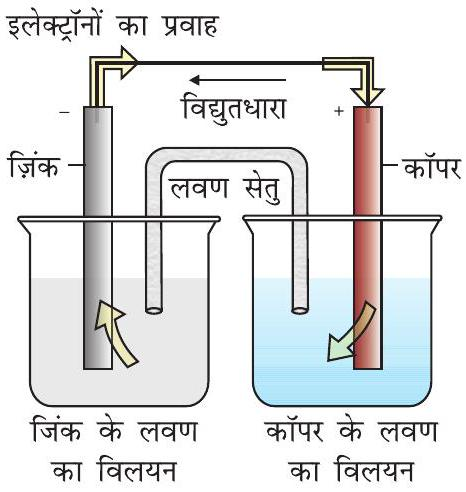
चित्र $2.1$ - डेन्यल सेल जिसमें जिंक एवं कॉपर इलैक्ट्रोड अपने-अपने लवणों के विलयनों में निमज्ज हैं। डेन्यल सेल की संरचना एवं कार्यविधि के बारे में हम चित्र $2.1$ से समझ सकते हैं। यह सेल निम्नलिखित रेडॉक्स अभिक्रिया में उत्सर्जित रासायनिक ऊर्जा को वैद्युत ऊर्जा में परिवर्तित करती है।

$$
\mathrm{Zn}(\mathrm{~s})+\mathrm{Cu}^{2+}(\mathrm{aq}) \rightarrow \mathrm{Zn}^{2+}(\mathrm{aq})+\mathrm{Cu}(\mathrm{~s})
$$

जब $\mathrm{Zn}^{2+}$ तथा $\mathrm{Cu}^{2+}$ आयनों की सांद्रता एक इकाई $\left(1 \mathrm{~mol} \mathrm{dm}^{-3}\right)^{*}$ होती है, तो इसका विद्युतीय विभव $1.1 \mathrm{~V}$ होता है। इस प्रकार की युक्ति को गैल्वैनी या वोल्टीय सेल कहते हैं।

यदि गैल्वैनी सेल में एक विपरीत बाह्य विभव लगाया जाए (चित्र $2.2$ क) एवं इसे धीरे-धीरे बढ़ाया जाए, तो हम देखते हैं कि अभिक्रिया तब तक चलती रहती है जब तक कि बाह्य विभव $1.1 \mathrm{~V}$ नहीं हो जाता, इस स्थिति में अभिक्रिया पूर्णतः रूक जाती है एवं सेल में विद्युत धारा प्रवाहित नहीं होती। बाह्य विभव में कोई भी अतिरिक्त वृद्धि अभिक्रिया को पुनः परंतु विपरीत दिशा में प्रारंभ कर देती है (चित्र $2.2$ ग)। अब यह एक वैद्युतअपघटनी सेल के समान कार्य करती है जो कि एक स्वतः अप्रवर्तित रासायनिक अभिक्रिया को विद्युतीय ऊर्जा के उपयोग से प्रारंभ करने की युक्ति है। दोनों ही सेल बहुत महत्वपूर्ण होते हैं। इनकी कुछ प्रमुख विशेषताओं का अध्ययन आगे के पृष्ठों में करेंगे।

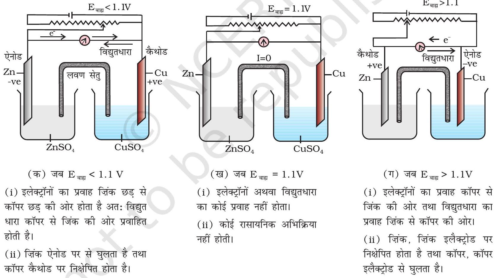
चित्र 2.2- बाह्य विभव, $E_{\text {बाह्य }}$, सेल विभव के विपरीत लगाने पर डेन्यल सेल की कार्य प्रणाली।

[^0]
## $2.2$ गैल्वैनी सेल

गैल्वैनी सेल एक वैद्युतरासायनिक सेल है जो कि एक स्वतः रेडॉक्स अभिक्रिया की रासायनिक ऊर्जा को विद्युतीय ऊर्जा में रूपांतरित करती है। इस युक्ति में स्वतः रेडॉक्स अभिक्रिया की गिब्ज़ ऊर्जा वैद्युत कार्य में रूपांतरित होती है, जिसको मोटर या अन्य विद्युतीय जुगतों; जैसे-हीटर, पंखा, गीज़र इत्यादि में उपयोग किया जाता है।

डेन्यल सेल, जिसका वर्णन पहले किया जा चुका है, एक ऐसी ही सेल है, जिसमें निम्नलिखित रेडॉक्स अभिक्रिया होती है।

$$
\mathrm{Zn}(\mathrm{~s})+\mathrm{Cu}^{2+}(\mathrm{aq}) \rightarrow \mathrm{Zn}^{2+}(\mathrm{aq})+\mathrm{Cu}(\mathrm{~s})
$$

यह अभिक्रिया दो अर्ध सेल अभिक्रियाओं का संयोजन है जिनका योग समग्र सेल अभिक्रिया देता है।

$$
\begin{aligned}
& \text { (i) } \mathrm{Cu}^{2+}+2 \mathrm{e}^{-} \rightarrow \mathrm{Cu}(\mathrm{~s}) \text { (अपचयन अर्ध अभिक्रिया) } \\
& \text { (ii) } \mathrm{Zn}(\mathrm{~s}) \rightarrow \mathrm{Zn}^{2+}+2 \mathrm{e}^{-} \text {(ऑक्सीकरण अर्ध अभिक्रिया) }
\end{aligned}
$$

ये अभिक्रियाएं डेन्यल सेल के दो भिन्न भागों में होती हैं। अपचयन अर्ध अभिक्रिया कॉपर इलैक्ट्रोड पर होती है जबकि ऑक्सीकरण अर्ध अभिक्रिया ज़िंक इलैक्ट्रोड पर होती है। सेल के ये दो भाग, अर्ध सेल या रेडॉक्स युग्म भी कहलाते हैं। कॉपर इलैक्ट्रोड को अपचयन अर्ध सेल एवं ज़िंक इलैक्ट्रोड को ऑक्सीकरण अर्ध सेल भी कहा जा सकता है।

हम विभिन्न अर्ध सेलों के संयोजन से डेन्यल सेल जैसी असंख्य गैल्वैनी सेलों की रचना कर सकते हैं। प्रत्येक अर्ध सेल में धात्विक इलैक्ट्रोड वैद्युतअपघट्य में निमज्ज (डूबा) रहता है। दोनों अर्ध सेल बाहर से एक वोल्टमीटर एवं एक स्विच के माध्यम से धात्विक तार द्वारा जुड़े रहते हैं। दोनों अर्ध सेलों के वैद्युतअपघट्य चित्र $2.1$ में दिखाए गए लवण सेतु द्वारा जुड़े रहते हैं। कभी-कभी दोनों ही इलैक्ट्रोड एक ही वैद्युतअपघट्य में निमज्ज रहते हैं एवं ऐसी स्थितियों में लवण सेतु की आवश्यकता नहीं होती।

प्रत्येक इलैक्ट्रोड-वैद्युतअपघट्य अंतरापृष्ठ पर धात्विक आयनों की प्रवृत्ति विलयन से निकलकर धात्विक इलैक्ट्रोड पर जमा होने की होती है जिससे कि यह धनावेशित हो सके। उसी समय इलैक्ट्रोड की धातु के परमाणुओं की विलयन में आयनों के रूप में जाने एवं इलैक्ट्रोड पर इलैक्ट्रॉन छोड़ने की प्रवृत्ति होती है जिससे कि यह ऋणावेशित हो सके। साम्यावस्था पर आवेशों का पृथक्करण हो जाता है एवं दोनों विपरीत अभिक्रियाओं की प्रकृति के अनुसार इलैक्ट्रोड विलयन के सापेक्ष धनात्मक या ऋणात्मक आवेशित हो जाता है। इलैक्ट्रोड एवं वैद्युतअपघट्य के मध्य विभवांतर उत्पन्न हो जाता है जिसे इलैक्ट्रोड विभव कहते हैं।

जब अर्ध सेल अभिक्रिया में प्रयुक्त सभी स्पीशीज़ की सांद्रता केवल एक इकाई होती है तो इलैक्ट्रोड विभव को मानक इलैक्ट्रोड विभव कहते हैं। IUPAC के नियमानुसार मानक अपचयन विभव को अब मानक इलैक्ट्रोड विभव कहा जाता है। गैल्वैनी सेल की वह अर्ध सेल, जिसमें ऑक्सीकरण होता है, ऐनोड कहलाती है एवं विलयन के सापेक्ष इसका विभव ऋणात्मक होता है। दूसरी अर्ध सेल जिसमें अपचयन होता है, कैथोड कहलाती है एवं इसका विभव विलयन के सापेक्ष धनात्मक होता है। इस प्रकार दोनों इलैक्ट्रोडों के मध्य एक विभवांतर होता है एवं जैसे ही स्विच चालू (ऑन) स्थिति में होता है, इलेक्ट्रॉन ऋणात्मक इलैक्ट्रोड से धनात्मक इलैक्ट्रोड की ओर प्रवाहित होने लगते हैं। विद्युतधारा के प्रवाह की दिशा इलेक्ट्रॉनों के प्रवाह की दिशा के विपरीत होती है।

गैल्वैनी सेल के दोनों इलैक्ट्रोडों के बीच विभवांतर सेल विभव कहलाता है एवं इसे वोल्ट में मापते हैं। सेल विभव कैथोड एवं ऐनोड के इलैक्ट्रोड विभवों (अपचयन विभव) का अंतर होता है। इसे सेल वैद्युत वाहक बल (emf) कहा जाता है। इस समय सेल में से कोई धारा प्रवाहित नहीं हो रही होती। अब यह स्वीकृत परिपाटी है कि गैल्वैनी सेल को लिखते समय हम ऐनोड को बायीं ओर एवं कैथोड को दायीं ओर लिखते हैं। गैल्वैनी सेल को लिखने के लिए साधारणतया धातु एवं वैद्युतअपघट्य के मध्य एक ऊर्ध्वाधर रेखा खींचकर एवं दो वैद्युतअपघट्यों को, यदि वह लवण सेतु द्वारा जुड़े हुए हों तो उनके मध्य दो ऊर्ध्वाधर रेखाएं खींचकर, लिखा जाता है। इस परिपाटी के अनुसार लिखे सेल का emf धनात्मक होता है एवं दायीं ओर के अर्ध सेल के विभव से बायीं ओर के अर्ध सेल के विभव को घटाकर दिया जाता है जैसे कि-

$$
\mathrm{E}_{\text {सेल }}=\mathrm{E}_{\text {दायाँ }}-\mathrm{E}_{\text {बायाँ }}
$$

इसे निम्नलिखित उदाहरण द्वारा समझाया गया है-
सेल अभिक्रिया -

$$
\mathrm{Cu}(\mathrm{~s})+2 \mathrm{Ag}^{+}(\mathrm{aq}) \longrightarrow \mathrm{Cu}^{2+}(\mathrm{aq})+2 \mathrm{Ag}(\mathrm{~s})
$$

अर्ध सेल अभिक्रियाएं -

$$
\begin{array}{ll}
\text { कैथोड (अपचयन) } & 2 \mathrm{Ag}^{+}(\mathrm{aq})+2 \mathrm{e}^{-} \rightarrow 2 \mathrm{Ag}(\mathrm{~s}) \\
\text { ऐनोड (ऑक्सीकरण) } & \mathrm{Cu}(\mathrm{~s}) \rightarrow \mathrm{Cu}^{2+}(\mathrm{aq})+2 \mathrm{e}^{-}
\end{array}
$$

यह देखा जा सकता है कि अभिक्रिया समीकरण (2.5) एवं अभिक्रिया समीकरण (2.6) का योग समीकरण (2.4) देता है एवं सिल्वर इलैक्ट्रोड कैथोड की तरह तथा कॉपर इलैक्ट्रोड ऐनोड की तरह कार्य करता है। सेल को निम्न प्रकार से निरूपित किया जा सकता है-

$$
\mathrm{Cu}(\mathrm{~s})\left|\mathrm{Cu}^{2+}(\mathrm{aq})\right|\left|\mathrm{Ag}^{+}(\mathrm{aq})\right| \mathrm{Ag}(\mathrm{~s})
$$

एवं हम पाते हैं कि $E_{\text {(सेल) }}=E_{\text {(दायाँ) }}-E_{\text {(वायाँ) }}=E_{\mathrm{Ag}^{+} / \mathrm{Ag}}-E_{\mathrm{Cu}^{2+} / \mathrm{Cu}}$

अकेले अर्ध सेल के विभव का मापन नहीं किया जा सकता। हम केवल दो अर्ध सेलों के विभवों में अंतर को माप सकते हैं इससे सेल का emf प्राप्त होता है। यदि हम स्वेच्छा से एक इलैक्ट्रोड (अर्ध सेल) का विभव चयनित कर लें तो इसके सापेक्ष दूसरे अर्ध सेल का विभव ज्ञात किया जा सकता है। परिपाटी के अनुसार मानक हाइड्रोजन इलैक्ट्रोड नामक अर्ध सेल को (चित्र 2.3) $\mathrm{Pt}(\mathrm{s})\left|\mathrm{H}_{2}(\mathrm{~g})\right| \mathrm{H}^{+}(\mathrm{aq})$ द्वारा निरूपित किया जाता है, इसका विभव निम्नलिखित अभिक्रिया के संगत समस्त तापों पर, शून्य निर्दिष्ट किया गया है-

$$
\mathrm{H}^{+}(\mathrm{aq})+\mathrm{e}^{-} \rightarrow \frac{1}{2} \mathrm{H}_{2}(\mathrm{~g})
$$

मानक हाइड्रोजन इलैक्ट्रोड में प्लैटिनम ब्लैक से लेपित प्लैटिनम इलैक्ट्रोड होता है। इलैक्ट्रोड अम्लीय विलयन में निमजित होता है एवं इस पर शुद्ध हाइड्रोजन गैस बुद-बुद की जाती है। हाइड्रोजन की अपचित एवं आक्सीकृत दोनों अवस्थाओं की सांद्रता, इकाई मान पर स्थिर रखी जाती है (चित्र 2.3)। इसका अर्थ है कि विलयन में हाइड्रोजन गैस का दाब $1$ bar एवं हाइड्रोजन आयन की सांद्रता एक मोलर होती है।

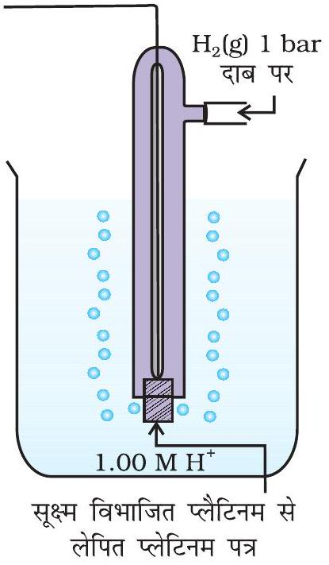
चित्र $2.3$ - मानक हाइड्रोजन इलैक्ट्रोड (SHE)

हाइड्रोजन इलैक्ट्रोड को ऐनोड (संदर्भ अर्ध सेल) तथा किसी दूसरी सेल को कैथोड के स्थान पर लेकर बनाई गई एक सेल जिसे- मानक हाइड्रोजन इलेक्ट्रोड $\|$ दूसरीअर्ध सेल लिखा जा सकता है, का $298 \mathrm{~K}$ पर emf, दूसरी अर्ध सेल के अपचयन विभव का मान देता है। यदि दाहिनी ओर वाले अर्ध सेल की अपचित एवं ऑक्सीकृत स्पीशीज़ की सांद्रताएं इकाई हों तो उपरोक्त सेल का विभव, दाहिनी ओर के अर्ध सेल के मानक विभव, $E_{(R)}^{\ominus}$, के बराबर होता है।

$$
E_{(\text {सेल) }}^{\ominus}=E_{(R)}^{\ominus}-E_{(L)}^{\ominus}
$$

जहाँ $E_{(\text {सेल })}^{\ominus}$ सेल का मानक विभव एवं $E_{(R)}^{\ominus}$ तथा $E_{(L)}^{\ominus}$ क्रमशः दाहिनी एवं बाईं ओर की अर्ध सेलों के मानक इलैक्ट्रोड विभव हैं।

चूँकि मानक हाइड्रोजन इलैक्ट्रोड का विभव $E_{(L)}^{\ominus}$ शून्य होता है अतः

$$
E_{(\text {सेल) }}^{\ominus}=E_{(R)}^{\ominus}-0=E_{(R)}^{\ominus}
$$

निम्नलिखित सेल का मापित emf $0.34 \mathrm{~V}$ है जो कि निम्नलिखित अर्ध सेल अभिक्रिया का मानक इलैक्ट्रोड विभव भी है।

सेल-

$$
\operatorname{Pt}(\mathrm{s})\left|\mathrm{H}_{2}(\mathrm{~g}, 1 \mathrm{bar})\right| \mathrm{H}^{+}(\mathrm{aq}, 1 \mathrm{M}) \| \mathrm{Cu}^{2+}(\mathrm{aq}, 1 \mathrm{M}) \mid \mathrm{Cu}
$$

अर्ध सेल अभिक्रिया-

$$
\mathrm{Cu}^{2+}(\mathrm{aq}, 1 \mathrm{M})+2 \mathrm{e}^{-} \rightarrow \mathrm{Cu}(\mathrm{~s})
$$

इसी प्रकार, निम्नलिखित सेल का मापित emf $-0.76 \mathrm{~V}$ है जो कि निम्नलिखित अर्ध सेल अभिक्रिया के मानक इलैक्ट्रोड विभव के संगत हैं।

सेल-

$$
\operatorname{Pt}(\mathrm{s})\left|\mathrm{H}_{2}(\mathrm{~g}, 1 \mathrm{bar})\right| \mathrm{H}^{+}(\mathrm{aq}, 1 \mathrm{M}) \| \mathrm{Zn}^{2+}(\mathrm{aq}, 1 \mathrm{M}) \mid \mathrm{Zn}
$$

अर्ध सेल अभिक्रिया-

$$
\mathrm{Zn}^{2+}(\mathrm{aq}, 1 \mathrm{M})+2 \mathrm{e}^{-} \rightarrow \mathrm{Zn}(\mathrm{~s})
$$

प्रथम स्थिति में मानक इलैक्ट्रोड विभव का धनात्मक मान इंगित करता है कि $\mathrm{Cu}^{2+}$ आयन $\mathrm{H}^{+}$आयनों की तुलना में आसानी से अपचित हो जाते हैं। इसका विपरीत प्रक्रम संभव नहीं होता अर्थात् उपरोक्त वर्णित मानक परिस्थितियों में हाइड्रोजन आयन Cu को ऑक्सीकृत नहीं कर सकते (अथवा हम यह भी कह सकते हैं कि हाइड्रोजन गैस कॉपर आयनों को अपचित कर सकती है) इसलिए Cu(s), HCl में नहीं घुलता है। नाइट्रिक अम्ल में यह नाइट्रेट आयनों से ऑक्सीकृत होता है न कि हाइड्रोजन आयनों से। दूसरी स्थिति में मानक इलैक्ट्रोड विभव का ऋणात्मक मान इंगित करता है कि हाइड्रोजन आयन ज़िंक को ऑक्सीकृत कर सकते हैं (या ज़िंक हाइड्रोजन आयनों को अपचित कर सकता है)।

इस परिपाटी के परिप्रेक्ष्य में चित्र $2.1$ में प्रस्तुत डेन्यल सेल की अर्ध अभिक्रियाओं को निम्न प्रकार से लिखा जा सकता है-

बायाँ इलैक्ट्रोड- $\mathrm{Zn}(\mathrm{s}) \rightarrow \mathrm{Zn}^{2+}(\mathrm{aq}, 1 \mathrm{M})+2 \mathrm{e}^{-}$
दायाँ इलैक्ट्रोड- $\mathrm{Cu}^{2+}(\mathrm{aq}, 1 \mathrm{M})+2 \mathrm{e}^{-} \rightarrow \mathrm{Cu}(\mathrm{s})$

सेल की समग्र अभिक्रिया उपरोक्त अभिक्रियाओं का योग होती है। अर्थात्

$$
\begin{aligned}
& \mathrm{Zn}(\mathrm{~s})+\mathrm{Cu}^{2+}(\mathrm{aq}) \rightarrow \mathrm{Zn}^{2+}(\mathrm{aq})+\mathrm{Cu}(\mathrm{~s}) \\
& \text { सेल का } \mathrm{emf}=E_{(\text {सेल) }}^{\ominus}=E_{(R)}^{\ominus}-E_{(L)}^{\ominus} \\
& E_{(\text {सेल) }}^{\ominus}=0.34 \mathrm{~V}-(-0.76) \mathrm{V}=1.10 \mathrm{~V}
\end{aligned}
$$

कभी-कभी प्लैटिनम एवं स्वर्ण जैसी धातुएं अक्रिय इलैक्ट्रोड के रूप में प्रयुक्त होती हैं। वे अभिक्रिया में भाग नहीं लेतीं, परंतु ऑक्सीकरण एवं अपचयन अभिक्रियाओं के लिए एवं इलैक्ट्रॉनों के चालन के लिए अपनी सतह प्रदान करती हैं। उदाहरण के लिए निम्नलिखित अर्ध सेलों में Pt का उपयोग होता है-

हाइड्रोजन इलैक्ट्रोड- $\quad \mathrm{Pt}(\mathrm{s})\left|\mathrm{H}_{2}(\mathrm{~g})\right| \mathrm{H}^{+}(\mathrm{aq})$
जिसकी अर्ध अभिक्रिया है- $\quad \mathrm{H}^{+}(\mathrm{aq})+\mathrm{e}^{-} \rightarrow \frac{1}{2} \mathrm{H}_{2}(\mathrm{~g})$
ब्रोमीन इलैक्ट्रोड- $\quad \mathrm{Pt}(\mathrm{s})\left|\mathrm{Br}_{2}(\mathrm{aq})\right| \mathrm{Br}^{-}(\mathrm{aq})$
जिसकी अर्ध अभिक्रिया है- $\quad \frac{1}{2} \mathrm{Br}_{2}(\mathrm{aq})+\mathrm{e}^{-} \rightarrow \mathrm{Br}^{-}(\mathrm{aq})$
मानक इलैक्ट्रोड विभव बहुत महत्वपूर्ण है एवं हम इनसे कई महत्वपूर्ण सूचनाएं प्राप्त कर सकते हैं। कुछ चयनित अर्ध सेल अपचयन अभिक्रियाओं के लिए मानक इलैक्ट्रोड विभव के मान सारणी $2.1$ में दिए गए हैं। यदि किसी इलैक्ट्रोड का मानक इलैक्ट्रोड विभव शून्य से अधिक होता है तो इसकी अपचित अवस्था हाइड्रोजन गैस से अधिक स्थायी होती है। इसी प्रकार से, यदि मानक इलैक्ट्रोड विभव ऋणात्मक होता है तो हाइड्रोजन गैस उस स्पीशीज़ की अपचित अवस्था से अधिक स्थायी होती है। यह देखा जा सकता है कि सारणी में फ्लुओरीन का मानक इलैक्ट्रोड विभव उच्चतम है। यह इंगित करता है कि फ्लुओरीन गैस $\left(\mathrm{F}_{2}\right)$ की फ्लुओराइड आयन $\left(\mathrm{F}^{-}\right)$में अपचित होने की प्रवृत्ति अधिकतम है। अतः फ्लुओरीन गैस प्रबलतम ऑक्सीकारक है एवं फ्लुओराइड आयन दुर्बलतम अपचायक है। लीथियम का इलैक्ट्रोड विभव न्यूनतम है, यह इंगित करता है कि लीथियम आयन दुर्बलतम ऑक्सीकारक है जबकि लीथियम धातु जलीय विलयनों में प्रबलतम अपचायक है। यह देखा जा सकता है कि सारणी $2.1$ में जब हम ऊपर से नीचे की ओर जाते हैं तो मानक इलैक्ट्रोड विभव कम होता जाता है एवं इसी के साथ अभिक्रिया के बायीं ओर की स्पीशीज़ की ऑक्सीकारक क्षमता बढ़ती है तथा दायीं ओर के स्पीशीज़ की अपचयन क्षमता बढ़ती है। वैद्युत रासायनिक सेलों का व्यापक उपयोग विलयनों की pH ज्ञात करने में, विलेयता गुणनफल, साम्यावस्था स्थिरांक तथा अन्य ऊष्मागतिकीय गुणों एवं विभवमितीय अनुमापनों में होता है।

## पाठ्यनिहित प्रश्न

$2.1$ निकाय $\mathrm{Mg}^{2+} \mid \mathrm{Mg}$ का मानक इलैक्ट्रोड विभव आप किस प्रकार ज्ञात करेंगे?
$2.2$ क्या आप एक ज़िंक के पात्र में कॉपर सल्फेट का विलयन रख सकते हैं?
$2.3$ मानक इलैक्ट्रोड विभव की तालिका का निरीक्षण कर तीन ऐसे पदार्थ बताइए जो अनुकूल परिस्थितियों में फेरस आयनों को ऑक्सीकृत कर सकते हैं।

सारणी 2.1-298 K पर मानक इलैक्ट्रोड विभव
आयन जलीय स्पीशीज़ के रूप में, एवं जल द्रव के रूप में उपस्थित है; गैस एवं ठोस क्रमश: $g$ एवं $s$ से दर्शाये गए हैं।

| अभिक्रिया ( आक्सीकृत अवस्था + ne - → अपचित अवस्था ) |  |  |  | $\boldsymbol{E}^{\ominus} / \mathbf{V}$ |
| :--- | :--- | :--- | :--- | :--- |
| आक्सीकारक क्षमता | $\mathrm{F}_{2}(\mathrm{~g})+2 \mathrm{e}^{-}$ | → 2F ${ }^{-}$ |  | $2.87$ |
|  | $\mathrm{Co}^{3+}+\mathrm{e}^{-}$ | $\rightarrow \mathrm{Co}^{2+}$ |  | $1.81$ |
|  | $\mathrm{H}_{2} \mathrm{O}_{2}+2 \mathrm{H}^{+}+2 \mathrm{e}^{-}$ | $\rightarrow 2 \mathrm{H}_{2} \mathrm{O}$ |  | $1.78$ |
|  | $\mathrm{MnO}_{4}{ }^{-}+8 \mathrm{H}^{+}+5 \mathrm{e}^{-}$ | $\rightarrow \mathrm{Mn}^{2+}+4 \mathrm{H}_{2} \mathrm{O}$ |  | $1.51$ |
|  | $\mathrm{Au}^{3+}+3 \mathrm{e}^{-}$ | → Au(s) |  | $1.40$ |
|  | $\mathrm{Cl}_{2}(\mathrm{~g})+2 \mathrm{e}^{-}$ | $\rightarrow 2 \mathrm{Cl}^{-}$ |  | $1.36$ |
|  | $\mathrm{Cr}_{2} \mathrm{O}_{7}{ }^{2-}+14 \mathrm{H}^{+}+6 \mathrm{e}^{-}$ | $\rightarrow 2 \mathrm{Cr}^{3+}+7 \mathrm{H}_{2} \mathrm{O}$ |  | $1.33$ |
|  | $\mathrm{O}_{2}(\mathrm{~g})+4 \mathrm{H}^{+}+4 \mathrm{e}^{-}$ | $\rightarrow 2 \mathrm{H}_{2} \mathrm{O}$ |  | $1.23$ |
|  | $\mathrm{MnO}_{2}(\mathrm{~s})+4 \mathrm{H}^{+}+2 \mathrm{e}^{-}$ | $\rightarrow \mathrm{Mn}^{2+}+2 \mathrm{H}_{2} \mathrm{O}$ |  | $1.23$ |
|  | $\mathrm{Br}_{2}+2 \mathrm{e}^{-}$ | $\rightarrow 2 \mathrm{Br}^{-}$ |  | $1.09$ |
|  | $\mathrm{NO}_{3}{ }^{-}+4 \mathrm{H}^{+}+3 \mathrm{e}^{-}$ | $\rightarrow \mathrm{NO}(\mathrm{g})+2 \mathrm{H}_{2} \mathrm{O}$ |  | $0.97$ |
|  | $2 \mathrm{Hg}^{2+}+2 \mathrm{e}^{-}$ | → $\mathrm{Hg}_{2}{ }^{2+}$ |  | $0.92$ |
|  | $\mathrm{Ag}^{+}+\mathrm{e}^{-}$ | → Ag(s) |  | $0.80$ |
|  | $\mathrm{Fe}^{3+}+\mathrm{e}^{-}$ | → $\mathrm{Fe}^{2+}$ |  | $0.77$ |
|  | $\mathrm{O}_{2}(\mathrm{~g})+2 \mathrm{H}^{+}+2 \mathrm{e}^{-}$ | $\rightarrow \mathrm{H}_{2} \mathrm{O}_{2}$ |  | $0.68$ |
|  | $\mathrm{I}_{2}+2 \mathrm{e}^{-}$ | $\rightarrow 2 \mathrm{I}^{-}$ |  | $0.54$ |
|  | $\mathrm{Cu}^{+}+\mathrm{e}^{-}$ | - Cu(s) |  | $0.52$ |
|  | $\mathrm{Cu}^{2+}+2 \mathrm{e}^{-}$ | → Cu(s) |  | $0.34$ |
| mor | $\operatorname{AgCl}(\mathrm{s})+\mathrm{e}^{-}$ | $\rightarrow \mathrm{Ag}(\mathrm{s})+\mathrm{Cl}^{-}$ | too | $0.22$ |
| pås | $\operatorname{AgBr}(\mathrm{s})+\mathrm{e}^{-}$ | $\rightarrow \mathrm{Ag}(\mathrm{s})+\mathrm{Br}^{-}$ | 眞 | $0.10$ |
|  | $\mathbf{2 H}^{+} \boldsymbol{+} \mathbf{2 e}^{-}$ | $\rightarrow \mathbf{H}_{\mathbf{2}}(\mathbf{g})$ |  | $0.00$ |
|  | $\mathrm{Pb}^{2+}+2 \mathrm{e}^{-}$ | → Pb(s) |  | -0.13 |
|  | $\mathrm{Sn}^{2+}+2 \mathrm{e}^{-}$ | - Sn(s) |  | -0.14 |
|  | $\mathrm{Ni}^{2+}+2 \mathrm{e}^{-}$ | → Ni(s) |  | -0.25 |
|  | $\mathrm{Fe}^{2+}+2 \mathrm{e}^{-}$ | → Fe(s) |  | -0.44 |
|  | $\mathrm{Cr}^{3+}+3 \mathrm{e}^{-}$ | → Cr(s) |  | -0.74 |
|  | $\mathrm{Zn}^{2+}+2 \mathrm{e}^{-}$ | - Zn(s) |  | -0.76 |
|  | $2 \mathrm{H}_{2} \mathrm{O}+2 \mathrm{e}^{-}$ | $\rightarrow \mathrm{H}_{2}(\mathrm{~g})+2 \mathrm{OH}^{-}(\mathrm{aq})$ |  | -0.83 |
|  | $\mathrm{Al}^{3+}+3 \mathrm{e}^{-}$ | → Al(s) |  | -1.66 |
|  | $\mathrm{Mg}^{2+}+2 \mathrm{e}^{-}$ | → Mg(s) |  | -2.36 |
|  | $\mathrm{Na}^{+}+\mathrm{e}^{-}$ | → Na(s) |  | -2.71 |
|  | $\mathrm{Ca}^{2+}+2 \mathrm{e}^{-}$ | → Ca(s) |  | -2.87 |
|  | $\mathrm{K}^{+}+\mathrm{e}^{-}$ | → K(s) |  | -2.93 |
|  | $\mathrm{Li}^{+}+\mathrm{e}^{-}$ | → Li(s) |  | -3.05 |

[^1]
## $2.3$ नेर्न्स्ट   समीकरण

पूर्व खंड में हमने माना है कि इलैक्ट्रोड अभिक्रिया में प्रयुक्त समस्त स्पीशीज़ की मोलर सांद्रता एक इकाई है। आवश्यक नहीं कि यह हमेशा सत्य हो। नेर्न्स्ट ने दर्शाया कि इलैक्ट्रोड अभिक्रिया-

$$
\mathrm{M}^{\mathrm{n}+}(\mathrm{aq})+\mathrm{ne}^{-} \rightarrow \mathrm{M}(\mathrm{~s})
$$

के लिए किसी भी सांद्रता पर मानक हाइड्रोजन इलैक्ट्रोड के सापेक्ष मापा गया इलैक्ट्रोड विभव निम्न प्रकार निरूपित किया जा सकता है-

$$
\mathrm{E}_{\left(\mathrm{M}^{\mathrm{n}+} / \mathrm{M}\right)}=\mathrm{E}_{\left(\mathrm{M}^{\mathrm{n}+} / \mathrm{M}\right)}^{\ominus}-\frac{R T}{n F} \ln \frac{[\mathrm{M}(\mathrm{~s})]}{\left[\mathrm{M}^{\mathrm{n}+}(a q)\right]}
$$

चूँकि $\mathrm{M}(\mathrm{s})$ की सांद्रता, इकाई मानी जाती है, इसलिए-

$$
\mathrm{E}_{\left(\mathrm{M}^{\mathrm{n}+} / \mathrm{M}\right)}=\mathrm{E}_{\left(\mathrm{M}^{\mathrm{n}+} / \mathrm{M}\right)}^{\ominus}-\frac{R T}{n F} \ln \frac{1}{\left[\mathrm{M}^{\mathrm{n}+}(a q)\right]}
$$

$E_{\left(\mathrm{M}^{\mathrm{n}+} / \mathrm{M}\right)}^{\ominus}$ को पहले ही परिभाषित किया जा चुका है, R गैस स्थिरांक $\left(8.314 \mathrm{JK}^{-1} \mathrm{~mol}^{-1}\right)$ है, F फैराडे स्थिरांक $\left(96487 \mathrm{C} \mathrm{mol}^{-1}\right)$ है, $T$ केल्विन में ताप क्रम है एवं $\left[\mathrm{M}^{\mathrm{n}}(\mathrm{aq})\right],\left[\mathrm{M}^{\mathrm{n}+}(\mathrm{aq})^{+}\right]$स्पीसीज़ की मोलर सांद्रता है-

डेन्यल सेल में $\mathrm{Cu}^{2+}$ एवं $\mathrm{Zn}^{2+}$ आयनों की किसी भी सांद्रता के लिए हम लिखते हैं-
कैथोड के लिए-

$$
\mathrm{E}_{\left(\mathrm{Cu}^{2+} / \mathrm{Cu}\right)}=\mathrm{E}_{\left(\mathrm{Cu}^{2+} / \mathrm{Cu}\right)}^{\ominus}-\frac{R T}{2 F} \ln \frac{1}{\left[\mathrm{Cu}^{2+}(\mathrm{aq})\right]}
$$

ऐनोड के लिए-

$$
\mathrm{E}_{\left(\mathrm{Zn}^{2+} / \mathrm{Zn}\right)}=\mathrm{E}_{\left(\mathrm{Zn}^{2+} / \mathrm{Zn}\right)}^{\ominus}-\frac{R T}{2 F} \ln \frac{1}{\mathrm{Zn}^{2+}(\mathrm{aq})}
$$

सेल विभव-

$$
\begin{aligned}
E_{(\text {सेल })} & =\mathrm{E}_{\left(\mathrm{Cu}^{2+} / \mathrm{Cu}\right)}-\mathrm{E}_{\left(\mathrm{Zn}^{2+} / \mathrm{Zn}\right)} \\
& =\mathrm{E}_{\left(\mathrm{Cu}^{2+} / \mathrm{Cu}\right)}^{\ominus}-\frac{R T}{2 F} \ln \frac{1}{\mathrm{Cu}^{2+}(\mathrm{aq})}-\mathrm{E}_{\left(\mathrm{Zn}^{2+} / \mathrm{Zn}\right)}^{\ominus}+\frac{R T}{2 F} \ln \frac{1}{\mathrm{Zn}^{2+}(\mathrm{aq})} \\
& =\mathrm{E}_{\left(\mathrm{Cu}^{2+} / \mathrm{Cu}\right)}^{\ominus}-\mathrm{E}_{\left(\mathrm{Zn}^{2+} / \mathrm{Zn}\right)}^{\ominus}-\frac{R T}{2 F} \ln \frac{1}{\mathrm{Cu}^{2+}(\mathrm{aq})}-\ln \frac{1}{\mathrm{Zn}^{2+}(\mathrm{aq})} \\
E_{(\text {सेल) })} & =E_{(\text {सेल })}^{\ominus}-\frac{R T}{2 F} \ln \frac{\left[\mathrm{Zn}^{2+}\right]}{\left[\mathrm{Cu}^{2+}\right]}
\end{aligned}
$$

यह देखा जा सकता है कि $\mathrm{E}_{\text {(सेल) }}$ दोनों आयनों, $\mathrm{Cu}^{2+}$ एवं $\mathrm{Zn}^{2+}$ की सांद्रता पर निर्भर करता है। यह $\mathrm{Cu}^{2+}$ आयनों की सांद्रता बढ़ाने पर बढ़ता है एवं $\mathrm{Zn}^{2+}$ आयनों की सांद्रता बढ़ाने पर घटता है।

समीकरण $2.11$ में प्राकृतिक लघुगणक के आधार को $10$ में रूपांतरित करने पर एवं $R, F$ के मान रखने पर, एवं $T=298 \mathrm{~K}$ पर यह निम्न प्रकार से बदल जाती है-

$$
E_{(\text {सेल })}=E_{(\text {सेल) }}^{\ominus}-\frac{0.059}{2} \log \frac{\left[\mathrm{Zn}^{2+}\right]}{\left[\mathrm{Cu}^{2+}\right]}
$$

दोनों इलैक्ट्रोडों के लिए इलैक्ट्रॉनों की संख्या $(n)$ समान होनी चाहिए, अतः निम्नलिखित सेल-
$\mathrm{Ni}(\mathrm{s})\left|\mathrm{Ni}^{2+}(\mathrm{aq})\right|\left|\mathrm{Ag}^{+}(\mathrm{aq})\right| \mathrm{Ag}$ के लिए नेर्न्स्ट समीकरण निम्न प्रकार से लिखी जा सकती है-

$$
E_{\text {(सेल) }}=E_{\text {(सेल) }}^{\ominus}-\frac{R T}{2 F} \ln \frac{\left[\mathrm{Ni}^{2+}\right]}{\left[\mathrm{Ag}^{+}\right]^{2}}
$$

एवं एक सामान्य वैद्युतरासायनिक अभिक्रिया-

$$
\mathrm{aA}+\mathrm{bB} \quad n \mathrm{e}^{-} \rightarrow \mathrm{cC}+\mathrm{dD}
$$

के लिए नेर्न्स्ट समीकरण निम्न प्रकार से लिखी जा सकती है-

$$
\begin{aligned}
& E_{(\text {सेल })}=E_{(\text {सेल })}^{\ominus}-\frac{R T}{n F} \ln \mathrm{Q} \\
& =E_{(\text {सेल })}^{\ominus}-\frac{R T}{n F} \ln \frac{[\mathrm{C}]^{\mathrm{c}}[\mathrm{D}]^{\mathrm{d}}}{[\mathrm{~A}]^{\mathrm{a}}[\mathrm{~B}]^{\mathrm{b}}}
\end{aligned}
$$

उदाहरण $2.1$ निम्नलिखित अभिक्रिया वाले सेल को निरूपित कीजिए।

$$
\mathrm{Mg}(\mathrm{~s})+2 \mathrm{Ag}^{+}(0.0001 \mathrm{M}) \rightarrow \mathrm{Mg}^{2+}(0.130 \mathrm{M})+2 \mathrm{Ag}(\mathrm{~s})
$$

इसके $E_{\text {(सेल) }}$ का परिकलन कीजिए यदि $E_{\text {(सेल) }}^{\ominus}=3.17 \mathrm{~V}$ हो।
हल दी गई अभिक्रिया वाले सेल को निम्न प्रकार से लिखा जा सकता है-

$$
\begin{aligned}
\mathrm{Mg} & \left|\mathrm{Mg}^{2+}(0.130 \mathrm{M})\right|\left|\mathrm{Ag}^{+}(0.0001 \mathrm{M})\right| \mathrm{Ag} \\
& E_{(\text {सेल) }}=E_{(\text {सेल })}^{\ominus}-\frac{\mathrm{RT}}{2 \mathrm{~F}} \ln \frac{\mathrm{Mg}^{2+}}{\mathrm{Ag}^{+}} \\
& =3.17 \mathrm{~V}-\frac{0.059 \mathrm{~V}}{2} \log \frac{0.130}{(0.0001)^{2}}=3.17 \mathrm{~V}-0.21 \mathrm{~V}=2.96 \mathrm{~V}
\end{aligned}
$$

### 2.3.1 नेर्न्स्ट समीकरण से साम्य स्थिरांक

यदि डेन्यल सेल (चित्र 2.1) में परिपथ को बंद कर दिया जाए तो निम्न अभिक्रिया होती है-

$$
\mathrm{Zn}(\mathrm{~s})+\mathrm{Cu}^{2+}(\mathrm{aq}) \rightarrow \mathrm{Zn}^{2+}(\mathrm{aq})+\mathrm{Cu}(\mathrm{~s})
$$

जैसे-जैसे समय गुजरता है $\mathrm{Zn}^{2+}$ आयनों की सांद्रता बढ़ती जाती है जबकि $\mathrm{Cu}^{2+}$ आयनों की सांद्रता घटती जाती है। इसी समय सेल की वोल्टता, जिसे वोल्टमीटर द्वारा पढ़ा जा सकता है, घटती जाती है। कुछ समय पश्चात् $\mathrm{Cu}^{2+}$ एवं $\mathrm{Zn}^{2+}$ आयनों की सांद्रता स्थिर

हो जाती है एवं वोल्टमीटर शून्य पठनांक दर्शाता है। यह इंगित करता है कि अभिक्रिया में साम्य स्थापित हो चुका है। इस अवस्था में नेर्न्स्ट समीकरण को निम्न प्रकार से लिखा जा सकता है-

$$
\begin{aligned}
& E_{\text {(सेल) }}=0=E_{(\text {सेल })}^{\ominus}-\frac{2.303 R T}{2 F} \log \frac{\left[\mathrm{Zn}^{2+}\right]}{\left[\mathrm{Cu}^{2+}\right]} \\
& \text { या } E_{(\text {सेल })}^{\ominus}=\frac{2.303 R T}{2 F} \log \frac{\left[\mathrm{Zn}^{2+}\right]}{\left[\mathrm{Cu}^{2+}\right]}
\end{aligned}
$$

परंतु साम्यावस्था पर,

$$
\frac{\left[\mathrm{Zn}^{2+}\right]}{\left[\mathrm{Cu}^{2+}\right]}=K_{c} \text { अभिक्रिया (2.1) के लिए }
$$

अतः $\mathrm{T}=298 \mathrm{~K}$ पर उपरोक्त समीकरण को निम्न प्रकार से लिखा जा सकता है-

$$
\begin{aligned}
& E_{(\text {सेल) }}^{\ominus}=\frac{0.059 \mathrm{~V}}{2} \log K_{C}=1.1 \mathrm{~V} \quad\left(E_{\text {(सेल) }}^{\ominus}=1.1 \mathrm{~V}\right) \\
& \log K_{C}=\frac{(1.1 \mathrm{~V} \times 2)}{0.059 \mathrm{~V}}=37.288 \\
& K_{C}=2 \times 10^{37}(298 \mathrm{~K} \text { पर) }
\end{aligned}
$$

सामान्य रूप में,

$$
E_{(\text {सेल })}^{\ominus}=\frac{2.303 R T}{n F} \log K_{C}
$$

समीकरण, (2.14) सेल के मानक विभव एवं साम्य स्थिरांक के बीच संबंध दर्शाती है। इस प्रकार अभिक्रिया के लिए साम्य स्थिरांक, जिसे अन्य प्रकार मापना संभव नहीं है, सेल के संगत $E^{\ominus}$ मान से परिकलित किया जा सकता है।

उदाहरण $2.2$ निम्नलिखित अभिक्रिया का साम्य स्थिरांक परिकलित कीजिए-

$$
\begin{aligned}
& \mathrm{Cu}(\mathrm{~s})+2 \mathrm{Ag}^{+}(\mathrm{aq}) \rightarrow \mathrm{Cu}^{2+}(\mathrm{aq})+2 \mathrm{Ag}(\mathrm{~s}) \\
& E_{(\text {सेल })}^{\ominus}=0.46 \mathrm{~V}
\end{aligned}
$$

हल

$$
E_{\text {(सेल) }}^{\ominus}=\frac{0.059 \mathrm{~V}}{2} \log K_{C}=0.46 \mathrm{~V}
$$

या $\log K_{C}=\frac{0.46 \mathrm{~V} \times 2}{0.059 \mathrm{~V}}=15.6$

$$
K_{C}=3.92 \times 10^{15}
$$

### 2.3.2 वैद्युतरासायनिक सेल अभिक्रिया की गिब्ज़ ऊर्जा

एक सेकंड में किया गया विद्युतीय कार्य कुल प्रवाहित आवेश एवं विद्युतीय विभव के गुणनफल के बराबर होता है। यदि हम गैल्वैनी सेल से अधिकतम कार्य लेना चाहते हैं तो आवेश का प्रवाह उत्क्रमणीय करना होगा। गैल्वैनी सेल के द्वारा किया गया उत्क्रमणीय कार्य गिब्ज़ ऊर्जा में कमी के बराबर होता है। अतः यदि सेल का emf, $E$ प्रवाहित आवेश $n F$

एवं अभिक्रिया की गिब्ज़ ऊर्जा, $\Delta_{r} G$ हो, तब

$$
\Delta_{r} G=-n F E_{(\text {सेल })}
$$

यह स्मरण रहे कि $E_{\text {(सेल) }}$ एक स्वतंत्र प्राचल है, लेकिन $\Delta_{r} G$ एक मात्रात्मक ऊष्मागतिकीय गुणधर्म है जिसका मान ' $n$ ' पर निर्भर करता है। इस प्रकार निम्नलिखित अभिक्रिया-

$$
\begin{aligned}
& \mathrm{Zn}(\mathrm{~s})+\mathrm{Cu}^{2+}(\mathrm{aq}) \longrightarrow \mathrm{Zn}^{2+}(\mathrm{aq})+\mathrm{Cu}(\mathrm{~s}) \text { के लिए } \\
& \Delta_{r} G=-2 F E_{\text {(सेल) }}
\end{aligned}
$$

तथा अभिक्रिया

$$
2 \mathrm{Zn}(\mathrm{~s})+2 \mathrm{Cu}^{2+}(\mathrm{aq}) \longrightarrow 2 \mathrm{Zn}^{2+}(\mathrm{aq})+2 \mathrm{Cu}(\mathrm{~s})
$$

के लिए, $\Delta_{\mathrm{r}} G=-4 F E_{\text {(सेल) }}$
यदि समस्त अभिक्रियाकारी स्पीशीज़ की सांद्रता एक इकाई हो, तब

$$
\begin{aligned}
& E_{\text {(सेल) }}=E_{\text {(सेल) }}^{\ominus} \text { अतः } \\
& \Delta_{r} G^{\ominus}=-n F E_{\text {(सेल) }}^{\ominus}
\end{aligned}
$$

इस प्रकार $E_{(\text {सेल })}^{\ominus}$ के मापन से हम एक महत्वपूर्ण ऊष्मागतिकीय राशि, अभिक्रिया की मानक गिब्ज़ ऊर्जा $\Delta_{r} G^{\ominus}$, प्राप्त कर सकते हैं। $\Delta_{r} G^{\ominus}$ से हम निम्न समीकरण द्वारा साम्य स्थिरांक का परिकलन कर सकते हैं।

$$
\Delta_{r} G^{\ominus}=-R T \ln K
$$

उदाहरण $2.3$ डेन्यल सेल के लिए मानक सेल विभव 1.1 V है। निम्नलिखित अभिक्रिया के लिए मानक गिब्ज़ ऊर्जा का परिकलन कीजिए।

$$
\mathrm{Zn}(\mathrm{~s})+\mathrm{Cu}^{2+}(\mathrm{aq}) \longrightarrow \mathrm{Zn}^{2+}(\mathrm{aq})+\mathrm{Cu}(\mathrm{~s})
$$

हल $\Delta_{r} G^{\ominus}=-n F E_{(\text {सेल })}^{\ominus}$
उपरोक्त समीकरण में $n$ का मान $2$ है। $\mathrm{F}=96487 \mathrm{C} \mathrm{mol}^{-1}$ एवं $E_{(\text {सेल })}^{\ominus}=1.1 \mathrm{~V}$ अतः

$$
\Delta_{r} G^{\ominus}=-2 \times 1.1 \mathrm{~V} \times 96487 \mathrm{C} \mathrm{~mol}^{-1}=-21227 \mathrm{~J} \mathrm{~mol}^{-1}=-212.27 \mathrm{~kJ} \mathrm{~mol}^{-1}
$$

## पाठ्यनिहित प्रश्न

$2.4 \mathrm{pH}=10$ के विलयन के संपर्क वाले हाइड्रोजन इलैक्ट्रोड के विभव का परिकलन कीजिए।
$2.5$ एक सेल के emf का परिकलन कीजिए, जिसमें निम्नलिखित अभिक्रिया होती है। दिया गया है $E_{\text {(सेल) }}^{\ominus}=1.05 \mathrm{~V}$ $\mathrm{Ni}(\mathrm{s})+2 \mathrm{Ag}^{+}(0.002 \mathrm{M}) \rightarrow \mathrm{Ni}^{2+}(0.160 \mathrm{M})+2 \mathrm{Ag}(\mathrm{s})$
$2.6$ एक सेल जिसमें निम्नलिखित अभिक्रिया होती है- $2 \mathrm{Fe}^{3+}(\mathrm{aq})+2 \mathrm{I}^{-}(\mathrm{aq}) \rightarrow 2 \mathrm{Fe}^{2+}(\mathrm{aq})+\mathrm{I}_{2}(\mathrm{~s})$ का $298 \mathrm{~K}$ ताप पर $E_{(\text {सेल })}^{\ominus}=0.236 \mathrm{~V}$ है। सेल अभिक्रिया की मानक गिब्ज़ ऊर्जा एवं साम्य स्थिरांक का परिकलन कीजिए।

## $2.4$ वैद्युतअपघटनी विलयनों का चालकत्व

विद्युत के वैद्युतअपघटनी विलयनों में चालकत्व पर विचार करने से पूर्व कुछ पदों को परिभाषित करना आवश्यक है। विद्युतीय प्रतिरोध को प्रतीक 'R' से निरूपित किया जाता है एवं इसे ओम $[\mathrm{ohm}(\Omega)]$ में मापा जाता है जो कि SI इकाइयों में $\left(\mathrm{kg} \mathrm{m}^{2}\right) /\left(\mathrm{S}^{3} A^{2}\right)$ के तुल्य है। इसे ह्वीटस्टोन सेतु की सहायता से मापा जा सकता है जिससे आप भौतिक विज्ञान के अध्ययन में परिचित हो चुके हैं। किसी भी वस्तु का विद्युतीय प्रतिरोध उसकी लंबाई $l$ के अनुक्रमानुपाती एवं अनुप्रस्थ काट क्षेत्रफल $A$ के प्रतिलोमानुपाती होता है। अर्थात्

$$
R \propto \frac{l}{A} \text { or } R=\rho \frac{l}{A}
$$

समानुपाती स्थिरांक $\rho$ (ग्रीक, रो, rho) को प्रतिरोधकता (विशिष्ट प्रतिरोध) कहते हैं। इसकी SI इकाई ओम मीटर $(\Omega \mathrm{m})$ है तथा अधिकांशतः इसका अपवर्तक ओम सेंटीमीटर $(\Omega \mathrm{cm})$ भी उपयोग में लिया जाता है। चूँकि IUPAC ने विशिष्ट प्रतिरोध के स्थान पर प्रतिरोधकता पद की अनुशंसा की है, अतः पुस्तक के आगे के पृष्ठों में हम प्रतिरोधकता पद का ही उपयोग करेंगे। भौतिक रूप में किसी पदार्थ की प्रतिरोधकता उसका वह प्रतिरोध है जब यह एक मीटर लंबा हो एवं इसका अनुप्रस्थ काट का क्षेत्रफल $1 \mathrm{~m}^{2}$ हो। यह देखा जा सकता है कि-
$1 \Omega \mathrm{~m}=100 \Omega \mathrm{~cm}$ या $1 \Omega \mathrm{~cm}=0.01 \Omega \mathrm{~m}$

प्रतिरोध $R$ का व्युत्क्रम, चालकत्व (conductance), $G$ कहलाता है एवं हम निम्न संबंध प्राप्त करते हैं-

$$
G=\frac{1}{R}=\frac{A}{\rho l}=\kappa \frac{A}{l}
$$

चालकत्व का SI मात्रक सीमेन्ज़ है जिसे प्रतीक 'S' से निरूपित किया जाता है एवं यह $\mathrm{ohm}^{-1}$ (या mho) या $\Omega^{-1}$ के तुल्य है। प्रतिरोधकता का प्रतिलोम, चालकता ( विशिष्ट चालकत्व ) कहलाता है जिसे प्रतीक $\kappa$ (ग्रीक शब्द कॉपा) से प्रदर्शित करते हैं। IUPAC ने विशिष्ट चालकत्व के स्थान पर चालकता शब्द की अनुशंसा की है, अतः आगे पुस्तक में हम चालकता शब्द का ही उपयोग करेंगे। चालकता के SI मात्रक $\mathrm{S} \mathrm{m}^{-1}$ है परंतु प्रायः $\kappa$, को $\mathrm{S} \mathrm{cm}^{-1}$ में व्यक्त किया जाता है। किसी पदार्थ की $\mathrm{S} \mathrm{m}^{-1}$ में चालकता इसका वह चालकत्व है, जब यह $1 \mathrm{~m}$ लंबा हो एवं इसका अनुप्रस्थ काट क्षेत्रफल $1 \mathrm{~m}^{2}$ हो। यह ध्यान रहे कि $1 \mathrm{~S} \mathrm{~cm}^{-1}=100 \mathrm{~S} \mathrm{~m}^{-1}$ ।

सारणी $2.2$ से यह देखा जा सकता है कि चालकता के मान में काफी भिन्नता होती है एवं यह पदार्थ की प्रकृति पर निर्भर करती है। यह उस ताप व दाब पर भी निर्भर करती है जिस पर इसका मापन किया जाता है। चालकता के आधार पर पदार्थों को चालकों, विद्युतरोधियों एवं अर्धचालकों में वर्गीकृत किया गया है। धातुओं एवं मिश्रधातुओं की चालकता बहुत अधिक होने के कारण इन्हें चालक कहा जाता है। कुछ अधातुएं जैसे कार्बन-ब्लैक

सारणी $2.2$ - कुछ चयनित पदार्थों के 298.15 K पर चालकता के मान
| पदार्थ | चालकता/ $\mathrm{S} \mathrm{m}^{-1}$ | पदार्थ | चालकता $\mathrm{S} \mathrm{m}^{-1}$ |
| :--- | :--- | :--- | :--- |
| चालक |  | जलीय विलयन |  |
| सोडियम | $2.1 \times 10^{3}$ | शुद्ध जल | $3.5 \times 10^{-5}$ |
| कॉपर (ताँबा) | $5.9 \times 10^{3}$ | 0.1 M HCl | $3.91$ |
| सिल्वर (चाँदी) | $6.2 \times 10^{3}$ | 0.01M KCl | $0.14$ |
| गोल्ड (सोना) | $4.5 \times 10^{3}$ | 0.01M NaCl | $0.12$ |
| आयरन (लोहा) | $1.0 \times 10^{3}$ | 0.1 M HAc | $0.047$ |
| ग्रैफाइट | $1.2 \times 10$ | 0.01M HAc | $0.016$ |
| वैद्युतरोधी |  | अर्धचालक |  |
| काँच (ग्लास) | $1.0 \times 10^{-16}$ | CuO | $1 \times 10^{-7}$ |
| टेफ्लॉन | $1.0 \times 10^{-18}$ | Si | $1.5 \times 10^{-2}$ |
|  |  | Ge | $2.0$ |

(कार्बन-कज्जल), ग्रैफाइट एवं कुछ कार्बनिक बहुलक* भी इलेक्ट्रॉनिक चालक होते हैं। काँच, चीनी मिट्टी (सिरेमिक्स) आदि जैसे पदार्थ जिनकी चालकता बहुत कम होती है, विद्युतरोधी कहलाते हैं। कुछ पदार्थ जैसे सिलिकन, डोपित सिलिकन, गैलियम आर्सेनाइड जिनकी चालकता, चालकों एवं विद्युतरोधियों के मध्य होती है, अर्धचालक कहलाते हैं एवं ये महत्वपूर्ण इलेक्ट्रॉनिक पदार्थ हैं। कुछ पदार्थ, जिन्हें पारिभाषिक रूप से अतिचालक कहते हैं, शून्य प्रतिरोधकता या अनंत चालकता वाले होते हैं। पहले समझा जाता था कि केवल धातुएं एवं मिश्रधातुएं ही बहुत कम तापों (0 to $15$ K) पर अतिचालक होती हैं, परंतु आजकल बहुत से सिरेमिक पदार्थ एवं मिश्रित ऑक्साइड भी ज्ञात हैं जो $150 \mathrm{~K}$ जैसे उच्च तापों पर भी अतिचालकता दर्शाते हैं।

धातुओं में विद्युतीय चालकत्व को धात्विक या इलैक्ट्रॉनिक चालकत्व कहते हैं तथा यह इलेक्ट्रॉनों की गति के कारण होता है इलेक्ट्रॉनिक चालकत्व निम्न पर निर्भर करता है-

(i) धातु की प्रकृति एवं संरचना
(ii) प्रति परमाणु संयोजी इलेक्ट्रॉनों की संख्या
(iii) ताप (यह ताप बढ़ाने पर कम होता है)

इलेक्ट्रॉन एक सिरे से प्रवेश करते हैं एवं दूसरे सिरे से निकल जाते हैं, इसलिए धात्विक चालक का संघटन अपरिवर्तित रहता है। अर्धचालकों के चालकत्व की क्रियाविधि अधिक जटिल है।

[^2]
## अत्यधिक शुद्ध जल में भी थोड़ी मात्रा में हाइड्रोजन एवं हाइड्रॉक्सिल आयन $\left(\sim 10^{-7} \mathrm{M}\right)$ अवश्य होते हैं जो कि इसे बहुत अल्प चालकता ( $3.5 \times 10^{-5} \mathrm{~S} \mathrm{~m}^{-1}$ ) प्रदान करते हैं। वैद्युतअपघट्य जल में घोले जाने पर अपने आयन विलयन को प्रदान करते हैं जिससे विलयन की चालकता बढ़ जाती है। विलयन में उपस्थित आयनों के कारण विद्युत के चालकत्व को वैद्युतअपघटनी या आयनिक चालकत्व कहते हैं। वैद्युतअपघटनी (आयनिक) विलयनों की चालकता निम्नलिखित पर निर्भर करती है-

(i) मिलाए गए वैद्युतअपघट्य की प्रकृति
(ii) उत्पन्न आयनों का आमाप एवं उनका विलायक योजन
(iii) विलायक की प्रकृति एवं इसकी श्यानता
(iv) वैद्युतअपघट्य की सांद्रता
(v) ताप (ताप बढ़ाने पर यह बढ़ती है)

लंबे समय तक आयनिक विलयन में दिष्ट धारा (DC) प्रवाहित करने पर वैद्युतरासायनिक अभिक्रियाओं के कारण इसका संघटन परिवर्तित हो सकता है (खंड 2.4.1)। हम जानते हैं कि एक ह्वीटस्टोन ब्रिज (सेतु) के द्वारा किसी अज्ञात प्रतिरोध का सही मापन किया जा सकता है। किंतु किसी आयनिक विलयन के प्रतिरोध मापन में हमें दो समस्यायों का सामना करना पड़ता है। प्रथम यह कि दिष्ट धारा (DC) प्रवाहित करने पर विलयन का संघटन बदल जाता है। दूसरा यह कि विलयन को धात्विक तार या अन्य ठोस चालक की तरह ब्रिज से जोड़ा नहीं जा सकता। पहली समस्या का समाधान प्रत्यावर्ती धारा (AC) का

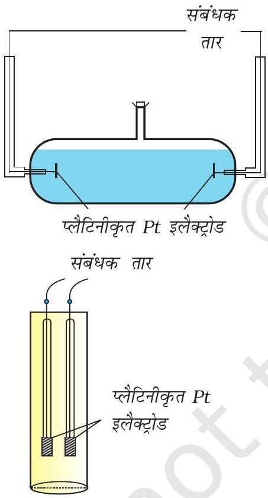
चित्र 2.4- दो अलग-अलग प्रकार के चालकता सेल

प्रयोग करके हल किया जाता है। दूसरी समस्या एक विशेष प्रकार के डिज़ाइन किए हुए पात्र का उपयोग करके हल की जाती है। इस पात्र को चालकता सेल कहते हैं। चालकता सेल कई डिज़ाइनों में उपलब्ध हैं एवं दो सरल डिज़ाइन चित्र $2.4$ में दर्शाए गए हैं।

मूलतः इसमें प्लैटिनम ब्लैक (प्लैटिनम कज्जल) से विलेपित (सूक्ष्म विभाजित धात्विक Pt को वैद्युतरासायनिक विधि द्वारा इलैक्ट्रोडों पर निक्षेपित किया जाता है) दो इलैक्ट्रोड होते हैं। इनके अनुप्रस्थ काट का क्षेत्रफल ' $A$ ' होता है और ये ' $l$ ' दूरी से पृथक होते हैं। इस प्रकार इनके बीच का विलयन ' $l$ ' लंबाई एवं ' $A$ ' अनुप्रस्थ काट के क्षेत्रफल का कॉलम होता है। विलयन के इस कॉलम का प्रतिरोध निम्नलिखित समीकरण द्वारा दिया जाता है-
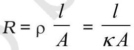

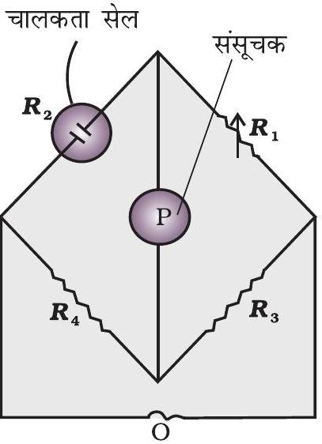
चित्र $2.5$ - वैद्युतअपघट्य के विलयन के प्रतिरोध मापन की व्यवस्था

$$
G^{*}=\frac{l}{A}=R \kappa
$$

एक बार सेल स्थिरांक का मान ज्ञात हो जाने पर हम इसका उपयोग किसी भी विलयन का प्रतिरोध या चालकता मापने में कर सकते हैं। प्रतिरोध मापन की व्यवस्था चित्र $2.5$ में दर्शाई गई है।

इसमें दो प्रतिरोध $R_{3}$ एवं $R_{4}$, एक परिवर्तनीय प्रतिरोध $R_{1}$ एवं अज्ञात प्रतिरोध $R_{2}$ वाली चालकता सेल होती है। ह्वीटस्टोन ब्रिज एक दोलित्र, O (oscillator), ( श्रव्य आवृत्ति सीमा $550$ से $5000$ चक्रण प्रति सैकण्ड वाली प्रत्यावर्ती धारा (AC) का स्रोत) से जुड़ा रहता है। P एक उपयुक्त संसूचक है (एक हेडफोन या अन्य विद्युत युक्ति) तथा जब संसूचक में कोई विद्युत धारा प्रवाहित नहीं होती तो ब्रिज संतुलित होता है। इन परिस्थितियों में-

$$
\text { अज्ञात प्रतिरोध, } R_{2}=\frac{R_{1} R_{4}}{R_{3}}
$$

सारणी 2.3-298.15 K पर KCl की चालकता एवं मोलर चालकता
| सांद्रता/मोलरता |  | चालकता |  | मोलर चालकता |  |
| :--- | :--- | :--- | :--- | :--- | :--- |
| $\mathrm{mol} \mathrm{L}^{-1}$ | $\mathrm{mol} \mathrm{m}^{-3}$ | $\mathrm{S} \mathrm{cm}^{-1}$ | $\mathrm{S} \mathrm{m}^{-1}$ | $\mathrm{S} \mathrm{cm}^{2} \mathrm{~mol}^{-1}$ | $\mathrm{S} \mathrm{m}^{2} \mathrm{~mol}^{-1}$ |
| $1.000$ | $1000$ | $0.1113$ | $11.13$ | $111.3$ | $111.3 \times 10^{-4}$ |
| $0.100$ | $100.0$ | $0.0129$ | $1.29$ | $129.0$ | $129.0 \times 10^{-4}$ |
| $0.010$ | $10.00$ | $0.00141$ | $0.141$ | $141.0$ | $141.0 \times 10^{-4}$ |

आजकल सस्ते चालकता मीटर उपलब्ध हैं जिनसे चालकता सेल में उपस्थित विलयन का चालकत्व या प्रतिरोध सीधे ही पढ़ा जा सकता है। एक बार सेल में उपस्थित विलयन का सेल स्थिरांक एवं प्रतिरोध ज्ञात होने पर विलयन की चालकता निम्नलिखित समीकरण से दी जा सकती है-

$$
\kappa=\frac{\text { सेल स्थिरांक }}{R}=\frac{\mathrm{G}^{*}}{R}
$$

एक ही विलायक में और समान ताप पर, विभिन्न वैद्युतअपघट्यों के विलयनों की चालकता में अंतर विघटन के फलस्वरूप बनने वाले आयनों के आवेश एवं आमाप तथा उनकी सांद्रता या विभव प्रवणता (Potential gradient) के अंतर्गत आयन के संचलन की सुविधा में भिन्नता के कारण होता है। अतः भौतिक रूप से एक अधिक अर्थपूर्ण राशि को परिभाषित करना आवश्यक है, जिसे मोलर चालकता (ग्राम अणुक चालकता) कहा जाता है। इसे $\Lambda_{m}$ (ग्रीक शब्द लैम्डा) से निरूपित करते हैं। यह विलयन की चालकता से निम्नलिखित समीकरण के द्वारा संबद्ध है-

$$
\text { मोलर चालकता }=\Lambda_{m}=\frac{\kappa}{\mathrm{c}}
$$

उपरोक्त समीकरण में यदि $\kappa$ को $\mathrm{S} \mathrm{m}^{-1}$ में एवं सांद्रता, c , को $\mathrm{mol} \mathrm{m}^{-3}$ में व्यक्त किया जाए तो $\Lambda_{m}$ का मात्रक $\mathrm{S} \mathrm{m}^{2} \mathrm{~mol}^{-1}$ होगा। यह ध्यान देने योग्य है कि
$1 \mathrm{~mol} \mathrm{~m}^{-3}=1000\left(\mathrm{~L} / \mathrm{m}^{3}\right) \times$ मोलरता $(\mathrm{mol} / \mathrm{L})$
अत:

$$
\Lambda_{m}\left(\mathrm{~S} \mathrm{~m}^{2} \mathrm{~mol}^{-1}\right)=\frac{\kappa\left(\mathrm{S} \mathrm{~m}^{-1}\right)}{1000\left(\mathrm{~L} \mathrm{~m}^{-3}\right) \times \text { मोलरता }\left(\mathrm{mol} \mathrm{~L}^{-1}\right)}
$$

यदि हम $\kappa$ का मात्रक $\mathrm{S} \mathrm{cm}^{-1}$ एवं सांद्रता का मात्रक $\mathrm{mol} \mathrm{cm}^{-3}$ लें तब $\ddot{E}_{m}$ का मात्रक $\mathrm{S} \mathrm{cm}^{2} \mathrm{~mol}^{-1}$ होगा। इसे निम्नलिखित समीकरण का उपयोग कर परिकलित किया जा सकता है-

$$
\Lambda_{m}\left(\mathrm{Sem}^{2} \mathrm{~mol}^{-1}\right)=\frac{\kappa\left(\mathrm{S} \mathrm{~cm}^{-1}\right) \times 1000\left(\mathrm{~cm}^{3} / \mathrm{L}\right)}{\text { मोलरता }(\mathrm{mol} / \mathrm{L})}
$$

सामान्यतः दोनों प्रकार के मात्रक प्रयुक्त किए जाते हैं। जो परस्पर निम्नलिखित समीकरण द्वारा संबद्ध हैं-

$$
\begin{aligned}
& 1 \mathrm{~S} \mathrm{~m}^{2} \mathrm{~mol}^{-1}=10^{4} \mathrm{~S} \mathrm{~cm}^{2} \mathrm{~mol}^{-1} \text { या } \\
& 1 \mathrm{~S} \mathrm{~cm}^{2} \mathrm{~mol}^{-1}=10^{-4} \mathrm{~S} \mathrm{~m}^{2} \mathrm{~mol}^{-1}
\end{aligned}
$$

उदाहरण $2.40 .1 \mathrm{~mol} \mathrm{~L}^{-1} \mathrm{KCl}$ विलयन से भरे हुए एक चालकता सेल का प्रतिरोध $100 \Omega$ है। यदि उसी सेल का प्रतिरोध $0.02 \mathrm{~mol} \mathrm{~L}^{-1} \mathrm{KCl}$ विलयन भरने पर $520 \Omega$ हो तो $0.02 \mathrm{~mol} \mathrm{~L}^{-1} \mathrm{KCl}$ विलयन की चालकता एवं मोलर चालकता परिकलित कीजिए। $0.1 \mathrm{~mol} \mathrm{~L}^{-1} \mathrm{KCl}$ विलयन की चालकता $1.29 \mathrm{~S} / \mathrm{m}$ है।

हल सेल स्थिरांक निम्नलिखित समीकरण द्वारा दिया जाता है-
सेल स्थिरांक $=G^{*}=$ चालकता × प्रतिरोध

$$
=1.29 \mathrm{~S} / \mathrm{m} \times 100 \Omega=129 \mathrm{~m}^{-1}=1.29 \mathrm{~cm}^{-1}
$$

$0.02 \mathrm{~mol} \mathrm{~L}^{-1} \mathrm{KCl}$ विलयन की चालकता = सेल स्थिरांक / प्रतिरोध

$$
=\frac{G^{*}}{R}=\frac{129 \mathrm{~m}^{-1}}{520 \Omega}=0.248 \mathrm{~S} \mathrm{~m}^{-1}
$$

सांद्रता $=0.02 \mathrm{~mol} \mathrm{~L}^{-1}=1000 \times 0.02 \mathrm{~mol} \mathrm{~m}^{-3}=20 \mathrm{~mol} \mathrm{~m}^{-3}$
मोलर चालकता $=\Lambda_{m}=\frac{\kappa}{c}=\frac{248 \times 10^{-3} \mathrm{~S} \mathrm{~m}^{-1}}{20 \mathrm{~mol} \mathrm{~m}^{-3}}=124 \times 10^{-4} \mathrm{~S} \mathrm{~m}^{2} \mathrm{~mol}^{-1}$

विकल्पतः,$\quad \kappa=\frac{1.29 \mathrm{~cm}^{-1}}{520 \Omega}=0.248 \times 10^{-2} \mathrm{~S} \mathrm{~cm}^{-1}$
तथा $\Lambda_{m}=\kappa \times 1000 \mathrm{~cm}^{3} \mathrm{~L}^{-1}$ molarity ${ }^{-1}$

$$
=\frac{0.248 \times 10^{-2} \mathrm{~S} \mathrm{~cm}^{-1} \times 1000 \mathrm{~cm}^{3} \mathrm{~L}^{-1}}{0.02 \mathrm{~mol} \mathrm{~L}^{-1}}=124 \mathrm{~S} \mathrm{~cm}^{2} \mathrm{~mol}^{-1}
$$

उदाहरण $2.50 .05 \mathrm{~mol} \mathrm{~L}^{-1} \mathrm{NaOH}$ विलयन के कॉलम का विद्युत प्रतिरोध $5.55 \times 10^{3} \mathrm{ohm}$ है। इसका व्यास $1$ cm एवं लंबाई $50$ cm है। इसकी प्रतिरोधकता, चालकता तथा मोलर चालकता का परिकलन कीजिए।

हल

$$
\begin{aligned}
& A=\pi r^{2}=3.14 \times 0.5^{2} \mathrm{~cm}^{2}=0.785 \mathrm{~cm}^{2}=0.785 \times 10^{-4} \mathrm{~m}^{2} \\
& l=50 \mathrm{~cm}=0.5 \mathrm{~m}
\end{aligned}
$$

$$
\begin{aligned}
R=\frac{\rho l}{A} \quad \text { या } \quad \rho=\frac{R A}{l} & =\frac{5.55 \times 10^{3} \Omega \times 0.785 \mathrm{~cm}^{2}}{50 \mathrm{~cm}} \\
& =87.135 \Omega \mathrm{~cm}
\end{aligned}
$$

$$
\begin{aligned}
\text { चालकता }=\kappa=\frac{1}{\rho} & =\left(\frac{1}{87.135}\right) \mathrm{S} \mathrm{~cm}^{-1} \\
& =0.01148 \mathrm{~S} \mathrm{~cm}^{-1}
\end{aligned}
$$

मोलर चालकता,

$$
\begin{aligned}
& \Lambda_{m}=\frac{\kappa \times 1000}{\mathrm{c}} \mathrm{~cm}^{3} \mathrm{~L}^{-1} \\
& =\frac{0.01148 \mathrm{~S} \mathrm{~cm}{ }^{-1} \times 1000 \mathrm{~cm}^{3} \mathrm{~L}^{-1}}{0.05 \mathrm{~mol} \mathrm{~L}^{-1}} \\
& =229.6 \mathrm{~S} \mathrm{~cm} \mathrm{~mol}^{-1}
\end{aligned}
$$

यदि हम 'cm' के स्थान पर 'm' के पदों में विभिन्न राशियों का परिकलन करना चाहें तो

$$
\begin{aligned}
\rho=\frac{R A}{l} & =\frac{5.55 \times 10^{3} \Omega \times 0.785 \times 10^{-4} \mathrm{~m}^{2}}{0.5 \mathrm{~m}} \\
& =87.135 \times 10^{-2} \Omega \mathrm{~m} \\
\kappa=\frac{1}{\rho} & =\frac{100}{87.135} \Omega \mathrm{~m} \\
& =1.148 \mathrm{~S} \mathrm{~m}^{-1}
\end{aligned}
$$

तथा

$$
\begin{aligned}
\Lambda_{m}=\frac{\kappa}{c}= & \frac{1.148 \mathrm{~S} \mathrm{~m}^{-1}}{50 \mathrm{~mol} \mathrm{~m}^{-3}} \\
& =229.6 \times 10^{-4} \mathrm{~S} \mathrm{~m}^{2} \mathrm{~mol}^{-1}
\end{aligned}
$$

### 2.4.2 सांद्रता के साथ चालकता एवं   मोलर चालकता में परिवर्तन

वैद्युतअपघट्य की सांद्रता में परिवर्तन के साथ-साथ चालकता एवं मोलर चालकता दोनों में परिवर्तन होता है। दुर्बल एवं प्रबल दोनों प्रकार के वैद्युतअपघट्यों की सांद्रता घटाने पर चालकता हमेशा घटती है। इसकी इस तथ्य से व्याख्या की जा सकती है कि तनुकरण करने पर प्रति इकाई आयतन में विद्युतधारा ले जाने वाले आयनों की संख्या घट जाती है। किसी

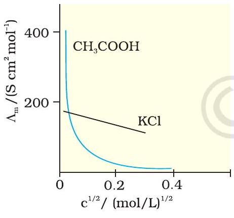
चित्र $2.6$ - जलीय विलयन में ऐसीटिक अम्ल (दुर्बल वैद्युतअपघट्य) एवं पोटैशियम क्लोराइड (प्रबल वैद्युतअपघट्य) के लिए मोलर चालकता के विपरीत $c^{1 / 2}$ का आलेख

भी सांद्रता पर विलयन की चालकता उस विलयन के इकाई आयतन का चालकत्व होता है, जिसे परस्पर इकाई दूरी पर स्थित एवं इकाई अनुप्रस्थ काट क्षेत्रफल वाले दो प्लेटिनम इलेक्ट्रोडों के मध्य रखा गया हो।

यह निम्नलिखित समीकरण से स्पष्ट है-
$G=\frac{\kappa A}{l}=\kappa$ ( $A$ एवं $l$ दोनों ही उपयुक्त इकाइयों m या cm में हैं)।
किसी दी गई सांद्रता पर एक विलयन की मोलर चालकता उस विलयन के V आयतन का चालकत्व है, जिसमें वैद्युतअपघट्य का एक मोल घुला हो तथा जो एक-दूसरे से इकाई दूरी पर स्थित, A अनुप्रस्थ काट क्षेत्रफल वाले दो इलेक्ट्रोडों के मध्य रखा गया हो। अतः

$$
\Lambda_{m}=\frac{\kappa A}{l}=\kappa
$$

चूँकि $l=1$ एवं $A=V$ (आयतन, जिसमें वैद्युतअपघट्य का एक मोल घुला है।)

$$
\Lambda_{m}=\kappa V
$$

सांद्रता घटने के साथ मोलर चालकता बढ़ती है। ऐसा इसलिए होता है क्योंकि वह कुल आयतन $(V)$ भी बढ़ जाता है जिसमें एक मोल वैद्युतअपघट्य उपस्थित हो। यह पाया गया है कि विलयन के तनुकरण पर आयतन में वृद्धि $\kappa$ में होने वाली कमी की तुलना में कहीं अधिक होती है। भौतिक रूप से इसका अर्थ यह है कि दी हुई सांद्रता पर, $\Lambda_{m}$ को इस प्रकार परिभाषित किया जा सकता है कि यह वैद्युतअपघट्य के उस विलयन के उस आयतन का चालकत्व है जिसे चालकता सेल के परस्पर इकाई दूरी पर स्थित इलैक्ट्रोडों के मध्य रखा गया है एवं जिनका अनुप्रस्थ काट क्षेत्रफल इतना बड़ा है कि वह विलयन के उस पर्याप्त आयतन को समायोजित कर सकें जिसमें वैद्युतअपघट्य का एक मोल घुला हो। जब सांद्रता शून्य की ओर पहुँचने लगती है तब मोलर चालकता सीमांत मोलर चालकता कहलाती है एवं इसे प्रतीक $E_{m}^{\ominus}$ से निरूपित किया जाता है। सांद्रता के साथ $\Lambda_{m}$ में परिवर्तन प्रबल एवं दुर्बल वैद्युतअपघट्यों में अलग-अलग होता है (चित्र 2.6)।

## प्रबल वैद्युतअपघट्य

प्रबल वैद्युतअपघट्यों के लिए, $\Lambda_{m}$ का मान तनुता के साथ धीरे-धीरे बढ़ता है एवं इसे निम्नलिखित समीकरण द्वारा निरूपित किया जा सकता है-

$$
\Lambda_{m}=\ddot{E}_{m}^{\circ}-A c^{1 / 2}
$$

यह देखा जा सकता है कि यदि $\Lambda_{m}$ को $c^{1 / 2}$ के विपरीत आरेखित किया जाए (चित्र 2.6) तो हमें, एक सीधी रेखा प्राप्त होती है जिसका अंतः खंड $\ddot{E}_{m}^{\circ}$ एवं ढाल -'A' के बराबर है। दिए गए विलायक एवं ताप पर स्थिरांक ' $A$ ' का मान वैद्युतअपघट्य के प्रकार, अर्थात् विलयन में वैद्युतअपघट्य के वियोजन से उत्पन्न धनायन एवं ऋणायन के आवेशों पर निर्भर करता है। अतः, $\mathrm{NaCl}, \mathrm{CaCl}_{2}, \mathrm{MgSO}_{4}$ क्रमशः 1-1, 2-1 एवं 2-2 वैद्युतअपघट्‌य के रूप में जाने जाते हैं। एक प्रकार के सभी वैद्युतअपघट्यों के लिए ' $A$ ' का मान समान होता है।

उदाहरण $2.6298 \mathrm{~K}$ पर विभिन्न सांद्रताओं के KCl विलयनों की मोलर चालकताएं निम्नलिखित हैं।

| $\mathbf{c} \boldsymbol{/} \mathbf{m o l ~ L}^{\boldsymbol{-} \mathbf{1}}$ | $\boldsymbol{\Lambda}_{\boldsymbol{m}} / \mathbf{S} \mathbf{~ c m}^{\mathbf{2}} \mathbf{~ m o l}^{\boldsymbol{-} \mathbf{1}}$ |
| :--- | :--- |
| $0.000198$ | $148.61$ |
| $0.000309$ | $148.29$ |
| $0.000521$ | $147.81$ |
| $0.000989$ | $147.09$ |

दर्शाइए कि $\ddot{E}_{m}$ एवं $c^{1 / 2}$ के मध्य आलेख एक सीधी रेखा है। KCl के लिए $\ddot{E}_{m}^{\circ}$ एवं A के मान ज्ञात कीजिए।

हल दी गई सांद्रताओं का वर्गमूल लेने पर हम पाते हैं

| $\boldsymbol{c}^{\mathbf{1} \boldsymbol{/} \mathbf{2}} \boldsymbol{/} \boldsymbol{(} \mathbf{m o l ~ L}^{\boldsymbol{-} \mathbf{1}} \boldsymbol{)}^{\mathbf{1} \boldsymbol{/} \mathbf{2}}$ | $\Lambda_{m} / \mathrm{S} \mathbf{~ c m}^{\mathbf{2}} \mathbf{m o l}^{\boldsymbol{-} \mathbf{1}}$ |
| :--- | :--- |
| $0.01407$ | $148.61$ |
| $0.01758$ | $148.29$ |
| $0.02283$ | $147.81$ |
| $0.03145$ | $147.09$ |

$\Lambda_{m}$ ( y -अक्ष) एवं $\mathrm{c}^{1 / 2}$ (x-अक्ष) का आलेख चित्र $2.7$ में दर्शाया गया है। यह देखा जा सकता है कि यह लगभग एक सीधी रेखा है।

अंतःखंड $\left(c^{1 / 2}=0\right)$ से हम पाते हैं कि $\Lambda_{m}^{\circ}=150.0 \mathrm{~S} \mathrm{~cm}^{2} \mathrm{~mol}^{-1}$ एवं
$A=-$ ढाल $=87.46 \mathrm{~S} \mathrm{~cm}^{2} \mathrm{~mol}^{-1} /\left(\mathrm{mol} / \mathrm{L}^{-1}\right)^{1 / 2}$.
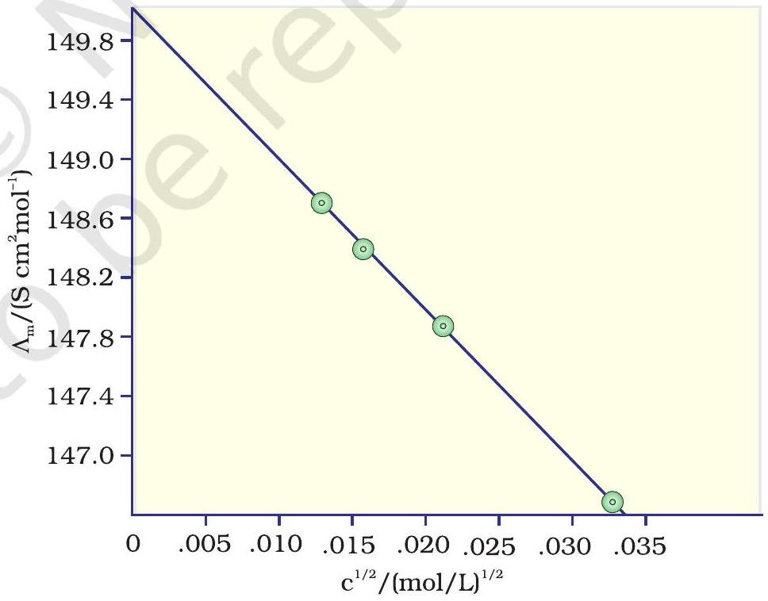

कोलराउश (Kohlraush) ने कई प्रबल वैद्युतअपघट्यों के लिए $\Lambda_{m}^{\circ}$ के मान के परीक्षण किए एवं कुछ नियमितताओं का अवलोकन किया। उन्होंने पाया कि वैद्युतअपघट्यों

NaX एवं KX के $\Lambda_{m}^{\circ}$ के मानों का अंतर किसी भी 'X' के लिए लगभग स्थिर रहता है। उदाहरण के लिए $298$ K पर-

$$
\begin{aligned}
& \Lambda_{m(\mathrm{KCl})}^{\circ}-\Lambda_{m(\mathrm{NaCl})}^{\circ}=\Lambda_{m(\mathrm{KBr})}^{\circ}-\Lambda_{m(\mathrm{NaBr})}^{\circ} \\
& =\Lambda_{m(\mathrm{KI})}^{\circ}-\Lambda_{m(\mathrm{NaI})}^{\circ} \simeq 23.4 \mathrm{~S} \mathrm{~cm}^{2} \mathrm{~mol}^{-1}
\end{aligned}
$$

तथा इसी प्रकार पाया गया कि-

$$
\Lambda_{m(\mathrm{NaBr})}^{\circ}-\Lambda_{m(\mathrm{NaCl})}^{\circ}=\Lambda_{m(\mathrm{KBr})}^{\circ}-\Lambda_{m(\mathrm{KCl})}^{\circ} \simeq 1.8 \mathrm{~S} \mathrm{~cm}^{2} \mathrm{~mol}^{-1}
$$

उपरोक्त प्रेक्षणों के आधार पर उन्होंने आयनों के स्वतंत्र अभिगमन का कोलराउश नियम दिया। कोलराउश के इस नियम के अनुसार एक वैद्युतअपघट्य की सीमांत मोलर चालकता को उसके धनायन एवं ऋणायन के अलग-अलग योगदान के योग के बराबर निरूपित किया जा सकता है। इस प्रकार, यदि $\lambda^{\circ}{ }_{N a}{ }^{+}$एवं $\lambda^{\circ}{ }_{C l}{ }^{-}$क्रमशः सोडियम एवं क्लोराइड आयनों की सीमांत मोलर चालकताएं हों तो सोडियम क्लोराइड की सीमांत मोलर चालकता निम्नलिखित समीकरण द्वारा दी जा सकती है-

$$
\Lambda_{m(\mathrm{NaCl})}^{\circ}=\lambda^{0}{ }_{\mathrm{Na}^{+}}+\lambda^{0}{ }_{\mathrm{Cl}^{-}}
$$

व्यापक रूप में यदि एक वैद्युतअपघट्य वियोजन पर $v_{+}$धनायन एवं $v_{-}$ॠणायन देता है तब इसकी सीमान्त मोलर चालकता को निम्नलिखित समीकरण द्वारा दिया जा सकता है-

$$
\Lambda_{m}^{\circ}=v_{+} \lambda_{+}^{0}+v_{-} \lambda_{-}^{0}
$$

यहाँ $\lambda_{+}^{0}$ एवं $\lambda_{-}^{0}$ क्रमशः धनायन एवं ऋणायन की सीमान्त मोलर चालकताएं हैं। $298$ K पर कुछ धनायनों एवं ऋणायनों के $\lambda^{0}$ के मान सारणी $2.4$ में दिए गए हैं।

सारणी 2.4-298 K पर कुछ आयनों की जल में सीमान्त मोलर चालकताएं
| आयन | $\boldsymbol{\lambda}^{\boldsymbol{0}} \boldsymbol{/} \boldsymbol{(} \mathbf{S ~ c m}^{\mathbf{2}} \mathbf{m o l}^{\boldsymbol{-} \mathbf{1}} \boldsymbol{)}$ | आयन | $\boldsymbol{\lambda}^{\boldsymbol{0}} \boldsymbol{/} \boldsymbol{(} \mathbf{S ~ c m}^{\mathbf{2}} \mathbf{~ m o l}^{\boldsymbol{-} \mathbf{1}} \boldsymbol{)}$ |
| :--- | :--- | :--- | :--- |
| $\mathrm{H}^{+}$ | $349.6$ | $\mathrm{OH}^{-}$ | $199.1$ |
| $\mathrm{Na}^{+}$ | $50.1$ | $\mathrm{Cl}^{-}$ | $76.3$ |
| $\mathrm{K}^{+}$ | $73.5$ | $\mathrm{Br}^{-}$ | $78.1$ |
| $\mathrm{Ca}^{2+}$ | $119.0$ | $\mathrm{CH}_{3} \mathrm{COO}^{-}$ | $40.9$ |
| $\mathrm{Mg}^{2+}$ | $106.0$ | $\mathrm{SO}_{4}^{2-}$ | $160.0$ |

## दुर्बल वैद्युतअपघट्य

ऐसीटिक अम्ल जैसे दुर्बल वैद्युतअपघट्य उच्च सांद्रता पर अल्प वियोजित होते हैं, अतः ऐसे वैद्युतअपघट्यों के $\Lambda_{m}$ में तनुता के साथ परिवर्तन, वियोजन मात्रा में वृद्धि के कारण होता है परिणामस्वरूप एक मोल वैद्युतअपघट्य वाले विलयन के कुल आयतन में आयनों की संख्या बढ़ती है। इन प्रकरणों में, विशेषतया अल्प सांद्रता के समीप तनुकरण पर $\Lambda_{m}$ तेज़ी से बढ़ता है (चित्र 2.6)। अतः $\Lambda_{m}^{\circ}$ का मान $\Lambda_{m}$ के शून्य सांद्रता तक बहिर्वेशन (extrapolation) द्वारा प्राप्त नहीं किया जा सकता। अनंत तनुता पर (अर्थात् सांद्रता $c \rightarrow 0$ ) वैद्युतअपघट्य पूर्णतया वियोजित हो जाता है $(\alpha=1)$ परंतु इतनी कम सांद्रता पर विलयन की चालकता इतनी कम हो जाती है कि इसके वास्तविक मान को नहीं मापा जा सकता। अतः दुर्बल

वैद्युतअपघट्यों के लिए $\Lambda_{m}^{\circ}$ कोलराउश का आयनों के लिए स्वतंत्र अभिगमन नियम का उपयोग कर प्राप्त किया जा सकता है (उदाहरण 2.8)। किसी भी सांद्रता $c$ पर यदि वियोजन की मात्रा $\alpha$ हो तो इसे सांद्रता $c$ पर मोलर चालकता $\Lambda_{m}$ एवं सीमांत मोलर चालकता $\Lambda_{m}^{\circ}$ के अनुपात के सन्निकट माना जा सकता है। इस प्रकार-

$$
\alpha=\frac{\Lambda_{m}}{\Lambda_{m}}
$$

ऐसीटिक अम्ल जैसे दुर्बल वैद्युतअपघट्य के लिए

$$
K_{\mathrm{a}}=\frac{c \alpha^{2}}{(1-\alpha)}=\frac{c \Lambda_{m}^{2}}{\Lambda_{m}^{\mathrm{o}^{2}} 1-\frac{\Lambda_{m}}{\Lambda_{m}^{\mathrm{o}}}}=\frac{c \Lambda_{m}^{2}}{\Lambda_{m}^{\mathrm{o}}\left(\Lambda_{m}^{\mathrm{o}}-\Lambda_{m}\right)}
$$

## कोलराउश नियम के अनुप्रयोग

आयनों के स्वतंत्र अभिगमन के कोलराउश नियम का उपयोग कर, किसी भी वैद्युतअपघट्य के आयनों के $\lambda^{\mathrm{o}}$ मानों से $\Lambda_{m}^{\circ}$ का परिकलन करना संभव है। इसके अतिरिक्त यदि हमे दी गई सांद्रता $c$ पर $\Lambda_{m}$ एवं $\Lambda_{m}^{\circ}$ के मान ज्ञात हों तो ऐसीटिक अम्ल जैसे दुर्बल वैद्युतअपघट्यों के लिए इसका वियोजन स्थिरांक ज्ञात करना भी संभव है।

उदाहरण $2.7$ सारणी $2.4$ में दिए गए आँकड़ों की सहायता से $\mathrm{CaCl}_{2}$ एवं $\mathrm{MgSO}_{4}$ के $\Lambda_{\boldsymbol{m} n}^{\circ}$ का परिकलन कीजिए।

हल कोलराउश नियम से हम जानते हैं कि-

$$
\begin{aligned}
& \Lambda_{m\left(\mathrm{CaCl}_{2}\right)}^{\mathrm{o}}=\lambda_{\mathrm{Ca}^{2+}}^{\mathrm{o}}+2 \lambda_{\mathrm{Cl}^{-}}^{\mathrm{o}}=119.0 \mathrm{~S} \mathrm{~cm}^{2} \mathrm{~mol}^{-1}+2(76.3) \mathrm{S} \mathrm{~cm}^{2} \mathrm{~mol}^{-1} \\
& =(119.0+152.6) \mathrm{S} \mathrm{~cm}^{2} \mathrm{~mol}^{-1} \\
& =271.6 \mathrm{~S} \mathrm{~cm}^{2} \mathrm{~mol}^{-1} \\
& \Lambda_{m\left(\mathrm{MgSO}_{4}\right)}^{o}=\lambda_{\mathrm{Mg}^{2+}}^{\circ}+\lambda_{\mathrm{SO}_{4}^{2-}}^{\circ}=106.0 \mathrm{~S} \mathrm{~cm}^{2} \mathrm{~mol}^{-1}+160.0 \mathrm{~S} \mathrm{~cm}^{2} \mathrm{~mol}^{-1} \\
& =266.0 \mathrm{~S} \mathrm{~cm}^{2} \mathrm{~mol}^{-1}
\end{aligned}
$$

उदाहरण 2.8 NaCl, HCl एवं NaAc के लिए $\Lambda_{m n}^{\circ}$ क्रमशः 126.4, $425.9$ एवं $91.0 \mathrm{~S} \mathrm{~cm}^{2} \mathrm{~mol}^{-1}$ हैं। HAc के लिए $\Lambda^{0}$ का परिकलन कीजिए।

हल

$$
\begin{aligned}
& \Lambda_{m(\mathrm{HAc})}^{\mathrm{o}}=\lambda_{\mathrm{H}^{+}}^{\mathrm{o}}+\lambda_{\mathrm{Ac}^{-}}^{\mathrm{o}}=\lambda_{\mathrm{H}^{+}}^{\mathrm{o}}+\lambda_{\mathrm{Cl}^{-}}^{\mathrm{o}}+\lambda_{\mathrm{Ac}^{-}}^{\mathrm{o}}+\lambda_{\mathrm{Na}^{+}}^{\mathrm{o}}-\lambda_{\mathrm{Cl}^{-}}^{\mathrm{o}}-\lambda_{\mathrm{Na}^{+}}^{\mathrm{o}} \\
& =\Lambda_{m(\mathrm{HCl})}^{\mathrm{o}}+\Lambda_{m(\mathrm{NaAc})}^{\mathrm{o}}-\Lambda_{m(\mathrm{NaCl})}^{\mathrm{o}} \\
& =(425.9+91.0-126.4) \mathrm{S} \mathrm{~cm}^{2} \mathrm{~mol}^{-1} \\
& =390.5 \mathrm{~S} \mathrm{~cm}^{2} \mathrm{~mol}^{-1} .
\end{aligned}
$$

उदाहरण $2.90 .001028 \mathrm{~mol} \mathrm{~L}^{-1}$ ऐसीटिक अम्ल की चालकता $4.95 \times 10^{-5} \mathrm{~S} \mathrm{~cm}^{-1}$ है। यदि ऐसीटिक अम्ल के लिए $\ddot{E}_{m}^{\circ}$ का मान $390.5 \mathrm{~S} \mathrm{~cm}^{2} \mathrm{~mol}^{-1}$ है तो इसके वियोजन स्थिरांक का परिकलन कीजिए।

हल

$$
\begin{aligned}
& \Lambda_{m}=\frac{\kappa}{c}=\frac{4.95 \times 10^{-5} \mathrm{~S} \mathrm{~cm}^{-1}}{0.001028 \mathrm{~mol} \mathrm{~L}^{-1}} \times \frac{1000 \mathrm{~cm}^{3}}{\mathrm{~L}}=48.15 \mathrm{Scm}^{2} \mathrm{~mol}^{-1} \\
& \alpha=\frac{\Lambda_{m}}{\Lambda_{m}^{\mathrm{o}}}=\frac{48.15 \mathrm{~S} \mathrm{~cm}^{2} \mathrm{~mol}^{-1}}{390.5 \mathrm{~S} \mathrm{~cm}^{2} \mathrm{~mol}^{-1}}=0.1233 \\
& K=\frac{\mathrm{c} \alpha^{2}}{(1-\alpha)}=\frac{0.001028 \mathrm{~mol} \mathrm{~L}^{-1} \times(0.1233)^{2}}{1-0.1233}=1.78 \times 10^{-5} \mathrm{~mol} \mathrm{~L}^{-1}
\end{aligned}
$$

## पाठ्यनिहित प्रश्न

$2.7$ किसी विलयन की चालकता तनुता के साथ क्यों घटती है?
$2.8$ जल की $\Lambda_{m}^{\circ}$ ज्ञात करने का एक तरीका बताइए।
$2.90 .025 \mathrm{~mol} \mathrm{~L}^{-1}$ मेथेनॉइक अम्ल की चालकता $46.1 \mathrm{~S} \mathrm{~cm}^{2} \mathrm{~mol}^{-1}$ है। इसकी वियोजन मात्रा एवं वियोजन स्थिरांक का परिकलन कीजिए। दिया गया है कि $\lambda^{0}\left(\mathrm{H}^{+}\right)=349.6 \mathrm{~S} \mathrm{~cm}^{2} \mathrm{~mol}^{-1}$ एवं $\lambda^{0}\left(\mathrm{HCOO}^{-}\right)=54.6$ $\mathrm{S} \mathrm{cm}^{2} \mathrm{~mol}^{-1}$ ।

## $2.5$ वैद्युतअपघटनी सेल एवं वैद्युतअपघटन

वैद्युतअपघटनी सेल में रासायनिक अभिक्रिया करने के लिए विभव का बाह्य स्रोत प्रयुक्त किया जाता है। वैद्युतरासायनिक प्रक्रम प्रयोगशालाओं एवं रासायनिक उद्योगों में बहुत महत्वपूर्ण होते हैं। सरलतम वैद्युतअपघटनी सेलों में से एक में कॉपर सल्फेट के जलीय विलयन में दो कॉपर इलैक्ट्रोड निमज्जित होते हैं। यदि दोनों इलैक्ट्रोडों पर DC विभव लगाया जाए, तो $\mathrm{Cu}^{2+}$ आयन कैथोड (ऋण आवेशित) पर विसर्जित होते हैं एवं निम्नलिखित अभिक्रिया घटित होती है-

$$
\mathrm{Cu}^{2+}(\mathrm{aq})+2 \mathrm{e}^{-} \rightarrow \mathrm{Cu}(\mathrm{~s})
$$

कॉपर धातु कैथोड पर निक्षेपित होती है। ऐनोड पर कॉपर $\mathrm{Cu}^{2+}$ आयनों में, निम्नलिखित अभिक्रिया द्वारा परिवर्तित होता है-

$$
\mathrm{Cu}(\mathrm{~s}) \rightarrow \mathrm{Cu}^{2+}(\mathrm{s})+2 \mathrm{e}^{-}
$$

इस प्रकार कॉपर (ताँबा) ऐनोड से विलीन (ऑक्सीकृत) होता है एवं कैथोड पर निक्षेपित (अपचित) होता है। यह उस औद्योगिक प्रक्रम का आधार है जिसमें अशुद्ध कॉपर को उच्च शुद्धता के कॉपर में बदला जाता है। अशुद्ध कॉपर को ऐनोड बनाया जाता है जो कि

धारा प्रवाहित करने पर विलीन होता है एवं शुद्ध कॉपर कैथोड पर निक्षेपित होता है। बहुत-सी धातुएं जैसे $\mathrm{Na}, \mathrm{Mg}, \mathrm{Al}$ आदि जिनके लिए उपयुक्त रासायनिक अपचायक उपलब्ध नहीं होता, वृहद स्तर पर संगत धनायनों के वैद्युतरासायनिक अपचयन द्वारा उत्पादित की जाती हैं।

सोडियम एवं मैग्नीशियम धातुओं को उनके संगलित क्लोराइडों के वैद्युतअपघटन द्वारा उत्पादित किया जाता है एवं एलुमिनियम को क्रायोलाइट की उपस्थिति में ऐलुमिनियम ऑक्साइड के वैद्युतअपघटन द्वारा उत्पादित किया जाता है।

## वैद्युतअपघटन के मात्रात्मक पक्ष

माइकल फैराडे प्रथम वैज्ञानिक थे जिन्होंने वैद्युतअपघटन के मात्रात्मक पक्षों का वर्णन किया। इन्हें अब उपरोक्त चर्चा के आधार पर भी समझा जा सकता है।

फैराडे के वैद्युतअपघटन के नियम- विलयनों एवं वैद्युतअपघट्यों के गलितों के वैद्युतअपघटन पर विस्तीर्ण अन्वेषणों के पश्चात् फैराडे ने 1833-34 में अपने परिणामों को निम्नलिखित, सर्वज्ञात फैराडे के वैद्युतअपघटन के दो नियमों के रूप में प्रकाशित किया।

(i) प्रथम नियम- विद्युत धारा द्वारा वैद्युतअपघटन में रासायनिक विघटन की मात्रा वैद्युतअपघट्य (विलयन या गलित) में प्रवाहित विद्युत धारा की मात्रा के समानुपाती होती है।
(ii) द्वितीय नियम- विभिन्न वैद्युतअपघटनी विलयनों में विद्युत की समान मात्रा प्रवाहित करने पर मुक्त विभिन्न पदार्थों की मात्राएं उनके रासायनिक तुल्यांकी द्रव्यमान (धातु का परमाण्विक द्रव्यमान ÷ धनायन को अपचयित करने में प्रयुक्त इलेक्ट्रॉनों की संख्या) के समानुपाती होती है। फैराडे के समय में स्थिर वैद्युत धारा के स्रोत उपलब्ध नहीं थे। एक सामान्य प्रचलित पद्धति यह थी कि एक कूलॉममापी (एक मानक वैद्युतअपघटती सेल) का प्रयोग कर निक्षेपित या उपमुक्त धातु (सामान्यतः सिल्वर या कॉपर) की मात्रा से विद्युत की मात्रा पता लगाई जाती थी परंतु कूलॉममापी आजकल अप्रचलित हो गये हैं तथा हमारे पास अब स्थिर धारा (I) के स्रोत उपलब्ध हैं, एवं प्रवाहित विद्युत् की मात्रा की गणना निम्नलिखित संबंध से की जा सकती है-
$$
Q=I t
$$

जहाँ $Q$ कूलॉम में है, जबकि $I$ ऐम्पियर में एवं $t$ सेकंड में है।
ऑक्सीकरण या अपचयन के लिए आवश्यक विद्युत (या आवेश) की मात्रा इलैक्ट्रोड अभिक्रिया की स्टॉइकियोमीट्री पर निर्भर करती है। उदाहरणार्थ निम्न अभिक्रिया में-

$$
\mathrm{Ag}^{+}(\mathrm{aq})+\mathrm{e}^{-} \rightarrow \mathrm{Ag}(\mathrm{~s})
$$

सिल्वर आयनों के एक मोल के अपचयन के लिए एक मोल इलेक्ट्रॉनों की आवश्यकता होती है। हम जानते हैं कि एक इलेक्ट्रॉन पर आवेश $1.6021 \times 10^{-19} \mathrm{C}$ के बराबर होता है। अतः एक मोल इलेक्ट्रॉनों पर आवेश होगा-

$$
\begin{aligned}
N_{A} \times 1.6021 \times 10^{-19} \mathrm{C} & =6.02 \times 10^{23} \mathrm{~mol}^{-1} \times 1.6021 \times 10^{-19} \mathrm{C} \\
& =96487 \mathrm{C} \mathrm{~mol}^{-1}
\end{aligned}
$$

विद्युत की इस मात्रा को फैराडे कहते हैं एवं इसे प्रतीक $\mathbf{F}$ से निरूपित करते हैं। सन्निकट गणना के लिए हम $1 \mathrm{~F}$ को $96500 \mathrm{Cmol}^{-1}$ के बराबर लेते हैं।

निम्नलिखित इलैक्ट्रोड अभिक्रियाओं-

$$
\begin{aligned}
& \mathrm{Mg}^{2+}(l)+2 \mathrm{e}^{-} \longrightarrow \mathrm{Mg}(\mathrm{~s}) \\
& \mathrm{Al}^{3+}(l)+3 \mathrm{e}^{-} \longrightarrow \mathrm{Al}(\mathrm{~s})
\end{aligned}
$$

के लिए यह स्पष्ट है कि एक मोल $\mathrm{Mg}^{2+}$ एवं $\mathrm{Al}^{3+}$ के लिए हमें क्रमशः $2$ मोल इलेक्ट्रॉन $(2 \mathrm{~F})$ व $3$ मोल इलेक्ट्रॉन $(3 \mathrm{~F})$ की आवश्यकता होगी। वैद्युतअपघटनी सेल में प्रवाहित आवेश विद्युत धारा (ऐम्पियर) एवं समय (सेकंड) के गुणनफल के बराबर होता है। धातुओं के व्यावसायिक उत्पादन में लगभग $50,000$ ऐम्पियर तक की उच्च धारा प्रयोग में लाई जाती है जो लगभग 0.518F प्रति सेकंड के बराबर होती है।

उदाहरण $2.10 \mathrm{CuSO}_{4}$ के विलयन को $1.5$ ऐम्पियर की धारा से $10$ मिनट तक वैद्युतअपघटित किया गया। कैथोड पर निक्षेपित कॉपर का द्रव्यमान क्या होगा?

हल $\mathrm{t}=600 \mathrm{~s}$
आवेश = धारा × समय $=1.5 \mathrm{~A} \times 600 \mathrm{~s}=900 \mathrm{C}$
अभिक्रिया-
$\mathrm{Cu}^{2+}(\mathrm{aq})+2 \mathrm{e}^{-} \longrightarrow \mathrm{Cu}(\mathrm{s})$ के अनुसार, एक मोल या $63 \mathrm{~g} \mathrm{Cu}$ को निक्षेपित करने के लिए हमें $2 F$ या $2 \times 96487 \mathrm{C}$ आवेश की आवश्यकता होगी।
अतः $900 \mathrm{C}$ द्वारा निक्षेपित Cu का द्रव्यमान
$=\left(63 \mathrm{~g} \mathrm{~mol}^{-1} \times 900 \mathrm{C}\right) /\left(2 \times 96487 \mathrm{C} \mathrm{mol}^{-1}\right)=0.2938 \mathrm{~g}$

### 2.5.1 वैद्युतअपघटन के उत्पाद

वैद्युतअपघटन के उत्पाद अपघटित होने वाले पदार्थों की अवस्था तथा प्रयुक्त इलैक्ट्रोडों के प्रकार पर निर्भर करते हैं। यदि इलैक्ट्रोड अक्रिय हो (उदाहरण के लिए Pt अथवा Au) तो यह अभिक्रिया में हिस्सा नहीं लेता एवं यह केवल इलेक्ट्रॉनों के स्रोत अथवा सिंक का कार्य करता है। दूसरी ओर यदि इलैक्ट्रोड अभिक्रियाशील हो तो यह इलैक्ट्रोड अभिक्रिया में हिस्सा लेता है। इस प्रकार अभिक्रियाशील एवं अक्रिय इलैक्ट्रोडों के लिए वैद्युतअपघटन के उत्पाद अलग-अलग हो सकते हैं। वैद्युतअपघटन के उत्पाद वैद्युतअपघटनी सेल में उपस्थित विभिन्न ऑक्सीकारक एवं अपचायक स्पीशीज़ एवं उनके मानक इलैक्ट्रोड विभवों पर निर्भर करते हैं। इसके अतिरिक्त कुछ वैद्युत रासायनिक प्रक्रम यद्यपि संभव होते हैं, परंतु गतिकीय रूप में इतने धीमे होते हैं कि ये निम्न विभव पर घटित होते प्रतीत नहीं होते एवं ऐसी परिस्थिति में अतिरिक्त विभव (जिसे अधिविभव कहते हैं) लगाना पड़ता है; जो कि इन प्रक्रमों को और कठिन बना देता है।

उदाहरणार्थ यदि हम गलित NaCl का प्रयोग करें तो वैद्युतअपघटन के उत्पाद सोडियम धातु एवं क्लोरीन गैस होंगे। यहाँ हमारे पास केवल एक धनायन ( $\mathrm{Na}^{+}$) है जो कैथोड पर अपचित $\left(\mathrm{Na}^{+}+\mathrm{e}^{-} \rightarrow \mathrm{Na}\right)$ होता है एवं एक ऋणायन $\left(\mathrm{Cl}^{-}\right)$है जो ऐनोड पर ऑक्सीकृत $\left(\mathrm{Cl}^{-} \rightarrow 1 / 2 \mathrm{Cl}_{2}+\mathrm{e}^{-}\right)$होता है। सोडियम क्लोराइड के जलीय विलयन के वैद्युतअपघटन के दौरान $\mathrm{NaOH}, \mathrm{Cl}_{2}$ एवं $\mathrm{H}_{2}$ उत्पाद बनते हैं। इसमें $\mathrm{Na}^{+}$एवं $\mathrm{Cl}^{-}$के अतिरिक्त $\mathrm{H}^{+}$एवं $\mathrm{OH}^{-}$आयन एवं विलायक अणु $\mathrm{H}_{2} \mathrm{O}$ भी उपस्थित होते हैं।

कैथोड पर निम्नलिखित अभिक्रियाओं के मध्य अपचयन के लिए स्पर्धा होती है-

$$
\begin{array}{ll}
\mathrm{Na}^{+}(\mathrm{aq})+\mathrm{e}^{-} \rightarrow \mathrm{Na}(\mathrm{~s}) & E_{(\text {सेल) }}^{\ominus}=-2.71 \mathrm{~V} \\
\mathrm{H}^{+}(\mathrm{aq})+\mathrm{e}^{-} \rightarrow \frac{1}{2} \mathrm{H}_{2}(\mathrm{~g}) & E_{(\text {सेल) }}^{\ominus}=0.00 \mathrm{~V}
\end{array}
$$

कैथोड पर अधिक $E^{\ominus}$ मान वाली अभिक्रिया को वरीयता प्राप्त होती है, अतः कैथोड पर निम्नलिखित अभिक्रिया होती है-

$$
\mathrm{H}^{+}(\mathrm{aq})+\mathrm{e}^{-} \rightarrow \frac{1}{2} \mathrm{H}_{2}(\mathrm{~g})
$$

परंतु $\mathrm{H}_{2} \mathrm{O}$ के वियोजन द्वारा $\mathrm{H}^{+}(\mathrm{aq})$ उत्पन्न होता है, यानी कि-

$$
\mathrm{H}_{2} \mathrm{O}(l) \rightarrow \mathrm{H}^{+}(\mathrm{aq})+\mathrm{OH}^{-}(\mathrm{aq})
$$

अतः कैथोड पर नेट अभिक्रिया (2.33) एवं (2.34) के योग के रूप में लिखी जा सकती है। इसलिए-

$$
\mathrm{H}_{2} \mathrm{O}(l)+\mathrm{e}^{-} \rightarrow \frac{1}{2} \mathrm{H}_{2}(\mathrm{~g})+\mathrm{OH}^{-}
$$

ऐनोड पर निम्नलिखित ऑक्सीकरण अभिक्रियाएं संभव हैं-

$$
\begin{array}{ll}
\mathrm{Cl}^{-}(\mathrm{aq}) \rightarrow \frac{1}{2} \mathrm{Cl}_{2}(\mathrm{~g})+\mathrm{e}^{-} & E_{(\text {सेल) }}^{\ominus}=1.36 \mathrm{~V} \\
2 \mathrm{H}_{2} \mathrm{O}(l) \rightarrow \mathrm{O}_{2}(\mathrm{~g})+4 \mathrm{H}^{+}(\mathrm{aq})+4 \mathrm{e}^{-} & E_{(\text {सेल) }}^{\ominus}=1.23 \mathrm{~V}
\end{array}
$$

ऐनोड पर कम $E^{\ominus}$ वाली अभिक्रिया को वरीयता प्राप्त होती है इसलिए जल के ऑक्सीकरण को $\mathrm{Cl}^{-}(\mathrm{aq})$ के ऑक्सीकरण की तुलना में वरीयता मिलनी चाहिए। परंतु ऑक्सीजन की अधिविभव के कारण अभिक्रिया (2.36) को वरीयता प्राप्त होती है। अतः समग्र अभिक्रिया निम्न प्रकार से संक्षेपित की जा सकती है-
$\mathrm{NaCl}(\mathrm{aq}) \quad \mathrm{H}_{2} \mathrm{O} \rightarrow \mathrm{Na}^{+}(\mathrm{aq})+\mathrm{Cl}^{-}(\mathrm{aq})$
कैथोड पर- $\mathrm{H}_{2} \mathrm{O}(l)+\mathrm{e}^{-} \rightarrow \frac{1}{2} \mathrm{H}_{2}(\mathrm{~g})+\mathrm{OH}^{-}(\mathrm{aq})$
ऐनोड पर- $\mathrm{Cl}^{-}(\mathrm{aq}) \rightarrow \frac{1}{2} \mathrm{Cl}_{2}(\mathrm{~g})+\mathrm{e}^{-}$
समग्र अभिक्रिया-

$$
\mathrm{NaCl}(\mathrm{aq})+\mathrm{H}_{2} \mathrm{O}(l) \rightarrow \mathrm{Na}^{+}(\mathrm{aq})+\mathrm{OH}^{-}(\mathrm{aq})+\frac{1}{2} \mathrm{H}_{2}(\mathrm{~g})+\frac{1}{2} \mathrm{Cl}_{2}(\mathrm{~g})
$$

सांद्रता प्रभावों को समाहित करने के लिए मानक इलैक्ट्रोड विभवों के स्थान पर नेर्न्स्ट समीकरण (समीकरण 2.8) में दिए गए इलैक्ट्रोड विभव प्रतिस्थापित किए जाते हैं। सल्फ्यूरिक अम्ल के वैद्युतअपघटन में ऐनोड पर निम्नलिखित अभिक्रियाएं संभावित हैं।

$$
\begin{array}{ll}
2 \mathrm{H}_{2} \mathrm{O}(\mathrm{l}) \rightarrow \mathrm{O}_{2}(\mathrm{~g})+4 \mathrm{H}^{+}(\mathrm{aq})+4 \mathrm{e}^{-} & E_{(\text {सेल })}^{\ominus}=+1.23 \mathrm{~V}, \\
2 \mathrm{SO}_{4}{ }^{2-}(\mathrm{aq}) \rightarrow \mathrm{S}_{2} \mathrm{O}_{8}{ }^{2-}(\mathrm{aq})+2 \mathrm{e}^{-} & E_{(\text {सेल })}^{\ominus}=1.96 \mathrm{~V}
\end{array}
$$

तनु सल्फ्यूरिक अम्ल में अभिक्रिया (2.38) को वरीयता प्राप्त होती है परंतु $\mathrm{H}_{2} \mathrm{SO}_{4}$ की उच्च सांद्रता पर अभिक्रिया (2.39) को वरीयता प्राप्त होती है।

## पाठ्यनिहित प्रश्न

$2.10$ यदि एक धात्विक तार में $0.5$ ऐम्पियर की धारा $2$ घंटों के लिए प्रवाहित होती है तो तार में से कितने इलेक्ट्रॉन प्रवाहित होंगे?
$2.11$ उन धातुओं की एक सूची बनाइए जिनका वैद्युतअपघटनी निष्कर्षण होता है।
$2.12$ निम्नलिखित अभिक्रिया में $\mathrm{Cr}_{2} \mathrm{O}_{7}{ }^{2-}$ आयनों के एक मोल के अपचयन के लिए कूलॉम में विद्युत् की कितनी मात्रा की आवश्यकता होगी?
$$
\mathrm{Cr}_{2} \mathrm{O}_{7}^{2-}+14 \mathrm{H}^{+}+6 \mathrm{e}^{-} \rightarrow 2 \mathrm{Cr}^{3+}+7 \mathrm{H}_{2} \mathrm{O}
$$

## $2.6$ बैटरियाँ

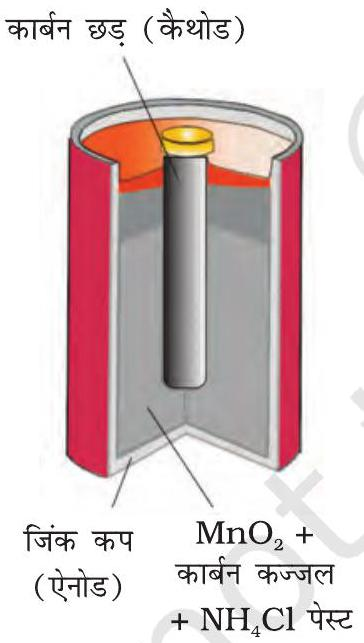
चित्र $2.8$ - एक व्यावसायिक शुष्क सेल ज़िंक के पात्र में ग्रैफाइट कैथोड के साथ, जिसमें ज़िंक पात्र ऐनोड का कार्य करता है।

कोई भी बैटरी (वास्तव में इसमें एक या एक से अधिक सेल श्रेणीबद्ध रहते हैं) या सेल जिसे हम विद्युत के स्रोत के रूप में प्रयोग में लाते हैं, मूलतः एक गैल्वेनी सेल है जो रेडॉक्स अभिक्रिया की रासायनिक ऊर्जा को विद्युत ऊर्जा में बदल देती है। किंतु बैटरी के प्रायोगिक उपयोग के लिए इसे हल्की तथा सुसंबद्ध होना चाहिए एवं प्रयोग में लाते समय इसकी वोल्टता में अधिक परिवर्तन नहीं होना चाहिए। बैटरियाँ मुख्यतः दो प्रकार की होती हैं- प्राथमिक बैटरियाँ एवं संचायक बैटरियाँ।

प्राथमिक बैटरियों में अभिक्रिया केवल एक बार होती है तथा कुछ समय तक प्रयोग के बाद बैटरी निष्क्रिय हो जाती है एवं पुन: प्रयोग में नहीं लाई जा सकती। इसका सबसे चिर-परिचित उदाहरण शुष्क सेल है जिसे इसके आविष्कारक के नाम पर लैक्लांशे सेल के नाम से जाना जाता है। ये सामान्य रूप में ट्रांजिस्टरों एवं घड़ियों में प्रयोग में लाई जाती हैं। इस सेल में ज़िंक का एक पात्र होता है जो ऐनोड का कार्य भी करता है तथा कार्बन (ग्रैफाइट) की छड़ जो चारों ओर से चूर्णित मैंगनीजडाईऑक्साइड तथा कार्बन से घिरी रहती है, कैथोड का कार्य करती है (चित्र 2.8)। इलैक्ट्रोडों के बीच का स्थान अमोनियम क्लोराइड $\left(\mathrm{NH}_{4} \mathrm{Cl}\right)$ एवं ज़िंक क्लोराइड $\left(\mathrm{ZnCl}_{2}\right)$ के नम पेस्ट से भरा रहता है। इलैक्ट्रोड अभिक्रियाएं जटिल हैं परंतु इन्हें सन्निकट रूप से निम्न प्रकार से लिखा जा सकता है-

ऐनोड- $\mathrm{Zn}(\mathrm{s}) \longrightarrow \mathrm{Zn}^{2+}+2 \mathrm{e}^{-}$
कैथोड- $\mathrm{MnO}_{2}+\mathrm{NH}_{4}{ }^{+}+\mathrm{e}^{-} \longrightarrow \mathrm{MnO}(\mathrm{OH})+\mathrm{NH}_{3}$
कैथोड की अभिक्रिया में मैंगनीज + $4$ से + $3$ ऑक्सीकरण अवस्था में अपचित हो जाता है। अभिक्रिया में उत्पन्न अमोनिया $\mathrm{Zn}^{2+}$ के साथ संकुल $\left[\mathrm{Zn}\left(\mathrm{NH}_{3}\right)_{4}\right]^{2+}$ बनाती है। सेल का विभव लगभग 1.5 V होता है।

मर्क्यूरी सेल श्रवण यंत्र, घड़ियों आदि जैसी विद्युत् की कम मात्रा की आवश्यकता वाली युक्तियों के लिए उपयुक्त होती है (चित्र 2.9)। इसमें जिंक-मर्क्यूरी अमलगम ऐनोड का तथा

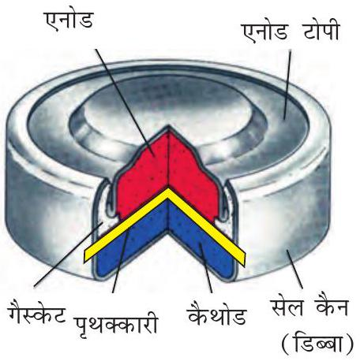
चित्र $2.9$ - सामान्यतः प्रयुक्त मर्क्यूरी सेल, जिंक अपचायक तथा मर्क्यूरी (II) ऑक्साइड ऑक्सीकारक हैं।

### 2.6.2 संचायक बैटरियाँ ( Secondary Batteries )

HgO एवं कार्बन का पेस्ट कैथोड का कार्य करता है। KOH एवं ZnO का पेस्ट वैद्युतअपघट्य होता है। सेल की इलैक्ट्रोड अभिक्रियाएं नीचे दी गई हैं-

ऐनोड- $\mathrm{Zn}(\mathrm{Hg})+2 \mathrm{OH}^{-} \longrightarrow \mathrm{ZnO}(\mathrm{s})+\mathrm{H}_{2} \mathrm{O}+2 \mathrm{e}^{-}$
कैथोड- $\mathrm{HgO}+\mathrm{H}_{2} \mathrm{O}+2 \mathrm{e}^{-} \longrightarrow \mathrm{Hg}(l)+2 \mathrm{OH}^{-}$
समग्र सेल अभिक्रिया निम्न प्रकार से निरूपित की जाती है-

$$
\mathrm{Zn}(\mathrm{Hg})+\mathrm{HgO}(\mathrm{~s}) \longrightarrow \mathrm{ZnO}(\mathrm{~s})+\mathrm{Hg}(\mathrm{l})
$$

सेल विभव लगभग 1.35 V होता है तथा संपूर्ण कार्य अवधि में स्थिर रहता है; क्योंकि समग्र सेल अभिक्रिया में कोई भी ऐसा आयन नहीं है जिसकी सांद्रता विलयन में होने के कारण, सेल की संपूर्ण कार्य अवधि में बदल सकती हो।

एक संचायक सेल को उपयोग के बाद विपरीत दिशा में विद्युत धारा के प्रवाह द्वारा पुन: आवेशित कर फिर से प्रयोग में लाया जा सकता है। एक अच्छी संचायक सेल अनेक बार डिस्चार्ज एवं चार्ज के चक्रण से गुजर सकती है। सबसे महत्वपूर्ण संचायक सेल लेड संचायक बैटरी है (चित्र 2.10), जिसे सामान्यतः वाहनों एवं इन्वर्टरों में प्रयोग किया जाता है। इसमें ऐनोड लेड का बना होता है तथा कैथोड लेड डाइऑक्साइड $\left(\mathrm{PbO}_{2}\right)$ से भरे हुए लेड का ग्रिड होता है। $38 \%$ सल्फ्यूरिक अम्ल का विलयन वैद्युतअपघट्य का कार्य करता है। जब बैटरी उपयोग में होती है तो निम्नलिखित सेल अभिक्रियाएं होती हैं-
ऐनोड- $\mathrm{Pb}(\mathrm{s})+\mathrm{SO}_{4}{ }^{2-}(\mathrm{aq}) \rightarrow \mathrm{PbSO}_{4}(\mathrm{~s})+2 \mathrm{e}^{-}$
कैथोड- $\mathrm{PbO}_{2}(\mathrm{~s})+\mathrm{SO}_{4}{ }^{2-}(\mathrm{aq})+4 \mathrm{H}^{+}(\mathrm{aq})+2 \mathrm{e}^{-} \rightarrow \mathrm{PbSO}_{4}(\mathrm{~s})+2 \mathrm{H}_{2} \mathrm{O}(l)$
इस प्रकार कैथोड एवं ऐनोड अभिक्रियाओं को मिलाकर समग्र सेल अभिक्रिया निम्नलिखित है-

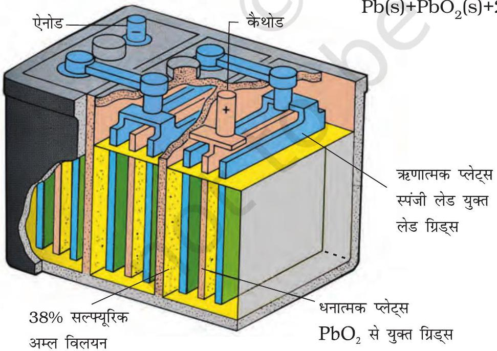
चित्र 2.10- लेड संचायक सेल

$$
\mathrm{Pb}(\mathrm{~s})+\mathrm{PbO}_{2}(\mathrm{~s})+2 \mathrm{H}_{2} \mathrm{SO}_{4}(\mathrm{aq}) \rightarrow 2 \mathrm{PbSO}_{4}(\mathrm{~s})+2 \mathrm{H}_{2} \mathrm{O}(\ell)
$$

बैटरी को आवेशित करने पर अभिक्रिया उत्क्रमित हो जाती है तथा ऐनोड एवं कैथोड भी क्रमशः $\mathrm{PbSO}_{4}(\mathrm{~s}) \mathrm{Pb}$ एवं $\mathrm{PbO}_{2}$ में बदल जाते हैं।

दूसरा महत्वपूर्ण संचायक सेल निकैल कैडमियम सेल (चित्र 2.11) है जिसकी कार्य अवधि लेड संचायक बैटरी से अधिक है किंतु इसकी निर्माण लागत अधिक है। हम इस सेल की क्रियाविधि तथा चार्ज एवं डिस्चार्ज की प्रक्रिया में होने वाली इलैक्ट्रोड अभिक्रियाओं का विस्तृत वर्णन नहीं करेंगे। डिस्चार्ज की प्रक्रिया में होने वाली समग्र अभिक्रिया निम्नलिखित है-

$$
\mathrm{Cd}(\mathrm{~s})+2 \mathrm{Ni}(\mathrm{OH})_{3}(\mathrm{~s}) \rightarrow \mathrm{CdO}(\mathrm{~s})+2 \mathrm{Ni}(\mathrm{OH})_{2}(\mathrm{~s})+\mathrm{H}_{2} \mathrm{O}(\mathrm{l})
$$

चित्र $2.11$ - एक पुन: आवेशन योग्य बेलनाकार जेली व्यवस्था में, नम सोडियम या पोटैशियम हाइड्रॉक्साइड से निमज्जित परत से पृथक्कृत निकैल कैडमियम सेल।
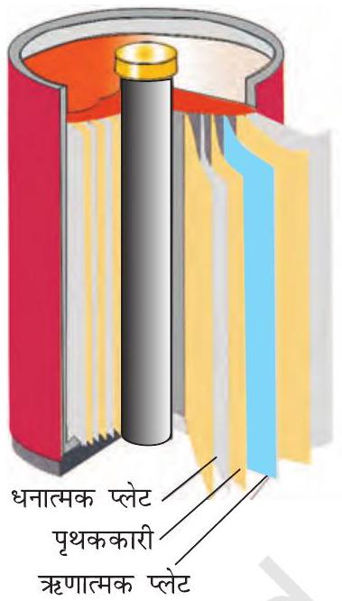

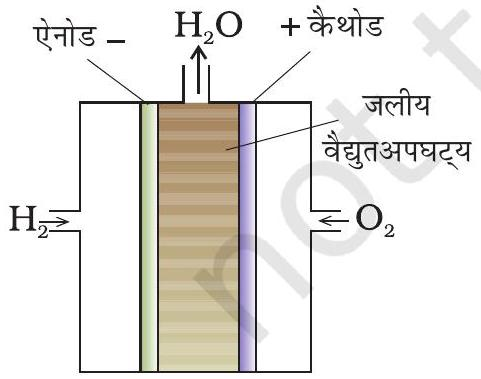
चित्र 2.12- ईंधन सेल जो $H_{2}$ और $O_{2}$ का उपयोग कर विद्युत उत्पादन करती है।

ऊष्मीय संयंत्रों से विद्युत उत्पादन बहुत अधिक उपयोगी विधि नहीं है तथा यह प्रदूषण का एक बड़ा स्रोत है। ऐसे संयंत्रों में जीवाश्मी ईंधनों (कोयला, गैस या तेल) की रासायनिक ऊर्जा (दहन ऊष्मा) का उपयोग पहले जल को उच्च दाब की वाष्प में बदलने में किया जाता है जिसका उपयोग टरबाइन को चलाकर विद्युत उत्पादन में किया जाता है। हम जानते हैं कि गैल्वैनी सेल रासायनिक ऊर्जा को सीधे ही विद्युत ऊर्जा में बदल देती है एवं इसकी दक्षता भी अधिक है। अब ऐसे सेलों का निर्माण संभव है जिनमें अभिकर्मकों को लगातार इलैक्ट्रोडों पर उपलब्ध कराया जा सकता है तथा उत्पादों को वैद्युतअपघट्य कक्ष से लगातार हटाया जा सकता है। ऐसी गैल्वैनी सेलों को जिनमें हाइड्रोजन, मेथेन एवं मेथेनॉल आदि जैसे ईंधनों की दहन ऊर्जा को सीधे ही विद्युत ऊर्जा में परिवर्तित किया जाता है, ईंधन सेल कहते हैं।

सबसे अधिक सफल ईंधन सेल में हाइड्रोजन एवं ऑक्सीजन के संयोग से जल बनने की अभिक्रिया का उपयोग किया जाता है (चित्र 2.12)। इस सेल को अपोलो अंतरिक्ष कार्यक्रम में विद्युत ऊर्जा प्रदान करने के लिए प्रयोग में लाया गया था। इस अभिक्रिया से प्राप्त जल वाष्प को संघनित कर उसका उपयोग अंतरिक्ष यात्रियों के लिए पेयजल के रूप में किया गया था। सेल में हाइड्रोजन एवं ऑक्सीजन गैसों के बुलबुलों को सरंध्र कार्बन इलैक्ट्रोडों के माध्यम से सांद्र जलीय सोडियम हाइड्रॉक्साइड विलयन में प्रवाहित किया जाता है। इलैक्ट्रोड अभिक्रिया की दर बढ़ाने के लिए सूक्ष्म विभाजित प्लैटिनम या पैलेडियम धातु, जैसे उत्प्रेरकों को इलैक्ट्रोडों में समावेशित किया जाता है। इलैक्ट्रोड अभिक्रियाएं नीचे दी गई हैं-

कैथोड- $\mathrm{O}_{2}(\mathrm{~g})+2 \mathrm{H}_{2} \mathrm{O}(\mathrm{l})+4 \mathrm{e}^{-} \longrightarrow 4 \mathrm{OH}^{-}(\mathrm{aq})$
ऐनोड- $2 \mathrm{H}_{2}(\mathrm{~g})+4 \mathrm{OH}^{-}(\mathrm{aq}) \longrightarrow 4 \mathrm{H}_{2} \mathrm{O}(l)+4 \mathrm{e}^{-}$
समग्र अभिक्रिया इस प्रकार है-

$$
2 \mathrm{H}_{2}(\mathrm{~g})+\mathrm{O}_{2}(\mathrm{~g}) \longrightarrow 2 \mathrm{H}_{2} \mathrm{O}(\mathrm{l})
$$

जब तक अभिक्रियकों की आपूर्ति होती है, सेल लगातार कार्य करती है। ऊष्मीय संयंत्रों की तुलना में जिनकी दक्षता $40 \%$ होती है, ईंधन सेल $70 \%$ दक्षता के साथ विद्युत उत्पादित करती हैं। ईंधन सेलों की दक्षता बढ़ाने के लिए नए इलैक्ट्रोड पदार्थ उन्नत

## $2.8$ संक्षारण

उत्प्रेरक एवं वैद्युतअपघट्यों के विकास में बहुत अधिक उन्नति हुई है। इनका उपयोग वाहनों में प्रयोग के तौर पर किया गया है। ईंधन सेल प्रदूषण मुक्त होते हैं एवं भविष्य में इनके महत्व को देखते हुए अनेक प्रकार के ईंधन सेलों को निर्मित कर उनका परीक्षण किया गया है। संक्षारण धातुओं की सतह को ऑक्साइड या धातु के अन्य लवणों से मंद गति से आव्रणित कर देता है। लोहे में जंग लगना, चाँदी का बदरंग होना, कॉपर एवं पीतल पर हरे रंग का लेप होना, संक्षारण के कुछ उदाहरण हैं। यह भवनों, पुलों, जहाज़ों तथा धातुओं से बनी सभी वस्तुओं, विशेषकर लोहे से बनी वस्तुओं को अत्यधिक क्षति पहुँचाता है। संक्षारण के कारण हमें प्रतिवर्ष करोड़ों रुपयों की हानि होती है।

संक्षारण में, धातु ऑक्सीजन को इलेक्ट्रॉन देकर ऑक्सीकृत हो जाती है एवं उसका ऑक्साइड बन जाता है। लोहे का संक्षारण (सामान्यतः जिसे जंग लगना कहते हैं) जल एवं वायु की उपस्थिति में होता है। संक्षारण का रसायन बहुत जटिल है परंतु इसे मुख्यतः वैद्युतरासायनिक परिघटना माना जा सकता है। लोहे से बनी किसी वस्तु के विशेष स्थल पर जब ऑक्सीकरण होता है तो वह स्थान ऐनोड का कार्य करता है (चित्र 2.13) तथा इसे हम निम्नलिखित अभिक्रिया से व्यक्त कर सकते हैं-

ऐनोड- $2 \mathrm{Fe}(\mathrm{s}) \longrightarrow 2 \mathrm{Fe}^{2+}+4 \mathrm{e}^{-}$ $E_{\left(\mathrm{Fe}^{2+} / \mathrm{Fe}\right)}^{\ominus}=-0.44 \mathrm{~V}$
ऐनोडी स्थल पर मुक्त इलेक्ट्रॉन, धातु के माध्यम से संचालन कर धातु के दूसरे स्थल पर पहुँचते हैं तथा वहाँ $\mathrm{H}^{+}$आयन की उपस्थिति में ऑक्सीजन का अपचयन करते हैं। (समझा जाता है कि $\mathrm{H}^{+}$आयन $\mathrm{CO}_{2}$ के जल में घुलने से बने $\mathrm{H}_{2} \mathrm{CO}_{3}$ से प्राप्त होते हैं। हाइड्रोजन आयन वायुमंडल में उपस्थित अन्य अम्लीय ऑक्साइडों के जल में घुलने से भी उपलब्ध हो सकते हैं)। यह स्थल निम्नलिखित अभिक्रिया के कारण कैथोड की तरह व्यवहार करता है-
कैथोड- $\mathrm{O}_{2}(\mathrm{~g})+4 \mathrm{H}^{+}(\mathrm{aq})+4 \mathrm{e}^{-} \longrightarrow 2 \mathrm{H}_{2} \mathrm{O}(l)$; $E_{\mathrm{H}^{+}\left|\mathrm{O}_{2}\right| \mathrm{H}_{2} \mathrm{O}}^{\ominus}=1.23 \mathrm{~V}$
समग्र अभिक्रिया- $2 \mathrm{Fe}(\mathrm{s})+\mathrm{O}_{2}(\mathrm{~g})+4 \mathrm{H}^{+}(\mathrm{aq}) \longrightarrow 2 \mathrm{Fe}^{2+}(\mathrm{aq})+2 \mathrm{H}_{2} \mathrm{O}(l) ; \quad E_{(\text {सेल })}^{\ominus}=1.67 \mathrm{~V}$
इसके उपरांत वायुमंडलीय ऑक्सीजन द्वारा फेरस आयन और अधिक आक्सीकृत होकर फेरिक आयनों में बदल जाते हैं जो जलयोजित फेरिक ऑक्साइड $\left(\mathrm{Fe}_{2} \mathrm{O}_{3} x \mathrm{H}_{2} \mathrm{O}\right)$ बनाकर जंग के रूप में दिखाई देते हैं एवं इसके साथ ही हाइड्रोजन आयन पुनः उत्पन्न हो जाते हैं।

संक्षारण की रोकथाम अत्यधिक महत्वपूर्ण है। इससे न केवल धन की बचत होती है अपितु पुलों के टूटने या संक्षारण के कारण किसी महत्वपूर्ण घटक के निष्क्रिय होने जैसी दुर्घटनाओं को रोकने में मदद मिलती है। संक्षारक निरोध की सबसे सरल विधि है, धात्विक सतह को वायुमंडल के संपर्क में न आने देना। यह सतह को पेंट या अन्य रसायनों (उदाहरण, बिसफीनॉल) से लेपित करके किया जा सकता है। एक अन्य सरल विधि है, सतह को किसी अन्य ऐसी धातु (Sn, Zn आदि) से आच्छादित करना जो अक्रिय हो या वस्तु की रक्षा के लिए क्रिया में भाग ले। एक वैद्युतरासायनिक विधि है, किसी अन्य ऐसी धातु (जैसे- Mg , Zn आदि) का उत्सर्ग इलैक्ट्रोड उपलब्ध कराना, जो स्वयं संक्षारित होकर वस्तु की रक्षा करती है।

चित्र $2.13$ - लोहे का वायुमंडल में संक्षारण
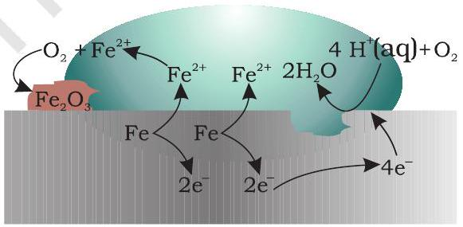

ऑक्सीकरण- $\mathrm{Fe}(\mathrm{s}) \rightarrow \mathrm{Fe}^{2+}(\mathrm{aq})+2 \mathrm{e}^{-}$
अपचयन- $\mathrm{O}_{2}(\mathrm{~g})+4 \mathrm{H}^{+}(\mathrm{aq})+4 \mathrm{e}^{-} \rightarrow 2 \mathrm{H}_{2} \mathrm{O}(\ell)$
वायुमंडलीय ऑक्सीकरण-
$2 \mathrm{Fe}^{2+}(\mathrm{aq})+2 \mathrm{H}_{2} \mathrm{O}(\mathrm{l})+\frac{1}{2} \mathrm{O}_{2}(\mathrm{~g}) \rightarrow \mathrm{Fe}_{2} \mathrm{O}_{3}(\mathrm{~s})+4 \mathrm{H}^{+}(\mathrm{aq})$

## पाठ्यनिहित प्रश्न

$2.13$ चार्जिंग के दौरान प्रयुक्त पदार्थों का विशेष उल्लेख करते हुए लेड संचायक सेल की चार्जिंग क्रियाविधि का वर्णन रासायनिक अभिक्रियाओं की सहायता से कीजिए।
$2.14$ हाइड्रोजन को छोड़कर ईंधन सेलों में प्रयुक्त किये जा सकने वाले दो अन्य पदार्थ सुझाइए।
$2.15$ समझाइए कि कैसे लोहे पर जंग लगने का कारण एक वैद्युतरासायनिक सेल बनना माना जाता है।

## हाइड्रोजन का अर्थशास्त्र

वर्तमान में हमारी अर्थव्यवस्था को चलाने वाले ऊर्जा के मुख्य स्रोत जीवाश्म ईंधन जैसे कोयला, तेल और गैस हैं। जैसे-जैसे धरती पर लोग अपना जीवन स्तर सुधारना चाहते हैं, तदनुसार उनकी ऊर्जा की आवश्यकता भी बढ़ेगी। वास्तव में, ऊर्जा का प्रति व्यक्ति उपभोग विकास का पैमाना माना जाता है। बेशक इसमें यह माना गया है कि ऊर्जा उत्पादन कार्यों में प्रयुक्त होती है न कि व्यर्थ ही गँवाई जाती है। हम पहले से ही जानते हैं कि 'ग्रीन हाउस प्रभाव' जीवाश्म ईंधनों के दहन से उत्पन्न कार्बन डाइऑक्साइड का ही परिणाम है। इससे पृथ्वी की सतह का ताप बढ़ रहा है तथा इससे ध्रुवीय बर्फ़ पिघलने लगी है एवं महासागरों का स्तर बढ़ने लगा है। इससे समुद्रों के किनारे के निम्नस्तरीय क्षेत्रों में बाढ़ आ जाएगी एवं कुछ राष्ट्र जो कि द्वीप हैं, जैसे मालदीव, के पूर्णतः डूब जाने का खतरा है। इस प्रकार के प्रलय से बचने के लिए हमें कार्बन युक्त ईंधनों के प्रयोग को सीमित करने की आवश्यकता है। हाइड्रोजन इसका आदर्श विकल्प है; क्योंकि इसके दहन से केवल जल बनता है। यह हाइड्रोजन सौर ऊर्जा द्वारा जल के वियोजन से प्राप्त होनी चाहिए। इस प्रकार हाइड्रोजन ऊर्जा के एक नवीकरणीय एवं अप्रदूषक स्रोत के रूप में प्रयोग की जा सकती है। यही हाइड्रोजन अर्थशास्त्र की परिकल्पना है। जल के वैद्युतअपघटन से हाइड्रोजन का उत्पादन एवं ईंधन सेल में हाइड्रोजन का दहन दोनों ही भविष्य में महत्वपूर्ण होंगे। ये दोनों ही तकनीकें वैद्युतरासायनिक सिद्धांतों पर आधारित हैं।

## शारांश

एक वैद्युतरासायनिक सेल में दो धात्विक इलैक्ट्रोड वैद्युतअपघटनी विलयन (विलयनों) में निमज्जित रहते हैं। इस प्रकार वैद्युतरासायनिक सेल का एक महत्वपूर्ण घटक आयनिक चालक या वैद्युतअपघट्‌य है। वैद्युतरासायनिक सेल दो प्रकार के होती हैं। गैल्वेनी सेल में एक स्वतः रेडॉक्स अभिक्रिया की रासायनिक ऊर्जा विद्युत ऊर्जा में रूपान्तरित होती है, जबकि वैद्युतअपघटनी सेल में विद्युत ऊर्जा का उपयोग एक अस्वतः रेडॉक्स अभिक्रिया को कराने में होता है। एक उपयुक्त विलयन में निमज्जित इलैक्ट्रोड का मानक इलैक्ट्रोड विभव हाइड्रोजन इलैक्ट्रोड के सापेक्ष में परिभाषित किया जाता है, जिसका मानक विभव शून्य माना जाता है। सेल का मानक विभव कैथोड एवं ऐनोड के मानक विभवों के अंतर से प्राप्त किया जाता है ( $E_{(\text {सेल })}^{\ominus}=E_{\text {कैथोड }}^{\ominus}-E_{\text {ऐनोड }}^{\ominus}$ ) सेलों के मानक विभव, सेल में होने वाली अभिक्रिया की मानक गिब्ज़ ऊर्जा ( $\ddot{\mathrm{A}}_{r} G^{\ominus}=-n F E_{(\text {सेल })}^{\ominus}$ ) एवं साम्यावस्था स्थिरांक ( $\ddot{\mathrm{A}}_{r} G^{\ominus}=-R T \ln K$ ) से संबंधित होते हैं। इलैक्ट्रोडों एवं सेलों के विभवों की सांद्रता पर निर्भरता नेर्न्स्ट समीकरण द्वारा दी जाती है।

एक वैद्युतअपघटनी विलयन की चालकता, $\kappa$, वैद्युतअपघट्य की सांद्रता, विलायक की प्रकृति एवं ताप पर निर्भर करती है। मोलर चालकता, $\ddot{E}_{m}$, को $\ddot{E}_{m}=\kappa / c$ द्वारा परिभाषित किया जाता है जहाँ $c$ मोलर सांद्रता है। सांद्रता घटने के साथ चालकता घटती है जबकि मोलर चालकता बढ़ती है। प्रबल वैद्युतअपघट्यों के लिए यह सांद्रता घटने के साथ धीमे-धीमे बढ़ती है जबकि तनु विलयनों में दुर्बल वैद्युतअपघट्यों के लिए यह वृद्धि बहुत तेज़ी से होती है। कोलराउश ने पाया कि किसी वैद्युतअपघट्य की अनंत तनुता पर मोलर चालकता उन आयनों की मोलर चालकताओं के योगदान के तुल्य होती है जिनमें यह वियोजित होता है। इसे आयनों के स्वतंत्र अभिगमन का नियम कहते हैं एवं इसके कई अनुप्रयोग हैं। वैद्युतरासायनिक सेल में उपस्थित विलयन में विद्युत का संचालन आयनों द्वारा होता है परंतु ऑक्सीकरण एवं अपचयन की प्रक्रिया इलैक्ट्रोडों पर होती है। बैटरियाँ एवं ईंधन सेल गैल्वेनी सेलों के बहुत उपयोगी रूप हैं। धातुओं का संक्षारण आवश्यक रूप से एक वैद्युतरासायनिक परिघटना है। वैद्युतरासायनिक सिद्धांत हाइड्रोजन-अर्थशास्त्र के संगत हैं।

## अभ्यास

$2.1$ निम्नलिखित धातुओं को उस क्रम में व्यवस्थित कीजिए जिसमें वे एक दूसरे को उनके लवणों के विलयनों में से प्रतिस्थापित करती हैं।
Al, Cu, Fe, Mg एवं Zn.
$2.2$ नीचे दिए गए मानक इलैक्ट्रोड विभवों के आधार पर धातुओं को उनकी बढ़ती हुई अपचायक क्षमता के क्रम में व्यवस्थित कीजिए।
$\mathrm{K}^{+} / \mathrm{K}=-2.93 \mathrm{~V}, \mathrm{Ag}^{+} / \mathrm{Ag}=0.80 \mathrm{~V}$,
$\mathrm{Hg}^{2+} / \mathrm{Hg}=0.79 \mathrm{~V}$
$\mathrm{Mg}^{2+} / \mathrm{Mg}=-2.37 \mathrm{~V}, \mathrm{Cr}^{3+} / \mathrm{Cr}=-0.74 \mathrm{~V}$
$2.3$ उस गैल्वैनी सेल को दर्शाइए जिसमें निम्नलिखित अभिक्रिया होती है-
$\mathrm{Zn}(\mathrm{s})+2 \mathrm{Ag}^{+}(\mathrm{aq}) \rightarrow \mathrm{Zn}^{2+}(\mathrm{aq})+2 \mathrm{Ag}(\mathrm{s})$, अब बताइए-
    (i) कौन-सा इलैक्ट्रोड ऋणात्मक आवेशित है?
    (ii) सेल में विद्युत-धारा के वाहक कौन से हैं?
    (iii) प्रत्येक इलैक्ट्रोड पर होने वाली अभिक्रिया क्या है?
$2.4$ निम्नलिखित अभिक्रियाओं वाले गैल्वैनी सेल का मानक सेल-विभव परिकलित कीजिए।
    (i) $2 \mathrm{Cr}(\mathrm{s})+3 \mathrm{Cd}^{2+}(\mathrm{aq}) \rightarrow 2 \mathrm{Cr}^{3+}(\mathrm{aq})+3 \mathrm{Cd}$
    (ii) $\mathrm{Fe}^{2+}(\mathrm{aq})+\mathrm{Ag}^{+}(\mathrm{aq}) \rightarrow \mathrm{Fe}^{3+}(\mathrm{aq})+\mathrm{Ag}(\mathrm{s})$
उपरोक्त अभिक्रियाओं के लिए $\Delta_{r} G^{\ominus}$ एवं साम्य स्थिरांकों की भी गणना कीजिए।
$2.5$ निम्नलिखित सेलों की $298$ K पर नेर्न्स्ट समीकरण एवं emf लिखिए।
    (i) $\mathrm{Mg}(\mathrm{s})\left|\mathrm{Mg}^{2+}(0.001 \mathrm{M})\right|\left|\mathrm{Cu}^{2+}(0.0001 \mathrm{M})\right| \mathrm{Cu}(\mathrm{s})$
    (ii) $\mathrm{Fe}(\mathrm{s})\left|\mathrm{Fe}^{2+}(0.001 \mathrm{M})\right|\left|\mathrm{H}^{+}(1 \mathrm{M})\right| \mathrm{H}_{2}(\mathrm{~g})($ l bar $) \mid \operatorname{Pt}(\mathrm{s})$
    (iii) $\mathrm{Sn}(\mathrm{s})\left|\mathrm{Sn}^{2+}(0.050 \mathrm{M})\right|\left|\mathrm{H}^{+}(0.020 \mathrm{M})\right| \mathrm{H}_{2}(\mathrm{~g})$ (1 bar) | Pt (s)
    (iv) $\mathrm{Pt}(\mathrm{s})\left|\mathrm{Br}^{-}(0.010 \mathrm{M})\right| \mathrm{Br}_{2}(l)| | \mathrm{H}^{+}(0.030 \mathrm{M}) \mid \mathrm{H}_{2}(\mathrm{~g})$ (1 bar) | Pt(s).
$2.6$ घड़ियों एवं अन्य युक्तियों में अत्यधिक उपयोग में आने वाली बटन सेलों में निम्नलिखित अभिक्रिया होती है-
$\mathrm{Zn}(\mathrm{s})+\mathrm{Ag}_{2} \mathrm{O}(\mathrm{s})+\mathrm{H}_{2} \mathrm{O}(\mathrm{l}) \rightarrow \mathrm{Zn}^{2+}(\mathrm{aq})+2 \mathrm{Ag}(\mathrm{s})+2 \mathrm{OH}^{-}(\mathrm{aq})$
अभिक्रिया के लिए $\Delta_{r} G^{\ominus}$ एवं $E^{\ominus}$ ज्ञात कीजिए।
$2.7$ किसी वैद्युतअपघट्य के विलयन की चालकता एवं मोलर चालकता की परिभाषा दीजिये। सांद्रता के साथ इनके परिवर्तन की विवेचना कीजिए।
$2.8298 \mathrm{~K}$ पर $0.20 \mathrm{M} \mathrm{KCl}$ विलयन की चालकता $0.0248 \mathrm{~S} \mathrm{~cm}^{-1}$ है। इसकी मोलर चालकता का परिकलन कीजिए।
$2.9298 \mathrm{~K}$ पर एक चालकता सेल जिसमें $0.001 \mathrm{M} \mathrm{KCl}$ विलयन है, का प्रतिरोध $1500 \Omega$ है। यदि $0.001 \mathrm{M} \mathrm{KCl}$ विलयन की चालकता $298$ K पर $0.146 \times 10^{-3} \mathrm{~S} \mathrm{~cm}^{-1}$ हो तो सेल स्थिरांक क्या है?
$2.10298$ K पर सोडियम क्लोराइड की विभिन्न सांद्रताओं पर चालकता का मापन किया गया जिसके आँकड़े निम्नलिखित हैं-

| सांद्रता/M | $0.001$ | $0.010$ | $0.020$ | $0.050$ | $0.100$ |
| :--- | :--- | :--- | :--- | :--- | :--- |
| $10^{2} \times \kappa / \mathrm{S} \mathrm{m}^{-1}$ | $1.237$ | $11.85$ | $23.15$ | $55.53$ | $106.74$ |

सभी सांद्रताओं के लिए $\Lambda_{m}$ का परिकलन कीजिए एवं $\Lambda_{m}$ तथा $\mathrm{c}^{\frac{1}{2}}$ के मध्य एक आलेख खींचिए। $\Lambda_{m}^{\circ}$ का मान ज्ञात कीजिए।

$2.110 .00241 \mathrm{M}$ ऐसीटिक अम्ल की चालकता $7.896 \times 10^{-5} \mathrm{~S} \mathrm{~cm}^{-1}$ है। इसकी मोलर चालकता को परिकलित कीजिए। यदि ऐसीटिक अम्ल के लिए $\Lambda_{m}^{0}$ का मान $390.5 \mathrm{~S} \mathrm{~cm}^{2} \mathrm{~mol}^{-1}$ हो तो इसका वियोजन स्थिरांक क्या है?
$2.12$ निम्नलिखित के अपचयन के लिए कितने आवेश की आवश्यकता होगी?
    (i) $1$ मोल $\mathrm{Al}^{3+}$ को Al में
    (ii) $1$ मोल $\mathrm{Cu}^{2+}$ को Cu में
    (iii) $1$ मोल $\mathrm{MnO}_{4}^{-}$को $\mathrm{Mn}^{2+}$ में
$2.13$ निम्नलिखित को प्राप्त करने में कितने फैराडे विद्युत की आवश्यकता होगी?
    (i) गलित $\mathrm{CaCl}_{2}$ से $20.0$ g Ca
    (ii) गलित $\mathrm{Al}_{2} \mathrm{O}_{3}$ से $40.0 \mathrm{~g} \mathrm{Al}$
$2.14$ निम्नलिखित को ऑक्सीकृत करने के लिए कितने कूलॉम विद्युत आवश्यक है?
    (i) $1$ मोल $\mathrm{H}_{2} \mathrm{O}$ को $\mathrm{O}_{2}$ में।
    (ii) $1$ मोल FeO को $\mathrm{Fe}_{2} \mathrm{O}_{3}$ में।
$2.15 \mathrm{Ni}\left(\mathrm{NO}_{3}\right)_{2}$ के एक विलयन का प्लैटिनम इलैक्ट्रोडों के बीच $5$ ऐम्पियर की धारा प्रवाहित करते हुए $20$ मिनट तक विद्युत अपघटन किया गया। Ni की कितनी मात्रा कैथोड पर निक्षेपित होगी?
$2.16 \mathrm{ZnSO}_{4}, \mathrm{AgNO}_{3}$ एवं $\mathrm{CuSO}_{4}$ विलयन वाले तीन वैद्युतअपघटनी सेलों $\mathrm{A}, \mathrm{B}, \mathrm{C}$ को श्रेणीबद्ध किया गया एवं $1.5$ ऐम्पियर की विद्युतधारा, सेल B के कैथोड पर $1.45 \mathrm{~g}$ सिल्वर निक्षेपित होने तक लगातार प्रवाहित की गई। विद्युतधारा कितने समय तक प्रवाहित हुई? निक्षेपित कॉपर एवं जिंक का द्रव्यमान क्या होगा?
$2.17$ तालिका $2.1$ में दिए गए मानक इलैक्ट्रोड विभवों की सहायता से अनुमान लगाइए कि क्या निम्नलिखित अभिकर्मकों के बीच अभिक्रिया संभव है?
    (i) $\mathrm{Fe}^{3+}(\mathrm{aq})$ और $\mathrm{I}^{-}(\mathrm{aq})$
    (ii) $\mathrm{Ag}^{+}(\mathrm{aq})$ और $\mathrm{Cu}(\mathrm{s})$
    (iii) $\mathrm{Fe}^{3+}(\mathrm{aq})$ और $\mathrm{Br}^{-}(\mathrm{aq})$
    (iv) $\mathrm{Ag}(\mathrm{s})$ और $\mathrm{Fe}^{3+}(\mathrm{aq})$
    (v) $\mathrm{Br}_{2}(\mathrm{aq})$ और $\mathrm{Fe}^{2+}(\mathrm{aq})$.
$2.18$ निम्नलिखित में से प्रत्येक के लिए वैद्युतअपघटन से प्राप्त उत्पाद बताइए।
    (i) सिल्वर इलैक्ट्रोडों के साथ $\mathrm{AgNO}_{3}$ का जलीय विलयन
    (ii) प्लैटिनम इलैक्ट्रोडों के साथ $\mathrm{AgNO}_{3}$ का जलीय विलयन
    (iii) प्लैटिनम इलैक्ट्रोडों के साथ $\mathrm{H}_{2} \mathrm{SO}_{4}$ का तनु विलयन
    (iv) प्लैटिनम इलैक्ट्रोडों के साथ $\mathrm{CuCl}_{2}$ का जलीय विलयन

## कुछ पाठ्यनिहित प्रश्नों के उत्तर

$2.5 \mathrm{E}_{(\text {सेल })}=0.91 \mathrm{~V}$
$2.6 \Delta_{r} G^{\ominus}=-45.54 \mathrm{~kJ} \mathrm{~mol}^{-1}, \mathrm{~K}_{\mathrm{c}}=9.62 \times 10^{7}$
$2.70 .114,3.67 \times 10^{-4} \mathrm{~mol} \mathrm{~L}^{-1}$

[^0]:    * सुनिश्चित रूप से कहें तो सांद्रता के स्थान पर हमें सक्रियता पद का उपयोग करना चाहिए। यह सांद्रता के अनुक्रमानुपाती होती है। तनु विलयनों में यह सांद्रता के तुल्य होती है। उच्च कक्षाओं में आप इसके बारे में और अध्ययन करेंगे।

[^1]:    1. ऋणात्मक $E^{\ominus}$ का अर्थ है कि रेडॉक्स युग्म $H^{+} / H_{2}$ युग्म की तुलना में प्रबल अपचायक है।
    2. धनात्मक $E^{\ominus}$ का अर्थ है कि रेडॉक्स युग्म $H^{+} / H_{2}$ युग्म की तुलना में दुर्बल अपचायक है।
[^2]:    * इलेक्ट्रॉनिक चालक बहुलक - $1977$ में मैक-डिरमिड, हीगर तथा शीराकावा ने खोज की कि ऐसिटिलीन गैस के बहुलकीकरण से पॉलीऐसिटिलीन बहुलक प्राप्त किया जा सकता है जो आयोडिन वाष्प के संपर्क में आने पर धात्विक चमक एवं चालकता प्राप्त कर लेता है। उसके बाद बहुत से कार्बनीय बहुलक-चालक बनाए गए हैं, जैसे पॉलीऐनिलीन, पॉलीपिरोल तथा पॉलीथायोफीन। यह धात्विक गुणों वाले कार्बनीय बहुलक पूर्णतः कार्बन, हाइड्रोजन तथा कभी-कभी नाइट्रोजन, ऑक्सीजन एवं सल्फर द्वारा बने होने के कारण सामान्य धातुओं की तुलना में अत्यधिक हल्के होते हैं इसलिए, इनसे हल्की बैटरियाँ बनाई जा सकती हैं। इसके अतिरिक्त इनमें लचीलेपन जैसे यांत्रिक गुण भी होते हैं, अतः इनसे ट्रांजिस्टर जैसी इलेक्ट्रॉनिक युक्तियाँ तथा मुड़ सकने वाली प्लास्टिक शीट बना सकते हैं। चालक बहुलकों की खोज के लिए मैक-डिरमिड, हीगर तथा शीराकावा को वर्ष $2000$ के रसायन विज्ञान के नोबेल पुरस्कार से पुरस्कृत किया गया था।

