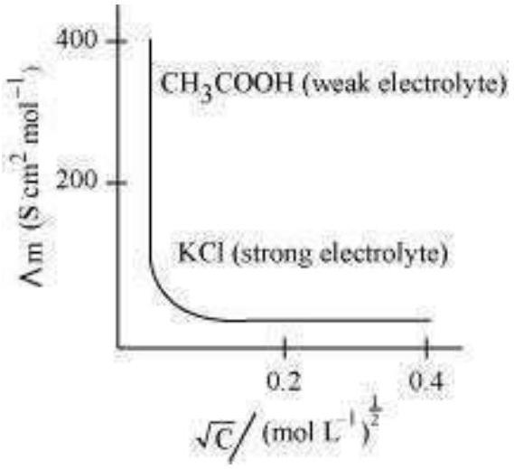
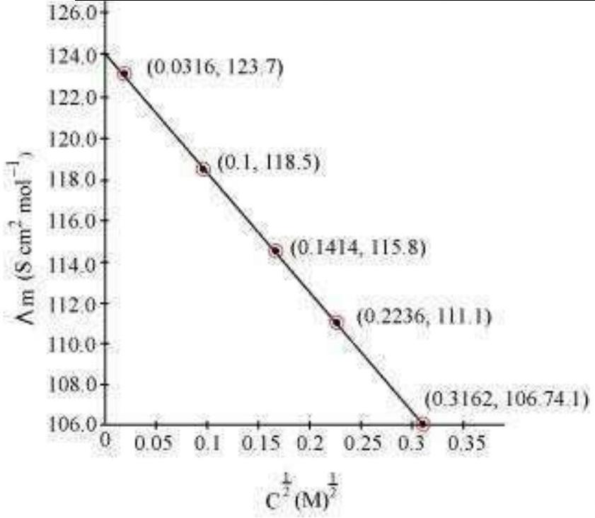

## (Chapter 3)(Electrochemistry) XII

## Intext Questions

Question 3.1:
How would you determine the standard electrode potential of the systemmg ${ }^{2+} \mid \mathrm{Mg}$ ?
Answer
The standard electrode potential of $\mathrm{Mg}^{2+} \mid \mathrm{Mg}$ can be measured with respect to the standard hydrogen electrode, represented by $\mathrm{Pt}_{(s)}, \mathrm{H}_{2(g)}$ (1 atm) | $\mathrm{H}^{+}{ }_{(a q)}(1 \mathrm{M})$.

A cell, consisting of $\mathrm{Mg} \mid \mathrm{MgSO}_{4}(a q 1 \mathrm{M})$ as the anode and the standard hydrogen electrode as the cathode, is set up.

$$
\mathrm{Mg}\left|\mathrm{Mg}^{2+}(\mathrm{aq}, \mathrm{lM}) \| \mathrm{H}^{+}(\mathrm{aq}, 1 \mathrm{M})\right| \mathrm{H}_{2}(\mathrm{~g}, 1 \text { bar }), \mathrm{Pt}_{(\mathrm{s})}
$$

Then, the emf of the cell is measured and this measured emf is the standard electrode potential of the magnesium electrode.

$$
E^{\ominus}=E_{R}^{\ominus}-E_{L}^{\ominus}
$$

Here, $E_{R}^{\ominus}$ for the standard hydrogen electrode is zero.

$$
\begin{aligned}
& \therefore E^{\ominus}=0-E_{L}^{\ominus} \\
& =-E_{L}^{\ominus}
\end{aligned}
$$

Question 3.2:
Can you store copper sulphate solutions in a zinc pot?
Answer
Zinc is more reactive than copper. Therefore, zinc can displace copper from its salt solution. If copper sulphate solution is stored in a zinc pot, then zinc will displace copper from the copper sulphate solution.

$$
\mathrm{Zn}+\mathrm{CuSO}_{4} \longrightarrow \mathrm{ZnSO}_{4}+\mathrm{Cu}
$$

Hence, copper sulphate solution cannot be stored in a zinc pot.

Question 3.3:
Consult the table of standard electrode potentials and suggest three substances that can oxidise ferrous ions under suitable conditions.

Answer
Substances that are stronger oxidising agents than ferrous ions can oxidise ferrous ions.

$$
\mathrm{Fe}^{2+} \longrightarrow \mathrm{Fe}^{3+}+\mathrm{e}^{-1} ; E^{\ominus}=-0.77 \mathrm{~V}
$$

This implies that the substances having higher reduction potentials than +0.77 V can oxidise ferrous ions to ferric ions. Three substances that can do so are $\mathrm{F}_{2}$, $\mathrm{Cl}_{2}$, and $\mathrm{O}_{2}$.

Question 3.4:
Calculate the potential of hydrogen electrode in contact with a solution whose pH is 10. Answer

For hydrogen electrode,

$$
\mathrm{H}^{+}+\mathrm{e}^{-} \longrightarrow \frac{1}{2} \mathrm{H}_{2} \text {, it is given that } \mathrm{pH}=10
$$

$$
\therefore\left[\mathrm{H}^{+}\right]=10^{-10} \mathrm{M}
$$

Now, using Nernst equation:

$$
\begin{aligned}
& \mathrm{H}_{\left(\mathrm{H}^{+}, \frac{1}{2} \mathrm{H}_{2}\right)}=E_{\left(\mathrm{H}^{+}, \frac{1}{2} \mathrm{H}_{2}\right)}^{\ominus}-\frac{\mathrm{R} T}{n \mathrm{~F}} \ln \frac{1}{\left[\mathrm{H}^{+}\right]} \\
& =E_{\left(\mathrm{H}^{+}, \frac{1}{2} \mathrm{H}_{2}\right)}^{\ominus}-\frac{0.0591}{1} \log \frac{1}{\left[\mathrm{H}^{+}\right]} \\
& =0-\frac{0.0591}{1} \log \frac{1}{\left[10^{-10}\right]} \\
& =-0.0591 \log 10^{10} \\
& =-0.591 \mathrm{~V}
\end{aligned}
$$

Question 3.5:
Calculate the emf of the cell in which the following reaction takes place:

$$
\begin{aligned}
& \mathrm{Ni}_{(s)}+2 \mathrm{Ag}^{+}(0.002 \mathrm{M}) \rightarrow \mathrm{Ni}^{2+}(0.160 \mathrm{M})+2 \mathrm{Ag}_{(s)} \\
& E_{(\text {cell) }}^{\ominus}=1.05 \mathrm{~V} \\
& E_{\text {(cell) }}=E_{\text {(cell) }}^{\ominus}-\frac{0.0591}{n} \log \frac{\left[\mathrm{Ni}^{2+}\right]}{\left[\mathrm{Ag}^{+}\right]^{2}} \\
& =1.05-\frac{0.0591}{2} \log \frac{(0.160)}{(0.002)^{2}} \\
& =1.05-0.02955 \log \frac{0.16}{0.000004} \\
& =1.05-0.02955 \log 4 \times 10^{4} \\
& =1.05-0.02955(\log 10000+\log 4) \\
& =1.05-0.02955(4+0.6021) \\
& =0.914 \mathrm{~V}
\end{aligned}
$$

Given that
Answer
Applying Nernst equation we have:

Question 3.6:
The cell in which the following reactions occurs:

$$
\begin{aligned}
& 2 \mathrm{Fe}_{(a q)}^{3+}+2 \mathrm{I}_{(a q)}^{-} \rightarrow 2 \mathrm{Fe}_{(a q)}^{2+}+\mathrm{I}_{2(s)} \\
& \text { has } E_{\text {cell }}^{0}=0.236 \mathrm{~V} \text { at } 298 \mathrm{~K} .
\end{aligned}
$$

Calculate the standard Gibbs energy and the equilibrium constant of the cell reaction.
Answer

$$
\text { Here, } n=2, E_{\text {cell }}^{\ominus}=0.236 \mathrm{~V}, \mathrm{~T}=298 \mathrm{~K}
$$

We know that:

$$
\begin{aligned}
& \Delta_{r} \mathrm{G}^{\ominus}=-n \mathrm{FE}_{\mathrm{cell}}^{\ominus} \\
& =-2 \times 96487 \times 0.236 \\
& =-45541.864 \mathrm{~J} \mathrm{~mol}^{-1} \\
& =-45.54 \mathrm{~kJ} \mathrm{~mol}^{-1}
\end{aligned}
$$

Again, $\Delta_{r} G^{\ominus}=-2.303 \mathrm{R} T \log K_{\mathrm{c}}$

$$
\begin{aligned}
& \Rightarrow \log K_{\mathrm{c}}=-\frac{\Delta_{r} G^{\ominus}}{2.303 \mathrm{R} T} \\
& \quad=-\frac{-45.54 \times 10^{3}}{2.303 \times 8.314 \times 298} \\
& =7.981 \\
& \therefore K_{\mathrm{c}}=\text { Antilog }(7.981) \\
& =9.57 \times 10^{7}
\end{aligned}
$$

Question 3.7:
Why does the conductivity of a solution decrease with dilution?
Answer
The conductivity of a solution is the conductance of ions present in a unit volume of the solution. The number of ions (responsible for carrying current) decreases when the solution is diluted. As a result, the conductivity of a solution decreases with dilution.

Question 3.8:
Suggest a way to determine the $\Lambda_{m}^{(0}$ value of water.
Answer
Applying Kohlrausch's law of independent migration of ions, the $\Lambda^{0}$ value of water can be determined as follows:

$$
\begin{aligned}
\Lambda_{m\left(\mathrm{H}_{2} \mathrm{O}\right)}^{0} & =\lambda_{\mathrm{H}^{+}}^{0}+\lambda_{\mathrm{OH}}^{0} \\
& =\left(\lambda_{\mathrm{H}^{+}}^{0}+\lambda_{\mathrm{Cl}^{-}}^{0}\right)+\left(\lambda_{\mathrm{Na}^{+}}^{0}+\lambda_{\mathrm{OH}^{-}}^{0}\right)-\left(\lambda_{\mathrm{Na}^{+}}^{0}+\lambda_{\mathrm{Cl}^{-}}^{0}\right) \\
\Lambda_{m(\mathrm{HCl})}^{0} & +\Lambda_{m(\mathrm{NaOH})}^{0}-\Lambda_{m(\mathrm{NaCl})}^{0}
\end{aligned}
$$

$$
\Lambda_{m}^{0}
$$

Hence, by knowing the values of $\mathrm{HCl}, \mathrm{NaOH}$, and NaCl , the $\Lambda_{m}^{\phi}$ value of water can be determined.

Question 3.9:
The molar conductivity of $0.025 \mathrm{~mol} \mathrm{~L}-1$ methanoic acid is $46.1 \mathrm{~S} \mathrm{~cm} 2 \mathrm{~mol}^{-1}$.

Calculate its degree of dissociation and dissociation constant. Given $\lambda^{\circ}\left(\mathrm{H}^{+}\right)$ $=349.6 \mathrm{~S} \mathrm{~cm}^{2} \mathrm{~mol}^{-1}$ and $\lambda^{\circ}(\mathrm{HCOO}-)=54.6 \mathrm{~S} \mathrm{~cm}^{2} \mathrm{~mol}$

Answer

$$
\begin{aligned}
& C=0.025 \mathrm{~mol} \mathrm{~L}^{-1} \\
& \Lambda_{m}=46.1 \mathrm{~S} \mathrm{~cm}^{2} \mathrm{~mol}^{-1} \\
& \begin{aligned}
& \lambda^{0}\left(\mathrm{H}^{+}\right)=349.6 \mathrm{~S} \mathrm{~cm}^{2} \mathrm{~mol}^{-1} \\
& \lambda^{0}(\mathrm{HCOO}-)=54.6 \mathrm{Scm}^{2} \mathrm{~mol}^{-1} \\
& \Lambda_{m}^{0}(\mathrm{HCOOH})=\lambda^{0}\left(\mathrm{H}^{+}\right)+\lambda^{0}\left(\mathrm{HCOO}^{-}\right) \\
&=349.6+54.6 \\
&=404.2 \mathrm{Scm}^{2} \mathrm{~mol}^{-1}
\end{aligned}
\end{aligned}
$$

Now, degree of dissociation:

$$
\begin{aligned}
\alpha & =\frac{\Lambda_{m}(\mathrm{HCOOH})}{\Lambda_{m}^{0}(\mathrm{HCOOH})} \\
& =\frac{46.1}{404.2} \\
& =0.114(\text { approximately })
\end{aligned}
$$

Thus, dissociation constant:

$$
\begin{aligned}
K & =\frac{c \propto c^{2}}{(1-\propto)} \\
& =\frac{\left(0.025 \mathrm{~mol} \mathrm{~L}^{-1}\right)(0.114)^{2}}{(1-0.114)} \\
& =3.67 \times 10^{-4} \mathrm{~mol} \mathrm{~L}^{-1}
\end{aligned}
$$

Question 3.10:

If a current of 0.5 ampere flows through a metallic wire for 2 hours, then how many electrons would flow through the wire?
Answer I

$$
\begin{aligned}
& =0.5 \mathrm{~A} \\
& t=2 \text { hours }=2 \times 60 \times 60 \mathrm{~s}=7200 \mathrm{~s}
\end{aligned}
$$

Thus, $Q=I t$

$$
\begin{aligned}
& =0.5 \mathrm{~A} \times 7200 \mathrm{~s} \\
& =3600 \mathrm{C}
\end{aligned}
$$

We know that $96487 \mathrm{C}=6.023 \times 10^{23}$ number of electrons.
Then,

$$
\begin{aligned}
3600 \mathrm{C} & =\frac{6.023 \times 10^{23} \times 3600}{96487} \text { number of electrons } \\
& =2.25 \times 10^{22} \text { number of electrons }
\end{aligned}
$$

Hence, $2.25 \times 10^{22}$
number of electrons will flow through the wire. wire.

Question 3.11:
Suggest a list of metals that are extracted electrolytically.
Answer
Metals that are on the top of the reactivity series such as sodium, potassium, calcium, lithium, magnesium, aluminium are extracted electrolytically.

Question 3.12:
What is the quantity of electricity in coulombs needed to reduce 1 mol of $\mathrm{Cr}_{2} \mathrm{O}_{7}^{2-}$ ? Consider the reaction:

$$
\mathrm{Cr}_{2} \mathrm{O}_{7}^{2-}+14 \mathrm{H}^{+}+6 \mathrm{e}^{-} \rightarrow 2 \mathrm{Cr}^{3+}+8 \mathrm{H}_{2} \mathrm{O}
$$

Answer
The given reaction is as follows:

$$
\begin{aligned}
& \mathrm{Cr}_{2} \mathrm{O}_{7}^{2-}+14 \mathrm{H}^{+}+6 \mathrm{e}^{-} \rightarrow 2 \mathrm{Cr}^{3+}+7 \mathrm{H}_{2} \mathrm{O} \text {, the required quantity of electricity will } \\
& \text { Therefore, to reduce } 1 \text { mole of } \mathrm{Cr}_{2} \mathrm{O}_{7}^{2-}=6 \mathrm{~F} \\
& =6 \times 96487 \mathrm{C} \\
& =578922 \mathrm{C}
\end{aligned}
$$

Question 3.14:
Suggest two materials other than hydrogen that can be used as fuels in fuel cells.
Answer
Methane and methanol can be used as fuels in fuel cells.

Question 3.15:
Explain how rusting of iron is envisaged as setting up of an electrochemical cell.
Answer
In the process of corrosion, due to the presence of air and moisture, oxidation takes place at a particular spot of an object made of iron. That spot behaves as the anode. The reaction at the anode is given by,

$$
\mathrm{Fe}_{(s)} \longrightarrow \mathrm{Fe}_{(a q)}^{2+}+2 \mathrm{e}^{-}
$$

Electrons released at the anodic spot move through the metallic object and go to another spot of the object.

There, in the presence of $\mathrm{H}^{+}$ions, the electrons reduce oxygen. This spot behaves as the cathode. These $\mathrm{H}^{+}$ions come either from $\mathrm{H}_{2} \mathrm{CO}_{3}$, which are formed due to the dissolution of carbon dioxide from air into water or from the dissolution of other acidic oxides from the atmosphere in water.

The reaction corresponding at the cathode is given by,

$$
\mathrm{O}_{2(\mathrm{~g})}+4 \mathrm{H}_{(a q)}^{+}+4 \mathrm{e}^{-} \longrightarrow 2 \mathrm{H}_{2} \mathrm{O}_{(f /)}
$$

The overall reaction is:

$$
2 \mathrm{Fe}_{(x)}+\mathrm{O}_{2(g)}+4 \mathrm{H}_{(a q)}^{+} \longrightarrow 2 \mathrm{Fe}_{(a q)}^{2+}+2 \mathrm{H}_{2} \mathrm{O}_{(r)}
$$

Also, ferrous ions are further oxidized by atmospheric oxygen to ferric ions. These ferric ions combine with moisture, present in the surroundings, to form hydrated ferric oxide $\left(\mathrm{Fe}_{2} \mathrm{O}_{3}, x \mathrm{H}_{2} \mathrm{O}\right)_{\text {i.e., rust. }}$

Hence, the rusting of iron is envisaged as the setting up of an electrochemical cell.

## Exercises Solutions

## (Chapter 3)(Electrochemistry) XII

Question 3.1:
Arrange the following metals in the order in which they displace each other from the solution of their salts. Al, Cu, Fe, Mg and Zn

Answer
The following is the order in which the given metals displace each other from the solution of their salts.

Mg, AI, Zn, Fe, Cu

Question 3.2:
Given the standard electrode potentials,

$$
\begin{aligned}
& \mathrm{K}^{+} / \mathrm{K}=-2.93 \mathrm{~V}, \mathrm{Ag}^{+} / \mathrm{Ag}=0.80 \mathrm{~V}, \\
& \mathrm{Hg}^{2+} / \mathrm{Hg}=0.79 \mathrm{~V} \\
& \mathrm{Mg}^{2+} / \mathrm{Mg}=-2.37 \mathrm{~V}, \mathrm{Cr}^{3+} / \mathrm{Cr}=-0.74 \mathrm{~V}
\end{aligned}
$$

Arrange these metals in their increasing order of reducing power.
Answer
The lower the reduction potential, the higher is the reducing power. The given standard electrode potentials increase in the order of $\mathrm{K}^{+} / \mathrm{K}<\mathrm{Mg}^{2+} / \mathrm{Mg}<\mathrm{Cr}^{3+} / \mathrm{Cr}<\mathrm{Hg}^{2+} / \mathrm{Hg}<$ $\mathrm{Ag}^{+} / \mathrm{Ag}$.

Hence, the reducing power of the given metals increases in the following order: Ag $<\mathrm{Hg}<\mathrm{Cr}<\mathrm{Mg}<\mathrm{K}$

Question 3.3:
Depict the galvanic cell in which the reaction $\mathrm{Zn}(\mathrm{s})+2 \mathrm{Ag}^{+}(\mathrm{aq}) \rightarrow \mathrm{Zn}^{2+}(\mathrm{aq})+2 \mathrm{Ag}(\mathrm{s})$ takes place. Further show:

(i) Which of the electrode is negatively charged?
(ii) The carriers of the current in the cell.
(iii) Individual reaction at each electrode.

Answer
The galvanic cell in which the given reaction takes place is depicted as:

$$
\mathrm{Zn}_{(s)}\left|\mathrm{Zn}_{(a q)}^{2+} \| \mathrm{Ag}_{(a q)}^{+}\right| \mathrm{Ag}_{(s)}
$$

(i) Zn electrode (anode) is negatively charged.
(ii) Ions are carriers of current in the cell and in the external circuit, current will flow from silver to zinc.
(iii) The reaction taking place at the anode is given by,
$$
\mathrm{Zn}_{(s)} \longrightarrow \mathrm{Zn}_{(a q)}^{2+}+2 \mathrm{e}^{-}
$$
The reaction taking place at the cathode is given by,
$$
\mathrm{Ag}_{(\mathrm{aq})}^{+}+\mathrm{e}^{-} \longrightarrow \mathrm{Ag}_{(s)}
$$

Question 3.4:
Calculate the standard cell potentials of galvanic cells in which the following reactions take place:

(i) $2 \mathrm{Cr}(\mathrm{s})+3 \mathrm{Cd}^{2+}(\mathrm{aq}) \rightarrow 2 \mathrm{Cr}^{3+}(\mathrm{aq})+3 \mathrm{Cd}$
(ii) $\mathrm{Fe}^{2+}(\mathrm{aq})+\mathrm{Ag}^{+}(\mathrm{aq}) \rightarrow \mathrm{Fe}^{3+}(\mathrm{aq})+\mathrm{Ag}(\mathrm{s})$

Calculate the $\Delta_{\mathrm{r}} G^{\theta}$ and equilibrium constant of the reactions.
Answer

(i) $E_{\mathrm{Cr}^{3+} / \mathrm{Cr}}^{\ominus}=0.74 \mathrm{~V}$
$$
E_{\mathrm{Cd}^{2+} / \mathrm{Cd}}^{\ominus}=-0.40 \mathrm{~V}
$$

The galvanic cell of the given reaction is depicted as:

$$
\mathrm{Cr}_{(s)}\left|\mathrm{Cr}_{(a q)}^{3+} \| \mathrm{Cd}_{(a q)}^{2+}\right| \mathrm{Cd}_{(s)}
$$

Now, the standard cell potential is

$$
\begin{aligned}
E_{\text {cell }}^{\ominus} & =E_{\mathrm{R}}^{\ominus}-E_{\mathrm{L}}^{\ominus} \\
& =-0.40-(-0.74) \\
& =+0.34 \mathrm{~V}
\end{aligned}
$$

$$
\Delta_{r} G^{\ominus}=-n \mathrm{~F} E_{\text {cell }}^{\ominus}
$$

In the given equation, $n$

$$
=6
$$

$$
\begin{aligned}
& \mathrm{F}=96487 \mathrm{C} \mathrm{~mol}^{-1} \\
& E_{\text {cell }}^{\ominus}=+0.34 \mathrm{~V}
\end{aligned}
$$

Then, $\Delta_{\mathrm{r}} G^{\ominus}=-6 \times 96487 \mathrm{C} \mathrm{mol}^{-1} \times 0.34 \mathrm{~V}$

$$
\begin{aligned}
& =-196833.48 \mathrm{CV} \mathrm{~mol}^{-1} \\
& =-196833.48 \mathrm{~J} \mathrm{~mol}^{-1} \\
& =-196.83 \mathrm{~kJ} \mathrm{~mol}^{-1}
\end{aligned}
$$

Again,

$$
\begin{aligned}
& \Delta_{\mathrm{r}} G^{\ominus}=-\mathrm{R} T \ln K \\
& \begin{aligned}
& \Rightarrow \Delta_{\mathrm{r}} G^{\ominus}=-2.303 \mathrm{R} T \ln K \\
& \Rightarrow \log K=-\frac{\Delta_{\mathrm{r}} G}{2.303 \mathrm{R} T} \\
& \quad=\frac{-196.83 \times 10^{3}}{2.303 \times 8.314 \times 298} \\
&=34.496 \\
& \therefore \mathrm{~K}=\text { antilog }(34.496)= \\
& 3.13 \times 10^{34}
\end{aligned}
\end{aligned}
$$

(ii)

$$
E_{\mathrm{Fe}^{3+} / \mathrm{Fe}^{2+}}=0.77 \mathrm{~V}
$$

$$
E_{\mathrm{Ag}^{+} / \mathrm{Ag}}^{\ominus}=0.80 \mathrm{~V}
$$

The galvanic cell of the given reaction is depicted as:

$$
\mathrm{Fe}_{(a q)}^{2+}\left|\mathrm{Fe}_{(a q)}^{3+}\right|\left|\mathrm{Ag}_{(a q)}^{+}\right| \mathrm{Ag}_{(s)}
$$

Now, the standard cell potential is

$$
\begin{aligned}
E_{\text {cell }}^{\ominus} & =E_{\mathrm{R}}^{\ominus}-E_{\mathrm{L}}^{\ominus} \\
& =0.80-0.77 \\
& =0.03 \mathrm{~V}
\end{aligned}
$$

Here, $n=1$.
Then, $\Delta_{\mathrm{r}} G^{\ominus}=-n \mathrm{~F} E_{\text {cell }}^{\ominus}$

$$
=-1 \times 96487 \mathrm{C} \mathrm{~mol}^{-1} \times 0.03 \mathrm{~V}
$$

$$
\begin{aligned}
& =-2894.61 \mathrm{~J} \mathrm{~mol}^{-1} \\
& =-2.89 \mathrm{~kJ} \mathrm{~mol}^{-1}
\end{aligned}
$$

Again, $\Delta_{\mathrm{r}} G^{\ominus}=-2.303 \mathrm{R} T \ln K$

$$
\begin{aligned}
& \Rightarrow \log K=-\frac{\Delta_{\mathrm{r}} G}{2.303 \mathrm{R} T} \\
& \quad=\frac{-2894.61}{2.303 \times 8.314 \times 298} \\
& =0.5073 \\
& \therefore \mathrm{~K}=\text { antilog (0.5073) } \\
& =3.2 \text { (approximately) }
\end{aligned}
$$

Question 3.5:
Write the Nernst equation and emf of the following cells at 298 K:

(i) $\mathrm{Mg}(\mathrm{s})\left|\mathrm{Mg}^{2+}(0.001 \mathrm{M})\right|\left|\mathrm{Cu}^{2+}(0.0001 \mathrm{M})\right| \mathrm{Cu}(\mathrm{s})$
(ii) $\quad \mathrm{Fe}(\mathrm{s})\left|\mathrm{Fe}^{2+}(0.001 \mathrm{M})\right|\left|\mathrm{H}^{+}(1 \mathrm{M})\right| \mathrm{H}_{2}(\mathrm{~g})(1$ bar $) \mid \mathrm{Pt}(\mathrm{s})$ (iii)
$$
\mathrm{Sn}(\mathrm{~s})\left|\mathrm{Sn}^{2+}(0.050 \mathrm{M})\right|\left|\mathrm{H}^{+}(0.020 \mathrm{M})\right| \mathrm{H}_{2}(\mathrm{~g})(1 \text { bar }) \mid \mathrm{Pt}(\mathrm{~s})
$$
(iv) $\operatorname{Pt}(\mathrm{s})\left|\mathrm{Br}_{2}(l)\right| \mathrm{Br}^{-}(0.010 \mathrm{M})| | \mathrm{H}^{+}(0.030 \mathrm{M}) \mid \mathrm{H}_{2}(\mathrm{~g})$ (1 bar) | Pt(s).

Answer

(i) For the given reaction, the Nernst equation can be given as:
$$
\begin{aligned}
& E_{\text {cell }}=E_{\text {cell }}^{\ominus}-\frac{0.0591}{n} \log \frac{\left[\mathrm{Mg}^{2+}\right]}{\left[\mathrm{Cu}^{2+}\right]} \\
&=\{0.34-(-2.36)\}-\frac{0.0591}{2} \log \frac{.001}{.0001} \\
&=2.7-\frac{0.0591}{2} \log 10 \\
&=2.7-0.02955 \\
&=2.67 \mathrm{~V} \text { (approximately) }
\end{aligned}
$$
(ii) For the given reaction, the Nernst equation can be given as:

$$
\begin{aligned}
E_{\text {cell }} & =E_{\text {cell }}^{\ominus}-\frac{0.0591}{n} \log \frac{\left[\mathrm{Fe}^{2+}\right]}{\left[\mathrm{H}^{+}\right]^{2}} \\
& =\{0-(-0.44)\}-\frac{0.0591}{2} \log \frac{0.001}{1^{2}} \\
& =0.44-0.02955(-3) \\
= & 0.52865 \mathrm{~V} \\
= & 0.53 \mathrm{~V} \text { (approximately) }
\end{aligned}
$$

(iii) For the given reaction, the Nernst equation can be given as:

$$
\begin{aligned}
& E_{\text {cell }}=E_{\text {cell }}^{\ominus}-\frac{0.0591}{n} \log \frac{\left[\mathrm{Sn}^{2+}\right]}{\left[\mathrm{H}^{+}\right]^{2}} \\
& \quad=\{0-(-0.14)\}-\frac{0.0591}{2} \log \frac{0.050}{(0.020)^{2}} \\
& =0.14-0.0295 \times \log 125 \\
& =0.14-0.062 \\
& =0.078 \mathrm{~V} \\
& =0.08 \mathrm{~V} \text { (approximately) }
\end{aligned}
$$

(iv) For the given reaction, the Nernst equation can be given as:

$$
\begin{aligned}
E_{\text {cell }} & =E_{\text {cell }}^{\ominus}-\frac{0.0591}{n} \log \frac{1}{\left[\mathrm{Br}^{-}\right]^{2}\left[\mathrm{H}^{+}\right]^{2}} \\
& =(0-1.09)-\frac{0.0591}{2} \log \frac{1}{(0.010)^{2}(0.030)^{2}} \\
& =-1.09-0.02955 \times \log \frac{1}{0.00000009} \\
& =-1.09-0.02955 \times \log \frac{1}{9 \times 10^{-8}} \\
& =-1.09-0.02955 \times \log \left(1.11 \times 10^{7}\right) \\
& =-1.09-0.02955(0.0453+7) \\
& =-1.09-0.208 \\
& =-1.298 \mathrm{~V}
\end{aligned}
$$

Question 3.6:
In the button cells widely used in watches and other devices the following reaction takes place:

$$
\begin{array}{lll}
\mathrm{Zn}_{(s)} & \longrightarrow \mathrm{Zn}_{(a q)}^{2+}+2 \mathrm{e}^{-} ; E^{\ominus}=0.76 \mathrm{~V} & \begin{array}{l}
\mathrm{Zn}(\mathrm{~s}) \\
\mathrm{Ag} \mathrm{O}(\mathrm{~s})
\end{array}+ \\
\mathrm{Ag}_{2} \mathrm{O}(l)+\mathrm{H}_{2} \mathrm{O}_{(i)}+2 \mathrm{e}^{-} \longrightarrow 2 \mathrm{Ag}_{(s)}+2 \mathrm{OH}_{(a q)}^{-}, E^{\ominus}=0.344 \mathrm{~V} & + \\
\mathrm{Zn}^{2+}(\mathrm{aq})+ \\
2 \mathrm{Ag}(\mathrm{~s})+ \\
\therefore E^{\ominus} & \begin{array}{l}
2 \mathrm{OH}^{-}(\mathrm{aq}) \\
\text { Determine }
\end{array} \\
\Delta_{r} G^{(1)} \text { and } E^{\odot} \text { for the reaction. } &
\end{array}
$$

Answer
= 1.104 V
We know that,

$$
\begin{aligned}
& \Delta_{r} G^{\ominus}=-n \mathrm{~F} E^{\ominus} \\
& =-2 \times 96487 \times 1.04 \\
& =-213043.296 \mathrm{~J} \\
& =-213.04 \mathrm{~kJ}
\end{aligned}
$$

Question 3.7:
Define conductivity and molar conductivity for the solution of an electrolyte. Discuss their variation with concentration.

Answer
Conductivity of a solution is defined as the conductance of a solution of 1 cm in length and area of cross-section 1 sq. cm. The inverse of resistivity is called conductivity or specific conductance. It is represented by the symbol $\kappa$. If $\rho$ is resistivity, then we can write:

$$
\kappa=\frac{1}{\rho}
$$

The conductivity of a solution at any given concentration is the conductance $(G)$ of one unit volume of solution kept between two platinum electrodes with the unit area of crosssection and at a distance of unit length.
i.e.,

$$
G=\kappa \frac{a}{l}=\kappa \cdot 1=\kappa
$$

(Since $a=1, l=1$ )
Conductivity always decreases with a decrease in concentration, both for weak and strong electrolytes. This is because the number of ions per unit volume that carry the current in a solution decreases with a decrease in concentration.

## Molar conductivity:

Molar conductivity of a solution at a given concentration is the conductance of volume V of a solution containing 1 mole of the electrolyte kept between two electrodes with the area of cross-section $A$ and distance of unit length.

$$
\Lambda_{m}=\kappa \frac{A}{l}
$$

Now, $I=1$ and $A=\mathrm{V}$ (volume containing 1 mole of the electrolyte).

$$
\therefore \Lambda_{m}=\kappa \mathrm{V}
$$

Molar conductivity increases with a decrease in concentration. This is because the total volume V of the solution containing one mole of the electrolyte increases on dilution.
The variation of $\Lambda_{m}$ with $\sqrt{\mathrm{c}}$ for strong and weak electrolytes is shown in the following plot:

Question 3.8:

The conductivity of 0.20 M solution of KCl at 298 K is $0.0248 \mathrm{Scm}^{-1}$. Calculate its molar conductivity.

Answer Given, $\kappa$

$$
\begin{aligned}
& =0.0248 \mathrm{~S} \mathrm{~cm}^{-1} \mathrm{C} \\
& =0.20 \mathrm{M}
\end{aligned}
$$

$$
\begin{aligned}
& \therefore \text { Molar conductivity, } \Lambda_{m}=\frac{\kappa \times 1000}{\mathrm{c}} \\
& =\frac{0.0248 \times 1000}{0.2} \\
& =124 \mathrm{Scm}^{2} \mathrm{~mol}^{-1}
\end{aligned}
$$

Question 3.9:
The resistance of a conductivity cell containing 0.001 M KCl solution at 298 K is $1500 \Omega$. What is the cell constant if conductivity of 0.001 M KCl solution at 298 K is $0.146 \times 10^{-3} \mathrm{~S}$ $\mathrm{cm}^{-1}$.

Answer
Given,

$$
\begin{aligned}
& \text { Conductivity, } \kappa=0.146 \times 10^{-3} \mathrm{~S} \mathrm{~cm}^{-1} \\
& \text { Resistance, } R=1500 \Omega \\
& \therefore \text { Cell constant }=\kappa \times R \\
& =0.146 \times 10^{-3} \times 1500 \\
& =0.219 \mathrm{~cm}^{-1}
\end{aligned}
$$

Question 3.10:
The conductivity of sodium chloride at 298 K has been determined at different concentrations and the results are given below:
Concentration/M 0.0010 .0100 .0200 .0500 .100

$$
10^{2} \times \mathrm{k} / \mathrm{S} \mathrm{~m}^{-1} 1.23711 .8523 .1555 .53106 .74
$$

for all concentrations and draw a plot between $\Lambda_{m}$ and $\mathrm{c} \frac{1}{2}$. Find the value

Calculate $\Lambda_{m}$ of

$$
\Lambda_{m}^{0}
$$

Answer Given,

$$
\kappa=1.237 \times 10^{-2} \mathrm{~S} \mathrm{~m}^{-1}, \mathrm{c}=0.001 \mathrm{M}
$$

Then, $\kappa=1.237 \times 10^{-4} \mathrm{~S} \mathrm{~cm}^{-1}, \mathrm{c}^{1 / 2}=0.0316 \mathrm{M}^{1 / 2}$

$$
\begin{aligned}
& \therefore \Lambda_{m}=\frac{\kappa}{c} \\
& =\frac{1.237 \times 10^{-4} \mathrm{~S} \mathrm{~cm}^{-1}}{0.001 \mathrm{~mol} \mathrm{~L}^{-1}} \times \frac{1000 \mathrm{~cm}^{3}}{\mathrm{~L}} \\
& =123.7 \mathrm{~S} \mathrm{~cm}^{2} \mathrm{~mol}^{-1} \text { Given, } \\
& \kappa=11.85 \times 10^{-2} \mathrm{~S} \mathrm{~m}^{-1}, \mathrm{c}=0.010 \mathrm{M}
\end{aligned}
$$

Then, $\mathrm{K}=11.85 \times 10^{-4} \mathrm{~S} \mathrm{~cm}^{-1}, \mathrm{c}^{1 / 2}=0.1 \mathrm{M}^{1 / 2}$

$$
\begin{aligned}
& \therefore \Lambda_{m}=\frac{\kappa}{c} \\
& =\frac{11.85 \times 10^{-4} \mathrm{~S} \mathrm{~cm}^{-1}}{0.010 \mathrm{~mol} \mathrm{~L}^{-1}} \times \frac{1000 \mathrm{~cm}^{3}}{\mathrm{~L}} \\
& =118.5 \mathrm{~S} \mathrm{~cm}^{2} \mathrm{~mol}^{-1} \text { Given, } \\
& \kappa=23.15 \times 10^{-2} \mathrm{~S} \mathrm{~m}^{-1}, \mathrm{c}=0.020 \mathrm{M}
\end{aligned}
$$

Then, $\kappa=23.15 \times 10^{-4} \mathrm{~S} \mathrm{~cm}^{-1}, \mathrm{c}^{1 / 2}=0.1414 \mathrm{M}^{1 / 2}$

$$
\begin{aligned}
& \therefore \Lambda_{m}=\frac{K}{c} \\
& =\frac{23.15 \times 10^{-4} \mathrm{~S} \mathrm{~cm}^{-1}}{0.020 \mathrm{~mol} \mathrm{~L}^{-1}} \times \frac{1000 \mathrm{~cm}^{3}}{\mathrm{~L}} \\
& =115.8 \mathrm{~S} \mathrm{~cm}^{2} \mathrm{~mol}^{-1} \text { Given, } \\
& \kappa=55.53 \times 10^{-2} \mathrm{~S} \mathrm{~m}^{-1}, \mathrm{c}=0.050 \mathrm{M}
\end{aligned}
$$

Then, $\kappa=55.53 \times 10^{-4} \mathrm{~S} \mathrm{~cm}^{-1}, \mathrm{c}^{1 / 2}=0.2236 \mathrm{M}^{1 / 2}$

$$
\begin{aligned}
& \therefore \kappa=\frac{\kappa}{c} \\
& =\frac{55.53 \times 10^{-4} \mathrm{~S} \mathrm{~cm}^{-1}}{0.050 \mathrm{~mol} \mathrm{~L}^{-1}} \times \frac{1000 \mathrm{~cm}^{3}}{\mathrm{~L}} \\
& =111.11 \mathrm{~S} \mathrm{~cm}^{2} \mathrm{~mol}^{-1} \text { Given, } \\
& \kappa=106.74 \times 10^{-2} \mathrm{~S} \mathrm{~m}^{-1}, \mathrm{c}=0.100 \mathrm{M}
\end{aligned}
$$

Then, $\kappa=106.74 \times 10^{-4} \mathrm{~S} \mathrm{~cm}^{-1}, \mathrm{c}^{1 / 2}=0.3162 \mathrm{M}^{1 / 2}$

$$
\begin{aligned}
& \Lambda_{m}=\frac{K}{c} \\
= & \frac{106.74 \times 10^{-4} \mathrm{~S} \mathrm{~cm}^{-1}}{0.100 \mathrm{~mol} \mathrm{~L}^{-1}} \times \frac{1000 \mathrm{~cm}^{3}}{\mathrm{~L}} \\
= & 106.74 \mathrm{~S} \mathrm{~cm}^{2} \mathrm{~mol}^{-1} \text { Now, we }
\end{aligned}
$$

have the following data:

| $\mathrm{C}^{1 / 2} / \mathrm{M}^{1 / 2}$ | 0.0316 | 0.1 | 0.1414 | 0.2236 | 0.3162 |
| :--- | :--- | :--- | :--- | :--- | :--- |
| $\Lambda_{m}\left(\mathrm{~S} \mathrm{~cm}^{2} \mathrm{~mol}^{-1}\right)$ | 123.7 | 118.5 | 115.8 | 111.1 | 106.74 |

Since the line interrupts ${ }^{\Lambda_{m}}$ at $124.0 \mathrm{~S} \mathrm{~cm}^{2} \mathrm{~mol}^{-1}, \Lambda_{m}^{0}=124.0 \mathrm{~S} \mathrm{~cm}^{2} \mathrm{~mol}^{-1}$.

Question 3.11:
Conductivity of 0.00241 M acetic acid is $7.896 \times 10^{-5} \mathrm{~S} \mathrm{~cm}^{-1}$. Calculate its molar conductivity and if $\Lambda_{m}^{0}$ for acetic acid is $390.5 \mathrm{~S} \mathrm{~cm}^{2} \mathrm{~mol}^{-1}$, what is its dissociation constant?

Answer
Given, $\kappa=7.896 \times 10^{-5} \mathrm{~S} \mathrm{~m}^{-1} \mathrm{c}$
$=0.00241 \mathrm{~mol} \mathrm{~L}^{-1}$
Then, molar conductivity,

$$
\Lambda_{m}=\frac{K}{\mathrm{c}}
$$

$$
\begin{aligned}
& =\frac{7.896 \times 10^{-5} \mathrm{~S} \mathrm{~cm}^{-1}}{0.00241 \mathrm{~mol} \mathrm{~L}^{-1}} \times \frac{1000 \mathrm{~cm}^{3}}{\mathrm{~L}} \\
& =32.76 \mathrm{~S} \mathrm{~cm}^{2} \mathrm{~mol}^{-1}
\end{aligned}
$$

$$
\begin{aligned}
& \Lambda_{m}^{0}=390.5 \mathrm{~S} \mathrm{~cm}^{2} \mathrm{~mol}^{-1} \quad \text { Again }, \\
& \alpha=\frac{\Lambda_{m}}{\Lambda_{m}^{0}}=\frac{32.76 \mathrm{~S} \mathrm{~cm}^{2} \mathrm{~mol}^{-1}}{390.5 \mathrm{~S} \mathrm{~cm}^{2} \mathrm{~mol}^{-1}}
\end{aligned}
$$

Now,

$$
\text { = } 0.084
$$

$$
\begin{aligned}
& \therefore K_{a}=\frac{\mathrm{c} \alpha^{2}}{(1-\alpha)} \\
& =\frac{\left(0.00241 \mathrm{~mol} \mathrm{~L}^{-1}\right)(0.084)^{2}}{(1-0.084)} \\
& =1.86 \times 10^{-5} \mathrm{~mol} \mathrm{~L}^{-1}
\end{aligned}
$$

Question 3.12:
How much charge is required for the following reductions:

(i) 1 mol of $\mathrm{Al}^{3+}$ to Al .
(ii) 1 mol of $\mathrm{Cu}^{2+}$ to Cu .

(iii) 1 mol of $\mathrm{MnO}_{4}^{-}$to $\mathrm{Mn}^{2+}$.
Answer
(i)

$$
\mathrm{Al}^{3+}+3 \mathrm{e}^{-} \longrightarrow \mathrm{Al}
$$

∴ Required charge $=3 \mathrm{~F}$

$$
\begin{aligned}
& =3 \times 96487 \mathrm{C} \\
& =289461 \mathrm{C}
\end{aligned}
$$

(ii)

$$
\mathrm{Cu}^{2+}+2 \mathrm{e}^{-} \longrightarrow \mathrm{Cu}
$$

∴ Required charge $=2 \mathrm{~F}$

$$
\begin{aligned}
& =2 \times 96487 \mathrm{C} \\
& =192974 \mathrm{C}
\end{aligned}
$$

(iii)

$$
\mathrm{MnO}_{4}^{-} \longrightarrow \mathrm{Mn}^{2+}
$$

i.e.,

$$
\begin{aligned}
& \therefore \\
& =5 \times 96487 \mathrm{C} \\
& =482435 \mathrm{C}
\end{aligned}
$$

Question 3.13:
How much electricity in terms of Faraday is required to produce (i) 20.0 g of Ca from molten $\mathrm{CaCl}_{2}$.
(ii) 40.0 g of Al from molten $\mathrm{Al}_{2} \mathrm{O}_{3}$.
Answer
(i) According to the question,

$$
\mathrm{Ca}^{2+}+2 \mathrm{e}^{-1} \longrightarrow \underset{40 \mathrm{~g}}{\mathrm{Ca}}
$$

Electricity required to produce 40 g of calcium $=2 \mathrm{~F}$
Therefore, electricity required to produce 20 g of calcium $=\frac{2 \times 20}{40} \mathrm{~F}$

$$
\text { = } 1 \text { F }
$$

(ii) According to the question,

$$
\mathrm{Al}^{3+}+3 \mathrm{e}^{-} \longrightarrow{ }_{27 \mathrm{~g}}
$$

Electricity required to produce 27 g of AI = 3 F
Therefore, electricity required to produce 40 g of $\mathrm{Al}=\frac{3 \times 40}{27} \mathrm{~F}$ $=4.44 \mathrm{~F}$

Question 3.14:
How much electricity is required in coulomb for the oxidation of (i) 1 mol of $\mathrm{H}_{2} \mathrm{O}$ to $\mathrm{O}_{2}$.
(ii) 1 mol of FeO to $\mathrm{Fe}_{2} \mathrm{O}_{3}$.
Answer
(i) According to the question,

$$
\mathrm{H}_{2} \mathrm{O} \longrightarrow \mathrm{H}_{2}+\frac{1}{2} \mathrm{O}_{2}
$$

Now, we can write:

$$
\mathrm{O}^{2-} \longrightarrow \frac{1}{2} \mathrm{O}_{2}+2 \mathrm{e}^{-}
$$

Electricity required for the oxidation of 1 mol of $\mathrm{H}_{2} \mathrm{O}$ to $\mathrm{O}_{2}=2 \mathrm{~F}$

$$
\begin{aligned}
& =2 \times 96487 \mathrm{C} \\
& =192974 \mathrm{C}
\end{aligned}
$$

(ii) According to the question,

$$
\mathrm{Fe}^{2+} \longrightarrow \mathrm{Fe}^{3+}+\mathrm{e}^{-1}
$$

Electricity required for the oxidation of 1 mol of FeO to $\mathrm{Fe}_{2} \mathrm{O}_{3}=1 \mathrm{~F}$

$$
\text { = } 96487 \text { C }
$$

Question 3.15:
A solution of $\mathrm{Ni}\left(\mathrm{NO}_{3}\right)_{2}$ is electrolysed between platinum electrodes using a current of 5 amperes for 20 minutes. What mass of Ni is deposited at the cathode?
Answer

Given,
Current $=5 \mathrm{~A}$
Time $=20 \times 60=1200 \mathrm{~s}$
∴ Charge = current × time
$=5 \times 1200$
$=6000 \mathrm{C}$
According to the reaction,

$$
\begin{aligned}
\mathrm{Ni}_{(a q)}^{2+}+2 \mathrm{e}^{-} \longrightarrow & \mathrm{Ni}_{(s)} \\
& 58.7 \mathrm{~g}
\end{aligned}
$$

Nickel deposited by $2 \times 96487 \mathrm{C}=58.71 \mathrm{~g}$
Therefore, nickel deposited by $6000 \mathrm{C}=\frac{58.71 \times 6000}{2 \times 96487} \mathrm{~g}$
$=1.825 \mathrm{~g}$
Hence, 1.825 g of nickel will be deposited at the cathode.

Question 3.16:
Three electrolytic cells A,B,C containing solutions of $\mathrm{ZnSO}_{4}, \mathrm{AgNO}_{3}$ and $\mathrm{CuSO}_{4}$, respectively are connected in series. A steady current of 1.5 amperes was passed through them until 1.45 g of silver deposited at the cathode of cell B. How long did the current flow? What mass of copper and zinc were deposited?

Answer
According to the reaction:

$$
\begin{aligned}
\mathrm{Ag}_{(a q)}^{+}+\mathrm{e}^{-} \longrightarrow & \mathrm{Ag}_{(s)} \\
& 108 \mathrm{~g}
\end{aligned}
$$

i.e., 108 g of Ag is deposited by 96487 C.
Therefore, 1.45 g of Ag is deposited by $=\frac{96487 \times 1.45}{108} \mathrm{C}$
= 1295.43 C
Given,
Current $=1.5 \mathrm{~A}$

$$
\begin{aligned}
& \therefore \text { Time }=\frac{1295.43}{1.5} \mathrm{~s} \\
& =863.6 \mathrm{~s} \\
& =864 \mathrm{~s} \\
& =14.40 \mathrm{~min}
\end{aligned}
$$

Again,

$$
\mathrm{Cu}_{(\mathrm{aq})}^{2+}+2 \mathrm{e}^{-} \longrightarrow \underset{63.5 \mathrm{~g}}{\mathrm{Cu}_{(\mathrm{s})}}
$$

i.e., $2 \times 96487 \mathrm{C}$ of charge deposit $=63.5 \mathrm{~g}$ of Cu
Therefore, 1295.43 C of charge will deposit $=\frac{63.5 \times 1295.43}{2 \times 96487} \mathrm{~g}$

$$
\begin{aligned}
& =0.426 \mathrm{~g} \text { of } \mathrm{Cu} \\
& \mathrm{Zn}_{(a q)}^{2+}+2 \mathrm{e}^{-} \longrightarrow \mathrm{Zn}_{(s)} \\
& 65.4 \mathrm{~g}
\end{aligned}
$$

i.e., $2 \times 96487 \mathrm{C}$ of charge deposit = 65.4 g of Zn
Therefore, 1295.43 C of charge will deposit $=\frac{65.4 \times 1295.43}{2 \times 96487} \mathrm{~g}$
$=0.439 \mathrm{~g}$ of Zn

Question 3.17:
Using the standard electrode potentials given in Table 3.1, predict if the reaction between the following is feasible:

(i) $\mathrm{Fe}^{3+}(\mathrm{aq})$ and $\mathrm{I}^{-}(\mathrm{aq})$
(ii) $\mathrm{Ag}^{+}(\mathrm{aq})$ and $\mathrm{Cu}(\mathrm{s})$
(iii) $\mathrm{Fe}^{3+}(\mathrm{aq})$ and $\mathrm{Br}^{-}(\mathrm{aq})$
(iv) $\mathrm{Ag}(\mathrm{s})$ and $\mathrm{Fe}^{3+}(\mathrm{aq})$
(v) $\mathrm{Br}_{2}(\mathrm{aq})$ and $\mathrm{Fe}^{2+}(\mathrm{aq})$.

Answer

(i) $$
\begin{array}{cl}
\left.\mathrm{Fe}^{3+}{ }_{(\mathrm{aq})}+\mathrm{e}^{-} \longrightarrow \mathrm{Fe}^{2+}{ }_{(\mathrm{aq})}\right] \times 2 ; & E^{0}=+0.77 \mathrm{~V} \\
2 \mathrm{I}_{(\mathrm{aq})}^{-} \longrightarrow \mathrm{I}_{2(\mathrm{~s})}+2 \mathrm{e}^{-} ; & E^{0}=-0.54 \mathrm{~V} \\
\hline 2 \mathrm{Fe}^{3+}{ }_{(\mathrm{aq})}+2 \mathrm{I}_{(\mathrm{aq})}^{-} \longrightarrow 2 \mathrm{Fe}^{2+}{ }_{(\mathrm{aq})}+\mathrm{I}_{2(\mathrm{~s})} ; & E^{0}=+0.23 \mathrm{~V}
\end{array}
$$
Since 3+(aq) and I-(aq) is feasible.
(ii) $$
\begin{array}{ll}
\left.\mathrm{Ag}_{(a q)}^{+}+\mathrm{e}^{-} \longrightarrow \mathrm{Ag}_{(s)}\right] \times 2 ; & E^{\circ}=+0.80 \mathrm{~V}, \mathrm{Fe} \\
\mathrm{Cu}_{(s)} \quad \longrightarrow \mathrm{Cu}_{(a q)}^{2+}+2 \mathrm{e}^{-} ; & E^{\circ}=-0.34 \mathrm{~V} \\
2 \mathrm{Ag}_{(a q)}^{+}+\mathrm{Cu}_{(s)} \longrightarrow 2 \mathrm{Ag}_{(s)}+\mathrm{Cu}_{(a q)}^{2+} ; & E^{\circ}=+0.46 \mathrm{~V}
\end{array}
$$
$E^{\circ}$ for the overall reaction is positive, the rea ction between Ag Since + (aq) and $\mathrm{Cu}_{(s)}$ is feasible.
(iii) $$
\begin{array}{ll}
\left.\mathrm{Fe}^{3+}{ }_{(a q)}+\mathrm{e}^{-} \longrightarrow \mathrm{Fe}^{2+}{ }_{(a q)}\right] \times 2 ; & E^{0}=+0.77 \mathrm{~V} \\
2 \mathrm{Br}^{-}{ }_{(a q)} \longrightarrow \mathrm{Br}_{2(q)}+2 \mathrm{e}^{-} \quad ; & E^{0}=-1.09 \mathrm{~V} \\
\hline 2 \mathrm{Fe}^{3+}{ }_{(a q)}+2 \mathrm{Br}^{-}{ }_{(a q)} \longrightarrow 2 \mathrm{Fe}^{2+}{ }_{(a q)} \text { and } \mathrm{Br}_{2(i)} ; & E^{0}=-0.32 \mathrm{~V}
\end{array}
$$
Since $E^{\circ}$ for the overall reaction is negative, the reaction between Fe 3+ - (aq) and Br (aq) is not feasible.
(iv) $$
\begin{array}{ll}
\mathrm{Ag}_{(s)} \longrightarrow \mathrm{Ag}_{(a q)}^{+}+\mathrm{e}^{-} & ; E^{0}=-0.80 \mathrm{~V} \\
\mathrm{Fe}^{3+}{ }_{(a q)}+\mathrm{e}^{-} \longrightarrow \mathrm{Fe}^{2+}(a q) & ; E^{0}=+0.77 \mathrm{~V}
\end{array}
$$
(iv) $$
\mathrm{Br}_{2(a q)}+2 \mathrm{e}^{-} \longrightarrow 2 \mathrm{Br}_{(a q)}^{-} \quad ; E^{\circ}=+1.09 \mathrm{~V}
$$
!
$$
\begin{aligned}
& \left.\mathrm{Fe}^{2+}{ }_{(a q)} \longrightarrow \mathrm{Fe}^{3+}{ }_{(a q)}+\mathrm{e}^{-}\right] \times 2 \quad ; \quad E^{\circ}=-0.77 \mathrm{~V} \quad \text { en } \mathrm{Ag} \quad \text { (s) } \text { and } \mathrm{Fe}_{3+(a q)} \\
& \mathrm{Br}_{2(a q)}+2 \mathrm{Fe}^{2+}{ }_{(a q)} \longrightarrow 2 \mathrm{Br}^{-}{ }_{(a q)}+2 \mathrm{Fe}^{3+}{ }_{(a q)} ; \quad E^{\circ}=+0.32 \mathrm{~V} \quad \text { not feasible. }
\end{aligned}
$$
$E^{\circ}$ for the overall reaction is positive, the reaction between Br Since 2(aq) and $\mathrm{Fe}_{2+(a q)}$ is feasible.

Question 3.18:

Predict the products of electrolysis in each of the following:

(i) An aqueous solution of $\mathrm{AgNO}_{3}$ with silver electrodes.
(ii) An aqueous solution of $\mathrm{AgNO}_{3}$ with platinum electrodes.
(iii) A dilute solution of $\mathrm{H}_{2} \mathrm{SO}_{4}$ with platinum electrodes.
(iv) An aqueous solution of $\mathrm{CuCl}_{2}$ with platinum electrodes.

Answer
(i) At cathode:

The following reduction reactions compete to take place at the cathode.

$$
\begin{aligned}
& \mathrm{Ag}_{(a q)}^{+}+\mathrm{e}^{-} \longrightarrow \mathrm{Ag}_{(s)} ; E^{0}=0.80 \mathrm{~V} \\
& \mathrm{H}_{(a q)}^{+}+\mathrm{e}^{-} \longrightarrow \frac{1}{2} \mathrm{H}_{2(g)} ; E^{0}=0.00 \mathrm{~V}
\end{aligned}
$$

The reaction with a higher value of $E^{\circ}$ takes place at the cathode. Therefore, deposition of silver will take place at the cathode.

At anode:
The Ag anode is attacked by $\mathrm{NO}_{3}^{-}$ions. Therefore, the silver electrode at the anode dissolves in the solution to form $\mathrm{Ag}^{+}$.
(ii) At cathode:

The following reduction reactions compete to take place at the cathode.

$$
\begin{aligned}
& \mathrm{Ag}_{(a q)}^{+}+\mathrm{e}^{-} \longrightarrow \mathrm{Ag}_{(s)} ; E^{0}=0.80 \mathrm{~V} \\
& \mathrm{H}_{(a q)}^{+}+\mathrm{e}^{-} \longrightarrow \frac{1}{2} \mathrm{H}_{2(g)} ; E^{0}=0.00 \mathrm{~V}
\end{aligned}
$$

The reaction with a higher value of $E^{\circ}$ takes place at the cathode. Therefore, deposition of silver will take place at the cathode.

At anode:
Since Pt electrodes are inert, the anode is not attacked by $\mathrm{NO}_{3}^{-}$ions. Therefore, $\mathrm{OH}^{-}$or $\mathrm{NO}_{3}^{-}$ions can be oxidized at the anode. But $\mathrm{OH}^{-}$ions having a lower discharge potential and get preference and decompose to liberate $\mathrm{O}_{2}$.

$$
\begin{aligned}
& \mathrm{OH}^{-} \longrightarrow \mathrm{OH}+\mathrm{e}^{-} \\
& 4 \mathrm{OH}^{-} \longrightarrow 2 \mathrm{H}_{2} \mathrm{O}+\mathrm{O}_{2}
\end{aligned}
$$

(iii) At the cathode, the following reduction reaction occurs to produce $\mathrm{H}_{2}$ gas.

$$
\mathrm{H}^{+}{ }_{(a q)}+\mathrm{e}^{-} \longrightarrow \frac{1}{2} \mathrm{H}_{2(g)}
$$

At the anode, the following processes are possible.

$$
\begin{aligned}
& 2 \mathrm{H}_{2} \mathrm{O}_{(i)} \longrightarrow \mathrm{O}_{2(g)}+4 \mathrm{H}_{(a q)}^{+}+4 \mathrm{e}^{-} ; E^{\circ}=+1.23 \mathrm{~V} \\
& 2 \mathrm{SO}_{4(a q)}^{2-} \longrightarrow \mathrm{S}_{2} \mathrm{O}_{6(a q)}^{2-}+2 \mathrm{e}^{-} ; E^{\circ}=+1.96 \mathrm{~V}
\end{aligned}
$$

For dilute sulphuric acid, reaction (i) is preferred to produce $\mathrm{O}_{2}$ gas. But for concentrated sulphuric acid, reaction (ii) occurs.
(iv) At cathode:

The following reduction reactions compete to take place at the cathode.

$$
\begin{array}{cc}
\mathrm{Cu}_{(a q)}^{2+}+2 \mathrm{e}^{-} \longrightarrow \mathrm{Cu}_{(s)} ; & E^{0}=0.34 \mathrm{~V} \\
\mathrm{H}_{(a q)}^{+}+\mathrm{e}^{-} \longrightarrow 1 / 2 \mathrm{H}_{2(g)} ; & E^{0}=0.00 \mathrm{~V}
\end{array}
$$

$E^{\circ}$ The reaction with a higher value of takes place at the cathode. Therefore, deposition of copper will take place at the cathode.
At anode:

The following oxidation reactions are possible at the anode.
At the anode, the reaction with a lower value of

$$
\begin{aligned}
& \mathrm{Cl}_{(a q)}^{-} \longrightarrow 1 / 2 \mathrm{Cl}_{2(g)}+\mathrm{e}^{-1} ; E^{0}=1.36 \mathrm{~V} \\
& 2 \mathrm{H}_{2} \mathrm{O}_{(i)} \longrightarrow \mathrm{O}_{2(g)}+4 \mathrm{H}_{(a q)}^{+}+4 \mathrm{e}^{-} ; E^{0}=+1.23 \mathrm{~V}
\end{aligned}
$$

$E^{\circ}$ is preferred. But due to the overpotential of oxygen, $\mathrm{Cl}^{-}$gets oxidized at the anode to produce $\mathrm{Cl}_{2}$ gas.

