12087CH04

## उद्देश्य

इस एकक के अध्ययन के पश्चात् आप-

- औसत एवं तात्कालिक अभिक्रिया वेग को परिभाषित कर सकेंगे;
- अभिक्रिया वेग को अभिक्रियकों अथवा उत्पादों की सांद्रता में समय के साथ परिवर्तन के पद में लिख सकेंगे ;
- प्रारंभिक तथा जटिल अभिक्रियाओं में विभेद कर सकेंगे;
- अभिक्रियाओं की आण्विकता तथा कोटि में अंतर कर सकेंगे;
- वेग स्थिरांक की परिभाषा कर सकेंगे;
- वेग स्थिरांक पर अभिक्रियकों की सांद्रता, ताप तथा उत्प्रेरक की निर्भरता का वर्णन कर सकेंगे;
- शून्य एवं प्रथम कोटि की अभिक्रियाओं के लिए समाकलित वेग समीकरण की व्युत्पत्ति कर सकेंगे;
- शून्य एवं प्रथम कोटि की अभिक्रियाओं के लिए वेग स्थिरांक का निर्धारण कर सकेंगे;
- संघट्टवाद (Collision Theory) का वर्णन कर सकेंगे।

## एकक

## 「)

## राशायनके ब |लि|दिश

"रासायनिक बलगतिकी हमें यह समझने में सहायता करती है कि अभिक्रियाएं कैसे होती हैं।"

रसायन स्वाभाविक रूप से परिवर्तन से संबंधित विज्ञान है। रासायनिक अभिक्रिया द्वारा विशिष्ट गुणों से युक्त पदार्थों का अन्य गुणों से युक्त विभिन्न पदार्थों में परिवर्तन होता है। किसी रासायनिक अभिक्रिया में रसायनज्ञ निम्नलिखित तथ्य जानने का प्रयत्न करते हैं-

क) रासायनिक अभिक्रिया होने की संभावना को, जो कि ऊष्मागतिकी से निर्धारित की जा सकती है (आप जानते हैं कि स्थिर ताप एवं दाब पर जिस अभिक्रिया के लिए $\Delta \mathrm{G}<0$ होती है वह अभिक्रिया संभाव्य होती है);
ख) किस सीमा तक अभिक्रिया होगी, इसे रासायनिक साम्य से निर्धारित किया जा सकता है;
ग) अभिक्रिया का वेग अर्थात् अभिक्रिया द्वारा साम्यावस्था तक पहुँचने में लगने वाला समय।

रासायनिक अभिक्रिया को पूर्ण रूप से समझने के लिए अभिक्रिया की संभाव्यता तथा सीमा के साथ-साथ इसके वेग तथा उसको निर्धारित करने वाले कारकों को जानना भी समान रूप से महत्वपूर्ण है। उदाहरणार्थ- कौन से प्राचल निर्धारित करते हैं कि खाद्य पदार्थ कितनी शीघ्र खराब (Spoil) होगा? दाँत भरने के लिए शीघ्र जमने वाले पदार्थ कैसे अभिकल्प किए जाएं? अथवा स्वचालित इंजन में ईंधन के दहन की दर कैसे नियंत्रित होती है? इन सभी प्रश्नों का उत्तर रसायन विज्ञान की उस शाखा द्वारा मिलता है, जिसमें अभिक्रिया वेग तथा इसकी क्रियाविधि का अध्ययन किया जाता है, जिसे रासायनिक बलगतिकी कहते हैं। 'Kinetics' (बलगतिकी) शब्द की व्युत्पत्ति ग्रीक भाषा के शब्द 'Kinesis' से हुई है जिसका अर्थ होता है गति। ऊष्मागतिकी केवल अभिक्रिया की संभाव्यता बताती है जबकि रासायनिक

## $3.1$ रासायनिक अभिक्रिया वेग

बलगतिकी अभिक्रिया की गति बताती है। उदाहरणार्थ ऊष्मागतिकीय आँकड़े दर्शाते हैं कि हीरे को ग्रैफाइट में परिवर्तित किया जा सकता है परंतु वास्तव में इस परिवर्तन की गति इतनी मंद होती है कि परिवर्तन बिल्कुल भी परिलक्षित नहीं होता। अतः अधिकांश लोग समझते हैं कि 'हीरा सदैव ही हीरा रहता है'। बलगतिकीय अध्ययन न केवल रासायनिक अभिक्रिया के वेग को निर्धारित करने में मदद करते हैं अपितु उन स्थितियों का भी वर्णन करते हैं जिनसे अभिक्रिया वेग में परिवर्तन लाया जा सकता है। कुछ कारक जैसे सांद्रता, ताप, दाब तथा उत्प्रेरक अभिक्रिया के वेग को प्रभावित करते हैं। स्थूल स्तर पर हमारी रुचि पदार्थों की कितनी मात्रा प्रयुक्त अथवा निर्मित हुई है और इनके उपभोग अथवा निर्मित होने की दर में होती है। आण्विक स्तर पर अभिक्रिया की क्रियाविधि में, संघट्ट करने वाले अणुओं के विन्यास तथा ऊर्जा को सम्मिलित करते हुए विचार-विमर्श किया जाता है।

इस एकक में, हम अभिक्रिया के औसत एवं तात्कालिक वेग तथा इन्हें प्रभावित करने वाले कारकों का अध्ययन करेंगे। संघट्टवाद (Collision Theory) के विषय में कुछ प्रारंभिक जानकारी भी इसमें दी गई है। तथापि इन सबको समझने के लिए, आइए, हम पहले अभिक्रिया वेग के विषय में समझें।

कुछ अभिक्रियाएं, जैसे आयनिक अभिक्रियाएं अत्यधिक तीव्र गति से होती हैं। उदाहरणार्थ, सिल्वर नाइट्रेट के जलीय विलयन में सोडियम क्लोराइड का जलीय विलयन मिलाने पर सिल्वर क्लोराइड का अवक्षेपण अतिशीघ्र होता है। दूसरी ओर कुछ अभिक्रियाएं बहुत मंद होती हैं, जैसे- वायु व आर्द्रता की उपस्थिति में लोहे पर जंग लगना। कुछ अभिक्रियाएं ऐसी भी होती हैं जो मध्यम वेग से होती हैं, जैसे- इक्षु-शर्करा का प्रतिलोमन तथा स्टार्च का जलअपघटन। क्या आप प्रत्येक संवर्ग की अभिक्रियाओं के अन्य उदाहरण सोच सकते हैं?

आप जानते ही होंगे कि स्वचालित वाहन की गति को उसकी स्थिति परिवर्तन अथवा निश्चित समय में तय की गई दूरी के बीच संबंध से व्यक्त करते हैं। इसी प्रकार से किसी अभिक्रिया की गति अथवा वेग को इकाई समय में अभिक्रियकों अथवा उत्पादों की सांद्रता में परिवर्तन के रूप में परिभाषित किया जा सकता हैं। अधिक सुस्पष्टता के लिए इसे-
(i) किसी एक अभिक्रियक की सांद्रता में ह्रास की दर अथवा
(ii) किसी एक उत्पाद की सांद्रता में वृद्धि की दर के द्वारा व्यक्त करते हैं।

एक काल्पनिक अभिक्रिया पर यह मानते हुए विचार करें कि आयतन स्थिर है, अभिक्रियक $R$ का एक मोल उत्पाद $P$ का एक मोल निर्मित करता है।

$$
\mathrm{R} \rightarrow \mathrm{P}
$$

यदि समय $t_{1}$ एवं $t_{2}$ पर R एवं P की सांद्रताएं क्रमशः $[\mathrm{R}]_{1}$ एवं $[\mathrm{P}]_{1}$ तथा $[\mathrm{R}]_{2}$ एवं $[\mathrm{P}]_{2}$ हों तब-

$$
\begin{aligned}
\Delta t & =t_{2}-t_{1} \\
\Delta[\mathrm{R}] & =[\mathrm{R}]_{2}-[\mathrm{R}]_{1} \\
\Delta[\mathrm{P}] & =[\mathrm{P}]_{2}-[\mathrm{P}]_{1}
\end{aligned}
$$

उक्त व्यंजकों में बड़ा कोष्ठक मोलर सांद्रता व्यक्त करने के लिए प्रयुक्त किया जाता है।

R में ह्रास होने की दर $=\frac{\mathrm{R} \text { की सांद्रता में ह्रास }}{\text { समय }}=-\frac{\Delta[\mathrm{R}]}{\Delta t}$

P में वृद्धि की दर $=\frac{\mathrm{P} \text { की सांद्रता में वृद्धि }}{\text { समय }}=+\frac{\Delta[\mathrm{P}]}{\Delta t}$

क्योंकि अभिक्रियकों की सांद्रता घटती है अतः $\Delta[\mathrm{R}]$ एक ऋणात्मक मात्रा है। अभिक्रिया वेग को धनात्मक मात्रा में प्राप्त करने के लिए इसे - $1$ से गुणा करते हैं। समीकरण $3.1$ तथा $3.2$ औसत अभिक्रिया वेग, $\mathrm{r}_{\mathrm{av}}$ को निरूपित करते हैं। औसत अभिक्रिया वेग अभिक्रियकों अथवा उत्पादों के सांद्रता परिवर्तन तथा परिवर्तन में प्रत्युक्त समय पर निर्भर करता है (चित्र 3.1)।

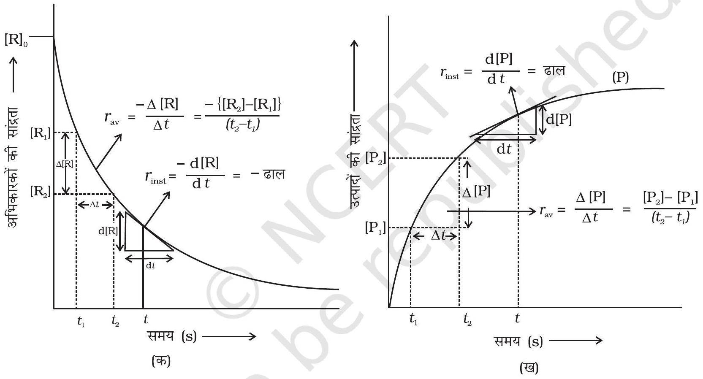
चित्र $3.1$ - अभिक्रिया का तात्क्षणिक एवं औसत वेग

## अभिक्रिया वेग की इकाइयाँ

समीकरण $3.1$ एवं $3.2$ से स्पष्ट है कि अभिक्रिया वेग की इकाई, सांद्रता समय ${ }^{-1}$ है। उदाहरणार्थ, यदि सांद्रता की इकाई $\mathrm{mol} \mathrm{L}^{-1}$ तथा समय की इकाई सेकेंड में ली जाए तो अभिक्रिया वेग की इकाई $\mathrm{mol} \mathrm{L}^{-1} \mathrm{~s}^{-1}$ होगी। तथापि, गैसीय अभिक्रियाओं में जब गैसों की सांद्रता आंशिक दाब द्वारा व्यक्त की जाती है, तब वेग की इकाई $\mathrm{atm} \mathrm{s}^{-1}$ होगी। सारणी $3.1$ से यह देखा जा सकता है कि औसत वेग का मान $1.90 \times 10^{-4} \mathrm{~mol} \mathrm{~L}^{-1} \mathrm{~s}^{-1}$ से $0.40 \times 10^{-4} \mathrm{~mol} \mathrm{~L}^{-1} \mathrm{~s}^{-1}$ के मध्य है। तथापि औसत वेग किसी क्षण पर अभिक्रिया वेग को व्यक्त करने के लिए प्रयुक्त नहीं हो सकता क्योंकि जिस समयांतराल के लिए इसकी

उदाहरण $3.1 \mathrm{C}_{4} \mathrm{H}_{9} \mathrm{Cl}$ (ब्यूटिल क्लोराइड) की विभिन्न समय पर दी गई सांद्रताओं से अभिक्रिया $\mathrm{C}_{4} \mathrm{H}_{9} \mathrm{Cl}+\mathrm{H}_{2} \mathrm{O} \rightarrow \mathrm{C}_{4} \mathrm{H}_{9} \mathrm{OH}+\mathrm{HCl}$ के लिए विभिन्न समयांतरालों में औसत वेग की गणना कीजिए।

| t/s | $0$ | $50$ | $100$ | $150$ | $200$ | $300$ | $400$ | $700$ | $800$ |
| :--- | :--- | :--- | :--- | :--- | :--- | :--- | :--- | :--- | :--- |
| $\left[\mathrm{C}_{4} \mathrm{H}_{9} \mathrm{Cl}\right] / \mathrm{mol} \mathrm{L}^{-1}$ | $0.100$ | $0.0905$ | $0.0820$ | $0.0741$ | $0.0671$ | $0.0549$ | $0.0439$ | $0.0210$ | $0.017$ |

हल हम विभिन्न समयांतरालों पर सांद्रता में परिवर्तन की गणना कर सकते हैं अतः हम औसत वेग, $\Delta[\mathrm{R}]$ को $\Delta \mathrm{t}$ से भाग देकर ज्ञात कर सकते हैं (सारणी 3.1)।

सारणी 3.1-ब्यूटिल क्लोराइड के जल अपघटन का औसत वेग

| $\begin{gathered} {\left[\mathrm{C}_{4} \mathrm{H}_{9} \mathrm{CI}\right]_{t_{1}} /} \\ \mathrm{mol} \mathrm{~L}^{-1} \end{gathered}$ | $\begin{gathered} {\left[\mathrm{C}_{4} \mathrm{H}_{9} \mathrm{CI}\right]_{t_{2}} /} \\ \mathrm{mol} \mathrm{~L}^{-1} \end{gathered}$ | $t_{1} / \mathrm{s}$ | $t_{2} / s$ | $\begin{aligned} & \boldsymbol{r}_{\mathbf{a v}} \boldsymbol{\times} \mathbf{1 0}^{\mathbf{4}} / \mathbf{m o l} \mathbf{L}^{-\mathbf{1}} \mathbf{s}^{-\mathbf{1}} \\ & =-\left\{\left[\mathrm{C}_{4} \mathrm{H}_{9} \mathrm{Cl}\right]_{\mathrm{t}_{2}}-\left[\mathrm{C}_{4} \mathrm{H}_{9} \mathrm{Cl}\right]_{\mathrm{t}_{1}} /\left(\mathrm{t}_{2}-\mathrm{t}_{1}\right)\right\} \times 10^{4} \end{aligned}$ |
| :--- | :--- | :--- | :--- | :--- |
| $0.100$ | $0.0905$ | $0$ | $50$ | $1.90$ |
| $0.0905$ | $0.0820$ | $50$ | $100$ | $1.70$ |
| $0.0820$ | $0.0741$ | $100$ | $150$ | $1.58$ |
| $0.0741$ | $0.0671$ | $150$ | $200$ | $1.40$ |
| $0.0671$ | $0.0549$ | $200$ | $300$ | $1.22$ |
| $0.0549$ | $0.0439$ | $300$ | $400$ | $1.10$ |
| $0.0439$ | $0.0335$ | $400$ | $500$ | $1.04$ |
| $0.0210$ | $0.017$ | $700$ | $800$ | $0.4$ |

गणना की गई है, उसमें यह अपरिवर्तित रहेगा। इसलिए समय के किसी क्षण पर वेग व्यक्त करने के लिए तात्क्षणिक वेग ज्ञात किया जाता है। इसे हम किसी अतिलघु समयांतराल dt (जब $\Delta \mathrm{t}$ शून्य की ओर अग्रसर हो) के लिए औसत वेग द्वारा प्राप्त कर सकते हैं। अतः गणितीय रूप में अनंत सूक्ष्म dt के लिए तात्क्षणिक वेग को निम्नलिखित प्रकार से व्यक्त करते हैं-

$$
\mathrm{r}_{\mathrm{av}}=\frac{-\Delta[\mathrm{R}]}{\Delta t}=\frac{\Delta[\mathrm{P}]}{\Delta t}
$$

जब $\Delta t \rightarrow 0$

$$
\text { या } \mathrm{r}_{\mathrm{inst}}=\frac{-\mathrm{d}[\mathrm{R}]}{\mathrm{d} t}=\frac{\mathrm{d}[\mathrm{P}]}{\mathrm{d} t}
$$

इसे ग्राफ द्वारा, R अथवा P में से किसी के भी सांद्रता-समय वक्र पर स्पर्श रेखा खींच कर तथा उसके ढाल की गणना करके ज्ञात किया जा सकता है (चित्र 3.2)। उदाहरण $3.1$

चित्र 3.2- ब्यूटिल क्लोराइड $\left(\mathrm{C}_{4} \mathrm{H}_{9} \mathrm{Cl}\right)$ के जल अपघटन का तात्क्षणिक वेग
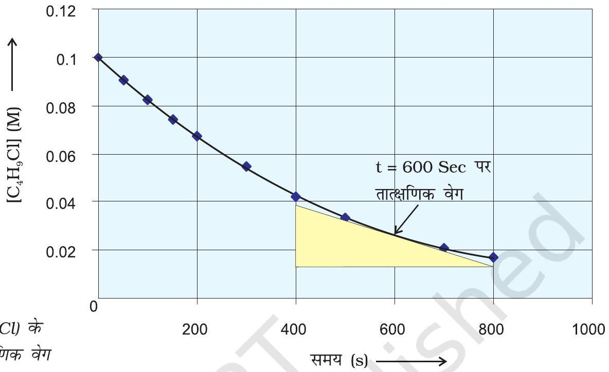

स्पर्श रेखा का ढाल तात्क्षणिक वेग का मान देता है।
अतः $600$ s पर-

$$
\begin{aligned}
r_{\text {inst }} & =-\frac{(0.0165-0.037) \mathrm{mol} \mathrm{~L}^{-1}}{(800-400) \mathrm{s}} \\
& =5.12 \times 10^{-5} \mathrm{~mol} \mathrm{~L}^{-1} \mathrm{~s}^{-1}
\end{aligned}
$$

$$
\begin{aligned}
& t=250 \mathrm{~s} \text { पर } \quad \begin{array}{l}
r_{\text {inst }}=1.22 \times 10^{-4} \mathrm{~mol} \mathrm{~L}^{-1} \mathrm{~s}^{-1} \\
t=350 \mathrm{~s} \text { पर } \quad r_{\text {inst }}=1.0 \times 10^{-4} \mathrm{~mol} \mathrm{~L}^{-1} \mathrm{~s}^{-1} \\
t=450 \mathrm{~s} \text { पर } \quad r_{\text {inst }}=6.4 \times 10^{-4} \mathrm{~mol} \mathrm{~L}^{-1} \mathrm{~s}^{-1}
\end{array}
\end{aligned}
$$

अब अभिक्रिया $\mathrm{Hg}(\mathrm{l})+\mathrm{Cl}_{2}(\mathrm{~g}) \rightarrow \mathrm{HgCl}_{2}(\mathrm{~s})$ पर विचार करते हैं। इस अभिक्रिया में अभिक्रियक व उत्पादों के स्टॉइकियोमीट्री गुणांक समान है। अतः ऐसी अभिक्रिया के लिए-

$$
\text { अभिक्रिया वेग } \quad=\frac{-\Delta[\mathrm{Hg}]}{\Delta t}=\frac{-\Delta\left[\mathrm{Cl}_{2}\right]}{\Delta t}=\frac{\Delta\left[\mathrm{HgCl}_{2}\right]}{\Delta t}
$$

अर्थात् किसी अभिक्रियक की सांद्रता में कमी की दर उत्पाद की सांद्रता की वृद्धि की दर के समान होती है। किंतु निम्नलिखित अभिक्रिया में HI के दो मोल अपघटित होकर $\mathrm{H}_{2}$ तथा $\mathrm{I}_{2}$ में से प्रत्येक का एक मोल देते हैं-

$$
2 \mathrm{HI}(\mathrm{~g}) \rightarrow \mathrm{H}_{2}(\mathrm{~g})+\mathrm{I}_{2}(\mathrm{~g})
$$

जिन अभिक्रियाओं में अभिक्रियक एवं उत्पादों के स्टॉइकियोमीट्री गुणांक समान नहीं होते, उनके वेग को व्यक्त करने के लिए किसी भी अभिक्रियक की सांद्रता में कमी की

दर अथवा किसी भी उत्पाद की सांद्रता में वृद्धि की दर को क्रमशः उनके स्टॉइकियोमीट्री गुणांक से भाग देते हैं। उपरोक्त उदाहरण में HI की सांद्रता में कमी की दर, $\mathrm{H}_{2}$ अथवा $\mathrm{I}_{2}$ की सांद्रता में वृद्धि की दर से दुगुनी हैं अतः इन्हें समान बनाने के लिए $\Delta[\mathrm{HI}]$ को $2$ से भाग देते हैं-

इस अभिक्रिया का वेग $=-\frac{1}{2} \frac{\Delta[\mathrm{HI}]}{\Delta t}=\frac{\Delta\left[\mathrm{H}_{2}\right]}{\Delta t}=\frac{\Delta\left[\mathrm{I}_{2}\right]}{\Delta t}$
इसी प्रकार से अभिक्रिया-

$$
5 \mathrm{Br}^{-}(\mathrm{aq})+\mathrm{BrO}_{3}^{-}(\mathrm{aq})+6 \mathrm{H}^{+}(\mathrm{aq}) \rightarrow 3 \mathrm{Br}_{2}(\mathrm{aq})+3 \mathrm{H}_{2} \mathrm{O}(\mathrm{l}) \text { के लिए }
$$

अभिक्रिया वेग $=-\frac{1}{5} \frac{\Delta\left[\mathrm{Br}^{-}\right]}{\Delta t}=-\frac{\Delta\left[\mathrm{BrO}_{3}^{-}\right]}{\Delta t}=-\frac{1}{6} \frac{\Delta\left[\mathrm{H}^{+}\right]}{\Delta t}=\frac{1}{3} \frac{\Delta\left[\mathrm{Br}_{2}\right]}{\Delta t}=\frac{1}{3} \frac{\Delta\left[\mathrm{H}_{2} \mathrm{O}\right]}{\Delta t}$
किसी गैसीय अभिक्रिया के लिए सांद्रता आंशिक दाब के समानुपाती होती है, अतः अभिक्रिया वेग को अभिकर्मक अथवा उत्पाद के आंशिक दाब में परिवर्तन की दर से व्यक्त किया जा सकता है।

उदाहरण $3.2318 \mathrm{~K}$ पर $\mathrm{N}_{2} \mathrm{O}_{5}$ के अपघटन की अभिक्रिया का अध्ययन, $\mathrm{CCl}_{4}$ विलयन में $\mathrm{N}_{2} \mathrm{O}_{5}$ की सांद्रता के मापन द्वारा किया गया। प्रारंभ में $\mathrm{N}_{2} \mathrm{O}_{5}$ की सांद्रता $2.33 \mathrm{~mol} \mathrm{~L}^{-1}$ थी जो $184$ मिनट बाद घटकर $2.08 \mathrm{~mol} \mathrm{~L}^{-1}$ रह गई। यह अभिक्रिया निम्नलिखित समीकरण के अनुसार होती है-

$$
2 \mathrm{~N}_{2} \mathrm{O}_{5}(\mathrm{~g}) \rightarrow 4 \mathrm{NO}_{2}(\mathrm{~g})+\mathrm{O}_{2}(\mathrm{~g})
$$

इस अभिक्रिया के लिए औसत वेग की गणना घंटों, मिनटों तथा सेकेंडों के पद में कीजिए। इस समय अंतराल में $\mathrm{NO}_{2}$ के उत्पादन की दर क्या है।

हल औसत वेग $=\frac{1}{2}-\frac{\Delta\left[\mathrm{N}_{2} \mathrm{O}_{5}\right]}{\Delta t}$

$$
\begin{aligned}
& =-\frac{1}{2} \frac{(2.08-2.33) \mathrm{mol} \mathrm{~L}^{-1}}{184 \mathrm{~min}^{-1}} \\
& =6.79 \times 10^{-4} \mathrm{~mol} \mathrm{~L}^{-1} / \mathrm{min}^{-1} \times(60 \mathrm{~min} / 1 \mathrm{~h}) \\
& =\left(6.79 \times 10^{-4} \mathrm{~mol} \mathrm{~L}^{-1} \mathrm{~min}^{-1}\right) \times(60 \mathrm{a}) \\
& =4.07 \times 10^{-2} \mathrm{~mol} \mathrm{~L}^{-1} / \mathrm{h} \\
& =6.79 \times 10^{-4} \mathrm{~mol} \mathrm{~L}^{-1} \times 1 \mathrm{~min} / 60 \mathrm{~s} \\
& =1.13 \times 10^{-5} \mathrm{~mol} \mathrm{~L}^{-1} \mathrm{~s}^{-1}
\end{aligned}
$$

यह ध्यान रहे कि-

$$
\text { वेग }=\frac{1}{4} \frac{\Delta\left[\mathrm{NO}_{2}\right]}{\Delta t}
$$

$\frac{\Delta\left[\mathrm{NO}_{2}\right]}{\Delta t}=6.79 \times 10^{-4} \times 4 \mathrm{~mol} \mathrm{~L}^{-1} \mathrm{~min}^{-1}=2.72 \times 10^{-3} \mathrm{~mol} \mathrm{~L}^{-1} \mathrm{~min}^{-1}$

## पाठ्यनिहित प्रश्न

$3.1 \mathrm{R} \rightarrow \mathrm{P}$, अभिक्रिया के लिए अभिकारक की सांद्रता $0.03 \mathrm{M}$ से $25$ मिनट में परिवर्तित हो कर $0.02 \mathrm{M}$ हो जाती है। औसत वेग की गणना सेकेंड तथा मिनट दोनों इकाइयों में कीजिए।
$3.22 \mathrm{~A} \rightarrow$ उत्पाद, अभिक्रिया में A की सांद्रता $10$ मिनट में $0.5 \mathrm{~mol} \mathrm{~L}^{-1}$ से घट कर $0.4 \mathrm{~mol} \mathrm{~L}^{-1}$ रह जाती है। इस समयांतराल के लिए अभिक्रिया वेग की गणना कीजिए।

## $3.2$ अभिक्रिया वेग को प्रभावित करने वाले कारक

अभिक्रिया वेग प्रायोगिक परिस्थितियों, जैसे- अभिक्रियकों की सांद्रता (गैसों के संदर्भ में दाब), ताप तथा उत्प्रेरक पर निर्भर करता है।

### 3.2.1 अभिक्रिया वेग की सांद्रता पर निर्भरता

3.2.2 वेग व्यंजक एवं वेग स्थिरांक

किसी दिए गए ताप पर अभिक्रिया वेग, एक अथवा अनेक अभिक्रियकों तथा उत्पादों की सांद्रताओं पर निर्भर हो सकता है। अभिक्रिया वेग का अभिक्रियकों की सांद्रता के पदों में निरुपण वेग नियम (Rate Law) कहलाता है। इसे वेग समीकरण अथवा वेग व्यंजक भी कहते हैं।

सारणी $3.1$ के परिणाम स्पष्ट दर्शाते हैं कि समय के साथ जैसे-जैसे अभिक्रियकों की सांद्रता घटती है, अभिक्रिया वेग घटता जाता है। इसके विपरीत अभिक्रिया वेग सामान्यतः, अभिक्रियकों की सांद्रता में वृद्धि होने से बढ़ता है। अतः अभिक्रिया का वेग अभिक्रियकों की सांद्रता पर निर्भर करता है।

एक सामान्य अभिक्रिया-

$$
\mathrm{aA}+\mathrm{bB} \rightarrow \mathrm{cC}+\mathrm{dD}
$$

पर विचार करें जिसमें a, b, c तथा d अभिक्रियकों एवं उत्पादों के स्टॉइकियोमीट्री गुणांक हैं। इस अभिक्रिया के लिए वेग व्यंजक होगा

$$
\text { वेग } \propto[\mathrm{A}]^{x}[\mathrm{~B}]^{y}
$$

यहाँ घातांक $x$ तथा $y$ स्टॉइकियोमीट्री गुणांक ( $a$ तथा $b$ ) के समान अथवा भिन्न हो सकते हैं। उक्त समीकरण को हम निम्न रूप में लिख सकते हैं-

$$
\begin{aligned}
& \text { वेग }=k[\mathrm{~A}]^{x}[\mathrm{~B}]^{y} \\
& -\frac{\mathrm{d}(\mathrm{r})}{\mathrm{dt}}=k[\mathrm{~A}]^{x}[\mathrm{~B}]^{y}
\end{aligned}
$$

समीकरण $3.4$ (ख) को अवकल वेग समीकरण कहते हैं। यहाँ $k$ समानुपाती स्थिरांक है जिसे वेग स्थिरांक कहते हैं। $3.4$ जैसी समीकरण को जो कि अभिक्रिया वेग एवं अभिक्रियकों की सांद्रता में संबंध स्थापित करती है, वेग नियम अथवा वेग व्यंजक कहते हैं। अतः वेग नियम वह व्यंजक होता है जिसमें किसी अभिक्रिया के वेग को अभिक्रियकों की मोलर सांद्रता के पद पर कोई घातांक लगाकर व्यक्त करते हैं। वह किसी संतुलित रासायनिक समीकरण में अभिकर्मकों के स्टॉइकियोमीट्री गुणांक के समान अथवा भिन्न भी हो सकते हैं।

उदाहरण के लिए अभिक्रिया-

$$
2 \mathrm{NO}(\mathrm{~g})+\mathrm{O}_{2}(\mathrm{~g}) \rightarrow 2 \mathrm{NO}_{2}(\mathrm{~g})
$$

इस अभिक्रिया के वेग का निर्धारण या तो किसी एक अभिक्रियक की सांद्रता को स्थिर रखते हुए दूसरे अभिक्रियक की सांद्रता में परिवर्तन करके, अथवा दोनों अभिक्रियकों की सांद्रता परिवर्तित करके, प्रारंभिक सांद्रताओं के फलन के रूप में कर सकते हैं। परिणाम सारणी $3.2$ में दिए गए हैं।

सारणी $3.2-\mathbf{N O}_{\mathbf{2}}$ के विरचन का प्रारंभिक वेग
| प्रयोग | प्रारंभिक $[\mathrm{NO}] / \mathrm{mol} \mathrm{L}^{-1}$ | प्रारंभिक $\left[\mathrm{O}_{2}\right] / \mathrm{mol} \mathrm{L}^{-1}$ | $\mathrm{NO}_{2}$ के विरचन का प्रारंभिक वेग/mol $\mathrm{L}^{-1} \mathrm{~s}^{-1}$ |
| :--- | :--- | :--- | :--- |
| $1$. | $0.30$ | $0.30$ | $0.096$ |
| $2$. | $0.60$ | $0.30$ | $0.384$ |
| $3$. | $0.30$ | $0.60$ | $0.192$ |
| $4$. | $0.60$ | $0.60$ | $0.768$ |

परिणामों से स्पष्ट परिलक्षित होता है कि जब $\mathrm{O}_{2}$ की सांद्रता स्थिर रखकर NO की सांद्रता दुगुनी की जाती है तब अभिक्रिया के प्रारंभिक वेग में चार के गुणक $\left(0.096 \mathrm{~mol} \mathrm{~L}^{-1} \mathrm{~s}^{-1}\right.$ से $\left.0.384 \mathrm{~mol} \mathrm{~L}^{-1} \mathrm{~s}^{-1}\right)$ से वृद्धि होती है। यह दर्शाता है कि वेग NO की सांद्रता के वर्गफल पर निर्भर करता है। जब NO की सांद्रता स्थिर रखी जाती है तथा $\mathrm{O}_{2}$ की सांद्रता दुगुनी की जाती है तब अभिक्रिया वेग का दुगुना होना अभिक्रिया वेग का $\mathrm{O}_{2}$ की सांद्रता की एक घात पर निर्भरता दर्शाता है। अतः इस अभिक्रिया के लिए वेग समीकरण होगा-

$$
\text { वेग }=k[\mathrm{NO}]^{2}\left[\mathrm{O}_{2}\right]
$$

इस समीकरण का अवकल रूप समीकरण $-\frac{\mathrm{d}(\mathrm{r})}{\mathrm{d} t}=k[\mathrm{NO}]^{2}\left[\mathrm{O}_{2}\right]$ द्वारा दिया जाता है।
इस अभिक्रिया में प्रायोगिक आँकड़ों से प्राप्त वेग समीकरण में सांद्रताओं के घातांकों का मान, संतुलित अभिक्रिया में सांद्रताओं के स्टॉइकियोमीट्री घातांकों के समान है। कुछ अन्य उदाहरण निम्नलिखित हैं-

## अभिक्रिया

प्रायोगिक वेग समीकरण

1. $\mathrm{CHCl}_{3}+\mathrm{Cl}_{2} \rightarrow \mathrm{CCl}_{4}+\mathrm{HCl}$

वेग $=k\left[\mathrm{CHCl}_{3}\right]\left[\mathrm{Cl}_{2}\right]^{1 / 2}$

2. $\mathrm{CH}_{3} \mathrm{COOC}_{2} \mathrm{H}_{5}+\mathrm{H}_{2} \mathrm{O} \rightarrow \mathrm{CH}_{3} \mathrm{COOH}+\mathrm{C}_{2} \mathrm{H}_{5} \mathrm{OH}$

वेग $=k\left[\mathrm{CH}_{3} \mathrm{COOC}_{2} \mathrm{H}_{5}\right]\left[\mathrm{H}_{2} \mathrm{O}\right]^{0}$
इन अभिक्रियाओं में सांद्रता पदों के घातांक समीकरण में उपस्थित स्टॉकियोमीट्री गुणांकों से भिन्न हैं अतः हम कह सकते हैं-

वेग नियम को किसी संतुलित अभिक्रिया को देखकर प्रागुक्त नहीं किया जा सकता, यानी इसका निर्धारण सैद्धांतिक रूप से नहीं; बल्कि प्रायोगिक रूप से किया जाता है।

### 3.2.3 अभिक्रिया की कोटि वेग समीकरण $3.4$ (क) में-

$$
\text { वेग }=k[\mathrm{~A}]^{x}[\mathrm{~B}]^{y}
$$

$x$ एवं $y$ इंगित करते हैं कि अभिक्रिया का वेग, A अथवा B के सांद्रता परिवर्तन से कैसे प्रभावित होता है। समीकरण $3.4$ (क) में इन घातकों का योग $x+y$ अभिक्रिया की

कुल कोटि को व्यक्त करता है जबकि $x$ तथा $y$ क्रमशः A तथा B के प्रति अभिक्रिया की कोटि को प्रदर्शित करते हैं।

अतः किसी अभिक्रिया के वेग नियम व्यंजक में प्रयुक्त सांद्रताओं के घातांकों का योग उस अभिक्रिया की कोटि कहलाती है। अभिक्रिया की कोटि $0,1,2,3$ अथवा भिन्नात्मक भी हो सकती है। अभिक्रिया की कोटि के शून्य होने का अर्थ है कि अभिक्रिया वेग अभिक्रियकों की सांद्रता पर निर्भर नहीं करता।

उदाहरण $3.3$ उन अभिक्रियाओं की कुल कोटि की गणना कीजिए जिनका वेग व्यंजक है-

(क) वेग $=k[\mathrm{~A}]^{1 / 2}[\mathrm{~B}]^{3 / 2}$
(ख) वेग $=k[\mathrm{~A}]^{3 / 2}[\mathrm{~B}]^{-1}$

हल (क) वेग $=k[\mathrm{~A}]^{x}[\mathrm{~B}]^{y}$; कुल कोटि $=x+y$
अत: कुल कोटि $=\frac{1}{2}+\frac{3}{2}=2=$ अर्थात् द्वितीय कोटि

(ख) कुल कोटि $=\frac{3}{2}+(-1)=\frac{1}{2}$ अर्थात् अर्द्ध कोटि

संतुलित रासायनिक समीकरण, अभिक्रिया कैसे हो रही है; इसका सही चित्रण कभी भी प्रस्तुत नहीं करती; क्योंकि विरले ही कोई अभिक्रिया एक पद में पूर्ण होती है। एक पद में होने वाली अभिक्रियाओं को प्राथमिक अभिक्रियाएँ (Elementary Reactions) कहते हैं। जब प्राथमिक अभिक्रियाएँ एक पद में न हों; बल्कि कई पदों में संपन्न होकर उत्पाद बनाती हों, तब ऐसी अभिक्रियाओं को जटिल अभिक्रियाएँ (Complex Reactions) कहते हैं। ये अभिक्रियाएँ क्रमागत (जैसे, एथेन का $\mathrm{CO}_{2}$ तथा $\mathrm{H}_{2} \mathrm{O}$ में ऑक्सीकरण कई माध्यमिक पदों द्वारा जिनमें एल्कोहॉल, एल्डिहाइड तथा अम्ल बनते हैं), विपरीत अभिक्रियाएँ तथा पार्श्व अभिक्रियाएँ (जैसे फ़ीनॉल के नाइट्रोकरण द्वारा ऑर्थोनाइट्रोफ़ीनॉल तथा पैरानाइट्रोफ़ीनॉल का बनना) हो सकती हैं।

वेग स्थिरांक की इकाइयाँ-
एक सामान्य अभिक्रिया-

$$
\begin{aligned}
& \mathrm{aA}+\mathrm{b} \mathrm{~B} \rightarrow \mathrm{cC}+\mathrm{dD} \text { के लिए } \\
& \text { वेग }=k(\mathrm{~A})^{x}(\mathrm{~B})^{y}
\end{aligned}
$$

जहाँ $x+y=n=$ अभिक्रिया की कोटि

$$
k=\frac{\text { वेग }}{[\mathrm{A}]^{\mathrm{x}}[\mathrm{~B}]^{\mathrm{y}}}=\frac{\text { सांद्रता }}{\text { समय }} \times \frac{1}{(\text { सांद्रता })^{\mathrm{n}}} \quad \text { जब }[\mathrm{A}]=[\mathrm{B}]
$$

सांद्रता एवं समय की SI इकाई $\mathrm{mol} \mathrm{L}^{-1}$ एवं s लेने पर विभिन्न अभिक्रियाओं के लिए $k$ की इकाइयाँ सारणी $3.3$ में दर्शायी गई हैं।

सारणी 3.3- वेग स्थिरांक की इकाइयाँ
| अभिक्रिया | कोटि | वेग स्थिरांक की इकाई |
| :--- | :--- | :--- |
| शून्य कोटि अभिक्रिया | $0$ | $\frac{\mathrm{molL}^{-1}}{\mathrm{~s}} \times \frac{1}{\left(\mathrm{molL}^{-1}\right)^{0}}=\mathrm{molL}^{-1} \mathrm{~s}^{-1}$ |
| प्रथम कोटि अभिक्रिया | $1$ | $\frac{\mathrm{molL}^{-1}}{\mathrm{~s}} \times \frac{1}{\left(\mathrm{~mol} \mathrm{~L}^{-1}\right)^{1}}=\mathrm{s}^{-1}$ |
| द्वितीय कोटि अभिक्रिया | $2$ | $\frac{\mathrm{molL}^{-1}}{\mathrm{~s}} \times \frac{1}{\left(\mathrm{~mol} \mathrm{~L}^{-1}\right)^{2}}=\mathrm{mol}^{-1} \mathrm{Ls}^{-1}$ |

उदाहरण $3.4$ निम्नलिखित वेग स्थिरांकों से अभिक्रिया कोटि की पहचान कीजिए-

(i) $k=2.3 \times 10^{-5} \mathrm{~L} \mathrm{~mol}^{-1} \mathrm{~s}^{-1}$
(ii) $k=3 \times 10^{-4} \mathrm{~s}^{-1}$

हल (i) द्वितीय कोटि अभिक्रिया के वेग स्थिरांक की इकाई $\mathrm{L} \mathrm{mol}^{-1} \mathrm{~s}^{-1}$ होती है, अत: $k=2.3 \times 10^{-5} \mathrm{~L} \mathrm{~mol}^{-1} \mathrm{~s}^{-1}$ द्वितीय कोटि अभिक्रिया को निरूपित करता है।

(ii) प्रथम कोटि अभिक्रिया के वेग स्थिरांक की इकाई $\mathrm{s}^{-1}$ होती है। अतः $k=3 \times 10^{-4} \mathrm{~s}^{-1}$ प्रथम कोटि अभिक्रिया को निरूपित करता है।

### 3.2.4 अभिक्रिया की आण्विकता

अभिक्रिया का एक अन्य गुणधर्म, जिसे आण्विकता कहते हैं, अभिक्रिया की क्रियाविधि समझने में सहायता करता है। प्राथमिक अभिक्रिया में भाग लेने वाली स्पीशीज़ ( परमाणु, आयन अथवा अणु) जो कि एक साथ संघट्ट के फलस्वरूप रासायनिक अभिक्रिया करती हैं, की संख्या को अभिक्रिया की आण्विकता कहते हैं। जब अभिक्रिया में केवल एक स्पीशीज़ संलग्न हो तो अभिक्रिया एक अणुक कहलाती है, उदाहरणार्थ- अमोनियम नाइट्राइट का अपघटन

$$
\mathrm{NH}_{4} \mathrm{NO}_{2} \rightarrow \mathrm{~N}_{2}+2 \mathrm{H}_{2} \mathrm{O}
$$

द्वि-परमाणुक अभिक्रियाओं में एक साथ दो स्पीशीज़ का संघट्ट होता है, उदाहरणार्थ-हाइड्रोजन आयोडाइड का वियोजन

$$
2 \mathrm{HI} \rightarrow \mathrm{H}_{2}+\mathrm{I}_{2}
$$

त्रि-परमाणुक अभिक्रियाओं में एक साथ तीन स्पीशीज़ का संघट्ट होता है, जैसे-

$$
2 \mathrm{NO}+\mathrm{O}_{2} \rightarrow 2 \mathrm{NO}_{2}
$$

उचित विन्यास के साथ तीन से अधिक अणुओं के एक साथ संघट्ट के उपरांत अभिकृत होने की संभाव्यता अत्यंत कम होती है। अतः त्रिअणुक आण्विकता की अभिक्रियाएं बहुत कम होती हैं और धीमी गति से बढ़ती हैं।

इस प्रकार स्पष्ट है कि जटिल अभिक्रियाएं जिनके स्टॉइकियोमीट्री समीकरण में तीन से अधिक अणु होते हैं, वे एक से अधिक पदों में होनी चाहिए, जैसे-

$$
\mathrm{KClO}_{3}+6 \mathrm{FeSO}_{4}+3 \mathrm{H}_{2} \mathrm{SO}_{4} \rightarrow \mathrm{KCl}+3 \mathrm{Fe}_{2}\left(\mathrm{SO}_{4}\right)_{3}+3 \mathrm{H}_{2} \mathrm{O}
$$

यह अभिक्रिया जो ऊपरी तौर से दशम कोटि की आभासित होती है, वास्तव में द्वितीय

कोटि की अभिक्रिया है। यह बताता है कि यह अभिक्रिया अनेक पदों में संपन्न होती है। कौन सा पद कुल अभिक्रिया वेग को नियंत्रित करता है, इस प्रश्न का उत्तर हम अभिक्रिया की क्रियाविधि को ज्ञात करके दे सकते हैं। उदाहरण के लिए रिले दौड़ प्रतियोगिता में जीतने की संभावना समूह के सबसे मंद धावक पर निर्भर करती है। ठीक इसी प्रकार अभिक्रिया का कुल वेग अभिक्रिया के सबसे मंद पद द्वारा नियंत्रित होता है, जिसे वेग निर्धारक पद कहते हैं। क्षारीय माध्यम में आयोडाइड आयन से उत्प्रेरित हाइड्रोजन परऑक्साइड के अपघटन की अभिक्रिया पर विचार कीजिए।

$$
2 \mathrm{H}_{2} \mathrm{O}_{2} \quad \frac{\mathrm{I}^{-}}{\text {क्षारीय माध्य म }} \rightarrow 2 \mathrm{H}_{2} \mathrm{O}+\mathrm{O}_{2}
$$

इस अभिक्रिया के लिए निम्नलिखित वेग समीकरण प्राप्त होता है-

$$
\text { वेग }=\frac{-\mathrm{d}\left[\mathrm{H}_{2} \mathrm{O}_{2}\right]}{\mathrm{d} t}=k\left[\mathrm{H}_{2} \mathrm{O}_{2}\right]\left[\mathrm{I}^{-}\right]
$$

यह अभिक्रिया $\mathrm{H}_{2} \mathrm{O}_{2}$ एवं $\mathrm{I}^{-}$, प्रत्येक के प्रति प्रथम कोटि की है। प्रमाण, अभिक्रिया के दो पदों में सम्पन्न होने का संकेत देते हैं।

(i) $\mathrm{H}_{2} \mathrm{O}_{2}+\mathrm{I}^{-} \rightarrow \mathrm{H}_{2} \mathrm{O}+\mathrm{IO}^{-}$(मंद पद)
(ii) $\mathrm{H}_{2} \mathrm{O}_{2}+\mathrm{IO}^{-} \rightarrow \mathrm{H}_{2} \mathrm{O}+\mathrm{I}^{-}+\mathrm{O}_{2}$

दोनों पद द्वि-अणुक प्राथमिक अभिक्रिया हैं। $\mathrm{IO}^{-}$स्पीशीज़ को मध्यवर्ती कहते हैं, क्योंकि यह अभिक्रिया में निर्मित होती है। परंतु समग्र संतुलित समीकरण में परिलक्षित नहीं होती। प्रथम पद मंद होने के कारण वेग निर्धारक पद है। अतः इस अभिक्रिया में मध्यवर्ती बनने की दर अभिक्रिया वेग को निर्धारित करेगी।

अतः अब तक के वर्णन से हम निम्न निष्कर्ष निकाल सकते हैं-

(i) अभिक्रिया की कोटि एक प्रायोगिक मात्रा है। यह शून्य तथा भिन्नात्मक भी हो सकती है। परंतु अभिक्रिया की आण्विकता शून्य अथवा अपूर्णांक नहीं हो सकती।
(ii) अभिक्रिया की कोटि प्राथमिक एवं जटिल दोनों प्रकार की अभिक्रियाओं पर लागू होती है जबकि अभिक्रिया की आण्विकता केवल प्राथमिक अभिक्रिया के लिए ही परिभाषित होती है। जटिल अभिक्रियाओं के लिए आण्विकता का कोई अर्थ नहीं होता।
(iii) जटिल अभिक्रियाओं में कोटि सबसे मंद पद की दी जाती है तथा सबसे मंद पद की आण्विकता तथा कोटि समान होती है।

## पाठ्यनिहित प्रश्न

$3.3$ एक अभिक्रिया $\mathrm{A}+\mathrm{B} \rightarrow$ उत्पाद, के लिए वेग नियम $r=k[\mathrm{~A}]^{1 / 2}[\mathrm{~B}]^{2}$ से दिया गया है। अभिक्रिया की कोटि क्या है?
$3.4$ अणु X का Y में रूपांतरण द्वितीय कोटि की बलगतिकी के अनुरूप होता है। यदि X की सांद्रता तीन गुनी कर दी जाए तो Y के निर्माण होने के वेग पर क्या प्रभाव पड़ेगा?

## $3.3$ समाकलित वेग समीकरण

3.3.1 शून्य कोटि की अभिक्रियाएँ

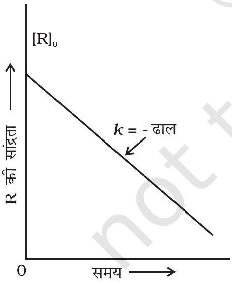
चित्र $3.3$ - शून्य कोटि की अभिक्रिया के लिए सांद्रता का समय के साथ परिवर्तन आलेख

सांद्रता पर आधारित वेग समीकरण को अवकल वेग समीकरण कहते हैं। तात्कालिक वेग का निर्धारण सदैव आसान नहीं होता, क्योंकि इसका मान सांद्रता एवं समय के मध्य खींचे वक्र के ' $t$ ' बिंदु पर खींची गई स्पर्श रेखा का ढाल माप कर किया जाता है (चित्र 3.1)। इससे वेग नियम ज्ञात करना कठिन हो जाता है, अतः अभिक्रिया की कोटि भी ज्ञात करना कठिन हो जाता है। इस कठिनाई के निवारण हेतु हम वेग समीकरण को समाकलित करके समाकलित वेग समीकरण प्राप्त कर सकते हैं, जिससे हमें सीधे ही मापे हुए प्रायोगिक आँकड़ों, अर्थात् विभिन्न समय पर सांद्रता तथा वेग स्थिरांक के बीच संबंध ज्ञात हो जाता है।

विभिन्न कोटि की अभिक्रियाओं के लिए अलग-अलग समाकलित वेग समीकरण होते हैं। यहाँ पर हम केवल शून्य एवं प्रथम कोटि की अभिक्रियाओं के लिए ही समाकलित वेग समीकरणों की व्युत्पत्ति करेंगे।

शून्य कोटि की अभिक्रिया का अर्थ होता है ऐसी अभिक्रिया जिसका वेग अभिक्रियक की सांद्रता के शून्य घातांक के समानुपाती हो।

अभिक्रिया, $\mathrm{R} \rightarrow \mathrm{P}$ पर विचार करें-

$$
\text { वेग }=-\frac{\mathrm{d}[\mathrm{R}]}{\mathrm{d} t}=k[\mathrm{R}]^{0}
$$

किसी मात्रा पर शून्य घातांक का मान इकाई होता है अतः

$$
\text { वेग }=-\frac{\mathrm{d}[\mathrm{R}]}{\mathrm{d} t}=k \times 1
$$

या $\mathrm{d}[\mathrm{R}]=-k \mathrm{~d} t$
दोनों तरफ समाकलन करने पर-

$$
[\mathrm{R}]=-k t+\mathrm{I}
$$

यहाँ I, समाकलन स्थिरांक है।
$t=0$ पर अभिक्रियक $R$ की सांद्रता $=[R]_{0}$ है, जहाँ $[R]_{0}$ अभिक्रियक की प्रारंभिक सांद्रता है।

समीकरण $3.5$ में $[\mathrm{R}]_{0}$ का मान रखने पर-

$$
\begin{aligned}
& {[\mathrm{R}]_{0}=-k \times 0+\mathrm{I}} \\
& {[\mathrm{R}]_{0}=\mathrm{I}}
\end{aligned}
$$

I का मान समीकरण $3.5$ में रखने पर-

$$
[\mathrm{R}]=-k t+[\mathrm{R}]_{0}
$$

समीकरण $3.6$ सरल रेखा के समीकरण $\mathrm{y}=\mathrm{mx}+\mathrm{c}$ के समतुल्य है। यदि हम [R] एवं $t$ के बीच ग्राफ खींचें तो एक सीधी रेखा प्राप्त होती है (चित्र 3.3)। इस रेखा का ढाल $=-k$ एवं अंतः खंड $[\mathrm{R}]_{0}$ के बराबर होता है।

समीकरण $3.6$ को पुनः सरल करने पर वेग स्थिरांक प्राप्त होता है।

$$
k=\frac{[\mathrm{R}]_{0}-[\mathrm{R}]}{t}
$$

शून्य कोटि की अभिक्रियाएं अपेक्षाकृत असामान्य हैं, किंतु विशेष परिस्थितियों में यह

घटित होती हैं। कुछ एन्जाइम उत्प्रेरित अभिक्रियाएं तथा धातु सतहों पर होने वाली अभिक्रियाएं शून्य कोटि की अभिक्रियाओं के कुछ उदाहरण हैं। उच्च दाब पर, गैसीय अमोनिया का तप्त प्लैटिनम सतह पर वियोजन, शून्य कोटि की अभिक्रिया है।

$$
\begin{aligned}
& 2 \mathrm{NH}_{3}(\mathrm{~g}) \quad \begin{array}{r}
1130 \mathrm{~K} \\
\mathrm{Pt} \text { उत्प्रेरक }
\end{array} \rightarrow \mathrm{N}_{2}(\mathrm{~g})+3 \mathrm{H}_{2}(\mathrm{~g}) \\
& \text { वेग }=k\left[\mathrm{NH}_{3}\right]^{0}=k
\end{aligned}
$$

इस अभिक्रिया में, प्लेटिनम की सतह उत्प्रेरक का कार्य करती है। उच्च दाब पर, धातु की सतह गैस अणुओं से संतृप्त हो जाती है। इसलिए अभिक्रिया की परिस्थितियों में और अधिक परिवर्तन, धातु सतह पर उपस्थित अमोनिया की मात्रा में परिवर्तन नहीं कर सकता। अतः अभिक्रिया वेग अभिक्रियक की सांद्रता पर निर्भरता से स्वतंत्र हो जाता है। स्वर्ण सतह पर, HI का उष्मीय वियोजन शून्य कोटि की अभिक्रिया का एक अन्य उदाहरण है।

इस वर्ग की अभिक्रियाओं में अभिक्रिया वेग, अभिक्रियक R की सांद्रता के प्रथम घातांक के समानुपाती होता है। उदाहरणार्थ-

$$
\begin{aligned}
& \mathrm{R} \rightarrow \mathrm{P} \\
& \qquad \begin{array}{l}
\text { वेग }=-\frac{\mathrm{d}[\mathrm{R}]}{\mathrm{d} t}=k[\mathrm{R}]
\end{array} \\
& \text { या } \frac{\mathrm{d}[\mathrm{R}]}{[\mathrm{R}]}=-k \mathrm{~d} t
\end{aligned}
$$

इस समीकरण का समाकलन करने पर हम पाते हैं-

$$
\ln [\mathrm{R}]=-k t+\mathrm{I}
$$

एक बार फिर I समाकलन का स्थिरांक है तथा इसका मान सरलता से ज्ञात किया जा सकता है।

जब $t=0, \mathrm{R}=[\mathrm{R}]_{0}$, यहाँ $[\mathrm{R}]_{0}$ अभिक्रियक की प्रारंभिक सांद्रता है। अतः समीकरण $3.8$ को हम निम्न प्रकार से लिख सकते हैं-

$$
\begin{aligned}
& \ln [\mathrm{R}]_{0}=-k \times 0+\mathrm{I} \\
& \ln [\mathrm{R}]_{0}=\mathrm{I}
\end{aligned}
$$

$I$ का मान समीकरण $3.8$ में प्रतिस्थापित करने पर-

$$
\ln [\mathrm{R}]=-k t+\ln [\mathrm{R}]_{0}
$$

समीकरण को पुनः व्यवस्थित करने पर-

$$
\begin{aligned}
\ln \frac{[\mathrm{R}]}{[\mathrm{R}]_{0}} & =-k t \\
\text { या } k & =\frac{1}{t} \ln \frac{[\mathrm{R}]_{0}}{[\mathrm{R}]}
\end{aligned}
$$

समय $t_{1}$ पर, समीकरण $3.8$ से

$$
\ln [\mathrm{R}]_{1}=-k t_{1}+\ln [\mathrm{R}]_{0}
$$

समय $\mathrm{t}_{2}$ पर;

$$
\ln [\mathrm{R}]_{2}=-k t_{2}+\ln [\mathrm{R}]_{0}
$$

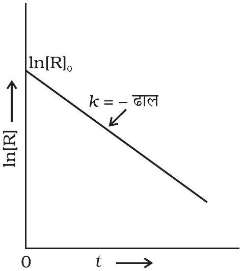
चित्र 3.4- प्रथम कोटि की अभिक्रिया के लिए $\ln [R]$ एवं $t$ के मध्य आलेख

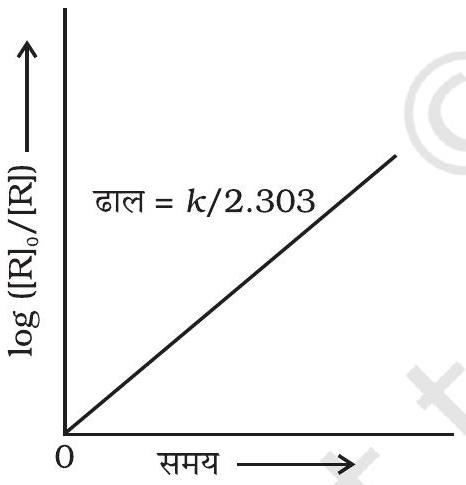
चित्र 3.5-प्रथम कोटि की अभिक्रिया के लिए $\log [R]_{O} /[R]$ एवं समय के मध्य आलेख

यहाँ $[\mathrm{R}]_{1}$ तथा $[\mathrm{R}]_{2}$ क्रमशः समय $t_{1}$ तथा $t_{2}$ पर अभिक्रियक की सांद्रताएं हैं। समीकरण $3.12$ को $3.11$ से घटाने पर-

$$
\begin{aligned}
\ln [\mathrm{R}]_{1}-\ln [\mathrm{R}]_{2} & =-k t_{1}-\left(-k t_{2}\right) \\
\ln \frac{[\mathrm{R}]_{1}}{[\mathrm{R}]_{2}} & =k\left(t_{2}-t_{1}\right) \\
k & =\frac{1}{\left(t_{2}-t_{1}\right)} \ln \frac{[\mathrm{R}]_{1}}{[\mathrm{R}]_{2}}
\end{aligned}
$$

समीकरण $3.9$ को निम्न प्रकार से भी लिख सकते हैं-

$$
\ln \frac{[\mathrm{R}]}{[\mathrm{R}]_{0}}=-k \mathrm{t}
$$

समीकरण के दोनों तरफ प्रतिलघुगुणक लेने पर-

$$
[\mathrm{R}]=[\mathrm{R}]_{0} \mathrm{e}^{-k \mathrm{t}}
$$

समीकरण $3.9$ समीकरण $y=m x+c$ के समतुल्य है, यदि हम $\ln [\mathrm{R}]$ एवं $t$ के मध्य ग्राफ खीचें (चित्र 3.4) तो हमें - ढाल $=-k$ वाली सरल रेखा प्राप्त होती है तथा अंतः खंड का मान $\ln [\mathrm{R}]_{0}$ होता है।

प्रथम कोटि के वेग समीकरण $3.10$ को निम्न प्रकार से भी लिखा जा सकता है-

$$
k=\frac{2.303}{t} \log \frac{[R]_{0}}{[R]}
$$

या* $\log \frac{[\mathrm{R}]_{0}}{[\mathrm{R}]}=\frac{k \mathrm{t}}{2.303}$
यदि हम $\log \frac{[\mathrm{R}]_{0}}{[\mathrm{R}]}$ एवं $t$ के मध्य ग्राफ खींचे (चित्र 3.5) तो ढाल $=k / 2.303$ होगा। एथीन का हाइड्रोजनन (Hydrogenation) प्रथम कोटि की अभिक्रिया का उदाहरण है।

$$
\mathrm{C}_{2} \mathrm{H}_{4}(\mathrm{~g})+\mathrm{H}_{2}(\mathrm{~g}) \rightarrow \mathrm{C}_{2} \mathrm{H}_{6}(\mathrm{~g})
$$

अतः वेग $=k\left[\mathrm{C}_{2} \mathrm{H}_{4}\right]$
अस्थायी नाभिकों के सभी प्राकृतिक तथा कृत्रिम नाभिकीय (रेडियोएक्टिव) क्षय प्रथम कोटि की बलगतिकी के द्वारा होते हैं।

$$
{ }_{88}^{226} \mathrm{Ra} \rightarrow{ }_{2}^{4} \mathrm{He}+{ }_{86}^{222} \mathrm{Rn}
$$

वेग $=k[\mathrm{Ra}]$
$\mathrm{N}_{2} \mathrm{O}_{5}$ एवं $\mathrm{N}_{2} \mathrm{O}$ का अपघटन प्रथम कोटि की अभिक्रियाओं के कुछ अन्य उदाहरण हैं। आइए, हम गैसीय अवस्था की एक प्रतिनिधिक प्रथम कोटि अभिक्रिया पर विचार करें।

$$
\mathrm{A}(\mathrm{~g}) \rightarrow \mathrm{B}(\mathrm{~g})+\mathrm{C}(\mathrm{~g})
$$

[^0]उदाहरण $3.5$ प्रथम कोटि की अभिक्रिया $\mathrm{N}_{2} \mathrm{O}_{5}(\mathrm{~g}) \rightarrow 2 \mathrm{NO}_{2}(\mathrm{~g})+\frac{1}{2} \mathrm{O}_{2}(\mathrm{~g})$ में $318 \mathrm{~K}$ पर $\mathrm{N}_{2} \mathrm{O}_{5}$ की प्रारंभिक सांद्रता $1.24 \times 10^{-2} \mathrm{~mol} \mathrm{~L}^{-1}$ थी, जो $60$ मिनट के उपरांत $0.20 \times 10^{-2} \mathrm{~mol} \mathrm{~L}^{-1}$ रह गई। $318 \mathrm{~K}$ पर वेग स्थिरांक की गणना कीजिए।

हल प्रथम कोटि की अभिक्रिया के लिए-

$$
\log \frac{[\mathrm{R}]_{1}}{[\mathrm{R}]_{2}}=\frac{k\left(\mathrm{t}_{2}-\mathrm{t}_{1}\right)}{2.303}
$$

या $k=\frac{2.303}{\mathrm{t}_{2}-\mathrm{t}_{1}} \log \frac{[\mathrm{R}]_{1}}{[\mathrm{R}]_{2}}$
या $\quad k=\frac{2.303}{(60 \mathrm{~min}-0 \mathrm{~min})} \log \frac{1.24 \times 10^{-2} \mathrm{~mol} \mathrm{~L}^{-1}}{0.20 \times 10^{-2} \mathrm{~mol} \mathrm{~L}^{-1}}$

$$
\begin{aligned}
& =\frac{2.303}{60} \log 6.2 \mathrm{~min}^{-1} \\
& =\frac{2.303}{60} \times 0.7924 \mathrm{~min}^{-1}
\end{aligned}
$$

या $\quad \mathcal{k}=0.0304 \mathrm{~min}^{-1}$

माना कि A का प्रारंभिक दाब $p_{i}$ है तथा ' t ' समय पर कुल दाब $p_{t}$ है। ऐसी अभिक्रिया के लिए समाकलित वेग समीकरण की व्युत्पत्ति निम्न प्रकार से कर सकते हैं-

कुल दाब $p_{t}=p_{A}+p_{B}+p_{C}$ (दाब इकाइयाँ)
$p_{A}, p_{B}$ एवं $p_{C}$ क्रमशः $\mathrm{A}, \mathrm{B}$ एवं C के आंशिक दाब हैं।
यदि $t$ समय पर A के दाब में $x \mathrm{~atm}$ की कमी आती है तो B एवं C प्रत्येक के एक मोल बनने पर B एवं C प्रत्येक के दाब में $x \mathrm{~atm}$ की वृद्धि होगी।

$$
\begin{array}{lllll} 
& \mathrm{A}(\mathrm{~g}) & \rightarrow & \mathrm{B}(\mathrm{~g}) & + \\
t=0 \text { समय पर } & p_{i} \mathrm{~atm} & 0 \mathrm{~atm} & 0 \mathrm{~atm} \\
\mathrm{t} \text { समय पर } & \left(p_{i}-x\right) \mathrm{atm} & x \mathrm{~atm} & x \mathrm{~atm}
\end{array}
$$

यहाँ $t=0$ समय पर प्रारंभिक दाब $p_{i}$ है।

$$
\begin{aligned}
& p_{t}=\left(p_{i}-x\right)+x+x=p_{i}+x \\
& x=p_{t}-p_{i}
\end{aligned}
$$

यहाँ, $p_{\mathrm{A}}=p_{i}-x=p_{i}-\left(p_{t}-p_{i}\right)=2 p_{i}-p_{t}$

$$
k=\frac{2.303}{t} \log \frac{p_{i}}{p_{A}}=\frac{2.303}{t} \log \frac{p_{i}}{\left(2 p_{i}-p_{t}\right)}
$$

उदाहरण $3.6$ स्थिर आयतन पर $\mathrm{N}_{2} \mathrm{O}_{5}(\mathrm{~g})$ के प्रथम कोटि के तापीय वियोजन पर निम्न आँकड़े प्राप्त हुए-

$$
2 \mathrm{~N}_{2} \mathrm{O}_{5}(\mathrm{~g}) \rightarrow 2 \mathrm{~N}_{2} \mathrm{O}_{4}(\mathrm{~g})+\mathrm{O}_{2}(\mathrm{~g})
$$

क्र.सं. समय/s कुल दाब/atm

| $1$ | $0$ | $0.5$ |
| :--- | :--- | :--- |
| $2$ | $100$ | $0.512$ |

वेग स्थिरांक की गणना कीजिए।
हल माना कि $\mathrm{N}_{2} \mathrm{O}_{5}(\mathrm{~g})$ के दाब में $2 x$ atm की कमी होती है। चूँकि $\mathrm{N}_{2} \mathrm{O}_{5}(\mathrm{~g})$ के दो मोल वियोजित होकर $\mathrm{N}_{2} \mathrm{O}_{4}(\mathrm{~g})$ के दो मोल तथा $\mathrm{O}_{2}(\mathrm{~g})$ का एक मोल देते हैं, $\mathrm{N}_{2} \mathrm{O}_{4}(\mathrm{~g})$ के दाब में $2 x \mathrm{~atm}$ की वृद्धि तथा $\mathrm{O}_{2}(\mathrm{~g})$ के दाब में $x \mathrm{~atm}$ की वृद्धि होगी।

$$
2 \mathrm{~N}_{2} \mathrm{O}_{5}(\mathrm{~g}) \rightarrow 2 \mathrm{~N}_{2} \mathrm{O}_{4}(\mathrm{~g})+\mathrm{O}_{2}(\mathrm{~g})
$$

प्रारंभ में $t=0$

$$
0.5 \mathrm{~atm} \quad 0 \text { atm } \quad 0 \mathrm{~atm}
$$

$t$ समय पर

$$
(0.5-2 x) \text { atm } \quad 2 x \text { atm } \quad x \text { atm }
$$

$$
\begin{aligned}
& p_{t}=p_{\mathrm{N}_{2} \mathrm{O}_{5}}+p_{\mathrm{N}_{2} \mathrm{O}_{4}}+p_{\mathrm{O}_{2}}=(0.5-2 x)+2 x+x=0.5+x \\
& x=p_{t}-0.5 \\
& p_{\mathrm{N}_{2} \mathrm{O}_{5}}=0.5-2 x=0.5-2\left(p_{t}-0.5\right)=1.5-2 p_{t} \\
& t=100 \mathrm{~s} ; p_{t}=0.512 \mathrm{~atm} \text { पर } \\
& p_{\mathrm{N}_{2} \mathrm{O}_{5}}=1.5-2 \times 0.512=0.476 \mathrm{~atm}
\end{aligned}
$$

समीकरण (3.16) का प्रयोग करने पर

$$
\begin{aligned}
k=\frac{2.303}{t} \log \frac{p_{i}}{p_{\mathrm{A}}} & =\frac{2.303}{100 \mathrm{~s}} \log \frac{0.5 \mathrm{~atm}}{0.476 \mathrm{~atm}} \\
& =\frac{2.303}{100 \mathrm{~s}} \times 0.0216=4.98 \times 10^{-4} \mathrm{~s}^{-1}
\end{aligned}
$$

### 3.3.3 अभिक्रिया की अर्धायु

किसी अभिक्रिया में अभिक्रियक की प्रारंभिक सांद्रता के आधे होने में जितना समय लगता है, उसे अर्धायु कहते हैं। इसे $t_{\frac{1}{2}}$ द्वारा प्रदर्शित किया जाता है।

शून्य कोटि की अभिक्रिया के लिए वेग स्थिरांक समीकरण $3.7$ से दिया जाता है

$$
k=\frac{[\mathrm{R}]_{0}-[\mathrm{R}]}{t}
$$

समय $t=t_{1 / 2}$ पर $[\mathrm{R}]=\frac{1}{2}[\mathrm{R}]_{0}$
$t_{1 / 2}$ पर वेग स्थिरांक होगा

$$
k=\frac{[\mathrm{R}]_{0}-\frac{1}{2}[\mathrm{R}]_{0}}{t_{1} / 2} \quad \text { या } \quad t_{1 / 2}=\frac{[\mathrm{R}]_{0}}{2 k}
$$

अतः स्पष्ट है कि शून्य कोटि की अभिक्रिया में $t_{1 / 2}$ अभिक्रियक की प्रारंभिक सांद्रता के समानुपाती तथा वेग स्थिरांक के व्युत्क्रमानुपाती होता है।

प्रथम कोटि की अभिक्रिया के लिए-

$$
\begin{aligned}
& k=\frac{2.303}{t} \log \frac{[\mathrm{R}]_{0}}{[\mathrm{R}]} \\
& t_{1 / 2} \text { पर }[\mathrm{R}]=\frac{[\mathrm{R}]_{0}}{2}
\end{aligned}
$$

अतः उपरोक्त समीकरण निम्न प्रकार होगा-

$$
k=\frac{2.303}{t_{1 / 2}} \log \frac{[\mathrm{R}]_{0}}{\frac{[\mathrm{R}]_{0}}{2}} \text { अथवा } t_{1 / 2}=\frac{2.303}{k} \times \log 2=\frac{2.303}{k} \times 0.301
$$

या $t_{1 / 2}=\frac{0.693}{k}$

अतः प्रथम कोटि की अभिक्रिया के लिए अर्धायु स्थिरांक होती है अर्थात् यह अभिक्रियकों की प्रारंभिक सांद्रताओं पर निर्भर नहीं होती। प्रथम कोटि की अभिक्रिया में अर्धायु की गणना वेग स्थिरांक से एवं वेग स्थिरांक की गणना अर्धायु से की जा सकती है।

शून्य कोटि की अभिक्रिया के लिए $\mathrm{t}_{1 / 2} \alpha[\mathrm{R}]_{0}$ तथा प्रथम कोटि की अभिक्रिया के लिए $\boldsymbol{t}_{\mathbf{1} / \mathbf{2}}$ का मान $[\mathbf{R}]_{\mathbf{0}}$ पर निर्भर नहीं होता।

उदाहरण $3.7$ प्रथम कोटि की एक अभिक्रिया के लिए वेग स्थिरांक $k$ का मान $=5.5 \times 10^{-14} \mathrm{~s}^{-1}$ पाया गया। इस अभिक्रिया के लिए अर्धायु की गणना कीजिए।

हल प्रथम कोटि की अभिक्रिया के लिए अर्धायु ; $t_{1 / 2}=\frac{0.693}{k}$

$$
t_{1 / 2}=\frac{0.693}{5.5 \times 10^{-14} \mathrm{~s}^{-1}}=1.26 \times 10^{13} \mathrm{~s}
$$

उदाहरण $3.8$ दर्शाइए कि प्रथम कोटि की अभिक्रिया में $99.9 \%$ अभिक्रिया पूर्ण होने में लगा समय अर्धायु $\left(t_{1 / 2}\right)$ का $10$ गुना होता है।

हल $99.9 \%$ अभिक्रिया पूर्ण होने पर $[\mathrm{R}]=[\mathrm{R}]_{0}-0.999[\mathrm{R}]_{0}$

$$
\begin{aligned}
k=\frac{2.303}{t} \log \frac{[\mathrm{R}]_{0}}{[\mathrm{R}]} & =\frac{2.303}{t} \log \frac{[\mathrm{R}]_{0}}{[\mathrm{R}]_{0}-0.999[\mathrm{R}]_{0}} \\
& =\frac{2.303}{t} \log 10^{3}=\frac{2.303 \times 3}{t} \log 10
\end{aligned}
$$

या $\mathrm{t}=\frac{6.909}{k}$
अभिक्रिया के लिए अर्धायु $\mathrm{t}_{1 / 2}=\frac{0.693}{k}$;

$$
\frac{t}{t_{1 / 2}}=\frac{6.909}{k} \times \frac{k}{0.693}=10
$$

शून्य एवं प्रथम कोटि की अभिक्रियाओं की गणितीय विशिष्टताओं का सारांश सारणी $3.4$ में दिया गया है।

सारणी 3.4- शून्य एवं प्रथम कोटि की अभिक्रियाओं के लिए समाकलित वेग नियम
| कोटि | अभिक्रिया प्रकार | अवकल वेग नियम | समाकलन वेग नियम | सरल रेखा आलेख | अर्धायु | $\boldsymbol{k}$ की इकाई |
| :--- | :--- | :--- | :--- | :--- | :--- | :--- |
| $0$ | R→P | $\mathrm{d}[\mathrm{R}] / \mathrm{d} t=-k$ | $\boldsymbol{k} \boldsymbol{t}=[\mathbf{R}]_{0}-[\mathbf{R}]$ | [R] एवं $t$ के मध्य | $[\mathrm{R}]_{0} / 2 k$ | सांद्रता समय ${ }^{-1}$ अथवा $\mathrm{mol} \mathrm{L}^{-1} \mathrm{~s}^{-1}$ |
| $1$ | R→P | $\mathrm{d}[\mathrm{R}] / \mathrm{d} t=-k[\mathrm{R}]$ | $[\mathrm{R}]=[\mathrm{R}]_{0} \mathrm{e}^{-k t}$ अथवा $k t=\ln \left\{[\mathrm{R}]_{0} /[\mathrm{R}]\right\}$ | $\ln [\mathrm{R}]$ एवं $t$ के मध्य | $\ln 2 / k =\frac{0.693}{k}$ | समय ${ }^{-1}$ अथवा $\mathrm{s}^{-1}$ |

कभी-कभी परिस्थितियों के परिवर्तन द्वारा अभिक्रिया की कोटि में परिवर्तन हो जाता है। अनेक ऐसी अभिक्रियाएँ हैं, जो प्रथम कोटि वेग नियम का अनुसरण करती हैं, यद्यपि वास्तविकता में वह उच्च कोटि की अभिक्रियाएँ होती हैं। उदाहरणार्थ, ऐथिल ऐसीटेट का जल उपघटन दो अभिक्रियकों वाली अभिक्रिया है जिसमें ऐथिल ऐसीटेट और जल के बीच अभिक्रिया होती है। वास्तव में, एथिल ऐसीटेट और जल दोनों की सांद्रताएँ अभिक्रिया के वेग पर प्रभाव डालती हैं, परंतु जल अपघटन के लिए जल बहुत अधिक मात्रा में लिया जाता है, जिसके कारण अभिक्रिया में जल की सांद्रता पर बहुत कम प्रभाव पड़ता है, अतः अभिक्रिया के वेग पर केवल एथिल ऐसीटेट की सांद्रता में परिवर्तन का प्रभाव पड़ता है। उदाहरण के लिए $0.01 \mathrm{~mol}$ एथिल ऐसीटेट के $10 \mathrm{~mol}$ जल द्वारा जल अपघटन के प्रारंभ $(t=0)$ तथा अभिक्रिया की संपन्नता $(t)$ पर विभिन्न अभिक्रियकों और उत्पादों की मात्रा नीचे दी गई है-

$$
\begin{array}{lllll}
\mathrm{CH}_{3} \mathrm{COOC}_{2} \mathrm{H}_{5}+ & \mathrm{H}_{2} \mathrm{O} \xrightarrow{\mathrm{H}^{+}} & \mathrm{CH}_{3} \mathrm{COOH}+\mathrm{C}_{2} \mathrm{H}_{5} \mathrm{OH} \\
t=0 & 0.01 \mathrm{~mol} & 10 \mathrm{~mol} & 0 \mathrm{~mol} & 0 \mathrm{~mol} \\
t=t & 0 \mathrm{~mol} & 9.99 \mathrm{~mol} & 0.01 \mathrm{~mol} & 0.01 \mathrm{~mol}
\end{array}
$$

अभिक्रिया के उपरांत जल की सांद्रता में अधिक परिवर्तन नहीं होता।
अतः यह अभिक्रिया प्रथम कोटि अभिक्रिया की तरह व्यवहार करती है। ऐसी अभिक्रियाओं को छद्म प्रथम कोटि की अभिक्रिया कहते हैं। इक्षु-शर्करा (सूक्रोस) का प्रतिलोमन छद्म प्रथम कोटि की अभिक्रिया का एक अन्य उदाहरण है।

$$
\begin{aligned}
& \mathrm{C}_{12} \mathrm{H}_{22} \mathrm{O}_{11}+\mathrm{H}_{2} \mathrm{O} \xrightarrow{\mathrm{H}^{+}} \underset{\text { ग्लूकोस }}{\mathrm{C}_{6} \mathrm{H}_{12} \mathrm{O}_{6}}+\underset{\text { फ्रक्टोज़ }}{\mathrm{C}_{6} \mathrm{H}_{12} \mathrm{O}_{6}} \\
& \text { इक्षु-शर्करा } \\
& \text { वेग }=k\left[\mathrm{C}_{12} \mathrm{H}_{22} \mathrm{O}_{11}\right]
\end{aligned}
$$

## पाठ्यनिहित प्रश्न

$3.5$ एक प्रथम कोटि की अभिक्रिया का वेग स्थिरांक $1.15 \times 10^{-3} \mathrm{~s}^{-1}$ है। इस अभिक्रिया में अभिकारक की $5 \mathrm{~g}$ मात्रा को घटकर $3 \mathrm{~g}$ होने में कितना समय लगेगा?
$3.6 \mathrm{SO}_{2} \mathrm{Cl}_{2}$ को अपनी प्रारंभिक मात्रा से आधी मात्रा में वियोजित होने में $60$ मिनट का समय लगता है। यदि अभिक्रिया प्रथम कोटि की हो तो वेग स्थिरांक की गणना कीजिए।

## $3.4$ अभिक्रिया वेग की ताप पर निर्भरता

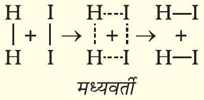
चित्र $3.6$ - मध्यवर्ती के द्वारा $H I$ का विरचन

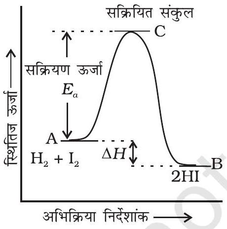
चित्र 3.7- स्थितिज ऊर्जा एवं अभिक्रिया निर्देशांक के मध्य आलेख

बहुत सी अभिक्रियाएं ताप की वृद्धि के साथ त्वरित होती हैं। उदाहरणार्थ, $\mathrm{N}_{2} \mathrm{O}_{5}$ के वियोजन में, पदार्थ का प्रारंभिक मात्रा से आधी मात्रा में वियोजन, 0°C पर $10$ दिनों में, $25^{\circ} \mathrm{C}$ पर $5$ घंटे में तथा $50^{\circ} \mathrm{C}$ पर $12$ मिनट में, होता है। आप यह भी जानते हैं कि पोटैशियम परमैंगनेट $\left(\mathrm{KMnO}_{4}\right)$ एवं ऑक्सैलिक अम्ल $\left(\mathrm{H}_{2} \mathrm{C}_{2} \mathrm{O}_{4}\right)$ के मिश्रण में पोटैशियम परमैंगनेट का विरंजन निम्न ताप की तुलना में उच्च ताप पर शीघ्रता से होता है।

यह भी पाया गया है कि किसी रासायनिक अभिक्रिया में 10° ताप वृद्धि से वेग स्थिरांक में लगभग दुगुनी वृद्धि होती है।

अभिक्रिया वेग की ताप पर निर्भरता की व्याख्या आर्रेनिअस समीकरण $3.18$ से भली-भांति की जा सकती है। इसे सर्वप्रथम रसायनज्ञ जे. एच. वान्ट हॉफ ने प्रस्तावित किया था किंतु स्वीडन के रसायनज्ञ आर्रेनिअस ने इसका भौतिक सत्यापन तथा प्रतिपादन किया।

$$
k=\mathrm{Ae}^{-E_{a} / R T}
$$

यहाँ A आर्रेनिअस गुणक अथवा आवृत्ति गुणक है। इसे पूर्व-चरघातांकी गुणक भी कहते हैं। यह किसी विशिष्ट अभिक्रिया के लिए स्थिरांक होता है। $R$ गैस स्थिरांक है तथा $E_{\mathrm{a}}$ संक्रियण ऊर्जा जिसे joules/mol, $\left(\mathrm{J} \mathrm{mol}^{-1}\right)$ में मापते हैं।

इसे निम्नलिखित सरल अभिक्रिया से समझा जा सकता है।

$$
\mathrm{H}_{2}(\mathrm{~g})+\mathrm{I}_{2}(\mathrm{~g}) \rightarrow 2 \mathrm{HI}(\mathrm{~g})
$$

आर्रेनिअस के अनुसार यह अभिक्रिया तभी हो सकती है जब हाइड्रोजन का एक अणु आयोडीन के एक अणु से संघट्ट कर एक अस्थाई मध्यवर्ती का विरचन करे (चित्र 3.6)। यह मध्यवर्ती बहुत कम समय तक अस्तित्व में रहता है तथा टूटकर हाइड्रोजन आयोडाइड के दो अणुओं का विरचन करता है।

मध्यवर्ती जिसे सक्रियित संकुल (C) भी कहते हैं, के विरचन के लिए आवश्यक ऊर्जा, सक्रियण ऊर्जा $\left(\boldsymbol{E}_{\mathrm{a}}\right)$ कहलाती है। स्थितिज ऊर्जा एवं अभिक्रिया निर्देशांक के मध्य ग्राफ खींचने पर चित्र (3.7) प्राप्त होता है। अभिक्रिया निर्देशांक अभिक्रियकों के उत्पाद में ऊर्जा परिवर्तन की रूपरेखा प्रदर्शित करते हैं।

जब सक्रियित संकुल अपघटित होकर उत्पाद निर्मित करता है तो कुछ ऊर्जा मुक्त होती है। अतः अंतिम अभिक्रिया एन्थैल्पी अभिक्रियकों एवं उत्पादों की प्रकृति पर निर्भर करती है।

अभिक्रियक स्पीशीज के सारे अणुओं की गतिज ऊर्जा समान नहीं होती। किसी एक अणु के व्यवहार की परिशुद्धता के बारे में पूर्वानुमान कठिन होता है अतः लडविग बोल्ट्समान तथा

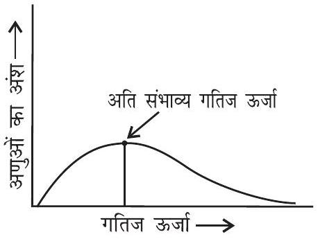
चित्र $3.8$ - विभिन्न गैसीय अणुओं में ऊर्जा वितरण को प्रदर्शित करता वक्र

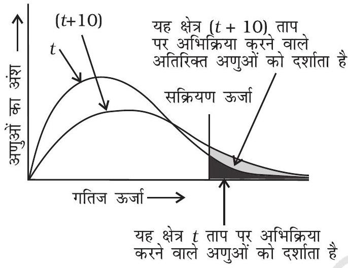
चित्र $3.9$ - अभिक्रिया वेग की ताप पर निर्भरता दर्शाता हुआ वितरण वक्र

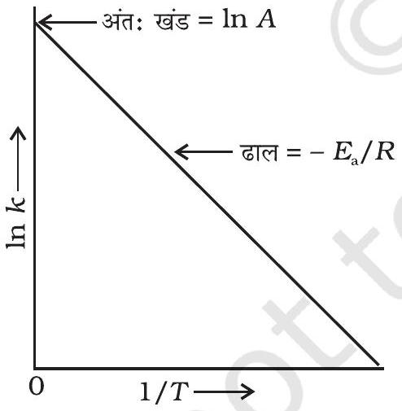
चित्र $3.10-\ln k$ एवं $1 / T$ के मध्य आलेख

जेम्स क्लार्क मैक्सवेल ने अधिक संख्या में अणुओं के व्यवहार को प्रागुक्त करने के लिए सांख्यिकी का प्रयोग किया। इनके अनुसार गतिज ऊर्जा का वितरण, $(E)$ ऊर्जा से युक्त अणुओं की संख्या, $\left(N_{E} / N_{T}\right)$ एवं गतिज ऊर्जा के मध्य वक्र खींचकर किया जा सकता है (चित्र 3.8)। यहाँ $N_{E}$, ऊर्जा $E$ से युक्त अणुओं की संख्या है तथा $\mathrm{N}_{\mathrm{T}}$ कुल अणुओं की

वक्र का शीर्ष, अतिसंभाव्य गतिज ऊर्जा अर्थात् अणुओं के सर्वाधिक अंश की गतिज ऊर्जा के संगत होता है। इस गतिज ऊर्जा से कम अथवा अधिक ऊर्जा वाले अणुओं की संख्या कम होती जाती है। जब ताप बढ़ाया जाता है तो आलेख का शीर्ष अधिक ऊर्जा मान की ओर विस्थापित हो जाता है (चित्र 3.9) तथा वक्र का फैलाव दाहिनी ओर बढ़ जाता है क्योंकि अत्यधिक ऊर्जा प्राप्त अणुओं का अनुपात बढ़ जाता है। वक्र के अंर्तगत क्षेत्रफल समान रहता है क्योंकि कुल संभाव्यता का मान हर समय एक रहना चाहिए। हम $E_{a}$ की स्थिति मैक्सवेल-बोल्ट्समान वक्र पर अंकित कर सकते हैं (चित्र 3.9)। किसी पदार्थ के तापमान में वृद्धि द्वारा $E_{a}$ से अधिक ऊर्जा प्राप्त संघट्ट करने वाले अणुओं की संख्या के मान में वृद्धि होती है। चित्र से स्पष्ट है कि वक्र में $(t+10)$ तापमान पर सक्रियण ऊर्जा या इससे अधिक ऊर्जा प्राप्त अणुओं को प्रदर्शित करने वाला क्षेत्रफल लगभग दो गुना हो जाता है अतः अभिक्रिया वेग दोगुना हो जाता है।

आर्रेनिअस समीकरण $3.18$ में कारक $\mathrm{e}^{-E_{a} / R T}, E_{a}$ से अधिक गतिज ऊर्जा वाले अणुओं की भिन्न के संगत होता है। समीकरण $3.18$ के दोनों पक्षों का प्राकृतिक लघुगणक लेने पर-

$$
\ln k=-\frac{E_{a}}{R T}+\ln A
$$

$\ln k$ एवं $1 / T$ के मध्य वक्र समीकरण $3.19$ के अनुरूप सीधी रेखा होता है जिसे चित्र $3.10$ में दर्शाया गया है।

आर्रेनिअस समीकरण $3.18$ के अनुसार ताप में वृद्धि अथवा सक्रियण ऊर्जा में कमी से अभिक्रिया वेग में वृद्धि होगी तथा वेग स्थिरांक में चरघातांकी वृद्धि होगी। चित्र $3.10$ में ढाल $=-\frac{E_{a}}{R}$ तथा अंतःखंड $=\ln \mathrm{A}$ है। अतः हम इन मानों से $E_{a}$ तथा A की गणना कर सकते हैं।

तापमान $T_{1}$ पर समीकरण $3.19$ का रूप निम्न होगा-

$$
\ln k_{1}=-\frac{E_{\mathrm{a}}}{R T_{1}}+\ln A
$$

और तापमान $T_{2}$ पर-

$$
\ln k_{2}=-\frac{E_{\mathrm{a}}}{R T_{2}}+\ln A
$$

(A किसी दी गई अभिक्रिया के लिए स्थिरांक हैं)
$k_{1}$ तथा $k_{2}$ क्रमशः तापमान $T_{1}$ तथा $T_{2}$ पर वेग स्थिरांक हैं।
समीकरण $3.21$ से $3.20$ घटाने पर हमें प्राप्त होगा-

$$
\begin{aligned}
\ln k_{2}- & \ln k_{1}=\frac{E_{\mathrm{a}}}{R T_{1}}-\frac{E_{\mathrm{a}}}{R T_{2}} \\
\ln \frac{k_{2}}{k_{1}} & =\frac{E_{\mathrm{a}}}{R}\left[\frac{1}{T_{1}}-\frac{1}{T_{2}}\right] \\
\log \frac{k_{2}}{k_{1}} & =\frac{E_{\mathrm{a}}}{2.303 R}\left[\frac{1}{T_{1}}-\frac{1}{T_{2}}\right] \\
\log \frac{k_{2}}{k_{1}} & =\frac{E_{\mathrm{a}}}{2.303 \mathrm{R}}\left[\frac{T_{2}-T_{1}}{T_{1} T_{2}}\right]
\end{aligned}
$$

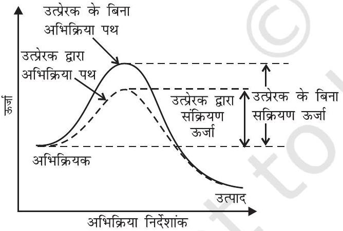
चित्र 3.11-सक्रियण ऊर्जा पर उत्प्रेरक का प्रभाव

उत्प्रेरक वह पदार्थ है जिसमें स्वयं स्थायी रासायनिक परिवर्तन हुए बिना यह, अभिक्रिया के वेग को बढ़ाता है। उदाहरणार्थ $\mathrm{MnO}_{2}$ निम्न अभिक्रिया को उत्प्रेरित कर वेग में महत्वपूर्ण वृद्धि करता है।

$$
2 \mathrm{KClO}_{3} \xrightarrow{\mathrm{MnO}_{2}} 2 \mathrm{KCl}+3 \mathrm{O}_{2}
$$

जब मिलाया गया पदार्थ अभिक्रिया की दर को कम करता है तो उत्प्रेरक शब्द का प्रयोग नहीं करना चाहिए, पदार्थ को तब निरोधक कहते हैं

उत्प्रेरक की क्रिया को मध्यवर्ती संकुल सिद्धांत से समझा जा सकता है। इस सिद्धांत के अनुसार उत्प्रेरक रासायनिक अभिक्रिया में भाग लेकर अभिक्रियकों के साथ अस्थायी बंध बनाता है जो कि मध्यवर्ती संकुल में परिणत होता है। इसका अस्तित्व क्षणिक होता है तथा यह वियोजित होकर उत्पाद एवं उत्प्रेरक देता है। यह विश्वास किया जाता है कि उत्प्रेरक एक वैकल्पिक पथ अथवा क्रियाविधि से अभिक्रियकों व उत्पादों के मध्य सक्रियण ऊर्जा कम करके एवं इस प्रकार ऊर्जा अवरोध में कमी करके अभिक्रिया संपन्न करता है जैसा कि चित्र $3.11$ में दर्शाया गया है। आर्रेनिअस समीकरण $3.18$ से यह स्पष्ट है कि सक्रियण ऊर्जा का मान जितना कम होगा अभिक्रिया का वेग उतना अधिक होगा।

उत्प्रेरक की लघु मात्रा अभिक्रियकों की दीर्घ मात्रा को उत्प्रेरित कर सकती है। उत्प्रेरक, अभिक्रिया की गिब्ज़ ऊर्जा, $\Delta G$, में बदलाव नहीं करता। यह स्वतः प्रवर्तित अभिक्रियाओं को उत्प्रेरित करता है परंतु स्वतः अप्रवर्तित अभिक्रिया को उत्प्रेरित नहीं करता। यह भी पाया गया है कि उत्प्रेरक किसी अभिक्रिया, के साम्य स्थिरांक में परिवर्तन नहीं करता किंतु यह साम्य को शीघ्र स्थापित करने में सहायता करता है। यह अग्र एवं प्रतीप दोनों अभिक्रियाओं को समान रूप से उत्प्रेरित करता है जिससे साम्यावस्था अपरिवर्तित रहती है परंतु शीघ्र स्थापित हो जाती हैं।

उदाहरण $3.10$ किसी अभिक्रिया के $500 \mathrm{~K}$ तथा $700 \mathrm{~K}$ पर वेग स्थिरांक क्रमशः $0.02 \mathrm{~s}^{-1}$ तथा $0.07 \mathrm{~s}^{-1}$ हैं। $E_{\mathrm{a}}$ एवं $A$ की गणना कीजिए।

हल

$$
\begin{aligned}
\log \frac{k_{2}}{k_{1}} & =\frac{E_{\mathrm{a}}}{2.303 R}\left[\frac{T_{2}-T_{1}}{T_{1} T_{2}}\right] \\
\log \frac{0.07}{0.02} & =\left(\frac{E_{\mathrm{a}}}{2.303 \times 8.314 \mathrm{JK}^{-1} \mathrm{~mol}^{-1}}\right)\left[\frac{700-500}{700 \times 500}\right] \\
0.544 & =\frac{E_{\mathrm{a}} \times 5.714 \times 10^{-4}}{19.15} \\
E_{a} & =0.544 \times \frac{19.15}{5.714 \times 10^{-4}}=18230.8 \mathrm{~J}
\end{aligned}
$$

चूँकि $\quad k=A \mathrm{e}^{-E \mathrm{a} / R T}$

$$
\begin{aligned}
0.02 & =A e^{\frac{-18230.8}{8.314 \times 500}} \\
A & =\frac{0.02}{0.012}=1.61
\end{aligned}
$$

उदाहरण $3.11600$ K ताप पर एथिल आयोडाइड के निम्नलिखित अभिक्रिया द्वारा अपघटन में, प्रथम कोटि वेग स्थिरांक $1.60 \times 10^{-5} \mathrm{~s}^{-1}$ है। इस अभिक्रिया की सक्रियण ऊर्जा $209 \mathrm{~kJ} / \mathrm{mol}$ है। $700 \mathrm{~K}$ ताप पर वेग स्थिरांक की गणना कीजिए।

$$
\mathrm{C}_{2} \mathrm{H}_{5} \mathrm{I}(\mathrm{~g}) \rightarrow \mathrm{C}_{2} \mathrm{H}_{4}(\mathrm{~g})+\mathrm{HI}(\mathrm{~g})
$$

हल हम जानते हैं कि-

$$
\begin{aligned}
& \log k_{2}-\log k_{1}=\frac{E_{\mathrm{a}}}{2.303 R}\left[\frac{1}{T_{1}}-\frac{1}{T_{2}}\right] \\
& \log k_{2}=\log k_{1}+\frac{E_{\mathrm{a}}}{2.303 R}\left[\frac{1}{T_{1}}-\frac{1}{T_{2}}\right] \\
& \quad=\log \left(1.60 \times 10^{-5}\right)+\frac{209000 \mathrm{~J} \mathrm{~mol}^{-1}}{2.303 \times 8.314 \mathrm{~J} \mathrm{~mol}^{-1} \mathrm{~K}^{-1}} \frac{1}{600 \mathrm{~K}}-\frac{1}{700 \mathrm{~K}}
\end{aligned}
$$

$$
\begin{aligned}
\log k_{2} & =-4.796+2.599 \\
& =-2.197 \\
k_{2} & =6.36 \times 10^{-3} \mathrm{~s}^{-1}
\end{aligned}
$$

## $3.5$ रासायनिक अभिक्रिया का संघद्ट सिद्धांत

चित्र $3.12$ - अणुओं का उपयुक्त एवं अनुपयुक्त अभिविन्यास दर्शाता आरेख

यद्यपि आर्रेनियस समीकरण काफी विस्तृत परिस्थितियों में लागू होती है लेकिन संघट्टवाद जिसे मेक्स ट्राउट्ज तथा विलियम लुईस ने 1916-18 में प्रतिपादित किया था, अभिक्रिया की और्जिकी तथा क्रियाविधि के संदर्भ में अधिक प्रकाश डालता है। यह गैस की गतिक परिकल्पना पर आधारित है। इस सिद्धांत के अनुसार अभिक्रियक के अणुओं को कठोर गोले माना जाता है, एवं माना जाता है कि अभिक्रिया अणुओं के आपस में संघट्ट होने के कारण होती हैं। अभिक्रिया मिश्रण के प्रति इकाई आयतन में प्रति सेकेंड संघट्ट को संघट्ट आवृति (Z) कहते हैं।

रासायनिक अभिक्रिया को प्रभावित करने वाला एक अन्य कारक सक्रियण ऊर्जा है जैसा कि हम पहले ही अध्ययन कर चुके हैं। द्विअणुक प्राथमिक अभिक्रिया $\mathrm{A}+\mathrm{B} \rightarrow$ उत्पाद के लिए, अभिक्रिया वेग को निम्न रूप में प्रदर्शित कर सकते हैं-

$$
\text { वेग }=\mathrm{Z}_{\mathrm{AB}} \mathrm{e}^{-E_{\mathrm{a}} / R T}
$$

जहाँ $\mathrm{Z}_{\mathrm{AB}}$ अभिक्रियक A एवं B के संघट्ट की आवृत्ति तथा $\mathrm{e}^{-E_{a} / \mathrm{RT}} E_{a}$ के बराबर अथवा इससे अधिक ऊर्जा वाले अणुओं के अंश को प्रदर्शित करता है। समीकरण $3.23$ की तुलना आर्रेनिअस समीकरण से करने पर हम कह सकते हैं कि $A$ संघट्‌ट आवृत्ति से संबंधित है।

समीकरण $3.23$ उन अभिक्रियाओं के वेग स्थिरांक के मान की सटीक प्रागुक्ति करता है, जिनमें सामान्य अणु अथवा परमाणु सम्मिलित होते हैं, किंतु जटिल अणुओं के संदर्भ में महत्वपूर्ण विचलन परिलक्षित होता है। इसका कारण सभी संघट्टों का उत्पाद में विरचन नहीं होना हो सकता है। वे संघट्ट जिसमें अणुओं की पर्याप्त गतिज ऊर्जा (देहली ऊर्जा ${ }^{*}$ ) तथा सही अभिविन्यास होता है, जिससे अभिक्रियक स्पीशीज़ के बंधों के टूटने तथा उत्पादों में नए बंध विरचन से उत्पादों का बनना सुसाध्य हो जाता है, प्रभावी संघट्ट कहलाते हैं।

उदाहरणार्थ, मेथेनॉल का ब्रोमोएथेन से विरचन अभिक्रियकों के अभिविन्यास पर निर्भर करता है। इसे चित्र $3.12$ में प्रदर्शित किया गया है। अभिक्रियकों के अणुओं का उपयुक्त अभिविन्यास बंध निर्माण कर उत्पाद निर्मित करता है तथा अनुपयुक्त अभिविन्यास होने पर वे केवल दोबारा अलग-अलग हो जाते हैं और उत्पाद नहीं बनता।

$$
\mathrm{CH}_{3} \mathrm{Br}+\overline{\mathrm{O}} \mathrm{H} \longrightarrow \mathrm{CH}_{3} \mathrm{OH}+\mathrm{Br}^{-}
$$

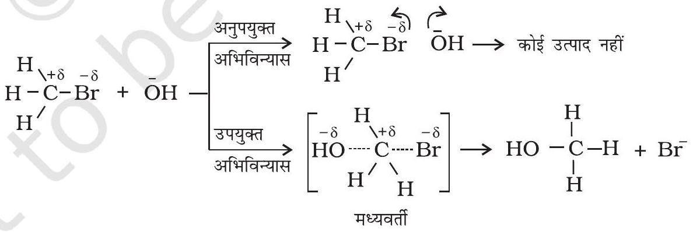

प्रभावी संघट्ट के स्पष्टीकरण के लिए हम एक अन्य कारक $P$ जिसे प्रायिकता (Probability) अथवा त्रिविम कारक कहते हैं, प्रस्तावित करते हैं। यह इस बात को समाहित करता है कि संघट्ट में अणुओं का उपयुक्त अभिविन्यास होना चाहिए, यानी-

$$
\text { वेग }=P \mathrm{Z}_{\mathrm{AB}} \mathrm{e}^{-E_{\mathrm{a}} / R T}
$$

[^1]अतः संघट्ट सिद्धांत में सक्रियण ऊर्जा एवं उपयुक्त अभिविन्यास दोनों ही साथ-साथ प्रभावी संघट्ट का मानक निर्धारित करते हैं अर्थात् अभिक्रिया वेग को निर्धारित करते हैं।

संघट्ट सिद्धांत की कुछ कमियाँ हैं, जैसे कि इसमें परमाणुओं/अणुओं को कठोर गोले माना गया है तथा इनके संरचना पहलू को नकारा गया है। आप इस सिद्धांत तथा अन्य सिद्धांतों के विषय में और अधिक विस्तृत अध्ययन अपनी उच्च कक्षाओं में करेंगे।

## पाठ्यनिहित प्रश्न

$3.7$ ताप का वेग स्थिरांक पर क्या प्रभाव होगा?
$3.8$ परमताप, $298 \mathrm{~K}$ में $10 \mathrm{~K}$ की वृद्धि होने पर रासायनिक अभिक्रिया का वेग दुगुना हो जाता है। इस अभिक्रिया के लिए $E_{\mathrm{a}}$ की गणना कीजिए।
$3.9581 \mathrm{~K}$ ताप पर अभिक्रिया $2 \mathrm{HI}(\mathrm{g}) \rightarrow \mathrm{H}_{2}(\mathrm{~g})+\mathrm{I}_{2}(\mathrm{~g})$ के लिए सक्रियण ऊर्जा का मान $209.5 \mathrm{~kJ}$ $\mathrm{mol}^{-1}$ है। अणुओं के उस अंश की गणना कीजिए जिसकी ऊर्जा सक्रियण ऊर्जा के बराबर अथवा इससे अधिक है।

## सारांश

रासायनिक बलगतिकी रासायनिक अभिक्रिया में अभिक्रिया वेग, विभिन्न कारकों का प्रभाव, परमाणुओं की पुनर्व्यवस्था तथा मध्यवर्ती के बनने का अध्ययन है। अभिक्रिया वेग, इकाई समय में अभिकारकों की सांद्रता घटने अथवा उत्पादों की सांद्रता वृद्धि से संबंधित होता है। इसे किसी क्षण विशेष पर तात्क्षणिक वेग के रूप में और किसी दीर्घ समय अंतराल में औसत वेग से प्रदर्शित किया जा सकता है। अभिक्रिया वेग पर अनेक कारक, जैसे-ताप, अभिकारकों की सांद्रता तथा उत्प्रेरक प्रभाव डालते हैं। अभिक्रिया वेग के गणितीय निरूपण को वेग नियम कहते हैं। इसे प्रयोग द्वारा निर्धारित किया जाता है तथा इसकी प्रागुक्ति नहीं की जा सकती। किसी अभिकारक के प्रति अभिक्रिया की कोटि, वेग नियम में उस अभिकारक की सांद्रता के घातांक के बराबर होती है तथा अभिक्रिया की कुल कोटि वेग नियम में उपस्थित सभी सांद्रताओं के घातांकों के जोड़ के बराबर होती है। वेग स्थिरांक वेग नियम में समानुपातन गुणांक होता है। वेग स्थिरांक एवं अभिक्रिया की कोटि का निर्धारण वेग नियम अथवा समाकलित वेग समीकरण द्वारा कर सकते हैं। अभिक्रिया की आण्विकता केवल प्राथमिक अभिक्रिया के लिए परिभाषित की जाती है। आण्विकता का मान $1$ से $3$ तक सीमित होता है जबकि अभिक्रिया की कोटि $0,1,2,3$ अथवा भिन्नात्मक भी हो सकती है। प्राथमिक अभिक्रिया के लिए आण्विकता एवं कोटि समान होते हैं।

वेग स्थिरांक की ताप पर निर्भरता की व्याख्या आर्रेनिअस समीकरण $\left(k=A \mathrm{e}^{-E \mathrm{a} / R T}\right)$ द्वारा की जाती है। $E_{\mathrm{a}}$ सक्रियण ऊर्जा है तथा इसका मान सक्रियित संकुल तथा अभिकारक अणुओं के मध्य ऊर्जा के अंतर के संगत होता है और A (आर्रेनिअस कारक अथवा पूर्व-घातांकी गुणक) संघट्ट की आवृत्ति के संगत होता है। यह समीकरण स्पष्ट करती है कि ताप में वृद्धि अथवा $E_{\mathrm{a}}$ में कमी से अभिक्रिया वेग में वृद्धि होती है तथा उत्प्रेरक अभिक्रिया के लिए वैकल्पिक पथ प्रदान कर $E_{\mathrm{a}}$ में कमी करता है। संघट्ट सिद्धांत के अनुसार एक अन्य त्रिविम कारक $P$ जो कि संघट्ट करने वाले अणुओं के अभिविन्यास पर निर्भर करता है, महत्वपूर्ण है और यह प्रभावी संघट्टनों में योगदान करता है। अतः इसे समाहित करके आर्रेनिअस समीकरण का रूपांतरण $k=P \mathrm{Z}_{\mathrm{AB}} \mathrm{e}^{-E_{\mathrm{a}} / R T}$ में हो जाता है।

## अभ्यास

$3.1$ निम्न अभिक्रियाओं के वेग व्यंजकों से इनकी अभिक्रिया कोटि तथा वेग स्थिरांकों की इकाइयाँ ज्ञात कीजिए।

(i) $3 \mathrm{NO}(\mathrm{g}) \rightarrow \mathrm{N}_{2} \mathrm{O}(\mathrm{g})$ वेग $=k[\mathrm{NO}]^{2}$
(ii) $\mathrm{H}_{2} \mathrm{O}_{2}(\mathrm{aq})+3 \mathrm{I}^{-}(\mathrm{aq})+2 \mathrm{H}^{+} \rightarrow 2 \mathrm{H}_{2} \mathrm{O}(\mathrm{l})+\mathrm{I}_{3}^{-}$ वेग $=k\left[\mathrm{H}_{2} \mathrm{O}_{2}\right]\left[\mathrm{I}^{-}\right]$
(iii) $\mathrm{CH}_{3} \mathrm{CHO}$ $(\mathrm{g}) \rightarrow \mathrm{CH}_{4}(\mathrm{~g})+\mathrm{CO}(\mathrm{g})$ वेग $=k\left[\mathrm{CH}_{3} \mathrm{CHO}\right]^{3 / 2}$
(iv) $\mathrm{C}_{2} \mathrm{H}_{5} \mathrm{Cl}$ $(\mathrm{g}) \rightarrow \mathrm{C}_{2} \mathrm{H}_{4}(\mathrm{~g})+\mathrm{HCl}(\mathrm{g})$ वेग $=k\left[\mathrm{C}_{2} \mathrm{H}_{5} \mathrm{Cl}\right]$
$3.2$ अभिक्रिया $2 \mathrm{~A}+\mathrm{B} \rightarrow \mathrm{A}_{2} \mathrm{~B}$ के लिए वेग $=k[\mathrm{~A}][\mathrm{B}]^{2}$ यहाँ $k$ का मान $2.0 \times 10^{-6} \mathrm{~mol}^{-2} \mathrm{~L}^{2} \mathrm{~s}^{-1}$ है। प्रारंभिक वेग की गणना कीजिए; जब $[\mathrm{A}]=0.1 \mathrm{~mol} \mathrm{~L}^{-1}$ एवं $[\mathrm{B}]=0.2 \mathrm{~mol} \mathrm{~L}^{-1}$ हो तथा अभिक्रिया वेग की गणना कीजिए; जब [A] घट कर $0.06 \mathrm{~mol} \mathrm{~L}^{-1}$ रह जाए।
$3.3$ प्लैटिनम सतह पर $\mathrm{NH}_{3}$ का अपघटन शून्य कोटि की अभिक्रिया है। $\mathrm{N}_{2}$ एवं $\mathrm{H}_{2}$ के उत्पादन की दर क्या होगी जब $k$ का मान $2.5 \times 10^{-4} \mathrm{~mol} \mathrm{~L}^{-1} \mathrm{~s}^{-1}$ हो?
$3.4$ डाईमेथिल ईथर के अपघटन से $\mathrm{CH}_{4}, \mathrm{H}_{2}$ तथा CO बनते हैं। इस अभिक्रिया का वेग निम्न समीकरण द्वारा दिया जाता है-
$$
\text { वेग }=k\left[\mathrm{CH}_{3} \mathrm{OCH}_{3}\right]^{3 / 2}
$$
अभिक्रिया के वेग का अनुगमन बंद पात्र में बढ़ते दाब द्वारा किया जाता है, अतः वेग समीकरण को डाईमेथिल ईथर के आंशिक दाब के पद में भी दिया जा सकता है। अतः
$$
\text { वेग }=k\left(p_{\mathrm{CH}_{3} \mathrm{OCH}_{3}}\right)^{3 / 2}
$$
यदि दाब को bar में तथा समय को मिनट में मापा जाये तो अभिक्रिया के वेग एवं वेग स्थिरांक की इकाइयाँ क्या होंगी?
$3.5$ रासायनिक अभिक्रिया के वेग पर प्रभाव डालने वाले कारकों का उल्लेख कीजिए।
$3.6$ किसी अभिक्रियक के लिए एक अभिक्रिया द्वितीय कोटि की है। अभिक्रिया का वेग कैसे प्रभावित होगा; यदि अभिक्रियक की सांद्रता-
(i) दुगुनी कर दी जाए
(ii) आधी कर दी जाए
$3.7$ वेग स्थिरांक पर ताप का क्या प्रभाव पड़ता है? ताप के इस प्रभाव को मात्रात्मक रूप में कैसे प्रदर्शित कर सकते हैं?
$3.8$ एक प्रथम कोटि की अभिक्रिया के निम्नलिखित आँकड़े प्राप्त हुए-

| t/s | $0$ | $30$ | $60$ | $90$ |
| :--- | :--- | :--- | :--- | :--- |
| [A]/ $\mathrm{mol} \mathrm{L}^{-1}$ | $0.55$ | $0.31$ | $0.17$ | $0.085$ |

$30$ से $60$ सेकेंड समय अंतराल में औसत वेग की गणना कीजिए।
$3.9$ एक अभिक्रिया A के प्रति प्रथम तथा B के प्रति द्वितीय कोटि की है
    (i) अवकल वेग समीकरण लिखिए।
    (ii) B की सांद्रता तीन गुनी करने से वेग पर क्या प्रभाव पड़ेगा?
    (iii) A तथा B दोनों की सांद्रता दुगुनी करने से वेग पर क्या प्रभाव पड़ेगा?

$3.10$ A और B के मध्य अभिक्रिया में A और B की विभिन्न प्रारंभिक सांद्रताओं के लिए प्रारंभिक वेग $\left(\mathrm{r}_{0}\right)$ नीचे दिए गए हैं।
A और B के प्रति अभिक्रिया की कोटि क्या है?

| $\mathrm{A} / \mathrm{mol} \mathrm{L}^{-1}$ | $0.20$ | $0.20$ | $0.40$ |
| :--- | :--- | :--- | :--- |
| $\mathrm{B} / \mathrm{mol} \mathrm{L}^{-1}$ | $0.30$ | $0.10$ | $0.05$ |
| $\mathrm{r}_{0} / \mathrm{mol} \mathrm{L}^{-1} \mathrm{~s}^{-1}$ | $5.07 \times 10^{-5}$ | $5.07 \times 10^{-5}$ | $1.43 \times 10^{-4}$ |
$3.112 \mathrm{~A}+\mathrm{B} \rightarrow \mathrm{C}+\mathrm{D}$ अभिक्रिया की बलगतिकी अध्ययन करने पर निम्नलिखित परिणाम प्राप्त हुए। अभिक्रिया के लिए वेग नियम तथा वेग स्थिरांक ज्ञात कीजिए।

| प्रयोग | [A]/ $\mathrm{mol} \mathrm{L}^{-1}$ | [B]/ $\mathrm{mol} \mathrm{L}^{-1}$ | D के विरचन का प्रारंभिक वेग/ $\mathrm{mol} \mathrm{L}^{-1} \mathrm{~min}^{-1}$ |
| :--- | :--- | :--- | :--- |
| I | $0.1$ | $0.1$ | $6.0 \times 10^{-3}$ |
| II | $0.3$ | $0.2$ | $7.2 \times 10^{-2}$ |
| III | $0.3$ | $0.4$ | $2.88 \times 10^{-1}$ |
| IV | $0.4$ | $0.1$ | $2.40 \times 10^{-2}$ |
$3.12$ A तथा B के मध्य अभिक्रिया A के प्रति प्रथम तथा B के प्रति शून्य कोटि की है। निम्न तालिका में रिक्त स्थान भरिए।

| प्रयोग | $[\mathrm{A}] / \mathrm{mol} \mathrm{L}^{-1}$ | $[\mathrm{B}] / \mathrm{mol} \mathrm{L}^{-1}$ | प्रारंभिक वेग/mol $\mathrm{L}^{-1} \mathrm{~min}^{-1}$ |
| :--- | :--- | :--- | :--- |
| I | $0.1$ | $0.1$ | $2.0 \times 10^{-2}$ |
| II | - | $0.2$ | $4.0 \times 10^{-2}$ |
| III | $0.4$ | $0.4$ | - |
| IV | - | $0.2$ | $2.0 \times 10^{-2}$ |
$3.13$ नीचे दी गई प्रथम कोटि की अभिक्रियाओं के वेग स्थिरांक से अर्धायु की गणना कीजिए-
(i) $200 \mathrm{~s}^{-1}$
(ii) $2 \mathrm{~min}^{-1}$
(iii) $4$ year ${ }^{-1}$
$3.14{ }^{14} \mathrm{C}$ के रेडियोएक्टिव क्षय की अर्धायु $5730$ वर्ष है। एक पुरातत्व कलाकृति की लकड़ी में, जीवित वृक्ष की लकड़ी की तुलना में $80 \%{ }^{14} \mathrm{C}$ की मात्रा है। नमूने की आयु का परिकलन कीजिए।

$3.15$ गैस प्रावस्था में $318 \mathrm{~K}$ पर $\mathrm{N}_{2} \mathrm{O}_{5}$ के अपघटन की $\left[2 \mathrm{~N}_{2} \mathrm{O}_{5} \rightarrow 4 \mathrm{NO}_{2}+\mathrm{O}_{2}\right]$ अभिक्रिया के आँकड़े नीचे दिए गए हैं-

| t/s | $0$ | $400$ | $800$ | $1200$ | $1600$ | $2000$ | $2400$ | $2800$ | $3200$ |
| :--- | :--- | :--- | :--- | :--- | :--- | :--- | :--- | :--- | :--- |
| $\begin{gathered} 10^{2} \times\left[\mathrm{N}_{2} \mathrm{O}_{5}\right] / \\ \mathrm{mol} \mathrm{~L}^{-1} \end{gathered}$ | $1.63$ | $1.36$ | $1.14$ | $0.93$ | $0.78$ | $0.64$ | $0.53$ | $0.43$ | $0.35$ |

(i) $\left[\mathrm{N}_{2} \mathrm{O}_{5}\right]$ एवं $t$ के मध्य आलेख खींचिए।
(ii) अभिक्रिया के लिए अर्धायु की गणना कीजिए।
(iii) $\log \left[\mathrm{N}_{2} \mathrm{O}_{5}\right]$ एवं $t$ के मध्य ग्राफ खींचिए।

(iv) अभिक्रिया के लिए वेग नियम क्या है?
(v) वेग स्थिरांक की गणना कीजिए।
(vi) $k$ की सहायता से अर्धायु की गणना कीजिए तथा इसकी तुलना (ii) से कीजिए।
$3.16$ प्रथम कोटि की अभिक्रिया के लिए वेग स्थिरांक $60 \mathrm{~s}^{-1}$ है। अभिक्रियक को अपनी प्रारंभिक सांद्रता से $\frac{1}{16}$ वाँ भाग रह जाने में कितना समय लगेगा?
$3.17$ नाभिकीय विस्फोट का $28.1$ वर्ष अर्धायु वाला एक उत्पाद ${ }^{90} \mathrm{Sr}$ होता है। यदि कैल्सियम के स्थान पर $1 \mu \mathrm{~g},{ }^{90} \mathrm{Sr}$ नवजात शिशु की अस्थियों में अवशोषित हो जाए और उपापचयन से ह्रास न हो तो इसकी $10$ वर्ष एवं $60$ वर्ष पश्चात् कितनी मात्रा रह जाएगी?
$3.18$ दर्शाइए कि प्रथम कोटि की अभिक्रिया में $99 \%$ अभिक्रिया पूर्ण होने में लगा समय $90 \%$ अभिक्रिया पूर्ण होने में लगने वाले समय से दुगुना होता है।
$3.19$ एक प्रथम कोटि की अभिक्रिया में $30 \%$ वियोजन होने में $40$ मिनट लगते हैं। $\mathrm{t}_{1 / 2}$ की गणना कीजिए।
$3.20543$ K ताप पर एज़ोआइसोप्रोपेन के हेक्सेन तथा नाइट्रोजन में विघटन के निम्न आँकड़े प्राप्त हुए। वेग स्थिरांक की गणना कीजिए।

| $t(\mathrm{sec})$ | $p(\mathrm{~mm} \mathrm{Hg}$ में) |
| :--- | :--- |
| $0$ | $35.0$ |
| $360$ | $54.0$ |
| $720$ | $63.0$ |
$3.21$ स्थिर आयतन पर, $\mathrm{SO}_{2} \mathrm{Cl}_{2}$ के प्रथम कोटि के ताप अपघटन पर निम्न आँकड़े प्राप्त हुए-

$$
\mathrm{SO}_{2} \mathrm{Cl}_{2}(\mathrm{~g}) \rightarrow \mathrm{SO}_{2}(\mathrm{~g})+\mathrm{Cl}_{2}(\mathrm{~g})
$$

अभिक्रिया वेग की गणना कीजिए जब कुल दाब $0.65 \mathrm{~atm}$ हो।

| प्रयोग | समय/s | कुल दाब/atm |
| :--- | :--- | :--- |
| $1$ | $0$ | $0.5$ |
| $2$ | $100$ | $0.6$ |
$3.22$ विभिन्न तापों पर $\mathrm{N}_{2} \mathrm{O}_{5}$ के अपघटन के लिए वेग स्थिरांक नीचे दिए गये हैं-

| $T /{ }^{\circ} \mathrm{C}$ | $0$ | $20$ | $40$ | $60$ | $80$ |
| :--- | :--- | :--- | :--- | :--- | :--- |
| $10^{5} \times k / \mathrm{s}^{-1}$ | $0.0787$ | $1.70$ | $25.7$ | $178$ | $2140$ |

$\ln k$ एवं $1 / T$ के मध्य ग्राफ खींचिए तथा $A$ एवं $E_{\mathrm{a}}$ की गणना कीजिए। $30^{\circ} \mathrm{C}$ तथा $50^{\circ} \mathrm{C}$ पर वेग स्थिरांक को प्रागुक्त कीजिए।
$3.23546 \mathrm{~K}$ ताप पर हाइड्रोकार्बन के अपघटन में वेग स्थिरांक $2.418 \times 10^{-5} \mathrm{~s}^{-1}$ है। यदि सक्रियण ऊर्जा $179.9 \mathrm{~kJ} / \mathrm{mol}$ हो तो पूर्व-घातांकी गुणन का मान क्या होगा?
$3.24$ किसी अभिक्रिया $\mathrm{A} \rightarrow$ उत्पाद के लिए $k=2.0 \times 10^{-2} \mathrm{~s}^{-1}$ है। यदि A की प्रारंभिक सांद्रता $1.0 \mathrm{~mol} \mathrm{~L}^{-1}$ हो तो 100s के पश्चात् इसकी सांद्रता क्या रह जाएगी?
$3.25$ अम्लीय माध्यम में सूक्रोस का ग्लूकोस एवं फ्रक्टोज़ में विघटन प्रथम कोटि की अभिक्रिया है। इस अभिक्रिया की अर्धायु $3.0$ घंटे है। $8$ घंटे बाद नमूने में सूक्रोस का कितना अंश बचेगा?
$3.26$ हाइड्रोकार्बन का विघटन निम्न समीकरण के अनुसार होता है। $E_{a}$ की गणना कीजिए।
$$
k=\left(4.5 \times 10^{11} \mathrm{~s}^{-1}\right) \mathrm{e}^{-28000 K / T}
$$

$3.27 \mathrm{H}_{2} \mathrm{O}_{2}$ के प्रथम कोटि के विघटन को निम्न समीकरण द्वारा लिख सकते हैं-
$$
\log k=14.34-1.25 \times 10^{4} K / T
$$
इस अभिक्रिया के लिए $E_{\mathrm{a}}$ की गणना कीजिए। कितने ताप पर इस अभिक्रिया की अर्धायु $256$ मिनट होगी?
$3.2810^{\circ} \mathrm{C}$ ताप पर A के उत्पाद में विघटन के लिए $k$ का मान $4.5 \times 10^{3} \mathrm{~s}^{-1}$ तथा सक्रियण ऊर्जा $60 \mathrm{~kJ} \mathrm{~mol}^{-1}$ है किस ताप पर $k$ का मान $1.5 \times 10^{4} \mathrm{~s}^{-1}$ होगा?
$3.29298 \mathrm{~K}$ ताप पर प्रथम कोटि की अभिक्रिया के $10 \%$ पूर्ण होने का समय $308 \mathrm{~K}$ ताप पर $25 \%$ अभिक्रिया पूर्ण होने में लगे समय के बराबर है। यदि $A$ का मान $4 \times 10^{10} \mathrm{~s}^{-1}$ हो तो $318 \mathrm{~K}$ ताप पर $k$ तथा $E_{\mathrm{a}}$ की गणना कीजिए।
$3.30$ ताप में $293$ K से $313$ K तक वृद्धि करने पर किसी अभिक्रिया का वेग चार गुना हो जाता है। इस अभिक्रिया के लिए सक्रियण ऊर्जा की गणना यह मानते हुए कीजिए कि इसका मान ताप के साथ परिवर्तित नहीं होता।

## पाठ्यनिहित प्रश्नों के उत्तर

$3.1 \mathrm{r}_{\mathrm{av}}=6.66 \times 10^{-6} \mathrm{~mol} \mathrm{~L}^{-1} \mathrm{~s}^{-1}$
$3.2$ अभिक्रिया का वेग = A के विलुप्त होने की दर = $0.005 \mathrm{~mol} \mathrm{~L}^{-1} \mathrm{~min}^{-1}$
$3.3$ अभिक्रिया की कोटि $2.5$ है।
$3.4 \mathrm{X} \rightarrow \mathrm{Y}$, वेग $=\mathrm{k}[\mathrm{X}]^{2}$, वेग $9$ गुना बढ़ेगा।
$3.5 \mathrm{t}=444 \mathrm{~s}$
$3.61 .925 \times 10^{-4} \mathrm{~s}^{-1}$
$3.8 E_{a}=52.897 \mathrm{~kJ} \mathrm{~mol}^{-1}$
$3.91 .471 \times 10^{-19}$

[^0]:    * In एवं log (logarithms यानी लघुगणक) के लिए परिशिष्ट-IV देखों।

[^1]:    * देहली ऊर्जा = सक्रियण ऊर्जा + अभिक्रियक स्पीशीज़ की ऊर्जा

