## Objectives

After studying this Unit, you will be able to

- learn the positions of the $d-$ and $f$-block elements in the periodic table;
- know the electronic configurations of the transition ( $d$-block) and the inner transition ( $f$-block) elements;
- appreciate the relative stability of various oxidation states in terms of electrode potential values;
- describe the preparation, properties, structures and uses of some important compounds such as $\mathrm{K}_{2} \mathrm{Cr}_{2} \mathrm{O}_{7}$ and $\mathrm{KMnO}_{4}$;
- understand the general characteristics of the $d-$ and $f$-block elements and the general horizontal and group trends in them;
- describe the properties of the $f$-block elements and give a comparative account of the lanthanoids and actinoids with respect to their electronic configurations, oxidation states and chemical behaviour.

## Unit 11 The d- and f- Block Elements

Iron, copper, silver and gold are among the transition elements that have played important roles in the development of human civilisation. The inner transition elements such as Th, Pa and U are proving excellent sources of nuclear energy in modern times.

The $d$-block of the periodic table contains the elements of the groups 3-12 in which the $d$ orbitals are progressively filled in each of the four long periods. The $f$-block consists of elements in which $4 f$ and $5 f$ orbitals are progressively filled. They are placed in a separate panel at the bottom of the periodic table. The names transition metals and inner transition metals are often used to refer to the elements of $d$-and $f$-blocks respectively.

There are mainly four series of the transition metals, $3 d$ series (Sc to Zn), $4 d$ series (Y to Cd), $5 d$ series (La and Hf to Hg) and $6 d$ series which has Ac and elements from Rf to Cn. The two series of the inner transition metals; $4 f$ (Ce to Lu) and $5 f$ (Th to Lr) are known as lanthanoids and actinoids respectively.

Originally the name transition metals was derived from the fact that their chemical properties were transitional between those of $s$ and $p$-block elements. Now according to IUPAC, transition metals are defined as metals which have incomplete $d$ subshell either in neutral atom or in their ions. Zinc, cadmium and mercury of group 12 have full $d^{10}$ configuration in their ground state as well as in their common oxidation states and hence, are not regarded as transition metals. However, being the end members of the $3 d, 4 d$ and $5 d$ transition series, respectively, their chemistry is studied along with the chemistry of the transition metals.

The presence of partly filled $d$ or $f$ orbitals in their atoms makes transition elements different from that of
the non-transition elements. Hence, transition elements and their compounds are studied separately. However, the usual theory of valence as applicable to the nontransition elements can be applied successfully to the transition elements also.

Various precious metals such as silver, gold and platinum and industrially important metals like iron, copper and titanium belong to the transition metals series.

In this Unit, we shall first deal with the electronic configuration, occurrence and general characteristics of transition elements with special emphasis on the trends in the properties of the first row (3d) transition metals along with the preparation and properties of some important compounds. This will be followed by consideration of certain general aspects such as electronic configurations, oxidation states and chemical reactivity of the inner transition metals.

## THE TRANSITION ELEMENTS ( $\boldsymbol{d}$-BLOCK)

4.1 $p$ osition in the $P_{\text {eriodic }}$ Table
4.2 Electronic Configurations of the $d$-Block Elements

The $d$-block occupies the large middle section of the periodic table flanked between $s$ - and $p$-blocks in the periodic table. The $d$-orbitals of the penultimate energy level of atoms receive electrons giving rise to four rows of the transition metals, i.e., $3 d, 4 d, 5 d$ and $6 d$. All these series of transition elements are shown in Table 4.1.

In general the electronic configuration of outer orbitals of these elements is $(\mathrm{n}-1) d^{1-10} n s^{1-2}$ except for Pd where its electronic configuration is $4 d^{10} 5 s^{0}$. The (n-1) stands for the inner $d$ orbitals which may have one to ten electrons and the outermost ns orbital may have one or two electrons. However, this generalisation has several exceptions because of very little energy difference between (n-1)d and ns orbitals. Furthermore, half and completely filled sets of orbitals are relatively more stable. A consequence of this factor is reflected in the electronic configurations of Cr and Cu in the 3d series. For example, consider the case of Cr, which has $3 d^{5} 4 s^{1}$ configuration instead of $3 d^{4} 4 s^{2}$; the energy gap between the two sets ( $3 d$ and $4 s$ ) of orbitals is small enough to prevent electron entering the $3 d$ orbitals. Similarly in case of Cu, the configuration is $3 d^{10} 4 s^{1}$ and not $3 d^{9} 4 s^{2}$. The ground state electronic configurations of the outer orbitals of transition elements are given in Table 4.1.

Table 4.1: Electronic Configurations of outer orbitals of the Transition Elements (ground state)
| 1st Series |  |  |  |  |  |  |  |  |  |  |
| :--- | :--- | :--- | :--- | :--- | :--- | :--- | :--- | :--- | :--- | :--- |
|  | Sc | Ti | V | Cr | Mn | Fe | Co | Ni | Cu | Zn |
| $Z$ | 21 | 22 | 23 | 24 | 25 | 26 | 27 | 28 | 29 | 30 |
| $4 s$ | 2 | 2 | 2 | 1 | 2 | 2 | 2 | 2 | 1 | 2 |
| $3 d$ | 1 | 2 | 3 | 5 | 5 | 6 | 7 | 8 | 10 | 10 |

| 2nd Series |  |  |  |  |  |  |  |  |  |  |
| :--- | :--- | :--- | :--- | :--- | :--- | :--- | :--- | :--- | :--- | :--- |
|  | Y | Zr | Nb | Mo | Tc | Ru | Rh | Pd | Ag | Cd |
| $Z$ | 39 | 40 | 41 | 42 | 43 | 44 | 45 | 46 | 47 | 48 |
| $5 s$ | 2 | 2 | 1 | 1 | 1 | 1 | 1 | 0 | 1 | 2 |
| $4 d$ | 1 | 2 | 4 | 5 | 6 | 7 | 8 | 10 | 10 | 10 |

| 3rd Series |  |  |  |  |  |  |  |  |  |  |
| :--- | :--- | :--- | :--- | :--- | :--- | :--- | :--- | :--- | :--- | :--- |
|  | La | Hf | Ta | W | Re | Os | Ir | Pt | Au | Hg |
| $Z$ | 57 | 72 | 73 | 74 | 75 | 76 | 77 | 78 | 79 | 80 |
| $6 s$ | 2 | 2 | 2 | 2 | 2 | 2 | 2 | 1 | 1 | 2 |
| $5 d$ | 1 | 2 | 3 | 4 | 5 | 6 | 7 | 9 | 10 | 10 |

| 4th Series |  |  |  |  |  |  |  |  |  |  |
| :--- | :--- | :--- | :--- | :--- | :--- | :--- | :--- | :--- | :--- | :--- |
|  | Ac | Rf | Db | Sg | Bh | Hs | Mt | Ds | Rg | Cn |
| $Z$ | 89 | 104 | 105 | 106 | 107 | 108 | 109 | 110 | 111 | 112 |
| $7 s$ | 2 | 2 | 2 | 2 | 2 | 2 | 2 | 2 | 1 | 2 |
| $6 d$ | 1 | 2 | 3 | 4 | 5 | 6 | 7 | 8 | 10 | 10 |

The electronic configurations of outer orbitals of Zn, Cd, Hg and Cn are represented by the general formula $(\mathrm{n}-1) d^{10} \mathrm{~ns}^{2}$. The orbitals in these elements are completely filled in the ground state as well as in their common oxidation states. Therefore, they are not regarded as transition elements.

The $d$ orbitals of the transition elements protrude to the periphery of an atom more than the other orbitals (i.e., $s$ and $p$ ), hence, they are more influenced by the surroundings as well as affect the atoms or molecules surrounding them. In some respects, ions of a given $d^{\mathrm{n}}$ configuration $(\mathrm{n}=1-9)$ have similar magnetic and electronic properties. With partly filled $d$ orbitals these elements exhibit certain characteristic properties such as display of a variety of oxidation states, formation of coloured ions and entering into complex formation with a variety of ligands.

The transition metals and their compounds also exhibit catalytic property and paramagnetic behaviour. All these characteristics have been discussed in detail later in this Unit.

There are greater similarities in the properties of the transition elements of a horizontal row in contrast to the non-transition elements. However, some group similarities also exist. We shall first study the general characteristics and their trends in the horizontal rows (particularly $3 d$ row) and then consider some group similarities.

## Example 4.1

On what ground can you say that scandium $(Z=21)$ is a transition element but zinc $(Z=30)$ is not?

## Solution

On the basis of incompletely filled $3 d$ orbitals in case of scandium atom in its ground state $\left(3 d^{1}\right)$, it is regarded as a transition element. On the other hand, zinc atom has completely filled $d$ orbitals $\left(3 d^{10}\right)$ in its ground state as well as in its oxidised state, hence it is not regarded as a transition element.

## Intext Question

4.1 Silver atom has completely filled $d$ orbitals ( $4 d^{10}$ ) in its ground state. How can you say that it is a transition element?

### 4.3 General

$p_{\text {roperties of }}$ the Transition Elements (d-Block)

We will discuss the properties of elements of first transition series only in the following sections.

### 4.3.1 Physical Properties

Nearly all the transition elements display typical metallic properties such as high tensile strength, ductility, malleability, high thermal and electrical conductivity and metallic lustre. With the exceptions of Zn, Cd, Hg and Mn, they have one or more typical metallic structures at normal temperatures.

Lattice Structures of Transition Metals
| Sc | Ti | V | Cr | Mn | Fe | Co | Ni | Cu | Zn |
| :--- | :--- | :--- | :--- | :--- | :--- | :--- | :--- | :--- | :--- |
| hcp (bcc) | hcp (bcc) | bcc | bcc | X (bcc, ccp) | bcc (hcp) | ccp (hcp) | ccp | ccp | X (hcp) |
| Y | Zr | Nb | Mo | Tc | Ru | Rh | Pd | Ag | Cd |
| hcp (bcc) | hcp (bcc) | bcc | bcc | hcp | hcp | ccp | ccp | ccp | X (hcp) |
| La | Hf | Ta | W | Re | Os | Ir | Pt | Au | Hg |
| hcp (ccp,bcc) | hcp (bcc) | bcc | bcc | hcp | hcp | ccp | ccp | ccp | X |

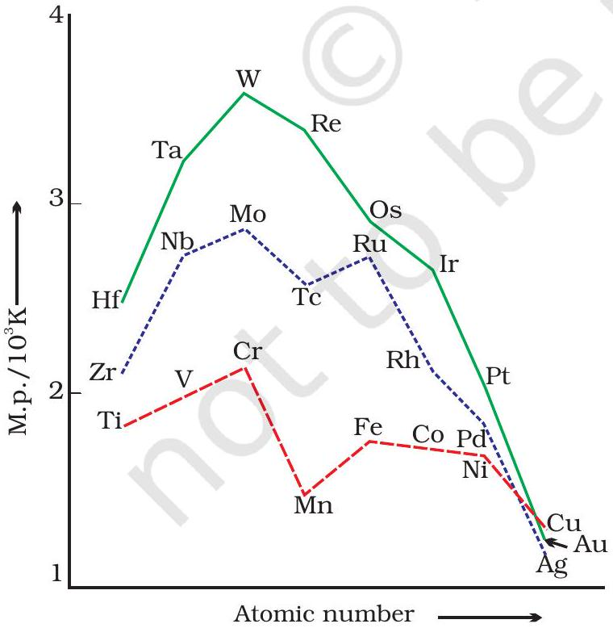
Fig. 4.1: Trends in melting points of transition elements

(bcc = body centred cubic; hcp = hexagonal close packed; $c c p=$ cubic close packed; $X=a$ typical metal structure).

The transition metals (with the exception of Zn, Cd and Hg) are very hard and have low volatility. Their melting and boiling points are high. Fig. 4.1 depicts the melting points of transition metals belonging to $3 d, 4 d$ and $5 d$ series. The high melting points of these metals are attributed to the involvement of greater number of electrons from (n-1) $d$ in addition to the ns electrons in the interatomic metallic bonding. In any row the melting points of these metals rise to a maximum at $d^{5}$ except for anomalous values of Mn and Tc and fall regularly as the atomic number increases. They have high enthalpies of atomisation which are shown in Fig. 4.2. The maxima at about the middle of each series indicate that one unpaired electron per $d$ orbital is particularly

Fig. 4.2
Trends in enthalpies of atomisation of transition elements
4.3.2 Variation in Atomic and Ionic Sizes of
Transition Metals
favourable for strong interatomic interaction. In general, greater the number of valence electrons, stronger is the resultant bonding. Since the enthalpy of atomisation is an important factor in determining the standard electrode potential of a metal, metals with very high enthalpy of atomisation (i.e., very high boiling point) tend to be noble in their reactions (see later for electrode potentials).

Another generalisation that may be drawn from Fig. 4.2 is that the metals of the second and third series have greater enthalpies of atomisation than the corresponding elements of the first series; this is an important factor in accounting for the occurrence of much more frequent metal - metal bonding in compounds of the heavy transition metals.
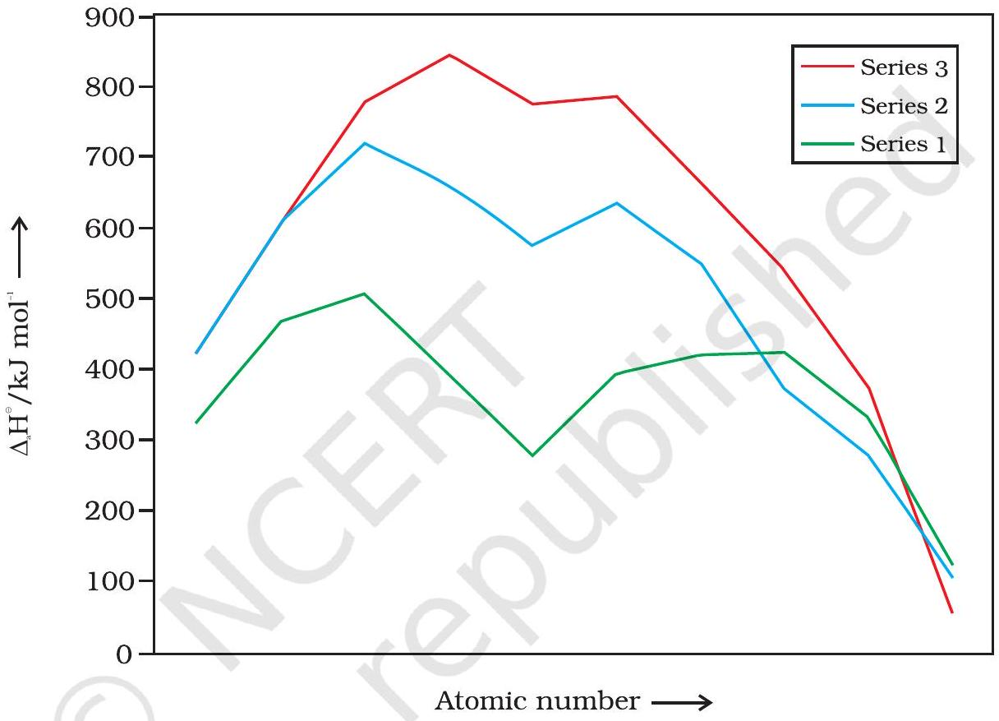
In general, ions of the same charge in a given series show progressive decrease in radius with increasing atomic number. This is because the new electron enters a $d$ orbital each time the nuclear charge increases by unity. It may be recalled that the shielding effect of a $d$ electron is not that effective, hence the net electrostatic attraction between the nuclear charge and the outermost electron increases and the ionic radius decreases. The same trend is observed in the atomic radii of a given series. However, the variation within a series is quite small. An interesting point emerges when atomic sizes of one series are compared with those of the corresponding elements in the other series. The curves in Fig. 4.3 show an increase from the first (3d) to the second (4d) series of the elements but the radii of the third (5d) series are virtually the same as those of the corresponding members of the second series. This phenomenon is associated with the intervention of the $4 f$ orbitals which must be filled before the $5 d$ series of elements begin. The filling of $4 f$ before $5 d$ orbital results in a regular decrease in atomic radii called Lanthanoid contraction which essentially compensates for the expected
increase in atomic size with increasing atomic number. The net result of the lanthanoid contraction is that the second and the third $d$ series exhibit similar radii (e.g., Zr 160 pm, Hf 159 pm) and have very similar physical and chemical properties much more than that expected on the basis of usual family relationship.

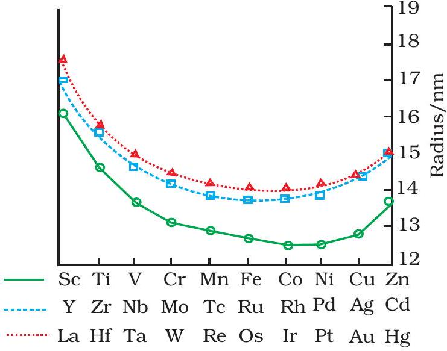
Fig. 4.3: Trends in atomic radii of transition elements

The factor responsible for the lanthanoid contraction is somewhat similar to that observed in an ordinary transition series and is attributed to similar cause, i.e., the imperfect shielding of one electron by another in the same set of orbitals. However, the shielding of one $4 f$ electron by another is less than that of one $d$ electron by another, and as the nuclear charge increases along the series, there is fairly regular decrease in the size of the entire $4 f^{\mathrm{n}}$ orbitals.

The decrease in metallic radius coupled with increase in atomic mass results in a general increase in the density of these elements. Thus, from titanium $(Z=22)$ to copper $(Z=29)$ the significant increase in the density may be noted (Table 4.2).

Table 4.2: Electronic Configurations and some other Properties of the First Series of Transition Elements
| Diement |  | Sc | Ti | V | Cr | Mn | Fe | Co | Ni | Cu | Zn |
| :--- | :--- | :--- | :--- | :--- | :--- | :--- | :--- | :--- | :--- | :--- | :--- |
| Atomic number |  | 21 | 22 | 23 | 24 | 25 | 26 | 27 | 28 | 29 | 30 |
| Electronic configuration |  |  |  |  |  |  |  |  |  |  |  |
|  | M | $3 d^{1} 4 s^{2}$ | $3 d^{2} 4 s^{2}$ | $3 d^{3} 4 s^{2}$ | $3 d^{5} 4 s^{1}$ | $3 d^{5} 4 s^{2}$ | $3 d^{6} 4 s^{2}$ | $3 d^{7} 4 s^{2}$ | $3 d^{8} 4 s^{2}$ | $3 d^{10} 4 s^{1}$ | $3 d^{10} 4 s^{2}$ |
|  | $\mathrm{M}^{+}$ | $3 d^{1} 4 s^{1}$ | $3 d^{2} 4 s^{1}$ | $3 d^{3} 4 s^{1}$ | $3 d^{5}$ | $3 d^{5} 4 s^{1}$ | $3 d^{6} 4 s^{1}$ | $3 d^{7} 4 s^{1}$ | $3 d^{8} 4 s^{1}$ | $3 d^{10}$ | $3 d^{10} 4 s^{1}$ |
|  | $\mathrm{M}^{2+}$ | $3 d^{1}$ | $3 d^{2}$ | $3 d^{3}$ | $3 d^{4}$ | $3 d^{5}$ | $3 d^{6}$ | $3 d^{7}$ | $3 d^{8}$ | $3 d^{9}$ | $3 d^{10}$ |
|  | $\mathrm{M}^{3+}$ | [Ar] | $3 d^{1}$ | $3 d^{2}$ | $3 d^{3}$ | $3 d^{4}$ | $3 d^{5}$ | $3 d^{6}$ | $3 d^{7}$ | - | - |
| Enthalpy of atomisation, $\Delta_{\alpha} H^{\circ} / \mathbf{k J} \mathbf{~ m o l}^{\boldsymbol{-} \mathbf{1}}$ |  |  |  |  |  |  |  |  |  |  |  |
|  |  | 326 | 473 | 515 | 397 | 281 | 416 | 425 | 430 | 339 | 126 |
| Ionisation enthalpy/ $\Delta_{i} \boldsymbol{H}^{\circ} / \mathbf{k J ~ m o l}^{-\mathbf{1}}$ |  |  |  |  |  |  |  |  |  |  |  |
| $\Delta_{\mathrm{i}} H^{\mathrm{o}}$ | I | 631 | 656 | 650 | 653 | 717 | 762 | 758 | 736 | 745 | 906 |
| $\Delta_{\mathrm{i}} H^{\mathrm{o}}$ | II | 1235 | 1309 | 1414 | 1592 | 1509 | 1561 | 1644 | 1752 | 1958 | 1734 |
| $\Delta_{\mathrm{i}} H^{\mathrm{o}}$ | III | 2393 | 2657 | 2833 | 2990 | 3260 | 2962 | 3243 | 3402 | 3556 | 3837 |
| Metallic/ionic | M | 164 | 147 | 135 | 129 | 137 | 126 | 125 | 125 | 128 | 137 |
| radii/pm | $\mathrm{M}^{2+}$ | - | - | 79 | 82 | 82 | 77 | 74 | 70 | 73 | 75 |
|  | $\mathrm{M}^{3+}$ | 73 | 67 | 64 | 62 | 65 | 65 | 61 | 60 | - | - |
| Standard |  |  |  |  |  |  |  |  |  |  |  |
| electrode | $\mathrm{M}^{2+} / \mathrm{M}$ | - | -1.63 | -1.18 | -0.90 | -1.18 | -0.44 | -0.28 | -0.25 | +0.34 | -0.76 |
| potential $\boldsymbol{E}^{\mathrm{o}} / \mathrm{V}$ | $\mathrm{M}^{3+} / \mathrm{M}^{2+}$ | - | -0.37 | -0.26 | -0.41 | +1.57 | +0.77 | +1.97 | - | - | - |
| Density/g cm ${ }^{-3}$ |  | 3.43 | 4.1 | 6.07 | 7.19 | 7.21 | 7.8 | 8.7 | 8.9 | 8.9 | 7.1 |

## Example 4.2

Why do the transition elements exhibit higher enthalpies of atomisation?

## Solution

Because of large number of unpaired electrons in their atoms they have stronger interatomic interaction and hence stronger bonding between atoms resulting in higher enthalpies of atomisation.

Intext Question

4.2 In the series $\mathrm{Sc}(Z=21)$ to $\mathrm{Zn}(Z=30)$, the enthalpy of atomisation of zinc is the lowest, i.e., $126 \mathrm{~kJ} \mathrm{~mol}^{-1}$. Why?
4.3.3 Ionisation Enthalpies

There is an increase in ionisation enthalpy along each series of the transition elements from left to right due to an increase in nuclear charge which accompanies the filling of the inner $d$ orbitals. Table 4.2 gives the values of the first three ionisation enthalpies of the first series of transition elements. These values show that the successive enthalpies of these elements do not increase as steeply as in the case of non-transition elements. The variation in ionisation enthalpy along a series of transition elements is much less in comparison to the variation along a period of non-transition elements. The first ionisation enthalpy, in general, increases, but the magnitude of the increase in the second and third ionisation enthalpies for the successive elements, is much higher along a series.

The irregular trend in the first ionisation enthalpy of the metals of $3 d$ series, though of little chemical significance, can be accounted for by considering that the removal of one electron alters the relative energies of $4 s$ and $3 d$ orbitals. You have learnt that when $d$-block elements form ions, ns electrons are lost before $(n-1) d$ electrons. As we move along the period in $3 d$ series, we see that nuclear charge increases from scandium to zinc but electrons are added to the orbital of inner subshell, i.e., $3 d$ orbitals. These $3 d$ electrons shield the $4 s$ electrons from the increasing nuclear charge somewhat more effectively than the outer shell electrons can shield one another. Therefore, the atomic radii decrease less rapidly. Thus, ionization energies increase only slightly along the $3 d$ series. The doubly or more highly charged ions have $d^{\mathrm{n}}$ configurations with no $4 s$ electrons. A general trend of increasing values of second ionisation enthalpy is expected as the effective nuclear charge increases because one $d$ electron does not shield another electron from the influence of nuclear charge because $d$-orbitals differ in direction. However, the trend of steady increase in second and third ionisation enthalpy breaks for the formation of $\mathrm{Mn}^{2+}$ and $\mathrm{Fe}^{3+}$ respectively. In both the cases, ions have $d^{5}$ configuration. Similar breaks occur at corresponding elements in the later transition series.

The interpretation of variation in ionisation enthalpy for an electronic configuration $d^{n}$ is as follows:

The three terms responsible for the value of ionisation enthalpy are attraction of each electron towards nucleus, repulsion between the
electrons and the exchange energy. Exchange energy is responsible for the stabilisation of energy state. Exchange energy is approximately proportional to the total number of possible pairs of parallel spins in the degenerate orbitals. When several electrons occupy a set of degenerate orbitals, the lowest energy state corresponds to the maximum possible extent of single occupation of orbital and parallel spins (Hunds rule). The loss of exchange energy increases the stability. As the stability increases, the ionisation becomes more difficult. There is no loss of exchange energy at $d^{6}$ configuration. $\mathrm{Mn}^{+}$has $3 d^{5} 4 s^{1}$ configuration and configuration of $\mathrm{Cr}^{+}$is $d^{5}$, therefore, ionisation enthalpy of $\mathrm{Mn}^{+}$is lower than $\mathrm{Cr}^{+}$. In the same way, $\mathrm{Fe}^{2+}$ has $d^{6}$ configuration and $\mathrm{Mn}^{2+}$ has $3 d^{5}$ configuration. Hence, ionisation enthalpy of $\mathrm{Fe}^{2+}$ is lower than the $\mathrm{Mn}^{2+}$. In other words, we can say that the third ionisation enthalpy of Fe is lower than that of Mn.

The lowest common oxidation state of these metals is +2. To form the $\mathrm{M}^{2+}$ ions from the gaseous atoms, the sum of the first and second ionisation enthalpy is required in addition to the enthalpy of atomisation. The dominant term is the second ionisation enthalpy which shows unusually high values for Cr and Cu where $\mathrm{M}^{+}$ions have the $d^{5}$ and $d^{10}$ configurations respectively. The value for Zn is correspondingly low as the ionisation causes the removal of one $4 s$ electron which results in the formation of stable $d^{10}$ configuration. The trend in the third ionisation enthalpies is not complicated by the $4 s$ orbital factor and shows the greater difficulty of removing an electron from the $d^{5}\left(\mathrm{Mn}^{2+}\right)$ and $d^{10}\left(\mathrm{Zn}^{2+}\right)$ ions. In general, the third ionisation enthalpies are quite high. Also the high values for third ionisation enthalpies of copper, nickel and zinc indicate why it is difficult to obtain oxidation state greater than two for these elements.

Although ionisation enthalpies give some guidance concerning the relative stabilities of oxidation states, this problem is very complex and not amenable to ready generalisation.

One of the notable features of a transition elements is the great variety of oxidation states these may show in their compounds. Table 4.3 lists the common oxidation states of the first row transition elements.

Table 4.3: Oxidation States of the first row Transition Metal (the most common ones are in bold types)
| Sc | Ti | V | Cr | Mn | Fe | Co | Ni | Cu | Zn |
| :--- | :--- | :--- | :--- | :--- | :--- | :--- | :--- | :--- | :--- |
| +3 | +2 | +2 | +2 | +2 | +2 | +2 | +2 | +1 | +2 |
|  | +3 | +3 | +3 | +3 | +3 | +3 | +3 | +2 |  |
|  | +4 | +4 | +4 | +4 | +4 | +4 | +4 |  |  |
|  |  | +5 | +5 | +5 |  |  |  |  |  |
|  |  |  | +6 | +6 | +6 |  |  |  |  |
|  |  |  |  | +7 |  |  |  |  |  |

The elements which give the greatest number of oxidation states occur in or near the middle of the series. Manganese, for example, exhibits all the oxidation states from +2 to +7. The lesser number of oxidation states at the extreme ends stems from either too few electrons to lose or share (Sc, Ti) or too many $d$ electrons (hence fewer orbitals available in which to share electrons with others) for higher valence (Cu, Zn). Thus, early in the series scandium(II) is virtually unknown and titanium (IV) is more stable than Ti(III) or Ti(II). At the other end, the only oxidation state of zinc is +2 (no $d$ electrons are involved). The maximum oxidation states of reasonable stability correspond in value to the sum of the $s$ and $d$ electrons upto manganese $\left(\mathrm{Ti}^{\mathrm{IV}} \mathrm{O}_{2}, \mathrm{~V}^{\mathrm{V}} \mathrm{O}_{2}{ }^{+}\right.$, $\left.\mathrm{Cr}^{\text {V1 }} \mathrm{O}_{4}{ }^{2-}, \mathrm{Mn}^{\text {VII }} \mathrm{O}_{4}{ }^{-}\right)$followed by a rather abrupt decrease in stability of higher oxidation states, so that the typical species to follow are $\mathrm{Fe}^{\mathrm{II}, \mathrm{III}}$, $\mathrm{Co}^{\mathrm{II}, \mathrm{III}}, \mathrm{Ni}^{\mathrm{II}}, \mathrm{Cu}^{\mathrm{I}, \mathrm{II}}, \mathrm{Zn}^{\mathrm{II}}$.

The variability of oxidation states, a characteristic of transition elements, arises out of incomplete filling of $d$ orbitals in such a way that their oxidation states differ from each other by unity, e.g., $\mathrm{V}^{\mathrm{II}}, \mathrm{V}^{\mathrm{III}}$, $\mathrm{V}^{\mathrm{IV}}, \mathrm{V}^{\mathrm{V}}$. This is in contrast with the variability of oxidation states of non transition elements where oxidation states normally differ by a unit of two.

An interesting feature in the variability of oxidation states of the $d-$ block elements is noticed among the groups (groups 4 through 10). Although in the $p$-block the lower oxidation states are favoured by the heavier members (due to inert pair effect), the opposite is true in the groups of $d$-block. For example, in group 6, Mo(VI) and W(VI) are found to be more stable than Cr(VI). Thus Cr(VI) in the form of dichromate in acidic medium is a strong oxidising agent, whereas $\mathrm{MoO}_{3}$ and $\mathrm{WO}_{3}$ are not.

Low oxidation states are found when a complex compound has ligands capable of $\pi$-acceptor character in addition to the $\sigma$-bonding. For example, in $\mathrm{Ni}(\mathrm{CO})_{4}$ and $\mathrm{Fe}(\mathrm{CO})_{5}$, the oxidation state of nickel and iron is zero.

## Example 4.3

Name a transition element which does not exhibit variable oxidation states.

## Solution

Scandium $(Z=21)$ does not exhibit variable oxidation states.

Intext Question

4.3 Which of the $3 d$ series of the transition metals exhibits the largest number of oxidation states and why?

4.3.5 Trends in the $\mathbf{M}^{\mathbf{2}+} \boldsymbol{/} \mathbf{M}$
Standard
Electrode
Potentials

Table 4.4 contains the thermochemical parameters related to the transformation of the solid metal atoms to $\mathrm{M}^{2+}$ ions in solution and their standard electrode potentials. The observed values of $E^{\ominus}$ and those calculated using the data of Table 4.4 are compared in Fig. 4.4.

The unique behaviour of Cu, having a positive $E^{\ominus}$, accounts for its inability to liberate $\mathrm{H}_{2}$ from acids. Only oxidising acids (nitric and hot concentrated sulphuric) react with Cu, the acids being reduced. The high energy to transform Cu(s) to $\mathrm{Cu}^{2+}(\mathrm{aq})$ is not balanced by its hydration enthalpy. The general trend towards less negative $E^{\ominus}$ values across the

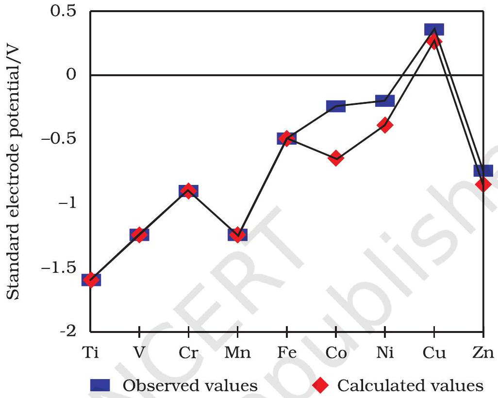
Fig. 4.4: Observed and calculated values for the standard electrode potentials
( $M^{2+} \rightarrow M^{\circ}$ ) of the elements Ti to Zn
series is related to the general increase in the sum of the first and second ionisation enthalpies. It is interesting to note that the value of $E^{\ominus}$ for Mn, Ni and Zn are more negative than expected from the trend.

## Example 4.4

Why is $\mathrm{Cr}^{2+}$ reducing and $\mathrm{Mn}^{3+}$ oxidising when both have $d^{4}$ configuration?

## Solution

$\mathrm{Cr}^{2+}$ is reducing as its configuration changes from $d^{4}$ to $d^{3}$, the latter having a half-filled $t_{2 \mathrm{~g}}$ level (see Unit 5). On the other hand, the change from $\mathrm{Mn}^{3+}$ to $\mathrm{Mn}^{2+}$ results in the half-filled ( $d^{5}$ ) configuration which has extra stability.

Intext Question

4.4 The $E^{\circ}\left(\mathrm{M}^{2+} / \mathrm{M}\right)$ value for copper is positive (+0.34V). What is possible reason for this? (Hint: consider its high $\Delta_{\mathrm{a}} H^{\mathrm{o}}$ and low $\Delta_{\text {hyd }} H^{\mathrm{o}}$ )

4.3.6 Trends in the $\mathbf{M}^{\mathbf{3} \boldsymbol{+}} \boldsymbol{/} \mathbf{M}^{\mathbf{2} \boldsymbol{+}}$ Standard Electrode Potentials
4.3.7 Trends in Stability of Higher Oxidation States

Table 4.4: Thermochemical data ( $\mathbf{k J ~ m o l}^{\boldsymbol{-} \mathbf{1}}$ ) for the first row Transition Elements and the Standard Electrode Potentials for the Reduction of $\mathbf{M}^{\mathbf{I I}}$ to $\mathbf{M}$.
| Element (M) | $\boldsymbol{\Delta}_{\mathbf{a}} \boldsymbol{H}^{\boldsymbol{\circ}} \boldsymbol{(} \mathbf{M} \boldsymbol{)}$ | $\Delta_{\mathrm{i}} \mathrm{H}_{1}^{\circ}$ | $\boldsymbol{\Delta}_{\mathbf{1}} \mathbf{H}_{\mathbf{2}}^{\mathbf{0}}$ | $\boldsymbol{\Delta}_{\text {hyd }} \mathbf{H}^{\mathbf{0}} \boldsymbol{(} \mathbf{M}^{\mathbf{2} \boldsymbol{+}} \boldsymbol{)}$ | 5°/V |
| :--- | :--- | :--- | :--- | :--- | :--- |
| Ti | 469 | 656 | 1309 | -1866 | -1.63 |
| V | 515 | 650 | 1414 | -1895 | -1.18 |
| Cr | 398 | 653 | 1592 | -1925 | -0.90 |
| Mn | 279 | 717 | 1509 | -1862 | -1.18 |
| Fe | 418 | 762 | 1561 | -1998 | -0.44 |
| Co | 427 | 758 | 1644 | -2079 | -0.28 |
| Ni | 431 | 736 | 1752 | -2121 | -0.25 |
| Cu | 339 | 745 | 1958 | -2121 | 0.34 |
| Zn | 130 | 906 | 1734 | -2059 | -0.76 |

The stability of the half-filled $d$ sub-shell in $\mathrm{Mn}^{2+}$ and the completely filled $d^{10}$ configuration in $\mathrm{Zn}^{2+}$ are related to their $E^{\circ}$ values, whereas $E^{\circ}$ for Ni is related to the highest negative $\Delta_{\text {hyd }} H^{\circ}$.

An examination of the $E^{\mathrm{o}}\left(\mathrm{M}^{3+} / \mathrm{M}^{2+}\right)$ values (Table 4.2) shows the varying trends. The low value for Sc reflects the stability of $\mathrm{Sc}^{3+}$ which has a noble gas configuration. The highest value for Zn is due to the removal of an electron from the stable $d^{10}$ configuration of $\mathrm{Zn}^{2+}$. The comparatively high value for Mn shows that $\operatorname{Mn}^{2+}\left(d^{5}\right)$ is particularly stable, whereas comparatively low value for Fe shows the extra stability of $\mathrm{Fe}^{3+}\left(d^{5}\right)$. The comparatively low value for V is related to the stability of $\mathrm{V}^{2+}$ (half-filled $t_{2 \mathrm{~g}}$ level, Unit 5).

Table 4.5 shows the stable halides of the $3 d$ series of transition metals. The highest oxidation numbers are achieved in $\mathrm{TiX}_{4}$ (tetrahalides), $\mathrm{VF}_{5}$ and $\mathrm{CrF}_{6}$. The +7 state for Mn is not represented in simple halides but $\mathrm{MnO}_{3} \mathrm{~F}$ is known, and beyond Mn no metal has a trihalide except $\mathrm{FeX}_{3}$ and $\mathrm{CoF}_{3}$. The ability of fluorine to stabilise the highest oxidation state is due to either higher lattice energy as in the case of $\mathrm{CoF}_{3}$, or higher bond enthalpy terms for the higher covalent compounds, e.g., $\mathrm{VF}_{5}$ and $\mathrm{CrF}_{6}$.

Although $\mathrm{V}^{+5}$ is represented only by $\mathrm{VF}_{5}$, the other halides, however, undergo hydrolysis to give oxohalides, $\mathrm{VOX}_{3}$. Another feature of fluorides is their instability in the low oxidation states e.g., $\mathrm{VX}_{2}(\mathrm{X}=\mathrm{CI}, \mathrm{Br}$ or I)

Table 4.5: Formulas of Halides of $3 d$ Metals

Oxidation Number

| + 6 |  | $\mathrm{CrF}_{6}$ |  |  |  |  |  |  |  |
| :--- | :--- | :--- | :--- | :--- | :--- | :--- | :--- | :--- | :--- |
| + 5 |  | $\mathrm{VF}_{5}$ | $\mathrm{CrF}_{5}$ |  |  |  |  |  |  |
| + 4 | $\mathrm{TiX}_{4}$ | $\mathrm{VX}_{4}^{\mathrm{I}}$ | $\mathrm{CrX}_{4}$ | $\mathrm{MnF}_{4}$ |  |  |  |  |  |
| + 3 | $\mathrm{TiX}_{3}$ | $\mathrm{VX}_{3}$ | $\mathrm{CrX}_{3}$ | $\mathrm{MnF}_{3}$ | $\mathrm{FeX}^{\mathrm{I}}{ }_{3}$ | $\mathrm{CoF}_{3}$ |  |  |  |
| + 2 | $\mathrm{TiX}_{2}{ }^{\text {III }}$ | $\mathrm{VX}_{2}$ | $\mathrm{CrX}_{2}$ | $\mathrm{MnX}_{2}$ | $\mathrm{FeX}_{2}$ | $\mathrm{CoX}_{2}$ | $\mathrm{NiX}_{2}$ | $\mathrm{CuX}_{2}{ }^{\text {II }}$ | $\mathrm{ZnX}_{2}$ |
| + 1 |  |  |  |  |  |  |  | $\mathrm{CuX}^{\text {III }}$ |  |

Key: $\mathrm{X}=\mathrm{F} \rightarrow \mathrm{I} ; \mathrm{X}^{\mathrm{I}}=\mathrm{F} \rightarrow \mathrm{Br} ; \mathrm{X}^{\mathrm{II}}=\mathrm{F}, \mathrm{CI} ; \mathrm{X}^{\mathrm{III}}=\mathrm{CI} \rightarrow \mathrm{I}$
and the same applies to CuX. On the other hand, all $\mathrm{Cu}^{\text {II }}$ halides are known except the iodide. In this case, $\mathrm{Cu}^{2+}$ oxidises $\mathrm{I}^{-}$to $\mathrm{I}_{2}$ :

$$
2 \mathrm{Cu}^{2+}+4 \mathrm{I}^{-} \rightarrow \mathrm{Cu}_{2} \mathrm{I}_{2}(\mathrm{~s})+\mathrm{I}_{2}
$$

However, many copper (I) compounds are unstable in aqueous solution and undergo disproportionation.

$$
2 \mathrm{Cu}^{+} \rightarrow \mathrm{Cu}^{2+}+\mathrm{Cu}
$$

The stability of $\mathrm{Cu}^{2+}(\mathrm{aq})$ rather than $\mathrm{Cu}^{+}(\mathrm{aq})$ is due to the much more negative $\Delta_{\text {hyd }} \mathrm{H}^{\circ}$ of $\mathrm{Cu}^{2+}$ (aq) than $\mathrm{Cu}^{+}$, which more than compensates for the second ionisation enthalpy of Cu.

The ability of oxygen to stabilise the highest oxidation state is demonstrated in the oxides. The highest oxidation number in the oxides (Table 4.6) coincides with the group number and is attained in $\mathrm{Sc}_{2} \mathrm{O}_{3}$ to $\mathrm{Mn}_{2} \mathrm{O}_{7}$. Beyond Group 7, no higher oxides of Fe above $\mathrm{Fe}_{2} \mathrm{O}_{3}$, are known, although ferrates (VI) $\left(\mathrm{FeO}_{4}\right)^{2-}$, are formed in alkaline media but they readily decompose to $\mathrm{Fe}_{2} \mathrm{O}_{3}$ and $\mathrm{O}_{2}$. Besides the oxides, oxocations stabilise $\mathrm{V}^{\mathrm{V}}$ as $\mathrm{VO}_{2}{ }^{+}, \mathrm{V}^{\mathrm{IV}}$ as $\mathrm{VO}^{2+}$ and $\mathrm{Ti}^{\mathrm{IV}}$ as $\mathrm{TiO}^{2+}$. The ability of oxygen to stabilise these high oxidation states exceeds that of fluorine. Thus the highest Mn fluoride is $\mathrm{MnF}_{4}$ whereas the highest oxide is $\mathrm{Mn}_{2} \mathrm{O}_{7}$. The ability of oxygen to form multiple bonds to metals explains its superiority. In the covalent oxide $\mathrm{Mn}_{2} \mathrm{O}_{7}$, each Mn is tetrahedrally surrounded by O's including a Mn-O-Mn bridge. The tetrahedral $\left[\mathrm{MO}_{4}\right]^{\mathrm{n}-}$ ions are known for $\mathrm{V}^{\mathrm{V}}, \mathrm{Cr}^{\mathrm{V} 1}, \mathrm{Mn}^{\mathrm{V}}, \mathrm{Mn}^{\mathrm{VI}}$ and $\mathrm{Mn}^{\mathrm{VII}}$.

Table 4.6: Oxides of 3d Metals
| Oxidation |  |  |  | Groups |  |  |  |  |  |  |
| :--- | :--- | :--- | :--- | :--- | :--- | :--- | :--- | :--- | :--- | :--- |
| Number | 3 | 4 | 5 | 6 | 7 | 8 | 9 | 10 | 11 | 12 |
| + 7 |  |  |  |  | $\mathrm{Mn}_{2} \mathrm{O}_{7}$ |  |  |  |  |  |
| + 6 |  |  |  | $\mathrm{CrO}_{3}$   $\mathrm{CrO}_{3}$ |  |  |  |  |  |  |
| + 5 |  |  | $\mathrm{V}_{2} \mathrm{O}_{5}$ |  |  |  |  |  |  |  |
| + 4 |  | $\mathrm{TiO}_{2}$   $\mathrm{TiO}_{2}$   $\mathrm{TiO}_{2}$ | $\mathrm{V}_{2} \mathrm{O}_{4}$ | $\mathrm{CrO}_{2}$ |  |  |  |  |  |  |
| + 3 | $\mathrm{Sc}_{2} \mathrm{O}_{3}$ |  | $\mathrm{V}_{2} \mathrm{O}_{3}$ | $\mathrm{Cr}_{2} \mathrm{O}_{3}$ | $\mathrm{Mn}_{2} \mathrm{O}_{3}$ | $\mathrm{Fe}_{2} \mathrm{O}_{3}$   $\mathrm{Fe}_{3} \mathrm{O}_{4}{ }^{*}$ |  |  |  |  |
|  |  |  |  |  | $\mathrm{Mn}_{3} \mathrm{O}_{4}{ }^{*}$ |  | $\mathrm{Co}_{3} \mathrm{O}_{4}{ }^{*}$ |  |  |  |
| + 2 |  | TiO | VO | (CrO) | MnO | FeO | CoO | NiO | CuO | ZnO |
| + 1 |  |  |  |  |  |  |  |  |  |  |

* mixed oxides

## Example 4.5

How would you account for the increasing oxidising power in the series $\mathrm{VO}_{2}{ }^{+}<\mathrm{Cr}_{2} \mathrm{O}_{7}{ }^{2-}<\mathrm{MnO}_{4}{ }^{-}$?

## Solution

This is due to the increasing stability of the lower species to which they are reduced.

Intext Question

4.5 How would you account for the irregular variation of ionisation enthalpies (first and second) in the first series of the transition elements?

4.3.8 Chemical Reactivity and $\mathrm{E}^{\circ}$ Values

Transition metals vary widely in their chemical reactivity. Many of them are sufficiently electropositive to dissolve in mineral acids, although a few are 'noble'-that is, they are unaffected by single acids.

The metals of the first series with the exception of copper are relatively more reactive and are oxidised by $1 \mathrm{M} \mathrm{H}^{+}$, though the actual rate at which these metals react with oxidising agents like hydrogen ion $\left(\mathrm{H}^{+}\right)$is sometimes slow. For example, titanium and vanadium, in practice, are passive to dilute non oxidising acids at room temperature. The $E^{\mathrm{o}}$ values for $\mathrm{M}^{2+} / \mathrm{M}$ (Table 4.2) indicate a decreasing tendency to form divalent cations across the series. This general trend towards less negative $E^{\circ}$ values is related to the increase in the sum of the first and second ionisation enthalpies. It is interesting to note that the $E^{\circ}$ values for Mn, Ni and Zn are more negative than expected from the general trend. Whereas the stabilities of half-filled $d$ subshell ( $d^{5}$ ) in $\mathrm{Mn}^{2+}$ and completely filled $d$ subshell ( $d^{10}$ ) in zinc are related to their $E^{\mathrm{e}}$ values; for nickel, $E^{\mathrm{o}}$ value is related to the highest negative enthalpy of hydration.

An examination of the $E^{\mathrm{o}}$ values for the redox couple $\mathrm{M}^{3+} / \mathrm{M}^{2+}$ (Table 4.2) shows that $\mathrm{Mn}^{3+}$ and $\mathrm{Co}^{3+}$ ions are the strongest oxidising agents in aqueous solutions. The ions $\mathrm{Ti}^{2+}, \mathrm{V}^{2+}$ and $\mathrm{Cr}^{2+}$ are strong reducing agents and will liberate hydrogen from a dilute acid, e.g.,

$$
2 \mathrm{Cr}^{2+}(\mathrm{aq})+2 \mathrm{H}^{+}(\mathrm{aq}) \rightarrow 2 \mathrm{Cr}^{3+}(\mathrm{aq})+\mathrm{H}_{2}(\mathrm{~g})
$$

## Example 4.6

For the first row transition metals the $E^{\mathrm{o}}$ values are:

| $\boldsymbol{E}^{\circ}$ | V | Cr | Mn | Fe | Co | Ni | Cu |
| :--- | :--- | :--- | :--- | :--- | :--- | :--- | :--- |
| ( $\mathrm{M}^{2+} / \mathrm{M}$ ) | -1.18 | - 0.91 | -1.18 | - 0.44 | - 0.28 | -0.25 | +0.34 |

Explain the irregularity in the above values.

## Solution

The $E^{\circ}\left(\mathrm{M}^{2+} / \mathrm{M}\right)$ values are not regular which can be explained from the irregular variation of ionisation enthalpies ( $\Delta_{\mathrm{i}} H_{1}+\Delta_{\mathrm{i}} H_{2}$ ) and also the sublimation enthalpies which are relatively much less for manganese and vanadium.

## Example 4.7

Why is the $E^{\circ}$ value for the $\mathrm{Mn}^{3+} / \mathrm{Mn}^{2+}$ couple much more positive than that for $\mathrm{Cr}^{3+} / \mathrm{Cr}^{2+}$ or $\mathrm{Fe}^{3+} / \mathrm{Fe}^{2+}$ ? Explain.

## Solution

Much larger third ionisation energy of Mn (where the required change is $d^{5}$ to $d^{4}$ ) is mainly responsible for this. This also explains why the +3 state of Mn is of little importance.

Intext Questions

4.6 Why is the highest oxidation state of a metal exhibited in its oxide or fluoride only?
4.7 Which is a stronger reducing agent $\mathrm{Cr}^{2+}$ or $\mathrm{Fe}^{2+}$ and why ?
4.3.9 Magnetic Properties

When a magnetic field is applied to substances, mainly two types of magnetic behaviour are observed: diamagnetism and paramagnetism. Diamagnetic substances are repelled by the applied field while the paramagnetic substances are attracted. Substances which are
attracted very strongly are said to be ferromagnetic. In fact, ferromagnetism is an extreme form of paramagnetism. Many of the transition metal ions are paramagnetic.

Paramagnetism arises from the presence of unpaired electrons, each such electron having a magnetic moment associated with its spin angular momentum and orbital angular momentum. For the compounds of the first series of transition metals, the contribution of the orbital angular momentum is effectively quenched and hence is of no significance. For these, the magnetic moment is determined by the number of unpaired electrons and is calculated by using the 'spin-only' formula, i.e.,

$$
\mu=\sqrt{\mathrm{n}(\mathrm{n}+2)}
$$

where n is the number of unpaired electrons and $\mu$ is the magnetic moment in units of Bohr magneton (BM). A single unpaired electron has a magnetic moment of 1.73 Bohr magnetons (BM).

The magnetic moment increases with the increasing number of unpaired electrons. Thus, the observed magnetic moment gives a useful indication about the number of unpaired electrons present in the atom, molecule or ion. The magnetic moments calculated from the 'spin-only' formula and those derived experimentally for some ions of the first row transition elements are given in Table 4.7. The experimental data are mainly for hydrated ions in solution or in the solid state.

Table 4.7: Calculated and Observed Magnetic Moments (BM)
| Ion | Configuration | Unpaired electron(s) | Magnetic moment |  |
| :--- | :--- | :--- | :--- | :--- |
|  |  |  | Calculated | Observed |
| $\mathrm{Sc}^{3+}$ | $3 d^{0}$ | 0 | 0 | 0 |
| $\mathrm{Ti}^{3+}$ | $3 d^{1}$ | 1 | 1.73 | 1.75 |
| $\mathrm{Tl}^{2+}$ | $3 d^{2}$ | 2 | 2.84 | 2.76 |
| $\mathrm{V}^{2+}$ | $3 d^{3}$ | 3 | 3.87 | 3.86 |
| $\mathrm{Cr}^{2+}$ | $3 d^{4}$ | 4 | 4.90 | 4.80 |
| $\mathrm{Mn}^{2+}$ | $3 d^{5}$ | 5 | 5.92 | 5.96 |
| $\mathrm{Fe}^{2+}$ | $3 d^{6}$ | 4 | 4.90 | 5.3-5.5 |
| $\mathrm{Co}^{2+}$ | $3 d^{7}$ | 3 | 3.87 | 4.4-5.2 |
| $\mathrm{Ni}^{2+}$ | $3 d^{8}$ | 2 | 2.84 | 2.9-3, 4 |
| $\mathrm{Cu}^{2+}$ | $3 d^{9}$ | 1 | 1.73 | 1.8-2.2 |
| $\mathrm{Zn}^{2+}$ | $3 d^{10}$ | 0 | 0 |  |

## Example 4.8

Calculate the magnetic moment of a divalent ion in aqueous solution if its atomic number is 25.

## Solution

With atomic number 25, the divalent ion in aqueous solution will have $d^{5}$ configuration (five unpaired electrons). The magnetic moment, $\mu$ is

$$
\mu=\sqrt{5(5+2)}=5.92 \mathrm{BM}
$$

Intext Question
4.8 Calculate the 'spin only' magnetic moment of $\mathrm{M}^{2+}{ }_{(\mathrm{aq})}$ ion $(Z=27)$.

4.3.10 Formation of Coloured Ions

When an electron from a lower energy $d$ orbital is excited to a higher energy $d$ orbital, the energy of excitation corresponds to the frequency of light absorbed (Unit 5). This frequency generally lies in the visible region. The colour observed corresponds to the complementary colour of the light absorbed. The frequency of the light absorbed is determined by the nature of the ligand. In aqueous solutions where water molecules are the ligands, the colours of the ions observed are listed in Table 4.8. A few coloured solutions of $d$-block elements are illustrated in Fig. 4.5.

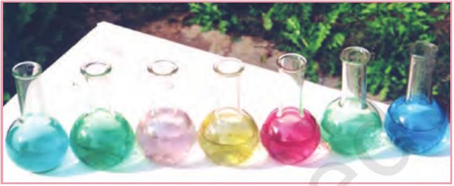
Fig. 4.5: Colours of some of the first row transition metal ions in aqueous solutions. From left to right: $\mathrm{V}^{4+}, \mathrm{V}^{3+}, \mathrm{Mn}^{2+}, \mathrm{Fe}^{3+}, \mathrm{Co}^{2+}, \mathrm{Ni}^{2+}$ and $\mathrm{Cu}^{2+}$.

Table 4.8: Colours of Some of the First Row (aquated) Transition Metal Ions
| Configuration | Example | Colour |
| :--- | :--- | :--- |
| $3 \mathrm{~d}^{0}$ | $\mathrm{Sc}^{3+}$ | colourless |
| $3 \mathrm{~d}^{0}$ | $\mathrm{Ti}^{4+}$ | colourless |
| $3 \mathrm{~d}^{1}$ | $\mathrm{Ti}^{3+}$ | purple |
| $3 \mathrm{~d}^{1}$ | $\mathrm{V}^{4+}$ | blue |
| $3 \mathrm{~d}^{2}$ | $\mathrm{V}^{3+}$ | green |
| $3 \mathrm{~d}^{3}$ | $\mathrm{V}^{2+}$ | violet |
| $3 \mathrm{~d}^{3}$ | $\mathrm{Cr}^{3+}$ | violet |
| $3 \mathrm{~d}^{4}$ | $\mathrm{Mn}^{3+}$ | violet |
| $3 \mathrm{~d}^{4}$ | $\mathrm{Cr}^{2+}$ | blue |
| $3 \mathrm{~d}^{5}$ | $\mathrm{Mn}^{2+}$ | pink |
| $3 \mathrm{~d}^{5}$ | $\mathrm{Fe}^{3+}$ | yellow |
| $3 \mathrm{~d}^{6}$ | $\mathrm{Fe}^{2+}$ | green |
| $3 \mathrm{~d}^{6} 3 \mathrm{~d}^{7}$ | $\mathrm{Co}^{3+} \mathrm{Co}^{2+}$ | bluepink |
| $3 \mathrm{~d}^{8}$ | $\mathrm{Ni}^{2+}$ | green |
| $3 \mathrm{~d}^{9}$ | $\mathrm{Cu}^{2+}$ | blue |
| $3 \mathrm{~d}^{10}$ | $\mathrm{Zn}^{2+}$ | colourless |

4.3.11 Formation of Complex Compounds

Complex compounds are those in which the metal ions bind a number of anions or neutral molecules giving complex species with characteristic properties. A few examples are: $\left[\mathrm{Fe}(\mathrm{CN})_{6}\right]^{3-},\left[\mathrm{Fe}(\mathrm{CN})_{6}\right]^{4-}$, $\left[\mathrm{Cu}\left(\mathrm{NH}_{3}\right)_{4}\right]^{2+}$ and $\left[\mathrm{PtCl}_{4}\right]^{2-}$. (The chemistry of complex compounds is

### 4.3.12 Catalytic Properties

4.3.13 Formation of Interstitial Compounds
4.3.14 Alloy Formation
dealt with in detail in Unit 5). The transition metals form a large number of complex compounds. This is due to the comparatively smaller sizes of the metal ions, their high ionic charges and the availability of $d$ orbitals for bond formation.

The transition metals and their compounds are known for their catalytic activity. This activity is ascribed to their ability to adopt multiple oxidation states and to form complexes. Vanadium(V) oxide (in Contact Process), finely divided iron (in Haber's Process), and nickel (in Catalytic Hydrogenation) are some of the examples. Catalysts at a solid surface involve the formation of bonds between reactant molecules and atoms of the surface of the catalyst (first row transition metals utilise $3 d$ and $4 s$ electrons for bonding). This has the effect of increasing the concentration of the reactants at the catalyst surface and also weakening of the bonds in the reacting molecules (the activation energy is lowering). Also because the transition metal ions can change their oxidation states, they become more effective as catalysts. For example, iron(III) catalyses the reaction between iodide and persulphate ions.

$$
2 \mathrm{I}^{-}+\mathrm{S}_{2} \mathrm{O}_{8}^{2-} \rightarrow \mathrm{I}_{2}+2 \mathrm{SO}_{4}^{2-}
$$

An explanation of this catalytic action can be given as:

$$
\begin{aligned}
& 2 \mathrm{Fe}^{3+}+2 \mathrm{I}^{-} \rightarrow 2 \mathrm{Fe}^{2+}+\mathrm{I}_{2} \\
& 2 \mathrm{Fe}^{2+}+\mathrm{S}_{2} \mathrm{O}_{8}^{2-} \rightarrow 2 \mathrm{Fe}^{3+}+2 \mathrm{SO}_{4}^{2-}
\end{aligned}
$$

Interstitial compounds are those which are formed when small atoms like H, C or N are trapped inside the crystal lattices of metals. They are usually non stoichiometric and are neither typically ionic nor covalent, for example, $\mathrm{TiC}, \mathrm{Mn}_{4} \mathrm{~N}, \mathrm{Fe}_{3} \mathrm{H}, \mathrm{VH}_{0.56}$ and $\mathrm{TiH}_{1.7}$, etc. The formulas quoted do not, of course, correspond to any normal oxidation state of the metal. Because of the nature of their composition, these compounds are referred to as interstitial compounds. The principal physical and chemical characteristics of these compounds are as follows:

(i) They have high melting points, higher than those of pure metals.
(ii) They are very hard, some borides approach diamond in hardness.
(iii) They retain metallic conductivity.
(iv) They are chemically inert.

An alloy is a blend of metals prepared by mixing the components. Alloys may be homogeneous solid solutions in which the atoms of one metal are distributed randomly among the atoms of the other. Such alloys are formed by atoms with metallic radii that are within about 15 percent of each other. Because of similar radii and other characteristics of transition metals, alloys are readily formed by these metals. The alloys so formed are hard and have often high melting points. The best known are ferrous alloys: chromium, vanadium, tungsten, molybdenum and manganese are used for the production of a variety of steels and stainless steel. Alloys of transition metals with non transition metals such as brass (copper-zinc) and bronze (copper-tin), are also of considerable industrial importance.

## Example 4.9

What is meant by 'disproportionation' of an oxidation state? Give an example.

## Solution

When a particular oxidation state becomes less stable relative to other oxidation states, one lower, one higher, it is said to undergo disproportionation. For example, manganese (VI) becomes unstable relative to manganese(VII) and manganese (IV) in acidic solution.

$$
3 \mathrm{Mn}^{\mathrm{VI}} \mathrm{O}_{4}{ }^{2-}+4 \mathrm{H}^{+} \rightarrow 2 \mathrm{Mn}^{\mathrm{VII}} \mathrm{O}_{4}^{-}+\mathrm{Mn}^{\mathrm{IV}} \mathrm{O}_{2}+2 \mathrm{H}_{2} \mathrm{O}
$$

4.4 Some Important Compounds of Transition Elements

Intext Question
4.9 Explain why $\mathrm{Cu}^{+}$ion is not stable in aqueous solutions?

### 4.4.1 Oxides and Oxoanions of Metals

These oxides are generally formed by the reaction of metals with oxygen at high temperatures. All the metals except scandium form MO oxides which are ionic. The highest oxidation number in the oxides, coincides with the group number and is attained in $\mathrm{Sc}_{2} \mathrm{O}_{3}$ to $\mathrm{Mn}_{2} \mathrm{O}_{7}$. Beyond group 7, no higher oxides of iron above $\mathrm{Fe}_{2} \mathrm{O}_{3}$ are known. Besides the oxides, the oxocations stabilise $\mathrm{V}^{\mathrm{V}}$ as $\mathrm{VO}_{2}{ }^{+}, \mathrm{V}^{\mathrm{IV}}$ as $\mathrm{VO}^{2+}$ and $\mathrm{Ti}^{\mathrm{IV}}$ as $\mathrm{TiO}^{2+}$.

As the oxidation number of a metal increases, ionic character decreases. In the case of Mn, $\mathrm{Mn}_{2} \mathrm{O}_{7}$ is a covalent green oil. Even $\mathrm{CrO}_{3}$ and $\mathrm{V}_{2} \mathrm{O}_{5}$ have low melting points. In these higher oxides, the acidic character is predominant.

Thus, $\mathrm{Mn}_{2} \mathrm{O}_{7}$ gives $\mathrm{HMnO}_{4}$ and $\mathrm{CrO}_{3}$ gives $\mathrm{H}_{2} \mathrm{CrO}_{4}$ and $\mathrm{H}_{2} \mathrm{Cr}_{2} \mathrm{O}_{7}$. $\mathrm{V}_{2} \mathrm{O}_{5}$ is, however, amphoteric though mainly acidic and it gives $\mathrm{VO}_{4}{ }^{3-}$ as well as $\mathrm{VO}_{2}{ }^{+}$salts. In vanadium there is gradual change from the basic $\mathrm{V}_{2} \mathrm{O}_{3}$ to less basic $\mathrm{V}_{2} \mathrm{O}_{4}$ and to amphoteric $\mathrm{V}_{2} \mathrm{O}_{5} . \mathrm{V}_{2} \mathrm{O}_{4}$ dissolves in acids to give $\mathrm{VO}^{2+}$ salts. Similarly, $\mathrm{V}_{2} \mathrm{O}_{5}$ reacts with alkalies as well as acids to give $\mathrm{VO}_{4}^{3-}$ and $\mathrm{VO}_{4}^{+}$respectively. The well characterised CrO is basic but $\mathrm{Cr}_{2} \mathrm{O}_{3}$ is amphoteric.

Potassium dichromate $\mathbf{K}_{\mathbf{2}} \mathbf{C r}_{\mathbf{2}} \mathbf{O}_{\mathbf{7}}$
Potassium dichromate is a very important chemical used in leather industry and as an oxidant for preparation of many azo compounds. Dichromates are generally prepared from chromate, which in turn are obtained by the fusion of chromite ore $\left(\mathrm{FeCr}_{2} \mathrm{O}_{4}\right)$ with sodium or potassium carbonate in free access of air. The reaction with sodium carbonate occurs as follows:

$$
4 \mathrm{FeCr}_{2} \mathrm{O}_{4}+8 \mathrm{Na}_{2} \mathrm{CO}_{3}+7 \mathrm{O}_{2} \rightarrow 8 \mathrm{Na}_{2} \mathrm{CrO}_{4}+2 \mathrm{Fe}_{2} \mathrm{O}_{3}+8 \mathrm{CO}_{2}
$$

The yellow solution of sodium chromate is filtered and acidified with sulphuric acid to give a solution from which orange sodium dichromate, $\mathrm{Na}_{2} \mathrm{Cr}_{2} \mathrm{O}_{7} .2 \mathrm{H}_{2} \mathrm{O}$ can be crystallised.

$$
2 \mathrm{Na}_{2} \mathrm{CrO}_{4}+2 \mathrm{H}^{+} \rightarrow \mathrm{Na}_{2} \mathrm{Cr}_{2} \mathrm{O}_{7}+2 \mathrm{Na}^{+}+\mathrm{H}_{2} \mathrm{O}
$$

Sodium dichromate is more soluble than potassium dichromate. The latter is therefore, prepared by treating the solution of sodium dichromate with potassium chloride.

$$
\mathrm{Na}_{2} \mathrm{Cr}_{2} \mathrm{O}_{7}+2 \mathrm{KCl} \rightarrow \mathrm{~K}_{2} \mathrm{Cr}_{2} \mathrm{O}_{7}+2 \mathrm{NaCl}
$$

Orange crystals of potassium dichromate crystallise out. The chromates and dichromates are interconvertible in aqueous solution depending upon pH of the solution. The oxidation state of chromium in chromate and dichromate is the same.

$$
\begin{aligned}
& 2 \mathrm{CrO}_{4}{ }^{2-}+2 \mathrm{H}^{+} \rightarrow \mathrm{Cr}_{2} \mathrm{O}_{7}{ }^{2-}+\mathrm{H}_{2} \mathrm{O} \\
& \mathrm{Cr}_{2} \mathrm{O}_{7}{ }^{2-}+2 \mathrm{OH}^{-} \rightarrow 2 \mathrm{CrO}_{4}{ }^{2-}+\mathrm{H}_{2} \mathrm{O}
\end{aligned}
$$

The structures of

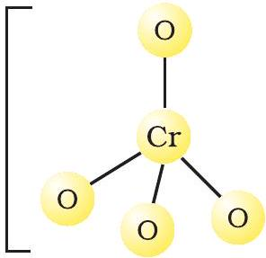
Chromate ion

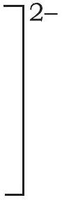
Dichromate ion

chromate ion, $\mathrm{CrO}_{4}{ }^{2-}$ and the dichromate ion, $\mathrm{Cr}_{2} \mathrm{O}_{7}{ }^{2-}$ are shown below. The chromate ion is tetrahedral whereas the dichromate ion consists of two tetrahedra sharing one corner with Cr-O-Cr bond angle of 126°.
Sodium and potassium dichromates are strong oxidising agents; the sodium salt has a greater solubility in water and is extensively used as an oxidising agent in organic chemistry. Potassium dichromate is used as a primary standard in volumetric analysis. In acidic solution, its oxidising action can be represented as follows:

$$
\mathrm{Cr}_{2} \mathrm{O}_{7}{ }^{2-}+14 \mathrm{H}^{+}+6 \mathrm{e}^{-} \rightarrow 2 \mathrm{Cr}^{3+}+7 \mathrm{H}_{2} \mathrm{O}\left(E^{\circ}=1.33 \mathrm{~V}\right)
$$

Thus, acidified potassium dichromate will oxidise iodides to iodine, sulphides to sulphur, tin(II) to tin(IV) and iron(II) salts to iron(III). The half-reactions are noted below:

$$
\begin{array}{ll}
6 \mathrm{I}^{-} \rightarrow 3 \mathrm{I}_{2}+6 \mathrm{e}^{-} ; & 3 \mathrm{Sn}^{2+} \rightarrow 3 \mathrm{Sn}^{4+}+6 \mathrm{e}^{-} \\
3 \mathrm{H}_{2} \mathrm{~S} \rightarrow 6 \mathrm{H}^{+}+3 \mathrm{~S}+6 \mathrm{e}^{-} ; & 6 \mathrm{Fe}^{2+} \rightarrow 6 \mathrm{Fe}^{3+}+6 \mathrm{e}^{-}
\end{array}
$$

The full ionic equation may be obtained by adding the half-reaction for potassium dichromate to the half-reaction for the reducing agent, for e.g.,

$$
\mathrm{Cr}_{2} \mathrm{O}_{7}^{2-}+14 \mathrm{H}^{+}+6 \mathrm{Fe}^{2+} \rightarrow 2 \mathrm{Cr}^{3+}+6 \mathrm{Fe}^{3+}+7 \mathrm{H}_{2} \mathrm{O}
$$

Potassium permanganate $\mathbf{K M n O}_{\mathbf{4}}$
Potassium permanganate is prepared by fusion of $\mathrm{MnO}_{2}$ with an alkali metal hydroxide and an oxidising agent like $\mathrm{KNO}_{3}$. This produces the dark green $\mathrm{K}_{2} \mathrm{MnO}_{4}$ which disproportionates in a neutral or acidic solution to give permanganate.

$$
\begin{aligned}
& 2 \mathrm{MnO}_{2}+4 \mathrm{KOH}+\mathrm{O}_{2} \rightarrow 2 \mathrm{~K}_{2} \mathrm{MnO}_{4}+2 \mathrm{H}_{2} \mathrm{O} \\
& 3 \mathrm{MnO}_{4}{ }^{2-}+4 \mathrm{H}^{+} \rightarrow 2 \mathrm{MnO}_{4}^{-}+\mathrm{MnO}_{2}+2 \mathrm{H}_{2} \mathrm{O}
\end{aligned}
$$

Commercially it is prepared by the alkaline oxidative fusion of $\mathrm{MnO}_{2}$ followed by the electrolytic oxidation of manganate (V1).

$$
\mathrm{MnO}_{2} \stackrel{\substack{\text { Fused with } \mathrm{KOH}, \text { oxidised } \\
\text { with air or } \mathrm{KNO}_{3}}}{\rightarrow} \underset{\text { manganate ion }}{\rightarrow \mathrm{MnO}_{4}^{2-}} ; \begin{aligned}
& \mathrm{MnO}_{4}^{2-} \\
& \text { manganate }
\end{aligned} \stackrel{\substack{\text { Electrolytic oxidation in } \\
\text { alkaline solution }}}{\mathrm{MnO}_{4}^{-}} \text {permanganate ion }
$$

<img class="imgSvg" id = "muawpeoy4bgkigq2y7e" src="data:image/svg+xml;base64,PHN2ZyBpZD0ic21pbGVzLW11YXdwZW95NGJna2lncTJ5N2UiIHhtbG5zPSJodHRwOi8vd3d3LnczLm9yZy8yMDAwL3N2ZyIgdmlld0JveD0iMCAwIDE0NyAxMDQuOTk5OTk5OTk5OTkzNjUiIHN0eWxlPSJ3aWR0aDogMTQ2Ljk5OTk5OTk5OTk5MzYzcHg7IGhlaWdodDogMTA0Ljk5OTk5OTk5OTk5MzY1cHg7IG92ZXJmbG93OiB2aXNpYmxlOyI+PGRlZnM+PGxpbmVhckdyYWRpZW50IGlkPSJsaW5lLW11YXdwZW95NGJna2lncTJ5N2UtMSIgZ3JhZGllbnRVbml0cz0idXNlclNwYWNlT25Vc2UiIHgxPSI3My41MDAwMDEyNzIzNTQ0NyIgeTE9IjQ5LjY2NDk5OTk5OTk5NzExIiB4Mj0iMTA1LjAwMDAwMTI3MjM1MTMiIHkyPSI0OS42NjUwMTQxMzczMDQyOCI+PHN0b3Agc3RvcC1jb2xvcj0iY3VycmVudENvbG9yIiBvZmZzZXQ9IjIwJSI+PC9zdG9wPjxzdG9wIHN0b3AtY29sb3I9ImN1cnJlbnRDb2xvciIgb2Zmc2V0PSIxMDAlIj48L3N0b3A+PC9saW5lYXJHcmFkaWVudD48bGluZWFyR3JhZGllbnQgaWQ9ImxpbmUtbXVhd3Blb3k0YmdraWdxMnk3ZS0zIiBncmFkaWVudFVuaXRzPSJ1c2VyU3BhY2VPblVzZSIgeDE9IjczLjQ5OTk5ODcyNzYzOTE4IiB5MT0iNTUuMzM0OTk5OTk5OTk2NTQiIHgyPSIxMDQuOTk5OTk4NzI3NjM2MDEiIHkyPSI1NS4zMzUwMTQxMzczMDM3MTYiPjxzdG9wIHN0b3AtY29sb3I9ImN1cnJlbnRDb2xvciIgb2Zmc2V0PSIyMCUiPjwvc3RvcD48c3RvcCBzdG9wLWNvbG9yPSJjdXJyZW50Q29sb3IiIG9mZnNldD0iMTAwJSI+PC9zdG9wPjwvbGluZWFyR3JhZGllbnQ+PGxpbmVhckdyYWRpZW50IGlkPSJsaW5lLW11YXdwZW95NGJna2lncTJ5N2UtNSIgZ3JhZGllbnRVbml0cz0idXNlclNwYWNlT25Vc2UiIHgxPSI0Mi4wMDAwMDEyNzIzNTc2NCIgeTE9IjQ5LjY2NDk4NTg2MjY4OTkzIiB4Mj0iNzMuNTAwMDAxMjcyMzU0NDciIHkyPSI0OS42NjQ5OTk5OTk5OTcxMSI+PHN0b3Agc3RvcC1jb2xvcj0iY3VycmVudENvbG9yIiBvZmZzZXQ9IjIwJSI+PC9zdG9wPjxzdG9wIHN0b3AtY29sb3I9ImN1cnJlbnRDb2xvciIgb2Zmc2V0PSIxMDAlIj48L3N0b3A+PC9saW5lYXJHcmFkaWVudD48bGluZWFyR3JhZGllbnQgaWQ9ImxpbmUtbXVhd3Blb3k0YmdraWdxMnk3ZS03IiBncmFkaWVudFVuaXRzPSJ1c2VyU3BhY2VPblVzZSIgeDE9IjQxLjk5OTk5ODcyNzY0MjM2IiB5MT0iNTUuMzM0OTg1ODYyNjg5MzY1IiB4Mj0iNzMuNDk5OTk4NzI3NjM5MTgiIHkyPSI1NS4zMzQ5OTk5OTk5OTY1NCI+PHN0b3Agc3RvcC1jb2xvcj0iY3VycmVudENvbG9yIiBvZmZzZXQ9IjIwJSI+PC9zdG9wPjxzdG9wIHN0b3AtY29sb3I9ImN1cnJlbnRDb2xvciIgb2Zmc2V0PSIxMDAlIj48L3N0b3A+PC9saW5lYXJHcmFkaWVudD48bGluZWFyR3JhZGllbnQgaWQ9ImxpbmUtbXVhd3Blb3k0YmdraWdxMnk3ZS05IiBncmFkaWVudFVuaXRzPSJ1c2VyU3BhY2VPblVzZSIgeDE9IjczLjQ5OTk5OTk5OTk5NjgzIiB5MT0iNTIuNDk5OTk5OTk5OTk2ODMiIHgyPSI3My41MDAwMTQxMzczMDQiIHkyPSIyMSI+PHN0b3Agc3RvcC1jb2xvcj0iY3VycmVudENvbG9yIiBvZmZzZXQ9IjIwJSI+PC9zdG9wPjxzdG9wIHN0b3AtY29sb3I9ImN1cnJlbnRDb2xvciIgb2Zmc2V0PSIxMDAlIj48L3N0b3A+PC9saW5lYXJHcmFkaWVudD48bGluZWFyR3JhZGllbnQgaWQ9ImxpbmUtbXVhd3Blb3k0YmdraWdxMnk3ZS0xMSIgZ3JhZGllbnRVbml0cz0idXNlclNwYWNlT25Vc2UiIHgxPSI3My40OTk5ODU4NjI2ODk2NCIgeTE9IjgzLjk5OTk5OTk5OTk5MzY1IiB4Mj0iNzMuNDk5OTk5OTk5OTk2ODMiIHkyPSI1Mi40OTk5OTk5OTk5OTY4MyI+PHN0b3Agc3RvcC1jb2xvcj0iY3VycmVudENvbG9yIiBvZmZzZXQ9IjIwJSI+PC9zdG9wPjxzdG9wIHN0b3AtY29sb3I9ImN1cnJlbnRDb2xvciIgb2Zmc2V0PSIxMDAlIj48L3N0b3A+PC9saW5lYXJHcmFkaWVudD48L2RlZnM+PG1hc2sgaWQ9InRleHQtbWFzay1tdWF3cGVveTRiZ2tpZ3EyeTdlIj48cmVjdCB4PSIwIiB5PSIwIiB3aWR0aD0iMTAwJSIgaGVpZ2h0PSIxMDAlIiBmaWxsPSJ3aGl0ZSI+PC9yZWN0PjxjaXJjbGUgY3g9IjEwNC45OTk5OTk5OTk5OTM2NiIgY3k9IjUyLjUwMDAxNDEzNzMwNDAxIiByPSI3Ljg3NSIgZmlsbD0iYmxhY2siPjwvY2lyY2xlPjxjaXJjbGUgY3g9IjczLjQ5OTk5OTk5OTk5NjgzIiBjeT0iNTIuNDk5OTk5OTk5OTk2ODMiIHI9IjcuODc1IiBmaWxsPSJibGFjayI+PC9jaXJjbGU+PGNpcmNsZSBjeD0iNDIiIGN5PSI1Mi40OTk5ODU4NjI2ODk2NCIgcj0iNy44NzUiIGZpbGw9ImJsYWNrIj48L2NpcmNsZT48Y2lyY2xlIGN4PSI3My41MDAwMTQxMzczMDQiIGN5PSIyMSIgcj0iNy44NzUiIGZpbGw9ImJsYWNrIj48L2NpcmNsZT48Y2lyY2xlIGN4PSI3My40OTk5ODU4NjI2ODk2NCIgY3k9IjgzLjk5OTk5OTk5OTk5MzY1IiByPSI3Ljg3NSIgZmlsbD0iYmxhY2siPjwvY2lyY2xlPjwvbWFzaz48c3R5bGU+CiAgICAgICAgICAgICAgICAuZWxlbWVudC1tdWF3cGVveTRiZ2tpZ3EyeTdlIHsKICAgICAgICAgICAgICAgICAgICBmb250OiAxNHB4IEhlbHZldGljYSwgQXJpYWwsIHNhbnMtc2VyaWY7CiAgICAgICAgICAgICAgICAgICAgYWxpZ25tZW50LWJhc2VsaW5lOiAnbWlkZGxlJzsKICAgICAgICAgICAgICAgIH0KICAgICAgICAgICAgICAgIC5zdWItbXVhd3Blb3k0YmdraWdxMnk3ZSB7CiAgICAgICAgICAgICAgICAgICAgZm9udDogOC40cHggSGVsdmV0aWNhLCBBcmlhbCwgc2Fucy1zZXJpZjsKICAgICAgICAgICAgICAgIH0KICAgICAgICAgICAgPC9zdHlsZT48ZyBtYXNrPSJ1cmwoI3RleHQtbWFzay1tdWF3cGVveTRiZ2tpZ3EyeTdlKSI+PGxpbmUgeDE9IjczLjUwMDAwMTI3MjM1NDQ3IiB5MT0iNDkuNjY0OTk5OTk5OTk3MTEiIHgyPSIxMDUuMDAwMDAxMjcyMzUxMyIgeTI9IjQ5LjY2NTAxNDEzNzMwNDI4IiBzdHlsZT0ic3Ryb2tlLWxpbmVjYXA6cm91bmQ7c3Ryb2tlLWRhc2hhcnJheTpub25lO3N0cm9rZS13aWR0aDoxLjI2IiBzdHJva2U9InVybCgnI2xpbmUtbXVhd3Blb3k0YmdraWdxMnk3ZS0xJykiPjwvbGluZT48bGluZSB4MT0iNzMuNDk5OTk4NzI3NjM5MTgiIHkxPSI1NS4zMzQ5OTk5OTk5OTY1NCIgeDI9IjEwNC45OTk5OTg3Mjc2MzYwMSIgeTI9IjU1LjMzNTAxNDEzNzMwMzcxNiIgc3R5bGU9InN0cm9rZS1saW5lY2FwOnJvdW5kO3N0cm9rZS1kYXNoYXJyYXk6bm9uZTtzdHJva2Utd2lkdGg6MS4yNiIgc3Ryb2tlPSJ1cmwoJyNsaW5lLW11YXdwZW95NGJna2lncTJ5N2UtMycpIj48L2xpbmU+PGxpbmUgeDE9IjQyLjAwMDAwMTI3MjM1NzY0IiB5MT0iNDkuNjY0OTg1ODYyNjg5OTMiIHgyPSI3My41MDAwMDEyNzIzNTQ0NyIgeTI9IjQ5LjY2NDk5OTk5OTk5NzExIiBzdHlsZT0ic3Ryb2tlLWxpbmVjYXA6cm91bmQ7c3Ryb2tlLWRhc2hhcnJheTpub25lO3N0cm9rZS13aWR0aDoxLjI2IiBzdHJva2U9InVybCgnI2xpbmUtbXVhd3Blb3k0YmdraWdxMnk3ZS01JykiPjwvbGluZT48bGluZSB4MT0iNDEuOTk5OTk4NzI3NjQyMzYiIHkxPSI1NS4zMzQ5ODU4NjI2ODkzNjUiIHgyPSI3My40OTk5OTg3Mjc2MzkxOCIgeTI9IjU1LjMzNDk5OTk5OTk5NjU0IiBzdHlsZT0ic3Ryb2tlLWxpbmVjYXA6cm91bmQ7c3Ryb2tlLWRhc2hhcnJheTpub25lO3N0cm9rZS13aWR0aDoxLjI2IiBzdHJva2U9InVybCgnI2xpbmUtbXVhd3Blb3k0YmdraWdxMnk3ZS03JykiPjwvbGluZT48bGluZSB4MT0iNzMuNDk5OTk5OTk5OTk2ODMiIHkxPSI1Mi40OTk5OTk5OTk5OTY4MyIgeDI9IjczLjUwMDAxNDEzNzMwNCIgeTI9IjIxIiBzdHlsZT0ic3Ryb2tlLWxpbmVjYXA6cm91bmQ7c3Ryb2tlLWRhc2hhcnJheTpub25lO3N0cm9rZS13aWR0aDoxLjI2IiBzdHJva2U9InVybCgnI2xpbmUtbXVhd3Blb3k0YmdraWdxMnk3ZS05JykiPjwvbGluZT48bGluZSB4MT0iNzMuNDk5OTg1ODYyNjg5NjQiIHkxPSI4My45OTk5OTk5OTk5OTM2NSIgeDI9IjczLjQ5OTk5OTk5OTk5NjgzIiB5Mj0iNTIuNDk5OTk5OTk5OTk2ODMiIHN0eWxlPSJzdHJva2UtbGluZWNhcDpyb3VuZDtzdHJva2UtZGFzaGFycmF5Om5vbmU7c3Ryb2tlLXdpZHRoOjEuMjYiIHN0cm9rZT0idXJsKCcjbGluZS1tdWF3cGVveTRiZ2tpZ3EyeTdlLTExJykiPjwvbGluZT48L2c+PGc+PHRleHQgeD0iMTAxLjA2MjQ5OTk5OTk5MzY2IiB5PSI1Ny43NTAwMTQxMzczMDQwMSIgY2xhc3M9ImVsZW1lbnQtbXVhd3Blb3k0YmdraWdxMnk3ZSIgZmlsbD0iY3VycmVudENvbG9yIiBzdHlsZT0idGV4dC1hbmNob3I6IHN0YXJ0OyB3cml0aW5nLW1vZGU6IGhvcml6b250YWwtdGI7IHRleHQtb3JpZW50YXRpb246IG1peGVkOyBsZXR0ZXItc3BhY2luZzogbm9ybWFsOyBkaXJlY3Rpb246IGx0cjsiPjx0c3Bhbj5PPC90c3Bhbj48L3RleHQ+PHRleHQgeD0iMTA0Ljk5OTk5OTk5OTk5MzY2IiB5PSI1Mi41MDAwMTQxMzczMDQwMSIgY2xhc3M9ImRlYnVnIiBmaWxsPSIjZmYwMDAwIiBzdHlsZT0iCiAgICAgICAgICAgICAgICBmb250OiA1cHggRHJvaWQgU2Fucywgc2Fucy1zZXJpZjsKICAgICAgICAgICAgIj48L3RleHQ+PHRleHQgeD0iNzMuNDk5OTk5OTk5OTk2ODMiIHk9IjQ0LjYyNDk5OTk5OTk5NjgzIiBjbGFzcz0iZWxlbWVudC1tdWF3cGVveTRiZ2tpZ3EyeTdlIiBmaWxsPSJjdXJyZW50Q29sb3IiIHN0eWxlPSJ0ZXh0LWFuY2hvcjogc3RhcnQ7IGdseXBoLW9yaWVudGF0aW9uLXZlcnRpY2FsOiAwOyB3cml0aW5nLW1vZGU6IHZlcnRpY2FsLXJsOyB0ZXh0LW9yaWVudGF0aW9uOiB1cHJpZ2h0OyBsZXR0ZXItc3BhY2luZzogLTFweDsgZGlyZWN0aW9uOiBsdHI7Ij48dHNwYW4+VzwvdHNwYW4+PC90ZXh0Pjx0ZXh0IHg9IjczLjQ5OTk5OTk5OTk5NjgzIiB5PSI1Mi40OTk5OTk5OTk5OTY4MyIgY2xhc3M9ImRlYnVnIiBmaWxsPSIjZmYwMDAwIiBzdHlsZT0iCiAgICAgICAgICAgICAgICBmb250OiA1cHggRHJvaWQgU2Fucywgc2Fucy1zZXJpZjsKICAgICAgICAgICAgIj48L3RleHQ+PHRleHQgeD0iNDcuMjUiIHk9IjU3Ljc0OTk4NTg2MjY4OTY0IiBjbGFzcz0iZWxlbWVudC1tdWF3cGVveTRiZ2tpZ3EyeTdlIiBmaWxsPSJjdXJyZW50Q29sb3IiIHN0eWxlPSJ0ZXh0LWFuY2hvcjogc3RhcnQ7IHdyaXRpbmctbW9kZTogaG9yaXpvbnRhbC10YjsgdGV4dC1vcmllbnRhdGlvbjogbWl4ZWQ7IGxldHRlci1zcGFjaW5nOiBub3JtYWw7IGRpcmVjdGlvbjogcnRsOyB1bmljb2RlLWJpZGk6IGJpZGktb3ZlcnJpZGU7Ij48dHNwYW4+TzwvdHNwYW4+PC90ZXh0Pjx0ZXh0IHg9IjQyIiB5PSI1Mi40OTk5ODU4NjI2ODk2NCIgY2xhc3M9ImRlYnVnIiBmaWxsPSIjZmYwMDAwIiBzdHlsZT0iCiAgICAgICAgICAgICAgICBmb250OiA1cHggRHJvaWQgU2Fucywgc2Fucy1zZXJpZjsKICAgICAgICAgICAgIj48L3RleHQ+PHRleHQgeD0iNjguMjUwMDE0MTM3MzA0IiB5PSIyNi4yNSIgY2xhc3M9ImVsZW1lbnQtbXVhd3Blb3k0YmdraWdxMnk3ZSIgZmlsbD0iY3VycmVudENvbG9yIiBzdHlsZT0idGV4dC1hbmNob3I6IHN0YXJ0OyB3cml0aW5nLW1vZGU6IGhvcml6b250YWwtdGI7IHRleHQtb3JpZW50YXRpb246IG1peGVkOyBsZXR0ZXItc3BhY2luZzogbm9ybWFsOyBkaXJlY3Rpb246IGx0cjsiPjx0c3Bhbj5PPHRzcGFuIGJhc2VsaW5lLXNoaWZ0PSJzdXBlciIgY2xhc3M9InN1Yi1tdWF3cGVveTRiZ2tpZ3EyeTdlIj4tPC90c3Bhbj48L3RzcGFuPjwvdGV4dD48dGV4dCB4PSI3My41MDAwMTQxMzczMDQiIHk9IjIxIiBjbGFzcz0iZGVidWciIGZpbGw9IiNmZjAwMDAiIHN0eWxlPSIKICAgICAgICAgICAgICAgIGZvbnQ6IDVweCBEcm9pZCBTYW5zLCBzYW5zLXNlcmlmOwogICAgICAgICAgICAiPjwvdGV4dD48dGV4dCB4PSI2OC4yNDk5ODU4NjI2ODk2NCIgeT0iODkuMjQ5OTk5OTk5OTkzNjUiIGNsYXNzPSJlbGVtZW50LW11YXdwZW95NGJna2lncTJ5N2UiIGZpbGw9ImN1cnJlbnRDb2xvciIgc3R5bGU9InRleHQtYW5jaG9yOiBzdGFydDsgd3JpdGluZy1tb2RlOiBob3Jpem9udGFsLXRiOyB0ZXh0LW9yaWVudGF0aW9uOiBtaXhlZDsgbGV0dGVyLXNwYWNpbmc6IG5vcm1hbDsgZGlyZWN0aW9uOiBsdHI7Ij48dHNwYW4+Tzx0c3BhbiBiYXNlbGluZS1zaGlmdD0ic3VwZXIiIGNsYXNzPSJzdWItbXVhd3Blb3k0YmdraWdxMnk3ZSI+LTwvdHNwYW4+PC90c3Bhbj48L3RleHQ+PHRleHQgeD0iNzMuNDk5OTg1ODYyNjg5NjQiIHk9IjgzLjk5OTk5OTk5OTk5MzY1IiBjbGFzcz0iZGVidWciIGZpbGw9IiNmZjAwMDAiIHN0eWxlPSIKICAgICAgICAgICAgICAgIGZvbnQ6IDVweCBEcm9pZCBTYW5zLCBzYW5zLXNlcmlmOwogICAgICAgICAgICAiPjwvdGV4dD48L2c+PC9zdmc+"/>

Tetrahedral manganate ion (green)

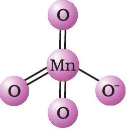
Tetrahedral permanganate ion (purple)

In the laboratory, a manganese (II) ion salt is oxidised by peroxodisulphate to permanganate.

$$
2 \mathrm{Mn}^{2+}+5 \mathrm{~S}_{2} \mathrm{O}_{8}{ }^{2-}+8 \mathrm{H}_{2} \mathrm{O} \rightarrow 2 \mathrm{MnO}_{4}{ }^{-}+10 \mathrm{SO}_{4}{ }^{2-}+16 \mathrm{H}^{+}
$$

Potassium permanganate forms dark purple (almost black) crystals which are isostructural with those of $\mathrm{KClO}_{4}$. The salt is not very soluble in water ( $6.4 \mathrm{~g} / 100 \mathrm{~g}$ of water at 293 K ), but when heated it decomposes at 513 K.

$$
2 \mathrm{KMnO}_{4} \rightarrow \mathrm{~K}_{2} \mathrm{MnO}_{4}+\mathrm{MnO}_{2}+\mathrm{O}_{2}
$$

It has two physical properties of considerable interest: its intense colour and its diamagnetism along with temperature-dependent weak paramagnetism. These can be explained by the use of molecular orbital theory which is beyond the present scope.

The manganate and permanganate ions are tetrahedral; the $\pi$ bonding takes place by overlap of $p$ orbitals of oxygen with $d$ orbitals of manganese. The green manganate is paramagnetic because of one unpaired electron but the permanganate is diamagnetic due to the absence of unpaired electron.

Acidified permanganate solution oxidises oxalates to carbon dioxide, iron(II) to iron(III), nitrites to nitrates and iodides to free iodine. The half-reactions of reductants are:
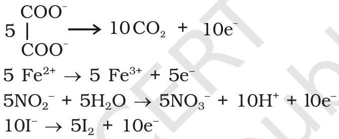

The full reaction can be written by adding the half-reaction for $\mathrm{KMnO}_{4}$ to the half-reaction of the reducing agent, balancing wherever necessary.

If we represent the reduction of permanganate to manganate, manganese dioxide and manganese(II) salt by half-reactions,

$$
\begin{array}{ll}
\mathrm{MnO}_{4}^{-}+\mathrm{e}^{-} \rightarrow \mathrm{MnO}_{4}{ }^{2-} & \left(E^{\circ}=+0.56 \mathrm{~V}\right) \\
\mathrm{MnO}_{4}^{-}+4 \mathrm{H}^{+}+3 \mathrm{e}^{-} \rightarrow \mathrm{MnO}_{2}+2 \mathrm{H}_{2} \mathrm{O} & \left(E^{0}=+1.69 \mathrm{~V}\right) \\
\mathrm{MnO}_{4}^{-}+8 \mathrm{H}^{+}+5 \mathrm{e}^{-} \rightarrow \mathrm{Mn}^{2+}+4 \mathrm{H}_{2} \mathrm{O} & \left(E^{0}=+1.52 \mathrm{~V}\right)
\end{array}
$$

We can very well see that the hydrogen ion concentration of the solution plays an important part in influencing the reaction. Although many reactions can be understood by consideration of redox potential, kinetics of the reaction is also an important factor. Permanganate at [ $\mathrm{H}^{+}$] = 1 should oxidise water but in practice the reaction is extremely slow unless either manganese(ll) ions are present or the temperature is raised.

A few important oxidising reactions of $\mathrm{KMnO}_{4}$ are given below:

1. In acid solutions:
(a) Iodine is liberated from potassium iodide :
$$
10 \mathrm{I}^{-}+2 \mathrm{MnO}_{4}^{-}+16 \mathrm{H}^{+} \rightarrow 2 \mathrm{Mn}^{2+}+8 \mathrm{H}_{2} \mathrm{O}+5 \mathrm{I}_{2}
$$
(b) $\mathrm{Fe}^{2+}$ ion (green) is converted to $\mathrm{Fe}^{3+}$ (yellow):
$$
5 \mathrm{Fe}^{2+}+\mathrm{MnO}_{4}^{-}+8 \mathrm{H}^{+} \rightarrow \mathrm{Mn}^{2+}+4 \mathrm{H}_{2} \mathrm{O}+5 \mathrm{Fe}^{3+}
$$

(c) Oxalate ion or oxalic acid is oxidised at 333 K :
$$
5 \mathrm{C}_{2} \mathrm{O}_{4}{ }^{2-}+2 \mathrm{MnO}_{4}{ }^{-}+16 \mathrm{H}^{+} \longrightarrow 2 \mathrm{Mn}^{2+}+8 \mathrm{H}_{2} \mathrm{O}+10 \mathrm{CO}_{2}
$$
(d) Hydrogen sulphide is oxidised, sulphur being precipitated:
$$
\begin{aligned}
& \mathrm{H}_{2} \mathrm{~S} \longrightarrow 2 \mathrm{H}^{+}+\mathrm{S}^{2-} \\
& 5 \mathrm{~S}^{2-}+2 \mathrm{MnO}_{4}^{-}+16 \mathrm{H}^{+} \longrightarrow 2 \mathrm{Mn}^{2+}+8 \mathrm{H}_{2} \mathrm{O}+5 \mathrm{~S}
\end{aligned}
$$
(e) Sulphurous acid or sulphite is oxidised to a sulphate or sulphuric acid:
$$
5 \mathrm{SO}_{3}{ }^{2-}+2 \mathrm{MnO}_{4}{ }^{-}+6 \mathrm{H}^{+} \longrightarrow 2 \mathrm{Mn}^{2+}+3 \mathrm{H}_{2} \mathrm{O}+5 \mathrm{SO}_{4}{ }^{2-}
$$
(f) Nitrite is oxidised to nitrate:
$$
5 \mathrm{NO}_{2}^{-}+2 \mathrm{MnO}_{4}^{-}+6 \mathrm{H}^{+} \longrightarrow 2 \mathrm{Mn}^{2+}+5 \mathrm{NO}_{3}^{-}+3 \mathrm{H}_{2} \mathrm{O}
$$
2. In neutral or faintly alkaline solutions:
(a) A notable reaction is the oxidation of iodide to iodate:
$$
2 \mathrm{MnO}_{4}^{-}+\mathrm{H}_{2} \mathrm{O}+\mathrm{I}^{-} \longrightarrow 2 \mathrm{MnO}_{2}+2 \mathrm{OH}^{-}+\mathrm{IO}_{3}^{-}
$$
(b) Thiosulphate is oxidised almost quantitatively to sulphate:
$$
8 \mathrm{MnO}_{4}^{-}+3 \mathrm{~S}_{2} \mathrm{O}_{3}{ }^{2-}+\mathrm{H}_{2} \mathrm{O} \longrightarrow 8 \mathrm{MnO}_{2}+6 \mathrm{SO}_{4}{ }^{2-}+2 \mathrm{OH}^{-}
$$
(c) Manganous salt is oxidised to $\mathrm{MnO}_{2}$; the presence of zinc sulphate or zinc oxide catalyses the oxidation:
$$
2 \mathrm{MnO}_{4}^{-}+3 \mathrm{Mn}^{2+}+2 \mathrm{H}_{2} \mathrm{O} \longrightarrow 5 \mathrm{MnO}_{2}+4 \mathrm{H}^{+}
$$

Note: Permanganate titrations in presence of hydrochloric acid are unsatisfactory since hydrochloric acid is oxidised to chlorine.

Uses: Besides its use in analytical chemistry, potassium permanganate is used as a favourite oxidant in preparative organic chemistry. Its uses for the bleaching of wool, cotton, silk and other textile fibres and for the decolourisation of oils are also dependent on its strong oxidising power.

## THE INNER TRANSITION ELEMENTS ( $\boldsymbol{f}$-BLOCK)

The $f$-block consists of the two series, lanthanoids (the fourteen elements following lanthanum) and actinoids (the fourteen elements following actinium). Because lanthanum closely resembles the lanthanoids, it is usually included in any discussion of the lanthanoids for which the general symbol Ln is often used. Similarly, a discussion of the actinoids includes actinium besides the fourteen elements constituting the series. The lanthanoids resemble one another more closely than do the members of ordinary transition elements in any series. They have only one stable oxidation state and their chemistry provides an excellent opportunity to examine the effect of small changes in size and nuclear charge along a series of otherwise similar elements. The chemistry of the actinoids is, on the other hand, much more complicated. The complication arises partly owing to the occurrence of a wide range of oxidation states in these elements and partly because their radioactivity creates special problems in their study; the two series will be considered separately here.

The names, symbols, electronic configurations of atomic and some ionic states and atomic and ionic radii of lanthanum and lanthanoids (for which the general symbol Ln is used) are given in Table 4.9.

4.5.1 Electronic Configurations
4.5.2Atomic and Ionic Sizes

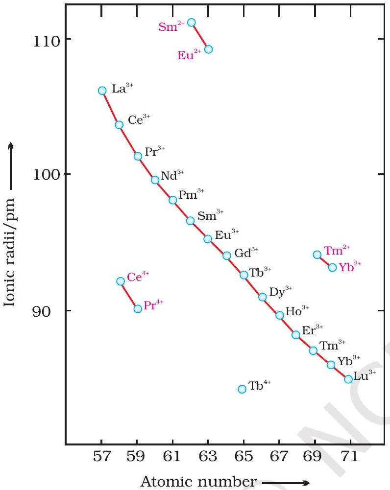
Fig. 4.6: Trends in ionic radii of lanthanoids

It may be noted that atoms of these elements have electronic configuration with $6 s^{2}$ common but with variable occupancy of $4 f$ level (Table 4.9). However, the electronic configurations of all the tripositive ions (the most stable oxidation state of all the lanthanoids) are of the form $4 f^{\mathrm{n}}$ ( $\mathrm{n}=1$ to 14 with increasing atomic number).

The overall decrease in atomic and ionic radii from lanthanum to lutetium (the lanthanoid contraction) is a unique feature in the chemistry of the lanthanoids. It has far reaching consequences in the chemistry of the third transition series of the elements. The decrease in atomic radii (derived from the structures of metals) is not quite regular as it is regular in $\mathrm{M}^{3+}$ ions (Fig. 4.6). This contraction is, of course, similar to that observed in an ordinary transition series and is attributed to the same cause, the imperfect shielding of one electron by another in the same sub-shell. However, the shielding of one $4 f$ electron by another is less than one $d$ electron by another with the increase in nuclear charge along the series. There is fairly regular decrease in the sizes with increasing atomic number.

The cumulative effect of the contraction of the lanthanoid series, known as lanthanoid contraction, causes the radii of the members of the third transition series to be very similar to those of the corresponding members of the second series. The almost identical radii of Zr (160 pm) and Hf (159 pm), a consequence of the lanthanoid contraction, account for their occurrence together in nature and for the difficulty faced in their separation.

4.5.3 Oxidation States

In the lanthanoids, La(II) and Ln(III) compounds are predominant species. However, occasionally +2 and +4 ions in solution or in solid compounds are also obtained. This irregularity (as in ionisation enthalpies) arises mainly from the extra stability of empty, half-filled or filled $f$ subshell. Thus, the formation of $\mathrm{Ce}^{\mathrm{IV}}$ is favoured by its noble gas configuration, but it is a strong oxidant reverting to the common +3 state. The $E^{\circ}$ value for $\mathrm{Ce}^{4+} / \mathrm{Ce}^{3+}$ is +1.74 V which suggests that it can oxidise water. However, the reaction rate is very slow and hence Ce(IV) is a good analytical reagent. Pr, Nd, Tb and Dy also exhibit +4 state but only in oxides, $\mathrm{MO}_{2} . \mathrm{Eu}^{2+}$ is formed by losing the two $s$ electrons and its $f^{7}$ configuration accounts for the formation of this ion. However, $\mathrm{Eu}^{2+}$ is a strong reducing agent changing to the common +3 state. Similarly $\mathrm{Yb}^{2+}$ which has $f^{14}$ configuration is a reductant. $\mathrm{Tb}^{\mathrm{IV}}$ has half-filled $f$-orbitals and is an oxidant. The behaviour of samarium is very much like europium, exhibiting both +2 and +3 oxidation states.

Table 4.9: Electronic Configurations and Radii of Lanthanum and Lanthanoids
| Atomic Number | Name | Symbol | Electronic configurations* |  |  | Radii/pm |  |  |
| :--- | :--- | :--- | :--- | :--- | :--- | :--- | :--- | :--- |
|  |  |  | Ln | $\mathbf{L n}^{\mathbf{2}+}$ | $\mathbf{L n}^{\mathbf{3} \boldsymbol{+}}$ | $\mathbf{L n}^{\mathbf{4} \boldsymbol{+}}$ | Ln | $\mathbf{L n}^{\mathbf{3} \boldsymbol{+}}$ |
| 57 | Lanthanum | La | $5 d^{1} 6 s^{2}$ | $5 d^{1}$ | $4 f^{0}$ |  | 187 | 106 |
| 58 | Cerium | Ce | $4 f^{\frac{1}{5}} 5 d^{1} 6 s^{2}$ | $4 f^{2}$ | $4 f^{1}$ | $4 f^{0}$ | 183 | 103 |
| 59 | Praseodymium | Pr | $4 f^{3} 6 s^{2}$ | $4 f^{3}$ | $4 f^{2}$ | $4 f^{1}$ | 182 | 101 |
| 60 | Neodymium | Nd | $4 f^{4} 6 s^{2}$ | $4 f^{4}$ | $4 f^{3}$ | $4 f^{2}$ | 181 | 99 |
| 61 | Promethium | Pm | $4 f^{5} 6 \mathrm{~s}^{2}$ | $4 f^{5}$ | $4 f^{4}$ |  | 181 | 98 |
| 62 | Samarium | Sm | $4 f^{6} 6 s^{2}$ | $4 f^{6}$ | $4 f^{5}$ |  | 180 | 96 |
| 63 | Europium | Eu | $4 f^{7} 6 s^{2}$ | $4 f^{7}$ | $4 f^{6}$ |  | 199 | 95 |
| 64 | Gadolinium | Gd | $4 f^{7} 5 d^{1} 6 s^{2}$ | $4 f^{7} 5 d^{1}$ | $4 f^{7}$ |  | 180 | 94 |
| 65 | Terbium | Tb | $4 f^{9} 6 s^{2}$ | $4 f^{9}$ | $4 f^{8}$ | $4 f^{7}$ | 178 | 92 |
| 66 | Dysprosium | Dy | $4 f^{10} 6 s^{2}$ | $4 f^{10}$ | $4 f^{9}$ | $4 f^{8}$ | 177 | 91 |
| 67 | Holmium | Ho | $4 f^{11} 6 s^{2}$ | $4 f^{11}$ | $4 f^{10}$ |  | 176 | 89 |
| 68 | Erbium | Er | $4 f^{12} 6 \mathrm{~s}^{2}$ | $4 f^{12}$ | $4 f^{11}$ |  | 175 | 88 |
| 69 | Thulium | Tm | $4 f^{13} 6 s^{2}$ | $4 f^{13}$ | $4 f^{12}$ |  | 174 | 87 |
| 70 | Ytterbium | Yb | $4 f^{14} 6 s^{2}$ | $4 f^{14}$ | $4 f^{13}$ |  | 173 | 86 |
| 71 | Lutetium | Lu | $4 f^{14} 5 d^{1} 6 s^{2}$ | $4 f^{14} 5 d^{1}$ | $4 f^{14}$ | - | - | - |

* Only electrons outside [Xe] core are indicated

### 4.5.4 General Characteristics

All the lanthanoids are silvery white soft metals and tarnish rapidly in air. The hardness increases with increasing atomic number, samarium being steel hard. Their melting points range between 1000 to 1200 K but samarium melts at 1623 K. They have typical metallic structure and are good conductors of heat and electricity. Density and other properties change smoothly except for Eu and Yb and occasionally for Sm and Tm.

Many trivalent lanthanoid ions are coloured both in the solid state and in aqueous solutions. Colour of these ions may be attributed to the presence of $f$ electrons. Neither $\mathrm{La}^{3+}$ nor $\mathrm{Lu}^{3+}$ ion shows any colour but the rest do so. However, absorption bands are narrow, probably because of the excitation within $f$ level. The lanthanoid ions other than the $f^{0}$ type ( $\mathrm{La}^{3+}$ and $\mathrm{Ce}^{4+}$ ) and the $f^{14}$ type ( $\mathrm{Yb}^{2+}$ and $\mathrm{Lu}^{3+}$ ) are all paramagnetic.

The first ionisation enthalpies of the lanthanoids are around $600 \mathrm{~kJ} \mathrm{~mol}^{-1}$, the second about $1200 \mathrm{~kJ} \mathrm{~mol}^{-1}$ comparable with those of calcium. A detailed discussion of the variation of the third ionisation enthalpies indicates that the exchange enthalpy considerations (as in $3 d$ orbitals of the first transition series), appear to impart a certain degree of stability to empty, half-filled and completely filled orbitals $f$ level. This is indicated from the abnormally low value of the third ionisation enthalpy of lanthanum, gadolinium and lutetium.

In their chemical behaviour, in general, the earlier members of the series are quite reactive similar to calcium but, with increasing atomic number, they behave more like aluminium. Values for $E^{\circ}$ for the half-reaction:

$$
\operatorname{Ln}^{3+}(\mathrm{aq})+3 \mathrm{e}^{-} \rightarrow \operatorname{Ln}(\mathrm{s})
$$

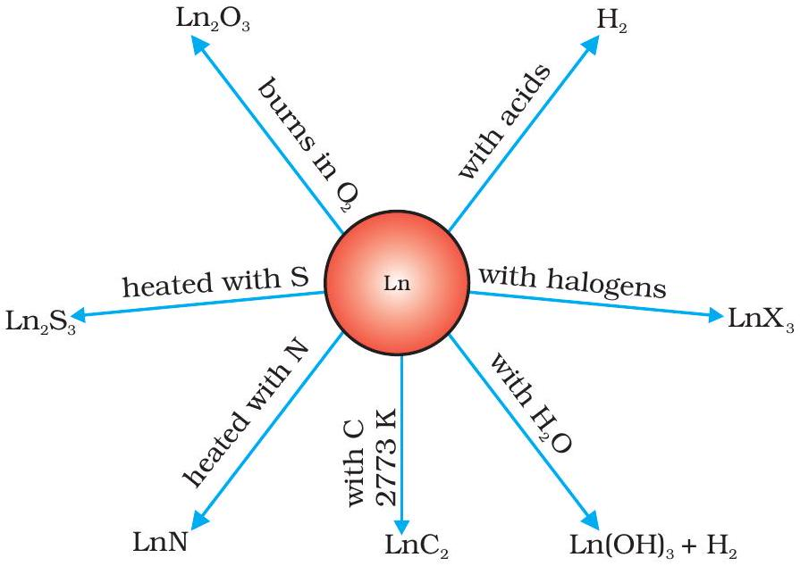
Fig 4.7: Chemical reactions of the lanthanoids.

are in the range of -2.2 to -2.4 V except for Eu for which the value is -2.0 V. This is, of course, a small variation. The metals combine with hydrogen when gently heated in the gas. The carbides, $\mathrm{Ln}_{3} \mathrm{C}, \mathrm{Ln}_{2} \mathrm{C}_{3}$ and $\mathrm{LnC}_{2}$ are formed when the metals are heated with carbon. They liberate hydrogen from dilute acids and burn in halogens to form halides. They form oxides $\mathrm{M}_{2} \mathrm{O}_{3}$ and hydroxides $\mathrm{M}(\mathrm{OH})_{3}$. The hydroxides are definite compounds, not just hydrated oxides. They are basic like alkaline earth metal oxides and hydroxides. Their general reactions are depicted in Fig. 4.7.

The best single use of the lanthanoids is for the production of alloy steels for plates and pipes. A well known alloy is mischmetall which consists of a lanthanoid metal (~ 95\%) and iron (~ 5\%) and traces of S, C, Ca and Al. A good deal of mischmetall is used in Mg-based alloy to produce bullets, shell and lighter flint. Mixed oxides of lanthanoids are employed as catalysts in petroleum cracking. Some individual Ln oxides are used as phosphors in television screens and similar fluorescing surfaces.
4.6 The Actinoids The actinoids include the fourteen elements from Th to Lr. The names, symbols and some properties of these elements are given in Table 4.10.

Table 4.10: Some Properties of Actinium and Actinoids
| Atomic Number | Name | Symbol | Electronic conifigurations* |  |  | Radii/pm |  |
| :--- | :--- | :--- | :--- | :--- | :--- | :--- | :--- |
|  |  |  | M | $\mathrm{M}^{3+}$ | $\mathbf{M}^{\mathbf{4} \boldsymbol{+}}$ | $\mathbf{M}^{\mathbf{3} \boldsymbol{+}}$ | $\mathrm{M}^{4+}$ |
| 89 | Actinium | Ac | $6 d^{1} 7 s^{2}$ | $5 f^{0}$ |  | 111 |  |
| 90 | Thorium | Th | $6 d^{2} 7 s^{2}$ | $5 f^{1}$ | $5 f^{0}$ |  | 99 |
| 91 | Protactinium | Pa | $5 f^{2} 6 d^{1} 7 s^{2}$ | $5 f^{2}$ | $5 f^{1}$ |  | 96 |
| 92 | Uranium | U | $5 f^{3} 6 d^{1} 7 s^{2}$ | $5 f^{3}$ | $5 f^{2}$ | 103 | 93 |
| 93 | Neptunium | Np | $5 f^{4} 6 d^{1} 7 s^{2}$ | $5 f^{4}$ | $5 f^{3}$ | 101 | 92 |
| 94 | Plutonium | Pu | $5 f^{6} 7 s^{2}$ | $5 f^{5}$ | $5 f^{4}$ | 100 | 90 |
| 95 | Americium | Am | $5 f^{7} 7 s^{2}$ | $5 f^{6}$ | $5 f^{5}$ | 99 | 89 |
| 96 | Curium | Cm | $5 f^{7} 6 d^{1} 7 s^{2}$ | $5 f^{7}$ | $5 f^{6}$ | 99 | 88 |
| 97 | Berkelium | Bk | $5 f^{9} 7 s^{2}$ | $5 f^{8}$ | $5 f^{7}$ | 98 | 87 |
| 98 | Californium | Cf | $5 f^{10} 7 s^{2}$ | $5 f^{9}$ | $5 f^{8}$ | 98 | 86 |
| 99 | Einstenium | Es | $5 f^{11} 7 s^{2}$ | $5 f^{10}$ | $5 f^{9}$ | - | - |
| 100 | Fermium | Fm | $5 f^{12} 7 s^{2}$ | $5 f^{11}$ | $5 f^{10}$ | - | - |
| 101 | Mendelevium | Md | $5 f^{13} 7 s^{2}$ | $5 f^{12}$ | $5 f^{11}$ | - | - |
| 102 | Nobelium | No | $5 f^{14} 7 s^{2}$ | $5 f^{13}$ | $5 f^{12}$ | - | - |
| 103 | Lawrencium | Lr | $5 f^{14} 6 d^{1} 7 s^{2}$ | $5 f^{14}$ | $5 f^{13}$ | - | - |

111 The $d$ - and $f$ - Block Elements

### 4.6.1 Electronic Configurations

### 4.6.2 Ionic Sizes

### 4.6.3 Oxidation States

The actinoids are radioactive elements and the earlier members have relatively long half-lives, the latter ones have half-life values ranging from a day to 3 minutes for lawrencium $(Z=103)$. The latter members could be prepared only in nanogram quantities. These facts render their study more difficult.

All the actinoids are believed to have the electronic configuration of $7 \mathrm{~s}^{2}$ and variable occupancy of the 5f and 6d subshells. The fourteen electrons are formally added to $5 f$, though not in thorium $(\mathrm{Z}=90)$ but from Pa onwards the $5 f$ orbitals are complete at element 103. The irregularities in the electronic configurations of the actinoids, like those in the lanthanoids are related to the stabilities of the $f^{0}, f^{7}$ and $f^{14}$ occupancies of the 5f orbitals. Thus, the configurations of Am and Cm are [Rn] $5 f^{7} 7 s^{2}$ and $[\mathrm{Rn}] 5 f^{7} 6 d^{1} 7 s^{2}$. Although the $5 f$ orbitals resemble the $4 f$ orbitals in their angular part of the wave-function, they are not as buried as $4 f$ orbitals and hence $5 f$ electrons can participate in bonding to a far greater extent.

The general trend in lanthanoids is observable in the actinoids as well. There is a gradual decrease in the size of atoms or $\mathrm{M}^{3+}$ ions across the series. This may be referred to as the actinoid contraction (like lanthanoid contraction). The contraction is, however, greater from element to element in this series resulting from poor shielding by $5 f$ electrons.

There is a greater range of oxidation states, which is in part attributed to the fact that the $5 f, 6 d$ and $7 s$ levels are of comparable energies. The known oxidation states of actinoids are listed in Table 4.11.

The actinoids show in general +3 oxidation state. The elements, in the first half of the series frequently exhibit higher oxidation states. For example, the maximum oxidation state increases from +4 in Th to +5, +6 and +7 respectively in Pa, U and Np but decreases in succeeding elements (Table 4.11). The actinoids resemble the lanthanoids in having more compounds in +3 state than in the +4 state. However, +3 and +4 ions tend to hydrolyse. Because the distribution of oxidation states among the actinoids is so uneven and so different for the former and later elements, it is unsatisfactory to review their chemistry in terms of oxidation states.

Table 4.11: Oxidation States of Actinium and Actinoids
| Ac | Th | Pa | U | Np | Pu | Am | Cm | Bk | Cf | Ds | Fm | Md | No | Lr |
| :--- | :--- | :--- | :--- | :--- | :--- | :--- | :--- | :--- | :--- | :--- | :--- | :--- | :--- | :--- |
| 3 |  | 3 | 3 | 3 | 3 | 3 | 3 | 3 | 3 | 3 | 3 | 3 | 3 | 3 |
|  | 4 | 4 | 4 | 4 | 4 | 4 | 4 | 4 |  |  |  |  |  |  |
|  |  | 5 | 5 | 5 | 5 | 5 |  |  |  |  |  |  |  |  |
|  |  |  | 6 | 6 | 6 | 6 |  |  |  |  |  |  |  |  |
|  |  |  |  | 7 | 7 |  |  |  |  |  |  |  |  |  |

### 4.6.4 General Characteristics and Comparison with Lanthanoids

The actinoid metals are all silvery in appearance but display a variety of structures. The structural variability is obtained due to irregularities in metallic radii which are far greater than in lanthanoids.

The actinoids are highly reactive metals, especially when finely divided. The action of boiling water on them, for example, gives a mixture of oxide and hydride and combination with most non metals takes place at moderate temperatures. Hydrochloric acid attacks all metals but most are slightly affected by nitric acid owing to the formation of protective oxide layers; alkalies have no action.

The magnetic properties of the actinoids are more complex than those of the lanthanoids. Although the variation in the magnetic susceptibility of the actinoids with the number of unpaired $5 f$ electrons is roughly parallel to the corresponding results for the lanthanoids, the latter have higher values.

It is evident from the behaviour of the actinoids that the ionisation enthalpies of the early actinoids, though not accurately known, but are lower than for the early lanthanoids. This is quite reasonable since it is to be expected that when $5 f$ orbitals are beginning to be occupied, they will penetrate less into the inner core of electrons. The $5 f$ electrons, will therefore, be more effectively shielded from the nuclear charge than the $4 f$ electrons of the corresponding lanthanoids. Because the outer electrons are less firmly held, they are available for bonding in the actinoids.

A comparison of the actinoids with the lanthanoids, with respect to different characteristics as discussed above, reveals that behaviour similar to that of the lanthanoids is not evident until the second half of the actinoid series. However, even the early actinoids resemble the lanthanoids in showing close similarities with each other and in gradual variation in properties which do not entail change in oxidation state. The lanthanoid and actinoid contractions, have extended effects on the sizes, and therefore, the properties of the elements succeeding them in their respective periods. The lanthanoid contraction is more important because the chemistry of elements succeeding the actinoids are much less known at the present time.

## Example 4.10

Name a member of the lanthanoid series which is well known to exhibit +4 oxidation state.

## Solution

Cerium ( $Z=58$ )
Intext Question

4.10 Actinoid contraction is greater from element to element than lanthanoid contraction. Why?
4.7 Some Applications of $d$ - and f-Block Elements

are restricted to collection items and the contemporary UK 'copper' coins are copper-coated steel. The 'silver' UK coins are a Cu/Ni alloy. Many of the metals and/or their compounds are essential catalysts in the chemical industry. $\mathrm{V}_{2} \mathrm{O}_{5}$ catalyses the oxidation of $\mathrm{SO}_{2}$ in the manufacture of sulphuric acid. $\mathrm{TiCl}_{4}$ with $\mathrm{Al}\left(\mathrm{CH}_{3}\right)_{3}$ forms the basis of the Ziegler catalysts used to manufacture polyethylene (polythene). Iron catalysts are used in the Haber process for the production of ammonia from $\mathrm{N}_{2} / \mathrm{H}_{2}$ mixtures. Nickel catalysts enable the hydrogenation of fats to proceed. In the Wacker process the oxidation of ethyne to ethanal is catalysed by $\mathrm{PdCl}_{2}$. Nickel complexes are useful in the polymerisation of alkynes and other organic compounds such as benzene. The photographic industry relies on the special light-sensitive properties of AgBr .

## Summary

The $\boldsymbol{d}$-block consisting of Groups 3-12 occupies the large middle section of the periodic table. In these elements the inner $d$ orbitals are progressively filled. The $f$-block is placed outside at the bottom of the periodic table and in the elements of this block, $4 f$ and $5 f$ orbitals are progressively filled.

Corresponding to the filling of $3 d, 4 d$ and $5 d$ orbitals, three series of transition elements are well recognised. All the transition elements exhibit typical metallic properties such as -high tensile strength, ductility, malleability, thermal and electrical conductivity and metallic character. Their melting and boiling points are high which are attributed to the involvement of $(n-1) d$ electrons resulting into strong interatomic bonding. In many of these properties, the maxima occur at about the middle of each series which indicates that one unpaired electron per $d$ orbital is particularly a favourable configuration for strong interatomic interaction.

Successive ionisation enthalpies do not increase as steeply as in the main group elements with increasing atomic number. Hence, the loss of variable number of electrons from $(n-1) d$ orbitals is not energetically unfavourable. The involvement of $(\boldsymbol{n}-\mathbf{1}) \boldsymbol{d}$ electrons in the behaviour of transition elements impart certain distinct characteristics to these elements. Thus, in addition to variable oxidation states, they exhibit paramagnetic behaviour, catalytic properties and tendency for the formation of coloured ions, interstitial compounds and complexes.

The transition elements vary widely in their chemical behaviour. Many of them are sufficiently electropositive to dissolve in mineral acids, although a few are 'noble'. Of the first series, with the exception of copper, all the metals are relatively reactive.

The transition metals react with a number of non-metals like oxygen, nitrogen, sulphur and halogens to form binary compounds. The first series transition metal oxides are generally formed from the reaction of metals with oxygen at high temperatures. These oxides dissolve in acids and bases to form oxometallic salts. Potassium dichromate and potassium permanganate are common examples. Potassium dichromate is prepared from the chromite ore by fusion with alkali in presence of air and acidifying the extract. Pyrolusite ore $\left(\mathrm{MnO}_{2}\right)$ is used for the preparation of potassium permanganate. Both the dichromate and the permanganate ions are strong oxidising agents.

The two series of inner transition elements, lanthanoids and actinoids constitute the $\boldsymbol{f}$-block of the periodic table. With the successive filling of the inner orbitals, $4 f$, there is a gradual decrease in the atomic and ionic sizes of these metals along the series (lanthanoid contraction). This has far reaching consequences in the chemistry of the elements succeeding them. Lanthanum and all the lanthanoids are rather soft white metals. They react easily with water to give solutions giving +3 ions. The principal oxidation state is +3, although +4 and +2 oxidation states are also exhibited by some
occasionally. The chemistry of the actinoids is more complex in view of their ability to exist in different oxidation states. Furthermore, many of the actinoid elements are radioactive which make the study of these elements rather difficult.

There are many useful applications of the $d$ - and $f$-block elements and their compounds, notable among them being in varieties of steels, catalysts, complexes, organic syntheses, etc.

## Exercises

4.1 Write down the electronic configuration of:
(i) $\mathrm{Cr}^{3+}$
(ii) $\mathrm{Pm}^{3+}$
(iii) $\mathrm{Cu}^{+}$
(iv) $\mathrm{Ce}^{4+}$
(v) $\mathrm{Co}^{2+}$
(vi) $\mathrm{Lu}^{2+}$
(vii) $\mathrm{Mn}^{2+}$
(viii) $\mathrm{Th}^{4+}$
4.2 Why are $\mathrm{Mn}^{2+}$ compounds more stable than $\mathrm{Fe}^{2+}$ towards oxidation to their +3 state?
4.3 Explain briefly how +2 state becomes more and more stable in the first half of the first row transition elements with increasing atomic number?
4.4 To what extent do the electronic configurations decide the stability of oxidation states in the first series of the transition elements? Illustrate your answer with examples.
4.5 What may be the stable oxidation state of the transition element with the following $d$ electron configurations in the ground state of their atoms : $3 d^{3}$, $3 d^{5}, 3 d^{8}$ and $3 d^{4}$ ?
4.6 Name the oxometal anions of the first series of the transition metals in which the metal exhibits the oxidation state equal to its group number.
4.7 What is lanthanoid contraction? What are the consequences of lanthanoid contraction?
4.8 What are the characteristics of the transition elements and why are they called transition elements? Which of the $d$-block elements may not be regarded as the transition elements?
4.9 In what way is the electronic configuration of the transition elements different from that of the non transition elements?
4.10 What are the different oxidation states exhibited by the lanthanoids?
4.11 Explain giving reasons:
    (i) Transition metals and many of their compounds show paramagnetic behaviour.
    (ii) The enthalpies of atomisation of the transition metals are high.
    (iii) The transition metals generally form coloured compounds.
    (iv) Transition metals and their many compounds act as good catalyst.
4.12 What are interstitial compounds? Why are such compounds well known for transition metals?
4.13 How is the variability in oxidation states of transition metals different from that of the non transition metals? Illustrate with examples.
4.14 Describe the preparation of potassium dichromate from iron chromite ore. What is the effect of increasing pH on a solution of potassium dichromate?
4.15 Describe the oxidising action of potassium dichromate and write the ionic equations for its reaction with:
(i) iodide
(ii) iron(II) solution and
(iii) $\mathrm{H}_{2} \mathrm{~S}$

4.16 Describe the preparation of potassium permanganate. How does the acidified permanganate solution react with (i) iron(II) ions (ii) $\mathrm{SO}_{2}$ and (iii) oxalic acid? Write the ionic equations for the reactions.

4.17 For $\mathrm{M}^{2+} / \mathrm{M}$ and $\mathrm{M}^{3+} / \mathrm{M}^{2+}$ systems the $E^{\mathrm{o}}$ values for some metals are as follows:

$$
\begin{array}{llll}
\mathrm{Cr}^{2+} / \mathrm{Cr} & -0.9 \mathrm{~V} & \mathrm{Cr}^{3} / \mathrm{Cr}^{2+} & -0.4 \mathrm{~V} \\
\mathrm{Mn}^{2+} / \mathrm{Mn} & -1.2 \mathrm{~V} & \mathrm{Mn}^{3+} / \mathrm{Mn}^{2+} & +1.5 \mathrm{~V} \\
\mathrm{Fe}^{2+} / \mathrm{Fe} & -0.4 \mathrm{~V} & \mathrm{Fe}^{3+} / \mathrm{Fe}^{2+} & +0.8 \mathrm{~V}
\end{array}
$$

Use this data to comment upon:

(i) the stability of $\mathrm{Fe}^{3+}$ in acid solution as compared to that of $\mathrm{Cr}^{3+}$ or $\mathrm{Mn}^{3+}$ and
(ii) the ease with which iron can be oxidised as compared to a similar process for either chromium or manganese metal.
4.18 Predict which of the following will be coloured in aqueous solution? $\mathrm{Ti}^{3+}, \mathrm{V}^{3+}$, $\mathrm{Cu}^{+}, \mathrm{Sc}^{3+}, \mathrm{Mn}^{2+}, \mathrm{Fe}^{3+}$ and $\mathrm{Co}^{2+}$. Give reasons for each.
4.19 Compare the stability of +2 oxidation state for the elements of the first transition series.
4.20 Compare the chemistry of actinoids with that of the lanthanoids with special reference to:
(i) electronic configuration
(ii) atomic and ionic sizes and
(iii) oxidation state
(iv) chemical reactivity.
4.21 How would you account for the following:
    (i) Of the $d^{4}$ species, $\mathrm{Cr}^{2+}$ is strongly reducing while manganese(III) is strongly oxidising.
    (ii) Cobalt(II) is stable in aqueous solution but in the presence of complexing reagents it is easily oxidised.
    (iii) The $d^{1}$ configuration is very unstable in ions.
4.22 What is meant by 'disproportionation'? Give two examples of disproportionation reaction in aqueous solution.
4.23 Which metal in the first series of transition metals exhibits +1 oxidation state most frequently and why?
4.24 Calculate the number of unpaired electrons in the following gaseous ions: $\mathrm{Mn}^{3+}$, $\mathrm{Cr}^{3+}, \mathrm{V}^{3+}$ and $\mathrm{Ti}^{3+}$. Which one of these is the most stable in aqueous solution?
4.25 Give examples and suggest reasons for the following features of the transition metal chemistry:
    (i) The lowest oxide of transition metal is basic, the highest is amphoteric/acidic.
    (ii) A transition metal exhibits highest oxidation state in oxides and fluorides.
    (iii) The highest oxidation state is exhibited in oxoanions of a metal.
4.26 Indicate the steps in the preparation of:
(i) $\mathrm{K}_{2} \mathrm{Cr}_{2} \mathrm{O}_{7}$ from chromite ore.
(ii) $\mathrm{KMnO}_{4}$ from pyrolusite ore.
4.27 What are alloys? Name an important alloy which contains some of the lanthanoid metals. Mention its uses.
4.28 What are inner transition elements? Decide which of the following atomic numbers are the atomic numbers of the inner transition elements : 29, 59, 74, 95, 102, 104.
4.29 The chemistry of the actinoid elements is not so smooth as that of the lanthanoids. Justify this statement by giving some examples from the oxidation state of these elements.
4.30 Which is the last element in the series of the actinoids? Write the electronic configuration of this element. Comment on the possible oxidation state of this element.

4.31 Use Hund's rule to derive the electronic configuration of $\mathrm{Ce}^{3+}$ ion, and calculate its magnetic moment on the basis of 'spin-only' formula.
4.32 Name the members of the lanthanoid series which exhibit +4 oxidation states and those which exhibit +2 oxidation states. Try to correlate this type of behaviour with the electronic configurations of these elements.
4.33 Compare the chemistry of the actinoids with that of lanthanoids with reference to: (i) electronic configuration (ii) oxidation states and (iii) chemical reactivity.
4.34 Write the electronic configurations of the elements with the atomic numbers 61, 91, 101, and 109.
4.35 Compare the general characteristics of the first series of the transition metals with those of the second and third series metals in the respective vertical columns. Give special emphasis on the following points:
    (i) electronic configurations (ii) oxidation states (iii) ionisation enthalpies and (iv) atomic sizes.
4.36 Write down the number of 3d electrons in each of the following ions: $\mathrm{Ti}^{2+}, \mathrm{V}^{2+}$, $\mathrm{Cr}^{3+}, \mathrm{Mn}^{2+}, \mathrm{Fe}^{2+}, \mathrm{Fe}^{3+}, \mathrm{Co}^{2+}, \mathrm{Ni}^{2+}$ and $\mathrm{Cu}^{2+}$. Indicate how would you expect the five 3d orbitals to be occupied for these hydrated ions (octahedral).
4.37 Comment on the statement that elements of the first transition series possess many properties different from those of heavier transition elements.
4.38What can be inferred from the magnetic moment values of the following complex species ?

| Example | Magnetic Moment (BM) |
| :--- | :--- |
| $\mathrm{K}_{4}\left[\mathrm{Mn}(\mathrm{CN})_{6}\right)$ | 2.2 |
| $\left[\mathrm{Fe}\left(\mathrm{H}_{2} \mathrm{O}\right)_{6}\right]^{2+}$ | 5.3 |
| $\mathrm{K}_{2}\left[\mathrm{MnCl}_{4}\right]$ | 5.9 |

## Answers to Some Intext Questions

4.1 Silver $(Z=47)$ can exhibit +2 oxidation state wherein it will have incompletely filled $d$-orbitals ( $4 d$ ), hence a transition element.
4.2 In the formation of metallic bonds, no eletrons from $3 d$-orbitals are involved in case of zinc, while in all other metals of the $3 d$ series, electrons from the $d$-orbitals are always involved in the formation of metallic bonds.
4.3 Manganese $(Z=25)$, as its atom has the maximum number of unpaired electrons.
4.5 Irregular variation of ionisation enthalpies is mainly attributed to varying degree of stability of different $3 d$-configurations (e.g., $d^{0}, d^{5}, d^{10}$ are exceptionally stable).
4.6 Because of small size and high electronegativity oxygen or fluorine can oxidise the metal to its highest oxidation state.
4.7 $\mathrm{Cr}^{2+}$ is stronger reducing agent than $\mathrm{Fe}^{2+}$
Reason: $d^{4} \rightarrow d^{3}$ occurs in case of $\mathrm{Cr}^{2+}$ to $\mathrm{Cr}^{3+}$
But $d^{6} \rightarrow d^{5}$ occurs in case of $\mathrm{Fe}^{2+}$ to $\mathrm{Fe}^{3+}$
In a medium (like water) $d^{3}$ is more stable as compared to $d^{5}$ (see $C F S E$ )
4.9 $\mathrm{Cu}^{+}$in aqueous solution underoes disproportionation, i.e.,
$2 \mathrm{Cu}^{+}(\mathrm{aq}) \rightarrow \mathrm{Cu}^{2+}(\mathrm{aq})+\mathrm{Cu}(\mathrm{s})$
The $\mathrm{E}^{0}$ value for this is favourable.
4.10 The $5 f$ electrons are more effectively shielded from nuclear charge. In other words the $5 f$ electrons themselves provide poor shielding from element to element in the series.
