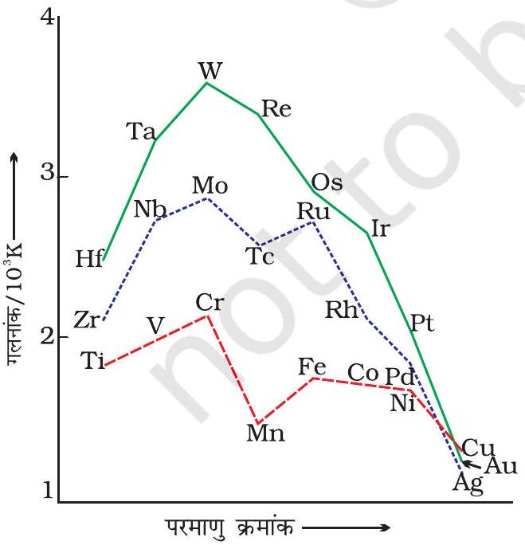
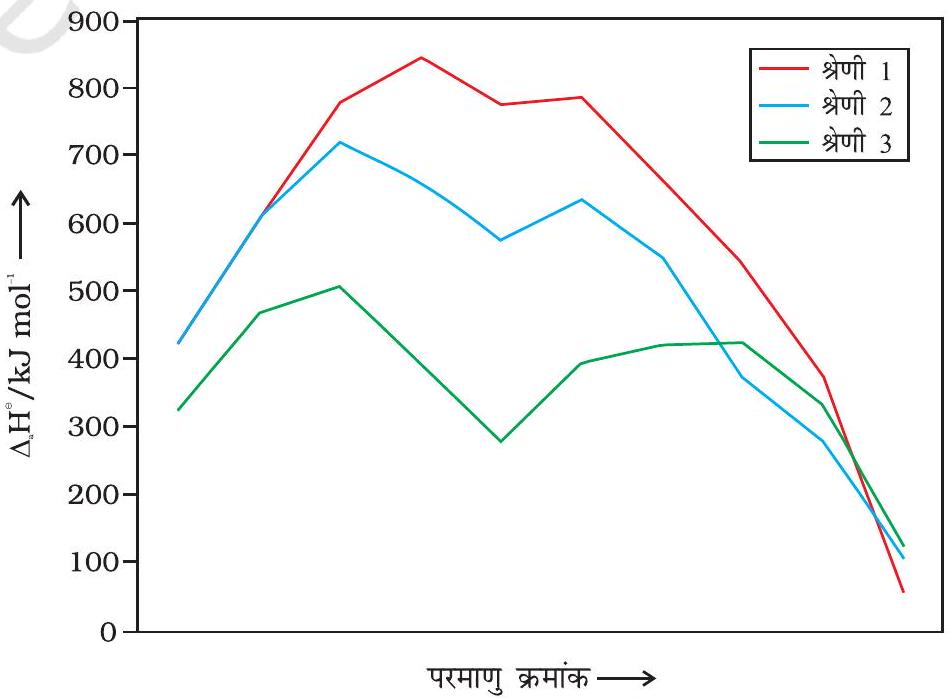
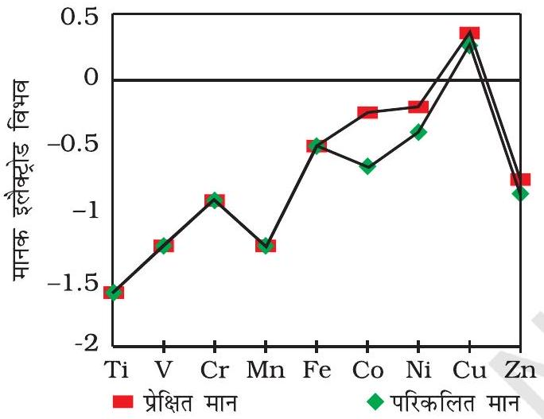
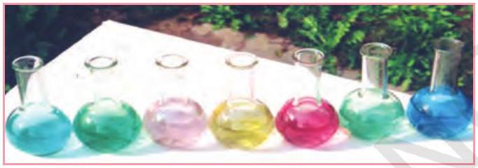
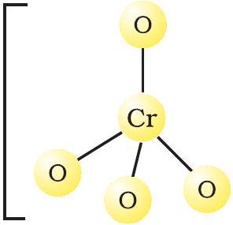
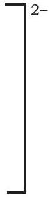
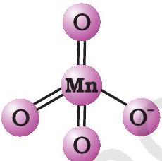
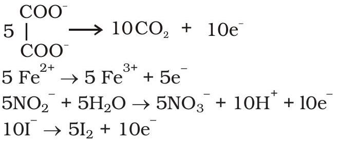
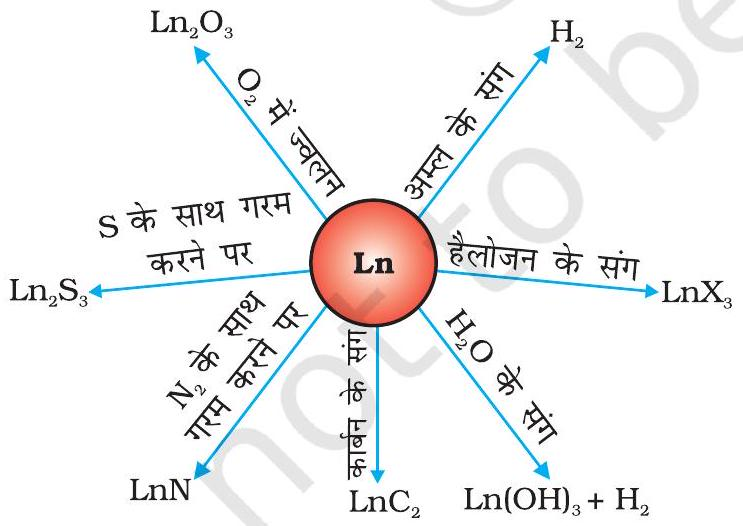

## उद्देश्य

इस एकक के अध्ययन के पश्चात् आप－

－आवर्त सारणी में $d$－तथा $f$－ब्लॉक तत्वों की स्थिति जान पायेंगे；
－संक्रमण（ $d$－ब्लॉक）तथा आंतरिक संक्रमण （ $f$－ब्लॉक）तत्वों के इलेक्ट्रॉनिक विन्यास जान सकेंगे；
－इलैक्ट्रोड विभव के संदर्भ में विभिन्न ऑक्सीकरण अवस्थाओं के तुलनात्मक स्थायित्व के महत्त्व को समझ सकेंगे；
－ $\mathrm{K}_{2} \mathrm{Cr}_{2} \mathrm{O}_{7}$ तथा $\mathrm{KMnO}_{4}$ जैसे महत्वपूर्ण यौगिकों के विरचन，गुणों，संरचनाओं तथा उपयोगों का वर्णन कर सकेंगे；
－$d$－तथा $f$－ब्लॉक के तत्वों के सामान्य गुणों तथा इनमें क्षैतिज प्रवृत्ति व वर्ग की सामान्य प्रवृत्ति के बारे में समझ सकेंगे；
－$f$－ब्लॉक के तत्वों के गुणों का वर्णन कर सकेंगे तथा लैन्थेनॉयडों एवं एक्टिनॉयडों के इलेक्ट्रॉनिक विन्यास，ऑक्सीकरण अवस्था एवं रासायनिक व्यवहार का तुलनात्मक परिकलन कर सकेंगे।

## एकक  d．एवं $j$ के बॉके के ताब

＂आयरन，कॉपर，सिल्वर और गोल्ड－सभी संक्रमण तत्वों में आते हैं जिन्होंने मानव सभ्यता के विकास में महत्वपूर्ण भूमिका निभाई है। आंतरिक संक्रमण तत्व जैसे Th， $\boldsymbol{P a}$ तथा $\boldsymbol{U}$ आधुनिक काल में नाभिकीय ऊर्जा के श्रेष्ठ स्रोत सिद्ध हो रहे हैं।＂ आवर्त सारणी के $d$－ब्लॉक में वर्ग $3$ से $12$ के तत्व आते हैं，जिसमें चारों दीर्घ आवर्तों में $d$ कक्षक भरे जाते हैं। $f$－ब्लॉक के तत्व वे हैं जिनमें दीर्घ आवर्तों में $4 f$ तथा $5 f$ कक्षक उत्तरोत्तर भरे जाते हैं；इन्हें आवर्त सारणी के नीचे एक अलग खण्ड में रखा गया है। $d$－एवं $f$－ब्लॉक के तत्वों को क्रमशः संक्रमण तत्व एवं आंतरिक संक्रमण तत्व भी कहते हैं।

संक्रमण तत्वों की मुख्य रूप से चार श्रेणियाँ हैं， $3 d$ श्रेणी（ Sc से Zn ）， $4 d$ श्रेणी $(\mathrm{Y}$ से Cd$)$ ，तथा $5 d$ श्रेणी（ La तथा Hf से Hg ）तथा चौथी $6 d$ श्रेणी जिसमें Ac तथा Rf से Cn तक तत्व आते हैं। आंतरिक संक्रमण तत्वों की दो श्रेणियाँ， $4 f$（Ce से Lu）तथा $5 f$（Th से Lr）क्रमशः लैन्थेनॉयड तथा ऐक्टिनॉयड कहलाती हैं।

मूलरूप से संक्रमण धातु नाम इस तथ्य से आया कि इनके रासायनिक गुण $s$ तथा $p$ ब्लॉक के मध्य परिवर्ती होते हैं। अब IUPAC के अनुसार संक्रमण धातुओं को ऐसी धातुओं के रूप में परिभाषित किया जाता है जिनके परमाणु अथवा आयन में $d$－कक्षक अपूर्ण होते हैं। वर्ग $12$ के ज़िंक，कैडमियम तथा मर्क्यूरी में उनकी मूल अवस्था तथा उनकी सामान्य ऑक्सीकरण अवस्था में पूर्ण $d^{10}$ विन्यास है और इसीलिए इन्हें संक्रमण धातु नहीं माना जाता। फिर भी， क्रमशः $3 d, 4 d$ तथा $5 d$ संक्रमण श्रेणियों के अंतिम सदस्य होने के कारण इनके रसायन का अध्ययन संक्रमण धातुओं के रसायन के साथ किया जाता है।

इनके परमाणुओं में आंशिक भरित $d$－अथवा $f$－कक्षकों की उपस्थिति संक्रमण तत्वों को असंक्रमण तत्वों से अलग कर देती है। इसलिए संक्रमण धातुओं और उनके यौगिकों का अध्ययन अलग से किया जाता है। फिर भी संयोजकता का सामान्य सिद्धांत जो असंक्रमण तत्वों पर लागू होता है，संक्रमण तत्वों पर भी सफलतापूर्वक प्रयुक्त किया जा सकता है।

अनेक बहुमूल्य धातुएं जैसे सिल्वर，गोल्ड तथा प्लैटिनम और औद्योगिक रूप से महत्वपूर्ण धातुएं जैसे आयरन，कॉपर तथा टाइटेनियम सभी संक्रमण धातुएं हैं।

## $4.1$ आवर्त शाएणी में स्थिति

## $4.2$ d-ब्लॉक तत्वों के इलेक्ट्रॉनिक विन्यास

इस एकक में हम, संक्रमण तत्वों के इलेक्ट्रॉनिक विन्यास, उपलब्धता तथा सामान्य गुणों पर विचार करेंगे जिसमें प्रथम पंक्ति $(3 d)$ के तत्वों के गुणों में प्रवृत्ति पर अधिक ध्यान देंगे तथा उनके कुछ प्रमुख यौगिकों के विरचन व गुणों का अध्ययन करेंगे। तत्पश्चात आंतरिक संक्रमण धातुओं के सामान्य पहलुओं जैसे इलेक्ट्रॉनिक विन्यास, ऑक्सीकरण अवस्थाएं तथा रासायनिक अभिक्रियाशीलता पर विचार करेंगे।

## संक्रमण तत्व ( $d$-ब्लॉक )

आवर्त सारणी का बड़ा मध्य भाग $d$ - ब्लॉक ने घेरा हुआ है, जिसके दोनों ओर $s$ - तथा $p$ ब्लॉक स्थित हैं। इनके परमाणुओं में उपांतिम ऊर्जा स्तरों के $d$ - कक्षकों में इलेक्ट्रॉन भरे जाते हैं तथा इस प्रकार संक्रमण धातुओं की चार पंक्तियाँ अर्थात् $3 d, 4 d, 5 d$ तथा $6 d$ प्राप्त होती हैं। संक्रमण तत्वों की यह श्रेणियाँ सारणी $4.1$ में दर्शायी गई हैं।

सामान्य रूप से इन तत्वों के बाहय कक्षकों का इलेक्ट्रॉनिक विन्यास $(\mathrm{n}-1) d^{1-10} \mathrm{~ns}^{1-2}$ है। $(\mathrm{n}-1)$ आंतरिक $d$ कक्षकों को इंगित करता है, जिनमें एक से दस तक इलेक्ट्रॉन हो सकते हैं तथा बाह्यतम ns कक्षक में एक अथवा दो इलेक्ट्रॉन हो सकते हैं। परंतु $(\mathrm{n}-1) d$ तथा ns कक्षकों की ऊर्जाओं में बहुत कम अंतर के कारण इस सामान्य नियम के अनेक अपवाद हैं। पुनश्च: अर्ध एवं पूर्ण भरित कक्षकों का स्थायित्व अपेक्षाकृत अधिक होता है। इसका परिणाम $3 d$ श्रेणी के संक्रमण तत्वों, Cr तथा Cu के इलेक्ट्रॉनिक विन्यासों में प्रतिबिंबित होता है। उदाहरण के लिए Cr में $3 d^{4} 4 s^{2}$ के स्थान पर $3 d^{5} 4 s^{1}$ विन्यास है। $3 d$ व $4 s$ कक्षकों की ऊर्जाओं में अंतर इतना कम है कि वह $4 s$ इलेक्ट्रॉन के $3 d$ कक्षक में प्रवेश को रोक नहीं पाता। इसी प्रकार से Cu में इलेक्ट्रॉनिक विन्यास $3 d^{9} 4 s^{2}$ न होकर $3 d^{10} 4 s^{1}$ है। संक्रमण तत्वों की मूल अवस्था में बाहय कक्षकों के इलेक्ट्रॉनिक विन्यास सारणी $4.1$ में दिए गए हैं।

सारणी $4.1$ - संक्रमण तत्वों के बाह्य इलेक्ट्रॉनिक विन्यास ( मूल अवस्था )
| प्रथम श्रेणी |  |  |  |  |  |  |  |  |  |  |
| :--- | :--- | :--- | :--- | :--- | :--- | :--- | :--- | :--- | :--- | :--- |
|  | Sc | Ti | V | Cr | Mn | Fe | Co | Ni | Cu | Zn |
| $Z$ | $21$ | $22$ | $23$ | $24$ | $25$ | $26$ | $27$ | $28$ | $29$ | $30$ |
| $4 s$ | $2$ | $2$ | $2$ | $1$ | $2$ | $2$ | $2$ | $2$ | $1$ | $2$ |
| $3 d$ | $1$ | $2$ | $3$ | $5$ | $5$ | $6$ | $7$ | $8$ | $10$ | $10$ |
| द्वितीय श्रेणी |  |  |  |  |  |  |  |  |  |  |
|  |  |  |  |  |  |  |  |  |  |  |
| $5 s$ | $2$ | $2$ | $1$ | $1$ | $1$ | $1$ | $1$ | $0$ | $1$ | $2$ |
| $4 d$ | $1$ | $2$ | $4$ | $5$ | $6$ | $7$ | $8$ | $10$ | $10$ | $10$ |
| तृतीय श्रेणी |  |  |  |  |  |  |  |  |  |  |
|  | La | Hf | Ta | W | Re | Os | Ir | Pt | Au | Hg |
| $Z$ | $57$ | $72$ | $73$ | $74$ | $75$ | $76$ | $77$ | $78$ | $79$ | $80$ |
| $6 s$ | $2$ | $2$ | $2$ | $2$ | $2$ | $2$ | $2$ | $1$ | $1$ | $2$ |
| $5 d$ | $1$ | $2$ | $3$ | $4$ | $5$ | $6$ | $7$ | $9$ | $10$ | $10$ |

## चतुर्थ श्रेणी

|  | Ac | Rf | Db | Sg | Bh | Hs | Mt | Ds | Rg | Cn |
| :--- | :--- | :--- | :--- | :--- | :--- | :--- | :--- | :--- | :--- | :--- |
| $Z$ | $89$ | $104$ | $105$ | $106$ | $107$ | $108$ | $109$ | $110$ | $111$ | $112$ |
| $7 s$ | $2$ | $2$ | $2$ | $2$ | $2$ | $2$ | $2$ | $2$ | $1$ | $2$ |
| $6 d$ | $1$ | $2$ | $3$ | $4$ | $5$ | $6$ | $7$ | $8$ | $10$ | $10$ |

$\mathrm{Zn}, \mathrm{Cd}, \mathrm{Hg}$ तथा Cn के इलेक्ट्रॉनिक विन्यास, सामान्य सूत्र $(\mathrm{n}-1) d^{10} \mathrm{~ns}^{2}$ से प्रदर्शित किए जाते हैं। इन तत्वों की मूल अवस्थाओं तथा सामान्य ऑक्सीकरण अवस्थाओं में इनके कक्षक पूर्ण भरित होते हैं। इसीलिए इन्हें संक्रमण तत्वों की श्रेणी में नहीं माना जाता। संक्रमण तत्वों के $d$ कक्षक अन्य कक्षकों ( $s$ व $p$ ) की अपेक्षा परमाणु की सतह पर अधिक प्रक्षिप्त होते हैं, अतः वे अपने परिवेश से अधिक प्रभावित होते हैं तथा इसी प्रकार अपने चारों ओर के परमाणुओं अथवा अणुओं को भी प्रभावित करते हैं। कुछ पहलुओं में, एक से विन्यास $d^{\mathrm{n}}(\mathrm{n}=1-9)$ वाले आयनों में समान चुंबकीय एवं इलेक्ट्रॉनिक गुण पाए जाते हैं। आंशिक रूप से भरित $d$ कक्षकों के कारण ये तत्व कुछ अभिलक्षणिक गुण दर्शाते हैं, जैसे- अनेक ऑक्सीकरण अवस्थाएं, रंगीन आयनों का बनना तथा अनेक प्रकार के लिगन्डों के साथ संकुल निर्माण आदि।

संक्रमण धातुएं तथा इनके यौगिक उत्प्रेरकी गुण व अनुचुंबकीय व्यवहार भी दर्शाते हैं। इन सभी विशेषताओं की विवेचना विस्तार से इस एकक में बाद में की गई है।

असंक्रमण तत्वों के विपरीत संक्रमण तत्वों के गुणों में क्षैतिज समानताएं अधिक पाई जाती हैं। तथापि, कुछ वर्ग समानताएं भी पाई जाती हैं। हम पहले सामान्य अभिलक्षणों तथा उनकी क्षैतिज पंक्ति (प्रमुखतः $3 d$ पंक्ति) में प्रवृत्ति का अध्ययन करेंगे, तत्पश्चात् कुछ वर्ग समानताओं पर विचार करेंगे। निम्न खण्डों में हम केवल संक्रमण तत्वों की प्रथम श्रेणी की व्याख्या करेंगे।

उदाहरण $4.1$ आप किस आधार पर यह कह सकते हैं कि स्कैन्डियम $(\mathrm{Z}=21)$ एक संक्रमण तत्व है परंतु ज़िंक $(Z=30)$ नहीं?

हल स्कैन्डियम की मूल अवस्था में $3 d$ कक्षक अपूर्ण $\left(3 d^{1}\right)$ होने के कारण इसे संक्रमण तत्व माना जाता है। जबकि ज़िंक परमाणु में मूल अवस्था तथा ऑक्सीकृत अवस्था दोनों में ही इसका $3 d$ कक्षक पूर्ण भरित ( $3 d^{10}$ ) होता है, अतः इसे संक्रमण तत्व नहीं माना गया है।

## पाठ्यनिहित प्रश्न

$4.1$ सिल्वर परमाणु की मूल अवस्था में पूर्ण भरित $d$ कक्षक $\left(4 d^{10}\right)$ हैं। आप कैसे कह सकते हैं कि यह एक संक्रमण तत्व है?

## $4.3$ संक्रमण तत्वों ( $d$-ब्लॉक) के सामान्य गुण

लगभग सभी संक्रमण तत्व अभिधात्विक गुण, जैसे उच्च तनन सामर्थ्य (tensile strength), तन्यता (ductility), वर्धनीयता (malleability), उच्च तापीय तथा विद्युत् चालकता एवं धात्विक चमक दर्शाते हैं। $\mathrm{Zn}, \mathrm{Cd}, \mathrm{Hg}$ तथा Mn जैसे अपवादों को छोड़कर सामान्य ताप पर इनकी एक या अधिक प्रारूपिक धात्विक संरचनाएं होती हैं। संक्रमण धातुओं की विभिन्न जालक संरचनाओं को आगे सारणी में दिया गया है।

संक्रमण धातुओं की जालक संरचनाएं
| Sc | Ti | V | Cr | Mn | Fe | Co | Ni | Cu | Zn |
| :--- | :--- | :--- | :--- | :--- | :--- | :--- | :--- | :--- | :--- |
| hcp (bcc) | hcp (bcc) | bcc | bcc | $X$ (bcc, ccp) | bcc (hcp) | сср (hcp) | сср | сср | $X$ (hcp) |
| Y | Zr | Nb | Mo | Tc | Ru | Rh | Pd | Ag | Cd |
| hcp (bcc) | hcp (bcc) | bcc | bcc | hcp | hcp | сср | сср | сср | X (hcp) |
| La | Hf | Ta | W | Re | Os | Ir | Pt | Au | Hg |
| hcp (ccp,bcc) | hcp (bcc) | bcc | bcc | hcp | hcp | сср | сср | сср | $X$ |

$(b c c=$ काय केंद्रित घनीय; $h c p=$ षट्कोणीय निबिडतम संकुलन; $c c p=$ घनीय निबिड संकुलन; $X=$ एक विशेष धात्विक संरचना).

संक्रमण धातुएं (ज़िंक, कैडमियम तथा मर्क्यूरी के अपवादों के साथ) अतिकठोर तथा अल्प वाष्पशील होती हैं। इनके गलनांक व क्वथनांक उच्च होते हैं। चित्र $4.1$ में $3 d, 4 d$ तथा $5 d$ श्रेणी की संक्रमण धातुओं के गलनांक दिए गए हैं। उच्च गलनांक का कारण अंतरापरमाण्विक धात्विक बंधन में ns इलेक्ट्रॉन के अतिरिक्त $(\mathrm{n}-1) d$ कक्षकों के अधिक इलेक्ट्रॉनों की भागीदारी है। केवल Mn तथा Tc के अपवादों को छोड़कर किसी भी श्रेणी में धातुओं के गलनांक $d^{5}$ विन्यास पर अधिकतम होते हैं तथा बढ़ते हुए परमाणु क्रमांकों के साथ गलनांकों में नियमित रूप से कमी आती है। इनकी कणन एन्थैल्पी (enthalpy of atomisation) के मान उच्च होते हैं जैसा कि चित्र $4.2$ में दर्शाया गया है। प्रत्येक श्रेणी के लगभग मध्य में उच्चतम मान इस तथ्य को दर्शाता है कि प्रबल अंतरापरमाण्विक अन्योन्यक्रिया के लिए प्रति $d$ कक्षक एक अयुगलित इलेक्ट्रॉन का होना विशेष रूप से अनुकूल है। सामान्यतः संयोजकता

चित्र $4.1$ - संक्रमण तत्वों के गलनांकों की प्रवृत्तियाँ

चित्र $4.2$ - संक्रमण तत्वों की कणन एन्थैल्पी की प्रवृत्तियाँ

### 4.3.2 संक्रमण धातुओं के परमाण्विक एवं आयनिक आकारों में परिवर्तन

चित्र $4.3$ - संक्रमण तत्वों की परमाणु त्रिज्याओं में प्रवृत्तियाँ

इलेक्ट्रॉनों की संख्या जितनी अधिक होगी, उतना ही प्रबल परिमाणी आबंधन होगा। चूँकि धातुओं के मानक इलैक्ट्रोड विभव के निर्धारण में कणन एन्थैल्पी एक महत्वपूर्ण कारक है। अतः बहुत उच्च कणन एन्थैल्पी (अर्थात बहुत उच्च क्वथनांक) वाली धातुओं की प्रवृत्ति अभिक्रियाओं में उत्कृष्ट रहने की होती है। (इलैक्ट्रोड विभव के लिए बाद में देखें।)

चित्र $4.2$ के आधार पर एक अन्य सामान्य नियम निकाला जा सकता है कि प्रथम संक्रमण श्रेणी के संगत तत्वों की तुलना में द्वितीय तथा तृतीय श्रेणी के तत्वों की कणन एन्थैल्पी के मान अधिक होते हैं; यह भारी संक्रमण धातुओं के यौगिकों में धातु-धातु आबंधों के बहुधा बनने में एक महत्वपूर्ण कारक है।

सामान्यतः श्रेणी में बढ़ते हुए परमाणु क्रमांक के साथ समान आवेश वाले आयनों की त्रिज्याओं में उत्तरोत्तर ह्रास होता है। इसका कारण है कि जब भी नाभिकीय आवेश में वृद्धि होती है, अतिरिक्त इलेक्ट्रॉन हर बार $d$ ऑर्बिटल में प्रवेश करता है। पुन: स्मरण करें कि $d$ इलेक्ट्रॉन का आवरण प्रभाव (screening effect) कम प्रभावशाली होता है, अतः नाभिकीय आवेश तथा बाह्यतम इलेक्ट्रॉन के बीच नेट वैद्युत आकर्षण में वृद्धि हो जाती है जिससे आयनी त्रिज्या का मान घट जाता है। इसी प्रकार की प्रवृत्ति किसी श्रेणी में परमाणु त्रिज्याओं में भी देखी जाती है। परंतु श्रेणी में त्रिज्याओं के मानों में यह परिवर्तन बहुत थोड़ा होता है। एक रोचक तथ्य प्रकाश में तब आता है जब किसी विशेष संक्रमण श्रेणी के तत्वों के आकार की तुलना, दूसरी श्रेणी के संगत तत्वों के आकार से की जाती है। चित्र $4.3$ के वक्र दर्शाते हैं कि प्रथम संक्रमण श्रेणी $(3 d)$ के तत्वों की तुलना में द्वितीय संक्रमण श्रेणी $(4 d)$ के संगत तत्वों का आकार बड़ा है परंतु तृतीय संक्रमण श्रेणी ( $5 d$ ) के तत्वों की त्रिज्याएं लगभग वही हैं जो कि द्वितीय संक्रमण श्रेणी के संगत तत्वों की हैं। यह परिघटना $4 f$ कक्षकों के बीच में आने के कारण होती है जिनमें इलेक्ट्रॉनों की आपूर्ति, $5 d$ श्रेणी के तत्वों के $d$ कक्षक में आपूर्ति प्रारंभ होने से पहले होनी चाहिए। $5 d$ कक्षकों के पूर्व $4 f$ कक्षकों में इलेक्ट्रॉनों की आपूर्ति के कारण परमाणु त्रिज्याओं में नियमित ह्रास होता है, जिसे लैन्थेनॉयड आकुंचन (Lanthanoid Contraction) कहते हैं। जो आवश्यक रूप से बढ़ते हुए परमाणु क्रमांक के साथ परमाणवीय आकार में हुई संभावित वृद्धि की क्षतिपूर्ति करता है। लैन्थेनॉयड आकुंचन के समग्र प्रभाव के कारण द्वितीय एवं तृतीय संक्रमण श्रेणी के अनुरूप तत्वों की त्रिज्याएं समान हो जाती हैं (उदाहरण Zr, $160$ pm तथा Hf, $159$ pm) तथा इनके भौतिक एवं रासायनिक गुणों में अत्यधिक समानता पाई जाती है, जो सामान्य जातिगत संबंधों के आधार पर अपेक्षित समानता से भी बहुत अधिक होती है। लैन्थेनॉयड आकुंचन के लिए उत्तरदायी कारक लगभग वही है जो एक सामान्य संक्रमण श्रेणी के लिए देखा जाता है तथा समान कारण के लिए उत्तरदायी है, अर्थात् एक ही समुच्चय के कक्षकों में एक इलेक्ट्रॉन द्वारा दूसरे पर अपूर्ण आवरण प्रभाव। परंतु एक $4 f$ इलेक्ट्रॉन द्वारा दूसरे पर आवरण प्रभाव, एक $d$ इलेक्ट्रॉन द्वारा दूसरे पर आवरण प्रभाव की तुलना में कम होता है तथा जैसे-जैसे एक श्रेणी में नाभिकीय आवेश में वृद्धि होती है, सभी $4 f^{\mathrm{n}}$ कक्षकों के आकार में नियमित ह्रास होता है।

धात्विक त्रिज्या में ह्रास के साथ परमाण्विक द्रव्यमान में वृद्धि के परिणामस्वरूप इन तत्वों के घनत्व में सामान्यतः वृद्धि होती है। इस प्रकार की महत्वपूर्ण घनत्व वृद्धि टाइटेनियम $(Z=22)$ से कॉपर $(Z=29)$ तक देखने को मिलती है (सारणी 4.2)।
सारणी $4.2$ - प्रथम संक्रमण श्रेणी के तत्वों के इलेक्ट्रॉनिक विन्यास एवं कुछ अन्य गुण

| तत्व |  | Sc | Ti | V | Cr | Mn | Fe | Co | Ni | Cu | Zn |
| :--- | :--- | :--- | :--- | :--- | :--- | :--- | :--- | :--- | :--- | :--- | :--- |
| परमाणु क्रमांक इलेक्ट्रॉनिक विन्यास |  | $21$ | $22$ | $23$ | $24$ | $25$ | $26$ | $27$ | $28$ | $29$ | $30$ |
|  | M | $3 d^{1} 4 s^{2}$ | $3 d^{2} 4 s^{2}$ | $3 d^{3} 4 s^{2}$ | $3 d^{5} 4 s^{1}$ | $3 d^{5} 4 s^{2}$ | $3 d^{6} 4 s^{2}$ | $3 d^{7} 4 s^{2}$ | $3 d^{8} 4 s^{2}$ | $3 d^{10} 4 s^{1}$ | $3 d^{10} 4 s^{2}$ |
|  | $\mathrm{M}^{+}$ | $3 d^{1} 4 s^{1}$ | $3 d^{2} 4 s^{1}$ | $3 d^{3} 4 s^{1}$ | $3 d^{5}$ | $3 d^{5} 4 s^{1}$ | $3 d^{6} 4 s^{1}$ | $3 d^{7} 4 s^{1}$ | $3 d^{8} 4 s^{1}$ | $3 d^{10}$ | $3 d^{10} 4 s^{1}$ |
|  | $\mathrm{M}^{2+}$ | $3 d^{1}$ | $3 d^{2}$ | $3 d^{3}$ | $3 d^{4}$ | $3 d^{5}$ | $3 d^{6}$ | $3 d^{7}$ | $3 d^{8}$ | $3 d^{9}$ | $3 d^{10}$ |
|  | $\mathrm{M}^{3+}$ | [Ar] | $3 d^{1}$ | $3 d^{2}$ | $3 d^{3}$ | $3 d^{4}$ | $3 d^{5}$ | $3 d^{6}$ | $3 d^{7}$ | - | - |
| कणन एन्थैल्पी, $\Delta_{a} H^{\ominus} / \mathbf{k J ~ m o l}^{\boldsymbol{-} \mathbf{1}}$ |  |  |  |  |  |  |  |  |  |  |  |
|  |  | $326$ | $473$ | $515$ | $397$ | $281$ | $416$ | $425$ | $430$ | $339$ | $126$ |
| आयनन एन्थैल्पी $/ \Delta_{i} H^{\ominus} / \mathbf{k J ~ m o l}^{-1}$ |  |  |  |  |  |  |  |  |  |  |  |
| $\Delta_{\mathrm{i}} H^{\ominus}$ | I | $631$ | $656$ | $650$ | $653$ | $717$ | $762$ | $758$ | $736$ | $745$ | $906$ |
| $\Delta_{\mathrm{i}} H^{\ominus}$ | II | $1235$ | $1309$ | $1414$ | $1592$ | $1509$ | $1561$ | $1644$ | $1752$ | $1958$ | $1734$ |
| $\Delta_{\mathrm{i}} H^{\ominus}$ | III | $2393$ | $2657$ | $2833$ | $2990$ | $3260$ | $2962$ | $3243$ | $3402$ | $3556$ | $3837$ |
| धात्विक/आयनिक | M | $164$ | $147$ | $135$ | $129$ | $137$ | $126$ | $125$ | $125$ | $128$ | $137$ |
| त्रिज्याएं/pm | $\mathrm{M}^{2+}$ | - | - | $79$ | $82$ | $82$ | $77$ | $74$ | $70$ | $73$ | $75$ |
|  | $\mathrm{M}^{3+}$ | $73$ | $67$ | $64$ | $62$ | $65$ | $65$ | $61$ | $60$ | - | - |
| मानक इलैक्ट्रोड | $\mathrm{M}^{2+} / \mathrm{M}$ | - | -1.63 | -1.18 | -0.90 | -1.18 | -0.44 | -0.28 | -0.25 | +0.34 | -0.76 |
| विभव $E^{\ominus} / V$ | $\mathrm{M}^{3+} / \mathrm{M}^{2+}$ | - | -0.37 | -0.26 | -0.41 | +1.57 | +0.77 | +1.97 | - | - | - |
| घनत्व/g $\mathbf{c m}^{\boldsymbol{-} \mathbf{3}}$ |  | $3.43$ | $4.1$ | $6.07$ | $7.19$ | $7.21$ | $7.8$ | $8.7$ | $8.9$ | $8.9$ | $7.1$ |

उदाहरण $4.2$ संक्रमण तत्व कणन एन्थैल्पी के उच्च मान क्यों दर्शाते हैं?
हल क्योंकि इनके परमाणुओं में बड़ी संख्या में अयुगलित इलेक्ट्रॉन होते हैं, इसलिए इनमें प्रबल अंतरापरमाण्विक अन्योन्य क्रिया होती है अतः परमाणुओं के मध्य प्रबल आबंधन के फलस्वरूप कणन एन्थैल्पी उच्च होती है।

## पाठ्यनिहित प्रश्न

$4.2$ श्रेणी, $\operatorname{Sc}(Z=21)$ से $\operatorname{Zn}(Z=30)$ में, ज़िंक की कणन एन्थैल्पी का मान सबसे कम होता है, अर्थात् $126 \mathrm{~kJ} \mathrm{~mol}^{-1}$; क्यों?

### 4.3.3 आयनन एन्थैल्पी

आंतरिक $d$ कक्षकों के भरने के साथ नाभिकीय आवेश में वृद्धि होने के कारण श्रेणी में बाएं से दाहिनी ओर बढ़ने पर संक्रमण श्रेणी के तत्वों की आयनन एन्थैल्पी में वृद्धि होती है, सारणी $4.2$ में प्रथम संक्रमण श्रेणी के तत्वों की प्रथम तीन आयनन एन्थैल्पियों के मान दिए गए हैं। इन मानों से स्पष्ट है कि इन तत्वों की क्रमिक एन्थैल्पी में वैसी तीव्र वृद्धि नहीं होती जैसी कि असंक्रमण तत्वों में। संक्रमण तत्वों की श्रेणी में आयनन एन्थैल्पी में परिवर्तन असंक्रमण तत्वों की श्रेणी से कम होता है। सामान्यतः प्रथम आयनन एन्थैल्पी के मान में वृद्धि

होती है परंतु उत्तरोत्तर तत्वों की द्वितीय एवं तृतीय आयनन एन्थैल्पी के मानों में हुई वृद्धि का परिमाण सामान्यतः बहुत अधिक होता है।
$3 d$ श्रेणी की धातुओं की प्रथम आयनन एन्थैल्पी की अनियमित प्रवृत्ति का यद्यपि कोई खास रासायनिक महत्व नहीं है फिर भी यह स्पष्टीकरण दिया जा सकता है कि एक इलेक्ट्रॉन पृथक करने से $4 s$ तथा $3 d$ कक्षकों की आपेक्षिक ऊर्जाओं में परिवर्तन होता है। आपने पढ़ा है कि जब $d$-ब्लॉक के तत्व आयन बनाते हैं तो $n s$ इलेक्ट्रॉन $(n-1) d$ इलेक्ट्रॉनों से पहले निकलते हैं। हम जैसे-जैसे $3 d$ शृंखला के आवर्त में बढ़ते हैं तो स्कैन्डियम से ज़िंक की ओर जाने पर नाभिक का आवेश बढ़ता है परंतु इलेक्ट्रॉन आतंरिक उपकोश के कक्षक यानी $3 d$ कक्षक में जाते हैं। यह $3 d$ इलेक्ट्रॉन $4 s$ इलेक्ट्रोनों को बढ़ते हुए नाभिक आवेश से उस स्थिति के मुकाबले कुछ अधिक प्रभावी ढंग से परिरक्षित कर सकते हैं, जिसमें वाहय इलेक्ट्रॉन एक दूसरे को परिरक्षित करते हैं। अतः परमाण्विक त्रिज्या कम तेज़ी से घटती है। इसलिए $3 d$ शृंख्ला में इलेक्ट्रॉनी ऊर्जा में मामूली वृद्धि होती है। दो या अधिक धन आवेश वाले आयनों का विन्यास $d^{\mathrm{n}}$ होता है तथा $4 s$ में इलेक्ट्रॉन नहीं होते।

सामान्यतः द्वितीय आयनन एन्थैल्पी के मान में नाभिकीय आवेश में वृद्धि के साथ बढ़ने की प्रवृत्ति की अपेक्षा होती है, क्योंकि एक $d$ इलेक्ट्रॉन दूसरे $d$ इलेक्ट्रॉन को नाभिक के आवेश के प्रभाव से परिरक्षित नहीं करता। इसका कारण $d$-कक्षकों की दिशा का भिन्न होना है। यद्यपि द्वितीय एवं तृतीय आयनन एन्थैल्पी में निरंतर वृद्धि का प्रवाह $\mathrm{Mn}^{2+}$ तथा $\mathrm{Fe}^{3+}$ आयन बनने में टूट जाता है। दोनों में ही आयनों का विन्यास $\mathrm{d}^{5}$ है। इसी प्रकार का विचलन बाद की संक्रमण श्रंखलाओं के संगत तत्वों में भी आता है। $d^{n}$ इलेक्ट्रॉनी विन्यास के लिए आयनन एन्थैल्पी में परिवर्तन की व्याख्या निम्नलिखित है -

आयनन एन्थैल्पी का मान प्रत्येक इलेक्ट्रॉन के नाभिक की ओर आकर्षण, दो इलेक्ट्रॉनों के बीच प्रतिकर्षण और विनिमय ऊर्जा पर निर्भर करता है। ऊर्जा स्तर के स्थायित्व के लिए विनिमय ऊर्जा उत्तरदायी होती है। विनिमय ऊर्जा, अपभ्रष्ट कक्षकों में समदिश प्रचक्रणों के कुल संभव युगलों के लगभग समानुपाती होती है। जब अपभ्रष्ट कक्षकों में अनेक इलेक्ट्रॉन होते हैं तो निम्नतम ऊर्जा वाला स्तर वह होता है जिसमें अधिकतम कक्षकों में समदिश प्रचक्रण वाले एक-एक इलेक्ट्रॉन होते हैं (हुंड का नियम)। विनिमय ऊर्जा का ह्रास होने से स्थायित्व बढ़ता है और स्थायित्व बढ़ने से आयनन कठिन हो जाता है। $d^{6}$ विन्यास में विनिमय ऊर्जा का ह्रास नहीं होता।
$\mathrm{Mn}^{+}$आयन का विन्यास $3 d^{5} 4 s^{1}$ और $\mathrm{cr}^{+}$आयन का विन्यास $d^{5}$ है अतः $\mathrm{Mn}^{+}$की एन्थैल्पी $\mathrm{Cr}^{+}$से कम होती है। इसी प्रकार से $\mathrm{Mn}^{2+}$ का विन्यास $d^{5}$ है अतः $\mathrm{Fe}^{2+}$ की एन्थैल्पी $\mathrm{Mn}^{2+}$ से कम है। दूसरे शब्दों में हम कह सकते हैं कि Fe की तृतीय आयनन एन्थैल्पी Mn से कम है। इन धातुओं की निम्नतम ऑक्सीकरण अवस्था +2 है। गैसीय अणुओं से $\mathrm{M}^{2+}$ आयन बनाने हेतु, कणन एन्थैल्पी के साथ-साथ प्रथम एवं द्वितीय आयनन ऊर्जाओं की भी आवश्यकता होती है। प्रमुख पद द्वितीय आयनन एन्थैल्पी है, जिसका मान Cr और Cu के लिए अप्रत्याशित रूप से उच्च है, जिनमें $\mathrm{M}^{+}$आयनों का क्रमशः $d^{5}$ तथा $d^{10}$ विन्यास होता है। Zn के लिए संगत मान कम होता है क्योंकि आयनन हेतु एक $1 \mathrm{~s}$ इलेक्ट्रॉन निकलता है जिससे स्थायी $d^{10}$ विन्यास प्राप्त होता है। तृतीय आयनन एन्थैल्पी में प्रवृत्ति $4 s$ कक्षक के कारक द्वारा जटिल नहीं बनती और $d^{5}\left(\mathrm{Mn}^{2+}\right)$ तथा $d^{10}\left(\mathrm{Zn}^{2+}\right)$ से एक इलेक्ट्रॉन हटाने में अधिक कठिनाई प्रदर्शित होती है। सामान्यतः, तृतीय आयनन एन्थैल्पी पर्याप्त उच्च हैं। कॉपर, जिंक और निकैल की तृतीय आयनन एन्थैल्पी के उच्च मान इंगित करते हैं कि क्यों इन तत्वों की +2 से उच्च ऑक्सीकरण अवस्थाएँ प्राप्त करना कठिन है।

यद्यपि आयनन एन्थैल्पियाँ, ऑक्सीकरण अवस्थाओं के तुलनात्मक स्थायित्व से संबंधित कुछ मार्गदर्शन देती हैं, फिर भी यह समस्या बहुत जटिल है और तात्कालिक व्यापकीकरण हेतु संशोधनीय नहीं है।

### 4.3.4 ऑक्सीकरण   अवस्था

संक्रमण तत्वों के विशिष्ट लक्षणों में से एक लक्षण इन तत्त्वों द्वारा यौगिकों में कई ऑक्सीकरण अवस्थाएं दर्शाना है। सारणी $4.3$ में प्रथम संक्रमण श्रेणी के तत्त्वों की सामान्य ऑक्सीकरण अवस्थाओं को सूचीबद्ध किया गया है।

सारणी 4.3-प्रथम संक्रमण श्रेणी की धातुओं की ऑक्सीकरण अवस्थाएं ( अति सामान्य ऑक्सीकरण अवस्थाओं को मोटे टाइप में दिखाया गया है।)

| Sc | Ti | V | Cr | Mn | Fe | Co | Ni | Cu | Zn |
| :--- | :--- | :--- | :--- | :--- | :--- | :--- | :--- | :--- | :--- |
|  | +2 | +2 | +2 | +2 | +2 | +2 | +2 | +1 | +2 |
| +3 | +3 | +3 | +3 | +3 | +3 | +3 | +3 | +2 |  |
|  | +4 | +4 | +4 | +4 | +4 | +4 | +4 |  |  |
|  |  | +5 | +5 | +5 |  |  |  |  |  |
|  |  |  | +6 | +6 | +6 |  |  |  |  |
|  |  |  |  | +7 |  |  |  |  |  |

अत्यधिक संख्या में ऑक्सीकरण अवस्थाएं दर्शाने वाले तत्व संक्रमण श्रेणी के मध्य में या इसके निकट स्थित हैं। उदाहरणार्थ, मैंगनीज +2 से +7 तक की सभी ऑक्सीकरण अवस्थाएं दर्शाता है। श्रेणी के दोनों किनारों पर ऑक्सीकरण अवस्थाओं की संख्या कम पाई जाती है। इसका कारण तत्वों $(\mathrm{Sc}, \mathrm{Ti})$ में परित्याग या साझेदारी के लिए कम इलेक्ट्रॉनों की उपलब्धता अथवा तत्वों के संयोजकता कोश में $d$ इलेक्ट्रॉनों की अधिक संख्या (परिमाणतः भागीदारी के लिए कम कक्षकों की उपलब्धता) [Cu, Zn] है। इस प्रकार प्रथम श्रेणी के आरंभ में स्कैन्डियम (II) वास्तविकता में अज्ञात है तथा Ti(II) या Ti(III) की तुलना में Ti(IV) अधिक स्थायी है। श्रेणी के दूसरे छोर पर ज़िंक की एकमात्र ऑक्सीकरण अवस्था +2 है ( $d$ इलेक्ट्रॉनों की भागीदारी नहीं है)। सामान्य स्थायित्व वाली अधिकतम ऑक्सीकरण अवस्थाओं की संख्या मैंगनीज तक $s$ तथा $d$ कक्षकों में उपस्थित इलेक्ट्रॉनों की संख्या के योग के बराबर है। $\left(\mathrm{Ti}^{\mathrm{IV}} \mathrm{O}_{2} \mathrm{~V}^{\mathrm{V}} \mathrm{O}_{2}^{+}, \mathrm{Cr}^{\mathrm{VI}} \mathrm{O}_{4}^{2-} \mathrm{Mn}^{\mathrm{VII}} \mathrm{O}_{4}^{-}\right)$। इसके पश्चात् तत्वों की उच्च ऑक्सीकरण अवस्थाओं के स्थायित्व में आकस्मिक कमी आ जाती है जिसका अनुगमन करने वाली अभिलक्षणिक स्पीशीज़ हैं ( $\mathrm{Fe}^{\text {II,III }}, \mathrm{Co}^{\text {II,III }}, \mathrm{Ni}^{\text {II }}, \mathrm{Cu}^{\text {I,II }}$ तथा $\mathrm{Zn}^{\text {II }}$ )।

परिवर्तनीय ऑक्सीकरण अवस्थाएं जो कि संक्रमण तत्वों की एक विशेषता हैं, का कारण है, अपूर्ण $d$ कक्षकों में इलेक्ट्रॉनों का इस प्रकार से प्रवेश करना, जिससे इन तत्वों की ऑक्सीकरण अवस्थाओं में एक का अंतर बना रहता है। इसका उदाहरण, $\mathrm{V}^{\mathrm{II}}, \mathrm{V}^{\mathrm{III}}, \mathrm{V}^{\mathrm{IV}}, \mathrm{V}^{\mathrm{V}}$ हैं। उल्लेखनीय है कि असंक्रमण तत्वों (non-transition elements) में, विभिन्न ऑक्सीकरण अवस्थाओं में सामान्यतः दो का अंतर पाया जाता है।
$d$-ब्लॉक तत्त्वों के वर्गों (वर्ग $4$ से 10) की ऑक्सीकरण अवस्थाओं की परिवर्तनशीलता में एक रोचक तथ्य देखने को मिलता है। $p$-ब्लॉक में (अक्रिय युगल प्रभाव के कारण) भारी सदस्यों द्वारा निम्न ऑक्सीकरण अवस्थाएं बनना अनुकूल होता है, जबकि $d$-ब्लॉक में इसका विपरीत सही है। उदाहरणार्थ- वर्ग $6$ में Mo(VI) तथा W(VI) का स्थायित्व Cr(VI) से अधिक हैं। अतः अम्लीय माध्यम में $\mathrm{Cr}(\mathrm{VI})$, डाइक्रोमेट के रूप में प्रबल ऑक्सीकारक है जबकि $\mathrm{MoO}_{3}$ एवं $\mathrm{WO}_{3}$ नहीं।

निम्न ऑक्सीकरण अवस्थाएं तब पाई जाती है जब एक संकुल यौगिक में ऐसे लिगन्ड हों जिनमें $\sigma$-आबंधन के अतिरिक्त $\pi$-ग्राही गुण भी पाए जाते हों। उदाहरणार्थ - $\mathrm{Ni}(\mathrm{CO})_{4}$ और $\mathrm{Fe}(\mathrm{CO})_{5}$, में निकैल और आयरन की ऑक्सीकरण अवस्था शून्य है।

उदाहरण $4.3$ ऐसे संक्रमण तत्त्व का नाम बताइए जिसमें परिवर्तनीय ऑक्सीकरण अवस्थाएं नहीं पाई जातीं।

हल स्कैन्डियम $(Z=21)$ परिवर्तनीय ऑक्सीकरण अवस्थाएं नहीं दर्शाता।

## पाठ्यनिहित प्रश्न

$4.3$ संक्रमण तत्त्वों की $3 d$ श्रेणी का कौन सा तत्व बड़ी संख्या में ऑक्सीकरण अवस्थाएं दर्शाता है एवं क्यों?

4.3.5 $\mathbf{M}^{\mathbf{2}+} / \mathbf{M}$ मानक इलैक्ट्रोड विभवों में प्रवृत्तियाँ

चित्र 4.4-Ti से Zn तक के तत्त्वों के ( $\mathrm{M}^{2+} \rightarrow \mathrm{M}^{\circ}$ ) मानक इलैक्ट्रोड विभवों के प्रेक्षित तथा परिकलित मान

विलयन में ठोस धातु के $\mathrm{M}^{2+}$ आयन में रूपांतरण से संबंधित ऊष्मा-रासायनिक प्राचल और मानक इलैक्ट्रोड विभव सारणी $4.4$ में दिए गए हैं। सारणी $4.4$ के मानों का उपयोग करके परिकलित मानों तथा $\mathrm{E}^{\ominus}$ के प्रेक्षित मानों के मध्य तुलना को चित्र $4.4$ में दर्शाया गया है।

कॉपर का घनात्मक $\mathrm{E}^{\ominus}$ के कारण अद्वितीय व्यवहार, इसकी अम्लों से $\mathrm{H}_{2}$ मुक्त करने की असमर्थता का स्पष्टीकरण देता है। केवल ऑक्सीकारक अम्ल (नाइट्रिक अम्ल और गरम सांद्र सल्फ्यूरिक अम्ल) ही Cu के साथ अभिक्रिया करते हैं और ये अम्ल अपचित हो जाते हैं। $\mathrm{Cu}(\mathrm{s})$ के $\mathrm{Cu}^{2+}(\mathrm{aq})$ में रूपांतरण के लिए आवश्यक उच्च ऊर्जा, इसकी जलयोजन एन्थैल्पी से संतुलित नहीं हो पाती। श्रेणी में $\mathrm{E}^{\ominus}$ के कम ऋणात्मक मानों की सामान्य प्रवृत्ति धातुओं के प्रथम एवं द्वितीय आयनन एन्थैल्पी के योग में सामान्य वृद्धि से संबंधित है। यह जानना रोचक है कि Mn, Ni तथा Zn के $\mathrm{E}^{\ominus}$ के मान सामान्य प्रवृत्ति द्वारा आपेक्षित मानों से अधिक ऋणात्मक होते हैं।

सारणी 4.4- प्रथम श्रेणी के संक्रमण तत्वों के ऊष्मा-रासायनिक मान (kJ mol-1) और M(II) से M में अपचयन के मानक इलैक्ट्रोड विभवों के मान

| तत्त्व (M) | $\Delta_{a} \mathbf{H}^{\ominus}(\mathrm{M})$ | $\boldsymbol{\Delta}_{\boldsymbol{i}} \mathbf{H}_{\mathbf{1}}^{\ominus}$ | $\boldsymbol{\Delta}_{\boldsymbol{i}} \mathbf{H}_{\mathbf{2}}^{\ominus}$ | $\boldsymbol{\Delta}_{\text {hyd }} \mathbf{H}^{\ominus}\left(\mathbf{M}^{\mathbf{2} \boldsymbol{+}}\right)$ | $\mathbf{E}^{\ominus} / \mathbf{V}$ |
| :--- | :--- | :--- | :--- | :--- | :--- |
| Ti | $469$ | $656$ | $1309$ | -1866 | -1.63 |
| V | $515$ | $650$ | $1414$ | -1895 | -1.18 |
| Cr | $398$ | $653$ | $1592$ | -1925 | -0.90 |
| Mn | $279$ | $717$ | $1509$ | -1862 | -1.18 |
| Fe | $418$ | $762$ | $1561$ | -1998 | -0.44 |
| Co | $427$ | $758$ | $1644$ | -2079 | -0.28 |
| Ni | $431$ | $736$ | $1752$ | -2121 | -0.25 |
| Cu | $339$ | $745$ | $1958$ | -2121 | $0.34$ |
| Zn | $130$ | $906$ | $1734$ | -2059 | -0.76 |

$99 d$ - एवं $f$-ब्लॉक के तत्व

उदाहरण $4.4 \mathrm{Cr}^{2+}$ अपचायक है जबकि $\mathrm{Mn}^{3+}$ ऑक्सीकारक, जबकि दोनों का $d^{4}$ विन्यास है, क्यों?
हल $\mathrm{Cr}^{2+}$ एक अपचायक है; क्योंकि इसका विन्यास $d^{4}$ से $d^{3}$ में परिवर्तित होता है जिसमें अर्ध-भरित $t_{2 g}$ स्तर (एकक $5$ देखें) होता है। दूसरी ओर $\mathrm{Mn}^{3+}$ से $\mathrm{Mn}^{2+}$ में परिवर्तन से अर्धभरित ( $d^{5}$ ) विन्यास प्राप्त होता है जो इसे अतिरिक्त स्थायित्व प्रदान करता है।

## पाठ्यनिहित प्रश्न

$4.4$ कॉपर के लिए $\mathrm{E}^{\ominus}\left(\mathrm{M}^{2+} / \mathrm{M}\right)$ का मान घनात्मक $(+0.34 \mathrm{~V})$ है। इसके संभावित कारण क्या हैं?
(संकेत- इसके उच्च $\Delta_{\mathrm{a}} \mathrm{H}^{\ominus}$ और $\Delta_{\mathrm{hyd}} \mathrm{H}^{\ominus}$ पर ध्यान दें)

### 4.3.6 मानक इलैक्ट्रोड विभवों $\mathbf{M}^{\mathbf{3}+} / \mathbf{M}^{\mathbf{2}+}$ में प्रवृत्तियाँ

### 4.3.7 उच्चतम ऑक्सीकरण अवस्थाओं के स्थायित्व की प्रवृत्तियाँ

$\mathrm{Mn}^{2+}$ में अर्ध-भरित $d$ - कक्षक का स्थायित्व और $\mathrm{Zn}^{2+}$ में पूर्णभरित $d^{10}$ विन्यास इनके $\mathrm{E}^{\ominus}$ मानों से संबंधित है, जबकि Ni का $\mathrm{E}^{\ominus}$ इसके उच्चतम ऋणात्मक $\Delta_{\mathrm{hyd}} \mathrm{H}^{\ominus}$ से संबंधित है।

सारणी $4.2$ में $\mathrm{E}^{\ominus}\left(\mathrm{M}^{3+} / \mathrm{M}^{2+}\right)$ के मानों का अवलोकन इनकी परिवर्तनशील प्रवृत्तियों को दर्शाता है। Sc के लिए इसका निम्न मान, $\mathrm{Sc}^{3+}$ के स्थायित्व को दर्शाता है जिसका विन्यास अक्रिय गैस विन्यास है। Zn के लिए इसके उच्चतम मान का कारण $\mathrm{Zn}^{2+}$ के स्थायी $d^{10}$ विन्यास से एक इलेक्ट्रॉन का हटना है। Mn के लिए अपेक्षाकृत उच्च मान दर्शाता है कि $\mathrm{M}_{\mathrm{n}}^{2+}\left(d^{5}\right)$ विशेष रूप से स्थायी है जबकि Fe के अपेक्षाकृत निम्न मान, $\mathrm{Fe}^{3+}\left(d^{5}\right)$ के अतिरिक्त स्थायित्व को दर्शाते हैं। $V$ के अपेक्षाकृत निम्न मान $V^{2+}$ के स्थायित्व से संबंधित हैं। (अर्धभरित $\mathrm{t}_{2 \mathrm{~g}}$ स्तर, एकक 5)।

सारणी $4.5$ संक्रमण धातुओं की $3 d$ श्रेणी के स्थायी हैलाइडों को दर्शाती है। उच्चतम ऑक्सीकरण संख्या $\mathrm{TiX}_{4}$ (टेट्राहैलाइडों), $\mathrm{VF}_{5}$ और $\mathrm{CrF}_{6}$ में प्राप्त होती हैं। Mn की $+7$ ऑक्सीकरण अवस्था सरल हैलाइड में प्रदर्शित नहीं होती परंतु $\mathrm{MnO}_{3} \mathrm{~F}$ ज्ञात है और Mn के पश्चात् सिवाय $\mathrm{FeX}_{3}$ और $\mathrm{CoF}_{3}$ के कोई भी धातु ट्राइहैलाइड नहीं बनाता।

अधिकतम ऑक्सीकरण अवस्था को स्थायित्व प्रदान करने की फ्लुओरीन की क्षमता या तो इसकी उच्च जालक ऊर्जा के कारण होती है, जैसे कि $\mathrm{CoF}_{3}$ के संदर्भ में या उच्च सहसंयोजक यौगिकों जैसे $\mathrm{VF}_{5}$ और $\mathrm{CrF}_{6}$ में, उच्च आबंध एन्थैल्पी के कारण होती है।

## सारणी 4.5-3 d धातुओं के हैलाइडों के सूत्र

| ऑक्सीकरण |  | धातु हैलाइड |  |  |  |  |  |  |  |
| :--- | :--- | :--- | :--- | :--- | :--- | :--- | :--- | :--- | :--- |
| संख्या |  |  |  |  |  |  |  |  |  |
| + $6$ |  | $\mathrm{CrF}_{6}$ |  |  |  |  |  |  |  |
| + $5$ |  | $\mathrm{VF}_{5}$ | $\mathrm{CrF}_{5}$ |  |  |  |  |  |  |
| + $4$ | $\mathrm{TiX}_{4}$ | $\mathrm{VX}_{4}^{\mathrm{I}}$ | $\mathrm{CrX}_{4}$ | $\mathrm{MnF}_{4}$ |  |  |  |  |  |
| + $3$ | $\mathrm{TiX}_{3}$ | $\mathrm{VX}_{3}$ | $\mathrm{CrX}_{3}$ | $\mathrm{MnF}_{3}$ | $\mathrm{FeX}_{3}^{\mathrm{I}}$ | $\mathrm{CoF}_{3}$ |  |  |  |
| + $2$ | $\mathrm{TiX}_{2}{ }^{\text {III }}$ | $\mathrm{VX}_{2}$ | $\mathrm{CrX}_{2}$ | $\mathrm{MnX}_{2}$ | $\mathrm{FeX}_{2}$ | $\mathrm{CoX}_{2}$ | $\mathrm{NiX}_{2}$ | $\mathrm{CuX}_{2}{ }^{\text {II }}$ | $\mathrm{ZnX}_{2}$ |
| + $1$ |  |  |  |  |  |  |  |  |  |

यहाँ $\mathrm{X}=\mathrm{F} \rightarrow \mathrm{I} ; \mathrm{X}^{\mathrm{I}}=\mathrm{F} \rightarrow \mathrm{Br} ; \mathrm{X}^{\mathrm{II}}=\mathrm{F}, \mathrm{CI} ; \mathrm{X}^{\mathrm{III}}=\mathrm{CI} \rightarrow \mathrm{I}$

यद्यपि $\mathrm{VF}_{5}$ केवल $\mathrm{V}^{\mathrm{V}}$ को प्रदर्शित करता है, अन्य हैलाइड जलअपघटन पर ऑक्सोहैलाइड, $\mathrm{VOX}_{3}$ देते हैं। फ्लुओराइडों का दूसरा गुण, निम्न ऑक्सीकरण अवस्था में इनका अस्थायित्व है, जैसे- $\mathrm{VX}_{2}(\mathrm{X}=\mathrm{Cl}, \mathrm{Br}$ और I$)$ में और यही CuX के लिए लागू होता है। दूसरी ओर आयोडाइड के अतिरिक्त $\mathrm{Cu}^{\text {II }}$ के सभी हैलाइड ज्ञात हैं। यहाँ $\mathrm{Cu}^{2+}, \mathrm{I}^{-}$को $\mathrm{I}_{2}$ में ऑक्सीकृत करता है -

$$
2 \mathrm{Cu}^{2+}+4 \mathrm{I}^{-} \rightarrow \mathrm{Cu}_{2} \mathrm{I}_{2}(\mathrm{~s})+\mathrm{I}_{2}
$$

तथापि अनेक $\mathrm{Cu}^{+}$यौगिक जलीय विलयन में अस्थायी हैं तथा निम्नानुसार असमानुपातित होते हैं-

$$
2 \mathrm{Cu}^{+} \rightarrow \mathrm{Cu}^{2+}+\mathrm{Cu}
$$

$\mathrm{Cu}^{2+}(\mathrm{aq})$ का स्थायित्व $\mathrm{Cu}^{+}(\mathrm{aq})$ से अधिक होने का कारण इसकी जलयोजन एन्थैल्पी $\Delta_{\mathrm{hyd}} \mathrm{H}^{\ominus}$ का $\mathrm{Cu}^{2+}$ की तुलना में बहुत अधिक ऋणात्मक मान होना है, जो कॉपर की द्वितीय आयनन एन्थैल्पी की क्षतिपूर्ति से अधिक है।

ऑक्सीजन की उच्चतम ऑक्सीकरण अवस्था को स्थायित्व प्रदान करने की क्षमता ऑक्साइडों में प्रदर्शित होती है। ऑक्साइडों में उच्चतम ऑक्सीकरण संख्या (सारणी 4.6) उनकी वर्ग संख्या से मेल खाती है और यह $\mathrm{Sc}_{2} \mathrm{O}_{3}$ से $\mathrm{Mn}_{2} \mathrm{O}_{7}$ तक देखने को मिलती है। वर्ग $7$ के बाद, Fe के उच्च ऑक्साइड $\mathrm{Fe}_{2} \mathrm{O}_{3}$ से आगे ज्ञात नहीं है। यद्यपि क्षारकीय माध्यम में फेरेट (VI) अवस्था में, $\left(\mathrm{FeO}_{4}\right)^{2-}$, आयन बनते हैं परंतु यह शीघ्र ही $\mathrm{Fe}_{2} \mathrm{O}_{3}$ व $\mathrm{O}_{2}$ में विघटित हो जाते हैं। ऑक्साइड के अतिरिक्त, ऑक्सोकैटायन $\mathrm{V}^{\mathrm{V}}$ को $\mathrm{VO}_{2}{ }^{+}, \mathrm{V}^{\mathrm{IV}}$ को $\mathrm{VO}^{2+}$ तथा $\mathrm{Ti}^{\mathrm{IV}}$ को $\mathrm{TiO}^{2+}$ के रूप में स्थायित्व प्रदान करते हैं। फ्लुओरीन की अपेक्षा ऑक्सीजन की इन उच्च ऑक्सीकरण अवस्थाओं को स्थायित्व प्रदान करने की क्षमता अधि क होती है। इस प्रकार Mn का उच्चतम फ्लुओराइड $\mathrm{MnF}_{4}$ है जबकि उच्च ऑक्साइड $\mathrm{Mn}_{2} \mathrm{O}_{7}$ है। ऑक्सीजन की धातुओं के साथ बहुआबंध बनाने की क्षमता से इसकी उत्कृष्टता को समझा जा सकता है। सहसंयोजक ऑक्साइड $\mathrm{Mn}_{2} \mathrm{O}_{7}$ में, प्रत्येक Mn परमाणु, चतुष्फलकीय रूप से एक Mn-O-Mn सेतु सहित O परमाणुओं से घिरा रहता है। $\mathrm{V}^{\mathrm{v}}$, $\mathrm{Cr}^{\mathrm{VI}}, \mathrm{Mn}^{\mathrm{V}}, \mathrm{Mn}^{\mathrm{VI}}$ और $\mathrm{Mn}^{\mathrm{VII}}$ के लिए चतुष्फलकीय $\left[\mathrm{MO}_{4}\right]^{\mathrm{n}-}$ आयन ज्ञात है।

सारणी 4.6-3d धातुओं के ऑक्साइड
| ऑक्सीकरण |  |  |  | समूह   समूह |  |  |  |  |  |  |
| :--- | :--- | :--- | :--- | :--- | :--- | :--- | :--- | :--- | :--- | :--- |
| संख्या | $3$ | $4$ | $5$ | $6$ | $7$ | $8$ | $9$ | $10$ | $11$ | $12$ |
| + $7$ |  |  |  |  | $\mathrm{Mn}_{2} \mathrm{O}_{7}$ |  |  |  |  |  |
| + $6$ |  |  |  | $\mathrm{CrO}_{3}$ |  |  |  |  |  |  |
| + $5$ |  |  | $\mathrm{V}_{2} \mathrm{O}_{5}$ |  |  |  |  |  |  |  |
| + $4$ |  | $\mathrm{TiO}_{2}$   $\mathrm{TiO}_{2}$ | $\mathrm{V}_{2} \mathrm{O}_{4}$ | $\mathrm{CrO}_{2}$ | $\mathrm{MnO}_{2}$ |  |  |  |  |  |
| + $3$ | $\mathrm{Sc}_{2} \mathrm{O}_{3}$ |  | $\mathrm{V}_{2} \mathrm{O}_{3}$ |  | $\mathrm{Mn}_{2} \mathrm{O}_{3}$   $\mathrm{Mn}_{3} \mathrm{O}_{4}{ }^{*}$ | $\mathrm{Fe}_{2} \mathrm{O}_{3}$   $\mathrm{Fe}_{3} \mathrm{O}_{4}{ }^{*}$ |  |  |  |  |
|  |  |  |  |  |  |  | $\mathrm{Co}_{3} \mathrm{O}_{4}{ }^{*}$ |  |  |  |
| + $2$ |  | TiO | VO | (CrO) | MnO | FeO | CoO | NiO | CuO | ZnO |
| + $1$ |  |  |  |  |  |  |  |  |  |  |

[^0]उदाहरण $4.5$ आप श्रेणी $\mathrm{VO}_{2}^{+}<\mathrm{Cr}_{2} \mathrm{O}_{7}^{2-}<\mathrm{MnO}_{4}^{-}$में ऑक्सीकारक क्षमता में वृद्धि को कैसे स्पष्ट करेंगे?
हल इसका कारण इनके अपचयन के बाद प्राप्त निम्न स्पीशीज़ के स्थायित्व में वृद्धि है।

## पाठ्यनिहित प्रश्न

$4.5$ संक्रमण तत्त्वों की प्रथम श्रेणी में आयनन एन्थैल्पी (प्रथम और द्वितीय) में अनियमित परिवर्तन को आप कैसे समझायेंगे?
4.3.8 रासायनिक

अभिक्रियाशीलता
एवं $\mathbf{E}^{\ominus}$ मान

संक्रमण धातुओं की रासायनिक अभिक्रियाशीलता व्यापक रूप से परिवर्तनशील है। बहुत-सी धातुएं पर्याप्त विद्युतधनीय हैं तथा खनिज अम्लों में विलेय हैं, जबकि कुछ धातुएँ 'उत्कृष्ट' हैं, जो कि साधारण अम्लों द्वारा प्रभावित नहीं होती।

कॉपर धातु को छोड़कर प्रथम श्रेणी के तत्व अपेक्षाकृत अधिक अभिक्रियाशील होते हैं जो $1 \mathrm{M} \mathrm{H}^{+}$आयनों द्वारा ऑक्सीकृत हो जाते हैं, यद्यपि इन धातुओं की हाइड्रोजन आयन $\left(\mathrm{H}^{+}\right)$ जैसे ऑक्सीकारकों से अभिक्रिया करने की वास्तविक दर में कभी-कभी कमी आ जाती है। उदाहरणार्थ— कक्ष ताप पर टाइटेनियम एवं वैनेडियम तनु ऑक्सीकारक अम्लों के प्रति निष्क्रिय हैं। $\mathrm{M}^{2+} / \mathrm{M}$ के $\mathrm{E}^{\ominus}$ के मान श्रेणी में द्विसंयोजी धनायनों के बनाने की घटती हुई प्रवृत्ति को दर्शाते हैं (सारणी 4.2)। $\mathrm{E}^{\ominus}$ के कम ऋणात्मक मानों की ओर जाने की सामान्य प्रवृत्ति प्रथम एवं द्वितीय आयनन एन्थैल्पी के योग में सामान्य वृद्धि से संबंधित है। यह जानना रोचक है कि $\mathrm{Mn}, \mathrm{Ni}$ और Zn के $\mathrm{E}^{\ominus}$ मान सामान्य प्रवृत्ति से आपेक्षित मानो की तुलना में अधिक ऋणात्मक हैं। जबकि $\mathrm{Mn}^{2+}$ में अर्ध भरित (d) उपकोश ( $d^{5}$ ) तथा $\mathrm{Zn}^{2+}$ में पूर्ण भरित $d$-उपकोश का स्थायित्व इनके $\mathrm{E}^{\ominus}$ के मानों से संबंधित है; निकैल के लिए $\mathrm{E}^{\ominus}$ का मान इसकी उच्चतम ऋणात्मक जलयोजन एन्थैल्पी से संबंधित है।
$\mathrm{M}^{3+} / \mathrm{M}^{2+}$ रेडॉक्स युग्म के $\mathrm{E}^{\ominus}$ मानों के अवलोकन (सारणी 4.2) से स्पष्ट है कि $\mathrm{Mn}^{3+}$ तथा $\mathrm{Co}^{3+}$ आयन जलीय विलयन में प्रबलतम ऑक्सीकरण कर्मक का कार्य करते है। $\mathrm{Ti}^{2+}, \mathrm{V}^{2+}$ तथा $\mathrm{Cr}^{2+}$ आयन प्रबल अपचायी कर्मक (अपचायक) हैं तथा तनु अम्ल से हाइड्रोजन गैस मुक्त करते हैं। उदाहरणार्थ-

$$
2 \mathrm{Cr}^{2+}(\mathrm{aq})+2 \mathrm{H}^{+}(\mathrm{aq}) \rightarrow 2 \mathrm{Cr}^{3+}(\mathrm{aq})+\mathrm{H}_{2}(\mathrm{~g})
$$

उदाहरण $4.6$ संक्रमण धातुओं की प्रथम श्रेणी के $\mathrm{E}^{\ominus}$ के मान है-

| $\mathbf{E}^{\ominus}$ | V | Cr | Mn | Fe | Co | Ni | Cu |
| :--- | :--- | :--- | :--- | :--- | :--- | :--- | :--- |
| $\left(\mathrm{M}^{2+} / \mathrm{M}\right)$ | -1.18 | -0.91 | -1.18 | -0.44 | -0.28 | -0.25 | +0.34 |

इन मानों में अनियमितता के कारण को समझाइए।
हल $\mathrm{E}^{\ominus}\left(\mathrm{M}^{2+} /(\mathrm{M})\right.$ के मान नियमित नहीं हैं, इसे हम आयनन एन्थैल्पी में अनियमित परिवर्तन $\left(\Delta_{i} \mathrm{H}_{1}+\Delta_{i} \mathrm{H}_{2}\right)$ तथा उर्ध्वपातन एन्थैल्पी द्वारा समझा सकते हैं जो कि मैंगनीज और वैनेडियम के लिए अपेक्षाकृत बहुत कम होती है।

उदाहरण 4.7 $\mathrm{Mn}^{3+} / \mathrm{Mn}^{+2}$ युग्म के लिए $\mathrm{E}^{\ominus}$ का मान $\mathrm{Cr}^{3+} / \mathrm{Cr}^{2+}$ अथवा $\mathrm{Fe}^{3+} / \mathrm{Fe}^{2+}$ के मानों से बहुत अधिक धनात्मक क्यों होता है? समझाइए।

हल इसके लिए Mn की तृतीय आयनन ऊर्जा का बहुत अधिक मान $\left(\mathrm{d}^{5}\right.$ से $\mathrm{d}^{4}$ में परिवर्तन के लिए आवश्यक) उत्तरदायी है। इससे यह भी स्पष्ट होता है कि क्यों Mn की +3 अवस्था ज़्यादा महत्त्व की नहीं है।

## पाठ्यनिहित प्रश्न

$4.6$ कोई धातु अपनी उच्चतम ऑक्सीकरण अवस्था केवल ऑक्साइड अथवा फ्लुओराइड में ही क्यों प्रदर्शित करती है?
4.7 $\mathrm{Cr}^{2+}$ और $\mathrm{Fe}^{2+}$ में से कौन प्रबल अपचायक है और क्यों?

### 4.3.9 चुबंकीय गुण

पदार्थ पर चुंबकीय क्षेत्र अनुप्रयुक्त करने पर मुख्यतः दो प्रकार के चुंबकीय व्यवहार प्रदर्शित होते हैं - प्रतिचुंबकत्व (diamagnetism) तथा अनुचुंबकत्व (Paramagnetism)। प्रतिचुंबकीय पदार्थ, अनुप्रयुक्त चुंबकीय क्षेत्र द्वारा प्रतिकर्षित होते हैं परंतु अनुचुंबकीय पदार्थ आकर्षित होते हैं। जो पदार्थ चुंबकीय क्षेत्र में प्रबल रूप से आकर्षित होते हैं, वे लोहचुंबकीय (Ferromagnetic) कहलाते हैं। वास्तव में, लोहचुंबकत्व, अनुचुंबकत्व का चरम स्वरूप है। बहुत से संक्रमण धातु आयन अनुचुंबकीय हैं।

अनुचुंबकत्व की उत्पत्ति, अयुगलित इलेक्ट्रॉनों की उपस्थिति के कारण होती है, प्रत्येक ऐसे अयुगलित इलेक्ट्रॉन का चुंबकीय आघूर्ण (magnetic moment), प्रचक्रण कोणीय संवेग (spin angular momentum) तथा कक्षीय कोणीय संवेग (orbital angular momentum) से संबंधित होता है। प्रथम संक्रमण श्रेणी की धातुओं के यौगिकों में कक्षीय कोणीय संवेग का योगदान प्रभावी रूप से शमित (quench) हो जाता है इसलिए इसका कोई महत्व नहीं रह जाता। अतः इनके लिए चुंबकीय आघूर्ण का निर्धारण उसमें उपस्थित अयुगलित इलेक्ट्रॉनों की संख्या के आधार पर किया जाता है तथा इसकी गणना नीचे दिए गए 'प्रचक्रण-मात्र' (Spin only) सूत्र द्वारा की जाती है।

$$
\mu=\sqrt{\mathrm{n}(\mathrm{n}+2)}
$$

यहाँ n अयुगलित इलेक्ट्रॉनों की संख्या है तथा $\mu$ चुंबकीय आघूर्ण है जिसका मात्रक बोर मैग्नेटॉन (BM) है। एक अयुगलित इलेक्ट्रॉन का चुंबकीय आघूर्ण $1.73$ बोर मैग्नेटॉन (BM) होता है।

अयुगलित इलेक्ट्रॉनों की बढ़ती संख्या के साथ चुंबकीय आघूर्ण का मान बढ़ता है। अतः प्रेक्षित चुंबकीय आघूर्ण से परमाणुओं, अणुओं तथा आयनों में उपस्थित अयुगलित इलेक्ट्रॉनों की संख्या का संकेत मिलता है। 'प्रचक्रण-मात्र' सूत्र द्वारा गणना से प्राप्त चुंबकीय आघूर्ण के मान तथा प्रयोगों के आधार पर निर्धारित प्रथम संक्रमण श्रेणी के तत्वों के चुंबकीय आघूर्णों के मान सारणी $4.7$ में दिए गए हैं। प्रायोगिक आँकड़े मुख्य रूप से विलयन में उपस्थित जलयोजित आयनों अथवा ठोस अवस्था के लिए हैं।

सारणी $4.7$ - चुंबकीय आघूर्ण के परिकलित एवं प्रेक्षित मान (BM)
| आयन | विन्यास | अयुग्मित इलेक्ट्रॉन | चुंबकीय आघूर्ण |  |
| :--- | :--- | :--- | :--- | :--- |
|  |  |  | परिकलित | प्रेक्षित |
| $\mathrm{Sc}^{3+}$ | $3 d^{0}$ | $0$ | $0$ | $0$ |
| $\mathrm{Ti}^{3+}$ | $3 d^{1}$ | $1$ | $1.73$ | $1.75$ |
| $\mathrm{Tl}^{2+}$ | $3 d^{2}$ | $2$ | $2.84$ | $2.76$ |
| $\mathrm{V}^{2+}$ | $3 d^{3}$ | $3$ | $3.87$ | $3.86$ |
| $\mathrm{Cr}^{2+}$ | $3 d^{4}$ | $4$ | $4.90$ | $4.80$ |

| $\mathrm{Mn}^{2+}$ | $3 d^{5}$ | $5$ | $5.92$ | $5.96$ |
| :--- | :--- | :--- | :--- | :--- |
| $\mathrm{Fe}^{2+}$ | $3 d^{6}$ | $4$ | $4.90$ | 5.3-5.5 |
| $\mathrm{Co}^{2+}$ | $3 d^{7}$ | $3$ | $3.87$ | 4.4-5.2 |
| $\mathrm{Ni}^{2+}$ | $3 d^{8}$ | $2$ | $2.84$ | 2.9-3, $4$ |
| $\mathrm{Cu}^{2+}$ | $3 d^{9}$ | $1$ | $1.73$ | 1.8-2.2 |
| $\mathrm{Zn}^{2+}$ | $3 d^{10}$ | $0$ | $0$ |  |

उदाहरण $4.8$ जलीय विलयन में द्विसंयोजी आयन के चुंबकीय आघूर्ण की गणना कीजिए; यदि इसका परमाणु क्रमांक $25$ है।

हल जलीय विलयन में परमाणु क्रमांक $25$ वाले द्विसंयोजी आयन में अयुगलित इलेक्ट्रॉनों की संख्या $5$ होगी। अतः इसका चुंबकीय आघूर्ण होगा, $\mu=\sqrt{5(5+2)}=5.92 \mathrm{BM}$

## पाठ्यनिहित प्रश्न

$4.8 \mathrm{M}^{2+}(\mathrm{aq})$ ion $(Z=27)$ के लिए 'प्रचक्रण-मात्र' चुंबकीय आघूर्ण की गणना कीजिए।

### 4.3.10 रंगीन आयनों का बनना

चित्र $4.5$ - प्रथम संक्रमण श्रेणी के कुछ धात्विक आयनों के जलीय विलयनों के रंग। बाईं ओर से दाईं ओर $\mathrm{V}^{4+}, \mathrm{V}^{3+}, \mathrm{Mn}^{2+}$, $\mathrm{Fe}^{3+}, \mathrm{Co}^{2+}, \mathrm{Ni}^{2+}$ और $\mathrm{Cu}^{2+}$.

जब निम्न उर्जा वाले $d$-कक्षक से इलेक्ट्रॉन का उत्तेजन, उच्च ऊर्जा वाले $d$-कक्षक में होता है तो उत्तेजन ऊर्जा (energy of excitation) का मान अवशोषित प्रकाश की आवृत्ति के संगत होता है (एकक 5)। सामान्यतः यह आवृत्ति, दृश्य प्रक्षेत्र (visible region) में स्थित होती है। प्रेक्षित रंग, अवशोषित प्रकाश का पूरक रंग होता है। अवशोषित प्रकाश के आवृत्ति का निर्धारण लिगन्ड (Ligand) के स्वभाव के आधार पर किया जाता है। सारणी $4.8$ में आयनों के जलीय विलयन में प्रेक्षित रंगों को क्रमबद्ध किया गया है, यहाँ जल के अणु लिगन्ड का कार्य करते हैं। चित्र $4.5$ में कुछ $d$-ब्लॉक तत्वों के रंगीन विलयनों को दर्शाया गया है।

सारणी 4.8- प्रथम संक्रमण श्रेणी के कुछ जलयोजित धातु आयनों के रंग
| विन्यास | उदाहरण | रंग |
| :--- | :--- | :--- |
| $3 \mathrm{~d}^{0}$ | $\mathrm{Sc}^{3+}$ | रंगहीन |
| $3 \mathrm{~d}^{0}$ | $\mathrm{Ti}^{4+}$ | रंगहीन |
| $3 \mathrm{~d}^{1}$ | $\mathrm{Ti}^{3+}$ | नीललोहित |
| $3 \mathrm{~d}^{1}$ | $\mathrm{V}^{4+}$ | नीला |
| $3 \mathrm{~d}^{2}$ | $\mathrm{V}^{3+}$ | हरा |
| $3 \mathrm{~d}^{3}$ | $\mathrm{V}^{2+}$ | बैंगनी |
| $3 \mathrm{~d}^{3}$ | $\mathrm{Cr}^{3+}$ | बैंगनी |
| $3 \mathrm{~d}^{4}$ | $\mathrm{Mn}^{3+}$ | बैंगनी |
| $3 \mathrm{~d}^{4}$ | $\mathrm{Cr}^{2+}$ | नीला |
| $3 \mathrm{~d}^{5}$ | $\mathrm{Mn}^{2+}$ | गुलाबी |
| $3 \mathrm{~d}^{5}$ | $\mathrm{Fe}^{3+}$ | पीला |

### 4.3.11 संकुल यौगिकों का बनना

### 4.3.12 उत्प्रेरकीय गुण

| $3 \mathrm{~d}^{6}$ | $\mathrm{Fe}^{2+}$ | हरा |
| :--- | :--- | :--- |
| $3 \mathrm{~d}^{6} 3 \mathrm{~d}^{7}$ | $\mathrm{Co}^{3+} \mathrm{Co}^{2+}$ | नीला-गुलाबी |
| $3 \mathrm{~d}^{8}$ | $\mathrm{Ni}^{2+}$ | हरा |
| $3 \mathrm{~d}^{9}$ | $\mathrm{Cu}^{2+}$ | नीला |
| $3 \mathrm{~d}^{10}$ | $\mathrm{Zn}^{2+}$ | रंगहीन |

संकुल यौगिक वे यौगिक होते हैं जिनमें धातु आयन निश्चित संख्या में ऋणायन अथवा उदासीन अणुओं से बंधन करके संकुलन स्पीशीज़ बनाते हैं। जिनके अपने अभिलक्षणिक गुण होते हैं। इसके कुछ उदाहरण हैं- $\left[\mathrm{Fe}(\mathrm{CN})_{6}\right]^{3-},\left[\mathrm{Fe}(\mathrm{CN})_{6}\right]^{4-},\left[\mathrm{Cu}\left(\mathrm{NH}_{3}\right)_{4}\right]^{2+}$ तथा $\left[\mathrm{PtCl}_{4}\right]^{2-}$ (एकक $5$ में संकुल यौगिकों के रसायन की विस्तृत चर्चा की गई है)। संक्रमण तत्त्व अनेक संकुल यौगिकों की रचना करते हैं। इसका मुख्य कारण है धातु आयनों के आकार का छोटा होना, धातु आयनों पर उच्च आयनिक आवेश तथा आबंधों के बनने के लिए $d$ कक्षकों की उपलब्धता।

संक्रमण धातुएं तथा इनके यौगिक उत्प्रेरकीय सक्रियता के लिए जाने जाते हैं। संक्रमण धातुओं का यह गुण उनकी परिवर्तनशील संयोजकता एवं संकुल यौगिक के बनाने के गुण के कारण हैं। वैनेडियम (V) ऑक्साइड (संस्पर्श प्रक्रम में), सूक्ष्म विभाजित आयरन (हाबर प्रक्रम में) और निकैल (उत्प्रेरकीय हाइड्रोजनन में) संक्रमण धातुओं के द्वारा उत्प्रेरण के कुछ उदाहरण हैं। उत्प्रेरक के ठोस पृष्ठ पर अभिकारक के अणुओं तथा उत्प्रेरक की सतह के परमाणुओं के बीच आबंधों की रचना होती है। आंबध बनाने के लिए प्रथम संक्रमण श्रेणी की धातुएं $3 d$ एवं $4 s$ इलेक्ट्रॉनों का उपयोग करती हैं। परिणामस्वरूप, उत्प्रेरक की सतह पर अभिकारक की सांद्रता में वृद्धि हो जाती है तथा अभिकारक के अणुओं में उपस्थित आबंध दुर्बल हो जाते हैं। सक्रियण ऊर्जा का मान घट जाता है। ऑक्सीकरण अवस्थाओं में परिवर्तन हो सकने के कारण संक्रमण धातुएं उत्प्रेरक के रूप में अधिक प्रभावी होती हैं। उदाहरणार्थ - आयरन (III), आयोडाइड आयन तथा परसल्फेट आयन के बीच संपन्न होने वाली अभिक्रिया को उत्प्रेरित करता है।

$$
2 \mathrm{I}^{-}+\mathrm{S}_{2} \mathrm{O}_{8}^{2-} \rightarrow \mathrm{I}_{2}+2 \mathrm{SO}_{4}^{2-}
$$

इस उत्प्रेरकीय अभिक्रिया का स्पष्टीकरण इस प्रकार हैं -

$$
\begin{aligned}
& 2 \mathrm{Fe}^{3+}+2 \mathrm{I}^{-} \rightarrow 2 \mathrm{Fe}^{2+}+\mathrm{I}_{2} \\
& 2 \mathrm{Fe}^{2+}+\mathrm{S}_{2} \mathrm{O}_{8}^{2-} \rightarrow 2 \mathrm{Fe}^{3+}+2 \mathrm{SO}_{4}^{2-}
\end{aligned}
$$

### 4.3.13 अंतराकाशी यौगिकों का बनना

जब संक्रमण धातुओं के क्रिस्टल जालक के भीतर छोटे आकार वाले परमाणु जैसे H, N या C संपाशित हो जाते हैं तो अंतराकाशी यौगिकों की रचना होती है। ये यौगिक सामान्यतया असमीकरणमितीय (non-stoichiometric) होते हैं तथा न तो आयनी होते हैं और न ही सहसंयोजी। उदाहरण के लिए $\mathrm{TiC}, \mathrm{Mn}_{4} \mathrm{~N}, \mathrm{Fe}_{3} \mathrm{H}, \mathrm{VH}_{0.56}$ तथा $\mathrm{TiH}_{1.7}$ इत्यादि। उद्धृत सूत्र धातुओं की कोई सामान्य ऑक्सीकरण अवस्था प्रदर्शित नहीं करते। संघटनों की प्रकृति के आधार पर, इस प्रकार के यौगिक अंतराकाशी यौगिक (interstitial compounds) कहलाते हैं। इन यौगिकों के मुख्य भौतिक एवं रासायनिक अभिलक्षण निम्न होते हैं -

(i) अंतराकाशी यौगिकों के गलनांक उच्च होते हैं जो शुद्ध धातुओं से भी अधिक हैं।
(ii) ये अति कठोर होते हैं। यहाँ तक कि कुछ बोराइडों की कठोरता लगभग हीरे की कठोरता के समान होती है।
(iii) इन यौगिकों की धात्विक चालकता सुरक्षित रहती है।
(iv) रासायनिक रूप से अंतराकाशी यौगिक निष्क्रिय होते हैं।

$105 d$ - एवं $f$ - ब्लॉक के तत्व
4.3.14 मिश्रातुओं का बनना

## पाठ्यनिहित प्रश्न

4.4.1 धातुओं के

> ऑक्साइड एवं
> ऑक्सो-ॠणायन

मिश्रातु (alloy) विभिन्न धातुओं का सम्मिश्रण होते हैं जो कि धातुओं के सम्मिश्रण से प्राप्त होते हैं। मिश्रातु समांगी ठोस विलयन हो सकते हैं जिनमें एक धातु के परमाणु, दूसरी धातु के परमाणुओं में अनियमित रूप से वितरित रहते हैं। इस प्रकार के मिश्रातुओं की रचनाएं उन परमाणुओं द्वारा होती हैं जिनकी धात्विक त्रिज्याओं में $15 \%$ का अंतर हो। संक्रमण धातुओं के अभिलक्षणिक गुणों तथा उनकी त्रिज्याओं में समानता के कारण संक्रमण धातुओं द्वारा मिश्रातुओं की रचना सरलतापूर्वक होती है। इस प्रकार प्राप्त मिश्रातु कठोर होते हैं तथा इनके गलनांक सामान्यतया उच्च होते हैं। फेरस मिश्रातु सबसे सुपरिचित मिश्रातु हैं। क्रोमियम, वैनेडियम, टंगस्टन, मॉलिब्डेनम तथा मैंगनीज का उपयोग विभिन्न प्रकार के स्टील तथा स्टेनलेस स्टील के उत्पादन में किया जाता है। असंक्रमण धातुओं तथा संक्रमण धातुओं के संयोग से प्राप्त मिश्रातु औद्योगिक महत्त्व के होते हैं, जिनके उदाहरण हैं - पीतल (कॉपर-जिंक), कांसा (कॉपर-टिन) आदि।

उदाहरण $4.9$ ऑक्सीकरण अवस्था के 'असमानुपातन' का क्या अर्थ है? एक उदाहरण दीजिए।
हल जब एक विशिष्ट ऑक्सीकरण अवस्था उससे कम तथा उच्च ऑक्सीकरण अवस्थाओं की तुलना में कम स्थायी हो तो उसका असमानुपातन होता है। उदाहरण- मैंगनीज (VI), ऑक्सीकरण अवस्था मैंगनीज (VII) तथा मैंगनीज (IV) की तुलना में अम्लीय माध्यम में कम स्थायी है।

$$
3 \mathrm{Mn}^{\mathrm{VI}} \mathrm{O}_{4}{ }^{2-}+4 \mathrm{H}^{+} \rightarrow 2 \mathrm{Mn}^{\mathrm{VII}} \mathrm{O}_{4}^{-}+\mathrm{Mn}^{\mathrm{IV}} \mathrm{O}_{2}+2 \mathrm{H}_{2} \mathrm{O}
$$

$4.9$ स्पष्ट कीजिए कि $\mathrm{Cu}^{+}$आयन जलीय विलयन में स्थायी नहीं है, क्यों? समझाइए।
उच्च ताप पर संक्रमण धातुओं एवं ऑक्सीजन के मध्य अभिक्रिया के फलस्वरूप संक्रमण धातुओं के ऑक्साइड प्राप्त होते हैं। स्कैंडियम के अतिरिक्त सभी धातुएं MO प्रकार के आयनिक ऑक्साइड बनाती हैं। इन ऑक्साइडों में धातुओं की उच्चतम ऑक्सीकरण संख्या इनकी वर्ग संख्या के (समान होती है। जैसा कि $\mathrm{Sc}_{2} \mathrm{O}_{3}$ से $\mathrm{Mn}_{2} \mathrm{O}_{7}$ यौगिकों तक देखने को मिलता है। वर्ग $7$ के पश्चात् आयरन का $\mathrm{Fe}_{2} \mathrm{O}_{3}$ से ऊपर कोई उच्च ऑक्साइड ज्ञात नहीं है। ऑक्साइड के अतिरिक्त ऑक्सो-धनायन (oxocations) $\mathrm{v}^{\mathrm{v}}$ को $\mathrm{VO}_{2}{ }^{+}$में, $\mathrm{V}^{\mathrm{IV}}$ को $\mathrm{VO}^{2+}$ में तथा $\mathrm{TiO}^{2+}$ को $\mathrm{Ti}^{\mathrm{IV}}$ स्थायित्व देते हैं।

धातुओं की ऑक्सीकरण संख्या में वृद्धि के साथ ऑक्साइडों के आयनिक गुण में कमी आती है। मैंगनीज का ऑक्साइड, $\mathrm{Mn}_{2} \mathrm{O}_{7}$ सहसंयोजी तथा हरा तैलीय पदार्थ होता है। यहाँ तक कि $\mathrm{CrO}_{3}$ तथा $\mathrm{V}_{2} \mathrm{O}_{5}$ के गलनांक भी निम्न होते हैं। इन उच्च ऑक्साइडों में अम्लीय स्वभाव की प्रमुखता होती है।

इस प्रकार $\mathrm{Mn}_{2} \mathrm{O}_{7}$ से $\mathrm{HMnO}_{4}$ प्राप्त होता है। $\mathrm{H}_{2} \mathrm{CrO}_{4}$ तथा $\mathrm{H}_{2} \mathrm{Cr}_{2} \mathrm{O}_{7}$ दोनों ही $\mathrm{CrO}_{3}$ से प्राप्त होते हैं। $\mathrm{V}_{2} \mathrm{O}_{5}$ उभयधर्मी होने पर भी मुख्यतः अम्लीय है और $\mathrm{VO}_{4}{ }^{3-}$ तथा $\mathrm{VO}_{2}{ }^{+}$के लवण देता है। वैनेडियम के ऑक्साइडों में क्षारिकीय $\mathrm{V}_{2} \mathrm{O}_{3}$ से, अल्प क्षारिकीय $\mathrm{V}_{2} \mathrm{O}_{4}$ और उभयधर्मी $\mathrm{V}_{2} \mathrm{O}_{5}$ तक क्रमिक परिवर्तन देखने को मिलता है। $\mathrm{V}_{2} \mathrm{O}_{4}$, अम्ल में विलेय होकर $\mathrm{VO}^{2+}$ लवण बनाता है। इसी प्रकार $\mathrm{V}_{2} \mathrm{O}_{5}$, अम्ल तथा क्षारों से अभिक्रिया कर क्रमशः $\mathrm{VO}_{4}{ }^{+}$तथा $\mathrm{VO}_{4}{ }^{3-}$ देता है। पूर्णरूप से अभिलक्षणित CrO क्षारकीय है परंतु $\mathrm{Cr}_{2} \mathrm{O}_{3}$ उभयधर्मी है।

पोटैशियम डाइक्रोमेट, $\mathbf{K}_{\mathbf{2}} \mathbf{C r}_{\mathbf{2}} \mathbf{O}_{\mathbf{7}}$
पोटैशियम डाइक्रोमेट चर्म उद्योग के लिए एक महत्त्वपूर्ण रसायन है। इसका उपयोग कई ऐज़ो (azo) यौगिकों को बनाने में ऑक्सीकारक के रूप में किया जाता है। डाइक्रोमेट को सामान्यतः क्रोमेट से बनाया जाता है। क्रोमाइट अयस्क $\left(\mathrm{FeCr}_{2} \mathrm{O}_{4}\right)$ को जब वायु की उपस्थिति में सोडियम या पोटैशियम कार्बोनेट के साथ संगलित किया जाता है तो क्रोमेट प्राप्त होता है। क्रोमाइट की सोडियम कार्बोनेट के साथ अभिक्रिया नीचे दी गई हैं -

$$
4 \mathrm{FeCr}_{2} \mathrm{O}_{4}+8 \mathrm{Na}_{2} \mathrm{CO}_{3}+7 \mathrm{O}_{2} \rightarrow 8 \mathrm{Na}_{2} \mathrm{CrO}_{4}+2 \mathrm{Fe}_{2} \mathrm{O}_{3}+8 \mathrm{CO}_{2}
$$

सोडियम क्रोमेट के पीले विलयन को छानकर उसे सल्फ्यूरिक अम्ल द्वारा अम्लीय बना लिया जाता है जिसमें से नारंगी सोडियम डाइक्रोमेट, $\mathrm{Na}_{2} \mathrm{Cr}_{2} \mathrm{O}_{7} .2 \mathrm{H}_{2} \mathrm{O}$ को क्रिस्टलित कर लिया जाता है।

$$
2 \mathrm{Na}_{2} \mathrm{CrO}_{4}+2 \mathrm{H}^{+} \rightarrow \mathrm{Na}_{2} \mathrm{Cr}_{2} \mathrm{O}_{7}+2 \mathrm{Na}^{+}+\mathrm{H}_{2} \mathrm{O}
$$

सोडियम डाइक्रोमेट की विलेयता, पोटैशियम डाइक्रोमेट से अधिक होती है। इसलिए सोडियम डाइक्रोमेट के विलयन में पोटैशियम क्लोराइड डालकर पोटैशियम डाइक्रोमेट प्राप्त कर लिया जाता है।

$$
\mathrm{Na}_{2} \mathrm{Cr}_{2} \mathrm{O}_{7}+2 \mathrm{KCl} \rightarrow \mathrm{~K}_{2} \mathrm{Cr}_{2} \mathrm{O}_{7}+2 \mathrm{NaCl}
$$

पोटैशियम डाइक्रोमेट के नारंगी रंग के क्रिस्टल, क्रिस्टलीकृत हो जाते हैं। जलीय विलयन में क्रोमेट तथा डाइक्रोमेट का अंतरारूपांतरण होता है जो विलयन के pH पर निर्भर करता है। क्रोमेट तथा डाइक्रोमेट में क्रोमियम की ऑक्सीकरण संख्या समान है।

$$
\begin{aligned}
& 2 \mathrm{CrO}_{4}^{2-}+2 \mathrm{H}^{+} \rightarrow \mathrm{Cr}_{2} \mathrm{O}_{7}^{2-}+\mathrm{H}_{2} \mathrm{O} \\
& \mathrm{Cr}_{2} \mathrm{O}_{7}^{2-}+2 \mathrm{OH}^{-} \rightarrow 2 \mathrm{CrO}_{4}^{2-}+\mathrm{H}_{2} \mathrm{O}
\end{aligned}
$$

क्रोमेट आयन $\mathrm{CrO}_{4}{ }^{2-}$ तथा डाइक्रोमेट

क्रोमेट आयन

डाइक्रोमेट आयन

आयन $\mathrm{Cr}_{2} \mathrm{O}_{7}{ }^{2-}$ की संरचनाएं नीचे दी गई हैं। क्रोमेट आयन चतुष्फलकीय होता है जबकि डाइक्रोमेट आयन में दो चतुष्फलकों के शीर्ष आपस में साझेदारी किए रहते हैं, जिसमें $\mathrm{Cr}-\mathrm{O}-\mathrm{Cr}$ आबंध कोण का मान $126^{\circ}$ होता है।
सोडियम तथा पोटैशियम डाइक्रोमेट प्रबल ऑक्सीकरण कर्मक का कार्य करते हैं। सोडियम लवण की जल में विलेयता अधिक होती है तथा यह कार्बनिक रसायन में ऑक्सीकरण कर्मक के रूप में अत्यधिक प्रयुक्त किया जाता है। पोटैशियम डाइक्रोमेट का उपयोग आयतनमितीय विश्लेषण में प्राथमिक मानक के रूप में किया जाता है। अम्लीय माध्यम में डाइक्रोमेट आयन की ऑक्सीकरण क्रिया निम्न प्रकार से प्रदर्शित की जा सकती हैं -

$$
\mathrm{Cr}_{2} \mathrm{O}_{7}^{2-}+14 \mathrm{H}^{+}+6 \mathrm{e}^{-} \rightarrow 2 \mathrm{Cr}^{3+}+7 \mathrm{H}_{2} \mathrm{O}\left(E^{\ominus}=1.33 \mathrm{~V}\right)
$$

इस प्रकार अम्लीय पोटैशियम डाइक्रोमेट, आयोडाइड का ऑक्सीकरण आयोडीन में, सल्फाइड का सल्फर में, टिन (II) का टिन (IV) में तथा आयरन (II) लवण का आयरन (III) लवण में करेगा। अर्ध अभिक्रियाएं निम्न हैं -

$$
\begin{aligned}
& 6 \mathrm{I}^{-} \rightarrow 3 \mathrm{I}_{2}+6 \mathrm{e}^{-} \\
& 3 \mathrm{H}_{2} \mathrm{~S}_{2} \rightarrow 6 \mathrm{H}^{+}+3 \mathrm{~S}+6 \mathrm{e}^{-} \\
& 3 \mathrm{Sn}^{2+} \rightarrow 3 \mathrm{Sn}^{4+}+6 \mathrm{e}^{-} \\
& 6 \mathrm{Fe}^{2+} \rightarrow 6 \mathrm{Fe}^{3+}+6 \mathrm{e}^{-}
\end{aligned}
$$

संपूर्ण आयनिक अभिक्रिया को पोटैशियम डाइक्रोमेट की ऑक्सीकरण अर्ध अभिक्रिया तथा अपचायकों की अपचयन अर्ध अभिक्रिया को जोड़कर प्राप्त किया जा सकता है।

$$
\mathrm{Cr}_{2} \mathrm{O}_{7}^{2-}+14 \mathrm{H}^{+}+6 \mathrm{Fe}^{2+} \rightarrow 2 \mathrm{Cr}^{3+}+6 \mathrm{Fe}^{3+}+7 \mathrm{H}_{2} \mathrm{O}
$$

पोटैशियम परमैंगनेट $\mathbf{K M n O}_{\mathbf{4}}$
पोटैशियम परमैंगनेट को प्राप्त करने के लिए $\mathrm{MnO}_{2}$ को क्षारीय धातु हाइड्रॉक्साइड तथा $\mathrm{KNO}_{3}$ जैसे ऑक्सीकारक के साथ संगलित किया जाता है। इससे गाढ़े हरे रंग का उत्पाद $\mathrm{K}_{2} \mathrm{MnO}_{4}$ प्राप्त होता है जो उदासीन या अम्लीय माध्यम में असमानुपातित होकर पोटैशियम परमैंगनेट देता है।

$$
\begin{aligned}
& 2 \mathrm{MnO}_{2}+4 \mathrm{KOH}+\mathrm{O}_{2} \rightarrow 2 \mathrm{~K}_{2} \mathrm{MnO}_{4}+2 \mathrm{H}_{2} \mathrm{O} \\
& 3 \mathrm{MnO}_{4}{ }^{2-}+4 \mathrm{H}^{+} \rightarrow 2 \mathrm{MnO}_{4}^{-}+\mathrm{MnO}_{2}+2 \mathrm{H}_{2} \mathrm{O}
\end{aligned}
$$

औद्योगिक स्तर पर इसका उत्पादन $\mathrm{MnO}_{2}$ के क्षारीय ऑक्सीकरणी संगलन के पश्चात्, मैंगनेट (VI) के वैद्युतअपघटनी ऑक्सीकरण द्वारा किया जाता है।
<img class="imgSvg" id = "mu3y1za29h8kmv3vc5" src="data:image/svg+xml;base64,PHN2ZyBpZD0ic21pbGVzLW11M3kxemEyOWg4a212M3ZjNSIgeG1sbnM9Imh0dHA6Ly93d3cudzMub3JnLzIwMDAvc3ZnIiB2aWV3Qm94PSIwIDAgMTQ3IDEwNC45OTk5OTk5OTk5OTM2NSIgc3R5bGU9IndpZHRoOiAxNDYuOTk5OTk5OTk5OTkzNjNweDsgaGVpZ2h0OiAxMDQuOTk5OTk5OTk5OTkzNjVweDsgb3ZlcmZsb3c6IHZpc2libGU7Ij48ZGVmcz48bGluZWFyR3JhZGllbnQgaWQ9ImxpbmUtbXUzeTF6YTI5aDhrbXYzdmM1LTEiIGdyYWRpZW50VW5pdHM9InVzZXJTcGFjZU9uVXNlIiB4MT0iNzMuNTAwMDAxMjcyMzU0NDciIHkxPSI0OS42NjQ5OTk5OTk5OTcxMSIgeDI9IjEwNS4wMDAwMDEyNzIzNTEzIiB5Mj0iNDkuNjY1MDE0MTM3MzA0MjgiPjxzdG9wIHN0b3AtY29sb3I9ImN1cnJlbnRDb2xvciIgb2Zmc2V0PSIyMCUiPjwvc3RvcD48c3RvcCBzdG9wLWNvbG9yPSJjdXJyZW50Q29sb3IiIG9mZnNldD0iMTAwJSI+PC9zdG9wPjwvbGluZWFyR3JhZGllbnQ+PGxpbmVhckdyYWRpZW50IGlkPSJsaW5lLW11M3kxemEyOWg4a212M3ZjNS0zIiBncmFkaWVudFVuaXRzPSJ1c2VyU3BhY2VPblVzZSIgeDE9IjczLjQ5OTk5ODcyNzYzOTE4IiB5MT0iNTUuMzM0OTk5OTk5OTk2NTQiIHgyPSIxMDQuOTk5OTk4NzI3NjM2MDEiIHkyPSI1NS4zMzUwMTQxMzczMDM3MTYiPjxzdG9wIHN0b3AtY29sb3I9ImN1cnJlbnRDb2xvciIgb2Zmc2V0PSIyMCUiPjwvc3RvcD48c3RvcCBzdG9wLWNvbG9yPSJjdXJyZW50Q29sb3IiIG9mZnNldD0iMTAwJSI+PC9zdG9wPjwvbGluZWFyR3JhZGllbnQ+PGxpbmVhckdyYWRpZW50IGlkPSJsaW5lLW11M3kxemEyOWg4a212M3ZjNS01IiBncmFkaWVudFVuaXRzPSJ1c2VyU3BhY2VPblVzZSIgeDE9IjQyIiB5MT0iNTIuNDk5OTg1ODYyNjg5NjQiIHgyPSI3My40OTk5OTk5OTk5OTY4MyIgeTI9IjUyLjQ5OTk5OTk5OTk5NjgzIj48c3RvcCBzdG9wLWNvbG9yPSJjdXJyZW50Q29sb3IiIG9mZnNldD0iMjAlIj48L3N0b3A+PHN0b3Agc3RvcC1jb2xvcj0iY3VycmVudENvbG9yIiBvZmZzZXQ9IjEwMCUiPjwvc3RvcD48L2xpbmVhckdyYWRpZW50PjxsaW5lYXJHcmFkaWVudCBpZD0ibGluZS1tdTN5MXphMjloOGttdjN2YzUtNyIgZ3JhZGllbnRVbml0cz0idXNlclNwYWNlT25Vc2UiIHgxPSI3My40OTk5OTk5OTk5OTY4MyIgeTE9IjUyLjQ5OTk5OTk5OTk5NjgzIiB4Mj0iNzMuNTAwMDE0MTM3MzA0IiB5Mj0iMjEiPjxzdG9wIHN0b3AtY29sb3I9ImN1cnJlbnRDb2xvciIgb2Zmc2V0PSIyMCUiPjwvc3RvcD48c3RvcCBzdG9wLWNvbG9yPSJjdXJyZW50Q29sb3IiIG9mZnNldD0iMTAwJSI+PC9zdG9wPjwvbGluZWFyR3JhZGllbnQ+PGxpbmVhckdyYWRpZW50IGlkPSJsaW5lLW11M3kxemEyOWg4a212M3ZjNS05IiBncmFkaWVudFVuaXRzPSJ1c2VyU3BhY2VPblVzZSIgeDE9IjczLjQ5OTk4NTg2MjY4OTY0IiB5MT0iODMuOTk5OTk5OTk5OTkzNjUiIHgyPSI3My40OTk5OTk5OTk5OTY4MyIgeTI9IjUyLjQ5OTk5OTk5OTk5NjgzIj48c3RvcCBzdG9wLWNvbG9yPSJjdXJyZW50Q29sb3IiIG9mZnNldD0iMjAlIj48L3N0b3A+PHN0b3Agc3RvcC1jb2xvcj0iY3VycmVudENvbG9yIiBvZmZzZXQ9IjEwMCUiPjwvc3RvcD48L2xpbmVhckdyYWRpZW50PjwvZGVmcz48bWFzayBpZD0idGV4dC1tYXNrLW11M3kxemEyOWg4a212M3ZjNSI+PHJlY3QgeD0iMCIgeT0iMCIgd2lkdGg9IjEwMCUiIGhlaWdodD0iMTAwJSIgZmlsbD0id2hpdGUiPjwvcmVjdD48Y2lyY2xlIGN4PSIxMDQuOTk5OTk5OTk5OTkzNjYiIGN5PSI1Mi41MDAwMTQxMzczMDQwMSIgcj0iNy44NzUiIGZpbGw9ImJsYWNrIj48L2NpcmNsZT48Y2lyY2xlIGN4PSI3My40OTk5OTk5OTk5OTY4MyIgY3k9IjUyLjQ5OTk5OTk5OTk5NjgzIiByPSI3Ljg3NSIgZmlsbD0iYmxhY2siPjwvY2lyY2xlPjxjaXJjbGUgY3g9IjQyIiBjeT0iNTIuNDk5OTg1ODYyNjg5NjQiIHI9IjcuODc1IiBmaWxsPSJibGFjayI+PC9jaXJjbGU+PGNpcmNsZSBjeD0iNzMuNTAwMDE0MTM3MzA0IiBjeT0iMjEiIHI9IjcuODc1IiBmaWxsPSJibGFjayI+PC9jaXJjbGU+PGNpcmNsZSBjeD0iNzMuNDk5OTg1ODYyNjg5NjQiIGN5PSI4My45OTk5OTk5OTk5OTM2NSIgcj0iNy44NzUiIGZpbGw9ImJsYWNrIj48L2NpcmNsZT48L21hc2s+PHN0eWxlPgogICAgICAgICAgICAgICAgLmVsZW1lbnQtbXUzeTF6YTI5aDhrbXYzdmM1IHsKICAgICAgICAgICAgICAgICAgICBmb250OiAxNHB4IEhlbHZldGljYSwgQXJpYWwsIHNhbnMtc2VyaWY7CiAgICAgICAgICAgICAgICAgICAgYWxpZ25tZW50LWJhc2VsaW5lOiAnbWlkZGxlJzsKICAgICAgICAgICAgICAgIH0KICAgICAgICAgICAgICAgIC5zdWItbXUzeTF6YTI5aDhrbXYzdmM1IHsKICAgICAgICAgICAgICAgICAgICBmb250OiA4LjRweCBIZWx2ZXRpY2EsIEFyaWFsLCBzYW5zLXNlcmlmOwogICAgICAgICAgICAgICAgfQogICAgICAgICAgICA8L3N0eWxlPjxnIG1hc2s9InVybCgjdGV4dC1tYXNrLW11M3kxemEyOWg4a212M3ZjNSkiPjxsaW5lIHgxPSI3My41MDAwMDEyNzIzNTQ0NyIgeTE9IjQ5LjY2NDk5OTk5OTk5NzExIiB4Mj0iMTA1LjAwMDAwMTI3MjM1MTMiIHkyPSI0OS42NjUwMTQxMzczMDQyOCIgc3R5bGU9InN0cm9rZS1saW5lY2FwOnJvdW5kO3N0cm9rZS1kYXNoYXJyYXk6bm9uZTtzdHJva2Utd2lkdGg6MS4yNiIgc3Ryb2tlPSJ1cmwoJyNsaW5lLW11M3kxemEyOWg4a212M3ZjNS0xJykiPjwvbGluZT48bGluZSB4MT0iNzMuNDk5OTk4NzI3NjM5MTgiIHkxPSI1NS4zMzQ5OTk5OTk5OTY1NCIgeDI9IjEwNC45OTk5OTg3Mjc2MzYwMSIgeTI9IjU1LjMzNTAxNDEzNzMwMzcxNiIgc3R5bGU9InN0cm9rZS1saW5lY2FwOnJvdW5kO3N0cm9rZS1kYXNoYXJyYXk6bm9uZTtzdHJva2Utd2lkdGg6MS4yNiIgc3Ryb2tlPSJ1cmwoJyNsaW5lLW11M3kxemEyOWg4a212M3ZjNS0zJykiPjwvbGluZT48bGluZSB4MT0iNDIiIHkxPSI1Mi40OTk5ODU4NjI2ODk2NCIgeDI9IjczLjQ5OTk5OTk5OTk5NjgzIiB5Mj0iNTIuNDk5OTk5OTk5OTk2ODMiIHN0eWxlPSJzdHJva2UtbGluZWNhcDpyb3VuZDtzdHJva2UtZGFzaGFycmF5Om5vbmU7c3Ryb2tlLXdpZHRoOjEuMjYiIHN0cm9rZT0idXJsKCcjbGluZS1tdTN5MXphMjloOGttdjN2YzUtNScpIj48L2xpbmU+PGxpbmUgeDE9IjczLjQ5OTk5OTk5OTk5NjgzIiB5MT0iNTIuNDk5OTk5OTk5OTk2ODMiIHgyPSI3My41MDAwMTQxMzczMDQiIHkyPSIyMSIgc3R5bGU9InN0cm9rZS1saW5lY2FwOnJvdW5kO3N0cm9rZS1kYXNoYXJyYXk6bm9uZTtzdHJva2Utd2lkdGg6MS4yNiIgc3Ryb2tlPSJ1cmwoJyNsaW5lLW11M3kxemEyOWg4a212M3ZjNS03JykiPjwvbGluZT48bGluZSB4MT0iNzMuNDk5OTg1ODYyNjg5NjQiIHkxPSI4My45OTk5OTk5OTk5OTM2NSIgeDI9IjczLjQ5OTk5OTk5OTk5NjgzIiB5Mj0iNTIuNDk5OTk5OTk5OTk2ODMiIHN0eWxlPSJzdHJva2UtbGluZWNhcDpyb3VuZDtzdHJva2UtZGFzaGFycmF5Om5vbmU7c3Ryb2tlLXdpZHRoOjEuMjYiIHN0cm9rZT0idXJsKCcjbGluZS1tdTN5MXphMjloOGttdjN2YzUtOScpIj48L2xpbmU+PC9nPjxnPjx0ZXh0IHg9IjEwMS4wNjI0OTk5OTk5OTM2NiIgeT0iNTcuNzUwMDE0MTM3MzA0MDEiIGNsYXNzPSJlbGVtZW50LW11M3kxemEyOWg4a212M3ZjNSIgZmlsbD0iY3VycmVudENvbG9yIiBzdHlsZT0idGV4dC1hbmNob3I6IHN0YXJ0OyB3cml0aW5nLW1vZGU6IGhvcml6b250YWwtdGI7IHRleHQtb3JpZW50YXRpb246IG1peGVkOyBsZXR0ZXItc3BhY2luZzogbm9ybWFsOyBkaXJlY3Rpb246IGx0cjsiPjx0c3Bhbj5PPC90c3Bhbj48L3RleHQ+PHRleHQgeD0iMTA0Ljk5OTk5OTk5OTk5MzY2IiB5PSI1Mi41MDAwMTQxMzczMDQwMSIgY2xhc3M9ImRlYnVnIiBmaWxsPSIjZmYwMDAwIiBzdHlsZT0iCiAgICAgICAgICAgICAgICBmb250OiA1cHggRHJvaWQgU2Fucywgc2Fucy1zZXJpZjsKICAgICAgICAgICAgIj48L3RleHQ+PHRleHQgeD0iNzMuNDk5OTk5OTk5OTk2ODMiIHk9IjQ0LjYyNDk5OTk5OTk5NjgzIiBjbGFzcz0iZWxlbWVudC1tdTN5MXphMjloOGttdjN2YzUiIGZpbGw9ImN1cnJlbnRDb2xvciIgc3R5bGU9InRleHQtYW5jaG9yOiBzdGFydDsgZ2x5cGgtb3JpZW50YXRpb24tdmVydGljYWw6IDA7IHdyaXRpbmctbW9kZTogdmVydGljYWwtcmw7IHRleHQtb3JpZW50YXRpb246IHVwcmlnaHQ7IGxldHRlci1zcGFjaW5nOiAtMXB4OyBkaXJlY3Rpb246IGx0cjsiPjx0c3Bhbj5XPC90c3Bhbj48L3RleHQ+PHRleHQgeD0iNzMuNDk5OTk5OTk5OTk2ODMiIHk9IjUyLjQ5OTk5OTk5OTk5NjgzIiBjbGFzcz0iZGVidWciIGZpbGw9IiNmZjAwMDAiIHN0eWxlPSIKICAgICAgICAgICAgICAgIGZvbnQ6IDVweCBEcm9pZCBTYW5zLCBzYW5zLXNlcmlmOwogICAgICAgICAgICAiPjwvdGV4dD48dGV4dCB4PSI0Ny4yNSIgeT0iNTcuNzQ5OTg1ODYyNjg5NjQiIGNsYXNzPSJlbGVtZW50LW11M3kxemEyOWg4a212M3ZjNSIgZmlsbD0iY3VycmVudENvbG9yIiBzdHlsZT0idGV4dC1hbmNob3I6IHN0YXJ0OyB3cml0aW5nLW1vZGU6IGhvcml6b250YWwtdGI7IHRleHQtb3JpZW50YXRpb246IG1peGVkOyBsZXR0ZXItc3BhY2luZzogbm9ybWFsOyBkaXJlY3Rpb246IHJ0bDsgdW5pY29kZS1iaWRpOiBiaWRpLW92ZXJyaWRlOyI+PHRzcGFuPk88dHNwYW4gYmFzZWxpbmUtc2hpZnQ9InN1cGVyIiBjbGFzcz0ic3ViLW11M3kxemEyOWg4a212M3ZjNSI+LTwvdHNwYW4+PC90c3Bhbj48L3RleHQ+PHRleHQgeD0iNDIiIHk9IjUyLjQ5OTk4NTg2MjY4OTY0IiBjbGFzcz0iZGVidWciIGZpbGw9IiNmZjAwMDAiIHN0eWxlPSIKICAgICAgICAgICAgICAgIGZvbnQ6IDVweCBEcm9pZCBTYW5zLCBzYW5zLXNlcmlmOwogICAgICAgICAgICAiPjwvdGV4dD48dGV4dCB4PSI2OC4yNTAwMTQxMzczMDQiIHk9IjI2LjI1IiBjbGFzcz0iZWxlbWVudC1tdTN5MXphMjloOGttdjN2YzUiIGZpbGw9ImN1cnJlbnRDb2xvciIgc3R5bGU9InRleHQtYW5jaG9yOiBzdGFydDsgd3JpdGluZy1tb2RlOiBob3Jpem9udGFsLXRiOyB0ZXh0LW9yaWVudGF0aW9uOiBtaXhlZDsgbGV0dGVyLXNwYWNpbmc6IG5vcm1hbDsgZGlyZWN0aW9uOiBsdHI7Ij48dHNwYW4+Tzx0c3BhbiBiYXNlbGluZS1zaGlmdD0ic3VwZXIiIGNsYXNzPSJzdWItbXUzeTF6YTI5aDhrbXYzdmM1Ij4tPC90c3Bhbj48L3RzcGFuPjwvdGV4dD48dGV4dCB4PSI3My41MDAwMTQxMzczMDQiIHk9IjIxIiBjbGFzcz0iZGVidWciIGZpbGw9IiNmZjAwMDAiIHN0eWxlPSIKICAgICAgICAgICAgICAgIGZvbnQ6IDVweCBEcm9pZCBTYW5zLCBzYW5zLXNlcmlmOwogICAgICAgICAgICAiPjwvdGV4dD48dGV4dCB4PSI2OC4yNDk5ODU4NjI2ODk2NCIgeT0iODkuMjQ5OTk5OTk5OTkzNjUiIGNsYXNzPSJlbGVtZW50LW11M3kxemEyOWg4a212M3ZjNSIgZmlsbD0iY3VycmVudENvbG9yIiBzdHlsZT0idGV4dC1hbmNob3I6IHN0YXJ0OyB3cml0aW5nLW1vZGU6IGhvcml6b250YWwtdGI7IHRleHQtb3JpZW50YXRpb246IG1peGVkOyBsZXR0ZXItc3BhY2luZzogbm9ybWFsOyBkaXJlY3Rpb246IGx0cjsiPjx0c3Bhbj5PPHRzcGFuIGJhc2VsaW5lLXNoaWZ0PSJzdXBlciIgY2xhc3M9InN1Yi1tdTN5MXphMjloOGttdjN2YzUiPi08L3RzcGFuPjwvdHNwYW4+PC90ZXh0Pjx0ZXh0IHg9IjczLjQ5OTk4NTg2MjY4OTY0IiB5PSI4My45OTk5OTk5OTk5OTM2NSIgY2xhc3M9ImRlYnVnIiBmaWxsPSIjZmYwMDAwIiBzdHlsZT0iCiAgICAgICAgICAgICAgICBmb250OiA1cHggRHJvaWQgU2Fucywgc2Fucy1zZXJpZjsKICAgICAgICAgICAgIj48L3RleHQ+PC9nPjwvc3ZnPg=="/>

चतुष्फलकीय
मैंगनेट आयन (हरा)

चतुष्फलकीय
मैंगनेट आयन (नीललोहित)

KOH के साथ संगलन
वायु या $\mathrm{KNO}_{3}$ के साथ ऑक्सीकरण

$$
\rightarrow \mathrm{MnO}_{4}^{2-}
$$

मैंगनेट आयन
क्षारीय विलयन में वैद्युत-अपघटनी ऑक्सीकरण

$$
\mathrm{MnO}_{4}^{2-}
$$

$$
\rightarrow \mathrm{MnO}_{4}^{-}
$$

मैंगनेट आयन
परमैंगनेट आयन
प्रयोगशाला में मैंगनीज (II) आयन के लवण परऑक्सोडाइसल्फेट द्वारा ऑक्सीकृत होकर परमैंगनेट बनाते हैं।

$$
2 \mathrm{Mn}^{2+}+5 \mathrm{~S}_{2} \mathrm{O}_{8}{ }^{2-}+8 \mathrm{H}_{2} \mathrm{O} \rightarrow 2 \mathrm{MnO}_{4}{ }^{-}+10 \mathrm{SO}_{4}{ }^{2-}+16 \mathrm{H}^{+}
$$

पोटैशियम परमैंगनेट गहरे बैंगनी (लगभग काला) रंग के क्रिस्टल बनाता है जो $\mathrm{KClO}_{4}$ के साथ समसंरचनात्मकता दर्शाते हैं। यह लवण जल में बहुत विलेय नहीं है, ( $293 \mathrm{~K}$ ताप पर $6.4$ ग्राम/ $100$ ग्राम जल में)। परंतु $513 \mathrm{~K}$ तक गरम करने पर अपघटित हो जाता है।

$$
2 \mathrm{KMnO}_{4} \rightarrow \mathrm{~K}_{2} \mathrm{MnO}_{4}+\mathrm{MnO}_{2}+\mathrm{O}_{2}
$$

इसके दो भौतिक गुण अधिक रोचक हैं - इसका अत्यधिक गहरा रंग तथा प्रतिचुम्बकीय होने के साथ-साथ इसका तापक्रम पर आश्रित दुर्बल अनुचुंबकत्व। इन्हें अणु कक्षक सिद्धांत द्वारा समझाया जा सकता है, जो कि इस पुस्तक की सीमा से बाहर है।

मैंगनेट तथा परमैंगनेट आयन चतुष्फलकीय होते हैं। ऑक्सीजन के $p$ कक्षकों व मैंगनीज के $d$ कक्षकों के अतिव्यापन से इनमें $\pi$ आबंधन पाया जाता है। हरा मैंगनेट आयन एक अयुगलित इलेक्ट्रॉन के कारण अनुचुंबकीय होता है परंतु परमैंगनेट आयन अयुगलित इलेक्ट्रॉन न होने के कारण प्रतिचुंबकीय होता है।

अम्लीय परमैंगनेट विलयन ऑक्सैलेट को कार्बनडाइऑक्साइड में, आयरन (II) लवण को आयरन (III) लवण में, नाइट्राइट को नाइट्रेट में तथा आयोडाइड को मुक्त आयोडीन में ऑक्सीकृत कर देता है। अपचायकों की अर्ध अभिक्रियाएं इस प्रकार हैं -

$\mathrm{KMnO}_{4}$ की अर्ध-अभिक्रिया एवं अपचायकों की अर्ध-अभिक्रियाओं को जोड़कर संपूर्ण अभिक्रिया को लिखा जा सकता है तथा आवश्यकतानुसार समीकरण को संतुलित कर लिया जाता है।

यदि हम परमैंगनेट के मैंगनेट, मैंगनीज डाइऑक्साइड तथा मैंगनीज (II) लवणों में अपचयन की अर्ध-अभिक्रियाओं को निम्न रूप से प्रदर्शित करें,

$$
\begin{aligned}
& \mathrm{MnO}_{4}^{-}+\mathrm{e}^{-} \rightarrow \mathrm{MnO}_{4}^{2-} \\
& \mathrm{MnO}_{4}^{-}+4 \mathrm{H}^{+}+3 \mathrm{e}^{-} \rightarrow \mathrm{MnO}_{2}+2 \mathrm{H}_{2} \mathrm{O} \\
& \mathrm{MnO}_{4}^{-}+8 \mathrm{H}^{+}+5 \mathrm{e}^{-} \rightarrow \mathrm{Mn}^{2+}+4 \mathrm{H}_{2} \mathrm{O}
\end{aligned}
$$

$$
\begin{aligned}
& \left(E^{\ominus}=+0.56 \mathrm{~V}\right) \\
& \left(E^{\ominus}=+1.69 \mathrm{~V}\right) \\
& \left(E^{\ominus}=+1.52 \mathrm{~V}\right)
\end{aligned}
$$

तो हम भली प्रकार देख सकते हैं कि विलयन में हाइड्रोजन आयन की सांद्रता अभिक्रियाओं को प्रभावित करने में महत्वपूर्ण भूमिका निभाती है। यद्यपि कई अभिक्रियाओं को रेडॉक्स-विभव की सहायता से समझाया जा सकता है लेकिन अभिक्रिया की गतिकी भी एक महत्त्वपूर्ण कारक है। परमैंगनेट आयन द्वारा $\left[\mathrm{H}^{+}\right]=1$ पर जल को ऑक्सीकृत किया जाना चाहिए। परंतु प्रायोगिक रूप से अभिक्रिया धीमी होती है जब तक कि मैंगनीज (II) आयन उपस्थित न हो अथवा तापक्रम बढ़ाया न जाए।
$\mathrm{KMnO}_{4}$ की कुछ महत्वपूर्ण ऑक्सीकरण अभिक्रियाएं निम्नलिखित हैं -

1. अम्लीय विलयन में -
    (क) पोटैशियम आयोडाइड से आयोडीन मुक्त होती है -
$$
10 \mathrm{I}^{-}+2 \mathrm{MnO}_{4}^{-}+16 \mathrm{H}^{+} \rightarrow 2 \mathrm{Mn}^{2+}+8 \mathrm{H}_{2} \mathrm{O}+5 \mathrm{I}_{2}
$$
    (ख) $\mathrm{Fe}^{2+}$ आयन (हरा) का, $\mathrm{Fe}^{3+}$ (पीला) में परिवर्तन -
$$
5 \mathrm{Fe}^{2+}+\mathrm{MnO}_{4}^{-}+8 \mathrm{H}^{+} \rightarrow \mathrm{Mn}^{2+}+4 \mathrm{H}_{2} \mathrm{O}+5 \mathrm{Fe}^{3+}
$$
    (ग) $333 \mathrm{~K}$ पर ऑक्सैलेट आयन अथवा ऑक्सैलिक अम्ल का ऑक्सीकरण होता है-
$$
5 \mathrm{C}_{2} \mathrm{O}_{4}^{2-}+2 \mathrm{MnO}_{4}^{-}+16 \mathrm{H}^{+} \rightarrow 2 \mathrm{Mn}^{2+}+8 \mathrm{H}_{2} \mathrm{O}+10 \mathrm{CO}_{2}
$$
    (घ) हाइड्रोजन सल्फाइड का सल्फर में ऑक्सीकरण, जिसमें सल्फर अवक्षेपित हो जाता है -
$$
\begin{aligned}
& \mathrm{H}_{2} \mathrm{~S} \rightarrow 2 \mathrm{H}^{+}+\mathrm{S}^{2-} \\
& 5 \mathrm{~S}^{2-}+2 \mathrm{MnO}_{4}^{-}+16 \mathrm{H}^{+} \rightarrow 2 \mathrm{Mn}^{2+}+8 \mathrm{H}_{2} \mathrm{O}+5 \mathrm{~S}
\end{aligned}
$$
    (च) सल्फ्यूरस अम्ल अथवा सल्फाइट का सल्फेट अथवा सल्फ्यूरिक अम्ल में ऑक्सीकरण-
$$
5 \mathrm{SO}_{3}^{2-}+2 \mathrm{MnO}_{4}^{-}+6 \mathrm{H}^{+} \rightarrow 2 \mathrm{Mn}^{2+}+3 \mathrm{H}_{2} \mathrm{O}+5 \mathrm{SO}_{4}^{2-}
$$
    (छ) नाइट्राइट का नाइट्रेट में ऑक्सीकरण-
$$
5 \mathrm{NO}_{2}^{-}+2 \mathrm{MnO}_{4}^{-}+6 \mathrm{H}^{+} \rightarrow 2 \mathrm{Mn}^{2+}+5 \mathrm{NO}_{3}^{-}+3 \mathrm{H}_{2} \mathrm{O}
$$
2. उदासीन अथवा दुर्बल क्षारीय माध्यम में-
    (क) ध्यान देने योग्य अभिक्रिया है, आयोडाइड का आयोडेट में परिवर्तन-
$$
2 \mathrm{MnO}_{4}^{-}+\mathrm{H}_{2} \mathrm{O}+\mathrm{I}^{-} \rightarrow 2 \mathrm{MnO}_{2}+2 \mathrm{OH}^{-}+\mathrm{IO}_{3}^{-}
$$
    (ख) थायोसल्फेट का सल्फेट में लगभग मात्रात्मक रूप से आक्सीकरण-
$$
8 \mathrm{MnO}_{4}^{-}+3 \mathrm{~S}_{2} \mathrm{O}_{3}^{2-}+\mathrm{H}_{2} \mathrm{O} \rightarrow 8 \mathrm{MnO}_{2}+6 \mathrm{SO}_{4}^{2-}+2 \mathrm{OH}^{-}
$$
    (ग) मैंगनीज लवण का $\mathrm{MnO}_{2}$ में ऑक्सीकरण; ज़िंक सल्फेट अथवा ज़िंक ऑक्साइड की उपस्थिति अभिक्रिया को उत्प्रेरित करती है-
$$
2 \mathrm{MnO}_{4}^{-}+3 \mathrm{Mn}^{2+}+2 \mathrm{H}_{2} \mathrm{O} \rightarrow 5 \mathrm{MnO}_{2}+4 \mathrm{H}^{+}
$$

नोट- हाइड्रोक्लोरिक अम्ल की उपस्थिति में परमैंगनेट का अनुमापन असंतोषजनक है; क्योंकि हाइड्रोक्लोरिक अम्ल क्लोरीन में ऑक्सीकृत हो जाता है।

## उपयोग

विश्लेषणात्मक रसायन में उपयोग के अलावा पोटैशियम परमैंगनेट का उपयोग संश्लेषण कार्बनिक रसायन में ऑक्सीकारक के रूप में किया जाता है। इसका उपयोग एक विरंजीकारक के रूप में किया जाता है। ऊनी, सूती, सिल्क वस्त्रों तथा तेलों के विरंजीकरण में इसका उपयोग भी इसकी ऑक्सीकरण क्षमता पर निर्भर करता है।

## आंतर संक्रमण तत्व ( $f$-ब्लॉक )

$f$-ब्लॉक की दो श्रेणियाँ हैं, लैन्थेनॉयड (लैन्थेनम के बाद के चौदह तत्व) तथा ऐक्टिनॉयड (ऐक्टिनियम के बाद के चौदह तत्व)। चूँकि लैन्थेनम तथा लैन्थेनॉयड में सन्निकटता पाई जाती है अतः लैन्थेनॉयडों की चर्चा में लैन्थेनम भी सम्मिलित रहता है। इन तत्वों के लिए सामान्य संकेत Ln प्रयुक्त होता है। इसी प्रकार से ऐक्टिनॉयड तत्वों की चर्चा में ऐक्टिनियम भी इस श्रेणी के चौदह तत्वों के साथ सम्मिलित रहता है। संक्रमण श्रेणी की तुलना में लैन्थेनॉयड आपस में अधिक सन्निकट समानताएं प्रदर्शित करते हैं। इन तत्वों में केवल एक स्थायी ऑक्सीकरण अवस्था होती है तथा इनका रसायन इन समान गुणों वाले तत्वों के आकार तथा नाभिकीय आवेश में हुए अल्प परिवर्तन के श्रेणी में प्रभाव की समीक्षा करने का उत्तम अवसर प्रदान करता है। दूसरी ओर, एक्टिनॉयड श्रेणी का रसायन अत्यधिक जटिल है। जटिलता का एक कारण इन तत्वों की ऑक्सीकरण अवस्थाओं का विस्तृत परास तथा दूसरा कारण इन तत्वों का रेडियोधर्मीगुण है, जो इन तत्वों के अध्ययन में विशेष कठिनाइयाँ उत्पन्न करता है। यहाँ $f$-ब्लॉक की दोनों श्रेणियों का अध्ययन पृथक रूप से किया जाएगा।

लैन्थेनम तथा लैन्थेनॉयड (जिनके लिए सामान्य संकेत Ln का उपयोग किया गया है) के नाम, संकेत, परमाण्विक एवं कुछ आयनिक अवस्थाओं के इलेक्ट्रॉनिक विन्यास, परमाणु एवं आयनी त्रिज्याओं के मान सारणी $4.9$ में दिए गए हैं।

सारणी 4.9- लैन्थेनम एवं लैन्थेनॉयडों के इलेक्ट्रॉनिक विन्यास एवं त्रिज्याएं
| परमाणु क्रमांक | नाम | संकेत | इलेक्ट्रॉनिक विन्यास* |  |  | त्रिज्याएँ |  |  |
| :--- | :--- | :--- | :--- | :--- | :--- | :--- | :--- | :--- |
|  |  |  | Ln | $\mathbf{L n}^{\mathbf{2}+}$ | $\mathbf{L n}^{\mathbf{3} \boldsymbol{+}}$ | $\mathbf{L n}^{\mathbf{4} \boldsymbol{+}}$ | Ln | $\mathbf{L n}^{\mathbf{3} \boldsymbol{+}}$ |
| $57$ | लैन्थेनम | La | $5 d^{1} 6 s^{2}$ | $5 d^{1}$ | $4 f^{0}$ |  | $187$ | $106$ |
| $58$ | सीरियम | Ce | $4 f^{1} 5 d^{1} 6 s^{2}$ | $4 f^{2}$ | $4 f^{1}$ | $4 f^{0}$ | $183$ | $103$ |
| $59$ | प्रैजियोडिमियम | Pr | $4 f^{3} 6 s^{2}$ | $4 f^{3}$ | $4 f^{2}$ | $4 f^{1}$ | $182$ | $101$ |
| $60$ | नियोडिमियम | Nd | $4 f^{4} 6 s^{2}$ | $4 f^{4}$ | $4 f^{3}$ | $4 f^{2}$ | $181$ | $99$ |
| $61$ | प्रोमिथियम | Pm | $4 f^{5} 6 s^{2}$ | $4 f^{5}$ | $4 f^{4}$ |  | $181$ | $98$ |
| $62$ | सैमेरियम | Sm | $4 f^{6} 6 s^{2}$ | $4 f^{6}$ | $4 f^{5}$ |  | $180$ | $96$ |
| $63$ | यूरोपियम | Eu | $4 f^{7} 6 s^{2}$ | $4 f^{7}$ | $4 f^{6}$ |  | $199$ | $95$ |
| $64$ | गैडोलिनियम | Gd | $4 f^{7} 5 d^{1} 6 s^{2}$ | $4 f^{7} 5 d^{1}$ | $4 f^{7}$ |  | $180$ | $94$ |
| $65$ | टर्बियम | Tb | $4 f^{9} 6 s^{2}$ | $4 f^{9}$ | $4 f^{8}$ | $4 f^{7}$ | $178$ | $92$ |
| $66$ | डिसप्रोसियम | Dy | $4 f^{10} 6 s^{2}$ | $4 f^{10}$ | $4 f^{9}$ | $4 f^{8}$ | $177$ | $91$ |
| $67$ | होल्मियम | Ho | $4 f^{11} 6 \mathrm{~s}^{2}$ | $4 f^{11}$ | $4 f^{10}$ |  | $176$ | $89$ |
| $68$ | अर्बियम | Er | $4 f^{12} 6 s^{2}$ | $4 f^{12}$ | $4 f^{11}$ |  | $175$ | $88$ |
| $69$ | थूलियम | Tm | $4 f^{13} 6 s^{2}$ | $4 f^{13}$ | $4 f^{12}$ |  | $174$ | $87$ |
| $70$ | इटर्बियम | Yb | $4 f^{14} 6 s^{2}$ | $4 f^{14}$ | $4 f^{13}$ |  | $173$ | $86$ |
| $71$ | ल्यूटीशियम | Lu | $4 f^{14} 5 d^{1} 6 s^{2}$ | $4 f^{14} 5 d^{1}$ | $4 f^{14}$ | - | - | - |

[^1]

4.5.1इलेक्ट्रॉनिक विन्यास
4.5.2 परमाणु एवं आयनिक आकार
- 

चित्र $4.6$ - लैन्थेनॉयडों की आयनिक त्रिज्याओं में प्रवृत्तियाँ

यह देखा जा सकता है कि इन सभी परमाणुओं के इलेक्ट्रॉनिक विन्यास में $6 s^{2}$ एक समान है, परंतु $4 f$ स्तर पर परिवर्तनशील निवेशन है (सारणी 4.9)। यद्यपि इन सभी तत्वों के त्रिधनात्मक इलेक्ट्रॉनिक विन्यास (लैन्थेनॉयडों की अति स्थायी ऑक्सीकरण अवस्था) का स्वरूप $4 f^{\mathrm{n}}$ है (बढ़ते हुए परमाणु क्रमांक के साथ $\mathrm{n}=1$ से $14$ तक)।

लैन्थेनम से ल्युटीशियम तक के तत्वों की परमाणु एवं आयनिक त्रिज्याओं में समग्र ह्रास ( लैन्थेनॉयड आकुंचन ) लैन्थेनॉयड तत्वों के रसायन का एक विशिष्ट लक्षण है। इसका तृतीय संक्रमण श्रेणी के तत्वों के रसायन पर दूरगामी प्रभाव होता है। परमाणु त्रिज्याओं के मानों (धातुओं की संरचनाओं से व्युत्पन्न) में पाई गई कमी नियमित नहीं है जैसा कि $\mathrm{M}^{3+}$ आयनों में नियमित रूप से देखने को मिलता है, (चित्र 4.6)। यह आकुंचन ठीक वैसा ही है जैसाकि सामान्य संक्रमण श्रेणियों में पाया गया है तथा कारण भी समान है, अर्थात् एक ही उपकोश में एक इलेक्ट्रॉन का दूसरे इलेक्ट्रॉन द्वारा अपूर्ण परिरक्षण प्रभाव (imperfact shielding effect)। फिर भी श्रेणी में नाभिकीय आवेश बढ़ने के साथ एक $d$-इलेक्ट्रॉन पर दूसरे $d$-इलेक्ट्रॉन के परिरक्षण प्रभाव की तुलना में, एक $4 f$ इलेक्ट्रॉन का दूसरे $4 f$ इलेक्ट्रॉन पर परिरक्षण प्रभाव कम होता है तथा श्रेणी में बढ़ते हुए नाभिकीय आवेश के कारण बढ़ते हुए परमाणु क्रमांक के साथ परमाणु के आकार में एक नियमित ह्रास पाया जाता है।

लैन्थेनॉयड श्रेणी के आकुंचन का संचयीप्रभाव, लैन्थेनॉयड आकुंचन कहलाता है, जिसके कारण तृतीय संक्रमण श्रेणी की त्रिज्याओं के मान दूसरी संक्रमण श्रेणी के संगत तत्वों की त्रिज्याओं के मानों के लगभग समान हो जाते हैं। Zr (160 pm) तथा Hf ( $159$ pm) की त्रिज्याओं का लगभग बराबर मान लैन्थेनॉयड आकुंचन का परिणाम है। यह इन धातुओं के प्रकृति में साथ पाए जाने तथा इनके पृथक्करण में उत्पन्न कठिनाई के लिए उत्तरदायी है।

### 4.5.3 ऑक्सीकरण अवस्थाएं

लैन्थेनॉयड में, La(II) तथा Ln(III) यौगिक प्रमुख हैं, फिर भी प्राय: +2 तथा +4 आयन विलयन में अथवा ठोस यौगिकों में उपस्थित रहते हैं। यह अनियमितता (जैसी कि आयनन एन्थैल्पी में) रिक्त, अर्धभरित तथा पूर्णभरित $f$-कक्षकों के अतिरिक्त स्थायित्व के कारण पाई जाती है। अतः $\mathrm{Ce}^{\mathrm{IV}}$ का उत्कृष्ट गैस अभिविन्यास इसके बनने में सहायक होता है। परंतु यह एक प्रबल ऑक्सीकारक है। अतः यह पुन: सामान्य +3 अवस्था में आ जाता है। $\mathrm{Ce}^{4+} /$ $\mathrm{Ce}^{3+}$ के $\mathrm{E}^{\ominus}$ का मान +1.74 V है, जो यह दर्शाता है कि यह जल को ऑक्सीकृत कर सकता है। तथापि, इस अभिक्रिया की दर अधिक धीमी है और इसीलिए Ce(IV) एक अच्छा विश्लेषणात्मक अभिकर्मक है। $\mathrm{Pr}, \mathrm{Nd}, \mathrm{Tb}$ तथा Dy भी $+4$ ऑक्सीकरण अवस्था दर्शाते हैं, परंतु केवल $\mathrm{MO}_{2}$ ऑक्साइडों में। $\mathrm{Eu}^{2+}, \mathrm{s}$ इलेक्ट्रॉनों के परित्याग द्वारा बनता है तथा $f^{7}$ विन्यास इस आयन के बनने का कारण होता है। $\mathrm{Eu}^{2+}$ एक प्रबल अपचायक है जो सामान्य $+3$ अवस्था में परिवर्तित हो जाता है। इसी प्रकार से $\mathrm{Yb}^{2+}$, जिसका विन्यास
$111 d$ - एवं $f$ - ब्लॉक के तत्व
$f^{14}$ है, एक अपचायक का कार्य करता है। $\mathrm{Tb}^{\text {IV }}$ के $f$-कक्षक अर्धभरित है तथा यह ऑक्सीकारक का कार्य करता है। सैमेरियम का व्यवहार यूरोपियम से अत्यधिक मिलता-जुलता है, जो $+2$ तथा $+3$ दोनों आक्सीकरण अवस्थाएं प्रदर्शित करता है।

### 4.5.4 सामान्य अभिलक्षण

सभी लैन्थेनॉयड चाँदी की तरह श्वेत तथा नरम धातुएं हैं और वायु में तुरंत बदरंग हो जाती हैं। परमाणु क्रमांक में वृद्धि के साथ कठोरता में वृद्धि होती है। सैमेरियम स्टील की तरह कठोर होता है। इनके गलनांक $1000$ से $1200 \mathrm{~K}$ के मध्य होते हैं परंतु सैमेरियम $1623 \mathrm{~K}$ पर पिघलता है। इनकी विशिष्ट धातु संरचनाएं होती हैं तथा ये ऊष्मा एवं विद्युत् के अच्छे चालक होते हैं। केवल Eu तथा Yb और कभी-कभी Sm तथा Tm को छोड़कर घनत्व तथा अन्य गुणों में निर्बाध परिवर्तन होता है।

अनेक त्रिसंयोजी लैन्थेनॉयड आयन ठोस अवस्था तथा विलयन में रंगीन होते हैं। इन आयनों का रंग $f$ इलेक्ट्रॉनों की उपस्थिति के कारण होता है। $\mathrm{La}^{3+}$ तथा $\mathrm{Lu}^{3+}$ आयनों में से कोई भी रंगीन नहीं हैं परंतु शेष लैन्थेनॉयड आयन रंगीन होते हैं। फिर भी, संभवतः $f$ स्तर पर ही उत्तेजना के फलस्वरूप अवशोषण बैंड संकीर्ण होते हैं। $f^{\mathrm{o}}\left(\mathrm{La}^{3+} त थ ा \mathrm{Ce}^{4+}\right)$ एवं $f^{14}\left(\mathrm{Yb}^{2+}\right.$ तथा $\left.\mathrm{Lu}^{3+}\right)$ के अतिरिक्त अन्य सभी लैन्थेनॉयड आयन अनुचुंबकीय होते हैं। लैन्थेनॉयडों की प्रथम आयनन एन्थैल्पियों का मान $600 \mathrm{~kJ} \mathrm{~mol}^{-1}$ के आसपास होता है। द्वितीय आयन एन्थैल्पी का मान लगभग $1200 \mathrm{~kJ} \mathrm{~mol}^{-1}$ है, जो कैल्सियम के समतुल्य है। तृतीय आयनन एन्थैल्पी के मानों में विचरण के विस्तृत विवेचन से यह निष्कर्ष निकलता है कि विनिमय एन्थैल्पी का महत्व (जैसा कि प्रथम संक्रमण श्रेणी के $3 d$ कक्षकों में) रिक्त, अर्धभरित तथा पूर्णभरित $f$ स्तर को कुछ सीमा तक स्थायित्व प्रदान करने में प्रतीत होता है। यह लैन्थेनम, गैडोलिनियम तथा ल्यूटीशियम की तृतीय आयनन एन्थैल्पी के असाधारण निम्न मानों से स्पष्ट है।

सामान्य रूप से श्रेणी के आरंभ वाले सदस्य अपने रासायनिक व्यवहार में कैल्सियम की तरह बहुत क्रियाशील होते हैं, परंतु बढ़ते परमाणु क्रमांक के साथ यह ऐलुमिनियम की तरह व्यवहार करते हैं।

अर्ध अभिक्रिया $\mathrm{Ln}^{3+}(\mathrm{aq})+3 \mathrm{e}^{-} \rightarrow \mathrm{Ln}(\mathrm{s})$ के लिए $\mathrm{E}^{\ominus}$ का मान $-2.2$ से $-2.4 \mathrm{~V}$ के परास में है। Eu के लिए $\mathrm{E}^{\ominus}$ का मान

चित्र 4.7- लैन्थेनॉयडों की रासायनिक अभिक्रियाएं

$-2.0 \mathrm{~V}$ है। निस्संदेह मान में थोड़ा सा परिवर्तन है, हाइड्रोजन गैस के वातावरण में मंद गति से गर्म करने पर धातुएं हाइड्रोजन से संयोग कर लेती हैं। धातुओं को कार्बन के साथ गर्म करने पर कार्बाइड- $\mathrm{Ln}_{3} \mathrm{C}, \mathrm{Ln}_{2} \mathrm{C}_{3}$ तथा $\mathrm{LnC}_{2}$ बनते हैं। यह तनु अम्लों से हाइड्रोजन गैस मुक्त करती हैं तथा हैलोजन के वातावरण में जलने पर हैलाइड बनाती हैं। ये ऑक्साइड $\mathrm{M}_{2} \mathrm{O}_{3}$ तथा हाइड्रॉक्साइड $\mathrm{M}(\mathrm{OH})_{3}$ बनाती हैं। हाइड्रॉक्साइड निश्चित यौगिक हैं न कि केवल हाइड्रेटेड ऑक्साइड। ये क्षारीय मृदा धातुओं के ऑक्साइड तथा हाइड्रॉक्साइड की भाँति क्षारकीय होते हैं। इनकी सामान्य अभिक्रियाएं चित्र $4.7$ में प्रदर्शित की गई हैं।

लैन्थेनॉयडो का सर्वोत्तम उपयोग प्लेट तथा पाइप बनाने के लिए
मिश्रातु इस्पात के उत्पादन में है। एक सुप्रसिद्ध मिश्रातु मिश धातु

## $4.6$ ऐक्टिनॉयड

(misch metal) है जो एक लैन्थेनॉयड धातु (~95\%) आयरन (~5\%) तथा लेशमात्र S, $\mathrm{C}, \mathrm{Ca}$, व Al से बनी होती है। मिश धातु की अत्यधिक मात्रा, मैग्नीशियम आधारित मिश्रातु में प्रयुक्त होती है जो बंदूक की गोली, कवच या खोल तथा हल्के फ्लिंट के उत्पादन के लिए उपयोग में लाया जाता है। लैन्थेनॉयडों के मिश्रित ऑक्साइडों का उपयोग पेट्रोलियम भंजन में उत्प्रेरक की तरह किया जाता है। लैन्थेनॉयडों के कुछ ऑक्साइडों का उपयोग स्फुरदीपी (फ़ॉस्फ़र) के रूप में टेलीविज़न पर्दे में तथा इसी प्रकार की प्रतिदीप्त सतहों में किया जाता है।

ऐक्टिनॉयडों में Th से Lr तक चौदह तत्व हैं। इन तत्वों के नाम, संकेत तथा कुछ गुण सारणी $4.10$ में दिए गए हैं। ऐक्टिनॉयड रेडियोसक्रिय तत्व हैं तथा प्रारंभिक सदस्यों की अर्धायु अपेक्षाकृत अधिक होती है। परंतु बाद वाले सदस्यों की अर्धायु का परास एक दिन से $3$ मिनट तक है। लॉरेन्शियम $(Z=103)$ की अर्धायु $3$ मिनट है। बाद वाले सदस्य केवल नैनोग्राम मात्राओं में ही बनाए जा सकते हैं। इन तथ्यों के कारण इनके अध्ययन में अधिक कठिनाइयाँ आती हैं।

सारणी 4.10- ऐक्टिनियम तथा ऐक्टिनॉयडों के कुछ गुण
| परमाणु क्रमांक | नाम | संकेत | इलेक्ट्रॉनिक विन्यास* |  |  | त्रिज्याएं/pm |  |
| :--- | :--- | :--- | :--- | :--- | :--- | :--- | :--- |
|  |  |  | M | $\mathbf{M}^{\mathbf{3} \boldsymbol{+}}$ | $\mathbf{M}^{\mathbf{4} \boldsymbol{+}}$ | $\mathbf{M}^{\mathbf{3} \boldsymbol{+}}$ | $\mathbf{M}^{\mathbf{4} \boldsymbol{+}}$ |
| $89$ | ऐक्टिनियम | Ac | $6 d^{1} 7 s^{2}$ | $5 f^{0}$ |  | $111$ |  |
| $90$ | थोरियम | Th | $6 d^{2} 7 s^{2}$ | $5 f^{1}$ | $5 f^{0}$ |  | $99$ |
| $91$ | प्रोटैक्टिनियम | Pa | $5 f^{2} 6 d^{1} 7 s^{2}$ | $5 f^{2}$ | $5 f^{1}$ |  | $96$ |
| $92$ | यूरेनियम | U | $5 f^{3} 6 d^{1} 7 s^{2}$ | $5 f^{3}$ | $5 f^{2}$ | $103$ | $93$ |
| $93$ | नेप्टूनियम | Np | $5 f^{4} 6 d^{1} 7 s^{2}$ | $5 f^{4}$ | $5 f^{3}$ | $101$ | $92$ |
| $94$ | प्लूटोनियम | Pu | $5 f^{6} 7 s^{2}$ | $5 f^{5}$ | $5 f^{4}$ | $100$ | $90$ |
| $95$ | ऐमेरिशियम | Am | $5 f^{7} 7 s^{2}$ | $5 f^{6}$ | $5 f^{5}$ | $99$ | $89$ |
| $96$ | क्यूरियम | Cm | $5 f^{7} 6 d^{1} 7 s^{2}$ | $5 f^{7}$ | $5 f^{6}$ | $99$ | $88$ |
| $97$ | बर्केलियम | Bk | $5 f^{9} 7 s^{2}$ | $5 f^{8}$ | $5 f^{7}$ | $98$ | $87$ |
| $98$ | कैलिफोर्नियम | Cf | $5 f^{10} 7 s^{2}$ | $5 f^{9}$ | $5 f^{8}$ | $98$ | $86$ |
| $99$ | आइन्सटाइनियम | Es | $5 f^{11} 7 \mathrm{~s}^{2}$ | $5 f^{10}$ | $5 f^{9}$ | - | - |
| $100$ | फर्मियम | Fm | $5 f^{12} 7 s^{2}$ | $5 f^{11}$ | $5 f^{10}$ | - | - |
| $101$ | मेन्डेलीवियम | Md | $5 f^{13} 7 s^{2}$ | $5 f^{12}$ | $5 f^{11}$ | - | - |
| $102$ | नोबेलियम | No | $5 f^{14} 7 s^{2}$ | $5 f^{13}$ | $5 f^{12}$ | - | - |
| $103$ | लॉरेन्शियम | Lr | $5 f^{14} 6 d^{1} 7 s^{2}$ | $5 f^{14}$ | $5 f^{13}$ | - | - |

[^2]समझा जाता है कि सभी ऐक्टिनॉयडों में $7 \mathrm{~s}^{2}$ विन्यास होता है तथा $5 f$ एवं $6 d$ उपकोशों में परिवर्तनशील निवेश होता है। चौदह इलेक्ट्रॉनों का निवेश $5 f$ उपकोश में होता है। थोरियम $(\mathrm{Th}, \mathrm{Z}=90)$ तक तो नहीं परंतु Pa एवं इसके आगे वाले तत्वों में नियमित रूप से निवेश होते हुए परमाणु संख्या $103$ तक पहुँचने पर $5 f$ कक्षक पूर्ण रूप से भर जाता है। लैन्थेनॉयडों के समान ऐक्टिनॉयडों के इलेक्ट्रॉनिक विन्यासों में अनियमितताएं, $5 f$ उपकोश में उपस्थित

### 4.6.2 आयनिक आकार

### 4.6.3 ऑक्सीकरण

अवस्थाएँ
$f^{0}, f^{7}$ तथा $f^{14}$ विन्यासों के स्थायित्व से सबंधित हैं। इस प्रकार Am तथा Cm का इलेक्ट्रॉनिक विन्यास क्रमशः [Rn] $5 f^{7} 7 s^{2}$ तथा $[\mathrm{Rn}] ~ 5 f^{7} 6 d^{1} 7 s^{2}$ है। यद्यपि, $5 f$ कक्षकों तथा $4 f$ कक्षकों में, उनके तरंग फलन के कोणीय भाग के संदर्भ में समानता पाई जाती है परंतु ये इतने धँसे हुए नहीं होते हैं जितने कि $4 f$ कक्षक। अतः $5 f$ कक्षक अधि क मात्रा में आबंधन में भाग ले सकते हैं।

आयनिक आकार के संदर्भ में ऐक्टिनॉयडों की सामान्य प्रवृत्ति भी लैन्थेनॉयडों की ही तरह है। श्रेणी में परमाणु अथवा $\mathrm{M}^{3+}$ आयनों के आकार में धीरे-धीरे क्रमिक ह्रास होता है। इसे ऐक्टिनॉयड आकुंचन (लैन्थेनॉयड आकुंचन की तरह) के रूप में संदर्भित किया जा सकता है। यद्यपि यह आकुंचन इस श्रेणी में एक तत्व से दूसरे तत्व में उत्तरोत्तर बढ़ता जाता है जो $5 f$ इलेक्ट्रॉनों द्वारा दुर्बल परिरक्षण (shielding) के कारण है।

ऐक्टिनॉयड श्रेणी में ऑक्सीकरण अवस्थाओं का परास अधिक है। आंशिक रूप से इसका कारण $5 f, 6 d$ तथा $7 s$ स्तरों की समतुल्य ऊर्जा है। ऐक्टिनॉयड की ज्ञात ऑक्सीकरण अवस्थाएं सारणी $4.11$ में दर्शायी गई हैं।

सारणी $4.11$ - ऐक्टिनियम तथा ऐक्टिनॉइडों की ऑक्सीकरण अवस्थाएँ
| Ac | Th | Pa | U | Np | Pu | Am | Cm | Bk | Cf | Es | Fm | Md | No | Lr |
| :--- | :--- | :--- | :--- | :--- | :--- | :--- | :--- | :--- | :--- | :--- | :--- | :--- | :--- | :--- |
| $3$ |  | $3$ | $3$ | $3$ | $3$ | $3$ | $3$ | $3$ | $3$ | $3$ | $3$ | $3$ | $3$ | $3$ |
|  | $4$ | $4$ | $4$ | $4$ | $4$ | $4$ | $4$ | $4$ |  |  |  |  |  |  |
|  |  | $5$ | $5$ | $5$ | $5$ | $5$ |  |  |  |  |  |  |  |  |
|  |  |  | $6$ | $6$ | $6$ | $6$ |  |  |  |  |  |  |  |  |
|  |  |  |  | $7$ | $7$ |  |  |  |  |  |  |  |  |  |

### 4.6.4 सामान्य अभिलक्षण तथा लैन्थेनॉयडों से तुलना

ऐक्टिनॉयड सामान्यतः $+3$ ऑक्सीकरण अवस्था दर्शाते हैं। श्रेणी के प्रारंभिक अर्ध-भाग वाले तत्व सामान्यतः उच्च ऑक्सीकरण अवस्थाएं प्रदर्शित करते हैं। उदाहरणार्थ, उच्चतम ऑक्सीकरण अवस्था Th में +4 है Pa, U तथा Np में क्रमशः +5, +6 तथा $+7$ तक पहुँच जाती है। परंतु बाद के तत्वों में ऑक्सीकरण अवस्थाएं घटती हैं (सारणी 4.11)। ऐक्टिनॉयडों व लैन्थेनॉयडों में यह समानता है कि यह +4 ऑक्सीकरण अवस्था की अपेक्षा $+3$ ऑक्सीकरण अवस्था में अधिक यौगिक बनाते हैं। तथापि, $+3$ तथा $+4$ आयनों की जल अपघटित होने की प्रवृत्ति होती है। प्रारंभ एवं बाद वाले ऐक्टिनॉयडों की ऑक्सीकरण अवस्थाओं के वितरण में इतनी अधिक अनियमितता तथा विभिन्नता पाई जाती है; कि ऑक्सीकरण अवस्थाओं के संदर्भ में इन तत्वों के रसायन की समीक्षा करना संतोषजनक नहीं है।

सभी ऐक्टिनॉयड धातुएं देखने में चाँदी की तरह लगती हैं परंतु विभिन्न प्रकार की संरचनाएं दर्शाती हैं। संरचनाओं में भिन्नता का कारण धात्विक त्रिज्याओं में अनियमितताएं हैं, जो लैन्थेनॉयडों से कहीं अधिक हैं।

ऐक्टिनॉयड अत्यधिक अभिक्रियाशील धातुएँ हैं, विशेषकर जब वे सूक्ष्म विभाजित हों। इन पर उबलते हुए जल की क्रिया से ऑक्साइड तथा हाइड्राइड का मिश्रण प्राप्त होता है और अधिकांश अधातुओं से संयोजन, सामान्य ताप पर होता है। हाइड्रोक्लोरिक अम्ल सभी धातुओं को प्रभावित करता है, परंतु अधिकतर धातुएं नाइट्रिक अम्ल द्वारा, अल्प प्रभावित होती हैं,

कारण कि इन धातुओं पर ऑक्साइड की संरक्षी सतह बन जाती है। क्षारों का इन धातुओं पर कोई प्रभाव नहीं पड़ता।

ऐक्टिनॉयडों के चुंबकीय गुण लैन्थेनॉयडों की तुलना में अधिक जटिल हैं। यद्यपि $5 f$ के अयुगलित इलेक्ट्रॉनों की संख्या के साथ ऐक्टिनॉयडों की चुंबकीय प्रवृत्ति में परिवर्तन लगभग वैसा ही है जैसा लैन्थेनॉयडों के लिए संगत परिणामों में है, हालाँकि ये मान लैन्थेनॉयडों में कुछ अधिक होते हैं।

ऐक्टिनॉयडों के व्यवहार से यह स्पष्ट है कि प्रारंभिक ऐक्टिनॉयडों की आयनन एन्थैल्पी (यद्यपि सही रूप से ज्ञात नहीं है), प्रारंभिक लैन्थेनायडों से कम हैं। यह उचित भी प्रतीत होता है क्योंकि जब $5 f$ कक्षक भरना प्रारंभ होंगे तो वे इलेक्ट्रॉनों के आंतरिक क्रोड में कम भेदन करेंगे। इसीलिए $5 f$ इलेक्ट्रॉन नाभिकीय आवेश संगत लैन्थेनॉयडों के $4 f$ इलेक्ट्रॉनों की तुलना में अधिक प्रभावी रूप से परिरक्षित होंगे। ऐक्टिनॉइड में बाह्य इलेक्ट्रॉन कम दृढ़ता से जकड़े आबंधन के लिए उपलब्ध होते हैं।

विभिन्न लक्षणों के संदर्भ में जिनका विवेचन ऊपर किया जा चुका है, ऐक्टिनॉयडों की लैन्थेनॉयडों से तुलना करने पर हम पाते हैं कि ऐक्टिनॉयडों में लैन्थेनॉयडों की तरह का व्यवहार, श्रेणी के दूसरे भाग तक पहुँचने तक सुस्पष्ट नहीं होता है। फिर भी प्रारंभिक ऐक्टिनॉयड भी लैन्थेनॉयडों की तरह आपस में सन्निकट समानताएं दर्शाने में तथा गुणों के क्रमिक परिवर्तन प्रदर्शित करने में मिलते-जुलते हैं, जिनमें ऑक्सीकरण अवस्था का परिवर्तित होना सम्मिलित नहीं है। लैन्थेनॉयड तथा ऐक्टिनॉयड आकुंचन का तत्वों के आकार पर विस्तृत प्रभाव पड़ता है और इसीलिए संगत आवर्त में उनके आगे आने वाले तत्वों के गुणों पर भी प्रभाव पड़ता है। लैन्थेनॉयड आकुंचन अधिक महत्वपूर्ण है; क्योंकि एक्टिनॉयडों के पश्चात् आने वाले तत्वों का रसायन अभी तक कम ज्ञात है।

उदाहरण $4.10$ लैन्थेनॉयड श्रेणी के एक सदस्य का नाम बतलाइए जो +4 ऑक्सीकरण अवस्था दर्शाता है।

हल सीरियम ( $\mathrm{Z}=58$ )

## पाठ्यनिहित प्रश्न

$4.10$ लैन्थेनॉयड आकुंचन की तुलना में एक तत्व से दूसरे तत्व के बीच ऐक्टिनॉयड आकुंचन अधिक होता है। क्यों?
$4.7$ d- एवं $f$ - ब्लॉक तत्वों के कुछ अनुप्रयोग

उद्योग में महत्वपूर्ण उत्प्रेरक हैं। सल्फ्यूरिक अम्ल के उत्पादन में $\mathrm{V}_{2} \mathrm{O}_{5}, \mathrm{SO}_{2}$ के ऑक्सीकरण को उत्प्रेरित करता है। $\mathrm{Al}\left(\mathrm{CH}_{3}\right)_{3}$ युक्त $\mathrm{TiCl}_{4}$ त्सीग्लर उत्प्रेरकों का आधार है, जिसका उपयोग पॉलिएथिलीन (पॉलिएथीन) के उत्पादन में होता है। हाबर विधि में $\mathrm{N}_{2} / \mathrm{H}_{2}$ मिश्रण से अमोनिया प्राप्त करने के लिए आयरन उत्प्रेरक के रूप में प्रयुक्त होता है। तेल/वसा के हाइड्रोजनन में निकैल उत्प्रेरक के रूप में प्रयुक्त होता है। एथाइन के ऑक्सीकरण से एथेनल बनाने के 'वाकर प्रक्रम' में $\mathrm{PdCl}_{2}$ उत्प्रेरक के रूप में प्रयुक्त होता है। निकैल के संकुलों ऐल्काइनों तथा अन्य कार्बनिक यौगिकों जैसे बेन्जीन के बहुलकीकरण में उपयोगी हैं। फोटोग्राफी उद्योग AgBr के विशिष्ट प्रकाश संवेदनशीलता के गुणों पर आधारित है।

## सारांश

$\mathbf{3}$ से $\mathbf{1 2}$ वर्गों वाला d-ब्लॉक अधिकांशतः आवर्त सारणी के मध्य भाग में स्थित है। इन तत्वों में आंतरिक $d$ कक्षकों की इलेक्ट्रॉनों द्वारा उत्तरोत्तर पूर्ति होती है। $\boldsymbol{f}$-ब्लाक को आवर्त सारणी के बाहर नीचे की ओर रखा गया है। इस ब्लॉक में $4 f$ तथा $5 f$ कक्षक उत्तरोत्तर भरे जाते हैं।
$3 d, 4 d$ तथा $5 d$ कक्षकों में इलेक्ट्रॉनों द्वारा आपूर्ति के संगत संक्रमण तत्वों की तीन श्रेणियाँ ज्ञात हैं। सभी संक्रमण धातुएं अभिलक्षक धात्विक गुण प्रदर्शित करती हैं, जैसे उच्च तनन क्षमता, तन्यता, वर्धनीयता, तापीय तथा विद्युत चालकता तथा धात्विक गुण। इन धातुओं के गलनांक एवं क्वथनांक उच्च होते हैं, जिसका कारण $(\mathrm{n}-1) d$ इलेक्ट्रॉनों की आबंधों में भागीदारी है, जिसमें प्रबल अंतरापरमाणुक आबंध बनते हैं। इनमें बहुत से गुणों के लिए उच्चिष्ठ प्रत्येक श्रेणी के मध्य में पाया जाता है जो यह संकेत देता है कि प्रबल अंतरापरमाणुक अन्योन्य क्रिया के लिए प्रति $d$ कक्षक एक अयुगलित इलेक्ट्रॉन का होना विशेषकर अनुकूल विन्यास है।

मुख्य वर्गों के तत्वों की तुलना में, बढ़ते हुए परमाणु क्रमांक के साथ संक्रमण तत्वों की आयनन एन्थैल्पी में अत्यधिक वृद्धि नहीं पाई जाती। अतः $(\mathrm{n}-1) d$ कक्षक से इलेक्ट्रॉन की परिवर्तनीय संख्या में ह्रास, ऊर्जा की दृष्टि से बाधक नहीं होता। परिणामस्वरूप, स्कैंडियम तथा ज़िंक के अतिरिक्त सभी संक्रमण धातुएं परिवर्ती ऑक्सीकरण अवस्थाएं प्रदर्शित करती हैं। संक्रमण धातुओं के स्वभाव के संदर्भ में $(\mathrm{n}-1) d$ इलेक्ट्रॉनों की भागीदारी इन तत्वों को कुछ विशिष्ट गुण प्रदान करती है। अतः परिवर्ती ऑक्सीकरण अवस्थाओं के अतिरिक्त संक्रमण धातुएं अनुचुंबकीय गुण और उत्प्रेरक गुण दर्शाती हैं तथा इन धातुओं में रंगीन आयन, संकुल यौगिक एवं अंतराकाशी यौगिक बनाने की प्रवृत्ति पाई जाती है।

संक्रमण धातुओं के रासायनिक व्यवहार में अत्यधिक विभिन्नता पाई जाती है। इनमें से बहुत सी धातुएं खनिज अम्लों में घुल सकने के लिए पर्याप्त विद्युत धनात्मक होती हैं। यद्यपि इनमें से कुछ 'उत्कृष्ट' हैं। प्रथम संक्रमण श्रेणी में कॉपर के अतिरिक्त सभी धातुएं अपेक्षाकृत अभिक्रियाशील हैं।

संक्रमण धातुएं बहुत सी अधातुओं; जैसे- ऑक्सीजन, नाइट्रोजन, सल्फर तथा हैलोजन से अभिक्रिया करके द्विअंगी यौगिकों की रचना करती हैं। प्रथम संक्रमण श्रेणी की धातुओं के ऑक्साइड प्राप्त करने के लिए ऑक्सीजन से उच्च ताप पर अभिक्रिया कराई जाती है। ऑक्साइड, अम्लों तथा क्षारों में विलेय होकर ऑक्सोधात्विक लवण बनाते हैं। पोटैशियम डाइक्रोमेट तथा पोटैशियम परमैंगनेट इनके उदाहरण हैं। पोटैशियम डाइक्रोमेट बनाने के लिए क्रोमाइट अयस्क को वायु की उपस्थिति में क्षार के साथ संगलित करने के पश्चात् सत्व को अम्लीकृत किया जाता है। पोटैशियम परमैंगनेट के विरचन में पाइरोलुसाइट अयस्क $\left(\mathrm{MnO}_{2}\right)$ का उपयोग किया जाता है। डाइक्रोमेट तथा परमैंगनेट दोनों ही प्रबल ऑक्सीकारक आयन हैं।

आंतरिक संक्रमण तत्वों की दो श्रेणियाँ लैन्थेनॉयड तथा एक्टिनॉयड आवर्त सारणी के $\boldsymbol{f}$-ब्लॉक की रचना करती हैं। $4 f$ आंतरिक कक्षकों में उत्तरोत्तर पूर्ति होने के साथ श्रेणी की धातुओं की परमाणु और आयनिक त्रिज्याओं में क्रमिक ह्रास ( लैन्थेनॉयड आकुंचन ) होता है, जिसका प्रभाव आगे वाले तत्वों के रसायन पर प्रमुख रूप से पड़ता है। लैन्थेनम तथा लैन्थेनॉयड श्रेणी की धातुएं श्वेत तथा मृदु होती हैं। जल से आसानी से अभिक्रिया करके विलयन में $+3$ आयन बना लेती हैं। प्रमुख ऑक्सीकरण अवस्था +3 है यद्यपि प्राय: +4 तथा +2 ऑक्सीकरण अवस्थाएं भी कुछ धातुओं द्वारा दर्शायी

जाती हैं। विभिन्न ऑक्सीकरण अवस्थाओं में स्थित रहने के कारण ऐक्टिनॉयडों का रसायन अधिक जटिल है। पुनश्च: बहुत सी एक्टिनॉइड धातुएं रेडियोधर्मी हैं जो इन धातुओं के अध्ययन को कठिन बना देती हैं।
$d$ तथा $f$ - ब्लॉक के तत्व तथा उनके यौगिकों के बहुत उपयोगी अनुप्रयोग हैं। इनमें से प्रमुख हैं विभिन्न प्रकार के स्टील बनाने में, उत्प्रेरक, संकुल तथा कार्बनिक संश्लेषण इत्यादि में।

## अभ्यास

$4.1$ निम्नलिखित के इलेक्ट्रॉनिक विन्यास लिखिए-
(i) $\mathrm{Cr}^{3+}$
(ii) $\mathrm{Pm}^{3+}$
(iii) $\mathrm{Cu}^{+}$
(iv) $\mathrm{Ce}^{4+}$
(v) $\mathrm{Co}^{2+}$
(vi) $\mathrm{Lu}^{2+}$
(vii) $\mathrm{Mn}^{2+}$
(viii) $\mathrm{Th}^{4+}$
$4.2+3$ ऑक्सीकरण अवस्था में ऑक्सीकृत होने के संदर्भ में $\mathrm{Mn}^{2+}$ के यौगिक $\mathrm{Fe}^{2+}$ के यौगिकों की तुलना में अधिक स्थायी क्यों हैं?
$4.3$ संक्षेप में स्पष्ट कीजिए कि प्रथम संक्रमण श्रेणी के प्रथम अर्धभाग में बढ़ते हुए परमाणु क्रमांक के साथ +2 ऑक्सीकरण अवस्था कैसे अधिक स्थायी होती जाती है?
$4.4$ प्रथम संक्रमण श्रेणी के तत्वों के इलेक्ट्रॉनिक विन्यास किस सीमा तक ऑक्सीकरण अवस्थाओं को निर्धारित करते हैं? उत्तर को उदाहरण देते हुए स्पष्ट कीजिए।
$4.5$ संक्रमण तत्वों की मूल अवस्था में नीचे दिए गए $d$ इलेक्ट्रॉनिक विन्यासों में कौन-सी ऑक्सीकरण अवस्था स्थायी होगी? $3 \mathrm{~d}^{3}, 3 \mathrm{~d}^{5}, 3 \mathrm{~d}^{8}$ तथा $3 \mathrm{~d}^{4}$
$4.6$ प्रथम संक्रमण श्रेणी के ऑक्सो-धातुॠणायनों का नाम लिखिए; जिसमें धातु संक्रमण श्रेणी की वर्ग संख्या के बराबर ऑक्सीकरण अवस्था प्रदर्शित करती है।
$4.7$ लैन्थेनॉयड आकुंचन क्या है? लैन्थेनॉयड आकुंचन के परिणाम क्या हैं?
$4.8$ संक्रमण धातुओं के अभिलक्षण क्या हैं? ये संक्रमण धातु क्यों कहलाती हैं? $d$-ब्लॉक के तत्वों में कौन से तत्व संक्रमण श्रेणी के तत्व नहीं कहे जा सकते?
$4.9$ संक्रमण धातुओं के इलेक्ट्रॉनिक विन्यास किस प्रकार असंक्रमण तत्वों के इलेक्ट्रॉनिक विन्यास से भिन्न हैं?
$4.10$ लैन्थेनॉयडों द्वारा कौन-कौन सी ऑक्सीकरण अवस्थाएं प्रदर्शित की जाती हैं?
$4.11$ कारण देते हुए स्पष्ट कीजिए-
    (i) संक्रमण धातुएं तथा उनके अधिकांश यौगिक अनुचुंबकीय हैं।
    (ii) संक्रमण धातुओं की कणन एन्थैल्पी के मान उच्च होते हैं।
    (iii) संक्रमण धातुएं सामान्यतः रंगीन यौगिक बनाती हैं।
    (iv) संक्रमण धातुएं तथा इनके अनेक यौगिक उत्तम उत्प्रेरक का कार्य करते हैं।
$4.12$ अंतराकाशी यौगिक क्या हैं? इस प्रकार के यौगिक संक्रमण धातुओं के लिए भली प्रकार से ज्ञात क्यों हैं?
$4.13$ संक्रमण धातुओं की ऑक्सीकरण अवस्थाओं में परिवर्तनशीलता असंक्रमण धातुओं में ऑक्सीकरण अवस्थाओं में परिवर्तनशीलता से किस प्रकार भिन्न है? उदाहरण देकर स्पष्ट कीजिए।
$4.14$ आयरनक्रोमाइट अयस्क से पोटैशियम डाइक्रोमेट बनाने की विधि का वर्णन कीजिए। पोटैशियम डाइक्रोमेट विलयन पर pH बढ़ाने से क्या प्रभाव पड़ेगा?
$4.15$ पोटैशियम डाइक्रोमेट की ऑक्सीकरण क्रिया का उल्लेख कीजिए तथा निम्नलिखित के साथ आयनिक समीकरण लिखिए-
(i) आयोडाइड आयन
(ii) आयरन
(II) विलयन
(iii) $\mathrm{H}_{2} \mathrm{~S}$
$4.16$ पोटैशियम परमैंगनेट को बनाने की विधि का वर्णन कीजिए। अम्लीय पोटैशियम परमैंगनेट किस प्रकार-
(i) आयरन (II) आयन
(ii) $\mathrm{SO}_{2}$ तथा
(iii) ऑक्सैलिक अम्ल से अभिक्रिया करता है? अभिक्रियाओं के लिए आयनिक समीकरण लिखिए।

$4.17 \mathrm{M}^{2+} / \mathrm{M}$ तथा $\mathrm{M}^{3+} / \mathrm{M}^{2+}$ निकाय के संदर्भ में कुछ धातुओं के $\mathrm{E}^{\ominus}$ के मान नीचे दिए गए हैं।
$\mathrm{Cr}^{2+} / \mathrm{Cr}$
-0.9 V
$\mathrm{Cr}^{3} / \mathrm{Cr}^{2+}$
$-0.4 \mathrm{~V}$
$\mathrm{Mn}^{2+} / \mathrm{Mn}$
-1.2 V
$\mathrm{Mn}^{3+} / \mathrm{Mn}^{2+}$
+1.5 V
$\mathrm{Fe}^{2+} / \mathrm{Fe}$
-0.4V
$\mathrm{Fe}^{3+} / \mathrm{Fe}^{2+}$
+0.8 V
उपरोक्त आँकड़ों के आधार पर निम्नलिखित पर टिप्पणी कीजिए-
    (i) अम्लीय माध्यम में $\mathrm{Cr}^{3+}$ या $\mathrm{Mn}^{3+}$ की तुलना में $\mathrm{Fe}^{3+}$ का स्थायित्व।
    (ii) समान प्रक्रिया के लिए क्रोमियम अथवा मैंगनीज़ धातुओं की तुलना में आयरन के ऑक्सीकरण में सुगमता।
$4.18$ निम्नलिखित में कौन से आयन जलीय विलयन में रंगीन होंगे?
$\mathrm{Ti}^{3+}, \mathrm{V}^{3+}, \mathrm{Cu}^{+}, \mathrm{Sc}^{3+} \mathrm{Mn}^{2+}, \mathrm{Fe}^{3+}, \mathrm{Co}^{2+}$, प्रत्येक के लिए कारण बताइए।
$4.19$ प्रथम संक्रमण श्रेणी की धातुओं की +2 ऑक्सीकरण अवस्थाओं के स्थायित्व की तुलना कीजिए।
$4.20$ निम्नलिखित के संदर्भ में, लैन्थेनॉयड एवं ऐक्टिनॉयड के रसायन की तुलना कीजिए।
(i) इलेक्ट्रॉनिक विन्यास
(ii) परमाण्वीय एवं आयनिक आकार
(iii) ऑक्सीकरण अवस्था
(iv) रासायनिक अभिक्रियाशीलता।
$4.21$ आप निम्नलिखित को किस प्रकार से स्पष्ट करेंगे-
    (i) $\mathrm{d}^{4}$ स्पीशीज़ में से $\mathrm{Cr}^{2+}$ प्रबल अपचायक है जबकि मैंगनीज़ (III) प्रबल ऑक्सीकरक है।
    (ii) जलीय विलयन में कोबाल्ट (II) स्थायी है परंतु संकुलनकारी अभिकर्मकों की उपस्थिति में यह सरलतापूर्वक ऑक्सीकृत हो जाता है।
    (iii) आयनों का $d^{1}$ विन्यास अत्यंत अस्थायी है।
$4.22$ असमानुपातन से आप क्या समझते हैं? जलीय विलयन में असमानुपातन अभिक्रियाओं के दो उदाहरण दीजिए।
$4.23$ प्रथम संक्रमण श्रेणी में कौन सी धातु बहुधा तथा क्यों $+1$ ऑक्सीकरण अवस्था दर्शाती है?
$4.24$ निम्नलिखित गैसीय आयनों में अयुगलित इलेक्ट्रॉनों की गणना कीजिए।
$\mathrm{Mn}^{3+}, \mathrm{Cr}^{3+}, \mathrm{V}^{3+}$ तथा $\mathrm{Ti}^{3+}$ इनमें से कौन सा जलीय विलयन में अतिस्थायी है?
$4.25$ उदाहरण देते हुए संक्रमण धातुओं के रसायन के निम्नलिखित अभिलक्षणों का कारण बताइए-
    (i) संक्रमण धातु का निम्नतम ऑक्साइड क्षारकीय है, जबकि उच्चतम ऑक्साइड उभयधर्मी अम्लीय है।
    (ii) संक्रमण धातु की उच्चतम ऑक्सीकरण अवस्था ऑक्साइडों तथा फ्लुओराइडों में प्रदर्शित होती है।
    (viii) धातु के ऑक्सोऋणायनों में उच्चतम ऑक्सीकरण अवस्था प्रदर्शित होती है।
$4.26$ निम्नलिखित को बनाने के लिए विभिन्न पदों का उल्लेख कीजिए -
    (i) क्रोमाइट अयस्क से $\mathrm{K}_{2} \mathrm{Cr}_{2} \mathrm{O}_{7}$
    (ii) पाइरोलुसाइट से $\mathrm{KMnO}_{4}$
$4.27$ मिश्रातुएं क्या हैं? लैन्थेनॉयड धातुओं से युक्त एक प्रमुख मिश्रातु का उल्लेख कीजिए। इसके उपयोग भी बताइए।
$4.28$ आंतरिक संक्रमण तत्व क्या हैं? बताइए कि निम्नलिखित में कौन से परमाणु क्रमांक आंतरिक संक्रमण तत्वों के हैं -
29, 59, 74, 95, 102, $104$
$4.29$ ऐक्टिनॉयड तत्वों का रसायन उतना नियमित नहीं है जितना कि लैन्थेनॉयड तत्वों का रसायन। इन तत्वों की ऑक्सीकरण अवस्थाओं के आधार पर इस कथन का आधार प्रस्तुत कीजिए।
$4.30$ एक्टिनॉयड श्रेणी का अंतिम तत्व कौन सा है? इस तत्व का इलेक्ट्रॉनिक विन्यास लिखिए। इस तत्व की संभावित ऑक्सीकरण अवस्थाओं पर टिप्पणी कीजिए।
$4.31$ हुंड-नियम के आधार पर $\mathrm{Ce}^{3+}$ आयन के इलेक्ट्रॉनिक विन्यास को व्युत्पन्न कीजिए तथा 'प्रचक्रण मात्र सूत्र' के आधार पर इसके चुंबकीय आघूर्ण की गणना कीजिए।
$4.32$ लैन्थेनॉयड श्रेणी के उन सभी तत्वों का उल्लेख कीजिए $+4$ तथा जो + $2$ ऑक्सीकरण अवस्थाएं दर्शाते हैं। इस प्रकार के व्यवहार तथा उनके इलेक्ट्रॉनिक विन्यास के बीच संबंध स्थापित कीजिए।
$4.33$ निम्नलिखित के संदर्भ में ऐक्टिनॉयड श्रेणी के तत्वों तथा लैन्थेनॉयड श्रेणी के तत्वों के रसायन की तुलना कीजिए।
(i) इलेक्ट्रॉनिक विन्यास
(ii) ऑक्सीकरण अवस्थाएं
(iii) रासायनिक अभिक्रियाशीलता।
$4.3461,91,101$ तथा $109$ परमाणु क्रमांक वाले तत्वों का इलेक्ट्रॉनिक विन्यास लिखिए।

$4.35$ प्रथम श्रेणी के संक्रमण तत्वों के अभिलक्षणों की द्वितीय एवं तृतीय श्रेणी के वर्गों के संगत तत्वों से क्षैतिज वर्गों में तुलना कीजिए। निम्नलिखित बिंदुओं पर विशेष महत्व दीजिए-
(i) इलेक्ट्रॉनिक विन्यास
(ii) ऑक्सीकरण अवस्थाएं
(iii) आयनन एन्थैल्पी तथा
(iv) परमाण्वीय आकार
$4.36$ निम्नलिखित आयनों में प्रत्येक के लिए $3 d$ इलेक्ट्रॉनों की संख्या लिखिए-
$$
\mathrm{Ti}^{2+}, \mathrm{V}^{2+}, \mathrm{Cr}^{3+}, \mathrm{Mn}^{2+}, \mathrm{Fe}^{2+}, \mathrm{Fe}^{3+}, \mathrm{Co}^{2+}, \mathrm{Ni}^{2+}, \mathrm{Cu}^{2+}
$$
आप इन जलयोजित आयनों (अष्टफलकीय) में पाँच $3 d$ कक्षकों को किस प्रकार अधिग्रहीत करेंगे? दर्शाइए।
$4.37$ प्रथम संक्रमण श्रेणी के तत्व भारी संक्रमण तत्वों के अनेक गुणों से भिन्नता प्रदर्शित करते हैं। टिप्पणी कीजिए।
$4.38$ निम्नलिखित संकुल स्पीशीज़ के चुंबकीय आघूर्णों के मान से आप क्या निष्कर्ष निकालेंगे?
उदाहरण
चुंबकीय आघूर्ण (BM)
$\mathrm{K}_{4}\left[\mathrm{Mn}(\mathrm{CN})_{6}\right)$
$2.2$
$\left[\mathrm{Fe}\left(\mathrm{H}_{2} \mathrm{O}\right)_{6}\right]^{2+}$
$5.3$
$\mathrm{K}_{2}\left[\mathrm{MnCl}_{4}\right]$
$5.9$

## पाठ्यनिहित प्रश्नों के उत्तर

$4.1$ सिल्वर $(Z=47),+2$ ऑक्सीकरण अवस्था प्रदर्शित कर सकता है, जिसमें उसके $4 d$ कक्षक अपूर्ण भरे हुए हैं अतः यह संक्रमण तत्व है।
$4.2$ जिंक के $3 d$ कक्षकों के इलेक्ट्रॉन धात्विक आबंधन में प्रयुक्त नहीं होते हैं जबकि $3 d$ श्रेणी के शेष सभी धातुओं के $d$ कक्षक के इलेक्ट्रॉन धात्विक आबंध बनाने में प्रयुक्त होते हैं।
$4.3$ मैंगनीज $(\mathrm{Z}=25)$, के परमाणु में सर्वाधिक अयुगलित इलेक्ट्रॉन पाए जाते हैं।
$4.5$ आयनन एन्थैल्पी में अनियमित परिवर्तन विभिन्न $3 d$ विन्यासों के स्थायित्व की क्षमता में भिन्नता के कारण है (उदाहरण $d^{0}, d^{5}, d^{10}$ ) असामान्य रूप से स्थायी हैं।
$4.6$ छोटे आकार एवं उच्च विद्युत ऋणात्मकता के कारण ऑक्सीजन अथवा फ्लुओरीन, धातु को उसके उच्च ऑक्सीकरण अवस्था तक ऑक्सीकृत कर सकते हैं।
$4.7 \mathrm{Fe}^{2+}$ की तुलना में $\mathrm{Cr}^{2+}$ एक प्रबल अपचायक पदार्थ है।
कारण- $\mathrm{Cr}^{2+}$ से $\mathrm{Cr}^{3+}$ बनने में $d^{4} \rightarrow d^{3}$ परिवर्तन होता है किन्तु $\mathrm{Fe}^{2+}$ से $\mathrm{Fe}^{3+}$ में $d^{6} \rightarrow d^{5}$ में परिवर्तन होता है। जल जैसे माध्यम में $d^{5}$ की तुलना में $d^{3}$ अधिक स्थायी है (देखें CFSC)।
$4.9 \mathrm{Cu}^{+}$जलीय विलयन में असमानुपातित होता है।
$2 \mathrm{Cu}^{+}(\mathrm{aq}) \rightarrow \mathrm{Cu}^{2+}(\mathrm{aq})+\mathrm{Cu}(\mathrm{s})$ इसके लिये $\mathrm{E}^{\ominus}$ मान अनुकूल है।
$4.105 d$ इलेक्ट्रॉन नाभकीय आवेश से प्रभावी रूप से परिरक्षित रहते हैं। दूसरे शब्दों में $5 d$ इलेक्ट्रॉनों का श्रेणी में एक तत्व से दूसरे तत्व की ओर जाने पर दुर्बल परिरक्षण प्रभाव प्ररिलक्षित होता है।

[^0]:    * मिश्रित ऑक्साइड

[^1]:    * केवल [Xe] क्रोड के बाह्य इलेक्ट्रॉन दर्शाए गए हैं।

[^2]:    * केवल [Rn] क्रोड के बाह्य इलेक्ट्रॉन दर्शाए गए हैं।

