12087CH09

## उद्देश्य

इस एकक के अध्ययन के बाद आप-

- उपसहसंयोजक यौगिकों के वर्नर के सिद्धांत की अभिधारणाओं के महत्त्व को समझ सकेंगे;
- समन्वय सत्ता केंद्रीय परमाणु/ आयन, लिगन्ड, समन्वय संख्या, समन्वय मंडल, समन्वय बहुफलक, ऑक्सीकरण संख्या, होमोलेप्टिक व हेट्रोलेप्टिक जैसे पदों का अर्थ जान सकेंगे;
- उपसहसंयोजन यौगिकों की नाम पद्धति के नियम जान सकेंगे;
- एककेंद्रकी उपसहसंयोजन यौगिकों के सूत्र व नाम लिख सकेंगे;
- उपसहसंयोजन यौगिकों में विभिन्न प्रकार की समावयवताओं को परिभाषित कर सकेंगे;
- संयोजकता आबंध तथा क्रिस्टल क्षेत्र सिद्धांतों के आधार पर उपसहसंयोजन यौगिकों में आबंधन की प्रकृति को समझ सकेंगे;
- दैनिक जीवन में उपसहसंयोजन यौगिकों के महत्व व अनुप्रयोगों को समझ सकेंगे।

## $5.1$ उपसहसंयोजन यौगिकों का वर्नर का सिद्धांत

## एकक $5$ उपर हरियाजन यानाके

"उपसहसंयोजन यौगिक आधुनिक अकार्बनिक व जैव अकार्बनिक रसायन तथा रासायनिक उद्योगों के आधार स्तंभ हैं।"

इससे पूर्व के एकक में हमने अध्ययन किया कि संक्रमण धातुएं बड़ी संख्या में संकुल यौगिक बनाती हैं, जिनमें धातु परमाणु अनेक ऋणायनों अथवा उदासीन अणुओं से इलेक्ट्रॉनों का सहसंयोजन कर परिबद्ध रहते हैं। आधुनिक पारिभाषिक शब्दावली में ऐसे यौगिक उपसहसंयोजन यौगिक कहलाते हैं। उपसहसंयोजन यौगिकों का रसायन आधुनिक अकार्बनिक रसायन का एक महत्वपूर्ण एवं चुनौतीपूर्ण क्षेत्र है। रासायनिक आबंधन एवं आण्विक संरचना की नई धारणाओं ने जैविक तंत्रों के जीवन घटकों में इन यौगिकों की कार्यप्रणाली की पूरी जानकारी उपलब्ध करवाई है। क्लोरोफिल, हीमोग्लोबिन तथा विटामिन $\mathrm{B}_{12}$ क्रमशः मैग्नीशियम, आयरन तथा कोबाल्ट के उपसहसंयोजन यौगिक हैं। विविध धातुकर्म प्रक्रमों, औद्योगिक उत्प्रेरकों तथा वैश्लेषिक अभिकर्मकों में उपसहसंयोजन यौगिकों का उपयोग होता है। वैद्युतलेपन, वस्त्र-रँगाई तथा औषध रसायन में भी उपसहसंयोजन यौगिकों के अनेक उपयोग हैं।

सर्वप्रथम स्विस वैज्ञानिक अल्फ्रेड वर्नर (1866-1919) ने उपसहसंयोजन यौगिकों की संरचनाओं के संबंध में अपने विचार प्रतिपादित किए। उन्होंने अनेक उपसहसंयोजन यौगिक बनाए तथा उनकी विशेषताएं बताईं एवं उनके भौतिक तथा रासायनिक व्यवहार का सामान्य प्रायोगिक तकनीकों द्वारा अध्ययन किया। वर्नर ने धातु आयन के लिए प्राथमिक संयोजकता (primary valence) तथा द्वितीयक संयोजकता ( secondary valence) की धारणा प्रतिपादित की। द्विअंगी यौगिक जैसे $\mathrm{CrCl}_{3}$, $\mathrm{CoCl}_{2}$ या $\mathrm{PdCl}_{2}$ में धातु आयन की प्राथमिक संयोजकता क्रमशः $3$, $2$ तथा $2$ है। कोबाल्ट (III) क्लोराइड के अमोनिया के साथ बने विभिन्न यौगिकों में यह पाया गया कि सामान्य ताप पर इनके विलयन में सिल्वर

नाइट्रेट विलयन आधिक्य में डालने पर कुछ क्लोराइड आयन AgCl के रूप में अवक्षेपित हो जाते हैं तथा कुछ विलयन में ही रह जाते हैं।
$1$ मोल $\mathrm{CoCl}_{3} .6 \mathrm{NH}_{3}$ (पीला)
$3$ मोल AgCl देता है।
$1$ मोल $\mathrm{CoCl}_{3} .5 \mathrm{NH}_{3}$ [नीललोहित (बैंगनी)]
$2$ मोल AgCl देता है।
$1$ मोल $\mathrm{CoCl}_{3} .4 \mathrm{NH}_{3}$ (हरा)
$1$ मोल AgCl देता है।
$1$ मोल $\mathrm{CoCl}_{3} .4 \mathrm{NH}_{3}$ (बैंगनी)
$1$ मोल AgCl देता है।

उपरोक्त प्रेक्षणों तथा इन यौगिकों के विलयनों के चालकता मापन के परिणामों को निम्न बिंदुओं के आधार पर समझाया जा सकता है- (i) अभिक्रिया की अवधि में कुल मिलाकर छः समूह (क्लोराइड आयन या अमोनिया अणु अथवा दोनों) कोबाल्ट आयन से जुड़े हुए माने जाएं तथा (ii) यौगिकों को सारणी $5.1$ में दर्शाए अनुसार सूत्रित किया जाए, जिनमें गुरूकोष्ठक में दर्शाए परमाणुओं की एकल सत्ता है जो अभिक्रिया की परिस्थितियों में वियोजित नहीं होती। वर्नर ने धातु आयन से सीधे जुड़े समूहों की संख्या को द्वितीयक संयोजकता नाम दिया; इन सभी उदाहरणों में धातु की द्वितीयक संयोजकता छ: है।

सारणी $5.1$ - कोबाल्ट ( III ) क्लोराइड-अमोनिया संकुलों का सूत्रीकरण
| रंग | सूत्र | विलयन चालकता संबंध |
| :--- | :--- | :--- |
| पीला | $\left[\mathrm{Co}\left(\mathrm{NH}_{3}\right)_{6}\right]^{3+} 3 \mathrm{Cl}^{-}$ | 1:3 विद्युत अपघट्य |
| नीललोहित | $\left[\mathrm{CoCl}\left(\mathrm{NH}_{3}\right)_{5}\right]^{2+} 2 \mathrm{Cl}^{-}$ | 1:2 विद्युत अपघट्य |
| हरा | $\left[\mathrm{CoCl}_{2}\left(\mathrm{NH}_{3}\right)_{4}\right]^{+} \mathrm{Cl}^{-}$ | 1:1 विद्युत अपघट्य |
| बैंगनी | $\left[\mathrm{CoCl}_{2}\left(\mathrm{NH}_{3}\right)_{4}\right]^{+} \mathrm{Cl}^{-}$ | 1:1 विद्युत अपघट्य |

यह ध्यान देने योग्य है कि सारणी $5.1$ में अंतिम दो यौगिकों के मूलानुपाती सूत्र, $\mathrm{CoCl}_{3} \cdot 4 \mathrm{NH}_{3}$, समान हैं, परंतु गुणधर्म भिन्न हैं। ऐसे यौगिक समावयव (isomers) कहलाते हैं। वर्नर ने $1898$ में उपसहसंयोजन यौगिकों का सिद्धांत प्रस्तुत किया। इस सिद्धांत की मुख्य अभिधारणाएं निम्नलिखित हैं-

1. उपसहसंयोजन यौगिकों में धातुएं दो प्रकार की संयोजकताएं दर्शाती हैं- प्राथमिक तथा द्वितीयक।
2. प्राथमिक संयोजकताएं सामान्य रूप से आयननीय होती हैं तथा ॠणात्मक आयनों द्वारा संतुष्ट होती हैं।
3. द्वितीयक संयोजकताएं अन-आयननीय होती हैं। ये उदासीन अणुओं अथवा ऋणात्मक आयनों द्वारा संतुष्ट होती हैं। द्वितीयक संयोजकता उपसहसंयोजन संख्या (Coordination number) के बराबर होती है तथा इसका मान किसी धातु के लिए सामान्यतः निश्चित होता है।
4. धातु से द्वितीयक संयोजकता से आबंधित आयन समूह विभिन्न उपसहसंयोजन संख्या के अनुरूप दिक्स्थान में विशिष्ट रूप से व्यवस्थित रहते हैं।

आधुनिक सूत्रीकरण में इस प्रकार की दिक्स्थान व्यवस्थाओं को समन्वय बहुफलक (Coordination polyhedra) कहते हैं। गुरूकोष्ठक में लिखी स्पिशीज़ संकुल तथा गुरूकोष्ठक के बाहर लिखे आयन, प्रति आयन (Counter ions) कहलाते हैं।

उन्होंने यह भी अभिधारणा दी कि संक्रमण तत्वों के समन्वय यौगिकों में सामान्यतः अष्टफलकीय, चतुष्फलकीय व वर्ग समतली ज्यामितियाँ पाई जाती हैं। इस प्रकार, $\left[\mathrm{Co}\left(\mathrm{NH}_{3}\right)_{6}\right]^{3+},\left[\mathrm{CoCl}\left(\mathrm{NH}_{3}\right)_{5}\right]^{2+}$ तथा $\left[\mathrm{CoCl}_{2}\left(\mathrm{NH}_{3}\right)_{4}\right]^{+}$की ज्यामितियाँ अष्टफलकीय हैं, जबकि $\left[\mathrm{Ni}(\mathrm{CO})_{4}\right]$ तथा $\left[\mathrm{PtCl}_{4}\right]^{2-}$ क्रमशः चतुष्फलकीय तथा वर्ग समतली हैं।

उदाहरण $5.1$ जलीय विलयनों में किए गए निम्नलिखित प्रेक्षणों के आधार पर निम्नलिखित यौगिकों में धातुओं की द्वितीयक संयोजकता बतलाइए।

सूत्र
आधिक्य में $\mathrm{AgNO}_{3}$ मिलाने पर एक मोल यौगिक से अवक्षेपित $\mathbf{A g C l}$ के मोलों की संख्या

(i) $\mathrm{PdCl}_{2} \cdot 4 \mathrm{NH}_{3}$
(ii) $\mathrm{NiCl}_{2} \cdot 6 \mathrm{H}_{2} \mathrm{O}$
(iii) $\mathrm{PtCl}_{4} \cdot 2 \mathrm{HCl}$
(iv) $\mathrm{CoCl}_{3} \cdot 4 \mathrm{NH}_{3}$
(v) $\mathrm{PtCl}_{2} \cdot 2 \mathrm{NH}_{3}$
हल (i) द्वितीयक संयोजकता $4$
(ii) द्वितीयक संयोजकता $6$
(iii) द्वितीयक संयोजकता $6$
(iv) द्वितीयक संयोजकता $6$
(v) द्वितीयक संयोजकता $4$

द्वि लवण तथा संकुल में अंतर
द्वि लवण तथा संकुल दोनों ही दो या इससे अधिक स्थायी यौगिकों के रससमीकरणमितीय अनुपात (stoichiometric ratio) में संगठित होने से बनते हैं। तथापि ये भिन्न हैं क्योंकि द्वि लवण जैसे कार्नेलाइट, $\mathrm{KCl} . \mathrm{MgCl}_{2} .6 \mathrm{H}_{2} \mathrm{O}$; मोर लवण, $\mathrm{FeSO}_{4} .\left(\mathrm{NH}_{4}\right)_{2} \mathrm{SO}_{4} .6 \mathrm{H}_{2} \mathrm{O}$; पोटाश, फिटकरी, $\mathrm{KAl}\left(\mathrm{SO}_{4}\right)_{2} .12 \mathrm{H}_{2} \mathrm{O}$ आदि जल में पूर्णरूप से साधारण आयनों में वियोजित हो जाते हैं, परंतु $\mathrm{K}_{4}\left[\mathrm{Fe}(\mathrm{CN})_{6}\right]$ में उपस्थित $\left[\mathrm{Fe}(\mathrm{CN})_{6}\right]^{4-}$ संकुल आयन, $\mathrm{Fe}^{2+}$ तथा $\mathrm{CN}^{-}$आयनों में वियोजित नहीं होता।
$5.2$ उपसहसंयोजन
(क) उपसहसंयोजन सत्ता या समन्वय सत्ता (Coordination Entity)
यौगिकों से
केंद्रीय धातु परमाणु अथवा आयन से किसी एक निश्चित संख्या में आबंधित आयन अथवा अणु मिलकर एक उपसहसंयोजन सत्ता का निर्माण करते हैं। उदाहरणार्थ, $\left[\mathrm{CoCl}_{3}\left(\mathrm{NH}_{3}\right)_{3}\right]$
संबंधित कुछ एक उपसहसंयोजन सत्ता है जिसमें कोबाल्ट आयन तीन अमोनिया अणुओं तथा तीन क्लोराइड
प्रमुख आयनों से घिरा है। अन्य उदाहरण हैं, $\left[\mathrm{Ni}(\mathrm{CO})_{4}\right],\left[\mathrm{PtCl}_{2}\left(\mathrm{NH}_{3}\right)_{2}\right],\left[\mathrm{Fe}(\mathrm{CN})_{6}\right]^{4-}$, $\left[\mathrm{Co}\left(\mathrm{NH}_{3}\right)_{6}\right]^{3+}$ आदि ।
पारिभाषिक शब्द
व उनकी
( ख ) केंद्रीय परमाणु/आयन
किसी उपसहसंयोजन सत्ता में, परमाणु/आयन जो एक निश्चित संख्या में अन्य आयनों/ समूहों
परिभाषाएं से एक निश्चित ज्यामिती व्यवस्था में परिबद्ध रहता है, केंद्रीय परमाणु अथवा आयन कहलाता है। उदाहरणार्थ, $\left[\mathrm{NiCl}_{2}\left(\mathrm{H}_{2} \mathrm{O}\right)_{4}\right],\left[\mathrm{CoCl}\left(\mathrm{NH}_{3}\right)_{5}\right]^{2+}$, तथा $\left[\mathrm{Fe}(\mathrm{CN})_{6}\right]^{3-}$ में केंद्रीय

वर्नर का जन्म एलसेस के फ्रांसिसी प्रदेश के एक छोटे से समुदाय मुलहाउस में $12$ दिसंबर $1866$ में हुआ। इन्होंने रसायन का अध्ययन कार्लस्रुहे (जर्मनी) में प्रांरभ किया तथा ज्युरिख (स्विटजरलैंड) में पूर्ण किया जहाँ इन्होंने $1890$ में डॉक्टरेट के शोधग्रंथ में कुछ नाइट्रोजन युक्त कार्बनिक यौगिकों के गुणों में भिन्नता को समावयवता के आधार पर स्पष्ट किया। इन्होंने वान्ट हॉफ के चतुष्फलकीय कार्बन परमाणु के सिद्धांत को विस्तृत कर इसे नाइट्रोजन के लिए रूपांतरित किया। वर्नर ने भौतिक मापदंडों के आधार पर संकुल यौगिकों के प्रकाशीय एवं विद्युतीय गुणों में अंतर को दर्शाया। वास्तव में, वर्नर ने ही पहली बार कुछ उपसहसंयोजन यौगिकों में ध्रुवण घूर्णकता की खोज की। $29$ वर्ष की उम्र में ही वे $1895$ में ज्युरिख के टेक्निस्के हॉक्सकुले में प्रोफ़ेसर बन गए थे। अल्फ्रेड वर्नर एक रसायनज्ञ तथा शिक्षाशास्त्री थे। उनकी उपलब्धियों में उपसहसंयोजन यौगिकों के सिद्धांत का विकास सम्मिलित है। यह परिवर्तनकारी सिद्धांत, जिसमें वर्नर ने परमाणुओं तथा अणुओं के बीच आपस में आबंधन कैसे होता है, समझाया, केवल तीन वर्ष की अवधि ( $1890$ से 1893) में प्रतिपादित किया। अपना शेष जीवन उन्होंने अपने नए विचारों को अभिपुष्ट करने के लिए आवश्यक प्रायोगिक समर्थन एकत्रित करने में व्यतीत किया। वर्नर पहले स्विस रसायनज्ञ थे जिन्हें परमाणुओं की सहलग्नता एवं उपसहसंयोजन सिद्धांत पर किए गए कार्य के लिए $1913$ में नोबेल पुरस्कार प्राप्त हुआ।

परमाणु/आयन क्रमशः $\mathrm{Ni}^{2+}, \mathrm{Co}^{3+}$ तथा $\mathrm{Fe}^{3+}$, हैं। इन केंद्रीय परमाणुओं/आयनों को लूइस अम्ल भी कहा जाता है।
( ग ) लिगन्ड
उपसहसंयोजन सत्ता में केंद्रीय परमाणु/आयन से परिबद्ध आयन अथवा अणु लिगन्ड कहलाते हैं। ये सामान्य आयन हो सकते हैं जैसे $\mathrm{Cl}^{-}$, छोटे अणु हो सकते हैं जैसे $\mathrm{H}_{2} \mathrm{O}$ या $\mathrm{NH}_{3}$ बड़े अणु हो सकते हैं जैसे $\mathrm{H}_{2} \mathrm{NCH}_{2} \mathrm{CH}_{2} \mathrm{NH}_{2}$ या $\mathrm{N}\left(\mathrm{CH}_{2} \mathrm{CH}_{2} \mathrm{NH}_{2}\right)_{3}$ अथवा बृहदणु भी हो सकते हैं जैसे प्रोटीन।

जब एक लिगन्ड, धातु आयन से एक दाता परमाणु द्वारा परिबद्ध होता है, जैसे $\mathrm{Cl}^{-}, \mathrm{H}_{2} \mathrm{O}$ या $\mathrm{NH}_{3}$, तो लिगन्ड एकदंतुर (unidentate) कहलाता है। जब लिगन्ड दो दाता परमाणुओं द्वारा परिबद्ध हो सकता है, जैसे $\mathrm{H}_{2} \mathrm{NCH}_{2} \mathrm{CH}_{2} \mathrm{NH}_{2}$ (एथेन-1, 2-डाइऐमीन)
<img class="imgSvg" id = "mu524lvnabzsat31617" src="data:image/svg+xml;base64,PHN2ZyBpZD0ic21pbGVzLW11NTI0bHZuYWJ6c2F0MzE2MTciIHhtbG5zPSJodHRwOi8vd3d3LnczLm9yZy8yMDAwL3N2ZyIgdmlld0JveD0iMCAwIDI3NSAxNTIuMjQ5OTkzODc4MzYzNjMiIHN0eWxlPSJ3aWR0aDogMjc1LjQwOTkxMDE5OTA1MTZweDsgaGVpZ2h0OiAxNTIuMjQ5OTkzODc4MzYzNjNweDsgb3ZlcmZsb3c6IHZpc2libGU7Ij48ZGVmcz48bGluZWFyR3JhZGllbnQgaWQ9ImxpbmUtbXU1MjRsdm5hYnpzYXQzMTYxNy0xIiBncmFkaWVudFVuaXRzPSJ1c2VyU3BhY2VPblVzZSIgeDE9IjY5LjczMTA4NzY3NzgzNTk3IiB5MT0iMzYuNzUwMDE4MzY0OTAwMjg1IiB4Mj0iOTcuMDEwODg0MzYyNzE4MzQiIHkyPSIyMS4wMDAwMTIyNDMyNjcxMjIiPjxzdG9wIHN0b3AtY29sb3I9ImN1cnJlbnRDb2xvciIgb2Zmc2V0PSIyMCUiPjwvc3RvcD48c3RvcCBzdG9wLWNvbG9yPSJjdXJyZW50Q29sb3IiIG9mZnNldD0iMTAwJSI+PC9zdG9wPjwvbGluZWFyR3JhZGllbnQ+PGxpbmVhckdyYWRpZW50IGlkPSJsaW5lLW11NTI0bHZuYWJ6c2F0MzE2MTctMyIgZ3JhZGllbnRVbml0cz0idXNlclNwYWNlT25Vc2UiIHgxPSI5Ny4wMTA4ODQzNjI3MTgzNCIgeTE9IjIxLjAwMDAxMjI0MzI2NzEyMiIgeDI9IjEyNC4yOTA2ODgxMTYyNTQyNCIgeTI9IjM2Ljc1MDAwNjEyMTYzMzE4Ij48c3RvcCBzdG9wLWNvbG9yPSJjdXJyZW50Q29sb3IiIG9mZnNldD0iMjAlIj48L3N0b3A+PHN0b3Agc3RvcC1jb2xvcj0iY3VycmVudENvbG9yIiBvZmZzZXQ9IjEwMCUiPjwvc3RvcD48L2xpbmVhckdyYWRpZW50PjxsaW5lYXJHcmFkaWVudCBpZD0ibGluZS1tdTUyNGx2bmFienNhdDMxNjE3LTUiIGdyYWRpZW50VW5pdHM9InVzZXJTcGFjZU9uVXNlIiB4MT0iMTI0LjI5MDY4ODExNjI1NDI0IiB5MT0iMzYuNzUwMDA2MTIxNjMzMTgiIHgyPSIxNTEuNTcwNDg0ODAxMTM2NTYiIHkyPSIyMC45OTk5OTk5OTk5OTk5OTMiPjxzdG9wIHN0b3AtY29sb3I9ImN1cnJlbnRDb2xvciIgb2Zmc2V0PSIyMCUiPjwvc3RvcD48c3RvcCBzdG9wLWNvbG9yPSJjdXJyZW50Q29sb3IiIG9mZnNldD0iMTAwJSI+PC9zdG9wPjwvbGluZWFyR3JhZGllbnQ+PGxpbmVhckdyYWRpZW50IGlkPSJsaW5lLW11NTI0bHZuYWJ6c2F0MzE2MTctNyIgZ3JhZGllbnRVbml0cz0idXNlclNwYWNlT25Vc2UiIHgxPSIxMjQuMjkwNjg4MTE2MjU0MjQiIHkxPSIzNi43NTAwMDYxMjE2MzMxOCIgeDI9IjEyNC4yOTA2OTUxODQ5MDc4MyIgeTI9IjY4LjI1MDAwNjEyMTYzMjQxIj48c3RvcCBzdG9wLWNvbG9yPSJjdXJyZW50Q29sb3IiIG9mZnNldD0iMjAlIj48L3N0b3A+PHN0b3Agc3RvcC1jb2xvcj0iY3VycmVudENvbG9yIiBvZmZzZXQ9IjEwMCUiPjwvc3RvcD48L2xpbmVhckdyYWRpZW50PjxsaW5lYXJHcmFkaWVudCBpZD0ibGluZS1tdTUyNGx2bmFienNhdDMxNjE3LTkiIGdyYWRpZW50VW5pdHM9InVzZXJTcGFjZU9uVXNlIiB4MT0iMTUxLjU3MDQ4NDgwMTEzNjU2IiB5MT0iMjAuOTk5OTk5OTk5OTk5OTkzIiB4Mj0iMTc4Ljg1MDI4ODU1NDY3MjUiIHkyPSIzNi43NDk5OTM4NzgzNjYiPjxzdG9wIHN0b3AtY29sb3I9ImN1cnJlbnRDb2xvciIgb2Zmc2V0PSIyMCUiPjwvc3RvcD48c3RvcCBzdG9wLWNvbG9yPSJjdXJyZW50Q29sb3IiIG9mZnNldD0iMTAwJSI+PC9zdG9wPjwvbGluZWFyR3JhZGllbnQ+PGxpbmVhckdyYWRpZW50IGlkPSJsaW5lLW11NTI0bHZuYWJ6c2F0MzE2MTctMTEiIGdyYWRpZW50VW5pdHM9InVzZXJTcGFjZU9uVXNlIiB4MT0iMTI0LjI5MDY5NTE4NDkwNzgzIiB5MT0iNjguMjUwMDA2MTIxNjMyNDEiIHgyPSIxNTEuNTcwNDk4OTM4NDQzNzYiIHkyPSI4My45OTk5OTk5OTk5OTg0MSI+PHN0b3Agc3RvcC1jb2xvcj0iY3VycmVudENvbG9yIiBvZmZzZXQ9IjIwJSI+PC9zdG9wPjxzdG9wIHN0b3AtY29sb3I9ImN1cnJlbnRDb2xvciIgb2Zmc2V0PSIxMDAlIj48L3N0b3A+PC9saW5lYXJHcmFkaWVudD48bGluZWFyR3JhZGllbnQgaWQ9ImxpbmUtbXU1MjRsdm5hYnpzYXQzMTYxNy0xMyIgZ3JhZGllbnRVbml0cz0idXNlclNwYWNlT25Vc2UiIHgxPSIxMTMuNTE3MDY3MzEyNTExMiIgeTE9Ijk3Ljg1MDMyNjA5NDAwOTcyIiB4Mj0iMTI0LjI5MDY5NTE4NDkwNzgzIiB5Mj0iNjguMjUwMDA2MTIxNjMyNDEiPjxzdG9wIHN0b3AtY29sb3I9ImN1cnJlbnRDb2xvciIgb2Zmc2V0PSIyMCUiPjwvc3RvcD48c3RvcCBzdG9wLWNvbG9yPSJjdXJyZW50Q29sb3IiIG9mZnNldD0iMTAwJSI+PC9zdG9wPjwvbGluZWFyR3JhZGllbnQ+PGxpbmVhckdyYWRpZW50IGlkPSJsaW5lLW11NTI0bHZuYWJ6c2F0MzE2MTctMTUiIGdyYWRpZW50VW5pdHM9InVzZXJTcGFjZU9uVXNlIiB4MT0iOTMuMjY5MjQ5NzM3NTY1MjUiIHkxPSI2Mi43ODAwOTU0ODYzODkxNiIgeDI9IjEyNC4yOTA2OTUxODQ5MDc4MyIgeTI9IjY4LjI1MDAwNjEyMTYzMjQxIj48c3RvcCBzdG9wLWNvbG9yPSJjdXJyZW50Q29sb3IiIG9mZnNldD0iMjAlIj48L3N0b3A+PHN0b3Agc3RvcC1jb2xvcj0iY3VycmVudENvbG9yIiBvZmZzZXQ9IjEwMCUiPjwvc3RvcD48L2xpbmVhckdyYWRpZW50PjxsaW5lYXJHcmFkaWVudCBpZD0ibGluZS1tdTUyNGx2bmFienNhdDMxNjE3LTE3IiBncmFkaWVudFVuaXRzPSJ1c2VyU3BhY2VPblVzZSIgeDE9IjE3OC44NTAyODg1NTQ2NzI1IiB5MT0iMzYuNzQ5OTkzODc4MzY2IiB4Mj0iMTc4Ljg1MDI5NTYyMzMyNjA4IiB5Mj0iNjguMjQ5OTkzODc4MzY1MjIiPjxzdG9wIHN0b3AtY29sb3I9ImN1cnJlbnRDb2xvciIgb2Zmc2V0PSIyMCUiPjwvc3RvcD48c3RvcCBzdG9wLWNvbG9yPSJjdXJyZW50Q29sb3IiIG9mZnNldD0iMTAwJSI+PC9zdG9wPjwvbGluZWFyR3JhZGllbnQ+PGxpbmVhckdyYWRpZW50IGlkPSJsaW5lLW11NTI0bHZuYWJ6c2F0MzE2MTctMTkiIGdyYWRpZW50VW5pdHM9InVzZXJTcGFjZU9uVXNlIiB4MT0iMTUxLjU3MDQ5ODkzODQ0Mzc2IiB5MT0iODMuOTk5OTk5OTk5OTk4NDEiIHgyPSIxNzguODUwMjk1NjIzMzI2MDgiIHkyPSI2OC4yNDk5OTM4NzgzNjUyMiI+PHN0b3Agc3RvcC1jb2xvcj0iY3VycmVudENvbG9yIiBvZmZzZXQ9IjIwJSI+PC9zdG9wPjxzdG9wIHN0b3AtY29sb3I9ImN1cnJlbnRDb2xvciIgb2Zmc2V0PSIxMDAlIj48L3N0b3A+PC9saW5lYXJHcmFkaWVudD48bGluZWFyR3JhZGllbnQgaWQ9ImxpbmUtbXU1MjRsdm5hYnpzYXQzMTYxNy0yMSIgZ3JhZGllbnRVbml0cz0idXNlclNwYWNlT25Vc2UiIHgxPSI3My4wMjE0NDU0NDczNDI2IiB5MT0iODYuOTEwNDk5OTg4Mjc5MzQiIHgyPSI5My4yNjkyNDk3Mzc1NjUyNSIgeTI9IjYyLjc4MDA5NTQ4NjM4OTE2Ij48c3RvcCBzdG9wLWNvbG9yPSJjdXJyZW50Q29sb3IiIG9mZnNldD0iMjAlIj48L3N0b3A+PHN0b3Agc3RvcC1jb2xvcj0iY3VycmVudENvbG9yIiBvZmZzZXQ9IjEwMCUiPjwvc3RvcD48L2xpbmVhckdyYWRpZW50PjxsaW5lYXJHcmFkaWVudCBpZD0ibGluZS1tdTUyNGx2bmFienNhdDMxNjE3LTIzIiBncmFkaWVudFVuaXRzPSJ1c2VyU3BhY2VPblVzZSIgeDE9IjE3OC44NTAyOTU2MjMzMjYwOCIgeTE9IjY4LjI0OTk5Mzg3ODM2NTIyIiB4Mj0iMjA2LjEzMDA5OTM3Njg2MiIgeTI9IjgzLjk5OTk4Nzc1NjczMTIzIj48c3RvcCBzdG9wLWNvbG9yPSJjdXJyZW50Q29sb3IiIG9mZnNldD0iMjAlIj48L3N0b3A+PHN0b3Agc3RvcC1jb2xvcj0iY3VycmVudENvbG9yIiBvZmZzZXQ9IjEwMCUiPjwvc3RvcD48L2xpbmVhckdyYWRpZW50PjxsaW5lYXJHcmFkaWVudCBpZD0ibGluZS1tdTUyNGx2bmFienNhdDMxNjE3LTI1IiBncmFkaWVudFVuaXRzPSJ1c2VyU3BhY2VPblVzZSIgeDE9IjQyLjQ5MjI5MTk1NzE3MTg5NCIgeTE9Ijc4LjY0ODY1OTI2Mjc3NTI1IiB4Mj0iNzMuNTEzNzM3NDA0NTE0NSIgeTI9Ijg0LjExODU2OTg5ODAxODUiPjxzdG9wIHN0b3AtY29sb3I9ImN1cnJlbnRDb2xvciIgb2Zmc2V0PSIyMCUiPjwvc3RvcD48c3RvcCBzdG9wLWNvbG9yPSJjdXJyZW50Q29sb3IiIG9mZnNldD0iMTAwJSI+PC9zdG9wPjwvbGluZWFyR3JhZGllbnQ+PGxpbmVhckdyYWRpZW50IGlkPSJsaW5lLW11NTI0bHZuYWJ6c2F0MzE2MTctMjciIGdyYWRpZW50VW5pdHM9InVzZXJTcGFjZU9uVXNlIiB4MT0iNDEuNTA3NzA4MDQyODI4MTA2IiB5MT0iODQuMjMyNTE5NDQzMjk2OTIiIHgyPSI3Mi41MjkxNTM0OTAxNzA3IiB5Mj0iODkuNzAyNDMwMDc4NTQwMTciPjxzdG9wIHN0b3AtY29sb3I9ImN1cnJlbnRDb2xvciIgb2Zmc2V0PSIyMCUiPjwvc3RvcD48c3RvcCBzdG9wLWNvbG9yPSJjdXJyZW50Q29sb3IiIG9mZnNldD0iMTAwJSI+PC9zdG9wPjwvbGluZWFyR3JhZGllbnQ+PGxpbmVhckdyYWRpZW50IGlkPSJsaW5lLW11NTI0bHZuYWJ6c2F0MzE2MTctMjkiIGdyYWRpZW50VW5pdHM9InVzZXJTcGFjZU9uVXNlIiB4MT0iNzMuMDIxNDQ1NDQ3MzQyNiIgeTE9Ijg2LjkxMDQ5OTk4ODI3OTM0IiB4Mj0iODMuNzk1MDg2NjA0NDYyNTciIHkyPSIxMTYuNTEwODE1MTI1NDEyNzUiPjxzdG9wIHN0b3AtY29sb3I9ImN1cnJlbnRDb2xvciIgb2Zmc2V0PSIyMCUiPjwvc3RvcD48c3RvcCBzdG9wLWNvbG9yPSJjdXJyZW50Q29sb3IiIG9mZnNldD0iMTAwJSI+PC9zdG9wPjwvbGluZWFyR3JhZGllbnQ+PGxpbmVhckdyYWRpZW50IGlkPSJsaW5lLW11NTI0bHZuYWJ6c2F0MzE2MTctMzEiIGdyYWRpZW50VW5pdHM9InVzZXJTcGFjZU9uVXNlIiB4MT0iMjA2LjEzMDA5OTM3Njg2MiIgeTE9IjgzLjk5OTk4Nzc1NjczMTIzIiB4Mj0iMjA2LjEzMDEwNjQ0NTUxNTYyIiB5Mj0iMTE1LjQ5OTk4Nzc1NjczMDQzIj48c3RvcCBzdG9wLWNvbG9yPSJjdXJyZW50Q29sb3IiIG9mZnNldD0iMjAlIj48L3N0b3A+PHN0b3Agc3RvcC1jb2xvcj0iY3VycmVudENvbG9yIiBvZmZzZXQ9IjEwMCUiPjwvc3RvcD48L2xpbmVhckdyYWRpZW50PjxsaW5lYXJHcmFkaWVudCBpZD0ibGluZS1tdTUyNGx2bmFienNhdDMxNjE3LTMzIiBncmFkaWVudFVuaXRzPSJ1c2VyU3BhY2VPblVzZSIgeDE9IjIwNC43MTI2MDY5OTY0NjI2OCIgeTE9IjExNy45NTUxNzAwOTQ1NDg2OCIgeDI9IjIzMS45OTI0MTA3NDk5OTg2IiB5Mj0iMTMzLjcwNTE2Mzk3MjkxNDY4Ij48c3RvcCBzdG9wLWNvbG9yPSJjdXJyZW50Q29sb3IiIG9mZnNldD0iMjAlIj48L3N0b3A+PHN0b3Agc3RvcC1jb2xvcj0iY3VycmVudENvbG9yIiBvZmZzZXQ9IjEwMCUiPjwvc3RvcD48L2xpbmVhckdyYWRpZW50PjxsaW5lYXJHcmFkaWVudCBpZD0ibGluZS1tdTUyNGx2bmFienNhdDMxNjE3LTM1IiBncmFkaWVudFVuaXRzPSJ1c2VyU3BhY2VPblVzZSIgeDE9IjIwNy41NDc2MDU4OTQ1Njg1NiIgeTE9IjExMy4wNDQ4MDU0MTg5MTIyIiB4Mj0iMjM0LjgyNzQwOTY0ODEwNDUiIHkyPSIxMjguNzk0Nzk5Mjk3Mjc4MiI+PHN0b3Agc3RvcC1jb2xvcj0iY3VycmVudENvbG9yIiBvZmZzZXQ9IjIwJSI+PC9zdG9wPjxzdG9wIHN0b3AtY29sb3I9ImN1cnJlbnRDb2xvciIgb2Zmc2V0PSIxMDAlIj48L3N0b3A+PC9saW5lYXJHcmFkaWVudD48bGluZWFyR3JhZGllbnQgaWQ9ImxpbmUtbXU1MjRsdm5hYnpzYXQzMTYxNy0zNyIgZ3JhZGllbnRVbml0cz0idXNlclNwYWNlT25Vc2UiIHgxPSIxNzguODUwMzA5NzYwNjMzMyIgeTE9IjEzMS4yNDk5OTM4NzgzNjM2MyIgeDI9IjIwNi4xMzAxMDY0NDU1MTU2MiIgeTI9IjExNS40OTk5ODc3NTY3MzA0MyI+PHN0b3Agc3RvcC1jb2xvcj0iY3VycmVudENvbG9yIiBvZmZzZXQ9IjIwJSI+PC9zdG9wPjxzdG9wIHN0b3AtY29sb3I9ImN1cnJlbnRDb2xvciIgb2Zmc2V0PSIxMDAlIj48L3N0b3A+PC9saW5lYXJHcmFkaWVudD48L2RlZnM+PG1hc2sgaWQ9InRleHQtbWFzay1tdTUyNGx2bmFienNhdDMxNjE3Ij48cmVjdCB4PSIwIiB5PSIwIiB3aWR0aD0iMTAwJSIgaGVpZ2h0PSIxMDAlIiBmaWxsPSJ3aGl0ZSI+PC9yZWN0PjxjaXJjbGUgY3g9IjEyNC4yOTA2ODgxMTYyNTQyNCIgY3k9IjM2Ljc1MDAwNjEyMTYzMzE4IiByPSI3Ljg3NSIgZmlsbD0iYmxhY2siPjwvY2lyY2xlPjxjaXJjbGUgY3g9IjE3OC44NTAyOTU2MjMzMjYwOCIgY3k9IjY4LjI0OTk5Mzg3ODM2NTIyIiByPSI3Ljg3NSIgZmlsbD0iYmxhY2siPjwvY2lyY2xlPjxjaXJjbGUgY3g9IjIzMy40MDk5MTAxOTkwNTE1OCIgY3k9IjEzMS4yNDk5ODE2MzUwOTY0NSIgcj0iNy44NzUiIGZpbGw9ImJsYWNrIj48L2NpcmNsZT48Y2lyY2xlIGN4PSIxNzguODUwMzA5NzYwNjMzMyIgY3k9IjEzMS4yNDk5OTM4NzgzNjM2MyIgcj0iNy44NzUiIGZpbGw9ImJsYWNrIj48L2NpcmNsZT48Y2lyY2xlIGN4PSIxMTMuNTE3MDY3MzEyNTExMiIgY3k9Ijk3Ljg1MDMyNjA5NDAwOTcyIiByPSI3Ljg3NSIgZmlsbD0iYmxhY2siPjwvY2lyY2xlPjxjaXJjbGUgY3g9IjQyIiBjeT0iODEuNDQwNTg5MzUzMDM2MDkiIHI9IjcuODc1IiBmaWxsPSJibGFjayI+PC9jaXJjbGU+PGNpcmNsZSBjeD0iODMuNzk1MDg2NjA0NDYyNTciIGN5PSIxMTYuNTEwODE1MTI1NDEyNzUiIHI9IjcuODc1IiBmaWxsPSJibGFjayI+PC9jaXJjbGU+PC9tYXNrPjxzdHlsZT4KICAgICAgICAgICAgICAgIC5lbGVtZW50LW11NTI0bHZuYWJ6c2F0MzE2MTcgewogICAgICAgICAgICAgICAgICAgIGZvbnQ6IDE0cHggSGVsdmV0aWNhLCBBcmlhbCwgc2Fucy1zZXJpZjsKICAgICAgICAgICAgICAgICAgICBhbGlnbm1lbnQtYmFzZWxpbmU6ICdtaWRkbGUnOwogICAgICAgICAgICAgICAgfQogICAgICAgICAgICAgICAgLnN1Yi1tdTUyNGx2bmFienNhdDMxNjE3IHsKICAgICAgICAgICAgICAgICAgICBmb250OiA4LjRweCBIZWx2ZXRpY2EsIEFyaWFsLCBzYW5zLXNlcmlmOwogICAgICAgICAgICAgICAgfQogICAgICAgICAgICA8L3N0eWxlPjxnIG1hc2s9InVybCgjdGV4dC1tYXNrLW11NTI0bHZuYWJ6c2F0MzE2MTcpIj48bGluZSB4MT0iNjkuNzMxMDg3Njc3ODM1OTciIHkxPSIzNi43NTAwMTgzNjQ5MDAyODUiIHgyPSI5Ny4wMTA4ODQzNjI3MTgzNCIgeTI9IjIxLjAwMDAxMjI0MzI2NzEyMiIgc3R5bGU9InN0cm9rZS1saW5lY2FwOnJvdW5kO3N0cm9rZS1kYXNoYXJyYXk6bm9uZTtzdHJva2Utd2lkdGg6MS4yNiIgc3Ryb2tlPSJ1cmwoJyNsaW5lLW11NTI0bHZuYWJ6c2F0MzE2MTctMScpIj48L2xpbmU+PGxpbmUgeDE9Ijk3LjAxMDg4NDM2MjcxODM0IiB5MT0iMjEuMDAwMDEyMjQzMjY3MTIyIiB4Mj0iMTI0LjI5MDY4ODExNjI1NDI0IiB5Mj0iMzYuNzUwMDA2MTIxNjMzMTgiIHN0eWxlPSJzdHJva2UtbGluZWNhcDpyb3VuZDtzdHJva2UtZGFzaGFycmF5Om5vbmU7c3Ryb2tlLXdpZHRoOjEuMjYiIHN0cm9rZT0idXJsKCcjbGluZS1tdTUyNGx2bmFienNhdDMxNjE3LTMnKSI+PC9saW5lPjxsaW5lIHgxPSIxMjQuMjkwNjg4MTE2MjU0MjQiIHkxPSIzNi43NTAwMDYxMjE2MzMxOCIgeDI9IjE1MS41NzA0ODQ4MDExMzY1NiIgeTI9IjIwLjk5OTk5OTk5OTk5OTk5MyIgc3R5bGU9InN0cm9rZS1saW5lY2FwOnJvdW5kO3N0cm9rZS1kYXNoYXJyYXk6bm9uZTtzdHJva2Utd2lkdGg6MS4yNiIgc3Ryb2tlPSJ1cmwoJyNsaW5lLW11NTI0bHZuYWJ6c2F0MzE2MTctNScpIj48L2xpbmU+PGxpbmUgeDE9IjEyNC4yOTA2ODgxMTYyNTQyNCIgeTE9IjM2Ljc1MDAwNjEyMTYzMzE4IiB4Mj0iMTI0LjI5MDY5NTE4NDkwNzgzIiB5Mj0iNjguMjUwMDA2MTIxNjMyNDEiIHN0eWxlPSJzdHJva2UtbGluZWNhcDpyb3VuZDtzdHJva2UtZGFzaGFycmF5Om5vbmU7c3Ryb2tlLXdpZHRoOjEuMjYiIHN0cm9rZT0idXJsKCcjbGluZS1tdTUyNGx2bmFienNhdDMxNjE3LTcnKSI+PC9saW5lPjxsaW5lIHgxPSIxNTEuNTcwNDg0ODAxMTM2NTYiIHkxPSIyMC45OTk5OTk5OTk5OTk5OTMiIHgyPSIxNzguODUwMjg4NTU0NjcyNSIgeTI9IjM2Ljc0OTk5Mzg3ODM2NiIgc3R5bGU9InN0cm9rZS1saW5lY2FwOnJvdW5kO3N0cm9rZS1kYXNoYXJyYXk6bm9uZTtzdHJva2Utd2lkdGg6MS4yNiIgc3Ryb2tlPSJ1cmwoJyNsaW5lLW11NTI0bHZuYWJ6c2F0MzE2MTctOScpIj48L2xpbmU+PGxpbmUgeDE9IjEyNC4yOTA2OTUxODQ5MDc4MyIgeTE9IjY4LjI1MDAwNjEyMTYzMjQxIiB4Mj0iMTUxLjU3MDQ5ODkzODQ0Mzc2IiB5Mj0iODMuOTk5OTk5OTk5OTk4NDEiIHN0eWxlPSJzdHJva2UtbGluZWNhcDpyb3VuZDtzdHJva2UtZGFzaGFycmF5Om5vbmU7c3Ryb2tlLXdpZHRoOjEuMjYiIHN0cm9rZT0idXJsKCcjbGluZS1tdTUyNGx2bmFienNhdDMxNjE3LTExJykiPjwvbGluZT48bGluZSB4MT0iMTEzLjUxNzA2NzMxMjUxMTIiIHkxPSI5Ny44NTAzMjYwOTQwMDk3MiIgeDI9IjEyNC4yOTA2OTUxODQ5MDc4MyIgeTI9IjY4LjI1MDAwNjEyMTYzMjQxIiBzdHlsZT0ic3Ryb2tlLWxpbmVjYXA6cm91bmQ7c3Ryb2tlLWRhc2hhcnJheTpub25lO3N0cm9rZS13aWR0aDoxLjI2IiBzdHJva2U9InVybCgnI2xpbmUtbXU1MjRsdm5hYnpzYXQzMTYxNy0xMycpIj48L2xpbmU+PGxpbmUgeDE9IjkzLjI2OTI0OTczNzU2NTI1IiB5MT0iNjIuNzgwMDk1NDg2Mzg5MTYiIHgyPSIxMjQuMjkwNjk1MTg0OTA3ODMiIHkyPSI2OC4yNTAwMDYxMjE2MzI0MSIgc3R5bGU9InN0cm9rZS1saW5lY2FwOnJvdW5kO3N0cm9rZS1kYXNoYXJyYXk6bm9uZTtzdHJva2Utd2lkdGg6MS4yNiIgc3Ryb2tlPSJ1cmwoJyNsaW5lLW11NTI0bHZuYWJ6c2F0MzE2MTctMTUnKSI+PC9saW5lPjxsaW5lIHgxPSIxNzguODUwMjg4NTU0NjcyNSIgeTE9IjM2Ljc0OTk5Mzg3ODM2NiIgeDI9IjE3OC44NTAyOTU2MjMzMjYwOCIgeTI9IjY4LjI0OTk5Mzg3ODM2NTIyIiBzdHlsZT0ic3Ryb2tlLWxpbmVjYXA6cm91bmQ7c3Ryb2tlLWRhc2hhcnJheTpub25lO3N0cm9rZS13aWR0aDoxLjI2IiBzdHJva2U9InVybCgnI2xpbmUtbXU1MjRsdm5hYnpzYXQzMTYxNy0xNycpIj48L2xpbmU+PGxpbmUgeDE9IjE1MS41NzA0OTg5Mzg0NDM3NiIgeTE9IjgzLjk5OTk5OTk5OTk5ODQxIiB4Mj0iMTc4Ljg1MDI5NTYyMzMyNjA4IiB5Mj0iNjguMjQ5OTkzODc4MzY1MjIiIHN0eWxlPSJzdHJva2UtbGluZWNhcDpyb3VuZDtzdHJva2UtZGFzaGFycmF5Om5vbmU7c3Ryb2tlLXdpZHRoOjEuMjYiIHN0cm9rZT0idXJsKCcjbGluZS1tdTUyNGx2bmFienNhdDMxNjE3LTE5JykiPjwvbGluZT48bGluZSB4MT0iNzMuMDIxNDQ1NDQ3MzQyNiIgeTE9Ijg2LjkxMDQ5OTk4ODI3OTM0IiB4Mj0iOTMuMjY5MjQ5NzM3NTY1MjUiIHkyPSI2Mi43ODAwOTU0ODYzODkxNiIgc3R5bGU9InN0cm9rZS1saW5lY2FwOnJvdW5kO3N0cm9rZS1kYXNoYXJyYXk6bm9uZTtzdHJva2Utd2lkdGg6MS4yNiIgc3Ryb2tlPSJ1cmwoJyNsaW5lLW11NTI0bHZuYWJ6c2F0MzE2MTctMjEnKSI+PC9saW5lPjxsaW5lIHgxPSIxNzguODUwMjk1NjIzMzI2MDgiIHkxPSI2OC4yNDk5OTM4NzgzNjUyMiIgeDI9IjIwNi4xMzAwOTkzNzY4NjIiIHkyPSI4My45OTk5ODc3NTY3MzEyMyIgc3R5bGU9InN0cm9rZS1saW5lY2FwOnJvdW5kO3N0cm9rZS1kYXNoYXJyYXk6bm9uZTtzdHJva2Utd2lkdGg6MS4yNiIgc3Ryb2tlPSJ1cmwoJyNsaW5lLW11NTI0bHZuYWJ6c2F0MzE2MTctMjMnKSI+PC9saW5lPjxsaW5lIHgxPSI0Mi40OTIyOTE5NTcxNzE4OTQiIHkxPSI3OC42NDg2NTkyNjI3NzUyNSIgeDI9IjczLjUxMzczNzQwNDUxNDUiIHkyPSI4NC4xMTg1Njk4OTgwMTg1IiBzdHlsZT0ic3Ryb2tlLWxpbmVjYXA6cm91bmQ7c3Ryb2tlLWRhc2hhcnJheTpub25lO3N0cm9rZS13aWR0aDoxLjI2IiBzdHJva2U9InVybCgnI2xpbmUtbXU1MjRsdm5hYnpzYXQzMTYxNy0yNScpIj48L2xpbmU+PGxpbmUgeDE9IjQxLjUwNzcwODA0MjgyODEwNiIgeTE9Ijg0LjIzMjUxOTQ0MzI5NjkyIiB4Mj0iNzIuNTI5MTUzNDkwMTcwNyIgeTI9Ijg5LjcwMjQzMDA3ODU0MDE3IiBzdHlsZT0ic3Ryb2tlLWxpbmVjYXA6cm91bmQ7c3Ryb2tlLWRhc2hhcnJheTpub25lO3N0cm9rZS13aWR0aDoxLjI2IiBzdHJva2U9InVybCgnI2xpbmUtbXU1MjRsdm5hYnpzYXQzMTYxNy0yNycpIj48L2xpbmU+PGxpbmUgeDE9IjczLjAyMTQ0NTQ0NzM0MjYiIHkxPSI4Ni45MTA0OTk5ODgyNzkzNCIgeDI9IjgzLjc5NTA4NjYwNDQ2MjU3IiB5Mj0iMTE2LjUxMDgxNTEyNTQxMjc1IiBzdHlsZT0ic3Ryb2tlLWxpbmVjYXA6cm91bmQ7c3Ryb2tlLWRhc2hhcnJheTpub25lO3N0cm9rZS13aWR0aDoxLjI2IiBzdHJva2U9InVybCgnI2xpbmUtbXU1MjRsdm5hYnpzYXQzMTYxNy0yOScpIj48L2xpbmU+PGxpbmUgeDE9IjIwNi4xMzAwOTkzNzY4NjIiIHkxPSI4My45OTk5ODc3NTY3MzEyMyIgeDI9IjIwNi4xMzAxMDY0NDU1MTU2MiIgeTI9IjExNS40OTk5ODc3NTY3MzA0MyIgc3R5bGU9InN0cm9rZS1saW5lY2FwOnJvdW5kO3N0cm9rZS1kYXNoYXJyYXk6bm9uZTtzdHJva2Utd2lkdGg6MS4yNiIgc3Ryb2tlPSJ1cmwoJyNsaW5lLW11NTI0bHZuYWJ6c2F0MzE2MTctMzEnKSI+PC9saW5lPjxsaW5lIHgxPSIyMDQuNzEyNjA2OTk2NDYyNjgiIHkxPSIxMTcuOTU1MTcwMDk0NTQ4NjgiIHgyPSIyMzEuOTkyNDEwNzQ5OTk4NiIgeTI9IjEzMy43MDUxNjM5NzI5MTQ2OCIgc3R5bGU9InN0cm9rZS1saW5lY2FwOnJvdW5kO3N0cm9rZS1kYXNoYXJyYXk6bm9uZTtzdHJva2Utd2lkdGg6MS4yNiIgc3Ryb2tlPSJ1cmwoJyNsaW5lLW11NTI0bHZuYWJ6c2F0MzE2MTctMzMnKSI+PC9saW5lPjxsaW5lIHgxPSIyMDcuNTQ3NjA1ODk0NTY4NTYiIHkxPSIxMTMuMDQ0ODA1NDE4OTEyMiIgeDI9IjIzNC44Mjc0MDk2NDgxMDQ1IiB5Mj0iMTI4Ljc5NDc5OTI5NzI3ODIiIHN0eWxlPSJzdHJva2UtbGluZWNhcDpyb3VuZDtzdHJva2UtZGFzaGFycmF5Om5vbmU7c3Ryb2tlLXdpZHRoOjEuMjYiIHN0cm9rZT0idXJsKCcjbGluZS1tdTUyNGx2bmFienNhdDMxNjE3LTM1JykiPjwvbGluZT48bGluZSB4MT0iMTc4Ljg1MDMwOTc2MDYzMzMiIHkxPSIxMzEuMjQ5OTkzODc4MzYzNjMiIHgyPSIyMDYuMTMwMTA2NDQ1NTE1NjIiIHkyPSIxMTUuNDk5OTg3NzU2NzMwNDMiIHN0eWxlPSJzdHJva2UtbGluZWNhcDpyb3VuZDtzdHJva2UtZGFzaGFycmF5Om5vbmU7c3Ryb2tlLXdpZHRoOjEuMjYiIHN0cm9rZT0idXJsKCcjbGluZS1tdTUyNGx2bmFienNhdDMxNjE3LTM3JykiPjwvbGluZT48L2c+PGc+PHRleHQgeD0iNjkuNzMxMDg3Njc3ODM1OTciIHk9IjM2Ljc1MDAxODM2NDkwMDI4NSIgY2xhc3M9ImRlYnVnIiBmaWxsPSIjZmYwMDAwIiBzdHlsZT0iCiAgICAgICAgICAgICAgICBmb250OiA1cHggRHJvaWQgU2Fucywgc2Fucy1zZXJpZjsKICAgICAgICAgICAgIj48L3RleHQ+PHRleHQgeD0iOTcuMDEwODg0MzYyNzE4MzQiIHk9IjIxLjAwMDAxMjI0MzI2NzEyMiIgY2xhc3M9ImRlYnVnIiBmaWxsPSIjZmYwMDAwIiBzdHlsZT0iCiAgICAgICAgICAgICAgICBmb250OiA1cHggRHJvaWQgU2Fucywgc2Fucy1zZXJpZjsKICAgICAgICAgICAgIj48L3RleHQ+PHRleHQgeD0iMTI0LjI5MDY4ODExNjI1NDI0IiB5PSIyOC44NzUwMDYxMjE2MzMxNzciIGNsYXNzPSJlbGVtZW50LW11NTI0bHZuYWJ6c2F0MzE2MTciIGZpbGw9ImN1cnJlbnRDb2xvciIgc3R5bGU9InRleHQtYW5jaG9yOiBzdGFydDsgZ2x5cGgtb3JpZW50YXRpb24tdmVydGljYWw6IDA7IHdyaXRpbmctbW9kZTogdmVydGljYWwtcmw7IHRleHQtb3JpZW50YXRpb246IHVwcmlnaHQ7IGxldHRlci1zcGFjaW5nOiAtMXB4OyBkaXJlY3Rpb246IGx0cjsiPjx0c3Bhbj5OPC90c3Bhbj48L3RleHQ+PHRleHQgeD0iMTI0LjI5MDY4ODExNjI1NDI0IiB5PSIzNi43NTAwMDYxMjE2MzMxOCIgY2xhc3M9ImRlYnVnIiBmaWxsPSIjZmYwMDAwIiBzdHlsZT0iCiAgICAgICAgICAgICAgICBmb250OiA1cHggRHJvaWQgU2Fucywgc2Fucy1zZXJpZjsKICAgICAgICAgICAgIj48L3RleHQ+PHRleHQgeD0iMTUxLjU3MDQ4NDgwMTEzNjU2IiB5PSIyMC45OTk5OTk5OTk5OTk5OTMiIGNsYXNzPSJkZWJ1ZyIgZmlsbD0iI2ZmMDAwMCIgc3R5bGU9IgogICAgICAgICAgICAgICAgZm9udDogNXB4IERyb2lkIFNhbnMsIHNhbnMtc2VyaWY7CiAgICAgICAgICAgICI+PC90ZXh0Pjx0ZXh0IHg9IjE3OC44NTAyODg1NTQ2NzI1IiB5PSIzNi43NDk5OTM4NzgzNjYiIGNsYXNzPSJkZWJ1ZyIgZmlsbD0iI2ZmMDAwMCIgc3R5bGU9IgogICAgICAgICAgICAgICAgZm9udDogNXB4IERyb2lkIFNhbnMsIHNhbnMtc2VyaWY7CiAgICAgICAgICAgICI+PC90ZXh0Pjx0ZXh0IHg9IjE4NC4xMDAyOTU2MjMzMjYwOCIgeT0iNzMuNDk5OTkzODc4MzY1MjIiIGNsYXNzPSJlbGVtZW50LW11NTI0bHZuYWJ6c2F0MzE2MTciIGZpbGw9ImN1cnJlbnRDb2xvciIgc3R5bGU9InRleHQtYW5jaG9yOiBzdGFydDsgd3JpdGluZy1tb2RlOiBob3Jpem9udGFsLXRiOyB0ZXh0LW9yaWVudGF0aW9uOiBtaXhlZDsgbGV0dGVyLXNwYWNpbmc6IG5vcm1hbDsgZGlyZWN0aW9uOiBydGw7IHVuaWNvZGUtYmlkaTogYmlkaS1vdmVycmlkZTsiPjx0c3Bhbj5OPC90c3Bhbj48L3RleHQ+PHRleHQgeD0iMTc4Ljg1MDI5NTYyMzMyNjA4IiB5PSI2OC4yNDk5OTM4NzgzNjUyMiIgY2xhc3M9ImRlYnVnIiBmaWxsPSIjZmYwMDAwIiBzdHlsZT0iCiAgICAgICAgICAgICAgICBmb250OiA1cHggRHJvaWQgU2Fucywgc2Fucy1zZXJpZjsKICAgICAgICAgICAgIj48L3RleHQ+PHRleHQgeD0iMjA2LjEzMDA5OTM3Njg2MiIgeT0iODMuOTk5OTg3NzU2NzMxMjMiIGNsYXNzPSJkZWJ1ZyIgZmlsbD0iI2ZmMDAwMCIgc3R5bGU9IgogICAgICAgICAgICAgICAgZm9udDogNXB4IERyb2lkIFNhbnMsIHNhbnMtc2VyaWY7CiAgICAgICAgICAgICI+PC90ZXh0Pjx0ZXh0IHg9IjIwNi4xMzAxMDY0NDU1MTU2MiIgeT0iMTE1LjQ5OTk4Nzc1NjczMDQzIiBjbGFzcz0iZGVidWciIGZpbGw9IiNmZjAwMDAiIHN0eWxlPSIKICAgICAgICAgICAgICAgIGZvbnQ6IDVweCBEcm9pZCBTYW5zLCBzYW5zLXNlcmlmOwogICAgICAgICAgICAiPjwvdGV4dD48dGV4dCB4PSIyMjkuNDcyNDEwMTk5MDUxNTgiIHk9IjEzNi40OTk5ODE2MzUwOTY0NSIgY2xhc3M9ImVsZW1lbnQtbXU1MjRsdm5hYnpzYXQzMTYxNyIgZmlsbD0iY3VycmVudENvbG9yIiBzdHlsZT0idGV4dC1hbmNob3I6IHN0YXJ0OyB3cml0aW5nLW1vZGU6IGhvcml6b250YWwtdGI7IHRleHQtb3JpZW50YXRpb246IG1peGVkOyBsZXR0ZXItc3BhY2luZzogbm9ybWFsOyBkaXJlY3Rpb246IGx0cjsiPjx0c3Bhbj5PPC90c3Bhbj48L3RleHQ+PHRleHQgeD0iMjMzLjQwOTkxMDE5OTA1MTU4IiB5PSIxMzEuMjQ5OTgxNjM1MDk2NDUiIGNsYXNzPSJkZWJ1ZyIgZmlsbD0iI2ZmMDAwMCIgc3R5bGU9IgogICAgICAgICAgICAgICAgZm9udDogNXB4IERyb2lkIFNhbnMsIHNhbnMtc2VyaWY7CiAgICAgICAgICAgICI+PC90ZXh0Pjx0ZXh0IHg9IjE4NC4xMDAzMDk3NjA2MzMzIiB5PSIxMzYuNDk5OTkzODc4MzYzNjMiIGNsYXNzPSJlbGVtZW50LW11NTI0bHZuYWJ6c2F0MzE2MTciIGZpbGw9ImN1cnJlbnRDb2xvciIgc3R5bGU9InRleHQtYW5jaG9yOiBzdGFydDsgd3JpdGluZy1tb2RlOiBob3Jpem9udGFsLXRiOyB0ZXh0LW9yaWVudGF0aW9uOiBtaXhlZDsgbGV0dGVyLXNwYWNpbmc6IG5vcm1hbDsgZGlyZWN0aW9uOiBydGw7IHVuaWNvZGUtYmlkaTogYmlkaS1vdmVycmlkZTsiPjx0c3Bhbj5PPHRzcGFuIGJhc2VsaW5lLXNoaWZ0PSJzdXBlciIgY2xhc3M9InN1Yi1tdTUyNGx2bmFienNhdDMxNjE3Ij4tPC90c3Bhbj48L3RzcGFuPjwvdGV4dD48dGV4dCB4PSIxNzguODUwMzA5NzYwNjMzMyIgeT0iMTMxLjI0OTk5Mzg3ODM2MzYzIiBjbGFzcz0iZGVidWciIGZpbGw9IiNmZjAwMDAiIHN0eWxlPSIKICAgICAgICAgICAgICAgIGZvbnQ6IDVweCBEcm9pZCBTYW5zLCBzYW5zLXNlcmlmOwogICAgICAgICAgICAiPjwvdGV4dD48dGV4dCB4PSIxNTEuNTcwNDk4OTM4NDQzNzYiIHk9IjgzLjk5OTk5OTk5OTk5ODQxIiBjbGFzcz0iZGVidWciIGZpbGw9IiNmZjAwMDAiIHN0eWxlPSIKICAgICAgICAgICAgICAgIGZvbnQ6IDVweCBEcm9pZCBTYW5zLCBzYW5zLXNlcmlmOwogICAgICAgICAgICAiPjwvdGV4dD48dGV4dCB4PSIxMjQuMjkwNjk1MTg0OTA3ODMiIHk9IjY4LjI1MDAwNjEyMTYzMjQxIiBjbGFzcz0iZGVidWciIGZpbGw9IiNmZjAwMDAiIHN0eWxlPSIKICAgICAgICAgICAgICAgIGZvbnQ6IDVweCBEcm9pZCBTYW5zLCBzYW5zLXNlcmlmOwogICAgICAgICAgICAiPjwvdGV4dD48dGV4dCB4PSIxMDguMjY3MDY3MzEyNTExMiIgeT0iMTAzLjEwMDMyNjA5NDAwOTcyIiBjbGFzcz0iZWxlbWVudC1tdTUyNGx2bmFienNhdDMxNjE3IiBmaWxsPSJjdXJyZW50Q29sb3IiIHN0eWxlPSJ0ZXh0LWFuY2hvcjogc3RhcnQ7IHdyaXRpbmctbW9kZTogaG9yaXpvbnRhbC10YjsgdGV4dC1vcmllbnRhdGlvbjogbWl4ZWQ7IGxldHRlci1zcGFjaW5nOiBub3JtYWw7IGRpcmVjdGlvbjogbHRyOyI+PHRzcGFuPk88dHNwYW4gYmFzZWxpbmUtc2hpZnQ9InN1cGVyIiBjbGFzcz0ic3ViLW11NTI0bHZuYWJ6c2F0MzE2MTciPi08L3RzcGFuPjwvdHNwYW4+PC90ZXh0Pjx0ZXh0IHg9IjExMy41MTcwNjczMTI1MTEyIiB5PSI5Ny44NTAzMjYwOTQwMDk3MiIgY2xhc3M9ImRlYnVnIiBmaWxsPSIjZmYwMDAwIiBzdHlsZT0iCiAgICAgICAgICAgICAgICBmb250OiA1cHggRHJvaWQgU2Fucywgc2Fucy1zZXJpZjsKICAgICAgICAgICAgIj48L3RleHQ+PHRleHQgeD0iOTMuMjY5MjQ5NzM3NTY1MjUiIHk9IjYyLjc4MDA5NTQ4NjM4OTE2IiBjbGFzcz0iZGVidWciIGZpbGw9IiNmZjAwMDAiIHN0eWxlPSIKICAgICAgICAgICAgICAgIGZvbnQ6IDVweCBEcm9pZCBTYW5zLCBzYW5zLXNlcmlmOwogICAgICAgICAgICAiPjwvdGV4dD48dGV4dCB4PSI3My4wMjE0NDU0NDczNDI2IiB5PSI4Ni45MTA0OTk5ODgyNzkzNCIgY2xhc3M9ImRlYnVnIiBmaWxsPSIjZmYwMDAwIiBzdHlsZT0iCiAgICAgICAgICAgICAgICBmb250OiA1cHggRHJvaWQgU2Fucywgc2Fucy1zZXJpZjsKICAgICAgICAgICAgIj48L3RleHQ+PHRleHQgeD0iNDcuMjUiIHk9Ijg2LjY5MDU4OTM1MzAzNjA5IiBjbGFzcz0iZWxlbWVudC1tdTUyNGx2bmFienNhdDMxNjE3IiBmaWxsPSJjdXJyZW50Q29sb3IiIHN0eWxlPSJ0ZXh0LWFuY2hvcjogc3RhcnQ7IHdyaXRpbmctbW9kZTogaG9yaXpvbnRhbC10YjsgdGV4dC1vcmllbnRhdGlvbjogbWl4ZWQ7IGxldHRlci1zcGFjaW5nOiBub3JtYWw7IGRpcmVjdGlvbjogcnRsOyB1bmljb2RlLWJpZGk6IGJpZGktb3ZlcnJpZGU7Ij48dHNwYW4+TzwvdHNwYW4+PC90ZXh0Pjx0ZXh0IHg9IjQyIiB5PSI4MS40NDA1ODkzNTMwMzYwOSIgY2xhc3M9ImRlYnVnIiBmaWxsPSIjZmYwMDAwIiBzdHlsZT0iCiAgICAgICAgICAgICAgICBmb250OiA1cHggRHJvaWQgU2Fucywgc2Fucy1zZXJpZjsKICAgICAgICAgICAgIj48L3RleHQ+PHRleHQgeD0iNzguNTQ1MDg2NjA0NDYyNTciIHk9IjEyMS43NjA4MTUxMjU0MTI3NSIgY2xhc3M9ImVsZW1lbnQtbXU1MjRsdm5hYnpzYXQzMTYxNyIgZmlsbD0iY3VycmVudENvbG9yIiBzdHlsZT0idGV4dC1hbmNob3I6IHN0YXJ0OyB3cml0aW5nLW1vZGU6IGhvcml6b250YWwtdGI7IHRleHQtb3JpZW50YXRpb246IG1peGVkOyBsZXR0ZXItc3BhY2luZzogbm9ybWFsOyBkaXJlY3Rpb246IGx0cjsiPjx0c3Bhbj5PPHRzcGFuIGJhc2VsaW5lLXNoaWZ0PSJzdXBlciIgY2xhc3M9InN1Yi1tdTUyNGx2bmFienNhdDMxNjE3Ij4tPC90c3Bhbj48L3RzcGFuPjwvdGV4dD48dGV4dCB4PSI4My43OTUwODY2MDQ0NjI1NyIgeT0iMTE2LjUxMDgxNTEyNTQxMjc1IiBjbGFzcz0iZGVidWciIGZpbGw9IiNmZjAwMDAiIHN0eWxlPSIKICAgICAgICAgICAgICAgIGZvbnQ6IDVweCBEcm9pZCBTYW5zLCBzYW5zLXNlcmlmOwogICAgICAgICAgICAiPjwvdGV4dD48L2c+PC9zdmc+"/>
अथवा $\mathrm{C}_{2} \mathrm{O}_{4}{ }^{2-}$ (ऑक्सैलेट), तो ऐसा लिगन्ड द्विदंतुर और जब एक लिगन्ड में अनेक दाता परमाणु उपस्थित हों, जैसा कि $\mathrm{N}\left(\mathrm{CH}_{2} \mathrm{CH}_{2} \mathrm{NH}_{2}\right)_{3}$ में हैं, तो लिगन्ड बहुदंतुर कहलाता है। एथिलीनडाइऐमीनटेट्रा एसीटेट आयन (EDTA ${ }^{4-}$ ) एक महत्वपूर्ण षट्दंरुर (hexadentate) लिगन्ड है। यह दो नाइट्रोजन तथा चार ऑक्सीजन परमाणुओं द्वारा एक केंद्रीय धातु आयन से जुड़ सकता है।

जब एक द्विदंतुर अथवा बहुदंतुर लिगन्ड अपने दो या अधिक दाता परमाणुओं का प्रयोग एक साथ एक ही धातु आयन से आबंधन के लिए करता है, तो यह कीलेट (chelate) लिगन्ड कहलाता है। ऐसे बंधनकारी समूहों की संख्या लिगेन्ड की दंतुरता या डेन्टिसिटी (denticity) कहलाती है। ऐसे संकुल, कीलेट संकुल (chelate complexes) कहलाते हैं तथा ये इसी प्रकार के एकदंतुर लिगन्ड युक्त संकुलों से अधिक स्थायी होते हैं। लिगन्ड, जिसमें दो भिन्न दाता परमाणु होते हैं, और उपसह संयोजन में इनमें से कोई
<img class="imgSvg" id = "mu524lvtj6w6t9qi069" src="data:image/svg+xml;base64,PHN2ZyBpZD0ic21pbGVzLW11NTI0bHZ0ajZ3NnQ5cWkwNjkiIHhtbG5zPSJodHRwOi8vd3d3LnczLm9yZy8yMDAwL3N2ZyIgdmlld0JveD0iMCAwIDEzOSA4OS4yNTAwMDYxMjE2MzIzOCIgc3R5bGU9IndpZHRoOiAxMzguNTU5NjAwNDM4NDE4MjdweDsgaGVpZ2h0OiA4OS4yNTAwMDYxMjE2MzIzOHB4OyBvdmVyZmxvdzogdmlzaWJsZTsiPjxkZWZzPjxsaW5lYXJHcmFkaWVudCBpZD0ibGluZS1tdTUyNGx2dGo2dzZ0OXFpMDY5LTEiIGdyYWRpZW50VW5pdHM9InVzZXJTcGFjZU9uVXNlIiB4MT0iNjkuMjc5Nzk2Njg0ODgyMzQiIHkxPSIzNi43NTAwMDYxMjE2MzMxOCIgeDI9Ijk2LjU1OTYwMDQzODQxODI3IiB5Mj0iMjEuMDAwMDEyMjQzMjY3MTU3Ij48c3RvcCBzdG9wLWNvbG9yPSJjdXJyZW50Q29sb3IiIG9mZnNldD0iMjAlIj48L3N0b3A+PHN0b3Agc3RvcC1jb2xvcj0iY3VycmVudENvbG9yIiBvZmZzZXQ9IjEwMCUiPjwvc3RvcD48L2xpbmVhckdyYWRpZW50PjxsaW5lYXJHcmFkaWVudCBpZD0ibGluZS1tdTUyNGx2dGo2dzZ0OXFpMDY5LTMiIGdyYWRpZW50VW5pdHM9InVzZXJTcGFjZU9uVXNlIiB4MT0iNjYuNDQ0Nzg5NjE2MjI4ODIiIHkxPSI2OC4yNTAwMDU0ODU0NTM1NiIgeDI9IjY2LjQ0NDc5NjY4NDg4MjQiIHkyPSIzNi43NTAwMDU0ODU0NTQzNSI+PHN0b3Agc3RvcC1jb2xvcj0iY3VycmVudENvbG9yIiBvZmZzZXQ9IjIwJSI+PC9zdG9wPjxzdG9wIHN0b3AtY29sb3I9ImN1cnJlbnRDb2xvciIgb2Zmc2V0PSIxMDAlIj48L3N0b3A+PC9saW5lYXJHcmFkaWVudD48bGluZWFyR3JhZGllbnQgaWQ9ImxpbmUtbXU1MjRsdnRqNnc2dDlxaTA2OS01IiBncmFkaWVudFVuaXRzPSJ1c2VyU3BhY2VPblVzZSIgeDE9IjcyLjExNDc4OTYxNjIyODY4IiB5MT0iNjguMjUwMDA2NzU3ODExMiIgeDI9IjcyLjExNDc5NjY4NDg4MjI2IiB5Mj0iMzYuNzUwMDA2NzU3ODEyIj48c3RvcCBzdG9wLWNvbG9yPSJjdXJyZW50Q29sb3IiIG9mZnNldD0iMjAlIj48L3N0b3A+PHN0b3Agc3RvcC1jb2xvcj0iY3VycmVudENvbG9yIiBvZmZzZXQ9IjEwMCUiPjwvc3RvcD48L2xpbmVhckdyYWRpZW50PjxsaW5lYXJHcmFkaWVudCBpZD0ibGluZS1tdTUyNGx2dGo2dzZ0OXFpMDY5LTciIGdyYWRpZW50VW5pdHM9InVzZXJTcGFjZU9uVXNlIiB4MT0iNDIiIHkxPSIyMSIgeDI9IjY5LjI3OTc5NjY4NDg4MjM0IiB5Mj0iMzYuNzUwMDA2MTIxNjMzMTgiPjxzdG9wIHN0b3AtY29sb3I9ImN1cnJlbnRDb2xvciIgb2Zmc2V0PSIyMCUiPjwvc3RvcD48c3RvcCBzdG9wLWNvbG9yPSJjdXJyZW50Q29sb3IiIG9mZnNldD0iMTAwJSI+PC9zdG9wPjwvbGluZWFyR3JhZGllbnQ+PC9kZWZzPjxtYXNrIGlkPSJ0ZXh0LW1hc2stbXU1MjRsdnRqNnc2dDlxaTA2OSI+PHJlY3QgeD0iMCIgeT0iMCIgd2lkdGg9IjEwMCUiIGhlaWdodD0iMTAwJSIgZmlsbD0id2hpdGUiPjwvcmVjdD48Y2lyY2xlIGN4PSI5Ni41NTk2MDA0Mzg0MTgyNyIgY3k9IjIxLjAwMDAxMjI0MzI2NzE1NyIgcj0iNy44NzUiIGZpbGw9ImJsYWNrIj48L2NpcmNsZT48Y2lyY2xlIGN4PSI2OS4yNzk3ODk2MTYyMjg3NCIgY3k9IjY4LjI1MDAwNjEyMTYzMjM4IiByPSI3Ljg3NSIgZmlsbD0iYmxhY2siPjwvY2lyY2xlPjxjaXJjbGUgY3g9IjQyIiBjeT0iMjEiIHI9IjcuODc1IiBmaWxsPSJibGFjayI+PC9jaXJjbGU+PC9tYXNrPjxzdHlsZT4KICAgICAgICAgICAgICAgIC5lbGVtZW50LW11NTI0bHZ0ajZ3NnQ5cWkwNjkgewogICAgICAgICAgICAgICAgICAgIGZvbnQ6IDE0cHggSGVsdmV0aWNhLCBBcmlhbCwgc2Fucy1zZXJpZjsKICAgICAgICAgICAgICAgICAgICBhbGlnbm1lbnQtYmFzZWxpbmU6ICdtaWRkbGUnOwogICAgICAgICAgICAgICAgfQogICAgICAgICAgICAgICAgLnN1Yi1tdTUyNGx2dGo2dzZ0OXFpMDY5IHsKICAgICAgICAgICAgICAgICAgICBmb250OiA4LjRweCBIZWx2ZXRpY2EsIEFyaWFsLCBzYW5zLXNlcmlmOwogICAgICAgICAgICAgICAgfQogICAgICAgICAgICA8L3N0eWxlPjxnIG1hc2s9InVybCgjdGV4dC1tYXNrLW11NTI0bHZ0ajZ3NnQ5cWkwNjkpIj48bGluZSB4MT0iNjkuMjc5Nzk2Njg0ODgyMzQiIHkxPSIzNi43NTAwMDYxMjE2MzMxOCIgeDI9Ijk2LjU1OTYwMDQzODQxODI3IiB5Mj0iMjEuMDAwMDEyMjQzMjY3MTU3IiBzdHlsZT0ic3Ryb2tlLWxpbmVjYXA6cm91bmQ7c3Ryb2tlLWRhc2hhcnJheTpub25lO3N0cm9rZS13aWR0aDoxLjI2IiBzdHJva2U9InVybCgnI2xpbmUtbXU1MjRsdnRqNnc2dDlxaTA2OS0xJykiPjwvbGluZT48bGluZSB4MT0iNjYuNDQ0Nzg5NjE2MjI4ODIiIHkxPSI2OC4yNTAwMDU0ODU0NTM1NiIgeDI9IjY2LjQ0NDc5NjY4NDg4MjQiIHkyPSIzNi43NTAwMDU0ODU0NTQzNSIgc3R5bGU9InN0cm9rZS1saW5lY2FwOnJvdW5kO3N0cm9rZS1kYXNoYXJyYXk6bm9uZTtzdHJva2Utd2lkdGg6MS4yNiIgc3Ryb2tlPSJ1cmwoJyNsaW5lLW11NTI0bHZ0ajZ3NnQ5cWkwNjktMycpIj48L2xpbmU+PGxpbmUgeDE9IjcyLjExNDc4OTYxNjIyODY4IiB5MT0iNjguMjUwMDA2NzU3ODExMiIgeDI9IjcyLjExNDc5NjY4NDg4MjI2IiB5Mj0iMzYuNzUwMDA2NzU3ODEyIiBzdHlsZT0ic3Ryb2tlLWxpbmVjYXA6cm91bmQ7c3Ryb2tlLWRhc2hhcnJheTpub25lO3N0cm9rZS13aWR0aDoxLjI2IiBzdHJva2U9InVybCgnI2xpbmUtbXU1MjRsdnRqNnc2dDlxaTA2OS01JykiPjwvbGluZT48bGluZSB4MT0iNDIiIHkxPSIyMSIgeDI9IjY5LjI3OTc5NjY4NDg4MjM0IiB5Mj0iMzYuNzUwMDA2MTIxNjMzMTgiIHN0eWxlPSJzdHJva2UtbGluZWNhcDpyb3VuZDtzdHJva2UtZGFzaGFycmF5Om5vbmU7c3Ryb2tlLXdpZHRoOjEuMjYiIHN0cm9rZT0idXJsKCcjbGluZS1tdTUyNGx2dGo2dzZ0OXFpMDY5LTcnKSI+PC9saW5lPjwvZz48Zz48dGV4dCB4PSI5Mi42MjIxMDA0Mzg0MTgyNyIgeT0iMjYuMjUwMDEyMjQzMjY3MTU3IiBjbGFzcz0iZWxlbWVudC1tdTUyNGx2dGo2dzZ0OXFpMDY5IiBmaWxsPSJjdXJyZW50Q29sb3IiIHN0eWxlPSJ0ZXh0LWFuY2hvcjogc3RhcnQ7IHdyaXRpbmctbW9kZTogaG9yaXpvbnRhbC10YjsgdGV4dC1vcmllbnRhdGlvbjogbWl4ZWQ7IGxldHRlci1zcGFjaW5nOiBub3JtYWw7IGRpcmVjdGlvbjogbHRyOyI+PHRzcGFuPk08L3RzcGFuPjwvdGV4dD48dGV4dCB4PSI5Ni41NTk2MDA0Mzg0MTgyNyIgeT0iMjEuMDAwMDEyMjQzMjY3MTU3IiBjbGFzcz0iZGVidWciIGZpbGw9IiNmZjAwMDAiIHN0eWxlPSIKICAgICAgICAgICAgICAgIGZvbnQ6IDVweCBEcm9pZCBTYW5zLCBzYW5zLXNlcmlmOwogICAgICAgICAgICAiPjwvdGV4dD48dGV4dCB4PSI2OS4yNzk3OTY2ODQ4ODIzNCIgeT0iMzYuNzUwMDA2MTIxNjMzMTgiIGNsYXNzPSJkZWJ1ZyIgZmlsbD0iI2ZmMDAwMCIgc3R5bGU9IgogICAgICAgICAgICAgICAgZm9udDogNXB4IERyb2lkIFNhbnMsIHNhbnMtc2VyaWY7CiAgICAgICAgICAgICI+PC90ZXh0Pjx0ZXh0IHg9IjY0LjAyOTc4OTYxNjIyODc0IiB5PSI3My41MDAwMDYxMjE2MzIzOCIgY2xhc3M9ImVsZW1lbnQtbXU1MjRsdnRqNnc2dDlxaTA2OSIgZmlsbD0iY3VycmVudENvbG9yIiBzdHlsZT0idGV4dC1hbmNob3I6IHN0YXJ0OyB3cml0aW5nLW1vZGU6IGhvcml6b250YWwtdGI7IHRleHQtb3JpZW50YXRpb246IG1peGVkOyBsZXR0ZXItc3BhY2luZzogbm9ybWFsOyBkaXJlY3Rpb246IGx0cjsiPjx0c3Bhbj5PPC90c3Bhbj48L3RleHQ+PHRleHQgeD0iNjkuMjc5Nzg5NjE2MjI4NzQiIHk9IjY4LjI1MDAwNjEyMTYzMjM4IiBjbGFzcz0iZGVidWciIGZpbGw9IiNmZjAwMDAiIHN0eWxlPSIKICAgICAgICAgICAgICAgIGZvbnQ6IDVweCBEcm9pZCBTYW5zLCBzYW5zLXNlcmlmOwogICAgICAgICAgICAiPjwvdGV4dD48dGV4dCB4PSI0Ny4yNSIgeT0iMjYuMjUiIGNsYXNzPSJlbGVtZW50LW11NTI0bHZ0ajZ3NnQ5cWkwNjkiIGZpbGw9ImN1cnJlbnRDb2xvciIgc3R5bGU9InRleHQtYW5jaG9yOiBzdGFydDsgd3JpdGluZy1tb2RlOiBob3Jpem9udGFsLXRiOyB0ZXh0LW9yaWVudGF0aW9uOiBtaXhlZDsgbGV0dGVyLXNwYWNpbmc6IG5vcm1hbDsgZGlyZWN0aW9uOiBydGw7IHVuaWNvZGUtYmlkaTogYmlkaS1vdmVycmlkZTsiPjx0c3Bhbj5PPHRzcGFuIGJhc2VsaW5lLXNoaWZ0PSJzdXBlciIgY2xhc3M9InN1Yi1tdTUyNGx2dGo2dzZ0OXFpMDY5Ij4tPC90c3Bhbj48L3RzcGFuPjwvdGV4dD48dGV4dCB4PSI0MiIgeT0iMjEiIGNsYXNzPSJkZWJ1ZyIgZmlsbD0iI2ZmMDAwMCIgc3R5bGU9IgogICAgICAgICAgICAgICAgZm9udDogNXB4IERyb2lkIFNhbnMsIHNhbnMtc2VyaWY7CiAgICAgICAgICAgICI+PC90ZXh0PjwvZz48L3N2Zz4="/>

नाइट्रिटो-N

भी एक भाग लेता है तो उसे उभयदंती संलग्नी ( उभदंती लिगन्ड ) कहते हैं। ऐसे लिगन्ड के उदाहरण हैं $-\mathrm{NO}_{2}$ तथा $\mathrm{SCN}^{-}$आयन। $\mathrm{NO}_{2}^{-}$आयन केंद्रीय धातु परमाणु/आयन से या तो नाइट्रोजन द्वारा अथवा ऑक्सीजन द्वारा संयोजित हो सकता है। इसी प्रकार, $\mathrm{SCN}^{-}$आयन सल्फर अथवा नाइट्रोजन परमाणु द्वारा संयोजित हो सकता है।
<img class="imgSvg" id = "mu524lvus9gfni4t71" src="data:image/svg+xml;base64,PHN2ZyBpZD0ic21pbGVzLW11NTI0bHZ1czlnZm5pNHQ3MSIgeG1sbnM9Imh0dHA6Ly93d3cudzMub3JnLzIwMDAvc3ZnIiB2aWV3Qm94PSIwIDAgMjIwIDU3Ljc1MDA5MTgyNDUwMDEyIiBzdHlsZT0id2lkdGg6IDIyMC4zOTg5OTA0OTMwMzc4MXB4OyBoZWlnaHQ6IDU3Ljc1MDA5MTgyNDUwMDEycHg7IG92ZXJmbG93OiB2aXNpYmxlOyI+PGRlZnM+PGxpbmVhckdyYWRpZW50IGlkPSJsaW5lLW11NTI0bHZ1czlnZm5pNHQ3MS0xIiBncmFkaWVudFVuaXRzPSJ1c2VyU3BhY2VPblVzZSIgeDE9IjE1MS4xMTkyMDA4NzY4MTQ1NSIgeTE9IjIxLjAwMDA3MzQ1OTYwMjk2IiB4Mj0iMTc4LjM5ODk5MDQ5MzAzNzgxIiB5Mj0iMzYuNzUwMDkxODI0NTAwMTIiPjxzdG9wIHN0b3AtY29sb3I9ImN1cnJlbnRDb2xvciIgb2Zmc2V0PSIyMCUiPjwvc3RvcD48c3RvcCBzdG9wLWNvbG9yPSJjdXJyZW50Q29sb3IiIG9mZnNldD0iMTAwJSI+PC9zdG9wPjwvbGluZWFyR3JhZGllbnQ+PGxpbmVhckdyYWRpZW50IGlkPSJsaW5lLW11NTI0bHZ1czlnZm5pNHQ3MS0zIiBncmFkaWVudFVuaXRzPSJ1c2VyU3BhY2VPblVzZSIgeDE9IjEyMy44MzkzOTAwNTQ2MzA1MSIgeTE9IjM2Ljc1MDA1NTA5NDY5ODY0IiB4Mj0iMTUxLjExOTIwMDg3NjgxNDU1IiB5Mj0iMjEuMDAwMDczNDU5NjAyOTYiPjxzdG9wIHN0b3AtY29sb3I9ImN1cnJlbnRDb2xvciIgb2Zmc2V0PSIyMCUiPjwvc3RvcD48c3RvcCBzdG9wLWNvbG9yPSJjdXJyZW50Q29sb3IiIG9mZnNldD0iMTAwJSI+PC9zdG9wPjwvbGluZWFyR3JhZGllbnQ+PGxpbmVhckdyYWRpZW50IGlkPSJsaW5lLW11NTI0bHZ1czlnZm5pNHQ3MS01IiBncmFkaWVudFVuaXRzPSJ1c2VyU3BhY2VPblVzZSIgeDE9Ijk2LjU1OTYwMDQzODQwNzI3IiB5MT0iMjEuMDAwMDM2NzI5ODAxNDgiIHgyPSIxMjMuODM5MzkwMDU0NjMwNTEiIHkyPSIzNi43NTAwNTUwOTQ2OTg2NCI+PHN0b3Agc3RvcC1jb2xvcj0iY3VycmVudENvbG9yIiBvZmZzZXQ9IjIwJSI+PC9zdG9wPjxzdG9wIHN0b3AtY29sb3I9ImN1cnJlbnRDb2xvciIgb2Zmc2V0PSIxMDAlIj48L3N0b3A+PC9saW5lYXJHcmFkaWVudD48bGluZWFyR3JhZGllbnQgaWQ9ImxpbmUtbXU1MjRsdnVzOWdmbmk0dDcxLTciIGdyYWRpZW50VW5pdHM9InVzZXJTcGFjZU9uVXNlIiB4MT0iNjkuMjc5Nzg5NjE2MjIzMjUiIHkxPSIzNi43NTAwMTgzNjQ4OTcxNiIgeDI9Ijk2LjU1OTYwMDQzODQwNzI3IiB5Mj0iMjEuMDAwMDM2NzI5ODAxNDgiPjxzdG9wIHN0b3AtY29sb3I9ImN1cnJlbnRDb2xvciIgb2Zmc2V0PSIyMCUiPjwvc3RvcD48c3RvcCBzdG9wLWNvbG9yPSJjdXJyZW50Q29sb3IiIG9mZnNldD0iMTAwJSI+PC9zdG9wPjwvbGluZWFyR3JhZGllbnQ+PGxpbmVhckdyYWRpZW50IGlkPSJsaW5lLW11NTI0bHZ1czlnZm5pNHQ3MS05IiBncmFkaWVudFVuaXRzPSJ1c2VyU3BhY2VPblVzZSIgeDE9IjQxLjg5Mjk3NTY1NTk0MDg0IiB5MT0iMjcuNDg1MzYzOTY3NDA5OTEiIHgyPSI2My43MTY4MDczNDg5MTk0NCIgeTI9IjQwLjA4NTM3ODY1OTMyNzYzIj48c3RvcCBzdG9wLWNvbG9yPSJjdXJyZW50Q29sb3IiIG9mZnNldD0iMjAlIj48L3N0b3A+PHN0b3Agc3RvcC1jb2xvcj0iY3VycmVudENvbG9yIiBvZmZzZXQ9IjEwMCUiPjwvc3RvcD48L2xpbmVhckdyYWRpZW50PjxsaW5lYXJHcmFkaWVudCBpZD0ibGluZS1tdTUyNGx2dXM5Z2ZuaTR0NzEtMTEiIGdyYWRpZW50VW5pdHM9InVzZXJTcGFjZU9uVXNlIiB4MT0iNDIiIHkxPSIyMSIgeDI9IjY5LjI3OTc4OTYxNjIyMzI1IiB5Mj0iMzYuNzUwMDE4MzY0ODk3MTYiPjxzdG9wIHN0b3AtY29sb3I9ImN1cnJlbnRDb2xvciIgb2Zmc2V0PSIyMCUiPjwvc3RvcD48c3RvcCBzdG9wLWNvbG9yPSJjdXJyZW50Q29sb3IiIG9mZnNldD0iMTAwJSI+PC9zdG9wPjwvbGluZWFyR3JhZGllbnQ+PC9kZWZzPjxtYXNrIGlkPSJ0ZXh0LW1hc2stbXU1MjRsdnVzOWdmbmk0dDcxIj48cmVjdCB4PSIwIiB5PSIwIiB3aWR0aD0iMTAwJSIgaGVpZ2h0PSIxMDAlIiBmaWxsPSJ3aGl0ZSI+PC9yZWN0PjxjaXJjbGUgY3g9IjEyMy44MzkzOTAwNTQ2MzA1MSIgY3k9IjM2Ljc1MDA1NTA5NDY5ODY0IiByPSI3Ljg3NSIgZmlsbD0iYmxhY2siPjwvY2lyY2xlPjxjaXJjbGUgY3g9IjY5LjI3OTc4OTYxNjIyMzI1IiBjeT0iMzYuNzUwMDE4MzY0ODk3MTYiIHI9IjcuODc1IiBmaWxsPSJibGFjayI+PC9jaXJjbGU+PGNpcmNsZSBjeD0iNDIiIGN5PSIyMSIgcj0iNy44NzUiIGZpbGw9ImJsYWNrIj48L2NpcmNsZT48L21hc2s+PHN0eWxlPgogICAgICAgICAgICAgICAgLmVsZW1lbnQtbXU1MjRsdnVzOWdmbmk0dDcxIHsKICAgICAgICAgICAgICAgICAgICBmb250OiAxNHB4IEhlbHZldGljYSwgQXJpYWwsIHNhbnMtc2VyaWY7CiAgICAgICAgICAgICAgICAgICAgYWxpZ25tZW50LWJhc2VsaW5lOiAnbWlkZGxlJzsKICAgICAgICAgICAgICAgIH0KICAgICAgICAgICAgICAgIC5zdWItbXU1MjRsdnVzOWdmbmk0dDcxIHsKICAgICAgICAgICAgICAgICAgICBmb250OiA4LjRweCBIZWx2ZXRpY2EsIEFyaWFsLCBzYW5zLXNlcmlmOwogICAgICAgICAgICAgICAgfQogICAgICAgICAgICA8L3N0eWxlPjxnIG1hc2s9InVybCgjdGV4dC1tYXNrLW11NTI0bHZ1czlnZm5pNHQ3MSkiPjxsaW5lIHgxPSIxNTEuMTE5MjAwODc2ODE0NTUiIHkxPSIyMS4wMDAwNzM0NTk2MDI5NiIgeDI9IjE3OC4zOTg5OTA0OTMwMzc4MSIgeTI9IjM2Ljc1MDA5MTgyNDUwMDEyIiBzdHlsZT0ic3Ryb2tlLWxpbmVjYXA6cm91bmQ7c3Ryb2tlLWRhc2hhcnJheTpub25lO3N0cm9rZS13aWR0aDoxLjI2IiBzdHJva2U9InVybCgnI2xpbmUtbXU1MjRsdnVzOWdmbmk0dDcxLTEnKSI+PC9saW5lPjxsaW5lIHgxPSIxMjMuODM5MzkwMDU0NjMwNTEiIHkxPSIzNi43NTAwNTUwOTQ2OTg2NCIgeDI9IjE1MS4xMTkyMDA4NzY4MTQ1NSIgeTI9IjIxLjAwMDA3MzQ1OTYwMjk2IiBzdHlsZT0ic3Ryb2tlLWxpbmVjYXA6cm91bmQ7c3Ryb2tlLWRhc2hhcnJheTpub25lO3N0cm9rZS13aWR0aDoxLjI2IiBzdHJva2U9InVybCgnI2xpbmUtbXU1MjRsdnVzOWdmbmk0dDcxLTMnKSI+PC9saW5lPjxsaW5lIHgxPSI5Ni41NTk2MDA0Mzg0MDcyNyIgeTE9IjIxLjAwMDAzNjcyOTgwMTQ4IiB4Mj0iMTIzLjgzOTM5MDA1NDYzMDUxIiB5Mj0iMzYuNzUwMDU1MDk0Njk4NjQiIHN0eWxlPSJzdHJva2UtbGluZWNhcDpyb3VuZDtzdHJva2UtZGFzaGFycmF5Om5vbmU7c3Ryb2tlLXdpZHRoOjEuMjYiIHN0cm9rZT0idXJsKCcjbGluZS1tdTUyNGx2dXM5Z2ZuaTR0NzEtNScpIj48L2xpbmU+PGxpbmUgeDE9IjY5LjI3OTc4OTYxNjIyMzI1IiB5MT0iMzYuNzUwMDE4MzY0ODk3MTYiIHgyPSI5Ni41NTk2MDA0Mzg0MDcyNyIgeTI9IjIxLjAwMDAzNjcyOTgwMTQ4IiBzdHlsZT0ic3Ryb2tlLWxpbmVjYXA6cm91bmQ7c3Ryb2tlLWRhc2hhcnJheTpub25lO3N0cm9rZS13aWR0aDoxLjI2IiBzdHJva2U9InVybCgnI2xpbmUtbXU1MjRsdnVzOWdmbmk0dDcxLTcnKSI+PC9saW5lPjxsaW5lIHgxPSI0MS44OTI5NzU2NTU5NDA4NCIgeTE9IjI3LjQ4NTM2Mzk2NzQwOTkxIiB4Mj0iNjMuNzE2ODA3MzQ4OTE5NDQiIHkyPSI0MC4wODUzNzg2NTkzMjc2MyIgc3R5bGU9InN0cm9rZS1saW5lY2FwOnJvdW5kO3N0cm9rZS1kYXNoYXJyYXk6bm9uZTtzdHJva2Utd2lkdGg6MS4yNiIgc3Ryb2tlPSJ1cmwoJyNsaW5lLW11NTI0bHZ1czlnZm5pNHQ3MS05JykiPjwvbGluZT48bGluZSB4MT0iNDIiIHkxPSIyMSIgeDI9IjY5LjI3OTc4OTYxNjIyMzI1IiB5Mj0iMzYuNzUwMDE4MzY0ODk3MTYiIHN0eWxlPSJzdHJva2UtbGluZWNhcDpyb3VuZDtzdHJva2UtZGFzaGFycmF5Om5vbmU7c3Ryb2tlLXdpZHRoOjEuMjYiIHN0cm9rZT0idXJsKCcjbGluZS1tdTUyNGx2dXM5Z2ZuaTR0NzEtMTEnKSI+PC9saW5lPjwvZz48Zz48dGV4dCB4PSIxNzguMzk4OTkwNDkzMDM3ODEiIHk9IjM2Ljc1MDA5MTgyNDUwMDEyIiBjbGFzcz0iZGVidWciIGZpbGw9IiNmZjAwMDAiIHN0eWxlPSIKICAgICAgICAgICAgICAgIGZvbnQ6IDVweCBEcm9pZCBTYW5zLCBzYW5zLXNlcmlmOwogICAgICAgICAgICAiPjwvdGV4dD48dGV4dCB4PSIxNTEuMTE5MjAwODc2ODE0NTUiIHk9IjIxLjAwMDA3MzQ1OTYwMjk2IiBjbGFzcz0iZGVidWciIGZpbGw9IiNmZjAwMDAiIHN0eWxlPSIKICAgICAgICAgICAgICAgIGZvbnQ6IDVweCBEcm9pZCBTYW5zLCBzYW5zLXNlcmlmOwogICAgICAgICAgICAiPjwvdGV4dD48dGV4dCB4PSIxMjMuODM5MzkwMDU0NjMwNTEiIHk9IjI4Ljg3NTA1NTA5NDY5ODYzOCIgY2xhc3M9ImVsZW1lbnQtbXU1MjRsdnVzOWdmbmk0dDcxIiBmaWxsPSJjdXJyZW50Q29sb3IiIHN0eWxlPSJ0ZXh0LWFuY2hvcjogc3RhcnQ7IGdseXBoLW9yaWVudGF0aW9uLXZlcnRpY2FsOiAwOyB3cml0aW5nLW1vZGU6IHZlcnRpY2FsLXJsOyB0ZXh0LW9yaWVudGF0aW9uOiB1cHJpZ2h0OyBsZXR0ZXItc3BhY2luZzogLTFweDsgZGlyZWN0aW9uOiBsdHI7Ij48dHNwYW4+TzwvdHNwYW4+PC90ZXh0Pjx0ZXh0IHg9IjEyMy44MzkzOTAwNTQ2MzA1MSIgeT0iMzYuNzUwMDU1MDk0Njk4NjQiIGNsYXNzPSJkZWJ1ZyIgZmlsbD0iI2ZmMDAwMCIgc3R5bGU9IgogICAgICAgICAgICAgICAgZm9udDogNXB4IERyb2lkIFNhbnMsIHNhbnMtc2VyaWY7CiAgICAgICAgICAgICI+PC90ZXh0Pjx0ZXh0IHg9Ijk2LjU1OTYwMDQzODQwNzI3IiB5PSIyMS4wMDAwMzY3Mjk4MDE0OCIgY2xhc3M9ImRlYnVnIiBmaWxsPSIjZmYwMDAwIiBzdHlsZT0iCiAgICAgICAgICAgICAgICBmb250OiA1cHggRHJvaWQgU2Fucywgc2Fucy1zZXJpZjsKICAgICAgICAgICAgIj48L3RleHQ+PHRleHQgeD0iNjkuMjc5Nzg5NjE2MjIzMjUiIHk9IjI4Ljg3NTAxODM2NDg5NzE2IiBjbGFzcz0iZWxlbWVudC1tdTUyNGx2dXM5Z2ZuaTR0NzEiIGZpbGw9ImN1cnJlbnRDb2xvciIgc3R5bGU9InRleHQtYW5jaG9yOiBzdGFydDsgZ2x5cGgtb3JpZW50YXRpb24tdmVydGljYWw6IDA7IHdyaXRpbmctbW9kZTogdmVydGljYWwtcmw7IHRleHQtb3JpZW50YXRpb246IHVwcmlnaHQ7IGxldHRlci1zcGFjaW5nOiAtMXB4OyBkaXJlY3Rpb246IGx0cjsiPjx0c3Bhbj5OPC90c3Bhbj48L3RleHQ+PHRleHQgeD0iNjkuMjc5Nzg5NjE2MjIzMjUiIHk9IjM2Ljc1MDAxODM2NDg5NzE2IiBjbGFzcz0iZGVidWciIGZpbGw9IiNmZjAwMDAiIHN0eWxlPSIKICAgICAgICAgICAgICAgIGZvbnQ6IDVweCBEcm9pZCBTYW5zLCBzYW5zLXNlcmlmOwogICAgICAgICAgICAiPjwvdGV4dD48dGV4dCB4PSI0Ny4yNSIgeT0iMjYuMjUiIGNsYXNzPSJlbGVtZW50LW11NTI0bHZ1czlnZm5pNHQ3MSIgZmlsbD0iY3VycmVudENvbG9yIiBzdHlsZT0idGV4dC1hbmNob3I6IHN0YXJ0OyB3cml0aW5nLW1vZGU6IGhvcml6b250YWwtdGI7IHRleHQtb3JpZW50YXRpb246IG1peGVkOyBsZXR0ZXItc3BhY2luZzogbm9ybWFsOyBkaXJlY3Rpb246IHJ0bDsgdW5pY29kZS1iaWRpOiBiaWRpLW92ZXJyaWRlOyI+PHRzcGFuPk88L3RzcGFuPjwvdGV4dD48dGV4dCB4PSI0MiIgeT0iMjEiIGNsYXNzPSJkZWJ1ZyIgZmlsbD0iI2ZmMDAwMCIgc3R5bGU9IgogICAgICAgICAgICAgICAgZm9udDogNXB4IERyb2lkIFNhbnMsIHNhbnMtc2VyaWY7CiAgICAgICAgICAgICI+PC90ZXh0PjwvZz48L3N2Zz4="/>

नाइट्रिटो-O

## ( घ ) उपसहसंयोजन संख्या ( Coordination Number )

$\mathrm{M} \leftarrow$ SCN
एक संकुल में धातु आयन की उपसहसंयोजन संख्या (CN) उससे आबंधित लिगन्डों के उन थायोसायनेटो दाता परमाणुओं की संख्या के बराबर होती है, जो सीधे धातु आयन से जुड़े हों।
$\mathrm{M} \longleftarrow \mathrm{NCS}$
उदाहरणार्थ, संकुल आयनों, $\left[\mathrm{PtCl}_{6}\right]^{2-}$ तथा $\left[\mathrm{Ni}\left(\mathrm{NH}_{3}\right)_{4}\right]^{2+}$, में Pt तथा Ni की आइसोथायोसायनेटो उपसहसंयोजन संख्या क्रमशः $6$ तथा $4$ हैं। इसी प्रकार संकुल आयनों, $\left[\mathrm{Fe}\left(\mathrm{C}_{2} \mathrm{O}_{4}\right)_{3}\right]^{3-}$ और $\left[\mathrm{Co}(\mathrm{en})_{3}\right]^{3+}$, में Fe और Co दोनों की समन्वय संख्या $6$ है क्योंकि $\mathrm{C}_{2} \mathrm{O}_{4}^{2-}$ तथा en, (एथेन-1,2-डाइऐमीन) द्विदंतुर लिगन्ड हैं।

यहाँ यह जान लेना आवश्यक है कि केंद्रीय परमाणु/आयन की उपसहसंयोजन संख्या केंद्रीय परमाणु/आयन तथा लिगन्ड के मध्य बने केवल $\sigma$ (सिग्मा) आबंधों की संख्या के आधार पर ही निर्धारित की जाती है। यदि लिगन्ड तथा केंद्रीय परमाणु/आयन के मध्य $\pi$ (पाई) आबंध बने हों तो उन्हें नहीं गिना जाता।

## ( च ) समन्वय मंडल ( Coordination Sphere )

केंद्रीय परमाणु/ आयन से जुड़े लिगन्डों को गुरू कोष्ठक में लिखा जाता है तथा ये सभी मिलकर समन्वय मंडल (coordination sphere) कहलाते हैं। आयननीय समूह गुरू कोष्ठक के बाहर लिखे जाते हैं तथा ये प्रतिआयन कहलाते हैं। उदाहरणार्थ, संकुल $\mathrm{K}_{4}\left[\mathrm{Fe}(\mathrm{CN})_{6}\right]$, में $\left[\mathrm{Fe}(\mathrm{CN})_{6}\right]^{4-}$ समन्वय मंडल है तथा $\mathrm{K}^{+}$प्रति आयन है।

## ( छ) समन्वय बहुफलक (Coordination Polyhedron)

केंद्रीय परमाणु/ आयन से सीधे जुड़े लिगन्ड परमाणुओं की दिक्स्थान व्यवस्था (spacial arrangement) को समन्वय बहुफलक कहते हैं। इनमें अष्टफलकीय, वर्ग समतलीय तथा चतुष्फलकीय मुख्य हैं। उदाहरणार्थ, $\left[\mathrm{Co}\left(\mathrm{NH}_{3}\right)_{6}\right]^{3+}$ अष्टफलकीय है, $\left[\mathrm{Ni}(\mathrm{CO})_{4}\right]$ चतुष्फलकीय है तथा $\left[\mathrm{PtCl}_{4}\right]^{2-}$ वर्ग समतलीय है। चित्र $5.1$ में विभिन्न समन्वय बहुफलकों की आकृतियाँ दर्शायी गई हैं।

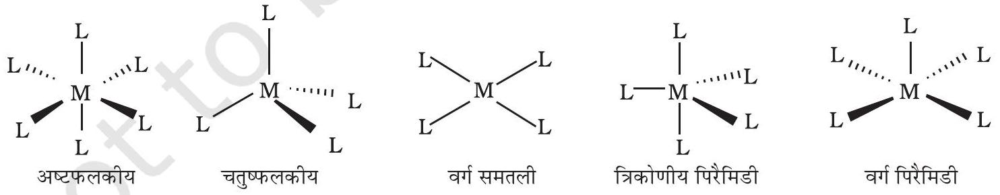
चित्र 5.1- विभिन्न समन्वय बहुफलकों की आकृतियाँ- $M$ केंद्रीय परमाणु/आयन को तथा $L$ एकदंतु लिगन्ड को प्रदर्शित करता है।

## ( ज ) केंद्रीय परमाणु की ऑक्सीकरण संख्या

एक संकुल में केंद्रीय परमाणु से जुड़े सभी लिगन्डों को यदि उनके साझे के इलेक्ट्रॉन युगलों सहित हटा लिया जाए तो केंद्रीय परमाणु पर उपस्थित आवेश को उसकी ऑक्सीकरण संख्या कहते हैं। ऑक्सीकरण संख्या को उपसहसंयोजन सत्ता के नाम में केंद्रीय परमाणु के संकेत

## $5.3$ उपसहसंयोजन यौगिकों का नामकरण

5.3.1 एककेंद्रकीय उपसहसंयोजन यौगिकों के सूत्र

नोट- सन् $2004$ में IUPAC ने अनुशंसा की है कि लिगन्डों को वर्णमाला के आधार पर चुनना चाहिए, आवेश के आधार पर नहीं।
5.3.2 एककेंद्रकीय उपसहसंयोजन यौगिकों का नामकरण

के साथ कोष्ठक में रोमन अंक से दर्शाया जाता है। उदाहरणार्थ, $\left[\mathrm{Cu}(\mathrm{CN})_{4}\right]^{3-}$ में कॉपर का ऑक्सीकरण अंक $+1$ है तथा इसे $\mathrm{Cu}(\mathrm{I})$ लिखा जाता है।
( झ ) होमोलेप्टिक तथा हेट्रोलेप्टिक संकुल ( Homoleptic and Heteroleptic Complexes)
संकुल जिनमें धातु परमाणु केवल एक प्रकार के दाता समूह से जुड़ा रहता है, उदाहरणार्थ $\left[\mathrm{Co}\left(\mathrm{NH}_{3}\right)_{6}\right]^{3+}$, होमोलेप्टिक संकुल कहलाते हैं। संकुल जिनमें धातु परमाणु एक से अधिक प्रकार के दाता सूमहों से जुड़ा रहता है, उदाहरणार्थ $\left[\mathrm{Co}\left(\mathrm{NH}_{3}\right)_{4} \mathrm{Cl}_{2}\right]^{+}$, हेट्रोलेप्टिक संकुल कहलाते हैं।

उपसहसंयोजन रसायन में, विशेषतः समावयवों पर विचार करते समय सूत्रों व नामों को असंदिग्ध तथा सुस्पष्ट तरीके से लिखने के लिए नामकरण का बहुत महत्व है। उपसहसंयोजन सत्ता के सूत्र तथा जो नाम अपनाए गए हैं वे इंटरनेशनल यूनियन ऑफ प्योर एंड ऐप्लाइड कैमिस्ट्री (IUPAC) की अनुशंसाओं पर आधारित हैं।

यौगिक का सूत्र उसके संघटन से संबंधित आधारभूत सूचना को संक्षिप्त तथा सुगम रूप से प्रकट करने का एक तरीका है। एककेंद्रकीय उपसहसंयोजन सत्ता में एक केंद्रीय धातु परमाणु होता है। सूत्र लिखते समय निम्नलिखित नियम प्रयुक्त होते हैं-

(i) सर्वप्रथम केंद्रीय परमाणु लिखा जाता है।
(ii) तत्पश्चात लिगन्डों को अंग्रेज़ी वर्णमाला के क्रम में लिखा जाता है। लिगन्ड की स्थिति उसके आवेश पर निर्भर नहीं करती।
(iii) बहुदंतुर लिगन्ड भी अंग्रेज़ी वर्णमाला के क्रम में लिखे जाते हैं। संकेताक्षर में लिखे हुए लिगन्ड के प्रथम अक्षर को ध्यान में रखकर वर्णमाला के क्रम में उसकी स्थिति निर्धारित की जाती है।
(iv) संपूर्ण उपसहसंयोजन सत्ता, आवेशित हो अथवा न हो, उसके सूत्र को एक गुरूकोष्ठक में लिखा जाता है। यदि लिगन्ड बहुपरमाणुक हों तो, उनके सूत्रों को कोष्ठक में लिखते हैं। संकेताक्षर में लिखे लिगन्ड को भी कोष्ठक में लिखते हैं।
(v) समन्वय मंडल धातु तथा लिगन्डों के सूत्रों के मध्य स्थान नहीं छोड़ा जाता।
(vi) जब आवेशयुक्त उपसहसंयोजन सत्ता का सूत्र बिना किसी प्रतिआयन के लिखते हैं तो उपसहसंयोजन सत्ता का आवेश गुरू कोष्ठक के बाहर दाईं ओर मूर्धांक (superscript) के रूप में लिखा जाता है जिसमें पहले आवेश की संख्या और फिर आवेश का चिह्न लिखते हैं। उदाहरणार्थ, $\left[\mathrm{Co}(\mathrm{CN})_{6}\right]^{3-},\left[\mathrm{Cr}\left(\mathrm{H}_{2} \mathrm{O}\right)_{6}\right]^{3+}$, आदि।
(vii) धनायन के आवेश को ऋणायन के आवेश से संतुलित किया जाता है।

उपसहसंयोजन यौगिकों के नाम योगात्मक नामकरण के सिद्धांत के आधार पर लिखे जाते हैं। इस प्रकार धातु के चारों ओर जुड़े समूहों को पहचानकर उनके नाम उपयुक्त गुणक सहित धातु के नाम से पूर्व सूचीबद्ध किए जाते हैं। उपसहसंयोजन यौगिकों के नामकरण में निम्नलिखित नियम प्रयुक्त होते हैं-

(i) धनायन अथवा ऋणायन दोनों में से कोई भी आवेशयुक्त उपसहसंयोजन सत्ता में सर्वप्रथम धनायन का नाम लिखा जाता है।

(ii) केंद्रीय परमाणु/ आयन के नाम से पूर्व लिगन्डों के नाम वर्णमाला के क्रम में लिखे जाते हैं। (यह प्रक्रिया सूत्र लिखने के विपरीत है।)
(iii) ऋणावेशित लिगन्डों के नाम के अंत में - o आता है, उदासीन तथा धनावेशित लिगन्डों के नाम नहीं बदलते। कुछ अपवाद हैं, जैसे $\mathrm{H}_{2} \mathrm{O}$ के लिए एक्वा $\mathrm{NH}_{3}$ के लिए ऐम्मीन, CO के लिए कार्बोनिल तथा NO के लिए नाइट्रोसिल। जब इन्हें उपसहसंयोजन सत्ता के सूत्र में लिखना होता है तो इनको कोष्ठक () में लिखा जाता है।
(iv) यदि उपसहसंयोजन सत्ता में एक ही प्रकार के लिगन्ड संख्या में एक से अधिक हों तो उनकी संख्या दर्शाने के लिए उनके नाम से पूर्व डाइ, ट्राइ आदि शब्द (पद) प्रयुक्त किए जाते हैं। जब लिगन्ड के नाम में आंकिक पूर्व लग्न हो तब बिस, ट्रिस, टेट्राकिस आदि शब्द (पद) प्रयुक्त होते हैं तथा ऐसे लिगन्ड कोष्ठक में लिखे जाते हैं। उदाहरणार्थ, $\left[\mathrm{NiCl}_{2}\left(\mathrm{PPh}_{3}\right)_{2}\right]$ का नाम होगा-

डाइक्लोरिडोबिस(ट्राइफ़ेनिलफॉस्फीन)निकैल (II)

(v) धनावेशित, ऋणावेशित तथा उदासीन उपसहसंयोजन सत्ता में धातु की ऑक्सीकरण अवस्था को रोमन अंकों में कोष्ठक में दर्शाते हैं।

नोट- यहाँ यह ध्यान देने योग्य है कि सन् $2004$ में IUPAC द्वारा की गई अनुशंसा के अनुसार ऋणावेशित लिगन्डों के नाम के अंत में -इडो (- ido) जुड़ता है, अतः क्लोरो को क्लोरिडो लिखते हैं।

(vi) यदि संकुल आयन एक धनायन हो तो धातु का नाम वही लिखते हैं जो तत्व का नाम होता है। उदाहरणार्थ, धनावेशित संकुल आयन में Co को कोबाल्ट तथा Pt को प्लैटिनम कहते हैं। यदि संकुल आयन एक ॠणायन हो तो धातु के नाम के अन्त में अनुलग्न - ऐट (ate) लगाया जाता है। उदाहरणार्थ, संकुल ऋणायन $\left[\mathrm{Co}(\mathrm{SCN})_{4}\right]^{2-}$ में Co को कोबाल्टेट कहते हैं। कुछ धातुओं के लिए उनके संकुल ऋणायनों के नाम में धातु के लेटिन नाम प्रयुक्त होते हैं, उदाहरणार्थ, Fe के लिए फेरेट।
(vii) उदासीन संकुल का नाम भी संकुल धनायन की भांति ही लिखा जाता है।
निम्नलिखित उदाहरण उपसहसंयोजन यौगिकों की नामकरण प्रणाली स्पष्ट करते हैं-
1. $\left[\mathrm{Cr}\left(\mathrm{NH}_{3}\right)_{3}\left(\mathrm{H}_{2} \mathrm{O}\right)_{3}\right] \mathrm{Cl}_{3}$ का नाम निम्नलिखित होगा-
ट्राइऐम्मीनट्राइएक्वाक्रोमियम (III) क्लोराइड
स्पष्टीकरण- संकुल आयन गुरू कोष्ठक में है, जो एक धनायन है। अंग्रेज़ी वर्ण माला के क्रमानुसार ऐम्मीन लिगन्ड एक्वा लिगन्ड से पूर्व लिखे जाते हैं। चूँकि इसमें तीन क्लोराइड आयन हैं इसलिए संकुल आयन पर +3 आवेश होना चाहिए। (चूँकि यौगिक आवेश की दृष्टि से उदासीन है) संकुल आयन पर विद्यमान आवेश तथा लिगन्डों पर उपस्थित आवेश के आधार पर धातु की ऑक्सीकरण संख्या की गणना की जा सकती है। इस उदाहरण में सभी लिगन्ड उदासीन अणु हैं। अतः क्रोमियम का ऑक्सीकरण अंक वही होगा जो संकुल आयन पर उपस्थित आवेश है, यहाँ यह $+3$ है।
2. $\left[\mathrm{Co}\left(\mathrm{H}_{2} \mathrm{NCH}_{2} \mathrm{CH}_{2} \mathrm{NH}_{2}\right)_{3}\right]_{2}\left(\mathrm{SO}_{4}\right)_{3}$ का नाम निम्नलिखित होगा-ट्रिस(एथेन-1, 2-डाइऐमीन)कोबाल्ट (III) सल्फेट
स्पष्टीकरण- इस अणु में सल्फेट प्रतिआयन है, क्योंकि यहाँ तीन सल्फेट आयन दो जटिल आयनों से आबंधित हैं, अतः प्रत्येक संकुल धनायन पर $+3$ आवेश होगा। इसके अतिरिक्त एथेन-1,2-डाइऐमीन एक उदासीन अणु है, अतः संकुल आयन में कोबाल्ट

की ऑक्सीकरण संख्या $+3$ ही होनी चाहिए। यह स्मरण रहे कि एक आयनिक यौगिक के नाम में कभी भी धनायनों और ऋणायनों की संख्या नहीं दर्शायी जाती।

3. $\left[\mathrm{Ag}\left(\mathrm{NH}_{3}\right)_{2}\right]\left[\mathrm{Ag}(\mathrm{CN})_{2}\right]$ का नाम निम्नलिखित होगा- डाइऐम्मीनसिल्वर (I)डाइसायनिडोअर्जेन्टेट(I)

उदाहरण $5.2$ निम्नलिखित उपसहसंयोजन यौगिकों के सूत्र लिखिए-

(i) टेट्राऐम्मीनएक्वाक्लोरिडोकोबाल्ट(III)क्लोराइड
(ii) पोटैशियम टेट्राहाइड्रॉक्सिडोजिंकेट(II)
(iii) पोटैशियम ट्राइऑक्सैलेटोऐलुमिनेट(III)
(iv) डाइक्लोरिडोबिस(एथेन-1, 2-डाइऐमीन)कोबाल्ट(III)
(v) टेट्राकार्बोनिलनिकल( O )

हल
(i) $\left[\mathrm{Co}\left(\mathrm{NH}_{3}\right)_{4}\left(\mathrm{H}_{2} \mathrm{O}\right) \mathrm{Cl}\right] \mathrm{Cl}_{2}$
(ii) $\mathrm{K}_{2}\left[\mathrm{Zn}(\mathrm{OH})_{4}\right]$
(iii) $\mathrm{K}_{3}\left[\mathrm{Al}\left(\mathrm{C}_{2} \mathrm{O}_{4}\right)_{3}\right]$
(iv) $\left[\mathrm{CoCl}_{2}(\mathrm{en})_{2}\right]^{+}$
(v) $\left[\mathrm{Ni}(\mathrm{CO})_{4}\right]$

उदाहरण $5.3$ निम्नलिखित उपसहसंयोजन यौगिकों के IUPAC नाम लिखिए-
(i) $\left[\mathrm{Pt}\left(\mathrm{NH}_{3}\right)_{2} \mathrm{Cl}\left(\mathrm{NO}_{2}\right)\right]$
(ii) $\mathrm{K}_{3}\left[\mathrm{Cr}\left(\mathrm{C}_{2} \mathrm{O}_{4}\right)_{3}\right]$
(iii) $\left[\mathrm{CoCl}_{2}(\text { en })_{2}\right] \mathrm{Cl}$
(iv) $\left[\mathrm{Co}\left(\mathrm{NH}_{3}\right)_{5}\left(\mathrm{CO}_{3}\right)\right] \mathrm{Cl}$
(v) $\mathrm{Hg}\left[\mathrm{Co}(\mathrm{SCN})_{4}\right]$

हल (i) डाइऐम्मीनक्लोरिडोनाइट्रिटो-N-प्लैटिनम (II)

(ii) पोटैशियम ट्राइऑक्सैलेटोक्रोमेट (III)
(iii) डाइक्लोरिडोबिस(एथेन-1, 2-डाइऐमीन)कोबाल्ट (III)क्लोराइड
(iv) पेन्टाऐम्मीनकार्बोनेटोकोबाल्ट (III) क्लोराइड
(v) मर्क्यूरी (I) टेट्राथायोसायनेटो-S-कोबाल्टेट (III)

## पाठ्यनिहित प्रश्न

$5.1$ निम्नलिखित उपसहसंयोजन यौगिकों के सूत्र लिखिए-

(i) टेट्राऐम्मीनडाइएक्वाकोबाल्ट (III) क्लोराइड
(ii) पोटैशियम टेट्रासायनिडोनिकैलेट (II)
(iii) ट्रिस(एथेन-1, 2-डाइऐमीन)क्रोमियम (III) क्लोराइड
(iv) ऐम्मीनब्रोमिडोक्लोरिडोनाइट्रिटो-N-प्लैटिनेट (II)
(v) डाइक्लोरोबिस(एथेन-1, 2-डाइऐमीन) ${ }^{प ् ल ै ट ि न म}$ (IV) नाइट्रेट
(vi) आयरन (III) हेक्सासायनिडोफेरेट(II)

$5.2$ निम्नलिखित उपसहसंयोजन यौगिकों के IUPAC नाम लिखिए-
(i) $\left[\mathrm{Co}\left(\mathrm{NH}_{3}\right)_{6}\right] \mathrm{Cl}_{3}$
(ii) $\left[\mathrm{Co}\left(\mathrm{NH}_{3}\right)_{5} \mathrm{Cl}\right] \mathrm{Cl}_{2}$
(iii) $\mathrm{K}_{3}\left[\mathrm{Fe}(\mathrm{CN})_{6}\right]$
(iv) $\mathrm{K}_{3}\left[\mathrm{Fe}\left(\mathrm{C}_{2} \mathrm{O}_{4}\right)_{3}\right]$
(v) $\mathrm{K}_{2}\left[\mathrm{PdCl}_{4}\right]$
(vi) $\left[\mathrm{Pt}\left(\mathrm{NH}_{3}\right)_{2} \mathrm{Cl}\left(\mathrm{NH}_{2} \mathrm{CH}_{3}\right)\right] \mathrm{Cl}$

## $5.4$ उपसहसंयोजन यौगिकरें में

समावयवता

### 5.4.1 ज्यामितीय समावयवता

<img class="imgSvg" id = "mu524lvwgpnhw8b21pk" src="data:image/svg+xml;base64,PHN2ZyBpZD0ic21pbGVzLW11NTI0bHZ3Z3BuaHc4YjIxcGsiIHhtbG5zPSJodHRwOi8vd3d3LnczLm9yZy8yMDAwL3N2ZyIgdmlld0JveD0iMCAwIDE0NyAxMDQuOTk5OTk5OTk5OTkzNjUiIHN0eWxlPSJ3aWR0aDogMTQ2Ljk5OTk5OTk5OTk5MzYzcHg7IGhlaWdodDogMTA0Ljk5OTk5OTk5OTk5MzY1cHg7IG92ZXJmbG93OiB2aXNpYmxlOyI+PGRlZnM+PGxpbmVhckdyYWRpZW50IGlkPSJsaW5lLW11NTI0bHZ3Z3BuaHc4YjIxcGstMSIgZ3JhZGllbnRVbml0cz0idXNlclNwYWNlT25Vc2UiIHgxPSI3My40OTk5OTk5OTk5OTY4MyIgeTE9IjUyLjQ5OTk5OTk5OTk5NjgzIiB4Mj0iMTA0Ljk5OTk5OTk5OTk5MzY2IiB5Mj0iNTIuNTAwMDE0MTM3MzA0MDEiPjxzdG9wIHN0b3AtY29sb3I9ImN1cnJlbnRDb2xvciIgb2Zmc2V0PSIyMCUiPjwvc3RvcD48c3RvcCBzdG9wLWNvbG9yPSJjdXJyZW50Q29sb3IiIG9mZnNldD0iMTAwJSI+PC9zdG9wPjwvbGluZWFyR3JhZGllbnQ+PGxpbmVhckdyYWRpZW50IGlkPSJsaW5lLW11NTI0bHZ3Z3BuaHc4YjIxcGstMyIgZ3JhZGllbnRVbml0cz0idXNlclNwYWNlT25Vc2UiIHgxPSI0MiIgeTE9IjUyLjQ5OTk4NTg2MjY4OTY0IiB4Mj0iNzMuNDk5OTk5OTk5OTk2ODMiIHkyPSI1Mi40OTk5OTk5OTk5OTY4MyI+PHN0b3Agc3RvcC1jb2xvcj0iY3VycmVudENvbG9yIiBvZmZzZXQ9IjIwJSI+PC9zdG9wPjxzdG9wIHN0b3AtY29sb3I9ImN1cnJlbnRDb2xvciIgb2Zmc2V0PSIxMDAlIj48L3N0b3A+PC9saW5lYXJHcmFkaWVudD48bGluZWFyR3JhZGllbnQgaWQ9ImxpbmUtbXU1MjRsdndncG5odzhiMjFway01IiBncmFkaWVudFVuaXRzPSJ1c2VyU3BhY2VPblVzZSIgeDE9IjczLjQ5OTk5OTk5OTk5NjgzIiB5MT0iNTIuNDk5OTk5OTk5OTk2ODMiIHgyPSI3My41MDAwMTQxMzczMDQiIHkyPSIyMSI+PHN0b3Agc3RvcC1jb2xvcj0iY3VycmVudENvbG9yIiBvZmZzZXQ9IjIwJSI+PC9zdG9wPjxzdG9wIHN0b3AtY29sb3I9ImN1cnJlbnRDb2xvciIgb2Zmc2V0PSIxMDAlIj48L3N0b3A+PC9saW5lYXJHcmFkaWVudD48bGluZWFyR3JhZGllbnQgaWQ9ImxpbmUtbXU1MjRsdndncG5odzhiMjFway03IiBncmFkaWVudFVuaXRzPSJ1c2VyU3BhY2VPblVzZSIgeDE9IjczLjQ5OTk4NTg2MjY4OTY0IiB5MT0iODMuOTk5OTk5OTk5OTkzNjUiIHgyPSI3My40OTk5OTk5OTk5OTY4MyIgeTI9IjUyLjQ5OTk5OTk5OTk5NjgzIj48c3RvcCBzdG9wLWNvbG9yPSJjdXJyZW50Q29sb3IiIG9mZnNldD0iMjAlIj48L3N0b3A+PHN0b3Agc3RvcC1jb2xvcj0iY3VycmVudENvbG9yIiBvZmZzZXQ9IjEwMCUiPjwvc3RvcD48L2xpbmVhckdyYWRpZW50PjwvZGVmcz48bWFzayBpZD0idGV4dC1tYXNrLW11NTI0bHZ3Z3BuaHc4YjIxcGsiPjxyZWN0IHg9IjAiIHk9IjAiIHdpZHRoPSIxMDAlIiBoZWlnaHQ9IjEwMCUiIGZpbGw9IndoaXRlIj48L3JlY3Q+PGNpcmNsZSBjeD0iMTA0Ljk5OTk5OTk5OTk5MzY2IiBjeT0iNTIuNTAwMDE0MTM3MzA0MDEiIHI9IjcuODc1IiBmaWxsPSJibGFjayI+PC9jaXJjbGU+PGNpcmNsZSBjeD0iNzMuNDk5OTk5OTk5OTk2ODMiIGN5PSI1Mi40OTk5OTk5OTk5OTY4MyIgcj0iNy44NzUiIGZpbGw9ImJsYWNrIj48L2NpcmNsZT48Y2lyY2xlIGN4PSI0MiIgY3k9IjUyLjQ5OTk4NTg2MjY4OTY0IiByPSI3Ljg3NSIgZmlsbD0iYmxhY2siPjwvY2lyY2xlPjxjaXJjbGUgY3g9IjczLjUwMDAxNDEzNzMwNCIgY3k9IjIxIiByPSI3Ljg3NSIgZmlsbD0iYmxhY2siPjwvY2lyY2xlPjxjaXJjbGUgY3g9IjczLjQ5OTk4NTg2MjY4OTY0IiBjeT0iODMuOTk5OTk5OTk5OTkzNjUiIHI9IjcuODc1IiBmaWxsPSJibGFjayI+PC9jaXJjbGU+PC9tYXNrPjxzdHlsZT4KICAgICAgICAgICAgICAgIC5lbGVtZW50LW11NTI0bHZ3Z3BuaHc4YjIxcGsgewogICAgICAgICAgICAgICAgICAgIGZvbnQ6IDE0cHggSGVsdmV0aWNhLCBBcmlhbCwgc2Fucy1zZXJpZjsKICAgICAgICAgICAgICAgICAgICBhbGlnbm1lbnQtYmFzZWxpbmU6ICdtaWRkbGUnOwogICAgICAgICAgICAgICAgfQogICAgICAgICAgICAgICAgLnN1Yi1tdTUyNGx2d2dwbmh3OGIyMXBrIHsKICAgICAgICAgICAgICAgICAgICBmb250OiA4LjRweCBIZWx2ZXRpY2EsIEFyaWFsLCBzYW5zLXNlcmlmOwogICAgICAgICAgICAgICAgfQogICAgICAgICAgICA8L3N0eWxlPjxnIG1hc2s9InVybCgjdGV4dC1tYXNrLW11NTI0bHZ3Z3BuaHc4YjIxcGspIj48bGluZSB4MT0iNzMuNDk5OTk5OTk5OTk2ODMiIHkxPSI1Mi40OTk5OTk5OTk5OTY4MyIgeDI9IjEwNC45OTk5OTk5OTk5OTM2NiIgeTI9IjUyLjUwMDAxNDEzNzMwNDAxIiBzdHlsZT0ic3Ryb2tlLWxpbmVjYXA6cm91bmQ7c3Ryb2tlLWRhc2hhcnJheTpub25lO3N0cm9rZS13aWR0aDoxLjI2IiBzdHJva2U9InVybCgnI2xpbmUtbXU1MjRsdndncG5odzhiMjFway0xJykiPjwvbGluZT48bGluZSB4MT0iNDIiIHkxPSI1Mi40OTk5ODU4NjI2ODk2NCIgeDI9IjczLjQ5OTk5OTk5OTk5NjgzIiB5Mj0iNTIuNDk5OTk5OTk5OTk2ODMiIHN0eWxlPSJzdHJva2UtbGluZWNhcDpyb3VuZDtzdHJva2UtZGFzaGFycmF5Om5vbmU7c3Ryb2tlLXdpZHRoOjEuMjYiIHN0cm9rZT0idXJsKCcjbGluZS1tdTUyNGx2d2dwbmh3OGIyMXBrLTMnKSI+PC9saW5lPjxsaW5lIHgxPSI3My40OTk5OTk5OTk5OTY4MyIgeTE9IjUyLjQ5OTk5OTk5OTk5NjgzIiB4Mj0iNzMuNTAwMDE0MTM3MzA0IiB5Mj0iMjEiIHN0eWxlPSJzdHJva2UtbGluZWNhcDpyb3VuZDtzdHJva2UtZGFzaGFycmF5Om5vbmU7c3Ryb2tlLXdpZHRoOjEuMjYiIHN0cm9rZT0idXJsKCcjbGluZS1tdTUyNGx2d2dwbmh3OGIyMXBrLTUnKSI+PC9saW5lPjxsaW5lIHgxPSI3My40OTk5ODU4NjI2ODk2NCIgeTE9IjgzLjk5OTk5OTk5OTk5MzY1IiB4Mj0iNzMuNDk5OTk5OTk5OTk2ODMiIHkyPSI1Mi40OTk5OTk5OTk5OTY4MyIgc3R5bGU9InN0cm9rZS1saW5lY2FwOnJvdW5kO3N0cm9rZS1kYXNoYXJyYXk6bm9uZTtzdHJva2Utd2lkdGg6MS4yNiIgc3Ryb2tlPSJ1cmwoJyNsaW5lLW11NTI0bHZ3Z3BuaHc4YjIxcGstNycpIj48L2xpbmU+PC9nPjxnPjx0ZXh0IHg9IjEwMS4wNjI0OTk5OTk5OTM2NiIgeT0iNTcuNzUwMDE0MTM3MzA0MDEiIGNsYXNzPSJlbGVtZW50LW11NTI0bHZ3Z3BuaHc4YjIxcGsiIGZpbGw9ImN1cnJlbnRDb2xvciIgc3R5bGU9InRleHQtYW5jaG9yOiBzdGFydDsgd3JpdGluZy1tb2RlOiBob3Jpem9udGFsLXRiOyB0ZXh0LW9yaWVudGF0aW9uOiBtaXhlZDsgbGV0dGVyLXNwYWNpbmc6IG5vcm1hbDsgZGlyZWN0aW9uOiBsdHI7Ij48dHNwYW4+TjwvdHNwYW4+PHRzcGFuIHN0eWxlPSJ1bmljb2RlLWJpZGk6IHBsYWludGV4dDsiPkg8dHNwYW4gYmFzZWxpbmUtc2hpZnQ9InN1YiIgY2xhc3M9InN1Yi1tdTUyNGx2d2dwbmh3OGIyMXBrIj4yPC90c3Bhbj48L3RzcGFuPjwvdGV4dD48dGV4dCB4PSIxMDQuOTk5OTk5OTk5OTkzNjYiIHk9IjUyLjUwMDAxNDEzNzMwNDAxIiBjbGFzcz0iZGVidWciIGZpbGw9IiNmZjAwMDAiIHN0eWxlPSIKICAgICAgICAgICAgICAgIGZvbnQ6IDVweCBEcm9pZCBTYW5zLCBzYW5zLXNlcmlmOwogICAgICAgICAgICAiPjwvdGV4dD48dGV4dCB4PSI3My40OTk5OTk5OTk5OTY4MyIgeT0iNDQuNjI0OTk5OTk5OTk2ODMiIGNsYXNzPSJlbGVtZW50LW11NTI0bHZ3Z3BuaHc4YjIxcGsiIGZpbGw9ImN1cnJlbnRDb2xvciIgc3R5bGU9InRleHQtYW5jaG9yOiBzdGFydDsgZ2x5cGgtb3JpZW50YXRpb24tdmVydGljYWw6IDA7IHdyaXRpbmctbW9kZTogdmVydGljYWwtcmw7IHRleHQtb3JpZW50YXRpb246IHVwcmlnaHQ7IGxldHRlci1zcGFjaW5nOiAtMXB4OyBkaXJlY3Rpb246IGx0cjsiPjx0c3Bhbj5QPC90c3Bhbj48L3RleHQ+PHRleHQgeD0iNzMuNDk5OTk5OTk5OTk2ODMiIHk9IjUyLjQ5OTk5OTk5OTk5NjgzIiBjbGFzcz0iZGVidWciIGZpbGw9IiNmZjAwMDAiIHN0eWxlPSIKICAgICAgICAgICAgICAgIGZvbnQ6IDVweCBEcm9pZCBTYW5zLCBzYW5zLXNlcmlmOwogICAgICAgICAgICAiPjwvdGV4dD48dGV4dCB4PSI0Ny4yNSIgeT0iNTcuNzQ5OTg1ODYyNjg5NjQiIGNsYXNzPSJlbGVtZW50LW11NTI0bHZ3Z3BuaHc4YjIxcGsiIGZpbGw9ImN1cnJlbnRDb2xvciIgc3R5bGU9InRleHQtYW5jaG9yOiBzdGFydDsgd3JpdGluZy1tb2RlOiBob3Jpem9udGFsLXRiOyB0ZXh0LW9yaWVudGF0aW9uOiBtaXhlZDsgbGV0dGVyLXNwYWNpbmc6IG5vcm1hbDsgZGlyZWN0aW9uOiBydGw7IHVuaWNvZGUtYmlkaTogYmlkaS1vdmVycmlkZTsiPjx0c3Bhbj5OPC90c3Bhbj48dHNwYW4gc3R5bGU9InVuaWNvZGUtYmlkaTogcGxhaW50ZXh0OyI+SDx0c3BhbiBiYXNlbGluZS1zaGlmdD0ic3ViIiBjbGFzcz0ic3ViLW11NTI0bHZ3Z3BuaHc4YjIxcGsiPjI8L3RzcGFuPjwvdHNwYW4+PC90ZXh0Pjx0ZXh0IHg9IjQyIiB5PSI1Mi40OTk5ODU4NjI2ODk2NCIgY2xhc3M9ImRlYnVnIiBmaWxsPSIjZmYwMDAwIiBzdHlsZT0iCiAgICAgICAgICAgICAgICBmb250OiA1cHggRHJvaWQgU2Fucywgc2Fucy1zZXJpZjsKICAgICAgICAgICAgIj48L3RleHQ+PHRleHQgeD0iNjguMjUwMDE0MTM3MzA0IiB5PSIyNi4yNSIgY2xhc3M9ImVsZW1lbnQtbXU1MjRsdndncG5odzhiMjFwayIgZmlsbD0iY3VycmVudENvbG9yIiBzdHlsZT0idGV4dC1hbmNob3I6IHN0YXJ0OyB3cml0aW5nLW1vZGU6IGhvcml6b250YWwtdGI7IHRleHQtb3JpZW50YXRpb246IG1peGVkOyBsZXR0ZXItc3BhY2luZzogbm9ybWFsOyBkaXJlY3Rpb246IGx0cjsiPjx0c3BhbiBzdHlsZT0iCiAgICAgICAgICAgICAgICB1bmljb2RlLWJpZGk6IHBsYWludGV4dDsKICAgICAgICAgICAgICAgIHdyaXRpbmctbW9kZTogbHItdGI7CiAgICAgICAgICAgICAgICBsZXR0ZXItc3BhY2luZzogbm9ybWFsOwogICAgICAgICAgICAgICAgdGV4dC1hbmNob3I6IG1pZGRsZTsKICAgICAgICAgICAgIj5DbDwvdHNwYW4+PC90ZXh0Pjx0ZXh0IHg9IjczLjUwMDAxNDEzNzMwNCIgeT0iMjEiIGNsYXNzPSJkZWJ1ZyIgZmlsbD0iI2ZmMDAwMCIgc3R5bGU9IgogICAgICAgICAgICAgICAgZm9udDogNXB4IERyb2lkIFNhbnMsIHNhbnMtc2VyaWY7CiAgICAgICAgICAgICI+PC90ZXh0Pjx0ZXh0IHg9IjczLjQ5OTk4NTg2MjY4OTY0IiB5PSI4OS4yNDk5OTk5OTk5OTM2NSIgY2xhc3M9ImVsZW1lbnQtbXU1MjRsdndncG5odzhiMjFwayIgZmlsbD0iY3VycmVudENvbG9yIiBzdHlsZT0idGV4dC1hbmNob3I6IHN0YXJ0OyB3cml0aW5nLW1vZGU6IGhvcml6b250YWwtdGI7IHRleHQtb3JpZW50YXRpb246IG1peGVkOyBsZXR0ZXItc3BhY2luZzogbm9ybWFsOyBkaXJlY3Rpb246IGx0cjsiPjx0c3BhbiBzdHlsZT0iCiAgICAgICAgICAgICAgICB1bmljb2RlLWJpZGk6IHBsYWludGV4dDsKICAgICAgICAgICAgICAgIHdyaXRpbmctbW9kZTogbHItdGI7CiAgICAgICAgICAgICAgICBsZXR0ZXItc3BhY2luZzogbm9ybWFsOwogICAgICAgICAgICAgICAgdGV4dC1hbmNob3I6IG1pZGRsZTsKICAgICAgICAgICAgIj5DbDwvdHNwYW4+PC90ZXh0Pjx0ZXh0IHg9IjczLjQ5OTk4NTg2MjY4OTY0IiB5PSI4My45OTk5OTk5OTk5OTM2NSIgY2xhc3M9ImRlYnVnIiBmaWxsPSIjZmYwMDAwIiBzdHlsZT0iCiAgICAgICAgICAgICAgICBmb250OiA1cHggRHJvaWQgU2Fucywgc2Fucy1zZXJpZjsKICAgICAgICAgICAgIj48L3RleHQ+PC9nPjwvc3ZnPg=="/>

समपक्ष समावयव (cis)
<img class="imgSvg" id = "mu524lvxkgcwe55a1dr" src="data:image/svg+xml;base64,PHN2ZyBpZD0ic21pbGVzLW11NTI0bHZ4a2djd2U1NWExZHIiIHhtbG5zPSJodHRwOi8vd3d3LnczLm9yZy8yMDAwL3N2ZyIgdmlld0JveD0iMCAwIDE0NyAxMDQuOTk5OTk5OTk5OTkzNjUiIHN0eWxlPSJ3aWR0aDogMTQ2Ljk5OTk5OTk5OTk5MzYzcHg7IGhlaWdodDogMTA0Ljk5OTk5OTk5OTk5MzY1cHg7IG92ZXJmbG93OiB2aXNpYmxlOyI+PGRlZnM+PGxpbmVhckdyYWRpZW50IGlkPSJsaW5lLW11NTI0bHZ4a2djd2U1NWExZHItMSIgZ3JhZGllbnRVbml0cz0idXNlclNwYWNlT25Vc2UiIHgxPSI3My40OTk5OTk5OTk5OTY4MyIgeTE9IjUyLjQ5OTk5OTk5OTk5NjgzIiB4Mj0iMTA0Ljk5OTk5OTk5OTk5MzY2IiB5Mj0iNTIuNTAwMDE0MTM3MzA0MDEiPjxzdG9wIHN0b3AtY29sb3I9ImN1cnJlbnRDb2xvciIgb2Zmc2V0PSIyMCUiPjwvc3RvcD48c3RvcCBzdG9wLWNvbG9yPSJjdXJyZW50Q29sb3IiIG9mZnNldD0iMTAwJSI+PC9zdG9wPjwvbGluZWFyR3JhZGllbnQ+PGxpbmVhckdyYWRpZW50IGlkPSJsaW5lLW11NTI0bHZ4a2djd2U1NWExZHItMyIgZ3JhZGllbnRVbml0cz0idXNlclNwYWNlT25Vc2UiIHgxPSI0MiIgeTE9IjUyLjQ5OTk4NTg2MjY4OTY0IiB4Mj0iNzMuNDk5OTk5OTk5OTk2ODMiIHkyPSI1Mi40OTk5OTk5OTk5OTY4MyI+PHN0b3Agc3RvcC1jb2xvcj0iY3VycmVudENvbG9yIiBvZmZzZXQ9IjIwJSI+PC9zdG9wPjxzdG9wIHN0b3AtY29sb3I9ImN1cnJlbnRDb2xvciIgb2Zmc2V0PSIxMDAlIj48L3N0b3A+PC9saW5lYXJHcmFkaWVudD48bGluZWFyR3JhZGllbnQgaWQ9ImxpbmUtbXU1MjRsdnhrZ2N3ZTU1YTFkci01IiBncmFkaWVudFVuaXRzPSJ1c2VyU3BhY2VPblVzZSIgeDE9IjczLjQ5OTk5OTk5OTk5NjgzIiB5MT0iNTIuNDk5OTk5OTk5OTk2ODMiIHgyPSI3My41MDAwMTQxMzczMDQiIHkyPSIyMSI+PHN0b3Agc3RvcC1jb2xvcj0iY3VycmVudENvbG9yIiBvZmZzZXQ9IjIwJSI+PC9zdG9wPjxzdG9wIHN0b3AtY29sb3I9ImN1cnJlbnRDb2xvciIgb2Zmc2V0PSIxMDAlIj48L3N0b3A+PC9saW5lYXJHcmFkaWVudD48bGluZWFyR3JhZGllbnQgaWQ9ImxpbmUtbXU1MjRsdnhrZ2N3ZTU1YTFkci03IiBncmFkaWVudFVuaXRzPSJ1c2VyU3BhY2VPblVzZSIgeDE9IjczLjQ5OTk4NTg2MjY4OTY0IiB5MT0iODMuOTk5OTk5OTk5OTkzNjUiIHgyPSI3My40OTk5OTk5OTk5OTY4MyIgeTI9IjUyLjQ5OTk5OTk5OTk5NjgzIj48c3RvcCBzdG9wLWNvbG9yPSJjdXJyZW50Q29sb3IiIG9mZnNldD0iMjAlIj48L3N0b3A+PHN0b3Agc3RvcC1jb2xvcj0iY3VycmVudENvbG9yIiBvZmZzZXQ9IjEwMCUiPjwvc3RvcD48L2xpbmVhckdyYWRpZW50PjwvZGVmcz48bWFzayBpZD0idGV4dC1tYXNrLW11NTI0bHZ4a2djd2U1NWExZHIiPjxyZWN0IHg9IjAiIHk9IjAiIHdpZHRoPSIxMDAlIiBoZWlnaHQ9IjEwMCUiIGZpbGw9IndoaXRlIj48L3JlY3Q+PGNpcmNsZSBjeD0iMTA0Ljk5OTk5OTk5OTk5MzY2IiBjeT0iNTIuNTAwMDE0MTM3MzA0MDEiIHI9IjcuODc1IiBmaWxsPSJibGFjayI+PC9jaXJjbGU+PGNpcmNsZSBjeD0iNzMuNDk5OTk5OTk5OTk2ODMiIGN5PSI1Mi40OTk5OTk5OTk5OTY4MyIgcj0iNy44NzUiIGZpbGw9ImJsYWNrIj48L2NpcmNsZT48Y2lyY2xlIGN4PSI0MiIgY3k9IjUyLjQ5OTk4NTg2MjY4OTY0IiByPSI3Ljg3NSIgZmlsbD0iYmxhY2siPjwvY2lyY2xlPjxjaXJjbGUgY3g9IjczLjUwMDAxNDEzNzMwNCIgY3k9IjIxIiByPSI3Ljg3NSIgZmlsbD0iYmxhY2siPjwvY2lyY2xlPjxjaXJjbGUgY3g9IjczLjQ5OTk4NTg2MjY4OTY0IiBjeT0iODMuOTk5OTk5OTk5OTkzNjUiIHI9IjcuODc1IiBmaWxsPSJibGFjayI+PC9jaXJjbGU+PC9tYXNrPjxzdHlsZT4KICAgICAgICAgICAgICAgIC5lbGVtZW50LW11NTI0bHZ4a2djd2U1NWExZHIgewogICAgICAgICAgICAgICAgICAgIGZvbnQ6IDE0cHggSGVsdmV0aWNhLCBBcmlhbCwgc2Fucy1zZXJpZjsKICAgICAgICAgICAgICAgICAgICBhbGlnbm1lbnQtYmFzZWxpbmU6ICdtaWRkbGUnOwogICAgICAgICAgICAgICAgfQogICAgICAgICAgICAgICAgLnN1Yi1tdTUyNGx2eGtnY3dlNTVhMWRyIHsKICAgICAgICAgICAgICAgICAgICBmb250OiA4LjRweCBIZWx2ZXRpY2EsIEFyaWFsLCBzYW5zLXNlcmlmOwogICAgICAgICAgICAgICAgfQogICAgICAgICAgICA8L3N0eWxlPjxnIG1hc2s9InVybCgjdGV4dC1tYXNrLW11NTI0bHZ4a2djd2U1NWExZHIpIj48bGluZSB4MT0iNzMuNDk5OTk5OTk5OTk2ODMiIHkxPSI1Mi40OTk5OTk5OTk5OTY4MyIgeDI9IjEwNC45OTk5OTk5OTk5OTM2NiIgeTI9IjUyLjUwMDAxNDEzNzMwNDAxIiBzdHlsZT0ic3Ryb2tlLWxpbmVjYXA6cm91bmQ7c3Ryb2tlLWRhc2hhcnJheTpub25lO3N0cm9rZS13aWR0aDoxLjI2IiBzdHJva2U9InVybCgnI2xpbmUtbXU1MjRsdnhrZ2N3ZTU1YTFkci0xJykiPjwvbGluZT48bGluZSB4MT0iNDIiIHkxPSI1Mi40OTk5ODU4NjI2ODk2NCIgeDI9IjczLjQ5OTk5OTk5OTk5NjgzIiB5Mj0iNTIuNDk5OTk5OTk5OTk2ODMiIHN0eWxlPSJzdHJva2UtbGluZWNhcDpyb3VuZDtzdHJva2UtZGFzaGFycmF5Om5vbmU7c3Ryb2tlLXdpZHRoOjEuMjYiIHN0cm9rZT0idXJsKCcjbGluZS1tdTUyNGx2eGtnY3dlNTVhMWRyLTMnKSI+PC9saW5lPjxsaW5lIHgxPSI3My40OTk5OTk5OTk5OTY4MyIgeTE9IjUyLjQ5OTk5OTk5OTk5NjgzIiB4Mj0iNzMuNTAwMDE0MTM3MzA0IiB5Mj0iMjEiIHN0eWxlPSJzdHJva2UtbGluZWNhcDpyb3VuZDtzdHJva2UtZGFzaGFycmF5Om5vbmU7c3Ryb2tlLXdpZHRoOjEuMjYiIHN0cm9rZT0idXJsKCcjbGluZS1tdTUyNGx2eGtnY3dlNTVhMWRyLTUnKSI+PC9saW5lPjxsaW5lIHgxPSI3My40OTk5ODU4NjI2ODk2NCIgeTE9IjgzLjk5OTk5OTk5OTk5MzY1IiB4Mj0iNzMuNDk5OTk5OTk5OTk2ODMiIHkyPSI1Mi40OTk5OTk5OTk5OTY4MyIgc3R5bGU9InN0cm9rZS1saW5lY2FwOnJvdW5kO3N0cm9rZS1kYXNoYXJyYXk6bm9uZTtzdHJva2Utd2lkdGg6MS4yNiIgc3Ryb2tlPSJ1cmwoJyNsaW5lLW11NTI0bHZ4a2djd2U1NWExZHItNycpIj48L2xpbmU+PC9nPjxnPjx0ZXh0IHg9IjEwMS4wNjI0OTk5OTk5OTM2NiIgeT0iNTcuNzUwMDE0MTM3MzA0MDEiIGNsYXNzPSJlbGVtZW50LW11NTI0bHZ4a2djd2U1NWExZHIiIGZpbGw9ImN1cnJlbnRDb2xvciIgc3R5bGU9InRleHQtYW5jaG9yOiBzdGFydDsgd3JpdGluZy1tb2RlOiBob3Jpem9udGFsLXRiOyB0ZXh0LW9yaWVudGF0aW9uOiBtaXhlZDsgbGV0dGVyLXNwYWNpbmc6IG5vcm1hbDsgZGlyZWN0aW9uOiBsdHI7Ij48dHNwYW4+TjwvdHNwYW4+PHRzcGFuIHN0eWxlPSJ1bmljb2RlLWJpZGk6IHBsYWludGV4dDsiPkg8dHNwYW4gYmFzZWxpbmUtc2hpZnQ9InN1YiIgY2xhc3M9InN1Yi1tdTUyNGx2eGtnY3dlNTVhMWRyIj4yPC90c3Bhbj48L3RzcGFuPjwvdGV4dD48dGV4dCB4PSIxMDQuOTk5OTk5OTk5OTkzNjYiIHk9IjUyLjUwMDAxNDEzNzMwNDAxIiBjbGFzcz0iZGVidWciIGZpbGw9IiNmZjAwMDAiIHN0eWxlPSIKICAgICAgICAgICAgICAgIGZvbnQ6IDVweCBEcm9pZCBTYW5zLCBzYW5zLXNlcmlmOwogICAgICAgICAgICAiPjwvdGV4dD48dGV4dCB4PSI3My40OTk5OTk5OTk5OTY4MyIgeT0iNDQuNjI0OTk5OTk5OTk2ODMiIGNsYXNzPSJlbGVtZW50LW11NTI0bHZ4a2djd2U1NWExZHIiIGZpbGw9ImN1cnJlbnRDb2xvciIgc3R5bGU9InRleHQtYW5jaG9yOiBzdGFydDsgZ2x5cGgtb3JpZW50YXRpb24tdmVydGljYWw6IDA7IHdyaXRpbmctbW9kZTogdmVydGljYWwtcmw7IHRleHQtb3JpZW50YXRpb246IHVwcmlnaHQ7IGxldHRlci1zcGFjaW5nOiAtMXB4OyBkaXJlY3Rpb246IGx0cjsiPjx0c3Bhbj5QPC90c3Bhbj48dHNwYW4gc3R5bGU9InVuaWNvZGUtYmlkaTogcGxhaW50ZXh0OyI+SDwvdHNwYW4+PC90ZXh0Pjx0ZXh0IHg9IjczLjQ5OTk5OTk5OTk5NjgzIiB5PSI1Mi40OTk5OTk5OTk5OTY4MyIgY2xhc3M9ImRlYnVnIiBmaWxsPSIjZmYwMDAwIiBzdHlsZT0iCiAgICAgICAgICAgICAgICBmb250OiA1cHggRHJvaWQgU2Fucywgc2Fucy1zZXJpZjsKICAgICAgICAgICAgIj48L3RleHQ+PHRleHQgeD0iNDcuMjUiIHk9IjU3Ljc0OTk4NTg2MjY4OTY0IiBjbGFzcz0iZWxlbWVudC1tdTUyNGx2eGtnY3dlNTVhMWRyIiBmaWxsPSJjdXJyZW50Q29sb3IiIHN0eWxlPSJ0ZXh0LWFuY2hvcjogc3RhcnQ7IHdyaXRpbmctbW9kZTogaG9yaXpvbnRhbC10YjsgdGV4dC1vcmllbnRhdGlvbjogbWl4ZWQ7IGxldHRlci1zcGFjaW5nOiBub3JtYWw7IGRpcmVjdGlvbjogcnRsOyB1bmljb2RlLWJpZGk6IGJpZGktb3ZlcnJpZGU7Ij48dHNwYW4+TjwvdHNwYW4+PHRzcGFuIHN0eWxlPSJ1bmljb2RlLWJpZGk6IHBsYWludGV4dDsiPkg8dHNwYW4gYmFzZWxpbmUtc2hpZnQ9InN1YiIgY2xhc3M9InN1Yi1tdTUyNGx2eGtnY3dlNTVhMWRyIj4yPC90c3Bhbj48L3RzcGFuPjwvdGV4dD48dGV4dCB4PSI0MiIgeT0iNTIuNDk5OTg1ODYyNjg5NjQiIGNsYXNzPSJkZWJ1ZyIgZmlsbD0iI2ZmMDAwMCIgc3R5bGU9IgogICAgICAgICAgICAgICAgZm9udDogNXB4IERyb2lkIFNhbnMsIHNhbnMtc2VyaWY7CiAgICAgICAgICAgICI+PC90ZXh0Pjx0ZXh0IHg9IjY4LjI1MDAxNDEzNzMwNCIgeT0iMjYuMjUiIGNsYXNzPSJlbGVtZW50LW11NTI0bHZ4a2djd2U1NWExZHIiIGZpbGw9ImN1cnJlbnRDb2xvciIgc3R5bGU9InRleHQtYW5jaG9yOiBzdGFydDsgd3JpdGluZy1tb2RlOiBob3Jpem9udGFsLXRiOyB0ZXh0LW9yaWVudGF0aW9uOiBtaXhlZDsgbGV0dGVyLXNwYWNpbmc6IG5vcm1hbDsgZGlyZWN0aW9uOiBsdHI7Ij48dHNwYW4gc3R5bGU9IgogICAgICAgICAgICAgICAgdW5pY29kZS1iaWRpOiBwbGFpbnRleHQ7CiAgICAgICAgICAgICAgICB3cml0aW5nLW1vZGU6IGxyLXRiOwogICAgICAgICAgICAgICAgbGV0dGVyLXNwYWNpbmc6IG5vcm1hbDsKICAgICAgICAgICAgICAgIHRleHQtYW5jaG9yOiBtaWRkbGU7CiAgICAgICAgICAgICI+Q2w8L3RzcGFuPjwvdGV4dD48dGV4dCB4PSI3My41MDAwMTQxMzczMDQiIHk9IjIxIiBjbGFzcz0iZGVidWciIGZpbGw9IiNmZjAwMDAiIHN0eWxlPSIKICAgICAgICAgICAgICAgIGZvbnQ6IDVweCBEcm9pZCBTYW5zLCBzYW5zLXNlcmlmOwogICAgICAgICAgICAiPjwvdGV4dD48dGV4dCB4PSI3My40OTk5ODU4NjI2ODk2NCIgeT0iODkuMjQ5OTk5OTk5OTkzNjUiIGNsYXNzPSJlbGVtZW50LW11NTI0bHZ4a2djd2U1NWExZHIiIGZpbGw9ImN1cnJlbnRDb2xvciIgc3R5bGU9InRleHQtYW5jaG9yOiBzdGFydDsgd3JpdGluZy1tb2RlOiBob3Jpem9udGFsLXRiOyB0ZXh0LW9yaWVudGF0aW9uOiBtaXhlZDsgbGV0dGVyLXNwYWNpbmc6IG5vcm1hbDsgZGlyZWN0aW9uOiBsdHI7Ij48dHNwYW4gc3R5bGU9IgogICAgICAgICAgICAgICAgdW5pY29kZS1iaWRpOiBwbGFpbnRleHQ7CiAgICAgICAgICAgICAgICB3cml0aW5nLW1vZGU6IGxyLXRiOwogICAgICAgICAgICAgICAgbGV0dGVyLXNwYWNpbmc6IG5vcm1hbDsKICAgICAgICAgICAgICAgIHRleHQtYW5jaG9yOiBtaWRkbGU7CiAgICAgICAgICAgICI+Q2w8L3RzcGFuPjwvdGV4dD48dGV4dCB4PSI3My40OTk5ODU4NjI2ODk2NCIgeT0iODMuOTk5OTk5OTk5OTkzNjUiIGNsYXNzPSJkZWJ1ZyIgZmlsbD0iI2ZmMDAwMCIgc3R5bGU9IgogICAgICAgICAgICAgICAgZm9udDogNXB4IERyb2lkIFNhbnMsIHNhbnMtc2VyaWY7CiAgICAgICAgICAgICI+PC90ZXh0PjwvZz48L3N2Zz4="/>

विपक्ष समावयव (trans)

चित्र 5.2- $\left[\operatorname{Pt}\left(\mathrm{NH}_{3}\right)_{2} \mathrm{Cl}_{2}\right]$ के ज्यामितीय समावयव (समपक्ष एवं विपक्ष)

समावयवी ऐसे दो या इससे अधिक यौगिक होते हैं जिनके रासायनिक सूत्र समान होते हैं परंतु परमाणुओं की व्यवस्था भिन्न होती है। परमाणुओं की भिन्न व्यवस्थाओं के कारण इनके एक या अधिक भौतिक अथवा रासायनिक गुणों में भिन्नता होती है। उपसहसंयोजन यौगिकों में दो प्रमुख प्रकार की समावयवताएं ज्ञात हैं। इनमें से प्रत्येक को पुन: प्रविभाजित किया जा सकता है।

1. त्रिविम समावयवता
(क) ज्यामितीय समावयवता
(ख) ध्रुवण समावयवता
2. संरचनात्मक समावयवता
(क) बंधनी समावयवता
(ग) आयनन समावयवता
(ख) उपसहसंयोजन समावयवता
(घ) विलायकयोजन समावयवता

त्रिविमीय समावयवों के रासायनिक सूत्र व रासायनिक आबंध समान होते हैं परंतु उनकी दिक्-स्थान व्यवस्थाएं भिन्न होती हैं। संरचनात्मक समावयवों में आबंध भिन्न होते हैं। इन समावयवों का वर्णन विस्तार से नीचे किया जा रहा है।

इस प्रकार की समावयवता हेट्रोलेप्टिक संकुलों में पाई जाती है जिनमें लिगन्डों की भिन्न ज्यामितीय व्यवस्थाएं संभव हो सकती हैं। इस प्रकार के व्यवहार के प्रमुख उदाहरण $4$ व $6$ उपसहसंयोजन संख्या वाले संकुलों में पाए जाते हैं। $\left[\mathrm{MX}_{2} \mathrm{~L}_{2}\right]$ सूत्र ( X तथा L एकदंतुर लिगन्ड हैं) के वर्ग समतली संकुल में दो X लिगन्ड समपक्ष (cis) समावयव में पास-पास जुड़े रहते हैं अथवा विपक्ष (trans) समावयव में एक-दूसरे के विपरीत जैसा चित्र $5.2$ में दर्शाया गया है।

MABXL (जहाँ A, B, X, L एकदंतुर लिगन्ड हैं) सूत्र वाले दूसरी प्रकार के वर्ग समतलीय संकुल के तीन समावयव होंगे- दो समपक्ष तथा एक विपक्ष। आप इनकी संरचनाएं बनाने का प्रयास कर सकते हैं। इस प्रकार की समावयवता चतुष्फलकीय ज्यामिति में संभव नहीं है परंतु $\left[\mathrm{MX}_{2} \mathrm{~L}_{4}\right]$ सूत्र वाले अष्टफलकीय संकुलों में, जिनमें दो लिगन्ड X एक-दूसरे के समपक्ष या विपक्ष हों; ऐसा व्यवहार संभव है (चित्र 5.3)।

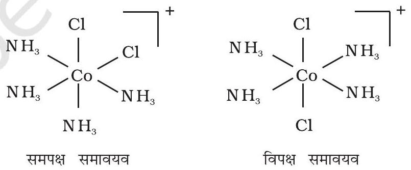
चित्र 5.3- $\left[\mathrm{Co}\left(\mathrm{NH}_{3}\right)_{4} \mathrm{Cl}_{2}\right]^{+}$के ज्यामितीय समावयव (समपक्ष एवं विपक्ष)

इस प्रकार की समावयवता उन संकुलों में भी पाई जाती है जिनका सूत्र $\left[\mathrm{MX}_{2}(\mathrm{~L}-\mathrm{L})_{2}\right]$ होता है तथा जिनमें द्विदंतुर लिगन्ड L-L होते हैं। उदाहरणार्थ, $\left[\mathrm{NH}_{2} \mathrm{CH}_{2} \mathrm{CH}_{2} \mathrm{NH}_{2}(\right.$ en $\left.)\right]$ में (चित्र 5.4)।
$\left[\mathrm{Ma}_{3} \mathrm{~b}_{3}\right]$ प्रकार के अष्टफलकीय उपसहसंयोजन सत्ता जैसे $\left[\mathrm{Co}\left(\mathrm{NH}_{3}\right)_{3}\left(\mathrm{NO}_{2}\right)_{3}\right]$ में एक अन्य प्रकार की ज्यामितीय समावयवता पाई जाती है। यदि एक ही लिगन्ड के तीन निकटवर्ती दाता परमाणु अष्टफलकीय फलक के कोनों पर स्थित हों तो फलकीय [facial, (fac)]

समावयवी प्राप्त होते हैं। यदि ये तीन दाता परमाणु अष्टफलक के ध्रुववृत्त पर स्थित हों तो रेखांशिक [meridional (mer)] समावयवी प्राप्त होते हैं। (चित्र 5.5)।

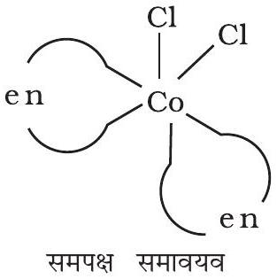
समपक्ष समावयव

<img class="imgSvg" id = "mu524lvyj84zlsmqnsj" src="data:image/svg+xml;base64,PHN2ZyBpZD0ic21pbGVzLW11NTI0bHZ5ajg0emxzbXFuc2oiIHhtbG5zPSJodHRwOi8vd3d3LnczLm9yZy8yMDAwL3N2ZyIgdmlld0JveD0iMCAwIDIyMiAxNDEuNzQwNzcxNTE3MTMwNjciIHN0eWxlPSJ3aWR0aDogMjIyLjE0OTc3MzY0NzM0MzM1cHg7IGhlaWdodDogMTQxLjc0MDc3MTUxNzEzMDY3cHg7IG92ZXJmbG93OiB2aXNpYmxlOyI+PGRlZnM+PGxpbmVhckdyYWRpZW50IGlkPSJsaW5lLW11NTI0bHZ5ajg0emxzbXFuc2otMSIgZ3JhZGllbnRVbml0cz0idXNlclNwYWNlT25Vc2UiIHgxPSI1Mi43NzM2NTIyODMwMjQ4NyIgeTE9IjEwMC4xODA2MjA2MzI2NzczOSIgeDI9IjgzLjc5NTA5NTI3NTQ0OTg0IiB5Mj0iOTQuNzEwNjk2MDc0OTA0NCI+PHN0b3Agc3RvcC1jb2xvcj0iY3VycmVudENvbG9yIiBvZmZzZXQ9IjIwJSI+PC9zdG9wPjxzdG9wIHN0b3AtY29sb3I9ImN1cnJlbnRDb2xvciIgb2Zmc2V0PSIxMDAlIj48L3N0b3A+PC9saW5lYXJHcmFkaWVudD48bGluZWFyR3JhZGllbnQgaWQ9ImxpbmUtbXU1MjRsdnlqODR6bHNtcW5zai0zIiBncmFkaWVudFVuaXRzPSJ1c2VyU3BhY2VPblVzZSIgeDE9IjgzLjc5NTA5NTI3NTQ0OTg0IiB5MT0iOTQuNzEwNjk2MDc0OTA0NCIgeDI9Ijk0LjU2ODcyMzE0Nzg0NjU1IiB5Mj0iNjUuMTEwMzc2MTAyNTI3MTQiPjxzdG9wIHN0b3AtY29sb3I9ImN1cnJlbnRDb2xvciIgb2Zmc2V0PSIyMCUiPjwvc3RvcD48c3RvcCBzdG9wLWNvbG9yPSJjdXJyZW50Q29sb3IiIG9mZnNldD0iMTAwJSI+PC9zdG9wPjwvbGluZWFyR3JhZGllbnQ+PGxpbmVhckdyYWRpZW50IGlkPSJsaW5lLW11NTI0bHZ5ajg0emxzbXFuc2otNSIgZ3JhZGllbnRVbml0cz0idXNlclNwYWNlT25Vc2UiIHgxPSI5NC41Njg3MjMxNDc4NDY1NSIgeTE9IjY1LjExMDM3NjEwMjUyNzE0IiB4Mj0iMTI1LjU5MDE2NjE0MDI3MTUiIHkyPSI1OS42NDA0NTE1NDQ3NTQxNCI+PHN0b3Agc3RvcC1jb2xvcj0iY3VycmVudENvbG9yIiBvZmZzZXQ9IjIwJSI+PC9zdG9wPjxzdG9wIHN0b3AtY29sb3I9ImN1cnJlbnRDb2xvciIgb2Zmc2V0PSIxMDAlIj48L3N0b3A+PC9saW5lYXJHcmFkaWVudD48bGluZWFyR3JhZGllbnQgaWQ9ImxpbmUtbXU1MjRsdnlqODR6bHNtcW5zai03IiBncmFkaWVudFVuaXRzPSJ1c2VyU3BhY2VPblVzZSIgeDE9IjExNC44MTY1MjQ5ODMxNTE2MiIgeTE9IjMwLjA0MDEzNjQwNzYyMDY5MyIgeDI9IjEyNS41OTAxNjYxNDAyNzE1IiB5Mj0iNTkuNjQwNDUxNTQ0NzU0MTQiPjxzdG9wIHN0b3AtY29sb3I9ImN1cnJlbnRDb2xvciIgb2Zmc2V0PSIyMCUiPjwvc3RvcD48c3RvcCBzdG9wLWNvbG9yPSJjdXJyZW50Q29sb3IiIG9mZnNldD0iMTAwJSI+PC9zdG9wPjwvbGluZWFyR3JhZGllbnQ+PGxpbmVhckdyYWRpZW50IGlkPSJsaW5lLW11NTI0bHZ5ajg0emxzbXFuc2otOSIgZ3JhZGllbnRVbml0cz0idXNlclNwYWNlT25Vc2UiIHgxPSIxMjUuNTkwMTY2MTQwMjcxNSIgeTE9IjU5LjY0MDQ1MTU0NDc1NDE0IiB4Mj0iMTUyLjg2OTk2MjgyNTE1MzgzIiB5Mj0iNDMuODkwNDQ1NDIzMTIwOTY2Ij48c3RvcCBzdG9wLWNvbG9yPSJjdXJyZW50Q29sb3IiIG9mZnNldD0iMjAlIj48L3N0b3A+PHN0b3Agc3RvcC1jb2xvcj0iY3VycmVudENvbG9yIiBvZmZzZXQ9IjEwMCUiPjwvc3RvcD48L2xpbmVhckdyYWRpZW50PjxsaW5lYXJHcmFkaWVudCBpZD0ibGluZS1tdTUyNGx2eWo4NHpsc21xbnNqLTExIiBncmFkaWVudFVuaXRzPSJ1c2VyU3BhY2VPblVzZSIgeDE9IjEyNS41OTAxNjYxNDAyNzE1IiB5MT0iNTkuNjQwNDUxNTQ0NzU0MTQiIHgyPSIxMjUuNTkwMTczMjA4OTI1MSIgeTI9IjkxLjE0MDQ1MTU0NDc1MzM4Ij48c3RvcCBzdG9wLWNvbG9yPSJjdXJyZW50Q29sb3IiIG9mZnNldD0iMjAlIj48L3N0b3A+PHN0b3Agc3RvcC1jb2xvcj0iY3VycmVudENvbG9yIiBvZmZzZXQ9IjEwMCUiPjwvc3RvcD48L2xpbmVhckdyYWRpZW50PjxsaW5lYXJHcmFkaWVudCBpZD0ibGluZS1tdTUyNGx2eWo4NHpsc21xbnNqLTEzIiBncmFkaWVudFVuaXRzPSJ1c2VyU3BhY2VPblVzZSIgeDE9IjE1Mi44Njk5NjI4MjUxNTM4MyIgeTE9IjQzLjg5MDQ0NTQyMzEyMDk2NiIgeDI9IjE4MC4xNDk3NjY1Nzg2ODk3NiIgeTI9IjU5LjY0MDQzOTMwMTQ4Njk4Ij48c3RvcCBzdG9wLWNvbG9yPSJjdXJyZW50Q29sb3IiIG9mZnNldD0iMjAlIj48L3N0b3A+PHN0b3Agc3RvcC1jb2xvcj0iY3VycmVudENvbG9yIiBvZmZzZXQ9IjEwMCUiPjwvc3RvcD48L2xpbmVhckdyYWRpZW50PjxsaW5lYXJHcmFkaWVudCBpZD0ibGluZS1tdTUyNGx2eWo4NHpsc21xbnNqLTE1IiBncmFkaWVudFVuaXRzPSJ1c2VyU3BhY2VPblVzZSIgeDE9IjEyNS41OTAxNzMyMDg5MjUxIiB5MT0iOTEuMTQwNDUxNTQ0NzUzMzgiIHgyPSIxNTIuODY5OTc2OTYyNDYxMDQiIHkyPSIxMDYuODkwNDQ1NDIzMTE5MzYiPjxzdG9wIHN0b3AtY29sb3I9ImN1cnJlbnRDb2xvciIgb2Zmc2V0PSIyMCUiPjwvc3RvcD48c3RvcCBzdG9wLWNvbG9yPSJjdXJyZW50Q29sb3IiIG9mZnNldD0iMTAwJSI+PC9zdG9wPjwvbGluZWFyR3JhZGllbnQ+PGxpbmVhckdyYWRpZW50IGlkPSJsaW5lLW11NTI0bHZ5ajg0emxzbXFuc2otMTciIGdyYWRpZW50VW5pdHM9InVzZXJTcGFjZU9uVXNlIiB4MT0iMTE0LjgxNjU0NTMzNjUyODQ4IiB5MT0iMTIwLjc0MDc3MTUxNzEzMDY4IiB4Mj0iMTI1LjU5MDE3MzIwODkyNTEiIHkyPSI5MS4xNDA0NTE1NDQ3NTMzOCI+PHN0b3Agc3RvcC1jb2xvcj0iY3VycmVudENvbG9yIiBvZmZzZXQ9IjIwJSI+PC9zdG9wPjxzdG9wIHN0b3AtY29sb3I9ImN1cnJlbnRDb2xvciIgb2Zmc2V0PSIxMDAlIj48L3N0b3A+PC9saW5lYXJHcmFkaWVudD48bGluZWFyR3JhZGllbnQgaWQ9ImxpbmUtbXU1MjRsdnlqODR6bHNtcW5zai0xOSIgZ3JhZGllbnRVbml0cz0idXNlclNwYWNlT25Vc2UiIHgxPSI5NC41Njg3Mjc3NjE1ODI1MSIgeTE9Ijg1LjY3MDU0MDkwOTUxMDEyIiB4Mj0iMTI1LjU5MDE3MzIwODkyNTEiIHkyPSI5MS4xNDA0NTE1NDQ3NTMzOCI+PHN0b3Agc3RvcC1jb2xvcj0iY3VycmVudENvbG9yIiBvZmZzZXQ9IjIwJSI+PC9zdG9wPjxzdG9wIHN0b3AtY29sb3I9ImN1cnJlbnRDb2xvciIgb2Zmc2V0PSIxMDAlIj48L3N0b3A+PC9saW5lYXJHcmFkaWVudD48bGluZWFyR3JhZGllbnQgaWQ9ImxpbmUtbXU1MjRsdnlqODR6bHNtcW5zai0yMSIgZ3JhZGllbnRVbml0cz0idXNlclNwYWNlT25Vc2UiIHgxPSIxODAuMTQ5NzY2NTc4Njg5NzYiIHkxPSI1OS42NDA0MzkzMDE0ODY5OCIgeDI9IjE4MC4xNDk3NzM2NDczNDMzNSIgeTI9IjkxLjE0MDQzOTMwMTQ4NjIiPjxzdG9wIHN0b3AtY29sb3I9ImN1cnJlbnRDb2xvciIgb2Zmc2V0PSIyMCUiPjwvc3RvcD48c3RvcCBzdG9wLWNvbG9yPSJjdXJyZW50Q29sb3IiIG9mZnNldD0iMTAwJSI+PC9zdG9wPjwvbGluZWFyR3JhZGllbnQ+PGxpbmVhckdyYWRpZW50IGlkPSJsaW5lLW11NTI0bHZ5ajg0emxzbXFuc2otMjMiIGdyYWRpZW50VW5pdHM9InVzZXJTcGFjZU9uVXNlIiB4MT0iMTUyLjg2OTk3Njk2MjQ2MTA0IiB5MT0iMTA2Ljg5MDQ0NTQyMzExOTM2IiB4Mj0iMTgwLjE0OTc3MzY0NzM0MzM1IiB5Mj0iOTEuMTQwNDM5MzAxNDg2MiI+PHN0b3Agc3RvcC1jb2xvcj0iY3VycmVudENvbG9yIiBvZmZzZXQ9IjIwJSI+PC9zdG9wPjxzdG9wIHN0b3AtY29sb3I9ImN1cnJlbnRDb2xvciIgb2Zmc2V0PSIxMDAlIj48L3N0b3A+PC9saW5lYXJHcmFkaWVudD48bGluZWFyR3JhZGllbnQgaWQ9ImxpbmUtbXU1MjRsdnlqODR6bHNtcW5zai0yNSIgZ3JhZGllbnRVbml0cz0idXNlclNwYWNlT25Vc2UiIHgxPSI4My43OTUwODY2MDQ0NjI1NCIgeTE9IjU2LjA3MDIyNTc3MjM3NjciIHgyPSI5NC41Njg3Mjc3NjE1ODI1MSIgeTI9Ijg1LjY3MDU0MDkwOTUxMDEyIj48c3RvcCBzdG9wLWNvbG9yPSJjdXJyZW50Q29sb3IiIG9mZnNldD0iMjAlIj48L3N0b3A+PHN0b3Agc3RvcC1jb2xvcj0iY3VycmVudENvbG9yIiBvZmZzZXQ9IjEwMCUiPjwvc3RvcD48L2xpbmVhckdyYWRpZW50PjxsaW5lYXJHcmFkaWVudCBpZD0ibGluZS1tdTUyNGx2eWo4NHpsc21xbnNqLTI3IiBncmFkaWVudFVuaXRzPSJ1c2VyU3BhY2VPblVzZSIgeDE9IjUyLjc3MzY0MTE1NzExOTk2IiB5MT0iNTAuNjAwMzE1MTM3MTMzNDYiIHgyPSI4My43OTUwODY2MDQ0NjI1NCIgeTI9IjU2LjA3MDIyNTc3MjM3NjciPjxzdG9wIHN0b3AtY29sb3I9ImN1cnJlbnRDb2xvciIgb2Zmc2V0PSIyMCUiPjwvc3RvcD48c3RvcCBzdG9wLWNvbG9yPSJjdXJyZW50Q29sb3IiIG9mZnNldD0iMTAwJSI+PC9zdG9wPjwvbGluZWFyR3JhZGllbnQ+PGxpbmVhckdyYWRpZW50IGlkPSJsaW5lLW11NTI0bHZ5ajg0emxzbXFuc2otMjkiIGdyYWRpZW50VW5pdHM9InVzZXJTcGFjZU9uVXNlIiB4MT0iNDIiIHkxPSIyMSIgeDI9IjUyLjc3MzY0MTE1NzExOTk2IiB5Mj0iNTAuNjAwMzE1MTM3MTMzNDYiPjxzdG9wIHN0b3AtY29sb3I9ImN1cnJlbnRDb2xvciIgb2Zmc2V0PSIyMCUiPjwvc3RvcD48c3RvcCBzdG9wLWNvbG9yPSJjdXJyZW50Q29sb3IiIG9mZnNldD0iMTAwJSI+PC9zdG9wPjwvbGluZWFyR3JhZGllbnQ+PC9kZWZzPjxtYXNrIGlkPSJ0ZXh0LW1hc2stbXU1MjRsdnlqODR6bHNtcW5zaiI+PHJlY3QgeD0iMCIgeT0iMCIgd2lkdGg9IjEwMCUiIGhlaWdodD0iMTAwJSIgZmlsbD0id2hpdGUiPjwvcmVjdD48Y2lyY2xlIGN4PSIxMTQuODE2NTI0OTgzMTUxNjIiIGN5PSIzMC4wNDAxMzY0MDc2MjA2OTMiIHI9IjcuODc1IiBmaWxsPSJibGFjayI+PC9jaXJjbGU+PGNpcmNsZSBjeD0iMTE0LjgxNjU0NTMzNjUyODQ4IiBjeT0iMTIwLjc0MDc3MTUxNzEzMDY4IiByPSI3Ljg3NSIgZmlsbD0iYmxhY2siPjwvY2lyY2xlPjxjaXJjbGUgY3g9IjQyIiBjeT0iMjEiIHI9IjkuMTg3NSIgZmlsbD0iYmxhY2siPjwvY2lyY2xlPjwvbWFzaz48c3R5bGU+CiAgICAgICAgICAgICAgICAuZWxlbWVudC1tdTUyNGx2eWo4NHpsc21xbnNqIHsKICAgICAgICAgICAgICAgICAgICBmb250OiAxNHB4IEhlbHZldGljYSwgQXJpYWwsIHNhbnMtc2VyaWY7CiAgICAgICAgICAgICAgICAgICAgYWxpZ25tZW50LWJhc2VsaW5lOiAnbWlkZGxlJzsKICAgICAgICAgICAgICAgIH0KICAgICAgICAgICAgICAgIC5zdWItbXU1MjRsdnlqODR6bHNtcW5zaiB7CiAgICAgICAgICAgICAgICAgICAgZm9udDogOC40cHggSGVsdmV0aWNhLCBBcmlhbCwgc2Fucy1zZXJpZjsKICAgICAgICAgICAgICAgIH0KICAgICAgICAgICAgPC9zdHlsZT48ZyBtYXNrPSJ1cmwoI3RleHQtbWFzay1tdTUyNGx2eWo4NHpsc21xbnNqKSI+PGxpbmUgeDE9IjUyLjc3MzY1MjI4MzAyNDg3IiB5MT0iMTAwLjE4MDYyMDYzMjY3NzM5IiB4Mj0iODMuNzk1MDk1Mjc1NDQ5ODQiIHkyPSI5NC43MTA2OTYwNzQ5MDQ0IiBzdHlsZT0ic3Ryb2tlLWxpbmVjYXA6cm91bmQ7c3Ryb2tlLWRhc2hhcnJheTpub25lO3N0cm9rZS13aWR0aDoxLjI2IiBzdHJva2U9InVybCgnI2xpbmUtbXU1MjRsdnlqODR6bHNtcW5zai0xJykiPjwvbGluZT48bGluZSB4MT0iODMuNzk1MDk1Mjc1NDQ5ODQiIHkxPSI5NC43MTA2OTYwNzQ5MDQ0IiB4Mj0iOTQuNTY4NzIzMTQ3ODQ2NTUiIHkyPSI2NS4xMTAzNzYxMDI1MjcxNCIgc3R5bGU9InN0cm9rZS1saW5lY2FwOnJvdW5kO3N0cm9rZS1kYXNoYXJyYXk6bm9uZTtzdHJva2Utd2lkdGg6MS4yNiIgc3Ryb2tlPSJ1cmwoJyNsaW5lLW11NTI0bHZ5ajg0emxzbXFuc2otMycpIj48L2xpbmU+PGxpbmUgeDE9Ijk0LjU2ODcyMzE0Nzg0NjU1IiB5MT0iNjUuMTEwMzc2MTAyNTI3MTQiIHgyPSIxMjUuNTkwMTY2MTQwMjcxNSIgeTI9IjU5LjY0MDQ1MTU0NDc1NDE0IiBzdHlsZT0ic3Ryb2tlLWxpbmVjYXA6cm91bmQ7c3Ryb2tlLWRhc2hhcnJheTpub25lO3N0cm9rZS13aWR0aDoxLjI2IiBzdHJva2U9InVybCgnI2xpbmUtbXU1MjRsdnlqODR6bHNtcW5zai01JykiPjwvbGluZT48bGluZSB4MT0iMTE0LjgxNjUyNDk4MzE1MTYyIiB5MT0iMzAuMDQwMTM2NDA3NjIwNjkzIiB4Mj0iMTI1LjU5MDE2NjE0MDI3MTUiIHkyPSI1OS42NDA0NTE1NDQ3NTQxNCIgc3R5bGU9InN0cm9rZS1saW5lY2FwOnJvdW5kO3N0cm9rZS1kYXNoYXJyYXk6bm9uZTtzdHJva2Utd2lkdGg6MS4yNiIgc3Ryb2tlPSJ1cmwoJyNsaW5lLW11NTI0bHZ5ajg0emxzbXFuc2otNycpIj48L2xpbmU+PGxpbmUgeDE9IjEyNS41OTAxNjYxNDAyNzE1IiB5MT0iNTkuNjQwNDUxNTQ0NzU0MTQiIHgyPSIxNTIuODY5OTYyODI1MTUzODMiIHkyPSI0My44OTA0NDU0MjMxMjA5NjYiIHN0eWxlPSJzdHJva2UtbGluZWNhcDpyb3VuZDtzdHJva2UtZGFzaGFycmF5Om5vbmU7c3Ryb2tlLXdpZHRoOjEuMjYiIHN0cm9rZT0idXJsKCcjbGluZS1tdTUyNGx2eWo4NHpsc21xbnNqLTknKSI+PC9saW5lPjxsaW5lIHgxPSIxMjUuNTkwMTY2MTQwMjcxNSIgeTE9IjU5LjY0MDQ1MTU0NDc1NDE0IiB4Mj0iMTI1LjU5MDE3MzIwODkyNTEiIHkyPSI5MS4xNDA0NTE1NDQ3NTMzOCIgc3R5bGU9InN0cm9rZS1saW5lY2FwOnJvdW5kO3N0cm9rZS1kYXNoYXJyYXk6bm9uZTtzdHJva2Utd2lkdGg6MS4yNiIgc3Ryb2tlPSJ1cmwoJyNsaW5lLW11NTI0bHZ5ajg0emxzbXFuc2otMTEnKSI+PC9saW5lPjxsaW5lIHgxPSIxNTIuODY5OTYyODI1MTUzODMiIHkxPSI0My44OTA0NDU0MjMxMjA5NjYiIHgyPSIxODAuMTQ5NzY2NTc4Njg5NzYiIHkyPSI1OS42NDA0MzkzMDE0ODY5OCIgc3R5bGU9InN0cm9rZS1saW5lY2FwOnJvdW5kO3N0cm9rZS1kYXNoYXJyYXk6bm9uZTtzdHJva2Utd2lkdGg6MS4yNiIgc3Ryb2tlPSJ1cmwoJyNsaW5lLW11NTI0bHZ5ajg0emxzbXFuc2otMTMnKSI+PC9saW5lPjxsaW5lIHgxPSIxMjUuNTkwMTczMjA4OTI1MSIgeTE9IjkxLjE0MDQ1MTU0NDc1MzM4IiB4Mj0iMTUyLjg2OTk3Njk2MjQ2MTA0IiB5Mj0iMTA2Ljg5MDQ0NTQyMzExOTM2IiBzdHlsZT0ic3Ryb2tlLWxpbmVjYXA6cm91bmQ7c3Ryb2tlLWRhc2hhcnJheTpub25lO3N0cm9rZS13aWR0aDoxLjI2IiBzdHJva2U9InVybCgnI2xpbmUtbXU1MjRsdnlqODR6bHNtcW5zai0xNScpIj48L2xpbmU+PGxpbmUgeDE9IjExNC44MTY1NDUzMzY1Mjg0OCIgeTE9IjEyMC43NDA3NzE1MTcxMzA2OCIgeDI9IjEyNS41OTAxNzMyMDg5MjUxIiB5Mj0iOTEuMTQwNDUxNTQ0NzUzMzgiIHN0eWxlPSJzdHJva2UtbGluZWNhcDpyb3VuZDtzdHJva2UtZGFzaGFycmF5Om5vbmU7c3Ryb2tlLXdpZHRoOjEuMjYiIHN0cm9rZT0idXJsKCcjbGluZS1tdTUyNGx2eWo4NHpsc21xbnNqLTE3JykiPjwvbGluZT48bGluZSB4MT0iOTQuNTY4NzI3NzYxNTgyNTEiIHkxPSI4NS42NzA1NDA5MDk1MTAxMiIgeDI9IjEyNS41OTAxNzMyMDg5MjUxIiB5Mj0iOTEuMTQwNDUxNTQ0NzUzMzgiIHN0eWxlPSJzdHJva2UtbGluZWNhcDpyb3VuZDtzdHJva2UtZGFzaGFycmF5Om5vbmU7c3Ryb2tlLXdpZHRoOjEuMjYiIHN0cm9rZT0idXJsKCcjbGluZS1tdTUyNGx2eWo4NHpsc21xbnNqLTE5JykiPjwvbGluZT48bGluZSB4MT0iMTgwLjE0OTc2NjU3ODY4OTc2IiB5MT0iNTkuNjQwNDM5MzAxNDg2OTgiIHgyPSIxODAuMTQ5NzczNjQ3MzQzMzUiIHkyPSI5MS4xNDA0MzkzMDE0ODYyIiBzdHlsZT0ic3Ryb2tlLWxpbmVjYXA6cm91bmQ7c3Ryb2tlLWRhc2hhcnJheTpub25lO3N0cm9rZS13aWR0aDoxLjI2IiBzdHJva2U9InVybCgnI2xpbmUtbXU1MjRsdnlqODR6bHNtcW5zai0yMScpIj48L2xpbmU+PGxpbmUgeDE9IjE1Mi44Njk5NzY5NjI0NjEwNCIgeTE9IjEwNi44OTA0NDU0MjMxMTkzNiIgeDI9IjE4MC4xNDk3NzM2NDczNDMzNSIgeTI9IjkxLjE0MDQzOTMwMTQ4NjIiIHN0eWxlPSJzdHJva2UtbGluZWNhcDpyb3VuZDtzdHJva2UtZGFzaGFycmF5Om5vbmU7c3Ryb2tlLXdpZHRoOjEuMjYiIHN0cm9rZT0idXJsKCcjbGluZS1tdTUyNGx2eWo4NHpsc21xbnNqLTIzJykiPjwvbGluZT48bGluZSB4MT0iODMuNzk1MDg2NjA0NDYyNTQiIHkxPSI1Ni4wNzAyMjU3NzIzNzY3IiB4Mj0iOTQuNTY4NzI3NzYxNTgyNTEiIHkyPSI4NS42NzA1NDA5MDk1MTAxMiIgc3R5bGU9InN0cm9rZS1saW5lY2FwOnJvdW5kO3N0cm9rZS1kYXNoYXJyYXk6bm9uZTtzdHJva2Utd2lkdGg6MS4yNiIgc3Ryb2tlPSJ1cmwoJyNsaW5lLW11NTI0bHZ5ajg0emxzbXFuc2otMjUnKSI+PC9saW5lPjxsaW5lIHgxPSI1Mi43NzM2NDExNTcxMTk5NiIgeTE9IjUwLjYwMDMxNTEzNzEzMzQ2IiB4Mj0iODMuNzk1MDg2NjA0NDYyNTQiIHkyPSI1Ni4wNzAyMjU3NzIzNzY3IiBzdHlsZT0ic3Ryb2tlLWxpbmVjYXA6cm91bmQ7c3Ryb2tlLWRhc2hhcnJheTpub25lO3N0cm9rZS13aWR0aDoxLjI2IiBzdHJva2U9InVybCgnI2xpbmUtbXU1MjRsdnlqODR6bHNtcW5zai0yNycpIj48L2xpbmU+PGxpbmUgeDE9IjQyIiB5MT0iMjEiIHgyPSI1Mi43NzM2NDExNTcxMTk5NiIgeTI9IjUwLjYwMDMxNTEzNzEzMzQ2IiBzdHlsZT0ic3Ryb2tlLWxpbmVjYXA6cm91bmQ7c3Ryb2tlLWRhc2hhcnJheTpub25lO3N0cm9rZS13aWR0aDoxLjI2IiBzdHJva2U9InVybCgnI2xpbmUtbXU1MjRsdnlqODR6bHNtcW5zai0yOScpIj48L2xpbmU+PC9nPjxnPjx0ZXh0IHg9IjUyLjc3MzY1MjI4MzAyNDg3IiB5PSIxMDAuMTgwNjIwNjMyNjc3MzkiIGNsYXNzPSJkZWJ1ZyIgZmlsbD0iI2ZmMDAwMCIgc3R5bGU9IgogICAgICAgICAgICAgICAgZm9udDogNXB4IERyb2lkIFNhbnMsIHNhbnMtc2VyaWY7CiAgICAgICAgICAgICI+PC90ZXh0Pjx0ZXh0IHg9IjgzLjc5NTA5NTI3NTQ0OTg0IiB5PSI5NC43MTA2OTYwNzQ5MDQ0IiBjbGFzcz0iZGVidWciIGZpbGw9IiNmZjAwMDAiIHN0eWxlPSIKICAgICAgICAgICAgICAgIGZvbnQ6IDVweCBEcm9pZCBTYW5zLCBzYW5zLXNlcmlmOwogICAgICAgICAgICAiPjwvdGV4dD48dGV4dCB4PSI5NC41Njg3MjMxNDc4NDY1NSIgeT0iNjUuMTEwMzc2MTAyNTI3MTQiIGNsYXNzPSJkZWJ1ZyIgZmlsbD0iI2ZmMDAwMCIgc3R5bGU9IgogICAgICAgICAgICAgICAgZm9udDogNXB4IERyb2lkIFNhbnMsIHNhbnMtc2VyaWY7CiAgICAgICAgICAgICI+PC90ZXh0Pjx0ZXh0IHg9IjEyNS41OTAxNjYxNDAyNzE1IiB5PSI1OS42NDA0NTE1NDQ3NTQxNCIgY2xhc3M9ImRlYnVnIiBmaWxsPSIjZmYwMDAwIiBzdHlsZT0iCiAgICAgICAgICAgICAgICBmb250OiA1cHggRHJvaWQgU2Fucywgc2Fucy1zZXJpZjsKICAgICAgICAgICAgIj48L3RleHQ+PHRleHQgeD0iMTA5LjU2NjUyNDk4MzE1MTYyIiB5PSIzNS4yOTAxMzY0MDc2MjA2OSIgY2xhc3M9ImVsZW1lbnQtbXU1MjRsdnlqODR6bHNtcW5zaiIgZmlsbD0iY3VycmVudENvbG9yIiBzdHlsZT0idGV4dC1hbmNob3I6IHN0YXJ0OyB3cml0aW5nLW1vZGU6IGhvcml6b250YWwtdGI7IHRleHQtb3JpZW50YXRpb246IG1peGVkOyBsZXR0ZXItc3BhY2luZzogbm9ybWFsOyBkaXJlY3Rpb246IGx0cjsiPjx0c3BhbiBzdHlsZT0iCiAgICAgICAgICAgICAgICB1bmljb2RlLWJpZGk6IHBsYWludGV4dDsKICAgICAgICAgICAgICAgIHdyaXRpbmctbW9kZTogbHItdGI7CiAgICAgICAgICAgICAgICBsZXR0ZXItc3BhY2luZzogbm9ybWFsOwogICAgICAgICAgICAgICAgdGV4dC1hbmNob3I6IG1pZGRsZTsKICAgICAgICAgICAgIj5DbDwvdHNwYW4+PC90ZXh0Pjx0ZXh0IHg9IjExNC44MTY1MjQ5ODMxNTE2MiIgeT0iMzAuMDQwMTM2NDA3NjIwNjkzIiBjbGFzcz0iZGVidWciIGZpbGw9IiNmZjAwMDAiIHN0eWxlPSIKICAgICAgICAgICAgICAgIGZvbnQ6IDVweCBEcm9pZCBTYW5zLCBzYW5zLXNlcmlmOwogICAgICAgICAgICAiPjwvdGV4dD48dGV4dCB4PSIxNTIuODY5OTYyODI1MTUzODMiIHk9IjQzLjg5MDQ0NTQyMzEyMDk2NiIgY2xhc3M9ImRlYnVnIiBmaWxsPSIjZmYwMDAwIiBzdHlsZT0iCiAgICAgICAgICAgICAgICBmb250OiA1cHggRHJvaWQgU2Fucywgc2Fucy1zZXJpZjsKICAgICAgICAgICAgIj48L3RleHQ+PHRleHQgeD0iMTgwLjE0OTc2NjU3ODY4OTc2IiB5PSI1OS42NDA0MzkzMDE0ODY5OCIgY2xhc3M9ImRlYnVnIiBmaWxsPSIjZmYwMDAwIiBzdHlsZT0iCiAgICAgICAgICAgICAgICBmb250OiA1cHggRHJvaWQgU2Fucywgc2Fucy1zZXJpZjsKICAgICAgICAgICAgIj48L3RleHQ+PHRleHQgeD0iMTgwLjE0OTc3MzY0NzM0MzM1IiB5PSI5MS4xNDA0MzkzMDE0ODYyIiBjbGFzcz0iZGVidWciIGZpbGw9IiNmZjAwMDAiIHN0eWxlPSIKICAgICAgICAgICAgICAgIGZvbnQ6IDVweCBEcm9pZCBTYW5zLCBzYW5zLXNlcmlmOwogICAgICAgICAgICAiPjwvdGV4dD48dGV4dCB4PSIxNTIuODY5OTc2OTYyNDYxMDQiIHk9IjEwNi44OTA0NDU0MjMxMTkzNiIgY2xhc3M9ImRlYnVnIiBmaWxsPSIjZmYwMDAwIiBzdHlsZT0iCiAgICAgICAgICAgICAgICBmb250OiA1cHggRHJvaWQgU2Fucywgc2Fucy1zZXJpZjsKICAgICAgICAgICAgIj48L3RleHQ+PHRleHQgeD0iMTI1LjU5MDE3MzIwODkyNTEiIHk9IjkxLjE0MDQ1MTU0NDc1MzM4IiBjbGFzcz0iZGVidWciIGZpbGw9IiNmZjAwMDAiIHN0eWxlPSIKICAgICAgICAgICAgICAgIGZvbnQ6IDVweCBEcm9pZCBTYW5zLCBzYW5zLXNlcmlmOwogICAgICAgICAgICAiPjwvdGV4dD48dGV4dCB4PSIxMTQuODE2NTQ1MzM2NTI4NDgiIHk9IjEyNS45OTA3NzE1MTcxMzA2OCIgY2xhc3M9ImVsZW1lbnQtbXU1MjRsdnlqODR6bHNtcW5zaiIgZmlsbD0iY3VycmVudENvbG9yIiBzdHlsZT0idGV4dC1hbmNob3I6IHN0YXJ0OyB3cml0aW5nLW1vZGU6IGhvcml6b250YWwtdGI7IHRleHQtb3JpZW50YXRpb246IG1peGVkOyBsZXR0ZXItc3BhY2luZzogbm9ybWFsOyBkaXJlY3Rpb246IGx0cjsiPjx0c3BhbiBzdHlsZT0iCiAgICAgICAgICAgICAgICB1bmljb2RlLWJpZGk6IHBsYWludGV4dDsKICAgICAgICAgICAgICAgIHdyaXRpbmctbW9kZTogbHItdGI7CiAgICAgICAgICAgICAgICBsZXR0ZXItc3BhY2luZzogbm9ybWFsOwogICAgICAgICAgICAgICAgdGV4dC1hbmNob3I6IG1pZGRsZTsKICAgICAgICAgICAgIj5DbDwvdHNwYW4+PC90ZXh0Pjx0ZXh0IHg9IjExNC44MTY1NDUzMzY1Mjg0OCIgeT0iMTIwLjc0MDc3MTUxNzEzMDY4IiBjbGFzcz0iZGVidWciIGZpbGw9IiNmZjAwMDAiIHN0eWxlPSIKICAgICAgICAgICAgICAgIGZvbnQ6IDVweCBEcm9pZCBTYW5zLCBzYW5zLXNlcmlmOwogICAgICAgICAgICAiPjwvdGV4dD48dGV4dCB4PSI5NC41Njg3Mjc3NjE1ODI1MSIgeT0iODUuNjcwNTQwOTA5NTEwMTIiIGNsYXNzPSJkZWJ1ZyIgZmlsbD0iI2ZmMDAwMCIgc3R5bGU9IgogICAgICAgICAgICAgICAgZm9udDogNXB4IERyb2lkIFNhbnMsIHNhbnMtc2VyaWY7CiAgICAgICAgICAgICI+PC90ZXh0Pjx0ZXh0IHg9IjgzLjc5NTA4NjYwNDQ2MjU0IiB5PSI1Ni4wNzAyMjU3NzIzNzY3IiBjbGFzcz0iZGVidWciIGZpbGw9IiNmZjAwMDAiIHN0eWxlPSIKICAgICAgICAgICAgICAgIGZvbnQ6IDVweCBEcm9pZCBTYW5zLCBzYW5zLXNlcmlmOwogICAgICAgICAgICAiPjwvdGV4dD48dGV4dCB4PSI1Mi43NzM2NDExNTcxMTk5NiIgeT0iNTAuNjAwMzE1MTM3MTMzNDYiIGNsYXNzPSJkZWJ1ZyIgZmlsbD0iI2ZmMDAwMCIgc3R5bGU9IgogICAgICAgICAgICAgICAgZm9udDogNXB4IERyb2lkIFNhbnMsIHNhbnMtc2VyaWY7CiAgICAgICAgICAgICI+PC90ZXh0Pjx0ZXh0IHg9IjM2Ljc1IiB5PSIyNi4yNSIgY2xhc3M9ImVsZW1lbnQtbXU1MjRsdnlqODR6bHNtcW5zaiIgZmlsbD0iY3VycmVudENvbG9yIiBzdHlsZT0idGV4dC1hbmNob3I6IHN0YXJ0OyB3cml0aW5nLW1vZGU6IGhvcml6b250YWwtdGI7IHRleHQtb3JpZW50YXRpb246IG1peGVkOyBsZXR0ZXItc3BhY2luZzogbm9ybWFsOyBkaXJlY3Rpb246IGx0cjsiPjx0c3BhbiBzdHlsZT0iCiAgICAgICAgICAgICAgICB1bmljb2RlLWJpZGk6IHBsYWludGV4dDsKICAgICAgICAgICAgICAgIHdyaXRpbmctbW9kZTogbHItdGI7CiAgICAgICAgICAgICAgICBsZXR0ZXItc3BhY2luZzogbm9ybWFsOwogICAgICAgICAgICAgICAgdGV4dC1hbmNob3I6IG1pZGRsZTsKICAgICAgICAgICAgIj5UZTwvdHNwYW4+PC90ZXh0Pjx0ZXh0IHg9IjQyIiB5PSIyMSIgY2xhc3M9ImRlYnVnIiBmaWxsPSIjZmYwMDAwIiBzdHlsZT0iCiAgICAgICAgICAgICAgICBmb250OiA1cHggRHJvaWQgU2Fucywgc2Fucy1zZXJpZjsKICAgICAgICAgICAgIj48L3RleHQ+PC9nPjwvc3ZnPg=="/>

विपक्ष समावयव

चित्र 5.4- $\left[\mathrm{CoCl}_{2}(\mathrm{en})_{2}\right]$ के ज्यामितीय समावयव
(समपक्ष एवं विपक्ष)

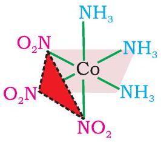
फलकीय (fac)

समावयव
<img class="imgSvg" id = "mu524lvzn4k2x6ehwa8" src="data:image/svg+xml;base64,PHN2ZyBpZD0ic21pbGVzLW11NTI0bHZ6bjRrMng2ZWh3YTgiIHhtbG5zPSJodHRwOi8vd3d3LnczLm9yZy8yMDAwL3N2ZyIgdmlld0JveD0iMCAwIDIxMyAxMzkuNTg5NDAwNjU3NjI5NDUiIHN0eWxlPSJ3aWR0aDogMjEzLjA4OTQzOTIyNjIwMTI1cHg7IGhlaWdodDogMTM5LjU4OTQwMDY1NzYyOTQ1cHg7IG92ZXJmbG93OiB2aXNpYmxlOyI+PGRlZnM+PGxpbmVhckdyYWRpZW50IGlkPSJsaW5lLW11NTI0bHZ6bjRrMng2ZWh3YTgtMSIgZ3JhZGllbnRVbml0cz0idXNlclNwYWNlT25Vc2UiIHgxPSIxMTYuNTI5ODAwMjE5MjA5ODIiIHkxPSI0OC4yNzk4MDAyMTkyMDk4MiIgeDI9IjEzMi4yNzk4MDAyMTkyMDk4NSIgeTI9IjIxIj48c3RvcCBzdG9wLWNvbG9yPSJjdXJyZW50Q29sb3IiIG9mZnNldD0iMjAlIj48L3N0b3A+PHN0b3Agc3RvcC1jb2xvcj0iY3VycmVudENvbG9yIiBvZmZzZXQ9IjEwMCUiPjwvc3RvcD48L2xpbmVhckdyYWRpZW50PjxsaW5lYXJHcmFkaWVudCBpZD0ibGluZS1tdTUyNGx2em40azJ4NmVod2E4LTMiIGdyYWRpZW50VW5pdHM9InVzZXJTcGFjZU9uVXNlIiB4MT0iODkuMjUwMDAwMDAwMDAwMDEiIHkxPSIzMi41Mjk4MDAyMTkyMDk4MSIgeDI9IjExNi41Mjk4MDAyMTkyMDk4MiIgeTI9IjQ4LjI3OTgwMDIxOTIwOTgyIj48c3RvcCBzdG9wLWNvbG9yPSJjdXJyZW50Q29sb3IiIG9mZnNldD0iMjAlIj48L3N0b3A+PHN0b3Agc3RvcC1jb2xvcj0iY3VycmVudENvbG9yIiBvZmZzZXQ9IjEwMCUiPjwvc3RvcD48L2xpbmVhckdyYWRpZW50PjxsaW5lYXJHcmFkaWVudCBpZD0ibGluZS1tdTUyNGx2em40azJ4NmVod2E4LTUiIGdyYWRpZW50VW5pdHM9InVzZXJTcGFjZU9uVXNlIiB4MT0iMTE2LjUyOTgwMDIxOTIwOTgyIiB5MT0iNDguMjc5ODAwMjE5MjA5ODIiIHgyPSIxNDMuODA5NjAwNDM4NDE5NjQiIHkyPSI2NC4wMjk4MDAyMTkyMDk4MiI+PHN0b3Agc3RvcC1jb2xvcj0iY3VycmVudENvbG9yIiBvZmZzZXQ9IjIwJSI+PC9zdG9wPjxzdG9wIHN0b3AtY29sb3I9ImN1cnJlbnRDb2xvciIgb2Zmc2V0PSIxMDAlIj48L3N0b3A+PC9saW5lYXJHcmFkaWVudD48bGluZWFyR3JhZGllbnQgaWQ9ImxpbmUtbXU1MjRsdnpuNGsyeDZlaHdhOC03IiBncmFkaWVudFVuaXRzPSJ1c2VyU3BhY2VPblVzZSIgeDE9IjEwMC43Nzk4MDAyMTkyMDk4MiIgeTE9Ijc1LjU1OTYwMDQzODQxOTY0IiB4Mj0iMTE2LjUyOTgwMDIxOTIwOTgyIiB5Mj0iNDguMjc5ODAwMjE5MjA5ODIiPjxzdG9wIHN0b3AtY29sb3I9ImN1cnJlbnRDb2xvciIgb2Zmc2V0PSIyMCUiPjwvc3RvcD48c3RvcCBzdG9wLWNvbG9yPSJjdXJyZW50Q29sb3IiIG9mZnNldD0iMTAwJSI+PC9zdG9wPjwvbGluZWFyR3JhZGllbnQ+PGxpbmVhckdyYWRpZW50IGlkPSJsaW5lLW11NTI0bHZ6bjRrMng2ZWh3YTgtOSIgZ3JhZGllbnRVbml0cz0idXNlclNwYWNlT25Vc2UiIHgxPSIxNDMuNzAyNTk2MzQxNzIyNDgiIHkxPSI1Ny41NDQ0MzU5MTc3MDA2MSIgeDI9IjE2NS41MjY0NjczNzE5NDc3NyIgeTI9IjQ0Ljk0NDQ4OTM2MDAzMjQ3Ij48c3RvcCBzdG9wLWNvbG9yPSJjdXJyZW50Q29sb3IiIG9mZnNldD0iMjAlIj48L3N0b3A+PHN0b3Agc3RvcC1jb2xvcj0iY3VycmVudENvbG9yIiBvZmZzZXQ9IjEwMCUiPjwvc3RvcD48L2xpbmVhckdyYWRpZW50PjxsaW5lYXJHcmFkaWVudCBpZD0ibGluZS1tdTUyNGx2em40azJ4NmVod2E4LTExIiBncmFkaWVudFVuaXRzPSJ1c2VyU3BhY2VPblVzZSIgeDE9IjE0My44MDk2MDA0Mzg0MTk2NCIgeTE9IjY0LjAyOTgwMDIxOTIwOTgyIiB4Mj0iMTcxLjA4OTQzOTIyNjIwMTI1IiB5Mj0iNDguMjc5ODY3MDIyMTI0NjUiPjxzdG9wIHN0b3AtY29sb3I9ImN1cnJlbnRDb2xvciIgb2Zmc2V0PSIyMCUiPjwvc3RvcD48c3RvcCBzdG9wLWNvbG9yPSJjdXJyZW50Q29sb3IiIG9mZnNldD0iMTAwJSI+PC9zdG9wPjwvbGluZWFyR3JhZGllbnQ+PGxpbmVhckdyYWRpZW50IGlkPSJsaW5lLW11NTI0bHZ6bjRrMng2ZWh3YTgtMTMiIGdyYWRpZW50VW5pdHM9InVzZXJTcGFjZU9uVXNlIiB4MT0iODUuMDI5ODAwMjE5MjA5ODIiIHkxPSIxMDIuODM5NDAwNjU3NjI5NDQiIHgyPSIxMDAuNzc5ODAwMjE5MjA5ODIiIHkyPSI3NS41NTk2MDA0Mzg0MTk2NCI+PHN0b3Agc3RvcC1jb2xvcj0iY3VycmVudENvbG9yIiBvZmZzZXQ9IjIwJSI+PC9zdG9wPjxzdG9wIHN0b3AtY29sb3I9ImN1cnJlbnRDb2xvciIgb2Zmc2V0PSIxMDAlIj48L3N0b3A+PC9saW5lYXJHcmFkaWVudD48bGluZWFyR3JhZGllbnQgaWQ9ImxpbmUtbXU1MjRsdnpuNGsyeDZlaHdhOC0xNSIgZ3JhZGllbnRVbml0cz0idXNlclNwYWNlT25Vc2UiIHgxPSI3My41IiB5MT0iNTkuODA5NjAwNDM4NDE5NjIiIHgyPSIxMDAuNzc5ODAwMjE5MjA5ODIiIHkyPSI3NS41NTk2MDA0Mzg0MTk2NCI+PHN0b3Agc3RvcC1jb2xvcj0iY3VycmVudENvbG9yIiBvZmZzZXQ9IjIwJSI+PC9zdG9wPjxzdG9wIHN0b3AtY29sb3I9ImN1cnJlbnRDb2xvciIgb2Zmc2V0PSIxMDAlIj48L3N0b3A+PC9saW5lYXJHcmFkaWVudD48bGluZWFyR3JhZGllbnQgaWQ9ImxpbmUtbXU1MjRsdnpuNGsyeDZlaHdhOC0xNyIgZ3JhZGllbnRVbml0cz0idXNlclNwYWNlT25Vc2UiIHgxPSIxMDAuNzc5ODAwMjE5MjA5ODIiIHkxPSI3NS41NTk2MDA0Mzg0MTk2NCIgeDI9IjEyOC4wNTk2MDA0Mzg0MTk2NCIgeTI9IjkxLjMwOTYwMDQzODQxOTY0Ij48c3RvcCBzdG9wLWNvbG9yPSJjdXJyZW50Q29sb3IiIG9mZnNldD0iMjAlIj48L3N0b3A+PHN0b3Agc3RvcC1jb2xvcj0iY3VycmVudENvbG9yIiBvZmZzZXQ9IjEwMCUiPjwvc3RvcD48L2xpbmVhckdyYWRpZW50PjxsaW5lYXJHcmFkaWVudCBpZD0ibGluZS1tdTUyNGx2em40azJ4NmVod2E4LTE5IiBncmFkaWVudFVuaXRzPSJ1c2VyU3BhY2VPblVzZSIgeDE9IjYwLjIwNTE4MjAxOTcyODkxIiB5MT0iMzEuMTEyMzAwMjE5MjA5OCIgeDI9Ijc1Ljk1NTE4MjAxOTcyODg4IiB5Mj0iNTguMzkyMTAwNDM4NDE5NjI1Ij48c3RvcCBzdG9wLWNvbG9yPSJjdXJyZW50Q29sb3IiIG9mZnNldD0iMjAlIj48L3N0b3A+PHN0b3Agc3RvcC1jb2xvcj0iY3VycmVudENvbG9yIiBvZmZzZXQ9IjEwMCUiPjwvc3RvcD48L2xpbmVhckdyYWRpZW50PjxsaW5lYXJHcmFkaWVudCBpZD0ibGluZS1tdTUyNGx2em40azJ4NmVod2E4LTIxIiBncmFkaWVudFVuaXRzPSJ1c2VyU3BhY2VPblVzZSIgeDE9IjU1LjI5NDgxNzk4MDI3MTEzNCIgeTE9IjMzLjk0NzMwMDIxOTIwOTgiIHgyPSI3MS4wNDQ4MTc5ODAyNzExMiIgeTI9IjYxLjIyNzEwMDQzODQxOTYyIj48c3RvcCBzdG9wLWNvbG9yPSJjdXJyZW50Q29sb3IiIG9mZnNldD0iMjAlIj48L3N0b3A+PHN0b3Agc3RvcC1jb2xvcj0iY3VycmVudENvbG9yIiBvZmZzZXQ9IjEwMCUiPjwvc3RvcD48L2xpbmVhckdyYWRpZW50PjxsaW5lYXJHcmFkaWVudCBpZD0ibGluZS1tdTUyNGx2em40azJ4NmVod2E4LTIzIiBncmFkaWVudFVuaXRzPSJ1c2VyU3BhY2VPblVzZSIgeDE9IjQyIiB5MT0iNTkuODA5NjAwNDM4NDE5NiIgeDI9IjczLjUiIHkyPSI1OS44MDk2MDA0Mzg0MTk2MiI+PHN0b3Agc3RvcC1jb2xvcj0iY3VycmVudENvbG9yIiBvZmZzZXQ9IjIwJSI+PC9zdG9wPjxzdG9wIHN0b3AtY29sb3I9ImN1cnJlbnRDb2xvciIgb2Zmc2V0PSIxMDAlIj48L3N0b3A+PC9saW5lYXJHcmFkaWVudD48bGluZWFyR3JhZGllbnQgaWQ9ImxpbmUtbXU1MjRsdnpuNGsyeDZlaHdhOC0yNSIgZ3JhZGllbnRVbml0cz0idXNlclNwYWNlT25Vc2UiIHgxPSIxMjguMDU5NjAwNDM4NDE5NjQiIHkxPSI5NC4xNDQ2MDA0Mzg0MTk2MyIgeDI9IjE1OS41NTk2MDA0Mzg0MTk2NCIgeTI9Ijk0LjE0NDYwMDQzODQxOTY0Ij48c3RvcCBzdG9wLWNvbG9yPSJjdXJyZW50Q29sb3IiIG9mZnNldD0iMjAlIj48L3N0b3A+PHN0b3Agc3RvcC1jb2xvcj0iY3VycmVudENvbG9yIiBvZmZzZXQ9IjEwMCUiPjwvc3RvcD48L2xpbmVhckdyYWRpZW50PjxsaW5lYXJHcmFkaWVudCBpZD0ibGluZS1tdTUyNGx2em40azJ4NmVod2E4LTI3IiBncmFkaWVudFVuaXRzPSJ1c2VyU3BhY2VPblVzZSIgeDE9IjEyOC4wNTk2MDA0Mzg0MTk2NCIgeTE9Ijg4LjQ3NDYwMDQzODQxOTY0IiB4Mj0iMTU5LjU1OTYwMDQzODQxOTY0IiB5Mj0iODguNDc0NjAwNDM4NDE5NjYiPjxzdG9wIHN0b3AtY29sb3I9ImN1cnJlbnRDb2xvciIgb2Zmc2V0PSIyMCUiPjwvc3RvcD48c3RvcCBzdG9wLWNvbG9yPSJjdXJyZW50Q29sb3IiIG9mZnNldD0iMTAwJSI+PC9zdG9wPjwvbGluZWFyR3JhZGllbnQ+PGxpbmVhckdyYWRpZW50IGlkPSJsaW5lLW11NTI0bHZ6bjRrMng2ZWh3YTgtMjkiIGdyYWRpZW50VW5pdHM9InVzZXJTcGFjZU9uVXNlIiB4MT0iMTI4LjA1OTYwMDQzODQxOTY0IiB5MT0iOTEuMzA5NjAwNDM4NDE5NjQiIHgyPSIxNDMuODA5NjAwNDM4NDE5NjQiIHkyPSIxMTguNTg5NDAwNjU3NjI5NDUiPjxzdG9wIHN0b3AtY29sb3I9ImN1cnJlbnRDb2xvciIgb2Zmc2V0PSIyMCUiPjwvc3RvcD48c3RvcCBzdG9wLWNvbG9yPSJjdXJyZW50Q29sb3IiIG9mZnNldD0iMTAwJSI+PC9zdG9wPjwvbGluZWFyR3JhZGllbnQ+PC9kZWZzPjxtYXNrIGlkPSJ0ZXh0LW1hc2stbXU1MjRsdnpuNGsyeDZlaHdhOCI+PHJlY3QgeD0iMCIgeT0iMCIgd2lkdGg9IjEwMCUiIGhlaWdodD0iMTAwJSIgZmlsbD0id2hpdGUiPjwvcmVjdD48Y2lyY2xlIGN4PSIxMzIuMjc5ODAwMjE5MjA5ODUiIGN5PSIyMSIgcj0iNy44NzUiIGZpbGw9ImJsYWNrIj48L2NpcmNsZT48Y2lyY2xlIGN4PSI4OS4yNTAwMDAwMDAwMDAwMSIgY3k9IjMyLjUyOTgwMDIxOTIwOTgxIiByPSI3Ljg3NSIgZmlsbD0iYmxhY2siPjwvY2lyY2xlPjxjaXJjbGUgY3g9IjE0My44MDk2MDA0Mzg0MTk2NCIgY3k9IjY0LjAyOTgwMDIxOTIwOTgyIiByPSI3Ljg3NSIgZmlsbD0iYmxhY2siPjwvY2lyY2xlPjxjaXJjbGUgY3g9IjE3MS4wODk0MzkyMjYyMDEyNSIgY3k9IjQ4LjI3OTg2NzAyMjEyNDY1IiByPSI3Ljg3NSIgZmlsbD0iYmxhY2siPjwvY2lyY2xlPjxjaXJjbGUgY3g9Ijg1LjAyOTgwMDIxOTIwOTgyIiBjeT0iMTAyLjgzOTQwMDY1NzYyOTQ0IiByPSI3Ljg3NSIgZmlsbD0iYmxhY2siPjwvY2lyY2xlPjxjaXJjbGUgY3g9IjczLjUiIGN5PSI1OS44MDk2MDA0Mzg0MTk2MiIgcj0iNy44NzUiIGZpbGw9ImJsYWNrIj48L2NpcmNsZT48Y2lyY2xlIGN4PSI1Ny43NTAwMDAwMDAwMDAwMiIgY3k9IjMyLjUyOTgwMDIxOTIwOTgwNCIgcj0iNy44NzUiIGZpbGw9ImJsYWNrIj48L2NpcmNsZT48Y2lyY2xlIGN4PSI0MiIgY3k9IjU5LjgwOTYwMDQzODQxOTYiIHI9IjcuODc1IiBmaWxsPSJibGFjayI+PC9jaXJjbGU+PGNpcmNsZSBjeD0iMTI4LjA1OTYwMDQzODQxOTY0IiBjeT0iOTEuMzA5NjAwNDM4NDE5NjQiIHI9IjcuODc1IiBmaWxsPSJibGFjayI+PC9jaXJjbGU+PGNpcmNsZSBjeD0iMTU5LjU1OTYwMDQzODQxOTY0IiBjeT0iOTEuMzA5NjAwNDM4NDE5NjUiIHI9IjcuODc1IiBmaWxsPSJibGFjayI+PC9jaXJjbGU+PGNpcmNsZSBjeD0iMTQzLjgwOTYwMDQzODQxOTY0IiBjeT0iMTE4LjU4OTQwMDY1NzYyOTQ1IiByPSI3Ljg3NSIgZmlsbD0iYmxhY2siPjwvY2lyY2xlPjwvbWFzaz48c3R5bGU+CiAgICAgICAgICAgICAgICAuZWxlbWVudC1tdTUyNGx2em40azJ4NmVod2E4IHsKICAgICAgICAgICAgICAgICAgICBmb250OiAxNHB4IEhlbHZldGljYSwgQXJpYWwsIHNhbnMtc2VyaWY7CiAgICAgICAgICAgICAgICAgICAgYWxpZ25tZW50LWJhc2VsaW5lOiAnbWlkZGxlJzsKICAgICAgICAgICAgICAgIH0KICAgICAgICAgICAgICAgIC5zdWItbXU1MjRsdnpuNGsyeDZlaHdhOCB7CiAgICAgICAgICAgICAgICAgICAgZm9udDogOC40cHggSGVsdmV0aWNhLCBBcmlhbCwgc2Fucy1zZXJpZjsKICAgICAgICAgICAgICAgIH0KICAgICAgICAgICAgPC9zdHlsZT48ZyBtYXNrPSJ1cmwoI3RleHQtbWFzay1tdTUyNGx2em40azJ4NmVod2E4KSI+PGxpbmUgeDE9IjExNi41Mjk4MDAyMTkyMDk4MiIgeTE9IjQ4LjI3OTgwMDIxOTIwOTgyIiB4Mj0iMTMyLjI3OTgwMDIxOTIwOTg1IiB5Mj0iMjEiIHN0eWxlPSJzdHJva2UtbGluZWNhcDpyb3VuZDtzdHJva2UtZGFzaGFycmF5Om5vbmU7c3Ryb2tlLXdpZHRoOjEuMjYiIHN0cm9rZT0idXJsKCcjbGluZS1tdTUyNGx2em40azJ4NmVod2E4LTEnKSI+PC9saW5lPjxsaW5lIHgxPSI4OS4yNTAwMDAwMDAwMDAwMSIgeTE9IjMyLjUyOTgwMDIxOTIwOTgxIiB4Mj0iMTE2LjUyOTgwMDIxOTIwOTgyIiB5Mj0iNDguMjc5ODAwMjE5MjA5ODIiIHN0eWxlPSJzdHJva2UtbGluZWNhcDpyb3VuZDtzdHJva2UtZGFzaGFycmF5Om5vbmU7c3Ryb2tlLXdpZHRoOjEuMjYiIHN0cm9rZT0idXJsKCcjbGluZS1tdTUyNGx2em40azJ4NmVod2E4LTMnKSI+PC9saW5lPjxsaW5lIHgxPSIxMTYuNTI5ODAwMjE5MjA5ODIiIHkxPSI0OC4yNzk4MDAyMTkyMDk4MiIgeDI9IjE0My44MDk2MDA0Mzg0MTk2NCIgeTI9IjY0LjAyOTgwMDIxOTIwOTgyIiBzdHlsZT0ic3Ryb2tlLWxpbmVjYXA6cm91bmQ7c3Ryb2tlLWRhc2hhcnJheTpub25lO3N0cm9rZS13aWR0aDoxLjI2IiBzdHJva2U9InVybCgnI2xpbmUtbXU1MjRsdnpuNGsyeDZlaHdhOC01JykiPjwvbGluZT48bGluZSB4MT0iMTAwLjc3OTgwMDIxOTIwOTgyIiB5MT0iNzUuNTU5NjAwNDM4NDE5NjQiIHgyPSIxMTYuNTI5ODAwMjE5MjA5ODIiIHkyPSI0OC4yNzk4MDAyMTkyMDk4MiIgc3R5bGU9InN0cm9rZS1saW5lY2FwOnJvdW5kO3N0cm9rZS1kYXNoYXJyYXk6bm9uZTtzdHJva2Utd2lkdGg6MS4yNiIgc3Ryb2tlPSJ1cmwoJyNsaW5lLW11NTI0bHZ6bjRrMng2ZWh3YTgtNycpIj48L2xpbmU+PGxpbmUgeDE9IjE0My43MDI1OTYzNDE3MjI0OCIgeTE9IjU3LjU0NDQzNTkxNzcwMDYxIiB4Mj0iMTY1LjUyNjQ2NzM3MTk0Nzc3IiB5Mj0iNDQuOTQ0NDg5MzYwMDMyNDciIHN0eWxlPSJzdHJva2UtbGluZWNhcDpyb3VuZDtzdHJva2UtZGFzaGFycmF5Om5vbmU7c3Ryb2tlLXdpZHRoOjEuMjYiIHN0cm9rZT0idXJsKCcjbGluZS1tdTUyNGx2em40azJ4NmVod2E4LTknKSI+PC9saW5lPjxsaW5lIHgxPSIxNDMuODA5NjAwNDM4NDE5NjQiIHkxPSI2NC4wMjk4MDAyMTkyMDk4MiIgeDI9IjE3MS4wODk0MzkyMjYyMDEyNSIgeTI9IjQ4LjI3OTg2NzAyMjEyNDY1IiBzdHlsZT0ic3Ryb2tlLWxpbmVjYXA6cm91bmQ7c3Ryb2tlLWRhc2hhcnJheTpub25lO3N0cm9rZS13aWR0aDoxLjI2IiBzdHJva2U9InVybCgnI2xpbmUtbXU1MjRsdnpuNGsyeDZlaHdhOC0xMScpIj48L2xpbmU+PGxpbmUgeDE9Ijg1LjAyOTgwMDIxOTIwOTgyIiB5MT0iMTAyLjgzOTQwMDY1NzYyOTQ0IiB4Mj0iMTAwLjc3OTgwMDIxOTIwOTgyIiB5Mj0iNzUuNTU5NjAwNDM4NDE5NjQiIHN0eWxlPSJzdHJva2UtbGluZWNhcDpyb3VuZDtzdHJva2UtZGFzaGFycmF5Om5vbmU7c3Ryb2tlLXdpZHRoOjEuMjYiIHN0cm9rZT0idXJsKCcjbGluZS1tdTUyNGx2em40azJ4NmVod2E4LTEzJykiPjwvbGluZT48bGluZSB4MT0iNzMuNSIgeTE9IjU5LjgwOTYwMDQzODQxOTYyIiB4Mj0iMTAwLjc3OTgwMDIxOTIwOTgyIiB5Mj0iNzUuNTU5NjAwNDM4NDE5NjQiIHN0eWxlPSJzdHJva2UtbGluZWNhcDpyb3VuZDtzdHJva2UtZGFzaGFycmF5Om5vbmU7c3Ryb2tlLXdpZHRoOjEuMjYiIHN0cm9rZT0idXJsKCcjbGluZS1tdTUyNGx2em40azJ4NmVod2E4LTE1JykiPjwvbGluZT48bGluZSB4MT0iMTAwLjc3OTgwMDIxOTIwOTgyIiB5MT0iNzUuNTU5NjAwNDM4NDE5NjQiIHgyPSIxMjguMDU5NjAwNDM4NDE5NjQiIHkyPSI5MS4zMDk2MDA0Mzg0MTk2NCIgc3R5bGU9InN0cm9rZS1saW5lY2FwOnJvdW5kO3N0cm9rZS1kYXNoYXJyYXk6bm9uZTtzdHJva2Utd2lkdGg6MS4yNiIgc3Ryb2tlPSJ1cmwoJyNsaW5lLW11NTI0bHZ6bjRrMng2ZWh3YTgtMTcnKSI+PC9saW5lPjxsaW5lIHgxPSI2MC4yMDUxODIwMTk3Mjg5MSIgeTE9IjMxLjExMjMwMDIxOTIwOTgiIHgyPSI3NS45NTUxODIwMTk3Mjg4OCIgeTI9IjU4LjM5MjEwMDQzODQxOTYyNSIgc3R5bGU9InN0cm9rZS1saW5lY2FwOnJvdW5kO3N0cm9rZS1kYXNoYXJyYXk6bm9uZTtzdHJva2Utd2lkdGg6MS4yNiIgc3Ryb2tlPSJ1cmwoJyNsaW5lLW11NTI0bHZ6bjRrMng2ZWh3YTgtMTknKSI+PC9saW5lPjxsaW5lIHgxPSI1NS4yOTQ4MTc5ODAyNzExMzQiIHkxPSIzMy45NDczMDAyMTkyMDk4IiB4Mj0iNzEuMDQ0ODE3OTgwMjcxMTIiIHkyPSI2MS4yMjcxMDA0Mzg0MTk2MiIgc3R5bGU9InN0cm9rZS1saW5lY2FwOnJvdW5kO3N0cm9rZS1kYXNoYXJyYXk6bm9uZTtzdHJva2Utd2lkdGg6MS4yNiIgc3Ryb2tlPSJ1cmwoJyNsaW5lLW11NTI0bHZ6bjRrMng2ZWh3YTgtMjEnKSI+PC9saW5lPjxsaW5lIHgxPSI0MiIgeTE9IjU5LjgwOTYwMDQzODQxOTYiIHgyPSI3My41IiB5Mj0iNTkuODA5NjAwNDM4NDE5NjIiIHN0eWxlPSJzdHJva2UtbGluZWNhcDpyb3VuZDtzdHJva2UtZGFzaGFycmF5Om5vbmU7c3Ryb2tlLXdpZHRoOjEuMjYiIHN0cm9rZT0idXJsKCcjbGluZS1tdTUyNGx2em40azJ4NmVod2E4LTIzJykiPjwvbGluZT48bGluZSB4MT0iMTI4LjA1OTYwMDQzODQxOTY0IiB5MT0iOTQuMTQ0NjAwNDM4NDE5NjMiIHgyPSIxNTkuNTU5NjAwNDM4NDE5NjQiIHkyPSI5NC4xNDQ2MDA0Mzg0MTk2NCIgc3R5bGU9InN0cm9rZS1saW5lY2FwOnJvdW5kO3N0cm9rZS1kYXNoYXJyYXk6bm9uZTtzdHJva2Utd2lkdGg6MS4yNiIgc3Ryb2tlPSJ1cmwoJyNsaW5lLW11NTI0bHZ6bjRrMng2ZWh3YTgtMjUnKSI+PC9saW5lPjxsaW5lIHgxPSIxMjguMDU5NjAwNDM4NDE5NjQiIHkxPSI4OC40NzQ2MDA0Mzg0MTk2NCIgeDI9IjE1OS41NTk2MDA0Mzg0MTk2NCIgeTI9Ijg4LjQ3NDYwMDQzODQxOTY2IiBzdHlsZT0ic3Ryb2tlLWxpbmVjYXA6cm91bmQ7c3Ryb2tlLWRhc2hhcnJheTpub25lO3N0cm9rZS13aWR0aDoxLjI2IiBzdHJva2U9InVybCgnI2xpbmUtbXU1MjRsdnpuNGsyeDZlaHdhOC0yNycpIj48L2xpbmU+PGxpbmUgeDE9IjEyOC4wNTk2MDA0Mzg0MTk2NCIgeTE9IjkxLjMwOTYwMDQzODQxOTY0IiB4Mj0iMTQzLjgwOTYwMDQzODQxOTY0IiB5Mj0iMTE4LjU4OTQwMDY1NzYyOTQ1IiBzdHlsZT0ic3Ryb2tlLWxpbmVjYXA6cm91bmQ7c3Ryb2tlLWRhc2hhcnJheTpub25lO3N0cm9rZS13aWR0aDoxLjI2IiBzdHJva2U9InVybCgnI2xpbmUtbXU1MjRsdnpuNGsyeDZlaHdhOC0yOScpIj48L2xpbmU+PC9nPjxnPjx0ZXh0IHg9IjEyNy4wMjk4MDAyMTkyMDk4NSIgeT0iMjYuMjUiIGNsYXNzPSJlbGVtZW50LW11NTI0bHZ6bjRrMng2ZWh3YTgiIGZpbGw9ImN1cnJlbnRDb2xvciIgc3R5bGU9InRleHQtYW5jaG9yOiBzdGFydDsgd3JpdGluZy1tb2RlOiBob3Jpem9udGFsLXRiOyB0ZXh0LW9yaWVudGF0aW9uOiBtaXhlZDsgbGV0dGVyLXNwYWNpbmc6IG5vcm1hbDsgZGlyZWN0aW9uOiBsdHI7Ij48dHNwYW4+TjwvdHNwYW4+PHRzcGFuIHN0eWxlPSJ1bmljb2RlLWJpZGk6IHBsYWludGV4dDsiPkg8dHNwYW4gYmFzZWxpbmUtc2hpZnQ9InN1YiIgY2xhc3M9InN1Yi1tdTUyNGx2em40azJ4NmVod2E4Ij4yPC90c3Bhbj48L3RzcGFuPjwvdGV4dD48dGV4dCB4PSIxMzIuMjc5ODAwMjE5MjA5ODUiIHk9IjIxIiBjbGFzcz0iZGVidWciIGZpbGw9IiNmZjAwMDAiIHN0eWxlPSIKICAgICAgICAgICAgICAgIGZvbnQ6IDVweCBEcm9pZCBTYW5zLCBzYW5zLXNlcmlmOwogICAgICAgICAgICAiPjwvdGV4dD48dGV4dCB4PSIxMTYuNTI5ODAwMjE5MjA5ODIiIHk9IjQ4LjI3OTgwMDIxOTIwOTgyIiBjbGFzcz0iZGVidWciIGZpbGw9IiNmZjAwMDAiIHN0eWxlPSIKICAgICAgICAgICAgICAgIGZvbnQ6IDVweCBEcm9pZCBTYW5zLCBzYW5zLXNlcmlmOwogICAgICAgICAgICAiPjwvdGV4dD48dGV4dCB4PSI5NC41MDAwMDAwMDAwMDAwMSIgeT0iMzcuNzc5ODAwMjE5MjA5ODEiIGNsYXNzPSJlbGVtZW50LW11NTI0bHZ6bjRrMng2ZWh3YTgiIGZpbGw9ImN1cnJlbnRDb2xvciIgc3R5bGU9InRleHQtYW5jaG9yOiBzdGFydDsgd3JpdGluZy1tb2RlOiBob3Jpem9udGFsLXRiOyB0ZXh0LW9yaWVudGF0aW9uOiBtaXhlZDsgbGV0dGVyLXNwYWNpbmc6IG5vcm1hbDsgZGlyZWN0aW9uOiBydGw7IHVuaWNvZGUtYmlkaTogYmlkaS1vdmVycmlkZTsiPjx0c3Bhbj5OPC90c3Bhbj48dHNwYW4gc3R5bGU9InVuaWNvZGUtYmlkaTogcGxhaW50ZXh0OyI+SDx0c3BhbiBiYXNlbGluZS1zaGlmdD0ic3ViIiBjbGFzcz0ic3ViLW11NTI0bHZ6bjRrMng2ZWh3YTgiPjI8L3RzcGFuPjwvdHNwYW4+PC90ZXh0Pjx0ZXh0IHg9Ijg5LjI1MDAwMDAwMDAwMDAxIiB5PSIzMi41Mjk4MDAyMTkyMDk4MSIgY2xhc3M9ImRlYnVnIiBmaWxsPSIjZmYwMDAwIiBzdHlsZT0iCiAgICAgICAgICAgICAgICBmb250OiA1cHggRHJvaWQgU2Fucywgc2Fucy1zZXJpZjsKICAgICAgICAgICAgIj48L3RleHQ+PHRleHQgeD0iMTQzLjgwOTYwMDQzODQxOTY0IiB5PSI1Ni4xNTQ4MDAyMTkyMDk4MiIgY2xhc3M9ImVsZW1lbnQtbXU1MjRsdnpuNGsyeDZlaHdhOCIgZmlsbD0iY3VycmVudENvbG9yIiBzdHlsZT0idGV4dC1hbmNob3I6IHN0YXJ0OyBnbHlwaC1vcmllbnRhdGlvbi12ZXJ0aWNhbDogMDsgd3JpdGluZy1tb2RlOiB2ZXJ0aWNhbC1ybDsgdGV4dC1vcmllbnRhdGlvbjogdXByaWdodDsgbGV0dGVyLXNwYWNpbmc6IC0xcHg7IGRpcmVjdGlvbjogbHRyOyI+PHRzcGFuPk48L3RzcGFuPjwvdGV4dD48dGV4dCB4PSIxNDMuODA5NjAwNDM4NDE5NjQiIHk9IjY0LjAyOTgwMDIxOTIwOTgyIiBjbGFzcz0iZGVidWciIGZpbGw9IiNmZjAwMDAiIHN0eWxlPSIKICAgICAgICAgICAgICAgIGZvbnQ6IDVweCBEcm9pZCBTYW5zLCBzYW5zLXNlcmlmOwogICAgICAgICAgICAiPjwvdGV4dD48dGV4dCB4PSIxNjcuMTUxOTM5MjI2MjAxMjUiIHk9IjUzLjUyOTg2NzAyMjEyNDY1IiBjbGFzcz0iZWxlbWVudC1tdTUyNGx2em40azJ4NmVod2E4IiBmaWxsPSJjdXJyZW50Q29sb3IiIHN0eWxlPSJ0ZXh0LWFuY2hvcjogc3RhcnQ7IHdyaXRpbmctbW9kZTogaG9yaXpvbnRhbC10YjsgdGV4dC1vcmllbnRhdGlvbjogbWl4ZWQ7IGxldHRlci1zcGFjaW5nOiBub3JtYWw7IGRpcmVjdGlvbjogbHRyOyI+PHRzcGFuPk88L3RzcGFuPjwvdGV4dD48dGV4dCB4PSIxNzEuMDg5NDM5MjI2MjAxMjUiIHk9IjQ4LjI3OTg2NzAyMjEyNDY1IiBjbGFzcz0iZGVidWciIGZpbGw9IiNmZjAwMDAiIHN0eWxlPSIKICAgICAgICAgICAgICAgIGZvbnQ6IDVweCBEcm9pZCBTYW5zLCBzYW5zLXNlcmlmOwogICAgICAgICAgICAiPjwvdGV4dD48dGV4dCB4PSIxMDAuNzc5ODAwMjE5MjA5ODIiIHk9Ijc1LjU1OTYwMDQzODQxOTY0IiBjbGFzcz0iZGVidWciIGZpbGw9IiNmZjAwMDAiIHN0eWxlPSIKICAgICAgICAgICAgICAgIGZvbnQ6IDVweCBEcm9pZCBTYW5zLCBzYW5zLXNlcmlmOwogICAgICAgICAgICAiPjwvdGV4dD48dGV4dCB4PSI3OS43Nzk4MDAyMTkyMDk4MiIgeT0iMTA4LjA4OTQwMDY1NzYyOTQ0IiBjbGFzcz0iZWxlbWVudC1tdTUyNGx2em40azJ4NmVod2E4IiBmaWxsPSJjdXJyZW50Q29sb3IiIHN0eWxlPSJ0ZXh0LWFuY2hvcjogc3RhcnQ7IHdyaXRpbmctbW9kZTogaG9yaXpvbnRhbC10YjsgdGV4dC1vcmllbnRhdGlvbjogbWl4ZWQ7IGxldHRlci1zcGFjaW5nOiBub3JtYWw7IGRpcmVjdGlvbjogbHRyOyI+PHRzcGFuPk48L3RzcGFuPjx0c3BhbiBzdHlsZT0idW5pY29kZS1iaWRpOiBwbGFpbnRleHQ7Ij5IPHRzcGFuIGJhc2VsaW5lLXNoaWZ0PSJzdWIiIGNsYXNzPSJzdWItbXU1MjRsdnpuNGsyeDZlaHdhOCI+MjwvdHNwYW4+PC90c3Bhbj48L3RleHQ+PHRleHQgeD0iODUuMDI5ODAwMjE5MjA5ODIiIHk9IjEwMi44Mzk0MDA2NTc2Mjk0NCIgY2xhc3M9ImRlYnVnIiBmaWxsPSIjZmYwMDAwIiBzdHlsZT0iCiAgICAgICAgICAgICAgICBmb250OiA1cHggRHJvaWQgU2Fucywgc2Fucy1zZXJpZjsKICAgICAgICAgICAgIj48L3RleHQ+PHRleHQgeD0iNjkuNTYyNSIgeT0iNjUuMDU5NjAwNDM4NDE5NjIiIGNsYXNzPSJlbGVtZW50LW11NTI0bHZ6bjRrMng2ZWh3YTgiIGZpbGw9ImN1cnJlbnRDb2xvciIgc3R5bGU9InRleHQtYW5jaG9yOiBzdGFydDsgd3JpdGluZy1tb2RlOiBob3Jpem9udGFsLXRiOyB0ZXh0LW9yaWVudGF0aW9uOiBtaXhlZDsgbGV0dGVyLXNwYWNpbmc6IG5vcm1hbDsgZGlyZWN0aW9uOiBsdHI7Ij48dHNwYW4+Tjx0c3BhbiBiYXNlbGluZS1zaGlmdD0ic3VwZXIiIGNsYXNzPSJzdWItbXU1MjRsdnpuNGsyeDZlaHdhOCI+KzwvdHNwYW4+PC90c3Bhbj48L3RleHQ+PHRleHQgeD0iNzMuNSIgeT0iNTkuODA5NjAwNDM4NDE5NjIiIGNsYXNzPSJkZWJ1ZyIgZmlsbD0iI2ZmMDAwMCIgc3R5bGU9IgogICAgICAgICAgICAgICAgZm9udDogNXB4IERyb2lkIFNhbnMsIHNhbnMtc2VyaWY7CiAgICAgICAgICAgICI+PC90ZXh0Pjx0ZXh0IHg9IjUyLjUwMDAwMDAwMDAwMDAyIiB5PSIzNy43Nzk4MDAyMTkyMDk4MDQiIGNsYXNzPSJlbGVtZW50LW11NTI0bHZ6bjRrMng2ZWh3YTgiIGZpbGw9ImN1cnJlbnRDb2xvciIgc3R5bGU9InRleHQtYW5jaG9yOiBzdGFydDsgd3JpdGluZy1tb2RlOiBob3Jpem9udGFsLXRiOyB0ZXh0LW9yaWVudGF0aW9uOiBtaXhlZDsgbGV0dGVyLXNwYWNpbmc6IG5vcm1hbDsgZGlyZWN0aW9uOiBsdHI7Ij48dHNwYW4+TzwvdHNwYW4+PC90ZXh0Pjx0ZXh0IHg9IjU3Ljc1MDAwMDAwMDAwMDAyIiB5PSIzMi41Mjk4MDAyMTkyMDk4MDQiIGNsYXNzPSJkZWJ1ZyIgZmlsbD0iI2ZmMDAwMCIgc3R5bGU9IgogICAgICAgICAgICAgICAgZm9udDogNXB4IERyb2lkIFNhbnMsIHNhbnMtc2VyaWY7CiAgICAgICAgICAgICI+PC90ZXh0Pjx0ZXh0IHg9IjQ3LjI1IiB5PSI2NS4wNTk2MDA0Mzg0MTk2MSIgY2xhc3M9ImVsZW1lbnQtbXU1MjRsdnpuNGsyeDZlaHdhOCIgZmlsbD0iY3VycmVudENvbG9yIiBzdHlsZT0idGV4dC1hbmNob3I6IHN0YXJ0OyB3cml0aW5nLW1vZGU6IGhvcml6b250YWwtdGI7IHRleHQtb3JpZW50YXRpb246IG1peGVkOyBsZXR0ZXItc3BhY2luZzogbm9ybWFsOyBkaXJlY3Rpb246IHJ0bDsgdW5pY29kZS1iaWRpOiBiaWRpLW92ZXJyaWRlOyI+PHRzcGFuPk88dHNwYW4gYmFzZWxpbmUtc2hpZnQ9InN1cGVyIiBjbGFzcz0ic3ViLW11NTI0bHZ6bjRrMng2ZWh3YTgiPi08L3RzcGFuPjwvdHNwYW4+PC90ZXh0Pjx0ZXh0IHg9IjQyIiB5PSI1OS44MDk2MDA0Mzg0MTk2IiBjbGFzcz0iZGVidWciIGZpbGw9IiNmZjAwMDAiIHN0eWxlPSIKICAgICAgICAgICAgICAgIGZvbnQ6IDVweCBEcm9pZCBTYW5zLCBzYW5zLXNlcmlmOwogICAgICAgICAgICAiPjwvdGV4dD48dGV4dCB4PSIxMzMuMzA5NjAwNDM4NDE5NjQiIHk9Ijk2LjU1OTYwMDQzODQxOTY0IiBjbGFzcz0iZWxlbWVudC1tdTUyNGx2em40azJ4NmVod2E4IiBmaWxsPSJjdXJyZW50Q29sb3IiIHN0eWxlPSJ0ZXh0LWFuY2hvcjogc3RhcnQ7IHdyaXRpbmctbW9kZTogaG9yaXpvbnRhbC10YjsgdGV4dC1vcmllbnRhdGlvbjogbWl4ZWQ7IGxldHRlci1zcGFjaW5nOiBub3JtYWw7IGRpcmVjdGlvbjogcnRsOyB1bmljb2RlLWJpZGk6IGJpZGktb3ZlcnJpZGU7Ij48dHNwYW4+Tjx0c3BhbiBiYXNlbGluZS1zaGlmdD0ic3VwZXIiIGNsYXNzPSJzdWItbXU1MjRsdnpuNGsyeDZlaHdhOCI+KzwvdHNwYW4+PC90c3Bhbj48L3RleHQ+PHRleHQgeD0iMTI4LjA1OTYwMDQzODQxOTY0IiB5PSI5MS4zMDk2MDA0Mzg0MTk2NCIgY2xhc3M9ImRlYnVnIiBmaWxsPSIjZmYwMDAwIiBzdHlsZT0iCiAgICAgICAgICAgICAgICBmb250OiA1cHggRHJvaWQgU2Fucywgc2Fucy1zZXJpZjsKICAgICAgICAgICAgIj48L3RleHQ+PHRleHQgeD0iMTU1LjYyMjEwMDQzODQxOTY0IiB5PSI5Ni41NTk2MDA0Mzg0MTk2NSIgY2xhc3M9ImVsZW1lbnQtbXU1MjRsdnpuNGsyeDZlaHdhOCIgZmlsbD0iY3VycmVudENvbG9yIiBzdHlsZT0idGV4dC1hbmNob3I6IHN0YXJ0OyB3cml0aW5nLW1vZGU6IGhvcml6b250YWwtdGI7IHRleHQtb3JpZW50YXRpb246IG1peGVkOyBsZXR0ZXItc3BhY2luZzogbm9ybWFsOyBkaXJlY3Rpb246IGx0cjsiPjx0c3Bhbj5PPC90c3Bhbj48L3RleHQ+PHRleHQgeD0iMTU5LjU1OTYwMDQzODQxOTY0IiB5PSI5MS4zMDk2MDA0Mzg0MTk2NSIgY2xhc3M9ImRlYnVnIiBmaWxsPSIjZmYwMDAwIiBzdHlsZT0iCiAgICAgICAgICAgICAgICBmb250OiA1cHggRHJvaWQgU2Fucywgc2Fucy1zZXJpZjsKICAgICAgICAgICAgIj48L3RleHQ+PHRleHQgeD0iMTM4LjU1OTYwMDQzODQxOTY0IiB5PSIxMjMuODM5NDAwNjU3NjI5NDUiIGNsYXNzPSJlbGVtZW50LW11NTI0bHZ6bjRrMng2ZWh3YTgiIGZpbGw9ImN1cnJlbnRDb2xvciIgc3R5bGU9InRleHQtYW5jaG9yOiBzdGFydDsgd3JpdGluZy1tb2RlOiBob3Jpem9udGFsLXRiOyB0ZXh0LW9yaWVudGF0aW9uOiBtaXhlZDsgbGV0dGVyLXNwYWNpbmc6IG5vcm1hbDsgZGlyZWN0aW9uOiBsdHI7Ij48dHNwYW4+Tzx0c3BhbiBiYXNlbGluZS1zaGlmdD0ic3VwZXIiIGNsYXNzPSJzdWItbXU1MjRsdnpuNGsyeDZlaHdhOCI+LTwvdHNwYW4+PC90c3Bhbj48L3RleHQ+PHRleHQgeD0iMTQzLjgwOTYwMDQzODQxOTY0IiB5PSIxMTguNTg5NDAwNjU3NjI5NDUiIGNsYXNzPSJkZWJ1ZyIgZmlsbD0iI2ZmMDAwMCIgc3R5bGU9IgogICAgICAgICAgICAgICAgZm9udDogNXB4IERyb2lkIFNhbnMsIHNhbnMtc2VyaWY7CiAgICAgICAgICAgICI+PC90ZXh0PjwvZz48L3N2Zz4="/>

रेखांशिक (mer)
समावयव

चित्र $\left.5.5-\mathrm{Co}\left(\mathrm{NH}_{3}\right)_{3}\left(\mathrm{NO}_{2}\right)_{3}\right]$ के फलकीय (fac) तथा रेखांशिक (mer) समावयवी

उदाहरण $5.4$ वे चतुष्फलकीय संकुल जिनमें दो भिन्न प्रकार के एकदंतुर लिगन्ड केंद्रीय धातु आयन से जुड़े हों, ज्यामितीय समावयवता क्यों नहीं दर्शाते?

हल चतुष्फलकीय संकुल ज्यामितीय समावयवता नहीं दर्शाते, क्योंकि इनमें केंद्रीय धातु परमाणु से जुड़े एकदंतुर लिगन्डों की सापेक्ष स्थितियाँ आपस में एक जैसी होती हैं।
5.4.2 ध्रुवण समावयवता ध्रुवण समावयव एक-दूसरे के दर्पण प्रतिबिंब होते हैं जिन्हें एक-दूसरे पर अध्यारोपित नहीं किया जा सकता। इन्हें प्रतिबिंब रूप या एनैन्टिओमर (enantiomers) कहते हैं। अणु अथवा आयन जो एक-दूसरे पर अध्यारोपित नहीं किए जा सकते, काइरल (chiral) कहलाते हैं। ये दो रूप दक्षिण-ध्रुवण घूर्णक $(d)$ और वामावर्ती $(l)$ कहलाते हैं, यह इस बात पर निर्भर करता है कि ये ध्रुवणमापी (polarimeter) में समतल ध्रूवित प्रकाश को किस दिशा में घूर्णित करते हैं ( $d$ दाईं तरफ़ घूर्णित करता है तथा $l$ बाईं तरफ़)। प्रकाशिक समावयवता सामान्य रूप से द्विदंतुर लिगन्ड युक्त अष्टफलकीय संकुलों में पाई जाती है (चित्र 5.6)। $\left[\mathrm{PtCl}_{2}(\mathrm{en})_{2}\right]^{2+}$ के समान उपसहसंयोजक समूह में केवल समपक्ष रूप प्रकाशिक समावयवता दर्शाता है (चित्र 5.7)।

चित्र $5.6-\left[\mathrm{Co}(\mathrm{en})_{3}\right]^{3+}$ के ध्रुवण समावयव ( $d$ तथा $l$ )
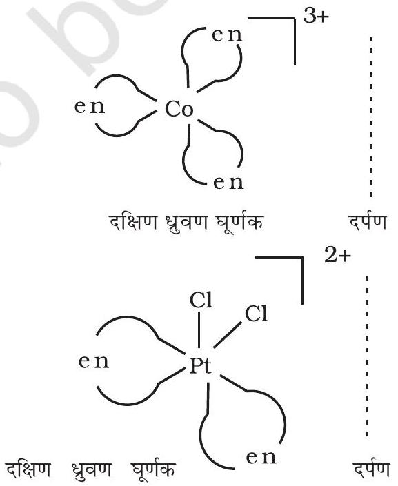

दक्षिण ध्रुवण घूर्णक
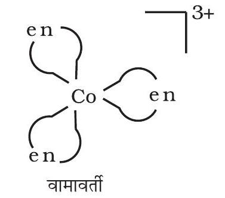

<img class="imgSvg" id = "mu524lw19iazuekw15" src="data:image/svg+xml;base64,PHN2ZyBpZD0ic21pbGVzLW11NTI0bHcxOWlhenVla3cxNSIgeG1sbnM9Imh0dHA6Ly93d3cudzMub3JnLzIwMDAvc3ZnIiB2aWV3Qm94PSIwIDAgMjkwIDE3Ny43NTc4MjA3MDMzNDA4MyIgc3R5bGU9IndpZHRoOiAyODkuOTU5NTU2MjI5MjYzNzRweDsgaGVpZ2h0OiAxNzcuNzU3ODIwNzAzMzQwODNweDsgb3ZlcmZsb3c6IHZpc2libGU7Ij48ZGVmcz48bGluZWFyR3JhZGllbnQgaWQ9ImxpbmUtbXU1MjRsdzE5aWF6dWVrdzE1LTEiIGdyYWRpZW50VW5pdHM9InVzZXJTcGFjZU9uVXNlIiB4MT0iMjE2LjgxMTM3OTkzNTU1MDk3IiB5MT0iMjUuNjk0Nzk2NDM2MDMzNzA1IiB4Mj0iMjQ3Ljk1OTU1NjIyOTI2Mzc0IiB5Mj0iMjEiPjxzdG9wIHN0b3AtY29sb3I9ImN1cnJlbnRDb2xvciIgb2Zmc2V0PSIyMCUiPjwvc3RvcD48c3RvcCBzdG9wLWNvbG9yPSJjdXJyZW50Q29sb3IiIG9mZnNldD0iMTAwJSI+PC9zdG9wPjwvbGluZWFyR3JhZGllbnQ+PGxpbmVhckdyYWRpZW50IGlkPSJsaW5lLW11NTI0bHcxOWlhenVla3cxNS0zIiBncmFkaWVudFVuaXRzPSJ1c2VyU3BhY2VPblVzZSIgeDE9IjE5NC4zNzE1MDgwNzc3NjY0IiB5MT0iNDcuODAxNDA1MTk5MTY2MjQiIHgyPSIyMTYuODExMzc5OTM1NTUwOTciIHkyPSIyNS42OTQ3OTY0MzYwMzM3MDUiPjxzdG9wIHN0b3AtY29sb3I9ImN1cnJlbnRDb2xvciIgb2Zmc2V0PSIyMCUiPjwvc3RvcD48c3RvcCBzdG9wLWNvbG9yPSJjdXJyZW50Q29sb3IiIG9mZnNldD0iMTAwJSI+PC9zdG9wPjwvbGluZWFyR3JhZGllbnQ+PGxpbmVhckdyYWRpZW50IGlkPSJsaW5lLW11NTI0bHcxOWlhenVla3cxNS01IiBncmFkaWVudFVuaXRzPSJ1c2VyU3BhY2VPblVzZSIgeDE9IjE2My4yMjMzMzE3ODQwNTM3NiIgeTE9IjUyLjQ5NjIwMTYzNTE5OTkzIiB4Mj0iMTk0LjM3MTUwODA3Nzc2NjQiIHkyPSI0Ny44MDE0MDUxOTkxNjYyNCI+PHN0b3Agc3RvcC1jb2xvcj0iY3VycmVudENvbG9yIiBvZmZzZXQ9IjIwJSI+PC9zdG9wPjxzdG9wIHN0b3AtY29sb3I9ImN1cnJlbnRDb2xvciIgb2Zmc2V0PSIxMDAlIj48L3N0b3A+PC9saW5lYXJHcmFkaWVudD48bGluZWFyR3JhZGllbnQgaWQ9ImxpbmUtbXU1MjRsdzE5aWF6dWVrdzE1LTciIGdyYWRpZW50VW5pdHM9InVzZXJTcGFjZU9uVXNlIiB4MT0iMTQwLjc4MzQ1OTkyNjI2OTIiIHkxPSI3NC42MDI4MTAzOTgzMzI0NyIgeDI9IjE2My4yMjMzMzE3ODQwNTM3NiIgeTI9IjUyLjQ5NjIwMTYzNTE5OTkzIj48c3RvcCBzdG9wLWNvbG9yPSJjdXJyZW50Q29sb3IiIG9mZnNldD0iMjAlIj48L3N0b3A+PHN0b3Agc3RvcC1jb2xvcj0iY3VycmVudENvbG9yIiBvZmZzZXQ9IjEwMCUiPjwvc3RvcD48L2xpbmVhckdyYWRpZW50PjxsaW5lYXJHcmFkaWVudCBpZD0ibGluZS1tdTUyNGx3MTlpYXp1ZWt3MTUtOSIgZ3JhZGllbnRVbml0cz0idXNlclNwYWNlT25Vc2UiIHgxPSIxNDAuNzgzNDU5OTI2MjY5MiIgeTE9Ijc0LjYwMjgxMDM5ODMzMjQ3IiB4Mj0iMTY4Ljc0MjM5NTk5OTI4NTQ2IiB5Mj0iODkuMTEzMDc4OTU3NzAwNjQiPjxzdG9wIHN0b3AtY29sb3I9ImN1cnJlbnRDb2xvciIgb2Zmc2V0PSIyMCUiPjwvc3RvcD48c3RvcCBzdG9wLWNvbG9yPSJjdXJyZW50Q29sb3IiIG9mZnNldD0iMTAwJSI+PC9zdG9wPjwvbGluZWFyR3JhZGllbnQ+PGxpbmVhckdyYWRpZW50IGlkPSJsaW5lLW11NTI0bHcxOWlhenVla3cxNS0xMSIgZ3JhZGllbnRVbml0cz0idXNlclNwYWNlT25Vc2UiIHgxPSIxMzcuMTc4NTc5MTA5MjI2NTIiIHkxPSI0My4zMDk3NjI2OTkyODQwOCIgeDI9IjE0MC43ODM0NTk5MjYyNjkyIiB5Mj0iNzQuNjAyODEwMzk4MzMyNDciPjxzdG9wIHN0b3AtY29sb3I9ImN1cnJlbnRDb2xvciIgb2Zmc2V0PSIyMCUiPjwvc3RvcD48c3RvcCBzdG9wLWNvbG9yPSJjdXJyZW50Q29sb3IiIG9mZnNldD0iMTAwJSI+PC9zdG9wPjwvbGluZWFyR3JhZGllbnQ+PGxpbmVhckdyYWRpZW50IGlkPSJsaW5lLW11NTI0bHcxOWlhenVla3cxNS0xMyIgZ3JhZGllbnRVbml0cz0idXNlclNwYWNlT25Vc2UiIHgxPSIxMzUuNjIzMTYwODUwODk0MTgiIHkxPSIxMDUuNjc3MjU4MzE3MDQzNSIgeDI9IjE0MC43ODM0NTk5MjYyNjkyIiB5Mj0iNzQuNjAyODEwMzk4MzMyNDciPjxzdG9wIHN0b3AtY29sb3I9ImN1cnJlbnRDb2xvciIgb2Zmc2V0PSIyMCUiPjwvc3RvcD48c3RvcCBzdG9wLWNvbG9yPSJjdXJyZW50Q29sb3IiIG9mZnNldD0iMTAwJSI+PC9zdG9wPjwvbGluZWFyR3JhZGllbnQ+PGxpbmVhckdyYWRpZW50IGlkPSJsaW5lLW11NTI0bHcxOWlhenVla3cxNS0xNSIgZ3JhZGllbnRVbml0cz0idXNlclNwYWNlT25Vc2UiIHgxPSIxMDkuNjM1MjgzNjMyNTU2NSIgeTE9Ijc5LjI5NzYwNjgzNDM2NjE1IiB4Mj0iMTQwLjc4MzQ1OTkyNjI2OTIiIHkyPSI3NC42MDI4MTAzOTgzMzI0NyI+PHN0b3Agc3RvcC1jb2xvcj0iY3VycmVudENvbG9yIiBvZmZzZXQ9IjIwJSI+PC9zdG9wPjxzdG9wIHN0b3AtY29sb3I9ImN1cnJlbnRDb2xvciIgb2Zmc2V0PSIxMDAlIj48L3N0b3A+PC9saW5lYXJHcmFkaWVudD48bGluZWFyR3JhZGllbnQgaWQ9ImxpbmUtbXU1MjRsdzE5aWF6dWVrdzE1LTE3IiBncmFkaWVudFVuaXRzPSJ1c2VyU3BhY2VPblVzZSIgeDE9IjEzNS42MjMxNjA4NTA4OTQxOCIgeTE9IjEwNS42NzcyNTgzMTcwNDM1IiB4Mj0iMTU5Ljk1NDMyMTYxMDUwMTA0IiB5Mj0iMTI1LjY4MzM3Mjc4NDYyOTgxIj48c3RvcCBzdG9wLWNvbG9yPSJjdXJyZW50Q29sb3IiIG9mZnNldD0iMjAlIj48L3N0b3A+PHN0b3Agc3RvcC1jb2xvcj0iY3VycmVudENvbG9yIiBvZmZzZXQ9IjEwMCUiPjwvc3RvcD48L2xpbmVhckdyYWRpZW50PjxsaW5lYXJHcmFkaWVudCBpZD0ibGluZS1tdTUyNGx3MTlpYXp1ZWt3MTUtMTkiIGdyYWRpZW50VW5pdHM9InVzZXJTcGFjZU9uVXNlIiB4MT0iMTA5LjYzNTI4MzYzMjU1NjUiIHkxPSI3OS4yOTc2MDY4MzQzNjYxNSIgeDI9IjExMC40MjA1NjUwOTAwMjI2NiIgeTI9IjExMC43ODc4MTY5NDg1MDQxNiI+PHN0b3Agc3RvcC1jb2xvcj0iY3VycmVudENvbG9yIiBvZmZzZXQ9IjIwJSI+PC9zdG9wPjxzdG9wIHN0b3AtY29sb3I9ImN1cnJlbnRDb2xvciIgb2Zmc2V0PSIxMDAlIj48L3N0b3A+PC9saW5lYXJHcmFkaWVudD48bGluZWFyR3JhZGllbnQgaWQ9ImxpbmUtbXU1MjRsdzE5aWF6dWVrdzE1LTIxIiBncmFkaWVudFVuaXRzPSJ1c2VyU3BhY2VPblVzZSIgeDE9IjgzLjYwODc0MjMzMjA0NzI5IiB5MT0iOTcuMDQyMTU5NDYxMzgwNyIgeDI9IjEwOS42MzUyODM2MzI1NTY1IiB5Mj0iNzkuMjk3NjA2ODM0MzY2MTUiPjxzdG9wIHN0b3AtY29sb3I9ImN1cnJlbnRDb2xvciIgb2Zmc2V0PSIyMCUiPjwvc3RvcD48c3RvcCBzdG9wLWNvbG9yPSJjdXJyZW50Q29sb3IiIG9mZnNldD0iMTAwJSI+PC9zdG9wPjwvbGluZWFyR3JhZGllbnQ+PGxpbmVhckdyYWRpZW50IGlkPSJsaW5lLW11NTI0bHcxOWlhenVla3cxNS0yMyIgZ3JhZGllbnRVbml0cz0idXNlclNwYWNlT25Vc2UiIHgxPSIxMDkuNjM1MjgzNjMyNTU2NSIgeTE9Ijc5LjI5NzYwNjgzNDM2NjE1IiB4Mj0iMTExLjk4OTMxNjgyNDk2ODM2IiB5Mj0iNDcuODg1Njg5ODY0Mzg0NDQ2Ij48c3RvcCBzdG9wLWNvbG9yPSJjdXJyZW50Q29sb3IiIG9mZnNldD0iMjAlIj48L3N0b3A+PHN0b3Agc3RvcC1jb2xvcj0iY3VycmVudENvbG9yIiBvZmZzZXQ9IjEwMCUiPjwvc3RvcD48L2xpbmVhckdyYWRpZW50PjxsaW5lYXJHcmFkaWVudCBpZD0ibGluZS1tdTUyNGx3MTlpYXp1ZWt3MTUtMjUiIGdyYWRpZW50VW5pdHM9InVzZXJTcGFjZU9uVXNlIiB4MT0iMTU0Ljc5NDAyMjUzNTEyNjAzIiB5MT0iMTU2Ljc1NzgyMDcwMzM0MDgzIiB4Mj0iMTU5Ljk1NDMyMTYxMDUwMTA0IiB5Mj0iMTI1LjY4MzM3Mjc4NDYyOTgxIj48c3RvcCBzdG9wLWNvbG9yPSJjdXJyZW50Q29sb3IiIG9mZnNldD0iMjAlIj48L3N0b3A+PHN0b3Agc3RvcC1jb2xvcj0iY3VycmVudENvbG9yIiBvZmZzZXQ9IjEwMCUiPjwvc3RvcD48L2xpbmVhckdyYWRpZW50PjxsaW5lYXJHcmFkaWVudCBpZD0ibGluZS1tdTUyNGx3MTlpYXp1ZWt3MTUtMjciIGdyYWRpZW50VW5pdHM9InVzZXJTcGFjZU9uVXNlIiB4MT0iNTMuNTA4MjA5MzY3NDEzOSIgeTE9Ijg3Ljc1NzMzNzY5NDM3NzM3IiB4Mj0iODMuNjA4NzQyMzMyMDQ3MjkiIHkyPSI5Ny4wNDIxNTk0NjEzODA3Ij48c3RvcCBzdG9wLWNvbG9yPSJjdXJyZW50Q29sb3IiIG9mZnNldD0iMjAlIj48L3N0b3A+PHN0b3Agc3RvcC1jb2xvcj0iY3VycmVudENvbG9yIiBvZmZzZXQ9IjEwMCUiPjwvc3RvcD48L2xpbmVhckdyYWRpZW50PjxsaW5lYXJHcmFkaWVudCBpZD0ibGluZS1tdTUyNGx3MTlpYXp1ZWt3MTUtMjkiIGdyYWRpZW50VW5pdHM9InVzZXJTcGFjZU9uVXNlIiB4MT0iODguODk4MjA2OTAxODcwNjUiIHkxPSIyNi40NjAyMjI3MTYxNjUyNyIgeDI9IjExMS45ODkzMTY4MjQ5NjgzNiIgeTI9IjQ3Ljg4NTY4OTg2NDM4NDQ0NiI+PHN0b3Agc3RvcC1jb2xvcj0iY3VycmVudENvbG9yIiBvZmZzZXQ9IjIwJSI+PC9zdG9wPjxzdG9wIHN0b3AtY29sb3I9ImN1cnJlbnRDb2xvciIgb2Zmc2V0PSIxMDAlIj48L3N0b3A+PC9saW5lYXJHcmFkaWVudD48bGluZWFyR3JhZGllbnQgaWQ9ImxpbmUtbXU1MjRsdzE5aWF6dWVrdzE1LTMxIiBncmFkaWVudFVuaXRzPSJ1c2VyU3BhY2VPblVzZSIgeDE9IjQyIiB5MT0iNTguNDM0ODAxNjk5NzU3NjgiIHgyPSI1My41MDgyMDkzNjc0MTM5IiB5Mj0iODcuNzU3MzM3Njk0Mzc3MzciPjxzdG9wIHN0b3AtY29sb3I9ImN1cnJlbnRDb2xvciIgb2Zmc2V0PSIyMCUiPjwvc3RvcD48c3RvcCBzdG9wLWNvbG9yPSJjdXJyZW50Q29sb3IiIG9mZnNldD0iMTAwJSI+PC9zdG9wPjwvbGluZWFyR3JhZGllbnQ+PGxpbmVhckdyYWRpZW50IGlkPSJsaW5lLW11NTI0bHcxOWlhenVla3cxNS0zMyIgZ3JhZGllbnRVbml0cz0idXNlclNwYWNlT25Vc2UiIHgxPSI1Ny43NTAwMzA2MDgxNTc5NiIgeTE9IjMxLjE1NTAxOTE1MjE5ODk5MiIgeDI9Ijg4Ljg5ODIwNjkwMTg3MDY1IiB5Mj0iMjYuNDYwMjIyNzE2MTY1MjciPjxzdG9wIHN0b3AtY29sb3I9ImN1cnJlbnRDb2xvciIgb2Zmc2V0PSIyMCUiPjwvc3RvcD48c3RvcCBzdG9wLWNvbG9yPSJjdXJyZW50Q29sb3IiIG9mZnNldD0iMTAwJSI+PC9zdG9wPjwvbGluZWFyR3JhZGllbnQ+PGxpbmVhckdyYWRpZW50IGlkPSJsaW5lLW11NTI0bHcxOWlhenVla3cxNS0zNSIgZ3JhZGllbnRVbml0cz0idXNlclNwYWNlT25Vc2UiIHgxPSI0MiIgeTE9IjU4LjQzNDgwMTY5OTc1NzY4IiB4Mj0iNTcuNzUwMDMwNjA4MTU3OTYiIHkyPSIzMS4xNTUwMTkxNTIxOTg5OTIiPjxzdG9wIHN0b3AtY29sb3I9ImN1cnJlbnRDb2xvciIgb2Zmc2V0PSIyMCUiPjwvc3RvcD48c3RvcCBzdG9wLWNvbG9yPSJjdXJyZW50Q29sb3IiIG9mZnNldD0iMTAwJSI+PC9zdG9wPjwvbGluZWFyR3JhZGllbnQ+PC9kZWZzPjxtYXNrIGlkPSJ0ZXh0LW1hc2stbXU1MjRsdzE5aWF6dWVrdzE1Ij48cmVjdCB4PSIwIiB5PSIwIiB3aWR0aD0iMTAwJSIgaGVpZ2h0PSIxMDAlIiBmaWxsPSJ3aGl0ZSI+PC9yZWN0PjxjaXJjbGUgY3g9IjE0MC43ODM0NTk5MjYyNjkyIiBjeT0iNzQuNjAyODEwMzk4MzMyNDciIHI9IjcuODc1IiBmaWxsPSJibGFjayI+PC9jaXJjbGU+PGNpcmNsZSBjeD0iMTY4Ljc0MjM5NTk5OTI4NTQ2IiBjeT0iODkuMTEzMDc4OTU3NzAwNjQiIHI9IjcuODc1IiBmaWxsPSJibGFjayI+PC9jaXJjbGU+PGNpcmNsZSBjeD0iMTM3LjE3ODU3OTEwOTIyNjUyIiBjeT0iNDMuMzA5NzYyNjk5Mjg0MDgiIHI9IjcuODc1IiBmaWxsPSJibGFjayI+PC9jaXJjbGU+PGNpcmNsZSBjeD0iMTEwLjQyMDU2NTA5MDAyMjY2IiBjeT0iMTEwLjc4NzgxNjk0ODUwNDE2IiByPSI3Ljg3NSIgZmlsbD0iYmxhY2siPjwvY2lyY2xlPjxjaXJjbGUgY3g9IjU3Ljc1MDAzMDYwODE1Nzk2IiBjeT0iMzEuMTU1MDE5MTUyMTk4OTkyIiByPSI5LjE4NzUiIGZpbGw9ImJsYWNrIj48L2NpcmNsZT48L21hc2s+PHN0eWxlPgogICAgICAgICAgICAgICAgLmVsZW1lbnQtbXU1MjRsdzE5aWF6dWVrdzE1IHsKICAgICAgICAgICAgICAgICAgICBmb250OiAxNHB4IEhlbHZldGljYSwgQXJpYWwsIHNhbnMtc2VyaWY7CiAgICAgICAgICAgICAgICAgICAgYWxpZ25tZW50LWJhc2VsaW5lOiAnbWlkZGxlJzsKICAgICAgICAgICAgICAgIH0KICAgICAgICAgICAgICAgIC5zdWItbXU1MjRsdzE5aWF6dWVrdzE1IHsKICAgICAgICAgICAgICAgICAgICBmb250OiA4LjRweCBIZWx2ZXRpY2EsIEFyaWFsLCBzYW5zLXNlcmlmOwogICAgICAgICAgICAgICAgfQogICAgICAgICAgICA8L3N0eWxlPjxnIG1hc2s9InVybCgjdGV4dC1tYXNrLW11NTI0bHcxOWlhenVla3cxNSkiPjxsaW5lIHgxPSIyMTYuODExMzc5OTM1NTUwOTciIHkxPSIyNS42OTQ3OTY0MzYwMzM3MDUiIHgyPSIyNDcuOTU5NTU2MjI5MjYzNzQiIHkyPSIyMSIgc3R5bGU9InN0cm9rZS1saW5lY2FwOnJvdW5kO3N0cm9rZS1kYXNoYXJyYXk6bm9uZTtzdHJva2Utd2lkdGg6MS4yNiIgc3Ryb2tlPSJ1cmwoJyNsaW5lLW11NTI0bHcxOWlhenVla3cxNS0xJykiPjwvbGluZT48bGluZSB4MT0iMTk0LjM3MTUwODA3Nzc2NjQiIHkxPSI0Ny44MDE0MDUxOTkxNjYyNCIgeDI9IjIxNi44MTEzNzk5MzU1NTA5NyIgeTI9IjI1LjY5NDc5NjQzNjAzMzcwNSIgc3R5bGU9InN0cm9rZS1saW5lY2FwOnJvdW5kO3N0cm9rZS1kYXNoYXJyYXk6bm9uZTtzdHJva2Utd2lkdGg6MS4yNiIgc3Ryb2tlPSJ1cmwoJyNsaW5lLW11NTI0bHcxOWlhenVla3cxNS0zJykiPjwvbGluZT48bGluZSB4MT0iMTYzLjIyMzMzMTc4NDA1Mzc2IiB5MT0iNTIuNDk2MjAxNjM1MTk5OTMiIHgyPSIxOTQuMzcxNTA4MDc3NzY2NCIgeTI9IjQ3LjgwMTQwNTE5OTE2NjI0IiBzdHlsZT0ic3Ryb2tlLWxpbmVjYXA6cm91bmQ7c3Ryb2tlLWRhc2hhcnJheTpub25lO3N0cm9rZS13aWR0aDoxLjI2IiBzdHJva2U9InVybCgnI2xpbmUtbXU1MjRsdzE5aWF6dWVrdzE1LTUnKSI+PC9saW5lPjxsaW5lIHgxPSIxNDAuNzgzNDU5OTI2MjY5MiIgeTE9Ijc0LjYwMjgxMDM5ODMzMjQ3IiB4Mj0iMTYzLjIyMzMzMTc4NDA1Mzc2IiB5Mj0iNTIuNDk2MjAxNjM1MTk5OTMiIHN0eWxlPSJzdHJva2UtbGluZWNhcDpyb3VuZDtzdHJva2UtZGFzaGFycmF5Om5vbmU7c3Ryb2tlLXdpZHRoOjEuMjYiIHN0cm9rZT0idXJsKCcjbGluZS1tdTUyNGx3MTlpYXp1ZWt3MTUtNycpIj48L2xpbmU+PGxpbmUgeDE9IjE0MC43ODM0NTk5MjYyNjkyIiB5MT0iNzQuNjAyODEwMzk4MzMyNDciIHgyPSIxNjguNzQyMzk1OTk5Mjg1NDYiIHkyPSI4OS4xMTMwNzg5NTc3MDA2NCIgc3R5bGU9InN0cm9rZS1saW5lY2FwOnJvdW5kO3N0cm9rZS1kYXNoYXJyYXk6bm9uZTtzdHJva2Utd2lkdGg6MS4yNiIgc3Ryb2tlPSJ1cmwoJyNsaW5lLW11NTI0bHcxOWlhenVla3cxNS05JykiPjwvbGluZT48bGluZSB4MT0iMTM3LjE3ODU3OTEwOTIyNjUyIiB5MT0iNDMuMzA5NzYyNjk5Mjg0MDgiIHgyPSIxNDAuNzgzNDU5OTI2MjY5MiIgeTI9Ijc0LjYwMjgxMDM5ODMzMjQ3IiBzdHlsZT0ic3Ryb2tlLWxpbmVjYXA6cm91bmQ7c3Ryb2tlLWRhc2hhcnJheTpub25lO3N0cm9rZS13aWR0aDoxLjI2IiBzdHJva2U9InVybCgnI2xpbmUtbXU1MjRsdzE5aWF6dWVrdzE1LTExJykiPjwvbGluZT48bGluZSB4MT0iMTM1LjYyMzE2MDg1MDg5NDE4IiB5MT0iMTA1LjY3NzI1ODMxNzA0MzUiIHgyPSIxNDAuNzgzNDU5OTI2MjY5MiIgeTI9Ijc0LjYwMjgxMDM5ODMzMjQ3IiBzdHlsZT0ic3Ryb2tlLWxpbmVjYXA6cm91bmQ7c3Ryb2tlLWRhc2hhcnJheTpub25lO3N0cm9rZS13aWR0aDoxLjI2IiBzdHJva2U9InVybCgnI2xpbmUtbXU1MjRsdzE5aWF6dWVrdzE1LTEzJykiPjwvbGluZT48bGluZSB4MT0iMTA5LjYzNTI4MzYzMjU1NjUiIHkxPSI3OS4yOTc2MDY4MzQzNjYxNSIgeDI9IjE0MC43ODM0NTk5MjYyNjkyIiB5Mj0iNzQuNjAyODEwMzk4MzMyNDciIHN0eWxlPSJzdHJva2UtbGluZWNhcDpyb3VuZDtzdHJva2UtZGFzaGFycmF5Om5vbmU7c3Ryb2tlLXdpZHRoOjEuMjYiIHN0cm9rZT0idXJsKCcjbGluZS1tdTUyNGx3MTlpYXp1ZWt3MTUtMTUnKSI+PC9saW5lPjxsaW5lIHgxPSIxMzUuNjIzMTYwODUwODk0MTgiIHkxPSIxMDUuNjc3MjU4MzE3MDQzNSIgeDI9IjE1OS45NTQzMjE2MTA1MDEwNCIgeTI9IjEyNS42ODMzNzI3ODQ2Mjk4MSIgc3R5bGU9InN0cm9rZS1saW5lY2FwOnJvdW5kO3N0cm9rZS1kYXNoYXJyYXk6bm9uZTtzdHJva2Utd2lkdGg6MS4yNiIgc3Ryb2tlPSJ1cmwoJyNsaW5lLW11NTI0bHcxOWlhenVla3cxNS0xNycpIj48L2xpbmU+PGxpbmUgeDE9IjEwOS42MzUyODM2MzI1NTY1IiB5MT0iNzkuMjk3NjA2ODM0MzY2MTUiIHgyPSIxMTAuNDIwNTY1MDkwMDIyNjYiIHkyPSIxMTAuNzg3ODE2OTQ4NTA0MTYiIHN0eWxlPSJzdHJva2UtbGluZWNhcDpyb3VuZDtzdHJva2UtZGFzaGFycmF5Om5vbmU7c3Ryb2tlLXdpZHRoOjEuMjYiIHN0cm9rZT0idXJsKCcjbGluZS1tdTUyNGx3MTlpYXp1ZWt3MTUtMTknKSI+PC9saW5lPjxsaW5lIHgxPSI4My42MDg3NDIzMzIwNDcyOSIgeTE9Ijk3LjA0MjE1OTQ2MTM4MDciIHgyPSIxMDkuNjM1MjgzNjMyNTU2NSIgeTI9Ijc5LjI5NzYwNjgzNDM2NjE1IiBzdHlsZT0ic3Ryb2tlLWxpbmVjYXA6cm91bmQ7c3Ryb2tlLWRhc2hhcnJheTpub25lO3N0cm9rZS13aWR0aDoxLjI2IiBzdHJva2U9InVybCgnI2xpbmUtbXU1MjRsdzE5aWF6dWVrdzE1LTIxJykiPjwvbGluZT48bGluZSB4MT0iMTA5LjYzNTI4MzYzMjU1NjUiIHkxPSI3OS4yOTc2MDY4MzQzNjYxNSIgeDI9IjExMS45ODkzMTY4MjQ5NjgzNiIgeTI9IjQ3Ljg4NTY4OTg2NDM4NDQ0NiIgc3R5bGU9InN0cm9rZS1saW5lY2FwOnJvdW5kO3N0cm9rZS1kYXNoYXJyYXk6bm9uZTtzdHJva2Utd2lkdGg6MS4yNiIgc3Ryb2tlPSJ1cmwoJyNsaW5lLW11NTI0bHcxOWlhenVla3cxNS0yMycpIj48L2xpbmU+PGxpbmUgeDE9IjE1NC43OTQwMjI1MzUxMjYwMyIgeTE9IjE1Ni43NTc4MjA3MDMzNDA4MyIgeDI9IjE1OS45NTQzMjE2MTA1MDEwNCIgeTI9IjEyNS42ODMzNzI3ODQ2Mjk4MSIgc3R5bGU9InN0cm9rZS1saW5lY2FwOnJvdW5kO3N0cm9rZS1kYXNoYXJyYXk6bm9uZTtzdHJva2Utd2lkdGg6MS4yNiIgc3Ryb2tlPSJ1cmwoJyNsaW5lLW11NTI0bHcxOWlhenVla3cxNS0yNScpIj48L2xpbmU+PGxpbmUgeDE9IjUzLjUwODIwOTM2NzQxMzkiIHkxPSI4Ny43NTczMzc2OTQzNzczNyIgeDI9IjgzLjYwODc0MjMzMjA0NzI5IiB5Mj0iOTcuMDQyMTU5NDYxMzgwNyIgc3R5bGU9InN0cm9rZS1saW5lY2FwOnJvdW5kO3N0cm9rZS1kYXNoYXJyYXk6bm9uZTtzdHJva2Utd2lkdGg6MS4yNiIgc3Ryb2tlPSJ1cmwoJyNsaW5lLW11NTI0bHcxOWlhenVla3cxNS0yNycpIj48L2xpbmU+PGxpbmUgeDE9Ijg4Ljg5ODIwNjkwMTg3MDY1IiB5MT0iMjYuNDYwMjIyNzE2MTY1MjciIHgyPSIxMTEuOTg5MzE2ODI0OTY4MzYiIHkyPSI0Ny44ODU2ODk4NjQzODQ0NDYiIHN0eWxlPSJzdHJva2UtbGluZWNhcDpyb3VuZDtzdHJva2UtZGFzaGFycmF5Om5vbmU7c3Ryb2tlLXdpZHRoOjEuMjYiIHN0cm9rZT0idXJsKCcjbGluZS1tdTUyNGx3MTlpYXp1ZWt3MTUtMjknKSI+PC9saW5lPjxsaW5lIHgxPSI0MiIgeTE9IjU4LjQzNDgwMTY5OTc1NzY4IiB4Mj0iNTMuNTA4MjA5MzY3NDEzOSIgeTI9Ijg3Ljc1NzMzNzY5NDM3NzM3IiBzdHlsZT0ic3Ryb2tlLWxpbmVjYXA6cm91bmQ7c3Ryb2tlLWRhc2hhcnJheTpub25lO3N0cm9rZS13aWR0aDoxLjI2IiBzdHJva2U9InVybCgnI2xpbmUtbXU1MjRsdzE5aWF6dWVrdzE1LTMxJykiPjwvbGluZT48bGluZSB4MT0iNTcuNzUwMDMwNjA4MTU3OTYiIHkxPSIzMS4xNTUwMTkxNTIxOTg5OTIiIHgyPSI4OC44OTgyMDY5MDE4NzA2NSIgeTI9IjI2LjQ2MDIyMjcxNjE2NTI3IiBzdHlsZT0ic3Ryb2tlLWxpbmVjYXA6cm91bmQ7c3Ryb2tlLWRhc2hhcnJheTpub25lO3N0cm9rZS13aWR0aDoxLjI2IiBzdHJva2U9InVybCgnI2xpbmUtbXU1MjRsdzE5aWF6dWVrdzE1LTMzJykiPjwvbGluZT48bGluZSB4MT0iNDIiIHkxPSI1OC40MzQ4MDE2OTk3NTc2OCIgeDI9IjU3Ljc1MDAzMDYwODE1Nzk2IiB5Mj0iMzEuMTU1MDE5MTUyMTk4OTkyIiBzdHlsZT0ic3Ryb2tlLWxpbmVjYXA6cm91bmQ7c3Ryb2tlLWRhc2hhcnJheTpub25lO3N0cm9rZS13aWR0aDoxLjI2IiBzdHJva2U9InVybCgnI2xpbmUtbXU1MjRsdzE5aWF6dWVrdzE1LTM1JykiPjwvbGluZT48L2c+PGc+PHRleHQgeD0iMjQ3Ljk1OTU1NjIyOTI2Mzc0IiB5PSIyMSIgY2xhc3M9ImRlYnVnIiBmaWxsPSIjZmYwMDAwIiBzdHlsZT0iCiAgICAgICAgICAgICAgICBmb250OiA1cHggRHJvaWQgU2Fucywgc2Fucy1zZXJpZjsKICAgICAgICAgICAgIj48L3RleHQ+PHRleHQgeD0iMjE2LjgxMTM3OTkzNTU1MDk3IiB5PSIyNS42OTQ3OTY0MzYwMzM3MDUiIGNsYXNzPSJkZWJ1ZyIgZmlsbD0iI2ZmMDAwMCIgc3R5bGU9IgogICAgICAgICAgICAgICAgZm9udDogNXB4IERyb2lkIFNhbnMsIHNhbnMtc2VyaWY7CiAgICAgICAgICAgICI+PC90ZXh0Pjx0ZXh0IHg9IjE5NC4zNzE1MDgwNzc3NjY0IiB5PSI0Ny44MDE0MDUxOTkxNjYyNCIgY2xhc3M9ImRlYnVnIiBmaWxsPSIjZmYwMDAwIiBzdHlsZT0iCiAgICAgICAgICAgICAgICBmb250OiA1cHggRHJvaWQgU2Fucywgc2Fucy1zZXJpZjsKICAgICAgICAgICAgIj48L3RleHQ+PHRleHQgeD0iMTYzLjIyMzMzMTc4NDA1Mzc2IiB5PSI1Mi40OTYyMDE2MzUxOTk5MyIgY2xhc3M9ImRlYnVnIiBmaWxsPSIjZmYwMDAwIiBzdHlsZT0iCiAgICAgICAgICAgICAgICBmb250OiA1cHggRHJvaWQgU2Fucywgc2Fucy1zZXJpZjsKICAgICAgICAgICAgIj48L3RleHQ+PHRleHQgeD0iMTQ2LjAzMzQ1OTkyNjI2OTIiIHk9Ijc5Ljg1MjgxMDM5ODMzMjQ3IiBjbGFzcz0iZWxlbWVudC1tdTUyNGx3MTlpYXp1ZWt3MTUiIGZpbGw9ImN1cnJlbnRDb2xvciIgc3R5bGU9InRleHQtYW5jaG9yOiBzdGFydDsgd3JpdGluZy1tb2RlOiBob3Jpem9udGFsLXRiOyB0ZXh0LW9yaWVudGF0aW9uOiBtaXhlZDsgbGV0dGVyLXNwYWNpbmc6IG5vcm1hbDsgZGlyZWN0aW9uOiBydGw7IHVuaWNvZGUtYmlkaTogYmlkaS1vdmVycmlkZTsiPjx0c3Bhbj5QPC90c3Bhbj48L3RleHQ+PHRleHQgeD0iMTQwLjc4MzQ1OTkyNjI2OTIiIHk9Ijc0LjYwMjgxMDM5ODMzMjQ3IiBjbGFzcz0iZGVidWciIGZpbGw9IiNmZjAwMDAiIHN0eWxlPSIKICAgICAgICAgICAgICAgIGZvbnQ6IDVweCBEcm9pZCBTYW5zLCBzYW5zLXNlcmlmOwogICAgICAgICAgICAiPjwvdGV4dD48dGV4dCB4PSIxNjQuODA0ODk1OTk5Mjg1NDYiIHk9Ijk0LjM2MzA3ODk1NzcwMDY0IiBjbGFzcz0iZWxlbWVudC1tdTUyNGx3MTlpYXp1ZWt3MTUiIGZpbGw9ImN1cnJlbnRDb2xvciIgc3R5bGU9InRleHQtYW5jaG9yOiBzdGFydDsgd3JpdGluZy1tb2RlOiBob3Jpem9udGFsLXRiOyB0ZXh0LW9yaWVudGF0aW9uOiBtaXhlZDsgbGV0dGVyLXNwYWNpbmc6IG5vcm1hbDsgZGlyZWN0aW9uOiBsdHI7Ij48dHNwYW4gc3R5bGU9IgogICAgICAgICAgICAgICAgdW5pY29kZS1iaWRpOiBwbGFpbnRleHQ7CiAgICAgICAgICAgICAgICB3cml0aW5nLW1vZGU6IGxyLXRiOwogICAgICAgICAgICAgICAgbGV0dGVyLXNwYWNpbmc6IG5vcm1hbDsKICAgICAgICAgICAgICAgIHRleHQtYW5jaG9yOiBzdGFydDsKICAgICAgICAgICAgIj5DbDwvdHNwYW4+PC90ZXh0Pjx0ZXh0IHg9IjE2OC43NDIzOTU5OTkyODU0NiIgeT0iODkuMTEzMDc4OTU3NzAwNjQiIGNsYXNzPSJkZWJ1ZyIgZmlsbD0iI2ZmMDAwMCIgc3R5bGU9IgogICAgICAgICAgICAgICAgZm9udDogNXB4IERyb2lkIFNhbnMsIHNhbnMtc2VyaWY7CiAgICAgICAgICAgICI+PC90ZXh0Pjx0ZXh0IHg9IjEzMS45Mjg1NzkxMDkyMjY1MiIgeT0iNDguNTU5NzYyNjk5Mjg0MDgiIGNsYXNzPSJlbGVtZW50LW11NTI0bHcxOWlhenVla3cxNSIgZmlsbD0iY3VycmVudENvbG9yIiBzdHlsZT0idGV4dC1hbmNob3I6IHN0YXJ0OyB3cml0aW5nLW1vZGU6IGhvcml6b250YWwtdGI7IHRleHQtb3JpZW50YXRpb246IG1peGVkOyBsZXR0ZXItc3BhY2luZzogbm9ybWFsOyBkaXJlY3Rpb246IGx0cjsiPjx0c3BhbiBzdHlsZT0iCiAgICAgICAgICAgICAgICB1bmljb2RlLWJpZGk6IHBsYWludGV4dDsKICAgICAgICAgICAgICAgIHdyaXRpbmctbW9kZTogbHItdGI7CiAgICAgICAgICAgICAgICBsZXR0ZXItc3BhY2luZzogbm9ybWFsOwogICAgICAgICAgICAgICAgdGV4dC1hbmNob3I6IG1pZGRsZTsKICAgICAgICAgICAgIj5DbDwvdHNwYW4+PC90ZXh0Pjx0ZXh0IHg9IjEzNy4xNzg1NzkxMDkyMjY1MiIgeT0iNDMuMzA5NzYyNjk5Mjg0MDgiIGNsYXNzPSJkZWJ1ZyIgZmlsbD0iI2ZmMDAwMCIgc3R5bGU9IgogICAgICAgICAgICAgICAgZm9udDogNXB4IERyb2lkIFNhbnMsIHNhbnMtc2VyaWY7CiAgICAgICAgICAgICI+PC90ZXh0Pjx0ZXh0IHg9IjEzNS42MjMxNjA4NTA4OTQxOCIgeT0iMTA1LjY3NzI1ODMxNzA0MzUiIGNsYXNzPSJkZWJ1ZyIgZmlsbD0iI2ZmMDAwMCIgc3R5bGU9IgogICAgICAgICAgICAgICAgZm9udDogNXB4IERyb2lkIFNhbnMsIHNhbnMtc2VyaWY7CiAgICAgICAgICAgICI+PC90ZXh0Pjx0ZXh0IHg9IjE1OS45NTQzMjE2MTA1MDEwNCIgeT0iMTI1LjY4MzM3Mjc4NDYyOTgxIiBjbGFzcz0iZGVidWciIGZpbGw9IiNmZjAwMDAiIHN0eWxlPSIKICAgICAgICAgICAgICAgIGZvbnQ6IDVweCBEcm9pZCBTYW5zLCBzYW5zLXNlcmlmOwogICAgICAgICAgICAiPjwvdGV4dD48dGV4dCB4PSIxNTQuNzk0MDIyNTM1MTI2MDMiIHk9IjE1Ni43NTc4MjA3MDMzNDA4MyIgY2xhc3M9ImRlYnVnIiBmaWxsPSIjZmYwMDAwIiBzdHlsZT0iCiAgICAgICAgICAgICAgICBmb250OiA1cHggRHJvaWQgU2Fucywgc2Fucy1zZXJpZjsKICAgICAgICAgICAgIj48L3RleHQ+PHRleHQgeD0iMTA5LjYzNTI4MzYzMjU1NjUiIHk9Ijc5LjI5NzYwNjgzNDM2NjE1IiBjbGFzcz0iZGVidWciIGZpbGw9IiNmZjAwMDAiIHN0eWxlPSIKICAgICAgICAgICAgICAgIGZvbnQ6IDVweCBEcm9pZCBTYW5zLCBzYW5zLXNlcmlmOwogICAgICAgICAgICAiPjwvdGV4dD48dGV4dCB4PSIxMTAuNDIwNTY1MDkwMDIyNjYiIHk9IjExNi4wMzc4MTY5NDg1MDQxNiIgY2xhc3M9ImVsZW1lbnQtbXU1MjRsdzE5aWF6dWVrdzE1IiBmaWxsPSJjdXJyZW50Q29sb3IiIHN0eWxlPSJ0ZXh0LWFuY2hvcjogc3RhcnQ7IHdyaXRpbmctbW9kZTogaG9yaXpvbnRhbC10YjsgdGV4dC1vcmllbnRhdGlvbjogbWl4ZWQ7IGxldHRlci1zcGFjaW5nOiBub3JtYWw7IGRpcmVjdGlvbjogbHRyOyI+PHRzcGFuIHN0eWxlPSIKICAgICAgICAgICAgICAgIHVuaWNvZGUtYmlkaTogcGxhaW50ZXh0OwogICAgICAgICAgICAgICAgd3JpdGluZy1tb2RlOiBsci10YjsKICAgICAgICAgICAgICAgIGxldHRlci1zcGFjaW5nOiBub3JtYWw7CiAgICAgICAgICAgICAgICB0ZXh0LWFuY2hvcjogbWlkZGxlOwogICAgICAgICAgICAiPkNsPC90c3Bhbj48L3RleHQ+PHRleHQgeD0iMTEwLjQyMDU2NTA5MDAyMjY2IiB5PSIxMTAuNzg3ODE2OTQ4NTA0MTYiIGNsYXNzPSJkZWJ1ZyIgZmlsbD0iI2ZmMDAwMCIgc3R5bGU9IgogICAgICAgICAgICAgICAgZm9udDogNXB4IERyb2lkIFNhbnMsIHNhbnMtc2VyaWY7CiAgICAgICAgICAgICI+PC90ZXh0Pjx0ZXh0IHg9IjgzLjYwODc0MjMzMjA0NzI5IiB5PSI5Ny4wNDIxNTk0NjEzODA3IiBjbGFzcz0iZGVidWciIGZpbGw9IiNmZjAwMDAiIHN0eWxlPSIKICAgICAgICAgICAgICAgIGZvbnQ6IDVweCBEcm9pZCBTYW5zLCBzYW5zLXNlcmlmOwogICAgICAgICAgICAiPjwvdGV4dD48dGV4dCB4PSI1My41MDgyMDkzNjc0MTM5IiB5PSI4Ny43NTczMzc2OTQzNzczNyIgY2xhc3M9ImRlYnVnIiBmaWxsPSIjZmYwMDAwIiBzdHlsZT0iCiAgICAgICAgICAgICAgICBmb250OiA1cHggRHJvaWQgU2Fucywgc2Fucy1zZXJpZjsKICAgICAgICAgICAgIj48L3RleHQ+PHRleHQgeD0iNDIiIHk9IjU4LjQzNDgwMTY5OTc1NzY4IiBjbGFzcz0iZGVidWciIGZpbGw9IiNmZjAwMDAiIHN0eWxlPSIKICAgICAgICAgICAgICAgIGZvbnQ6IDVweCBEcm9pZCBTYW5zLCBzYW5zLXNlcmlmOwogICAgICAgICAgICAiPjwvdGV4dD48dGV4dCB4PSI1Ny43NTAwMzA2MDgxNTc5NiIgeT0iMzYuNDA1MDE5MTUyMTk4OTkiIGNsYXNzPSJlbGVtZW50LW11NTI0bHcxOWlhenVla3cxNSIgZmlsbD0iY3VycmVudENvbG9yIiBzdHlsZT0idGV4dC1hbmNob3I6IHN0YXJ0OyBnbHlwaC1vcmllbnRhdGlvbi12ZXJ0aWNhbDogMDsgd3JpdGluZy1tb2RlOiB2ZXJ0aWNhbC1ybDsgdGV4dC1vcmllbnRhdGlvbjogdXByaWdodDsgbGV0dGVyLXNwYWNpbmc6IC0xcHg7IGRpcmVjdGlvbjogcnRsOyB1bmljb2RlLWJpZGk6IGJpZGktb3ZlcnJpZGU7Ij48dHNwYW4gc3R5bGU9IgogICAgICAgICAgICAgICAgdW5pY29kZS1iaWRpOiBwbGFpbnRleHQ7CiAgICAgICAgICAgICAgICB3cml0aW5nLW1vZGU6IGxyLXRiOwogICAgICAgICAgICAgICAgbGV0dGVyLXNwYWNpbmc6IG5vcm1hbDsKICAgICAgICAgICAgICAgIHRleHQtYW5jaG9yOiBtaWRkbGU7CiAgICAgICAgICAgICI+VGU8L3RzcGFuPjwvdGV4dD48dGV4dCB4PSI1Ny43NTAwMzA2MDgxNTc5NiIgeT0iMzEuMTU1MDE5MTUyMTk4OTkyIiBjbGFzcz0iZGVidWciIGZpbGw9IiNmZjAwMDAiIHN0eWxlPSIKICAgICAgICAgICAgICAgIGZvbnQ6IDVweCBEcm9pZCBTYW5zLCBzYW5zLXNlcmlmOwogICAgICAgICAgICAiPjwvdGV4dD48dGV4dCB4PSI4OC44OTgyMDY5MDE4NzA2NSIgeT0iMjYuNDYwMjIyNzE2MTY1MjciIGNsYXNzPSJkZWJ1ZyIgZmlsbD0iI2ZmMDAwMCIgc3R5bGU9IgogICAgICAgICAgICAgICAgZm9udDogNXB4IERyb2lkIFNhbnMsIHNhbnMtc2VyaWY7CiAgICAgICAgICAgICI+PC90ZXh0Pjx0ZXh0IHg9IjExMS45ODkzMTY4MjQ5NjgzNiIgeT0iNDcuODg1Njg5ODY0Mzg0NDQ2IiBjbGFzcz0iZGVidWciIGZpbGw9IiNmZjAwMDAiIHN0eWxlPSIKICAgICAgICAgICAgICAgIGZvbnQ6IDVweCBEcm9pZCBTYW5zLCBzYW5zLXNlcmlmOwogICAgICAgICAgICAiPjwvdGV4dD48L2c+PC9zdmc+"/>

2+

$129$ उपसहसंयोजन यौगिक

उदाहरण $5.5\left[\mathrm{Fe}\left(\mathrm{NH}_{3}\right)_{2}(\mathrm{CN})_{4}\right]^{-}$के ज्यामितीय समावयवों की संरचनाएं दर्शाइए।
हल
<img class="imgSvg" id = "mu524lw3des2fqebb" src="data:image/svg+xml;base64,PHN2ZyBpZD0ic21pbGVzLW11NTI0bHczZGVzMmZxZWJiIiB4bWxucz0iaHR0cDovL3d3dy53My5vcmcvMjAwMC9zdmciIHZpZXdCb3g9IjAgMCAxODggMTU1LjE2Njg0MDM2MTczMDA3IiBzdHlsZT0id2lkdGg6IDE4Ny43Nzg1MjcwNDY4Mzc4cHg7IGhlaWdodDogMTU1LjE2Njg0MDM2MTczMDA3cHg7IG92ZXJmbG93OiB2aXNpYmxlOyI+PGRlZnM+PGxpbmVhckdyYWRpZW50IGlkPSJsaW5lLW11NTI0bHczZGVzMmZxZWJiLTEiIGdyYWRpZW50VW5pdHM9InVzZXJTcGFjZU9uVXNlIiB4MT0iODQuMTU1MjI4MjAwNjA4MDYiIHkxPSI0OC4yNzk4MDAyMTkyMDk4MiIgeDI9Ijk5LjkwNTIyODIwMDYwODA4IiB5Mj0iMjEiPjxzdG9wIHN0b3AtY29sb3I9ImN1cnJlbnRDb2xvciIgb2Zmc2V0PSIyMCUiPjwvc3RvcD48c3RvcCBzdG9wLWNvbG9yPSJjdXJyZW50Q29sb3IiIG9mZnNldD0iMTAwJSI+PC9zdG9wPjwvbGluZWFyR3JhZGllbnQ+PGxpbmVhckdyYWRpZW50IGlkPSJsaW5lLW11NTI0bHczZGVzMmZxZWJiLTMiIGdyYWRpZW50VW5pdHM9InVzZXJTcGFjZU9uVXNlIiB4MT0iODQuMTU1MjI4MjAwNjA4MDYiIHkxPSI0OC4yNzk4MDAyMTkyMDk4MiIgeDI9Ijk5LjkwNTIyODIwMDYwODA2IiB5Mj0iNzUuNTU5NjAwNDM4NDE5NjQiPjxzdG9wIHN0b3AtY29sb3I9ImN1cnJlbnRDb2xvciIgb2Zmc2V0PSIyMCUiPjwvc3RvcD48c3RvcCBzdG9wLWNvbG9yPSJjdXJyZW50Q29sb3IiIG9mZnNldD0iMTAwJSI+PC9zdG9wPjwvbGluZWFyR3JhZGllbnQ+PGxpbmVhckdyYWRpZW50IGlkPSJsaW5lLW11NTI0bHczZGVzMmZxZWJiLTUiIGdyYWRpZW50VW5pdHM9InVzZXJTcGFjZU9uVXNlIiB4MT0iOTkuOTA1MjI4MjAwNjA4MDYiIHkxPSI3NS41NTk2MDA0Mzg0MTk2NCIgeDI9IjEyNy4xODUwMjg0MTk4MTc4OCIgeTI9IjkxLjMwOTYwMDQzODQxOTY1Ij48c3RvcCBzdG9wLWNvbG9yPSJjdXJyZW50Q29sb3IiIG9mZnNldD0iMjAlIj48L3N0b3A+PHN0b3Agc3RvcC1jb2xvcj0iY3VycmVudENvbG9yIiBvZmZzZXQ9IjEwMCUiPjwvc3RvcD48L2xpbmVhckdyYWRpZW50PjxsaW5lYXJHcmFkaWVudCBpZD0ibGluZS1tdTUyNGx3M2RlczJmcWViYi03IiBncmFkaWVudFVuaXRzPSJ1c2VyU3BhY2VPblVzZSIgeDE9Ijk5LjkwNTIyODIwMDYwODA2IiB5MT0iNzUuNTU5NjAwNDM4NDE5NjQiIHgyPSIxMjcuMTg1MDI4NDE5ODE3ODgiIHkyPSI1OS44MDk2MDA0Mzg0MTk2NSI+PHN0b3Agc3RvcC1jb2xvcj0iY3VycmVudENvbG9yIiBvZmZzZXQ9IjIwJSI+PC9zdG9wPjxzdG9wIHN0b3AtY29sb3I9ImN1cnJlbnRDb2xvciIgb2Zmc2V0PSIxMDAlIj48L3N0b3A+PC9saW5lYXJHcmFkaWVudD48bGluZWFyR3JhZGllbnQgaWQ9ImxpbmUtbXU1MjRsdzNkZXMyZnFlYmItOSIgZ3JhZGllbnRVbml0cz0idXNlclNwYWNlT25Vc2UiIHgxPSI4NC4xNTUyMjgyMDA2MDgwNiIgeTE9IjEwMi44Mzk0MDA2NTc2Mjk0NSIgeDI9Ijk5LjkwNTIyODIwMDYwODA2IiB5Mj0iNzUuNTU5NjAwNDM4NDE5NjQiPjxzdG9wIHN0b3AtY29sb3I9ImN1cnJlbnRDb2xvciIgb2Zmc2V0PSIyMCUiPjwvc3RvcD48c3RvcCBzdG9wLWNvbG9yPSJjdXJyZW50Q29sb3IiIG9mZnNldD0iMTAwJSI+PC9zdG9wPjwvbGluZWFyR3JhZGllbnQ+PGxpbmVhckdyYWRpZW50IGlkPSJsaW5lLW11NTI0bHczZGVzMmZxZWJiLTExIiBncmFkaWVudFVuaXRzPSJ1c2VyU3BhY2VPblVzZSIgeDE9Ijg0LjE1NTIyODIwMDYwODA2IiB5MT0iMTAyLjgzOTQwMDY1NzYyOTQ1IiB4Mj0iODcuNDQ3ODc0NzkzNTM5MTQiIHkyPSIxMzQuMTY2ODQwMzYxNzMwMDciPjxzdG9wIHN0b3AtY29sb3I9ImN1cnJlbnRDb2xvciIgb2Zmc2V0PSIyMCUiPjwvc3RvcD48c3RvcCBzdG9wLWNvbG9yPSJjdXJyZW50Q29sb3IiIG9mZnNldD0iMTAwJSI+PC9zdG9wPjwvbGluZWFyR3JhZGllbnQ+PGxpbmVhckdyYWRpZW50IGlkPSJsaW5lLW11NTI0bHczZGVzMmZxZWJiLTEzIiBncmFkaWVudFVuaXRzPSJ1c2VyU3BhY2VPblVzZSIgeDE9IjU1LjM3ODU0NjI4NDg2NjEyNSIgeTE9IjExNS42NTE2MDQ5MTQ1MTcxNSIgeDI9Ijg0LjE1NTIyODIwMDYwODA2IiB5Mj0iMTAyLjgzOTQwMDY1NzYyOTQ1Ij48c3RvcCBzdG9wLWNvbG9yPSJjdXJyZW50Q29sb3IiIG9mZnNldD0iMjAlIj48L3N0b3A+PHN0b3Agc3RvcC1jb2xvcj0iY3VycmVudENvbG9yIiBvZmZzZXQ9IjEwMCUiPjwvc3RvcD48L2xpbmVhckdyYWRpZW50PjxsaW5lYXJHcmFkaWVudCBpZD0ibGluZS1tdTUyNGx3M2RlczJmcWViYi0xNSIgZ3JhZGllbnRVbml0cz0idXNlclNwYWNlT25Vc2UiIHgxPSI4NC4xNTUyMjgyMDA2MDgwNiIgeTE9IjEwMi44Mzk0MDA2NTc2Mjk0NSIgeDI9IjExNC45NjY4Nzc2MjM3MjI5NCIgeTI9IjEwOS4zODg2MTg5MTgzODg4OSI+PHN0b3Agc3RvcC1jb2xvcj0iY3VycmVudENvbG9yIiBvZmZzZXQ9IjIwJSI+PC9zdG9wPjxzdG9wIHN0b3AtY29sb3I9ImN1cnJlbnRDb2xvciIgb2Zmc2V0PSIxMDAlIj48L3N0b3A+PC9saW5lYXJHcmFkaWVudD48bGluZWFyR3JhZGllbnQgaWQ9ImxpbmUtbXU1MjRsdzNkZXMyZnFlYmItMTciIGdyYWRpZW50VW5pdHM9InVzZXJTcGFjZU9uVXNlIiB4MT0iNjMuMDc3NjE0MTAwMzA0MDI1IiB5MT0iNzkuNDMwMzM4NjU1MDkxNTMiIHgyPSI4NC4xNTUyMjgyMDA2MDgwNiIgeTI9IjEwMi44Mzk0MDA2NTc2Mjk0NSI+PHN0b3Agc3RvcC1jb2xvcj0iY3VycmVudENvbG9yIiBvZmZzZXQ9IjIwJSI+PC9zdG9wPjxzdG9wIHN0b3AtY29sb3I9ImN1cnJlbnRDb2xvciIgb2Zmc2V0PSIxMDAlIj48L3N0b3A+PC9saW5lYXJHcmFkaWVudD48bGluZWFyR3JhZGllbnQgaWQ9ImxpbmUtbXU1MjRsdzNkZXMyZnFlYmItMTkiIGdyYWRpZW50VW5pdHM9InVzZXJTcGFjZU9uVXNlIiB4MT0iMTE0LjE4MDk3MTQzMjQzMTgiIHkxPSIxMTMuMDg2MDE2ODQ5MTYyNjgiIHgyPSIxNDQuOTkyNjIwODU1NTQ2NjgiIHkyPSIxMTkuNjM1MjM1MTA5OTIyMSI+PHN0b3Agc3RvcC1jb2xvcj0iY3VycmVudENvbG9yIiBvZmZzZXQ9IjIwJSI+PC9zdG9wPjxzdG9wIHN0b3AtY29sb3I9ImN1cnJlbnRDb2xvciIgb2Zmc2V0PSIxMDAlIj48L3N0b3A+PC9saW5lYXJHcmFkaWVudD48bGluZWFyR3JhZGllbnQgaWQ9ImxpbmUtbXU1MjRsdzNkZXMyZnFlYmItMjEiIGdyYWRpZW50VW5pdHM9InVzZXJTcGFjZU9uVXNlIiB4MT0iMTE1Ljc1Mjc4MzgxNTAxNDA3IiB5MT0iMTA1LjY5MTIyMDk4NzYxNTEiIHgyPSIxNDYuNTY0NDMzMjM4MTI4OTQiIHkyPSIxMTIuMjQwNDM5MjQ4Mzc0NTMiPjxzdG9wIHN0b3AtY29sb3I9ImN1cnJlbnRDb2xvciIgb2Zmc2V0PSIyMCUiPjwvc3RvcD48c3RvcCBzdG9wLWNvbG9yPSJjdXJyZW50Q29sb3IiIG9mZnNldD0iMTAwJSI+PC9zdG9wPjwvbGluZWFyR3JhZGllbnQ+PGxpbmVhckdyYWRpZW50IGlkPSJsaW5lLW11NTI0bHczZGVzMmZxZWJiLTIzIiBncmFkaWVudFVuaXRzPSJ1c2VyU3BhY2VPblVzZSIgeDE9IjExNC45NjY4Nzc2MjM3MjI5NCIgeTE9IjEwOS4zODg2MTg5MTgzODg4OSIgeDI9IjE0NS43Nzg1MjcwNDY4Mzc4IiB5Mj0iMTE1LjkzNzgzNzE3OTE0ODMyIj48c3RvcCBzdG9wLWNvbG9yPSJjdXJyZW50Q29sb3IiIG9mZnNldD0iMjAlIj48L3N0b3A+PHN0b3Agc3RvcC1jb2xvcj0iY3VycmVudENvbG9yIiBvZmZzZXQ9IjEwMCUiPjwvc3RvcD48L2xpbmVhckdyYWRpZW50PjxsaW5lYXJHcmFkaWVudCBpZD0ibGluZS1tdTUyNGx3M2RlczJmcWViYi0yNSIgZ3JhZGllbnRVbml0cz0idXNlclNwYWNlT25Vc2UiIHgxPSI0NC44MDkwODc0NDAzMDQ1NSIgeTE9IjUzLjQ5MTk2Mjk2MDUxNzEzIiB4Mj0iNjUuODg2NzAxNTQwNjA4NTciIHkyPSI3Ni45MDEwMjQ5NjMwNTUwNSI+PHN0b3Agc3RvcC1jb2xvcj0iY3VycmVudENvbG9yIiBvZmZzZXQ9IjIwJSI+PC9zdG9wPjxzdG9wIHN0b3AtY29sb3I9ImN1cnJlbnRDb2xvciIgb2Zmc2V0PSIxMDAlIj48L3N0b3A+PC9saW5lYXJHcmFkaWVudD48bGluZWFyR3JhZGllbnQgaWQ9ImxpbmUtbXU1MjRsdzNkZXMyZnFlYmItMjciIGdyYWRpZW50VW5pdHM9InVzZXJTcGFjZU9uVXNlIiB4MT0iMzkuMTkwOTEyNTU5Njk1NDUiIHkxPSI1OC41NTA1OTAzNDQ1OTAwOSIgeDI9IjYwLjI2ODUyNjY1OTk5OTQ3IiB5Mj0iODEuOTU5NjUyMzQ3MTI4MDEiPjxzdG9wIHN0b3AtY29sb3I9ImN1cnJlbnRDb2xvciIgb2Zmc2V0PSIyMCUiPjwvc3RvcD48c3RvcCBzdG9wLWNvbG9yPSJjdXJyZW50Q29sb3IiIG9mZnNldD0iMTAwJSI+PC9zdG9wPjwvbGluZWFyR3JhZGllbnQ+PGxpbmVhckdyYWRpZW50IGlkPSJsaW5lLW11NTI0bHczZGVzMmZxZWJiLTI5IiBncmFkaWVudFVuaXRzPSJ1c2VyU3BhY2VPblVzZSIgeDE9IjQyIiB5MT0iNTYuMDIxMjc2NjUyNTUzNjEiIHgyPSI2My4wNzc2MTQxMDAzMDQwMjUiIHkyPSI3OS40MzAzMzg2NTUwOTE1MyI+PHN0b3Agc3RvcC1jb2xvcj0iY3VycmVudENvbG9yIiBvZmZzZXQ9IjIwJSI+PC9zdG9wPjxzdG9wIHN0b3AtY29sb3I9ImN1cnJlbnRDb2xvciIgb2Zmc2V0PSIxMDAlIj48L3N0b3A+PC9saW5lYXJHcmFkaWVudD48L2RlZnM+PG1hc2sgaWQ9InRleHQtbWFzay1tdTUyNGx3M2RlczJmcWViYiI+PHJlY3QgeD0iMCIgeT0iMCIgd2lkdGg9IjEwMCUiIGhlaWdodD0iMTAwJSIgZmlsbD0id2hpdGUiPjwvcmVjdD48Y2lyY2xlIGN4PSIxMjcuMTg1MDI4NDE5ODE3ODgiIGN5PSI5MS4zMDk2MDA0Mzg0MTk2NSIgcj0iNy44NzUiIGZpbGw9ImJsYWNrIj48L2NpcmNsZT48Y2lyY2xlIGN4PSIxMjcuMTg1MDI4NDE5ODE3ODgiIGN5PSI1OS44MDk2MDA0Mzg0MTk2NSIgcj0iNy44NzUiIGZpbGw9ImJsYWNrIj48L2NpcmNsZT48Y2lyY2xlIGN4PSI4NC4xNTUyMjgyMDA2MDgwNiIgY3k9IjEwMi44Mzk0MDA2NTc2Mjk0NSIgcj0iNy44NzUiIGZpbGw9ImJsYWNrIj48L2NpcmNsZT48Y2lyY2xlIGN4PSI4Ny40NDc4NzQ3OTM1MzkxNCIgY3k9IjEzNC4xNjY4NDAzNjE3MzAwNyIgcj0iNy44NzUiIGZpbGw9ImJsYWNrIj48L2NpcmNsZT48Y2lyY2xlIGN4PSI1NS4zNzg1NDYyODQ4NjYxMjUiIGN5PSIxMTUuNjUxNjA0OTE0NTE3MTUiIHI9IjcuODc1IiBmaWxsPSJibGFjayI+PC9jaXJjbGU+PGNpcmNsZSBjeD0iMTQ1Ljc3ODUyNzA0NjgzNzgiIGN5PSIxMTUuOTM3ODM3MTc5MTQ4MzIiIHI9IjcuODc1IiBmaWxsPSJibGFjayI+PC9jaXJjbGU+PGNpcmNsZSBjeD0iNDIiIGN5PSI1Ni4wMjEyNzY2NTI1NTM2MSIgcj0iNy44NzUiIGZpbGw9ImJsYWNrIj48L2NpcmNsZT48L21hc2s+PHN0eWxlPgogICAgICAgICAgICAgICAgLmVsZW1lbnQtbXU1MjRsdzNkZXMyZnFlYmIgewogICAgICAgICAgICAgICAgICAgIGZvbnQ6IDE0cHggSGVsdmV0aWNhLCBBcmlhbCwgc2Fucy1zZXJpZjsKICAgICAgICAgICAgICAgICAgICBhbGlnbm1lbnQtYmFzZWxpbmU6ICdtaWRkbGUnOwogICAgICAgICAgICAgICAgfQogICAgICAgICAgICAgICAgLnN1Yi1tdTUyNGx3M2RlczJmcWViYiB7CiAgICAgICAgICAgICAgICAgICAgZm9udDogOC40cHggSGVsdmV0aWNhLCBBcmlhbCwgc2Fucy1zZXJpZjsKICAgICAgICAgICAgICAgIH0KICAgICAgICAgICAgPC9zdHlsZT48ZyBtYXNrPSJ1cmwoI3RleHQtbWFzay1tdTUyNGx3M2RlczJmcWViYikiPjxsaW5lIHgxPSI4NC4xNTUyMjgyMDA2MDgwNiIgeTE9IjQ4LjI3OTgwMDIxOTIwOTgyIiB4Mj0iOTkuOTA1MjI4MjAwNjA4MDgiIHkyPSIyMSIgc3R5bGU9InN0cm9rZS1saW5lY2FwOnJvdW5kO3N0cm9rZS1kYXNoYXJyYXk6bm9uZTtzdHJva2Utd2lkdGg6MS4yNiIgc3Ryb2tlPSJ1cmwoJyNsaW5lLW11NTI0bHczZGVzMmZxZWJiLTEnKSI+PC9saW5lPjxsaW5lIHgxPSI4NC4xNTUyMjgyMDA2MDgwNiIgeTE9IjQ4LjI3OTgwMDIxOTIwOTgyIiB4Mj0iOTkuOTA1MjI4MjAwNjA4MDYiIHkyPSI3NS41NTk2MDA0Mzg0MTk2NCIgc3R5bGU9InN0cm9rZS1saW5lY2FwOnJvdW5kO3N0cm9rZS1kYXNoYXJyYXk6bm9uZTtzdHJva2Utd2lkdGg6MS4yNiIgc3Ryb2tlPSJ1cmwoJyNsaW5lLW11NTI0bHczZGVzMmZxZWJiLTMnKSI+PC9saW5lPjxsaW5lIHgxPSI5OS45MDUyMjgyMDA2MDgwNiIgeTE9Ijc1LjU1OTYwMDQzODQxOTY0IiB4Mj0iMTI3LjE4NTAyODQxOTgxNzg4IiB5Mj0iOTEuMzA5NjAwNDM4NDE5NjUiIHN0eWxlPSJzdHJva2UtbGluZWNhcDpyb3VuZDtzdHJva2UtZGFzaGFycmF5Om5vbmU7c3Ryb2tlLXdpZHRoOjEuMjYiIHN0cm9rZT0idXJsKCcjbGluZS1tdTUyNGx3M2RlczJmcWViYi01JykiPjwvbGluZT48bGluZSB4MT0iOTkuOTA1MjI4MjAwNjA4MDYiIHkxPSI3NS41NTk2MDA0Mzg0MTk2NCIgeDI9IjEyNy4xODUwMjg0MTk4MTc4OCIgeTI9IjU5LjgwOTYwMDQzODQxOTY1IiBzdHlsZT0ic3Ryb2tlLWxpbmVjYXA6cm91bmQ7c3Ryb2tlLWRhc2hhcnJheTpub25lO3N0cm9rZS13aWR0aDoxLjI2IiBzdHJva2U9InVybCgnI2xpbmUtbXU1MjRsdzNkZXMyZnFlYmItNycpIj48L2xpbmU+PGxpbmUgeDE9Ijg0LjE1NTIyODIwMDYwODA2IiB5MT0iMTAyLjgzOTQwMDY1NzYyOTQ1IiB4Mj0iOTkuOTA1MjI4MjAwNjA4MDYiIHkyPSI3NS41NTk2MDA0Mzg0MTk2NCIgc3R5bGU9InN0cm9rZS1saW5lY2FwOnJvdW5kO3N0cm9rZS1kYXNoYXJyYXk6bm9uZTtzdHJva2Utd2lkdGg6MS4yNiIgc3Ryb2tlPSJ1cmwoJyNsaW5lLW11NTI0bHczZGVzMmZxZWJiLTknKSI+PC9saW5lPjxsaW5lIHgxPSI4NC4xNTUyMjgyMDA2MDgwNiIgeTE9IjEwMi44Mzk0MDA2NTc2Mjk0NSIgeDI9Ijg3LjQ0Nzg3NDc5MzUzOTE0IiB5Mj0iMTM0LjE2Njg0MDM2MTczMDA3IiBzdHlsZT0ic3Ryb2tlLWxpbmVjYXA6cm91bmQ7c3Ryb2tlLWRhc2hhcnJheTpub25lO3N0cm9rZS13aWR0aDoxLjI2IiBzdHJva2U9InVybCgnI2xpbmUtbXU1MjRsdzNkZXMyZnFlYmItMTEnKSI+PC9saW5lPjxsaW5lIHgxPSI1NS4zNzg1NDYyODQ4NjYxMjUiIHkxPSIxMTUuNjUxNjA0OTE0NTE3MTUiIHgyPSI4NC4xNTUyMjgyMDA2MDgwNiIgeTI9IjEwMi44Mzk0MDA2NTc2Mjk0NSIgc3R5bGU9InN0cm9rZS1saW5lY2FwOnJvdW5kO3N0cm9rZS1kYXNoYXJyYXk6bm9uZTtzdHJva2Utd2lkdGg6MS4yNiIgc3Ryb2tlPSJ1cmwoJyNsaW5lLW11NTI0bHczZGVzMmZxZWJiLTEzJykiPjwvbGluZT48bGluZSB4MT0iODQuMTU1MjI4MjAwNjA4MDYiIHkxPSIxMDIuODM5NDAwNjU3NjI5NDUiIHgyPSIxMTQuOTY2ODc3NjIzNzIyOTQiIHkyPSIxMDkuMzg4NjE4OTE4Mzg4ODkiIHN0eWxlPSJzdHJva2UtbGluZWNhcDpyb3VuZDtzdHJva2UtZGFzaGFycmF5Om5vbmU7c3Ryb2tlLXdpZHRoOjEuMjYiIHN0cm9rZT0idXJsKCcjbGluZS1tdTUyNGx3M2RlczJmcWViYi0xNScpIj48L2xpbmU+PGxpbmUgeDE9IjYzLjA3NzYxNDEwMDMwNDAyNSIgeTE9Ijc5LjQzMDMzODY1NTA5MTUzIiB4Mj0iODQuMTU1MjI4MjAwNjA4MDYiIHkyPSIxMDIuODM5NDAwNjU3NjI5NDUiIHN0eWxlPSJzdHJva2UtbGluZWNhcDpyb3VuZDtzdHJva2UtZGFzaGFycmF5Om5vbmU7c3Ryb2tlLXdpZHRoOjEuMjYiIHN0cm9rZT0idXJsKCcjbGluZS1tdTUyNGx3M2RlczJmcWViYi0xNycpIj48L2xpbmU+PGxpbmUgeDE9IjExNC4xODA5NzE0MzI0MzE4IiB5MT0iMTEzLjA4NjAxNjg0OTE2MjY4IiB4Mj0iMTQ0Ljk5MjYyMDg1NTU0NjY4IiB5Mj0iMTE5LjYzNTIzNTEwOTkyMjEiIHN0eWxlPSJzdHJva2UtbGluZWNhcDpyb3VuZDtzdHJva2UtZGFzaGFycmF5Om5vbmU7c3Ryb2tlLXdpZHRoOjEuMjYiIHN0cm9rZT0idXJsKCcjbGluZS1tdTUyNGx3M2RlczJmcWViYi0xOScpIj48L2xpbmU+PGxpbmUgeDE9IjExNS43NTI3ODM4MTUwMTQwNyIgeTE9IjEwNS42OTEyMjA5ODc2MTUxIiB4Mj0iMTQ2LjU2NDQzMzIzODEyODk0IiB5Mj0iMTEyLjI0MDQzOTI0ODM3NDUzIiBzdHlsZT0ic3Ryb2tlLWxpbmVjYXA6cm91bmQ7c3Ryb2tlLWRhc2hhcnJheTpub25lO3N0cm9rZS13aWR0aDoxLjI2IiBzdHJva2U9InVybCgnI2xpbmUtbXU1MjRsdzNkZXMyZnFlYmItMjEnKSI+PC9saW5lPjxsaW5lIHgxPSIxMTQuOTY2ODc3NjIzNzIyOTQiIHkxPSIxMDkuMzg4NjE4OTE4Mzg4ODkiIHgyPSIxNDUuNzc4NTI3MDQ2ODM3OCIgeTI9IjExNS45Mzc4MzcxNzkxNDgzMiIgc3R5bGU9InN0cm9rZS1saW5lY2FwOnJvdW5kO3N0cm9rZS1kYXNoYXJyYXk6bm9uZTtzdHJva2Utd2lkdGg6MS4yNiIgc3Ryb2tlPSJ1cmwoJyNsaW5lLW11NTI0bHczZGVzMmZxZWJiLTIzJykiPjwvbGluZT48bGluZSB4MT0iNDQuODA5MDg3NDQwMzA0NTUiIHkxPSI1My40OTE5NjI5NjA1MTcxMyIgeDI9IjY1Ljg4NjcwMTU0MDYwODU3IiB5Mj0iNzYuOTAxMDI0OTYzMDU1MDUiIHN0eWxlPSJzdHJva2UtbGluZWNhcDpyb3VuZDtzdHJva2UtZGFzaGFycmF5Om5vbmU7c3Ryb2tlLXdpZHRoOjEuMjYiIHN0cm9rZT0idXJsKCcjbGluZS1tdTUyNGx3M2RlczJmcWViYi0yNScpIj48L2xpbmU+PGxpbmUgeDE9IjM5LjE5MDkxMjU1OTY5NTQ1IiB5MT0iNTguNTUwNTkwMzQ0NTkwMDkiIHgyPSI2MC4yNjg1MjY2NTk5OTk0NyIgeTI9IjgxLjk1OTY1MjM0NzEyODAxIiBzdHlsZT0ic3Ryb2tlLWxpbmVjYXA6cm91bmQ7c3Ryb2tlLWRhc2hhcnJheTpub25lO3N0cm9rZS13aWR0aDoxLjI2IiBzdHJva2U9InVybCgnI2xpbmUtbXU1MjRsdzNkZXMyZnFlYmItMjcnKSI+PC9saW5lPjxsaW5lIHgxPSI0MiIgeTE9IjU2LjAyMTI3NjY1MjU1MzYxIiB4Mj0iNjMuMDc3NjE0MTAwMzA0MDI1IiB5Mj0iNzkuNDMwMzM4NjU1MDkxNTMiIHN0eWxlPSJzdHJva2UtbGluZWNhcDpyb3VuZDtzdHJva2UtZGFzaGFycmF5Om5vbmU7c3Ryb2tlLXdpZHRoOjEuMjYiIHN0cm9rZT0idXJsKCcjbGluZS1tdTUyNGx3M2RlczJmcWViYi0yOScpIj48L2xpbmU+PC9nPjxnPjx0ZXh0IHg9Ijk5LjkwNTIyODIwMDYwODA4IiB5PSIyMSIgY2xhc3M9ImRlYnVnIiBmaWxsPSIjZmYwMDAwIiBzdHlsZT0iCiAgICAgICAgICAgICAgICBmb250OiA1cHggRHJvaWQgU2Fucywgc2Fucy1zZXJpZjsKICAgICAgICAgICAgIj48L3RleHQ+PHRleHQgeD0iODQuMTU1MjI4MjAwNjA4MDYiIHk9IjQ4LjI3OTgwMDIxOTIwOTgyIiBjbGFzcz0iZGVidWciIGZpbGw9IiNmZjAwMDAiIHN0eWxlPSIKICAgICAgICAgICAgICAgIGZvbnQ6IDVweCBEcm9pZCBTYW5zLCBzYW5zLXNlcmlmOwogICAgICAgICAgICAiPjwvdGV4dD48dGV4dCB4PSI5OS45MDUyMjgyMDA2MDgwNiIgeT0iNzUuNTU5NjAwNDM4NDE5NjQiIGNsYXNzPSJkZWJ1ZyIgZmlsbD0iI2ZmMDAwMCIgc3R5bGU9IgogICAgICAgICAgICAgICAgZm9udDogNXB4IERyb2lkIFNhbnMsIHNhbnMtc2VyaWY7CiAgICAgICAgICAgICI+PC90ZXh0Pjx0ZXh0IHg9IjEyMy4yNDc1Mjg0MTk4MTc4OCIgeT0iOTYuNTU5NjAwNDM4NDE5NjUiIGNsYXNzPSJlbGVtZW50LW11NTI0bHczZGVzMmZxZWJiIiBmaWxsPSJjdXJyZW50Q29sb3IiIHN0eWxlPSJ0ZXh0LWFuY2hvcjogc3RhcnQ7IHdyaXRpbmctbW9kZTogaG9yaXpvbnRhbC10YjsgdGV4dC1vcmllbnRhdGlvbjogbWl4ZWQ7IGxldHRlci1zcGFjaW5nOiBub3JtYWw7IGRpcmVjdGlvbjogbHRyOyI+PHRzcGFuPk48L3RzcGFuPjx0c3BhbiBzdHlsZT0idW5pY29kZS1iaWRpOiBwbGFpbnRleHQ7Ij5IPHRzcGFuIGJhc2VsaW5lLXNoaWZ0PSJzdWIiIGNsYXNzPSJzdWItbXU1MjRsdzNkZXMyZnFlYmIiPjI8L3RzcGFuPjwvdHNwYW4+PC90ZXh0Pjx0ZXh0IHg9IjEyNy4xODUwMjg0MTk4MTc4OCIgeT0iOTEuMzA5NjAwNDM4NDE5NjUiIGNsYXNzPSJkZWJ1ZyIgZmlsbD0iI2ZmMDAwMCIgc3R5bGU9IgogICAgICAgICAgICAgICAgZm9udDogNXB4IERyb2lkIFNhbnMsIHNhbnMtc2VyaWY7CiAgICAgICAgICAgICI+PC90ZXh0Pjx0ZXh0IHg9IjEyMy4yNDc1Mjg0MTk4MTc4OCIgeT0iNjUuMDU5NjAwNDM4NDE5NjUiIGNsYXNzPSJlbGVtZW50LW11NTI0bHczZGVzMmZxZWJiIiBmaWxsPSJjdXJyZW50Q29sb3IiIHN0eWxlPSJ0ZXh0LWFuY2hvcjogc3RhcnQ7IHdyaXRpbmctbW9kZTogaG9yaXpvbnRhbC10YjsgdGV4dC1vcmllbnRhdGlvbjogbWl4ZWQ7IGxldHRlci1zcGFjaW5nOiBub3JtYWw7IGRpcmVjdGlvbjogbHRyOyI+PHRzcGFuPk48L3RzcGFuPjx0c3BhbiBzdHlsZT0idW5pY29kZS1iaWRpOiBwbGFpbnRleHQ7Ij5IPHRzcGFuIGJhc2VsaW5lLXNoaWZ0PSJzdWIiIGNsYXNzPSJzdWItbXU1MjRsdzNkZXMyZnFlYmIiPjI8L3RzcGFuPjwvdHNwYW4+PC90ZXh0Pjx0ZXh0IHg9IjEyNy4xODUwMjg0MTk4MTc4OCIgeT0iNTkuODA5NjAwNDM4NDE5NjUiIGNsYXNzPSJkZWJ1ZyIgZmlsbD0iI2ZmMDAwMCIgc3R5bGU9IgogICAgICAgICAgICAgICAgZm9udDogNXB4IERyb2lkIFNhbnMsIHNhbnMtc2VyaWY7CiAgICAgICAgICAgICI+PC90ZXh0Pjx0ZXh0IHg9Ijg0LjE1NTIyODIwMDYwODA2IiB5PSIxMTAuNzE0NDAwNjU3NjI5NDUiIGNsYXNzPSJlbGVtZW50LW11NTI0bHczZGVzMmZxZWJiIiBmaWxsPSJjdXJyZW50Q29sb3IiIHN0eWxlPSJ0ZXh0LWFuY2hvcjogc3RhcnQ7IGdseXBoLW9yaWVudGF0aW9uLXZlcnRpY2FsOiAwOyB3cml0aW5nLW1vZGU6IHZlcnRpY2FsLXJsOyB0ZXh0LW9yaWVudGF0aW9uOiB1cHJpZ2h0OyBsZXR0ZXItc3BhY2luZzogLTFweDsgZGlyZWN0aW9uOiBydGw7IHVuaWNvZGUtYmlkaTogYmlkaS1vdmVycmlkZTsiPjx0c3Bhbj5QPC90c3Bhbj48L3RleHQ+PHRleHQgeD0iODQuMTU1MjI4MjAwNjA4MDYiIHk9IjEwMi44Mzk0MDA2NTc2Mjk0NSIgY2xhc3M9ImRlYnVnIiBmaWxsPSIjZmYwMDAwIiBzdHlsZT0iCiAgICAgICAgICAgICAgICBmb250OiA1cHggRHJvaWQgU2Fucywgc2Fucy1zZXJpZjsKICAgICAgICAgICAgIj48L3RleHQ+PHRleHQgeD0iODIuMTk3ODc0NzkzNTM5MTQiIHk9IjEzOS40MTY4NDAzNjE3MzAwNyIgY2xhc3M9ImVsZW1lbnQtbXU1MjRsdzNkZXMyZnFlYmIiIGZpbGw9ImN1cnJlbnRDb2xvciIgc3R5bGU9InRleHQtYW5jaG9yOiBzdGFydDsgd3JpdGluZy1tb2RlOiBob3Jpem9udGFsLXRiOyB0ZXh0LW9yaWVudGF0aW9uOiBtaXhlZDsgbGV0dGVyLXNwYWNpbmc6IG5vcm1hbDsgZGlyZWN0aW9uOiBsdHI7Ij48dHNwYW4+TjwvdHNwYW4+PHRzcGFuIHN0eWxlPSJ1bmljb2RlLWJpZGk6IHBsYWludGV4dDsiPkg8dHNwYW4gYmFzZWxpbmUtc2hpZnQ9InN1YiIgY2xhc3M9InN1Yi1tdTUyNGx3M2RlczJmcWViYiI+MjwvdHNwYW4+PC90c3Bhbj48L3RleHQ+PHRleHQgeD0iODcuNDQ3ODc0NzkzNTM5MTQiIHk9IjEzNC4xNjY4NDAzNjE3MzAwNyIgY2xhc3M9ImRlYnVnIiBmaWxsPSIjZmYwMDAwIiBzdHlsZT0iCiAgICAgICAgICAgICAgICBmb250OiA1cHggRHJvaWQgU2Fucywgc2Fucy1zZXJpZjsKICAgICAgICAgICAgIj48L3RleHQ+PHRleHQgeD0iNjAuNjI4NTQ2Mjg0ODY2MTI1IiB5PSIxMjAuOTAxNjA0OTE0NTE3MTUiIGNsYXNzPSJlbGVtZW50LW11NTI0bHczZGVzMmZxZWJiIiBmaWxsPSJjdXJyZW50Q29sb3IiIHN0eWxlPSJ0ZXh0LWFuY2hvcjogc3RhcnQ7IHdyaXRpbmctbW9kZTogaG9yaXpvbnRhbC10YjsgdGV4dC1vcmllbnRhdGlvbjogbWl4ZWQ7IGxldHRlci1zcGFjaW5nOiBub3JtYWw7IGRpcmVjdGlvbjogcnRsOyB1bmljb2RlLWJpZGk6IGJpZGktb3ZlcnJpZGU7Ij48dHNwYW4+TjwvdHNwYW4+PHRzcGFuIHN0eWxlPSJ1bmljb2RlLWJpZGk6IHBsYWludGV4dDsiPkg8dHNwYW4gYmFzZWxpbmUtc2hpZnQ9InN1YiIgY2xhc3M9InN1Yi1tdTUyNGx3M2RlczJmcWViYiI+MjwvdHNwYW4+PC90c3Bhbj48L3RleHQ+PHRleHQgeD0iNTUuMzc4NTQ2Mjg0ODY2MTI1IiB5PSIxMTUuNjUxNjA0OTE0NTE3MTUiIGNsYXNzPSJkZWJ1ZyIgZmlsbD0iI2ZmMDAwMCIgc3R5bGU9IgogICAgICAgICAgICAgICAgZm9udDogNXB4IERyb2lkIFNhbnMsIHNhbnMtc2VyaWY7CiAgICAgICAgICAgICI+PC90ZXh0Pjx0ZXh0IHg9IjExNC45NjY4Nzc2MjM3MjI5NCIgeT0iMTA5LjM4ODYxODkxODM4ODg5IiBjbGFzcz0iZGVidWciIGZpbGw9IiNmZjAwMDAiIHN0eWxlPSIKICAgICAgICAgICAgICAgIGZvbnQ6IDVweCBEcm9pZCBTYW5zLCBzYW5zLXNlcmlmOwogICAgICAgICAgICAiPjwvdGV4dD48dGV4dCB4PSIxNDEuODQxMDI3MDQ2ODM3OCIgeT0iMTIxLjE4NzgzNzE3OTE0ODMyIiBjbGFzcz0iZWxlbWVudC1tdTUyNGx3M2RlczJmcWViYiIgZmlsbD0iY3VycmVudENvbG9yIiBzdHlsZT0idGV4dC1hbmNob3I6IHN0YXJ0OyB3cml0aW5nLW1vZGU6IGhvcml6b250YWwtdGI7IHRleHQtb3JpZW50YXRpb246IG1peGVkOyBsZXR0ZXItc3BhY2luZzogbm9ybWFsOyBkaXJlY3Rpb246IGx0cjsiPjx0c3Bhbj5OPC90c3Bhbj48L3RleHQ+PHRleHQgeD0iMTQ1Ljc3ODUyNzA0NjgzNzgiIHk9IjExNS45Mzc4MzcxNzkxNDgzMiIgY2xhc3M9ImRlYnVnIiBmaWxsPSIjZmYwMDAwIiBzdHlsZT0iCiAgICAgICAgICAgICAgICBmb250OiA1cHggRHJvaWQgU2Fucywgc2Fucy1zZXJpZjsKICAgICAgICAgICAgIj48L3RleHQ+PHRleHQgeD0iNjMuMDc3NjE0MTAwMzA0MDI1IiB5PSI3OS40MzAzMzg2NTUwOTE1MyIgY2xhc3M9ImRlYnVnIiBmaWxsPSIjZmYwMDAwIiBzdHlsZT0iCiAgICAgICAgICAgICAgICBmb250OiA1cHggRHJvaWQgU2Fucywgc2Fucy1zZXJpZjsKICAgICAgICAgICAgIj48L3RleHQ+PHRleHQgeD0iMzYuNzUiIHk9IjYxLjI3MTI3NjY1MjU1MzYxIiBjbGFzcz0iZWxlbWVudC1tdTUyNGx3M2RlczJmcWViYiIgZmlsbD0iY3VycmVudENvbG9yIiBzdHlsZT0idGV4dC1hbmNob3I6IHN0YXJ0OyB3cml0aW5nLW1vZGU6IGhvcml6b250YWwtdGI7IHRleHQtb3JpZW50YXRpb246IG1peGVkOyBsZXR0ZXItc3BhY2luZzogbm9ybWFsOyBkaXJlY3Rpb246IGx0cjsiPjx0c3Bhbj5OPC90c3Bhbj48L3RleHQ+PHRleHQgeD0iNDIiIHk9IjU2LjAyMTI3NjY1MjU1MzYxIiBjbGFzcz0iZGVidWciIGZpbGw9IiNmZjAwMDAiIHN0eWxlPSIKICAgICAgICAgICAgICAgIGZvbnQ6IDVweCBEcm9pZCBTYW5zLCBzYW5zLXNlcmlmOwogICAgICAgICAgICAiPjwvdGV4dD48L2c+PC9zdmc+"/>

समपक्ष समावयव
<img class="imgSvg" id = "mu524lw4k0icwk2dch" src="data:image/svg+xml;base64,PHN2ZyBpZD0ic21pbGVzLW11NTI0bHc0azBpY3drMmRjaCIgeG1sbnM9Imh0dHA6Ly93d3cudzMub3JnLzIwMDAvc3ZnIiB2aWV3Qm94PSIwIDAgMTg4IDE1NS4xNjY4NDAzNjE3MzAwNyIgc3R5bGU9IndpZHRoOiAxODcuNzc4NTI3MDQ2ODM3OHB4OyBoZWlnaHQ6IDE1NS4xNjY4NDAzNjE3MzAwN3B4OyBvdmVyZmxvdzogdmlzaWJsZTsiPjxkZWZzPjxsaW5lYXJHcmFkaWVudCBpZD0ibGluZS1tdTUyNGx3NGswaWN3azJkY2gtMSIgZ3JhZGllbnRVbml0cz0idXNlclNwYWNlT25Vc2UiIHgxPSI4NC4xNTUyMjgyMDA2MDgwNiIgeTE9IjQ4LjI3OTgwMDIxOTIwOTgyIiB4Mj0iOTkuOTA1MjI4MjAwNjA4MDgiIHkyPSIyMSI+PHN0b3Agc3RvcC1jb2xvcj0iY3VycmVudENvbG9yIiBvZmZzZXQ9IjIwJSI+PC9zdG9wPjxzdG9wIHN0b3AtY29sb3I9ImN1cnJlbnRDb2xvciIgb2Zmc2V0PSIxMDAlIj48L3N0b3A+PC9saW5lYXJHcmFkaWVudD48bGluZWFyR3JhZGllbnQgaWQ9ImxpbmUtbXU1MjRsdzRrMGljd2syZGNoLTMiIGdyYWRpZW50VW5pdHM9InVzZXJTcGFjZU9uVXNlIiB4MT0iODQuMTU1MjI4MjAwNjA4MDYiIHkxPSI0OC4yNzk4MDAyMTkyMDk4MiIgeDI9Ijk5LjkwNTIyODIwMDYwODA2IiB5Mj0iNzUuNTU5NjAwNDM4NDE5NjQiPjxzdG9wIHN0b3AtY29sb3I9ImN1cnJlbnRDb2xvciIgb2Zmc2V0PSIyMCUiPjwvc3RvcD48c3RvcCBzdG9wLWNvbG9yPSJjdXJyZW50Q29sb3IiIG9mZnNldD0iMTAwJSI+PC9zdG9wPjwvbGluZWFyR3JhZGllbnQ+PGxpbmVhckdyYWRpZW50IGlkPSJsaW5lLW11NTI0bHc0azBpY3drMmRjaC01IiBncmFkaWVudFVuaXRzPSJ1c2VyU3BhY2VPblVzZSIgeDE9Ijk5LjkwNTIyODIwMDYwODA2IiB5MT0iNzUuNTU5NjAwNDM4NDE5NjQiIHgyPSIxMjcuMTg1MDI4NDE5ODE3ODgiIHkyPSI5MS4zMDk2MDA0Mzg0MTk2NSI+PHN0b3Agc3RvcC1jb2xvcj0iY3VycmVudENvbG9yIiBvZmZzZXQ9IjIwJSI+PC9zdG9wPjxzdG9wIHN0b3AtY29sb3I9ImN1cnJlbnRDb2xvciIgb2Zmc2V0PSIxMDAlIj48L3N0b3A+PC9saW5lYXJHcmFkaWVudD48bGluZWFyR3JhZGllbnQgaWQ9ImxpbmUtbXU1MjRsdzRrMGljd2syZGNoLTciIGdyYWRpZW50VW5pdHM9InVzZXJTcGFjZU9uVXNlIiB4MT0iOTkuOTA1MjI4MjAwNjA4MDYiIHkxPSI3NS41NTk2MDA0Mzg0MTk2NCIgeDI9IjEyNy4xODUwMjg0MTk4MTc4OCIgeTI9IjU5LjgwOTYwMDQzODQxOTY1Ij48c3RvcCBzdG9wLWNvbG9yPSJjdXJyZW50Q29sb3IiIG9mZnNldD0iMjAlIj48L3N0b3A+PHN0b3Agc3RvcC1jb2xvcj0iY3VycmVudENvbG9yIiBvZmZzZXQ9IjEwMCUiPjwvc3RvcD48L2xpbmVhckdyYWRpZW50PjxsaW5lYXJHcmFkaWVudCBpZD0ibGluZS1tdTUyNGx3NGswaWN3azJkY2gtOSIgZ3JhZGllbnRVbml0cz0idXNlclNwYWNlT25Vc2UiIHgxPSI4NC4xNTUyMjgyMDA2MDgwNiIgeTE9IjEwMi44Mzk0MDA2NTc2Mjk0NSIgeDI9Ijk5LjkwNTIyODIwMDYwODA2IiB5Mj0iNzUuNTU5NjAwNDM4NDE5NjQiPjxzdG9wIHN0b3AtY29sb3I9ImN1cnJlbnRDb2xvciIgb2Zmc2V0PSIyMCUiPjwvc3RvcD48c3RvcCBzdG9wLWNvbG9yPSJjdXJyZW50Q29sb3IiIG9mZnNldD0iMTAwJSI+PC9zdG9wPjwvbGluZWFyR3JhZGllbnQ+PGxpbmVhckdyYWRpZW50IGlkPSJsaW5lLW11NTI0bHc0azBpY3drMmRjaC0xMSIgZ3JhZGllbnRVbml0cz0idXNlclNwYWNlT25Vc2UiIHgxPSI4NC4xNTUyMjgyMDA2MDgwNiIgeTE9IjEwMi44Mzk0MDA2NTc2Mjk0NSIgeDI9Ijg3LjQ0Nzg3NDc5MzUzOTE0IiB5Mj0iMTM0LjE2Njg0MDM2MTczMDA3Ij48c3RvcCBzdG9wLWNvbG9yPSJjdXJyZW50Q29sb3IiIG9mZnNldD0iMjAlIj48L3N0b3A+PHN0b3Agc3RvcC1jb2xvcj0iY3VycmVudENvbG9yIiBvZmZzZXQ9IjEwMCUiPjwvc3RvcD48L2xpbmVhckdyYWRpZW50PjxsaW5lYXJHcmFkaWVudCBpZD0ibGluZS1tdTUyNGx3NGswaWN3azJkY2gtMTMiIGdyYWRpZW50VW5pdHM9InVzZXJTcGFjZU9uVXNlIiB4MT0iNTUuMzc4NTQ2Mjg0ODY2MTI1IiB5MT0iMTE1LjY1MTYwNDkxNDUxNzE1IiB4Mj0iODQuMTU1MjI4MjAwNjA4MDYiIHkyPSIxMDIuODM5NDAwNjU3NjI5NDUiPjxzdG9wIHN0b3AtY29sb3I9ImN1cnJlbnRDb2xvciIgb2Zmc2V0PSIyMCUiPjwvc3RvcD48c3RvcCBzdG9wLWNvbG9yPSJjdXJyZW50Q29sb3IiIG9mZnNldD0iMTAwJSI+PC9zdG9wPjwvbGluZWFyR3JhZGllbnQ+PGxpbmVhckdyYWRpZW50IGlkPSJsaW5lLW11NTI0bHc0azBpY3drMmRjaC0xNSIgZ3JhZGllbnRVbml0cz0idXNlclNwYWNlT25Vc2UiIHgxPSI4NC4xNTUyMjgyMDA2MDgwNiIgeTE9IjEwMi44Mzk0MDA2NTc2Mjk0NSIgeDI9IjExNC45NjY4Nzc2MjM3MjI5NCIgeTI9IjEwOS4zODg2MTg5MTgzODg4OSI+PHN0b3Agc3RvcC1jb2xvcj0iY3VycmVudENvbG9yIiBvZmZzZXQ9IjIwJSI+PC9zdG9wPjxzdG9wIHN0b3AtY29sb3I9ImN1cnJlbnRDb2xvciIgb2Zmc2V0PSIxMDAlIj48L3N0b3A+PC9saW5lYXJHcmFkaWVudD48bGluZWFyR3JhZGllbnQgaWQ9ImxpbmUtbXU1MjRsdzRrMGljd2syZGNoLTE3IiBncmFkaWVudFVuaXRzPSJ1c2VyU3BhY2VPblVzZSIgeDE9IjYzLjA3NzYxNDEwMDMwNDAyNSIgeTE9Ijc5LjQzMDMzODY1NTA5MTUzIiB4Mj0iODQuMTU1MjI4MjAwNjA4MDYiIHkyPSIxMDIuODM5NDAwNjU3NjI5NDUiPjxzdG9wIHN0b3AtY29sb3I9ImN1cnJlbnRDb2xvciIgb2Zmc2V0PSIyMCUiPjwvc3RvcD48c3RvcCBzdG9wLWNvbG9yPSJjdXJyZW50Q29sb3IiIG9mZnNldD0iMTAwJSI+PC9zdG9wPjwvbGluZWFyR3JhZGllbnQ+PGxpbmVhckdyYWRpZW50IGlkPSJsaW5lLW11NTI0bHc0azBpY3drMmRjaC0xOSIgZ3JhZGllbnRVbml0cz0idXNlclNwYWNlT25Vc2UiIHgxPSIxMTQuMTgwOTcxNDMyNDMxOCIgeTE9IjExMy4wODYwMTY4NDkxNjI2OCIgeDI9IjE0NC45OTI2MjA4NTU1NDY2OCIgeTI9IjExOS42MzUyMzUxMDk5MjIxIj48c3RvcCBzdG9wLWNvbG9yPSJjdXJyZW50Q29sb3IiIG9mZnNldD0iMjAlIj48L3N0b3A+PHN0b3Agc3RvcC1jb2xvcj0iY3VycmVudENvbG9yIiBvZmZzZXQ9IjEwMCUiPjwvc3RvcD48L2xpbmVhckdyYWRpZW50PjxsaW5lYXJHcmFkaWVudCBpZD0ibGluZS1tdTUyNGx3NGswaWN3azJkY2gtMjEiIGdyYWRpZW50VW5pdHM9InVzZXJTcGFjZU9uVXNlIiB4MT0iMTE1Ljc1Mjc4MzgxNTAxNDA3IiB5MT0iMTA1LjY5MTIyMDk4NzYxNTEiIHgyPSIxNDYuNTY0NDMzMjM4MTI4OTQiIHkyPSIxMTIuMjQwNDM5MjQ4Mzc0NTMiPjxzdG9wIHN0b3AtY29sb3I9ImN1cnJlbnRDb2xvciIgb2Zmc2V0PSIyMCUiPjwvc3RvcD48c3RvcCBzdG9wLWNvbG9yPSJjdXJyZW50Q29sb3IiIG9mZnNldD0iMTAwJSI+PC9zdG9wPjwvbGluZWFyR3JhZGllbnQ+PGxpbmVhckdyYWRpZW50IGlkPSJsaW5lLW11NTI0bHc0azBpY3drMmRjaC0yMyIgZ3JhZGllbnRVbml0cz0idXNlclNwYWNlT25Vc2UiIHgxPSIxMTQuOTY2ODc3NjIzNzIyOTQiIHkxPSIxMDkuMzg4NjE4OTE4Mzg4ODkiIHgyPSIxNDUuNzc4NTI3MDQ2ODM3OCIgeTI9IjExNS45Mzc4MzcxNzkxNDgzMiI+PHN0b3Agc3RvcC1jb2xvcj0iY3VycmVudENvbG9yIiBvZmZzZXQ9IjIwJSI+PC9zdG9wPjxzdG9wIHN0b3AtY29sb3I9ImN1cnJlbnRDb2xvciIgb2Zmc2V0PSIxMDAlIj48L3N0b3A+PC9saW5lYXJHcmFkaWVudD48bGluZWFyR3JhZGllbnQgaWQ9ImxpbmUtbXU1MjRsdzRrMGljd2syZGNoLTI1IiBncmFkaWVudFVuaXRzPSJ1c2VyU3BhY2VPblVzZSIgeDE9IjQ0LjgwOTA4NzQ0MDMwNDU1IiB5MT0iNTMuNDkxOTYyOTYwNTE3MTMiIHgyPSI2NS44ODY3MDE1NDA2MDg1NyIgeTI9Ijc2LjkwMTAyNDk2MzA1NTA1Ij48c3RvcCBzdG9wLWNvbG9yPSJjdXJyZW50Q29sb3IiIG9mZnNldD0iMjAlIj48L3N0b3A+PHN0b3Agc3RvcC1jb2xvcj0iY3VycmVudENvbG9yIiBvZmZzZXQ9IjEwMCUiPjwvc3RvcD48L2xpbmVhckdyYWRpZW50PjxsaW5lYXJHcmFkaWVudCBpZD0ibGluZS1tdTUyNGx3NGswaWN3azJkY2gtMjciIGdyYWRpZW50VW5pdHM9InVzZXJTcGFjZU9uVXNlIiB4MT0iMzkuMTkwOTEyNTU5Njk1NDUiIHkxPSI1OC41NTA1OTAzNDQ1OTAwOSIgeDI9IjYwLjI2ODUyNjY1OTk5OTQ3IiB5Mj0iODEuOTU5NjUyMzQ3MTI4MDEiPjxzdG9wIHN0b3AtY29sb3I9ImN1cnJlbnRDb2xvciIgb2Zmc2V0PSIyMCUiPjwvc3RvcD48c3RvcCBzdG9wLWNvbG9yPSJjdXJyZW50Q29sb3IiIG9mZnNldD0iMTAwJSI+PC9zdG9wPjwvbGluZWFyR3JhZGllbnQ+PGxpbmVhckdyYWRpZW50IGlkPSJsaW5lLW11NTI0bHc0azBpY3drMmRjaC0yOSIgZ3JhZGllbnRVbml0cz0idXNlclNwYWNlT25Vc2UiIHgxPSI0MiIgeTE9IjU2LjAyMTI3NjY1MjU1MzYxIiB4Mj0iNjMuMDc3NjE0MTAwMzA0MDI1IiB5Mj0iNzkuNDMwMzM4NjU1MDkxNTMiPjxzdG9wIHN0b3AtY29sb3I9ImN1cnJlbnRDb2xvciIgb2Zmc2V0PSIyMCUiPjwvc3RvcD48c3RvcCBzdG9wLWNvbG9yPSJjdXJyZW50Q29sb3IiIG9mZnNldD0iMTAwJSI+PC9zdG9wPjwvbGluZWFyR3JhZGllbnQ+PC9kZWZzPjxtYXNrIGlkPSJ0ZXh0LW1hc2stbXU1MjRsdzRrMGljd2syZGNoIj48cmVjdCB4PSIwIiB5PSIwIiB3aWR0aD0iMTAwJSIgaGVpZ2h0PSIxMDAlIiBmaWxsPSJ3aGl0ZSI+PC9yZWN0PjxjaXJjbGUgY3g9IjEyNy4xODUwMjg0MTk4MTc4OCIgY3k9IjkxLjMwOTYwMDQzODQxOTY1IiByPSI3Ljg3NSIgZmlsbD0iYmxhY2siPjwvY2lyY2xlPjxjaXJjbGUgY3g9IjEyNy4xODUwMjg0MTk4MTc4OCIgY3k9IjU5LjgwOTYwMDQzODQxOTY1IiByPSI3Ljg3NSIgZmlsbD0iYmxhY2siPjwvY2lyY2xlPjxjaXJjbGUgY3g9Ijg0LjE1NTIyODIwMDYwODA2IiBjeT0iMTAyLjgzOTQwMDY1NzYyOTQ1IiByPSI3Ljg3NSIgZmlsbD0iYmxhY2siPjwvY2lyY2xlPjxjaXJjbGUgY3g9Ijg3LjQ0Nzg3NDc5MzUzOTE0IiBjeT0iMTM0LjE2Njg0MDM2MTczMDA3IiByPSI3Ljg3NSIgZmlsbD0iYmxhY2siPjwvY2lyY2xlPjxjaXJjbGUgY3g9IjU1LjM3ODU0NjI4NDg2NjEyNSIgY3k9IjExNS42NTE2MDQ5MTQ1MTcxNSIgcj0iNy44NzUiIGZpbGw9ImJsYWNrIj48L2NpcmNsZT48Y2lyY2xlIGN4PSIxNDUuNzc4NTI3MDQ2ODM3OCIgY3k9IjExNS45Mzc4MzcxNzkxNDgzMiIgcj0iNy44NzUiIGZpbGw9ImJsYWNrIj48L2NpcmNsZT48Y2lyY2xlIGN4PSI0MiIgY3k9IjU2LjAyMTI3NjY1MjU1MzYxIiByPSI3Ljg3NSIgZmlsbD0iYmxhY2siPjwvY2lyY2xlPjwvbWFzaz48c3R5bGU+CiAgICAgICAgICAgICAgICAuZWxlbWVudC1tdTUyNGx3NGswaWN3azJkY2ggewogICAgICAgICAgICAgICAgICAgIGZvbnQ6IDE0cHggSGVsdmV0aWNhLCBBcmlhbCwgc2Fucy1zZXJpZjsKICAgICAgICAgICAgICAgICAgICBhbGlnbm1lbnQtYmFzZWxpbmU6ICdtaWRkbGUnOwogICAgICAgICAgICAgICAgfQogICAgICAgICAgICAgICAgLnN1Yi1tdTUyNGx3NGswaWN3azJkY2ggewogICAgICAgICAgICAgICAgICAgIGZvbnQ6IDguNHB4IEhlbHZldGljYSwgQXJpYWwsIHNhbnMtc2VyaWY7CiAgICAgICAgICAgICAgICB9CiAgICAgICAgICAgIDwvc3R5bGU+PGcgbWFzaz0idXJsKCN0ZXh0LW1hc2stbXU1MjRsdzRrMGljd2syZGNoKSI+PGxpbmUgeDE9Ijg0LjE1NTIyODIwMDYwODA2IiB5MT0iNDguMjc5ODAwMjE5MjA5ODIiIHgyPSI5OS45MDUyMjgyMDA2MDgwOCIgeTI9IjIxIiBzdHlsZT0ic3Ryb2tlLWxpbmVjYXA6cm91bmQ7c3Ryb2tlLWRhc2hhcnJheTpub25lO3N0cm9rZS13aWR0aDoxLjI2IiBzdHJva2U9InVybCgnI2xpbmUtbXU1MjRsdzRrMGljd2syZGNoLTEnKSI+PC9saW5lPjxsaW5lIHgxPSI4NC4xNTUyMjgyMDA2MDgwNiIgeTE9IjQ4LjI3OTgwMDIxOTIwOTgyIiB4Mj0iOTkuOTA1MjI4MjAwNjA4MDYiIHkyPSI3NS41NTk2MDA0Mzg0MTk2NCIgc3R5bGU9InN0cm9rZS1saW5lY2FwOnJvdW5kO3N0cm9rZS1kYXNoYXJyYXk6bm9uZTtzdHJva2Utd2lkdGg6MS4yNiIgc3Ryb2tlPSJ1cmwoJyNsaW5lLW11NTI0bHc0azBpY3drMmRjaC0zJykiPjwvbGluZT48bGluZSB4MT0iOTkuOTA1MjI4MjAwNjA4MDYiIHkxPSI3NS41NTk2MDA0Mzg0MTk2NCIgeDI9IjEyNy4xODUwMjg0MTk4MTc4OCIgeTI9IjkxLjMwOTYwMDQzODQxOTY1IiBzdHlsZT0ic3Ryb2tlLWxpbmVjYXA6cm91bmQ7c3Ryb2tlLWRhc2hhcnJheTpub25lO3N0cm9rZS13aWR0aDoxLjI2IiBzdHJva2U9InVybCgnI2xpbmUtbXU1MjRsdzRrMGljd2syZGNoLTUnKSI+PC9saW5lPjxsaW5lIHgxPSI5OS45MDUyMjgyMDA2MDgwNiIgeTE9Ijc1LjU1OTYwMDQzODQxOTY0IiB4Mj0iMTI3LjE4NTAyODQxOTgxNzg4IiB5Mj0iNTkuODA5NjAwNDM4NDE5NjUiIHN0eWxlPSJzdHJva2UtbGluZWNhcDpyb3VuZDtzdHJva2UtZGFzaGFycmF5Om5vbmU7c3Ryb2tlLXdpZHRoOjEuMjYiIHN0cm9rZT0idXJsKCcjbGluZS1tdTUyNGx3NGswaWN3azJkY2gtNycpIj48L2xpbmU+PGxpbmUgeDE9Ijg0LjE1NTIyODIwMDYwODA2IiB5MT0iMTAyLjgzOTQwMDY1NzYyOTQ1IiB4Mj0iOTkuOTA1MjI4MjAwNjA4MDYiIHkyPSI3NS41NTk2MDA0Mzg0MTk2NCIgc3R5bGU9InN0cm9rZS1saW5lY2FwOnJvdW5kO3N0cm9rZS1kYXNoYXJyYXk6bm9uZTtzdHJva2Utd2lkdGg6MS4yNiIgc3Ryb2tlPSJ1cmwoJyNsaW5lLW11NTI0bHc0azBpY3drMmRjaC05JykiPjwvbGluZT48bGluZSB4MT0iODQuMTU1MjI4MjAwNjA4MDYiIHkxPSIxMDIuODM5NDAwNjU3NjI5NDUiIHgyPSI4Ny40NDc4NzQ3OTM1MzkxNCIgeTI9IjEzNC4xNjY4NDAzNjE3MzAwNyIgc3R5bGU9InN0cm9rZS1saW5lY2FwOnJvdW5kO3N0cm9rZS1kYXNoYXJyYXk6bm9uZTtzdHJva2Utd2lkdGg6MS4yNiIgc3Ryb2tlPSJ1cmwoJyNsaW5lLW11NTI0bHc0azBpY3drMmRjaC0xMScpIj48L2xpbmU+PGxpbmUgeDE9IjU1LjM3ODU0NjI4NDg2NjEyNSIgeTE9IjExNS42NTE2MDQ5MTQ1MTcxNSIgeDI9Ijg0LjE1NTIyODIwMDYwODA2IiB5Mj0iMTAyLjgzOTQwMDY1NzYyOTQ1IiBzdHlsZT0ic3Ryb2tlLWxpbmVjYXA6cm91bmQ7c3Ryb2tlLWRhc2hhcnJheTpub25lO3N0cm9rZS13aWR0aDoxLjI2IiBzdHJva2U9InVybCgnI2xpbmUtbXU1MjRsdzRrMGljd2syZGNoLTEzJykiPjwvbGluZT48bGluZSB4MT0iODQuMTU1MjI4MjAwNjA4MDYiIHkxPSIxMDIuODM5NDAwNjU3NjI5NDUiIHgyPSIxMTQuOTY2ODc3NjIzNzIyOTQiIHkyPSIxMDkuMzg4NjE4OTE4Mzg4ODkiIHN0eWxlPSJzdHJva2UtbGluZWNhcDpyb3VuZDtzdHJva2UtZGFzaGFycmF5Om5vbmU7c3Ryb2tlLXdpZHRoOjEuMjYiIHN0cm9rZT0idXJsKCcjbGluZS1tdTUyNGx3NGswaWN3azJkY2gtMTUnKSI+PC9saW5lPjxsaW5lIHgxPSI2My4wNzc2MTQxMDAzMDQwMjUiIHkxPSI3OS40MzAzMzg2NTUwOTE1MyIgeDI9Ijg0LjE1NTIyODIwMDYwODA2IiB5Mj0iMTAyLjgzOTQwMDY1NzYyOTQ1IiBzdHlsZT0ic3Ryb2tlLWxpbmVjYXA6cm91bmQ7c3Ryb2tlLWRhc2hhcnJheTpub25lO3N0cm9rZS13aWR0aDoxLjI2IiBzdHJva2U9InVybCgnI2xpbmUtbXU1MjRsdzRrMGljd2syZGNoLTE3JykiPjwvbGluZT48bGluZSB4MT0iMTE0LjE4MDk3MTQzMjQzMTgiIHkxPSIxMTMuMDg2MDE2ODQ5MTYyNjgiIHgyPSIxNDQuOTkyNjIwODU1NTQ2NjgiIHkyPSIxMTkuNjM1MjM1MTA5OTIyMSIgc3R5bGU9InN0cm9rZS1saW5lY2FwOnJvdW5kO3N0cm9rZS1kYXNoYXJyYXk6bm9uZTtzdHJva2Utd2lkdGg6MS4yNiIgc3Ryb2tlPSJ1cmwoJyNsaW5lLW11NTI0bHc0azBpY3drMmRjaC0xOScpIj48L2xpbmU+PGxpbmUgeDE9IjExNS43NTI3ODM4MTUwMTQwNyIgeTE9IjEwNS42OTEyMjA5ODc2MTUxIiB4Mj0iMTQ2LjU2NDQzMzIzODEyODk0IiB5Mj0iMTEyLjI0MDQzOTI0ODM3NDUzIiBzdHlsZT0ic3Ryb2tlLWxpbmVjYXA6cm91bmQ7c3Ryb2tlLWRhc2hhcnJheTpub25lO3N0cm9rZS13aWR0aDoxLjI2IiBzdHJva2U9InVybCgnI2xpbmUtbXU1MjRsdzRrMGljd2syZGNoLTIxJykiPjwvbGluZT48bGluZSB4MT0iMTE0Ljk2Njg3NzYyMzcyMjk0IiB5MT0iMTA5LjM4ODYxODkxODM4ODg5IiB4Mj0iMTQ1Ljc3ODUyNzA0NjgzNzgiIHkyPSIxMTUuOTM3ODM3MTc5MTQ4MzIiIHN0eWxlPSJzdHJva2UtbGluZWNhcDpyb3VuZDtzdHJva2UtZGFzaGFycmF5Om5vbmU7c3Ryb2tlLXdpZHRoOjEuMjYiIHN0cm9rZT0idXJsKCcjbGluZS1tdTUyNGx3NGswaWN3azJkY2gtMjMnKSI+PC9saW5lPjxsaW5lIHgxPSI0NC44MDkwODc0NDAzMDQ1NSIgeTE9IjUzLjQ5MTk2Mjk2MDUxNzEzIiB4Mj0iNjUuODg2NzAxNTQwNjA4NTciIHkyPSI3Ni45MDEwMjQ5NjMwNTUwNSIgc3R5bGU9InN0cm9rZS1saW5lY2FwOnJvdW5kO3N0cm9rZS1kYXNoYXJyYXk6bm9uZTtzdHJva2Utd2lkdGg6MS4yNiIgc3Ryb2tlPSJ1cmwoJyNsaW5lLW11NTI0bHc0azBpY3drMmRjaC0yNScpIj48L2xpbmU+PGxpbmUgeDE9IjM5LjE5MDkxMjU1OTY5NTQ1IiB5MT0iNTguNTUwNTkwMzQ0NTkwMDkiIHgyPSI2MC4yNjg1MjY2NTk5OTk0NyIgeTI9IjgxLjk1OTY1MjM0NzEyODAxIiBzdHlsZT0ic3Ryb2tlLWxpbmVjYXA6cm91bmQ7c3Ryb2tlLWRhc2hhcnJheTpub25lO3N0cm9rZS13aWR0aDoxLjI2IiBzdHJva2U9InVybCgnI2xpbmUtbXU1MjRsdzRrMGljd2syZGNoLTI3JykiPjwvbGluZT48bGluZSB4MT0iNDIiIHkxPSI1Ni4wMjEyNzY2NTI1NTM2MSIgeDI9IjYzLjA3NzYxNDEwMDMwNDAyNSIgeTI9Ijc5LjQzMDMzODY1NTA5MTUzIiBzdHlsZT0ic3Ryb2tlLWxpbmVjYXA6cm91bmQ7c3Ryb2tlLWRhc2hhcnJheTpub25lO3N0cm9rZS13aWR0aDoxLjI2IiBzdHJva2U9InVybCgnI2xpbmUtbXU1MjRsdzRrMGljd2syZGNoLTI5JykiPjwvbGluZT48L2c+PGc+PHRleHQgeD0iOTkuOTA1MjI4MjAwNjA4MDgiIHk9IjIxIiBjbGFzcz0iZGVidWciIGZpbGw9IiNmZjAwMDAiIHN0eWxlPSIKICAgICAgICAgICAgICAgIGZvbnQ6IDVweCBEcm9pZCBTYW5zLCBzYW5zLXNlcmlmOwogICAgICAgICAgICAiPjwvdGV4dD48dGV4dCB4PSI4NC4xNTUyMjgyMDA2MDgwNiIgeT0iNDguMjc5ODAwMjE5MjA5ODIiIGNsYXNzPSJkZWJ1ZyIgZmlsbD0iI2ZmMDAwMCIgc3R5bGU9IgogICAgICAgICAgICAgICAgZm9udDogNXB4IERyb2lkIFNhbnMsIHNhbnMtc2VyaWY7CiAgICAgICAgICAgICI+PC90ZXh0Pjx0ZXh0IHg9Ijk5LjkwNTIyODIwMDYwODA2IiB5PSI3NS41NTk2MDA0Mzg0MTk2NCIgY2xhc3M9ImRlYnVnIiBmaWxsPSIjZmYwMDAwIiBzdHlsZT0iCiAgICAgICAgICAgICAgICBmb250OiA1cHggRHJvaWQgU2Fucywgc2Fucy1zZXJpZjsKICAgICAgICAgICAgIj48L3RleHQ+PHRleHQgeD0iMTIzLjI0NzUyODQxOTgxNzg4IiB5PSI5Ni41NTk2MDA0Mzg0MTk2NSIgY2xhc3M9ImVsZW1lbnQtbXU1MjRsdzRrMGljd2syZGNoIiBmaWxsPSJjdXJyZW50Q29sb3IiIHN0eWxlPSJ0ZXh0LWFuY2hvcjogc3RhcnQ7IHdyaXRpbmctbW9kZTogaG9yaXpvbnRhbC10YjsgdGV4dC1vcmllbnRhdGlvbjogbWl4ZWQ7IGxldHRlci1zcGFjaW5nOiBub3JtYWw7IGRpcmVjdGlvbjogbHRyOyI+PHRzcGFuPk48L3RzcGFuPjx0c3BhbiBzdHlsZT0idW5pY29kZS1iaWRpOiBwbGFpbnRleHQ7Ij5IPHRzcGFuIGJhc2VsaW5lLXNoaWZ0PSJzdWIiIGNsYXNzPSJzdWItbXU1MjRsdzRrMGljd2syZGNoIj4yPC90c3Bhbj48L3RzcGFuPjwvdGV4dD48dGV4dCB4PSIxMjcuMTg1MDI4NDE5ODE3ODgiIHk9IjkxLjMwOTYwMDQzODQxOTY1IiBjbGFzcz0iZGVidWciIGZpbGw9IiNmZjAwMDAiIHN0eWxlPSIKICAgICAgICAgICAgICAgIGZvbnQ6IDVweCBEcm9pZCBTYW5zLCBzYW5zLXNlcmlmOwogICAgICAgICAgICAiPjwvdGV4dD48dGV4dCB4PSIxMjMuMjQ3NTI4NDE5ODE3ODgiIHk9IjY1LjA1OTYwMDQzODQxOTY1IiBjbGFzcz0iZWxlbWVudC1tdTUyNGx3NGswaWN3azJkY2giIGZpbGw9ImN1cnJlbnRDb2xvciIgc3R5bGU9InRleHQtYW5jaG9yOiBzdGFydDsgd3JpdGluZy1tb2RlOiBob3Jpem9udGFsLXRiOyB0ZXh0LW9yaWVudGF0aW9uOiBtaXhlZDsgbGV0dGVyLXNwYWNpbmc6IG5vcm1hbDsgZGlyZWN0aW9uOiBsdHI7Ij48dHNwYW4+TjwvdHNwYW4+PHRzcGFuIHN0eWxlPSJ1bmljb2RlLWJpZGk6IHBsYWludGV4dDsiPkg8dHNwYW4gYmFzZWxpbmUtc2hpZnQ9InN1YiIgY2xhc3M9InN1Yi1tdTUyNGx3NGswaWN3azJkY2giPjI8L3RzcGFuPjwvdHNwYW4+PC90ZXh0Pjx0ZXh0IHg9IjEyNy4xODUwMjg0MTk4MTc4OCIgeT0iNTkuODA5NjAwNDM4NDE5NjUiIGNsYXNzPSJkZWJ1ZyIgZmlsbD0iI2ZmMDAwMCIgc3R5bGU9IgogICAgICAgICAgICAgICAgZm9udDogNXB4IERyb2lkIFNhbnMsIHNhbnMtc2VyaWY7CiAgICAgICAgICAgICI+PC90ZXh0Pjx0ZXh0IHg9Ijg0LjE1NTIyODIwMDYwODA2IiB5PSIxMTAuNzE0NDAwNjU3NjI5NDUiIGNsYXNzPSJlbGVtZW50LW11NTI0bHc0azBpY3drMmRjaCIgZmlsbD0iY3VycmVudENvbG9yIiBzdHlsZT0idGV4dC1hbmNob3I6IHN0YXJ0OyBnbHlwaC1vcmllbnRhdGlvbi12ZXJ0aWNhbDogMDsgd3JpdGluZy1tb2RlOiB2ZXJ0aWNhbC1ybDsgdGV4dC1vcmllbnRhdGlvbjogdXByaWdodDsgbGV0dGVyLXNwYWNpbmc6IC0xcHg7IGRpcmVjdGlvbjogcnRsOyB1bmljb2RlLWJpZGk6IGJpZGktb3ZlcnJpZGU7Ij48dHNwYW4+UDwvdHNwYW4+PC90ZXh0Pjx0ZXh0IHg9Ijg0LjE1NTIyODIwMDYwODA2IiB5PSIxMDIuODM5NDAwNjU3NjI5NDUiIGNsYXNzPSJkZWJ1ZyIgZmlsbD0iI2ZmMDAwMCIgc3R5bGU9IgogICAgICAgICAgICAgICAgZm9udDogNXB4IERyb2lkIFNhbnMsIHNhbnMtc2VyaWY7CiAgICAgICAgICAgICI+PC90ZXh0Pjx0ZXh0IHg9IjgyLjE5Nzg3NDc5MzUzOTE0IiB5PSIxMzkuNDE2ODQwMzYxNzMwMDciIGNsYXNzPSJlbGVtZW50LW11NTI0bHc0azBpY3drMmRjaCIgZmlsbD0iY3VycmVudENvbG9yIiBzdHlsZT0idGV4dC1hbmNob3I6IHN0YXJ0OyB3cml0aW5nLW1vZGU6IGhvcml6b250YWwtdGI7IHRleHQtb3JpZW50YXRpb246IG1peGVkOyBsZXR0ZXItc3BhY2luZzogbm9ybWFsOyBkaXJlY3Rpb246IGx0cjsiPjx0c3Bhbj5OPC90c3Bhbj48dHNwYW4gc3R5bGU9InVuaWNvZGUtYmlkaTogcGxhaW50ZXh0OyI+SDx0c3BhbiBiYXNlbGluZS1zaGlmdD0ic3ViIiBjbGFzcz0ic3ViLW11NTI0bHc0azBpY3drMmRjaCI+MjwvdHNwYW4+PC90c3Bhbj48L3RleHQ+PHRleHQgeD0iODcuNDQ3ODc0NzkzNTM5MTQiIHk9IjEzNC4xNjY4NDAzNjE3MzAwNyIgY2xhc3M9ImRlYnVnIiBmaWxsPSIjZmYwMDAwIiBzdHlsZT0iCiAgICAgICAgICAgICAgICBmb250OiA1cHggRHJvaWQgU2Fucywgc2Fucy1zZXJpZjsKICAgICAgICAgICAgIj48L3RleHQ+PHRleHQgeD0iNjAuNjI4NTQ2Mjg0ODY2MTI1IiB5PSIxMjAuOTAxNjA0OTE0NTE3MTUiIGNsYXNzPSJlbGVtZW50LW11NTI0bHc0azBpY3drMmRjaCIgZmlsbD0iY3VycmVudENvbG9yIiBzdHlsZT0idGV4dC1hbmNob3I6IHN0YXJ0OyB3cml0aW5nLW1vZGU6IGhvcml6b250YWwtdGI7IHRleHQtb3JpZW50YXRpb246IG1peGVkOyBsZXR0ZXItc3BhY2luZzogbm9ybWFsOyBkaXJlY3Rpb246IHJ0bDsgdW5pY29kZS1iaWRpOiBiaWRpLW92ZXJyaWRlOyI+PHRzcGFuPk48L3RzcGFuPjx0c3BhbiBzdHlsZT0idW5pY29kZS1iaWRpOiBwbGFpbnRleHQ7Ij5IPHRzcGFuIGJhc2VsaW5lLXNoaWZ0PSJzdWIiIGNsYXNzPSJzdWItbXU1MjRsdzRrMGljd2syZGNoIj4yPC90c3Bhbj48L3RzcGFuPjwvdGV4dD48dGV4dCB4PSI1NS4zNzg1NDYyODQ4NjYxMjUiIHk9IjExNS42NTE2MDQ5MTQ1MTcxNSIgY2xhc3M9ImRlYnVnIiBmaWxsPSIjZmYwMDAwIiBzdHlsZT0iCiAgICAgICAgICAgICAgICBmb250OiA1cHggRHJvaWQgU2Fucywgc2Fucy1zZXJpZjsKICAgICAgICAgICAgIj48L3RleHQ+PHRleHQgeD0iMTE0Ljk2Njg3NzYyMzcyMjk0IiB5PSIxMDkuMzg4NjE4OTE4Mzg4ODkiIGNsYXNzPSJkZWJ1ZyIgZmlsbD0iI2ZmMDAwMCIgc3R5bGU9IgogICAgICAgICAgICAgICAgZm9udDogNXB4IERyb2lkIFNhbnMsIHNhbnMtc2VyaWY7CiAgICAgICAgICAgICI+PC90ZXh0Pjx0ZXh0IHg9IjE0MS44NDEwMjcwNDY4Mzc4IiB5PSIxMjEuMTg3ODM3MTc5MTQ4MzIiIGNsYXNzPSJlbGVtZW50LW11NTI0bHc0azBpY3drMmRjaCIgZmlsbD0iY3VycmVudENvbG9yIiBzdHlsZT0idGV4dC1hbmNob3I6IHN0YXJ0OyB3cml0aW5nLW1vZGU6IGhvcml6b250YWwtdGI7IHRleHQtb3JpZW50YXRpb246IG1peGVkOyBsZXR0ZXItc3BhY2luZzogbm9ybWFsOyBkaXJlY3Rpb246IGx0cjsiPjx0c3Bhbj5OPC90c3Bhbj48L3RleHQ+PHRleHQgeD0iMTQ1Ljc3ODUyNzA0NjgzNzgiIHk9IjExNS45Mzc4MzcxNzkxNDgzMiIgY2xhc3M9ImRlYnVnIiBmaWxsPSIjZmYwMDAwIiBzdHlsZT0iCiAgICAgICAgICAgICAgICBmb250OiA1cHggRHJvaWQgU2Fucywgc2Fucy1zZXJpZjsKICAgICAgICAgICAgIj48L3RleHQ+PHRleHQgeD0iNjMuMDc3NjE0MTAwMzA0MDI1IiB5PSI3OS40MzAzMzg2NTUwOTE1MyIgY2xhc3M9ImRlYnVnIiBmaWxsPSIjZmYwMDAwIiBzdHlsZT0iCiAgICAgICAgICAgICAgICBmb250OiA1cHggRHJvaWQgU2Fucywgc2Fucy1zZXJpZjsKICAgICAgICAgICAgIj48L3RleHQ+PHRleHQgeD0iMzYuNzUiIHk9IjYxLjI3MTI3NjY1MjU1MzYxIiBjbGFzcz0iZWxlbWVudC1tdTUyNGx3NGswaWN3azJkY2giIGZpbGw9ImN1cnJlbnRDb2xvciIgc3R5bGU9InRleHQtYW5jaG9yOiBzdGFydDsgd3JpdGluZy1tb2RlOiBob3Jpem9udGFsLXRiOyB0ZXh0LW9yaWVudGF0aW9uOiBtaXhlZDsgbGV0dGVyLXNwYWNpbmc6IG5vcm1hbDsgZGlyZWN0aW9uOiBsdHI7Ij48dHNwYW4+TjwvdHNwYW4+PC90ZXh0Pjx0ZXh0IHg9IjQyIiB5PSI1Ni4wMjEyNzY2NTI1NTM2MSIgY2xhc3M9ImRlYnVnIiBmaWxsPSIjZmYwMDAwIiBzdHlsZT0iCiAgICAgICAgICAgICAgICBmb250OiA1cHggRHJvaWQgU2Fucywgc2Fucy1zZXJpZjsKICAgICAgICAgICAgIj48L3RleHQ+PC9nPjwvc3ZnPg=="/>

विपक्ष समावयव

उदाहरण $5.6$ निम्नलिखित दो उपसहसंयोजन सत्ता में से कौन-सा काइरल (ध्रुवण घूर्णक) है?

(क) समपक्ष $-\left[\mathrm{CrCl}_{2}(\mathrm{ox})_{2}\right]^{3-}$
(ख) विपक्ष $-\left[\mathrm{CrCl}_{2}(\mathrm{ox})_{2}\right]^{3-}$

हल ये दो उपसहसंयोजन सत्ता निम्न प्रकार से प्रदर्शित की जा सकती हैं -
<img class="imgSvg" id = "mu524lwblgwx1qrzcs" src="data:image/svg+xml;base64,PHN2ZyBpZD0ic21pbGVzLW11NTI0bHdibGd3eDFxcnpjcyIgeG1sbnM9Imh0dHA6Ly93d3cudzMub3JnLzIwMDAvc3ZnIiB2aWV3Qm94PSIwIDAgMjIzIDE0NC41Mzg0NDg3NTkzNTQ5NiIgc3R5bGU9IndpZHRoOiAyMjIuOTYxNDM1MDI2MDA3ODVweDsgaGVpZ2h0OiAxNDQuNTM4NDQ4NzU5MzU0OTZweDsgb3ZlcmZsb3c6IHZpc2libGU7Ij48ZGVmcz48bGluZWFyR3JhZGllbnQgaWQ9ImxpbmUtbXU1MjRsd2JsZ3d4MXFyemNzLTEiIGdyYWRpZW50VW5pdHM9InVzZXJTcGFjZU9uVXNlIiB4MT0iNjguMDMwMDMyODIwNjU4NzYiIHkxPSI1Mi4wMjE0NDQyMTk4ODQ1NCIgeDI9IjczLjQ5OTk1MDQxNzE2NzA4IiB5Mj0iMjEiPjxzdG9wIHN0b3AtY29sb3I9ImN1cnJlbnRDb2xvciIgb2Zmc2V0PSIyMCUiPjwvc3RvcD48c3RvcCBzdG9wLWNvbG9yPSJjdXJyZW50Q29sb3IiIG9mZnNldD0iMTAwJSI+PC9zdG9wPjwvbGluZWFyR3JhZGllbnQ+PGxpbmVhckdyYWRpZW50IGlkPSJsaW5lLW11NTI0bHdibGd3eDFxcnpjcy0zIiBncmFkaWVudFVuaXRzPSJ1c2VyU3BhY2VPblVzZSIgeDE9IjY4LjAzMDAzMjgyMDY1ODc2IiB5MT0iNTIuMDIxNDQ0MjE5ODg0NTQiIHgyPSI5Mi4xNjA0ODIzNjE3Mzk1MSIgeTI9IjcyLjI2OTE5NDgzNDM0NDMiPjxzdG9wIHN0b3AtY29sb3I9ImN1cnJlbnRDb2xvciIgb2Zmc2V0PSIyMCUiPjwvc3RvcD48c3RvcCBzdG9wLWNvbG9yPSJjdXJyZW50Q29sb3IiIG9mZnNldD0iMTAwJSI+PC9zdG9wPjwvbGluZWFyR3JhZGllbnQ+PGxpbmVhckdyYWRpZW50IGlkPSJsaW5lLW11NTI0bHdibGd3eDFxcnpjcy01IiBncmFkaWVudFVuaXRzPSJ1c2VyU3BhY2VPblVzZSIgeDE9Ijc2LjQxMDQxNTU1ODkxOTEzIiB5MT0iOTkuNTQ4OTU2NDg0ODE4NzMiIHgyPSI5Mi4xNjA0ODIzNjE3Mzk1MSIgeTI9IjcyLjI2OTE5NDgzNDM0NDMiPjxzdG9wIHN0b3AtY29sb3I9ImN1cnJlbnRDb2xvciIgb2Zmc2V0PSIyMCUiPjwvc3RvcD48c3RvcCBzdG9wLWNvbG9yPSJjdXJyZW50Q29sb3IiIG9mZnNldD0iMTAwJSI+PC9zdG9wPjwvbGluZWFyR3JhZGllbnQ+PGxpbmVhckdyYWRpZW50IGlkPSJsaW5lLW11NTI0bHdibGd3eDFxcnpjcy03IiBncmFkaWVudFVuaXRzPSJ1c2VyU3BhY2VPblVzZSIgeDE9IjkyLjE2MDQ4MjM2MTczOTUxIiB5MT0iNzIuMjY5MTk0ODM0MzQ0MyIgeDI9IjEyMS43NjA3OTk5MTY0OTU2MyIgeTI9IjYxLjQ5NTU2MDMxOTU4NTc4Ij48c3RvcCBzdG9wLWNvbG9yPSJjdXJyZW50Q29sb3IiIG9mZnNldD0iMjAlIj48L3N0b3A+PHN0b3Agc3RvcC1jb2xvcj0iY3VycmVudENvbG9yIiBvZmZzZXQ9IjEwMCUiPjwvc3RvcD48L2xpbmVhckdyYWRpZW50PjxsaW5lYXJHcmFkaWVudCBpZD0ibGluZS1tdTUyNGx3Ymxnd3gxcXJ6Y3MtOSIgZ3JhZGllbnRVbml0cz0idXNlclNwYWNlT25Vc2UiIHgxPSIxMDYuMDEwNzk5OTE2NDk1NjQiIHkxPSIzNC4yMTU3NjAxMDAzNzU5NDUiIHgyPSIxMjEuNzYwNzk5OTE2NDk1NjMiIHkyPSI2MS40OTU1NjAzMTk1ODU3OCI+PHN0b3Agc3RvcC1jb2xvcj0iY3VycmVudENvbG9yIiBvZmZzZXQ9IjIwJSI+PC9zdG9wPjxzdG9wIHN0b3AtY29sb3I9ImN1cnJlbnRDb2xvciIgb2Zmc2V0PSIxMDAlIj48L3N0b3A+PC9saW5lYXJHcmFkaWVudD48bGluZWFyR3JhZGllbnQgaWQ9ImxpbmUtbXU1MjRsd2JsZ3d4MXFyemNzLTExIiBncmFkaWVudFVuaXRzPSJ1c2VyU3BhY2VPblVzZSIgeDE9IjEyMS43NjA3OTk5MTY0OTU2MyIgeTE9IjYxLjQ5NTU2MDMxOTU4NTc4IiB4Mj0iMTQ1Ljg5MTE5OTg3NDc0MzQyIiB5Mj0iNDEuMjQ3NzUwNjE0NDU5NzkiPjxzdG9wIHN0b3AtY29sb3I9ImN1cnJlbnRDb2xvciIgb2Zmc2V0PSIyMCUiPjwvc3RvcD48c3RvcCBzdG9wLWNvbG9yPSJjdXJyZW50Q29sb3IiIG9mZnNldD0iMTAwJSI+PC9zdG9wPjwvbGluZWFyR3JhZGllbnQ+PGxpbmVhckdyYWRpZW50IGlkPSJsaW5lLW11NTI0bHdibGd3eDFxcnpjcy0xMyIgZ3JhZGllbnRVbml0cz0idXNlclNwYWNlT25Vc2UiIHgxPSIxMjEuNzYwNzk5OTE2NDk1NjMiIHkxPSI2MS40OTU1NjAzMTk1ODU3OCIgeDI9IjEyNy4yMzA3MTc1MTMwMDM5NSIgeTI9IjkyLjUxNzAwNDUzOTQ3MDM2Ij48c3RvcCBzdG9wLWNvbG9yPSJjdXJyZW50Q29sb3IiIG9mZnNldD0iMjAlIj48L3N0b3A+PHN0b3Agc3RvcC1jb2xvcj0iY3VycmVudENvbG9yIiBvZmZzZXQ9IjEwMCUiPjwvc3RvcD48L2xpbmVhckdyYWRpZW50PjxsaW5lYXJHcmFkaWVudCBpZD0ibGluZS1tdTUyNGx3Ymxnd3gxcXJ6Y3MtMTUiIGdyYWRpZW50VW5pdHM9InVzZXJTcGFjZU9uVXNlIiB4MT0iMTQ1Ljg5MTE5OTg3NDc0MzQyIiB5MT0iNDEuMjQ3NzUwNjE0NDU5NzkiIHgyPSIxNzUuNDkxNTE3NDI5NDk5NTQiIHkyPSI1Mi4wMjEzODUxMjkyMTgzNSI+PHN0b3Agc3RvcC1jb2xvcj0iY3VycmVudENvbG9yIiBvZmZzZXQ9IjIwJSI+PC9zdG9wPjxzdG9wIHN0b3AtY29sb3I9ImN1cnJlbnRDb2xvciIgb2Zmc2V0PSIxMDAlIj48L3N0b3A+PC9saW5lYXJHcmFkaWVudD48bGluZWFyR3JhZGllbnQgaWQ9ImxpbmUtbXU1MjRsd2JsZ3d4MXFyemNzLTE3IiBncmFkaWVudFVuaXRzPSJ1c2VyU3BhY2VPblVzZSIgeDE9IjEyNy4yMzA3MTc1MTMwMDM5NSIgeTE9IjkyLjUxNzAwNDUzOTQ3MDM2IiB4Mj0iMTU2LjgzMTAzNTA2Nzc2MDA0IiB5Mj0iMTAzLjI5MDYzOTA1NDIyODg5Ij48c3RvcCBzdG9wLWNvbG9yPSJjdXJyZW50Q29sb3IiIG9mZnNldD0iMjAlIj48L3N0b3A+PHN0b3Agc3RvcC1jb2xvcj0iY3VycmVudENvbG9yIiBvZmZzZXQ9IjEwMCUiPjwvc3RvcD48L2xpbmVhckdyYWRpZW50PjxsaW5lYXJHcmFkaWVudCBpZD0ibGluZS1tdTUyNGx3Ymxnd3gxcXJ6Y3MtMTkiIGdyYWRpZW50VW5pdHM9InVzZXJTcGFjZU9uVXNlIiB4MT0iMTIxLjc2MDc5OTkxNjQ5NTciIHkxPSIxMjMuNTM4NDQ4NzU5MzU0OSIgeDI9IjEyNy4yMzA3MTc1MTMwMDM5NSIgeTI9IjkyLjUxNzAwNDUzOTQ3MDM2Ij48c3RvcCBzdG9wLWNvbG9yPSJjdXJyZW50Q29sb3IiIG9mZnNldD0iMjAlIj48L3N0b3A+PHN0b3Agc3RvcC1jb2xvcj0iY3VycmVudENvbG9yIiBvZmZzZXQ9IjEwMCUiPjwvc3RvcD48L2xpbmVhckdyYWRpZW50PjxsaW5lYXJHcmFkaWVudCBpZD0ibGluZS1tdTUyNGx3Ymxnd3gxcXJ6Y3MtMjEiIGdyYWRpZW50VW5pdHM9InVzZXJTcGFjZU9uVXNlIiB4MT0iOTUuNzMwNzE3NTEzMDAzOTUiIHkxPSI5Mi41MTcwMDQ1Mzk0NzA0IiB4Mj0iMTI3LjIzMDcxNzUxMzAwMzk1IiB5Mj0iOTIuNTE3MDA0NTM5NDcwMzYiPjxzdG9wIHN0b3AtY29sb3I9ImN1cnJlbnRDb2xvciIgb2Zmc2V0PSIyMCUiPjwvc3RvcD48c3RvcCBzdG9wLWNvbG9yPSJjdXJyZW50Q29sb3IiIG9mZnNldD0iMTAwJSI+PC9zdG9wPjwvbGluZWFyR3JhZGllbnQ+PGxpbmVhckdyYWRpZW50IGlkPSJsaW5lLW11NTI0bHdibGd3eDFxcnpjcy0yMyIgZ3JhZGllbnRVbml0cz0idXNlclNwYWNlT25Vc2UiIHgxPSIxNzUuNDkxNTE3NDI5NDk5NTQiIHkxPSI1Mi4wMjEzODUxMjkyMTgzNSIgeDI9IjE4MC45NjE0MzUwMjYwMDc4NSIgeTI9IjgzLjA0MjgyOTM0OTEwMjg5Ij48c3RvcCBzdG9wLWNvbG9yPSJjdXJyZW50Q29sb3IiIG9mZnNldD0iMjAlIj48L3N0b3A+PHN0b3Agc3RvcC1jb2xvcj0iY3VycmVudENvbG9yIiBvZmZzZXQ9IjEwMCUiPjwvc3RvcD48L2xpbmVhckdyYWRpZW50PjxsaW5lYXJHcmFkaWVudCBpZD0ibGluZS1tdTUyNGx3Ymxnd3gxcXJ6Y3MtMjUiIGdyYWRpZW50VW5pdHM9InVzZXJTcGFjZU9uVXNlIiB4MT0iMTU2LjgzMTAzNTA2Nzc2MDA0IiB5MT0iMTAzLjI5MDYzOTA1NDIyODg5IiB4Mj0iMTgwLjk2MTQzNTAyNjAwNzg1IiB5Mj0iODMuMDQyODI5MzQ5MTAyODkiPjxzdG9wIHN0b3AtY29sb3I9ImN1cnJlbnRDb2xvciIgb2Zmc2V0PSIyMCUiPjwvc3RvcD48c3RvcCBzdG9wLWNvbG9yPSJjdXJyZW50Q29sb3IiIG9mZnNldD0iMTAwJSI+PC9zdG9wPjwvbGluZWFyR3JhZGllbnQ+PGxpbmVhckdyYWRpZW50IGlkPSJsaW5lLW11NTI0bHdibGd3eDFxcnpjcy0yNyIgZ3JhZGllbnRVbml0cz0idXNlclNwYWNlT25Vc2UiIHgxPSI5MC4yNjA3OTk5MTY0OTU2OSIgeTE9IjEyMy41Mzg0NDg3NTkzNTQ5NiIgeDI9Ijk1LjczMDcxNzUxMzAwMzk1IiB5Mj0iOTIuNTE3MDA0NTM5NDcwNCI+PHN0b3Agc3RvcC1jb2xvcj0iY3VycmVudENvbG9yIiBvZmZzZXQ9IjIwJSI+PC9zdG9wPjxzdG9wIHN0b3AtY29sb3I9ImN1cnJlbnRDb2xvciIgb2Zmc2V0PSIxMDAlIj48L3N0b3A+PC9saW5lYXJHcmFkaWVudD48bGluZWFyR3JhZGllbnQgaWQ9ImxpbmUtbXU1MjRsd2JsZ3d4MXFyemNzLTI5IiBncmFkaWVudFVuaXRzPSJ1c2VyU3BhY2VPblVzZSIgeDE9IjY2LjEzMDM5OTk1ODI0Nzg2IiB5MT0iMTAzLjI5MDYzOTA1NDIyOTA1IiB4Mj0iOTUuNzMwNzE3NTEzMDAzOTUiIHkyPSI5Mi41MTcwMDQ1Mzk0NzA0Ij48c3RvcCBzdG9wLWNvbG9yPSJjdXJyZW50Q29sb3IiIG9mZnNldD0iMjAlIj48L3N0b3A+PHN0b3Agc3RvcC1jb2xvcj0iY3VycmVudENvbG9yIiBvZmZzZXQ9IjEwMCUiPjwvc3RvcD48L2xpbmVhckdyYWRpZW50PjxsaW5lYXJHcmFkaWVudCBpZD0ibGluZS1tdTUyNGx3Ymxnd3gxcXJ6Y3MtMzEiIGdyYWRpZW50VW5pdHM9InVzZXJTcGFjZU9uVXNlIiB4MT0iOTUuNzMwNzE3NTEzMDAzOTUiIHkxPSI5Mi41MTcwMDQ1Mzk0NzA0IiB4Mj0iMTAxLjIwMDYzNTEwOTUxMjE5IiB5Mj0iNjEuNDk1NTYwMzE5NTg1ODEiPjxzdG9wIHN0b3AtY29sb3I9ImN1cnJlbnRDb2xvciIgb2Zmc2V0PSIyMCUiPjwvc3RvcD48c3RvcCBzdG9wLWNvbG9yPSJjdXJyZW50Q29sb3IiIG9mZnNldD0iMTAwJSI+PC9zdG9wPjwvbGluZWFyR3JhZGllbnQ+PGxpbmVhckdyYWRpZW50IGlkPSJsaW5lLW11NTI0bHdibGd3eDFxcnpjcy0zMyIgZ3JhZGllbnRVbml0cz0idXNlclNwYWNlT25Vc2UiIHgxPSI0MiIgeTE9IjgzLjA0MjgyOTM0OTEwMzEiIHgyPSI2Ni4xMzAzOTk5NTgyNDc4NiIgeTI9IjEwMy4yOTA2MzkwNTQyMjkwNSI+PHN0b3Agc3RvcC1jb2xvcj0iY3VycmVudENvbG9yIiBvZmZzZXQ9IjIwJSI+PC9zdG9wPjxzdG9wIHN0b3AtY29sb3I9ImN1cnJlbnRDb2xvciIgb2Zmc2V0PSIxMDAlIj48L3N0b3A+PC9saW5lYXJHcmFkaWVudD48bGluZWFyR3JhZGllbnQgaWQ9ImxpbmUtbXU1MjRsd2JsZ3d4MXFyemNzLTM1IiBncmFkaWVudFVuaXRzPSJ1c2VyU3BhY2VPblVzZSIgeDE9Ijc3LjA3MDIzNTE1MTI2NDM0IiB5MT0iNDEuMjQ3NzUwNjE0NDU5ODk2IiB4Mj0iMTAxLjIwMDYzNTEwOTUxMjE5IiB5Mj0iNjEuNDk1NTYwMzE5NTg1ODEiPjxzdG9wIHN0b3AtY29sb3I9ImN1cnJlbnRDb2xvciIgb2Zmc2V0PSIyMCUiPjwvc3RvcD48c3RvcCBzdG9wLWNvbG9yPSJjdXJyZW50Q29sb3IiIG9mZnNldD0iMTAwJSI+PC9zdG9wPjwvbGluZWFyR3JhZGllbnQ+PGxpbmVhckdyYWRpZW50IGlkPSJsaW5lLW11NTI0bHdibGd3eDFxcnpjcy0zNyIgZ3JhZGllbnRVbml0cz0idXNlclNwYWNlT25Vc2UiIHgxPSI0MiIgeTE9IjgzLjA0MjgyOTM0OTEwMzEiIHgyPSI0Ny40Njk5MTc1OTY1MDgyNSIgeTI9IjUyLjAyMTM4NTEyOTIxODUzIj48c3RvcCBzdG9wLWNvbG9yPSJjdXJyZW50Q29sb3IiIG9mZnNldD0iMjAlIj48L3N0b3A+PHN0b3Agc3RvcC1jb2xvcj0iY3VycmVudENvbG9yIiBvZmZzZXQ9IjEwMCUiPjwvc3RvcD48L2xpbmVhckdyYWRpZW50PjxsaW5lYXJHcmFkaWVudCBpZD0ibGluZS1tdTUyNGx3Ymxnd3gxcXJ6Y3MtMzkiIGdyYWRpZW50VW5pdHM9InVzZXJTcGFjZU9uVXNlIiB4MT0iNDcuNDY5OTE3NTk2NTA4MjUiIHkxPSI1Mi4wMjEzODUxMjkyMTg1MyIgeDI9Ijc3LjA3MDIzNTE1MTI2NDM0IiB5Mj0iNDEuMjQ3NzUwNjE0NDU5ODk2Ij48c3RvcCBzdG9wLWNvbG9yPSJjdXJyZW50Q29sb3IiIG9mZnNldD0iMjAlIj48L3N0b3A+PHN0b3Agc3RvcC1jb2xvcj0iY3VycmVudENvbG9yIiBvZmZzZXQ9IjEwMCUiPjwvc3RvcD48L2xpbmVhckdyYWRpZW50PjwvZGVmcz48bWFzayBpZD0idGV4dC1tYXNrLW11NTI0bHdibGd3eDFxcnpjcyI+PHJlY3QgeD0iMCIgeT0iMCIgd2lkdGg9IjEwMCUiIGhlaWdodD0iMTAwJSIgZmlsbD0id2hpdGUiPjwvcmVjdD48Y2lyY2xlIGN4PSI2OC4wMzAwMzI4MjA2NTg3NiIgY3k9IjUyLjAyMTQ0NDIxOTg4NDU0IiByPSI3Ljg3NSIgZmlsbD0iYmxhY2siPjwvY2lyY2xlPjxjaXJjbGUgY3g9IjEwNi4wMTA3OTk5MTY0OTU2NCIgY3k9IjM0LjIxNTc2MDEwMDM3NTk0NSIgcj0iNy44NzUiIGZpbGw9ImJsYWNrIj48L2NpcmNsZT48Y2lyY2xlIGN4PSIxMjEuNzYwNzk5OTE2NDk1NyIgY3k9IjEyMy41Mzg0NDg3NTkzNTQ5IiByPSI3Ljg3NSIgZmlsbD0iYmxhY2siPjwvY2lyY2xlPjxjaXJjbGUgY3g9IjkwLjI2MDc5OTkxNjQ5NTY5IiBjeT0iMTIzLjUzODQ0ODc1OTM1NDk2IiByPSI3Ljg3NSIgZmlsbD0iYmxhY2siPjwvY2lyY2xlPjwvbWFzaz48c3R5bGU+CiAgICAgICAgICAgICAgICAuZWxlbWVudC1tdTUyNGx3Ymxnd3gxcXJ6Y3MgewogICAgICAgICAgICAgICAgICAgIGZvbnQ6IDE0cHggSGVsdmV0aWNhLCBBcmlhbCwgc2Fucy1zZXJpZjsKICAgICAgICAgICAgICAgICAgICBhbGlnbm1lbnQtYmFzZWxpbmU6ICdtaWRkbGUnOwogICAgICAgICAgICAgICAgfQogICAgICAgICAgICAgICAgLnN1Yi1tdTUyNGx3Ymxnd3gxcXJ6Y3MgewogICAgICAgICAgICAgICAgICAgIGZvbnQ6IDguNHB4IEhlbHZldGljYSwgQXJpYWwsIHNhbnMtc2VyaWY7CiAgICAgICAgICAgICAgICB9CiAgICAgICAgICAgIDwvc3R5bGU+PGcgbWFzaz0idXJsKCN0ZXh0LW1hc2stbXU1MjRsd2JsZ3d4MXFyemNzKSI+PGxpbmUgeDE9IjY4LjAzMDAzMjgyMDY1ODc2IiB5MT0iNTIuMDIxNDQ0MjE5ODg0NTQiIHgyPSI3My40OTk5NTA0MTcxNjcwOCIgeTI9IjIxIiBzdHlsZT0ic3Ryb2tlLWxpbmVjYXA6cm91bmQ7c3Ryb2tlLWRhc2hhcnJheTpub25lO3N0cm9rZS13aWR0aDoxLjI2IiBzdHJva2U9InVybCgnI2xpbmUtbXU1MjRsd2JsZ3d4MXFyemNzLTEnKSI+PC9saW5lPjxsaW5lIHgxPSI2OC4wMzAwMzI4MjA2NTg3NiIgeTE9IjUyLjAyMTQ0NDIxOTg4NDU0IiB4Mj0iOTIuMTYwNDgyMzYxNzM5NTEiIHkyPSI3Mi4yNjkxOTQ4MzQzNDQzIiBzdHlsZT0ic3Ryb2tlLWxpbmVjYXA6cm91bmQ7c3Ryb2tlLWRhc2hhcnJheTpub25lO3N0cm9rZS13aWR0aDoxLjI2IiBzdHJva2U9InVybCgnI2xpbmUtbXU1MjRsd2JsZ3d4MXFyemNzLTMnKSI+PC9saW5lPjxsaW5lIHgxPSI3Ni40MTA0MTU1NTg5MTkxMyIgeTE9Ijk5LjU0ODk1NjQ4NDgxODczIiB4Mj0iOTIuMTYwNDgyMzYxNzM5NTEiIHkyPSI3Mi4yNjkxOTQ4MzQzNDQzIiBzdHlsZT0ic3Ryb2tlLWxpbmVjYXA6cm91bmQ7c3Ryb2tlLWRhc2hhcnJheTpub25lO3N0cm9rZS13aWR0aDoxLjI2IiBzdHJva2U9InVybCgnI2xpbmUtbXU1MjRsd2JsZ3d4MXFyemNzLTUnKSI+PC9saW5lPjxsaW5lIHgxPSI5Mi4xNjA0ODIzNjE3Mzk1MSIgeTE9IjcyLjI2OTE5NDgzNDM0NDMiIHgyPSIxMjEuNzYwNzk5OTE2NDk1NjMiIHkyPSI2MS40OTU1NjAzMTk1ODU3OCIgc3R5bGU9InN0cm9rZS1saW5lY2FwOnJvdW5kO3N0cm9rZS1kYXNoYXJyYXk6bm9uZTtzdHJva2Utd2lkdGg6MS4yNiIgc3Ryb2tlPSJ1cmwoJyNsaW5lLW11NTI0bHdibGd3eDFxcnpjcy03JykiPjwvbGluZT48bGluZSB4MT0iMTA2LjAxMDc5OTkxNjQ5NTY0IiB5MT0iMzQuMjE1NzYwMTAwMzc1OTQ1IiB4Mj0iMTIxLjc2MDc5OTkxNjQ5NTYzIiB5Mj0iNjEuNDk1NTYwMzE5NTg1NzgiIHN0eWxlPSJzdHJva2UtbGluZWNhcDpyb3VuZDtzdHJva2UtZGFzaGFycmF5Om5vbmU7c3Ryb2tlLXdpZHRoOjEuMjYiIHN0cm9rZT0idXJsKCcjbGluZS1tdTUyNGx3Ymxnd3gxcXJ6Y3MtOScpIj48L2xpbmU+PGxpbmUgeDE9IjEyMS43NjA3OTk5MTY0OTU2MyIgeTE9IjYxLjQ5NTU2MDMxOTU4NTc4IiB4Mj0iMTQ1Ljg5MTE5OTg3NDc0MzQyIiB5Mj0iNDEuMjQ3NzUwNjE0NDU5NzkiIHN0eWxlPSJzdHJva2UtbGluZWNhcDpyb3VuZDtzdHJva2UtZGFzaGFycmF5Om5vbmU7c3Ryb2tlLXdpZHRoOjEuMjYiIHN0cm9rZT0idXJsKCcjbGluZS1tdTUyNGx3Ymxnd3gxcXJ6Y3MtMTEnKSI+PC9saW5lPjxsaW5lIHgxPSIxMjEuNzYwNzk5OTE2NDk1NjMiIHkxPSI2MS40OTU1NjAzMTk1ODU3OCIgeDI9IjEyNy4yMzA3MTc1MTMwMDM5NSIgeTI9IjkyLjUxNzAwNDUzOTQ3MDM2IiBzdHlsZT0ic3Ryb2tlLWxpbmVjYXA6cm91bmQ7c3Ryb2tlLWRhc2hhcnJheTpub25lO3N0cm9rZS13aWR0aDoxLjI2IiBzdHJva2U9InVybCgnI2xpbmUtbXU1MjRsd2JsZ3d4MXFyemNzLTEzJykiPjwvbGluZT48bGluZSB4MT0iMTQ1Ljg5MTE5OTg3NDc0MzQyIiB5MT0iNDEuMjQ3NzUwNjE0NDU5NzkiIHgyPSIxNzUuNDkxNTE3NDI5NDk5NTQiIHkyPSI1Mi4wMjEzODUxMjkyMTgzNSIgc3R5bGU9InN0cm9rZS1saW5lY2FwOnJvdW5kO3N0cm9rZS1kYXNoYXJyYXk6bm9uZTtzdHJva2Utd2lkdGg6MS4yNiIgc3Ryb2tlPSJ1cmwoJyNsaW5lLW11NTI0bHdibGd3eDFxcnpjcy0xNScpIj48L2xpbmU+PGxpbmUgeDE9IjEyNy4yMzA3MTc1MTMwMDM5NSIgeTE9IjkyLjUxNzAwNDUzOTQ3MDM2IiB4Mj0iMTU2LjgzMTAzNTA2Nzc2MDA0IiB5Mj0iMTAzLjI5MDYzOTA1NDIyODg5IiBzdHlsZT0ic3Ryb2tlLWxpbmVjYXA6cm91bmQ7c3Ryb2tlLWRhc2hhcnJheTpub25lO3N0cm9rZS13aWR0aDoxLjI2IiBzdHJva2U9InVybCgnI2xpbmUtbXU1MjRsd2JsZ3d4MXFyemNzLTE3JykiPjwvbGluZT48bGluZSB4MT0iMTIxLjc2MDc5OTkxNjQ5NTciIHkxPSIxMjMuNTM4NDQ4NzU5MzU0OSIgeDI9IjEyNy4yMzA3MTc1MTMwMDM5NSIgeTI9IjkyLjUxNzAwNDUzOTQ3MDM2IiBzdHlsZT0ic3Ryb2tlLWxpbmVjYXA6cm91bmQ7c3Ryb2tlLWRhc2hhcnJheTpub25lO3N0cm9rZS13aWR0aDoxLjI2IiBzdHJva2U9InVybCgnI2xpbmUtbXU1MjRsd2JsZ3d4MXFyemNzLTE5JykiPjwvbGluZT48bGluZSB4MT0iOTUuNzMwNzE3NTEzMDAzOTUiIHkxPSI5Mi41MTcwMDQ1Mzk0NzA0IiB4Mj0iMTI3LjIzMDcxNzUxMzAwMzk1IiB5Mj0iOTIuNTE3MDA0NTM5NDcwMzYiIHN0eWxlPSJzdHJva2UtbGluZWNhcDpyb3VuZDtzdHJva2UtZGFzaGFycmF5Om5vbmU7c3Ryb2tlLXdpZHRoOjEuMjYiIHN0cm9rZT0idXJsKCcjbGluZS1tdTUyNGx3Ymxnd3gxcXJ6Y3MtMjEnKSI+PC9saW5lPjxsaW5lIHgxPSIxNzUuNDkxNTE3NDI5NDk5NTQiIHkxPSI1Mi4wMjEzODUxMjkyMTgzNSIgeDI9IjE4MC45NjE0MzUwMjYwMDc4NSIgeTI9IjgzLjA0MjgyOTM0OTEwMjg5IiBzdHlsZT0ic3Ryb2tlLWxpbmVjYXA6cm91bmQ7c3Ryb2tlLWRhc2hhcnJheTpub25lO3N0cm9rZS13aWR0aDoxLjI2IiBzdHJva2U9InVybCgnI2xpbmUtbXU1MjRsd2JsZ3d4MXFyemNzLTIzJykiPjwvbGluZT48bGluZSB4MT0iMTU2LjgzMTAzNTA2Nzc2MDA0IiB5MT0iMTAzLjI5MDYzOTA1NDIyODg5IiB4Mj0iMTgwLjk2MTQzNTAyNjAwNzg1IiB5Mj0iODMuMDQyODI5MzQ5MTAyODkiIHN0eWxlPSJzdHJva2UtbGluZWNhcDpyb3VuZDtzdHJva2UtZGFzaGFycmF5Om5vbmU7c3Ryb2tlLXdpZHRoOjEuMjYiIHN0cm9rZT0idXJsKCcjbGluZS1tdTUyNGx3Ymxnd3gxcXJ6Y3MtMjUnKSI+PC9saW5lPjxsaW5lIHgxPSI5MC4yNjA3OTk5MTY0OTU2OSIgeTE9IjEyMy41Mzg0NDg3NTkzNTQ5NiIgeDI9Ijk1LjczMDcxNzUxMzAwMzk1IiB5Mj0iOTIuNTE3MDA0NTM5NDcwNCIgc3R5bGU9InN0cm9rZS1saW5lY2FwOnJvdW5kO3N0cm9rZS1kYXNoYXJyYXk6bm9uZTtzdHJva2Utd2lkdGg6MS4yNiIgc3Ryb2tlPSJ1cmwoJyNsaW5lLW11NTI0bHdibGd3eDFxcnpjcy0yNycpIj48L2xpbmU+PGxpbmUgeDE9IjY2LjEzMDM5OTk1ODI0Nzg2IiB5MT0iMTAzLjI5MDYzOTA1NDIyOTA1IiB4Mj0iOTUuNzMwNzE3NTEzMDAzOTUiIHkyPSI5Mi41MTcwMDQ1Mzk0NzA0IiBzdHlsZT0ic3Ryb2tlLWxpbmVjYXA6cm91bmQ7c3Ryb2tlLWRhc2hhcnJheTpub25lO3N0cm9rZS13aWR0aDoxLjI2IiBzdHJva2U9InVybCgnI2xpbmUtbXU1MjRsd2JsZ3d4MXFyemNzLTI5JykiPjwvbGluZT48bGluZSB4MT0iOTUuNzMwNzE3NTEzMDAzOTUiIHkxPSI5Mi41MTcwMDQ1Mzk0NzA0IiB4Mj0iMTAxLjIwMDYzNTEwOTUxMjE5IiB5Mj0iNjEuNDk1NTYwMzE5NTg1ODEiIHN0eWxlPSJzdHJva2UtbGluZWNhcDpyb3VuZDtzdHJva2UtZGFzaGFycmF5Om5vbmU7c3Ryb2tlLXdpZHRoOjEuMjYiIHN0cm9rZT0idXJsKCcjbGluZS1tdTUyNGx3Ymxnd3gxcXJ6Y3MtMzEnKSI+PC9saW5lPjxsaW5lIHgxPSI0MiIgeTE9IjgzLjA0MjgyOTM0OTEwMzEiIHgyPSI2Ni4xMzAzOTk5NTgyNDc4NiIgeTI9IjEwMy4yOTA2MzkwNTQyMjkwNSIgc3R5bGU9InN0cm9rZS1saW5lY2FwOnJvdW5kO3N0cm9rZS1kYXNoYXJyYXk6bm9uZTtzdHJva2Utd2lkdGg6MS4yNiIgc3Ryb2tlPSJ1cmwoJyNsaW5lLW11NTI0bHdibGd3eDFxcnpjcy0zMycpIj48L2xpbmU+PGxpbmUgeDE9Ijc3LjA3MDIzNTE1MTI2NDM0IiB5MT0iNDEuMjQ3NzUwNjE0NDU5ODk2IiB4Mj0iMTAxLjIwMDYzNTEwOTUxMjE5IiB5Mj0iNjEuNDk1NTYwMzE5NTg1ODEiIHN0eWxlPSJzdHJva2UtbGluZWNhcDpyb3VuZDtzdHJva2UtZGFzaGFycmF5Om5vbmU7c3Ryb2tlLXdpZHRoOjEuMjYiIHN0cm9rZT0idXJsKCcjbGluZS1tdTUyNGx3Ymxnd3gxcXJ6Y3MtMzUnKSI+PC9saW5lPjxsaW5lIHgxPSI0MiIgeTE9IjgzLjA0MjgyOTM0OTEwMzEiIHgyPSI0Ny40Njk5MTc1OTY1MDgyNSIgeTI9IjUyLjAyMTM4NTEyOTIxODUzIiBzdHlsZT0ic3Ryb2tlLWxpbmVjYXA6cm91bmQ7c3Ryb2tlLWRhc2hhcnJheTpub25lO3N0cm9rZS13aWR0aDoxLjI2IiBzdHJva2U9InVybCgnI2xpbmUtbXU1MjRsd2JsZ3d4MXFyemNzLTM3JykiPjwvbGluZT48bGluZSB4MT0iNDcuNDY5OTE3NTk2NTA4MjUiIHkxPSI1Mi4wMjEzODUxMjkyMTg1MyIgeDI9Ijc3LjA3MDIzNTE1MTI2NDM0IiB5Mj0iNDEuMjQ3NzUwNjE0NDU5ODk2IiBzdHlsZT0ic3Ryb2tlLWxpbmVjYXA6cm91bmQ7c3Ryb2tlLWRhc2hhcnJheTpub25lO3N0cm9rZS13aWR0aDoxLjI2IiBzdHJva2U9InVybCgnI2xpbmUtbXU1MjRsd2JsZ3d4MXFyemNzLTM5JykiPjwvbGluZT48L2c+PGc+PHRleHQgeD0iNzMuNDk5OTUwNDE3MTY3MDgiIHk9IjIxIiBjbGFzcz0iZGVidWciIGZpbGw9IiNmZjAwMDAiIHN0eWxlPSIKICAgICAgICAgICAgICAgIGZvbnQ6IDVweCBEcm9pZCBTYW5zLCBzYW5zLXNlcmlmOwogICAgICAgICAgICAiPjwvdGV4dD48dGV4dCB4PSI3My4yODAwMzI4MjA2NTg3NiIgeT0iNTcuMjcxNDQ0MjE5ODg0NTQiIGNsYXNzPSJlbGVtZW50LW11NTI0bHdibGd3eDFxcnpjcyIgZmlsbD0iY3VycmVudENvbG9yIiBzdHlsZT0idGV4dC1hbmNob3I6IHN0YXJ0OyB3cml0aW5nLW1vZGU6IGhvcml6b250YWwtdGI7IHRleHQtb3JpZW50YXRpb246IG1peGVkOyBsZXR0ZXItc3BhY2luZzogbm9ybWFsOyBkaXJlY3Rpb246IHJ0bDsgdW5pY29kZS1iaWRpOiBiaWRpLW92ZXJyaWRlOyI+PHRzcGFuIHN0eWxlPSIKICAgICAgICAgICAgICAgIHVuaWNvZGUtYmlkaTogcGxhaW50ZXh0OwogICAgICAgICAgICAgICAgd3JpdGluZy1tb2RlOiBsci10YjsKICAgICAgICAgICAgICAgIGxldHRlci1zcGFjaW5nOiBub3JtYWw7CiAgICAgICAgICAgICAgICB0ZXh0LWFuY2hvcjogc3RhcnQ7CiAgICAgICAgICAgICI+U2k8L3RzcGFuPjwvdGV4dD48dGV4dCB4PSI2OC4wMzAwMzI4MjA2NTg3NiIgeT0iNTIuMDIxNDQ0MjE5ODg0NTQiIGNsYXNzPSJkZWJ1ZyIgZmlsbD0iI2ZmMDAwMCIgc3R5bGU9IgogICAgICAgICAgICAgICAgZm9udDogNXB4IERyb2lkIFNhbnMsIHNhbnMtc2VyaWY7CiAgICAgICAgICAgICI+PC90ZXh0Pjx0ZXh0IHg9IjkyLjE2MDQ4MjM2MTczOTUxIiB5PSI3Mi4yNjkxOTQ4MzQzNDQzIiBjbGFzcz0iZGVidWciIGZpbGw9IiNmZjAwMDAiIHN0eWxlPSIKICAgICAgICAgICAgICAgIGZvbnQ6IDVweCBEcm9pZCBTYW5zLCBzYW5zLXNlcmlmOwogICAgICAgICAgICAiPjwvdGV4dD48dGV4dCB4PSI3Ni40MTA0MTU1NTg5MTkxMyIgeT0iOTkuNTQ4OTU2NDg0ODE4NzMiIGNsYXNzPSJkZWJ1ZyIgZmlsbD0iI2ZmMDAwMCIgc3R5bGU9IgogICAgICAgICAgICAgICAgZm9udDogNXB4IERyb2lkIFNhbnMsIHNhbnMtc2VyaWY7CiAgICAgICAgICAgICI+PC90ZXh0Pjx0ZXh0IHg9IjEyMS43NjA3OTk5MTY0OTU2MyIgeT0iNjEuNDk1NTYwMzE5NTg1NzgiIGNsYXNzPSJkZWJ1ZyIgZmlsbD0iI2ZmMDAwMCIgc3R5bGU9IgogICAgICAgICAgICAgICAgZm9udDogNXB4IERyb2lkIFNhbnMsIHNhbnMtc2VyaWY7CiAgICAgICAgICAgICI+PC90ZXh0Pjx0ZXh0IHg9IjEwMC43NjA3OTk5MTY0OTU2NCIgeT0iMzkuNDY1NzYwMTAwMzc1OTQ1IiBjbGFzcz0iZWxlbWVudC1tdTUyNGx3Ymxnd3gxcXJ6Y3MiIGZpbGw9ImN1cnJlbnRDb2xvciIgc3R5bGU9InRleHQtYW5jaG9yOiBzdGFydDsgd3JpdGluZy1tb2RlOiBob3Jpem9udGFsLXRiOyB0ZXh0LW9yaWVudGF0aW9uOiBtaXhlZDsgbGV0dGVyLXNwYWNpbmc6IG5vcm1hbDsgZGlyZWN0aW9uOiBsdHI7Ij48dHNwYW4gc3R5bGU9IgogICAgICAgICAgICAgICAgdW5pY29kZS1iaWRpOiBwbGFpbnRleHQ7CiAgICAgICAgICAgICAgICB3cml0aW5nLW1vZGU6IGxyLXRiOwogICAgICAgICAgICAgICAgbGV0dGVyLXNwYWNpbmc6IG5vcm1hbDsKICAgICAgICAgICAgICAgIHRleHQtYW5jaG9yOiBtaWRkbGU7CiAgICAgICAgICAgICI+Q2w8L3RzcGFuPjwvdGV4dD48dGV4dCB4PSIxMDYuMDEwNzk5OTE2NDk1NjQiIHk9IjM0LjIxNTc2MDEwMDM3NTk0NSIgY2xhc3M9ImRlYnVnIiBmaWxsPSIjZmYwMDAwIiBzdHlsZT0iCiAgICAgICAgICAgICAgICBmb250OiA1cHggRHJvaWQgU2Fucywgc2Fucy1zZXJpZjsKICAgICAgICAgICAgIj48L3RleHQ+PHRleHQgeD0iMTQ1Ljg5MTE5OTg3NDc0MzQyIiB5PSI0MS4yNDc3NTA2MTQ0NTk3OSIgY2xhc3M9ImRlYnVnIiBmaWxsPSIjZmYwMDAwIiBzdHlsZT0iCiAgICAgICAgICAgICAgICBmb250OiA1cHggRHJvaWQgU2Fucywgc2Fucy1zZXJpZjsKICAgICAgICAgICAgIj48L3RleHQ+PHRleHQgeD0iMTc1LjQ5MTUxNzQyOTQ5OTU0IiB5PSI1Mi4wMjEzODUxMjkyMTgzNSIgY2xhc3M9ImRlYnVnIiBmaWxsPSIjZmYwMDAwIiBzdHlsZT0iCiAgICAgICAgICAgICAgICBmb250OiA1cHggRHJvaWQgU2Fucywgc2Fucy1zZXJpZjsKICAgICAgICAgICAgIj48L3RleHQ+PHRleHQgeD0iMTgwLjk2MTQzNTAyNjAwNzg1IiB5PSI4My4wNDI4MjkzNDkxMDI4OSIgY2xhc3M9ImRlYnVnIiBmaWxsPSIjZmYwMDAwIiBzdHlsZT0iCiAgICAgICAgICAgICAgICBmb250OiA1cHggRHJvaWQgU2Fucywgc2Fucy1zZXJpZjsKICAgICAgICAgICAgIj48L3RleHQ+PHRleHQgeD0iMTU2LjgzMTAzNTA2Nzc2MDA0IiB5PSIxMDMuMjkwNjM5MDU0MjI4ODkiIGNsYXNzPSJkZWJ1ZyIgZmlsbD0iI2ZmMDAwMCIgc3R5bGU9IgogICAgICAgICAgICAgICAgZm9udDogNXB4IERyb2lkIFNhbnMsIHNhbnMtc2VyaWY7CiAgICAgICAgICAgICI+PC90ZXh0Pjx0ZXh0IHg9IjEyNy4yMzA3MTc1MTMwMDM5NSIgeT0iOTIuNTE3MDA0NTM5NDcwMzYiIGNsYXNzPSJkZWJ1ZyIgZmlsbD0iI2ZmMDAwMCIgc3R5bGU9IgogICAgICAgICAgICAgICAgZm9udDogNXB4IERyb2lkIFNhbnMsIHNhbnMtc2VyaWY7CiAgICAgICAgICAgICI+PC90ZXh0Pjx0ZXh0IHg9IjEyMS43NjA3OTk5MTY0OTU3IiB5PSIxMjguNzg4NDQ4NzU5MzU0OSIgY2xhc3M9ImVsZW1lbnQtbXU1MjRsd2JsZ3d4MXFyemNzIiBmaWxsPSJjdXJyZW50Q29sb3IiIHN0eWxlPSJ0ZXh0LWFuY2hvcjogc3RhcnQ7IHdyaXRpbmctbW9kZTogaG9yaXpvbnRhbC10YjsgdGV4dC1vcmllbnRhdGlvbjogbWl4ZWQ7IGxldHRlci1zcGFjaW5nOiBub3JtYWw7IGRpcmVjdGlvbjogbHRyOyI+PHRzcGFuIHN0eWxlPSIKICAgICAgICAgICAgICAgIHVuaWNvZGUtYmlkaTogcGxhaW50ZXh0OwogICAgICAgICAgICAgICAgd3JpdGluZy1tb2RlOiBsci10YjsKICAgICAgICAgICAgICAgIGxldHRlci1zcGFjaW5nOiBub3JtYWw7CiAgICAgICAgICAgICAgICB0ZXh0LWFuY2hvcjogbWlkZGxlOwogICAgICAgICAgICAiPkNsPC90c3Bhbj48L3RleHQ+PHRleHQgeD0iMTIxLjc2MDc5OTkxNjQ5NTciIHk9IjEyMy41Mzg0NDg3NTkzNTQ5IiBjbGFzcz0iZGVidWciIGZpbGw9IiNmZjAwMDAiIHN0eWxlPSIKICAgICAgICAgICAgICAgIGZvbnQ6IDVweCBEcm9pZCBTYW5zLCBzYW5zLXNlcmlmOwogICAgICAgICAgICAiPjwvdGV4dD48dGV4dCB4PSI5NS43MzA3MTc1MTMwMDM5NSIgeT0iOTIuNTE3MDA0NTM5NDcwNCIgY2xhc3M9ImRlYnVnIiBmaWxsPSIjZmYwMDAwIiBzdHlsZT0iCiAgICAgICAgICAgICAgICBmb250OiA1cHggRHJvaWQgU2Fucywgc2Fucy1zZXJpZjsKICAgICAgICAgICAgIj48L3RleHQ+PHRleHQgeD0iOTAuMjYwNzk5OTE2NDk1NjkiIHk9IjEyOC43ODg0NDg3NTkzNTQ5NiIgY2xhc3M9ImVsZW1lbnQtbXU1MjRsd2JsZ3d4MXFyemNzIiBmaWxsPSJjdXJyZW50Q29sb3IiIHN0eWxlPSJ0ZXh0LWFuY2hvcjogc3RhcnQ7IHdyaXRpbmctbW9kZTogaG9yaXpvbnRhbC10YjsgdGV4dC1vcmllbnRhdGlvbjogbWl4ZWQ7IGxldHRlci1zcGFjaW5nOiBub3JtYWw7IGRpcmVjdGlvbjogbHRyOyI+PHRzcGFuIHN0eWxlPSIKICAgICAgICAgICAgICAgIHVuaWNvZGUtYmlkaTogcGxhaW50ZXh0OwogICAgICAgICAgICAgICAgd3JpdGluZy1tb2RlOiBsci10YjsKICAgICAgICAgICAgICAgIGxldHRlci1zcGFjaW5nOiBub3JtYWw7CiAgICAgICAgICAgICAgICB0ZXh0LWFuY2hvcjogbWlkZGxlOwogICAgICAgICAgICAiPkNsPC90c3Bhbj48L3RleHQ+PHRleHQgeD0iOTAuMjYwNzk5OTE2NDk1NjkiIHk9IjEyMy41Mzg0NDg3NTkzNTQ5NiIgY2xhc3M9ImRlYnVnIiBmaWxsPSIjZmYwMDAwIiBzdHlsZT0iCiAgICAgICAgICAgICAgICBmb250OiA1cHggRHJvaWQgU2Fucywgc2Fucy1zZXJpZjsKICAgICAgICAgICAgIj48L3RleHQ+PHRleHQgeD0iNjYuMTMwMzk5OTU4MjQ3ODYiIHk9IjEwMy4yOTA2MzkwNTQyMjkwNSIgY2xhc3M9ImRlYnVnIiBmaWxsPSIjZmYwMDAwIiBzdHlsZT0iCiAgICAgICAgICAgICAgICBmb250OiA1cHggRHJvaWQgU2Fucywgc2Fucy1zZXJpZjsKICAgICAgICAgICAgIj48L3RleHQ+PHRleHQgeD0iNDIiIHk9IjgzLjA0MjgyOTM0OTEwMzEiIGNsYXNzPSJkZWJ1ZyIgZmlsbD0iI2ZmMDAwMCIgc3R5bGU9IgogICAgICAgICAgICAgICAgZm9udDogNXB4IERyb2lkIFNhbnMsIHNhbnMtc2VyaWY7CiAgICAgICAgICAgICI+PC90ZXh0Pjx0ZXh0IHg9IjQ3LjQ2OTkxNzU5NjUwODI1IiB5PSI1Mi4wMjEzODUxMjkyMTg1MyIgY2xhc3M9ImRlYnVnIiBmaWxsPSIjZmYwMDAwIiBzdHlsZT0iCiAgICAgICAgICAgICAgICBmb250OiA1cHggRHJvaWQgU2Fucywgc2Fucy1zZXJpZjsKICAgICAgICAgICAgIj48L3RleHQ+PHRleHQgeD0iNzcuMDcwMjM1MTUxMjY0MzQiIHk9IjQxLjI0Nzc1MDYxNDQ1OTg5NiIgY2xhc3M9ImRlYnVnIiBmaWxsPSIjZmYwMDAwIiBzdHlsZT0iCiAgICAgICAgICAgICAgICBmb250OiA1cHggRHJvaWQgU2Fucywgc2Fucy1zZXJpZjsKICAgICAgICAgICAgIj48L3RleHQ+PHRleHQgeD0iMTAxLjIwMDYzNTEwOTUxMjE5IiB5PSI2MS40OTU1NjAzMTk1ODU4MSIgY2xhc3M9ImRlYnVnIiBmaWxsPSIjZmYwMDAwIiBzdHlsZT0iCiAgICAgICAgICAgICAgICBmb250OiA1cHggRHJvaWQgU2Fucywgc2Fucy1zZXJpZjsKICAgICAgICAgICAgIj48L3RleHQ+PC9nPjwvc3ZnPg=="/>

(क) समपक्ष $\left[\mathrm{CrCl}_{2}(\mathrm{ox})_{2}\right]^{3-}$
<img class="imgSvg" id = "mu524lwdb2kzw0ohcr" src="data:image/svg+xml;base64,PHN2ZyBpZD0ic21pbGVzLW11NTI0bHdkYjJrencwb2hjciIgeG1sbnM9Imh0dHA6Ly93d3cudzMub3JnLzIwMDAvc3ZnIiB2aWV3Qm94PSIwIDAgMjIzIDE0NC41Mzg1MDc4NTAwMjEyIiBzdHlsZT0id2lkdGg6IDIyMi45NjE0MzUwMjYwMDc4NXB4OyBoZWlnaHQ6IDE0NC41Mzg1MDc4NTAwMjEycHg7IG92ZXJmbG93OiB2aXNpYmxlOyI+PGRlZnM+PGxpbmVhckdyYWRpZW50IGlkPSJsaW5lLW11NTI0bHdkYjJrencwb2hjci0xIiBncmFkaWVudFVuaXRzPSJ1c2VyU3BhY2VPblVzZSIgeDE9IjY4LjAzMDA4MjQwMzQ5MTcyIiB5MT0iNTIuMDIxNDQ0MjE5ODg0NTYiIHgyPSI3My41MDAwMDAwMDAwMDAwNiIgeTI9IjIxIj48c3RvcCBzdG9wLWNvbG9yPSJjdXJyZW50Q29sb3IiIG9mZnNldD0iMjAlIj48L3N0b3A+PHN0b3Agc3RvcC1jb2xvcj0iY3VycmVudENvbG9yIiBvZmZzZXQ9IjEwMCUiPjwvc3RvcD48L2xpbmVhckdyYWRpZW50PjxsaW5lYXJHcmFkaWVudCBpZD0ibGluZS1tdTUyNGx3ZGIya3p3MG9oY3ItMyIgZ3JhZGllbnRVbml0cz0idXNlclNwYWNlT25Vc2UiIHgxPSI2OC4wMzAwODI0MDM0OTE3MiIgeTE9IjUyLjAyMTQ0NDIxOTg4NDU2IiB4Mj0iOTIuMTYwNDgyMzYxNzM5NTEiIHkyPSI3Mi4yNjkyNTM5MjUwMTA1NiI+PHN0b3Agc3RvcC1jb2xvcj0iY3VycmVudENvbG9yIiBvZmZzZXQ9IjIwJSI+PC9zdG9wPjxzdG9wIHN0b3AtY29sb3I9ImN1cnJlbnRDb2xvciIgb2Zmc2V0PSIxMDAlIj48L3N0b3A+PC9saW5lYXJHcmFkaWVudD48bGluZWFyR3JhZGllbnQgaWQ9ImxpbmUtbXU1MjRsd2RiMmt6dzBvaGNyLTUiIGdyYWRpZW50VW5pdHM9InVzZXJTcGFjZU9uVXNlIiB4MT0iOTIuMTYwNDgyMzYxNzM5NTEiIHkxPSI3Mi4yNjkyNTM5MjUwMTA1NiIgeDI9IjEyMS43NjA3OTk5MTY0OTU2MyIgeTI9IjYxLjQ5NTYxOTQxMDI1MjAzIj48c3RvcCBzdG9wLWNvbG9yPSJjdXJyZW50Q29sb3IiIG9mZnNldD0iMjAlIj48L3N0b3A+PHN0b3Agc3RvcC1jb2xvcj0iY3VycmVudENvbG9yIiBvZmZzZXQ9IjEwMCUiPjwvc3RvcD48L2xpbmVhckdyYWRpZW50PjxsaW5lYXJHcmFkaWVudCBpZD0ibGluZS1tdTUyNGx3ZGIya3p3MG9oY3ItNyIgZ3JhZGllbnRVbml0cz0idXNlclNwYWNlT25Vc2UiIHgxPSIxMDYuMDEwNzk5OTE2NDk1NjQiIHkxPSIzNC4yMTU4MTkxOTEwNDIyIiB4Mj0iMTIxLjc2MDc5OTkxNjQ5NTYzIiB5Mj0iNjEuNDk1NjE5NDEwMjUyMDMiPjxzdG9wIHN0b3AtY29sb3I9ImN1cnJlbnRDb2xvciIgb2Zmc2V0PSIyMCUiPjwvc3RvcD48c3RvcCBzdG9wLWNvbG9yPSJjdXJyZW50Q29sb3IiIG9mZnNldD0iMTAwJSI+PC9zdG9wPjwvbGluZWFyR3JhZGllbnQ+PGxpbmVhckdyYWRpZW50IGlkPSJsaW5lLW11NTI0bHdkYjJrencwb2hjci05IiBncmFkaWVudFVuaXRzPSJ1c2VyU3BhY2VPblVzZSIgeDE9IjEyMS43NjA3OTk5MTY0OTU2MyIgeTE9IjYxLjQ5NTYxOTQxMDI1MjAzIiB4Mj0iMTQ1Ljg5MTE5OTg3NDc0MzQyIiB5Mj0iNDEuMjQ3ODA5NzA1MTI2MDQ1Ij48c3RvcCBzdG9wLWNvbG9yPSJjdXJyZW50Q29sb3IiIG9mZnNldD0iMjAlIj48L3N0b3A+PHN0b3Agc3RvcC1jb2xvcj0iY3VycmVudENvbG9yIiBvZmZzZXQ9IjEwMCUiPjwvc3RvcD48L2xpbmVhckdyYWRpZW50PjxsaW5lYXJHcmFkaWVudCBpZD0ibGluZS1tdTUyNGx3ZGIya3p3MG9oY3ItMTEiIGdyYWRpZW50VW5pdHM9InVzZXJTcGFjZU9uVXNlIiB4MT0iMTIxLjc2MDc5OTkxNjQ5NTYzIiB5MT0iNjEuNDk1NjE5NDEwMjUyMDMiIHgyPSIxMjcuMjMwNzE3NTEzMDAzOTUiIHkyPSI5Mi41MTcwNjM2MzAxMzY2MiI+PHN0b3Agc3RvcC1jb2xvcj0iY3VycmVudENvbG9yIiBvZmZzZXQ9IjIwJSI+PC9zdG9wPjxzdG9wIHN0b3AtY29sb3I9ImN1cnJlbnRDb2xvciIgb2Zmc2V0PSIxMDAlIj48L3N0b3A+PC9saW5lYXJHcmFkaWVudD48bGluZWFyR3JhZGllbnQgaWQ9ImxpbmUtbXU1MjRsd2RiMmt6dzBvaGNyLTEzIiBncmFkaWVudFVuaXRzPSJ1c2VyU3BhY2VPblVzZSIgeDE9IjE0NS44OTExOTk4NzQ3NDM0MiIgeTE9IjQxLjI0NzgwOTcwNTEyNjA0NSIgeDI9IjE3NS40OTE1MTc0Mjk0OTk1NCIgeTI9IjUyLjAyMTQ0NDIxOTg4NDYxIj48c3RvcCBzdG9wLWNvbG9yPSJjdXJyZW50Q29sb3IiIG9mZnNldD0iMjAlIj48L3N0b3A+PHN0b3Agc3RvcC1jb2xvcj0iY3VycmVudENvbG9yIiBvZmZzZXQ9IjEwMCUiPjwvc3RvcD48L2xpbmVhckdyYWRpZW50PjxsaW5lYXJHcmFkaWVudCBpZD0ibGluZS1tdTUyNGx3ZGIya3p3MG9oY3ItMTUiIGdyYWRpZW50VW5pdHM9InVzZXJTcGFjZU9uVXNlIiB4MT0iMTI3LjIzMDcxNzUxMzAwMzk1IiB5MT0iOTIuNTE3MDYzNjMwMTM2NjIiIHgyPSIxNTYuODMxMDM1MDY3NzYwMDQiIHkyPSIxMDMuMjkwNjk4MTQ0ODk1MTUiPjxzdG9wIHN0b3AtY29sb3I9ImN1cnJlbnRDb2xvciIgb2Zmc2V0PSIyMCUiPjwvc3RvcD48c3RvcCBzdG9wLWNvbG9yPSJjdXJyZW50Q29sb3IiIG9mZnNldD0iMTAwJSI+PC9zdG9wPjwvbGluZWFyR3JhZGllbnQ+PGxpbmVhckdyYWRpZW50IGlkPSJsaW5lLW11NTI0bHdkYjJrencwb2hjci0xNyIgZ3JhZGllbnRVbml0cz0idXNlclNwYWNlT25Vc2UiIHgxPSIxMjEuNzYwNzk5OTE2NDk1NyIgeTE9IjEyMy41Mzg1MDc4NTAwMjExOCIgeDI9IjEyNy4yMzA3MTc1MTMwMDM5NSIgeTI9IjkyLjUxNzA2MzYzMDEzNjYyIj48c3RvcCBzdG9wLWNvbG9yPSJjdXJyZW50Q29sb3IiIG9mZnNldD0iMjAlIj48L3N0b3A+PHN0b3Agc3RvcC1jb2xvcj0iY3VycmVudENvbG9yIiBvZmZzZXQ9IjEwMCUiPjwvc3RvcD48L2xpbmVhckdyYWRpZW50PjxsaW5lYXJHcmFkaWVudCBpZD0ibGluZS1tdTUyNGx3ZGIya3p3MG9oY3ItMTkiIGdyYWRpZW50VW5pdHM9InVzZXJTcGFjZU9uVXNlIiB4MT0iOTUuNzMwNzE3NTEzMDAzOTUiIHkxPSI5Mi41MTcwNjM2MzAxMzY2OCIgeDI9IjEyNy4yMzA3MTc1MTMwMDM5NSIgeTI9IjkyLjUxNzA2MzYzMDEzNjYyIj48c3RvcCBzdG9wLWNvbG9yPSJjdXJyZW50Q29sb3IiIG9mZnNldD0iMjAlIj48L3N0b3A+PHN0b3Agc3RvcC1jb2xvcj0iY3VycmVudENvbG9yIiBvZmZzZXQ9IjEwMCUiPjwvc3RvcD48L2xpbmVhckdyYWRpZW50PjxsaW5lYXJHcmFkaWVudCBpZD0ibGluZS1tdTUyNGx3ZGIya3p3MG9oY3ItMjEiIGdyYWRpZW50VW5pdHM9InVzZXJTcGFjZU9uVXNlIiB4MT0iMTc1LjQ5MTUxNzQyOTQ5OTU0IiB5MT0iNTIuMDIxNDQ0MjE5ODg0NjEiIHgyPSIxODAuOTYxNDM1MDI2MDA3ODUiIHkyPSI4My4wNDI4ODg0Mzk3NjkxNCI+PHN0b3Agc3RvcC1jb2xvcj0iY3VycmVudENvbG9yIiBvZmZzZXQ9IjIwJSI+PC9zdG9wPjxzdG9wIHN0b3AtY29sb3I9ImN1cnJlbnRDb2xvciIgb2Zmc2V0PSIxMDAlIj48L3N0b3A+PC9saW5lYXJHcmFkaWVudD48bGluZWFyR3JhZGllbnQgaWQ9ImxpbmUtbXU1MjRsd2RiMmt6dzBvaGNyLTIzIiBncmFkaWVudFVuaXRzPSJ1c2VyU3BhY2VPblVzZSIgeDE9IjE1Ni44MzEwMzUwNjc3NjAwNCIgeTE9IjEwMy4yOTA2OTgxNDQ4OTUxNSIgeDI9IjE4MC45NjE0MzUwMjYwMDc4NSIgeTI9IjgzLjA0Mjg4ODQzOTc2OTE0Ij48c3RvcCBzdG9wLWNvbG9yPSJjdXJyZW50Q29sb3IiIG9mZnNldD0iMjAlIj48L3N0b3A+PHN0b3Agc3RvcC1jb2xvcj0iY3VycmVudENvbG9yIiBvZmZzZXQ9IjEwMCUiPjwvc3RvcD48L2xpbmVhckdyYWRpZW50PjxsaW5lYXJHcmFkaWVudCBpZD0ibGluZS1tdTUyNGx3ZGIya3p3MG9oY3ItMjUiIGdyYWRpZW50VW5pdHM9InVzZXJTcGFjZU9uVXNlIiB4MT0iOTUuNzMwNzE3NTEzMDAzOTUiIHkxPSI5Mi41MTcwNjM2MzAxMzY2OCIgeDI9IjEwMS4yMDA2MzUxMDk1MTIyOSIgeTI9IjEyMy41Mzg1MDc4NTAwMjEyIj48c3RvcCBzdG9wLWNvbG9yPSJjdXJyZW50Q29sb3IiIG9mZnNldD0iMjAlIj48L3N0b3A+PHN0b3Agc3RvcC1jb2xvcj0iY3VycmVudENvbG9yIiBvZmZzZXQ9IjEwMCUiPjwvc3RvcD48L2xpbmVhckdyYWRpZW50PjxsaW5lYXJHcmFkaWVudCBpZD0ibGluZS1tdTUyNGx3ZGIya3p3MG9oY3ItMjciIGdyYWRpZW50VW5pdHM9InVzZXJTcGFjZU9uVXNlIiB4MT0iNjYuMTMwMzk5OTU4MjQ3ODYiIHkxPSIxMDMuMjkwNjk4MTQ0ODk1MjkiIHgyPSI5NS43MzA3MTc1MTMwMDM5NSIgeTI9IjkyLjUxNzA2MzYzMDEzNjY4Ij48c3RvcCBzdG9wLWNvbG9yPSJjdXJyZW50Q29sb3IiIG9mZnNldD0iMjAlIj48L3N0b3A+PHN0b3Agc3RvcC1jb2xvcj0iY3VycmVudENvbG9yIiBvZmZzZXQ9IjEwMCUiPjwvc3RvcD48L2xpbmVhckdyYWRpZW50PjxsaW5lYXJHcmFkaWVudCBpZD0ibGluZS1tdTUyNGx3ZGIya3p3MG9oY3ItMjkiIGdyYWRpZW50VW5pdHM9InVzZXJTcGFjZU9uVXNlIiB4MT0iOTUuNzMwNzE3NTEzMDAzOTUiIHkxPSI5Mi41MTcwNjM2MzAxMzY2OCIgeDI9IjEwMS4yMDA2MzUxMDk1MTIxOSIgeTI9IjYxLjQ5NTYxOTQxMDI1MjA3Ij48c3RvcCBzdG9wLWNvbG9yPSJjdXJyZW50Q29sb3IiIG9mZnNldD0iMjAlIj48L3N0b3A+PHN0b3Agc3RvcC1jb2xvcj0iY3VycmVudENvbG9yIiBvZmZzZXQ9IjEwMCUiPjwvc3RvcD48L2xpbmVhckdyYWRpZW50PjxsaW5lYXJHcmFkaWVudCBpZD0ibGluZS1tdTUyNGx3ZGIya3p3MG9oY3ItMzEiIGdyYWRpZW50VW5pdHM9InVzZXJTcGFjZU9uVXNlIiB4MT0iNDIiIHkxPSI4My4wNDI4ODg0Mzk3NjkzNCIgeDI9IjY2LjEzMDM5OTk1ODI0Nzg2IiB5Mj0iMTAzLjI5MDY5ODE0NDg5NTI5Ij48c3RvcCBzdG9wLWNvbG9yPSJjdXJyZW50Q29sb3IiIG9mZnNldD0iMjAlIj48L3N0b3A+PHN0b3Agc3RvcC1jb2xvcj0iY3VycmVudENvbG9yIiBvZmZzZXQ9IjEwMCUiPjwvc3RvcD48L2xpbmVhckdyYWRpZW50PjxsaW5lYXJHcmFkaWVudCBpZD0ibGluZS1tdTUyNGx3ZGIya3p3MG9oY3ItMzMiIGdyYWRpZW50VW5pdHM9InVzZXJTcGFjZU9uVXNlIiB4MT0iNzcuMDcwMjM1MTUxMjY0MzQiIHkxPSI0MS4yNDc4MDk3MDUxMjYxNSIgeDI9IjEwMS4yMDA2MzUxMDk1MTIxOSIgeTI9IjYxLjQ5NTYxOTQxMDI1MjA3Ij48c3RvcCBzdG9wLWNvbG9yPSJjdXJyZW50Q29sb3IiIG9mZnNldD0iMjAlIj48L3N0b3A+PHN0b3Agc3RvcC1jb2xvcj0iY3VycmVudENvbG9yIiBvZmZzZXQ9IjEwMCUiPjwvc3RvcD48L2xpbmVhckdyYWRpZW50PjxsaW5lYXJHcmFkaWVudCBpZD0ibGluZS1tdTUyNGx3ZGIya3p3MG9oY3ItMzUiIGdyYWRpZW50VW5pdHM9InVzZXJTcGFjZU9uVXNlIiB4MT0iNDIiIHkxPSI4My4wNDI4ODg0Mzk3NjkzNCIgeDI9IjQ3LjQ2OTkxNzU5NjUwODI1IiB5Mj0iNTIuMDIxNDQ0MjE5ODg0Nzg1Ij48c3RvcCBzdG9wLWNvbG9yPSJjdXJyZW50Q29sb3IiIG9mZnNldD0iMjAlIj48L3N0b3A+PHN0b3Agc3RvcC1jb2xvcj0iY3VycmVudENvbG9yIiBvZmZzZXQ9IjEwMCUiPjwvc3RvcD48L2xpbmVhckdyYWRpZW50PjxsaW5lYXJHcmFkaWVudCBpZD0ibGluZS1tdTUyNGx3ZGIya3p3MG9oY3ItMzciIGdyYWRpZW50VW5pdHM9InVzZXJTcGFjZU9uVXNlIiB4MT0iNDcuNDY5OTE3NTk2NTA4MjUiIHkxPSI1Mi4wMjE0NDQyMTk4ODQ3ODUiIHgyPSI3Ny4wNzAyMzUxNTEyNjQzNCIgeTI9IjQxLjI0NzgwOTcwNTEyNjE1Ij48c3RvcCBzdG9wLWNvbG9yPSJjdXJyZW50Q29sb3IiIG9mZnNldD0iMjAlIj48L3N0b3A+PHN0b3Agc3RvcC1jb2xvcj0iY3VycmVudENvbG9yIiBvZmZzZXQ9IjEwMCUiPjwvc3RvcD48L2xpbmVhckdyYWRpZW50PjwvZGVmcz48bWFzayBpZD0idGV4dC1tYXNrLW11NTI0bHdkYjJrencwb2hjciI+PHJlY3QgeD0iMCIgeT0iMCIgd2lkdGg9IjEwMCUiIGhlaWdodD0iMTAwJSIgZmlsbD0id2hpdGUiPjwvcmVjdD48Y2lyY2xlIGN4PSI5Mi4xNjA0ODIzNjE3Mzk1MSIgY3k9IjcyLjI2OTI1MzkyNTAxMDU2IiByPSI4LjUzMTI1IiBmaWxsPSJibGFjayI+PC9jaXJjbGU+PGNpcmNsZSBjeD0iMTA2LjAxMDc5OTkxNjQ5NTY0IiBjeT0iMzQuMjE1ODE5MTkxMDQyMiIgcj0iNy44NzUiIGZpbGw9ImJsYWNrIj48L2NpcmNsZT48Y2lyY2xlIGN4PSIxMjEuNzYwNzk5OTE2NDk1NyIgY3k9IjEyMy41Mzg1MDc4NTAwMjExOCIgcj0iNy44NzUiIGZpbGw9ImJsYWNrIj48L2NpcmNsZT48Y2lyY2xlIGN4PSIxMDEuMjAwNjM1MTA5NTEyMjkiIGN5PSIxMjMuNTM4NTA3ODUwMDIxMiIgcj0iNy44NzUiIGZpbGw9ImJsYWNrIj48L2NpcmNsZT48Y2lyY2xlIGN4PSI0Ny40Njk5MTc1OTY1MDgyNSIgY3k9IjUyLjAyMTQ0NDIxOTg4NDc4NSIgcj0iNy44NzUiIGZpbGw9ImJsYWNrIj48L2NpcmNsZT48L21hc2s+PHN0eWxlPgogICAgICAgICAgICAgICAgLmVsZW1lbnQtbXU1MjRsd2RiMmt6dzBvaGNyIHsKICAgICAgICAgICAgICAgICAgICBmb250OiAxNHB4IEhlbHZldGljYSwgQXJpYWwsIHNhbnMtc2VyaWY7CiAgICAgICAgICAgICAgICAgICAgYWxpZ25tZW50LWJhc2VsaW5lOiAnbWlkZGxlJzsKICAgICAgICAgICAgICAgIH0KICAgICAgICAgICAgICAgIC5zdWItbXU1MjRsd2RiMmt6dzBvaGNyIHsKICAgICAgICAgICAgICAgICAgICBmb250OiA4LjRweCBIZWx2ZXRpY2EsIEFyaWFsLCBzYW5zLXNlcmlmOwogICAgICAgICAgICAgICAgfQogICAgICAgICAgICA8L3N0eWxlPjxnIG1hc2s9InVybCgjdGV4dC1tYXNrLW11NTI0bHdkYjJrencwb2hjcikiPjxsaW5lIHgxPSI2OC4wMzAwODI0MDM0OTE3MiIgeTE9IjUyLjAyMTQ0NDIxOTg4NDU2IiB4Mj0iNzMuNTAwMDAwMDAwMDAwMDYiIHkyPSIyMSIgc3R5bGU9InN0cm9rZS1saW5lY2FwOnJvdW5kO3N0cm9rZS1kYXNoYXJyYXk6bm9uZTtzdHJva2Utd2lkdGg6MS4yNiIgc3Ryb2tlPSJ1cmwoJyNsaW5lLW11NTI0bHdkYjJrencwb2hjci0xJykiPjwvbGluZT48bGluZSB4MT0iNjguMDMwMDgyNDAzNDkxNzIiIHkxPSI1Mi4wMjE0NDQyMTk4ODQ1NiIgeDI9IjkyLjE2MDQ4MjM2MTczOTUxIiB5Mj0iNzIuMjY5MjUzOTI1MDEwNTYiIHN0eWxlPSJzdHJva2UtbGluZWNhcDpyb3VuZDtzdHJva2UtZGFzaGFycmF5Om5vbmU7c3Ryb2tlLXdpZHRoOjEuMjYiIHN0cm9rZT0idXJsKCcjbGluZS1tdTUyNGx3ZGIya3p3MG9oY3ItMycpIj48L2xpbmU+PGxpbmUgeDE9IjkyLjE2MDQ4MjM2MTczOTUxIiB5MT0iNzIuMjY5MjUzOTI1MDEwNTYiIHgyPSIxMjEuNzYwNzk5OTE2NDk1NjMiIHkyPSI2MS40OTU2MTk0MTAyNTIwMyIgc3R5bGU9InN0cm9rZS1saW5lY2FwOnJvdW5kO3N0cm9rZS1kYXNoYXJyYXk6bm9uZTtzdHJva2Utd2lkdGg6MS4yNiIgc3Ryb2tlPSJ1cmwoJyNsaW5lLW11NTI0bHdkYjJrencwb2hjci01JykiPjwvbGluZT48bGluZSB4MT0iMTA2LjAxMDc5OTkxNjQ5NTY0IiB5MT0iMzQuMjE1ODE5MTkxMDQyMiIgeDI9IjEyMS43NjA3OTk5MTY0OTU2MyIgeTI9IjYxLjQ5NTYxOTQxMDI1MjAzIiBzdHlsZT0ic3Ryb2tlLWxpbmVjYXA6cm91bmQ7c3Ryb2tlLWRhc2hhcnJheTpub25lO3N0cm9rZS13aWR0aDoxLjI2IiBzdHJva2U9InVybCgnI2xpbmUtbXU1MjRsd2RiMmt6dzBvaGNyLTcnKSI+PC9saW5lPjxsaW5lIHgxPSIxMjEuNzYwNzk5OTE2NDk1NjMiIHkxPSI2MS40OTU2MTk0MTAyNTIwMyIgeDI9IjE0NS44OTExOTk4NzQ3NDM0MiIgeTI9IjQxLjI0NzgwOTcwNTEyNjA0NSIgc3R5bGU9InN0cm9rZS1saW5lY2FwOnJvdW5kO3N0cm9rZS1kYXNoYXJyYXk6bm9uZTtzdHJva2Utd2lkdGg6MS4yNiIgc3Ryb2tlPSJ1cmwoJyNsaW5lLW11NTI0bHdkYjJrencwb2hjci05JykiPjwvbGluZT48bGluZSB4MT0iMTIxLjc2MDc5OTkxNjQ5NTYzIiB5MT0iNjEuNDk1NjE5NDEwMjUyMDMiIHgyPSIxMjcuMjMwNzE3NTEzMDAzOTUiIHkyPSI5Mi41MTcwNjM2MzAxMzY2MiIgc3R5bGU9InN0cm9rZS1saW5lY2FwOnJvdW5kO3N0cm9rZS1kYXNoYXJyYXk6bm9uZTtzdHJva2Utd2lkdGg6MS4yNiIgc3Ryb2tlPSJ1cmwoJyNsaW5lLW11NTI0bHdkYjJrencwb2hjci0xMScpIj48L2xpbmU+PGxpbmUgeDE9IjE0NS44OTExOTk4NzQ3NDM0MiIgeTE9IjQxLjI0NzgwOTcwNTEyNjA0NSIgeDI9IjE3NS40OTE1MTc0Mjk0OTk1NCIgeTI9IjUyLjAyMTQ0NDIxOTg4NDYxIiBzdHlsZT0ic3Ryb2tlLWxpbmVjYXA6cm91bmQ7c3Ryb2tlLWRhc2hhcnJheTpub25lO3N0cm9rZS13aWR0aDoxLjI2IiBzdHJva2U9InVybCgnI2xpbmUtbXU1MjRsd2RiMmt6dzBvaGNyLTEzJykiPjwvbGluZT48bGluZSB4MT0iMTI3LjIzMDcxNzUxMzAwMzk1IiB5MT0iOTIuNTE3MDYzNjMwMTM2NjIiIHgyPSIxNTYuODMxMDM1MDY3NzYwMDQiIHkyPSIxMDMuMjkwNjk4MTQ0ODk1MTUiIHN0eWxlPSJzdHJva2UtbGluZWNhcDpyb3VuZDtzdHJva2UtZGFzaGFycmF5Om5vbmU7c3Ryb2tlLXdpZHRoOjEuMjYiIHN0cm9rZT0idXJsKCcjbGluZS1tdTUyNGx3ZGIya3p3MG9oY3ItMTUnKSI+PC9saW5lPjxsaW5lIHgxPSIxMjEuNzYwNzk5OTE2NDk1NyIgeTE9IjEyMy41Mzg1MDc4NTAwMjExOCIgeDI9IjEyNy4yMzA3MTc1MTMwMDM5NSIgeTI9IjkyLjUxNzA2MzYzMDEzNjYyIiBzdHlsZT0ic3Ryb2tlLWxpbmVjYXA6cm91bmQ7c3Ryb2tlLWRhc2hhcnJheTpub25lO3N0cm9rZS13aWR0aDoxLjI2IiBzdHJva2U9InVybCgnI2xpbmUtbXU1MjRsd2RiMmt6dzBvaGNyLTE3JykiPjwvbGluZT48bGluZSB4MT0iOTUuNzMwNzE3NTEzMDAzOTUiIHkxPSI5Mi41MTcwNjM2MzAxMzY2OCIgeDI9IjEyNy4yMzA3MTc1MTMwMDM5NSIgeTI9IjkyLjUxNzA2MzYzMDEzNjYyIiBzdHlsZT0ic3Ryb2tlLWxpbmVjYXA6cm91bmQ7c3Ryb2tlLWRhc2hhcnJheTpub25lO3N0cm9rZS13aWR0aDoxLjI2IiBzdHJva2U9InVybCgnI2xpbmUtbXU1MjRsd2RiMmt6dzBvaGNyLTE5JykiPjwvbGluZT48bGluZSB4MT0iMTc1LjQ5MTUxNzQyOTQ5OTU0IiB5MT0iNTIuMDIxNDQ0MjE5ODg0NjEiIHgyPSIxODAuOTYxNDM1MDI2MDA3ODUiIHkyPSI4My4wNDI4ODg0Mzk3NjkxNCIgc3R5bGU9InN0cm9rZS1saW5lY2FwOnJvdW5kO3N0cm9rZS1kYXNoYXJyYXk6bm9uZTtzdHJva2Utd2lkdGg6MS4yNiIgc3Ryb2tlPSJ1cmwoJyNsaW5lLW11NTI0bHdkYjJrencwb2hjci0yMScpIj48L2xpbmU+PGxpbmUgeDE9IjE1Ni44MzEwMzUwNjc3NjAwNCIgeTE9IjEwMy4yOTA2OTgxNDQ4OTUxNSIgeDI9IjE4MC45NjE0MzUwMjYwMDc4NSIgeTI9IjgzLjA0Mjg4ODQzOTc2OTE0IiBzdHlsZT0ic3Ryb2tlLWxpbmVjYXA6cm91bmQ7c3Ryb2tlLWRhc2hhcnJheTpub25lO3N0cm9rZS13aWR0aDoxLjI2IiBzdHJva2U9InVybCgnI2xpbmUtbXU1MjRsd2RiMmt6dzBvaGNyLTIzJykiPjwvbGluZT48bGluZSB4MT0iOTUuNzMwNzE3NTEzMDAzOTUiIHkxPSI5Mi41MTcwNjM2MzAxMzY2OCIgeDI9IjEwMS4yMDA2MzUxMDk1MTIyOSIgeTI9IjEyMy41Mzg1MDc4NTAwMjEyIiBzdHlsZT0ic3Ryb2tlLWxpbmVjYXA6cm91bmQ7c3Ryb2tlLWRhc2hhcnJheTpub25lO3N0cm9rZS13aWR0aDoxLjI2IiBzdHJva2U9InVybCgnI2xpbmUtbXU1MjRsd2RiMmt6dzBvaGNyLTI1JykiPjwvbGluZT48bGluZSB4MT0iNjYuMTMwMzk5OTU4MjQ3ODYiIHkxPSIxMDMuMjkwNjk4MTQ0ODk1MjkiIHgyPSI5NS43MzA3MTc1MTMwMDM5NSIgeTI9IjkyLjUxNzA2MzYzMDEzNjY4IiBzdHlsZT0ic3Ryb2tlLWxpbmVjYXA6cm91bmQ7c3Ryb2tlLWRhc2hhcnJheTpub25lO3N0cm9rZS13aWR0aDoxLjI2IiBzdHJva2U9InVybCgnI2xpbmUtbXU1MjRsd2RiMmt6dzBvaGNyLTI3JykiPjwvbGluZT48bGluZSB4MT0iOTUuNzMwNzE3NTEzMDAzOTUiIHkxPSI5Mi41MTcwNjM2MzAxMzY2OCIgeDI9IjEwMS4yMDA2MzUxMDk1MTIxOSIgeTI9IjYxLjQ5NTYxOTQxMDI1MjA3IiBzdHlsZT0ic3Ryb2tlLWxpbmVjYXA6cm91bmQ7c3Ryb2tlLWRhc2hhcnJheTpub25lO3N0cm9rZS13aWR0aDoxLjI2IiBzdHJva2U9InVybCgnI2xpbmUtbXU1MjRsd2RiMmt6dzBvaGNyLTI5JykiPjwvbGluZT48bGluZSB4MT0iNDIiIHkxPSI4My4wNDI4ODg0Mzk3NjkzNCIgeDI9IjY2LjEzMDM5OTk1ODI0Nzg2IiB5Mj0iMTAzLjI5MDY5ODE0NDg5NTI5IiBzdHlsZT0ic3Ryb2tlLWxpbmVjYXA6cm91bmQ7c3Ryb2tlLWRhc2hhcnJheTpub25lO3N0cm9rZS13aWR0aDoxLjI2IiBzdHJva2U9InVybCgnI2xpbmUtbXU1MjRsd2RiMmt6dzBvaGNyLTMxJykiPjwvbGluZT48bGluZSB4MT0iNzcuMDcwMjM1MTUxMjY0MzQiIHkxPSI0MS4yNDc4MDk3MDUxMjYxNSIgeDI9IjEwMS4yMDA2MzUxMDk1MTIxOSIgeTI9IjYxLjQ5NTYxOTQxMDI1MjA3IiBzdHlsZT0ic3Ryb2tlLWxpbmVjYXA6cm91bmQ7c3Ryb2tlLWRhc2hhcnJheTpub25lO3N0cm9rZS13aWR0aDoxLjI2IiBzdHJva2U9InVybCgnI2xpbmUtbXU1MjRsd2RiMmt6dzBvaGNyLTMzJykiPjwvbGluZT48bGluZSB4MT0iNDIiIHkxPSI4My4wNDI4ODg0Mzk3NjkzNCIgeDI9IjQ3LjQ2OTkxNzU5NjUwODI1IiB5Mj0iNTIuMDIxNDQ0MjE5ODg0Nzg1IiBzdHlsZT0ic3Ryb2tlLWxpbmVjYXA6cm91bmQ7c3Ryb2tlLWRhc2hhcnJheTpub25lO3N0cm9rZS13aWR0aDoxLjI2IiBzdHJva2U9InVybCgnI2xpbmUtbXU1MjRsd2RiMmt6dzBvaGNyLTM1JykiPjwvbGluZT48bGluZSB4MT0iNDcuNDY5OTE3NTk2NTA4MjUiIHkxPSI1Mi4wMjE0NDQyMTk4ODQ3ODUiIHgyPSI3Ny4wNzAyMzUxNTEyNjQzNCIgeTI9IjQxLjI0NzgwOTcwNTEyNjE1IiBzdHlsZT0ic3Ryb2tlLWxpbmVjYXA6cm91bmQ7c3Ryb2tlLWRhc2hhcnJheTpub25lO3N0cm9rZS13aWR0aDoxLjI2IiBzdHJva2U9InVybCgnI2xpbmUtbXU1MjRsd2RiMmt6dzBvaGNyLTM3JykiPjwvbGluZT48L2c+PGc+PHRleHQgeD0iNzMuNTAwMDAwMDAwMDAwMDYiIHk9IjIxIiBjbGFzcz0iZGVidWciIGZpbGw9IiNmZjAwMDAiIHN0eWxlPSIKICAgICAgICAgICAgICAgIGZvbnQ6IDVweCBEcm9pZCBTYW5zLCBzYW5zLXNlcmlmOwogICAgICAgICAgICAiPjwvdGV4dD48dGV4dCB4PSI2OC4wMzAwODI0MDM0OTE3MiIgeT0iNTIuMDIxNDQ0MjE5ODg0NTYiIGNsYXNzPSJkZWJ1ZyIgZmlsbD0iI2ZmMDAwMCIgc3R5bGU9IgogICAgICAgICAgICAgICAgZm9udDogNXB4IERyb2lkIFNhbnMsIHNhbnMtc2VyaWY7CiAgICAgICAgICAgICI+PC90ZXh0Pjx0ZXh0IHg9IjkyLjE2MDQ4MjM2MTczOTUxIiB5PSI3Ny41MTkyNTM5MjUwMTA1NiIgY2xhc3M9ImVsZW1lbnQtbXU1MjRsd2RiMmt6dzBvaGNyIiBmaWxsPSJjdXJyZW50Q29sb3IiIHN0eWxlPSJ0ZXh0LWFuY2hvcjogc3RhcnQ7IGdseXBoLW9yaWVudGF0aW9uLXZlcnRpY2FsOiAwOyB3cml0aW5nLW1vZGU6IHZlcnRpY2FsLXJsOyB0ZXh0LW9yaWVudGF0aW9uOiB1cHJpZ2h0OyBsZXR0ZXItc3BhY2luZzogLTFweDsgZGlyZWN0aW9uOiBsdHI7Ij48dHNwYW4gc3R5bGU9IgogICAgICAgICAgICAgICAgdW5pY29kZS1iaWRpOiBwbGFpbnRleHQ7CiAgICAgICAgICAgICAgICB3cml0aW5nLW1vZGU6IGxyLXRiOwogICAgICAgICAgICAgICAgbGV0dGVyLXNwYWNpbmc6IG5vcm1hbDsKICAgICAgICAgICAgICAgIHRleHQtYW5jaG9yOiBtaWRkbGU7CiAgICAgICAgICAgICI+U2k8L3RzcGFuPjwvdGV4dD48dGV4dCB4PSI5Mi4xNjA0ODIzNjE3Mzk1MSIgeT0iNzIuMjY5MjUzOTI1MDEwNTYiIGNsYXNzPSJkZWJ1ZyIgZmlsbD0iI2ZmMDAwMCIgc3R5bGU9IgogICAgICAgICAgICAgICAgZm9udDogNXB4IERyb2lkIFNhbnMsIHNhbnMtc2VyaWY7CiAgICAgICAgICAgICI+PC90ZXh0Pjx0ZXh0IHg9IjEyMS43NjA3OTk5MTY0OTU2MyIgeT0iNjEuNDk1NjE5NDEwMjUyMDMiIGNsYXNzPSJkZWJ1ZyIgZmlsbD0iI2ZmMDAwMCIgc3R5bGU9IgogICAgICAgICAgICAgICAgZm9udDogNXB4IERyb2lkIFNhbnMsIHNhbnMtc2VyaWY7CiAgICAgICAgICAgICI+PC90ZXh0Pjx0ZXh0IHg9IjEwMC43NjA3OTk5MTY0OTU2NCIgeT0iMzkuNDY1ODE5MTkxMDQyMiIgY2xhc3M9ImVsZW1lbnQtbXU1MjRsd2RiMmt6dzBvaGNyIiBmaWxsPSJjdXJyZW50Q29sb3IiIHN0eWxlPSJ0ZXh0LWFuY2hvcjogc3RhcnQ7IHdyaXRpbmctbW9kZTogaG9yaXpvbnRhbC10YjsgdGV4dC1vcmllbnRhdGlvbjogbWl4ZWQ7IGxldHRlci1zcGFjaW5nOiBub3JtYWw7IGRpcmVjdGlvbjogbHRyOyI+PHRzcGFuIHN0eWxlPSIKICAgICAgICAgICAgICAgIHVuaWNvZGUtYmlkaTogcGxhaW50ZXh0OwogICAgICAgICAgICAgICAgd3JpdGluZy1tb2RlOiBsci10YjsKICAgICAgICAgICAgICAgIGxldHRlci1zcGFjaW5nOiBub3JtYWw7CiAgICAgICAgICAgICAgICB0ZXh0LWFuY2hvcjogbWlkZGxlOwogICAgICAgICAgICAiPkNsPC90c3Bhbj48L3RleHQ+PHRleHQgeD0iMTA2LjAxMDc5OTkxNjQ5NTY0IiB5PSIzNC4yMTU4MTkxOTEwNDIyIiBjbGFzcz0iZGVidWciIGZpbGw9IiNmZjAwMDAiIHN0eWxlPSIKICAgICAgICAgICAgICAgIGZvbnQ6IDVweCBEcm9pZCBTYW5zLCBzYW5zLXNlcmlmOwogICAgICAgICAgICAiPjwvdGV4dD48dGV4dCB4PSIxNDUuODkxMTk5ODc0NzQzNDIiIHk9IjQxLjI0NzgwOTcwNTEyNjA0NSIgY2xhc3M9ImRlYnVnIiBmaWxsPSIjZmYwMDAwIiBzdHlsZT0iCiAgICAgICAgICAgICAgICBmb250OiA1cHggRHJvaWQgU2Fucywgc2Fucy1zZXJpZjsKICAgICAgICAgICAgIj48L3RleHQ+PHRleHQgeD0iMTc1LjQ5MTUxNzQyOTQ5OTU0IiB5PSI1Mi4wMjE0NDQyMTk4ODQ2MSIgY2xhc3M9ImRlYnVnIiBmaWxsPSIjZmYwMDAwIiBzdHlsZT0iCiAgICAgICAgICAgICAgICBmb250OiA1cHggRHJvaWQgU2Fucywgc2Fucy1zZXJpZjsKICAgICAgICAgICAgIj48L3RleHQ+PHRleHQgeD0iMTgwLjk2MTQzNTAyNjAwNzg1IiB5PSI4My4wNDI4ODg0Mzk3NjkxNCIgY2xhc3M9ImRlYnVnIiBmaWxsPSIjZmYwMDAwIiBzdHlsZT0iCiAgICAgICAgICAgICAgICBmb250OiA1cHggRHJvaWQgU2Fucywgc2Fucy1zZXJpZjsKICAgICAgICAgICAgIj48L3RleHQ+PHRleHQgeD0iMTU2LjgzMTAzNTA2Nzc2MDA0IiB5PSIxMDMuMjkwNjk4MTQ0ODk1MTUiIGNsYXNzPSJkZWJ1ZyIgZmlsbD0iI2ZmMDAwMCIgc3R5bGU9IgogICAgICAgICAgICAgICAgZm9udDogNXB4IERyb2lkIFNhbnMsIHNhbnMtc2VyaWY7CiAgICAgICAgICAgICI+PC90ZXh0Pjx0ZXh0IHg9IjEyNy4yMzA3MTc1MTMwMDM5NSIgeT0iOTIuNTE3MDYzNjMwMTM2NjIiIGNsYXNzPSJkZWJ1ZyIgZmlsbD0iI2ZmMDAwMCIgc3R5bGU9IgogICAgICAgICAgICAgICAgZm9udDogNXB4IERyb2lkIFNhbnMsIHNhbnMtc2VyaWY7CiAgICAgICAgICAgICI+PC90ZXh0Pjx0ZXh0IHg9IjEyMS43NjA3OTk5MTY0OTU3IiB5PSIxMjguNzg4NTA3ODUwMDIxMTgiIGNsYXNzPSJlbGVtZW50LW11NTI0bHdkYjJrencwb2hjciIgZmlsbD0iY3VycmVudENvbG9yIiBzdHlsZT0idGV4dC1hbmNob3I6IHN0YXJ0OyB3cml0aW5nLW1vZGU6IGhvcml6b250YWwtdGI7IHRleHQtb3JpZW50YXRpb246IG1peGVkOyBsZXR0ZXItc3BhY2luZzogbm9ybWFsOyBkaXJlY3Rpb246IGx0cjsiPjx0c3BhbiBzdHlsZT0iCiAgICAgICAgICAgICAgICB1bmljb2RlLWJpZGk6IHBsYWludGV4dDsKICAgICAgICAgICAgICAgIHdyaXRpbmctbW9kZTogbHItdGI7CiAgICAgICAgICAgICAgICBsZXR0ZXItc3BhY2luZzogbm9ybWFsOwogICAgICAgICAgICAgICAgdGV4dC1hbmNob3I6IG1pZGRsZTsKICAgICAgICAgICAgIj5DbDwvdHNwYW4+PC90ZXh0Pjx0ZXh0IHg9IjEyMS43NjA3OTk5MTY0OTU3IiB5PSIxMjMuNTM4NTA3ODUwMDIxMTgiIGNsYXNzPSJkZWJ1ZyIgZmlsbD0iI2ZmMDAwMCIgc3R5bGU9IgogICAgICAgICAgICAgICAgZm9udDogNXB4IERyb2lkIFNhbnMsIHNhbnMtc2VyaWY7CiAgICAgICAgICAgICI+PC90ZXh0Pjx0ZXh0IHg9Ijk1LjczMDcxNzUxMzAwMzk1IiB5PSI5Mi41MTcwNjM2MzAxMzY2OCIgY2xhc3M9ImRlYnVnIiBmaWxsPSIjZmYwMDAwIiBzdHlsZT0iCiAgICAgICAgICAgICAgICBmb250OiA1cHggRHJvaWQgU2Fucywgc2Fucy1zZXJpZjsKICAgICAgICAgICAgIj48L3RleHQ+PHRleHQgeD0iMTAxLjIwMDYzNTEwOTUxMjI5IiB5PSIxMjguNzg4NTA3ODUwMDIxMiIgY2xhc3M9ImVsZW1lbnQtbXU1MjRsd2RiMmt6dzBvaGNyIiBmaWxsPSJjdXJyZW50Q29sb3IiIHN0eWxlPSJ0ZXh0LWFuY2hvcjogc3RhcnQ7IHdyaXRpbmctbW9kZTogaG9yaXpvbnRhbC10YjsgdGV4dC1vcmllbnRhdGlvbjogbWl4ZWQ7IGxldHRlci1zcGFjaW5nOiBub3JtYWw7IGRpcmVjdGlvbjogbHRyOyI+PHRzcGFuIHN0eWxlPSIKICAgICAgICAgICAgICAgIHVuaWNvZGUtYmlkaTogcGxhaW50ZXh0OwogICAgICAgICAgICAgICAgd3JpdGluZy1tb2RlOiBsci10YjsKICAgICAgICAgICAgICAgIGxldHRlci1zcGFjaW5nOiBub3JtYWw7CiAgICAgICAgICAgICAgICB0ZXh0LWFuY2hvcjogbWlkZGxlOwogICAgICAgICAgICAiPkNsPC90c3Bhbj48L3RleHQ+PHRleHQgeD0iMTAxLjIwMDYzNTEwOTUxMjI5IiB5PSIxMjMuNTM4NTA3ODUwMDIxMiIgY2xhc3M9ImRlYnVnIiBmaWxsPSIjZmYwMDAwIiBzdHlsZT0iCiAgICAgICAgICAgICAgICBmb250OiA1cHggRHJvaWQgU2Fucywgc2Fucy1zZXJpZjsKICAgICAgICAgICAgIj48L3RleHQ+PHRleHQgeD0iNjYuMTMwMzk5OTU4MjQ3ODYiIHk9IjEwMy4yOTA2OTgxNDQ4OTUyOSIgY2xhc3M9ImRlYnVnIiBmaWxsPSIjZmYwMDAwIiBzdHlsZT0iCiAgICAgICAgICAgICAgICBmb250OiA1cHggRHJvaWQgU2Fucywgc2Fucy1zZXJpZjsKICAgICAgICAgICAgIj48L3RleHQ+PHRleHQgeD0iNDIiIHk9IjgzLjA0Mjg4ODQzOTc2OTM0IiBjbGFzcz0iZGVidWciIGZpbGw9IiNmZjAwMDAiIHN0eWxlPSIKICAgICAgICAgICAgICAgIGZvbnQ6IDVweCBEcm9pZCBTYW5zLCBzYW5zLXNlcmlmOwogICAgICAgICAgICAiPjwvdGV4dD48dGV4dCB4PSI1Mi43MTk5MTc1OTY1MDgyNSIgeT0iNTcuMjcxNDQ0MjE5ODg0Nzg1IiBjbGFzcz0iZWxlbWVudC1tdTUyNGx3ZGIya3p3MG9oY3IiIGZpbGw9ImN1cnJlbnRDb2xvciIgc3R5bGU9InRleHQtYW5jaG9yOiBzdGFydDsgd3JpdGluZy1tb2RlOiBob3Jpem9udGFsLXRiOyB0ZXh0LW9yaWVudGF0aW9uOiBtaXhlZDsgbGV0dGVyLXNwYWNpbmc6IG5vcm1hbDsgZGlyZWN0aW9uOiBydGw7IHVuaWNvZGUtYmlkaTogYmlkaS1vdmVycmlkZTsiPjx0c3Bhbj5PPC90c3Bhbj48L3RleHQ+PHRleHQgeD0iNDcuNDY5OTE3NTk2NTA4MjUiIHk9IjUyLjAyMTQ0NDIxOTg4NDc4NSIgY2xhc3M9ImRlYnVnIiBmaWxsPSIjZmYwMDAwIiBzdHlsZT0iCiAgICAgICAgICAgICAgICBmb250OiA1cHggRHJvaWQgU2Fucywgc2Fucy1zZXJpZjsKICAgICAgICAgICAgIj48L3RleHQ+PHRleHQgeD0iNzcuMDcwMjM1MTUxMjY0MzQiIHk9IjQxLjI0NzgwOTcwNTEyNjE1IiBjbGFzcz0iZGVidWciIGZpbGw9IiNmZjAwMDAiIHN0eWxlPSIKICAgICAgICAgICAgICAgIGZvbnQ6IDVweCBEcm9pZCBTYW5zLCBzYW5zLXNlcmlmOwogICAgICAgICAgICAiPjwvdGV4dD48dGV4dCB4PSIxMDEuMjAwNjM1MTA5NTEyMTkiIHk9IjYxLjQ5NTYxOTQxMDI1MjA3IiBjbGFzcz0iZGVidWciIGZpbGw9IiNmZjAwMDAiIHN0eWxlPSIKICAgICAgICAgICAgICAgIGZvbnQ6IDVweCBEcm9pZCBTYW5zLCBzYW5zLXNlcmlmOwogICAgICAgICAgICAiPjwvdGV4dD48L2c+PC9zdmc+"/>

(ख) विपक्ष $\left[\mathrm{CrCl}_{2}(\mathrm{ox})_{2}\right]^{3-}$

इन दोनों में से (क) समपक्ष- $\left[\mathrm{CrCl}_{2}(\mathrm{ox})_{2}\right]^{3-}$ काइरल (ध्रुवण घूर्णक) है।
5.4.3 बंधनी समावयवता उभयदंती संलग्नी युक्त उपसहसंयोजन यौगिक में बंधनी समावयवता पाई जाती है। इस प्रकार की समावयवता का एक सरल उदाहरण है- थायोसायनेट लिगन्ड, $\mathrm{NCS}^{-}$, युक्त संकुल यह लिगन्ड नाइट्रोजन द्वारा धातु से बंधित हो कर M-NCS तथा सल्फर द्वारा बंधित होकर $\mathrm{M}-\mathrm{SCN}$ देता है। जॉरजेनसेन ने $\left[\mathrm{Co}\left(\mathrm{NH}_{3}\right)_{5}\left(\mathrm{NO}_{2}\right)\right] \mathrm{Cl}_{2}$, संकुल में इस प्रकार के व्यवहार की खोज की। संकुल, जिसमें नाइट्राइट लिगन्ड ऑक्सीजन के द्वारा (-ONO) धातु से जुड़ा रहता है, लाल रंग का होता है तथा जिसमें नाइट्राइट लिगन्ड नाइट्रोजन $\left(-\mathrm{NO}_{2}\right)$ के द्वारा धातु से जुड़ता है, पीले रंग का होता है।
5.4.4 उपसहसंयोजन समावयवता

किसी संकुल में उपस्थित भिन्न धातुओं की धनायनिक एवं ऋणायनिक उपसहसंयोजन सत्ता के मध्य लिगन्डों के अंतरपरिवर्तन से इस प्रकार की समावयवता उत्पन्न होती है। संकुल $\left[\mathrm{Co}\left(\mathrm{NH}_{3}\right)_{6}\right]\left[\mathrm{Cr}(\mathrm{CN})_{6}\right]$ इसका एक उदाहरण है, जिसमें $\mathrm{NH}_{3}$ लिगन्ड $\mathrm{Co}^{3+}$ से बंधित हैं तथा $\mathrm{CN}^{-}$लिगन्ड $\mathrm{Cr}^{3+}$ से। इसके उपसहसंयोजन समावयव $\left[\mathrm{Cr}\left(\mathrm{NH}_{3}\right)_{6}\right]\left[\mathrm{Co}(\mathrm{CN})_{6}\right]$ में, $\mathrm{NH}_{3}$ लिगन्ड $\mathrm{Cr}^{3+}$ से जुड़े हैं तथा $\mathrm{CN}^{-}$लिगन्ड $\mathrm{Co}^{3+}$ से।
5.4.5 आयनन समावयवता

जब किसी संकुल में उसका प्रतिआयन स्वयं एक संभावित लिगन्ड हो तथा किसी लिगन्ड को प्रतिस्थापित कर सके और विस्थापित लिगन्ड प्रतिआयन बन सके, तो इस प्रकार की समावयवता उत्पन्न होती है। संकुल $\left[\mathrm{Co}\left(\mathrm{NH}_{3}\right)_{5}\left(\mathrm{SO}_{4}\right)\right] \mathrm{Br}$ तथा $\left[\mathrm{Co}\left(\mathrm{NH}_{3}\right)_{5} \mathrm{Br}_{3}\right] \mathrm{SO}_{4}$ आयनन समावयवता के उदाहरण हैं।

5.4.6 विलायकयोजन

समावयवता

जब जल विलायक के रूप में प्रयुक्त होता है तो इस प्रकार की समावयवता 'हाइड्रेट समावयवता' कहलाती है। यह आयनन समावयवता के समान है। विलायकयोजन समावयवों में केवल इतना अंतर होता है कि एक समावयव में विलायक अणु धातु आयन से लिगन्ड के रूप में सीधा बंधित रहता है तथा दूसरे समावयव में विलायक अणु संकुल के क्रिस्टल जालक में मुक्त रूप से विद्यमान रहता है। इस प्रकार का एक उदाहरण है- एक्वासंकुल $\left[\mathrm{Cr}\left(\mathrm{H}_{2} \mathrm{O}\right)_{6}\right] \mathrm{Cl}_{3}$ (बैंगनी) तथा इसका विलायकयोजन समावयव $\left[\mathrm{Cr}\left(\mathrm{H}_{2} \mathrm{O}\right)_{5} \mathrm{Cl}\right] \mathrm{Cl}_{2} \cdot \mathrm{H}_{2} \mathrm{O}$ ( भूरा-हरा)।

## पाठ्यनिहित प्रश्न

$5.3$ निम्नलिखित संकुलों द्वारा प्रदर्शित समावयवता का प्रकार बतलाइए तथा इन समावयवों की संरचनाएं बनाइए।
(i) $\mathrm{K}\left[\mathrm{Cr}\left(\mathrm{H}_{2} \mathrm{O}\right)_{2}\left(\mathrm{C}_{2} \mathrm{O}_{4}\right)_{2}\right]$
(ii) $\left[\mathrm{Co}(\text { en })_{3}\right] \mathrm{Cl}_{3}$
(iii) $\left[\mathrm{Co}\left(\mathrm{NH}_{3}\right)_{5}\left(\mathrm{NO}_{2}\right)\right]\left(\mathrm{NO}_{3}\right)_{2}$
(iv) $\quad\left[\mathrm{Pt}\left(\mathrm{NH}_{3}\right)\left(\mathrm{H}_{2} \mathrm{O}\right) \mathrm{Cl}_{2}\right]$
$5.4$ इसका प्रमाण दीजिए कि $\left[\mathrm{Co}\left(\mathrm{NH}_{3}\right)_{5} \mathrm{Cl}\right] \mathrm{SO}_{4}$ तथा $\left[\mathrm{Co}\left(\mathrm{NH}_{3}\right)_{5}\left(\mathrm{SO}_{4}\right)\right] \mathrm{Cl}$ आयनन समावय हैं।

$5.5$ उपसहसंयोजन
यौगिकों में
आबंधन

उपसहसंयोजक यौगिकों में आबंधन की प्रकृति का वर्णन सर्वप्रथम वर्नर ने किया था। परंतु यह सिद्धांत निम्न आधारभूत प्रश्नों का उत्तर नहीं दे सका-

(i) क्यों कुछ ही तत्वों में उपसहसंयोजन यौगिक बनाने का विशिष्ट गुण पाया जाता है?
(ii) उपसहसंयोजन यौगिकों के आबंधों में दिशात्मक गुण क्यों पाए जाते हैं?
(iii) क्यों उपसहसंयोजन यौगिकों में विशिष्ट चुंबकीय तथा ध्रुवण घूर्णक गुण पाए जाते हैं?

उपसहसंयोजन यौगिकों में आबंधन की प्रकृति को समझने के लिए अनेक प्रस्ताव दिए गए यथा संयोजकता आबंध सिद्धांत (VBT), क्रिस्टल क्षेत्र सिद्धांत (CFT), लिगन्ड क्षेत्र सिद्धांत (LFT), आण्विक कक्षक सिद्धांत (MOT)। हम यहाँ केवल VBT तथा CFT के प्राथमिक विवेचन पर ही अपना ध्यान केंद्रित करेंगे।

5.5.1 संयोजकता आबंध
सिद्धांत

इस सिद्धांत के अनुसार, लिगन्डों के प्रभाव में धातु परमाणु/ आयन अपने (n-1)d, ns, np अथवा ns, np, nd कक्षकों का उपयोग संकरण के लिए कर सकता है जिससे विभिन्न ज्यामितियों जैसे अष्टफलकीय, चतुष्फलकीय, वर्ग समतली आदि के समकक्ष कक्षक उपलब्ध हो सकें (सारणी 5.2)। ये संकरित कक्षक उन लिगन्ड कक्षकों के साथ अतिव्यापन करते हैं जो अपना इलेक्ट्रॉन युगल आबंधन के लिए इन्हें दान करते हैं। इसे निम्न उदाहरणों द्वारा स्पष्ट किया गया है।

सारणी $5.2$ - कक्षकों की संख्या तथा संकरणों के प्रकार
| समन्वय संख्या | संकरण का प्रकार | संकरित कक्षकों का आकाशीय वितरण |
| :--- | :--- | :--- |
| $4$ | $s p^{3}$ | चतुष्फलकीय |
| $4$ | $d s p^{2}$ | वर्ग समतली |
| $5$ | $s p^{3} d$ | त्रिकोणीय द्विपिरैमिडी |
| $6$ | $s p^{3} d^{2}$ | अष्टफलकीय |
| $6$ | $d^{2} s p^{3}$ | अष्टफलकीय |

$131$ उपसहसंयोजन यौगिक

संयोजकता आबंध सिद्धांत के आधार पर संकुल के चुंबकीय व्यवहार से सामान्यतः इसकी ज्यामिति का अनुमान लगाया जा सकता है।

प्रतिचुंबकीय अष्टफलकीय संकुल $\left[\mathrm{Co}\left(\mathrm{NH}_{3}\right)_{6}\right]^{3+}$ में, कोबाल्ट आयन $+3$ ऑक्सीकरण अवस्था में है तथा इसका इलेक्ट्रॉनिक विन्यास $3 d^{6}$ है। इसकी संकरण योजना निम्न प्रकार से है-

$\mathrm{Co}^{3+}$ आयन के कक्षक
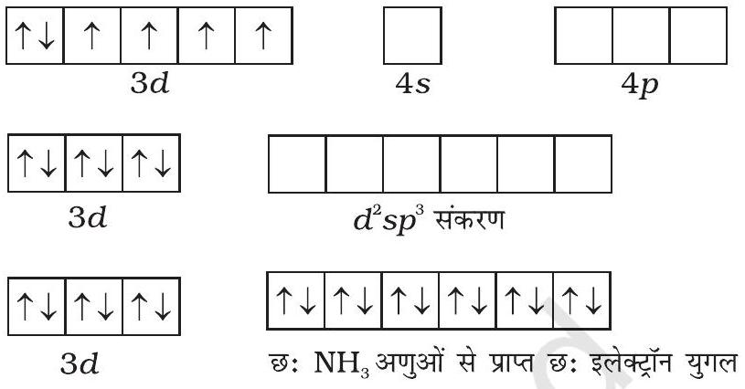

छ: $\mathrm{NH}_{3}$ अणुओं से प्रत्येक का एक इलेक्टॉन युगल छः संकरित कक्षकों में स्थान ग्रहण करता है। इस प्रकार संकुल की ज्यामिति अष्टफलकीय है तथा अयुगलित इलेक्ट्रॉनों की अनुपस्थिति के कारण यह प्रतिचुंबकीय है। इस संकुल के निर्माण के लिए संकरण में आंतरिक $d$ कक्षक $(3 d)$ प्रयुक्त होते हैं, संकुल, $\left[\mathrm{Co}\left(\mathrm{NH}_{3}\right)_{6}\right]^{3+}$ आंतरिक कक्षक संकुल (inner orbital complex) या निम्न प्रचक्रण संकुल (low spin complex) या प्रचक्रण युग्मित संकुल (spin paired complex) कहलाता है। अनुचुंबकीय अष्टफलकीय संकुल, $\left[\mathrm{CoF}_{6}\right]^{3-}$ संकरण $\left(s p^{3} d^{2}\right)$ के लिए बाह्य कक्षक $(4 d)$ प्रयुक्त करता है। इसीलिए यह बाह्य कक्षक (outer orbital) या उच्च प्रचक्रण (high spin) या प्रचक्रण मुक्त संकुल (spin free complex) कहलाता है। इस प्रकार—

$\mathrm{CO}^{3+}$ आयन के कक्षक
$\mathrm{Co}^{3+}$ के $d^{2} s p^{3}$ संकरित कक्षक
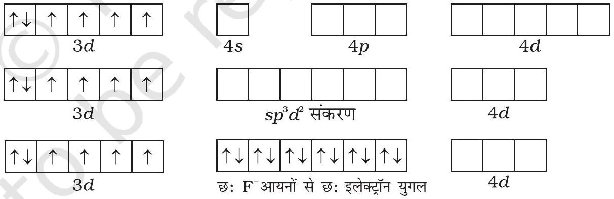

चतुष्फलकीय संकुलों में एक $s$ तथा तीन $p$ कक्षक के संकरण से चार समतुल्य कक्षक बनते हैं जो चतुष्फलकीय रूप से अभिविन्यासित होते हैं। यह $\left[\mathrm{NiCl}_{4}\right]^{2-}$ के लिए नीचे दर्शाया गया है। यहाँ निकैल +2 ऑक्सीकरण अवस्था में है तथा आयन का इलेक्ट्रॉनिक विन्यास $3 d^{8}$ है। इसकी संकरण योजना को अगले पृष्ठ पर चित्र में दर्शाया गया है।

प्रत्येक $\mathrm{Cl}^{-}$आयन एक इलेक्ट्रॉन युगल दान करता है। दो अयुगलित इलेक्ट्रॉनों की उपस्थिति के कारण यौगिक अनुचुंबकीय है। इसी प्रकार, $\left[\mathrm{Ni}(\mathrm{CO})_{4}\right]$ की ज्यामिति चतुष्फलकीय परंतु प्रतिचुंबकीय है, क्योंकि निकैल शून्य ऑक्सीकरण अवस्था में है तथा इसमें अयुगलित इलेक्ट्रॉन नहीं हैं।
$\mathrm{Ni}^{2+}$ आयन के कक्षक
$\mathrm{Ni}^{2+}$ के $s p^{3}$
संकरित कक्षक
$\left[\mathrm{NiCl}_{4}\right]^{2-}$
(उच्च प्रचक्रण संकुल)
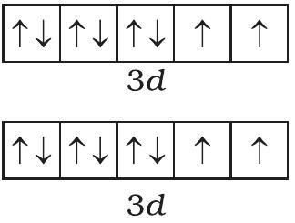

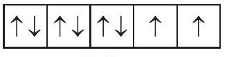
$3 d$

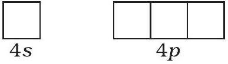
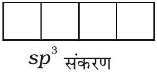

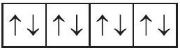
$4 \mathrm{Cl}^{-}$से इलेक्ट्रॉनों के चार युगल

वर्ग समतलीय संकुलों में $d s p^{2}$ संकरण पाया जाता है। $\left[\mathrm{Ni}(\mathrm{CN})_{4}\right]^{2-}$ इसका एक उदाहरण है। यहाँ निकैल +2 ऑक्सीकरण अवस्था में है तथा इसका इलेक्ट्रॉनिक विन्यास $3 d^{8}$ है। इसकी संकरण योजना निम्न है-
$\mathrm{Ni}^{2+}$ आयन के कक्षक
$\mathrm{Ni}^{2+}$ के $d s p^{2}$
संकरित कक्षक
$\left[\mathrm{Ni}(\mathrm{CN})_{4}\right]^{2-}$
(निम्न प्रचक्रण संकुल)
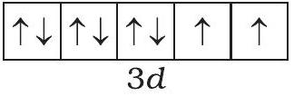
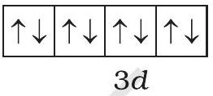
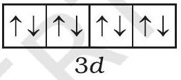
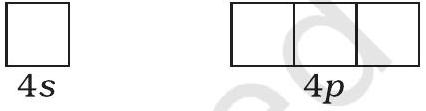
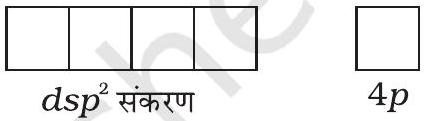

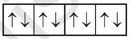
$4 \mathrm{CN}^{-}$समूहों से प्राप्त इलेक्ट्रॉनों के चार युगल

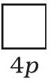
प्रत्येक संकरित कक्षक एक सायनाइड आयन से एक इलेक्ट्रॉन युगल प्राप्त करता है। अयुगलित इलेक्ट्रॉनों की अनुपस्थिति के कारण संकुल प्रतिचुंबकीय है। यह मुख्य रूप से ध्यान देने योग्य है कि संकरित कक्षकों का वास्तविक अस्तित्व नहीं है। वास्तव में, संकरण प्रयुक्त परमाणु कक्षकों के तरंग फलन का एक गणितीय परिचालन है।

उपसहसंयोजन यौगिकों के चुंबकीय आघूर्ण का मापन चुंबकीय प्रवृत्ति (magnetic susceptibility) प्रयोगों द्वारा किया जा सकता है। इसके परिणामों का उपयोग संकुलों में अयुग्मित इलेक्ट्रॉनों की संख्या तथा संरचनाओं की जानकारी के लिए किया जा सकता है।

प्रथम संक्रमण श्रेणी के धातुओं के उपसहसंयोजन यौगिकों के चुंबकीय आँकड़ों का विवेचनात्मक अध्ययन कुछ जटिलता दर्शाता है। धातु आयनों के लिए जिनके $d$ कक्षकों में तीन तक इलेक्ट्रॉन होते हैं, जैसे $\mathrm{Ti}^{3+}\left(d^{1}\right) ; \mathrm{V}^{3+}\left(d^{2}\right) ; \mathrm{Cr}^{3+}\left(d^{3}\right)$; इनमें $4 s$ तथा $4 p$ के कक्षकों के साथ अष्टफलकीय संकरण हेतु दो $d$ कक्षक उपलब्ध हैं। इन मुक्त आयनों तथा इनकी उपसहसंयोजन सत्ता का चुंबकीय व्यवहार समान होता है। जब तीन से अधिक $3 d$ इलेक्ट्रॉन उपस्थित हों तो अष्टफलकीय संकरण हेतु आवश्यक $3 d$ कक्षकों के युगल सीधे उपलब्ध नहीं होते (हुंड के नियमानुसार)। इस प्रकार, $d^{4}\left(\mathrm{Cr}^{2+}, \mathrm{Mn}^{3+}\right), d^{5}$ $\left(\mathrm{Mn}^{2+}, \mathrm{Fe}^{3+}\right), d^{6}\left(\mathrm{Fe}^{2+}, \mathrm{Co}^{3+}\right)$ के लिए रिक्त $d$ कक्षकों के युगल केवल $3 d$ इलेक्ट्रॉनों के युगलित होने से उपलब्ध होते हैं, फलस्वरूप क्रमशः दो, एक व शून्य अयुगलित इलेक्ट्रॉन बचे रहते हैं।

अनेक स्थितियों, विशेषतौर से $d^{6}$ युक्त आयनों के उपसहसंयोजन यौगिकों में, चुंबकीय मान उच्चतम प्रचक्रण युग्मन से मेल खाते हैं। परंतु, $d^{4}$ और $d^{5}$ स्पीशीज़ से युक्त आयनों

के युक्त संकुलों में जटिलताएं पाई जाती हैं। $\left[\mathrm{Mn}(\mathrm{CN})_{6}\right]^{3-}$ का चुंबकीय आघूर्ण दो अयुगलित इलेक्ट्रॉनों के कारण है जबकि $\left[\mathrm{MnCl}_{6}\right]^{3-}$ का चुंबकीय आघूर्ण चार अयुगलित इलेक्ट्रॉनों के कारण है; $\left[\mathrm{Fe}(\mathrm{CN})_{6}\right]^{3-}$ का चुंबकीय आघूर्ण एक अयुगलित इलेक्ट्रॉन के कारण है जबकि $\left[\mathrm{FeF}_{6}\right]^{3-}$ का अनुचुंबकीय आघूर्ण पाँच अयुगलित इलेक्ट्रॉनों के लिए है। $\left[\mathrm{CoF}_{6}\right]^{3-}$ चार अयुगलित इलेक्ट्रॉन युक्त अनुचुंबकीय संकुल आयन है जबकि $\left[\mathrm{Co}\left(\mathrm{C}_{2} \mathrm{O}_{4}\right)_{3}\right]^{3-}$ प्रतिचुंबकीय। यह असंगति संयोजकता आबंध सिद्धांत द्वारा आंतरिक कक्षक तथा बाह्य कक्षक संकुलों के बनने के आधार पर स्पष्ट की जा सकती है। $\left[\mathrm{Mn}(\mathrm{CN})_{6}\right]^{3-},\left[\mathrm{Fe}(\mathrm{CN})_{6}\right]^{3-}$ तथा $\left[\mathrm{Co}\left(\mathrm{C}_{2} \mathrm{O}_{4}\right)_{3}\right]^{3-}$ आंतरिक कक्षक संकुल हैं तथा प्रत्येक में धातु की संकरण अवस्था $d^{2} s p^{3}$ है। इनमें पहले दो संकुल अनुचुंबकीय तथा तीसरा प्रतिचुंबकीय है। दूसरी ओर $\left[\mathrm{MnCl}_{6}\right]^{3-},\left[\mathrm{FeF}_{6}\right]^{3-}$ तथा $\left[\mathrm{CoF}_{6}\right]^{3-}$ बाह्य कक्षक संकुल हैं जिनमें धातु की संकरण अवस्था $s p^{3} d^{2}$ है और इनकी अनुचुंबकीय प्रकृति क्रमशः चार, पाँच और चार अयुगलित इलेक्ट्रॉनों की उपस्थिति के कारण है।

उदाहरण $5.7\left[\mathrm{MnBr}_{4}\right]^{2-}$ के 'केवल-प्रचक्रण' चुंबकीय आघूर्ण का मान 5.9 BM है। संकुल आयन की ज्यामिति बतलाइए।

हल चूँकि संकुल आयन में $\mathrm{Mn}^{2+}$ आयन की समन्वय संख्या $4$ है, अतः यह या तो चतुष्फलकीय ( $s p^{3}$ संकरण ) या वर्गसमतल ( $d s p^{2}$ संकरण ) होगा। परंतु इस संकुल आयन का चुंबकीय आघूर्ण 5.9 BM है अतः $d$ कक्षकों में पाँच अयुगलित इलेक्ट्रॉनों की उपस्थिति के कारण इसकी आकृति चतुष्फलकीय होनी चाहिए न कि वर्ग समतलीय।

### 5.5.3 संयोजकता आबंध यद्यपि संयोजकता आबंध सिद्धांत (VBT), उपसहसंयोजन यौगिकों के बनने तथा उनकी   यद्यपि संयोजकता आबंध सिद्धांत (VBT), उपसहसंयोजन यौगिकों के बनने तथा उनकी सिद्धांत की सीमाएं संरचनाओं एवं चुंबकीय व्यवहार का व्यापक स्तर पर स्पष्टीकरण देता है, फिर भी इसमें

निम्नलिखित कमियाँ हैं -

(i) इसमें अनेक प्रकार के पूर्वानुमान हैं।
(ii) यह चुंबकीय आँकड़ों की कोई मात्रात्मक व्याख्या नहीं देता।
(iii) यह उपसहसंयोजन यौगिकों द्वारा दर्शाए गए रंगों का स्पष्टीकरण नहीं देता।
(iv) यह उपसहसंयोजन यौगिकों के ऊष्मागतिकीय और गतिक स्थायित्व की कोई भी मात्रात्मक व्याख्या नहीं करता।
(v) यह $4$ समन्वयी संकुलों के लिए चतुष्फलकीय तथा वर्गसमतल संरचनाओं का सही अनुमान नहीं लगा पाता।
(vi) यह दुर्बल तथा प्रबल लिगन्डों के मध्य विभेद नहीं करता।

### 5.5.4 क्रिस्टल क्षेत्र सिद्धांत

क्रिस्टल क्षेत्र सिद्धांत (CFT) एक स्थिर वैद्युत मॉडल है जिसके अनुसार धातु-लिगन्ड आबंध आयनिक होते हैं जो केवल धातु आयन तथा लिगन्ड के मध्य स्थिरवैद्युत अन्योन्य क्रियाओं द्वारा उत्पन्न होते हैं। ऋणावेशित लिगन्डों को एक बिंदु आवेश के रूप में एवं उदासीन लिगन्डों को बिंदु द्विध्रुवों के रूप में माना जाता है। किसी विलगित गैसीय धातु परमाणु/ आयन के पाँचों $d$-कक्षकों की ऊर्जा का मान बराबर होता है अर्थात ये अपभ्रष्ट (degenerate) अवस्था में होते हैं। यह अपभ्रष्ट अवस्था तब तक बनी रहती है जब तक कि धातु परमाणु/ आयन के चारों ओर ऋणावेशों का एक गोलीयतः सममित क्षेत्र रहता है। परंतु किसी संकुल में जब यह ऋणावेशित क्षेत्र लिगन्डों के कारण (या तो ऋणायन या किसी द्विध्रुवीय अणु के

ऋणात्मक भाग जैसे $\mathrm{NH}_{3}$ या $\mathrm{H}_{2} \mathrm{O}$ ) होता है तो असममित हो जाता है और $d$ कक्षकों की समभ्रंश अवस्था (degeneracy) समाप्त हो जाती है। इसके परिणामस्वरूप $d$ कक्षकों का विपाटन हो जाता है। यह विपाटन (splitting) क्रिस्टल क्षेत्र की प्रकृति पर निर्भर करता है। हम यहाँ विभिन्न क्रिस्टल क्षेत्रों में विपाटन को स्पष्ट करेंगे।

## (क) अष्टफलकीय उपसहसंयोजन समूहों में क्रिस्टल क्षेत्र विपाटन

एक अष्टफलकीय उपसहसंयोजन सत्ता, जिसमें धातु परमाणु/आयन छः लिगन्डों द्वारा घिरा रहता है, में धातु के $d$ कक्षकों के इलेक्ट्रॉनों तथा लिगन्डों के इलेक्ट्रॉनों (या ॠणावेश) के मध्य प्रतिकर्षण होता है। जब धातु का $d$ कक्षक लिगन्ड से दूर न होकर सीधा निर्दिष्ट होता है तो प्रतिकर्षण अधिक होता है। इस प्रकार $d_{x^{2}-y^{2}}$ तथा $d_{z^{2}}$ कक्षक, जो लिगन्ड की दिशा वाले अक्षों पर हैं, अधिक प्रतिकर्षण अनुभव करते हैं तथा उनकी ऊर्जा में वृद्धि हो जाती है एवं $d_{\mathrm{xy}}, d_{\mathrm{yz}}$ और $d_{\mathrm{xz}}$ कक्षक, जो अक्षों के मध्य निर्दिष्ट होते हैं, की ऊर्जा गोलीय क्रिस्टल क्षेत्र की औसत ऊर्जा की तुलना में घट जाती है। इस प्रकार अष्टफलकीय संकुल में लिगन्ड इलेक्ट्रॉन-धातु इलेक्ट्रॉन प्रतिकर्षणों के कारण $d$ कक्षकों की अपभ्रष्टता (degeneracy) हट जाती है तथा तीन निम्न ऊर्जा वाले, $t_{2 \mathrm{~g}}$ कक्षकों तथा दो उच्च ऊर्जा वाले, $e_{\mathrm{g}}$ कक्षकों के दो समुच्चय बनते हैं। इस प्रकार समान ऊर्जा वाले कक्षकों का, लिगन्डों की निश्चित ज्यामिति में उपस्थिति से दो समुच्चयों में विपाटन क्रिस्टल क्षेत्र विपाटन (crystal field splitting) कहलाता है तथा समुच्चयों की ऊर्जा के अंतर को $\Delta_{\mathrm{o}}$ (यहाँ o अधोलिखित अष्टफलक (octahedral) के लिए है) से दर्शाते हैं (चित्र 5.8)। इस प्रकार दो $e_{\mathrm{g}}$ कक्षकों की ऊर्जा में $(3 / 5) \Delta_{\mathrm{o}}$ के बराबर वृद्धि होती है तथा तीन $t_{2 \mathrm{~g}}$ कक्षकों की ऊर्जा में $(2 / 5) \Delta_{0}$ के बराबर कमी आती है।

क्रिस्टल क्षेत्र विपाटन, $\Delta_{\mathrm{o}}$ लिगन्ड तथा धातु आयन पर विद्यमान आवेश से उत्पन्न क्षेत्र पर निर्भर करता है। कुछ लिगन्ड प्रबल क्षेत्र उत्पन्न कर सकते हैं तथा ऐसी स्थिति में विपाटन अधिक होता है जबकि अन्य, दुर्बल क्षेत्र उत्पन्न करते हैं जिसके फलस्वरूप $d$ कक्षकों का विपाटन कम होता है। सामान्यतः लिगन्डों को उनके बढ़ती हुई क्षेत्र प्रबलता के क्रम में एक श्रेणी में निम्नानुसार व्यवस्थित किया जा सकता है-

$$
\begin{aligned}
& \mathrm{I}^{-}<\mathrm{Br}^{-}<\mathrm{SCN}^{-}<\mathrm{Cl}^{-}<\mathrm{S}^{2-}<\mathrm{F}^{-}<\mathrm{OH}^{-}<\mathrm{C}_{2} \mathrm{O}_{4}{ }^{2-}<\mathrm{H}_{2} \mathrm{O}<\mathrm{NCS}^{-}<\text {edta }^{4-}< \\
& \mathrm{NH}_{3}<\mathrm{en}<\mathrm{CN}^{-}<\mathrm{CO}
\end{aligned}
$$

चित्र $5.8$ - अष्टफलकीय क्रिस्टल क्षेत्र में $d$ कक्षकों का विपाटन
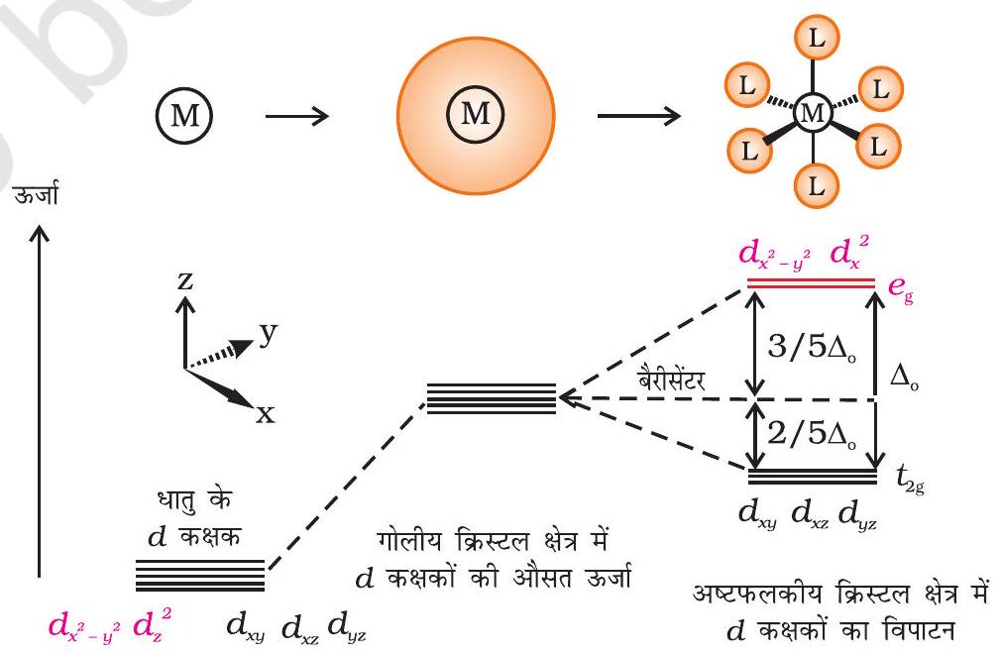

इस प्रकार की श्रेणी स्पेक्ट्रमी रासायनिक श्रेणी (spectrochemical series) कहलाती है। यह विभिन्न लिगन्डों के साथ बने संकुलों द्वारा प्रकाश के अवशोषण पर आधारित प्रायोगिक तथ्यों द्वारा निर्धारित श्रेणी है। आइए, हम अष्टफलकीय उपसहसंयोजन सत्ता में उपस्थित धातु आयन के $d$ कक्षकों में इलेक्ट्रॉनों के वितरण को समझें। स्पष्टतः, $d$ इलेक्ट्रॉन निम्न ऊर्जा वाले किसी एक $t_{2 \mathrm{~g}}$ कक्षक में जाएगा। $d^{2}$ तथा $d^{3}$ उपसहसंयोजन सत्ता में, हुंड के नियमानुसार $d$ इलेक्ट्रॉन $t_{2 \mathrm{~g}}$ कक्षकों में अयुगलित रहते हैं। $d^{4}$ आयनों के लिए, इलेक्ट्रॉनिक विन्यास के प्रारूप की दो संभावनाएं हैं- (i) चतुर्थ इलेक्ट्रॉन $t_{2 \mathrm{~g}}$ कक्षकों में पहले से विद्यमान इलेक्ट्रॉन के साथ युगलित हो सकता है या (ii) यह $e_{\mathrm{g}}$ स्तर में स्थान ग्रहण कर, युग्मन ऊर्जा के व्यय से बचता है। इनमें से कौन सी संभावना बनती है यह क्रिस्टल क्षेत्र विपाटन, $\Delta_{0}$ तथा युग्मन ऊर्जा $\mathrm{P}(\mathrm{P}$ एक कक्षक में इलेक्ट्रॉन युग्मन के लिए आवश्यक ऊर्जा है।) के तुलनात्मक परिमाण पर निर्भर करता है।
निम्नलिखित दो विकल्प हैं-

(i) यदि $\Delta_{\mathrm{o}}<\mathrm{P}$, हो तो चौथा इलेक्ट्रॉन किसी एक $e_{\mathrm{g}}$ कक्षक में जायेगा तथा अभिविन्यास $t_{2 \mathrm{~g}}^{3} e_{\mathrm{g}}^{1}$ प्राप्त होगा। लिगन्ड जिनके लिए $\Delta_{\mathrm{o}}<\mathrm{P}$ होता है, दुर्बल क्षेत्र लिगन्ड कहलाते हैं और ये उच्च प्रक्रण (high spin) संकुल बनाते हैं।
(ii) यदि $\Delta_{0}>\mathrm{P}$ हो तो, यह ऊर्जा की दृष्टि से अधिक अनुकूल होता है, अतः चौथा इलेक्ट्रॉन किसी एक $t_{2 \mathrm{~g}}$ कक्षक में जाएगा जिससे इलेक्ट्रॉनिक विन्यास $t_{2 \mathrm{~g}}^{4} e_{\mathrm{g}}^{0}$ प्राप्त होगा। लिगन्ड जो इस प्रकार का प्रभाव उत्पन्न करते हैं प्रबल क्षेत्र लिगन्ड (strong field ligands) कहलाते हैं तथा ये निम्न प्रचक्रण संकुल बनाते हैं।

गणनाएं दर्शाती हैं कि $d^{4}$ से $d^{7}$ वाली उपसहसंयोजन सत्ता दुर्बल क्षेत्र संकुलों की अपेक्षा प्रबल क्षेत्र में अधिक स्थायी होते हैं।
(ख) चतुष्फलकीय उपसहसंयोजन समूहों में क्रिस्टल क्षेत्र विपाटन
चतुष्फलकीय सहसंयोजन सत्ता के विरचन में, $d$ कक्षकों का विपाटन अष्टफलकीय से उलटा (चित्र 5.9) तथा कम होता है। समान धातु, समान लिगन्डों तथा समान धातु-लिगन्ड दूरी के लिए, यह दिखाया जा सकता है कि $\Delta_{\mathrm{t}}=4 / 9 \Delta_{0}$, अतः कक्षकों की विपाटन ऊर्जा इतनी अधिक नहीं होती जो इलेक्ट्रॉनों को युग्मन के लिए बाध्य करे। इसीलिए, निम्न प्रचक्रण (low spin) विन्यास विरले ही देखा जाता है। 'g' सब्सक्रिप्ट का उपयोग अष्टफलकीय एवं वर्ग समतली संकुलों में करते हैं जिनमें समरूपता केन्द्र होता है। चूँकि चतुष्फलकीय संकुलों में समरूपता केन्द्र नहीं होता अतः ऊर्जा स्तर में 'g' सब्सक्रिप्ट का उपयोग नहीं करते।

चित्र 5.9- चतुष्फलकीय क्रिस्टल क्षेत्र में $d$ कक्षकों का विपाटन
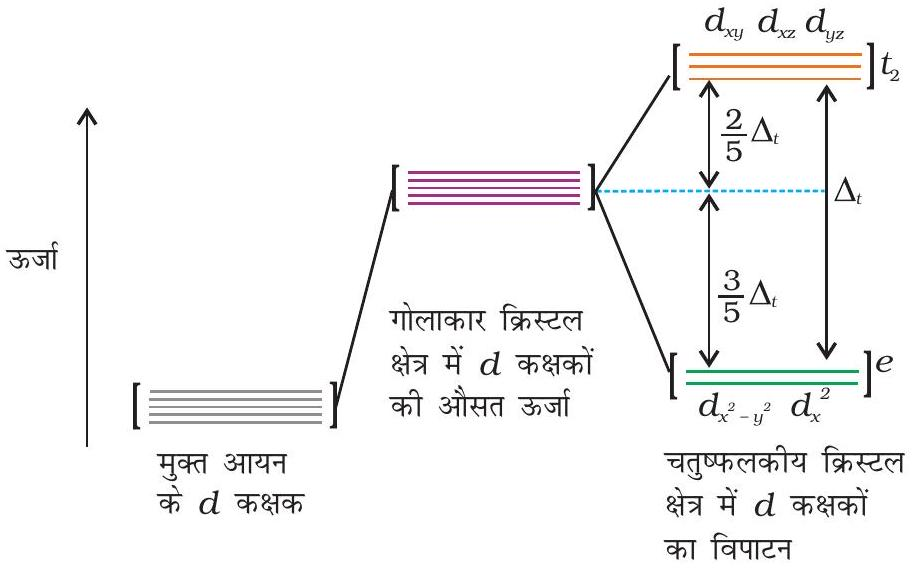

### 5.5.5 उपसहसंयोजन यौगिकों में रंग

इससे पहले के एकक में हमने पढ़ा कि संक्रमण धातुओं के संकुलों की एक विशेषता उनके रंगों का विस्तृत परास है। इसका अर्थ है कि जब श्वेत प्रकाश प्रतिदर्श (Sample) में से होकर बाहर निकलता है तो ये उसका कुछ भाग अवशोषित कर लेते हैं अतः बाहर निकलने वाला प्रकाश अब श्वेत नहीं रहता। संकुल का रंग वह दिखाई देता है जो उसके द्वारा अवशोषित रंग का पूरक होता है। पूरक रंग अवशेष तरंग दैर्घ्य द्वारा उत्पन्न होता है। यदि संकुल हरा रंग अवशोषित करता है, तो यह लाल दिखाई पड़ता है। सारणी $5.3$ में विभिन्न अवशोषित तरंगदैर्घ्य (वेवलेंथ) तथा प्रेक्षित रंग के मध्य संबंध दर्शाया गया है।

सारणी 5.3-कुछ उपसहसंयोजन सत्ताओं के प्रेक्षित रंग तथा अवशोषित प्रकाश तरंगदैर्घ्य के बीच संबंध
| उपसहसंयोजक समूह | अवशोषित प्रकाश का तरंगदैर्घ्य (nm) | अवशोषित प्रकाश का रंग | उपसहसंयोजक समूह का रंग |
| :--- | :--- | :--- | :--- |
| $\left[\mathrm{Co}\left(\mathrm{NH}_{3}\right)_{5} \mathrm{Cl}^{2+}\right.$ | $535$ | पीला □ | बैंगनी □ |
| $\left[\mathrm{Co}\left(\mathrm{NH}_{3}\right)_{5}\left(\mathrm{H}_{2} \mathrm{O}\right)\right]^{3+}$ | $500$ | नीला-हरा □ | लाल |
| $\left[\mathrm{Co}\left(\mathrm{NH}_{3}\right)_{6}\right]^{3+}$ | $475$ | नीला □ | पीला-नारंगी |
| $\left[\mathrm{Co}(\mathrm{CN})_{6}\right]^{3-}$ | $310$ | पराबैंगनी दृश्य प्रक्षेत्र नहीं है | हल्का पीला |
| $\left[\mathrm{Cu}\left(\mathrm{H}_{2} \mathrm{O}\right)_{4}\right]^{2+}$ | $600$ | लाल | नीला ■ |
| $\left[\mathrm{Ti}\left(\mathrm{H}_{2} \mathrm{O}\right)_{6}\right]^{3+}$ | $498$ | नीला-हरा | नील लोहित □ |

उपसहसंयोजन यौगिकों में रंगों की व्याख्या क्रिस्टल क्षेत्र सिद्धांत के आधार पर सहज ही की जा सकती है। संकुल $\left[\mathrm{Ti}\left(\mathrm{H}_{2} \mathrm{O}\right)_{6}\right]^{3+}$ का उदाहरण लें जो बैंगनी रंग का है। यह एक अष्टफलकीय संकुल है जिसमें धातु के $d$ कक्षक का एक इलेक्ट्रॉन ( $\mathrm{Ti}^{3+}$ एक $3 d^{1}$ निकाय खाली है ) संकुल की निम्नतम ऊर्जा अवस्था में $t_{2 \mathrm{~g}}$ कक्षक में है। इस इलेक्ट्रॉन के लिए उपलब्ध इससे अगली उच्च अवस्था रिक्त $e_{\mathrm{g}}$ कक्षक है। यदि संकुल पीले-हरे क्षेत्र की ऊर्जा के संगत प्रकाश का अवशोषण करे तो इलेक्ट्रॉन $t_{2 \mathrm{~g}}$ स्तर से $e_{\mathrm{g}}$ स्तर पर उत्तेजित हो जाता है $\left(t_{2 \mathrm{~g}}^{1} e_{\mathrm{g}}^{0} \rightarrow t_{2 \mathrm{~g}}^{0} e_{\mathrm{g}}^{1}\right)$ । इसके फलस्वरूप संकुल बैंगनी दिखाई देता है (चित्र 5.10)। क्रिस्टल क्षेत्र सिद्धांत यह मानता है कि उपसहसंयोजन यौगिकों का रंग इलेक्ट्रॉन के $d-d$ संक्रमण (Transition) के कारण होता है।

चित्र 5.10- $\left[\mathrm{Ti}\left(\mathrm{H}_{2} \mathrm{O}\right)_{6}\right]^{3+}$ में एक इलेक्ट्रॉन का संक्रमण (Transition)
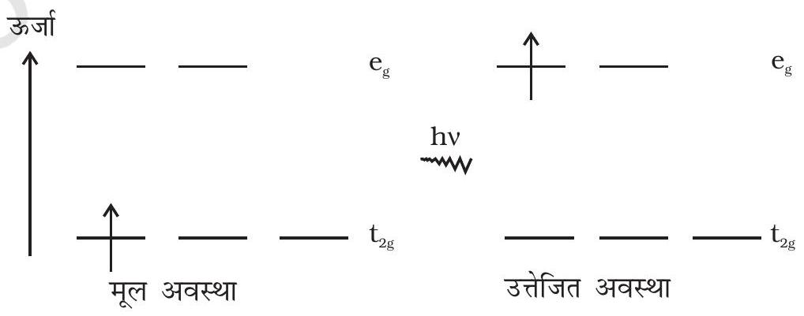

यह ध्यान देना महत्वपूर्ण है कि लिगन्ड की अनुपस्थिति में, क्रिस्टल क्षेत्र विपाटन नहीं होता, अतः पदार्थ रंगहीन होता है। उदाहरणार्थ, $\left[\mathrm{Ti}\left(\mathrm{H}_{2} \mathrm{O}\right)_{6}\right] \mathrm{Cl}_{3}$ को गरम करने पर इसमें

से जल निकल जाने के कारण यह रंगहीन हो जाता है। इसी प्रकार अजलीय $\mathrm{CuSO}_{4}$ श्वेत होता है परंतु $\mathrm{CuSO}_{4} \cdot 5 \mathrm{H}_{2} \mathrm{O}$ नीले रंग का होता है। संकुल के रंग पर लिगन्ड के प्रभाव को $\left[\mathrm{Ni}\left(\mathrm{H}_{2} \mathrm{O}\right)_{6}\right]^{2+}$ के उदाहरण द्वारा दर्शाया जा सकता है। जो निकैल (II) क्लोराइड को जल में विलेय करने पर बनता है। यदि इसमें धीरे-धीरे द्विदंतुर लिगन्ड, एथेन-1,2-डाइऐमीन (en) को आणविक अनुपातों, en:Ni, $1: 1,2: 1,3: 1$, में मिलाया जाए तो निम्नलिखित अभिक्रियाएं तथा उनसे संबधिंत रंग परिवर्तन होते हैं। इस श्रंखला को चित्र $5.11$ में दर्शाया गया है-

$$
\left[\mathrm{Ni}\left(\mathrm{H}_{2} \mathrm{O}\right)_{6}\right]^{2+}(\mathrm{aq})+\mathrm{en}(\mathrm{aq}) \quad \rightarrow\left[\mathrm{Ni}\left(\mathrm{H}_{2} \mathrm{O}\right)_{4}(\mathrm{en})\right]^{2+}(\mathrm{aq})+2 \mathrm{H}_{2} \mathrm{O}
$$

हरा हल्का नीला

$$
\begin{aligned}
{\left[\mathrm{Ni}\left(\mathrm{H}_{2} \mathrm{O}\right)_{4}(\mathrm{en})\right]^{2+}(\mathrm{aq})+\mathrm{en}(\mathrm{aq}) \rightarrow } & {\left[\mathrm{Ni}\left(\mathrm{H}_{2} \mathrm{O}\right)_{2}(\mathrm{en})_{2}\right]^{2+}(\mathrm{aq})+2 \mathrm{H}_{2} \mathrm{O} } \\
& \text { नीला/नीललोहित } \\
{\left[\mathrm{Ni}\left(\mathrm{H}_{2} \mathrm{O}\right)_{2}(\mathrm{en})_{2}\right]^{2+}(\mathrm{aq})+\mathrm{en}(\mathrm{aq}) \rightarrow } & {\left[\mathrm{Ni}(\mathrm{en})_{3}\right]^{2+}(\mathrm{aq})+2 \mathrm{H}_{2} \mathrm{O} }
\end{aligned}
$$

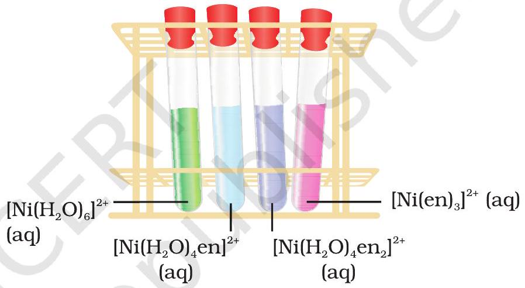

## कुछ रत्नों के रंग

संक्रमण धातु आयन के $d$ कक्षकों के बीच इलेक्ट्रॉनों के संक्रमण से रंग का उत्पन्न होना हमारे दैनिक जीवन में अक्सर दिखाई पड़ता है। माणिक्य (Ruby) (चित्र $5.12$ क), लगभग $0.5-1 \% \mathrm{Cr}^{3+}$ आयन $\left(d^{3}\right)$ युक्त एलुमिनियम ऑक्साइड $\left(\mathrm{AI}_{2} \mathrm{O}_{3}\right)$ है जिसमें $\mathrm{Al}^{3+}$ के स्थान पर $\mathrm{Cr}^{3+}$ आयन कहीं-कहीं बेतरतीब स्थित रहते हैं। हम इन्हें ऐलुमिना के जालक में समावेष्टित अष्टफलकीय क्रोमियम (III) संकुल के रूप में देख सकते हैं। इन केंद्रों पर $d-d$ संक्रमण के कारण माणिक्य में रंग उत्पन्न होता है।

पन्ना (emerald) (चित्र $5.12$ ख) में, $\mathrm{Cr}^{3+}$ आयन खनिज बैरिल $\left(\mathrm{Be}_{3} \mathrm{Al}_{2} \mathrm{Si}_{6} \mathrm{O}_{18}\right)$ में अष्टफलकीय स्थानों पर स्थित रहते हैं।

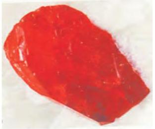
(क)

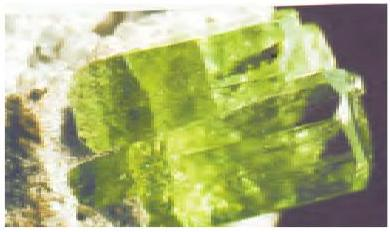
(ख)

माणिक्य का पीला-लाल तथा नीला
चित्र 5.12- (क) माणिक्य- यह रत्न मोगोक (म्याँमार) से प्राप्त अवशोषण-बैंड। उच्चतर तरंगदैर्घ्य की ओर संगमरमर में पाया गया; (ख) पन्ना- यह रत्न विस्थापित हो जाता है। इसके कारण पन्ने से हरे कोलंबिया के म्यूज़ो (Muzo) में पाया गया। रंग के क्षेत्र वाला प्रकाश प्रसारित होता है।

5.5.6 क्रिस्टल क्षेत्र

सिद्धांत की
सीमाएं

क्रिस्टल क्षेत्र मॉडल के द्वारा उपसहसंयोजन यौगिकों के बनने, उनकी संरचना, रंग तथा चुंबकीय गुणों को काफ़ी हद तक सफलतापूर्वक समझाया जा सकता है, परंतु इन अवधारणाओं से कि लिगन्ड बिंदु आवेश हैं, ऐसा प्रतीत होता है कि ऋणायन लिगन्ड द्वारा $d$ कक्षकों का विपाटन सर्वाधिक होना चाहिए। जबकि ऋणायन लिगन्ड वास्तव में स्पेक्ट्रोरासायनिक श्रेणी के निचले सिरे पर आते हैं। इसके अतिरिक्त यह सिद्धांत लिगन्ड तथा केंद्रीय परमाणु के मध्य आबंध की सहसंयोजक प्रवृत्ति का संज्ञान नहीं लेता। ये CFT की कुछ कमज़ोरियाँ हैं जिन्हें लिगन्ड क्षेत्र सिद्धांत (LFT) तथा आण्विक कक्षक सिद्धांत (MOT) द्वारा समझाया जा सकता है। परंतु यह इस पुस्तक की सीमा के बाहर है।

## पाठ्यनिहित प्रश्न

$5.5$ संयोजकता आबंध सिद्धांत के आधार पर समझाइए कि वर्ग समतलीय संरचना वाला $\left[\mathrm{Ni}(\mathrm{CN})_{4}\right]^{2-}$ आयन प्रतिचुंबकीय है तथा चतुष्फलकीय ज्यामिति वाला $\left[\mathrm{NiCl}_{4}\right]^{2-}$ आयन अनुचुंबकीय है।
$5.6\left[\mathrm{NiCl}_{4}\right]^{2-}$ अनुचुंबकीय है जबकि $\left[\mathrm{Ni}(\mathrm{CO})_{4}\right]$ प्रतिचुंबकीय है यद्यपि दोनों चतुष्फलकीय है। क्यों?
$5.7\left[\mathrm{Fe}\left(\mathrm{H}_{2} \mathrm{O}\right)_{6}\right]^{3+}$ प्रबल अनुचुंबकीय है जबकि $\left[\mathrm{Fe}(\mathrm{CN})_{6}\right]^{3-}$ दुर्बल अनुचुंबकीय। समझाइए।
$5.8$ समझाइए कि $\left[\mathrm{Co}\left(\mathrm{NH}_{3}\right)_{6}\right]^{3+}$ एक आंतरिक कक्षक संकुल है जबकि $\left[\mathrm{Ni}\left(\mathrm{NH}_{3}\right)_{6}\right]^{2+}$ एक बाह्य कक्षक संकुल है।
$5.9$ वर्ग समतली $\left[\mathrm{Pt}(\mathrm{CN})_{4}\right]^{2-}$ आयन में अयुग्मित इलेक्ट्रॉनों की संख्या बतलाइए।
$5.10$ क्रिस्टल क्षेत्र सिद्धांत को प्रयुक्त करते हुए समझाइए कि कैसे हेक्साएक्वा मैंगनीज (II) आयन में पाँच अयुगलित इलैक्ट्रॉन हैं जबकि हेक्सासायनो आयन में केवल एक ही अयुगलित इलेक्ट्रॉन हैं।
$5.6$ धातु कार्बोनिलो
में आबंधन
होमोलेप्टिक कार्बोनिल (यौगिक जिनमें केवल कार्बोनिल लिगन्ड हों) अधिकतर संक्रमण धातुओं द्वारा निर्मित होते हैं। इन कार्बोनिलों की संरचनाएं सरल तथा सुस्पष्ट होती हैं। टेट्राकार्बोनिलनिकैल ( $0$ ) चतुष्फलकीय है, पेन्टाकार्बोनिल आयरन ( $0$ ) त्रिकोणीय द्विपैरैमिडी है, जबकि हेक्साकार्बोनिलक्रोमियम ( $0$ ) अष्टफलकीय है।
डेकाकार्बोनिलडाइमैंगनीज (O) दो वर्ग पिरैमिडी $\mathrm{Mn}(\mathrm{CO})_{5}$ इकाइयों से बना है जो $\mathrm{Mn}-\mathrm{Mn}$ आबंध से जुड़ी रहती हैं। ऑक्टाकार्बोनिलडाइकोबाल्ट (0) में दो $\mathrm{Co}-\mathrm{Co}$ आबंधों में प्रत्येक के मध्य एक CO समूह सेतु के रूप में रहता है। (चित्र 5.13)।

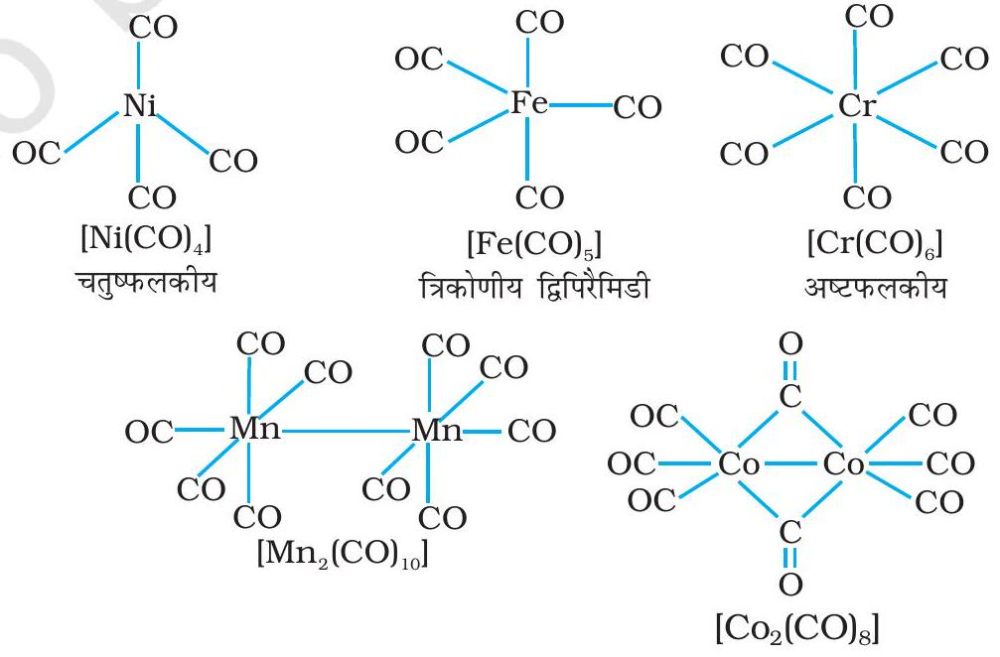

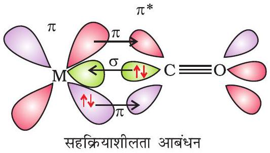
चित्र 5.14- कार्बोनिल संकुल में सहक्रियाशीलता आबंधन अन्योन्यक्रिया का उदाहरण।

धातु कार्बोनिलों के धातु-कार्बन आबंध में $\sigma$ तथा $\pi$ दोनों के गुण पाए जाते हैं। $\mathrm{M}-\mathrm{C} \sigma$ आबंध कार्बोनिल समूह के कार्बन पर उपस्थित इलेक्ट्रॉन युगल को धातु के रिक्त कक्षक में दान करने से बनता है। $\mathrm{M}-\mathrm{C} \pi$ आबंध धातु के पूरित $d$ कक्षकों में से एक इलेक्ट्रॉन युगल को कार्बन मोनोक्साइड के रिक्त प्रतिआबंधन $\pi^{*}$ कक्षक में दान करने से बनता है। धातु से लिगन्ड का आबंध एक सहक्रियाशीलता का प्रभाव उत्पन्न करता है जो CO व धातु के मध्य आबंध को मज़बूत बनाता है (चित्र 5.14)।

## $5.7$ उपसहसंयोजन यौगिकों का महत्व तथा अनुप्रयोग

उपसहसंयोजन यौगिक बहुत महत्व के हैं। ये यौगिक खनिजों, पेड़-पौधों व जीव जगत में व्यापक रूप से पाए जाते हैं तथा विश्लेषणात्मक रसायन, धातुकर्म, जैविक प्रणालियों, उद्योगों तथा औषध के क्षेत्र में इनकी महत्वपूर्ण भूमिकाएं हैं। इनका वर्णन नीचे किया गया है-

- गुणात्मक (qualitative) तथा मात्रात्मक (quantative) रासायनिक विश्लेषणों में उपसहसंयोजन यौगिकों के अनेक उपयोग हैं। अनेक परिचित रंगीन अभिक्रियाएं जिनमें धातु आयनों के साथ अनेक लिगन्डों (विशेष रूप से कीलेट लिगन्ड) की उपसहसंयोजन सत्ता बनने के कारण रंग उत्पन्न होता है। चिरसम्मत (classical) तथा यांत्रिक (instrumental) विधियों द्वारा धातु आयनों की पहचान व उनके मात्रात्मक आकलन का आधार हैं। ऐसे अभिकर्मकों के उदाहरण हैं- EDTA, DMG (डाइमेथिल ग्लाईऑक्सीम), $\alpha$-नाइट्रोसो- $\beta$-नेफ़भॉल, क्यूपफेरॉन आदि।
- जल की कठोरता का आकलन $\mathrm{Na}_{2}$ EDTA के साथ अनुमापन द्वारा किया जाता है। $\mathrm{Ca}^{2+}$ व $\mathrm{Mg}^{2+}$ आयन EDTA के साथ स्थायी संकुल बनाते हैं। इन आयनों का चयनात्मक आकलन किया जा सकता है क्योंकि कैल्सियम तथा मैग्नीशियम के संकुलों के स्थायित्व स्थिरांक में अंतर होता है।
- धातुओं की कुछ प्रमुख निष्कर्षण विधियों में जैसे सिल्वर तथा गोल्ड के लिए संकुल विरचन का उपयोग होता है। उदाहरणार्थ, ऑक्सीजन तथा जल की उपस्थिति में गोल्ड, सायनाइड आयन से संयोजित होकर जलीय विलयन में सहसंयोजन सत्ता, $\left[\mathrm{Au}(\mathrm{CN})_{2}\right]^{-}$ बनाता है। इस विलयन में जिंक मिलाकर गोल्ड को पृथक किया जा सकता है।
- इसी प्रकार से धातुओं का शुद्धिकरण उनके संकुल बनाकर तथा उसे पुनः विघटित करके किया जा सकता है। उदाहरणार्थ, अशुद्ध निकैल को $\left[\mathrm{Ni}(\mathrm{CO})_{4}\right]$ में परिवर्तित किया जाता है तथा इसे अपघटित कर शुद्ध निकैल प्राप्त कर लेते हैं।
- उपसहसंयोजन यौगिक जैव तंत्र में बहुत ही महत्वपूर्ण हैं। प्रकाश संश्लेषण के लिए उत्तरदायी वर्णक, क्लोरोफिल, मैग्नीशियम का उपसहसंयोजन यौगिक है। रक्त का लाल वर्णक हीमोग्लोबीन, जो कि ऑक्सीजन का वाहक है, आयरन का एक उपसहसंयोजन यौगिक है। विटामिन $\mathrm{B}_{12}$ सायनाकोबालऐमीन, प्रतिप्रणाली अरक्तता कारक (anti-pernicious anaemia factor), कोबाल्ट का एक उपसहसंयोजन यौगिक है। जैविक महत्व के अन्य धातु आयन युक्त उपसहसंयोजन यौगिक जैसे- कार्बोक्सीपेप्टिडेज-A (carboxypeptidase A) तथा कार्बोनिक एनहाइड्रेज (carbonic anhydrase) (जैव प्रणाली के उत्प्रेरक) एन्जाइम हैं।

- अनेक औद्योगिक प्रक्रमों में उपसहसंयोजन यौगिकों का उपयोग उत्प्रेरकों के रूप में किया जाता है। उदाहरणार्थ, रोडियम संकुल, $\left[\left(\mathrm{Ph}_{3} \mathrm{P}\right)_{3} \mathrm{RhCl}\right]$, एक विल्किन्सन उत्प्रेरक है, जो एल्कीनों के हाइड्रोजनीकरण में उपयोग में आता है।
- वस्तुओं पर सिल्वर और गोल्ड का वैद्युत लेपन धातु आयनों के विलयन से करने की अपेक्षा उनके संकुल आयनों $\left[\mathrm{Ag}(\mathrm{CN})_{2}\right]^{-}$तथा $\left[\mathrm{Au}(\mathrm{CN})_{2}\right]^{-}$के विलयन से करने पर लेपन कहीं अधिक एकसार व चिकना होता है।
- श्याम-श्वेत फ़ोटोग्राफी में, विकसित की हुई फ़िल्म का स्थायीकरण (fixation) हाइपो विलयन में धोकर किया जाता है, जो अनअपघटित AgBr से संकुल आयन, $\left[\mathrm{Ag}\left(\mathrm{S}_{2} \mathrm{O}_{3}\right)_{2}\right]^{3-}$ बनाकर जल में घोल लेता है।
- औषध रसायन में कीलेट चिकित्सा के उपयोग में अभिरुचि बढ़ रही है। इसका एक उदाहरण है- पौधे/जीव जंतु निकायों में विषैले अनुपात में विद्यमान धातुओं के द्वारा उत्पन्न समस्याओं का उपचार। इस प्रकार कॉपर तथा आयरन की अधिकता को D-पेनिसिलऐमीन तथा डेसफेरीऑक्सिम B लीगन्डों के साथ उपसहसंयोजन यौगिक बनाकर दूर किया जाता है। EDTA को लेड की विषाक्ता के उपचार में प्रयुक्त किया जाता है। प्लेटिनम के कुछ उपसहसंयोजन यौगिक ट्यूमर वृद्धि को प्रभावी रूप से रोकते हैं। उदाहरण हैं- समपक्ष-प्लेटिन (cis-platin) तथा संबंधित यौगिक।

## सारांश

उपसहसंयोजन यौगिकों का रसायन, आधुनिक अकार्बनिक रसायनशास्त्र का एक महत्वपूर्ण एवं चुनौतीपूर्ण क्षेत्र है। पिछले पचास वर्षों में इस क्षेत्र में हुए विकास के फलस्वरूप आबंधन के मॉडल तथा आण्विक संरचनाओं के विषय में नई अवधारणाएं विकसित हुई, रासायनिक उद्योग के क्षेत्रों में विलक्षण भेदन तथा जैव प्रणालियों में कार्य करने वाले क्रांतिक घटकों में महत्वपूर्ण अंतः दृष्टि प्राप्त हुई है।

उपसहसंयोजन यौगिकों के विरचन, अभिक्रियाएं, संरचनाएं एवं आबंधन को समझाने के लिए सर्वप्रथम ए. वर्नर द्वारा प्रयास किया गया। उनके सिद्धांत के अनुसार, उपसहसंयोजन यौगिकों में विद्यमान धातु परमाणु / आयन दो प्रकार की संयोजकताओं (प्राथमिक संयोजकता तथा द्वितीयक संयोजकता) का उपयोग करते हैं। रसायन विज्ञान की आधुनिक भाषा में इन संयोजकताओं को क्रमशः आयनीकृत (आयनिक) तथा अनायनीकृत (सहसंयोजक) आबंध कहते हैं। समावयवता के गुण का उपयोग करते हुए, वर्नर ने अनेक उपसहसंयोजन समूहों की ज्यामितीय आकृतियों के बारे में भविष्यवाणियाँ की।

संयोजकता आबंध सिद्धांत ( VBT ) उपसहसंयोजन यौगिकों के बनाने, चुंबकीय व्यवहार तथा ज्यामितीय आकृतियों का सफलतापूर्वक यथोचित स्पष्टीकरण देता है। फिर भी यह सिद्धांत, उपसहसंयोजन यौगिकों के चुंबकीय व्यवहार की मात्रात्मक व्याख्या करने में असफल रहा है तथा इन यौगिकों के ध्रुवण गुणों के संबंध में कुछ भी नहीं कहता।

क्रिस्टल क्षेत्र सिद्धांत ( CFT ) उपसहसंयोजन यौगिकों में विद्यमान केंद्रीय धातु परमाणु/आयन के $d$-कक्षकों की ऊर्जा की समानता पर विभिन्न क्रिस्टल क्षेत्रों के प्रभाव (लिगन्डों को बिंदु आवेश मानते हुए उनके द्वारा प्रदत्त प्रभाव) पर आधारित है। प्रबल क्षेत्र तथा दुर्बल क्षेत्र में $d$-कक्षकों के विपाटन (splitting) से विभिन्न इलेक्ट्रॉनिक विन्यास प्राप्त होते हैं। इस सिद्धांत की सहायता से उपसहसंयोजन सत्ता में विद्यमान धातु परमाणु/आयन के $d$-कक्षकों की विपाटन ऊर्जा, उसका चुंबकीय आघूर्ण, स्पेक्ट्रमिकी तथा स्थायित्व के प्राचलों (parameters) के मात्रात्मक आकलन में सहायता मिलती है। परंतु, यह धारणा कि लिगन्ड बिंदु आवेश है, अनेक सैद्धांतिक कठिनाइयाँ उत्पन्न करता है।

धातु कार्बोनिलों के धातु-कार्बन आबंधों में $\sigma$ तथा $\pi$ दोनों ही आबंधों के गुण पाए जाते हैं। लिगन्ड से धातु के साथ $\sigma$ आबंध तथा धातु से लिगन्ड के साथ $\pi$ आबंध बनता है। यह विशिष्ट संकर्मी (synergic) आबंधन धातु कार्बोनिलो को स्थायित्व प्रदान करता है।

उपसहसंयोजन यौगिक बहुत महत्वपूर्ण हैं। इन यौगिकों से जैव-प्रणालियों में कार्य करने वाले जैव घटकों की कार्यप्रणाली तथा संरचनाओं की महत्वपूर्ण जानकारी प्राप्त होती है। उपसहसंयोजन यौगिक के धातुकर्म प्रक्रमों, विश्लेषणात्मक तथा औषध रसायन में अनेक अनुप्रयोग हैं।

## अभ्यास

$5.1$ वर्नर की अभिधारणाओं के आधार पर उपसहसंयोजन यौगिकों में आबंधन को समझाइए।
$5.2 \mathrm{FeSO}_{4}$ विलयन तथा $\left(\mathrm{NH}_{4}\right)_{2} \mathrm{SO}_{4}$ विलयन का $1: 1$ मोलर अनुपात में मिश्रण $\mathrm{Fe}^{2+}$ आयन का परीक्षण देता है परंतु $\mathrm{CuSO}_{4}$ व जलीय अमोनिया का $1: 4$ मोलर अनुपात में मिश्रण $\mathrm{Cu}^{2+}$ आयनो का परीक्षण नहीं देता। समझाइए क्यों?
$5.3$ प्रत्येक के दो उदाहरण देते हुए निम्नलिखित को समझाइए- समन्वय समूह, लिगन्ड, उपसहसंयोजन संख्या, उपसहसंयोजन बहुफलक, होमोलेप्टिक तथा हेट्रोरोलेप्टिक।
$5.4$ एकदंतुर, द्विदंतुर तथा उभयदंतुर लिगन्ड से क्या तात्पर्य है? प्रत्येक के दो उदाहरण दीजिए।
$5.5$ निम्नलिखित उपसहसंयोजन सत्ता में धातुओं के ऑक्सीकरण अंक का उल्लेख कीजिए-
(i) $\left[\mathrm{Co}\left(\mathrm{H}_{2} \mathrm{O}\right)(\mathrm{CN})(\text { en })_{2}\right]^{2+}$
(ii) $\left[\mathrm{CoBr}_{2}(\mathrm{en})_{2}\right]^{+}$
(iii) $\left[\mathrm{PtCl}_{4}\right]^{2-}$
(iv) $\mathrm{K}_{3}\left[\mathrm{Fe}(\mathrm{CN})_{6}\right]$
(v) $\left[\mathrm{Cr}\left(\mathrm{NH}_{3}\right)_{3} \mathrm{Cl}_{3}\right]$
5.6 IUPAC नियमों के आधार पर निम्नलिखित के लिये सूत्र लिखिए-
(i) टेट्राहाइड्रॉक्सिडोजिंकेट(II)
(ii) पोटैशियम टेट्राक्लोरिडोपैलेडेट(II)
(iii) डाइऐम्मीनडाइक्लोरिडो प्लेटिनम(II)
(iv) पोटैशियम टेट्रासायनिडोनिकैलेट(II)
(v) पेन्टाऐम्मीननाइट्रिटो-O-कोबाल्ट(III)
(vi) हेक्साऐम्मीनकोबाल्ट(III)सल्फेट
(vii) पोटैशियम ट्राइआक्सैलेटोक्रोमेट(III)
(viii) हेक्साऐम्मीनप्लैटिनम(IV)
(ix) टेट्राब्रोमिडो क्यूप्रेट(II)
(x) पेन्टाऐम्मीननाइट्रिटो-N-कोबाल्ट(III)
5.7 IUPAC नियमों के आधार पर निम्नलिखित के सुव्यवस्थित नाम लिखिए-
(i) $\left[\mathrm{Co}\left(\mathrm{NH}_{3}\right)_{6}\right] \mathrm{Cl}_{3}$
(ii) $\left[\mathrm{Pt}\left(\mathrm{NH}_{3}\right)_{2} \mathrm{Cl}\left(\mathrm{NH}_{2} \mathrm{CH}_{3}\right)\right] \mathrm{Cl}$
(iii) $\left[\mathrm{Ti}\left(\mathrm{H}_{2} \mathrm{O}\right)_{6}\right]^{3+}$
(iv) $\left[\mathrm{Co}\left(\mathrm{NH}_{3}\right)_{4} \mathrm{Cl}\left(\mathrm{NO}_{2}\right)\right] \mathrm{Cl}$
(v) $\left[\mathrm{Mn}\left(\mathrm{H}_{2} \mathrm{O}\right)_{6}\right]^{2+}$
(vi) $\left[\mathrm{NiCl}_{4}\right]^{2-}$
(vii) $\left[\mathrm{Ni}\left(\mathrm{NH}_{3}\right)_{6}\right] \mathrm{Cl}_{2}$
(viii) $\left[\mathrm{Co}(\mathrm{en})_{3}\right]^{3+}$
(ix) $\left[\mathrm{Ni}(\mathrm{CO})_{4}\right]$
$5.8$ उपसहसंयोजन यौगिकों के लिए संभावित विभिन्न प्रकार की समावयवताओं को सूचीबद्ध कीजिए तथा प्रत्येक का एक उदाहरण दीजिए।
$5.9$ निम्नलिखित उपसहसंयोजन सत्ता में कितने ज्यामितीय समावयव संभव हैं?
(क) $\left[\mathrm{Cr}\left(\mathrm{C}_{2} \mathrm{O}_{4}\right)_{3}\right]^{3-}$
(ख) $\left[\mathrm{Co}\left(\mathrm{NH}_{3}\right)_{3} \mathrm{Cl}_{3}\right]$
$5.10$ निम्न के प्रकाशित समावयवों की संरचनाएं बनाइए-
(i) $\left[\mathrm{Cr}\left(\mathrm{C}_{2} \mathrm{O}_{4}\right)_{3}\right]^{3-}$
(ii) $\left[\mathrm{PtCl}_{2}(\mathrm{en})_{2}\right]^{2+}$
(iii)
$\left[\mathrm{Cr}\left(\mathrm{NH}_{3}\right)_{2} \mathrm{Cl}_{2}(\mathrm{en})\right]^{+}$

$5.11$ निम्नलिखित के सभी समायवों (ज्यामितीय व ध्रुवण) की संरचनाएं बनाइए-
(i) $\left[\mathrm{CoCl}_{2}(\mathrm{en})_{2}\right]^{+}$
(ii)
$\left[\mathrm{Co}\left(\mathrm{NH}_{3}\right) \mathrm{Cl}(\text { en })_{2}\right]^{2+}$
(iii) $\left[\mathrm{Co}\left(\mathrm{NH}_{3}\right)_{2} \mathrm{Cl}_{2}(\text { en })\right]^{+}$
$5.12\left[\mathrm{Pt}\left(\mathrm{NH}_{3}\right)(\mathrm{Br})(\mathrm{Cl})(\mathrm{py})\right]$ के सभी ज्यामितीय समावयव लिखिए। इनमें से कितने ध्रुवण समावयवता दर्शाएंगे?
$5.13$ जलीय कॉपर सल्फेट विलयन (नीले रंग का), निम्नलिखित प्रेक्षण दर्शाता है-
    (i) जलीय पोटैशियम फ्लुओराइड के साथ हरा रंग
    (ii) जलीय पोटैशियम क्लोराइड के साथ चमकीला हरा रंग उपरोक्त प्रायोगिक परिणामों को समझाइए।
$5.14$ कॉपर सल्फेट के जलीय विलयन में जलीय KCN को आधिक्य में मिलाने पर बनने वाली उपसहसंयोजन सत्ता क्या होगी? इस विलयन में जब $\mathrm{H}_{2} \mathrm{~S}$ गैस प्रवाहित की जाती है तो कॉपर सल्फाइड का अवक्षेप क्यों नहीं प्राप्त होता?
$5.15$ संयोजकता आबंध सिद्धांत के आधार पर निम्नलिखित उपसहसंयोजन सत्ता में आबंध की प्रकृति की विवेचना कीजिए-
(क) $\left[\mathrm{Fe}(\mathrm{CN})_{6}\right]^{4-}$
(ख)
$\left[\mathrm{FeF}_{6}\right]^{3-}$
(ग)
$\left[\mathrm{Co}\left(\mathrm{C}_{2} \mathrm{O}_{4}\right)_{3}\right]^{3-}$
(घ) $\left[\mathrm{CoF}_{6}\right]^{3-}$
$5.16$ अष्टफलकीय क्रिस्टल क्षेत्र में $d$ कक्षकों के विपाटन को दर्शाने के लिए चित्र बनाइए।
$5.17$ स्पेक्ट्रमीरासायनिक श्रेणी क्या है? दुर्बल क्षेत्र लिगन्ड तथा प्रबल क्षेत्र लिगन्ड में अंतर स्पष्ट कीजिए।
$5.18$ क्रिस्टल क्षेत्र विपाटन ऊर्जा क्या है? उपसहसंयोजन सत्ता में $d$ कक्षकों का वास्तविक विन्यास $\Delta_{o}$ के मान के आधार पर कैसे निर्धारित किया जाता है?
$5.19\left[\mathrm{Cr}\left(\mathrm{NH}_{3}\right)_{6}\right]^{3+}$ अनुचुंबकीय है जबकि $\left[\mathrm{Ni}(\mathrm{CN})_{4}\right]^{2-}$ प्रतिचुंबकीय, समझाइए क्यों?
$5.20\left[\mathrm{Ni}\left(\mathrm{H}_{2} \mathrm{O}\right)_{6}\right]^{2+}$ का विलयन हरा है परंतु $\left[\mathrm{Ni}(\mathrm{CN})_{4}\right]^{2-}$ का विलयन रंगहीन है। समझाइए।
$5.21\left[\mathrm{Fe}(\mathrm{CN})_{6}\right]^{4-}$ तथा $\left[\mathrm{Fe}\left(\mathrm{H}_{2} \mathrm{O}\right)_{6}\right]^{2+}$ के तनु विलयनों के रंग भिन्न होते हैं। क्यों?
$5.22$ धातु कार्बोनिलों में आबंध की प्रकृति की विवेचना कीजिए।
$5.23$ निम्न संकुलों में केंद्रीय धातु आयन की ऑक्सीकरण अवस्था, $d$ कक्षकों का अधिग्रहण एवं उपसहसंयोजन संख्या बतलाइए-
(i) $\mathrm{K}_{3}\left[\mathrm{Co}\left(\mathrm{C}_{2} \mathrm{O}_{4}\right)_{3}\right]$
(ii) cis- $\left[\mathrm{CrCl}_{2}(\text { en })_{2}\right] \mathrm{Cl}$
(iii) $\left(\mathrm{NH}_{4}\right)_{2}\left[\mathrm{CoF}_{4}\right]$
(iv) $\left[\mathrm{Mn}\left(\mathrm{H}_{2} \mathrm{O}\right)_{6}\right] \mathrm{SO}_{4}$
$5.24$ निम्न संकुलों के IUPAC नाम लिखिए तथा ऑक्सीकरण अवस्था, इलेक्ट्रॉनिक विन्यास और उपसहसंयोजन संख्या दर्शाइए। संकुल का त्रिविम रसायन तथा चुंबकीय आघूर्ण भी बतलाइए:
(i) $\mathrm{K}\left[\mathrm{Cr}\left(\mathrm{H}_{2} \mathrm{O}\right)_{2}\left(\mathrm{C}_{2} \mathrm{O}_{4}\right)_{2}\right] \cdot 3 \mathrm{H}_{2} \mathrm{O}$
(ii) $\left[\mathrm{CrCl}_{3}(\mathrm{py})_{3}\right]$
(iii) $\left[\mathrm{Co}\left(\mathrm{NH}_{3}\right)_{5} \mathrm{Cl}_{-}\right] \mathrm{Cl}_{2}$
(iv) $\mathrm{Cs}\left[\mathrm{FeCl}_{4}\right]$
(v) $\mathrm{K}_{4}\left[\mathrm{Mn}(\mathrm{CN})_{6}\right]$
$5.25$ क्रिस्टल क्षेत्र सिद्धांत के आधार पर संकुल $\left[\mathrm{Ti}\left(\mathrm{H}_{2} \mathrm{O}\right)_{6}\right]^{3+}$ के बैंगनी रंग की व्याख्या कीजिए।
$5.26$ कीलेट प्रभाव से क्या तात्पर्य है? एक उदाहरण दीजिए।
$5.27$ प्रत्येक का एक उदाहरण देते हुए निम्नलिखित में उपसहसंयोजन यौगिकों की भूमिका की संक्षिप्त विवेचना कीजिए-
(i) जैव प्रणालियाँ
(ii) औषध रसायन
(iii) विश्लेषणात्मक रसायन
(iv) धातुओं का निष्कर्षण/धातु कर्म।
$5.28$ संकुल $\left[\mathrm{Co}\left(\mathrm{NH}_{3}\right)_{6}\right] \mathrm{Cl}_{2}$ से विलयन में कितने आयन उत्पन्न होंगे-
(i) $6$
(ii) $4$
(iii) $3$
(iv) $2$

$5.29$ निम्नलिखित आयनों में से किसके चुंबकीय आघूर्ण का मान सर्वाधिक होगा?
(i) $\left[\mathrm{Cr}\left(\mathrm{H}_{2} \mathrm{O}\right)_{6}\right]^{3+}$
(ii) $\left[\mathrm{Fe}\left(\mathrm{H}_{2} \mathrm{O}\right)_{6}\right]^{2+}$
(iii) $\left[\mathrm{Zn}\left(\mathrm{H}_{2} \mathrm{O}\right)_{6}\right]^{2+}$
5.30 K[Co(CO) ${ }_{4}$ ] में कोबाल्ट की ऑक्सीकरण संख्या है-
(i) +1
(ii) +3
(iii) -1
(iv) -3
$5.31$ निम्न में सर्वाधिक स्थायी संकुल है-
(i) $\left[\mathrm{Fe}\left(\mathrm{H}_{2} \mathrm{O}\right)_{6}\right]^{3+}$
(ii) $\left[\mathrm{Fe}\left(\mathrm{NH}_{3}\right)_{6}\right]^{3+}$
(iii) $\left[\mathrm{Fe}\left(\mathrm{C}_{2} \mathrm{O}_{4}\right)_{3}\right]^{3-}$
(iv) $\left[\mathrm{FeCl}_{6}\right]^{3-}$
$5.32$ निम्नलिखित के लिए दृश्य प्रकाश में अवशोषण की तरंगदैर्ध्य का सही क्रम क्या होगा?
$\left[\mathrm{Ni}\left(\mathrm{NO}_{2}\right)_{6}\right]^{4-},\left[\mathrm{Ni}\left(\mathrm{NH}_{3}\right)_{6}\right]^{2+},\left[\mathrm{Ni}\left(\mathrm{H}_{2} \mathrm{O}\right)_{6}\right]^{2+}$

## पाठ्यनिहित प्रश्नों के उत्तर

$5.1$ (i) $\left[\mathrm{Co}\left(\mathrm{NH}_{3}\right)_{4}\left(\mathrm{H}_{2} \mathrm{O}\right)_{2}\right] \mathrm{Cl}_{3}$
(iv) $\left[\mathrm{Pt}\left(\mathrm{NH}_{3}\right) \mathrm{BrCl}\left(\mathrm{NO}_{2}\right)\right]^{-}$
(ii) $\mathrm{K}_{2}\left[\mathrm{Ni}(\mathrm{CN})_{4}\right]$
(iii) $\left[\mathrm{Cr}(\mathrm{en})_{3}\right] \mathrm{Cl}_{3}$
(v) $\left[\mathrm{PtCl}_{2}(\mathrm{en})_{2}\right]\left(\mathrm{NO}_{3}\right)_{2}$
(vi) $\mathrm{Fe}_{4}\left[\mathrm{Fe}(\mathrm{CN})_{6}\right]_{3}$
$5.2$ (i) हेक्साऐम्मीनकोबाल्ट(III)क्लोराइड
(iv) पोटैशियम ट्राइआक्सैलेटोफेरेट (III)
(ii) पेन्टाऐम्मीनक्लोरिडोकोबाल्ट(III)क्लोराइड
(iii) पोटैशियम हेक्सासायनिडोफेरेट
(III)
(v) पोटैशियम टेट्राक्लोरिडोपैलेडेट(II)
(vi) डाइएम्मीनक्लोरिडो(मेथेनेमीन)प्लैटिनम(II)क्लोराइड
$5.3$ (i) समपक्ष तथा विपक्ष दोनों ज्यामितीय समावयव एवं समपक्ष समावयव का ध्रुवण समावय अस्तित्व में होंगे।
(ii) दो ध्रुवण समावयव विद्यमान होंगे।
(iii) ज्यामितीय (समपक्ष-, विपक्ष-) समावयव संभव है।
(iv) दस संभावित समावयव संभव हैं। (संकेत- ज्यामितीय, आयनन एवं आबंध समावयव)
$5.4$ आयनन समावयव जल में विलेय होकर भिन्न आयन देते हैं तथा इस प्रकार विभिन्न अभिकर्मकों से भिन्न रूप से अभिक्रिया करते हैं-
$\left[\mathrm{Co}\left(\mathrm{NH}_{3}\right)_{5} \mathrm{Br}\right] \mathrm{SO}_{4}+\mathrm{Ba}^{2+} \rightarrow \mathrm{BaSO}_{4}(\mathrm{~s})$
$\left[\mathrm{Co}\left(\mathrm{NH}_{3}\right)_{5} \mathrm{SO}_{4}\right] \mathrm{Br}+\mathrm{Ba}^{2+} \rightarrow$ कोई अभिक्रिया नहीं
$\left[\mathrm{Co}\left(\mathrm{NH}_{3}\right)_{5} \mathrm{Br}\right] \mathrm{SO}_{4}+\mathrm{Ag}^{+} \rightarrow$ कोई अभिक्रिया नहीं
$\left[\mathrm{Co}\left(\mathrm{NH}_{3}\right)_{5} \mathrm{SO}_{4}\right] \mathrm{Br}+\mathrm{Ag}^{+} \rightarrow \mathrm{AgBr}(\mathrm{s})$
$5.6\left[\mathrm{Ni}(\mathrm{CO})_{4}\right]$, में, Ni की ऑक्सीकरण अवस्था शून्य है जबकि $\left[\mathrm{NiCl}_{4}\right]^{2-}$, में +2 है। CO लिगन्ड की उपस्थिति में, Ni के अयुगलित $d$ इलेक्ट्रॉन युगलित हो जाते हैं परंतु $\mathrm{Cl}^{-}$एक दुर्बल लिगन्ड है। इसलिए अयुगलित इलेक्ट्रॉनों को युगलित नहीं कर पाता।
$5.7 \mathrm{CN}^{-}$(प्रबल लिगन्ड) की उपस्थिति में, $3 d$ इलेक्ट्रॉन युगलित हो जाते हैं तथा केवल एक अयुगलित इलेक्ट्रॉन बचा रहता है। संकरण अवस्था $d^{2} s p^{3}$ है व आंतरिक कक्षक संकुल बनता है। $\mathrm{H}_{2} \mathrm{O}$ (दुर्बल लिगन्ड) की उपस्थिति में, $3 d$

इलेक्ट्रॉन युगलित नहीं होते। इसमें संकरण $s p^{3} d^{2}$ है तथा बाह्य-कक्षक संकुल बनता है जिसमें पाँच अयुगलित इलेक्ट्रॉन हैं तथा यह प्रबल अनुचुंबकीय है।
$5.8 \mathrm{NH}_{3}$ की उपस्थिति में, $3 d$ इलेक्ट्रॉन युगलित होते हैं तथा शेष बचे दो रिक्त $d$-कक्षक $d^{2} s p^{3}$ संकर में भाग लेकर $\left[\mathrm{Co}\left(\mathrm{NH}_{3}\right)_{6}\right]^{3+}$ के उदाहरण में आंतरिक कक्षक (innerorbital complex) बनाते हैं।
$\left[\mathrm{Ni}\left(\mathrm{NH}_{3}\right)_{6}\right]^{2+}$ में, Ni की ऑक्सीकरण अवस्था +2 है तथा इसका इलेक्ट्रॉनिक विन्यास $d^{8}$ है तथा संकरण $s p^{3} d^{2}$ है व बाह्य-कक्षक संकुल बनता है।
$5.9$ वर्गसमतली आकृति के लिए संकरण $d s p^{2}$ है। अतः $5 d$ कक्षक में उपस्थित अयुगलित इलेक्ट्रॉन युगलित होकर एक रिक्त $d$ कक्षक $d s p^{2}$ संकरण के लिए रिक्त कर देते हैं। इस प्रकार इसमें अयुगलित इलेक्ट्रॉन नहीं हैं।
