## (Chapter 9)(Coordination compounds) XII

## Intext Questions

Question 9.1:
Write the formulas for the following coordination compounds:

(i) Tetraamminediaquacobalt(III) chloride
(ii) Potassium tetracyanonickelate(II)
(iii) Tris(ethane-1,2-diamine) chromium(III) chloride
(iv) Amminebromidochloridonitrito-N-platinate(II)
(v) Dichloridobis(ethane-1,2-diamine)platinum(IV) nitrate
(vi) Iron(III) hexacyanoferrate(II)

Answer

(i) $\quad\left[\mathrm{CO}\left(\mathrm{H}_{2} \mathrm{O}\right)_{2}\left(\mathrm{NH}_{3}\right)_{4}\right] \mathrm{Cl}_{3}$
(ii) $\mathrm{K}_{2}\left[\mathrm{Ni}(\mathrm{CN})_{4}\right]$
(iii) $\left[\mathrm{Cr}(\mathrm{en})_{3}\right] \mathrm{Cl}_{3}$
(vi) $\left[\mathrm{Pt}(\mathrm{NH})_{3} \mathrm{BrCl}\left(\mathrm{NO}_{2}\right)\right]^{-}$
(v) $\quad\left[\mathrm{PtCl}_{2}(\mathrm{en})_{2}\right]\left(\mathrm{NO}_{3}\right)_{2}$
(vi) $\quad \mathrm{Fe}_{4}\left[\mathrm{Fe}(\mathrm{CN})_{6}\right]_{3}$

Question 9.2:
Write the IUPAC names of the following coordination compounds:

(i) $\left[\mathrm{Co}\left(\mathrm{NH}_{3}\right)_{6}\right] \mathrm{Cl}_{3}$
(ii) $\left[\mathrm{Co}\left(\mathrm{NH}_{3}\right)_{5} \mathrm{Cl}\right] \mathrm{Cl}_{2}$
(iii) $\mathrm{K}_{3}\left[\mathrm{Fe}(\mathrm{CN})_{6}\right]$
(iv) $\mathrm{K}_{3}\left[\mathrm{Fe}\left(\mathrm{C}_{2} \mathrm{O}_{4}\right)_{3}\right]$
(v) $\mathrm{K}_{2}\left[\mathrm{PdCl}_{4}\right]$
(vi) $\left[\mathrm{Pt}\left(\mathrm{NH}_{3}\right)_{2} \mathrm{Cl}\left(\mathrm{NH}_{2} \mathrm{CH}_{3}\right)\right] \mathrm{Cl}$

Answer

(i) Hexaamminecobalt(III) chloride
(ii) Pentaamminechloridocobalt(III) chloride
(iii) Potassium hexacyanoferrate(III)
(iv) Potassium trioxalatoferrate(III)
(v) Potassium tetrachloridopalladate(II)
(vi) Diamminechlorido(methylamine)platinum(II) chloride Question 9.3:

Indicate the types of isomerism exhibited by the following complexes and draw the structures for these isomers:

i. $\quad \mathrm{K}\left[\mathrm{Cr}\left(\mathrm{H}_{2} \mathrm{O}\right)_{2}\left(\mathrm{C}_{2} \mathrm{O}_{4}\right)_{2}\right.$
ii. $\left[\mathrm{Co}(\mathrm{en})_{3}\right] \mathrm{Cl}_{3}$
iii. $\left[\mathrm{Co}\left(\mathrm{NH}_{3}\right)_{5}\left(\mathrm{NO}_{2}\right)\right]\left(\mathrm{NO}_{3}\right)_{2}$ iv. $\left[\mathrm{Pt}\left(\mathrm{NH}_{3}\right)\left(\mathrm{H}_{2} \mathrm{O}\right) \mathrm{Cl}_{2}\right]$

Answer

i. Both geometrical (cis-, trans-) isomers for $\mathrm{K}\left[\mathrm{Cr}\left(\mathrm{H}_{2} \mathrm{O}\right)_{2}\left(\mathrm{C}_{2} \mathrm{O}_{4}\right)_{2}\right]$ can exist. Also, optical isomers for cis-isomer exist.

Geometrical isomers

Trans

Cis

Trans-isomer is optically inactive. On the other hand, cis-isomer is optically active.

(ii) Two optical isomers for

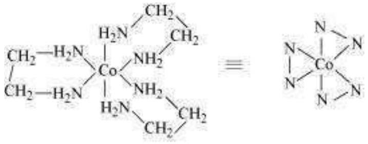
exist.

Two optical isomers are possible for this structure.

(iii) $\left[\mathrm{CO}\left(\mathrm{NH}_{3}\right)_{5}\left(\mathrm{NO}_{2}\right)\right]\left(\mathrm{NO}_{3}\right)_{2}$
A pair of optical isomers:

It can also show linkage isomerism.

$$
\left[\mathrm{CO}\left(\mathrm{NH}_{3}\right)_{5}\left(\mathrm{NO}_{2}\right)\right]\left(\mathrm{NO}_{3}\right)_{2} \text { and }\left[\mathrm{CO}\left(\mathrm{NH}_{3}\right)_{5}(\mathrm{ONO})\right]\left(\mathrm{NO}_{3}\right)_{2}
$$

It can also show ionization isomerism.

$$
\left[\mathrm{Co}\left(\mathrm{NH}_{3}\right)_{5}\left(\mathrm{NO}_{2}\right)\right]\left(\mathrm{NO}_{3}\right)_{2} \quad\left[\mathrm{CO}\left(\mathrm{NH}_{3}\right)_{5}\left(\mathrm{NO}_{3}\right)\right]\left(\mathrm{NO}_{3}\right)\left(\mathrm{NO}_{2}\right)
$$

(iv) Geometrical (cis-, trans-) isomers of $\left[\mathrm{Pt}\left(\mathrm{NH}_{3}\right)\left(\mathrm{H}_{2} \mathrm{O}\right) \mathrm{Cl}_{2}\right]$ can exist.

Cis

Trans

Question 9.4:
Give evidence that $\left[\mathrm{Co}\left(\mathrm{NH}_{3}\right)_{5} \mathrm{Cl}\right] \mathrm{SO}_{4}$ and $\left[\mathrm{Co}\left(\mathrm{NH}_{3}\right)_{5} \mathrm{SO}_{4}\right] \mathrm{Cl}$ are ionization isomers.
Answer
When ionization isomers are dissolved in water, they ionize to give different ions. These ions then react differently with different reagents to give different products.

$$
\left[\mathrm{CO}\left(\mathrm{NH}_{3}\right)_{5} \mathrm{Cl}\right] \mathrm{SO}_{4}+\mathrm{Ba}^{2+} \longrightarrow \mathrm{BaSO}_{4} \downarrow
$$

White precipitate

$$
\left[\mathrm{CO}\left(\mathrm{NH}_{3}\right)_{5} \mathrm{Cl}\right] \mathrm{SO}_{4}+\mathrm{Ag}^{+} \longrightarrow \text { No reaction }
$$

$$
\begin{aligned}
& {\left[\mathrm{CO}\left(\mathrm{NH}_{3}\right)_{5} \mathrm{SO}_{4}\right] \mathrm{Cl}+\mathrm{Ba}^{2+} \longrightarrow \text { No reaction }} \\
& {\left[\mathrm{CO}\left(\mathrm{NH}_{3}\right)_{5} \mathrm{SO}_{4}\right] \mathrm{Cl}+\mathrm{Ag}^{+} \longrightarrow \quad \mathrm{AgCl} \downarrow}
\end{aligned}
$$

White precipitate

Question 9.5:
Explain on the basis of valence bond theory that $\left[\mathrm{Ni}(\mathrm{CN})_{4}\right]^{2-}$ ion with square planar structure is diamagnetic and the $\left[\mathrm{NiCl}_{4}\right]^{2-}$ ion with tetrahedral geometry is paramagnetic.

Answer
Ni is in the +2 oxidation state i.e., in $\mathrm{d}^{8}$ configuration.
d ${ }^{8}$ configuration :
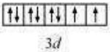

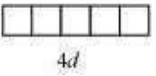

There are $4 \mathrm{CN}^{-}$ions. Thus, it can either have a tetrahedral geometry or square planar geometry. Since $\mathrm{CN}^{-}$ion is a strong field ligand, it causes the pairing of unpaired $3 d$ electrons.
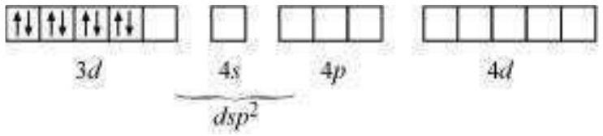

It now undergoes $\mathrm{dsp}^{2}$ hybridization. Since all electrons are paired, it is diamagnetic. In case of $[\mathrm{NiCl}]^{2-}, \mathrm{Cl}^{-}$ion is a weak field ligand. Therefore, it does not lead to the pairing of unpaired $3 d$ electrons. Therefore, it undergoes $s p^{3}$ hybridization.

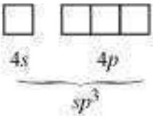

Since there are 2 unpaired electrons in this case, it is paramagnetic in nature.

Question 9.6:
$\left[\mathrm{NiCl}_{4}\right]^{2-}$ is paramagnetic while $\left[\mathrm{Ni}(\mathrm{CO})_{4}\right]$ is diamagnetic though both are tetrahedral. Why?

Answer
Though both $\left[\mathrm{NiCl}_{4}\right]^{2-}$ and $\left[\mathrm{Ni}(\mathrm{CO})_{4}\right]$ are tetrahedral, their magnetic characters are different. This is due to a difference in the nature of ligands. $\mathrm{Cl}^{-}$is a weak field ligand and it does not cause the pairing of unpaired $3 d$ electrons. Hence, $\left[\mathrm{NiCl}_{4}\right]^{2-}$ is paramagnetic.

In $\mathrm{Ni}(\mathrm{CO})_{4}$, Ni is in the zero oxidation state i.e., it has a configuration of $3 d^{8} 4 s^{2 .}$
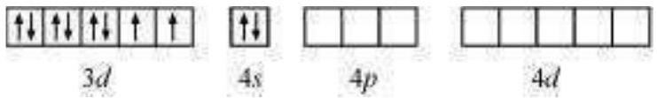
But CO is a strong field ligand. Therefore, it causes the pairing of unpaired $3 d$ electrons. Also, it causes the 4 s electrons to shift to the 3 d orbital, thereby giving rise to $s p^{3}$ hybridization. Since no unpaired electrons are present in this case, $\left[\mathrm{Ni}(\mathrm{CO})_{4}\right]$ is diamagnetic.

Question 9.7:
$\left[\mathrm{Fe}\left(\mathrm{H}_{2} \mathrm{O}\right)_{6}\right]^{3+}$ is strongly paramagnetic whereas $\left[\mathrm{Fe}(\mathrm{CN})_{6}\right]^{3-}$ is weakly paramagnetic.
Explain.
Answer
In both $\left[\mathrm{Fe}\left(\mathrm{H}_{2} \mathrm{O}\right)_{6}\right]^{3+}$ and $\left[\mathrm{Fe}(\mathrm{CN})_{6}\right]^{3-}$, Fe exists in the +3 oxidation state i.e., in $d^{5}$ configuration.

Since $\mathrm{CN}^{-}$is a strong field ligand, it causes the pairing of unpaired electrons. Therefore, there is only one unpaired electron left in the $d$-orbital.

Therefore,

$$
\begin{aligned}
\mu & =\sqrt{n(n+2)} \\
& =\sqrt{1(1+2)} \\
& =\sqrt{3} \\
& =1.732 \mathrm{BM}
\end{aligned}
$$

On the other hand, $\mathrm{H}_{2} \mathrm{O}$ is a weak field ligand. Therefore, it cannot cause the pairing of electrons. This means that the number of unpaired electrons is 5.

Therefore,

$$
\begin{aligned}
\mu & =\sqrt{n(n+2)} \\
& =\sqrt{5(5+2)} \\
& =\sqrt{35} \\
& \simeq 6 \mathrm{BM}
\end{aligned}
$$

Thus, it is evident that $\left[\mathrm{Fe}\left(\mathrm{H}_{2} \mathrm{O}\right)_{6}\right]^{3+}$ is strongly paramagnetic, while $\left[\mathrm{Fe}(\mathrm{CN})_{6}\right]^{3-}$ is weakly paramagnetic.

Question 9.8:
Explain $\left[\mathrm{Co}\left(\mathrm{NH}_{3}\right)_{6}\right]^{3+}$ is an inner orbital complex whereas $\left[\mathrm{Ni}\left(\mathrm{NH}_{3}\right)_{6}\right]^{2+}$ is an outer orbital complex.

Answer

| $\left[\mathrm{Co}\left(\mathrm{NH}_{3}\right)_{6}\right]^{3+}$ | $\left[\mathrm{Ni}\left(\mathrm{NH}_{3}\right)_{6}\right]^{2+}$ |
| :--- | :--- |
| Oxidation state of cobalt $=+3$ | Oxidation state of $\mathrm{Ni}=+2$ |
| Electronic configuration of cobalt $=d^{6}$ | Electronic configuration of nickel $=d^{8}$ |

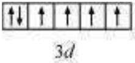

4s

$4 p$

$4 d$

$\mathrm{NH}_{3}$ being a strong field ligand causes the
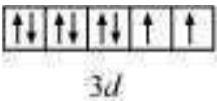

$4 s$

$4 p$

$4 d$

pairing. Therefore, Ni can undergo $d^{2} s p^{3}$

If $\mathrm{NH}_{3}$ causes the pairing, then only one $3 d$ hybridization. orbital is empty. Thus, it cannot undergo
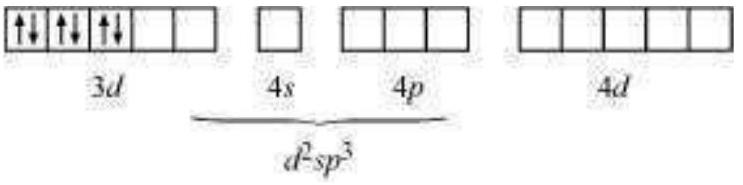
$d^{2} s p^{3}$ hybridization. Therefore, it undergoes $s p^{3} d^{2}$ hybridization.
Hence, it is an inner orbital complex.

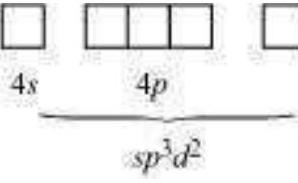
Hence, it forms an outer orbital complex.

Question 9.9:
Predict the number of unpaired electrons in the square planar $\left[\mathrm{Pt}(\mathrm{CN})_{4}\right]^{2-}$ ion.
Answer

$$
\left[\mathrm{Pt}(\mathrm{CN})_{4}\right]^{2-}
$$

In this complex, Pt is in the +2 state. It forms a square planar structure. This means that it undergoes $\mathrm{dsp}^{2}$ hybridization. Now, the electronic configuration of $\operatorname{Pd}(+2)$ is $5 d^{8}$.
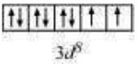
$\mathrm{CN}^{-}$being a strong field ligand causes the pairing of unpaired electrons. Hence, there are no unpaired electrons in $\left[\operatorname{Pt}(\mathrm{CN})_{4}\right]^{2-}$.

Question 9.10:
The hexaquo manganese(II) ion contains five unpaired electrons, while the hexacyanoion contains only one unpaired electron. Explain using Crystal Field Theory. Answer

$$
\left[\mathrm{Mn}\left(\mathrm{H}_{2} \mathrm{O}\right)_{6}\right]^{2+}
$$

$$
\left[\mathrm{Mn}(\mathrm{CN})_{6}\right]^{4}
$$

Mn is in the +2 oxidation state. Mn is in the +2 oxidation state.

The electronic configuration is $\mathrm{d}^{5}$. The electronic configuration is $\mathrm{d}^{5}$. The crystal field is octahedral. Cyanide is The crystal field is octahedral. Water is a a strong field ligand. Therefore, the weak field ligand. Therefore, the arrangement of the electrons in arrangement of the electrons in

$$
\left[\mathrm{Mn}\left(\mathrm{H}_{2} \mathrm{O}\right)_{6}\right]^{2+} \quad \text { is t2g3eg2. }
$$

$$
\left[\mathrm{Mn}(\mathrm{CN})_{6}\right]^{4} \text { is }
$$

T2g5eg0.

Hence, hexaaquo manganese (II) ion has five unpaired electrons, while hexacyano ion has only one unpaired electron.

Question 9.11:
Calculate the overall complex dissociation equilibrium constant for the $\mathrm{Cu}\left(\mathrm{NH}_{3}\right)_{4}{ }^{2+}$ ion, given that $\beta_{4}$ for this complex is $2.1 \times 10^{13}$. Answer

$$
\beta_{4}=2.1 \times 10^{13}
$$

The overall complex dissociation equilibrium constant is the reciprocal of the overall stability constant, $\beta_{4}$.

$$
\begin{aligned}
\frac{1}{\beta_{4}} & =\frac{1}{2.1 \times 10^{13}} \\
\therefore \quad & =4.7 \times 10^{-14}
\end{aligned}
$$

## Exercises Solutions

## (Chapter 9)(Coordination compounds) XII

Question 9.1:
Explain the bonding in coordination compounds in terms of Werner's postulates.
Answer
Werner's postulates explain the bonding in coordination compounds as follows:

(i) A metal exhibits two types of valencies namely, primary and secondary valencies. Primary valencies are satisfied by negative ions while secondary valencies are satisfied by both negative and neutral ions.

(In modern terminology, the primary valency corresponds to the oxidation number of the metal ion, whereas the secondary valency refers to the coordination number of the metal ion.

(ii) A metal ion has a definite number of secondary valencies around the central atom. Also, these valencies project in a specific direction in the space assigned to the definite geometry of the coordination compound.
(iii) Primary valencies are usually ionizable, while secondary valencies are non-ionizable.

Question 9.2:
$\mathrm{FeSO}_{4}$ solution mixed with $\left(\mathrm{NH}_{4}\right)_{2} \mathrm{SO}_{4}$ solution in 1:1 molar ratio gives the test of $\mathrm{Fe}^{2+}$ ion but $\mathrm{CuSO}_{4}$ solution mixed with aqueous ammonia in 1:4 molar ratio does not give the test of $\mathrm{Cu}^{2+}$ ion. Explain why? Answer

$$
\left(\mathrm{NH}_{4}\right)_{2} \mathrm{SO}_{4}+\mathrm{FeSO}_{4}+6 \mathrm{H}_{2} \mathrm{O} \longrightarrow \mathrm{FeSO}_{4} \cdot\left(\mathrm{NH}_{4}\right)_{2} \mathrm{SO}_{4} \cdot 6 \mathrm{H}_{2} \mathrm{O}
$$

Mohr's salt

$$
\mathrm{CuSO}_{4}+4 \mathrm{NH}_{3}+5 \mathrm{H}_{2} \mathrm{O} \longrightarrow\left[\mathrm{Cu}\left(\mathrm{NH}_{3}\right)_{4}\right] \mathrm{SO}_{4} \cdot 5 \mathrm{H}_{2} \mathrm{O}
$$

tetraamminocopper(ii) sulphate
Both the compounds i.e., $\quad \mathrm{FeSO}_{4} \cdot\left(\mathrm{NH}_{4}\right)_{2} \mathrm{SO}_{4} \cdot 6 \mathrm{H}_{2} \mathrm{O}$ and $\left[\mathrm{Cu}\left(\mathrm{NH}_{3}\right)_{4}\right] \mathrm{SO}_{4} \cdot 5 \mathrm{H}_{2} \mathrm{O}$ fall under the category of addition compounds with only one major difference i.e., the former is an example of a double salt, while the latter is a coordination compound.

A double salt is an addition compound that is stable in the solid state but that which breaks up into its constituent ions in the dissolved state. These compounds exhibit
individual properties of their constituents. For e.g. $\mathrm{FeSO}_{4} \cdot\left(\mathrm{NH}_{4}\right)_{2} \mathrm{SO}_{4} \cdot 6 \mathrm{H}_{2} \mathrm{O}$ breaks into $\mathrm{Fe}^{2+}, \mathrm{NH}^{4+}$, and $\mathrm{SO}_{4}{ }^{2-}$ ions. Hence, it gives a positive test for $\mathrm{Fe}^{2+}$ ions. A coordination compound is an addition compound which retains its identity in the solid as well as in the dissolved state. However, the individual properties of the constituents are lost. This happens because $\left[\mathrm{Cu}\left(\mathrm{NH}_{3}\right)_{4}\right] \mathrm{SO}_{4} \cdot 5 \mathrm{H}_{2} \mathrm{O}$ does not show the test for $\mathrm{Cu}^{2+}$. The ions present in the $\left[\mathrm{Cu}\left(\mathrm{NH}_{3}\right)_{4}\right] \mathrm{SO}_{4} \cdot 5 \mathrm{H}_{2} \mathrm{O}$ are $\left[\mathrm{Cu}\left(\mathrm{NH}_{3}\right)_{4}\right]^{2+}$ and $\mathrm{SO}_{4}{ }^{2-}$ solution of
-

Question 9.3:
Explain with two examples each of the following: coordination entity, ligand, coordination number, coordination polyhedron, homoleptic and heteroleptic.

Answer
(i) Coordination entity:

A coordination entity is an electrically charged radical or species carrying a positive or negative charge. In a coordination entity, the central atom or ion is surrounded by a suitable number of neutral molecules or negative ions ( called ligands). For example:

$$
\begin{array}{ll}
{\left[\mathrm{Ni}\left(\mathrm{NH}_{3}\right)_{6}\right]^{2+},\left[\mathrm{Fe}(\mathrm{CN})_{6}\right]^{4+}} & =\text { cationic complex } \\
{\left[\mathrm{PtCl}_{4}\right]^{2-},\left[\mathrm{Ag}(\mathrm{CN})_{2}\right]^{-}} & =\text {anionic complex } \\
{\left[\mathrm{Ni}(\mathrm{CO})_{4}\right],\left[\mathrm{Co}\left(\mathrm{NH}_{3}\right)_{4} \mathrm{Cl}_{2}\right]} & =\text { neutral complex }
\end{array}
$$

(ii) Ligands

The neutral molecules or negatively charged ions that surround the metal atom in a coordination entity or a coordinal complex are known as ligands. For example,
$\ddot{\mathrm{N}} \mathrm{H}_{3}, \mathrm{H}_{2} \ddot{\mathrm{O}}, \mathrm{Cl}^{-},-\mathrm{OH}$. Ligands are usually polar in nature and possess at least one unshared pair of valence electrons.
(iii) Coordination number:

The total number of ligands (either neutral molecules or negative ions) that get attached to the central metal atom in the coordination sphere is called the coordination number of the central metal atom. It is also referred to as its ligancy.

For example:

(a) In the complex, $\mathrm{K}_{2}\left[\mathrm{PtCl}_{6}\right]$, there as six chloride ions attached to Pt in the coordinate sphere. Therefore, the coordination number of Pt is 6.
(b) Similarly, in the complex $\left[\mathrm{Ni}\left(\mathrm{NH}_{3}\right)_{4}\right] \mathrm{Cl}_{2}$, the coordination number of the central atom $(\mathrm{Ni})$ is 4.

(vi) Coordination polyhedron:

Coordination polyhedrons about the central atom can be defined as the spatial arrangement of the ligands that are directly attached to the central metal ion in the coordination sphere. For example:

\begin{figure}
\caption{(a)}
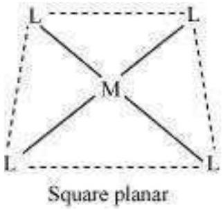
\end{figure}

\begin{figure}
\caption{
(b) Tetrahedral}
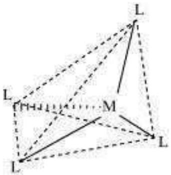
\end{figure}

Tetrahedral
(v) Homoleptic complexes:

These are those complexes in which the metal ion is bound to only one kind of a donor group. For eg: $\left[\mathrm{Co}\left(\mathrm{NH}_{3}\right)_{6}\right]^{3+},\left[\mathrm{PtCl}_{4}\right]^{2-}$ etc.

(vi) Heteroleptic complexes:

Heteroleptic complexes are those complexes where the central metal ion is bound to more than one type of a donor group.

For e.g.: $\left[\mathrm{Co}\left(\mathrm{NH}_{3}\right)_{4} \mathrm{Cl}_{2}\right]^{+},\left[\mathrm{Co}\left(\mathrm{NH}_{3}\right)_{5} \mathrm{Cl}\right]^{2+}$

Question 9.4:
What is meant by unidentate, didentate and ambidentate ligands? Give two examples for each.

Answer
A ligand may contain one or more unshared pairs of electrons which are called the donor sites of ligands. Now, depending on the number of these donor sites, ligands can be classified as follows:

(a) Unidentate ligands: Ligands with only one donor sites are called unidentate ligands. For e.g., ${ } \ddot{\mathrm{N}} \mathrm{H}^{3}, \mathrm{Cl}^{-}$etc.
(b) Didentate ligands: Ligands that have two donor sites are called didentate ligands. For e.g.,
(a) Ethane-1,2-diamine

(b) Oxalate ion
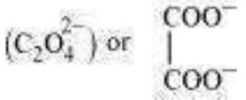
(c) Ambidentate ligands:

Ligands that can attach themselves to the central metal atom through two different atoms are called ambidentate ligands. For example:

(a) 

(The donor atom is N)

(The donor atom is oxygen)

(b) 
(The donor atom is S)

(The donor atom is N)

Question 9.5:
Specify the oxidation numbers of the metals in the following coordination entities:

(i) $\left[\mathrm{Co}\left(\mathrm{H}_{2} \mathrm{O}\right)(\mathrm{CN})(\mathrm{en})_{2}\right]^{2+}$
(ii) $\left[\mathrm{CoBr}_{2}(\mathrm{en})_{2}\right]^{+}$
(iii) $\quad\left[\mathrm{PtCl}_{4}\right]^{2-}$ (iv) $\mathrm{K}_{3}\left[\mathrm{Fe}(\mathrm{CN})_{6}\right]$
(v) $\left[\mathrm{Cr}\left(\mathrm{NH}_{3}\right)_{3} \mathrm{Cl}_{3}\right]$

Answer

(i) $\left[\mathrm{Co}\left(\mathrm{H}_{2} \mathrm{O}\right)(\mathrm{CN})(\mathrm{en})_{2}\right]^{2+}$

Let the oxidation number of Co be $x$.
The charge on the complex is +2 .

$$
\begin{array}{cccc}
{\left[\begin{array}{ccc}
\mathrm{Co} & \left(\mathrm{H}_{2} \mathrm{O}\right) & (\mathrm{CN}) \\
\downarrow & \downarrow & \downarrow \\
x+0 & \downarrow
\end{array}(\mathrm{en})_{2}\right]^{2+}} \\
& x-1=+2 \\
& x=+3
\end{array}
$$

(ii) $\left[\mathrm{Pt}(\mathrm{Cl})_{4}\right]^{2-}$
Let the oxidation number of Pt be $x$.
The charge on the complex is -2.

$$
\begin{aligned}
& {\left[\begin{array}{cc}
\mathrm{Pt} & (\mathrm{Cl})_{4}
\end{array}\right]^{2-}} \\
& \downarrow \\
& \downarrow \\
& x+4(-1)=-2 x \\
& =+2
\end{aligned}
$$

(iii) $$
\begin{aligned}
& {\left[\begin{array}{lll}
\mathrm{Co} & (\mathrm{Br})_{2} & \left.(\mathrm{en})_{2}\right]^{2+} \\
\downarrow & \downarrow & \downarrow
\end{array}\right.} \\
& x+2(-1)+2(0)=+1 \\
& x-2=+1 \\
& x=+3
\end{aligned}
$$
(iv) $\mathrm{K}_{3}\left[\mathrm{Fe}(\mathrm{CN})_{6}\right]$
$$
\begin{gathered}
\text { i.e., }\left[\begin{array}{ll}
\mathrm{Fe} & (\mathrm{CN})_{6}
\end{array}\right]^{3-} \\
\downarrow \quad \downarrow \\
x+6(-1)=-3 \\
x=+3
\end{gathered}
$$
(v) $$
\begin{aligned}
& {\left[\begin{array}{ccc}
\mathrm{Cr} & \left(\mathrm{NH}_{3}\right)_{3} & \mathrm{Cl}_{3}
\end{array}\right]} \\
& \downarrow \\
& \downarrow \\
& x+3(0)+3(-1)=0 \\
& \quad x-3=0 \\
& \quad x=+3
\end{aligned}
$$

Question 9.6:
Using IUPAC norms write the formulas for the following:

(i) Tetrahydroxozincate(II)
(ii) Potassium tetrachloridopalladate(II)
(iii) Diamminedichloridoplatinum(II)
(iv) Potassium tetracyanonickelate(II)

(v) Pentaamminenitrito-O-cobalt(III)
(vi) Hexaamminecobalt(III) sulphate
(vii) Potassium tri(oxalato)chromate(III)
(viii) Hexaammineplatinum(IV)
(ix) Tetrabromidocuprate(II)
(x) Pentaamminenitrito-N-cobalt(III)

Answer

(i) $\quad\left[\mathrm{Zn}(\mathrm{OH}]^{2-}\right.$
(ii) $\quad \mathrm{K}_{2}\left[\mathrm{PdCl}_{4}\right]$
(iii) $\left[\operatorname{Pt}\left(\mathrm{NH}_{3}\right)_{2} \mathrm{Cl}_{2}\right]$
(iv) $\mathrm{K}_{2}\left[\mathrm{Ni}(\mathrm{CN})_{4}\right]$
(v) $\left[\mathrm{Co}(\mathrm{ONO})\left(\mathrm{NH}_{3}\right)_{5}\right]^{2+}$
(vi) $\left[\mathrm{Co}\left(\mathrm{NH}_{3}\right)_{6}\right]_{2}\left(\mathrm{SO}_{4}\right)_{3}$
(vii) $\mathrm{K}_{3}\left[\mathrm{Cr}\left(\mathrm{C}_{2} \mathrm{O}_{4}\right)_{3}\right]$
(viii) $\left[\operatorname{Pt}\left(\mathrm{NH}_{3}\right)_{6}\right]^{4+}$
(ix) $\left[\mathrm{Cu}(\mathrm{Br})_{4}\right]^{2-}$ (x) $\left[\mathrm{Co}\left[\mathrm{NO}_{2}\right)\left(\mathrm{NH}_{3}\right)_{5}\right]^{2+}$

Question 9.7:
Using IUPAC norms write the systematic names of the following:

(i) $\left[\mathrm{Co}\left(\mathrm{NH}_{3}\right) 6\right] \mathrm{Cl}_{3}$
(ii) $\left[\mathrm{Pt}\left(\mathrm{NH}_{3}\right)_{2} \mathrm{Cl}\left(\mathrm{NH}_{2} \mathrm{CH}_{3}\right)\right] \mathrm{Cl}$
(iii) $\left[\mathrm{Ti}\left(\mathrm{H}_{2} \mathrm{O}\right) 6\right]^{3+}$
(iv) $\left[\mathrm{Co}\left(\mathrm{NH}_{3}\right)_{4} \mathrm{Cl}\left(\mathrm{NO}_{2}\right)\right] \mathrm{Cl}$
(v) $\left[\mathrm{Mn}\left(\mathrm{H}_{2} \mathrm{O}\right) 6\right]^{2+}$
(vi) $\left[\mathrm{NiCl}_{4}\right]^{2-}$ (vii) $\left[\mathrm{Ni}\left(\mathrm{NH}_{3}\right)_{6}\right] \mathrm{Cl}_{2}$

(viii) $\left[\mathrm{Co}(\mathrm{en})_{3}\right]^{3+}$

(ix) [Ni(CO)4]

Answer

(i) Hexaamminecobalt(III) chloride

(ii) Diamminechlorido(methylamine) platinum(II) chloride
(iii) Hexaquatitanium(III) ion
(iv) Tetraamminichloridonitrito-N-Cobalt(III) chloride
(v) Hexaquamanganese(II) ion
(vi) Tetrachloridonickelate(II) ion
(vii) Hexaamminenickel(II) chloride
(viii) Tris(ethane-1, 2-diammine) cobalt(III) ion
(ix) Tetracarbonylnickel(0)

Question 9.8:
List various types of isomerism possible for coordination compounds, giving an example of each.

Answer
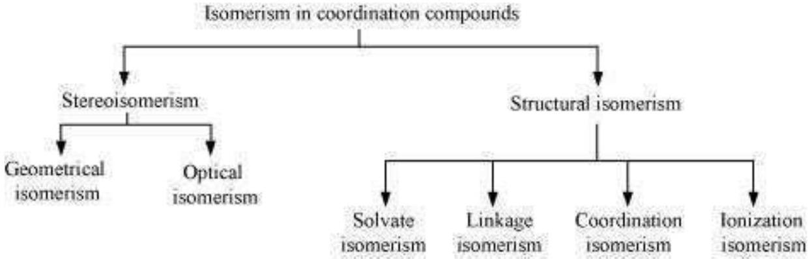
(a) Geometric isomerism:

This type of isomerism is common in heteroleptic complexes. It arises due to the different possible geometric arrangements of the ligands. For example:

Cis-isomer

Trans-isomer
(b) Optical isomerism:

This type of isomerism arises in chiral molecules. Isomers are mirror images of each other and are non-superimposable.
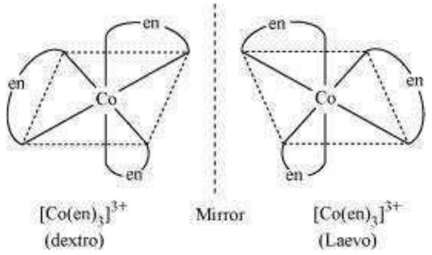

(c) Linkage isomerism: This type of isomerism is found in complexes that contain ambidentate ligands. For example:
$\left[\mathrm{Co}\left(\mathrm{NH}_{3}\right)_{5}\left(\mathrm{NO}_{2}\right)\right] \mathrm{Cl}_{2}$ and $\left[\mathrm{Co}\left(\mathrm{NH}_{3}\right)_{5}(\mathrm{ONO}) \mathrm{Cl}_{2}\right.$
Yellow form Red form (d)
Coordination isomerism:
This type of isomerism arises when the ligands are interchanged between cationic and anionic entities of differnet metal ions present in the complex.
$\left[\mathrm{Co}\left(\mathrm{NH}_{3}\right)_{6}\right]\left[\mathrm{Cr}(\mathrm{CN})_{6}\right]$ and $\left[\mathrm{Cr}\left(\mathrm{NH}_{3}\right)_{6}\right]\left[\mathrm{Co}(\mathrm{CN})_{6}\right](\mathbf{e})$
Ionization isomerism:
This type of isomerism arises when a counter ion replaces a ligand within the coordination sphere. Thus, complexes that have the same composition, but furnish different ions when dissolved in water are called ionization isomers. For e.g.,
$\left.\mathrm{Co}\left(\mathrm{NH}_{3}\right)_{5} \mathrm{SO}_{4}\right) \mathrm{Br}$ and $\left.\mathrm{Co}\left(\mathrm{NH}_{3}\right)_{5} \mathrm{Br}\right] \mathrm{SO}_{4}$.
(f) Solvate isomerism:
Solvate isomers differ by whether or not the solvent molecule is directly bonded to the metal ion or merely present as a free solvent molecule in the crystal lattice.
$\left[\mathrm{Cr}\left[\mathrm{H}_{2} \mathrm{O}\right)_{6}\right] \mathrm{Cl}_{3}\left[\mathrm{Cr}\left(\mathrm{H}_{2} \mathrm{O}\right)_{5} \mathrm{Cl}\right] \mathrm{Cl}_{2} . \mathrm{H}_{2} \mathrm{O}\left[\mathrm{Cr}\left(\mathrm{H}_{2} \mathrm{O}\right)_{5} \mathrm{Cl}_{2}\right] \mathrm{Cl} .2 \mathrm{H}_{2} \mathrm{O}$
Violet Blue-green Dark green

Question 9.9:
How many geometrical isomers are possible in the following coordination entities?

(i) $\left[\mathrm{Cr}\left(\mathrm{C}_{2} \mathrm{O}_{4}\right)_{3}\right]^{3-}$ (ii) $\left[\mathrm{Co}\left(\mathrm{NH}_{3}\right)_{3} \mathrm{Cl}_{3}\right]$

Answer

(i) For $\left[\mathrm{Cr}\left(\mathrm{C}_{2} \mathrm{O}_{4}\right)_{3}\right]^{3-}$, no geometric isomer is possible as it is a bidentate ligand.

(ii) $\left[\mathrm{Co}\left(\mathrm{NH}_{3}\right)_{3} \mathrm{Cl}_{3}\right]$
Two geometrical isomers are possible.

Facial

Meridional

Question 9.10:
Draw the structures of optical isomers of:

(i) $\left[\mathrm{Cr}\left(\mathrm{C}_{2} \mathrm{O}_{4}\right)_{3}\right]^{3-}$ (ii)
$\left[\mathrm{PtCl}_{2}(\mathrm{en})_{2}\right]^{2+}$
(iii) $\left[\mathrm{Cr}\left(\mathrm{NH}_{3}\right)_{2} \mathrm{Cl}_{2}(\mathrm{en})\right]^{+}$

Answer

(i) $\left[\mathrm{Cr}\left(\mathrm{C}_{2} \mathrm{O}_{4}\right)_{3}\right]^{3-}$
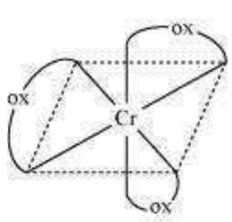
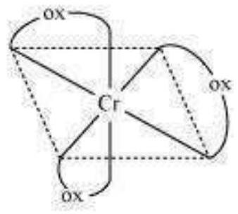
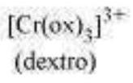 $\left[\mathrm{Cr}(\mathrm{ox})_{3}\right]^{3+}$ (Laevo)
(ii) $\left[\mathrm{PtCl}_{2}(\mathrm{en})_{2}\right]^{2+}$

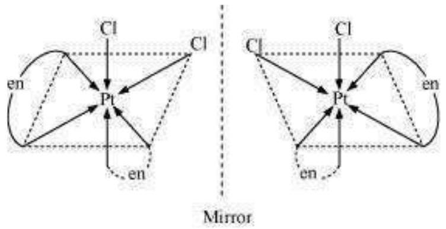
(iii) $\left[\mathrm{Cr}\left(\mathrm{NH}_{3}\right)_{2} \mathrm{Cl}_{2}(\mathrm{en})\right]^{+}$
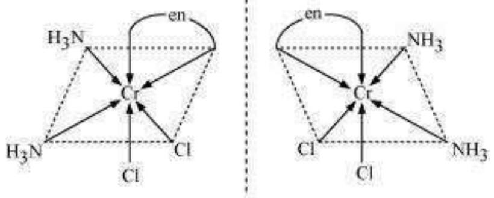
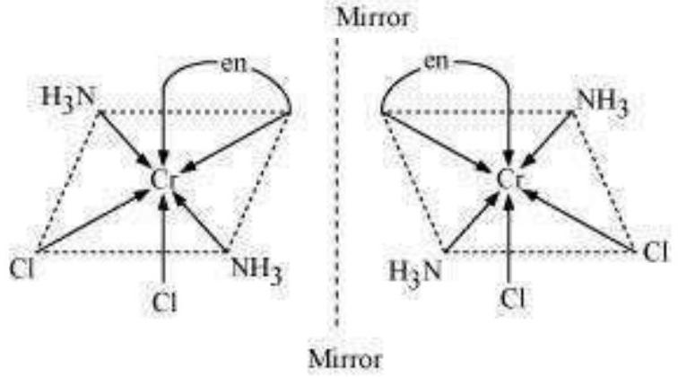

Question 9.11:
Draw all the isomers (geometrical and optical) of:

(i) $\left[\mathrm{CoCl}_{2}(\mathrm{en})_{2}\right]^{+}$
(ii) $\left[\mathrm{Co}\left(\mathrm{NH}_{3}\right) \mathrm{Cl}(\mathrm{en})_{2}\right]^{2+}$
(iii) $\left[\mathrm{Co}\left(\mathrm{NH}_{3}\right)_{2} \mathrm{Cl}_{2}(\mathrm{en})\right]^{+}$

Answer

(i) $\left[\mathrm{CoCl}_{2}(\text { en })_{2}\right]^{+}$

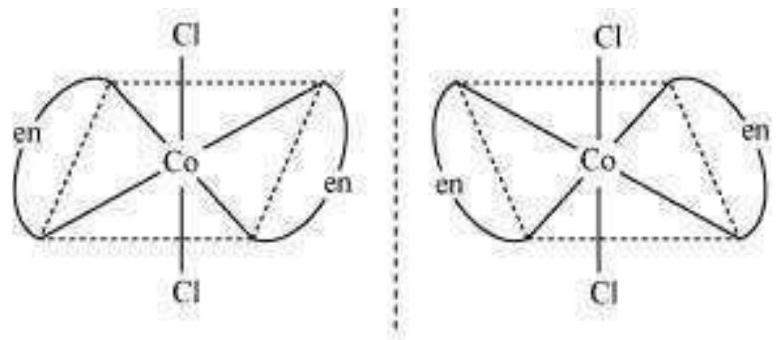
Mirror
Trans $\left[\mathrm{CoCl}_{2}(\mathrm{en})_{2}\right]^{+}$isomer-optically inactive
(Superimposable mirror images)

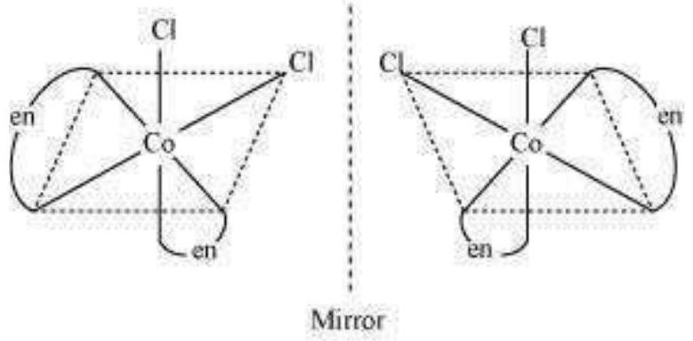
Cis $\left[\mathrm{CoCl}_{2}(\mathrm{en})_{2}\right]^{+}$isomer-optically active
(Non-superimposable mirror images)

In total, three isomers are possible.

(ii) $\left[\mathrm{Co}\left(\mathrm{NH}_{3}\right) \mathrm{Cl}(\text { en })_{2}\right]^{2+}$
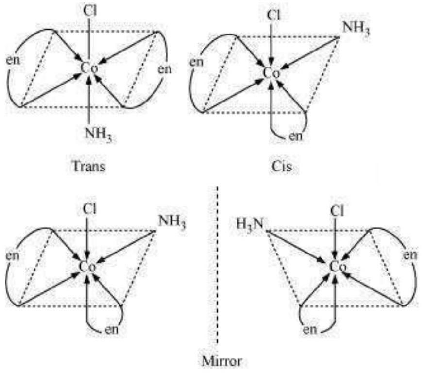

Trans-isomers are optically inactive.
Cis-isomers are optically active.

(iii) $\left[\mathrm{Co}\left(\mathrm{NH}_{3}\right)_{2} \mathrm{Cl}_{2}(\mathrm{en})\right]^{+}$
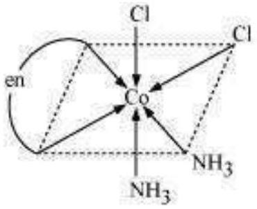
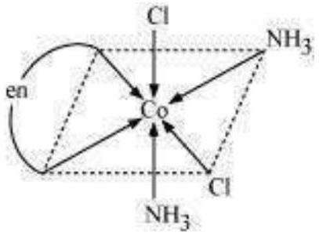
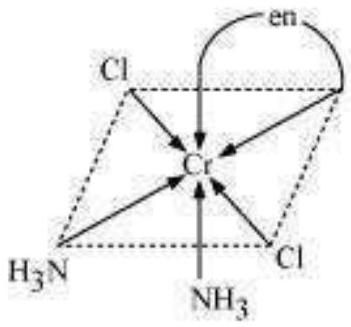
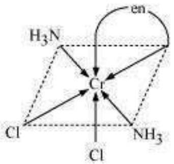

Question 9.12:
Write all the geometrical isomers of $\left[\operatorname{Pt}\left(\mathrm{NH}_{3}\right)(\mathrm{Br})(\mathrm{Cl})(\mathrm{py})\right]$ and how many of these will exhibit optical isomers?

Answer
$\left[\mathrm{Pt}\left(\mathrm{NH}_{3}\right)(\mathrm{Br})(\mathrm{Cl})(\mathrm{py})\right.$
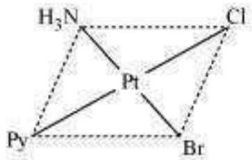
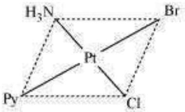
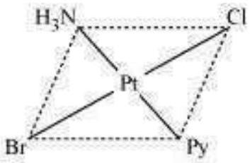
From the above isomers, none will exhibit optical isomers. Tetrahedral complexes rarely show optical isomerization. They do so only in the presence of unsymmetrical chelating agents.

Question 9.13:
Aqueous copper sulphate solution (blue in colour) gives:

(i) a green precipitate with aqueous potassium fluoride, and
(ii) a bright green solution with aqueous potassium chloride Explain these experimental results.

Answer
Aqueous $\mathrm{CuSO}_{4}$ exists as $\left[\mathrm{Cu}\left(\mathrm{H}_{2} \mathrm{O}\right)_{4}\right] \mathrm{SO}_{4}$. It is blue in colour due to the presence of $\left[\mathrm{Cu}\left[\mathrm{H}_{2} \mathrm{O}\right)_{4}\right]^{2+}$ ions.

(i) When KF is added:
$$
\left[\mathrm{Cu}\left(\mathrm{H}_{2} \mathrm{O}\right)_{4}\right]^{2+}+4 \mathrm{~F}^{-} \longrightarrow \underset{\text { (green) }}{\left[\mathrm{Cu}(\mathrm{~F})_{4}\right]^{2-}+4 \mathrm{H}_{2} \mathrm{O}}
$$
(ii) When KCl is added:
$$
\begin{gathered}
{\left[\mathrm{Cu}\left(\mathrm{H}_{2} \mathrm{O}\right)_{4}\right]^{2+}+4 \mathrm{Cl}^{-} \longrightarrow\left[\mathrm{CuCl}_{4}\right]^{2-}+4 \mathrm{H}_{2} \mathrm{O}} \\
\text { (bright green) }
\end{gathered}
$$
In both these cases, the weak field ligand water is replaced by the $\mathrm{F}^{-}$and $\mathrm{Cl}^{-}$ions.

Question 9.14:
What is the coordination entity formed when excess of aqueous KCN is added to an aqueous solution of copper sulphate? Why is it that no precipitate of copper sulphide is obtained when $\mathrm{H}_{2} \mathrm{~S}(\mathrm{~g})$ is passed through this solution? Answer

$$
\begin{aligned}
& \mathrm{CuSO}_{4(a q)}+4 \mathrm{KCN}_{(a q)} \longrightarrow \mathrm{K}_{2}\left[\mathrm{Cu}(\mathrm{CN})_{4}\right]_{(a q)}+\mathrm{K}_{2} \mathrm{SO}_{4(a q)} \\
& \text {.e., }\left[\mathrm{Cu}\left(\mathrm{H}_{2} \mathrm{O}\right)_{4}\right]^{2+}+4 \mathrm{CN}^{-} \longrightarrow\left[\mathrm{Cu}(\mathrm{CN})_{4}\right]^{2-}+4 \mathrm{H}_{2} \mathrm{O}
\end{aligned}
$$

Thus, the coordination entity formed in the process is $\mathrm{K}_{2}\left[\mathrm{Cu}(\mathrm{CN})_{4}\right] . \mathrm{K}_{2}\left[\mathrm{Cu}(\mathrm{CN})_{4}\right]_{\text {is a }}$ very stable complex, which does not ionize to give $\mathrm{Cu}^{2+}$ ions when added to water. Hence, $\mathrm{Cu}^{2+}$ ions are not precipitated when $\mathrm{H}_{2} \mathrm{~S}_{(g)}$ is passed through the solution.

Question 9.15:
Discuss the nature of bonding in the following coordination entities on the basis of valence bond theory:

(i) $\left[\mathrm{Fe}(\mathrm{CN})_{6}\right]^{4-}$
(ii) $\left[\mathrm{FeF}_{6}\right]^{3-}$
    (iii) $$
\left[\mathrm{Co}\left(\mathrm{C}_{2} \mathrm{O}_{4}\right) 3\right]^{3-}
$$
(iv) $\left[\mathrm{CoF}_{6}\right]^{3-}$

Answer

(i) $\left[\mathrm{Fe}(\mathrm{CN})_{6}\right]^{4-}$

In the above coordination complex, iron exists in the +II oxidation state.
$\mathrm{Fe}^{2+}$ : Electronic configuration is $3 d^{6}$ Orbitals
of $\mathrm{Fe}^{2+}$ ion:

As $\mathrm{CN}^{-}$is a strong field ligand, it causes the pairing of the unpaired $3 d$ electrons.

Since there are six ligands around the central metal ion, the most feasible hybridization is $d^{2} s p^{3} . d^{2} s p^{3}$ hybridized orbitals of $\mathrm{Fe}^{2+}$ are:

6 electron pairs from $\mathrm{CN}^{-}$ions occupy the six hybrid $d^{2} s p^{3}$ orbitals.
Then,

Hence, the geometry of the complex is octahedral and the complex is diamagnetic (as there are no unpaired electrons).
(ii) $\left[\mathrm{FeF}_{6}\right]^{3-}$

In this complex, the oxidation state of Fe is +3.
Orbitals of $\mathrm{Fe}^{+3}$ ion:

There are $6 \mathrm{~F}^{-}$ions. Thus, it will undergo $d^{2} s p^{3}$ or $s p^{3} d^{2}$ hybridization. As $\mathrm{F}^{-}$is a weak field ligand, it does not cause the pairing of the electrons in the $3 d$ orbital. Hence, the most feasible hybridization is $s p^{3} d^{2}$.
$s p^{3} d^{2}$ hybridized orbitals of Fe are:
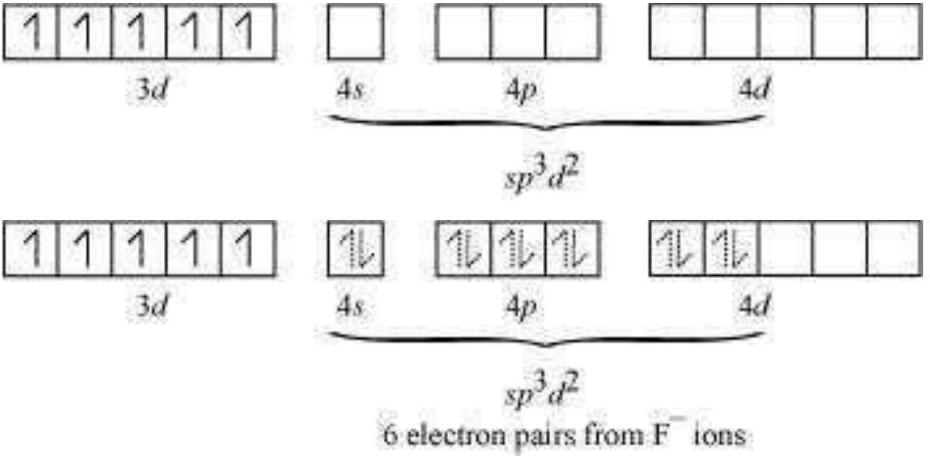
Hence, the geometry of the complex is found to be octahedral.
(iii) $\left[\mathrm{Co}\left(\mathrm{C}_{2} \mathrm{O}_{4}\right)_{3}\right]^{3-}$

Cobalt exists in the +3 oxidation state in the given complex.
Orbitals of $\mathrm{Co}^{3+}$ ion:

Oxalate is a weak field ligand. Therefore, it cannot cause the pairing of the $3 d$ orbital electrons. As there are 6 ligands, hybridization has to be either $s p^{3} d^{2}$ or $d^{2} s p^{3}$ hybridization. $s p^{3} d^{2}$ hybridization of $\mathrm{Co}^{3+:}$

The 6 electron pairs from the 3 oxalate ions (oxalate anion is a bidentate ligand) occupy these $s p^{3} d^{2}$ orbitals.

6 electron pairs from 3 oxalate ions

Hence, the geometry of the complex is found to be octahedral.
(iv) $\left[\mathrm{CoF}_{6}\right]^{3-}$

Cobalt exists in the +3 oxidation state.
Orbitals of $\mathrm{Co}^{3+}$ ion:

Again, fluoride ion is a weak field ligand. It cannot cause the pairing of the $3 d$ electrons.
As a result, the $\mathrm{Co}^{3+}$ ion will undergo $s p^{3} d^{2}$ hybridization. $s p^{3} d^{2}$
hybridized orbitals of $\mathrm{Co}^{3+}$ ion are:

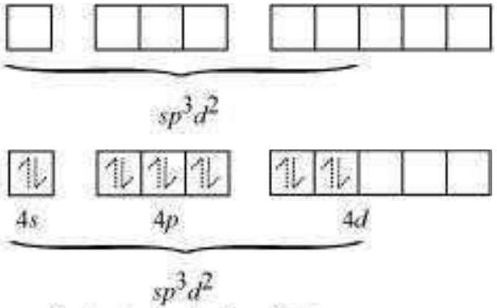
6 electron pairs from $\mathrm{F}^{-}$ions

Hence, the geometry of the complex is octahedral and paramagnetic.

Question 9.16:
Draw figure to show the splitting of $d$ orbitals in an octahedral crystal field.

Answer
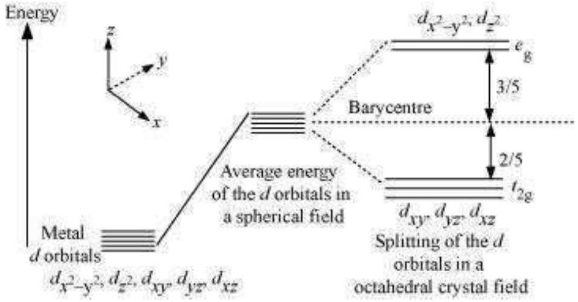
The splitting of the $d$ orbitals in an octahedral field takes palce in such a way that $d_{x^{2}-y^{2}}$, $d_{z^{2}}$ experience a rise in energy and form the $e_{g}$ level, while $d_{x y}, d_{y z}$ and $d_{z x}$ experience a fall in energy and form the $t_{2 g}$ level.

Question 9.17:
What is spectrochemical series? Explain the difference between a weak field ligand and a strong field ligand.

Answer
A spectrochemical series is the arrangement of common ligands in the increasing order of their crystal-field splitting energy (CFSE) values. The ligands present on the R.H.S of the series are strong field ligands while that on the L.H.S are weak field ligands. Also, strong field ligands cause higher splitting in the $d$ orbitals than weak field ligands.

$$
\begin{aligned}
& \mathrm{I}-<\mathrm{Br}^{-}<\mathrm{S}^{2-}<\mathrm{SCN}^{-}<\mathrm{Cl}^{-}<\mathrm{N}_{3}<\mathrm{F}^{-}<\mathrm{OH}^{-}<\mathrm{C}_{2} \mathrm{O}_{4}^{2-} \sim \mathrm{H}_{2} \mathrm{O}<\mathrm{NCS}^{-} \sim \mathrm{H}^{-}<\mathrm{CN}^{-}<\mathrm{NH}_{3} \\
& <\text { en } \sim \mathrm{SO}_{3}^{2-}<\mathrm{NO}_{2}^{-}<\text {phen }<\mathrm{CO}
\end{aligned}
$$

Question 9.18:
What is crystal field splitting energy? How does the magnitude of $\Delta_{\circ}$ decide the actual configuration of $d$-orbitals in a coordination entity?

Answer
The degenerate $d$-orbitals (in a spherical field environment) split into two levels i.e., $e_{g}$ and $t_{2 \mathrm{~g}}$ in the presence of ligands. The splitting of the degenerate levels due to the presence of ligands is called the crystal-field splitting while the energy difference between the two levels ( $e_{\mathrm{g}}$ and $t_{2 \mathrm{~g}}$ ) is called the crystal-field splitting energy. It is denoted by $\Delta_{\mathrm{o}}$.

After the orbitals have split, the filling of the electrons takes place. After 1 electron (each) has been filled in the three $t_{2 \mathrm{~g}}$ orbitals, the filling of the fourth electron takes place in two ways. It can enter the $e_{\mathrm{g}}$ orbital (giving rise to $t_{2 \mathrm{~g}}{ }^{3} e_{\mathrm{g}}{ }^{1}$ like electronic configuration) or the pairing of the electrons can take place in the $t_{2 g}$ orbitals (giving rise to $t_{2 g}{ }^{4} e_{g}{ }^{0}$ like electronic configuration). If the $\Delta_{\mathrm{o}}$ value of a ligand is less than the pairing energy ( P ), then the electrons enter the $e_{\mathrm{g}}$ orbital. On the other hand, if the $\Delta_{\mathrm{o}}$ value of a ligand is more than the pairing energy (P), then the electrons enter the $t_{2 \mathrm{~g}}$ orbital.

Question 9.19:
$\left[\mathrm{Cr}\left(\mathrm{NH}_{3}\right)_{6}\right]^{3+}$ is paramagnetic while $\left[\mathrm{Ni}(\mathrm{CN})_{4}\right]^{2-}$ is diamagnetic. Explain why?
Answer
Cr is in the +3 oxidation state i.e., $d^{3}$ configuration. Also, $\mathrm{NH}_{3}$ is a weak field ligand that does not cause the pairing of the electrons in the $3 d$ orbital. $\mathrm{Cr}^{3+}$

Therefore, it undergoes $d^{2} s p^{3}$ hybridization and the electrons in the $3 d$ orbitals remain unpaired. Hence, it is paramagnetic in nature.

In $\left[\mathrm{Ni}(\mathrm{CN})_{4}\right]^{2-}$, Ni exists in the +2 oxidation state i.e., $d^{8}$ configuration.
$\mathrm{Ni}^{2+}$

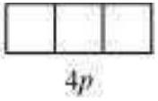
$\mathrm{CN}^{-}$is a strong field ligand. It causes the pairing of the $3 d$ orbital electrons. Then, $\mathrm{Ni}^{2+}$ undergoes $d s p^{2}$ hybridization.

As there are no unpaired electrons,it is diamagnetic.

Question 9.20:
A solution of $\left[\mathrm{Ni}\left(\mathrm{H}_{2} \mathrm{O}\right)_{6}\right]^{2+}$ is green but a solution of $\left[\mathrm{Ni}(\mathrm{CN})_{4}\right]^{2-}$ is colourless.Explain. Answer

In $\left[\mathrm{Ni}\left(\mathrm{H}_{2} \mathrm{O}\right)_{6}\right]^{2+}, \mathrm{H}_{2} \ddot{\mathrm{O}}_{\text {is a weak field ligand.Therefore,there are unpaired electrons in } \mathrm{Ni}^{2+} \text { .}}$ In this complex,the $d$ electrons from the lower energy level can be excited to the higher energy level i.e.,the possibility of $d-d$ transition is present.Hence, $\left.\mathrm{Ni}\left(\mathrm{H}_{2} \mathrm{O}\right)_{6}\right]^{2+}$ is coloured. In $\left[\mathrm{Ni}(\mathrm{CN})_{4}\right]^{2-}$ ,the electrons are all paired as $\mathrm{CN}^{-}$is a strong field ligand.Therefore,$d-d$ transition is not possible in $\left[\mathrm{Ni}(\mathrm{CN})_{4}\right]^{2-}$ .Hence,it is colourless.

Question 9.21:
$\left[\mathrm{Fe}(\mathrm{CN})_{6}\right]^{4-}$ and $\left[\mathrm{Fe}\left(\mathrm{H}_{2} \mathrm{O}\right)_{6}\right]^{2+}$ are of different colours in dilute solutions.Why?
Answer
The colour of a particular coordination compound depends on the magnitude of the crystal- field splitting energy,$\Delta$ .This CFSE in turn depends on the nature of the ligand.In case of $\left[\mathrm{Fe}(\mathrm{CN})_{6}\right]^{4-}$ and $\left[\mathrm{Fe}\left(\mathrm{H}_{2} \mathrm{O}\right)_{6}\right]^{2+}$ ,the colour differs because there is a difference in the CFSE. Now, $\mathrm{CN}^{-}$is a strong field ligand having a higher CFSE value as compared to the CFSE value of water.This means that the absorption of energy for the intra $d-d$ transition also differs.Hence,the transmitted colour also differs.

Question 9.22:
Discuss the nature of bonding in metal carbonyls.
Answer
The metal-carbon bonds in metal carbonyls have both $\sigma$ and $\pi$ characters. A $\sigma$ bond is formed when the carbonyl carbon donates a lone pair of electrons to the vacant orbital of
the metal. A $\pi$ bond is formed by the donation of a pair of electrons from the filled metal $d$ orbital into the vacant anti-bonding $n^{*}$ orbital (also known as back bonding of the carbonyl group). The $\sigma$ bond strengthens the ${ }^{\Pi}$ bond and vice-versa. Thus, a synergic effect is created due to this metal-ligand bonding. This synergic effect strengthens the bond between CO and the metal.

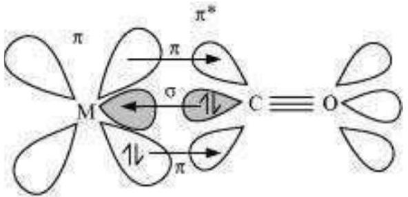
Synergic bonding in metal carbonyls

Question 9.23:
Give the oxidation state, $d$-orbital occupation and coordination number of the central metal ion in the following complexes:

(i) $\mathrm{K}_{3}\left[\mathrm{Co}\left(\mathrm{C}_{2} \mathrm{O}_{4}\right)_{3}\right]$
(ii) cis- $\left[\mathrm{Cr}(\mathrm{en})_{2} \mathrm{Cl}_{2}\right] \mathrm{Cl}$
(iii) $\left(\mathrm{NH}_{4}\right)_{2}\left[\mathrm{CoF}_{4}\right]$
(iv) $\left[\mathrm{Mn}\left(\mathrm{H}_{2} \mathrm{O}\right)_{6}\right] \mathrm{SO}_{4}$

Answer

(i) $\mathrm{K}_{3}\left[\mathrm{Co}\left(\mathrm{C}_{2} \mathrm{O}_{4}\right)_{3}\right]$

The central metal ion is Co.
Its coordination number is 6 . The oxidation state can be given as:

$$
\begin{aligned}
& x-6=-3 x \\
& =+3
\end{aligned}
$$

The $d$ orbital occupation for $\mathrm{Co}^{3+}$ is $t_{2 \mathrm{~g}}{ }^{6} e_{g}{ }^{0 .}$

(ii) cis- $\left[\mathrm{Cr}(\mathrm{en})_{2} \mathrm{Cl}_{2}\right] \mathrm{Cl}$

The central metal ion is Cr.

The coordination number is 6 . The oxidation state can be given as:

$$
\begin{aligned}
& x+2(0)+2(-1)=+1 \\
& x-2=+1 x=+3
\end{aligned}
$$

The $d$ orbital occupation for $\mathrm{Cr}^{3+}$ is $t_{2 g}{ }^{3}$.
(iii) $\left(\mathrm{NH}_{4}\right)_{2}\left[\mathrm{CoF}_{4}\right]$
The central metal ion is Co.
The coordination number is 4.
The oxidation state can be given as:

$$
\begin{aligned}
& x-4=-2 x \\
& =+2
\end{aligned}
$$

The $d$ orbital occupation for $\mathrm{Co}^{2+}$ is $e_{g}{ }^{4} t_{2 \mathrm{~g}}{ }^{3 .}$
(iv) $\left[\mathrm{Mn}\left(\mathrm{H}_{2} \mathrm{O}\right)_{6}\right] \mathrm{SO}_{4}$
The central metal ion is Mn.
The coordination number is 6 . The
oxidation state can be given as: $x+$

$$
0=+2 x=+2
$$

The $d$ orbital occupation for Mn is $t_{2 \mathrm{~g}}{ }^{3} e g^{2}$.

Question 9.24:
Write down the IUPAC name for each of the following complexes and indicate the oxidation state, electronic configuration and coordination number. Also give stereochemistry and magnetic moment of the complex:

(i) $\mathrm{K}\left[\mathrm{Cr}\left(\mathrm{H}_{2} \mathrm{O}\right)_{2}\left(\mathrm{C}_{2} \mathrm{O}_{4}\right)_{2}\right] \cdot 3 \mathrm{H}_{2} \mathrm{O}$
(ii) $\left[\mathrm{Co}\left(\mathrm{NH}_{3}\right)_{5} \mathrm{Cl}\right] \mathrm{Cl}_{2}$
(iii) $\mathrm{CrCl}_{3}(\mathrm{py})_{3}$
(iv) $\mathrm{Cs}\left[\mathrm{FeCl}_{4}\right]$
(v) $\mathrm{K}_{4}\left[\mathrm{Mn}(\mathrm{CN})_{6}\right]$

Answer
(i) Potassium diaquadioxalatochromate (III) trihydrate.

Oxidation state of chromium $=3$
Electronic configuration: $3 d^{3}: t_{2 \mathrm{~g}}{ }^{3}$
Coordination number = 6
Shape: octahedral Stereochemistry:

Trans

Cis

Trans is optically mactive

Cis is optically active
Magnetic moment, $\mu$

$$
=\sqrt{n(n+2)}
$$

$$
\begin{aligned}
& =\sqrt{3(3+2)} \\
& =\sqrt{15} \\
& \sim 4 \mathrm{BM}
\end{aligned}
$$

(ii) $\left[\mathrm{Co}\left(\mathrm{NH}_{3}\right)_{5} \mathrm{Cl}\right] \mathrm{Cl}_{2}$
IUPAC name: Pentaamminechloridocobalt(III) chloride
Oxidation state of $\mathrm{Co}=+3$
Coordination number $=6$ Shape:
octahedral.
Electronic configuration $d^{6}: t_{2 g}{ }^{6}$.
Stereochemistry:

2 isomers

Magnetic Moment $=0$
(iii) $\mathrm{CrCl}_{3}(\mathrm{py})_{3}$
IUPAC name: Trichloridotripyridinechromium (III)
Oxidation state of chromium $=+3$
Electronic configuration for $d^{3}=t_{2 \mathrm{~g}}{ }^{3}$
Coordination number $=6$ Shape:
octahedral.
Stereochemistry:

Facial isomer

Meriodional isomer
Both isomers are optically active. Therefore, a total of 4 isomers exist.
Magnetic moment, $\mu=\sqrt{n(n+2)}$

$$
\begin{aligned}
& =\sqrt{3(3+2)} \\
& =\sqrt{15} \\
& \sim 4 \mathrm{BM}
\end{aligned}
$$

(iv) $\mathrm{Cs}\left[\mathrm{FeCl}{ }_{4}\right]$
IUPAC name: Caesium tetrachloroferrate (III)
Oxidation state of $\mathrm{Fe}=+3$
Electronic configuration of $d^{6}=e_{g}{ }^{2} t_{2 \mathrm{~g}}{ }^{3}$
Coordination number = 4
Shape: tetrahedral
Stereochemistry: optically inactive Magnetic
moment:

$$
\begin{aligned}
& =\sqrt{n(n+2)} \\
& =\sqrt{5(5+2)} \\
& =\sqrt{35} \sim 6 \mathrm{BM}
\end{aligned}
$$

(v) $\mathrm{K}_{4}\left[\mathrm{Mn}(\mathrm{CN})_{6}\right]$
Potassium hexacyanomanganate(II)
Oxidation state of manganese $=+2$
Electronic configuration: $d^{5+}: t_{2 g}{ }^{5}$
Coordination number $=6$ Shape:
octahedral.

Streochemistry: optically inactive
Magnetic moment, $\mu=\sqrt{n(n+2)}$

$$
\begin{aligned}
& =\sqrt{1(1+2)} \\
& =\sqrt{3} \\
& =1.732 \mathrm{BM}
\end{aligned}
$$

Question 9.25:
What is meant by stability of a coordination compound in solution? State the factors which govern stability of complexes.

Answer
The stability of a complex in a solution refers to the degree of association between the two species involved in a state of equilibrium. Stability can be expressed quantitatively in terms of stability constant or formation constant.

$$
\mathrm{M}+3 \mathrm{~L} \longleftrightarrow \mathrm{ML}_{3}
$$

Stability constant, $\beta=\frac{\left[\mathrm{ML}_{3}\right]}{[\mathrm{M}][\mathrm{L}]^{3}}$
For this reaction, the greater the value of the stability constant, the greater is the proportion of $\mathrm{ML}_{3}$ in the solution.

Stability can be of two types:
(a) Thermodynamic stability:

The extent to which the complex will be formed or will be transformed into another species at the point of equilibrium is determined by thermodynamic stability.
(b) Kinetic stability:

This helps in determining the speed with which the transformation will occur to attain the state of equilibrium.

Factors that affect the stability of a complex are:
(a) Charge on the central metal ion: Thegreater the charge on the central metal ion, the greater is the stability of the complex.
2. Basic nature of the ligand: A more basic ligand will form a more stable complex.
2. Presence of chelate rings: Chelation increases the stability of complexes.

Question 9.26:
What is meant by the chelate effect? Give an example.
Answer
When a ligand attaches to the metal ion in a manner that forms a ring, then the metal-ligand association is found to be more stable. In other words, we can say that complexes containing chelate rings are more stable than complexes without rings. This is known as the chelate effect.

For example:

$$
\begin{gathered}
\mathrm{Ni}_{(a q)}^{2+}+6 \mathrm{NH}_{3(a q)} \longleftrightarrow\left[\mathrm{Ni}\left(\mathrm{NH}_{3}\right)_{6}\right]_{(a q)}^{2+} \\
\log \beta=7.99 \\
\mathrm{Ni}_{(a q)}^{2+}+3 \mathrm{en}_{(a q)} \longleftrightarrow\left[\mathrm{Ni}(\mathrm{en})_{3}\right]_{(a q)}^{2+} \\
\log \beta=18.1 \\
\text { (more stable) }
\end{gathered}
$$

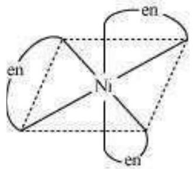

Question 9.27:
Discuss briefly giving an example in each case the role of coordination compounds in:

(i) biological system
(ii) medicinal chemistry
(iii) analytical chemistry
(iv) extraction/metallurgy of metals

Answer

(i) Role of coordination compounds in biological systems:

We know that photosynthesis is made possible by the presence of the chlorophyll pigment. This pigment is a coordination compound of magnesium. In the human biological system, several coordination compounds play important roles. For example, the oxygen-carrier of blood, i.e., haemoglobin, is a coordination compound of iron.
(ii) Role of coordination compounds in medicinal chemistry:

Certain coordination compounds of platinum (for example, cis-platin) are used for inhibiting the growth of tumours.
(iii) Role of coordination compounds in analytical chemistry:

During salt analysis, a number of basic radicals are detected with the help of the colour changes they exhibit with different reagents. These colour changes are a result of the coordination compounds or complexes that the basic radicals form with different ligands.
(iii) Role of coordination compounds in extraction or metallurgy of metals:

The process of extraction of some of the metals from their ores involves the formation of complexes. For example, in aqueous solution, gold combines with cyanide ions to form $\left[\mathrm{Au}(\mathrm{CN})_{2}\right]$. From this solution, gold is later extracted by the addition of zinc metal.

Question 9.28:
How many ions are produced from the complex $\mathrm{Co}\left(\mathrm{NH}_{3}\right)_{6} \mathrm{Cl}_{2}$ in solution?

(i) 6
(ii) 4
(iii) 3
(iv) 2

Answer

(iii) The given complex can be written as $\left[\mathrm{Co}\left(\mathrm{NH}_{3}\right)_{6}\right] \mathrm{Cl}_{2}$.

Thus, $\left[\mathrm{Co}\left(\mathrm{NH}_{3}\right)_{6}\right]^{+}$along with two $\mathrm{Cl}^{-}$ions are produced.

Question 9.29:
Amongst the following ions which one has the highest magnetic moment value?

(i) $\left[\mathrm{Cr}\left(\mathrm{H}_{2} \mathrm{O}\right)_{6}\right]^{3+}$
(ii) $\left[\mathrm{Fe}\left(\mathrm{H}_{2} \mathrm{O}\right)_{6}\right]^{2+}$

(iii) $\left[\mathrm{Zn}\left(\mathrm{H}_{2} \mathrm{O}\right)_{6}\right]^{2+}$
Answer

(i) No. of unpaired electrons in $\left[\mathrm{Cr}\left(\mathrm{H}_{2} \mathrm{O}\right)_{6}\right]^{3+}=3$
Then, $\mu$
$$
=\sqrt{n(n+2)}
$$
$$
\begin{aligned}
& =\sqrt{3(3+2)} \\
& =\sqrt{15} \\
& \sim 4 \mathrm{BM}
\end{aligned}
$$
(ii) No. of unpaired electrons in $\left[\mathrm{Fe}\left(\mathrm{H}_{2} \mathrm{O}\right)_{6}\right]^{2+}=4$
Then, $\mu$
$$
=\sqrt{4(4+2)}
$$
$$
\begin{aligned}
& =\sqrt{24} \\
& \sim 5 \mathrm{BM}
\end{aligned}
$$

(iii) No. of unpaired electrons in $\left[\mathrm{Zn}\left(\mathrm{H}_{2} \mathrm{O}\right)_{6}\right]^{2+}=0$
Hence, $\left[\mathrm{Fe}\left(\mathrm{H}_{2} \mathrm{O}\right)_{6}\right]^{2+}$ has the highest magnetic moment value.

Question 9.30:
The oxidation number of cobalt in $\mathrm{K}\left[\mathrm{Co}(\mathrm{CO})_{4}\right]$ is

(i) +1
(ii) +3
(iii) -1
(iv) -3

Answer
We know that CO is a neutral ligand and K carries a charge of +1 .
Therefore, the complex can be written as $\mathrm{K}^{+}\left[\mathrm{Co}(\mathrm{CO})_{4}\right]^{-}$. Therefore, the oxidation number of Co in the given complex is -1 . Hence, option (iii) is correct.

Question 9.31:
Amongst the following, the most stable complex is

(i) $\left[\mathrm{Fe}\left(\mathrm{H}_{2} \mathrm{O}\right)_{6}\right]^{3+}$

(ii) $\left[\mathrm{Fe}\left(\mathrm{NH}_{3}\right)_{6}\right]^{3+}$
(iii) $\left[\mathrm{Fe}\left(\mathrm{C}_{2} \mathrm{O}_{4}\right)_{3}\right]^{3-}$
(iv) $\left[\mathrm{FeCl}_{6}\right]^{3-}$

Answer
We know that the stability of a complex increases by chelation. Therefore, the most stable complex is $\left[\mathrm{Fe}\left(\mathrm{C}_{2} \mathrm{O}_{4}\right)_{3}\right]^{3-}$.

Then,

Question 9.32:
What will be the correct order for the wavelengths of absorption in the visible region for the following:

$$
\left[\mathrm{Ni}\left(\mathrm{NO}_{2}\right)_{6}\right]^{4-},\left[\mathrm{Ni}\left(\mathrm{NH}_{3}\right)_{6}\right]^{2+},\left[\mathrm{Ni}\left(\mathrm{H}_{2} \mathrm{O}\right)_{6}\right]^{2+}
$$

Answer
The central metal ion in all the three complexes is the same. Therefore, absorption in the visible region depends on the ligands. The order in which the CFSE values of the ligands increases in the spectrochemical series is as follows:

$$
\mathrm{H}_{2} \mathrm{O}<\mathrm{NH}_{3}<\mathrm{NO}_{2}^{-}
$$

Thus, the amount of crystal-field splitting observed will be in the following order:

$$
\Delta_{{ }_{\left(\mathrm{H}_{2} \mathrm{O}\right)}}<\Delta_{{ }_{\left(\mathrm{NH}_{3}\right)}}<\Delta_{{ }^{\circ}}{ }_{\left(\mathrm{NO}_{2}{ }^{-}\right)}
$$

Hence, the wavelengths of absorption in the visible region will be in the order:

$$
\left[\mathrm{Ni}\left(\mathrm{H}_{2} \mathrm{O}\right)_{6}\right]^{2+}>\left[\mathrm{Ni}\left(\mathrm{NH}_{3}\right)_{6}\right]^{2+}>\left[\mathrm{Ni}\left(\mathrm{NO}_{2}\right)_{6}\right]^{4-}
$$

