## अध्याय $9$

# उपसहसंयोजन यौगिक Coordination Compounds पाठ्यनिहित प्रश्न 

प्रश्न 1. निम्नलिखित उपसहसंयोजन यौगिकों के सूत्र लिखिए

(i) टेट्राऐमीनडाइएक्वाकोबाल्ट (III) क्लोराइड
(ii) पोटैशियम टेट्रासायनोनिकैलेट (II)
(iii) ट्रिस (एथेन-12-डाइऐमीन) क्रोमियम (III) क्लोराइड
(iv) ऐमीनब्रोमिडोक्लोरोनाइट्रिटो- N -प्लैटिनेट (II)
(v) डाइक्लोरोबिस (एथेन-1,2-डाइऐमीन) प्लैटिनम (IV) नाइट्रेट
(vi) आयरन (III) हेक्सासायनिडोफेरेट (II)

हल (i) टेट्राऐमीनडाइएक्वा कोबात्ट (III) क्लोराइड
लिगेण्ड धातु प्रतिआयन
III
$\left[\mathrm{Co}\left(\mathrm{NH}_{3}\right)_{4}\left(\mathrm{H}_{2} \mathrm{O}\right)_{2}\right] \mathrm{Cl}_{\mathrm{x}}$
$x$ का मान ज्ञात करने के लिए हम संकुल पर आवेश ज्ञात करेंगे।

$$
\begin{aligned}
{\left[\mathrm{Co}\left(\mathrm{NH}_{3}\right)_{4}\left(\mathrm{H}_{2} \mathrm{O}\right)_{2}\right]^{x+} } & \\
+3+4 \times 0+2 \times 0 & =x \\
x & =+3
\end{aligned}
$$

अतः संकुल का सूत्र $\left[\mathrm{Co}\left(\mathrm{NH}_{3}\right)_{4}\left(\mathrm{H}_{2} \mathrm{O}\right)_{2}\right] \mathrm{Cl}_{3}$ है।

(ii) पोटैशियम टेट्रासायनो निकेलेट (II)
प्रतिआयन लिगेण्ड धातु
$$
\mathrm{K}_{x}\left[\mathrm{Ni}(\mathrm{CN})_{4}\right]
$$
$x$ का मान ज्ञात करने के लिए पहले संकुल पर आवेश ज्ञात करेंगे।

$\left[\mathrm{Ni}(\mathrm{CN})_{4}\right]^{\mathrm{x}-}$ (जैसा कि $\mathrm{K}^{+}$घनायन है)
या

$$
\begin{aligned}
+2+(-1) \times 4 & =-x \\
-x & =-2 \\
x & =+2
\end{aligned}
$$

अतः संकुल का सूत्र $\mathrm{K}_{2}\left[\mathrm{Ni}(\mathrm{CN})_{4}\right]$ है।
इसी प्रकार

(iii) $\left[\mathrm{Cr}(\mathrm{en})_{3}\right] \mathrm{Cl}_{3}$
(iv) $\left[\mathrm{Pt}\left(\mathrm{NH}_{3}\right) \mathrm{BrCl}\left(\mathrm{NO}_{2}\right)\right]^{-}$
(v) $\left[\mathrm{PtCl}_{2}(\mathrm{en})_{2}\right]\left(\mathrm{NO}_{3}\right)_{2}$
(vi) $\mathrm{Fe}_{4}\left[\mathrm{Fe}(\mathrm{CN})_{6}\right]_{3}$

प्रश्न 2. निम्नलिखित उपसहसंयोजन यौगिकों के IUPAC नाम लिखिए
(i) $\left[\mathrm{Co}\left(\mathrm{NH}_{3}\right)_{6}\right] \mathrm{Cl}_{3}$
(ii) $\left[\mathrm{Co}\left(\mathrm{NH}_{3}\right)_{5} \mathrm{Cl}\right] \mathrm{Cl}_{2}$
(iii) $\mathrm{K}_{3}\left[\mathrm{Fe}(\mathrm{CN})_{6}\right]$
(iv) $\mathrm{K}_{3}\left[\mathrm{Fe}\left(\mathrm{C}_{2} \mathrm{O}_{4}\right)_{3}\right]$
(v) $\mathrm{K}_{2}\left[\mathrm{PdCl}_{4}\right]$
(vi) $\left[\mathrm{Pt}\left(\mathrm{NH}_{3}\right)_{2} \mathrm{Cl}\left(\mathrm{NH}_{2} \mathrm{CH}_{3}\right)\right] \mathrm{Cl}$

हल (i)
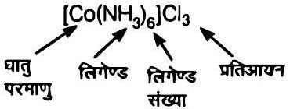
माना कि Co की ऑक्सीकरण अवस्था $x$ है

$$
\begin{gathered}
x+(0) 6+(-1) \times 3=0 \\
x+0-3=0 \Rightarrow x=+3
\end{gathered}
$$

अतः इस संकुल का नाम हेक्साऐमीनकोबाल्ट (III) क्लोराइड है

(ii) 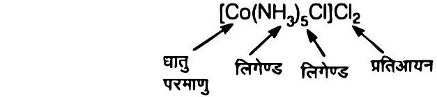
$$
\begin{gathered}
x+(0) \times 5+(-1) \times 1+(-1) \times 2=0 \\
x+0-3=0 \\
x=+3
\end{gathered}
$$
अत: संकुल का नाम पेन्टाऐमीनक्लोराइडोकोबाल्ट (III) क्लोराइड है।
(iii) 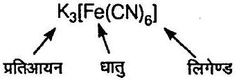
माना कि Fe की ऑक्सीकरण अवस्था $x$ है।

$$
\begin{gathered}
(+1) 3+x+(-1) 6=0 \\
+3+x-6=0 \\
x=+3
\end{gathered}
$$

अतः संकुल का नाम पोटैशियमहेक्सासायनोफेरेट (III) है।
(iv)
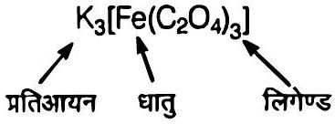
माना कि Fe की ऑक्सीकरण अवस्था $x$ है।

$$
(+1) 3+x+(-2) 3=0
$$

$\left[\because\right.$ ऑक्सेलेट आयन पर $\left(\mathrm{C}_{2} \mathrm{O}_{4}^{2-}\right)-2$ आवेश है। $]$

$$
\begin{aligned}
3+x-6 & =0 \\
x & =+3
\end{aligned}
$$

अतः संकुल का नाम पोटैशियमट्राइआक्सैलेटोफेरेट (III) है।
(v)
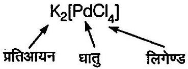
माना कि Pd की ऑक्सीकरण अवस्था $x$ है।

$$
\begin{aligned}
(+1) 2+x+(-1) 4 & =0 \\
2+x-4 & =0 \\
x & =+2
\end{aligned}
$$

अत: संकुल का नाम पोटैशियमटेट्राक्लोरोडोपेलेडेट (II) है।
(vi)
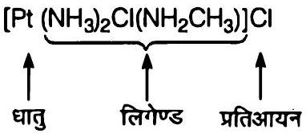
माना कि Pt की ऑक्सीकरण अवस्था $x$ है।

$$
\begin{aligned}
x+(0) 2+(-1) \times 1+0 & +(-1) \times 1=0 \\
x+0-1+0-1 & =0 \\
x-2 & =0 \\
x & =+2
\end{aligned}
$$

अतः संकुल का नाम डाइऐमीनक्लोरोडो (मेथिल ऐमीन) प्लैटिनम (II) क्लोराइड है।

प्रश्न 3. निम्नलिखित संकुलों द्वारा प्रदर्शित समावयवता का प्रकार बताइए तथा इन समावयवों की संरचनाएँ बनाइए।
(i) $\mathrm{K}\left[\mathrm{Cr}\left(\mathrm{H}_{2} \mathrm{O}\right)_{2}\left(\mathrm{C}_{2} \mathrm{O}_{4}\right)_{2}\right]$
(ii) $\left[\mathrm{Co}(\mathrm{en})_{3}\right] \mathrm{Cl}_{3}$
(iii) $\left.\left[\mathrm{Co}\left(\mathrm{NH}_{3}\right)_{5}\left(\mathrm{NO}_{2}\right)\right]\left(\mathrm{NO}_{3}\right)_{2}\right]$
(iv) $\left[\mathrm{Pt}\left(\mathrm{NH}_{3}\right)\left(\mathrm{H}_{2} \mathrm{O}\right) \mathrm{Cl}_{2}\right]$

हल (i) $\mathrm{K}\left[\mathrm{Cr}\left(\mathrm{H}_{2} \mathrm{O}\right)_{2}\left(\mathrm{C}_{2} \mathrm{O}_{4}\right)_{2}\right]$ या $\mathrm{K}\left[\mathrm{Cr}\left(\mathrm{H}_{2} \mathrm{O}\right)_{2}(\mathrm{OX})_{2}\right]$ ( जहाँ, $\mathrm{ox}=$ ऑक्सेलेट आयन)

(a) यह ज्यामितीय समावयवता दर्शाता है अर्थात् इसके दो समावयी समपक्ष तथा विपक्ष समावयव होते हैं।

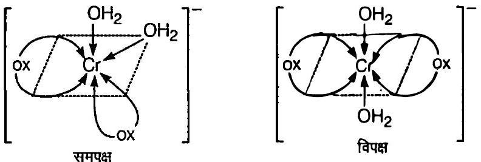
(समपक्ष समावयव में समान लिग्रेण्ड पास-पास जुड़े रहते हैं जबकि विपक्ष समावयव में एक-दूसरे के विपरीत स्थान पर उपस्थित होते हैं)।

(b) समपक्ष समावयव समतिति तल की अनुपस्थिति के कारण ध्रुवण समावयवता अर्थात् $d$-तथा $1$-रूप भी दर्शाता है।

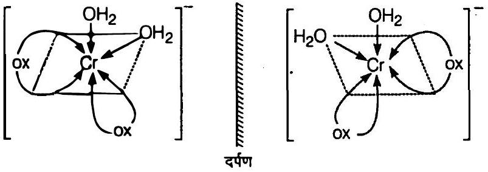

(ii) $\left[\mathrm{Co}(\mathrm{en})_{3}\right] \mathrm{Cl}_{3}$ इसके दो धुवण समावयव ( $d$-तथा $t$-रूप) हैं। अर्थात्
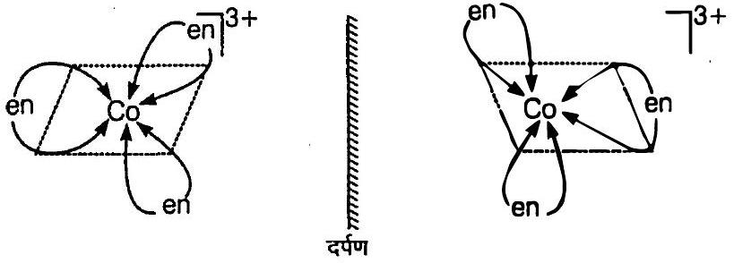
(iii) $\left[\mathrm{Co}\left(\mathrm{NH}_{3}\right)_{5}\left(\mathrm{NO}_{2}\right)\right]\left(\mathrm{NO}_{3}\right)_{2}$
इसके निम्नलिखित आयनिक समावयव तथा बंधनी समावयव अस्तित्व में होंगे।

आयनन समावयव
$\left[\mathrm{Co}\left(\mathrm{NH}_{3}\right)_{5}\left(\mathrm{NO}_{2}\right)\right]\left(\mathrm{NO}_{3}\right)_{2}$ तथा $\left[\mathrm{Co}\left(\mathrm{NH}_{3}\right)_{5}\left(\mathrm{NO}_{3}\right)\right]\left(\mathrm{NO}_{2}\right)\left(\mathrm{NO}_{3}\right)$
क्योंकि ये आयनित होकर विभिन्न आयन देते हैं।

$$
\begin{aligned}
{\left[\mathrm{Co}\left(\mathrm{NH}_{3}\right)_{5}\left(\mathrm{NO}_{2}\right)\right]\left(\mathrm{NO}_{3}\right)_{2} \xrightarrow{\text { आयनन }}\left[\mathrm{Co}\left(\mathrm{NH}_{3}\right)_{5}\left(\mathrm{NO}_{2}\right)\right]^{2+} } & \\
& +2 \mathrm{NO}_{3}^{-}
\end{aligned}
$$

$$
\begin{aligned}
{\left[\mathrm{Co}\left(\mathrm{NH}_{3}\right)_{5}\left(\mathrm{NO}_{3}\right)\right]\left(\mathrm{NO}_{2}\right)\left(\mathrm{NO}_{3}\right) \xrightarrow{\text { आयनन }} } & {\left[\mathrm{Co}\left(\mathrm{NH}_{3}\right)_{5} \mathrm{NO}_{3}\right]^{2+} } \\
+ & \mathrm{NO}_{2}^{-}+\mathrm{NO}_{3}^{-}
\end{aligned}
$$

बंघनी समावयव
$\left[\mathrm{Co}\left(\mathrm{NH}_{3}\right)_{5}\left(\mathrm{NO}_{2}\right)\right]\left(\mathrm{NO}_{3}\right)_{2}$ तथा $\left[\mathrm{Co}\left(\mathrm{NH}_{3}\right)_{5} \mathrm{ONO}\right]\left(\mathrm{NO}_{3}\right)_{2}$
(iv) $\left[\mathrm{Pt}\left(\mathrm{NH}_{3}\right)\left(\mathrm{H}_{2} \mathrm{O}\right) \mathrm{Cl}_{2}\right]$ इसके निम्नलिखित दो ज्यामितीय समावयवी अस्तित्व में होगें।

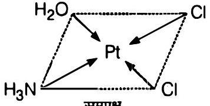
समपक्ष

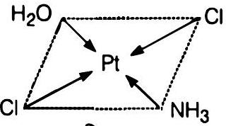
विपक्ष

प्रश्न 4. इसका प्रमाण दीजिए कि $\left[\mathrm{Co}\left(\mathrm{NH}_{3}\right)_{5} \mathrm{ClSO}_{4}\right.$ तथा $\left[\mathrm{Co}\left(\mathrm{NH}_{3}\right)_{5} \mathrm{SO}_{4}\right] \mathrm{Cl}$ आयनन समावय हैं।

हल दोनों यौगिकों को दो अलग-अलग परखनली में जल में घोलेंगे तथा दोनों के लिए निम्न परीक्षण करेंगे

परीक्षण । परखनलियों में $\mathrm{BaCl}_{2}$ विलयन डालने पर एक यौगिक का सफेद अवक्षेप बनाता है, यह यौगिक में $\mathrm{SO}_{4}^{2-}$ आयनों की उपस्थिति को दर्शाता है। जबकि दूसरा यौगिक सफेद अवक्षेप नहीं देता है, यह यौगिक में $\mathrm{SO}_{4}^{2-}$ आयनों की अनुपस्थिति को दर्शाता है।

$$
\underset{\text { [I] }}{\left[\mathrm{Co}\left(\mathrm{NH}_{3}\right)_{5} \mathrm{Cl}\right] \mathrm{SO}_{4}}+\mathrm{BaCl}_{2}(\mathrm{aq}) \longrightarrow\left[\mathrm{Co}\left(\mathrm{NH}_{3}\right)_{5} \mathrm{Cl}\right] \mathrm{Cl}_{2}+\underset{\text { सफेद अवक्षेप }}{\mathrm{BaSO}_{4}(s)}
$$

परीक्षण II दोनों परखनलियों में $\mathrm{AgNO}_{3}$ विलयन मिलाने पर, केवल यौगिक (II) सफेद अवक्षेप देता है जबकि प्रति आयन $\mathrm{Cl}^{-}$आयनों की अनुपस्थिति के कारण (I) सफेद अवक्षेप नहीं देता है।

$$
\begin{aligned}
& {\left[\mathrm{Co}\left(\mathrm{NH}_{3}\right)_{5} \mathrm{SO}_{4}\right] \mathrm{Cl}+\mathrm{AgNO}_{3}(\mathrm{aq}) \longrightarrow\left[\mathrm{Co}\left(\mathrm{NH}_{3}\right)_{5} \mathrm{SO}_{4}\right] \mathrm{NO}_{3}+\underset{\text { सफेद अवक्षेप }}{\mathrm{AgCl}(\mathrm{~s})}} \\
& {\left[\mathrm{Co}\left(\mathrm{NH}_{3}\right)_{5} \mathrm{Cl}\right] \mathrm{SO}_{4}+\mathrm{AgNO}_{3}(\mathrm{aq}) \longrightarrow \text { कोई अभिक्रिया नहीं }}
\end{aligned}
$$

यह दोनों परीक्षण पुष्टि करते हैं कि दिये गये दोनों यौगिक एक युगल आयनन समावयव हैं।
प्रश्न 5. संयोजकता आबंघ सिद्धान्त के आधार पर समझाइए कि वर्ग समतलीय संरचना वाला $\left[\mathrm{Ni}(\mathrm{CN})_{4}\right]^{2-}$ आयन प्रतिचुम्बकीय है तथा चतुष्फलकीय ज्यामिति वाला $\left[\mathrm{NiCl}_{4}\right]^{2-}$ आयन अनुचुम्बकीय है।

हल $\left[\mathrm{Ni}\left(\mathrm{CN}_{4}\right]^{2-}\right.$ आयन ${ }_{28} \mathrm{Ni}$ परमाणु का बाहरी विन्यास $=3 d^{8} 4 s^{2}$
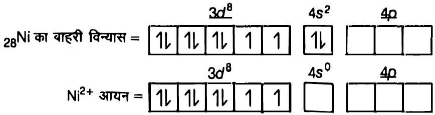
( $\mathrm{CN}^{-}$प्रबल क्षेत्र लिगेण्ड होने के कारण घातु आयन के $d$-इलेक्ट्रॉनों का युग्मन कर देता है।)

$$
\left[\mathrm{Ni}(\mathrm{CN})_{4}\right]^{2-} \text { आयन }=\begin{array}{|l|l|l|l|l|}
\hline 1 \mathrm{l} & 1 \mathrm{l} & 1 \mathrm{l} & 1 \mathrm{l} & \times \mathrm{x} \\
\hline & \underbrace{\mathrm{CN}^{-}} & \underbrace{\begin{array}{|c|}
\hline \times \mathrm{x} \\
\hline
\end{array}} \begin{array}{|c|l|}
\hline \times \mathrm{x} & \times \times \\
\hline
\end{array} \\
\hline
\end{array}
$$
$d s p^{2}$ संकरण
⇒ वर्ग समतली संरचना

यह संकुल आयन प्रतिचुम्बकीय है क्योंकि इसमें अयुग्मित इलेक्ट्रॉन नहीं है।
${ }_{28} \mathrm{Ni}$ परमाणु का बाहरी विन्यास $=30^{8} 4 s^{2}$

$$
\begin{aligned}
&{ }_{28} \mathrm{Ni} \text { का बाहरी विन्यास }=\begin{array}{|l|l|l|l|l|}
\hline 1 l & 1 l & 1 l & 1 & 1 \\
\hline
\end{array} \begin{array}{|l|l|}
4 s^{2} \\
\hline
\end{array}{ }^{\frac{3 d^{8}}{4 d^{8}}} \\
& \mathrm{Ni}^{2+} \text { आयन }=\begin{array}{|l|l|l|l|}
\hline 1 l & 1 l & 1 l & 1 \\
\hline
\end{array} \\
& \hline
\end{aligned}
$$

$\left(\mathrm{Cl}^{-}\right.$दुर्बल क्षेत्र लिगेण्ड होने के कारण इलेक्ट्रॉनों का युग्मन नहीं कर सकता है।)

$$
\left[\mathrm{NiCl}_{4}\right]^{2-}=\begin{array}{|l|l|l|l|l|}
\hline 1 \mathrm{l} & 1 \mathrm{l} & 1 \mathrm{l} & 1 & 1 \\
\hline
\end{array} \underbrace{\begin{array}{|c|}
\hline \times \mathrm{x} \\
\hline \mathrm{Cl}^{-} \\
\hline
\end{array} \begin{array}{|c|c|}
\hline \times \times & \mathrm{Cl}^{-} \mathrm{Cl}^{-} \mathrm{Cl}^{-} \\
\hline \times \times & \times \times \\
\hline
\end{array}}
$$
$s p^{3}$ संकरण
यह संकुल आयन अनुचुम्बकीय है क्योंकि इसमें दो अयुग्मित इलेक्ट्रॉन हैं। ⇒ चतुष्फलकीय संरचना

प्रश्न 6. $\left[\mathrm{NiCl}_{4}\right]^{2}$ तथा $\left[\mathrm{Ni}(\mathrm{CO})_{4}\right]$ दोनों चतुष्फलकीय है परन्तु $\left[\mathrm{NiCl}_{4}\right]^{2}$ अनुचुम्बकीय तथा $\left[\mathrm{Ni}(\mathrm{CO})_{4}\right]^{2-}$ प्रतिचुम्बकीय है। क्यों?

हल Ni परमाणु का बाहरी विन्यास $=3 d^{8} 4 s^{2}$
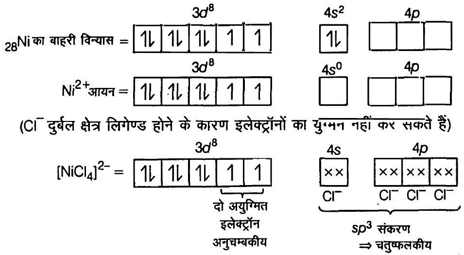
$\mathrm{Ni}\left(\mathrm{CO}_{4}\right.$ संकुल में Ni की ऑक्सीकरण अवस्था शून्य है तथा इलेक्ट्रॉनिक विन्यास $3 d^{8} 4 \mathrm{~s}^{2}$ है। CO (प्रबल क्षेत्र लिगेण्ड) लिगेण्ड की उपस्थिति में $4 s$ इलेक्ट्रॉन $3 d$ कक्षक में चले जाते हैं 3d-कक्षक में सभी इलेक्ट्रॉनों का युग्मन हो जाता है। संकरण में $4 s$ तथा $4 p$-कक्षक भाग लेते है। अतः संकुल चतुष्फलकीय लेकिन प्रतिचुम्बकीय है।
Ni परमाणु का बाहरी विन्यास $=3 d^{8} 4 s^{2}$
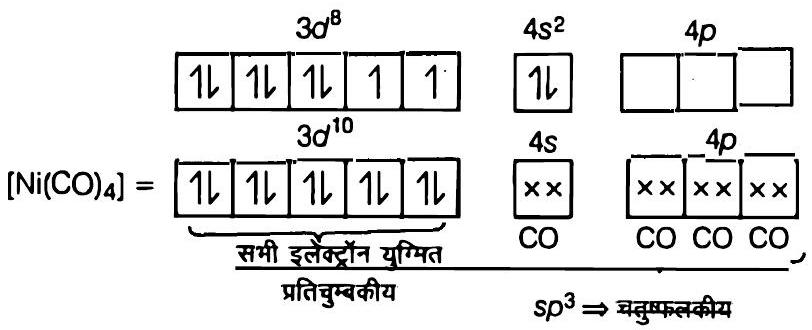
प्रश्न 7. $\left[\mathrm{Fe}\left(\mathrm{H}_{2} \mathrm{O}\right)_{6}\right]^{3+}$ प्रबल अनुचुम्बकीय है जबकि $\left[\mathrm{Fe}(\mathrm{CN})_{6}\right]^{3-}$ दुर्बल अनुचुम्बकीय है। समझाइए।

हल $26 \mathrm{Fe}$ का बाहरी विन्यास $=3 d^{6}, 4 s^{2}$
दोनों संकुलों में $\mathrm{Fe}, \mathrm{Fe}^{3+}$ आयन के रूप में है।
अतः, $\mathrm{Fe}^{3+}$ आयन का विन्यास $=3 d^{5} 4 s^{0}$
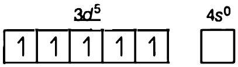
$\mathrm{CN}^{-}$लिगेण्ड (प्रबल क्षेत्र लिगेण्ड) की उपस्थिति में, $3 d$ कक्षक में इलेक्ट्रॉनों का युग्मन होने के पश्चात् एक इलेक्ट्रॉन अयुम्मित रहता है। $d^{2} s p^{3}$ संकरण होने के साथ आन्तरिक कक्षक संकुल बनता है।
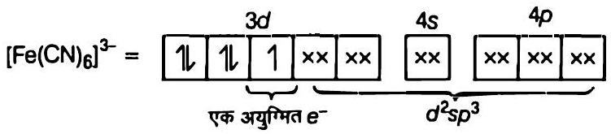
$\mathrm{H}_{2} \mathrm{O}$ (दुर्बल क्षेत्र लिगेण्ड) की उपस्थिति में $3 d$-इलेक्ट्रॉन युग्मित नहीं हो पाते है। अत:
$s p^{3} d^{2}$ संकरण के साथ बाह्य कक्षक संकुल बनता है इसमें पाँच अयुग्मित इलेक्ट्रॉन होते हैं, जिससे यह प्रबल अनुचुम्बकीय है।
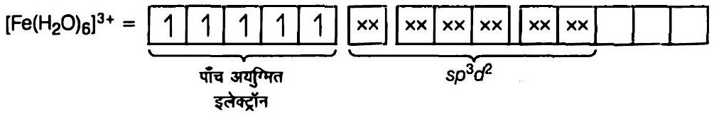

प्रश्न 8. समझाइए कि $\left[\mathrm{Co}\left(\mathrm{NH}_{3}\right)_{6}\right]^{3+}$ एक आंतरिक कक्षक संकुल है जबकि $\left[\mathrm{Ni}\left(\mathrm{NH}_{3}\right)_{6}\right]^{2+}$ एक बाह्म कक्षक संकुल है।

हल $\left[\mathrm{Co}\left(\mathrm{NH}_{3}\right)_{6}\right]^{3+}$ में, $\mathrm{Co}+3$ ऑक्सीकरण अवस्था में है तथा इसका विन्यास $3 d^{6}$ है।
$\mathrm{NH}_{3}$ की उपस्थिति में $3 d$-कक्षकों में इलेक्ट्रॉन युमित हो जाते हैं। शेष दो रिक्त $3 d$-कक्षक $d^{2} s p^{3}$ संकरण में भाग लेकर आन्तरिक कक्षक संकुल बनाते हैं।
$\left[\mathrm{Co}\left(\mathrm{NH}_{3}\right)_{6}\right]^{3+}$ संकुल आयन में
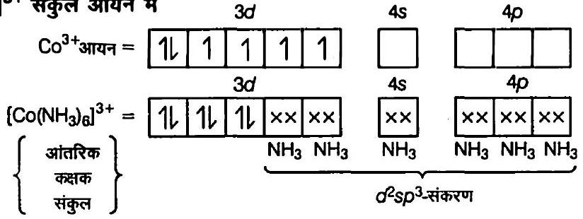
$\left.\left[\mathrm{NiNH}_{3}\right)_{6}\right]^{2+}$ में Ni की ऑक्सीकरण अवस्था $+2$ तथा विन्यास $d^{8}$ है।
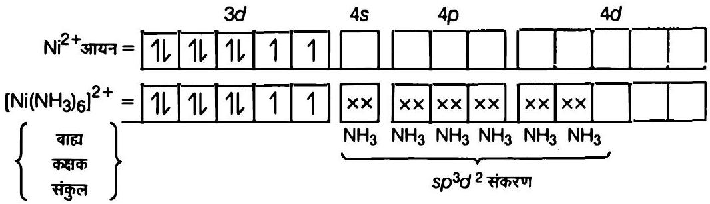
चूँकि यहाँ $(n-1) d$ कक्षक उपलब्ध नहीं है अत: $n d$-कक्षक संकरण में भाग लेते हैं। इस प्रकार बना संकुल, बाह्य कक्षक संकुल कहलाता है।
प्रश्न 9. वर्ग समतली $\left[\mathrm{Pt}(\mathrm{CN})_{4}\right]^{2-}$ आयन में अयुग्मित इलेक्ट्रॉनों की संख्या बतलाइए।
हल ${ }_{78} \mathrm{Pt}$ आवर्त सारणी के वर्ग-10 में उपस्थित है। इसका बाह्य विन्यास $5 d^{9} 6 s^{1}$ है।
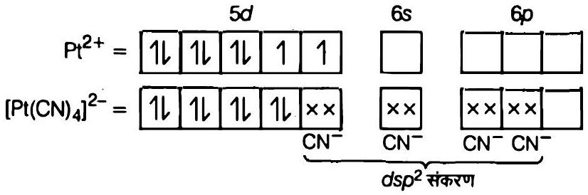
वर्ग समतली संरचना के लिए, इस आयन में $d s p^{2}$ संकरण होगा। अतः $5 d$ कसकों में इलेक्ट्रॉनों के युग्मन होने से एक $d$-कक्षक रिक्त रहता है जो $d s p^{2}$ संकरण में भाग लेता है। इस प्रकार इस आयन में एक भी अयुग्मित इलेक्ट्रॉन नहीं है।
प्रश्न 10. क्रिस्टल क्षेत्र सिद्धान्त को प्रयुक्त करते हुए समझाइए कि कैसे हेक्साएक्वा मैंगनीज (II) आयन अयुग्मित इलेक्ट्रॉन हैं जबकि हेक्सासायनों आयन में केवल एक ही अयुग्मित इलेक्ट्रॉन है।

हल $\mathrm{Mn}(\mathrm{II})$ आयन का विन्यास $3 d^{5}$ है। $\mathrm{H}_{2} \mathrm{O}$ लिगेण्ड (दुर्बल क्षेत्र लिगेण्ड) की उपस्थिति में इन पाँच इलेक्ट्रॉनों का वितरण $t_{2 g}^{3} e_{g}^{2}$ है। अर्थात् पाँचों इलेक्ट्रॉन अयुग्मित रहकर उच्च प्रचक्रण संकुल बनाते हैं।
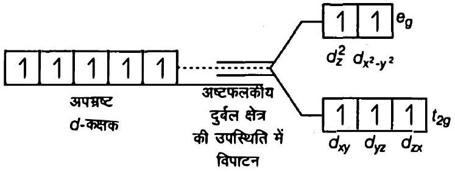

हाँलाकि, $\mathrm{CN}^{-}$लिगेण्ड की उपस्थिति में (जोकि प्रबल क्षेत्र लिगेण्ड है), इन इलेक्ट्रॉनों का वितरण $t_{2 \mathrm{~g}}^{5} e_{\mathrm{g}}^{0}$ है अर्थात् दो $t_{2 \mathrm{~g}}$ कक्षकों में अयुग्मित इलेक्ट्रॉन तथा एक $t_{2 \mathrm{~g}}$-क्षक में $1$ अयुग्मित इलेक्ट्रॉन है। इस प्रकार निम्न प्रचक्रण संकुल बनता है।
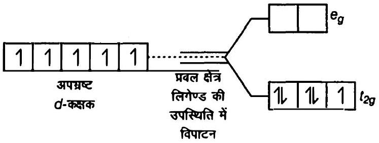

प्रश्न 11. $\left[\mathrm{Cu}\left(\mathrm{NH}_{3}\right)_{4}\right]^{2+}$ संकुल आयन के $\beta_{4}$ का मान $2.1 \times 10^{13}$ है, इस संकुल के समग्र वियोजन स्थिरांक के मान की गणना कीजिए।

हल समग्र संकुल वियोजन साम्य स्थिरांक $=\frac{1}{\beta_{4}}$

$$
\begin{aligned}
& =\frac{1}{2.1 \times 10^{13}} \\
& =4.7 \times 10^{-14}
\end{aligned}
$$

## अभ्यास

प्रश्न 1. वर्नर की अभिघारणाओं के आघार पर उपसहसंयोजन यौगिकों में आबंधन को समझाइये।
हल वर्नर के सिद्धान्त की मुख्य अभिधारणाएँ निम्न है।

1. उपसहसंयोजन यौगिकों में धातुएँ दो प्रकार की संयोजकताएँ दर्शाती है प्राथमिक तथा द्वितीयक।
2. प्राथमिक संयोजकताएँ सामान्य रूप से आयननीय होती हैं तथा ॠणात्मक आयनों द्वारा संतुष्ट होती हैं।

3. द्वितीयक संयोजकताएँ अन्कआयननीय होती हैं। ये उदासीन अणुओं अथवा ऋणात्मक आयनों द्वारा संतुष्ट होती हैं। द्वितीयक संयोजकता उपसहसंयोजन संख्या के बराबर होती है तथा इसका मान किसी धातु के लिए सामान्यतः निश्चित होता है।
4. धातु से द्वितीयक संयोजकता से आबंधित आयन/समूह विमिन्न उपसहसंयोजन संख्या के अनुरूप दिक्स्थान से विशिष्ट रूप से व्यवस्थित रहते हैं। उदाहरण $\left[\mathrm{CoCl}_{2}\left(\mathrm{NH}_{3}\right)_{4}\right]^{+} \mathrm{Cl}^{-}$की संरचना निम्न प्रकार है।
<img class="imgSvg" id = "mu525uvtzzoh87t8yj" src="data:image/svg+xml;base64,PHN2ZyBpZD0ic21pbGVzLW11NTI1dXZ0enpvaDg3dDh5aiIgeG1sbnM9Imh0dHA6Ly93d3cudzMub3JnLzIwMDAvc3ZnIiB2aWV3Qm94PSIwIDAgMTc0IDEwNC45OTk5OTk5OTk5NzQ2IiBzdHlsZT0id2lkdGg6IDE3NC4yNzk4MTQzNTY0ODA2cHg7IGhlaWdodDogMTA0Ljk5OTk5OTk5OTk3NDZweDsgb3ZlcmZsb3c6IHZpc2libGU7Ij48ZGVmcz48bGluZWFyR3JhZGllbnQgaWQ9ImxpbmUtbXU1MjV1dnR6em9oODd0OHlqLTEiIGdyYWRpZW50VW5pdHM9InVzZXJTcGFjZU9uVXNlIiB4MT0iMTA0Ljk5OTk5OTk5OTk3NDYyIiB5MT0iNTIuNTAwMDI4Mjc0NjAxNjYiIHgyPSIxMjAuNzQ5OTc1NTEzNDMzOTUiIHkyPSI3OS43Nzk4NDI2MzExMDc2OCI+PHN0b3Agc3RvcC1jb2xvcj0iY3VycmVudENvbG9yIiBvZmZzZXQ9IjIwJSI+PC9zdG9wPjxzdG9wIHN0b3AtY29sb3I9ImN1cnJlbnRDb2xvciIgb2Zmc2V0PSIxMDAlIj48L3N0b3A+PC9saW5lYXJHcmFkaWVudD48bGluZWFyR3JhZGllbnQgaWQ9ImxpbmUtbXU1MjV1dnR6em9oODd0OHlqLTMiIGdyYWRpZW50VW5pdHM9InVzZXJTcGFjZU9uVXNlIiB4MT0iMTA0Ljk5OTk5OTk5OTk3NDYyIiB5MT0iNTIuNTAwMDI4Mjc0NjAxNjYiIHgyPSIxMDUuMDAwMDI4Mjc0NTg4OTciIHkyPSIyMS4wMDAwMjgyNzQ2MTQzNjUiPjxzdG9wIHN0b3AtY29sb3I9ImN1cnJlbnRDb2xvciIgb2Zmc2V0PSIyMCUiPjwvc3RvcD48c3RvcCBzdG9wLWNvbG9yPSJjdXJyZW50Q29sb3IiIG9mZnNldD0iMTAwJSI+PC9zdG9wPjwvbGluZWFyR3JhZGllbnQ+PGxpbmVhckdyYWRpZW50IGlkPSJsaW5lLW11NTI1dXZ0enpvaDg3dDh5ai01IiBncmFkaWVudFVuaXRzPSJ1c2VyU3BhY2VPblVzZSIgeDE9IjEwNC45OTk5OTk5OTk5NzQ2MiIgeTE9IjUyLjUwMDAyODI3NDYwMTY2IiB4Mj0iMTMyLjI3OTgxNDM1NjQ4MDYiIHkyPSIzNi43NTAwNTI3NjExNDIzMyI+PHN0b3Agc3RvcC1jb2xvcj0iY3VycmVudENvbG9yIiBvZmZzZXQ9IjIwJSI+PC9zdG9wPjxzdG9wIHN0b3AtY29sb3I9ImN1cnJlbnRDb2xvciIgb2Zmc2V0PSIxMDAlIj48L3N0b3A+PC9saW5lYXJHcmFkaWVudD48bGluZWFyR3JhZGllbnQgaWQ9ImxpbmUtbXU1MjV1dnR6em9oODd0OHlqLTciIGdyYWRpZW50VW5pdHM9InVzZXJTcGFjZU9uVXNlIiB4MT0iNzMuNDk5OTk5OTk5OTg3MyIgeTE9IjUyLjQ5OTk5OTk5OTk4NzMxIiB4Mj0iMTA0Ljk5OTk5OTk5OTk3NDYyIiB5Mj0iNTIuNTAwMDI4Mjc0NjAxNjYiPjxzdG9wIHN0b3AtY29sb3I9ImN1cnJlbnRDb2xvciIgb2Zmc2V0PSIyMCUiPjwvc3RvcD48c3RvcCBzdG9wLWNvbG9yPSJjdXJyZW50Q29sb3IiIG9mZnNldD0iMTAwJSI+PC9zdG9wPjwvbGluZWFyR3JhZGllbnQ+PGxpbmVhckdyYWRpZW50IGlkPSJsaW5lLW11NTI1dXZ0enpvaDg3dDh5ai05IiBncmFkaWVudFVuaXRzPSJ1c2VyU3BhY2VPblVzZSIgeDE9IjQyIiB5MT0iNTIuNDk5OTcxNzI1MzcyOTYiIHgyPSI3My40OTk5OTk5OTk5ODczIiB5Mj0iNTIuNDk5OTk5OTk5OTg3MzEiPjxzdG9wIHN0b3AtY29sb3I9ImN1cnJlbnRDb2xvciIgb2Zmc2V0PSIyMCUiPjwvc3RvcD48c3RvcCBzdG9wLWNvbG9yPSJjdXJyZW50Q29sb3IiIG9mZnNldD0iMTAwJSI+PC9zdG9wPjwvbGluZWFyR3JhZGllbnQ+PGxpbmVhckdyYWRpZW50IGlkPSJsaW5lLW11NTI1dXZ0enpvaDg3dDh5ai0xMSIgZ3JhZGllbnRVbml0cz0idXNlclNwYWNlT25Vc2UiIHgxPSI3My40OTk5OTk5OTk5ODczIiB5MT0iNTIuNDk5OTk5OTk5OTg3MzEiIHgyPSI3My41MDAwMjgyNzQ2MDE2OCIgeTI9IjIxIj48c3RvcCBzdG9wLWNvbG9yPSJjdXJyZW50Q29sb3IiIG9mZnNldD0iMjAlIj48L3N0b3A+PHN0b3Agc3RvcC1jb2xvcj0iY3VycmVudENvbG9yIiBvZmZzZXQ9IjEwMCUiPjwvc3RvcD48L2xpbmVhckdyYWRpZW50PjxsaW5lYXJHcmFkaWVudCBpZD0ibGluZS1tdTUyNXV2dHp6b2g4N3Q4eWotMTMiIGdyYWRpZW50VW5pdHM9InVzZXJTcGFjZU9uVXNlIiB4MT0iNzMuNDk5OTcxNzI1MzcyOTQiIHkxPSI4My45OTk5OTk5OTk5NzQ2MiIgeDI9IjczLjQ5OTk5OTk5OTk4NzMiIHkyPSI1Mi40OTk5OTk5OTk5ODczMSI+PHN0b3Agc3RvcC1jb2xvcj0iY3VycmVudENvbG9yIiBvZmZzZXQ9IjIwJSI+PC9zdG9wPjxzdG9wIHN0b3AtY29sb3I9ImN1cnJlbnRDb2xvciIgb2Zmc2V0PSIxMDAlIj48L3N0b3A+PC9saW5lYXJHcmFkaWVudD48L2RlZnM+PG1hc2sgaWQ9InRleHQtbWFzay1tdTUyNXV2dHp6b2g4N3Q4eWoiPjxyZWN0IHg9IjAiIHk9IjAiIHdpZHRoPSIxMDAlIiBoZWlnaHQ9IjEwMCUiIGZpbGw9IndoaXRlIj48L3JlY3Q+PGNpcmNsZSBjeD0iMTIwLjc0OTk3NTUxMzQzMzk1IiBjeT0iNzkuNzc5ODQyNjMxMTA3NjgiIHI9IjcuODc1IiBmaWxsPSJibGFjayI+PC9jaXJjbGU+PGNpcmNsZSBjeD0iMTA1LjAwMDAyODI3NDU4ODk3IiBjeT0iMjEuMDAwMDI4Mjc0NjE0MzY1IiByPSI3Ljg3NSIgZmlsbD0iYmxhY2siPjwvY2lyY2xlPjxjaXJjbGUgY3g9IjEzMi4yNzk4MTQzNTY0ODA2IiBjeT0iMzYuNzUwMDUyNzYxMTQyMzMiIHI9IjcuODc1IiBmaWxsPSJibGFjayI+PC9jaXJjbGU+PGNpcmNsZSBjeD0iNDIiIGN5PSI1Mi40OTk5NzE3MjUzNzI5NiIgcj0iNy44NzUiIGZpbGw9ImJsYWNrIj48L2NpcmNsZT48Y2lyY2xlIGN4PSI3My41MDAwMjgyNzQ2MDE2OCIgY3k9IjIxIiByPSI3Ljg3NSIgZmlsbD0iYmxhY2siPjwvY2lyY2xlPjxjaXJjbGUgY3g9IjczLjQ5OTk3MTcyNTM3Mjk0IiBjeT0iODMuOTk5OTk5OTk5OTc0NjIiIHI9IjcuODc1IiBmaWxsPSJibGFjayI+PC9jaXJjbGU+PC9tYXNrPjxzdHlsZT4KICAgICAgICAgICAgICAgIC5lbGVtZW50LW11NTI1dXZ0enpvaDg3dDh5aiB7CiAgICAgICAgICAgICAgICAgICAgZm9udDogMTRweCBIZWx2ZXRpY2EsIEFyaWFsLCBzYW5zLXNlcmlmOwogICAgICAgICAgICAgICAgICAgIGFsaWdubWVudC1iYXNlbGluZTogJ21pZGRsZSc7CiAgICAgICAgICAgICAgICB9CiAgICAgICAgICAgICAgICAuc3ViLW11NTI1dXZ0enpvaDg3dDh5aiB7CiAgICAgICAgICAgICAgICAgICAgZm9udDogOC40cHggSGVsdmV0aWNhLCBBcmlhbCwgc2Fucy1zZXJpZjsKICAgICAgICAgICAgICAgIH0KICAgICAgICAgICAgPC9zdHlsZT48ZyBtYXNrPSJ1cmwoI3RleHQtbWFzay1tdTUyNXV2dHp6b2g4N3Q4eWopIj48bGluZSB4MT0iMTA0Ljk5OTk5OTk5OTk3NDYyIiB5MT0iNTIuNTAwMDI4Mjc0NjAxNjYiIHgyPSIxMjAuNzQ5OTc1NTEzNDMzOTUiIHkyPSI3OS43Nzk4NDI2MzExMDc2OCIgc3R5bGU9InN0cm9rZS1saW5lY2FwOnJvdW5kO3N0cm9rZS1kYXNoYXJyYXk6bm9uZTtzdHJva2Utd2lkdGg6MS4yNiIgc3Ryb2tlPSJ1cmwoJyNsaW5lLW11NTI1dXZ0enpvaDg3dDh5ai0xJykiPjwvbGluZT48bGluZSB4MT0iMTA0Ljk5OTk5OTk5OTk3NDYyIiB5MT0iNTIuNTAwMDI4Mjc0NjAxNjYiIHgyPSIxMDUuMDAwMDI4Mjc0NTg4OTciIHkyPSIyMS4wMDAwMjgyNzQ2MTQzNjUiIHN0eWxlPSJzdHJva2UtbGluZWNhcDpyb3VuZDtzdHJva2UtZGFzaGFycmF5Om5vbmU7c3Ryb2tlLXdpZHRoOjEuMjYiIHN0cm9rZT0idXJsKCcjbGluZS1tdTUyNXV2dHp6b2g4N3Q4eWotMycpIj48L2xpbmU+PGxpbmUgeDE9IjEwNC45OTk5OTk5OTk5NzQ2MiIgeTE9IjUyLjUwMDAyODI3NDYwMTY2IiB4Mj0iMTMyLjI3OTgxNDM1NjQ4MDYiIHkyPSIzNi43NTAwNTI3NjExNDIzMyIgc3R5bGU9InN0cm9rZS1saW5lY2FwOnJvdW5kO3N0cm9rZS1kYXNoYXJyYXk6bm9uZTtzdHJva2Utd2lkdGg6MS4yNiIgc3Ryb2tlPSJ1cmwoJyNsaW5lLW11NTI1dXZ0enpvaDg3dDh5ai01JykiPjwvbGluZT48bGluZSB4MT0iNzMuNDk5OTk5OTk5OTg3MyIgeTE9IjUyLjQ5OTk5OTk5OTk4NzMxIiB4Mj0iMTA0Ljk5OTk5OTk5OTk3NDYyIiB5Mj0iNTIuNTAwMDI4Mjc0NjAxNjYiIHN0eWxlPSJzdHJva2UtbGluZWNhcDpyb3VuZDtzdHJva2UtZGFzaGFycmF5Om5vbmU7c3Ryb2tlLXdpZHRoOjEuMjYiIHN0cm9rZT0idXJsKCcjbGluZS1tdTUyNXV2dHp6b2g4N3Q4eWotNycpIj48L2xpbmU+PGxpbmUgeDE9IjQyIiB5MT0iNTIuNDk5OTcxNzI1MzcyOTYiIHgyPSI3My40OTk5OTk5OTk5ODczIiB5Mj0iNTIuNDk5OTk5OTk5OTg3MzEiIHN0eWxlPSJzdHJva2UtbGluZWNhcDpyb3VuZDtzdHJva2UtZGFzaGFycmF5Om5vbmU7c3Ryb2tlLXdpZHRoOjEuMjYiIHN0cm9rZT0idXJsKCcjbGluZS1tdTUyNXV2dHp6b2g4N3Q4eWotOScpIj48L2xpbmU+PGxpbmUgeDE9IjczLjQ5OTk5OTk5OTk4NzMiIHkxPSI1Mi40OTk5OTk5OTk5ODczMSIgeDI9IjczLjUwMDAyODI3NDYwMTY4IiB5Mj0iMjEiIHN0eWxlPSJzdHJva2UtbGluZWNhcDpyb3VuZDtzdHJva2UtZGFzaGFycmF5Om5vbmU7c3Ryb2tlLXdpZHRoOjEuMjYiIHN0cm9rZT0idXJsKCcjbGluZS1tdTUyNXV2dHp6b2g4N3Q4eWotMTEnKSI+PC9saW5lPjxsaW5lIHgxPSI3My40OTk5NzE3MjUzNzI5NCIgeTE9IjgzLjk5OTk5OTk5OTk3NDYyIiB4Mj0iNzMuNDk5OTk5OTk5OTg3MyIgeTI9IjUyLjQ5OTk5OTk5OTk4NzMxIiBzdHlsZT0ic3Ryb2tlLWxpbmVjYXA6cm91bmQ7c3Ryb2tlLWRhc2hhcnJheTpub25lO3N0cm9rZS13aWR0aDoxLjI2IiBzdHJva2U9InVybCgnI2xpbmUtbXU1MjV1dnR6em9oODd0OHlqLTEzJykiPjwvbGluZT48L2c+PGc+PHRleHQgeD0iMTE1LjQ5OTk3NTUxMzQzMzk1IiB5PSI4NS4wMjk4NDI2MzExMDc2OCIgY2xhc3M9ImVsZW1lbnQtbXU1MjV1dnR6em9oODd0OHlqIiBmaWxsPSJjdXJyZW50Q29sb3IiIHN0eWxlPSJ0ZXh0LWFuY2hvcjogc3RhcnQ7IHdyaXRpbmctbW9kZTogaG9yaXpvbnRhbC10YjsgdGV4dC1vcmllbnRhdGlvbjogbWl4ZWQ7IGxldHRlci1zcGFjaW5nOiBub3JtYWw7IGRpcmVjdGlvbjogbHRyOyI+PHRzcGFuPk48L3RzcGFuPjx0c3BhbiBzdHlsZT0idW5pY29kZS1iaWRpOiBwbGFpbnRleHQ7Ij5IPHRzcGFuIGJhc2VsaW5lLXNoaWZ0PSJzdWIiIGNsYXNzPSJzdWItbXU1MjV1dnR6em9oODd0OHlqIj4yPC90c3Bhbj48L3RzcGFuPjwvdGV4dD48dGV4dCB4PSIxMjAuNzQ5OTc1NTEzNDMzOTUiIHk9Ijc5Ljc3OTg0MjYzMTEwNzY4IiBjbGFzcz0iZGVidWciIGZpbGw9IiNmZjAwMDAiIHN0eWxlPSIKICAgICAgICAgICAgICAgIGZvbnQ6IDVweCBEcm9pZCBTYW5zLCBzYW5zLXNlcmlmOwogICAgICAgICAgICAiPjwvdGV4dD48dGV4dCB4PSIxMDQuOTk5OTk5OTk5OTc0NjIiIHk9IjUyLjUwMDAyODI3NDYwMTY2IiBjbGFzcz0iZGVidWciIGZpbGw9IiNmZjAwMDAiIHN0eWxlPSIKICAgICAgICAgICAgICAgIGZvbnQ6IDVweCBEcm9pZCBTYW5zLCBzYW5zLXNlcmlmOwogICAgICAgICAgICAiPjwvdGV4dD48dGV4dCB4PSI5OS43NTAwMjgyNzQ1ODg5NyIgeT0iMjYuMjUwMDI4Mjc0NjE0MzY1IiBjbGFzcz0iZWxlbWVudC1tdTUyNXV2dHp6b2g4N3Q4eWoiIGZpbGw9ImN1cnJlbnRDb2xvciIgc3R5bGU9InRleHQtYW5jaG9yOiBzdGFydDsgd3JpdGluZy1tb2RlOiBob3Jpem9udGFsLXRiOyB0ZXh0LW9yaWVudGF0aW9uOiBtaXhlZDsgbGV0dGVyLXNwYWNpbmc6IG5vcm1hbDsgZGlyZWN0aW9uOiBsdHI7Ij48dHNwYW4+TjwvdHNwYW4+PHRzcGFuIHN0eWxlPSJ1bmljb2RlLWJpZGk6IHBsYWludGV4dDsiPkg8dHNwYW4gYmFzZWxpbmUtc2hpZnQ9InN1YiIgY2xhc3M9InN1Yi1tdTUyNXV2dHp6b2g4N3Q4eWoiPjI8L3RzcGFuPjwvdHNwYW4+PC90ZXh0Pjx0ZXh0IHg9IjEwNS4wMDAwMjgyNzQ1ODg5NyIgeT0iMjEuMDAwMDI4Mjc0NjE0MzY1IiBjbGFzcz0iZGVidWciIGZpbGw9IiNmZjAwMDAiIHN0eWxlPSIKICAgICAgICAgICAgICAgIGZvbnQ6IDVweCBEcm9pZCBTYW5zLCBzYW5zLXNlcmlmOwogICAgICAgICAgICAiPjwvdGV4dD48dGV4dCB4PSIxMjguMzQyMzE0MzU2NDgwNiIgeT0iNDIuMDAwMDUyNzYxMTQyMzMiIGNsYXNzPSJlbGVtZW50LW11NTI1dXZ0enpvaDg3dDh5aiIgZmlsbD0iY3VycmVudENvbG9yIiBzdHlsZT0idGV4dC1hbmNob3I6IHN0YXJ0OyB3cml0aW5nLW1vZGU6IGhvcml6b250YWwtdGI7IHRleHQtb3JpZW50YXRpb246IG1peGVkOyBsZXR0ZXItc3BhY2luZzogbm9ybWFsOyBkaXJlY3Rpb246IGx0cjsiPjx0c3BhbiBzdHlsZT0iCiAgICAgICAgICAgICAgICB1bmljb2RlLWJpZGk6IHBsYWludGV4dDsKICAgICAgICAgICAgICAgIHdyaXRpbmctbW9kZTogbHItdGI7CiAgICAgICAgICAgICAgICBsZXR0ZXItc3BhY2luZzogbm9ybWFsOwogICAgICAgICAgICAgICAgdGV4dC1hbmNob3I6IHN0YXJ0OwogICAgICAgICAgICAiPkNsPC90c3Bhbj48L3RleHQ+PHRleHQgeD0iMTMyLjI3OTgxNDM1NjQ4MDYiIHk9IjM2Ljc1MDA1Mjc2MTE0MjMzIiBjbGFzcz0iZGVidWciIGZpbGw9IiNmZjAwMDAiIHN0eWxlPSIKICAgICAgICAgICAgICAgIGZvbnQ6IDVweCBEcm9pZCBTYW5zLCBzYW5zLXNlcmlmOwogICAgICAgICAgICAiPjwvdGV4dD48dGV4dCB4PSI3My40OTk5OTk5OTk5ODczIiB5PSI1Mi40OTk5OTk5OTk5ODczMSIgY2xhc3M9ImRlYnVnIiBmaWxsPSIjZmYwMDAwIiBzdHlsZT0iCiAgICAgICAgICAgICAgICBmb250OiA1cHggRHJvaWQgU2Fucywgc2Fucy1zZXJpZjsKICAgICAgICAgICAgIj48L3RleHQ+PHRleHQgeD0iNDcuMjUiIHk9IjU3Ljc0OTk3MTcyNTM3Mjk2IiBjbGFzcz0iZWxlbWVudC1tdTUyNXV2dHp6b2g4N3Q4eWoiIGZpbGw9ImN1cnJlbnRDb2xvciIgc3R5bGU9InRleHQtYW5jaG9yOiBzdGFydDsgd3JpdGluZy1tb2RlOiBob3Jpem9udGFsLXRiOyB0ZXh0LW9yaWVudGF0aW9uOiBtaXhlZDsgbGV0dGVyLXNwYWNpbmc6IG5vcm1hbDsgZGlyZWN0aW9uOiBydGw7IHVuaWNvZGUtYmlkaTogYmlkaS1vdmVycmlkZTsiPjx0c3Bhbj5OPC90c3Bhbj48dHNwYW4gc3R5bGU9InVuaWNvZGUtYmlkaTogcGxhaW50ZXh0OyI+SDx0c3BhbiBiYXNlbGluZS1zaGlmdD0ic3ViIiBjbGFzcz0ic3ViLW11NTI1dXZ0enpvaDg3dDh5aiI+MjwvdHNwYW4+PC90c3Bhbj48L3RleHQ+PHRleHQgeD0iNDIiIHk9IjUyLjQ5OTk3MTcyNTM3Mjk2IiBjbGFzcz0iZGVidWciIGZpbGw9IiNmZjAwMDAiIHN0eWxlPSIKICAgICAgICAgICAgICAgIGZvbnQ6IDVweCBEcm9pZCBTYW5zLCBzYW5zLXNlcmlmOwogICAgICAgICAgICAiPjwvdGV4dD48dGV4dCB4PSI2OC4yNTAwMjgyNzQ2MDE2OCIgeT0iMjYuMjUiIGNsYXNzPSJlbGVtZW50LW11NTI1dXZ0enpvaDg3dDh5aiIgZmlsbD0iY3VycmVudENvbG9yIiBzdHlsZT0idGV4dC1hbmNob3I6IHN0YXJ0OyB3cml0aW5nLW1vZGU6IGhvcml6b250YWwtdGI7IHRleHQtb3JpZW50YXRpb246IG1peGVkOyBsZXR0ZXItc3BhY2luZzogbm9ybWFsOyBkaXJlY3Rpb246IGx0cjsiPjx0c3Bhbj5OPC90c3Bhbj48dHNwYW4gc3R5bGU9InVuaWNvZGUtYmlkaTogcGxhaW50ZXh0OyI+SDx0c3BhbiBiYXNlbGluZS1zaGlmdD0ic3ViIiBjbGFzcz0ic3ViLW11NTI1dXZ0enpvaDg3dDh5aiI+MjwvdHNwYW4+PC90c3Bhbj48L3RleHQ+PHRleHQgeD0iNzMuNTAwMDI4Mjc0NjAxNjgiIHk9IjIxIiBjbGFzcz0iZGVidWciIGZpbGw9IiNmZjAwMDAiIHN0eWxlPSIKICAgICAgICAgICAgICAgIGZvbnQ6IDVweCBEcm9pZCBTYW5zLCBzYW5zLXNlcmlmOwogICAgICAgICAgICAiPjwvdGV4dD48dGV4dCB4PSI3My40OTk5NzE3MjUzNzI5NCIgeT0iODkuMjQ5OTk5OTk5OTc0NjIiIGNsYXNzPSJlbGVtZW50LW11NTI1dXZ0enpvaDg3dDh5aiIgZmlsbD0iY3VycmVudENvbG9yIiBzdHlsZT0idGV4dC1hbmNob3I6IHN0YXJ0OyB3cml0aW5nLW1vZGU6IGhvcml6b250YWwtdGI7IHRleHQtb3JpZW50YXRpb246IG1peGVkOyBsZXR0ZXItc3BhY2luZzogbm9ybWFsOyBkaXJlY3Rpb246IGx0cjsiPjx0c3BhbiBzdHlsZT0iCiAgICAgICAgICAgICAgICB1bmljb2RlLWJpZGk6IHBsYWludGV4dDsKICAgICAgICAgICAgICAgIHdyaXRpbmctbW9kZTogbHItdGI7CiAgICAgICAgICAgICAgICBsZXR0ZXItc3BhY2luZzogbm9ybWFsOwogICAgICAgICAgICAgICAgdGV4dC1hbmNob3I6IG1pZGRsZTsKICAgICAgICAgICAgIj5DbDwvdHNwYW4+PC90ZXh0Pjx0ZXh0IHg9IjczLjQ5OTk3MTcyNTM3Mjk0IiB5PSI4My45OTk5OTk5OTk5NzQ2MiIgY2xhc3M9ImRlYnVnIiBmaWxsPSIjZmYwMDAwIiBzdHlsZT0iCiAgICAgICAgICAgICAgICBmb250OiA1cHggRHJvaWQgU2Fucywgc2Fucy1zZXJpZjsKICAgICAgICAgICAgIj48L3RleHQ+PC9nPjwvc3ZnPg=="/>
प्रश्न 2. $\mathrm{FeSO}_{4}$ विलयन तथा $\left(\mathrm{NH}_{4}\right)_{2} \mathrm{SO}_{4}$ विलयन का $1: 1$ मोलर अनुपात में मिश्रण $\mathrm{Fe}^{2+}$ आयन का परीक्षण देता है परन्तु $\mathrm{CuSO}_{4}$ व जलीय अमोनिया का $1: 4$ मोलर अनुपात में मिश्रण $\mathrm{Cu}^{2+}$ आयनों का परीक्षण नहीं देता है समझाइए क्यों?

हल $\mathrm{FeSO}_{4}(\mathrm{aq})+\left(\mathrm{NH}_{4}\right)_{2} \mathrm{SO}_{4}(\mathrm{aq}) \longrightarrow \mathrm{FeSO}_{4} \cdot \underset{\text { मोहर लवण }}{\left(\mathrm{NH}_{4}\right)_{2} \mathrm{SO}_{4} \cdot 6 \mathrm{H}_{2} \mathrm{O}}$

$$
\begin{aligned}
\mathrm{FeSO}_{4} \cdot\left(\mathrm{NH}_{4}\right)_{2} \mathrm{SO}_{4} \cdot 6 \mathrm{H}_{2} \mathrm{O} \stackrel{(a q)}{\rightleftharpoons} \mathrm{Fe}^{2+}(\mathrm{aq})+2 \mathrm{NH}_{4}^{+}(\mathrm{aq}) \\
+2 \mathrm{SO}_{4}^{2-}(\mathrm{aq})+6 \mathrm{H}_{2} \mathrm{O}
\end{aligned}
$$

क्योंकि मोहर लवण के जल में घुलने से $\mathrm{Fe}^{2+}$ आयन प्राप्त होते हैं अतः इसका जलीय विलयन $\mathrm{Fe}^{2+}$ आयनों का परीक्षण देता है।
लेकिन जब $\mathrm{CuSO}_{4}(\mathrm{aq})$ को $\mathrm{NH}_{3}(\mathrm{aq})$ में मिलाते हैं जो संकुल बनता है।

$$
\mathrm{CuSO}_{4}(\mathrm{aq})+\mathrm{NH}_{3}(\mathrm{aq}) \longrightarrow\left[\mathrm{Cu}\left(\mathrm{NH}_{3}\right)_{4}\right] \mathrm{SO}_{4}
$$

यह संकुल जल में घुलकर $\mathrm{Cu}^{2+}$ आयन नहीं देता है क्योंकि यह संकुल आयन, $\left[\mathrm{Cu}\left(\mathrm{NH}_{3}\right)_{4}\right]^{2+}$ का अंश (भाग) हैं अतः $\mathrm{CuSO}_{4}$ और $\mathrm{NH}_{3}$ का विलयन $\mathrm{Cu}^{2+}$ आयनों का परीक्षण नहीं देता है।

प्रश्न 3. प्रत्येक के दो उदाहरण देते हुए निम्नलिखित को समझाइए-समन्वय सत्ता, लिगेण्ड, उपसहसंयोजन संख्या, उपसहसंयोजन बहुफलक, होमोलेप्टिक तथा हेट्रोरोलेप्टिक।

हल (i) समन्वय सता केन्द्रीय धातु परमाणु अथवा आयन से किसी एक निश्चित संख्या में आबंधित आयन अथवा अणु मिलकर एक उपसहसंयोजन सत्ता अथवा समन्वय सत्ता का निर्माण करते हैं। उदाहरण $\left[\mathrm{CoCl}_{3}\left(\mathrm{NH}_{3}\right)_{3}\right]$, $\left[\mathrm{Ni}(\mathrm{CO})_{4}\right]$ आदि।

(ii) लिगेण्ड उपसहसंयोजन सत्ता में केन्द्रीय परमाणु/आयन से परिबद्ध आयन अथवा अणु लिगेण्ड कहलाते हैं। ये (i) सामान्य आयन हो सकते हैं जैसे $\mathrm{Cl}^{-}$; (ii) छोटे अणु हो सकते हैं, जैसे $\mathrm{H}_{2} \mathrm{O}$ या $\mathrm{NH}_{3}$, (iii) बड़े अणु हो सकते हैं जैसे $\mathrm{H}_{2} \mathrm{NCH}_{2} \mathrm{CH}_{2} \mathrm{NH}_{2}$ या $\mathrm{N}\left(\mathrm{CH}_{2} \mathrm{CH}_{2} \mathrm{NH}_{2}\right)_{3}$ अथवा (iv) बृहदणु भी हो सकते हैं जैसे प्रोटीन। उपसहसंयोजन के लिए उपलब्ध दाता परमाणुओं की संख्या के आधार पर लिगेण्डों को निम्न प्रकार वर्गीकृत किया जा सकता है।
    (a) एकदंतुर एक दाता परमाणु, उदाहरण $\mathrm{NH}_{3}, \bullet \mathrm{Cl}$ आदि।
    (b) द्विंदुर दो दाता - परमाणु, उदाहरण $\mathrm{H}_{2} \mathrm{NCH}_{2} \mathrm{CH}_{2} \mathrm{NH}_{2}$ (एथेन-1 . 2-डाइऐमीन) तथा $\mathrm{C}_{2} \mathrm{O}_{4}^{2-}$ (ऑक्सेलेट आयन आदि)।
    (c) बहुदंतुर दो से अधिक दाता परमाणु, उदाहरण $\mathrm{N}\left(\mathrm{CH}_{2} \mathrm{CH}_{2} \mathrm{NH}_{2}\right)_{3}$, EDTA आदि।
(iii) उपसहसंयोजन संख्या एक संकुल में धातु आयन की उपसहसंयोजन संख्या (CN) उससे आबंधित लिगेण्डों के उन दाता परमाणुओं की संख्या के बराबर होती है जो सीधे धातु आयन से जुड़े हों। उदाहरण संकुल आयनों $\left[\mathrm{PtCl}_{6}\right]^{2-}$ तथा $\left[\mathrm{Ni}\left(\mathrm{NH}_{3}\right)_{4}\right]^{2+}$ में Pt तथा Ni की उपसहसंयोजन संख्या क्रमशः $6$ तथा $4$ है।

(iv) उपसहसंयोजन बहुफलक केन्द्रीय परमाणु /आयन से सीधे-जुड़े लिगेण्ड परमाणुओं की दिक्स्थान व्यवस्था को उपसहसंयोजन बहुफलक कहते हैं। इनमें अष्टफलकीय, वर्ग समतलीय तथा चतुष्फलकीय मुख्य हैं।
उदाहरण $\left[\mathrm{Co}\left(\mathrm{NH}_{3}\right)_{6}\right]^{3+}$ अष्टफलकीय है, $\left[\mathrm{Ni}(\mathrm{CO})_{4}\right]$ चतुष्फलकीय है तथा
$\left[\mathrm{PtCl}_{4}\right]^{2-}$ वर्ग समतली है।
<img class="imgSvg" id = "mu525uvvyqdyxpjujc" src="data:image/svg+xml;base64,PHN2ZyBpZD0ic21pbGVzLW11NTI1dXZ2eXFkeXhwanVqYyIgeG1sbnM9Imh0dHA6Ly93d3cudzMub3JnLzIwMDAvc3ZnIiB2aWV3Qm94PSIwIDAgMTQzIDEwMS41ODgzMzU1NTUxMTc0NCIgc3R5bGU9IndpZHRoOiAxNDIuNjA3MjMxNTM2OTQzMjZweDsgaGVpZ2h0OiAxMDEuNTg4MzM1NTU1MTE3NDRweDsgb3ZlcmZsb3c6IHZpc2libGU7Ij48ZGVmcz48bGluZWFyR3JhZGllbnQgaWQ9ImxpbmUtbXU1MjV1dnZ5cWR5eHBqdWpjLTEiIGdyYWRpZW50VW5pdHM9InVzZXJTcGFjZU9uVXNlIiB4MT0iNzMuMzI3NDQxOTIwNzIwMDIiIHkxPSI0OS43NzY2OTA1NDA5NzY3IiB4Mj0iMTAwLjYwNzIzMTUzNjk0MzI2IiB5Mj0iNjUuNTI2NzA4OTA1ODczODciPjxzdG9wIHN0b3AtY29sb3I9ImN1cnJlbnRDb2xvciIgb2Zmc2V0PSIyMCUiPjwvc3RvcD48c3RvcCBzdG9wLWNvbG9yPSJjdXJyZW50Q29sb3IiIG9mZnNldD0iMTAwJSI+PC9zdG9wPjwvbGluZWFyR3JhZGllbnQ+PGxpbmVhckdyYWRpZW50IGlkPSJsaW5lLW11NTI1dXZ2eXFkeXhwanVqYy0zIiBncmFkaWVudFVuaXRzPSJ1c2VyU3BhY2VPblVzZSIgeDE9IjQyIiB5MT0iNTMuMDY5MzE2MDQ0MTE0NzQiIHgyPSI3My4zMjc0NDE5MjA3MjAwMiIgeTI9IjQ5Ljc3NjY5MDU0MDk3NjciPjxzdG9wIHN0b3AtY29sb3I9ImN1cnJlbnRDb2xvciIgb2Zmc2V0PSIyMCUiPjwvc3RvcD48c3RvcCBzdG9wLWNvbG9yPSJjdXJyZW50Q29sb3IiIG9mZnNldD0iMTAwJSI+PC9zdG9wPjwvbGluZWFyR3JhZGllbnQ+PGxpbmVhckdyYWRpZW50IGlkPSJsaW5lLW11NTI1dXZ2eXFkeXhwanVqYy01IiBncmFkaWVudFVuaXRzPSJ1c2VyU3BhY2VPblVzZSIgeDE9IjYwLjUxNTI1NzAzNjQ0NDM0NiIgeTE9IjIxIiB4Mj0iNzMuMzI3NDQxOTIwNzIwMDIiIHkyPSI0OS43NzY2OTA1NDA5NzY3Ij48c3RvcCBzdG9wLWNvbG9yPSJjdXJyZW50Q29sb3IiIG9mZnNldD0iMjAlIj48L3N0b3A+PHN0b3Agc3RvcC1jb2xvcj0iY3VycmVudENvbG9yIiBvZmZzZXQ9IjEwMCUiPjwvc3RvcD48L2xpbmVhckdyYWRpZW50PjxsaW5lYXJHcmFkaWVudCBpZD0ibGluZS1tdTUyNXV2dnlxZHl4cGp1amMtNyIgZ3JhZGllbnRVbml0cz0idXNlclNwYWNlT25Vc2UiIHgxPSI2Ni43NzgyMDI5MTc0MDI0MiIgeTE9IjgwLjU4ODMzNTU1NTExNzQ0IiB4Mj0iNzMuMzI3NDQxOTIwNzIwMDIiIHkyPSI0OS43NzY2OTA1NDA5NzY3Ij48c3RvcCBzdG9wLWNvbG9yPSJjdXJyZW50Q29sb3IiIG9mZnNldD0iMjAlIj48L3N0b3A+PHN0b3Agc3RvcC1jb2xvcj0iY3VycmVudENvbG9yIiBvZmZzZXQ9IjEwMCUiPjwvc3RvcD48L2xpbmVhckdyYWRpZW50PjxsaW5lYXJHcmFkaWVudCBpZD0ibGluZS1tdTUyNXV2dnlxZHl4cGp1amMtOSIgZ3JhZGllbnRVbml0cz0idXNlclNwYWNlT25Vc2UiIHgxPSI3My4zMjc0NDE5MjA3MjAwMiIgeTE9IjQ5Ljc3NjY5MDU0MDk3NjciIHgyPSI5Ni43MzY1MTgxMTI4MDk5OSIgeTI9IjI4LjY5OTA5MjE5OTc3NzQ1NCI+PHN0b3Agc3RvcC1jb2xvcj0iY3VycmVudENvbG9yIiBvZmZzZXQ9IjIwJSI+PC9zdG9wPjxzdG9wIHN0b3AtY29sb3I9ImN1cnJlbnRDb2xvciIgb2Zmc2V0PSIxMDAlIj48L3N0b3A+PC9saW5lYXJHcmFkaWVudD48L2RlZnM+PG1hc2sgaWQ9InRleHQtbWFzay1tdTUyNXV2dnlxZHl4cGp1amMiPjxyZWN0IHg9IjAiIHk9IjAiIHdpZHRoPSIxMDAlIiBoZWlnaHQ9IjEwMCUiIGZpbGw9IndoaXRlIj48L3JlY3Q+PGNpcmNsZSBjeD0iMTAwLjYwNzIzMTUzNjk0MzI2IiBjeT0iNjUuNTI2NzA4OTA1ODczODciIHI9IjcuODc1IiBmaWxsPSJibGFjayI+PC9jaXJjbGU+PGNpcmNsZSBjeD0iNzMuMzI3NDQxOTIwNzIwMDIiIGN5PSI0OS43NzY2OTA1NDA5NzY3IiByPSI3Ljg3NSIgZmlsbD0iYmxhY2siPjwvY2lyY2xlPjxjaXJjbGUgY3g9IjQyIiBjeT0iNTMuMDY5MzE2MDQ0MTE0NzQiIHI9IjcuODc1IiBmaWxsPSJibGFjayI+PC9jaXJjbGU+PGNpcmNsZSBjeD0iNjAuNTE1MjU3MDM2NDQ0MzQ2IiBjeT0iMjEiIHI9IjcuODc1IiBmaWxsPSJibGFjayI+PC9jaXJjbGU+PGNpcmNsZSBjeD0iNjYuNzc4MjAyOTE3NDAyNDIiIGN5PSI4MC41ODgzMzU1NTUxMTc0NCIgcj0iNy44NzUiIGZpbGw9ImJsYWNrIj48L2NpcmNsZT48Y2lyY2xlIGN4PSI5Ni43MzY1MTgxMTI4MDk5OSIgY3k9IjI4LjY5OTA5MjE5OTc3NzQ1NCIgcj0iNy44NzUiIGZpbGw9ImJsYWNrIj48L2NpcmNsZT48L21hc2s+PHN0eWxlPgogICAgICAgICAgICAgICAgLmVsZW1lbnQtbXU1MjV1dnZ5cWR5eHBqdWpjIHsKICAgICAgICAgICAgICAgICAgICBmb250OiAxNHB4IEhlbHZldGljYSwgQXJpYWwsIHNhbnMtc2VyaWY7CiAgICAgICAgICAgICAgICAgICAgYWxpZ25tZW50LWJhc2VsaW5lOiAnbWlkZGxlJzsKICAgICAgICAgICAgICAgIH0KICAgICAgICAgICAgICAgIC5zdWItbXU1MjV1dnZ5cWR5eHBqdWpjIHsKICAgICAgICAgICAgICAgICAgICBmb250OiA4LjRweCBIZWx2ZXRpY2EsIEFyaWFsLCBzYW5zLXNlcmlmOwogICAgICAgICAgICAgICAgfQogICAgICAgICAgICA8L3N0eWxlPjxnIG1hc2s9InVybCgjdGV4dC1tYXNrLW11NTI1dXZ2eXFkeXhwanVqYykiPjxsaW5lIHgxPSI3My4zMjc0NDE5MjA3MjAwMiIgeTE9IjQ5Ljc3NjY5MDU0MDk3NjciIHgyPSIxMDAuNjA3MjMxNTM2OTQzMjYiIHkyPSI2NS41MjY3MDg5MDU4NzM4NyIgc3R5bGU9InN0cm9rZS1saW5lY2FwOnJvdW5kO3N0cm9rZS1kYXNoYXJyYXk6bm9uZTtzdHJva2Utd2lkdGg6MS4yNiIgc3Ryb2tlPSJ1cmwoJyNsaW5lLW11NTI1dXZ2eXFkeXhwanVqYy0xJykiPjwvbGluZT48bGluZSB4MT0iNDIiIHkxPSI1My4wNjkzMTYwNDQxMTQ3NCIgeDI9IjczLjMyNzQ0MTkyMDcyMDAyIiB5Mj0iNDkuNzc2NjkwNTQwOTc2NyIgc3R5bGU9InN0cm9rZS1saW5lY2FwOnJvdW5kO3N0cm9rZS1kYXNoYXJyYXk6bm9uZTtzdHJva2Utd2lkdGg6MS4yNiIgc3Ryb2tlPSJ1cmwoJyNsaW5lLW11NTI1dXZ2eXFkeXhwanVqYy0zJykiPjwvbGluZT48bGluZSB4MT0iNjAuNTE1MjU3MDM2NDQ0MzQ2IiB5MT0iMjEiIHgyPSI3My4zMjc0NDE5MjA3MjAwMiIgeTI9IjQ5Ljc3NjY5MDU0MDk3NjciIHN0eWxlPSJzdHJva2UtbGluZWNhcDpyb3VuZDtzdHJva2UtZGFzaGFycmF5Om5vbmU7c3Ryb2tlLXdpZHRoOjEuMjYiIHN0cm9rZT0idXJsKCcjbGluZS1tdTUyNXV2dnlxZHl4cGp1amMtNScpIj48L2xpbmU+PGxpbmUgeDE9IjY2Ljc3ODIwMjkxNzQwMjQyIiB5MT0iODAuNTg4MzM1NTU1MTE3NDQiIHgyPSI3My4zMjc0NDE5MjA3MjAwMiIgeTI9IjQ5Ljc3NjY5MDU0MDk3NjciIHN0eWxlPSJzdHJva2UtbGluZWNhcDpyb3VuZDtzdHJva2UtZGFzaGFycmF5Om5vbmU7c3Ryb2tlLXdpZHRoOjEuMjYiIHN0cm9rZT0idXJsKCcjbGluZS1tdTUyNXV2dnlxZHl4cGp1amMtNycpIj48L2xpbmU+PGxpbmUgeDE9IjczLjMyNzQ0MTkyMDcyMDAyIiB5MT0iNDkuNzc2NjkwNTQwOTc2NyIgeDI9Ijk2LjczNjUxODExMjgwOTk5IiB5Mj0iMjguNjk5MDkyMTk5Nzc3NDU0IiBzdHlsZT0ic3Ryb2tlLWxpbmVjYXA6cm91bmQ7c3Ryb2tlLWRhc2hhcnJheTpub25lO3N0cm9rZS13aWR0aDoxLjI2IiBzdHJva2U9InVybCgnI2xpbmUtbXU1MjV1dnZ5cWR5eHBqdWpjLTknKSI+PC9saW5lPjwvZz48Zz48dGV4dCB4PSI5Ni42Njk3MzE1MzY5NDMyNiIgeT0iNzAuNzc2NzA4OTA1ODczODciIGNsYXNzPSJlbGVtZW50LW11NTI1dXZ2eXFkeXhwanVqYyIgZmlsbD0iY3VycmVudENvbG9yIiBzdHlsZT0idGV4dC1hbmNob3I6IHN0YXJ0OyB3cml0aW5nLW1vZGU6IGhvcml6b250YWwtdGI7IHRleHQtb3JpZW50YXRpb246IG1peGVkOyBsZXR0ZXItc3BhY2luZzogbm9ybWFsOyBkaXJlY3Rpb246IGx0cjsiPjx0c3Bhbj5IPHRzcGFuIGJhc2VsaW5lLXNoaWZ0PSJzdXBlciIgY2xhc3M9InN1Yi1tdTUyNXV2dnlxZHl4cGp1amMiPjM8L3RzcGFuPjwvdHNwYW4+PC90ZXh0Pjx0ZXh0IHg9IjEwMC42MDcyMzE1MzY5NDMyNiIgeT0iNjUuNTI2NzA4OTA1ODczODciIGNsYXNzPSJkZWJ1ZyIgZmlsbD0iI2ZmMDAwMCIgc3R5bGU9IgogICAgICAgICAgICAgICAgZm9udDogNXB4IERyb2lkIFNhbnMsIHNhbnMtc2VyaWY7CiAgICAgICAgICAgICI+PC90ZXh0Pjx0ZXh0IHg9IjczLjMyNzQ0MTkyMDcyMDAyIiB5PSI0MS45MDE2OTA1NDA5NzY3IiBjbGFzcz0iZWxlbWVudC1tdTUyNXV2dnlxZHl4cGp1amMiIGZpbGw9ImN1cnJlbnRDb2xvciIgc3R5bGU9InRleHQtYW5jaG9yOiBzdGFydDsgZ2x5cGgtb3JpZW50YXRpb24tdmVydGljYWw6IDA7IHdyaXRpbmctbW9kZTogdmVydGljYWwtcmw7IHRleHQtb3JpZW50YXRpb246IHVwcmlnaHQ7IGxldHRlci1zcGFjaW5nOiAtMXB4OyBkaXJlY3Rpb246IGx0cjsiPjx0c3Bhbj5XPC90c3Bhbj48L3RleHQ+PHRleHQgeD0iNzMuMzI3NDQxOTIwNzIwMDIiIHk9IjQ5Ljc3NjY5MDU0MDk3NjciIGNsYXNzPSJkZWJ1ZyIgZmlsbD0iI2ZmMDAwMCIgc3R5bGU9IgogICAgICAgICAgICAgICAgZm9udDogNXB4IERyb2lkIFNhbnMsIHNhbnMtc2VyaWY7CiAgICAgICAgICAgICI+PC90ZXh0Pjx0ZXh0IHg9IjQ3LjI1IiB5PSI1OC4zMTkzMTYwNDQxMTQ3NCIgY2xhc3M9ImVsZW1lbnQtbXU1MjV1dnZ5cWR5eHBqdWpjIiBmaWxsPSJjdXJyZW50Q29sb3IiIHN0eWxlPSJ0ZXh0LWFuY2hvcjogc3RhcnQ7IHdyaXRpbmctbW9kZTogaG9yaXpvbnRhbC10YjsgdGV4dC1vcmllbnRhdGlvbjogbWl4ZWQ7IGxldHRlci1zcGFjaW5nOiBub3JtYWw7IGRpcmVjdGlvbjogcnRsOyB1bmljb2RlLWJpZGk6IGJpZGktb3ZlcnJpZGU7Ij48dHNwYW4+SDx0c3BhbiBiYXNlbGluZS1zaGlmdD0ic3VwZXIiIGNsYXNzPSJzdWItbXU1MjV1dnZ5cWR5eHBqdWpjIj4zPC90c3Bhbj48L3RzcGFuPjwvdGV4dD48dGV4dCB4PSI0MiIgeT0iNTMuMDY5MzE2MDQ0MTE0NzQiIGNsYXNzPSJkZWJ1ZyIgZmlsbD0iI2ZmMDAwMCIgc3R5bGU9IgogICAgICAgICAgICAgICAgZm9udDogNXB4IERyb2lkIFNhbnMsIHNhbnMtc2VyaWY7CiAgICAgICAgICAgICI+PC90ZXh0Pjx0ZXh0IHg9IjU1LjI2NTI1NzAzNjQ0NDM0NiIgeT0iMjYuMjUiIGNsYXNzPSJlbGVtZW50LW11NTI1dXZ2eXFkeXhwanVqYyIgZmlsbD0iY3VycmVudENvbG9yIiBzdHlsZT0idGV4dC1hbmNob3I6IHN0YXJ0OyB3cml0aW5nLW1vZGU6IGhvcml6b250YWwtdGI7IHRleHQtb3JpZW50YXRpb246IG1peGVkOyBsZXR0ZXItc3BhY2luZzogbm9ybWFsOyBkaXJlY3Rpb246IGx0cjsiPjx0c3Bhbj5IPHRzcGFuIGJhc2VsaW5lLXNoaWZ0PSJzdXBlciIgY2xhc3M9InN1Yi1tdTUyNXV2dnlxZHl4cGp1amMiPjM8L3RzcGFuPjwvdHNwYW4+PC90ZXh0Pjx0ZXh0IHg9IjYwLjUxNTI1NzAzNjQ0NDM0NiIgeT0iMjEiIGNsYXNzPSJkZWJ1ZyIgZmlsbD0iI2ZmMDAwMCIgc3R5bGU9IgogICAgICAgICAgICAgICAgZm9udDogNXB4IERyb2lkIFNhbnMsIHNhbnMtc2VyaWY7CiAgICAgICAgICAgICI+PC90ZXh0Pjx0ZXh0IHg9IjYxLjUyODIwMjkxNzQwMjQyNSIgeT0iODUuODM4MzM1NTU1MTE3NDQiIGNsYXNzPSJlbGVtZW50LW11NTI1dXZ2eXFkeXhwanVqYyIgZmlsbD0iY3VycmVudENvbG9yIiBzdHlsZT0idGV4dC1hbmNob3I6IHN0YXJ0OyB3cml0aW5nLW1vZGU6IGhvcml6b250YWwtdGI7IHRleHQtb3JpZW50YXRpb246IG1peGVkOyBsZXR0ZXItc3BhY2luZzogbm9ybWFsOyBkaXJlY3Rpb246IGx0cjsiPjx0c3Bhbj5IPHRzcGFuIGJhc2VsaW5lLXNoaWZ0PSJzdXBlciIgY2xhc3M9InN1Yi1tdTUyNXV2dnlxZHl4cGp1amMiPjM8L3RzcGFuPjwvdHNwYW4+PC90ZXh0Pjx0ZXh0IHg9IjY2Ljc3ODIwMjkxNzQwMjQyIiB5PSI4MC41ODgzMzU1NTUxMTc0NCIgY2xhc3M9ImRlYnVnIiBmaWxsPSIjZmYwMDAwIiBzdHlsZT0iCiAgICAgICAgICAgICAgICBmb250OiA1cHggRHJvaWQgU2Fucywgc2Fucy1zZXJpZjsKICAgICAgICAgICAgIj48L3RleHQ+PHRleHQgeD0iOTIuNzk5MDE4MTEyODA5OTkiIHk9IjMzLjk0OTA5MjE5OTc3NzQ1IiBjbGFzcz0iZWxlbWVudC1tdTUyNXV2dnlxZHl4cGp1amMiIGZpbGw9ImN1cnJlbnRDb2xvciIgc3R5bGU9InRleHQtYW5jaG9yOiBzdGFydDsgd3JpdGluZy1tb2RlOiBob3Jpem9udGFsLXRiOyB0ZXh0LW9yaWVudGF0aW9uOiBtaXhlZDsgbGV0dGVyLXNwYWNpbmc6IG5vcm1hbDsgZGlyZWN0aW9uOiBsdHI7Ij48dHNwYW4+SDx0c3BhbiBiYXNlbGluZS1zaGlmdD0ic3VwZXIiIGNsYXNzPSJzdWItbXU1MjV1dnZ5cWR5eHBqdWpjIj4zPC90c3Bhbj48L3RzcGFuPjwvdGV4dD48dGV4dCB4PSI5Ni43MzY1MTgxMTI4MDk5OSIgeT0iMjguNjk5MDkyMTk5Nzc3NDU0IiBjbGFzcz0iZGVidWciIGZpbGw9IiNmZjAwMDAiIHN0eWxlPSIKICAgICAgICAgICAgICAgIGZvbnQ6IDVweCBEcm9pZCBTYW5zLCBzYW5zLXNlcmlmOwogICAgICAgICAgICAiPjwvdGV4dD48L2c+PC9zdmc+"/>

अष्टफलकीय
<img class="imgSvg" id = "mu525uvw3lyozg7l5lq" src="data:image/svg+xml;base64,PHN2ZyBpZD0ic21pbGVzLW11NTI1dXZ3M2x5b3pnN2w1bHEiIHhtbG5zPSJodHRwOi8vd3d3LnczLm9yZy8yMDAwL3N2ZyIgdmlld0JveD0iMCAwIDE0NyAxMDQuOTk5OTk5OTk5OTkzNjUiIHN0eWxlPSJ3aWR0aDogMTQ2Ljk5OTk5OTk5OTk5MzYzcHg7IGhlaWdodDogMTA0Ljk5OTk5OTk5OTk5MzY1cHg7IG92ZXJmbG93OiB2aXNpYmxlOyI+PGRlZnM+PGxpbmVhckdyYWRpZW50IGlkPSJsaW5lLW11NTI1dXZ3M2x5b3pnN2w1bHEtMSIgZ3JhZGllbnRVbml0cz0idXNlclNwYWNlT25Vc2UiIHgxPSI3My40OTk5OTk5OTk5OTY4MyIgeTE9IjUyLjQ5OTk5OTk5OTk5NjgzIiB4Mj0iMTA0Ljk5OTk5OTk5OTk5MzY2IiB5Mj0iNTIuNTAwMDE0MTM3MzA0MDEiPjxzdG9wIHN0b3AtY29sb3I9ImN1cnJlbnRDb2xvciIgb2Zmc2V0PSIyMCUiPjwvc3RvcD48c3RvcCBzdG9wLWNvbG9yPSJjdXJyZW50Q29sb3IiIG9mZnNldD0iMTAwJSI+PC9zdG9wPjwvbGluZWFyR3JhZGllbnQ+PGxpbmVhckdyYWRpZW50IGlkPSJsaW5lLW11NTI1dXZ3M2x5b3pnN2w1bHEtMyIgZ3JhZGllbnRVbml0cz0idXNlclNwYWNlT25Vc2UiIHgxPSI0MiIgeTE9IjUyLjQ5OTk4NTg2MjY4OTY0IiB4Mj0iNzMuNDk5OTk5OTk5OTk2ODMiIHkyPSI1Mi40OTk5OTk5OTk5OTY4MyI+PHN0b3Agc3RvcC1jb2xvcj0iY3VycmVudENvbG9yIiBvZmZzZXQ9IjIwJSI+PC9zdG9wPjxzdG9wIHN0b3AtY29sb3I9ImN1cnJlbnRDb2xvciIgb2Zmc2V0PSIxMDAlIj48L3N0b3A+PC9saW5lYXJHcmFkaWVudD48bGluZWFyR3JhZGllbnQgaWQ9ImxpbmUtbXU1MjV1dnczbHlvemc3bDVscS01IiBncmFkaWVudFVuaXRzPSJ1c2VyU3BhY2VPblVzZSIgeDE9IjczLjQ5OTk5OTk5OTk5NjgzIiB5MT0iNTIuNDk5OTk5OTk5OTk2ODMiIHgyPSI3My41MDAwMTQxMzczMDQiIHkyPSIyMSI+PHN0b3Agc3RvcC1jb2xvcj0iY3VycmVudENvbG9yIiBvZmZzZXQ9IjIwJSI+PC9zdG9wPjxzdG9wIHN0b3AtY29sb3I9ImN1cnJlbnRDb2xvciIgb2Zmc2V0PSIxMDAlIj48L3N0b3A+PC9saW5lYXJHcmFkaWVudD48bGluZWFyR3JhZGllbnQgaWQ9ImxpbmUtbXU1MjV1dnczbHlvemc3bDVscS03IiBncmFkaWVudFVuaXRzPSJ1c2VyU3BhY2VPblVzZSIgeDE9IjczLjQ5OTk4NTg2MjY4OTY0IiB5MT0iODMuOTk5OTk5OTk5OTkzNjUiIHgyPSI3My40OTk5OTk5OTk5OTY4MyIgeTI9IjUyLjQ5OTk5OTk5OTk5NjgzIj48c3RvcCBzdG9wLWNvbG9yPSJjdXJyZW50Q29sb3IiIG9mZnNldD0iMjAlIj48L3N0b3A+PHN0b3Agc3RvcC1jb2xvcj0iY3VycmVudENvbG9yIiBvZmZzZXQ9IjEwMCUiPjwvc3RvcD48L2xpbmVhckdyYWRpZW50PjwvZGVmcz48bWFzayBpZD0idGV4dC1tYXNrLW11NTI1dXZ3M2x5b3pnN2w1bHEiPjxyZWN0IHg9IjAiIHk9IjAiIHdpZHRoPSIxMDAlIiBoZWlnaHQ9IjEwMCUiIGZpbGw9IndoaXRlIj48L3JlY3Q+PGNpcmNsZSBjeD0iMTA0Ljk5OTk5OTk5OTk5MzY2IiBjeT0iNTIuNTAwMDE0MTM3MzA0MDEiIHI9IjcuODc1IiBmaWxsPSJibGFjayI+PC9jaXJjbGU+PGNpcmNsZSBjeD0iNzMuNDk5OTk5OTk5OTk2ODMiIGN5PSI1Mi40OTk5OTk5OTk5OTY4MyIgcj0iNy44NzUiIGZpbGw9ImJsYWNrIj48L2NpcmNsZT48Y2lyY2xlIGN4PSI0MiIgY3k9IjUyLjQ5OTk4NTg2MjY4OTY0IiByPSI3Ljg3NSIgZmlsbD0iYmxhY2siPjwvY2lyY2xlPjxjaXJjbGUgY3g9IjczLjUwMDAxNDEzNzMwNCIgY3k9IjIxIiByPSI3Ljg3NSIgZmlsbD0iYmxhY2siPjwvY2lyY2xlPjxjaXJjbGUgY3g9IjczLjQ5OTk4NTg2MjY4OTY0IiBjeT0iODMuOTk5OTk5OTk5OTkzNjUiIHI9IjcuODc1IiBmaWxsPSJibGFjayI+PC9jaXJjbGU+PC9tYXNrPjxzdHlsZT4KICAgICAgICAgICAgICAgIC5lbGVtZW50LW11NTI1dXZ3M2x5b3pnN2w1bHEgewogICAgICAgICAgICAgICAgICAgIGZvbnQ6IDE0cHggSGVsdmV0aWNhLCBBcmlhbCwgc2Fucy1zZXJpZjsKICAgICAgICAgICAgICAgICAgICBhbGlnbm1lbnQtYmFzZWxpbmU6ICdtaWRkbGUnOwogICAgICAgICAgICAgICAgfQogICAgICAgICAgICAgICAgLnN1Yi1tdTUyNXV2dzNseW96ZzdsNWxxIHsKICAgICAgICAgICAgICAgICAgICBmb250OiA4LjRweCBIZWx2ZXRpY2EsIEFyaWFsLCBzYW5zLXNlcmlmOwogICAgICAgICAgICAgICAgfQogICAgICAgICAgICA8L3N0eWxlPjxnIG1hc2s9InVybCgjdGV4dC1tYXNrLW11NTI1dXZ3M2x5b3pnN2w1bHEpIj48bGluZSB4MT0iNzMuNDk5OTk5OTk5OTk2ODMiIHkxPSI1Mi40OTk5OTk5OTk5OTY4MyIgeDI9IjEwNC45OTk5OTk5OTk5OTM2NiIgeTI9IjUyLjUwMDAxNDEzNzMwNDAxIiBzdHlsZT0ic3Ryb2tlLWxpbmVjYXA6cm91bmQ7c3Ryb2tlLWRhc2hhcnJheTpub25lO3N0cm9rZS13aWR0aDoxLjI2IiBzdHJva2U9InVybCgnI2xpbmUtbXU1MjV1dnczbHlvemc3bDVscS0xJykiPjwvbGluZT48bGluZSB4MT0iNDIiIHkxPSI1Mi40OTk5ODU4NjI2ODk2NCIgeDI9IjczLjQ5OTk5OTk5OTk5NjgzIiB5Mj0iNTIuNDk5OTk5OTk5OTk2ODMiIHN0eWxlPSJzdHJva2UtbGluZWNhcDpyb3VuZDtzdHJva2UtZGFzaGFycmF5Om5vbmU7c3Ryb2tlLXdpZHRoOjEuMjYiIHN0cm9rZT0idXJsKCcjbGluZS1tdTUyNXV2dzNseW96ZzdsNWxxLTMnKSI+PC9saW5lPjxsaW5lIHgxPSI3My40OTk5OTk5OTk5OTY4MyIgeTE9IjUyLjQ5OTk5OTk5OTk5NjgzIiB4Mj0iNzMuNTAwMDE0MTM3MzA0IiB5Mj0iMjEiIHN0eWxlPSJzdHJva2UtbGluZWNhcDpyb3VuZDtzdHJva2UtZGFzaGFycmF5Om5vbmU7c3Ryb2tlLXdpZHRoOjEuMjYiIHN0cm9rZT0idXJsKCcjbGluZS1tdTUyNXV2dzNseW96ZzdsNWxxLTUnKSI+PC9saW5lPjxsaW5lIHgxPSI3My40OTk5ODU4NjI2ODk2NCIgeTE9IjgzLjk5OTk5OTk5OTk5MzY1IiB4Mj0iNzMuNDk5OTk5OTk5OTk2ODMiIHkyPSI1Mi40OTk5OTk5OTk5OTY4MyIgc3R5bGU9InN0cm9rZS1saW5lY2FwOnJvdW5kO3N0cm9rZS1kYXNoYXJyYXk6bm9uZTtzdHJva2Utd2lkdGg6MS4yNiIgc3Ryb2tlPSJ1cmwoJyNsaW5lLW11NTI1dXZ3M2x5b3pnN2w1bHEtNycpIj48L2xpbmU+PC9nPjxnPjx0ZXh0IHg9IjEwMS4wNjI0OTk5OTk5OTM2NiIgeT0iNTcuNzUwMDE0MTM3MzA0MDEiIGNsYXNzPSJlbGVtZW50LW11NTI1dXZ3M2x5b3pnN2w1bHEiIGZpbGw9ImN1cnJlbnRDb2xvciIgc3R5bGU9InRleHQtYW5jaG9yOiBzdGFydDsgd3JpdGluZy1tb2RlOiBob3Jpem9udGFsLXRiOyB0ZXh0LW9yaWVudGF0aW9uOiBtaXhlZDsgbGV0dGVyLXNwYWNpbmc6IG5vcm1hbDsgZGlyZWN0aW9uOiBsdHI7Ij48dHNwYW4+SDx0c3BhbiBiYXNlbGluZS1zaGlmdD0ic3VwZXIiIGNsYXNzPSJzdWItbXU1MjV1dnczbHlvemc3bDVscSI+MzwvdHNwYW4+PC90c3Bhbj48L3RleHQ+PHRleHQgeD0iMTA0Ljk5OTk5OTk5OTk5MzY2IiB5PSI1Mi41MDAwMTQxMzczMDQwMSIgY2xhc3M9ImRlYnVnIiBmaWxsPSIjZmYwMDAwIiBzdHlsZT0iCiAgICAgICAgICAgICAgICBmb250OiA1cHggRHJvaWQgU2Fucywgc2Fucy1zZXJpZjsKICAgICAgICAgICAgIj48L3RleHQ+PHRleHQgeD0iNzMuNDk5OTk5OTk5OTk2ODMiIHk9IjQ0LjYyNDk5OTk5OTk5NjgzIiBjbGFzcz0iZWxlbWVudC1tdTUyNXV2dzNseW96ZzdsNWxxIiBmaWxsPSJjdXJyZW50Q29sb3IiIHN0eWxlPSJ0ZXh0LWFuY2hvcjogc3RhcnQ7IGdseXBoLW9yaWVudGF0aW9uLXZlcnRpY2FsOiAwOyB3cml0aW5nLW1vZGU6IHZlcnRpY2FsLXJsOyB0ZXh0LW9yaWVudGF0aW9uOiB1cHJpZ2h0OyBsZXR0ZXItc3BhY2luZzogLTFweDsgZGlyZWN0aW9uOiBsdHI7Ij48dHNwYW4+VzwvdHNwYW4+PC90ZXh0Pjx0ZXh0IHg9IjczLjQ5OTk5OTk5OTk5NjgzIiB5PSI1Mi40OTk5OTk5OTk5OTY4MyIgY2xhc3M9ImRlYnVnIiBmaWxsPSIjZmYwMDAwIiBzdHlsZT0iCiAgICAgICAgICAgICAgICBmb250OiA1cHggRHJvaWQgU2Fucywgc2Fucy1zZXJpZjsKICAgICAgICAgICAgIj48L3RleHQ+PHRleHQgeD0iNDcuMjUiIHk9IjU3Ljc0OTk4NTg2MjY4OTY0IiBjbGFzcz0iZWxlbWVudC1tdTUyNXV2dzNseW96ZzdsNWxxIiBmaWxsPSJjdXJyZW50Q29sb3IiIHN0eWxlPSJ0ZXh0LWFuY2hvcjogc3RhcnQ7IHdyaXRpbmctbW9kZTogaG9yaXpvbnRhbC10YjsgdGV4dC1vcmllbnRhdGlvbjogbWl4ZWQ7IGxldHRlci1zcGFjaW5nOiBub3JtYWw7IGRpcmVjdGlvbjogcnRsOyB1bmljb2RlLWJpZGk6IGJpZGktb3ZlcnJpZGU7Ij48dHNwYW4+SDx0c3BhbiBiYXNlbGluZS1zaGlmdD0ic3VwZXIiIGNsYXNzPSJzdWItbXU1MjV1dnczbHlvemc3bDVscSI+MzwvdHNwYW4+PC90c3Bhbj48L3RleHQ+PHRleHQgeD0iNDIiIHk9IjUyLjQ5OTk4NTg2MjY4OTY0IiBjbGFzcz0iZGVidWciIGZpbGw9IiNmZjAwMDAiIHN0eWxlPSIKICAgICAgICAgICAgICAgIGZvbnQ6IDVweCBEcm9pZCBTYW5zLCBzYW5zLXNlcmlmOwogICAgICAgICAgICAiPjwvdGV4dD48dGV4dCB4PSI2OC4yNTAwMTQxMzczMDQiIHk9IjI2LjI1IiBjbGFzcz0iZWxlbWVudC1tdTUyNXV2dzNseW96ZzdsNWxxIiBmaWxsPSJjdXJyZW50Q29sb3IiIHN0eWxlPSJ0ZXh0LWFuY2hvcjogc3RhcnQ7IHdyaXRpbmctbW9kZTogaG9yaXpvbnRhbC10YjsgdGV4dC1vcmllbnRhdGlvbjogbWl4ZWQ7IGxldHRlci1zcGFjaW5nOiBub3JtYWw7IGRpcmVjdGlvbjogbHRyOyI+PHRzcGFuPkg8dHNwYW4gYmFzZWxpbmUtc2hpZnQ9InN1cGVyIiBjbGFzcz0ic3ViLW11NTI1dXZ3M2x5b3pnN2w1bHEiPjM8L3RzcGFuPjwvdHNwYW4+PC90ZXh0Pjx0ZXh0IHg9IjczLjUwMDAxNDEzNzMwNCIgeT0iMjEiIGNsYXNzPSJkZWJ1ZyIgZmlsbD0iI2ZmMDAwMCIgc3R5bGU9IgogICAgICAgICAgICAgICAgZm9udDogNXB4IERyb2lkIFNhbnMsIHNhbnMtc2VyaWY7CiAgICAgICAgICAgICI+PC90ZXh0Pjx0ZXh0IHg9IjY4LjI0OTk4NTg2MjY4OTY0IiB5PSI4OS4yNDk5OTk5OTk5OTM2NSIgY2xhc3M9ImVsZW1lbnQtbXU1MjV1dnczbHlvemc3bDVscSIgZmlsbD0iY3VycmVudENvbG9yIiBzdHlsZT0idGV4dC1hbmNob3I6IHN0YXJ0OyB3cml0aW5nLW1vZGU6IGhvcml6b250YWwtdGI7IHRleHQtb3JpZW50YXRpb246IG1peGVkOyBsZXR0ZXItc3BhY2luZzogbm9ybWFsOyBkaXJlY3Rpb246IGx0cjsiPjx0c3Bhbj5IPHRzcGFuIGJhc2VsaW5lLXNoaWZ0PSJzdXBlciIgY2xhc3M9InN1Yi1tdTUyNXV2dzNseW96ZzdsNWxxIj4zPC90c3Bhbj48L3RzcGFuPjwvdGV4dD48dGV4dCB4PSI3My40OTk5ODU4NjI2ODk2NCIgeT0iODMuOTk5OTk5OTk5OTkzNjUiIGNsYXNzPSJkZWJ1ZyIgZmlsbD0iI2ZmMDAwMCIgc3R5bGU9IgogICAgICAgICAgICAgICAgZm9udDogNXB4IERyb2lkIFNhbnMsIHNhbnMtc2VyaWY7CiAgICAgICAgICAgICI+PC90ZXh0PjwvZz48L3N2Zz4="/>

चतुष्फलकीय
<img class="imgSvg" id = "mu525uvxzntzfgvir0f" src="data:image/svg+xml;base64,PHN2ZyBpZD0ic21pbGVzLW11NTI1dXZ4em50emZndmlyMGYiIHhtbG5zPSJodHRwOi8vd3d3LnczLm9yZy8yMDAwL3N2ZyIgdmlld0JveD0iMCAwIDE0NyAxMDQuOTk5OTk5OTk5OTkzNjUiIHN0eWxlPSJ3aWR0aDogMTQ2Ljk5OTk5OTk5OTk5MzYzcHg7IGhlaWdodDogMTA0Ljk5OTk5OTk5OTk5MzY1cHg7IG92ZXJmbG93OiB2aXNpYmxlOyI+PGRlZnM+PGxpbmVhckdyYWRpZW50IGlkPSJsaW5lLW11NTI1dXZ4em50emZndmlyMGYtMSIgZ3JhZGllbnRVbml0cz0idXNlclNwYWNlT25Vc2UiIHgxPSI3My40OTk5OTk5OTk5OTY4MyIgeTE9IjUyLjQ5OTk5OTk5OTk5NjgzIiB4Mj0iMTA0Ljk5OTk5OTk5OTk5MzY2IiB5Mj0iNTIuNTAwMDE0MTM3MzA0MDEiPjxzdG9wIHN0b3AtY29sb3I9ImN1cnJlbnRDb2xvciIgb2Zmc2V0PSIyMCUiPjwvc3RvcD48c3RvcCBzdG9wLWNvbG9yPSJjdXJyZW50Q29sb3IiIG9mZnNldD0iMTAwJSI+PC9zdG9wPjwvbGluZWFyR3JhZGllbnQ+PGxpbmVhckdyYWRpZW50IGlkPSJsaW5lLW11NTI1dXZ4em50emZndmlyMGYtMyIgZ3JhZGllbnRVbml0cz0idXNlclNwYWNlT25Vc2UiIHgxPSI0MiIgeTE9IjUyLjQ5OTk4NTg2MjY4OTY0IiB4Mj0iNzMuNDk5OTk5OTk5OTk2ODMiIHkyPSI1Mi40OTk5OTk5OTk5OTY4MyI+PHN0b3Agc3RvcC1jb2xvcj0iY3VycmVudENvbG9yIiBvZmZzZXQ9IjIwJSI+PC9zdG9wPjxzdG9wIHN0b3AtY29sb3I9ImN1cnJlbnRDb2xvciIgb2Zmc2V0PSIxMDAlIj48L3N0b3A+PC9saW5lYXJHcmFkaWVudD48bGluZWFyR3JhZGllbnQgaWQ9ImxpbmUtbXU1MjV1dnh6bnR6Zmd2aXIwZi01IiBncmFkaWVudFVuaXRzPSJ1c2VyU3BhY2VPblVzZSIgeDE9IjczLjQ5OTk5OTk5OTk5NjgzIiB5MT0iNTIuNDk5OTk5OTk5OTk2ODMiIHgyPSI3My41MDAwMTQxMzczMDQiIHkyPSIyMSI+PHN0b3Agc3RvcC1jb2xvcj0iY3VycmVudENvbG9yIiBvZmZzZXQ9IjIwJSI+PC9zdG9wPjxzdG9wIHN0b3AtY29sb3I9ImN1cnJlbnRDb2xvciIgb2Zmc2V0PSIxMDAlIj48L3N0b3A+PC9saW5lYXJHcmFkaWVudD48bGluZWFyR3JhZGllbnQgaWQ9ImxpbmUtbXU1MjV1dnh6bnR6Zmd2aXIwZi03IiBncmFkaWVudFVuaXRzPSJ1c2VyU3BhY2VPblVzZSIgeDE9IjczLjQ5OTk4NTg2MjY4OTY0IiB5MT0iODMuOTk5OTk5OTk5OTkzNjUiIHgyPSI3My40OTk5OTk5OTk5OTY4MyIgeTI9IjUyLjQ5OTk5OTk5OTk5NjgzIj48c3RvcCBzdG9wLWNvbG9yPSJjdXJyZW50Q29sb3IiIG9mZnNldD0iMjAlIj48L3N0b3A+PHN0b3Agc3RvcC1jb2xvcj0iY3VycmVudENvbG9yIiBvZmZzZXQ9IjEwMCUiPjwvc3RvcD48L2xpbmVhckdyYWRpZW50PjwvZGVmcz48bWFzayBpZD0idGV4dC1tYXNrLW11NTI1dXZ4em50emZndmlyMGYiPjxyZWN0IHg9IjAiIHk9IjAiIHdpZHRoPSIxMDAlIiBoZWlnaHQ9IjEwMCUiIGZpbGw9IndoaXRlIj48L3JlY3Q+PGNpcmNsZSBjeD0iMTA0Ljk5OTk5OTk5OTk5MzY2IiBjeT0iNTIuNTAwMDE0MTM3MzA0MDEiIHI9IjcuODc1IiBmaWxsPSJibGFjayI+PC9jaXJjbGU+PGNpcmNsZSBjeD0iNzMuNDk5OTk5OTk5OTk2ODMiIGN5PSI1Mi40OTk5OTk5OTk5OTY4MyIgcj0iNy44NzUiIGZpbGw9ImJsYWNrIj48L2NpcmNsZT48Y2lyY2xlIGN4PSI0MiIgY3k9IjUyLjQ5OTk4NTg2MjY4OTY0IiByPSI3Ljg3NSIgZmlsbD0iYmxhY2siPjwvY2lyY2xlPjxjaXJjbGUgY3g9IjczLjUwMDAxNDEzNzMwNCIgY3k9IjIxIiByPSI3Ljg3NSIgZmlsbD0iYmxhY2siPjwvY2lyY2xlPjxjaXJjbGUgY3g9IjczLjQ5OTk4NTg2MjY4OTY0IiBjeT0iODMuOTk5OTk5OTk5OTkzNjUiIHI9IjcuODc1IiBmaWxsPSJibGFjayI+PC9jaXJjbGU+PC9tYXNrPjxzdHlsZT4KICAgICAgICAgICAgICAgIC5lbGVtZW50LW11NTI1dXZ4em50emZndmlyMGYgewogICAgICAgICAgICAgICAgICAgIGZvbnQ6IDE0cHggSGVsdmV0aWNhLCBBcmlhbCwgc2Fucy1zZXJpZjsKICAgICAgICAgICAgICAgICAgICBhbGlnbm1lbnQtYmFzZWxpbmU6ICdtaWRkbGUnOwogICAgICAgICAgICAgICAgfQogICAgICAgICAgICAgICAgLnN1Yi1tdTUyNXV2eHpudHpmZ3ZpcjBmIHsKICAgICAgICAgICAgICAgICAgICBmb250OiA4LjRweCBIZWx2ZXRpY2EsIEFyaWFsLCBzYW5zLXNlcmlmOwogICAgICAgICAgICAgICAgfQogICAgICAgICAgICA8L3N0eWxlPjxnIG1hc2s9InVybCgjdGV4dC1tYXNrLW11NTI1dXZ4em50emZndmlyMGYpIj48bGluZSB4MT0iNzMuNDk5OTk5OTk5OTk2ODMiIHkxPSI1Mi40OTk5OTk5OTk5OTY4MyIgeDI9IjEwNC45OTk5OTk5OTk5OTM2NiIgeTI9IjUyLjUwMDAxNDEzNzMwNDAxIiBzdHlsZT0ic3Ryb2tlLWxpbmVjYXA6cm91bmQ7c3Ryb2tlLWRhc2hhcnJheTpub25lO3N0cm9rZS13aWR0aDoxLjI2IiBzdHJva2U9InVybCgnI2xpbmUtbXU1MjV1dnh6bnR6Zmd2aXIwZi0xJykiPjwvbGluZT48bGluZSB4MT0iNDIiIHkxPSI1Mi40OTk5ODU4NjI2ODk2NCIgeDI9IjczLjQ5OTk5OTk5OTk5NjgzIiB5Mj0iNTIuNDk5OTk5OTk5OTk2ODMiIHN0eWxlPSJzdHJva2UtbGluZWNhcDpyb3VuZDtzdHJva2UtZGFzaGFycmF5Om5vbmU7c3Ryb2tlLXdpZHRoOjEuMjYiIHN0cm9rZT0idXJsKCcjbGluZS1tdTUyNXV2eHpudHpmZ3ZpcjBmLTMnKSI+PC9saW5lPjxsaW5lIHgxPSI3My40OTk5OTk5OTk5OTY4MyIgeTE9IjUyLjQ5OTk5OTk5OTk5NjgzIiB4Mj0iNzMuNTAwMDE0MTM3MzA0IiB5Mj0iMjEiIHN0eWxlPSJzdHJva2UtbGluZWNhcDpyb3VuZDtzdHJva2UtZGFzaGFycmF5Om5vbmU7c3Ryb2tlLXdpZHRoOjEuMjYiIHN0cm9rZT0idXJsKCcjbGluZS1tdTUyNXV2eHpudHpmZ3ZpcjBmLTUnKSI+PC9saW5lPjxsaW5lIHgxPSI3My40OTk5ODU4NjI2ODk2NCIgeTE9IjgzLjk5OTk5OTk5OTk5MzY1IiB4Mj0iNzMuNDk5OTk5OTk5OTk2ODMiIHkyPSI1Mi40OTk5OTk5OTk5OTY4MyIgc3R5bGU9InN0cm9rZS1saW5lY2FwOnJvdW5kO3N0cm9rZS1kYXNoYXJyYXk6bm9uZTtzdHJva2Utd2lkdGg6MS4yNiIgc3Ryb2tlPSJ1cmwoJyNsaW5lLW11NTI1dXZ4em50emZndmlyMGYtNycpIj48L2xpbmU+PC9nPjxnPjx0ZXh0IHg9IjEwMS4wNjI0OTk5OTk5OTM2NiIgeT0iNTcuNzUwMDE0MTM3MzA0MDEiIGNsYXNzPSJlbGVtZW50LW11NTI1dXZ4em50emZndmlyMGYiIGZpbGw9ImN1cnJlbnRDb2xvciIgc3R5bGU9InRleHQtYW5jaG9yOiBzdGFydDsgd3JpdGluZy1tb2RlOiBob3Jpem9udGFsLXRiOyB0ZXh0LW9yaWVudGF0aW9uOiBtaXhlZDsgbGV0dGVyLXNwYWNpbmc6IG5vcm1hbDsgZGlyZWN0aW9uOiBsdHI7Ij48dHNwYW4+SDx0c3BhbiBiYXNlbGluZS1zaGlmdD0ic3VwZXIiIGNsYXNzPSJzdWItbXU1MjV1dnh6bnR6Zmd2aXIwZiI+MzwvdHNwYW4+PC90c3Bhbj48L3RleHQ+PHRleHQgeD0iMTA0Ljk5OTk5OTk5OTk5MzY2IiB5PSI1Mi41MDAwMTQxMzczMDQwMSIgY2xhc3M9ImRlYnVnIiBmaWxsPSIjZmYwMDAwIiBzdHlsZT0iCiAgICAgICAgICAgICAgICBmb250OiA1cHggRHJvaWQgU2Fucywgc2Fucy1zZXJpZjsKICAgICAgICAgICAgIj48L3RleHQ+PHRleHQgeD0iNzMuNDk5OTk5OTk5OTk2ODMiIHk9IjU3Ljc0OTk5OTk5OTk5NjgzIiBjbGFzcz0iZWxlbWVudC1tdTUyNXV2eHpudHpmZ3ZpcjBmIiBmaWxsPSJjdXJyZW50Q29sb3IiIHN0eWxlPSJ0ZXh0LWFuY2hvcjogc3RhcnQ7IGdseXBoLW9yaWVudGF0aW9uLXZlcnRpY2FsOiAwOyB3cml0aW5nLW1vZGU6IHZlcnRpY2FsLXJsOyB0ZXh0LW9yaWVudGF0aW9uOiB1cHJpZ2h0OyBsZXR0ZXItc3BhY2luZzogLTFweDsgZGlyZWN0aW9uOiBsdHI7Ij48dHNwYW4gc3R5bGU9IgogICAgICAgICAgICAgICAgdW5pY29kZS1iaWRpOiBwbGFpbnRleHQ7CiAgICAgICAgICAgICAgICB3cml0aW5nLW1vZGU6IGxyLXRiOwogICAgICAgICAgICAgICAgbGV0dGVyLXNwYWNpbmc6IG5vcm1hbDsKICAgICAgICAgICAgICAgIHRleHQtYW5jaG9yOiBtaWRkbGU7CiAgICAgICAgICAgICI+WTQ8L3RzcGFuPjwvdGV4dD48dGV4dCB4PSI3My40OTk5OTk5OTk5OTY4MyIgeT0iNTIuNDk5OTk5OTk5OTk2ODMiIGNsYXNzPSJkZWJ1ZyIgZmlsbD0iI2ZmMDAwMCIgc3R5bGU9IgogICAgICAgICAgICAgICAgZm9udDogNXB4IERyb2lkIFNhbnMsIHNhbnMtc2VyaWY7CiAgICAgICAgICAgICI+PC90ZXh0Pjx0ZXh0IHg9IjQ3LjI1IiB5PSI1Ny43NDk5ODU4NjI2ODk2NCIgY2xhc3M9ImVsZW1lbnQtbXU1MjV1dnh6bnR6Zmd2aXIwZiIgZmlsbD0iY3VycmVudENvbG9yIiBzdHlsZT0idGV4dC1hbmNob3I6IHN0YXJ0OyB3cml0aW5nLW1vZGU6IGhvcml6b250YWwtdGI7IHRleHQtb3JpZW50YXRpb246IG1peGVkOyBsZXR0ZXItc3BhY2luZzogbm9ybWFsOyBkaXJlY3Rpb246IHJ0bDsgdW5pY29kZS1iaWRpOiBiaWRpLW92ZXJyaWRlOyI+PHRzcGFuPkg8dHNwYW4gYmFzZWxpbmUtc2hpZnQ9InN1cGVyIiBjbGFzcz0ic3ViLW11NTI1dXZ4em50emZndmlyMGYiPjM8L3RzcGFuPjwvdHNwYW4+PC90ZXh0Pjx0ZXh0IHg9IjQyIiB5PSI1Mi40OTk5ODU4NjI2ODk2NCIgY2xhc3M9ImRlYnVnIiBmaWxsPSIjZmYwMDAwIiBzdHlsZT0iCiAgICAgICAgICAgICAgICBmb250OiA1cHggRHJvaWQgU2Fucywgc2Fucy1zZXJpZjsKICAgICAgICAgICAgIj48L3RleHQ+PHRleHQgeD0iNjguMjUwMDE0MTM3MzA0IiB5PSIyNi4yNSIgY2xhc3M9ImVsZW1lbnQtbXU1MjV1dnh6bnR6Zmd2aXIwZiIgZmlsbD0iY3VycmVudENvbG9yIiBzdHlsZT0idGV4dC1hbmNob3I6IHN0YXJ0OyB3cml0aW5nLW1vZGU6IGhvcml6b250YWwtdGI7IHRleHQtb3JpZW50YXRpb246IG1peGVkOyBsZXR0ZXItc3BhY2luZzogbm9ybWFsOyBkaXJlY3Rpb246IGx0cjsiPjx0c3Bhbj5IPHRzcGFuIGJhc2VsaW5lLXNoaWZ0PSJzdXBlciIgY2xhc3M9InN1Yi1tdTUyNXV2eHpudHpmZ3ZpcjBmIj4zPC90c3Bhbj48L3RzcGFuPjwvdGV4dD48dGV4dCB4PSI3My41MDAwMTQxMzczMDQiIHk9IjIxIiBjbGFzcz0iZGVidWciIGZpbGw9IiNmZjAwMDAiIHN0eWxlPSIKICAgICAgICAgICAgICAgIGZvbnQ6IDVweCBEcm9pZCBTYW5zLCBzYW5zLXNlcmlmOwogICAgICAgICAgICAiPjwvdGV4dD48dGV4dCB4PSI2OC4yNDk5ODU4NjI2ODk2NCIgeT0iODkuMjQ5OTk5OTk5OTkzNjUiIGNsYXNzPSJlbGVtZW50LW11NTI1dXZ4em50emZndmlyMGYiIGZpbGw9ImN1cnJlbnRDb2xvciIgc3R5bGU9InRleHQtYW5jaG9yOiBzdGFydDsgd3JpdGluZy1tb2RlOiBob3Jpem9udGFsLXRiOyB0ZXh0LW9yaWVudGF0aW9uOiBtaXhlZDsgbGV0dGVyLXNwYWNpbmc6IG5vcm1hbDsgZGlyZWN0aW9uOiBsdHI7Ij48dHNwYW4+SDx0c3BhbiBiYXNlbGluZS1zaGlmdD0ic3VwZXIiIGNsYXNzPSJzdWItbXU1MjV1dnh6bnR6Zmd2aXIwZiI+MzwvdHNwYW4+PC90c3Bhbj48L3RleHQ+PHRleHQgeD0iNzMuNDk5OTg1ODYyNjg5NjQiIHk9IjgzLjk5OTk5OTk5OTk5MzY1IiBjbGFzcz0iZGVidWciIGZpbGw9IiNmZjAwMDAiIHN0eWxlPSIKICAgICAgICAgICAgICAgIGZvbnQ6IDVweCBEcm9pZCBTYW5zLCBzYW5zLXNlcmlmOwogICAgICAgICAgICAiPjwvdGV4dD48L2c+PC9zdmc+"/>

वर्ग समतली
<img class="imgSvg" id = "mu525uvykhbbg119cwj" src="data:image/svg+xml;base64,PHN2ZyBpZD0ic21pbGVzLW11NTI1dXZ5a2hiYmcxMTljd2oiIHhtbG5zPSJodHRwOi8vd3d3LnczLm9yZy8yMDAwL3N2ZyIgdmlld0JveD0iMCAwIDExNSA2OS4yNzk4MDcyODc4NjA2NSIgc3R5bGU9IndpZHRoOiAxMTUuNDk5OTk5OTk5OTk2ODJweDsgaGVpZ2h0OiA2OS4yNzk4MDcyODc4NjA2NXB4OyBvdmVyZmxvdzogdmlzaWJsZTsiPjxkZWZzPjxsaW5lYXJHcmFkaWVudCBpZD0ibGluZS1tdTUyNXV2eWtoYmJnMTE5Y3dqLTEiIGdyYWRpZW50VW5pdHM9InVzZXJTcGFjZU9uVXNlIiB4MT0iNDIiIHkxPSI0OC4yNzk3OTMxNTA1NTM0NyIgeDI9IjczLjQ5OTk5OTk5OTk5NjgyIiB5Mj0iNDguMjc5ODA3Mjg3ODYwNjUiPjxzdG9wIHN0b3AtY29sb3I9ImN1cnJlbnRDb2xvciIgb2Zmc2V0PSIyMCUiPjwvc3RvcD48c3RvcCBzdG9wLWNvbG9yPSJjdXJyZW50Q29sb3IiIG9mZnNldD0iMTAwJSI+PC9zdG9wPjwvbGluZWFyR3JhZGllbnQ+PGxpbmVhckdyYWRpZW50IGlkPSJsaW5lLW11NTI1dXZ5a2hiYmcxMTljd2otMyIgZ3JhZGllbnRVbml0cz0idXNlclNwYWNlT25Vc2UiIHgxPSI0MiIgeTE9IjQ4LjI3OTc5MzE1MDU1MzQ3IiB4Mj0iNTcuNzUwMDEyMjQzMjY1NTciIHkyPSIyMSI+PHN0b3Agc3RvcC1jb2xvcj0iY3VycmVudENvbG9yIiBvZmZzZXQ9IjIwJSI+PC9zdG9wPjxzdG9wIHN0b3AtY29sb3I9ImN1cnJlbnRDb2xvciIgb2Zmc2V0PSIxMDAlIj48L3N0b3A+PC9saW5lYXJHcmFkaWVudD48bGluZWFyR3JhZGllbnQgaWQ9ImxpbmUtbXU1MjV1dnlraGJiZzExOWN3ai01IiBncmFkaWVudFVuaXRzPSJ1c2VyU3BhY2VPblVzZSIgeDE9IjQyIiB5MT0iNDguMjc5NzkzMTUwNTUzNDciIHgyPSI1Ny43NTAwMTIyNDMyNjU1NyIgeTI9IjIxIj48c3RvcCBzdG9wLWNvbG9yPSJjdXJyZW50Q29sb3IiIG9mZnNldD0iMjAlIj48L3N0b3A+PHN0b3Agc3RvcC1jb2xvcj0iY3VycmVudENvbG9yIiBvZmZzZXQ9IjEwMCUiPjwvc3RvcD48L2xpbmVhckdyYWRpZW50PjxsaW5lYXJHcmFkaWVudCBpZD0ibGluZS1tdTUyNXV2eWtoYmJnMTE5Y3dqLTciIGdyYWRpZW50VW5pdHM9InVzZXJTcGFjZU9uVXNlIiB4MT0iNDIiIHkxPSI0OC4yNzk3OTMxNTA1NTM0NyIgeDI9IjU3Ljc1MDAxMjI0MzI2NTU3IiB5Mj0iMjEiPjxzdG9wIHN0b3AtY29sb3I9ImN1cnJlbnRDb2xvciIgb2Zmc2V0PSIyMCUiPjwvc3RvcD48c3RvcCBzdG9wLWNvbG9yPSJjdXJyZW50Q29sb3IiIG9mZnNldD0iMTAwJSI+PC9zdG9wPjwvbGluZWFyR3JhZGllbnQ+PGxpbmVhckdyYWRpZW50IGlkPSJsaW5lLW11NTI1dXZ5a2hiYmcxMTljd2otOSIgZ3JhZGllbnRVbml0cz0idXNlclNwYWNlT25Vc2UiIHgxPSI0MiIgeTE9IjQ4LjI3OTc5MzE1MDU1MzQ3IiB4Mj0iNTcuNzUwMDEyMjQzMjY1NTciIHkyPSIyMSI+PHN0b3Agc3RvcC1jb2xvcj0iY3VycmVudENvbG9yIiBvZmZzZXQ9IjIwJSI+PC9zdG9wPjxzdG9wIHN0b3AtY29sb3I9ImN1cnJlbnRDb2xvciIgb2Zmc2V0PSIxMDAlIj48L3N0b3A+PC9saW5lYXJHcmFkaWVudD48bGluZWFyR3JhZGllbnQgaWQ9ImxpbmUtbXU1MjV1dnlraGJiZzExOWN3ai0xMSIgZ3JhZGllbnRVbml0cz0idXNlclNwYWNlT25Vc2UiIHgxPSI0MiIgeTE9IjQ4LjI3OTc5MzE1MDU1MzQ3IiB4Mj0iNTcuNzUwMDEyMjQzMjY1NTciIHkyPSIyMSI+PHN0b3Agc3RvcC1jb2xvcj0iY3VycmVudENvbG9yIiBvZmZzZXQ9IjIwJSI+PC9zdG9wPjxzdG9wIHN0b3AtY29sb3I9ImN1cnJlbnRDb2xvciIgb2Zmc2V0PSIxMDAlIj48L3N0b3A+PC9saW5lYXJHcmFkaWVudD48L2RlZnM+PG1hc2sgaWQ9InRleHQtbWFzay1tdTUyNXV2eWtoYmJnMTE5Y3dqIj48cmVjdCB4PSIwIiB5PSIwIiB3aWR0aD0iMTAwJSIgaGVpZ2h0PSIxMDAlIiBmaWxsPSJ3aGl0ZSI+PC9yZWN0PjxjaXJjbGUgY3g9IjczLjQ5OTk5OTk5OTk5NjgyIiBjeT0iNDguMjc5ODA3Mjg3ODYwNjUiIHI9IjcuODc1IiBmaWxsPSJibGFjayI+PC9jaXJjbGU+PGNpcmNsZSBjeD0iNDIiIGN5PSI0OC4yNzk3OTMxNTA1NTM0NyIgcj0iNy44NzUiIGZpbGw9ImJsYWNrIj48L2NpcmNsZT48Y2lyY2xlIGN4PSI1Ny43NTAwMTIyNDMyNjU1NyIgY3k9IjIxIiByPSI3Ljg3NSIgZmlsbD0iYmxhY2siPjwvY2lyY2xlPjxjaXJjbGUgY3g9IjU3Ljc1MDAxMjI0MzI2NTU3IiBjeT0iMjEiIHI9IjcuODc1IiBmaWxsPSJibGFjayI+PC9jaXJjbGU+PGNpcmNsZSBjeD0iNTcuNzUwMDEyMjQzMjY1NTciIGN5PSIyMSIgcj0iNy44NzUiIGZpbGw9ImJsYWNrIj48L2NpcmNsZT48Y2lyY2xlIGN4PSI1Ny43NTAwMTIyNDMyNjU1NyIgY3k9IjIxIiByPSI3Ljg3NSIgZmlsbD0iYmxhY2siPjwvY2lyY2xlPjxjaXJjbGUgY3g9IjU3Ljc1MDAxMjI0MzI2NTU3IiBjeT0iMjEiIHI9IjcuODc1IiBmaWxsPSJibGFjayI+PC9jaXJjbGU+PC9tYXNrPjxzdHlsZT4KICAgICAgICAgICAgICAgIC5lbGVtZW50LW11NTI1dXZ5a2hiYmcxMTljd2ogewogICAgICAgICAgICAgICAgICAgIGZvbnQ6IDE0cHggSGVsdmV0aWNhLCBBcmlhbCwgc2Fucy1zZXJpZjsKICAgICAgICAgICAgICAgICAgICBhbGlnbm1lbnQtYmFzZWxpbmU6ICdtaWRkbGUnOwogICAgICAgICAgICAgICAgfQogICAgICAgICAgICAgICAgLnN1Yi1tdTUyNXV2eWtoYmJnMTE5Y3dqIHsKICAgICAgICAgICAgICAgICAgICBmb250OiA4LjRweCBIZWx2ZXRpY2EsIEFyaWFsLCBzYW5zLXNlcmlmOwogICAgICAgICAgICAgICAgfQogICAgICAgICAgICA8L3N0eWxlPjxnIG1hc2s9InVybCgjdGV4dC1tYXNrLW11NTI1dXZ5a2hiYmcxMTljd2opIj48bGluZSB4MT0iNDIiIHkxPSI0OC4yNzk3OTMxNTA1NTM0NyIgeDI9IjczLjQ5OTk5OTk5OTk5NjgyIiB5Mj0iNDguMjc5ODA3Mjg3ODYwNjUiIHN0eWxlPSJzdHJva2UtbGluZWNhcDpyb3VuZDtzdHJva2UtZGFzaGFycmF5Om5vbmU7c3Ryb2tlLXdpZHRoOjEuMjYiIHN0cm9rZT0idXJsKCcjbGluZS1tdTUyNXV2eWtoYmJnMTE5Y3dqLTEnKSI+PC9saW5lPjxsaW5lIHgxPSI0MiIgeTE9IjQ4LjI3OTc5MzE1MDU1MzQ3IiB4Mj0iNTcuNzUwMDEyMjQzMjY1NTciIHkyPSIyMSIgc3R5bGU9InN0cm9rZS1saW5lY2FwOnJvdW5kO3N0cm9rZS1kYXNoYXJyYXk6bm9uZTtzdHJva2Utd2lkdGg6MS4yNiIgc3Ryb2tlPSJ1cmwoJyNsaW5lLW11NTI1dXZ5a2hiYmcxMTljd2otMycpIj48L2xpbmU+PGxpbmUgeDE9IjQyIiB5MT0iNDguMjc5NzkzMTUwNTUzNDciIHgyPSI1Ny43NTAwMTIyNDMyNjU1NyIgeTI9IjIxIiBzdHlsZT0ic3Ryb2tlLWxpbmVjYXA6cm91bmQ7c3Ryb2tlLWRhc2hhcnJheTpub25lO3N0cm9rZS13aWR0aDoxLjI2IiBzdHJva2U9InVybCgnI2xpbmUtbXU1MjV1dnlraGJiZzExOWN3ai01JykiPjwvbGluZT48bGluZSB4MT0iNDIiIHkxPSI0OC4yNzk3OTMxNTA1NTM0NyIgeDI9IjU3Ljc1MDAxMjI0MzI2NTU3IiB5Mj0iMjEiIHN0eWxlPSJzdHJva2UtbGluZWNhcDpyb3VuZDtzdHJva2UtZGFzaGFycmF5Om5vbmU7c3Ryb2tlLXdpZHRoOjEuMjYiIHN0cm9rZT0idXJsKCcjbGluZS1tdTUyNXV2eWtoYmJnMTE5Y3dqLTcnKSI+PC9saW5lPjxsaW5lIHgxPSI0MiIgeTE9IjQ4LjI3OTc5MzE1MDU1MzQ3IiB4Mj0iNTcuNzUwMDEyMjQzMjY1NTciIHkyPSIyMSIgc3R5bGU9InN0cm9rZS1saW5lY2FwOnJvdW5kO3N0cm9rZS1kYXNoYXJyYXk6bm9uZTtzdHJva2Utd2lkdGg6MS4yNiIgc3Ryb2tlPSJ1cmwoJyNsaW5lLW11NTI1dXZ5a2hiYmcxMTljd2otOScpIj48L2xpbmU+PGxpbmUgeDE9IjQyIiB5MT0iNDguMjc5NzkzMTUwNTUzNDciIHgyPSI1Ny43NTAwMTIyNDMyNjU1NyIgeTI9IjIxIiBzdHlsZT0ic3Ryb2tlLWxpbmVjYXA6cm91bmQ7c3Ryb2tlLWRhc2hhcnJheTpub25lO3N0cm9rZS13aWR0aDoxLjI2IiBzdHJva2U9InVybCgnI2xpbmUtbXU1MjV1dnlraGJiZzExOWN3ai0xMScpIj48L2xpbmU+PC9nPjxnPjx0ZXh0IHg9IjY5LjU2MjQ5OTk5OTk5NjgyIiB5PSI1My41Mjk4MDcyODc4NjA2NSIgY2xhc3M9ImVsZW1lbnQtbXU1MjV1dnlraGJiZzExOWN3aiIgZmlsbD0iY3VycmVudENvbG9yIiBzdHlsZT0idGV4dC1hbmNob3I6IHN0YXJ0OyB3cml0aW5nLW1vZGU6IGhvcml6b250YWwtdGI7IHRleHQtb3JpZW50YXRpb246IG1peGVkOyBsZXR0ZXItc3BhY2luZzogbm9ybWFsOyBkaXJlY3Rpb246IGx0cjsiPjx0c3Bhbj5IPHRzcGFuIGJhc2VsaW5lLXNoaWZ0PSJzdXBlciIgY2xhc3M9InN1Yi1tdTUyNXV2eWtoYmJnMTE5Y3dqIj4zPC90c3Bhbj48L3RzcGFuPjwvdGV4dD48dGV4dCB4PSI3My40OTk5OTk5OTk5OTY4MiIgeT0iNDguMjc5ODA3Mjg3ODYwNjUiIGNsYXNzPSJkZWJ1ZyIgZmlsbD0iI2ZmMDAwMCIgc3R5bGU9IgogICAgICAgICAgICAgICAgZm9udDogNXB4IERyb2lkIFNhbnMsIHNhbnMtc2VyaWY7CiAgICAgICAgICAgICI+PC90ZXh0Pjx0ZXh0IHg9IjQyIiB5PSI0MC40MDQ3OTMxNTA1NTM0NyIgY2xhc3M9ImVsZW1lbnQtbXU1MjV1dnlraGJiZzExOWN3aiIgZmlsbD0iY3VycmVudENvbG9yIiBzdHlsZT0idGV4dC1hbmNob3I6IHN0YXJ0OyBnbHlwaC1vcmllbnRhdGlvbi12ZXJ0aWNhbDogMDsgd3JpdGluZy1tb2RlOiB2ZXJ0aWNhbC1ybDsgdGV4dC1vcmllbnRhdGlvbjogdXByaWdodDsgbGV0dGVyLXNwYWNpbmc6IC0xcHg7IGRpcmVjdGlvbjogbHRyOyI+PHRzcGFuPlc8L3RzcGFuPjwvdGV4dD48dGV4dCB4PSI0MiIgeT0iNDguMjc5NzkzMTUwNTUzNDciIGNsYXNzPSJkZWJ1ZyIgZmlsbD0iI2ZmMDAwMCIgc3R5bGU9IgogICAgICAgICAgICAgICAgZm9udDogNXB4IERyb2lkIFNhbnMsIHNhbnMtc2VyaWY7CiAgICAgICAgICAgICI+PC90ZXh0Pjx0ZXh0IHg9IjUyLjUwMDAxMjI0MzI2NTU3IiB5PSIyNi4yNSIgY2xhc3M9ImVsZW1lbnQtbXU1MjV1dnlraGJiZzExOWN3aiIgZmlsbD0iY3VycmVudENvbG9yIiBzdHlsZT0idGV4dC1hbmNob3I6IHN0YXJ0OyB3cml0aW5nLW1vZGU6IGhvcml6b250YWwtdGI7IHRleHQtb3JpZW50YXRpb246IG1peGVkOyBsZXR0ZXItc3BhY2luZzogbm9ybWFsOyBkaXJlY3Rpb246IGx0cjsiPjx0c3Bhbj5IPHRzcGFuIGJhc2VsaW5lLXNoaWZ0PSJzdXBlciIgY2xhc3M9InN1Yi1tdTUyNXV2eWtoYmJnMTE5Y3dqIj4zPC90c3Bhbj48L3RzcGFuPjwvdGV4dD48dGV4dCB4PSI1Ny43NTAwMTIyNDMyNjU1NyIgeT0iMjEiIGNsYXNzPSJkZWJ1ZyIgZmlsbD0iI2ZmMDAwMCIgc3R5bGU9IgogICAgICAgICAgICAgICAgZm9udDogNXB4IERyb2lkIFNhbnMsIHNhbnMtc2VyaWY7CiAgICAgICAgICAgICI+PC90ZXh0Pjx0ZXh0IHg9IjUyLjUwMDAxMjI0MzI2NTU3IiB5PSIyNi4yNSIgY2xhc3M9ImVsZW1lbnQtbXU1MjV1dnlraGJiZzExOWN3aiIgZmlsbD0iY3VycmVudENvbG9yIiBzdHlsZT0idGV4dC1hbmNob3I6IHN0YXJ0OyB3cml0aW5nLW1vZGU6IGhvcml6b250YWwtdGI7IHRleHQtb3JpZW50YXRpb246IG1peGVkOyBsZXR0ZXItc3BhY2luZzogbm9ybWFsOyBkaXJlY3Rpb246IGx0cjsiPjx0c3Bhbj5IPHRzcGFuIGJhc2VsaW5lLXNoaWZ0PSJzdXBlciIgY2xhc3M9InN1Yi1tdTUyNXV2eWtoYmJnMTE5Y3dqIj4zPC90c3Bhbj48L3RzcGFuPjwvdGV4dD48dGV4dCB4PSI1Ny43NTAwMTIyNDMyNjU1NyIgeT0iMjEiIGNsYXNzPSJkZWJ1ZyIgZmlsbD0iI2ZmMDAwMCIgc3R5bGU9IgogICAgICAgICAgICAgICAgZm9udDogNXB4IERyb2lkIFNhbnMsIHNhbnMtc2VyaWY7CiAgICAgICAgICAgICI+PC90ZXh0Pjx0ZXh0IHg9IjUyLjUwMDAxMjI0MzI2NTU3IiB5PSIyNi4yNSIgY2xhc3M9ImVsZW1lbnQtbXU1MjV1dnlraGJiZzExOWN3aiIgZmlsbD0iY3VycmVudENvbG9yIiBzdHlsZT0idGV4dC1hbmNob3I6IHN0YXJ0OyB3cml0aW5nLW1vZGU6IGhvcml6b250YWwtdGI7IHRleHQtb3JpZW50YXRpb246IG1peGVkOyBsZXR0ZXItc3BhY2luZzogbm9ybWFsOyBkaXJlY3Rpb246IGx0cjsiPjx0c3Bhbj5IPHRzcGFuIGJhc2VsaW5lLXNoaWZ0PSJzdXBlciIgY2xhc3M9InN1Yi1tdTUyNXV2eWtoYmJnMTE5Y3dqIj4zPC90c3Bhbj48L3RzcGFuPjwvdGV4dD48dGV4dCB4PSI1Ny43NTAwMTIyNDMyNjU1NyIgeT0iMjEiIGNsYXNzPSJkZWJ1ZyIgZmlsbD0iI2ZmMDAwMCIgc3R5bGU9IgogICAgICAgICAgICAgICAgZm9udDogNXB4IERyb2lkIFNhbnMsIHNhbnMtc2VyaWY7CiAgICAgICAgICAgICI+PC90ZXh0Pjx0ZXh0IHg9IjUyLjUwMDAxMjI0MzI2NTU3IiB5PSIyNi4yNSIgY2xhc3M9ImVsZW1lbnQtbXU1MjV1dnlraGJiZzExOWN3aiIgZmlsbD0iY3VycmVudENvbG9yIiBzdHlsZT0idGV4dC1hbmNob3I6IHN0YXJ0OyB3cml0aW5nLW1vZGU6IGhvcml6b250YWwtdGI7IHRleHQtb3JpZW50YXRpb246IG1peGVkOyBsZXR0ZXItc3BhY2luZzogbm9ybWFsOyBkaXJlY3Rpb246IGx0cjsiPjx0c3Bhbj5IPHRzcGFuIGJhc2VsaW5lLXNoaWZ0PSJzdXBlciIgY2xhc3M9InN1Yi1tdTUyNXV2eWtoYmJnMTE5Y3dqIj4zPC90c3Bhbj48L3RzcGFuPjwvdGV4dD48dGV4dCB4PSI1Ny43NTAwMTIyNDMyNjU1NyIgeT0iMjEiIGNsYXNzPSJkZWJ1ZyIgZmlsbD0iI2ZmMDAwMCIgc3R5bGU9IgogICAgICAgICAgICAgICAgZm9udDogNXB4IERyb2lkIFNhbnMsIHNhbnMtc2VyaWY7CiAgICAgICAgICAgICI+PC90ZXh0Pjx0ZXh0IHg9IjUyLjUwMDAxMjI0MzI2NTU3IiB5PSIyNi4yNSIgY2xhc3M9ImVsZW1lbnQtbXU1MjV1dnlraGJiZzExOWN3aiIgZmlsbD0iY3VycmVudENvbG9yIiBzdHlsZT0idGV4dC1hbmNob3I6IHN0YXJ0OyB3cml0aW5nLW1vZGU6IGhvcml6b250YWwtdGI7IHRleHQtb3JpZW50YXRpb246IG1peGVkOyBsZXR0ZXItc3BhY2luZzogbm9ybWFsOyBkaXJlY3Rpb246IGx0cjsiPjx0c3Bhbj5IPHRzcGFuIGJhc2VsaW5lLXNoaWZ0PSJzdXBlciIgY2xhc3M9InN1Yi1tdTUyNXV2eWtoYmJnMTE5Y3dqIj4zPC90c3Bhbj48L3RzcGFuPjwvdGV4dD48dGV4dCB4PSI1Ny43NTAwMTIyNDMyNjU1NyIgeT0iMjEiIGNsYXNzPSJkZWJ1ZyIgZmlsbD0iI2ZmMDAwMCIgc3R5bGU9IgogICAgICAgICAgICAgICAgZm9udDogNXB4IERyb2lkIFNhbnMsIHNhbnMtc2VyaWY7CiAgICAgICAgICAgICI+PC90ZXh0PjwvZz48L3N2Zz4="/>

त्रिकोणीय पिरेमिडी
<img class="imgSvg" id = "mu525uvz7sx9i7mgq5p" src="data:image/svg+xml;base64,PHN2ZyBpZD0ic21pbGVzLW11NTI1dXZ6N3N4OWk3bWdxNXAiIHhtbG5zPSJodHRwOi8vd3d3LnczLm9yZy8yMDAwL3N2ZyIgdmlld0JveD0iMCAwIDE0MyAxMDEuNTg4MzM1NTU1MTE3NDQiIHN0eWxlPSJ3aWR0aDogMTQyLjYwNzIzMTUzNjk0MzI2cHg7IGhlaWdodDogMTAxLjU4ODMzNTU1NTExNzQ0cHg7IG92ZXJmbG93OiB2aXNpYmxlOyI+PGRlZnM+PGxpbmVhckdyYWRpZW50IGlkPSJsaW5lLW11NTI1dXZ6N3N4OWk3bWdxNXAtMSIgZ3JhZGllbnRVbml0cz0idXNlclNwYWNlT25Vc2UiIHgxPSI3My4zMjc0NDE5MjA3MjAwMiIgeTE9IjQ5Ljc3NjY5MDU0MDk3NjciIHgyPSIxMDAuNjA3MjMxNTM2OTQzMjYiIHkyPSI2NS41MjY3MDg5MDU4NzM4NyI+PHN0b3Agc3RvcC1jb2xvcj0iY3VycmVudENvbG9yIiBvZmZzZXQ9IjIwJSI+PC9zdG9wPjxzdG9wIHN0b3AtY29sb3I9ImN1cnJlbnRDb2xvciIgb2Zmc2V0PSIxMDAlIj48L3N0b3A+PC9saW5lYXJHcmFkaWVudD48bGluZWFyR3JhZGllbnQgaWQ9ImxpbmUtbXU1MjV1dno3c3g5aTdtZ3E1cC0zIiBncmFkaWVudFVuaXRzPSJ1c2VyU3BhY2VPblVzZSIgeDE9IjQyIiB5MT0iNTMuMDY5MzE2MDQ0MTE0NzQiIHgyPSI3My4zMjc0NDE5MjA3MjAwMiIgeTI9IjQ5Ljc3NjY5MDU0MDk3NjciPjxzdG9wIHN0b3AtY29sb3I9ImN1cnJlbnRDb2xvciIgb2Zmc2V0PSIyMCUiPjwvc3RvcD48c3RvcCBzdG9wLWNvbG9yPSJjdXJyZW50Q29sb3IiIG9mZnNldD0iMTAwJSI+PC9zdG9wPjwvbGluZWFyR3JhZGllbnQ+PGxpbmVhckdyYWRpZW50IGlkPSJsaW5lLW11NTI1dXZ6N3N4OWk3bWdxNXAtNSIgZ3JhZGllbnRVbml0cz0idXNlclNwYWNlT25Vc2UiIHgxPSI2MC41MTUyNTcwMzY0NDQzNDYiIHkxPSIyMSIgeDI9IjczLjMyNzQ0MTkyMDcyMDAyIiB5Mj0iNDkuNzc2NjkwNTQwOTc2NyI+PHN0b3Agc3RvcC1jb2xvcj0iY3VycmVudENvbG9yIiBvZmZzZXQ9IjIwJSI+PC9zdG9wPjxzdG9wIHN0b3AtY29sb3I9ImN1cnJlbnRDb2xvciIgb2Zmc2V0PSIxMDAlIj48L3N0b3A+PC9saW5lYXJHcmFkaWVudD48bGluZWFyR3JhZGllbnQgaWQ9ImxpbmUtbXU1MjV1dno3c3g5aTdtZ3E1cC03IiBncmFkaWVudFVuaXRzPSJ1c2VyU3BhY2VPblVzZSIgeDE9IjY2Ljc3ODIwMjkxNzQwMjQyIiB5MT0iODAuNTg4MzM1NTU1MTE3NDQiIHgyPSI3My4zMjc0NDE5MjA3MjAwMiIgeTI9IjQ5Ljc3NjY5MDU0MDk3NjciPjxzdG9wIHN0b3AtY29sb3I9ImN1cnJlbnRDb2xvciIgb2Zmc2V0PSIyMCUiPjwvc3RvcD48c3RvcCBzdG9wLWNvbG9yPSJjdXJyZW50Q29sb3IiIG9mZnNldD0iMTAwJSI+PC9zdG9wPjwvbGluZWFyR3JhZGllbnQ+PGxpbmVhckdyYWRpZW50IGlkPSJsaW5lLW11NTI1dXZ6N3N4OWk3bWdxNXAtOSIgZ3JhZGllbnRVbml0cz0idXNlclNwYWNlT25Vc2UiIHgxPSI3My4zMjc0NDE5MjA3MjAwMiIgeTE9IjQ5Ljc3NjY5MDU0MDk3NjciIHgyPSI5Ni43MzY1MTgxMTI4MDk5OSIgeTI9IjI4LjY5OTA5MjE5OTc3NzQ1NCI+PHN0b3Agc3RvcC1jb2xvcj0iY3VycmVudENvbG9yIiBvZmZzZXQ9IjIwJSI+PC9zdG9wPjxzdG9wIHN0b3AtY29sb3I9ImN1cnJlbnRDb2xvciIgb2Zmc2V0PSIxMDAlIj48L3N0b3A+PC9saW5lYXJHcmFkaWVudD48L2RlZnM+PG1hc2sgaWQ9InRleHQtbWFzay1tdTUyNXV2ejdzeDlpN21ncTVwIj48cmVjdCB4PSIwIiB5PSIwIiB3aWR0aD0iMTAwJSIgaGVpZ2h0PSIxMDAlIiBmaWxsPSJ3aGl0ZSI+PC9yZWN0PjxjaXJjbGUgY3g9IjEwMC42MDcyMzE1MzY5NDMyNiIgY3k9IjY1LjUyNjcwODkwNTg3Mzg3IiByPSI3Ljg3NSIgZmlsbD0iYmxhY2siPjwvY2lyY2xlPjxjaXJjbGUgY3g9IjczLjMyNzQ0MTkyMDcyMDAyIiBjeT0iNDkuNzc2NjkwNTQwOTc2NyIgcj0iNy44NzUiIGZpbGw9ImJsYWNrIj48L2NpcmNsZT48Y2lyY2xlIGN4PSI0MiIgY3k9IjUzLjA2OTMxNjA0NDExNDc0IiByPSI3Ljg3NSIgZmlsbD0iYmxhY2siPjwvY2lyY2xlPjxjaXJjbGUgY3g9IjYwLjUxNTI1NzAzNjQ0NDM0NiIgY3k9IjIxIiByPSI3Ljg3NSIgZmlsbD0iYmxhY2siPjwvY2lyY2xlPjxjaXJjbGUgY3g9IjY2Ljc3ODIwMjkxNzQwMjQyIiBjeT0iODAuNTg4MzM1NTU1MTE3NDQiIHI9IjcuODc1IiBmaWxsPSJibGFjayI+PC9jaXJjbGU+PGNpcmNsZSBjeD0iOTYuNzM2NTE4MTEyODA5OTkiIGN5PSIyOC42OTkwOTIxOTk3Nzc0NTQiIHI9IjcuODc1IiBmaWxsPSJibGFjayI+PC9jaXJjbGU+PC9tYXNrPjxzdHlsZT4KICAgICAgICAgICAgICAgIC5lbGVtZW50LW11NTI1dXZ6N3N4OWk3bWdxNXAgewogICAgICAgICAgICAgICAgICAgIGZvbnQ6IDE0cHggSGVsdmV0aWNhLCBBcmlhbCwgc2Fucy1zZXJpZjsKICAgICAgICAgICAgICAgICAgICBhbGlnbm1lbnQtYmFzZWxpbmU6ICdtaWRkbGUnOwogICAgICAgICAgICAgICAgfQogICAgICAgICAgICAgICAgLnN1Yi1tdTUyNXV2ejdzeDlpN21ncTVwIHsKICAgICAgICAgICAgICAgICAgICBmb250OiA4LjRweCBIZWx2ZXRpY2EsIEFyaWFsLCBzYW5zLXNlcmlmOwogICAgICAgICAgICAgICAgfQogICAgICAgICAgICA8L3N0eWxlPjxnIG1hc2s9InVybCgjdGV4dC1tYXNrLW11NTI1dXZ6N3N4OWk3bWdxNXApIj48bGluZSB4MT0iNzMuMzI3NDQxOTIwNzIwMDIiIHkxPSI0OS43NzY2OTA1NDA5NzY3IiB4Mj0iMTAwLjYwNzIzMTUzNjk0MzI2IiB5Mj0iNjUuNTI2NzA4OTA1ODczODciIHN0eWxlPSJzdHJva2UtbGluZWNhcDpyb3VuZDtzdHJva2UtZGFzaGFycmF5Om5vbmU7c3Ryb2tlLXdpZHRoOjEuMjYiIHN0cm9rZT0idXJsKCcjbGluZS1tdTUyNXV2ejdzeDlpN21ncTVwLTEnKSI+PC9saW5lPjxsaW5lIHgxPSI0MiIgeTE9IjUzLjA2OTMxNjA0NDExNDc0IiB4Mj0iNzMuMzI3NDQxOTIwNzIwMDIiIHkyPSI0OS43NzY2OTA1NDA5NzY3IiBzdHlsZT0ic3Ryb2tlLWxpbmVjYXA6cm91bmQ7c3Ryb2tlLWRhc2hhcnJheTpub25lO3N0cm9rZS13aWR0aDoxLjI2IiBzdHJva2U9InVybCgnI2xpbmUtbXU1MjV1dno3c3g5aTdtZ3E1cC0zJykiPjwvbGluZT48bGluZSB4MT0iNjAuNTE1MjU3MDM2NDQ0MzQ2IiB5MT0iMjEiIHgyPSI3My4zMjc0NDE5MjA3MjAwMiIgeTI9IjQ5Ljc3NjY5MDU0MDk3NjciIHN0eWxlPSJzdHJva2UtbGluZWNhcDpyb3VuZDtzdHJva2UtZGFzaGFycmF5Om5vbmU7c3Ryb2tlLXdpZHRoOjEuMjYiIHN0cm9rZT0idXJsKCcjbGluZS1tdTUyNXV2ejdzeDlpN21ncTVwLTUnKSI+PC9saW5lPjxsaW5lIHgxPSI2Ni43NzgyMDI5MTc0MDI0MiIgeTE9IjgwLjU4ODMzNTU1NTExNzQ0IiB4Mj0iNzMuMzI3NDQxOTIwNzIwMDIiIHkyPSI0OS43NzY2OTA1NDA5NzY3IiBzdHlsZT0ic3Ryb2tlLWxpbmVjYXA6cm91bmQ7c3Ryb2tlLWRhc2hhcnJheTpub25lO3N0cm9rZS13aWR0aDoxLjI2IiBzdHJva2U9InVybCgnI2xpbmUtbXU1MjV1dno3c3g5aTdtZ3E1cC03JykiPjwvbGluZT48bGluZSB4MT0iNzMuMzI3NDQxOTIwNzIwMDIiIHkxPSI0OS43NzY2OTA1NDA5NzY3IiB4Mj0iOTYuNzM2NTE4MTEyODA5OTkiIHkyPSIyOC42OTkwOTIxOTk3Nzc0NTQiIHN0eWxlPSJzdHJva2UtbGluZWNhcDpyb3VuZDtzdHJva2UtZGFzaGFycmF5Om5vbmU7c3Ryb2tlLXdpZHRoOjEuMjYiIHN0cm9rZT0idXJsKCcjbGluZS1tdTUyNXV2ejdzeDlpN21ncTVwLTknKSI+PC9saW5lPjwvZz48Zz48dGV4dCB4PSI5Ni42Njk3MzE1MzY5NDMyNiIgeT0iNzAuNzc2NzA4OTA1ODczODciIGNsYXNzPSJlbGVtZW50LW11NTI1dXZ6N3N4OWk3bWdxNXAiIGZpbGw9ImN1cnJlbnRDb2xvciIgc3R5bGU9InRleHQtYW5jaG9yOiBzdGFydDsgd3JpdGluZy1tb2RlOiBob3Jpem9udGFsLXRiOyB0ZXh0LW9yaWVudGF0aW9uOiBtaXhlZDsgbGV0dGVyLXNwYWNpbmc6IG5vcm1hbDsgZGlyZWN0aW9uOiBsdHI7Ij48dHNwYW4+SDx0c3BhbiBiYXNlbGluZS1zaGlmdD0ic3VwZXIiIGNsYXNzPSJzdWItbXU1MjV1dno3c3g5aTdtZ3E1cCI+MzwvdHNwYW4+PC90c3Bhbj48L3RleHQ+PHRleHQgeD0iMTAwLjYwNzIzMTUzNjk0MzI2IiB5PSI2NS41MjY3MDg5MDU4NzM4NyIgY2xhc3M9ImRlYnVnIiBmaWxsPSIjZmYwMDAwIiBzdHlsZT0iCiAgICAgICAgICAgICAgICBmb250OiA1cHggRHJvaWQgU2Fucywgc2Fucy1zZXJpZjsKICAgICAgICAgICAgIj48L3RleHQ+PHRleHQgeD0iNzMuMzI3NDQxOTIwNzIwMDIiIHk9IjQxLjkwMTY5MDU0MDk3NjciIGNsYXNzPSJlbGVtZW50LW11NTI1dXZ6N3N4OWk3bWdxNXAiIGZpbGw9ImN1cnJlbnRDb2xvciIgc3R5bGU9InRleHQtYW5jaG9yOiBzdGFydDsgZ2x5cGgtb3JpZW50YXRpb24tdmVydGljYWw6IDA7IHdyaXRpbmctbW9kZTogdmVydGljYWwtcmw7IHRleHQtb3JpZW50YXRpb246IHVwcmlnaHQ7IGxldHRlci1zcGFjaW5nOiAtMXB4OyBkaXJlY3Rpb246IGx0cjsiPjx0c3Bhbj5XPC90c3Bhbj48L3RleHQ+PHRleHQgeD0iNzMuMzI3NDQxOTIwNzIwMDIiIHk9IjQ5Ljc3NjY5MDU0MDk3NjciIGNsYXNzPSJkZWJ1ZyIgZmlsbD0iI2ZmMDAwMCIgc3R5bGU9IgogICAgICAgICAgICAgICAgZm9udDogNXB4IERyb2lkIFNhbnMsIHNhbnMtc2VyaWY7CiAgICAgICAgICAgICI+PC90ZXh0Pjx0ZXh0IHg9IjQ3LjI1IiB5PSI1OC4zMTkzMTYwNDQxMTQ3NCIgY2xhc3M9ImVsZW1lbnQtbXU1MjV1dno3c3g5aTdtZ3E1cCIgZmlsbD0iY3VycmVudENvbG9yIiBzdHlsZT0idGV4dC1hbmNob3I6IHN0YXJ0OyB3cml0aW5nLW1vZGU6IGhvcml6b250YWwtdGI7IHRleHQtb3JpZW50YXRpb246IG1peGVkOyBsZXR0ZXItc3BhY2luZzogbm9ybWFsOyBkaXJlY3Rpb246IHJ0bDsgdW5pY29kZS1iaWRpOiBiaWRpLW92ZXJyaWRlOyI+PHRzcGFuPkg8dHNwYW4gYmFzZWxpbmUtc2hpZnQ9InN1cGVyIiBjbGFzcz0ic3ViLW11NTI1dXZ6N3N4OWk3bWdxNXAiPjM8L3RzcGFuPjwvdHNwYW4+PC90ZXh0Pjx0ZXh0IHg9IjQyIiB5PSI1My4wNjkzMTYwNDQxMTQ3NCIgY2xhc3M9ImRlYnVnIiBmaWxsPSIjZmYwMDAwIiBzdHlsZT0iCiAgICAgICAgICAgICAgICBmb250OiA1cHggRHJvaWQgU2Fucywgc2Fucy1zZXJpZjsKICAgICAgICAgICAgIj48L3RleHQ+PHRleHQgeD0iNTUuMjY1MjU3MDM2NDQ0MzQ2IiB5PSIyNi4yNSIgY2xhc3M9ImVsZW1lbnQtbXU1MjV1dno3c3g5aTdtZ3E1cCIgZmlsbD0iY3VycmVudENvbG9yIiBzdHlsZT0idGV4dC1hbmNob3I6IHN0YXJ0OyB3cml0aW5nLW1vZGU6IGhvcml6b250YWwtdGI7IHRleHQtb3JpZW50YXRpb246IG1peGVkOyBsZXR0ZXItc3BhY2luZzogbm9ybWFsOyBkaXJlY3Rpb246IGx0cjsiPjx0c3Bhbj5IPHRzcGFuIGJhc2VsaW5lLXNoaWZ0PSJzdXBlciIgY2xhc3M9InN1Yi1tdTUyNXV2ejdzeDlpN21ncTVwIj4zPC90c3Bhbj48L3RzcGFuPjwvdGV4dD48dGV4dCB4PSI2MC41MTUyNTcwMzY0NDQzNDYiIHk9IjIxIiBjbGFzcz0iZGVidWciIGZpbGw9IiNmZjAwMDAiIHN0eWxlPSIKICAgICAgICAgICAgICAgIGZvbnQ6IDVweCBEcm9pZCBTYW5zLCBzYW5zLXNlcmlmOwogICAgICAgICAgICAiPjwvdGV4dD48dGV4dCB4PSI2MS41MjgyMDI5MTc0MDI0MjUiIHk9Ijg1LjgzODMzNTU1NTExNzQ0IiBjbGFzcz0iZWxlbWVudC1tdTUyNXV2ejdzeDlpN21ncTVwIiBmaWxsPSJjdXJyZW50Q29sb3IiIHN0eWxlPSJ0ZXh0LWFuY2hvcjogc3RhcnQ7IHdyaXRpbmctbW9kZTogaG9yaXpvbnRhbC10YjsgdGV4dC1vcmllbnRhdGlvbjogbWl4ZWQ7IGxldHRlci1zcGFjaW5nOiBub3JtYWw7IGRpcmVjdGlvbjogbHRyOyI+PHRzcGFuPkg8dHNwYW4gYmFzZWxpbmUtc2hpZnQ9InN1cGVyIiBjbGFzcz0ic3ViLW11NTI1dXZ6N3N4OWk3bWdxNXAiPjM8L3RzcGFuPjwvdHNwYW4+PC90ZXh0Pjx0ZXh0IHg9IjY2Ljc3ODIwMjkxNzQwMjQyIiB5PSI4MC41ODgzMzU1NTUxMTc0NCIgY2xhc3M9ImRlYnVnIiBmaWxsPSIjZmYwMDAwIiBzdHlsZT0iCiAgICAgICAgICAgICAgICBmb250OiA1cHggRHJvaWQgU2Fucywgc2Fucy1zZXJpZjsKICAgICAgICAgICAgIj48L3RleHQ+PHRleHQgeD0iOTIuNzk5MDE4MTEyODA5OTkiIHk9IjMzLjk0OTA5MjE5OTc3NzQ1IiBjbGFzcz0iZWxlbWVudC1tdTUyNXV2ejdzeDlpN21ncTVwIiBmaWxsPSJjdXJyZW50Q29sb3IiIHN0eWxlPSJ0ZXh0LWFuY2hvcjogc3RhcnQ7IHdyaXRpbmctbW9kZTogaG9yaXpvbnRhbC10YjsgdGV4dC1vcmllbnRhdGlvbjogbWl4ZWQ7IGxldHRlci1zcGFjaW5nOiBub3JtYWw7IGRpcmVjdGlvbjogbHRyOyI+PHRzcGFuPkg8dHNwYW4gYmFzZWxpbmUtc2hpZnQ9InN1cGVyIiBjbGFzcz0ic3ViLW11NTI1dXZ6N3N4OWk3bWdxNXAiPjM8L3RzcGFuPjwvdHNwYW4+PC90ZXh0Pjx0ZXh0IHg9Ijk2LjczNjUxODExMjgwOTk5IiB5PSIyOC42OTkwOTIxOTk3Nzc0NTQiIGNsYXNzPSJkZWJ1ZyIgZmlsbD0iI2ZmMDAwMCIgc3R5bGU9IgogICAgICAgICAgICAgICAgZm9udDogNXB4IERyb2lkIFNhbnMsIHNhbnMtc2VyaWY7CiAgICAgICAgICAgICI+PC90ZXh0PjwvZz48L3N2Zz4="/>

वर्ग पिरेमिडी
जहाँ $M$ धातु परमाणु तथा $L$ लिगेण्डों को दर्शाता है।

(v) होमोलेप्टिक संकुल इन संकुलों में धातु परमाणु केवल एक प्रकार के दाता समूह से जुड़ा रहता है। उदाहरण $\left[\mathrm{Co}\left(\mathrm{NH}_{3}\right)_{6}\right]^{3+}$

<img class="imgSvg" id = "mu525uw01vkmletdofz" src="data:image/svg+xml;base64,PHN2ZyBpZD0ic21pbGVzLW11NTI1dXcwMXZrbWxldGRvZnoiIHhtbG5zPSJodHRwOi8vd3d3LnczLm9yZy8yMDAwL3N2ZyIgdmlld0JveD0iMCAwIDE3NCAxMDQuOTk5OTk5OTk5OTc0NiIgc3R5bGU9IndpZHRoOiAxNzQuMjc5ODE0MzU2NDgwNnB4OyBoZWlnaHQ6IDEwNC45OTk5OTk5OTk5NzQ2cHg7IG92ZXJmbG93OiB2aXNpYmxlOyI+PGRlZnM+PGxpbmVhckdyYWRpZW50IGlkPSJsaW5lLW11NTI1dXcwMXZrbWxldGRvZnotMSIgZ3JhZGllbnRVbml0cz0idXNlclNwYWNlT25Vc2UiIHgxPSIxMDQuOTk5OTk5OTk5OTc0NjIiIHkxPSI1Mi41MDAwMjgyNzQ2MDE2NiIgeDI9IjEyMC43NDk5NzU1MTM0MzM5NSIgeTI9Ijc5Ljc3OTg0MjYzMTEwNzY4Ij48c3RvcCBzdG9wLWNvbG9yPSJjdXJyZW50Q29sb3IiIG9mZnNldD0iMjAlIj48L3N0b3A+PHN0b3Agc3RvcC1jb2xvcj0iY3VycmVudENvbG9yIiBvZmZzZXQ9IjEwMCUiPjwvc3RvcD48L2xpbmVhckdyYWRpZW50PjxsaW5lYXJHcmFkaWVudCBpZD0ibGluZS1tdTUyNXV3MDF2a21sZXRkb2Z6LTMiIGdyYWRpZW50VW5pdHM9InVzZXJTcGFjZU9uVXNlIiB4MT0iMTA0Ljk5OTk5OTk5OTk3NDYyIiB5MT0iNTIuNTAwMDI4Mjc0NjAxNjYiIHgyPSIxMDUuMDAwMDI4Mjc0NTg4OTciIHkyPSIyMS4wMDAwMjgyNzQ2MTQzNjUiPjxzdG9wIHN0b3AtY29sb3I9ImN1cnJlbnRDb2xvciIgb2Zmc2V0PSIyMCUiPjwvc3RvcD48c3RvcCBzdG9wLWNvbG9yPSJjdXJyZW50Q29sb3IiIG9mZnNldD0iMTAwJSI+PC9zdG9wPjwvbGluZWFyR3JhZGllbnQ+PGxpbmVhckdyYWRpZW50IGlkPSJsaW5lLW11NTI1dXcwMXZrbWxldGRvZnotNSIgZ3JhZGllbnRVbml0cz0idXNlclNwYWNlT25Vc2UiIHgxPSIxMDQuOTk5OTk5OTk5OTc0NjIiIHkxPSI1Mi41MDAwMjgyNzQ2MDE2NiIgeDI9IjEzMi4yNzk4MTQzNTY0ODA2IiB5Mj0iMzYuNzUwMDUyNzYxMTQyMzMiPjxzdG9wIHN0b3AtY29sb3I9ImN1cnJlbnRDb2xvciIgb2Zmc2V0PSIyMCUiPjwvc3RvcD48c3RvcCBzdG9wLWNvbG9yPSJjdXJyZW50Q29sb3IiIG9mZnNldD0iMTAwJSI+PC9zdG9wPjwvbGluZWFyR3JhZGllbnQ+PGxpbmVhckdyYWRpZW50IGlkPSJsaW5lLW11NTI1dXcwMXZrbWxldGRvZnotNyIgZ3JhZGllbnRVbml0cz0idXNlclNwYWNlT25Vc2UiIHgxPSI3My40OTk5OTk5OTk5ODczIiB5MT0iNTIuNDk5OTk5OTk5OTg3MzEiIHgyPSIxMDQuOTk5OTk5OTk5OTc0NjIiIHkyPSI1Mi41MDAwMjgyNzQ2MDE2NiI+PHN0b3Agc3RvcC1jb2xvcj0iY3VycmVudENvbG9yIiBvZmZzZXQ9IjIwJSI+PC9zdG9wPjxzdG9wIHN0b3AtY29sb3I9ImN1cnJlbnRDb2xvciIgb2Zmc2V0PSIxMDAlIj48L3N0b3A+PC9saW5lYXJHcmFkaWVudD48bGluZWFyR3JhZGllbnQgaWQ9ImxpbmUtbXU1MjV1dzAxdmttbGV0ZG9mei05IiBncmFkaWVudFVuaXRzPSJ1c2VyU3BhY2VPblVzZSIgeDE9IjQyIiB5MT0iNTIuNDk5OTcxNzI1MzcyOTYiIHgyPSI3My40OTk5OTk5OTk5ODczIiB5Mj0iNTIuNDk5OTk5OTk5OTg3MzEiPjxzdG9wIHN0b3AtY29sb3I9ImN1cnJlbnRDb2xvciIgb2Zmc2V0PSIyMCUiPjwvc3RvcD48c3RvcCBzdG9wLWNvbG9yPSJjdXJyZW50Q29sb3IiIG9mZnNldD0iMTAwJSI+PC9zdG9wPjwvbGluZWFyR3JhZGllbnQ+PGxpbmVhckdyYWRpZW50IGlkPSJsaW5lLW11NTI1dXcwMXZrbWxldGRvZnotMTEiIGdyYWRpZW50VW5pdHM9InVzZXJTcGFjZU9uVXNlIiB4MT0iNzMuNDk5OTk5OTk5OTg3MyIgeTE9IjUyLjQ5OTk5OTk5OTk4NzMxIiB4Mj0iNzMuNTAwMDI4Mjc0NjAxNjgiIHkyPSIyMSI+PHN0b3Agc3RvcC1jb2xvcj0iY3VycmVudENvbG9yIiBvZmZzZXQ9IjIwJSI+PC9zdG9wPjxzdG9wIHN0b3AtY29sb3I9ImN1cnJlbnRDb2xvciIgb2Zmc2V0PSIxMDAlIj48L3N0b3A+PC9saW5lYXJHcmFkaWVudD48bGluZWFyR3JhZGllbnQgaWQ9ImxpbmUtbXU1MjV1dzAxdmttbGV0ZG9mei0xMyIgZ3JhZGllbnRVbml0cz0idXNlclNwYWNlT25Vc2UiIHgxPSI3My40OTk5NzE3MjUzNzI5NCIgeTE9IjgzLjk5OTk5OTk5OTk3NDYyIiB4Mj0iNzMuNDk5OTk5OTk5OTg3MyIgeTI9IjUyLjQ5OTk5OTk5OTk4NzMxIj48c3RvcCBzdG9wLWNvbG9yPSJjdXJyZW50Q29sb3IiIG9mZnNldD0iMjAlIj48L3N0b3A+PHN0b3Agc3RvcC1jb2xvcj0iY3VycmVudENvbG9yIiBvZmZzZXQ9IjEwMCUiPjwvc3RvcD48L2xpbmVhckdyYWRpZW50PjwvZGVmcz48bWFzayBpZD0idGV4dC1tYXNrLW11NTI1dXcwMXZrbWxldGRvZnoiPjxyZWN0IHg9IjAiIHk9IjAiIHdpZHRoPSIxMDAlIiBoZWlnaHQ9IjEwMCUiIGZpbGw9IndoaXRlIj48L3JlY3Q+PGNpcmNsZSBjeD0iMTIwLjc0OTk3NTUxMzQzMzk1IiBjeT0iNzkuNzc5ODQyNjMxMTA3NjgiIHI9IjcuODc1IiBmaWxsPSJibGFjayI+PC9jaXJjbGU+PGNpcmNsZSBjeD0iMTA1LjAwMDAyODI3NDU4ODk3IiBjeT0iMjEuMDAwMDI4Mjc0NjE0MzY1IiByPSI3Ljg3NSIgZmlsbD0iYmxhY2siPjwvY2lyY2xlPjxjaXJjbGUgY3g9IjEzMi4yNzk4MTQzNTY0ODA2IiBjeT0iMzYuNzUwMDUyNzYxMTQyMzMiIHI9IjcuODc1IiBmaWxsPSJibGFjayI+PC9jaXJjbGU+PGNpcmNsZSBjeD0iNzMuNDk5OTk5OTk5OTg3MyIgY3k9IjUyLjQ5OTk5OTk5OTk4NzMxIiByPSI3Ljg3NSIgZmlsbD0iYmxhY2siPjwvY2lyY2xlPjxjaXJjbGUgY3g9IjQyIiBjeT0iNTIuNDk5OTcxNzI1MzcyOTYiIHI9IjcuODc1IiBmaWxsPSJibGFjayI+PC9jaXJjbGU+PGNpcmNsZSBjeD0iNzMuNTAwMDI4Mjc0NjAxNjgiIGN5PSIyMSIgcj0iNy44NzUiIGZpbGw9ImJsYWNrIj48L2NpcmNsZT48Y2lyY2xlIGN4PSI3My40OTk5NzE3MjUzNzI5NCIgY3k9IjgzLjk5OTk5OTk5OTk3NDYyIiByPSI3Ljg3NSIgZmlsbD0iYmxhY2siPjwvY2lyY2xlPjwvbWFzaz48c3R5bGU+CiAgICAgICAgICAgICAgICAuZWxlbWVudC1tdTUyNXV3MDF2a21sZXRkb2Z6IHsKICAgICAgICAgICAgICAgICAgICBmb250OiAxNHB4IEhlbHZldGljYSwgQXJpYWwsIHNhbnMtc2VyaWY7CiAgICAgICAgICAgICAgICAgICAgYWxpZ25tZW50LWJhc2VsaW5lOiAnbWlkZGxlJzsKICAgICAgICAgICAgICAgIH0KICAgICAgICAgICAgICAgIC5zdWItbXU1MjV1dzAxdmttbGV0ZG9meiB7CiAgICAgICAgICAgICAgICAgICAgZm9udDogOC40cHggSGVsdmV0aWNhLCBBcmlhbCwgc2Fucy1zZXJpZjsKICAgICAgICAgICAgICAgIH0KICAgICAgICAgICAgPC9zdHlsZT48ZyBtYXNrPSJ1cmwoI3RleHQtbWFzay1tdTUyNXV3MDF2a21sZXRkb2Z6KSI+PGxpbmUgeDE9IjEwNC45OTk5OTk5OTk5NzQ2MiIgeTE9IjUyLjUwMDAyODI3NDYwMTY2IiB4Mj0iMTIwLjc0OTk3NTUxMzQzMzk1IiB5Mj0iNzkuNzc5ODQyNjMxMTA3NjgiIHN0eWxlPSJzdHJva2UtbGluZWNhcDpyb3VuZDtzdHJva2UtZGFzaGFycmF5Om5vbmU7c3Ryb2tlLXdpZHRoOjEuMjYiIHN0cm9rZT0idXJsKCcjbGluZS1tdTUyNXV3MDF2a21sZXRkb2Z6LTEnKSI+PC9saW5lPjxsaW5lIHgxPSIxMDQuOTk5OTk5OTk5OTc0NjIiIHkxPSI1Mi41MDAwMjgyNzQ2MDE2NiIgeDI9IjEwNS4wMDAwMjgyNzQ1ODg5NyIgeTI9IjIxLjAwMDAyODI3NDYxNDM2NSIgc3R5bGU9InN0cm9rZS1saW5lY2FwOnJvdW5kO3N0cm9rZS1kYXNoYXJyYXk6bm9uZTtzdHJva2Utd2lkdGg6MS4yNiIgc3Ryb2tlPSJ1cmwoJyNsaW5lLW11NTI1dXcwMXZrbWxldGRvZnotMycpIj48L2xpbmU+PGxpbmUgeDE9IjEwNC45OTk5OTk5OTk5NzQ2MiIgeTE9IjUyLjUwMDAyODI3NDYwMTY2IiB4Mj0iMTMyLjI3OTgxNDM1NjQ4MDYiIHkyPSIzNi43NTAwNTI3NjExNDIzMyIgc3R5bGU9InN0cm9rZS1saW5lY2FwOnJvdW5kO3N0cm9rZS1kYXNoYXJyYXk6bm9uZTtzdHJva2Utd2lkdGg6MS4yNiIgc3Ryb2tlPSJ1cmwoJyNsaW5lLW11NTI1dXcwMXZrbWxldGRvZnotNScpIj48L2xpbmU+PGxpbmUgeDE9IjczLjQ5OTk5OTk5OTk4NzMiIHkxPSI1Mi40OTk5OTk5OTk5ODczMSIgeDI9IjEwNC45OTk5OTk5OTk5NzQ2MiIgeTI9IjUyLjUwMDAyODI3NDYwMTY2IiBzdHlsZT0ic3Ryb2tlLWxpbmVjYXA6cm91bmQ7c3Ryb2tlLWRhc2hhcnJheTpub25lO3N0cm9rZS13aWR0aDoxLjI2IiBzdHJva2U9InVybCgnI2xpbmUtbXU1MjV1dzAxdmttbGV0ZG9mei03JykiPjwvbGluZT48bGluZSB4MT0iNDIiIHkxPSI1Mi40OTk5NzE3MjUzNzI5NiIgeDI9IjczLjQ5OTk5OTk5OTk4NzMiIHkyPSI1Mi40OTk5OTk5OTk5ODczMSIgc3R5bGU9InN0cm9rZS1saW5lY2FwOnJvdW5kO3N0cm9rZS1kYXNoYXJyYXk6bm9uZTtzdHJva2Utd2lkdGg6MS4yNiIgc3Ryb2tlPSJ1cmwoJyNsaW5lLW11NTI1dXcwMXZrbWxldGRvZnotOScpIj48L2xpbmU+PGxpbmUgeDE9IjczLjQ5OTk5OTk5OTk4NzMiIHkxPSI1Mi40OTk5OTk5OTk5ODczMSIgeDI9IjczLjUwMDAyODI3NDYwMTY4IiB5Mj0iMjEiIHN0eWxlPSJzdHJva2UtbGluZWNhcDpyb3VuZDtzdHJva2UtZGFzaGFycmF5Om5vbmU7c3Ryb2tlLXdpZHRoOjEuMjYiIHN0cm9rZT0idXJsKCcjbGluZS1tdTUyNXV3MDF2a21sZXRkb2Z6LTExJykiPjwvbGluZT48bGluZSB4MT0iNzMuNDk5OTcxNzI1MzcyOTQiIHkxPSI4My45OTk5OTk5OTk5NzQ2MiIgeDI9IjczLjQ5OTk5OTk5OTk4NzMiIHkyPSI1Mi40OTk5OTk5OTk5ODczMSIgc3R5bGU9InN0cm9rZS1saW5lY2FwOnJvdW5kO3N0cm9rZS1kYXNoYXJyYXk6bm9uZTtzdHJva2Utd2lkdGg6MS4yNiIgc3Ryb2tlPSJ1cmwoJyNsaW5lLW11NTI1dXcwMXZrbWxldGRvZnotMTMnKSI+PC9saW5lPjwvZz48Zz48dGV4dCB4PSIxMTUuNDk5OTc1NTEzNDMzOTUiIHk9Ijg1LjAyOTg0MjYzMTEwNzY4IiBjbGFzcz0iZWxlbWVudC1tdTUyNXV3MDF2a21sZXRkb2Z6IiBmaWxsPSJjdXJyZW50Q29sb3IiIHN0eWxlPSJ0ZXh0LWFuY2hvcjogc3RhcnQ7IHdyaXRpbmctbW9kZTogaG9yaXpvbnRhbC10YjsgdGV4dC1vcmllbnRhdGlvbjogbWl4ZWQ7IGxldHRlci1zcGFjaW5nOiBub3JtYWw7IGRpcmVjdGlvbjogbHRyOyI+PHRzcGFuPk48L3RzcGFuPjx0c3BhbiBzdHlsZT0idW5pY29kZS1iaWRpOiBwbGFpbnRleHQ7Ij5IPHRzcGFuIGJhc2VsaW5lLXNoaWZ0PSJzdWIiIGNsYXNzPSJzdWItbXU1MjV1dzAxdmttbGV0ZG9meiI+MjwvdHNwYW4+PC90c3Bhbj48L3RleHQ+PHRleHQgeD0iMTIwLjc0OTk3NTUxMzQzMzk1IiB5PSI3OS43Nzk4NDI2MzExMDc2OCIgY2xhc3M9ImRlYnVnIiBmaWxsPSIjZmYwMDAwIiBzdHlsZT0iCiAgICAgICAgICAgICAgICBmb250OiA1cHggRHJvaWQgU2Fucywgc2Fucy1zZXJpZjsKICAgICAgICAgICAgIj48L3RleHQ+PHRleHQgeD0iMTA0Ljk5OTk5OTk5OTk3NDYyIiB5PSI1Mi41MDAwMjgyNzQ2MDE2NiIgY2xhc3M9ImRlYnVnIiBmaWxsPSIjZmYwMDAwIiBzdHlsZT0iCiAgICAgICAgICAgICAgICBmb250OiA1cHggRHJvaWQgU2Fucywgc2Fucy1zZXJpZjsKICAgICAgICAgICAgIj48L3RleHQ+PHRleHQgeD0iOTkuNzUwMDI4Mjc0NTg4OTciIHk9IjI2LjI1MDAyODI3NDYxNDM2NSIgY2xhc3M9ImVsZW1lbnQtbXU1MjV1dzAxdmttbGV0ZG9meiIgZmlsbD0iY3VycmVudENvbG9yIiBzdHlsZT0idGV4dC1hbmNob3I6IHN0YXJ0OyB3cml0aW5nLW1vZGU6IGhvcml6b250YWwtdGI7IHRleHQtb3JpZW50YXRpb246IG1peGVkOyBsZXR0ZXItc3BhY2luZzogbm9ybWFsOyBkaXJlY3Rpb246IGx0cjsiPjx0c3Bhbj5OPC90c3Bhbj48dHNwYW4gc3R5bGU9InVuaWNvZGUtYmlkaTogcGxhaW50ZXh0OyI+SDx0c3BhbiBiYXNlbGluZS1zaGlmdD0ic3ViIiBjbGFzcz0ic3ViLW11NTI1dXcwMXZrbWxldGRvZnoiPjI8L3RzcGFuPjwvdHNwYW4+PC90ZXh0Pjx0ZXh0IHg9IjEwNS4wMDAwMjgyNzQ1ODg5NyIgeT0iMjEuMDAwMDI4Mjc0NjE0MzY1IiBjbGFzcz0iZGVidWciIGZpbGw9IiNmZjAwMDAiIHN0eWxlPSIKICAgICAgICAgICAgICAgIGZvbnQ6IDVweCBEcm9pZCBTYW5zLCBzYW5zLXNlcmlmOwogICAgICAgICAgICAiPjwvdGV4dD48dGV4dCB4PSIxMjguMzQyMzE0MzU2NDgwNiIgeT0iNDIuMDAwMDUyNzYxMTQyMzMiIGNsYXNzPSJlbGVtZW50LW11NTI1dXcwMXZrbWxldGRvZnoiIGZpbGw9ImN1cnJlbnRDb2xvciIgc3R5bGU9InRleHQtYW5jaG9yOiBzdGFydDsgd3JpdGluZy1tb2RlOiBob3Jpem9udGFsLXRiOyB0ZXh0LW9yaWVudGF0aW9uOiBtaXhlZDsgbGV0dGVyLXNwYWNpbmc6IG5vcm1hbDsgZGlyZWN0aW9uOiBsdHI7Ij48dHNwYW4+TjwvdHNwYW4+PHRzcGFuIHN0eWxlPSJ1bmljb2RlLWJpZGk6IHBsYWludGV4dDsiPkg8dHNwYW4gYmFzZWxpbmUtc2hpZnQ9InN1YiIgY2xhc3M9InN1Yi1tdTUyNXV3MDF2a21sZXRkb2Z6Ij4yPC90c3Bhbj48L3RzcGFuPjwvdGV4dD48dGV4dCB4PSIxMzIuMjc5ODE0MzU2NDgwNiIgeT0iMzYuNzUwMDUyNzYxMTQyMzMiIGNsYXNzPSJkZWJ1ZyIgZmlsbD0iI2ZmMDAwMCIgc3R5bGU9IgogICAgICAgICAgICAgICAgZm9udDogNXB4IERyb2lkIFNhbnMsIHNhbnMtc2VyaWY7CiAgICAgICAgICAgICI+PC90ZXh0Pjx0ZXh0IHg9IjczLjQ5OTk5OTk5OTk4NzMiIHk9IjYwLjM3NDk5OTk5OTk4NzMxIiBjbGFzcz0iZWxlbWVudC1tdTUyNXV3MDF2a21sZXRkb2Z6IiBmaWxsPSJjdXJyZW50Q29sb3IiIHN0eWxlPSJ0ZXh0LWFuY2hvcjogc3RhcnQ7IGdseXBoLW9yaWVudGF0aW9uLXZlcnRpY2FsOiAwOyB3cml0aW5nLW1vZGU6IHZlcnRpY2FsLXJsOyB0ZXh0LW9yaWVudGF0aW9uOiB1cHJpZ2h0OyBsZXR0ZXItc3BhY2luZzogLTFweDsgZGlyZWN0aW9uOiBydGw7IHVuaWNvZGUtYmlkaTogYmlkaS1vdmVycmlkZTsiPjx0c3Bhbj5QPC90c3Bhbj48L3RleHQ+PHRleHQgeD0iNzMuNDk5OTk5OTk5OTg3MyIgeT0iNTIuNDk5OTk5OTk5OTg3MzEiIGNsYXNzPSJkZWJ1ZyIgZmlsbD0iI2ZmMDAwMCIgc3R5bGU9IgogICAgICAgICAgICAgICAgZm9udDogNXB4IERyb2lkIFNhbnMsIHNhbnMtc2VyaWY7CiAgICAgICAgICAgICI+PC90ZXh0Pjx0ZXh0IHg9IjQ3LjI1IiB5PSI1Ny43NDk5NzE3MjUzNzI5NiIgY2xhc3M9ImVsZW1lbnQtbXU1MjV1dzAxdmttbGV0ZG9meiIgZmlsbD0iY3VycmVudENvbG9yIiBzdHlsZT0idGV4dC1hbmNob3I6IHN0YXJ0OyB3cml0aW5nLW1vZGU6IGhvcml6b250YWwtdGI7IHRleHQtb3JpZW50YXRpb246IG1peGVkOyBsZXR0ZXItc3BhY2luZzogbm9ybWFsOyBkaXJlY3Rpb246IHJ0bDsgdW5pY29kZS1iaWRpOiBiaWRpLW92ZXJyaWRlOyI+PHRzcGFuPk48L3RzcGFuPjx0c3BhbiBzdHlsZT0idW5pY29kZS1iaWRpOiBwbGFpbnRleHQ7Ij5IPHRzcGFuIGJhc2VsaW5lLXNoaWZ0PSJzdWIiIGNsYXNzPSJzdWItbXU1MjV1dzAxdmttbGV0ZG9meiI+MjwvdHNwYW4+PC90c3Bhbj48L3RleHQ+PHRleHQgeD0iNDIiIHk9IjUyLjQ5OTk3MTcyNTM3Mjk2IiBjbGFzcz0iZGVidWciIGZpbGw9IiNmZjAwMDAiIHN0eWxlPSIKICAgICAgICAgICAgICAgIGZvbnQ6IDVweCBEcm9pZCBTYW5zLCBzYW5zLXNlcmlmOwogICAgICAgICAgICAiPjwvdGV4dD48dGV4dCB4PSI2OC4yNTAwMjgyNzQ2MDE2OCIgeT0iMjYuMjUiIGNsYXNzPSJlbGVtZW50LW11NTI1dXcwMXZrbWxldGRvZnoiIGZpbGw9ImN1cnJlbnRDb2xvciIgc3R5bGU9InRleHQtYW5jaG9yOiBzdGFydDsgd3JpdGluZy1tb2RlOiBob3Jpem9udGFsLXRiOyB0ZXh0LW9yaWVudGF0aW9uOiBtaXhlZDsgbGV0dGVyLXNwYWNpbmc6IG5vcm1hbDsgZGlyZWN0aW9uOiBsdHI7Ij48dHNwYW4+TjwvdHNwYW4+PHRzcGFuIHN0eWxlPSJ1bmljb2RlLWJpZGk6IHBsYWludGV4dDsiPkg8dHNwYW4gYmFzZWxpbmUtc2hpZnQ9InN1YiIgY2xhc3M9InN1Yi1tdTUyNXV3MDF2a21sZXRkb2Z6Ij4yPC90c3Bhbj48L3RzcGFuPjwvdGV4dD48dGV4dCB4PSI3My41MDAwMjgyNzQ2MDE2OCIgeT0iMjEiIGNsYXNzPSJkZWJ1ZyIgZmlsbD0iI2ZmMDAwMCIgc3R5bGU9IgogICAgICAgICAgICAgICAgZm9udDogNXB4IERyb2lkIFNhbnMsIHNhbnMtc2VyaWY7CiAgICAgICAgICAgICI+PC90ZXh0Pjx0ZXh0IHg9IjY4LjI0OTk3MTcyNTM3Mjk0IiB5PSI4OS4yNDk5OTk5OTk5NzQ2MiIgY2xhc3M9ImVsZW1lbnQtbXU1MjV1dzAxdmttbGV0ZG9meiIgZmlsbD0iY3VycmVudENvbG9yIiBzdHlsZT0idGV4dC1hbmNob3I6IHN0YXJ0OyB3cml0aW5nLW1vZGU6IGhvcml6b250YWwtdGI7IHRleHQtb3JpZW50YXRpb246IG1peGVkOyBsZXR0ZXItc3BhY2luZzogbm9ybWFsOyBkaXJlY3Rpb246IGx0cjsiPjx0c3Bhbj5PPC90c3Bhbj48dHNwYW4gc3R5bGU9InVuaWNvZGUtYmlkaTogcGxhaW50ZXh0OyI+SDwvdHNwYW4+PC90ZXh0Pjx0ZXh0IHg9IjczLjQ5OTk3MTcyNTM3Mjk0IiB5PSI4My45OTk5OTk5OTk5NzQ2MiIgY2xhc3M9ImRlYnVnIiBmaWxsPSIjZmYwMDAwIiBzdHlsZT0iCiAgICAgICAgICAgICAgICBmb250OiA1cHggRHJvaWQgU2Fucywgc2Fucy1zZXJpZjsKICAgICAgICAgICAgIj48L3RleHQ+PC9nPjwvc3ZnPg=="/>

(vi) हेट्रोलेप्टिक संकुल इन संकुलों में धातु परमाणु एक से अधिक प्रकार के दाता समूहों से जुड़ा रहता है। उदाहरण, $\left[\mathrm{Co}\left(\mathrm{NH}_{3}\right)_{4} \mathrm{Cl}_{2}\right]$
प्रश्न 4. एकदंतुर, द्विदंतुर तथा उमय दंतुर लिगेण्ड से क्या तात्पर्य है?
हल (i) एकदंतुर एक दाता परमाणु रखने वाले ऋणायन/उदासीन अणु एकदंतुर लिगेण्ड कहलाते हैं।
उदाहरण

आदि।
    (ii) द्विदंतुर दो दाता परमाणु रखने वाले आयन या अणु, द्विदंतुर लिगेण्ड कहलाते हैं।
<img class="imgSvg" id = "mu525uw149gj6adfcvy" src="data:image/svg+xml;base64,PHN2ZyBpZD0ic21pbGVzLW11NTI1dXcxNDlnajZhZGZjdnkiIHhtbG5zPSJodHRwOi8vd3d3LnczLm9yZy8yMDAwL3N2ZyIgdmlld0JveD0iMCAwIDIyNSAxMzYuNTAwMDYxMjE2Mjc2MzIiIHN0eWxlPSJ3aWR0aDogMjI0LjYxOTIwMDg3Njc1MDc3cHg7IGhlaWdodDogMTM2LjUwMDA2MTIxNjI3NjMycHg7IG92ZXJmbG93OiB2aXNpYmxlOyI+PGRlZnM+PGxpbmVhckdyYWRpZW50IGlkPSJsaW5lLW11NTI1dXcxNDlnajZhZGZjdnktMSIgZ3JhZGllbnRVbml0cz0idXNlclNwYWNlT25Vc2UiIHgxPSIxNTMuOTIxODg1NzQwNjYwMTciIHkxPSI4MS41NDQ4Nzc2MDYxMjE3NCIgeDI9IjE4MS4yMDE3MDM2MzE0ODY3NyIgeTI9IjY1Ljc5NDkwODIxNDI5OTU0Ij48c3RvcCBzdG9wLWNvbG9yPSJjdXJyZW50Q29sb3IiIG9mZnNldD0iMjAlIj48L3N0b3A+PHN0b3Agc3RvcC1jb2xvcj0iY3VycmVudENvbG9yIiBvZmZzZXQ9IjEwMCUiPjwvc3RvcD48L2xpbmVhckdyYWRpZW50PjxsaW5lYXJHcmFkaWVudCBpZD0ibGluZS1tdTUyNXV3MTQ5Z2o2YWRmY3Z5LTMiIGdyYWRpZW50VW5pdHM9InVzZXJTcGFjZU9uVXNlIiB4MT0iMTU2Ljc1Njg4MDIzMTE4ODE4IiB5MT0iODYuNDU1MjQ0ODI2NDcwNTMiIHgyPSIxODQuMDM2Njk4MTIyMDE0NzciIHkyPSI3MC43MDUyNzU0MzQ2NDgzMyI+PHN0b3Agc3RvcC1jb2xvcj0iY3VycmVudENvbG9yIiBvZmZzZXQ9IjIwJSI+PC9zdG9wPjxzdG9wIHN0b3AtY29sb3I9ImN1cnJlbnRDb2xvciIgb2Zmc2V0PSIxMDAlIj48L3N0b3A+PC9saW5lYXJHcmFkaWVudD48bGluZWFyR3JhZGllbnQgaWQ9ImxpbmUtbXU1MjV1dzE0OWdqNmFkZmN2eS01IiBncmFkaWVudFVuaXRzPSJ1c2VyU3BhY2VPblVzZSIgeDE9IjE1NS4zMzkzNDc2NDI2NTYyNCIgeTE9IjExNS41MDAwNjEyMTYyNzYzMSIgeDI9IjE1NS4zMzkzODI5ODU5MjQxNyIgeTI9Ijg0LjAwMDA2MTIxNjI5NjEzIj48c3RvcCBzdG9wLWNvbG9yPSJjdXJyZW50Q29sb3IiIG9mZnNldD0iMjAlIj48L3N0b3A+PHN0b3Agc3RvcC1jb2xvcj0iY3VycmVudENvbG9yIiBvZmZzZXQ9IjEwMCUiPjwvc3RvcD48L2xpbmVhckdyYWRpZW50PjxsaW5lYXJHcmFkaWVudCBpZD0ibGluZS1tdTUyNXV3MTQ5Z2o2YWRmY3Z5LTciIGdyYWRpZW50VW5pdHM9InVzZXJTcGFjZU9uVXNlIiB4MT0iMTI4LjA1OTYwMDQzODM2NTQ2IiB5MT0iNjguMjUwMDMwNjA4MTM4MTYiIHgyPSIxNTUuMzM5MzgyOTg1OTI0MTciIHkyPSI4NC4wMDAwNjEyMTYyOTYxMyI+PHN0b3Agc3RvcC1jb2xvcj0iY3VycmVudENvbG9yIiBvZmZzZXQ9IjIwJSI+PC9zdG9wPjxzdG9wIHN0b3AtY29sb3I9ImN1cnJlbnRDb2xvciIgb2Zmc2V0PSIxMDAlIj48L3N0b3A+PC9saW5lYXJHcmFkaWVudD48bGluZWFyR3JhZGllbnQgaWQ9ImxpbmUtbXU1MjV1dzE0OWdqNmFkZmN2eS05IiBncmFkaWVudFVuaXRzPSJ1c2VyU3BhY2VPblVzZSIgeDE9IjEwMC43Nzk3ODI1NDc1Mzg4NiIgeTE9IjgzLjk5OTk5OTk5OTk2MDM3IiB4Mj0iMTI4LjA1OTYwMDQzODM2NTQ2IiB5Mj0iNjguMjUwMDMwNjA4MTM4MTYiPjxzdG9wIHN0b3AtY29sb3I9ImN1cnJlbnRDb2xvciIgb2Zmc2V0PSIyMCUiPjwvc3RvcD48c3RvcCBzdG9wLWNvbG9yPSJjdXJyZW50Q29sb3IiIG9mZnNldD0iMTAwJSI+PC9zdG9wPjwvbGluZWFyR3JhZGllbnQ+PGxpbmVhckdyYWRpZW50IGlkPSJsaW5lLW11NTI1dXcxNDlnajZhZGZjdnktMTEiIGdyYWRpZW50VW5pdHM9InVzZXJTcGFjZU9uVXNlIiB4MT0iMTI4LjA1OTYwMDQzODM2NTQ2IiB5MT0iNjguMjUwMDMwNjA4MTM4MTYiIHgyPSIxMjguMDU5NjM1NzgxNjMzNDMiIHkyPSIzNi43NTAwMzA2MDgxNTc5ODUiPjxzdG9wIHN0b3AtY29sb3I9ImN1cnJlbnRDb2xvciIgb2Zmc2V0PSIyMCUiPjwvc3RvcD48c3RvcCBzdG9wLWNvbG9yPSJjdXJyZW50Q29sb3IiIG9mZnNldD0iMTAwJSI+PC9zdG9wPjwvbGluZWFyR3JhZGllbnQ+PGxpbmVhckdyYWRpZW50IGlkPSJsaW5lLW11NTI1dXcxNDlnajZhZGZjdnktMTMiIGdyYWRpZW50VW5pdHM9InVzZXJTcGFjZU9uVXNlIiB4MT0iNzkuMDYyOTgzNzY0MjA0NDYiIHkxPSI2NC45MTQ2MTE1OTQwNTc2MyIgeDI9IjEwMC44ODY4MDk4MDIyNTE0MiIgeTI9Ijc3LjUxNDYzNjA4MDU4NCI+PHN0b3Agc3RvcC1jb2xvcj0iY3VycmVudENvbG9yIiBvZmZzZXQ9IjIwJSI+PC9zdG9wPjxzdG9wIHN0b3AtY29sb3I9ImN1cnJlbnRDb2xvciIgb2Zmc2V0PSIxMDAlIj48L3N0b3A+PC9saW5lYXJHcmFkaWVudD48bGluZWFyR3JhZGllbnQgaWQ9ImxpbmUtbXU1MjV1dzE0OWdqNmFkZmN2eS0xNSIgZ3JhZGllbnRVbml0cz0idXNlclNwYWNlT25Vc2UiIHgxPSI3My40OTk5OTk5OTk5ODAxNiIgeTE9IjY4LjI0OTk2OTM5MTgwMjQxIiB4Mj0iMTAwLjc3OTc4MjU0NzUzODg2IiB5Mj0iODMuOTk5OTk5OTk5OTYwMzciPjxzdG9wIHN0b3AtY29sb3I9ImN1cnJlbnRDb2xvciIgb2Zmc2V0PSIyMCUiPjwvc3RvcD48c3RvcCBzdG9wLWNvbG9yPSJjdXJyZW50Q29sb3IiIG9mZnNldD0iMTAwJSI+PC9zdG9wPjwvbGluZWFyR3JhZGllbnQ+PGxpbmVhckdyYWRpZW50IGlkPSJsaW5lLW11NTI1dXcxNDlnajZhZGZjdnktMTciIGdyYWRpZW50VW5pdHM9InVzZXJTcGFjZU9uVXNlIiB4MT0iMTI5LjQ3NzEzMzAyNjg5NzQzIiB5MT0iMzkuMjA1MjE0MjE4MzMyMzkiIHgyPSIxNTYuNzU2OTUwOTE3NzI0MDUiIHkyPSIyMy40NTUyNDQ4MjY1MTAyMDMiPjxzdG9wIHN0b3AtY29sb3I9ImN1cnJlbnRDb2xvciIgb2Zmc2V0PSIyMCUiPjwvc3RvcD48c3RvcCBzdG9wLWNvbG9yPSJjdXJyZW50Q29sb3IiIG9mZnNldD0iMTAwJSI+PC9zdG9wPjwvbGluZWFyR3JhZGllbnQ+PGxpbmVhckdyYWRpZW50IGlkPSJsaW5lLW11NTI1dXcxNDlnajZhZGZjdnktMTkiIGdyYWRpZW50VW5pdHM9InVzZXJTcGFjZU9uVXNlIiB4MT0iMTI2LjY0MjEzODUzNjM2OTQzIiB5MT0iMzQuMjk0ODQ2OTk3OTgzNiIgeDI9IjE1My45MjE5NTY0MjcxOTYwNSIgeTI9IjE4LjU0NDg3NzYwNjE2MTQxNCI+PHN0b3Agc3RvcC1jb2xvcj0iY3VycmVudENvbG9yIiBvZmZzZXQ9IjIwJSI+PC9zdG9wPjxzdG9wIHN0b3AtY29sb3I9ImN1cnJlbnRDb2xvciIgb2Zmc2V0PSIxMDAlIj48L3N0b3A+PC9saW5lYXJHcmFkaWVudD48bGluZWFyR3JhZGllbnQgaWQ9ImxpbmUtbXU1MjV1dzE0OWdqNmFkZmN2eS0yMSIgZ3JhZGllbnRVbml0cz0idXNlclNwYWNlT25Vc2UiIHgxPSIxMDAuNzc5ODUzMjM0MDc0NzUiIHkxPSIyMSIgeDI9IjEyOC4wNTk2MzU3ODE2MzM0MyIgeTI9IjM2Ljc1MDAzMDYwODE1Nzk4NSI+PHN0b3Agc3RvcC1jb2xvcj0iY3VycmVudENvbG9yIiBvZmZzZXQ9IjIwJSI+PC9zdG9wPjxzdG9wIHN0b3AtY29sb3I9ImN1cnJlbnRDb2xvciIgb2Zmc2V0PSIxMDAlIj48L3N0b3A+PC9saW5lYXJHcmFkaWVudD48bGluZWFyR3JhZGllbnQgaWQ9ImxpbmUtbXU1MjV1dzE0OWdqNmFkZmN2eS0yMyIgZ3JhZGllbnRVbml0cz0idXNlclNwYWNlT25Vc2UiIHgxPSI0MiIgeTE9IjY4LjI0OTkzNDA0ODUzNDQ4IiB4Mj0iNzMuNDk5OTk5OTk5OTgwMTYiIHkyPSI2OC4yNDk5NjkzOTE4MDI0MSI+PHN0b3Agc3RvcC1jb2xvcj0iY3VycmVudENvbG9yIiBvZmZzZXQ9IjIwJSI+PC9zdG9wPjxzdG9wIHN0b3AtY29sb3I9ImN1cnJlbnRDb2xvciIgb2Zmc2V0PSIxMDAlIj48L3N0b3A+PC9saW5lYXJHcmFkaWVudD48bGluZWFyR3JhZGllbnQgaWQ9ImxpbmUtbXU1MjV1dzE0OWdqNmFkZmN2eS0yNSIgZ3JhZGllbnRVbml0cz0idXNlclNwYWNlT25Vc2UiIHgxPSI1Ny43NTAwMzA2MDgxNTc5NiIgeTE9IjQwLjk3MDE1MTUwMDk3NTc5NSIgeDI9IjczLjQ5OTk5OTk5OTk4MDE2IiB5Mj0iNjguMjQ5OTY5MzkxODAyNDEiPjxzdG9wIHN0b3AtY29sb3I9ImN1cnJlbnRDb2xvciIgb2Zmc2V0PSIyMCUiPjwvc3RvcD48c3RvcCBzdG9wLWNvbG9yPSJjdXJyZW50Q29sb3IiIG9mZnNldD0iMTAwJSI+PC9zdG9wPjwvbGluZWFyR3JhZGllbnQ+PGxpbmVhckdyYWRpZW50IGlkPSJsaW5lLW11NTI1dXcxNDlnajZhZGZjdnktMjciIGdyYWRpZW50VW5pdHM9InVzZXJTcGFjZU9uVXNlIiB4MT0iNDIiIHkxPSI2OC4yNDk5MzQwNDg1MzQ0OCIgeDI9IjU3Ljc1MDAzMDYwODE1Nzk2IiB5Mj0iNDAuOTcwMTUxNTAwOTc1Nzk1Ij48c3RvcCBzdG9wLWNvbG9yPSJjdXJyZW50Q29sb3IiIG9mZnNldD0iMjAlIj48L3N0b3A+PHN0b3Agc3RvcC1jb2xvcj0iY3VycmVudENvbG9yIiBvZmZzZXQ9IjEwMCUiPjwvc3RvcD48L2xpbmVhckdyYWRpZW50PjwvZGVmcz48bWFzayBpZD0idGV4dC1tYXNrLW11NTI1dXcxNDlnajZhZGZjdnkiPjxyZWN0IHg9IjAiIHk9IjAiIHdpZHRoPSIxMDAlIiBoZWlnaHQ9IjEwMCUiIGZpbGw9IndoaXRlIj48L3JlY3Q+PGNpcmNsZSBjeD0iMTgyLjYxOTIwMDg3Njc1MDc3IiBjeT0iNjguMjUwMDkxODI0NDczOTQiIHI9IjcuODc1IiBmaWxsPSJibGFjayI+PC9jaXJjbGU+PGNpcmNsZSBjeD0iMTU1LjMzOTM0NzY0MjY1NjI0IiBjeT0iMTE1LjUwMDA2MTIxNjI3NjMxIiByPSI3Ljg3NSIgZmlsbD0iYmxhY2siPjwvY2lyY2xlPjxjaXJjbGUgY3g9IjE1NS4zMzk0NTM2NzI0NjAwNSIgY3k9IjIxLjAwMDA2MTIxNjMzNTgxIiByPSI3Ljg3NSIgZmlsbD0iYmxhY2siPjwvY2lyY2xlPjxjaXJjbGUgY3g9IjEwMC43Nzk4NTMyMzQwNzQ3NSIgY3k9IjIxIiByPSI3Ljg3NSIgZmlsbD0iYmxhY2siPjwvY2lyY2xlPjwvbWFzaz48c3R5bGU+CiAgICAgICAgICAgICAgICAuZWxlbWVudC1tdTUyNXV3MTQ5Z2o2YWRmY3Z5IHsKICAgICAgICAgICAgICAgICAgICBmb250OiAxNHB4IEhlbHZldGljYSwgQXJpYWwsIHNhbnMtc2VyaWY7CiAgICAgICAgICAgICAgICAgICAgYWxpZ25tZW50LWJhc2VsaW5lOiAnbWlkZGxlJzsKICAgICAgICAgICAgICAgIH0KICAgICAgICAgICAgICAgIC5zdWItbXU1MjV1dzE0OWdqNmFkZmN2eSB7CiAgICAgICAgICAgICAgICAgICAgZm9udDogOC40cHggSGVsdmV0aWNhLCBBcmlhbCwgc2Fucy1zZXJpZjsKICAgICAgICAgICAgICAgIH0KICAgICAgICAgICAgPC9zdHlsZT48ZyBtYXNrPSJ1cmwoI3RleHQtbWFzay1tdTUyNXV3MTQ5Z2o2YWRmY3Z5KSI+PGxpbmUgeDE9IjE1My45MjE4ODU3NDA2NjAxNyIgeTE9IjgxLjU0NDg3NzYwNjEyMTc0IiB4Mj0iMTgxLjIwMTcwMzYzMTQ4Njc3IiB5Mj0iNjUuNzk0OTA4MjE0Mjk5NTQiIHN0eWxlPSJzdHJva2UtbGluZWNhcDpyb3VuZDtzdHJva2UtZGFzaGFycmF5Om5vbmU7c3Ryb2tlLXdpZHRoOjEuMjYiIHN0cm9rZT0idXJsKCcjbGluZS1tdTUyNXV3MTQ5Z2o2YWRmY3Z5LTEnKSI+PC9saW5lPjxsaW5lIHgxPSIxNTYuNzU2ODgwMjMxMTg4MTgiIHkxPSI4Ni40NTUyNDQ4MjY0NzA1MyIgeDI9IjE4NC4wMzY2OTgxMjIwMTQ3NyIgeTI9IjcwLjcwNTI3NTQzNDY0ODMzIiBzdHlsZT0ic3Ryb2tlLWxpbmVjYXA6cm91bmQ7c3Ryb2tlLWRhc2hhcnJheTpub25lO3N0cm9rZS13aWR0aDoxLjI2IiBzdHJva2U9InVybCgnI2xpbmUtbXU1MjV1dzE0OWdqNmFkZmN2eS0zJykiPjwvbGluZT48bGluZSB4MT0iMTU1LjMzOTM0NzY0MjY1NjI0IiB5MT0iMTE1LjUwMDA2MTIxNjI3NjMxIiB4Mj0iMTU1LjMzOTM4Mjk4NTkyNDE3IiB5Mj0iODQuMDAwMDYxMjE2Mjk2MTMiIHN0eWxlPSJzdHJva2UtbGluZWNhcDpyb3VuZDtzdHJva2UtZGFzaGFycmF5Om5vbmU7c3Ryb2tlLXdpZHRoOjEuMjYiIHN0cm9rZT0idXJsKCcjbGluZS1tdTUyNXV3MTQ5Z2o2YWRmY3Z5LTUnKSI+PC9saW5lPjxsaW5lIHgxPSIxMjguMDU5NjAwNDM4MzY1NDYiIHkxPSI2OC4yNTAwMzA2MDgxMzgxNiIgeDI9IjE1NS4zMzkzODI5ODU5MjQxNyIgeTI9Ijg0LjAwMDA2MTIxNjI5NjEzIiBzdHlsZT0ic3Ryb2tlLWxpbmVjYXA6cm91bmQ7c3Ryb2tlLWRhc2hhcnJheTpub25lO3N0cm9rZS13aWR0aDoxLjI2IiBzdHJva2U9InVybCgnI2xpbmUtbXU1MjV1dzE0OWdqNmFkZmN2eS03JykiPjwvbGluZT48bGluZSB4MT0iMTAwLjc3OTc4MjU0NzUzODg2IiB5MT0iODMuOTk5OTk5OTk5OTYwMzciIHgyPSIxMjguMDU5NjAwNDM4MzY1NDYiIHkyPSI2OC4yNTAwMzA2MDgxMzgxNiIgc3R5bGU9InN0cm9rZS1saW5lY2FwOnJvdW5kO3N0cm9rZS1kYXNoYXJyYXk6bm9uZTtzdHJva2Utd2lkdGg6MS4yNiIgc3Ryb2tlPSJ1cmwoJyNsaW5lLW11NTI1dXcxNDlnajZhZGZjdnktOScpIj48L2xpbmU+PGxpbmUgeDE9IjEyOC4wNTk2MDA0MzgzNjU0NiIgeTE9IjY4LjI1MDAzMDYwODEzODE2IiB4Mj0iMTI4LjA1OTYzNTc4MTYzMzQzIiB5Mj0iMzYuNzUwMDMwNjA4MTU3OTg1IiBzdHlsZT0ic3Ryb2tlLWxpbmVjYXA6cm91bmQ7c3Ryb2tlLWRhc2hhcnJheTpub25lO3N0cm9rZS13aWR0aDoxLjI2IiBzdHJva2U9InVybCgnI2xpbmUtbXU1MjV1dzE0OWdqNmFkZmN2eS0xMScpIj48L2xpbmU+PGxpbmUgeDE9Ijc5LjA2Mjk4Mzc2NDIwNDQ2IiB5MT0iNjQuOTE0NjExNTk0MDU3NjMiIHgyPSIxMDAuODg2ODA5ODAyMjUxNDIiIHkyPSI3Ny41MTQ2MzYwODA1ODQiIHN0eWxlPSJzdHJva2UtbGluZWNhcDpyb3VuZDtzdHJva2UtZGFzaGFycmF5Om5vbmU7c3Ryb2tlLXdpZHRoOjEuMjYiIHN0cm9rZT0idXJsKCcjbGluZS1tdTUyNXV3MTQ5Z2o2YWRmY3Z5LTEzJykiPjwvbGluZT48bGluZSB4MT0iNzMuNDk5OTk5OTk5OTgwMTYiIHkxPSI2OC4yNDk5NjkzOTE4MDI0MSIgeDI9IjEwMC43Nzk3ODI1NDc1Mzg4NiIgeTI9IjgzLjk5OTk5OTk5OTk2MDM3IiBzdHlsZT0ic3Ryb2tlLWxpbmVjYXA6cm91bmQ7c3Ryb2tlLWRhc2hhcnJheTpub25lO3N0cm9rZS13aWR0aDoxLjI2IiBzdHJva2U9InVybCgnI2xpbmUtbXU1MjV1dzE0OWdqNmFkZmN2eS0xNScpIj48L2xpbmU+PGxpbmUgeDE9IjEyOS40NzcxMzMwMjY4OTc0MyIgeTE9IjM5LjIwNTIxNDIxODMzMjM5IiB4Mj0iMTU2Ljc1Njk1MDkxNzcyNDA1IiB5Mj0iMjMuNDU1MjQ0ODI2NTEwMjAzIiBzdHlsZT0ic3Ryb2tlLWxpbmVjYXA6cm91bmQ7c3Ryb2tlLWRhc2hhcnJheTpub25lO3N0cm9rZS13aWR0aDoxLjI2IiBzdHJva2U9InVybCgnI2xpbmUtbXU1MjV1dzE0OWdqNmFkZmN2eS0xNycpIj48L2xpbmU+PGxpbmUgeDE9IjEyNi42NDIxMzg1MzYzNjk0MyIgeTE9IjM0LjI5NDg0Njk5Nzk4MzYiIHgyPSIxNTMuOTIxOTU2NDI3MTk2MDUiIHkyPSIxOC41NDQ4Nzc2MDYxNjE0MTQiIHN0eWxlPSJzdHJva2UtbGluZWNhcDpyb3VuZDtzdHJva2UtZGFzaGFycmF5Om5vbmU7c3Ryb2tlLXdpZHRoOjEuMjYiIHN0cm9rZT0idXJsKCcjbGluZS1tdTUyNXV3MTQ5Z2o2YWRmY3Z5LTE5JykiPjwvbGluZT48bGluZSB4MT0iMTAwLjc3OTg1MzIzNDA3NDc1IiB5MT0iMjEiIHgyPSIxMjguMDU5NjM1NzgxNjMzNDMiIHkyPSIzNi43NTAwMzA2MDgxNTc5ODUiIHN0eWxlPSJzdHJva2UtbGluZWNhcDpyb3VuZDtzdHJva2UtZGFzaGFycmF5Om5vbmU7c3Ryb2tlLXdpZHRoOjEuMjYiIHN0cm9rZT0idXJsKCcjbGluZS1tdTUyNXV3MTQ5Z2o2YWRmY3Z5LTIxJykiPjwvbGluZT48bGluZSB4MT0iNDIiIHkxPSI2OC4yNDk5MzQwNDg1MzQ0OCIgeDI9IjczLjQ5OTk5OTk5OTk4MDE2IiB5Mj0iNjguMjQ5OTY5MzkxODAyNDEiIHN0eWxlPSJzdHJva2UtbGluZWNhcDpyb3VuZDtzdHJva2UtZGFzaGFycmF5Om5vbmU7c3Ryb2tlLXdpZHRoOjEuMjYiIHN0cm9rZT0idXJsKCcjbGluZS1tdTUyNXV3MTQ5Z2o2YWRmY3Z5LTIzJykiPjwvbGluZT48bGluZSB4MT0iNTcuNzUwMDMwNjA4MTU3OTYiIHkxPSI0MC45NzAxNTE1MDA5NzU3OTUiIHgyPSI3My40OTk5OTk5OTk5ODAxNiIgeTI9IjY4LjI0OTk2OTM5MTgwMjQxIiBzdHlsZT0ic3Ryb2tlLWxpbmVjYXA6cm91bmQ7c3Ryb2tlLWRhc2hhcnJheTpub25lO3N0cm9rZS13aWR0aDoxLjI2IiBzdHJva2U9InVybCgnI2xpbmUtbXU1MjV1dzE0OWdqNmFkZmN2eS0yNScpIj48L2xpbmU+PGxpbmUgeDE9IjQyIiB5MT0iNjguMjQ5OTM0MDQ4NTM0NDgiIHgyPSI1Ny43NTAwMzA2MDgxNTc5NiIgeTI9IjQwLjk3MDE1MTUwMDk3NTc5NSIgc3R5bGU9InN0cm9rZS1saW5lY2FwOnJvdW5kO3N0cm9rZS1kYXNoYXJyYXk6bm9uZTtzdHJva2Utd2lkdGg6MS4yNiIgc3Ryb2tlPSJ1cmwoJyNsaW5lLW11NTI1dXcxNDlnajZhZGZjdnktMjcnKSI+PC9saW5lPjwvZz48Zz48dGV4dCB4PSIxNzguNjgxNzAwODc2NzUwNzciIHk9IjczLjUwMDA5MTgyNDQ3Mzk0IiBjbGFzcz0iZWxlbWVudC1tdTUyNXV3MTQ5Z2o2YWRmY3Z5IiBmaWxsPSJjdXJyZW50Q29sb3IiIHN0eWxlPSJ0ZXh0LWFuY2hvcjogc3RhcnQ7IHdyaXRpbmctbW9kZTogaG9yaXpvbnRhbC10YjsgdGV4dC1vcmllbnRhdGlvbjogbWl4ZWQ7IGxldHRlci1zcGFjaW5nOiBub3JtYWw7IGRpcmVjdGlvbjogbHRyOyI+PHRzcGFuPk88L3RzcGFuPjwvdGV4dD48dGV4dCB4PSIxODIuNjE5MjAwODc2NzUwNzciIHk9IjY4LjI1MDA5MTgyNDQ3Mzk0IiBjbGFzcz0iZGVidWciIGZpbGw9IiNmZjAwMDAiIHN0eWxlPSIKICAgICAgICAgICAgICAgIGZvbnQ6IDVweCBEcm9pZCBTYW5zLCBzYW5zLXNlcmlmOwogICAgICAgICAgICAiPjwvdGV4dD48dGV4dCB4PSIxNTUuMzM5MzgyOTg1OTI0MTciIHk9Ijg0LjAwMDA2MTIxNjI5NjEzIiBjbGFzcz0iZGVidWciIGZpbGw9IiNmZjAwMDAiIHN0eWxlPSIKICAgICAgICAgICAgICAgIGZvbnQ6IDVweCBEcm9pZCBTYW5zLCBzYW5zLXNlcmlmOwogICAgICAgICAgICAiPjwvdGV4dD48dGV4dCB4PSIxNTAuMDg5MzQ3NjQyNjU2MjQiIHk9IjEyMC43NTAwNjEyMTYyNzYzMSIgY2xhc3M9ImVsZW1lbnQtbXU1MjV1dzE0OWdqNmFkZmN2eSIgZmlsbD0iY3VycmVudENvbG9yIiBzdHlsZT0idGV4dC1hbmNob3I6IHN0YXJ0OyB3cml0aW5nLW1vZGU6IGhvcml6b250YWwtdGI7IHRleHQtb3JpZW50YXRpb246IG1peGVkOyBsZXR0ZXItc3BhY2luZzogbm9ybWFsOyBkaXJlY3Rpb246IGx0cjsiPjx0c3Bhbj5PPHRzcGFuIGJhc2VsaW5lLXNoaWZ0PSJzdXBlciIgY2xhc3M9InN1Yi1tdTUyNXV3MTQ5Z2o2YWRmY3Z5Ij4tPC90c3Bhbj48L3RzcGFuPjwvdGV4dD48dGV4dCB4PSIxNTUuMzM5MzQ3NjQyNjU2MjQiIHk9IjExNS41MDAwNjEyMTYyNzYzMSIgY2xhc3M9ImRlYnVnIiBmaWxsPSIjZmYwMDAwIiBzdHlsZT0iCiAgICAgICAgICAgICAgICBmb250OiA1cHggRHJvaWQgU2Fucywgc2Fucy1zZXJpZjsKICAgICAgICAgICAgIj48L3RleHQ+PHRleHQgeD0iMTI4LjA1OTYwMDQzODM2NTQ2IiB5PSI2OC4yNTAwMzA2MDgxMzgxNiIgY2xhc3M9ImRlYnVnIiBmaWxsPSIjZmYwMDAwIiBzdHlsZT0iCiAgICAgICAgICAgICAgICBmb250OiA1cHggRHJvaWQgU2Fucywgc2Fucy1zZXJpZjsKICAgICAgICAgICAgIj48L3RleHQ+PHRleHQgeD0iMTAwLjc3OTc4MjU0NzUzODg2IiB5PSI4My45OTk5OTk5OTk5NjAzNyIgY2xhc3M9ImRlYnVnIiBmaWxsPSIjZmYwMDAwIiBzdHlsZT0iCiAgICAgICAgICAgICAgICBmb250OiA1cHggRHJvaWQgU2Fucywgc2Fucy1zZXJpZjsKICAgICAgICAgICAgIj48L3RleHQ+PHRleHQgeD0iNzMuNDk5OTk5OTk5OTgwMTYiIHk9IjY4LjI0OTk2OTM5MTgwMjQxIiBjbGFzcz0iZGVidWciIGZpbGw9IiNmZjAwMDAiIHN0eWxlPSIKICAgICAgICAgICAgICAgIGZvbnQ6IDVweCBEcm9pZCBTYW5zLCBzYW5zLXNlcmlmOwogICAgICAgICAgICAiPjwvdGV4dD48dGV4dCB4PSI0MiIgeT0iNjguMjQ5OTM0MDQ4NTM0NDgiIGNsYXNzPSJkZWJ1ZyIgZmlsbD0iI2ZmMDAwMCIgc3R5bGU9IgogICAgICAgICAgICAgICAgZm9udDogNXB4IERyb2lkIFNhbnMsIHNhbnMtc2VyaWY7CiAgICAgICAgICAgICI+PC90ZXh0Pjx0ZXh0IHg9IjU3Ljc1MDAzMDYwODE1Nzk2IiB5PSI0MC45NzAxNTE1MDA5NzU3OTUiIGNsYXNzPSJkZWJ1ZyIgZmlsbD0iI2ZmMDAwMCIgc3R5bGU9IgogICAgICAgICAgICAgICAgZm9udDogNXB4IERyb2lkIFNhbnMsIHNhbnMtc2VyaWY7CiAgICAgICAgICAgICI+PC90ZXh0Pjx0ZXh0IHg9IjEyOC4wNTk2MzU3ODE2MzM0MyIgeT0iMzYuNzUwMDMwNjA4MTU3OTg1IiBjbGFzcz0iZGVidWciIGZpbGw9IiNmZjAwMDAiIHN0eWxlPSIKICAgICAgICAgICAgICAgIGZvbnQ6IDVweCBEcm9pZCBTYW5zLCBzYW5zLXNlcmlmOwogICAgICAgICAgICAiPjwvdGV4dD48dGV4dCB4PSIxNTEuNDAxOTUzNjcyNDYwMDUiIHk9IjI2LjI1MDA2MTIxNjMzNTgxIiBjbGFzcz0iZWxlbWVudC1tdTUyNXV3MTQ5Z2o2YWRmY3Z5IiBmaWxsPSJjdXJyZW50Q29sb3IiIHN0eWxlPSJ0ZXh0LWFuY2hvcjogc3RhcnQ7IHdyaXRpbmctbW9kZTogaG9yaXpvbnRhbC10YjsgdGV4dC1vcmllbnRhdGlvbjogbWl4ZWQ7IGxldHRlci1zcGFjaW5nOiBub3JtYWw7IGRpcmVjdGlvbjogbHRyOyI+PHRzcGFuPk88L3RzcGFuPjwvdGV4dD48dGV4dCB4PSIxNTUuMzM5NDUzNjcyNDYwMDUiIHk9IjIxLjAwMDA2MTIxNjMzNTgxIiBjbGFzcz0iZGVidWciIGZpbGw9IiNmZjAwMDAiIHN0eWxlPSIKICAgICAgICAgICAgICAgIGZvbnQ6IDVweCBEcm9pZCBTYW5zLCBzYW5zLXNlcmlmOwogICAgICAgICAgICAiPjwvdGV4dD48dGV4dCB4PSIxMDYuMDI5ODUzMjM0MDc0NzUiIHk9IjI2LjI1IiBjbGFzcz0iZWxlbWVudC1tdTUyNXV3MTQ5Z2o2YWRmY3Z5IiBmaWxsPSJjdXJyZW50Q29sb3IiIHN0eWxlPSJ0ZXh0LWFuY2hvcjogc3RhcnQ7IHdyaXRpbmctbW9kZTogaG9yaXpvbnRhbC10YjsgdGV4dC1vcmllbnRhdGlvbjogbWl4ZWQ7IGxldHRlci1zcGFjaW5nOiBub3JtYWw7IGRpcmVjdGlvbjogcnRsOyB1bmljb2RlLWJpZGk6IGJpZGktb3ZlcnJpZGU7Ij48dHNwYW4+Tzx0c3BhbiBiYXNlbGluZS1zaGlmdD0ic3VwZXIiIGNsYXNzPSJzdWItbXU1MjV1dzE0OWdqNmFkZmN2eSI+LTwvdHNwYW4+PC90c3Bhbj48L3RleHQ+PHRleHQgeD0iMTAwLjc3OTg1MzIzNDA3NDc1IiB5PSIyMSIgY2xhc3M9ImRlYnVnIiBmaWxsPSIjZmYwMDAwIiBzdHlsZT0iCiAgICAgICAgICAgICAgICBmb250OiA1cHggRHJvaWQgU2Fucywgc2Fucy1zZXJpZjsKICAgICAgICAgICAgIj48L3RleHQ+PC9nPjwvc3ZnPg=="/>
ऑक्सेलेट आयन;
<img class="imgSvg" id = "mu525uw6g452g6ga6k" src="data:image/svg+xml;base64,PHN2ZyBpZD0ic21pbGVzLW11NTI1dXc2ZzQ1Mmc2Z2E2ayIgeG1sbnM9Imh0dHA6Ly93d3cudzMub3JnLzIwMDAvc3ZnIiB2aWV3Qm94PSIwIDAgMTkzIDU3Ljc1MDA1NTA5NDY5ODY1IiBzdHlsZT0id2lkdGg6IDE5My4xMTkyMDA4NzY4MTQ1NXB4OyBoZWlnaHQ6IDU3Ljc1MDA1NTA5NDY5ODY1cHg7IG92ZXJmbG93OiB2aXNpYmxlOyI+PGRlZnM+PGxpbmVhckdyYWRpZW50IGlkPSJsaW5lLW11NTI1dXc2ZzQ1Mmc2Z2E2ay0xIiBncmFkaWVudFVuaXRzPSJ1c2VyU3BhY2VPblVzZSIgeDE9IjEyMy44Mzk0MTEyNjA1OTEyOSIgeTE9IjIxLjAwMDAzNjcyOTgwMTQ4IiB4Mj0iMTUxLjExOTIwMDg3NjgxNDU1IiB5Mj0iMzYuNzUwMDU1MDk0Njk4NjUiPjxzdG9wIHN0b3AtY29sb3I9ImN1cnJlbnRDb2xvciIgb2Zmc2V0PSIyMCUiPjwvc3RvcD48c3RvcCBzdG9wLWNvbG9yPSJjdXJyZW50Q29sb3IiIG9mZnNldD0iMTAwJSI+PC9zdG9wPjwvbGluZWFyR3JhZGllbnQ+PGxpbmVhckdyYWRpZW50IGlkPSJsaW5lLW11NTI1dXc2ZzQ1Mmc2Z2E2ay0zIiBncmFkaWVudFVuaXRzPSJ1c2VyU3BhY2VPblVzZSIgeDE9Ijk2LjU1OTYwMDQzODQwNzI3IiB5MT0iMzYuNzUwMDE4MzY0ODk3MTciIHgyPSIxMjMuODM5NDExMjYwNTkxMjkiIHkyPSIyMS4wMDAwMzY3Mjk4MDE0OCI+PHN0b3Agc3RvcC1jb2xvcj0iY3VycmVudENvbG9yIiBvZmZzZXQ9IjIwJSI+PC9zdG9wPjxzdG9wIHN0b3AtY29sb3I9ImN1cnJlbnRDb2xvciIgb2Zmc2V0PSIxMDAlIj48L3N0b3A+PC9saW5lYXJHcmFkaWVudD48bGluZWFyR3JhZGllbnQgaWQ9ImxpbmUtbXU1MjV1dzZnNDUyZzZnYTZrLTUiIGdyYWRpZW50VW5pdHM9InVzZXJTcGFjZU9uVXNlIiB4MT0iNjkuMjc5ODEwODIyMTg0MDIiIHkxPSIyMSIgeDI9Ijk2LjU1OTYwMDQzODQwNzI3IiB5Mj0iMzYuNzUwMDE4MzY0ODk3MTciPjxzdG9wIHN0b3AtY29sb3I9ImN1cnJlbnRDb2xvciIgb2Zmc2V0PSIyMCUiPjwvc3RvcD48c3RvcCBzdG9wLWNvbG9yPSJjdXJyZW50Q29sb3IiIG9mZnNldD0iMTAwJSI+PC9zdG9wPjwvbGluZWFyR3JhZGllbnQ+PGxpbmVhckdyYWRpZW50IGlkPSJsaW5lLW11NTI1dXc2ZzQ1Mmc2Z2E2ay03IiBncmFkaWVudFVuaXRzPSJ1c2VyU3BhY2VPblVzZSIgeDE9IjQyIiB5MT0iMzYuNzQ5OTgxNjM1MDk1NjkiIHgyPSI2OS4yNzk4MTA4MjIxODQwMiIgeTI9IjIxIj48c3RvcCBzdG9wLWNvbG9yPSJjdXJyZW50Q29sb3IiIG9mZnNldD0iMjAlIj48L3N0b3A+PHN0b3Agc3RvcC1jb2xvcj0iY3VycmVudENvbG9yIiBvZmZzZXQ9IjEwMCUiPjwvc3RvcD48L2xpbmVhckdyYWRpZW50PjwvZGVmcz48bWFzayBpZD0idGV4dC1tYXNrLW11NTI1dXc2ZzQ1Mmc2Z2E2ayI+PHJlY3QgeD0iMCIgeT0iMCIgd2lkdGg9IjEwMCUiIGhlaWdodD0iMTAwJSIgZmlsbD0id2hpdGUiPjwvcmVjdD48Y2lyY2xlIGN4PSIxNTEuMTE5MjAwODc2ODE0NTUiIGN5PSIzNi43NTAwNTUwOTQ2OTg2NSIgcj0iNy44NzUiIGZpbGw9ImJsYWNrIj48L2NpcmNsZT48Y2lyY2xlIGN4PSI0MiIgY3k9IjM2Ljc0OTk4MTYzNTA5NTY5IiByPSI3Ljg3NSIgZmlsbD0iYmxhY2siPjwvY2lyY2xlPjwvbWFzaz48c3R5bGU+CiAgICAgICAgICAgICAgICAuZWxlbWVudC1tdTUyNXV3Nmc0NTJnNmdhNmsgewogICAgICAgICAgICAgICAgICAgIGZvbnQ6IDE0cHggSGVsdmV0aWNhLCBBcmlhbCwgc2Fucy1zZXJpZjsKICAgICAgICAgICAgICAgICAgICBhbGlnbm1lbnQtYmFzZWxpbmU6ICdtaWRkbGUnOwogICAgICAgICAgICAgICAgfQogICAgICAgICAgICAgICAgLnN1Yi1tdTUyNXV3Nmc0NTJnNmdhNmsgewogICAgICAgICAgICAgICAgICAgIGZvbnQ6IDguNHB4IEhlbHZldGljYSwgQXJpYWwsIHNhbnMtc2VyaWY7CiAgICAgICAgICAgICAgICB9CiAgICAgICAgICAgIDwvc3R5bGU+PGcgbWFzaz0idXJsKCN0ZXh0LW1hc2stbXU1MjV1dzZnNDUyZzZnYTZrKSI+PGxpbmUgeDE9IjEyMy44Mzk0MTEyNjA1OTEyOSIgeTE9IjIxLjAwMDAzNjcyOTgwMTQ4IiB4Mj0iMTUxLjExOTIwMDg3NjgxNDU1IiB5Mj0iMzYuNzUwMDU1MDk0Njk4NjUiIHN0eWxlPSJzdHJva2UtbGluZWNhcDpyb3VuZDtzdHJva2UtZGFzaGFycmF5Om5vbmU7c3Ryb2tlLXdpZHRoOjEuMjYiIHN0cm9rZT0idXJsKCcjbGluZS1tdTUyNXV3Nmc0NTJnNmdhNmstMScpIj48L2xpbmU+PGxpbmUgeDE9Ijk2LjU1OTYwMDQzODQwNzI3IiB5MT0iMzYuNzUwMDE4MzY0ODk3MTciIHgyPSIxMjMuODM5NDExMjYwNTkxMjkiIHkyPSIyMS4wMDAwMzY3Mjk4MDE0OCIgc3R5bGU9InN0cm9rZS1saW5lY2FwOnJvdW5kO3N0cm9rZS1kYXNoYXJyYXk6bm9uZTtzdHJva2Utd2lkdGg6MS4yNiIgc3Ryb2tlPSJ1cmwoJyNsaW5lLW11NTI1dXc2ZzQ1Mmc2Z2E2ay0zJykiPjwvbGluZT48bGluZSB4MT0iNjkuMjc5ODEwODIyMTg0MDIiIHkxPSIyMSIgeDI9Ijk2LjU1OTYwMDQzODQwNzI3IiB5Mj0iMzYuNzUwMDE4MzY0ODk3MTciIHN0eWxlPSJzdHJva2UtbGluZWNhcDpyb3VuZDtzdHJva2UtZGFzaGFycmF5Om5vbmU7c3Ryb2tlLXdpZHRoOjEuMjYiIHN0cm9rZT0idXJsKCcjbGluZS1tdTUyNXV3Nmc0NTJnNmdhNmstNScpIj48L2xpbmU+PGxpbmUgeDE9IjQyIiB5MT0iMzYuNzQ5OTgxNjM1MDk1NjkiIHgyPSI2OS4yNzk4MTA4MjIxODQwMiIgeTI9IjIxIiBzdHlsZT0ic3Ryb2tlLWxpbmVjYXA6cm91bmQ7c3Ryb2tlLWRhc2hhcnJheTpub25lO3N0cm9rZS13aWR0aDoxLjI2IiBzdHJva2U9InVybCgnI2xpbmUtbXU1MjV1dzZnNDUyZzZnYTZrLTcnKSI+PC9saW5lPjwvZz48Zz48dGV4dCB4PSIxNDcuMTgxNzAwODc2ODE0NTUiIHk9IjQyLjAwMDA1NTA5NDY5ODY1IiBjbGFzcz0iZWxlbWVudC1tdTUyNXV3Nmc0NTJnNmdhNmsiIGZpbGw9ImN1cnJlbnRDb2xvciIgc3R5bGU9InRleHQtYW5jaG9yOiBzdGFydDsgd3JpdGluZy1tb2RlOiBob3Jpem9udGFsLXRiOyB0ZXh0LW9yaWVudGF0aW9uOiBtaXhlZDsgbGV0dGVyLXNwYWNpbmc6IG5vcm1hbDsgZGlyZWN0aW9uOiBsdHI7Ij48dHNwYW4+TjwvdHNwYW4+PHRzcGFuIHN0eWxlPSJ1bmljb2RlLWJpZGk6IHBsYWludGV4dDsiPkg8dHNwYW4gYmFzZWxpbmUtc2hpZnQ9InN1YiIgY2xhc3M9InN1Yi1tdTUyNXV3Nmc0NTJnNmdhNmsiPjI8L3RzcGFuPjwvdHNwYW4+PC90ZXh0Pjx0ZXh0IHg9IjE1MS4xMTkyMDA4NzY4MTQ1NSIgeT0iMzYuNzUwMDU1MDk0Njk4NjUiIGNsYXNzPSJkZWJ1ZyIgZmlsbD0iI2ZmMDAwMCIgc3R5bGU9IgogICAgICAgICAgICAgICAgZm9udDogNXB4IERyb2lkIFNhbnMsIHNhbnMtc2VyaWY7CiAgICAgICAgICAgICI+PC90ZXh0Pjx0ZXh0IHg9IjEyMy44Mzk0MTEyNjA1OTEyOSIgeT0iMjEuMDAwMDM2NzI5ODAxNDgiIGNsYXNzPSJkZWJ1ZyIgZmlsbD0iI2ZmMDAwMCIgc3R5bGU9IgogICAgICAgICAgICAgICAgZm9udDogNXB4IERyb2lkIFNhbnMsIHNhbnMtc2VyaWY7CiAgICAgICAgICAgICI+PC90ZXh0Pjx0ZXh0IHg9Ijk2LjU1OTYwMDQzODQwNzI3IiB5PSIzNi43NTAwMTgzNjQ4OTcxNyIgY2xhc3M9ImRlYnVnIiBmaWxsPSIjZmYwMDAwIiBzdHlsZT0iCiAgICAgICAgICAgICAgICBmb250OiA1cHggRHJvaWQgU2Fucywgc2Fucy1zZXJpZjsKICAgICAgICAgICAgIj48L3RleHQ+PHRleHQgeD0iNjkuMjc5ODEwODIyMTg0MDIiIHk9IjIxIiBjbGFzcz0iZGVidWciIGZpbGw9IiNmZjAwMDAiIHN0eWxlPSIKICAgICAgICAgICAgICAgIGZvbnQ6IDVweCBEcm9pZCBTYW5zLCBzYW5zLXNlcmlmOwogICAgICAgICAgICAiPjwvdGV4dD48dGV4dCB4PSI0Ny4yNSIgeT0iNDEuOTk5OTgxNjM1MDk1NjkiIGNsYXNzPSJlbGVtZW50LW11NTI1dXc2ZzQ1Mmc2Z2E2ayIgZmlsbD0iY3VycmVudENvbG9yIiBzdHlsZT0idGV4dC1hbmNob3I6IHN0YXJ0OyB3cml0aW5nLW1vZGU6IGhvcml6b250YWwtdGI7IHRleHQtb3JpZW50YXRpb246IG1peGVkOyBsZXR0ZXItc3BhY2luZzogbm9ybWFsOyBkaXJlY3Rpb246IHJ0bDsgdW5pY29kZS1iaWRpOiBiaWRpLW92ZXJyaWRlOyI+PHRzcGFuPk48L3RzcGFuPjx0c3BhbiBzdHlsZT0idW5pY29kZS1iaWRpOiBwbGFpbnRleHQ7Ij5IPHRzcGFuIGJhc2VsaW5lLXNoaWZ0PSJzdWIiIGNsYXNzPSJzdWItbXU1MjV1dzZnNDUyZzZnYTZrIj4yPC90c3Bhbj48L3RzcGFuPjwvdGV4dD48dGV4dCB4PSI0MiIgeT0iMzYuNzQ5OTgxNjM1MDk1NjkiIGNsYXNzPSJkZWJ1ZyIgZmlsbD0iI2ZmMDAwMCIgc3R5bGU9IgogICAgICAgICAgICAgICAgZm9udDogNXB4IERyb2lkIFNhbnMsIHNhbnMtc2VyaWY7CiAgICAgICAgICAgICI+PC90ZXh0PjwvZz48L3N2Zz4="/>
एथिलीन डाइऐमीन (en)
    (iii) उमय दंतुर जो लिगेण्ड दो भिन्न परमाणुओं द्वारा जुड़ सकता है उसे उभयदंती संलग्नी या उमयदंती लिगेण्ड कहते हैं उदाहरण $\mathrm{NO}_{2}^{-}, \mathrm{SCN}^{-}$आयन
$\mathrm{NO}_{2}^{-}$आयन केन्द्रीय धातु परमाणु/आयन से या तो नाइट्रोजन द्वारा अथवा ऑक्सीजन द्वारा संयोजित हो सकता है। इसी प्रकार, $\mathrm{SCN}^{-}$आयन सल्फर अथवा नाइट्रोजन परमाणु द्वारा संयोजित हो सकता है।
<img class="imgSvg" id = "mu525uw74vvgqosrdx7" src="data:image/svg+xml;base64,PHN2ZyBpZD0ic21pbGVzLW11NTI1dXc3NHZ2Z3Fvc3JkeDciIHhtbG5zPSJodHRwOi8vd3d3LnczLm9yZy8yMDAwL3N2ZyIgdmlld0JveD0iMCAwIDEzOSA4OS4yNTAwMDYxMjE2MzIzOCIgc3R5bGU9IndpZHRoOiAxMzguNTU5NjAwNDM4NDE4MjdweDsgaGVpZ2h0OiA4OS4yNTAwMDYxMjE2MzIzOHB4OyBvdmVyZmxvdzogdmlzaWJsZTsiPjxkZWZzPjxsaW5lYXJHcmFkaWVudCBpZD0ibGluZS1tdTUyNXV3NzR2dmdxb3NyZHg3LTEiIGdyYWRpZW50VW5pdHM9InVzZXJTcGFjZU9uVXNlIiB4MT0iNjkuMjc5Nzk2Njg0ODgyMzQiIHkxPSIzNi43NTAwMDYxMjE2MzMxOCIgeDI9Ijk2LjU1OTYwMDQzODQxODI3IiB5Mj0iMjEuMDAwMDEyMjQzMjY3MTU3Ij48c3RvcCBzdG9wLWNvbG9yPSJjdXJyZW50Q29sb3IiIG9mZnNldD0iMjAlIj48L3N0b3A+PHN0b3Agc3RvcC1jb2xvcj0iY3VycmVudENvbG9yIiBvZmZzZXQ9IjEwMCUiPjwvc3RvcD48L2xpbmVhckdyYWRpZW50PjxsaW5lYXJHcmFkaWVudCBpZD0ibGluZS1tdTUyNXV3NzR2dmdxb3NyZHg3LTMiIGdyYWRpZW50VW5pdHM9InVzZXJTcGFjZU9uVXNlIiB4MT0iNjYuNDQ0Nzg5NjE2MjI4ODIiIHkxPSI2OC4yNTAwMDU0ODU0NTM1NiIgeDI9IjY2LjQ0NDc5NjY4NDg4MjQiIHkyPSIzNi43NTAwMDU0ODU0NTQzNSI+PHN0b3Agc3RvcC1jb2xvcj0iY3VycmVudENvbG9yIiBvZmZzZXQ9IjIwJSI+PC9zdG9wPjxzdG9wIHN0b3AtY29sb3I9ImN1cnJlbnRDb2xvciIgb2Zmc2V0PSIxMDAlIj48L3N0b3A+PC9saW5lYXJHcmFkaWVudD48bGluZWFyR3JhZGllbnQgaWQ9ImxpbmUtbXU1MjV1dzc0dnZncW9zcmR4Ny01IiBncmFkaWVudFVuaXRzPSJ1c2VyU3BhY2VPblVzZSIgeDE9IjcyLjExNDc4OTYxNjIyODY4IiB5MT0iNjguMjUwMDA2NzU3ODExMiIgeDI9IjcyLjExNDc5NjY4NDg4MjI2IiB5Mj0iMzYuNzUwMDA2NzU3ODEyIj48c3RvcCBzdG9wLWNvbG9yPSJjdXJyZW50Q29sb3IiIG9mZnNldD0iMjAlIj48L3N0b3A+PHN0b3Agc3RvcC1jb2xvcj0iY3VycmVudENvbG9yIiBvZmZzZXQ9IjEwMCUiPjwvc3RvcD48L2xpbmVhckdyYWRpZW50PjxsaW5lYXJHcmFkaWVudCBpZD0ibGluZS1tdTUyNXV3NzR2dmdxb3NyZHg3LTciIGdyYWRpZW50VW5pdHM9InVzZXJTcGFjZU9uVXNlIiB4MT0iNDIiIHkxPSIyMSIgeDI9IjY5LjI3OTc5NjY4NDg4MjM0IiB5Mj0iMzYuNzUwMDA2MTIxNjMzMTgiPjxzdG9wIHN0b3AtY29sb3I9ImN1cnJlbnRDb2xvciIgb2Zmc2V0PSIyMCUiPjwvc3RvcD48c3RvcCBzdG9wLWNvbG9yPSJjdXJyZW50Q29sb3IiIG9mZnNldD0iMTAwJSI+PC9zdG9wPjwvbGluZWFyR3JhZGllbnQ+PC9kZWZzPjxtYXNrIGlkPSJ0ZXh0LW1hc2stbXU1MjV1dzc0dnZncW9zcmR4NyI+PHJlY3QgeD0iMCIgeT0iMCIgd2lkdGg9IjEwMCUiIGhlaWdodD0iMTAwJSIgZmlsbD0id2hpdGUiPjwvcmVjdD48Y2lyY2xlIGN4PSI2OS4yNzk3OTY2ODQ4ODIzNCIgY3k9IjM2Ljc1MDAwNjEyMTYzMzE4IiByPSI3Ljg3NSIgZmlsbD0iYmxhY2siPjwvY2lyY2xlPjxjaXJjbGUgY3g9IjY5LjI3OTc4OTYxNjIyODc0IiBjeT0iNjguMjUwMDA2MTIxNjMyMzgiIHI9IjcuODc1IiBmaWxsPSJibGFjayI+PC9jaXJjbGU+PGNpcmNsZSBjeD0iNDIiIGN5PSIyMSIgcj0iNy44NzUiIGZpbGw9ImJsYWNrIj48L2NpcmNsZT48L21hc2s+PHN0eWxlPgogICAgICAgICAgICAgICAgLmVsZW1lbnQtbXU1MjV1dzc0dnZncW9zcmR4NyB7CiAgICAgICAgICAgICAgICAgICAgZm9udDogMTRweCBIZWx2ZXRpY2EsIEFyaWFsLCBzYW5zLXNlcmlmOwogICAgICAgICAgICAgICAgICAgIGFsaWdubWVudC1iYXNlbGluZTogJ21pZGRsZSc7CiAgICAgICAgICAgICAgICB9CiAgICAgICAgICAgICAgICAuc3ViLW11NTI1dXc3NHZ2Z3Fvc3JkeDcgewogICAgICAgICAgICAgICAgICAgIGZvbnQ6IDguNHB4IEhlbHZldGljYSwgQXJpYWwsIHNhbnMtc2VyaWY7CiAgICAgICAgICAgICAgICB9CiAgICAgICAgICAgIDwvc3R5bGU+PGcgbWFzaz0idXJsKCN0ZXh0LW1hc2stbXU1MjV1dzc0dnZncW9zcmR4NykiPjxsaW5lIHgxPSI2OS4yNzk3OTY2ODQ4ODIzNCIgeTE9IjM2Ljc1MDAwNjEyMTYzMzE4IiB4Mj0iOTYuNTU5NjAwNDM4NDE4MjciIHkyPSIyMS4wMDAwMTIyNDMyNjcxNTciIHN0eWxlPSJzdHJva2UtbGluZWNhcDpyb3VuZDtzdHJva2UtZGFzaGFycmF5Om5vbmU7c3Ryb2tlLXdpZHRoOjEuMjYiIHN0cm9rZT0idXJsKCcjbGluZS1tdTUyNXV3NzR2dmdxb3NyZHg3LTEnKSI+PC9saW5lPjxsaW5lIHgxPSI2Ni40NDQ3ODk2MTYyMjg4MiIgeTE9IjY4LjI1MDAwNTQ4NTQ1MzU2IiB4Mj0iNjYuNDQ0Nzk2Njg0ODgyNCIgeTI9IjM2Ljc1MDAwNTQ4NTQ1NDM1IiBzdHlsZT0ic3Ryb2tlLWxpbmVjYXA6cm91bmQ7c3Ryb2tlLWRhc2hhcnJheTpub25lO3N0cm9rZS13aWR0aDoxLjI2IiBzdHJva2U9InVybCgnI2xpbmUtbXU1MjV1dzc0dnZncW9zcmR4Ny0zJykiPjwvbGluZT48bGluZSB4MT0iNzIuMTE0Nzg5NjE2MjI4NjgiIHkxPSI2OC4yNTAwMDY3NTc4MTEyIiB4Mj0iNzIuMTE0Nzk2Njg0ODgyMjYiIHkyPSIzNi43NTAwMDY3NTc4MTIiIHN0eWxlPSJzdHJva2UtbGluZWNhcDpyb3VuZDtzdHJva2UtZGFzaGFycmF5Om5vbmU7c3Ryb2tlLXdpZHRoOjEuMjYiIHN0cm9rZT0idXJsKCcjbGluZS1tdTUyNXV3NzR2dmdxb3NyZHg3LTUnKSI+PC9saW5lPjxsaW5lIHgxPSI0MiIgeTE9IjIxIiB4Mj0iNjkuMjc5Nzk2Njg0ODgyMzQiIHkyPSIzNi43NTAwMDYxMjE2MzMxOCIgc3R5bGU9InN0cm9rZS1saW5lY2FwOnJvdW5kO3N0cm9rZS1kYXNoYXJyYXk6bm9uZTtzdHJva2Utd2lkdGg6MS4yNiIgc3Ryb2tlPSJ1cmwoJyNsaW5lLW11NTI1dXc3NHZ2Z3Fvc3JkeDctNycpIj48L2xpbmU+PC9nPjxnPjx0ZXh0IHg9Ijk2LjU1OTYwMDQzODQxODI3IiB5PSIyMS4wMDAwMTIyNDMyNjcxNTciIGNsYXNzPSJkZWJ1ZyIgZmlsbD0iI2ZmMDAwMCIgc3R5bGU9IgogICAgICAgICAgICAgICAgZm9udDogNXB4IERyb2lkIFNhbnMsIHNhbnMtc2VyaWY7CiAgICAgICAgICAgICI+PC90ZXh0Pjx0ZXh0IHg9IjY1LjM0MjI5NjY4NDg4MjM0IiB5PSI0Mi4wMDAwMDYxMjE2MzMxOCIgY2xhc3M9ImVsZW1lbnQtbXU1MjV1dzc0dnZncW9zcmR4NyIgZmlsbD0iY3VycmVudENvbG9yIiBzdHlsZT0idGV4dC1hbmNob3I6IHN0YXJ0OyB3cml0aW5nLW1vZGU6IGhvcml6b250YWwtdGI7IHRleHQtb3JpZW50YXRpb246IG1peGVkOyBsZXR0ZXItc3BhY2luZzogbm9ybWFsOyBkaXJlY3Rpb246IGx0cjsiPjx0c3Bhbj5OPC90c3Bhbj48L3RleHQ+PHRleHQgeD0iNjkuMjc5Nzk2Njg0ODgyMzQiIHk9IjM2Ljc1MDAwNjEyMTYzMzE4IiBjbGFzcz0iZGVidWciIGZpbGw9IiNmZjAwMDAiIHN0eWxlPSIKICAgICAgICAgICAgICAgIGZvbnQ6IDVweCBEcm9pZCBTYW5zLCBzYW5zLXNlcmlmOwogICAgICAgICAgICAiPjwvdGV4dD48dGV4dCB4PSI2NC4wMjk3ODk2MTYyMjg3NCIgeT0iNzMuNTAwMDA2MTIxNjMyMzgiIGNsYXNzPSJlbGVtZW50LW11NTI1dXc3NHZ2Z3Fvc3JkeDciIGZpbGw9ImN1cnJlbnRDb2xvciIgc3R5bGU9InRleHQtYW5jaG9yOiBzdGFydDsgd3JpdGluZy1tb2RlOiBob3Jpem9udGFsLXRiOyB0ZXh0LW9yaWVudGF0aW9uOiBtaXhlZDsgbGV0dGVyLXNwYWNpbmc6IG5vcm1hbDsgZGlyZWN0aW9uOiBsdHI7Ij48dHNwYW4+TzwvdHNwYW4+PC90ZXh0Pjx0ZXh0IHg9IjY5LjI3OTc4OTYxNjIyODc0IiB5PSI2OC4yNTAwMDYxMjE2MzIzOCIgY2xhc3M9ImRlYnVnIiBmaWxsPSIjZmYwMDAwIiBzdHlsZT0iCiAgICAgICAgICAgICAgICBmb250OiA1cHggRHJvaWQgU2Fucywgc2Fucy1zZXJpZjsKICAgICAgICAgICAgIj48L3RleHQ+PHRleHQgeD0iNDcuMjUiIHk9IjI2LjI1IiBjbGFzcz0iZWxlbWVudC1tdTUyNXV3NzR2dmdxb3NyZHg3IiBmaWxsPSJjdXJyZW50Q29sb3IiIHN0eWxlPSJ0ZXh0LWFuY2hvcjogc3RhcnQ7IHdyaXRpbmctbW9kZTogaG9yaXpvbnRhbC10YjsgdGV4dC1vcmllbnRhdGlvbjogbWl4ZWQ7IGxldHRlci1zcGFjaW5nOiBub3JtYWw7IGRpcmVjdGlvbjogcnRsOyB1bmljb2RlLWJpZGk6IGJpZGktb3ZlcnJpZGU7Ij48dHNwYW4+TzwvdHNwYW4+PHRzcGFuIHN0eWxlPSJ1bmljb2RlLWJpZGk6IHBsYWludGV4dDsiPkg8L3RzcGFuPjwvdGV4dD48dGV4dCB4PSI0MiIgeT0iMjEiIGNsYXNzPSJkZWJ1ZyIgZmlsbD0iI2ZmMDAwMCIgc3R5bGU9IgogICAgICAgICAgICAgICAgZm9udDogNXB4IERyb2lkIFNhbnMsIHNhbnMtc2VyaWY7CiAgICAgICAgICAgICI+PC90ZXh0PjwvZz48L3N2Zz4="/>
नाइट्राइटों-N
$\left(\mathrm{NO}_{2}^{-}\right)$
$M \leftarrow \mathrm{SCN}$
थायोसायनेटों
$\left(\mathrm{SCN}^{-}\right)$
(जहाँ, $M=$ धातु परमाणु)
$$
M \leftarrow O-N=O
$$
आइसो थायोसायनेटों
(SCN ${ }^{-}$)

प्रश्न 5. निम्नलिखित उपसहसंयोजन सता में धातुओं के ऑक्सीकरण अंक का उल्लेख कीजिए।
(i) $\left[\mathrm{Co}\left(\mathrm{H}_{2} \mathrm{O}\right)(\mathrm{CN})(\mathrm{en})_{2}\right]^{2+}$
(ii) $\mathrm{K}_{3}\left[\mathrm{Fe}(\mathrm{CN})_{6}\right]$
(iii) $\left[\mathrm{CoBr}_{2}(\mathrm{en})_{2}\right]^{+}$
(iv) $\left[\mathrm{Cr}\left(\mathrm{NH}_{3}\right)_{3} \mathrm{Cl}_{3}\right]$
(v) $\left[\mathrm{PtCl}_{4}\right]^{2-}$

हल माना कि धातु की ऑक्सीकरण संख्या $x$ है।

(i) $\left[\mathrm{Co}\left(\mathrm{H}_{2} \mathrm{O}\right)(\mathrm{CN})(\text { en })_{2}\right]^{2+}$
$$
\begin{aligned}
x+0+(-1)+(2 \times 0) & =+2 \\
x & =2+1=+3
\end{aligned}
$$
(ii) $\mathbf{K}_{\mathbf{3}} \mathbf{F e}(\mathbf{C N})_{\mathbf{6}}$
$$
\begin{aligned}
(+1) \times 3+x+(-1) \times 6 & =0 \\
3+x-6 & =0 \\
x-3 & =0 \\
x & =+3
\end{aligned}
$$
(iii) $\left[\mathrm{CoBr}_{2}\left(\mathrm{en}_{2}\right]^{+}\right.$
$$
\begin{aligned}
x+2 \times(-1)+(2 \times 0) & =+1 \\
x & =1+2=+3
\end{aligned}
$$
(iv) $\left[\mathrm{Cr}\left(\mathrm{NH}_{3}\right)_{3} \mathrm{Cl}_{3}\right]$
$$
\begin{aligned}
x+(3 \times 0)+(3 x-1) & =0 \\
x & =+3
\end{aligned}
$$
(v) $\left[\mathrm{PtCl}_{4}\right]^{2-}$
$$
\begin{aligned}
x+(-1) 4 & =-2 \\
x-4 & =-2 \\
x & =-2+4=+2
\end{aligned}
$$

प्रश्न 6. IUPAC नियमों के आधार पर निम्नलिखित के लिए सूत्र लिखिए।

(i) टेट्राहाइड्रोऑक्सोजिंकेट (II)
(ii) पोटैशियम टेट्राक्लोरोडोपैलेडेट (II)
(iii) डाइऐमीनडाइक्लोरोडोप्लेटिनम (II)
(iv) पोटैशियम टेट्रासायनोंनिकैलेट (II)
(v) पेन्टाऐमीननाइट्रिटो-O-कोबाल्ट (III)
(vi) हेक्साऐमीनकोबाल्ट (III) सल्फेट
(vii) पोटैशियम ट्राइ (आक्सैलेटो) क्रोमेट (III)
(viii) हेक्साऐमीनप्लैटिनम (IV)

(ix) टेट्राब्रोमिडोक्यूपेट (II)
(x) पेन्टाऐमीननाइट्रिटो-N-कोबाल्ट (III)

हल
(i) $\left[\mathrm{Zn}(\mathrm{OH})_{4}\right]^{2-}$
(ii) $\mathrm{K}_{2}\left[\mathrm{PdCl}_{4}\right]$
(iii) $\left[\mathrm{Pt}\left(\mathrm{NH}_{3}\right)_{2} \mathrm{Cl}_{2}\right]$
(iv) $\mathrm{K}_{2}\left[\mathrm{Ni}(\mathrm{CN})_{4}\right]$

(v) $\left[\mathrm{Co}\left(\mathrm{NH}_{3}\right)_{5}(\mathrm{ONO})\right]^{2+}$

(O दर्शाता है कि $\mathrm{NO}_{2}$ समूह घातु परमाणु से ऑक्सीजन के द्वारा जुड़ा है।)
(vi) $\left[\mathrm{Co}\left(\mathrm{NH}_{3}\right)_{6}\right]_{2}\left(\mathrm{SO}_{4}\right)_{3}$
(vii) $\mathrm{K}_{3}\left[\mathrm{Cr}\left(\mathrm{C}_{2} \mathrm{O}_{4}\right)_{3}\right]$
(viii) $\left[\mathrm{Pt}\left(\mathrm{NH}_{3}\right)_{6}\right]^{4+}$
(ix) $\left[\mathrm{CuBr}_{4}\right]^{2-}$
(x) $\left[\mathrm{Co}\left(\mathrm{NH}_{3}\right)_{5}\left(\mathrm{NO}_{2}\right)\right]^{2+}$

प्रश्न 7. IUPAC नियमों के आधार पर निम्नलिखित के सुव्यवस्थित नाम लिखिए।
(i) $\left[\mathrm{Co}\left(\mathrm{NH}_{3}\right)_{6}\right] \mathrm{Cl}_{3}$
(ii) $\left[\mathrm{Pt}\left(\mathrm{NH}_{3}\right)_{2} \mathrm{Cl}\left(\mathrm{NH}_{2} \mathrm{CH}_{3}\right)\right] \mathrm{Cl}$
(iii) $\left[\mathrm{Ti}\left(\mathrm{H}_{2} \mathrm{O}\right)_{6}\right]^{3+}$
(iv) $\left[\mathrm{Co}\left(\mathrm{NH}_{3}\right)_{4} \mathrm{Cl}\left(\mathrm{NO}_{2}\right)\right] \mathrm{Cl}$
(v) $\left[\mathrm{Mn}\left(\mathrm{H}_{2} \mathrm{O}\right)_{6}\right]^{2+}$
(vi) $\left[\mathrm{NiCl}_{4}\right]^{2-}$
(vii) $\left[\mathrm{Ni}\left(\mathrm{NH}_{3}\right)_{6}\right] \mathrm{Cl}_{2}$
(viii) $\left[\mathrm{Co}(\mathrm{en})_{3}\right]^{3+}$
(ix) $\left[\mathrm{Ni}(\mathrm{CO})_{4}\right]$

हल (i) हेक्साऐमीनकोबाल्ट (III) क्लोराइड
(ii) डाइऐमीनक्लोरोडो (मिथाइल ऐमीन) प्लेटिनम
(II) क्लोराइड
(II) आयन
(II) आयन
(II) ক্লাराइड
(iii) हेक्साएक्वाटाइटेनियम
(III) आयन
(III) क्लोराइड
(III) आयन
(iv) टेट्राऐमीनक्लोरोडोनाइट्राइटो-N-कोबाल्ट
(v) हेक्साएक्वामैंगनीज
(vi) टेट्राक्लोरोडोनिकैलेट
(vii) हेक्साऐमीननिकैल
(viii) ट्रिस(एथेन-1, 2-डाइऐमीन) कोबाल्ट
(ix) टेट्राकार्बोनिल निकैल (0)

प्रश्न 8. ठपसहसंयोजन यौगिकों के लिए संमावित विभिन्न प्रकार की समावयवताओं को सूचीब कीजिए तथा प्रत्येक का एक उदाहरण दीजिए।
हल उपसहसंयोजक यौगिकों में समावयवता मुख्यतः दो प्रकार की होती है।

1. संरचनात्मक समावयवता
(a) बंघनी समावयवता
(b) उपसहसंयोजन समावयवता
(c) आयनन समावयवता
2. त्रिविम समावयवता
(a) ज्यामितीय समावयवता
(b) ध्रुवण समावयवता
(d) विलायकयोजन समावयवता

उदाहरण

1. (a) बंघनी समावयवता
    (i) $\left[\mathrm{Co}\left(\mathrm{NH}_{3}\right)_{5} \mathrm{NO}_{2}\right] \mathrm{Cl}_{2}$ तथा $\left[\mathrm{Co}\left(\mathrm{NH}_{3}\right)_{5} \mathrm{ONO}\right] \mathrm{Cl}_{2}$
    (ii) $\left[\mathrm{Mn}(\mathrm{CO})_{5} \mathrm{SCN}\right]$ तथा $\left[\mathrm{Mn}(\mathrm{CO})_{5} \mathrm{NCS}\right]$
    (b) उपसहसंयोजन समावयवता
    (i) $\left[\mathrm{Co}\left(\mathrm{NH}_{3}\right)_{6}\right]\left[\mathrm{Cr}(\mathrm{CN})_{6}\right]$ तथा $\left[\mathrm{Cr}\left(\mathrm{NH}_{3}\right)_{6}\right]\left[\mathrm{Co}(\mathrm{CN})_{6}\right]$
    (c) आयनन समावयवता
        (i) $\left[\mathrm{Co}\left(\mathrm{NH}_{3}\right)_{5} \mathrm{SO}_{4}\right] \mathrm{Br}$ तथा $\left[\mathrm{Co}\left(\mathrm{NH}_{3}\right)_{5} \mathrm{Br}\right] \mathrm{SO}_{4}$
    (d) विलायकयोजन समावयवता
    (i) $\left[\mathrm{Cr}\left(\mathrm{H}_{2} \mathrm{O}\right)_{6}\right] \mathrm{Cl}_{3}$ (बैंगनी) तथा $\left[\mathrm{Cr}\left(\mathrm{H}_{2} \mathrm{O}\right)_{5} \mathrm{Cl}\right] \mathrm{Cl}_{2} \cdot \mathrm{H}_{2} \mathrm{O}$ (स्लेटी हरा)
2. (a) ज्यामितीय समावयवता
    (i) $\left[\mathrm{CoCl}_{2}(\mathrm{en})_{2}\right]$ के समपक्ष तथा विपक्ष समावयव
\begin{figure}
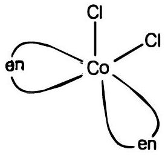
\end{figure}
    (b)ध्रुवण समावयवता
(i) $\left[\mathrm{Co}(\mathrm{en})_{3}\right]^{3+}$ के दो रूप दक्षिणावर्त ( O ) और वामावर्त ( $)$ हैं।

विपक्ष रूप
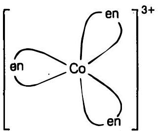

বक्षिणावर्त ( $d$-)

दर्पण
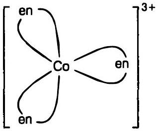

वामावर्त ( - )
प्रश्न 9. निम्नलिखित उपसहसंयोजन सता में कितने ज्यामितीय समावयव संभव है?
(i) $\left[\mathrm{Cr}\left(\mathrm{C}_{2} \mathrm{O}_{4}\right)_{3}\right]^{3-}$
(ii) $\left[\mathrm{Co}\left(\mathrm{NH}_{3}\right)_{3} \mathrm{Cl}_{3}\right]$

हल (i) ज्यामितीय समावयव संभव नहीं
(ii) $\left[\mathrm{Co}\left(\mathrm{NH}_{3}\right)_{3} \mathrm{Cl}_{3}\right]$ के लिए दो ज्यामितीय समावयव संभव हैं।
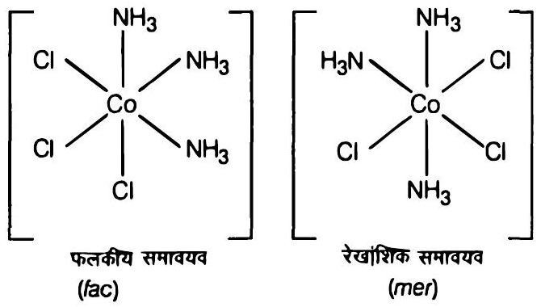

प्रश्न 10. निम्न के प्रकाशिक समावयवों की संरचनाएँ बनाइए।

(i) $\left[\mathrm{Cr}\left(\mathrm{C}_{2} \mathrm{O}_{4}\right)_{3}\right]^{3-}$
(ii) $\left[\mathrm{PtCl}_{2}(\mathrm{en})_{2}\right]^{2+}$
(iii) $\left[\mathrm{Cr}\left(\mathrm{NH}_{3}\right)_{2} \mathrm{Cl}_{2}(\mathrm{en})\right]^{+}$

हल (i) $\left[\mathrm{Cr}\left(\mathrm{C}_{2} \mathrm{O}_{4}\right)\right]^{3-}$
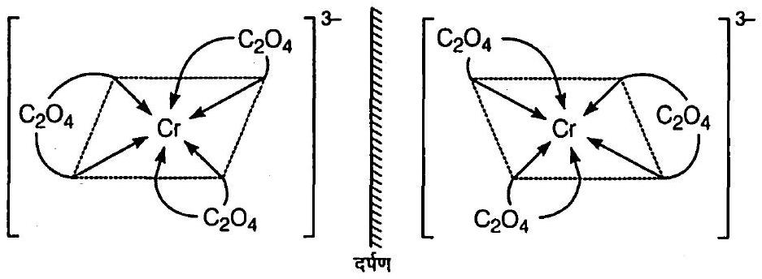
(ii) $\mathbf{C i s}-\left[\mathbf{P t C l}_{\mathbf{2}}\left(\mathbf{e n}_{\mathbf{2}}\right]^{\mathbf{2}+}\right.$
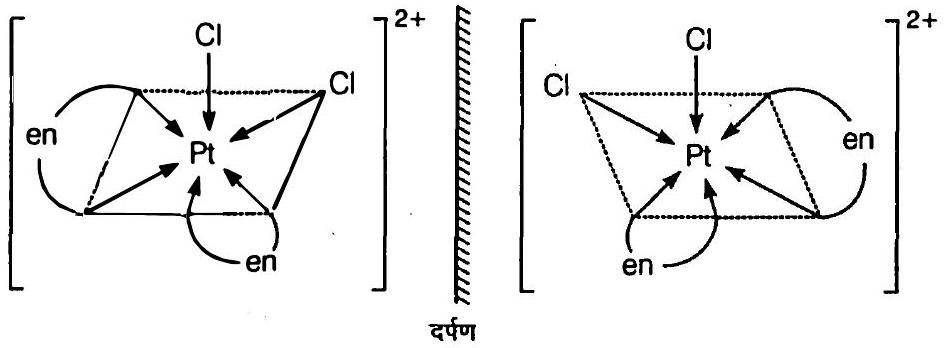

(iii) $\mathbf{C i s}-\left[\mathbf{C r}\left(\mathbf{N H}_{\mathbf{3}}\right)_{\mathbf{2}} \mathbf{C l}_{\mathbf{2}}(\mathbf{e n})\right]^{+}$
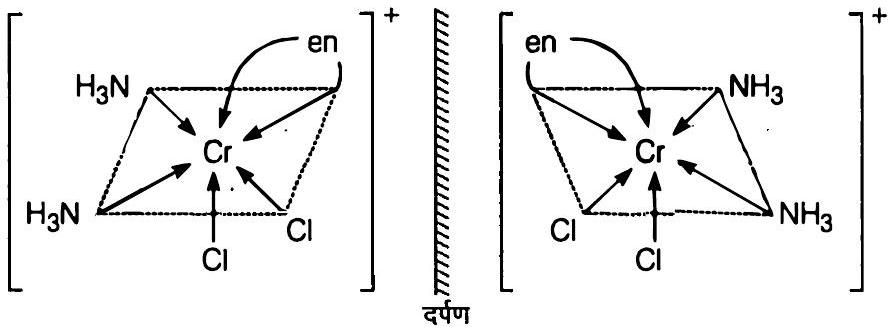
प्रश्न 11. निम्नलिखित के सभी समावयवों (ज्यामितीय व ध्रुवण) की संरचनाएँ बनाइए
    (i) $\left[\mathrm{CoCl}_{2}(\mathrm{en})_{2}\right]^{+}$
    (ii) $\left[\mathrm{Co}\left(\mathrm{NH}_{3}\right) \mathrm{Cl}(\mathrm{en})_{2}\right]^{2+}$
    (iii) $\left[\mathrm{Co}\left(\mathrm{NH}_{3}\right)_{2} \mathrm{Cl}_{2}(\mathrm{en})\right]^{+}$
हल (i) $\left[\mathrm{CoCl}_{2}(\mathrm{en})_{2}\right]^{+}$इस आयन के दो ज्यामितीय समावयव हैं। समपक्ष रूप ध्रुवण समावयवता भी दर्शाता है।
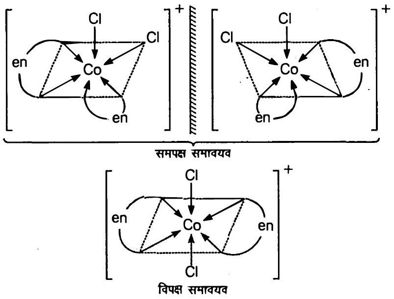

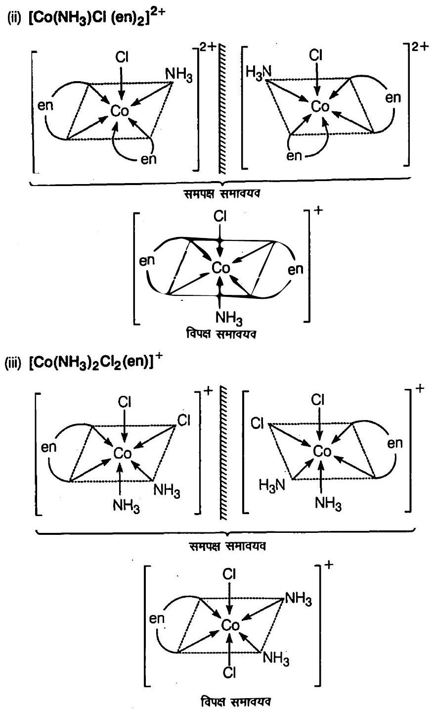
प्रश्न 12. $\left[\mathrm{Pt}\left(\mathrm{NH}_{3}\right)(\mathrm{Br})(\mathrm{Cl})(\mathrm{py})\right]$ के सभी ज्यामितीय समावयव लिखिए। इनमें से कितने ध्रुवण समावयवता दर्शाएँगे?

हल $\left[\mathrm{Pt}\left(\mathrm{NH}_{3}\right)(\mathrm{Br})(\mathrm{Cl})(\mathrm{py})\right]$ इस संकुल के लिए तीन ज्यामितीय समावयवी संभव हैं

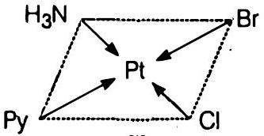
[I]

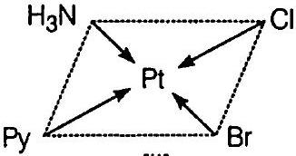
[II]

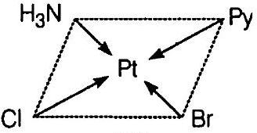
[III]

यह यौगिक $\mathrm{CN}=4$ तथा वर्गसमतली ज्यामिति के साथ धुवण समावयवता नहीं दर्शाता है क्योंकि इसमें सममिति तल उपस्थित है।

प्रश्न 13. जलीय कॉपर सल्फेट विलयन (नीले रंग का) निम्नलिखित प्रेक्षण दर्शाता है

(i) जलीय पोटैशियम फ्लुओराइड के साथ हरा रंग;
(ii) जलीय पोटैशियम क्लोराइड के सांथ चमकीला रंग;

उपरोक्त प्रायोगिक परिणामो को समझाइए।
हल जलीय कॉपर सल्फेट (नीला) $\left[\mathrm{Cu}\left(\mathrm{H}_{2} \mathrm{O}\right)_{4}\right] \mathrm{SO}_{4}$ है।

$$
\left[\mathrm{Cu}\left(\mathrm{H}_{2} \mathrm{O}\right)_{4}\right] \mathrm{SO}_{4} \stackrel{a q}{\rightleftharpoons} \underset{[\text { नीला }]}{\left[\mathrm{Cu}\left(\mathrm{H}_{2} \mathrm{O}\right)_{4}\right]^{2+}}+\mathrm{SO}_{4}^{2-}
$$

$\left[\mathrm{Cu}\left(\mathrm{H}_{2} \mathrm{O}\right)_{4}\right]^{2+}$ एक ऐसा संकुल है जिसमें दुर्बल $\mathrm{H}_{2} \mathrm{O}$ लिगेण्ड $\mathrm{F}^{-}$लिगेण्डों द्वारा प्रतिस्थापित होकर $\left[\mathrm{CuF}_{4}\right]^{2+}$ (हरा) संकुल आयन देते हैं तथा $\mathrm{Cl}^{-}$लिगेण्डों द्वारा प्रतिस्थापित होकर संकुल आयन $\left[\mathrm{CuCl}_{4}\right]^{2-}$ (चमकीला हरा) देते हैं।

(i) $\left[\mathrm{Cu}\left(\mathrm{H}_{2} \mathrm{O}\right)_{4}\right]^{2+}(\mathrm{aq})+4 \mathrm{~F}^{-}(\mathrm{aq}) \longrightarrow \underset{\text { हरा अवशेप }}{\left[\mathrm{CuF}_{4}\right]^{2-}}+4 \mathrm{H}_{2} \mathrm{O}$
(ii) $\left[\mathrm{Cu}\left(\mathrm{H}_{2} \mathrm{O}\right)_{4}\right]^{2+}(\mathrm{aq})+4 \mathrm{Cl}^{-}(\mathrm{aq}) \longrightarrow \underset{\text { चमकीला हरा विलयन }}{\left[\mathrm{CuCl}_{4}\right]^{2-}(\mathrm{aq})}+4 \mathrm{H}_{2} \mathrm{O}$

प्रश्न 14. कॉपर सल्फेट के जलीय विलयन में जलीय KCN को आधिक्य में मिलाने पर बनने वाली उपसहसंयोजन सता क्या होगी? इस विलयन में जब $\mathrm{H}_{2} \mathrm{~S}$ गैस प्रवाहित की जाती है तो कॉपर सल्फाइड का अवक्षेप क्यों नहीं प्राप्त होता?

हल जब KCN (aq) के आधिक्य में $\mathrm{CuSO}_{4}(\mathrm{aq})$ मिलाते हैं तो पोटैशियम टेट्रासायनो क्यूपरेट (II) बनता है। $\mathrm{CN}^{-}$आयन प्रबल क्षेत्र लिगेण्ड हैं अतः प्राप्त संकुल पर्याप्त स्थाई होता है। स्थायित्य स्थिरांक का मान $\left(K=2.0 \times 10^{27}\right)$ भी इसकी पुष्टि करता है।

$$
\begin{gathered}
\underset{\text { (आधिक्य) }}{4 \mathrm{KCN}(a q)}+\mathrm{CuSO}_{4}(a q) \longrightarrow \underset{\text { (विलेय) }}{\mathrm{K}_{2}\left[\mathrm{Cu}(\mathrm{CN})_{4}\right](a q)+\mathrm{K}_{2} \mathrm{SO}_{4}(a q)} \\
\downarrow+\mathrm{H}_{2} \mathrm{~S}
\end{gathered}
$$

कोई वियोजन नहीं अतः $\mathrm{Cu}^{2+}$ आयन उत्पन्न नहीं होते

प्रश्न 15. संयोजकता आबंघ सिद्धान्त के आधार पर निम्नलिखित उपसहसंयोजन सता में आबंध की प्रकृति की विवेचना कीजिए
(i) $\left[\mathrm{Fe}(\mathrm{CN})_{6}\right]^{4-}$
(ii) $\left[\mathrm{FeF}_{6}\right]^{3-}$
(iii) $\left[\mathrm{Co}\left(\mathrm{C}_{2} \mathrm{O}_{4}\right)_{3}\right]^{3-}$
(iv) $\left[\mathrm{CoF}_{6}\right]^{3-}$

हल (i) $\left[\mathrm{Fe}\left(\mathrm{CN}_{2}\right]^{4-}\right.$ इस संकुल में $\mathrm{Fe}, \mathrm{Fe}^{2+}$ रूप में है

$$
\mathrm{Fe}=[\mathrm{Ar}] 3 d^{6} 4 s^{2}
$$

$\mathrm{Fe}^{2+}$ का बाहरी विन्यास $=3 d^{6} 4 \mathrm{~s}^{0}$

$$
\mathrm{Fe}^{2+}=\begin{array}{|l|l|l|l|l|}
\hline ് ബ & \frac{3 d^{6}}{4 s^{0}} & & & \\
\hline
\end{array} \begin{array}{|l|l|l|}
\hline 4 \rho^{0} \\
\hline
\end{array}
$$

$\mathrm{CN}^{-}$प्रबल क्षेत्र लिगेण्ड होने के कारण अयुग्मित $d$-इलेक्ट्रॉनों को युग्मित कर देता है। इस प्रकार $\mathrm{CN}^{-}$आयनों को दो $3 d$-कक्षक उपलब्ध हो जाती हैं।

$$
\left[\mathrm{Fe}(\mathrm{CN})_{6}\right]^{4-}=\underbrace{\begin{array}{|l|l|l|l|}
\hline 1 & 1 l & 1 l & \times x \\
\hline
\end{array}}_{\substack{\text { कोई अयुग्मित } \\
\text { इलेक्ट्रॉन नहीं }}} \underbrace{\begin{array}{|l|}
\hline \times- \\
\hline
\end{array}}_{d^{2} s p^{3} \text { संकरण }} \underbrace{\begin{array}{|l|l|}
\hline 4 s & \\
\hline
\end{array}}_{\begin{array}{|l|}
\hline \times x \\
\hline
\end{array}}
$$

क्योंकि सभी इलेक्ट्रॉन युग्मित हैं। अतः यह संकुल प्रतिचुम्बकीय होगा तथा आबंघन में $(n-1) d$-कक्षक भाग लेने के कारण, यह आन्तरिक कक्षक तथा निम्न प्रचक्रण संकुल होगा।

(ii) $\left[\mathrm{Fe} \mathrm{F}_{6}\right]^{3-}$ इस संकुल में Fe की ऑक्सीकरण अवस्था $+3$ है।
$$
\mathrm{Fe}^{3+}=3 d^{5} 4 s^{0}
$$

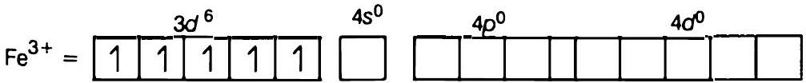
$\mathrm{F}^{-}$प्रबल क्षेत्र लिगेण्ड नहीं है यह एक दुर्बल क्षेत्र लिगेण्ड है। अतः इलेक्ट्रॉनों का युग्मन नहीं होगा। इस प्रकार $d$-कक्षक आबंधन के लिए उपलब्ध नहीं है।
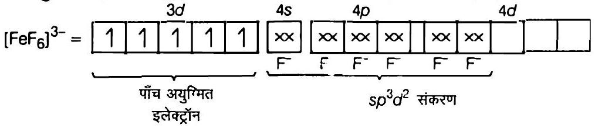
क्योंकि पाँच अयुग्मित इलेक्ट्रॉन उपस्थित हैं, अत: यह संकुल अनुचम्बकीय है इसके आबंघन में $n d$-कसक के भाग लेने के कारण यह बाह्य कक्षक तथा उच्च प्रचक्रण संकुल है।

(iii) $\left[\mathrm{Co}\left(\mathrm{C}_{2} \mathrm{O}_{4}\right)_{3}\right]^{3-}$ इस संकुल में Co की ऑक्सीकरण अवस्था $+3$ है।
Co का बाहरी विन्यास $=3 d^{7} 4 s^{2}$
$$
\mathrm{Co}^{3+}=30^{6} 4 s^{0}
$$

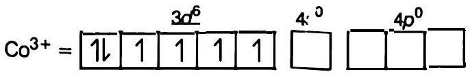
ऑक्सेलेट आयन प्रबल क्षेत्र लिगेण्ड होने के कारण $3 d$-इलेक्ट्रॉनों को युम्मित कर देता है इस प्रकार पाँच में से दो $3 d$-कक्षक ऑक्सेलेट आयनों के लिए उपलब्ध हैं।
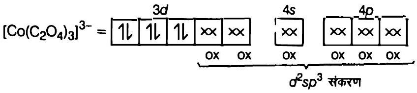
क्योंकि सभी इलेक्ट्रॉन युग्मित हैं अत: यह संकुल प्रतिचुम्बकीय होगा। यह आन्तरिक कक्षक संकुल है क्योंकि इसके आबंघन में $(n-1) d$-कक्षक भाग लेते है।

(iv) $\left[\mathrm{CoF}_{6}\right]^{3-}$ इस संकुल में Co की ऑक्सीकरण अवस्था $+3$ है।
Co का बाहरी विन्यास $=3 d^{6} 4 s^{0}$

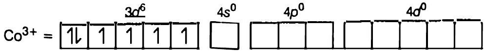
$\mathrm{F}^{-}$एक दुर्बल क्षेत्र लिगेण्ड हैं। अतः इलेक्ट्रॉनों का युग्मन नहीं होगा और इस प्रकार $F^{-}$के लिए $n d$-कक्षक उपलब्ध है।
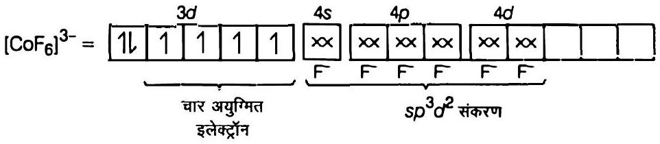
चार अयुग्मित इलेक्ट्रॉनों के कारण संकुल अनुचुम्बकीय है। क्योंकि $n d$-कक्षक आबंधन में भाग ले रही हैं अत: यह बाहरी कक्षक संकुल व उच्च प्रचक्रण संकुल है।

प्रश्न 16. अष्टफलकीय क्रिस्टल क्षेत्र में $d$-कक्षकों के विपाटन को दर्शाने के लिए चित्र बनाइए।
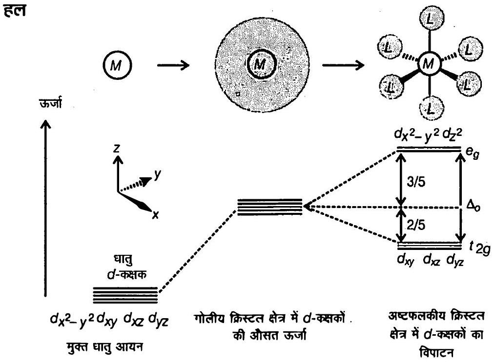

अष्टफलकीय क्रिस्टल क्षेत्र में $\alpha$ कक्षकों का विपाटन
प्रश्न 17. स्पेक्ट्रमी रासायनिक श्रेणी क्या है? दुर्बल क्षेत्र लिगेण्ड तथा प्रबल क्षेत्र लिगेप्ड में अन्तर स्पष्ट कीजिए।
हल लिगेण्डों को उनकी बढ़ती हुई क्षेत्र प्रबलता के क्रम में एक श्रेणी में व्यवस्थित किया जाता है अर्थात् क्रिस्टल क्षेत्र विपाटन ऊर्जा मानों के बढ़ते क्रम में व्यवस्थित करने पर प्राप्त श्रेणी को स्पेक्ट्रमी रासायनिक श्रेणी कहते हैं।

$$
\begin{aligned}
\mathrm{I}^{-}<\mathrm{Br}^{-}<\mathrm{SCN}^{-} & <\mathrm{Cl}^{-}<\mathrm{F}<\mathrm{OH}^{-}<\mathrm{ox}<\mathrm{H}_{2} \mathrm{O} \\
& <\mathrm{EDTA}^{4-}<\mathrm{NH}_{3}<\mathrm{en}<\mathrm{CN}^{-}<\mathrm{CO}
\end{aligned}
$$

स्पेक्टूमी रासायनिक श्रेणी
निम्न क्रिस्टल क्षेत्र विपाटन ऊर्जा CFSE $\left(\Delta_{0}\right)$ मान वाले लिगेण्ड दुर्बल क्षेत्र लिगेण्ड हैं इस प्रकार के लिग्रेण्डों के लिए $\Delta_{0}<P$, ज़हाँ $P$ युग्मन ऊर्जा है, जबकि उच्च $\operatorname{CFSE}\left(\Delta_{0}\right)$ मानों वाले लिगेण्ड प्रबल क्षेत्र लिगेण्ड हैं इनके लिए $\Delta_{0}>P$

प्रश्न 18. क्रिस्टल क्षेत्र विपाटन ऊर्जा क्या है? उपसहसंयोजन सत्ता में $\boldsymbol{d}$ कक्षकों का वास्तविक विन्यास $\Delta_{0}$ के मान के आधार पर कैसे निर्धारित किया जाता है?

हल जब लिगेण्ड एक घातु आयन की ओर जाता है तो $d$-कस्सकों का विपाटन दो समुच्चयों ( $t_{2 g}$ तथा $e_{g}$ ) में हो जाता है। $t_{2 g}$ निम्न ऊर्जा वाला तथा $e_{g}$ उच्च ऊर्जा वाला समुच्चय है। दोनों

समुच्चय के कक्षकों के बीच ऊर्जा के अन्तर को क्रिस्टल क्षेत्र विपाटन ऊर्जा ( $\Delta_{0}$ ) कहते हैं। ( $\Delta_{0}=$ अष्टफलकीय क्षेत्र तथा $\Delta_{t}=$ चतुष्फलकीय क्षेत्र के लिए)
यदि $\Delta_{0}<P$ (युग्मन ऊर्जा), तो चौथा इलेक्ट्रॉन किसी एक $e_{g}$ कक्षक में प्रवेश करेगा तथा विन्यास $t_{2 g}^{3} e_{g}^{1}$ होगा अर्थात् उच्च प्रचक्रण संकुल बनेगा। इस प्रकार के लिगेण्ड जिनके लिए $\Delta_{0}<P$ है दुर्बल क्षेत्र लिगेण्ड कहलाते हैं।
यदि $\Delta_{0}>P$, तो चौथा इलेक्ट्रॉन $t_{2 g}$ कक्षकों में से किसी एक कक्षक में प्रवेश करेगा अर्थात् $t_{2 g}^{4} e_{g}^{0}$ विन्यास के साथ निम्न क्षेत्र संकुल बनेंगे। ऐसे लिगेण्ड जिनके लिए $\Delta_{0}>P$ है प्रबल क्षेत्र लिगेण्ड कहलाते हैं।

प्रश्न 19. $\left[\mathrm{Cr}\left(\mathrm{NH}_{3}\right)_{6}\right]^{3+}$ अनुचुम्बकीय है जबकि $\left[\mathrm{Ni}\left(\mathrm{CN}_{4}\right]^{2-}\right.$ प्रतिचुम्बकीय, समझाइये क्यों?

हल हेक्साऐमीनक्रोमियम (III) आयन $\left[\mathrm{Cr}\left(\mathrm{NH}_{3}\right)_{6}\right]^{3+}$ आयन
Cr की ऑक्सीकरण अवस्था $=+3$

$$
\begin{aligned}
& 24 \mathrm{Cr}=[\mathrm{Ar}] 3 d^{5} 4 s^{1} \\
& \mathrm{Cr}^{3+}=[\mathrm{Ar}] 3 d^{3}
\end{aligned}
$$

$\mathrm{Cr}^{3+}$ छह $\mathrm{NH}_{3}$ अणुओं से छः युग्मित इलेक्ट्रॉनों के लिए छ: रिक्त कोश उपलब्ध कराता है। यह $d^{2} s p^{3}$ संकरित तथा अष्टफलकीय है।

यह तीन अयुग्मित इलेक्ट्रॉनों की उपस्थिति के कारण अनुचुम्बकीय है।
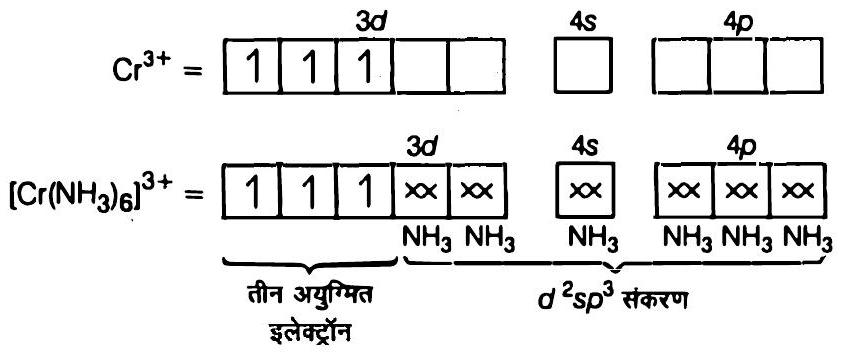

टेट्रासायनोनिकलेट (II) आयन $\left[\mathrm{Ni}\left(\mathrm{CN}_{4}\right)^{2-}\right.$

$$
\begin{aligned}
\mathrm{Ni} & =[\mathrm{Ar}] 3 d^{8} 4 s^{2} \\
\mathrm{Ni}^{2+} & =[\mathrm{Ar}] 3 c^{,^{3}}
\end{aligned}
$$

$$
\mathrm{Ni}^{2+}=\begin{array}{|l|l|l|l|l|}
\hline 1 \mathrm{l} & 1 \mathrm{l} & 1 \mathrm{l} & 1 & 1 \\
\hline
\end{array} \quad \begin{array}{|l|l|}
4 \mathrm{~s} \\
\hline
\end{array} \quad \begin{array}{|l|}
\hline \\
\hline
\end{array}
$$

$\mathrm{CN}^{-}$प्रबल क्षेत्र लिगेण्ड होने के कारण 30-कक्षकों में इलेक्ट्रॉनों को युग्मित कर देता है। जिसके कारण इन $3 d$-कक्षकों में से एक कक्षक, $\mathrm{CN}^{-}$आयन के लिए रिक्त हो जाता है।

$$
\left[\mathrm{Ni}(\mathrm{CN})_{4}\right]^{2-}=\underbrace{\begin{array}{|l|l|l|l|l|}
\hline 1 l & 1 l & 1 l & 1 l & \times \infty \\
\hline
\end{array}}_{\substack{\text { सभी इलेक्ट्रॉन } \\
\text { युग्मित हैं }}}
$$

इसमें अयुग्मित इलेक्ट्रॉन उपस्थित नहीं है अत: यह प्रतिचुम्बकीय है।
प्रश्न 20. $\left[\mathrm{Ni}\left(\mathrm{H}_{2} \mathrm{O}\right)_{6}\right]^{2+}$ का विलयन हरा है परन्तु $\left[\mathrm{Ni}\left(\mathrm{CN}_{4}\right]^{2-}\right.$ का विलयन रंगहीन है। 'समझाइये।
हल $\mathrm{Ni}^{2+}$ आयन का विन्यास

$$
\mathrm{Ni}^{2+}=[\mathrm{Ar}] 3 d^{8}
$$

$$
\mathrm{Ni}^{2+}=\begin{array}{|l|l|l|l|l|}
\hline ് ഡ & \frac{3 d^{8}}{1 l} & 1 l & 1 & 1 \\
\hline
\end{array} \quad \begin{array}{|l|}
\hline \\
\hline
\end{array} \quad \begin{array}{|l|l|}
\hline 4 s & \\
\hline
\end{array}
$$

$\left[\mathrm{Ni}\left(\mathrm{H}_{2} \mathrm{O}\right)_{6}\right]^{2+}$ संकुल आयन में $\mathrm{H}_{2} \mathrm{O}$ अणु दुर्बल क्षेत्र लिगेण्ड हैं अत: ये इलेक्ट्रॉनों का युग्मन नहीं करते है। परिणामस्वरूप संकुल के पास दो अयुग्मित इलेक्ट्रॉन उपस्थित रहते हैं। इस प्रकार $d-d$ संक्रमण के कारण यदि संकुल लाल क्षेत्र की ऊर्जा के संगत प्रकाश का अवशोषण करता है तो हरे क्षेत्र की ऊर्जा के संगत प्रकाश का उत्सर्जन होता है। अतः यह हरा है। $\left[\mathrm{Ni}(\mathrm{CN})_{4}\right]^{2-}$ संकुल आयन में, $\mathrm{CN}^{-}$आयन प्रबल क्षेत्र लिगेण्ड है। अतः $\mathrm{CN}^{-}$आयनों की उपस्थिति में अग-कक्षकों में उपस्थित दो अयुग्मित इलेक्ट्रॉन, युम्मित हो जाते हैं। इस प्रकार कोई अयुग्मित इलेक्ट्रॉन न होने के कारण $d-d$ संक्रमण नहीं होता है। अतः यह रंगहीन है।

प्रश्न 21. $\left[\mathrm{Fe}(\mathrm{CN})_{6}\right]^{4-}$ तथा $\left[\mathrm{Fe}\left(\mathrm{H}_{2} \mathrm{O}\right)_{6}\right]^{2+}$ के तनु विलयनों के रंग भिन्न होते हैं क्यों?
हल दोनों संकुल यौगिकों में Fe की ऑक्सीकरण अवस्था $+2$ तथा विन्यास $3 d^{6}$ है। अर्थात् इनके पास चार अयुग्मित इलेक्ट्रॉन है। दुर्बल क्षेत्र लिगेण्ड, $\mathrm{H}_{2} \mathrm{O}$ की उपस्थिति में अयुग्मित इलेक्ट्रॉनों का युग्मन नहीं हो पाता है जबकि प्रबल क्षेत्र लिगेण्ड, $\mathrm{CN}^{-}$की उपस्थिति में इलेक्ट्रॉनों का युग्मन हो जाता है। अतः कोई अयुग्मित इलेक्ट्रॉन नहीं रहता है। अयुग्मित इलेक्ट्रॉनों की संख्या में अंतर के कारण दोनों संकुल आयन भिन्न रंग देते हैं।

प्रश्न 22. धातु कार्बोनिलों में आबंघ की प्रकृति की विवेचना कीजिए।
हल धातु कार्बोनिलों के धातु-कार्बन आबंध में $s$-तथा $p$-दोनों के गुण पाए जाते हैं। $M-\mathrm{Co}$ आंबंध कार्बोनित समूह के कार्बन पर उपस्थित इलेक्ट्रॉन युग्म को धातु के रिक्त कक्षक में दान करने से बनता है। $M-C \pi$ आबंध धातु के पूरित $d$-कक्षकों में से एक इलेक्ट्रॉन युग्म को कार्बन

मोनोऑक्साइड के रिक्त प्रतिआबंधन $\pi$ कक्षक में दान करने से बनता है। धातु से लिगेण्ड का आबंघ एक सहक्रियाशीलता का प्रभाव उत्पन्न करता है जो CO व धातु के मध्य आबंध को मजबूत बनाता है।

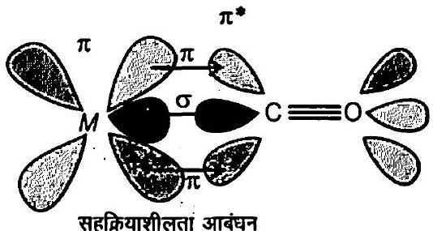
कार्बोनिल संकुल में सहक्रियाशीलता आबंघन अन्योन्य क्रिया का उदाहरण

प्रश्न 23. निम्न संकुलों में केन्द्रीय धातु आयन की ऑक्सीकरण अवस्था, $d$-कक्षकों का अधिग्रहण एवं उपसहसंयोजन संख्या बतलाइए
(i) $\mathrm{K}_{3}\left[\mathrm{Co}\left(\mathrm{C}_{2} \mathrm{O}_{4}\right)_{3}\right]$
(ii) $\left(\mathrm{NH}_{4}\right)_{2}\left[\mathrm{CoF}_{4}\right]$
(iii) Cis- $\left[\mathrm{Cr}(\mathrm{en})_{2} \mathrm{Cl}_{2}\right] \mathrm{Cl}$
(iv) $\left[\mathrm{Mn}\left(\mathrm{H}_{2} \mathrm{O}\right)_{6}\right] \mathrm{SO}_{4}$

हल (i) $\mathrm{K}_{3}\left[\mathrm{Co}\left(\mathrm{C}_{2} \mathrm{O}_{4}\right)_{3}\right]$
माना Co की ऑक्सीकरण अवस्था $x$ है।

$$
\begin{aligned}
(+1) 3+x+(-2) \times 3 & =0 \\
+3+x-6 & =0 \\
x & =+3
\end{aligned}
$$

अत: Co की ऑक्सीकरण अवस्था $+3$ है।

$$
\begin{aligned}
& 2{ }^{27} \mathrm{Co}=[\mathrm{Ar}] 3 d^{7} 4 s^{2} \\
& \mathrm{Co}^{3+}=[\mathrm{Ar}] 3 d^{6}
\end{aligned}
$$

अतः $d$-कक्षक का विन्यास $d^{6}$ या $t_{2 g}^{6} e_{g}^{0}$ है।
( $\because \mathrm{C}_{2} \mathrm{O}_{4}^{2-}$ प्रबल क्षेत्र लिगेण्ड है।)
Co की उपसहसंयोजन संख्या $=3 \times \mathrm{C}_{2} \mathrm{O}_{4}$ की दंतुरता

$$
=3 \times 2 \quad\left(\because \mathrm{C}_{2} \mathrm{O}_{4}^{2-}\right. \text { एक द्विदंतुर लिगेण्ड है।) }
$$

(ii) $\left(\mathrm{NH}_{4}\right)_{2}\left[\mathrm{CoF}_{4}\right]$
माना Co की ऑक्सीकरण अवस्या $x$ है।
$$
\begin{aligned}
(+1) \times 2+x+(-1) \times 4 & =0 \\
2+x-4 & =0 \\
x & =+2
\end{aligned}
$$
अत: Co की ऑक्सीकरण अवस्या $+2$ है।
$$
\begin{aligned}
& 27 \mathrm{Co}=[\mathrm{Ar}] 3 d^{7} 4 s^{2} \\
& \mathrm{Co}^{2+}=[\mathrm{Ar}] 3 d^{7}
\end{aligned}
$$
अतः $d$-कक्षकों का विन्यास $d^{7}$ या $t_{2 g}^{5} e_{g}^{2}$ है।
( ∵ F ${ }^{-}$एक दुर्बल क्षेत्र लिगेण्ड है।)
Co की उपसहसंयोजन संख्या $=4$
(iii) $\mathbf{C l s}-\left[\mathbf{C r}(\mathbf{e n})_{\mathbf{2}} \mathbf{C l}_{\mathbf{2}}\right] \mathbf{C l}$
माना Cr की ऑक्सीकरण अवस्या $x$ है।
$$
\begin{aligned}
x+(0) \times 2+(-1) \times 2+(-1) & =0 \\
x+0-2-1 & =0 \\
x & =+3
\end{aligned}
$$
अत: Cr की ऑक्सीकरण अवस्था $+3$ है।
$$
\begin{aligned}
\mathrm{Cr} & =[\mathrm{Ar}] 3 d^{5} 4 s^{1} \\
\mathrm{Cr}^{3+} & =[\mathrm{Ar}] 3 d^{3}
\end{aligned}
$$
अतः $d$-कसकों का विन्यास $d^{3}$ या $t_{2 g}^{3}, e_{g}^{0}$ है।
Cr की उपसहसंयोजन संख्या $=2 \times$ en की दंतुरता $+2=2 \times 2+2=6$
(iv) $\left[\mathrm{Mn}\left(\mathrm{H}_{2} \mathrm{O}\right)_{6}\right] \mathrm{SO}_{4}$
माना Mn की ऑक्सीकरण अवस्या $x$ है।
$$
\begin{aligned}
x+(0) \times 6+(-2) & =0 \\
x & =+2
\end{aligned}
$$
अत: Mn की ऑक्सीकरण अवस्या $+2$ है।
$$
\begin{aligned}
\mathrm{Mn} & =[\mathrm{Ar}] 3 d^{5} 4 s^{2} \\
\mathrm{Mn}^{2+} & =[\mathrm{Ar}] 3 d^{5}
\end{aligned}
$$
अतः $d$-कसकों का विन्यास $d^{5}$ या $t_{2 g}^{3} e_{g}^{2}$ है।
Mn की उपसहसंयोजन संख्या $=6$

प्रश्न 24. निम्न संकुलों के IUPAC नाम लिखिए तथा ऑक्सीकरण अवस्था, इलेक्ट्रॉनिक विन्यास और उपसहसंयोजन संख्या दर्शाइए। संकुल का त्रिविम रसायन तथा चुम्बकीय आघूर्ण भी बताइए।
(i) $\mathrm{K}\left[\mathrm{Cr}\left(\mathrm{H}_{2} \mathrm{O}\right)_{2}\left(\mathrm{C}_{2} \mathrm{O}_{4}\right)_{2}\right] \cdot 3 \mathrm{H}_{2} \mathrm{O}$
(ii) $\left[\mathrm{Co}\left(\mathrm{NH}_{3}\right)_{5} \mathrm{Cl}\right] \mathrm{Cl}_{2}$
(iii) $\mathrm{CrCl}_{3}(\mathrm{py})_{3}$
(iv) $\mathrm{Cs}\left[\mathrm{FeCl}_{4}\right]$
(v) $\mathrm{K}_{4}\left[\mathrm{Mn}(\mathrm{CN})_{6}\right]$

हल (i) $\mathrm{K}\left[\mathrm{Cr}\left(\mathrm{H}_{2} \mathrm{O}\right)_{2}\left(\mathrm{C}_{2} \mathrm{O}_{4}\right)_{2}\right] \cdot 3 \mathrm{H}_{2} \mathrm{O}$
IUPAC नाम पोटैशियमडाइएक्वाडाइथॉक्सेलेटोक्रोमेट (III) हाइड्रेट
उपसहसंयोजन संख्या $(\mathrm{CN})=6$
आकार = अष्टफलकीय
Cr की ऑक्सीकरण अवस्था

$$
\begin{aligned}
+1+x+(0) \times 2+(-2) \times 2+3(0) & =0 \\
+1+x-4 & =0 \\
x & =+3
\end{aligned}
$$

$\mathrm{Cr}^{3+}$ का इलेक्ट्रॉनिक विन्यास $=3 d^{3}=t_{2 g}^{3} \cdot e_{g}^{0}$
अयुग्मित इलेक्ट्रॉन $(n)=3$
चुम्बकीय आघूर्ण $(\mu)=\sqrt{n(n+2)}=\sqrt{3(3+2)}=3.87 \mathrm{BM}$
यह संकुल ज्यामितीय समावयवता दर्शाता है। इसके समपक्ष और विपक्ष रूप निम्न हैं।

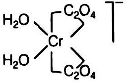
समपक्ष रूप

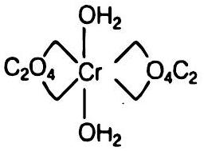
विपक्ष रूप

समपस रूप $d$-तथा /-रूप भी दर्शाता है (अर्थात् धुवण समावयवता)
<img class="imgSvg" id = "mu525uwahoaw4xr126" src="data:image/svg+xml;base64,PHN2ZyBpZD0ic21pbGVzLW11NTI1dXdhaG9hdzR4cjEyNiIgeG1sbnM9Imh0dHA6Ly93d3cudzMub3JnLzIwMDAvc3ZnIiB2aWV3Qm94PSIwIDAgMjI3IDE0My44NDA4NjQwNTYxODgwOCIgc3R5bGU9IndpZHRoOiAyMjYuNzQ0NzQ5Njg2Mjc5NnB4OyBoZWlnaHQ6IDE0My44NDA4NjQwNTYxODgwOHB4OyBvdmVyZmxvdzogdmlzaWJsZTsiPjxkZWZzPjxsaW5lYXJHcmFkaWVudCBpZD0ibGluZS1tdTUyNXV3YWhvYXc0eHIxMjYtMSIgZ3JhZGllbnRVbml0cz0idXNlclNwYWNlT25Vc2UiIHgxPSIxMDkuNDA2NDMwNjMwMzg4OCIgeTE9IjUwLjk1ODI3ODA3ODk2MjQ5IiB4Mj0iMTE5LjE0MDQ3MjY3NTg4ODQzIiB5Mj0iMjEiPjxzdG9wIHN0b3AtY29sb3I9ImN1cnJlbnRDb2xvciIgb2Zmc2V0PSIyMCUiPjwvc3RvcD48c3RvcCBzdG9wLWNvbG9yPSJjdXJyZW50Q29sb3IiIG9mZnNldD0iMTAwJSI+PC9zdG9wPjwvbGluZWFyR3JhZGllbnQ+PGxpbmVhckdyYWRpZW50IGlkPSJsaW5lLW11NTI1dXdhaG9hdzR4cjEyNi0zIiBncmFkaWVudFVuaXRzPSJ1c2VyU3BhY2VPblVzZSIgeDE9IjEwOS40MDY0MzA2MzAzODg4IiB5MT0iNTAuOTU4Mjc4MDc4OTYyNDkiIHgyPSIxMzAuNDg0MDM5NDc3NjU4OTQiIHkyPSI3NC4zNjczNDQ4MTEzNTIyOCI+PHN0b3Agc3RvcC1jb2xvcj0iY3VycmVudENvbG9yIiBvZmZzZXQ9IjIwJSI+PC9zdG9wPjxzdG9wIHN0b3AtY29sb3I9ImN1cnJlbnRDb2xvciIgb2Zmc2V0PSIxMDAlIj48L3N0b3A+PC9saW5lYXJHcmFkaWVudD48bGluZWFyR3JhZGllbnQgaWQ9ImxpbmUtbXU1MjV1d2Fob2F3NHhyMTI2LTUiIGdyYWRpZW50VW5pdHM9InVzZXJTcGFjZU9uVXNlIiB4MT0iMTMwLjQ4NDAzOTQ3NzY1ODk0IiB5MT0iNzQuMzY3MzQ0ODExMzUyMjgiIHgyPSIxNTEuNTYxNjU4ODMwOTk1NzgiIHkyPSI1MC45NTgyODc1Mzg2Njc0MyI+PHN0b3Agc3RvcC1jb2xvcj0iY3VycmVudENvbG9yIiBvZmZzZXQ9IjIwJSI+PC9zdG9wPjxzdG9wIHN0b3AtY29sb3I9ImN1cnJlbnRDb2xvciIgb2Zmc2V0PSIxMDAlIj48L3N0b3A+PC9saW5lYXJHcmFkaWVudD48bGluZWFyR3JhZGllbnQgaWQ9ImxpbmUtbXU1MjV1d2Fob2F3NHhyMTI2LTciIGdyYWRpZW50VW5pdHM9InVzZXJTcGFjZU9uVXNlIiB4MT0iMTMwLjQ4NDAzOTQ3NzY1ODk0IiB5MT0iNzQuMzY3MzQ0ODExMzUyMjgiIHgyPSIxNTUuOTY4MDcwNjQ1NjE4OCIgeTI9IjkyLjg4MjU4NTk3NzIyNTU5Ij48c3RvcCBzdG9wLWNvbG9yPSJjdXJyZW50Q29sb3IiIG9mZnNldD0iMjAlIj48L3N0b3A+PHN0b3Agc3RvcC1jb2xvcj0iY3VycmVudENvbG9yIiBvZmZzZXQ9IjEwMCUiPjwvc3RvcD48L2xpbmVhckdyYWRpZW50PjxsaW5lYXJHcmFkaWVudCBpZD0ibGluZS1tdTUyNXV3YWhvYXc0eHIxMjYtOSIgZ3JhZGllbnRVbml0cz0idXNlclNwYWNlT25Vc2UiIHgxPSIxMDQuOTk5OTk5OTk5OTk4NDEiIHkxPSI5Mi44ODI1NzQ1Mzk5MDM4NiIgeDI9IjEzMC40ODQwMzk0Nzc2NTg5NCIgeTI9Ijc0LjM2NzM0NDgxMTM1MjI4Ij48c3RvcCBzdG9wLWNvbG9yPSJjdXJyZW50Q29sb3IiIG9mZnNldD0iMjAlIj48L3N0b3A+PHN0b3Agc3RvcC1jb2xvcj0iY3VycmVudENvbG9yIiBvZmZzZXQ9IjEwMCUiPjwvc3RvcD48L2xpbmVhckdyYWRpZW50PjxsaW5lYXJHcmFkaWVudCBpZD0ibGluZS1tdTUyNXV3YWhvYXc0eHIxMjYtMTEiIGdyYWRpZW50VW5pdHM9InVzZXJTcGFjZU9uVXNlIiB4MT0iMTU1Ljk2ODA3MDY0NTYxODgiIHkxPSI5Mi44ODI1ODU5NzcyMjU1OSIgeDI9IjE3MS43MTgwNzY3NjcyNTIiIHkyPSI2NS42MDI3ODkyOTIzNDMyNSI+PHN0b3Agc3RvcC1jb2xvcj0iY3VycmVudENvbG9yIiBvZmZzZXQ9IjIwJSI+PC9zdG9wPjxzdG9wIHN0b3AtY29sb3I9ImN1cnJlbnRDb2xvciIgb2Zmc2V0PSIxMDAlIj48L3N0b3A+PC9saW5lYXJHcmFkaWVudD48bGluZWFyR3JhZGllbnQgaWQ9ImxpbmUtbXU1MjV1d2Fob2F3NHhyMTI2LTEzIiBncmFkaWVudFVuaXRzPSJ1c2VyU3BhY2VPblVzZSIgeDE9IjE1NS45NjgwNzA2NDU2MTg4IiB5MT0iOTIuODgyNTg1OTc3MjI1NTkiIHgyPSIxODQuNzQ0NzQ5Njg2Mjc5NiIgeTI9IjEwNS42OTQ3OTY2OTE2NDkzNCI+PHN0b3Agc3RvcC1jb2xvcj0iY3VycmVudENvbG9yIiBvZmZzZXQ9IjIwJSI+PC9zdG9wPjxzdG9wIHN0b3AtY29sb3I9ImN1cnJlbnRDb2xvciIgb2Zmc2V0PSIxMDAlIj48L3N0b3A+PC9saW5lYXJHcmFkaWVudD48bGluZWFyR3JhZGllbnQgaWQ9ImxpbmUtbXU1MjV1d2Fob2F3NHhyMTI2LTE1IiBncmFkaWVudFVuaXRzPSJ1c2VyU3BhY2VPblVzZSIgeDE9IjE0Ni4yMzQwMjg2MDAxMTkxNiIgeTE9IjEyMi44NDA4NjQwNTYxODgwOCIgeDI9IjE1NS45NjgwNzA2NDU2MTg4IiB5Mj0iOTIuODgyNTg1OTc3MjI1NTkiPjxzdG9wIHN0b3AtY29sb3I9ImN1cnJlbnRDb2xvciIgb2Zmc2V0PSIyMCUiPjwvc3RvcD48c3RvcCBzdG9wLWNvbG9yPSJjdXJyZW50Q29sb3IiIG9mZnNldD0iMTAwJSI+PC9zdG9wPjwvbGluZWFyR3JhZGllbnQ+PGxpbmVhckdyYWRpZW50IGlkPSJsaW5lLW11NTI1dXdhaG9hdzR4cjEyNi0xNyIgZ3JhZGllbnRVbml0cz0idXNlclNwYWNlT25Vc2UiIHgxPSIxMDQuOTk5OTk5OTk5OTk4NDEiIHkxPSI5Mi44ODI1NzQ1Mzk5MDM4NiIgeDI9IjExNC43MzQwMjg2MDAxMTk5NiIgeTI9IjEyMi44NDA4NTY5ODc1MzQ1MiI+PHN0b3Agc3RvcC1jb2xvcj0iY3VycmVudENvbG9yIiBvZmZzZXQ9IjIwJSI+PC9zdG9wPjxzdG9wIHN0b3AtY29sb3I9ImN1cnJlbnRDb2xvciIgb2Zmc2V0PSIxMDAlIj48L3N0b3A+PC9saW5lYXJHcmFkaWVudD48bGluZWFyR3JhZGllbnQgaWQ9ImxpbmUtbXU1MjV1d2Fob2F3NHhyMTI2LTE5IiBncmFkaWVudFVuaXRzPSJ1c2VyU3BhY2VPblVzZSIgeDE9Ijc2LjIyMzMxNTIwOTE3Njc3IiB5MT0iMTA1LjY5NDc3MjMzOTI1NDg4IiB4Mj0iMTA0Ljk5OTk5OTk5OTk5ODQxIiB5Mj0iOTIuODgyNTc0NTM5OTAzODYiPjxzdG9wIHN0b3AtY29sb3I9ImN1cnJlbnRDb2xvciIgb2Zmc2V0PSIyMCUiPjwvc3RvcD48c3RvcCBzdG9wLWNvbG9yPSJjdXJyZW50Q29sb3IiIG9mZnNldD0iMTAwJSI+PC9zdG9wPjwvbGluZWFyR3JhZGllbnQ+PGxpbmVhckdyYWRpZW50IGlkPSJsaW5lLW11NTI1dXdhaG9hdzR4cjEyNi0yMSIgZ3JhZGllbnRVbml0cz0idXNlclNwYWNlT25Vc2UiIHgxPSI4OS4yNTAwMDYxMjE2MzIzNyIgeTE9IjY1LjYwMjc3MDc4NjM2NzkzIiB4Mj0iMTA0Ljk5OTk5OTk5OTk5ODQxIiB5Mj0iOTIuODgyNTc0NTM5OTAzODYiPjxzdG9wIHN0b3AtY29sb3I9ImN1cnJlbnRDb2xvciIgb2Zmc2V0PSIyMCUiPjwvc3RvcD48c3RvcCBzdG9wLWNvbG9yPSJjdXJyZW50Q29sb3IiIG9mZnNldD0iMTAwJSI+PC9zdG9wPjwvbGluZWFyR3JhZGllbnQ+PGxpbmVhckdyYWRpZW50IGlkPSJsaW5lLW11NTI1dXdhaG9hdzR4cjEyNi0yMyIgZ3JhZGllbnRVbml0cz0idXNlclNwYWNlT25Vc2UiIHgxPSIxMTQuNzM0MDI4NjAwMTE5OTYiIHkxPSIxMjIuODQwODU2OTg3NTM0NTIiIHgyPSIxNDYuMjM0MDI4NjAwMTE5MTYiIHkyPSIxMjIuODQwODY0MDU2MTg4MDgiPjxzdG9wIHN0b3AtY29sb3I9ImN1cnJlbnRDb2xvciIgb2Zmc2V0PSIyMCUiPjwvc3RvcD48c3RvcCBzdG9wLWNvbG9yPSJjdXJyZW50Q29sb3IiIG9mZnNldD0iMTAwJSI+PC9zdG9wPjwvbGluZWFyR3JhZGllbnQ+PGxpbmVhckdyYWRpZW50IGlkPSJsaW5lLW11NTI1dXdhaG9hdzR4cjEyNi0yNSIgZ3JhZGllbnRVbml0cz0idXNlclNwYWNlT25Vc2UiIHgxPSI1Ny43NTAwMDYxMjE2MzMxNiIgeTE9IjY1LjYwMjc2MzcxNzcxNDM3IiB4Mj0iODkuMjUwMDA2MTIxNjMyMzciIHkyPSI2NS42MDI3NzA3ODYzNjc5MyI+PHN0b3Agc3RvcC1jb2xvcj0iY3VycmVudENvbG9yIiBvZmZzZXQ9IjIwJSI+PC9zdG9wPjxzdG9wIHN0b3AtY29sb3I9ImN1cnJlbnRDb2xvciIgb2Zmc2V0PSIxMDAlIj48L3N0b3A+PC9saW5lYXJHcmFkaWVudD48bGluZWFyR3JhZGllbnQgaWQ9ImxpbmUtbXU1MjV1d2Fob2F3NHhyMTI2LTI3IiBncmFkaWVudFVuaXRzPSJ1c2VyU3BhY2VPblVzZSIgeDE9IjQyIiB5MT0iOTIuODgyNTYwNDAyNTk2NzEiIHgyPSI1Ny43NTAwMDYxMjE2MzMxNiIgeTI9IjY1LjYwMjc2MzcxNzcxNDM3Ij48c3RvcCBzdG9wLWNvbG9yPSJjdXJyZW50Q29sb3IiIG9mZnNldD0iMjAlIj48L3N0b3A+PHN0b3Agc3RvcC1jb2xvcj0iY3VycmVudENvbG9yIiBvZmZzZXQ9IjEwMCUiPjwvc3RvcD48L2xpbmVhckdyYWRpZW50PjwvZGVmcz48bWFzayBpZD0idGV4dC1tYXNrLW11NTI1dXdhaG9hdzR4cjEyNiI+PHJlY3QgeD0iMCIgeT0iMCIgd2lkdGg9IjEwMCUiIGhlaWdodD0iMTAwJSIgZmlsbD0id2hpdGUiPjwvcmVjdD48Y2lyY2xlIGN4PSIxNTEuNTYxNjU4ODMwOTk1NzgiIGN5PSI1MC45NTgyODc1Mzg2Njc0MyIgcj0iNy44NzUiIGZpbGw9ImJsYWNrIj48L2NpcmNsZT48Y2lyY2xlIGN4PSIxNzEuNzE4MDc2NzY3MjUyIiBjeT0iNjUuNjAyNzg5MjkyMzQzMjUiIHI9IjcuODc1IiBmaWxsPSJibGFjayI+PC9jaXJjbGU+PGNpcmNsZSBjeD0iMTg0Ljc0NDc0OTY4NjI3OTYiIGN5PSIxMDUuNjk0Nzk2NjkxNjQ5MzQiIHI9IjcuODc1IiBmaWxsPSJibGFjayI+PC9jaXJjbGU+PGNpcmNsZSBjeD0iNzYuMjIzMzE1MjA5MTc2NzciIGN5PSIxMDUuNjk0NzcyMzM5MjU0ODgiIHI9IjcuODc1IiBmaWxsPSJibGFjayI+PC9jaXJjbGU+PGNpcmNsZSBjeD0iODkuMjUwMDA2MTIxNjMyMzciIGN5PSI2NS42MDI3NzA3ODYzNjc5MyIgcj0iNy44NzUiIGZpbGw9ImJsYWNrIj48L2NpcmNsZT48Y2lyY2xlIGN4PSI1Ny43NTAwMDYxMjE2MzMxNiIgY3k9IjY1LjYwMjc2MzcxNzcxNDM3IiByPSI3Ljg3NSIgZmlsbD0iYmxhY2siPjwvY2lyY2xlPjwvbWFzaz48c3R5bGU+CiAgICAgICAgICAgICAgICAuZWxlbWVudC1tdTUyNXV3YWhvYXc0eHIxMjYgewogICAgICAgICAgICAgICAgICAgIGZvbnQ6IDE0cHggSGVsdmV0aWNhLCBBcmlhbCwgc2Fucy1zZXJpZjsKICAgICAgICAgICAgICAgICAgICBhbGlnbm1lbnQtYmFzZWxpbmU6ICdtaWRkbGUnOwogICAgICAgICAgICAgICAgfQogICAgICAgICAgICAgICAgLnN1Yi1tdTUyNXV3YWhvYXc0eHIxMjYgewogICAgICAgICAgICAgICAgICAgIGZvbnQ6IDguNHB4IEhlbHZldGljYSwgQXJpYWwsIHNhbnMtc2VyaWY7CiAgICAgICAgICAgICAgICB9CiAgICAgICAgICAgIDwvc3R5bGU+PGcgbWFzaz0idXJsKCN0ZXh0LW1hc2stbXU1MjV1d2Fob2F3NHhyMTI2KSI+PGxpbmUgeDE9IjEwOS40MDY0MzA2MzAzODg4IiB5MT0iNTAuOTU4Mjc4MDc4OTYyNDkiIHgyPSIxMTkuMTQwNDcyNjc1ODg4NDMiIHkyPSIyMSIgc3R5bGU9InN0cm9rZS1saW5lY2FwOnJvdW5kO3N0cm9rZS1kYXNoYXJyYXk6bm9uZTtzdHJva2Utd2lkdGg6MS4yNiIgc3Ryb2tlPSJ1cmwoJyNsaW5lLW11NTI1dXdhaG9hdzR4cjEyNi0xJykiPjwvbGluZT48bGluZSB4MT0iMTA5LjQwNjQzMDYzMDM4ODgiIHkxPSI1MC45NTgyNzgwNzg5NjI0OSIgeDI9IjEzMC40ODQwMzk0Nzc2NTg5NCIgeTI9Ijc0LjM2NzM0NDgxMTM1MjI4IiBzdHlsZT0ic3Ryb2tlLWxpbmVjYXA6cm91bmQ7c3Ryb2tlLWRhc2hhcnJheTpub25lO3N0cm9rZS13aWR0aDoxLjI2IiBzdHJva2U9InVybCgnI2xpbmUtbXU1MjV1d2Fob2F3NHhyMTI2LTMnKSI+PC9saW5lPjxsaW5lIHgxPSIxMzAuNDg0MDM5NDc3NjU4OTQiIHkxPSI3NC4zNjczNDQ4MTEzNTIyOCIgeDI9IjE1MS41NjE2NTg4MzA5OTU3OCIgeTI9IjUwLjk1ODI4NzUzODY2NzQzIiBzdHlsZT0ic3Ryb2tlLWxpbmVjYXA6cm91bmQ7c3Ryb2tlLWRhc2hhcnJheTpub25lO3N0cm9rZS13aWR0aDoxLjI2IiBzdHJva2U9InVybCgnI2xpbmUtbXU1MjV1d2Fob2F3NHhyMTI2LTUnKSI+PC9saW5lPjxsaW5lIHgxPSIxMzAuNDg0MDM5NDc3NjU4OTQiIHkxPSI3NC4zNjczNDQ4MTEzNTIyOCIgeDI9IjE1NS45NjgwNzA2NDU2MTg4IiB5Mj0iOTIuODgyNTg1OTc3MjI1NTkiIHN0eWxlPSJzdHJva2UtbGluZWNhcDpyb3VuZDtzdHJva2UtZGFzaGFycmF5Om5vbmU7c3Ryb2tlLXdpZHRoOjEuMjYiIHN0cm9rZT0idXJsKCcjbGluZS1tdTUyNXV3YWhvYXc0eHIxMjYtNycpIj48L2xpbmU+PGxpbmUgeDE9IjEwNC45OTk5OTk5OTk5OTg0MSIgeTE9IjkyLjg4MjU3NDUzOTkwMzg2IiB4Mj0iMTMwLjQ4NDAzOTQ3NzY1ODk0IiB5Mj0iNzQuMzY3MzQ0ODExMzUyMjgiIHN0eWxlPSJzdHJva2UtbGluZWNhcDpyb3VuZDtzdHJva2UtZGFzaGFycmF5Om5vbmU7c3Ryb2tlLXdpZHRoOjEuMjYiIHN0cm9rZT0idXJsKCcjbGluZS1tdTUyNXV3YWhvYXc0eHIxMjYtOScpIj48L2xpbmU+PGxpbmUgeDE9IjE1NS45NjgwNzA2NDU2MTg4IiB5MT0iOTIuODgyNTg1OTc3MjI1NTkiIHgyPSIxNzEuNzE4MDc2NzY3MjUyIiB5Mj0iNjUuNjAyNzg5MjkyMzQzMjUiIHN0eWxlPSJzdHJva2UtbGluZWNhcDpyb3VuZDtzdHJva2UtZGFzaGFycmF5Om5vbmU7c3Ryb2tlLXdpZHRoOjEuMjYiIHN0cm9rZT0idXJsKCcjbGluZS1tdTUyNXV3YWhvYXc0eHIxMjYtMTEnKSI+PC9saW5lPjxsaW5lIHgxPSIxNTUuOTY4MDcwNjQ1NjE4OCIgeTE9IjkyLjg4MjU4NTk3NzIyNTU5IiB4Mj0iMTU1Ljk2ODA3MDY0NTYxODgiIHkyPSI5Mi44ODI1ODU5NzcyMjU1OSIgc3R5bGU9InN0cm9rZS1saW5lY2FwOnJvdW5kO3N0cm9rZS1kYXNoYXJyYXk6bm9uZTtzdHJva2Utd2lkdGg6MS4yNiIgc3Ryb2tlPSJ1cmwoJyNsaW5lLW11NTI1dXdhaG9hdzR4cjEyNi0xMycpIj48L2xpbmU+PGxpbmUgeDE9IjE2MC4xOTMwNTY3MTA5MDA2MyIgeTE9Ijk1LjAwOTk2NTI5MTgyMjQ0IiB4Mj0iMTYwLjM3NjA4ODI5MjUzNTI2IiB5Mj0iOTQuNTk4ODY5ODc2OTU1ODYiIHN0eWxlPSJzdHJva2UtbGluZWNhcDpyb3VuZDtzdHJva2UtZGFzaGFycmF5Om5vbmU7c3Ryb2tlLXdpZHRoOjEuMjYiIHN0cm9rZT0idXJsKCcjbGluZS1tdTUyNXV3YWhvYXc0eHIxMjYtMTMnKSI+PC9saW5lPjxsaW5lIHgxPSIxNjQuNDE4MDQyNzc2MTgyNCIgeTE9Ijk3LjEzNzM0NDYwNjQxOTMiIHgyPSIxNjQuNzg0MTA1OTM5NDUxNjUiIHkyPSI5Ni4zMTUxNTM3NzY2ODYxNSIgc3R5bGU9InN0cm9rZS1saW5lY2FwOnJvdW5kO3N0cm9rZS1kYXNoYXJyYXk6bm9uZTtzdHJva2Utd2lkdGg6MS4yNiIgc3Ryb2tlPSJ1cmwoJyNsaW5lLW11NTI1dXdhaG9hdzR4cjEyNi0xMycpIj48L2xpbmU+PGxpbmUgeDE9IjE2OC42NDMwMjg4NDE0NjQyMyIgeTE9Ijk5LjI2NDcyMzkyMTAxNjE2IiB4Mj0iMTY5LjE5MjEyMzU4NjM2ODEiIHkyPSI5OC4wMzE0Mzc2NzY0MTY0IiBzdHlsZT0ic3Ryb2tlLWxpbmVjYXA6cm91bmQ7c3Ryb2tlLWRhc2hhcnJheTpub25lO3N0cm9rZS13aWR0aDoxLjI2IiBzdHJva2U9InVybCgnI2xpbmUtbXU1MjV1d2Fob2F3NHhyMTI2LTEzJykiPjwvbGluZT48bGluZSB4MT0iMTcyLjg2ODAxNDkwNjc0NjAzIiB5MT0iMTAxLjM5MjEwMzIzNTYxMyIgeDI9IjE3My42MDAxNDEyMzMyODQ1NSIgeTI9Ijk5Ljc0NzcyMTU3NjE0NjY5IiBzdHlsZT0ic3Ryb2tlLWxpbmVjYXA6cm91bmQ7c3Ryb2tlLWRhc2hhcnJheTpub25lO3N0cm9rZS13aWR0aDoxLjI2IiBzdHJva2U9InVybCgnI2xpbmUtbXU1MjV1d2Fob2F3NHhyMTI2LTEzJykiPjwvbGluZT48bGluZSB4MT0iMTc3LjA5MzAwMDk3MjAyNzgyIiB5MT0iMTAzLjUxOTQ4MjU1MDIwOTg2IiB4Mj0iMTc4LjAwODE1ODg4MDIwMDk0IiB5Mj0iMTAxLjQ2NDAwNTQ3NTg3Njk1IiBzdHlsZT0ic3Ryb2tlLWxpbmVjYXA6cm91bmQ7c3Ryb2tlLWRhc2hhcnJheTpub25lO3N0cm9rZS13aWR0aDoxLjI2IiBzdHJva2U9InVybCgnI2xpbmUtbXU1MjV1d2Fob2F3NHhyMTI2LTEzJykiPjwvbGluZT48bGluZSB4MT0iMTgxLjMxNzk4NzAzNzMwOTY1IiB5MT0iMTA1LjY0Njg2MTg2NDgwNjcxIiB4Mj0iMTgyLjQxNjE3NjUyNzExNzQiIHkyPSIxMDMuMTgwMjg5Mzc1NjA3MiIgc3R5bGU9InN0cm9rZS1saW5lY2FwOnJvdW5kO3N0cm9rZS1kYXNoYXJyYXk6bm9uZTtzdHJva2Utd2lkdGg6MS4yNiIgc3Ryb2tlPSJ1cmwoJyNsaW5lLW11NTI1dXdhaG9hdzR4cjEyNi0xMycpIj48L2xpbmU+PGxpbmUgeDE9IjE0Ni4yMzQwMjg2MDAxMTkxNiIgeTE9IjEyMi44NDA4NjQwNTYxODgwOCIgeDI9IjE1NS45NjgwNzA2NDU2MTg4IiB5Mj0iOTIuODgyNTg1OTc3MjI1NTkiIHN0eWxlPSJzdHJva2UtbGluZWNhcDpyb3VuZDtzdHJva2UtZGFzaGFycmF5Om5vbmU7c3Ryb2tlLXdpZHRoOjEuMjYiIHN0cm9rZT0idXJsKCcjbGluZS1tdTUyNXV3YWhvYXc0eHIxMjYtMTUnKSI+PC9saW5lPjxsaW5lIHgxPSIxMDQuOTk5OTk5OTk5OTk4NDEiIHkxPSI5Mi44ODI1NzQ1Mzk5MDM4NiIgeDI9IjExNC43MzQwMjg2MDAxMTk5NiIgeTI9IjEyMi44NDA4NTY5ODc1MzQ1MiIgc3R5bGU9InN0cm9rZS1saW5lY2FwOnJvdW5kO3N0cm9rZS1kYXNoYXJyYXk6bm9uZTtzdHJva2Utd2lkdGg6MS4yNiIgc3Ryb2tlPSJ1cmwoJyNsaW5lLW11NTI1dXdhaG9hdzR4cjEyNi0xNycpIj48L2xpbmU+PGxpbmUgeDE9Ijc2LjIyMzMxNTIwOTE3Njc3IiB5MT0iMTA1LjY5NDc3MjMzOTI1NDg4IiB4Mj0iMTA0Ljk5OTk5OTk5OTk5ODQxIiB5Mj0iOTIuODgyNTc0NTM5OTAzODYiIHN0eWxlPSJzdHJva2UtbGluZWNhcDpyb3VuZDtzdHJva2UtZGFzaGFycmF5Om5vbmU7c3Ryb2tlLXdpZHRoOjEuMjYiIHN0cm9rZT0idXJsKCcjbGluZS1tdTUyNXV3YWhvYXc0eHIxMjYtMTknKSI+PC9saW5lPjxsaW5lIHgxPSI4OS4yNTAwMDYxMjE2MzIzNyIgeTE9IjY1LjYwMjc3MDc4NjM2NzkzIiB4Mj0iMTA0Ljk5OTk5OTk5OTk5ODQxIiB5Mj0iOTIuODgyNTc0NTM5OTAzODYiIHN0eWxlPSJzdHJva2UtbGluZWNhcDpyb3VuZDtzdHJva2UtZGFzaGFycmF5Om5vbmU7c3Ryb2tlLXdpZHRoOjEuMjYiIHN0cm9rZT0idXJsKCcjbGluZS1tdTUyNXV3YWhvYXc0eHIxMjYtMjEnKSI+PC9saW5lPjxsaW5lIHgxPSIxMTQuNzM0MDI4NjAwMTE5OTYiIHkxPSIxMjIuODQwODU2OTg3NTM0NTIiIHgyPSIxNDYuMjM0MDI4NjAwMTE5MTYiIHkyPSIxMjIuODQwODY0MDU2MTg4MDgiIHN0eWxlPSJzdHJva2UtbGluZWNhcDpyb3VuZDtzdHJva2UtZGFzaGFycmF5Om5vbmU7c3Ryb2tlLXdpZHRoOjEuMjYiIHN0cm9rZT0idXJsKCcjbGluZS1tdTUyNXV3YWhvYXc0eHIxMjYtMjMnKSI+PC9saW5lPjxsaW5lIHgxPSI1Ny43NTAwMDYxMjE2MzMxNiIgeTE9IjY1LjYwMjc2MzcxNzcxNDM3IiB4Mj0iODkuMjUwMDA2MTIxNjMyMzciIHkyPSI2NS42MDI3NzA3ODYzNjc5MyIgc3R5bGU9InN0cm9rZS1saW5lY2FwOnJvdW5kO3N0cm9rZS1kYXNoYXJyYXk6bm9uZTtzdHJva2Utd2lkdGg6MS4yNiIgc3Ryb2tlPSJ1cmwoJyNsaW5lLW11NTI1dXdhaG9hdzR4cjEyNi0yNScpIj48L2xpbmU+PGxpbmUgeDE9IjQyIiB5MT0iOTIuODgyNTYwNDAyNTk2NzEiIHgyPSI1Ny43NTAwMDYxMjE2MzMxNiIgeTI9IjY1LjYwMjc2MzcxNzcxNDM3IiBzdHlsZT0ic3Ryb2tlLWxpbmVjYXA6cm91bmQ7c3Ryb2tlLWRhc2hhcnJheTpub25lO3N0cm9rZS13aWR0aDoxLjI2IiBzdHJva2U9InVybCgnI2xpbmUtbXU1MjV1d2Fob2F3NHhyMTI2LTI3JykiPjwvbGluZT48L2c+PGc+PHRleHQgeD0iMTE5LjE0MDQ3MjY3NTg4ODQzIiB5PSIyMSIgY2xhc3M9ImRlYnVnIiBmaWxsPSIjZmYwMDAwIiBzdHlsZT0iCiAgICAgICAgICAgICAgICBmb250OiA1cHggRHJvaWQgU2Fucywgc2Fucy1zZXJpZjsKICAgICAgICAgICAgIj48L3RleHQ+PHRleHQgeD0iMTA5LjQwNjQzMDYzMDM4ODgiIHk9IjUwLjk1ODI3ODA3ODk2MjQ5IiBjbGFzcz0iZGVidWciIGZpbGw9IiNmZjAwMDAiIHN0eWxlPSIKICAgICAgICAgICAgICAgIGZvbnQ6IDVweCBEcm9pZCBTYW5zLCBzYW5zLXNlcmlmOwogICAgICAgICAgICAiPjwvdGV4dD48dGV4dCB4PSIxMzAuNDg0MDM5NDc3NjU4OTQiIHk9Ijc0LjM2NzM0NDgxMTM1MjI4IiBjbGFzcz0iZGVidWciIGZpbGw9IiNmZjAwMDAiIHN0eWxlPSIKICAgICAgICAgICAgICAgIGZvbnQ6IDVweCBEcm9pZCBTYW5zLCBzYW5zLXNlcmlmOwogICAgICAgICAgICAiPjwvdGV4dD48dGV4dCB4PSIxNDYuMzExNjU4ODMwOTk1NzgiIHk9IjU2LjIwODI4NzUzODY2NzQzIiBjbGFzcz0iZWxlbWVudC1tdTUyNXV3YWhvYXc0eHIxMjYiIGZpbGw9ImN1cnJlbnRDb2xvciIgc3R5bGU9InRleHQtYW5jaG9yOiBzdGFydDsgd3JpdGluZy1tb2RlOiBob3Jpem9udGFsLXRiOyB0ZXh0LW9yaWVudGF0aW9uOiBtaXhlZDsgbGV0dGVyLXNwYWNpbmc6IG5vcm1hbDsgZGlyZWN0aW9uOiBsdHI7Ij48dHNwYW4+TzwvdHNwYW4+PHRzcGFuIHN0eWxlPSJ1bmljb2RlLWJpZGk6IHBsYWludGV4dDsiPkg8L3RzcGFuPjwvdGV4dD48dGV4dCB4PSIxNTEuNTYxNjU4ODMwOTk1NzgiIHk9IjUwLjk1ODI4NzUzODY2NzQzIiBjbGFzcz0iZGVidWciIGZpbGw9IiNmZjAwMDAiIHN0eWxlPSIKICAgICAgICAgICAgICAgIGZvbnQ6IDVweCBEcm9pZCBTYW5zLCBzYW5zLXNlcmlmOwogICAgICAgICAgICAiPjwvdGV4dD48dGV4dCB4PSIxNTUuOTY4MDcwNjQ1NjE4OCIgeT0iOTIuODgyNTg1OTc3MjI1NTkiIGNsYXNzPSJkZWJ1ZyIgZmlsbD0iI2ZmMDAwMCIgc3R5bGU9IgogICAgICAgICAgICAgICAgZm9udDogNXB4IERyb2lkIFNhbnMsIHNhbnMtc2VyaWY7CiAgICAgICAgICAgICI+UjwvdGV4dD48dGV4dCB4PSIxNjYuNDY4MDc2NzY3MjUyIiB5PSI3MC44NTI3ODkyOTIzNDMyNSIgY2xhc3M9ImVsZW1lbnQtbXU1MjV1d2Fob2F3NHhyMTI2IiBmaWxsPSJjdXJyZW50Q29sb3IiIHN0eWxlPSJ0ZXh0LWFuY2hvcjogc3RhcnQ7IHdyaXRpbmctbW9kZTogaG9yaXpvbnRhbC10YjsgdGV4dC1vcmllbnRhdGlvbjogbWl4ZWQ7IGxldHRlci1zcGFjaW5nOiBub3JtYWw7IGRpcmVjdGlvbjogbHRyOyI+PHRzcGFuPkg8L3RzcGFuPjwvdGV4dD48dGV4dCB4PSIxNzEuNzE4MDc2NzY3MjUyIiB5PSI2NS42MDI3ODkyOTIzNDMyNSIgY2xhc3M9ImRlYnVnIiBmaWxsPSIjZmYwMDAwIiBzdHlsZT0iCiAgICAgICAgICAgICAgICBmb250OiA1cHggRHJvaWQgU2Fucywgc2Fucy1zZXJpZjsKICAgICAgICAgICAgIj48L3RleHQ+PHRleHQgeD0iMTgwLjgwNzI0OTY4NjI3OTYiIHk9IjExMC45NDQ3OTY2OTE2NDkzNCIgY2xhc3M9ImVsZW1lbnQtbXU1MjV1d2Fob2F3NHhyMTI2IiBmaWxsPSJjdXJyZW50Q29sb3IiIHN0eWxlPSJ0ZXh0LWFuY2hvcjogc3RhcnQ7IHdyaXRpbmctbW9kZTogaG9yaXpvbnRhbC10YjsgdGV4dC1vcmllbnRhdGlvbjogbWl4ZWQ7IGxldHRlci1zcGFjaW5nOiBub3JtYWw7IGRpcmVjdGlvbjogbHRyOyI+PHRzcGFuPk88L3RzcGFuPjx0c3BhbiBzdHlsZT0idW5pY29kZS1iaWRpOiBwbGFpbnRleHQ7Ij5IPC90c3Bhbj48L3RleHQ+PHRleHQgeD0iMTg0Ljc0NDc0OTY4NjI3OTYiIHk9IjEwNS42OTQ3OTY2OTE2NDkzNCIgY2xhc3M9ImRlYnVnIiBmaWxsPSIjZmYwMDAwIiBzdHlsZT0iCiAgICAgICAgICAgICAgICBmb250OiA1cHggRHJvaWQgU2Fucywgc2Fucy1zZXJpZjsKICAgICAgICAgICAgIj48L3RleHQ+PHRleHQgeD0iMTQ2LjIzNDAyODYwMDExOTE2IiB5PSIxMjIuODQwODY0MDU2MTg4MDgiIGNsYXNzPSJkZWJ1ZyIgZmlsbD0iI2ZmMDAwMCIgc3R5bGU9IgogICAgICAgICAgICAgICAgZm9udDogNXB4IERyb2lkIFNhbnMsIHNhbnMtc2VyaWY7CiAgICAgICAgICAgICI+PC90ZXh0Pjx0ZXh0IHg9IjExNC43MzQwMjg2MDAxMTk5NiIgeT0iMTIyLjg0MDg1Njk4NzUzNDUyIiBjbGFzcz0iZGVidWciIGZpbGw9IiNmZjAwMDAiIHN0eWxlPSIKICAgICAgICAgICAgICAgIGZvbnQ6IDVweCBEcm9pZCBTYW5zLCBzYW5zLXNlcmlmOwogICAgICAgICAgICAiPjwvdGV4dD48dGV4dCB4PSIxMDQuOTk5OTk5OTk5OTk4NDEiIHk9IjkyLjg4MjU3NDUzOTkwMzg2IiBjbGFzcz0iZGVidWciIGZpbGw9IiNmZjAwMDAiIHN0eWxlPSIKICAgICAgICAgICAgICAgIGZvbnQ6IDVweCBEcm9pZCBTYW5zLCBzYW5zLXNlcmlmOwogICAgICAgICAgICAiPjwvdGV4dD48dGV4dCB4PSI4MS40NzMzMTUyMDkxNzY3NyIgeT0iMTEwLjk0NDc3MjMzOTI1NDg4IiBjbGFzcz0iZWxlbWVudC1tdTUyNXV3YWhvYXc0eHIxMjYiIGZpbGw9ImN1cnJlbnRDb2xvciIgc3R5bGU9InRleHQtYW5jaG9yOiBzdGFydDsgd3JpdGluZy1tb2RlOiBob3Jpem9udGFsLXRiOyB0ZXh0LW9yaWVudGF0aW9uOiBtaXhlZDsgbGV0dGVyLXNwYWNpbmc6IG5vcm1hbDsgZGlyZWN0aW9uOiBydGw7IHVuaWNvZGUtYmlkaTogYmlkaS1vdmVycmlkZTsiPjx0c3Bhbj5PPC90c3Bhbj48dHNwYW4gc3R5bGU9InVuaWNvZGUtYmlkaTogcGxhaW50ZXh0OyI+SDwvdHNwYW4+PC90ZXh0Pjx0ZXh0IHg9Ijc2LjIyMzMxNTIwOTE3Njc3IiB5PSIxMDUuNjk0NzcyMzM5MjU0ODgiIGNsYXNzPSJkZWJ1ZyIgZmlsbD0iI2ZmMDAwMCIgc3R5bGU9IgogICAgICAgICAgICAgICAgZm9udDogNXB4IERyb2lkIFNhbnMsIHNhbnMtc2VyaWY7CiAgICAgICAgICAgICI+PC90ZXh0Pjx0ZXh0IHg9Ijg5LjI1MDAwNjEyMTYzMjM3IiB5PSI3My40Nzc3NzA3ODYzNjc5MyIgY2xhc3M9ImVsZW1lbnQtbXU1MjV1d2Fob2F3NHhyMTI2IiBmaWxsPSJjdXJyZW50Q29sb3IiIHN0eWxlPSJ0ZXh0LWFuY2hvcjogc3RhcnQ7IGdseXBoLW9yaWVudGF0aW9uLXZlcnRpY2FsOiAwOyB3cml0aW5nLW1vZGU6IHZlcnRpY2FsLXJsOyB0ZXh0LW9yaWVudGF0aW9uOiB1cHJpZ2h0OyBsZXR0ZXItc3BhY2luZzogLTFweDsgZGlyZWN0aW9uOiBydGw7IHVuaWNvZGUtYmlkaTogYmlkaS1vdmVycmlkZTsiPjx0c3Bhbj5PPC90c3Bhbj48L3RleHQ+PHRleHQgeD0iODkuMjUwMDA2MTIxNjMyMzciIHk9IjY1LjYwMjc3MDc4NjM2NzkzIiBjbGFzcz0iZGVidWciIGZpbGw9IiNmZjAwMDAiIHN0eWxlPSIKICAgICAgICAgICAgICAgIGZvbnQ6IDVweCBEcm9pZCBTYW5zLCBzYW5zLXNlcmlmOwogICAgICAgICAgICAiPjwvdGV4dD48dGV4dCB4PSI1Ny43NTAwMDYxMjE2MzMxNiIgeT0iNzMuNDc3NzYzNzE3NzE0MzciIGNsYXNzPSJlbGVtZW50LW11NTI1dXdhaG9hdzR4cjEyNiIgZmlsbD0iY3VycmVudENvbG9yIiBzdHlsZT0idGV4dC1hbmNob3I6IHN0YXJ0OyBnbHlwaC1vcmllbnRhdGlvbi12ZXJ0aWNhbDogMDsgd3JpdGluZy1tb2RlOiB2ZXJ0aWNhbC1ybDsgdGV4dC1vcmllbnRhdGlvbjogdXByaWdodDsgbGV0dGVyLXNwYWNpbmc6IC0xcHg7IGRpcmVjdGlvbjogcnRsOyB1bmljb2RlLWJpZGk6IGJpZGktb3ZlcnJpZGU7Ij48dHNwYW4+STx0c3BhbiBiYXNlbGluZS1zaGlmdD0ic3VwZXIiIGNsYXNzPSJzdWItbXU1MjV1d2Fob2F3NHhyMTI2Ij4tPC90c3Bhbj48L3RzcGFuPjwvdGV4dD48dGV4dCB4PSI1Ny43NTAwMDYxMjE2MzMxNiIgeT0iNjUuNjAyNzYzNzE3NzE0MzciIGNsYXNzPSJkZWJ1ZyIgZmlsbD0iI2ZmMDAwMCIgc3R5bGU9IgogICAgICAgICAgICAgICAgZm9udDogNXB4IERyb2lkIFNhbnMsIHNhbnMtc2VyaWY7CiAgICAgICAgICAgICI+PC90ZXh0Pjx0ZXh0IHg9IjQyIiB5PSI5Mi44ODI1NjA0MDI1OTY3MSIgY2xhc3M9ImRlYnVnIiBmaWxsPSIjZmYwMDAwIiBzdHlsZT0iCiAgICAgICAgICAgICAgICBmb250OiA1cHggRHJvaWQgU2Fucywgc2Fucy1zZXJpZjsKICAgICAgICAgICAgIj48L3RleHQ+PC9nPjwvc3ZnPg=="/>
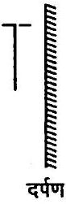
<img class="imgSvg" id = "mu525uwbo6koqgn4yw9" src="data:image/svg+xml;base64,PHN2ZyBpZD0ic21pbGVzLW11NTI1dXdibzZrb3FnbjR5dzkiIHhtbG5zPSJodHRwOi8vd3d3LnczLm9yZy8yMDAwL3N2ZyIgdmlld0JveD0iMCAwIDIwOCAxMzkuNzkzMTgyNDI2MjQxODgiIHN0eWxlPSJ3aWR0aDogMjA4LjI0MDE5NDQyMjA1NzNweDsgaGVpZ2h0OiAxMzkuNzkzMTgyNDI2MjQxODhweDsgb3ZlcmZsb3c6IHZpc2libGU7Ij48ZGVmcz48bGluZWFyR3JhZGllbnQgaWQ9ImxpbmUtbXU1MjV1d2JvNmtvcWduNHl3OS0xIiBncmFkaWVudFVuaXRzPSJ1c2VyU3BhY2VPblVzZSIgeDE9IjEwMS41ODgzNTg2NDA3NjkyIiB5MT0iNTAuOTU4MjczNzEwMjg4MjkiIHgyPSIxMTEuMzIyNDE0MTMxNjQ0OTkiIHkyPSIyMSI+PHN0b3Agc3RvcC1jb2xvcj0iY3VycmVudENvbG9yIiBvZmZzZXQ9IjIwJSI+PC9zdG9wPjxzdG9wIHN0b3AtY29sb3I9ImN1cnJlbnRDb2xvciIgb2Zmc2V0PSIxMDAlIj48L3N0b3A+PC9saW5lYXJHcmFkaWVudD48bGluZWFyR3JhZGllbnQgaWQ9ImxpbmUtbXU1MjV1d2JvNmtvcWduNHl3OS0zIiBncmFkaWVudFVuaXRzPSJ1c2VyU3BhY2VPblVzZSIgeDE9IjEwMS41ODgzNTg2NDA3NjkyIiB5MT0iNTAuOTU4MjczNzEwMjg4MjkiIHgyPSIxMzMuMDY5MTcwNDMxOTQwOTMiIHkyPSI0OS44NTg5NjA3NTcyMDI0MjUiPjxzdG9wIHN0b3AtY29sb3I9ImN1cnJlbnRDb2xvciIgb2Zmc2V0PSIyMCUiPjwvc3RvcD48c3RvcCBzdG9wLWNvbG9yPSJjdXJyZW50Q29sb3IiIG9mZnNldD0iMTAwJSI+PC9zdG9wPjwvbGluZWFyR3JhZGllbnQ+PGxpbmVhckdyYWRpZW50IGlkPSJsaW5lLW11NTI1dXdibzZrb3FnbjR5dzktNSIgZ3JhZGllbnRVbml0cz0idXNlclNwYWNlT25Vc2UiIHgxPSI3MS42MzAwODQ5MzA0ODA5IiB5MT0iNDEuMjI0MjE4MjE5NDEyNDgiIHgyPSIxMDEuNTg4MzU4NjQwNzY5MiIgeTI9IjUwLjk1ODI3MzcxMDI4ODI5Ij48c3RvcCBzdG9wLWNvbG9yPSJjdXJyZW50Q29sb3IiIG9mZnNldD0iMjAlIj48L3N0b3A+PHN0b3Agc3RvcC1jb2xvcj0iY3VycmVudENvbG9yIiBvZmZzZXQ9IjEwMCUiPjwvc3RvcD48L2xpbmVhckdyYWRpZW50PjxsaW5lYXJHcmFkaWVudCBpZD0ibGluZS1tdTUyNXV3Ym82a29xZ240eXc5LTciIGdyYWRpZW50VW5pdHM9InVzZXJTcGFjZU9uVXNlIiB4MT0iOTEuODU0MzAzMTQ5ODkzMzgiIHkxPSI4MC45MTY1NDc0MjA1NzY1OCIgeDI9IjEwMS41ODgzNTg2NDA3NjkyIiB5Mj0iNTAuOTU4MjczNzEwMjg4MjkiPjxzdG9wIHN0b3AtY29sb3I9ImN1cnJlbnRDb2xvciIgb2Zmc2V0PSIyMCUiPjwvc3RvcD48c3RvcCBzdG9wLWNvbG9yPSJjdXJyZW50Q29sb3IiIG9mZnNldD0iMTAwJSI+PC9zdG9wPjwvbGluZWFyR3JhZGllbnQ+PGxpbmVhckdyYWRpZW50IGlkPSJsaW5lLW11NTI1dXdibzZrb3FnbjR5dzktOSIgZ3JhZGllbnRVbml0cz0idXNlclNwYWNlT25Vc2UiIHgxPSI5MS44NTQzMDMxNDk4OTMzOCIgeTE9IjgwLjkxNjU0NzQyMDU3NjU4IiB4Mj0iMTIyLjY2NTk0ODE2NDAzNDEyIiB5Mj0iODcuNDY1Nzg2NDIzODk0MTciPjxzdG9wIHN0b3AtY29sb3I9ImN1cnJlbnRDb2xvciIgb2Zmc2V0PSIyMCUiPjwvc3RvcD48c3RvcCBzdG9wLWNvbG9yPSJjdXJyZW50Q29sb3IiIG9mZnNldD0iMTAwJSI+PC9zdG9wPjwvbGluZWFyR3JhZGllbnQ+PGxpbmVhckdyYWRpZW50IGlkPSJsaW5lLW11NTI1dXdibzZrb3FnbjR5dzktMTEiIGdyYWRpZW50VW5pdHM9InVzZXJTcGFjZU9uVXNlIiB4MT0iODguNTYxNjM1NDY3MTcwNzYiIHkxPSIxMTIuMjQzOTg0OTA4MDQzNTkiIHgyPSI5MS44NTQzMDMxNDk4OTMzOCIgeTI9IjgwLjkxNjU0NzQyMDU3NjU4Ij48c3RvcCBzdG9wLWNvbG9yPSJjdXJyZW50Q29sb3IiIG9mZnNldD0iMjAlIj48L3N0b3A+PHN0b3Agc3RvcC1jb2xvcj0iY3VycmVudENvbG9yIiBvZmZzZXQ9IjEwMCUiPjwvc3RvcD48L2xpbmVhckdyYWRpZW50PjxsaW5lYXJHcmFkaWVudCBpZD0ibGluZS1tdTUyNXV3Ym82a29xZ240eXc5LTEzIiBncmFkaWVudFVuaXRzPSJ1c2VyU3BhY2VPblVzZSIgeDE9IjYzLjA3NzYyOTg1OTM5OTI2IiB5MT0iNjguMTA0MzIzNzkxMDgyNjMiIHgyPSI5MS44NTQzMDMxNDk4OTMzOCIgeTI9IjgwLjkxNjU0NzQyMDU3NjU4Ij48c3RvcCBzdG9wLWNvbG9yPSJjdXJyZW50Q29sb3IiIG9mZnNldD0iMjAlIj48L3N0b3A+PHN0b3Agc3RvcC1jb2xvcj0iY3VycmVudENvbG9yIiBvZmZzZXQ9IjEwMCUiPjwvc3RvcD48L2xpbmVhckdyYWRpZW50PjxsaW5lYXJHcmFkaWVudCBpZD0ibGluZS1tdTUyNXV3Ym82a29xZ240eXc5LTE1IiBncmFkaWVudFVuaXRzPSJ1c2VyU3BhY2VPblVzZSIgeDE9IjEyMi42NjU5NDgxNjQwMzQxMiIgeTE9Ijg3LjQ2NTc4NjQyMzg5NDE3IiB4Mj0iMTQ5LjA4NDA4MjYwMzkwMyIgeTI9IjcwLjMwOTY3NDYwNTczOTg3Ij48c3RvcCBzdG9wLWNvbG9yPSJjdXJyZW50Q29sb3IiIG9mZnNldD0iMjAlIj48L3N0b3A+PHN0b3Agc3RvcC1jb2xvcj0iY3VycmVudENvbG9yIiBvZmZzZXQ9IjEwMCUiPjwvc3RvcD48L2xpbmVhckdyYWRpZW50PjxsaW5lYXJHcmFkaWVudCBpZD0ibGluZS1tdTUyNXV3Ym82a29xZ240eXc5LTE3IiBncmFkaWVudFVuaXRzPSJ1c2VyU3BhY2VPblVzZSIgeDE9IjEyMi42NjU5NDgxNjQwMzQxMiIgeTE9Ijg3LjQ2NTc4NjQyMzg5NDE3IiB4Mj0iMTM5LjgyMjA1OTk4MjE4ODQiIHkyPSIxMTMuODgzOTIwODYzNzYzMDUiPjxzdG9wIHN0b3AtY29sb3I9ImN1cnJlbnRDb2xvciIgb2Zmc2V0PSIyMCUiPjwvc3RvcD48c3RvcCBzdG9wLWNvbG9yPSJjdXJyZW50Q29sb3IiIG9mZnNldD0iMTAwJSI+PC9zdG9wPjwvbGluZWFyR3JhZGllbnQ+PGxpbmVhckdyYWRpZW50IGlkPSJsaW5lLW11NTI1dXdibzZrb3FnbjR5dzktMTkiIGdyYWRpZW50VW5pdHM9InVzZXJTcGFjZU9uVXNlIiB4MT0iNTcuNzQ5OTgxNjM1MDk1NzEiIHkxPSIxMTguNzkzMTgyNDI2MjQxODgiIHgyPSI4OC41NjE2MzU0NjcxNzA3NiIgeTI9IjExMi4yNDM5ODQ5MDgwNDM1OSI+PHN0b3Agc3RvcC1jb2xvcj0iY3VycmVudENvbG9yIiBvZmZzZXQ9IjIwJSI+PC9zdG9wPjxzdG9wIHN0b3AtY29sb3I9ImN1cnJlbnRDb2xvciIgb2Zmc2V0PSIxMDAlIj48L3N0b3A+PC9saW5lYXJHcmFkaWVudD48bGluZWFyR3JhZGllbnQgaWQ9ImxpbmUtbXU1MjV1d2JvNmtvcWduNHl3OS0yMSIgZ3JhZGllbnRVbml0cz0idXNlclNwYWNlT25Vc2UiIHgxPSI0MiIgeTE9IjkxLjUxMzM3MTYwNDA1Nzg4IiB4Mj0iNjMuMDc3NjI5ODU5Mzk5MjYiIHkyPSI2OC4xMDQzMjM3OTEwODI2MyI+PHN0b3Agc3RvcC1jb2xvcj0iY3VycmVudENvbG9yIiBvZmZzZXQ9IjIwJSI+PC9zdG9wPjxzdG9wIHN0b3AtY29sb3I9ImN1cnJlbnRDb2xvciIgb2Zmc2V0PSIxMDAlIj48L3N0b3A+PC9saW5lYXJHcmFkaWVudD48bGluZWFyR3JhZGllbnQgaWQ9ImxpbmUtbXU1MjV1d2JvNmtvcWduNHl3OS0yMyIgZ3JhZGllbnRVbml0cz0idXNlclNwYWNlT25Vc2UiIHgxPSIxNDkuMDg0MDgyNjAzOTAzIiB5MT0iNzAuMzA5Njc0NjA1NzM5ODciIHgyPSIxNjYuMjQwMTk0NDIyMDU3MyIgeTI9Ijk2LjcyNzgwOTA0NTYwODc1Ij48c3RvcCBzdG9wLWNvbG9yPSJjdXJyZW50Q29sb3IiIG9mZnNldD0iMjAlIj48L3N0b3A+PHN0b3Agc3RvcC1jb2xvcj0iY3VycmVudENvbG9yIiBvZmZzZXQ9IjEwMCUiPjwvc3RvcD48L2xpbmVhckdyYWRpZW50PjxsaW5lYXJHcmFkaWVudCBpZD0ibGluZS1tdTUyNXV3Ym82a29xZ240eXc5LTI1IiBncmFkaWVudFVuaXRzPSJ1c2VyU3BhY2VPblVzZSIgeDE9IjEzOS44MjIwNTk5ODIxODg0IiB5MT0iMTEzLjg4MzkyMDg2Mzc2MzA1IiB4Mj0iMTY2LjI0MDE5NDQyMjA1NzMiIHkyPSI5Ni43Mjc4MDkwNDU2MDg3NSI+PHN0b3Agc3RvcC1jb2xvcj0iY3VycmVudENvbG9yIiBvZmZzZXQ9IjIwJSI+PC9zdG9wPjxzdG9wIHN0b3AtY29sb3I9ImN1cnJlbnRDb2xvciIgb2Zmc2V0PSIxMDAlIj48L3N0b3A+PC9saW5lYXJHcmFkaWVudD48bGluZWFyR3JhZGllbnQgaWQ9ImxpbmUtbXU1MjV1d2JvNmtvcWduNHl3OS0yNyIgZ3JhZGllbnRVbml0cz0idXNlclNwYWNlT25Vc2UiIHgxPSI0MiIgeTE9IjkxLjUxMzM3MTYwNDA1Nzg4IiB4Mj0iNTcuNzQ5OTgxNjM1MDk1NzEiIHkyPSIxMTguNzkzMTgyNDI2MjQxODgiPjxzdG9wIHN0b3AtY29sb3I9ImN1cnJlbnRDb2xvciIgb2Zmc2V0PSIyMCUiPjwvc3RvcD48c3RvcCBzdG9wLWNvbG9yPSJjdXJyZW50Q29sb3IiIG9mZnNldD0iMTAwJSI+PC9zdG9wPjwvbGluZWFyR3JhZGllbnQ+PC9kZWZzPjxtYXNrIGlkPSJ0ZXh0LW1hc2stbXU1MjV1d2JvNmtvcWduNHl3OSI+PHJlY3QgeD0iMCIgeT0iMCIgd2lkdGg9IjEwMCUiIGhlaWdodD0iMTAwJSIgZmlsbD0id2hpdGUiPjwvcmVjdD48Y2lyY2xlIGN4PSIxMTEuMzIyNDE0MTMxNjQ0OTkiIGN5PSIyMSIgcj0iNy44NzUiIGZpbGw9ImJsYWNrIj48L2NpcmNsZT48Y2lyY2xlIGN4PSIxMzMuMDY5MTcwNDMxOTQwOTMiIGN5PSI0OS44NTg5NjA3NTcyMDI0MjUiIHI9IjcuODc1IiBmaWxsPSJibGFjayI+PC9jaXJjbGU+PGNpcmNsZSBjeD0iNzEuNjMwMDg0OTMwNDgwOSIgY3k9IjQxLjIyNDIxODIxOTQxMjQ4IiByPSI3Ljg3NSIgZmlsbD0iYmxhY2siPjwvY2lyY2xlPjwvbWFzaz48c3R5bGU+CiAgICAgICAgICAgICAgICAuZWxlbWVudC1tdTUyNXV3Ym82a29xZ240eXc5IHsKICAgICAgICAgICAgICAgICAgICBmb250OiAxNHB4IEhlbHZldGljYSwgQXJpYWwsIHNhbnMtc2VyaWY7CiAgICAgICAgICAgICAgICAgICAgYWxpZ25tZW50LWJhc2VsaW5lOiAnbWlkZGxlJzsKICAgICAgICAgICAgICAgIH0KICAgICAgICAgICAgICAgIC5zdWItbXU1MjV1d2JvNmtvcWduNHl3OSB7CiAgICAgICAgICAgICAgICAgICAgZm9udDogOC40cHggSGVsdmV0aWNhLCBBcmlhbCwgc2Fucy1zZXJpZjsKICAgICAgICAgICAgICAgIH0KICAgICAgICAgICAgPC9zdHlsZT48ZyBtYXNrPSJ1cmwoI3RleHQtbWFzay1tdTUyNXV3Ym82a29xZ240eXc5KSI+PGxpbmUgeDE9IjEwMS41ODgzNTg2NDA3NjkyIiB5MT0iNTAuOTU4MjczNzEwMjg4MjkiIHgyPSIxMTEuMzIyNDE0MTMxNjQ0OTkiIHkyPSIyMSIgc3R5bGU9InN0cm9rZS1saW5lY2FwOnJvdW5kO3N0cm9rZS1kYXNoYXJyYXk6bm9uZTtzdHJva2Utd2lkdGg6MS4yNiIgc3Ryb2tlPSJ1cmwoJyNsaW5lLW11NTI1dXdibzZrb3FnbjR5dzktMScpIj48L2xpbmU+PGxpbmUgeDE9IjEwMS41ODgzNTg2NDA3NjkyIiB5MT0iNTAuOTU4MjczNzEwMjg4MjkiIHgyPSIxMzMuMDY5MTcwNDMxOTQwOTMiIHkyPSI0OS44NTg5NjA3NTcyMDI0MjUiIHN0eWxlPSJzdHJva2UtbGluZWNhcDpyb3VuZDtzdHJva2UtZGFzaGFycmF5Om5vbmU7c3Ryb2tlLXdpZHRoOjEuMjYiIHN0cm9rZT0idXJsKCcjbGluZS1tdTUyNXV3Ym82a29xZ240eXc5LTMnKSI+PC9saW5lPjxsaW5lIHgxPSI3MS42MzAwODQ5MzA0ODA5IiB5MT0iNDEuMjI0MjE4MjE5NDEyNDgiIHgyPSIxMDEuNTg4MzU4NjQwNzY5MiIgeTI9IjUwLjk1ODI3MzcxMDI4ODI5IiBzdHlsZT0ic3Ryb2tlLWxpbmVjYXA6cm91bmQ7c3Ryb2tlLWRhc2hhcnJheTpub25lO3N0cm9rZS13aWR0aDoxLjI2IiBzdHJva2U9InVybCgnI2xpbmUtbXU1MjV1d2JvNmtvcWduNHl3OS01JykiPjwvbGluZT48bGluZSB4MT0iOTEuODU0MzAzMTQ5ODkzMzgiIHkxPSI4MC45MTY1NDc0MjA1NzY1OCIgeDI9IjEwMS41ODgzNTg2NDA3NjkyIiB5Mj0iNTAuOTU4MjczNzEwMjg4MjkiIHN0eWxlPSJzdHJva2UtbGluZWNhcDpyb3VuZDtzdHJva2UtZGFzaGFycmF5Om5vbmU7c3Ryb2tlLXdpZHRoOjEuMjYiIHN0cm9rZT0idXJsKCcjbGluZS1tdTUyNXV3Ym82a29xZ240eXc5LTcnKSI+PC9saW5lPjxsaW5lIHgxPSI5MS44NTQzMDMxNDk4OTMzOCIgeTE9IjgwLjkxNjU0NzQyMDU3NjU4IiB4Mj0iMTIyLjY2NTk0ODE2NDAzNDEyIiB5Mj0iODcuNDY1Nzg2NDIzODk0MTciIHN0eWxlPSJzdHJva2UtbGluZWNhcDpyb3VuZDtzdHJva2UtZGFzaGFycmF5Om5vbmU7c3Ryb2tlLXdpZHRoOjEuMjYiIHN0cm9rZT0idXJsKCcjbGluZS1tdTUyNXV3Ym82a29xZ240eXc5LTknKSI+PC9saW5lPjxsaW5lIHgxPSI4OC41NjE2MzU0NjcxNzA3NiIgeTE9IjExMi4yNDM5ODQ5MDgwNDM1OSIgeDI9IjkxLjg1NDMwMzE0OTg5MzM4IiB5Mj0iODAuOTE2NTQ3NDIwNTc2NTgiIHN0eWxlPSJzdHJva2UtbGluZWNhcDpyb3VuZDtzdHJva2UtZGFzaGFycmF5Om5vbmU7c3Ryb2tlLXdpZHRoOjEuMjYiIHN0cm9rZT0idXJsKCcjbGluZS1tdTUyNXV3Ym82a29xZ240eXc5LTExJykiPjwvbGluZT48bGluZSB4MT0iNjMuMDc3NjI5ODU5Mzk5MjYiIHkxPSI2OC4xMDQzMjM3OTEwODI2MyIgeDI9IjkxLjg1NDMwMzE0OTg5MzM4IiB5Mj0iODAuOTE2NTQ3NDIwNTc2NTgiIHN0eWxlPSJzdHJva2UtbGluZWNhcDpyb3VuZDtzdHJva2UtZGFzaGFycmF5Om5vbmU7c3Ryb2tlLXdpZHRoOjEuMjYiIHN0cm9rZT0idXJsKCcjbGluZS1tdTUyNXV3Ym82a29xZ240eXc5LTEzJykiPjwvbGluZT48bGluZSB4MT0iMTIyLjY2NTk0ODE2NDAzNDEyIiB5MT0iODcuNDY1Nzg2NDIzODk0MTciIHgyPSIxNDkuMDg0MDgyNjAzOTAzIiB5Mj0iNzAuMzA5Njc0NjA1NzM5ODciIHN0eWxlPSJzdHJva2UtbGluZWNhcDpyb3VuZDtzdHJva2UtZGFzaGFycmF5Om5vbmU7c3Ryb2tlLXdpZHRoOjEuMjYiIHN0cm9rZT0idXJsKCcjbGluZS1tdTUyNXV3Ym82a29xZ240eXc5LTE1JykiPjwvbGluZT48bGluZSB4MT0iMTIyLjY2NTk0ODE2NDAzNDEyIiB5MT0iODcuNDY1Nzg2NDIzODk0MTciIHgyPSIxMzkuODIyMDU5OTgyMTg4NCIgeTI9IjExMy44ODM5MjA4NjM3NjMwNSIgc3R5bGU9InN0cm9rZS1saW5lY2FwOnJvdW5kO3N0cm9rZS1kYXNoYXJyYXk6bm9uZTtzdHJva2Utd2lkdGg6MS4yNiIgc3Ryb2tlPSJ1cmwoJyNsaW5lLW11NTI1dXdibzZrb3FnbjR5dzktMTcnKSI+PC9saW5lPjxsaW5lIHgxPSI1Ny43NDk5ODE2MzUwOTU3MSIgeTE9IjExOC43OTMxODI0MjYyNDE4OCIgeDI9Ijg4LjU2MTYzNTQ2NzE3MDc2IiB5Mj0iMTEyLjI0Mzk4NDkwODA0MzU5IiBzdHlsZT0ic3Ryb2tlLWxpbmVjYXA6cm91bmQ7c3Ryb2tlLWRhc2hhcnJheTpub25lO3N0cm9rZS13aWR0aDoxLjI2IiBzdHJva2U9InVybCgnI2xpbmUtbXU1MjV1d2JvNmtvcWduNHl3OS0xOScpIj48L2xpbmU+PGxpbmUgeDE9IjQyIiB5MT0iOTEuNTEzMzcxNjA0MDU3ODgiIHgyPSI2My4wNzc2Mjk4NTkzOTkyNiIgeTI9IjY4LjEwNDMyMzc5MTA4MjYzIiBzdHlsZT0ic3Ryb2tlLWxpbmVjYXA6cm91bmQ7c3Ryb2tlLWRhc2hhcnJheTpub25lO3N0cm9rZS13aWR0aDoxLjI2IiBzdHJva2U9InVybCgnI2xpbmUtbXU1MjV1d2JvNmtvcWduNHl3OS0yMScpIj48L2xpbmU+PGxpbmUgeDE9IjE0OS4wODQwODI2MDM5MDMiIHkxPSI3MC4zMDk2NzQ2MDU3Mzk4NyIgeDI9IjE2Ni4yNDAxOTQ0MjIwNTczIiB5Mj0iOTYuNzI3ODA5MDQ1NjA4NzUiIHN0eWxlPSJzdHJva2UtbGluZWNhcDpyb3VuZDtzdHJva2UtZGFzaGFycmF5Om5vbmU7c3Ryb2tlLXdpZHRoOjEuMjYiIHN0cm9rZT0idXJsKCcjbGluZS1tdTUyNXV3Ym82a29xZ240eXc5LTIzJykiPjwvbGluZT48bGluZSB4MT0iMTM5LjgyMjA1OTk4MjE4ODQiIHkxPSIxMTMuODgzOTIwODYzNzYzMDUiIHgyPSIxNjYuMjQwMTk0NDIyMDU3MyIgeTI9Ijk2LjcyNzgwOTA0NTYwODc1IiBzdHlsZT0ic3Ryb2tlLWxpbmVjYXA6cm91bmQ7c3Ryb2tlLWRhc2hhcnJheTpub25lO3N0cm9rZS13aWR0aDoxLjI2IiBzdHJva2U9InVybCgnI2xpbmUtbXU1MjV1d2JvNmtvcWduNHl3OS0yNScpIj48L2xpbmU+PGxpbmUgeDE9IjQyIiB5MT0iOTEuNTEzMzcxNjA0MDU3ODgiIHgyPSI1Ny43NDk5ODE2MzUwOTU3MSIgeTI9IjExOC43OTMxODI0MjYyNDE4OCIgc3R5bGU9InN0cm9rZS1saW5lY2FwOnJvdW5kO3N0cm9rZS1kYXNoYXJyYXk6bm9uZTtzdHJva2Utd2lkdGg6MS4yNiIgc3Ryb2tlPSJ1cmwoJyNsaW5lLW11NTI1dXdibzZrb3FnbjR5dzktMjcnKSI+PC9saW5lPjwvZz48Zz48dGV4dCB4PSIxMDYuMDcyNDE0MTMxNjQ0OTkiIHk9IjI2LjI1IiBjbGFzcz0iZWxlbWVudC1tdTUyNXV3Ym82a29xZ240eXc5IiBmaWxsPSJjdXJyZW50Q29sb3IiIHN0eWxlPSJ0ZXh0LWFuY2hvcjogc3RhcnQ7IHdyaXRpbmctbW9kZTogaG9yaXpvbnRhbC10YjsgdGV4dC1vcmllbnRhdGlvbjogbWl4ZWQ7IGxldHRlci1zcGFjaW5nOiBub3JtYWw7IGRpcmVjdGlvbjogbHRyOyI+PHRzcGFuPk88L3RzcGFuPjx0c3BhbiBzdHlsZT0idW5pY29kZS1iaWRpOiBwbGFpbnRleHQ7Ij5IPC90c3Bhbj48L3RleHQ+PHRleHQgeD0iMTExLjMyMjQxNDEzMTY0NDk5IiB5PSIyMSIgY2xhc3M9ImRlYnVnIiBmaWxsPSIjZmYwMDAwIiBzdHlsZT0iCiAgICAgICAgICAgICAgICBmb250OiA1cHggRHJvaWQgU2Fucywgc2Fucy1zZXJpZjsKICAgICAgICAgICAgIj48L3RleHQ+PHRleHQgeD0iMTAxLjU4ODM1ODY0MDc2OTIiIHk9IjUwLjk1ODI3MzcxMDI4ODI5IiBjbGFzcz0iZGVidWciIGZpbGw9IiNmZjAwMDAiIHN0eWxlPSIKICAgICAgICAgICAgICAgIGZvbnQ6IDVweCBEcm9pZCBTYW5zLCBzYW5zLXNlcmlmOwogICAgICAgICAgICAiPjwvdGV4dD48dGV4dCB4PSIxMjkuMTMxNjcwNDMxOTQwOTMiIHk9IjU1LjEwODk2MDc1NzIwMjQyNSIgY2xhc3M9ImVsZW1lbnQtbXU1MjV1d2JvNmtvcWduNHl3OSIgZmlsbD0iY3VycmVudENvbG9yIiBzdHlsZT0idGV4dC1hbmNob3I6IHN0YXJ0OyB3cml0aW5nLW1vZGU6IGhvcml6b250YWwtdGI7IHRleHQtb3JpZW50YXRpb246IG1peGVkOyBsZXR0ZXItc3BhY2luZzogbm9ybWFsOyBkaXJlY3Rpb246IGx0cjsiPjx0c3Bhbj5PPC90c3Bhbj48dHNwYW4gc3R5bGU9InVuaWNvZGUtYmlkaTogcGxhaW50ZXh0OyI+SDwvdHNwYW4+PC90ZXh0Pjx0ZXh0IHg9IjEzMy4wNjkxNzA0MzE5NDA5MyIgeT0iNDkuODU4OTYwNzU3MjAyNDI1IiBjbGFzcz0iZGVidWciIGZpbGw9IiNmZjAwMDAiIHN0eWxlPSIKICAgICAgICAgICAgICAgIGZvbnQ6IDVweCBEcm9pZCBTYW5zLCBzYW5zLXNlcmlmOwogICAgICAgICAgICAiPjwvdGV4dD48dGV4dCB4PSI3Ni44ODAwODQ5MzA0ODA5IiB5PSI0Ni40NzQyMTgyMTk0MTI0OCIgY2xhc3M9ImVsZW1lbnQtbXU1MjV1d2JvNmtvcWduNHl3OSIgZmlsbD0iY3VycmVudENvbG9yIiBzdHlsZT0idGV4dC1hbmNob3I6IHN0YXJ0OyB3cml0aW5nLW1vZGU6IGhvcml6b250YWwtdGI7IHRleHQtb3JpZW50YXRpb246IG1peGVkOyBsZXR0ZXItc3BhY2luZzogbm9ybWFsOyBkaXJlY3Rpb246IHJ0bDsgdW5pY29kZS1iaWRpOiBiaWRpLW92ZXJyaWRlOyI+PHRzcGFuPk88L3RzcGFuPjx0c3BhbiBzdHlsZT0idW5pY29kZS1iaWRpOiBwbGFpbnRleHQ7Ij5IPC90c3Bhbj48L3RleHQ+PHRleHQgeD0iNzEuNjMwMDg0OTMwNDgwOSIgeT0iNDEuMjI0MjE4MjE5NDEyNDgiIGNsYXNzPSJkZWJ1ZyIgZmlsbD0iI2ZmMDAwMCIgc3R5bGU9IgogICAgICAgICAgICAgICAgZm9udDogNXB4IERyb2lkIFNhbnMsIHNhbnMtc2VyaWY7CiAgICAgICAgICAgICI+PC90ZXh0Pjx0ZXh0IHg9IjkxLjg1NDMwMzE0OTg5MzM4IiB5PSI4MC45MTY1NDc0MjA1NzY1OCIgY2xhc3M9ImRlYnVnIiBmaWxsPSIjZmYwMDAwIiBzdHlsZT0iCiAgICAgICAgICAgICAgICBmb250OiA1cHggRHJvaWQgU2Fucywgc2Fucy1zZXJpZjsKICAgICAgICAgICAgIj48L3RleHQ+PHRleHQgeD0iMTIyLjY2NTk0ODE2NDAzNDEyIiB5PSI4Ny40NjU3ODY0MjM4OTQxNyIgY2xhc3M9ImRlYnVnIiBmaWxsPSIjZmYwMDAwIiBzdHlsZT0iCiAgICAgICAgICAgICAgICBmb250OiA1cHggRHJvaWQgU2Fucywgc2Fucy1zZXJpZjsKICAgICAgICAgICAgIj48L3RleHQ+PHRleHQgeD0iMTQ5LjA4NDA4MjYwMzkwMyIgeT0iNzAuMzA5Njc0NjA1NzM5ODciIGNsYXNzPSJkZWJ1ZyIgZmlsbD0iI2ZmMDAwMCIgc3R5bGU9IgogICAgICAgICAgICAgICAgZm9udDogNXB4IERyb2lkIFNhbnMsIHNhbnMtc2VyaWY7CiAgICAgICAgICAgICI+PC90ZXh0Pjx0ZXh0IHg9IjE2Ni4yNDAxOTQ0MjIwNTczIiB5PSI5Ni43Mjc4MDkwNDU2MDg3NSIgY2xhc3M9ImRlYnVnIiBmaWxsPSIjZmYwMDAwIiBzdHlsZT0iCiAgICAgICAgICAgICAgICBmb250OiA1cHggRHJvaWQgU2Fucywgc2Fucy1zZXJpZjsKICAgICAgICAgICAgIj48L3RleHQ+PHRleHQgeD0iMTM5LjgyMjA1OTk4MjE4ODQiIHk9IjExMy44ODM5MjA4NjM3NjMwNSIgY2xhc3M9ImRlYnVnIiBmaWxsPSIjZmYwMDAwIiBzdHlsZT0iCiAgICAgICAgICAgICAgICBmb250OiA1cHggRHJvaWQgU2Fucywgc2Fucy1zZXJpZjsKICAgICAgICAgICAgIj48L3RleHQ+PHRleHQgeD0iODguNTYxNjM1NDY3MTcwNzYiIHk9IjExMi4yNDM5ODQ5MDgwNDM1OSIgY2xhc3M9ImRlYnVnIiBmaWxsPSIjZmYwMDAwIiBzdHlsZT0iCiAgICAgICAgICAgICAgICBmb250OiA1cHggRHJvaWQgU2Fucywgc2Fucy1zZXJpZjsKICAgICAgICAgICAgIj48L3RleHQ+PHRleHQgeD0iNTcuNzQ5OTgxNjM1MDk1NzEiIHk9IjExOC43OTMxODI0MjYyNDE4OCIgY2xhc3M9ImRlYnVnIiBmaWxsPSIjZmYwMDAwIiBzdHlsZT0iCiAgICAgICAgICAgICAgICBmb250OiA1cHggRHJvaWQgU2Fucywgc2Fucy1zZXJpZjsKICAgICAgICAgICAgIj48L3RleHQ+PHRleHQgeD0iNDIiIHk9IjkxLjUxMzM3MTYwNDA1Nzg4IiBjbGFzcz0iZGVidWciIGZpbGw9IiNmZjAwMDAiIHN0eWxlPSIKICAgICAgICAgICAgICAgIGZvbnQ6IDVweCBEcm9pZCBTYW5zLCBzYW5zLXNlcmlmOwogICAgICAgICAgICAiPjwvdGV4dD48dGV4dCB4PSI2My4wNzc2Mjk4NTkzOTkyNiIgeT0iNjguMTA0MzIzNzkxMDgyNjMiIGNsYXNzPSJkZWJ1ZyIgZmlsbD0iI2ZmMDAwMCIgc3R5bGU9IgogICAgICAgICAgICAgICAgZm9udDogNXB4IERyb2lkIFNhbnMsIHNhbnMtc2VyaWY7CiAgICAgICAgICAgICI+PC90ZXh0PjwvZz48L3N2Zz4="/>
दर्पण
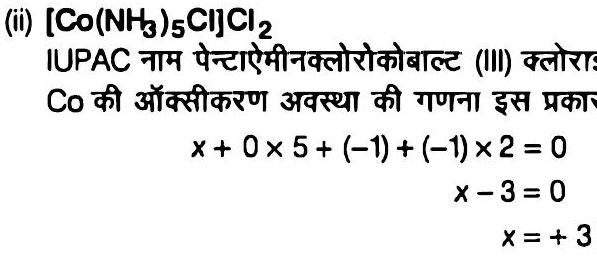

उपसहसंयोजन संख्या $(\mathrm{CN})=5+1=6$ (एकदंतुर लिगेण्डों की संख्या)
$\mathrm{Co}^{3+}$ का बाह्य इलेक्ट्रॉनिक विन्यास $=3 d^{6}=t_{2 g}^{6} e_{g}^{0}$
अतः चुम्बकीय आघूर्ण, $\mu=\sqrt{n(n+2)} B M$

$$
=\sqrt{0(0+2)} \mathrm{BM}=0 \mathrm{BM}
$$

यह संकुल ज्यामितीय के साथ-साथ ध्रुवण समावयवता भी नहीं दर्शाता है।

(iii) $\mathrm{CrCl}_{3}(\mathrm{py})_{3}$
IUPAC नाम ट्राइक्लोरोडो पिरीडीन क्रोमियम (III)
Cr की ऑक्सीकरण अवस्था
$$
\begin{aligned}
x+(-1) \times 3+(0) \times 3 & =0 \\
x & =+3
\end{aligned}
$$
उपसहसंयोजन संख्या $(\mathrm{CN})=6$
$\mathrm{Cr}^{3+}$ का बाह्य इलेक्ट्रॉनिक विन्यास $=30^{3}\left(t_{2 g}^{3} e_{g}^{0}\right)$
अयुग्मित इलेक्ट्रॉनों की संख्या $=3$
अत: चुम्बकीय आघूर्ण $\mu=\sqrt{n(n+2)}$ BM
$$
\begin{aligned}
& =\sqrt{3(3+2)} \\
& =\sqrt{15} \\
& =3.87 \mathrm{BM}
\end{aligned}
$$
यह संकुल फलकीय (fac) तथा रेखांशिक (mer)-ज्यामितीय समावयवता दर्शाता है (फलकीय रूप में एक जैसे समूह पास-पास होते हैं जबकि रेखांशिक रूप में यह सत्य नहीं है)।
<img class="imgSvg" id = "mu525uwcw0jhqt6009p" src="data:image/svg+xml;base64,PHN2ZyBpZD0ic21pbGVzLW11NTI1dXdjdzBqaHF0NjAwOXAiIHhtbG5zPSJodHRwOi8vd3d3LnczLm9yZy8yMDAwL3N2ZyIgdmlld0JveD0iMCAwIDE3NCAxMDQuOTk5OTk5OTk5OTc0NiIgc3R5bGU9IndpZHRoOiAxNzQuMjc5ODE0MzU2NDgwNnB4OyBoZWlnaHQ6IDEwNC45OTk5OTk5OTk5NzQ2cHg7IG92ZXJmbG93OiB2aXNpYmxlOyI+PGRlZnM+PGxpbmVhckdyYWRpZW50IGlkPSJsaW5lLW11NTI1dXdjdzBqaHF0NjAwOXAtMSIgZ3JhZGllbnRVbml0cz0idXNlclNwYWNlT25Vc2UiIHgxPSIxMDQuOTk5OTk5OTk5OTc0NjIiIHkxPSI1Mi41MDAwMjgyNzQ2MDE2NiIgeDI9IjEyMC43NDk5NzU1MTM0MzM5NSIgeTI9Ijc5Ljc3OTg0MjYzMTEwNzY4Ij48c3RvcCBzdG9wLWNvbG9yPSJjdXJyZW50Q29sb3IiIG9mZnNldD0iMjAlIj48L3N0b3A+PHN0b3Agc3RvcC1jb2xvcj0iY3VycmVudENvbG9yIiBvZmZzZXQ9IjEwMCUiPjwvc3RvcD48L2xpbmVhckdyYWRpZW50PjxsaW5lYXJHcmFkaWVudCBpZD0ibGluZS1tdTUyNXV3Y3cwamhxdDYwMDlwLTMiIGdyYWRpZW50VW5pdHM9InVzZXJTcGFjZU9uVXNlIiB4MT0iMTA0Ljk5OTk5OTk5OTk3NDYyIiB5MT0iNTIuNTAwMDI4Mjc0NjAxNjYiIHgyPSIxMDUuMDAwMDI4Mjc0NTg4OTciIHkyPSIyMS4wMDAwMjgyNzQ2MTQzNjUiPjxzdG9wIHN0b3AtY29sb3I9ImN1cnJlbnRDb2xvciIgb2Zmc2V0PSIyMCUiPjwvc3RvcD48c3RvcCBzdG9wLWNvbG9yPSJjdXJyZW50Q29sb3IiIG9mZnNldD0iMTAwJSI+PC9zdG9wPjwvbGluZWFyR3JhZGllbnQ+PGxpbmVhckdyYWRpZW50IGlkPSJsaW5lLW11NTI1dXdjdzBqaHF0NjAwOXAtNSIgZ3JhZGllbnRVbml0cz0idXNlclNwYWNlT25Vc2UiIHgxPSIxMDQuOTk5OTk5OTk5OTc0NjIiIHkxPSI1Mi41MDAwMjgyNzQ2MDE2NiIgeDI9IjEzMi4yNzk4MTQzNTY0ODA2IiB5Mj0iMzYuNzUwMDUyNzYxMTQyMzMiPjxzdG9wIHN0b3AtY29sb3I9ImN1cnJlbnRDb2xvciIgb2Zmc2V0PSIyMCUiPjwvc3RvcD48c3RvcCBzdG9wLWNvbG9yPSJjdXJyZW50Q29sb3IiIG9mZnNldD0iMTAwJSI+PC9zdG9wPjwvbGluZWFyR3JhZGllbnQ+PGxpbmVhckdyYWRpZW50IGlkPSJsaW5lLW11NTI1dXdjdzBqaHF0NjAwOXAtNyIgZ3JhZGllbnRVbml0cz0idXNlclNwYWNlT25Vc2UiIHgxPSI3My40OTk5OTk5OTk5ODczIiB5MT0iNTIuNDk5OTk5OTk5OTg3MzEiIHgyPSIxMDQuOTk5OTk5OTk5OTc0NjIiIHkyPSI1Mi41MDAwMjgyNzQ2MDE2NiI+PHN0b3Agc3RvcC1jb2xvcj0iY3VycmVudENvbG9yIiBvZmZzZXQ9IjIwJSI+PC9zdG9wPjxzdG9wIHN0b3AtY29sb3I9ImN1cnJlbnRDb2xvciIgb2Zmc2V0PSIxMDAlIj48L3N0b3A+PC9saW5lYXJHcmFkaWVudD48bGluZWFyR3JhZGllbnQgaWQ9ImxpbmUtbXU1MjV1d2N3MGpocXQ2MDA5cC05IiBncmFkaWVudFVuaXRzPSJ1c2VyU3BhY2VPblVzZSIgeDE9IjQyIiB5MT0iNTIuNDk5OTcxNzI1MzcyOTYiIHgyPSI3My40OTk5OTk5OTk5ODczIiB5Mj0iNTIuNDk5OTk5OTk5OTg3MzEiPjxzdG9wIHN0b3AtY29sb3I9ImN1cnJlbnRDb2xvciIgb2Zmc2V0PSIyMCUiPjwvc3RvcD48c3RvcCBzdG9wLWNvbG9yPSJjdXJyZW50Q29sb3IiIG9mZnNldD0iMTAwJSI+PC9zdG9wPjwvbGluZWFyR3JhZGllbnQ+PGxpbmVhckdyYWRpZW50IGlkPSJsaW5lLW11NTI1dXdjdzBqaHF0NjAwOXAtMTEiIGdyYWRpZW50VW5pdHM9InVzZXJTcGFjZU9uVXNlIiB4MT0iNzMuNDk5OTk5OTk5OTg3MyIgeTE9IjUyLjQ5OTk5OTk5OTk4NzMxIiB4Mj0iNzMuNTAwMDI4Mjc0NjAxNjgiIHkyPSIyMSI+PHN0b3Agc3RvcC1jb2xvcj0iY3VycmVudENvbG9yIiBvZmZzZXQ9IjIwJSI+PC9zdG9wPjxzdG9wIHN0b3AtY29sb3I9ImN1cnJlbnRDb2xvciIgb2Zmc2V0PSIxMDAlIj48L3N0b3A+PC9saW5lYXJHcmFkaWVudD48bGluZWFyR3JhZGllbnQgaWQ9ImxpbmUtbXU1MjV1d2N3MGpocXQ2MDA5cC0xMyIgZ3JhZGllbnRVbml0cz0idXNlclNwYWNlT25Vc2UiIHgxPSI3My40OTk5NzE3MjUzNzI5NCIgeTE9IjgzLjk5OTk5OTk5OTk3NDYyIiB4Mj0iNzMuNDk5OTk5OTk5OTg3MyIgeTI9IjUyLjQ5OTk5OTk5OTk4NzMxIj48c3RvcCBzdG9wLWNvbG9yPSJjdXJyZW50Q29sb3IiIG9mZnNldD0iMjAlIj48L3N0b3A+PHN0b3Agc3RvcC1jb2xvcj0iY3VycmVudENvbG9yIiBvZmZzZXQ9IjEwMCUiPjwvc3RvcD48L2xpbmVhckdyYWRpZW50PjwvZGVmcz48bWFzayBpZD0idGV4dC1tYXNrLW11NTI1dXdjdzBqaHF0NjAwOXAiPjxyZWN0IHg9IjAiIHk9IjAiIHdpZHRoPSIxMDAlIiBoZWlnaHQ9IjEwMCUiIGZpbGw9IndoaXRlIj48L3JlY3Q+PGNpcmNsZSBjeD0iMTIwLjc0OTk3NTUxMzQzMzk1IiBjeT0iNzkuNzc5ODQyNjMxMTA3NjgiIHI9IjcuODc1IiBmaWxsPSJibGFjayI+PC9jaXJjbGU+PGNpcmNsZSBjeD0iMTA1LjAwMDAyODI3NDU4ODk3IiBjeT0iMjEuMDAwMDI4Mjc0NjE0MzY1IiByPSI3Ljg3NSIgZmlsbD0iYmxhY2siPjwvY2lyY2xlPjxjaXJjbGUgY3g9IjEzMi4yNzk4MTQzNTY0ODA2IiBjeT0iMzYuNzUwMDUyNzYxMTQyMzMiIHI9IjcuODc1IiBmaWxsPSJibGFjayI+PC9jaXJjbGU+PGNpcmNsZSBjeD0iNDIiIGN5PSI1Mi40OTk5NzE3MjUzNzI5NiIgcj0iNy44NzUiIGZpbGw9ImJsYWNrIj48L2NpcmNsZT48Y2lyY2xlIGN4PSI3My41MDAwMjgyNzQ2MDE2OCIgY3k9IjIxIiByPSI5LjE4NzUiIGZpbGw9ImJsYWNrIj48L2NpcmNsZT48Y2lyY2xlIGN4PSI3My40OTk5NzE3MjUzNzI5NCIgY3k9IjgzLjk5OTk5OTk5OTk3NDYyIiByPSI4LjUzMTI1IiBmaWxsPSJibGFjayI+PC9jaXJjbGU+PC9tYXNrPjxzdHlsZT4KICAgICAgICAgICAgICAgIC5lbGVtZW50LW11NTI1dXdjdzBqaHF0NjAwOXAgewogICAgICAgICAgICAgICAgICAgIGZvbnQ6IDE0cHggSGVsdmV0aWNhLCBBcmlhbCwgc2Fucy1zZXJpZjsKICAgICAgICAgICAgICAgICAgICBhbGlnbm1lbnQtYmFzZWxpbmU6ICdtaWRkbGUnOwogICAgICAgICAgICAgICAgfQogICAgICAgICAgICAgICAgLnN1Yi1tdTUyNXV3Y3cwamhxdDYwMDlwIHsKICAgICAgICAgICAgICAgICAgICBmb250OiA4LjRweCBIZWx2ZXRpY2EsIEFyaWFsLCBzYW5zLXNlcmlmOwogICAgICAgICAgICAgICAgfQogICAgICAgICAgICA8L3N0eWxlPjxnIG1hc2s9InVybCgjdGV4dC1tYXNrLW11NTI1dXdjdzBqaHF0NjAwOXApIj48bGluZSB4MT0iMTA0Ljk5OTk5OTk5OTk3NDYyIiB5MT0iNTIuNTAwMDI4Mjc0NjAxNjYiIHgyPSIxMjAuNzQ5OTc1NTEzNDMzOTUiIHkyPSI3OS43Nzk4NDI2MzExMDc2OCIgc3R5bGU9InN0cm9rZS1saW5lY2FwOnJvdW5kO3N0cm9rZS1kYXNoYXJyYXk6bm9uZTtzdHJva2Utd2lkdGg6MS4yNiIgc3Ryb2tlPSJ1cmwoJyNsaW5lLW11NTI1dXdjdzBqaHF0NjAwOXAtMScpIj48L2xpbmU+PGxpbmUgeDE9IjEwNC45OTk5OTk5OTk5NzQ2MiIgeTE9IjUyLjUwMDAyODI3NDYwMTY2IiB4Mj0iMTA1LjAwMDAyODI3NDU4ODk3IiB5Mj0iMjEuMDAwMDI4Mjc0NjE0MzY1IiBzdHlsZT0ic3Ryb2tlLWxpbmVjYXA6cm91bmQ7c3Ryb2tlLWRhc2hhcnJheTpub25lO3N0cm9rZS13aWR0aDoxLjI2IiBzdHJva2U9InVybCgnI2xpbmUtbXU1MjV1d2N3MGpocXQ2MDA5cC0zJykiPjwvbGluZT48bGluZSB4MT0iMTA0Ljk5OTk5OTk5OTk3NDYyIiB5MT0iNTIuNTAwMDI4Mjc0NjAxNjYiIHgyPSIxMzIuMjc5ODE0MzU2NDgwNiIgeTI9IjM2Ljc1MDA1Mjc2MTE0MjMzIiBzdHlsZT0ic3Ryb2tlLWxpbmVjYXA6cm91bmQ7c3Ryb2tlLWRhc2hhcnJheTpub25lO3N0cm9rZS13aWR0aDoxLjI2IiBzdHJva2U9InVybCgnI2xpbmUtbXU1MjV1d2N3MGpocXQ2MDA5cC01JykiPjwvbGluZT48bGluZSB4MT0iNzMuNDk5OTk5OTk5OTg3MyIgeTE9IjUyLjQ5OTk5OTk5OTk4NzMxIiB4Mj0iMTA0Ljk5OTk5OTk5OTk3NDYyIiB5Mj0iNTIuNTAwMDI4Mjc0NjAxNjYiIHN0eWxlPSJzdHJva2UtbGluZWNhcDpyb3VuZDtzdHJva2UtZGFzaGFycmF5Om5vbmU7c3Ryb2tlLXdpZHRoOjEuMjYiIHN0cm9rZT0idXJsKCcjbGluZS1tdTUyNXV3Y3cwamhxdDYwMDlwLTcnKSI+PC9saW5lPjxsaW5lIHgxPSI0MiIgeTE9IjUyLjQ5OTk3MTcyNTM3Mjk2IiB4Mj0iNzMuNDk5OTk5OTk5OTg3MyIgeTI9IjUyLjQ5OTk5OTk5OTk4NzMxIiBzdHlsZT0ic3Ryb2tlLWxpbmVjYXA6cm91bmQ7c3Ryb2tlLWRhc2hhcnJheTpub25lO3N0cm9rZS13aWR0aDoxLjI2IiBzdHJva2U9InVybCgnI2xpbmUtbXU1MjV1d2N3MGpocXQ2MDA5cC05JykiPjwvbGluZT48bGluZSB4MT0iNzMuNDk5OTk5OTk5OTg3MyIgeTE9IjUyLjQ5OTk5OTk5OTk4NzMxIiB4Mj0iNzMuNTAwMDI4Mjc0NjAxNjgiIHkyPSIyMSIgc3R5bGU9InN0cm9rZS1saW5lY2FwOnJvdW5kO3N0cm9rZS1kYXNoYXJyYXk6bm9uZTtzdHJva2Utd2lkdGg6MS4yNiIgc3Ryb2tlPSJ1cmwoJyNsaW5lLW11NTI1dXdjdzBqaHF0NjAwOXAtMTEnKSI+PC9saW5lPjxsaW5lIHgxPSI3My40OTk5NzE3MjUzNzI5NCIgeTE9IjgzLjk5OTk5OTk5OTk3NDYyIiB4Mj0iNzMuNDk5OTk5OTk5OTg3MyIgeTI9IjUyLjQ5OTk5OTk5OTk4NzMxIiBzdHlsZT0ic3Ryb2tlLWxpbmVjYXA6cm91bmQ7c3Ryb2tlLWRhc2hhcnJheTpub25lO3N0cm9rZS13aWR0aDoxLjI2IiBzdHJva2U9InVybCgnI2xpbmUtbXU1MjV1d2N3MGpocXQ2MDA5cC0xMycpIj48L2xpbmU+PC9nPjxnPjx0ZXh0IHg9IjEyMC43NDk5NzU1MTM0MzM5NSIgeT0iODUuMDI5ODQyNjMxMTA3NjgiIGNsYXNzPSJlbGVtZW50LW11NTI1dXdjdzBqaHF0NjAwOXAiIGZpbGw9ImN1cnJlbnRDb2xvciIgc3R5bGU9InRleHQtYW5jaG9yOiBzdGFydDsgd3JpdGluZy1tb2RlOiBob3Jpem9udGFsLXRiOyB0ZXh0LW9yaWVudGF0aW9uOiBtaXhlZDsgbGV0dGVyLXNwYWNpbmc6IG5vcm1hbDsgZGlyZWN0aW9uOiBsdHI7Ij48dHNwYW4gc3R5bGU9IgogICAgICAgICAgICAgICAgdW5pY29kZS1iaWRpOiBwbGFpbnRleHQ7CiAgICAgICAgICAgICAgICB3cml0aW5nLW1vZGU6IGxyLXRiOwogICAgICAgICAgICAgICAgbGV0dGVyLXNwYWNpbmc6IG5vcm1hbDsKICAgICAgICAgICAgICAgIHRleHQtYW5jaG9yOiBtaWRkbGU7CiAgICAgICAgICAgICI+Q2w8L3RzcGFuPjwvdGV4dD48dGV4dCB4PSIxMjAuNzQ5OTc1NTEzNDMzOTUiIHk9Ijc5Ljc3OTg0MjYzMTEwNzY4IiBjbGFzcz0iZGVidWciIGZpbGw9IiNmZjAwMDAiIHN0eWxlPSIKICAgICAgICAgICAgICAgIGZvbnQ6IDVweCBEcm9pZCBTYW5zLCBzYW5zLXNlcmlmOwogICAgICAgICAgICAiPjwvdGV4dD48dGV4dCB4PSIxMDQuOTk5OTk5OTk5OTc0NjIiIHk9IjUyLjUwMDAyODI3NDYwMTY2IiBjbGFzcz0iZGVidWciIGZpbGw9IiNmZjAwMDAiIHN0eWxlPSIKICAgICAgICAgICAgICAgIGZvbnQ6IDVweCBEcm9pZCBTYW5zLCBzYW5zLXNlcmlmOwogICAgICAgICAgICAiPjwvdGV4dD48dGV4dCB4PSI5OS43NTAwMjgyNzQ1ODg5NyIgeT0iMjYuMjUwMDI4Mjc0NjE0MzY1IiBjbGFzcz0iZWxlbWVudC1tdTUyNXV3Y3cwamhxdDYwMDlwIiBmaWxsPSJjdXJyZW50Q29sb3IiIHN0eWxlPSJ0ZXh0LWFuY2hvcjogc3RhcnQ7IHdyaXRpbmctbW9kZTogaG9yaXpvbnRhbC10YjsgdGV4dC1vcmllbnRhdGlvbjogbWl4ZWQ7IGxldHRlci1zcGFjaW5nOiBub3JtYWw7IGRpcmVjdGlvbjogbHRyOyI+PHRzcGFuIHN0eWxlPSIKICAgICAgICAgICAgICAgIHVuaWNvZGUtYmlkaTogcGxhaW50ZXh0OwogICAgICAgICAgICAgICAgd3JpdGluZy1tb2RlOiBsci10YjsKICAgICAgICAgICAgICAgIGxldHRlci1zcGFjaW5nOiBub3JtYWw7CiAgICAgICAgICAgICAgICB0ZXh0LWFuY2hvcjogbWlkZGxlOwogICAgICAgICAgICAiPkNsPC90c3Bhbj48L3RleHQ+PHRleHQgeD0iMTA1LjAwMDAyODI3NDU4ODk3IiB5PSIyMS4wMDAwMjgyNzQ2MTQzNjUiIGNsYXNzPSJkZWJ1ZyIgZmlsbD0iI2ZmMDAwMCIgc3R5bGU9IgogICAgICAgICAgICAgICAgZm9udDogNXB4IERyb2lkIFNhbnMsIHNhbnMtc2VyaWY7CiAgICAgICAgICAgICI+PC90ZXh0Pjx0ZXh0IHg9IjEyOC4zNDIzMTQzNTY0ODA2IiB5PSI0Mi4wMDAwNTI3NjExNDIzMyIgY2xhc3M9ImVsZW1lbnQtbXU1MjV1d2N3MGpocXQ2MDA5cCIgZmlsbD0iY3VycmVudENvbG9yIiBzdHlsZT0idGV4dC1hbmNob3I6IHN0YXJ0OyB3cml0aW5nLW1vZGU6IGhvcml6b250YWwtdGI7IHRleHQtb3JpZW50YXRpb246IG1peGVkOyBsZXR0ZXItc3BhY2luZzogbm9ybWFsOyBkaXJlY3Rpb246IGx0cjsiPjx0c3BhbiBzdHlsZT0iCiAgICAgICAgICAgICAgICB1bmljb2RlLWJpZGk6IHBsYWludGV4dDsKICAgICAgICAgICAgICAgIHdyaXRpbmctbW9kZTogbHItdGI7CiAgICAgICAgICAgICAgICBsZXR0ZXItc3BhY2luZzogbm9ybWFsOwogICAgICAgICAgICAgICAgdGV4dC1hbmNob3I6IHN0YXJ0OwogICAgICAgICAgICAiPkNsPC90c3Bhbj48L3RleHQ+PHRleHQgeD0iMTMyLjI3OTgxNDM1NjQ4MDYiIHk9IjM2Ljc1MDA1Mjc2MTE0MjMzIiBjbGFzcz0iZGVidWciIGZpbGw9IiNmZjAwMDAiIHN0eWxlPSIKICAgICAgICAgICAgICAgIGZvbnQ6IDVweCBEcm9pZCBTYW5zLCBzYW5zLXNlcmlmOwogICAgICAgICAgICAiPjwvdGV4dD48dGV4dCB4PSI3My40OTk5OTk5OTk5ODczIiB5PSI1Mi40OTk5OTk5OTk5ODczMSIgY2xhc3M9ImRlYnVnIiBmaWxsPSIjZmYwMDAwIiBzdHlsZT0iCiAgICAgICAgICAgICAgICBmb250OiA1cHggRHJvaWQgU2Fucywgc2Fucy1zZXJpZjsKICAgICAgICAgICAgIj48L3RleHQ+PHRleHQgeD0iNDcuMjUiIHk9IjU3Ljc0OTk3MTcyNTM3Mjk2IiBjbGFzcz0iZWxlbWVudC1tdTUyNXV3Y3cwamhxdDYwMDlwIiBmaWxsPSJjdXJyZW50Q29sb3IiIHN0eWxlPSJ0ZXh0LWFuY2hvcjogc3RhcnQ7IHdyaXRpbmctbW9kZTogaG9yaXpvbnRhbC10YjsgdGV4dC1vcmllbnRhdGlvbjogbWl4ZWQ7IGxldHRlci1zcGFjaW5nOiBub3JtYWw7IGRpcmVjdGlvbjogcnRsOyB1bmljb2RlLWJpZGk6IGJpZGktb3ZlcnJpZGU7Ij48dHNwYW4gc3R5bGU9IgogICAgICAgICAgICAgICAgdW5pY29kZS1iaWRpOiBwbGFpbnRleHQ7CiAgICAgICAgICAgICAgICB3cml0aW5nLW1vZGU6IGxyLXRiOwogICAgICAgICAgICAgICAgbGV0dGVyLXNwYWNpbmc6IG5vcm1hbDsKICAgICAgICAgICAgICAgIHRleHQtYW5jaG9yOiBzdGFydDsKICAgICAgICAgICAgIj5CcjwvdHNwYW4+PC90ZXh0Pjx0ZXh0IHg9IjQyIiB5PSI1Mi40OTk5NzE3MjUzNzI5NiIgY2xhc3M9ImRlYnVnIiBmaWxsPSIjZmYwMDAwIiBzdHlsZT0iCiAgICAgICAgICAgICAgICBmb250OiA1cHggRHJvaWQgU2Fucywgc2Fucy1zZXJpZjsKICAgICAgICAgICAgIj48L3RleHQ+PHRleHQgeD0iNjguMjUwMDI4Mjc0NjAxNjgiIHk9IjI2LjI1IiBjbGFzcz0iZWxlbWVudC1tdTUyNXV3Y3cwamhxdDYwMDlwIiBmaWxsPSJjdXJyZW50Q29sb3IiIHN0eWxlPSJ0ZXh0LWFuY2hvcjogc3RhcnQ7IHdyaXRpbmctbW9kZTogaG9yaXpvbnRhbC10YjsgdGV4dC1vcmllbnRhdGlvbjogbWl4ZWQ7IGxldHRlci1zcGFjaW5nOiBub3JtYWw7IGRpcmVjdGlvbjogbHRyOyI+PHRzcGFuIHN0eWxlPSIKICAgICAgICAgICAgICAgIHVuaWNvZGUtYmlkaTogcGxhaW50ZXh0OwogICAgICAgICAgICAgICAgd3JpdGluZy1tb2RlOiBsci10YjsKICAgICAgICAgICAgICAgIGxldHRlci1zcGFjaW5nOiBub3JtYWw7CiAgICAgICAgICAgICAgICB0ZXh0LWFuY2hvcjogbWlkZGxlOwogICAgICAgICAgICAiPkJyPC90c3Bhbj48L3RleHQ+PHRleHQgeD0iNzMuNTAwMDI4Mjc0NjAxNjgiIHk9IjIxIiBjbGFzcz0iZGVidWciIGZpbGw9IiNmZjAwMDAiIHN0eWxlPSIKICAgICAgICAgICAgICAgIGZvbnQ6IDVweCBEcm9pZCBTYW5zLCBzYW5zLXNlcmlmOwogICAgICAgICAgICAiPjwvdGV4dD48dGV4dCB4PSI3My40OTk5NzE3MjUzNzI5NCIgeT0iODkuMjQ5OTk5OTk5OTc0NjIiIGNsYXNzPSJlbGVtZW50LW11NTI1dXdjdzBqaHF0NjAwOXAiIGZpbGw9ImN1cnJlbnRDb2xvciIgc3R5bGU9InRleHQtYW5jaG9yOiBzdGFydDsgd3JpdGluZy1tb2RlOiBob3Jpem9udGFsLXRiOyB0ZXh0LW9yaWVudGF0aW9uOiBtaXhlZDsgbGV0dGVyLXNwYWNpbmc6IG5vcm1hbDsgZGlyZWN0aW9uOiBsdHI7Ij48dHNwYW4gc3R5bGU9IgogICAgICAgICAgICAgICAgdW5pY29kZS1iaWRpOiBwbGFpbnRleHQ7CiAgICAgICAgICAgICAgICB3cml0aW5nLW1vZGU6IGxyLXRiOwogICAgICAgICAgICAgICAgbGV0dGVyLXNwYWNpbmc6IG5vcm1hbDsKICAgICAgICAgICAgICAgIHRleHQtYW5jaG9yOiBtaWRkbGU7CiAgICAgICAgICAgICI+QnI8L3RzcGFuPjwvdGV4dD48dGV4dCB4PSI3My40OTk5NzE3MjUzNzI5NCIgeT0iODMuOTk5OTk5OTk5OTc0NjIiIGNsYXNzPSJkZWJ1ZyIgZmlsbD0iI2ZmMDAwMCIgc3R5bGU9IgogICAgICAgICAgICAgICAgZm9udDogNXB4IERyb2lkIFNhbnMsIHNhbnMtc2VyaWY7CiAgICAgICAgICAgICI+PC90ZXh0PjwvZz48L3N2Zz4="/>
fac-nq
(फलकीय रूप)
<img class="imgSvg" id = "mu525uwdnejn5q1w1zo" src="data:image/svg+xml;base64,PHN2ZyBpZD0ic21pbGVzLW11NTI1dXdkbmVqbjVxMXcxem8iIHhtbG5zPSJodHRwOi8vd3d3LnczLm9yZy8yMDAwL3N2ZyIgdmlld0JveD0iMCAwIDE3NCAxMDQuOTk5OTk5OTk5OTc0NiIgc3R5bGU9IndpZHRoOiAxNzQuMjc5ODE0MzU2NDgwNnB4OyBoZWlnaHQ6IDEwNC45OTk5OTk5OTk5NzQ2cHg7IG92ZXJmbG93OiB2aXNpYmxlOyI+PGRlZnM+PGxpbmVhckdyYWRpZW50IGlkPSJsaW5lLW11NTI1dXdkbmVqbjVxMXcxem8tMSIgZ3JhZGllbnRVbml0cz0idXNlclNwYWNlT25Vc2UiIHgxPSIxMDQuOTk5OTk5OTk5OTc0NjIiIHkxPSI1Mi41MDAwMjgyNzQ2MDE2NiIgeDI9IjEyMC43NDk5NzU1MTM0MzM5NSIgeTI9Ijc5Ljc3OTg0MjYzMTEwNzY4Ij48c3RvcCBzdG9wLWNvbG9yPSJjdXJyZW50Q29sb3IiIG9mZnNldD0iMjAlIj48L3N0b3A+PHN0b3Agc3RvcC1jb2xvcj0iY3VycmVudENvbG9yIiBvZmZzZXQ9IjEwMCUiPjwvc3RvcD48L2xpbmVhckdyYWRpZW50PjxsaW5lYXJHcmFkaWVudCBpZD0ibGluZS1tdTUyNXV3ZG5lam41cTF3MXpvLTMiIGdyYWRpZW50VW5pdHM9InVzZXJTcGFjZU9uVXNlIiB4MT0iMTA0Ljk5OTk5OTk5OTk3NDYyIiB5MT0iNTIuNTAwMDI4Mjc0NjAxNjYiIHgyPSIxMDUuMDAwMDI4Mjc0NTg4OTciIHkyPSIyMS4wMDAwMjgyNzQ2MTQzNjUiPjxzdG9wIHN0b3AtY29sb3I9ImN1cnJlbnRDb2xvciIgb2Zmc2V0PSIyMCUiPjwvc3RvcD48c3RvcCBzdG9wLWNvbG9yPSJjdXJyZW50Q29sb3IiIG9mZnNldD0iMTAwJSI+PC9zdG9wPjwvbGluZWFyR3JhZGllbnQ+PGxpbmVhckdyYWRpZW50IGlkPSJsaW5lLW11NTI1dXdkbmVqbjVxMXcxem8tNSIgZ3JhZGllbnRVbml0cz0idXNlclNwYWNlT25Vc2UiIHgxPSIxMDQuOTk5OTk5OTk5OTc0NjIiIHkxPSI1Mi41MDAwMjgyNzQ2MDE2NiIgeDI9IjEzMi4yNzk4MTQzNTY0ODA2IiB5Mj0iMzYuNzUwMDUyNzYxMTQyMzMiPjxzdG9wIHN0b3AtY29sb3I9ImN1cnJlbnRDb2xvciIgb2Zmc2V0PSIyMCUiPjwvc3RvcD48c3RvcCBzdG9wLWNvbG9yPSJjdXJyZW50Q29sb3IiIG9mZnNldD0iMTAwJSI+PC9zdG9wPjwvbGluZWFyR3JhZGllbnQ+PGxpbmVhckdyYWRpZW50IGlkPSJsaW5lLW11NTI1dXdkbmVqbjVxMXcxem8tNyIgZ3JhZGllbnRVbml0cz0idXNlclNwYWNlT25Vc2UiIHgxPSI3My40OTk5OTk5OTk5ODczIiB5MT0iNTIuNDk5OTk5OTk5OTg3MzEiIHgyPSIxMDQuOTk5OTk5OTk5OTc0NjIiIHkyPSI1Mi41MDAwMjgyNzQ2MDE2NiI+PHN0b3Agc3RvcC1jb2xvcj0iY3VycmVudENvbG9yIiBvZmZzZXQ9IjIwJSI+PC9zdG9wPjxzdG9wIHN0b3AtY29sb3I9ImN1cnJlbnRDb2xvciIgb2Zmc2V0PSIxMDAlIj48L3N0b3A+PC9saW5lYXJHcmFkaWVudD48bGluZWFyR3JhZGllbnQgaWQ9ImxpbmUtbXU1MjV1d2RuZWpuNXExdzF6by05IiBncmFkaWVudFVuaXRzPSJ1c2VyU3BhY2VPblVzZSIgeDE9IjQyIiB5MT0iNTIuNDk5OTcxNzI1MzcyOTYiIHgyPSI3My40OTk5OTk5OTk5ODczIiB5Mj0iNTIuNDk5OTk5OTk5OTg3MzEiPjxzdG9wIHN0b3AtY29sb3I9ImN1cnJlbnRDb2xvciIgb2Zmc2V0PSIyMCUiPjwvc3RvcD48c3RvcCBzdG9wLWNvbG9yPSJjdXJyZW50Q29sb3IiIG9mZnNldD0iMTAwJSI+PC9zdG9wPjwvbGluZWFyR3JhZGllbnQ+PGxpbmVhckdyYWRpZW50IGlkPSJsaW5lLW11NTI1dXdkbmVqbjVxMXcxem8tMTEiIGdyYWRpZW50VW5pdHM9InVzZXJTcGFjZU9uVXNlIiB4MT0iNzMuNDk5OTk5OTk5OTg3MyIgeTE9IjUyLjQ5OTk5OTk5OTk4NzMxIiB4Mj0iNzMuNTAwMDI4Mjc0NjAxNjgiIHkyPSIyMSI+PHN0b3Agc3RvcC1jb2xvcj0iY3VycmVudENvbG9yIiBvZmZzZXQ9IjIwJSI+PC9zdG9wPjxzdG9wIHN0b3AtY29sb3I9ImN1cnJlbnRDb2xvciIgb2Zmc2V0PSIxMDAlIj48L3N0b3A+PC9saW5lYXJHcmFkaWVudD48bGluZWFyR3JhZGllbnQgaWQ9ImxpbmUtbXU1MjV1d2RuZWpuNXExdzF6by0xMyIgZ3JhZGllbnRVbml0cz0idXNlclNwYWNlT25Vc2UiIHgxPSI3My40OTk5NzE3MjUzNzI5NCIgeTE9IjgzLjk5OTk5OTk5OTk3NDYyIiB4Mj0iNzMuNDk5OTk5OTk5OTg3MyIgeTI9IjUyLjQ5OTk5OTk5OTk4NzMxIj48c3RvcCBzdG9wLWNvbG9yPSJjdXJyZW50Q29sb3IiIG9mZnNldD0iMjAlIj48L3N0b3A+PHN0b3Agc3RvcC1jb2xvcj0iY3VycmVudENvbG9yIiBvZmZzZXQ9IjEwMCUiPjwvc3RvcD48L2xpbmVhckdyYWRpZW50PjwvZGVmcz48bWFzayBpZD0idGV4dC1tYXNrLW11NTI1dXdkbmVqbjVxMXcxem8iPjxyZWN0IHg9IjAiIHk9IjAiIHdpZHRoPSIxMDAlIiBoZWlnaHQ9IjEwMCUiIGZpbGw9IndoaXRlIj48L3JlY3Q+PGNpcmNsZSBjeD0iMTIwLjc0OTk3NTUxMzQzMzk1IiBjeT0iNzkuNzc5ODQyNjMxMTA3NjgiIHI9IjcuODc1IiBmaWxsPSJibGFjayI+PC9jaXJjbGU+PGNpcmNsZSBjeD0iMTA1LjAwMDAyODI3NDU4ODk3IiBjeT0iMjEuMDAwMDI4Mjc0NjE0MzY1IiByPSI3Ljg3NSIgZmlsbD0iYmxhY2siPjwvY2lyY2xlPjxjaXJjbGUgY3g9IjEzMi4yNzk4MTQzNTY0ODA2IiBjeT0iMzYuNzUwMDUyNzYxMTQyMzMiIHI9IjcuODc1IiBmaWxsPSJibGFjayI+PC9jaXJjbGU+PGNpcmNsZSBjeD0iNDIiIGN5PSI1Mi40OTk5NzE3MjUzNzI5NiIgcj0iNy44NzUiIGZpbGw9ImJsYWNrIj48L2NpcmNsZT48Y2lyY2xlIGN4PSI3My41MDAwMjgyNzQ2MDE2OCIgY3k9IjIxIiByPSI3Ljg3NSIgZmlsbD0iYmxhY2siPjwvY2lyY2xlPjxjaXJjbGUgY3g9IjczLjQ5OTk3MTcyNTM3Mjk0IiBjeT0iODMuOTk5OTk5OTk5OTc0NjIiIHI9IjcuODc1IiBmaWxsPSJibGFjayI+PC9jaXJjbGU+PC9tYXNrPjxzdHlsZT4KICAgICAgICAgICAgICAgIC5lbGVtZW50LW11NTI1dXdkbmVqbjVxMXcxem8gewogICAgICAgICAgICAgICAgICAgIGZvbnQ6IDE0cHggSGVsdmV0aWNhLCBBcmlhbCwgc2Fucy1zZXJpZjsKICAgICAgICAgICAgICAgICAgICBhbGlnbm1lbnQtYmFzZWxpbmU6ICdtaWRkbGUnOwogICAgICAgICAgICAgICAgfQogICAgICAgICAgICAgICAgLnN1Yi1tdTUyNXV3ZG5lam41cTF3MXpvIHsKICAgICAgICAgICAgICAgICAgICBmb250OiA4LjRweCBIZWx2ZXRpY2EsIEFyaWFsLCBzYW5zLXNlcmlmOwogICAgICAgICAgICAgICAgfQogICAgICAgICAgICA8L3N0eWxlPjxnIG1hc2s9InVybCgjdGV4dC1tYXNrLW11NTI1dXdkbmVqbjVxMXcxem8pIj48bGluZSB4MT0iMTA0Ljk5OTk5OTk5OTk3NDYyIiB5MT0iNTIuNTAwMDI4Mjc0NjAxNjYiIHgyPSIxMjAuNzQ5OTc1NTEzNDMzOTUiIHkyPSI3OS43Nzk4NDI2MzExMDc2OCIgc3R5bGU9InN0cm9rZS1saW5lY2FwOnJvdW5kO3N0cm9rZS1kYXNoYXJyYXk6bm9uZTtzdHJva2Utd2lkdGg6MS4yNiIgc3Ryb2tlPSJ1cmwoJyNsaW5lLW11NTI1dXdkbmVqbjVxMXcxem8tMScpIj48L2xpbmU+PGxpbmUgeDE9IjEwNC45OTk5OTk5OTk5NzQ2MiIgeTE9IjUyLjUwMDAyODI3NDYwMTY2IiB4Mj0iMTA1LjAwMDAyODI3NDU4ODk3IiB5Mj0iMjEuMDAwMDI4Mjc0NjE0MzY1IiBzdHlsZT0ic3Ryb2tlLWxpbmVjYXA6cm91bmQ7c3Ryb2tlLWRhc2hhcnJheTpub25lO3N0cm9rZS13aWR0aDoxLjI2IiBzdHJva2U9InVybCgnI2xpbmUtbXU1MjV1d2RuZWpuNXExdzF6by0zJykiPjwvbGluZT48bGluZSB4MT0iMTA0Ljk5OTk5OTk5OTk3NDYyIiB5MT0iNTIuNTAwMDI4Mjc0NjAxNjYiIHgyPSIxMzIuMjc5ODE0MzU2NDgwNiIgeTI9IjM2Ljc1MDA1Mjc2MTE0MjMzIiBzdHlsZT0ic3Ryb2tlLWxpbmVjYXA6cm91bmQ7c3Ryb2tlLWRhc2hhcnJheTpub25lO3N0cm9rZS13aWR0aDoxLjI2IiBzdHJva2U9InVybCgnI2xpbmUtbXU1MjV1d2RuZWpuNXExdzF6by01JykiPjwvbGluZT48bGluZSB4MT0iNzMuNDk5OTk5OTk5OTg3MyIgeTE9IjUyLjQ5OTk5OTk5OTk4NzMxIiB4Mj0iMTA0Ljk5OTk5OTk5OTk3NDYyIiB5Mj0iNTIuNTAwMDI4Mjc0NjAxNjYiIHN0eWxlPSJzdHJva2UtbGluZWNhcDpyb3VuZDtzdHJva2UtZGFzaGFycmF5Om5vbmU7c3Ryb2tlLXdpZHRoOjEuMjYiIHN0cm9rZT0idXJsKCcjbGluZS1tdTUyNXV3ZG5lam41cTF3MXpvLTcnKSI+PC9saW5lPjxsaW5lIHgxPSI0MiIgeTE9IjUyLjQ5OTk3MTcyNTM3Mjk2IiB4Mj0iNzMuNDk5OTk5OTk5OTg3MyIgeTI9IjUyLjQ5OTk5OTk5OTk4NzMxIiBzdHlsZT0ic3Ryb2tlLWxpbmVjYXA6cm91bmQ7c3Ryb2tlLWRhc2hhcnJheTpub25lO3N0cm9rZS13aWR0aDoxLjI2IiBzdHJva2U9InVybCgnI2xpbmUtbXU1MjV1d2RuZWpuNXExdzF6by05JykiPjwvbGluZT48bGluZSB4MT0iNzMuNDk5OTk5OTk5OTg3MyIgeTE9IjUyLjQ5OTk5OTk5OTk4NzMxIiB4Mj0iNzMuNTAwMDI4Mjc0NjAxNjgiIHkyPSIyMSIgc3R5bGU9InN0cm9rZS1saW5lY2FwOnJvdW5kO3N0cm9rZS1kYXNoYXJyYXk6bm9uZTtzdHJva2Utd2lkdGg6MS4yNiIgc3Ryb2tlPSJ1cmwoJyNsaW5lLW11NTI1dXdkbmVqbjVxMXcxem8tMTEnKSI+PC9saW5lPjxsaW5lIHgxPSI3My40OTk5NzE3MjUzNzI5NCIgeTE9IjgzLjk5OTk5OTk5OTk3NDYyIiB4Mj0iNzMuNDk5OTk5OTk5OTg3MyIgeTI9IjUyLjQ5OTk5OTk5OTk4NzMxIiBzdHlsZT0ic3Ryb2tlLWxpbmVjYXA6cm91bmQ7c3Ryb2tlLWRhc2hhcnJheTpub25lO3N0cm9rZS13aWR0aDoxLjI2IiBzdHJva2U9InVybCgnI2xpbmUtbXU1MjV1d2RuZWpuNXExdzF6by0xMycpIj48L2xpbmU+PC9nPjxnPjx0ZXh0IHg9IjExNS40OTk5NzU1MTM0MzM5NSIgeT0iODUuMDI5ODQyNjMxMTA3NjgiIGNsYXNzPSJlbGVtZW50LW11NTI1dXdkbmVqbjVxMXcxem8iIGZpbGw9ImN1cnJlbnRDb2xvciIgc3R5bGU9InRleHQtYW5jaG9yOiBzdGFydDsgd3JpdGluZy1tb2RlOiBob3Jpem9udGFsLXRiOyB0ZXh0LW9yaWVudGF0aW9uOiBtaXhlZDsgbGV0dGVyLXNwYWNpbmc6IG5vcm1hbDsgZGlyZWN0aW9uOiBsdHI7Ij48dHNwYW4+Tzx0c3BhbiBiYXNlbGluZS1zaGlmdD0ic3VwZXIiIGNsYXNzPSJzdWItbXU1MjV1d2RuZWpuNXExdzF6byI+MTg8L3RzcGFuPjwvdHNwYW4+PC90ZXh0Pjx0ZXh0IHg9IjEyMC43NDk5NzU1MTM0MzM5NSIgeT0iNzkuNzc5ODQyNjMxMTA3NjgiIGNsYXNzPSJkZWJ1ZyIgZmlsbD0iI2ZmMDAwMCIgc3R5bGU9IgogICAgICAgICAgICAgICAgZm9udDogNXB4IERyb2lkIFNhbnMsIHNhbnMtc2VyaWY7CiAgICAgICAgICAgICI+PC90ZXh0Pjx0ZXh0IHg9IjEwNC45OTk5OTk5OTk5NzQ2MiIgeT0iNTIuNTAwMDI4Mjc0NjAxNjYiIGNsYXNzPSJkZWJ1ZyIgZmlsbD0iI2ZmMDAwMCIgc3R5bGU9IgogICAgICAgICAgICAgICAgZm9udDogNXB4IERyb2lkIFNhbnMsIHNhbnMtc2VyaWY7CiAgICAgICAgICAgICI+PC90ZXh0Pjx0ZXh0IHg9Ijk5Ljc1MDAyODI3NDU4ODk3IiB5PSIyNi4yNTAwMjgyNzQ2MTQzNjUiIGNsYXNzPSJlbGVtZW50LW11NTI1dXdkbmVqbjVxMXcxem8iIGZpbGw9ImN1cnJlbnRDb2xvciIgc3R5bGU9InRleHQtYW5jaG9yOiBzdGFydDsgd3JpdGluZy1tb2RlOiBob3Jpem9udGFsLXRiOyB0ZXh0LW9yaWVudGF0aW9uOiBtaXhlZDsgbGV0dGVyLXNwYWNpbmc6IG5vcm1hbDsgZGlyZWN0aW9uOiBsdHI7Ij48dHNwYW4+Tzx0c3BhbiBiYXNlbGluZS1zaGlmdD0ic3VwZXIiIGNsYXNzPSJzdWItbXU1MjV1d2RuZWpuNXExdzF6byI+MTg8L3RzcGFuPjwvdHNwYW4+PHRzcGFuIHN0eWxlPSJ1bmljb2RlLWJpZGk6IHBsYWludGV4dDsiPkg8L3RzcGFuPjwvdGV4dD48dGV4dCB4PSIxMDUuMDAwMDI4Mjc0NTg4OTciIHk9IjIxLjAwMDAyODI3NDYxNDM2NSIgY2xhc3M9ImRlYnVnIiBmaWxsPSIjZmYwMDAwIiBzdHlsZT0iCiAgICAgICAgICAgICAgICBmb250OiA1cHggRHJvaWQgU2Fucywgc2Fucy1zZXJpZjsKICAgICAgICAgICAgIj48L3RleHQ+PHRleHQgeD0iMTI4LjM0MjMxNDM1NjQ4MDYiIHk9IjQyLjAwMDA1Mjc2MTE0MjMzIiBjbGFzcz0iZWxlbWVudC1tdTUyNXV3ZG5lam41cTF3MXpvIiBmaWxsPSJjdXJyZW50Q29sb3IiIHN0eWxlPSJ0ZXh0LWFuY2hvcjogc3RhcnQ7IHdyaXRpbmctbW9kZTogaG9yaXpvbnRhbC10YjsgdGV4dC1vcmllbnRhdGlvbjogbWl4ZWQ7IGxldHRlci1zcGFjaW5nOiBub3JtYWw7IGRpcmVjdGlvbjogbHRyOyI+PHRzcGFuIHN0eWxlPSIKICAgICAgICAgICAgICAgIHVuaWNvZGUtYmlkaTogcGxhaW50ZXh0OwogICAgICAgICAgICAgICAgd3JpdGluZy1tb2RlOiBsci10YjsKICAgICAgICAgICAgICAgIGxldHRlci1zcGFjaW5nOiBub3JtYWw7CiAgICAgICAgICAgICAgICB0ZXh0LWFuY2hvcjogc3RhcnQ7CiAgICAgICAgICAgICI+SW48dHNwYW4gYmFzZWxpbmUtc2hpZnQ9InN1cGVyIiBjbGFzcz0ic3ViLW11NTI1dXdkbmVqbjVxMXcxem8iPjEwMzwvdHNwYW4+PC90c3Bhbj48L3RleHQ+PHRleHQgeD0iMTMyLjI3OTgxNDM1NjQ4MDYiIHk9IjM2Ljc1MDA1Mjc2MTE0MjMzIiBjbGFzcz0iZGVidWciIGZpbGw9IiNmZjAwMDAiIHN0eWxlPSIKICAgICAgICAgICAgICAgIGZvbnQ6IDVweCBEcm9pZCBTYW5zLCBzYW5zLXNlcmlmOwogICAgICAgICAgICAiPjwvdGV4dD48dGV4dCB4PSI3My40OTk5OTk5OTk5ODczIiB5PSI1Mi40OTk5OTk5OTk5ODczMSIgY2xhc3M9ImRlYnVnIiBmaWxsPSIjZmYwMDAwIiBzdHlsZT0iCiAgICAgICAgICAgICAgICBmb250OiA1cHggRHJvaWQgU2Fucywgc2Fucy1zZXJpZjsKICAgICAgICAgICAgIj48L3RleHQ+PHRleHQgeD0iNDcuMjUiIHk9IjU3Ljc0OTk3MTcyNTM3Mjk2IiBjbGFzcz0iZWxlbWVudC1tdTUyNXV3ZG5lam41cTF3MXpvIiBmaWxsPSJjdXJyZW50Q29sb3IiIHN0eWxlPSJ0ZXh0LWFuY2hvcjogc3RhcnQ7IHdyaXRpbmctbW9kZTogaG9yaXpvbnRhbC10YjsgdGV4dC1vcmllbnRhdGlvbjogbWl4ZWQ7IGxldHRlci1zcGFjaW5nOiBub3JtYWw7IGRpcmVjdGlvbjogcnRsOyB1bmljb2RlLWJpZGk6IGJpZGktb3ZlcnJpZGU7Ij48dHNwYW4gc3R5bGU9IgogICAgICAgICAgICAgICAgdW5pY29kZS1iaWRpOiBwbGFpbnRleHQ7CiAgICAgICAgICAgICAgICB3cml0aW5nLW1vZGU6IGxyLXRiOwogICAgICAgICAgICAgICAgbGV0dGVyLXNwYWNpbmc6IG5vcm1hbDsKICAgICAgICAgICAgICAgIHRleHQtYW5jaG9yOiBzdGFydDsKICAgICAgICAgICAgIj5DbDwvdHNwYW4+PC90ZXh0Pjx0ZXh0IHg9IjQyIiB5PSI1Mi40OTk5NzE3MjUzNzI5NiIgY2xhc3M9ImRlYnVnIiBmaWxsPSIjZmYwMDAwIiBzdHlsZT0iCiAgICAgICAgICAgICAgICBmb250OiA1cHggRHJvaWQgU2Fucywgc2Fucy1zZXJpZjsKICAgICAgICAgICAgIj48L3RleHQ+PHRleHQgeD0iNjguMjUwMDI4Mjc0NjAxNjgiIHk9IjI2LjI1IiBjbGFzcz0iZWxlbWVudC1tdTUyNXV3ZG5lam41cTF3MXpvIiBmaWxsPSJjdXJyZW50Q29sb3IiIHN0eWxlPSJ0ZXh0LWFuY2hvcjogc3RhcnQ7IHdyaXRpbmctbW9kZTogaG9yaXpvbnRhbC10YjsgdGV4dC1vcmllbnRhdGlvbjogbWl4ZWQ7IGxldHRlci1zcGFjaW5nOiBub3JtYWw7IGRpcmVjdGlvbjogbHRyOyI+PHRzcGFuIHN0eWxlPSIKICAgICAgICAgICAgICAgIHVuaWNvZGUtYmlkaTogcGxhaW50ZXh0OwogICAgICAgICAgICAgICAgd3JpdGluZy1tb2RlOiBsci10YjsKICAgICAgICAgICAgICAgIGxldHRlci1zcGFjaW5nOiBub3JtYWw7CiAgICAgICAgICAgICAgICB0ZXh0LWFuY2hvcjogbWlkZGxlOwogICAgICAgICAgICAiPkNsPC90c3Bhbj48L3RleHQ+PHRleHQgeD0iNzMuNTAwMDI4Mjc0NjAxNjgiIHk9IjIxIiBjbGFzcz0iZGVidWciIGZpbGw9IiNmZjAwMDAiIHN0eWxlPSIKICAgICAgICAgICAgICAgIGZvbnQ6IDVweCBEcm9pZCBTYW5zLCBzYW5zLXNlcmlmOwogICAgICAgICAgICAiPjwvdGV4dD48dGV4dCB4PSI3My40OTk5NzE3MjUzNzI5NCIgeT0iODkuMjQ5OTk5OTk5OTc0NjIiIGNsYXNzPSJlbGVtZW50LW11NTI1dXdkbmVqbjVxMXcxem8iIGZpbGw9ImN1cnJlbnRDb2xvciIgc3R5bGU9InRleHQtYW5jaG9yOiBzdGFydDsgd3JpdGluZy1tb2RlOiBob3Jpem9udGFsLXRiOyB0ZXh0LW9yaWVudGF0aW9uOiBtaXhlZDsgbGV0dGVyLXNwYWNpbmc6IG5vcm1hbDsgZGlyZWN0aW9uOiBsdHI7Ij48dHNwYW4gc3R5bGU9IgogICAgICAgICAgICAgICAgdW5pY29kZS1iaWRpOiBwbGFpbnRleHQ7CiAgICAgICAgICAgICAgICB3cml0aW5nLW1vZGU6IGxyLXRiOwogICAgICAgICAgICAgICAgbGV0dGVyLXNwYWNpbmc6IG5vcm1hbDsKICAgICAgICAgICAgICAgIHRleHQtYW5jaG9yOiBtaWRkbGU7CiAgICAgICAgICAgICI+Q2w8L3RzcGFuPjwvdGV4dD48dGV4dCB4PSI3My40OTk5NzE3MjUzNzI5NCIgeT0iODMuOTk5OTk5OTk5OTc0NjIiIGNsYXNzPSJkZWJ1ZyIgZmlsbD0iI2ZmMDAwMCIgc3R5bGU9IgogICAgICAgICAgICAgICAgZm9udDogNXB4IERyb2lkIFNhbnMsIHNhbnMtc2VyaWY7CiAgICAgICAgICAgICI+PC90ZXh0PjwvZz48L3N2Zz4="/>
mer-रूप
(रेखाशिक रूप)

(iv) $\mathbf{C s}\left[\mathrm{FeCl}_{4}\right]$
IUPAC नाम सीजियम टेट्राक्लोरोफैरेट (III)
Fe की ऑक्सीकरण अवस्था

$$
\begin{aligned}
+1+x+(-1) \times 4 & =0 \\
x-3 & =0 \\
x & =+3
\end{aligned}
$$

उपसहसंयोजन संख्या, $(\mathrm{CN})=4$
Fe का बाह्य इलेक्ट्रॉनिक विन्यास $=30^{5}\left(t_{2 g}^{3} \mathrm{~g}{ }_{g}^{2}\right)$
अयुग्मित इलेक्ट्रॉनों की संख्या $=5$

∴ दुम्बकीय आघूर्ण $\mu=\sqrt{n(n+2)}$ BM
$$
=\sqrt{5(5+2)}=\sqrt{35}=5.92 \mathrm{BM}
$$
यह चतुष्फलकीय संकुल है अतः यह ज्यामितीय या ध्रुवण समावयवता नहीं दर्शाता है।
(v) $\mathrm{K}_{4}\left[\mathrm{Mn}(\mathrm{CN})_{6}\right]$
IUPAC नाम पोटैशियम हेक्सासायनोमैंग्नेट (II)
$\mathrm{K}_{4}\left[\mathrm{Mn}(\mathrm{CN})_{6}\right]$ में Mn की ऑक्सीकरण अवस्था
$$
\begin{aligned}
(+1) \times 4+x+(-1) \times 6 & =0 \\
x-2 & =0 \\
x & =+2
\end{aligned}
$$
उपसहसंयोजन संख्या $(\mathrm{CN})=6$
Mn का बाह्य इलेक्ट्रॉनिक विन्यास $=3 d^{5}\left[t_{2}^{5} \mathrm{~g} e_{g}^{0}\right]$
( $\because \mathrm{CN}^{-}$प्रबल क्षेत्र लिगेण्ड है।)
अयुग्मित इलेक्ट्रॉनों की संख्या $=1$
चुम्बकीय आघूर्ण $\mu=\sqrt{n(n+2)} B M=\sqrt{1(1+2)} B M$
$$
=\sqrt{3}=1.73 \mathrm{BM} .
$$
यह संकुल त्रिविम समावयवता नहीं दर्शाता है।

प्रश्न 25. उपसहसंयोजन यौगिक के विलयन में स्थायित्व से आप क्या समझते हैं? संकुलों के स्थायित्व को प्रभावित करने वाले कारकों का उल्लेख कीजिए।
हल विलयन में संकुल के स्थायित्व का अर्थ साम्य अवस्था पर भाग ले रही दो स्पीशीज के मध्य संगुणन की मात्रा का मान है। संगुणन के लिए साम्य स्थिरांक (स्थायित्व या विरचन) का परिणाम गुणात्मक रूप से स्थायित्व को प्रकट करता है। इस प्रकार यदि हम निम्न प्रकार की अभिक्रिया को लें

$$
M+4 L \longrightarrow M L_{4}
$$

स्थायित्व स्थिरांक, $K=\frac{\left[M L_{4}\right]}{[M][L]^{4}}$
तो साम्य स्थिरांक का मान जितना अधिक होगा, $\mathrm{ML}_{4}$ की विलयन में मात्रा उतनी ही अधिक होगी।

संकुल के स्थायित्व को प्रमावित करने वाले कारक

1. केन्द्रीय घातु आयन पर आवेश केन्द्रीय धातु आयन पर आवेश की मात्रा जितनी अधिक होगी संकुल का स्यायित्व भी उतना अधिक होगा।
2. धातु आयन की प्रकृति जब लिगेण्ड के दाता परमाणु $\mathrm{N}, \mathrm{O}$ तथा F होते हैं तो वर्ग $-3$ से $6$ के तत्व तथा आन्तरिक संक्रमण तत्व, स्थायी संकुलों का निर्माण करते हैं। इसके विपरीत यदि लिगेण्ड के दाता परमाणु N, O तथा F परिवार के भारी सदस्य होते हैं तो वर्ग- $6$ के बाद वाली संक्रमण घातुएँ स्थायी संकुलों का निर्माण करती है।
3. लिगेण्डों की क्षारीय प्रकृति लिगेण्ड की क्षारीय प्रकृति जितनी अधिक होगी उसके द्वारा बनाये गये संकुलों का स्थायित्व उतना ही अधिक होगा।
4. कीलेटन कीलेट लिगेण्ड की उपस्थिति संकुल के स्थायित्व को बढ़ा देती है। इसे कीलेट प्रभाव कहते हैं। यह $5$ तथा $6$ सदस्यों वाली शृंखला के लिए अधिकतम होता है।
5. बहुदंतुर चक्रीय लिगेण्डों का प्रमाव इन लिगेण्डों की उपस्थिति में संकुल का स्थायित्व तथा बढ़ जाता है।

प्रश्न 26. कीलेट प्रमाव से क्या तात्पर्य है? एक ठदाहरण दीजिए।
हल जब एक द्विंदुर अथवा बहुदंतुर लिगेण्ड अपने दो या अधिक दाता परमाणुओं का प्रयोग एक ही धातु आयन से आबंघन के लिए इस प्रेकार करता है कि $5$ तथा $6$ सदस्यों वाली शृंखला बनती हो तो यह प्रभाव कीलेट प्रभाव कहलाता है।

उदाहरण
<img class="imgSvg" id = "mu525uwe1br7v6q151f" src="data:image/svg+xml;base64,PHN2ZyBpZD0ic21pbGVzLW11NTI1dXdlMWJyN3Y2cTE1MWYiIHhtbG5zPSJodHRwOi8vd3d3LnczLm9yZy8yMDAwL3N2ZyIgdmlld0JveD0iMCAwIDE2NiAxMTYuMTQ4MDU0NDM5OTY2NCIgc3R5bGU9IndpZHRoOiAxNjUuODQwNTYxOTYyNTExNjNweDsgaGVpZ2h0OiAxMTYuMTQ4MDU0NDM5OTY2NHB4OyBvdmVyZmxvdzogdmlzaWJsZTsiPjxkZWZzPjxsaW5lYXJHcmFkaWVudCBpZD0ibGluZS1tdTUyNXV3ZTFicjd2NnExNTFmLTEiIGdyYWRpZW50VW5pdHM9InVzZXJTcGFjZU9uVXNlIiB4MT0iOTIuMzQwNTYxOTYyNTI0MzIiIHkxPSI2NS41NDc3MjcyMTQ3MzQ1NiIgeDI9IjEyMy44NDA1NjE5NjI1MTE2NCIgeTI9IjY1LjU0Nzc1NTQ4OTM0ODkiPjxzdG9wIHN0b3AtY29sb3I9ImN1cnJlbnRDb2xvciIgb2Zmc2V0PSIyMCUiPjwvc3RvcD48c3RvcCBzdG9wLWNvbG9yPSJjdXJyZW50Q29sb3IiIG9mZnNldD0iMTAwJSI+PC9zdG9wPjwvbGluZWFyR3JhZGllbnQ+PGxpbmVhckdyYWRpZW50IGlkPSJsaW5lLW11NTI1dXdlMWJyN3Y2cTE1MWYtMyIgZ3JhZGllbnRVbml0cz0idXNlclNwYWNlT25Vc2UiIHgxPSI5Mi4zNDA1NjE5NjI1MjQzMiIgeTE9IjY1LjU0NzcyNzIxNDczNDU2IiB4Mj0iMTAzLjExNDE2OTkwNzgzMjA4IiB5Mj0iOTUuMTQ4MDU0NDM5OTY2NCI+PHN0b3Agc3RvcC1jb2xvcj0iY3VycmVudENvbG9yIiBvZmZzZXQ9IjIwJSI+PC9zdG9wPjxzdG9wIHN0b3AtY29sb3I9ImN1cnJlbnRDb2xvciIgb2Zmc2V0PSIxMDAlIj48L3N0b3A+PC9saW5lYXJHcmFkaWVudD48bGluZWFyR3JhZGllbnQgaWQ9ImxpbmUtbXU1MjV1d2UxYnI3djZxMTUxZi01IiBncmFkaWVudFVuaXRzPSJ1c2VyU3BhY2VPblVzZSIgeDE9IjkyLjM0MDU2MTk2MjUyNDMyIiB5MT0iNjUuNTQ3NzI3MjE0NzM0NTYiIHgyPSIxMTQuNjE0NDQ1NTYzMDYzMTEiIHkyPSI0My4yNzM4ODM2MDA1Mzg4MyI+PHN0b3Agc3RvcC1jb2xvcj0iY3VycmVudENvbG9yIiBvZmZzZXQ9IjIwJSI+PC9zdG9wPjxzdG9wIHN0b3AtY29sb3I9ImN1cnJlbnRDb2xvciIgb2Zmc2V0PSIxMDAlIj48L3N0b3A+PC9saW5lYXJHcmFkaWVudD48bGluZWFyR3JhZGllbnQgaWQ9ImxpbmUtbXU1MjV1d2UxYnI3djZxMTUxZi03IiBncmFkaWVudFVuaXRzPSJ1c2VyU3BhY2VPblVzZSIgeDE9IjcwLjA2NjcxODM0ODMyODU2IiB5MT0iNDMuMjczODQzNjE0MTk1NzU1IiB4Mj0iOTIuMzQwNTYxOTYyNTI0MzIiIHkyPSI2NS41NDc3MjcyMTQ3MzQ1NiI+PHN0b3Agc3RvcC1jb2xvcj0iY3VycmVudENvbG9yIiBvZmZzZXQ9IjIwJSI+PC9zdG9wPjxzdG9wIHN0b3AtY29sb3I9ImN1cnJlbnRDb2xvciIgb2Zmc2V0PSIxMDAlIj48L3N0b3A+PC9saW5lYXJHcmFkaWVudD48bGluZWFyR3JhZGllbnQgaWQ9ImxpbmUtbXU1MjV1d2UxYnI3djZxMTUxZi05IiBncmFkaWVudFVuaXRzPSJ1c2VyU3BhY2VPblVzZSIgeDE9Ijc4LjAzOTgzNjAyNzg2ODUiIHkxPSI5My42MTQ0MTk4OTAyNTA1NSIgeDI9IjkyLjM0MDU2MTk2MjUyNDMyIiB5Mj0iNjUuNTQ3NzI3MjE0NzM0NTYiPjxzdG9wIHN0b3AtY29sb3I9ImN1cnJlbnRDb2xvciIgb2Zmc2V0PSIyMCUiPjwvc3RvcD48c3RvcCBzdG9wLWNvbG9yPSJjdXJyZW50Q29sb3IiIG9mZnNldD0iMTAwJSI+PC9zdG9wPjwvbGluZWFyR3JhZGllbnQ+PGxpbmVhckdyYWRpZW50IGlkPSJsaW5lLW11NTI1dXdlMWJyN3Y2cTE1MWYtMTEiIGdyYWRpZW50VW5pdHM9InVzZXJTcGFjZU9uVXNlIiB4MT0iOTIuMzQwNjAxOTQ4ODY3MzkiIHkxPSIyMSIgeDI9IjExNC42MTQ0NDU1NjMwNjMxMSIgeTI9IjQzLjI3Mzg4MzYwMDUzODgzIj48c3RvcCBzdG9wLWNvbG9yPSJjdXJyZW50Q29sb3IiIG9mZnNldD0iMjAlIj48L3N0b3A+PHN0b3Agc3RvcC1jb2xvcj0iY3VycmVudENvbG9yIiBvZmZzZXQ9IjEwMCUiPjwvc3RvcD48L2xpbmVhckdyYWRpZW50PjxsaW5lYXJHcmFkaWVudCBpZD0ibGluZS1tdTUyNXV3ZTFicjd2NnExNTFmLTEzIiBncmFkaWVudFVuaXRzPSJ1c2VyU3BhY2VPblVzZSIgeDE9IjcwLjA2NjcxODM0ODMyODU2IiB5MT0iNDMuMjczODQzNjE0MTk1NzU1IiB4Mj0iOTIuMzQwNjAxOTQ4ODY3MzkiIHkyPSIyMSI+PHN0b3Agc3RvcC1jb2xvcj0iY3VycmVudENvbG9yIiBvZmZzZXQ9IjIwJSI+PC9zdG9wPjxzdG9wIHN0b3AtY29sb3I9ImN1cnJlbnRDb2xvciIgb2Zmc2V0PSIxMDAlIj48L3N0b3A+PC9saW5lYXJHcmFkaWVudD48bGluZWFyR3JhZGllbnQgaWQ9ImxpbmUtbXU1MjV1d2UxYnI3djZxMTUxZi0xNSIgZ3JhZGllbnRVbml0cz0idXNlclNwYWNlT25Vc2UiIHgxPSI0MiIgeTE9IjU3LjU3NDUxOTE2MzExOTg3IiB4Mj0iNzAuMDY2NzE4MzQ4MzI4NTYiIHkyPSI0My4yNzM4NDM2MTQxOTU3NTUiPjxzdG9wIHN0b3AtY29sb3I9ImN1cnJlbnRDb2xvciIgb2Zmc2V0PSIyMCUiPjwvc3RvcD48c3RvcCBzdG9wLWNvbG9yPSJjdXJyZW50Q29sb3IiIG9mZnNldD0iMTAwJSI+PC9zdG9wPjwvbGluZWFyR3JhZGllbnQ+PGxpbmVhckdyYWRpZW50IGlkPSJsaW5lLW11NTI1dXdlMWJyN3Y2cTE1MWYtMTciIGdyYWRpZW50VW5pdHM9InVzZXJTcGFjZU9uVXNlIiB4MT0iNDYuOTI3NjU3NzIyMjU4Mzc0IiB5MT0iODguNjg2NzA2MzE0OTc4MzUiIHgyPSI3OC4wMzk4MzYwMjc4Njg1IiB5Mj0iOTMuNjE0NDE5ODkwMjUwNTUiPjxzdG9wIHN0b3AtY29sb3I9ImN1cnJlbnRDb2xvciIgb2Zmc2V0PSIyMCUiPjwvc3RvcD48c3RvcCBzdG9wLWNvbG9yPSJjdXJyZW50Q29sb3IiIG9mZnNldD0iMTAwJSI+PC9zdG9wPjwvbGluZWFyR3JhZGllbnQ+PGxpbmVhckdyYWRpZW50IGlkPSJsaW5lLW11NTI1dXdlMWJyN3Y2cTE1MWYtMTkiIGdyYWRpZW50VW5pdHM9InVzZXJTcGFjZU9uVXNlIiB4MT0iNDIiIHkxPSI1Ny41NzQ1MTkxNjMxMTk4NyIgeDI9IjQ2LjkyNzY1NzcyMjI1ODM3NCIgeTI9Ijg4LjY4NjcwNjMxNDk3ODM1Ij48c3RvcCBzdG9wLWNvbG9yPSJjdXJyZW50Q29sb3IiIG9mZnNldD0iMjAlIj48L3N0b3A+PHN0b3Agc3RvcC1jb2xvcj0iY3VycmVudENvbG9yIiBvZmZzZXQ9IjEwMCUiPjwvc3RvcD48L2xpbmVhckdyYWRpZW50PjwvZGVmcz48bWFzayBpZD0idGV4dC1tYXNrLW11NTI1dXdlMWJyN3Y2cTE1MWYiPjxyZWN0IHg9IjAiIHk9IjAiIHdpZHRoPSIxMDAlIiBoZWlnaHQ9IjEwMCUiIGZpbGw9IndoaXRlIj48L3JlY3Q+PGNpcmNsZSBjeD0iMTIzLjg0MDU2MTk2MjUxMTY0IiBjeT0iNjUuNTQ3NzU1NDg5MzQ4OSIgcj0iNy44NzUiIGZpbGw9ImJsYWNrIj48L2NpcmNsZT48Y2lyY2xlIGN4PSI5Mi4zNDA1NjE5NjI1MjQzMiIgY3k9IjY1LjU0NzcyNzIxNDczNDU2IiByPSI3Ljg3NSIgZmlsbD0iYmxhY2siPjwvY2lyY2xlPjxjaXJjbGUgY3g9IjEwMy4xMTQxNjk5MDc4MzIwOCIgY3k9Ijk1LjE0ODA1NDQzOTk2NjQiIHI9IjcuODc1IiBmaWxsPSJibGFjayI+PC9jaXJjbGU+PGNpcmNsZSBjeD0iNzAuMDY2NzE4MzQ4MzI4NTYiIGN5PSI0My4yNzM4NDM2MTQxOTU3NTUiIHI9IjcuODc1IiBmaWxsPSJibGFjayI+PC9jaXJjbGU+PGNpcmNsZSBjeD0iNzguMDM5ODM2MDI3ODY4NSIgY3k9IjkzLjYxNDQxOTg5MDI1MDU1IiByPSI3Ljg3NSIgZmlsbD0iYmxhY2siPjwvY2lyY2xlPjwvbWFzaz48c3R5bGU+CiAgICAgICAgICAgICAgICAuZWxlbWVudC1tdTUyNXV3ZTFicjd2NnExNTFmIHsKICAgICAgICAgICAgICAgICAgICBmb250OiAxNHB4IEhlbHZldGljYSwgQXJpYWwsIHNhbnMtc2VyaWY7CiAgICAgICAgICAgICAgICAgICAgYWxpZ25tZW50LWJhc2VsaW5lOiAnbWlkZGxlJzsKICAgICAgICAgICAgICAgIH0KICAgICAgICAgICAgICAgIC5zdWItbXU1MjV1d2UxYnI3djZxMTUxZiB7CiAgICAgICAgICAgICAgICAgICAgZm9udDogOC40cHggSGVsdmV0aWNhLCBBcmlhbCwgc2Fucy1zZXJpZjsKICAgICAgICAgICAgICAgIH0KICAgICAgICAgICAgPC9zdHlsZT48ZyBtYXNrPSJ1cmwoI3RleHQtbWFzay1tdTUyNXV3ZTFicjd2NnExNTFmKSI+PGxpbmUgeDE9IjkyLjM0MDU2MTk2MjUyNDMyIiB5MT0iNjUuNTQ3NzI3MjE0NzM0NTYiIHgyPSIxMjMuODQwNTYxOTYyNTExNjQiIHkyPSI2NS41NDc3NTU0ODkzNDg5IiBzdHlsZT0ic3Ryb2tlLWxpbmVjYXA6cm91bmQ7c3Ryb2tlLWRhc2hhcnJheTpub25lO3N0cm9rZS13aWR0aDoxLjI2IiBzdHJva2U9InVybCgnI2xpbmUtbXU1MjV1d2UxYnI3djZxMTUxZi0xJykiPjwvbGluZT48bGluZSB4MT0iOTIuMzQwNTYxOTYyNTI0MzIiIHkxPSI2NS41NDc3MjcyMTQ3MzQ1NiIgeDI9IjEwMy4xMTQxNjk5MDc4MzIwOCIgeTI9Ijk1LjE0ODA1NDQzOTk2NjQiIHN0eWxlPSJzdHJva2UtbGluZWNhcDpyb3VuZDtzdHJva2UtZGFzaGFycmF5Om5vbmU7c3Ryb2tlLXdpZHRoOjEuMjYiIHN0cm9rZT0idXJsKCcjbGluZS1tdTUyNXV3ZTFicjd2NnExNTFmLTMnKSI+PC9saW5lPjxsaW5lIHgxPSI5Mi4zNDA1NjE5NjI1MjQzMiIgeTE9IjY1LjU0NzcyNzIxNDczNDU2IiB4Mj0iMTE0LjYxNDQ0NTU2MzA2MzExIiB5Mj0iNDMuMjczODgzNjAwNTM4ODMiIHN0eWxlPSJzdHJva2UtbGluZWNhcDpyb3VuZDtzdHJva2UtZGFzaGFycmF5Om5vbmU7c3Ryb2tlLXdpZHRoOjEuMjYiIHN0cm9rZT0idXJsKCcjbGluZS1tdTUyNXV3ZTFicjd2NnExNTFmLTUnKSI+PC9saW5lPjxsaW5lIHgxPSI3MC4wNjY3MTgzNDgzMjg1NiIgeTE9IjQzLjI3Mzg0MzYxNDE5NTc1NSIgeDI9IjkyLjM0MDU2MTk2MjUyNDMyIiB5Mj0iNjUuNTQ3NzI3MjE0NzM0NTYiIHN0eWxlPSJzdHJva2UtbGluZWNhcDpyb3VuZDtzdHJva2UtZGFzaGFycmF5Om5vbmU7c3Ryb2tlLXdpZHRoOjEuMjYiIHN0cm9rZT0idXJsKCcjbGluZS1tdTUyNXV3ZTFicjd2NnExNTFmLTcnKSI+PC9saW5lPjxsaW5lIHgxPSI3OC4wMzk4MzYwMjc4Njg1IiB5MT0iOTMuNjE0NDE5ODkwMjUwNTUiIHgyPSI5Mi4zNDA1NjE5NjI1MjQzMiIgeTI9IjY1LjU0NzcyNzIxNDczNDU2IiBzdHlsZT0ic3Ryb2tlLWxpbmVjYXA6cm91bmQ7c3Ryb2tlLWRhc2hhcnJheTpub25lO3N0cm9rZS13aWR0aDoxLjI2IiBzdHJva2U9InVybCgnI2xpbmUtbXU1MjV1d2UxYnI3djZxMTUxZi05JykiPjwvbGluZT48bGluZSB4MT0iOTIuMzQwNjAxOTQ4ODY3MzkiIHkxPSIyMSIgeDI9IjExNC42MTQ0NDU1NjMwNjMxMSIgeTI9IjQzLjI3Mzg4MzYwMDUzODgzIiBzdHlsZT0ic3Ryb2tlLWxpbmVjYXA6cm91bmQ7c3Ryb2tlLWRhc2hhcnJheTpub25lO3N0cm9rZS13aWR0aDoxLjI2IiBzdHJva2U9InVybCgnI2xpbmUtbXU1MjV1d2UxYnI3djZxMTUxZi0xMScpIj48L2xpbmU+PGxpbmUgeDE9IjcwLjA2NjcxODM0ODMyODU2IiB5MT0iNDMuMjczODQzNjE0MTk1NzU1IiB4Mj0iOTIuMzQwNjAxOTQ4ODY3MzkiIHkyPSIyMSIgc3R5bGU9InN0cm9rZS1saW5lY2FwOnJvdW5kO3N0cm9rZS1kYXNoYXJyYXk6bm9uZTtzdHJva2Utd2lkdGg6MS4yNiIgc3Ryb2tlPSJ1cmwoJyNsaW5lLW11NTI1dXdlMWJyN3Y2cTE1MWYtMTMnKSI+PC9saW5lPjxsaW5lIHgxPSI0MiIgeTE9IjU3LjU3NDUxOTE2MzExOTg3IiB4Mj0iNzAuMDY2NzE4MzQ4MzI4NTYiIHkyPSI0My4yNzM4NDM2MTQxOTU3NTUiIHN0eWxlPSJzdHJva2UtbGluZWNhcDpyb3VuZDtzdHJva2UtZGFzaGFycmF5Om5vbmU7c3Ryb2tlLXdpZHRoOjEuMjYiIHN0cm9rZT0idXJsKCcjbGluZS1tdTUyNXV3ZTFicjd2NnExNTFmLTE1JykiPjwvbGluZT48bGluZSB4MT0iNDYuOTI3NjU3NzIyMjU4Mzc0IiB5MT0iODguNjg2NzA2MzE0OTc4MzUiIHgyPSI3OC4wMzk4MzYwMjc4Njg1IiB5Mj0iOTMuNjE0NDE5ODkwMjUwNTUiIHN0eWxlPSJzdHJva2UtbGluZWNhcDpyb3VuZDtzdHJva2UtZGFzaGFycmF5Om5vbmU7c3Ryb2tlLXdpZHRoOjEuMjYiIHN0cm9rZT0idXJsKCcjbGluZS1tdTUyNXV3ZTFicjd2NnExNTFmLTE3JykiPjwvbGluZT48bGluZSB4MT0iNDIiIHkxPSI1Ny41NzQ1MTkxNjMxMTk4NyIgeDI9IjQ2LjkyNzY1NzcyMjI1ODM3NCIgeTI9Ijg4LjY4NjcwNjMxNDk3ODM1IiBzdHlsZT0ic3Ryb2tlLWxpbmVjYXA6cm91bmQ7c3Ryb2tlLWRhc2hhcnJheTpub25lO3N0cm9rZS13aWR0aDoxLjI2IiBzdHJva2U9InVybCgnI2xpbmUtbXU1MjV1d2UxYnI3djZxMTUxZi0xOScpIj48L2xpbmU+PC9nPjxnPjx0ZXh0IHg9IjExOS45MDMwNjE5NjI1MTE2NCIgeT0iNzAuNzk3NzU1NDg5MzQ4OSIgY2xhc3M9ImVsZW1lbnQtbXU1MjV1d2UxYnI3djZxMTUxZiIgZmlsbD0iY3VycmVudENvbG9yIiBzdHlsZT0idGV4dC1hbmNob3I6IHN0YXJ0OyB3cml0aW5nLW1vZGU6IGhvcml6b250YWwtdGI7IHRleHQtb3JpZW50YXRpb246IG1peGVkOyBsZXR0ZXItc3BhY2luZzogbm9ybWFsOyBkaXJlY3Rpb246IGx0cjsiPjx0c3BhbiBzdHlsZT0iCiAgICAgICAgICAgICAgICB1bmljb2RlLWJpZGk6IHBsYWludGV4dDsKICAgICAgICAgICAgICAgIHdyaXRpbmctbW9kZTogbHItdGI7CiAgICAgICAgICAgICAgICBsZXR0ZXItc3BhY2luZzogbm9ybWFsOwogICAgICAgICAgICAgICAgdGV4dC1hbmNob3I6IHN0YXJ0OwogICAgICAgICAgICAiPkNsPC90c3Bhbj48L3RleHQ+PHRleHQgeD0iMTIzLjg0MDU2MTk2MjUxMTY0IiB5PSI2NS41NDc3NTU0ODkzNDg5IiBjbGFzcz0iZGVidWciIGZpbGw9IiNmZjAwMDAiIHN0eWxlPSIKICAgICAgICAgICAgICAgIGZvbnQ6IDVweCBEcm9pZCBTYW5zLCBzYW5zLXNlcmlmOwogICAgICAgICAgICAiPjwvdGV4dD48dGV4dCB4PSI5Ny41OTA1NjE5NjI1MjQzMiIgeT0iNzAuNzk3NzI3MjE0NzM0NTYiIGNsYXNzPSJlbGVtZW50LW11NTI1dXdlMWJyN3Y2cTE1MWYiIGZpbGw9ImN1cnJlbnRDb2xvciIgc3R5bGU9InRleHQtYW5jaG9yOiBzdGFydDsgd3JpdGluZy1tb2RlOiBob3Jpem9udGFsLXRiOyB0ZXh0LW9yaWVudGF0aW9uOiBtaXhlZDsgbGV0dGVyLXNwYWNpbmc6IG5vcm1hbDsgZGlyZWN0aW9uOiBydGw7IHVuaWNvZGUtYmlkaTogYmlkaS1vdmVycmlkZTsiPjx0c3Bhbj5QPC90c3Bhbj48L3RleHQ+PHRleHQgeD0iOTIuMzQwNTYxOTYyNTI0MzIiIHk9IjY1LjU0NzcyNzIxNDczNDU2IiBjbGFzcz0iZGVidWciIGZpbGw9IiNmZjAwMDAiIHN0eWxlPSIKICAgICAgICAgICAgICAgIGZvbnQ6IDVweCBEcm9pZCBTYW5zLCBzYW5zLXNlcmlmOwogICAgICAgICAgICAiPjwvdGV4dD48dGV4dCB4PSIxMDMuMTE0MTY5OTA3ODMyMDgiIHk9IjEwMC4zOTgwNTQ0Mzk5NjY0IiBjbGFzcz0iZWxlbWVudC1tdTUyNXV3ZTFicjd2NnExNTFmIiBmaWxsPSJjdXJyZW50Q29sb3IiIHN0eWxlPSJ0ZXh0LWFuY2hvcjogc3RhcnQ7IHdyaXRpbmctbW9kZTogaG9yaXpvbnRhbC10YjsgdGV4dC1vcmllbnRhdGlvbjogbWl4ZWQ7IGxldHRlci1zcGFjaW5nOiBub3JtYWw7IGRpcmVjdGlvbjogbHRyOyI+PHRzcGFuIHN0eWxlPSIKICAgICAgICAgICAgICAgIHVuaWNvZGUtYmlkaTogcGxhaW50ZXh0OwogICAgICAgICAgICAgICAgd3JpdGluZy1tb2RlOiBsci10YjsKICAgICAgICAgICAgICAgIGxldHRlci1zcGFjaW5nOiBub3JtYWw7CiAgICAgICAgICAgICAgICB0ZXh0LWFuY2hvcjogbWlkZGxlOwogICAgICAgICAgICAiPkNsPC90c3Bhbj48L3RleHQ+PHRleHQgeD0iMTAzLjExNDE2OTkwNzgzMjA4IiB5PSI5NS4xNDgwNTQ0Mzk5NjY0IiBjbGFzcz0iZGVidWciIGZpbGw9IiNmZjAwMDAiIHN0eWxlPSIKICAgICAgICAgICAgICAgIGZvbnQ6IDVweCBEcm9pZCBTYW5zLCBzYW5zLXNlcmlmOwogICAgICAgICAgICAiPjwvdGV4dD48dGV4dCB4PSIxMTQuNjE0NDQ1NTYzMDYzMTEiIHk9IjQzLjI3Mzg4MzYwMDUzODgzIiBjbGFzcz0iZGVidWciIGZpbGw9IiNmZjAwMDAiIHN0eWxlPSIKICAgICAgICAgICAgICAgIGZvbnQ6IDVweCBEcm9pZCBTYW5zLCBzYW5zLXNlcmlmOwogICAgICAgICAgICAiPjwvdGV4dD48dGV4dCB4PSI5Mi4zNDA2MDE5NDg4NjczOSIgeT0iMjEiIGNsYXNzPSJkZWJ1ZyIgZmlsbD0iI2ZmMDAwMCIgc3R5bGU9IgogICAgICAgICAgICAgICAgZm9udDogNXB4IERyb2lkIFNhbnMsIHNhbnMtc2VyaWY7CiAgICAgICAgICAgICI+PC90ZXh0Pjx0ZXh0IHg9Ijc1LjMxNjcxODM0ODMyODU2IiB5PSI0OC41MjM4NDM2MTQxOTU3NTUiIGNsYXNzPSJlbGVtZW50LW11NTI1dXdlMWJyN3Y2cTE1MWYiIGZpbGw9ImN1cnJlbnRDb2xvciIgc3R5bGU9InRleHQtYW5jaG9yOiBzdGFydDsgd3JpdGluZy1tb2RlOiBob3Jpem9udGFsLXRiOyB0ZXh0LW9yaWVudGF0aW9uOiBtaXhlZDsgbGV0dGVyLXNwYWNpbmc6IG5vcm1hbDsgZGlyZWN0aW9uOiBydGw7IHVuaWNvZGUtYmlkaTogYmlkaS1vdmVycmlkZTsiPjx0c3Bhbj5OPC90c3Bhbj48L3RleHQ+PHRleHQgeD0iNzAuMDY2NzE4MzQ4MzI4NTYiIHk9IjQzLjI3Mzg0MzYxNDE5NTc1NSIgY2xhc3M9ImRlYnVnIiBmaWxsPSIjZmYwMDAwIiBzdHlsZT0iCiAgICAgICAgICAgICAgICBmb250OiA1cHggRHJvaWQgU2Fucywgc2Fucy1zZXJpZjsKICAgICAgICAgICAgIj48L3RleHQ+PHRleHQgeD0iNDIiIHk9IjU3LjU3NDUxOTE2MzExOTg3IiBjbGFzcz0iZGVidWciIGZpbGw9IiNmZjAwMDAiIHN0eWxlPSIKICAgICAgICAgICAgICAgIGZvbnQ6IDVweCBEcm9pZCBTYW5zLCBzYW5zLXNlcmlmOwogICAgICAgICAgICAiPjwvdGV4dD48dGV4dCB4PSI0Ni45Mjc2NTc3MjIyNTgzNzQiIHk9Ijg4LjY4NjcwNjMxNDk3ODM1IiBjbGFzcz0iZGVidWciIGZpbGw9IiNmZjAwMDAiIHN0eWxlPSIKICAgICAgICAgICAgICAgIGZvbnQ6IDVweCBEcm9pZCBTYW5zLCBzYW5zLXNlcmlmOwogICAgICAgICAgICAiPjwvdGV4dD48dGV4dCB4PSI3OC4wMzk4MzYwMjc4Njg1IiB5PSI4NS43Mzk0MTk4OTAyNTA1NSIgY2xhc3M9ImVsZW1lbnQtbXU1MjV1d2UxYnI3djZxMTUxZiIgZmlsbD0iY3VycmVudENvbG9yIiBzdHlsZT0idGV4dC1hbmNob3I6IHN0YXJ0OyBnbHlwaC1vcmllbnRhdGlvbi12ZXJ0aWNhbDogMDsgd3JpdGluZy1tb2RlOiB2ZXJ0aWNhbC1ybDsgdGV4dC1vcmllbnRhdGlvbjogdXByaWdodDsgbGV0dGVyLXNwYWNpbmc6IC0xcHg7IGRpcmVjdGlvbjogbHRyOyI+PHRzcGFuPk48L3RzcGFuPjx0c3BhbiBzdHlsZT0idW5pY29kZS1iaWRpOiBwbGFpbnRleHQ7Ij5IPC90c3Bhbj48L3RleHQ+PHRleHQgeD0iNzguMDM5ODM2MDI3ODY4NSIgeT0iOTMuNjE0NDE5ODkwMjUwNTUiIGNsYXNzPSJkZWJ1ZyIgZmlsbD0iI2ZmMDAwMCIgc3R5bGU9IgogICAgICAgICAgICAgICAgZm9udDogNXB4IERyb2lkIFNhbnMsIHNhbnMtc2VyaWY7CiAgICAgICAgICAgICI+PC90ZXh0PjwvZz48L3N2Zz4="/>

या $\left[\mathrm{PtCl}_{2}(\right.$ en $\left.)\right]$

प्रश्न 27. प्रत्येक का एक ठदाहरण देते हुए निम्नलिखित में उपसहसंयोजन यौगिकों की भूमिका की संक्षिप्त विवेचना कीजिए

(i) जैव प्रणालियाँ
(ii) औषध रसायन
(iii) विश्लेषणात्मक स्तायन
(iv) धातुओं का निष्कर्षण/धातुकर्म

हल (i) जैव प्रणालियों में उपसहसंयोजन यौगिकों की मूमिका

(a) रक्त का लाल वर्णक हीमोग्लोबिन, जोकि ऑक्सीजन का वाहक है, पोरफाइरिन के साथ $\mathrm{Fe}^{2+}$ का संकुल है।
(b) प्रकाश संश्लेषण के लिए उत्तरदायी वर्णक, क्लोरोफिल, मैग्नीशियम $\left(\mathrm{Mg}^{2+}\right)$ का पोरफाइरिन के साथ संकुल है।
(c) विटामिन $\mathrm{B}_{12}$ सायनाकोबाल एमीन, (प्रति प्रणाली अरक्तता कारक) कोबात्ट का एक उपसहसंयोजक यौगिक है।

(ii) औषघ रसायन में उपसहसंयोजक यौगिकों की मूमिका
    (a) प्लेटिनम के संकुल समपक्ष $\left[\mathrm{Pt}\left(\mathrm{NH}_{3}\right)_{2} \mathrm{Cl}_{2}\right]$ (समपक्ष प्लेटिन), का उपयोग ट्यूमर वृद्धि को प्रमावी रूप से रोकने में किया जाता है।
    (b) कैल्सियम के संकुल EDTA को लेड की विषाक्तता के उपचार में प्रयुक्त किया जाता है। Ca-EDTA एक दुर्बल संकुल है। शरीर में संकुल का कैल्सियम, शरीर में उपस्थित लैड से प्रतिस्थापित हो जाता है तथा मूत्र के साथ बाहरं आ जाता है।
    (c) जीक्जन्तु निकायों में कॉपर तथा आयरन की अधिकता को D-पेनिसिलऐमीन तथा डेसफेरीऑक्सिम B लिगेण्डों के साथ उपसहसंयोजन यौगिक बनाकर दूर किया जाता है।
(iii) विश्लेषणात्मक रसायन में उपसहसंयोजक यौगिकों की मूमिका गुणात्मक तथा मात्रात्मक रासायनिक विश्लेषणों में उपसहसंयोजन यौगिकों के अनेक उपयोग है।

(a) गुणात्मक रासायनिक विश्लेषण
$\mathrm{Cu}^{2+}$ आयन की जाँच नीले रंग के संकुल टेट्राऐमीनकॉपर (II) आयन के बनने पर निर्भर है।

$$
\mathrm{Cu}^{2+}+4 \mathrm{NH}_{3} \longrightarrow \underset{\text { गहरा नीला }}{\left[\mathrm{Cu}\left(\mathrm{NH}_{3}\right)_{4}\right]^{2+}}
$$

$\mathrm{Ni}^{2+}$ आयन की जाँच लाल रंग के संकुल डाइमेथिल ${ }^{7}$ लाइऑक्सिम के बनने से की जाती है।

$$
\mathrm{NiCl}_{2}+2 \mathrm{DMG}+2 \mathrm{NH}_{4} \mathrm{OH} \longrightarrow \underset{\substack{\text { निकल विस डाइयेथित } \\ \text { ग्लाइऑक्सिमेट }}}{\left[\mathrm{Ni}(\mathrm{DMG})_{2}\right]}+2 \mathrm{NH}_{4} \mathrm{Cl}+2 \mathrm{H}_{2} \mathrm{O}
$$

समूह । में $\mathrm{Ag}^{+}$तथा $\mathrm{Hg}^{2+}$ में अन्तर इस तथ्य पर आधारित है कि AgCl , अमोनिया में घुलकर घुलनशील संकुल बनाता है जबकि $\mathrm{Hg}_{2} \mathrm{Cl}_{2}$, अघुलनशील (अविलेय) पदार्थ बनाता है।

$$
\begin{aligned}
\mathrm{AgCl}(s)+2 \mathrm{NH}_{3}(\mathrm{aq}) & \longrightarrow \underset{\text { विलेय संकुल }}{\left[\mathrm{Ag}\left(\mathrm{NH}_{3}\right)_{2}\right] \mathrm{Cl}(\mathrm{aq})} \\
. \mathrm{Hg}_{2} \mathrm{Cl}_{2}(s)+\mathrm{NH}_{3} & \longrightarrow \underset{\text { काला अविलेय पदार्थ }}{\mathrm{Hg}\left(\mathrm{NH}_{2}\right) \mathrm{Cl} \cdot \mathrm{Hg}}+\mathrm{Cl}^{-}
\end{aligned}
$$

(b) मात्रात्मक रासायनिक विश्लेषण में
$\mathrm{Ni}^{2+}$ का आकलन, $\mathrm{Ni}^{2+}$ को अमोनिया की उपस्थिति में निकैल डाइयेथिल ग्लाइऑक्सिम संकुल का लाल अवक्षेप प्राप्त करके की जाती है।
$$
\mathrm{Ni}^{2+}+2 \mathrm{DMG} \xrightarrow{\mathrm{NH}_{3}} \underset{\text { लाल अवक्षेप }}{\left[\mathrm{Ni}(\mathrm{DMG})_{2}\right]}
$$
$\mathrm{Ca}^{2+}, \mathrm{Zn}^{2+}, \mathrm{Fe}^{2+}, \mathrm{Co}^{2+}, \mathrm{Ni}^{2+}$ आदि आयनों के आकलन में EDTA का उपयोग किया जाता है।
(iv) धातुओं के निष्कर्षण/घातुकर्म में उपसहसंयोजन यौगिकों की भूमिका
विभिन्न धांतुओं की कुछ प्रमुख निष्कर्षण विधियों में जैसे सित्वर तथा गोल्ड के लिए संकुल विरचन का उपयोग होता है।

$$
4 \mathrm{Au}+8 \mathrm{KCN}+2 \mathrm{H}_{2} \mathrm{O}+\mathrm{O}_{2} \longrightarrow 4 \mathrm{~K}\left[\mathrm{Au}(\mathrm{CN})_{2}\right]+4 \mathrm{KOH}
$$

पोटैशियम डाइसायनो ऑरेट

$$
2 \mathrm{~K}\left[\mathrm{Au}(\mathrm{CN})_{2}\right]+\mathrm{Zn} \longrightarrow \mathrm{~K}_{2}\left[\mathrm{Zn}(\mathrm{CN})_{4}\right]+2 \mathrm{Au} \downarrow
$$

कुछ घातुओं के शुद्धिकरण में भी संकुल विरचन का उपयोग होता है।
उदाहरण मोन्ड प्रक्रम में अशुद्ध निकेल को संकुल $\left[\mathrm{Ni}(\mathrm{CO})_{4}\right]$ में परिवर्तित करके तथा
इसका अपघटन करके शुद्ध निकेल प्राप्त की जाती है।
प्रश्न 28. संकुल $\left[\mathrm{Co}\left(\mathrm{NH}_{3}\right)_{6}\right] \mathrm{Cl}_{2}$ से विलयन में कितने आयन उत्पन्न होंगे?
(i) $6$
(ii) $4$
(iii) $3$.
(iv) $2$
हल संकुल $\left[\mathrm{Co}\left(\mathrm{NH}_{3}\right)_{6}\right] \mathrm{Cl}_{2}$, जलीय विलयन में वियोजित होकर $3$ आयन देगा।

$$
\mathrm{Co}\left(\mathrm{NH}_{3}\right)_{6} \mathrm{Cl}_{2} \longrightarrow\left[\mathrm{Co}\left(\mathrm{NH}_{3}\right)_{6}\right]^{2+}+2 \mathrm{Cl}^{-}
$$

अतः सही उत्तर (c) है।
प्रश्न 29. निम्नलिखित आयनों में से किसके चुम्बकीय आघूर्ण का मान सर्वाधिक होगा?
(i) $\left.\left[\mathrm{Cr}\left(\mathrm{H}_{2} \mathrm{O}\right)_{6}\right]\right]^{3+}$
(ii) $\left[\mathrm{Fe}\left(\mathrm{H}_{2} \mathrm{O}\right)_{6}\right]^{2+}$
(iii) $\left[\mathrm{Zn}\left(\mathrm{H}_{2} \mathrm{O}\right)_{6}\right]^{2+}$

हल दिए गए संकुलों में धातुओं की ऑक्सीकरण अवस्थाएँ इनके इलेक्ट्रॉनिक विन्यास के साथ इस प्रकार है।
(i) $\mathrm{Cr}^{3+}: 3 d^{3}$ विन्यास, अयुग्मित इलेक्ट्रॉनों की संख्या $(n)=3$
(ii) $\mathrm{Fe}^{2+}: 3 d^{6}$ विन्यास, $n=4$
(iii) $\mathrm{Zn}^{2+}: 3 d^{10}$ विन्यास, $n=0$

संकुल $\left[\mathrm{Fe}\left(\mathrm{H}_{2} \mathrm{O}\right)_{6}\right]^{2+}$ में अधिकतम अयुग्मित इलेक्ट्रॉन है अत: इसके चुम्बकीय आघूर्ण का मान सर्वाधिक होगा। अत: सही उत्तर (b) है।

प्रश्न 30. $\mathrm{K}\left[\mathrm{Co}(\mathrm{CO})_{4}\right]$ में कोबाल्ट की ऑक्सीकरण संख्या है
(i) $+1$
(ii) $+3$
(iii) - $1$
(iv) - $3$
हल माना Co की ऑक्सीकरण संख्या $=x$

$$
\begin{aligned}
+.1+x+4 \times 0 & =0 \\
x & =-1
\end{aligned}
$$

अतः सही उत्तर (c) है।
प्रश्न 31. निम्न में सर्वाधिक स्थायी संकुल है
(i) $\left[\mathrm{Fe}\left(\mathrm{H}_{2} \mathrm{O}\right)_{6}\right]^{3+}$
(ii) $\left[\mathrm{Fe}\left(\mathrm{NH}_{3}\right)_{6}\right]^{3+}$,
(iii) $\left[\mathrm{Fe}\left(\mathrm{C}_{2} \mathrm{O}_{4}\right)_{3}\right]^{3-}$,
(iv) $\left[\mathrm{FeCl}_{6}\right]^{3-}$

हल इन सभी संकुलों में Fe की ऑक्सीकरण अवस्था $+3$ है। हालॉकि संकुल (c) एक कीलेट है क्योंकि तीन ऑक्सेलेट आयन कीलेट लिगेण्ड का कार्य करते हैं। अतः $\left[\mathrm{Fe}\left(\mathrm{C}_{2} \mathrm{O}_{4}\right)_{3}\right]^{3-}$ सर्वाधिक स्थायी संकुल है। इस प्रकार सही उत्तर (c) है।
प्रश्न 32. निम्नलिखित के लिए दृश्य प्रकाश में अवशोषण की तरंगदैर्घ्य का सही क्रम क्या होगा?

$$
\left[\mathrm{Ni}\left(\mathrm{NO}_{2}\right)_{6}\right]^{4-},\left[\mathrm{Ni}\left(\mathrm{NH}_{3}\right)_{6}\right]^{2+},\left[\mathrm{Ni}\left(\mathrm{H}_{2} \mathrm{O}\right)_{6}\right]^{2+} ?
$$

हल सभी दिए गए संकुलों में Ni धातु, $+2$ ऑक्सीकरण अवस्था में है। स्पेक्ट्रमी रासायनिक श्रेणी के अनुसार, लिगेण्डों की प्रबलता का क्रम निम्नानुसार है।

$$
\mathrm{H}_{2} \mathrm{O}<\mathrm{NH}_{3}<\mathrm{NO}_{2}^{-}
$$

उत्तेजन के लिए ऊर्जा के अवशोषण का क्रम निम्न प्रकार होगा

$$
\left[\mathrm{Ni}\left(\mathrm{H}_{2} \mathrm{O}\right)_{6}\right]^{2+}<\left[\mathrm{Ni}\left(\mathrm{NH}_{3}\right)_{6}\right]^{2+}<\left[\mathrm{Ni}^{2+}\left(\mathrm{NO}_{2}\right)_{6}\right]^{4-} \quad \because E=\frac{h \mathrm{c}}{\lambda} \text { या } E \propto \frac{1}{\lambda} ;
$$

अतः तरंगदैध्यों का क्रम विपरीत होगा, यह इस प्रकार है।

$$
\left[\mathrm{Ni}\left(\mathrm{H}_{2} \mathrm{O}\right)_{6}\right]^{2+}>\left[\mathrm{Ni}\left(\mathrm{NH}_{3}\right)_{6}\right]^{2+}>\left[\mathrm{Ni}\left(\mathrm{NO}_{2}\right)_{6}\right]^{4-}
$$

