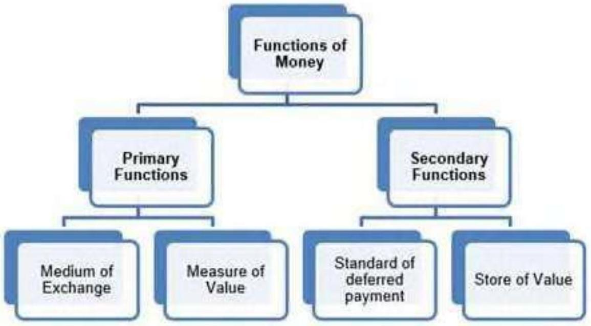

## CHAPTER - 3   MONEY AND BANKING   EXERCISES

Question 1: What is a barter system? What are its drawbacks?
Answer:
Barter system is a system in which goods are exchange for goods. Suppose I have 1 kg of rice and I need 2 metres of cloth then I first need to find a person who will exchange the rice available with me with cloth. The major drawback of barter system is this double coincidence. The other drawbacks are - lack of common unit of value, store of value, and standard of deferred payments

These other disadvantages of barter system are being discussed below -

a) Lack of Common Measure of Value - The absence of a common unit of measurement to evaluate the goods for exchange makes proper accounting impossible.
b) Lack of Store of Value - In barter system it was not possible to store things for future because many of the goods are perishable in nature.
c) Lack of standard for deferred payments - In barter system it was not possible to make future payments or contractual payments.

Question 2: What are the main functions of money? How does money overcome the shortcomings of a barter system?

Answer:
Functions of Money -

a) Primary Functions
(1) Medium of Exchange - It facilitates buying and selling of goods and services so the exchange has become very simple and it can be conducted on a large scale.
(2) Measure of Value - Measurement of the value of goods being exchanged was very difficult in barter system due to lack of common unit of account but this difficulty is removed by the introduction of money. Now every good and services can be valued in terms of money.
b) Secondary Functions
(1) Standard of deferred payment - Money has made deferred payments much easier than before. When we borrow money from someone we will return it along with interest. It was difficult to make such transaction in terms of goods or services in barter system.
(2) Store of Value - Storing wealth is quite easy with introduction of money. It was not convenient to store value in barter system because goods are perishable.

Money overcomes the problem of barter system by replacing the C-C economy with monetary economy (where C-C stands for commodity to commodity).
-In the barter system, the major drawback of barter system was double coincidence of wants. Invention of money has overcome the problem of double coincidence of wants.
-When there was no money, it was difficult to give common unit of value to goods or commodities, but now every goods and services can be measured in terms of money.
-Money facilitates the contractual future payments which were impossible at the time of barter system.
-Money facilitates store of value, which was not possible in barter system due to perishable nature of goods.

Question 3: What is transaction demand for money? How is it related to the value of transactions over a specified period of time?

Answer:
Transaction demand for money is the amount of money required for current or day to day transactions. It is that quantity of money which all the individuals and firms desire to keep in their hand for the purpose of financing their forthcoming expenditure.

There are two motives of holding transaction money - income motive and business motive. Income motive is from the perspective of consumers who want money to meet household expenditure. Business motive is from the perspective of businessman who needs money to carry on their business activities.

The relation between transaction demand for money and value of transactions over a unit period of time is symbolized by

$$
\begin{aligned}
& \mathrm{M}_{\mathrm{T}}^{\mathrm{D}}=\mathrm{KT} \\
& 1 / \mathrm{K} \mathrm{M}_{\mathrm{T}}^{\mathrm{D}}=\mathrm{T}
\end{aligned}
$$

$1 / \mathrm{K}=\mathrm{v}=$ velocity of circulation of money
$\mathrm{v} \mathrm{M}_{\mathrm{T}}^{\mathrm{D}}=\mathrm{T}$
T = Total value of transactions in the economy over a period of time
K is a positive fraction
$\mathrm{M}^{\mathrm{D}}{ }_{\mathrm{T}}=$ Stock of money people are willing to hold at a particular point of time.

Question 4: Suppose a bond promises Rs 500 at the end of two years with no intermediate return. If the rate of interest is 5 per cent per annum what is the price of the bond?

Answer:
Let price of bond be P

$$
\mathrm{A}=\mathrm{P}\left(1+\frac{\mathrm{r}}{100}\right)^{\mathrm{n}}
$$

Where,

$$
\begin{aligned}
& \text { A }=\text { Amount }=500 \\
& \mathrm{n}=\text { Time }=2 \mathrm{yrs}
\end{aligned}
$$

$\mathrm{r}=$ Rate of Interest $=5 \%$

$$
\begin{aligned}
& 500=P(1+5 / 100)^{2} \\
& 500=P(105 / 100)^{2} \\
& 500=P(21 / 20)^{2} \\
& 500=P(441 / 400) \\
& 500=1.1025 P \\
& P=500 / 1.1025 \\
& P=453.51
\end{aligned}
$$

Question 5: Why is speculative demand for money inversely related to the rate of interest?

Answer:
Speculative demand for money is demand for money as store of wealth. To simplify, Keynes has divided all the assets except money in a single category called bonds. So there are two types of assets money and bonds.

Speculative demand for money is inversely related to the rate of interest. Higher the rate of interest the smaller will be speculative demand for money and vice a versa. Therefore, curve of speculative demand for money is downward sloping to the right.

There are two situations -
-If market rate of interest is very high, everyone expects it to fall in future (that is rise in the price of bond), so they anticipate capital gain from bond holding and people will convert their money into bonds. So the speculative demand for the money will be low.
-If the rate of interest is low, people will expect it to rise in future and the price of bond will fall. Due to which capital loss from bond holding is anticipated and people will convert their bonds into money in order to avoid future loss. Thus speculative demand for money will be high.

Question 6: What is 'liquidity trap'?
Answer:
Liquidity trap is a situation in which speculative demand function is infinitely elastic. It is a situation of very low rate of interest where people expect the interest rate to rise in future and the bond prices to fall. The price of a bond has inverse relationship with market interest rate.
-If the interest rate is very high people expect that it will fall in future and the bond prices will rise, so they purchase more bonds to earn capital gains in future and the speculative demand for money becomes low.
-On the contrary, if the interest rate is low people expect to rise in future and the bond prices to fall, so people sell their bonds to avoid capital loss. In this way the bonds are converted into idle cash balances. This is the extreme case of liquidity trap.
-When interest rates are very low everyone expect it to go up in future and in order to maintain cash balance and to avoid capital loss they sell the bonds. Consequently, the speculative demand for money is infinitely elastic. This situation is called liquidity trap because expansion in money supply gets trapped in the sphere of liquidity trap and therefore cannot affect the rate of interest.

Question 7: What are the alternative definitions of money supply in India?

Answer:
The supply of money means total volume of money held by the public (individuals and firms) at any particular point of time. It is a stock concept as it is concerned with a particular point of time.

Alternative measures of money supply
In India Reserve Bank of India uses four alternative measures of money supply called $\mathrm{M}_{1} \mathrm{M}_{2} \mathrm{M}_{3}$ and $\mathrm{M}_{4}$. Among these $\mathrm{M}_{1}$ is the most commonly used measure of money supply because its components are regarded most liquid assets.

All of these are discussed below

a) $\mathrm{M}_{1}=\mathrm{C}+\mathrm{DD}+\mathrm{OD}$.

C denotes currency held by public

DD denotes demand deposits in banks and
OD stands for other deposits in RBI

b) $\mathrm{M}_{2}=\mathrm{M}_{1}+$ saving deposits with post office savings banks
c) $\mathrm{M}_{3}=\mathrm{M}_{1}+$ net time deposits of banks
d) $\mathrm{M}_{4}=\mathrm{M}_{3}+$ total deposits with post office saving organisations excluding NSC

In practice $\mathrm{M}_{1}$ is widely used as measure of money supply and is also called aggregate monetary resource of society.

Question 8: What is a 'legal tender'? What is 'fiat money'?
Answer:
Legal Tender - It is a medium of payment recognised by a legal system to be valid for meeting a financial obligation. Legal tender is any official medium of payment recognized by law that can be used to extinguish a public or private debt, or meet a financial obligation. It is the money issued by monetary authority or government, which cannot be refused by any person in payment for transactions. Government issues an order describing what is money and that becomes legal tender money.

For ex - In India currency notes and coins are legal tender money.
Fiat Money - Fiat is a Latin word, which means 'let there be'. Fiat money refers to any currency lacking intrinsic value (without back up of gold or silver or any other reserves) that is declared legal tender by a government. It is any money backed by the order of government to act as money. People have to accept it in exchange for goods and services and for discharge of debt. It is also called legal tender as it circulates in country on government's order.

Ex - Dollar, they are just pieces of paper printed with symbols - they have no intrinsic value of their own. They only become valuable when the government decrees that they have worth

Question 9: What is High Powered Money?
Answer:
High powered money refers to the money produced by RBI and government of India. It can also be defined as the total liability of monetary authority of the country and RBI.

It consists of -
-Currency in hands of public
-Cash reserve of commercial banks
-Other deposits with RBI
$\mathrm{H}=\mathrm{C}+\mathrm{R}$
Where
H is high powered money
C is currency and
R is cash reserves with commercial banks
High powered money is also called monetary base

Question 10: Explain the functions of a commercial bank.
Answer:
The functions of commercial banks are being discussed below -

1. Accepting Deposits - The banks accept deposits from public, which may be of following types -
a. Saving Deposits - This type of account is for those who need to save a part of their income and earn interest on them. The withdrawals from these accounts are limited. These accounts offer interest on the amount saved.
b. Fixed Deposits - In this account the amount is deposited for a fixed period of time decided in advance. If offers a higher rate of interest than saving account but the depositors do not have withdrawal facility in between. If the deposit is liquidated before maturity period, the rate of interest is reduced.
c. Current Deposits - This type of account is for businesses. There is no restriction on number of deposits and withdrawal and the account holder enjoys overdraft facility too i.e., the withdrawals can be more than the account balance, but such account does not offer any interest.
2. Granting of Loans and Advances - The banks grant loan and advances for various purposes. The loans are given for long period and advances are granted for short term. Interest is charged on these loans and advances. The interest charged here is more than the interest given on deposits.
3. Agency Functions - The banks perform certain agency functions for their customers, these are -
a. Transfer of Funds - The banks provides easy mobility of funds through internet or other bank instruments.
b. Collection of Funds - The bank collects the money for its customers through cheque or bill.
c. Periodic Payments - On standing instructions of the customer, banks make payment of loan, credit cards, bills, etc.
d. Periodic Collections - The bank collects salary, pension, dividend, premium etc. on behalf of the customer.
e. Other Agency Functions - The banks perform various agency functions like trustee, executor, etc.
4. Discounting Bills of Exchange - The Banks performs this function for the businesses. It discounts the B/R and provides immediate finance to the businessman.
5. Credit Creation - The Banks create credit by using the demand deposits and play a big role in economic development of the country.
6. Other Functions - The Banks performs following functions also -
a. Issue of Drafts and Letter of Credit
b. Locker Facility
c. Underwriting of Shares
d. Dealing in Foreign Exchange
e. Social Welfare Programmes

Question 11: What is money multiplier? How will you determine its value? What ratios play an important role in the determination of the value of the money multiplier?

Answer:
Money multiplier or credit multiplier indicates the maximum amount of additional money that can be legally created by the commercial banks.

The value of money multiplier $=1 / \mathrm{LRR}$
Where
LRR is Legal Reserve Ratio
Legal Reserve Ratio (LRR) is the reserve required to be maintained by the commercial banks as a percentage of their demand deposits.

There are two more ratios which play an important role in the determination of the value of money multiplier, they are cash reserve ratio and cash deposit ratio.
-The higher will be the CRR, the lower will be the volume of credit creation and vice-versa
-CDR is the ratio between additional money released by RBI and received by public is actually deposited into banks.

Question 12: What are the instruments of monetary policy of RBI? How does RBI stabilize money supply against exogenous shocks?

Answer:
The monetary policy or credit policy of RBI involves two instruments qualitative and quantitative. Both of them are being discussed below -

1) Quantitative measures include -
i) Bank Rate: Bank rate is the rate at which Central Bank (RBI) provides loan to the commercial bank. The RBI controls money supply through bank rate in given manner - Increasing the bank rate will make loans expensive for commercial banks and therefore they will increase the rate of lending and the public capacity to take credit will fall and vice-versa.
ii) Open Market Operations (OMO): Open market operation means buying and selling securities in open market so as to affect the supply of money in the economy the selling of securities by RBI will wipe out extra cash balance on economy and therefore the money supply will be Limited whereas buying securities by RBI will pump additional money in the economy and the money supply will increase.
iii) Variable Reserve Ratios: The Reserve Bank uses two types of reserve ratio to regulate the money supply - the Statutory Liquidity Ratio (SLR) and the Cash Reserve Ratio (CRR). SLR refers to the minimum percentage of assets to be maintained with RBI are there in fixed or liquid form. If SLR is increased the credit flow will reduce and vice a versa. CRR refers to the minimum amount of fund that has to be maintained by commercial bank with RBI in form of deposit. If CRR will be increased
then the commercial banks will have less money to lend and thus the money supply will decrease and vice-a-versa.
2) Qualitative measures include -
i) Margin Requirements: Commercial banks grant loan on the basis of the value of security being mortgage, so the banks keep a margin which is the difference between market value of the security mortgaged and the loan value. If the Central Bank decides to restrict flow of money it raises the margin requirement of loan and vice versa.
ii) Selective credit control: Selective credit control: It is an instrument of monetary policy that affects the flow of credit to a particular sector positively and negatively. The positive aspect is concerned with increased flow of credit to the priority sector whereas negative aspect is to restrict credit to a particular sector.
iii) Moral Suasion: It is a persuasion technique followed by Central Bank to pressurize the commercial banks to abide by the monetary policy, it involves meetings, seminars, speeches, etc.

Question 13: Do you consider a commercial bank 'creator of money' in the economy?

Answer:
The primary function of commercial banks is money creation or credit creation in an economy. It is assumed that the depositors would not be withdrawing all of their funds at a particular time. They have the capacity to generate credit through demand deposits. These demand deposits make credit more than the initial deposit.

For example, let us assume that the entire commercial banking system is one unit and call it Bank. The reserve ratio for the bank is $10 \%$. Assuming that there is no leakage of cash and all transactions are cheque transaction. A deposits rupee 1000 in bank, the bank will keep 100 as cash reserve and
will lend 900 Mr. B. Mr. B uses the money to buy good from C who deposits the same into Bank now the bank will keep the reserve ratio of 10\% and given new loan of 810, and so on.

This is presented by the following table.

| ↓ Deposit ↓ |  |  |  |  |  |
| :--- | :--- | :--- | :--- | :--- | :--- |
| CRR | v | Loan | Deposit | Loan | Reserve |
| 100 | 1000 | 900 | 1000 | 900 | 100 |
| 90 | 900 | 810 | 1900 | 1710 | 190 |
| 81 | 810 | 729 | 2710 | 2429 | 271 |
| 73 | 729 | 656 | 3439 | 3085 | 344 |
|  |  |  |  |  |  |
|  |  |  |  |  |  |
|  |  |  |  |  |  |
|  |  |  |  |  |  |
|  |  |  |  |  |  |
| Total |  |  | 10000 | 9000 | 1000 |

All amounts are rounded off to the nearest rupee
The credit multiplier is given by $1 / \mathrm{CRR}=1000(1 / 10 \%)=10000$
Thus, with a cash reserve of $10 \%$., a deposit of Rs. 1,000 results in a Rs. 10,000 increase in money supply.

Question 14: What role of RBI is known as 'lender of last resort'?
Answer:
When a commercial bank faces financial crisis and fails to obtain funds from other sources then the central bank plays a vital role of lender of last resort. It provides the financial assistance in form of credit. This role of Central Bank saves the commercial bank from bankruptcy. Thus the
central bank plays the role of guarantor for the commercial banks and maintains sound and healthy banking system in the economy.

Through this role, the central bank ensures that

- The banking system of the country does not suffer from any setback
- The money market remains stable
