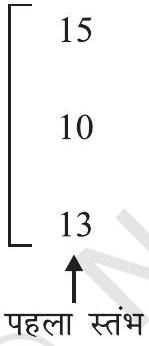
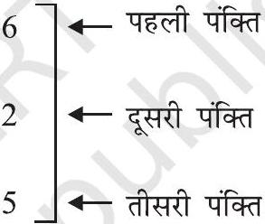
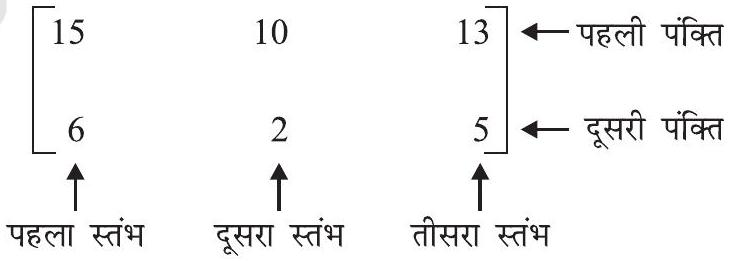

## आव्यूह (Matrices)

- The essence of mathematics lies in its freedom - CANTOR -

## $3.1$ भूमिका (Introduction)

गणित की विविध शाखाओं में आव्यूह के ज्ञान की आवश्यकता पड़ती है। आव्यूह, गणित के सर्वाधिक शक्तिशाली साधनों में से एक है। अन्य सीधी-सादी विधियों की तुलना में यह गणितीय साधन हमारे कार्य को काफी हद तक सरल कर देता है। रैखिक समीकरणों के निकाय को हल करने के लिए संक्षिप्त तथा सरल विधियाँ प्राप्त करने के प्रयास के परिणामस्वरूप आव्यूह की संकल्पना का विकास हुआ। आव्यूहों को केवल रैखिक समीकरणों के निकाय के गुणांकों को प्रकट करने के लिए ही नहीं प्रयोग किया जाता है, अपितु आव्यूहों की उपयोगिता इस प्रयोग से कहीं अधिक है। आव्यूह संकेतन तथा संक्रियाओं का प्रयोग व्यक्तिगत कंप्यूटर के लिए इलेक्ट्रानिक स्प्रेडशीट प्रोग्रामों (Electronic Spreadsheet Programmes) में किया जाता है, जिसका प्रयोग, क्रमशः वाणिज्य तथा विज्ञान के विभिन्न क्षेत्रों में होता है, जैसे, बजट (Budgeting), विक्रय बहिर्वेशन (Sales Projection) , लागत आकलन (Cost Estimation), किसी प्रयोग के परिणामों का विश्लेषण इत्यादि। इसके अतिरिक्त अनेक भौतिक संक्रियाएँ जैसे आवर्धन (Magnification), घूर्णन (Rotation) तथा किसी समतल द्वारा परावर्तन (Reflection) को आव्यूहों द्वारा गणितीय ढंग से निरूपित किया जा सकता है। आव्यूहों का प्रयोग गूढ़लेखिकी (Cryptography) में भी होता है। इस गणितीय साधन का प्रयोग न केवल विज्ञान की ही कुछ शाखाओं तक सीमित है, अपितु इसका प्रयोग अनुवंशिकी, अर्थशास्त्र, आधुनिक मनोविज्ञान तथा औद्यौगिक प्रबंधन में भी किया जाता है।

इस अध्याय में आव्यूह तथा आव्यूह बीजगणित (Matrix algebra) के आधारभूत सिद्धांतों से अवगत होना, हमें रुचिकर लगेगा।

## $3.2$ आव्यूह (Matrix)

मान लीजिए कि हम यह सूचना व्यक्त करना चाहते हैं कि राधा के पास $15$ पुस्तिकाएँ हैं। इसे हम [15] रूप में, इस समझ के साथ व्यक्त कर सकते हैं, कि [] के अंदर लिखित संख्या राधा के पास पुस्तिकाओं की संख्या है। अब यदि हमें यह व्यक्त करना है कि राधा के पास $15$ पुस्तिकाएँ तथा $6$ कलमें हैं, तो इसे हम [15 6] प्रकार से, इस समझ के साथ व्यक्त कर सकते हैं कि [] के अंदर की प्रथम प्रविष्टि राधा के पास की पुस्तिकाओं की संख्या, जबकि द्वितीय प्रविष्टि राधा के पास कलमों

की संख्या दर्शाती है। अब मान लीजिए कि हम राधा तथा उसके दो मित्रों फौजिया तथा सिमरन के पास की पुस्तिकाओं तथा कलमों की निम्नलिखित सूचना को व्यक्त करना चाहते हैं:

| राधा के पास | $15$ | पुस्तिकाएँ तथा | $6$ कलम हैं, |
| :--- | :--- | :--- | :--- |
| फौजिया के पास | $10$ | पुस्तिकाएँ तथा | $2$ कलम हैं, |
| सिमरन के पास | $13$ | पुस्तिकाएँ तथा | $5$ कलम हैं, |

अब इसे हम सारणिक रूप में निम्नलिखित प्रकार से व्यवस्थित कर सकते हैं:

|  | पुस्तिका | कलम |
| :--- | :--- | :--- |
| राधा | $15$ | $6$ |
| फौजिया | $10$ | $2$ |
| सिमरन | $13$ | $5$ |

इसे निम्नलिखित ढंग से व्यक्त कर सकते हैं:

|  |    ↑   दूसरा स्तंभ |
| :--- | :--- |

अथवा

|  | राधा | फौजिया | सिमरन |
| :--- | :--- | :--- | :--- |
| पुस्तिका | $15$ | $10$ | $13$ |
| कलम | $6$ | $2$ | $5$ |

जिसे निम्नलिखित ढंग से व्यक्त कर सकते हैं:

पहली प्रकार की व्यवस्था में प्रथम स्तंभ की प्रविष्टियाँ क्रमशः राधा, फौजिया तथा सिमरन के पास पुस्तिकाओं की संख्या प्रकट करती हैं और द्वितीय स्तंभ की प्रविष्टियाँ क्रमशः राधा, फौजिया तथा

सिमरन के पास कलमों की संख्या प्रकट करती हैं। इसी प्रकार, दूसरी प्रकार की व्यवस्था में प्रथम पंक्ति की प्रविष्टियाँ क्रमशः राधा, फौजिया तथा सिमरन के पास पुस्तिकाओं की संख्या प्रकट करती है। द्वितीय पंक्ति की प्रविष्टियाँ क्रमशः राधा, फौजिया तथा सिमरन के पास कलमों की संख्या प्रकट करती हैं। उपर्युक्त प्रकार की व्यवस्था या प्रदर्शन को आव्यूह कहते हैं। औपचारिक रूप से हम आव्यूह को निम्नलिखित प्रकार से परिभाषित करते हैं:

परिभाषा $1$ आव्यूह संख्याओं या फलनों का एक आयताकार क्रम-विन्यास है। इन संख्याओं या फलनों को आव्यूह के अवयव अथवा प्रविष्टियाँ कहते हैं।

आव्यूह को हम अंग्रेजी वर्णमाला के बड़े (Capital) अक्षरों द्वारा व्यक्त करते हैं। आव्यूहों के कुछ उदाहरण निम्नलिखित हैं:

$$
\mathrm{A}=\left[\begin{array}{cc}
-2 & 5 \\
0 & \sqrt{5} \\
3 & 6
\end{array}\right], \mathrm{B}=\left[\begin{array}{ccc}
2+i & 3 & -\frac{1}{2} \\
3.5 & -1 & 2 \\
\sqrt{3} & 5 & \frac{5}{7}
\end{array}\right], \mathrm{C}=\left[\begin{array}{ccc}
1+x & x^{3} & 3 \\
\cos x & \sin x+2 & \tan x
\end{array}\right]
$$

उपर्युक्त उदाहरणों में क्षैतिज रेखाएँ आव्यूह की पंक्तियाँ (Rows) ओर ऊर्ध्व रेखाएँ आव्यूह के स्तंभ (Columns) कहलाते हैं। इस प्रकार A में $3$ पंक्तियाँ तथा $2$ स्तंभ हैं और B में $3$ पंक्तियाँ तथा $3$ स्तंभ जबकि C में $2$ पंक्तियाँ तथा $3$ स्तंभ हैं।

### 3.2.1 आव्यूह की कोटि (Order of a matrix)

$m$ पंक्तियों तथा $n$ स्तंभों वाले किसी आव्यूह को $m \times n$ कोटि (order) का आव्यूह अथवा केवल $m \times n$ आव्यूह कहते हैं । अतएव आव्यूहों के उपर्युक्त उदाहरणों के संदर्भ में A , एक $3 \times 2$ आव्यूह, $B$ एक $3 \times 3$ आव्यूह तथा $C$, एक $2 \times 3$ आव्यूह हैं। हम देखते हैं कि $A$ में $3 \times 2=6$ अवयव है और B तथा C में क्रमशः $9$ तथा $6$ अवयव हैं।

सामान्यतः, किसी $m \times n$ आव्यूह का निम्नलिखित आयाताकार क्रम-विन्यास होता है:

$$
\left[\begin{array}{ccccc}
a_{11} & a_{12} & a_{13} & \cdots & a_{1 j}
\end{array} \cdots a_{1 n} a_{i n} a_{22} \quad a_{23} \cdots a_{2 j} \cdots a_{2 n}\right.
$$

अथवा $\mathrm{A}=\left[a_{i j}\right]_{m \times n}, 1 \leq i \leq m, 1 \leq j \leq n$ जहाँ $i, j \in \mathbf{N}$

इस प्रकार $i$ वीं पंक्ति के अवयव $a_{i 1}, a_{i 2}, a_{i 3}, \ldots, a_{i n}$ हैं, जबकि $j$ वें स्तंभ के अवयव $a_{1 j}, a_{2 j}$, $a_{3 j}, \ldots, a_{m j}$ हैं।

सामान्यतः $a_{i j}$, iवीं पंक्ति और $j$ वें स्तंभ में आने वाला अवयव होता है। हम इसे A का $(i, j)$ वाँ अवयव भी कह सकते हैं। किसी $m \times n$ आव्यूह में अवयवों की संख्या $m n$ होती है।
-टिप्पणी इस अध्याय में,

1. हम किसी $m \times n$ कोटि के आव्यूह को प्रकट करने के लिए, संकेत $\mathrm{A}=\left[a_{i j}\right]_{m \times n}$ का प्रयोग करेंगे।
2. हम केवल ऐसे आव्यूहों पर विचार करेंगे, जिनके अवयव वास्तविक संख्याएँ हैं अथवा वास्तविक मानों को ग्रहण करने वाले फलन हैं।

हम एक समतल के किसी बिंदु $(x, y)$ को एक आव्यूह (स्तंभ अथवा पंक्ति) द्वारा प्रकट कर सकते हैं, जैसे $\left[\begin{array}{l}x \\ y\end{array}\right]$ (अथवा $[x, y]$ )से, उदाहरणार्थ, बिंदु $\mathrm{P}(0,1)$, आव्यूह निरूपण में $\mathrm{P}=\left[\begin{array}{l}0 \\ 1\end{array}\right]$ या [01] द्वारा प्रकट किया जा सकता है।

ध्यान दीजिए कि इस प्रकार हम किसी बंद रैखिक आकृति के शीर्षों को एक आव्यूह के रूप में लिख सकते हैं। उदाहरण के लिए एक चतुर्भज ABCD पर विचार कीजिए, जिसके शीर्ष क्रमश: $\mathrm{A}(1,0), \mathrm{B}(3,2), \mathrm{C}(1,3)$, तथा $\mathrm{D}(-1,2)$ हैं।
अब, चतुर्भुज ABCD आव्यूह रूप में निम्नलिखित प्रकार से निरूपित किया जा सकता है:

$$
\mathrm{X}=\begin{array}{cccc}
\mathrm{A} & \mathrm{~B} & \mathrm{C} & \mathrm{D} \\
{\left[\begin{array}{rrrr}
1 & 3 & 1 & -1 \\
0 & 2 & 3 & 2
\end{array}\right]_{2 \times 4}}
\end{array} \text { या }
$$

$$
\mathrm{Y}=\begin{gathered}
\mathrm{A} \\
\mathrm{~B} \\
\mathrm{C} \\
\mathrm{D}
\end{gathered}\left[\begin{array}{rr}
1 & 0 \\
3 & 2 \\
1 & 3 \\
-1 & 2
\end{array}\right]_{4 \times 2}
$$

अतः आव्यूहों का प्रयोग किसी समतल में स्थित ज्यामितीय आकृतियों के शीर्षों को निरूपित करने के लिए किया जा सकता है।
आइए अब हम कुछ उदाहरणों पर विचार करें।
उदाहरण $1$ तीन फैक्ट्रियों I, II तथा III में पुरुष तथा महिला कर्मियों से संबंधित निम्नलिखित सूचना पर विचार कीजिए:

|  | पुरुष कर्मी | महिला कर्मी |
| :--- | :--- | :--- |
| I | $30$ | $25$ |
| II | $25$ | $31$ |
| III | $27$ | $26$ |

उपर्युक्त सूचना को एक $3 \times 2$ आव्यूह में निरूपित कीजिए। तीसरी पंक्ति और दूसरे स्तंभ वाली प्रविष्टि क्या प्रकट करती है?

हल प्रदत्त सूचना को $3 \times 2$ आव्यूह के रूप में निम्नलिखित प्रकार से निरूपित किया जा सकता है:

$$
A=\left[\begin{array}{ll}
30 & 25 \\
25 & 31 \\
27 & 26
\end{array}\right]
$$

तीसरी पंक्ति और दूसरे स्तंभ की प्रविष्टि फैक्ट्री-III कारखाने में महिला कार्यकर्ताओं की संख्या प्रकट करती है।

उदाहरण $2$ यदि किसी आव्यूह में $8$ अवयव हैं, तो इसकी संभव कोटियाँ क्या हो सकती हैं?
हल हमें ज्ञात है कि, यदि किसी आव्यूह की कोटि $m \times n$ है तो इसमें $m n$ अवयव होते हैं। अतएव $8$ अवयवों वाले किसी आव्यूह के सभी संभव कोटियाँ ज्ञात करने के लिए हम प्राकृत संख्याओं के उन सभी क्रमित युग्मों को ज्ञात करेंगे जिनका गुणनफल $8$ है।
अतः सभी संभव क्रमित युग्म $(1,8),(8,1),(4,2),(2,4)$ हैं।
अतएव संभव कोटियाँ $1 \times 8,8 \times 1,4 \times 2,2 \times 4$ हैं।
उदाहरण $3$ एक ऐसे $3 \times 2$ आव्यूह की रचना कीजिए, जिसके अवयव $a_{i j}=\frac{1}{2}|i-3 j|$ द्वारा प्रदत्त हैं।

हल एक $3 \times 2$ आव्यूह, सामान्यतः इस प्रकार होता है: $\mathrm{A}=\left[\begin{array}{ll}a_{11} & a_{12} \\ a_{21} & a_{22} \\ a_{31} & a_{32}\end{array}\right]$
अब,

$$
a_{i j}=\frac{1}{2}|i-3 j|, i=1,2,3 \text { तथा } j=1,2
$$

इसलिए

$$
a_{11}=\frac{1}{2}|1-3.1|=1
$$

$$
a_{12}=\frac{1}{2}|1-3.2|=\frac{5}{2}
$$

$$
\begin{aligned}
& a_{21}=\frac{1}{2}|2-3.1|=\frac{1}{2} \\
& a_{31}=\frac{1}{2}|3-3.1|=0
\end{aligned}
$$

$$
\begin{aligned}
& a_{22}=\frac{1}{2}|2-3.2|=2 \\
& a_{32}=\frac{1}{2}|3-3.2|=\frac{3}{2}
\end{aligned}
$$

अतः अभीष्ट आव्यूह $\mathrm{A}=\left[\begin{array}{cc}1 & \frac{5}{2} \\ \frac{1}{2} & 2 \\ 0 & \frac{3}{2}\end{array}\right]$ है।

## $3.3$ आव्यूहों के प्रकार (Types of Matrices)

इस अनुच्छेद में हम विभिन्न प्रकार के आव्यूहों की परिचर्चा करेंगे।

(i) स्तंभ आव्यूह (Column matrix)
एक आव्यूह, स्तंभ आव्यूह कहलाता है, यदि उसमें केवल एक स्तंभ होता है। उदाहरण के लिए $\mathrm{A}=\left[\begin{array}{c}0 \\ \sqrt{3} \\ -1 \\ 1 / 2\end{array}\right], 4 \times 1$ कोटि का एक स्तंभ आव्यूह है। व्यापक रूप से, $\mathrm{A}=\left[a_{i j}\right]_{m \times 1}$ एक $m \times 1$ कोटि का स्तंभ आव्यूह है।
(ii) पंक्ति आव्यूह (Row matrix)
एक आव्यूह, पंक्ति आव्यूह कहलाता है, यदि उसमें केवल एक पंक्ति होती है। उदाहरण के लिए $\mathrm{B}=\left[-\frac{1}{2} \sqrt{5} \quad 2 \quad 3\right]_{1 \times 4}, 1 \times 4$ कोटि का एक पंक्ति आव्यूह है। व्यापक रूप से, $\mathrm{B}=\left[b_{i j}\right]_{1 \times n}$ एक $1 \times n$ कोटि का पंक्ति आव्यूह है।
(iii) वर्ग आव्यूह (Square matrix)
एक आव्यूह जिसमें पंक्तियों की संख्या स्तंभों की संख्या के समान होती है, एक वर्ग आव्यूह कहलाता है। अतः एक $m \times n$ आव्यूह, वर्ग आव्यूह कहलाता है, यदि $m=n$ और उसे कोटि

' $n$ ' का वर्ग आव्यूह कहते हैं। उदाहरण के लिए $\mathrm{A}=\left[\begin{array}{ccc}3 & -1 & 0 \\ \frac{3}{2} & 3 \sqrt{2} & 1 \\ 4 & 3 & -1\end{array}\right]$ एक $3$ कोटि का वर्ग
आव्यूह है। व्यापक रूप से $\mathrm{A}=\left[a_{i j}\right]_{m \times m}$ एक $m$ कोटि का वर्ग आव्यूह है।
-टिप्पणी यदि $\mathrm{A}=\left[a_{i j}\right]$ एक $n$ कोटि का वर्ग आव्यूह है, तो अवयवों (प्रविष्टियाँ) $a_{11}, a_{22}, \ldots, a_{n n}$ को आव्यूह A के विकर्ण के अवयव कहते हैं।

अत: यदि $\mathrm{A}=\left[\begin{array}{ccc}1 & -3 & 1 \\ 2 & 4 & -1 \\ 3 & 5 & 6\end{array}\right]$ है तो A के विकर्ण के अवयव $1,4,6$ हैं।

(iv) विकर्ण आव्यूह (Diagonal matrix)
एक वर्ग आव्यूह $\mathrm{B}=\left[b_{i j}\right]_{m \times m}$ विकर्ण आव्यूह कहलाता है, यदि विकर्ण के अतिरिक्त इसके अन्य सभी अवयव शून्य होते हैं अर्थात्, एक आव्यूह $\mathrm{B}=\left[b_{i j}\right]_{m \times m}$ विकर्ण आव्यूह कहलाता है, यदि $b_{i j}=0$, जब $i \neq j$ हो।
उदाहरणार्थ $\mathrm{A}=[4], \mathrm{B}=\left[\begin{array}{cc}-1 & 0 \\ 0 & 2\end{array}\right], \mathrm{C}=\left[\begin{array}{ccc}-1.1 & 0 & 0 \\ 0 & 2 & 0 \\ 0 & 0 & 3\end{array}\right]$, क्रमशः कोटि 1, $2$ तथा $3$ के विकर्ण आव्यूह हैं।
(v) अदिश आव्यूह (Scalar matrix)
एक विकर्ण आव्यूह, अदिश आव्यूह कहलाता है, यदि इसके विकर्ण के अवयव समान होते हैं, अर्थात्, एक वर्ग आव्यूह $\mathrm{B}=\left[b_{i j}\right]_{n \times n}$ अदिश आव्यूह कहलाता है, यदि
$$
\begin{aligned}
& b_{i j}=0, \quad \text { जब } i \neq j \\
& b_{i j}=k, \quad \text { जब } i=j, \text { जहाँ } k \text { कोई अचर है। }
\end{aligned}
$$
उदाहरणार्थ,
$\mathrm{A}=[3], \quad \mathrm{B}=\left[\begin{array}{cc}-1 & 0 \\ 0 & -1\end{array}\right], \quad \mathrm{C}=\left[\begin{array}{ccc}\sqrt{3} & 0 & 0 \\ 0 & \sqrt{3} & 0 \\ 0 & 0 & \sqrt{3}\end{array}\right]$ क्रमश:
कोटि 1, $2$ तथा $3$ के अदिश आव्यूह हैं।

(vi) तत्समक आव्यूह (Identity matrix)
एक वर्ग आव्यूह, जिसके विकर्ण के सभी अवयव $1$ होते हैं तथा शेष अन्य सभी अवयव शून्य होते हैं, तत्समक आव्यूह कहलाता है। दूसरे शब्दों में, वर्ग आव्यूह $\mathrm{A}=\left[a_{i j}\right]_{n \times n}$ एक तत्समक आव्यूह है, यदि $a_{i j}= \begin{cases}1 & \text { यदि } \quad i=j \\ 0 & \text { यदि } \quad i \neq j\end{cases}$
हम, $n$ कोटि के तत्समक आव्यूह को $\mathrm{I}_{n}$ द्वारा निरूपित करते हैं। जब संदर्भ से कोटि स्पष्ट होती है, तब इसे हम केवल I से प्रकट करते हैं।
उदाहरण के लिए [1], $\left[\begin{array}{ll}1 & 0 \\ 0 & 1\end{array}\right],\left[\begin{array}{lll}1 & 0 & 0 \\ 0 & 1 & 0 \\ 0 & 0 & 1\end{array}\right]$ क्रमशः कोटि $1,2$ तथा $3$ के तत्समक आव्यूह हैं।
ध्यान दीजिए कि यदि $k=1$ हो तो, एक अदिश आव्यूह, तत्समक आव्यूह होता है, परंतु प्रत्येक तत्समक आव्यूह स्पष्टतया एक अदिश आव्यूह होता है।
(vii) शून्य आव्यूह (Zero matrix)
एक आव्यूह, शून्य आव्यूह अथवा रिक्त आव्यूह कहलाता है, यदि इसके सभी अवयव शून्य होते हैं।
उदाहरणार्थ, $[0],\left[\begin{array}{ll}0 & 0 \\ 0 & 0\end{array}\right],\left[\begin{array}{lll}0 & 0 & 0 \\ 0 & 0 & 0\end{array}\right],[0,0]$ सभी शून्य आव्यूह हैं। हम शून्य आव्यूह को
O द्वारा निरूपित करते हैं। इनकी कोटियाँ, संदर्भ द्वारा स्पष्ट होती हैं।

### 3.3.1 आव्यूहों की समानता (Equality of matrices)

परिभाषा $2$ दो आव्यूह $\mathrm{A}=\left[a_{i j}\right]$ तथा $\mathrm{B}=\left[b_{i j}\right]$ समान कहलाते हैं, यदि

(i) वे समान कोटियों के होते हों, तथा
(ii) A का प्रत्येक अवयव, B के संगत अवयव के समान हो, अर्थात् $i$ तथा $j$ के सभी मानों के लिए $a_{i j}=b_{i j}$ हों
उदाहरण के लिए, $\left[\begin{array}{ll}2 & 3 \\ 0 & 1\end{array}\right]$ तथा $\left[\begin{array}{ll}2 & 3 \\ 0 & 1\end{array}\right]$ समान आव्यूह हैं किंतु $\left[\begin{array}{ll}3 & 2 \\ 0 & 1\end{array}\right]$ तथा $\left[\begin{array}{ll}2 & 3 \\ 0 & 1\end{array}\right]$ समान

आव्यूह नहीं हैं। प्रतीकात्मक रूप में, यदि दो आव्यूह A तथा B समान हैं, तो हम इसे $\mathrm{A}=\mathrm{B}$ लिखते हैं।

यदि $\left[\begin{array}{ll}x & y \\ z & a \\ b & c\end{array}\right]=\left[\begin{array}{cc}-1.5 & 0 \\ 2 & \sqrt{6} \\ 3 & 2\end{array}\right]$, तो $x=-1.5, y=0, z=2, a=\sqrt{6}, b=3, c=2$
उदाहरण $4$ यदि $\left[\begin{array}{ccc}x+3 & z+4 & 2 y-7 \\ -6 & a-1 & 0 \\ b-3 & -21 & 0\end{array}\right]=\left[\begin{array}{ccc}0 & 6 & 3 y-2 \\ -6 & -3 & 2 c+2 \\ 2 b+4 & -21 & 0\end{array}\right]$
हो तो $a, b, c, x, y$ तथा $z$ के मान ज्ञात कीजिए।
हल चूँकि प्रदत्त आव्यूह समान हैं, इसलिए इनके संगत अवयव भी समान होंगे। संगत अवयवों की तुलना करने पर हमें निम्नलिखित परिणाम प्राप्त होता है:

$$
\begin{array}{llr}
x+3=0, & z+4=6, & 2 y-7=3 y-2 \\
a-1=-3, & 0=2 c+2 & b-3=2 b+4,
\end{array}
$$

इन्हें सरल करने पर हमें प्राप्त होता है कि

$$
a=-2, b=-7, c=-1, x=-3, y=-5, z=2
$$

उदाहरण $5$ यदि $\left[\begin{array}{cc}2 a+b & a-2 b \\ 5 c-d & 4 c+3 d\end{array}\right]=\left[\begin{array}{cc}4 & -3 \\ 11 & 24\end{array}\right]$ हो तो $a, b, c$, तथा $d$ के मान ज्ञात कीजिए।
हल दो आव्यूहों की समानता की परिभाषा द्वारा, संगत अवयवों को समान रखने पर हमें प्राप्त होता है कि

$$
\begin{array}{rlrl}
2 a+b & =4 & 5 c-d & =11 \\
a-2 b & =-3 & 4 c+3 d & =24
\end{array}
$$

इन समीकरणों को सरल करने पर $a=1, b=2, c=3$ तथा $d=4$ प्राप्त होता है।

## प्रश्नावली $3.1$

1. आव्यूह $\mathrm{A}=\left[\begin{array}{cccc}2 & 5 & 19 & -7 \\ 35 & -2 & \frac{5}{2} & 12 \\ \sqrt{3} & 1 & -5 & 17\end{array}\right]$, के लिए ज्ञात कीजिए:
(i) आव्यूह की कोटि
(ii) अवयवों की संख्या
(iii) अवयव $a_{13}, a_{21}, a_{33}, a_{24}, a_{23}$
2. यदि किसी आव्यूह में $24$ अवयव हैं तो इसकी संभव कोटियाँ क्या हैं? यदि इसमें $13$ अवयव हों तो कोटियाँ क्या होंगी?
3. यदि किसी आव्यूह में $18$ अवयव हैं तो इसकी संभव कोटियाँ क्या हैं? यदि इसमें $5$ अवयव हों तो क्या होगा?
4. एक $2 \times 2$ आव्यूह $\mathrm{A}=\left[a_{i j}\right]$ की रचना कीजिए जिसके अवयव निम्नलिखित प्रकार से प्रदत्त हैं
(i) $a_{i j}=\frac{(i+j)^{2}}{2}$
(ii) $a_{i j}=\frac{i}{j}$
(iii) $a_{i j}=\frac{(i+2 j)^{2}}{2}$
5. एक $3 \times 4$ आव्यूह की रचना कीजिए जिसके अवयव निम्नलिखित प्रकार से प्राप्त होते हैं:
(i) $a_{i j}=\frac{1}{2}|-3 i+j|$
(ii) $a_{i j}=2 i-j$
6. निम्नलिखित समीकरणों से $x, y$ तथा $z$ के मान ज्ञात कीजिए:
(i) $\left[\begin{array}{ll}4 & 3 \\ x & 5\end{array}\right]=\left[\begin{array}{ll}y & z \\ 1 & 5\end{array}\right]$
(ii) $\left[\begin{array}{cc}x+y & 2 \\ 5+z & x y\end{array}\right]=\left[\begin{array}{ll}6 & 2 \\ 5 & 8\end{array}\right]$
(iii) $\left[\begin{array}{c}x+y+z \\ x+z \\ y+z\end{array}\right]=\left[\begin{array}{c}9 \\ 5 \\ 7\end{array}\right]$
7. समीकरण $\left[\begin{array}{cc}a-b & 2 a+c \\ 2 a-b & 3 c+d\end{array}\right]=\left[\begin{array}{cc}-1 & 5 \\ 0 & 13\end{array}\right]$ से $a, b, c$ तथा $d$ के मान ज्ञात कीजिए।
8. $\mathrm{A}=\left[a_{i j}\right]_{m \times n}$ एक वर्ग आव्यूह है यदि
(A) $m<n$
(B) $m>n$
(C) $m=n$
(D) इनमें से कोई नहीं
9. $x$ तथा $y$ के प्रदत्त किन मानों के लिए आव्यूहों के निम्नलिखित युग्म समान हैं?
$\left[\begin{array}{cc}3 x+7 & 5 \\ y+1 & 2-3 x\end{array}\right],\left[\begin{array}{cc}0 & y-2 \\ 8 & 4\end{array}\right]$
(A) $x=\frac{-1}{3}, y=7$
(B) ज्ञात करना संभव नहीं है
(C) $y=7, x=\frac{-2}{3}$
(D) $x=\frac{-1}{3}, y=\frac{-2}{3}$.
10. $3 \times 3$ कोटि के ऐसे आव्यूहों की कुल कितनी संख्या होगी जिनकी प्रत्येक प्रविष्टि $0$ या $1$ है?
(A) $27$
(B) $18$
(C) $81$
(D) $512$

## $3.4$ आव्यूहों पर संक्रियाएँ (Operations on Matrices)

इस अनुच्छेद में हम आव्यूहों पर कुछ संक्रियाओं को प्रस्तुत करेंगे जैसे आव्यूहों का योग, किसी आव्यूह का एक अदिश से गुणा, आव्यूहों का व्यवकलन तथा गुणा:

### 3.4.1 आव्यूहों का योग (Addition of matrices)

मान लीजिए कि फातिमा की स्थान A तथा स्थान B पर दो फैक्ट्रियाँ हैं। प्रत्येक फैक्ट्री में लड़कों तथा लड़कियों के लिए, खेल के जूते, तीन भिन्न-भिन्न मूल्य वर्गों, क्रमशः $1,2$ तथा $3$ के बनते हैं। प्रत्येक फैक्ट्री में बनने वाले जूतों की संख्या नीचे दिए आव्यूहों द्वारा निरूपित हैं:

| A पर फैक्ट्री |  | B पर फैक्ट्री |  |
| :--- | :--- | :--- | :--- |
| लड़के | लड़कियाँ | लड़के | लड़कियाँ |
| $1$ $80$ |  | $1$ $2$ $3$$\left[\begin{array}{c}90 \\ 70 \\ 75\end{array}\right.$ | $50$ |
| $275$ | $65$ | $270$ | $55$ |
| $3$ L $90$ | $607.05 .0$ | $3$ □ $75$ | $75$ J |

मान लीजिए कि फातिमा प्रत्येक मूल्य वर्ग में बनने वाले खेल के जूतों की कुल संख्या जानना चाहती हैं। अब कुल उत्पादन इस प्रकार है:
मूल्य वर्ग $1$ : लड़कों के लिए $(80+90)$, लड़कियों के लिए $(60+50)$
मूल्य वर्ग $2$ : लड़कों के लिए $(75+70)$, लड़कियों के लिए $(65+55)$
मूल्य वर्ग $3$ : लड़कों के लिए $(90+75)$, लड़कियों के लिए $(85+75)$
आव्यूह के रूप में इसे इस प्रकार प्रकट कर सकते हैं $\left[\begin{array}{ll}80+90 & 60+50 \\ 75+70 & 65+55 \\ 90+75 & 85+75\end{array}\right]$
यह नया आव्यूह, उपर्युक्त दो आव्यूहों का योगफल है। हम देखते हैं कि दो आव्यूहों का योगफल, प्रदत्त आव्यूहों के संगत अवयवों को जोड़ने से प्राप्त होने वाला आव्यूह होता है। इसके अतिरिक्त, योग के लिए दोनों आव्यूहों को समान कोटि का होना चाहिए।

इस प्रकार, यदि $\mathrm{A}=\left[\begin{array}{lll}a_{11} & a_{12} & a_{13} \\ a_{21} & a_{22} & a_{23}\end{array}\right]$ एक $2 \times 3$ आव्यूह है तथा $\mathrm{B}=\left[\begin{array}{lll}b_{11} & b_{12} & b_{13} \\ b_{21} & b_{22} & b_{23}\end{array}\right]$ एक
अन्य $2 \times 3$ आव्यूह है, तो हम $\mathrm{A}+\mathrm{B}=\left[\begin{array}{lll}a_{11}+b_{11} & a_{12}+b_{12} & a_{13}+b_{13} \\ a_{21}+b_{21} & a_{22}+b_{22} & a_{23}+b_{23}\end{array}\right]$ द्वारा परिभाषित करते हैं।
व्यापक रूप से, मान लीजिए कि $\mathrm{A}=\left[a_{i j}\right]$ तथा $\mathrm{B}=\left[b_{i j}\right]$ दो समान कोटि, $m \times n$ वाले आव्यूह हैं तो A तथा B दोनों आव्यूहों का योगफल, आव्यूह $\mathrm{C}=\left[c_{i j}\right]_{m \times n}$, द्वारा परिभाषित होता है, जहाँ $c_{i j}=a_{i j}+b_{i j}, i$ तथा $j$ के सभी संभव मानों को व्यक्त करता है।

उदाहरण $6 \mathrm{~A}=\left[\begin{array}{ccc}\sqrt{3} & 1 & -1 \\ 2 & 3 & 0\end{array}\right]$ तथा $\mathrm{B}=\left[\begin{array}{ccc}2 & \sqrt{5} & 1 \\ -2 & 3 & \frac{1}{2}\end{array}\right]$ है तो $\mathrm{A}+\mathrm{B}$ ज्ञात कीजिए।
हल क्योंकि A तथा B समान कोटि $2 \times 3$ वाले आव्यूह हैं, इसलिए A तथा B का योग परिभाषित है, और
$\mathrm{A}+\mathrm{B}=\left[\begin{array}{lll}2+\sqrt{3} & 1+\sqrt{5} & 1-1 \\ 2-2 & 3+3 & 0+\frac{1}{2}\end{array}\right]=\left[\begin{array}{ccc}2+\sqrt{3} & 1+\sqrt{5} & 0 \\ 0 & 6 & \frac{1}{2}\end{array}\right]$ द्वारा प्राप्त होता है।

## - टिप्पणी

1. हम इस बात पर बल देते हैं कि यदि A तथा B समान कोटि वाले आव्यूह नहीं हैं तो $\mathrm{A}+\mathrm{B}$ परिभाषित नहीं है। उदाहरणार्थ $\mathrm{A}=\left[\begin{array}{ll}2 & 3 \\ 1 & 0\end{array}\right], \mathrm{B}=\left[\begin{array}{lll}1 & 2 & 3 \\ 1 & 0 & 1\end{array}\right]$, तो $\mathrm{A}+\mathrm{B}$ परिभाषित नहीं है।
2. हम देखते हैं कि आव्यूहों का योग, समान कोटि वाले आव्यूहों के समुच्चय में द्विआधारी संक्रिया का एक उदाहरण है।

3.4.2 एक आव्यूह का एक अदिश से गुणन (Multiplication of a matrix by a scalar) अब मान लीजिए कि फ़ातिमा ने A पर स्थित फैक्ट्री में सभी मूल्य वर्ग के उत्पादन को दो गुना कर दिया है (संदर्भ 3.4.1)

A पर स्थित फैक्ट्री में उत्पादन की संख्या नीचे दिए आव्यूह में दिखलाई गई है।

$$
\left.\begin{array}{c}
\text { लड़के } \\
1 \\
2 \\
3
\end{array} \quad \begin{array}{c}
\text { लड़कियाँ } \\
{\left[\begin{array}{c}
80 \\
75 \\
90
\end{array}\right.}
\end{array} \quad \begin{array}{c}
60 \\
65 \\
85
\end{array}\right] .
$$

A पर स्थित फैक्ट्री में उत्पादित नयी (बदली हुई) संख्या अग्रलिखित है:

लड़के लड़कियाँ

$$
\begin{aligned}
& 1 \\
& 2 \\
& 3\left[\begin{array}{ll}
2 \times 80 & 2 \times 60 \\
2 \times 75 & 2 \times 65 \\
2 \times 90 & 2 \times 85
\end{array}\right]
\end{aligned}
$$

इसे आव्यूह रूप में, $\left[\begin{array}{ll}160 & 120 \\ 150 & 130 \\ 180 & 170\end{array}\right]$ प्रकार से निरूपित कर सकते हैं। हम देखते हैं कि यह नया आव्यूह पहले आव्यूह के प्रत्येक अवयव को $2$ से गुणा करने पर प्राप्त होता है।

व्यापक रूप में हम, किसी आव्यूह के एक अदिश से गुणन को, निम्नलिखित प्रकार से परिभाषित करते हैं। यदि $\mathrm{A}=\left[a_{i j}\right]_{m \times n}$ एक आव्यूह है तथा $k$ एक अदिश है तो $k \mathrm{~A}$ एक ऐसा आव्यूह है जिसे A के प्रत्येक अवयव को अदिश $k$ से गुणा करके प्राप्त किया जाता है।

दूसरे शब्दों में, $k \mathrm{~A}=k\left[a_{i j}\right]_{m \times n}=\left[k\left(a_{i j}\right)\right]_{m \times n}$, अर्थात् $k \mathrm{~A}$ का $(i, j)$ वाँ अवयव, $i$ तथा $j$ के हर संभव मान के लिए, $k a_{i j}$ होता है।

उदाहरण के लिए, यदि $\mathrm{A}=\left[\begin{array}{ccc}3 & 1 & 1.5 \\ \sqrt{5} & 7 & -3 \\ 2 & 0 & 5\end{array}\right]$ है तो

$$
3 \mathrm{~A}=3\left[\begin{array}{ccc}
3 & 1 & 1.5 \\
\sqrt{5} & 7 & -3 \\
2 & 0 & 5
\end{array}\right]=\left[\begin{array}{ccc}
9 & 3 & 4.5 \\
3 \sqrt{5} & 21 & -9 \\
6 & 0 & 15
\end{array}\right]
$$

आव्यूह का ऋण आव्यूह (Negative of a matrix) किसी आव्यूह $A$ का ऋण आव्यूह -A से निरूपित होता है। हम -A को $-\mathrm{A}=(-1) \mathrm{A}$ द्वारा परिभाषित करते हैं।

उदाहरणार्थ, मान लीजिए कि $\mathrm{A}=\left[\begin{array}{cc}3 & 1 \\ -5 & x\end{array}\right]$, तो -A निम्नलिखित प्रकार से प्राप्त होता है $-\mathrm{A}=(-1) \mathrm{A}=(-1)\left[\begin{array}{cc}3 & 1 \\ -5 & x\end{array}\right]=\left[\begin{array}{cc}-3 & -1 \\ 5 & -x\end{array}\right]$

आव्यूहों का अंतर (Difference of matrices) यदि $\mathrm{A}=\left[a_{i j}\right]$, तथा $\mathrm{B}=\left[b_{i j}\right]$ समान कोटि $m \times n$ वाले दो आव्यूह हैं तो इनका अंतर $\mathrm{A}-\mathrm{B}$, एक आव्यूह $\mathrm{D}=\left[d_{i j}\right]$ जहाँ $i$ तथा $j$ के समस्त

मानों के लिए $d_{i j}=a_{i j}-b_{i j}$ है, द्वारा परिभाषित होता है। दूसरे शब्दों में, $\mathrm{D}=\mathrm{A}-\mathrm{B}=\mathrm{A}+(-1) \mathrm{B}$, अर्थात् आव्यूह A तथा आव्यूह -B का योगफल।

उदाहरण $7$ यदि $\mathrm{A}=\left[\begin{array}{lll}1 & 2 & 3 \\ 2 & 3 & 1\end{array}\right]$ तथा $\mathrm{B}=\left[\begin{array}{rrr}3 & -1 & 3 \\ -1 & 0 & 2\end{array}\right]$ हैं तो $2 \mathrm{~A}-\mathrm{B}$ ज्ञात कीजिए।
हल हम पाते हैं

$$
\begin{aligned}
2 A-B & =2\left[\begin{array}{lll}
1 & 2 & 3 \\
2 & 3 & 1
\end{array}\right]-\left[\begin{array}{lrl}
3 & -1 & 3 \\
-1 & 0 & 2
\end{array}\right] \\
& =\left[\begin{array}{lll}
2 & 4 & 6 \\
4 & 6 & 2
\end{array}\right]+\left[\begin{array}{rrr}
-3 & 1 & -3 \\
1 & 0 & -2
\end{array}\right] \\
& =\left[\begin{array}{lll}
2-3 & 4+1 & 6-3 \\
4+1 & 6+0 & 2-2
\end{array}\right]=\left[\begin{array}{ccc}
-1 & 5 & 3 \\
5 & 6 & 0
\end{array}\right]
\end{aligned}
$$

3.4.3 आव्यूहों के योग के गुणधर्म (Properties of matrix addition)

आव्यूहों के योग की संक्रिया निम्नलिखित गुणधर्मों (नियमों) को संतुष्ट करती है:

(i) क्रम-विनिमेय नियम (Commutative Law) यदि $\mathrm{A}=\left[a_{i j}\right], \mathrm{B}=\left[b_{i j}\right]$ समान कोटि $m \times n$, वाले आव्यूह हैं, तो $\mathrm{A}+\mathrm{B}=\mathrm{B}+\mathrm{A}$ होगा।
अब
$$
\begin{aligned}
\mathrm{A}+\mathrm{B} & =\left[a_{i j}\right]+\left[b_{i j}\right]=\left[a_{i j}+b_{i j}\right] \\
& =\left[b_{i j}+a_{i j}\right] \text { (संख्याओं का योग क्रम-विनिमेय है।) } \\
& =\left(\left[b_{i j}\right]+\left[a_{i j}\right]\right)=\mathrm{B}+\mathrm{A}
\end{aligned}
$$
(ii) साहचर्य नियम (Associative Law) समान कोटि $m \times n$ वाले किन्हीं भी तीन आव्यूहों $\mathrm{A}=\left[a_{i j}\right], \mathrm{B}=\left[b_{i j}\right], \mathrm{C}=\left[c_{i j}\right]$ के लिए $(\mathrm{A}+\mathrm{B})+\mathrm{C}=\mathrm{A}+(\mathrm{B}+\mathrm{C})$
अब
$$
\begin{aligned}
(\mathrm{A}+\mathrm{B})+\mathrm{C} & =\left(\left[a_{i j}\right]+\left[b_{i j}\right]\right)+\left[c_{i j}\right] \\
& =\left[a_{i j}+b_{i j}\right]+\left[c_{i j}\right]=\left[\left(a_{i j}+b_{i j}\right)+c_{i j}\right] \\
& =\left[a_{i j}+\left(b_{i j}+c_{i j}\right)\right] \quad(\text { क्यों ? }) \\
& =\left[a_{i j}\right]+\left[\left(b_{i j}+c_{i j}\right)\right]=\left[a_{i j}\right]+\left(\left[b_{i j}\right]+\left[c_{i j}\right]\right)=\mathrm{A}+(\mathrm{B}+\mathrm{C})
\end{aligned}
$$
(iii) योग के तत्समक का अस्तित्व (Existence of additive identity) मान लीजिए कि $\mathrm{A}=\left[a_{i j}\right]$ एक $m \times n$ आव्यूह है और O एक $m \times n$ शून्य आव्यूह है, तो $\mathrm{A}+\mathrm{O}=\mathrm{O}+\mathrm{A}=\mathrm{A}$ होता है। दूसरे शब्दों में, आव्यूहों के योग संक्रिया का तत्समक शून्य आव्यूह $O$ है।
(iv) योग के प्रतिलोम का अस्तित्व (The existence of additive inverse) मान लीजिए कि $\mathrm{A}=\left[a_{i j}\right]_{m \times n}$ एक आव्यूह है, तो एक अन्य आव्यूह $-\mathrm{A}=\left[-a_{i j}\right]_{m \times n}$ इस प्रकार का है

कि $\mathrm{A}+(-\mathrm{A})=(-\mathrm{A})+\mathrm{A}=\mathrm{O}$, अतएव आव्यूह -A , आव्यूह A का योग के अंतर्गत प्रतिलोम आव्यूह अथवा ॠण आव्यूह है।

### 3.4.4 एक आव्यूह के अदिश गुणन के गुणधर्म (Properties of scalar multiplication of a matrix)

यदि $\mathrm{A}=\left[a_{i j}\right]$ तथा $\mathrm{B}=\left[b_{i j}\right]$ समान कोटि $m \times n$, वाले दो आव्यूह हैं और $k$ तथा $l$ अदिश हैं, तो
(i) $k(\mathrm{~A}+\mathrm{B})=k \mathrm{~A}+k \mathrm{~B}$,
(ii) $(k+l) \mathrm{A}=k \mathrm{~A}+l \mathrm{~A}$
अब, $\mathrm{A}=\left[a_{i j}\right]_{m \times n}, \mathrm{~B}=\left[b_{i j}\right]_{m \times n}$, और $k$ तथा $l$ अदिश हैं, तो

(i) $$
\begin{aligned}
k(\mathrm{~A}+\mathrm{B}) & =k\left(\left[a_{i j}\right]+\left[b_{i j}\right]\right) \\
& =k\left[a_{i j}+b_{i j}\right]=\left[k\left(a_{i j}+b_{i j}\right)\right]=\left[\left(k a_{i j}\right)+\left(k b_{i j}\right)\right] \\
& =\left[k a_{i j}\right]+\left[k b_{i j}\right]=k\left[a_{i j}\right]+k\left[b_{i j}\right]=k \mathrm{~A}+k \mathrm{~B}
\end{aligned}
$$
(ii) $$
\begin{aligned}
(k+l) \mathrm{A} & =(k+l)\left[a_{i j}\right] \\
& =\left[(k+l) a_{i j}\right]=\left[k a_{i j}\right]+\left[l a_{i j}\right]=k\left[a_{i j}\right]+l\left[a_{i j}\right]=k \mathrm{~A}+l \mathrm{~A} .
\end{aligned}
$$
उदाहरण $8$ यदि $\mathrm{A}=\left[\begin{array}{rr}8 & 0 \\ 4 & -2 \\ 3 & 6\end{array}\right], \mathrm{B}=\left[\begin{array}{cc}2 & -2 \\ 4 & 2 \\ -5 & 1\end{array}\right]$ तथा $2 \mathrm{~A}+3 \mathrm{X}=5 \mathrm{~B}$ दिया हो तो आव्यूह X ज्ञात कीजिए।

हल दिया है $2 \mathrm{~A}+3 \mathrm{X}=5 \mathrm{~B}$
या

$$
2 A+3 X-2 A=5 B-2 A
$$

या

$$
2 A-2 A+3 X=5 B-2 A
$$

(आव्यूह योग क्रम-विनिमेय है)
या

$$
O+3 X=5 B-2 A
$$

(-2A, आव्यूह 2A का योग प्रतिलोम है)
या

$$
3 X=5 B-2 A
$$

(O, योग का तत्समक है)
या

$$
X=\frac{1}{3}(5 B-2 A)
$$

या

$$
\mathrm{X}=\frac{1}{3}\left(5\left[\begin{array}{cc}
2 & -2 \\
4 & 2 \\
-5 & 1
\end{array}\right]-2\left[\begin{array}{cc}
8 & 0 \\
4 & -2 \\
3 & 6
\end{array}\right]\right)=\frac{1}{3}\left(\left[\begin{array}{cc}
10 & -10 \\
20 & 10 \\
-25 & 5
\end{array}\right]+\left[\begin{array}{cc}
-16 & 0 \\
-8 & 4 \\
-6 & -12
\end{array}\right]\right)
$$

$$
=\frac{1}{3}\left[\begin{array}{cc}
10-16 & -10+0 \\
20-8 & 10+4 \\
-25-6 & 5-12
\end{array}\right]=\frac{1}{3}\left[\begin{array}{cc}
-6 & -10 \\
12 & 14 \\
-31 & -7
\end{array}\right]=\left[\begin{array}{cc}
-2 & \frac{-10}{3} \\
4 & \frac{14}{3} \\
\frac{-31}{3} & \frac{-7}{3}
\end{array}\right]
$$

उदाहरण $9 \mathrm{X}$ तथा Y , ज्ञात कीजिए, यदि $\mathrm{X}+\mathrm{Y}=\left[\begin{array}{ll}5 & 2 \\ 0 & 9\end{array}\right]$ तथा $\mathrm{X}-\mathrm{Y}=\left[\begin{array}{cc}3 & 6 \\ 0 & -1\end{array}\right]$ है।
हल यहाँ पर $(\mathrm{X}+\mathrm{Y})+(\mathrm{X}-\mathrm{Y})=\left[\begin{array}{cc}5 & 2 \\ 0 & 9\end{array}\right]+\left[\begin{array}{cc}3 & 6 \\ 0 & -1\end{array}\right]$
या

$$
(\mathrm{X}+\mathrm{X})+(\mathrm{Y}-\mathrm{Y})=\left[\begin{array}{ll}
8 & 8 \\
0 & 8
\end{array}\right] \Rightarrow 2 \mathrm{X}=\left[\begin{array}{ll}
8 & 8 \\
0 & 8
\end{array}\right]
$$

या

$$
\mathrm{X}=\frac{1}{2}\left[\begin{array}{ll}
8 & 8 \\
0 & 8
\end{array}\right]=\left[\begin{array}{ll}
4 & 4 \\
0 & 4
\end{array}\right]
$$

साथ ही

$$
(X+Y)-(X-Y)=\left[\begin{array}{ll}
5 & 2 \\
0 & 9
\end{array}\right]-\left[\begin{array}{rr}
3 & 6 \\
0 & -1
\end{array}\right]
$$

या

$$
(\mathrm{X}-\mathrm{X})+(\mathrm{Y}+\mathrm{Y})=\left[\begin{array}{cc}
5-3 & 2-6 \\
0 & 9+1
\end{array}\right] \Rightarrow 2 \mathrm{Y}=\left[\begin{array}{cc}
2 & -4 \\
0 & 10
\end{array}\right]
$$

या

$$
\mathrm{Y}=\frac{1}{2}\left[\begin{array}{rr}
2 & -4 \\
0 & 10
\end{array}\right]=\left[\begin{array}{rr}
1 & -2 \\
0 & 5
\end{array}\right]
$$

उदाहरण $10$ निम्नलिखित समीकरण से $x$ तथा $y$ के मानों को ज्ञात कीजिए:

$$
2\left[\begin{array}{lc}
x & 5 \\
7 & y-3
\end{array}\right]+\left[\begin{array}{rr}
3 & -4 \\
1 & 2
\end{array}\right]=\left[\begin{array}{cc}
7 & 6 \\
15 & 14
\end{array}\right]
$$

हल दिया है

$$
2\left[\begin{array}{cc}
x & 5 \\
7 & y-3
\end{array}\right]+\left[\begin{array}{cc}
3 & -4 \\
1 & 2
\end{array}\right]=\left[\begin{array}{cc}
7 & 6 \\
15 & 14
\end{array}\right] \Rightarrow\left[\begin{array}{cc}
2 x & 10 \\
14 & 2 y-6
\end{array}\right]+\left[\begin{array}{cc}
3 & -4 \\
1 & 2
\end{array}\right]=\left[\begin{array}{cc}
7 & 6 \\
15 & 14
\end{array}\right]
$$

या

$$
\left[\begin{array}{cc}
2 x+3 & 10-4 \\
14+1 & 2 y-6+2
\end{array}\right]=\begin{array}{cc}
7 & 6 \\
15 & 14
\end{array} \Rightarrow\left[\begin{array}{cc}
2 x+3 & 6 \\
15 & 2 y-4
\end{array}\right]=\left[\begin{array}{cc}
7 & 6 \\
15 & 14
\end{array}\right]
$$

या

$$
2 x+3=7 \quad \text { तथा } \quad 2 y-4=14 \text { (क्यों?) }
$$

या

$$
2 x=7-3 \quad \text { तथा } \quad 2 y=18
$$

या

$$
x=\frac{4}{2} \quad \text { तथा } \quad y=\frac{18}{2}
$$

अर्थात्

$$
x=2 \quad \text { तथा } \quad y=9
$$

उदाहरण $11$ दो किसान रामकिशन और गुरचरन सिंह केवल तीन प्रकार के चावल जैसे बासमती, परमल तथा नउरा की खेती करते हैं। दोनों किसानों द्वारा, सितंबर तथा अक्तूबर माह में, इस प्रकार के चावल की बिक्री (रुपयों में) को, निम्नलिखित A त था B आव्यूहों में व्यक्त किया गया है:

सितंबर माह की बिक्री (Rs में)
बासमती परमल नउरा
$\mathrm{A}=\left[\begin{array}{lll}10,000 & 20,000 & 30,000 \\ 50,000 & 30,000 & 10,000\end{array}\right] \begin{aligned} & \text { रामकिशन } \\ & \text { गुरुचरण सिंह }\end{aligned}$
अक्तूबर माह की बिक्री (Rs में)
बासमती परमल नउरा
$\mathrm{A}-\mathrm{B}=\left[\begin{array}{ccc}5000 & 10,000 & 24,000 \\ 30,000 & 20,000 & 0\end{array}\right] \begin{aligned} & \text { रामकिशन } \\ & \text { गुरुचरण सिंह }\end{aligned}$

(i) प्रत्येक किसान की प्रत्येक प्रकार के चावल की सितंबर तथा अक्तूबर की सम्मिलित बिक्री ज्ञात कीजिए।
(ii) सितंबर की अपेक्षा अक्तूबर में हुई बिक्री में कमी ज्ञात कीजिए।
(iii) यदि दोनों किसानों को कुल बिक्री पर $2 \%$ लाभ मिलता है, तो अक्तूबर में प्रत्येक प्रकार के चावल की बिक्री पर प्रत्येक किसान को मिलने वाला लाभ ज्ञात कीजिए।

## हल

(i) प्रत्येक किसान की प्रत्येक प्रकार के चावल की सितंबर तथा अक्तूबर में प्रत्येक प्रकार के चावल की बिक्री अगले पृष्ठ पर दी गई है:

$$
\mathrm{A}+\mathrm{B}=\left[\begin{array}{ccc}
\text { बासमती } & \text { परमल } & \text { नउरा } \\
15,000 & 30,000 & 36,000 \\
70,000 & 40,000 & 20,000
\end{array}\right] \begin{aligned}
& \text { रामकिशन } \\
& \text { गुरुचरण सिंह }
\end{aligned}
$$

(ii) सितंबर की अपेक्षा अक्तूबर में हुई बिक्री में कमी नीचे दी गई है,
$$
\mathrm{A}-\mathrm{B}=\left[\begin{array}{ccc}
\text { बासमती } & \text { परमल } & \text { नउरा } \\
5000 & 10,000 & 24,000 \\
30,000 & 20,000 & 0
\end{array}\right] \begin{aligned}
& \text { रामकिशन } \\
& \text { गुरुचरण सिंह }
\end{aligned}
$$
(iii) $$
\begin{aligned}
& \mathrm{B} \text { का } 2 \%=\frac{2}{100} \times \mathrm{B}=0.02 \times \mathrm{B} \\
&=0.02\left[\begin{array}{ccc}
\text { बासमती } & \text { परमल } & \text { नउरा } \\
5000 & 10,000 & 6000 \\
20,000 & 10,000 & 10,000
\end{array}\right] \begin{array}{cc}
\text { रामकिशन } \\
\text { गुरुचरण सिंह }
\end{array} \\
&=\left[\begin{array}{ccc}
\text { बासमती } & \text { परमल } & \text { नउरा } \\
100 & 200 & 120 \\
400 & 200 & 200
\end{array}\right] \text { रामकिशन } \\
& \text { गुरुचरण सिंह }
\end{aligned}
$$

अतः अक्तूबर माह में, रामकिशन, प्रत्येक प्रकार के चावल की बिक्री पर क्रमशः ₹ $100$, ₹200, तथा ₹120 लाभ प्राप्त करता है और गुरचरन सिंह, प्रत्येक प्रकार के चावल की बिक्री पर क्रमशः ₹ $400$, ₹ $200$ तथा ₹ $200$ लाभ अर्जित करता है।

### 3.4.5 आव्यूहों का गुणन (Multiplication of matrices)

मान लीजिए कि मीरा और नदीम दो मित्र हैं। मीरा $2$ कलम तथा $5$ कहानी की पुस्तकें खरीदना चाहती हैं, जब कि नदीम को $8$ कलम तथा $10$ कहानी की पुस्तकों की आवश्यकता है। वे दोनों एक दुकान पर (कीमत) ज्ञात करने के लिए जाते हैं, जो निम्नलिखित प्रकार है:

कलम - प्रत्येक ₹5, कहानी की पुस्तक - प्रत्येक ₹50 है।
उन दोनों में से प्रत्येक को कितनी धनराशि खर्च करनी पड़ेगी? स्पष्टतया, मीरा को $₹(5 \times 2+50 \times 5)$ अर्थात्, ₹ $260$ की आवश्यकता है, जबकि नदीम को ₹ $(8 \times 5+50 \times 10)$ अर्थात् ₹540 की आवश्यकता है। हम उपर्युक्त सूचना को आव्यूह निरूपण में इस प्रकार से प्रकट कर सकते हैं:

आवश्यकता $\left[\begin{array}{cc}2 & 5 \\ 8 & 10\end{array}\right]$

प्रति नग दाम ( रुपयों में ) $\left[\begin{array}{c}5 \\ 50\end{array}\right]$

आवश्यक धनराशि ( रुपयों में )

$$
\left[\begin{array}{l}
5 \times 2+5 \times 50 \\
8 \times 5+10 \times 50
\end{array}\right]=\left[\begin{array}{l}
260 \\
540
\end{array}\right]
$$

मान लीजिए कि उनके द्वारा किसी अन्य दुकान पर ज्ञात करने पर भाव निम्नलिखित प्रकार हैं: कलम - प्रत्येक ₹ $4$, कहानी की पुस्तक - प्रत्येक ₹ $40$
अब, मीरा तथा नदीम द्वारा खरीदारी करने के लिए आवश्यक धनराशि क्रमशः $₹(4 \times 2+40 \times 5)$ $=₹ 208$ तथा $₹(8 \times 4+10 \times 40)=₹ 432$ है।
पुन: उपर्युक्त सूचना को निम्नलिखित ढंग से निरूपित कर सकते हैं:

आवश्यकता $\left[\begin{array}{cc}2 & 5 \\ 8 & 10\end{array}\right]$

प्रति नग दाम ( रुपयों में ) $\left[\begin{array}{c}4 \\ 40\end{array}\right]$

आवश्यक धनराशि ( रुपयों में )

$$
\left[\begin{array}{c}
4 \times 2+40 \times 5 \\
8 \times 4+10 \times 40
\end{array}\right]=\left[\begin{array}{l}
208 \\
432
\end{array}\right]
$$

अब, उपर्युक्त दोनों दशाओं में प्राप्त सूचनाओं को एक साथ आव्यूह निरूपण द्वारा निम्नलिखित प्रकार से प्रकट कर सकते हैं:

आवश्यकता $\left[\begin{array}{cc}2 & 5 \\ 8 & 10\end{array}\right]$

प्रति नग दाम ( रुपयों में ) $\left[\begin{array}{cc}5 & 4 \\ 50 & 40\end{array}\right]$

आवश्यक धनराशि ( रुपयों में )

$$
\begin{aligned}
& {\left[\begin{array}{ll}
5 \times 2+5 \times 50 & 4 \times 2+40 \times 5 \\
8 \times 5+10 \times 50 & 8 \times 4+10 \times 40
\end{array}\right]} \\
& =\left[\begin{array}{ll}
260 & 208 \\
540 & 432
\end{array}\right]
\end{aligned}
$$

उपर्युक्त विवरण आव्यूहों के गुणन का एक उदाहरण है। हम देखते हैं कि आव्यूहों A तथा B के गुणन के लिए, A में स्तंभों की संख्या B में पंक्तियों की संख्या के बराबर होनी चाहिए। इसके अतिरिक्त गुणनफल आव्यूह (Product matrix) के अवयवों को प्राप्त करने के लिए, हम A की पंक्तियों तथा B के स्तंभों को लेकर, अवयवों के क्रमानुसार (Element-wise) गुणन करते हैं और तदोपरांत इन गुणनफलों का योगफल ज्ञात करते हैं। औपचारिक रूप से, हम आव्यूहों के गुणन को निम्नलिखित तरह से परिभाषित करते हैं:

दो आव्यूहों A तथा B का गुणनफल परिभाषित होता है, यदि A में स्तंभों की संख्या, B में पंक्तियों की संख्या के समान होती है। मान लीजिए कि $\mathrm{A}=\left[a_{i j}\right]$ एक $m \times n$ कोटि का आव्यूह है और $\mathrm{B}=\left[b_{j k}\right]$ एक $n \times p$ कोटि का आव्यूह है। तब आव्यूहों A तथा B का गुणनफल एक $m \times p$ कोटि का आव्यूह C होता है। आव्यूह C का $(i, k)$ वाँ अवयव $c_{i k}$ प्राप्त करने के लिए हम A की $i$ वीं पंक्ति और B के $k$ वें स्तंभ को लेते है और फिर उनके अवयवों का क्रमानुसार गुणन करते हैं। तदोपरान्त इन सभी गुणनफलों का योगफल ज्ञात कर लेते हैं। दूसरे शब्दों में यदि,
$\mathrm{A}=\left[a_{i j}\right]_{m \times n}, \mathrm{~B}=\left[b_{j k}\right]_{n \times p}$ है तो A की $i$ वीं पंक्ति $\left[a_{i 1} a_{i 2} \ldots a_{i n}\right]$ तथा B का $k$ वाँ स्तंभ $\left[\begin{array}{c}b_{1 k} \\ b_{2 k} \\ \vdots \\ b_{n k}\end{array}\right]$ हैं, तब $c_{i k}=a_{i 1} b_{1 k}+a_{i 2} b_{2 k}+a_{i 3} b_{3 k}+\ldots+a_{i n} b_{n k}=\sum_{j=1}^{n} a_{i j} b_{j k}$

आव्यूह $\mathrm{C}=\left[c_{i k}\right]_{m \times p}, \mathrm{~A}$ तथा B का गुणनफल है।
उदाहरण के लिए, यदि $\mathrm{C}=\left[\begin{array}{rrr}1 & -1 & 2 \\ 0 & 3 & 4\end{array}\right]$ तथा $\mathrm{D}=\left[\begin{array}{rr}2 & 7 \\ -1 & 1 \\ 5 & -4\end{array}\right]$ है तो
गुणनफल CD परिभाषित है तथा $\mathrm{CD}=\left[\begin{array}{ccc}1 & -1 & 2 \\ 0 & 3 & 4\end{array}\right]\left[\begin{array}{cc}2 & 7 \\ -1 & 1 \\ 5 & -4\end{array}\right]$ एक $2 \times 2$ आव्यूह है जिसकी प्रत्येक प्रविष्टि C की किसी पंक्ति की प्रविष्टियों की D के किसी स्तंभ की संगत प्रविष्टियों के गुणनफलों के योगफल के बराबर होती है। इस उदाहरण में यह चारों परिकलन निम्नलिखित हैं,
$\begin{aligned} & \text { प्रथम पंक्ति } \\ & \text { तथा प्रथम } \\ & \text { स्तंभ के अवयव } \\ & {\left[\begin{array}{rrr}1 & -1 & 2 \\ 0 & 3 & 4\end{array}\right]}\end{aligned}\left[\begin{array}{rr}2 & 7 \\ -1 & 1 \\ 5 & -4\end{array}\right]=\left[\begin{array}{cc}(1)(2)+(-1)(-1)+(2)(5) & ? \\ ? & ?\end{array}\right]$
$\begin{aligned} & \text { प्रथम पंक्ति } \\ & \text { तथा दूसरे } \\ & \text { स्तंभ के अवयव } \\ & {\left[\begin{array}{rrr}1 & -1 & 2 \\ 0 & 3 & 4\end{array}\right]}\end{aligned}\left[\begin{array}{rr}2 & 7 \\ -1 & 1 \\ 5 & -4\end{array}\right]=\left[\begin{array}{cc}13 & (1)(7)+(-1)(1)+2(-4) \\ ? & ?\end{array}\right]$
$\begin{aligned} & \text { दूसरी पंक्ति } \\ & \text { तथा प्रथम } \\ & \text { स्तंभ के अवयव }\end{aligned}\left[\begin{array}{lrl}1 & -1 & 2 \\ 0 & 3 & 4\end{array}\right]\left[\begin{array}{rr}2 & 7 \\ -1 & 1 \\ 5 & -4\end{array}\right]=\left[\begin{array}{ll}13 & -2 \\ 0(2)+3(-1)+4(5) & ?\end{array}\right]$
$\begin{aligned} & \text { दूसरी पंक्ति } \\ & \text { तथा दूसरे } \\ & \text { स्तंभ के अवयव } \\ & {\left[\begin{array}{lll}1 & -1 & 2 \\ 0 & 3 & 4\end{array}\right]}\end{aligned}\left[\begin{array}{rr}2 & 7 \\ -1 & 1 \\ 5 & -4\end{array}\right]=\left[\begin{array}{ll}13 & -2 \\ 17 & 0(7)+3(1)+4(-4)\end{array}\right]$
अत: $\mathrm{CD}=\left[\begin{array}{ll}13 & -2 \\ 17 & -13\end{array}\right]$

उदहारण $12$ यदि $\mathrm{A}=\left[\begin{array}{ll}6 & 9 \\ 2 & 3\end{array}\right]$ तथा $\mathrm{B}=\left[\begin{array}{lll}2 & 6 & 0 \\ 7 & 9 & 8\end{array}\right]$ है तो AB ज्ञात कीजिए।
हल आव्यूह A में $2$ स्तंभ हैं जो आव्यूह B की पंक्तियों के समान हैं। अतएव AB परिभाषित है। अब

$$
\begin{aligned}
A B & =\left[\begin{array}{lll}
6(2)+9(7) & 6(6)+9(9) & 6(0)+9(8) \\
2(2)+3(7) & 2(6)+3(9) & 2(0)+3(8)
\end{array}\right] \\
& =\left[\begin{array}{rrr}
12+63 & 36+81 & 0+72 \\
4+21 & 12+27 & 0+24
\end{array}\right]=\left[\begin{array}{ccc}
75 & 117 & 72 \\
25 & 39 & 24
\end{array}\right]
\end{aligned}
$$

- टिप्पणी यदि AB परिभाषित है तो यह आवश्यक नहीं है कि BA भी परिभाषित हो। उपर्युक्त उदाहरण में AB परिभाषित है परंतु BA परिभाषित नहीं है क्योंकि B में $3$ स्तंभ हैं जबकि A में केवल $2$ पंक्तियाँ (3 पंक्तियाँ नहीं) हैं। यदि A तथा B क्रमशः $m \times n$ तथा $k \times l$ कोटियों के आव्यूह हैं तो AB तथा BA दोनों ही परिभाषित हैं यदि और केवल यदि $n=k$ तथा $l=m$ हो। विशेष रूप से, यदि A और B दोनों ही समान कोटि के वर्ग आव्यूह हैं, तो AB तथा BA दोनों परिभाषित होते हैं।

आव्यूहों के गुणन की अक्रम-विनिमेयता (Non-Commutativity of multiplication of matrices) अब हम एक उदाहरण के द्वारा देखेंगे कि, यदि AB तथा BA परिभाषित भी हों, तो यह आवश्यक नहीं है कि $\mathrm{AB}=\mathrm{BA}$ हो।

उदाहरण $13$ यदि $\mathrm{A}=\left[\begin{array}{rrr}1 & -2 & 3 \\ -4 & 2 & 5\end{array}\right]$ और $\mathrm{B}=\left[\begin{array}{ll}2 & 3 \\ 4 & 5 \\ 2 & 1\end{array}\right]$, तो AB तथा BA ज्ञात कीजिए। दर्शाइए कि $\mathrm{AB} \neq \mathrm{BA}$
हल क्योंकि कि A एक $2 \times 3$ आव्यूह है और B एक $3 \times 2$ आव्यूह है, इसलिए AB तथा BA दोनों ही परिभाषित हैं तथा क्रमशः $2 \times 2$ तथा $3 \times 3$, कोटियों के आव्यूह हैं। नोट कीजिए कि

$$
\mathrm{AB}=\left[\begin{array}{rrr}
1 & -2 & 3 \\
-4 & 2 & 5
\end{array}\right]\left[\begin{array}{ll}
2 & 3 \\
4 & 5 \\
2 & 1
\end{array}\right]=\left[\begin{array}{cc}
2-8+6 & 3-10+3 \\
-8+8+10 & -12+10+5
\end{array}\right]=\left[\begin{array}{cr}
0 & -4 \\
10 & 3
\end{array}\right]
$$

और

$$
\mathrm{BA}=\left[\begin{array}{ll}
2 & 3 \\
4 & 5 \\
2 & 1
\end{array}\right]\left[\begin{array}{rrr}
1 & -2 & 3 \\
-4 & 2 & 5
\end{array}\right]=\left[\begin{array}{ccc}
2-12 & -4+6 & 6+15 \\
4-20 & -8+10 & 12+25 \\
2-4 & -4+2 & 6+5
\end{array}\right]=\left[\begin{array}{ccc}
-10 & 2 & 21 \\
-16 & 2 & 37 \\
-2 & -2 & 11
\end{array}\right]
$$

स्पष्टतया $\mathrm{AB} \neq \mathrm{BA}$.

उपर्युक्त उदाहरण में AB तथा BA भिन्न-भिन्न कोटियों के आव्यूह हैं और इसलिए $\mathrm{AB} \neq \mathrm{BA}$ है। परंतु कोई ऐसा सोच सकता है कि यदि AB तथा BA दोनों समान कोटि के होते तो संभवतः वे समान होंगे। किंतु ऐसा भी नहीं है। यहाँ हम एक उदाहरण यह दिखलाने के लिए दे रहे हैं कि यदि AB तथा BA समान कोटि के हों तो भी यह आवश्यक नहीं है कि वे समान हों।

उदाहरण $14$ यदि $\mathrm{A}=\left[\begin{array}{rr}1 & 0 \\ 0 & -1\end{array}\right]$ तथा $\mathrm{B}=\left[\begin{array}{ll}0 & 1 \\ 1 & 0\end{array}\right]$ है तो $\mathrm{AB}=\left[\begin{array}{rr}0 & 1 \\ -1 & 0\end{array}\right]$
और

$$
\mathrm{BA}=\left[\begin{array}{rr}
0 & -1 \\
1 & 0
\end{array}\right] \text { है। स्पष्टतया } \mathrm{AB} \neq \mathrm{BA} \text { है। }
$$

अतः आव्यूह गुणन क्रम-विनिमेय नहीं होता है।

- टिप्पणी इसका तात्पर्य यह नहीं है कि A तथा B आव्यूहों के उन सभी युग्मों के लिए, जिनके लिए AB तथा BA परिभाषित है, $\mathrm{AB} \neq \mathrm{BA}$ होगा। उदाहरण के लिए
यदि $\mathrm{A}=\left[\begin{array}{ll}1 & 0 \\ 0 & 2\end{array}\right], \mathrm{B}=\left[\begin{array}{ll}3 & 0 \\ 0 & 4\end{array}\right]$, तो $\mathrm{AB}=\mathrm{BA}=\left[\begin{array}{ll}3 & 0 \\ 0 & 8\end{array}\right]$
ध्यान दीजिए कि समान कोटि के विकर्ण आव्यूहों का गुणन क्रम-विनिमेय होता है।
दो शून्येतर आव्यूहों के गुणनफल के रूप में शून्य आव्यूह: (Zero matrix as the product of two non-zero matrices)
हमें ज्ञात है कि दो वास्तविक संख्याओं $a$ तथा $b$ के लिए, यदि $a b=0$ है तो या तो $a=0$ अथवा $b=0$ होता है। किंतु आव्यूहों के लिए यह अनिवार्यतः सत्य नहीं होता है। इस बात को हम एक उदाहरण द्वारा देखेंगे।

उदाहरण $15$ यदि $\mathrm{A}=\left[\begin{array}{rr}0 & -1 \\ 0 & 2\end{array}\right]$ तथा $\mathrm{B}=\left[\begin{array}{ll}3 & 5 \\ 0 & 0\end{array}\right]$ है तो AB का मान ज्ञात कीजिए
हल यहाँ पर $\mathrm{AB}=\left[\begin{array}{rr}0 & -1 \\ 0 & 2\end{array}\right]\left[\begin{array}{ll}3 & 5 \\ 0 & 0\end{array}\right]=\left[\begin{array}{ll}0 & 0 \\ 0 & 0\end{array}\right]$
अतः यदि दो आव्यूहों का गुणनफल एक शून्य आव्यूह है तो आवश्यक नहीं है कि उनमें से एक आव्यूह अनिवार्यतः शून्य आव्यूह हो।

### 3.4.6 आव्यूहों के गुणन के गुणधर्म (Properties of multiplication of matrices)

आव्यूहों के गुणन के गुणधर्मों का हम नीचे बिना उनकी उपपत्ति दिए उल्लेख कर रहे हैं:

1. साहचर्य नियम: किन्हीं भी तीन आव्यूहों $\mathrm{A}, \mathrm{B}$ तथा C के लिए
$(\mathrm{AB}) \mathrm{C}=\mathrm{A}(\mathrm{BC})$, जब कभी समीकरण के दोनों पक्ष परिभाषित होते हैं।

2. वितरण नियम : किन्हीं भी तीन आव्यूहों $\mathrm{A}, \mathrm{B}$ तथा C के लिए
    (i) $\mathrm{A}(\mathrm{B}+\mathrm{C})=\mathrm{AB}+\mathrm{AC}$
    (ii) $(\mathrm{A}+\mathrm{B}) \mathrm{C}=\mathrm{AC}+\mathrm{BC}$, जब भी समीकरण के दोनों पक्ष परिभाषित होते हैं।
3. गुणन के तत्समक का अस्तित्व : प्रत्येक वर्ग आव्यूह $A$ के लिए समान कोटि के एक आव्यूह $I$ का अस्तित्व इस प्रकार होता है, कि $I A=A I=A$
अब हम उदाहरणों के द्वारा उपर्युक्त गुणधर्मां का सत्यापन करेंगे।

उदाहरण $16$ यदि $\mathrm{A}=\left[\begin{array}{ccc}1 & 1 & -1 \\ 2 & 0 & 3 \\ 3 & -1 & 2\end{array}\right], \mathrm{B}=\left[\begin{array}{cc}1 & 3 \\ 0 & 2 \\ -1 & 4\end{array}\right]$ तथा $\mathrm{C}=\left[\begin{array}{cccc}1 & 2 & 3 & -4 \\ 2 & 0 & -2 & 1\end{array}\right]$ तो $\mathrm{A}(\mathrm{BC})$ तथा $(\mathrm{AB}) \mathrm{C}$ ज्ञात कीजिए और दिखलाइए कि $(\mathrm{AB}) \mathrm{C}=\mathrm{A}(\mathrm{BC})$ है।

हल यहाँ $\mathrm{AB}=\left[\begin{array}{rcr}1 & 1 & -1 \\ 2 & 0 & 3 \\ 3 & -1 & 2\end{array}\right]\left[\begin{array}{rr}1 & 3 \\ 0 & 2 \\ -1 & 4\end{array}\right]=\left[\begin{array}{ll}1+0+1 & 3+2-4 \\ 2+0-3 & 6+0+12 \\ 3+0-2 & 9-2+8\end{array}\right]=\left[\begin{array}{rc}2 & 1 \\ -1 & 18 \\ 1 & 15\end{array}\right]$
$$
\text { (AB) (C) } \begin{aligned}
& =\left[\begin{array}{rc}
2 & 1 \\
-1 & 18 \\
1 & 15
\end{array}\right]\left[\begin{array}{rrrr}
1 & 2 & 3 & -4 \\
2 & 0 & -2 & 1
\end{array}\right]=\left[\begin{array}{rrr}
2+2 & 4+0 & 6-2 \\
-1+36 & -2+0 & -3-36 \\
1+30 & 2+0 & 3-30 \\
-4+18
\end{array}\right] \\
& =\left[\begin{array}{cccc}
4 & 4 & 4 & -7 \\
35 & -2 & -39 & 22 \\
31 & 2 & -27 & 11
\end{array}\right]
\end{aligned}
$$
अब
$$
\begin{aligned}
\mathrm{BC} & =\left[\begin{array}{rr}
1 & 3 \\
0 & 2 \\
-1 & 4
\end{array}\right]\left[\begin{array}{rrrr}
1 & 2 & 3 & -4 \\
2 & 0 & -2 & 1
\end{array}\right]=\left[\begin{array}{rrrr}
1+6 & 2+0 & 3-6 & -4+3 \\
0+4 & 0+0 & 0-4 & 0+2 \\
-1+8 & -2+0 & -3-8 & 4+4
\end{array}\right] \\
& =\left[\begin{array}{rrrr}
7 & 2 & -3 & -1 \\
4 & 0 & -4 & 2 \\
7 & -2 & -11 & 8
\end{array}\right]
\end{aligned}
$$

अतएव

$$
\begin{aligned}
A(B C) & =\left[\begin{array}{rrr}
1 & 1 & -1 \\
2 & 0 & 3 \\
3 & -1 & 2
\end{array}\right]\left[\begin{array}{cccc}
7 & 2 & -3 & -1 \\
4 & 0 & -4 & 2 \\
7 & -2 & -11 & 8
\end{array}\right] \\
& =\left[\begin{array}{cccc}
7+4-7 & 2+0+2 & -3-4+11 & -1+2-8 \\
14+0+21 & 4+0-6 & -6+0-33 & -2+0+24 \\
21-4+14 & 6+0-4 & -9+4-22 & -3-2+16
\end{array}\right] \\
& =\left[\begin{array}{crcc}
4 & 4 & 4 & -7 \\
35 & -2 & -39 & 22 \\
31 & 2 & -27 & 11
\end{array}\right]
\end{aligned}
$$

स्पष्टतया, (AB) $\mathrm{C}=\mathrm{A}(\mathrm{BC})$
उदाहरण $17$ यदि $\mathrm{A}=\left[\begin{array}{rrr}0 & 6 & 7 \\ -6 & 0 & 8 \\ 7 & -8 & 0\end{array}\right], \mathrm{B}=\left[\begin{array}{lll}0 & 1 & 1 \\ 1 & 0 & 2 \\ 1 & 2 & 0\end{array}\right], \mathrm{C}=\left[\begin{array}{r}2 \\ -2 \\ 3\end{array}\right]$
तो $\mathrm{AC}, \mathrm{BC}$ तथा $(\mathrm{A}+\mathrm{B}) \mathrm{C}$ का परिकलन कीजिए। यह भी सत्यापित कीजिए कि $(\mathrm{A}+\mathrm{B}) \mathrm{C}=\mathrm{AC}+\mathrm{BC}$

हल $\mathrm{A}+\mathrm{B}=\left[\begin{array}{ccc}0 & 7 & 8 \\ -5 & 0 & 10 \\ 8 & -6 & 0\end{array}\right]$

अतएव,

$$
(A+B) C=\left[\begin{array}{rrc}
0 & 7 & 8 \\
-5 & 0 & 10 \\
8 & -6 & 0
\end{array}\right]\left[\begin{array}{r}
2 \\
-2 \\
3
\end{array}\right]=\left[\begin{array}{r}
0-14+24 \\
-10+0+30 \\
16+12+0
\end{array}\right]=\left[\begin{array}{l}
10 \\
20 \\
28
\end{array}\right]
$$

इसके अतिरिक्त

$$
\mathrm{AC}=\left[\begin{array}{ccc}
0 & 6 & 7 \\
-6 & 0 & 8 \\
7 & -8 & 0
\end{array}\right]\left[\begin{array}{r}
2 \\
-2 \\
3
\end{array}\right]=\left[\begin{array}{r}
0-12+21 \\
-12+0+24 \\
14+16+0
\end{array}\right]=\left[\begin{array}{c}
9 \\
12 \\
30
\end{array}\right]
$$

और

$$
\mathrm{BC}=\left[\begin{array}{lll}
0 & 1 & 1 \\
1 & 0 & 2 \\
1 & 2 & 0
\end{array}\right]\left[\begin{array}{r}
2 \\
-2 \\
3
\end{array}\right]=\left[\begin{array}{l}
0-2+3 \\
2+0+6 \\
2-4+0
\end{array}\right]=\left[\begin{array}{c}
1 \\
8 \\
-2
\end{array}\right]
$$

इसलिए

$$
A C+B C=\left[\begin{array}{l}
9 \\
12 \\
30
\end{array}\right]+\left[\begin{array}{r}
1 \\
8 \\
-2
\end{array}\right]=\left[\begin{array}{l}
10 \\
20 \\
28
\end{array}\right]
$$

स्पष्टतया

$$
(\mathrm{A}+\mathrm{B}) \mathrm{C}=\mathrm{AC}+\mathrm{BC}
$$

उदाहरण $18$ यदि $\mathrm{A}=\left[\begin{array}{rrr}1 & 2 & 3 \\ 3 & -2 & 1 \\ 4 & 2 & 1\end{array}\right]$ है तो दर्शाइए कि $\mathrm{A}^{3}-23 \mathrm{~A}-40 \mathrm{I}=\mathrm{O}$
हल हम जानते हैं कि $\mathrm{A}^{2}=\mathrm{A} . \mathrm{A}=\left[\begin{array}{rrr}1 & 2 & 3 \\ 3 & -2 & 1 \\ 4 & 2 & 1\end{array}\right]\left[\begin{array}{rrr}1 & 2 & 3 \\ 3 & -2 & 1 \\ 4 & 2 & 1\end{array}\right]=\left[\begin{array}{lll}19 & 4 & 8 \\ 1 & 12 & 8 \\ 14 & 6 & 15\end{array}\right]$
इसलिए

$$
A^{3}=A A^{2}=\left[\begin{array}{ccc}
1 & 2 & 3 \\
3 & -2 & 1 \\
4 & 2 & 1
\end{array}\right]\left[\begin{array}{llr}
19 & 4 & 8 \\
1 & 12 & 8 \\
14 & 6 & 15
\end{array}\right]=\left[\begin{array}{ccc}
63 & 46 & 69 \\
69 & -6 & 23 \\
92 & 46 & 63
\end{array}\right]
$$

अब $\mathrm{A}^{3}-23 \mathrm{~A}-40 \mathrm{I}=\left[\begin{array}{rrr}63 & 46 & 69 \\ 69 & -6 & 23 \\ 92 & 46 & 63\end{array}\right]-23\left[\begin{array}{rrr}1 & 2 & 3 \\ 3 & -2 & 1 \\ 4 & 2 & 1\end{array}\right]-40\left[\begin{array}{lll}1 & 0 & 0 \\ 0 & 1 & 0 \\ 0 & 0 & 1\end{array}\right]$

$$
\begin{aligned}
& =\left[\begin{array}{ccc}
63 & 46 & 69 \\
69 & -6 & 23 \\
92 & 46 & 63
\end{array}\right]+\left[\begin{array}{ccc}
-23 & -46 & -69 \\
-69 & 46 & -23 \\
-92 & -46 & -23
\end{array}\right]+\left[\begin{array}{ccc}
-40 & 0 & 0 \\
0 & -40 & 0 \\
0 & 0 & -40
\end{array}\right] \\
& =\left[\begin{array}{ccc}
63-23-40 & 46-46+0 & 69-69+0 \\
69-69+0 & -6+46-40 & 23-23+0 \\
92-92+0 & 46-46+0 & 63-23-40
\end{array}\right]=\left[\begin{array}{ccc}
0 & 0 & 0 \\
0 & 0 & 0 \\
0 & 0 & 0
\end{array}\right]=\mathrm{O}
\end{aligned}
$$

उदाहरण $19$ किसी विधान सभा चुनाव के दौरान एक राजनैतिक दल ने अपने उम्मीदवार के प्रचार हेतु एक जन संपर्क फर्म को ठेके पर अनुबंद्धित किया। प्रचार हेतु तीन विधियों द्वारा संपर्क स्थापित करना निश्चित हुआ। ये हैं: टेलीफोन द्वारा, घर-घर जाकर तथा पर्चा वितरण द्वारा। प्रत्येक संपर्क का शुल्क (पैसों में) नीचे आव्यूह A में व्यक्त है,

$$
\begin{aligned}
& \text { प्रति संपर्क मूल्य } \\
& \mathrm{A}=\left[\begin{array}{c}
40 \\
100 \\
50
\end{array}\right] \begin{array}{c}
\text { टेलीफोन द्वारा } \\
\text { घर जाकर } \\
\text { पर्चा द्वारा }
\end{array}
\end{aligned}
$$

$X$ तथा $Y$ दो शहरों में, प्रत्येक प्रकार के सम्पर्कों की संख्या आव्यूह
टेलीफोन घर जाकर पर्चा द्वारा
$B=\left[\begin{array}{ccc}1000 & 500 & 5000 \\ 3000 & 1000 & 10,000\end{array}\right] \rightarrow X$ में व्यक्त है। $X$ तथा $Y$ शहरों में राजनैतिक दल द्वारा व्यय की गई कुल धनराशि ज्ञात कीजिए।

हल यहाँ पर

$$
\begin{aligned}
\mathrm{BA} & =\left[\begin{array}{c}
40,000+50,000+250,000 \\
120,000+100,000+500,000
\end{array}\right] \rightarrow \mathrm{X} \\
& =\left[\begin{array}{c}
340,000 \\
720,000
\end{array}\right] \rightarrow \mathrm{X}
\end{aligned}
$$

अतः दल द्वारा दोनों शहरों में व्यय की गई कुल धनराशि क्रमशः $3,40,000$ पैसे व $7,20,000$ पैसे अर्थात् Rs $3400$ तथा Rs $7200$ हैं।

## प्रश्नावली $3.2$

1. मान लीजिए कि $\mathrm{A}=\left[\begin{array}{ll}2 & 4 \\ 3 & 2\end{array}\right], \mathrm{B}=\left[\begin{array}{rr}1 & 3 \\ -2 & 5\end{array}\right], \mathrm{C}=\left[\begin{array}{rr}-2 & 5 \\ 3 & 4\end{array}\right]$, तो निम्नलिखित ज्ञात कीजिए:
(i) $\mathrm{A}+\mathrm{B}$
(ii) $\mathrm{A}-\mathrm{B}$
(iii) 3A - C
(iv) AB
(v) BA
2. निम्नलिखित को परिकलित कीजिए:
(i) $\left[\begin{array}{cc}a & b \\ -b & a\end{array}\right]+\left[\begin{array}{ll}a & b \\ b & a\end{array}\right]$
(ii) $\left[\begin{array}{ll}a^{2}+b^{2} & b^{2}+c^{2} \\ a^{2}+c^{2} & a^{2}+b^{2}\end{array}\right]+\left[\begin{array}{cc}2 a b & 2 b c \\ -2 a c & -2 a b\end{array}\right]$
(iii) $\left[\begin{array}{rrr}-1 & 4 & -6 \\ 8 & 5 & 16 \\ 2 & 8 & 5\end{array}\right]+\left[\begin{array}{ccc}12 & 7 & 6 \\ 8 & 0 & 5 \\ 3 & 2 & 4\end{array}\right]$
(iv) $\left[\begin{array}{cc}\cos ^{2} x & \sin ^{2} x \\ \sin ^{2} x & \cos ^{2} x\end{array}\right]+\left[\begin{array}{cc}\sin ^{2} x & \cos ^{2} x \\ \cos ^{2} x & \sin ^{2} x\end{array}\right]$
3. निदर्शित गुणनफल परिकलित कीजिए:
(i) $\left[\begin{array}{rr}a & b \\ -b & a\end{array}\right]\left[\begin{array}{rr}a & -b \\ b & a\end{array}\right]$
(ii) $\left[\begin{array}{l}1 \\ 2 \\ 3\end{array}\right]\left[\begin{array}{lll}2 & 3 & 4\end{array}\right]$
(iii) $\left[\begin{array}{rr}1 & -2 \\ 2 & 3\end{array}\right]\left[\begin{array}{lll}1 & 2 & 3 \\ 2 & 3 & 1\end{array}\right]$
(iv) $\left[\begin{array}{lll}2 & 3 & 4 \\ 3 & 4 & 5 \\ 4 & 5 & 6\end{array}\right]\left[\begin{array}{rrr}1 & -3 & 5 \\ 0 & 2 & 4 \\ 3 & 0 & 5\end{array}\right]$
(v) $\left[\begin{array}{rr}2 & 1 \\ 3 & 2 \\ -1 & 1\end{array}\right]\left[\begin{array}{rrr}1 & 0 & 1 \\ -1 & 2 & 1\end{array}\right]$
(vi) $\left[\begin{array}{rrr}3 & -1 & 3 \\ -1 & 0 & 2\end{array}\right]\left[\begin{array}{rr}2 & -3 \\ 1 & 0 \\ 3 & 1\end{array}\right]$.
4. यदि $\mathrm{A}=\left[\begin{array}{rrr}1 & 2 & -3 \\ 5 & 0 & 2 \\ 1 & -1 & 1\end{array}\right], \mathrm{B}=\left[\begin{array}{rrr}3 & -1 & 2 \\ 4 & 2 & 5 \\ 2 & 0 & 3\end{array}\right]$ तथा $\mathrm{C}=\left[\begin{array}{rrr}4 & 1 & 2 \\ 0 & 3 & 2 \\ 1 & -2 & 3\end{array}\right]$, तो $(\mathrm{A}+\mathrm{B})$ तथा $(\mathrm{B}-\mathrm{C})$ परिकलित कीजिए। साथ ही सत्यापित कीजिए कि $\mathrm{A}+(\mathrm{B}-\mathrm{C})=(\mathrm{A}+\mathrm{B})-\mathrm{C}$.
5. यदि $\mathrm{A}=\left[\begin{array}{ccc}\frac{2}{3} & 1 & \frac{5}{3} \\ \frac{1}{3} & \frac{2}{3} & \frac{4}{3} \\ \frac{7}{3} & 2 & \frac{2}{3}\end{array}\right]$ तथा $\mathrm{B}=\left[\begin{array}{ccc}\frac{2}{5} & \frac{3}{5} & 1 \\ \frac{1}{5} & \frac{2}{5} & \frac{4}{5} \\ \frac{7}{5} & \frac{6}{5} & \frac{2}{5}\end{array}\right]$, तो $3 \mathrm{~A}-5 \mathrm{~B}$ परिकलित कीजिए।

6. सरल कीजिए, $\cos \theta\left[\begin{array}{rr}\cos \theta & \sin \theta \\ -\sin \theta & \cos \theta\end{array}\right]+\sin \theta\left[\begin{array}{rr}\sin \theta & -\cos \theta \\ \cos \theta & \sin \theta\end{array}\right]$
7. $X$ तथा $Y$ ज्ञात कीजिए यदि
    (i) $\mathrm{X}+\mathrm{Y}=\left[\begin{array}{ll}7 & 0 \\ 2 & 5\end{array}\right]$ तथा $\mathrm{X} \quad \mathrm{Y}=\left[\begin{array}{ll}3 & 0 \\ 0 & 3\end{array}\right]$
    (ii) $2 \mathrm{X}+3 \mathrm{Y}=\left[\begin{array}{ll}2 & 3 \\ 4 & 0\end{array}\right]$ तथा $3 \mathrm{X}+2 \mathrm{Y}=\left[\begin{array}{rr}2 & -2 \\ -1 & 5\end{array}\right]$
8. X तथा Y ज्ञात कीजिए यदि $\mathrm{Y}=\left[\begin{array}{ll}3 & 2 \\ 1 & 4\end{array}\right]$ तथा $2 \mathrm{X}+\mathrm{Y}=\left[\begin{array}{rr}1 & 0 \\ -3 & 2\end{array}\right]$
9. $x$ तथा $y$ ज्ञात कीजिए यदि $2\left[\begin{array}{ll}1 & 3 \\ 0 & x\end{array}\right]+\left[\begin{array}{ll}y & 0 \\ 1 & 2\end{array}\right]=\left[\begin{array}{ll}5 & 6 \\ 1 & 8\end{array}\right]$
10. प्रदत्त समीकरण को $x, y, z$ तथा $t$ के लिए हल कीजिए यदि
$$
2\left[\begin{array}{ll}
x & z \\
y & t
\end{array}\right]+3\left[\begin{array}{rr}
1 & -1 \\
0 & 2
\end{array}\right]=3\left[\begin{array}{ll}
3 & 5 \\
4 & 6
\end{array}\right]
$$
11. यदि $x\left[\begin{array}{l}2 \\ 3\end{array}\right]+y\left[\begin{array}{r}-1 \\ 1\end{array}\right]=\left[\begin{array}{l}10 \\ 5\end{array}\right]$ है तो $x$ तथा $y$ के मान ज्ञात कीजिए।
12. यदि $3\left[\begin{array}{cc}x & y \\ z & w\end{array}\right]=\left[\begin{array}{cc}x & 6 \\ -1 & 2 w\end{array}\right]+\left[\begin{array}{cc}4 & x+y \\ z+w & 3\end{array}\right]$ है तो $x, y, z$ तथा $w$ के मानों को ज्ञात कीजिए।
13. यदि $\mathrm{F}(x)=\left[\begin{array}{ccc}\cos x & -\sin x & 0 \\ \sin x & \cos x & 0 \\ 0 & 0 & 1\end{array}\right]$ है तो सिद्ध कीजिए कि $\mathrm{F}(x) \mathrm{F}(y)=\mathrm{F}(x+y)$
14. दर्शाइए कि
    (i) $\left[\begin{array}{rr}5 & -1 \\ 6 & 7\end{array}\right]\left[\begin{array}{ll}2 & 1 \\ 3 & 4\end{array}\right] \neq\left[\begin{array}{ll}2 & 1 \\ 3 & 4\end{array}\right]\left[\begin{array}{rr}5 & -1 \\ 6 & 7\end{array}\right]$

(ii) $\left[\begin{array}{lll}1 & 2 & 3 \\ 0 & 1 & 0 \\ 1 & 1 & 0\end{array}\right]\left[\begin{array}{rrr}-1 & 1 & 0 \\ 0 & -1 & 1 \\ 2 & 3 & 4\end{array}\right] \neq\left[\begin{array}{rrr}-1 & 1 & 0 \\ 0 & -1 & 1 \\ 2 & 3 & 4\end{array}\right]\left[\begin{array}{lll}1 & 2 & 3 \\ 0 & 1 & 0 \\ 1 & 1 & 0\end{array}\right]$
15. यदि $\mathrm{A}=\left[\begin{array}{rrr}2 & 0 & 1 \\ 2 & 1 & 3 \\ 1 & -1 & 0\end{array}\right]$ है तो $\mathrm{A}^{2}-5 \mathrm{~A}+6 \mathrm{I}$, का मान ज्ञात कीजिए।
16. यदि $\mathrm{A}=\left[\begin{array}{lll}1 & 0 & 2 \\ 0 & 2 & 1 \\ 2 & 0 & 3\end{array}\right]$ है तो सिद्ध कीजिए कि $\mathrm{A}^{3}-6 \mathrm{~A}^{2}+7 \mathrm{~A}+2 \mathrm{I}=0$
17. यदि $\mathrm{A}=\left[\begin{array}{ll}3 & -2 \\ 4 & -2\end{array}\right]$ तथा $\mathrm{I}=\left[\begin{array}{ll}1 & 0 \\ 0 & 1\end{array}\right]$ एवं $\mathrm{A}^{2}=k \mathrm{~A}-2 \mathrm{I}$ हो तो $k$ ज्ञात कीजिए।
18. यदि $\mathrm{A}=\left[\begin{array}{cc}0 & -\tan \frac{\alpha}{2} \\ \tan \frac{\alpha}{2} & 0\end{array}\right]$ तथा I कोटि $2$ का एक तत्समक आव्यूह है। तो सिद्ध कीजिए कि $\mathrm{I}+\mathrm{A}=(\mathrm{I}-\mathrm{A})\left[\begin{array}{rr}\cos \alpha & -\sin \alpha \\ \sin \alpha & \cos \alpha\end{array}\right]$
19. किसी व्यापार संघ के पास $30,000$ रुपयों का कोष है जिसे दो भिन्न-भिन्न प्रकार के बांडों में निवेशित करना है। प्रथम बांड पर $5 \%$ वार्षिक तथा द्वितीय बांड पर $7 \%$ वार्षिक ब्याज प्राप्त होता है। आव्यूह गुणन के प्रयोग द्वारा यह निर्धारित कीजिए कि $30,000$ रुपयों के कोष को दो प्रकार के बांडों में निवेश करने के लिए किस प्रकार बाँटं जिससे व्यापार संघ को प्राप्त कुल वार्षिक ब्याज
(a) Rs $1800$ हो।
(b) Rs $2000$ हो।
20. किसी स्कूल की पुस्तकों की दुकान में $10$ दर्जन रसायन विज्ञान, $8$ दर्जन भौतिक विज्ञान तथा $10$ दर्जन अर्थशास्त्र की पुस्तकें हैं। इन पुस्तकों का विक्रय मूल्य क्रमशः Rs $80$, Rs $60$ तथा Rs $40$ प्रति पुस्तक है। आव्यूह बीजगणित के प्रयोग द्वारा ज्ञात कीजिए कि सभी पुस्तकों को बेचने से दुकान को कुल कितनी धनराशि प्राप्त होगी।
मान लीजिए कि X, Y, Z, W तथा P क्रमशः $2 \times n, 3 \times k, 2 \times p, n \times 3$ तथा $p \times k$, कोटियों के आव्यूह हैं। नीचे दिए प्रश्न संख्या $21$ तथा $22$ में सही उत्तर चुनिए।

21. PY + WY के परिभाषित होने के लिए $n, k$ तथा $p$ पर क्या प्रतिबंध होगा ?
(A) $k=3, p=n$
(B) $k$ स्वेच्छ है , $p=2$
(C) $p$ स्वेच्छ है, $k=3$
(D) $k=2, p=3$
22. यदि $n=p$, तो आव्यूह $7 \mathrm{X}-5 \mathrm{Z}$ की कोटि है।
(A) $p \times 2$
(B) $2 \times n$
(C) $n \times 3$
(D) $p \times n$

## 3.5. आव्यूह का परिवर्त (Transpose of a Matrix)

इस अनुच्छेद में हम किसी आव्यूह के परिवर्त तथा कुछ विशेष प्रकार के आव्यूहों, जैसे सममित आव्यूह (Symmetric Matrix) तथा विषम सममित आव्यूह (Skew Symmetric Matrix) के बारे में जानेंगे।

परिभाषा $3$ यदि $\mathrm{A}=\left[a_{i j}\right]$ एक $m \times n$ कोटि का आव्यूह है तो A की पंक्तियों तथा स्तंभों का परस्पर विनिमय (Interchange) करने से प्राप्त होने वाला आव्यूह A का परिवर्त (Transpose) कहलाता है। आव्यूह A के परिवर्त को $\mathrm{A}^{\prime}\left(\right.$ या $\left.\mathrm{A}^{\mathrm{T}}\right)$ से निरूपित करते हैं। दूसरे शब्दों में, यदि

$$
\mathrm{A}=\left[a_{i j}\right]_{m \times n} \text {, तो } \mathrm{A}^{\prime}=\left[a_{j i}\right]_{n \times m} \text { होगा। उदाहरणार्थ, यदि }
$$

$$
\mathrm{A}=\left[\begin{array}{cr}
3 & 5 \\
\sqrt{3} & 1 \\
0 & \frac{-1}{5}
\end{array}\right]_{3 \times 2} \text { हो तो } \mathrm{A}^{\prime}=\left[\begin{array}{ccc}
3 & \sqrt{3} & 0 \\
5 & 1 & \frac{-1}{5}
\end{array}\right]_{2 \times 3} \text { होगा। }
$$

आव्यूहों के परिवर्त के गुणधर्म (Properties of transpose of matrices)
अब हम किसी आव्यूह के परिवर्त आव्यूह के निम्नलिखित गुणधर्मों को बिना उपपत्ति दिए व्यक्त करते है। इनका सत्यापन उपयुक्त उदाहरणों द्वारा किया जा सकता हैं। उपयुक्त कोटि के किन्हीं आव्यूहों $A$ तथा $B$ के लिए
(i) $\left(\mathrm{A}^{\prime}\right)^{\prime}=\mathrm{A}$
(ii) $(k \mathrm{~A})^{\prime}=k \mathrm{~A}^{\prime}$ (जहाँ $k$ कोई अचर है।)
(iii) $(\mathrm{A}+\mathrm{B})^{\prime}=\mathrm{A}^{\prime}+\mathrm{B}^{\prime}$
(iv) $(\mathrm{AB})^{\prime}=\mathrm{B}^{\prime} \mathrm{A}^{\prime}$

उदाहरण $20$ यदि $\mathrm{A}=\left[\begin{array}{lll}3 & \sqrt{3} & 2 \\ 4 & 2 & 0\end{array}\right]$ तथा $\mathrm{B}=\left[\begin{array}{rrr}2 & -1 & 2 \\ 1 & 2 & 4\end{array}\right]$ तो निम्नलिखित को सत्यापित कीजिए:
(i) $\left(\mathrm{A}^{\prime}\right)^{\prime}=\mathrm{A}$
(ii) $(\mathrm{A}+\mathrm{B})^{\prime}=\mathrm{A}^{\prime}+\mathrm{B}^{\prime}$
(iii) $(k \mathrm{~B})^{\prime}=k \mathrm{~B}^{\prime}$, जहाँ $k$ कोई अचर है।

हल

(i) यहाँ
$$
A=\left[\begin{array}{lll}
3 & \sqrt{3} & 2 \\
4 & 2 & 0
\end{array}\right] \Rightarrow A^{\prime}=\left[\begin{array}{cc}
3 & 4 \\
\sqrt{3} & 2 \\
2 & 0
\end{array}\right] \Rightarrow\left(A^{\prime}\right)^{\prime}=\left[\begin{array}{ccc}
3 & \sqrt{3} & 2 \\
4 & 2 & 0
\end{array}\right]=A
$$
अत: $\left(\mathrm{A}^{\prime}\right)^{\prime}=\mathrm{A}$
(ii) यहाँ
$$
\mathrm{A}=\left[\begin{array}{lll}
3 & \sqrt{3} & 2 \\
4 & 2 & 0
\end{array}\right], \mathrm{B}=\left[\begin{array}{rrr}
2 & -1 & 2 \\
1 & 2 & 4
\end{array}\right] \Rightarrow \mathrm{A}+\mathrm{B}=\left[\begin{array}{ccc}
5 & \sqrt{3}-1 & 4 \\
5 & 4 & 4
\end{array}\right]
$$
अतएव
$$
(\mathrm{A}+\mathrm{B})^{\prime}=\left[\begin{array}{cc}
5 & 5 \\
\sqrt{3}-1 & 4 \\
4 & 4
\end{array}\right]
$$
अब
$$
\mathrm{A}^{\prime}=\left[\begin{array}{ll}
3 & 4 \\
\sqrt{3} & 2 \\
2 & 0
\end{array}\right], \mathrm{B}^{\prime}=\left[\begin{array}{rr}
2 & 1 \\
-1 & 2 \\
2 & 4
\end{array}\right]
$$
अतएव
$$
\mathrm{A}^{\prime}+\mathrm{B}^{\prime}=\left[\begin{array}{cr}
5 & 5 \\
\sqrt{3}-1 & 4 \\
4 & 4
\end{array}\right]
$$
अत:
$$
(\mathrm{A}+\mathrm{B})^{\prime}=\mathrm{A}^{\prime}+\mathrm{B}^{\prime}
$$
(iii) यहाँ
$$
k \mathrm{~B}=k\left[\begin{array}{rrr}
2 & -1 & 2 \\
1 & 2 & 4
\end{array}\right]=\left[\begin{array}{lll}
2 k & -k & 2 k \\
k & 2 k & 4 k
\end{array}\right]
$$
तब
$$
(k \mathrm{~B})^{\prime}=\left[\begin{array}{cc}
2 k & k \\
-k & 2 k \\
2 k & 4 k
\end{array}\right]=k\left[\begin{array}{rc}
2 & 1 \\
-1 & 2 \\
2 & 4
\end{array}\right]=k \mathrm{~B}^{\prime}
$$
अत:
$$
(k \mathrm{~B})^{\prime}=k \mathrm{~B}^{\prime}
$$

उदाहरण $21$ यदि $\mathrm{A}=\left[\begin{array}{r}-2 \\ 4 \\ 5\end{array}\right], \mathrm{B}=\left[\begin{array}{lll}1 & 3 & -6\end{array}\right]$ है तो सत्यापित कीजिए $(\mathrm{AB})^{\prime}=\mathrm{B}^{\prime} \mathrm{A}^{\prime}$ है।
हल यहाँ

$$
\mathrm{A}=\left[\begin{array}{r}
-2 \\
4 \\
5
\end{array}\right], \mathrm{B}=\left[\begin{array}{lll}
1 & 3 & -6
\end{array}\right]
$$

इसलिए

$$
A B=\left[\begin{array}{r}
-2 \\
4 \\
5
\end{array}\right]\left[\begin{array}{lll}
1 & 3 & -6
\end{array}\right]=\left[\begin{array}{ccc}
-2 & -6 & 12 \\
4 & 12 & -24 \\
5 & 15 & -30
\end{array}\right]
$$

अत:

$$
(\mathrm{AB})^{\prime}=\left[\begin{array}{ccc}
-2 & 4 & 5 \\
-6 & 12 & 15 \\
12 & -24 & -30
\end{array}\right]
$$

अब

$$
A^{\prime}=\left[\begin{array}{lll}
-2 & 4 & 5
\end{array}\right], B^{\prime}=\left[\begin{array}{r}
1 \\
3 \\
-6
\end{array}\right]
$$

इसलिए

$$
\mathrm{B}^{\prime} \mathrm{A}^{\prime}=\left[\begin{array}{r}
1 \\
3 \\
-6
\end{array}\right]\left[\begin{array}{lll}
-2 & 4 & 5
\end{array}\right]=\left[\begin{array}{ccc}
-2 & 4 & 5 \\
-6 & 12 & 15 \\
12 & -24 & -30
\end{array}\right]=(\mathrm{AB})^{\prime}
$$

स्पष्टतया

$$
(\mathrm{AB})^{\prime}=\mathrm{B}^{\prime} \mathrm{A}^{\prime}
$$

## $3.6$ सममित तथा विषम सममित आव्यूह (Symmetric and Skew Symmetric Matrices)

परिभाषा $4$ एक वर्ग आव्यूह $\mathrm{A}=\left[a_{i j}\right]$ सममित कहलाता है यदि $\mathrm{A}^{\prime}=\mathrm{A}$ अर्थात् $i$ व $j$ के हर संभव मानों के लिए $\left[a_{i j}\right]=\left[a_{j i}\right]$ हो।

उदाहरण के लिए, $\mathrm{A}=\left[\begin{array}{ccr}\sqrt{3} & 2 & 3 \\ 2 & -1.5 & -1 \\ 3 & -1 & 1\end{array}\right]$ एक सममित आव्यूह है, क्योंकि $\mathrm{A}^{\prime}=\mathrm{A}$

परिभाषा $5$ एक वर्ग आव्यूह $\mathrm{A}=\left[a_{i j}\right]$ विषम सममित आव्यूह कहलाता है, यदि $\mathrm{A}^{\prime}=-\mathrm{A}$, अर्थात् $i$ तथा $j$ के हर संभव मानों के लिए $a_{j i}=-a_{i j}$ हो। अब, यदि हम $i=j$ रखें, तो $a_{i i}=-a_{i i}$ होगा। अतः $2 a_{i i}=0$ या $a_{i i}=0$ समस्त $i$ के लिए।

इसका अर्थ यह हुआ कि किसी विषम सममित आव्यूह के विकर्ण के सभी अवयव शून्य होते हैं। उदाहरणार्थ आव्यूह $\mathrm{B}=\left[\begin{array}{ccc}0 & e & f \\ -e & 0 & g \\ -f & -g & 0\end{array}\right]$ एक विषम सममित आव्यूह है, क्योंकि $\mathrm{B}^{\prime}=-\mathrm{B}$ है। अब, हम सममित तथा विषम सममित आव्यूहों के कुछ गुणधर्मों को सिद्ध करेंगे।

प्रमेय $1$ वास्तविक अवयवों वाले किसी वर्ग आव्यूह A के लिए $\mathrm{A}+\mathrm{A}^{\prime}$ एक सममित आव्यूह तथा $\mathrm{A}-\mathrm{A}^{\prime}$ एक विषम सममित आव्यूह होते हैं।

उपपत्ति मान लीजिए कि $\mathrm{B}=\mathrm{A}+\mathrm{A}^{\prime}$ तब

$$
\begin{aligned}
\mathrm{B}^{\prime} & =\left(\mathrm{A}+\mathrm{A}^{\prime}\right)^{\prime} \\
& =\mathrm{A}^{\prime}+\left(\mathrm{A}^{\prime}\right)^{\prime} \quad\left(\text { क्योंकि }(\mathrm{A}+\mathrm{B})^{\prime}=\left(\mathrm{A}^{\prime}+\mathrm{B}^{\prime}\right)\right. \\
& \left.=\mathrm{A}^{\prime}+\mathrm{A} \text { (क्योंकि }\left(\mathrm{A}^{\prime}\right)^{\prime}=\mathrm{A}\right) \\
& =\mathrm{A}+\mathrm{A}^{\prime} \quad(\text { क्योंकि } \mathrm{A}+\mathrm{B}=\mathrm{B}+\mathrm{A}) \\
& =\mathrm{B}
\end{aligned}
$$

इसलिए

$$
\mathrm{B}=\mathrm{A}+\mathrm{A}^{\prime} \text { एक सममित आव्यूह है। }
$$

अब मान लीजिए कि

$$
\begin{aligned}
\mathrm{C} & =\mathrm{A}-\mathrm{A}^{\prime} \\
\mathrm{C}^{\prime} & =\left(\mathrm{A}-\mathrm{A}^{\prime}\right)^{\prime}=\mathrm{A}^{\prime}-\left(\mathrm{A}^{\prime}\right)^{\prime} \quad \text { (क्यों?) } \\
& =\mathrm{A}^{\prime}-\mathrm{A} \quad(\text { क्यों? }) \\
& =-\left(\mathrm{A}-\mathrm{A}^{\prime}\right)=-\mathrm{C}
\end{aligned}
$$

अत:

$$
\mathrm{C}=\mathrm{A}-\mathrm{A}^{\prime} \text { एक विषम सममित आव्यूह है। }
$$

प्रमेय $2$ किसी वर्ग आव्यूह को एक सममित तथा एक विषम सममित आव्यूहों के योगफल के रूप में व्यक्त किया जा सकता है।

उपपत्ति मान लीजिए कि A एक वर्ग आव्यूह है। हम लिख सकते हैं कि

$$
A=\frac{1}{2}\left(A+A^{\prime}\right)+\frac{1}{2}\left(A-A^{\prime}\right)
$$

प्रमेय $1$ द्वारा हमें ज्ञात है कि $\left(\mathrm{A}+\mathrm{A}^{\prime}\right)$ एक सममित आव्यूह तथा $\left(\mathrm{A}-\mathrm{A}^{\prime}\right)$ एक विषम सममित आव्यूह है। क्योंकि किसी भी आव्यूह A के लिए $(k \mathrm{~A})^{\prime}=k \mathrm{~A}^{\prime}$ होता है। इससे निष्कर्ष निकलता है कि $\frac{1}{2}\left(\mathrm{~A}+\mathrm{A}^{\prime}\right)$ सममित आव्यूह तथा $\frac{1}{2}\left(\mathrm{~A}-\mathrm{A}^{\prime}\right)$ विषम सममित आव्यूह है। अतः किसी वर्ग आव्यूह को एक सममित तथा एक विषम सममित आव्यूहों के योगफल के रूप में व्यक्त किया जा सकता है।

उदाहरण $22$ आव्यूह $\mathrm{B}=\left[\begin{array}{rrr}2 & -2 & -4 \\ -1 & 3 & 4 \\ 1 & -2 & -3\end{array}\right]$ को एक सममित आव्यूह तथा एक विषम सममित आव्यूह के योगफल के रूप में व्यक्त कीजिए।

हल यहाँ $\mathrm{B}^{\prime}=\left[\begin{array}{rrr}2 & -1 & 1 \\ -2 & 3 & -2 \\ -4 & 4 & -3\end{array}\right]$

मान लीजिए कि

$$
\mathrm{P}=\frac{1}{2}\left(\mathrm{~B}+\mathrm{B}^{\prime}\right)=\frac{1}{2}\left[\begin{array}{ccc}
4 & -3 & -3 \\
-3 & 6 & 2 \\
-3 & 2 & -6
\end{array}\right]=\left[\begin{array}{ccc}
2 & \frac{-3}{2} & \frac{-3}{2} \\
\frac{-3}{2} & 3 & 1 \\
\frac{-3}{2} & 1 & -3
\end{array}\right] \text { है। }
$$

अब

$$
P^{\prime}=\left[\begin{array}{ccc}
2 & \frac{-3}{2} & \frac{-3}{2} \\
\frac{-3}{2} & 3 & 1 \\
\frac{-3}{2} & 1 & -3
\end{array}\right]=P
$$

अत:

$$
\mathrm{P}=\frac{1}{2}\left(\mathrm{~B}+\mathrm{B}^{\prime}\right) \text { एक सममित आव्यूह है। }
$$

साथ ही मान लीजिए $\mathrm{Q}=\frac{1}{2}\left(\mathrm{~B}-\mathrm{B}^{\prime}\right)=\frac{1}{2}\left[\begin{array}{rrr}0 & -1 & -5 \\ 1 & 0 & 6 \\ 5 & -6 & 0\end{array}\right]=\left[\begin{array}{ccc}0 & \frac{-1}{2} & \frac{-5}{2} \\ \frac{1}{2} & 0 & 3 \\ \frac{5}{2} & -3 & 0\end{array}\right]$ है।

तब

$$
Q^{\prime}=\left[\begin{array}{ccc}
0 & \frac{1}{2} & \frac{5}{3} \\
\frac{-1}{2} & 0 & -3 \\
\frac{-5}{2} & 3 & 0
\end{array}\right]=-Q
$$

अत:

$$
\mathrm{Q}=\frac{1}{2}\left(\mathrm{~B}-\mathrm{B}^{\prime}\right) \text { एक विषम सममित आव्यूह है। }
$$

अब

$$
\mathrm{P}+\mathrm{Q}=\left[\begin{array}{ccc}
2 & \frac{-3}{2} & \frac{-3}{2} \\
\frac{-3}{2} & 3 & 1 \\
\frac{-3}{2} & 1 & -3
\end{array}\right]+\left[\begin{array}{ccc}
0 & \frac{-1}{2} & \frac{-5}{2} \\
\frac{1}{2} & 0 & 3 \\
\frac{5}{2} & -3 & 0
\end{array}\right]=\left[\begin{array}{rrr}
2 & -2 & -4 \\
-1 & 3 & 4 \\
1 & -2 & -3
\end{array}\right]=\mathrm{B}
$$

अतः आव्यूह B एक सममित आव्यूह तथा एक विषम सममित आव्यूह के योगफल के रूप में व्यक्त किया गया।

## प्रश्नावली $3.3$

1. निम्नलिखित आव्यूहों में से प्रत्येक का परिवर्त ज्ञात कीजिए:
(i) $\left[\begin{array}{c}5 \\ \frac{1}{2} \\ -1\end{array}\right]$
(ii) $\left[\begin{array}{rr}1 & -1 \\ 2 & 3\end{array}\right]$
(iii) $\left[\begin{array}{rrr}-1 & 5 & 6 \\ \sqrt{3} & 5 & 6 \\ 2 & 3 & -1\end{array}\right]$
2. यदि $\mathrm{A}=\left[\begin{array}{rrr}-1 & 2 & 3 \\ 5 & 7 & 9 \\ -2 & 1 & 1\end{array}\right]$ तथा $\mathrm{B}=\left[\begin{array}{rrr}-4 & 1 & -5 \\ 1 & 2 & 0 \\ 1 & 3 & 1\end{array}\right]$ हैं तो सत्यापित कीजिए कि
(i) $(\mathrm{A}+\mathrm{B})^{\prime}=\mathrm{A}^{\prime}+\mathrm{B}^{\prime}$
(ii) $(\mathrm{A}-\mathrm{B})^{\prime}=\mathrm{A}^{\prime}-\mathrm{B}^{\prime}$
3. यदि $\mathrm{A}^{\prime}=\left[\begin{array}{rr}3 & 4 \\ -1 & 2 \\ 0 & 1\end{array}\right]$ तथा $\mathrm{B}=\left[\begin{array}{rrr}-1 & 2 & 1 \\ 1 & 2 & 3\end{array}\right]$ हैं तो सत्यापित कीजिए कि
(i) $(\mathrm{A}+\mathrm{B})^{\prime}=\mathrm{A}^{\prime}+\mathrm{B}^{\prime}$
(ii) $(\mathrm{A}-\mathrm{B})^{\prime}=\mathrm{A}^{\prime}-\mathrm{B}^{\prime}$

4. यदि $\mathrm{A}^{\prime}=\left[\begin{array}{cc}-2 & 3 \\ 1 & 2\end{array}\right]$ तथा $\mathrm{B}=\left[\begin{array}{rr}-1 & 0 \\ 1 & 2\end{array}\right]$ हैं तो $(\mathrm{A}+2 \mathrm{~B})^{\prime}$ ज्ञात कीजिए।
5. A तथा B आव्यूहों के लिए सत्यापित कीजिए कि $(\mathrm{AB})^{\prime}=\mathrm{B}^{\prime} \mathrm{A}^{\prime}$, जहाँ
(i) $\mathrm{A}=\left[\begin{array}{r}1 \\ -4 \\ 3\end{array}\right], \mathrm{B}=\left[\begin{array}{lll}-1 & 2 & 1\end{array}\right]$
(ii) $\mathrm{A}=\left[\begin{array}{l}0 \\ 1 \\ 2\end{array}\right], \mathrm{B}=\left[\begin{array}{lll}1 & 5 & 7\end{array}\right]$
6. (i) यदि $\mathrm{A}=\left[\begin{array}{cc}\cos \alpha & \sin \alpha \\ -\sin \alpha & \cos \alpha\end{array}\right]$ हो तो सत्यापित कीजिए कि $\mathrm{A}^{\prime} \mathrm{A}=\mathrm{I}$
    (ii) यदि $\mathrm{A}=\left[\begin{array}{cc}\sin \alpha & \cos \alpha \\ -\cos \alpha & \sin \alpha\end{array}\right]$ हो तो सत्यापित कीजिए कि $\mathrm{A}^{\prime} \mathrm{A}=\mathrm{I}$
7. (i) सिद्ध कीजिए कि आव्यूह $\mathrm{A}=\left[\begin{array}{rrr}1 & -1 & 5 \\ -1 & 2 & 1 \\ 5 & 1 & 3\end{array}\right]$ एक सममित आव्यूह है।
(ii) सिद्ध कीजिए कि आव्यूह $\mathrm{A}=\left[\begin{array}{rrr}0 & 1 & -1 \\ -1 & 0 & 1 \\ 1 & -1 & 0\end{array}\right]$ एक विषम सममित आव्यूह है।
8. आव्यूह $\mathrm{A}=\left[\begin{array}{ll}1 & 5 \\ 6 & 7\end{array}\right]$ के लिए सत्यापित कीजिए कि
    (i) $\left(\mathrm{A}+\mathrm{A}^{\prime}\right)$ एक सममित आव्यूह है।
    (ii) $\left(\mathrm{A}-\mathrm{A}^{\prime}\right)$ एक विषम सममित आव्यूह है।
9. यदि $\mathrm{A}=\left[\begin{array}{rrr}0 & a & b \\ -a & 0 & c \\ -b & -c & 0\end{array}\right]$ तो $\frac{1}{2}\left(\mathrm{~A}+\mathrm{A}^{\prime}\right)$ तथा $\frac{1}{2}\left(\mathrm{~A}-\mathrm{A}^{\prime}\right)$ ज्ञात कीजिए।
10. निम्नलिखित आव्यूहों को एक सममित आव्यूह तथा एक विषम सममित आव्यूह के योगफल के रूप में व्यक्त कीजिए:
(i) $\left[\begin{array}{rr}3 & 5 \\ 1 & -1\end{array}\right]$
(ii) $\left[\begin{array}{rrr}6 & -2 & 2 \\ -2 & 3 & -1 \\ 2 & -1 & 3\end{array}\right]$

(iii) $\left[\begin{array}{rrr}3 & 3 & -1 \\ -2 & -2 & 1 \\ -4 & -5 & 2\end{array}\right]$
(iv) $\left[\begin{array}{rr}1 & 5 \\ -1 & 2\end{array}\right]$

प्रश्न संख्या $11$ तथा $12$ में सही उत्तर चुनिए:

11. यदि A तथा B समान कोटि के सममित आव्यूह हैं तो $\mathrm{AB}-\mathrm{BA}$ एक
(A) विषम सममित आव्यूह है
(B) सममित आव्यूह है
(C) शून्य आव्यूह है
(D) तत्समक आव्यूह है
12. यदि $\mathrm{A}=\left[\begin{array}{cc}\cos \alpha & -\sin \alpha \\ \sin \alpha & \cos \alpha\end{array}\right]$ तथा $\mathrm{A}+\mathrm{A}^{\prime}=\mathrm{I}$, तो $\alpha$ का मान है
(A) $\frac{\pi}{6}$
(B) $\frac{\pi}{3}$
(C) $\pi$
(D) $\frac{3 \pi}{2}$

## $3.7$ व्युत्क्रमणीय आव्यूह (Invertible Matrices)

परिभाषा $6$ यदि A, कोटि $m$, का, एक वर्ग आव्यूह है और यदि एक अन्य वर्ग आव्यूह का अस्तित्व इस प्रकार है, कि $\mathrm{AB}=\mathrm{BA}=\mathrm{I}$, तो B को आव्यूह A का व्युत्क्रम आव्यूह कहते हैं और इसे $\mathrm{A}^{-1}$ द्वारा निरूपित करते हैं। ऐसी दशा में आव्यूह A व्युत्क्रमणीय कहलाता है।
उदाहरणार्थ, मान लीजिए कि

$$
\mathrm{A}=\left[\begin{array}{ll}
2 & 3 \\
1 & 2
\end{array}\right] \text { तथा } \mathrm{B}=\left[\begin{array}{rr}
2 & -3 \\
-1 & 2
\end{array}\right] \text { दो आव्यूह हैं। }
$$

अब

$$
\begin{aligned}
A B & =\left[\begin{array}{ll}
2 & 3 \\
1 & 2
\end{array}\right]\left[\begin{array}{rr}
2 & -3 \\
-1 & 2
\end{array}\right] \\
& =\left[\begin{array}{ll}
4-3 & -6+6 \\
2-2 & -3+4
\end{array}\right]=\left[\begin{array}{ll}
1 & 0 \\
0 & 1
\end{array}\right]=I
\end{aligned}
$$

साथ ही

$$
\mathrm{BA}=\left[\begin{array}{ll}
1 & 0 \\
0 & 1
\end{array}\right]=\mathrm{I} \text { है। अतः } \mathrm{B} \text { आव्यूह, } \mathrm{A} \text { का व्युत्क्रम है। }
$$

दूसरे शब्दों में, $\mathrm{B}=\mathrm{A}^{-1}$ तथा A आव्यूह B , का व्युत्क्रम है, अर्थात् $\mathrm{A}=\mathrm{B}^{-1}$

## - टिप्पणी

1. किसी आयताकार (Rectangular) आव्यूह का व्युत्क्रम आव्यूह नहीं होता है, क्योंकि गुणनफल AB तथा BA के परिभाषित होने और समान होने के लिए, यह अनिवार्य है कि A तथा B समान कोटि के वर्ग आव्यूह हों।
2. यदि B , आव्यूह A का व्युत्क्रम है, तो A , आव्यूह B का व्युत्क्रम होता है।

प्रमेय $3$ [व्युत्क्रम आव्यूह की अद्वितीयता (Uniqueness of inverse)] किसी वर्ग आव्यूह का व्युत्क्रम आव्यूह, यदि उसका अस्तित्व है तो अद्वितीय होता है।
उपपत्ति मान लीजिए कि $\mathrm{A}=\left[a_{i j}\right]$ कोटि $m$ का, एक वर्ग आव्यूह है। यदि संभव हो, तो मान लीजिए B तथा C आव्यूह A के दो व्युत्क्रम आव्यूह हैं। अब हम दिखाएँगें कि $\mathrm{B}=\mathrm{C}$ है। क्योंकि आव्यूह A का व्युत्क्रम B है
अत:

$$
A B=B A=I
$$

क्योंकि आव्यूह A का व्युत्क्रम C भी है अतः

$$
\mathrm{AC}=\mathrm{CA}=\mathrm{I}
$$

अब

$$
\mathrm{B}=\mathrm{BI}=\mathrm{B}(\mathrm{AC})=(\mathrm{BA}) \mathrm{C}=\mathrm{IC}=\mathrm{C}
$$

प्रमेय $4$ यदि A तथा B समान कोटि के व्युत्क्रमणीय आव्यूह हों तो $(\mathrm{AB})^{-1}=\mathrm{B}^{-1} \mathrm{~A}^{-1}$
उपपत्ति एक व्युत्क्रमणीय आव्यूह की परिभाषा से

$$
(\mathrm{AB})(\mathrm{AB})^{-1}=1
$$

या

$$
\mathrm{A}^{-1}(\mathrm{AB})(\mathrm{AB})^{-1}=\mathrm{A}^{-1} \mathrm{I} \quad\left(\mathrm{~A}^{-1}\right. \text { का दोनों पक्षों से पूर्वगुणन करने पर) }
$$

या

$$
\left(A^{-1} A\right) B(A B)^{-1}=A^{-1}\left(A^{-1} I=A^{-1} \text {, तथा आव्यूह गुणन साहचर्य होता है }\right)
$$

या

$$
\mathrm{IB}(\mathrm{AB})^{-1}=\mathrm{A}^{-1}
$$

या

$$
\mathrm{B}(\mathrm{AB})^{-1}=\mathrm{A}^{-1}
$$

या

$$
B^{-1} B(A B)^{-1}=B^{-1} A^{-1}
$$

या

$$
I(A B)^{-1}=B^{-1} A^{-1}
$$

अत:

$$
(\mathrm{AB})^{-1}=\mathrm{B}^{-1} \mathrm{~A}^{-1}
$$

1. आव्यूह A तथा B एक दूसरे के व्युत्क्रम होंगे केवल यदि
(A) $\mathrm{AB}=\mathrm{BA}$
(B) $\mathrm{AB}=\mathrm{BA}=0$
(C) $\mathrm{AB}=0, \mathrm{BA}=\mathrm{I}$
(D) $\mathrm{AB}=\mathrm{BA}=\mathrm{I}$

## विविध उदाहरण

उदाहरण $23$ यदि A तथा B समान कोटि के सममित आव्यूह हैं तो दर्शाइए कि AB सममित है, यदि और केवल यदि A तथा B क्रमविनिमेय है, अर्थात् $\mathrm{AB}=\mathrm{BA}$ है।

हल दिया है कि A तथा B दोनों सममित आव्यूह हैं, इसलिए $\mathrm{A}^{\prime}=\mathrm{A}$ तथा $\mathrm{B}^{\prime}=\mathrm{B}$ है। मान लीजिए कि AB सममित है तो $(\mathrm{AB})^{\prime}=\mathrm{AB}$
किंतु

$$
(\mathrm{AB})^{\prime}=\mathrm{B}^{\prime} \mathrm{A}^{\prime}=\mathrm{BA} \text { (क्यों?) }
$$

अत:

$$
\mathrm{BA}=\mathrm{AB}
$$

विलोमतः, यदि $\mathrm{AB}=\mathrm{BA}$ है तो हम सिद्ध करेंगे कि AB सममित है।
अब

$$
\begin{aligned}
(\mathrm{AB})^{\prime} & =\mathrm{B}^{\prime} \mathrm{A}^{\prime} \\
& =\mathrm{B} \mathrm{~A} \text { (क्योंकि } \mathrm{A} \text { तथा } \mathrm{B} \text { सममित हैं ) } \\
& =\mathrm{AB}
\end{aligned}
$$

अत: AB सममित है।
उदाहरण $24$ मान लीजिए कि $\mathrm{A}=\left[\begin{array}{rr}2 & -1 \\ 3 & 4\end{array}\right], \mathrm{B}=\left[\begin{array}{ll}5 & 2 \\ 7 & 4\end{array}\right], \mathrm{C}=\left[\begin{array}{ll}2 & 5 \\ 3 & 8\end{array}\right]$ है। एक ऐसा आव्यूह D ज्ञात कीजिए कि $\mathrm{CD}-\mathrm{AB}=\mathrm{O}$ हो।

हल क्योंकि A, B, C सभी कोटि 2, के वर्ग आव्यूह हैं और $\mathrm{CD}-\mathrm{AB}$ भली-भाँति परिभाषित है, इसलिए D कोटि $2$ का एक वर्ग आव्यूह होना चाहिए।
मान लीजिए कि $\mathrm{D}=\left[\begin{array}{ll}a & b \\ c & d\end{array}\right]$ है। तब $\mathrm{CD}-\mathrm{AB}=\mathrm{O}$ से प्राप्त होता है कि

$$
\left[\begin{array}{ll}
2 & 5 \\
3 & 8
\end{array}\right]\left[\begin{array}{ll}
a & b \\
c & d
\end{array}\right]-\left[\begin{array}{rr}
2 & -1 \\
3 & 4
\end{array}\right]\left[\begin{array}{ll}
5 & 2 \\
7 & 4
\end{array}\right]=\mathrm{O}
$$

या

$$
\left[\begin{array}{ll}
2 a+5 c & 2 b+5 d \\
3 a+8 c & 3 b+8 d
\end{array}\right]-\left[\begin{array}{ll}
3 & 0 \\
43 & 22
\end{array}\right]=\left[\begin{array}{ll}
0 & 0 \\
0 & 0
\end{array}\right]
$$

या

$$
\left[\begin{array}{cc}
2 a+5 c-3 & 2 b+5 d \\
3 a+8 c-43 & 3 b+8 d-22
\end{array}\right]=\left[\begin{array}{ll}
0 & 0 \\
0 & 0
\end{array}\right]
$$

आव्यूहों की समानता से हमें निम्नलिखित समीकरण प्राप्त होते हैं:

$$
\begin{aligned}
& 2 a+5 c-3=0 \\
& 3 a+8 c-43=0 \\
& 2 b+5 d=0
\end{aligned}
$$

तथा

$$
3 b+8 d-22=0
$$

(1) तथा (2), को सरल करने पर $a=-191, c=77$ प्राप्त होता है।
(3) तथा (4), को सरल करने पर $b=-110, d=44$ प्राप्त होता है।
अत:
$$
\mathrm{D}=\left[\begin{array}{ll}
a & b \\
c & d
\end{array}\right]=\left[\begin{array}{cc}
-191 & -110 \\
77 & 44
\end{array}\right]
$$

## अध्याय $3$ पर विविध प्रश्नावली

1. यदि A तथा B सममित आव्यूह हैं तो सिद्ध कीजिए कि $\mathrm{AB}-\mathrm{BA}$ एक विषम सममित आव्यूह है।
2. सिद्ध कीजिए कि आव्यूह $\mathrm{B}^{\prime} \mathrm{AB}$ सममित अथवा विषम सममित है यदि A सममित अथवा विषम सममित है।
3. $x, y$, तथा $z$ के मानों को ज्ञात कीजिए, यदि आव्यूह $\mathrm{A}=\left[\begin{array}{rrr}0 & 2 y & z \\ x & y & -z \\ x & -y & z\end{array}\right]$ समीकरण $\mathrm{A}^{\prime} \mathrm{A}=\mathrm{I}$ को संतुष्ट करता है।
4. $x$ के किस मान के लिए $\left[\begin{array}{lll}1 & 2 & 1\end{array}\right]\left[\begin{array}{lll}1 & 2 & 0 \\ 2 & 0 & 1 \\ 1 & 0 & 2\end{array}\right]\left[\begin{array}{l}0 \\ 2 \\ x\end{array}\right]=\mathrm{O}$ है ?
5. यदि $\mathrm{A}=\left[\begin{array}{rr}3 & 1 \\ -1 & 2\end{array}\right]$ हो तो सिद्ध कीजिए कि $\mathrm{A}^{2}-5 \mathrm{~A}+7 \mathrm{I}=\mathrm{O}$ है।
6. यदि $\left[\begin{array}{lll}x & -5 & -1\end{array}\right]\left[\begin{array}{lll}1 & 0 & 2 \\ 0 & 2 & 1 \\ 2 & 0 & 3\end{array}\right]\left[\begin{array}{l}x \\ 4 \\ 1\end{array}\right]=\mathrm{O}$ है तो $x$ का मान ज्ञात कीजिए।
7. एक निर्माता तीन प्रकार की वस्तुएँ $x, y$, तथा z का उत्पादन करता है जिन का वह दो बाजारों में विक्रय करता है। वस्तुओं की वार्षिक बिक्री नीचे सूचित (निदर्शित) है:

| बाज़ार | उत्पादन |  |  |
| :--- | :--- | :--- | :--- |
| I | 10,000 | 2,000 | 18,000 |
| II | 6,000 | 20,000 | 8,000 |

(a) यदि $x, y$ तथा $z$ की प्रत्येक इकाई का विक्रय मूल्य क्रमशः Rs $2.50$, Rs $1.50$ तथा Rs $1.00$ है तो प्रत्येक बाज़ार में कुल आय (Revenue), आव्यूह बीजगणित की सहायता से ज्ञात कीजिए।

(b) यदि उपर्युक्त तीन वस्तुओं की प्रत्येक इकाई की लागत (Cost) क्रमश: Rs 2.00, Rs $1.00$ तथा पैसे $50$ है तो कुल लाभ (Gross profit) ज्ञात कीजिए।
8. आव्यूह X ज्ञात कीजिए, यदि $\mathrm{X}\left[\begin{array}{lll}1 & 2 & 3 \\ 4 & 5 & 6\end{array}\right]=\left[\begin{array}{rrr}-7 & -8 & -9 \\ 2 & 4 & 6\end{array}\right]$ है।

निम्नलिखित प्रश्नों में सही उत्तर चुनिए:

9. यदि $\mathrm{A}=\left[\begin{array}{cc}\alpha & \beta \\ \gamma & -\alpha\end{array}\right]$ इस प्रकार है कि $\mathrm{A}^{2}=\mathrm{I}$, तो
(A) $1+\alpha^{2}+\beta \gamma=0$
(B) $1-\alpha^{2}+\beta \gamma=0$
(C) $1-\alpha^{2}-\beta \gamma=0$
(D) $1+\alpha^{2}-\beta \gamma=0$
10. यदि एक आव्यूह सममित तथा विषम सममित दोनों ही है तो:
(A) A एक विकर्ण आव्यूह है।
(B) A एक शून्य आव्यूह है।
(C) A एक वर्ग आव्यूह है।
(D) इनमें से कोई नहीं।
11. यदि A एक वर्ग आव्यूह इस प्रकार है कि $\mathrm{A}^{2}=\mathrm{A}$, तो $(\mathrm{I}+\mathrm{A})^{3}-7 \mathrm{~A}$ बराबर है:
(A) A
(B) $\mathrm{I}-\mathrm{A}$
(C) I
(D) 3A

## सारांश

- आव्यूह, फलनों या संख्याओं का एक आयताकार क्रम-विन्यास है।
- $m$ पंक्तियों तथा $n$ स्तंभों वाले आव्यूह को $m \times n$ कोटि का आव्यूह कहते हैं।
- $\left[a_{i j}\right]_{m \times 1}$ एक स्तंभ आव्यूह है।
- $\left[a_{i j}\right]_{1 \times n}$ एक पंक्ति आव्यूह है।
- एक $m \times n$ आव्यूह एक वर्ग आव्यूह है, यदि $m=n$ है।
- $\mathrm{A}=\left[a_{i j}\right]_{m \times m}$ एक विकर्ण आव्यूह है, यदि $a_{i j}=0$, जब $i \neq j$
- $\mathrm{A}=\left[a_{i j}\right]_{n \times n}$ एक अदिश आव्यूह है, यदि $a_{i j}=0$, जब $i \neq j, a_{i j}=k$, ( $k$ एक अचर है), जब $i=j$ है।
- $\mathrm{A}=\left[a_{i j}\right]_{n \times n}$ एक तत्समक आव्यूह है, यदि $a_{i j}=1$ जब $i=j$ तथा $a_{i j}=0$ जब $i \neq j$ है।
- किसी शून्य आव्यूह (या रिक्त आव्यूह) के सभी अवयव शून्य होते हैं।
- $\mathrm{A}=\left[a_{i j}\right]=\left[b_{i j}\right]=\mathrm{B}$ यदि (i) A तथा B समान कोटि के हैं तथा (ii) $i$ तथा $j$ के समस्त संभव मानों के लिए $a_{i j}=b_{i j}$ हो।

- $k \mathrm{~A}=k\left[a_{i j}\right]_{m \times n}=\left[k\left(a_{i j}\right)\right]_{m \times n}$
- $\mathrm{A}=(-1) \mathrm{A}$
- $\mathrm{A}-\mathrm{B}=\mathrm{A}+(-1) \mathrm{B}$
- $\mathrm{A}+\mathrm{B}=\mathrm{B}+\mathrm{A}$
- $(\mathrm{A}+\mathrm{B})+\mathrm{C}=\mathrm{A}+(\mathrm{B}+\mathrm{C})$, जहाँ $\mathrm{A}, \mathrm{B}$ तथा C समान कोटि के आव्यूह हैं।
- $k(\mathrm{~A}+\mathrm{B})=k \mathrm{~A}+k \mathrm{~B}$, जहाँ A तथा B समान कोटि के आव्यूह है तथा $k$ एक अचर है।
- $(k+l) \mathrm{A}=k \mathrm{~A}+l \mathrm{~A}$, जहाँ $k$ तथा $l$ अचर हैं।
- यदि $\mathrm{A}=\left[a_{i j}\right]_{m \times n}$ तथा $\mathrm{B}=\left[b_{j k}\right]_{n \times p}$ तो $\mathrm{AB}=\mathrm{C}=\left[c_{i k}\right]_{m \times p}$, जहाँ $c_{i k}=\sum_{j=1}^{n} a_{i j} b_{j k}$ है।
- (i) $\mathrm{A}(\mathrm{BC})=(\mathrm{AB}) \mathrm{C}$, (ii) $\mathrm{A}(\mathrm{B}+\mathrm{C})=\mathrm{AB}+\mathrm{AC}$, (iii) $(\mathrm{A}+\mathrm{B}) \mathrm{C}=\mathrm{AC}+\mathrm{BC}$
- यदि $\mathrm{A}=\left[a_{i j}\right]_{m \times n}$ तो $\mathrm{A}^{\prime}$ या $\mathrm{A}^{\mathrm{T}}=\left[a_{j i}\right]_{n \times m}$
- (i) $\left(\mathrm{A}^{\prime}\right)^{\prime}=\mathrm{A}$ (ii) $(k \mathrm{~A})^{\prime}=k \mathrm{~A}^{\prime}$ (iii) $(\mathrm{A}+\mathrm{B})^{\prime}=\mathrm{A}^{\prime}+\mathrm{B}^{\prime}$ (iv) $(\mathrm{AB})^{\prime}=\mathrm{B}^{\prime} \mathrm{A}^{\prime}$
- यदि $\mathrm{A}^{\prime}=\mathrm{A}$ है तो A एक सममित आव्यूह है।
- यदि $\mathrm{A}^{\prime}=-\mathrm{A}$ है तो A एक विषम सममित आव्यूह है।
- किसी वर्ग आव्यूह को एक सममित और एक विषम सममित आव्यूहों के योगफल के रूप में निरूपित किया जा सकता है।
- यदि A तथा B दो वर्ग आव्यूह हैं, इस प्रकार कि $\mathrm{AB}=\mathrm{BA}=\mathrm{I}$, तो आव्यूह A का व्युत्क्रम आव्यूह B है, जिसे $\mathrm{A}^{-1}$ द्वारा निरूपित करते हैं और आव्यूह B का व्यूत्क्रम A है।
- वर्ग आव्यूह का व्युत्क्रम आव्यूह, यदि उसका अस्तित्व है, अद्वितीय होता है।
