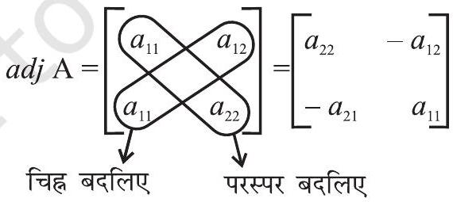

## सारणिक (Determinants)

- All Mathematical truths are relative and conditional - C.P. STEINMETZ
$4.1$ भूमिका (Introduction)
पिछले अध्याय में, हमने आव्यूह और आव्यूहों के बीजगणित के विषय में अध्ययन किया है। हमने बीजगणितीय समीकरणों के निकाय को आव्यूहों के रूप में व्यक्त करना भी सीखा है। इसके अनुसार रैखिक समीकरणों के निकाय

$$
\begin{aligned}
& a_{1} x+b_{1} y=c_{1} \\
& a_{2} x+b_{2} y=c_{2}
\end{aligned}
$$

को $\left(\begin{array}{ll}a_{1} & b_{1} \\ a_{2} & b_{2}\end{array}\right)\binom{x}{y}=\binom{c_{1}}{c_{2}}$ के रूप में व्यक्त कर सकते हैं। अब
इन समीकरणों के निकाय का अद्वितीय हल है अथवा नहीं, इसको $a_{1} b_{2}-a_{2} b_{1}$ संख्या द्वारा ज्ञात किया जाता है। (स्मरण कीजिए कि

P.S. Laplace
(1749-1827)

यदि $\frac{a_{1}}{a_{2}} \neq \frac{b_{1}}{b_{2}}$ या $a_{1} b_{2}-a_{2} b_{1} \neq 0$, हो तो समीकरणों के निकाय का हल अद्वितीय होता है ) यह संख्या $a_{1} b_{2}-a_{2} b_{1}$ जो समीकरणों के निकाय के अद्वितीय हल ज्ञात करती है, वह आव्यूह $\mathrm{A}=\left[\begin{array}{ll}a_{1} & b_{1} \\ a_{2} & b_{2}\end{array}\right]$ से संबंधित है और इसे A का सारणिक या $\boldsymbol{\operatorname { d e t }} \mathbf{A}$ कहते हैं। सारणिकों का इंजीनियरिंग, विज्ञान, अर्थशास्त्र, सामाजिक विज्ञान इत्यादि में विस्तृत अनुप्रयोग हैं।

इस अध्याय में, हम केवल वास्तविक प्रविष्टियों के $3$ कोटि तक के सारणिकों पर विचार करेंगे। इस अध्याय में सारणिकों के गुण धर्म, उपसारणिक, सह-खण्ड और त्रिभुज का क्षेत्रफल ज्ञात करने में सारणिकों का अनुप्रयोग, एक वर्ग आव्यूह के सहखंडज और व्युत्क्रम, रैखिक समीकरण के निकायों

की संगतता और असंगतता और एक आव्यूह के व्युत्क्रम का प्रयोग कर दो अथवा तीन चरांकों के रैखिक समीकरणों के हल का अध्ययन करेंगे।

## $4.2$ सारणिक (Determinant)

हम $n$ कोटि के प्रत्येक वर्ग आव्यूह $\mathrm{A}=\left[a_{i j}\right]$ को एक संख्या (वास्तविक या सम्मिश्र) द्वारा संबंधित करा सकते हैं जिसे वर्ग आव्यूह का सारणिक कहते हैं। इसे एक फलन की तरह सोचा जा सकता है जो प्रत्येक आव्यूह को एक अद्वितीय संख्या (वास्तविक या सम्मिश्र) से संबंधित करता है।

यदि M वर्ग आव्यूहों का समुच्चय है, $k$ सभी संख्याओं (वास्तविक या सम्मिश्र) का समुच्चय है और $f: \mathrm{M} \rightarrow \mathrm{K}, f(\mathrm{~A})=k$, के द्वारा परिभाषित है जहाँ $\mathrm{A} \in \mathrm{M}$ और $k \in \mathrm{~K}$ तब $f(\mathrm{~A}), \mathrm{A}$ का सारणिक कहलाता है। इसे ।A। या det (A) या $\Delta$ के द्वारा भी निरूपित किया जाता है।

यदि $\mathrm{A}=\left[\begin{array}{ll}a & b \\ c & d\end{array}\right]$, तो A के सारणिक को $|\mathrm{A}|=\left|\begin{array}{cc}a & b \\ c & d\end{array}\right|=\operatorname{det}(\mathrm{A})$ द्वारा लिखा जाता है। टिप्पणी

(i) आव्यूह A के लिए, $|\mathrm{A}|$ को A का सारणिक पढ़ते हैं।
(ii) केवल वर्ग आव्यूहों के सारणिक होते हैं।

4.2.1 एक कोटि के आव्यूह का सारणिक (Determinant of a matrix of order one) माना एक कोटि का आव्यूह $\mathrm{A}=[a]$ हो तो A के सारणिक को $a$ के बराबर परिभाषित किया जाता है। 4.2.2 द्वितीय कोटि के आव्यूह का सारणिक (Determinant of a matrix of order two)

माना

$$
2 \times 2 \text { कोटि का आव्यूह } \mathrm{A}=\left[\begin{array}{ll}
a_{11} & a_{12} \\
a_{21} & a_{22}
\end{array}\right] \text { है। }
$$

तो A के सारणिक को इस प्रकार से परिभाषित किया जा सकता है:

$$
\operatorname{det}(\mathrm{A})=|\mathrm{A}|=\Delta=\left|\begin{array}{lll}
a_{11} & & a_{12} \\
& & \\
\mathrm{~A}_{21} & & a_{22}
\end{array}\right|=a_{11} a_{22}-a_{21} a_{12}
$$

उदाहरण $1\left|\begin{array}{cc}2 & 4 \\ -1 & 2\end{array}\right|$ का मान ज्ञात कीजिए।

हल $\left|\begin{array}{cc}2 & 4 \\ -1 & 2\end{array}\right|=2(2)-4(-1)=4+4=8$

उदाहरण $2\left|\begin{array}{cc}x & x+1 \\ x-1 & x\end{array}\right|$ का मान ज्ञात कीजिए।
हल $\left|\begin{array}{cc}x & x+1 \\ x-1 & x\end{array}\right|=x(x)-(x+1)(x-1)=x^{2}-\left(x^{2}-1\right)=x^{2}-x^{2}+1=1$
4.2.3 $3 \times 3$ कोटि के आव्यूह का सारणिक (Determinant of a matrix of order $3 \times 3$ ) तृतीय कोटि के आव्यूह के सारणिक को द्वितीय कोटि के सारणिकों में व्यक्त करके ज्ञात किया जाता है। यह एक सारणिक का एक पंक्ति (या एक स्तंभ) के अनुदिश प्रसरण कहलाता है। तृतीय कोटि के सारणिक को छः प्रकार से प्रसारित किया जाता है तीनों पंक्तियों $\left(\mathrm{R}_{1}, \mathrm{R}_{2}\right.$ तथा $\left.\mathrm{R}_{3}\right)$ में से प्रत्येक के संगत और तीनों स्तंभ $\left(\mathrm{C}_{1}, \mathrm{C}_{2}\right.$ तथा $\left.\mathrm{C}_{3}\right)$ में से प्रत्येक के संगत दर्शाए गए प्रसरण समान परिणाम देते हैं जैसा कि निम्नलिखित स्थितियों में स्पष्ट किया गया है।
वर्ग आव्यूह $\mathrm{A}=\left[a_{i j}\right]_{3 \times 3}$, के सारणिक पर विचार करते हैं।
जहाँ $|\mathrm{A}|=\left|\begin{array}{lll}a_{11} & a_{12} & a_{13} \\ a_{21} & a_{22} & a_{23} \\ a_{31} & a_{32} & a_{33}\end{array}\right|$
प्रथम पंक्ति $\left(\mathbf{R}_{1}\right)$ के अनुदिश प्रसरण
$|\mathrm{A}|=\left|\begin{array}{lll}\boldsymbol{a}_{\mathbf{1 1}} & \boldsymbol{a}_{\mathbf{1 2}} & \boldsymbol{a}_{\mathbf{1 3}} \\ a_{21} & a_{22} & a_{23} \\ a_{31} & a_{32} & a_{33}\end{array}\right|$
चरण $1 \mathrm{R}_{1}$ के पहले अवयव $a_{11}$ को $(-1)^{(1+1)}\left[(-1)^{a_{11} \text { में अनुलग्नों का योग }}\right]$ और सारणिक $|\mathrm{A}|$ की पहली पंक्ति $\left(\mathrm{R}_{1}\right)$ तथा पहला स्तंभ $\left(\mathrm{C}_{1}\right)$ के अवयवों को हटाने से प्राप्त द्वितीय कोटि के सारणिक से गुणा कीजिए क्योंकि $a_{11}, \mathrm{R}_{1}$ और $\mathrm{C}_{1}$ में स्थित है
अर्थात्

$$
(-1)^{1+1} a_{11}\left|\begin{array}{ll}
a_{22} & a_{23} \\
a_{32} & a_{33}
\end{array}\right|
$$

चरण $2$ क्योंकि $a_{12}, \mathrm{R}_{1}$ तथा $\mathrm{C}_{2}$ में स्थित है इसलिए $\mathrm{R}_{1}$ के दूसरे अवयव $a_{12}$ को $(-1)^{1+2}$ $\left[(-1)^{a_{12} \text { में अनुलनों का योग }}\right]$ और सारणिक । A । की पहली पंक्ति $\left(\mathrm{R}_{1}\right)$ व दूसरे स्तंभ $\left(\mathrm{C}_{2}\right)$ को हटाने से प्राप्त द्वितीय क्रम के सारणिक से गुणा कीजिए
अर्थात्

$$
(-1)^{1+2} a_{12}\left|\begin{array}{ll}
a_{21} & a_{23} \\
a_{31} & a_{33}
\end{array}\right|
$$

चरण $3$ क्योंकि $a_{13}, \mathrm{R}_{1}$ तथा $\mathrm{C}_{3}$ में स्थित है इसलिए $\mathrm{R}_{1}$ के तीसरे अवयव को $(-1)^{1+3}$ $\left[(-1)^{a_{13} \text { में अनुलग्नों का योग }}\right]$ और सारणिक । A । की पहली पंक्ति $\left(\mathrm{R}_{1}\right)$ व तीसरे स्तंभ $\left(\mathrm{C}_{3}\right)$ को हटाने से प्राप्त तृतीय कोटि के सारणिक से गुणा कीजिए

अर्थात्

$$
(-1)^{1+3} a_{13}\left|\begin{array}{ll}
a_{21} & a_{22} \\
a_{31} & a_{32}
\end{array}\right|
$$

चरण $4$ अब A का सारणिक अर्थात् । Al के व्यंजक को उपरोक्त चरण $1,2$ व $3$ से प्राप्त तीनों पदों का योग करके लिखिए अर्थात्

$$
\begin{aligned}
\operatorname{det} \mathrm{A}= & |\mathrm{A}|=(-1)^{1+1} a_{11}\left|\begin{array}{ll}
a_{22} & a_{23} \\
a_{32} & a_{33}
\end{array}\right|+(-1)^{1+2} a_{12}\left|\begin{array}{ll}
a_{21} & a_{23} \\
a_{31} & a_{33}
\end{array}\right| \\
& +(-1)^{1+3} a_{13}\left|\begin{array}{ll}
a_{21} & a_{22} \\
a_{31} & a_{32}
\end{array}\right|
\end{aligned}
$$

या

$$
\begin{aligned}
|\mathrm{A}|= & a_{11}\left(a_{22} a_{33}-a_{32} a_{23}\right)-a_{12}\left(a_{21} a_{33}-a_{31} a_{23}\right) \\
& +a_{13}\left(a_{21} a_{32}-a_{31} a_{22}\right) \\
= & a_{11} a_{22} a_{33}-a_{11} a_{32} a_{23}-a_{12} a_{21} a_{33}+a_{12} a_{31} a_{23}+a_{13} a_{21} a_{32} \\
& -a_{13} a_{31} a_{22}
\end{aligned}
$$

- टिप्पणी हम चारों चरणों का एक साथ प्रयोग करेंगे।

द्वितीय पंक्ति $\left(\mathbf{R}_{2}\right)$ के अनुदिश प्रसरण

$$
|\mathrm{A}|=\left|\begin{array}{lll}
a_{11} & a_{12} & a_{13} \\
\boldsymbol{a}_{\mathbf{2 1}} & \boldsymbol{a}_{\mathbf{2 2}} & \boldsymbol{a}_{\mathbf{2 3}} \\
a_{31} & a_{32} & a_{33}
\end{array}\right|
$$

$\mathrm{R}_{2}$ के अनुदिश प्रसरण करने पर, हमें प्राप्त होता है

$$
\begin{aligned}
|\mathrm{A}|= & (-1)^{2+1} a_{21}\left|\begin{array}{ll}
a_{12} & a_{13} \\
a_{32} & a_{33}
\end{array}\right|+(-1)^{2+2} a_{22}\left|\begin{array}{ll}
a_{11} & a_{13} \\
a_{31} & a_{33}
\end{array}\right| \\
& +(-1)^{2+3} a_{23}\left|\begin{array}{ll}
a_{11} & a_{12} \\
a_{31} & a_{32}
\end{array}\right| \\
= & -a_{21}\left(a_{12} a_{33}-a_{32} a_{13}\right)+a_{22}\left(a_{11} a_{33}-a_{31} a_{13}\right) \\
& -a_{23}\left(a_{11} a_{32}-a_{31} a_{12}\right) \\
|\mathrm{A}|= & -a_{21} a_{12} a_{33}+a_{21} a_{32} a_{13}+a_{22} a_{11} a_{33}-a_{22} a_{31} a_{13}-a_{23} a_{11} a_{32} \\
& +a_{23} a_{31} a_{12} \\
= & a_{11} a_{22} a_{33}-a_{11} a_{23} a_{32}-a_{12} a_{21} a_{33}+a_{12} a_{23} a_{31}+a_{13} a_{21} a_{32} \\
& -a_{13} a_{31} a_{22}
\end{aligned}
$$

## पहले स्तंभ $\left(\mathbf{C}_{1}\right)$ के अनुदिश प्रसरण

$$
|\mathrm{A}|=\left|\begin{array}{lll}
\boldsymbol{a}_{\mathbf{1 1}} & a_{12} & a_{13} \\
\boldsymbol{a}_{\mathbf{2 1}} & a_{22} & a_{23} \\
\boldsymbol{a}_{\mathbf{3 1}} & a_{32} & a_{33}
\end{array}\right|
$$

$\mathrm{C}_{1}$, के अनुदिश प्रसरण करने पर हमें प्राप्त होता है

$$
\begin{aligned}
|\mathrm{A}|= & a_{11}(-1)^{1+1}\left|\begin{array}{ll}
a_{22} & a_{23} \\
a_{32} & a_{33}
\end{array}\right|+a_{21}(-1)^{2+1}\left|\begin{array}{ll}
a_{12} & a_{13} \\
a_{32} & a_{33}
\end{array}\right| \\
& +a_{31}(-1)^{3+1}\left|\begin{array}{ll}
a_{12} & a_{13} \\
a_{22} & a_{23}
\end{array}\right| \\
= & a_{11}\left(a_{22} a_{33}-a_{23} a_{32}\right)-a_{21}\left(a_{12} a_{33}-a_{13} a_{32}\right)+a_{31}\left(a_{12} a_{23}-a_{13} a_{22}\right) \\
|\mathrm{A}|= & a_{11} a_{22} a_{33}-a_{11} a_{23} a_{32}-a_{21} a_{12} a_{33}+a_{21} a_{13} a_{32}+a_{31} a_{12} a_{23} \\
& -a_{31} a_{13} a_{22} \\
= & a_{11} a_{22} a_{33}-a_{11} a_{23} a_{32}-a_{12} a_{21} a_{33}+a_{12} a_{23} a_{31}+a_{13} a_{21} a_{32} \\
& -a_{13} a_{31} a_{22}
\end{aligned}
$$

(1), (2) और (3) से स्पष्ट है कि । A। का मान समान है। यह पाठकों के अभ्यास के लिए छोड़ दिया गया है कि वे यह सत्यापित करें कि $|\mathrm{A}|$ का $\mathrm{R}_{3}, \mathrm{C}_{2}$ और $\mathrm{C}_{3}$ के अनुदिश प्रसरण (1), (2) और (3) से प्राप्त परिणामों के समान है।

अतः एक सारणिक को किसी भी पंक्ति या स्तंभ के अनुदिश प्रसरण करने पर समान मान प्राप्त होता है।

## टिप्पणी

(i) गणना को सरल करने के लिए हम सारणिक का उस पंक्ति या स्तंभ के अनुदिश प्रसरण करेंगे जिसमें शून्यों की संख्या अधिकतम होती है।
(ii) सारणिकों का प्रसरण करते समय $(-1)^{i+j}$ से गुणा करने के स्थान पर, हम $(i+j)$ के सम या विषम होने के अनुसार +1 या -1 से गुणा कर सकते हैं।
(iii) मान लीजिए $\mathrm{A}=\left[\begin{array}{ll}2 & 2 \\ 4 & 0\end{array}\right]$ और $\mathrm{B}=\left[\begin{array}{ll}1 & 1 \\ 2 & 0\end{array}\right]$ तो यह सिद्ध करना सरल है कि $\mathrm{A}=2 \mathrm{~B}$. किंतु $|\mathrm{A}|=0-8=-8$ और $|\mathrm{B}|=0-2=-2$ है।

अवलोकन कीजिए कि $|\mathrm{A}|=4(-2)=2^{2}|\mathrm{~B}|$ या $|\mathrm{A}|=2^{n}|\mathrm{~B}|$, जहाँ $n=2$, वर्ग आव्यूहों A व B की कोटि है।
व्यापक रूप में, यदि $\mathrm{A}=k \mathrm{~B}$, जहाँ A व B वर्ग आव्यूहों की कोटि $n$ है, तब $|\mathrm{A}|=k^{n}|\mathrm{~B}|$, जहाँ $n=1,2,3$ है।

उदाहरण $3$ सारणिक $\Delta=\left|\begin{array}{rrr}1 & 2 & 4 \\ -1 & 3 & 0 \\ 4 & 1 & 0\end{array}\right|$ का मान ज्ञात कीजिए।
हल ध्यान दीजिए कि तीसरे स्तंभ में दो प्रविष्टियाँ शून्य हैं। इसलिए तीसरे स्तंभ $\left(\mathrm{C}_{3}\right)$ के अनुदिश प्रसरण करने पर हमें प्राप्त होता है कि

$$
\begin{aligned}
\Delta & =4\left|\begin{array}{cc}
-1 & 3 \\
4 & 1
\end{array}\right|-0\left|\begin{array}{ll}
1 & 2 \\
4 & 1
\end{array}\right|+0\left|\begin{array}{cc}
1 & 2 \\
-1 & 3
\end{array}\right| \\
& =4(-1-12)-0+0=-52
\end{aligned}
$$

उदाहरण $4 \Delta=\left|\begin{array}{ccc}0 & \sin \alpha & -\cos \alpha \\ -\sin \alpha & 0 & \sin \beta \\ \cos \alpha & -\sin \beta & 0\end{array}\right|$ का मान ज्ञात कीजिए।
हल $\mathrm{R}_{1}$ के अनुदिश प्रसरण करने पर हमें प्राप्त होता है कि

$$
\begin{aligned}
\Delta & =0\left|\begin{array}{cc}
0 & \sin \beta \\
-\sin \beta & 0
\end{array}\right|-\sin \alpha\left|\begin{array}{cc}
-\sin \alpha & \sin \beta \\
\cos \alpha & 0
\end{array}\right|-\cos \alpha\left|\begin{array}{cc}
-\sin \alpha & 0 \\
\cos \alpha & -\sin \beta
\end{array}\right| \\
& =0-\sin \alpha(0-\sin \beta \cos \alpha)-\cos \alpha(\sin \alpha \sin \beta-0) \\
& =\sin \alpha \sin \beta \cos \alpha-\cos \alpha \sin \alpha \sin \beta=0
\end{aligned}
$$

उदाहरण $5$ यदि $\left|\begin{array}{ll}3 & x \\ x & 1\end{array}\right|=\left|\begin{array}{ll}3 & 2 \\ 4 & 1\end{array}\right|$ तो $x$ के मान ज्ञात कीजिए।
हल दिया है कि $\left|\begin{array}{ll}3 & x \\ x & 1\end{array}\right|=\left|\begin{array}{ll}3 & 2 \\ 4 & 1\end{array}\right|$
अर्थात्
अर्थात्
अत:

$$
\begin{aligned}
3-x^{2} & =3-8 \\
x^{2} & =8 \\
x & = \pm 2 \sqrt{2}
\end{aligned}
$$

## प्रश्नावली $4.1$

प्रश्न $1$ से $2$ तक में सारणिकों का मान ज्ञात कीजिए

1. $\left|\begin{array}{cc}2 & 4 \\ -5 & -1\end{array}\right|$
2. (i) $\left|\begin{array}{cc}\cos \theta & -\sin \theta \\ \sin \theta & \cos \theta\end{array}\right|$
(ii) $\left|\begin{array}{cc}x^{2}-x+1 & x-1 \\ x+1 & x+1\end{array}\right|$
3. यदि $\mathrm{A}=\left[\begin{array}{ll}1 & 2 \\ 4 & 2\end{array}\right]$, तो दिखाइए $|2 \mathrm{~A}|=4|\mathrm{~A}|$
4. यदि $\mathrm{A}=\left[\begin{array}{lll}1 & 0 & 1 \\ 0 & 1 & 2 \\ 0 & 0 & 4\end{array}\right]$ हो, तो दिखाइए $|3 \mathrm{~A}|=27|\mathrm{~A}|$
5. निम्नलिखित सारणिकों का मान ज्ञात कीजिए
(i) $\left|\begin{array}{ccc}3 & -1 & -2 \\ 0 & 0 & -1 \\ 3 & -5 & 0\end{array}\right|$
(ii) $\left|\begin{array}{ccc}3 & -4 & 5 \\ 1 & 1 & -2 \\ 2 & 3 & 1\end{array}\right|$
(iii) $\left|\begin{array}{ccc}0 & 1 & 2 \\ -1 & 0 & -3 \\ -2 & 3 & 0\end{array}\right|$
(iv) $\left|\begin{array}{ccc}2 & -1 & -2 \\ 0 & 2 & -1 \\ 3 & -5 & 0\end{array}\right|$
6. यदि $\mathrm{A}=\left[\begin{array}{lll}1 & 1 & 2 \\ 2 & 1 & 3 \\ 5 & 4 & 9\end{array}\right]$, हो तो A । ज्ञात कीजिए।
7. $x$ के मान ज्ञात कीजिए यदि
(i) $\left|\begin{array}{ll}2 & 4 \\ 5 & 1\end{array}\right|=\left|\begin{array}{cc}2 x & 4 \\ 6 & x\end{array}\right|$
(ii) $\left|\begin{array}{ll}2 & 3 \\ 4 & 5\end{array}\right|=\left|\begin{array}{cc}x & 3 \\ 2 x & 5\end{array}\right|$

8. यदि $\left|\begin{array}{cc}x & 2 \\ 18 & x\end{array}\right|=\left|\begin{array}{cc}6 & 2 \\ 18 & 6\end{array}\right|$ हो तो $x$ बराबर है:
(A) $6$
(B) ± $6$
(C) -6
(D) $0$

## $4.3$ त्रिभुज का क्षेत्रफल (Area of a Triangle)

हमने पिछली कक्षाओं में सीखा है कि एक त्रिभुज जिसके शीर्षबिंदु $\left(x_{1}, y_{1}\right),\left(x_{2}, y_{2}\right)$ तथा $\left(x_{3}, y_{3}\right)$, हों तो उसका क्षेत्रफल व्यंजक $\frac{1}{2}\left[x_{1}\left(y_{2}-y_{3}\right)+x_{2}\left(y_{3}-y_{1}\right)+x_{3}\left(y_{1}-y_{2}\right)\right]$ द्वारा व्यक्त किया जाता है। अब इस व्यंजक को सारणिक के रूप में इस प्रकार लिखा जा सकता है:

$$
\Delta=\frac{1}{2}\left|\begin{array}{lll}
x_{1} & y_{1} & 1 \\
x_{2} & y_{2} & 1 \\
x_{3} & y_{3} & 1
\end{array}\right|
$$

टिप्पणी

(i) क्योंकि क्षेत्रफल एक धनात्मक राशि होती है इसलिए हम सदैव (1) में सारणिक का निरपेक्ष मान लेते हैं।
(ii) यदि क्षेत्रफल दिया हो तो गणना के लिए सारणिक का धनात्मक और ऋणात्मक दोनों मानों का प्रयोग कीजिए।
(iii) तीन संरेख बिंदुओं से बने त्रिभुज का क्षेत्रफल शून्य होगा।

उदाहरण $6$ एक त्रिभुज का क्षेत्रफल ज्ञात कीजिए जिसके शीर्ष $(3,8),(-4,2)$ और $(5,1)$ हैं।
हल त्रिभुज का क्षेत्रफल:

$$
\begin{aligned}
\Delta & =\frac{1}{2}\left|\begin{array}{rrr}
3 & 8 & 1 \\
-4 & 2 & 1 \\
5 & 1 & 1
\end{array}\right|=\frac{1}{2}[3(2-1)-8(-4-5)+1(-4-10)] \\
& =\frac{1}{2}(3+72-14)=\frac{61}{2}
\end{aligned}
$$

उदाहरण $7$ सारणिकों का प्रयोग करके $\mathrm{A}(1,3)$ और $\mathrm{B}(0,0)$ को जोड़ने वाली रेखा का समीकरण ज्ञात कीजिए और $k$ का मान ज्ञात कीजिए यदि एक बिंदु $\mathrm{D}(k, 0)$ इस प्रकार है कि $\Delta \mathrm{ABD}$ का क्षेत्रफल $3$ वर्ग इकाई है।

हल मान लीजिए AB पर कोई बिंदु $\mathrm{P}(x, y)$ है तब $\Delta \mathrm{ABP}$ का क्षेत्रफल $=0$ (क्यों?)
इसलिए
$$
\frac{1}{2}\left|\begin{array}{lll}
0 & 0 & 1 \\
1 & 3 & 1 \\
x & y & 1
\end{array}\right|=0
$$
इससे प्राप्त है
$$
\frac{1}{2}(y-3 x)=0 \text { या } y=3 x
$$
जो अभीष्ट रेखा AB का समीकरण है।
किंतु $\Delta \mathrm{ABD}$ का क्षेत्रफल $3$ वर्ग इकाई दिया है अतः
$$
\frac{1}{2}\left|\begin{array}{ccc}
1 & 3 & 1 \\
0 & 0 & 1 \\
k & 0 & 1
\end{array}\right|= \pm 3 \text { हमें प्राप्त है } \frac{-3 k}{2}= \pm 3 \text {, i.e., } k=2
$$

## प्रश्नावली $4.2$

1. निम्नलिखित प्रत्येक में दिए गए शीर्ष बिंदुओं वाले त्रिभुजों का क्षेत्रफल ज्ञात कीजिए।
(i) (1, 0), (6, 0), $(4,3)$
(ii) (2, 7), (1, 1), $(10,8)$
(iii) (-2, -3), (3, 2), (-1, -8)
2. दर्शाइए कि बिंदु $\mathrm{A}(a, b+c), \mathrm{B}(b, c+a)$ और $\mathrm{C}(c, a+b)$ संरेख हैं।
3. प्रत्येक में $k$ का मान ज्ञात कीजिए यदि त्रिभुजों का क्षेत्रफल $4$ वर्ग इकाई है जहाँ शीर्षबिंदु निम्नलिखित हैं:
(i) $(k, 0),(4,0),(0,2)$
(ii) (-2, 0), (0, 4), (0, k)
4. (i) सारणिकों का प्रयोग करके $(1,2)$ और $(3,6)$ को मिलाने वाली रेखा का समीकरण ज्ञात कीजिए।
    (ii) सारणिकों का प्रयोग करके $(3,1)$ और $(9,3)$ को मिलाने वाली रेखा का समीकरण ज्ञात कीजिए।
5. यदि शीर्ष $(2,-6),(5,4)$ और $(k, 4)$ वाले त्रिभुज का क्षेत्रफल $35$ वर्ग इकाई हो तो $k$ का मान है:
(A) $12$
(B) -2
(C) -12, -2
(D) 12, -2

## $4.4$ उपसारणिक और सहखंड (Minor and Co-factor)

इस अनुच्छेद में हम उपसारणिकों और सहखंडों का प्रयोग करके सारणिको के प्रसरण का विस्तृत रूप लिखना सीखेंगे।
परिभाषा $1$ सारणिक के अवयव $a_{i j}$ का उपसारणिक एक सारणिक है जो $i$ वी पंक्ति और $j$ वाँ स्तंभ जिसमें अवयव $a_{i j}$ स्थित है, को हटाने से प्राप्त होता है। अवयव $a_{i j}$ के उपसारणिक को $\mathrm{M}_{i j}$ के द्वारा व्यक्त करते हैं।

टिप्पणी $n(n \geq 2)$ क्रम के सारणिक के अवयव का उपसारणिक $n-1$ क्रम का सारणिक होता है। उदाहरण $8$ सारणिक $\Delta=\left|\begin{array}{lll}1 & 2 & 3 \\ 4 & 5 & 6 \\ 7 & 8 & 9\end{array}\right|$ में अवयव $6$ का उपसारणिक ज्ञात कीजिए।
हल क्योंकि $6$ दूसरी पंक्ति एवं तृतीय स्तंभ में स्थित है। इसलिए इसका उपसारिणक $=\mathrm{M}_{23}$ निम्नलिखित प्रकार से प्राप्त होता है।

$$
\mathrm{M}_{23}=\left|\begin{array}{ll}
1 & 2 \\
7 & 8
\end{array}\right|=8-14=-6\left(\Delta \text { से } \mathrm{R}_{2} \text { और } \mathrm{C}_{3} \text { हटाने पर }\right)
$$

परिभाषा $2$ एक अवयव $a_{i j}$ का सहखंड जिसे $\mathrm{A}_{i j}$ द्वारा व्यक्त करते हैं, जहाँ

$$
\mathrm{A}_{i j}=(-1)^{i+j} \mathrm{M}_{i j},
$$

के द्वारा परिभाषित करते हैं जहाँ $a_{i j}$ का उपसारणिक $\mathrm{M}_{i j}$ है।
उदाहरण $9$ सारणिक $\left|\begin{array}{cc}1 & -2 \\ 4 & 3\end{array}\right|$ के सभी अवयवों के उपसारणिक व सहखंड ज्ञात कीजिए।
हल अवयव $a_{i j}$ का उपसारणिक $\mathrm{M}_{i j}$ है।
यहाँ

$$
\begin{aligned}
& a_{11}=1, \text { इसलिए } \mathrm{M}_{11}=a_{11} \text { का उपसारणिक }=3 \\
& \mathrm{M}_{12}=\text { अवयव } a_{12} \text { का उपसारणिक }=4 \\
& \mathrm{M}_{21}=\text { अवयव } a_{21} \text { का उपसारणिक }=-2 \\
& \mathrm{M}_{22}=\text { अवयव } a_{22} \text { का उपसारणिक }=1
\end{aligned}
$$

अब $a_{i j}$ का सहखंड $\mathrm{A}_{i j}$ है। इसलिए

$$
\begin{aligned}
& A_{11}=(-1)^{1+1} \quad M_{11}=(-1)^{2}(3)=3 \\
& A_{12}=(-1)^{1+2} \quad M_{12}=(-1)^{3}(4)=-4 \\
& A_{21}=(-1)^{2+1} \quad M_{21}=(-1)^{3}(-2)=2 \\
& A_{22}=(-1)^{2+2} \quad M_{22}=(-1)^{4}(1)=1
\end{aligned}
$$

उदाहरण $10 \Delta=\left|\begin{array}{lll}a_{11} & a_{12} & a_{13} \\ a_{21} & a_{22} & a_{23} \\ a_{31} & a_{32} & a_{33}\end{array}\right|$ के अवयवों $a_{11}$ तथा $a_{21}$ के उपसारणिक और सहखंड ज्ञात कीजिए।
हल उपसारणिक और सहखंड की परिभाषा द्वारा हम पाते हैं:
$a_{11}$ का उपसारणिक $=\mathrm{M}_{11}=\left|\begin{array}{ll}a_{22} & a_{23} \\ a_{32} & a_{33}\end{array}\right|=a_{22} a_{33}-a_{23} a_{32}$
$a_{11}$ का सहखंड $=\mathrm{A}_{11}=(-1)^{1+1} \mathrm{M}_{11}=a_{22} a_{33}-a_{23} a_{32}$
$a_{21}$ का उपसारणिक $=\mathrm{M}_{21}=\left|\begin{array}{ll}a_{12} & a_{13} \\ a_{32} & a_{33}\end{array}\right|=a_{12} a_{33}-a_{13} a_{32}$
$a_{21}$ का सहखंड $=\mathrm{A}_{21}=(-1)^{2+1} \mathrm{M}_{21}=(-1)\left(a_{12} a_{33}-a_{13} a_{32}\right)=-a_{12} a_{33}+a_{13} a_{32}$ टिप्पणी उदाहरण $21$ में सारणिक $\boldsymbol{\Delta}$ का $\mathrm{R}_{1}$ के सापेक्ष प्रसरण करने पर हम पाते हैं कि

$$
\begin{aligned}
\Delta & =(-1)^{1+1} a_{11}\left|\begin{array}{ll}
a_{22} & a_{23} \\
a_{32} & a_{33}
\end{array}\right|+(-1)^{1+2} a_{12}\left|\begin{array}{ll}
a_{21} & a_{23} \\
a_{31} & a_{33}
\end{array}\right|+(-1)^{1+3} a_{13}\left|\begin{array}{ll}
a_{21} & a_{22} \\
a_{31} & a_{32}
\end{array}\right| \\
& =a_{11} \mathrm{~A}_{11}+a_{12} \mathrm{~A}_{12}+a_{13} \mathrm{~A}_{13} \text {, जहाँ } a_{i j} \text { का सहखंड } \mathrm{A}_{i j} \text { हैं। } \\
& =\mathrm{R}_{1} \text { के अवयवों और उनके संगत सहखंडों के गुणनफल का योग। }
\end{aligned}
$$

इसी प्रकार $\Delta$ का $\mathrm{R}_{2}, \mathrm{R}_{3}, \mathrm{C}_{1}, \mathrm{C}_{2}$ और $\mathrm{C}_{3}$ के अनुदिश $5$ प्रसरण अन्य प्रकार से हैं।
अतः सारणिक $\Delta$, किसी पंक्ति (या स्तंभ) के अवयवों और उनके संगत सहखंडों के गुणनफल का योग है।

- टिप्पणी यदि एक पंक्ति (या स्तंभ) के अवयवों को अन्य पंक्ति (या स्तंभ) के सहखंडों से गुणा किया जाए तो उनका योग शून्य होता है। उदाहरणतया, माना $\Delta=a_{11} \mathrm{~A}_{21}+a_{12} \mathrm{~A}_{22}$ $+a_{13} \mathrm{~A}_{23}$ तब:

$$
\begin{aligned}
\Delta & =a_{11}(-1)^{1+1}\left|\begin{array}{ll}
a_{12} & a_{13} \\
a_{32} & a_{33}
\end{array}\right|+a_{12}(-1)^{1+2}\left|\begin{array}{ll}
a_{11} & a_{13} \\
a_{31} & a_{33}
\end{array}\right|+a_{13}(-1)^{1+3}\left|\begin{array}{ll}
a_{11} & a_{12} \\
a_{31} & a_{32}
\end{array}\right| \\
& =\left|\begin{array}{lll}
a_{11} & a_{12} & a_{13} \\
a_{11} & a_{12} & a_{13} \\
a_{31} & a_{32} & a_{33}
\end{array}\right|=0 \text { ( क्योंकि } \mathrm{R}_{1} \text { और } \mathrm{R}_{2} \text { समान हैं) }
\end{aligned}
$$

इसी प्रकार हम अन्य पंक्तियों और स्तंभों के लिए प्रयत्न कर सकते हैं।
उदाहरण $11$ सारणिक $\left|\begin{array}{ccc}2 & -3 & 5 \\ 6 & 0 & 4 \\ 1 & 5 & -7\end{array}\right|$ के अवयवों के उपसारणिक और सहखंड ज्ञात कीजिए और सत्यापित कीजिए कि $a_{11} \mathrm{~A}_{31}+a_{12} \mathrm{~A}_{32}+a_{13} \mathrm{~A}_{33}=0$ है।
हल यहाँ $\mathrm{M}_{11}=\left|\begin{array}{cc}0 & 4 \\ 5 & -7\end{array}\right|=0-20=-20 ;$ इसलिए $\mathrm{A}_{11}=(-1)^{1+1}(-20)=-20$

$$
\begin{aligned}
& \mathrm{M}_{12}=\left|\begin{array}{cc}
6 & 4 \\
1 & -7
\end{array}\right|=-42-4=-46 ; \text { इसलिए } \mathrm{A}_{12}=(-1)^{1+2}(-46)=46 \\
& \mathrm{M}_{13}=\left|\begin{array}{cc}
6 & 0 \\
1 & 5
\end{array}\right|=30-0=30 ; \text { इसलिए } \mathrm{A}_{13}=(-1)^{1+3}(30)=30 \\
& \mathrm{M}_{21}=\left|\begin{array}{cc}
-3 & 5 \\
5 & -7
\end{array}\right|=21-25=-4 ; \text { इसलिए } \mathrm{A}_{21}=(-1)^{2+1}(-4)=4 \\
& \mathrm{M}_{22}=\left|\begin{array}{cc}
2 & 5 \\
1 & -7
\end{array}\right|=-14-5=-19 ; \text { इसलिए } \mathrm{A}_{22}=(-1)^{2+2}(-19)=-19 \\
& \mathrm{M}_{23}=\left|\begin{array}{cc}
2 & -3 \\
1 & 5
\end{array}\right|=10+3=13 ; \text { इसलिए } \mathrm{A}_{23}=(-1)^{2+3}(13)=-13 \\
& \mathrm{M}_{31}=\left|\begin{array}{cc}
-3 & 5 \\
0 & 4
\end{array}\right|=-12-0=-12 ; \text { इसलिए } \mathrm{A}_{31}=(-1)^{3+1}(-12)=-12 \\
& \mathrm{M}_{32}=\left|\begin{array}{cc}
2 & 5 \\
6 & 4
\end{array}\right|=8-30=-22 ; \text { इसलिए } \mathrm{A}_{32}=(-1)^{3+2}(-22)=22
\end{aligned}
$$

और

$$
\mathrm{M}_{33}=\left|\begin{array}{cc}
2 & -3 \\
6 & 0
\end{array}\right|=0+18=18 ; \text { इसलिए } \mathrm{A}_{33}=(-1)^{3+3}(18)=18
$$

अब

$$
a_{11}=2, a_{12}=-3, a_{13}=5 ; \text { तथा } \mathrm{A}_{31}=-12, \mathrm{~A}_{32}=22, \mathrm{~A}_{33}=18 \text { है। }
$$

इसलिए

$$
\begin{aligned}
& a_{11} \mathrm{~A}_{31}+a_{12} \mathrm{~A}_{32}+a_{13} \mathrm{~A}_{33} \\
& =2(-12)+(-3)(22)+5(18)=-24-66+90=0
\end{aligned}
$$

## प्रश्नावली $4.3$

निम्नलिखित सारणिकों के अवयवों के उपसारणिक एवं सहखंड लिखिए।

1. (i) $\left|\begin{array}{rr}2 & -4 \\ 0 & 3\end{array}\right|$
(ii) $\left|\begin{array}{cc}a & c \\ b & d\end{array}\right|$
2. (i) $\left|\begin{array}{lll}1 & 0 & 0 \\ 0 & 1 & 0 \\ 0 & 0 & 1\end{array}\right|$
(ii) $\left|\begin{array}{ccc}1 & 0 & 4 \\ 3 & 5 & -1 \\ 0 & 1 & 2\end{array}\right|$
3. दूसरी पंक्ति के अवयवों के सहखंडों का प्रयोग करके $\Delta=\left|\begin{array}{lll}5 & 3 & 8 \\ 2 & 0 & 1 \\ 1 & 2 & 3\end{array}\right|$ का मान ज्ञात कीजिए।
4. तीसरे स्तंभ के अवयवों के सहखंडों का प्रयोग करके $\Delta=\left|\begin{array}{lll}1 & x & y z \\ 1 & y & z x \\ 1 & z & x y\end{array}\right|$ का मान ज्ञात कीजिए।
5. यदि $\Delta=\left|\begin{array}{lll}a_{11} & a_{12} & a_{13} \\ a_{21} & a_{22} & a_{23} \\ a_{31} & a_{32} & a_{33}\end{array}\right|$ और $a_{i j}$ का सहखंड $\mathrm{A}_{i j}$ हो तो $\Delta$ का मान निम्नलिखित रूप में व्यक्त किया जाता है:
(A) $a_{11} \mathrm{~A}_{31}+a_{12} \mathrm{~A}_{32}+a_{13} \mathrm{~A}_{33}$
(B) $a_{11} \mathrm{~A}_{11}+a_{12} \mathrm{~A}_{21}+a_{13} \mathrm{~A}_{31}$
(C) $a_{21} \mathrm{~A}_{11}+a_{22} \mathrm{~A}_{12}+a_{23} \mathrm{~A}_{13}$
(D) $a_{11} \mathrm{~A}_{11}+a_{21} \mathrm{~A}_{21}+a_{31} \mathrm{~A}_{31}$

## $4.5$ आव्यूह के सहखंडज और व्युत्क्रम (Adjoint and Inverse of a Matrix)

पिछले अध्याय में हमने एक आव्यूह के व्युत्क्रम का अध्ययन किया है। इस अनुच्छेद में हम एक आव्यूह के व्युत्क्रम के अस्तित्व के लिए शर्तों की भी व्याख्या करेंगे।
$\mathrm{A}^{-1}$ ज्ञात करने के लिए पहले हम एक आव्यूह का सहखंडज परिभाषित करेंगे।

### 4.5.1 आव्यूह का सहखंडज (Adjoint of a matrix)

परिभाषा $3$ एक वर्ग आव्यूह $\mathrm{A}=\left[a_{i j}\right]$ का सहखंडज, आव्यूह $\left[\mathrm{A}_{i j}\right]$ के परिवर्त के रूप में परिभाषित है, जहाँ $\mathrm{A}_{i j}$, अवयव $a_{i j}$ का सहखंड है। आव्यूह A के सहखंडज को $\operatorname{adj} \mathrm{A}$ के द्वारा व्यक्त करते हैं।

मान लीजिए $\mathrm{A}=\left[\begin{array}{lll}a_{11} & a_{12} & a_{13} \\ a_{21} & a_{22} & a_{23} \\ a_{31} & a_{32} & a_{33}\end{array}\right]$ है।
तब $\operatorname{adj} \mathrm{A}=\left[\begin{array}{lll}\mathrm{A}_{11} & \mathrm{~A}_{12} & \mathrm{~A}_{13} \\ \mathrm{~A}_{21} & \mathrm{~A}_{22} & \mathrm{~A}_{23} \\ \mathrm{~A}_{31} & \mathrm{~A}_{32} & \mathrm{~A}_{33}\end{array}\right]$ का परिवर्त $=\left[\begin{array}{lll}\mathrm{A}_{11} & \mathrm{~A}_{21} & \mathrm{~A}_{31} \\ \mathrm{~A}_{12} & \mathrm{~A}_{22} & \mathrm{~A}_{32} \\ \mathrm{~A}_{13} & \mathrm{~A}_{23} & \mathrm{~A}_{33}\end{array}\right]$ होता है।

उदाहरण $12$ आव्यूह $\mathrm{A}=\left[\begin{array}{ll}2 & 3 \\ 1 & 4\end{array}\right]$ का सहखंडज ज्ञात कीजिए।

हल हम जानते हैं कि $\mathrm{A}_{11}=4, \mathrm{~A}_{12}=-1, \mathrm{~A}_{21}=-3, \mathrm{~A}_{22}=2$
अत:

$$
\operatorname{adj} \mathrm{A}=\left[\begin{array}{ll}
\mathrm{A}_{11} & \mathrm{~A}_{21} \\
\mathrm{~A}_{12} & \mathrm{~A}_{22}
\end{array}\right]=\left[\begin{array}{cc}
4 & -3 \\
-1 & 2
\end{array}\right]
$$

टिप्पणी $2 \times 2$ कोटि के वर्ग आव्यूह $\mathrm{A}=\left[\begin{array}{ll}a_{11} & a_{12} \\ a_{21} & a_{22}\end{array}\right]$ का सहखंडज $\operatorname{adj} \mathrm{A}, a_{11}$ और $a_{22}$ को परस्पर बदलने एवं $a_{12}$ और $a_{21}$ के चिह्न परिवर्तित कर देने से भी प्राप्त किया जा सकता है जैसा नीचे दर्शाया गया है।

हम बिना उपपत्ति के निम्नलिखित प्रमेय निर्दिष्ट करते हैं।
प्रमेय $1$ यदि A कोई $n$ कोटि का आव्यूह है तो, $\mathrm{A}(\operatorname{adj} \mathrm{A})=(\operatorname{adj} \mathrm{A}) \mathrm{A}=|\mathrm{A}| \mathrm{I}$, जहाँ $\mathrm{I}, n$ कोटि का तत्समक आव्यूह है।

सत्यापनः मान लीजिए

$$
\mathrm{A}=\left[\begin{array}{lll}
a_{11} & a_{12} & a_{13} \\
a_{21} & a_{22} & a_{23} \\
a_{31} & a_{32} & a_{33}
\end{array}\right] \text {, है तब } \operatorname{adj} \mathrm{A}=\left[\begin{array}{lll}
\mathrm{A}_{11} & \mathrm{~A}_{21} & \mathrm{~A}_{31} \\
\mathrm{~A}_{12} & \mathrm{~A}_{22} & \mathrm{~A}_{32} \\
\mathrm{~A}_{13} & \mathrm{~A}_{23} & \mathrm{~A}_{33}
\end{array}\right]
$$

क्योंकि एक पंक्ति या स्तंभ के अवयवों का संगत सहखंडों की गुणा का योग। Al के समान होता है अन्यथा शून्य होता है।

इस प्रकार

$$
\mathrm{A}(\operatorname{adj} \mathrm{~A})=\left[\begin{array}{ccc}
|\mathrm{A}| & 0 & 0 \\
0 & |\mathrm{~A}| & 0 \\
0 & 0 & |\mathrm{~A}|
\end{array}\right]=|\mathrm{A}|\left[\begin{array}{lll}
1 & 0 & 0 \\
0 & 1 & 0 \\
0 & 0 & 1
\end{array}\right]=|\mathrm{A}| \mathrm{I}
$$

इसी प्रकार, हम दर्शा सकते हैं कि (adj A) $\mathrm{A}=|\mathrm{A}| \mathrm{I}$
अत:

$$
\mathrm{A}(\operatorname{adj} \mathrm{~A})=(\operatorname{adj} \mathrm{A}) \mathrm{A}=|\mathrm{A}| \mathrm{I} \text { सत्यापित है। }
$$

परिभाषा $4$ एक वर्ग आव्यूह A अव्युत्क्रमणीय (singular) कहलाता है यदि $|\mathrm{A}|=0$ है। उदाहरण के लिए आव्यूह $\mathrm{A}=\left[\begin{array}{ll}1 & 2 \\ 4 & 8\end{array}\right]$ का सारणिक शून्य है। अतः A अव्युत्क्रमणीय है।

परिभाषा $5$ एक वर्ग आव्यूह $A$ व्युत्क्रमणीय (non-singular) कहलाता है यदि $|A| \neq 0$
मान लीजिए $\mathrm{A}=\left[\begin{array}{ll}1 & 2 \\ 3 & 4\end{array}\right]$ हो तो $|\mathrm{A}|=\left|\begin{array}{ll}1 & 2 \\ 3 & 4\end{array}\right|=4-6=-2 \neq 0$ है।
अतः A व्युत्क्रमणीय है।
हम निम्नलिखित प्रमेय बिना उपपत्ति के निर्दिष्ट कर रहे हैं।
प्रमेय $2$ यदि A तथा B दोनों एक ही कोटि के व्युत्क्रमणीय आव्यूह हों तो AB तथा BA भी उसी कोटि के व्युत्क्रमणीय आव्यूह होते हैं।

प्रमेय $3$ आव्यूहों के गुणनफल का सारणिक उनके क्रमशः सारणिकों के गुणनफल के समान होता है अर्थात् $|\mathrm{AB}|=|\mathrm{A}||\mathrm{B}|$, जहाँ A तथा B समान कोटि के वर्ग आव्यूह हैं।

टिप्पणी हम जानते हैं कि (adj A) $\mathrm{A}=|\mathrm{A}| \mathrm{I}=\left[\begin{array}{ccc}|\mathrm{A}| & 0 & 0 \\ 0 & |\mathrm{~A}| & 0 \\ 0 & 0 & |\mathrm{~A}|\end{array}\right]$

दोनों ओर आव्यूहों का सारणिक लेने पर,

$$
|(\operatorname{adj} \mathrm{A}) \mathrm{A}|=\left|\begin{array}{ccc}
|\mathrm{A}| & 0 & 0 \\
0 & |\mathrm{~A}| & 0 \\
0 & 0 & |\mathrm{~A}|
\end{array}\right|
$$

अर्थात्

$$
|(\operatorname{adj} \mathrm{A})||\mathrm{A}|=|\mathrm{A}|^{3}\left|\begin{array}{lll}
1 & 0 & 0 \\
0 & 1 & 0 \\
0 & 0 & 1
\end{array}\right|
$$

अर्थात्

$$
|(\operatorname{adj} \mathrm{A})| \mathrm{IA}\left|=|\mathrm{A}|^{3}\right.
$$

अर्थात्

$$
|(\operatorname{adj} \mathrm{A})|=|\mathrm{A}|^{2}
$$

व्यापक रुप से, यदि $n$ कोटि का एक वर्ग आव्यूह A हो तो $|\operatorname{adj} \mathrm{A}|=|\mathrm{A}|^{n-1}$ होगा।
प्रमेय $4$ एक वर्ग आव्यूह $A$ के व्युत्क्रम का अस्तित्व है, यदि और केवल यदि $A$ व्युत्क्रमणीय आव्यूह है।
उपपत्ति मान लीजिए $n$ कोटि का व्युत्क्रमणीय आव्यूह A है और $n$ कोटि का तत्समक आव्यूह I है। तब $n$ कोटि के एक वर्ग आव्यूह B का अस्तित्व इस प्रकार हो ताकि $\mathrm{AB}=\mathrm{BA}=\mathrm{I}$
अब $\mathrm{AB}=\mathrm{I}$ है तो $|\mathrm{AB}|=|\mathrm{I}|$ या $|\mathrm{A}||\mathrm{B}|=1$ (क्योंकि $|\mathrm{I}|=1,|\mathrm{AB}|=|\mathrm{A}||\mathrm{B}|$ )
इससे प्राप्त होता है $|\mathrm{A}| \neq 0$. अतः A व्युत्क्रमणीय है।
विलोमतः मान लीजिए A व्युत्क्रमणीय है। तब $|\mathrm{A}| \neq 0$
अब

$$
\mathrm{A}(\operatorname{adj} \mathrm{~A})=(\operatorname{adj} \mathrm{A}) \mathrm{A}=|\mathrm{A}| \mathrm{I}
$$

या

$$
\mathrm{A}\left(\frac{1}{|\mathrm{~A}|} \operatorname{adj} \mathrm{A}\right)=\left(\frac{1}{|\mathrm{~A}|} \operatorname{adj} \mathrm{A}\right) \mathrm{A}=\mathrm{I}
$$

या

$$
\mathrm{AB}=\mathrm{BA}=\mathrm{I} \text {, जहाँ } \mathrm{B}=\frac{1}{|\mathrm{~A}|} \operatorname{adj} \mathrm{A}
$$

अत:

$$
\mathrm{A} \text { के व्युत्क्रम का अस्तित्व है और } \mathrm{A}^{-1}=\frac{1}{|\mathrm{~A}|} \operatorname{adj} \mathrm{A}
$$

उदाहरण $13$ यदि $\mathrm{A}=\left[\begin{array}{lll}1 & 3 & 3 \\ 1 & 4 & 3 \\ 1 & 3 & 4\end{array}\right]$ हो तो सत्यापित कीजिए कि $\mathrm{A} \cdot \operatorname{adj} \mathrm{A}=|\mathrm{A}| \cdot \mathrm{I}$ और $\mathrm{A}^{-1}$
ज्ञात कीजिए।

हल हम पाते हैं कि $|\mathrm{A}|=1(16-9)-3(4-3)+3(3-4)=1 \neq 0$
अब $\mathrm{A}_{11}=7, \mathrm{~A}_{12}=-1, \mathrm{~A}_{13}=-1, \mathrm{~A}_{21}=-3, \mathrm{~A}_{22}=1, \mathrm{~A}_{23}=0, \mathrm{~A}_{31}=-3, \mathrm{~A}_{32}=0, \mathrm{~A}_{33}=1$
इसलिए

$$
\operatorname{adj} \mathrm{A}=\left[\begin{array}{rcc}
7 & -3 & -3 \\
-1 & 1 & 0 \\
-1 & 0 & 1
\end{array}\right]
$$

अब

$$
\mathrm{A} \cdot(\operatorname{adj} \mathrm{~A})=\left[\begin{array}{lll}
1 & 3 & 3 \\
1 & 4 & 3 \\
1 & 3 & 4
\end{array}\right]\left[\begin{array}{rcc}
7 & -3 & -3 \\
-1 & 1 & 0 \\
-1 & 0 & 1
\end{array}\right]
$$

$$
=\left[\begin{array}{lll}
7-3-3 & -3+3+0 & -3+0+3 \\
7-4-3 & -3+4+0 & -3+0+3 \\
7-3-4 & -3+3+0 & -3+0+4
\end{array}\right]
$$

$$
=\left[\begin{array}{lll}
1 & 0 & 0 \\
0 & 1 & 0 \\
0 & 0 & 1
\end{array}\right]=(1)\left[\begin{array}{lll}
1 & 0 & 0 \\
0 & 1 & 0 \\
0 & 0 & 1
\end{array}\right]=|\mathrm{A}| \cdot \mathrm{I}
$$

और

$$
\mathrm{A}^{-1}=\frac{1}{|\mathrm{~A}|} \cdot \operatorname{adj} \mathrm{A}=\frac{1}{1}\left[\begin{array}{ccc}
7 & -3 & -3 \\
-1 & 1 & 0 \\
-1 & 0 & 1
\end{array}\right]=\left[\begin{array}{ccc}
7 & -3 & -3 \\
-1 & 1 & 0 \\
-1 & 0 & 1
\end{array}\right]
$$

उदाहरण $14$ यदि $\mathrm{A}=\left[\begin{array}{cc}2 & 3 \\ 1 & -4\end{array}\right], \mathrm{B}=\left[\begin{array}{cc}1 & -2 \\ -1 & 3\end{array}\right]$, तो सत्यापित कीजिए कि $(\mathrm{AB})^{-1}=\mathrm{B}^{-1} \mathrm{~A}^{-1}$ है।
हल हम जानते हैं कि $\mathrm{AB}=\left[\begin{array}{cc}2 & 3 \\ 1 & -4\end{array}\right]\left[\begin{array}{cc}1 & -2 \\ -1 & 3\end{array}\right]=\left[\begin{array}{cc}-1 & 5 \\ 5 & -14\end{array}\right]$
क्योंकि $|\mathrm{AB}|=-11 \neq 0,(\mathrm{AB})^{-1}$ का अस्तित्व है और इसे निम्नलिखित प्रकार से व्यक्त किया जाता है।

$$
(\mathrm{AB})^{-1}=\frac{1}{|\mathrm{AB}|} \cdot \operatorname{adj}(\mathrm{AB})=-\frac{1}{11}\left[\begin{array}{cc}
-14 & -5 \\
-5 & -1
\end{array}\right]=\frac{1}{11}\left[\begin{array}{cc}
14 & 5 \\
5 & 1
\end{array}\right]
$$

और $|\mathrm{A}|=-11 \neq 0$ व $|\mathrm{B}|=1 \neq 0$. इसलिए $\mathrm{A}^{-1}$ और $\mathrm{B}^{-1}$ दोनों का अस्तित्व है और जिसे निम्नलिखित रूप में व्यक्त किया जा सकता है।

$$
\mathrm{A}^{-1}=-\frac{1}{11}\left[\begin{array}{cc}
-4 & -3 \\
-1 & 2
\end{array}\right], \mathrm{B}^{-1}=\left[\begin{array}{ll}
3 & 2 \\
1 & 1
\end{array}\right]
$$

इसलिए

$$
\mathrm{B}^{-1} \mathrm{~A}^{-1}=-\frac{1}{11}\left[\begin{array}{ll}
3 & 2 \\
1 & 1
\end{array}\right]\left[\begin{array}{cc}
-4 & -3 \\
-1 & 2
\end{array}\right]=-\frac{1}{11}\left[\begin{array}{cc}
-14 & -5 \\
-5 & -1
\end{array}\right]=\frac{1}{11}\left[\begin{array}{cc}
14 & 5 \\
5 & 1
\end{array}\right]
$$

अत:

$$
(\mathrm{AB})^{-1}=\mathrm{B}^{-1} \mathrm{~A}^{-1} \text { है। }
$$

उदाहरण $15$ प्रदर्शित कीजिए कि आव्यूह $\mathrm{A}=\left[\begin{array}{ll}2 & 3 \\ 1 & 2\end{array}\right]$ समीकरण $\mathrm{A}^{2}-4 \mathrm{~A}+\mathrm{I}=\mathrm{O}$, जहाँ I $2 \times 2$ कोटि का एक तत्समक आव्यूह है और $\mathrm{O}, 2 \times 2$ कोटि का एक शून्य आव्यूह है। इसकी सहायता से $\mathrm{A}^{-1}$ ज्ञात कीजिए।

हल हम जानते हैं कि $\mathrm{A}^{2}=\mathrm{A} . \mathrm{A}=\left[\begin{array}{ll}2 & 3 \\ 1 & 2\end{array}\right]\left[\begin{array}{ll}2 & 3 \\ 1 & 2\end{array}\right]=\left[\begin{array}{cc}7 & 12 \\ 4 & 7\end{array}\right]$
अत:

$$
A^{2}-4 A+I=\left[\begin{array}{cc}
7 & 12 \\
4 & 7
\end{array}\right]-\left[\begin{array}{cc}
8 & 12 \\
4 & 8
\end{array}\right]+\left[\begin{array}{ll}
1 & 0 \\
0 & 1
\end{array}\right]=\left[\begin{array}{ll}
0 & 0 \\
0 & 0
\end{array}\right]=O
$$

अब

$$
\mathrm{A}^{2}-4 \mathrm{~A}+\mathrm{I}=\mathrm{O}
$$

इसलिए

$$
A A-4 A=-I
$$

या $\mathrm{A} \mathrm{A}\left(\mathrm{A}^{-1}\right)-4 \mathrm{AA}^{-1}=-\mathrm{IA}^{-1}$ (दोनों ओर $\mathrm{A}^{-1}$ से उत्तर गुणन द्वारा क्योंकि $|\mathrm{A}| \neq 0$ )
या

$$
\mathrm{A}\left(\mathrm{~A} \mathrm{~A}^{-1}\right)-4 \mathrm{I}=-\mathrm{A}^{-1}
$$

या

$$
A I-4 I=-A^{-1}
$$

या

$$
A^{-1}=4 I-A=\left[\begin{array}{ll}
4 & 0 \\
0 & 4
\end{array}\right]-\left[\begin{array}{ll}
2 & 3 \\
1 & 2
\end{array}\right]=\left[\begin{array}{cc}
2 & -3 \\
-1 & 2
\end{array}\right]
$$

अत:

$$
A^{-1}=\left[\begin{array}{cc}
2 & -3 \\
-1 & 2
\end{array}\right]
$$

## प्रश्नावली $4.4$

प्रश्न $1$ और $2$ में प्रत्येक आव्यूह का सहखंडज (adjoint) ज्ञात कीजिए

1. $\left[\begin{array}{ll}1 & 2 \\ 3 & 4\end{array}\right]$
2. $\left[\begin{array}{ccc}1 & -1 & 2 \\ 2 & 3 & 5 \\ -2 & 0 & 1\end{array}\right]$

प्रश्न $3$ और $4$ में सत्यापित कीजिए कि $\mathrm{A}(\operatorname{adj} \mathrm{A})=(\operatorname{adj} \mathrm{A}) . \mathrm{A}=|\mathrm{A}| . \mathrm{I}$ है।
3. $\left[\begin{array}{cc}2 & 3 \\ -4 & -6\end{array}\right]$
4. $\left[\begin{array}{ccc}1 & -1 & 2 \\ 3 & 0 & -2 \\ 1 & 0 & 3\end{array}\right]$

प्रश्न $5$ से $11$ में दिए गए प्रत्येक आव्यूहों के व्युत्क्रम (जिनका अस्तित्व हो) ज्ञात कीजिए।
5. $\left[\begin{array}{cc}2 & -2 \\ 4 & 3\end{array}\right]$
6. $\left[\begin{array}{ll}-1 & 5 \\ -3 & 2\end{array}\right]$
7. $\left[\begin{array}{lll}1 & 2 & 3 \\ 0 & 2 & 4 \\ 0 & 0 & 5\end{array}\right]$
8. $\left[\begin{array}{ccc}1 & 0 & 0 \\ 3 & 3 & 0 \\ 5 & 2 & -1\end{array}\right]$
9. $\left[\begin{array}{ccc}2 & 1 & 3 \\ 4 & -1 & 0 \\ -7 & 2 & 1\end{array}\right]$
10. $\left[\begin{array}{ccc}1 & -1 & 2 \\ 0 & 2 & -3 \\ 3 & -2 & 4\end{array}\right]$
11. $\left[\begin{array}{ccc}1 & 0 & 0 \\ 0 & \cos \alpha & \sin \alpha \\ 0 & \sin \alpha & -\cos \alpha\end{array}\right]$
12. यदि $\mathrm{A}=\left[\begin{array}{ll}3 & 7 \\ 2 & 5\end{array}\right]$ और $\mathrm{B}=\left[\begin{array}{ll}6 & 8 \\ 7 & 9\end{array}\right]$ है तो सत्यापित कीजिए कि $(\mathrm{AB})^{-1}=\mathrm{B}^{-1} \mathrm{~A}^{-1}$ है।
13. यदि $\mathrm{A}=\left[\begin{array}{cc}3 & 1 \\ -1 & 2\end{array}\right]$ है तो दर्शाइए कि $\mathrm{A}^{2}-5 \mathrm{~A}+7 \mathrm{I}=\mathrm{O}$ है इसकी सहायता से $\mathrm{A}^{-1}$ ज्ञात कीजिए।
14. आव्यूह $\mathrm{A}=\left[\begin{array}{ll}3 & 2 \\ 1 & 1\end{array}\right]$ के लिए $a$ और $b$ ऐसी संख्याएँ ज्ञात कीजिए ताकि

$$
\mathrm{A}^{2}+a \mathrm{~A}+b \mathrm{I}=\mathrm{O} \text { हो। }
$$

15. आव्यूह $\mathrm{A}=\left[\begin{array}{ccc}1 & 1 & 1 \\ 1 & 2 & -3 \\ 2 & -1 & 3\end{array}\right]$ के लिए दर्शाइए कि $\mathrm{A}^{3}-6 \mathrm{~A}^{2}+5 \mathrm{~A}+11 \mathrm{I}=\mathrm{O}$ है। इसकी सहायता से $\mathrm{A}^{-1}$ ज्ञात कीजिए।
16. यदि $\mathrm{A}=\left[\begin{array}{ccc}2 & -1 & 1 \\ -1 & 2 & -1 \\ 1 & -1 & 2\end{array}\right]$, तो सत्यापित कीजिए कि $\mathrm{A}^{3}-6 \mathrm{~A}^{2}+9 \mathrm{~A}-4 \mathrm{I}=\mathrm{O}$ है तथा इसकी सहायता से $\mathrm{A}^{-1}$ ज्ञात कीजिए।
17. यदि $\mathrm{A}, 3 \times 3$ कोटि का वर्ग आव्यूह है तो $|\operatorname{adj} \mathrm{Al}|$ का मान है:
(A) $|\mathrm{A}|$
(B) $|\mathrm{A}|^{2}$
(C) $|\mathrm{A}|^{3}$
(D) $3|\mathrm{~A}|$
18. यदि A कोटि दो का व्युत्क्रमीय आव्यूह है तो $\operatorname{det}\left(\mathrm{A}^{-1}\right)$ बराबर:
(A) $\operatorname{det}(\mathrm{A})$
(B) $\frac{1}{\operatorname{det}(\mathrm{~A})}$
(C) $1$
(D) $0$

## $4.6$ सारणिकों और आव्यूहों के अनुप्रयोग ( Applications of Determinants and Matrices)

इस अनुच्छेद में हम दो या तीन अज्ञात राशियों के रैखिक समीकरण निकाय के हल और रैखिक समीकरणों के निकाय की संगतता की जाँच में सारणिकों और आव्यूहों के अनुप्रयोगों का वर्णन करेंगे। संगत निकाय: निकाय संगत कहलाता है यदि इसके हलों (एक या अधिक) का अस्तित्व होता है। असंगत निकाय: निकाय असंगत कहलाता है यदि इसके किसी भी हल का अस्तित्व नहीं होता है।

- टिप्पणी इस अध्याय में हम अद्वितीय हल के समीकरण निकाय तक सीमित रहेंगे।
4.6.1 आव्यूह के व्युत्क्रम द्वारा रैखिक समीकरणों के निकाय का हल (Solution of a system of linear equations using inverse of a matrix)
आइए हम रैखिक समीकरणों के निकाय को आव्यूह समीकरण के रूप में व्यक्त करते हैं और आव्यूह के व्युत्क्रम का प्रयोग करके उसे हल करते हैं।
निम्नलिखित समीकरण निकाय पर विचार कीजिए

$$
\begin{aligned}
& a_{1} x+b_{1} y+c_{1} z=d_{1} \\
& a_{2} x+b_{2} y+c_{2} z=d_{2} \\
& a_{3} x+b_{3} y+c_{3} z=d_{3}
\end{aligned}
$$

मान लीजिए $\mathrm{A}=\left[\begin{array}{lll}a_{1} & b_{1} & c_{1} \\ a_{2} & b_{2} & c_{2} \\ a_{3} & b_{3} & c_{3}\end{array}\right], \mathrm{X}=\left[\begin{array}{l}x \\ y \\ z\end{array}\right]$ और $\mathrm{B}=\left[\begin{array}{l}d_{1} \\ d_{2} \\ d_{3}\end{array}\right]$
तब समीकरण निकाय $\mathrm{AX}=\mathrm{B}$ के रूप में निम्नलिखित प्रकार से व्यक्त की जा सकती है।

$$
\left[\begin{array}{lll}
a_{1} & b_{1} & c_{1} \\
a_{2} & b_{2} & c_{2} \\
a_{3} & b_{3} & c_{3}
\end{array}\right]\left[\begin{array}{l}
x \\
y \\
z
\end{array}\right]=\left[\begin{array}{l}
d_{1} \\
d_{2} \\
d_{3}
\end{array}\right]
$$

स्थिति $1$ यदि A एक व्युत्क्रमणीय आव्यूह है तब इसके व्युत्क्रम का अस्तित्व है। अतः $\mathrm{AX}=\mathrm{B}$ से हम पाते हैं कि
या

$$
\begin{aligned}
& \mathrm{A}^{-1}(\mathrm{AX})=\mathrm{A}^{-1} \mathrm{~B} \\
& \left(\mathrm{~A}^{-1} \mathrm{~A}\right) \mathrm{X}=\mathrm{A}^{-1} \mathrm{~B}
\end{aligned}
$$

( $\mathrm{A}^{-1}$ से पूर्व गुणन के द्वारा)
(साहचर्य गुणन द्वारा)
या

$$
\mathrm{IX}=\mathrm{A}^{-1} \mathrm{~B}
$$

या

$$
\mathrm{X}=\mathrm{A}^{-1} \mathrm{~B}
$$

यह आव्यूह समीकरण दिए गए समीकरण निकाय का अद्वितीय हल प्रदान करता है क्योंकि एक आव्यूह का व्युत्क्रम अद्वितीय होता है। समीकरणों के निकाय के हल करने की यह विधि आव्यूह विधि कहलाती है।

स्थिति $2$ यदि A एक अव्युत्क्रमणीय आव्यूह है तब $|\mathrm{A}|=0$ होता है।
इस स्थिति में हम (adj A) B ज्ञात करते हैं।
यदि $(\operatorname{adj} \mathrm{A}) \mathrm{B} \neq \mathrm{O},(\mathrm{O}$ शून्य आव्यूह है $)$, तब कोई हल नहीं होता है और समीकरण निकाय असंगत कहलाती है।

यदि $(\operatorname{adj} \mathrm{A}) \mathrm{B}=\mathrm{O}$, तब निकाय संगत या असंगत होगी क्योंकि निकाय के अनंत हल होंगे या कोई भी हल नहीं होगा।

उदाहरण $16$ निम्नलिखित समीकरण निकाय को हल कीजिए:

$$
\begin{aligned}
& 2 x+5 y=1 \\
& 3 x+2 y=7
\end{aligned}
$$

हल समीकरण निकाय $\mathrm{AX}=\mathrm{B}$ के रूप में लिखा जा सकता है, जहाँ

$$
\mathrm{A}=\left[\begin{array}{ll}
2 & 5 \\
3 & 2
\end{array}\right], \mathrm{X}=\left[\begin{array}{l}
x \\
y
\end{array}\right] \text { और } \mathrm{B}=\left[\begin{array}{l}
1 \\
7
\end{array}\right]
$$

अब, $|\mathrm{A}|=-11 \neq 0$, अत: A व्युत्क्रमणीय आव्यूह है इसलिए इसके व्युत्क्रम का अस्तित्व है। और इसका एक अद्वितीय हल है।

ध्यान दीजिए कि

$$
\mathrm{A}^{-1}=-\frac{1}{11}\left[\begin{array}{cc}
2 & -5 \\
-3 & 2
\end{array}\right]
$$

इसलिए

$$
\mathrm{X}=\mathrm{A}^{-1} \mathrm{~B}=-\frac{1}{11}\left[\begin{array}{cc}
2 & -5 \\
-3 & 2
\end{array}\right]\left[\begin{array}{l}
1 \\
7
\end{array}\right]
$$

अर्थात्

$$
\left[\begin{array}{l}
x \\
y
\end{array}\right]=-\frac{1}{11}\left[\begin{array}{c}
-33 \\
11
\end{array}\right]=\left[\begin{array}{c}
3 \\
-1
\end{array}\right]
$$

अत:

$$
x=3, y=-1
$$

उदाहरण $17$ निम्नलिखित समीकरण निकाय

$$
\begin{array}{r}
3 x-2 y+3 z=8 \\
2 x+y-z=1 \\
4 x-3 y+2 z=4
\end{array}
$$

को आव्यूह विधि से हल कीजिए।
हल समीकरण निकाय को $\mathrm{AX}=\mathrm{B}$ के रूप में व्यक्त किया जा सकता है जहाँ

$$
\mathrm{A}=\left[\begin{array}{ccc}
3 & -2 & 3 \\
2 & 1 & -1 \\
4 & -3 & 2
\end{array}\right], \mathrm{X}=\left[\begin{array}{l}
x \\
y \\
z
\end{array}\right] \text { और } \mathrm{B}=\left[\begin{array}{l}
8 \\
1 \\
4
\end{array}\right]
$$

हम देखते हैं कि

$$
|\mathrm{A}|=3(2-3)+2(4+4)+3(-6-4)=-17 \neq 0 \text { है। }
$$

अतः A व्युत्क्रमणीय है, और इसके व्युत्क्रम का अस्तित्व है।

$$
\begin{array}{lll}
\mathrm{A}_{11}=-1, & \mathrm{~A}_{12}=-8, & \mathrm{~A}_{13}=-10 \\
\mathrm{~A}_{21}=-5, & \mathrm{~A}_{22}=-6, & \mathrm{~A}_{23}=1 \\
\mathrm{~A}_{31}=-1, & \mathrm{~A}_{32}=9, & \mathrm{~A}_{33}=7
\end{array}
$$

इसलिए

$$
\mathrm{A}^{-1}=-\frac{1}{17}\left[\begin{array}{ccc}
-1 & -5 & -1 \\
-8 & -6 & 9 \\
-10 & 1 & 7
\end{array}\right]
$$

और

$$
\mathrm{X}=\mathrm{A}^{-1} \mathrm{~B}=-\frac{1}{17}\left[\begin{array}{ccc}
-1 & -5 & -1 \\
-8 & -6 & 9 \\
-10 & 1 & 7
\end{array}\right]\left[\begin{array}{l}
8 \\
1 \\
4
\end{array}\right]
$$

अत:

$$
\left[\begin{array}{l}
x \\
y \\
z
\end{array}\right]=-\frac{1}{17}\left[\begin{array}{l}
-17 \\
-34 \\
-51
\end{array}\right]=\left[\begin{array}{l}
1 \\
2 \\
3
\end{array}\right]
$$

अत:

$$
x=1, y=2 \text { व } z=3
$$

उदाहरण $18$ तीन संख्याओं का योग $6$ है। यदि हम तीसरी संख्या को $3$ से गुणा करके दूसरी संख्या में जोड़ दें तो हमें $11$ प्राप्त होता है। पहली ओर तीसरी को जोड़ने से हमें दूसरी संख्या का दुगुना प्राप्त होता है। इसका बीजगणितीय निरूपण कीजिए और आव्यूह विधि से संख्याएँ ज्ञात कीजिए।

हल मान लीजिए पहली, दूसरी व तीसरी संख्या क्रमशः $x, y$ और $z$, द्वारा निरूपित है। तब दी गई शर्तों के अनुसार हमें प्राप्त होता है:

$$
\begin{aligned}
x+y+z & =6 \\
y+3 z & =11 \\
x+z & =2 y
\end{aligned}
$$

या

$$
x-2 y+z=0
$$

इस निकाय को $\mathrm{AX}=\mathrm{B}$ के रूप में लिखा जा सकता है जहाँ

$$
\mathrm{A}=\left[\begin{array}{lll}
1 & 1 & 1 \\
0 & 1 & 3 \\
1 & 2 & 1
\end{array}\right], \mathrm{X}=\left[\begin{array}{l}
x \\
y \\
z
\end{array}\right] \text { और } \mathrm{B}=\left[\begin{array}{c}
6 \\
11 \\
0
\end{array}\right] \text { है। }
$$

यहाँ $|\mathrm{A}|=1(1+6)+0+1(3-1)=9 \neq 0$ है। अब हम $\operatorname{adj} \mathrm{A}$ ज्ञात करते हैं।

$$
\begin{array}{lll}
A_{11}=1(1+6)=7, & A_{12}=-(0-3)=3, & A_{13}=-1 \\
A_{21}=-(1+2)=-3, & A_{22}=0, & A_{23}=-(-2-1)=3 \\
A_{31}=(3-1)=2, & A_{32}=-(3-0)=-3, & A_{33}=(1-0)=1
\end{array}
$$

अतः $\operatorname{adj} \mathrm{A}=\left[\begin{array}{ccc}7 & -3 & 2 \\ 3 & 0 & -3 \\ -1 & 3 & 1\end{array}\right]$
इस प्रकार

$$
\mathrm{A}^{-1}=\frac{1}{|\mathrm{~A}|} \operatorname{adj} .(\mathrm{A})=\frac{1}{9}\left[\begin{array}{ccc}
7 & -3 & 2 \\
3 & 0 & -3 \\
-1 & 3 & 1
\end{array}\right]
$$

क्योंकि

$$
\begin{aligned}
X & =A^{-1} B \\
X & =\frac{1}{9}\left[\begin{array}{ccc}
7 & -3 & 2 \\
3 & 0 & -3 \\
-1 & 3 & 1
\end{array}\right]\left[\begin{array}{c}
6 \\
11 \\
0
\end{array}\right]
\end{aligned}
$$

या

$$
\left[\begin{array}{l}
x \\
y \\
z
\end{array}\right]=\frac{1}{9}\left[\begin{array}{l}
42-33+0 \\
18+0+0 \\
-6+33+0
\end{array}\right]=\frac{1}{9}\left[\begin{array}{c}
9 \\
18 \\
27
\end{array}\right]=\left[\begin{array}{l}
1 \\
2 \\
3
\end{array}\right]
$$

अत:

$$
x=1, y=2, z=3
$$

## प्रश्नावली $4.5$

निम्नलिखित प्रश्नों $1$ से $6$ तक दी गई समीकरण निकायों का संगत अथवा असंगत के रूप में वर्गीकरण कीजिए
$1$.

$$
\begin{aligned}
& x+2 y=2 \\
& 2 x+3 y=3
\end{aligned}
$$

$2$.

$$
\begin{aligned}
& 2 x-y=5 \\
& x+y=4
\end{aligned}
$$

$3$.

$$
\begin{aligned}
& x+3 y=5 \\
& 2 x+6 y=8
\end{aligned}
$$

$4$.

$$
\begin{aligned}
& x+y+z=1 \\
& 2 x+3 y+2 z=2 \\
& a x+a y+2 a z=4
\end{aligned}
$$

$5$.

$$
\begin{aligned}
& 3 x-y-2 z=2 \\
& 2 y-z=-1 \\
& 3 x-5 y=3
\end{aligned}
$$

$6$.

$$
\begin{aligned}
& 5 x-y+4 z=5 \\
& 2 x+3 y+5 z=2 \\
& 5 x-2 y+6 z=-1
\end{aligned}
$$

निम्नलिखित प्रश्न $7$ से $14$ तक प्रत्येक समीकरण निकाय को आव्यूह विधि से हल कीजिए।
$7$.

$$
\begin{aligned}
& 5 x+2 y=4 \\
& 7 x+3 y=5
\end{aligned}
$$

$8$.

$$
\begin{aligned}
& 2 x-y=-2 \\
& 3 x+4 y=3
\end{aligned}
$$

$9$.

$$
\begin{aligned}
& 4 x-3 y=3 \\
& 3 x-5 y=7
\end{aligned}
$$

$10$.

$$
5 x+2 y=3
$$

$11$.

$$
2 x+y+z=1
$$

12. $x-y+z=4$

$$
3 x+2 y=5
$$

$$
x-2 y-z=\frac{3}{2}
$$

$$
2 x+y-3 z=0
$$

$$
3 y-5 z=9
$$

$$
x+y+z=2
$$

13. $2 x+3 y+3 z=5$
$14$.
$$
\begin{aligned}
& x-2 y+z=-4 \\
& 3 x-y-2 z=3
\end{aligned}
$$
$$
\begin{aligned}
& x-y+2 z=7 \\
& 3 x+4 y-5 z=-5 \\
& 2 x-y+3 z=12
\end{aligned}
$$
15. यदि $\mathrm{A}=\left[\begin{array}{ccc}2 & -3 & 5 \\ 3 & 2 & -4 \\ 1 & 1 & -2\end{array}\right]$ है तो $\mathrm{A}^{-1}$ ज्ञात कीजिए। $\mathrm{A}^{-1}$ का प्रयोग करके निम्नलिखित समीकरण निकाय को हल कीजिए।

$$
\begin{aligned}
& 2 x-3 y+5 z=11 \\
& 3 x+2 y-4 z=-5 \\
& x+y-2 z=-3
\end{aligned}
$$

16. $4$ kg प्याज, $3$ kg गेहूँ और $2$ kg चावल का मूल्य Rs $60$ है। $2$ kg प्याज, $4$ kg गेहूँ और $6 \mathrm{~kg}$ चावल का मूल्य Rs $90$ है। $6 \mathrm{~kg}$ प्याज, $2 \mathrm{~kg}$ और $3 \mathrm{~kg}$ चावल का मूल्य Rs $70$ है। आव्यूह विधि द्वारा प्रत्येक का मूल्य प्रति kg ज्ञात कीजिए।

## विविध उदाहरण

उदाहरण $19$ आव्यूहों के गुणनफल $\left[\begin{array}{ccc}1 & 1 & 2 \\ 0 & 2 & 3 \\ 3 & 2 & 4\end{array}\right]\left[\begin{array}{ccc}2 & 0 & 1 \\ 9 & 2 & 3 \\ 6 & 1 & 2\end{array}\right]$ का प्रयोग करते हुए निम्नलिखित समीकरण निकाय को हल कीजिए:

$$
\begin{array}{r}
x-y+2 z=1 \\
2 y-3 z=1 \\
3 x-2 y+4 z=2
\end{array}
$$

हल दिया गया गुणनफल $\left[\begin{array}{ccc}1 & -1 & 2 \\ 0 & 2 & -3 \\ 3 & -2 & 4\end{array}\right]\left[\begin{array}{ccc}-2 & 0 & 1 \\ 9 & 2 & -3 \\ 6 & 1 & -2\end{array}\right]$

$$
=\left[\begin{array}{ccc}
-2-9+12 & 0-2+2 & 1+3-4 \\
0+18-18 & 0+4-3 & 0-6+6 \\
-6-18+24 & 0-4+4 & 3+6-8
\end{array}\right]=\left[\begin{array}{lll}
1 & 0 & 0 \\
0 & 1 & 0 \\
0 & 0 & 1
\end{array}\right]
$$

अत:

$$
\left[\begin{array}{ccc}
1 & 1 & 2 \\
0 & 2 & 3 \\
3 & 2 & 4
\end{array}\right]^{1}=\left[\begin{array}{ccc}
2 & 0 & 1 \\
9 & 2 & 3 \\
6 & 1 & 2
\end{array}\right]
$$

अब दिए गए समीकरण निकाय को आव्यूह के रूप निम्नलिखित रूप में लिखा जा सकता है

$$
\left[\begin{array}{ccc}
1 & -1 & 2 \\
0 & 2 & -3 \\
3 & -2 & 4
\end{array}\right]\left[\begin{array}{l}
x \\
y \\
z
\end{array}\right]=\left[\begin{array}{l}
1 \\
1 \\
2
\end{array}\right]
$$

या

$$
\begin{aligned}
{\left[\begin{array}{l}
x \\
y \\
z
\end{array}\right] } & =\left[\begin{array}{rrr}
1 & -1 & 2 \\
0 & 2 & -3 \\
3 & -2 & 4
\end{array}\right]^{-1}\left[\begin{array}{l}
1 \\
1 \\
2
\end{array}\right]=\left[\begin{array}{lll}
2 & 0 & 1 \\
9 & 2 & 3 \\
6 & 1 & 2
\end{array}\right]\left[\begin{array}{l}
1 \\
1 \\
2
\end{array}\right] \\
& =\left[\begin{array}{c}
-2+0+2 \\
9+2-6 \\
6+1-4
\end{array}\right]=\left[\begin{array}{l}
0 \\
5 \\
3
\end{array}\right]
\end{aligned}
$$

अतः

$$
x=0, y=5 \text { और } z=3
$$

## अध्याय $4$ पर विविध प्रश्नावली

1. सिद्ध कीजिए कि सारणिक $\left|\begin{array}{ccc}x & \sin \theta & \cos \theta \\ -\sin \theta & -x & 1 \\ \cos \theta & 1 & x\end{array}\right|, \theta$ से स्वतंत्र है।
2. $\left|\begin{array}{ccc}\cos \alpha \cos \beta & \cos \alpha \sin \beta & -\sin \alpha \\ -\sin \beta & \cos \beta & 0 \\ \sin \alpha \cos \beta & \sin \alpha \sin \beta & \cos \alpha\end{array}\right|$ का मान ज्ञात कीजिए।
3. यदि $\mathrm{A}^{-1}=\left[\begin{array}{lll}3 & 1 & 1 \\ 15 & 6 & 5 \\ 5 & 2 & 2\end{array}\right]$ और $\mathrm{B}=\left[\begin{array}{ccc}1 & 2 & 2 \\ 1 & 3 & 0 \\ 0 & 2 & 1\end{array}\right]$, हो तो $(\mathrm{AB})^{-1}$ का मान ज्ञात कीजिए।
4. मान लीजिए $\mathrm{A}=\left[\begin{array}{lll}1 & 2 & 1 \\ 2 & 3 & 1 \\ 1 & 1 & 5\end{array}\right]$ हो तो सत्यापित कीजिए कि
(i) $[\operatorname{adj} \mathrm{A}]^{-1}=\operatorname{adj}\left(\mathrm{A}^{-1}\right)$
(ii) $\left(\mathrm{A}^{-1}\right)^{-1}=\mathrm{A}$
5. $\left|\begin{array}{ccc}x & y & x+y \\ y & x+y & x \\ x+y & x & y\end{array}\right|$ का मान ज्ञात कीजिए।
6. $\left|\begin{array}{ccc}1 & x & y \\ 1 & x+y & y \\ 1 & x & x+y\end{array}\right|$ का मान ज्ञात कीजिए।
7. निम्नलिखित समीकरण निकाय को हल कीजिए

$$
\begin{aligned}
& \frac{2}{x}+\frac{3}{y}+\frac{10}{z}=4 \\
& \frac{4}{x}-\frac{6}{y}+\frac{5}{z}=1 \\
& \frac{6}{x}+\frac{9}{y}-\frac{20}{z}=2
\end{aligned}
$$

निम्नलिखित प्रश्नों $8$ से $9$ में सही उत्तर का चुनाव कीजिए।
8. यदि $x, y, z$ शून्येतर वास्तविक संख्याएँ हों तो आव्यूह $\mathrm{A}=\left[\begin{array}{ccc}x & 0 & 0 \\ 0 & y & 0 \\ 0 & 0 & z\end{array}\right]$ का व्युत्क्रम है:
(A) $\left[\begin{array}{ccc}x^{-1} & 0 & 0 \\ 0 & y^{-1} & 0 \\ 0 & 0 & z^{-1}\end{array}\right]$
(B) $x y z\left[\begin{array}{ccc}x^{-1} & 0 & 0 \\ 0 & y^{-1} & 0 \\ 0 & 0 & z^{-1}\end{array}\right]$
(C) $\frac{1}{x y z}\left[\begin{array}{ccc}x & 0 & 0 \\ 0 & y & 0 \\ 0 & 0 & z\end{array}\right]$
(D) $\frac{1}{x y z}\left[\begin{array}{lll}1 & 0 & 0 \\ 0 & 1 & 0 \\ 0 & 0 & 1\end{array}\right]$
9. यदि $\mathrm{A}=\left[\begin{array}{ccc}1 & \sin \theta & 1 \\ -\sin \theta & 1 & \sin \theta \\ -1 & -\sin \theta & 1\end{array}\right]$, जहाँ $0 \leq \theta \leq 2 \pi$ हो तो:
(A) $\operatorname{det}(\mathrm{A})=0$
(B) $\operatorname{det}(\mathrm{A}) \in(2, \infty)$
(C) $\operatorname{det}(\mathrm{A}) \in(2,4)$
(D) $\operatorname{det}(\mathrm{A}) \in[2,4]$.

## सारांश

- आव्यूह $\mathrm{A}=\left[a_{11}\right]_{1 \times 1}$ का सारणिक $\left|a_{11}\right|_{1 \times 1}=a_{11}$ के द्वारा दिया जाता है।
- आव्यूह $\mathrm{A}=\left[\begin{array}{ll}a_{11} & a_{12} \\ a_{21} & a_{22}\end{array}\right]$ का सारणिक $|\mathrm{A}|=\left|\begin{array}{ll}a_{11} & a_{12} \\ a_{21} & a_{22}\end{array}\right|=a_{11} a_{22}-a_{12} a_{21}$ के द्वारा दिया जाता है।
- आव्यूह $\mathrm{A}=\left[\begin{array}{lll}a_{1} & b_{1} & c_{1} \\ a_{2} & b_{2} & c_{2} \\ a_{3} & b_{3} & c_{3}\end{array}\right]$ के सारणिक का मान $\left(\mathrm{R}_{1}\right.$ के अनुदिश प्रसरण से) निम्नलिखित रूप द्वारा दिया जाता है।
$$
|\mathrm{A}|=\left|\begin{array}{lll}
a_{1} & b_{1} & c_{1} \\
a_{2} & b_{2} & c_{2} \\
a_{3} & b_{3} & c_{3}
\end{array}\right|=a_{1}\left|\begin{array}{ll}
b_{2} & c_{2} \\
b_{3} & c_{3}
\end{array}\right|-b_{1}\left|\begin{array}{ll}
a_{2} & c_{2} \\
a_{3} & c_{3}
\end{array}\right|+c_{1}\left|\begin{array}{ll}
a_{2} & b_{2} \\
a_{3} & b_{3}
\end{array}\right|
$$
- $\left(x_{1}, y_{1}\right),\left(x_{2}, y_{2}\right)$ और $\left(x_{3}, y_{3}\right)$ शीर्षों वाली त्रिभुज का क्षेत्रफल निम्नलिखित रूप द्वारा दिया जाता है:
$$
\Delta=\frac{1}{2}\left|\begin{array}{lll}
x_{1} & y_{1} & 1 \\
x_{2} & y_{2} & 1 \\
x_{3} & y_{3} & 1
\end{array}\right|
$$

- दिए गए आव्यूह A के सारणिक के एक अवयव $a_{i j}$ का उपसारणिक, $i$ वीं पंक्ति और $j$ वां स्तंभ हटाने से प्राप्त सारणिक होता है और इसे $\mathrm{M}_{i j}$ द्वारा व्यक्त किया जाता है।
- $a_{i j}$ का सहखंड $\mathrm{A}_{i j}=(-1)^{i+j} \mathrm{M}_{i j}$ द्वारा दिया जाता है।
- A के सारणिक का मान $|\mathrm{A}|=a_{11} \mathrm{~A}_{11}+a_{12} \mathrm{~A}_{12}+a_{13} \mathrm{~A}_{13}$ है और इसे एक पंक्ति या स्तंभ के अवयवों और उनके संगत सहखंडों के गुणनफल का योग करके प्राप्त किया जाता है।
- यदि एक पंक्ति (या स्तंभ) के अवयवों और अन्य दूसरी पंक्ति (या स्तंभ) के सहखंडों की गुणा कर दी जाए तो उनका योग शून्य होता है उदाहरणतया
$$
a_{11} \mathrm{~A}_{21}+a_{12} \mathrm{~A}_{22}+a_{13} \mathrm{~A}_{23}=0
$$
- यदि आव्यूह $\mathrm{A}=\left[\begin{array}{lll}a_{11} & a_{12} & a_{13} \\ a_{21} & a_{22} & a_{23} \\ a_{31} & a_{32} & a_{33}\end{array}\right]$, तो सहखंडज $\operatorname{adj} \mathrm{A}=\left[\begin{array}{lll}\mathrm{A}_{11} & \mathrm{~A}_{21} & \mathrm{~A}_{31} \\ \mathrm{~A}_{12} & \mathrm{~A}_{22} & \mathrm{~A}_{32} \\ \mathrm{~A}_{13} & \mathrm{~A}_{23} & \mathrm{~A}_{33}\end{array}\right]$ होता है, जहाँ $a_{i j}$ का सहखंड $\mathrm{A}_{i j}$ है।
- $\mathrm{A}(\operatorname{adj} \mathrm{A})=(\operatorname{adj} \mathrm{A}) \mathrm{A}=|\mathrm{A}| \mathrm{I}$, जहाँ $\mathrm{A}, n$ कोटि का वर्ग आव्यूह है।
- यदि कोई वर्ग आव्यूह क्रमशः अव्युत्क्रमणीय या व्युत्क्रमणीय कहलाता है यदि $|\mathrm{A}|=0$ या $|A| \neq 0$
- यदि $\mathrm{AB}=\mathrm{BA}=\mathrm{I}$, जहाँ B एक वर्ग आव्यूह है तब A का व्युत्क्रम B होता है और $\mathrm{A}^{-1}=\mathrm{B}$ या $\mathrm{B}^{-1}=\mathrm{A}$ और इसलिए $\left(\mathrm{A}^{-1}\right)^{-1}=\mathrm{A}$
- किसी वर्ग आव्यूह A का व्युत्क्रम है यदि और केवल यदि A व्युत्क्रमणीय है।
- $\mathrm{A}^{-1}=\frac{1}{|\mathrm{~A}|}(\operatorname{adj} \mathrm{A})$
- यदि
$$
\begin{aligned}
& a_{1} x+b_{1} y+c_{1} z=d_{1} \\
& a_{2} x+b_{2} y+c_{2} z=d_{2} \\
& a_{3} x+b_{3} y+c_{3} z=d_{3}
\end{aligned}
$$
तब इन समीकरणों को $\mathrm{AX}=\mathrm{B}$ के रूप में लिखा जा सकता है।
$$
\text { जहाँ } \mathrm{A}=\left[\begin{array}{lll}
a_{1} & b_{1} & c_{1} \\
a_{2} & b_{2} & c_{2} \\
a_{3} & b_{3} & c_{3}
\end{array}\right], \mathrm{X}=\left[\begin{array}{l}
x \\
y \\
z
\end{array}\right] \text { और } \mathrm{B}=\left[\begin{array}{l}
d_{1} \\
d_{2} \\
d_{3}
\end{array}\right]
$$

- समीकरण $\mathrm{AX}=\mathrm{B}$ का अद्वितीय हल $\mathrm{X}=\mathrm{A}^{-1} \mathrm{~B}$ द्वारा दिया जाता है जहाँ $|\mathrm{A}| \neq 0$
- समीकरणों का एक निकाय संगत या असंगत होता है यदि इसके हल का अस्तित्व है अथवा नहीं है।
- आव्यूह समीकरण $\mathrm{AX}=\mathrm{B}$ में एक वर्ग आव्यूह A के लिए
    (i) यदि $|\mathrm{A}| \neq 0$, तो अद्वितीय हल का अस्तित्व है।
    (ii) यदि $|\mathrm{A}|=0$ और $(\operatorname{adj} \mathrm{A}) \mathrm{B} \neq \mathrm{O}$, तो किसी हल का अस्तित्व नहीं है।
    (iii) यदि $|\mathrm{A}|=0$ और $(\operatorname{adj} \mathrm{A}) \mathrm{B}=\mathrm{O}$, तो निकाय संगत या असंगत होती है।

## ऐतिहासिक पृष्ठभूमि

गणना बोर्ड पर छड़ों का प्रयोग करके कुछ रैखिक समीकरणों की अज्ञात राशियों के गुणांकों को निरूपित करने की चीनी विधि ने वास्तव में विलोपन की साधारण विधि की खोज करने में सहायता की है। छड़ों की व्यवस्था क्रम एक सारणिक में संख्याओं की उचित व्यवस्था क्रम जैसी थी। इसलिए एक सारणिक की सरलीकरण में स्तंभों या पंक्तियों के घटाने का विचार उत्पन्न करने में चीनी प्रथम विचारकों में थे ('Mikami, China, pp 30, 93).

सत्रहवीं शताब्दी के महान जापानी गणितज्ञ Seki Kowa द्वारा $1683$ में लिखित पुस्तक 'Kai Fukudai no Ho' से ज्ञात होता है कि उन्हें सारणिकों और उनके प्रसार का ज्ञान था। परंतु उन्होंने इस विधि का प्रयोग केवल दो समीकरणों से एक राशि के विलोपन में किया परंतु युगपत रैखिक समीकरणों के हल ज्ञात करने में इसका सीधा प्रयोग नहीं किया था। 'T. Hayashi, "The Fakudoi and Determinants in Japanese Mathematics," in the proc. of the Tokyo Math. Soc., V.

Vendermonde पहले व्यक्ति थे जिन्होनें सारणिकों को स्वतंत्र फलन की तरह से पहचाना इन्हें विधिवत इसका अन्वेषक (संस्थापक) कहा जा सकता है। Laplace (1772) ने सारणिकों को इसके पूरक उपसारणिकों के रूप में व्यक्त करके प्रसरण की व्यापक विधि दी। $1773$ में Lagrange ने दूसरे व तीसरे क्रम के सारणिकों को व्यवहत किया और सारणिकों के हल के अतिरिक्त उनका अन्यत्र भी प्रयोग किया। $1801$ में Gauss ने संख्या के सिद्धांतों में सारणिकों का प्रयोग किया।

अगले महान योगदान देने वाले Jacques - Philippe - Marie Binet, (1812) थे जिन्होंने $m$-स्तंभों और $n$-पंक्तियों के दो आव्यूहों के गुणनफल से संबंधित प्रमेय का उल्लेख किया जो विशेष स्थिति $m=n$ में गुणनफल प्रमेय में बदल जाती है।

उसी दिन Cauchy (1812) ने भी उसी विषय-वस्तु पर शोध प्रस्तुत किए। उन्होंने आज के व्यावहारिक सारणिक शब्द का प्रयोग किया। उन्होंने Binet से अधिक संतुष्ट करने वाली गुणनफल प्रमेय की उपपत्ति दी।

इन सिद्धांतों पर महानतम योगदान वाले Carl Gustav Jacob Jacobi थे। इसके पश्चात सारणिक शब्द को अंतिम स्वीकृति प्राप्त हुई।

