## सांतत्य तथा अवकलनीयता (Continuity and Differentiability)

- The whole of science is nothing more than a refinement of everyday thinking." - ALBERT EINSTEIN -

## $5.1$ भूमिका (Introduction)

यह अध्याय अनिवार्यतः कक्षा $11$ में पढ़े गए फलनों के अवकलन (differentiation) का क्रमागत है। हम कुछ निश्चित बहुपदीय फलनों एवं त्रिकोणमितीय फलनों का अवकलन करना सीख चुके हैं। इस अध्याय में हम सांतत्य (continuity), अवकलनीयता (differentiability) तथा इनके पारस्परिक संबंधों की महत्वपूर्ण संकल्पनाओं को प्रस्तुत करेंगे। यहाँ हम प्रतिलोम त्रिकोणमितीय (inverse trigonometric) फलनों का अवकलन करना भी सीखेंगे। अब हम कुछ नए प्रकार के फलनों को प्रस्तुत कर रहे हैं, जिनको चरघातांकी (exponential) और लघुगणकीय (logarithmic) फलन कहते हैं। इन फलनों द्वारा हमें अवकलन की सशक्त प्रविधियों का ज्ञान होता है। अवकल गणित (differential calculus) के माध्यम से हम ज्यामितीय रूप से सुस्पष्ट (obvious) कुछ स्थितियों को समझाते हैं। इस प्रक्रिया, में हम इस विषय की कुछ आधारभूत (मूल) प्रमेयों (theorems) को सीखेंगे।

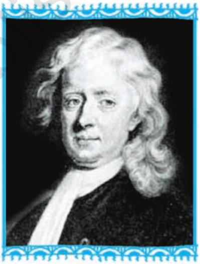
Sir Issac Newton
(1642-1727)

## $5.2$ सांतत्य (Continuity)

सांतत्य की संकल्पना का कुछ अनुमान (बोध) कराने के लिए, हम अनुच्छेद को दो अनौपचारिक उदाहरणों से प्रारंभ करते हैं। निम्नलिखित फलन पर विचार कीजिए:

$$
f(x)=\left\{\begin{array}{l}
1, \text { यदि } x \leq 0 \\
2, \text { यदि } x>0
\end{array}\right.
$$

यह फलन वास्तव में वास्तविक रेखा (real line) के प्रत्येक बिंदु पर परिभाषित है। इस फलन का आलेख आकृति $5.1$ में दर्शाया गया है। कोई भी इस आलेख से निष्कर्ष निकाल सकता है कि $x=0$ के अतिरिक्त, $x$-अक्ष

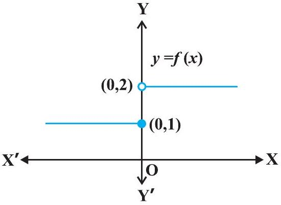
आकृति $5.1$

के अन्य सन्निकट बिंदुओं के लिए फलन के संगत मान भी $x=0$ को छोड़कर एक दूसरे के समीप (लगभग समान) हैं। $0$ के सन्निकट बायीं ओर के बिंदुओं, अर्थात् - 0.1, - 0.01, - 0.001, प्रकार के बिंदुओं, पर फलन का मान $1$ है तथा $0$ के सन्निकट दायीं ओर के बिंदुओं, अर्थात् $0.1,0.01$, 0.001, प्रकार के बिंदुओं पर फलन का मान $2$ है। बाएँ और दाएँ पक्ष की सीमाओं (limits) की भाषा का प्रयोग करके, हम कह सकते हैं कि $x=0$ पर फलन $f$ के बाएँ तथा दाएँ पक्ष की सीमाएँ क्रमशः $1$ तथा $2$ हैं। विशेष रूप से बाएँ तथा दाएँ पक्ष की सीमाएँ समान / संपाती (coincident) नहीं हैं। हम यह भी देखते हैं कि $x=0$ पर फलन का मान बाएँ पक्ष की सीमा के संपाती है (बराबर है)। नोट कीजिए कि इस आलेख को हम लगातार एक साथ (in one stroke), अर्थात् कलम को इस कागज़ की सतह से बिना उठाए, नहीं खींच सकते। वास्तव में, हमें कलम को उठाने की आवश्यकता तब होती है जब हम शून्य से बायीं ओर आते हैं। यह एक उदाहरण है जहाँ फलन $x=0$ पर संतत (continuous) नहीं है।
अब नीचे दर्शाए गए फलन पर विचार कीजिए:

$$
f(x)=\left\{\begin{array}{l}
1, \text { यदि } x \neq 0 \\
2, \text { यदि } x=0
\end{array}\right.
$$

यह फलन भी प्रत्येक बिंदु पर परिभाषित है। $x=0$ पर दोनों ही, बाएँ तथा दाएँ पक्ष की सीमाएँ $1$ के बराबर हैं। किंतु $x=0$ पर फलन का मान $2$ है, जो बाएँ और दाएँ पक्ष की सीमाओं के उभयनिष्ठ मान के बराबर नहीं है।

पुनः हम नोट करते हैं कि फलन के आलेख को बिना कलम उठाए हम नहीं खींच सकते हैं। यह एक दूसरा उदाहरण है जिसमें $x=0$ पर फलन संतत नहीं है।

सहज रूप से (naively) हम कह सकते हैं कि

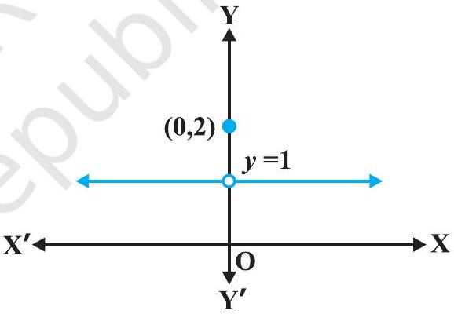
आकृति $5.2$

एक अचर बिंदु पर कोई फलन संतत है, यदि उस बिंदु के आस-पास (around) फलन के आलेख को हम कागज़ की सतह से कलम उठाए बिना खींच सकते हैं। इस बात को हम गणितीय भाषा में, यथातथ्य (precisely), निम्नलिखित प्रकार से व्यक्त कर सकते हैं:
परिभाषा $1$ मान लीजिए कि $f$ वास्तविक संख्याओं के किसी उपसमुच्चय में परिभाषित एक वास्तविक फलन है और मान लीजिए कि $f$ के प्रांत में $c$ एक बिंदु है। तब $f$ बिंदु $c$ पर संतत है, यदि

$$
\lim _{x \rightarrow c} f(x)=f(c) \text { है। }
$$

विस्तृत रूप से यदि $x=c$ पर बाएँ पक्ष की सीमा, दाएँ पक्ष की सीमा तथा फलन के मान का यदि अस्तित्व (existence) है और ये सभी एक दूसरे के बराबर हों, तो $x=c$ पर $f$ संतत कहलाता है। स्मरण कीजिए कि यदि $x=c$ पर बाएँ पक्ष तथा दाएँ पक्ष की सीमाएँ संपाती हैं, तो इनके उभयनिष्ठ

मान को हम $x=c$ पर फलन की सीमा कहते हैं। इस प्रकार हम सांतत्य की परिभाषा को एक अन्य प्रकार से भी व्यक्त कर सकते हैं, जैसा कि नीचे दिया गया है।

एक फलन $x=c$ पर संतत है, यदि फलन $x=c$ पर परिभाषित है और यदि $x=c$ पर फलन का मान $x=c$ पर फलन की सीमा के बराबर है। यदि $x=c$ पर फलन संतत नहीं है तो हम कहते हैं कि $c$ पर $f$ असंतत (discontinuous) है तथा $c$ को $f$ का एक असांतत्य का बिंदु (point of discontinuity) कहते हैं।

उदाहरण $1 x=1$ पर फलन $f(x)=2 x+3$ के सांतत्य की जाँच कीजिए।
हल पहले यह ध्यान दीजिए कि फलन, $x=1$ पर परिभाषित है और इसका मान $5$ है। अब फलन की $x=1$ पर सीमा ज्ञात करते हैं। स्पष्ट है कि

$$
\lim _{x \rightarrow 1} f(x)=\lim _{x \rightarrow 1}(2 x+3)=2(1)+3=5 \text { है। }
$$

अत:

$$
\lim _{x \rightarrow 1} f(x)=5=f(1)
$$

अतएव $x=1$ पर $f$ संतत है।
उदाहरण $2$ जाँचिए कि क्या फलन $f(x)=x^{2}, x=0$ पर संतत है?
हल ध्यान दीजिए कि प्रदत्त बिंदु $x=0$ पर फलन परिभाषित है और इसका मान $0$ है। अब $x=0$ पर फलन की सीमा निकालते हैं। स्पष्टतया

$$
\lim _{x \rightarrow 0} f(x)=\lim _{x \rightarrow 0} x^{2}=0^{2}=0
$$

इस प्रकार

$$
\lim _{x \rightarrow 0} f(x)=0=f(0)
$$

अत:

$$
x=0 \text { पर } f \text { संतत है। }
$$

उदाहरण $3 x=0$ पर फलन $f(x)=|x|$ के सांतत्य पर विचार कीजिए।
हल परिभाषा द्वारा

$$
f(x)=\left\{\begin{array}{l}
-x, \text { यदि } x<0 \\
x, \text { यदि } \quad x \geq 0
\end{array}\right.
$$

स्पष्टतया $x=0$ पर फलन परिभाषित है और $f(0)=0$ है। बिंदु $x=0$ पर $f$ की बाएँ पक्ष की सीमा

$$
\lim _{x \rightarrow 0^{-}} f(x)=\lim _{x \rightarrow 0^{-}}(-x)=0 \text { है। }
$$

इसी प्रकार $0$ पर $f$ की दाएँ पक्ष की सीमा के लिए

$$
\lim _{x \rightarrow 0^{+}} f(x)=\lim _{x \rightarrow 0^{+}} x=0 \text { है। }
$$

इस प्रकार $x=0$ पर बाएँ पक्ष की सीमा, दाएँ पक्ष की सीमा तथा फलन का मान संपाती हैं। अतः $x=0$ पर $f$ संतत है।
उदाहरण $4$ दर्शाइए कि फलन

$$
f(x)= \begin{cases}x^{3}+3, & \text { यदि } x \neq 0 \\ 1, & \text { यदि } x=0\end{cases}
$$

$x=0$ पर संतत नहीं है।
हल यहाँ $x=0$ पर फलन परिभाषित है और $x=0$ पर इसका मान $1$ है। जब $x \neq 0$, तब फलन बहुपदीय है। इसलिए

$$
\lim _{x \rightarrow 0} f(x)=\lim _{x \rightarrow 0}\left(x^{3}+3\right)=0^{3}+3=3
$$

क्योंकि $x=0$ पर $f$ की सीमा, $f(0)$ के बराबर नहीं है, इसलिए $x=0$ पर फलन संतत नहीं है। हम यह भी सुनिश्चित कर सकते हैं कि इस फलन के लिए असांतत्य का बिंदु केवल $x=0$ है। उदाहरण $5$ उन बिंदुओं की जाँच कीजिए जिन पर अचर फलन (Constant function) $f(x)=k$ संतत है।

हल यह फलन सभी वास्तविक संख्याओं के लिए परिभाषित है और किसी भी वास्तविक संख्या के लिए इसका मान $k$ है। मान लीजिए कि $c$ एक वास्तविक संख्या है, तो

$$
\lim _{x \rightarrow c} f(x)=\lim _{x \rightarrow c} k=k
$$

चूँकि किसी वास्तविक संख्या $c$ के लिए $f(c)=k=\lim _{x \rightarrow c} f(x)$ है इसलिए फलन $f$ प्रत्येक वास्तविक संख्या के लिए संतत है।
उदाहरण $6$ सिद्ध कीजिए कि वास्तविक संख्याओं के लिए तत्समक फलन (Identity function) $f(x)=x$, प्रत्येक वास्तविक संख्या के लिए संतत है।

हल स्पष्टतया यह फलन प्रत्येक बिंदु पर परिभाषित है और प्रत्येक वास्तविक संख्या $c$ के लिए $f(c)=c$ है।

साथ ही

$$
\lim _{x \rightarrow c} f(x)=\lim _{x \rightarrow c} x=c
$$

इस प्रकार, $\lim _{x \rightarrow c} f(x)=c=f(c)$ और इसलिए यह फलन $f$ के प्रांत के सभी बिंदुओं पर संतत है ।

एक प्रदत्त बिंदु पर किसी फलन के सांतत्य को परिभाषित करने के बाद अब हम इस परिभाषा का स्वाभाविक प्रसार (extension) करके किसी फलन के, उसके प्रांत में, सांतत्य पर विचार करेंगे। परिभाषा $2$ एक वास्तविक फलन $f$ संतत कहलाता है यदि वह $f$ के प्रांत के प्रत्येक बिंदु पर संतत है। इस परिभाषा को कुछ विस्तार से समझने की आवश्यकता है। मान लीजिए कि $f$ एक ऐसा फलन है, जो संवृत अंतराल (closed interval) $[a, b]$ में परिभाषित है, तो $f$ के संतत होने के लिए आवश्यक है कि वह $[a, b]$ के अंत्य बिंदुओं (end points) $a$ तथा $b$ सहित उसके प्रत्येक बिंदु पर संतत हो। $f$ का अंत्य बिंदु $a$ पर सांतत्य का अर्थ है कि

$$
\lim _{x \rightarrow a^{+}} f(x)=f(a)
$$

और $f$ का $b$ पर सांतत्य का अर्थ है कि

$$
\lim _{x \rightarrow b^{-}} f(x)=f(b)
$$

प्रेक्षण कीजिए कि $\lim _{f} f(x)$ तथा $\lim _{x^{+}} f(x)$ का कोई अर्थ नहीं है। इस परिभाषा के परिणामस्वरूप, यदि $f$ केवल एक बिंदु पर परिभाषित है, तो वह उस बिंदु पर संतत होता है, अर्थात् यदि $f$ का प्रांत एकल (समुच्चय) है, तो $f$ एक संतत फलन होता है।

उदाहरण $7$ क्या $f(x)=|x|$ द्वारा परिभाषित फलन एक संतत फलन है?

हल $f$ को हम ऐसे लिख सकते हैं कि $f(x)= \begin{cases}-x, \text { यदि } & x<0 \\ x, \text { यदि } & x \geq 0\end{cases}$
उदाहरण $3$ से हम जानते हैं कि $x=0$ पर $f$ संतत है।
मान लीजिए कि $c$ एक वास्तविक संख्या इस प्रकार है कि $c<0$ है। अतएव $f(c)=-c$
साथ ही

$$
\lim _{x \rightarrow c} f(x)=\lim _{x \rightarrow c}(-x)=-c
$$

चूँकि $\lim _{x \rightarrow c} f(x)=f(c)$, इसलिए $f$ सभी ऋणात्मक वास्तविक संख्याओं के लिए संतत है। अब मान लीजिए कि $c$ एक वास्तविक संख्या इस प्रकार है कि $c>0$ है। अतएव $f(c)=c$ साथ ही

$$
\lim _{x \rightarrow c} f(x)=\lim _{x \rightarrow c} x=c
$$

क्योंकि $\lim _{x \rightarrow c} f(x)=f(c)$, इसलिए $f$ सभी धनात्मक वास्तविक संख्याओं के लिए संतत है। चूँकि $f$ सभी बिंदुओं पर संतत है, अतः यह एक संतत फलन है।

उदाहरण $8$ फलन $f(x)=x^{3}+x^{2}-1$ के सांतत्य पर विचार कीजिए।
हल स्पष्टतया $f$ प्रत्येक वास्तविक संख्या $c$ के लिए परिभाषित है और $c$ पर इसका मान $c^{3}+c^{2}-1$ है। हम यह भी जानते हैं कि

$$
\lim _{x \rightarrow c} f(x)=\lim _{x \rightarrow c}\left(x^{3}+x^{2}-1\right)=c^{3}+c^{2}-1
$$

अतः $\lim _{x \rightarrow c} f(x)=f(c)$ है इसलिए प्रत्येक वास्तविक संख्या के लिए $f$ संतत है। इसका अर्थ है कि $f$ एक संतत फलन है।

उदाहरण $9 f(x)=\frac{1}{x}, x \neq 0$ द्वारा परिभाषित फलन $f$ के सांतत्य पर विचार कीजिए।
हल किसी एक शून्येतर ( Non-zero) वास्तविक संख्या $c$ को सुनिश्चित कीजिए

अब

$$
\lim _{x \rightarrow c} f(x)=\lim _{x \rightarrow c} \frac{1}{x}=\frac{1}{c}
$$

साथ ही, चूँकि $c \neq 0$, इसलिए $f(c)=\frac{1}{c}$ है। इस प्रकार $\lim _{x \rightarrow c} f(x)=f(c)$ और इसलिए $f$ अपने प्रांत के प्रत्येक बिंदु पर संतत है। इस प्रकार $f$ एक संतत फलन है।

हम इस अवसर का लाभ, अनंत (infinity) की संकल्पना (concept) को समझाने के लिए, उठाते हैं। हम इसके लिए फलन $f(x)=\frac{1}{x}$ का विश्लेषण $x=0$ के निकटस्थ मानों पर करते हैं। इसके लिए हम $0$ के सन्निकट की वास्तविक संख्याओं के लिए फलन के मानों का अध्ययन करने की प्रचलित युक्ति का प्रयोग करते हैं। अनिवार्यतः (essentially) हम $x=0$ पर $f$ के दाएँ पक्ष की सीमा ज्ञात करने का प्रयास करते हैं। इसको हम नीचे सारणीबद्ध करते हैं। (सारणी 5.1)

सारणी $5.1$
| $x$ | $1$ | $0.3$ | $0.2$ | $0.1=10^{-1}$ | $0.01=10^{-2}$ | $0.001=10^{-3}$ | $10^{-n}$ |
| :--- | :--- | :--- | :--- | :--- | :--- | :--- | :--- |
| $f(x)$ | $1$ | 3.333... | $5$ | $10$ | $100=10^{2}$ | $1000=10^{3}$ | $10^{n}$ |

हम देखते हैं कि जैसे-जैसे $x$ दायीं ओर से $0$ के निकट अग्रसर होता है $f(x)$ का मान उत्तरोत्तर अति शीघ्रता से बढ़ता जाता है। इस बात को एक अन्य प्रकार से भी व्यक्त किया जा सकता है, जैसे:

एक धन वास्तविक संख्या को $0$ के अत्यंत निकट चुनकर, $f(x)$ के मान को किसी भी प्रदत्त संख्या से अधिक किया जा सकता है। प्रतीकों में इस बात को हम निम्नलिखित प्रकार से लिखते हैं कि

$$
\lim _{x \rightarrow 0^{+}} f(x)=+\infty
$$

(इसको इस प्रकार पढ़ा जाता है: $0$ पर, $f(x)$ के दाएँ पक्ष की धनात्मक सीमा अनंत है)। यहाँ पर हम बल देना चाहते हैं कि $+\infty$ एक वास्तविक संख्या नहीं है और इसलिए $0$ पर $f$ के दाएँ पक्ष की सीमा का अस्तित्व नहीं है (वास्तविक संख्याओं के रूप में)।

इसी प्रकार से $0$ पर $f$ के बाएँ पक्ष की सीमा ज्ञात की जा सकती है। निम्नलिखित सारणी से स्वतः स्पष्ट है।

सारणी $5.2$
| $x$ | - $1$ | -0.3 | -0.2 | $-10^{-1}$ | $-10^{-2}$ | $-10^{-3}$ | $-10^{-n}$ |
| :--- | :--- | :--- | :--- | :--- | :--- | :--- | :--- |
| $f(x)$ | -1 | - 3.333... | -5 | - $10$ | $-10^{2}$ | $-10^{3}$ | $-10^{n}$ |

सारणी $5.2$ से हम निष्कर्ष निकालते हैं कि एक ऋणात्मक वास्तविक संख्या को $0$ के अत्यंत निकट चुनकर, $f(x)$ के मान को किसी भी प्रदत्त संख्या से कम किया जा सकता है। प्रतीकात्मक रूप से हम

$$
\lim _{x \rightarrow 0^{-}} f(x)=-\infty \text { लिखते हैं }
$$

(जिसे इस प्रकार पढ़ा जाता है: $0$ पर $f(x)$ के बाएँ पक्ष की सीमा ऋणात्मक अनंत है।) यहाँ हम इस बात पर बल देना चाहते हैं कि $-\infty$ एक वास्तविक संख्या नहीं है अतएव $0$ पर $f$ के बाएँ पक्ष की सीमा का अस्तित्व नहीं है (वास्तविक संख्याओं के रूप में)। आकृति $5.3$ का आलेख उपर्युक्त तथ्यों का ज्यामितीय निरूपण है।

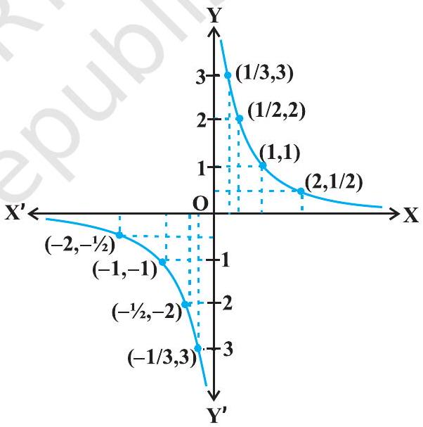
आकृति $5.3$

उदाहरण $10$ निम्नलिखित फलन के सांतत्य पर विचार कीजिए:

$$
f(x)=\left\{\begin{array}{l}
x+2, \text { यदि } x \leq 1 \\
x-2, \text { यदि } x>1
\end{array}\right.
$$

हल फलन $f$ वास्तविक रेखा के प्रत्येक बिंदु पर परिभाषित है।
दशा $1$ यदि $c<1$, तो $f(c)=c+2$ है। इस प्रकार $\lim _{x \rightarrow c} f(x)=\lim _{x \rightarrow c} x+2=c+2$ है।

अतः $1$ से कम सभी वास्तविक संख्याओं पर $f$ संतत है।
दशा $2$ यदि $c>1$, तो $f(c)=c-2$ है।
इसलिए $\lim _{x \rightarrow c} f(x)=\lim _{x \rightarrow c}(x-2)=c-2=f(c)$ है। अतएव उन सभी बिंदुओं पर जहाँ $x>1$ है, $f$ संतत है। दशा $3$ यदि $c=1$, तो $x=1$ पर $f$ के बाएँ पक्ष की सीमा, अर्थात्

$$
\lim _{x \rightarrow 1^{-}} f(x)=\lim _{x \rightarrow 1^{-}}(x+2)=1+2=3
$$

$x=1$ पर $f$ के दाएँ पक्ष की सीमा, अर्थात्

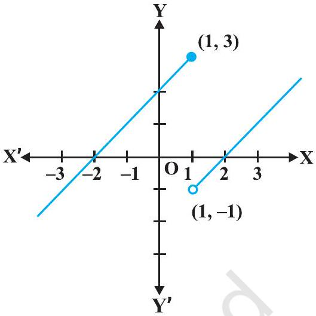
आकृति $5.4$

$$
\lim _{x \rightarrow 1^{+}} f(x)=\lim _{x \rightarrow 1^{-}}(x-2)=1-2=-1
$$

अब चूँकि $x=1$ पर $f$ के बाएँ तथा दाएँ पक्ष की सीमाएँ संपाती (coincident) नहीं हैं, अतः $x=1$ पर $f$ संतत नहीं है। इस प्रकार $f$ के असांतत्य का बिंदु केवल मात्र $x=1$ है। इस फलन का आलेख आकृति $5.4$ में दर्शाया गया है।

उदाहरण $11$ निम्नलिखित प्रकार से परिभाषित फलन $f$ के समस्त (सभी) असांतत्य बिंदुओं को ज्ञात कीजिए

$$
f(x)=\left\{\begin{array}{c}
x+2, \text { यदि } x<1 \\
0, \text { यदि } \quad x=1 \\
x-2, \text { यदि } x>1
\end{array}\right.
$$

हल पूर्ववर्ती उदाहरण की तरह यहाँ भी हम देखते हैं प्रत्येक वास्तविक संख्या $x \neq 1$ के लिए $f$ संतत है। $x=1$ के लिए $f$ के बाएँ पक्ष की सीमा, $\lim _{x \rightarrow 1^{-}} f(x)=\lim _{x \rightarrow 1^{-}}(x+2)=1+2=3$ है। $x=1$ के लिए $f$ के दाएँ पक्ष की सीमा, $\lim _{x \rightarrow 1^{-}} f(x)=\lim _{x \rightarrow 1^{-}}(x-2)=1-2=-1$ है।

चूँकि $x=1$ पर $f$ के बाएँ तथा दाएँ पक्ष की सीमाएँ संपाती नहीं हैं, अतः $x=1$ पर $f$ संतत नहीं है। इस प्रकार $f$ के असांतत्य का बिंदु केवल मात्र $x=1$ है। इस फलन का आलेख आकृति $5.5$ में दर्शाया गया है।

उदाहरण $12$ निम्नलिखित फलन के सांतत्य पर विचार कीजिए:

$$
f(x)=\left\{\begin{array}{r}
x+2, \text { यदि } x<0 \\
-x+2, \text { यदि } x>0
\end{array}\right.
$$

हल ध्यान दीजिए कि विचाराधीन फलन $0$ (शून्य) के अतिरिक्त अन्य समस्त वास्तविक संख्याओं के लिए परिभाषित है। परिभाषानुसार इस फलन का प्रांत
$\mathrm{D}_{1} \cup \mathrm{D}_{2}$ है जहाँ $\mathrm{D}_{1}=\{x \in \mathbf{R}: x<0\}$ और

$$
\mathrm{D}_{2}=\{x \in \mathbf{R}: x>0\} \text { है। }
$$

दशा $1$ यदि $c \in \mathrm{D}_{1}$, तो $\lim _{x \rightarrow c} f(x)=\lim _{x \rightarrow c}(x+2)=$ $c+2=f(c)$ है अतएव $\mathrm{D}_{1}$ में $f$ संतत है।

दशा $2$ यदि $c \in \mathrm{D}_{2}$, तो $\lim _{x \rightarrow c} f(x)=\lim _{x \rightarrow c}(-x+2)=$ $-c+2=f(c)$ है अतएव $\mathrm{D}_{2}$ में भी $f$ संतत है।

क्योंकि $f$ अपने प्रांत के समस्त बिंदुओं पर संतत है जिससे हम निष्कर्ष निकालते हैं कि $f$ एक संतत फलन है। इस फलन का आलेख आकृति $5.6$ में खींचा गया है। ध्यान दीजिए कि इस फलन के आलेख को खींचने के लिए हमें कलम को कागज़ की सतह से उठाना पड़ता है, किंतु हमें ऐसा केवल उन बिंदुओं पर करना पड़ता है जहाँ पर फलन परिभाषित नहीं है।

उदाहरण $13$ निम्नलिखित फलन के सांतत्य पर विचार कीजिए:

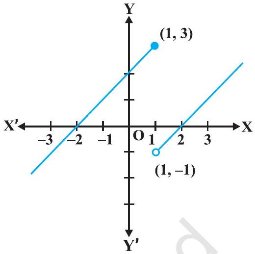
आकृति $5.5$

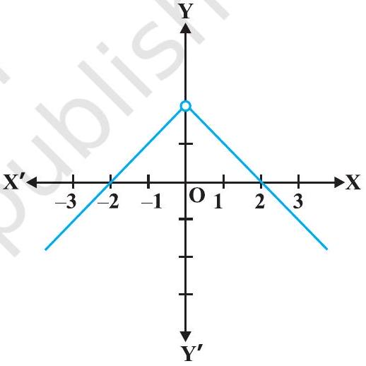
आकृति $5.6$

$$
f(x)= \begin{cases}x, & \text { यदि } x \geq 0 \\ x^{2}, & \text { यदि } x<0\end{cases}
$$

हल स्पष्टतया, प्रदत्त फलन प्रत्येक वास्तविक संख्या के लिए परिभाषित है। इस फलन का आलेख आकृति $5.7$ में दिया है। इस आलेख के निरीक्षण से यह तर्कसंगत लगता है कि फलन के प्रांत को वास्तविक रेखा के तीन असंयुक्त (disjoint) उप समुच्चयों में विभाजित कर लिया जाए। मान लिया कि

$$
\begin{aligned}
& \mathrm{D}_{1}=\{x \in \mathbf{R}: x<0\}, \mathrm{D}_{2}=\{0\} \text { तथा } \\
& \mathrm{D}_{3}=\{x \in \mathbf{R}: x>0\} \text { है। }
\end{aligned}
$$

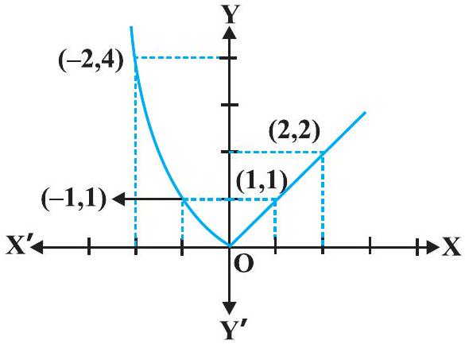
आकृति $5.7$

दशा $1 \mathrm{D}_{1}$ के किसी भी बिंदु पर $f(x)=x^{2}$ है और यह सरलता से देखा जा सकता है कि $\mathrm{D}_{1}$ में $f$ संतत है। (उदाहरण $2$ देखिए)
दशा $2 \mathrm{D}_{3}$ के किसी भी बिंदु पर $f(x)=x$ है और यह सरलता से देखा जा सकता है कि $\mathrm{D}_{3}$ में $f$ संतत है। (उदाहरण $6$ देखिए)
दशा $3$ अब हम $x=0$ पर फलन का विश्लेषण करते हैं। $0$ के लिए फलन का मान $f(0)=0$ है। $0$ पर $f$ के बाएँ पक्ष की सीमा

$$
\lim _{x \rightarrow 0^{-}} f(x)=\lim _{x \rightarrow 0^{-}} x^{2}=0^{2}=0 \text { है तथा }
$$

$0$ पर $f$ के दाएँ पक्ष की सीमा

$$
\lim _{x \rightarrow 0^{+}} f(x)=\lim _{x \rightarrow 0^{+}} x=0 \text { है। }
$$

अतः $\lim _{x \rightarrow 0} f(x)=0=f(0)$ अतएव $0$ पर $f$ संतत है। इसका अर्थ यह हुआ कि $f$ अपने प्रांत के प्रत्येक बिंदु पर संतत है। अतः $f$ एक संतत फलन है।
उदाहरण $14$ दर्शाइए कि प्रत्येक बहुपद फलन संतत होता है।
हल स्मरण कीजिए कि कोई फलन $p$, एक बहुपद फलन होता है यदि वह किसी प्राकृत संख्या $n$ के लिए $p(x)=a_{0}+a_{1} x+\ldots+a_{n} x^{n}$ द्वारा परिभाषित हो, जहाँ $a_{i} \in \mathbf{R}$ तथा $a_{n} \neq 0$ है। स्पष्टतया यह फलन प्रत्येक वास्तविक संख्या के लिए परिभाषित है। किसी निश्चित वास्तविक संख्या $c$ के लिए हम देखते हैं कि

$$
\lim _{x \rightarrow c} p(x)=p(c)
$$

इसलिए परिभाषा द्वारा $c$ पर $p$ संतत है। चूँकि $c$ कोई भी वास्तविक संख्या है इसलिए $p$ किसी भी वास्तविक संख्या के लिए संतत है, अर्थात् $p$ एक संतत फलन है।

उदाहरण $15 f(x)=[x]$ द्वारा परिभाषित महत्तम पूर्णांक फलन के असांतत्य के समस्त बिंदुओं को ज्ञात कीजिए, जहाँ $[x]$ उस महत्तम पूर्णांक को प्रकट करता है, जो $x$ से कम या उसके बराबर है।

हल पहले तो हम यह देखते हैं कि $f$ सभी वास्तविक संख्याओं के लिए परिभाषित है। इस फलन का आलेख आकृति $5.8$ में दिखाया गया है।

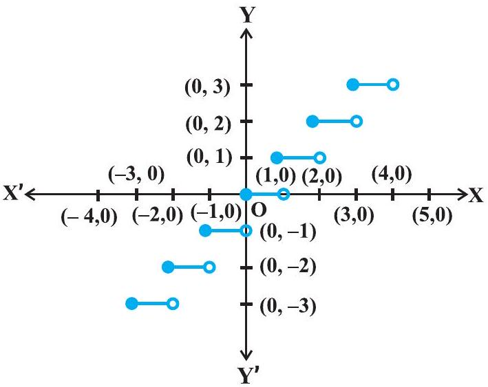
आकृति $5.8$

आलेख से ऐसा प्रतीत होता है कि प्रदत्त फलन $x$ के सभी पूर्णांक मानों के लिए असंतत है। नीचे हम छानबीन करेंगे कि क्या यह सत्य है।

दशा $1$ मान लीजिए कि $c$ एक ऐसी वास्तविक संख्या है, जो किसी भी पूर्णांक के बराबर नहीं है। आलेख से यह स्पष्ट है कि $c$ के निकट की सभी वास्तविक संख्याओं के लिए दिए हुए फलन का मान $[c]$; हैं, अर्थात् $\lim _{x \rightarrow c} f(x)=\lim _{x \rightarrow c}[x]=[c]$ साथ ही $f(c)=[c]$ अतः प्रदत्त फलन, उन सभी वास्तविक संख्याओं के लिए संतत है, जो पूर्णांक नहीं है।
दशा $2$ मान लीजिए कि $c$ एक पूर्णांक है। अतएव हम एक ऐसी पर्याप्ततः छोटी वास्तविक संख्या $r>0$ प्राप्त कर सकते हैं जो कि $[c-r]=c-1$ जबकि $[c+r]=c$ है। सीमाओं के रूप में, इसका अर्थ यह हुआ कि

$$
\lim _{x \rightarrow c^{-}} f(x)=c-1 \text { तथा } \lim _{x \rightarrow c^{+}} f(x)=c
$$

चूँकि किसी भी पूर्णांक $c$ के लिए ये सीमाएँ समान नहीं हो सकती हैं, अतः प्रदत्त फलन $x$ सभी पूर्णांक मानों के लिए असंतत है।

### 5.2.1 संतत फलनों का बीजगणित (Algebra of continuous functions)

पिछली कक्षा में, सीमा की संकल्पना समझने के उपरांत, हमनें सीमाओं के बीजगणित का कुछ अध्ययन किया था। अनुरूपतः अब हम संतत फलनों के बीजगणित का भी कुछ अध्ययन करेंगे। चूँकि किसी बिंदु पर एक फलन का सांतत्य पूर्णरूप से उस बिंदु पर फलन की सीमा द्वारा निर्धारित होता है, अतएव यह तर्कसंगत है कि हम सीमाओं के सदृश्य ही यहाँ भी बीजीय परिणामों की अपेक्षा करें।
प्रमेय $1$ मान लीजिए कि $f$ तथा $g$ दो ऐसे वास्तविक फलन हैं, जो एक वास्तविक संख्या $c$ के लिए संतत हैं। तब,

(1) $f+g, x=c$ पर संतत है
(2) $f-g, x=c$ पर संतत है
(3) $f \cdot g, x=c$ पर संतत है
(4) $\left(\frac{f}{g}\right), x=c$ पर संतत है (जबकि $g(c) \neq 0$ है।)

उपपत्ति हम बिंदु $x=c$ पर $(f+g)$ के सांतत्य की जाँच करते हैं। हम दरते हैं कि

$$
\begin{array}{rlr}
\lim _{x \rightarrow c}(f+g)(x) & =\lim _{x \rightarrow c}[f(x)+g(x)] & (f+g \text { की परिभाषा द्वारा) } \\
& =\lim _{x \rightarrow c} f(x)+\lim _{x \rightarrow c} g(x) & \text { (सीमाओं के प्रमेय द्वारा) }
\end{array}
$$

$$
\begin{aligned}
& =f(c)+g(c) \\
& =(f+g)(c)
\end{aligned}
$$

(क्यों $f$ तथा $g$ संतत फलन हैं)
( $f+g$ की परिभाषा द्वारा)
अतः, $f+g$ भी $x=c$ के लिए संतत है।
प्रमेय $1$ के शेष भागों की उपपत्ति इसी के समान है जिन्हें पाठकों के लिए अभ्यास हेतु छोड़ दिया गया है।

टिप्पणी

(i) उपर्युक्त प्रमेय के भाग (3) की एक विशेष दशा के लिए, यदि $f$ एक अचर फलन $f(x)=\lambda$ हो, जहाँ $\lambda$, कोई अचर वास्तविक संख्या है, तो $(\lambda \cdot g)(x)=\lambda \cdot g(x)$ द्वारा परिभाषित फलन $(\lambda . g)$ भी एक संतत फलन है। विशेष रूप से, यदि $\lambda=-1$, तो $f$ के सांतत्य में $-f$ का सांतत्य अंतर्निहित होता है।
(ii) उपर्युक्त प्रमेय के भाग (4) की एक विशेष दशा के लिए, यदि $f$ एक अचर फलन $f(x)=\lambda$, तो $\frac{\lambda}{g}(x)=\frac{\lambda}{g(x)}$ द्वारा परिभाषित फलन $\frac{\lambda}{g}$ भी एक संतत फलन होता है, जहाँ $g(x) \neq 0$ है। विशेष रूप से, $g$ के सांतत्य में $\frac{1}{g}$ का सांतत्य अंतर्निहित है।

उपर्युक्त दोनों प्रमेयों के उपयोग द्वारा अनेक संतत फलनों को बनाया जा सकता है। इनसे यह निश्चित करने में भी सहायता मिलती है कि कोई फलन संतत है या नहीं। निम्नलिखित उदाहरणों में यह बात स्पष्ट की गई है।
उदाहरण $16$ सिद्ध कीजिए कि प्रत्येक परिमेय फलन संतत होता है।
हल स्मरण कीजिए कि प्रत्येक परिमेय फलन $f$ निम्नलिखित रूप का होता है:

$$
f(x)=\frac{p(x)}{q(x)}, q(x) \neq 0
$$

जहाँ $p$ और $q$ बहुपद फलन हैं। $f$ का प्रांत, उन बिंदुओं को छोड़कर जिन पर $q$ शून्य है, समस्त वास्तविक संख्याएँ हैं। चूँकि बहुपद फलन संतत होते हैं (उदाहरण 14), अतएव प्रमेय $1$ के भाग (4) द्वारा $f$ एक संतत फलन है।
उदाहरण $17$ sine फलन के सांतत्य पर विचार कीजिए।
हल इस पर विचार करने के लिए हम निम्नलिखित तथ्यों का प्रयोग करते हैं:

$$
\lim _{x \rightarrow 0} \sin x=0
$$

हमने इन तथ्यों को यहाँ प्रमाणित तो नहीं किया है, किन्तु sine फलन के आलेख को शून्य के निकट देख कर ये तथ्य सहजानुभूति (intuitively) से स्पष्ट हो जाता है।

अब देखिए कि $f(x)=\sin x$ सभी वास्तविक संख्याओं के लिए परिभाषित है। मान लीजिए कि $c$ एक वास्तविक संख्या है। $x=c+h$ रखने पर, यदि $x \rightarrow c$ तो हम देखते हैं कि $h \rightarrow 0$ इसलिए

$$
\begin{aligned}
\lim _{x \rightarrow c} f(x) & =\lim _{x \rightarrow c} \sin x \\
& =\lim _{h \rightarrow 0} \sin (c+h) \\
& =\lim _{h \rightarrow 0}[\sin c \cos h+\cos c \sin h] \\
& =\lim _{h \rightarrow 0}[\sin c \cos h]+\lim _{h \rightarrow 0}[\cos c \sin h] \\
& =\sin c+0=\sin c=f(c)
\end{aligned}
$$

इस प्रकार $\lim _{x \rightarrow c} f(x)=f(c)$ अतः $f$ एक संतत फलन है।
टिप्पणी इसी प्रकार cosine फलन के सांतत्य को भी प्रमाणित किया जा सकता है।
उदाहरण $18$ सिद्ध कीजिए कि $f(x)=\tan x$ एक संतत फलन है।
हल दिया हुआ फलन $f(x)=\tan x=\frac{\sin x}{\cos x}$ है। यह फलन उन सभी वास्तविक संख्याओं के लिए परिभाषित है, जहाँ $\cos x \neq 0$, अर्थात् $x \neq(2 n+1) \frac{\pi}{2}$ है। हमने अभी प्रमाणित किया है कि sine और cosine फलन, संतत फलन हैं। इसलिए $\tan$ फलन, इन दोनों फलनों का भागफल होने के कारण, $x$ के उन सभी मानों के लिए संतत है जिन के लिए यह परिभाषित है।

फलनों के संयोजन (composition) से संबंधित, संतत फलनों का व्यवहार एक रोचक तथ्य है। स्मरण कीजिए कि यदि $f$ और $g$ दो वास्तविक फलन हैं, तो

$$
(f \circ g)(x)=f(g(x))
$$

परिभाषित है, जब कभी $g$ का परिसर $f$ के प्रांत का एक उपसमुच्चय होता है। निम्नलिखित प्रमेय (प्रमाण बिना केवल व्यक्त), संयुक्त (composite) फलनों के सांतत्य को परिभाषित करती है। प्रमेय $2$ मान लीजिए कि $f$ और $g$ इस प्रकार के दो वास्तविक मानीय (real valued) फलन हैं कि $c$ पर $(f \circ g)$ परिभाषित है। यदि $c$ पर $g$ तथा $g(c)$ पर $f$ संतत है, तो $c$ पर $(f \circ g)$ संतत होता है।

निम्नलिखित उदाहरणों में इस प्रमेय को स्पष्ट किया गया है।

उदाहरण $19$ दर्शाइए कि $f(x)=\sin \left(x^{2}\right)$ द्वारा परिभाषित फलन, एक संतत फलन है।
हल प्रेक्षण कीजिए कि विचाराधीन फलन प्रत्येक वास्तविक संख्या के लिए परिभाषित है। फलन $f$ को, $g$ तथा $h$ दो फलनों के संयोजन $(g \circ h)$ के रूप में सोचा जा सकता है, जहाँ $g(x)=\sin x$ तथा $h(x)=x^{2}$ है। चूँकि $g$ और $h$ दोनों ही संतत फलन हैं, इसलिए प्रमेय $2$ द्वारा यह निष्कर्ष निकाला जा सकता है, कि $f$ एक संतत फलन है।
उदाहरण $20$ दर्शाइए कि $f(x)=|1-x+|x||$ द्वारा परिभाषित फलन $f$, जहाँ $x$ एक वास्तविक संख्या है, एक संतत फलन है।

हल सभी वास्तविक संख्याओं $x$ के लिए $g$ को $g(x)=1-x+|x|$ तथा $h$ को $h(x)=|x|$ द्वारा परिभाषित कीजिए। तब,

$$
\begin{aligned}
(h \circ g)(x) & =h(g(x)) \\
& =h(1-x+|x|) \\
& =|1-x+|x||=f(x)
\end{aligned}
$$

उदाहरण $7$ में हम देख चुके हैं कि $h$ एक संतत फलन है। इसी प्रकार एक बहुपद फलन और एक मापांक फलन का योग होने के कारण $g$ एक संतत फलन है। अतः दो संतत फलनों का संयुक्त फलन होने के कारण $f$ भी एक संतत फलन है।

## प्रश्नावली $5.1$

1. सिद्ध कीजिए कि फलन $f(x)=5 x-3, x=0, x=-3$ तथा $x=5$ पर संतत है।
2. $x=3$ पर फलन $f(x)=2 x^{2}-1$ के सांतत्य की जाँच कीजिए।
3. निम्नलिखित फलनों के सांतत्य की जाँच कीजिए:
(a) $f(x)=x-5$
(b) $f(x)=\frac{1}{x-5}, x \neq 5$
(c) $f(x)=\frac{x^{2}-25}{x+5}, x \neq-5$
(d) $f(x)=|x-5|$
4. सिद्ध कीजिए कि फलन $f(x)=x^{n}, x=n$, पर संतत है, जहाँ $n$ एक धन पूर्णांक है।
5. क्या $f(x)=\left\{\begin{array}{l}x, \text { यदि } x \leq 1 \\ 5, \text { यदि } x>1\end{array}\right.$ द्वारा परिभाषित फलन $f$ $x=0, x=1$, तथा $x=2$ पर संतत है?

$f$ के सभी असांतत्य के बिंदुओं को ज्ञात कीजिए, जब कि $f$ निम्नलिखित प्रकार से परिभाषित है:
6. $f(x)=\left\{\begin{array}{l}2 x+3, \text { यदि } x \leq 2 \\ 2 x-3, \text { यदि } x>2\end{array}\right.$
7. $f(x)=\left\{\begin{array}{l}|x|+3, \text { यदि } x \leq-3 \\ -2 x, \text { यदि }-3<x<3 \\ 6 x+2, \text { यदि } x \geq 3\end{array}\right.$
8. $f(x)=\left\{\begin{array}{cc}\frac{|x|}{x}, & \text { यदि } x \neq 0 \\ 0, & \text { यदि } x=0\end{array}\right.$
9. $f(x)= \begin{cases}\frac{x}{|x|}, & \text { यदि } x<0 \\ -1, & \text { यदि } x \geq 0\end{cases}$
10. $f(x)=\left\{\begin{array}{l}x+1, \text { यदि } x \geq 1 \\ x^{2}+1, \text { यदि } x<1\end{array}\right.$
11. $f(x)= \begin{cases}x^{3}-3, & \text { यदि } x \leq 2 \\ x^{2}+1, & \text { यदि } x>2\end{cases}$
12. $f(x)= \begin{cases}x^{10}-1, & \text { यदि } x \leq 1 \\ x^{2}, & \text { यदि } x>1\end{cases}$
13. क्या $f(x)=\left\{\begin{array}{ll}x+5, & \text { यदि } x \leq 1 \\ x-5, & \text { यदि } x>1\end{array}\right.$ द्वारा परिभाषित फलन, एक संतत फलन है? फलन $f$, के सांतत्य पर विचार कीजिए, जहाँ $f$ निम्नलिखित द्वारा परिभाषित है:
14. $f(x)=\left\{\begin{array}{l}3, \text { यदि } 0 \leq x \leq 1 \\ 4, \text { यदि } 1<x<3 \\ 5, \text { यदि } 3 \leq x \leq 10\end{array}\right.$
15. $f(x)= \begin{cases}2 x, & \text { यदि } x<0 \\ 0, & \text { यदि } 0 \leq x \leq 1 \\ 4 x, & \text { यदि } x>1\end{cases}$
16. $f(x)= \begin{cases}-2, & \text { यदि } x \leq-1 \\ 2 x, & \text { यदि }-1<x \leq 1 \\ 2, & \text { यदि } x>1\end{cases}$
17. $a$ और $b$ के उन मानों को ज्ञात कीजिए जिनके लिए

$$
f(x)= \begin{cases}a x+1, & \text { यदि } x \leq 3 \\ b x+3, & \text { यदि } x>3\end{cases}
$$

द्वारा परिभाषित फलन $x=3$ पर संतत है।

18. $\lambda$ के किस मान के लिए
$$
f(x)= \begin{cases}\lambda\left(x^{2}-2 x\right), & \text { यदि } x \leq 0 \\ 4 x+1, & \text { यदि } x>0\end{cases}
$$
द्वारा परिभाषित फलन $x=0$ पर संतत है। $x=1$ पर इसके सांतत्य पर विचार कीजिए।
19. दर्शाइए कि $g(x)=x-[x]$ द्वारा परिभाषित फलन समस्त पूर्णांक बिंदुओं पर असंतत है। यहाँ $[x]$ उस महत्तम पूर्णांक निरूपित करता है, जो $x$ के बराबर या $x$ से कम है।
20. क्या $f(x)=x^{2}-\sin x+5$ द्वारा परिभाषित फलन $x=\pi$ पर संतत है?
21. निम्नलिखित फलनों के सांतत्य पर विचार कीजिए:
(a) $f(x)=\sin x+\cos x$
(b) $f(x)=\sin x-\cos x$
(c) $f(x)=\sin x \cdot \cos x$
22. cosine, cosecant, secant और cotangent फलनों के सांतत्य पर विचार कीजिए।
23. $f$ के सभी असांतत्यता के बिंदुओं को ज्ञात कीजिए, जहाँ
$$
f(x)= \begin{cases}\frac{\sin x}{x}, & \text { यदि } x<0 \\ x+1, & \text { यदि } x \geq 0\end{cases}
$$
24. निर्धारित कीजिए कि फलन $f$
$$
f(x)= \begin{cases}x^{2} \sin \frac{1}{x}, & \text { यदि } x \neq 0 \\ 0, & \text { यदि } x=0\end{cases}
$$
द्वारा परिभाषित एक संतत फलन है।
25. $f$ के सांतत्य की जाँच कीजिए, जहाँ $f$ निम्नलिखित प्रकार से परिभाषित है
$$
f(x)= \begin{cases}\sin x-\cos x, & \text { यदि } x \neq 0 \\ -1, & \text { यदि } x=0\end{cases}
$$
प्रश्न $26$ से $29$ में $k$ के मानों को ज्ञात कीजिए ताकि प्रदत्त फलन निर्दिष्ट बिंदु पर संतत हो:
26. $f(x)=\left\{\begin{array}{ll}\frac{k \cos x}{\pi-2 x}, & \text { यदि } x \neq \frac{\pi}{2} \\ 3, & \text { यदि } x=\frac{\pi}{2}\end{array}\right.$ द्वारा परिभाषित फलन $x=\frac{\pi}{2}$ पर

27. $f(x)=\left\{\begin{array}{ll}k x^{2}, & \text { यदि } x \leq 2 \\ 3, & \text { यदि } x>2\end{array}\right.$ द्वारा परिभाषित फलन $x=2$ पर
28. $f(x)=\left\{\begin{array}{ll}k x+1, & \text { यदि } x \leq \pi \\ \cos x, & \text { यदि } x>\pi\end{array}\right.$ द्वारा परिभाषित फलन $x=\pi$ पर
29. $f(x)=\left\{\begin{array}{ll}k x+1, & \text { यदि } x \leq 5 \\ 3 x-5, & \text { यदि } x>5\end{array}\right.$ द्वारा परिभाषित फलन $x=5$ पर
30. $a$ तथा $b$ के मानों को ज्ञात कीजिए ताकि
$$
f(x)= \begin{cases}5, & \text { यदि } x \leq 2 \\ a x+b, & \text { यदि } 2<x<10 \\ 21, & \text { यदि } x \geq 10\end{cases}
$$
द्वारा परिभाषित फलन एक संतत फलन हो।
31. दर्शाइए कि $f(x)=\cos \left(x^{2}\right)$ द्वारा परिभाषित फलन एक संतत फलन है।
32. दर्शाइए कि $f(x)=|\cos x|$ द्वारा परिभाषित फलन एक संतत फलन है।
33. जाँचिए कि क्या $\sin |x|$ एक संतत फलन है।
34. $f(x)=|x|-|x+1|$ द्वारा परिभाषित फलन $f$ के सभी असांत्यता के बिंदुओं को ज्ञात कीजिए।

## 5.3. अवकलनीयता (Differentiability)

पिछली कक्षा में सीखे गए तथ्यों को स्मरण कीजिए। हमनें एक वास्तविक फलन के अवकलज (Derivative) को निम्नलिखित प्रकार से परिभाषित किया था।

मान लीजिए कि $f$ एक वास्तविक फलन है तथा $c$ इसके प्रांत में स्थित एक बिंदु है। $c$ पर $f$ का अवकलज निम्नलिखित प्रकार से परिभाषित है:

$$
\lim _{h \rightarrow 0} \frac{f(c+h)-f(c)}{h}
$$

यदि इस सीमा का अस्तित्व हो तो $c$ पर $f$ के अवकलज को $f^{\prime}(c)$ या $\left.\frac{d}{d x}(f(x))\right|_{c}$ द्वारा प्रकट करते हैं।

$$
f^{\prime}(x)=\lim _{h \rightarrow 0} \frac{f(x+h)-f(x)}{h}
$$

द्वारा परिभाषित फलन, जब भी इस सीमा का अस्तित्व हो, $f$ के अवकलज को परिभाषित करता है। $f$ के अवकलज को $f^{\prime}(x)$ या $\frac{d}{d x}(f(x))$ द्वारा प्रकट करते हैं और यदि $y=f(x)$ तो इसे $\frac{d y}{d x}$ या $y^{\prime}$ द्वारा प्रकट करते हैं। किसी फलन का अवकलज ज्ञात करने की प्रक्रिया को अवकलन (differentiation) कहते हैं। हम वाक्यांश " $x$ के सापेक्ष $f(x)$ का अवकलन कीजिए (differentiate)" का भी प्रयोग करते हैं, जिसका अर्थ होता है कि $f^{\prime}(x)$ ज्ञात कीजिए।
अवकलज के बीजगणित के रूप में निम्नलिखित नियमों को प्रमाणित किया जा चुका है:

(1) $(u \pm v)^{\prime}=u^{\prime} \pm v^{\prime}$.
(2) $(u v)^{\prime}=u^{\prime} v+u v^{\prime}$ (लेबनीज़ या गुणनफल नियम)
(3) $\left(\frac{u}{v}\right)^{\prime}=\frac{u^{\prime} v-u v^{\prime}}{v^{2}}$, जहाँ $v \neq 0$ (भागफल नियम)

नीचे दी गई सारणी में कुछ प्रामाणिक (standard) फलनों के अवकलजों की सूची दी गई है:

सारणी $5.3$
| $f(x)$ | $x^{n}$ | $\sin x$ | $\cos x$ | $\tan x$ |
| :--- | :--- | :--- | :--- | :--- |
| $f^{\prime}(x)$ | $n x^{n-1}$ | $\cos x$ | $-\sin x$ | $\sec ^{2} x$ |

जब कभी भी हमने अवकलज को परिभाषित किया है तो एक सुझाव भी दिया है कि "यदि सीमा का अस्तित्व हो।" अब स्वाभाविक रूप से प्रश्न उठता है कि यदि ऐसा नहीं है तो क्या होगा? यह प्रश्न नितांत प्रासंगिक है और इसका उत्तर भी। यदि $\lim _{h \rightarrow 0} \frac{f(c+h)-f(c)}{h}$ का अस्तित्व नहीं है, तो हम कहते हैं कि $c$ पर $f$ अवकलनीय नहीं है। दूसरे शब्दों में, हम कहते हैं कि अपने प्रांत के किसी बिंदु $c$ पर फलन $f$ अवकलनीय है, यदि दोनों सीमाएँ $\lim _{h \rightarrow 0^{-}} \frac{f(c+h)-f(c)}{h}$ तथा $\lim _{h \rightarrow 0^{+}} \frac{f(c+h)-f(c)}{h}$ परिमित (finite) तथा समान हैं। फलन अंतराल $[a, b]$ में अवकलनीय कहलाता है, यदि वह अंतराल $[a, b]$ के प्रत्येक बिंदु पर अवकलनीय है। जैसा कि सांतत्य के संदर्भ में कहा गया था कि अंत्य बिंदुओं $a$ तथा $b$ पर हम क्रमशः दाएँ तथा बाएँ पक्ष की सीमाएँ लेते हैं, जो कि और कुछ नहीं, बल्कि $a$ तथा $b$ पर फलन के दाएँ पक्ष तथा बाएँ पक्ष के अवकलज ही हैं। इसी प्रकार फलन अंतराल $(a, b)$ में अवकलनीय कहलाता है, यदि वह अंतराल $(a, b)$ के प्रत्येक बिंदु पर अवकलनीय है।

प्रमेय $3$ यदि फलन किसी बिंदु $c$ पर अवकलनीय है, तो उस बिंदु पर वह संतत भी है। उपपत्ति चूँकि बिंदु $c$ पर $f$ अवकलनीय है, अतः

$$
\lim _{x \rightarrow c} \frac{f(x)-f(c)}{x-c}=f^{\prime}(c)
$$

किंतु $x \neq c$ के लिए

$$
f(x)-f(c)=\frac{f(x)-f(c)}{x-c} \cdot(x-c)
$$

इसलिए

$$
\lim _{x \rightarrow c}[f(x)-f(c)]=\lim _{x \rightarrow c}\left[\frac{f(x)-f(c)}{x-c} \cdot(x-c)\right]
$$

या

$$
\begin{aligned}
\lim _{x \rightarrow c}[f(x)]-\lim _{x \rightarrow c}[f(c)] & =\lim _{x \rightarrow c}\left[\frac{f(x)-f(c)}{x-c}\right] \cdot \lim _{x \rightarrow c}[(x-c)] \\
& =f^{\prime}(c) \cdot 0=0
\end{aligned}
$$

या

$$
\lim _{x \rightarrow c} f(x)=f(c)
$$

इस प्रकार $x=c$ पर फलन $f$ संतत है।
उपप्रमेय $1$ प्रत्येक अवकलनीय फलन संतत होता है।
यहाँ हम ध्यान दिलाते हैं कि उपर्युक्त कथन का विलोम (converse) सत्य नहीं है। निश्चय ही हम देख चुके हैं कि $f(x)=|x|$ द्वारा परिभाषित फलन एक संतत फलन है। इस फलन के बाएँ पक्ष की सीमा पर विचार करने से

$$
\lim _{h \rightarrow 0^{-}} \frac{f(0+h)-f(0)}{h}=\frac{-h}{h}=-1
$$

तथा दाँए पक्ष की सीमा

$$
\lim _{h \rightarrow 0^{+}} \frac{f(0+h)-f(0)}{h}=\frac{h}{h}=1 \text { है। }
$$

चूँकि $0$ पर उपर्युक्त बाएँ तथा दाएँ पक्ष की सीमाएँ समान नहीं हैं, इसलिए $\lim _{h \rightarrow 0} \frac{f(0+h)-f(0)}{h}$ का अस्तित्व नहीं है और इस प्रकार $0$ पर $f$ अवकलनीय नहीं है। अतः $f$ एक अवकलनीय फलन नहीं है।

### 5.3.1 संयुक्त फलनों के अवकलज (Differentials of composite functions )

संयुक्त फलनों के अवकलज के अध्ययन को हम एक उदाहरण द्वारा स्पष्ट करेंगे। मान लीजिए कि हम $f$ का अवकलज ज्ञात करना चाहते हैं, जहाँ

$$
f(x)=(2 x+1)^{3}
$$

एक विधि यह है कि द्विपद प्रमेय के प्रयोग द्वारा $(2 x+1)^{3}$ को प्रसारित करके प्राप्त बहुपद फलन का अवकलज ज्ञात करें, जैसा नीचे स्पष्ट किया गया है;

$$
\begin{aligned}
\frac{d}{d x} f(x) & =\frac{d}{d x}\left[(2 x+1)^{3}\right] \\
& =\frac{d}{d x}\left(8 x^{3}+12 x^{2}+6 x+1\right) \\
& =24 x^{2}+24 x+6 \\
& =6(2 x+1)^{2}
\end{aligned}
$$

अब, ध्यान दीजिए कि

$$
f(x)=(h \circ g)(x)
$$

जहाँ $g(x)=2 x+1$ तथा $h(x)=x^{3}$ है। मान लीजिए $t=g(x)=2 x+1$. तो $f(x)=h(t)=t^{3}$. अत: $\frac{d f}{d x}=6(2 x+1)^{2}=3(2 x+1)^{2} \cdot 2=3 t^{2} \cdot 2=\frac{d h}{d t} \cdot \frac{d t}{d x}$
इस दूसरी विधि का लाभ यह है कि कुछ प्रकार के फलन, जैसे $(2 x+1)^{100}$ के अवकलज का परिकलन करना इस विधि द्वारा सरल हो जाता है। उपर्युक्त परिचर्चा से हमें औपचारिक रूप से निम्नलिखित प्रमेय प्राप्त होता है, जिसे शृंखला नियम (chain rule) कहते हैं।
प्रमेय $4$ (शृंखला नियम ) मान लीजिए कि $f$ एक वास्तविक मानीय फलन है, जो $u$ तथा $v$ दो फलनों का संयोजन है; अर्थात् $f=v \circ u$. मान लीजिए कि $t=u(x)$ और, यदि $\frac{d t}{d x}$ तथा $\frac{d v}{d t}$ दोनों का अस्तित्व है, तो

$$
\frac{d f}{d x}=\frac{d v}{d t} \cdot \frac{d t}{d x}
$$

हम इस प्रमेय की उपपत्ति छोड़ देते हैं। शृंखला नियम का विस्तार निम्नलिखित प्रकार से किया जा सकता है। मान लीजिए कि $f$ एक वास्तविक मानीय फलन है, जो तीन फलनों $u, v$ और $w$ का संयोजन है, अर्थात्

$$
\begin{gathered}
f=(w \circ u) \circ v \text { है यदि } t=u(x) \text { तथा } s=v(t) \text { है तो } \\
\qquad \frac{d f}{d x}=\frac{d}{d t}(w \circ u) \cdot \frac{d t}{d x}=\frac{d w}{d s} \cdot \frac{d s}{d t} \cdot \frac{d t}{d x}
\end{gathered}
$$

यदि उपर्युक्त कथन के सभी अवकलजों का अस्तित्व हो तो पाठक और अधिक फलनों के संयोजन के लिए शृंखला नियम को प्रयुक्त कर सकते हैं।
उदाहरण $21 f(x)=\sin \left(x^{2}\right)$ का अवकलज ज्ञात कीजिए।
हल ध्यान दीजिए कि प्रदत्त फलन दो फलनों का संयोजन है। वास्तव में, यदि $u(x)=x^{2}$ और $v(t)=\sin t$ है तो

$$
f(x)=(v \circ u)(x)=v(u(x))=v\left(x^{2}\right)=\sin x^{2}
$$

$t=u(x)=x^{2}$ रखने पर ध्यान दीजिए कि $\frac{d v}{d t}=\cos t$ तथा $\frac{d t}{d x}=2 x$ और दोनों का अस्तित्व भी हैं। अतः शृंखला नियम द्वारा

$$
\frac{d f}{d x}=\frac{d v}{d t} \cdot \frac{d t}{d x}=\cos t \cdot 2 x
$$

सामान्यतः अंतिम परिणाम को $x$ के पदों में व्यक्त करने का प्रचलन है अतएव

$$
\frac{d f}{d x}=\cos t \cdot 2 x=2 x \cos x^{2}
$$

## प्रश्नावली $5.2$

प्रश्न $1$ से $8$ में $x$ के सापेक्ष निम्नलिखित फलनों का अवकलन कीजिए:

1. $\sin \left(x^{2}+5\right)$
2. $\cos (\sin x)$
3. $\sin (a x+b)$
4. $\sec (\tan (\sqrt{x}))$
5. $\frac{\sin (a x+b)}{\cos (c x+d)}$
6. $\cos x^{3} \cdot \sin ^{2}\left(x^{5}\right)$
7. $2 \sqrt{\cot \left(x^{2}\right)}$
8. $\cos (\sqrt{x})$
9. सिद्ध कीजिए कि फलन $f(x)=|x-1|, x \in \mathbf{R}, x=1$ पर अवकलित नहीं है।
10. सिद्ध कीजिए कि महत्तम पूर्णांक फलन $f(x)=[x], 0<x<3, x=1$ तथा $x=2$ पर अवकलित नहीं है।

5.3.2 अस्पष्ट फलनों के अवकलज (Derivatives of Implicit Functions)

अब तक हम $y=f(x)$ के रूप के विविध फलनों का अवकलन करते रहे हैं परंतु यह आवश्यक नहीं है कि फलनों को सदैव इसी रूप में व्यक्त किया जाए। उदाहरणार्थ, $x$ और $y$ के बीच निम्नलिखित संबंधों में से एक पर विशेष रूप से विचार कीजिए:

$$
\begin{array}{r}
x-y-\pi=0 \\
x+\sin x y-y=0
\end{array}
$$

पहली दशा में, हम $y$ के लिए सरल कर सकते हैं और संबंध को $y=x-\pi$ के रूप में लिख सकते हैं। दूसरी दशा में, ऐसा नहीं लगता है कि संबंध $y$ को सरल करने का कोई आसान तरीका है। फिर भी दोनों में से किसी भी दशा में, $y$ की $x$ पर निर्भरता के बारे में कोई संदेह नहीं है। जब $x$ और $y$ के बीच का संबंध इस प्रकार व्यक्त किया गया हो कि उसे $y$ के लिए सरल करना आसान हो और $y=f(x)$ के रूप में लिखा जा सके, तो हम कहते हैं कि $y$ को $x$ के स्पष्ट (explicit)फलन के रूप में व्यक्त किया गया है। उपर्युक्त दूसरे संबंध में, हम कहते हैं कि $y$ को $x$ के अस्पष्ट (implicity) फलन के रूप में व्यक्त किया गया है।

उदाहरण $22$ यदि $x-y=\pi$ तो $\frac{d y}{d x}$ ज्ञात कीजिए।
हल एक विधि यह है कि हम $y$ के लिए सरल करके उपर्युक्त संबंध को निम्न प्रकार लिखें यथा

$$
y=x-\pi
$$

तब

$$
\frac{d y}{d x}=1
$$

विकल्पतः इस संबंध का $x$, के सापेक्ष सीधे अवकलन करने पर

$$
\frac{d}{d x}(x-y)=\frac{d \pi}{d x}
$$

याद कीजिए कि $\frac{d \pi}{d x}$ का अर्थ है कि $x$ के सापेक्ष एक अचर $\pi$ का अवकलन करना। इस प्रकार

$$
\frac{d}{d x}(x)-\frac{d}{d x}(y)=0
$$

जिसका तात्पर्य है कि

$$
\frac{d y}{d x}=\frac{d x}{d x}=1
$$

उदाहरण $23$ यदि $y+\sin y=\cos x$ तो $\frac{d y}{d x}$ ज्ञात कीजिए।
हल हम इस संबंध का सीधे अवकलज करते हैं।

$$
\frac{d y}{d x}+\frac{d}{d x}(\sin y)=\frac{d}{d x}(\cos x)
$$

शृंखला नियम का प्रयोग करने पर

$$
\frac{d y}{d x}+\cos y \cdot \frac{d y}{d x}=-\sin x
$$

इससे निम्नलिखित परिणाम मिलता है,

$$
\frac{d y}{d x}=-\frac{\sin x}{1+\cos y}
$$

जहाँ

$$
y \neq(2 n+1) \pi
$$

### 5.3.3 प्रतिलोम त्रिकोणमितीय फलनों के अवकलज (Derivatives of Inverse Trigonometric Functions)

हम पुनः ध्यान दिलाते हैं कि प्रतिलोम त्रिकोणमितीय फलन संतत होते हैं, परंतु हम इसे प्रमाणित नहीं करेंगे। अब हम इन फलनों के अवकलजों को ज्ञात करने के लिए श्रंखला नियम का प्रयोग करेंगे। $f(x)=\sin ^{-1} x$ का अवकलज ज्ञात कीजिए। यह मान लीजिए कि इसका अस्तित्व है। हल मान लीजिए कि $y=f(x)=\sin ^{-1} x$ है तो $x=\sin y$ दोनों पक्षों का $x$ के सापेक्ष अवकलन करने पर

$$
1=\cos y \frac{d y}{d x}
$$

⇒

$$
\frac{d y}{d x}=\frac{1}{\cos y}=\frac{1}{\cos \left(\sin ^{-1} x\right)}
$$

ध्यान दीजिए कि यह केवल $\cos y \neq 0$ के लिए परिभाषित है, अर्थात् , $\sin ^{-1} x \neq-\frac{\pi}{2}, \frac{\pi}{2}$, अर्थात् $x \neq-1,1$, अर्थात् $x \in(-1,1)$

इस परिणाम को कुछ आकर्षक बनाने हेतु हम निम्नलिखित व्यवहार कौशल (manipulation) करते हैं। स्मरण कीजिए कि $x \in(-1,1)$ के लिए $\sin \left(\sin ^{-1} x\right)=x$ और इस प्रकार

$$
\cos ^{2} y=1-(\sin y)^{2}=1-\left(\sin \left(\sin ^{-1} x\right)\right)^{2}=1-x^{2}
$$

साथ ही चूँकि $y \in\left(-\frac{\pi}{2}, \frac{\pi}{2}\right), \cos y$ एक धनात्मक राशि है और इसलिए $\cos y=\sqrt{1-x^{2}}$ इस प्रकार

$$
\begin{aligned}
& x \in(-1,1) \text { के लिए } \\
& \frac{d y}{d x}=\frac{1}{\cos y}=\frac{1}{\sqrt{1-x^{2}}}
\end{aligned}
$$

| $f(x)$ | $\sin ^{-1} x$ | $\cos ^{-1} x$ | $\tan ^{-1} x$ |
| :--- | :--- | :--- | :--- |
| $f^{\prime}(x)$ | $\frac{1}{\sqrt{1-x^{2}}}$ | $\frac{-1}{\sqrt{1-x^{2}}}$ | $\frac{1}{1+x^{2}}$ |
| Domain of $f^{\prime}$ | (-1, 1) | (-1, 1) | R |

## प्रश्नावली $5.3$

निम्नलिखित प्रश्नों में $\frac{d y}{d x}$ ज्ञात कीजिए

1. $2 x+3 y=\sin x$
2. $2 x+3 y=\sin y$
3. $a x+b y^{2}=\cos y$
4. $x y+y^{2}=\tan x+y$
5. $x^{2}+x y+y^{2}=100$
6. $x^{3}+x^{2} y+x y^{2}+y^{3}=81$
7. $\sin ^{2} y+\cos x y=k$
8. $\sin ^{2} x+\cos ^{2} y=1$
9. $y=\sin ^{-1}\left(\frac{2 x}{1+x^{2}}\right)$
10. $y=\tan ^{-1}\left(\frac{3 x-x^{3}}{1-3 x^{2}}\right),-\frac{1}{\sqrt{3}}<x<\frac{1}{\sqrt{3}}$
11. $y=\cos ^{-1}\left(\frac{1-x^{2}}{1+x^{2}}\right), 0<x<1$
12. $y=\sin ^{-1}\left(\frac{1-x^{2}}{1+x^{2}}\right), 0<x<1$
13. $y=\cos ^{-1}\left(\frac{2 x}{1+x^{2}}\right),-1<x<1$
14. $y=\sin ^{-1}\left(2 x \sqrt{1-x^{2}}\right),-\frac{1}{\sqrt{2}}<x<\frac{1}{\sqrt{2}}$
15. $y=\sec ^{-1}\left(\frac{1}{2 x^{2}-1}\right), 0<x<\frac{1}{\sqrt{2}}$

## $5.4$ चरघातांकी तथा लघुगणकीय फलन (Exponential and Logarithmic Functions)

अभी तक हमने फलनों, जैसे बहुपद फलन, परिमेय फलन तथा त्रिकोणमितीय फलन, के विभिन्न वर्गों के कुछ पहलुओं के बारे में सीखा है। इस अनुच्छेद में हम परस्पर संबंधित फलनों के एक नए वर्ग के बारे में सीखेंगे, जिन्हें चरघातांकी (exponential) तथा लघुगणकीय (logarithmic) फलन कहते हैं। यहाँ पर विशेष रूप से यह बतलाना आवश्यक है कि इस अनुच्छेद के बहुत से कथन प्रेरक तथा यथातथ्य हैं और उनकी उपपत्तियाँ इस पुस्तक की विषय-वस्तु के क्षेत्र से बाहर हैं।

आकृति $5.9$ में $y=f_{1}(x)=x, y=f_{2}(x)=x^{2}, y=f_{3}(x)=x^{3}$ तथा $y=f_{4}(x)=x^{4}$ के आलेख दिए गए हैं। ध्यान दीजिए कि ज्यों-ज्यों $x$ की घात बढ़ती जाती है वक्र की प्रवणता भी बढ़ती जाती है। वक्र की प्रवणता बढ़ने से वृद्धि की दर तेज होती जाती है। इसका अर्थ यह है कि $x(>1)$ के मान में निश्चित वृद्धि के संगत $y=f_{n}(x)$ का मान बढ़ता जाता है जैसे-जैसे $n$ का मान $1,2$, $3,4$ होता जाता है। यह कल्पनीय है कि ऐसा कथन सभी धनात्मक मान के लिए सत्य है जहाँ $f_{n}(x)=x^{n}$ है। आवश्यकरूप से, इसका अर्थ यह हुआ कि जैसे-जैसे $n$ में वृद्धि होती जाती है $y=f_{n}(x)$ का आलेख $y$-अक्ष की ओर अधिक झुकता जाता है। उदाहरण के लिए $f_{10}(x)=x^{10}$ तथा $f_{15}(x)=x^{15}$ पर विचार कीजिए। यदि $x$ का मान $1$ से बढ़कर $2$ हो जाता है, तो $f_{10}$ का मान

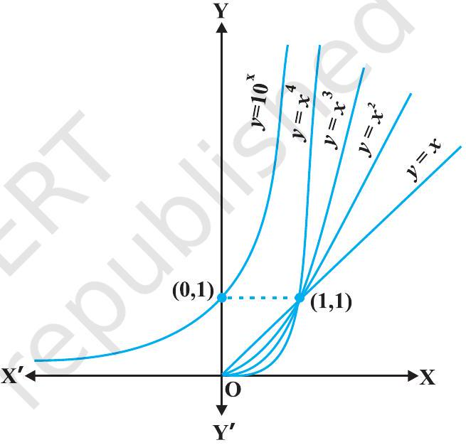
आकृति $5.9$

$1$ से बढ़कर $2^{15}$ हो जाता है। इस प्रकार $x$ में समान वृद्धि के लिए, $f_{15}$ की वृद्धि $f_{10}$ की वृद्धि के अपेक्षा अधिक तीव्रता से होती है।

उपर्युक्त परिचर्चा का निष्कर्ष यह है कि बहुपद फलनों की वृद्धि उनके घात पर निर्भर करती है, अर्थात् घात बढ़ाते जाइए वृद्धि बढ़ती जाएगी। इसके उपरांत एक स्वाभाविक प्रश्न यह उठता है कि, क्या कोई ऐसा फलन है जो बहुपद फलनों की अपेक्षा अधिक तेजी से बढ़ता है? इसका उत्तर सकारात्मक है और इस प्रकार के फलन का एक उदाहरण $y=f(x)=10^{x}$ है

हमारा दावा यह है कि किसी धन पूर्णांक $n$ के लिए यह फलन $f$, फलन $f_{n}(x)=x^{n}$ की अपेक्षा अधिक तेजी से बढ़ता है। उदाहरण के लिए हम सिद्ध कर सकते हैं कि $f_{100}(x)=x^{100}$ की अपेक्षा $10^{x}$ अधिक तेजी से बढ़ता है। यह नोट कीजिए कि $x$ के बड़े मानों के लिए, जैसे $x=10^{3}$, $f_{100}(x)=\left(10^{3}\right)^{100}=10^{300}$ जबकि $f\left(10^{3}\right)=10^{10^{3}}=10^{1000}$ है। स्पष्टतः $f_{100}(x)$ की अपेक्षा $f(x)$

का मान बहुत अधिक है। यह सिद्ध करना कठिन नहीं है कि $x$ के उन सभी मानों के लिए जहाँ $x>10^{3}, f(x)>f_{100}(x)$ है। किंतु हम यहाँ पर इसकी उपपत्ति देने का प्रयास नहीं करेंगे। इसी प्रकार $x$ के बड़े मानों को चुनकर यह सत्यापित किया जा सकता है कि, किसी भी धन पूर्णांक $n$ के लिए $f_{n}(x)$ की अपेक्षा $f(x)$ का मान अधिक तेजी से बढ़ता है।

परिभाषा $3$ फलन $y=f(x)=b^{x}$, धनात्मक आधार $b>1$ के लिए चरघातांकी फलन कहलाता है। आकृति $5.9$ में $y=10^{x}$ का रेखाचित्र दर्शाया गया है।

यह सलाह दी जाती है कि पाठक इस रेखाचित्र को $b$ के विशिष्ट मानों, जैसे $2,3$ और $4$ के लिए खींच कर देखें। चरघातांकी फलन की कुछ प्रमुख विशेषताएँ निम्नलिखित हैं:

(1) चरघातांकी फलन का प्रांत, वास्तविक संख्याओं का समुच्चय R होता है।
(2) चरघातांकी फलन का परिसर, समस्त धनात्मक वास्तविक संख्याओं का समुच्चय होता है।
(3) बिंदु $(0,1)$ चरघातांकी फलन के आलेख पर सदैव होता है (यह इस तथ्य का पुनः कथन है कि किसी भी वास्तविक संख्या $b>1$ के लिए $b^{0}=1$ )
(4) चरघातांकी फलन सदैव एक वर्धमान फलन (increasing function) होता है, अर्थात् जैसे-जैसे हम बाएँ से दाएँ ओर बढ़ते जाते हैं, आलेख ऊपर उठता जाता है।
(5) $x$ के अत्यधिक बड़े ऋणात्मक मानों के लिए चरघातांकी फलन का मान $0$ के अत्यंत निकट होता है। दूसरे शब्दों में, द्वितीय चतुर्थांश में, आलेख उत्तरोत्तर $x$-अक्ष की ओर अग्रसर होता है (किंतु उससे कभी मिलता नहीं है।)

आधार $10$ वाले चरघातांकी फलन को साधारण चरघातांकी फलन (common exponential Function) कहते हैं। कक्षा XI की पाठ्यपुस्तक के परिशिष्ट A.1.4 में हमने देखा था कि श्रेणी

$$
1+\frac{1}{1!}+\frac{1}{2!}+\ldots \text { है। }
$$

का योग एक ऐसी संख्या है जिसका मान $2$ तथा $3$ के मध्य होता है और जिसे $e$ द्वारा प्रकट करते हैं। इस $e$ को आधार के रूप में प्रयोग करने पर, हमें एक अत्यंत महत्वपूर्ण चरघातांकी फलन $y=e^{x}$ प्राप्त होता है। इसे प्राकृतिक चरघातांकी फलन (natural exponential function) कहते हैं।

यह जानना रुचिकर होगा कि क्या चरघातांकी फलन के प्रतिलोम का अस्तित्व है और यदि ' हाँ' तो क्या उसकी एक समुचित व्याख्या की जा सकती है। यह खोज निम्नलिखित परिभाषा के लिए प्रेरित करती है।
परिभाषा $4$ मान लीजिए कि $b>1$ एक वास्तविक संख्या है। तब हम कहते हैं कि, $b$ आधार पर $a$ का लघुगणक $x$ है, यदि $b^{x}=a$ है।
$b$ आधार पर $a$ के लघुगणक को प्रतीक $\log _{b} a$ से प्रकट करते हैं। इस प्रकार यदि $b^{x}=a$, तो $\log _{b} a=x$ इसका अनुभव करने के लिए आइए हम कुछ स्पष्ट उदाहरणों का प्रयोग करें। हमें ज्ञात है कि $2^{3}=8$ है। लघुगणकीय शब्दों में हम इसी बात को पुन: $\log _{2} 8=3$ लिख सकते हैं। इसी प्रकार $10^{4}=10000$ तथा $\log _{10} 10000=4$ समतुल्य कथन हैं। इसी तरह से $625=5^{4}=25^{2}$ तथा $\log _{5}$ $625=4$ अथवा $\log _{25} 625=2$ समतुल्य कथन हैं।

थोड़ा सा और अधिक परिपक्व दृष्टिकोण से विचार करने पर हम कह सकते हैं कि $b>1$ को आधार निर्धारित करने के कारण 'लघुगणक' को धन वास्तविक संख्याओं के समुच्चय से सभी वास्तविक संख्याओं के समुच्चय में एक फलन के रूप में देखा जा सकता है। यह फलन, जिसे लघुगणकीय फलन (logarithmic function) कहते हैं, निम्नलिखित प्रकार से परिभाषित है:

$$
\begin{aligned}
\log _{b}: \mathbf{R}^{+} & \rightarrow \mathbf{R} \\
x & \rightarrow \log _{b} x=y \text { यदि } b^{y}=x
\end{aligned}
$$

पूर्व कथित तरह से, यदि आधार $b=10$ है तो इसे 'साधारण लघुगणक' और यदि $b=e$ है तो इसे 'प्राकृतिक लघुगणक' कहते हैं। बहुधा प्राकृतिक लघुगणक को $\ln$ द्वारा प्रकट करते हैं।
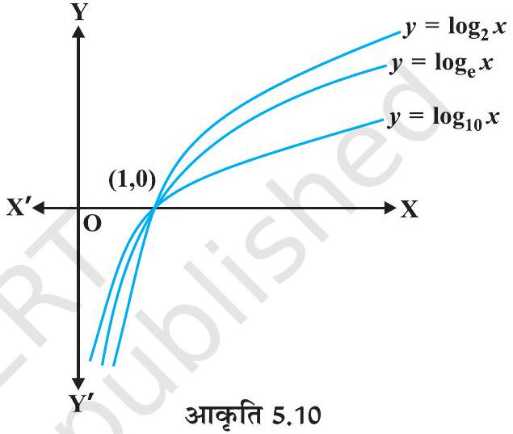 इस अध्याय में $\log x$ आधार $e$ वाले लघुगणकीय फलन को निरूपित करता है। आकृति $5.10$ में $2$, तथा $10$ आधारीय लघुगणकीय फलनों के आलेख दर्शाए गए हैं। आधार $b>1$ वाले लघुगणकीय फलनों की कुछ महत्वपूर्ण विशेषताएँ नीचे सूचीबद्ध हैं:

(1) धनेतर (non-positive) संख्याओं के लिए हम लघुगणक की कोई अर्थपूर्ण परिभाषा नहीं बना सकते हैं और इसलिए लघुगणकीय फलन का प्रांत $\mathbf{R}^{+}$है।
(2) लघुगणकीय फलन का परिसर समस्त वास्तविक संख्याओं का समुच्चय है।
(3) बिंदु $(1,0)$ लघुगणकीय फलनों के आलेख पर सदैव रहता है।
(4) लघुगणकीय फलन एक वर्धमान फलन होते हैं, अर्थात् ज्यों-ज्यों हम बाएँ से दाएँ ओर चलते हैं, आलेख उत्तरोत्तर ऊपर उठता जाता है।

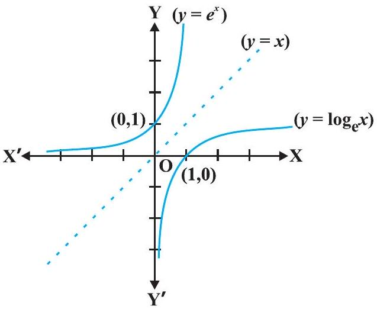
आकृति $5.11$

(5) $0$ के अत्याधिक निकट वाले $x$ के लिए, $\log x$ के मान को किसी भी दी गई वास्तविक संख्या से कम किया जा सकता है। दूसरे शब्दों में, चौथे (चतुर्थ) चतुर्थांश में आलेख $y$-अक्ष के निकटतम अग्रसर होता है (किंतु इससे कभी मिलता नहीं है)।
(6) आकृति $5.11$ में $y=e^{x}$ तथा $y=\log _{e} x$ के आलेख दर्शाए गए हैं। यह ध्यान देना रोचक है कि दोनों वक्र रेखा $y=x$ में एक दूसरे के दर्पण प्रतिबिंब हैं।

लघुगणकीय फलनों के दो महत्वपूर्ण गुण नीचे प्रमाणित किए गए हैं:

(1) आधार परिवर्तन का एक मानक नियम है, जिससे $\log _{a} p$ को $\log _{b} p$ के पदों में ज्ञात किया जा सकता है। मान लीजिए कि $\log _{a} p=\alpha, \log _{b} p=\beta$ तथा $\log _{b} a=\gamma$ है। इसका अर्थ यह है कि $a^{\alpha}=p, b^{\beta}=p$ तथा $b^{\gamma}=a$ है। अब तीसरे परिणाम को पहले में रखने से
$$
\left(b^{\gamma}\right)^{\alpha}=b^{\gamma \alpha}=p
$$
इसको दूसरे समीकरण में प्रयोग करने पर
$$
b^{\beta}=p=b^{\gamma \alpha}
$$
अत:
$\beta=\alpha \gamma$ अथवा $\alpha=\frac{\beta}{\gamma}$ है। इस प्रकार
$$
\log _{a} p=\frac{\log _{b} p}{\log _{b} a}
$$
(2) गुणनफलनों पर $\log$ फलन का प्रभाव इसका एक अन्य रोचक गुण है। मान लीजिए कि $\log _{b} p q=\alpha$ है। इससे $b^{\alpha}=p q$ प्राप्त होता है। इसी प्रकार यदि $\log _{b} p=\beta$ तथा $\log _{b} q=\gamma$ है तो $b^{\beta}=p$ तथा $b^{\gamma}=q$ प्राप्त होता है। परंतु $b^{\alpha}=p q=b^{\beta} b^{\gamma}=b^{\beta+\gamma}$ है।
इसका तात्पर्य है कि $\alpha=\beta+\gamma$, अर्थात्
$$
\log _{b} p q=\log _{b} p+\log _{b} q
$$
इससे एक विशेष रोचक तथा महत्वपूर्ण परिणाम तब निकलता है जब $p=q$ है। ऐसी दशा में, उपर्युक्त को पुनः निम्नलिखित प्रकार से लिखा जा सकता है
$$
\log _{b} p^{2}=\log _{b} p+\log _{b} p=2 \log _{b} p
$$
इसका एक सरल व्यापकीकरण अभ्यास के लिए छोड़ दिया गया है अर्थात् किसी भी धन पूर्णांक $n$ के लिए
$$
\log _{b} p^{n}=n \log _{b} p
$$
वास्तव में यह परिणाम $n$ के किसी भी वास्तविक मान के लिए सत्य है, किंतु इसे हम प्रमाणित करने का प्रयास नहीं करेंगे। इसी विधि से पाठक निम्नलिखित को सत्यापित कर सकते हैं:
$$
\log _{b} \frac{x}{y}=\log _{b} x-\log _{b} y
$$

उदाहरण $24$ क्या यह सत्य है कि $x$ के सभी वास्तविक मानों के लिए $x=e^{\log x}$ है?
हल पहले तो ध्यान दीजिए कि log फलन का प्रांत सभी धन वास्तविक संख्याओं का समुच्चय होता है। इसलिए उपर्युक्त समीकरण धनेतर वास्तविक संख्याओं के लिए सत्य नहीं है। अब मान लीजिए कि $y=e^{\log x}$ है। यदि $y>0$ तब दोनो पक्षों का लघुगणक लेने से $\log y=\log \left(e^{\log x}\right)=\log x \cdot \log$ $e=\log x$ है। जिससे $y=x$ प्राप्त होता है। अतएव $x=e^{\log x}$ केवल $x$ के धन मानों के लिए सत्य है।

अवकल गणित (differential calculus) में, प्राकृतिक चरघातांकी फलन का एक असाधारण गुण यह है कि, अवकलन की प्रक्रिया में यह परिवर्तित नहीं होता है। इस गुण को नीचे प्रमेयों में व्यक्त किया गया है, जिसकी उपपत्ति को हम छोड़ देते हैं।

## प्रमेय 5*

(1) $x$ के सापेक्ष $e^{x}$ का अवकलज $e^{x}$ ही होता है, अर्थात् $\frac{d}{d x}\left(e^{x}\right)=e^{x}$
(2) $x$ के सापेक्ष $\log x$ का अवकलज $\frac{1}{x}$ होता है, अर्थात् $\frac{d}{d x}(\log x)=\frac{1}{x}$

उदाहरण $25 x$ के सापेक्ष निम्नलिखित का अवकलन कीजिए:
(i) $e^{-x}$
(ii) $\sin (\log x), x>0$
(iii) $\cos ^{-1}\left(e^{x}\right)$
(iv) $e^{\cos x}$

## हल

(i) मान लीजिए $y=e^{-x}$ है। अब श्रंखला नियम के प्रयोग द्वारा
$$
\frac{d y}{d x}=e^{-x} \cdot \frac{d}{d x}(-x)=-e^{-x}
$$
(ii) मान लीजिए कि $y=\sin (\log x)$ है। अब शंखला नियम द्वारा
$$
\frac{d y}{d x}=\cos (\log x) \cdot \frac{d}{d x}(\log x)=\frac{\cos (\log x)}{x}
$$
(iii) मान लीजिए कि $y=\cos ^{-1}\left(e^{x}\right)$ है। अब शृंखला नियम द्वारा
$$
\frac{d y}{d x}=\frac{-1}{\sqrt{1-\left(e^{x}\right)^{2}}} \cdot \frac{d}{d x}\left(e^{x}\right)=\frac{-e^{x}}{\sqrt{1-e^{2 x}}} .
$$
(iv) मान लीजिए कि $y=e^{\cos x}$ है। अब शृंखला नियम द्वारा
$$
\frac{d y}{d x}=e^{\cos x} \cdot(-\sin x)=-(\sin x) e^{\cos x}
$$
[^0]
## प्रश्नावली $5.4$

निम्नलिखित का $x$ के सापेक्ष अवकलन कीजिए:

1. $\frac{e^{x}}{\sin x}$
2. $e^{\sin ^{-1} x}$
3. $e^{x^{3}}$
4. $\sin \left(\tan ^{-1} e^{-x}\right)$
5. $\log \left(\cos e^{x}\right)$
6. $e^{x}+e^{x^{2}}+\ldots+e^{x^{5}}$
7. $\sqrt{e^{\sqrt{x}}}, x>0$
8. $\log (\log x), x>1$
9. $\frac{\cos x}{\log x}, x>0$
10. $\cos \left(\log x+e^{x}\right)$

## 5.5. लघुगणकीय अवकलन (Logarithmic Differentiation)

इस अनुच्छेद में हम निम्नलिखित प्रकार के एक विशिष्ट वर्ग के फलनों का अवकलन करना सीखेंगे:

$$
y=f(x)=[u(x)]^{v}(x)
$$

लघुगणक ( $e$ आधार पर) लेने पर उपर्युक्त को निम्नलिखित प्रकार से पुनः लिख सकते हैं

$$
\log y=v(x) \log [u(x)]
$$

शृंखला नियम के प्रयोग द्वारा

$$
\frac{1}{y} \cdot \frac{d y}{d x}=v(x) \cdot \frac{1}{u(x)} \cdot u^{\prime}(x)+v^{\prime}(x) \cdot \log [u(x)]
$$

इसका तात्पर्य है कि

$$
\frac{d y}{d x}=y\left[\frac{v(x)}{u(x)} \cdot u^{\prime}(x)+v^{\prime}(x) \cdot \log [u(x)]\right]
$$

इस विधि में ध्यान देने की मुख्य बात यह है कि $f(x)$ तथा $u(x)$ को सदैव धनात्मक होना चाहिए अन्यथा उनके लघुगणक परिभाषित नहीं होंगे। इस प्रक्रिया को लघुगणकीय अवकलन (logarithmic differentiation) कहते हैं और जिसे निम्नलिखित उदाहरणों द्वारा स्पष्ट किया गया है।

उदाहरण $26 x$ के सापेक्ष $\sqrt{\frac{(x-3)\left(x^{2}+4\right)}{3 x^{2}+4 x+5}}$ का अवकलन कीजिए।
हल मान लीजिए कि $y=\sqrt{\frac{(x-3)\left(x^{2}+4\right)}{\left(3 x^{2}+4 x+5\right)}}$

दोनों पक्षों के लघुगणक लेने पर

$$
\log y=\frac{1}{2}\left[\log (x-3)+\log \left(x^{2}+4\right)-\log \left(3 x^{2}+4 x+5\right)\right]
$$

दोनों पक्षों का $x$, के सापेक्ष अवलकन करने पर

$$
\frac{1}{y} \cdot \frac{d y}{d x}=\frac{1}{2}\left[\frac{1}{(x-3)}+\frac{2 x}{x^{2}+4}-\frac{6 x+4}{3 x^{2}+4 x+5}\right]
$$

अथवा

$$
\begin{aligned}
\frac{d y}{d x} & =\frac{y}{2}\left[\frac{1}{(x-3)}+\frac{2 x}{x^{2}+4}-\frac{6 x+4}{3 x^{2}+4 x+5}\right] \\
& =\frac{1}{2} \sqrt{\frac{(x-3)\left(x^{2}+4\right)}{3 x^{2}+4 x+5}}\left[\frac{1}{(x-3)}+\frac{2 x}{x^{2}+4}-\frac{6 x+4}{3 x^{2}+4 x+5}\right]
\end{aligned}
$$

उदाहरण $27 x$ के सापेक्ष $a^{x}$ का अवकलन कीजिए, जहाँ $a$ एक धन अचर है।
हल मान लीजिए कि $y=a^{x}$, तो

$$
\log y=x \log a
$$

दोनों पक्षों का $x$, के सापेक्ष अवकलन करने पर

$$
\frac{1}{y} \frac{d y}{d x}=\log a
$$

अथवा

$$
\frac{d y}{d x}=y \log a
$$

इस प्रकार

$$
\frac{d}{d x}\left(a^{x}\right)=a^{x} \log a
$$

विकल्पत:

$$
\begin{aligned}
\frac{d}{d x}\left(a^{x}\right) & =\frac{d}{d x}\left(e^{x \log a}\right)=e^{x \log a} \frac{d}{d x}(x \log a) \\
& =e^{x \log a} \cdot \log a=a^{x} \log a
\end{aligned}
$$

उदाहरण $28 x$ के सापेक्ष $x^{\sin x}$, का अवकलन कीजिए, जब कि $x>0$ है।
हल मान लीजिए कि $y=x^{\sin x}$ है। अब दोनों पक्षों का लघुगणक लेने पर

अतएव

$$
\begin{aligned}
\log y & =\sin x \log x \\
\frac{1}{y} \cdot \frac{d y}{d x} & =\sin x \frac{d}{d x}(\log x)+\log x \frac{d}{d x}(\sin x)
\end{aligned}
$$

या

$$
\frac{1}{y} \frac{d y}{d x}=(\sin x) \frac{1}{x}+\log x \cos x
$$

या

$$
\begin{aligned}
\frac{d y}{d x} & =y\left[\frac{\sin x}{x}+\cos x \log x\right] \\
& =x^{\sin x}\left[\frac{\sin x}{x}+\cos x \log x\right] \\
& =x^{\sin x-1} \cdot \sin x+x^{\sin x} \cdot \cos x \log x
\end{aligned}
$$

उदाहरण $29$ यदि $y^{x}+x^{y}+x^{x}=a^{b}$ है। तो $\frac{d y}{d x}$ ज्ञात कीजिए।
हल दिया है कि $y^{x}+x^{y}+x^{x}=a^{b}$
$u=y^{x}, v=x^{y}$ तथा $w=x^{x}$ रखने पर हमें $u+v+w=a^{b}$ प्राप्त होता है।
इसलिए

$$
\frac{d u}{d x}+\frac{d v}{d x}+\frac{d w}{d x}=0
$$

अब $u=y^{x}$ है। दोनों पक्षों का लघुगणक लेने पर

$$
\log u=x \log y
$$

दोनों पक्षों का $x$ के सापेक्ष अवकलन करने पर

$$
\begin{aligned}
\frac{1}{u} \cdot \frac{d u}{d x} & =x \frac{d}{d x}(\log y)+\log y \frac{d}{d x}(x) \\
& =x \frac{1}{y} \cdot \frac{d y}{d x}+\log y \cdot 1 \text { प्राप्त होता है। }
\end{aligned}
$$

इसलिए

$$
\frac{d u}{d x}=u\left(\frac{x}{y} \frac{d y}{d x}+\log y\right)=y^{x}\left[\frac{x}{y} \frac{d y}{d x}+\log y\right]
$$

इसी प्रकार

$$
v=x^{y}
$$

दोनों पक्षों का लघुगणक लेने पर

$$
\log v=y \log x
$$

दोनों पक्षों का $x$ के सापेक्ष अवकलन करने पर

$$
\begin{aligned}
\frac{1}{v} \cdot \frac{d v}{d x} & =y \frac{d}{d x}(\log x)+\log x \frac{d y}{d x} \\
& =y \cdot \frac{1}{x}+\log x \cdot \frac{d y}{d x} \text { प्राप्त होता है। }
\end{aligned}
$$

अतएव

$$
\begin{aligned}
\frac{d v}{d x} & =v\left[\frac{y}{x}+\log x \frac{d y}{d x}\right] \\
& =x^{y}\left[\frac{y}{x}+\log x \frac{d y}{d x}\right] \\
w & =x^{x}
\end{aligned}
$$

पुनः
दोनों पक्षों का लघुगणन करने पर

$$
\log w=x \log x
$$

दोनों पक्षों का $x$ के सापेक्ष अवकलन करने पर

$$
\begin{aligned}
\frac{1}{w} \cdot \frac{d w}{d x} & =x \frac{d}{d x}(\log x)+\log x \cdot \frac{d}{d x}(x) \\
& =x \cdot \frac{1}{x}+\log x \cdot 1 \text { प्राप्त होता है। }
\end{aligned}
$$

अर्थात्

$$
\begin{aligned}
\frac{d w}{d x} & =w(1+\log x) \\
& =x^{x}(1+\log x)
\end{aligned}
$$

(1), (2), (3) तथा (4), द्वारा

$$
y^{x}\left(\frac{x}{y} \frac{d y}{d x}+\log y\right)+x^{y}\left(\frac{y}{x}+\log x \frac{d y}{d x}\right)+x^{x}(1+\log x)=0
$$

या

$$
\left(x \cdot y^{x-1}+x^{y} \cdot \log x\right) \frac{d y}{d x}=-x^{x}(1+\log x)-y \cdot x^{y-1}-y^{x} \log y
$$

अत:

$$
\frac{d y}{d x}=\frac{-\left[y^{x} \log y+y \cdot x^{y-1}+x^{x}(1+\log x)\right]}{x \cdot y^{x-1}+x^{y} \log x}
$$

## प्रश्नावली $5.5$

$1$ से $11$ तक के प्रश्नों में प्रदत्त फलनों का $x$ के सापेक्ष अवकलन कीजिए:

1. $\cos x . \cos 2 x . \cos 3 x$
2. $\sqrt{\frac{(x-1)(x-2)}{(x-3)(x-4)(x-5)}}$
3. $(\log x)^{\cos x}$
4. $x^{x}-2^{\sin x}$
5. $(x+3)^{2} \cdot(x+4)^{3} \cdot(x+5)^{4}$
6. $\left(x+\frac{1}{x}\right)^{x}+x^{\left(1+\frac{1}{x}\right)}$
7. $(\log x)^{x}+x^{\log x}$
8. $(\sin x)^{x}+\sin ^{-1} \sqrt{x}$
9. $x^{\sin x}+(\sin x)^{\cos x}$
10. $x^{x \cos x}+\frac{x^{2}+1}{x^{2}-1}$
11. $(x \cos x)^{x}+(x \sin x)^{\frac{1}{x}}$
$12$ से $15$ तक के प्रश्नों में प्रदत्त फलनों के लिए $\frac{d y}{d x}$ ज्ञात कीजिए:
12. $x^{y}+y^{x}=1$
13. $y^{x}=x^{y}$
14. $(\cos x)^{y}=(\cos y)^{x}$
15. $x y=e^{(x-y)}$
16. $f(x)=(1+x)\left(1+x^{2}\right)\left(1+x^{4}\right)\left(1+x^{8}\right)$ द्वारा प्रदत्त फलन का अवकलज ज्ञात कीजिए और इस प्रकार $f^{\prime}(1)$ ज्ञात कीजिए।
17. $\left(x^{2}-5 x+8\right)\left(x^{3}+7 x+9\right)$ का अवकलन निम्नलिखित तीन प्रकार से कीजिए:
(i) गुणनफल नियम का प्रयोग करके
(ii) गुणनफल के विस्तारण द्वारा एक एकल बहुपद प्राप्त करके
(iii) लघुगणकीय अवकलन द्वारा
यह भी सत्यापित कीजिए कि इस प्रकार प्राप्त तीनों उत्तर समान हैं।
18. यदि $u, v$ तथा $w, x$ के फलन हैं, तो दो विधियों अर्थात् प्रथम-गुणनफल नियम की पुनरावृत्ति द्वारा, द्वितीय - लघुगणकीय अवकलन द्वारा दर्शाइए कि
$$
\frac{d}{d x}(u \cdot v \cdot w)=\frac{d u}{d x} v \cdot w+u \cdot \frac{d v}{d x} \cdot w+u \cdot v \frac{d w}{d x}
$$

## $5.6$ फलनों के प्राचलिक रूपों के अवकलज (Derivatives of Functions in Parametric Forms)

कभी-कभी दो चर राशियों के बीच का संबंध न तो स्पष्ट होता है और न अस्पष्ट, किंतु एक अन्य (तीसरी) चर राशि से पृथक्-पृथक् संबंधों द्वारा प्रथम दो राशियों के मध्य एक संबंध स्थापित हो जाता है ऐसी स्थिति में हम कहते हैं कि उन दोनों के बीच का संबंध एक तीसरी चर राशि के माध्यम से वर्णित है। यह तीसरी चर राशि प्राचल (Parameter) कहलाती है। अधिक सुस्पष्ट तरीके से दो चर राशियों $x$ तथा $y$ के बीच, $x=f(t), y=g(t)$ के रूप में व्यक्त संबंध, को प्राचलिक रूप में व्यक्त संबंध कहते हैं, जहाँ $t$ एक प्राचल है।

इस रूप के फलनों के अवकलज ज्ञात करने हेतु, शृंखला नियम द्वारा
या

$$
\begin{aligned}
& \frac{d y}{d t}=\frac{d y}{d x} \cdot \frac{d x}{d t} \\
& \frac{d y}{d x}=\frac{\frac{d y}{d t}}{\frac{d x}{d t}}\left(\text { जब कभी } \frac{d x}{d t} \neq 0\right) \text { प्राप्त होता है। }
\end{aligned}
$$

इस प्रकार

$$
\frac{d y}{d x}=\frac{g^{\prime}(t)}{f^{\prime}(t)}\left(\text { क्योंकि } \frac{d y}{d t}=g^{\prime}(t) \text { तथा } \frac{d x}{d t}=f^{\prime}(t)\right)\left[\text { बशर्ते } f^{\prime}(t) \neq 0\right]
$$

उदाहरण $30$ यदि $x=a \cos \theta, y=a \sin \theta$, तो $\frac{d y}{d x}$ ज्ञात कीजिए।
हल दिया है कि

$$
x=a \cos \theta, y=a \sin \theta
$$

इसलिए

$$
\frac{d x}{d \theta}=-a \sin \theta, \frac{d y}{d \theta}=a \cos \theta
$$

अत:

$$
\frac{d y}{d x}=\frac{\frac{d y}{d \theta}}{\frac{d x}{d \theta}}=\frac{a \cos \theta}{-a \sin \theta}=-\cot \theta
$$

उदाहरण $31$ यदि $x=a t^{2}, y=2 a t$ है तो $\frac{d y}{d x}$ ज्ञात कीजिए।
हल दिया है कि

$$
x=a t^{2}, y=2 a t
$$

इसलिए

$$
\frac{d x}{d t}=2 a t \text { तथा } \frac{d y}{d t}=2 a
$$

अत:

$$
\frac{d y}{d x}=\frac{\frac{d y}{d t}}{\frac{d x}{d t}}=\frac{2 a}{2 a t}=\frac{1}{t}
$$

उदाहरण $32$ यदि $x=a(\theta+\sin \theta), y=a(1-\cos \theta)$ है तो $\frac{d y}{d x}$ ज्ञात कीजिए ।
हल यहाँ $\frac{d x}{d \theta}=a(1+\cos \theta), \frac{d y}{d \theta}=a(\sin \theta)$

अत:

$$
\frac{d y}{d x}=\frac{\frac{d y}{d \theta}}{\frac{d x}{d \theta}}=\frac{a \sin \theta}{a(1+\cos \theta)}=\tan \frac{\theta}{2}
$$

- टिप्पणी यहाँ, यह ध्यान दीजिए कि $\frac{d y}{d x}$ को मुख्य चर राशियों $x$ और $y$ को सम्मिलित किए बिना ही, केवल प्राचल के पदों में व्यक्त करते हैं।

उदाहरण $33$ यदि $x^{\frac{2}{3}}+y^{\frac{2}{3}}=a^{\frac{2}{3}}$ है तो $\frac{d y}{d x}$ ज्ञात कीजिए।
हल मान लीजिए कि $x=a \cos ^{3} \theta, y=a \sin ^{3} \theta$ है तब

$$
\begin{aligned}
x^{\frac{2}{3}}+y^{\frac{3}{2}} & =\left(a \cos ^{3} \theta\right)^{\frac{2}{3}}+\left(a \sin ^{3} \theta\right)^{\frac{2}{3}} \\
& =a^{\frac{2}{3}}\left(\cos ^{2} \theta+\left(\sin ^{2} \theta\right)=a^{\frac{2}{3}}\right.
\end{aligned}
$$

अत:

$$
x=a \cos ^{3} \theta, y=a \sin ^{3} \theta, x^{\frac{2}{3}}+y^{\frac{2}{3}}=a^{\frac{2}{3}} \text { का प्राचलिक समीकरण है। }
$$

इस प्रकार, $\frac{d x}{d \theta}=-3 a \cos ^{2} \theta \sin \theta$ और $\frac{d y}{d \theta}=3 a \sin ^{2} \theta \cos \theta$
इसलिए, $\frac{d y}{d x}=\frac{\frac{d y}{d \theta}}{\frac{d x}{d \theta}}=\frac{3 a \sin ^{2} \theta \cos \theta}{-3 a \cos ^{2} \theta \sin \theta}=-\tan \theta=-\sqrt[3]{\frac{y}{x}}$

## प्रश्नावली $5.6$

यदि प्रश्न संख्या $1$ से $10$ तक में $x$ तथा $y$ दिए समीकरणों द्वारा, एक दूसरे से प्राचलिक रूप में संबंधित हों, तो प्राचलों का विलोपन किए बिना, $\frac{d y}{d x}$ ज्ञात कीजिए:

1. $x=2 a t^{2}, y=a t^{4}$
2. $x=a \cos \theta, y=b \cos \theta$
3. $x=\sin t, y=\cos 2 t$
4. $x=4 t, y=\frac{4}{t}$
5. $x=\cos \theta-\cos 2 \theta, y=\sin \theta-\sin 2 \theta$
6. $x=a(\theta-\sin \theta), y=a(1+\cos \theta) \quad$ 7. $x=\frac{\sin ^{3} t}{\sqrt{\cos 2 t}}, y=\frac{\cos ^{3} t}{\sqrt{\cos 2 t}}$
8. $x=a\left(\cos t+\log \tan \frac{t}{2}\right) y=a \sin t$ 9. $x=a \sec \theta, y=b \tan \theta$
10. $x=a(\cos \theta+\theta \sin \theta), y=a(\sin \theta-\theta \cos \theta)$
11. यदि $x=\sqrt{a^{\sin ^{-1} t}}, y=\sqrt{a^{\cos ^{-1} t}}$, तो दर्शाइए कि $\frac{d y}{d x}=-\frac{y}{x}$

## $5.7$ द्वितीय कोटि का अवकलज (Second Order Derivative)

मान लीजिए कि

$$
\begin{aligned}
y & =f(x) \text { है तो } \\
\frac{d y}{d x} & =f^{\prime}(x)
\end{aligned}
$$

यदि $f^{\prime}(x)$ अवकलनीय है तो हम $x$ के सापेक्ष (1) का पुनः अवकलन कर सकते हैं। इस प्रकार बायाँ पक्ष $\frac{d}{d x}\left(\frac{d y}{d x}\right)$ हो जाता है, जिसे द्वितीय कोटि का अवकलज (Second Order Derviative) कहते हैं और $\frac{d^{2} y}{d x^{2}}$ से निरूपित करते हैं। $f(x)$ के द्वितीय कोटि के अवकलज को $f^{\prime \prime}(x)$ से भी निरूपित करते हैं। यदि $y=f(x)$ हो तो इसे $\mathrm{D}^{2}(y)$ या $y^{\prime \prime}$ या $y_{2}$ से भी निरूपित करते हैं। हम टिप्पणी करते हैं कि उच्च क्रम के अवकलन भी इसी प्रकार किए जाते हैं।

उदाहरण $34$ यदि $y=x^{3}+\tan x$ है तो $\frac{d^{2} y}{d x^{2}}$ ज्ञात कीजिए।
हल दिया है कि $y=x^{3}+\tan x$ है। अब

$$
\frac{d y}{d x}=3 x^{2}+\sec ^{2} x
$$

इसलिए

$$
\begin{aligned}
\frac{d^{2} y}{d x^{2}} & =\frac{d}{d x}\left(3 x^{2}+\sec ^{2} x\right) \\
& =6 x+2 \sec x \cdot \sec x \tan x=6 x+2 \sec ^{2} x \tan x
\end{aligned}
$$

उदाहरण $35$ यदि $y=\mathrm{A} \sin x+\mathrm{B} \cos x$ है तो सिद्ध कीजिए कि $\frac{d^{2} y}{d x^{2}}+y=0$ है।

हल यहाँ पर

$$
\frac{d y}{d x}=\mathrm{A} \cos x-\mathrm{B} \sin x
$$

और

$$
\begin{aligned}
\frac{d^{2} y}{d x^{2}} & =\frac{d}{d x}(\mathrm{~A} \cos x-\mathrm{B} \sin x) \\
& =-\mathrm{A} \sin x-\mathrm{B} \cos x=-y
\end{aligned}
$$

इस प्रकार

$$
\frac{d^{2} y}{d x^{2}}+y=0
$$

उदाहरण $36$ यदि $y=3 e^{2 x}+2 e^{3 x}$ है तो सिद्ध कीजिए कि $\frac{d^{2} y}{d x^{2}}-5 \frac{d y}{d x}+6 y=0$
हल यहाँ $y=3 e^{2 x}+2 e^{3 x}$ है। अब

$$
\frac{d y}{d x}=6 e^{2 x}+6 e^{3 x}=6\left(e^{2 x}+e^{3 x}\right)
$$

इसलिए

$$
\frac{d^{2} y}{d x^{2}}=12 e^{2 x}+18 e^{3 x}=6\left(2 e^{2 x}+3 e^{3 x}\right)
$$

अत:

$$
\begin{aligned}
\frac{d^{2} y}{d x^{2}}-5 \frac{d y}{d x}+6 y= & 6\left(2 e^{2 x}+3 e^{3 x}\right) \\
& -30\left(e^{2 x}+e^{3 x}\right)+6\left(3 e^{2 x}+2 e^{3 x}\right)=0
\end{aligned}
$$

उदाहरण $37$ यदि $y=\sin ^{-1} x$ है तो दर्शाइए कि $\left(1-x^{2}\right) \frac{d^{2} y}{d x^{2}}-x \frac{d y}{d x}=0$ है।
हल यहाँ $y=\sin ^{-1} x$ है तो

$$
\frac{d y}{d x}=\frac{1}{\sqrt{\left(1-x^{2}\right)}}
$$

या

$$
\sqrt{\left(1-x^{2}\right)} \frac{d y}{d x}=1
$$

या

$$
\frac{d}{d x}\left(\sqrt{\left(1-x^{2}\right)} \cdot \frac{d y}{d x}\right)=0
$$

या

$$
\sqrt{\left(1-x^{2}\right)} \cdot \frac{d^{2} y}{d x^{2}}+\frac{d y}{d x} \cdot \frac{d}{d x}\left(\sqrt{\left(1-x^{2}\right)}\right)=0
$$

या

$$
\sqrt{\left(1-x^{2}\right)} \cdot \frac{d^{2} y}{d x^{2}}-\frac{d y}{d x} \cdot \frac{2 x}{2 \sqrt{1-x^{2}}}=0
$$

अत:

$$
\left(1-x^{2}\right) \frac{d^{2} y}{d x^{2}}-x \frac{d y}{d x}=0
$$

विकल्पतः दिया है कि $y=\sin ^{-1} x$ है तो

$$
y_{1}=\frac{1}{\sqrt{1-x^{2}}}, \text { अर्थात् }\left(1-x^{2}\right) y_{1}^{2}=1
$$

अतएव

$$
\left(1-x^{2}\right) \cdot 2 y_{1} y_{2}+y_{1}^{2}(0-2 x)=0
$$

अतः

$$
\left(1-x^{2}\right) y_{2}-x y_{1}=0
$$

## प्रश्नावली $5.7$

प्रश्न संख्या $1$ से $10$ तक में दिए फलनों के द्वितीय कोटि के अवकलज ज्ञात कीजिए:

1. $x^{2}+3 x+2$
2. $x^{20}$
3. $x \cdot \cos x$
4. $\log x$
5. $x^{3} \log x$
6. $e^{x} \sin 5 x$
7. $e^{6 x} \cos 3 x$
8. $\tan ^{-1} x$
9. $\log (\log x)$
10. $\sin (\log x)$
11. यदि $y=5 \cos x-3 \sin x$ है तो सिद्ध कीजिए कि $\frac{d^{2} y}{d x^{2}}+y=0$
12. यदि $y=\cos ^{-1} x$ है तो $\frac{d^{2} y}{d x^{2}}$ को केवल $y$ के पदों में ज्ञात कीजिए।
13. यदि $y=3 \cos (\log x)+4 \sin (\log x)$ है तो दर्शाइए कि $x^{2} y_{2}+x y_{1}+y=0$
14. यदि $y=\mathrm{A} e^{m x}+\mathrm{B} e^{n x}$ है तो दर्शाइए कि $\frac{d^{2} y}{d x^{2}}-(m+n) \frac{d y}{d x}+m n y=0$
15. यदि $y=500 e^{7 x}+600 e^{-7 x}$ है तो दर्शाइए कि $\frac{d^{2} y}{d x^{2}}=49 y$ है।
16. यदि $e^{y}(x+1)=1$ है तो दर्शाइए कि $\frac{d^{2} y}{d x^{2}}=\left(\frac{d y}{d x}\right)^{2}$ है।
17. यदि $y=\left(\tan ^{-1} x\right)^{2}$ है तो दर्शाइए कि $\left(x^{2}+1\right)^{2} y_{2}+2 x\left(x^{2}+1\right) y_{1}=2$ है।

## विविध उदाहरण

उदाहरण $38 x$ के सापेक्ष निम्नलिखित का अवकलन कीजिए:
(i) $\sqrt{3 x+2}+\frac{1}{\sqrt{2 x^{2}+4}}$
(ii) $\log _{7}(\log x)$

हल

(i) मान लीजिए कि $y=\sqrt{3 x+2}+\frac{1}{\sqrt{2 x^{2}+4}}=(3 x+2)^{\frac{1}{2}}+\left(2 x^{2}+4\right)^{-\frac{1}{2}}$ है।
ध्यान दीजिए कि यह फलन सभी वास्तविक संख्याओं $x>-\frac{2}{3}$ के लिए परिभाषित है। इसलिए
$$
\begin{aligned}
\frac{d y}{d x} & =\frac{1}{2}(3 x+2)^{\frac{1}{2}-1} \cdot \frac{d}{d x}(3 x+2)+\left(-\frac{1}{2}\right)\left(2 x^{2}+4\right)^{-\frac{1}{2}-1} \cdot \frac{d}{d x}\left(2 x^{2}+4\right) \\
& =\frac{1}{2}(3 x+2)^{-\frac{1}{2}} \cdot(3)-\left(\frac{1}{2}\right)\left(2 x^{2}+4\right)^{-\frac{3}{2}} \cdot 4 x \\
& =\frac{3}{2 \sqrt{3 x+2}}-\frac{2 x}{\left(2 x^{2}+4\right)^{\frac{3}{2}}}
\end{aligned}
$$
यह सभी वास्तविक संख्याओं $x>-\frac{2}{3}$ के लिए परिभाषित है।
(ii) मान लीजिए कि $y=\log _{7}(\log x)=\frac{\log (\log x)}{\log 7}$ (आधार परिवर्तन के सूत्र द्वारा) समस्त वास्तविक संख्याओं $x>1$ के लिए फलन परिभाषित है। इसलिए
$$
\begin{aligned}
\frac{d y}{d x} & =\frac{1}{\log 7} \frac{d}{d x}(\log (\log x)) \\
& =\frac{1}{\log 7} \frac{1}{\log x} \cdot \frac{d}{d x}(\log x) \\
& =\frac{1}{x \log 7 \log x}
\end{aligned}
$$

उदाहरण $39 x$ के सापेक्ष निम्नलिखित का अवकलन कीजिए:
(i) $\cos ^{-1}(\sin x)$
(ii) $\tan ^{-1}\left(\frac{\sin x}{1+\cos x}\right)$
(iii) $\sin ^{-1}\left(\frac{2^{x+1}}{1+4^{x}}\right)$

हल

(i) मान लीजिए कि $f(x)=\cos ^{-1}(\sin x)$ है। ध्यान दीजिए कि यह फलन सभी वास्तविक संख्याओं के लिए परिभाषित है। हम इसे निम्नलिखित रूप में लिख सकते हैं।
$$
\begin{aligned}
f(x) & =\cos ^{-1}(\sin x) \\
& =\cos ^{-1}\left[\cos \left(\frac{\pi}{2}-x\right)\right], \text { since } \frac{\pi}{2}-x \in[0 . \pi] \\
& =\frac{\pi}{2}-x
\end{aligned}
$$
अत:
$$
f^{\prime}(x)=-1 \text { है। }
$$
(ii) मान लीजिए कि $f(x)=\tan ^{-1}\left(\frac{\sin x}{1+\cos x}\right)$ है। ध्यान दीजिए कि यह फलन उन सभी वास्तविक संख्याओं के लिए परिभाषित है जिनके लिए $\cos x \neq-1$, अर्थात् $\pi$ के समस्त विषम गुणजों के अतिरिक्त अन्य सभी वास्तविक संख्याओं के लिए हम इस फलन को निम्नलिखित प्रकार से पुनः व्यक्त कर सकते हैं:
$$
\begin{aligned}
f(x) & =\tan ^{-1}\left(\frac{\sin x}{1+\cos x}\right) \\
& =\tan ^{-1}\left[\frac{2 \sin \left(\frac{x}{2}\right) \cos \left(\frac{x}{2}\right)}{2 \cos ^{2} \frac{x}{2}}\right]=\tan ^{-1}\left[\tan \left(\frac{x}{2}\right)\right]=\frac{x}{2}
\end{aligned}
$$
ध्यान दीजिए कि हम अंश तथा हर में $\cos \left(\frac{x}{2}\right)$ को काट सके, क्योंकि यह शून्य के बराबर नहीं है। अतः $f^{\prime}(x)=\frac{1}{2}$ है।
(iii) मान लीजिए कि $f(x)=\sin ^{-1}\left(\frac{2^{x+1}}{1+4^{x}}\right)$. है। इस फलन का प्रांत ज्ञात करने के लिए हमें उन सभी $x$ को ज्ञात करने की आवश्यकता है जिनके लिए $-1 \leq \frac{2^{x+1}}{1+4^{x}} \leq 1$ है। क्योंकि $\frac{2^{x+1}}{1+4^{x}}$ सदैव

धन राशि है, इसलिए हमें उन सभी $x$ को ज्ञात करना है जिनके लिए $\frac{2^{x+1}}{1+4^{x}} \leq 1$, अर्थात् वे सभी $x$ जिनके लिए $2^{x+1} \leq 1+4^{x}$ है। हम इसको $2 \leq \frac{1}{2^{x}}+2^{x}$ प्रकार भी लिख सकते हैं, जो सभी $x$ के लिए सत्य है। अतः फलन प्रत्येक वास्तविक संख्या के लिए परिभाषित है। अब $2^{x}=\tan \theta$ रखने पर यह फलन निम्नलिखित प्रकार से पुनः लिखा जा सकता है:

$$
\begin{aligned}
f(x) & =\sin ^{-1}\left[\frac{2^{x+1}}{1+4^{x}}\right] \\
& =\sin ^{-1}\left[\frac{2^{x} \cdot 2}{1+\left(2^{x}\right)^{2}}\right] \\
& =\sin ^{-1}\left[\frac{2 \tan \theta}{1+\tan ^{2} \theta}\right] \\
& =\sin ^{-1}[\sin 2 \theta]=2 \theta=2 \tan ^{-1}\left(2^{x}\right)
\end{aligned}
$$

अत:

$$
\begin{aligned}
f^{\prime}(x) & =2 \cdot \frac{1}{1+\left(2^{x}\right)^{2}} \cdot \frac{d}{d x}\left(2^{x}\right) \\
& =\frac{2}{1+4^{x}} \cdot\left(2^{x}\right) \log 2 \\
& =\frac{2^{x+1} \log 2}{1+4^{x}}
\end{aligned}
$$

उदाहरण $40$ यदि सभी $0<x<\pi$ के लिए $f(x)=(\sin x)^{\sin x}$ है तो $f^{\prime}(x)$ ज्ञात कीजिए। हल यहाँ फलन $y=(\sin x)^{\sin x}$ सभी धन वास्तविक संख्याओं के लिए परिभाषित है। लघुगणक लेने पर
अब

$$
\begin{aligned}
\log y & =\log (\sin x)^{\sin x}=\sin x \log (\sin x) \\
\frac{1}{y} \frac{d y}{d x} & =\frac{d}{d x}(\sin x \log (\sin x)) \\
& =\cos x \log (\sin x)+\sin x \cdot \frac{1}{\sin x} \cdot \frac{d}{d x}(\sin x) \\
& =\cos x \log (\sin x)+\cos x \\
& =(1+\log (\sin x)) \cos x
\end{aligned}
$$

अब $\frac{d y}{d x}=y((1+\log (\sin x)) \cos x)=(1+\log (\sin x))(\sin x)^{\sin x} \cos x$
उदाहरण $41$ धनात्मक अचर $a$ के लिए $\frac{d y}{d x}$, ज्ञात कीजिए, जहाँ

$$
y=a^{t+\frac{1}{t}}, \text { तथा } x=\left(t+\frac{1}{t}\right)^{a} \text { है। }
$$

हल ध्यान दीजिए कि दोनों $y$ तथा $x$, समस्त वास्तविक संख्या $t \neq 0$ के लिए परिभाषित हैं। स्पष्टत:

$$
\begin{aligned}
\frac{d y}{d t}=\frac{d}{d t}\left(a^{t+\frac{1}{t}}\right) & =a^{t+\frac{1}{t}} \frac{d}{d t}\left(t+\frac{1}{t}\right) \cdot \log a \\
& =a^{t+\frac{1}{t}}\left(1-\frac{1}{t^{2}}\right) \log a
\end{aligned}
$$

इसी प्रकार

$$
\begin{aligned}
\frac{d x}{d t} & =a\left[t+\frac{1}{t}\right]^{a-1} \cdot \frac{d}{d t}\left(t+\frac{1}{t}\right) \\
& =a\left[t+\frac{1}{t}\right]^{a-1} \cdot\left(1-\frac{1}{t^{2}}\right)
\end{aligned}
$$

$\frac{d x}{d t} \neq 0$ केवल यदि $t \neq \pm 1$ है। अत: $t \neq \pm 1$ के लिए

$$
\frac{d y}{d x}=\frac{\frac{d y}{d t}}{\frac{d x}{d t}}=\frac{a^{t+\frac{1}{t}}\left(1-\frac{1}{t^{2}}\right) \log a}{a\left[t+\frac{1}{t}\right]^{a-1} \cdot\left(1-\frac{1}{t^{2}}\right)}=\frac{a^{t+\frac{1}{t}} \log a}{a\left(t+\frac{1}{t}\right)^{a-1}}
$$

उदाहरण $42 e^{\cos x}$ के सापेक्ष $\sin ^{2} x$ का अवकलन कीजिए।
हल मान लीजिए कि $u(x)=\sin ^{2} x$ तथा $v(x)=e^{\cos x}$ है। यहाँ हमें $\frac{d u}{d v}=\frac{d u / d x}{d v / d x}$ ज्ञात करना है। स्पष्टत:

$$
\frac{d u}{d x}=2 \sin x \cos x \text { और } \frac{d v}{d x}=e^{\cos x}(-\sin x)=-(\sin x) e^{\cos x} \text { है। }
$$

अत: $\frac{d u}{d v}=\frac{2 \sin x \cos x}{-\sin x e^{\cos x}}=-\frac{2 \cos x}{e^{\cos x}}$

## अध्याय $5$ पर विविध प्रश्नावली

प्रश्न संख्या $1$ से $11$ तक प्रदत्त फलनों का, $x$ के सापेक्ष अवकलन कीजिए:

1. $\left(3 x^{2}-9 x+5\right)^{9}$
2. $\sin ^{3} x+\cos ^{6} x$
3. $(5 x)^{3 \cos x 2 x}$
4. $\sin ^{-1}(x \sqrt{x}), 0 \leq x \leq 1$.
5. $\frac{\cos ^{-1} \frac{x}{2}}{\sqrt{2 x+7}},-2<x<2$.
6. $\cot ^{-1}\left[\frac{\sqrt{1+\sin x}+\sqrt{1-\sin x}}{\sqrt{1+\sin x}-\sqrt{1-\sin x}}\right], 0<x<\frac{\pi}{2}$
7. $(\log x)^{\log x}, x>1$
8. $\cos (a \cos x+b \sin x)$, किन्हीं अचर $a$ तथा $b$ के लिए
9. $(\sin x-\cos x)^{(\sin x-\cos x)}, \frac{\pi}{4}<x<\frac{3 \pi}{4}$
10. $x^{x}+x^{a}+a^{x}+a^{a}$, किसी नियत $a>0$ तथा $x>0$ के लिए
11. $x^{x^{2}-3}+(x-3)^{x^{2}}, x>3$ के लिए
12. यदि $y=12(1-\cos t), x=10(t-\sin t),-\frac{\pi}{2}<t<\frac{\pi}{2}$ तो $\frac{d y}{d x}$ ज्ञात कीजिए।
13. यदि $y=\sin ^{-1} x+\sin ^{-1} \sqrt{1-x^{2}}, 0<x<1$ है तो $\frac{d y}{d x}$ ज्ञात कीजिए।
14. यदि $-1<x<1$ के लिए $x \sqrt{1+y}+y \sqrt{1+x}=0$ है तो सिद्ध कीजिए कि
$$
\frac{d y}{d x}=-\frac{1}{(1+x)^{2}}
$$
15. यदि किसी $c>0$ के लिए $(x-a)^{2}+(y-b)^{2}=c^{2}$ है तो सिद्ध कीजिए कि
$$
\frac{\left[1+\left(\frac{d y}{d x}\right)^{2}\right]^{\frac{3}{2}}}{\frac{d^{2} y}{d x^{2}}}, a \text { और } b \text { से स्वतंत्र एक स्थिर राशि है। }
$$
16. यदि $\cos y=x \cos (a+y)$, तथा $\cos a \neq \pm 1$, तो सिद्ध कीजिए कि $\frac{d y}{d x}=\frac{\cos ^{2}(a+y)}{\sin a}$

17. यदि $x=a(\cos t+t \sin t)$ और $y=a(\sin t-t \cos t)$, तो $\frac{d^{2} y}{d x^{2}}$ ज्ञात कीजिए।
18. यदि $f(x)=|x|^{3}$, तो प्रमाणित कीजिए कि $f^{\prime \prime}(x)$ का अस्तित्व है और इसे ज्ञात भी कीजिए।
19. $\sin (\mathrm{A}+\mathrm{B})=\sin \mathrm{A} \cos \mathrm{B}+\cos \mathrm{A} \sin \mathrm{B}$ का प्रयोग करते हुए अवकलन द्वारा cosines के लिए योग सूत्र ज्ञात कीजिए।
20. क्या एक ऐसे फलन का अस्तित्व है, जो प्रत्येक बिंदु पर संतत हो किंतु केवल दो बिंदुओं पर अवकलनीय न हो? अपने उत्तर का औचित्य भी बतलाइए।
21. यदि $y=\left|\begin{array}{ccc}f(x) & g(x) & h(x) \\ l & m & n \\ a & b & c\end{array}\right|$ है तो सिद्ध कीजिए कि $\frac{d y}{d x}=\left|\begin{array}{ccc}f^{\prime}(x) & g^{\prime}(x) & h^{\prime}(x) \\ l & m & n \\ a & b & c\end{array}\right|$
22. यदि $y=e^{a \cos ^{-1} x},-1 \leq x \leq 1$, तो दर्शाइए कि
$$
\left(1-x^{2}\right) \frac{d^{2} y}{d x^{2}}-x \frac{d y}{d x}-a^{2} y=0
$$

## सारांश

- एक वास्तविक मानीय फलन अपने प्रांत के किसी बिंदु पर संतत होता है यदि उस बिंदु पर फलन की सीमा, उस बिंदु पर फलन के मान के बराबर होती है।
- संतत फलनों के योग, अंतर, गुणनफल और भागफल संतत होते हैं, अर्थात्, यदि $f$ तथा $g$ संतत फलन हैं, तो
$(f \pm g)(x)=f(x) \pm g(x)$ संतत होता है।
$(f . g)(x)=f(x) . g(x)$ संतत होता है।
$\left(\frac{f}{g}\right)(x)=\frac{f(x)}{g(x)}$ (जहाँ $g(x) \neq 0$ ) संतत होता है।
- प्रत्येक अवकलनीय फलन संतत होता है किंतु इसका विलोम सत्य नहीं है।
- शृंखला-नियम फलनों के संयोजन का अवकलन करने के लिए एक नियम है। यदि $f=v \circ u, t=u(x)$ और यदि $\frac{d t}{d x}$ तथा $\frac{d v}{d t}$ का अस्तित्व है तो
$$
\frac{d f}{d x}=\frac{d v}{d t} \cdot \frac{d t}{d x}
$$

- कुछ मानक अवकलज (परिभाषित प्रांतों में) निम्नलिखित हैं:
$$
\begin{array}{ll}
\frac{d}{d x}\left(\sin ^{-1} x\right)=\frac{1}{\sqrt{1-x^{2}}} & \frac{d}{d x}\left(\cos ^{-1} x\right)=\frac{-1}{\sqrt{1-x^{2}}} \\
\frac{d}{d x}\left(\tan ^{-1} x\right)=\frac{1}{1+x^{2}} & \frac{d}{d x}(\log x)=\frac{1}{x}
\end{array}
$$
- लघुगणकीय अवकलन, $f(x)=[u(x)]^{v(x)}$ के रूप के फलनों के अवकलन करने के लिए एक सशक्त तकनीक है। इस तकनीक के अर्थपूर्ण होने के लिए आवश्यक है कि $f(x)$ तथा $u(x)$ दोनों ही धनात्मक हों।

[^0]:    *कृपया पूरक पाठ्य सामग्री पृष्ठ 232-233 पर देखें

