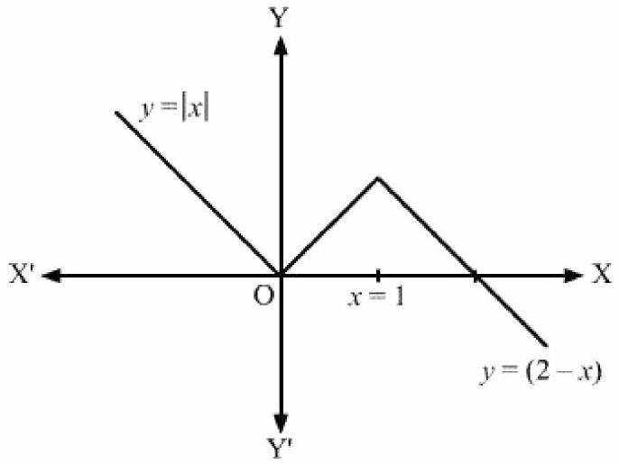

## Chapter 5 Continuity and Differentiability

## EXERCISE 5.1

## Question 1:
Prove that the function $f(x)=5 x-3$ is continuous at $x=0, x=-3$ and at $x=5$.
## Solution:
The given function is $f(x)=5 x-3$

$$
\begin{aligned}
& \text { At } x=0, f(0)=5(0)-3=-3 \\
& \lim _{x \rightarrow 0} f(x)=\lim _{x \rightarrow 0}(5 x-3)=5(0)-3=-3 \\
& \therefore \lim _{x \rightarrow 0} f(x)=f(0)
\end{aligned}
$$

Therefore, $f$ is continous at $x=0$.

$$
\begin{aligned}
& \text { At } x=-3, f(-3)=5(-3)-3=-18 \\
& \lim _{x \rightarrow-3} f(x)=\lim _{x \rightarrow-3}(5 x-3)=5(-3)-3=-18 \\
& \therefore \lim _{x \rightarrow-3} f(x)=f(-3)
\end{aligned}
$$

Therefore, $f$ is continous at $x=-3$.

$$
\begin{aligned}
& \text { At } x=5, f(5)=5(5)-3=22 \\
& \lim _{x \rightarrow 5} f(x)=\lim _{x \rightarrow 5}(5 x-3)=5(5)-3=22 \\
& \therefore \lim _{x \rightarrow 5} f(x)=f(5)
\end{aligned}
$$

Therefore, $f$ is continous at $x=5$.
## Question 2:
Examine the continuity of the function $f(x)=2 x^{2}-1$ at $x=3$.
## Solution:
The given function is $f(x)=2 x^{2}-1$

$$
\begin{aligned}
& \text { At } x=3, f(3)=2(3)^{2}-1=17 \\
& \lim _{x \rightarrow 3} f(x)=\lim _{x \rightarrow 3}\left(2 x^{2}-1\right)=2\left(3^{2}\right)-1=17 \\
& \therefore \lim _{x \rightarrow 3} f(x)=f(3)
\end{aligned}
$$

Therefore, $f$ is continous at $x=3$.

## Question 3:
Examine the following functions for continuity.

(i) $f(x)=x-5$

(ii) $f(x)=\frac{1}{x-5}, x \neq 5$
(iii) $f(x)=\frac{x^{2}-25}{x+5}, x \neq-5$
(iv) $f(x)=|x-5|, x \neq 5$

## Solution:
(i) The given function is $f(x)=x-5$
It is evident that $f$ is defined at every real number $k$ and its value at $k$ is $k-5$.
It is also observed that
$$
\begin{aligned}
& \lim _{x \rightarrow k} f(x)=\lim _{x \rightarrow k}(x-5)=k-5=f(k) \\
& \therefore \lim _{x \rightarrow k} f(x)=f(k)
\end{aligned}
$$
Hence, $f$ is continuous at every real number and therefore, it is a continuous function.
(ii) The given function is $f(x)=\frac{1}{x-5}, x \neq 5$
For any real number $k \neq 5$, we obtain
$$
\lim _{x \rightarrow k} f(x)=\lim _{x \rightarrow k} \frac{1}{x-5}=\frac{1}{k-5}
$$
Also,
$$
\begin{aligned}
& f(k)=\frac{1}{k-5} \quad(\text { As } k \neq 5) \\
& \therefore \lim _{x \rightarrow k} f(x)=f(k)
\end{aligned}
$$
Hence, $f$ is continuous at every point in the domain of $f$ and therefore, it is a continuous function.
(iii) The given function is $f(x)=\frac{x^{2}-25}{x+5}, x \neq-5$
For any real number $c \neq-5$, we obtain
$$
\lim _{x \rightarrow c} f(x)=\lim _{x \rightarrow c} \frac{x^{2}-25}{x+5}=\lim _{x \rightarrow c} \frac{(x+5)(x-5)}{x+5}=\lim _{x \rightarrow c}(x-5)=(c-5)
$$
Also,
$$
\begin{aligned}
& f(c)=\frac{(c+5)(c-5)}{c+5}=(c-5) \\
& \therefore \lim _{x \rightarrow c} f(x)=f(c)
\end{aligned}
$$

Hence, $f$ is continuous at every point in the domain of $f$ and therefore, it is a continuous function.
(iv) The given function is $f(x)=|x-5|=\left\{\begin{array}{l}5-x, \text { if } x<5 \\ x-5, \text { if } x \geq 5\end{array}\right\}$
This function $f$ is defined at all points of the real line. Let c be a point on a real line. Then, $c<5, c=5$ or $c>5$

Case I: $c<5$
Then, $f(c)=5-c$

$$
\begin{aligned}
& \lim _{x \rightarrow c} f(x)=\lim _{x \rightarrow c}(5-x)=5-c \\
& \therefore \lim _{x \rightarrow c} f(x)=f(c)
\end{aligned}
$$

Therefore, $f$ is continuous at all real numbers less than 5 .

Case II: $c=5$
Then, $f(c)=f(5)=(5-5)=0$

$$
\begin{aligned}
& \lim _{x \rightarrow 5^{-}} f(x)=\lim _{x \rightarrow 5}(5-x)=(5-5)=0 \\
& \lim _{x \rightarrow 5^{+}} f(x)=\lim _{x \rightarrow 5}(x-5)=0 \\
& \therefore \lim _{x \rightarrow c^{-}} f(x)=\lim _{x \rightarrow c^{+}} f(x)=f(c)
\end{aligned}
$$

Therefore, $f$ is continuous at $x=5$
Case III: $c>5$
Then, $f(c)=f(5)=c-5$

$$
\begin{aligned}
& \lim _{x \rightarrow c} f(x)=\lim _{x \rightarrow c}(x-5)=c-5 \\
& \therefore \lim _{x \rightarrow c} f(x)=f(c)
\end{aligned}
$$

Therefore, $f$ is continuous at all real numbers greater than 5 .
Hence, $f$ is continuous at every real number and therefore, it is a continuous function.

## Question 4:
Prove that the function $f(x)=x^{n}$ is continuous at $x=n$, where $n$ is a positive integer.

## Solution:
The given function is $f(x)=x^{n}$
It is observed that $f$ is defined at all positive integers, $n$, and its value at $n$ is $n^{n}$.
Then,

$$
\begin{aligned}
& \lim _{x \rightarrow n} f(n)=\lim _{x \rightarrow n}\left(x^{n}\right)=x^{n} \\
& \therefore \lim _{x \rightarrow n} f(x)=f(n)
\end{aligned}
$$

Therefore, $f$ is continuous at $n$, where $n$ is a positive integer.

## Question 5:
Is the function $f$ defined by $f(x)=\left\{\begin{array}{l}x, \text { if } x \leq 1 \\ 5, \text { if } x>1 \text { continuous at } x=0 ? \text { At } x=1 ? \text { At } x=2 \text { ? }\end{array}\right.$
## Solution:
The given function is $f(x)=\left\{\begin{array}{l}x, \text { if } x \leq 1 \\ 5, \text { if } x>1\end{array}\right.$
At $x=0$,
It is evident that $f$ is defined at 0 and its value at 0 is 0 .
Then,

$$
\begin{aligned}
& \lim _{x \rightarrow 0} f(x)=\lim _{x \rightarrow 0}(x)=0 \\
& \therefore \lim _{x \rightarrow 0} f(x)=f(0)
\end{aligned}
$$

Therefore, $f$ is continuous at $x=0$.

$$
\text { At } x=1 \text {, }
$$

It is evident that $f$ is defined at 1 and its value at 1 is 1 .
The left hand limit of $f$ at $x=1$ is,

$$
\lim _{x \rightarrow 1^{-}} f(x)=\lim _{x \rightarrow 1^{-}}(x)=1
$$

The right hand limit of $f$ at $x=1$ is,

$$
\begin{aligned}
& \lim _{x \rightarrow 1^{+}} f(x)=\lim _{x \rightarrow 1^{+}}(5)=5 \\
& \therefore \lim _{v \rightarrow 1^{-}} f(x) \neq \lim _{v \rightarrow 1^{+}} f(x)
\end{aligned}
$$

Therefore, $f$ is not continuous at $x=1$.
At $x=2$,
It is evident that $f$ is defined at 2 and its value at 2 is 5 .

$$
\begin{aligned}
& \lim _{x \rightarrow 2} f(x)=\lim _{x \rightarrow 2}(5)=5 \\
& \therefore \lim _{x \rightarrow 1} f(x)=f(2)
\end{aligned}
$$

Therefore, $f$ is continuous at $x=2$.

## Question 6:
Find all points of discontinuity of $f$, where $f$ is defined by $f(x)=\left\{\begin{array}{l}2 x+3, \text { if } x \leq 2 \\ 2 x-3, \text { if } x>2 .\end{array}\right.$
## Solution:
The given function is $f(x)=\left\{\begin{array}{l}2 x+3, \text { if } x \leq 2 \\ 2 x-3, \text { if } x>2\end{array}\right.$
It is evident that the given function $f$ is defined at all the points of the real line.
Let $c$ be a point on the real line. Then, three cases arise.

$$
\begin{aligned}
& c<2 \\
& c>2 \\
& c=2
\end{aligned}
$$

Case I: $c<2$

$$
f(c)=2 c+3
$$

Then,

$$
\begin{aligned}
& \lim _{x \rightarrow c} f(x)=\lim _{x \rightarrow c}(2 x+3)=2 c+3 \\
& \therefore \lim _{x \rightarrow c} f(x)=f(c)
\end{aligned}
$$

Therefore, $f$ is continuous at all points $x$, such that $x<2$.
Case II: $c>2$
Then,

$$
\begin{aligned}
& f(c)=2 c-3 \\
& \lim _{x \rightarrow c} f(x)=\lim _{x \rightarrow c}(2 x-3)=2 c-3 \\
& \therefore \lim _{x \rightarrow c} f(x)=f(c)
\end{aligned}
$$

Therefore, $f$ is continuous at all points $x$, such that $x>2$
Case III: $c=2$
Then, the left hand limit of $f$ at $x=2$ is,

$$
\lim _{x \rightarrow 2^{-}} f(x)=\lim _{x \rightarrow 2^{-}}(2 x+3)=2(2)+3=7
$$

The right hand limit of $f$ at $x=2$ is,

$$
\lim _{x \rightarrow 0^{+}} f(x)=\lim _{x \rightarrow 0^{+}}(2 x-3)=2(2)-3=1
$$

It is observed that the left and right hand limit of $f$ at $x=2$ do not coincide.
Therefore, $f$ is not continuous at $x=2$.
Hence, $x=2$ is the only point of discontinuity of $f$.

## Question 7:
Find all points of discontinuity of $f$, where $f$ is defined by

$$
f(x)=\left\{\begin{array}{l}
|x|+3, \text { if } x \leq-3 \\
-2 x, \text { if }-3<x<3 \\
6 x+2, \text { if } x \geq 3
\end{array}\right.
$$

## Solution:
The given function is

$$
f(x)=\left\{\begin{array}{l}
|x|+3, \text { if } x \leq-3 \\
-2 x, \text { if }-3<x<3 \\
6 x+2, \text { if } x \geq 3
\end{array}\right.
$$

The given function $f$ is defined at all the points of the real line.
Let $c$ be a point on the real line.
Case I:
If $c<-3$, then $f(c)=-c+3$

$$
\begin{aligned}
& \lim _{x \rightarrow c} f(x)=\lim _{x \rightarrow c}(-x+3)=-c+3 \\
& \therefore \lim _{x \rightarrow c} f(x)=f(c)
\end{aligned}
$$

Therefore, $f$ is continuous at all points $x$, such that $x<-3$.

Case II:
If $c=-3$, then $f(-3)=-(-3)+3=6$

$$
\begin{aligned}
& \lim _{x \rightarrow-3^{-}} f(x)=\lim _{x \rightarrow-3^{-}}(-x+3)=-(-3)+3=6 \\
& \lim _{x \rightarrow-3^{+}} f(x)=\lim _{x \rightarrow-3^{+}}(-2 x)=-2(-3)=6 \\
& \therefore \lim _{x \rightarrow-3} f(x)=f(-3)
\end{aligned}
$$

Therefore, $f$ is continuous at $x=-3$.
Case III:
If $-3<c<3$, then $f(c)=-2 c$

$$
\begin{aligned}
& \lim _{x \rightarrow c} f(x)=\lim _{x \rightarrow c}(-2 x)=-2 c \\
& \therefore \lim _{x \rightarrow c} f(x)=f(c)
\end{aligned}
$$

Therefore, $f$ is continuous in $(-3,3)$.
Case IV:
If $c=3$, then the left hand limit of $f$ at $x=3$ is,

$$
\lim _{x \rightarrow 3^{-}} f(x)=\lim _{x \rightarrow 3^{-}}(-2 x)=-2(3)=-6
$$

The right hand limit of $f$ at $x=3$ is,

$$
\lim _{x \rightarrow 3^{+}} f(x)=\lim _{x \rightarrow 3^{+}}(6 x+2)=6(3)+2=20
$$

It is observed that the left and right hand limit of $f$ at $x=3$ do not coincide.
Therefore, $f$ is not continuous at $x=3$.
Case V:
If $c>3$, then $f(c)=6 c+2$

$$
\begin{aligned}
& \lim _{x \rightarrow c} f(x)=\lim _{x \rightarrow c}(6 x+2)=6 c+2 \\
& \therefore \lim _{x \rightarrow c} f(x)=f(c)
\end{aligned}
$$

Therefore, $f$ is continuous at all points $x$, such that $x>3$.
Hence, $x=3$ is the only point of discontinuity of $f$.
## Question 8:
Find all points of discontinuity of $f$, where $f$ is defined by

$$
f(x)= \begin{cases}\frac{|x|}{x}, & \text { if } x \neq 0 \\ 0, & \text { if } x=0\end{cases}
$$

## Solution:

The given function is

$$
f(x)= \begin{cases}\frac{|x|}{x}, & \text { if } x \neq 0 \\ 0, & \text { if } x=0\end{cases}
$$

It is known that, $x<0 \Rightarrow|x|=-x$ and $x>0 \Rightarrow|x|=x$

Therefore, the given function can be rewritten as

$$
f(x)=\left\{\begin{array}{l}
\frac{|x|}{x}=\frac{-x}{x}=-1, \text { if } x<0 \\
0, \text { if } x=0 \\
\frac{|x|}{x}=\frac{x}{x}=1, \text { if } x>0
\end{array}\right.
$$

The given function $f$ is defined at all the points of the real line.
Let $c$ be a point on the real line.
Case I:
If $c<0$, then $f(c)=-1$

$$
\begin{aligned}
& \lim _{x \rightarrow c} f(x)=\lim _{x \rightarrow c}(-1)=-1 \\
& \therefore \lim _{x \rightarrow c} f(x)=f(c)
\end{aligned}
$$

Therefore, $f$ is continuous at all points $x<0$.
Case II:
If $c=0$, then the left hand limit of $f$ at $x=0$ is,

$$
\lim _{x \rightarrow 0^{-}} f(x)=\lim _{x \rightarrow 0^{-}}(-1)=-1
$$

The right hand limit of $f$ at $x=0$ is,

$$
\lim _{x \rightarrow 0^{+}} f(x)=\lim _{x \rightarrow 0^{+}}(1)=1
$$

It is observed that the left and right hand limit of $f$ at $x=0$ do not coincide.
Therefore, $f$ is not continuous at $x=0$.

Case III:
If $c>0$, then $f(c)=1$

$$
\begin{aligned}
& \lim _{x \rightarrow c} f(x)=\lim _{x \rightarrow c}(1)=1 \\
& \therefore \lim _{x \rightarrow c} f(x)=f(c)
\end{aligned}
$$

Therefore, $f$ is continuous at all points $x$, such that $x>0$.
Hence, $x=0$ is the only point of discontinuity of $f$.

## Question 9:
Find all points of discontinuity of $f$, where $f$ is defined by

$$
f(x)=\left\{\begin{array}{l}
\frac{x}{|x|}, \text { if } x<0 \\
-1, \text { if } x \geq 0
\end{array}\right.
$$

## Solution:
The given function is

$$
f(x)= \begin{cases}\frac{x}{|x|}, & \text { if } x<0 \\ -1, & \text { if } x \geq 0\end{cases}
$$

It is known that $x<0 \Rightarrow|x|=-x$
Therefore, the given function can be rewritten as

$$
\begin{aligned}
& f(x)=\left\{\begin{array}{l}
\frac{x}{|x|}=\frac{x}{-x}=-1, \text { if } x<0 \\
-1, \text { if } x \geq 0
\end{array}\right. \\
& \Rightarrow f(x)=-1 \forall x \in R
\end{aligned}
$$

Let $c$ be any real number.
Then, $\lim _{x \rightarrow c} f(x)=\lim _{x \rightarrow c}(-1)=-1$
Also, $f(c)=-1=\lim _{x \rightarrow c} f(x)$
Therefore, the given function is a continuous function.
Hence, the given function has no point of discontinuity.

## Question 10:
Find all points of discontinuity of $f$, where $f$ is defined by $f(x)=\left\{\begin{array}{l}x+1, \text { if } x \geq 1 \\ x^{2}+1, \text { if } x<1\end{array}\right.$

## Solution:

The given function is $f(x)=\left\{\begin{array}{l}x+1, \text { if } x \geq 1 \\ x^{2}+1, \text { if } x<1\end{array}\right.$
The given function $f$ is defined at all the points of the real line.
Let $c$ be a point on the real line.
Case I:
If $c<1$, then $f(c)=c^{2}+1$

$$
\begin{aligned}
& \lim _{x \rightarrow c} f(x)=\lim _{x \rightarrow c}\left(x^{2}+1\right)=c^{2}+1 \\
& \therefore \lim _{x \rightarrow c} f(x)=f(c)
\end{aligned}
$$

Therefore, $f$ is continuous at all points $x$, such that $x<1$.
Case II:
If $c=1$, then $f(c)=f(1)=1+1=2$
The left hand limit of $f$ at $x=1$ is,

$$
\lim _{x \rightarrow 1^{-}} f(x)=\lim _{x \rightarrow 1^{-}}\left(x^{2}+1\right)=1^{2}+1=2
$$

The right hand limit of $f$ at $x=1$ is,

$$
\begin{aligned}
& \lim _{x \rightarrow 1^{+}} f(x)=\lim _{x \rightarrow 1^{+}}(x+1)=1+1=2 \\
& \therefore \lim _{x \rightarrow 1} f(x)=f(1)
\end{aligned}
$$

Therefore, $f$ is continuous at $x=1$.
Case III:
If $c>1$, then $f(c)=c+1$

$$
\begin{aligned}
& \lim _{x \rightarrow c} f(x)=\lim _{x \rightarrow c}(x+1)=c+1 \\
& \therefore \lim _{x \rightarrow c} f(x)=f(c)
\end{aligned}
$$

Therefore, $f$ is continuous at all points $x$, such that $x>1$.
Hence, the given function $f$ has no point of discontinuity.

## Question 11:

Find all points of discontinuity of $f$, where $f$ is defined by $f(x)=\left\{\begin{array}{l}x^{3}-3, \text { if } x \leq 2 \\ x^{2}+1, \text { if } x>2\end{array}\right.$

## Solution:

The given function is $f(x)=\left\{\begin{array}{l}x^{3}-3, \text { if } x \leq 2 \\ x^{2}+1, \text { if } x>2\end{array}\right.$
The given function $f$ is defined at all the points of the real line.

Let $c$ be a point on the real line.
Case I:
If $c<2$, then $f(c)=c^{3}-3$

$$
\begin{aligned}
& \lim _{x \rightarrow c} f(x)=\lim _{x \rightarrow c}\left(x^{3}-3\right)=c^{3}-3 \\
& \therefore \lim _{x \rightarrow c} f(x)=f(c)
\end{aligned}
$$

Therefore, $f$ is continuous at all points $x$, such that $x<2$.
Case II:
If $c=2$, then $f(c)=f(2)=2^{3}-3=5$

$$
\begin{aligned}
& \lim _{x \rightarrow 2^{-}} f(x)=\lim _{x \rightarrow 2^{-}}\left(x^{3}-3\right)=2^{3}-3=5 \\
& \lim _{x \rightarrow 2^{+}} f(x)=\lim _{x \rightarrow 2^{+}}\left(x^{2}+1\right)=2^{2}+1=5 \\
& \therefore \lim _{x \rightarrow 2} f(x)=f(2)
\end{aligned}
$$

Therefore, $f$ is continuous at $x=2$.
Case III:
If $c>2$, then $f(c)=c^{2}+1$

$$
\begin{aligned}
& \lim _{x \rightarrow c} f(x)=\lim _{x \rightarrow c}\left(x^{2}+1\right)=c^{2}+1 \\
& \therefore \lim _{x \rightarrow c} f(x)=f(c)
\end{aligned}
$$

Therefore, $f$ is continuous at all points $x$, such that $x>2$.
Thus, the given function $f$ is continuous at every point on the real line.
Hence, $f$ has no point of discontinuity.

## Question 12:
Find all points of discontinuity of $f$, where $f$ is defined by $f(x)=\left\{\begin{array}{l}x^{10}-1, \text { if } x \leq 1 \\ x^{2}, \text { if } x>1 \quad .\end{array}\right.$
## Solution:
The given function is $f(x)=\left\{\begin{array}{l}x^{10}-1, \text { if } x \leq 1 \\ x^{2}, \text { if } x>1\end{array}\right.$
The given function $f$ is defined at all the points of the real line.
Let $c$ be a point on the real line.
Case I:
If $c<1$, then $f(c)=c^{10}-1$

$$
\begin{aligned}
& \lim _{x \rightarrow c} f(x)=\lim _{x \rightarrow c}\left(x^{10}-1\right)=c^{10}-1 \\
& \therefore \lim _{x \rightarrow \infty} f(x)=f(c)
\end{aligned}
$$

Therefore, $f$ is continuous at all points $x$, such that $x<1$.
Case II:
If $c=1$, then the left hand limit of $f$ at $x=1$ is,

$$
\lim _{x \rightarrow 1^{-}} f(x)=\lim _{x \rightarrow 1^{-}}\left(x^{10}-1\right)=1^{10}-1=1-1=0
$$

The right hand limit of $f$ at $x=1$ is,

$$
\lim _{x \rightarrow 1^{+}} f(x)=\lim _{x \rightarrow 1^{+}}\left(x^{2}\right)=1^{2}=1
$$

It is observed that the left and right hand limit of $f$ at $x=1$ do not coincide.
Therefore, $f$ is not continuous at $x=1$.
Case III:
If $c>1$, then $f(c)=c^{2}$

$$
\begin{aligned}
& \lim _{x \rightarrow c} f(x)=\lim _{x \rightarrow c}\left(x^{2}\right)=c^{2} \\
& \therefore \lim _{x \rightarrow c} f(x)=f(c)
\end{aligned}
$$

Therefore, $f$ is continuous at all points $x$, such that $x>1$.
Thus from the above observation, it can be concluded that $x=1$ is the only point of discontinuity of $f$.

## Question 13:
Is the function defined by $f(x)=\left\{\begin{array}{l}x+5, \text { if } x \leq 1 \\ x-5, \text { if } x>1 \text { a continous function? }\end{array}\right.$
## Solution:
The given function is $f(x)=\left\{\begin{array}{l}x+5, \text { if } x \leq 1 \\ x-5, \text { if } x>1\end{array}\right.$
The given function $f$ is defined at all the points of the real line.
Let $c$ be a point on the real line.
Case I:
If $c<1$, then $f(c)=c+5$

$$
\begin{aligned}
& \lim _{x \rightarrow c} f(x)=\lim _{x \rightarrow c}(x+5)=c+5 \\
& \therefore \lim _{x \rightarrow c} f(x)=f(c)
\end{aligned}
$$

Therefore, $f$ is continuous at all points $x$, such that $x<1$.
Case II:
If $c=1$, then $f(1)=1+5=6$

The left hand limit of $f$ at $x=1$ is,

$$
\lim _{x \rightarrow 1^{-}} f(x)=\lim _{x \rightarrow 1^{-}}(x+5)=1+5=6
$$

The right hand limit of $f$ at $x=1$ is,

$$
\lim _{x \rightarrow 1^{+}} f(x)=\lim _{x \rightarrow 1^{+}}(x-5)=1-5=-4
$$

It is observed that the left and right hand limit of $f$ at $x=1$ do not coincide.
Therefore, $f$ is not continuous at $x=1$.
Case III:
If $c>1$, then $f(c)=c-5$

$$
\begin{aligned}
& \lim _{x \rightarrow c} f(x)=\lim _{x \rightarrow c}(x-5)=c-5 \\
& \therefore \lim _{x \rightarrow c} f(x)=f(c)
\end{aligned}
$$

Therefore, $f$ is continuous at all points $x$, such that $x>1$.
From the above observation it can be concluded that, $x=1$ is the only point of discontinuity of $f$.

## Question 14:
Discuss the continuity of the function $f$, where $f$ is defined by

$$
f(x)=\left\{\begin{array}{l}
3, \text { if } 0 \leq x \leq 1 \\
4, \text { if } 1<x<3 \\
5, \text { if } 3 \leq x \leq 10
\end{array}\right.
$$

## Solution:
The given function is

$$
f(x)=\left\{\begin{array}{l}
3, \text { if } 0 \leq x \leq 1 \\
4, \text { if } 1<x<3 \\
5, \text { if } 3 \leq x \leq 10
\end{array}\right.
$$

The given function $f$ is defined at all the points of the interval $[0,10]$.
Let $c$ be a point in the interval $[0,10]$.

Case I:
If $0 \leq c<1$, then $f(c)=3$

$$
\begin{aligned}
& \lim _{x \rightarrow c} f(x)=\lim _{x \rightarrow c}(3)=3 \\
& \therefore \lim _{x \rightarrow c} f(x)=f(c)
\end{aligned}
$$

Therefore, $f$ is continuous in the interval $[0,1)$.
Case II:
If $c=1$, then $f(3)=3$
The left hand limit of $f$ at $x=1$ is,

$$
\lim _{x \rightarrow 1^{-}} f(x)=\lim _{x \rightarrow 1^{-}}(3)=3
$$

The right hand limit of $f$ at $x=1$ is,

$$
\lim _{x \rightarrow 1^{+}} f(x)=\lim _{x \rightarrow 1^{+}}(4)=4
$$

It is observed that the left and right hand limit of $f$ at $x=1$ do not coincide.
Therefore, $f$ is not continuous at $x=1$.
Case III:
If $1<c<3$, then $f(c)=4$

$$
\begin{aligned}
& \lim _{x \rightarrow c} f(x)=\lim _{x \rightarrow c}(4)=4 \\
& \therefore \lim _{x \rightarrow c} f(x)=f(c)
\end{aligned}
$$

Therefore, $f$ is continuous at in the interval $(1,3)$.
Case IV:
If $c=3$, then $f(c)=5$
The left hand limit of $f$ at $x=3$ is,

$$
\lim _{x \rightarrow 3^{-}} f(x)=\lim _{x \rightarrow 3^{-}}(4)=4
$$

The right hand limit of $f$ at $x=3$ is,

$$
\lim _{x \rightarrow 3^{+}} f(x)=\lim _{x \rightarrow 3^{+}}(5)=5
$$

It is observed that the left and right hand limit of $f$ at $x=3$ do not coincide.
Therefore, $f$ is discontinuous at $x=3$.
Case V:
If $3<c \leq 10$, then $f(c)=5$

$$
\begin{aligned}
& \lim _{x \rightarrow c} f(x)=\lim _{x \rightarrow c}(5)=5 \\
& \therefore \lim _{x \rightarrow c} f(x)=f(c)
\end{aligned}
$$

Therefore, $f$ is continuous at all points of the interval $(3,10]$.
Hence, $f$ is discontinuous at $x=1$ and $x=3$.

## Question 15:
Discuss the continuity of the function $f$, where $f$ is defined by

$$
f(x)=\left\{\begin{array}{l}
2 x, \text { if } x<0 \\
0, \text { if } 0 \leq x \leq 1 \\
4 x, \text { if } x>1
\end{array}\right.
$$

## Solution:
The given function is

$$
f(x)=\left\{\begin{array}{l}
2 x, \text { if } x<0 \\
0, \text { if } 0 \leq x \leq 1 \\
4 x, \text { if } x>1
\end{array}\right.
$$

The given function $f$ is defined at all the points of the real line.
Let $c$ be a point on the real line.
Case I:
If $c<0$, then $f(c)=2 c$

$$
\begin{aligned}
& \lim _{x \rightarrow c} f(x)=\lim _{x \rightarrow c}(2 x)=2 c \\
& \therefore \lim _{x \rightarrow c} f(x)=f(c)
\end{aligned}
$$

Therefore, $f$ is continuous at all points $x$, such that $x<0$.
Case II:
If $c=0$, then $f(c)=f(0)=0$
The left hand limit of $f$ at $x=0$ is,

$$
\lim _{x \rightarrow 0^{-}} f(x)=\lim _{x \rightarrow 0^{-}}(2 x)=2(0)=0
$$

The right hand limit of $f$ at $x=0$ is,

$$
\begin{aligned}
& \lim _{x \rightarrow 0^{+}} f(x)=\lim _{x \rightarrow 0^{+}}(0)=0 \\
& \therefore \lim _{x \rightarrow 0} f(x)=f(0)
\end{aligned}
$$

Therefore, $f$ is continuous at $x=0$
Case III:
If $0<c<1$, then $f(x)=0$

$$
\begin{aligned}
& \lim _{x \rightarrow c} f(x)=\lim _{x \rightarrow c}(0)=0 \\
& \therefore \lim _{x \rightarrow c} f(x)=f(c)
\end{aligned}
$$

Therefore, $f$ is continuous in the interval $(0,1)$.
Case IV:
If $c=1$, then $f(c)=f(1)=0$
The left hand limit of $f$ at $x=1$ is,

$$
\lim _{x \rightarrow 1^{-}} f(x)=\lim _{x \rightarrow 1^{-}}(0)=0
$$

The right hand limit of $f$ at $x=1$ is,

$$
\lim _{x \rightarrow 1^{+}} f(x)=\lim _{x \rightarrow 1^{+}}(4 x)=4(1)=4
$$

It is observed that the left and right hand limit of $f$ at $x=1$ do not coincide.
Therefore, $f$ is not continuous at $x=1$.
Case V:
If $c<1$, then $f(c)=4 c$

$$
\begin{aligned}
& \lim _{x \rightarrow c} f(x)=\lim _{x \rightarrow c}(4 x)=4 c \\
& \therefore \lim _{x \rightarrow c} f(x)=f(c)
\end{aligned}
$$

Therefore, $f$ is continuous at all points $x$, such that $x>1$.
Hence, $f$ is not continuous only at $x=1$.

## Question 16:
Discuss the continuity of the function $f$, where $f$ is defined by

$$
f(x)=\left\{\begin{array}{l}
-2, \text { if } x \leq-1 \\
2 x, \text { if }-1<x \leq 1 \\
2, \text { if } x>1
\end{array}\right.
$$

## Solution:
The given function is

$$
f(x)=\left\{\begin{array}{l}
-2, \text { if } x \leq-1 \\
2 x, \text { if }-1<x \leq 1 \\
2, \text { if } x>1
\end{array}\right.
$$

The given function $f$ is defined at all the points.
Let $c$ be a point on the real line.
Case I:
If $c<-1$, then $f(c)=-2$

$$
\begin{aligned}
& \lim _{x \rightarrow c} f(x)=\lim _{x \rightarrow c}(-2)=-2 \\
& \therefore \lim _{x \rightarrow c} f(x)=f(c)
\end{aligned}
$$

Therefore, $f$ is continuous at all points $x$, such that $x<-1$.
Case II:
If $c=-1$, then $f(c)=f(-1)=-2$
The left hand limit of $f$ at $x=-1$ is,

$$
\lim _{x \rightarrow-1^{-}} f(x)=\lim _{x \rightarrow-1^{-}}(-2)=-2
$$

The right hand limit of $f$ at $x=-1$ is,

$$
\begin{aligned}
& \lim _{x \rightarrow-1^{+}} f(x)=\lim _{x \rightarrow-1^{+}}(2 x)=2(-1)=-2 \\
& \therefore \lim _{x \rightarrow-1} f(x)=f(-1)
\end{aligned}
$$

Therefore, $f$ is continuous at $x=-1$

Case III:
If $-1<c<1$, then $f(c)=2 c$

$$
\begin{aligned}
& \lim _{x \rightarrow c} f(x)=\lim _{x \rightarrow c}(2 x)=2 c \\
& \therefore \lim _{x \rightarrow c} f(x)=f(c)
\end{aligned}
$$

Therefore, $f$ is continuous in the interval $(-1,1)$.
Case IV:
If $c=1$, then $f(c)=f(1)=2(1)=2$
The left hand limit of $f$ at $x=1$ is,

$$
\lim _{x \rightarrow 1^{-}} f(x)=\lim _{x \rightarrow 1^{-}}(2 x)=2(1)=2
$$

The right hand limit of $f$ at $x=1$ is,

$$
\begin{aligned}
& \lim _{x \rightarrow 1^{+}} f(x)=\lim _{x \rightarrow 1^{+}}(2)=2 \\
& \therefore \lim _{x \rightarrow 1} f(x)=f(c)
\end{aligned}
$$

Therefore, $f$ is continuous at $x=2$.
Case V:
If $c>1$, then $f(c)=2$

$$
\begin{aligned}
& \lim _{x \rightarrow c} f(x)=\lim _{x \rightarrow c}(2)=2 \\
& \therefore \lim _{x \rightarrow c} f(x)=f(c)
\end{aligned}
$$

Therefore, $f$ is continuous at all points $x$, such that $x>1$.
Thus, from the above observations, it can be concluded that $f$ is continuous at all points of the real line.

## Question 17:
Find the relationship between $a$ and $b$ so that the function $f$ defined by $f(x)=\left\{\begin{array}{l}a x+1, \text { if } x \leq 3 \\ b x+3, \text { if } x>3\end{array}\right.$ is continous at $x=3$.
## Solution:
The given function is $f(x)= \begin{cases}a x+1, & \text { if } x \leq 3 \\ b x+3, & \text { if } x>3\end{cases}$
For $f$ to be continuous at $x=3$, then

$$
\lim _{x \rightarrow 3^{-}} f(x)=\lim _{x \rightarrow 3^{+}} f(x)=f(3)
$$

Also,

$$
\begin{aligned}
& \lim _{x \rightarrow 3^{-}} f(x)=\lim _{x \rightarrow 3^{-}}(a x+1)=3 a+1 \\
& \lim _{x \rightarrow 3^{+}} f(x)=\lim _{x \rightarrow 3^{+}}(b x+3)=3 b+3 \\
& f(3)=3 a+1
\end{aligned}
$$

Therefore, from (1), we obtain

$$
\begin{aligned}
& 3 a+1=3 b+3=3 a+1 \\
& \Rightarrow 3 a+1=3 b+3 \\
& \Rightarrow 3 a=3 b+2 \\
& \Rightarrow a=b+\frac{2}{3}
\end{aligned}
$$

Therefore, the required relationship is given by, $a=b+\frac{2}{3}$.

## Question 18:
For what value of $\lambda$ is the function defined by $f(x)=\left\{\begin{array}{l}\lambda\left(x^{2}-2 x\right), \text { if } x \leq 0 \\ 4 x+1, \text { if } x>0\end{array}\right.$ is continous at $x=0$ ? What about continuity at $x=1$ ?

## Solution:

The given function is

$$
f(x)=\left\{\begin{array}{l}
\lambda\left(x^{2}-2 x\right), \text { if } x \leq 0 \\
4 x+1, \text { if } x>0
\end{array}\right.
$$

If $f$ is continuous at $x=0$, then

$$
\begin{aligned}
& \lim _{x \rightarrow 0^{-}} f(x)=\lim _{x \rightarrow 0^{+}} f(x)=f(0) \\
& \Rightarrow \lim _{x \rightarrow 0^{-}} \lambda\left(x^{2}-2 x\right)=\lim _{x \rightarrow 0^{+}}(4 x+1)=\lambda\left(0^{2}-2 \times 0\right) \\
& \Rightarrow \lambda\left(0^{2}-2 \times 0\right)=4(0)+1=0 \\
& \Rightarrow 0=1=0
\end{aligned} \quad[\text { which is not possible }]
$$

Therefore, there is no value of $\lambda$ for which $f$ is continuous at $x=0$.
At $x=1$

$$
\begin{aligned}
& f(1)=4 x+1=4(1)+1=5 \\
& \lim _{x \rightarrow 1}(4 x+1)=4(1)+1=5 \\
& \therefore \lim _{x \rightarrow 1} f(x)=f(1)
\end{aligned}
$$

Therefore, for any values of $\lambda, f$ is continuous at $x=1$.

## Question 19:

Show that the function defined by $g(x)=x-[x]$ is discontinuous at all integral point. Here $[x]$ denotes the greatest integer less than or equal to $x$.

## Solution:

The given function is $g(x)=x-[x]$
It is evident that $g$ is defined at all integral points.
Let $n$ be an integer.

Then,

$$
g(n)=n-[n]=n-n=0
$$

The left hand limit of $g$ at $x=n$ is,

$$
\lim _{x \rightarrow n^{-}} g(x)=\lim _{x \rightarrow n^{-}}(x-[x])=\lim _{x \rightarrow n^{-}}(x)-\lim _{x \rightarrow n^{-}}[x]=n-(n-1)=1
$$

The right hand limit of $g$ at $x=n$ is,

$$
\lim _{x \rightarrow n^{+}} g(x)=\lim _{x \rightarrow n^{+}}(x-[x])=\lim _{x \rightarrow n^{+}}(x)-\lim _{x \rightarrow n^{+}}[x]=n-n=0
$$

It is observed that the left and right hand limit of $g$ at $x=n$ do not coincide.
Therefore, $g$ is not continuous at $x=n$.
Hence, $g$ is discontinuous at all integral points.

## Question 20:
Is the function defined by $f(x)=x^{2}-\sin x+5$ continuous at $x=\pi$ ?
## Solution:
The given function is $f(x)=x^{2}-\sin x+5$
It is evident that $f$ is defined at $x=\pi$.
At $x=\pi, f(x)=f(\pi)=\pi^{2}-\sin \pi+5=\pi^{2}-0+5=\pi^{2}+5$
Consider $\lim _{x \rightarrow \pi} f(x)=\lim _{x \rightarrow \pi}\left(x^{2}-\sin x+5\right)$

Put $x=\pi+h$, it is evident that if $x \rightarrow \pi$, then $h \rightarrow 0$

$$
\begin{aligned}
\therefore \lim _{x \rightarrow \pi} f(x) & =\lim _{x \rightarrow \pi}\left(x^{2}-\sin x\right)+5 \\
& =\lim _{h \rightarrow 0}\left[(\pi+h)^{2}-\sin (\pi+h)+5\right] \\
& =\lim _{h \rightarrow 0}(\pi+h)^{2}-\lim _{h \rightarrow 0} \sin (\pi+h)+\lim _{h \rightarrow 0} 5 \\
& =(\pi+0)^{2}-\lim _{h \rightarrow 0}[\sin \pi \cos h+\cos \pi \sin h]+5 \\
& =\pi^{2}-\lim _{h \rightarrow 0} \sin \pi \cos h-\lim _{h \rightarrow 0} \cos \pi \sin h+5 \\
& =\pi^{2}-\sin \pi \cos 0-\cos \pi \sin 0+5 \\
& =\pi^{2}-0(1)-(-1) 0+5 \\
& =\pi^{2}+5 \\
& =f(\pi)
\end{aligned}
$$

Therefore, the given function $f$ is continuous at $x=\pi$.

## Question 21:
Discuss the continuity of the following functions.

(i) $f(x)=\sin x+\cos x$
(ii) $f(x)=\sin x-\cos x$
(iii) $f(x)=\sin x \times \cos x$

## Solution:
It is known that if $g$ and $h$ are two continuous functions, then $g+h, g-h$ and $g, h$ are also continuous.
Let $g(x)=\sin x$ and $h(x)=\cos x$ are continuous functions.
It is evident that $g(x)=\sin x$ is defined for every real number.
Let $c$ be a real number. Put $x=c+h$
If $x \rightarrow c$, then $h \rightarrow 0$

$$
\begin{aligned}
g(c)= & \sin c \\
\lim _{x \rightarrow c} g(x) & =\lim _{x \rightarrow c} \sin x \\
& =\lim _{h \rightarrow 0} \sin (c+h) \\
& =\lim _{h \rightarrow 0}[\sin c \cos h+\cos c \sin h] \\
& =\lim _{h \rightarrow 0}(\sin c \cos h)+\lim _{h \rightarrow 0}(\cos c \sin h) \\
& =\sin c \cos 0+\cos c \sin 0 \\
& =\sin c(1)+\cos c(0) \\
& =\sin c \\
\therefore \lim _{x \rightarrow c} g(x) & =g(c)
\end{aligned}
$$

Therefore, $g(x)=\sin x$ is a continuous function.
Let $h(x)=\cos x$
It is evident that $h(x)=\cos x$ is defined for every real number.
Let $c$ be a real number. Put $x=c+h$
If $x \rightarrow c$, then $h \rightarrow 0$

$$
h(c)=\cos c
$$

$$
\begin{aligned}
\lim _{x \rightarrow c} h(x) & =\lim _{x \rightarrow c} \cos x \\
& =\lim _{h \rightarrow 0} \cos (c+h) \\
& =\lim _{h \rightarrow 0}[\cos c \cos h-\sin c \sin h] \\
& =\lim _{h \rightarrow 0}(\cos c \cos h)-\lim _{h \rightarrow 0}(\sin c \sin h) \\
& =\cos c \cos 0-\sin c \sin 0 \\
& =\cos c(1)-\sin c(0) \\
& =\cos c \\
\therefore \lim _{x \rightarrow c} h(x) & =h(c)
\end{aligned}
$$

Therefore, $h(x)=\cos x$ is a continuous function.
Therefore, it can be concluded that,

(i) $f(x)=g(x)+h(x)=\sin x+\cos x$ is a continuous function.
(ii) $f(x)=g(x)-h(x)=\sin x-\cos x$ is a continuous function.
(iii) $f(x)=g(x) \times h(x)=\sin x \times \cos x$ is a continuous function.

## Question 22:
Discuss the continuity of the cosine, cosecant, secant, and cotangent functions.
## Solution:
It is known that if $g$ and $h$ are two continuous functions, then

(i) $\frac{h(x)}{g(x)}, g(x) \neq 0$ is continuous.
(ii) $\frac{1}{g(x)}, g(x) \neq 0$ is continuous.
(iii) $\frac{1}{h(x)}, h(x) \neq 0$ is continuous.

Let $g(x)=\sin x$ and $h(x)=\cos x$ are continuous functions.
It is evident that $g(x)=\sin x$ is defined for every real number.
Let $c$ be a real number. Put $x=c+h$
If $x \rightarrow c$, then $h \rightarrow 0$

$$
\begin{aligned}
g(c) & =\sin c \\
\lim _{x \rightarrow c} g(x) & =\lim _{x \rightarrow c} \sin x \\
& =\lim _{h \rightarrow 0} \sin (c+h) \\
& =\lim _{h \rightarrow 0}[\sin c \cos h+\cos c \sin h] \\
& =\lim _{h \rightarrow 0}(\sin c \cos h)+\lim _{h \rightarrow 0}(\cos c \sin h) \\
& =\sin c \cos 0+\cos c \sin 0 \\
& =\sin c(1)+\cos c(0) \\
& =\sin c \\
\therefore \lim _{x \rightarrow c} g(x) & =g(c)
\end{aligned}
$$

Therefore, $g(x)=\sin x$ is a continuous function.
Let $h(x)=\cos x$
It is evident that $h(x)=\cos x$ is defined for every real number.
Let $c$ be a real number. Put $x=c+h$
If $x \rightarrow c$, then $h \rightarrow 0$

$$
\begin{aligned}
h(c) & =\cos c \\
\lim _{x \rightarrow c} h(x) & =\lim _{x \rightarrow c} \cos x \\
& =\lim _{h \rightarrow 0} \cos (c+h) \\
& =\lim _{h \rightarrow 0}[\cos c \cos h-\sin c \sin h] \\
& =\lim _{h \rightarrow 0}(\cos c \cos h)-\lim _{h \rightarrow 0}(\sin c \sin h) \\
& =\cos c \cos 0-\sin c \sin 0 \\
& =\cos c(1)-\sin c(0) \\
& =\cos c \\
\therefore \lim _{x \rightarrow c} h(x) & =h(c)
\end{aligned}
$$

Therefore, $h(x)=\cos x$ is a continuous function.
Therefore, it can be concluded that,

$$
\begin{aligned}
& \operatorname{cosec} x=\frac{1}{\sin x}, \sin x \neq 0 \text { is continuous. } \\
& \Rightarrow \operatorname{cosec} x, x \neq n \pi(n \in Z) \text { is continuous. }
\end{aligned}
$$

Therefore, cosecant is continuous except at $x=n \pi(n \in Z)$

$$
\begin{aligned}
& \sec x=\frac{1}{\cos x}, \cos x \neq 0 \\
& \Rightarrow \sec x, x \neq(2 n+1) \frac{\pi}{2}(n \in Z) \text { is continuous. }
\end{aligned}
$$

Therefore, secant is continuous except at $x=(2 n+1) \frac{\pi}{2}(n \in Z)$
$\cot x=\frac{\cos x}{\sin x}, \sin x \neq 0$ is continuous.
$\Rightarrow \cot x, x \neq n \pi(n \in Z)$ is continuous.
Therefore, cotangent is continuous except at $x=n \pi(n \in Z)$.

## Question 23:
Find the points of discontinuity of $f$, where

$$
f(x)=\left\{\begin{array}{l}
\frac{\sin x}{x}, \text { if } x<0 \\
x+1, \text { if } x \geq 0
\end{array}\right.
$$

## Solution:
The given function is

$$
f(x)=\left\{\begin{array}{l}
\frac{\sin x}{x}, \text { if } x<0 \\
x+1, \text { if } x \geq 0
\end{array}\right.
$$

The given function $f$ is defined at all the points of the real line.
Let $c$ be a point on the real line.
Case I:
If $c<0$, then $f(c)=\frac{\sin c}{c}$

$$
\begin{aligned}
& \lim _{x \rightarrow c} f(x)=\lim _{x \rightarrow c}\left(\frac{\sin x}{x}\right)=\frac{\sin c}{c} \\
& \therefore \lim _{x \rightarrow c} f(x)=f(c)
\end{aligned}
$$

Therefore, $f$ is continuous at all points $x$, such that $x<0$.
Case II:
If $c>0$, then $f(c)=c+1$

$$
\begin{aligned}
& \lim _{x \rightarrow c} f(x)=\lim _{x \rightarrow c}(x+1)=c+1 \\
& \therefore \lim _{x \rightarrow c} f(x)=f(c)
\end{aligned}
$$

Therefore, $f$ is continuous at all points $x$, such that $x>0$.

Case III:
If $c=0$, then $f(c)=f(0)=0+1=1$
The left hand limit of $f$ at $x=0$ is,

$$
\lim _{x \rightarrow 0^{-}} f(x)=\lim _{x \rightarrow 0^{-}}\left(\frac{\sin x}{x}\right)=1
$$

The right hand limit of $f$ at $x=0$ is,

$$
\begin{aligned}
& \lim _{x \rightarrow 0^{+}} f(x)=\lim _{x \rightarrow 0^{+}}(x+1)=1 \\
& \therefore \lim _{x \rightarrow 0^{-}} f(x)=\lim _{x \rightarrow 0^{+}} f(x)=f(0)
\end{aligned}
$$

Therefore, $f$ is continuous at $x=0$
From the above observations, it can be concluded that $f$ is continuous at all points of the real line.
Thus, $f$ has no point of discontinuity.

## Question 24:
Determine if $f$ defined by

$$
f(x)=\left\{\begin{array}{l}
x^{2} \sin \frac{1}{x}, \text { if } x \neq 0 \\
0, \text { if } x=0 \quad \text { is a continuous function? }
\end{array}\right.
$$

## Solution:
The given function is

$$
f(x)=\left\{\begin{array}{l}
x^{2} \sin \frac{1}{x}, \text { if } x \neq 0 \\
0, \text { if } x=0
\end{array}\right.
$$

The given function $f$ is defined at all the points of the real line.
Let $c$ be a point on the real line.
Case I:
If $c \neq 0$, then $f(c)=c^{2} \sin \frac{1}{c}$

$$
\begin{aligned}
& \lim _{x \rightarrow c} f(x)=\lim _{x \rightarrow c}\left(x^{2} \sin \frac{1}{x}\right)=\left(\lim _{x \rightarrow c} x^{2}\right)\left(\lim _{x \rightarrow c} \sin \frac{1}{x}\right)=c^{2} \sin \frac{1}{c} \\
& \therefore \lim _{x \rightarrow c} f(x)=f(c)
\end{aligned}
$$

Therefore, $f$ is continuous at all points $x$, such that $x \neq 0$.
Case II:

If $c=0$, then $f(0)=0$

$$
\lim _{x \rightarrow 0^{-}} f(x)=\lim _{x \rightarrow 0^{-}}\left(x^{2} \sin \frac{1}{x}\right)=\lim _{x \rightarrow 0}\left(x^{2} \sin \frac{1}{x}\right)
$$

It is known that, $-1 \leq \sin \frac{1}{x} \leq 1, x \neq 0$

$$
\begin{aligned}
& \Rightarrow-x^{2} \leq x^{2} \sin \frac{1}{x} \leq x^{2} \\
& \Rightarrow \lim _{x \rightarrow 0}\left(-x^{2}\right) \leq \lim _{x \rightarrow 0}\left(x^{2} \sin \frac{1}{x}\right) \leq \lim _{x \rightarrow 0} x^{2} \\
& \Rightarrow 0 \leq \lim _{x \rightarrow 0}\left(x^{2} \sin \frac{1}{x}\right) \leq 0 \\
& \Rightarrow \lim _{x \rightarrow 0}\left(x^{2} \sin \frac{1}{x}\right)=0 \\
& \therefore \lim _{x \rightarrow 0^{-}} f(x)=0
\end{aligned}
$$

Similarly,

$$
\begin{aligned}
& \lim _{x \rightarrow 0^{+}} f(x)=\lim _{x \rightarrow 0^{+}}\left(x^{2} \sin \frac{1}{x}\right)=\lim _{x \rightarrow 0}\left(x^{2} \sin \frac{1}{x}\right)=0 \\
& \therefore \lim _{x \rightarrow 0^{-}} f(x)=f(0)=\lim _{x \rightarrow 0^{+}} f(x)
\end{aligned}
$$

Therefore, $f$ is continuous at $x=0$.
From the above observations, it can be concluded that $f$ is continuous at every point of the real line.
Thus, $f$ is a continuous function.

## Question 25:
Examine the continuity of $f$, where $f$ is defined by $f(x)=\left\{\begin{array}{l}\sin x-\cos x, \text { if } x \neq 0 \\ -1, \text { if } x=0\end{array}\right.$
## Solution:
The given function is $f(x)=\left\{\begin{array}{l}\sin x-\cos x, \text { if } x \neq 0 \\ -1, \text { if } x=0\end{array}\right.$
The given function $f$ is defined at all the points of the real line.
Let $c$ be a point on the real line.
Case I:
If $c \neq 0$, then $f(c)=\sin c-\cos c$

$$
\begin{aligned}
& \lim _{x \rightarrow c} f(x)=\lim _{x \rightarrow c}(\sin x-\cos x)=\sin c-\cos c \\
& \therefore \lim _{x \rightarrow c} f(x)=f(c)
\end{aligned}
$$

Therefore, $f$ is continuous at all points $x$, such that $x \neq 0$.

Case II:
If $c=0$, then $f(0)=-1$

$$
\begin{aligned}
\lim _{x \rightarrow 0^{-}} f(x) & =\lim _{x \rightarrow 0}(\sin x-\cos x)=\sin 0-\cos 0=0-1=-1 \\
\lim _{x \rightarrow 0^{+}} f(x) & =\lim _{x \rightarrow 0}(\sin x-\cos x)=\sin 0-\cos 0=0-1=-1 \\
\lim _{x \rightarrow 0^{-}} f(x) & =\lim _{x \rightarrow 0^{+}} f(x)=f(0)
\end{aligned}
$$

Therefore, $f$ is continuous at $x=0$.
From the above observations, it can be concluded that $f$ is continuous at every point of the real line.
Thus, $f$ is a continuous function.

## Question 26:
Find the values of $k$ so that the function $f$ is continuous at the indicated point $f(x)=\left\{\begin{array}{l}\frac{k \cos x}{\pi-2 x}, \text { if } x \neq \frac{\pi}{2} \\ 3, \text { if } x=\frac{\pi}{2} \quad \text { at } \quad x=\frac{\pi}{2}\end{array}\right.$

## Solution:
The given function is

$$
f(x)=\left\{\begin{array}{l}
\frac{k \cos x}{\pi-2 x}, \text { if } x \neq \frac{\pi}{2} \\
3, \text { if } x=\frac{\pi}{2}
\end{array}\right.
$$

The given function $f$ is continuous at $x=\frac{\pi}{2}$, if $f$ is defined at $x=\frac{\pi}{2}$ and if the value of the $f$ at $x=\frac{\pi}{2}$ equals the limit of $f$ at $x=\frac{\pi}{2}$.
It is evident that $f$ is defined at $x=\frac{\pi}{2}$ and $f\left(\frac{\pi}{2}\right)=3$

$$
\begin{aligned}
& \lim _{x \rightarrow \frac{\pi}{2}} f(x)=\lim _{x \rightarrow \frac{\pi}{2}} \frac{k \cos x}{\pi-2 x} \\
& \text { Put } x=\frac{\pi}{2}+h
\end{aligned}
$$

Then $x \rightarrow \frac{\pi}{2} \Rightarrow h \rightarrow 0$

$$
\begin{aligned}
& \therefore \lim _{x \rightarrow \frac{\pi}{2}} f(x)=\lim _{x \rightarrow \frac{\pi}{2}} \frac{k \cos x}{\pi-2 x}=\lim _{h \rightarrow 0} \frac{k \cos \left(\frac{\pi}{2}+h\right)}{\pi-2\left(\frac{\pi}{2}+h\right)} \\
& \quad=k \lim _{h \rightarrow 0} \frac{-\sin h}{-2 h}=\frac{k}{2} \lim _{h \rightarrow 0} \frac{\sin h}{h}=\frac{k}{2} \cdot 1=\frac{k}{2} \\
& \therefore \lim _{x \rightarrow \frac{\pi}{2}} f(x)=f\left(\frac{\pi}{2}\right) \\
& \Rightarrow \frac{k}{2}=3 \\
& \Rightarrow k=6
\end{aligned}
$$

Therefore, the value of $k=6$.

## Question 27:
Find the values of $k$ so that the function $f$ is continuous at the indicated point.

$$
f(x)=\left\{\begin{array}{l}
k x^{2}, \text { if } x \leq 2 \\
3, \text { if } x>2
\end{array} \text { at } x=2\right.
$$

## Solution:
The given function is $f(x)=\left\{\begin{array}{l}k x^{2}, \text { if } x \leq 2 \\ 3, \text { if } x>2\end{array}\right.$
The given function $f$ is continuous at $x=2$, if $f$ is defined at $x=2$ and if the value of the $f$ at $x=2$ equals the limit of $f$ at $x=2$.

It is evident that $f$ is defined at $x=2$ and $f(2)=k(2)^{2}=4 k$

$$
\begin{aligned}
& \lim _{x \rightarrow 2^{-}} f(x)=\lim _{x \rightarrow 2^{+}} f(x)=f(2) \\
& \Rightarrow \lim _{x \rightarrow 2^{-}}\left(k x^{2}\right)=\lim _{x \rightarrow 2^{+}}(3)=4 k \\
& \Rightarrow k \times 2^{2}=3=4 k \\
& \Rightarrow 4 k=3 \\
& \Rightarrow k=\frac{3}{4}
\end{aligned}
$$

Therefore, the value of $k=\frac{3}{4}$.

## Question 28:
Find the values of $k$ so that the function $f$ is continuous at the indicated point $f(x)=\left\{\begin{array}{l}k x+1, \text { if } x \leq \pi \\ \cos x, \text { if } x>\pi\end{array}\right.$ at $x=\pi$
## Solution:
The given function is $f(x)=\left\{\begin{array}{l}k x+1, \text { if } x \leq \pi \\ \cos x, \text { if } x>\pi\end{array}\right.$
The given function $f$ is continuous at $x=\pi$, if $f$ is defined at $x=\pi$ and if the value of the $f$ at $x=\pi$ equals the limit of $f$ at $x=\pi$.

It is evident that $f$ is defined at $x=\pi$ and $f(\pi)=k \pi+1$

$$
\begin{aligned}
& \lim _{x \rightarrow \pi^{-}} f(x)=\lim _{x \rightarrow \pi^{+}} f(x)=f(\pi) \\
& \Rightarrow \lim _{x \rightarrow \pi^{-}}(k x+1)=\lim _{x \rightarrow \pi^{+}}(\cos x)=k \pi+1 \\
& \Rightarrow k \pi+1=\cos \pi=k \pi+1 \\
& \Rightarrow k \pi+1=-1=k \pi+1 \\
& \Rightarrow k=-\frac{2}{\pi}
\end{aligned}
$$

Therefore, the value of $k=-\frac{2}{\pi}$.

## Question 29:
Find the values of $k$ so that the function $f$ is continuous at the indicated point $f(x)=\left\{\begin{array}{l}k x+1, \text { if } x \leq 5 \\ 3 x-5, \text { if } x>5\end{array}\right.$ at $x=5$.
## Solution:
The given function is $f(x)=\left\{\begin{array}{l}k x+1, \text { if } x \leq 5 \\ 3 x-5, \text { if } x>5\end{array}\right.$
The given function $f$ is continuous at $x=5$, if $f$ is defined at $x=5$ and if the value of the $f$ at $x=5$ equals the limit of $f$ at $x=5$.

It is evident that $f$ is defined at $x=5$ and $f(5)=k x+1=5 k+1$

$$
\begin{aligned}
& \lim _{x \rightarrow 5^{-}} f(x)=\lim _{x \rightarrow 5^{+}} f(x)=f(5) \\
& \Rightarrow \lim _{x \rightarrow 5^{-}}(k x+1)=\lim _{x \rightarrow 5^{+}}(3 x-5)=5 k+1 \\
& \Rightarrow 5 k+1=3(5)-5=5 k+1 \\
& \Rightarrow 5 k+1=15-5=5 k+1 \\
& \Rightarrow 5 k+1=10=5 k+1 \\
& \Rightarrow 5 k+1=10 \\
& \Rightarrow 5 k=9 \\
& \Rightarrow k=\frac{9}{5}
\end{aligned}
$$

Therefore, the value of $k=\frac{9}{5}$.

## Question 30:
Find the values of $a \& b$ such that the function defined by $f(x)=\left\{\begin{array}{l}5, \text { if } x \leq 2 \\ a x+b, \text { if } 2<x<10 \\ 21, \text { if } x \geq 10 \quad, \text { is a }\end{array}\right.$ continuous function.

## Solution:
The given function is

$$
f(x)=\left\{\begin{array}{l}
5, \text { if } x \leq 2 \\
a x+b, \text { if } 2<x<10 \\
21, \text { if } x \geq 10
\end{array}\right.
$$

It is evident that $f$ is defined at all points of the real line.
If $f$ is a continuous function, then $f$ is continuous at all real numbers.
In particular, $f$ is continuous at $x=2$ and $x=10$
Since $f$ is continuous at $x=2$, we obtain

$$
\begin{aligned}
& \lim _{x \rightarrow 2^{-}} f(x)=\lim _{x \rightarrow 2^{+}} f(x)=f(2) \\
& \Rightarrow \lim _{x \rightarrow 2^{-}}(5)=\lim _{x \rightarrow 2^{+}}(a x+b)=5 \\
& \Rightarrow 5=2 a+b=5 \\
& \Rightarrow 2 a+b=5
\end{aligned}
$$

Since $f$ is continuous at $x=10$, we obtain

$$
\begin{aligned}
& \lim _{x \rightarrow 10^{-}} f(x)=\lim _{x \rightarrow 10^{+}} f(x)=f(10) \\
& \Rightarrow \lim _{x \rightarrow 10^{-}}(a x+b)=\lim _{x \rightarrow 10^{+}}(21)=21 \\
& \Rightarrow 10 a+b=21=21 \\
& \Rightarrow 10 a+b=21
\end{aligned}
$$

On subtracting equation (1) from equation (2), we obtain

$$
\begin{aligned}
& 8 a=16 \\
& \Rightarrow a=2
\end{aligned}
$$

By putting $a=2$ in equation (1), we obtain

$$
\begin{aligned}
& 2(2)+b=5 \\
& \Rightarrow 4+b=5 \\
& \Rightarrow b=1
\end{aligned}
$$

Therefore, the values of $a$ and $b$ for which $f$ is a continuous function are 2 and 1 respectively.

## Question 31:
Show that the function defined by $f(x)=\cos \left(x^{2}\right)$ is a continuous function.
## Solution:
The given function is $f(x)=\cos \left(x^{2}\right)$.
This function $f$ is defined for every real number and $f$ can be written as the composition of two functions as,

$$
\begin{aligned}
& f=g o h, \text { where } g(x)=\cos x \text { and } h(x)=x^{2} \\
& {\left[\because(g o h)(x)=g(h(x))=g\left(x^{2}\right)=\cos \left(x^{2}\right)=f(x)\right]}
\end{aligned}
$$

It has to be proved first that $g(x)=\cos x$ and $h(x)=x^{2}$ are continuous functions.
It is evident that $g$ is defined for every real number.
Let $c$ be a real number.
Let $g(c)=\cos c$. Put $x=c+h$
If $x \rightarrow c$, then $h \rightarrow 0$

$$
\begin{aligned}
\lim _{x \rightarrow c} g(x) & =\lim _{x \rightarrow c} \cos x \\
& =\lim _{h \rightarrow 0} \cos (c+h) \\
& =\lim _{h \rightarrow 0}[\cos c \cos h-\sin c \sin h] \\
& =\lim _{h \rightarrow 0}(\cos c \cos h)-\lim _{h \rightarrow 0}(\sin c \sin h) \\
& =\cos c \cos 0-\sin c \sin 0 \\
& =\cos c(1)-\sin c(0) \\
& =\cos c \\
\therefore \lim _{x \rightarrow c} g(x) & =g(c)
\end{aligned}
$$

Therefore, $g(x)=\cos x$ is a continuous function.

Let $h(x)=x^{2}$

It is evident that $h$ is defined for every real number.
Let $k$ be a real number, then $h(k)=k^{2}$

$$
\begin{aligned}
& \lim _{x \rightarrow k} h(x)=\lim _{x \rightarrow k} x^{2}=k^{2} \\
& \therefore \lim _{x \rightarrow k} h(x)=h(k)
\end{aligned}
$$

Therefore, $h$ is a continuous function.
It is known that for real valued functions $g$ and $h$, such that $(g o h)$ is defined at $c$, if $g$ is continuous at $c$ and if $f$ is continuous at $g(c)$, then $(f o g)$ is continuous at $c$.
Therefore, $f(x)=(g o h)(x)=\cos \left(x^{2}\right)$ is a continuous function.
## Question 32:
Show that the function defined by $f(x)=|\cos x|$ is a continuous function.
## Solution:
The given function is $f(x)=|\cos x|$.
This function $f$ is defined for every real number and $f$ can be written as the composition of two functions as,

$$
\begin{aligned}
& f=g o h, \text { where } g(x)=|x| \text { and } h(x)=\cos x \\
& \lceil\because(g o h)(x)=g(h(x))=g(\cos x)=|\cos x|=f(x)\rceil
\end{aligned}
$$

It has to be proved first that $g(x)=|x|$ and $h(x)=\cos x$ are continuous functions.

$$
g(x)=|x| \text { can be written as } g(x)=\left\{\begin{array}{l}
-x, \text { if } x<0 \\
x, \text { if } x \geq 0
\end{array}\right.
$$

It is evident that $g$ is defined for every real number.
Let $c$ be a real number.
Case I:
If $c<0$, then $g(c)=-c$

$$
\begin{aligned}
& \lim _{x \rightarrow c} g(x)=\lim _{x \rightarrow c}(-x)=-c \\
& \therefore \lim _{x \rightarrow c} g(x)=g(c)
\end{aligned}
$$

Therefore, $g$ is continuous at all points $x$, such that $x<0$.
Case II:
If $c>0$, then $g(c)=c$

$$
\begin{aligned}
& \lim _{x \rightarrow c} g(x)=\lim _{x \rightarrow c}(x)=c \\
& \therefore \lim _{x \rightarrow c} g(x)=g(c)
\end{aligned}
$$

Therefore, $g$ is continuous at all points $x$, such that $x>0$.
Case III:
If $c=0$, then $g(c)=g(0)=0$

$$
\begin{aligned}
& \lim _{x \rightarrow 0^{-}} g(x)=\lim _{x \rightarrow 0^{-}}(-x)=0 \\
& \lim _{x \rightarrow 0^{+}} g(x)=\lim _{x \rightarrow 0^{+}}(x)=0 \\
& \therefore \lim _{x \rightarrow 0^{-}} g(x)=\lim _{x \rightarrow 0^{+}}(x)=g(0)
\end{aligned}
$$

Therefore, $g$ is continuous at all $x=0$.
From the above three observations, it can be concluded that $g$ is continuous at all points.
Let $h(x)=\cos x$
It is evident that $h(x)=\cos x$ is defined for every real number.
Let $c$ be a real number. Put $x=c+h$
If $x \rightarrow c$, then $h \rightarrow 0$

$$
\begin{aligned}
h(c) & =\cos c \\
\lim _{x \rightarrow c} h(x) & =\lim _{x \rightarrow c} \cos x \\
& =\lim _{h \rightarrow 0} \cos (c+h) \\
& =\lim _{h \rightarrow 0}[\cos c \cos h-\sin c \sin h] \\
& =\lim _{h \rightarrow 0}(\cos c \cos h)-\lim _{h \rightarrow 0}(\sin c \sin h) \\
& =\cos c \cos 0-\sin c \sin 0 \\
& =\cos c(1)-\sin c(0) \\
& =\cos c \\
\therefore \lim _{x \rightarrow c} h(x) & =h(c)
\end{aligned}
$$

Therefore, $h(x)=\cos x$ is a continuous function.
It is known that for real valued functions $g$ and $h$, such that $(g o h)$ is defined at $c$, if $g$ is continuous at $c$ and if $f$ is continuous at $g(c)$, then $(f o g)$ is continuous at $c$.
Therefore, $f(x)=(g o h)(x)=g(h(x))=g(\cos x)=|\cos x|$ is a continuous function.

## Question 33:
Show that the function defined by $f(x)=|\sin x|$ is a continuous function.

## Solution:

The given function is $f(x)=|\sin x|$.
This function $f$ is defined for every real number and $f$ can be written as the composition of two functions as,

$$
\begin{aligned}
& f=g o h, \text { where } g(x)=|x| \text { and } h(x)=\sin x \\
& \lceil\because(g o h)(x)=g(h(x))=g(\sin x)=|\sin x|=f(x)\rceil
\end{aligned}
$$

It has to be proved first that $g(x)=|x|$ and $h(x)=\sin x$ are continuous functions.

$$
g(x)=|x| \text { can be written as } g(x)=\left\{\begin{array}{l}
-x, \text { if } x<0 \\
x, \text { if } x \geq 0
\end{array}\right.
$$

It is evident that $g$ is defined for every real number.
Let $c$ be a real number.
Case I:
If $c<0$, then $g(c)=-c$

$$
\begin{aligned}
& \lim _{x \rightarrow c} g(x)=\lim _{x \rightarrow c}(-x)=-c \\
& \therefore \lim _{x \rightarrow c} g(x)=g(c)
\end{aligned}
$$

Therefore, $g$ is continuous at all points $x$, such that $x<0$.
Case II:
If $c>0$, then $g(c)=c$

$$
\begin{aligned}
& \lim _{x \rightarrow c} g(x)=\lim _{x \rightarrow c}(x)=c \\
& \therefore \lim _{x \rightarrow c} g(x)=g(c)
\end{aligned}
$$

Therefore, $g$ is continuous at all points $x$, such that $x>0$.
Case III:
If $c=0$, then $g(c)=g(0)=0$

$$
\begin{aligned}
& \lim _{x \rightarrow 0^{-}} g(x)=\lim _{x \rightarrow 0^{-}}(-x)=0 \\
& \lim _{x \rightarrow 0^{+}} g(x)=\lim _{x \rightarrow 0^{+}}(x)=0 \\
& \therefore \lim _{x \rightarrow 0^{-}} g(x)=\lim _{x \rightarrow 0^{+}}(x)=g(0)
\end{aligned}
$$

Therefore, $g$ is continuous at all $x=0$.
From the above three observations, it can be concluded that $g$ is continuous at all points.
Let $h(x)=\sin x$
It is evident that $h(x)=\sin x$ is defined for every real number.
Let $c$ be a real number. Put $x=c+k$
If $x \rightarrow c$, then $k \rightarrow 0$

$$
\begin{aligned}
h(c) & =\sin c \\
\lim _{x \rightarrow c} h(x) & =\lim _{x \rightarrow c} \sin x \\
& =\lim _{k \rightarrow 0} \sin (c+k) \\
& =\lim _{k \rightarrow 0}[\sin c \cos k+\cos c \sin k] \\
& =\lim _{k \rightarrow 0}(\sin c \cos k)+\lim _{k \rightarrow 0}(\cos c \sin k) \\
& =\sin c \cos 0+\cos c \sin 0 \\
& =\sin c(1)+\cos c(0) \\
& =\sin c \\
\therefore \lim _{x \rightarrow c} h(x) & =h(c)
\end{aligned}
$$

Therefore, $h(x)=\sin x$ is a continuous function.
It is known that for real valued functions $g$ and $h$, such that $(g o h)$ is defined at $c$, if $g$ is continuous at $c$ and if $f$ is continuous at $g(c)$, then $(f o g)$ is continuous at $c$.

Therefore, $f(x)=(\operatorname{goh})(x)=g(h(x))=g(\sin x)=|\sin x|$ is a continuous function.

## Question 34:
Find all the points of discontinuity of $f$ defined by $f(x)=|x|-|x+1|$.
## Solution:
The given function is $f(x)=|x|-|x+1|$.
The two functions, $g$ and $h$ are defined as $g(x)=|x|$ and $h(x)=|x+1|$.
Then, $f=g-h$
The continuity of $g$ and $h$ are examined first.

$$
g(x)=|x| \text { can be written as } g(x)=\left\{\begin{array}{l}
-x, \text { if } x<0 \\
x, \text { if } x \geq 0
\end{array}\right.
$$

It is evident that $g$ is defined for every real number.
Let $c$ be a real number.
Case I:
If $c<0$, then $g(c)=-c$

$$
\begin{aligned}
& \lim _{x \rightarrow c} g(x)=\lim _{x \rightarrow c}(-x)=-c \\
& \therefore \lim _{x \rightarrow c} g(x)=g(c)
\end{aligned}
$$

Therefore, $g$ is continuous at all points $x$, such that $x<0$.
Case II:

If $c>0$, then $g(c)=c$

$$
\begin{aligned}
& \lim _{x \rightarrow c} g(x)=\lim _{x \rightarrow c}(x)=c \\
& \therefore \lim _{x \rightarrow c} g(x)=g(c)
\end{aligned}
$$

Therefore, $g$ is continuous at all points $x$, such that $x>0$.
Case III:
If $c=0$, then $g(c)=g(0)=0$

$$
\begin{aligned}
& \lim _{x \rightarrow 0^{-}} g(x)=\lim _{x \rightarrow 0^{-}}(-x)=0 \\
& \lim _{x \rightarrow 0^{+}} g(x)=\lim _{x \rightarrow 0^{+}}(x)=0 \\
& \therefore \lim _{x \rightarrow 0^{-}} g(x)=\lim _{x \rightarrow 0^{+}}(x)=g(0)
\end{aligned}
$$

Therefore, $g$ is continuous at all $x=0$.
From the above three observations, it can be concluded that $g$ is continuous at all points.

$$
h(x)=|x+1| \text { can be written as } h(x)=\left\{\begin{array}{l}
-(x+1), \text { if } x<-1 \\
x+1, \text { if } x \geq-1
\end{array}\right.
$$

It is evident that $h$ is defined for every real number.
Let $c$ be a real number.
Case I:
If $c<-1$, then $h(c)=-(c+1)$

$$
\begin{aligned}
& \lim _{x \rightarrow c} h(x)=\lim _{x \rightarrow c}[-(x+1)]=-(c+1) \\
& \therefore \lim _{x \rightarrow c} h(x)=h(c)
\end{aligned}
$$

Therefore, $h$ is continuous at all points $x$, such that $x<-1$.
Case II:
If $c>-1$, then $h(c)=c+1$

$$
\begin{aligned}
& \lim _{x \rightarrow c} h(x)=\lim _{x \rightarrow c}(x+1)=c+1 \\
& \therefore \lim _{x \rightarrow c} h(x)=h(c)
\end{aligned}
$$

Therefore, $h$ is continuous at all points $x$, such that $x>-1$.
Case III:
If $c=-1$, then $h(c)=h(-1)=-1+1=0$

$$
\begin{aligned}
& \lim _{x \rightarrow-1^{-}} h(x)=\lim _{x \rightarrow-1^{-}}[-(x+1)]=-(-1+1)=0 \\
& \lim _{x \rightarrow-1^{+}} h(x)=\lim _{x \rightarrow-1^{+}}(x+1)=(-1+1)=0 \\
& \therefore \lim _{x \rightarrow-1^{-}} h(x)=\lim _{x \rightarrow-1^{+}} h(x)=h(-1)
\end{aligned}
$$

Therefore, $h$ is continuous at $x=-1$.
From the above three observations, it can be concluded that $h$ is continuous at all points. It concludes that $g$ and $h$ are continuous functions. Therefore, $f=g-h$ is also a continuous function.

Therefore, $f$ has no point of discontinuity.

## EXERCISE 5.2

## Question 1:
Differentiate the function with respect to $x$.

$$
\sin \left(x^{2}+5\right)
$$

## Solution:
Let $f(x)=\sin \left(x^{2}+5\right), u(x)=x^{2}+5$ and $v(t)=\sin t$
Then, $(\mathrm{vou})(x)=v(u(x))=v\left(x^{2}+5\right)=\tan \left(x^{2}+5\right)=f(x)$
Thus, $f$ is a composite of two functions.
Put $t=u(x)=x^{2}+5$
Then, we get

$$
\begin{aligned}
& \frac{d v}{d t}=\frac{d}{d t}(\sin t)=\cos t=\cos \left(x^{2}+5\right) \\
& \frac{d t}{d x}=\frac{d}{d x}\left(x^{2}+5\right)=\frac{d}{d x}\left(x^{2}\right)+\frac{d}{d x}(5)=2 x+0=2 x
\end{aligned}
$$

By chain rule of derivative,

$$
\frac{d f}{d x}=\frac{d v}{d t} \cdot \frac{d t}{d x}=\cos \left(x^{2}+5\right) \times 2 x=2 x \cos \left(x^{2}+5\right)
$$

Alternate method:

$$
\begin{aligned}
\frac{d}{d x}\left[\sin \left(x^{2}+5\right)\right] & =\cos \left(x^{2}+5\right) \cdot \frac{d}{d x}\left(x^{2}+5\right) \\
& =\cos \left(x^{2}+5\right) \cdot\left[\frac{d}{d x}\left(x^{2}\right)+\frac{d}{d x}(5)\right] \\
& =\cos \left(x^{2}+5\right) \cdot[2 x+0] \\
& =2 x \cos \left(x^{2}+5\right)
\end{aligned}
$$

## Question 2:
Differentiate the function with respect to $x$

$$
\cos (\sin x)
$$

## Solution:
Let $f(x)=\cos (\sin x), u(x)=\sin x$ and $v(t)=\cos t$
Then, $(v o u)(x)=v(u(x))=v(\sin x)=\cos (\sin x)=f(x)$
Here, $f$ is a composite function of two functions.
Put $t=u(x)=\sin x$

$$
\begin{aligned}
& \therefore \frac{d v}{d t}=\frac{d}{d t}[\cos t]=-\sin t=-\sin (\sin x) \\
& \frac{d t}{d x}=\frac{d}{d x}(\sin x)=\cos x
\end{aligned}
$$

By chain rule,

$$
\frac{d f}{d x}=\frac{d v}{d t} \cdot \frac{d t}{d x}=-\sin (\sin x) \cdot \cos x=-\cos x \sin (\sin x)
$$

## Alternate method:

$$
\begin{aligned}
\frac{d}{d x}[\cos (\sin x)] & =-\sin (\sin x) \cdot \frac{d}{d x}(\sin x) \\
& =-\sin (\sin x) \times \cos x \\
& =-\cos x \sin (\sin x)
\end{aligned}
$$

## Question 3:

Differentiate the function with respect to $x$ $\sin (a x+b)$

## Solution:

Let $f(x)=\sin (a x+b), u(x)=a x+b$ and $v(t)=\sin t$
Then, $(v o u)(x)=v(u(x))=v(a x+b)=\sin (a x+b)=f(x)$
Here, $f$ is a composite function of two functions $u$ and $v$.
Put, $t=u(x)=a x+b$
Thus,

$$
\begin{aligned}
& \frac{d v}{d t}=\frac{d}{d t}(\sin t)=\cos t=\cos (a x+b) \\
& \frac{d t}{d x}=\frac{d}{d x}(a x+b)=\frac{d}{d x}(a x)+\frac{d}{d x}(b)=a+0=a
\end{aligned}
$$

Hence, by chain rule, we get

$$
\frac{d f}{d x}=\frac{d v}{d t} \cdot \frac{d t}{d x}=\cos (a x+b) \cdot a=a \cos (a x+b)
$$

## Alternate method:

$$
\begin{aligned}
\frac{d}{d x}[\sin (a x+b)] & =\cos (a x+b) \cdot \frac{d}{d x}(a x+b) \\
& =\cos (a x+b) \cdot\left[\frac{d}{d x}(a x)+\frac{d}{d x}(b)\right] \\
& =\cos (a x+b) \cdot(a+0) \\
& =a \cos (a x+b)
\end{aligned}
$$

## Question 4:
Differentiate the function with respect to $x$
$\sec (\tan (\sqrt{x}))$
## Solution:
Let $f(x)=\sec (\tan (\sqrt{x})), u(x)=\sqrt{x}, v(t)=\tan t$ and $w(s)=\sec s$
Then, $($ wovou $)(x)=w[v(u(x))]=w[v(\sqrt{x})]=w(\tan \sqrt{x})=\sec (\tan \sqrt{x})=f(x)$
Here, $f$ is a composite function of three functions $u, v$ and $w$.
Put, $s=v(t)=\tan t$ and $t=u(x)=\sqrt{x}$
Then,

$$
\begin{aligned}
\frac{d w}{d s} & =\frac{d}{d s}(\sec s) \\
& =\sec s \tan s \\
& =\sec (\tan t) \cdot \tan (\tan t) \quad[s=\tan t] \\
& =\sec (\tan \sqrt{x}) \cdot \tan (\tan \sqrt{x}) \quad[t=\sqrt{x}]
\end{aligned}
$$

Now,

$$
\begin{aligned}
& \frac{d s}{d t}=\frac{d}{d t}(\tan t)=\sec ^{2} t=\sec ^{2} \sqrt{x} \\
& \frac{d t}{d x}=\frac{d}{d x}(\sqrt{x})=\frac{d}{d x}\left(x^{\frac{1}{2}}\right)=\frac{1}{2} \cdot x^{\frac{1}{2}-1}=\frac{1}{2 \sqrt{x}}
\end{aligned}
$$

Hence, by chain rule, we get

$$
\begin{aligned}
\frac{d}{d x}[\sec (\tan \sqrt{x})] & =\frac{d w}{d s} \cdot \frac{d s}{d t} \cdot \frac{d t}{d x} \\
& =\sec (\tan \sqrt{x}) \cdot \tan (\tan \sqrt{x}) \cdot \sec ^{2} \sqrt{x} \cdot \frac{1}{2 \sqrt{x}} \\
& =\frac{1}{2 \sqrt{x}} \sec ^{2} \sqrt{x} \sec (\tan \sqrt{x}) \tan (\tan \sqrt{x}) \\
& =\frac{\sec ^{2} \sqrt{x} \sec (\tan \sqrt{x}) \tan (\tan \sqrt{x})}{2 \sqrt{x}}
\end{aligned}
$$

Alternate method:

$$
\begin{aligned}
\frac{d}{d x}[\sec (\tan \sqrt{x})] & =\sec (\tan \sqrt{x}) \cdot \tan (\tan \sqrt{x}) \cdot \frac{d}{d x}(\tan \sqrt{x}) \\
& =\sec (\tan \sqrt{x}) \cdot \tan (\tan \sqrt{x}) \cdot \sec ^{2}(\sqrt{x}) \cdot \frac{d}{d x}(\sqrt{x}) \\
& =\sec (\tan \sqrt{x}) \cdot \tan (\tan \sqrt{x}) \cdot \sec ^{2}(\sqrt{x}) \cdot \frac{1}{2 \sqrt{x}} \\
& =\frac{\sec (\tan \sqrt{x}) \cdot \tan (\tan \sqrt{x}) \cdot \sec ^{2}(\sqrt{x})}{2 \sqrt{x}}
\end{aligned}
$$

## Question 5:
Differentiate the function with respect to $x$

$$
\frac{\sin (a x+b)}{\cos (c x+d)}
$$

## Solution:
Given, $f(x)=\frac{\sin (a x+b)}{\cos (c x+d)}$, where $g(x)=\sin (a x+b)$ and $h(x)=\cos (c x+d)$

$$
\therefore f=\frac{g^{\prime} h-g h^{\prime}}{h^{2}}
$$

Consider $g(x)=\sin (a x+b)$
Let $u(x)=a x+b, v(t)=\sin t$
Then $(v o u)(x)=v(u(x))=v(a x+b)=\sin (a x+b)=g(x)$
$\therefore g$ is a composite function of two functions, $u$ and $v$.
Put, $t=u(x)=a x+b$

$$
\begin{aligned}
& \frac{d v}{d t}=\frac{d}{d t}(\sin t)=\cos t=\cos (a x+b) \\
& \frac{d t}{d x}=\frac{d}{d x}(a x+b)=\frac{d}{d x}(a x)+\frac{d}{d x}(b)=a+0=a
\end{aligned}
$$

Thus, by chain rule, we get

$$
g^{\prime}=\frac{d g}{d x}=\frac{d v}{d t} \cdot \frac{d t}{d x}=\cos (a x+b) \cdot a=a \cos (a x+b)
$$

Consider $h(x)=\cos (c x+d)$
Let $p(x)=c x+d, q(y)=\cos y$
Then, $(q o p)(x)=q(p(x))=q(c x+d)=\cos (c x+d)=h(x)$
$\therefore h$ is a composite function of two functions, $p$ and $q$.
Put, $y=p(x)=c x+d$

$$
\begin{aligned}
& \frac{d q}{d y}=\frac{d}{d y}(\cos y)=-\sin y=-\sin (c x+d) \\
& \frac{d y}{d x}=\frac{d}{d x}(c x+d)=\frac{d}{d x}(c x)+\frac{d}{d x}(d)=c
\end{aligned}
$$

Using chain rule, we get

$$
\begin{aligned}
h^{\prime} & =\frac{d h}{d x}=\frac{d q}{d y} \cdot \frac{d y}{d x} \\
& =-\sin (c x+d) \times c \\
& =-c \sin (c x+d)
\end{aligned}
$$

Therefore,

$$
\begin{aligned}
f^{\prime} & =\frac{a \cos (a x+b) \cdot \cos (c x+d)-\sin (a x+b)\{-c \sin (c x+d)\}}{[\cos (c x+d)]^{2}} \\
& =\frac{a \cos (a x+b)}{\cos (c x+d)}+c \sin (a x+b) \cdot \frac{\sin (c x+d)}{\cos (c x+d)} \times \frac{1}{\cos (c x+d)} \\
& =a \cos (a x+b) \sec (c x+d)+c \sin (a x+b) \tan (c x+d) \sec (c x+d)
\end{aligned}
$$

## Question 6:
Differentiate the function with respect to $x$

$$
\cos x^{3} \cdot \sin ^{2}\left(x^{5}\right)
$$

## Solution:
Given, $\cos x^{3} . \sin ^{2}\left(x^{5}\right)$

$$
\begin{aligned}
\frac{d}{d x}\left[\cos x^{3} \cdot \sin ^{2}\left(x^{5}\right)\right] & =\sin ^{2}\left(x^{5}\right) \times \frac{d}{d x}\left(\cos x^{3}\right)+\cos x^{3} \times \frac{d}{d x}\left[\sin ^{2}\left(x^{5}\right)\right] \\
& =\sin ^{2}\left(x^{5}\right) \times\left(-\sin x^{3}\right) \times \frac{d}{d x}\left(x^{3}\right)+\cos x^{3} \times 2 \sin \left(x^{5}\right) \cdot \frac{d}{d x}\left[\sin x^{5}\right] \\
& =-\sin x^{3} \sin ^{2}\left(x^{5}\right) \times 3 x^{2}+2 \sin x^{5} \cos x^{3} \cdot \cos x^{5} \times \frac{d}{d x}\left(x^{5}\right) \\
& =-3 x^{2} \sin x^{3} \cdot \sin ^{2}\left(x^{5}\right)+2 \sin x^{5} \cos x^{5} \cos x^{3} \times 5 x^{4} \\
& =10 x^{4} \sin x^{5} \cos x^{5} \cos x^{3}-3 x^{2} \sin x^{3} \sin ^{2}\left(x^{5}\right)
\end{aligned}
$$

## Question 7:
Differentiate the function with respect to $x$

$$
2 \sqrt{\cot \left(x^{2}\right)}
$$

## Solution:
$$
\begin{aligned}
\frac{d}{d x}\left[2 \sqrt{\cot \left(x^{2}\right)}\right] & =2 \cdot \frac{1}{2 \sqrt{\cot \left(x^{2}\right)}} \times \frac{d}{d x}\left[\cot \left(x^{2}\right)\right] \\
& =\sqrt{\frac{\sin \left(x^{2}\right)}{\cos \left(x^{2}\right)}} \times-\operatorname{cosec} e^{2}\left(x^{2}\right) \times \frac{d}{d x}\left(x^{2}\right) \\
& =\sqrt{\frac{\sin \left(x^{2}\right)}{\cos \left(x^{2}\right)}} \times \frac{-1}{\sin ^{2}\left(x^{2}\right)} \times(2 x) \\
& =\frac{-2 x}{\sin x^{2} \sqrt{\cos x^{2} \sin x^{2}}} \\
& =\frac{-2 \sqrt{2} x}{\sin x^{2} \sqrt{2 \sin x^{2} \cos x^{2}}} \\
& =\frac{-2 \sqrt{2} x}{\sin x^{2} \sqrt{\sin 2 x^{2}}}
\end{aligned}
$$

## Question 8:
Differentiate the function with respect to $x$

$$
\cos (\sqrt{x})
$$

## Solution:
Let $f(x)=\cos (\sqrt{x})$
Also, let $u(x)=\sqrt{x}$ and, $v(t)=\cos t$

Then,

$$
\begin{aligned}
(v o u)(x) & =v(u(x)) \\
& =v(\sqrt{x}) \\
& =\cos \sqrt{x} \\
& =f(x)
\end{aligned}
$$

Since, $f$ is a composite function of $u$ and $v$.

$$
t=u(x)=\sqrt{x}
$$

Then,

$$
\begin{aligned}
& \begin{array}{l}
\frac{d t}{d x}=\frac{d}{d x}(\sqrt{x})=\frac{d}{d x}\left(x^{\frac{1}{2}}\right)=\frac{1}{2} x^{\frac{-1}{2}} \\
\quad=\frac{1}{2 \sqrt{x}} \\
\quad \frac{d v}{d t}=\frac{d}{d t}(\cos t)=-\sin t
\end{array} \\
& \text { And, } \quad=-\sin (\sqrt{x})
\end{aligned}
$$

Using chain rule, we get

$$
\begin{aligned}
\frac{d t}{d x} & =\frac{d v}{d t} \cdot \frac{d t}{d x} \\
& =-\sin (\sqrt{x}) \cdot \frac{1}{2 \sqrt{x}} \\
& =-\frac{1}{2 \sqrt{x}} \sin (\sqrt{x}) \\
& =-\frac{\sin (\sqrt{x})}{2 \sqrt{x}}
\end{aligned}
$$

Alternate method:

$$
\begin{aligned}
\frac{d}{d x}[\cos (\sqrt{x})] & =-\sin (\sqrt{x}) \cdot \frac{d}{d x}(\sqrt{x}) \\
& =-\sin (\sqrt{x}) \times \frac{d}{d x}\left(x^{\frac{1}{2}}\right) \\
& =-\sin \sqrt{x} \times \frac{1}{2} x^{\frac{-1}{2}} \\
& =\frac{-\sin \sqrt{x}}{2 \sqrt{x}}
\end{aligned}
$$

## Question 9:
Prove that the function $f$ given by
$f(x)=|x-1|, x \in \mathbf{R}$ is not differentiable at $x=1$.
## Solution:
Given, $f(x)=|x-1|, x \in \mathbf{R}$
It is known that a function $f$ is differentiable at a point $x=c$ in its domain if both $\lim _{h \rightarrow 0^{-}} \frac{f(c)-f(c-h)}{h}$ and $\lim _{h \rightarrow 0^{+}} \frac{f(c+h)-f(c)}{h}$ are finite and equal.

To check the differentiability of the given function at $x=1$,

Consider LHD at $x=1$

$$
\begin{aligned}
\lim _{h \rightarrow 0^{-}} \frac{f(1)-f(1-h)}{h} & =\lim _{h \rightarrow 0^{-}} \frac{f|1-1|-|1-h-1|}{h} \\
& =\lim _{h \rightarrow 0^{-}} \frac{0-|h|}{h} \\
& =\lim _{h \rightarrow 0^{-}} \frac{-h}{h} \quad(h<0 \Rightarrow|h|=-h) \\
& =-1
\end{aligned}
$$

Consider RHD at $x=1$

$$
\begin{aligned}
\lim _{h \rightarrow 0^{+}} \frac{f(1+h)-f(1)}{h} & =\lim _{h \rightarrow 0^{+}} \frac{f|1+h-1|-|1-1|}{h} \\
& =\lim _{h \rightarrow 0^{+}} \frac{|h|-0}{h} \\
& =\lim _{h \rightarrow 0^{+}} \frac{h}{h} \quad(h>0 \Rightarrow|h|=h) \\
& =1
\end{aligned}
$$

Since LHD and RHD at $x=1$ are not equal,

Therefore, $f$ is not differentiable at $x=1$.

## Question 10:
Prove that the greatest integer function defined by $f(x)=[x], 0<x<3$ is not differentiable at $x=1$ and $x=2$.

## Solution:

Given, $f(x)=[x], 0<x<3$
It is known that a function $f$ is differentiable at a point $x=c$ in its domain if both $\lim _{h \rightarrow 0^{-}} \frac{f(c)-f(c-h)}{h}$ and $\lim _{h \rightarrow 0^{+}} \frac{f(c+h)-f(c)}{h}$ are finite and equal.
At $x=1$,

Consider the LHD at $x=1$

$$
\begin{aligned}
\lim _{h \rightarrow 0^{-}} \frac{f(1)-f(1-h)}{h} & =\lim _{h \rightarrow 0^{-}} \frac{[1]-[1-h]}{h} \\
& =\lim _{h \rightarrow 0^{-}} \frac{1-0}{h} \\
& =\lim _{h \rightarrow 0^{-}} \frac{1}{h} \\
& =\infty
\end{aligned}
$$

Consider RHD at $x=1$

$$
\begin{aligned}
\lim _{h \rightarrow 0^{+}} \frac{f(1+h)-f(1)}{h} & =\lim _{h \rightarrow 0^{+}} \frac{[1+h]-[1]}{h} \\
& =\lim _{h \rightarrow 0^{+}} \frac{1-1}{h} \\
& =\lim _{h \rightarrow 0^{+}} 0 \\
& =0
\end{aligned}
$$

Since LHD and RHD at $x=1$ are not equal,
Hence, $f$ is not differentiable at $x=1$.

To check the differentiability of the given function at $x=2$,
Consider LHD at $x=2$

$$
\begin{aligned}
\lim _{h \rightarrow 0^{-}} \frac{f(2)-f(2-h)}{h} & =\lim _{h \rightarrow 0^{-}} \frac{[2]-[2-h]}{h} \\
& =\lim _{h \rightarrow 0^{-}} \frac{2-1}{h} \\
& =\lim _{h \rightarrow 0^{-}} \frac{1}{h} \\
& =\infty
\end{aligned}
$$

Now, consider RHD at $x=2$

$$
\begin{aligned}
\lim _{h \rightarrow 0^{+}} \frac{f(2+h)-f(2)}{h} & =\lim _{h \rightarrow 0^{+}} \frac{[2+h]-[2]}{h} \\
& =\lim _{h \rightarrow 0^{+}} \frac{2-2}{h} \\
& =\lim _{h \rightarrow 0^{+}} 0 \\
& =0
\end{aligned}
$$

Since, LHD and RHD at $x=2$ are not equal.

Hence, $f$ is not differentiable at $x=2$.

## EXERCISE 5.3

## Question 1:
Find $\frac{d y}{d x}: 2 x+3 y=\sin x$

## Solution:
Given, $2 x+3 y=\sin x$
Differentiating with respect to $x$, we get

$$
\begin{aligned}
& \frac{d}{d y}(2 x+3 y)=\frac{d}{d x}(\sin x) \\
& \Rightarrow \frac{d}{d x}(2 x)+\frac{d}{d x}(3 y)=\cos x \\
& \Rightarrow 2+3 \frac{d y}{d x}=\cos x \\
& \Rightarrow 3 \frac{d y}{d x}=\cos x-2 \\
& \therefore \frac{d x}{d y}=\frac{\cos x-2}{3}
\end{aligned}
$$

## Question 2:
Find $\frac{d y}{d x}: 2 x+3 y=\sin y$

## Solution:
Given, $2 x+3 y=\sin y$
Differentiating with respect to $x$, we get

$$
\begin{aligned}
& \frac{d}{d x}(2 x)+\frac{d}{d x}(3 y)=\frac{d}{d x}(\sin y) \\
& \Rightarrow 2+3 \frac{d y}{d x}=\cos y \frac{d y}{d x} \quad \text { [By using chain rule] } \\
& \Rightarrow 2=(\cos y-3) \frac{d y}{d x} \\
& \therefore \frac{d y}{d x}=\frac{2}{\cos y-3}
\end{aligned}
$$

## Question 3:
Find $\frac{d y}{d x}: a x+b y^{2}=\cos y$

## Solution:
Given, $a x+b y^{2}=\cos y$
Differentiating with respect to $x$, we get

$$
\begin{aligned}
& \frac{d}{d x}(a x)+\frac{d}{d x}\left(b y^{2}\right)=\frac{d}{d x}(\cos y) \\
& \Rightarrow a+b \frac{d}{d x}\left(y^{2}\right)=\frac{d}{d x}(\cos y) \\
& \frac{d}{d x}\left(y^{2}\right)=2 y \frac{d y}{d x} \text { and } \frac{d}{d x}(\cos y)=-\sin y \frac{d y}{d x}
\end{aligned}
$$

From (1) and (2), we obtain

$$
\begin{aligned}
& a+b \times 2 y \frac{d y}{d x}=-\sin y \frac{d y}{d x} \\
& \Rightarrow(2 b y+\sin y) \frac{d y}{d x}=-a \\
& \therefore \frac{d y}{d x}=\frac{-a}{2 b y+\sin y}
\end{aligned}
$$

## Question 4:
Find $\frac{d y}{d x}: x y+y^{2}=\tan x+y$

## Solution:
Given, $x y+y^{2}=\tan x+y$
Differentiating with respect to $x$, we get

$$
\begin{aligned}
& \frac{d}{d x}\left(x y+y^{2}\right)=\frac{d}{d x}(\tan x+y) \\
& \Rightarrow \frac{d}{d x}(x y)+\frac{d}{d x}\left(y^{2}\right)=\frac{d}{d x}(\tan x)+\frac{d y}{d x} \\
& \Rightarrow\left[y \cdot \frac{d}{d x}(x)+x \cdot \frac{d y}{d x}\right]+2 y \frac{d y}{d x}=\sec ^{2} x+\frac{d y}{d x} \quad \text { [using product rule and chain rule] } \\
& \Rightarrow y \cdot 1+x \frac{d y}{d x}+2 y \frac{d y}{d x}=\sec ^{2} x+\frac{d y}{d x} \Rightarrow(x+2 y-1) \frac{d y}{d x}=\sec ^{2} x-y \\
& \therefore \frac{d y}{d x}=\frac{\sec ^{2} x-y}{(x+2 y-1)}
\end{aligned}
$$

## Question 5:
Find $\frac{d y}{d x}: x^{2}+x y+y^{2}=100$

## Solution:
Given, $x^{2}+x y+y^{2}=100$
Differentiating with respect to $x$, we get

$$
\begin{aligned}
& \frac{d}{d x}\left(x^{2}+x y+y^{2}\right)=\frac{d}{d x}(100) \\
& \Rightarrow \frac{d}{d x}\left(x^{2}\right)+\frac{d}{d x}(x y)+\frac{d}{d x}\left(y^{2}\right)=0 \\
& \Rightarrow 2 x+\left[y \cdot \frac{d}{d x}(x)+x \cdot \frac{d y}{d x}\right]+2 y \frac{d y}{d x}=0 \\
& \Rightarrow 2 x+y \cdot 1+x \cdot \frac{d y}{d x}+2 y \frac{d y}{d x}=0 \\
& \Rightarrow 2 x+y+(x+2 y) \frac{d y}{d x}=0 \\
& \therefore \frac{d y}{d x}=-\frac{2 x+y}{x+2 y}
\end{aligned}
$$

## Question 6:
Find $\frac{d y}{d x}: x^{3}+x^{2} y+x y^{2}+y^{3}=81$

## Solution:
Given, $x^{3}+x^{2} y+x y^{2}+y^{3}=81$
Differentiating with respect to $x$, we get

$$
\begin{aligned}
& \frac{d}{d x}\left(x^{3}+x^{2} y+x y^{2}+y^{3}\right)=\frac{d}{d x}(81) \\
& \Rightarrow \frac{d}{d x}\left(x^{3}\right)+\frac{d}{d x}\left(x^{2} y\right)+\frac{d}{d x}\left(x y^{2}\right)+\frac{d}{d x}\left(y^{3}\right)=0 \\
& \Rightarrow 3 x^{2}+\left[y \frac{d}{d x}\left(x^{2}\right)+x^{2} \frac{d y}{d x}\right]+\left[y^{2} \frac{d}{d x}(x)+x \frac{d}{d x}\left(y^{2}\right)\right]+3 y^{2} \frac{d y}{d x}=0 \\
& \Rightarrow 3 x^{2}+\left[y \cdot 2 x+x^{2} \frac{d y}{d x}\right]+\left[y^{2} \cdot 1+x \cdot 2 y \cdot \frac{d y}{d x}\right]+3 y^{2} \frac{d x}{d y}=0 \\
& \Rightarrow\left(x^{2}+2 x y+3 y^{2}\right) \frac{d y}{d x}+\left(3 x^{2}+2 x y+y^{2}\right)=0 \\
& \therefore \frac{d y}{d x}=\frac{-\left(3 x^{2}+2 x y+y^{2}\right)}{\left(x^{2}+2 x y+3 y^{2}\right)}
\end{aligned}
$$

## Question 7:
Find $\frac{d x}{d y}: \sin ^{2} y+\cos x y=\pi$

## Solution:
Given, $\sin ^{2} y+\cos x y=\pi$
Differentiating with respect to $x$, we get

$$
\begin{aligned}
& \frac{d}{d x}\left(\sin ^{2} y+\cos x y\right)=\frac{d}{d x}(\pi) \\
& \Rightarrow \frac{d}{d x}\left(\sin ^{2} y\right)+\frac{d}{d x}(\cos x y)=0
\end{aligned}
$$

Using chain rule, we obtain

$$
\begin{aligned}
& \frac{d}{d x}\left(\sin ^{2} y\right)=2 \sin y \frac{d}{d x}(\sin y)=2 \sin y \cos y \frac{d y}{d x} \\
& \frac{d}{d x}(\cos x y)=-\sin x y \frac{d}{d x}(x y)=-\sin x y\left[y \frac{d}{d x}(x)+x \frac{d y}{d x}\right] \\
& =-\sin x y\left[y \cdot 1+x \frac{d y}{d x}\right]=-y \sin x y-x \sin x y \frac{d y}{d x}
\end{aligned}
$$

From (1), (2) and (3), we obtain

$$
\begin{aligned}
& 2 \sin y \cos y \frac{d y}{d x}+\left(-y \sin x y-x \sin x y \frac{d y}{d x}\right)=0 \\
& \Rightarrow(2 \sin y \cos y-x \sin x y) \frac{d y}{d x}=y \sin x y \\
& \Rightarrow(\sin 2 y-x \sin x y) \frac{d x}{d y}=y \sin x y \\
& \therefore \frac{d x}{d y}=\frac{y \sin x y}{\sin 2 y-x \sin x y}
\end{aligned}
$$

## Question 8:
Find $\frac{d y}{d x}: \sin ^{2} x+\cos ^{2} y=1$

## Solution:
Given, $\sin ^{2} x+\cos ^{2} y=1$
Differentiating with respect to $x$, we get

$$
\begin{aligned}
& \frac{d}{d x}\left(\sin ^{2} x+\cos ^{2} y\right)=\frac{d}{d x}(1) \\
& \Rightarrow \frac{d}{d x}\left(\sin ^{2} x\right)+\frac{d}{d x}\left(\cos ^{2} y\right)=0 \\
& \Rightarrow 2 \sin x \cdot \frac{d}{d x}(\sin x)+2 \cos y \cdot \frac{d}{d x}(\cos y)=0 \\
& \Rightarrow 2 \sin x \cos x+2 \cos y(-\sin y) \cdot \frac{d y}{d x}=0 \\
& \Rightarrow \sin 2 x-\sin 2 y \frac{d y}{d x}=0 \\
& \therefore \frac{d y}{d x}=\frac{\sin 2 x}{\sin 2 y}
\end{aligned}
$$

## Question 9:
Find $\frac{d y}{d x}: y=\sin ^{-1}\left(\frac{2 x}{1+x^{2}}\right)$

## Solution:
Given,

$$
\begin{aligned}
& y=\sin ^{-1}\left(\frac{2 x}{1+x^{2}}\right) \\
& \Rightarrow \sin y=\frac{2 x}{1+x^{2}}
\end{aligned}
$$

Differentiating with respect to $x$, we get

$$
\begin{aligned}
& \frac{d}{d x}(\sin y)=\frac{d}{d x}\left(\frac{2 x}{1+x^{2}}\right) \\
& \Rightarrow \cos y \frac{d y}{d x}=\frac{d}{d x}\left(\frac{2 x}{1+x^{2}}\right)
\end{aligned}
$$

The function $\frac{2 x}{1+x^{2}}$, is of the form of $\frac{u}{v}$
By quotient rule, we get

$$
\begin{aligned}
\frac{d}{d x}\left(\frac{2 x}{1+x^{2}}\right) & =\frac{\left(1+x^{2}\right) \frac{d}{d x}(2 x)-2 x \cdot \frac{d}{d x}\left(1+x^{2}\right)}{\left(1+x^{2}\right)^{2}} \\
& =\frac{\left(1+x^{2}\right) \cdot 2-2 x \cdot[0+2 x]}{\left(1+x^{2}\right)^{2}} \\
& =\frac{2+2 x^{2}-4 x^{2}}{\left(1+x^{2}\right)^{2}} \\
& =\frac{2\left(1-x^{2}\right)}{\left(1+x^{2}\right)^{2}}
\end{aligned}
$$

Also, $\sin y=\frac{2 x}{1+x^{2}}$

$$
\begin{aligned}
\cos y & =\sqrt{1-\sin ^{2} y}=\sqrt{1-\left(\frac{2 x}{1+x^{2}}\right)^{2}} \\
& =\sqrt{\frac{\left(1+x^{2}\right)^{2}-4 x^{2}}{\left(1+x^{2}\right)^{2}}} \\
& =\sqrt{\frac{\left(1-x^{2}\right)^{2}}{\left(1+x^{2}\right)^{2}}} \\
& =\frac{1-x^{2}}{1+x^{2}}
\end{aligned}
$$

From (1), (2) and (3), we get

$$
\begin{aligned}
& \frac{1-x^{2}}{1+x^{2}} \times \frac{d y}{d x}=\frac{2\left(1-x^{2}\right)}{\left(1+x^{2}\right)^{2}} \\
& \Rightarrow \frac{d y}{d x}=\frac{2}{1+x^{2}}
\end{aligned}
$$

## Question 10:
Find $\frac{d y}{d x}: y=\tan ^{-1}\left(\frac{3 x-x^{3}}{1-3 x^{2}}\right),-\frac{1}{\sqrt{3}}<x<\frac{1}{\sqrt{3}}$

## Solution:
Given,

$$
y=\tan ^{-1}\left(\frac{3 x-x^{3}}{1-3 x^{2}}\right)
$$

$$
\Rightarrow \tan y=\left(\frac{3 x-x^{3}}{1-3 x^{2}}\right)
$$

Since, we know that

$$
\Rightarrow \tan y=\left(\frac{3 \tan \frac{y}{3}-\tan ^{3} \frac{y}{3}}{1-3 \tan ^{2} \frac{y}{3}}\right)
$$

Comparing (1) and (2) we get,

$$
x=\tan \frac{y}{3}
$$

Differentiating with respect to $x$, we get

$$
\begin{aligned}
& \frac{d}{d x}(x)=\frac{d}{d x}\left(\tan \frac{y}{3}\right) \\
& \Rightarrow 1=\sec ^{2} \frac{y}{3} \cdot \frac{d}{d x}\left(\frac{y}{3}\right) \\
& \Rightarrow 1=\sec ^{2} \frac{y}{3} \cdot \frac{1}{3} \cdot \frac{d y}{d x} \\
& \Rightarrow \frac{d y}{d x}=\frac{3}{\sec ^{2} \frac{y}{3}}=\frac{3}{1+\tan ^{2} \frac{y}{3}} \\
& \therefore \frac{d y}{d x}=\frac{3}{1+x^{2}}
\end{aligned}
$$

## Question 11:
Find $\frac{d y}{d x}: y=\cos ^{-1}\left(\frac{1-x^{2}}{1+x^{2}}\right), 0<x<1$

## Solution:
Given,

$$
y=\cos ^{-1}\left(\frac{1-x^{2}}{1+x^{2}}\right)
$$

$$
\begin{aligned}
& \Rightarrow \cos y=\left(\frac{1-x^{2}}{1+x^{2}}\right) \\
& \Rightarrow \frac{1-\tan ^{2} \frac{y}{2}}{1+\tan ^{2} \frac{y}{2}}=\frac{1-x^{2}}{1+x^{2}}
\end{aligned}
$$

Comparing LHS and RHS, we get

$$
\tan \frac{y}{2}=x
$$

Differentiating with respect to $x$, we get

$$
\begin{aligned}
& \sec ^{2} \frac{y}{2} \cdot \frac{d}{d x}\left(\frac{y}{2}\right)=\frac{d}{d x}(x) \\
& \Rightarrow \sec ^{2} \frac{y}{2} \times \frac{1}{2} \frac{d y}{d x}=1 \\
& \Rightarrow \frac{d y}{d x}=\frac{2}{\sec ^{2} \frac{y}{2}} \\
& \Rightarrow \frac{d y}{d x}=\frac{2}{1+\tan ^{2} \frac{y}{2}} \\
& \therefore \frac{d y}{d x}=\frac{2}{1+x^{2}}
\end{aligned}
$$

## Question 12:
Find $\frac{d y}{d x}: y=\sin ^{-1}\left(\frac{1-x^{2}}{1+x^{2}}\right), 0<x<1$

## Solution:
Given, $y=\sin ^{-1}\left(\frac{1-x^{2}}{1+x^{2}}\right)$

$$
\begin{aligned}
& y=\sin ^{-1}\left(\frac{1-x^{2}}{1+x^{2}}\right) \\
& \Rightarrow \sin y=\frac{1-x^{2}}{1+x^{2}}
\end{aligned}
$$

Differentiating with respect to $x$, we get

$$
\frac{d}{d x}(\sin y)=\frac{d}{d x}\left(\frac{1-x^{2}}{1+x^{2}}\right)
$$

Using chain rule, we get

$$
\begin{aligned}
& \frac{d}{d x}(\sin y)=\cos y \cdot \frac{d y}{d x} \\
& \cos y=\sqrt{1-\sin ^{2} y}=\sqrt{1-\left(\frac{1-x^{2}}{1+x^{2}}\right)^{2}} \\
& \quad=\sqrt{\frac{\left(1+x^{2}\right)^{2}-\left(1-x^{2}\right)^{2}}{\left(1+x^{2}\right)^{2}}}=\sqrt{\frac{4 x^{2}}{\left(1+x^{2}\right)^{2}}}=\frac{2 x}{1+x^{2}}
\end{aligned}
$$

Therefore,

$$
\begin{aligned}
\frac{d}{d x}(\sin y)= & \frac{2 x}{1+x^{2}} \frac{d y}{d x} \\
\frac{d}{d x}\left(\frac{1-x^{2}}{1+x^{2}}\right) & =\frac{\left(1+x^{2}\right) \cdot \frac{d}{d x}\left(1-x^{2}\right)-\left(1-x^{2}\right) \cdot \frac{d}{d x}\left(1+x^{2}\right)}{\left(1+x^{2}\right)^{2}} \\
& =\frac{\left(1+x^{2}\right)(-2 x)-\left(1-x^{2}\right)(2 x)}{\left(1+x^{2}\right)^{2}} \\
& =\frac{-2 x-2 x^{3}-2 x+2 x^{3}}{\left(1+x^{2}\right)^{2}} \\
& =\frac{-4 x}{\left(1+x^{2}\right)^{2}}
\end{aligned}
$$

From equation (1), (2) and (3), we get

$$
\begin{aligned}
& \frac{2 x}{1+x^{2}} \frac{d y}{d x}=\frac{-4 x}{\left(1+x^{2}\right)^{2}} \\
& \Rightarrow \frac{d y}{d x}=\frac{-2}{1+x^{2}}
\end{aligned}
$$

## Question 13:
Find $\frac{d y}{d x}: y=\cos ^{-1}\left(\frac{2 x}{1+x^{2}}\right),-1<x<1$

## Solution:
Given, $y=\cos ^{-1}\left(\frac{2 x}{1+x^{2}}\right)$

$$
\begin{aligned}
& y=\cos ^{-1}\left(\frac{2 x}{1+x^{2}}\right) \\
& \cos y=\left(\frac{2 x}{1+x^{2}}\right)
\end{aligned}
$$

Differentiating with respect to $x$, we get

$$
\begin{aligned}
& \frac{d}{d x}(\cos y)=\frac{d}{d x}\left(\frac{2 x}{1+x^{2}}\right) \\
& \Rightarrow-\sin y \cdot \frac{d y}{d x}=\frac{\left(1+x^{2}\right) \cdot \frac{d}{d x}(2 x)-2 x \cdot \frac{d}{d x}\left(1+x^{2}\right)}{\left(1+x^{2}\right)^{2}} \\
& \Rightarrow-\sqrt{1-\cos ^{2} y} \frac{d y}{d x}=\frac{\left(1+x^{2}\right) \times 2-2 x \times 2 x}{\left(1+x^{2}\right)^{2}} \\
& \Rightarrow\left[\sqrt{1-\left(\frac{2 x}{1+x^{2}}\right)^{2}}\right] \frac{d y}{d x}=-\left[\frac{2\left(1-x^{2}\right)}{\left(1+x^{2}\right)^{2}}\right] \\
& \Rightarrow \sqrt{\frac{\left(1+x^{2}\right)^{2}-4 x^{2}}{\left(1+x^{2}\right)^{2}} \cdot \frac{d y}{d x}=\frac{-2\left(1-x^{2}\right)}{\left(1+x^{2}\right)}} \\
& \Rightarrow \sqrt{\frac{\left(1-x^{2}\right)^{2}}{\left(1+x^{2}\right)^{2}}} \frac{d y}{d x}=\frac{-2\left(1-x^{2}\right)}{\left(1-x^{2}\right)^{2}} \\
& \Rightarrow \frac{1-x^{2}}{1+x^{2}} \cdot \frac{d y}{d x}=\frac{-2\left(1-x^{2}\right)}{\left(1+x^{2}\right)^{2}} \\
& \Rightarrow \frac{d y}{d x}=\frac{-2}{1+x^{2}}
\end{aligned}
$$

## Question 14:
Find $\frac{d y}{d x}: y=\sin ^{-1}\left(2 x \sqrt{1-x^{2}}\right),-\frac{1}{\sqrt{2}}<x<\frac{1}{\sqrt{2}}$

## Solution:
Given, $y=\sin ^{-1}\left(2 x \sqrt{1-x^{2}}\right)$

$$
\begin{aligned}
& y=\sin ^{-1}\left(2 x \sqrt{1-x^{2}}\right) \\
& \Rightarrow \sin y=\left(2 x \sqrt{1-x^{2}}\right)
\end{aligned}
$$

Differentiating with respect to $x$, we get
$\cos y . \frac{d y}{d x}=2\left[x \frac{d}{d x}\left(\sqrt{1-x^{2}}\right)+\sqrt{1-x^{2}} \frac{d x}{d x}\right]$

$$
\begin{aligned}
& \Rightarrow \sqrt{1-\sin ^{2} y} \frac{d y}{d x}=2\left[\frac{x}{2} \cdot \frac{-2 x}{\sqrt{1-x^{2}}}+\sqrt{1-x^{2}}\right] \\
& \Rightarrow \sqrt{1-\left(2 x \sqrt{1-x^{2}}\right)^{2}} \cdot \frac{d y}{d x}=2\left[\frac{-x^{2}+1-x^{2}}{\sqrt{1-x^{2}}}\right] \\
& \Rightarrow \sqrt{1-4 x^{2}\left(1-x^{2}\right)} \frac{d y}{d x}=2\left[\frac{1-2 x^{2}}{\sqrt{1-x^{2}}}\right] \\
& \Rightarrow \sqrt{\left(1-2 x^{2}\right)^{2}} \frac{d y}{d x}=2\left[\frac{1-2 x^{2}}{\sqrt{1-x^{2}}}\right] \\
& \Rightarrow\left(1-2 x^{2}\right) \frac{d y}{d x}=2\left[\frac{1-2 x^{2}}{\sqrt{1-x^{2}}}\right] \\
& \Rightarrow \frac{d y}{d x}=\frac{2}{\sqrt{1-x^{2}}}
\end{aligned}
$$

## Question 15:
Find $\frac{d y}{d x}: y=\sec ^{-1}\left(\frac{1}{2 x^{2}-1}\right), 0<x<\frac{1}{\sqrt{2}}$

## Solution:
Given, $y=\sec ^{-1}\left(\frac{1}{2 x^{2}-1}\right)$

$$
\begin{aligned}
& \Rightarrow y=\sec ^{-1}\left(\frac{1}{2 x^{2}-1}\right) \\
& \Rightarrow \sec y=\left(\frac{1}{2 x^{2}-1}\right) \\
& \Rightarrow \cos y=2 x^{2}-1 \\
& \Rightarrow 2 x^{2}=1+\cos y \\
& \Rightarrow 2 x^{2}=2 \cos ^{2} \frac{y}{2} \\
& \Rightarrow x=\cos \frac{y}{2}
\end{aligned}
$$

Differentiating with respect to $x$, we get

$$
\begin{aligned}
& \frac{d}{d x}(x)=\frac{d}{d x}\left(\cos \frac{y}{2}\right) \\
& \Rightarrow 1=\sin \frac{y}{2} \cdot \frac{d}{d x}\left(\frac{y}{2}\right) \\
& \Rightarrow \frac{-1}{\sin \frac{y}{2}}=\frac{1}{2} \frac{d y}{d x} \\
& \Rightarrow \frac{d y}{d x}=\frac{-2}{\sin \frac{y}{2}} \\
& \Rightarrow \frac{d y}{d x}=\frac{-2}{\sqrt{1-\cos ^{2} \frac{y}{2}}} \\
& \Rightarrow \frac{d y}{d x}=\frac{-2}{\sqrt{1-x^{2}}}
\end{aligned}
$$

## EXERCISE 5.4

## Question 1:
Differentiating the following wrt $x: \frac{e^{x}}{\sin x}$
## Solution:
Let $y=\frac{e^{x}}{\sin x}$
By using the quotient rule, we get

$$
\begin{aligned}
\frac{d y}{d x} & =\frac{\sin x \frac{d}{d x}\left(e^{x}\right)-e^{x} \frac{d}{d x}(\sin x)}{\sin ^{2} x} \\
& =\frac{\sin x \cdot\left(e^{x}\right)-e^{x} \cdot(\cos x)}{\sin ^{2} x} \\
& =\frac{e^{x}(\sin x-\cos x)}{\sin ^{2} x}
\end{aligned}
$$

## Question 2:
Differentiating the following $e^{\sin ^{-1} x}$
## Solution:
Let $y=e^{\sin ^{-1} x}$
By using the quotient rule, we get

$$
\begin{aligned}
\frac{d y}{d x} & =\frac{d}{d x}\left(e^{\sin ^{-1} x}\right) \\
& =e^{\sin ^{-1} x} \cdot \frac{d}{d x}\left(\sin ^{-1} x\right) \\
& =e^{\sin ^{-1} x} \cdot \frac{1}{\sqrt{1-x^{2}}} \\
& =\frac{e^{\sin ^{-1} x}}{\sqrt{1-x^{2}}} \\
& =\frac{e^{\sin ^{-1} x}}{\sqrt{1-x^{2}}}, x \in(-1,1)
\end{aligned}
$$

## Question 3:
Differentiating the following wrt $x: e^{x^{3}}$

## Solution:
Let $y=e^{x^{3}}$
By using the quotient rule, we get

$$
\begin{aligned}
\frac{d y}{d x} & =\frac{d}{d x}\left(e^{x^{3}}\right) \\
& =e^{x^{3}} \cdot \frac{d}{d x}\left(x^{3}\right) \\
& =e^{x^{3}} \cdot 3 x^{2} \\
& =3 x^{2} e^{x^{3}}
\end{aligned}
$$

## Question 4:
Differentiate the following wrt $x: \sin \left(\tan ^{-1} e^{-x}\right)$
## Solution:
Let $y=\sin \left(\tan ^{-1} e^{-x}\right)$
By using the chain rule, we get

$$
\begin{aligned}
\frac{d y}{d x} & =\frac{d}{d x}\left[\sin \left(\tan ^{-1} e^{-x}\right)\right] \\
& =\cos \left(\tan ^{-1} e^{-x}\right) \cdot \frac{d}{d x}\left(\tan ^{-1} e^{-x}\right) \\
& =\cos \left(\tan ^{-1} e^{-x}\right) \cdot \frac{1}{1+\left(e^{-x}\right)^{2}} \cdot \frac{d}{d x}\left(e^{-x}\right) \\
& =\frac{\cos \left(\tan ^{-1} e^{-x}\right)}{1+e^{-2 x}} \cdot e^{-x} \cdot \frac{d}{d x}(-x) \\
& =\frac{e^{-x} \cos \left(\tan ^{-1} e^{-x}\right)}{1+e^{-2 x}} \times(-1) \\
& =\frac{-e^{-x} \cos \left(\tan ^{-1} e^{-x}\right)}{1+e^{-2 x}}
\end{aligned}
$$

## Question 5:
Differentiate the following wrt $x: \log \left(\cos e^{x}\right)$
## Solution:
Let $y=\log \left(\cos e^{x}\right)$
By using the chain rule, we get

$$
\begin{aligned}
\frac{d y}{d x} & =\frac{d}{d x}\left[\log \left(\cos e^{x}\right)\right] \\
& =\frac{1}{\cos e^{x}} \cdot \frac{d}{d x}\left(\cos e^{x}\right) \\
& =\frac{1}{\cos e^{x}} \cdot\left(-\sin e^{x}\right) \cdot \frac{d}{d x}\left(e^{x}\right) \\
& =\frac{-\sin e^{x}}{\cos e^{x}} \cdot e^{x} \\
& =-e^{x} \tan e^{x}, e^{x} \neq(2 n+1) \frac{\pi}{2}, n \in \mathbf{N}
\end{aligned}
$$

## Question 6:
Differentiate the following wrt $x: e^{x}+e^{x^{2}}+\ldots+e^{x^{3}}$
## Solution:
$$
\frac{d}{d x}\left(e^{x}+e^{x^{2}}+\ldots+e^{x^{5}}\right)
$$

Differentiating wrt $x$, we get

$$
\begin{aligned}
\frac{d}{d x}\left(e^{x}+e^{x^{2}}+\ldots+e^{x^{5}}\right) & =\frac{d}{d x}\left(e^{x}\right)+\frac{d}{d x}\left(e^{x^{2}}\right)+\frac{d}{d x}\left(e^{x^{3}}\right)+\frac{d}{d x}\left(e^{x^{4}}\right)+\frac{d}{d x}\left(e^{x^{5}}\right) \\
& =e^{x}+\left[e^{x^{2}} \times \frac{d}{d x}\left(x^{2}\right)\right]+\left[e^{x^{3}} \times \frac{d}{d x}\left(x^{3}\right)\right]+\left[e^{x^{4}} \times \frac{d}{d x}\left(x^{4}\right)\right]+\left[e^{x^{5}} \times \frac{d}{d x}\left(x^{5}\right)\right] \\
& =e^{x}+\left(e^{x^{2}} \times 2 x\right)+\left(e^{x^{3}} \times 3 x^{2}\right)+\left(e^{x^{4}} \times 4 x^{3}\right)+\left(e^{x^{5}} \times 5 x^{4}\right) \\
& =e^{x}+2 x e^{x^{2}}+3 x^{2} e^{x^{3}}+4 x^{3} e^{x^{4}}+5 x^{4} e^{x^{5}}
\end{aligned}
$$

## Question 7:
Differentiating the following wrt $x: \sqrt{e^{\sqrt{x}}}, x>0$
## Solution:
Let $y=\sqrt{e^{\sqrt{x}}}$
Then, $y^{2}=e^{\sqrt{x}}$
Differentiating wrt $x$, we get

$$
y^{2}=e^{\sqrt{x}}
$$

$$
\begin{aligned}
& \frac{d}{d x}\left(y^{2}\right)=\frac{d}{d x}\left(e^{\sqrt{x}}\right) \\
& \Rightarrow 2 y \frac{d y}{d x}=e^{\sqrt{x}} \frac{d}{d x}(\sqrt{x}) \\
& \Rightarrow 2 y \frac{d y}{d x}=e^{\sqrt{x}} \frac{1}{2} \cdot \frac{1}{\sqrt{x}} \\
& \Rightarrow \frac{d y}{d x}=\frac{e^{\sqrt{x}}}{4 y \sqrt{x}} \\
& \Rightarrow \frac{d y}{d x}=\frac{e^{\sqrt{x}}}{4 \sqrt{e^{\sqrt{x}}} \sqrt{x}} \\
& \Rightarrow \frac{d y}{d x}=\frac{e^{\sqrt{x}}}{4 \sqrt{x e^{\sqrt{x}}}}, x>0
\end{aligned}
$$

## Question 8:
Differentiating the following wrt $x: \log (\log x), x>1$
## Solution:
Let $y=\log (\log x)$
By using the chain rule, we get

$$
\begin{aligned}
\frac{d y}{d x} & =\frac{d}{d x}[\log (\log x)] \\
& =\frac{1}{\log x} \cdot \frac{d}{d x}(\log x) \\
& =\frac{1}{\log x} \cdot \frac{1}{x} \\
& =\frac{1}{x \log x}, x>1
\end{aligned}
$$

## Question 9:
Differentiating the following wrt $x: \frac{\cos x}{\log x}, x>0$
## Solution:
Let $y=\frac{\cos x}{\log x}$
By using the quotient rule, we get

$$
\begin{aligned}
\frac{d y}{d x} & =\frac{\frac{d}{d x}(\cos x) \cdot \log x-\cos x \cdot \frac{d}{d x}(\log x)}{(\log x)^{2}} \\
& =\frac{-\sin x \log x-\cos x \cdot \frac{1}{x}}{(\log x)^{2}} \\
& =-\left[\frac{x \log x \cdot \sin x+\cos x}{x(\log x)^{2}}\right], x>0
\end{aligned}
$$

## Question 10:
Differentiate the following wrt $x: \cos \left(\log x+e^{x}\right), x>0$
## Solution:
Let $y=\cos \left(\log x+e^{x}\right)$
By using the chain rule, we get

$$
\begin{aligned}
\frac{d y}{d x} & =-\sin \left[\log x+e^{x}\right] \cdot \frac{d}{d x}\left(\log x+e^{x}\right) \\
& =-\sin \left(\log x+e^{x}\right) \cdot\left[\frac{d}{d x}(\log x)+\frac{d}{d x}\left(e^{x}\right)\right] \\
& =-\sin \left(\log x+e^{x}\right) \cdot\left(\frac{1}{x}+e^{x}\right) \\
& =-\left(\frac{1}{x}+e^{x}\right) \sin \left(\log x+e^{x}\right), x>0
\end{aligned}
$$

## EXERCISE 5.5

## Question 1:
Differentiate the function with respect to $x: \cos x . \cos 2 x . \cos 3 x$
## Solution:
Let $y=\cos x . \cos 2 x . \cos 3 x$
Taking logarithm on both the sides, we obtain

$$
\begin{aligned}
& \log y=\log (\cos x \cdot \cos 2 x \cdot \cos 3 x) \\
& \Rightarrow \log y=\log (\cos x)+\log (\cos 2 x)+\log (\cos 3 x)
\end{aligned}
$$

Differentiating both sides with respect to $x$, we obtain

$$
\begin{aligned}
& \frac{1}{y} \frac{d y}{d x}=\frac{1}{\cos x} \cdot \frac{d}{d x}(\cos x)+\frac{1}{\cos 2 x} \cdot \frac{d}{d x}(\cos 2 x)+\frac{1}{\cos 3 x} \cdot \frac{d}{d x}(\cos 3 x) \\
& \Rightarrow \frac{d y}{d x}=y\left[-\frac{\sin x}{\cos x}-\frac{\sin 2 x}{\cos 2 x} \cdot \frac{d}{d x}(2 x)-\frac{\sin 3 x}{\cos 3 x} \cdot \frac{d}{d x}(3 x)\right] \\
& \therefore \frac{d y}{d x}=-\cos x \cdot \cos 2 x \cdot \cos 3 x[\tan x+2 \tan 2 x+3 \tan 3 x]
\end{aligned}
$$

## Question 2:
Differentiate the function with respect to $x: \sqrt{\frac{(x-1)(x-2)}{(x-3)(x-4)(x-5)}}$
## Solution:
Let $y=\sqrt{\frac{(x-1)(x-2)}{(x-3)(x-4)(x-5)}}$
Taking logarithm on both the sides, we obtain

$$
\begin{aligned}
& \log y=\log \sqrt{\frac{(x-1)(x-2)}{(x-3)(x-4)(x-5)}} \\
& \Rightarrow \log y=\frac{1}{2} \log \left[\frac{(x-1)(x-2)}{(x-3)(x-4)(x-5)}\right] \\
& \Rightarrow \log y=\frac{1}{2}[\log \{(x-1)(x-2)\}-\log \{(x-3)(x-4)(x-5)\}] \\
& \Rightarrow \log y=\frac{1}{2}[\log (x-1)+\log (x-2)-\log (x-3)-\log (x-4)-\log (x-5)]
\end{aligned}
$$

Differentiating both sides with respect to $x$, we obtain

$$
\begin{aligned}
& \frac{1}{y} \frac{d y}{d x}=\frac{1}{2}\left[\begin{array}{l}
\frac{1}{x-1} \cdot \frac{d}{d x}(x-1)+\frac{1}{x-2} \cdot \frac{d}{d x}(x-2)-\frac{1}{x-3} \cdot \frac{d}{d x}(x-3) \\
-\frac{1}{x-4} \cdot \frac{d}{d x}(x-4)-\frac{1}{x-5} \cdot \frac{d}{d x}(x-5)
\end{array}\right] \\
& \Rightarrow \frac{d y}{d x}=\frac{y}{2}\left[\frac{1}{x-1}+\frac{1}{x-2}-\frac{1}{x-3}-\frac{1}{x-4}-\frac{1}{x-5}\right] \\
& \therefore \frac{d y}{d x}=\frac{1}{2} \sqrt{\frac{(x-1)(x-2)}{(x-3)(x-4)(x-5)}\left[\frac{1}{x-1}+\frac{1}{x-2}-\frac{1}{x-3}-\frac{1}{x-4}-\frac{1}{x-5}\right]}
\end{aligned}
$$

## Question 3:
Differentiate the function with respect to $x:(\log x)^{\cos x}$
## Solution:
Let $y=(\log x)^{\cos x}$
Taking logarithm on both the sides, we obtain

$$
\log y=\cos x \cdot \log (\log x)
$$

Differentiating both sides with respect to $x$, we obtain

$$
\begin{aligned}
& \frac{1}{y} \cdot \frac{d y}{d x}=\frac{d}{d x}(\cos x) \cdot \log (\log x)+\cos x \cdot \frac{d}{d x}[\log (\log x)] \\
& \Rightarrow \frac{1}{y} \cdot \frac{d y}{d x}=-\sin x \log (\log x)+\cos x \cdot \frac{1}{\log x} \cdot \frac{d}{d x}(\log x) \\
& \Rightarrow \frac{d}{d x}=y\left[-\sin x \log (\log x)+\frac{\cos x}{\log x} \cdot \frac{1}{x}\right] \\
& \therefore \frac{d y}{d x}=(\log x)^{\cos x}\left[\frac{\cos x}{x \log x}-\sin x \log (\log x)\right]
\end{aligned}
$$

## Question 4:
Differentiate the function with respect to $x: x^{x}-2^{\sin x}$

## Solution:
Let $y=x^{x}-2^{\sin x}$
Also, let $x^{x}=u$ and $2^{\sin x}=v$

$$
\begin{aligned}
& \therefore y=u-v \\
& \Rightarrow \frac{d y}{d x}=\frac{d u}{d x}-\frac{d v}{d x} \\
& u=x^{x}
\end{aligned}
$$

Taking logarithm on both the sides, we obtain

$$
\log u=x \log x
$$

Differentiating both sides with respect to $x$, we obtain

$$
\begin{aligned}
& \frac{1}{u} \cdot \frac{d u}{d x}=\left[\frac{d}{d x}(x) \times \log x+x \times \frac{d}{d x}(\log x)\right] \\
& \Rightarrow \frac{d u}{d x}=u\left[1 \times \log x+x \times \frac{1}{x}\right] \\
& \Rightarrow \frac{d u}{d x}=x^{x}(\log x+1) \\
& \Rightarrow \frac{d u}{d x}=x^{x}(1+\log x) \\
& v=2^{\sin x}
\end{aligned}
$$

Taking logarithm on both the sides, we obtain

$$
\log v=\sin x \cdot \log 2
$$

Differentiating both sides with respect to $x$, we obtain

$$
\begin{aligned}
& \frac{1}{v} \cdot \frac{d v}{d x}=\log 2 \cdot \frac{d}{d x}(\sin x) \\
& \Rightarrow \frac{d v}{d x}=v \log 2 \cos x \\
& \Rightarrow \frac{d v}{d x}=2^{\sin x} \cos x \log 2 \\
& \therefore \frac{d y}{d x}=x^{x}(1+\log x)-2^{\sin x} \cos x \log 2
\end{aligned}
$$

## Question 5:
Differentiate the function with respect to $x:(x+3)^{2} \cdot(x+4)^{3} \cdot(x+5)^{4}$

## Solution:
Let $y=(x+3)^{2} .(x+4)^{3} .(x+5)^{4}$
Taking logarithm on both the sides, we obtain

$$
\begin{aligned}
& \log y=\log (x+3)^{2}+\log (x+4)^{3}+\log (x+5)^{4} \\
& \Rightarrow \log y=2 \log (x+3)+3 \log (x+4)+4 \log (x+5)
\end{aligned}
$$

Differentiating both sides with respect to $x$, we obtain

$$
\begin{aligned}
& \frac{1}{y} \cdot \frac{d y}{d x}=2 \cdot \frac{1}{x+3} \cdot \frac{d}{d x}(x+3)+3 \cdot \frac{1}{x+4} \cdot \frac{d}{d x}(x+4)+4 \cdot \frac{1}{x+5} \cdot \frac{d}{d x}(x+5) \\
& \Rightarrow \frac{d y}{d x}=y\left[\frac{2}{x+3}+\frac{3}{x+4}+\frac{4}{x+5}\right] \\
& \Rightarrow \frac{d y}{d x}=(x+3)^{2}(x+4)^{3}(x+5)^{4} \cdot\left[\frac{2}{x+3}+\frac{3}{x+4}+\frac{4}{x+5}\right] \\
& \Rightarrow \frac{d y}{d x}=(x+3)^{2}(x+4)^{3}(x+5)^{4} \cdot\left[\begin{array}{l}
\frac{2(x+4)(x+5)+3(x+3)(x+5)}{+4(x+3)(x+4)} \\
(x+3)(x+4)(x+5)
\end{array}\right] \\
& \Rightarrow \frac{d y}{d x}=(x+3)(x+4)^{2}(x+5)^{3} \cdot\left[\begin{array}{l}
2\left(x^{2}+9 x+20\right)+3\left(x^{2}+8 x+15\right) \\
+4\left(x^{2}+7 x+12\right)
\end{array}\right] \\
& \therefore \frac{d y}{d x}=(x+3)(x+4)^{2}(x+5)^{3}\left(9 x^{2}+70 x+133\right)
\end{aligned}
$$

## Question 6:
Differentiate the function with respect to $x:\left(x+\frac{1}{x}\right)^{x}+x^{\left(1+\frac{1}{x}\right)}$
## Solution:
Let $y=\left(x+\frac{1}{x}\right)^{x}+x^{\left(1+\frac{1}{x}\right)}$
Also, let $u=\left(x+\frac{1}{x}\right)^{x}$ and $v=x^{\left(1+\frac{1}{x}\right)}$

$$
\begin{aligned}
& \therefore y=u+v \\
& \Rightarrow \frac{d y}{d x}=\frac{d u}{d x}+\frac{d v}{d x}
\end{aligned}
$$

Then, $u=\left(x+\frac{1}{x}\right)^{x}$
Taking logarithm on both the sides, we obtain

$$
\begin{aligned}
& \Rightarrow \log u=\log \left(x+\frac{1}{x}\right)^{x} \\
& \Rightarrow \log u=x \log \left(x+\frac{1}{x}\right)
\end{aligned}
$$

Differentiating both sides with respect to $x$, we obtain

$$
\begin{aligned}
& \frac{1}{u} \cdot \frac{d u}{d x}=\frac{d}{d x}(x) \times \log \left(x+\frac{1}{x}\right)+x \times \frac{d}{d x}\left[\log \left(x+\frac{1}{x}\right)\right] \\
& \Rightarrow \frac{1}{u} \cdot \frac{d u}{d x}=1 \times \log \left(x+\frac{1}{x}\right)+x \times \frac{1}{\left(x+\frac{1}{x}\right)} \cdot \frac{d}{d x}\left(x+\frac{1}{x}\right) \\
& \Rightarrow \frac{d u}{d x}=u\left[\log \left(x+\frac{1}{x}\right)+\frac{x}{\left(x+\frac{1}{x}\right)} \times\left(1-\frac{1}{x^{2}}\right)\right] \\
& \Rightarrow \frac{d u}{d x}=\left(x+\frac{1}{x}\right)^{x}\left[\log \left(x+\frac{1}{x}\right)+\frac{\left(x-\frac{1}{x}\right)}{\left(x+\frac{1}{x}\right)}\right] \\
& \Rightarrow \frac{d u}{d x}=\left(x+\frac{1}{x}\right)^{x}\left[\log \left(x+\frac{1}{x}\right)+\frac{x^{2}-1}{x^{2}+1}\right] \\
& \Rightarrow \frac{d u}{d x}=\left(x+\frac{1}{x}\right)^{x}\left[\frac{x^{2}-1}{x^{2}+1}+\log \left(x+\frac{1}{x}\right)\right]
\end{aligned} .
$$

Now, $v=x^{\left(1+\frac{1}{x}\right)}$
Taking logarithm on both the sides, we obtain

$$
\begin{aligned}
& \Rightarrow \log v=\log \left[x^{\left(1+\frac{1}{x}\right)}\right] \\
& \Rightarrow \log v=\left(1+\frac{1}{x}\right) \log x
\end{aligned}
$$

Differentiating both sides with respect to $x$, we obtain

$$
\begin{aligned}
& \frac{1}{v} \cdot \frac{d v}{d x}=\left[\frac{d}{d x}\left(1+\frac{1}{x}\right)\right] \times \log x+\left(1+\frac{1}{x}\right) \cdot \frac{d}{d x} \log x \\
& \Rightarrow \frac{1}{v} \cdot \frac{d v}{d x}=\left(-\frac{1}{x^{2}}\right) \log x+\left(1+\frac{1}{x}\right) \cdot \frac{1}{x} \\
& \Rightarrow \frac{1}{v} \cdot \frac{d v}{d x}=-\frac{\log x}{x^{2}}+\frac{1}{x}+\frac{1}{x^{2}} \\
& \Rightarrow \frac{d v}{d x}=v\left[\frac{-\log x+x+1}{x^{2}}\right] \\
& \Rightarrow \frac{d v}{d x}=x^{\left(1+\frac{1}{x}\right)}\left[\frac{-\log x+x+1}{x^{2}}\right]
\end{aligned}
$$

Therefore, from (1), (2) and (3);

$$
\frac{d y}{d x}=\left(x+\frac{1}{x}\right)^{x}\left[\frac{x^{2}-1}{x^{2}+1}+\log \left(x+\frac{1}{x}\right)\right]+x^{\left(1+\frac{1}{x}\right)}\left[\frac{x+1-\log x}{x^{2}}\right]
$$

## Question 7:
Differentiate the function with respect to $x:(\log x)^{x}+x^{\log x}$
## Solution:
Let $y=(\log x)^{x}+x^{\log x}$
Also, let $u=(\log x)^{x}$ and $v=x^{\log x}$

$$
\begin{aligned}
& \therefore y=u+v \\
& \Rightarrow \frac{d y}{d x}=\frac{d u}{d x}+\frac{d v}{d x}
\end{aligned}
$$

Then, $u=(\log x)^{x}$
Taking logarithm on both the sides, we obtain

$$
\begin{aligned}
& \Rightarrow \log u=\log \left[(\log x)^{x}\right] \\
& \Rightarrow \log u=x \log (\log x)
\end{aligned}
$$

Differentiating both sides with respect to $x$, we obtain

$$
\begin{aligned}
& \frac{1}{u} \cdot \frac{d u}{d x}=\frac{d}{d x}(x) \times \log (\log x)+x \cdot \frac{d}{d x}[\log (\log x)] \\
& \Rightarrow \frac{d u}{d x}=u\left[1 \times \log (\log x)+x \cdot \frac{1}{(\log x)} \cdot \frac{d}{d x}(\log x)\right] \\
& \Rightarrow \frac{d u}{d x}=(\log x)^{x}\left[\log (\log x)+\frac{x}{(\log x)} \cdot \frac{1}{x}\right] \\
& \Rightarrow \frac{d u}{d x}=(\log x)^{x}\left[\log (\log x)+\frac{1}{(\log x)}\right] \\
& \Rightarrow \frac{d u}{d x}=(\log x)^{x}\left[\frac{\log (\log x) \cdot \log x+1}{\log x}\right] \\
& \Rightarrow \frac{d u}{d x}=(\log x)^{x-1}[1+\log x \cdot \log (\log x)] \\
& v=x^{\log x}
\end{aligned}
$$

Taking logarithm on both the sides, we obtain

$$
\begin{aligned}
& \Rightarrow \log v=\log \left(x^{\log x}\right) \\
& \Rightarrow \log v=\log x \log x=(\log x)^{2}
\end{aligned}
$$

Differentiating both sides with respect to $x$, we obtain

$$
\begin{aligned}
& \frac{1}{v} \cdot \frac{d v}{d x}=\frac{d}{d x}\left[(\log x)^{2}\right] \\
& \Rightarrow \frac{1}{v} \cdot \frac{d v}{d x}=2(\log x) \cdot \frac{d}{d x}(\log x) \\
& \Rightarrow \frac{d v}{d x}=2 v(\log x) \cdot \frac{1}{x} \\
& \Rightarrow \frac{d v}{d x}=2 x^{\log x} \frac{\log x}{x} \\
& \Rightarrow \frac{d v}{d x}=2 x^{\log x-1} \cdot \log x
\end{aligned}
$$

Therefore, from (1), (2) and (3);

$$
\frac{d y}{d x}=(\log x)^{x-1}[1+\log x \cdot \log (\log x)]+2 x^{\log x-1} \cdot \log x
$$

## Question 8:

Differentiate the function with respect to $x:(\sin x)^{x}+\sin ^{-1} \sqrt{x}$

## Solution:

Let $y=(\sin x)^{x}+\sin ^{-1} \sqrt{x}$
Also, let $u=(\sin x)^{x}$ and $v=\sin ^{-1} \sqrt{x}$

$$
\begin{aligned}
& \therefore y=u+v \\
& \Rightarrow \frac{d y}{d x}=\frac{d u}{d x}+\frac{d v}{d x}
\end{aligned}
$$

Then, $u=(\sin x)^{x}$
Taking logarithm on both the sides, we obtain

$$
\begin{aligned}
& \Rightarrow \log u=\log (\sin x)^{x} \\
& \Rightarrow \log u=x \log (\sin x)
\end{aligned}
$$

Differentiating both sides with respect to $x$, we obtain

$$
\begin{aligned}
& \frac{1}{u} \cdot \frac{d u}{d x}=\frac{d}{d x}(x) \times \log (\sin x)+x \cdot \frac{d}{d x}[\log (\sin x)] \\
& \Rightarrow \frac{d u}{d x}=u\left[1 \times \log (\sin x)+x \cdot \frac{1}{(\sin x)} \cdot \frac{d}{d x}(\sin x)\right] \\
& \Rightarrow \frac{d u}{d x}=(\sin x)^{x}\left[\log (\sin x)+\frac{x}{(\sin x)} \cdot \cos x\right] \\
& \Rightarrow \frac{d u}{d x}=(\sin x)^{x}[x \cot x+\log \sin x]
\end{aligned}
$$

$$
v=\sin ^{-1} \sqrt{x}
$$

Differentiating both sides with respect to $x$, we obtain

$$
\begin{aligned}
& \frac{d v}{d x}=\frac{1}{\sqrt{1-(\sqrt{x})^{2}}} \cdot \frac{d}{d x}(\sqrt{x}) \\
& \Rightarrow \frac{d v}{d x}=\frac{1}{\sqrt{1-x}} \cdot \frac{1}{2 \sqrt{x}} \\
& \Rightarrow \frac{d v}{d x}=\frac{1}{2 \sqrt{x-x^{2}}}
\end{aligned}
$$

Therefore, from (1), (2) and (3);

$$
\frac{d y}{d x}=(\sin x)^{x}[x \cot x+\log \sin x]+\frac{1}{2 \sqrt{x-x^{2}}}
$$

## Question 9:

Differentiate the function with respect to $x: x^{\sin x}+(\sin x)^{\cos x}$

## Solution:

Let $y=x^{\sin x}+(\sin x)^{\cos x}$
Also, let $u=x^{\sin x}$ and $v=(\sin x)^{\cos x}$

$$
\begin{aligned}
& \therefore y=u+v \\
& \Rightarrow \frac{d y}{d x}=\frac{d u}{d x}+\frac{d v}{d x}
\end{aligned}
$$

Then, $u=x^{\sin x}$
Taking logarithm on both the sides, we obtain

$$
\begin{aligned}
& \Rightarrow \log u=\log \left(x^{\sin x}\right) \\
& \Rightarrow \log u=\sin x \log x
\end{aligned}
$$

Differentiating both sides with respect to $x$, we obtain

$$
\begin{aligned}
& \frac{1}{u} \cdot \frac{d u}{d x}=\frac{d}{d x}(\sin x) \cdot \log x+\sin x \cdot \frac{d}{d x}(\log x) \\
& \Rightarrow \frac{d u}{d x}=u\left[\cos x \log x+\sin x \cdot \frac{1}{x}\right] \\
& \Rightarrow \frac{d u}{d x}=x^{\sin x}\left[\cos x \log x+\frac{\sin x}{x}\right]
\end{aligned}
$$

$$
v=(\sin x)^{\cos x}
$$

Taking logarithm on both the sides, we obtain

$$
\begin{aligned}
& \Rightarrow \log v=\log (\sin x)^{\cos x} \\
& \Rightarrow \log v=\cos x \log (\sin x)
\end{aligned}
$$

Differentiating both sides with respect to $x$, we obtain

$$
\begin{aligned}
& \frac{1}{v} \frac{d v}{d x}=\frac{d}{d x}(\cos x) \times \log (\sin x)+\cos x \times \frac{d}{d x}[\log (\sin x)] \\
& \Rightarrow \frac{d v}{d x}=v\left[-\sin x \cdot \log (\sin x)+\cos x \cdot \frac{1}{\sin x} \cdot \frac{d}{d x}(\sin x)\right] \\
& \Rightarrow \frac{d v}{d x}=(\sin x)^{\cos x}\left[-\sin x \log (\sin x)+\frac{\cos x}{\sin x} \cos x\right] \\
& \Rightarrow \frac{d v}{d x}=(\sin x)^{\cos x}[-\sin x \log (\sin x)+\cot x \cos x] \\
& \Rightarrow \frac{d v}{d x}=(\sin x)^{\cos x}[\cot x \cos x-\sin x \log (\sin x)]
\end{aligned}
$$

Therefore, from (1), (2) and (3);

$$
\frac{d y}{d x}=x^{\sin x}\left\lceil\cos x \log x+\frac{\sin x}{x}\right\rceil+(\sin x)^{\cos x}[\cot x \cos x-\sin x \log (\sin x)]
$$

## Question 10:
Differentiate the function with respect to $x$ : $x^{x \cos x}+\frac{x^{2}+1}{x^{2}-1}$
## Solution:
Let $y=x^{x \cos x}+\frac{x^{2}+1}{x^{2}-1}$
Also, let $u=x^{x \cos x}$ and $v=\frac{x^{2}+1}{x^{2}-1}$

$$
\begin{aligned}
& \therefore y=u+v \\
& \Rightarrow \frac{d y}{d x}=\frac{d u}{d x}+\frac{d v}{d x}
\end{aligned}
$$

Then, $u=x^{x \cos x}$
Taking logarithm on both the sides, we obtain

$$
\begin{aligned}
& \Rightarrow \log u=\log \left(x^{x \cos x}\right) \\
& \Rightarrow \log u=x \cos x \log x
\end{aligned}
$$

Differentiating both sides with respect to $x$, we obtain

$$
\begin{aligned}
& \frac{1}{u} \cdot \frac{d u}{d x}=\frac{d}{d x}(x) \cdot \cos x \cdot \log x+x \cdot \frac{d}{d x}(\cos x) \cdot \log x+x \cos x \cdot \frac{d}{d x}(\log x) \\
& \Rightarrow \frac{d u}{d x}=u\left[1 \cdot \cos x \cdot \log x+x \cdot(-\sin x) \log x+x \cos x \cdot \frac{1}{x}\right] \\
& \Rightarrow \frac{d u}{d x}=x^{x \cos x}[\cos x \log x-x \cdot \sin x \log x+\cos x] \\
& \Rightarrow \frac{d u}{d x}=x^{x \cos x}[\cos x(1+\log x)-x \cdot \sin x \log x]
\end{aligned}
$$

$$
v=\frac{x^{2}+1}{x^{2}-1}
$$

Taking logarithm on both the sides, we obtain

$$
\Rightarrow \log v=\log \left(x^{2}+1\right)-\log \left(x^{2}-1\right)
$$

Differentiating both sides with respect to $x$, we obtain

$$
\begin{aligned}
& \frac{1}{v} \frac{d v}{d x}=\frac{2 x}{x^{2}+1}-\frac{2 x}{x^{2}-1} \\
& \Rightarrow \frac{d v}{d x}=v\left[\frac{2 x\left(x^{2}-1\right)-2 x\left(x^{2}+1\right)}{\left(x^{2}+1\right)\left(x^{2}-1\right)}\right] \\
& \Rightarrow \frac{d v}{d x}=\frac{x^{2}+1}{x^{2}-1} \times\left[\frac{-4 x}{\left(x^{2}+1\right)\left(x^{2}-1\right)}\right] \\
& \Rightarrow \frac{d v}{d x}=\frac{-4 x}{\left(x^{2}-1\right)^{2}}
\end{aligned}
$$

Therefore, from (1), (2) and (3);

$$
\frac{d y}{d x}=x^{x \cos x}[\cos x(1+\log x)-x \cdot \sin x \log x]-\frac{4 x}{\left(x^{2}-1\right)^{2}}
$$

## Question 11:
Differentiate the function with respect to $x:(x \cos x)^{x}+(x \sin x)^{\frac{1}{x}}$
## Solution:
Let $y=(x \cos x)^{x}+(x \sin x)^{\frac{1}{x}}$
Also, let $u=(x \cos x)^{x}$ and $v=(x \sin x)^{\frac{1}{x}}$

$$
\begin{aligned}
& \therefore y=u+v \\
& \Rightarrow \frac{d y}{d x}=\frac{d u}{d x}+\frac{d v}{d x}
\end{aligned}
$$

Then, $u=(x \cos x)^{x}$
Taking logarithm on both the sides, we obtain

$$
\begin{aligned}
& \Rightarrow \log u=(x \cos x)^{x} \\
& \Rightarrow \log u=x \log (x \cos x) \\
& \Rightarrow \log u=x[\log x+\log \cos x] \\
& \Rightarrow \log u=x \log x+x \log \cos x
\end{aligned}
$$

Differentiating both sides with respect to $x$, we obtain

$$
\begin{aligned}
& \frac{1}{u} \cdot \frac{d u}{d x}=\frac{d}{d x}(x \log x)+\frac{d}{d x}(x \log \cos x) \\
& \Rightarrow \frac{d u}{d x}=u\left[\left\{\log x \cdot \frac{d}{d x}(x)+x \cdot \frac{d}{d x}(\log x)\right\}+\left\{\log \cos x \cdot \frac{d}{d x}(x)+x \cdot \frac{d}{d x}(\log \cos x)\right\}\right] \\
& \Rightarrow \frac{d u}{d x}=(x \cos x)^{x}\left[\left(\log x \cdot 1+x \cdot \frac{1}{x}\right)+\left\{\log \cos x \cdot 1+x \cdot \frac{1}{\cos x} \cdot \frac{d}{d x}(\cos x)\right\}\right] \\
& \Rightarrow \frac{d u}{d x}=(x \cos x)^{x}\left[(\log x+1)+\left\{\log \cos x+\frac{x}{\cos x} \cdot(-\sin x)\right\}\right] \\
& \Rightarrow \frac{d u}{d x}=(x \cos x)^{x}[(1+\log x)+(\log \cos x-x \tan x)] \\
& \Rightarrow \frac{d u}{d x}=(x \cos x)^{x}[(1-x \tan x)+(\log x+\log \cos x)] \\
& \Rightarrow \frac{d u}{d x}=(x \cos x)^{x}[1-x \tan x+\log (x \cos x)] \\
& v=(x \sin x)^{\frac{1}{x}}
\end{aligned}
$$

Taking logarithm on both the sides, we obtain

$$
\begin{aligned}
& \Rightarrow \log v=\log (x \sin x)^{\frac{1}{x}} \\
& \Rightarrow \log v=\frac{1}{x} \log (x \sin x) \\
& \Rightarrow \log v=\frac{1}{x}(\log x+\log \sin x) \\
& \Rightarrow \log v=\frac{1}{r} \log x+\frac{1}{r} \log \sin x
\end{aligned}
$$

Differentiating both sides with respect to $x$, we obtain

$$
\begin{aligned}
& \frac{1}{v} \frac{d v}{d x}=\frac{d}{d x}\left(\frac{1}{x} \log x\right)+\frac{d}{d x}\left[\frac{1}{x} \log (\sin x)\right] \\
& \Rightarrow \frac{1}{v} \frac{d v}{d x}=\left[\log x \cdot \frac{d}{d x}\left(\frac{1}{x}\right)+\frac{1}{x} \cdot \frac{d}{d x}(\log x)\right]+\left[\log (\sin x) \cdot \frac{d}{d x}\left(\frac{1}{x}\right)+\frac{1}{x} \cdot \frac{d}{d x}\{\log (\sin x)\}\right] \\
& \Rightarrow \frac{1}{v} \frac{d v}{d x}=\left[\log x \cdot\left(-\frac{1}{x^{2}}\right)+\frac{1}{x} \cdot \frac{1}{x}\right]+\left[\log (\sin x) \cdot\left(-\frac{1}{x^{2}}\right)+\frac{1}{x} \cdot \frac{1}{\sin x} \cdot \frac{d}{d x}(\sin x)\right] \\
& \Rightarrow \frac{1}{v} \frac{d v}{d x}=\frac{1}{x^{2}}(1-\log x)+\left[-\frac{\log (\sin x)}{x^{2}}+\frac{1}{x \sin x} \cdot \cos x\right] \\
& \Rightarrow \frac{d v}{d x}=(x \sin x)^{\frac{1}{x}}\left[\frac{1-\log x}{x^{2}}+\frac{-\log (\sin x)+x \cot x}{x^{2}}\right] \\
& \Rightarrow \frac{d v}{d x}=(x \sin x)^{\frac{1}{x}}\left[\frac{1-\log x-\log (\sin x)+x \cot x}{x^{2}}\right] \\
& \Rightarrow \frac{d v}{d x}=(x \sin x)^{\frac{1}{x}}\left[\frac{1-\log (x \sin x)+x \cot x}{x^{2}}\right]
\end{aligned}
$$

Therefore, from (1), (2) and (3);

$$
\frac{d y}{d x}=(x \cos x)^{x}[1-x \tan x+\log (x \cos x)]+(x \sin x)^{\frac{1}{x}}\left\lceil\frac{x \cot x+1-\log (x \sin x)}{x^{2}}\right\rceil
$$

## Question 12:
Find $\frac{d y}{d x}$ of the function $x^{y}+y^{x}=1$

## Solution:
The given function is $x^{y}+y^{x}=1$

Let, $x^{y}=u$ and $y^{x}=v$

$$
\begin{aligned}
& \therefore u+v=1 \\
& \Rightarrow \frac{d u}{d x}+\frac{d v}{d x}=0
\end{aligned}
$$

Then, $u=x^{y}$
Taking logarithm on both the sides, we obtain

$$
\begin{aligned}
& \Rightarrow \log u=\log \left(x^{y}\right) \\
& \Rightarrow \log u=y \log x
\end{aligned}
$$

Differentiating both sides with respect to $x$, we obtain

$$
\begin{aligned}
& \frac{1}{u} \cdot \frac{d u}{d x}=\log x \frac{d y}{d x}+y \cdot \frac{d}{d x}(\log x) \\
& \Rightarrow \frac{d u}{d x}=u\left[\log x \frac{d y}{d x}+y \cdot \frac{1}{x}\right] \\
& \Rightarrow \frac{d u}{d x}=x^{y}\left[\log x \frac{d y}{d x}+\frac{y}{x}\right]
\end{aligned}
$$

Now, $v=y^{x}$
Taking logarithm on both the sides, we obtain

$$
\begin{aligned}
& \Rightarrow \log v=\log \left(y^{x}\right) \\
& \Rightarrow \log v=x \log y
\end{aligned}
$$

Differentiating both sides with respect to $x$, we obtain

$$
\begin{aligned}
& \frac{1}{v} \frac{d v}{d x}=\log y \cdot \frac{d}{d x}(x)+x \cdot \frac{d}{d x}(\log y) \\
& \Rightarrow \frac{d v}{d x}=v\left[\log y \cdot 1+x \cdot \frac{1}{y} \cdot \frac{d y}{d x}\right] \\
& \Rightarrow \frac{d v}{d x}=y^{x}\left[\log y+\frac{x}{y} \cdot \frac{d y}{d x}\right]
\end{aligned}
$$

Therefore, from (1), (2) and (3);

$$
\begin{aligned}
& x^{y}\left[\log x \frac{d y}{d x}+\frac{y}{x}\right]+y^{x}\left[\log y+\frac{x}{y} \cdot \frac{d y}{d x}\right]=0 \\
& \Rightarrow\left(x^{y} \log x+x y^{x-1}\right) \frac{d y}{d x}=-\left(y x^{y-1}+y^{x} \log y\right) \\
& \therefore \frac{d y}{d x}=\frac{-\left(y x^{y-1}+y^{x} \log y\right)}{\left(x^{y} \log x+x y^{x-1}\right)}
\end{aligned}
$$

## Question 13:
Find $\frac{d y}{d x}$ of the function $y^{x}=x^{y}$

## Solution:
The given function is $y^{x}=x^{y}$

Taking logarithm on both the sides, we obtain

$$
x \log y=y \log x
$$

Differentiating both sides with respect to $x$, we obtain

$$
\begin{aligned}
& \log y \cdot \frac{d}{d x}(x)+x \cdot \frac{d}{d x}(\log y)=\log x \cdot \frac{d}{d x}(y)+y \cdot \frac{d}{d x}(\log x) \\
& \Rightarrow \log y \cdot 1+x \cdot \frac{1}{y} \cdot \frac{d y}{d x}=\log x \cdot \frac{d y}{d x}+y \cdot \frac{1}{x} \\
& \Rightarrow \log y+\frac{x}{y} \cdot \frac{d y}{d x}=\log x \cdot \frac{d y}{d x}+\frac{y}{x} \\
& \Rightarrow\left(\frac{x}{y}-\log x\right) \frac{d y}{d x}=\frac{y}{x}-\log y \\
& \Rightarrow\left(\frac{x-y \log x}{y}\right) \frac{d y}{d x}=\frac{y-x \log y}{x} \\
& \therefore \frac{d y}{d x}=\frac{y}{x}\left(\frac{y-x \log y}{x-y \log x}\right)
\end{aligned}
$$

## Question 14:
Find $\frac{d y}{d x}$ of the function $(\cos x)^{y}=(\cos y)^{x}$

## Solution:

The given function is $(\cos x)^{y}=(\cos y)^{x}$
Taking logarithm on both the sides, we obtain

$$
y \log \cos x=x \log \cos y
$$

Differentiating both sides with respect to $x$, we obtain

$$
\begin{aligned}
& \log \cos x \cdot \frac{d y}{d x}+y \cdot \frac{d}{d x}(\log \cos x)=\log \cos y \cdot \frac{d}{d x}(x)+x \cdot \frac{d}{d x}(\log \cos y) \\
& \Rightarrow \log \cos x \cdot \frac{d y}{d x}+y \cdot \frac{1}{\cos x} \cdot \frac{d}{d x}(\cos x)=\log \cos y \cdot 1+x \cdot \frac{1}{\cos y} \cdot \frac{d}{d x}(\cos y) \\
& \Rightarrow \log \cos x \cdot \frac{d y}{d x}+\frac{y}{\cos x} \cdot(-\sin x)=\log \cos y+\frac{x}{\cos y} \cdot(-\sin y) \cdot \frac{d y}{d x} \\
& \Rightarrow \log \cos x \cdot \frac{d y}{d x}-y \tan x=\log \cos y-x \tan y \frac{d y}{d x} \\
& \Rightarrow(\log \cos x+x \tan y) \frac{d y}{d x}=y \tan x+\log \cos y \\
& \therefore \frac{d y}{d x}=\frac{y \tan x+\log \cos y}{x \tan y+\log \cos x}
\end{aligned}
$$

## Question 15:

Find $\frac{d y}{d x}$ of the function $x y=e^{(x-y)}$

## Solution:

The given function is $x y=e^{(x-y)}$

Taking logarithm on both the sides, we obtain

$$
\begin{aligned}
& \log (x y)=\log \left(e^{x-y}\right) \\
& \Rightarrow \log x+\log y=(x-y) \log e \\
& \Rightarrow \log x+\log y=(x-y) \times 1 \\
& \Rightarrow \log x+\log y=(x-y)
\end{aligned}
$$

Differentiating both sides with respect to $x$, we obtain

$$
\begin{aligned}
& \frac{d}{d x}(\log x)+\frac{d}{d x}(\log y)=\frac{d}{d x}(x)-\frac{d y}{d x} \\
& \Rightarrow \frac{1}{x}+\frac{1}{y} \frac{d y}{d x}=1-\frac{d y}{d x} \\
& \Rightarrow\left(1+\frac{1}{y}\right) \frac{d y}{d x}=1-\frac{1}{x} \\
& \Rightarrow\left(\frac{y+1}{y}\right) \frac{d y}{d x}=\frac{x-1}{x} \\
& \therefore \frac{d y}{d x}=\frac{y(x-1)}{x(y+1)}
\end{aligned}
$$

## Question 16:
Find the derivative of the function given by $f(x)=(1+x)\left(1+x^{2}\right)\left(1+x^{4}\right)\left(1+x^{8}\right)$ and hence find $f^{\prime}(1)$.

## Solution:
The given function is $f(x)=(1+x)\left(1+x^{2}\right)\left(1+x^{4}\right)\left(1+x^{8}\right)$

Taking logarithm on both the sides, we obtain

$$
\log f(x)=\log (1+x)+\log \left(1+x^{2}\right)+\log \left(1+x^{4}\right)+\log \left(1+x^{8}\right)
$$

Differentiating both sides with respect to $x$, we obtain

$$
\begin{aligned}
& \begin{aligned}
\frac{1}{f(x)} \cdot \frac{d}{d x}[f(x)]= & \frac{d}{d x} \log (1+x)+\frac{d}{d x} \log \left(1+x^{2}\right) \\
+ & \frac{d}{d x} \log \left(1+x^{4}\right)+\frac{d}{d x} \log \left(1+x^{8}\right)
\end{aligned} \\
& \Rightarrow \frac{1}{f(x)} \cdot f^{\prime}(x)=\frac{1}{1+x} \cdot \frac{d}{d x}(1+x)+\frac{1}{1+x^{2}} \cdot \frac{d}{d x}\left(1+x^{2}\right) \\
& +\frac{1}{1+x^{4}} \cdot \frac{d}{d x}\left(1+x^{4}\right)+\frac{1}{1+x^{8}} \cdot \frac{d}{d x}\left(1+x^{8}\right) \\
& \Rightarrow f^{\prime}(x)=f(x)\left[\frac{1}{1+x}+\frac{1}{1+x^{2}} \cdot 2 x+\frac{1}{1+x^{4}} \cdot 4 x^{3}+\frac{1}{1+x^{8}} \cdot 8 x^{7}\right] \\
& \therefore f^{\prime}(x)=(1+x)\left(1+x^{2}\right)\left(1+x^{4}\right)\left(1+x^{8}\right)\left[\frac{1}{1+x}+\frac{2 x}{1+x^{2}}+\frac{4 x^{3}}{1+x^{4}}+\frac{8 x^{7}}{1+x^{8}}\right]
\end{aligned}
$$

Hence,

$$
\begin{aligned}
f^{\prime}(1) & =(1+1)\left(1+1^{2}\right)\left(1+1^{4}\right)\left(1+1^{8}\right)\left[\frac{1}{1+1}+\frac{2(1)}{1+1^{2}}+\frac{4(1)^{3}}{1+1^{4}}+\frac{8(1)^{7}}{1+1^{8}}\right] \\
& =2 \times 2 \times 2 \times 2\left[\frac{1}{2}+\frac{2}{2}+\frac{4}{2}+\frac{8}{2}\right] \\
& =16\left(\frac{15}{2}\right) \\
& =120
\end{aligned}
$$

## Question 17:
Differentiate $\left(x^{2}-5 x+8\right)\left(x^{3}+7 x+9\right)$ in three ways mentioned below.

(i) By using product rule
(ii) By expanding the product to obtain a single polynomial.
(iii) By logarithmic differentiation.

Do they all give the same answer?
## Solution:
Let $y=\left(x^{2}-5 x+8\right)\left(x^{3}+7 x+9\right)$

(i) By using product rule

Let $u=\left(x^{2}-5 x+8\right)$ and $v=x^{3}+7 x+9$
$$
\begin{aligned}
& \therefore y=u v \\
& \Rightarrow \frac{d y}{d x}=\frac{d u}{d x} \cdot v+u \cdot \frac{d v}{d x} \\
& \Rightarrow \frac{d y}{d x}=\frac{d}{d x}\left(x^{2}-5 x+8\right) \cdot\left(x^{3}+7 x+9\right)+\left(x^{2}-5 x+8\right) \cdot \frac{d}{d x}\left(x^{3}+7 x+9\right) \\
& \Rightarrow \frac{d y}{d x}=(2 x-5)\left(x^{3}+7 x+9\right)+\left(x^{2}-5 x+8\right)\left(3 x^{2}+7\right) \\
& \Rightarrow \frac{d y}{d x}=2 x\left(x^{3}+7 x+9\right)-5\left(x^{3}+7 x+9\right)+x^{2}\left(3 x^{2}+7\right) \\
& -5 x\left(3 x^{2}+7\right)+8\left(3 x^{2}+7\right) \\
& \Rightarrow \frac{d y}{d x}=\left(2 x^{4}+14 x^{2}+18 x\right)-5 x^{3}-35 x-45+\left(3 x^{4}+7 x^{2}\right) \\
& \Rightarrow \frac{d y}{d x}=-15 x^{3}-35 x+24 x^{2}+56 \\
& \therefore \frac{d y}{d x}=5 x^{4}-20 x^{3}+45 x^{2}-52 x+11
\end{aligned}
$$
(ii) By expanding the product to obtain a single polynomial.
$$
\begin{aligned}
y & =\left(x^{2}-5 x+8\right)\left(x^{3}+7 x+9\right) \\
& =x^{2}\left(x^{3}+7 x+9\right)-5 x\left(x^{3}+7 x+9\right)+8\left(x^{3}+7 x+9\right) \\
& =x^{5}+7 x^{3}+9 x^{2}-5 x^{4}-35 x^{2}-45 x+8 x^{3}+56 x+72 \\
& =x^{5}-5 x^{4}+15 x^{3}-26 x^{2}+11 x+72
\end{aligned}
$$
Therefore,
$$
\begin{aligned}
\frac{d y}{d x} & =\frac{d}{d x}\left(x^{5}-5 x^{4}+15 x^{3}-26 x^{2}+11 x+72\right) \\
& =\frac{d}{d x}\left(x^{5}\right)-5 \frac{d}{d x}\left(x^{4}\right)+15 \frac{d}{d x}\left(x^{3}\right)-26 \frac{d}{d x}\left(x^{2}\right)+11 \frac{d}{d x}(x)+\frac{d}{d x} \\
& =5 x^{4}-5\left(4 x^{3}\right)+15\left(3 x^{2}\right)-26(2 x)+11(1)+0 \\
& =5 x^{4}-20 x^{3}+45 x^{2}-52 x+11
\end{aligned}
$$
(iii) By logarithmic differentiation.
$$
y=\left(x^{2}-5 x+8\right)\left(x^{3}+7 x+9\right)
$$
Taking logarithm on both the sides, we obtain
$$
\log y=\log \left(x^{2}-5 x+8\right)+\log \left(x^{3}+7 x+9\right)
$$

Differentiating both sides with respect to $x$, we obtain

$$
\begin{aligned}
& \frac{1}{y} \cdot \frac{d y}{d x}=\frac{d}{d x} \log \left(x^{2}-5 x+8\right)+\frac{d}{d x} \log \left(x^{3}+7 x+9\right) \\
& \Rightarrow \frac{1}{y} \cdot \frac{d y}{d x}=\frac{1}{x^{2}-5 x+8} \cdot \frac{d}{d x}\left(x^{2}-5 x+8\right)+\frac{1}{x^{3}+7 x+9} \cdot \frac{d}{d x}\left(x^{3}+7 x+9\right) \\
& \Rightarrow \frac{d y}{d x}=y\left[\frac{1}{x^{2}-5 x+8} \cdot(2 x-5)+\frac{1}{x^{3}+7 x+9} \cdot\left(3 x^{2}+7\right)\right] \\
& \Rightarrow \frac{d y}{d x}=\left(x^{2}-5 x+8\right)\left(x^{3}+7 x+9\right)\left[\frac{2 x-5}{x^{2}-5 x+8}+\frac{3 x^{2}+7}{x^{3}+7 x+9}\right] \\
& \Rightarrow \frac{d y}{d x}=\left(x^{2}-5 x+8\right)\left(x^{3}+7 x+9\right)\left[\frac{(2 x-5)\left(x^{3}+7 x+9\right)+\left(3 x^{2}+7\right)\left(x^{2}-5 x+8\right)}{\left(x^{2}-5 x+8\right)\left(x^{3}+7 x+9\right)}\right] \\
& \Rightarrow \frac{d y}{d x}=2 x\left(x^{3}+7 x+9\right)-5\left(x^{3}+7 x+9\right)+3 x^{2}\left(x^{2}-5 x+8\right)+7\left(x^{2}-5 x+8\right) \\
& \Rightarrow \frac{d y}{d x}=2 x^{4}+14 x^{2}+18 x-5 x^{3}-35 x-45+3 x^{5}-15 x^{3}+24 x^{2}+7 x^{2}-35 x+56 \\
& \Rightarrow \frac{d y}{d x}=5 x^{4}-20 x^{3}+45 x^{2}-52 x+11
\end{aligned}
$$

From the above three observations, it can be concluded that all the results of $\frac{d y}{d x}$ are same.

## Question 18:
If $u, v$ and $w$ are functions of $x$, then show that

$$
\frac{d}{d x}(u . v . w)=\frac{d u}{d x} v . w+u . \frac{d v}{d x} . w+u . v . \frac{d w}{d x}
$$

in two ways - first by repeated application of product rule, second by logarithmic differentiation.

## Solution:
Let $y=u . v . w=u .(v . w)$
By applying product rule, we get

$$
\begin{aligned}
& \frac{d y}{d x}=\frac{d u}{d x} \cdot(v \cdot w)+u \cdot \frac{d}{d x}(v \cdot w) \\
& \Rightarrow \frac{d y}{d x}=\frac{d u}{d x} \cdot(v \cdot w)+u\left[\frac{d v}{d x} \cdot w+v \cdot \frac{d w}{d x}\right] \quad \text { (Again applying product rule) } \\
& \Rightarrow \frac{d y}{d x}=\frac{d u}{d x} \cdot v \cdot w+u \cdot \frac{d v}{d x} \cdot w+u \cdot v \cdot \frac{d w}{d x}
\end{aligned}
$$

Taking logarithm on both the sides of the equation $y=u . v . w$, we obtain $\log y=\log u+\log v+\log w$

Differentiating both sides with respect to $x$, we obtain

$$
\begin{aligned}
& \frac{1}{y} \cdot \frac{d y}{d x}=\frac{d}{d x}(\log u)+\frac{d}{d x}(\log v)+\frac{d}{d x}(\log w) \\
& \Rightarrow \frac{1}{y} \cdot \frac{d y}{d x}=\frac{1}{u} \frac{d u}{d x}+\frac{1}{v} \frac{d v}{d x}+\frac{1}{w} \frac{d w}{d x} \\
& \Rightarrow \frac{d y}{d x}=y\left(\frac{1}{u} \frac{d u}{d x}+\frac{1}{v} \frac{d v}{d x}+\frac{1}{w} \frac{d w}{d x}\right) \\
& \Rightarrow \frac{d y}{d x}=u . v . w\left(\frac{1}{u} \frac{d u}{d x}+\frac{1}{v} \frac{d v}{d x}+\frac{1}{w} \frac{d w}{d x}\right) \\
& \therefore \frac{d}{d x}(u . v . w)=\frac{d u}{d x} v . w+u \cdot \frac{d v}{d x} . w+u . v . \frac{d w}{d x}
\end{aligned}
$$

## EXERCISE 5.6

## Question 1:
If $x$ and $y$ are connected parametrically by the equations $x=2 a t^{2}, y=a t^{4}$, without eliminating the parameter, find $\frac{d y}{d x}$

## Solution:
Given, $x=2 a t^{2}, y=a t^{4}$
Then,

$$
\begin{aligned}
& \frac{d x}{d t}=\frac{d}{d t}\left(2 a t^{2}\right)=2 a \cdot \frac{d}{d t}\left(t^{2}\right)=2 a \cdot 2 t=4 a t \\
& \frac{d y}{d t}=\frac{d}{d t}\left(a t^{4}\right)=a \cdot \frac{d}{d t}\left(t^{4}\right)=a \cdot 4 \cdot t^{3}=4 a t^{3} \\
& \therefore \frac{d y}{d t}=\frac{\left(\frac{d y}{d t}\right)}{\left(\frac{d x}{d t}\right)}=\frac{4 a t^{3}}{4 a t}=t^{2}
\end{aligned}
$$

## Question 2:
If $x$ and $y$ are connected parametrically by the equations $x=a \cos \theta, y=b \cos \theta$, without eliminating the parameter, find $\frac{d y}{d x}$

## Solution:
Given, $x=a \cos \theta, y=b \cos \theta$
Then,

$$
\begin{aligned}
& \frac{d x}{d \theta}=\frac{d}{d \theta}(a \cos \theta)=a(-\sin \theta)=-a \sin \theta \\
& \frac{d y}{d \theta}=\frac{d}{d \theta}(b \cos \theta)=b(-\sin \theta)=-b \sin \theta \\
& \therefore \frac{d y}{d x}=\frac{\left(\frac{d y}{d \theta}\right)}{\left(\frac{d x}{d \theta}\right)}=\frac{-b \sin \theta}{-a \sin \theta}=\frac{b}{a}
\end{aligned}
$$

## Question 3:
If $x$ and $y$ are connected parametrically by the equations $x=\sin t, y=\cos 2 t$, without eliminating the parameter, find $\frac{d y}{d x}$

## Solution:
Given, $x=\sin t, y=\cos 2 t$
Then, $\frac{d x}{d t}=\frac{d}{d t}(\sin t)=\cos t$

$$
\begin{aligned}
& \frac{d y}{d t}=\frac{d}{d t}(\cos 2 t)=-\sin 2 t \cdot \frac{d}{d t}(2 t)=-2 \sin 2 t \\
& \therefore \frac{d y}{d x}=\frac{\left(\frac{d y}{d t}\right)}{\left(\frac{d x}{d t}\right)}=\frac{-2 \sin 2 t}{\cos t}=\frac{-2 \cdot 2 \sin t \cos t}{\cos t}=-4 \sin t
\end{aligned}
$$

## Question 4:
If $x$ and $y$ are connected parametrically by the equations $x=4 t, y=\frac{4}{t}$, without eliminating the parameter, find $\frac{d y}{d x}$

## Solution:
Given, $x=4 t, y=\frac{4}{t}$

$$
\begin{aligned}
& \frac{d x}{d t}=\frac{d}{d t}(4 t)=4 \\
& \frac{d y}{d t}=\frac{d}{d t}\left(\frac{4}{t}\right)=4 \cdot \frac{d}{d t}\left(\frac{1}{t}\right)=4 \cdot\left(\frac{-1}{t^{2}}\right)=\frac{-4}{t^{2}} \\
& \therefore \frac{d y}{d x}=\frac{\left(\frac{d y}{d t}\right)}{\left(\frac{d x}{d t}\right)}=\frac{\left(\frac{-4}{t^{2}}\right)}{4}=\frac{-1}{t^{2}}
\end{aligned}
$$

## Question 5:
If $x$ and $y$ are connected parametrically by the equations $x=\cos \theta-\cos 2 \theta, y=\sin \theta-\sin 2 \theta$, without eliminating the parameter, find $\frac{d y}{d x}$

## Solution:
Given, $x=\cos \theta-\cos 2 \theta, y=\sin \theta-\sin 2 \theta$
Then,

$$
\begin{aligned}
& \frac{d x}{d \theta}=\frac{d}{d \theta}(\cos \theta-\cos 2 \theta)=\frac{d}{d \theta}(\cos \theta)-\frac{d}{d \theta}(\cos 2 \theta) \\
& =-\sin \theta-(-2 \sin 2 \theta)=2 \sin 2 \theta-\sin \theta \\
& \frac{d y}{d \theta}=\frac{d}{d \theta}(\sin \theta-\sin 2 \theta)=\frac{d}{d \theta}(\sin \theta)-\frac{d}{d \theta}(\sin 2 \theta) \\
& =\cos \theta-2 \cos 2 \theta \\
& \therefore \frac{d y}{d x}=\frac{\left(\frac{d y}{d \theta}\right)}{\left(\frac{d x}{d \theta}\right)}=\frac{\cos \theta-2 \cos 2 \theta}{2 \sin 2 \theta-\sin \theta}
\end{aligned}
$$

## Question 6:
If $x$ and $y$ are connected parametrically by the equations $x=a(\theta-\sin \theta), y=a(1+\cos \theta)$, without eliminating the parameter, find $\frac{d y}{d x}$

## Solution:
Given, $x=a(\theta-\sin \theta), y=a(1+\cos \theta)$

$$
\begin{aligned}
& \text { Then, } \frac{d x}{d \theta}=a\left[\frac{d}{d \theta}(\theta)-\frac{d}{d \theta}(\sin \theta)\right]=a(1-\cos \theta) \\
& \frac{d y}{d \theta}=a\left[\frac{d}{d \theta}(1)+\frac{d}{d \theta}(\cos \theta)\right]=a[0+(-\sin \theta)]=-a \sin \theta \\
& \therefore \frac{d y}{d x}=\frac{\left(\frac{d y}{d \theta}\right)}{\left(\frac{d x}{d \theta}\right)}=\frac{-a \sin \theta}{a(1-\cos \theta)}=\frac{-2 \sin \frac{\theta}{2} \cos \frac{\theta}{2}}{2 \sin ^{2} \frac{\theta}{2}}=\frac{-\cos \frac{\theta}{2}}{\sin \frac{\theta}{2}}=-\cot \frac{\theta}{2}
\end{aligned}
$$

## Question 7:
If $x$ and $y$ are connected parametrically by the equations $x=\frac{\sin ^{3} t}{\sqrt{\cos 2 t}}, y=\frac{\cos ^{3} t}{\sqrt{\cos 2 t}}$, without eliminating the parameter, find $\frac{d y}{d x}$

## Solution:
Given, $x=\frac{\sin ^{3} t}{\sqrt{\cos 2 t}}, y=\frac{\cos ^{3} t}{\sqrt{\cos 2 t}}$
Then,

$$
\begin{aligned}
& \frac{d x}{d t}=\frac{d}{d t}\left[\frac{\sin ^{3} t}{\sqrt{\cos 2 t}}\right] \\
& =\frac{\sqrt{\cos 2 t} \cdot \frac{d}{d t}\left(\sin ^{3} t\right)-\sin ^{3} t \cdot \frac{d}{d t} \sqrt{\cos 2 t}}{\cos 2 t} \\
& =\frac{\sqrt{\cos 2 t} \cdot 3 \sin ^{2} t \cdot \frac{d}{d t}(\sin t)-\sin ^{3} t \times \frac{1}{2 \sqrt{\cos 2 t}} \cdot \frac{d}{d t}(\cos 2 t)}{\cos 2 t} \\
& =\frac{3 \sqrt{\cos 2 t} \cdot \sin ^{2} t \cdot \cos t-\frac{\sin ^{3} t}{2 \sqrt{\cos 2 t}} \cdot(-2 \sin 2 t)}{\cos 2 t} \\
& =\frac{3 \cos 2 t \cdot \sin ^{2} t \cos t+\sin ^{3} t \cdot \sin 2 t}{\cos 2 t \sqrt{\cos 2 t}} \\
& \frac{d y}{d t}=\frac{d}{d t}\left[\frac{\cos ^{3} t}{\sqrt{\cos 2 t}}\right] \\
& =\frac{\sqrt{\cos 2 t} \cdot \frac{d}{d t}\left(\cos ^{3} t\right)-\cos ^{3} t \cdot \frac{d}{d t}(\sqrt{\cos 2 t})}{\cos 2 t} \\
& =\frac{\sqrt{\cos 2 t} \cdot 3 \cos ^{2} t \cdot \frac{d}{d t}(\cos t)-\cos ^{3} t \cdot \frac{1}{2 \sqrt{\cos 2 t}} \cdot \frac{d}{d t}(\cos 2 t)}{\cos 2 t} \\
& =\frac{3 \sqrt{\cos 2 t} \cdot \cos ^{2} t(-\sin t)-\cos ^{3} t \cdot \frac{1}{\sqrt{\cos 2 t}} \cdot(-2 \sin 2 t)}{\cos 2 t} \\
& =\frac{-3 \cos 2 t \cdot \cos ^{2} t \cdot \sin t+\cos ^{3} t \cdot \sin 2 t}{\cos 2 t^{\cos 2 t}}
\end{aligned}
$$

$$
\begin{aligned}
& \therefore \frac{d y}{d x}=\frac{\left(\frac{d y}{d t}\right)}{\left(\frac{d x}{d t}\right)}=\frac{\frac{-3 \cos 2 t \cdot \cos ^{2} t \cdot \sin t+\cos ^{3} t \sin 2 t}{\cos 2 t \cdot \sqrt{\cos 2 t}}}{\frac{3 \cos 2 t \cdot \sin ^{2} t \cdot \cos t+\sin ^{3} t \sin 2 t}{\cos 2 t \cdot \sqrt{\cos 2 t}}} \\
& =\frac{-3 \cos 2 t \cdot \cos ^{2} t \cdot \sin t+\cos ^{3} t \sin 2 t}{3 \cos 2 t \cdot \sin ^{2} t \cdot \cos t+\sin ^{3} t \sin 2 t} \\
& =\frac{-3 \cos 2 t \cdot \cos ^{2} t \cdot \sin t+\cos ^{3} t(2 \sin t \cos t)}{3 \cos 2 t \cdot \sin ^{2} t \cdot \cos t+\sin ^{3} t(2 \sin t \cos t)} \\
& =\frac{\sin t \cos t\left[-3 \cos 2 t \cdot \cos t+2 \cos ^{3} t\right]}{\sin t \cos t\left[3 \cos 2 t \sin t+2 \sin ^{3} t\right]} \\
& =\frac{\left[-3\left(2 \cos ^{2} t-1\right) \cos t+2 \cos ^{3} t\right]}{\left[3\left(1-2 \sin ^{2} t\right) \sin t+2 \sin ^{3} t\right]} \quad\left[\begin{array}{l}
\cos 2 t=\left(2 \cos ^{2} t-1\right) \\
\cos 2 t=\left(1-2 \sin ^{2} t\right)
\end{array}\right] \\
& =\frac{-4 \cos ^{3} t+3 \cos t}{3 \sin t-4 \sin ^{3} t} \quad\left[\begin{array}{l}
\cos 3 t=4 \cos ^{3} t-3 \cos t \\
\sin 3 t=3 \sin t-4 \sin ^{2} t
\end{array}\right] \\
& =\frac{-\cos 3 t}{\sin 3 t}=-\cot 3 t
\end{aligned}
$$

## Question 8:
If $x$ and $y$ are connected parametrically by the equations $x=a\left(\cos t+\log \tan \frac{t}{2}\right), y=a \sin t$, without eliminating the parameter, find $\frac{d y}{d x}$

## Solution:
Given, $x=a\left(\cos t+\log \tan \frac{t}{2}\right), y=a \sin t$

Then,

$$
\begin{aligned}
\frac{d x}{d t} & =a \cdot\left[\frac{d}{d t}(\cos t)+\frac{d}{d t}\left(\log \tan \frac{t}{2}\right)\right] \\
& =a\left[-\sin t+\frac{1}{\tan \frac{t}{2}} \cdot \frac{d}{d t}\left(\tan \frac{t}{2}\right)\right] \\
& =a\left[-\sin t+\cot \frac{t}{2} \cdot \sec ^{2} \frac{t}{2} \cdot \frac{d}{d t}\left(\frac{t}{2}\right)\right] \\
& =a\left[-\sin t+\frac{\cos \frac{t}{2}}{\sin \frac{t}{2}} \times \frac{1}{\cos ^{2} \frac{t}{2}} \times \frac{1}{2}\right] \\
& =a\left[-\sin t+\frac{1}{2 \sin \frac{t}{2} \cos \frac{t}{2}}\right] \\
& =a\left(-\sin t+\frac{1}{\sin t}\right) \\
& =a\left(\frac{-\sin s^{2} t+1}{\sin t}\right) \\
& =a\left(\frac{\cos ^{2} t}{\sin t}\right) \\
\frac{d y}{d t} & =a \frac{d}{d t}(\sin t)=a \cos t
\end{aligned}
$$

Therefore,

$$
\frac{d y}{d x}=\frac{\left(\frac{d y}{d t}\right)}{\left(\frac{d x}{d t}\right)}=\frac{a \cos t}{\left(a \frac{\cos ^{2} t}{\sin t}\right)}=\frac{\sin t}{\cos t}=\tan t
$$

## Question 9:
If $x$ and $y$ are connected parametrically by the equations $x=a \sec \theta, y=b \tan \theta$, without eliminating the parameter, find $\frac{d y}{d x}$

## Solution:
Given, $x=a \sec \theta, y=b \tan \theta$
Then,

$$
\begin{aligned}
& \frac{d x}{d \theta}=a \cdot \frac{d}{d \theta}(\sec \theta)=a \sec \theta \tan \theta \\
& \frac{d y}{d \theta}=b \cdot \frac{d}{d \theta}(\tan \theta)=b \sec ^{2} \theta
\end{aligned}
$$

Therefore,

$$
\begin{aligned}
\frac{d y}{d x} & =\frac{\left(\frac{d y}{d \theta}\right)}{\left(\frac{d x}{d \theta}\right)} \\
& =\frac{b \sec ^{2} \theta}{a \sec \theta \tan \theta} \\
& =\frac{b}{a} \sec \theta \cot \theta \\
& =\frac{b \cos \theta}{a \cos \theta \sin \theta} \\
& =\frac{b}{a} \times \frac{1}{\sin \theta} \\
& =\frac{b}{a} \operatorname{cosec} \theta
\end{aligned}
$$

## Question 10:
If $x$ and $y$ are connected parametrically by the equations $x=a(\cos \theta+\theta \sin \theta), y=a(\sin \theta-\theta \cos \theta)$, without eliminating the parameter, find $\frac{d y}{d x}$

## Solution:
Given, $x=a(\cos \theta+\theta \sin \theta), y=a(\sin \theta-\theta \cos \theta)$
Then,

$$
\begin{aligned}
\frac{d x}{d \theta} & =a\left[\frac{d}{d \theta} \cos \theta+\frac{d}{d \theta}(\theta \sin \theta)\right] \\
& =a\left[-\sin \theta+\theta \frac{d}{d \theta}(\sin \theta)+\sin \theta \frac{d}{d \theta}(\theta)\right] \\
& =a[-\sin \theta+\theta \cos \theta+\sin \theta] \\
& =a \theta \cos \theta
\end{aligned}
$$

$$
\begin{aligned}
\frac{d y}{d \theta} & =a\left[\frac{d}{d \theta}(\sin \theta)-\frac{d}{d \theta}(\theta \cos \theta)\right]=a\left[\cos \theta-\left\{\theta \frac{d}{d \theta}(\cos \theta)+\cos \theta \cdot \frac{d}{d \theta}(\theta)\right\}\right] \\
& =a[\cos \theta+\theta \sin \theta-\cos \theta] \\
& =a \theta \sin \theta
\end{aligned}
$$

Therefore,

$$
\begin{aligned}
\frac{d y}{d x} & =\frac{\left(\frac{d y}{d \theta}\right)}{\left(\frac{d x}{d \theta}\right)} \\
& =\frac{a \theta \sin \theta}{a \theta \cos \theta} \\
& =\tan \theta
\end{aligned}
$$

## Question 11:
If $x=\sqrt{a^{\sin ^{-1} t}}, y=\sqrt{a^{\cos ^{-1} t}}$, show that $\frac{d y}{d x}=-\frac{y}{x}$

## Solution:
Given, $x=\sqrt{a^{\sin ^{-1} t}}$ and $y=\sqrt{a^{\cos ^{-1} t}}$
Hence,

$$
x=\sqrt{a^{\sin ^{-1} t}}=\left(a^{\sin ^{-1} t}\right)^{\frac{1}{2}}=a^{\frac{1}{2} \sin ^{-1} t} \text { and } y=\sqrt{a^{\cos ^{-1} t}}=\left(a^{\cos ^{-1} t}\right)^{\frac{1}{2}}=a^{\frac{1}{2} \cos ^{-1} t}
$$

Consider $x=a^{\frac{1}{2} \sin ^{-1} t}$
Taking $\log$ on both sides, we get

$$
\log x=\frac{1}{2} \sin ^{-1} t \log a
$$

Therefore,

$$
\begin{aligned}
& \Rightarrow \frac{1}{x} \cdot \frac{d x}{d t}=\frac{1}{2} \log a \cdot \frac{d}{d t}\left(\sin ^{-1} t\right) \\
& \Rightarrow \frac{d x}{d t}=\frac{x}{2} \log a \cdot \frac{1}{\sqrt{1-t^{2}}} \\
& \Rightarrow \frac{d x}{d t}=\frac{x \log a}{2 \sqrt{1-t^{2}}}
\end{aligned}
$$

Now, $y=a^{\frac{1}{2} \cos ^{-1} t}$
Taking log on both sides, we get

$$
\log x=\frac{1}{2} \cos ^{-1} t \log a
$$

Therefore,

$$
\begin{aligned}
& \Rightarrow \frac{1}{y} \cdot \frac{d y}{d t}=\frac{1}{2} \log a \cdot \frac{d}{d t}\left(\cos ^{-1} t\right) \\
& \Rightarrow \frac{d y}{d t}=\frac{y}{2} \log a \cdot \frac{-1}{\sqrt{1-t^{2}}} \\
& \Rightarrow \frac{d y}{d t}=\frac{-y \log a}{2 \sqrt{1-t^{2}}}
\end{aligned}
$$

Hence,

$$
\frac{d y}{d x}=\frac{\left(\frac{d y}{d t}\right)}{\left(\frac{d x}{d t}\right)}=\frac{\left(\frac{-y \log a}{2 \sqrt{1-t^{2}}}\right)}{\left(\frac{x \log a}{2 \sqrt{1-t^{2}}}\right)}=-\frac{y}{x}
$$

## EXERCISE 5.7

## Question 1:
Find the second order derivative of the function $x^{2}+3 x+2$

## Solution:
Consider, $y=x^{2}+3 x+2$
Then,

$$
\begin{aligned}
\frac{d y}{d x} & =\frac{d}{d x}\left(x^{2}\right)+\frac{d}{d x}(3 x)+\frac{d}{d x}(2) \\
& =2 x+3+0 \\
& =2 x+3
\end{aligned}
$$

Therefore,

$$
\begin{aligned}
\frac{d^{2} y}{d x^{2}} & =\frac{d}{d x}(2 x+3) \\
& =\frac{d}{d x}(2 x)+\frac{d}{d x}(3) \\
& =2+0 \\
& =?
\end{aligned}
$$

## Question 2:
Find the second order derivative of the function $x^{20}$

## Solution:
Consider, $y=x^{20}$
Then,

$$
\begin{aligned}
\frac{d y}{d x} & =\frac{d}{d x}\left(x^{20}\right) \\
& =20 x^{19}
\end{aligned}
$$

Therefore,

$$
\begin{aligned}
\frac{d^{2} y}{d x^{2}} & =\frac{d}{d x}\left(20 x^{19}\right) \\
& =20 \frac{d}{d x}\left(x^{19}\right) \\
& =20.19 . x^{18} \\
& =380 x^{18}
\end{aligned}
$$

## Question 3:
Find the second order derivative of the function $x \cos x$

## Solution:
Consider, $y=x \cos x$

Then,

$$
\begin{aligned}
\frac{d y}{d x} & =\frac{d}{d x}(x \cdot \cos x) \\
& =\cos x \cdot \frac{d}{d x}(x)+x \frac{d}{d x}(\cos x) \\
& =\cos x \cdot 1+x(-\sin x) \\
& =\cos x-x \sin x
\end{aligned}
$$

Therefore,

$$
\begin{aligned}
\frac{d^{2} y}{d x^{2}} & =\frac{d}{d x}[\cos x-x \sin x] \\
& =\frac{d}{d x}(\cos x)-\frac{d}{d x}(x \sin x) \\
& =-\sin x-\left[\sin x \cdot \frac{d}{d x}(x)+x \cdot \frac{d}{d x}(\sin x)\right] \\
& =-\sin x-(\sin x+x \cos x) \\
& =-(x \cos x+2 \sin x)
\end{aligned}
$$

## Question 4:
Find the second order derivative of the function $\log x$

## Solution:
Let $y=\log x$
Then,

$$
\begin{aligned}
\frac{d y}{d x} & =\frac{d}{d x}(\log x) \\
& =\frac{1}{x}
\end{aligned}
$$

Therefore,

$$
\begin{aligned}
\frac{d^{2} y}{d x^{2}} & =\frac{d}{d x}\left(\frac{1}{x}\right) \\
& =\frac{-1}{x^{2}}
\end{aligned}
$$

## Question 5:
Find the second order derivative of the function $x^{3} \log x$

## Solution:
Let $y=x^{3} \log x$

Then,

$$
\begin{aligned}
\frac{d y}{d x} & =\frac{d}{d x}\left[x^{3} \log x\right] \\
& =\log x \cdot \frac{d}{d x}\left(x^{3}\right)+x^{3} \cdot \frac{d}{d x}(\log x) \\
& =\log x \cdot 3 x^{2}+x^{3} \cdot \frac{1}{x}=\log x \cdot 3 x^{2}+x^{2} \\
& =x^{2}(1+3 \log x)
\end{aligned}
$$

Therefore,

$$
\begin{aligned}
\frac{d^{2} y}{d x^{2}} & =\frac{d}{d x}\left[x^{2}(1+3 \log x)\right] \\
& =(1+3 \log x) \cdot \frac{d}{d x}\left(x^{2}\right)+x^{2} \frac{d}{d x}(1+3 \log x) \\
& =(1+3 \log x) \cdot 2 x+x^{2} \cdot \frac{3}{x} \\
& =2 x+6 \log x+3 x \\
& =5 x+6 x \log x \\
& =x(5+6 \log x)
\end{aligned}
$$

## Question 6:
Find the second order derivative of the function $e^{x} \sin 5 x$

## Solution:
Let $y=e^{x} \sin 5 x$
Then,

$$
\begin{aligned}
\frac{d y}{d x} & =\frac{d}{d x}\left(e^{x} \sin 5 x\right) \\
& =\sin 5 x \times \frac{d}{d x}\left(e^{x}\right)+e^{x} \frac{d}{d x}(\sin 5 x) \\
& =\sin 5 x \cdot e^{x}+e^{x} \cdot \cos 5 x \cdot \frac{d}{d x}(5 x) \\
& =e^{x} \sin 5 x+e^{x} \cos 5 x \cdot 5 \\
& =e^{x}(\sin 5 x+5 \cos 5 x)
\end{aligned}
$$

Therefore,

$$
\begin{aligned}
\frac{d^{2} y}{d x^{2}} & =\frac{d}{d x}\left[e^{x}(\sin 5 x+5 \cos 5 x)\right] \\
& =(\sin 5 x+5 \cos 5 x) \cdot \frac{d}{d x}\left(e^{x}\right)+e^{x} \cdot \frac{d}{d x}(\sin 5 x+5 \cos 5 x) \\
& =(\sin 5 x+5 \cos 5 x) e^{x}+e^{x}\left[\cos 5 x \cdot \frac{d}{d x}(5 x)+5(-\sin 5 x) \cdot \frac{d}{d x}(5 x)\right] \\
& =e^{x}(\sin 5 x+5 \cos 5 x)+e^{x}(5 \cos 5 x-25 \sin 5 x) \\
& =e^{x}(10 \cos 5 x-24 \sin 5 x) \\
& =2 e^{x}(5 \cos 5 x-12 \sin 5 x)
\end{aligned}
$$

## Question 7:
Find the second order derivative of the function $e^{6 x} \cos 3 x$

## Solution:
Let $y=e^{6 x} \cos 3 x$
Then,

$$
\begin{aligned}
\frac{d y}{d x} & =\frac{d}{d x}\left(e^{6 x} \cos 3 x\right)=\cos 3 x \cdot \frac{d}{d x}\left(e^{6 x}\right)+e^{6 x} \cdot \frac{d}{d x}(\cos 3 x) \\
& =\cos 3 x \cdot e^{6 x} \cdot \frac{d}{d x}(6 x)+e^{6 x} \cdot(-\sin 3 x) \cdot \frac{d}{d x}(3 x) \\
& =6 e^{6 x} \cos 3 x-3 e^{6 x} \sin 3 x
\end{aligned}
$$

Therefore,

$$
\begin{aligned}
\frac{d^{2} y}{d x^{2}} & =\frac{d}{d x}\left(6 e^{6 x} \cos 3 x-3 e^{6 x} \sin 3 x\right)=6 \cdot \frac{d}{d x}\left(e^{6 x} \cos 3 x\right)-3 \cdot \frac{d}{d x}\left(e^{6 x} \sin 3 x\right) \\
& =6 \cdot\left[6 e^{6 x} \cos 3 x-3 e^{6 x} \sin 3 x\right]-3 \cdot\left[\sin 3 x \cdot \frac{d}{d x}\left(e^{6 x}\right)+e^{6 x} \cdot \frac{d}{d x}(\sin 3 x)\right] \quad \quad[\text { using (1) }] \\
& =36 e^{6 x} \cos 3 x-18 e^{6 x} \sin 3 x-3\left[\sin 3 x \cdot e^{6 x} \cdot 6+e^{6 x} \cdot \cos 3 x \cdot 3\right] \\
& =36 e^{6 x} \cos 3 x-18 e^{6 x} \sin 3 x-18 e^{6 x} \sin 3 x-9 e^{6 x} \cos 3 x \\
& =27 e^{6 x} \cos 3 x-36 e^{6 x} \sin 3 x \\
& =9 e^{6 x}(3 \cos 3 x-4 \sin 3 x)
\end{aligned}
$$

## Question 8:
Find the second order derivative of the function $\tan ^{-1} x$

## Solution:
Let $y=\tan ^{-1} x$
Then,

$$
\begin{aligned}
\frac{d y}{d x} & =\frac{d}{d x}\left(\tan ^{-1} x\right) \\
& =\frac{1}{1+x^{2}}
\end{aligned}
$$

Therefore,

$$
\begin{aligned}
\frac{d^{2} y}{d x^{2}} & =\frac{d}{d x}\left(\frac{1}{1+x^{2}}\right)=\frac{d}{d x}\left(1+x^{2}\right)^{-1} \\
& =(-1) \cdot\left(1+x^{2}\right)^{-2} \cdot \frac{d}{d x}\left(1+x^{2}\right)=\frac{-1}{\left(1+x^{2}\right)^{2}} \times 2 x \\
& =\frac{-2 x}{\left(1+x^{2}\right)^{2}}
\end{aligned}
$$

## Question 9:
Find the second order derivative of the function $\log (\log x)$

## Solution:
Consider, $y=\log (\log x)$
Then,

$$
\begin{aligned}
\frac{d y}{d x} & =\frac{d}{d x}[\log (\log x)] \\
& =\frac{1}{\log x} \cdot \frac{d}{d x}(\log x) \\
& =\frac{1}{\log x} \cdot \frac{1}{x}=(x \log x)^{-1}
\end{aligned}
$$

Therefore,

$$
\begin{aligned}
\frac{d^{2} y}{d x^{2}} & =\frac{d}{d x}\left[(x \log x)^{-1}\right] \\
& =(-1) \cdot(x \log x)^{-2} \frac{d}{d x}(x \log x) \\
& =\frac{-1}{(x \log x)^{2}} \cdot\left[\log x \cdot \frac{d}{d x}(x)+x \cdot \frac{d}{d x}(\log x)\right] \\
& =\frac{-1}{(x \log x)^{2}} \cdot\left[\log x \cdot 1+x \cdot \frac{1}{x}\right] \\
& =\frac{-(1+\log x)}{(x \log x)^{2}}
\end{aligned}
$$

## Question 10:
Find the second order derivative of the function $\sin (\log x)$

## Solution:
Let $y=\sin (\log x)$
Then,

$$
\begin{aligned}
\frac{d y}{d x} & =\frac{d}{d x}[\sin x(\log x)] \\
& =\cos (\log x) \cdot \frac{d}{d x}(\log x) \\
& =\frac{\cos (\log x)}{x}
\end{aligned}
$$

Therefore,

$$
\begin{aligned}
\frac{d^{2} y}{d x^{2}} & =\frac{d}{d x}\left[\frac{\cos (\log x)}{x}\right] \\
& =\frac{x \cdot \frac{d}{d x}[\cos (\log x)]-\cos (\log x) \cdot \frac{d}{d x}(x)}{x^{2}}
\end{aligned}
$$

$$
\begin{aligned}
\frac{d^{2} y}{d x^{2}} & =\frac{x\left[-\sin (\log x) \cdot \frac{d}{d x}(\log x)\right]-\cos (\log x) \cdot 1}{x^{2}} \\
& =\frac{-x \sin (\log x) \cdot \frac{1}{x}-\cos (\log x)}{x^{2}} \\
& =\frac{-[\sin (\log x)+\cos (\log x)]}{x^{2}}
\end{aligned}
$$

## Question 11:

If $y=5 \cos x-3 \sin x$, prove that $\frac{d^{2} y}{d x^{2}}+y=0$

## Solution:

Given, $y=5 \cos x-3 \sin x$
Then,

$$
\begin{aligned}
\frac{d y}{d x} & =\frac{d}{d x}(5 \cos x)-\frac{d}{d x}(3 \sin x) \\
& =5 \frac{d}{d x}(\cos x)-3 \frac{d}{d x}(\sin x) \\
& =5(-\sin x)-3 \cos x \\
& =-(5 \sin x+3 \cos x)
\end{aligned}
$$

Therefore,

$$
\begin{aligned}
\frac{d^{2} y}{d x^{2}} & =\frac{d}{d x}[-(5 \sin x+3 \cos x)] \\
& =-\left[5 \cdot \frac{d}{d x}(\sin x)+3 \cdot \frac{d}{d x}(\cos x)\right] \\
& =-[5 \cos x+3(-\sin x)] \\
& =-[5 \cos x-3 \sin x] \\
& =-y
\end{aligned}
$$

Thus, $\frac{d^{2} y}{d x^{2}}+y=0$
Hence proved.

## Question 12:
If $y=\cos ^{-1} x$, find $\frac{d^{2} y}{d x^{2}}$ in terms of $y$ alone.
## Solution:
Given, $y=\cos ^{-1} x$
Then,

$$
\begin{aligned}
\frac{d y}{d x} & =\frac{d}{d x}\left(\cos ^{-1} x\right) \\
& =\frac{-1}{\sqrt{1-x^{2}}} \\
& =-\left(1-x^{2}\right)^{\frac{-1}{2}}
\end{aligned}
$$

Therefore,

$$
\begin{aligned}
\frac{d^{2} y}{d x^{2}} & =\frac{d}{d x}\left[-\left(1-x^{2}\right)^{\frac{-1}{2}}\right] \\
& =-\left(-\frac{1}{2}\right) \cdot\left(1-x^{2}\right)^{\frac{-3}{2}} \cdot \frac{d}{d x}\left(1-x^{2}\right) \\
& =\frac{1}{2 \sqrt{\left(1-x^{2}\right)^{3}}} \times(-2 x) \\
\frac{d^{2} y}{d x^{2}} & =\frac{-x}{\sqrt{\left(1-x^{2}\right)^{3}}}
\end{aligned}
$$

But we need to calculate $\frac{d^{2} y}{d x^{2}}$ in terms of $y$

$$
\begin{aligned}
& \Rightarrow y=\cos ^{-1} x \\
& \Rightarrow x=\cos y
\end{aligned}
$$

Putting $x=\cos y$ in equation (1), we get

$$
\begin{aligned}
\frac{d^{2} y}{d x^{2}} & =\frac{-\cos y}{\sqrt{\left(1-\cos ^{2} y\right)^{3}}} \\
& =\frac{-\cos y}{\sqrt{\left(\sin ^{2} y\right)^{3}}} \\
& =\frac{-\cos y}{\sin ^{3} y} \\
& =\frac{-\cos y}{\sin y} \times \frac{1}{\sin ^{2} y} \\
& =-\cot y \cdot \operatorname{cosec}^{2} y
\end{aligned}
$$

## Question 13:
If $y=3 \cos (\log x)+4 \sin (\log x)$, show that $x^{2} y_{2}+x y_{1}+y=0$

## Solution:
Given, $y=3 \cos (\log x)+4 \sin (\log x)$

Then,

$$
\begin{aligned}
y_{1} & =3 \cdot \frac{d}{d x}[\cos (\log x)]+4 \cdot \frac{d}{d x}[\sin (\log x)] \\
& =3 \cdot\left[-\sin (\log x) \cdot \frac{d}{d x}(\log x)\right]+4 \cdot\left[\cos (\log x) \cdot \frac{d}{d x}(\log x)\right] \\
& =\frac{-3 \sin (\log x)}{x}+\frac{4 \cos (\log x)}{x} \\
& =\frac{4 \cos (\log x)-3 \sin (\log x)}{x}
\end{aligned}
$$

Therefore,

$$
\begin{aligned}
y_{2} & =\frac{d}{d x}\left(\frac{4 \cos (\log x)-3 \sin (\log x)}{x}\right) \\
& =\frac{x \cdot\{4 \cos (\log x)-3 \sin (\log x)\}^{\prime}-\{4 \cos (\log x)-3 \sin (\log x)\}\{x\}^{\prime}}{x^{2}} \\
& =\frac{x \cdot\left[4\{\cos (\log x)\}^{\prime}-\{3 \sin (\log x)\}^{\prime}\right]-\{4 \cos (\log x)-3 \sin (\log x)\} \cdot 1}{x^{2}} \\
& =\frac{x \cdot\left[-4 \sin (\log x) \cdot(\log x)^{\prime}-3 \cos (\log x) \cdot(\log x)^{\prime}\right]-4 \cos (\log x)+3 \sin (\log x)}{x^{2}} \\
& =\frac{x \cdot\left[-4 \sin (\log x) \frac{1}{x}-3 \cos (\log x) \frac{1}{x}\right]-4 \cos (\log x)+3 \sin (\log x)}{x^{2}} \\
& =\frac{-4 \sin (\log x)-3 \cos (\log x)-4 \cos (\log x)+3 \sin (\log x)}{x^{2}} \\
& =\frac{-\sin (\log x)-7 \cos (\log x)}{x^{2}}
\end{aligned}
$$

Thus,

$$
\begin{aligned}
x^{2} y_{2}+x y_{1}+y & =\left[\begin{array}{c}
x^{2}\left(\frac{-\sin (\log x)-7 \cos (\log x)}{x^{2}}\right)+x\left(\frac{4 \cos (\log x)-3 \sin (\log x)}{x}\right) \\
+3 \cos (\log x)+4 \sin (\log x)
\end{array}\right] \\
& =\left[\begin{array}{c}
-\sin (\log x)-7 \cos (\log x)+4 \cos (\log x)-3 \sin (\log x) \\
+3 \cos (\log x)+4 \sin (\log x)
\end{array}\right] \\
& =0
\end{aligned}
$$

Hence proved.

## Question 14:

If $y=A e^{m x}+B e^{n x}$, show that $\frac{d^{2} y}{d x^{2}}-(m+n) \frac{d y}{d x}+m n y=0$.

## Solution:

Given, $y=A e^{m x}+B e^{m x}$
Then,

$$
\begin{aligned}
\frac{d y}{d x} & =A \cdot \frac{d}{d x}\left(e^{m x}\right)+B \cdot \frac{d}{d x}\left(e^{n x}\right) \\
& =A \cdot e^{m x} \cdot \frac{d}{d x}(m x)+B \cdot e^{n x} \cdot \frac{d}{d x}(n x) \\
& =A m e^{m x}+B n e^{n x}
\end{aligned}
$$

Therefore,

$$
\begin{aligned}
\frac{d^{2} y}{d x^{2}} & =\frac{d}{d x}\left(A m e^{m x}+B n e^{n x}\right) \\
& =A m \cdot \frac{d}{d x}\left(e^{m x}\right)+B n \cdot \frac{d}{d x}\left(e^{m x}\right) \\
& =A m \cdot e^{m x} \cdot \frac{d}{d x}(m x)+B n \cdot e^{n x} \cdot \frac{d}{d x}(n x) \\
& =A m^{2} e^{m x}+B n^{2} e^{n x}
\end{aligned}
$$

Thus,

$$
\begin{aligned}
\frac{d^{2} y}{d x^{2}}-(m+n) \frac{d y}{d x}+m n y & =A m^{2} e^{m x}+B n^{2} e^{n x}-(m+n) \cdot\left(A m e^{m x}+B n e^{n x}\right)+m n\left(A e^{m x}+B e^{n x}\right) \\
& =A m^{2} e^{m x}+B n^{2} e^{n x}-A m^{2} e^{m x}-B m n e^{n x}-A m n e^{m x}-B n^{2} e^{n x}+A m n e^{m x}+B m n e^{n x} \\
& =0
\end{aligned}
$$

Hence proved.

## Question 15:

If $y=500 e^{7 x}+600 e^{-7 x}$, show that $\frac{d^{2} y}{d x^{2}}=49 y$

## Solution:

Given, $y=500 e^{7 x}+600 e^{-7 x}$
Then,

$$
\begin{aligned}
\frac{d y}{d x} & =500 \cdot \frac{d}{d x}\left(e^{7 x}\right)+600 \cdot \frac{d}{d x}\left(e^{-7 x}\right) \\
& =500 \cdot e^{7 x} \cdot \frac{d}{d x}(7 x)+600 \cdot e^{-7 x} \cdot \frac{d}{d x}(-7 x) \\
& =3500 e^{7 x}-4200 e^{-7 x}
\end{aligned}
$$

Therefore,

$$
\begin{aligned}
\frac{d^{2} y}{d x^{2}} & =3500 e^{7 x} \cdot \frac{d}{d x}\left(e^{7 x}\right)-4200 \cdot \frac{d}{d x}\left(e^{-7 x}\right) \\
& =3500 \cdot e^{7 x} \cdot \frac{d}{d x}(7 x)-4200 \cdot e^{-7 x} \cdot \frac{d}{d x}(-7 x) \\
& =7 \times 3500 \cdot e^{7 x}+7 \times 4200 \cdot e^{-7 x} \\
& =49 \times 500 \cdot e^{7 x}+49 \times 600 e^{-7 x} \\
& =49\left(500 e^{7 x}+600 e^{-7 x}\right) \\
& =49 y
\end{aligned}
$$

Hence proved.

## Question 16:
If $e^{y}(x+1)=1$, show that $\frac{d^{2} y}{d x^{2}}=\left(\frac{d y}{d x}\right)^{2}$
## Solution:
Given, $e^{y}(x+1)=1$

$$
\begin{aligned}
& \Rightarrow e^{y}(x+1)=1 \\
& \Rightarrow e^{y}=\frac{1}{x+1}
\end{aligned}
$$

Taking $\log$ on both sides, we get

$$
y=\log \frac{1}{(x+1)}
$$

Differentiating with respect to $x$, we get

$$
\begin{aligned}
\frac{d y}{d x} & =(x+1) \frac{d}{d x}\left(\frac{1}{x+1}\right) \\
& =(x+1) \cdot \frac{-1}{(x+1)^{2}} \\
& =\frac{-1}{x+1}
\end{aligned}
$$

Therefore,

$$
\begin{aligned}
\frac{d^{2} y}{d x^{2}} & =\frac{d}{d x}\left(\frac{-1}{x+1}\right)=-\left(\frac{-1}{(x+1)^{2}}\right) \\
& =\frac{1}{(x+1)^{2}}=\left(\frac{-1}{x+1}\right)^{2} \\
& =\left(\frac{d y}{d x}\right)^{2}
\end{aligned}
$$

Hence proved.

## Question 17:
If $y=\left(\tan ^{-1} x\right)^{2}$, show that $\left(x^{2}+1\right)^{2} y_{2}+2 x\left(x^{2}+1\right) y_{1}=2$

## Solution:
Given, $y=\left(\tan ^{-1} x\right)^{2}$

Then,

$$
\begin{aligned}
& \Rightarrow y_{1}=2 \tan ^{-1} x \frac{d}{d x}\left(\tan ^{-1} x\right) \\
& \Rightarrow y_{1}=2 \tan ^{-1} x \cdot\left(\frac{1}{1+x^{2}}\right) \\
& \Rightarrow\left(1+x^{2}\right) y_{1}=2 \tan ^{-1} x
\end{aligned}
$$

Again, differentiating with respect to $x$, we get

$$
\begin{aligned}
& \Rightarrow\left(1+x^{2}\right) y_{2}+2 x y_{1}=2\left(\frac{1}{1+x^{2}}\right) \\
& \Rightarrow\left(1+x^{2}\right)^{2} y_{2}+2 x\left(1+x^{2}\right) y_{1}=2
\end{aligned}
$$

Hence proved.

## EXERCISE 5.8

## Question 1:
Verify Rolle's Theorem for the function $f(x)=x^{2}+2 x-8, x \in[-4,2]$
## Solution:
Given, $f(x)=x^{2}+2 x-8$, being polynomial function is continuous in $[-4,2]$ and also differentiable in (-4,2).

$$
\begin{aligned}
f(-4) & =(-4)^{2}+2 \cdot(-4)-8 \\
& =16-8-8 \\
& =0
\end{aligned}
$$

$$
\begin{aligned}
f(2) & =(2)^{2}+2 \times 2-8 \\
& =4+4-8 \\
& =0
\end{aligned}
$$

Therefore, $f(-4)=f(2)=0$

The value of $f(x)$ at -4 and 2 coincides.
Rolle's Theorem states that there is a point $c \in(-4,2)$ such that $f^{\prime}(c)=0$

$$
f(x)=x^{2}+2 x-8
$$

Therefore, $f^{\prime}(x)=2 x+2$
Hence,

$$
\begin{aligned}
& f^{\prime}(c)=0 \\
& 2 c+2=0 \\
& c=-1
\end{aligned}
$$

Thus, $c=-1 \in(-4,2)$
Hence, Rolle's Theorem is verified.

## Question 2:
Examine if Rolle's Theorem is applicable to any of the following functions. Can you say something about the converse of Rolle's Theorem from these examples?

(i) $f(x)=[x]$ for $x \in[5,9]$

(ii) $\quad f(x)=[x]$ for $x \in[-2,2]$
(iii) $f(x)=x^{2}-1$ for $x \in[1,2]$

## Solution:
By Rolle's Theorem, $f:[a, b] \rightarrow \mathbf{R}$,
If

(a) $f$ is continuous on $[a, b]$
(b) $f$ is continuous on $(a, b)$
(c) $f(a)=f(b)$

Then, there exists some $c \in(a, b)$ such that $f^{\prime}(c)=0$
Thus, Rolle's Theorem is not applicable to those functions that do not satisfy any of three conditions of the hypothesis.

(i) $f(x)=[x]$ for $x \in[5,9]$
Since, the given function $f(x)$ is not continuous at every integral point.
In general, $f(x)$ is not continuous at $x=5$ and $x=9$
Therefore, $f(x)$ is not continuous in [5,9]
Also, $f(5)=[5]=5$ and $f(9)=[9]=9$
Thus, $f(5) \neq f(9)$
The differentiability of $f$ in $(5,9)$ is checked as follows.
Let $n$ be an integer such that $n \in(5,9)$
The LHD of $f$ at $x=n$ is
$$
\lim _{h \rightarrow 0^{-}} \frac{f(n+h)-f(n)}{h}=\lim _{h \rightarrow 0^{-}} \frac{[n+h]-[n]}{h}=\lim _{h \rightarrow 0^{-}} \frac{n-1-n}{h}=\lim _{h \rightarrow 0^{-}} \frac{-1}{h}=\infty
$$
The RHD of $f$ at $x=n$ is
$$
\lim _{h \rightarrow 0^{+}} \frac{f(n+h)-f(n)}{h}=\lim _{h \rightarrow 0^{+}} \frac{[n+h]-[n]}{h}=\lim _{h \rightarrow 0^{+}} \frac{n-n}{h}=\lim _{h \rightarrow 0^{+}} 0=0
$$

Since LHD and RHD of $f$ at $x=n$ are not equal, f is not differentiable at $x=n$ Therefore, $f$ is not differentiable in (5,9).

It is observed that $f$ does not satisfy all the conditions of the hypothesis of Rolle's Theorem.
Thus, Rolle's Theorem is not applicable for $f(x)=[x]$ for $x \in[5,9]$.

(ii) $f(x)=[x]$ for $x \in[-2,2]$
Since, the given function $f(x)$ is not continuous at every integral point.
In general, $f(x)$ is not continuous at $x=-2$ and $x=2$
Therefore, $f(x)$ is not continuous in $[-2,2]$
Also, $f(-2)=[-2]=-2$ and $f(2)=[2]=2$
Thus, $f(-2) \neq f(2)$
The differentiability of $f$ in (-2,2) is checked as follows.
Let $n$ be an integer such that $n \in(-2,2)$
The LHD of $f$ at $x=n$ is
$$
\lim _{h \rightarrow 0^{-}} \frac{f(n+h)-f(n)}{h}=\lim _{h \rightarrow 0^{-}} \frac{[n+h]-[n]}{h}=\lim _{h \rightarrow 0^{-}} \frac{n-1-n}{h}=\lim _{h \rightarrow 0^{-}} \frac{-1}{h}=\infty
$$
The RHD of $f$ at $x=n$ is
$$
\lim _{h \rightarrow 0^{+}} \frac{f(n+h)-f(n)}{h}=\lim _{h \rightarrow 0^{+}} \frac{[n+h]-[n]}{h}=\lim _{h \rightarrow 0^{+}} \frac{n-1-n}{h}=\lim _{h \rightarrow 0^{+}} 0=0
$$
Since LHD and RHD of $f$ at $x=n$ are not equal, f is not differentiable at $x=n$ Therefore, $f$ is not differentiable in (-2,2).
It is observed that f does not satisfy all the conditions of the hypothesis of Rolle's Theorem.
Thus, Rolle's Theorem is not applicable for $f(x)=[x]$ for $x \in[-2,2]$
(iii) $\quad f(x)=x^{2}-1$ for $x \in[1,2]$
Since, $f$ being a polynomial function is continuous in $[1,2]$ and is differentiable in $(1,2)$ .
Thus,
$$
\begin{aligned}
& f(1)=(1)^{2}-1=0 \\
& f(2)=(2)^{2}-1=3
\end{aligned}
$$
Therefore, $f(1) \neq f(2)$

Since, $f$ does not satisfy a condition of the hypothesis of Rolle's Theorem.
Hence, Rolle's Theorem is not applicable for $f(x)=x^{2}-1$ for $x \in[1,2]$.

## Question 3:
If $f:[-5,5] \rightarrow \mathbf{R}$ is a differentiable function and if $f^{\prime}(x)$ does not vanish anywhere, then prove that $f(-5) \neq f(5)$.

## Solution:
Given, $f:[-5,5] \rightarrow \mathbf{R}$ is a differentiable function.
Since every differentiable function is a continuous function, we obtain

(i) $f$ is continuous on [-5,5]
(ii) $f$ is continuous on $(-5,5)$

Thus, by the Mean Value Theorem, there exists $c \in(-5,5)$ such that

$$
\begin{aligned}
& \Rightarrow f^{\prime}(c)=\frac{f(5)-f(-5)}{5-(-5)} \\
& \Rightarrow 10 f^{\prime}(c)=f(5)-f(-5)
\end{aligned}
$$

It is also given that $f^{\prime}(x)$ does not vanish anywhere.
Therefore, $f^{\prime}(c) \neq 0$
Thus,

$$
\begin{aligned}
& \Rightarrow 10 f^{\prime}(c) \neq 0 \\
& \Rightarrow f(5)-f(-5) \neq 0 \\
& \Rightarrow f(5) \neq f(-5)
\end{aligned}
$$

Hence proved.

## Question 4:
Verify Mean Value Theorem, if $f(x)=x^{2}-4 x-3$ in the integral $[a, b]$, where $a=1$ and $b=4$.
## Solution:
Given, $f(x)=x^{2}-4 x-3$
$f$, being a polynomial function, is continuous in $[1,4]$ and is differentiable in $(1,4)$, whose derivative is $2 x-4$.

Thus,

$$
\begin{aligned}
& f(1)=1^{2}-4 \times 1-3=-6 \\
& f(4)=4^{2}-4 \times 4-3=-3
\end{aligned}
$$

Therefore,

$$
\begin{aligned}
\frac{f(b)-f(a)}{b-a} & =\frac{f(4)-f(1)}{4-1} \\
& =\frac{-3-(-6)}{3} \\
& =\frac{3}{3} \\
& =1
\end{aligned}
$$

Mean Value Theorem states that there is a point $c \in(1,4)$ such that $f^{\prime}(c)=1$
Hence,

$$
\begin{aligned}
& \Rightarrow f^{\prime}(c)=1 \\
& \Rightarrow 2 c-4=1 \\
& \Rightarrow c=\frac{5}{2} \quad\left[\text { where } c=\frac{5}{2} \in(1,4)\right]
\end{aligned}
$$

Thus, mean value theorem is verified for the given function.

## Question 5:
Verify Mean Value Theorem, if $f(x)=x^{3}-5 x^{2}-3 x$ in the interval $[a, b]$ where $a=1$ and $b=3$.
Find all $c \in(1,3)$ for which $f^{\prime}(c)=0$.

## Solution:
Given, $f$ is $f(x)=x^{3}-5 x^{2}-3 x$
$f$, being a polynomial function, is continuous in $[1,3]$ and is differentiable in $(1,3)$, whose derivative is $3 x^{2}-10 x-3$

Thus,

$$
\begin{aligned}
& f(1)=1^{3}-5 \times 1^{2}-3 \times 1=-7 \\
& f(3)=3^{3}-5 \times 3^{2}-3 \times 3=-27
\end{aligned}
$$

Therefore,

$$
\begin{aligned}
\frac{f(b)-f(a)}{b-a} & =\frac{f(3)-f(1)}{3-1} \\
& =\frac{-27-(-7)}{3-1} \\
& =-10
\end{aligned}
$$

Mean Value Theorem states that there exists a point $c \in(1,3)$ such that $f^{\prime}(c)=-10$ Hence,

$$
\begin{aligned}
& \Rightarrow f^{\prime}(c)=-10 \\
& \Rightarrow 3 c^{2}-10 c-3=-10 \\
& \Rightarrow 3 c^{2}-10 c+7=0 \\
& \Rightarrow 3 c^{2}-3 c-7 c+7=0 \\
& \Rightarrow 3 c(c-1)-7(c-1)=0 \\
& \Rightarrow(c-1)(3 c-7)=0 \\
& \Rightarrow c=1, \frac{7}{3} \quad \quad\left[\text { where } c=\frac{7}{3} \in(1,3)\right]
\end{aligned}
$$

Thus, Mean Value Theorem is verified for the given function and $c=\frac{7}{3} \in(1,3)$ is the only point for which $f^{\prime}(c)=0$.

## Question 6:
Examine the applicability of Mean Value Theorem for all three functions given

(i) $f(x)=[x]$ for $x \in[5,9]$
(ii) $\quad f(x)=[x]$ for $x \in[-2,2]$
(iii) $\quad f(x)=x^{2}-1$ for $x \in[1,2]$

## Solution:
Mean Value Theorem states that for a function $f:[a, b] \rightarrow \mathbf{R}$, if

(a) $f$ is continuous on $[a, b]$
(b) $f$ is continuous on $(a, b)$

Then there exists some $c \in(a, b)$ such that $f^{\prime}(c)=\frac{f(b)-f(a)}{b-a}$
Thus, Mean Value Theorem is not applicable to those functions that do not satisfy any of three conditions of the hypothesis.

(i) $f(x)=[x]$ for $x \in[5,9]$

Since, the given function $f(x)$ is not continuous at every integral point.
In general, $f(x)$ is not continuous at $x=5$ and $x=9$
Therefore, $f(x)$ is not continuous in [5,9]
The differentiability of $f$ in $(5,9)$ is checked as follows.
Let $n$ be an integer such that $n \in(5,9)$
The LHD of $f$ at $x=n$ is

$$
\lim _{h \rightarrow 0^{-}} \frac{f(n+h)-f(n)}{h}=\lim _{h \rightarrow 0^{-}} \frac{[n+h]-[n]}{h}=\lim _{h \rightarrow 0^{-}} \frac{n-1-n}{h}=\lim _{h \rightarrow 0^{-}} \frac{-1}{h}=\infty
$$

The RHD of $f$ at $x=n$ is

$$
\lim _{h \rightarrow 0^{+}} \frac{f(n+h)-f(n)}{h}=\lim _{h \rightarrow 0^{+}} \frac{[n+h]-[n]}{h}=\lim _{h \rightarrow 0^{+}} \frac{n-n}{h}=\lim _{h \rightarrow 0^{+}} 0=0
$$

Since LHD and RHD of $f$ at $x=n$ are not equal, $f$ is not differentiable at $x=n$ Therefore, $f$ is not differentiable in $(5,9)$.
It is observed that $f$ does not satisfy all the conditions of the hypothesis of Mean Value Theorem.
Thus, Mean Value Theorem is not applicable for $f(x)=[x]$ for $x \in[5,9]$

(ii) $f(x)=[x]$ for $x \in[-2,2]$
Since, the given function $f(x)$ is not continuous at every integral point.
In general, $f(x)$ is not continuous at $x=-2$ and $x=2$
Therefore, $f(x)$ is not continuous in $[-2,2]$
The differentiability of $f$ in $(-2,2)$ is checked as follows.
Let n be an integer such that $n \in(-2,2)$
The LHD of $f$ at $x=n$ is
$$
\lim _{h \rightarrow 0^{-}} \frac{f(n+h)-f(n)}{h}=\lim _{h \rightarrow 0^{-}} \frac{[n+h]-[n]}{h}=\lim _{h \rightarrow 0^{-}} \frac{n-1-n}{h}=\lim _{h \rightarrow 0^{-}} \frac{-1}{h}=\infty
$$

The RHD of $f$ at $x=n$ is
$$
\lim _{h \rightarrow 0^{+}} \frac{f(n+h)-f(n)}{h}=\lim _{x \rightarrow 0^{+}} \frac{[n+h]-[n]}{h}=\lim _{h \rightarrow 0^{+}} \frac{n-n}{h}=\lim _{h \rightarrow 0^{+}} 0=0
$$
Since LHD and RHD of $f$ at $x=n$ are not equal, $f$ is not differentiable at $x=n$ Therefore, $f$ is not differentiable in (-2,2).
It is observed that $f$ does not satisfy all the conditions of the hypothesis of Mean Value Theorem.
Thus, Mean Value Theorem is not applicable for $f(x)=[x]$ for $x \in[-2,2]$.
(iii) $f(x)=x^{2}-1$ for $x \in[1,2]$
Since, $f$ being a polynomial function is continuous in $[1,2]$ and is differentiable in $(1,2)$ It is observed that $f$ satisfies all the conditions of the hypothesis of Mean Value Theorem.
Hence, Mean Value Theorem is applicable for $f(x)=x^{2}-1$ for $x \in[1,2]$.
It can be proved as follows.
We have, $f(x)=x^{2}-1$
Then,
$$
\begin{aligned}
& f(1)=(1)^{2}-1=0, \\
& f(2)=(2)^{2}-1=3
\end{aligned}
$$
Therefore,
$$
\begin{aligned}
\frac{f(b)-f(a)}{b-a} & =\frac{f(2)-f(1)}{2-1}=\frac{3-0}{1} \\
& =3
\end{aligned}
$$
Hence, $f^{\prime}(x)=2 x$
Thus,
$$
\begin{aligned}
& \Rightarrow f^{\prime}(c)=3 \\
& \Rightarrow 2 c=3 \\
& \Rightarrow c=\frac{3}{2} \\
& \Rightarrow c=1.5 \quad[\text { where } 1.5 \in[1,2]]
\end{aligned}
$$

## MISCELLANEOUS EXERCISE

## Question 1:
Differentiate with respect to $x$ the function $\left(3 x^{2}-9 x+5\right)^{9}$.
## Solution:
Let $y=\left(3 x^{2}-9 x+5\right)^{9}$

Using chain rule, we get

$$
\begin{aligned}
\frac{d y}{d x} & =\frac{d}{d x}\left(3 x^{2}-9 x+5\right)^{9} \\
& =9\left(3 x^{2}-9 x+5\right)^{8} \cdot \frac{d}{d x}\left(3 x^{2}-9 x+5\right) \\
& =9\left(3 x^{2}-9 x+5\right)^{8} \cdot(6 x-9) \\
& =9\left(3 x^{2}-9 x+5\right)^{8} \cdot 3(2 x-3) \\
& =27\left(3 x^{2}-9 x+5\right)^{8}(2 x-3)
\end{aligned}
$$

## Question 2:
Differentiate with respect to $x$ the function $\sin ^{3} x+\cos ^{6} x$.
## Solution:
Let $y=\sin ^{3} x+\cos ^{6} x$

Using chain rule, we get

$$
\begin{aligned}
\frac{d y}{d x} & =\frac{d}{d x}\left(\sin ^{3} x\right)+\frac{d}{d x}\left(\cos ^{6} x\right) \\
& =3 \sin ^{2} x \cdot \frac{d}{d x}(\sin x)+6 \cos ^{5} x \cdot \frac{d}{d x}(\cos x) \\
& =3 \sin ^{2} x \cdot \cos x+6 \cos ^{5} x \cdot(-\sin x) \\
& =3 \sin x \cos x\left(\sin x-2 \cos ^{4} x\right)
\end{aligned}
$$

## Question 3:
Differentiate with respect to $x$ the function $(5 x)^{3 \cos 2 x}$.

## Solution:
Let $y=(5 x)^{3 \cos 2 x}$
Taking logarithm on both the sides, we obtain

$$
\log y=3 \cos 2 x \log 5 x
$$

Differentiating both sides with respect to $x$, we get

$$
\begin{aligned}
\frac{1}{y} \frac{d y}{d x} & =3\left[\log 5 x \cdot \frac{d}{d x}(\cos 2 x)+\cos 2 x \cdot \frac{d}{d x}(\log 5 x)\right] \\
\frac{d y}{d x} & =3 y\left[\log 5 x \cdot(-\sin 2 x) \cdot \frac{d}{d x}(2 x)+\cos 2 x \cdot \frac{1}{5 x} \cdot \frac{d}{d x}(5 x)\right] \\
& =3 y\left[-2 \sin 2 x \cdot \log 5 x+\frac{\cos 2 x}{x}\right] \\
& =y\left[\frac{3 \cos 2 x}{x}-6 \sin 2 x \log 5 x\right] \\
& =(5 x)^{3 \cos 2 x}\left[\frac{3 \cos 2 x}{x}-6 \sin 2 x \log 5 x\right]
\end{aligned}
$$

## Question 4:
Differentiate with respect to $x$ the function $\sin ^{-1}(x \sqrt{x}), 0 \leq x \leq 1$.
## Solution:
Let $y=\sin ^{-1}(x \sqrt{x})$

Using chain rule, we get

$$
\begin{aligned}
\frac{d y}{d x} & =\frac{d}{d x} \sin ^{-1}(x \sqrt{x}) \\
& =\frac{1}{\sqrt{1-(x \sqrt{x})^{2}}} \times \frac{d}{d x}(x \sqrt{x}) \\
& =\frac{1}{\sqrt{1-x^{3}}} \cdot \frac{d}{d x}\left(x^{\frac{3}{2}}\right) \\
& =\frac{1}{\sqrt{1-x^{3}}} \cdot \frac{3}{2} \cdot x^{\frac{1}{2}} \\
& =\frac{3 \sqrt{x}}{2 \sqrt{1-x^{3}}} \\
& =\frac{3}{2} \sqrt{\frac{x}{1-x^{3}}}
\end{aligned}
$$

## Question 5:
Differentiate with respect to $x$ the function $\frac{\cos ^{-1} \frac{x}{2}}{\sqrt{2 x+7}},-2<x<2$.
## Solution:
Let $y=\frac{\cos ^{-1} \frac{x}{2}}{\sqrt{2 x+7}}$

Using quotient rule, we get

$$
\begin{aligned}
\frac{d y}{d x} & =\frac{\sqrt{2 x+7} \cdot \frac{d}{d x}\left(\cos ^{-1} \frac{x}{2}\right)-\left(\cos ^{-1} \frac{x}{2}\right) \cdot \frac{d}{d x}(\sqrt{2 x+7})}{(\sqrt{2 x+7})^{2}} \\
& =\frac{\sqrt{2 x+7}\left[\frac{-1}{\sqrt{1-\left(\frac{x}{2}\right)^{2}}} \cdot \frac{d}{d x}\left(\frac{x}{2}\right)\right]-\left(\cos ^{-1} \frac{x}{2}\right) \cdot \frac{1}{2 \sqrt{2 x+7}} \cdot \frac{d}{d x}(2 x+7)}{2 x+7} \\
& =\frac{\sqrt{2 x+7} \cdot \frac{-1}{\sqrt{4-x^{2}}}-\left(\cos ^{-1} \frac{x}{2}\right) \cdot \frac{2}{2 \sqrt{2 x+7}}}{2 x+7} \\
& =\frac{-\sqrt{2 x+7}}{\left(\sqrt{4-x^{2}}\right) \cdot(2 x+7)}-\frac{\cos ^{-1} \frac{x}{2}}{(\sqrt{2 x+7})(2 x+7)} \\
& =-\left[\frac{1}{\sqrt{4-x^{2}} \sqrt{2 x+7}}+\frac{\cos ^{-1} \frac{x}{2}}{(2 x+7)^{\frac{3}{2}}}\right]
\end{aligned}
$$

## Question 6:
Differentiate with respect to $x$ the function $\cot ^{-1}\left[\frac{\sqrt{1+\sin x}+\sqrt{1-\sin x}}{\sqrt{1+\sin x}-\sqrt{1-\sin x}}\right], 0<x<\frac{\pi}{2}$.
## Solution:
$$
y=\cot ^{-1}\left[\frac{\sqrt{1+\sin x}+\sqrt{1-\sin x}}{\sqrt{1+\sin x}-\sqrt{1-\sin x}}\right]
$$

Then,

$$
\begin{aligned}
\frac{\sqrt{1+\sin x}+\sqrt{1-\sin x}}{\sqrt{1+\sin x}-\sqrt{1-\sin x}} & =\frac{(\sqrt{1+\sin x}+\sqrt{1-\sin x})^{2}}{(\sqrt{1+\sin x}-\sqrt{1-\sin x})(\sqrt{1+\sin x}+\sqrt{1-\sin x})} \\
& =\frac{(1+\sin x)+(1-\sin x)+2 \sqrt{(1+\sin x)(1-\sin x)}}{(1+\sin x)-(1-\sin x)} \\
& =\frac{2+2 \sqrt{1-\sin ^{2} x}}{2 \sin x}=\frac{1+\cos x}{\sin x} \\
& =\frac{1+2 \cos ^{2} \frac{x}{2}-1}{2 \sin \frac{x}{2} \cos \frac{x}{2}}=\frac{2 \cos ^{2} \frac{x}{2}}{2 \sin \frac{x}{2} \cos \frac{x}{2}} \\
& =\cot \frac{x}{2}
\end{aligned}
$$

Therefore, equation (1) becomes,

$$
\begin{aligned}
& y=\cot ^{-1}\left(\cot \frac{x}{2}\right) \\
& \Rightarrow y=\frac{x}{2}
\end{aligned}
$$

Thus,

$$
\begin{aligned}
& \Rightarrow \frac{d y}{d x}=\frac{1}{2} \frac{d}{d x}(x) \\
& =\frac{1}{2}
\end{aligned}
$$

## Question 7:

Differentiate with respect to $x$ the function $(\log x)^{\log x}, x>1$.

## Solution:

Let $y=(\log x)^{\log x}$
Taking logarithm on both the sides, we obtain

$$
\log y=\log x \cdot \log (\log x)
$$

Differentiating both sides with respect to $x$, we obtain

$$
\begin{aligned}
& \Rightarrow \frac{1}{y} \frac{d y}{d x}=\frac{d}{d x}[\log x \cdot \log (\log x)] \\
& \Rightarrow \frac{1}{y} \frac{d y}{d x}=\log (\log x) \cdot \frac{d}{d x}(\log x)+\log x \cdot \frac{d}{d x}[\log (\log x)] \\
& \Rightarrow \frac{d y}{d x}=y\left[\log (\log x) \cdot \frac{1}{x}+\log x \cdot \frac{1}{\log x} \cdot \frac{d}{d x}(\log x)\right] \\
& \Rightarrow \frac{d y}{d x}=y\left[\frac{1}{x} \cdot \log (\log x)+\frac{1}{x}\right] \\
& \Rightarrow \frac{d y}{d x}=(\log x)^{\log x}\left[\frac{1}{x}+\frac{\log (\log x)}{x}\right]
\end{aligned}
$$

## Question 8:
Differentiate with respect to $x$ the function $\cos (a \cos x+b \sin x)$, for some constant $a$ and $b$.
## Solution:
Let $y=\cos (a \cos x+b \sin x)$

Using chain rule, we get

$$
\begin{aligned}
\frac{d y}{d x} & =\frac{d}{d x} \cos (a \cos x+b \sin x) \\
& =-\sin (a \cos x+b \sin x) \cdot \frac{d}{d x}(a \cos x+b \sin x) \\
& =-\sin (a \cos x+b \sin x) \cdot[a(-\sin x)+b \cos x] \\
& =(a \sin x-b \cos x) \cdot \sin (a \cos x+b \sin x)
\end{aligned}
$$

## Question 9:
Differentiate with respect to $x$ the function $(\sin x-\cos x)^{(\sin x-\cos x)}, \frac{\pi}{4}<x<\frac{3 \pi}{4}$
## Solution:
Let $y=(\sin x-\cos x)^{(\sin x-\cos x)}$
Taking log on both the sides, we obtain

$$
\begin{aligned}
\log y & =\log \left[(\sin x-\cos x)^{(\sin x-\cos x)}\right] \\
& =(\sin x-\cos x) \log (\sin x-\cos x)
\end{aligned}
$$

Differentiating both sides with respect to $x$, we obtain

$$
\begin{aligned}
& \frac{1}{y} \frac{d y}{d x}=\frac{d}{d x}[(\sin x-\cos x) \log (\sin x-\cos x)] \\
& \Rightarrow \frac{1}{y} \frac{d y}{d x}=\log (\sin x-\cos x) \cdot \frac{d}{d x}(\sin x-\cos x)+(\sin x-\cos x) \cdot \frac{d}{d x} \log (\sin x-\cos x) \\
& \Rightarrow \frac{1}{y} \frac{d y}{d x}=\log (\sin x-\cos x) \cdot(\cos x+\sin x)+(\sin x-\cos x) \cdot \frac{1}{(\sin x-\cos x)} \cdot \frac{d}{d x}(\sin x-\cos x) \\
& \Rightarrow \frac{d y}{d x}=(\sin x-\cos x)^{(\sin x-\cos x)}[(\cos x+\sin x) \cdot \log (\sin x-\cos x)+(\cos x+\sin x)] \\
& \Rightarrow \frac{d y}{d x}=(\sin x-\cos x)^{(\sin x-\cos x)}(\cos x+\sin x)[1+\log (\sin x-\cos x)]
\end{aligned}
$$

## Question 10:
Differentiate with respect to $x$ the function $x^{x}+x^{a}+a^{x}+a^{a}$, for some fixed $a>0$ and $x>0$.
## Solution:
Let $y=x^{x}+x^{a}+a^{x}+a^{a}$

Also, let $x^{x}=u, x^{a}=v, a^{x}=w$ and $a^{a}=s$
Therefore,

$$
\begin{aligned}
& \Rightarrow y=u+v+w+s \\
& \Rightarrow \frac{d y}{d x}=\frac{d u}{d x}+\frac{d v}{d x}+\frac{d w}{d x}+\frac{d s}{d x}
\end{aligned}
$$

Now, $u=x^{x}$

Taking logarithm on both the sides, we obtain

$$
\begin{aligned}
& \Rightarrow \log u=\log x^{x} \\
& \Rightarrow \log u=x \log x
\end{aligned}
$$

Differentiating both sides with respect to $x$, we obtain

$$
\begin{aligned}
\frac{1}{u} \frac{d u}{d x} & =\log x \cdot \frac{d}{d x}(x)+x \cdot \frac{d}{d x}(\log x) \\
\frac{d u}{d x} & =u\left[\log x \cdot 1+x \cdot \frac{1}{x}\right] \\
& =x^{x}[\log x+1]=x^{x}(1+\log x)
\end{aligned}
$$

Now, $v=x^{a}$
Hence,

$$
\begin{aligned}
\frac{d v}{d x} & =\frac{d}{d x}\left(x^{a}\right) \\
& =a x^{a-1}
\end{aligned}
$$

Now, $w=a^{x}$
Taking logarithm on both the sides, we obtain

$$
\begin{aligned}
& \Rightarrow \log w=\log a^{x} \\
& \Rightarrow \log w=x \log a
\end{aligned}
$$

Differentiating both sides with respect to $x$, we obtain

$$
\begin{aligned}
\frac{1}{w} \frac{d w}{d x} & =\log a \cdot \frac{d}{d x}(x) \\
\frac{d w}{d x} & =w \log a \\
& =a^{x} \log a
\end{aligned}
$$

Now, $s=a^{a}$
Since $a$ is constant, $a^{a}$ is also a constant.
Hence,

$$
\frac{d s}{d x}=0
$$

From (1), (2), (3), (4) and (5), we obtain

$$
\begin{aligned}
\frac{d y}{d x} & =x^{x}(1+\log x)+a x^{a-1}+a^{x} \log a+0 \\
& =x^{x}(1+\log x)+a x^{a-1}+a^{x} \log a
\end{aligned}
$$

## Question 11:
Differentiate with respect to $x$ the function $x^{x^{2}-3}+(x-3)^{x^{2}}$, for $x>3$.

## Solution:

Let $y=x^{x^{2}-3}+(x-3)^{x^{2}}$
Also, let $u=x^{x^{2}-3}$ and $v=(x-3)^{x^{2}}$
Therefore,

$$
\begin{aligned}
& y=u+v \\
& \Rightarrow \frac{d y}{d x}=\frac{d u}{d x}+\frac{d v}{d x}
\end{aligned}
$$

Now, $u=x^{x^{2}-3}$
Taking logarithm on both the sides, we obtain

$$
\begin{aligned}
\log u & =\log \left(x^{x^{2}-3}\right) \\
& =\left(x^{2}-3\right) \log x
\end{aligned}
$$

Differentiating both sides with respect to $x$, we obtain

$$
\begin{aligned}
& \frac{1}{u} \frac{d u}{d x}=\log x \cdot \frac{d}{d x}\left(x^{2}-3\right)+\left(x^{2}-3\right) \cdot \frac{d}{d x}(\log x) \\
& \Rightarrow \frac{1}{u} \frac{d u}{d x}=\log x \cdot 2 x+\left(x^{2}-3\right) \cdot \frac{1}{x} \\
& \Rightarrow \frac{d u}{d x}=x^{x^{2}-3}\left\lceil\frac{x^{2}-3}{x}+2 x \log x\right\rceil
\end{aligned}
$$

Now, $v=(x-3)^{x^{2}}$
Taking logarithm on both the sides, we obtain

$$
\begin{aligned}
\log v & =\log (x-3)^{x^{2}} \\
& =x^{2} \log (x-3)
\end{aligned}
$$

Differentiating both sides with respect to $x$, we obtain

$$
\begin{aligned}
& \frac{1}{v} \frac{d v}{d x}=\log (x-3) \cdot \frac{d}{d x}\left(x^{2}\right)+\left(x^{2}\right) \cdot \frac{d}{d x}[\log (x-3)] \\
& \Rightarrow \frac{1}{v} \frac{d v}{d x}=\log (x-3) \cdot 2 x+x^{2} \cdot \frac{1}{x-3} \cdot \frac{d}{d x}(x-3) \\
& \Rightarrow \frac{d v}{d x}=v\left[2 x \log (x-3)+\frac{x^{2}}{x-3} \cdot 1\right] \\
& \Rightarrow \frac{d v}{d x}=(x-3)^{x^{2}}\left[\frac{x^{2}}{x-3}+2 x \log (x-3)\right]
\end{aligned}
$$

From (1), (2), and (3), we obtain

$$
\frac{d y}{d x}=x^{x^{2}-3}\left[\frac{x^{2}-3}{x}+2 x \log x\right]+(x-3)^{x^{2}}\left[\frac{x^{2}}{x-3}+2 x \log (x-3)\right]
$$

## Question 12:
Find $\frac{d y}{d x}$, if $y=12(1-\cos t), x=10(t-\sin t), \frac{-\pi}{2}<t<\frac{\pi}{2}$
## Solution:
The given function is $y=12(1-\cos t), x=10(t-\sin t)$
Hence,

$$
\begin{aligned}
\frac{d x}{d t} & =\frac{d}{d t}[10(t-\sin t)] \\
& =10 \cdot \frac{d}{d t}(t-\sin t) \\
& =10(1-\cos t) \\
\frac{d y}{d t} & =\frac{d}{d t}[12(1-\cos t)] \\
& =12 \cdot \frac{d}{d t}(1-\cos t) \\
& =12 \cdot[0-(-\sin t)] \\
& =12 \sin t
\end{aligned}
$$

Therefore,

$$
\begin{aligned}
\frac{d y}{d x} & =\frac{\frac{d y}{d t}}{\frac{d x}{d t}}=\frac{12 \sin t}{10(1-\cos t)} \\
& =\frac{12.2 \sin \frac{t}{2} \cdot \cos \frac{t}{2}}{10.2 \sin ^{2} \frac{t}{2}} \\
& =\frac{6}{5} \cot \frac{t}{2}
\end{aligned}
$$

## Question 13:
Find $\frac{d y}{d x}$, if $y=\sin ^{-1} x+\sin ^{-1} \sqrt{1-x^{2}},-1 \leq x \leq 1$.
## Solution:
The given function is $y=\sin ^{-1} x+\sin ^{-1} \sqrt{1-x^{2}}$

Hence,

$$
\begin{aligned}
\frac{d y}{d x} & =\frac{d}{d x}\left[\sin ^{-1} x+\sin ^{-1} \sqrt{1-x^{2}}\right] \\
& =\frac{d}{d x}\left(\sin ^{-1} x\right)+\frac{d}{d x}\left(\sin ^{-1} \sqrt{1-x^{2}}\right) \\
\frac{d y}{d x} & =\frac{1}{\sqrt{1-x^{2}}}+\frac{1}{\sqrt{1-\left(\sqrt{1-x^{2}}\right)^{2}}} \cdot \frac{d}{d x}\left(\sqrt{1-x^{2}}\right) \\
& =\frac{1}{\sqrt{1-x^{2}}}+\frac{1}{x} \cdot \frac{1}{2 \sqrt{1-x^{2}}} \cdot \frac{d}{d x}\left(1-x^{2}\right) \\
& =\frac{1}{\sqrt{1-x^{2}}}+\frac{1}{2 x \sqrt{1-x^{2}}}(-2 x) \\
& =\frac{1}{\sqrt{1-x^{2}}}-\frac{1}{\sqrt{1-x^{2}}} \\
& =0
\end{aligned}
$$

## Question 14:
If $x \sqrt{1+y}+y \sqrt{1+x}=0$ for $-1<x<1$, prove that $\frac{d y}{d x}=-\frac{1}{(1+x)^{2}}$.
## Solution:
The given function is $x \sqrt{1+y}+y \sqrt{1+x}=0$

$$
\Rightarrow x \sqrt{1+y}=-y \sqrt{1+x}
$$

Squaring both sides, we obtain

$$
\begin{aligned}
& x^{2}(1+y)=y^{2}(1+x) \\
& \Rightarrow x^{2}+x^{2} y=y^{2}+x y^{2} \\
& \Rightarrow x^{2}-y^{2}=x y^{2}-x^{2} y \\
& \Rightarrow x^{2}-y^{2}=x y(y-x) \\
& \Rightarrow(x+y)(x-y)=x y(y-x) \\
& \Rightarrow x+y=-x y \\
& \Rightarrow(1+x) y=-x \\
& \Rightarrow y=\frac{-x}{(1+x)}
\end{aligned}
$$

Differentiating both sides with respect to $x$, we obtain

$$
\begin{aligned}
\frac{d y}{d x} & =-\left[\frac{(1+x) \frac{d}{d x}(x)-(x) \cdot \frac{d}{d x}(1+x)}{(1+x)^{2}}\right] \\
& =-\frac{(1+x)-x}{(1+x)^{2}} \\
& =-\frac{1}{(1+x)^{2}}
\end{aligned}
$$

Hence proved.

## Question 15:
If $(x-a)^{2}+(y-b)^{2}=c^{2}$ for $c>0$, prove that

$$
\frac{\left[1+\left(\frac{d y}{d x}\right)^{2}\right]^{\frac{3}{2}}}{\frac{d^{2} y}{d x^{2}}} \text { is a constant independent of } a \text { and }
$$

$b$.

## Solution:
The given function is $(x-a)^{2}+(y-b)^{2}=c^{2}$

Differentiating both sides with respect to $x$, we obtain

$$
\begin{aligned}
& \frac{d}{d x}\left[(x-a)^{2}\right]+\frac{d}{d x}\left[(y-b)^{2}\right]=\frac{d}{d x}\left(c^{2}\right) \\
& \Rightarrow 2(x-a) \cdot \frac{d}{d x}(x-a)+2(y-b) \cdot \frac{d}{d x}(y-b)=0 \\
& \Rightarrow 2(x-a) \cdot 1+2(y-b) \cdot \frac{d y}{d x}=0 \\
& \Rightarrow \frac{d y}{d x}=\frac{-(x-a)}{y-b}
\end{aligned}
$$

Therefore,

$$
\begin{aligned}
\frac{d^{2} y}{d x^{2}} & =\frac{d}{d x}\left[\frac{-(x-a)}{y-b}\right] \\
& =-\left[\frac{(y-b) \cdot \frac{d}{d x}(x-a)-(x-a) \cdot \frac{d}{d x}(y-b)}{(y-b)^{2}}\right] \\
& =-\left[\frac{(y-b)-(x-a) \cdot \frac{d y}{d x}}{(y-b)^{2}}\right] \\
& =-\left[\frac{(y-b)-(x-a) \cdot\left\{\frac{-(x-a)}{y-b}\right\}}{(y-b)^{2}}\right] \quad[\text { Using (1) }] \\
& =-\left[\frac{(y-b)^{2}+(x-a)^{2}}{(y-b)^{3}}\right] \quad
\end{aligned}
$$

Hence,

$$
\begin{aligned}
\frac{\left[1+\left(\frac{d y}{d x}\right)^{2}\right]^{\frac{3}{2}}}{\frac{d^{2} y}{d x^{2}}}= & \frac{\left[1+\frac{(x-a)^{2}}{(y-b)^{2}}\right]^{\frac{3}{2}}}{-\left[\frac{(y-b)^{2}+(x-a)^{2}}{(y-b)^{3}}\right]} \\
= & \frac{\left[\frac{(y-b)^{2}+(x-a)^{2}}{(y-b)^{2}}\right]^{\frac{3}{2}}}{-\left[\frac{(y-b)^{2}+(x-a)^{2}}{(y-b)^{3}}\right]} \\
= & \frac{\left[\frac{c^{2}}{(y-b)^{2}}\right]^{\frac{3}{2}}}{-\frac{c^{2}}{(y-b)^{3}}} \\
= & \frac{\frac{c^{3}}{(y-b)^{3}}}{-\frac{c^{2}}{(y-b)^{3}}} \\
= & -c
\end{aligned}
$$

- $c$ is a constant and is independent of $a$ and $b$.

Hence proved.

## Question 16:
If $\cos y=x \cos (a+y)$ with $\cos a \neq \pm 1$, prove that $\frac{d y}{d x}=\frac{\cos ^{2}(a+y)}{\sin a}$.
## Solution:
The given function is $\cos y=x \cos (a+y)$
Therefore,

$$
\begin{aligned}
& \Rightarrow \frac{d}{d x}[\cos y]=\frac{d}{d x}[x \cos (a+y)] \\
& \Rightarrow-\sin y \frac{d y}{d x}=\cos (a+y) \cdot \frac{d}{d x}(x)+x \cdot \frac{d}{d x}[\cos (a+y)] \\
& \Rightarrow-\sin y \frac{d y}{d x}=\cos (a+y)+x \cdot[-\sin (a+y)] \frac{d y}{d x} \\
& \Rightarrow[x \sin (a+y)-\sin y] \frac{d y}{d x}=\cos (a+y)
\end{aligned}
$$

Since, $\cos y=x \cos (a+y) \Rightarrow x=\frac{\cos y}{\cos (a+y)}$
Then, equation (1) becomes,

$$
\begin{aligned}
& {\left[\frac{\cos y}{\cos (a+y)} \cdot \sin (a+y)-\sin y\right] \frac{d y}{d x}=\cos (a+y)} \\
& \Rightarrow[\cos y \cdot \sin (a+y)-\sin y \cdot \cos (a+y)] \cdot \frac{d y}{d x}=\cos ^{2}(a+y) \\
& \Rightarrow \sin (a+y-y) \frac{d y}{d x}=\cos ^{2}(a+y) \\
& \Rightarrow \frac{d y}{d x}=\frac{\cos ^{2}(a+y)}{\sin a}
\end{aligned}
$$

Hence proved.

## Question 17:
If $x=a(\cos t+t \sin t)$ and $y=a(\sin t-t \cos t)$, find $\frac{d^{2} y}{d x^{2}}$.

## Solution:
The given function is $x=a(\cos t+t \sin t)$ and $y=a(\sin t-t \cos t)$
Therefore,

$$
\begin{aligned}
\frac{d x}{d t} & =a \cdot \frac{d}{d t}(\cos t+t \sin t) \\
& =a\left[-\sin t+\sin t \cdot \frac{d}{d x}(t)+t \cdot \frac{d}{d t}(\sin t)\right] \\
& =a[-\sin t+\sin t+t \cos t] \\
& =a t \cos t
\end{aligned}
$$

$$
\begin{aligned}
\frac{d y}{d t} & =a \cdot \frac{d}{d t}(\sin t-t \cos t) \\
& =a\left[\cos t-\left\{\cos t \cdot \frac{d}{d t}(t)+t \cdot \frac{d}{d t}(\cos t)\right\}\right] \\
& =a[\cos t-\{\cos t-t \sin t\}] \\
& =a t \sin t
\end{aligned}
$$

$$
\begin{aligned}
\frac{d y}{d x} & =\frac{\left(\frac{d y}{d t}\right)}{\left(\frac{d x}{d t}\right)}=\frac{a t \sin t}{a t \cos t}=\tan t \\
\frac{d^{2} y}{d x^{2}} & =\frac{d}{d x}\left(\frac{d y}{d x}\right)=\frac{d}{d x}(\tan t)=\sec ^{2} t \cdot \frac{d t}{d x} \\
& =\sec ^{2} t \cdot \frac{1}{a t \cos t} \quad\left[\frac{d x}{d t}=a t \cos t \Rightarrow \frac{d t}{d x}=\frac{1}{a t \cos t}\right] \\
& =\frac{\sec ^{3} t}{a t}, 0<t<\frac{\pi}{2}
\end{aligned}
$$

## Question 18:
If $f(x)=|x|^{3}$, show that $f^{\prime \prime}(x)$ exists for all real $x$, and find it.
## Solution:
It is known that $|x|=\left\{\begin{array}{l}x, \text { if } x \geq 0 \\ -x, \text { if } x<0\end{array}\right.$
Therefore, when $x \geq 0, f(x)=|x|^{3}=x^{3}$

In this case, $f^{\prime}(x)=3 x^{2}$ and hence, $f^{\prime \prime}(x)=6 x$

When $x<0, f(x)=|x|^{3}=(-x)^{3}=-x^{3}$

In this case, $f^{\prime}(x)=-3 x^{2}$ and hence, $f^{\prime \prime}(x)=-6 x$
Thus, for $f(x)=|x|^{3}, f^{\prime \prime}(x)$ exists for all real $x$ and is given by,

$$
f^{\prime \prime}(x)=\left\{\begin{array}{l}
6 x, \text { if } x \geq 0 \\
-6 x, \text { if } x<0
\end{array}\right.
$$

## Question 19:
Using mathematical induction prove that $\frac{d}{d x}\left(x^{n}\right)=n x^{n-1}$ for all positive integers $n$.
## Solution:
To prove: $P(n): \frac{d}{d x}\left(x^{n}\right)=n x^{n-1}$ for all positive integers $n$.
For $n=1$,

$$
P(1): \frac{d}{d x}(x)=1=1 \cdot x^{1-1}
$$

Therefore, $P(n)$ is true for $n=1$.

Let $P(k)$ is true for some positive integer $k$.
That is, $P(k): \frac{d}{d x}\left(x^{k}\right)=k x^{k-1}$

It has to be proved that $P(k+1)$ is also true.
Consider

$$
\begin{aligned}
\frac{d}{d x}\left(x^{k+1}\right) & =\frac{d}{d x}\left(x \cdot x^{k}\right) \\
& =x^{k} \cdot \frac{d}{d x}(x)+x \cdot \frac{d}{d x}\left(x^{k}\right) \quad \text { [By applying product rule] } \\
& =x^{k} \cdot 1+x \cdot k \cdot x^{k-1} \\
\frac{d}{d x}\left(x^{k+1}\right) & =x^{k}+k x^{k} \\
& =(k+1) \cdot x^{k} \\
& =(k+1) \cdot x^{(k+1)-1}
\end{aligned}
$$

Thus, $P(k+1)$ is true whenever $P(k)$ is true.

Therefore, by the principle of mathematical induction, the statement $P(n)$ is true for every positive integer $n$.

Hence, proved.

## Question 20:
Using the fact that $\sin (A+B)=\sin A \cos B+\cos A \sin B$ and the differentiation, obtain the sum formula for cosines.

## Solution:
Given, $\sin (A+B)=\sin A \cos B+\cos A \sin B$
Differentiating both sides with respect to $x$, we obtain

$$
\begin{aligned}
& \frac{d}{d x}[\sin (A+B)]=\frac{d}{d x}(\sin A \cos B)+\frac{d}{d x}(\cos A \sin B) \\
& \Rightarrow \cos (A+B) \cdot \frac{d}{d x}(A+B)=\cos B \cdot \frac{d}{d x}(\sin A)+\sin A \cdot \frac{d}{d x}(\cos B)+\sin B \cdot \frac{d}{d x}(\cos A)+\cos A \cdot \frac{d}{d x}(\sin B) \\
& \Rightarrow \cos (A+B) \cdot \frac{d}{d x}(A+B)=\cos B \cdot \cos A \frac{d A}{d x}+\sin A(-\sin B) \frac{d B}{d x}+\sin B(-\sin A) \cdot \frac{d A}{d x}+\cos A \cos B \frac{d B}{d x} \\
& \Rightarrow \cos (A+B) \cdot\left[\frac{d A}{d x}+\frac{d B}{d x}\right]=(\cos A \cos B-\sin A \sin B) \cdot\left[\frac{d A}{d x}+\frac{d B}{d x}\right] \\
& \Rightarrow \cos (A+B)=\cos A \cos B-\sin A \sin B
\end{aligned}
$$

## Question 21:
Does there exist a function which is continuous everywhere but not differentiable at exactly two points? Justify your answer?

## Solution:
Consider, $y=\left\{\begin{array}{lr}|x| & -\infty<x \leq 1 \\ 2-x & 1 \leq x \leq \infty\end{array}\right.$

It can be seen from the above graph that the given function is continuous everywhere but not differentiable at exactly two points which are 0 and 1 .

## Question 22:
If

$$
y=\left|\begin{array}{ccc}
f(x) & g(x) & h(x) \\
l & m & n \\
a & b & c
\end{array}\right|, \text { prove that } \quad \frac{d y}{d x}=\left|\begin{array}{ccc}
f^{\prime}(x) & g^{\prime}(x) & h^{\prime}(x) \\
l & m & n \\
a & b & c
\end{array}\right|
$$

$$
y=\left|\begin{array}{ccc}
f(x) & g(x) & h(x) \\
l & m & n \\
a & b & c
\end{array}\right|
$$

$$
\Rightarrow y=(m c-n b) f(x)-(l c-n a) g(x)+(l b-m a) h(x)
$$

Then,

$$
\begin{aligned}
\frac{d y}{d x} & =\frac{d}{d x}[(m c-n b) f(x)]-\frac{d}{d x}[(l c-n a) g(x)]+\frac{d}{d x}[(l b-m a) h(x)] \\
& =(m c-n b) f^{\prime}(x)-(l c-n a) g^{\prime}(x)+(l b-m a) h^{\prime}(x) \\
& =\left|\begin{array}{ccc}
f^{\prime}(x) & g^{\prime}(x) & h^{\prime}(x) \\
l & m & n \\
a & b & c
\end{array}\right|
\end{aligned}
$$

$$
\frac{d y}{d x}=\left|\begin{array}{ccc}
f^{\prime}(x) & g^{\prime}(x) & h^{\prime}(x) \\
l & m & n \\
a & b & c
\end{array}\right| \text { proved. }
$$

## Question 23:

If $y=e^{a \cos ^{-1} x},-1 \leq x \leq 1$, show that $\left(1-x^{2}\right) \frac{d^{2} y}{d x^{2}}-x \frac{d y}{d x}-a^{2} y=0$

## Solution:

The given function is $y=e^{a \cos ^{-1} x}$
Taking logarithm on both the sides, we obtain

$$
\begin{aligned}
& \Rightarrow \log y=a \cos ^{-1} x \log e \\
& \Rightarrow \log y=a \cos ^{-1} x
\end{aligned}
$$

Differentiating both sides with respect to $x$, we obtain

$$
\begin{aligned}
& \Rightarrow \frac{1}{y} \frac{d y}{d x}=a \cdot \frac{-1}{\sqrt{1-x^{2}}} \\
& \Rightarrow \frac{d y}{d x}=\frac{-a y}{\sqrt{1-x^{2}}}
\end{aligned}
$$

By squaring both the sides, we obtain

$$
\begin{aligned}
& \Rightarrow\left(\frac{d y}{d x}\right)^{2}=\frac{a^{2} y^{2}}{1-x^{2}} \\
& \Rightarrow\left(1-x^{2}\right)\left(\frac{d y}{d x}\right)^{2}=a^{2} y^{2}
\end{aligned}
$$

Again, differentiating both sides with respect to $x$, we obtain

$$
\begin{aligned}
& \Rightarrow\left(\frac{d y}{d x}\right)^{2} \frac{d}{d x}\left(1-x^{2}\right)+\left(1-x^{2}\right) \times \frac{d}{d x}\left[\left(\frac{d y}{d x}\right)^{2}\right]=a^{2} \frac{d}{d x}\left(y^{2}\right) \\
& \Rightarrow\left(\frac{d y}{d x}\right)^{2}(-2 x)+\left(1-x^{2}\right) \times 2 \frac{d y}{d x} \cdot \frac{d^{2} y}{d x^{2}}=a^{2} \cdot 2 y \cdot \frac{d y}{d x} \\
& \Rightarrow-x \frac{d y}{d x}+\left(1-x^{2}\right) \frac{d^{2} y}{d x^{2}}=a^{2} \cdot y \quad\left[\frac{d y}{d x} \neq 0\right] \\
& \Rightarrow\left(1-x^{2}\right) \frac{d^{2} y}{d x^{2}}-x \frac{d y}{d x}-a^{2} y=0
\end{aligned}
$$

Hence proved.

