Question 1.1:
What is the force between two small charged spheres having charges of $2 \times 10^{-7} \mathrm{C}$ and 3 $\times 10^{-7} \mathrm{C}$ placed 30 cm apart in air?

Answer

Repulsive force of magnitude $6 \times 10^{-3} \mathrm{~N}$
Charge on the first sphere, $q_{1}=2 \times 10^{-7} \mathrm{C}$
Charge on the second sphere, $q_{2}=3 \times 10^{-7} \mathrm{C}$
Distance between the spheres, $r=30 \mathrm{~cm}=0.3 \mathrm{~m}$
Electrostatic force between the spheres is given by the relation,

$$
F=\frac{q_{1} q_{2}}{4 \pi \epsilon_{0} r^{2}}
$$

Where, $\epsilon_{0}=$ Permittivity of free space

$$
\begin{aligned}
& \frac{1}{4 \pi \epsilon_{0}}=9 \times 10^{9} \mathrm{Nm}^{2} \mathrm{C}^{-2} \\
& F=\frac{9 \times 10^{9} \times 2 \times 10^{-7} \times 3 \times 10^{-7}}{(0.3)^{2}}=6 \times 10^{-3} \mathrm{~N}
\end{aligned}
$$

Hence, force between the two small charged spheres is $6 \times 10^{-3} \mathrm{~N}$. The charges are of same nature. Hence, force between them will be repulsive.

Question 1.2:
The electrostatic force on a small sphere of charge $0.4 \mu \mathrm{C}$ due to another small sphere of charge $-0.8 \mu \mathrm{C}$ in air is 0.2 N . (a) What is the distance between the two spheres? (b) What is the force on the second sphere due to the first?

Answer

Electrostatic force on the first sphere, $F=0.2 \mathrm{~N}$
Charge on this sphere, $q_{1}=0.4 \mu \mathrm{C}=0.4 \times 10^{-6} \mathrm{C}$
Charge on the second sphere, $q_{2}=-0.8 \mu \mathrm{C}=-0.8 \times 10^{-6} \mathrm{C}$
Electrostatic force between the spheres is given by the relation,

$$
F=\frac{q_{1} q_{2}}{4 \pi \epsilon_{0} r^{2}}
$$

Where, $\epsilon_{0}=$ Permittivity of free space
And, $\frac{1}{4 \pi \epsilon_{0}}=9 \times 10^{9} \mathrm{~N} \mathrm{~m}^{2} \mathrm{C}^{-2}$

$$
\begin{aligned}
r^{2} & =\frac{q_{1} q_{2}}{4 \pi \epsilon_{0} F} \\
& =\frac{0.4 \times 10^{-6} \times 8 \times 10^{-6} \times 9 \times 10^{9}}{0.2} \\
& =144 \times 10^{-4} \\
r & =\sqrt{144 \times 10^{-4}}=0.12 \mathrm{~m}
\end{aligned}
$$

The distance between the two spheres is 0.12 m.
Both the spheres attract each other with the same force. Therefore, the force on the second sphere due to the first is 0.2 N.

Question 1.3:
Check that the ratio $k e^{2} / G m_{e} m_{p}$ is dimensionless. Look up a Table of Physical Constants and determine the value of this ratio. What does the ratio signify?

Answer

The given ratio is $\frac{k e^{2}}{\mathrm{G} m_{\mathrm{e}} m_{\mathrm{p}}}$.
Where,
G = Gravitational constant
Its unit is $\mathrm{N} \mathrm{m}^{2} \mathrm{~kg}^{-2}$.
$m_{\mathrm{e}}$ and $m_{\mathrm{p}}=$ Masses of electron and proton.
Their unit is kg .
$e=$ Electric charge.
Its unit is C.

$$
\begin{aligned}
k & =A \text { constant } \\
& =\frac{1}{4 \pi \epsilon_{0}}
\end{aligned}
$$

$\epsilon_{0}=$ Permittivity of free space
Its unit is $\mathrm{N} \mathrm{m}^{2} \mathrm{C}^{-2}$.
Therefore, unitof the given ratio $\frac{k e^{2}}{\mathrm{G} m_{\mathrm{e}} m_{\mathrm{p}}}=\frac{\left[\mathrm{Nm}^{2} \mathrm{C}^{-2}\right]\left[\mathrm{C}^{-2}\right]}{\left[\mathrm{Nm}^{2} \mathrm{~kg}^{-2}\right][\mathrm{kg}][\mathrm{kg}]}$

$$
=\mathrm{M}^{0} \mathrm{~L}^{0} \mathrm{~T}^{0}
$$

Hence, the given ratio is dimensionless.

$$
\begin{aligned}
& e=1.6 \times 10^{-19} \mathrm{C} \\
& \mathrm{G}=6.67 \times 10^{-11} \mathrm{~N} \mathrm{~m}^{2} \mathrm{~kg}^{-2} \\
& m_{\mathrm{e}}=9.1 \times 10^{-31} \mathrm{~kg} \\
& m_{\mathrm{p}}=1.66 \times 10^{-27} \mathrm{~kg}
\end{aligned}
$$

Hence, the numerical value of the given ratio is

$$
\frac{k e^{2}}{\mathrm{G} m_{e} m_{p}}=\frac{9 \times 10^{9} \times\left(1.6 \times 10^{-19}\right)^{2}}{6.67 \times 10^{-11} \times 9.1 \times 10^{-3} \times 1.67 \times 10^{-22}} \approx 2.3 \times 10^{39}
$$

This is the ratio of electric force to the gravitational force between a proton and an electron, keeping distance between them constant.

Question 1.4:
Explain the meaning of the statement 'electric charge of a body is quantised'.
Why can one ignore quantisation of electric charge when dealing with macroscopic i.e., large scale charges?

Answer

Electric charge of a body is quantized. This means that only integral $(1,2, \ldots ., n)$ number of electrons can be transferred from one body to the other. Charges are not transferred in fraction. Hence, a body possesses total charge only in integral multiples of electric charge.

In macroscopic or large scale charges, the charges used are huge as compared to the magnitude of electric charge. Hence, quantization of electric charge is of no use on macroscopic scale. Therefore, it is ignored and it is considered that electric charge is continuous.

Question 1.5:
When a glass rod is rubbed with a silk cloth, charges appear on both. A similar phenomenon is observed with many other pairs of bodies. Explain how this observation is consistent with the law of conservation of charge.

Answer

Rubbing produces charges of equal magnitude but of opposite nature on the two bodies because charges are created in pairs. This phenomenon of charging is called charging by friction. The net charge on the system of two rubbed bodies is zero. This is because equal amount of opposite charges annihilate each other. When a glass rod is rubbed with a silk cloth, opposite natured charges appear on both the bodies. This phenomenon is in consistence with the law of conservation of energy. A similar phenomenon is observed with many other pairs of bodies.

Question 1.6:
Four point charges $q_{\mathrm{A}}=2 \mu \mathrm{C}, q_{\mathrm{B}}=-5 \mu \mathrm{C}, q_{\mathrm{C}}=2 \mu \mathrm{C}$, and $q_{\mathrm{D}}=-5 \mu \mathrm{C}$ are located at the corners of a square ABCD of side 10 cm. What is the force on a charge of $1 \mu \mathrm{C}$ placed at the centre of the square?

Answer

The given figure shows a square of side 10 cm with four charges placed at its corners. O is the centre of the square.
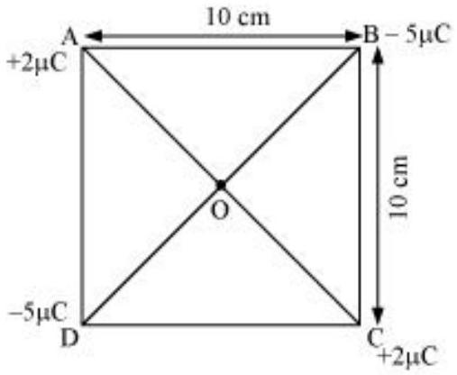
Where,
(Sides) $\mathrm{AB}=\mathrm{BC}=\mathrm{CD}=\mathrm{AD}=10 \mathrm{~cm}$
(Diagonals) $\mathrm{AC}=\mathrm{BD}=10 \sqrt{2} \mathrm{~cm}$
$\mathrm{AO}=\mathrm{OC}=\mathrm{DO}=\mathrm{OB}=5 \sqrt{2} \mathrm{~cm}$
A charge of amount $1 \mu \mathrm{C}$ is placed at point O .
Force of repulsion between charges placed at corner A and centre O is equal in magnitude but opposite in direction relative to the force of repulsion between the charges placed at corner C and centre O. Hence, they will cancel each other. Similarly, force of attraction between charges placed at corner B and centre O is equal in magnitude but opposite in direction relative to the force of attraction between the charges placed at corner D and centre O. Hence, they will also cancel each other. Therefore, net force caused by the four charges placed at the corner of the square on $1 \mu \mathrm{C}$ charge at centre O is zero.

Question 1.7:
An electrostatic field line is a continuous curve. That is, a field line cannot have sudden breaks. Why not?

Explain why two field lines never cross each other at any point?
Answer

An electrostatic field line is a continuous curve because a charge experiences a continuous force when traced in an electrostatic field. The field line cannot have sudden breaks because the charge moves continuously and does not jump from one point to the other.

If two field lines cross each other at a point, then electric field intensity will show two directions at that point. This is not possible. Hence, two field lines never cross each other.

Question 1.8:
Two point charges $q_{\mathrm{A}}=3 \mu \mathrm{C}$ and $q_{\mathrm{B}}=-3 \mu \mathrm{C}$ are located 20 cm apart in vacuum.
What is the electric field at the midpoint O of the line AB joining the two charges?
If a negative test charge of magnitude $1.5 \times 10^{-9} \mathrm{C}$ is placed at this point, what is the force experienced by the test charge?

Answer

The situation is represented in the given figure. O is the mid-point of line AB .
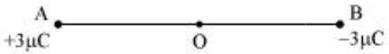

Distance between the two charges, $\mathrm{AB}=20 \mathrm{~cm}$

$$
\therefore \mathrm{AO}=\mathrm{OB}=10 \mathrm{~cm}
$$

Net electric field at point $\mathrm{O}=E$
Electric field at point O caused by $+3 \mu \mathrm{C}$ charge,

$$
E_{1}=\frac{3 \times 10^{-6}}{4 \pi \epsilon_{0}(\mathrm{AO})^{2}}=\frac{3 \times 10^{-6}}{4 \pi \epsilon_{0}\left(10 \times 10^{-2}\right)^{2}} \mathrm{~N} / \mathrm{C} \text { along } \mathrm{OB}
$$

Where,

$$
\begin{aligned}
& \epsilon_{0}=\text { Permittivity of free space } \\
& \frac{1}{4 \pi \epsilon_{0}}=9 \times 10^{9} \mathrm{Nm}^{2} \mathrm{C}^{-2}
\end{aligned}
$$

Magnitude of electric field at point O caused by $-3 \mu \mathrm{C}$ charge,

$$
\begin{aligned}
& E_{2}=\left|\frac{-3 \times 10^{-6}}{4 \pi \epsilon_{0}(\mathrm{OB})^{2}}\right|_{=} \frac{3 \times 10^{-6}}{4 \pi \epsilon_{0}\left(10 \times 10^{-2}\right)^{2}} \mathrm{~N} / \mathrm{C} \quad \text { along } \mathrm{OB} \\
& \therefore E=E_{1}+E_{2} \\
& =2 \times\left[\left(9 \times 10^{9}\right) \times \frac{3 \times 10^{-6}}{\left(10 \times 10^{-2}\right)^{2}}\right] \quad \text { [Since the values of } E_{1} \text { and } E_{2} \text { are same, the value is } \\
& \text { multiplied with } 2] \\
& =5.4 \times 10^{6} \mathrm{~N} / \mathrm{C} \text { along } \mathrm{OB}
\end{aligned}
$$

Therefore, the electric field at mid-point O is $5.4 \times 10^{6} \mathrm{~N} \mathrm{C}^{-1}$ along OB.
A test charge of amount $1.5 \times 10^{-9} \mathrm{C}$ is placed at mid-point O.

$$
q=1.5 \times 10^{-9} \mathrm{C}
$$

Force experienced by the test charge $=F$

$$
\begin{aligned}
& \therefore F=q E \\
& =1.5 \times 10^{-9} \times 5.4 \times 10^{6} \\
& =8.1 \times 10^{-3} \mathrm{~N}
\end{aligned}
$$

The force is directed along line OA. This is because the negative test charge is repelled by the charge placed at point B but attracted towards point A.

Therefore, the force experienced by the test charge is $8.1 \times 10^{-3} \mathrm{~N}$ along OA.

Question 1.9:
A system has two charges $q_{\mathrm{A}}=2.5 \times 10^{-7} \mathrm{C}$ and $q_{\mathrm{B}}=-2.5 \times 10^{-7} \mathrm{C}$ located at points A: (0, 0, - 15 cm) and B: (0, 0, + 15 cm), respectively. What are the total charge and electric dipole moment of the system?

Answer

Both the charges can be located in a coordinate frame of reference as shown in the given figure.
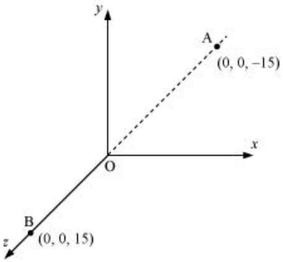
At A, amount of charge, $q_{\mathrm{A}}=2.5 \times 10^{-7} \mathrm{C}$
At B, amount of charge, $q_{\mathrm{B}}=-2.5 \times 10^{-7} \mathrm{C}$
Total charge of the system,

$$
\begin{aligned}
& q=q_{\mathrm{A}}+q_{\mathrm{B}} \\
& =2.5 \times 10^{7} \mathrm{C}-2.5 \times 10^{-7} \mathrm{C} \\
& =0
\end{aligned}
$$

Distance between two charges at points A and B ,

$$
d=15+15=30 \mathrm{~cm}=0.3 \mathrm{~m}
$$

Electric dipole moment of the system is given by,

$$
\begin{aligned}
& p=q_{\mathrm{A}} \times d=q_{\mathrm{B}} \times d \\
& =2.5 \times 10^{-7} \times 0.3 \\
& =7.5 \times 10^{-8} \mathrm{C} \mathrm{~m} \text { along positive } z \text {-axis }
\end{aligned}
$$

Therefore, the electric dipole moment of the system is $7.5 \times 10^{-8} \mathrm{C} \mathrm{m}$ along positive $z$-axis.

Question 1.10:
An electric dipole with dipole moment $4 \times 10^{-9} \mathrm{C} \mathrm{m}$ is aligned at 30° with the direction of a uniform electric field of magnitude $5 \times 10^{4} \mathrm{~N} \mathrm{C}^{-1}$. Calculate the magnitude of the torque acting on the dipole.

Answer

Electric dipole moment, $p=4 \times 10^{-9} \mathrm{C} \mathrm{m}$
Angle made by $p$ with a uniform electric field, $\theta=30^{\circ}$
Electric field, $E=5 \times 10^{4} \mathrm{~N} \mathrm{C}^{-1}$
Torque acting on the dipole is given by the relation,

$$
\begin{aligned}
\tau & =p E \sin \theta \\
& =4 \times 10^{-9} \times 5 \times 10^{4} \times \sin 30 \\
& =20 \times 10^{-5} \times \frac{1}{2} \\
& =10^{-4} \mathrm{Nm}
\end{aligned}
$$

Therefore, the magnitude of the torque acting on the dipole is $10^{-4} \mathrm{~N} \mathrm{~m}$.

Question 1.11:
A polythene piece rubbed with wool is found to have a negative charge of $3 \times 10^{-7} \mathrm{C}$.
Estimate the number of electrons transferred (from which to which?)

Is there a transfer of mass from wool to polythene?
Answer

When polythene is rubbed against wool, a number of electrons get transferred from wool to polythene. Hence, wool becomes positively charged and polythene becomes negatively charged.

Amount of charge on the polythene piece, $q=-3 \times 10^{-7} \mathrm{C}$
Amount of charge on an electron, $e=-1.6 \times 10^{-19} \mathrm{C}$
Number of electrons transferred from wool to polythene $=n$
$n$ can be calculated using the relation,

$$
\begin{aligned}
& q=n e \\
& n=\frac{q}{e} \\
& =\frac{-3 \times 10^{-7}}{-1.6 \times 10^{-19}} \\
& =1.87 \times 10^{12}
\end{aligned}
$$

Therefore, the number of electrons transferred from wool to polythene is $1.87 \times 10^{12}$.
Yes.
There is a transfer of mass taking place. This is because an electron has mass,

$$
m_{e}=9.1 \times 10^{-3} \mathrm{~kg}
$$

Total mass transferred to polythene from wool,

$$
\begin{aligned}
& m=m_{e} \times n \\
& =9.1 \times 10^{-31} \times 1.85 \times 10^{12} \\
& =1.706 \times 10^{-18} \mathrm{~kg}
\end{aligned}
$$

Hence, a negligible amount of mass is transferred from wool to polythene.

Question 1.12:
Two insulated charged copper spheres A and B have their centers separated by a distance of 50 cm. What is the mutual force of electrostatic repulsion if the charge on each is 6.5 × $10^{-7} \mathrm{C}$ ? The radii of A and B are negligible compared to the distance of separation.

What is the force of repulsion if each sphere is charged double the above amount, and the distance between them is halved?

Answer

Charge on sphere A, $q_{\mathrm{A}}=$ Charge on sphere B, $q_{\mathrm{B}}=6.5 \times 10^{-7} \mathrm{C}$
Distance between the spheres, $r=50 \mathrm{~cm}=0.5 \mathrm{~m}$
Force of repulsion between the two spheres,

$$
F=\frac{q_{\mathrm{A}} q_{\mathrm{B}}}{4 \pi \epsilon_{0} r^{2}}
$$

Where,

$$
\begin{aligned}
& \epsilon_{0}=\text { Free space permittivity } \\
& \frac{1}{4 \pi \epsilon_{0}}=9 \times 10^{9} \mathrm{~N} \mathrm{~m}^{2} \mathrm{C}^{-2} \\
& \quad F=\frac{9 \times 10^{9} \times\left(6.5 \times 10^{-7}\right)^{2}}{(0.5)^{2}} \\
& \therefore \\
& =1.52 \times 10^{-2} \mathrm{~N}
\end{aligned}
$$

Therefore, the force between the two spheres is $1.52 \times 10^{-2} \mathrm{~N}$.
After doubling the charge, charge on sphere A, $q_{\mathrm{A}}=$ Charge on sphere B, $q_{\mathrm{B}}=2 \times 6.5 \times$ $10^{-7} \mathrm{C}=1.3 \times 10^{-6} \mathrm{C}$

The distance between the spheres is halved.

$$
\therefore \quad r=\frac{0.5}{2}=0.25 \mathrm{~m}
$$

Force of repulsion between the two spheres,

$$
\begin{aligned}
& F=\frac{q_{\mathrm{A}} q_{\mathrm{B}}}{4 \pi \epsilon_{0} r^{2}} \\
& =\frac{9 \times 10^{9} \times 1.3 \times 10^{-6} \times 1.3 \times 10^{-6}}{(0.25)^{2}} \\
& =16 \times 1.52 \times 10^{-2} \\
& =0.243 \mathrm{~N}
\end{aligned}
$$

Therefore, the force between the two spheres is 0.243 N .

Question 1.13:
Suppose the spheres A and B in Exercise 1.12 have identical sizes. A third sphere of the same size but uncharged is brought in contact with the first, then brought in contact with the second, and finally removed from both. What is the new force of repulsion between A and B?

Answer

Distance between the spheres, A and B, $r=0.5 \mathrm{~m}$
Initially, the charge on each sphere, $q=6.5 \times 10^{-7} \mathrm{C}$
When sphere A is touched with an uncharged sphere $\mathrm{C},{ }^{\frac{q}{2}}$ amount of charge from A will transfer to sphere C. Hence, charge on each of the spheres, A and C, is ${ }^{\frac{q}{2}}$.

When sphere C with charge ${ }^{\frac{q}{2}}$ is brought in contact with sphere B with charge $q$, total charges on the system will divide into two equal halves given as,

$$
\frac{\frac{q}{2}+q}{2}=\frac{3 q}{4}
$$

Each sphere will each half. Hence, charge on each of the spheres, C and B , is $\frac{3 q}{4}$.
Force of repulsion between sphere A having charge ${ }^{\frac{q}{2}}$ and sphere B having charge $\frac{3 q}{4}=$ $\frac{\frac{q}{2} \times \frac{3 q}{4}}{4 \pi \epsilon_{0} r^{2}}=\frac{3 q^{2}}{8 \times 4 \pi \epsilon_{0} r^{2}}$

$$
\begin{aligned}
& =9 \times 10^{9} \times \frac{3 \times\left(6.5 \times 10^{-7}\right)^{2}}{8 \times(0.5)^{2}} \\
& =5.703 \times 10^{-3} \mathrm{~N}
\end{aligned}
$$

Therefore, the force of attraction between the two spheres is $5.703 \times 10^{-3} \mathrm{~N}$.

Question 1.14:

Figure 1.33 shows tracks of three charged particles in a uniform electrostatic field. Give the signs of the three charges. Which particle has the highest charge to mass ratio?
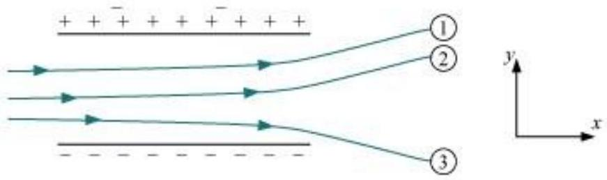

Answer

Opposite charges attract each other and same charges repel each other. It can be observed that particles 1 and 2 both move towards the positively charged plate and repel away from the negatively charged plate. Hence, these two particles are negatively charged. It can also be observed that particle 3 moves towards the negatively charged plate and repels away from the positively charged plate. Hence, particle 3 is positively charged.

The charge to mass ratio (emf) is directly proportional to the displacement or amount of deflection for a given velocity. Since the deflection of particle 3 is the maximum, it has the highest charge to mass ratio.

Question 1.15:
Consider a uniform electric field $\mathbf{E}=3 \times 10^{3}$ îN/C. (a) What is the flux of this field through a square of 10 cm on a side whose plane is parallel to the $y z$ plane? (b) What is the flux through the same square if the normal to its plane makes a $60^{\circ}$ angle with the $x$ axis?

Answer

Electric field intensity, $\vec{E}=3 \times 10^{3} \hat{\mathrm{i}} \mathrm{N} / \mathrm{C}$
Magnitude of electric field intensity, $|\vec{E}|_{=3 \times 10^{3} \mathrm{~N} / \mathrm{C}}$
Side of the square, $s=10 \mathrm{~cm}=0.1 \mathrm{~m}$
Area of the square, $A=\mathrm{s}^{2}=0.01 \mathrm{~m}^{2}$
The plane of the square is parallel to the $y-z$ plane. Hence, angle between the unit vector normal to the plane and electric field, $\theta=0^{\circ}$

Flux $(\Phi)$ through the plane is given by the relation,

$$
\begin{aligned}
& \Phi=|\vec{E}| A \cos \theta \\
& =3 \times 10^{3} \times 0.01 \times \cos 0^{\circ} \\
& =30 \mathrm{~N} \mathrm{~m}^{2} / \mathrm{C}
\end{aligned}
$$

Plane makes an angle of $60^{\circ}$ with the $x$-axis. Hence, $\theta=60^{\circ}$

$$
\begin{aligned}
& \text { Flux, } \Phi=|\vec{E}| A \cos \theta \\
& =3 \times 10^{3} \times 0.01 \times \cos 60^{\circ}
\end{aligned}
$$

$$
=30 \times \frac{1}{2}=15 \mathrm{~N} \mathrm{~m}^{2} / \mathrm{C}
$$

Question 1.16:
What is the net flux of the uniform electric field of Exercise 1.15 through a cube of side 20 cm oriented so that its faces are parallel to the coordinate planes?

Answer

All the faces of a cube are parallel to the coordinate axes. Therefore, the number of field lines entering the cube is equal to the number of field lines piercing out of the cube. As a result, net flux through the cube is zero.

Question 1.17:
Careful measurement of the electric field at the surface of a black box indicates that the net outward flux through the surface of the box is $8.0 \times 10^{3} \mathrm{~N} \mathrm{~m}^{2} / \mathrm{C}$. (a) What is the net charge inside the box? (b) If the net outward flux through the surface of the box were zero, could you conclude that there were no charges inside the box? Why or Why not?

Answer

Net outward flux through the surface of the box, $\Phi=8.0 \times 10^{3} \mathrm{~N} \mathrm{~m}^{2} / \mathrm{C}$
For a body containing net charge $q$, flux is given by the relation,

$$
\phi=\frac{q}{\epsilon_{0}}
$$

$$
\begin{aligned}
& \in_{0}=\text { Permittivity of free space } \\
& =8.854 \times 10^{-12} \mathrm{~N}^{-1} \mathrm{C}^{2} \mathrm{~m}^{-2}
\end{aligned}
$$

$$
\begin{aligned}
& q=\in_{0} \Phi \\
& =8.854 \times 10^{-12} \times 8.0 \times 10^{3} \\
& =7.08 \times 10^{-8} \\
& =0.07 \mu \mathrm{C}
\end{aligned}
$$

Therefore, the net charge inside the box is $0.07 \mu \mathrm{C}$.
No
Net flux piercing out through a body depends on the net charge contained in the body. If net flux is zero, then it can be inferred that net charge inside the body is zero. The body may have equal amount of positive and negative charges.

Question 1.18:
A point charge $+10 \mu \mathrm{C}$ is a distance 5 cm directly above the centre of a square of side 10 cm, as shown in Fig. 1.34. What is the magnitude of the electric flux through the square? (Hint: Think of the square as one face of a cube with edge 10 cm.)
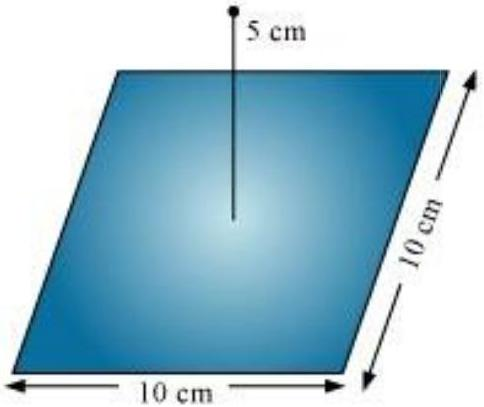

Answer

The square can be considered as one face of a cube of edge 10 cm with a centre where charge $q$ is placed. According to Gauss's theorem for a cube, total electric flux is through all its six faces.

$$
\phi_{\text {Total }}=\frac{q}{\epsilon_{0}}
$$

Hence, electric flux through one face of the cube i.e., through the square, $\quad \phi=\frac{\phi_{\text {Total }}}{6}$

$$
=\frac{1}{6} \frac{q}{\epsilon_{0}}
$$

Where,

$$
\begin{aligned}
& \epsilon_{0}=\text { Permittivity of free space } \\
& =8.854 \times 10^{-12} \mathrm{~N}^{-1} \mathrm{C}^{2} \mathrm{~m}^{-2} \\
& q=10 \mu \mathrm{C}=10 \times 10^{-6} \mathrm{C} \\
& \quad \phi=\frac{1}{6} \times \frac{10 \times 10^{-6}}{8.854 \times 10^{-12}} \\
& =1.88 \times 10^{5} \mathrm{~N} \mathrm{~m}^{2} \mathrm{C}^{-1}
\end{aligned}
$$

Therefore, electric flux through the square is $1.88 \times 10^{5} \mathrm{~N} \mathrm{~m}^{2} \mathrm{C}^{-1}$.

Question 1.19:
A point charge of $2.0 \mu \mathrm{C}$ is at the centre of a cubic Gaussian surface 9.0 cm on edge. What is the net electric flux through the surface?

Answer

Net electric flux ( $\Phi_{\mathrm{Net}}$ ) through the cubic surface is given by,

$$
\phi_{\mathrm{Net}}=\frac{q}{\epsilon_{0}}
$$

Where,

$$
\begin{aligned}
& \epsilon_{0}=\text { Permittivity of free space } \\
& =8.854 \times 10^{-12} \mathrm{~N}^{-1} \mathrm{C}^{2} \mathrm{~m}^{-2} \\
& q=\text { Net charge contained inside the cube }=2.0 \mu \mathrm{C}=2 \times 10^{-6} \mathrm{C}
\end{aligned}
$$

$$
\begin{aligned}
& \therefore \phi_{\mathrm{Net}}=\frac{2 \times 10^{-6}}{8.854 \times 10^{-12}} \\
& =2.26 \times 10^{5} \mathrm{~N} \mathrm{~m}^{2} \mathrm{C}^{-1}
\end{aligned}
$$

The net electric flux through the surface is $2.26 \times 10^{5} \mathrm{~N} \mathrm{~m}^{2} \mathrm{C}^{-1}$.

Question 1.20:
A point charge causes an electric flux of $-1.0 \times 10^{3} \mathrm{Nm}^{2} / \mathrm{C}$ to pass through a spherical Gaussian surface of 10.0 cm radius centered on the charge. (a) If the radius of the Gaussian surface were doubled, how much flux would pass through the surface? (b) What is the value of the point charge?

Answer

Electric flux, $\Phi=-1.0 \times 10^{3} \mathrm{~N} \mathrm{~m}^{2} / \mathrm{C}$
Radius of the Gaussian surface,

$$
r=10.0 \mathrm{~cm}
$$

Electric flux piercing out through a surface depends on the net charge enclosed inside a body. It does not depend on the size of the body. If the radius of the Gaussian surface is doubled, then the flux passing through the surface remains the same i.e., $-10^{3} \mathrm{~N} \mathrm{~m}^{2} / \mathrm{C}$.

Electric flux is given by the relation,

$$
\phi=\frac{q}{\epsilon_{0}}
$$

Where,

$$
\begin{aligned}
& q=\text { Net charge enclosed by the spherical surface } \\
& \in_{0}=\text { Permittivity of free space }=8.854 \times 10^{-12} \mathrm{~N}^{-1} \mathrm{C}^{2} \mathrm{~m}^{-2} \\
& \therefore q=\phi \epsilon_{0} \\
& =-1.0 \times 10^{3} \times 8.854 \times 10^{-12}
\end{aligned}
$$

$$
\begin{aligned}
& =-8.854 \times 10^{-9} \mathrm{C} \\
& =-8.854 \mathrm{nC}
\end{aligned}
$$

Therefore, the value of the point charge is -8.854 nC.

Question 1.21:
A conducting sphere of radius 10 cm has an unknown charge. If the electric field 20 cm from the centre of the sphere is $1.5 \times 10^{3} \mathrm{~N} / \mathrm{C}$ and points radially inward, what is the net charge on the sphere?

Answer

Electric field intensity $(E)$ at a distance $(d)$ from the centre of a sphere containing net charge $q$ is given by the relation,

$$
E=\frac{q}{4 \pi \epsilon_{0} d^{2}}
$$

Where,

$$
q=\text { Net charge }=1.5 \times 10^{3} \mathrm{~N} / \mathrm{C}
$$

$d=$ Distance from the centre $=20 \mathrm{~cm}=0.2 \mathrm{~m}$

$$
\epsilon_{0}=\text { Permittivity of free space }
$$

And, $\frac{1}{4 \pi \epsilon_{0}}=9 \times 10^{9} \mathrm{~N} \mathrm{~m}^{2} \mathrm{C}^{-2}$

$$
\begin{aligned}
& \therefore q=E\left(4 \pi \epsilon_{0}\right) d^{2} \\
& =\frac{1.5 \times 10^{3} \times(0.2)^{2}}{9 \times 10^{9}} \\
& =6.67 \times 10^{9} \mathrm{C} \\
& =6.67 \mathrm{nC}
\end{aligned}
$$

Therefore, the net charge on the sphere is 6.67 nC.

Question 1.22:
A uniformly charged conducting sphere of 2.4 m diameter has a surface charge density of $80.0 \mu \mathrm{C} / \mathrm{m}^{2}$. (a) Find the charge on the sphere. (b) What is the total electric flux leaving the surface of the sphere?

Answer

Diameter of the sphere, $d=2.4 \mathrm{~m}$
Radius of the sphere, $r=1.2 \mathrm{~m}$
Surface charge density, $\sigma=80.0 \mu \mathrm{C} / \mathrm{m}^{2}=80 \times 10^{-6} \mathrm{C} / \mathrm{m}^{2}$
Total charge on the surface of the sphere,

$$
\begin{aligned}
& Q=\text { Charge density × Surface area } \\
& =\sigma \times 4 \pi r^{2} \\
& =80 \times 10^{-6} \times 4 \times 3.14 \times(1.2)^{2} \\
& =1.447 \times 10^{-3} \mathrm{C}
\end{aligned}
$$

Therefore, the charge on the sphere is $1.447 \times 10^{-3} \mathrm{C}$.
Total electric flux ( $\phi_{\text {Total }}$ ) leaving out the surface of a sphere containing net charge $Q$ is given by the relation,

$$
\phi_{\text {TOtal }}=\frac{Q}{\epsilon_{0}}
$$

Where,

$$
\begin{aligned}
& \in_{0}=\text { Permittivity of free space } \\
& =8.854 \times 10^{-12} \mathrm{~N}^{-1} \mathrm{C}^{2} \mathrm{~m}^{-2}
\end{aligned}
$$

$$
\begin{aligned}
& Q=1.447 \times 10^{-3} \mathrm{C} \\
& \phi_{\text {Total }}=\frac{1.44 \times 10^{-3}}{8.854 \times 10^{-12}} \\
& =1.63 \times 10^{8} \mathrm{~N} \mathrm{C}^{-1} \mathrm{~m}^{2}
\end{aligned}
$$

Therefore, the total electric flux leaving the surface of the sphere is $1.63 \times 10^{8} \mathrm{~N} \mathrm{C}^{-1} \mathrm{~m}^{2}$.

Question 1.23:
An infinite line charge produces a field of $9 \times 10^{4} \mathrm{~N} / \mathrm{C}$ at a distance of 2 cm . Calculate the linear charge density.

Answer

Electric field produced by the infinite line charges at a distance $d$ having linear charge density $\lambda$ is given by the relation,

$$
\begin{aligned}
& E=\frac{\lambda}{2 \pi \epsilon_{0} d} \\
& \lambda=2 \pi \epsilon_{0} d E
\end{aligned}
$$

Where,

$$
\begin{aligned}
& d=2 \mathrm{~cm}=0.02 \mathrm{~m} \\
& E=9 \times 10^{4} \mathrm{~N} / \mathrm{C}
\end{aligned}
$$

$\epsilon_{0}=$ Permittivity of free space

$$
\begin{aligned}
& \frac{1}{4 \pi \epsilon_{0}}=9 \times 10^{9} \mathrm{~N} \mathrm{~m}^{2} \mathrm{C}^{-2} \\
& \lambda=\frac{0.02 \times 9 \times 10^{4}}{2 \times 9 \times 10^{9}} \\
& =10 \mu \mathrm{C} / \mathrm{m}
\end{aligned}
$$

Therefore, the linear charge density is $10 \mu \mathrm{C} / \mathrm{m}$.

Question 1.24:
Two large, thin metal plates are parallel and close to each other. On their inner faces, the plates have surface charge densities of opposite signs and of magnitude $17.0 \times 10^{-22}$ $\mathrm{C} / \mathrm{m}^{2}$. What is E: (a) in the outer region of the first plate, (b) in the outer region of the second plate, and (c) between the plates?

Answer

The situation is represented in the following figure.
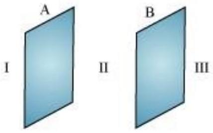
A and B are two parallel plates close to each other. Outer region of plate A is labelled as I, outer region of plate B is labelled as III, and the region between the plates, A and B, is labelled as II.

Charge density of plate $\mathrm{A}, \sigma=17.0 \times 10^{-22} \mathrm{C} / \mathrm{m}^{2}$
Charge density of plate $\mathrm{B}, \sigma=-17.0 \times 10^{-22} \mathrm{C} / \mathrm{m}^{2}$
In the regions, I and III, electric field $E$ is zero. This is because charge is not enclosed by the respective plates.

Electric field $E$ in region II is given by the relation,

$$
E=\frac{\sigma}{\epsilon_{0}}
$$

Where,

$$
\epsilon_{0}=\text { Permittivity of free space }=8.854 \times 10^{-12} \mathrm{~N}^{-1} \mathrm{C}^{2} \mathrm{~m}^{-2}
$$

$$
\begin{aligned}
& E=\frac{17.0 \times 10^{-22}}{8.854 \times 10^{-12}} \\
\therefore & 1.92 \times 10^{-10} \mathrm{~N} / \mathrm{C}
\end{aligned}
$$

Therefore, electric field between the plates is $1.92 \times 10^{-10} \mathrm{~N} / \mathrm{C}$.

Question 1.25:
An oil drop of 12 excess electrons is held stationary under a constant electric field of 2.55 $\times 10^{4} \mathrm{~N} \mathrm{C}^{-1}$ in Millikan's oil drop experiment. The density of the oil is $1.26 \mathrm{~g} \mathrm{~cm}^{-3}$. Estimate the radius of the drop. ( $g=9.81 \mathrm{~m} \mathrm{~s}^{-2} ; e=1.60 \times 10^{-19} \mathrm{C}$ ).

Answer

Excess electrons on an oil drop, $n=12$
Electric field intensity, $E=2.55 \times 10^{4} \mathrm{~N} \mathrm{C}^{-1}$
Density of oil, $\rho=1.26 \mathrm{gm} / \mathrm{cm}^{3}=1.26 \times 10^{3} \mathrm{~kg} / \mathrm{m}^{3}$
Acceleration due to gravity, $\mathrm{g}=9.81 \mathrm{~m} \mathrm{~s}^{-2}$
Charge on an electron, $e=1.6 \times 10^{-19} \mathrm{C}$
Radius of the oil drop $=r$
Force $(F)$ due to electric field $E$ is equal to the weight of the oil drop $(W)$

$$
\begin{aligned}
& F=W \\
& E q=m \mathrm{~g}
\end{aligned}
$$

Ene $=\frac{4}{3} \pi r^{3} \times \rho \times \mathrm{g}$
Where,

$$
\begin{aligned}
& q=\text { Net charge on the oil drop }=n e \\
& m=\text { Mass of the oil drop }
\end{aligned}
$$

= Volume of the oil drop × Density of oil

$$
=\frac{4}{3} \pi r^{3} \times \rho
$$

$$
\begin{aligned}
\therefore r & =\sqrt[3]{\frac{3 E n e}{4 \pi \rho \mathrm{~g}}} \\
& =\sqrt[3]{\frac{3 \times 2.55 \times 10^{4} \times 12 \times 1.6 \times 10^{-19}}{4 \times 3.14 \times 1.26 \times 10^{3} \times 9.81}} \\
& =\sqrt[3]{946.09 \times 10^{-21}} \\
& =9.82 \times 10^{-7} \mathrm{~m}
\end{aligned}
$$

$$
=9.82 \times 10^{-4} \mathrm{~mm}
$$

Therefore, the radius of the oil drop is $9.82 \times 10^{-4} \mathrm{~mm}$.

Question 1.26:
Which among the curves shown in Fig. 1.35 cannot possibly represent electrostatic field lines?

(a)
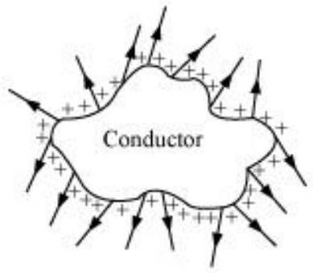

(b)
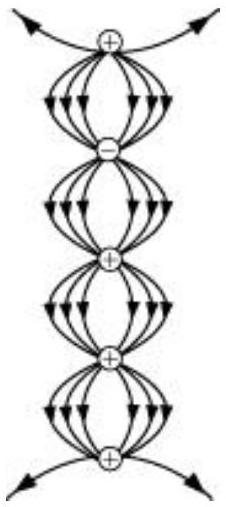

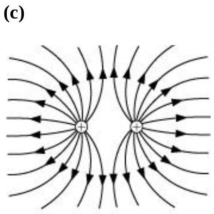
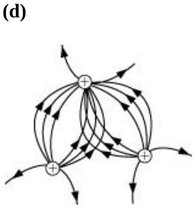
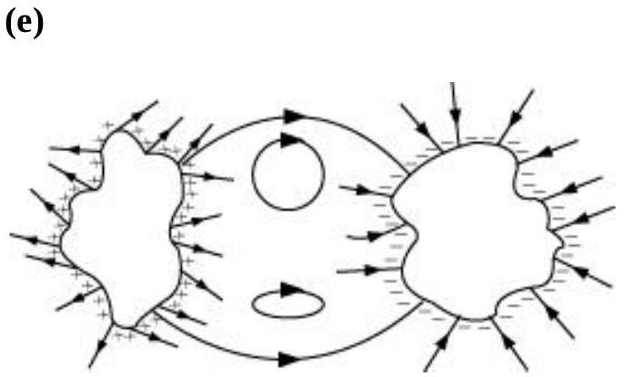

Answer

The field lines showed in (a) do not represent electrostatic field lines because field lines must be normal to the surface of the conductor.

The field lines showed in (b) do not represent electrostatic field lines because the field lines cannot emerge from a negative charge and cannot terminate at a positive charge.

The field lines showed in (c) represent electrostatic field lines. This is because the field lines emerge from the positive charges and repel each other.

The field lines showed in (d) do not represent electrostatic field lines because the field lines should not intersect each other.

The field lines showed in (e) do not represent electrostatic field lines because closed loops are not formed in the area between the field lines.

Question 1.27:
In a certain region of space, electric field is along the z-direction throughout. The magnitude of electric field is, however, not constant but increases uniformly along the positive $z$-direction, at the rate of $10^{5} \mathrm{NC}^{-1}$ per metre. What are the force and torque experienced by a system having a total dipole moment equal to $10^{-7} \mathrm{Cm}$ in the negative $z$ direction?

Answer

Dipole moment of the system, $p=q \times d l=-10^{-7} \mathrm{C} \mathrm{m}$
Rate of increase of electric field per unit length,

$$
\frac{d E}{d l}=10^{+5} \mathrm{~N} \mathrm{C}^{-1}
$$

Force $(F)$ experienced by the system is given by the relation,

$$
\begin{aligned}
& F=q E \\
& F=q \frac{d E}{d l} \times d l \\
& =p \times \frac{d E}{d l} \\
& =-10^{-7} \times 10^{-5} \\
& =-10^{-2} \mathrm{~N}
\end{aligned}
$$

The force is $-10^{-2} \mathrm{~N}$ in the negative z-direction i.e., opposite to the direction of electric field. Hence, the angle between electric field and dipole moment is 180°.

Torque $(\tau)$ is given by the relation,

$$
\begin{aligned}
& \tau=p E \sin 180^{\circ} \\
& =0
\end{aligned}
$$

Therefore, the torque experienced by the system is zero.

Question 1.28:
A conductor A with a cavity as shown in Fig. 1.36(a) is given a charge $Q$. Show that the entire charge must appear on the outer surface of the conductor. (b) Another conductor B with charge $q$ is inserted into the cavity keeping B insulated from A. Show that the total charge on the outside surface of A is $Q+q$ [Fig. 1.36(b)]. (c) A sensitive instrument is to be shielded from the strong electrostatic fields in its environment. Suggest a possible way.

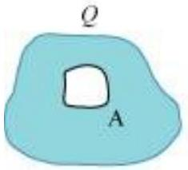
(a)

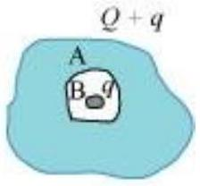
(b)

Answer

Let us consider a Gaussian surface that is lying wholly within a conductor and enclosing the cavity. The electric field intensity $E$ inside the charged conductor is zero.

Let $q$ is the charge inside the conductor and $\epsilon_{0}$ is the permittivity of free space.
According to Gauss's law,
$\phi=\vec{E} \cdot \overrightarrow{d s}=\frac{q}{\epsilon_{0}}$

Here, $E=0$

$$
\frac{q}{\epsilon^{0}}=0
$$

$$
\begin{aligned}
& \because \in_{0} \neq 0 \\
& \therefore q=0
\end{aligned}
$$

Therefore, charge inside the conductor is zero.
The entire charge $Q$ appears on the outer surface of the conductor.
The outer surface of conductor A has a charge of amount $Q$. Another conductor B having charge $+q$ is kept inside conductor A and it is insulated from A. Hence, a charge of amount $-q$ will be induced in the inner surface of conductor A and $+q$ is induced on the outer surface of conductor A. Therefore, total charge on the outer surface of conductor A is $Q+q$.

A sensitive instrument can be shielded from the strong electrostatic field in its environment by enclosing it fully inside a metallic surface. A closed metallic body acts as an electrostatic shield.

Question 1.29:
A hollow charged conductor has a tiny hole cut into its surface. Show that the electric field in the hole is $\left(\frac{\sigma}{2 \epsilon_{0}}\right) \hat{n}$, where $\hat{n}$ is the unit vector in the outward normal direction, and $\sigma$ is the surface charge density near the hole.

Answer

Let us consider a conductor with a cavity or a hole. Electric field inside the cavity is zero.
Let $E$ is the electric field just outside the conductor, $q$ is the electric charge, $\sigma$ is the charge density, and $\epsilon_{0}$ is the permittivity of free space.

Charge $|q|=\vec{\sigma} \times \overrightarrow{d s}$
According to Gauss's law,

$$
\begin{aligned}
& \text { Flux, } \phi=\vec{E} \cdot \overrightarrow{d s}=\frac{|q|}{\epsilon_{0}} \\
& E d s=\frac{\vec{\sigma} \times \overrightarrow{d s}}{\epsilon_{0}} \\
& \therefore E=\frac{\sigma}{\epsilon_{0}} \hat{n}
\end{aligned}
$$

Therefore, the electric field just outside the conductor is $\frac{\sigma}{\epsilon_{0}} \hat{n}$. This field is a superposition of field due to the cavity ${ }^{\left(E^{\prime}\right)}$ and the field due to the rest of the charged conductor $\left(E^{\prime}\right)$. These fields are equal and opposite inside the conductor, and equal in magnitude and direction outside the conductor.

$$
\begin{aligned}
& \therefore E^{\prime}+E^{\prime}=E \\
& E^{\prime}=\frac{E}{2} \\
&=\frac{\sigma}{2 \epsilon_{0}} \hat{n}
\end{aligned}
$$

Therefore, the field due to the rest of the conductor is ${\frac{\sigma}{\epsilon_{0}} \hat{n}}$.
Hence, proved.

Question 1.30:
Obtain the formula for the electric field due to a long thin wire of uniform linear charge density $\lambda$ without using Gauss's law. [Hint: Use Coulomb's law directly and evaluate the necessary integral.]

Answer

Take a long thin wire XY (as shown in the figure) of uniform linear charge density $\lambda$.
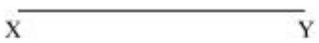
Consider a point A at a perpendicular distance $l$ from the mid-point O of the wire, as shown in the following figure.
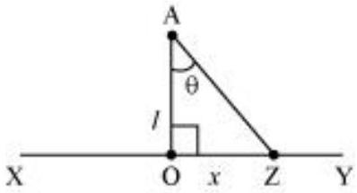

Let $E$ be the electric field at point A due to the wire, XY .
Consider a small length element $d x$ on the wire section with $\mathrm{OZ}=x$
Let $q$ be the charge on this piece.

$$
\therefore q=\lambda d x
$$

Electric field due to the piece,

$$
d E=\frac{1}{4 \pi \epsilon_{0}} \frac{\lambda d x}{(\mathrm{AZ})^{2}}
$$

However, $A Z=\sqrt{\left(l^{2}+x^{2}\right)}$

$$
\therefore d E=\frac{\lambda d x}{4 \pi \epsilon_{0}\left(l^{2}+x^{2}\right)}
$$

The electric field is resolved into two rectangular components. $d E \cos \theta$ is the perpendicular component and $d E \sin \theta$ is the parallel component.

When the whole wire is considered, the component $d E \sin \theta$ is cancelled.
Only the perpendicular component $d E \cos \theta$ affects point A .
Hence, effective electric field at point A due to the element $d x$ is $d E_{1}$.

$$
\therefore d E_{1}=\frac{\lambda d x \cos \theta}{4 \pi \epsilon_{0}\left(x^{2}+l^{2}\right)}
$$

InAAZO,

$$
\begin{aligned}
& \tan \theta=\frac{x}{l} \\
& x=l \tan \theta
\end{aligned}
$$

On differentiating equation (2), we obtain

$$
\begin{aligned}
& \frac{d x}{d \theta}=l \sin ^{2} \theta \\
& d x=l \sin ^{2} \theta d \theta
\end{aligned}
$$

From equation (2),

$$
x^{2}+l^{2}=l^{2}+l^{2} \tan ^{2} \theta
$$

$$
\begin{aligned}
& \therefore l^{2}\left(1+\tan ^{2} \theta\right)=l^{2} \sec ^{2} \theta \\
& x^{2}+l^{2}=l^{2} \sin ^{2} \theta
\end{aligned}
$$

Putting equations (3) and (4) in equation (1), we obtain

$$
\begin{aligned}
& \therefore d E_{1}=\frac{\lambda l \sec ^{2} d \theta}{4 \pi \epsilon_{0} l^{2} \sec ^{2} \theta} \times \cos \theta \\
& \therefore d E_{1}=\frac{\lambda \cos \theta d \theta}{4 \pi \epsilon_{0} l}
\end{aligned}
$$

The wire is so long that $\theta$ tends from $-\frac{\pi}{2}$ to $+\frac{\pi}{2}$.
By integrating equation (5), we obtain the value of field $E_{1}$ as,

$$
\begin{aligned}
& \frac{\pi}{2} d E_{1}=\int_{-\frac{\pi}{2}}^{\frac{\pi}{2}} \frac{\lambda}{4 \pi \epsilon_{0} l} \cos \theta d \theta \\
& E_{1}=\frac{\lambda}{4 \pi \epsilon_{0} l}[\sin \theta]_{-\frac{\pi}{2}}^{\frac{\pi}{2}} \\
& \quad=\frac{\lambda}{4 \pi \epsilon_{0} l} \times 2 \\
& E_{1}=\frac{\lambda}{2 \pi \epsilon_{0} l}
\end{aligned}
$$

Therefore, the electric field due to long wire is $\frac{\lambda}{2 \pi \epsilon_{0} l}$.

Question 1.31:
It is now believed that protons and neutrons (which constitute nuclei of ordinary matter) are themselves built out of more elementary units called quarks. A proton and a neutron consist of three quarks each. Two types of quarks, the so called 'up' quark (denoted by u) of charge $(+2 / 3) e$, and the 'down' quark (denoted by d ) of charge ( $-1 / 3$ ) $e$, together with electrons build up ordinary matter. (Quarks of other types have also been found which give rise to different unusual varieties of matter.) Suggest a possible quark composition of a proton and neutron.

Answer

A proton has three quarks. Let there be $n$ up quarks in a proton, each having a charge of $+\frac{2}{3} e$.
Charge due to $n$ up quarks $=\left(\frac{2}{3} e\right) n$
Number of down quarks in a proton $=3-n$
Each down quark has a charge of $-\frac{1}{3} e$.
Charge due to $(3-n)$ down quarks $=\left(-\frac{1}{3} e\right)(3-n)$
Total charge on a proton $=+e$

$$
\begin{aligned}
& \therefore e=\left(\frac{2}{3} e\right) n+\left(-\frac{1}{3} e\right)(3-n) \\
& e=\left(\frac{2 n e}{3}\right)-e+\frac{n e}{3} \\
& 2 e=n e \\
& n=2
\end{aligned}
$$

Number of up quarks in a proton, $n=2$
Number of down quarks in a proton $=3-n=3-2=1$
Therefore, a proton can be represented as 'uud'.
A neutron also has three quarks. Let there be $n$ up quarks in a neutron, each having a charge of $+\frac{3}{2} e$.
Charge on a neutron due to $n$ up quarks $=\left(+\frac{3}{2} e\right) n$
Number of down quarks is $3-n$,each having a charge of $\left(-\frac{1}{3}\right) e$.

Charge on a neutron due to $(3-n)$ down quarks $=\left(-\frac{1}{3} e\right)(3-n)$
Total charge on a neutron $=0$

$$
\begin{aligned}
& 0=\left(\frac{2}{3} e\right) n+\left(-\frac{1}{3} e\right)(3-n) \\
& 0=\frac{2}{3} e n-e+\frac{n e}{3} \\
& e=n e \\
& n=1
\end{aligned}
$$

Number of up quarks in a neutron, $n=1$
Number of down quarks in a neutron $=3-n=2$
Therefore, a neutron can be represented as 'udd'.

Question 1.32:
Consider an arbitrary electrostatic field configuration. A small test charge is placed at a null point (i.e., where $\mathbf{E}=0$ ) of the configuration. Show that the equilibrium of the test charge is necessarily unstable.

Verify this result for the simple configuration of two charges of the same magnitude and sign placed a certain distance apart.

Answer

Let the equilibrium of the test charge be stable. If a test charge is in equilibrium and displaced from its position in any direction, then it experiences a restoring force towards a null point, where the electric field is zero. All the field lines near the null point are directed inwards towards the null point. There is a net inward flux of electric field through a closed surface around the null point. According to Gauss's law, the flux of electric field through a surface, which is not enclosing any charge, is zero. Hence, the equilibrium of the test charge can be stable.

Two charges of same magnitude and same sign are placed at a certain distance. The midpoint of the joining line of the charges is the null point. When a test charged is displaced along the line, it experiences a restoring force. If it is displaced normal to the joining line,
then the net force takes it away from the null point. Hence, the charge is unstable because stability of equilibrium requires restoring force in all directions.

Question 1.33:
A particle of mass $m$ and charge ( $-q$ ) enters the region between the two charged plates initially moving along $x$-axis with speed $v x$ (like particle 1 in Fig. 1.33). The length of plate is $L$ and an uniform electric field $E$ is maintained between the plates. Show that the vertical deflection of the particle at the far edge of the plate is $q E L^{2} /\left(2 m v_{x}^{2}\right)$.

Compare this motion with motion of a projectile in gravitational field discussed in Section 4.10 of Class XI Textbook of Physics.

Answer

Charge on a particle of mass $m=-q$
Velocity of the particle $=v_{x}$
Length of the plates $=L$
Magnitude of the uniform electric field between the plates $=E$
Mechanical force, $F=$ Mass $(m) \times$ Acceleration $(a)$

$$
a=\frac{F}{m}
$$

However, electric force, $F=q E$

$$
\text { Therefore, acceleration, } a=\frac{q E}{m}
$$

Time taken by the particle to cross the field of length $L$ is given by,

$$
t=\frac{\text { Length of the plate }}{\text { Velocity of the particle }}=\frac{L}{v_{x}}
$$

In the vertical direction, initial velocity, $u=0$
According to the third equation of motion, vertical deflection $s$ of the particle can be obtained as,

$$
\begin{aligned}
& s=u t+\frac{1}{2} a t^{2} \\
& s=0+\frac{1}{2}\left(\frac{q E}{m}\right)\left(\frac{L}{v_{x}}\right)^{2} \\
& s=\frac{q E L^{2}}{2 m V_{s}^{2}}
\end{aligned}
$$

Hence, vertical deflection of the particle at the far edge of the plate is $q E L^{2} /\left(2 m v_{x}^{2}\right)$. This is similar to the motion of horizontal projectiles under gravity.

Question 1.34:
Suppose that the particle in Exercise in 1.33 is an electron projected with velocity $v_{x}=2.0$ $\times 10^{6} \mathrm{~m} \mathrm{~s}^{-1}$. If $E$ between the plates separated by 0.5 cm is $9.1 \times 10^{2} \mathrm{~N} / \mathrm{C}$, where will the electron strike the upper plate? $\left(|e|=1.6 \times 10^{-19} \mathrm{C}, m_{e}=9.1 \times 10^{-31} \mathrm{~kg}\right.$.)

Answer

Velocity of the particle, $v_{x}=2.0 \times 10^{6} \mathrm{~m} / \mathrm{s}$
Separation of the two plates, $d=0.5 \mathrm{~cm}=0.005 \mathrm{~m}$
Electric field between the two plates, $E=9.1 \times 10^{2} \mathrm{~N} / \mathrm{C}$
Charge on an electron, $q=1.6 \times 10^{-19} \mathrm{C}$
Mass of an electron, $m_{\mathrm{e}}=9.1 \times 10^{-31} \mathrm{~kg}$
Let the electron strike the upper plate at the end of plate $L$, when deflection is $s$.
Therefore,

$$
\begin{aligned}
s & =\frac{q E L^{2}}{2 m v_{x}^{2}} \\
L & =\sqrt{\frac{2 d m v_{x}^{2}}{q E}} \\
& =\sqrt{\frac{2 \times 0.005 \times 9.1 \times 10^{-31} \times\left(2.0 \times 10^{6}\right)^{2}}{1.6 \times 10^{-10} \times 9.1 \times 10^{2}}} \\
& =\sqrt{0.025 \times 10^{-2}}=\sqrt{2.5 \times 10^{-4}} \\
& =1.6 \times 10^{-2} \mathrm{~m} \\
& =1.6 \mathrm{~cm}
\end{aligned}
$$

Therefore, the electron will strike the upper plate after travelling 1.6 cm.

