## अध्याय $1$

## वैद्युत आवेश

## तथा क्षेत्र

## $1.1$ भूमिका

हम सभी को，विशेषकर शुष्क मौसम में，स्वेटर अथवा संश्लिष्ट वस्त्रों को शरीर से उतारते समय चट－चट की ध्वनि सुनने अथवा चिनगारियाँ देखने का अनुभव होगा। क्या आपने कभी इस परिघटना का स्पष्टीकरण खोजने का प्रयास किया है？विद्युत विसर्जन का एक अन्य सामान्य उदाहरण आकाश में गर्जन के समय तडित दिखाई देना है। विद्युत झटके के संवेदन का अनुभव हमें उस समय भी होता है जब हम किसी कार का दरवाज़ा खोलते हैं अथवा जब हम अपनी बस की सीट पर खिसकने के पश्चात उसमें लगी लोहे की छड़ को पकड़ते हैं। इन अनुभवों के होने के कारण हमारे शरीर में से होकर उन वैद्युत आवेशों का विसर्जित होना है जो विद्युतरोधी पृष्ठों पर रगड़ के कारण एकत्र हो जाते हैं। आपने यह भी सुना होगा कि यह वैद्युत आवेश（स्थिरवैद्युत）के उत्पन्न होने के कारण है। इस अध्याय तथा अगले अध्याय में भी हम इसी विषय पर चर्चा करेंगे। स्थिर से तात्पर्य है वह सब कुछ जो समय के साथ परिवर्तित अथवा गतिमय नहीं होता। स्थिरवैद्युतिकी के अंतर्गत हम स्थिर आवेशों द्वारा उत्पन्न बलों，क्षेत्रों तथा विभवों के विषय में अध्ययन करते हैं।

## $1.2$ वैद्युत आवेश

इतिहास के अनुसार लगभग $600$ ई．पूर्व हुई इस तथ्य की खोज का श्रेय，कि ऊन अथवा रेशमी－वस्त्र से रगड़ा गया ऐम्बर हलकी वस्तुओं को आकर्षित करता है，ग्रीस देश के मिलेटस के निवासी थेल्स को जाता है।＇इलेक्ट्रिसिटी＇शब्द भी ग्रीस की भाषा के शब्द इलेक्ट्रॉन से व्युत्पन्न हुआ है जिसका अर्थ ऐम्बर है। उस समय पदार्थों के ऐसे बहुत से युगल ज्ञात थे जो परस्पर रगड़े

## भौतिकी

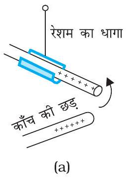
चित्र $1.1$ छड़ें: सजातीय आवेश एक-दूसरे को प्रतिकर्षित तथा विजातीय आवेश एक-दूसरे को आकर्षित करते हैं।

जाने पर भूसे के तिनकों, सरकंडे की गोलियों, कागज़ के छोटे टुकड़ों आदि हलकी वस्तुओं को आकर्षित कर लेते थे।

यह भी प्रेक्षित किया गया कि यदि ऊन अथवा रेशम के कपड़े से रगड़ी हुई दो काँच की छड़ों को एक-दूसरे के निकट लाएँ तो वे एक-दूसरे को प्रतिकर्षित करती हैं [चित्र 1.1(a)]। ऊन की वे लड़ियाँ अथवा रेशम के कपड़े के वे टुकड़े जिनसे इन छड़ों को रगड़ा गया था, वे भी परस्पर एक-दूसरे को प्रतिकर्षित करते हैं परंतु काँच की छड़ तथा ऊन एक-दूसरे को आकर्षित करते हैं। इसी प्रकार, बिल्ली की समूर से रगड़ी हुई दो प्लास्टिक की छड़ें एक-दूसरे को प्रतिकर्षित करती हैं [चित्र 1.1(b)] परंतु समूर को आकर्षित करती हैं। इसके विपरीत, प्लास्टिक की छड़ें काँच की छड़ों को आकर्षित करती हैं [चित्र 1.1(c)] तथा सिल्क अथवा ऊन जिससे काँच की छड़ों को रगड़ा गया था, को प्रतिकर्षित करती हैं। काँच की छड़ समूर को प्रतिकर्षित करती है।

वर्षों के प्रयास तथा सावधानीपूर्वक किए गए प्रयोगों एवं उनके विश्लेषणों द्वारा सरल प्रतीत होने वाले ये तथ्य स्थापित हो पाए हैं। विभिन्न वैज्ञानिकों द्वारा किए गए बहुत से सावधानीपूर्ण अध्ययनों के पश्चात यह निष्कर्ष निकाला गया है कि एक राशि होती है, जिसे वैद्युत आवेश कहते हैं और यह केवल दो प्रकार के ही हो सकते हैं। वैद्युत आवेश कहलाने वाली राशि के केवल दो प्रकार ही होते हैं। हम कहते हैं कि प्लास्टिक एवं काँच की छड़, रेशम, समूर, सरकंडे की गोलियाँ आदि पिंड विद्युन्मय हो गए हैं। रगड़ने पर ये वैद्युत आवेश अर्जित कर लेते हैं। आवेश दो प्रकार के होते हैं तथा हम यह पाते हैं कि (i) सजातीय आवेश एक-दूसरे को प्रतिकर्षित तथा (ii) विजातीय आवेश एक-दूसरे को आकर्षित करते हैं। वह गुण जो दो प्रकार के आवेशों में भेद करता है, आवेश की ध्रुवता कहलाता है।

जब काँच की छड़ को रेशम से रगड़ते हैं तो छड़ एक प्रकार का आवेश अर्जित करती है तथा रेशम दूसरे प्रकार का आवेश अर्जित करता है। यह उन सभी वस्तुओं के युगल के लिए सत्य है जो विद्युन्मय होने के लिए परस्पर रगड़े जाते हैं। अब यदि विद्युन्मय काँच की छड़ को उस रेशम के संपर्क में लाते हैं जिससे उसे रगड़ा गया था, तो वे अब एक-दूसरे को आकर्षित नहीं करते। ये अब अन्य हलकी वस्तुओं को भी आकर्षित अथवा प्रतिकर्षित नहीं करते जैसा कि ये विद्युन्मय होने पर कर रहे थे।

इस प्रकार, रगड़ने के पश्चात वस्तुओं द्वारा अर्जित आवेश आवेशित वस्तुओं को एक-दूसरे के संपर्क में लाने पर लुप्त हो जाता है। इन प्रेक्षणों से आप क्या निष्कर्ष निकाल सकते हैं? यह तो केवल इतना बताता है कि वस्तुओं द्वारा अर्जित विजातीय आवेश एक-दूसरे के प्रभाव को निष्फल कर देते हैं। इसीलिए अमेरिकी वैज्ञानिक बेंजामिन फ्रेंकलिन ने आवेशों को धनात्मक तथा ऋणात्मक कहा। परिपाटी के अनुसार काँच की छड़ अथवा बिल्ली के समूर पर आवेश धनात्मक कहलाता है तथा प्लास्टिक-छड़ अथवा रेशम पर आवेश ऋणात्मक कहलाता है। जब किसी वस्तु पर कोई आवेश होता है तो वह वस्तु विद्युन्मय अथवा आवेशित (आविष्ट) कही जाती है। जब उस पर कोई आवेश नहीं होता तब उसे अनावेशित कहते हैं।

आवेशों की उपस्थिति के संसूचन के लिए एक सरल उपकरण स्वर्ण पत्र विद्युतदर्शी है [चित्र $1.2$ (a)]। इसमें एक बॉक्स में धातु की एक छड़ ऊर्ध्वाधरतः लगी होती है जिसके निचले सिरे पर सोने के वर्क की दो पट्टियाँ बँधी होती हैं। जब कोई आवेशित वस्तु छड़ के ऊपरी सिरे को छूती है तो छड़ में होता हुआ आवेश सोने के वर्कों पर आ जाता है और वे एक-दूसरे से दूर हट जाते हैं। आवेश जितना अधिक होता है, वर्कों के निचले सिरों के बीच उतनी ही अधिक दूरी हो जाती है।

## वैद्युत आवेश तथा क्षेत्र

आइए, अब यह समझें कि द्रव्य से बनी वस्तुएँ क्यों आवेश को अर्जित करती हैं।

सभी पदार्थ परमाणुओं और/अथवा अणुओं से बने हैं। यद्यपि वस्तुएँ सामान्यतः वैद्युत उदासीन होती हैं, उनमें आवेश तो होते हैं परंतु उनके ये आवेश ठीक-ठीक संतुलित होते हैं। अणुओं को सँभालने वाला रासायनिक बल, ठोसों में परमाणुओं को एकसाथ थामे रखने वाले बल, गोंद का आसंजक बल, पृष्ठ तनाव से संबद्ध बल-इन सभी बलों की मूल प्रकृति वैद्युतीय है, और ये आवेशित कणों के बीच लगने वाले विद्युत बलों से उत्पन्न होते हैं। इस प्रकार, वैद्युतचुंबकीय बल सर्वव्यापी है और यह हमारे जीवन से संबद्ध प्रत्येक क्षेत्र में सम्मिलित है। अतः यह आवश्यक है कि हम इस प्रकार के बल के विषय में अधिक जानकारी प्राप्त करें।

किसी उदासीन वस्तु को आवेशित करने के लिए हमें उससे एक प्रकार के आवेश को जोड़ने अथवा हटाने की आवश्यकता होती है। जब हम यह कहते हैं कि कोई वस्तु आवेशित है तो हम सदैव ही इस आवेश के आधिक्य अथवा अभाव का उल्लेख करते हैं। ठोसों में कुछ इलेक्ट्रॉन परमाणु में कम कसकर आबद्ध होने के कारण, वे आवेश होते हैं जो एक वस्तु से दूसरी वस्तु में स्थानांतरित हो जाते हैं। इस प्रकार कोई वस्तु अपने कुछ इलेक्ट्रॉन खोकर धनावेशित हो सकती है। इसी प्रकार किसी वस्तु को इलेक्ट्रॉन देकर ऋणावेशित भी बनाया जा सकता है। जब हम काँच की छड़ को रेशम से रगड़ते हैं तो छड़ के कुछ इलेक्ट्रॉन रेशम के कपड़े में स्थानांतरित हो जाते हैं। इस प्रकार छड़ धनावेशित तथा रेशम ऋणावेशित हो जाता है। रगड़ने की प्रक्रिया में कोई नया आवेश उत्पन्न नहीं होता। साथ ही स्थानांतरित होने वाले इलेक्ट्रॉनों की संख्या वस्तु में उपस्थित इलेक्ट्रॉनों की संख्या की तुलना में एक बहुत छोटा अंश होती है।

## $1.3$ चालक तथा विद्युतरोधी

कुछ पदार्थ तुरंत ही अपने में से होकर विद्युत को प्रवाहित होने देते हैं जबकि कुछ अन्य ऐसा नहीं करते। जो पदार्थ आसानी से अपने में से होकर विद्युत को प्रवाहित होने देते हैं उन्हें चालक कहते हैं। उनमें ऐसे वैद्युत आवेश (इलेक्ट्रॉन) होते हैं जो पदार्थ के भीतर गति के लिए अपेक्षाकृत स्वतंत्र होते हैं। धातुएँ, मानव तथा जंतु शरीर और पृथ्वी चालक हैं। काँच, पॉर्सेलेन, प्लास्टिक, नॉयलोन, लकड़ी जैसी अधिकांश अधातुएँ अपने से होकर प्रवाहित होने वाली विद्युत पर उच्च प्रतिरोध लगाती हैं। इन्हें विद्युतरोधी कहते हैं। अधिकांश पदार्थ ऊपर वर्णित इन दो वर्गों में से किसी एक में आते हैं।*

जब कुछ आवेश किसी चालक पर स्थानांतरित होता है तो वह तुरंत ही उस चालक के समस्त पृष्ठ पर फैल जाता है। इसके विपरीत यदि कुछ आवेश किसी विद्युतरोधी को दें तो वह वहीं पर रहता है। ऐसा क्यों होता है, यह आप अगले अध्याय में सीखेंगे।

[^0]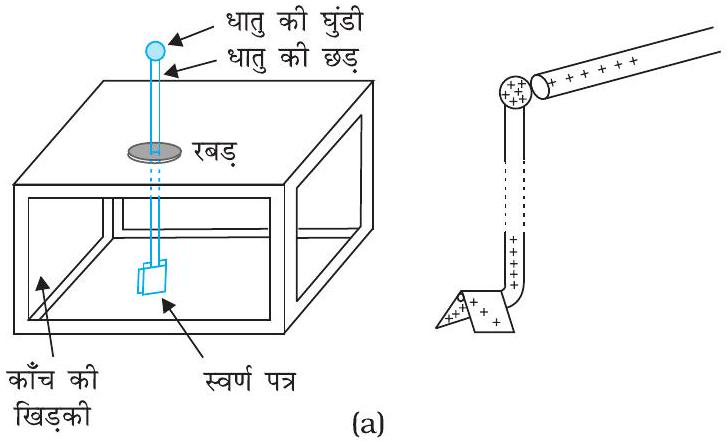
(b)
चित्र $1.2$ विद्युतदर्शी (a) स्वर्ण पत्र विद्युतदर्शी (b) सरल विद्युतदर्शी की रूपरेखा।

पदार्थों का यह गुण हमें बताता है कि सूखे बालों में कंघी करने अथवा रगड़ने पर नॉयलोन या प्लास्टिक की कंघी क्यों आवेशित हो जाती है, परंतु धातु की वस्तुएँ जैसे चम्मच आवेशित क्यों नहीं होती? धातुओं से आवेश का क्षरण हमारे शरीर से होकर धरती में हो जाता है, ऐसा होने का कारण यह है कि धातु तथा हमारा शरीर दोनों ही विद्युत के अच्छे चालक हैं। परंतु यदि धातु की छड़ पर लकड़ी अथवा प्लास्टिक का हैंडिल लगा है और उसके धातु के भाग को स्पर्श नहीं किया गया है, तो वह आवेशित होने का संकेत दे देती है।

## $1.4$ वैद्युत आवेश के मूल गुण

हमने यह देखा है कि दो प्रकार के आवेश होते हैं- धनावेश तथा ऋणावेश तथा इनमें एक-दूसरे के प्रभाव को निरस्त करने की प्रवृत्ति होती है। अब, हम यहाँ वैद्युत आवेश के अन्य गुणों का वर्णन करेंगे।

यदि आवेशित वस्तुओं का साइज़ उनके बीच की दूरी की तुलना में बहुत कम होता है तो हम उन्हें बिंदु आवेश मानते हैं। यह मान लिया जाता है कि वस्तु का संपूर्ण आवेश आकाश में एक बिंदु पर संकेंद्रित है।

### 1.4.1 आवेशों की योज्यता

अब तक हमने आवेश की परिमाणात्मक परिभाषा नहीं दी है; इसे हम अगले अनुभाग में समझेंगे। अंतरिम रूप में हम यह मानेंगे कि ऐसा किया जा सकता है और फिर आगे बढ़ेंगे। यदि किसी निकाय में दो बिंदु आवेश $q_{1}$ तथा $q_{2}$ हैं तो निकाय का कुल आवेश $q_{1}$ तथा $q_{2}$ को बीजगणितीय रीति से जोड़ने पर प्राप्त होता है, अर्थात आवेशों को वास्तविक संख्याओं की भाँति जोड़ा जा सकता है अथवा आवेश द्रव्यमान की भाँति अदिश राशि है। यदि किसी निकाय में $n$ आवेश $q_{1}, q_{2}, q_{3} \ldots q_{\mathrm{n}}$, हैं तो निकाय का कुल आवेश $q_{1}+q_{2}+q_{3}+\ldots+q_{n}$ है। आवेश का द्रव्यमान की भाँति ही परिमाण होता है दिशा नहीं होती। तथापि आवेश तथा द्रव्यमान में एक अंतर है। किसी वस्तु का द्रव्यमान सदैव धनात्मक होता है जबकि कोई आवेश या तो धनात्मक हो सकता है अथवा ऋणात्मक। किसी निकाय के आवेश का योग करते समय उसके उपयुक्त चिह्न का उपयोग करना होता है। उदाहरणार्थ, किसी निकाय में किसी यादृच्छिक मात्रक में मापे गए पाँच आवेश $+1,+2,-3,+4$ तथा $-5$ हैं, तब उसी मात्रक में निकाय का कुल आवेश $=(+1)+(+2)+(-3)+(+4)+(-5)=-1$ है।

### 1.4.2 वैद्युत आवेश संरक्षित है

हम इस तथ्य की ओर पहले ही संकेत दे चुके हैं कि जब वस्तुएँ रगड़ने पर आवेशित होती हैं तो एक वस्तु से दूसरी वस्तु में इलेक्ट्रॉनों का स्थानांतरण होता है, कोई नया आवेश उत्पन्न नहीं होता है, और न ही आवेश नष्ट होता है। वैद्युत आवेशयुक्त कणों को दृष्टि में लाएँ तो हमें आवेश के संरक्षण की धारणा समझ में आएगी। जब हम दो वस्तुओं को परस्पर रगड़ते हैं तो एक वस्तु जितना आवेश प्राप्त करती है, दूसरी वस्तु उतना आवेश खोती है। बहुत सी आवेशित वस्तुओं के किसी वियुक्त निकाय के भीतर, वस्तुओं में अन्योन्य क्रिया के कारण, आवेश पुनः वितरित हो सकते हैं, परंतु यह पाया गया है कि वियुक्त निकाय का कुल आवेश सदैव संरक्षित रहता है। आवेश-संरक्षण को प्रायोगिक रूप से स्थापित किया जा चुका है।

यद्यपि किसी प्रक्रिया में आवेशवाही कण उत्पन्न अथवा नष्ट किए जा सकते हैं, परंतु किसी वियुक्त निकाय के नेट आवेश को उत्पन्न करना अथवा नष्ट करना संभव नहीं है। कभी-कभी प्रकृति आवेशित कण उत्पन्न करती है : कोई न्यूट्रॉन एक प्रोटॉन तथा एक इलेक्ट्रॉन में रूपांतरित हो जाता

## वैद्युत आवेश तथा क्षेत्र

है। इस प्रकार उत्पन्न प्रोटॉन तथा इलेक्ट्रॉन पर, परिमाण में समान एवं विजातीय (विपरीत) आवेश उत्पन्न होते हैं तथा इस रचना से पूर्व और रचना के पश्चात का कुल आवेश शून्य रहता है।

### 1.4.3 वैद्युत आवेश का क्वांटमीकरण

प्रायोगिक रूप से यह स्थापित किया गया है कि सभी मुक्त आवेश परिमाण में आवेश की मूल इकाई, जिसे $e$ द्वारा दर्शाया जाता है, के पूर्णांकी गुणज हैं। इस प्रकार, किसी वस्तु के आवेश $q$ को सदैव इस प्रकार दर्शाया जाता है -

$$
q=n e
$$

यहाँ $n$ कोई धनात्मक अथवा ऋणात्मक पूर्णांक है। आवेश की यह मूल इकाई इलेक्ट्रॉन अथवा प्रोटॉन के आवेश का परिमाण है। परिपाटी के अनुसार, इलेक्ट्रॉन के आवेश को ऋणात्मक मानते हैं; इसीलिए किसी इलेक्ट्रॉन पर आवेश $-e$ तथा प्रोटॉन पर आवेश $+e$ द्वारा व्यक्त करते हैं।

वैद्युत आवेश सदैव $e$ का पूर्णांक गुणज होता है। इस तथ्य को आवेश का क्वांटमीकरण कहते हैं। भौतिकी में ऐसी बहुत सी अवस्थितियाँ हैं जहाँ कुछ भौतिक राशियाँ क्वांटीकृत हैं। आवेश के क्वांटमीकरण का सुझाव सर्वप्रथम अंग्रेज़ प्रयोगकर्ता फैराडे द्वारा खोजे गए विद्युत अपघटन के प्रायोगिक नियमों से प्राप्त हुआ था। सन् $1912$ में मिलिकन ने इसे वास्तव में प्रायोगिक रूप से निदर्शित किया था।

मात्रकों की अंतर्राष्ट्रिय प्रणाली (SI) में आवेश का मात्रक कूलॉम है, जिसका प्रतीक C है। एक कूलॉम को विद्युत धारा के मात्रक के पदों में परिभाषित किया जाता है जिसके विषय में आप अगले अध्याय में सीखेंगे। इस परिभाषा के अनुसार, एक कूलॉम वह आवेश है जो किसी तार में $1$ A (ऐम्पियर) धारा $1$ सेकंड तक प्रवाहित करता है [भौतिकी की पाठ्यपुस्तक कक्षा $11$, भाग $1$ का अध्याय $1$ देखिए]। इस प्रणाली में, आवेश की मूल इकाई

$$
e=1.602192 \times 10^{-19} \mathrm{C}
$$

इस प्रकार, $-1 \mathrm{C}$ आवेश में लगभग $6 \times 10^{18}$ इलेक्ट्रॉन होते हैं। स्थिरवैद्युतिकी में इतने विशाल परिमाण के आवेशों से यदा-कदा ही सामना होता है और इसीलिए हम इसके छोटे मात्रकों $1 \mu \mathrm{C}$ (माइक्रोकूलॉम) $=10^{-6} \mathrm{C}$ अथवा $1 \mathrm{mC}$ (मिलीकूलॉम) $=10^{-3} \mathrm{C}$ का उपयोग करते हैं।

यदि केवल इलेक्ट्रॉन तथा प्रोटॉन ही विश्व में आवेश के मूल मात्रक हैं तो सभी प्रेक्षित आवेशों को $e$ का पूर्णांक गुणज होना चाहिए। इस प्रकार यदि किसी वस्तु में $n_{1}$ इलेक्ट्रॉन तथा $n_{2}$ प्रोटॉन हैं तो उस वस्तु पर कुल आवेश $n_{2} \times e+n_{1} \times(-e)=\left(n_{2}-n_{1}\right) e$ है। चूँकि $n_{1}$ तथा $n_{2}$ पूर्णांक हैं, इनका अंतर भी एक पूर्णांक है। अतः किसी वस्तु पर आवेश सदैव $e$ का पूर्णांक गुणज होता है जिसे $e$ के चरणों में ही घटाया अथवा बढ़ाया जा सकता है।

किंतु, मूल मात्रक $e$ का साइज़ बहुत छोटा होता है और स्थूल स्तर पर हम कुछ $\mu \mathrm{C}$ के आवेशों को व्यवहार में लाते हैं, इस पैमाने पर यह तथ्य दृष्टिगोचर नहीं होता कि किसी वस्तु का आवेश $e$ के मात्रकों में घट अथवा बढ़ सकता है। आवेश की कणिकीय प्रकृति लुप्त हो जाती है और यह सतत प्रतीत होता है।

इस स्थिति की तुलना बिंदु तथा रेखा की ज्यामितीय परिकल्पनाओं से की जा सकती है। दूर से देखने पर कोई बिंदुकित रेखा हमें सतत प्रतीत होती है परंतु वह वास्तव में सतत नहीं होती। जिस प्रकार एक-दूसरे के अत्यधिक निकट के बहुत से बिंदु हमें सतत रेखा का आभास देते हैं, उसी प्रकार एक साथ लेने पर बहुत से छोटे आवेशों का संकलन भी सतत आवेश वितरण जैसा दिखाई देता है।

## भौतिकी

स्थूल स्तर पर हम ऐसे आवेशों से व्यवहार करते हैं जो इलेक्ट्रॉन $e$ के आवेश की तुलना में परिमाण में अत्यधिक विशाल होते हैं। चूँकि $e=1.6 \times 10^{-19} \mathrm{C}$, परिमाण में $1 \mu \mathrm{C}$ आवेश में एक इलेक्ट्रॉन के आवेश का लगभग $10^{13}$ गुना आवेश होता है। इस पैमाने पर, यह तथ्य कि किसी वस्तु में आवेश की कमी अथवा वृद्धि केवल $e$ के मात्रकों में ही हो सकती है, इस कथन से सर्वथा भिन्न नहीं है कि आवेश सतत मान ग्रहण कर सकता है। इस प्रकार, स्थूल स्तर पर आवेश के क्वांटीकरण का कोई व्यावहारिक महत्त्व नहीं है तथा इसकी उपेक्षा की जा सकती है। सूक्ष्म स्तर पर जहाँ आवेश के परिमाण $e$ के कुछ दशक अथवा कुछ शतक कोटि के होते हैं अर्थात जिनकी गणना की जा सकती है, वहाँ पर आवेश विविक्त प्रतीत होते हैं तथा आवेश के क्वांटमीकरण की उपेक्षा नहीं की जा सकती। अतः यह जानना बहुत महत्वपूर्ण है कि किस परिमाण के आवेश की बात हो रही है।

उदाहरण $1.1$ यदि किसी पिंड से एक सेकंड में $10^{9}$ इलेक्ट्रॉन किसी अन्य पिंड में स्थानांतरित होते हैं तो 1C आवेश के स्थानांतरण में कितना समय लगेगा?

हल $1$ सेकंड में पिंड से $10^{9}$ इलेक्ट्रॉन निकलते हैं, अतः पिंड द्वारा $1 \mathrm{~s}$ में दिया जाने वाला आवेश $1.6 \times 10^{-19} \times 10^{9} \mathrm{C}=1.6 \times 10^{-10} \mathrm{C}$
तब $1$ C आवेश के संचित होने के समय का आकलन $1 \mathrm{C} \div\left(1.6 \times 10^{-10} \mathrm{C} / \mathrm{s}\right)$ $=6.25 \times 10^{9} \mathrm{~s}=6.25 \times 10^{9} \div(365 \times 24 \times 3600)$ वर्ष $=198$ वर्ष। इस प्रकार जिस पिंड से $10^{9}$ इलेक्ट्रॉन प्रति सेकंड की दर से उत्सर्जन हो रहा है, उससे $1 \mathrm{C}$ आवेश संचित करने में लगभग $200$ वर्ष लगेंगे। अतः बहुत से व्यावहारिक कार्यों की दृष्टि से एक कूलॉम आवेश का होते हैं।

उदाहरण $1.2$ एक कप जल में कितने धन तथा ॠण आवेश होते हैं?
हल मान लीजिए कि एक कप जल का द्रव्यमान $250 \mathrm{~g}$ है। जल का अणु द्रव्यमान $18 \mathrm{~g}$ है। अणुओं की संख्या $=(250 / 18) \times 6.02 \times 10^{23}$ । एक अति विशाल मात्रक है।
तथापि यह जानना भी अति महत्वपूर्ण है कि किसी पदार्थ के $1$ घन सेंटीमीटर टुकड़े में लगभग कितने इलेक्ट्रॉन होते हैं। $1 \mathrm{~cm}$ भुजा के ताँबे के घन में लगभग $2.5 \times 10^{24}$ इलेक्ट्रॉन इस प्रकार एक मोल ( $=6.02 \times 10^{23}$ अणु) जल का द्रव्यमान $18 \mathrm{~g}$ है। अतः एक कप जल में

जल के प्रत्येक अणु में दो हाइड्रोजन परमाणु तथा एक ऑक्सीजन परमाणु होता है, अर्थात, $10$ इलेक्ट्रॉन तथा $10$ प्रोटॉन होते हैं। अतः कुल धन तथा कुल ऋण आवेश परिमाण में समान होते हैं। आवेश का यह परिमाण $=(250 / 18) \times 6.02 \times 10^{23} \times 10 \times 1.6 \times 10^{-19} \mathrm{C}=$ $1.34 \times 10^{7} \mathrm{C}$

## $1.5$ कूलॉम नियम

कूलॉम नियम दो बिंदु आवेशों के बीच लगे बल के विषय में एक मात्रात्मक प्रकथन है। जब आवेशित वस्तुओं के साइज़ उनको पृथक करने वाली दूरी की तुलना में बहुत कम होते हैं तो ऐसी आवेशित वस्तुओं के साइज़ों की उपेक्षा की जा सकती है और उन्हें बिंदु आवेश माना जा सकता है। कूलॉम ने दो बिंदु आवेशों के बीच लगे बल की माप की और यह पाया कि यह बल दोनों आवेशों के परिमाणों के गुणनफल के अनुक्रमानुपाती तथा उनके बीच की दूरी के वर्ग के व्युत्क्रमानुपाती है तथा यह दोनों आवेशों को मिलाने वाली रेखा के अनुदिश कार्य करता है। इस प्रकार यदि दो बिंदु आवेशों $q_{1}$ तथा $q_{2}$ के बीच निर्वात में पृथकन $r$ है, तो इनके बीच लगे बल (F) का परिमाण है

$$
F=k \frac{\left|q_{1} q_{2}\right|}{r^{2}}
$$

## वैद्युत आवेश तथा क्षेत्र

अपने प्रयोगों से किस प्रकार कूलॉम इस नियम तक पहुँचे? कूलॉम ने धातु के दो आवेशित गोलों के बीच लगे बल की माप के लिए ऐंठन तुला* का उपयोग किया। जब दो गोलों के बीच पृथकन प्रत्येक गोले की त्रिज्या की तुलना में बहुत अधिक होता है तो प्रत्येक आवेशित गोले को बिंदु आवेश मान सकते हैं। तथापि आरंभ करते समय गोलों पर आवेश अज्ञात थे। तब वह किस प्रकार समीकरण (1.1) जैसे संबंध को खोज पाए? कूलॉम ने निम्नलिखित सरल उपाय सोचा-मान लीजिए धातु के गोले पर आवेश $q$ है। यदि इस गोले को इसके सर्वसम किसी अन्य अनावेशित गोले के संपर्क में रख दें तो आवेश $q$ दोनों गोलों पर फैल जाएगा। सममिति के अनुसार, प्रत्येक गोले पर $q / 2^{* *}$ आवेश होगा। इस प्रक्रिया को दोहराकर हम $q / 2, q / 4$ आदि आवेश प्राप्त कर सकते हैं। कूलॉम ने आवेशों के नियत युगल के लिए दूरियों में परिवर्तन करके विभिन्न दूरियों के लिए बल की माप की। तत्पश्चात उन्होंने प्रत्येक युगल के लिए दूरी नियत रखकर युगलों में आवेशों में परिवर्तन किया। विभिन्न दूरियों पर आवेशों के विभिन्न युगलों के लिए बलों की तुलना करके कूलॉम समीकरण (1.1) के संबंध पर पहुँच गए।

कूलॉम नियम जो कि एक सरल गणितीय कथन है, उस तक आरंभ में, ऊपर वर्णित प्रयोगों के आधार पर पहुँचा गया। यद्यपि इन मूल प्रयोगों ने इसे स्थूल स्तर पर स्थापित किया, अवपरमाणुक स्तर $\left(r \sim 10^{-10} \mathrm{~m}\right)$ तक भी इसे स्थापित किया जा चुका है।

कूलॉम ने अपने नियम की खोज बिना आवेशों के परिमाणों के सही संज्ञान के, की थी। वास्तव में, इसे विपरीत अनुप्रयोग के लिए उपयोग में लाया जा सकता है-कूलॉम के नियम का उपयोग अब हम आवेश के मात्रक को परिभाषित करने के लिए कर सकते हैं। समीकरण (1.1) के संबंध में अब तक $k$ का मान यादृच्छिक है। हम $k$ के लिए किसी भी धनात्मक मान का चयन कर सकते हैं। $k$ का चयन आवेश के मात्रक का साइज़ निर्धारित करता है। SI मात्रकों में $k$ का मान लगभग $9 \times 10^{9} \frac{\mathrm{Nm}^{2}}{\mathrm{C}^{2}}$ है। इस चयन के फलस्वरूप आवेश का जो मात्रक प्राप्त होता है उसे कूलॉम कहते हैं जिसकी परिभाषा हमने पहले अनुच्छेद $1.4$ में दे दी है। समीकरण (1.1) में $k$ का यह मान रखने पर हम यह पाते हैं कि $q_{1}=q_{2}=1 \mathrm{C}$ तथा $r=1 \mathrm{~m}$ के लिए

$$
F=9 \times 10^{9} \mathrm{~N}
$$

अर्थात $1$ C वह आवेश है जो निर्वात में $1$ m दूरी पर रखे इसी परिमाण के किसी अन्य सजातीय आवेश को $9 \times 10^{9}$ न्यूटन बल से प्रतिकर्षित करे। स्पष्ट रूप से, $1 \mathrm{C}$ व्यावहारिक कार्यों के लिए आवेश का बहुत बड़ा मात्रक है। स्थिरवैद्युतिकी में, व्यवहार में इसके छोटे मात्रकों जैसे $1 \mathrm{mC}$ तथा $1 \mu \mathrm{C}$ का उपयोग किया जाता है।

[^1]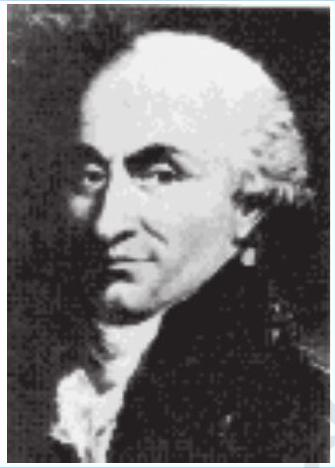

चार्ल्स ऑगस्टिन डे कूलॉम (1736 - 1806) फ्रांसीसी भौतिकविद कूलॉम ने वेस्टइंडीज में एक फौजी इंजीनियर के रूप में अपना कैरियर आरंभ किया। सन् $1776$ में वे पेरिस लौट आए तथा एक छोटी सी संपत्ति बनाकर एकांत में अपना शोध कार्य करने लगे। बल के परिमाण को मापने के लिए इन्होंने एक ऐंठन तुला का आविष्कार किया और इसका उपयोग इन्होंने छोटे आवेशित गोलों के बीच लगने वाले आकर्षण अथवा प्रतिकर्षण बलों को ज्ञात करने में किया। इस प्रकार, सन् $1785$ में ये व्युत्क्रम वर्ग नियम को खोज पाए जिसे आज कूलॉम का नियम कहते हैं। इस नियम का पूर्व अनुमान प्रिस्टले तथा कैवेंडिश ने लगा लिया था परंतु कैवेंडिश ने अपने परिणाम कभी प्रकाशित नहीं किए। कूलॉम ने सजातीय तथा विजातीय चुंबकीय ध्रुवों के बीच लगने वाले व्युत्क्रम वर्ग नियम का भी पता लगाया।

बाद की सुविधा के लिए समीकरण (1.1) के नियतांक $k$

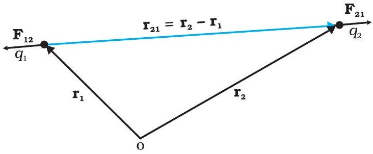
(a)

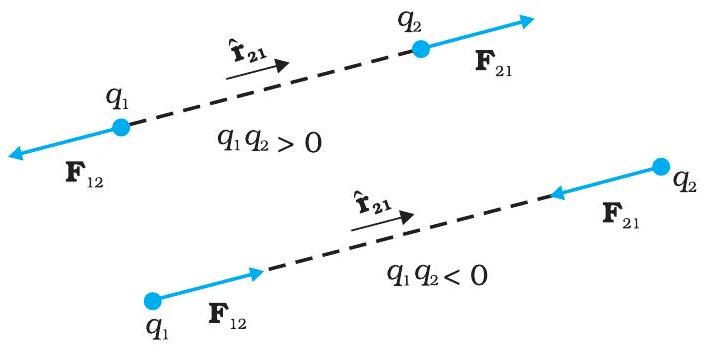
(b)

चित्र $1.3$ (a) ज्यामिति तथा
(b) आवेशों के बीच आरोपित बल।
को प्राय: $k=1 / 4 \pi \varepsilon_{0}$ लिखते हैं, जिससे कूलॉम नियम को इस प्रकार व्यक्त किया जाता है

$$
F=\frac{1}{4 \pi \varepsilon_{0}} \quad \frac{\left|q_{1} q_{2}\right|}{r^{2}}
$$

$\varepsilon_{0}$ को मुक्त आकाश या निर्वात की विद्युतशीलता अथवा परावैद्युतांक कहते हैं। SI मात्रकों में $\varepsilon_{0}$ का मान

$$
\varepsilon_{0}=8.854 \times 10^{-12} \mathrm{C}^{2} \mathrm{~N}^{-1} \mathrm{~m}^{-2}
$$

बल एक सदिश है, अतः कूलॉम नियम को सदिश संकेतन में लिखा उत्तम होता है। मान लीजिए $q_{1}$ तथा $q_{2}$ आवेशों के स्थिति सदिश क्रमशः $\mathbf{r}_{1}$ तथा $\mathbf{r}_{2}$ हैं [चित्र 1.3(a) देखिए]। हम $q_{2}$ के द्वारा $q_{1}$ पर आरोपित बल को $\mathbf{F}_{12}$ तथा $q_{1}$ के द्वारा $q_{2}$ पर आरोपित बल को $\mathbf{F}_{21}$ द्वारा व्यक्त करते हैं। दो बिंदु आवेशों $q_{1}$ तथा $q_{2}$ को सुविधा के लिए $1$ तथा $2$ अंक द्वारा व्यक्त किया गया है। साथ ही $1$ से $2$ की ओर जाते सदिश को $\mathbf{r}_{21}$ द्वारा व्यक्त किया गया है-

$$
\mathbf{r}_{21}=\mathbf{r}_{2}-\mathbf{r}_{1}
$$

इसी प्रकार $2$ से $1$ की ओर जाते सदिश को $\mathbf{r}_{12}$ द्वारा व्यक्त किया जाता है-

$$
\mathbf{r}_{12}=\mathbf{r}_{1}-\mathbf{r}_{2}=-\mathbf{r}_{21}
$$

सदिशों $\mathbf{r}_{21}$ तथा $\mathbf{r}_{12}$ के परिमाणों का संकेतन क्रमशः $r_{21}$ एवं $r_{12}$ द्वारा होता है ( $\left.r_{\mathrm{n} 21}=r_{\mathrm{n} 12}\right)$ । किसी सदिश की दिशा का विशेष उल्लेख उस सदिश के अनुदिश एकांक सदिश द्वारा किया जाता है। बिंदु $1$ से $2$ की ओर (अथवा $2$ से $1$ की ओर) इंगित करने वाले एकांक सदिश की परिभाषा हम इस प्रकार करते हैं :

$$
\hat{\mathbf{r}}_{21}=\frac{\mathbf{r}_{21}}{r_{21}}, \hat{\mathbf{r}}_{12}=\frac{\mathbf{r}_{12}}{r_{12}}, \quad \hat{\mathbf{r}}_{21}=-\hat{\mathbf{r}}_{12}
$$

क्रमशः $\mathbf{r}_{1}$ तथा $\mathbf{r}_{2}$ पर अवस्थित बिंदु आवेशों $q_{1}$ तथा $q_{2}$ के बीच लगे कूलॉम बल नियम को तब इस प्रकार व्यक्त किया जाता है

$$
\mathbf{F}_{21}=\frac{1}{4 \pi \varepsilon_{o}} \frac{q_{1} q_{2}}{r_{21}^{2}} \hat{\mathbf{r}}_{21}
$$

समीकरण (1.3) के संबंध में कुछ टिप्पणियाँ प्रासंगिक हैं :

- समीकरण (1.3) $q_{1}$ तथा $q_{2}$ के किसी भी चिह्न, धनात्मक अथवा ऋणात्मक के लिए मान्य है। यदि $q_{1}$ तथा $q_{2}$ समान चिह्न के हैं (या तो दोनों ही धनात्मक अथवा दोनों ही ऋणात्मक हैं) तब $\mathbf{F}_{21}, \hat{\mathbf{r}}_{21}$ के अनुदिश है, जो प्रतिकर्षण को प्रदर्शित करता है जैसा सजातीय आवेशों के लिए होना ही चाहिए। यदि $q_{1}$ तथा $q_{2}$ के विपरीत चिह्न हैं तब $\mathbf{F}_{21},-\hat{\mathbf{r}}_{21}$ के अनुदिश है, जो आकर्षण को प्रदर्शित करता है तथा विजातीय आवेशों के लिए हम इसी की आशा करते हैं। इस प्रकार हमें सजातीय तथा विजातीय आवेशों के प्रकरणों के लिए पृथक-पृथक समीकरण लिखने की आवश्यकता नहीं है। समीकरण (1.3) दोनों ही प्रकरणों को सही-सही प्रकट कर देती है [चित्र 1.3(b) देखिए]।

## वैद्युत आवेश तथा क्षेत्र

- $q_{2}$ के कारण $q_{1}$ पर आरोपित बल $\mathbf{F}_{12}$ को समीकरण (1.3) में $1$ तथा $2$ में सरल अंतर्परिवर्तन करके प्राप्त किया जा सकता है, अर्थात
$$
\mathbf{F}_{12}=\frac{1}{4 \pi \varepsilon_{0}} \frac{q_{1} q_{2}}{r_{12}^{2}} \hat{\mathbf{r}}_{12}=-\mathbf{F}_{21}
$$
इस प्रकार, कूलॉम नियम न्यूटन के गति के तृतीय नियम के अनुरूप ही है।
- कूलॉम नियम (समीकरण 1.3) से निर्वात में स्थित दो आवेशों $q_{1}$ तथा $q_{2}$ के बीच आरोपित बल प्राप्त होता है। यदि आवेश किसी द्रव्य में स्थित हैं अथवा दोनों आवेशों के बीच के रिक्त स्थान में कोई द्रव्य भरा है, तब इस द्रव्य के आवेशित अवयवों के कारण स्थिति जटिल बन जाती है। अगले अध्याय में हम द्रव्य में स्थिरवैद्युतिकी पर विचार करेंगे।

उदाहरण $1.3$ दो वैद्युत आवेशों के बीच स्थिर वैद्युत बल के लिए कूलॉम नियम तथा दो स्थिर बिंदु द्रव्यमानों के बीच गुरुत्वाकर्षण बल के लिए न्यूटन का नियम दोनों में ही बल आवेशों/द्रव्यमानों के बीच की दूरी के वर्ग के व्युत्क्रमानुपाती होता है। (a) इन दोनों बलों के परिमाण ज्ञात करके इनकी प्रबलताओं की तुलना की जाए (i) एक इलेक्ट्रॉन तथा एक प्रोटॉन के लिए, (ii) दो प्रोटॉनों के लिए। (b) इलेक्ट्रॉन तथा प्रोटॉन में पारस्परिक आकर्षण के वैद्युत बल के कारण इलेक्ट्रॉन तथा प्रोटॉन के त्वरण आकलित कीजिए जबकि इनके बीच की दूरी $1 \AA\left(=10^{-10} \mathrm{~m}\right)$ है। ( $m_{p}=1.67 \times 10^{-27} \mathrm{~K}, m_{e}=9.11 \times 10^{-31} \mathrm{~kg}$ )
हल
(a) (i) एक इलेक्ट्रॉन तथा एक प्रोटॉन के बीच वैद्युत बल जबकि इनके बीच की दूरी $r$ है :

$$
F_{e}=-\frac{1}{4 \pi \varepsilon_{0}} \frac{e^{2}}{r^{2}}
$$

यहाँ पर ऋणात्मक चिह्न आकर्षण बल को इंगित करता है। इसके तदनुरूपी गुरुत्वाकर्षण बल (जो सदैव धनात्मक है) :

$$
F_{G}=-G \frac{m_{p} m_{e}}{r^{2}}
$$

यहाँ $m_{p}$ तथा $m_{e}$ क्रमशः प्रोटॉन तथा इलेक्ट्रॉन के द्रव्यमान हैं।

$$
\left|\frac{F_{e}}{F_{G}}\right|=\frac{e^{2}}{4 \pi \varepsilon_{0} G m_{p} m_{e}}=2.4 \times 10^{39}
$$

(ii) इसी प्रकार $r$ दूरी पर स्थित दो प्रोटॉनों के बीच वैद्युत बल तथा गुरुत्वाकर्षण बल के परिमाणों का अनुपात-

$$
\left|\frac{F_{e}}{F_{G}}\right|=\frac{e^{2}}{4 \pi \varepsilon_{0} G m_{p} m_{p}}=1.3 \times 10^{36}
$$

तथापि यहाँ यह उल्लेख करना महत्वपूर्ण है कि यहाँ पर दो बलों के चिह्नों में अंतर है। दो प्रोटॉनों के लिए गुरुत्वाकर्षण बल आकर्षी है तथा कूलॉम बल प्रतिकर्षी है। नाभिक के भीतर इन बलों के वास्तविक मान (नाभिक के भीतर दो प्रोटॉनों के बीच की दूरी $\sim 10^{-15} \mathrm{~m}$ है): $F_{\mathrm{e}} \sim 230 \mathrm{~N}$ है जबकि $F_{\mathrm{G}} \sim 1.9 \times 10^{-34} \mathrm{~N}$ हैं।
इन दोनों बलों का (विमाहीन) अनुपात यह दर्शाता है कि गुरुत्वाकर्षण बल की तुलना में वैद्युत बल अत्यंत प्रबल होते हैं।

## - भौतिकी

(b) एक प्रोटॉन द्वारा एक इलेक्ट्रॉन पर आरोपित वैद्युत बल $\mathbf{F}$ परिमाण में एक इलेक्ट्रॉन द्वारा एक प्रोटॉन पर आरोपित बल समान है; तथापि इलेक्ट्रॉन तथा प्रोटॉन के द्रव्यमान भिन्न होते हैं। इस प्रकार बल का परिमाण है
$$
\begin{aligned}
|\mathbf{F}| & =\frac{1}{4 \pi \varepsilon_{0}} \frac{e^{2}}{r^{2}}=8.987 \times 10^{9} \mathrm{Nm}^{2} / \mathrm{C}^{2} \times\left(1.6 \times 10^{-19} \mathrm{C}\right)^{2} /\left(10^{-10} \mathrm{~m}\right)^{2} \\
& =2.3 \times 10^{-8} \mathrm{~N}
\end{aligned}
$$
न्यूटन के गति के दूसरे नियम $F=m a$ के अनुसार इलेक्ट्रॉन में उत्पन्न त्वरण $a=2.3 \times 10^{-8} \mathrm{~N} / 9.11 \times 10^{-31} \mathrm{~kg}=2.5 \times 10^{22} \mathrm{~m} / \mathrm{s}^{2}$
इसकी गुरुत्वीय त्वरण से तुलना करने पर हम यह निष्कर्ष निकाल सकते हैं कि इलेक्ट्रॉन की गति पर गुरुत्वीय क्षेत्र का प्रभाव नगण्य है तथा किसी प्रोटॉन द्वारा इलेक्ट्रॉन पर आरोपित कूलॉम बल की क्रिया के अधीन इलेक्ट्रॉन में उत्पन्न त्वरण अत्यधिक है।
प्रोटॉन के लिए त्वरण का मान
$$
2.3 \times 10^{-8} \mathrm{~N} / 1.67 \times 10^{-27} \mathrm{~kg}=1.4 \times 10^{19} \mathrm{~m} / \mathrm{s}^{2} \text { है। }
$$

उदाहरण $1.4$ धातु का आवेशित गोला A नाइलॉन के धागे से निलंबित है। विद्युतरोधी हत्थी द्वारा किसी अन्य धातु के आवेशित गोले B को A के इतने निकट लाया जाता है कि चित्र 1.4(a) में दर्शाए अनुसार इनके केंद्रों के बीच की दूरी $10 \mathrm{~cm}$ है। गोले A के परिणामी प्रतिकर्षण को नोट किया जाता है (उदाहरणार्थ- गोले पर चमकीला प्रकाश पुंज डालकर तथा अंशांकित पर्दे पर बनी इसकी छाया का विक्षेपण मापकर)। A तथा B गोलों को चित्र 1.4(b) में दर्शाए अनुसार, क्रमशः अनावेशित गोलों C तथा D से स्पर्श कराया जाता है। तत्पश्चात चित्र 1.4(c) में दर्शाए अनुसार C तथा D को हटाकर B को A के इतना निकट लाया जाता है कि इनके केंद्रों के बीच की दूरी $5.0 \mathrm{~cm}$ हो जाती है। कूलॉम नियम के अनुसार A का कितना अपेक्षित प्रतिकर्षण है? गोले A तथा C एवं गोले B तथा D के साइज़ सर्वसम हैं। A तथा B के केंद्रों के पृथकन की तुलना में इनके साइज़ों की उपेक्षा कीजिए।

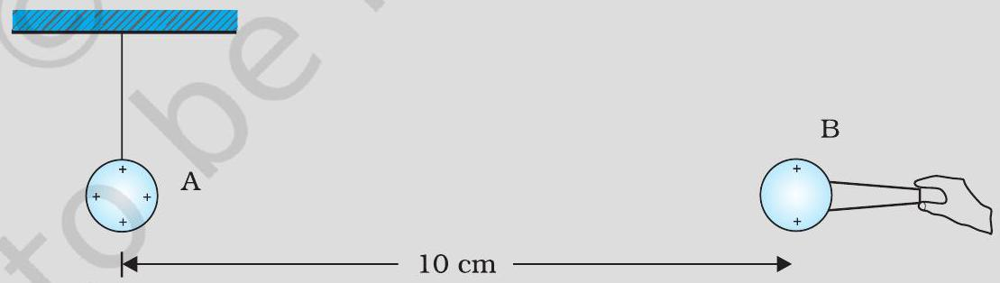
(a)

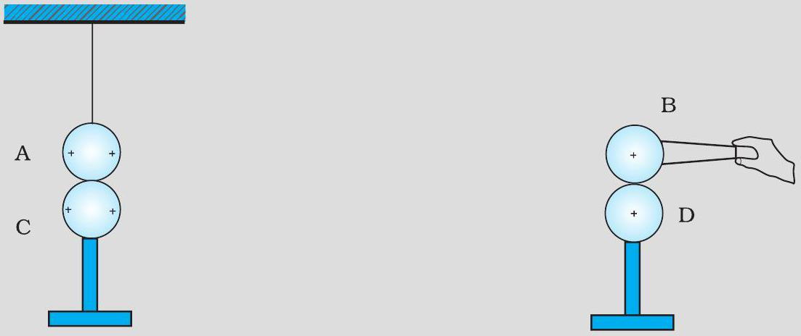
(b)

## वैद्युत आवेश तथा क्षेत्र

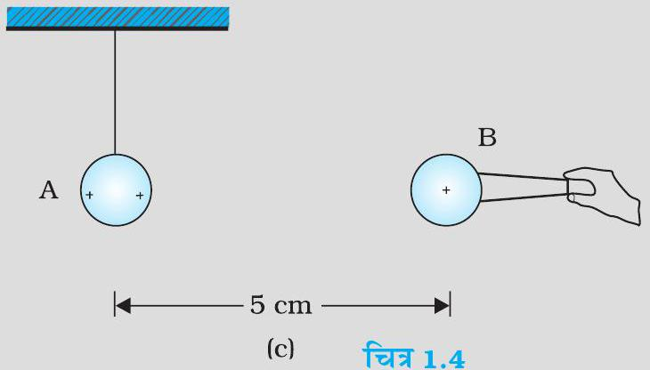

हल मान लीजिए गोले A पर मूल आवेश $q$ तथा गोले B पर मूल आवेश $q^{\prime}$ है। दोनों गोलों के केंद्रों के बीच दूरी $r$ पर, प्रत्येक पर लगे स्थिर वैद्युत बल का परिमाण
$F=\frac{1}{4 \pi \varepsilon_{0}} \frac{q q^{\prime}}{r^{2}}$
यहाँ $r$ की तुलना में गोलो A तथा B के साइज़ नगण्य हैं। जब कोई सर्वसम परंतु अनावेशित गोला C गोले A को स्पर्श करता है तो A तथा C पर आवेश का पुनर्वितरण होता है और सममिति द्वारा प्रत्येक गोले पर आवेश $(q / 2)$ होता है। इसी प्रकार, B तथा D के स्पर्श के पश्चात इनमें प्रत्येक पर पुनर्वितरित आवेश $\left(q^{\prime} / 2\right)$ होता है। अब यदि A तथा B का पृथकन आधा रह जाए तो प्रत्येक पर स्थिरवैद्युत बल
$F^{\prime}=\frac{1}{4 \pi \varepsilon_{0}} \frac{(q / 2)\left(q^{\prime} / 2\right)}{(r / 2)^{2}}=\frac{1}{4 \pi \varepsilon_{0}} \frac{\left(q q^{\prime}\right)}{r^{2}}=F$
इस प्रकार B के कारण A पर स्थिरवैद्युत बल अपरिवर्तित रहता है।

## $1.6$ बहुल आवेशों के बीच बल

दो आवेशों के बीच पारस्परिक वैद्युत बल कूलॉम नियम द्वारा प्राप्त होता है। उस स्थिति में किसी आवेश पर आरोपित बल का परिकलन कैसे करें, जहाँ उसके निकट एक आवेश न होकर उसे बहुत से आवेश चारों ओर से घेरे हों? निर्वात में स्थित $n$ स्थिर आवेशों $q_{1}, q_{2}, q_{3}, \ldots, q_{n}$ के निकाय पर विचार कीजिए। $q_{1}$ पर $q_{2}, q_{3}, \ldots, q_{n}$ के कारण कितना बल लगता है? इसका उत्तर देने के लिए कूलॉम नियम पर्याप्त नहीं है। याद कीजिए, यांत्रिक मूल के बलों का संयोजन सदिशों के संयोजन के समांतर चतुर्भुज नियम द्वारा किया जाता है। क्या यही स्थिरवैद्युत मूल के बलों पर भी लागू होता है?

प्रयोगों द्वारा यह सत्यापित हो चुका है कि किसी आवेश पर कई अन्य आवेशों के कारण बल उस आवेश पर लगे उन सभी बलों के सदिश योग के बराबर होता है जो इन आवेशों द्वारा इस आवेश पर एक-एक कर लगाया जाता है। किसी एक आवेश द्वारा लगाया गया विशिष्ट बल अन्य आवेशों की उपस्थिति के कारण प्रभावित नहीं होता। इसे अध्यारोपण का सिद्धांत कहते हैं।

इस अवधारणा को भलीभाँति समझने के लिए तीन आवेशों $q_{1}, q_{2}$ तथा $q_{3}$ के निकाय, जिसे चित्र 1.5(a) में दर्शाया गया है, पर विचार कीजिए। किसी एक आवेश, जैसे $q_{1}$ पर अन्य दो आवेशों $q_{2}$ तथा $q_{3}$ के कारण बल को इनमें से प्रत्येक आवेश के कारण लगे बलों का सदिश संयोजन करके प्राप्त

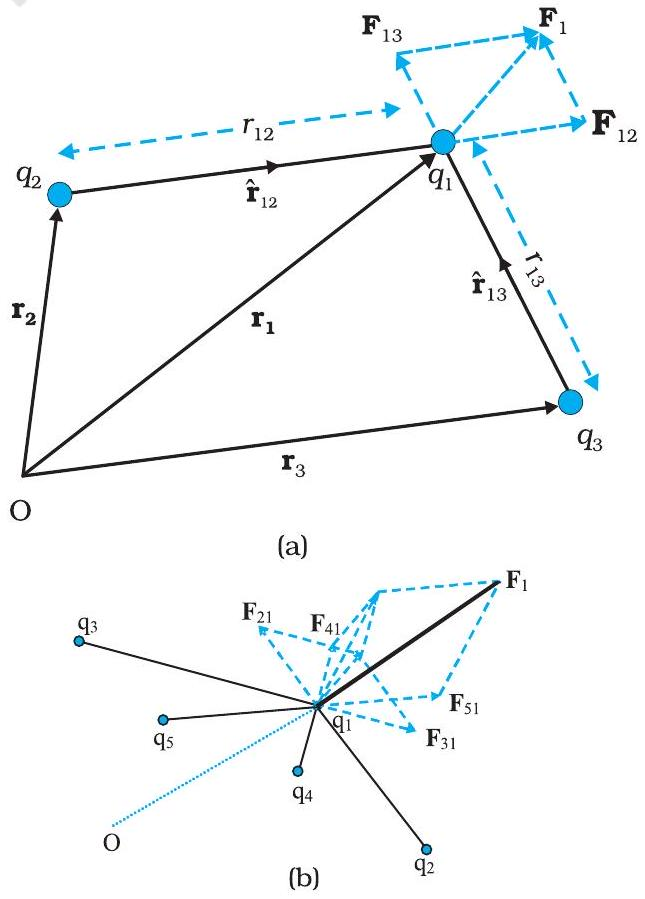
चित्र $1.5$ (a) तीन आवेशों (b) बहुल आवेशों के निकाय।

किया जा सकता है। इस प्रकार यदि $q_{2}$ के कारण $q_{1}$ पर बल को $\mathbf{F}_{12}$ द्वारा

## - भौतिकी

निर्दिष्ट किया जाता है, तो $\mathbf{F}_{12}$ को समीकरण (1.3) द्वारा अन्य आवेशों की उपस्थिति होते हुए भी इस प्रकार व्यक्त किया जाता है :

$$
\mathbf{F}_{12}=\frac{1}{4 \pi \varepsilon_{0}} \frac{q_{1} q_{2}}{r_{12}^{2}} \hat{\mathbf{r}}_{12}
$$

इसी प्रकार $q_{3}$ के कारण $q_{1}$ पर लगा कूलॉम बल जिसे $\mathbf{F}_{13}$ द्वारा निर्दिष्ट करते हैं तथा जिसे लिख सकते हैं

$$
\mathbf{F}_{13}=\frac{1}{4 \pi \varepsilon_{0}} \frac{q_{1} q_{3}}{r_{13}^{2}} \hat{\mathbf{r}}_{13}
$$

यह भी $q_{3}$ के कारण $q_{1}$ पर लगा कूलॉम बल ही है, जबकि अन्य आवेश $q_{2}$ उपस्थित हैं।
इस प्रकार $q_{1}$ पर दो आवेशों $q_{2}$ तथा $q_{3}$ के कारण कुल बल $\mathbf{F}_{1}$ है

$$
\mathbf{F}_{1}=\mathbf{F}_{12}+\mathbf{F}_{13}=\frac{1}{4 \pi \varepsilon_{0}} \frac{q_{1} q_{2}}{r_{12}^{2}} \hat{\mathbf{r}}_{12}+\frac{1}{4 \pi \varepsilon_{0}} \frac{q_{1} q_{3}}{r_{13}^{2}} \hat{\mathbf{r}}_{13}
$$

चित्र 1.5(b) में दर्शाए अनुसार तीन से अधिक आवेशों के निकाय के लिए उपरोक्त परिकलन का व्यापकीकरण किया जा सकता है।

अध्यारोपण के सिद्धांत के अनुसार आवेशों $q_{1}, q_{2}, \ldots, q_{n}$ के किसी निकाय में आवेश $q_{1}$ पर $q_{2}$ द्वारा लगा बल कूलॉम नियम द्वारा लगे बल के समान होता है, अर्थात यह अन्य आवेशों $q_{3}, q_{4}$, $\ldots, q_{n}$ की उपस्थिति से प्रभावित नहीं होता। आवेश $q_{1}$ पर सभी आवेशों द्वारा लगा कुल बल $\mathbf{F}_{1}$ तब $\mathbf{F}_{12}, \mathbf{F}_{13}, \ldots, \mathbf{F}_{1 n}$ का सदिश योग होगा। अतः

$$
\begin{aligned}
& \mathbf{F}_{1}=\mathbf{F}_{12}+\mathbf{F}_{13}+\ldots+\mathbf{F}_{1 \mathrm{n}}=\frac{1}{4 \pi \varepsilon_{0}}\left[\frac{q_{1} q_{2}}{r_{12}^{2}} \hat{\mathbf{r}}_{12}+\frac{q_{1} q_{3}}{r_{13}^{2}} \hat{\mathbf{r}}_{13}+\ldots+\frac{q_{1} q_{n}}{r_{1 n}^{2}} \hat{\mathbf{r}}_{1 n}\right] \\
& =\frac{q_{1}}{4 \pi \varepsilon_{0}} \sum_{i=2}^{n} \frac{q_{i}}{r_{1 i}^{2}} \hat{\mathbf{r}}_{1 i}
\end{aligned}
$$

सदिशों के संयोजन की सामान्य विधि, समांतर चतुर्भुज के नियम द्वारा सदिश योग प्राप्त किया जाता है। वास्तव में मूल रूप से समस्त स्थिरवैद्युतिकी कूलॉम नियम तथा अध्यारोपण के सिद्धांत का एक परिणाम है।

उदाहरण $1.5$ तीन आवेशों $q_{1}, q_{2}, q_{3}$ पर विचार कीजिए जिनमें प्रत्येक $q$ के बराबर है तथा $l$ भुजा वाले समबाहु त्रिभुज के शीर्षों पर स्थित है। त्रिभुज के केंद्रक पर चित्र $1.6$ में दर्शाए अनुसार स्थित आवेश $Q$ (जो $q$ का सजातीय) पर कितना परिणामी बल लग रहा है?

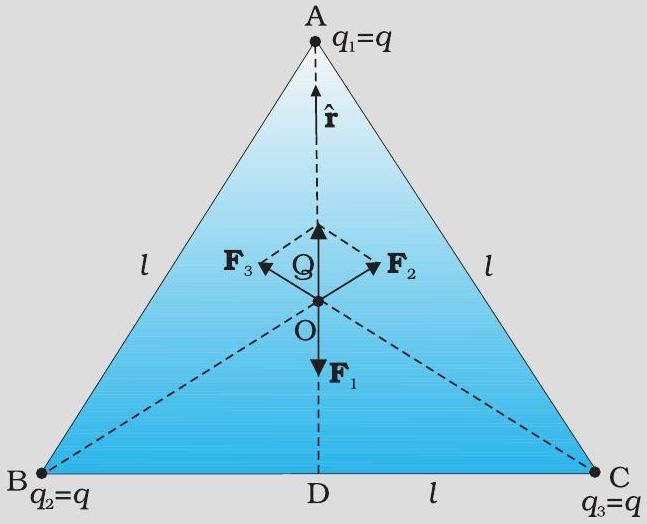
चित्र $1.6$

## वैद्युत आवेश तथा क्षेत्र

हल दिए गए $l$ भुजा के समबाहु त्रिभुज ABC में यदि हम भुजा BC पर AD लंब खींचें तो $\mathrm{AD}=\mathrm{AC} \cos 30^{\circ}=(\sqrt{3} / 2) l$ तथा A से केंद्रक की दूरी $\mathrm{AD}=(2 / 3) \mathrm{AD}=(1 / \sqrt{3}) l$ सममिति से $\mathrm{AO}=\mathrm{BO}=\mathrm{CO}$

इस प्रकार
A पर स्थित आवेश $q$ के कारण $Q$ पर बल, $\mathbf{F}_{1}=\frac{3}{4 \pi \varepsilon_{0}} \frac{Q q}{l^{2}} \mathrm{AO}$ के अनुदिश B पर स्थित आवेश $q$ के कारण $Q$ पर बल, $\mathbf{F}_{2}=\frac{3}{4 \pi \varepsilon_{0}} \frac{Q q}{l^{2}} \mathrm{BO}$ के अनुदिश C पर स्थित आवेश $q$ के कारण $Q$ पर बल, $\mathbf{F}_{\mathbf{3}}=\frac{3}{4 \pi \varepsilon_{0}} \frac{Q q}{l^{2}} \mathrm{CO}$ के अनुदिश बलों $\mathbf{F}_{2}$ तथा $\mathbf{F}_{3}$ का परिणामी समांतर चतुर्भुज नियम द्वारा $\frac{3}{4 \pi \varepsilon_{0}} \frac{Q q}{l^{2}} \mathrm{OA}$ के अनुदिश है। इसीलिए, $Q$ पर कुल बल $=\frac{3}{4 \pi \varepsilon_{0}} \frac{Q q}{l^{2}}(\hat{\mathbf{r}}-\hat{\mathbf{r}})=0$ यहाँ $\hat{\mathbf{r}}, \mathrm{OA}$ के अनुदिश एकांक सदिश है। सममिति द्वारा भी यह स्पष्ट है कि उन तीनों बलों का योग शून्य होगा। मान लीजिए परिणामी बल शून्येतर था परंतु किसी दिशा में था। विचार कीजिए कि क्या हुआ होता यदि इस निकाय को O के गिर्द (परितः) 60º पर घूर्णन कराया जाता।

उदाहरण $1.6$ चित्र $1.7$ में दर्शाए अनुसार किसी समबाहु त्रिभुज के शीर्षों पर स्थित आवेशों $q, q$, तथा $-q$ पर विचार कीजिए। प्रत्येक आवेश पर कितना बल लग रहा है?

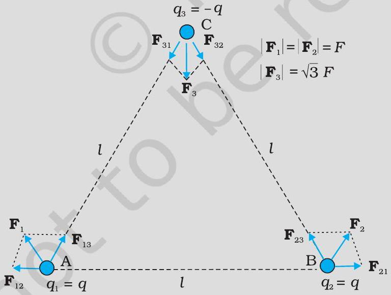
चित्र $1.7$

हल चित्र $1.7$ में दर्शाए अनुसार, A पर स्थित आवेश $q$ पर अन्य आवेशों जैसे B पर स्थित $q$ के कारण बल $\mathbf{F}_{12} \mathrm{BA}$ के अनुदिश तथा C पर स्थित $-q$ के कारण बल $\mathbf{F}_{13} \mathrm{AC}$ के अनुदिश है। समांतर चतुर्भुज नियम द्वारा A पर स्थित $q$ पर कुल बल $\mathbf{F}_{1}$ है $\mathbf{F}_{1}=F \hat{\mathbf{r}}_{1}$ यहाँ $\hat{\mathbf{r}}_{1} \mathrm{BC}$ के अनुदिश एकांक सदिश है। आवेशों के प्रत्येक युगल के लिए आकर्षण अथवा प्रतिकर्षण बलों के परिमाण $F$ समान हैं तथा $F=\frac{q^{2}}{4 \pi \varepsilon_{0} l^{2}}$

## - भौतिकी

इस प्रकार B पर स्थित आवेश $q$ पर कुल बल $\mathbf{F}_{2}=F \hat{\mathbf{r}}_{2}$ यहाँ $\hat{\mathbf{r}}_{2} \mathrm{AC}$ के अनुदिश एकांक सदिश है।

इसी प्रकार, C पर स्थित आवेश $-q$ पर कुल बल $\mathbf{F}_{3}=\sqrt{3} F \hat{\mathbf{n}}$ है। यहाँ $\hat{\mathbf{n}}$ एकांक सदिश है जिसकी दिशा $\angle \mathrm{BCA}$ को समद्विभाजित करने वाली रेखा के अनुदिश है।
यहाँ रोचक बात यह है कि तीनों आवेशों पर लगे बलों का योग शून्य है, अर्थात $\mathbf{F}_{1}+\mathbf{F}_{2}+\mathbf{F}_{3}=0$
यह परिणाम चौंकाने वाला नहीं है। यह इस तथ्य का अनुसरण करता है कि कूलॉम नियम तथा न्यूटन के तृतीय नियम के बीच सामंजस्य है। इस कथन की निष्पत्ति आपके अभ्यास के लिए छोड़ी जा रही है।

## $1.7$ विद्युत क्षेत्र

माना निर्वात में एक बिंदु आवेश $Q$ मूल बिंदु O पर रखा है। यदि एक अन्य बिंदु आवेश $q$, बिंदु P पर रखा जाए, जहाँ $\mathbf{O P}=\mathbf{r}$, तो आवेश $Q, q$ पर कूलॉम के नियमानुसार बल लगाएगा। हम यह प्रश्न पूछ सकते हैं : यदि आवेश $q$ को हटा लें तो $Q$ के परिवेश में क्या बचेगा? क्या कुछ भी नहीं बचेगा? यदि ऐसा है तो P पर आवेश $q$ रखने पर इस पर बल कैसे लगता है? इस प्रकार के प्रश्नों का उत्तर देने के लिए प्रारंभिक वैज्ञानिकों ने क्षेत्र की अवधारणा प्रस्तुत की। इसके अनुसार हम कहते हैं कि आवेश $Q$ अपने चारों ओर विद्युत क्षेत्र उत्पन्न करता है जब इसमें कोई अन्य आवेश $q$ बिंदु P पर लाया जाता है तो क्षेत्र इस पर बल आरोपित करता है।
किसी बिंदु $\mathbf{r}$ पर आवेश $Q$ द्वारा उत्पन्न विद्युत क्षेत्र

$$
\mathbf{E}(\mathbf{r})=\frac{1}{4 \pi \varepsilon_{0}} \frac{Q}{r^{2}} \hat{\mathbf{r}}=\frac{1}{4 \pi \varepsilon_{0}} \frac{Q}{r^{2}} \hat{\mathbf{r}}
$$

यहाँ $\hat{\mathbf{r}}=\mathbf{r} / \mathrm{r}$, मूल बिंदु से बिंदु $\mathbf{r}$ तक मात्रक सदिश है। इस प्रकार, समीकरण (1.6) स्थिति सदिश $\mathbf{r}$ के प्रत्येक मान के लिए विद्युत क्षेत्र का संगत मान बताती है। शब्द ' क्षेत्र' यह बताता है कि किस प्रकार कोई वितरित राशि (जो सदिश अथवा अदिश हो सकती है) स्थिति के साथ परिवर्तित होती है। आवेश के प्रभाव को विद्युत क्षेत्र के अस्तित्व में समाविष्ट किया गया है। आवेश $Q$ द्वारा आवेश $q$ पर आरोपित बल $\mathbf{F}$ को हम इस प्रकार प्राप्त करते हैं :

$$
\mathbf{F}=\frac{1}{4 \pi \varepsilon_{0}} \frac{Q q}{r^{2}} \hat{\mathbf{r}}
$$

ध्यान दीजिए आवेश $q$ भी आवेश $Q$ पर परिमाण में समान परंतु दिशा में विपरीत बल आरोपित करता है। $Q$ तथा $q$ आवेशों के बीच स्थिरवैद्युत बल को हम आवेश $q$ तथा $Q$ के विद्युत क्षेत्र के बीच अन्योन्य क्रिया अथवा विलोमतः के रूप में समझ सकते हैं। यदि हम आवेश $q$ की स्थिति को सदिश r द्वारा निर्दिष्ट करें, तो यह $q$ की अवस्थिति पर एक बल $\mathbf{F}$ का अनुभव करता है जो आवेश $q$ तथा विद्युत क्षेत्र $\mathbf{E}$ के गुणनफल के बराबर है। इस प्रकार

$$
\mathbf{F}(\mathbf{r})=q \mathbf{E}(\mathbf{r})
$$

समीकरण (1.8) विद्युत क्षेत्र के SI मात्रक को N/C* के रूप में परिभाषित करती है। यहाँ कुछ महत्वपूर्ण टिप्पणियाँ की जा सकती हैं:

(i) समीकरण (1.8) से यह निष्कर्ष निकाला जा सकता है कि यदि $q$ एकांक है तो आवेश $Q$ के कारण विद्युत क्षेत्र का आंकिक मान इसके द्वारा आरोपित बल के बराबर होता है। इस प्रकार

## वैद्युत आवेश तथा क्षेत्र

दिक्स्थान में किसी बिंदु पर आवेश $Q$ के कारण विद्युत क्षेत्र को उस बल के रूप में पारिभाषित किया जा सकता है जिसे कोई एकांक धनावेश उस बिंदु पर रखे जाने पर अनुभव करता है। वह आवेश $Q$ जो विद्युत क्षेत्र उत्पन्न कर रहा है स्रोत आवेश कहलाता है तथा आवेश $q$ जो स्रोत आवेश के प्रभाव का परीक्षण करता है, को परीक्षण आवेश कहते हैं। ध्यान दीजिए स्रोत आवेश को अपनी मूल अवस्थिति पर ही रहना चाहिए। तथापि, यदि किसी आवेश $q$ को $Q$ के चारों ओर कहीं लाया जाता है, तो $Q$ स्वयं भी आवेश $q$ के कारण वैद्युत बल का अनुभव करने के लिए बाध्य है और उसमें गति करने की प्रवृत्ति होगी। इससे मुक्ति का केवल एक ही उपाय है कि हम $q$ को उपेक्षणीय छोटा बनाएँ, तब बल $\mathbf{F}$ उपेक्षणीय छोटा होता है परंतु अनुपात $\mathbf{F} / q$ एक परिमित राशि होती है तथा विद्युत क्षेत्र को पारिभाषित करती है :

$$
\mathbf{E}=\lim _{q \rightarrow 0}\left(\frac{\mathbf{F}}{q}\right)
$$

इस समस्या (आवेश $Q$ को आवेश $q$ की उपस्थिति के कारण विक्षुब्ध न होने देना) से मुक्ति का एक व्यावहारिक उपाय यह है कि आवेश $Q$ की किन्हीं अनिर्दिष्ट बलों द्वारा अपनी अवस्थिति पर बाँधे रखा जाए। यह विलक्षण प्रतीत हो सकता है, परंतु व्यवहार में ऐसा ही होता है। जब हम आवेशित की समतल चादर के कारण परीक्षण आवेश $q$ पर लगे वैद्युत बल पर विचार करते हैं (अनुच्छेद 1.14), तब चादर पर आवेश, चादर के भीतर अनिर्दिष्ट आवेशित अवयवों द्वारा लगे बलों के कारण अपनी अवस्थितियों पर ही बँधे रहते हैं।

(ii) ध्यान दीजिए, आवेश $Q$ के कारण विद्युत क्षेत्र $\mathbf{E}$ की परिभाषा यद्यपि प्रभावी रूप से परीक्षण आवेश $q$ के पदों में की जाती है, तथापि यह $q$ पर निर्भर नहीं करती है। इसका कारण यह है कि बल $\mathbf{F}$ आवेश $q$ के अनुक्रमानुपाती है, इसलिए अनुपात $\mathbf{F} / q$ आवेश $q$ पर निर्भर नहीं करता है। $Q$ के कारण $q$ पर बल आवेश $q$ की किसी विशेष अवस्थिति से आवेश $Q$ के चारों ओर के दिक्स्थान में कहीं भी हो सकती है। इस प्रकार $Q$ के कारण विद्युत क्षेत्र $\mathbf{E}$ दिक्स्थान निर्देशांक r पर भी निर्भर करता है। सारे दिक्स्थान में आवेश की विभिन्न स्थितियों के लिए हमें विद्युत क्षेत्र E के भिन्न मान प्राप्त होते हैं। विद्युत क्षेत्र का अस्तित्व त्रिविमीय दिक्स्थान के प्रत्येक बिंदु पर होता है।
(iii) धनावेश के कारण विद्युत क्षेत्र आवेश से बाहर की ओर उन्मुख त्रिज्यीय होता है। इसके विपरीत, यदि स्रोत आवेश ऋणात्मक है तो विद्युत क्षेत्र सदिश, हर बिंदु पर त्रिज्यीय, किंतु अंदर की ओर उन्मुख होता है।
(iv) चूँकि आवेश $Q$ के कारण आवेश $q$ पर लगे बल $\mathbf{F}$ का परिमाण केवल आवेश $Q$ से आवेश $q$ के बीच की दूरी $r$ पर निर्भर करता है, विद्युत क्षेत्र $\mathbf{E}$ का परिमाण भी केवल दूरी $r$ पर निर्भर करता है। इस प्रकार, आवेश $Q$ से समान दूरियों पर इसके कारण उत्पन्न विद्युत क्षेत्र $\mathbf{E}$ का परिमाण समान होता है। इस प्रकार किसी गोले के केंद्र पर स्थित बिंदु आवेश के कारण विद्युत क्षेत्र E का परिमाण उसके पृष्ठ के हर बिंदु पर समान होता है; दूसरे शब्दों में, वह क्षेत्र गोलीय रूप से सममित होता है।

### 1.7.1 आवेशों के निकाय के कारण विद्युत क्षेत्र

आइए, $q_{1}, q_{2}, \ldots, q_{n}$ आवेशों के एक निकाय पर विचार करते हैं जिनके किसी मूल बिंदु O के सापेक्ष स्थिति सदिश क्रमशः $\mathbf{r}_{1}, \mathbf{r}_{2}, \ldots, \mathbf{r}_{n}$ हैं। किसी एकल आवेश के कारण दिक्स्थान के किसी बिंदु पर विद्युत क्षेत्र की ही भाँति आवेशों के निकाय के कारण दिक्स्थान के किसी बिंदु पर विद्युत क्षेत्र को उस बिंदु पर रखे किसी एकांक धनावेश द्वारा अनुभव किए जाने वाले बल द्वारा परिभाषित किया जाता है। यहाँ यह माना जाता है कि एकांक आवेश के कारण $q_{1}, q_{2}, \ldots, q_{n}$ आवेशों की मूल स्थितियाँ विक्षुब्ध नहीं होतीं। बिंदु P , जिसे स्थिति सदिश $\mathbf{r}$ द्वारा निर्दिष्ट किया जाता

## - भौतिकी

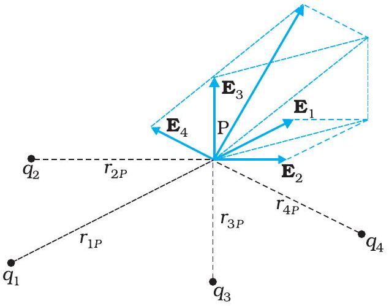
चित्र $1.9$ आवेशों के निकाय के कारण किसी बिंदु पर वैद्युत क्षेत्र पृथक-पृथक आवेशों के कारण उस बिंदु पर वैद्युत क्षेत्रों के सदिश योग के बराबर होता है।

है, पर विद्युत क्षेत्र को निर्धारित करने के लिए हम कूलॉम नियम तथा अध्यारोपण के सिद्धांत का उपयोग करते हैं।
$\mathbf{r}_{1}$ पर स्थित आवेश $q_{1}$ के कारण अवस्थिति $\mathbf{r}$ पर विद्युत क्षेत्र $\mathbf{E}_{1}$ इस प्रकार व्यक्त किया जाता है।

$$
\mathbf{E}_{1}=\frac{1}{4 \pi \varepsilon_{o}} \frac{q_{1}}{r_{1 \mathrm{P}}} \hat{\mathbf{r}}_{1 \mathrm{P}}
$$

यहाँ $\hat{\mathbf{r}}_{1 \mathrm{P}}$ आवेश $q_{1}$ से P की दिशा में एकांक सदिश है तथा $r_{1 \mathrm{P}}$ आवेश $q_{1}$ तथा P के बीच की दूरी है। इसी प्रकार $\mathbf{r}_{2}$ पर स्थित आवेश $q_{2}$ के कारण अवस्थिति r पर विद्युत क्षेत्र $\mathbf{E}_{2}$ को इस प्रकार व्यक्त करते हैं

$$
\mathbf{E}_{2}=\frac{1}{4 \pi \varepsilon_{0}} \frac{q_{2}}{r_{2 \mathrm{P}}} \hat{\mathbf{r}}_{2 \mathrm{P}}
$$

यहाँ $\hat{\mathbf{r}}_{2 \mathrm{P}}$ आवेश $q_{2}$ से P की दिशा में एकांक सदिश है तथा $r_{2 \mathrm{P}}$ आवेश $q_{2}$ तथा P के बीच की दूरी है। इसी प्रकार के व्यंजक $q_{3}, q_{4}, \ldots, q_{n}$ आवेशों के विद्युत क्षेत्रों $\mathbf{E}_{3}, \mathbf{E}_{4}, \ldots, \mathbf{E}_{n}$ लिखे जा सकते हैं। अध्यारोपण सिद्धांत द्वारा आवेशों के निकाय के कारण r पर विद्युत क्षेत्र (चित्र $1.9$ में दर्शाए अनुसार) इस प्रकार व्यक्त किया जा सकता है-

$$
\begin{aligned}
\mathbf{E}(\mathbf{r}) & =\mathbf{E}_{1}(\mathbf{r})+\mathbf{E}_{2}(\mathbf{r})+\ldots+\mathbf{E}_{\mathrm{n}}(\mathbf{r}) \\
& =\frac{1}{4 \pi \varepsilon_{0}} \frac{q_{1}}{r_{1 \mathrm{P}}^{2}} \hat{\mathbf{r}}_{1 \mathrm{P}}+\frac{1}{4 \pi \varepsilon_{0}} \frac{q_{2}}{r_{2 \mathrm{P}}^{2}} \hat{\mathbf{r}}_{2 \mathrm{P}}+\ldots+\frac{1}{4 \pi \varepsilon_{0}} \frac{q_{n}}{r_{n \mathrm{P}}^{2}} \hat{\mathbf{r}}_{n \mathrm{P}}
\end{aligned}
$$

$$
\mathbf{E}(\mathbf{r})=\frac{1}{4 \pi \varepsilon_{0}} \sum_{i=1}^{n} \frac{q_{i}}{r_{i \mathrm{P}}^{2}} \hat{\mathbf{r}}_{\mathrm{iP}}
$$

$\mathbf{E}$ एक सदिश राशि है जिसका मान दिक्स्थान में एक बिंदु से दूसरे बिंदु पर जाने पर परिवर्तित हो जाता है तथा यह स्रोत आवेशों की स्थितियों से निर्धारित होता है।

### 1.7.2 विद्युत क्षेत्र का भौतिक अभिप्राय

आपको आश्चर्य हो सकता है कि हमें यहाँ विद्युत क्षेत्र की धारणा से परिचित क्यों कराया जा रहा है। वैसे भी, आवेशों के किसी भी निकाय के लिए मापने योग्य राशि किसी आवेश पर लगा बल है जिसे सीधे ही कूलॉम नियम तथा अध्यारोपण सिद्धांत द्वारा (समीकरण 1.5) निर्धारित किया जा सकता है। फिर विद्युत क्षेत्र नामक इस मध्यवर्ती राशि को प्रस्तावित क्यों किया जा रहा है?

स्थिरवैद्युतिकी के लिए विद्युत क्षेत्र की अभिधारणा सुगम तो है पर वास्तव में आवश्यक नहीं है। विद्युत क्षेत्र आवेशों के किसी निकाय के वैद्युत पर्यावरण को अभिलक्षित करने का सुरुचि संपन्न उपाय है। आवेशों के निकाय के चारों ओर के दिक्स्थान में किसी बिंदु पर विद्युत क्षेत्र आपको यह बताता है कि निकाय को विक्षुब्ध किए बिना यदि इस बिंदु पर कोई एकांक धनात्मक परीक्षण आवेश रखे तो वह कितना बल अनुभव करेगा। विद्युत क्षेत्र आवेशों के निकाय का एक अभिलक्षण है तथा विद्युत क्षेत्र के निर्धारण के लिए आपके द्वारा उस बिंदु पर रखे जाने वाले परीक्षण आवेश पर निर्भर नहीं करता। भौतिकी में क्षेत्र शब्द का उपयोग व्यापक रूप से उस राशि को निर्दिष्ट करने के लिए किया जाता है, जो दिक्स्थान के प्रत्येक बिंदु पर पारिभाषित की जा सके तथा एक बिंदु से दूसरे बिंदु पर परिवर्तित होती हो। चूँकि बल सदिश राशि है, अतः विद्युत क्षेत्र एक सदिश राशि है।

तथापि विद्युत क्षेत्र की अभिधारणा की वास्तविक भौतिक सार्थकता तभी प्रकट होती है जब हम स्थिरवैद्युतिकी से बाहर निकलकर कालाश्रित वैद्युतचुंबकीय परिघटनाओं से व्यवहार करते हैं।

## वैद्युत आवेश तथा क्षेत्र

मान लीजिए हम त्वरित गति से गतिमान दो दूरस्थ आवेशों $q_{1}$ तथा $q_{2}$ के बीच लगे बल पर विचार करते हैं। अब, वह अधिकतम चाल जिससे कोई संकेत अथवा सूचना एक स्थान से दूसरे स्थान तक जा सकती है, वह प्रकाश की चाल $c$ है। इस प्रकार, $q_{2}$ पर $q_{1}$ की किसी गति का प्रभाव तात्क्षणिक उत्पन्न नहीं हो सकता। कारण ( $q_{1}$ की गति) तथा प्रभाव ( $q_{2}$ पर बल) के बीच कुछ न कुछ काल विलंब अवश्य होता है। यहीं पर सार्थक रूप में विद्युत क्षेत्र (सही अर्थों में वैद्युतचुंबकीय क्षेत्र) की अवधारणा स्वाभाविक एवं अति उपयोगी है। क्षेत्र का चित्रण इस प्रकार है: आवेश $q_{1}$ की त्वरित गति वैद्युतचुंबकीय तरंगें उत्पन्न करती है जो फिर प्रकाश की चाल से फैलकर $q_{2}$ तक पहुँचती है तथा $q_{2}$ पर बल लगाती है। क्षेत्र की अवधारणा काल विलंब का सुचारु रूप से स्पष्टीकरण करती है। इस प्रकार, यद्यपि वैद्युत तथा चुंबकीय बलों की संसूचना केवल आवेशों पर इनके प्रभावों (बलों) द्वारा ही की जा सकती है, उन्हें भौतिक सत्व माना जाता है, ये मात्र गणितीय रचनाएँ ही नहीं हैं। इनकी अपनी स्वतंत्र गतिकी है, अर्थात ये अपने नियमों के अनुसार विकसित होते हैं। ये ऊर्जा का परिवहन भी कर सकते हैं। इस प्रकार, कालाश्रित वैद्युतचुंबकीय क्षेत्रों का कोई स्रोत जिसे अल्प समय अंतराल के लिए खोलकर फिर बंद किया जा सकता है, ऊर्जा परिवहन करने वाले वैद्युतचुंबकीय क्षेत्रों को पीछे छोड़ देता है। क्षेत्र की अवधारणा सर्वप्रथम फैराडे ने प्रस्तावित की थी जो भौतिकी की प्रमुख अवधारणाओं में स्थान रखती है।

उदाहरण $1.7$ कोई इलेक्ट्रॉन $2.0 \times 10^{4} \mathrm{~N} \mathrm{C}^{-1}$ परिमाण के एकसमान विद्युत क्षेत्र में $1.5 \mathrm{~cm}$ दूरी तक गिरता है [चित्र 1.10(a)]। क्षेत्र का परिमाण समान रखते हुए इसकी दिशा उत्क्रमित कर दी जाती है तथा अब कोई प्रोटॉन इस क्षेत्र में उतनी ही दूरी तक गिरता है [चित्र 1.10(b)]। दोनों प्रकरणों में गिरने में लगे समय की गणना कीजिए। इस परिस्थिति की 'गुरुत्व के अधीन मुक्त पतन' से तुलना कीजिए।

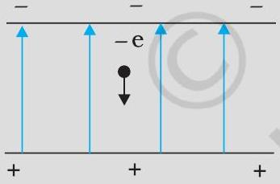
(a)

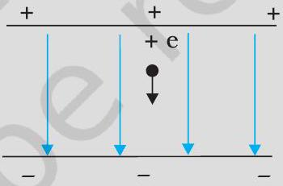
(b)

## चित्र $1.10$

हल चित्र 1.10(a) में क्षेत्र उपरिमुखी है, अतः ऋणावेशित इलेक्ट्रॉन $e E$ परिमाण का अधोमुखी बल अनुभव करता है, यहाँ $E$ विद्युत क्षेत्र का परिमाण है। अतः इलेक्ट्रॉन का त्वरण

$$
a_{e}=e E / m_{e}
$$

यहाँ $m_{e}$ इलेक्ट्रॉन का द्रव्यमान है।
विरामावस्था से आरंभ करके, इलेक्ट्रॉन के मुक्त रूप से $h$ दूरी तक गिरने में लगा समय $t_{e}=\sqrt{\frac{2 h}{a_{e}}}=\sqrt{\frac{2 h m_{e}}{e E}}$

$$
\begin{aligned}
e & =1.6 \times 10^{-19} \mathrm{C}, m_{\mathrm{e}}=9.11 \times 10^{-31} \mathrm{~kg}, \\
E & =2.0 \times 10^{4} \mathrm{~N} \mathrm{C}^{-1}, h=1.5 \times 10^{-2} \mathrm{~m}, \\
t_{\mathrm{e}} & =2.9 \times 10^{-9} \mathrm{~s}
\end{aligned}
$$

चित्र $1.10$ (b) में क्षेत्र अधोमुखी है, अतः धनावेशित प्रोटॉन $e E$ परिमाण का अधोमुखी बल अनुभव करता है। अतः प्रोटॉन का त्वरण

## - भौतिकी

$$
a_{p}=e E / m_{p}
$$

यहाँ $m_{p}$ प्रोटॉन का द्रव्यमान है; $m_{p}=1.67 \times 10^{-27} \mathrm{~kg}$ । अतः प्रोटॉन द्वारा गिरने में लिया गया समय $t_{p}=\sqrt{\frac{2 h}{a_{p}}}=\sqrt{\frac{2 h m_{p}}{e E}}=1.3 \times 10^{-7} \mathrm{~s}$
इस प्रकार, समान दूरी गिरने में भारी कण (प्रोटॉन) अधिक समय लेता है। 'गुरुत्व के अधीन मुक्त पतन' और इस पतन में यही मूल विषमता है क्योंकि गुरुत्व के अधीन पतन में समय वस्तु के द्रव्यमान पर निर्भर नहीं करता। ध्यान दीजिए यहाँ हमने पतन का समय परिकलित करते समय गुरुत्वीय त्वरण की उपेक्षा की है। यह देखने के लिए कि क्या यह न्यायसंगत है, आइए दिए गए विद्युत क्षेत्र में प्रोटॉन का त्वरण परिकलित करते हैं :

$$
\begin{aligned}
a_{p} & =\frac{e E}{m_{p}} \\
& =\frac{\left(1.6 \times 10^{-19} \mathrm{C}\right) \times\left(2.0 \times 10^{4} \mathrm{~N} \mathrm{C}^{-1}\right)}{1.67 \times 10^{-27} \mathrm{~kg}} \\
& =1.9 \times 10^{12} \mathrm{~m} \mathrm{~s}^{-2}
\end{aligned}
$$

यह त्वरण गुरुत्वीय त्वरण ( $9.8 \mathrm{~m} \mathrm{~s}^{-2}$ ) की तुलना में अत्यंत विशाल है। इलेक्ट्रॉन का त्वरण तो इस त्वरण से भी अधिक है। इस प्रकार, इस उदाहरण में गुरुत्वीय त्वरण के प्रभाव की उपेक्षा की जा सकती है।

उदाहरण $1.8$ दो बिंदु आवेश $q_{1}$ तथा $q_{2}$ जिनके परिमाण क्रमशः $+10^{-8} \mathrm{C}$ तथा $-10^{-8} \mathrm{C}$ हैं एक दूसरे से $0.1 \mathrm{~m}$ दूरी पर रखे हैं। चित्र $1.11$ में दर्शाए बिंदुओं $\mathrm{A}, \mathrm{B}$ तथा C पर विद्युत क्षेत्र परिकलित कीजिए।

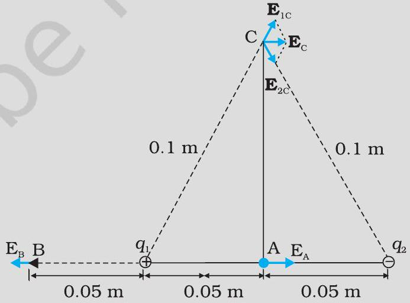
चित्र $1.11$

हल धनावेश $q_{1}$ के कारण A पर विद्युत क्षेत्र सदिश $\mathbf{E}_{1 \mathrm{~A}}$ दाईं ओर निर्दिष्ट है तथा इसका परिमाण $E_{1 \mathrm{~A}}=\frac{\left(9 \times 10^{9} \mathrm{Nm}^{2} \mathrm{C}^{-2}\right) \times\left(10^{-8} \mathrm{C}\right)}{(0.05 \mathrm{~m})^{2}}=3.6 \times 10^{4} \mathrm{~N} \mathrm{C}^{-1}$
ॠणावेश $q_{2}$ के कारण A पर विद्युत क्षेत्र सदिश $\mathbf{E}_{2 \mathrm{~A}}$ भी दाईं ओर निर्दिष्ट है तथा इसका परिमाण $\mathrm{E}_{\mathrm{A}}$ के समान है। अतः A पर कुल विद्युत क्षेत्र $\mathbf{E}_{\mathrm{A}}$ का परिमाण
$E_{\mathrm{A}}=E_{1 \mathrm{~A}}+E_{2 \mathrm{~A}}=7.2 \times 10^{4} \mathrm{~N} \mathrm{C}^{-1}$ (यह दाईं ओर निर्दिष्ट है)
धनावेश $q_{1}$ के कारण B पर विद्युत क्षेत्र सदिश $\mathbf{E}_{1 \mathrm{~B}}$ बाईं ओर निर्दिष्ट है तथा इसका परिमाण

## वैद्युत आवेश तथा क्षेत्र

$$
E_{1 \mathrm{~B}}=\frac{\left(9 \times 10^{9} \mathrm{Nm}^{2} \mathrm{C}^{-2}\right) \times\left(10^{-8} \mathrm{C}\right)}{(0.05 \mathrm{~m})^{2}}=3.6 \times 10^{4} \mathrm{~N} \mathrm{C}^{-1}
$$

ऋणावेश $q_{2}$ के कारण B पर विद्युत क्षेत्र सदिश $\mathbf{E}_{2 \mathrm{~B}}$ दाईं ओर निर्दिष्ट है तथा इसका परिमाण

$$
E_{2 \mathrm{~B}}=\frac{\left(9 \times 10^{9} \mathrm{Nm}^{2} \mathrm{C}^{-2}\right) \times\left(10^{-8} \mathrm{C}\right)}{(0.15 \mathrm{~m})^{2}}=4 \times 10^{3} \mathrm{~N} \mathrm{C}^{-1}
$$

B पर कुल विद्युत क्षेत्र का परिमाण
$E_{\mathrm{B}}=E_{1 \mathrm{~B}}-E_{2 \mathrm{~B}}=3.2 \times 10^{4} \mathrm{~N} \mathrm{C}^{-1}$ (यह बाईं ओर निर्दिष्ट है)
$q_{1}$ तथा $q_{2}$ में प्रत्येक के कारण बिंदु C पर विद्युत क्षेत्र सदिश का परिमाण समान है, अतः

$$
E_{1 \mathrm{C}}=E_{2 \mathrm{C}}=\frac{\left(9 \times 10^{9} \mathrm{Nm}^{2} \mathrm{C}^{-2}\right) \times\left(10^{-8} \mathrm{C}\right)}{(0.10 \mathrm{~m})^{2}}=9 \times 10^{3} \mathrm{~N} \mathrm{C}^{-1}
$$

इन दोनों सदिशों की दिशाएँ चित्र $1.11$ में दर्शायी गई हैं। इन दो सदिशों के परिणामी सदिश का परिमाण

$$
E_{C}=E_{1 \mathrm{C}} \cos \frac{\pi}{3}+E_{2 \mathrm{C}} \cos \frac{\pi}{3}=9 \times 10^{3} \mathrm{~N} \mathrm{C}^{-1}
$$

$E_{c}$ दाईं ओर निर्दिष्ट है।

## $1.8$ विद्युत क्षेत्र रेखाएँ

पिछले अनुभाग में हमने विद्युत क्षेत्र का अध्ययन किया। यह एक सदिश राशि है तथा इसे हम सदिशों की भाँति ही निरूपित कर सकते हैं। आइए किसी बिंदु आवेश के कारण $\mathbf{E}$ को चित्रात्मक निरूपित करने का प्रयास करते हैं। मान लीजिए बिंदु आवेश मूल बिंदु पर स्थित है। प्रत्येक बिंदु पर विद्युत क्षेत्र की दिशा के अनुदिश संकेत करते हुए क्षेत्र की तीव्रता की आनुपातिक लंबाई के सदिश खींचिए। चूँकि किसी बिंदु पर विद्युत क्षेत्र का परिमाण आवेश से उस बिंदु की दूरी के वर्ग के व्युत्क्रमानुसार घटता है, मूल बिंदु से दूर जाने पर सदिश की लंबाई निरंतर घटती जाती है तथा इसकी दिशा सदैव बहिर्मुखी अरीय संकेत करती है। चित्र $1.12$ इसी चित्रण को दर्शाता है। इस चित्रण में प्रत्येक तीर विद्युत क्षेत्र अर्थात उस तीर के पुच्छ पर स्थित इकाई धन आवेश पर लगने वाला बल दर्शाता है। एक दिशा में संकेत करने वाले तीरों को मिलाने पर प्राप्त परिणामी चित्र क्षेत्र रेखा को निरूपित करता है। इस प्रकार हमें बहुत सी क्षेत्र रेखाएँ प्राप्त होती हैं जिनमें सभी बिंदु आवेश से बाहर की ओर संकेत करती हैं। क्या अब हमने विद्युत क्षेत्र की तीव्रता अथवा परिमाण के विषय में जानकारी नष्ट कर दी है, क्योंकि वह तो तीर की लंबाई में समाई हुई थी? नहीं। अब, क्षेत्र के परिमाण को क्षेत्र रेखाओं के घनत्व द्वारा निरूपित किया जाता है। आवेश के निकट E प्रबल होता है। अतः आवेश के निकट क्षेत्र रेखाओं का घनत्व अधिक होता है तथा क्षेत्र रेखाएँ सघन होती हैं। आवेश से दूर जाने पर क्षेत्र दुर्बल होता जाता है तथा क्षेत्र रेखाओं का घनत्व कम होता है परिणामस्वरूप रेखाएँ भी दूर-दूर होती हैं।

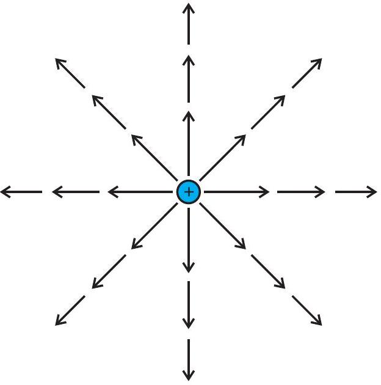
चित्र $1.12$ बिंदु आवेश का क्षेत्र।

कोई व्यक्ति अधिक रेखाएँ खींच सकता है। परंतु रेखाओं की संख्या महत्वपूर्ण नहीं है। वास्तव में किसी क्षेत्र में असंख्य रेखाएँ खींची जा सकती हैं। अतः महत्वपूर्ण यह है कि विभिन्न क्षेत्रों में रेखाओं का आपेक्षिक घनत्व क्या है?

## भौतिकी

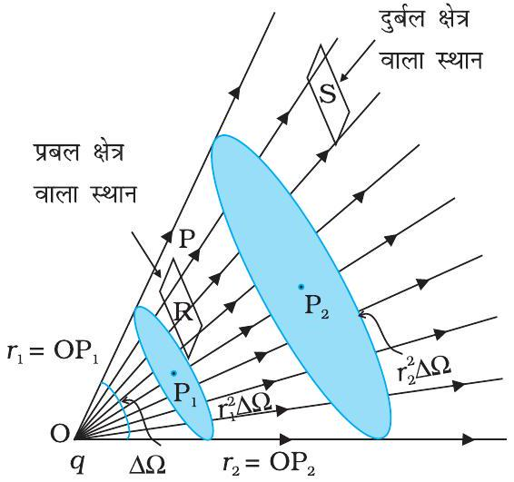
चित्र $1.13$ विद्युत क्षेत्र प्रबलता की दूरी परनिर्भरता तथा इसका क्षेत्र रेखाओं की संख्या सेसंबंध।

हम कागज़ के पृष्ठ पर चित्र खींचते हैं अर्थात हम द्विविमीय चित्र खींचते हैं, परंतु हम तीन विमाओं में रहते हैं। अतः यदि हमें क्षेत्र रेखाओं के घनत्व का आकलन करना है तो हमें इन रेखाओं के लंबवत अनुप्रस्थ काट के प्रति एकांक क्षेत्रफल में क्षेत्र रेखाओं की संख्या पर विचार करना होता है। चूँकि किसी बिंदु आवेश से दूरी के वर्ग के अनुसार विद्युत क्षेत्र कम होता जाता है तथा आवेश को परिबद्ध करने वाला क्षेत्र दूरी के वर्ग के अनुसार बढ़ता जाता है, परिबद्ध क्षेत्र से गुजरने वाली क्षेत्र रेखाओं की संख्या सदैव नियत रहती है, चाहे आवेश से उस क्षेत्र की दूरी कुछ भी हो।

हमने आरंभ में यह कहा था कि क्षेत्र रेखाएँ दिक्स्थान के विभिन्न बिंदुओं पर विद्युत क्षेत्र की दिशा के विषय में सूचनाएँ पहुँचाती हैं। कुछ क्षेत्र रेखाओं का समुच्चय खींचने पर विभिन्न बिंदुओं पर क्षेत्र रेखाओं का आपेक्षिक संख्या घनत्व (अर्थात अत्यधिक निकटता) उन बिंदुओं पर विद्युत क्षेत्र की आपेक्षिक प्रबलता इंगित करता है। जहाँ क्षेत्र रेखाएँ सघन होती हैं वहाँ क्षेत्र प्रबल होता है तथा जहाँ दूर-दूर होती हैं वहाँ दुर्बल होता है। चित्र $1.13$ में क्षेत्र रेखाओं का समुच्चय दर्शाया गया है। हम बिंदुओं R तथा S पर वहाँ की क्षेत्र रेखाओं के अभिलंबवत दो समान तथा छोटे क्षेत्र अवयवों की कल्पना कर सकते हैं। हमारे चित्रण में इन क्षेत्र अवयवों को काटने वाली क्षेत्र रेखाओं की संख्या इन बिंदुओं पर विद्युत क्षेत्रों के परिमाणों के अनुक्रमानुपाती है। चित्रण यह दर्शाता है कि बिंदु R पर क्षेत्र, बिंदु S पर क्षेत्र की तुलना में अधिक प्रबल है।

क्षेत्रफल पर अथवा क्षेत्र अवयव द्वारा अंतरित घन कोण* पर, क्षेत्र रेखाओं की निर्भरता को समझने के लिए आइए हम क्षेत्रफल और घन कोण (जो कोण का तीन विमाओं में व्यापकीकरण है) के बीच संबंध स्थापित करने का प्रयास करते हैं। याद कीजिए दो विमाओं में किसी (समतल) कोण की परिभाषा किस प्रकार की जाती है। मान लीजिए कोई छोटा अनुप्रस्थ रेखा अवयव $\Delta l$ बिंदु O से $r$ दूरी पर रखा जाता है। तब O पर $\Delta l$ द्वारा अंतरित कोण का सन्निकटन $\Delta \theta=\Delta l / r$ के रूप में किया जा सकता है। इसी प्रकार, तीन विमाओं में किसी छोटे लंबवत क्षेत्र $\Delta S$ द्वारा दूरी $r$ पर अंतरित घन कोण* को $\Delta \Omega=\Delta S / r^{2}$ व्यक्त किया जा सकता है। हम जानते हैं कि किसी दिए गए घन कोण में अरीय क्षेत्र रेखाओं की संख्या समान होती है। चित्र $1.13$ में आवेश से $r_{1}$ तथा $r_{2}$ दूरियों पर स्थित दो बिंदुओं $\mathrm{P}_{1}$ तथा $\mathrm{P}_{2}$ के लिए घन कोण $\Delta \Omega$ द्वारा $\mathrm{P}_{1}$ पर अंतरित क्षेत्र अवयव $r_{1}^{2} \Delta \Omega$ तथा $\mathrm{P}_{2}$ पर अंतरित क्षेत्र अवयव $r_{2}^{2} \Delta \Omega$ है। इन क्षेत्र अवयवों को काटने वाली रेखाओं की संख्या (मान लीजिए $n$ ) समान है। अतः एकांक क्षेत्र अवयव को काटने वाली क्षेत्र रेखाओं की संख्या $\mathrm{P}_{1}$ पर $n /\left(r_{1}^{2} \Delta \Omega\right)$ तथा $\mathrm{P}_{2}$ पर $n /\left(r_{2}^{2} \Delta \Omega\right)$ है। इस प्रकार स्पष्ट है कि क्षेत्र रेखाओं की संख्या और इसीलिए क्षेत्र-प्रबलता स्पष्ट रूप से $1 / r^{2}$ पर निर्भर है।

क्षेत्र रेखाओं के चित्रण की खोज फैराडे ने आवेशित विन्यासों के चारों ओर विद्युत क्षेत्र का मानस प्रत्यक्षीकरण करने के एक अंतर्दर्शी अगणितीय उपाय को विकसित करने के लिए की थी। फैराडे ने इन्हें बल रेखाएँ कहा था। यह पद विशेषकर चुंबकीय क्षेत्रों के प्रकरण के लिए कुछ भ्रामक है। इनके लिए अधिक उचित पद क्षेत्र रेखाएँ (वैद्युत अथवा चुंबकीय) है जिसे हमने इस पुस्तक में अपनाया है।

इस प्रकार विद्युत क्षेत्र रेखाएँ आवेशों के अभिविन्यास के चारों ओर विद्युत क्षेत्र के चित्रात्मक निरूपण का एक उपाय है। व्यापक रूप में, विद्युत क्षेत्र रेखा एक ऐसा वक्र होती है जिसके किसी भी बिंदु पर खींचा गया स्पर्शी उस बिंदु पर लगे नेट बल की दिशा को निरूपित करता है। इस वक्र के किसी बिंदु पर, स्पष्ट रूप से, स्पर्शी द्वारा विद्युत क्षेत्र की दो संभावित दिशाओं में से कोई एक

[^2]
## वैद्युत आवेश तथा क्षेत्र

दिशा दर्शाने के लिए वक्र पर तीर का चिह्न अंकित करना आवश्यक है। क्षेत्र रेखा एक दिक्स्थान वक्र अर्थात तीन दिशाओं में वक्र होती है।

चित्र $1.14$ में कुछ सरल आवेश विन्यासों के चारों ओर क्षेत्र रेखाएँ दर्शायी गई हैं। जैसा कि पहले वर्णन किया जा चुका है, ये क्षेत्र रेखाएँ तीन विमीय दिक्स्थान में हैं यद्यपि चित्र में इन्हें केवल एक तल में दर्शाया गया है। एकल धनावेश के कारण क्षेत्र रेखाएँ त्रिज्यतः (अरीय) बहिर्मुखी होती हैं जबकि एकल ऋणावेश के कारण क्षेत्र रेखाएँ त्रिज्यतः अंतर्मुखी होती हैं। दो धनावेशों $(q, q)$ के निकाय के चारों ओर की क्षेत्र रेखाएँ पारस्परिक प्रतिकर्षण का एक सजीव चित्रण प्रस्तुत करती हैं जबकि परिमाण में समान दो विजातीय आवेशों $(q,-q)$ के निकाय, अर्थात किसी द्विध्रुव के चारों ओर क्षेत्र रेखाएँ आवेशों के बीच स्पष्ट पारस्परिक आकर्षण दर्शाती हैं। क्षेत्र रेखाएँ कुछ महत्वपूर्ण सामान्य गुणों का पालन करती हैं-

(i) क्षेत्र रेखाएँ धनावेश से आरंभ होकर ऋणावेश पर समाप्त होती हैं। यदि आवेश एकल है तो ये अनंत से आरंभ अथवा अनंत पर समाप्त हो सकती हैं।
(ii) किसी आवेश मुक्त क्षेत्र में, क्षेत्र रेखाओं को ऐसे संतत वक्र माना जा सकता है जो कहीं नहीं टूटते।
(iii) दो क्षेत्र रेखाएँ एक-दूसरे को कदापि नहीं काटतीं। (यदि वे ऐसा करें तो प्रतिच्छेदन बिंदु पर क्षेत्र की केवल एक दिशा नहीं होगी, जो निरर्थक है।
(iv) स्थिरवैद्युत क्षेत्र रेखाएँ बंद लूप नहीं बनातीं। यह विद्युत क्षेत्र की संरक्षणात्मक प्रकृति से अनुशासित है (अध्याय $2$ देखिए)।

## $1.9$ वैद्युत फ्लक्स

किसी dS क्षेत्रफल के छोटे पृष्ठ से उसके अभिलंबवत v वेग से प्रवाहित होने वाले किसी द्रव के प्रवाह पर विचार कीजिए। द्रव के प्रवाह की दर इस क्षेत्र से प्रति एकांक समय में गुजरने वाले आयतन $v \mathrm{dS}$ द्वारा प्राप्त होती है तथा यह उस तल से गुजरने वाले द्रव के फ्लक्स को निरूपित करती है। यदि इस तल (पृष्ठ) पर अभिलंब द्रव के प्रवाह की दिशा अर्थात $\mathbf{v}$ के समांतर नहीं है, और इनके बीच $\theta$ कोण बनता है तो $\mathbf{v}$ के लंबवत तल में प्रक्षेपित क्षेत्रफल $\mathrm{dS} \cos \theta$ होगा। अतः पृष्ठ dS से बाहर जाने वाला फ्लक्स $\mathbf{v} \cdot \hat{\mathbf{n}} \mathrm{dS}$ होता है। विद्युत क्षेत्र के प्रकरण के लिए, हम एक समतुल्य राशि को परिभाषित करते हैं और इसे वैद्युत फ्लक्स कहते हैं। तथापि हमें यह ध्यान में रखना चाहिए कि द्रव-प्रवाह के प्रकरण के विपरीत यहाँ प्राकृतिक नियमों के अनुसार प्रेक्षण योग्य राशि का कोई प्रवाह नहीं है।

उपरोक्त वर्णित विद्युत क्षेत्र रेखाओं के चित्रण में हमने देखा कि किसी बिंदु पर क्षेत्र के अभिलंबवत रखे एकांक क्षेत्रफल से गुजरने वाली क्षेत्र रेखाओं की संख्या उस बिंदु पर विद्युत क्षेत्र प्रबलता की माप होती है। इसका तात्पर्य यह है कि यदि हम किसी बिंदु पर $\mathbf{E}$ के अभिलंबवत कोई $\Delta S$ क्षेत्रफल का छोटा समतलीय अवयव रखें तो इससे गुजरने वाली क्षेत्र रेखाओं की संख्या $E$ $\Delta S$ के अनुक्रमानुपाती* है। अब मान लीजिए हम क्षेत्रफल अवयव को किसी

[^3]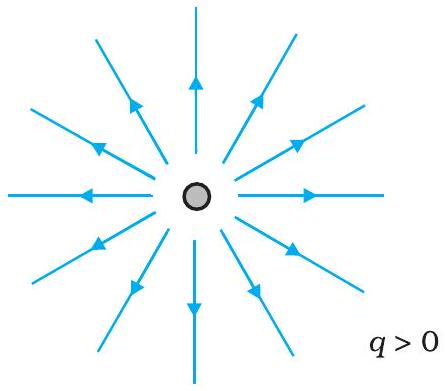
(a)

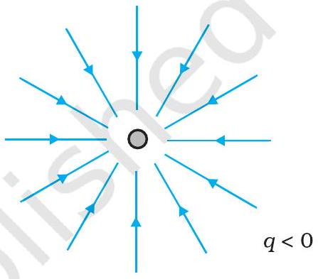
(b)

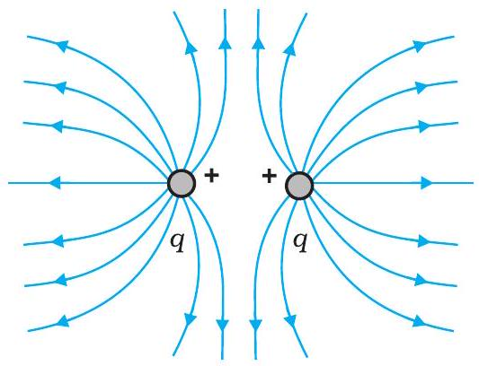
(c)

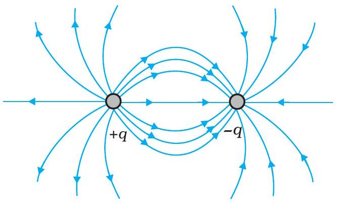
चित्र $\mathbf{1 . 1 4}$ विभिन्न आवेश वितरणों के कारण क्षेत्र रेखाएँ।

## - भौतिकी

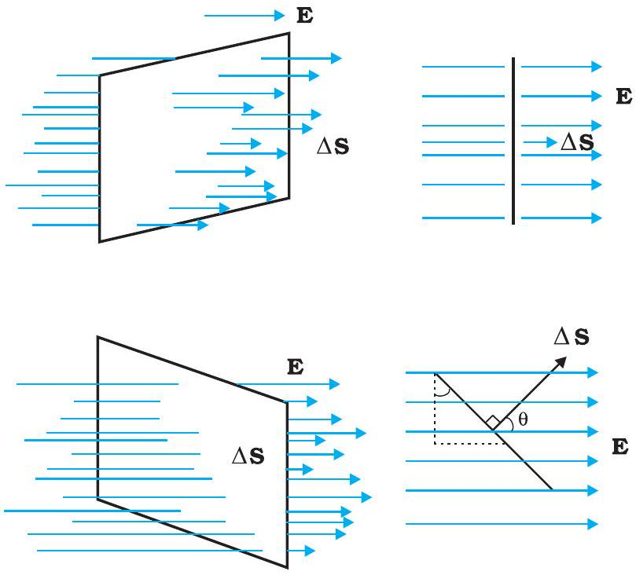
चित्र 1.15 E तथा $\hat{\mathbf{n}}$ के बीच झुकाव $\theta$ पर फ्लक्स की निर्भरता।

कोण $\theta$ पर झुका देते हैं। स्पष्ट है अब इस क्षेत्रफल अवयव से गुजरने वाली क्षेत्र रेखाओं की संख्या घट जाएगी। चूँकि $E$ के अभिलंबवत क्षेत्रफल अवयव $\Delta \mathrm{S}$ का प्रक्षेप $\Delta \mathrm{S} \cos \theta$ है, अतः $\Delta S$ से गुजरने वाली क्षेत्र रेखाओं की संख्या $E \Delta S \cos \theta$ के अनुक्रमानुपाती है। जब $\theta=90^{\circ}$ होता है तो क्षेत्र रेखाएँ $\Delta S$ के समांतर हो जाती हैं और इससे कोई भी क्षेत्र रेखा नहीं गुजरती (चित्र $1.15$ देखिए)।

बहुत से संदर्भों में क्षेत्रफल अवयव के परिमाण के साथ-साथ उसका दिक्विन्यास भी महत्वपूर्ण होता है। उदाहरण के लिए, किसी जल-प्रवाह में किसी रिंग से गुजरने वाले जल का परिमाण स्वाभाविक रूप से इस बात पर निर्भर करता है कि आप जल धारा में इसे किस प्रकार पकड़े हुए हैं। यदि आप इसे जल-प्रवाह के अभिलंबवत रखते हैं तो अन्य सभी दिक्विन्यासों की तुलना में इस विन्यास में रिंग से अधिकतम जल गुजरेगा। इससे यह निष्कर्ष निकलता है कि क्षेत्रफल-अवयव को सदिश के समान मानना चाहिए। इसमें परिमाण के साथ दिशा भी होती है। समतलीय क्षेत्र की दिशा कैसे निर्दिष्ट की जाए? स्पष्ट रूप से तल पर अभिलंब तल का दिक्विन्यास निर्दिष्ट करता है। इस प्रकार समतलीय क्षेत्र सदिश की दिशा इसके अभिलंब के अनुदिश होती है।

किसी वक्रित पृष्ठ के क्षेत्रफल को किसी सदिश से कैसे संबद्ध किया जाता है? हम यह कल्पना करते हैं कि वक्रित पृष्ठ बहुत से छोटे-छोटे क्षेत्रफल अवयवों में विभाजित है। इनमें से प्रत्येक छोटा क्षेत्रफल अवयव समतलीय माना जा सकता है और पहले स्पष्टीकरण के अनुसार इससे सदिश संबद्ध किया जा सकता है।

यहाँ एक संदिग्धता पर ध्यान दीजिए। किसी क्षेत्रफल अवयव की दिशा उसके अभिलंब के अनुदिश होती है। परंतु अभिलंब दो दिशाएँ संकेत कर सकता है। किसी क्षेत्रफल अवयव से संबद्ध सदिश की दिशा का चयन किस प्रकार किया जाता है? इस समस्या का समाधान इस संदर्भ में उचित कुछ परिपाटियों के निर्धारण द्वारा किया गया है। बंद पृष्ठों के प्रकरणों के लिए यह परिपाटी अति सरल है। किसी बंद पृष्ठ के प्रत्येक क्षेत्रफल अवयव से संबद्ध सदिश की दिशा बहिर्मुखी अभिलंब की दिशा मानी जाती है। इसी परिपाटी का उपयोग चित्र $1.16$ में किया गया है। इस प्रकार, किसी बंद पृष्ठ के किसी बिंदु पर क्षेत्रफल अवयव सदिश $\Delta \mathbf{S}$ का मान $\Delta \mathbf{S} \hat{\mathbf{n}}$ होता है, यहाँ $\Delta \mathbf{S}$ क्षेत्रफल सदिश का परिमाण तथा $\hat{\mathbf{n}}$ इस बिंदु पर बहिर्मुखी अभिलंब की दिशा में एकांक सदिश है।

अब हम वैद्युत फ्लक्स की परिभाषा पर आते हैं। किसी क्षेत्रफल अवयव $\Delta \mathbf{S}$ से गुजरने वाले वैद्युत फ्लक्स $\Delta \phi$ की परिभाषा इस प्रकार करते हैं :

$$
\Delta \phi=\mathbf{E} \cdot \Delta \mathbf{S}=E \Delta S \cos \theta
$$

चित्र $1.16$ अभिलंब $\hat{\mathbf{n}}$ तथा $\triangle S$ को परिभाषित करने की परिपाटी।

## वैद्युत आवेश तथा क्षेत्र

समीकरण (1.11) से प्राप्त वैद्युत फ्लक्स की मूल परिभाषा को सैद्धांतिक रूप में, किसी दिए गए पृष्ठ से गुजरने वाले कुल फ्लक्स को परिकलित करने में उपयोग कर सकते हैं। इसके लिए हमें यह करना होता है कि हम पहले पृष्ठ को छोटे-छोटे क्षेत्रफल अवयवों में विभाजित करते हैं और फिर प्रत्येक अवयव के लिए फ्लक्स परिकलित करके उन्हें जोड़कर कुल फ्लक्स प्राप्त कर लेते हैं। अतः पृष्ठ $S$ से गुजरने वाला कुल फ्लक्स $\phi$ है

$$
\phi \simeq \Sigma \mathbf{E} \cdot \Delta \mathbf{S}
$$

यहाँ सन्निकटन चिह्न लगाने का कारण यह है कि हमने छोटे क्षेत्रफल अवयव पर विद्युत क्षेत्र $\mathbf{E}$ को नियत माना है। गणितीय रूप से यह केवल तभी यथार्थ है जब आप सीमा $\Delta S \rightarrow 0$ लें तथा समीकरण (1.12) में योग को समाकलन के रूप में व्यक्त करें।

## $1.10$ वैद्युत द्विध्रुव

परिमाण में समान एवं विजातीय बिंदु आवेशों $q$ तथा $-q$ का कोई युगल जिनके बीच पृथकन $2 a$ है, वैद्युत द्विध्रुव कहलाता है। दोनों आवेशों को संयोजित करने वाली रेखा दिक्स्थान में किसी दिशा को परिभाषित करती है। परिपाटी के अनुसार $-q$ से $q$ की दिशा द्विध्रुव की दिशा कहलाती है। $-q$ तथा $q$ की अवस्थितियों का मध्य बिंदु द्विध्रुव का केंद्र कहलाता है।

प्रत्यक्ष रूप से वैद्युत द्विध्रुव का कुल आवेश शून्य होता है। परंतु इसका यह अर्थ नहीं है कि द्विध्रुव का विद्युत क्षेत्र शून्य है। चूँकि आवेश $q$ तथा $-q$ में कुछ पृथकन है, इनके कारण विद्युत क्षेत्र जब जोड़े जाते हैं तब ये एक-दूसरे को यथार्थ रूप से निरस्त नहीं करते। परंतु यदि द्विध्रुव बनाने वाले आवेशों के पृथकन की तुलना में दूरी अधिक ( $r \gg 2 a$ ) है, तो $q$ एवं $-q$ के कारण क्षेत्र लगभग निरस्त हो जाते हैं। अतः अधिक दूरियों पर किसी वैद्युत द्विध्रुव के कारण विद्युत क्षेत्र $1 / r^{2}$ (एकल आवेश $q$ के कारण विद्युत क्षेत्र की $r$ पर निर्भरता) से भी अधिक गति से मंद होता जाता है। यह गुणात्मक धारणा नीचे दिए गए सुस्पष्ट परिकलन से उत्पन्न हुई है:

### 1.10.1 वैद्युत द्विध्रुव के कारण क्षेत्र

आवेशों के युगल $(-q$ तथा $q)$ के कारण दिक्स्थान में किसी बिंदु पर विद्युत क्षेत्र कूलॉम नियम तथा अध्यारोपण सिद्धांत से ज्ञात किया जा सकता है। निम्नलिखित दो प्रकरणों के परिणाम सरल हैं: (i) जब बिंदु द्विध्रुव के अक्ष पर है, (ii) जब बिंदु द्विध्रुव के विषुवतीय तल, अर्थात द्विध्रुव अक्ष के केंद्र से गुजरने वाले द्विध्रुव अक्ष के लंबवत तल में है। किसी व्यापक बिंदु P पर विद्युत क्षेत्र, आवेश $-q$ के कारण P पर विद्युत क्षेत्र $\mathbf{E}_{-q}$ तथा आवेश $+q$ के कारण P पर विद्युत क्षेत्र $\mathbf{E}_{+q}$ को सदिशों के समांतर चतुर्भुज नियम द्वारा संयोजित करके प्राप्त किया जाता है।
(i) अक्ष पर स्थित बिंदुओं के लिए

मान लीजिए बिंदु P द्विध्रुव के केंद्र से $q$ की ओर चित्र (1.17a) में दर्शाए अनुसार $r$ दूरी पर है, तब

$$
\mathbf{E}_{-q}=-\frac{q}{4 \pi \varepsilon_{0}(r+a)^{2}} \hat{\mathbf{p}}
$$

यहाँ $\hat{\mathbf{p}}$ द्विध्रुव अक्ष ( $-q$ से $q$ की ओर) के अनुदिश एकांक सदिश है। साथ ही

$$
\mathbf{E}_{+q}=\frac{q}{4 \pi \varepsilon_{0}(r-a)^{2}} \hat{\mathbf{p}}
$$

P पर कुल विद्युत क्षेत्र है

## - भौतिकी

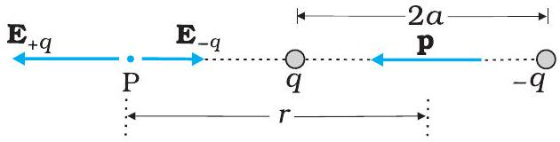
(a)

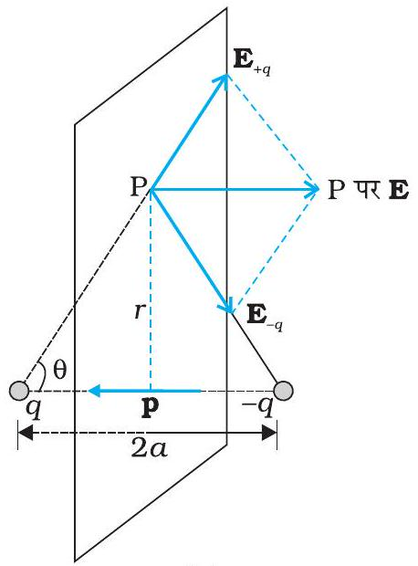
(b)

चित्र $1.17$ (a) अक्ष पर स्थित किसी बिंदु, (b) द्विध्रुव के विषुवतीय तल पर स्थित किसी बिंदु पर द्विध्रुव का विद्युत क्षेत्र। द्विध्रुव आघूर्ण $\mathbf{p}$ सदिश है जिसका परिमाण $p=q \times 2 a$ है तथा दिशा
$-q$ से $q$ की ओर है।

$$
\begin{aligned}
\mathbf{E} & =\mathbf{E}_{+q}+\mathbf{E}_{-q}=\frac{q}{4 \pi \varepsilon_{o}}\left[\frac{1}{(r-a)^{2}}-\frac{1}{(r+a)^{2}}\right] \mathbf{p} \\
& =\frac{q}{4 \pi \varepsilon_{o}} \frac{4 a r}{\left(r^{2}-a^{2}\right)^{2}} \hat{\mathbf{p}}
\end{aligned}
$$

$r \gg a$ के लिए

$$
\mathbf{E}=\frac{4 q a}{4 \pi \varepsilon_{o} r^{3}} \hat{\mathbf{p}} \quad(r \gg a)
$$

(ii) विषुवतीय तल पर स्थित बिंदुओं के लिए
दो आवेशों $+q$ तथा $-q$ के कारण विद्युत क्षेत्रों के परिमाण

$$
\begin{aligned}
& E_{+q}=\frac{q}{4 \pi \varepsilon_{o}} \frac{1}{r^{2}+a^{2}} \\
& E_{-q}=\frac{q}{4 \pi \varepsilon_{o}} \frac{1}{r^{2}+a^{2}}
\end{aligned}
$$

समान हैं।
$\mathbf{E}_{+q}$ तथा $\mathbf{E}_{-q}$ की दिशाएँ चित्र 1.17(b) में दर्शायी गई हैं। स्पष्ट है कि द्विध्रुव अक्ष के अभिलंबवत अवयव एक-दूसरे को निरस्त कर देते हैं। द्विध्रुव अक्ष के अनुदिश अवयव संयोजित हो जाते हैं। कुल विद्युत क्षेत्र $\hat{\mathbf{p}}$ के विपरीत होता है। अत:

$$
\begin{aligned}
& \mathbf{E}=-\left(E_{+q}+E_{-q}\right) \cos \theta \hat{\mathbf{p}} \\
& =-\frac{2 q a}{4 \pi \varepsilon_{o}\left(r^{2}+a^{2}\right)^{3 / 2}} \hat{\mathbf{p}}
\end{aligned}
$$

अधिक दूरियों ( $r \gg a$ ) पर

$$
\mathbf{E}=-\frac{2 q a}{4 \pi \varepsilon_{o} r^{3}} \hat{\mathbf{p}} \quad(r \gg a)
$$

समीकरणों (1.15) तथा (1.18) से स्पष्ट है कि अधिक दूरियों पर द्विध्रुव क्षेत्र में $q$ तथा $a$ पृथक रूप से सम्मिलित नहीं होते; यह इनके संयुक्त गुणनफल $q a$ पर निर्भर करता है। इससे द्विध्रुव आघूर्ण की परिभाषा का संकेत मिलता है। किसी वैद्युत द्विध्रुव के द्विध्रुव आघूर्ण सदिश $\mathbf{p}$ की परिभाषा इस प्रकार की जा सकती है:

$$
\mathbf{p}=q \times 2 a \hat{\mathbf{p}}
$$

अर्थात यह एक सदिश है जिसका परिमाण आवेश $q$ तथा पृथकन $2 a$ (आवेशों $q,-q$ के युगल के बीच की दूरी) तथा दिशा $-q$ से $q$ की ओर होती है। $\mathbf{p}$ के पदों में, किसी द्विध्रुव का विद्युत क्षेत्र अधिक दूरियों पर एक सरल रूप ले लेता है।
द्विध्रुव अक्ष के किसी बिंदु पर

$$
\mathbf{E}=\frac{2 \mathbf{p}}{4 \pi \varepsilon_{o} r^{3}} \quad(r \gg a)
$$

विषुवतीय तल के किसी बिंदु पर

$$
\mathbf{E}=-\frac{\mathbf{p}}{4 \pi \varepsilon_{o} r^{3}} \quad(r \gg a)
$$

## वैद्युत आवेश तथा क्षेत्र

इस महत्वपूर्ण तथ्य पर ध्यान दीजिए कि द्विध्रुव क्षेत्र अधिक दूरियों पर $1 / r^{2}$ के रूप में नहीं वरन् $1 / r^{3}$ के रूप में मंद होता है। इसके अतिरिक्त द्विध्रुव क्षेत्र का परिमाण तथा दिशा केवल दूरी $\mathbf{r}$ पर ही निर्भर नही है वरन् ये सदिश r तथा द्विध्रुव आघूर्ण $\mathbf{p}$ के बीच के कोण पर भी निर्भर करते है।

हम उसके बारे में सोच सकते हैं- जब द्विध्रुव आमाप $2 a$ शून्य की ओर अग्रसर होता जाता है, तब आवेश $q$ अनंत की ओर अग्रसर इस प्रकार होता जाता है कि गुणनफल $p=q \times 2 a$ एक नियत परिमित संख्या होती है। इस प्रकार के द्विध्रुव को बिंदु द्विध्रुव कहते हैं। किसी बिंदु द्विध्रुव के लिए समीकरण (1.20) तथा (1.21) $r$ के सभी मानों के लिए सत्य तथा यथार्थ हैं।

### 1.10.2 द्विध्रुवों की भौतिक सार्थकता

अधिकांश अणुओं में धनावेशों तथा ऋणावेशों* के केंद्र एक ही स्थान पर होते हैं। इसीलिए इनके द्विध्रुव आघूर्ण शून्य होते हैं। $\mathrm{CO}_{2}$ तथा $\mathrm{CH}_{4}$ अणु इसी प्रकार के हैं। विद्युत क्षेत्र आरोपित किए जाने पर ये द्विध्रुव आघूर्ण विकसित कर लेते हैं परंतु कुछ अणुओं में धनावेशों तथा ऋणावेशों के केंद्र संपाती नहीं होते। अतः विद्युत क्षेत्र की अनुपस्थिति में भी इनका अपना स्थायी द्विध्रुव आघूर्ण होता है। इस प्रकार के अणुओं को ध्रुवित अणु कहते हैं। जल का अणु, $\mathrm{H}_{2} \mathrm{O}$, इस प्रकार के अणुओं का एक उदाहरण है। विविध पदार्थ विद्युत क्षेत्र की उपस्थिति अथवा अनुपस्थिति में रोचक गुण तथा महत्वपूर्ण अनुप्रयोग प्रस्तुत करते हैं।

उदाहरण $1.9 \pm 10 \mu \mathrm{C}$ के दो आवेश एक-दूसरे से $5.0 \mathrm{~mm}$ दूरी पर स्थित हैं। (a) इस द्विध्रुव के अक्ष पर द्विध्रुव के केंद्र O से चित्र 1.18(a) में दर्शाए अनुसार, धनावेश की ओर $15 \mathrm{~cm}$ दूरी पर स्थित किसी बिंदु P पर तथा (b) द्विध्रुव के अक्ष के अभिलंबवत O से, चित्र 1.18(b) में दर्शाए अनुसार गुजरने वाली रेखा से $15 \mathrm{~cm}$ दूरी पर स्थित किसी बिंदु Q पर विद्युत क्षेत्र ज्ञात कीजिए।

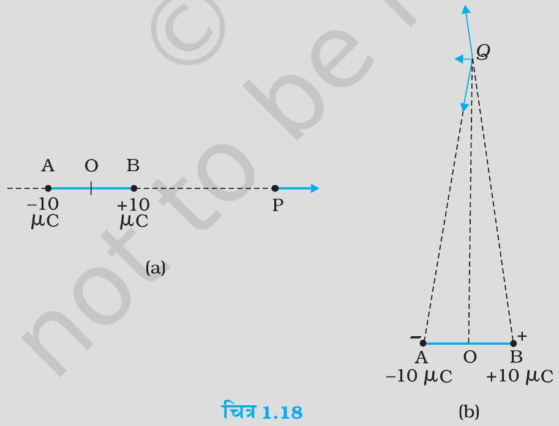
हल : (a) बिंदु P पर आवेश $+10 \mu \mathrm{C}$ के कारण क्षेत्र

[^4]$=\frac{10^{-5} \mathrm{C}}{4 \pi\left(8.854 \times 10^{-12} \mathrm{C}^{2} \mathrm{~N}^{-1} \mathrm{~m}^{-2}\right)} \times \frac{1}{(15-0.25)^{2} \times 10^{-4} \mathrm{~m}^{2}}$
$=4.13 \times 10^{6} \mathrm{~N} \mathrm{C}^{-1} \mathrm{BP}$ के अनुदिश
बिंदु P पर आवेश $-10 \mu \mathrm{C}$ के कारण क्षेत्र
$$
\begin{aligned}
& =\frac{10^{-5} \mathrm{C}}{4 \pi\left(8.854 \times 10^{-12} \mathrm{C}^{2} \mathrm{~N}^{-1} \mathrm{~m}^{-2}\right)} \times \frac{1}{(15+0.25)^{2} \times 10^{-4} \mathrm{~m}^{2}} \\
& =3.86 \times 10^{6} \mathrm{~N} \mathrm{C}^{-1} \mathrm{PA} \text { के अनुदिश }
\end{aligned}
$$
A तथा B पर स्थित दो आवेशों के कारण P पर परिणामी विद्युत क्षेत्र $=2.7 \times 10^{5} \mathrm{~N} \mathrm{C}^{-1}$ BP के अनुदिश है।
इस उदाहरण में अनुपात $O P / O B$ काफी अधिक $(=60)$ है। अतः, किसी द्विध्रुव के अक्ष पर अत्यधिक दूरी पर स्थित किसी बिंदु पर विद्युत क्षेत्र ज्ञात करने के लिए सीधे ही सूत्र के उपयोग द्वारा हम इसी के सन्निकट परिणाम की आशा कर सकते हैं। $2 a$ पृथकन के $\pm q$ आवेशों से बने द्विध्रुव के लिए द्विध्रुव के अक्ष के केंद्र से $r$ दूरी पर विद्युत क्षेत्र का परिमाण
$$
E=\frac{2 p}{4 \pi \varepsilon_{0} r^{3}} \quad(r / a \gg 1)
$$
यहाँ $p=2 a q$ द्विध्रुव आघूर्ण का परिमाण है।
द्विध्रुव अक्ष पर विद्युत क्षेत्र को दिशा सदैव द्विध्रुव आघूर्ण सदिश के अनुदिश (अर्थात $-q$ से $q$ की ओर) होती है। यहाँ, $p=10^{-5} \mathrm{C} \times 5 \times 10^{-3} \mathrm{~m}=5 \times 10^{-8} \mathrm{C} \mathrm{m}$ अतः
$$
E=\frac{2 \times 5 \times 10^{-8} \mathrm{Cm}}{4 \pi\left(8.854 \times 10^{-12} \mathrm{C}^{2} \mathrm{~N}^{-1} \mathrm{~m}^{-2}\right)} \times \frac{1}{(15)^{3} \times 10^{-6} \mathrm{~m}^{3}}=2.6 \times 10^{5} \mathrm{~N} \mathrm{C}^{-1}
$$
द्विध्रुव आघूर्ण की दिशा AB के अनुदिश है, तथा यह परिणाम पूर्व परिणाम के काफी निकट है। (b) बिंदु B पर स्थित $+10 \mu \mathrm{C}$ आवेश के कारण बिंदु Q पर विद्युत क्षेत्र
$$
\begin{aligned}
& =\frac{10^{-5} \mathrm{C}}{4 \pi\left(8.854 \times 10^{-12} \mathrm{C}^{2} \mathrm{~N}^{-1} \mathrm{~m}^{-2}\right)} \times \frac{1}{\left[15^{2}+(0.25)^{2}\right] \times 10^{-4} \mathrm{~m}^{2}} \\
& =3.99 \times 10^{6} \mathrm{~N} \mathrm{C}^{-1} \mathrm{BQ} \text { के अनुदिश }
\end{aligned}
$$
बिंदु A पर स्थित $-10 \mu \mathrm{C}$ आवेश के कारण Q पर विद्युत क्षेत्र
$$
\begin{aligned}
& =\frac{10^{-5} \mathrm{C}}{4 \pi\left(8.854 \times 10^{-12} \mathrm{C}^{2} \mathrm{~N}^{-1} \mathrm{~m}^{-2}\right)} \times \frac{1}{\left[15^{2}+(0.25)^{2}\right] \times 10^{-4} \mathrm{~m}^{2}} \\
& =3.99 \times 10^{6} \mathrm{~N} \mathrm{C}^{-1} \mathrm{QA} \text { के अनुदिश }
\end{aligned}
$$
स्पष्ट है कि इन दो समान परिमाण के बलों के OQ दिशा के अनुदिश घटक एक-दूसरे को निरस्त करते हैं परंतु BA के समांतर दिशा के अनुदिश घटक संयोजित हो जाते हैं। अतः A तथा B पर स्थित दो आवेशों के कारण $Q$ पर परिणामी विद्युत क्षेत्र
$$
\begin{aligned}
& =2 \times \frac{0.25}{\sqrt{15^{2}+(0.25)^{2}}} \times 3.99 \times 10^{6} \mathrm{~N} \mathrm{C}^{-1} \mathrm{BA} \text { के अनुदिश } \\
& =1.33 \times 10^{5} \mathrm{~N} \mathrm{C}^{-1} \mathrm{BA} \text { के अनुदिश }
\end{aligned}
$$
(a) की ही भाँति द्विध्रुव के अक्ष के अभिलंबवत किसी बिंदु पर द्विध्रुव विद्युत क्षेत्र के लिए सीधे ही सूत्र के उपयोग द्वारा हम इसी परिणाम की अपेक्षा कर सकते हैं-

## वैद्युत आवेश तथा क्षेत्र

$$
\begin{aligned}
& E=\frac{p}{4 \pi \varepsilon_{o} r^{3}} \quad(r / a \gg 1) \\
= & \frac{5 \times 10^{-8} \mathrm{Cm}}{4 \pi\left(8.854 \times 10^{-12} \mathrm{C}^{2} \mathrm{~N}^{-1} \mathrm{~m}^{-2}\right)} \times \frac{1}{(15)^{3} \times 10^{-6} \mathrm{~m}^{3}} \\
= & 1.33 \times 10^{5} \mathrm{~N} \mathrm{C}^{-1} .
\end{aligned}
$$

इस प्रकरण में विद्युत क्षेत्र की दिशा आघूर्ण सदिश की दिशा के विपरीत है। तथापि प्राप्त परिणाम पहले प्राप्त हुए परिणाम के अनुरूप हैं।

## $1.11$ एकसमान बाह्य क्षेत्र में द्विध्रुव

चित्र $1.19$ में दर्शाए अनुसार एकसमान विद्युत क्षेत्र $\mathbf{E}$ में रखे द्विध्रुव आघूर्ण $\mathbf{p}$ के स्थायी द्विध्रुव (स्थायी द्विध्रुव से हमारा तात्पर्य यह है कि $\mathbf{p}$ का $\mathbf{E}$ से स्वतंत्र अस्तित्व है; यह $\mathbf{E}$ द्वारा प्रेरित नहीं हुआ है।) पर विचार कीजिए।

यहाँ आवेश $q$ पर $q \mathbf{E}$ तथा $-q$ पर $-q \mathbf{E}$ बल लग रहे हैं। चूँकि $\mathbf{E}$ एकसमान है अतः द्विध्रुव पर नेट बल शून्य है। परंतु आवेशों में पृथकन है, अतः बल भिन्न बिंदु पर लगे हैं, जिसके परिणामस्वरूप द्विध्रुव पर बल आघूर्ण कार्य करता है। जब नेट बल शून्य है तो बल आघूर्ण (बल युग्म) मूल बिंदु पर निर्भर नहीं होता। इसका परिमाण प्रत्येक बल के परिमाण तथा बलयुग्म की भुजा (दो प्रतिसमांतर बलों के बीच लंबवत दूरी) के गुणनफल के बराबर होता है।

बल आघूर्ण का परिमाण $=q E \times 2 a \sin \theta$

$$
=2 q a E \sin \theta
$$

इसकी दिशा कागज़ के तल के अभिलंबवत इससे बाहर की ओर है।
$\mathbf{p} \times \mathbf{E}$ का परिमाण भी $p \in \sin \theta$ है तथा इसकी दिशा कागज़ के पृष्ठ के अभिलंबवत बाहर की ओर है। अतः

$$
\tau=\mathbf{p} \times \mathbf{E}
$$

यह बल आघूर्ण द्विध्रुव को क्षेत्र $\mathbf{E}$ के साथ संरेखित करने की प्रवृत्ति रखेगा। जब p क्षेत्र E के साथ संरेखित हो जाता है तो बल आघूर्ण शून्य होता है।

जब क्षेत्र एकसमान नहीं होता तब क्या होता है? स्पष्ट है, उस प्रकरण में नेट बल शून्येतर हो सकता है। इसके अतिरिक्त, व्यापक रूप से निकाय पर पहले की ही भाँति एक बल आघूर्ण कार्य करेगा। यहाँ व्यापक प्रकरण अंतर्ग्रस्त है, अतः आइए ऐसी सरल स्थिति पर विचार करते हैं जिसमें $\mathbf{p}$ क्षेत्र $\mathbf{~ e}$ के समांतर अथवा प्रतिसमांतर है। दोनों ही प्रकरणों में नेट बल आघूर्ण तो शून्य होता है परंतु यदि $\mathbf{E}$ एकसमान नहीं है तो द्विध्रुव पर एक नेट बल लगता है।

चित्र $1.20$ स्वतः स्पष्टीकरण करता है। इसे आसानी से देखा जा सकता है कि जब p क्षेत्र $\mathbf{E}$ के समांतर है तो द्विध्रुव पर बढ़ते क्षेत्र की दिशा में एक नेट बल कार्य करता है। जब $\mathbf{p}$ क्षेत्र के $\mathbf{E}$ प्रतिसमांतर होता है तो द्विध्रुव पर घटते क्षेत्र की दिशा में एक नेट बल कार्य करता है। व्यापक रूप में, बल $\mathbf{E}$ के सापेक्ष $\mathbf{p}$ के दिक्विन्यास पर निर्भर करता है।

इससे हमारा ध्यान घर्षण विद्युत के सामान्य प्रेक्षणों पर जाता है। शुष्क बालों में फेरी गई कंघी कागज़ के छोटे टुकड़ों को आकर्षित करती है। जैसाकि हम जानते हैं कि कंघी घर्षण द्वारा आवेश अर्जित करती है। परंतु कागज़ आवेशित नहीं

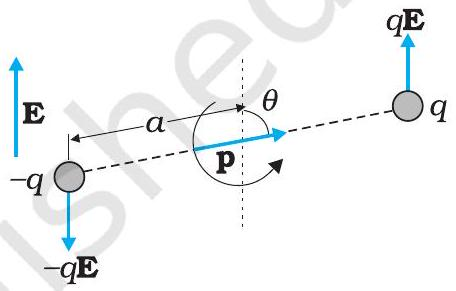
चित्र $1.19$ एकसमान विद्युत क्षेत्र में द्विध्रुव।

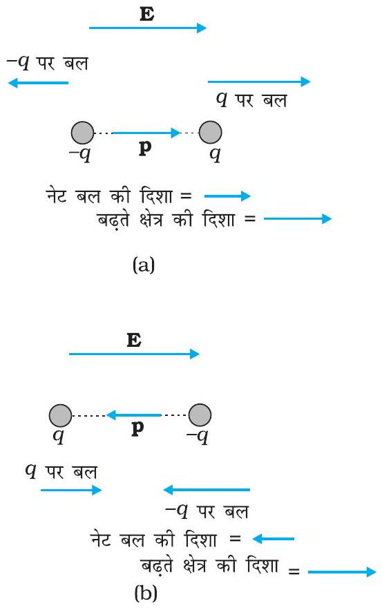
चित्र $1.20$ द्विध्रुव पर वैद्युत बल (a) $p$ क्षेत्र $\mathbf{E}$ के समांतर (b) $\mathbf{p}$ क्षेत्र $\mathbf{E}$ के प्रतिसमांतर।

है तो फिर इस आकर्षक बल का स्पष्टीकरण कैसे करें? पिछली चर्चा से संकेत

## - भौतिकी

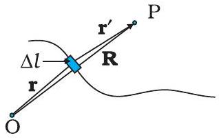
रैखिक आवेश $\Delta Q=\lambda \Delta l$

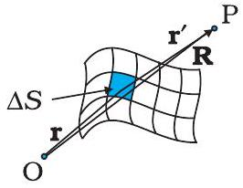
पृष्ठीय आवेश $\Delta Q=\sigma \Delta S$

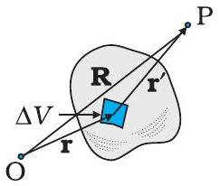
आयतनी आवेश $\Delta Q=\rho \Delta V$

चित्र $1.21$ रैखिक, पृष्ठीय, आयतनी घनत्वों की परिभाषा। प्रत्येक प्रकरण में चुने गए अवयव $(\Delta l, \Delta S, \Delta V)$ स्थूलदर्शीय स्तर पर छोटे हैं परंतु इनमें सूक्ष्मदर्शीय स्तर के अवयवों की एक विशाल संख्या समाहित होती है।

पाकर हम कह सकते हैं कि आवेशित कंघी कागज़ के टुकड़ों को ध्रुवित कर देती है, अर्थात कागज़ के टुकड़ों में क्षेत्र की दिशा में नेट द्विध्रुव आघूर्ण प्रेरित कर देती है। इसके अतिरिक्त कंघी के कारण विद्युत क्षेत्र एकसमान नहीं है। इस असमान क्षेत्र के कारण द्विध्रुव पर एक नेट बल कार्यरत हो जाता है। इस स्थिति में यह आसानी से देखा जा सकता है कि कागज़ के टुकड़े कंघी की दिशा में गति करते हैं।

## $1.12$ संतत आवेश वितरण

अब तक हमने विविक्त आवेशों $q_{1}, q_{2}, \ldots, q_{n}$ के आवेश विन्यास के विषय में चर्चा की है। इसका कारण यह है कि ऐसे विन्यासों के लिए गणितीय परिकलन सरल होते हैं जिनमें कलन (कैलकुलस) की आवश्यकता नहीं होती। साथ ही, बहुत से कार्यों के लिए विविक्त आवेशों के पदों में कार्य करना व्यावहारिक नहीं होता और हमें संतत आवेश वितरण की आवश्यकता होती है। उदाहरणार्थ, किसी आवेशित चालक के पृष्ठ पर सूक्ष्म आवेशित अवयवों की अवस्थितियों के पदों में आवेश वितरण का विशेष रूप से उल्लेख करना व्यावहारिक नहीं है। चालक के पृष्ठ पर किसी क्षेत्रफल अवयव $\Delta \mathrm{S}$ (जो स्थूल स्तर पर बहुत छोटा परंतु इलेक्ट्रॉनों की विशाल संख्या को सम्मिलित करने के लिए पर्याप्त है, देखिए चित्र 1.21) के विषय में विचार करके उस अवयव पर आवेश $\Delta Q$ का पृथक-पृथक उल्लेख करना अधिक उपयुक्त है। इसके बाद हम क्षेत्रफल अवयव पर पृष्ठीय आवेश घनत्व $\sigma$ की परिभाषा इस प्रकार करते हैं-

$$
\sigma=\frac{\Delta Q}{\Delta S}
$$

ऐसा हम चालक के पृष्ठ के विभिन्न बिंदुओं पर कर सकते हैं और इस प्रकार एक संतत फलन $\sigma$ (जिसे पृष्ठीय आवेश घनत्व कहते हैं) पर पहुँचते हैं। इस रूप में वर्णित पृष्ठीय आवेश घनत्व $\sigma$ आवेश की क्वांटमता तथा सूक्ष्मदर्शीय स्तर* पर आवेश की असंतता वितरण की उपेक्षा करता है। $\sigma$ स्थूलदर्शीय रूप में पृष्ठीय आवेश घनत्व है जो एक प्रकार से, सूक्ष्मदर्शीय रूप में बड़े परंतु स्थूलदर्शीय रूप में छोटे क्षेत्र अवयव $\Delta S$ पर सूक्ष्मदर्शीय आवेश घनत्व है। $\sigma$ का मात्रक $\mathrm{C} / \mathrm{m}^{2}$ है।

इसी प्रकार के दृष्टिकोण रैखिक आवेश वितरणों तथा आयतनी आवेश वितरणों पर भी लागू होते हैं। किसी तार का रैखिक आवेश घनत्व $\lambda$ की परिभाषा

$$
\lambda=\frac{\Delta Q}{\Delta l}
$$

द्वारा की जाती है। यहाँ $\Delta l$ सूक्ष्म स्तर पर तार का रैखिक अवयव है। तथापि सूक्ष्म आवेशित अवयवों की एक विशाल संख्या इसमें सम्मिलित है तथा $\Delta Q$ इस रैखिक अवयव में समाए आवेश हैं। $\lambda$ का मात्रक $\mathrm{C} / \mathrm{m}$ है। इसी प्रकार से आयतनी आवेश घनत्व (सरल शब्दों में जिसे आवेश घनत्व भी कहा जाता है) की परिभाषा भी

$$
\rho=\frac{\Delta Q}{\Delta V}
$$

द्वारा की जाती है। यहाँ $\Delta Q$ स्थूल रूप में छोटे आयतन अवयव $\Delta V$ में समाए वे आवेश हैं जो सूक्ष्म आवेशित अवयवों की विशाल संख्या को सम्मिलित करते हैं। $\rho$ का मात्रक $\mathrm{C} / \mathrm{m}^{3}$ है।

यहाँ संतत आवेश वितरण की हमारी धारणा यांत्रिकी में हमारे द्वारा अपनाई गई संतत संहति वितरण की धारणा के ही समान है। जब हम किसी द्रव के घनत्व का उल्लेख करते हैं तो उस

[^5]
## वैद्युत आवेश तथा क्षेत्र

समय वास्तव में हम उसके स्थूल घनत्व का ही उल्लेख कर रहे होते हैं। हम द्रव को एक संतत तरल मान लेते हैं तथा उसकी विविक्त आणविक रचना की उपेक्षा कर देते हैं।

विविक्त आवेशों के निकाय के कारण विद्युत क्षेत्र प्राप्त करने [समीकरण (1.10)] की ही भाँति लगभग इसी ढंग से संतत आवेश वितरण के कारण विद्युत क्षेत्र प्राप्त किया जा सकता है। मान लीजिए किसी दिक्स्थान में संतत आवेश वितरण का आवेश घनत्व $\rho$ है। कोई सुविधाजनक मूल बिंदु O चुनिए तथा मान लीजिए आवेश वितरण में किसी बिंदु का स्थिति सदिश $\mathbf{r}$ है। आवेश घनत्व $\rho$ एक बिंदु से दूसरे बिंदु पर भिन्न हो सकता है, अर्थात यह r का फलन है। आवेश वितरण को $\Delta V$ आमाप के छोटे आयतन अवयवों में विभाजित कीजिए। आयतन अवयव $\Delta V$ में आवेश का परिमाण $\rho \Delta V$ है।

अब स्थिति सदिश $\mathbf{R}$ के साथ किसी भी व्यापक बिंदु P (आवेश वितरण के भीतर अथवा बाहर) पर विचार कीजिए (चित्र 1.21)। कूलॉम नियम द्वारा आवेश $\rho \Delta V$ के कारण विद्युत क्षेत्र

$$
\Delta \mathbf{E}=\frac{1}{4 \pi \varepsilon_{0}} \frac{\rho \Delta V}{r^{\prime 2}} \hat{\mathbf{r}}^{\prime}
$$

यहाँ $r^{\prime}$ आवेश अवयव तथा P के बीच की दूरी है, तथा $\hat{\mathbf{r}}^{\prime}$ आवेश अवयव से P की दिशा में एकांक सदिश है। अध्यारोपण सिद्धांत द्वारा आवेश वितरण के कारण कुल विद्युत क्षेत्र विभिन्न आयतन-अवयवों के कारण विद्युत क्षेत्रों का योग करने पर प्राप्त होता है।

$$
\mathbf{E} \cong \frac{1}{4 \pi \varepsilon_{0}} \sum_{\text {सभो } \Delta V} \frac{\rho \Delta V}{r^{\prime 2}} \hat{\mathbf{r}}^{\prime}
$$

ध्यान दीजिए $\rho, r^{\prime}, \hat{\mathbf{r}}^{\prime}$ सभी के मान एक बिंदु से दूसरे पर परिवर्तित हो सकते हैं। यथार्थ गणितीय विधि में हमें $\Delta V \rightarrow 0$ लेना चाहिए और फिर यह योग एक समाकल बन जाता है। परंतु सरलता की दृष्टि से इस चर्चा को हम यही छोड़ रहे हैं। संक्षेप में कूलॉम नियम तथा अध्यारोपण सिद्धांत के उपयोग द्वारा किसी भी आवेश वितरण के लिए चाहे वह विविक्त हो अथवा संतत, अथवा अंशतः विविक्त और अंशतः संतत हो, विद्युत क्षेत्र ज्ञात किया जा सकता है।

## $1.13$ गाउस नियम

वैद्युत फ्लक्स की अवधारणा के सरल अनुप्रयोग के रूप में आइए किसी $r$ त्रिज्या के ऐसे गोले जिसके केंद्र पर कोई बिंदु आवेश $q$ परिबद्ध है, से गुजरने वाले कुल फ्लक्स पर विचार करें। चित्र $1.22$ में दर्शाए अनुसार इस गोले को छोटे क्षेत्रफल अवयवों में विभाजित करते हैं।

क्षेत्रफल अवयव $\Delta \mathbf{S}$ से गुजरने वाला फ्लक्स

$$
\Delta \varphi=\mathbf{E} \cdot \Delta \mathbf{S}=\frac{q}{4 \pi \varepsilon_{0} r^{2}} \hat{\mathbf{r}} \cdot \Delta \mathbf{S}
$$

यहाँ हमने एकल आवेश $q$ के कारण विद्युत क्षेत्र के लिए कूलॉम नियम का उपयोग किया है। एकांक सदिश $\hat{\mathbf{r}}$ केंद्र से क्षेत्र अवयव की ओर ध्रुवांतर रेखा के अनुदिश है। अब, चूँकि गोले के पृष्ठ के किसी भी बिंदु पर अभिलंब उस बिंदु पर ध्रुवांतर रेखा के अनुदिश होता है, क्षेत्र अवयव $\Delta \mathbf{S}$ तथा $\hat{\mathbf{r}}$ दोनों एक ही दिशा में होते हैं। इसीलिए,

$$
\Delta \varphi=\frac{q}{4 \pi \varepsilon_{0} r^{2}} \Delta S
$$

चूँकि एकांक सदिश $\mathbf{r}$ का परिमाण $1$ है।
गोले से गुजरने वाला कुल फ्लस्क सभी क्षेत्र-अवयवों से गुजरने वाले फ्लक्सों का योग करने

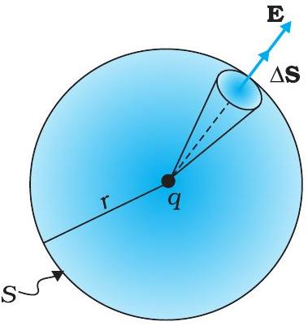
चित्र $1.22$ उस गोले से गुजरने वाला फ्लक्स जिसके केंद्र पर बिंदु आवेश $q$ परिबद्ध है।

पर प्राप्त होता है

## - भौतिकी

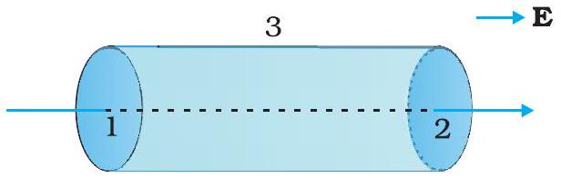
चित्र $1.23$ सिलिंडर के पृष्ठ से गुजरने वाले एकसमान विद्युत क्षेत्र के फ्लक्स का परिकलन।

$$
\phi=\sum_{\text {सभी } \Delta S} \frac{q}{4 \pi \varepsilon_{o} r^{2}} \Delta S
$$

चूँकि गोले का प्रत्येक क्षेत्र अवयव आवेश से समान दूरी $r$ पर है, अतः

$$
\phi=\frac{q}{4 \pi \varepsilon_{o} r^{2}} \sum_{\text {सभी } \Delta S} \Delta S=\frac{q}{4 \pi \varepsilon_{o} r^{2}} S
$$

अब, चूँकि गोले का कुल पृष्ठीय क्षेत्र $S=4 \pi r^{2}$ है, अतः

$$
\phi=\frac{q}{4 \pi \varepsilon_{o} r^{2}} \times 4 \pi r^{2}=\frac{q}{\varepsilon_{o}}
$$

समीकरण (1.30) स्थिरवैद्युतिकी के व्यापक परिणाम, जिसे गाउस नियम कहते हैं, का एक सरल दृष्टांत है। हम बिना उपपत्ति के गाउस नियम का इस प्रकार उल्लेख करते हैं-

किसी बंद पृष्ठ $S$ से गुजरने वाला वैद्युत फ्लक्स

$$
=q / \varepsilon_{0}
$$

यहाँ $q$ पृष्ठ $S$ द्वारा परिबद्ध कुल आवेश है।
इस नियम से यह उपलक्षित होता है कि यदि किसी बंद पृष्ठ द्वारा कोई आवेश परिबद्ध नहीं किया गया है तो उस पृष्ठ से गुजरने वाला कुल फ्लक्स शून्य होता है। इसे हम चित्र $1.23$ की सरल अवस्थिति में सुस्पष्ट देख सकते हैं।

यहाँ विद्युत क्षेत्र एकसमान है तथा हम एक ऐसे बंद बेलनाकार पृष्ठ के विषय में विचार कर रहे हैं जिसमें बेलन का अक्ष एकसमान क्षेत्र $\mathbf{E}$ के समांतर है। इसके पृष्ठ से गुजरने वाला कुल फ्लक्स $\phi$ है। $\phi=\phi_{1}+\phi_{2}+\phi_{3}$ यहाँ $\phi_{1}$ तथा $\phi_{2}$ सिलिंडर के पृष्ठ $1$ तथा $2$ (वृत्ताकार अनुप्रस्थ परिच्छेद क) से गुजरने वाले फ्लक्स को निरूपित करते हैं तथा $\phi_{3}$ बंद पृष्ठ के वक्रित सिलिंडरी भाग से गुजरने वाले फ्लक्स को निरूपित करता है। चूँकि पृष्ठ $3$ के प्रत्येक बिंदु पर अभिलंब $\mathbf{E}$ के लंबवत है, अत: फ्लक्स की परिभाषा के अनुसार $\phi_{3}=0$ । इसके अतिरिक्त पृष्ठ $2$ पर बहिर्मुखी अभिलंब $\mathbf{E}$ के अनुदिश है तथा पृष्ठ $1$ पर बहिर्मुखी अभिलंब $\mathbf{E}$ की दिशा के विपरीत है। अतः

$$
\begin{aligned}
& \phi_{1}=-E S_{1}, \quad \phi_{2}=+E S_{2} \\
& S_{1}=S_{2}=S
\end{aligned}
$$

यहाँ $S$ वृत्ताकार अनुप्रस्थ काट का क्षेत्रफल है। इस प्रकार कुल फ्लक्स शून्य है, जैसा कि गाउस नियम से संभावित था। इस प्रकार जब आप पाएँ कि एक बंद पृष्ठ के अंदर नेट वैद्युत फ्लक्स शून्य है तो हम इस परिणाम पर पहुँचते हैं कि बंद पृष्ठ के अंतर्विष्ट कुल आवेश शून्य है।

गाउस नियम समीकरण (1.31) का अत्यधिक महत्व इस कारण से भी है कि यह व्यापक रूप से सत्य है, तथा केवल उन्हीं सरल प्रकरणों जिन पर हमने ऊपर विचार किया था, लागू नहीं होता है, वरन् सभी प्रकरणों में इसका प्रयोग किया जा सकता है। इस नियम के बारे में, आइए कुछ महत्वपूर्ण तथ्यों पर ध्यान दें-

(i) गाउस नियम प्रत्येक बंद पृष्ठ, चाहे उसकी आकृति तथा आमाप कुछ भी हो, के लिए सत्य है।
(ii) गाउस नियम समीकरण (1.31) के दक्षिण पक्ष के पद $q$ में पृष्ठ द्वारा परिबद्ध सभी आवेशों का योग सम्मिलित है। ये आवेश पृष्ठ के भीतर कहीं भी अवस्थित हो सकते हैं।
(iii) उन परिस्थितियों जिनमें ऐसे पृष्ठ का चयन किया जाता है कि कुछ आवेश पृष्ठ के भीतर तथा कुछ पृष्ठ के बाहर होते हैं, विद्युत क्षेत्र [जिसका फ्लक्स समीकरण (1.31) के वाम पक्ष में दृष्टिगोचर होता है] $S$ के भीतर तथा बाहर स्थित सभी आवेशों के कारण है। तथापि, गाउस

## वैद्युत आवेश तथा क्षेत्र

नियम के समीकरण के दक्षिण पक्ष में पद $q$ केवल $S$ के भीतर के कुल आवेशों को निरूपित करता है।

(iv) गाउस नियम के अनुप्रयोग के लिए चयन किए जाने वाले पृष्ठ को गाउसीय पृष्ठ कहते हैं। आप किसी भी गाउसीय पृष्ठ का चयन करके गाउस नियम लागू कर सकते हैं। तथापि, सावधान रहिए गाउसीय पृष्ठ को किसी भी विविक्त आवेश से नहीं गुजरना चाहिए। इसका कारण यह है कि विविक्त आवेशों के निकाय के कारण विद्युत क्षेत्र को किसी भी आवेश की अवस्थिति पर भलीभाँति परिभाषित नहीं किया गया है। (जैसे ही आप किसी आवेश के निकट जाते हैं, विद्युत क्षेत्र सभी मर्यादाओं से बाहर विकसित होता जाता है) परंतु गाउसीय पृष्ठ संतत आवेश वितरण से गुजर सकता है।
(v) जब निकाय में कुछ सममिति होती है तो विद्युत क्षेत्र के परिकलन को अधिक आसान बनाने के लिए गाउस नियम प्रायः उपयोगी होता है। उचित गाउसीय पृष्ठ का चयन इसे सुविधाजनक बना देता है।
(vi) अंत में, गाउस नियम कूलॉम नियम में अंतर्निहित दूरी पर व्युत्क्रम वर्ग निर्भरता पर आधारित है। गाउस नियम का कोई उल्लंघन व्युत्क्रम वर्ग नियम से विचलन को संकेत करेगा।

उदाहरण $1.10$ चित्र $1.24$ में विद्युत क्षेत्र अवयव $E_{x}=\alpha x^{1 / 2}, E_{y}=E_{z}=0$ है, जिसमें $\alpha=800 \mathrm{~N} / \mathrm{C} \mathrm{m}^{1 / 2}$ है। (a) घन से गुजरने वाला फ्लक्स, तथा (b) घन के भीतर आवेश परिकलित कीजिए। $a=0.1 \mathrm{~m}$ मानिए।

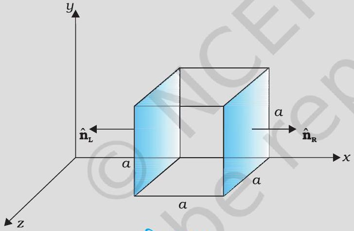
चित्र $1.24$

हल

(a) चूँकि विद्युत क्षेत्र का केवल $x$ अवयव ही है, $x$ दिशा के लंबवत फलकों के लिए, $\mathbf{E}$ तथा $\Delta \mathbf{S}$ के बीच के कोण $\pm \pi / 2$ हैं। अतः फ्लक्स $\phi=\mathbf{E} . \Delta \mathbf{S}$ घन के केवल दो छायांकित फलकों को छोड़कर शेष सभी फलकों के लिए पृथक-पृथक रूप से शून्य है। अब, बाएँ फलक पर विद्युत क्षेत्र का परिमाण
$$
E_{L}=\alpha x^{1 / 2}=\alpha a^{1 / 2}
$$
(चूँकि बाएँ फलक पर $x=a$ )
दाएँ फलक पर विद्युत क्षेत्र का परिमाण
$$
E_{R}=\alpha x^{1 / 2}=\alpha(2 a)^{1 / 2}
$$
(चूँकि दाएँ फलक पर $x=2 a$ )
इनके तद्नुरूपी फ्लक्स हैं
$$
\begin{aligned}
\phi_{L} & =\mathbf{E}_{L} \cdot \Delta \mathbf{S}=\Delta S \mathbf{E}_{L} \cdot \hat{\mathbf{n}}_{L}=E_{L} \Delta S \cos \theta=-E_{L} \Delta S, \text { चूँकि } \theta=180^{\circ} \\
& =-E_{L} a^{2} \\
\phi_{R} & =\mathbf{E}_{R} \cdot \Delta \mathbf{S}=E_{R} \Delta S \cos \theta=E_{R} \Delta S, \text { चूँकि } \theta=0^{\circ} \\
& =E_{R} a^{2}
\end{aligned}
$$
घन से गुजरने वाला नेट फ्लक्स

## - भौतिकी

$$
\begin{aligned}
& =\phi_{R}+\phi_{L}=E_{R} a^{2}-E_{L} a^{2}=a^{2}\left(E_{R}-E_{L}\right)=\alpha a^{2}\left[(2 a)^{1 / 2}-a^{1 / 2}\right] \\
& =\alpha a^{5 / 2}(\sqrt{2}-1) \\
& =800(0.1)^{5 / 2}(\sqrt{2}-1) \\
& =1.05 \mathrm{~N} \mathrm{~m}^{2} \mathrm{C}^{-1}
\end{aligned}
$$

(b) हम घन के भीतर कुल आवेश $q$ को ज्ञात करने के लिए गाउस नियम का उपयोग कर सकते हैं। हम जानते हैं कि $\phi=q / \varepsilon_{o}$ अथवा $q=\phi \varepsilon_{o}$ इसलिए

$$
q=1.05 \times 8.854 \times 10^{-12} \mathrm{C}=9.27 \times 10^{-12} \mathrm{C}
$$

उदाहरण $1.11$ कोई विद्युत क्षेत्र धनात्मक $x$ के लिए, धनात्मक $x$ दिशा में एकसमान है तथा उसी परिमाण के साथ परंतु ऋणात्मक $x$ के लिए, ऋणात्मक $x$ दिशा में एकसमान है। यह दिया गया है कि $\mathbf{E}=200 \hat{\mathbf{i}} \mathrm{~N} / \mathrm{C}$ जबकि $x>0$ तथा $\mathbf{E}=-200 \hat{\mathbf{i}} \mathrm{~N} / \mathrm{C}$, जबकि $x<0$ है। $20 \mathrm{~cm}$ लंबे $5 \mathrm{~cm}$ त्रिज्या के किसी लंबवृत्तीय सिलिंडर का केंद्र मूल बिंदु पर तथा इस अक्ष $x$ के इस प्रकार अनुदिश है कि इसका एक फलक चित्र $1.25$ में दर्शाए अनुसार $x=+10 \mathrm{~cm}$ तथा दूसरा फलक $x=-10 \mathrm{~cm}$ पर है। (a) प्रत्येक चपटे फलक से गुजरने वाला नेट बहिर्मुखी फ्लक्स कितना है?
(b) सिलिंडर के पाश्र्व से गुजरने वाला फ्लक्स कितना है? (c) सिलिंडर से गुजरने वाला नेट बहिर्मुखी फ्लक्स कितना है? (d) सिलिंडर के भीतर नेट आवेश कितना है?

हल

(a) चित्र में हम यह देखते हैं कि बाएँ फलक पर $\mathbf{E}$ तथा $\Delta \mathbf{S}$ समांतर हैं। इसलिए बहिर्मुखी फ्लक्स है
$$
\begin{aligned}
& \phi_{L}=\mathbf{E} \cdot \Delta \mathbf{S}=-200 \hat{\mathbf{i}} \Delta \mathbf{S} \\
& =+200 \Delta \mathrm{~S}, \text { चूँकि } \hat{\mathbf{i}} \Delta \mathbf{S}=-\Delta \mathrm{S} \\
& =+200 \times \pi(0.05)^{2}=+1.57 \mathrm{~N} \mathrm{~m}^{2} \mathrm{C}^{-1}
\end{aligned}
$$
दाएँ फलक पर $\mathbf{E}$ तथा $\Delta \mathbf{S}$ समांतर हैं, इसलिए
$$
\phi_{R}=\mathbf{E} \cdot \Delta \mathbf{S}=+1.57 \mathrm{~N} \mathrm{~m}^{2} \mathrm{C}^{-1}
$$
(b) सिलिंडर के पाश्र्व के किसी भी बिंदु पर $\mathbf{E}$ क्षेत्र अवयव $\Delta \mathbf{S}$ के लंबवत है, इसलिए $\mathbf{E} \cdot \Delta \mathbf{S}=0$ इसलिए सिलिंडर के पार्श्व के बाहर फ्लक्स शून्य है।
(c)सिलिंडर से होकर नेट बहिर्मुखी फ्लक्स

$$
\phi=(1.57+1.57+0)=3.14 \mathrm{~N} \mathrm{~m}^{2} \mathrm{C}^{-1}
$$

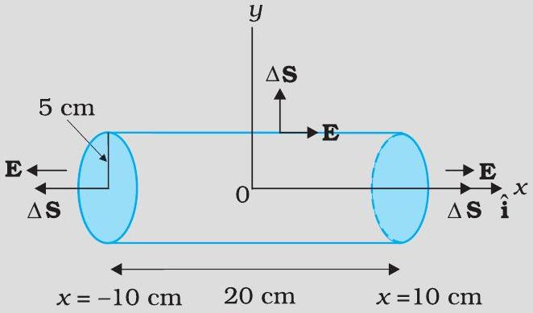
चित्र $1.25$
(d) सिलिंडर के भीतर नेट आवेश का मान गाउस नियम द्वारा ज्ञात किया जा सकता है जिससे हमें प्राप्त होता है
$$
\begin{aligned}
q & =\varepsilon_{0} \phi \\
& =3.14 \times 8.854 \times 10^{-12} \mathrm{C} \\
& =2.78 \times 10^{-11} \mathrm{C}
\end{aligned}
$$

## वैद्युत आवेश तथा क्षेत्र

## $1.14$ गाउस नियम के अनुप्रयोग

जैसी कि हम ऊपर चर्चा कर चुके हैं कि किसी व्यापक आवेश वितरण के कारण विद्युत क्षेत्र समीकरण (1.27) द्वारा व्यक्त किया जाता है। कुछ विशिष्ट प्रकरणों को छोड़कर, व्यवहार में, इस समीकरण में सम्मिलित संकलन (अथवा समाकलन) की प्रक्रिया दिक्स्थान के सभी बिंदुओं पर विद्युत क्षेत्र प्राप्त करने के लिए कार्यान्वित नहीं की जा सकती। तथापि, कुछ सममित आवेश विन्यासों के लिए गाउस नियम का उपयोग करके विद्युत क्षेत्र को सरल ढंग से प्राप्त करना संभव है। कुछ उदाहरणों से इसे आसानी से समझा जा सकता है।

### 1.14.1 अनंत लंबाई के एकसमान आवेशित सीधे तार के कारण विद्युत क्षेत्र

किसी अनंत लंबाई के एकसमान रैखिक आवेश घनत्व $\lambda$ के सीधे पतले तार पर विचार कीजिए। स्पष्ट रूप से यह तार एक सममित अक्ष है। मान लीजिए हम O से P की दिशा में ध्रुवांतर (त्रिज्य सदिश) लेकर इसे तार के चारों ओर घूर्णन कराते हैं। इस प्रकार प्राप्त बिंदु $\mathrm{P}, \mathrm{P}^{\prime}, \mathrm{P}^{\prime \prime}$ आवेशित तार के संदर्भ में संपूर्ण रूप से तुल्य हैं। इससे यह उपलक्षित होता है कि इन बिंदुओं पर विद्युत क्षेत्र का परिमाण समान होना चाहिए। प्रत्येक बिंदु पर विद्युत क्षेत्र की दिशा अरीय (त्रिज्यीय) होनी चाहिए (यदि $\lambda>0$, तो बहिर्मुखी तथा यदि $\lambda<0$, तो अंतर्मुखी)। यह चित्र $1.26$ से स्पष्ट है।

दर्शाए अनुसार तार के रैखिक अवयवों $\mathrm{P}_{1}$ तथा $\mathrm{P}_{2}$ के युगल पर विचार करें। इस युगल के दो अवयवों द्वारा उत्पन्न विद्युत क्षेत्रों को संकलित करने पर प्राप्त परिणामी विद्युत क्षेत्र अरीय होता है [ध्रुवांतर के अभिलंबवत अवयव एक-दूसरे को निरस्त कर देते हैं]। यह इस प्रकार के सभी युगलों के लिए सत्य है। अतः किसी भी बिंदु P पर कुल विद्युत क्षेत्र अरीय है। अंत में, चूँकि तार अनंत है, तार की लंबाई के अनुदिश विद्युत क्षेत्र बिंदु P की स्थिति पर निर्भर नहीं करता। संक्षेप में, तार को अभिलंबवत काटने वाले तल में विद्युत क्षेत्र हर स्थान पर अरीय है तथा इसका परिमाण केवल त्रिज्य दूरी $r$ पर निर्भर करता है।

विद्युत क्षेत्र परिकलित करने के लिए चित्र 1.26(b) में दर्शाए अनुसार किसी बेलनाकार गाउसीय पृष्ठ की कल्पना कीजिए। चूँकि विद्युत क्षेत्र हर स्थान पर अरीय है, बेलनाकार गाउसीय पृष्ठ के दो सिरों से गुजरने वाला फ्लक्स शून्य है। पृष्ठ के बेलनाकार भाग पर विद्युत क्षेत्र E पृष्ठ के हर बिंदु पर अभिलंबवत है तथा केवल $r$ पर निर्भर होने के कारण इसका परिमाण नियत है। वक्रित भाग का पृष्ठीय क्षेत्रफल $2 \pi r l$ है,

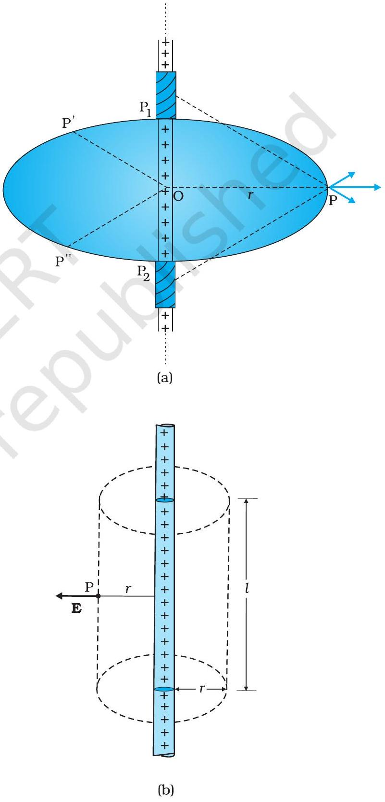
चित्र $1.26$ (a) अनंत लंबाई के एकसमान आवेशित पतले सीधे तार के कारण विद्युत क्षेत्र अरीय (त्रिज्यीय) होता है।
(b) एकसमान रैखिक आवेश घनत्व के लंबे पतले तार के लिए गाउसीय पृष्ठ।

यहाँ $1$ सिलिंडर की लंबाई है।

गाउसीय पृष्ठ से गुज़रने वाला फ्लक्स
= पृष्ठ के वक्रित बेलनाकार भाग से गुज़रने वाला फ्लक्स
$=E \times 2 \pi r l$
पृष्ठ में $\lambda l$ के बराबर आवेश सम्मिलित है। तब गाउस नियम से प्राप्त होता है
$E \times 2 \pi r l=\lambda l / \varepsilon_{0}$
अर्थात $\quad E=\frac{\lambda}{2 \pi \varepsilon_{0} r}$
सदिश रूप में किसी भी बिंदु पर विद्युत क्षेत्र $\mathbf{E}$ इस प्रकार व्यक्त किया जाता है

$$
\mathbf{E}=\frac{\lambda}{2 \pi \varepsilon_{0} r} \hat{\mathbf{n}}
$$

यहाँ $\hat{\mathbf{n}}$ तार के किसी बिंदु के अभिलंबवत गुजरने वाले तल में त्रिज्य एकांक सदिश है। जब $\lambda$ धनात्मक होता है तो $\mathbf{E}$ बहिर्मुखी होता है और जब $\lambda$ ॠणात्मक होता है, यह अंतर्मुखी होता है।

ध्यान दीजिए, जब हम सदिश $\mathbf{A}$ को एकांक सदिश से गुणित अदिश के रूप में, अर्थात $\mathbf{A}=A \hat{\mathbf{a}}$ के रूप में लिखते हैं तो अदिश $A$ एक बीजगणितीय संख्या होती है। यह धनात्मक भी हो सकती है और ऋणात्मक भी। यदि $A>0$ है तो $\mathbf{A}$ की दिशा एकांक सदिश $\hat{\mathbf{a}}$ के समान होगी तथा यदि $A<0$ है तो $\mathbf{A}$ की दिशा $\hat{\mathbf{a}}$ की दिशा के विपरीत होगी। जब हम ॠणेतर मानों तक सीमित रखना चाहते हैं तो हम प्रतीक $|\mathbf{A}|$ का उपयोग करते हैं तथा इसे $\mathbf{A}$ का माड्यूल्स (मापांक) कहते हैं। इस प्रकार $|\mathbf{A}| \geq 0$ होता है।

यह भी ध्यान दीजिए कि उपरोक्त चर्चा में यद्यपि पृष्ठ ( $\lambda l$ ) द्वारा परिबद्ध आवेश को ही केवल सम्मिलित किया गया था, परंतु विद्युत क्षेत्र $\mathbf{E}$ समस्त तार पर आवेश के कारण है। साथ ही यह कल्पना कर लेना कि तार की लंबाई अनंत है इस कल्पना के बिना हम विद्युत क्षेत्र $\mathbf{E}$ को बेलनाकार गाउसीय पृष्ठ के अभिलंबवत नहीं ले सकते। तथापि, लंबे तार के बेलनाकार भागों के चारों ओर जहाँ अंत्य प्रभाव (end effects) की उपेक्षा की जा सकती है, विद्युत क्षेत्र के लिए समीकरण (1.32) सन्निकटतः सही है।

## $1.14 .2$ एकसमान आवेशित अनंत समतल चादर के कारण विद्युत क्षेत्र

मान लीजिए किसी अनंत समतल चादर (चित्र 1.27) का एकसमान पृष्ठीय आवेश घनत्व $\sigma$ है। हम $x$-अक्ष को दिए गए तल के अभिलंबवत मानते हैं। सममिति के अनुसार विद्युत क्षेत्र $y$ तथा $z$ निर्देशांकों पर निर्भर नहीं करेगा तथा इसकी प्रत्येक बिंदु पर दिशा $x$-दिशा के समांतर होनी चाहिए।

हम गाउसीय पृष्ठ को चित्र में दर्शाए अनुसार $A$ अनुप्रस्थकाट

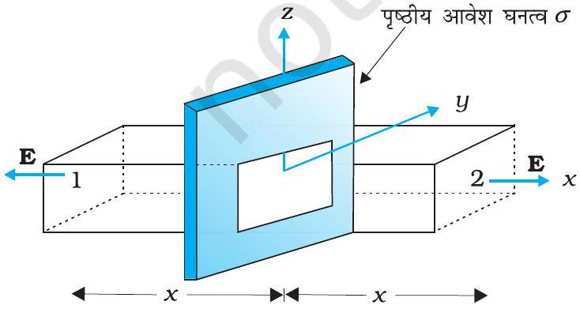
चित्र $1.27$ एकसमान आवेशित अनंत आवेश चादर के लिए गाउसीय पृष्ठ।

क्षेत्रफल के आयताकार समांतर षट्फलक जैसा ले सकते हैं (वैसे तो बेलनाकार पृष्ठ से भी यह कार्य हो सकता है)। जैसा चित्र से दृष्टिगोचर होता है, केवल दो फलक $1$ तथा $2$ ही फ्लक्स में योगदान देंगे; विद्युत क्षेत्र रेखाएँ अन्य फलकों के समांतर हैं और वे इसीलिए कुल फ्लक्स में योगदान नहीं देतीं।

पृष्ठ $1$ के अभिलंबवत एकांक सदिश $-x$ दिशा में है जबकि पृष्ठ $2$ के अभिलंबवत एकांक सदिश $+x$ दिशा में है। अतः, दोनों पृष्ठों से गुजरने वाले फ्लक्स $\mathbf{E .} \Delta \mathbf{S}$ बराबर हैं और संयोजित हो जाते हैं। इसीलिए गाउसीय पृष्ठ से गुजरने वाला नेट फ्लक्स $2 E A$ है। पृष्ठ द्वारा परिबद्ध आवेश $\sigma A$ है। इसीलिए गाउस नियम द्वारा हमें यह संबंध प्राप्त होता है

## वैद्युत आवेश तथा क्षेत्र

$$
\begin{aligned}
& 2 E A=\sigma A / \varepsilon_{0} \\
& \text { अथवा } E=\sigma / 2 \varepsilon_{0}
\end{aligned}
$$

सदिश रूप में

$$
\mathbf{E}=\frac{\sigma}{2 \varepsilon_{0}} \hat{\mathbf{n}}
$$

यहाँ $\hat{\mathbf{n}}$ तल के अभिलंबवत इससे दूर जाता हुआ एकांक सदिश है।
यदि $\sigma$ धनात्मक है तो $\mathbf{E}$ तल से बहिर्मुखी तथा यदि $\sigma$ ॠणात्मक है तो $\mathbf{E}$ तल से अंतर्मुखी होता है। ध्यान दीजिए गाउस नियम के अनुप्रयोग से हमें एक अतिरिक्त तथ्य यह प्राप्त होता है कि $E, x$ पर भी निर्भर नहीं है।

किसी परिमित बड़ी समतलीय चादर के लिए समीकरण (1.33), सिरों से दूर समतलीय चादर के मध्यवर्ती क्षेत्रों में सन्निकटतः सत्य है।

### 1.14.3 एकसमान आवेशित पतले गोलीय खोल के कारण विद्युत क्षेत्र

मान लीजिए $R$ त्रिज्या के पतले गोलीय खोल का एकसमान पृष्ठीय आवेश घनत्व $\sigma$ है (चित्र 1.28)। स्पष्ट रूप से इस स्थिति में गोलीय सममिति है। किसी बिंदु P पर चाहे वह भीतर है अथवा बाहर, विद्युत क्षेत्र केवल $r$ पर निर्भर कर सकता है (यहाँ $r$ खोल के केंद्र से उस बिंदु तक की त्रिज्य दूरी है।)तथा इस क्षेत्र को अरीय (अर्थात ध्रुवांतर के अनुदिश) होना चाहिए।

(i) खोल के बाहर विद्युत क्षेत्र-खोल के बाहर ध्रुवांतर $r$ के किसी बिंदु P पर विचार कीजिए। बिंदु P पर $\mathbf{E}$ का परिकलन करने के लिए हम केंद्र O तथा त्रिज्या $r$ के बिंदु P से गुजरने वाले गोले को गाउसीय पृष्ठ मानते हैं। दिए गए आवेश विन्यास के सापेक्ष इस गोले पर स्थित प्रत्येक बिंदु समतुल्य है। (गोलीय सममिति से हमारा यही अभिप्राय है।) इसीलिए गाउसीय पृष्ठ के प्रत्येक बिंदु पर विद्युत क्षेत्र का समान परिमाण E है तथा प्रत्येक बिंदु पर ध्रुवांतर के अनुदिश है। इस प्रकार प्रत्येक बिंदु पर $\mathbf{E}$ तथा $\Delta \mathbf{S}$ समांतर हैं तथा प्रत्येक अवयव से गुज़रने वाला फ्लक्स $E \Delta S$ है। सभी $\Delta \mathrm{S}$ का संकलन करने पर गाउसीय पृष्ठ से गुज़रने वाला फ्लक्स $E \times 4 \pi r^{2}$ है। परिबद्ध आवेश $\sigma \times 4 \pi R^{2}$ है। गाउस नियम से
$$
E \times 4 \pi r^{2}=\frac{\sigma}{\varepsilon_{0}} 4 \pi R^{2}
$$
अथवा $E=\frac{\sigma R^{2}}{\varepsilon_{0} r^{2}}=\frac{q}{4 \pi \varepsilon_{0} r^{2}}$

यहाँ $q=4 \pi R^{2} \sigma$ गोलीय खोल पर कुल आवेश है।

$$
\text { सदिश रूप में, } \mathbf{E}=\frac{q}{4 \pi \varepsilon_{0} r^{2}} \hat{\mathbf{r}}
$$

यदि $q>0$ है तो विद्युत क्षेत्र बहिर्मुखी होता है तथा यदि $q<0$ है तो विद्युत क्षेत्र
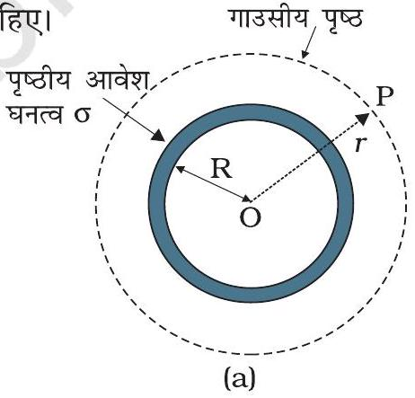

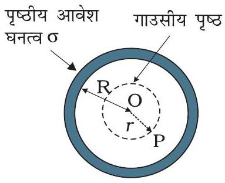
(b)

चित्र $\mathbf{1 . 2 8}$ किसी बिंदु के लिए जो (a) $r>R$, (b) $r<R$ पर है, गाउसीय पृष्ठ।
अंतर्मुखी होता है। तथापि, यह खोल के केंद्र O पर स्थित आवेश $q$ द्वारा उत्पन्न विद्युत क्षेत्र है। अत: खोल के बाहर स्थित बिंदुओं पर एकसमान आवेशित गोलीय खोल के कारण विद्युत क्षेत्र इस प्रकार का होता है, जैसे कि खोल का समस्त आवेश उसके केंद्र पर स्थित है।

(ii) खोल के भीतर विद्युत क्षेत्र-चित्र 1.28(b) में बिंदु P खोल के भीतर है। इस प्रकरण में भी गाउसीय पृष्ठ P से गुज़रने वाला वह गोला है जिसका केंद्र O है। पहले किए गए

## भौतिकी

परिकलनों की ही भाँति गाउसीय पृष्ठ से गुजरने वाला फ्लक्स $E \times 4 \pi r^{2}$ है। तथापि इस प्रकरण में, गाउसीय पृष्ठ में कोई आवेश परिबद्ध नहीं है। तब गाउस नियम के अनुसार $E \times 4 \pi r^{2}=0$
अर्थात $E=0 \quad(r<R)$
अर्थात एकसमान आवेशित पतले गोलीय खोल* के कारण उसके भीतर स्थित सभी बिंदुओं पर विद्युत क्षेत्र शून्य है। यह महत्वपूर्ण परिणाम गाउस नियम का प्रत्यक्ष निष्कर्ष है जो कूलॉम नियम से प्राप्त हुआ है। इस नियम का प्रायोगिक सत्यापन कूलॉम नियम में $1 / r^{2}$ की निर्भरता की पुष्टि करता है।

उदाहरण $1.12$ परमाणु के प्रारंभिक प्रतिरूप में यह माना गया था कि आवेश $Z e$ का बिंदु आमाप का धनात्मक नाभिक होता है जो त्रिज्या $R$ तक एकसमान घनत्व के ॠणावेश से घिरा हुआ है। परमाणु पूर्ण रूप में विद्युत उदासीन है। इस प्रतिरूप के लिए नाभिक से $r$ दूरी पर विद्युत क्षेत्र कितना है?

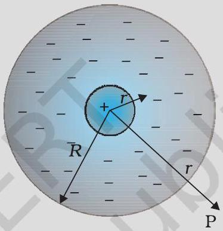
चित्र $1.29$ परमाणु का प्रारंभिक प्रतिरूप।

हल: चित्र $1.29$ में इस प्रतिरूप का आवेश वितरण दर्शाया गया है। चूँकि परमाणु उदासीन (नाभिक में आवेश $Z e+$ ॠणावेश) है, अतः $R$ त्रिज्या के एकसमान गोलीय आवेश वितरण में कुल ऋणात्मक आवेश $-Z e$ होना चाहिए। इससे हमें तुरंत ही ऋणात्मक आवेश घनत्व $\rho$ प्राप्त हो जाता है। चूँकि हमारे पास कुल शून्य आवेश होना चाहिए, अतः

$$
\frac{4 \pi R^{3}}{3} \rho=0-Z e
$$

अथवा $\rho=-\frac{3 Z e}{4 \pi R^{3}}$
नाभिक से $r$ दूरी पर स्थित बिंदु P पर विद्युत क्षेत्र $\mathbf{E}(\mathbf{r})$ ज्ञात करने के लिए हम गाउस नियम का उपयोग करते हैं। आवेश वितरण की गोलीय सममिति के कारण विद्युत क्षेत्र $\mathbf{E}(\mathbf{r})$ का परिणाम केवल त्रिज्य दूरी पर निर्भर करता है, यहाँ $\mathbf{r}$ की दिशा का कोई अर्थ नहीं होता। इसकी दिशा मूल बिंदु से P की ओर ध्रुवांतर $\mathbf{r}$ के अनुदिश (अथवा विपरीत) है। स्पष्ट रूप से इस प्रकरण में गाउसीय पृष्ठ एक गोलीय पृष्ठ है जिसका केंद्र नाभिक है। यहाँ हम दो स्थितियों $r<R$ तथा $r>R$ पर विचार करते हैं।

(i) $r<R$ : गोलीय पृष्ठ द्वारा परिबद्ध वैद्युत फ्लक्स
$$
\phi=E(r) \times 4 \pi r^{2}
$$

यहाँ $E(r), r$ पर विद्युत क्षेत्र का परिमाण है। इसका कारण यह है गोलीय गाउसीय पृष्ठ के किसी भी बिंदु पर विद्युत क्षेत्र की दिशा पृष्ठ के उस बिंदु पर अभिलंबवत होती है तथा इसका परिमाण पृष्ठ के सभी बिंदुओं पर समान होता है।

[^6]
## वैद्युत आवेश तथा क्षेत्र

यहाँ गाउसीय पृष्ठ द्वारा परिबद्ध आवेश $q$ धनात्मक नाभिकीय आवेश तथा $r$ त्रिज्या के गोले में विद्यमान ऋणात्मक आवेश है
अर्थात $q=Z e+\frac{4 \pi r^{3}}{3} \rho$
पहले प्राप्त आवेश घनत्व $\rho$ का मान प्रतिस्थापित करने पर हमें प्राप्त होता है।
$q=Z e-Z e \frac{r^{3}}{R^{3}}$
तब गाउस नियम से हमें प्राप्त होता है।
$E(r)=\frac{Z e}{4 \pi \varepsilon_{0}}\left(\frac{1}{r^{2}}-\frac{r}{R^{3}}\right) ; \quad r<R$
यहाँ विद्युत क्षेत्र त्रिज्यतः बहिर्मुखी निदर्शित है।

(ii) $r>R$ : इस प्रकरण में, चूँकि परमाणु उदासीन है, गोलीय गाउसीय पृष्ठ द्वारा परिबद्ध आवेश शून्य है। इस प्रकार, गाउस नियम से
$E(r) \times 4 \pi r^{2}=0$ अथवा $(r)=0 ; \quad r>R$
$r=R$, पर दोनों प्रकरणों से समान परिणाम, $E=0$ प्राप्त होता है।

## सारांश

1. विद्युत तथा चुंबकीय बल परमाणुओं, अणुओं तथा स्थूल द्रव्य के गुणधर्मों का निर्धारण करते हैं।
2. घर्षण विद्युत के सरल प्रयोगों के आधार पर यह निष्कर्ष निकाला जा सकता है कि प्रकृति में दो प्रकार के आवेश होते हैं। सजातीय आवेशों में प्रतिकर्षण तथा विजातीय आवेशों में आकर्षण होता है। परिपाटी के अनुसार, रेशम से रगड़ने पर काँच की छड़ पर धनावेश होता है; तथा फर से रगड़ने पर प्लास्टिक की छड़ पर ॠणावेश होता है।
3. चालक अपने में से होकर सरलता से वैद्युत आवेश की गति होने देते हैं जबकि विद्युतरोधी ऐसा नहीं करते। धातुओं में गतिशील आवेश इलेक्ट्रॉन होते हैं; वैद्युत अपघट्यों में धनायन तथा ऋणायन दोनों ही गति करते हैं।
4. वैद्युत आवेशों के तीन गुणधर्म होते हैं : क्वांटमीकरण, योज्यता तथा संरक्षण। वैद्युत आवेश के क्वांटमीकरण से तात्पर्य है कि किसी वस्तु का कुल आवेश ( $q$ ) सदैव ही आवेश के एक मूल क्वांटम ( $e$ ) के पूर्णांकी गुणज अर्थात $q=n e$ होता है, जहाँ $n=0, \pm 1, \pm 2, \pm 3, \ldots$ है। प्रोटॉन तथा इलेक्ट्रॉन पर क्रमश: $+e$ तथा $-e$ आवेश होते हैं। स्थूल आवेशों जिनके लिए $n$ एक अत्यधिक बड़ी संख्या होती है, में आवेश के क्वांटमीकरण की उपेक्षा की जा सकती है।
वैद्युत आवेशों की योज्यता से हमारा तात्पर्य यह है कि किसी निकाय का कुल आवेश उस निकाय के सभी एकाकी आवेशों का बीजगणितीय योग (अर्थात योग करते समय उनके चिह्नों को ध्यान में रखकर) होता है।
वैद्युत आवेशों के संरक्षण से हमारा तात्पर्य यह है कि किसी वियुक्त निकाय (isolated system) का कुल आवेश समय के साथ अपरिवर्तित रहता है। इसका अर्थ यह है कि जब घर्षण द्वारा वस्तुएँ आवेशित की जाती हैं तो आवेशों का एक वस्तु से दूसरी वस्तु में स्थानांतरण होता है, परंतु इस प्रक्रिया में न तो कोई आवेश उत्पन्न होता है और न ही नष्ट होता है।

5. कूलॉम नियम : दो बिंदु आवेशों $q_{1}$ तथा $q_{2}$ के बीच पारस्परिक स्थिर वैद्युत बल, आवेशों के गुणनफल $q_{1} q_{2}$ के अनुक्रमानुपाती तथा उनके बीच की दूरी $r_{21}$ के वर्ग के व्युत्क्रमानुपाती होता है। गणितीय रूप में
$$
\mathbf{F}_{21}=q_{2} \text { पर } q_{1} \text { के कारण लगने वाला बल }=\frac{k\left(q_{1} q_{2}\right)}{r_{21}^{2}} \hat{\mathbf{r}}_{21}
$$
यहाँ $\hat{\mathbf{r}}_{21}$ आवेश $q_{1}$ से $q_{2}$ की दिशा में एकांक सदिश है तथा $k=\frac{1}{4 \pi \varepsilon_{0}}$ आनुपातिकता स्थिरांक है। SI मात्रकों में, आवेश का मात्रक कूलॉम है। नियतांक $\varepsilon_{0}$ का प्रायोगिक मान है
$$
\varepsilon_{0}=8.854 \times 10^{-12} \mathrm{C}^{2} \mathrm{~N}^{-1} \mathrm{~m}^{-2}
$$
$k$ का सन्निकट मान $k=9 \times 10^{9} \mathrm{~N} \mathrm{~m}^{2} \mathrm{C}^{-2}$ होता है।
6. किसी प्रोटॉन तथा किसी इलेक्ट्रॉन के बीच वैद्युत बल तथा गुरुत्वाकर्षण बल का अनुपात है,
$$
\frac{k e^{2}}{G m_{e} m_{p}} \cong 2.4 \times 10^{39}
$$
7. अध्यारोपण सिद्धांत : यह सिद्धांत इस गुणधर्म पर आधारित है कि दो आवेशों के बीच लगने वाले आकर्षी अथवा प्रतिकर्षी बल किसी तीसरे (अथवा अधिक) अतिरिक्त आवेश की उपस्थिति से प्रभावित नहीं होते। आवेशों $q_{1}, q_{2}, q_{3} \ldots$ के किसी समूह के लिए किसी आवेश (जैसे $q_{1}$ ) पर बल, $q_{1}$ पर $q_{2}$ के कारण बल, $q_{1}$ पर $q_{3}$ के कारण बल आदि-आदि के सदिश योग के बराबर होता है। प्रत्येक युगल के लिए यह बल पहले वर्णित दो आवेशों के लिए कूलॉम के नियम द्वारा ही व्यक्त किया जाता है।
8. किसी आवेश विन्यास के कारण किसी बिंदु पर विद्युत क्षेत्र E किसी छोटे धनात्मक परीक्षण आवेश (test charge) $q$ को उस बिंदु पर रखने पर उसके द्वारा अनुभव किए जाने वाले बल को उस आवेश के परिमाण द्वारा विभाजित करने पर प्राप्त होता है। किसी बिंदु आवेश $q$ के कारण विद्युत क्षेत्र का कोई परिमाण $|q| / 4 \pi \varepsilon_{0} r^{2}$ होता है; यदि $q$ धनात्मक है तो यह क्षेत्र अरीय (त्रिज्यीय) बहिर्मुखी होता है तथा यदि $q$ ॠणात्मक है तो अरीय (त्रिज्यीय) अंतर्मुखी होता है। कूलॉम बल की भाँति विद्युत क्षेत्र भी अध्यारोपण सिद्धांत को संतुष्ट करता है।
9. विद्युत क्षेत्र रेखा ऐसा वक्र है जिसके किसी भी बिंदु पर खींचा गया स्पर्शी, वक्र के उस बिंदु पर विद्युत क्षेत्र की दिशा बताता है। क्षेत्र रेखाओं की सापेक्षिक संकुलता विभिन्न बिंदुओं पर विद्युत क्षेत्र की सापेक्षिक तीव्रता को इंगित करती है। प्रबल विद्युत क्षेत्र में रेखाएँ पास-पास तथा दुर्बल क्षेत्र में ये एक-दूसरे से काफी दूर होती हैं। एकसमान (अथवा नियत) विद्युत क्षेत्र में क्षेत्र रेखाएँ एक-दूसरे से एकसमान दूरी पर समांतर सरल रेखाएँ होती हैं।
10. क्षेत्र रेखाओं की कुछ महत्वपूर्ण विशेषताएँ इस प्रकार हैं- (a) आवेशमुक्त दिक्स्थान में क्षेत्र रेखाएँ संतत वक्र होती हैं जो कहीं नहीं टूटतीं। (b) दो क्षेत्र रेखाएँ एक-दूसरे को कदापि नहीं काट सकतीं। (c) स्थिरवैद्युत क्षेत्र रेखाएँ धनावेश से आरंभ होकर ऋणावेश पर समाप्त हो जाती हैं- ये संवृत पाश (बंद लूप) नहीं बना सकतीं।
11. वैद्युत द्विध्रुव परिमाण में समान विजातीय दो आवेशों $q$ तथा $-q$, जिनके बीच पृथकन $2 a$ हो, का युग्म होता है। इसके द्विध्रुव आघूर्ण सदिश $\mathbf{p}$ का परिमाण $2 q a$ होता है तथा यह द्विध्रुव अक्ष $-q$ से $q$ की दिशा में होता है।
12. किसी वैद्युत द्विध्रुव का इसके निरक्षीय/विषुवतीय समतल (अर्थात इसके अक्ष के लंबवत तथा इसके केंद्र से गुजरने वाले समतल) पर इसके केंद्र से $r$ दूरी पर विद्युत क्षेत्र-
$$
\begin{aligned}
\mathbf{E} & =\frac{-\mathbf{p}}{4 \pi \varepsilon_{o}} \frac{1}{\left(a^{2}+r^{2}\right)^{3 / 2}} \\
& \cong \frac{-\mathbf{p}}{4 \pi \varepsilon_{o} r^{3}}, \quad(r \gg a \text { के लिए })
\end{aligned}
$$

## वैद्युत आवेश तथा क्षेत्र

द्विध्रुव अक्ष पर केंद्र से $r$ दूरी पर द्विध्रुव विद्युत क्षेत्र

$$
\begin{aligned}
\mathbf{E} & =\frac{2 \mathbf{p} r}{4 \pi \varepsilon_{0}\left(r^{2}-a^{2}\right)^{2}} \\
& \cong \frac{2 \mathbf{p}}{4 \pi \varepsilon_{0} r^{3}} \quad(r \gg a \text { के लिए })
\end{aligned}
$$

इस तथ्य पर ध्यान देना चाहिए कि किसी द्विध्रुव का विद्युत क्षेत्र $1 / r^{3}$ पर निर्भर होता है, जबकि किसी बिंदु आवेश के कारण विद्युत क्षेत्र $1 / r^{2}$ पर निर्भर होता है।

13. किसी एकसमान विद्युत क्षेत्र $\mathbf{E}$ में कोई वैद्युत द्विध्रुव एक बल आघूर्ण $\tau$ का अनुभव करता है।
$$
\tau=\mathbf{p} \times \mathbf{E}
$$
परंतु किसी नेट बल का अनुभव नहीं करता।
14. विद्युत क्षेत्र E का किसी लघु क्षेत्रफल-अवयव $\Delta \mathbf{S}$ से गुजरने वाला फ्लक्स $\Delta \phi=\mathbf{E} . \Delta \mathbf{S}$ सदिश क्षेत्रफल-अवयव $\Delta \mathbf{S}=\Delta S \hat{\mathbf{n}}$
यहाँ $\Delta S$ क्षेत्रफल-अवयव का परिमाण तथा $\hat{\mathbf{n}}$ क्षेत्रफल-अवयव के लंबवत त्रिज्य एकांक सदिश है जिसे काफी छोटे क्षेत्र के लिए समतलीय माना जा सकता है। किसी बंद पृष्ठ के क्षेत्रफल-अवयव के लिए, $\hat{\mathbf{n}}$ को परिपाटी के अनुसार बहिर्मुखी अभिलंब की दिशा माना जा सकता है।
15. गाउस नियम : किसी बंद पृष्ठ $S$ से होकर गुज़रने वाले किसी विद्युत क्षेत्र का फ्लक्स उस पृष्ठ $S$ द्वारा परिबद्ध कुल आवेश का $1 / \varepsilon_{0}$ गुना होता है। यह नियम विद्युत क्षेत्र के निर्धारण में विशेष रूप से तब उपयोगी होता है जबकि आवेश वितरण में सरल सममिति हो।
    (i) एकसमान रैखिक आवेश घनत्व $\lambda$ का पतला अनंत लंबाई का सीधा तार
$$
\mathbf{E}=\frac{\lambda}{2 \pi \varepsilon_{0} r} \hat{\mathbf{n}}
$$
यहाँ $r$ बिंदु की तार से लंबवत दूरी है तथा $\mathbf{n}$ उस बिंदु से गुज़रने वाले तार के अभिलंबवत तल में त्रिज्य एकांक सदिश है।
    (ii) एकसमान पृष्ठीय आवेश घनत्व $\sigma$ की पतली अनंत समतल चादर
$$
\mathbf{E}=\frac{\sigma}{2 \varepsilon_{0}} \hat{\mathbf{n}}
$$
यहाँ $\hat{\mathbf{n}}$ समतल के अभिलंबवत पाश्र्व के दोनों ओर बहिर्मुखी एकांक सदिश है।
    (iii) एकसमान पृष्ठीय आवेश घनत्व $\sigma$ के पतले गोलीय खोल (या कोश)
$$
\begin{array}{ll}
\mathbf{E}=\frac{q}{4 \pi \varepsilon_{0} r^{2}} \hat{\mathbf{r}} & (r \geq R) \\
\mathbf{E}=0 & (r<R)
\end{array}
$$
यहाँ $r$ गोलीय खोल के केंद्र से बिंदु की दूरी तथा $R$ खोल की त्रिज्या है। खोल का कुल आवेश $q$ है। जहाँ $q=4 \pi R^{2} \sigma$ है।
खोल के बाहर किसी बिंदु पर आवेशित खोल के कारण विद्युत क्षेत्र इस प्रकार होता है जैसे कि समस्त आवेश खोल के केंद्र पर ही केंद्रित है। यही परिणाम किसी एकसमान आयतन आवेश घनत्व के ठोस गोले के लिए भी सत्य होता है। खोल के अंदर सभी बिंदुओं पर विद्युत क्षेत्र शून्य होता है।

## भौतिकी

| भौतिक राशि | प्रतीक | विमाएँ | मात्रक | टिप्पणी |
| :--- | :--- | :--- | :--- | :--- |
| सदिश क्षेत्रफल-अवयव | $\Delta \mathbf{S}$ | $\left[\mathrm{L}^{2}\right]$ | $\mathrm{m}^{2}$ | $\Delta \mathrm{S}=\Delta S \hat{\mathbf{n}}$ |
| विद्युत क्षेत्र | E | $\left[\mathrm{MLT}^{-3} \mathrm{~A}^{-1}\right]$ | $\mathrm{V} \mathrm{m}^{-1}$ |  |
| वैद्युत फ्लक्स | $\phi$ | $\left[\mathrm{ML}^{3} \mathrm{~T}^{-3} \mathrm{~A}^{-1}\right]$ | V m | $\Delta \phi=\mathbf{E} . \Delta \mathbf{S}$ |
| द्विध्रुव आघूर्ण | p | [LTA] | C m | ऋणावेश से धनावेश की ओर निर्दिष्ट सदिश |
| आवेश घनत्वः |  |  |  |  |
| रैखिक | $\lambda$ | $\left[\mathrm{L}^{-1} \mathrm{TA}\right]$ | $\mathrm{C} \mathrm{m}^{-1}$ | आवेश/लंबाई |
| पृष्ठीय | $\sigma$ | $\left[\mathrm{L}^{-2} \mathrm{TA}\right]$ | $\mathrm{C} \mathrm{m}^{-2}$ | आवेश/क्षेत्रफल |
| आयतन | $\rho$ | $\left[\mathrm{L}^{-3} \mathrm{TA}\right]$ | $\mathrm{C} \mathrm{m}^{-3}$ | आवेश/आयतन |

## विचारणीय विषय

1. आपको यह आश्चर्य हो सकता है कि नाभिक में प्रोटॉन जिन पर धनावेश है, सभी एक साथ कसे रहकर कैसे समाए हुए हैं। वे एक-दूसरे से दूर क्यों नहीं उड़ जाते? आप यह सीखेंगे कि एक तीसरे प्रकार का मूल बल भी है जिसे प्रबल बल कहते हैं और यही बल प्रोटॉनों को एक साथ बाँधे रखता है। परंतु दूरी का वह परिसर जिसमें यह बल प्रभावी होता है, बहुत छोटा $\sim 10^{-14} \mathrm{~m}$ है। यथार्य रूप में यही नाभिक का साइज़ है। साथ ही क्वांटम यांत्रिकी के नियमों के अनुसार इलेक्ट्रॉनों को प्रोटॉनों के शीर्ष पर अर्थात नाभिक के भीतर बैठने की अनुमति भी नहीं है। इसी से परमाणुओं को उनकी रचना प्राप्त है और उनका प्रकृति में अस्तित्व है।
2. कूलॉम बल तथा गुरुत्वाकर्षण बल समान व्युत्क्रम वर्ग नियम का पालन करते हैं। परंतु गुरुत्वाकर्षण बल का केवल एक ही चिह्न (सदैव आकर्षी) होता है, जबकि कूलॉम बल के दोनों चिह्न (आकर्षी तथा प्रतिकर्षी) हो सकते हैं, जिससे विद्युत बलों का निरसन हो सकता है। यही कारण है कि अत्यंत दुर्बल बल होने पर भी गुरुत्व बल प्रकृति में एक प्रबल तथा अधिक व्यापक बल हो सकता है।
3. यदि आवेश के मात्रक को कूलॉम के नियम द्वारा परिभाषित करना है तो कूलॉम के नियम में आनुपातिकता स्थिरांक $k$ एक चयन का विषय है। परंतु SI मात्रकों में विद्युत धारा के मात्रक ऐम्पियर (A) को उसी के चुंबकीय प्रभाव (ऐम्पियर नियम) द्वारा परिभाषित किया जाता है तथा आवेश के मात्रक (कूलॉम) को केवल ( $1 \mathrm{C}=1 \mathrm{~A} \mathrm{~s}$ ) द्वारा परिभाषित किया जाता है। इस प्रकरण में $k$ का मान स्वैच्छिक नहीं है; यह लगभग $9 \times 10^{9} \mathrm{~N} \mathrm{~m}^{2} \mathrm{C}^{-2}$ है।
4. स्थिरांक $k$ का अत्यधिक बड़ा मान, अर्थात विद्युत प्रभाव की दृष्टि से आवेश के मात्रक (1C) का बड़ा आकार (मान) इस कारण से है क्योंकि (जैसा कि बिंदु $3$ में उल्लेख किया जा चुका है) आवेश के मात्रक को चुंबकीय बलों (विद्युतवाही तारों पर लगे बलों) के पदों में परिभाषित किया गया है जो कि व्यापक रूप से वैद्युत बलों की तुलना में बहुत दुर्बल होते हैं। यही कारण है कि, $1$ ऐम्पियर चुंबकीय प्रभावों के लिए युक्तिसंगत मात्रक है, $1 \mathrm{C}=1 \mathrm{~A} \mathrm{~s}$ वैद्युत प्रभावों के लिए एक अत्यधिक बड़ा मात्रक है।
5. आवेश का योज्यता गुणधर्म कोई सुस्पष्ट गुणधर्म नहीं है। यह इस तथ्य से संबंधित है कि वैद्युत आवेश से कोई दिशा संबद्ध नहीं होती, आवेश एक अदिश राशि है।
6. आवेश केवल घूर्णन के अंतर्गत ही अदिश (अथवा अचर/अपरिवर्तनीय) नहीं है; यह आपेक्षिक गति में भी निर्देश फ्रेमों के लिए अचर है। यह कथन प्रत्येक अदिश के लिए सदैव सत्य नहीं है। उदाहरणार्थ, गतिज ऊर्जा घूर्णन के अंतर्गत अदिश है, परंतु यह आपेक्षिक गतियों में निर्देश फ्रेमों के लिए अचर नहीं है, अथवा इस दृष्टि से तो द्रव्यमान भी अचर नहीं है।

## वैद्युत आवेश तथा क्षेत्र

7. किसी वियुक्त निकाय के कुल आवेश का संरक्षण एक ऐसा गुणधर्म है जो बिंदु $6$ के अंतर्गत आवेश की अदिश प्रकृति पर निर्भर नहीं करता। संरक्षण किसी दिए गए निर्देश फ्रेम में समय की अपरिवर्तनीयता की ओर संकेत करता है। कोई राशि अदिश होते हुए भी संरक्षित नहीं हो सकती (किसी अप्रत्यास्थ संघट्ट में गतिज ऊर्जा की भाँति)। इसके विपरीत, सदिश राशि का संरक्षण भी हो सकता है (उदाहरण के लिए किसी वियुक्त निकाय का कोणीय संवेग संरक्षण)।
8. वैद्युत आवेश का क्वांटमीकरण प्रकृति का मूल नियम है जिसकी अभी तक व्याख्या नहीं की जा सकी है। रोचक तथ्य यह है कि संहति के क्वांटमीकरण का कोई सदृश (अनुरूप) नियम नहीं है।
9. अध्यारोपण सिद्धांत को सुस्पष्ट नहीं मानना चाहिए अथवा इसे सदिशों के योग के नियम के समान नहीं मानना चाहिए। यह सिद्धांत दो बातें बताता है: किसी आवेश पर दूसरे आवेश के कारण बल किन्हीं अन्य आवेशों की उपस्थिति के कारण प्रभावित नहीं होता तथा यहाँ कोई अतिरिक्त त्रि-पिंड, चतु:-पिंड आदि बल नहीं होते जो केवल तभी उत्पन्न होते हैं जब दो से अधिक आवेश हों।
10. किसी विविक्त आवेश विन्यास के कारण विविक्त आवेशों की अवस्थिति पर विद्युत क्षेत्र परिभाषित नहीं है। संतत आयतन आवेश वितरण के लिए यह वितरण में किसी भी बिंदु पर परिभाषित होता है। किसी पृष्ठीय आवेश वितरण के लिए विद्युत क्षेत्र पृष्ठ के आर-पार विच्छिन्न होता है।
11. किसी आवेश विन्यास जिसमें कुल आवेश शून्य है, के कारण सभी बिंदुओं पर विद्युत क्षेत्र शून्य नहीं होता; उन दूरियों के लिए जो आवेश विन्यास के आकार की तुलना में बड़ी हैं, इसके क्षेत्र में कमी $1 / r^{2}$ से भी अधिक तीव्र गति से होती है, जो कि किसी एकल आवेश के विद्युत क्षेत्र की विशेषता है। एक वैद्युत द्विध्रुव इस तथ्य का एक सरलतम उदाहरण है।

## अभ्यास

$1.1$ वायु में एक-दूसरे से $30 \mathrm{~cm}$ दूरी पर रखे दो छोटे आवेशित गोलों पर क्रमशः $2 \times 10^{-7} \mathrm{C}$ तथा $3 \times 10^{-7} \mathrm{C}$ आवेश हैं। उनके बीच कितना बल है?
$1.20 .4 \mu \mathrm{C}$ आवेश के किसी छोटे गोले पर किसी अन्य छोटे आवेशित गोले के कारण वायु में $0.2 \mathrm{~N}$ बल लगता है। यदि दूसरे गोले पर $0.8 \mu \mathrm{C}$ आवेश हो तो (a) दोनों गोलों के बीच कितनी दूरी है?
    (b) दूसरे गोले पर पहले गोले के कारण कितना बल लगता है?
$1.3$ जाँच द्वारा सुनिश्चित कीजिए कि $k e^{2} / G m_{e} m_{p}$ विमाहीन है। भौतिक नियतांकों की सारणी देखकर इस अनुपात का मान ज्ञात कीजिए। यह अनुपात क्या बताता है?
$1.4$ (a) "किसी वस्तु का वैद्युत आवेश क्वांटीकृत है," इस प्रकथन से क्या तात्पर्य है? (b) स्थूल अथवा बड़े पैमाने पर वैद्युत आवेशों से व्यवहार करते समय हम वैद्युत आवेश के क्वांटमीकरण की उपेक्षा कैसे कर सकते हैं?
$1.5$ जब काँच की छड़ को रेशम के टुकड़े से रगड़ते हैं तो दोनों पर आवेश आ जाता है। इसी प्रकार की परिघटना का वस्तुओं के अन्य युग्मों में भी प्रेक्षण किया जाता है। स्पष्ट कीजिए कि यह प्रेक्षण आवेश संरक्षण नियम से किस प्रकार सामंजस्य रखता है।
$1.6$ चार बिंदु आवेश $q_{\mathrm{A}}=2 \mu \mathrm{C}, q_{\mathrm{B}}=-5 \mu \mathrm{C}, q_{\mathrm{C}}=2 \mu \mathrm{C}$ तथा $q_{\mathrm{D}}=-5 \mu \mathrm{C}, 10 \mathrm{~cm}$ भुजा के किसी वर्ग ABCD के शीर्षों पर अवस्थित हैं। वर्ग के केंद्र पर रखे $1 \mu \mathrm{C}$ आवेश पर लगने वाला बल कितना है?
$1.7$ (a) स्थिरवैद्युत क्षेत्र रेखा एक संतत वक्र होती है अर्थात कोई क्षेत्र रेखा एकाएक नहीं टूट सकती। क्यों?
    (b) स्पष्ट कीजिए कि दो क्षेत्र रेखाएँ कभी भी एक-दूसरे का प्रतिच्छेदन क्यों नहीं करतीं?

$1.8$ दो बिंदु आवेश $q_{\mathrm{A}}=3 \mu \mathrm{C}$ तथा $\mathrm{q}_{\mathrm{B}}=-3 \mu \mathrm{C}$ निर्वात में एक-दूसरे से $20 \mathrm{~cm}$ दूरी पर स्थित हैं।
    (a) दोनों आवेशों को मिलाने वाली रेखा AB के मध्य बिंदु O पर विद्युत क्षेत्र कितना है?
    (b) यदि $1.5 \times 10^{-9} \mathrm{C}$ परिमाण का कोई ऋणात्मक परीक्षण आवेश इस बिंदु पर रखा जाए तो यह परीक्षण आवेश कितने बल का अनुभव करेगा?
$1.9$ किसी निकाय में दो आवेश $q_{\mathrm{A}}=2.5 \times 10^{-7} \mathrm{C}$ तथा $q_{\mathrm{B}}=-2.5 \times 10^{-7} \mathrm{C}$ क्रमशः दो बिंदुओं A : $(0,0,-15 \mathrm{~cm})$ तथा B : $(0,0,+15 \mathrm{~cm})$ पर अवस्थित हैं। निकाय का कुल आवेश तथा वैद्युत द्विध्रुव आघूर्ण क्या है?
$1.104 \times 10^{-9} \mathrm{C} \mathrm{m}$ द्विध्रुव आघूर्ण का कोई वैद्युत द्विध्रुव $5 \times 10^{4} \mathrm{~N} \mathrm{C}^{-1}$ परिमाण के किसी एकसमान विद्युत क्षेत्र की दिशा से $30^{\circ}$ पर संरेखित है। द्विध्रुव पर कार्यरत बल आघूर्ण का परिमाण परिकलित कीजिए।
$1.11$ ऊन से रगड़े जाने पर कोई पॉलीथीन का टुकड़ा $3 \times 10^{-7} \mathrm{C}$ के ऋणावेश से आवेशित पाया गया।
    (a) स्थानांतरित (किस पदार्थ से किस पदार्थ में) इलेक्ट्रॉनों की संख्या आकलित कीजिए।
    (b) क्या ऊन से पॉलीथीन में संहति का स्थानांतरण भी होता है?
$1.12$ (a) दो विद्युतरोधी आवेशित ताँबे के गोलों A तथा B के केंद्रों के बीच की दूरी $50 \mathrm{~cm}$ है। यदि दोनों गोलों पर पृथक-पृथक आवेश $6.5 \times 10^{-7} \mathrm{C}$ हैं, तो इनमें पारस्परिक स्थिरवैद्युत प्रतिकर्षण बल कितना है? गोलों के बीच की दूरी की तुलना में गोलों A तथा B की त्रिज्याएँ नगण्य हैं।
    (b) यदि प्रत्येक गोले पर आवेश की मात्रा दो गुनी तथा गोलों के बीच की दूरी आधी कर दी जाए तो प्रत्येक गोले पर कितना बल लगेगा?
$1.13$ चित्र $1.30$ में किसी एकसमान स्थिरवैद्युत क्षेत्र में तीन आवेशित कणों के पथचिह्न (tracks) दर्शाए गए हैं। तीनों आवेशों के चिह्न लिखिए। इनमें से किस कण का आवेश-संहति अनुपात $(q / m)$ अधिकतम है?

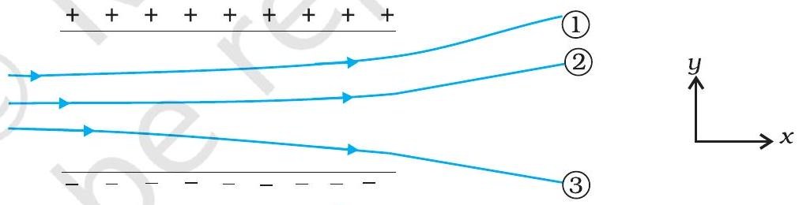
चित्र $1.30$
$1.14$ एकसमान विद्युत क्षेत्र $\mathbf{E}=3 \times 10^{3} \hat{\mathbf{1}} \mathrm{~N} / \mathrm{C}$ पर विचार कीजिए।
    (a) इस क्षेत्र का $10 \mathrm{~cm}$ भुजा के वर्ग के उस पाशर्व से जिसका तल $y z$ तल के समांतर है, गुजरने वाला फ्लक्स क्या है?
    (b) इसी वर्ग से गुजरने वाला फ्लक्स कितना है यदि इसके तल का अभिलंब $x$-अक्ष से $60^{\circ}$ का कोण बनाता है?
$1.15$ अभ्यास $1.14$ के एकसमान विद्युत क्षेत्र का $20 \mathrm{~cm}$ भुजा के किसी घन से (जो इस प्रकार अभिविन्यासित है कि उसके फलक निर्देशांक तलों के समांतर हैं) कितना नेट फ्लक्स गुजरेगा?
$1.16$ किसी काले बॉक्स के पृष्ठ पर विद्युत क्षेत्र की सावधानीपूर्वक ली गई माप यह संकेत देती है कि बॉक्स के पृष्ठ से गुजरने वाला नेट फ्लक्स $8.0 \times 10^{3} \mathrm{Nm}^{2} / \mathrm{C}$ है।
    (a) बॉक्स के भीतर नेट आवेश कितना है?
    (b) यदि बॉक्स के पृष्ठ से नेट बहिर्मुखी फ्लक्स शून्य है तो क्या आप यह निष्कर्ष निकालेंगे कि बॉक्स के भीतर कोई आवेश नहीं है? क्यों, अथवा क्यों नहीं?
$1.17$ चित्र $1.31$ में दर्शाए अनुसार $10 \mathrm{~cm}$ भुजा के किसी वर्ग के केंद्र से ठीक $5 \mathrm{~cm}$ ऊँचाई पर कोई $+10 \mu \mathrm{C}$ आवेश रखा है। इस वर्ग से गुजरने वाले वैद्युत फ्लक्स का परिमाण क्या है? (संकेत : वर्ग को $10 \mathrm{~cm}$ किनारे के किसी घन का एक फलक मानिए।)

## वैद्युत आवेश तथा क्षेत्र

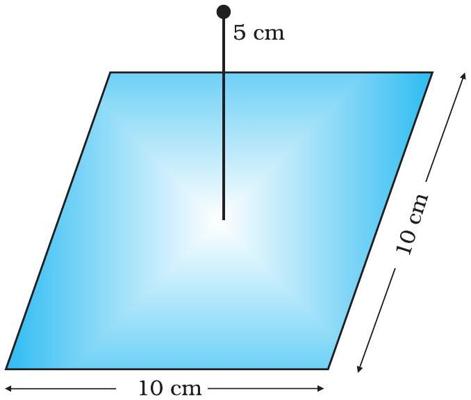
चित्र $1.31$

$1.182 .0 \mu \mathrm{C}$ का कोई बिंदु आवेश किसी किनारे पर $9.0 \mathrm{~cm}$ किनारे वाले किसी घनीय गाउसीय पृष्ठ के केंद्र पर स्थित है। पृष्ठ से गुजरने वाला नेट फ्लक्स क्या है?
$1.19$ किसी बिंदु आवेश के कारण उस बिंदु को केंद्र मानकर खींचे गए $10 \mathrm{~cm}$ त्रिज्या के गोलीय गाउसीय पृष्ठ पर वैद्युत फ्लक्स $-1.0 \times 10^{3} \mathrm{Nm}^{2} / \mathrm{Cl}$ (a) यदि गाउसीय पृष्ठ की त्रिज्या दो गुनी कर दी जाए तो पृष्ठ से कितना फ्लक्स गुजरेगा? (b) बिंदु आवेश का मान क्या है?
$1.2010 \mathrm{~cm}$ त्रिज्या के चालक गोले पर अज्ञात परिणाम का आवेश है। यदि गोले के केंद्र से $20 \mathrm{~cm}$ दूरी पर विद्युत क्षेत्र $1.5 \times 10^{3} \mathrm{~N} / \mathrm{C}$ त्रिज्यतः अंतर्मुखी (radially inward) है तो गोले पर नेट आवेश कितना है?
$1.212 .4 \mathrm{~m}$ व्यास के किसी एकसमान आवेशित चालक गोले का पृष्ठीय आवेश घनत्व $80.0 \mu \mathrm{C} / \mathrm{m}^{2}$ है।
    (a) गोले पर आवेश ज्ञात कीजिए।
    (b) गोले के पृष्ठ से निर्गत कुल वैद्युत फ्लक्स क्या है?
$1.22$ कोई अनंत रैखिक आवेश $2 \mathrm{~cm}$ दूरी पर $9 \times 10^{4} \mathrm{~N} \mathrm{C}^{-1}$ विद्युत क्षेत्र उत्पन्न करता है। रैखिक आवेश घनत्व ज्ञात कीजिए।
$1.23$ दो बड़ी, पतली धातु की प्लेटें एक-दूसरे के समानांतर एवं निकट हैं। इनके भीतरी फलकों पर, प्लेटों के पृष्ठीय आवेश घनत्वों के चिह्न विपरीत हैं तथा इनका परिमाण $17.0 \times 10^{-22} \mathrm{C} / \mathrm{m}^{2}$ है। (a) पहली प्लेट के बाह्य क्षेत्र में, (b) दूसरी प्लेट के बाह्य क्षेत्र में, तथा (c) प्लेटों के बीच में विद्युत क्षेत्र E का परिमाण परिकलित कीजिए।

[^0]:    * एक तीसरी श्रेणी जिसे अर्धचालक कहते हैं, आवेशों की गति में अवरोध उत्पन्न करती है। इस अवरोध का परिमाण चालकों तथा विद्युतरोधियों के मध्यवर्ती होता है।

[^1]:    * ऐंठन तुला बल मापने की एक सुग्राही युक्ति है। इस तुला का उपयोग बाद में कैवेंडिश ने दो पिंडों के बीच लगे गुरुत्वाकर्षण बल की माप के लिए भी करके न्यूटन के गुरुत्वाकर्षण नियम को सत्यापित किया।
    इसमें आवेशों की योज्यशीलता तथा आवेशों के संरक्षण की अवधारणाएँ अंतर्निहित हैं। दो आवेशों (प्रत्येक $q / 2$ ) के संयोजन से कुल आवेश $q$ बनता है।

[^2]:    * घन कोण शंकु की एक माप है। $R$ त्रिज्या के गोले वाले दिए गए शंकु के परिच्छेद पर विचार कीजिए। शंकु के घन कोण $\Delta \Omega$ की परिभाषा इसे $\Delta \mathrm{S} / R^{2}$ के बराबर मानकर करते हैं, यहाँ $\Delta \mathrm{S}$ शंकु द्वारा गोले पर काटा गया क्षेत्रफल है।

[^3]:    * यह कहना उचित नहीं है कि क्षेत्र रेखाओं की संख्या $E \Delta S$ के बराबर है। वास्तव में क्षेत्र रेखाओं की संख्या ऐसा विषय है जो हम कितनी क्षेत्र रेखाएँ खींचने का चयन करते हैं, पर निर्भर है। अतः विभिन्न बिंदुओं पर दिए गए क्षेत्रफल से गुजरने वाली क्षेत्र रेखाओं की आपेक्षिक संख्या के ज्ञात होने में ही इनकी भौतिक सार्थकता है।

[^4]:    * धनात्मक बिंदु आवेशों के संग्रह को केंद्र की परिभाषा संहति केंद्र की ही भाँति की जाती है जिसके अनुसार

    $$
    \mathbf{r}_{\mathrm{cm}}=\frac{\sum_{i} q_{i} \mathbf{r}_{i}}{\sum_{i} q_{i}} .
    $$

[^5]:    * सूक्ष्मदर्शीय स्तर पर, आवेश वितरण असंतत होता है। पृथक आवेश एक आवेशरहित मध्यवर्ती स्थान से पृथकृत होते हैं।

[^6]:    * इसकी तुलना भौतिकी पाठ्यपुस्तक कक्षा $11$ के अनुभाग $7.5$ में वर्णित एकसमान द्रव्यमान खोल से कीजिए।

