## $1$ वैधुत आवेश तथा क्षेत्र (Electric Charges And Fields) अभ्यास प्रश्न

प्रश्न 1.1. वायु में एक-दूसरे से $30 \mathrm{~cm}$ दूरी पर रखे दो छोटे आवेशित गोलों पर क्रमशः $2 \times 10^{-7} \mathrm{C}$ तथा $3 \times 10^{-7} \mathrm{C}$ आवेश हैं। उनके बीच कितना बल है?

हल : माना $q_{1}=2 \times 10^{-7} \mathrm{C}, q_{2}=3 \times 10^{-7} \mathrm{C}$ तथा $r=30 \mathrm{~cm}=0.3 \mathrm{~m}$

माना उनके बीच लगा बल $=F$

$$
\begin{aligned}
& \because \quad F=\frac{1}{4 \pi \varepsilon_{0}} \cdot \frac{q_{1} q_{2}}{r^{2}} \\
& \therefore \quad F=9 \times 10^{9} \times \frac{2 \times 10^{-7} \times 3 \times 10^{-7}}{(0.3)^{2}} \mathrm{~N} \\
& \quad\left[\because \frac{1}{4 \pi \varepsilon_{0}}=9 \times 10^{9} \mathrm{Nm}^{2} \mathrm{C}^{-2}\right] \\
&=\frac{9 \times 10^{9} \times 6 \times 10^{-14}}{9 \times 10^{-2}} \mathrm{~N} \\
&=\frac{54 \times 10^{-5}}{9 \times 10^{-2}} \mathrm{~N} \\
&=6 \times 10^{-3} \mathrm{~N} \text { (प्रतिकर्षी) प्राप्त करते हैं। }
\end{aligned}
$$

अत: उनके बीच लगा बल $=6 \times 10^{-3} \mathrm{~N}$ उत्तर
प्रश्न 1.2. $0.4 \mu \mathrm{C}$ आवेश के किसी छोटे गोले पर किसी अन्य छोटे आवेशित गोले के कारण वायु में $0.2 \mathrm{~N}$ बल लगता है। यदि दूसरे गोले पर $0.8 \mu \mathrm{C}$ आवेश हो, तो: (a) दोनों गोलों के बीच कितनी दूरी है?
(b) दूसरे गोले पर पहले गोले के कारण कितना बल लगता है?

हल : माना $q_{1}=0.4 \mu \mathrm{C}=0.4 \times 10^{-6} \mathrm{C}$,

$$
q_{2}=0.8 \mu \mathrm{C}=0.8 \times 10^{-6} \mathrm{C}
$$

और $F=q_{1}$ तथा $q_{2}$ के बीच स्थिर वैद्युत बल $=0.2 \mathrm{~N}$
(a) माना दोनों गोलों के बीच की दूरी $=r$
$\because \quad F=\frac{1}{4 \pi \varepsilon_{0}} \cdot \frac{q_{1} q_{2}}{r^{2}}$
$\therefore \quad r^{2}=\frac{1}{4 \pi \varepsilon_{0}} \cdot \frac{q_{1} q_{2}}{F}$
या $r^{2}=9 \times 10^{9} \times \frac{0.4 \times 10^{-6} \times 0.8 \times 10^{-6}}{0.2} \mathrm{~m}^{2}$

$$
\left[\because \frac{1}{4 \pi \varepsilon_{0}}=9 \times 10^{9} \mathrm{Nm}^{2} \mathrm{C}^{-2}\right]
$$

या $r^{2}=16 \times 9 \times 10^{-4} \mathrm{~m}^{2}$
या $r^{2}=144 \times 10^{-4} \mathrm{~m}^{2}$
$\therefore \quad r=12 \times 10^{-2} \mathrm{~m}$
या $r=0.12 \mathrm{~m}$
या $r=12 \mathrm{~cm}$
अत: दोनों गोलों के बीच की दूरी $=12 \mathrm{~cm}$ उत्तर
(b) माना हमें $q_{2}$ पर $q_{1}$ के कारण बल ज्ञात करना है।
∵ स्थिर वैद्युत बल, युग्म में दृष्टिगोचर होता है तथा यह न्यूटन की गति के तृतीय नियम का पालन करता है।
$\therefore\left|\mathbf{F}_{21}\right|=q_{1}$ आवेश के कारण $q_{2}$ पर लगा बल

$$
=0.2 \mathrm{~N}
$$

$\because \quad F=\frac{1}{4 \pi \varepsilon_{0}} \cdot \frac{q_{1} q_{2}}{r^{2}}$
$\therefore \quad F_{21}=9 \times 10^{9}$

$$
\times \frac{\left(0.4 \times 10^{-6}\right) \times\left(-0.8 \times 10^{-6}\right)}{(0.12)^{2}} \mathrm{~N}
$$

$$
=\frac{9 \times 10^{9} \times\left(-0.32 \times 10^{-12}\right)}{0.0144} \mathrm{~N}
$$

$$
\begin{aligned}
& =-\frac{9 \times 32 \times 10^{-5}}{144 \times 10^{-4}} \mathrm{~N} \\
& =-0.2 \mathrm{~N} \text { (आकर्षी बल) }
\end{aligned}
$$

अत: दूसरे गोले पर पहले गोले के कारण $0.2 \mathrm{~N}$ ( आकर्षी ) बल लगता है। उत्तर
प्रश्न 1.3. जाँच द्वारा सुनिश्चित कीजिए कि $k e^{2} / G m_{e} m_{p}$ विभाहीन है। भौतिक नियतांकों की सारणी देखकर इस अनुपात का मान ज्ञात कीजिए। यह अनुपात क्या बताता है?

$$
\begin{aligned}
& \text { हल : } \because e^{2} \text { की विमा }=\left[\mathrm{C}^{2}\right] \\
& k \text { की विमा }=\left[\mathrm{Nm}^{2} \mathrm{C}^{-2}\right]=\left[\mathrm{ML}^{3} \mathrm{~T}^{-2} \mathrm{C}^{-2}\right] \\
& G \text { की विमा }=\left[\mathrm{M}^{-1} \mathrm{~L}^{3} \mathrm{~T}^{-2}\right]
\end{aligned}
$$

तथा $m_{e}$ एवं $m_{p}$ की विमा $=[\mathrm{M}]$

$$
\begin{aligned}
\therefore \frac{k e^{2}}{G m_{e} m_{p}} & \text { की विमा }=\frac{\left[\mathrm{ML}^{3} \mathrm{~T}^{-2} \mathrm{C}^{-2}\right]\left[\mathrm{C}^{2}\right]}{\left[\mathrm{M}^{-1} \mathrm{~L}^{3} \mathrm{~T}^{-2}\right][\mathrm{M}][\mathrm{M}]} \\
& =\left[\mathrm{M}^{2-2} \mathrm{~L}^{3-3} \mathrm{~T}^{-2+2} \mathrm{C}^{-2+2}\right] \\
& =\left[\mathrm{M}^{0} \mathrm{~L}^{0} \mathrm{~T}^{0} \mathrm{C}^{0}\right]
\end{aligned}
$$

तथा $m_{p}=166 \times 10^{-27} \mathrm{~kg}$

$$
\begin{aligned}
\therefore & \frac{k e^{2}}{G m_{e} m_{p}} \\
& =\frac{\left(9 \times 10^{9}\right) \times\left(1.6 \times 10^{-19}\right)^{2}}{6.67 \times 10^{-11} \times 9.1 \times 10^{-31} \times 166 \times 10^{-27}} \\
& =\frac{9 \times 2.56 \times 10^{9} \times 10^{-38}}{6.67 \times 9.1 \times 166 \times 10^{-69}} \\
& =\frac{23.04 \times 10^{-29}}{10075702 \times 10^{2} \times 10^{-69}} \\
& =22.87 \times 10^{38} \\
& =2.3 \times 10^{39}
\end{aligned}
$$

अत: यह एक इलेक्ट्रॉन तथा एक प्रोटॉन के बीच कार्यरत वैद्युत बल तथा गुरुत्पाकर्षण बल का अनुपात है। उत्तर

प्रश्न 1.4. (a) "किसी वस्तु का वैद्युत आवेश क्वांटीकृत है", इस प्रकथन से क्या तात्पर्य है?
(b) स्थूल अथवा बड़े पैमाने पर वैद्युत आवेशों से व्यवहार करते समय ह्रम वैद्युत आवेश के क्वांटमीकरण की उपेक्षा कैसे कर सकते हैं?

उत्तर : (a) वैद्युत आवेश के क्वांटित होने का अर्थ है-किसी वस्तु पर आवेश इलेक्ट्रॉन अथवा प्रोटॉन के मूल आवेश का कोई पूर्णांक होता है अर्थात् पिंड पर आवेश सतत् रूप में नहीं बदलता, अपितु वह $q$ आवेश का क्वांटम या पुंजर (पैकेट) के रूप में अलग हो जाता है।

गणितीय रूप में किसी पिड का आवेश,

$$
q= \pm n e
$$

के रूप में प्रदर्शित किया जा सकता है; जहाँ $n=$ एक पूर्णांक तथा $e=$ एक इलेक्ट्रॉन या एक प्रोट्रॉन पर आवेश $e=1.6 \times 10^{-19} \mathrm{C}$ है।

अत: स्वतंत्र अवस्था में मूल आवेश के अंश को कभी नहीं देखा गया है।
(b) व्यावहारिक रूप में स्थूल स्तर पर आवेशित पिंड पर बड़ा आवेश होता है, जबकि एक इलेक्ट्रॉन पर बहुत सूक्ष्म आवेश होता है। जब पिड पर इलेक्ट्रॉन जोड़े जाते हैं या उससे निकाले जाते हैं, तो आवेश में इतना कम परिवर्तन होता है कि आवेश सतत् रूप में परिवर्तित होता लगता है।

अत: स्थूल स्तर पर आवेश का क्वांटित होना छोड़ा जा सकता है अर्थात् जब पिंड को बृहद् पैमाने पर लिया जाता है।

प्रश्न 1.5. जब काँच की छड़ को रेशम के टुकड़े से रगड़ते हैं, तो दोनों पर आवेश आ जाता है। इसी प्रकार की परिघटना का वस्तुओं के अन्य युग्मों में भी प्रेक्षण किया जाता है। स्पष्ट कीजिए कि यह प्रेक्षण आवेश संरक्षण नियम से किस प्रकार सामंजस्य रखता है।

उत्तर : जब काँच की छड़ को रेशमी कपड़े से रगड़ा नहीं गया होता है, तो दोनों वैद्युतीय रूप से अनावेशित होते हैं।

दूसरे शब्दों में काँच की छड़ और रेशमी कपड़े पर नेट आवेश शून्य है। जब काँच की छड़ को रेशमी कपड़े से रगड़ा जाता है, तब कुछ इलेक्ट्रॉन काँच की छड़ से रेशमी कपड़े पर स्थानांतरित हो जाते हैं।

इस प्रकार काँच की छड़ धनावेशित तथा रेशमी कपड़ा ऋणावैशित्हो जाता है। काँच की छड़ पर धनावेश, रेशमी कपड़े पर ऋणावेश के ठीक बराबर होता है।

अत: निकाय पर पुन: नेट आवेश शून्य हो जाता है।
इस प्रकार काँच की छड़ एवं कपड़े पर प्रकट होने वाला आवेश, आवेश संरक्षण के नियम के अनुसार ही है; क्योकि वियुक्त निकाय का कुल आवेश संरक्षित है। इसी प्रकार, जब एबोनाइट की छड़ को फर से रगड़ते हैं, तो उन पर क्रमश: ऋणावेश एवं धनावेश उत्पन्न हो जाते हैं तथा पुन: नेट आवेश शून्य होता है।

अत: हम कह सकते हैं कि आवेश न तो उत्पन्न और न ही विनष्ट किया जा सकता है, यह केवल वह एक पिंड से दूसरे पिंड पर स्थानांतरित किया जा सकता है, जो आवेश संरक्षण के अनुसार ही है।

प्रश्न 1.6. चार बिंदु आवेश $q_{A}=2 \mu \mathrm{C}$, $q_{B}=-5 \mu \mathrm{C}, q_{c}=2 \mu \mathrm{C}$ तथा $q_{D}=-5 \mu \mathrm{C}, 10 \mathrm{~cm}$ भुजा के किसी वर्ग $A B C D$ के शीर्षों पर अवस्थित हैं। वर्ग के केंद्र पर रखे $1 \mu \mathrm{C}$ आवेश पर लगने वाला बल कितना है?

हल : माना $O$ केन्द्र और प्रत्येक भुजा $10 \mathrm{~cm}$ का एक वर्ग $A B C D$ है। $O$ पर $1 \mu \mathrm{C}$ का आवेश रखा है।

$$
\because \quad O A=O B=O C=O D
$$

तथा $A B=B C=10 \mathrm{~cm}=0.1 \mathrm{~m}$
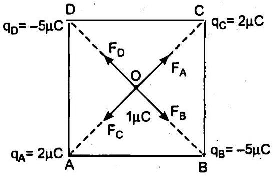

$$
\therefore \quad A O=\frac{1}{2} A C
$$

या $A O=\frac{1}{2} \sqrt{A B^{2}+B C^{2}}$
या $A O=\frac{1}{2} \times \sqrt{2} A B$
या $A O=\frac{1}{\sqrt{2}} \times 0.1 \mathrm{~m}=O B=O C=O D$

$$
\because \quad q_{A}=2 \mu \mathrm{C}, q_{B}=-5 \mu \mathrm{C}, q_{C}=2 \mu \mathrm{C}
$$

और $q_{D}=-5 \mu \mathrm{C}$
तथा $q_{A}=q_{C}=2 \mu \mathrm{C}=2 \times 10^{-6} \mathrm{C}$
एवं $q_{B}=q_{D}=-5 \mu \mathrm{C}=-5 \times 10^{-6} \mathrm{C}$

चूँकि $q_{A}=q_{C}, 1 \mu \mathrm{C}$ के कूलम्ब पर $q_{A}$ तथा $q_{C}$ आवेशों के कारण समान और विपरीत बल कार्य करेंगे अर्थात् $O C$ तथा $O A$ के क्रमशः अनुदिश $a$ उनके परिमाण निम्न हैं-

$$
\begin{aligned}
F_{A} & =F_{C}=\frac{1}{4 \pi \varepsilon_{0}} \times \frac{q_{A} \times 1 \mu \mathrm{C}}{A O^{2}} \\
& =\frac{9 \times 10^{9} \times 2 \times 10^{-6} \times 10^{-6}}{\left(\frac{1}{\sqrt{2}} \times 0.1\right)^{2}} \mathrm{~N} \\
& =\frac{2 \times 18 \times 10^{-3}}{1 \times 10^{-2}} \mathrm{~N} \\
& =2 \times 1.8 \mathrm{~N} \\
& =3.6 \mathrm{~N} \\
\therefore \quad \mathbf{F}_{A} & =-\mathbf{F}_{C}
\end{aligned}
$$

इसी प्रकार, $F_{D}=F_{B}, 1 \mu \mathrm{C}$ का आवेश $q_{B}$ तथा $q_{D}$ आवेशों के कारण समान परंतु विपरीत बलों का अनुभव करता है।

इस प्रकार, $\mathrm{F}_{B}=-\mathrm{F}_{D}$
इस प्रकार आवेशों के दिए गए क्रम-विन्यास के कारण $1 \mu \mathrm{C}$ पर नेट बल शून्य होगा अर्थात्

$$
\mathbf{F}=\mathbf{F}_{A}+\mathbf{F}_{B}+\mathbf{F}_{C}+\mathbf{F}_{D}=0 \mathbf{N}
$$

अत: वर्ग के केंद्र पर रखे $1 \mu \mathrm{C}$ आवेश पर लगने वाला बल $0 \mathrm{~N}$ है। उत्तर
प्रश्न 1.7. (a) स्थिर वैद्युत क्षेत्र रेखा एक सतत वक्र होती है अर्थात् कोई क्षेत्र रेखा एकाएक नहीं टूट सकती। क्यों?
(b) स्पष्ट कीजिए कि दो क्षेत्र रेखाएँ कभी भी एक-दूसरे का प्रतिच्छेदन क्यों नहीं करती?

उत्तर : (a) किसी बिंदु पर स्थिर वैद्युत बल रेखा वह पथ है, जिसके प्रत्येक बिंदु पर स्पर्शज्या उस बिंदु पर वैद्युत क्षेत्र की दिशा बताती है। वैद्युत-क्षेत्र की दिशा एक बिंदु से दूसरे बिंदु पर बल जाती है।

अत: बल रेखाएँ आमतौर पर वक्र रेखाएँ होती हैं। इसके अतिरिक्त वे सतत वक्र होती हैं, जो अचानक नहीं टूटती हैं; क्योकि यदि ऐसा है, तो टूटने के स्थान पर वे कोई विद्युत क्षेत्र नहीं दर्शाएँगी।
(b) वैद्युत-बल रेखाएँ एक-दूसरी को नहीं काटती हैं; क्योकि यदि ऐसा होता है, तो काट् बिंदू पर हम दो स्पर्शज्याएँ खींच सकते हैं, जो उस बिंदु पर वैद्युत-क्षेत्र की दो दिशाएँ दर्शाएँगी जो असंभव है।
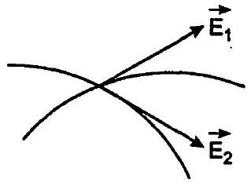

प्रश्न 1.8. दो बिंदु आवेश $q_{A}=3 \mu \mathrm{C}$ तथा $q_{B}=-3 \mu \mathrm{C}$ निर्वात् में एक-दूसरे से $20 \mathrm{~cm}$ दूरी पर स्थित हैं।
(a) दोनों आवेशों को मिलाने वाली रेखा $A B$ के मध्य बिंदु $O$ पर विद्युत क्षेत्र कितना है?
(b) यदि $1.5 \times 10^{-9} \mathrm{C}$ परिमाण का कोई ऋणात्मक परीक्षण आवेश इस बिंदु पर रखा जाए, तो यह परीक्षण आवेश कितने बल का अनुभव करेगा?

हल :
$\because A$ बिंदु पर आवेश $q_{A}=3 \mu \mathrm{C}=3 \times 10^{-6} \mathrm{C}$
बिंदु $B$ पर आवेश $q_{B}=-3 \mu \mathrm{C}=-3 \times 10^{-6} \mathrm{C}$
तथा $r=A B=20 \mathrm{~cm}=0.2 \mathrm{~m}$
माना रेखा $A B$ का मध्य-बिंदु $O$ है, तब
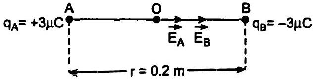

$$
\begin{aligned}
O A & =O B=\frac{r}{2} \\
& =\frac{0.2}{2} \mathrm{~m}=0.1 \mathrm{~m}
\end{aligned}
$$

(a) यदि आवेशों $q_{A}$ एवं $q_{B}$ के कारण क्रमशः $O$ पर विद्युत क्षेत्र $\mathrm{E}_{A}$ एवं $\mathrm{E}_{B}$ हैं, तब

$$
\begin{aligned}
E_{A} & =\frac{1}{4 \pi \varepsilon_{0}} \cdot \frac{q_{A}}{(O A)^{2}} \\
& =9 \times 10^{9} \times \frac{3 \times 10^{-6}}{(0.1)^{2}}-\mathrm{NC}^{-1} \\
& =\frac{27 \times 10^{3}}{1 \times 10^{-2}}-\mathrm{NC}^{-1} \\
& =27 \times 10^{6} \mathrm{NC}^{-1} \text { के अनुदिश }
\end{aligned}
$$

तथा

$$
E_{B}=\frac{1}{4 \pi \varepsilon_{0}} \cdot \frac{q_{B}}{(O B)^{2}}
$$

$$
\begin{aligned}
& =9 \times 10^{9} \times \frac{3 \times 10^{-6}}{(0.1)^{2}} \mathrm{NC}^{-1} \\
& =\frac{27 \times 10^{3}}{1 \times 10^{-2}} \mathrm{NC}^{-1} \\
& =2.7 \times 10^{6} \mathrm{NC}^{-1}, O B \text { के अनुदिश }
\end{aligned}
$$

यदि $O$ पर $q_{A}$ तथा $q_{B}$ के कारण नेट विद्युत क्षेत्र $\mathbf{E}$ है, तब

$$
\begin{aligned}
\mathbf{E} & =\mathbf{E}_{A}+\mathbf{E}_{B} \\
& =\left(2.7 \times 10^{6}+2.7 \times 10^{6}\right) \mathrm{NC}^{-1} \mathrm{KeK} \\
& =5.4 \times 10^{6} \mathrm{NC}^{-1}, O B \text { के अनुदिश }
\end{aligned}
$$

अत: दोनों आवेशों को मिलाने वाली रेखा के मध्य बिन्दु $O$ पर विद्युत क्षेत्र $5.4 \times 10^{6} \mathrm{NC}^{-1}$ है। उत्तर
(b) $1.5 \times 10^{-9} \mathrm{C}$ के ऋण आवेश पर बल

$$
\begin{array}{rlrl} 
& & \mathbf{F} & =q_{0} . \mathbf{E} \\
\because & & q_{0} & =-15 \times 10^{-9} \mathrm{C} \\
\text { तथा } & E & =5.4 \times 10^{6} \mathrm{NC}^{-1} O B \text { के अनुदिश } \\
\therefore & & \mathbf{F} & =-15 \times 10^{-9} \mathrm{C} \times 5.4 \times 10^{6} \mathrm{NC}^{-1} \\
& & & =-8.1 \times 10^{-3} \mathrm{~N}
\end{array}
$$

ॠणात्मक चिह्न दर्शाता है कि F क्षेत्र E की विपरीत दिशा $O A$ के अनुदिश है।

अत: यह परीक्षण आवेश $8.1 \times 10^{-3} \mathrm{~N}$ बल का अनुभव रहेगा। उत्तर

प्रश्न 1.9. किसी निकाय में दो आवेश $q_{A}=2.5 \times 10^{-7} \mathrm{C}$ तथा $q_{B}=-2.5 \times 10^{-7} \mathrm{C}$ क्रमश: दो बिंदुओं $A(0,0,-15 \mathrm{~cm})$ तथा $B(0,0,+15 \mathrm{~cm})$ पर अवस्थित हैं। निकाय का कुल आवेश तथा वैद्युत द्विधुव आघूर्ण क्या है?

हल : चित्रानुसार आवेश $q_{A}$ और $q_{B}$ बिंदु $A(0,0,-15 \mathrm{~cm})$ तथा $B(0,0,+15 \mathrm{~cm})$ पर अवस्थित हैं। यह एक वैद्युत-द्विध्रुव बनाते हैं।
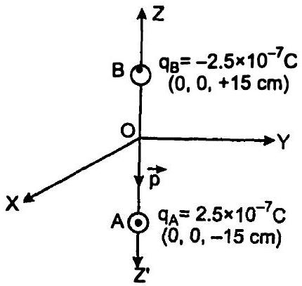
$q=$ कुल आवेश = ?
$p=$ निकाय का वैद्युत-द्विध्रुव आघूर्ण = ?
$\because \quad p=-2 a q$
∴ कुल आवेश $q=q_{A}+q_{B}$

$$
\begin{aligned}
& =2.5 \times 10^{-7} \mathrm{C}+\left(-2.5 \times 10^{-7} \mathrm{C}\right) \\
& =0
\end{aligned}
$$

या $p=$ एक आवेश × विद्युत-द्विध्रुव की भुजा
या $q_{A} \times A B=2.5 \times 10^{-7} \mathrm{C} \times 0.30 \mathrm{~m}$

$$
\begin{aligned}
& {[\because 2 a=A B=O A+O B} \\
& =15 \mathrm{~cm}+15 \mathrm{~cm}=30 \mathrm{~cm}] \\
& =7.5 \times 10^{-8} \mathrm{Cm}
\end{aligned}
$$

वैद्युत-दि-ध्रुव $B$ से $A$ की ओर कार्यरत है अर्थात् ऋण $Z$-अक्ष के अनुदिश है।

अत: निकाय का कुल आवेश शून्य है। वैद्युत द्विधुव आघूर्ण $=7.5 \times 10^{-8} \mathrm{Cm}$ और $Z$-अक्ष के अनुदिश है। उत्तर
प्रश्न 1.10. $4 \times 10^{-9} \mathrm{Cm}$ द्विधुव आघूर्ण का कोई वैद्युत द्विधुव $5 \times 10^{4} \mathrm{NC}^{-1}$ परिमाण के किसी एकसमान विद्युत क्षेत्र की दिशा से $30^{\circ}$ पर संरेखित है। द्विधुव पर कार्यरत बल आघूर्ण का परिमाण परिकलित कीजिए।
हल : $\because p=4 \times 10^{-9} \mathrm{Cm}, E=5 \times 10^{4} \mathrm{NC}^{-1}$ तथा $\theta=30^{\circ}, \tau=$ ?

$$
\begin{aligned}
\because \quad \tau & =p E \sin \theta \\
\therefore \tau & =4 \times 10^{-9} \mathrm{Cm} \times 5 \times 10^{4} \mathrm{NC}^{-1} \times \sin 30^{\circ} \\
& =20 \times 10^{-5} \times \frac{1}{2} \mathrm{Nm} \quad\left[\because \sin 30^{\circ}=\frac{1}{2}\right] \\
& =10^{-4} \mathrm{Nm}
\end{aligned}
$$

अत: द्विध्रुव पर कार्यरत बल आघूण का परिमाण $=10^{-4} \mathrm{~N}$ उत्तर
प्रश्न 1.11. ऊन से रगड़े जाने पर कोई पॉलीथीन का टुकड़ा $3 \times 10^{-7} \mathrm{C}$ के ऋणावेश से आवेशित पाया गया।
(a) स्थानांतरित ( किस पदार्थ से किस पदार्थ में ) इलेक्ट्रॉनों की संख्या आकलित कीजिए।
(b) क्या ऊन से पॉलीथीन में संहति का स्थानांतरण भी होता है?
हल : (a) $\because$ कुल स्थानांतरित आवेश $=-3 \times 10^{-7} \mathrm{C}$
तथा एक इलेक्ट्रॉन पर कुल आवेश $=-1.6 \times 10^{-19} \mathrm{C}$
$n=$ स्थानांतरित इलेक्ट्रॉनों की संख्या = ?
चूँकि ऊन से रगड़ने पर पॉलीथीन के टुकड़े पर ऋण आवेश है।

इसलिए इलेक्ट्रॉन ऊन से पॉलीथीन के टुकड़े पर स्थानांतरित होते हैं।

$$
\begin{aligned}
& \because \quad q=n e \\
& \therefore \quad n=\frac{q}{e} \\
&=\frac{-3 \times 10^{-7} \mathrm{C}}{-16 \times 10^{-19} \mathrm{C}} \\
&=1875 \times 10^{12} \\
&=2 \times 10^{12} \text { इलेक्ट्रॉन }
\end{aligned}
$$

अत: ऊन से पॉलीथीन पर स्थानांतरित इलेक्ट्रॉनों की संख्या $=2 \times 10^{12}$ उत्तर
(b) हाँ, ऊन से पॉलीथीन पर द्रव्यमान का स्थानांतरण होता है; क्योकि इलेक्ट्रॉन, जो पदार्थ कण हैं, ऊन से पॉलीथीन पर विस्थापित होते हैं।

$$
\begin{aligned}
\because m & =\text { प्रत्येक इलेक्ट्रॉन का द्रव्यमान } \\
& \quad=9.1 \times 10^{-31} \mathrm{~kg} \text { तथा } n=2 \times 10^{12} \\
\therefore M & =\text { पॉलीथीन पर स्थानांतरित कुल द्रव्यमान } \\
& =m \times n \\
& =9.1 \times 10^{-31} \mathrm{~kg} \times 2 \times 10^{12} \\
& =1.82 \times 10^{-18} \mathrm{~kg} \\
& =2 \times 10^{-18} \mathrm{~kg}
\end{aligned}
$$

हाँ, ऊन से पॉलीथीन में $2 \times 10^{-18} \mathrm{~kg}$ अर्थात् नगण्य मात्रा का स्थानांतरण होता है। उत्तर
प्रश्न 1.12. (a) दो विद्युतरोधी आवेशित ताँबे के गोलों $A$ तथा $B$ के केन्द्रों के बीच की दूरी $50 \mathrm{~cm}$ है। यदि दोनों गोलों पर पृथक्-पृथक् आवेश $6.5 \times 10^{-7} \mathrm{C}$ हैं, तो इनमें पारस्परिक स्थिरवैद्युत प्रतिकर्षण बल कितना है? गोलों के बीच की दूरी की तुलना में गोलों $A$ तथा $B$ की त्रिज्याएँ नगण्य हैं।
(b) यदि प्रत्येक गोले पर आवेश की मात्रा दो गुनी तथा गोलों के बीच की दूरी आधी कर दी जाए, तो प्रत्येक गोले पर कितना बल लगेगा?
हल : (a) $\because$ पहले गोले $A$ पर आवेश $=q_{A}=6.5 \times 10^{-7} \mathrm{C}$
तथा दूसरे गोले $B$ पर आवेश $=q_{B}=6.5 \times 10^{-7} \mathrm{C}$

और गोले $A$ एवं $B$ के बीच की दूरी

$$
50 \mathrm{~cm}=0.5 \mathrm{~m}
$$

∵

$$
\mathrm{F}=\frac{1}{4 \pi \varepsilon_{0}} \cdot \frac{q_{A} q_{B}}{r^{2}}
$$

∴

$$
F=9 \times 10^{9} \mathrm{Nm}^{2} \mathrm{C}^{-2}
$$

$$
\begin{aligned}
& \times \frac{6.5 \times 10^{-7} \mathrm{C} \times 6.5 \times 10^{-7} \mathrm{C}}{(0.5 \mathrm{~m})^{2}} \\
& {\left[\because \frac{1}{4 \pi \varepsilon_{0}}=9 \times 10^{9} \mathrm{Nm}^{2} \mathrm{C}^{-2}\right] } \\
= & \frac{3.8025 \times 10^{-3}}{2.5 \times 10^{-1}} \mathrm{~N} \\
= & 1.521 \times 10^{-2} \mathrm{~N} \\
= & 1.5 \times 10^{-2} \mathrm{~N}
\end{aligned}
$$

अत: दोनों गोलों में पास्परिक स्थिर वैद्युत प्रतिकर्षण बल $1.5 \times 10^{-2} \mathrm{~N}$ है। उत्तर
(b) यदि पहली मात्रा से प्रत्येक गोले को द्विगुणित आवेशित किया जाए, तो

$$
\begin{aligned}
q_{A} & =q_{B}=2 \times 6.5 \times 10^{-7} \mathrm{C} \\
& =13 \times 10^{-7} \mathrm{C} \\
\text { तथा } \quad r & =\frac{1}{2} \times 0.5 \mathrm{~m}=0.25 \mathrm{~m} \\
\because \quad F & =\frac{1}{4 \pi \varepsilon_{0}} \cdot \frac{q_{A} q_{B}}{r^{2}} \\
\therefore \quad F & =\frac{9 \times 10^{9} \times 13 \times 10^{-7} \times 13 \times 10^{-7}}{(0.25)^{2}} \mathrm{~N} \\
& =\frac{1521 \times 10^{-5}}{6.25 \times 10^{-2}} \mathrm{~N} \\
& =243.36 \times 10^{-3} \mathrm{~N}=0.24 \mathrm{~N}
\end{aligned}
$$

अत: प्रत्येक गोले पर बल लगेगा $=0.24 \mathrm{~N}$ उत्तर
प्रश्न 1.13. मान लीजिए अभ्यास $1.12$ में गोले $A$ तथा $B$ साइज़ में सर्वसप हैं तथा इसी साइज़ का कोई तीसरा अनावेशित गोला पहले तो गोले के संपर्क, तत्पश्चात् दूसरे गोले के संपर्क में लाकर, अंत में दोनों से ही हटा लिया जाता है। अब $A$ तथा $B$ के बीच नया प्रतिकर्षण बल कितना है?

हल : गोलों $A$ एवं $B$ पर आरंभिक आवेश $=q_{A}=q_{B}=6.5 \times 10^{-7} \mathrm{C}$

जब एक तीसरा गोला $C$ जिस पर आवेश $q_{3}=0$ है, पहले गोला $A$ के संपर्क में लाया जाता है, तब

$$
\begin{aligned}
& A \text { पर आवेश }=C \text { पर आवेश }=q_{1}^{\prime} \text { (माना) } \\
& \because r=\text { गोलों } A \text { एवं } B \text { के बीच की दूरी }=0.5 \mathrm{~m}
\end{aligned}
$$

तथा संपर्क में लाने के पश्चात् समान आकार में होने के कारण सभी गोलों पर समान आवेश होगा।

$$
\begin{aligned}
\therefore q_{1}^{\prime} & =\frac{q_{A}+q_{3}}{2} \\
& =\frac{6.5 \times 10^{-7} \mathrm{C}+0}{2} \\
& =3.25 \times 10^{-7} \mathrm{C}
\end{aligned}
$$

$3.25 \times 10^{-7}$ आवेश वाले तीसरे गोले $C$ को जब $6.25$ $\times 10^{-7}$ वाले दूसरे गोले $B$ को संपर्क में रखा जाता है, तब $B$ पर शेष आवेश $q_{2}^{\prime}$ (माना)
$\because B$ पर आवेश $=C$ पर आवेश द्वारा दिया जाता है।

$$
\begin{array}{ll}
\therefore & q_{2}^{\prime}=\frac{q_{B}+q_{1}^{\prime}}{2} \\
\text { या } & q_{2}^{\prime}=\frac{6.5 \times 10^{-7}+3.25 \times 10^{-7}}{2}-\mathrm{C}
\end{array}
$$

या

$$
q_{2}^{\prime}=4.875 \times 10^{-7} \mathrm{C}
$$

जब गोले $C$ को हटा दिया जाता है, तो $A$ एवं $B$ के बीच प्रतिकर्षण बल, स्थिर वैद्युत में कूलम्ब के नियमानुसार,

$$
\begin{aligned}
F & =\frac{1}{4 \pi \varepsilon_{0}} \cdot \frac{q_{1}^{\prime} q_{2}^{\prime}}{r^{2}} \\
\because \quad q_{1}^{\prime} & =3.25 \times 10^{-7} \mathrm{C} \\
q_{2}^{\prime} & =4.875 \times 10^{-7} \mathrm{C}
\end{aligned}
$$

तथा

$$
r=0.5 \mathrm{~m}
$$

$\therefore \quad F=\frac{9 \times 10^{9} \times 3.25 \times 10^{-7} \times 4.875 \times 10^{-7}}{(0.5)^{2}}-\mathrm{N}$
या $F=\frac{9 \times 3.25 \times 4.875 \times 10^{-5}}{0.25}-\mathrm{N}$
या $F=\frac{1.43 \times 10^{-3}}{0.25}-\mathrm{N}$
या $F=5.72 \times 10^{-3}$
या $F=5.7 \times 10^{-3} \mathrm{~N}$
अत: $A$ तथा $B$ के बीच नया प्रतिकर्षण बल $5.7$ $\times 10^{-3} \mathrm{~N}$ है। उत्तर

प्रश्न 1.14. चित्र $1.33$ में किसी एकसमान स्थिरवैद्युत क्षेत्र में तीन आवेशित कणों के पथचिह्न (tracks) दर्शाए गए हैं। तीनों आवेशों के चिह्न लिखिए। इनमें से किस कण का आवेश-संहति अनुपात (q/m) अधिकतम है?
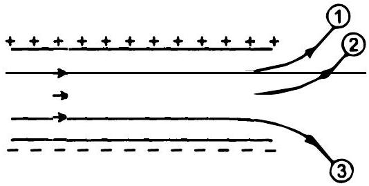
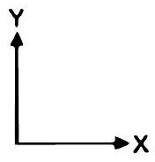

उत्तर : उपर्युक्त चित्र में, दो पट्टियों पर आवेश दर्शाए गए हैं। चूँकि आवेशित कण विपरीत आवेशित पट्टियों की ओर झुकते हैं। अत: कण (1) एवं (2) ऋणावेशित तथा कण (3) धनावेशित है।

चूँकि सभी कण एक ही विद्युत क्षेत्र को समान चाल से पार करते हैं, इसलिए समान $t$ (माना) के लिए सभी विद्युत क्षेत्र E में रहते हैं।

ऊध्र्वाधर की ओर कोणों में उत्पन्न विक्षेण

$$
y=\frac{1}{2} a t^{2}=\frac{1}{2} \times \frac{e E}{m} t^{2}
$$

$\because E$ एवं $t$ समान हैं।

$$
\therefore \quad y \propto\left(\frac{e}{m}\right)
$$

चूँकि आवेशित कण (3) ऊध्र्वाधर की ओर अधिकतम विक्षेपित है; इसलिए $y$ का मान इसके लिए अधिकतम है।

अत: आवेश से द्रव्यमान का अनुपात इसके लिए अधिकतम होगा।

अत: आवेश (1) तथा (2) ऋणात्मक हैं और आवेश (3) धनात्मक है। कण (3) का आवेश-संहति अनुपात अधिकतम है।

प्रश्न 1.15. एकसमान विद्युत क्षेत्र $\mathrm{E}=3 \times 10^{3} \hat{\mathrm{i}}$ N/C पर विचार कीजिए।
(a) इस क्षेत्र का $10 \mathrm{~cm}$ भुजा के वर्ग के उस पार्श्व में जिसका तल $y z$ तल के समांतर है, गुजरने वाला फ्लक्स क्या है?
(b) इसी वर्ग से गुजरने वाला फ्लक्स किंतना है, यदि इसके तल का अभिलंब $x$-अक्ष से $60^{\circ}$ का कोण बनाता है?

हल : $\because \mathrm{E}=3 \times 10^{3} \hat{i} \mathrm{NC}^{-1}$ अर्थात् विद्युत क्षेत्र धन $x$-अक्ष के अनुदिश कार्य करता है।

तथा वर्ग की भुजा $=10 \mathrm{~cm}=0.1 \mathrm{~m}$
∴ पृष्ठ का क्षेत्रफल $=(0.1 \mathrm{~m})^{2}=1 \times 10^{-2} \mathrm{~m}^{2}$
या

$$
\Delta \mathbf{S}=10^{-2} \hat{\mathbf{i}} \mathrm{~m}^{2}
$$

चूँकि वर्ग पर अभिलंब $x$-अक्ष के अनुदिश है।
(a) यदि वर्ग में से विद्युत अभिवाह $\phi$ है, तब

$$
\begin{aligned}
\phi & =\mathbf{E} \Delta \mathbf{S} \\
& =\left(3 \times 10^{3} \hat{\mathbf{i}}\right) \times\left(10^{-2} \hat{\mathbf{i}}\right) \mathrm{Nm}^{2} \mathrm{C}^{-1} \\
& =3 \times 10^{3} \times 10^{-2} \mathrm{NC}^{-1} \mathrm{~m}^{2} \\
& =3 \times 10 \mathrm{Nm}^{2} \mathrm{C}^{-1} \\
& =30 \mathrm{Nm}^{2} \mathrm{C}^{-1}
\end{aligned}
$$

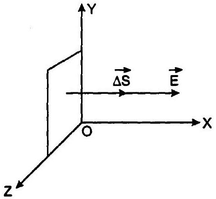

अत: अभीष्ट फ्लक्स $=30 \mathrm{Nm}^{2} \mathrm{C}^{-1}$ उत्तर
(b) ∵ वर्ग अर्थात् सदिश क्षेत्रफल पर अभिलंब एवं विद्युत क्षेत्र में $60^{\circ}$ का कोण है
अर्थात् $\theta=60^{\circ}$
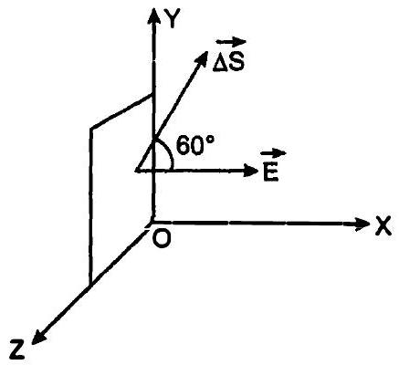

$$
\begin{aligned}
\therefore \quad \phi & =\mathrm{E} \Delta \mathrm{~S} \\
& =E \Delta S \cos 60^{\circ} \\
& =3 \times 10^{3} \times 10^{-2} \times \frac{1}{2} \mathrm{Nm}^{2} \mathrm{C}^{-1} \\
& \quad\left[\because \cos 60^{\circ}=\frac{1}{2}\right] \\
& =15 \mathrm{Nm}^{2} \mathrm{C}^{-1}
\end{aligned}
$$

अत: अभीष्ट फ्लक्स $=15 \mathrm{Nm}^{2} \mathrm{C}^{-1}$ उत्तर
प्रश्न 1.16. अभ्यास $1.15$ के एकसमान विद्युत क्षेत्र का $20 \mathrm{~cm}$ भुजा के किसी घन से (जो इस प्रकार अभिविन्यासित है किं उसके फलक निर्देशांक तलों के समांतर हैं) कितना नेट फ्लक्स गुजरेगा?

उत्तर : घन में से नेट अभिवाह शून्य होगा, क्योकि जितनी विद्युत बल रेखाएँ इसकी $20 \mathrm{~cm}$ भुजा के फलक से प्रवेश करती हैं, उतनी ही निर्गत हैं।

प्रश्न 1.17. किसी काले बॉक्स के पृष्ठ पर विद्युत क्षेत्र की सावधानीपूर्वक ली गई माप यह संकेत देती है कि बॉक्स के पृष्ठ से गुजरने वाला नेट फ्लक्स $\mathbf{8 . 0} \times \mathbf{1 0}^{\mathbf{3}} \mathbf{~ N m}^{\mathbf{2}} / \mathrm{C}$ है।
(a) बॉक्स के भीतर नेट आवेश कितना है?
(b) यदि बॉक्स के पृष्ठ से नेट बहिर्मुखी फ्लक्स शून्य है, तो क्या आप यह निष्कर्ष निकालेंगे कि बॉक्स के भीतर कोई आवेश नहीं है? क्यों, अथवा क्यों नहीं?

हल : (a) $\because \phi=8 \times 10^{3} \mathrm{Nm}^{2} \mathrm{C}^{-1}$
तथा $\varepsilon_{0}=8.854 \times 10^{-12} \mathrm{C}^{2} \mathrm{~N}^{-1} \mathrm{~m}^{-2}$
यदि काले बॉक्स में नेट आवेश $q$ है, तब

$$
\begin{aligned}
\because & & \phi & =\frac{q}{\varepsilon_{0}} \\
\therefore & & q & =\varepsilon_{0} \phi
\end{aligned}
$$

या $q=8.854 \times 10^{-12} \mathrm{C}^{2} \mathrm{~N}^{-1} \mathrm{~m}^{-2} \times 8$

$$
\begin{aligned}
& =8.854 \times 8 \times 10^{-9} \mathrm{C} \\
& =70.832 \times 10^{-9} \mathrm{C} \\
& =0.070832 \times 10^{-6} \mathrm{C} \\
& =0.07 \mu \mathrm{C}
\end{aligned}
$$

अत: बॉक्स के भीतर नेट आवेश $=0.07 \mu \mathrm{C}$ उत्तर
(b) हम यह निष्कर्ष नहीं निकाल सकते कि बॉक्स के अंदर नेट आवेश शून्य है, यदि बॉक्स से बाहर की ओर पृष्ठ से नेट अभिवाह शून्य है; क्योकि ॠण एवं घनावेश की संख्या समान हो सकती है, जो एक-दूसरे के प्रभाव को निरस्त कर देते हैं, जिससे अंदर का नेट आवेश शून्य हो जाता है और हम ऐसा निष्कर्ष ले लेते हैं कि बॉक्स के अंदर नेट आवेश शून्य है।

प्रश्न 1.18. चित्र में दर्शाए अनुसार $10 \mathrm{~cm}$ भुजा के किसी वर्ग के केन्द्र से ठीक $5 \mathrm{~cm}$ ऊँचाई पर कोई $+10 \mu \mathrm{C}$ आवेश रखा है। इस वर्ग से गुजरने वाले वैद्युत फ्लक्स का परिमाण क्या है? (संकेत: वर्ग को $10 \mathrm{~cm}$ किनारे के किसी घन का एक फलक मानिए।
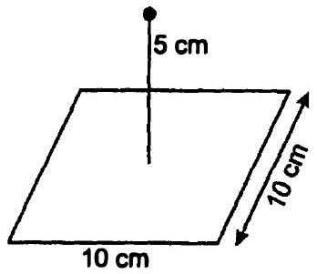

हल : वर्ग $A B C D$ को $0.10 \mathrm{~cm}$ भुजा वाले घन का पाश्र्व का फलक मान सकते हैं। दिए गए आवेश की कल्पना $5 \mathrm{~cm}$ दूरी पर इस घन के केन्द्र पर की जा सकती है।

$$
\because q=10 \mu \mathrm{C}=10 \times 10^{-6} \mathrm{C}=10^{-5} \mathrm{C}
$$

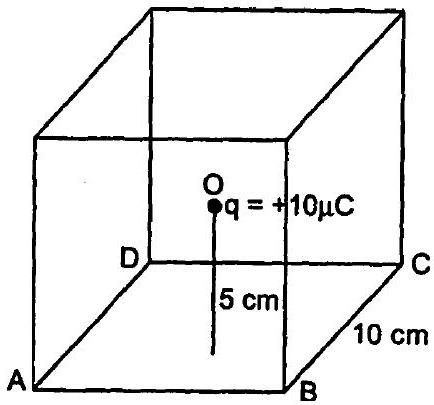

तब, गाउस के नियम के अनुसार घन के सभी पृष्ठों से कुल वैद्युत-अभिवाह

$$
\phi=\frac{q}{\varepsilon_{0}}
$$

यदि वर्ग $A B C D$ में से विद्युत-अभिवाह $q^{\prime}$ है, तब

$$
q=\frac{1}{6} \times \frac{q}{\varepsilon_{0}}
$$

या $q^{\prime}=\frac{1}{6} \times \frac{10^{-5} \mathrm{C}}{8.854 \times 10^{-12} \mathrm{C}^{2} \mathrm{~N}^{-1} \mathrm{~m}^{-2}}$

$$
\left[\because \varepsilon_{0}=8.854 \times 10^{-12} \mathrm{C}^{2} \mathrm{~N}^{-1} \mathrm{~m}^{-2}\right]
$$

या $q^{\prime}=\frac{10^{7}}{53.124} \mathrm{NC}^{-1} \mathrm{~m}^{2}$
या $q^{\prime}=\frac{100 \times 10^{5}}{53.124} \mathrm{NC}^{-1} \mathrm{~m}^{2}$
या $q^{\prime}=188 \times 10^{5} \mathrm{NC}^{-1} \mathrm{~m}^{2}$
अत: इस वर्ग से गुजरने वाले वैद्युत फ्लक्स का परिमाण $=1.88 \times 10^{5} \mathrm{NC}^{-1} \mathrm{~m}^{2}$ उत्तर

प्रश्न 1.19. $2.0 \mu \mathrm{C}$ का कोई बिंदु आवेश किसी किनारे पर $9.0 \mathrm{~cm}$ किनारे वाले किसी घनीय गाउसीय पृष्ठ के केन्द्र पर स्थित है। पृष्ठ से गुजरने वाला नेट फ्लक्स क्याहै?

हल : ∵ गाउसीय तल के केन्द्र पर आवेश

$$
\begin{aligned}
q & =2 \mu \mathrm{C}=2 \times 10^{-6} \mathrm{C} \\
\varepsilon_{0} & =8.854 \times 10^{-12} \mathrm{~N}^{-1} \mathrm{~m}^{-2} \mathrm{C}^{2} \\
\phi & =\text { इसमें से विद्युत-अभिवाह }=?
\end{aligned}
$$

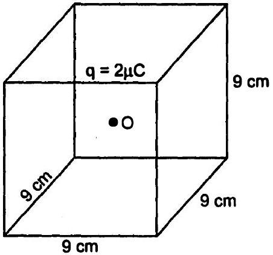

गाउस सिद्धांत के अनुसार घन के छह: पृष्ठों अर्थात् गाउसीय तलों से अभिवाह

$$
\begin{aligned}
\because \quad \phi & =\frac{q}{\varepsilon_{0}} \\
\therefore \quad \phi & =\frac{2 \times 10^{-6} \mathrm{C}}{8.854 \times 10^{-12} \mathrm{~N}^{-1} \mathrm{~m}^{-2} \mathrm{C}^{2}} \\
& \quad\left[\because \varepsilon_{0}=8.854 \times 10^{-12} \mathrm{~N}^{-1} \mathrm{~m}^{-2} \mathrm{C}^{2}\right] \\
& =\frac{20 \times 10^{5}}{8.854}-\mathrm{NC}^{-1} \mathrm{~m}^{2} \\
& =2.26 \times 10^{5} \mathrm{Nm}^{2} \mathrm{C}^{-1}
\end{aligned}
$$

अत: पृष्ठ से गुजरने वाला नेट फ्लक्स $2.26$ $\times 10^{5} \mathrm{Nm}^{2} \mathrm{C}^{-1}$ है। उत्तर
प्रश्न 1.20. किसी बिंदु आवेश के कारण उस बिंदु को केन्द्र मानकर खींचे गए $10 \mathrm{~cm}$ त्रिज्या के गोलीय गाउसीय पृष्ठ पर वैद्युत फ्लक्स $-1.0 \times 10^{3} \mathrm{Nm}^{2}$ /C
(a) यदि गाउसीय पृष्ठ की त्रिज्या दो गुनी कर दी जाए, तो पृष्ठ से कितना फ्लक्स गुजरेगा?
(b) बिंदु आवेश का मान क्या है?

हल : $\phi=$ गाउसीय पृष्ठ वाले गोल में से गुजरने वाला विद्युत-अभिवाह $=-10 \times 10^{3} \mathrm{Nm}^{2} \mathrm{C}^{-1}$

या $r=$ गाउसीय गोलीय पृष्ठ की त्रिज्या $=10 \mathrm{~cm}$
माना इसके केन्द्र पर $q$ आवेश बंद है।
(a) गाउस के नियमानुसार किसी पृष्ठ से गुज़रने वाला वैद्युत-अभिवाह उसमें बंद आवेश पर निर्भर होता है न कि उस पृष्ठ के आकार पर। इस प्रकार वैद्युत अभिवाह अपरिवर्तित रहेगा।
$-1.0 \times 10^{3} \mathrm{Nm}^{2} \mathrm{C}^{-1}$ उस गोलीय गाउसीय पृष्ठ से जिसकी त्रिज्या पहले से दुगुनी है अर्थात् $20 \mathrm{~cm}$ हैं, क्योंकि इसमें भी उतना ही आवेश बंद है।

अत: अभीष्ट फ्लक्स $=-10^{3} \mathrm{Nm}^{2} \mathrm{C}^{-1}$ उत्तर
(b) $\because q=$ बिंदु आवेश = ?

तथा $\varepsilon_{0}=8.854 \times 10^{-12} \mathrm{~N}^{-1} \mathrm{~m}^{-2} \mathrm{C}^{2}$

$$
\begin{aligned}
\because & \phi=\frac{q}{\varepsilon_{0}} . \\
\therefore & q=\varepsilon_{0} \phi
\end{aligned}
$$

या

$$
\begin{aligned}
& q=8.854 \times 10^{-12} \mathrm{~N}^{-1} \mathrm{~m}^{-2} \mathrm{C}^{2} \\
& \times\left(-10^{3} \mathrm{Nm}^{2} \mathrm{C}^{-1}\right) \\
& {\left[\because \varepsilon_{0}=8.854 \times 10^{-12} \mathrm{~N}^{-1} \mathrm{~m}^{-2} \mathrm{C}^{2}\right]} \\
& =-8.854 \times 10^{-9} \mathrm{C} \\
& =-8.8 \mathrm{nC}
\end{aligned}
$$

अत: बिन्दु आवेश का मान $=-8.8 \mathrm{nC}$ उत्तर
प्रश्न 1.21. $10 \mathrm{~cm}$ त्रिज्या के चालक गोले पर अज्ञात परिणाम का आवेश है। यदि गोले के केन्द्र से $20 \mathrm{~cm}$ दूरी पर विद्युत क्षेत्र $1.5 \times 10^{3} \mathrm{~N} / \mathrm{C}$ त्रिज्यतः अंतर्पुर्खा (radially inward) है, तो गोले पर नेट आवेश कितना है?

हल : $\because R=$ चालक गोले की त्रिज्या $=0.10 \mathrm{~m}$ $r=$ गोले के केन्द्र से बिंदु की दूरी $=20 \mathrm{~cm}=0.2 \mathrm{~m}$ स्पष्टत: $r>R$
$E=$ गोले से $20 \mathrm{~cm}$ दूर बिंदु पर विद्युत-क्षेत्र
$1.5 \times 10^{3} \mathrm{NC}^{-1}$ अंदर की ओर
$q=$ गोले पर नेट आवेश = ?
$\because \quad E=\frac{1}{4 \pi \varepsilon_{0}} \cdot \frac{q}{r^{2}}$
$\therefore \quad q=4 \pi \varepsilon_{0} E r^{2}$
या $q=\frac{1}{9 \times 10^{9}} \times 15 \times 10^{3} \times(0.2)^{2} \mathrm{C}$
या

$$
q=\frac{15 \times 10^{3} \times 4 \times 10^{-2}}{9 \times 10^{9}} \mathrm{C}
$$

या

$$
q=\frac{2}{3} \times 10^{-8} \mathrm{C}
$$

या

$$
q=\frac{20}{3} \times 10^{-9} \mathrm{C}
$$

या

$$
q=6.67 \times 10^{-9} \mathrm{C}
$$

या

$$
q=6.67 \mathrm{nC}
$$

इसके अतिरिक्स E गोले के अंदर की ओर कार्य करता है।
∵ आवेश ऋणावेश है।
∴

$$
q=-6.67 \times 10^{-9} \mathrm{C}=-6.67 \mathrm{nC}
$$

अत: गोले पर नेट आवेश $=-6.67 \mathrm{nC}$
उत्तर
प्रश्न 1.22. $2.4 \mathrm{~m}$ व्यास के किसी एकसमान आवेशित चालक गोले का पृष्ठीय आवेश घनत्व $80.0 \mu \mathrm{C} / \mathrm{m}^{2}$ है।
(a) गोले पर आवेश ज्ञात कीजिए।
(b) गोले के पृष्ठ से निर्गतकुल वैद्युत फलक्स क्या है?
हल : ∵

$$
\begin{aligned}
\sigma & =\text { गोले के पृष्ठ का आवेश घनत्व } \\
& =80.0 \mu \mathrm{Cm}^{-2} \\
& =80 \times 10^{-6} \mathrm{Cm}^{-2}
\end{aligned}
$$

$R=$ आवेशित गोले की त्रिज्या

$$
\begin{aligned}
& =\frac{2.4}{2} \mathrm{~m} \\
& =1.2 \mathrm{~m}
\end{aligned}
$$

(a) $q=$ गोले पर आवेश = ?
∵

$$
\sigma=\frac{q}{4 \pi R^{2}}
$$

∴

$$
q=4 \pi R^{2} \sigma
$$

या

$$
q=4 \times \frac{22}{7} \times(12)^{2} \times 80 \times 10^{-6} \mathrm{C}
$$

या

$$
q=\frac{88 \times 144 \times 8 \times 10^{-5}}{7} \mathrm{C}
$$

या

$$
q=\frac{10.1376 \times 10^{-3}}{7} \mathrm{C}
$$

या

$$
q=145 \times 10^{-3} \mathrm{C}
$$

अत: गोले पर आवेश $=1.45 \times 10^{-3}$ उत्तर

(b) $$
\begin{aligned}
\phi & =\text { गोले के पृष्ठ से निर्गत कुल वैद्युत-अभिवाह } \\
& =\text { ? }
\end{aligned}
$$
गाउस के सिद्धांत का उपयोग करने पर,
∵
$$
\phi=\frac{q}{\varepsilon_{0}}
$$
∴
$$
\phi=\frac{145 \times 10^{-3} \mathrm{C}}{8.854 \times 10^{-12} \mathrm{~N}^{-1} \mathrm{~m}^{-2} \mathrm{C}^{2}}
$$
या
$$
\phi=\frac{14.5 \times 10^{8}}{8.854}-\mathrm{Nm}^{2} \mathrm{C}^{-1}
$$
या
$$
\phi=1.6376 \times 10^{8} \quad \mathrm{Nm}^{2} \mathrm{C}^{-1}
$$
अत:
$$
\phi=16 \times 10^{8} \mathrm{Nm}^{2} \mathrm{C}^{-1}
$$
अत: गोले के पृष्ठ से निर्गत कुल वैद्युत फ्लक्स उत्तर

प्रश्न 1.23. कोई अनंत रैखिक आवेश $2 \mathrm{~cm}$ दूरी पर $9 \times 10^{4} \mathrm{NC}^{-1}$ विद्युत क्षेत्र उत्पन्न करता है। रैखिक आवेश घनत्व ज्ञात कीजिए।

हल : $\because E=$ एक अनंत रैखिक आवेश द्वारा उत्पन्न वैद्युत क्षेत्र $=9 \times 10^{4} \mathrm{NC}^{-1}$
$r=$ उस बिंदु की दूरी जहाँ $E$ उत्पन्न होता है

$$
=2 \mathrm{~cm}=0.02 \mathrm{~m}
$$

$$
\lambda=\text { रैखिक आवेश घनत्व }=\text { ? }
$$

तथा
∵

$$
E=\frac{1}{2 \pi \varepsilon_{0}} \cdot \frac{\lambda}{r}
$$

∴

$$
\lambda=2 \pi \varepsilon_{0} r E
$$

या

$$
\lambda=4 \pi \varepsilon_{0} \cdot \frac{r E}{2}
$$

$$
=\frac{1 \mathrm{~N}^{-1} \mathrm{~m}^{-2} \mathrm{C}^{2}}{9 \times 10^{9}}
$$

या

$$
\lambda=\frac{0.02 \times 10^{-5}}{2} \mathrm{C} / \mathrm{m}
$$

या

$$
\lambda=1 \times 10^{-7} \mathrm{C} / \mathrm{m}
$$

या

$$
\lambda=10 \mu \mathrm{C} / \mathrm{m}
$$

अत: रैखिक आवेश घनत्व $=10 \mu \mathrm{C} / \mathrm{m}$ उत्तर
प्रश्न 1.24. दो बड़ी, पतली धातु की प्लेटें एक-दूसरे के समानांतर एवं निकट हैं। इनके भीतरी फलकों पर, प्लेटों के पृष्ठीय आवेश घनत्वों के चिह्न वियरीत हैं तथा इनका परिमाण $17.0 \times 10^{-22} \mathrm{C} / \mathrm{m}^{2}$ है :
(a) पहली प्लेट के बाह्य क्षेत्र में,
(b) दूसरी प्लेट के बाह्य क्षेत्र में, तथा
(c) प्लेटों के बीच में विद्युत क्षेत्र E का परिणाम परिकलित कीजिए।

हल : ∵ $\sigma=$ पट्टिका का पृष्ठ आवेश घनत्व

$$
=17.0 \times 10^{-22} \mathrm{Cm}^{-2}
$$

तथा

$$
\varepsilon_{0}=8.854 \times 10^{-12} \mathrm{~N}^{-1} \mathrm{~m}^{-2} \mathrm{C}^{2}
$$

पट्टिकाओं का प्रबंधन संलग्न चित्र में दर्शाया गया है :
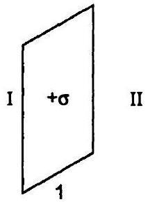
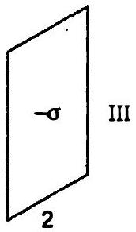
(a) पहली पट्टिका के बाह्य क्षेत्र में $E=$ पहली पट्टिका के बायों ओर तथा क्षेत्र $I$ पहली पट्टिका के बायीं ओर है।

अत: इस क्षेत्र में दोनों पट्टिकाओं का विद्युत क्षेत्र

$$
\begin{aligned}
E_{1} & =-E_{1}+\left(-E_{2}\right) \\
& =-\frac{\sigma}{2 \varepsilon_{0}}-\left(\frac{-\sigma}{2 \varepsilon_{0}}\right) \\
& =\frac{-\sigma+\sigma}{2 \varepsilon_{0}}=0
\end{aligned}
$$

$\therefore \quad E_{1}=0$
अत: पहली प्लेट के बाह्य क्षेत्र में $E$ का परिमाण $=0$ उत्तर
(b) दूसरी पट्टिका के बाहरी क्षेत्र में $E=$ दूसरी पट्टिका के दायीं ओर $E$ अर्थात् क्षेत्र III में $E=$ ?

क्षेत्र III में $E$ का मान

$$
\begin{aligned}
E_{\mathrm{III}} & =\left(\frac{\sigma}{2 \varepsilon_{0}}\right)+\left(-\frac{\sigma}{2 \varepsilon_{0}}\right) \\
& =\frac{\sigma-\sigma}{2 \varepsilon_{0}}=0
\end{aligned}
$$

अत: दूसरी प्लेट के बाह्य क्षेत्र में $E$ का परिमाण $=0$ उत्तर
(c) दोनों पट्टिकाओं के बीच $E=$ क्षेत्र II में $E=E_{\mathrm{II}}=$ ?

$$
E_{\mathrm{II}}=E_{1}+\left(-E_{2}\right)
$$

(यहाँ $E_{1}$ धनात्मक एवं $E_{2}$ ॠणात्मक है)

$$
\begin{aligned}
\therefore E_{\mathrm{II}} & =E_{1}-E_{2} \\
& =\frac{\sigma}{2 \varepsilon_{0}}-\left(\frac{-\sigma}{2 \varepsilon_{0}}\right) \\
& =\frac{\sigma}{2 \varepsilon_{0}}+\frac{\sigma}{2 \varepsilon_{0}}=\frac{\sigma}{\varepsilon_{0}} \\
& =\frac{17 \times 10^{-22}}{8.854 \times 10^{-12}} \mathrm{NC}^{-1} \\
& =192 \times 10^{-10} \mathrm{NC}^{-1} \\
& =19 \times 10^{-10} \mathrm{NC}^{-1}
\end{aligned}
$$

अत: प्लेटों के बीच में विद्युत क्षेत्र $E$ का परिमाण $=1.9 \times 10^{-10} \mathrm{NC}^{-1}$ उत्तर

## अतिरिक्त प्रश्न

प्रश्न 1.25. मिलिकन तेल बूँद प्रयोग में $2.55$ $\times 10^{4} \mathrm{NC}^{-1}$ के नियत विद्युत क्षेत्र के प्रभाव में $12$ इलेक्ट्रॉन आधिक्य की कोई तेल बूँद स्थिर रखी जाती है। तेल का घनत्व $1.26 \mathrm{~g} \mathrm{~cm}^{-3}$ है। बूँद की त्रिज्या का आकलन कीजिए $\left(g=9.81 \mathrm{~m} \mathrm{~s}^{-2} ; e=1.6 \times 10^{-19} \mathrm{C}\right)$

हल : $\because E=$ निश्चित ( स्थिर ) वैद्युत क्षेत्र

$$
=2.55 \times 10^{4} \mathrm{NC}^{-1}
$$

$e=$ एक इलेक्ट्रॉन पर आवेश' $=1.6 \times 10^{-19} \mathrm{C}$
$n=$ इलेक्ट्रॉनों की संख्या $=12$
तथा $q=$ बूँद पर आवेश, तब

$$
q=n e
$$

या $q=12 \times 16 \times 10^{-19} \mathrm{C}$
या $q=19.2 \times 10^{-19} \mathrm{C}$

यदि तेल की बूँद पर $F_{e}$ स्थिर वैद्युत बल वैद्युत-क्षेत्र के कारण है, तब

या

$$
\begin{aligned}
F_{e} & =q E \\
F_{e} & =19.2 \times 10^{-19} \mathrm{C} \\
& \times 2.55 \times 10^{4} \mathrm{NC}^{-1}
\end{aligned}
$$

इसके अतिरिक्त माना बूँद पर गुरुत्व के कारण बल $F_{g}$ है, तब

$$
F_{g}=m g=\frac{4}{3} \pi r^{3} \rho g
$$

यहाँ $\rho=$ तेल का घनत्व $=1.26 \mathrm{~g} \mathrm{~cm}^{-3}$

$$
\begin{aligned}
= & 1.26 \times 10^{3} \mathrm{~kg} \mathrm{~m}^{-3} \\
g & =9.81 \mathrm{~ms}^{-2}
\end{aligned}
$$

तथा $r=$ बूँद की त्रिज्या = ?
समीकरण (ii) में इन मानों को रखने पर,

$$
F_{g}=\frac{4}{3} \pi r^{3} \times 126 \times 10^{3} \times 9.81
$$

∵ बूँद स्थिर रहती है।

$$
F_{e}=F_{g}
$$

वैद्युत क्षेत्र से स्थिर वैद्युत बल = तेल की बूँद का भार
या $19.2 \times 10^{-19} \times 2.55$

$$
\times 10^{4}=\frac{4}{3} \pi r^{3} \times 126 \times 10^{3} \times 9.81
$$

या

$$
r^{3}=\frac{19.2 \times 2.55 \times 10^{-15} \times 3}{4 \pi \times 1.26 \times 10^{3} \times 9.81} \mathrm{~m}^{3}
$$

या

$$
r^{3}=\frac{19.2 \times 2.55 \times 10^{-15} \times 3}{4 \times 3.14 \times 126 \times 10^{3} \times 9.81} \mathrm{~m}^{3}
$$

या

$$
r^{3}=\frac{14.688 \times 10^{-14}}{1.55 \times 10^{5}} \mathrm{~m}^{3}
$$

या

$$
r^{3}=9.47 \times 10^{-19} \mathrm{~m}^{3}
$$

या

$$
r^{3}=947 \times 10^{-21} \mathrm{~m}^{3}
$$

या

$$
r=\left(947 \times 10^{-21}\right)^{1 / 3} \mathrm{~m}
$$

या

$$
r=9.81 \times 10^{-7} \mathrm{~m}
$$

या

$$
r=9.81 \times 10^{-4} \mathrm{~mm}
$$

अत: बूँद की त्रिज्या $=9.81 \times 10^{-4} \mathrm{~mm}$ उत्तर
प्रश्न 1.26. चित्र में दर्शाए गए वक्रों में से कौन संभावित स्थिर वैद्युत क्षेत्र रेखाएँ निरूपित नहीं करते?

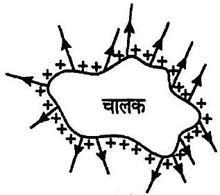
(a)

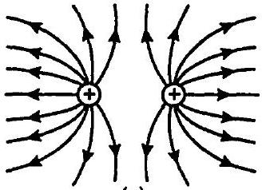
(c)

(d)
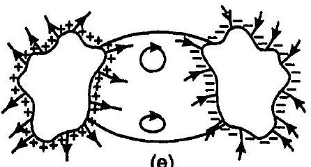

उत्तर : केवल (c) वैद्युत बल रेखाएँ दर्शाता है।
(a) वैद्युत बल रेखाएँ पृष्ठ से या पृष्ठ पर केवल अभिलंब आरंभ होती है अथवा समाप्त।
(b) वैद्युत बल रेखाएँ ऋणावेश से आरंभ होकर धनावेश पर समाप्त नहीं होती।

अत: चित्र (b) वैद्युत बल रेखाएँ नहीं दर्शाता है।
(c) यह चित्र वैद्युत बल रेखाएँ दर्शाता है। इसमें बिंदु आवेश लिए हैं।
(d) इसमें बल रेखाओं को काटते दर्शाया गया है, जो वैद्युत बल रेखाओं का गुण नहीं है।
(e) वैद्युत बल रेखाएँ बंद लूप नहीं बनाती हैं।

अत: यह गलत चित्र है।
प्रश्न 1.27. दिक्स्थान के किसी क्षेत्र में, विद्युत क्षेत्र सभी जगह $z$-दिशा के अनुदिश है। परंतु विद्युत क्षेत्र का परिमाण नियत नहीं है, इसमें एकसमान रूप से $z$-दिशा के अनुदिश $10^{5} \mathrm{NC}^{-1}$ प्रति मीटर की दर से वृद्धि होती है। वह निकाय जिसका ऋणात्मक $z$-दिशा में कुल द्विधुव आघूर्ण $10^{-7} \mathrm{Cm}$ के बराबर है, कितना बल तथा बल आघूर्ण अनुभव करता है?

हल : माना $A$ एवं $B$ पर $-q$ और $+q$ आवेशों वाले वैद्युत-द्विध्रुव, जिसे $Z$-अक्ष के अनुदिश रखा है, का वैद्युत-द्विध्रुव बल आघूर्ण $p=2 a q$
$\therefore p$ ॠण $Z$-अक्ष की दिशा में कार्य करता है।
$\therefore Z$-अक्ष की दिशा में विस्थापन $p_{z}$ और $z$-दिशा के अनुदिश

$$
p_{z}=-10^{-7} \mathrm{Cm} \text { है। }
$$

वैद्युत क्षेत्र को धन $Z$-अक्ष की दिशा में इस प्रकार लगाया गया है कि

$$
\frac{\partial \mathrm{E}}{\partial z}=10^{5} \mathrm{NC}^{-1} \mathrm{~m}^{-1}, F=?, \tau=\text { ऐंठन }=?
$$

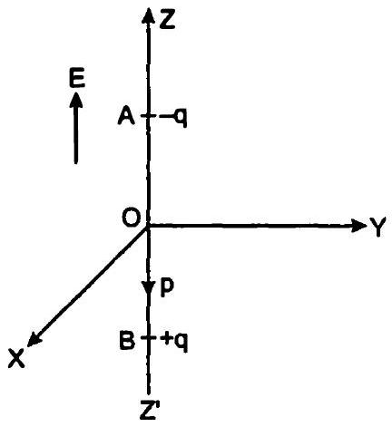

एक असमान वैद्युत क्षेत्र में, विद्युत-द्विध्रुव पर बल

$$
\mathbf{F}=p_{x} \frac{\partial \mathbf{E}}{\partial x}+p_{y} \frac{\partial \mathbf{E}}{\partial y}+p_{z} \frac{\partial \mathbf{E}}{\partial z}
$$

$\left[\because \mathrm{F}=e \mathrm{E}=q \times \frac{\partial \mathrm{E}}{\partial z} \times d z=(q \times d z) \frac{\partial \mathrm{E}}{\partial z}=p \frac{\partial \mathrm{E}}{\partial z}\right]$
$\because \quad p_{x}=p_{y}=0$
$\therefore \quad \frac{\partial \mathbf{E}}{\partial x}=\frac{\partial \mathbf{E}}{\partial y}=0$
$\therefore \quad F=p_{z} \frac{\partial \mathrm{E}}{\partial z}=-10^{-7} \times 10^{5} \mathrm{~N}$

$$
=-10^{-2} \mathrm{~N}
$$

जो ऋण Z-अक्ष के अनुदिश कार्य करता है।
∵ दोनों P एवं E क्रमशः ऋण $Z$ तथा धन $Z$-दिशाओं की ओर कार्य करते हैं।

$$
\begin{aligned}
& \therefore \theta=180^{\circ} \\
& \text { तथा } \tau=p E \sin \theta \\
& \text { या } \tau=p E \sin 180^{\circ} \\
& \text { या } \tau=p E \times 0 \\
& \therefore \tau=0 \\
& \therefore \text { वैद्युत द्विध्रुव पर वैद्युत द्विध्रुव आघूर्ण शून्य है। }
\end{aligned}
$$

अत: यह बल ऋणात्मक $\boldsymbol{Z}$-अक्ष की दिशा में $10^{-2} \mathrm{~N}$ है अर्थात् यह घटते विद्युत क्षेत्र की दिशा में है। यह द्विध्रुव की घटती स्थितिज ऊर्जा की दिशा भी है और बल आघूर्ण शून्य है। उत्तर
प्रश्न 1.28. (a) किसी चालक $A$ जिसमें चित्र (a) में दर्शाए अनुसार कोई कोटर/गुहा (cavity) है, को $Q$ आवेश दिया गया है। यह दर्शाइए कि समस्त आवेश चालक के बाह्य पृष्ठ पर प्रतीत होना चाहिए।
(b) कोई अन्य चालक $B$ जिस पर आवेश $q$ है, को कोटर/गुहा (Cavity) में इस प्रकार धैंसा दिया जाता है कि चालक $B$ चालक $A$ से विद्युतरोधी रहे। यह दर्शाइए कि चालक $A$ के बाह्य पृष्ठ पर कुल आवेश $Q+q$ है [चित्र (b)]।
(c) किसी सुग्राही उपकरण को उसके पर्यावरण के प्रबल स्थिरवैद्युत क्षेत्रों से परिरक्षित किया जाना है। संभावित उपाय लिखिए।

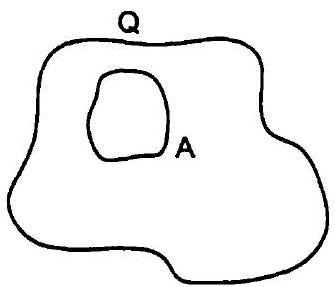
(a)

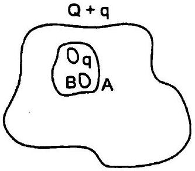
(b)

उत्तर : (a) टूटी रेखाओं से प्रदर्शित एक गाउसीय पृष्ठ को लेते हैं, जिससे चालक $A$ में कोटर छेद छोड़कर घिर जाए, जैसा चित्र (a) में दर्शाया गया है।

हमें यह भी ज्ञात है कि चालक के अंदर कोई विद्युत क्षेत्र नहीं होता अर्थात् शून्य होता है।
अत: चालक के अंदर कोटर में कोई आवेश नहीं है।
अत: गाउसीय पृष्ठ के अंदर कोई आवेश उपस्थित नहीं हो सकता, जो चालक के ठीक अंदर है।
इस प्रकार, गाउस के नियमानुसार,
∴

$$
\begin{aligned}
\oint_{s} \mathbf{E} d \mathbf{S} & =\frac{Q}{\varepsilon_{0}} \\
\frac{Q}{\varepsilon_{0}} & =0
\end{aligned}
$$

अत: गाउसीय पृष्ठ के अंदर $E=0$
∴ गाउसीय पृष्ठ के अंदर $Q=0$
अत: समस्त आवेश $Q$ गाउसीय पृष्ठ $A$ के बाहर की ओर पृष्ठ पर दृष्टिगोचर होना चाहिए।

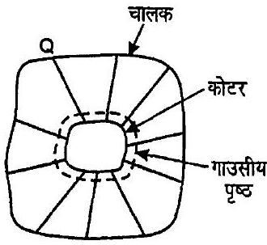
(a)

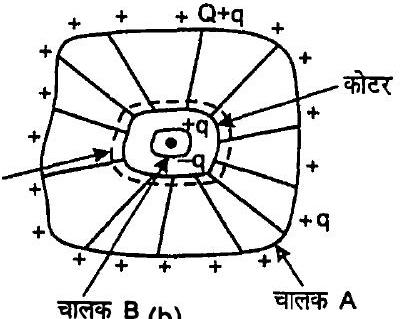
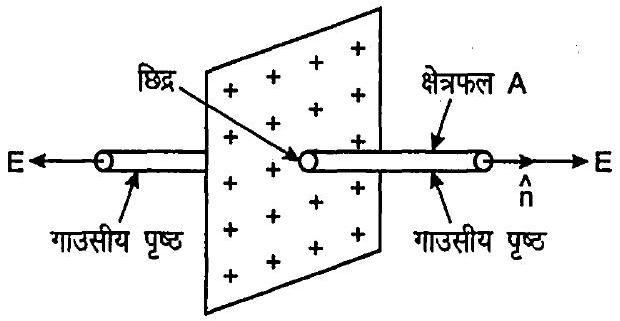

इस प्रकार, यदि गाउसीय पृष्ठ से कुल विद्युत अभीवाह
(टूटी-रेखा) द्वारा चालक $B$ को घेरे हुए कोटर में आवेश $q$ को बंद करते हर एक गाउसीय पृष्ठ को लेते हैं। ऐसे ही वैद्युत अभिवाह गाउसीय पृष्ठ को पार कर जायेगा, जिससे ऐसा प्रतीत होगा कि चालक के अंदर आवेश उपस्थित है। परंतु चालक $A$ के अंदर आवेश शून्य होना चाहिए। इसका अर्थ है कि चालक $B$ कोटर के आंतरिक पृष्ठ पर $-q$ आवेश उत्प्रेरित करता है, जो चालक $A$ के बाह्य पृष्ठ पर $+q$ आवेश के रूप में चला जाता है।

इस प्रकार बाह्य पृष्ठ पर कुल आवेश $Q+q$ हो जायेगा।
(c) खोखले धातु पृष्ठ के अंदर विद्युत-क्षेत्र शून्य होता है और सम्पूर्ण क्षेत्र बाह्य पृष्ठ पर ही उपस्थित होता है। अत: एक संवेदी यंत्र को तीव्र स्थिर वैद्युत क्षेत्र से परिरक्षित करने के लिए उसे खोखले धातु के खोल में रखना चाहिए।

प्रश्न 1.29. किसी खोखले आवेशित चालक में उसके पृष्ठ पर कोई छिद्र बनाया गया है। यह दर्शाइए कि छिद्र में विद्युत क्षेत्र $\left(\sigma / 2 \varepsilon_{0}\right) \hat{n}$ है, जहाँ $\hat{n}$ अभितंबवत् दिशा बहिर्मुखी एकांक सदिश है तथा $\sigma$ छिद्र के निकट पृष्ठीय आवेश घनत्व है।

हल : माना छेद के निकट चालक का पृष्ठ आवेश घनत्व $=\sigma$

छेद की अनुप्रस्थ काट $=A$
वैद्युत-क्षेत्र समतल आवेशित चादर के अभिलंबवत् है तथा बाह्य दिशा की ओर है, जोकि $\hat{n}$ दर्शाता है। छेद में $E$ का मान ज्ञात करने के लिए छेद में से एक गाउसीय बेलन खींचते हैं। चूँकि छेद से कई बल रेखाएँ बेलन की दीवार को पार करती हैं। अत: दीवारों के अभिलम्ब $E$ का घटक शून्य है। बेलन के सिरों पर $E$ का अभिलम्बवत् घटक $E$ है।

$$
\phi=\oint_{S} E d S
$$

या
या

$$
\phi=\oint_{S} E d x+\oint E \cdot d S
$$

= बेलन के वक्र पृष्ठ का पृष्ठ क्षेत्रफल

+ बेलन के सिरों (टोपी) का क्षेत्रफल

$$
\begin{aligned}
& =0+E \cdot A+E \cdot A \\
& =E A \cos \theta+E A \cos \theta \\
& =2 E A
\end{aligned}
$$

माना गाउसीय पृष्ठ में बंद आवेश $=q$
गाउस के नियमानुसार,

$$
\phi=\frac{q}{\varepsilon_{0}}=\frac{\sigma_{A}}{\varepsilon_{0}}
$$

समीकरणों (i) एवं (ii) से,

$$
2 E A=\frac{\sigma A}{\varepsilon_{0}}
$$

या
या

$$
E=\frac{\sigma}{2 \varepsilon_{0}}
$$

या सदिश रूप में,

$$
E=\left(\frac{\sigma}{2 \varepsilon_{0}}\right) \hat{n}
$$

इति सिद्धम्
वैकल्पिक : खोखले चालक के लिए, उसके पृष्ठ के किसी बिंदु पर वैद्युत क्षेत्र $\mathbf{E}=\frac{\sigma}{\varepsilon_{0}} \hat{n}$ होता है, जो बाह्य उन्मुख है तथा अंदर $\mathbf{E}=0$

यदि चालक के पृष्ठ पर एक छेद है, तब हम कह सकते हैं कि बिन्दु $P$ पर वैद्युत क्षेत्र छेद तक और शेष चालक के क्षेत्र के योग के तुल्या चालक के अन्दर $\mathbf{E}$ भरे छेद तथा शेष चालक के कारण और विपरीत दिशा की ओर कार्यरत है,

जिससे यह एक-दूसरे के प्रभाव को निरस्त करते हैं, जबकि चालक बाहर दोनों क्षेत्र में एक ही दिशा में कार्य करते हैं और दोनों के परिमाण समान होते हैं।
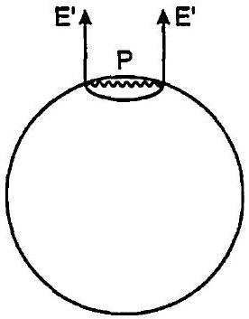

माना छेद पर विद्युत क्षेत्र $E$ है।
$\therefore 2 \times$ छेद में विद्युत-क्षेत्र = भरे छेद के साथ खोखले चालक का E
$2 \mathrm{E}^{\prime}=\frac{\sigma}{\varepsilon_{0}} \hat{n}$
या

$$
\mathbf{E}^{\prime}=\frac{\sigma}{2 \varepsilon_{0}} \hat{n}
$$

इति सिद्धम्।
प्रश्न 1.30. गाउस नियम का उपयोग किए बिना किसी एसमान रैखिक आवेश घनत्व $\lambda$ के लम्बे तार के कारण विद्युत क्षेत्र के लिए सूत्र प्राप्त कीजिए।

संकेत : सीधे ही कूलॉम नियम का उपयोग करके आवश्यक समाकलन का मान निकालिए।

हल : माना $A B$ एक अनन्त रेखीय आवेश है, जिसका केन्द्र $O$ तथा रेखीय एक समान आवेश घनत्व $\lambda$ है।

माना $a=$ उस बिन्दु की रेखा आवेश से अभिलंब दूरी है, जिस पर विद्युत क्षेत्र ज्ञात करना है।

लंबे तार (पतले) को छोटे-छोटे मूल बहुत अधिक भागों में बँटा हुआ मानते हैं तथा बिंदु $O$ पर $d l$ लम्बाई के एक ऐसे ही भाग जिस पर आवेश $d q$ है, $P$ बिन्दु से $r$ दूरी पर मानते हैं।
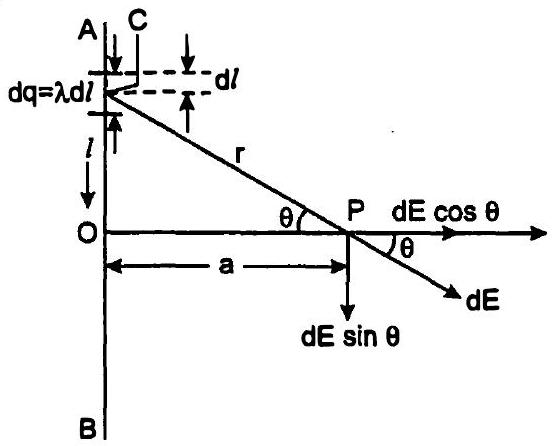

माना

$$
\angle C P O=\theta
$$

∴

$$
\lambda=\frac{d q}{d l}
$$

या

$$
d q=\lambda d l
$$

यदि $d q$ द्वारा $P$ पर उत्पन्न विद्युत-क्षेत्र $d E$ है, तब कूलम्ब के नियम से,

$$
d E=\frac{1}{4 \pi \varepsilon_{0}} \cdot \frac{d q}{r^{2}}
$$

$d \mathbf{E}$ के समकोणिक घटक चित्र में प्रदर्शित है। चित्र से स्पष्ट है कि समान्तर घटक (अवयव) $d E \sin \theta$ परिमाण में समान परंतु विपरीत दिशाओं में कार्य करते हैं।

इस प्रकार, एक-दूसरे को नष्ट कर देते हैं। परंतु तार की सम्पूर्ण लंबाई के कारण घटक $d E \cos \theta$ एक ही दिशा में कार्य करते हैं और परिणामस्वरूप योग करके नेट विद्युत क्षेत्र $E$ देते हैं, जो

$$
E=\int_{-\infty}^{\infty} d E \cos \theta d \theta, O X \text { के अनुदिश है। }
$$

अब समकोण त्रिभुज COP में,

$$
\cos \theta=\frac{O P}{C P}=\frac{a}{r}
$$

समीकरणों (i), (ii), (iii) और (iv) से,

$$
E=\frac{1}{4 \pi \varepsilon_{\theta}} \int_{-\infty}^{\infty} \frac{\lambda d l}{r^{2}} \cdot \frac{a}{r}
$$

या
अब समकोण त्रिभुज COP में,
या

$$
\frac{1}{r}=\frac{\cos \theta}{a}
$$

और

$$
\frac{l}{a}=\tan \theta
$$

या

$$
l=a \tan \theta
$$

समीकरण (vii) के प्रति अवकलन करने पर,

$$
d l=a \sec ^{2} \theta d \theta
$$

जब $x=-\infty$, तब $\theta=-\frac{\pi}{2}$
और जब $x=\infty$, तब $\theta=\frac{\pi}{2}$

समीकरणों (v), (vi), (vii) एवं (viii) से,

$$
E=\frac{\lambda a}{4 \pi \varepsilon_{0}} \int_{\frac{-\pi}{2}}^{\frac{\pi}{2}}\left(a \sec ^{2} \theta d \theta\right) \frac{\cos ^{3} \theta}{a^{3}}
$$

या

$$
E=\frac{\lambda a}{4 \pi \varepsilon_{0}} \int_{\frac{-\pi}{2}}^{\frac{\pi}{2}} \frac{\cos \theta}{a^{2}} d \theta
$$

या

$$
E=\frac{\lambda}{4 \pi \varepsilon_{0} a}[\sin \theta]_{\frac{-\pi}{2}}^{\frac{\pi}{2}}
$$

या

$$
E=\frac{\lambda}{4 \pi \varepsilon_{0} a}\left[\sin \frac{\pi}{2}-\sin \left(\frac{-\pi}{2}\right)\right]
$$

या

$$
E=\frac{\lambda}{4 \pi \varepsilon_{0} a}[1+1]
$$

या

$$
E=\frac{1}{2 \pi \varepsilon_{\theta}} \cdot \frac{\lambda}{a}
$$

या

$$
E=\frac{\lambda}{4 \pi \varepsilon_{0} \mathrm{a}} O X \text { के अनुदिश }
$$

जो अभिष्ट व्यंजक है।
प्रश्न 1.31. अब ऐसा विश्वास किया जाता है कि त्वयं प्रोटॉन एवं न्यूट्रॉन ( जो सामान्य द्रव्य के नाभिकों का निर्माण करते हैं ) और अधिक मूल इकाइयों जिन्हें क्वार्क फहते हैं, के बने हैं। प्रत्येक प्रोटॉन तथा न्यूटॉन तीन क्वाकों से मिलकर बनता है। दो प्रकार के क्वार्क होते हैं, 'अप' ऋवार्क ( $\mu$ द्वारा निर्दिष्ट) जिन पर $\left(\frac{+2}{3}\right) \mathrm{e}$ आवेश तथा 'डायन' क्वार्क ( $d$ द्वारा निर्दिष्ट) जिन पर $\left(-\frac{1}{3}\right) e$ आवेश होता है, इलेक्ट्रॉन से मिलकर सामान्य द्रव्य बनाते हैं। (कुछ अन्य प्रकार के क्वार्क भी पाए गए हैं, जो भिन्न असामान्य प्रकार का द्रव्य बनाते हैं।) प्रोटॉन तथा न्यूट्रॉन के संभावित क्वार्क संघटन सुझाइए।

उत्तर : $u$ एवं $d$ से दो प्रकार के क्वार्क क्रमशः अप एवं डाउन को दर्शाते हैं।

$$
\text { अप क्वार्क पर आवेश }=\frac{2}{3} e
$$

तथा डाउन क्वार्क पर आवेश $=\frac{1}{3} e$
∵ प्रोटॉन पर +e आवेश होता है तथा यह तीन क्वार्क से बना होता है।
∴ प्रोटॉन के लिए संभव क्वार्क संयोजन uud है।
∴ कुल आवेश $=\frac{2}{3} e+\frac{2}{3} e-\frac{1}{3} e$

$$
=\frac{4-1}{3} e=e
$$

दूसरी ओर न्यूट्रॉन अनावेशित कण हैं; परंतु यह भी तीन क्वार्क से बना है।

इस कारण न्यूट्रॉन के लिए संभव संयोजन $u d d$ है।
∴ न्यूट्रॉन पर कुल आवेश $=\frac{2}{3} e-\frac{1}{3} e-\frac{1}{3} e=0$
प्रश्न 1.32. (a) किसी यादृच्छिक स्थिरवैद्युत क्षेत्र विन्यास पर विचार कीजिए। इस विन्यास की किसी शून्य-विक्षेप स्थिति (null point अर्थात् जहाँ $E=0$ ) पर कोई छोटा परीक्षण आवेश रखा गया है। यह दर्शाइए कि परीक्षण आवेश का संतुलन आवश्यक रूप से अस्थायी है।
(b) इस परिणाम का समान परिमाण तथा चिह्नों के दो आवेशों (जो एक-दूसरे से किसी दूरी पर रखे हैं) के सरल विन्यास के लिए सत्यापन कीजिए।

हल : (a) असमान परिमाण परंतु एक ही चिह्न के दो असमान आवेशों से मिलकर एक यादृच्छिक आवेश विन्यास बनता है अर्थात् दो निश्चित आवेशों $+4 e$ तथा $+e$ के एक विन्यास को लेते हैं, जो $r$ दूरी पर क्रमशः बिंदुओं $A$ एवं $B$ पर रखे हैं।
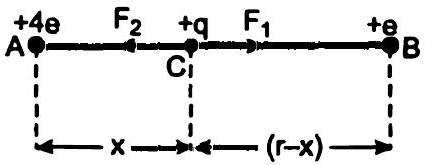

माना निरीक्षण आवेश $q_{0}+4 e$ आवेश से $C$ पर $x$ दूरी पर रखा है, जहाँ पर परिणामी बल शून्य हैं।
अर्थात् $F_{1}$ और $F_{2} C$ पर आवेशों $4 e$ तथा $e$ के कारण क्रमश: कार्यरत बल हैं।
तब, $\quad\left|F_{1}\right|=\left|F_{2}\right|$
या $\frac{1}{4 \pi \varepsilon_{0}} \cdot \frac{4 e q_{0}}{x^{2}}=\frac{l e}{4 \pi \varepsilon_{0}} \cdot \frac{q_{0}}{(r-x)^{2}}$
या

$$
\frac{4}{x^{2}}=\frac{1}{(r-x)^{2}}
$$

या $4(r-x)^{2}=x^{2}$
या $2(r-x)= \pm x$
∴

$$
x=\frac{2}{3} r
$$

या

$$
x=2 r
$$

साम्यावस्था के लिए आवेश $q_{0}$ धनात्मक अथवा ॠण्गात्मकहो सकता है।

प्रथम स्थिति : यदि $q_{0}$ ॠण्पात्मक है, तो दोनों आवेशों के कारण उस पर आकर्षण बल कार्य करते हैं। जब इसे आवेशों को मिलाने वाली रेखा के अनुदिश संतुलित अवस्था से एक या दूसरी ओर विस्थापित किया जाता है, तो आकर्षण बल एक आवेश के कारण बढ़ जाता है, तो दूसरे के कारण कम हो जाता है।

परिणामस्वरूप परीक्षण आवेश $-q_{0}$ अपनी संतुलित अवस्था पर पुन: वापस नहीं आता अर्थात् ऋणात्मक आवेश का संतुलन आवश्यक रूप से अस्थिर होता है।

द्वितीय स्थिति : यदि $q_{0}$ धनात्मक है और इसे आवेशों को मिलाने वाली रेखा के अभिलंब रेखा पर चलाया जाए, तब परिणामी बल इसे और विस्थापित करता है अर्थात् यह अपनी संतुलित अवस्था पर वापस नहीं आएगा अर्थात् संतुलन अवश्य ही अस्थिर है।
(b) माना साधारण विन्यास में $A$ तथा $B$ पर दो समान आवेश $+q$ हैं।

चूँकि दोनों आवेश परिमाण में समान और एक ही प्रकृति के हैं।

इसलिए आवेशों को मिलाने वाली रेखा के मध्य बिंदु $O$ पर उनका परिणामी शून्य होगा।

अर्थात्

$$
E=0
$$

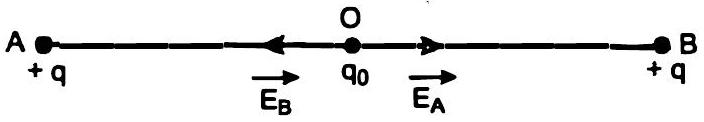

यदि आवेश को थोड़ा-सा भी विस्थापित किया जाता है, तो विन्यास अस्थिर होगा तथा आवेश सरल आवर्त गति करेगा।

प्रश्न 1.33. प्रारंभ में $x$-अक्ष के अनुदिश $v_{x}$ चाल से गति करती हुई दो आवेशित प्लेटों के मध्य क्षेत्र में $m$ द्रव्यमान तथा $-q$ आवेश का एक कण प्रवेश करता है। [चित्र प्रश्न $1.14$ के कण (1) के समान]। प्लेटों की लंबाई $L$ है। इन दोनों प्लेटों के बीच एकसमान विद्युत क्षेत्र $E$ बनाए रखा जाता है। दर्शाइए कि प्लेट के अंतिम किनारे पर कण का ऊर्ध्वाधर विक्षेप $q E L^{2} /\left(2 m v_{x}^{2}\right)$ है।
(कक्षा $11$ की पाठ्य पुस्तक के अनुभाग $4.10$ में वर्णित गुरुत्वीय क्षेत्र में प्रक्षेप्य की गति के साथ कण की गति की तुलना कीजिए।)

हल : हम दोनों पट्टिकाओं $Q$ एवं $P$ को लेते हैं और माना इनके बीच कार्यरत विद्युत क्षेत्र $E$ है।
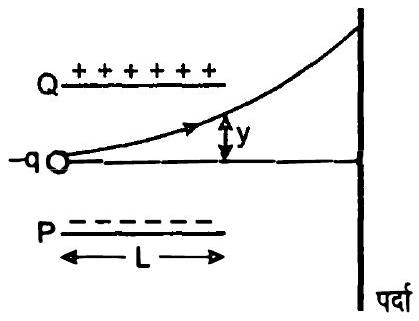

माना विद्युत क्षेत्र पार करने में कण $t$ समय लेता है तथा इसका विक्षेप $y$ है।

$$
\therefore \quad t=\frac{L}{v_{x}}
$$

आवेक्षित पट्टिकाओं $Q$ तथा $P$ के बीच $-q$ आवेश परवलीय पथ पर चलेगा।

माना $y$-अक्ष के अनुदिश कण में $a$ त्वरण उत्पन्न होता है।

आरंभ में $y$-अक्ष के अनुदिश वेग $u_{y}=0$

$$
\begin{array}{ll}
\because & F=m a \\
\therefore & a=\frac{-q \mathrm{E}}{m} \\
\text { या } & a=-\frac{q E}{m}
\end{array}
$$

ऋण चिह्न दर्शाता है कि $\boldsymbol{a}, \mathbf{E}$ के उपयोग के विपरीत है।

$$
\begin{aligned}
& \because \quad y=u t+\frac{1}{2} a t^{2} \\
& \therefore \quad y=\frac{1}{2} a t^{2} \\
& \text { या } \quad y=\frac{1}{2} \times \frac{q E}{m} \times \frac{L^{2}}{v_{x}^{2}} \\
& \text { या } y=\frac{q E L^{2}}{2 m v_{x}^{2}}
\end{aligned}
$$

प्रश्न 1.34. अभ्यास $1.33$ में वर्णित कण की इलेक्ट्रॉन के रूप में कल्पना कीजिए, जिसको $v_{x}=2.0 \times 10^{6} \mathrm{~ms}^{-1}$ के साथ प्रक्षेपित किया गया है। यदि $0.5 \mathrm{~cm}$ की दूरी पर रखी प्लेटों के बीच विद्युत क्षेत्र $E$ का मान $9.1 \times 10^{2} \mathrm{~N} / \mathrm{C}$ हो, तो ऊपरी प्लेट पर इलेक्ट्रॉन कहौं टकराया? $\left(|e|=1.6 \times 10^{-19} \mathrm{C}\right.$, $m_{e}=9.1 \times 10^{-31} \mathrm{~kg}$ )

हल : $v_{x}=2 \times 10^{6} \mathrm{~ms}^{-1}$
$d=$ पट्टिकाओं के बीच की दूरी $=0.5 \mathrm{~cm}$

$$
=0.5 \times 10^{-2} \mathrm{~m}
$$

$$
\begin{aligned}
E & =\text { पट्टिकाओं के बीच विद्युत क्षेत्र } \\
& =9.1 \times 10^{2} \mathrm{NC}^{-1} \\
q & =16 \times 10^{-19} \mathrm{C} \text { तथा } m_{e}=9.1 \times 10^{-31} \mathrm{~kg}
\end{aligned}
$$

ऊपर वाली पट्किाओं की ओर विक्षेप $h=$ ?

$$
t_{e}=\sqrt{\frac{2 h}{a_{e}}}=\sqrt{\frac{2 h m_{e}}{e E}} \text { उपयुक्त प्रश्न अपूर्ण है। }
$$

क्योकि $t_{e}$ की अनुपस्थिति में प्रश्न हल नहीं किया जा सकता।

अत: ऊँचाई पर इलेक्ट्रॉन उठेगा और फ्लेट से टकराएगा।

