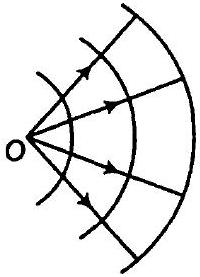
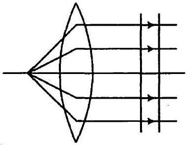
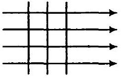
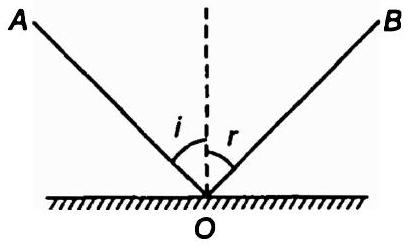
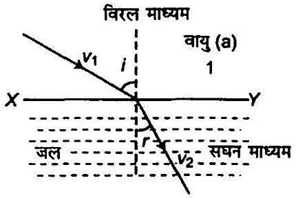
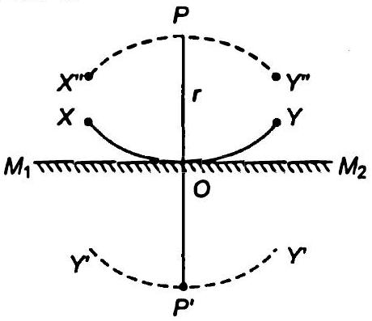

## $10$   तरंग प्रकाशिकी   Wave Optics

## प्रश्नावली

प्रश्न 1. $589 \mathrm{~nm}$ तरंगदैर्घ्य का एकवर्णीय प्रकाश वायु से जल की सतह पर आपतित होता है।

(a) परावर्तित तथा (b) अपवर्तित प्रकाश की तरंगदैर्घ्य, आवृति तथा चाल क्या होगी? जल का अपवर्तनांक $1.33$ है।

हल प्रकाश की तरंगदैर्घ्य $\lambda=589 \mathrm{~nm}=589 \times 10^{-9} \mathrm{~m}$
जल का अपवर्तनांक $\mu_{w}=1.33$

(a) प्रकाश परावर्तन के लिए
    (i) परावर्तित प्रकाश का तरंगदैर्ध्य $\lambda=589 \times 10^{-9}$ मी
    (ii) परावर्तित प्रकाश की आवृति $v=\frac{c}{\lambda}=\frac{3 \times 10^{8}}{589 \times 10^{-9}}$

जहाँ, $c$ प्रकाश की चाल है ( ∵ प्रकाश की चाल $\mathrm{c}=3 \times 10^{8}$ मी/से)

$$
v=5.09 \times 10^{14} \mathrm{~Hz}
$$

(iii) (समान माध्यम में)
वायु में परावर्तित प्रकाश की चाल $c=3 \times 10^{8}$ मी/से
(b) अपवर्तित प्रकाश हेतु (इस प्रक्रम में तरंगदैर्ध्य तथा प्रकाश की चाल परिवर्तित होती है किन्तु आवृति नहीं बदलती है।)

परावर्तित प्रकाश की तरंगदेर्ध्य $\lambda^{\prime}=\frac{\lambda}{\mu}=\frac{589 \times 10^{-9}}{1.33}=4.42 \times 10^{-7} \mathrm{~m}$
परावर्तित प्रकाश का वेग $v=\frac{c}{\mu}=\frac{3 \times 10^{8}}{1.33}=2.25 \times 10^{8} \mathrm{~m} / \mathrm{s}$
प्रश्न 2. निम्नलिखित दशाओं में प्रत्येक तरंगाग्र की आकृति क्या है?

(a) किसी बिन्दु स्रोत से अपसरित प्रकाश।
(b) उत्तल लेंस से निर्गमित प्रकाश, जिसके फोकस बिन्दु पर कोई बिन्दु स्रोत रखा है।
(c) किसी दूरस्थ तारे से आने वाले प्रकाश तरंगाग्र का पृथ्वी द्वारा अवरोधित (intercepted) भाग।

हल

(a) जब प्रकाश किसी बिन्दु स्रोत से अपसरित होता है तब तरंगाग्र की आकृति अपसरित गोलीय होगी जैसा कि चित्र में दर्शाया गया है

(b) जब प्रकाश किरणें समान्तर हो जाती हैं [उत्तल लेंस से अपवर्तन के पश्चात] तब तरंगाग्र समतल होगा।

(c) किसी दूरस्थ तारे से आने वाले प्रकाश तरंगाप्त लगभग एक-दूसरे के समान्तर है तथा समतल तरंगाग्र बनाते हैं।

प्रश्न 3. (a) काँच का अपवर्तनांक $1.5$ है। काँच में प्रकाश की चाल क्या होगी?
(निर्वात् में प्रकाश की चाल $3.0 \times 10^{8} \mathrm{~m} / \mathrm{s}$ है)।

(b) क्या काँच में प्रकाश की चाल, प्रकाश के रंग पर निर्भर करती है? यदि हाँ, तो लाल तथा बैंगनी रंग में कौन-सा रंग काँच के प्रिज्म में धीमा चलता है?

हल

(a) काँच का अपवर्तनांक $\mu_{\text {glass }}=1.5$
निर्वात् में प्रकाश की चाल $\mathrm{c}=3 \times 10^{8} \mathrm{~m} / \mathrm{s}$
काँच में प्रकाश की चाल $v=\frac{c}{\mu}=\frac{3 \times 10^{8}}{1.5}$
$$
v=2 \times 10^{8} \mathrm{~m} / \mathrm{s}
$$
(b) नहीं, प्रकाश की चाल रंगों के प्रभाव से प्रभावित होती है। हम जानते हैं कि बैंगनी रंग के प्रकाश का अपवर्तनांक, लाल रंग के प्रकाश के अपवर्तनांक से अधिक $253$ होता है अतः बैंगनी रंग कम गति से चलता है तथा लाल रंग का प्रकाश तेज गति से चलता है।
$$
\mu_{V}>\mu_{R}
$$

प्रश्न 4. यंग के द्विशिरी प्रयोग में, झिरियों के बीच की दूरी $0.28 \mathrm{~mm}$ है तथा परदा $1.4 \mathrm{~m}$ की दूरी पर रखा गया है। केन्द्रीय दीप्त फ्रिन्ज एवं चतुर्थ दीप्त फ्रिन्ज के बीच की दूरी $1.2 \mathrm{~cm}$ मापी गई है। प्रयोग में उपयोग किए गए प्रकाश की तरंगदैर्घ ज्ञात कीजिए।
हल स्लिों के बीच की दूरी $d=0.28 \mathrm{~mm}=0.28 \times 10^{-3} \mathrm{~m}$
पर्दें तथा स्लिट के बीच की दूरी $D=1.4 \mathrm{~m}$
केन्द्रीय चमकीली फ्रिन्ज तथा चौथी चमकीली फ्रिन्ज के बीच की दूरी

$$
x=1.2 \mathrm{~cm}=1.2 \times 10^{-2} \mathrm{~m}
$$

फ्रिन्जों की संख्या $n=4$
संपोषी व्यतिकरण हेतु, $x=n \frac{D \lambda}{d}$

$$
\begin{aligned}
1.2 \times 10^{-2} & =\frac{4 \times 1.4 \times \lambda}{0.28 \times 10^{-3}} \\
\text { तरंगदैर्घ्य, } \lambda & =\frac{1.2 \times 10^{-2} \times 0.28 \times 10^{-3}}{4 \times 1.4} \\
\lambda & =6 \times 10^{-7} \mathrm{~m} \text { अथवा } \lambda=600 \times 10^{-9} \mathrm{~m} \\
& =600 \mathrm{~nm} \quad\left[\because 1 \mathrm{~nm}=10^{-9} \mathrm{~m}\right]
\end{aligned}
$$

अतः प्रकाश का तरंगदैर्घ्य $6 \times 10^{-7} \mathrm{~m}$ है।
प्रश्न 5. यंग के द्विझिरी प्रयोग में, $\lambda$ तरंगदैर्घ्य का एकवर्णीय प्रकाश उपयोग करने पर, परदे के एक बिन्दु पर जहाँ पथान्तर $\lambda$ है, प्रकाश की तीव्रता $K$ इकाई है। उस बिन्दु पर प्रकाश की तीव्रता कितनी होगी जहाँ पथान्तर $\lambda / 3$ है?
हल प्रकाश की तरंगदैर्घ्य $=\lambda$
जब पथान्तर $\lambda$ तथा कलान्तर $\phi$ है

$$
\phi=\frac{2 \pi}{\lambda} \cdot x=\frac{2 \pi}{\lambda} \cdot \lambda=2 \pi
$$

परिणामी तीव्रता $I_{R}=I_{1}+I_{2}+2 \sqrt{I_{1} I_{2}} \cos \phi$

$$
I_{R}=I+I+2 \sqrt{I^{2}} \cos 2 \pi=2 I+2 I=4 I=K \text { (दिया है) }
$$

$\left(\because I_{1}=I_{2}=I\right)$
जब पथान्तर $\lambda / 3$ है, तब

$$
\text { कलान्तर }=\frac{2 \pi}{\lambda} \cdot \frac{\lambda}{3}=\frac{2 \pi}{3}
$$

परिणामी तीव्रता

$$
\begin{array}{ll}
I_{R}^{\prime}=I+I+2 \sqrt{I^{2}} \cos \frac{2 \pi}{3}=2 I+2 I\left(-\frac{1}{2}\right) & {\left[\because \cos \frac{2 \pi}{3}=-\frac{1}{2}\right]} \\
I_{R}^{\prime}=I=\frac{K}{4} & \text { [समी (i) से] }
\end{array}
$$

अतः प्रकाश की तीव्रता $\frac{K}{4}$ तथा पथान्तर $\frac{\lambda}{3}$ है।
प्रश्न 6. यंग के द्विशिरी प्रयोग में, व्यतिकरण फ्रिन्जों को प्राप्त करने के लिए, $650 \mathrm{~nm}$ तथा $520$ nm तरंदैर्घ्यों के प्रकाश-पुंज का उपयोग किया गया।

(a) $650$ nm तरंगदैर्घ्य के लिए परदे पर तीसरे दीप्त फ्रिन्ज की केन्द्रीय ठच्चिष्ठ से दूर ज्ञात कीजिए।
(b) केन्द्रीय उच्चिष्ठ से उस न्यूनतम दूरी को ज्ञात कीजिए जहाँ दोनों तरंगदैध्यों के कारण दीप्त फ्रिन्ज संपाती (coincide) होते हैं।

हल दिया है, तरंगदेर्घ्य $\lambda_{1}=650 \mathrm{~nm}=650 \times 10^{-9} \mathrm{~m}$
तथा

$$
\lambda_{2}=520 \mathrm{~nm}=520 \times 10^{-9} \mathrm{~m}
$$

(a) तृतीय चमकीली फ्रिन्ज $n=3$
केन्द्रीय उच्चिष्ठ से तृतीय चमकीली फ्रिन्ज की दूरी
$$
\begin{aligned}
x & =\frac{n \lambda D}{d}=3 \times 650 \times 10^{-9} \times \frac{D}{d} \mathrm{~m} \\
& =\frac{3 \times 650 \times 10^{-9} \times 1.2}{2 \times 10^{-3}} \\
& =1.17 \times 10^{-3} \mathrm{~m}
\end{aligned}
$$
(b) माना तरंगदैर्घ्य $\lambda_{2}$ के कारण वमकीली फ्रिन्ज $n$ है, जहाँ $\lambda_{2}=520 \mathrm{~nm}$,
जो $\lambda_{1}$ तरंगदैर्घ्य के कारण $(n+1)$ की चमकीली फ्रिन्ज के संगत है, जहाँ $\lambda_{1}=650 \mathrm{~nm}$
अर्थात्
$$
\begin{aligned}
& n \lambda_{2} \frac{D}{d}=(n-1) \lambda_{1} \frac{D}{d} \\
& \quad n \times 520 \times 10^{-9}=(n-1) 650 \times 10^{-9}
\end{aligned}
$$

अथवा
अथवा

$$
\begin{aligned}
4 n & =5 n-5 \\
n & =5
\end{aligned}
$$

अत: न्यूनतम दूरी

$$
\begin{aligned}
x & =n \lambda_{2} \frac{D}{d}=5 \times 520 \times 10^{-9} \frac{D}{d} \\
x & =2600 \frac{D}{d} \times 10^{-9} \mathrm{~m} \\
& =2600 \times \frac{1.2 \times 10^{-9}}{2 \times 10^{-3}} \cdot \mathrm{~m} \\
& =1.56 \times 10^{-3} \mathrm{~m}=1.56 \mathrm{~mm}
\end{aligned}
$$

प्रश्न 7. एक द्विशिरी प्रयोग में एक मीटर दूर रखे परदे पर एक फ्रिन्ज की कोणीय चौड़ाई $0.2^{\circ}$ पाई गई। उपयोग किए गए प्रकाश की तरंगदैर्घ्य $600 \mathrm{~nm}$ है। यदि पूरा प्रायोगिक उपकरण जल में डुबो दिया जाए तो फ्रिन्ज की कोणीय चौड़ाई क्या होगी? जल का अपवर्तनांक $4 / 3$ लीजिए। हल दिया है, कोणीय चौड़ाई $\theta=0.2^{\circ}$
स्लिट व पर्दें की बीच की दूरी $D=1 \mathrm{~m}$
प्रकाश की तरंगदैर्ध्य $\lambda=600 \mathrm{~nm}=600 \times 10^{-9} \mathrm{~m}$
जल का अपवर्तनांक $\mu_{w}=\frac{4}{3}$
कोणीय चौड़ाई का सूत्र प्रयोग करने पर,

$$
\theta=\frac{\lambda}{D}
$$

तथा

$$
\theta^{\prime}=\frac{\lambda^{\prime}}{D}
$$

जहाँ,

$$
\lambda^{\prime}=\frac{\lambda}{\mu}
$$

समी (ii) को समी (i) से भाग देने पर,
अथवा

$$
\begin{aligned}
& \frac{\theta^{\prime}}{\theta}=\frac{\lambda^{\prime}}{\lambda}=\frac{\lambda}{\mu \lambda} \\
& \theta^{\prime}=\frac{\theta}{\mu}=\frac{0.2 \times 3}{4}=0.15 \quad\left(\because \mu=\frac{4}{3}\right)
\end{aligned}
$$

अतः जैसे ही उपकरण जल में डूबोया जाता है, कोणीय फ्रिन्ज की चौड़ाई $0.15^{\circ}$ है।
प्रश्न 8. वायु से काँच में संक्रमण (transition) के लिए ब्रूस्टर कोण क्या है?
(काँच का अपवर्तनांक = 1.5)।
हल दिया है,

$$
\mu_{g}=1.5
$$

माना $i_{p}$ ब्रूस्टर कोण है।

$$
\begin{aligned}
\text { अपवर्तनांक } \mu & =\tan i_{p} \\
\tan i_{p} & =1.5 \\
i_{p} & =\tan ^{-1}(1.5) \\
i_{p} & =56^{\circ} 18^{\prime}
\end{aligned}
$$

प्रश्न 9. $5000 \AA$ तरंगदैर्घ्य का प्रकाश एक समतल परावर्तक सतह पर आपतित होता है। परावर्तित प्रकाश की तरंगदैर्घ्य एवं आवृति क्या है? आपतन कोण के किस मान के लिए परावर्तित किरण आपतित किरण के लम्बवत् होगी?
हल प्रकाश का तरंगदैर्घ्य $\lambda=5000 \AA=5000 \times 10^{-10}$ मी
[परावर्तन में तरंगदैर्घ्य तथा आवृत्ति नहीं बदलती है अतः परावर्तित प्रकाश की तरंगदैर्ध्य $5000 \AA$ होगी
आपतित प्रकाश की आवृत्ति $v=\frac{c}{\lambda}=\frac{3 \times 10^{8}}{5 \times 10^{-7}}=6 \times 10^{14} \mathrm{~Hz}$
[जब परावर्तित प्रकाश किरण आपतित प्रकाश किरण के लम्बवत् है]
$A O$ तथा $B O$ आपतित तथा परावर्तित किरण है

$$
\begin{array}{rr} 
& B O \perp A O \\
\therefore & \angle i+\angle r=90^{\circ}
\end{array}
$$

परावर्तन के लिए

$$
\begin{aligned}
\angle i & =\angle r \\
2 \angle i & =90^{\circ} \\
\angle i & =45^{\circ}
\end{aligned}
$$

अतः आपतन कोण $45^{\circ}$ है।
प्रश्न 10. उस दूरी का आकलन कीजिए जिसके लिए किसी $4 \mathrm{~mm}$ के आकार के द्वारक तथा $400 \mathrm{~nm}$ तरंगदैर्य के प्रकाश के लिए किरण प्रकाशिकी सनिकट रूप से लागू होती है।
हल दिया है, चौड़ाई $a=4 \mathrm{~mm}=4 \times 10^{-3} \mathrm{~m}$
तरंगदैर्घ्य $\lambda=400 \mathrm{~nm}=400 \times 10^{-9} \mathrm{~m}$
प्रकाशमिति हेतु फ्रेसनेल दूरी

$$
\begin{aligned}
& Z_{F}=\frac{a^{2}}{\lambda}=\frac{4 \times 10^{-3} \times 4 \times 10^{-3}}{400 \times 10^{-9}} \\
& Z_{F}=40 \mathrm{~m}
\end{aligned}
$$

## विविध प्रश्नावली

प्रश्न 11. एक तारे में हाइड्रोजन से उत्सर्जित $6563 \AA$ की $\mathrm{H}_{\alpha}$ लाइन में $15 \AA$ का अभिरक्त-विस्थापन (red-shift) होता है। पृथ्वी से दूर जा रहे तारे की चाल का आकलन कीजिए।
हल दिया है, $\mathrm{H}_{\alpha}$ की तरंगदैर्घ्य $\lambda=6563 \AA=6563 \times 10^{-10} \mathrm{~m}$ $\Delta \lambda=15 \AA$ रेड विस्थापन
चूँकि तारा रेड विस्थापन में प्राप्त होता है अतः तारा पृथ्वी से दूर जा रहा है तथा डॉप्लर विस्थापन ऋणात्मक है

$$
\begin{aligned}
\Delta \lambda & =-v \frac{\lambda}{c} \\
v & =-\frac{\Delta \lambda c}{\lambda}=-\frac{15 \times 3 \times 10^{8}}{6563} \\
v & =-6.86 \times 10^{5} \mathrm{~m} / \mathrm{s}
\end{aligned}
$$

ऋणात्मक चिह्न यह प्रदर्शित करता है कि तारा पृथ्वी से दूर जा रहा है।
प्रश्न 12.किसी माध्यम (जैसे जल) में प्रकाश की चाल निर्वात् में प्रकाश की चाल से अधिक है। न्यूटन के कणिका सिद्धान्त द्वारा इस आशय की भविष्यवाणी कैसे की गई? क्या जल में प्रकाश की चाल प्रयोग द्वारा ज्ञात करके इस भविष्यवाणी की पुष्टि हुई? यदि नहीं, तो प्रकाश के चित्रण का कौन-सा विकल्प प्रयोगानुकूल है?
हल माना वायु में प्रकाश की चाल $v_{1}$ है तथा जल में $v_{2}$ है $\angle i$ वायु में आपतन कोण है तथा $\angle r$ जल में अपवर्तन कोण है।

न्यूटन के कणिका के सिद्धान्त के अनुसार, जब कणिका XY पृष्ठ पर आपतित होती है तब उसके वेग के उर्ध्वघटक समान होते हैं]

$$
X Y \text { के अनुदिश } v_{1} \text { का घटक }=v_{1} \sin i
$$

$$
X Y \text { के अनुदिश } v_{2} \text { का घटक }=v_{2} \sin r
$$

न्यूटन के कणिका सिद्धान्त के अनुसार, $v_{1}$ का घटक $=v_{2}$ का घटक

$$
v_{1} \sin i=v_{2} \sin r
$$

अथवा

$$
\frac{v_{2}-\sin i}{v_{1}}
$$

स्नैल के नियम से,

$$
\frac{\sin i}{\sin r}={ }^{\operatorname{air}} \mu_{\text {water }}
$$

समी (iii) व (iv) से,

$$
\frac{v_{2}}{v_{1}}={ }^{\text {air }} \mu_{\text {water }}
$$

∴

$$
\frac{v_{2}}{v_{1}}>1
$$

अथवा

$$
v_{2}>v_{1}
$$

इसका अर्थ है कि प्रकाश की चाल सघन माध्यम में अधिक तथा विरल माध्यम में कम है। यह परिणाम न्यूटन के प्रायोगिक परिणाम के विपरीत है। हाइगेंस तरंग सिद्धान्त के अनुसार, $v_{2}<v_{1}$ जो प्रयोग के अनुरूप है।

प्रश्न 13. आप मूल पाठ में जान चुके हैं कि हाइर्गेस का सिद्धान्त परावर्तन और अपवर्तन के नियमों के लिए किस प्रकार मार्गदर्शक है। इसी सिद्धान्त का उपयोग करके प्रत्यक्ष रीति से निगमन (deduce) कीजिए कि समतल दर्पण के सामने रखी किसी वस्तु का प्रतिबिम्ब आभासी बनता है, जिसकी दर्पण से दूरी, बिम्ब से दर्पण की दूरी के बराबर होती है। हल माना $P$ बिन्दु वस्तु समतल दर्पण $M_{1} M_{2}$ से $r$ दूरी पर है माना $P$ केन्द्र बिन्दु हैं तथा $P O=r l$ चाप XY बनाने पर यह गोलीय तरंगाप्र है जो वस्तु से दर्पण $M_{1} M_{2}$ पर आपतित होता है यदि दर्पण XY स्थिति में न होता तब यह $X^{\prime} Y^{\prime}$ स्थिति में होता जहाँ $P P^{\prime}=2 r l$ दर्पण की उपस्थिति में तरंगाप्र $X Y$, X"PY" प्रतीत होता। हाइगेंस संरचना के अनुसार, यह स्पष्ट है कि $X^{\prime} Y^{\prime}$ तथा $X^{\prime \prime} Y^{\prime \prime}$ दो संरचना दर्पण

के दोनों ओर हैं। अत: $X^{\prime} P Y^{\prime}, X^{\prime \prime} P Y^{\prime \prime}$ का परावर्तित प्रतिबिम्ब माना जा सकता है।

प्रश्न 14. तरंग संचरण की चाल को प्रमावित कर सकने वाले कुछ संमावित कारकों की सूची निम्न प्रकार है

(i) स्रोत की प्रकृति,
(ii) संचरण की दिशा,
(iii) स्रोत और/या प्रेक्षक की गति,
(iv) तरंगदैर्घ्य तथा
(v) तरंग की तीव्रता।

बताइए कि

(a) निर्वात् में प्रकाश की चाल तथा
(b) किसी माध्यम (माना काँच या जल) में प्रकाश की चाल इनमें से किन कार्कों पर निर्भर करती है?

हल

(a) प्रकाश की चाल निर्वात् में स्थिर रहती है। आइन्सटीन के सापेक्षता सिद्धान्त के अनुसार, निर्वात् में प्रकाश की चाल किस कारक पर निर्भर नहीं करती तथा स्थिर रहती है।
(b) माध्यम में प्रकाश की चाल
(i) स्रोत की प्रकृति पर निर्भर नहीं करती है
(ii) संचरण की दिशा पर निर्भर नहीं है
(iii) स्रोत की गति पर निर्भर नहीं है किन्तु ग्राही की आपेक्षिक गति पर निर्भर करती है (डॉप्लर प्रभाव)
(iv) तरंगदैर्घ्य पर निर्भर है तथा तरंगदैर्य घटने पर चाल घटती है।
(v) तरंगों की तीव्रता पर निर्भर नहीं करती है क्योंकि तीव्रता का अर्थ है कि एकांक क्षेत्रफल पर एकांक समय में आपतित ऊर्जा।

प्रश्न 15. ध्वनि तरंगों में आवृति विस्थापन के लिए डॉप्लर का सूत्र निम्नलिखित दो स्थितियों में थोड़ा-सा भिन्न है :

(i) स्रोत विरामावस्था में तथा प्रेक्षक गति में हो, तथा
(ii) स्रोत गति में परन्तु प्रेक्षक विरामावस्था में हो। जबकि प्रकाश के लिए डॉप्लर के सूत्र निश्चित रूप से निर्वात् में, इन दोनों स्थितियों में एकसमान हैं। ऐसा क्यों है? स्पष्ट कीजिए। क्या आप समझते हैं कि ये सूत्र किसी माध्यम में प्रकाश गमन के लिए भी दोनों स्थितियों में पूर्णत: एकसमान होंगे?

हल ध्वनि तरंगों के संचरण हेतु पदार्थिक माध्यम की आवश्यकता होती है। अतः अवस्था (i) व (ii) में, स्रोत तथा श्रोता की आपेक्षिक गति के कारण दोनों अवस्थाओं में भिन्न-भिन्न आवृति प्राप्त होती हैं। अतः दोनों अवस्थाओं में डॉप्लर प्रभाव में प्रभावी सूत्र भी भिन्न हैं-
जबकि प्रकाश में डॉप्लर प्रभाव में दोनों स्थितियों में आवृत्ति समान होगी यहाँ स्रोत तथा श्रोता की आपेक्षिक गति नहीं अपितु बीच की दूरी प्रभावी होती है।

प्रश्न 16. द्विझिरी प्रयोग में, $600$ nm तरंगदैर्घ्य का प्रकाश प्रयोग करने पर, एक दूस्थ परदे पर बने फ्रिन्ज की कोणीय चौड़ाई $0.1^{\circ}$ है। दोनों झिरियों के बीच कितनी दूरी है?
हल प्रकाश का तरंगदैर्घ्य $\lambda=600 \mathrm{~nm}=600 \times 10^{-9}$ मी
कोणीय फैलाव $\theta=0.1^{\circ}=\frac{0.1 \pi}{180} \mathrm{rad}$
सूत्र के अनुसार, $\theta=\frac{\lambda}{d}$

स्लिटों के बीच की दूरी $d=\frac{\lambda}{\theta}=\frac{600 \times 10^{-9} \times 180}{0.1 \times \pi}$

$$
d=3.44 \times 10^{-4} \mathrm{~m}
$$

अत: $3.44 \times 10^{-4}$ मी स्लिटों के बीच की दूरी है।
प्रश्न 17.निम्नलिखित प्रश्नों के उत्तर दीजिए

(a) एकल झिरी विवर्तन प्रयोग में, झिरी की चौड़ाई में दोगुनी वृद्धि कर दी गई है। यह केन्द्रीय विवर्तन बैंड के साइज तथा तीव्रता को कैसे प्रभावित करेगी?
(b) द्विशिरी प्रयोग में, प्रत्येक झिरी का विवर्तन, व्यतिकरण पैटर्न से किस प्रकार सम्बन्धित है?
(c) सुदूर स्रोत से आने वाले प्रकाश के मार्ग में जब एक लघु वृत्ताकार वस्तु रखी जाती है तो वस्तु की छाया के मध्य एक प्रदीप्त बिन्दु दिखाई देता है। स्पष्ट कीजिए क्यों?
(d) दो विद्यार्थी एक $10 \mathrm{~m}$ ऊँची कक्ष विमाजक दीवार द्वारा $7$ मी के अन्तर पर हैं। यदि ध्वनि और प्रकाश दोनों प्रकार की तरंगें वस्तु के किनारों पर मुड़ सकती हैं तो फिर भी वे विद्यार्थी एक-दूसरे को देख नहीं पाते यद्यपि वे आपस में आसानी से वार्तालाप किस प्रकार कर पाते हैं?
(e) किरण 'प्रकाशिकी, प्रकाश के सीधी रेखा में गति करने की संकल्पना पर आघारित है। विवर्तन प्रमाव (जब प्रकाश का संचरण एक द्वारक/झिरी या वस्तु के चारों ओर प्रेक्षित किया जाए) इस संकल्पना को नकारता है। तथापि किरण प्रकाशिकी की संकल्पना प्रकाशकीय यन्त्रों में प्रतिबिम्बों की स्थिति तथा उनके दूसरे अनेक गुणों को समझने के लिए सामान्यतः उपयोग में लाई जाती है। इसका क्या औचित्य है?

हल

(a) $d^{\prime}=2 d$
सूत्रानुसार, $\theta^{\prime}=\frac{\lambda}{d^{\prime}}=\frac{\lambda}{2 d}=\frac{\theta}{2}$

केन्द्रीय उच्चिष्ठ की कोणीय चौड़ाई $\frac{\lambda}{2 d}$ होगी जो आधी है तथा केन्द्रीय उच्चिष्ठ का क्षेत्रफल $\frac{1}{4}$ भाग रह जाता है व तीव्रता भी $\frac{1}{4}$ रह जाती है।

(b) यदि प्रत्येक स्लिट की चौड़ाई तरंगदैर्घ्य $\lambda$ क्रम की है तब द्विस्लिट प्रयोग में व्यतिकरण चित्र भी प्रत्येक स्लिट द्वारा संशोधित होता है।
(c) जब लघु वृताकार वस्तु प्रकाश किरण के मार्ग में रखी जाती है तो वस्तु की छाया के मध्य एक प्रदीप्त बिन्दु दिखाई देता है क्योंकि तरंगें छोटी वृत्ताकार वस्तु के सिरों से विवर्तित होती हैं तथा छाया के केन्द्र पर संपोषी व्यतिकरण उत्पन्न करती हैं तथा चमकीली प्रदीप्त बिन्दु दिखाई पड़ता है।
(d) विवर्तन में द्वारक का आकार आपतित तरंग के तरंगदैर्घ्य के क्रम का होना चाहिए। प्रकाश तरंग हेतु तरंगदैर्घ्य $\lambda=10^{-7} \mathrm{~m}$

झिर्री का आकार $d=3 m$

$$
\sin \theta=\frac{\lambda}{d}=\frac{10^{-7}}{3}=10^{-8}
$$

∴

$$
\theta \approx 0
$$

अर्थात् किनारों पर प्रकाश किरण का झुकाव शून्य है।
अतः विद्यार्थी आसानी से देख नहीं पाते हैं।
ध्वनि तरंग हेतु तरंगदैर्घ्य $=1000 \mathrm{~Hz}$
तरंगदैर्घ्य

$$
\lambda=\frac{v}{f}=\frac{330}{1000}=0.33 \mathrm{~cm}
$$

जहाँ, $v$ ध्वनि की चाल है

$$
\sin \theta=\frac{\lambda}{d}=\frac{0.33}{3}=0.11
$$

यह स्पष्ट है कि $\theta$ नियत है, ध्वनि तरंगें झुकती हैं तथा विद्यार्थी एक दूसरे को आसानी से सुन पाते हैं।

(e) क्योंकि वस्तु का आकार प्रकाश तरंगदैर्य से बहुत अधिक होता है, अतः प्रकाश विवर्तन का कोई महत्व नहीं रह जाता है।

प्रश्न 18. दो पहाड़ियों की चोटी पर मीनारें एक-दूसरे से $40 \mathrm{~km}$ की दूरी पर हैं। इनको जोड़ने वाली रेखा, मध्य में आने वाली किसी पहाड़ी के $50 \mathrm{~m}$ ऊपर से होकर गुजरती है। उन रेडियो तरंगों की अधिकतम तरंगदैर्ध्य ज्ञात कीजिए जो मीनारों के मध्य बिना पर्याप्त विवर्तन प्रमाव के भेजी जा सकें।
हल मीनारों के मध्य कोई बाधा नहीं है अतः रेड़ियो तरंगें बिना विवर्तन के पहाड़ी से $20 \mathrm{~km}$ की दूरी तक फैल जाती हैं जो $50 \mathrm{~m}$ से अधिक ऊपर नहीं है।
अर्थात् फ्रेसनेल दूरी $Z_{F}=20 \mathrm{~km}=20 \times 10^{3} \mathrm{~m}$

$$
\begin{aligned}
a & =50 \mathrm{~m} \\
Z_{F} & =\frac{a^{2}}{\lambda} \\
\lambda & =\frac{a^{2}}{Z_{F}}=\frac{50 \times 50}{20 \times 10^{3}}=1250 \times 10^{-4} \mathrm{~m}
\end{aligned}
$$

अतः रेड़ियो तरंगों की अधिकतम तरंगदैर्घ्य $0.125 \mathrm{~m}$ है।
प्रश्न $19.500 \mathrm{~nm}$ तरंगदैर्घ्य का एक समान्तर प्रकाश-पुँज एक पतली झिर्री पर गिरता है तथा $1 \mathrm{~m}$ दूर परदे पर परिणामी विवर्तन पैटर्न देखा जाता है। यह देखा गया है कि पहला निम्निष्ठ परदे के केन्द्र से $2.5 \mathrm{~mm}$ दूरी पर है। झिर्री की चौड़ाई ज्ञात कीजिए।
हल प्रकाश का तरंगदैर्घ्य $\lambda=500 \mathrm{~nm}=500 \times 10^{-9} \mathrm{~m}$

$$
D=1 \mathrm{~m}, n=1, x=2.5 \mathrm{~mm}=2.5 \times 10^{-3} \mathrm{~m}
$$

केन्द्र से $n$th निम्नष्ठ की दूरी $x=\frac{n D \lambda}{d}$

$$
\begin{aligned}
& d=\frac{n D \lambda}{x}=\frac{1 \times 1 \times 500 \times 10^{-9}}{2.5 \times 10^{-3}}=2 \times 10^{-4} \mathrm{~m} \\
& d=0.2 \mathrm{~mm}
\end{aligned}
$$

अतः स्लिट की चौड़ाई $0.2 \mathrm{~m}$ होगी।
प्रश्न 20.निम्नलिखित प्रश्नों के उत्तर दीजिए

(a) जब कम ऊँचाई पर उड़ने वाला वायुयान ऊपर से गुजरता है तो हम कभी-कभी टेलीविजन के परदे पर चित्र को हिलते हुए पाते हैं। एक सम्भावित स्पष्टीकरण सुझाइए।
(b) जैसा कि आप मूल पाठ से जान चुके हैं कि विवर्तन तथा व्यतिकरण पैटर्न में तीव्रता का वितरण समझने का आधारभूत सिद्धान्त तरंगों का रेखीय प्रत्यारोपण है। इस सिद्धान्त की तर्क संगति क्या है?

हल

(a) जब कम ऊँचाई पर उड़ने वाला वायुयान ऊपर से गुजरता है तो कमी-कमी टेलीविजन के पर्दे पर चित्र हिलता हुआ पाते हैं क्योंकि Direct सिग्नल तथा परावर्तित सिग्नल के बीच व्यतिकरण होता है तथा चित्र हिलते हैं।
(b) तरंगों की रेखीय प्रकृति अध्यारोपण सिद्धान्त का अनुपातन करती है तथा यह अवकलन समीकरण भी इसका अनुपालन करती है।
यदि $y_{1}$ व $y_{2}$ तरंग समीकरण का हल है, अत: रेखीय योजन ( $y_{1}$ व $y_{2}$ का) अध्यारोपण सिद्धान्त के अनुरूप है। जब आयाम बहुत बड़ा तथा अरेखीय प्रभाव महत्वपूर्ण हो तब परिस्थिति जटिल हो जाती है।

प्रश्न 21. एकल झिर्री विवर्तन पैटर्न की व्युत्पत्ति में कथित है कि $n \lambda / a$ कोणों पर तीव्रता शून्य है। इस निरसन (cancellation) को, झिरीं को उपयुक्त भार्गों में बाँटकर सत्यापित कीजिए।
हल माना स्लिट क्षेत्रों में बाटी गयी है, तब प्रत्येक स्लिट की चौड़ाई

$$
d^{\prime}=\frac{\lambda}{n}
$$

कोणीय चौड़ाई $\theta=\frac{n \lambda}{d}=\frac{n \lambda}{d^{\prime} n}=\frac{\lambda}{d}$
अतः प्रत्येक छोटी स्लिट $\theta$ दिशा में शून्य तीव्रता भेजेगी अतः सम्पूर्ण स्लिट हेतु नैट तीव्रता $\frac{n \lambda}{d}$ कोण पर शून्य होगी।

