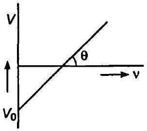
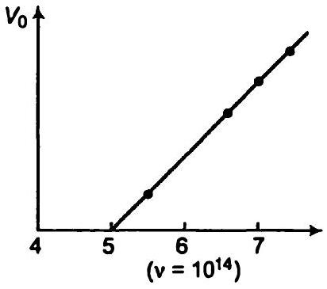

## अध्याय   $11$   विकिरण तथा द्रव्य की द्वैत प्रकृति   Dual Nature of Radiation and Matter

## प्रश्नावली

प्रश्न 1. $30$ kV इलेक्ट्रॉनों के द्वारा उत्पन्न X-किरणों की

(a) उच्चतम आवृति तथा
(b) निम्नतम तरंगदैर्घ्य प्राप्त कीजिए

हल दिया है, विभवान्तर $V=30 \mathrm{kV}=30 \times 10^{3} \mathrm{~V}$ एवं $e=1.6 \times 10^{-19} \mathrm{C}$

(a) ऊर्जा हेतु सूत्र
अथवा
$$
\begin{aligned}
& E=e V=h v \\
& n=\frac{e V}{h}=\frac{1.6 \times 10^{-19} \times 30 \times 10^{3}}{6.63 \times 10^{-34}}=7.24 \times 10^{18} \mathrm{~Hz}
\end{aligned}
$$
अधिकतम आवृत्ति $v=7.24 \times 10^{18} \mathrm{~Hz}$
(b) X-किरणों की न्यूनतम तरंगदैर्ध्य
$$
\lambda=\frac{c}{v}=\frac{3 \times 10^{8}}{7.24 \times 10^{18}}
$$
$\therefore$ जहाँ,
$$
\begin{aligned}
c & =3 \times 10^{8} \mathrm{~m} / \mathrm{s} \text { (प्रकाश की चाल) } \\
\lambda & =0.414 \times 10^{-10} \\
& =0.0414 \times 10^{-9} \mathrm{~m} \\
& =0.0414 \mathrm{~nm}
\end{aligned}
$$

प्रश्न 2. सीजियम धातु का कार्य-फलन $2.14 \mathrm{eV}$ है। जब $6 \times 10^{14} \mathrm{~Hz}$ आवृति का प्रकाश धातुपृष्ठ पर आपतित होता है, तब इलेक्ट्रॉनों का प्रकाशिक उत्सर्जन होता है।

(a) उत्सर्जित इलेक्ट्रॉनों की ठन्चतम गतिज ऊर्जा,
(b) निरोधी विभव और
(c) उत्सर्जित प्रकाशिक इलेक्ट्रॉनों की उच्चतम चाल कितनी है?

हल दिया है, Cs धातु का कार्य-फलन $\phi_{0}=2.14 \mathrm{eV}$
प्रकाश की चाल $v=6 \times 10^{14} \mathrm{~Hz}$

(a) उत्सर्जित इलेक्ट्रॉन की अधिकतम ऊर्जा (आइन्सटीन फोटो इलेक्ट्रिक समीकरण)
$$
\begin{aligned}
K E_{\max } & =h v-\phi_{0} \\
& =\frac{6.63 \times 10^{-34} \times 6 \times 10^{14}}{1.6 \times 10^{-19}}-2.14 \\
& =0.35 \mathrm{eV}
\end{aligned}
$$
(b) माना न्यूनतम निरोधी विभव $V_{0}$ है।
हम जानते हैं कि
$$
\begin{aligned}
K E_{\max } & =e V_{0} \\
0.35 \mathrm{eV} & =e V_{0} \\
V_{0} & =0.35 \mathrm{~V}
\end{aligned}
$$
(c) अधिकतम गतिज ऊर्जा $K E_{\text {max }}=\frac{1}{2} m v_{\text {max }}^{2}$
$$
0.35 \mathrm{eV}=\frac{1}{2} m v_{\max }^{2}
$$

(जहाँ, $v_{\text {max }}$ अधिकतम चाल तथा $m$ इलेक्ट्रॉन का द्रव्यमान है)
अथवा

$$
\frac{0.35 \times 2 \times 1.6 \times 10^{-19}}{9.1 \times 10^{-31}}=v_{\max }^{2} \quad\left(\because e=1.6 \times 10^{-19} \mathrm{C}\right)
$$

अथवा

$$
v_{\max }^{2}=0.123 \times 10^{12}
$$

अथवा

$$
\begin{aligned}
& v_{\max }=350713.55 \mathrm{~m} / \mathrm{s} \\
& v_{\max }=350.7 \mathrm{~km} / \mathrm{s}
\end{aligned}
$$

प्रश्न 3. एक विशिष्ट प्रयोग में प्रकाश-विद्युत प्रभाव की अंतक वोल्टता $1.5 \mathrm{~V}$ है। उत्सर्जित प्रकाशिक इलेक्ट्रॉनों की उच्चतम गतिज ऊर्जा कितनी है?
हल दिया है, निरोधी विभव $V_{0}=1.5 \mathrm{~V}$
अधिकतम गतिज ऊर्जा का सूत्र

$$
\begin{aligned}
K E_{\max } & =e V_{0}=1.5 \mathrm{eV} \\
& =1.5 \times 1.6 \times 10^{-19}=2.4 \times 10^{-19} \mathrm{~J}
\end{aligned}
$$

प्रश्न 4. $632.8 \mathrm{~nm}$ तरंगदैर्घ्य का एकवर्णी प्रकाश एक हीलियम-नियोंन लेसर के द्वारा उत्पन्न किया जाता है। उत्सर्जित शक्ति $9.42 \mathrm{~mW}$ है।

(a) प्रकाश के किरण-पुंज में प्रत्येक फोटॉन की ऊर्जा तथा संवेग प्राप्त कीजिए।
(b) इस किरण-पुंज के द्वारा विकिरित किसी लक्ष्य पर औसतन कितने फोटॉन प्रति सेकण्ड पहुँचेंगे? (यह मान लीजिए कि किरण-पुंज की अनुप्रस्थ-काट एकसमान है जो लक्ष्य के क्षेत्रफल से कम है) तथा
(c) एक हाइड्रोजन परमाणु को फोटॉन के बराबर संवेग प्राप्त करने के लिए कितनी तेज चाल से चलना होगा?

हल दिया है, एकवर्णी प्रकाश का तरंगदेर्घ्य, $\lambda=632.8 \mathrm{~nm}$

$$
\begin{aligned}
&=632.8 \times 10^{-9} \mathrm{~m} \\
& \text { शक्ति }=9.42 \mathrm{~mW}=9.42 \times 10^{-3} \mathrm{~W}
\end{aligned}
$$

(a) प्रत्येक फोटॉन की ऊर्जा, $E=\frac{h c}{\lambda}$
$$
=\frac{6.63 \times 10^{-34} \times 3 \times 10^{8}}{632.8 \times 10^{-9}}=3.14 \times 10^{-19} \mathrm{~J}
$$
हम जानते हैं कि प्रत्येक फोटॉन का संवेग, $\rho=\frac{h}{\lambda}$
$$
\rho=\frac{6.63 \times 10^{-34}}{632.8 \times 10^{-9}}=1.05 \times 10^{-27} \mathrm{~kg}-\mathrm{m} / \mathrm{s}
$$
(b) माना प्रति सेकण्ड फोटॉनों की संख्या $n$ है, तब
$$
\begin{aligned}
n & =\frac{\text { शक्ति }}{\text { प्रति सेकण्ड फोटॉनों की संख्या }}=\frac{9.42 \times 10^{-3}}{3.14 \times 10^{-19}} \\
& =3 \times 10^{16} \text { photon } / \mathrm{s}
\end{aligned}
$$
(c) संवेग $p=m v$
$\mathrm{H}_{2}$ परमाणु का वेग,
$$
\begin{aligned}
v=\frac{\rho}{m}=\frac{1.05 \times 10^{-27}}{1.66 \times 10^{-27}} & =0.63 \mathrm{~m} / \mathrm{s} \\
{[\because m} & \left.=1.66 \times 10^{-27} \mathrm{~kg} \text { (इलेक्ट्रॉन का द्रव्यमान) }\right]
\end{aligned}
$$

प्रश्न 5. पृथ्वी के पृष्ठ पर पहुँचने वाले सूर्य-प्रकाश का ऊर्जा-अभिवाह (फ्लक्स) $1.388 \times 10^{3} \mathrm{~W} / \mathrm{m}^{2}$ है। लगभग कितने फोटॉन प्रति वर्ग मीटर प्रति सेकण्ड पृथ्वी पर आपतित होते हैं? यह मान लें कि सूर्य-प्रकाश में फोटॉन का औसत तरंगदैर्घ्य $550 \mathrm{~nm}$ है।
हल दिया है, प्रति सेकण्ड एकांक क्षेत्रफल में ऊर्जा, $P=1.388 \times 10^{3} \mathrm{~W} / \mathrm{m}^{2}$
माना एकांक क्षेत्रफल [ $1 \mathrm{~m}^{2}$ ] तथा $1 \mathrm{~s}$ में फोटॉनों की संख्या $n$ है।
प्रत्येक फोटॉन का तरंगदैर्घ्य $=550 \mathrm{~nm}=550 \times 10^{-9} \mathrm{~m}$

प्रत्येक फोटॉन की ऊर्जा, $E=\frac{h c}{\lambda}$ ( $h$ प्लांक नियतांक है)

$$
=\frac{6.63 \times 10^{-34} \times 3 \times 10^{8}}{550 \times 10^{-9}}=3.616 \times 10^{-19} \mathrm{~J}
$$

पृथ्वी के पृष्ठ पर आपतित फोटॉनों की संख्या

$$
\begin{aligned}
n & =\frac{P}{E}=\frac{1.388 \times 10^{3}}{3.616 \times 10^{-19}}=3.838 \times 10^{21} \\
& =3.838 \times 10^{21} \text { photon } / \mathrm{m}^{2}-\mathrm{s}
\end{aligned}
$$

प्रश्न 6. प्रकाश-विद्युत प्रभाव के एक प्रयोग में, प्रकाश आवृति के विरुद्ध अंतक वोल्टता का ढलान $4.12 \times 10^{-15} \mathrm{~V}$-s प्राप्त होती है। प्लांक स्थिरांक का मान परिकलित कीजिए।
इल दिया है, चित्र की आकृति $\tan \theta=4.12 \times 10^{-15} \mathrm{~V}-\mathrm{s}$ तथा इलेक्ट्रॉन का आवेश $e=1.6 \times 10^{-19} \mathrm{C}$
ढलान हेतु ग्राफ $\tan \theta=\frac{V}{V}$
हम जानते हैं कि

$$
\begin{aligned}
h v & =e V \\
\frac{v}{v} & =\frac{h}{e} \\
\frac{h}{e} & =4.12 \times 10^{-15} \\
h & =1.6 \times 10^{-19} \times 4.12 \times 10^{-15} \\
& =6.592 \times 10^{-34} \mathrm{~J}-\mathrm{s}
\end{aligned}
$$

प्रश्न 7. एक $100 \mathrm{~W}$ सोडियम बल्ब (लैम्प) सभी दिशाओं में एकसमान ऊर्जा विकिति करता है। लैम्प को एक ऐसे बड़े गोले के केन्द्र पर रखा गया है जो इस पर आपतित सोडियम के सम्पूर्ण प्रकाश को अवशोषित करता है। सोडियम प्रकाश का तरंगदैर्घ्य $589 \mathrm{~nm}$ है।

(a) सोडियम प्रकाश से जुड़े प्रति फोटॉन की ऊर्जा कितनी है?
(b) गोले को किस दर से फोटॉन प्रदान किए जा रहे हैं?

हल दिया है, लैम्प की शक्ति $P=100 \mathrm{~W}$
Na प्रकाश का तरंगदैर्घ्य, $\lambda=589 \mathrm{~nm}=589 \times 10^{-9} \mathrm{~m}$
प्लांक नियतांक $h=6.63 \times 10^{-34} \mathrm{~J}-\mathrm{s}$
(a) प्रत्येक फोटॉन की ऊर्जा

$$
\begin{aligned}
E=\frac{h c}{\lambda} & =\frac{6.63 \times 10^{-34} \times 3 \times 10^{8}}{589 \times 10^{-9}} . \quad\left(\because c=3 \times 10^{8} \mathrm{~m} / \mathrm{s}\right) \\
& =3.38 \times 10^{-19} \mathrm{~J}
\end{aligned}
$$

$$
\begin{aligned}
& =\frac{3.38 \times 10^{-19}}{1.6 \times 10^{-19}} \mathrm{eV} \\
& =2.11 \mathrm{eV}
\end{aligned}
$$

(b) माना $n$ फॉटॉन प्रति सेकण्ड प्राप्त होते हैं।

$$
\begin{array}{ll}
\therefore & n=\frac{\text { शक्ति }}{\text { प्रत्येक फोर्टोन की ऊर्जा }} \quad(\rho=E n \text { से }) \\
& =\frac{100}{3.38 \times 10^{-49}}=3 \times 10^{20} \text { photon } / \mathrm{s} \\
& =3 \times 10^{20} \text { photon } / \mathrm{s} \text { शक्ति प्राप्त होती है }
\end{array}
$$

प्रश्न 8. किसी धातु की देहली आवृति $3.3 \times 10^{14} \mathrm{~Hz}$ है। यदि $8.2 \times 10^{14} \mathrm{~Hz}$ आवृत्ति का प्रकाश धातु पर आपतित हो, तो प्रकाश-विद्युत उत्सर्जन के लिए अंतक वोल्टता ज्ञात कीजिए।
हल दिया है, धातु के लिए देहली आवृत्ति $v_{0}=3.3 \times 10^{14} \mathrm{~Hz}$
प्रकाश की तीव्रता $v=8.2 \times 10^{14} \mathrm{~Hz}$
माना $V_{0}$ निरोधी विभवान्तर है।
गतिज ऊर्जा का सूत्र प्रयोग करने पर

$$
\begin{aligned}
K E & =e V_{0}=h v-h v_{0} \\
V_{0} & =\frac{h\left(v-v_{0}\right)}{e}=\frac{6.63 \times 10^{-34}\left(8.2 \times 10^{14}-3.3 \times 10^{14}\right)}{1.6 \times 10^{-19}} \\
& =\frac{6.63 \times 10^{-34} \times 10^{14} \times 4.9}{1.6 \times 10^{-19}} \\
& =2.03 \mathrm{~V}
\end{aligned}
$$

प्रश्न 9. किसी धातु के लिए कार्य-फलन $4.2 \mathrm{eV}$ है। क्या यह धातु $330 \mathrm{~nm}$ तरंगदैर्ध्य के आपतित विकिरण के लिए प्रकाश-विद्युत उत्सर्जन देगा?
हल दिया है, कार्य-फलन $\phi_{0}=4.2 \mathrm{eV}$

$$
=4.2 \times 1.6 \times 10^{-19} \mathrm{~J}=6.72 \times 10^{-19} \mathrm{~J}
$$

विकिरण का तरंगदैर्घ्य, $\lambda=330 \mathrm{~nm}=330 \times 10^{-9} \mathrm{~m}$
यदि प्रत्येक फोटॉन की ऊर्जा कार्य-फलन से अधिक है तभी केवल प्रकाश-विद्युत उत्सर्जन हो सकता है

$$
\begin{aligned}
E & =\frac{h c}{\lambda}=\frac{6.63 \times 10^{-34} \times 3 \times 10^{8}}{330 \times 10^{-9}} \\
& =6.027 \times 10^{-19} \mathrm{~J}
\end{aligned}
$$

(चूँकि प्रत्येक फोटॉन की ऊर्जा $\mathrm{E}=6.027 \times 10^{-19} \mathrm{~J}$ से कम है अतः प्रकाश-विद्युत उत्सर्जन नहीं होगा)

प्रश्न 10. $7.21 \times 10^{14}$ आवृति का प्रकाश एक धातु-पृष्ठ पर आपतित है। इस पृष्ठ से $6.0 \times 10^{5} \mathrm{~m} / \mathrm{s}$ की उच्चतम गति से इलेक्ट्रॉन उत्सर्जित हो रहे हैं। इलेक्ट्रॉनों के प्रकाश उत्सर्जन के लिए देहली आवृति क्या है?
हल दिया है, प्रकाश की तीव्रता, $v=7.21 \times 10^{14} \mathrm{~Hz}$
इलेक्ट्रॉन का द्रव्यमान, $m=9.1 \times 10^{-31} \mathrm{~kg}$
इलेक्ट्रॉन का अधिकतम वेग, $v_{\text {max }}=6 \times 10^{5} \mathrm{~m} / \mathrm{s}$
माना $v_{0}$ देहली आवृत्ति है।
गतिज ऊर्जा का सूत्र प्रयुक्त करने पर

$$
\mathrm{KE}=\frac{1}{2} m v_{\max }^{2}=h v-h v_{0}
$$

अर्थात्

$$
\frac{1}{2} \times 9.1 \times 10^{-31} \times 6 \times 10^{5} \times 6 \times 10^{5}=6.63 \times 10^{-34}\left(v-v_{0}\right)
$$

अथवा

$$
v-v_{0}=\frac{36 \times 9.1 \times 10^{-21}}{2 \times 6.63 \times 10^{-34}}=2.47 \times 10^{14}
$$

अथवा

$$
\begin{aligned}
v_{0} & =721 \times 10^{14}-2.47 \times 10^{14} \quad\left(\because v=7.21 \times 10^{14} \mathrm{~Hz}\right) \\
& =4.74 \times 10^{14} \mathrm{~Hz}
\end{aligned}
$$

प्रश्न $11.448 \mathrm{~nm}$ तरंगदैर्ध्य का प्रकाश एक ऑर्गन लेसर से उत्पन्न किया जाता है, जिसे प्रकाश-विद्युत प्रभाव के उपयोग में लाया जाता है। जब इस स्पेक्ट्रमी-रेखा के प्रकाश को उत्सर्जक पर आपतित किया जाता है, तब प्रकाशिक इलेक्ट्रॉनों का निरोधी (अंतक) विमव $0.38 \mathrm{~V}$ है। उत्सर्जक के पदार्थ का कार्य-फलन ज्ञात करें।
हल दिया है, प्रकाश का तरंगदैर्घ्य, $\lambda=488 \mathrm{~nm}=488 \times 10^{-9} \mathrm{~m}$
निरोधी विभव $V_{0}=0.38 \mathrm{~V}, \quad e=1.6 \times 10^{-19} \mathrm{C}$
प्लांक नियतांक $h=6.62 \times 10^{-34} \mathrm{~J}-\mathrm{s}$
प्रकाश की चाल $c=3 \times 10^{8} \mathrm{~m} / \mathrm{s}$
माना $\phi_{0}$ कार्य-फलन है।
गतिज ऊर्जा

$$
\begin{gathered}
K E=e V_{0}=\frac{h c}{\lambda}-\phi_{0} \\
1.6 \times 10^{-19} \times 0.38=\frac{6.63 \times 10^{-34} \times 3 \times 10^{8}}{488 \times 10^{-9}}-\phi_{0}
\end{gathered}
$$

अथवा

$$
6.08 \times 10^{-20}=40.75 \times 10^{-20}-\varphi_{0}
$$

अथवा

$$
\phi_{0}=(40.75-6.08) \times 10^{-20}=34.67 \times 10^{-20} \mathrm{~J}
$$

$$
\begin{aligned}
& =\frac{34.67 \times 10^{-20}}{1.6 \times 10^{-19}} \mathrm{eV} \\
& =2.17 \mathrm{eV}
\end{aligned}
$$

प्रश्न 12.56 V विभवान्तर के द्वारा त्वरित इलेक्ट्रॉनों का

(a) संवेग, और
(b) दे-ब्रोग्ली तरंगदैर्घ्य परिकलित कीजिए।

हल दिया है, विभवान्तर $V=56 \mathrm{~V}$

(a) गतिज ऊर्जा का सूत्र प्रयोग करने पर $\mathrm{eV}=\frac{1}{2} m v^{2}$
$$
\begin{aligned}
\frac{2 e V}{m} & =v^{2} \\
v & =\sqrt{\frac{2 e V}{m}}
\end{aligned}
$$
जहाँ, $m$ इलेक्ट्रॉन का द्रव्यमान तथा $v$ इलेक्ट्रॉन का वेग है।

त्वरित इलेक्ट्रॉन का संगत संवेग

$$
\begin{aligned}
p & =m v=m \sqrt{\frac{2 \mathrm{eV}}{m}}=\sqrt{2 \mathrm{eVm}} \\
& =\sqrt{2 \times 1.6 \times 10^{-19} \times 56 \times 9 \times 10^{-31}} \\
& =4.02 \times 10^{-24} \mathrm{~kg}-\mathrm{m} / \mathrm{s}
\end{aligned}
$$

(b) इलेक्ट्रॉन का दे-ब्रोग्ली तरंगदैर्घ्य
$$
\begin{aligned}
\lambda & =\frac{12.27}{\sqrt{V}} \AA \\
& =\frac{12.27}{\sqrt{56}}=0.164 \times 10^{-9} \mathrm{~m} \\
& =0.164 \mathrm{~nm}
\end{aligned}
$$

प्रश्न 13. एक इलेक्ट्रॉन जिसकी गतिज ऊर्जा $120 \mathrm{eV}$ है, उसका

(a) संवेग
(b) चाल और
(c) दे-ब्रोग्ली तरंगदैर्घ्य क्या है?

हल दिया है, गतिज ऊर्जा $\mathrm{KE}=120 \mathrm{eV}$

(a) संवेग, $p=\sqrt{2 \mathrm{eV} m}=\sqrt{2 \mathrm{KE} \cdot m}$ और $\mathrm{e}=1.6 \times 10^{-19}(\because \mathrm{KE}=\mathrm{eV})$
$$
\begin{aligned}
& =\sqrt{2 \times 120 \times 1.6 \times 10^{-19} \times 9.1 \times 10^{-31}} \\
& =5.91 \times 10^{-24} \mathrm{~kg}-\mathrm{m} / \mathrm{s}
\end{aligned}
$$

(b) संवेग $p=m v$
अथवा
$$
\begin{aligned}
v & =\frac{\rho}{m} \\
& =\frac{5.91 \times 10^{-24}}{9.1 \times 10^{-31}} \\
& =6.5 \times 10^{6} \mathrm{~m} / \mathrm{s}
\end{aligned}
$$
(c) इलेक्ट्रॉन के संगत दे-ब्रोग्ली तरंगदैर्घ्य,
$$
\begin{aligned}
\lambda & =\frac{12.27}{\sqrt{V}} \AA=\frac{12.27}{\sqrt{120}} \AA \\
& =0.112 \times 10^{-9} \mathrm{~m} \\
& =0.112 \mathrm{~nm}
\end{aligned}
$$

प्रश्न 14. सोडियम के स्पेक्ट्रमी ठत्सर्जन रेखा के प्रकाश का तरंगदैर्घ्य $589 \mathrm{~nm}$ है। वह गतिज ऊर्जा ज्ञात कीजिए जिस पर

(a) एक इलेक्ट्रॉन और
(b) एक न्यूट्रॉन का दे-ब्रोग्ली तरंगदैर्घ्य समान होगा

हल दिया है, प्रकाश की तरंगदैर्ध्य $=589 \mathrm{~nm}=589 \times 10^{-9} \mathrm{~m}$
न्यूट्रॉन का द्रव्यमान $m_{e}=9.1 \times 10^{-31} \mathrm{~kg}$
इलेक्ट्रॉन का द्रव्यमान $m_{n}=1.67 \times 10^{-27} \mathrm{~kg}$
प्लांक नियतांक $h=6.62 \times 10^{-34} \mathrm{~J}-\mathrm{s}$

(a) सूत्र प्रयुक्त करने पर $\lambda=\frac{h}{\sqrt{2 \mathrm{KEm}_{6}}}$
इलेक्ट्रॉन की गतिज ऊर्जा
$$
\begin{aligned}
K E_{e} & =\frac{h^{2}}{2 \lambda^{2} m_{e}} \\
& =\frac{\left(6.63 \times 10^{-34}\right)^{2}}{2 \times\left(589 \times 10^{-9}\right)^{2} \times 9.1 \times 10^{-31}} \\
& =6.96 \times 10^{-25} \mathrm{~J}
\end{aligned}
$$
(b) न्यूट्रॉन की गतिज ऊर्जा
$$
\begin{aligned}
K E_{n} & =\frac{h^{2}}{2 \lambda^{2} m_{n}} \\
& =\frac{\left(6.63 \times 10^{-34}\right)^{2}}{2 \times\left(589 \times 10^{-9}\right)^{2} \times 1.66 \times 10^{-27}} \\
& =3.81 \times 10^{-28} \mathrm{~J}
\end{aligned}
$$

प्रश्न 15. (a) एक $0.040 \mathrm{~kg}$ द्रव्यमान का बुलेट जो $1.0 \mathrm{~km} / \mathrm{s}$ की चाल से चल रहा है

(b) एक $0.060 \mathrm{~kg}$ द्रव्यमान की गेंद जो $1.0 \mathrm{~km} / \mathrm{s}$ की चाल से चल रही है, और
(c) एक धूल-कण जिसका द्रव्यमान $1.0 \times 10^{-9} \mathrm{~kg}$ और जो $2.2 \mathrm{~m} / \mathrm{s}$ की चाल से अनुगमित हो रहा है, का दे-ब्रोग्ली तरंगदैर्घ्य कितना होगा?

हल दिया है, गोली का द्रव्यमान $m=0.040 \mathrm{~kg}$
गोली का वेग $v=1000 \mathrm{~m} / \mathrm{s}$

(a) दे-ब्रोग्ली तरंगदैर्घ्य
$$
\begin{aligned}
\lambda & =\frac{h}{m v}=\frac{6.63 \times 10^{-34}}{0.040 \times 1 \times 10^{3}} \quad\left(\begin{array}{rl}
\because \quad m & =0.040 \mathrm{~kg} \\
v & =1 \mathrm{~km} / \mathrm{s} \\
& =1000 \mathrm{~m} / \mathrm{s}
\end{array}\right) \\
& =1.66 \times 10^{-35} \mathrm{~m}
\end{aligned}
$$
(b) बॉल का द्रव्यमान, $m=0.060 \mathrm{~kg}$ तथा बॉल की चाल, $v=1 \mathrm{~m} / \mathrm{s}$
$$
\begin{aligned}
\lambda & =\frac{h}{m v}=\frac{6.63 \times 10^{-34}}{0.060 \times 1} \\
& =1.1 \times 10^{-32} \mathrm{~m}
\end{aligned}
$$
(c) धूल के कण का द्रव्यमान, $m=1 \times 10^{-9} \mathrm{~kg}$ तथा धूल के कण की चाल, $v=2.2 \mathrm{~m} / \mathrm{s}$
$$
\begin{aligned}
\lambda & =\frac{h}{m v}=\frac{6.63 \times 10^{-34}}{1 \times 10^{-9} \times 2.2} \\
& =3.0 \times 10^{-25} \mathrm{~m}
\end{aligned}
$$

प्रश्न 16. एक इलेक्ट्रॉन और एक फोटॉन प्रत्येक का तरंगदैर्घ्य $1.00 \mathrm{~nm}$ है।

(a) इनका संवेग
(b) फोटॉन की ऊर्जा और
(c) इलेक्ट्रॉन की गतिज ऊर्जा ज्ञात कीजिए।

हल दिया है, इलेक्ट्रॉन तथा फोटॉन की तरंगदैर्घ्य, $\lambda=1 \mathrm{~nm}=10^{-9} \mathrm{~m}$

(a) इलेक्ट्रॉन का संवेग
$$
\rho_{e}=\frac{h}{\lambda}=\frac{6.63 \times 10^{-34}}{10^{-9}}=6.63 \times 10^{-25} \mathrm{~m} \quad\left(\because h=6.63 \times 10^{-34} \mathrm{~J}-\mathrm{s}\right)
$$
फोटॉन का संवेग $\quad p_{\mathrm{ph}}=\frac{h}{\lambda}=\frac{6.63 \times 10^{-34}}{10^{-9}}=6.63 \times 10^{-25} \mathrm{~m}$
(b) फोटॉन की ऊर्जा
$$
\begin{aligned}
E & =\frac{h c}{\lambda}=\frac{6.63 \times 10^{-34} \times 3 \times 10^{8}}{10^{-9} \times 1.6 \times 10^{-19}} \mathrm{eV} \\
& =\frac{19.86 \times 10^{-17}}{1.6 \times 10^{-19}} \mathrm{eV} \\
& =1243 \mathrm{eV} \text { या } E=1.24 \mathrm{keV}
\end{aligned}
$$

(c) इलेक्ट्रॉन की ऊर्जा
$$
\begin{aligned}
E & =\frac{p^{2}}{2 m e}=\frac{\left(6.63 \times 10^{-25}\right)^{2}}{2 \times 9.1 \times 10^{-31} \times 1.6 \times 10^{-19}} \mathrm{eV} \\
& =1.51 \mathrm{eV}
\end{aligned}
$$

प्रश्न 17. (a) न्यूट्रॉन की किस गतिज ऊर्जा के लिए दे-ब्रोग्ली तरंगदैर्घ्य $1.40 \times 10^{-10} \mathrm{~m}$ होगा ?

(b) एक न्यूट्रॉन, जो पदार्थ के साथ तापीय साम्य में है और जिसकी $300 \mathrm{~K}$ पर औसत गतिज ऊर्जा $\frac{3}{2} k T$ है, कि भी दे-ब्रोग्ली तरंगदैर्घ्य ज्ञात कीजिए।

हल (a) दे-ब्रोग्ली तरंगदैर्ध्य $\lambda=1.40 \times 10^{-10} \mathrm{~m}$
न्यूट्रॉन का द्रव्यमान $m_{n}=1.675 \times 10^{-27} \mathrm{~kg}$
गतिज ऊर्जा के संगत तरंगदैर्ध्य का सूत्र प्रयोग करने पर

$$
\lambda=\frac{h}{\sqrt{2 m K E}}
$$

अथवा

$$
\begin{aligned}
K E & =\frac{h^{2}}{2 \lambda^{2} m_{n}}=\frac{\left(6.63 \times 10^{-34}\right)^{2}}{2 \times\left(1.40 \times 10^{-10}\right)^{2} \times 1.675 \times 10^{-27}} \\
& =6.686 \times 10^{-21} \mathrm{~J}
\end{aligned}
$$

(b) ताप के संगत गतिज ऊर्जा

$$
\begin{aligned}
& \mathrm{KE}=\frac{3}{2} k T=\frac{3}{2}\left(1.38 \times 10^{-23}\right) \times 300=6.21 \times 10^{-21} \mathrm{~J} \\
& \left(\because \text { परमताप } T=300 \mathrm{~K} \text { तथा वोल्ट्जमैन नियतांक } k=1.38 \times 10^{-23} \mathrm{~J} / \mathrm{K}\right) \\
& \mathrm{KE}=6.21 \times 10^{-21} \mathrm{~J}
\end{aligned}
$$

गतिज ऊर्जा के संगत तरंगदैर्घ्य

$$
\begin{aligned}
& \lambda=\frac{h}{\sqrt{2 m \cdot \mathrm{KE}}} \\
& \lambda=\frac{6.63 \times 10^{-34}}{\sqrt{2 \times 1.675 \times 10^{-27} \times 6.21 \times 10^{-21}}} \\
& \lambda=1.45 \times 10^{-10} \mathrm{~m} \\
& \lambda=1.45 \AA
\end{aligned}
$$

प्रश्न 18. यह दर्शाइए कि विद्युत चुम्बकीय विकिरण की तरंगदैर्घ्य इसके क्वांटम (फोटॉन) के तरंगदैर्घ्य के बराबर है।
हल फोटॉन का संवेग जहाँ $v$ आवृत्ति तथा $\lambda$ तरंगदैर्ध्य है

$$
\rho=\frac{h v}{c}=\frac{h}{\lambda}
$$

$$
\lambda=\frac{h}{p}
$$

फोटॉन की दे-ब्रोग्ली तरंगदैर्घ्य, $\lambda=\frac{h}{m v} \Rightarrow \frac{h}{p}=\frac{h}{h v / c}=\frac{c}{v}$
अतः वैद्युत चुम्बकीय तरंग विकिरण का तरंगदैर्घ्य दे-ब्रोग्ली तरंगदैर्घ्य के समान है।
प्रश्न 19. वायु में $300 \mathrm{~K}$ ताप पर एक नाइट्रोजन अणु का दे-ब्रोग्ली तरंगदैर्घ्य कितना होगा? जबकि अणु इस ताप पर अणुओं के चाल वर्ग माध्य से गतिमान है। (नाइट्रोजन का परमाणु द्रव्यमान $=14.0076 u$ )
हल दिया है, ताप $T=300 \mathrm{~K}$
तथा वोल्ट्जमैन नियतांक $=1.38 \times 10^{-23} \mathrm{~J} / \mathrm{K}$
$\mathrm{N}_{2}$ का अणुभार $m=28.0152 \mathrm{u}$

$$
=28.0152 \times 1.67 \times 10^{-27} \mathrm{~kg}
$$

अणु की औसत गतिज ऊर्जा

$$
\frac{1}{2} m v^{2}=\frac{3}{2} k T
$$

अथवा

$$
\begin{aligned}
v & =\sqrt{\frac{3 k T}{m}} \\
& =\sqrt{\frac{3 \times 1.38 \times 10^{-23} \times 300}{28.0152 \times 1.66 \times 10^{-27}}} \\
& =516.78 \mathrm{~m} / \mathrm{s}
\end{aligned}
$$

दे-ब्रोग्ली तरंगदैर्घ्य

$$
\begin{aligned}
& \lambda=\frac{h}{m v} \\
& \lambda=\frac{6.63 \times 10^{-34}}{28.0152 \times 1.66 \times 10^{-27} \times 516.78}
\end{aligned}
$$

( ∵ प्लांक नियतांक $h=6.63 \times 10^{-34} \mathrm{~J}-\mathrm{s}$ )
अथवा

$$
\begin{aligned}
& =2.75 \times 10^{-11} \mathrm{~m} \\
& =0.0275 \times 10^{-9} \mathrm{~m}=0.028 \mathrm{~nm}
\end{aligned}
$$

## विविध प्रश्नावली

प्रश्न 20. (a) एक निर्वात् नली के तापित कैथोड से उत्सर्जित इलेक्ट्रॉनों की ठस चाल का आकलन कीजिए जिससे वे उत्सर्जक की तुलना में $500 \mathrm{~V}$ के विभवान्तर पर रखे गए एनोड से टकराते हैं। इलेक्ट्रॉनों के लघु प्रारम्पिक चालों की उपेक्षा कर दें। इलेक्ट्रॉन का आपेक्षिक आवेश अर्थात् $e / m 1.76 \times 10^{11} \mathrm{C} \mathrm{kg}^{-1}$ है।

(b) संग्राहक विमव $10 \mathrm{MV}$ के लिए इलेक्ट्रॉन की चाल ज्ञात करने के लिए उसी सूत्र का प्रयोग करें, जो (a) में काम में लाया गया है। क्या आप इस सूत्र को गलत पाते हैं? इस सूत्र को किस प्रकार सुधारा जा सकता है?

हल (a) दिया है, विमवान्तर $V=500 V$
इलेक्ट्रॉन के आवेश तथा द्रव्यमान का अनुपात $e / m=1.76 \times 10^{11} \mathrm{C} / \mathrm{kg}$
इलेक्ट्रॉन की गतिज ऊर्जा

$$
\begin{aligned}
K E & =\frac{1}{2} m v^{2}=e V \\
v & =\sqrt{\frac{e}{m} \times 2 V} \\
& =\sqrt{1.76 \times 10^{11} \times 2 \times 500} \\
& =1.326 \times 10^{7} \mathrm{~m} / \mathrm{s}
\end{aligned}
$$

(b) विभवान्तर, $V=10 \mathrm{MV}=10^{7} \mathrm{~V}$
$$
\begin{aligned}
v & =\sqrt{\frac{2 e}{m} v}=\sqrt{2 \times 1.76 \times 10^{11}} \\
& =1.8762 \times 10^{9} \mathrm{~m} / \mathrm{s}
\end{aligned}
$$

यह चाल प्रकाश की चाल से अधिक है जो असम्भव है अत:

$$
m=\frac{m_{0}}{\sqrt{1-\frac{v^{2}}{c^{2}}}}
$$

प्रश्न 21. (a) एक समोर्जी इलेक्ट्रॉन किरण-पुंज जिसमें इलेक्ट्रॉन की चाल $5.20 \times 10^{6} \mathrm{~m} / \mathrm{s}$ है, पर एक चुम्बकीय क्षेत्र $1.30 \times 10^{-4} \mathrm{~T}$ किरण-पुंज की चाल के लम्बवत् लगाया जाता है। किरण-पुंज द्वारा आरेखित वृत्त की त्रिज्या कितनी होगी, यदि इलेक्ट्रॉन के $e / m$ का मान $1.76 \times 10^{11} \mathrm{C} \mathrm{kg}^{-1}$ है।

(b) क्या जिस सूत्र को (a) में उपयोग में लाया गया है वह यहाँ भी एक $20 \mathrm{MeV}$ इलेक्ट्राँन किरण-पुंज की त्रिज्या परिकलित करने के लिए युक्तिपरक है? यदि नहीं तो किस प्रकार इसमें संशोधन किया जा सकता है?

हल (a) दिया है, इलेक्ट्रॉन की चाल $v=5.20 \times 10^{6} \mathrm{~m} / \mathrm{s}$
चुम्बकीय क्षेत्र $B=1.30 \times 10^{-4} \mathrm{~T}$
विशिष्ट ऊष्मा $\mathrm{e} / \mathrm{m}=1.76 \times 10^{11} \mathrm{C} / \mathrm{kg}$
जब इलेक्ट्रॉन बीम चुम्बकीय क्षेत्र में अभिलम्बवत् प्रवेश करती है तब वह वृत्तीय पथ का अनुगमन करती है माना वृत्तीय पथ की त्रिज्या $r$ है।

अर्थात्

$$
q(v \times B)=\frac{m v^{2}}{r}\left(v \text { तथा } B \text { के बीच } 90^{\circ}\right. \text { का कोण है) }
$$

अथवा

$$
\begin{aligned}
e v B & =\frac{m v^{2}}{r} \quad\left(\because v \times B=v B \sin 90^{\circ}\right) \\
r & =\frac{m v}{e B}=\frac{v}{\frac{e}{m} \cdot B} \\
& =\frac{5.20 \times 10^{6}}{1.76 \times 10^{11} \times 1.30 \times 10^{-4}}=0.227 \mathrm{~m} \\
& =22.7 \mathrm{~cm}
\end{aligned}
$$

(b) दिया है, इलेक्ट्रॉन की ऊर्जा, $E=20 \mathrm{MeV}=20 \times 1.6 \times 10^{-13} \mathrm{~J}$
ऊर्जा सूत्र का प्रयोग करके इलेक्ट्रॉन का द्रव्यमान, $m_{e}=9.1 \times 10^{-31} \mathrm{~kg}$
$$
\begin{aligned}
& E=\frac{1}{2} m v^{2} \\
& v=\sqrt{\frac{2 E}{m}}=\sqrt{\frac{2 \times 20 \times 1.6 \times 10^{-13}}{9.1 \times 10^{-31}}}=2.67 \times 10^{9} \mathrm{~m} / \mathrm{s}
\end{aligned}
$$
यह चाल प्रकाश की चाल के समान है अत: प्रथम स्थितियों में प्रयुक्त सूत्र $r=\frac{m v}{e B}$ वैध
नहीं है अत: $20 \mathrm{MeV}$ की ऊर्जा से गतिमान इलेक्ट्रॉन की त्रिज्या उपरोक्त सूत्र द्वारा ज्ञात नहीं की जा सकती है चूँकि इस सूत्र में इलेक्ट्रॉन का द्रव्यमान प्रयुक्त होता है जो $v=c$ पर अनिर्धारित हो जाता है अर्थात्
$\therefore m=\frac{m_{0}}{1-\frac{v^{2}}{c^{2}}}$ सूत्र भी प्रयुक्त होगा

अतः संशोधित सूत्र निम्न होगा।

$$
r=\frac{m v}{q B}=\left(\frac{m_{0}}{\sqrt{1-\frac{v^{2}}{c^{2}}}}\right) \frac{v}{e B}
$$

प्रश्न 22. एक इलेक्ट्रॉन गन जिसका संग्राहक $100 \mathrm{~V}$ विभव पर है, एक कम दाब $\left(10^{-2} \mathrm{~mm}\right.$ Hg ) पर हाइड्रोजन से भरे गोलाकार बल्ब में इलेक्ट्रॉन छोड़ती है। एक चुम्बकीय क्षेत्र जिसका मान $2.83 \times 10^{-4} \mathrm{~T}$ है, इलेक्ट्रॉन के मार्ग को $12.0 \mathrm{~cm}$ त्रिज्या के वृत्तीय कक्षा में वक्रित कर देता है। (इस मार्ग को देखा जा सकता है क्योंकि मार्ग में गैस आयन किरण-पुंज को इलेक्ट्रॉनों को आकर्षित करके और इलेक्ट्रॉन प्रग्रहण के द्वारा प्रकाश उत्सर्जन करके फोकस करते हैं; इस विधि को 'परिष्कृत किरण-पुंज नली' विधि कहते हैं।) आँकड़ों से $e / m$ का मान निर्घारित कीजिए।
हल दिया है, नोड पर विभवान्तर $V=100 \mathrm{~V}$
चुम्बकीय क्षेत्र $B=2.83 \times 10^{-4} \mathrm{~T}$
वृतीय पथ की त्रिज्या $r=12 \mathrm{~cm}=0.12 \mathrm{~m}$

$$
\binom{m_{e}=9.1 \times 10^{-31} \mathrm{~kg}}{e=1.6 \times 10^{-19} \mathrm{C}}
$$

गतिज ऊर्जा (KE) $=\frac{1}{2} m v^{2}=e V$

$$
\begin{aligned}
1.6 \times 10^{-19} \times 100 & =\frac{1}{2} \times 9.1 \times 10^{-31} \times v^{2} \\
v^{2} & =\frac{2 \times 1.6 \times 10^{-17}}{9.1 \times 10^{-31}}=3.516 \times 10^{13} \\
v & =5.93 \times 10^{6} \mathrm{~m} / \mathrm{s}
\end{aligned}
$$

v तथा B के बीच 90° का कोण है
चुम्बकीय बल अभिकेन्द्र बल द्वारा सन्तुलित होता है।
अर्थात्

$$
e v B=\frac{m v^{2}}{r} \text { या } \frac{e}{m}=\frac{v}{B r}=\frac{5.93 \times 10^{6}}{2.83 \times 10^{-4} \times 0.12}
$$

इलेक्ट्रॉन का विशिष्ट आवेश $\frac{e}{m}=1.74 \times 10^{11} \mathrm{C} / \mathrm{kg}$
प्रश्न 23.(a) एक $X$-किरण नली विकिरण का एक संतत स्पेक्ट्रम जिसका लघु तरंगदैर्घ्य सिरा $0.45 \AA$ पर है, उत्पन्न करता है। विकिरण में किसी फोटॉन की उच्चतम ऊर्जा कितनी है?

(b) अपने (a) के ऊपर से अनुमान लगाइए कि किस कोटि की त्वरक वोल्टता (इलेक्ट्रॉन के लिए) की इस नली में आवश्यकता है?

हल

(a) दिया है, विकिरण की तरंगदेर्घ, $\lambda=0.45 \AA=0.45 \times 10^{-10} \mathrm{~m}$
फोटॉन की ऊर्जा
$$
\begin{aligned}
E & =\frac{h c}{\lambda} \\
& =\frac{6.63 \times 10^{-34} \times 3 \times 10^{8}}{0.45 \times 10^{-10} \times 1.6 \times 10^{-19}} \mathrm{eV} \\
& =27.6 \times 10^{3} \mathrm{eV} \\
& =27.6 \mathrm{keV}
\end{aligned}
$$

(b) (X-किरण नलिका में त्वरणकारी विभवान्तर इलेक्ट्रॉन को ऊर्जा प्रदान करता है तथा $X$-किरण उत्पन्न होती है $X$-किरण प्राप्त करने हेतु $27.5 \mathrm{keV}$ ऊर्जा को फोटॉन की आवश्यकता पड़ती है अतः आपतित इलेक्ट्रॉन को $27.61 \mathrm{keV}$ की ऊर्जा की आवश्यकता पड़ती है)
$$
\begin{aligned}
\text { ऊर्जा }=\mathrm{eV} & =E \\
\mathrm{eV} & =27.6 \mathrm{keV} \\
V & =27.6 \mathrm{kV}
\end{aligned}
$$
अतः आवश्यक त्वरणकारी विभव $30 \mathrm{kV}$ है।

प्रश्न 24. एक त्वरित्र (accelerator) प्रयोग में पोंजिट्रोंनों $\left(e^{+}\right)$के साथ इलेक्ट्रॉनों के उच्च-ऊर्जा संघट्टन पर, एक विशिष्ट घटना की व्याख्या कुल ऊर्जा $10.2 \mathrm{BeV}$ के इलेक्ट्रॉन-पॉजिट्रॉन युग्म के बराबर ऊर्जा की दो $\gamma$-किरणों में विलोपन के रूप में की जाती है। प्रत्येक $\gamma$-किरण से सम्बन्धित तरंगदैर्ध्यों के मान क्या होंगे? $\left(1 \mathrm{BeV}=10^{9} \mathrm{eV}\right)$
हल $\gamma$-किरण की ऊर्जा $=10.2 \mathrm{BeV}=10.2 \times 10^{9} \mathrm{eV}(2 \gamma$-किरणें $)$

$$
\begin{aligned}
\text { एक } \gamma \text {-किरण की ऊर्जा } & =\frac{10.2 \times 10^{9}}{2}=5.1 \times 10^{9} \mathrm{eV} \\
& =5.1 \times 1.6 \times 10^{-19} \times 10^{9} \mathrm{~J} \\
& =8.16 \times 10^{-10} \mathrm{~J}
\end{aligned}
$$

माना $\lambda$ तरंगदैर्ध्य है।
प्रत्येक किरण की ऊर्जा

$$
\begin{aligned}
E & =\frac{h c}{\lambda} \\
\lambda & =\frac{h c}{E} \\
& =\frac{6.63 \times 10^{-34} \times 3 \times 10^{8}}{8.16 \times 10^{-10}} \\
& =2.436 \times 10^{-16} \mathrm{~m}
\end{aligned}
$$

प्रश्न 25. आगे आने वाली दो संख्याओं का आकलन रोचक हो सकता है। पहली संख्या यह बताएगी कि रेडियो अभियांत्रिक फोटॉन की अधिक चिंता क्यों नहीं करते। दूसरी संख्या आपकों यह बताएगी कि हमारे नेत्र 'फोटॉनों की गिनती' क्यों नहीं कर सकते, भले ही प्रकाश साफ-साफ संसूचन योग्य हो।

(a) एक मध्य तरंग $10 \mathrm{~kW}$ सामर्थ्य के प्रेषी, जो $500 \mathrm{~m}$ तरंगदैर्घ्य की रेडियो तरंग उत्सर्जित करता है, के द्वारा प्रति सेकण्ड उत्सर्जित फोटोंनों की संख्या।
(b) निम्नतम तीव्रता का श्वेत प्रकाश जिसे हम देख सकते हैं $\left(-10^{-10} \mathrm{Wm}^{-2}\right)$ के संगत फोटोंनों की संख्या जो प्रति सेकण्ड हमारे नेत्रों की पुतली में प्रवेश करती है। पुतली का क्षेत्रफल लगभग $0.4 \mathrm{~cm}^{2}$ और श्वेत प्रकाश की औसत आवृति को लगमग $6 \times 10^{14} \mathrm{~Hz}$ मानिए।

हल

(a) $P=10 \mathrm{~kW}=10 \times 10^{3} \mathrm{~W}$
रेडियो तरंग की तरंगदैर्घ्य, $\lambda=500 \mathrm{~m}$
प्रत्येक फोटॉन की ऊर्जा, $E=\frac{h c}{\lambda}=\frac{6.63 \times 10^{-34} \times 3 \times 10^{8}}{500}$.
$$
E=3.978 \times 10^{-28} \mathrm{~J}
$$
प्रति सेकण्ड उत्सर्जित फोटॉन की संख्या $n=\frac{P}{E}$
$$
\begin{aligned}
& n=\frac{10 \times 10^{3}}{3.978 \times 10^{-28}}=2.51 \times 10^{31} \\
& n=2.51 \times 10^{31} \text { photon } / \mathrm{s}
\end{aligned}
$$
(b) औसत आवृति, $v=6 \times 10^{14} \mathrm{~Hz}$
ऊर्जा क्षेत्रफल समय $=10^{-10} \mathrm{~W} / \mathrm{m}^{2}$
पलको का क्षेत्रफल $=0.4 \mathrm{~cm}^{2}=0.4 \times 10^{-4} \mathrm{~m}^{2}$
एकांक समय में आँख पर आपतित कुल ऊर्जा
$$
E^{\prime}=10^{-10} \times 0.4 \times 10^{-4}=4 \times 10^{-15} \mathrm{~J} / \mathrm{s}
$$
प्रत्येक फोटॉन की ऊर्जा, $E^{\prime \prime}=h v=6.63 \times 10^{-34} \times 6 \times 10^{14}=3.978 \times 10^{-19} \mathrm{~J}$
प्रति सेकण्ड फोटॉन की संख्या, $n=\frac{E^{\prime}}{E^{\prime \prime}}=\frac{4 \times 10^{-15}}{3.315 \times 10^{-19}}$
$$
=1.206 \times 10^{4} \text { photon } / \mathrm{s}
$$
चूँकि ये संख्या अत्यधिक है अतः प्रत्येक फोटॉन को हमारी औंखों द्वारा सुगमता से नहीं देखा जा सकता है।
प्रश्न 26. एक $100 \mathrm{~W}$ पारा (Mercury) स्रोत से उत्पन्न $2271 \AA$ तरंगदैर्घ्य का पराबैंगनी प्रकाश एक मोलिब्डेनम धातु से निर्मित प्रकाश सेल को विकिरित करता है। यदि निरोधी विभव -13 V हो, तो धातु के कार्यफलन का आकलन कीजिए। एक He - Ne लेसर द्वारा उत्पन्न $6328 \AA$ के उच्च तीव्रता $\left(\sim 10^{5} \mathrm{~W} \mathrm{~m}^{-2}\right)$ के लाल प्रकाश के साथ प्रकाश सेल किस प्रकार अनुक्रिया करेगा?
हल दिया है, पराबैंगनी तरंगों की तरंगदैर्घ्य, $\lambda=2271 \AA$
$$
=2271 \times 10^{-10} \mathrm{~m}
$$
निरोधी विभवान्तर, $V_{0}=1.3 \mathrm{~V}$; शक्ति $P=100 \mathrm{~W}$
प्लांक नियतांक $h=6.62 \times 10^{-34} \mathrm{~J}-\mathrm{s}$
माना $\phi_{0}$ कार्यफलन है
ऊर्जा का सूत्र प्रयुक्त करने पर $E=h v-h v_{0}=e V_{0}$

$$
\begin{aligned}
& \frac{h c}{\lambda}-\phi_{0}=e V_{0} \\
\phi_{0} & =\frac{h c}{\lambda}-e V_{0}=\frac{6.63 \times 10^{-34} \times 3 \times 10^{8}}{2271 \times 10^{-10}}-1.6 \times 10^{-19} \times 1.3 \\
& =8.758 \times 10^{-19}-2.08 \times 10^{-19} \\
\phi & =\frac{6.678 \times 10^{-19}}{1.6 \times 10^{-19}} \mathrm{eV}=4.17 \mathrm{eV} \text { अथवा } \phi_{0}=4.2 \mathrm{eV}
\end{aligned}
$$

लाल प्रकाश का तरंगदैर्घ्य, $\lambda=6328 \AA=6328 \times 10^{-10} \mathrm{~m}$
ऊर्जा $E=\frac{h c}{\lambda}=\frac{6.63 \times 10^{-34} \times 3 \times 10^{8}}{6328 \times 10^{-10}}=\frac{3.143 \times 10^{-19}}{1.6 \times 10^{-19}} \mathrm{eV}=1.96 \mathrm{eV}$
यहाँ पर ऊर्जा $E=1.96 \mathrm{eV}$ कार्य-फलन से कम है अतः फोटो सेल इस प्रकाश के लिए कोई प्रभाव नहीं डालेगा।

प्रश्न 27. एक नियाँन लैम्प से उत्पन्न $640.2 \mathrm{~nm}\left(1 \mathrm{~nm}=10^{-9} \mathrm{~m}\right)$ तरंगदैर्ध्य का एकवर्णी विकिरण टंगस्टन पर सीजियम से निर्मित प्रकाश-संवेदी पदार्थ को विकिरित करता है। निरोधी वोल्टता 0.54 V मापी जाती है। स्रोत को एक लौह-स्रोत से बदल दिया जाता है। इसकी $427.2 \mathrm{~nm}$ वर्ण-रेखा उसी प्रकाश सेल को विकिरित करती है। नयी निरोधी वोल्टता ज्ञात कीजिए।
हल दिया है, Ne लैम्प के एकवर्णी प्रकाश का तरंगदैर्घ्य

$$
\lambda=640.2 \mathrm{~nm}=640.2 \times 10^{-9} \mathrm{~m}
$$

निरोधी विभवान्तर $V_{0}=0.54 \mathrm{~V}$
माना $\phi_{0}$ कार्य-फलन है।

$$
\therefore \quad e V_{0}=\frac{h c}{\lambda}-\phi_{0}
$$

प्रकाश उत्सर्जी धातु का कार्य-फलन

$$
\begin{aligned}
& \phi_{0}=\frac{h c}{\lambda}-e V_{0} \\
& =\frac{6.63 \times 10^{-34} \times 3 \times 10^{8}}{640.2 \times 10^{-9}}-1.6 \times 10^{-19} \times 0.54 \\
& =3.1 \times 10^{-19}-0.864 \times 10^{-19}=2.236 \times 10^{-19} \mathrm{~J} \\
& =\frac{2.236 \times 10^{-19}}{1.6 \times 10^{-19}}=1.4 \mathrm{eV}
\end{aligned}
$$

आयरन हेतु कार्य-फलन $\phi_{0}=1.4 \mathrm{eV}$
तरंगदैर्ध्य $\lambda=427.2 \mathrm{~nm}=427.2 \times 10^{-9} \mathrm{~m}$
माना $V_{0}^{\prime}$ नया निरोधी विभवान्तर है।

$$
\begin{aligned}
e V_{0}^{\prime} & =\frac{h c}{\lambda}-\phi_{0} \\
& =\frac{6.63 \times 10^{-34} \times 10^{8} \times 3}{427.2 \times 10^{-9} \times 1.6 \times 10^{-19}}-1.4=1.51 \mathrm{eV}
\end{aligned}
$$

आवश्यक निरोधी विभवान्तर $V_{0}^{\prime}=1.51 V$
प्रश्न 28. एक पारद लैम्प, प्रकाश-विद्युत उत्सर्जन की आवृति निर्भरता के अध्ययन के लिए एक सुविधाजनक स्रोत हैं, क्योंकि यह दृश्य-स्पेक्ट्रम के पराबैगनी (UV) से लाल छोर तक कई वर्ण-रेखाएँ उत्सर्जित करता है। रूबीडियम प्रकाश सेल के हमारे प्रयोग में, पारद (mercury) स्रोत की निम्न वर्ण-रेखाओं का प्रयोग किया गया :
$\lambda_{1}=3650 \AA, \lambda_{2}=4047 \AA, \lambda_{3}=4358 \AA, \lambda_{4}=5461 \AA, \lambda_{5}=6907 \AA$.
निरोधी वोल्टताएँ, क्रमशः निम्न मापी गई :
$V_{01}=1.28 \mathrm{~V}, V_{02}=0.95 \mathrm{~V}, V_{03}=0.74 \mathrm{~V}, V_{04}=0.16 \mathrm{~V}, V_{05}=0 \mathrm{~V}$

(a) प्लांक नियतांक $h$ का मान ज्ञात कीजिए।
(b) धातु के लिए देहली आवृति तथा कार्य-फलन का आकलन कीजिए।

नोट : उपर्युक्त आँकड़ों से $h$ के मान ज्ञात करने के लिए आपको $e=16 \times 10^{-19} \mathrm{C}$ की आवश्यकता होगी। इस प्रकार के प्रयोग $\mathrm{Na}, \mathrm{Li}, \mathrm{K}$ आदि के लिए मिलिकन ने किए थे। मिलिकन ने अपने तेल-बूँद प्रयोग से प्राप्त $e$ के मान का उपयोग कर आइन्सटीन के प्रकाश-विद्युत समीकरण को सत्यापित किया तथा इन्ही प्रेक्षणों से $h$ के मान के लिए पृथक् अनुमान लगाया।] हल दिया है, मरकरी स्रोत की तरंगदैर्ध्य निम्न है

$$
\begin{aligned}
& \lambda_{1}=3650 \AA=3650 \times 10^{-10} \mathrm{~m} \\
& \lambda_{2}=4047 \AA=4047 \times 10^{-10} \mathrm{~m} \\
& \lambda_{3}=4358 \AA=4358 \times 10^{-10} \mathrm{~m} \\
& \lambda_{4}=5461 \AA=5461 \times 10^{-10} \mathrm{~m} \\
& \lambda_{5}=6907 \AA=6907 \times 10^{-10} \mathrm{~m}
\end{aligned}
$$

निरोधी विभवान्तर निम्न है

$$
V_{01}=1.28 \mathrm{~V}, V_{02}=0.95 \mathrm{~V}, V_{03}=0.74 \mathrm{~V}, V_{04}=0.16 \mathrm{~V} \text { और } V_{05}=0
$$

तरंगदैध्यों के संगत आवृतियाँ

$$
\begin{aligned}
& v_{1}=\frac{c}{\lambda_{1}}=\frac{3 \times 10^{8}}{3650 \times 10^{-10}}=8.219 \times 10^{14} \mathrm{~Hz} \\
& v_{2}=\frac{c}{\lambda_{2}}=\frac{3 \times 10^{8}}{4047 \times 10^{-10}}=7.412 \times 10^{14} \mathrm{~Hz} \\
& v_{3}=\frac{c}{\lambda_{3}}=\frac{3 \times 10^{8}}{4358 \times 10^{-10}}=6.884 \times 10^{14} \mathrm{~Hz}
\end{aligned}
$$

$$
\begin{aligned}
& v_{4}=\frac{c}{\lambda_{4}}=\frac{3 \times 10^{8}}{5461 \times 10^{-10}}=5.493 \times 10^{14} \mathrm{~Hz} \\
& v_{5}=\frac{c}{\lambda_{5}}=\frac{3 \times 10^{8}}{6907 \times 10^{-10}}=4.343 \times 10^{14} \mathrm{~Hz}
\end{aligned}
$$

हम जानते हैं कि

$$
\begin{aligned}
e V_{0} & =h v-\phi_{0} \\
V_{0} & =\frac{h v}{e}-\frac{\phi_{0}}{e}
\end{aligned}
$$

( 毒कि $V_{0}$ तथा आवृत्ति के बीच ग्राफ सीधी रेखा है)
वक्र का ढलान $\frac{h}{e}$ है

$$
\begin{aligned}
\therefore \quad \frac{h}{e} & =\frac{v_{01}-v_{04}}{v_{1}-v_{4}}=\frac{1.28-0.16}{(8.219-5.493) \times 10^{14}} \\
h & =\frac{1.12 \times 1.6 \times 10^{-19}}{2.726 \times 10^{14}}=6.674 \times 10^{-34} \mathrm{~J}-\mathrm{s}
\end{aligned}
$$

(b) कार्य-फलन $\phi_{0}=h v_{0}$

$$
\begin{aligned}
& =6.574 \times 10^{-34} \times 5 \times 10^{14} \\
& =32.870 \times 10^{-20} \mathrm{~J} \\
& =2.05 \mathrm{eV}
\end{aligned}
$$

प्रश्न 29.निम्न धातुओं के कार्य-फलन निम्न प्रकार दिए गए हैं
$\mathrm{Na}: 2.75 \mathrm{eV} ; \mathrm{K}: 2.30 \mathrm{eV} ; \mathrm{Mo}: 4.17 \mathrm{eV} ; \mathrm{Ni}: 5.15 \mathrm{eV}$ । इन धातुओं में से कौन प्रकाश सेल से $1 \mathrm{~m}$ दूर रखे गए $\mathrm{He}-\mathrm{Cd}$ लेसर से उत्पन्न $3300 \AA$ तरंगदैर्घ्य के विकिरण के लिए प्रकाश-विद्युत उत्सर्जन नहीं देगा ? लेसर को सेल के निकट $50 \mathrm{~cm}$ की दूरी पर रखने पर क्या होगा?
हल दिया है, विकिरण की तरंगदैर्घ्य $3300 \AA=3300 \times 10^{-10} \mathrm{~m}$
आपतित विकिरण की ऊर्जा, $E=\frac{h c}{\lambda}$

$$
=\frac{6.63 \times 10^{-34} \times 3 \times 10^{8}}{3300 \times 10^{-10} \times 1.6 \times 10^{-19}}=3.75 \mathrm{eV}
$$

अतः जिस धातु का कार्य-फलन $3.75 \mathrm{eV}$ से कम है वही धातु प्रकाश-विद्युत उत्सर्जन करेगी यहाँ Na तथा K का कार्य-फलन $3.75$ eV से कम है अतः वे प्रकाश-विद्युत प्रमाव उत्पन्न करती हैं यदि लेसर समीप लाया जाता है तब केवल तीव्रता परिवर्तित होती है या फोटोइलेक्ट्रॉनों की संख्या परिवर्तित होती है।

प्रश्न 30. $10^{-3} \mathrm{Wm}^{-3}$ तीव्रता का प्रकाश एक सोडियम प्रकाश सेल के $2 \mathrm{~cm}^{2}$ क्षेत्रफल के पृष्ठ पर पड़ता है। यह मान लें कि ऊपर की सोडियम की पाँच परतें आपतित ऊर्जा को अवशोषित करती हैं, तो विकिरण के तरंग-चित्रण में प्रकाश-विद्युत उत्सर्जन के लिए आवश्यक समय का आकलन कीजिए धातु के लिए कार्य-फलन लगभग $2 \mathrm{eV}$ दिया गया है। आपके ठत्तर का क्या निहितार्थ है?
हल दिया है, प्रकाश की तीव्रता $=10^{-5} \mathrm{~W} / \mathrm{m}^{2}$
क्षेत्रफल $=2 \mathrm{~cm}^{2}=2 \times 10^{-4} \mathrm{~m}^{2}$
धातु का कार्य-फलन $\phi_{0}=2 \mathrm{eV}$
माना $t$ समय है
Na का प्रभावी क्षेत्रफल $10^{-20} \mathrm{~m}^{2}$ है तथा इसके प्रत्येक परमाणु में एक इलेक्ट्रॉन होता है
पाँच परतों में चालकीय इलेक्ट्रॉन की संख्या $=\frac{5 \times \text { एक परत का क्षेत्रफल }}{\text { प्रभावी परमाणवीय क्षेत्रफल }}$

$$
=\frac{5 \times 2 \times 10^{-4}}{10^{-20}}=10^{17}
$$

हम जानते हैं कि Na में एक मुक्त इलेक्ट्रॉन होता है।
फोटो सेल के पृष्ठ पर आपतित शक्ति
= आपतित तीव्रता $\times$ फोटो सेल के पृष्ठ का क्षेत्रफल

$$
\begin{aligned}
& =10^{-5} \times 2 \times 10^{-4} \\
& =2 \times 10^{-9} \mathrm{~W}
\end{aligned}
$$

पाँच परतों में उपस्थित इलेक्ट्रॉन आपतित ऊर्जा को समान रूप से वितरित करते हैं।
प्रति इलेक्ट्रॉन प्रति सेकण्ड ग्रहित ऊर्जा,

$$
\begin{aligned}
E= & \frac{\text { आपतित शक्ति }}{\text { पॉच परतों में इलेक्टॉनों की संख्या }} \\
& =\frac{2 \times 10^{-9}}{10^{17}} \cdot=2 \times 10^{-26} \mathrm{~W}
\end{aligned}
$$

उत्सर्जन हेतु प्रत्येक इलेक्ट्रॉन के लिए आवश्यक समय

$$
\begin{aligned}
t & =\frac{\text { प्रति इलेक्टॉन आवश्यक ऊर्जा }}{\text { प्रति सेकण्ड ग्रहित ऊर्जा }}=\frac{2 \times 1.6 \times 10^{-19}}{2 \times 10^{-26}} \\
& =1.6 \times 10^{7} \mathrm{~s}
\end{aligned}
$$

जो सम्भवतः $0.5$ वर्ष है।
उत्तर से यह विदित है कि समय बहुत अधिक है तथा उत्सर्जन हेतु समय उपयुक्त नहीं है। आपतित प्रकाश फोटॉन तथा इलेक्ट्रॉन उदगमन के बीच कोई समय पश्चतता नहीं है अतः यह स्पष्ट है कि इस प्रयोग में तरंग सिद्धान्त प्रयुक्त नहीं हो सकता।

प्रश्न 31. X-किरणों के प्रयोग अथवा उपयुक्त वोल्टता से त्वरित इलेक्ट्रॉनों से क्रिस्टल-विवर्तन प्रयोग किए जा सकते हैं। कौन-सी जाँच अधिक ऊर्जा सम्बद्ध है? (परिमाणिक तुलना के लिए जाँच के लिए तरंगदैर्घ्य को $1 \AA$ लीजिए, जोकि जालक (लेटिस) में अन्तर-परमाणु अंतरण की कोटि का है) ( $m_{e}=9.11 \times 10^{-31} \mathrm{~kg}$ )।
हल दिया है, $X$-किरणों का तरंगदेर्घ्य $\lambda=1 \AA=10^{-10} \mathrm{~m}$
इलेक्ट्रॉन का द्रव्यमान, $m_{e}=9.11 \times 10^{-31} \mathrm{~kg}$
इलेक्ट्रॉन की गतिज ऊर्जा, $\mathrm{KE}=\frac{1}{2} m v^{2}$
अथवा

$$
m v=\sqrt{2 m K E}
$$

संवेग के संगत तरंगदैर्ध्य, $\lambda=\frac{h}{m v}$
∴

$$
\lambda=\frac{h}{\sqrt{2 m K E}}
$$

अथवा

$$
\begin{aligned}
K E & =\frac{h^{2}}{2 \lambda^{2} m}=\frac{\left(6.63 \times 10^{-34}\right)^{2}}{2 \times\left(10^{-10}\right)^{2} \times 9.11 \times 10^{-31} \times 1.6 \times 10^{-19}} \\
& =150.78 \mathrm{eV}
\end{aligned}
$$

फोटॉन की ऊर्जा $=\frac{h c}{\lambda}$

$$
=\frac{6.63 \times 10^{-34} \times 3 \times 10^{8}}{1 \times 10^{-10} \times 1.6 \times 10^{-19}}=12.4 \times 10^{3} \mathrm{eV}
$$

अतः समान तरंगदैर्ध्य के लिए $X$-किरण फोटॉन की ऊर्जा इलेक्ट्रॉन की ऊर्जा से अधिक होती है।

प्रश्न 32. (a) एक न्यूट्रॉन, जिसकी गतिज ऊर्जा $150$ eV है, का दे-ब्रोग्ली तरंगदैर्घ्य प्राप्त कीजिए। जैसा कि आपने प्रश्न $31$ में देखा है, इतनी ऊर्जा का इलेक्ट्रॉन किरण-पुंज क्रिस्टल विवर्तन प्रयोग के लिए उपयुक्त है। क्या समान ऊर्जा का एक न्यूट्रॉन किरण-पुंज इस प्रयोग के लिए समान रूप में उपयुक्त होगा? स्पष्ट कीजिए। ( $m_{n}=1.675 \times 10^{-27} \mathrm{~kg}$ )

(b) कमरे के सामान्य ताप $\left(27^{\circ} \mathrm{C}\right)$ पर ऊष्मीय न्यूट्रॉन से जुड़े दे-ब्रोग्ली तरंगदैर्घ्य ज्ञात कीजिए। इस प्रकार स्पष्ट कीजिए कि क्यों एक तीव्रगामी न्यूट्रॉन को न्यूट्रॉन-विवर्तन प्रयोग में उपयोग में लाने से पहले वातावरण के साथ तापीकृत किया जाता है।

हल (a) दिया है, न्यूट्रॉन की गतिज ऊर्जा (KE) $=150 \mathrm{eV}$
न्यूट्रॉन का द्रव्यमान $m_{n}=1.675 \times 10^{-27} \mathrm{~kg}$
हम जानते हैं कि $\mathrm{KE}=\frac{1}{2} m v^{2}$
अथवा

$$
m v=\sqrt{2 m \cdot K E}
$$

तरंगदैर्घ्य,

$$
\begin{aligned}
\lambda & =\frac{h}{m v} \\
& =\frac{h}{\sqrt{2 m_{n} \cdot \mathrm{KE}}}=\frac{6.63 \times 10^{-34}}{\sqrt{2 \times 1.675 \times 10^{-27} \times 150 \times 1.6 \times 10^{-19}}} \\
& =2.33 \times 10^{-12} \mathrm{~m}
\end{aligned}
$$

(अन्तरापरमाणुक $n$ अन्तराल $10^{-10} \mathrm{~m}$ है जो इस तरंगदैर्घ्य से अधिक है। अतः न्यूट्रॉन बीम (150 eV) इस विवर्तन प्रयोग के लिए उपयुक्त नहीं है)

(b) तापमान $T=27+273=300 \mathrm{~K}$
बोल्ट्जमैन नियतांक $k=1.38 \times 10^{-23} \mathrm{~J} / \mathrm{mol} / \mathrm{K}$
न्यूट्रॉन की ऊर्जा, $E=\frac{3}{2} k T$
ऊर्जा के संगत तरंगदैर्घ्य
$$
\begin{aligned}
\lambda & =\frac{h}{\sqrt{2 m E}}=\frac{h}{\sqrt{2 m \times \frac{3}{2} k T}}=\frac{h}{\sqrt{3 m k T}} \\
& =\frac{6.63 \times 10^{-34}}{\sqrt{3 \times 1.675 \times 10^{-27} \times 1.38 \times 10^{-23} \times 300}} \\
& =1.45 \times 10^{-10} \mathrm{~m}
\end{aligned}
$$
(यह तरंगदैर्घ्य अन्तरापरमाणुक अन्तराल के क्रम का है अत: न्यूट्रॉन बीम पहले थर्मलाइज की जाती है तत्पश्चात् विवर्तन हेतु प्रयुक्त करते हैं)

प्रश्न 33. एक इलेक्ट्रॉन सूक्ष्मदर्शी में $50 \mathrm{kV}$ वोल्टता के द्वारा त्वरित इलेक्ट्रॉनों का उपयोग किया जाता है। इन इलेक्ट्रॉनों से जुड़े दे-ब्रोग्ली तरंगदैर्घ्य ज्ञात कीजिए। यदि अन्य बातों (जैसे कि संख्यात्मक द्वारक, आदि) को लगभग समान लिया जाए, इलेक्ट्रॉन सूक्ष्मदर्शी की विभेदन क्षमता की तुलना पीले प्रकाश का प्रयोग करने वाले प्रकाश सूक्ष्मदर्शी से किस प्रकार होती है?
हल दिया है, इलेक्ट्रॉन सूक्ष्मदर्शी का विभवान्तर $=50 \mathrm{kV}=50000 \mathrm{~V}$
दे-ब्रोग्ली तरंगदैर्घ्य $\lambda=\frac{1227}{\sqrt{V}} \AA$

$$
\begin{aligned}
& =\frac{12.27}{\sqrt{50000}}=0.055 \AA \\
& =5.5 \times 10^{-12} \mathrm{~m}
\end{aligned}
$$

पीले प्रकाश हेतु $(\lambda)=5.9 \times 10^{-7} \mathrm{~m}$
विभेदन शक्ति तरंगदैर्घ्य के व्युत्क्रमानुपाती होती है $\mathrm{RP} \propto \frac{1}{\lambda}$
$\therefore \quad=\frac{\text { इलेक्टॉन सूक्ष्मदर्शी की विभेदन क्षमता }}{\text { प्रकाशीय तन्त्र की विभेदन क्षमता }}=\frac{\lambda_{y}}{\lambda_{\theta}}=\frac{5.9 \times 10^{-7}}{5.5 \times 10^{12}}=10^{5}$
इलेक्ट्रॉन सूक्सदर्शी की विभेदन क्षमता प्रकाशीय सूक्ष्मदर्शी की विभेदन क्षमता का $10^{5}$ गुना है।
प्रश्न 34.किसी जाँच की तरंगदैर्घ्य उसके द्वारा कुछ विस्तार में जाँच की जा सकने वाली संरचना के आकार की लगमग आमाप है। प्रोटॉनों तथा न्यूट्रॉनों की क्वार्क (quark) संरचना $10^{-5} \mathrm{~m}$ या इससे भी कम लम्बाई के लघु पैमाने की है। इस संरचना को सर्वप्रथम $1970$ दशक के प्रारम्म में, एक रेखीय त्वरित्र (Linear Accelerator) से उत्पन्न उच्च ऊर्जा इलेक्ट्रॉनों के किरण-पुंजों के उपयोग द्वारा स्टैनफोर्ड, संयुक्त राज्य अमेरिका में जाँचा गया था। इन इलेक्ट्रॉन किरण-पुंजों की ऊर्जा की कोटि का अनुमान लगाइए। (इलेक्ट्रॉन की विराम द्रव्यमान ऊर्जा $0.511 \mathrm{MeV}$ है।)
हल दिया है, तरंगदैर्घ्य $\lambda=10^{-15} \mathrm{~m}$, ऊर्जा $=0.511 \mathrm{MeV}$
कण का संवेग, $\rho=\frac{h}{\lambda}=\frac{6.63 \times 10^{-34}}{10^{-15}}=6.63 \times 10^{-19} \mathrm{~kg}-\mathrm{m} / \mathrm{s}$
विराम द्रव्यमान ऊर्जा $=m_{0} c^{2}=0.511 \mathrm{MeV}$

$$
=0.511 \times 1.6 \times 10^{-13} \mathrm{~J}
$$

आपेक्षिक ऊर्जा सिद्धान्त के अनुसार

$$
\begin{aligned}
E^{2} & =\rho^{2} c^{2}+m_{0}^{2} c^{4} \\
& =\left(3 \times 10^{8} \times 6.63 \times 10^{-19}\right)^{2}+\left(0.511 \times 10^{-13} \times 1.6\right)^{2} \\
& =9 \times(6.63)^{2} \times 10^{-22}
\end{aligned}
$$

चूँकि विराम ऊर्जा शून्य है
∴

$$
\begin{aligned}
\text { ऊर्जा } E & =\sqrt{\rho^{2} c^{2}}=p c=6.63 \times 10^{-19} \times 3 \times 10^{8} \\
& =\frac{1.989 \times 10^{-10}}{1.6 \times 10^{-19}}=1.24 \times 10^{9} \mathrm{eV} \\
& =1.24 \mathrm{BeV}
\end{aligned}
$$

अतः इलेक्ट्रॉन बीम को अर्जित करने हेतु आवश्यक ऊर्जा $1.24 \mathrm{BeV}$ क्रम की होनी चाहिए।
प्रश्न 35.कमरे के ताप $\left(27^{\circ} \mathrm{C}\right)$ और $1 \mathrm{~atm}$ दाब पर He परमाणु से जुड़े प्रारूपी दे-ब्रोग्ली तरंगदैर्घ्य ज्ञात कीजिए और इन परिस्थितियों में इसकी तुलना दो परमाणुओं के बीच औसत दूरी से कीजिए।
हल दिया है, तापमान $T=27^{\circ} \mathrm{C}+273=300 \mathrm{~K}$

$$
k=1.38 \times 10^{-23} \mathrm{~J} / \mathrm{mol} / \mathrm{K}
$$

दाब $p=1 \mathrm{~atm}=1.01 \times 10^{5} \mathrm{~Pa}$
He परमाणु का द्रव्यमान $=\frac{\text { परमाणु भार }}{\text { आवोगाद्रो संख्या }}=\frac{4}{6 \times 10^{23}} \mathrm{~g}=\frac{4}{6 \times 10^{26}} \mathrm{~kg}$

दे-ब्रोग्ली तरंगदैर्ध्य,

$$
\begin{aligned}
\lambda=\frac{h}{\sqrt{3 m k T}} & =\frac{6.63 \times 10^{-34}}{\sqrt{3 \times \frac{4}{6 \times 10^{26}} \times 1.38 \times 10^{-23} \times 300}} \\
& =0.73 \times 10^{-10} \mathrm{~m}
\end{aligned}
$$

अब,

$$
\begin{aligned}
\rho V & =R T=k N T \\
\frac{V}{N} & =\frac{k T}{\rho}
\end{aligned}
$$

औसत दूरी $r=\left(\frac{V}{N}\right)^{1 / 3}=\left(\frac{k T}{\rho}\right)^{1 / 3}=\left(\frac{1.38 \times 10^{-23} \times 300}{1.01 \times 10^{5}}\right)^{1 / 3}$

$$
\begin{aligned}
& r=3.4 \times 10^{-9} \mathrm{~m} \\
\therefore & \frac{\lambda}{r}=\frac{0.73 \times 10^{-10}}{3.4 \times 10^{-9}}=0.021
\end{aligned}
$$

अतः हम देखते हैं कि औसत दूरी $r$ तरंगदैर्य $\lambda$ से बहुत अधिक है $(r \gg \lambda)$
प्रश्न 36. किसी धातु में $\left(27^{\circ} \mathrm{C}\right)$ पर एक इलेक्ट्रॉन का प्रारूपी दे-ब्रोग्ली तरंगदैर्घ्य परिकलित कीजिए और इसकी तुलना धातु में दो इलेक्ट्रॉनों के बीच औसत पृथक्य से कीजिए जो लगमग $2 \times 10^{-10} \mathrm{~m}$ दिया गया है।
(नोट : प्रश्न $35$ और $36$ प्रदर्शित करते हैं कि जहाँ सामान्य परिस्थितियों में गैसीय अणुओं से जुड़े तरंग पैकेट अ-अतिव्यापी हैं; किसी धातु में इलेक्ट्रॉन तरंग पैकेट प्रबल रूप से एक-दूसरे से अतिव्यापी हैं। यह सुझाता है कि जहाँ किसी सामान्य गैस में अणुओं की अलग पहचान हो सकती है, किसी धातु में इलेक्ट्रॉन की एक-दूसरे से अलग पहचान नहीं हो सकती। इस अप्रभेद्यता के कई मूल निहितार्थताएँ हैं जिन्हें आप र्भौतिकी के अधिक उच्च पाठ्यक्रमों में जानेंगे।)
हल दिया है, तापमान $T=27^{\circ} \mathrm{C}+273=300 \mathrm{~K}$

$$
\text { दूरी } r=2 \times 10^{-10} \mathrm{~m}
$$

संवेग $p=\sqrt{3 m k T}$

$$
\begin{aligned}
& =\sqrt{3 \times 9.11 \times 10^{-31} \times 1.38 \times 10^{-23} \times 300} \\
& =1.06 \times 10^{-25} \mathrm{~kg}-\mathrm{m} / \mathrm{s}
\end{aligned}
$$

दे-ब्रोग्ली तरंगदैर्घ्य $\lambda=\frac{h}{p}=\frac{6.63 \times 10^{-34}}{1.06 \times 10^{-25}}=62.6 \times 10^{-10} \mathrm{~m}$

$$
\begin{aligned}
& \text { औसत दूरी } r=2 \times 10^{-10} \mathrm{~m} \\
\therefore & \frac{\lambda}{r}=\frac{62.6 \times 10^{-10}}{2 \times 10^{-10}}=31.3
\end{aligned}
$$

हम देखते हैं कि दे-ब्रोग्ली तरंगदैर्ध्य इलेक्ट्रॉन के बीच की औसत दूरी से बहुत अधिक है।

प्रश्न 37. निम्न प्रश्नों के उत्तर दीजिए

(a) ऐसा विचार किया गया है कि प्रोटॉन और न्यूट्रॉन के भीतर क्वार्क पर आंशिक आवेश होते हैं। $[(+2 / 3) e:(-1 / 3) e]$ । यह मिलिकन तेल-बूँद प्रयोग में क्यों नहीं प्रकट होते?
(b) $e / m$ संयोग की क्या विशिष्टता है? हम $e$ तथा $m$ के विषय में अलग-अलग विचार क्यों नहीं करते?
(c) गैसें सामान्य दाब पर कुचालक होती हैं परन्तु बहुत कम दाब पर चालन प्रारम्भ कर देती हैं। क्यों?
(d) प्रत्येक धातु का एक निश्चित कार्य-फलन होता है। यदि आपतित विकिरण एकवर्णी हो, तो सभी प्रकाशिक इलेक्ट्रॉन समान ऊर्जा के साथ बाहर क्यों नहीं आते हैं? प्रकाशिक इलेक्ट्रॉनों का एक ऊर्जा वितरण क्यों होता है?
(e) एक इलेक्ट्रॉन की ऊर्जा तथा इसका संवेग इससे जुड़े पदार्थ-तरंग की आवृति तथा इसके तरंगदैर्घ्य के साथ निम्न प्रकार सम्बन्धित होते हैं :
$$
E=h v, p=\frac{h}{\lambda}
$$
परन्तु $\lambda$ का मान जहाँ भौतिक महत्व का है, $v$ के मान (और इसलिए कला चाल $v \lambda$ का मान) का कोई भौतिक महत्त्व नहीं है। क्यों?

हल

(a) (क्वार्क पर आवेश भिन्नात्मक होता है ये क्वार्क बल द्वारा बाधित होते हैं ये क्वार्क अधिक शक्तिशाली तब होते हैं जब वे दूर खींचे जाते हैं इसलिए क्वार्क हमेशा एक साथ पाए जाते हैं ऐसा इसलिए भी है कि प्रकृति में कठोर भिन्नात्मक आवेश होता है परन्तु दृश्नीय आवेश इलेक्ट्रॉन के आवेश के गणित अनुपात में होते हैं।)
(b) इलेक्ट्रॉन के विद्युत तथा चुम्बकीय क्षेत्र में गति निम्न समीकरण से दी गई है।
$$
\frac{1}{2} m v^{2}=e V \text { या } B e V=\frac{m v^{2}}{r}
$$
(इस समीकरण में $e$ व $m$ एक साथ होते हैं अलग-अलग नहीं होते वे $e / m$ के रूप में एक साथ होते हैं)
(c) साधारण दाब पर गैस आयनीकरण में बहुत कम धन आयन तथा इलेक्ट्रॉन प्राप्त होते हैं तथा उदगमित आयन संगत इलेक्ट्रॉड तक नहीं पहुच पाते अतः गैसे अचालक बनी रहती हैं कम दाब पर घनत्व घटता है तथा गैस अणु का औसत मुक्त पथ बढता है अतः उच्च विभव पर आयन पर्याप्त उर्जा अर्जित कर लेते हैं तथा गैस अणुओं से टकराते हैं तथा आयनीकरण करते हैं तथा आयनों की संख्या बढती है अतः गैस कम दाब तथा उच्च विभव पर चालक का कार्य करती है।
(d) क्योंकि घातु में सभी इलेक्ट्रॉन समान उर्जा स्तर के नही होते हैं वे एक सतत उर्जा स्तर ग्रहित करते हैं अत: एक दिए गए आपतित विकिरण हेतु इलेक्ट्रॉन भिन्न-भिन्न उर्जा स्तरों से भिन्न-भिन्न उर्जा के साथ उदगमित होते हैं।
(e) दे-ब्रोग्ली तरंगदैर्ध्य $\lambda=\frac{h}{\rho}$ अथवा $\rho=\frac{h}{\lambda}$

तरंग की ऊर्जा $E=h v=\frac{h c}{\lambda}$
गतिशील कण की ऊर्जा $E^{\prime}=\frac{1 \rho^{2}-1(h / \lambda)^{2}-1 h^{2}}{2 m-2 m}$
$E$ तथा $p$ के सम्बन्ध हेतु हम देखते हैं कि $\lambda$ का भौतिक महत्व होता है किन्तु आवृत्ति $v$ का महत्त्व नहीं होता है।

