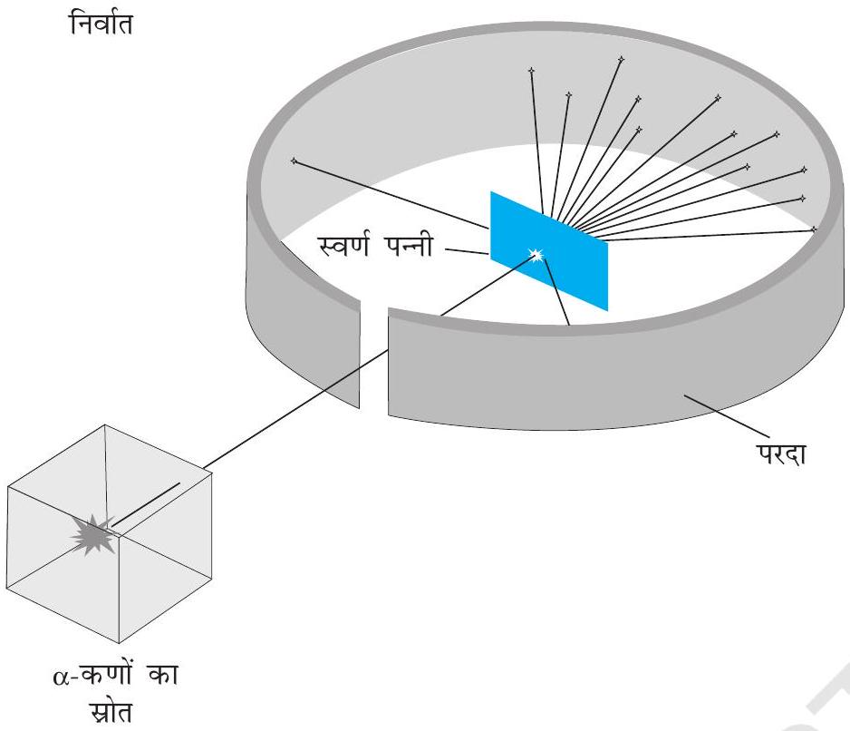
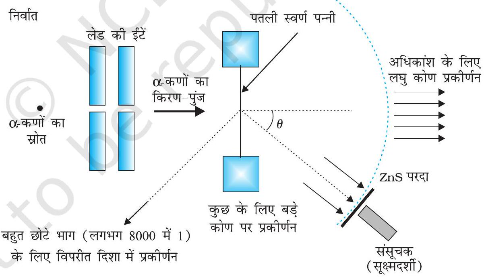
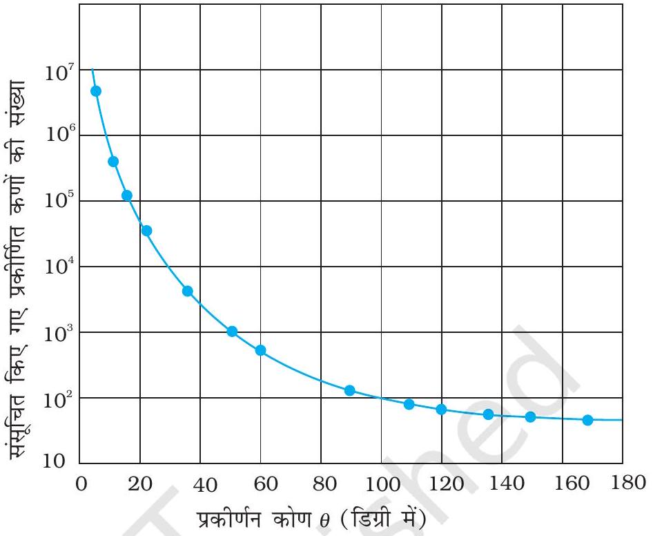
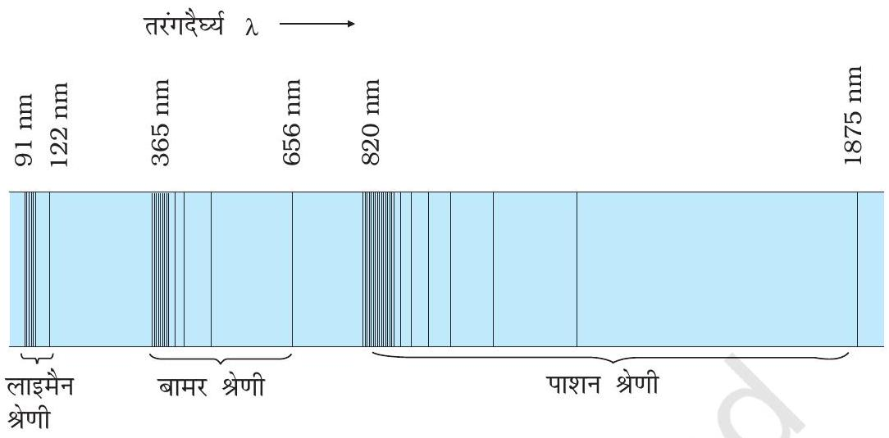
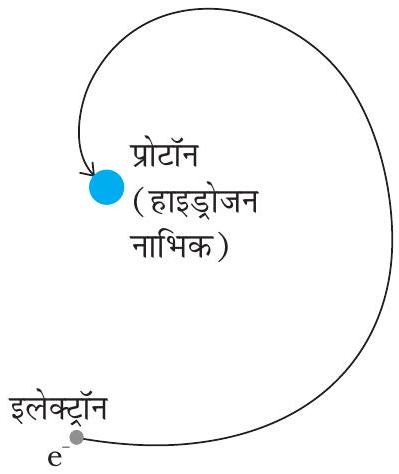
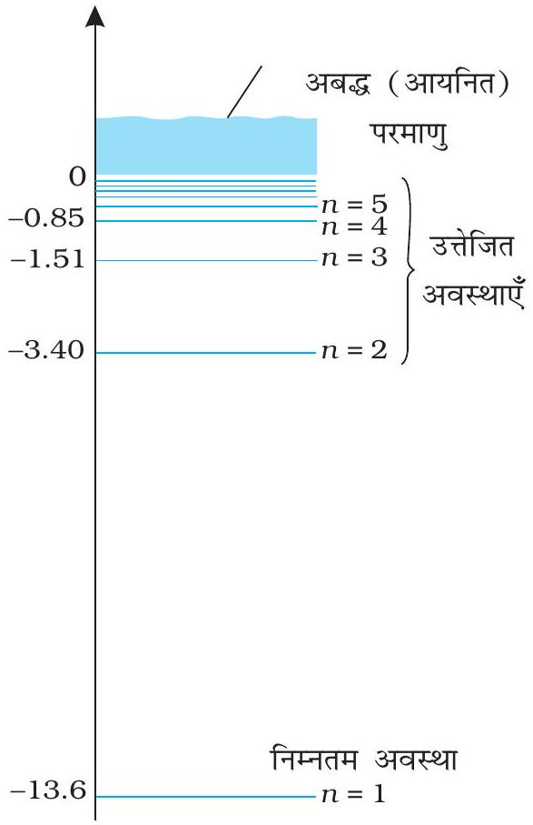
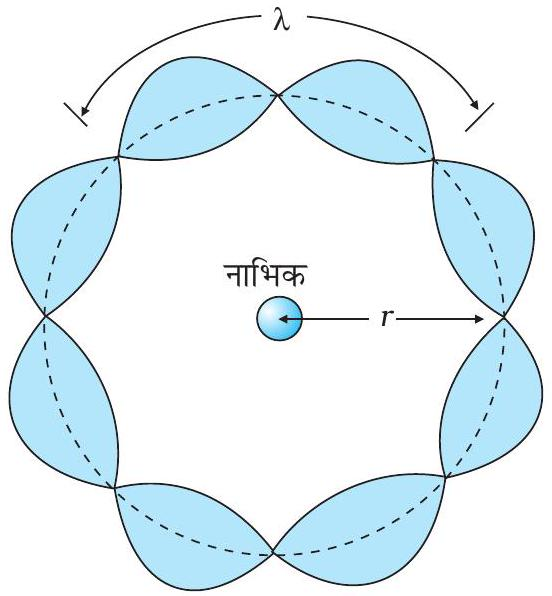

## अध्याय $12$

## परमाणु

## $12.1$ भूमिका

उन्नीसवीं शताब्दी तक पदार्थ की परमाण्वीय परिकल्पना के समर्थन में काफ़ी साक्ष्य एकत्रित हो गए थे। सन् $1897$ में ब्रिटिश भौतिकविज्ञानी जोसेफ जे. टॉमसन (1856-1940) ने गैसों के विद्युत विसर्जन प्रयोगों द्वारा ज्ञात किया कि विभिन्न तत्वों के परमाणुओं में उपस्थित ऋणात्मक आवेशित संघटक (इलेक्ट्रॉन) सभी परमाणुओं के लिए पूर्णतया समान हैं। तथापि, परमाणु स्वयं में वैद्युत रूप से उदासीन होते हैं। इसलिए, इलेक्ट्रॉन के ऋण आवेश को निष्प्रभावित करने के लिए परमाणु में धनात्मक आवेश भी अवश्य होना चाहिए। लेकिन परमाणु में धनात्मक आवेश तथा इलेक्ट्रॉन की व्यवस्था क्या है? दूसरे शब्दों में, परमाणु की संरचना क्या है?

सन् $1898$ में जे. जे. टॉमसन ने परमाणु का पहला मॉडल प्रस्तावित किया। इस मॉडल के अनुसार, परमाणु का धन आवेश परमाणु में पूर्णतया एकसमान रूप से वितरित है तथा ऋण आवेशित इलेक्ट्रॉन इसमें ठीक उसी प्रकार अंतःस्थापित हैं जैसे किसी तरबूज में बीज। इस मॉडल को चित्रमय रूप में प्लम पुडिंग मॉडल कहा गया। तथापि परमाणु के विषय में बाद के अध्ययनों ने जैसा कि इस अध्याय में वर्णित है, यह दर्शाया कि परमाणु में इलेक्ट्रॉनों तथा धन आवेशों का वितरण इस प्रस्तावित मॉडल से बहुत भिन्न है।

हम जानते हैं कि संघनित पदार्थ (ठोस तथा द्रव) तथा सघन गैसें सभी तापों पर वैद्युतचुंबकीय विकिरण उत्सर्जित करते हैं जिसमें अनेक तरंगदैर्घ्यों का संतत वितरण विद्यमान होता है यद्यपि उनकी तीव्रताएँ भिन्न होती हैं। यह समझा गया कि यह विकिरण परमाणुओं तथा अणुओं के दोलनों के कारण होता है, जो प्रत्येक परमाणु अथवा अणु का अपने समीप के परमाणुओं या अणुओं के साथ होने वाली

## परमाणु

अन्योन्य क्रिया से नियंत्रित होता है। इसके विपरीत ज्वाला में गर्म की गई विरलित गैसों द्वारा उत्सर्जित प्रकाश अथवा किसी तापदीप्त नलिका में विद्युत उत्तेजित गैस, जैसे निऑन साइन अथवा पारद-वाष्प प्रकाश में केवल निश्चित विविक्त तरंगदैर्घ्य होती हैं। इनके स्पेक्ट्रम में चमकीली रेखाओं की एक शृंखला दिखाई देती है। ऐसी गैसों में परमाणुओं के मध्य अंतराल अधिक होता है। अतः, उत्सर्जित विकिरण, परमाणुओं अथवा अणुओं के बीच अन्योन्य क्रियाओं के परिणामस्वरूप नहीं, बल्कि व्यष्टिगत परमाणुओं के कारण माना जा सकता है।

उन्नीसवीं शताब्दी के प्रारंभ में ही यह स्थापित हो गया था कि प्रत्येक तत्व से उत्सर्जित विकिरण का एक अभिलाक्षणिक स्पेक्ट्र्म होता है। उदाहरण के लिए, हाइड्रोजन स्पेक्ट्रम सदैव रेखाओं का एक समुच्चय होता है जिसमें रेखाओं के बीच की आपेक्षिक स्थितियाँ निश्चित होती हैं। इस तथ्य ने किसी परमाणु की आंतरिक संरचना और इससे उत्सर्जित विकिरण के स्पेक्ट्रम के बीच घनिष्ठ संबंध की ओर संकेत किया। सन् $1885$ में जान जेकब बामर (1825-1898) ने परमाण्वीय हाइड्रोजन से उत्सर्जित रेखाओं के समूह की आवृत्तियों के लिए एक सरल आनुभविक सूत्र प्राप्त किया। चूँकि हाइड्रोजन एक सरलतम ज्ञात तत्व है, हम इसके स्पेक्ट्र्म का इस अध्याय में विस्तार से अध्ययन करेंगे।

जे. जे. टॉमसन के एक भूतपूर्व शोध छात्र अर्नेस्ट रदरफोर्ड (1871-1937), कुछ रेडियोएक्टिव तत्वों से उत्सर्जित ऐल्फ़ा-कणों ( $\alpha$-कणों) पर एक प्रयोग करने में व्यस्त थे। परमाणु की संरचना का अन्वेषण करने के लिए उन्होंने सन् $1906$ में परमाणुओं द्वारा ऐल्फ़ा-कणों के प्रकीर्णन से संबंधित एक क्लासिकी प्रयोग प्रस्तावित किया। यह प्रयोग कुछ समय पश्चात सन् $1911$ में हैंस गाइगर (1882-1945) तथा अर्नेस्ट मार्सडन (1889-1970, जो $20$ वर्षीय छात्र थे तथा जिन्होंने अभी स्नातक की उपाधि भी ग्रहण नहीं की थी ) ने किया। अनुच्छेद $12.2$ में इसकी विस्तार से व्याख्या की गई है। इसके परिणामों की व्याख्या ने परमाणु के रदरफोर्ड के ग्रहीय मॉडल को जन्म दिया (जिसे परमाणु का नाभिकीय मॉडल भी कहा जाता है)। इसके अनुसार, किसी परमाणु का कुल धनावेश तथा अधिकांश द्रव्यमान एक सूक्ष्म आयतन में संकेंद्रित होता है जिसे नाभिक कहते हैं और इसके चारों ओर इलेक्ट्रॉन उसी प्रकार परिक्रमा करते हैं जैसे सूर्य के चारों ओर ग्रह परिक्रमा करते हैं।

परमाणु के जिस वर्तमान रूप को हम जानते हैं, रदरफोर्ड का नाभिकीय मॉडल उस दिशा में एक बड़ा कदम था। तथापि इसके द्वारा यह व्याख्या नहीं का जा सकी कि परमाणु केवल विविक्त (discrete) तरंगदैर्घ्य का प्रकाश ही क्यों उत्सर्जित करता है। हाइड्रोजन जैसा एक सरल परमाणु जिसमें एक इलेक्ट्रॉन तथा एक प्रोटॉन होता है, विशेष तरंगदैर्घ्य का एक जटिल स्पेक्ट्र्म कैसे उत्सर्जित करता है? परमाणु के क्लासिकी चित्रण में, इलेक्ट्रॉन नाभिक के चारों ओर ठीक ऐसे ही परिक्रमा करता है जैसे कि सूर्य के चारों ओर ग्रह परिक्रमा करते हैं। तथापि, हम देखेंगे कि इस मॉडल को स्वीकार करने में कुछ गंभीर कठिनाइयाँ हैं।

## $12.2$ ऐल्फ़ा कण प्रकीर्णन तथा परमाणु का रदरफोर्ड नाभिकीय मॉडल

सन् $1911$ में रदरफोर्ड के सुझाव पर एच. गाइगर तथा ई. मार्सडन ने कुछ प्रयोग किए। उनके द्वारा

## भौतिकी

चित्र $12.1$ गाइगर-मार्सडन प्रकीर्णन प्रयोग। संपूर्ण उपकरण एक निर्वात कक्ष में रखा गया है। (इस चित्र में यह कक्ष नहीं दर्शाया गया है।)

किए गए एक प्रयोग में रेडियोऐक्टिव स्रोत ${ }_{83}^{214} \mathrm{Bi}$ से उत्सर्जित 5.5 MeV ऊर्जा वाले $\alpha$-कणों के एक पुंज को पतले स्वर्ण पन्नी पर दिष्ट कराया गया, जैसा कि चित्र $12.1$ में दर्शाया गया है। चित्र $12.2$ में इस प्रयोग के व्यवस्थित चित्र को दर्शाया गया है। रेडियोऐक्टिव स्रोत ${ }_{83}^{214} \mathrm{Bi}$ से उत्सर्जित $\alpha$-कणों के एक पतले किरण-पुंज को लेड की ईंटों के मध्य से गुज़ार कर संरेखित किया गया। इस किरण-पुंज का $2.1 \times 10^{-7} \mathrm{~m}$ मोटी स्वर्ण पन्नी पर आघात कराया गया। प्रकीर्णित $\alpha$-कणों का विक्षेप मापने के लिए एक घूर्णी संसूचक का प्रयोग किया गया जिसमें एक जिंक सल्फाइड का परदा एवं एक सूक्ष्मदर्शी था। प्रकीर्णित ऐल्फ़ा-कण परदे से टकराकर चमकीले फ्लैश अथवा प्रस्फुर उत्पन्न करते हैं। ये फ्लैश सूक्ष्मदर्शी द्वारा देखे जा सकते हैं तथा प्रकीर्णित कणों की संख्या के वितरण का प्रकीर्णन कोण के फलन के रूप में अध्ययन किया जा सकता है।

चित्र $12.2$ गाइगर-मार्सडन प्रयोग का व्यवस्थात्मक निरूपण।

चित्र $12.3$ में किसी दिए समयांतराल में विभिन्न कोणों पर प्रकीर्णित कुल ऐल्फ़ा-कणों की संख्या का प्रारूपिक आलेख दर्शाया गया है। इस चित्र में दिखाए गए बिंदु प्रयोग में प्राप्त आँकड़ों को निरूपित करते हैं और संतत वक्र सैद्धांतिक पूर्वानुमान है जो इस कल्पना पर आधारित है कि परमाणु में एक सूक्ष्म सघन तथा धनावेशित नाभिक है। बहुत से ऐल्फ़ा-कण स्वर्ण पन्नी को पार कर जाते हैं। इसका अर्थ है उनमें संघट्टन नहीं होता। आपतित ऐल्फ़ा-कणों में से केवल $0.14 \%$ (लगभग) का $1^{0}$ के कोण से अधिक प्रकीर्णन होता है तथा $8000$ ऐल्फ़ा-कणों में से लगभग $1$ कण $90^{\circ}$ से अधिक विक्षेपित होता है। रदरफोर्ड ने तर्क किया कि ऐल्फ़ा-कणों को विपरीत दिशा

## परमाणु

में विक्षेपित करने के लिए, इन पर बहुत अधिक प्रतिकर्षण बल लगना चाहिए। इतना अधिक बल तभी प्राप्त हो सकता है यदि परमाणु का अधिकांश द्रव्यमान तथा इसका धन-आवेश इसके केंद्र पर दृढ़ता पूर्वक संकेंद्रित हो। तब अंदर आता हुआ ऐल्फ़ा-कण धन आवेश को भेदे बिना इसके अत्यंत समीप आ सकता है तथा इस प्रकार के समागम के परिणामस्वरूप अधिक विक्षेप होगा। इससे नाभिकीय परमाणु की परिकल्पना की पुष्टि होती है। यही कारण है कि रदरफोर्ड को नाभिक की खोज का श्रेय दिया जाता है।

रदरफोर्ड के परमाणु के नाभिकीय मॉडल में, परमाणु का कुल धनावेश तथा इसका अधिकांश द्रव्यमान परमाणु के बहुत छोटे से आयतन में संकेंद्रित होता है जिसे नाभिक कहते हैं तथा इलेक्ट्रॉन इससे कुछ दूर होते हैं। इलेक्ट्रॉन, नाभिक के चारों ओर कक्षा में चक्कर लगाते हैं, ठीक ऐसे ही जैसे सूर्य के चारों ओर ग्रह चक्कर लगाते हैं। रदरफोर्ड के प्रयोगों ने सुझाया कि नाभिक का साइज़ लगभग $10^{-15} \mathrm{~m}$ से $10^{-14} \mathrm{~m}$ हो सकता है। गतिज सिद्धांत के अनुसार

चित्र $12.3$ चित्र $12.1$ तथा $12.2$ में गाइगर-मार्सडन द्वारा प्रयुक्त प्रयोग व्यवस्था में पतली पन्नी पर ऐल्फा-कणों के प्रहार में विभिन्न कोणों पर प्राप्त प्रायोगिक प्रकीर्णन आँकड़े (बिन्दुओं के रूप में)। रदरफोर्ड के नाभिकीय माॅडल पर आधारित ठोस वक्र प्रायोगिक परीक्षणों के साथ मेल रखते हुए प्रतीत होते हैं।

चित्र $12.3$ में प्रदर्शित प्रकीर्णन आँकड़ों का विश्लेषण रदरफोर्ड के परमाणु के नाभिकीय मॉडल द्वारा किया जा सकता है। स्वर्ण पन्नी के बहुत पतली होने के कारण यह कल्पना की जा सकती है कि इस पन्नी को पार करते समय $\alpha$-कण एक से अधिक बार प्रकीर्णित नहीं होंगे। अतः किसी एक नाभिक से प्रकीर्णित ऐल्फ़ा-कण के प्रक्षेप पथ का अभिकलन काफ़ी है। ऐल्फ़ा-कण हीलियम परमाणु के नाभिक हैं इसलिए इन पर दो इकाई, $2 \mathrm{e}$, धनावेश है और द्रव्यमान हीलियम परमाणु के द्रव्यमान के बराबर है। स्वर्ण के नाभिक का आवेश $Z e$ है, यहाँ $Z$ परमाणु का परमाणु क्रमांक है, जो स्वर्ण के लिए $79$ है। चूँकि स्वर्ण-नाभिक $\alpha$-कण के नाभिक से $50$ गुना भारी है, अतः यह कल्पना करना तर्कसंगत है कि प्रकीर्णन प्रक्रम के समय स्वर्ण-नाभिक स्थिर रहता है। इन अभिधारणाओं के आधार पर ऐल्फ़ा-कण और धनावेशित नाभिक के मध्य स्थिर वैद्युत प्रतिकर्षण बल के कूलॉम-नियम तथा न्यूटन के गति के द्वितीय नियम द्वारा ऐल्फ़ा-कण के प्रक्षेप पथ का अभिकलन किया जा सकता है। इस बल का परिमाण इस प्रकार व्यक्त किया जाता है :

## भौतिकी

$$
F=\frac{1}{4 \pi \varepsilon_{0}} \frac{(2 e)(Z e)}{r^{2}}
$$

जहाँ $r$ ऐल्फ़ा-कण की नाभिक से दूरी है। आरोपित बल, ऐल्फ़ा-कण और नाभिक को मिलाने वाली रेखा के अनुदिश है। ऐल्फ़ा-कण पर आरोपित बल का परिमाण एवं दिशा, ऐल्फ़ा-कण के नाभिक की ओर अभिगमन करने वाले तथा उससे दूर जाने के साथ लगातार परिवर्तित होती रहती है।

### 12.2.1 ऐल्फ़ा-कण प्रक्षेप-पथ

ऐल्फ़ा-कण द्वारा अनुरेखित प्रक्षेप पथ, संघट्ट के संघट्ट प्राचल, $b$ पर निर्भर करता है। संघट्ट प्राचल ऐल्फ़ा-कण के प्रारंभिक वेग सदिश की नाभिक के केंद्र से अभिलंबीय दूरी है (चित्र 12.4)। दिए गए ऐल्फ़ा-कणों के पुंज के संघट्ट प्राचल $b$ का वितरण इस प्रकार है कि पुंज विभिन्न दिशाओं में भिन्न-भिन्न प्रायिकताओं से प्रकीर्णित होता है (चित्र 12.4)। (किसी पुंज में सभी कणों की लगभग समान गतिज ऊर्जा होती है।) यह देखा गया है कि नाभिक के समीप कोई ऐल्फ़ा-कण (कम संघट्ट प्राचल) अधिक प्रकीर्णित होता है। प्रत्यक्ष संघट्ट की स्थिति में संघट्ट प्राचल न्यूनतम है तथा ऐल्फ़ा-कण पीछे की ओर प्रतिक्षिप्त होता है $(\theta \cong \pi) ।$ संघट्ट प्राचल के अधिक मान के लिए, ऐल्फ़ा-कण लगभग अविचलित रहता है तथा विक्षेप बहुत कम होता है ( $\theta \cong 0$ )।

यह तथ्य कि आपतित कणों में से केवल एक छोटा भाग ही टकराकर वापस लौटता है, यह सूचित करता है कि प्रत्यक्ष संघट्ट की स्थिति में आने वाले ऐल्फ़ा-कणों की संख्या बहुत कम है। इससे ज्ञात होता है कि नाभिक का द्रव्यमान तथा धनात्मक आवेश बहुत छोटे आयतन में संकेंद्रित है। इस प्रकार रदरफोर्ड प्रकीर्णन नाभिक के साइज़ की उच्चसीमा ज्ञात करने का एक शक्तिशाली साधन है।

उदाहरण $12.1$ परमाणु के रदरफोर्ड के नाभिकीय मॉडल में, नाभिक (त्रिज्या लगभग $10^{-15} \mathrm{~m}$ ) सूर्य के सदृश है, जिसके परितः इलेक्ट्रॉन अपने कक्ष (त्रिज्या $\approx 10^{-10} \mathrm{~m}$ ) में ऐसे परिक्रमा करता है जैसे पृथ्वी सूर्य के चारों ओर परिक्रमा करती है। यदि सौर परिवार की विमाएँ उसी अनुपात में होतीं जो किसी परमाणु में होती हैं, तो क्या पृथ्वी अपनी वास्तविक स्थिति की अपेक्षा सूर्य के पास होगी या दूर होगी? पृथ्वी के कक्ष की त्रिज्या लगभग $1.5 \times 10^{11} \mathrm{~m}$ है। सूर्य की त्रिज्या $7 \times 10^{8} \mathrm{~m}$ मानी गई है।

हल इलेक्ट्रॉन के कक्ष की त्रिज्या तथा नाभिक की त्रिज्या का अनुपात है $\left(10^{-10} \mathrm{~m}\right) /\left(10^{-15}\right.$ $\mathrm{m})=10^{5}$, अर्थात इलेक्ट्रॉन के कक्ष की त्रिज्या, नाभिक की त्रिज्या से $10^{5}$ गुना अधिक है। यदि सूर्य के चारों ओर पृथ्वी के कक्ष की त्रिज्या सूर्य की त्रिज्या से $10^{5}$ गुना अधिक हो, तो पृथ्वी के कक्ष की त्रिज्या होगी $10^{5} \times 7 \times 10^{8} \mathrm{~m}=7 \times 10^{13} \mathrm{~m}$ । यह पृथ्वी की वास्तविक कक्षीय त्रिज्या से $100$ गुना अधिक है। अतः इस स्थिति में पृथ्वी सूर्य से बहुत अधिक दूर होगी। इससे यह भी ज्ञात होता है कि परमाणु में हमारे सौर परिवार की अपेक्षा बहुत अधिक भाग खाली स्थान है।

उदाहरण $12.2$ गाइगर-मार्सडन प्रयोग में 7.7 MeV के किसी ऐल्फ़ा कण की स्वर्ण-नाभिक से क्षण भर के लिए विरामावस्था में आने से पहले तथा दिशा प्रतिलोमन से पूर्व समीपतम दूरी क्या है?

हल यहाँ मुख्य धारणा यह है कि प्रकीर्णन प्रक्रम की समस्त अवधि में किसी तंत्र जैसे ऐल्फ़ा-कण और स्वर्ण-नाभिक की कुल यांत्रिक ऊर्जा संरक्षित रहती है। ऐल्फ़ा-कण और नाभिक की अन्योन्यक्रिया से पूर्व तंत्र की प्रारंभिक यांत्रिक ऊर्जा $E_{i}$ कण के क्षणिक रूप से विरामावस्था में आने पर उसकी यांत्रिक ऊर्जा $E_{f}$ के बराबर है। प्रारंभिक ऊर्जा $E_{i}$ आगामी ऐल्फ़ा-कण की गतिज ऊर्जा $K$ के ठीक बराबर है। अंतिम ऊर्जा $E_{f}$ तंत्र की विद्युत स्थितिज ऊर्जा $U$ ही है। स्थितिज ऊर्जा $U$ का समीकरण (12.1) से परिकलन किया जा सकता है।
मान लीजिए कि ऐल्फ़ा-कण के केंद्र और स्वर्ण-नाभिक के केंद्र के बीच दूरी $d$ है। जब $\alpha$-कण अपने विरामन बिंदु पर स्थित है, तब ऊर्जा संरक्षण के नियमानुसार, $E_{i}=E_{f}$ को इस प्रकार व्यक्त किया जा सकता है :

$$
K=\frac{1}{4 \pi \varepsilon_{0}} \frac{(2 e)(Z e)}{d}=\frac{2 Z e^{2}}{4 \pi \varepsilon_{0} d}
$$

अतः समीपतम दूरी $d$ होगी

$$
d=\frac{2 Z e^{2}}{4 \pi \varepsilon_{0} K}
$$

प्राकृतिक स्रोतों के ऐल्फ़ा-कणों में पाई जाने वाली अधिकतम गतिज ऊर्जा $7.7 \mathrm{MeV}$ अथवा $1.2 \times 10^{-12} \mathrm{~J}$ है। क्योंकि $1 / 4 \pi \varepsilon_{0}=9.0 \times 10^{9} \mathrm{~N} \mathrm{~m}^{2} / \mathrm{C}^{2}$ इसलिए $e=1.6 \times 10^{-19} \mathrm{C}$, के साथ, हमें प्राप्त होगा

$$
\begin{aligned}
d & =\frac{(2)\left(9.0 \times 10^{9} \mathrm{Nm}^{2} / \mathrm{C}^{2}\right)\left(1.6 \times 10^{-19} \mathrm{C}\right)^{2} \mathrm{Z}}{1.2 \times 10^{-12} \mathrm{~J}} \\
& =3.84 \times 10^{-16} \mathrm{Zm}
\end{aligned}
$$

पन्नी के पदार्थ स्वर्ण का परमाणु क्रमांक $Z=79$, इसलिए

$$
d(\mathrm{Au})=3.0 \times 10^{-14} \mathrm{~m}=30 \mathrm{fm}\left(1 \mathrm{fm} \text { (अर्थात् फर्मी) }=10^{-15} \mathrm{~m}\right)
$$

अतः स्वर्ण नाभिक की त्रिज्या $3.0 \times 10^{-14} \mathrm{~m}$ से कम है। यह प्रेक्षित परिणाम से बहुत अधिक मेल नहीं खाती है क्योंकि स्वर्ण नाभिक की वास्तविक त्रिज्या $6 \mathrm{fm}$ है। इस विसंगति का कारण यह है कि समीपतम पहुँचने की दूरी ऐल्फ़ा-कण तथा स्वर्ण-नाभिक की त्रिज्याओं के योग से काफ़ी अधिक है। इस प्रकार ऐल्फ़ा-कण स्वर्ण-नाभिक को वास्तव में छुए बिना ही अपनी गति की दिशा विपरीत कर लेता है।

### 12.2.2 इलेक्ट्रॉन-कक्षाएँ

परमाणु का रदरफोर्ड नाभिकीय मॉडल जिसमें क्लासिकी धारणाएँ सम्मिलित हैं, परमाणु को एक विद्युतीय उदासीन गोले के रूप में चित्रित करता है, जिसके केंद्र पर बहुत छोटा, भारी तथा धन आवेशित नाभिक है, जो अपनी-अपनी गतिशील स्थिर कक्षाओं में घूमते इलेक्ट्रॉनों से घिरा हुआ है। परिक्रमा करते हुए इलेक्ट्रॉनों तथा नाभिक के बीच स्थिरवैद्युत आकर्षण बल $F_{e}$ इलेक्ट्रॉन को अपने कक्ष में बनाए रखने के लिए आवश्यक अभिकेंद्री बल $\left(F_{c}\right)$ प्रदान करता है। अतः, हाइड्रोजन परमाणु में गतिशील स्थिर कक्षा के लिए

$$
\begin{aligned}
& F_{e}=F_{c} \\
& \frac{1}{4 \pi \varepsilon_{0}} \frac{e^{2}}{r^{2}}=\frac{m v^{2}}{r}
\end{aligned}
$$

## भौतिकी

अतः कक्षा-त्रिज्या तथा इलेक्ट्रॉन-वेग में संबंध होगा

$$
r=\frac{e^{2}}{4 \pi \varepsilon_{0} m v^{2}}
$$

हाइड्रोजन के परमाणु में इलेक्ट्रॉन की गतिज ऊर्जा $(K)$ तथा स्थिरवैद्युत स्थितिज ऊर्जा $(U)$ होंगी

$$
K=\frac{1}{2} m v^{2}=\frac{e^{2}}{8 \pi \varepsilon_{0} r} \text { तथा } U=-\frac{e^{2}}{4 \pi \varepsilon_{0} r}
$$

( $U$ में ऋणात्मक चिह्न सूचित करता है कि स्थिरवैद्युत बल $-r$ दिशा में है) अतः हाइड्रोजन परमाणु में इलेक्ट्रॉन की कुल ऊर्जा $E$,

$$
\begin{aligned}
E=K+U & =\frac{e^{2}}{8 \pi \varepsilon_{0} r}-\frac{e^{2}}{4 \pi \varepsilon_{0} r} \\
& =-\frac{e^{2}}{8 \pi \varepsilon_{0} r}
\end{aligned}
$$

इलेक्ट्रॉन की कुल ऊर्जा ऋणात्मक है। यह तथ्य दर्शाता है कि इलेक्ट्रॉन नाभिक से परिबद्ध है। यदि $E$ धनात्मक होता तो इलेक्ट्रॉन नाभिक के चारों ओर बंद कक्ष में नहीं घूमता।

उदाहरण $12.3$ प्रयोग द्वारा यह पाया गया कि हाइड्रोजन परमाणु को एक प्रोटॉन तथा एक इलेक्ट्रॉन में पृथक करने के लिए $13.6 \mathrm{eV}$ ऊर्जा की आवश्यकता है। हाइड्रोजन परमाणु में कक्षीय-त्रिज्या तथा इलेक्ट्रॉन का वेग परिकलित कीजिए।

हल हाइड्रोजन परमाणु में इलेक्ट्रॉन की कुल ऊर्जा है $-13.6 \mathrm{eV}=-13.6 \times 1.6 \times 10^{-19} \mathrm{~J}$ $=-2.2 \times 10^{-18} \mathrm{~J}$ अतः समीकरण (12.4) से हमें प्राप्त होगा

$$
E=-\frac{e^{2}}{8 \pi \varepsilon_{0} r}=-2.2 \times 10^{-18} \mathrm{~J}
$$

इससे कक्षीय-त्रिज्या प्राप्त होगी :

$$
\begin{aligned}
r & =-\frac{e^{2}}{8 \pi \varepsilon_{0} E}=-\frac{\left(9 \times 10^{9} \mathrm{~N} \mathrm{~m}^{2} / \mathrm{C}^{2}\right)\left(1.6 \times 10^{-19} \mathrm{C}\right)^{2}}{(2)\left(-2.2 \times 10^{-18} \mathrm{~J}\right)} \\
& =5.3 \times 10^{-11} \mathrm{~m}
\end{aligned}
$$

परिक्रमण करते इलेक्ट्रॉन का वेग, समीकरण (12.3) से $m=9.1 \times 10^{-31} \mathrm{~kg}$ लेकर परिकलित कर सकते हैं

$$
v=\frac{e}{\sqrt{4 \pi \varepsilon_{0} m r}}=2.2 \times 10^{6} \mathrm{~m} / \mathrm{s}
$$

## $12.3$ परमाण्वीय स्पेक्ट्रम

अनुच्छेद $12.1$ में उल्लेख किए अनुसार, प्रत्येक तत्व अभिलाक्षणिक स्पेक्ट्रम-विकिरण उत्सर्जित करता है। जब कोई परमाण्वीय गैस अथवा वाष्प निम्न दाब पर, प्रायः इससे विद्युत धारा प्रवाहित करके, उत्सर्जित की जाती है तो उत्सर्जित विकिरण से स्पेक्ट्र्म प्राप्त होता है जिसमें कुछ विशिष्ट तरंगदैर्घ्य ही होती हैं। इस प्रकार के स्पेक्ट्रम को उत्सर्जन रैखिक स्पेक्ट्रम कहते हैं तथा इसमें काली

## परमाणु

पृष्ठभूमि पर दीप्त रेखाएँ होती हैं। चित्र $12.5$ में परमाण्वीय हाइड्रोजन द्वारा उत्सर्जित स्पेक्ट्रम दर्शाया गया है। अतः किसी पदार्थ के उत्सर्जन रैखिक स्पेक्ट्रम का अध्ययन, गैस की पहचान करने के लिए फिंगरप्रिंट के रूप में कार्य कर सकता है। जब श्वेत प्रकाश किसी गैस से होकर गुज़रता है तथा हम स्पेक्ट्रोमीटर द्वारा पारगत प्रकाश का विश्लेषण करते हैं तो स्पेक्ट्र्म में कुछ अदीप्त रेखाएँ दिखाई देती हैं। ये अदीप्त रेखाएँ परिशुद्धतः रूप से उन तरंगदैर्घ्यों के तदनुरूपी होती हैं जो उस गैस के उत्सर्जन रैखिक स्पेक्ट्रम में पाई जाती हैं। यह उस गैस के पदार्थ का अवशोषण स्पेक्ट्रम कहलाता है।

चित्र $12.5$ हाइड्रोजन के स्पेक्ट्रम में उत्सर्जन रेखाएँ।

## $12.4$ हाइड्रोजन परमाणु का बोर मॉडल

परमाणु के रदरफोर्ड द्वारा प्रस्तावित मॉडल में यह मान लिया गया है कि परमाणु के केंद्र में नाभिक होता है तथा परिक्रमा करते इलेक्ट्रॉन स्थिर हैं ठीक वैसे ही जैसा सौर परिवार में होता है जिसका अनुकरण करके इस मॉडल को विकसित किया गया। तथापि, दोनों स्थितियों में कुछ मूलभूत अंतर है। ग्रहीय तंत्र गुरुत्वीय बल के कारण बँधा है, जबकि नाभिक-इलेक्ट्रॉन तंत्र में आवेशित कण होने के कारण, बल के कूलॉम-नियम द्वारा अन्योन्य क्रिया होती है। हम जानते हैं कि वृत्ताकार पथ में घूमती कोई वस्तु लगातार त्वरण में होती है, और इस त्वरण की प्रकृति अभिकेंद्री है। क्लासिकी वैद्युतचुंबकीय सिद्धांत के अनुसार कोई त्वरित आवेशित कण वैद्युतचुंबकीय तरंगों के रूप में विकिरण उत्सर्जित करता है। अतः त्वरित इलेक्ट्रॉन की ऊर्जा निरंतर घटनी चाहिए। इलेक्ट्रॉन अंदर की ओर सर्पिल पथ पर चलेगा तथा अंततः नाभिक में गिर जाएगा (चित्र 12.6)। अतः ऐसा परमाणु स्थायी नहीं हो सकता। इसके अतिरिक्त, क्लासिकी वैद्युतचुंबकीय सिद्धांत के अनुसार परिक्रमी इलेक्ट्रॉनों द्वारा उत्सर्जित वैद्युतचुंबकीय तरंगों की आवृत्ति परिक्रमण-आवृत्ति के बराबर होती है। जब इलेक्ट्रॉन सर्पिल पथ पर अंदर नाभिक की ओर आते हैं तो उनके कोणीय वेग और इस प्रकार उनकी आवृत्तियाँ निरंतर परिवर्तित होंगी। फलस्वरूप उत्सर्जित प्रकाश की आवृत्ति भी निरंतर परिवर्तित होनी चाहिए। अतः इन्हें एक संतत स्पेक्ट्र्म उत्सर्जित करना चाहिए जो वास्तव में प्रेक्षित रैखिक स्पेक्ट्रम के विपरीत है। स्पष्टतया रदरफोर्ड का मॉडल केवल तस्वीर का एक पहलू दिखलाता है जिसका अर्थ है कि क्लासिकी विचार परमाणु

नील्स हेनरिक डेविड बोर (1885-1962)
डेनमार्क के भौतिकविज्ञानी जिन्होंने क्वांटम विचारों के आधार पर हाइड्रोजन परमाणु के स्पेक्ट्रम की व्याख्या की। नाभिक के द्रव-बूँद मॉडल के आधार पर उन्होंने नाभिकीय विखंडन का एक सिद्धांत प्रस्तुत किया। बोर ने क्वांटम-यांत्रिकी की संकल्पनात्मक समस्याओं को विशेषकर संपूरकता के सिद्धांत की प्रस्तुति द्वारा स्पष्ट करने में योगदान किया।
संरचना की व्याख्या करने के लिए पर्याप्त नहीं है।

## भौतिकी

चित्र $12.6$ परमाणु का कोई त्वरित इलेक्ट्रॉन ऊर्जा ह्रास करके सर्पिल पथ पर नाभिक की ओर अंदर आ जाएगा।

उदाहरण $12.4$ क्लासिकी वैद्युतचुंबकीय सिद्धांत के अनुसार, हाइड्रोजन परमाणु में प्रोटॉन के चारों ओर परिक्रामी इलेक्ट्रॉन द्वारा उत्सर्जित प्रकाश की प्रारंभिक आवृत्ति परिकलित कीजिए।

हल उदाहरण $12.3$ से हम जानते हैं कि हाइड्रोजन परमाणु में प्रोटॉन के चारों ओर $5.3 \times 10^{-11} \mathrm{~m}$ की त्रिज्या की कक्षा में परिक्रामी इलेक्ट्रॉन का वेग $2.2 \times 10^{-6} \mathrm{~m} / \mathrm{s}$ है। अतः, प्रोटॉन के चारों ओर परिक्रामी इलेक्ट्रॉन की आवृत्ति है :

$$
\begin{array}{r}
v=\frac{v}{2 \pi r}=\frac{2.2 \times 10^{6} \mathrm{~m} \mathrm{~s}^{-1}}{2 \pi\left(5.3 \times 10^{-11} \mathrm{~m}\right)} \\
\approx 6.6 \times 10^{15} \mathrm{~Hz}
\end{array}
$$

क्लासिकी वैद्युतचुंबकीय सिद्धांत के अनुसार हम जानते हैं कि परिक्रामी इलेक्ट्रॉनों द्वारा उत्सर्जित वैद्युतचुंबकीय तरंगों की आवृत्ति, इसकी नाभिक के चारों ओर परिक्रमण आवृत्ति के बराबर है। अतः उत्सर्जित प्रकाश की प्रारंभिक आवृत्ति $6.6 \times 10^{15} \mathrm{~Hz}$ होगी।

नील्स बोर (1885-1962) ने रदरफोर्ड के मॉडल में नयी विकासशील क्वांटम परिकल्पना के विचारों को जोड़कर कुछ रूपांतर किया। नील्स बोर ने $1912$ में कई महीनों तक रदरफोर्ड की प्रयोगशाला में अध्ययन किया था तथा वह रदरफोर्ड के नाभिकीय मॉडल की वैधता के बारे में पूरी तरह आश्वस्त थे। उपरोक्त दुविधा में उलझे बोर ने $1913$ में निष्कर्ष निकाला कि यद्यपि वैद्युतचुंबकीय सिद्धांत, वृहत स्तरीय परिघटनाओं को व्याख्या करने में सक्षम है तथापि इस सिद्धांत को परमाणु स्तर के प्रक्रमों में प्रयुक्त नहीं किया जा सकता। यह स्पष्ट हो गया कि परमाणु-संरचना और इसका परमाण्वीय स्पेक्ट्रम से संबंध समझने के लिए क्लासिकी यांत्रिकी और वैद्युतचुंबकत्व के स्थापित सिद्धांतों से आमूल विचलन की आवश्यकता होगी। बोर ने क्लासिकी एवं प्रारंभिक क्वांटम संकल्पनाओं को संयुक्त करके तीन अभिगृहीतों के रूप में अपना सिद्धांत प्रस्तुत किया। ये अभिगृहीत हैं :

(i) बोर का पहला अभिगृहीत था कि किसी परमाणु में कोई इलेक्ट्रॉन निश्चित स्थायी कक्षाओं में विकिरण ऊर्जा उत्सर्जित किए बिना परिक्रमण कर सकता है। यह वैद्युतचुंबकीय सिद्धांत के अनुमानों के विपरीत है। इस अभिगृहीत के अनुसार प्रत्येक परमाणु की कुछ निश्चित स्थायी अवस्थाएँ हैं जिसमें यह रह सकता है और प्रत्येक संभव अवस्था में निहित कुल ऊर्जा निश्चित होती है। इन संभावित अवस्थाओं को परमाणु की स्थिर अवस्थाएँ कहते हैं।

## परमाणु

(ii) बोर का दूसरा अभिगृहीत इन स्थायी कक्षाओं को परिभाषित करता है। इस अभिगृहीत के अनुसार इलेक्ट्रॉन नाभिक के चारों ओर केवल उन कक्षाओं में ही परिक्रमण करता है जिनके लिए कोणीय संवेग का मान $h / 2 \pi$ का पूर्णांक गुणज होता है। जहाँ $h$ प्लांक नियतांक $\left(=6.6 \times 10^{-34} \mathrm{~J} \mathrm{~s}\right)$ । अतः परिक्रमा करते हुए इलेक्ट्रॉन का कोणीय संवेग $(L)$ क्वांटित है। अर्थात
$$
L=n h / 2 \pi
$$

(iii) बोर के तीसरे अभिगृहीत में परमाणु सिद्धांत में प्लांक तथा आइंसटाइन द्वारा विकसित प्रारंभिक क्वांटम परिकल्पनाओं को समाविष्ट किया गया। इसके अनुसार कोई इलेक्ट्रॉन अपने विशेष रूप से उल्लिखित अविकिरणी कक्षा से दूसरी निम्न ऊर्जा वाली कक्षा में संक्रमण कर सकता है। जब यह ऐसा करता है तो एक फोटॉन उत्सर्जित होता है जिसकी ऊर्जा प्रारंभिक एवं अंतिम अवस्थाओं की ऊर्जा के अंतर के बराबर होती है। उत्सर्जित फोटॉन की आवृत्ति निम्न व्यंजक द्वारा दी जाती है :

$$
h v=E_{i}-E_{f}
$$

जहाँ $E_{i}$ एवं $E_{f}$ प्रारंभिक और अंतिम अवस्थाओं की ऊर्जाएँ हैं, $E_{i}>E_{f}$ ।
समीकरण (12.4) में हाइड्रोजन परमाणु के लिए विभिन्न ऊर्जा स्थितियों की ऊर्जाएँ ज्ञात करने का व्यंजक दिया गया है। लेकिन इस समीकरण में इलेक्ट्रॉन कक्ष की त्रिज्या $r$ की आवश्यकता है। $r$ का मान परिकलित करने के लिए, इलेक्ट्रॉन के कोणीय संवेग से संबंधित बोर के दूसरे अभिगृहीत-क्वांटमीकरण प्रतिबंध का प्रयोग करते हैं।

इस प्रकार किसी संभावित $\mathrm{n}^{\text {th }}$ कक्षा की त्रिज्या प्राप्त होती है

$$
r_{n}=\left(\frac{n^{2}}{m}\right)\left(\frac{h}{2 \pi}\right)^{2} \frac{4 \pi \varepsilon_{0}}{e^{2}}
$$

किसी हाइड्रोजन परमाणु की स्थायी अवस्था में इलेक्ट्रॉन की कुल ऊर्जा, समीकरण (12.4) में कक्षीय त्रिज्या का मान प्रतिस्थापित करने पर प्राप्त की जा सकती है। यथा

$$
E_{n}=-\left(\frac{e^{2}}{8 \pi \varepsilon_{0}}\right)\left(\frac{m}{n^{2}}\right)\left(\frac{2 \pi}{h}\right)^{2}\left(\frac{e^{2}}{4 \pi \varepsilon_{0}}\right)
$$

अथवा $E_{n}=-\frac{m e^{4}}{8 n^{2} \varepsilon_{0}^{2} h^{2}}$
समीकरण (12.8) में नियतांकों के मान रखने पर हमें प्राप्त होगा

$$
E_{n}=-\frac{2.18 \times 10^{-18}}{n^{2}} \mathrm{~J}
$$

परमाण्वीय ऊर्जाएँ प्राय: जूल के स्थान पर इलेक्ट्रॉन वोल्ट (eV) में व्यक्त की जाती हैं। क्योंकि $1 \mathrm{eV}=1.6 \times 10^{-19} \mathrm{~J}$ । समीकरण (12.9) को पुन: इस प्रकार लिखा जा सकता है

$$
E_{n}=-\frac{13.6}{n^{2}} \mathrm{eV}
$$

किसी कक्ष में गतिमान इलेक्ट्रॉन की कुल ऊर्जा के व्यंजक में ऋणात्मक चिह्न इस बात का द्योतक है कि इलेक्ट्रॉन, परमाणु के नाभिक से आबद्ध है। अतः, हाइड्रोजन परमाणु से इलेक्ट्रॉन को नाभिक से (या हाइड्रोजन परमाणु में प्रोटॉन से) अनंत दूरी तक विलग करने के लिए ऊर्जा की आवश्यकता होगी।

## भौतिकी

कुल ऊर्जा $E(\mathrm{eV})$

चित्र $12.7$ हाइड्रोजन परमाणु के लिए ऊर्जा-स्तर आरेख। कमरे के ताप पर हाइड्रोजन परमाणु में इलेक्ट्रॉन अपना अधिकांश समय निम्नतम अवस्था में व्यतीत करता है। हाइड्रोजन परमाणु को आयनित करने के लिए किसी इलेक्ट्रॉन को निम्नतम अवस्था से $13.6$ eV ऊर्जा अवश्य उपलब्ध करानी चाहिए। (क्षैतिज रेखाएँ अनुमत ऊर्जा अवस्थाओं की उपस्थिति को दर्शाती हैं।)

### 12.4.1 ऊर्जा स्तर

परमाणु की ऊर्जा उस समय न्यूनतम (अधिकतम ऋणात्मक मान) होती है जब उसका इलेक्ट्रॉन नाभिक की निकटतम कक्षा (अर्थात् $n=1$ ) में परिक्रमण करता है। $n=2,3 \ldots$ के लिए, ऊर्जा $E$ के निरपेक्ष मान कम होते जाते हैं, अतः बाह्य कक्षा की ओर जाने पर कक्षाओं में ऊर्जा अधिक होती जाती है। परमाणु की न्यूनतम अवस्था में जिसे निम्नतम अवस्था कहते हैं इलेक्ट्रॉन की ऊर्जा न्यूनतम होती है, तथा इलेक्ट्रॉन, न्यूनतम त्रिज्या (बोर त्रिज्या $a_{o}$ ) की कक्षा में परिक्रमण करता है। इस अवस्था की ऊर्जा $(n=1), E_{1}-13.6 \mathrm{eV}$ है। अतः हाइड्रोजन परमाणु की निम्नतम अवस्था से इलेक्ट्रॉन को मुक्त कराने के लिए आवश्यक न्यूनतम ऊर्जा $13.6$ eV है। इसे हाइड्रोजन परमाणु की आयनन ऊर्जा भी कहते हैं। बोर के मॉडल के आधार पर प्राप्त मान आयनन ऊर्जा के प्रायोगिक मानों से उत्तम अनुरूपता रखता है।

कमरे के ताप पर, अधिकांश हाइड्रोजन परमाणु अपनी निम्नतम अवस्था में रहते हैं। जब कोई परमाणु इलेक्ट्रॉन संघट्ट जैसे प्रक्रमों द्वारा ऊर्जा प्राप्त करता है, तब वह अस्थायी रूप से इतनी ऊर्जा अर्जित कर सकता है जो इलेक्ट्रॉन को उच्च कक्षाओं तक पहुँचाने के लिए पर्याप्त होती है। तब वह परमाणु उत्तेजित अवस्था में कहलाता है। समीकरण (12.10) से $n=2$ के लिए; ऊर्जा $E_{2},-3.40 \mathrm{eV}$ है। इसका अर्थ यह हुआ कि हाइड्रोजन परमाणु में किसी इलेक्ट्रॉन को इसकी पहली उत्तेजित अवस्था में उत्तेजित करने के लिए आवश्यक ऊर्जा $E_{2}-E_{1}$ $=-3.40 \mathrm{eV}-(-13.6) \mathrm{eV}=10.2 \mathrm{eV}$ होगी। इसी प्रकार, $E_{3}=-1.53$ eV तथा $E_{3}-E_{1}=12.09 \mathrm{eV}$ । अर्थात्, हाइड्रोजन परमाणु को इसकी निम्नतम अवस्था से ( $n=1$ ) दूसरी उत्तेजित अवस्था ( $n=3$ ), तक उत्तेजित करने के लिए $12.09 \mathrm{eV}$ ऊर्जा की आवश्यकता होती है। यह क्रम इसी प्रकार आगे चलता रहता है। इन उत्तेजित अवस्थाओं से इलेक्ट्रॉन फिर अपनी निम्न ऊर्जा अवस्था में वापस गिर सकता है। इस प्रक्रिया में वह एक फोटॉन उत्सर्जित करता है। इस प्रकार, हाइड्रोजन परमाणु की उत्तेजित अवस्था बढ़ाने पर (अर्थात $n$ के बढ़ने पर) उत्तेजित परमाणु से इलेक्ट्रॉन को स्वतंत्र करने के लिए आवश्यक न्यूनतम ऊर्जा घटती है।

समीकरण (12.10) से अभिकलित हाइड्रोजन परमाणु की स्थायी अवस्थाओं का ऊर्जा स्तर आरेख* चित्र (12.7) में दर्शाया गया है। मुख्य क्वांटम संख्या $n$ स्थायी अवस्थाओं को ऊर्जा के आरोही क्रम में अंकित करता है। इस चित्र में उच्चतम ऊर्जा अवस्था समीकरण (12.10) में $n=\infty$ के संगत है तथा इसकी ऊर्जा $0 \mathrm{eV}$ है। यह परमाणु की वह ऊर्जा है जब नाभिक से इलेक्ट्रॉन पूरी तरह दूर कर दिया गया है ( $r=\infty$ ) और वह विराम में है। ध्यान दीजिए कि उत्तेजित अवस्थाओं की ऊर्जाएँ $n$ के बढ़ने पर किस प्रकार पास-पास आ जाती हैं।

## $12.5$ हाइड्रोजन परमाणु का लाइन स्पेक्ट्रम

बोर के मॉडल के तृतीय अभिग्रहीत के अनुसार, जब कोई परमाणु उच्च ऊर्जा स्थिति जिसकी क्वांटम संख्या $n_{i}$ है, से निम्न ऊर्जा स्थिति जिसकी क्वांटम संख्या $n_{f}$ है $\left(n_{f}<n_{i}\right)$ में संक्रमण करता है, तब ऊर्जा के इस अंतर को आवृत्ति $v_{i f}$ का एक फोटॉन वहन करता है, ताकि
$$
h v_{i f}=E_{n_{f}}-E_{n_{i}}
$$
\begin{itemize}
\item[] [^0]\end{itemize}

## परमाणु

चूँकि $n_{f}$ और $n_{i}$ दोनों पूर्णांक हैं अतः इससे तुरंत परिणाम प्राप्त होता है कि परमाण्वीय स्तरों के मध्य संक्रमणों में, विभिन्न विविक्त आवृत्तियों के प्रकाश उत्सर्जित होते हैं।

जब इलेक्ट्रॉन उच्च ऊर्जा स्थिति से निम्न ऊर्जा स्थिति में आते हैं तो फोटॉन उत्सर्जित होते हैं तथा परमाण्वीय स्पेक्ट्रम की अनेक रेखाएँ उत्पन्न होती हैं। इन स्पेक्ट्रमी रेखाओं को उत्सर्जन रेखाएँ कहते हैं। लेकिन जब कोई परमाणु फोटॉन को अवशोषित करता है जिसकी ठीक वही ऊर्जा है जो किसी इलेक्ट्रॉन को निम्न ऊर्जा स्थिति से उच्च ऊर्जा स्थिति में संक्रमण के लिए आवश्यक होती है, तो इस प्रक्रम को अवशोषण कहते हैं। अतः यदि सतत परिसर की आवृत्तियों के फोटॉन किसी विरलित गैस से गुज़रने के पश्चात किसी स्पेक्ट्रोमीटर से विश्लेषित किए जाते हैं तो संतत स्पेक्ट्र्म में अदीप्त स्पेक्ट्रमी अवशोषित रेखाओं की श्रेणी दिखाई देती है। अदीप्त रेखाएँ उन आवृत्तियों को निर्दिष्ट करती हैं जो गैस के परमाणुओं द्वारा अवशोषित की गई हैं।

हाइड्रोजन परमाणु के स्पेक्ट्रम का बोर मॉडल द्वारा दिया गया स्पष्टीकरण एक प्रतिभाशाली महान उपलब्धि था जिसने आधुनिक क्वांटम सिद्धांत की प्रगति को अत्यधिक प्रोत्साहित किया। सन् $1922$ में बोर को भौतिकी में नोबेल पुरस्कार से सम्मानित किया गया।

## $12.6$ बोर के क्वांटमीकरण के द्वितीय अभिगृहीत का दे ब्रॉग्ली द्वारा स्पष्टीकरण

बोर द्वारा प्रस्तुत परमाणु के मॉडल के सभी अभिगृहीतों में संभवतः दूसरा अभिगृहीत सबसे अधिक उलझन पैदा करने वाला था। इसके कथन के अनुसार नाभिक के चारों ओर परिक्रमा करते इलेक्ट्रॉन का कोणीय संवेग क्वांटित है ( अर्थात $L_{n}=n h / 2 \pi ; n=1,2,3$ ...) । कोणीय संवेग के केवल वही मान क्यों होते हैं जो $h / 2 \pi$ के पूर्णांक गुणज हैं? बोर द्वारा अपना मॉडल प्रस्तुत करने के दस वर्ष पश्चात सन् $1923$ में एक फ्रांसीसी भौतिक वैज्ञानिक लुइस दे ब्रॉग्ली ने इस समस्या का हल ढूँढ़ा।

हमने अध्याय $11$ में दे ब्रॉग्ली की परिकल्पना का अध्ययन किया था जिसके अनुसार, द्रव्य कण जैसे इलेक्ट्रॉन भी तरंग जैसे लक्षण प्रदर्शित करते हैं। सी.जे. डेविसन तथा एल.एच. जर्मर द्वारा $1927$ में प्रायोगिक तौर पर इलेक्ट्रॉनों की तरंग प्रकृति का सत्यापन किया गया। लुइस दे ब्रॉग्ली ने तर्क किया कि इलेक्ट्रॉन को बोर द्वारा प्रस्तावित इसकी वृत्ताकार कक्षा में, एक कण-तरंग के रूप में देखा जाना चाहिए। डोरी में गमन करती तरंगों के सदृश, कण तरंगें भी अनुनादी अवस्थाओं में अप्रगामी तरंगें उत्पन्न कर सकती हैं। कक्षा $11$ के लिए भौतिकी की पाठ्यपुस्तक के अध्याय

चित्र $12.8$ वृत्ताकार कक्षा में एक अप्रगामी तरंग दर्शाई गई है जहाँ पर कक्षा की परिधि में चार दे ब्रॉग्ली तरंगदैर्घ्य आती हैं।

$14$ से हम जानते हैं कि किसी तनित डोरी को विभिन्न स्थानों पर कर्षण करके, उसमें विभिन्न तरंगदैर्घ्यों को उत्पन्न किया जा सकता है। तथापि, केवल वही तरंगदैर्घ्य विद्यमान रह पाती हैं जिनके सिरों पर निष्पंद होते हैं तथा जो डोरी में अप्रगामी तरंग बनाती हैं। इसका अर्थ है कि किसी डोरी में, अप्रगामी तरंगें तभी बनेंगी जब तरंग द्वारा डोरी में एक ओर जाने में तथा वापस आने में तय की गई कुल दूरी, एक तरंगदैर्घ्य,
दो तरंगदैर्घ्य, अथवा कोई भी पूर्णांक संख्या की तरंगदैर्घ्य के बराबर हो। अन्य तरंगदैर्घ्यों की तरंगों में परावर्तन के पश्चात आपस में व्यतिकरण होता है तथा उनके आयाम शीघ्रता से शून्य हो जाते हैं। $r_{n}$ त्रिज्या की $n^{\text {th }}$ की कक्षा में परिक्रमा करते किसी इलेक्ट्रॉन द्वारा कक्षा की परिधि में तय की गई कुल दूरी $2 \pi r_{n}$ होगी। अतः

$$
2 \pi r_{n}=n \lambda, \quad n=1,2,3 \ldots
$$

चित्र $12.8$ में किसी वृत्ताकार कक्षा पर जिसके लिए $n=4$ है, एक अप्रगामी कण तरंग दर्शायी गई है। इस प्रकार, $2 \pi r_{n}=4 \lambda$, जहाँ $\lambda n^{\text {th }}$ कक्षा में परिक्रमा करते हुए इलेक्ट्रॉन की दे ब्रॉग्ली तरंगदैर्घ्य है। अध्याय $11$ से, हम जानते हैं $\lambda=h / p$, जहाँ $p$ इलेक्ट्रॉन के संवेग का परिमाण है। यदि इलेक्ट्रॉन की चाल प्रकाश की चाल से बहुत कम है, तो संवेग $m v_{n}$ होगा। इस प्रकार $\lambda=h / m v_{n}$ होगा। समीकरण (12.12) से हमें प्राप्त होगा :

$$
2 \pi r_{n}=n h / m v_{n} \quad \text { अथवा } \quad m v_{n} r_{n}=n h / 2 \pi
$$

यह बोर द्वारा प्रस्तावित इलेक्ट्रॉन के कोणीय संवेग का क्वांटम प्रतिबंध है [समीकरण (12.5)]। अनुच्छेद $12.5$ में हमने देखा है कि यह समीकरण हाइड्रोजन परमाणु में ऊर्जा स्तरों तथा विविक्त कक्षाओं की व्याख्या करने का आधार है। इस प्रकार दे ब्रॉग्ली की परिकल्पना, परिक्रामी इलेक्ट्रॉन के कोणीय संवेग के क्वांटमीकरण की बोर द्वारा प्रस्तावित द्वितीय अभिगृहीत के लिए व्याख्या प्रस्तुत करती है। इलेक्ट्रॉन की क्वांटित कक्षाएँ तथा ऊर्जा स्थितियाँ, इलेक्ट्रॉन की तरंग प्रकृति के कारण हैं और केवल अनुनादी अप्रगामी तरंगें ही अवस्थित रह सकती हैं।

बोर-मॉडल जिसमें चिर प्रतिष्ठित प्रक्षेप पथ चित्रण (नाभिक के चारों ओर ग्रह-सदृश कक्षाएँ) सम्मिलित हैं, हाइड्रोजनसम परमाणुओं*(एकल इलेक्ट्रॉन) के मुख्य लक्षणों, मुख्य रूप से उत्सर्जित अथवा वरणात्मक अवशोषित विकिरणों की आवृत्तियों की उचित भविष्यवाणी करता है। तथापि इस मॉडल की कुछ सीमाएँ हैं। इनमें से कुछ हैं :

(i) बोर-मॉडल हाइड्रोजनसम परमाणुओं के लिए ही उपयुक्त है। द्वि-इलेक्ट्रॉन परमाणु जैसे हीलियम के लिए भी इसे विस्तारित नहीं किया जा सकता। हाइड्रोजनसम* परमाणुओं के लिए बोर मॉडल को एक से अधिक इलेक्ट्रॉन वाले परमाणुओं के विश्लेषण के लिए प्रयोग करने के प्रयत्न किए गए, परंतु कोई सफलता प्राप्त नहीं हुई। कठिनाई यह है कि प्रत्येक इलेक्ट्रॉन केवल धनावेशित नाभिक से ही नहीं परंतु दूसरे सभी इलेक्ट्रॉनों से भी अन्योन्य क्रिया करता है। बोर मॉडल के संरूपण में इलेक्ट्रॉन तथा धनावेशित नाभिक के बीच विद्युत बल सम्मिलित है। इनमें इलेक्ट्रॉनों के मध्य विद्युत बल शामिल नहीं है जो कि बहु-इलेक्ट्रॉन परमाणुओं में आवश्यक रूप से प्रकट होता है।
(ii) यद्यपि बोर-मॉडल हाइड्रोजनसम परमाणुओं द्वारा उत्सर्जित प्रकाश की आवृत्तियों की सही भविष्यवाणी करता है, फिर भी यह स्पेक्ट्रम में आवृत्तियों की आपेक्षिक तीव्रताओं की व्याख्या नहीं कर पाता। हाइड्रोजन के उत्सर्जन स्पेक्ट्रम में कुछ दृश्य आवृत्तियों की तीव्रता क्षीण होती है, जबकि दूसरी आवृत्तियों की तीव्रता प्रबल होती है। ऐसा क्यों होता है? प्रायोगिक प्रेक्षण दर्शाते हैं कि कुछ संक्रमण दूसरों की अपेक्षा अधिक स्वीकार्य हैं। बोर-मॉडल विभिन्न संक्रमणों की विविध तीव्रताओं की व्याख्या करने में असमर्थ है।

बोर-मॉडल परमाणु का परिष्कृत चित्र प्रस्तुत करता है तथा इसका जटिल परमाणुओं के लिए व्यापकीकरण नहीं किया जा सकता। जटिल परमाणुओं के लिए हमें क्वांटम यांत्रिकी पर आधारित एक नए मूलभूत सिद्धांत का उपयोग करना होगा जो परमाणु संरचना का अधिक पूर्ण चित्र प्रस्तुत करता है।

[^1]
## सारांश

1. परमाणु कुल मिलाकर वैद्युत उदासीन होता है और इसलिए परमाणु में धनावेश और ऋणावेश की मात्राएँ समान होती हैं।
2. टॉमसन-मॉडल में परमाणु धनावेशों का गोलीय मेघ है जिसमें इलेक्ट्रॉन अंतःस्थापित होते हैं।
3. रदरफोर्ड-मॉडल में परमाणु का सर्वाधिक द्रव्यमान और इसका कुल धनावेश एक सूक्ष्म नाभिक में संकेंद्रित होता है (प्ररूपतः परमाणु के साइज़ का दस हज़ारवाँ भाग) तथा इलेक्ट्रॉन इसके चारों ओर परिक्रमा करते हैं।
4. परमाणु की संरचना की व्याख्या करने में रदरफोर्ड के नाभिकीय मॉडल में दो मुख्य कठिनाइयाँ हैं : (a) इसके अनुसार परमाणु अस्थिर हैं क्योंकि नाभिक के चारों ओर घूमते हुए त्वरित इलेक्ट्रॉनों को सर्पिल पथ पर नाभिक की ओर अंदर आ जाना चाहिए। यह पदार्थ के स्थायित्व का खंडन करता है। (b) यह विभिन्न तत्वों के परमाणुओं के अभिलाक्षणिक लाइन स्पेक्ट्रम की व्याख्या नहीं कर सकता।
5. अधिकांश तत्वों के परमाणु स्थायी होते हैं और अभिलाक्षणिक स्पेक्ट्रम उत्सर्जित करते हैं। स्पेक्ट्रम में विलग समांतर रेखाओं का समुच्चय होता है जिसे रेखिल स्पेक्ट्रम कहते हैं। यह परमाणु-संरचना के विषय में उपयोगी सूचनाएँ देता है।
6. परमाणुओं द्वारा उत्सर्जित रेखिल स्पेक्ट्रम तथा परमाणुओं के स्थायित्व की व्याख्या करने के लिए नील्स बोर ने हाइड्रोजनसम परमाणुओं (एकल इलेक्ट्रॉन) के लिए एक मॉडल प्रस्तावित किया। उन्होंने तीन अभिगृहीत प्रस्तुत किए तथा क्वांटम यांत्रिकी की नींव रखी:
    (a) किसी हाइड्रोजन परमाणु में कोई इलेक्ट्रॉन बिना विकिरण ऊर्जा के उत्सर्जन के निश्चित कक्षाओं (जिन्हें स्थायी कक्षा कहते हैं) में परिक्रमण करते हैं।
    (b) स्थायी कक्षा वे हैं जिनके लिए कोणीय संवेग $h / 2 \pi$ का कोई पूर्णांक गुणज होता है (बोर का क्वांटमीकृत प्रतिबंध)। अर्थात $L=n h / 2 \pi$, जहाँ $n$ एक पूर्णांक है जिसे मुख्य क्वांटम संख्या कहते हैं।
    (c) तीसरे अभिगृहीत के अनुसार कोई इलेक्ट्रॉन अपनी एक विनिर्दिष्ट अविकरणी कक्षा से अन्य निम्नतर ऊर्जा की कक्षा में संक्रमण कर सकता है। ऐसा करने में एक फोटॉन उत्सर्जित होता है जिसकी ऊर्जा प्रारंभिक और अंतिम अवस्थाओं की ऊर्जाओं के अंतर के बराबर होती है। उत्सर्जित फोटॉन की आवृत्ति ( $v$ ) निम्न संबंध द्वारा दी गई है :
$$
h v=E_{i}-E_{f}
$$
कोई परमाणु उसी आवृत्ति के विकिरण को अवशोषित करता है जिसे वह परमाणु उत्सर्जित करता है, इस स्थिति में इलेक्ट्रॉन $n$ से उच्च मान की कक्षा में अंतरित होता है।
$$
E_{i}+h v=E_{f}
$$
7. कोणीय संवेग के क्वांटमीकरण प्रतिबंध के परिणामस्वरूप, इलेक्ट्रॉन नाभिक की परिक्रमा केवल विशिष्ट त्रिज्याओं की कक्षाओं में ही करता है। हाइड्रोजन परमाणु के लिए इसका मान है
$$
r_{n}=\left(\frac{n^{2}}{m}\right)\left(\frac{h}{2 \pi}\right)^{2} \frac{4 \pi \varepsilon_{0}}{e^{2}}
$$
कुल ऊर्जा भी क्वांटित है :
$$
\begin{aligned}
E_{n} & =\frac{m e^{4}}{8 n^{2} \varepsilon_{0}^{2} h^{2}} \\
& =-13.6 \mathrm{eV} / \mathrm{n}^{2}
\end{aligned}
$$
तब, $n=1$ अवस्था, निम्नतम अवस्था कहलाती है। हाइड्रोजन परमाणु में निम्नतम अवस्था ऊर्जा का मान -13.6 eV है। $n$ के बड़े मान $(n>1)$ उत्तेजित अवस्थाओं के संगत हैं। परमाणु इन उत्तेजित अवस्थाओं में, दूसरे परमाणुओं या इलेक्ट्रॉनों से संघट्ट द्वारा अथवा उचित आवृत्ति के फोटॉन को अवशोषित करके, पहुँचते हैं।

## भौतिकी

8. दे ब्रॉग्ली की परिकल्पना, कि इलेक्ट्रॉन की तरंगदैर्घ्य $\lambda=h / m v$ होती है, ने तरंग-कण के द्वैती संबंध का उपयोग करके बोर की क्वांटित कक्षाओं की व्याख्या की। कक्षाएँ वृत्ताकार अप्रगामी तरंगों के संगत हैं जिनकी कक्षा की परिधि तरंगदैर्घ्यों के पूर्ण गुणजों के बराबर है।
9. बोर मॉडल हाइड्रोजनसम परमाणुओं (एकल इलेक्ट्रॉन) के लिए ही उपयुक्त है। इसे द्वि-इलेक्ट्रॉन परमाणु जैसे हीलियम के लिए भी विस्तारित नहीं किया जा सकता। यह मॉडल हाइड्रोजनसम परमाणुओं की आवृत्तियों की आपेक्षिक तीव्रताओं की भी व्याख्या नहीं कर पाता।

## विचारणीय विषय

1. टामसन मॉडल और रदरफोर्ड मॉडल दोनों ही अस्थायी तंत्र बनाते हैं। टॉमसन मॉडल स्थिर वैद्युत रूप से अस्थायी है, जबकि रदरफोर्ड मॉडल कक्षीय इलेक्ट्रॉनों के वैद्युतचुंबकीय विकिरण के कारण अस्थायी होता है।
2. बोर ने कोणीय संवेग (द्वितीय अभिगृहीत) का ही क्वांटमीकरण क्यों किया, किसी और राशि का क्यों नहीं? ध्यान दें कि $h$ तथा कोणीय संवेग की विमा एक ही होती है, और वृत्ताकार कक्षाओं के लिए कोणीय संवेग एक बहुत प्रासंगिक राशि है। अतः द्वितीय अभिगृहीत स्वाभाविक ही है।
3. हाइड्रोजन परमाणु में बोर मॉडल में कक्षीय चित्रण, अनिश्चितता सिद्धांत के साथ असंगत था। यह आधुनिक क्वांटम यांत्रिकी द्वारा प्रतिस्थापित कर दिया गया था जिसमें बोर की कक्षाएँ वे क्षेत्र हैं जहाँ इलेक्ट्रॉन के पाए जाने की प्रायिकता बहुत अधिक हो सकती है।
4. सौर परिवार की स्थिति से भिन्न, जहाँ ग्रह-ग्रह के बीच गुरुत्वाकर्षण बल, सूर्य और प्रत्येक ग्रह के बीच गुरुत्वाकर्षण बल (क्योंकि सूर्य का द्रव्यमान किसी भी ग्रह के द्रव्यमान से बहुत अधिक है) की अपेक्षा बहुत कम है, इलेक्ट्रॉन-इलेक्ट्रॉन की अन्योन्य क्रिया के कारण वैद्युत बल का परिमाण इलेक्ट्रॉन-नाभिक वैद्युत बल के तुल्य है, क्योंकि आवेश तथा दूरियाँ परिमाण में समान कोटि की हैं। यही कारण है कि ग्रह सदृश इलेक्ट्रॉन की मान्यता वाला बोर मॉडल बहु-इलेक्ट्रॉन परमाणुओं के लिए उपयुक्त नहीं है।
5. कुछ विशिष्ट कक्षों की परिकल्पना करके जिनमें इलेक्ट्रॉन विकिरित नहीं करते, बोर ने क्वांटम सिद्धांत की नींव रखी। बोर के माॅडल में केवल एक क्वांटम संख्या $n$ सम्मिलित है। नया सिद्धांत जिसे क्वांटम यांत्रिकी कहते हैं, बोर के अभिगृहीत की पुष्टि करता है। तथापि क्वांटम यांत्रिकी (अधिक व्यापक रूप से मान्य) में, कोई विशेष ऊर्जा स्तर सदैव एक ही क्वांटम अवस्था के संगत नहीं होता। उदाहरण के लिए, कोई अवस्था चार क्वांटम संख्याओं $(n, l, m$, तथा $s$ ) से अभिलक्षणित है, लेकिन शुद्ध कूलॉम विभव के लिए (हाइड्रोजन परमाणु की भांति) ऊर्जा केवल $n$ पर निर्भर करती है।
6. साधारण क्लासिकी अपेक्षाओं के प्रतिकूल, बोर मॉडल में किसी इलेक्ट्रॉन के अपनी कक्षा में परिक्रमण की आवृत्ति का स्पेक्ट्रमी रेखा की आवृत्ति से कोई संबंध नहीं है। स्पेक्ट्रमी रेखा की आवृत्ति $h$ द्वारा विभाजित दो कक्षीय ऊर्जाओं का अंतर होता है। बड़ी क्वांटम संख्याओं ( $n$ से $n-1$ तक, $n$ बहुत बड़ा लेने पर) के मध्य संक्रमणों में दोनों के मान समान हो जाते हैं जैसा कि अपेक्षित है।
7. बोर का सेमीक्लासिकी मॉडल जो कुछ तो क्लासिकी भौतिकी के पहलुओं पर तथा कुछ आधुनिक भौतिकी के पहलुओं पर आधारित है, सरलतम हाइड्रोजनसम परमाणुओं का भी सही चित्रण नहीं करता। सही चित्र वास्तव में क्वांटम यांत्रिकी से प्राप्त होता है जो बोर मॉडल से अनेक मूलभूत रूपों में भिन्न है। फिर यदि बोर मॉडल पूर्ण रूप से ठीक नहीं है तो हम इसके बारे में चिंतित क्यों होते हैं? तथापि बोर मॉडल को उपयोगी बनाने वाले कुछ कारण हैं :

## परमाणु

(i) यह मॉडल केवल तीन अभिगृहीतों पर आधारित है लेकिन फिर भी हाइड्रोजन स्पेक्ट्रम की लगभग सभी विशेषताओं की व्याख्या करता है।
(ii) हमने क्लासिकी भौतिकी की जिन संकल्पनाओं को सीखा है उनका इस मॉडल में समावेश है।
(iii) मॉडल दर्शाता है कि कुछ भविष्यवाणियों की आशा में, किस प्रकार किसी सैद्धांतिक भौतिकविज्ञानी को, कभी-कभी कुछ सदृश समस्याओं की अक्षरशः उपेक्षा कर देनी चाहिए। यदि सिद्धांत या मॉडल की भविष्यवाणी प्रयोग से मेल खाती है तो वैज्ञानिक को उपेक्षित की गई समस्याओं की व्याख्या करने का प्रयत्न करना चाहिए।

## अभ्यास

$12.1$ प्रत्येक कथन के अंत में दिए गए संकेतों में से सही विकल्प का चयन कीजिए :
    (a) टॉमसन मॉडल में परमाणु का साइज़, रदरफोर्ड मॉडल में परमाणवीय साइज़ से $\_\_\_\_$ होता है।
(अपेक्षाकृत काफ़ी अधिक, भिन्न नहीं, अपेक्षाकृत काफ़ी कम)
    (b) $\_\_\_\_$ में निम्नतम अवस्था में इलेक्ट्रॉन स्थायी साम्य में होते हैं जबकि $\_\_\_\_$ में इलेक्ट्रॉन, सदैव नेट बल अनुभव करते हैं।
    (c) $\_\_\_\_$ पर आधारित किसी क्लासिकी परमाणु का नष्ट होना निश्चित है।
(टॉमसन मॉडल, रदरफोर्ड मॉडल)
    (d) किसी परमाणु के द्रव्यमान का $\_\_\_\_$ में लगभग संतत वितरण होता है लेकिन
$\_\_\_\_$ में अत्यंत असमान द्रव्यमान वितरण होता है।
(टॉमसन मॉडल, रदरफोर्ड मॉडल)
    (e) $\_\_\_\_$ में परमाणु के धनावेशित भाग का द्रव्यमान सर्वाधिक होता है।
(रदरफोर्ड मॉडल, दोनों मॉडलों)
$12.2$ मान लीजिए कि स्वर्ण पन्नी के स्थान पर ठोस हाइड्रोजन की पतली शीट का उपयोग करके आपको ऐल्फ़ा-कण प्रकीर्णन प्रयोग दोहराने का अवसर प्राप्त होता है। (हाइड्रोजन $14 \mathrm{~K}$ से नीचे ताप पर ठोस हो जाती है।) आप किस परिणाम की अपेक्षा करते हैं?
$12.32 .3 \mathrm{eV}$ ऊर्जा अंतर किसी परमाणु में दो ऊर्जा स्तरों को पृथक कर देता है। उत्सर्जित विकिरण की आवृत्ति क्या होगी यदि परमाणु में इलेक्ट्रॉन उच्च स्तर से निम्न स्तर में संक्रमण करता है?
$12.4$ हाइड्रोजन परमाणु की निम्नतम अवस्था में ऊर्जा $-13.6 \mathrm{eV}$ है। इस अवस्था में इलेक्ट्रॉन की गतिज और स्थितिज ऊर्जाएँ क्या होंगी?
$12.5$ निम्नतम अवस्था में विद्यमान एक हाइड्रोजन परमाणु एक फोटॉन को अवशोषित करता है जो इसे $n=4$ स्तर तक उत्तेजित कर देता है। फोटॉन की तरंगदैर्घ्य तथा आवृत्ति ज्ञात कीजिए।
$12.6$ (a) बोर मॉडल का उपयोग करके किसी हाइड्रोजन परमाणु में $n=1,2$, तथा $3$ स्तरों पर इलेक्ट्रॉन की चाल परिकलित कीजिए। (b) इनमें से प्रत्येक स्तर के लिए कक्षीय अवधि परिकलित कीजिए।
$12.7$ हाइड्रोजन परमाणु में अंतरतम इलेक्ट्रॉन-कक्षा की त्रिज्या $5.3 \times 10^{-11} \mathrm{~m}$ है। कक्षा $n=2$ और $n=3$ की त्रिज्याएँ क्या हैं?
$12.8$ कमरे के ताप पर गैसीय हाइड्रोजन पर किसी $12.5 \mathrm{eV}$ की इलेक्ट्रॉन पुंज की बमबारी की गई। किन तरंगदैर्घ्यों की श्रेणी उत्सर्जित होगी?
$12.9$ बोर मॉडल के अनुसार सूर्य के चारों ओर $1.5 \times 10^{11} \mathrm{~m}$ त्रिज्या की कक्षा में, $3 \times 10^{4} \mathrm{~m} / \mathrm{s}$ के कक्षीय वेग से परिक्रमा करती पृथ्वी की अभिलाक्षणिक क्वांटम संख्या ज्ञात कीजिए ( पृथ्वी का द्रव्यमान $=6.0 \times 10^{24} \mathrm{~kg}$ )।

[^0]:    * किसी इलेक्ट्रॉन की $E=0 \mathrm{eV}$ से अधिक कुछ भी कुल ऊर्जा हो सकती है। ऐसी दशाओं में इलेक्ट्रॉन स्वतंत्र होता है। इस प्रकार $E=0 \mathrm{eV}$ से ऊपर चित्र $12.7$ में दर्शाए अनुसार ऊर्जा अवस्थाओं का एक सांतत्य है।

[^1]:    * हाइड्रोजनसम परमाणु वे परमाणु हैं जिनमें धन आवेश $+Z e$ युक्त नाभिक और एकल इलेक्ट्रॉन होता है जहाँ $Z$ प्रोटॉन संख्या है। हाइड्रोजन परमाणु, एकधा आयनित हीलियम, द्वितः आयनित लीथियम इत्यादि हाइड्रोजनसम परमाणुओं के उदाहरण हैं। इन परमाणुओं में अधिक जटिल इलेक्ट्रॉन-इलेक्ट्रॉन अन्योन्य क्रियाएँ नहीं पाई जातीं।

