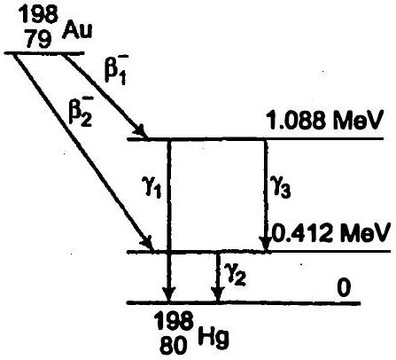

# अध्याय $13$   नाभिक 

## Nuclei

## प्रश्नावली

प्रश्न 1. (a) लीथियम के दो स्थायी समस्थानिकों ${ }_{3}^{6} \mathrm{Li}$ एवं ${ }_{3}^{7} \mathrm{Li}$ की बहुलता का प्रतिशत क्रमश: $7.5$ एवं $92.5$ है। इन समस्थानिकों के द्रव्यमान क्रमशः $6.01512$ u एवं $7.01600$ u हैं। लीथियम का परमाणु द्रव्यमान ज्ञात कीजिए।
(b) बोरॉन के दो स्थायी समस्थानिक ${ }_{5}^{10} \mathrm{~B}$ एवं ${ }_{5}^{11} \mathrm{~B}$ हैं। उनके द्रव्यमान क्रमशः $10.01294 \mathrm{u}$ एवं $11.00931 \mathrm{u}$ एवं बोरॉन का परमाणु भार $10.811 \mathrm{u}$ है। ${ }_{5}^{10} \mathrm{~B}$ एवं ${ }_{5}^{11} \mathrm{~B}$ की बहुलता ज्ञात कीजिए। हल

(a) $\mathrm{Li}^{6}$ की बहुलता प्रतिशत $=7.5 \%$
$\mathrm{Li}^{7}$ की बहुलता प्रतिशत $=92.5 \%$
$\mathrm{Li}^{6}$ का परमाणु भार $=6.01512 \mathrm{u}$

$\mathrm{Li}^{7}$ का परमाणु भार $=7.01600 \mathrm{u}$
परमाणु भार = समस्थानिकों का औसत भार

$$
\begin{aligned}
& =\frac{6.01512 \times 7.5+7.01600 \times 92.5}{7.5+92.5} \\
& =\frac{45.1134+648.98}{100}=6.941 \mathrm{u}
\end{aligned}
$$

(b) $B^{10}$ का भार $=10.01294 u$
$B^{11}$ का भार $=11.00931 u$
बोरॉन का परमाणु भार $=10.811 \mathrm{u}$
माना $\mathrm{B}^{10}$ की बहुलता प्रतिशत $x \%$ है।
अत: $\mathrm{B}^{11}$. की बहुलता प्रतिशत ( $100-x$ )\%.
परमाणु भार = समस्थानिकों का औसत भार

$$
10.811=\frac{x \times 10.01294+(100-x) \times 11.00931}{(x+100-x)}
$$

$\mathrm{B}^{10}$ की बहुलता $x=19.9 \%$
$B^{11}$ की बहुलता, $(100-x)=100-19.9=80.1 \%$
अत: $\mathrm{B}^{10}$ की बहुलता $19.9 \%$ तथा $\mathrm{B}^{11}$ की बहुलता $80.1 \%$ है।
प्रश्न 2. नियॉन के तीन स्थायी समस्थानिकों की बहुलता क्रमशः $90.51 \%, 0.27 \%$ एवं $9.22 \%$ है। इन समस्थानिकों के परमाणु द्रव्यमान क्रमशः $19.99 \mathrm{u}, 20.99 \mathrm{u}$ हैं। नियॉन का औसत परमाणु द्रव्यमान ज्ञात कीजिए।
हल $\mathrm{Ne}^{20}$ की बहुलता $=90.51 \%$
$\mathrm{Ne}^{21}$ की बहुलता $=0.27 \%$
$\mathrm{Ne}^{22}$ की बहुलता $=9.22 \%$
$\mathrm{Ne}^{20}$ का परमाणु द्रव्यमान $=19.99 \mathrm{u}$
$\mathrm{Ne}^{21}$ का परमाणु द्रव्यमान $=20.99 \mathrm{u}$
$\mathrm{Ne}^{22}$ का परमाणु द्रव्यमान $=21.99 \mathrm{u}$
औसत परमाणु द्रव्यमान = सभी समस्थानिकों का औसत भार

$$
\begin{aligned}
& =\frac{90.51 \times 19.99+0.27 \times 20.99+9.22 \times 21.99}{90.51+0.27+9.22} \\
& =\frac{1809.29+5.67+202.75}{100}=\frac{2017.7}{100} \\
& =20.18 \mathrm{u}
\end{aligned}
$$

अतः Ne का औसत परमाणु द्रव्यमान $20.18 \mathrm{u}$ है।

प्रश्न 3. नाइट्रोजन नाभिक $\left({ }_{7}^{14} \mathrm{~N}\right)$, की बंधन-ऊर्जा MeV में ज्ञात कीजिए $m_{\mathrm{N}}=14.00307 \mathrm{u}$ हल प्रोटॉन का द्रव्यमान, $m_{p}=1.00783 \mathrm{u}$,

न्यूट्रॉन का द्रव्यमान, $m_{n}=1.00867 u$
${ }_{7} \mathrm{~N}^{14}$ में $7$ प्रोटॉन तथा $7$ न्यूट्रॉन हैं।
द्रव्यमान क्षति = नाभिक का द्रव्यमान - न्यूक्लियानों का द्रव्यमान

$$
\begin{aligned}
& =7 m_{p}+7 m_{n}-m_{N} \\
& =7 \times 1.00783+7 \times 1.00867-14.00307 \\
& =7.05481+7.06069-14.00307=0.11243 \mathrm{u}
\end{aligned}
$$

नाइट्रोजन के नाभिक की बन्धन ऊर्जा $=\Delta m \times 931 \mathrm{MeV}$

$$
\begin{aligned}
& =0.11243 \times 931 \mathrm{MeV} \\
& =104.67 \mathrm{MeV}
\end{aligned}
$$

अतः बन्धन ऊर्जा 104.67 MeV है।
प्रश्न 4. निम्नलिखित आँकड़ों के आधार पर ${ }_{26}^{56} \mathrm{Fe}$ एवं ${ }_{83}^{209} \mathrm{Bi}$ नापिकों की बन्धन ऊर्जा MeV में ज्ञात कीजिए।

$$
m\left({ }_{26}^{56} \mathrm{Fe}\right)=55.934939 \mathrm{u}, m\left({ }_{83}^{209} \mathrm{Bi}\right)=208.980388 \mathrm{u}
$$

हल प्रोटॉन का द्रव्यमान, $m_{p}=1.00783 u$
न्यूट्रॉन का द्रव्यमान, $m_{n}=1.00867 u$

(i) ${ }_{26}^{56} \mathrm{Fe}$ हेतु
${ }_{26} \mathrm{Fe}^{56}$ में $26$ प्रोटॉन तथा $30$ न्यूट्रॉन है।
द्रव्यमान क्षति $(\Delta m)=[$ न्यूक्लियानों $(\mathrm{Fe})$ का भार -Fe का भार ]
द्रव्यमान क्षति $(\Delta m)=26 \times m_{p}+30 \times m_{n}-m_{N}$
$$
\begin{aligned}
& =26 \times 1.00783+30 \times 1.00867-55.934939 \\
& =26.20345+30.25995-55.934939 \\
& =0.528461 \mathrm{u}
\end{aligned}
$$
कुल बंधन ऊर्जा $=\Delta m \times 931 \mathrm{MeV}$
$$
\begin{aligned}
& =0.528461 \times 931.5 \\
& =492.26 \mathrm{MeV}
\end{aligned}
$$
${ }_{26} \mathrm{Fe}^{56}$ की प्रति न्यूक्लियान औसत बंधन ऊर्जा $=\frac{\text { बंधन ऊर्जा }}{\text { न्यूक्लियानों की संख्या }}$
$$
\begin{gathered}
492.26 \\
56 \\
=8.790 \mathrm{MeV}
\end{gathered}
$$

(ii) ${ }_{83} \mathrm{Bi}^{209}$ हेतु

इसमें $83$ प्रोटॉन तथा $126$ न्यूट्रॉन हैं
द्रव्यमान क्षति $\Delta m=$ न्यूक्लियानों का भार $-{ }_{83} \mathrm{Bi}^{209}$ का भार

$$
\begin{aligned}
& =83 \times m_{p}+126 \times m_{n}-m_{N} \\
& =83 \times 1.007825+126 \times 1.008665-208.980388 \\
& =83.649475+127.091790-208.980388 \\
& =1.760877 \mathrm{u}
\end{aligned}
$$

बंधन ऊर्जा $=\Delta m \times 931 \mathrm{MeV}=1.760877 \times 931.5=1640.26 \mathrm{MeV}$
अतः प्रति न्यूक्लियान बंधन ऊर्जा ${ }_{83} \mathrm{Bi}^{209}$

$$
=\frac{\text { बंधन ऊर्जा }}{\text { न्यूक्लियानो की संख्या }}-\frac{1640.26}{209}=7.848 \mathrm{MeV}
$$

अत: प्रति न्यूक्लियान बंधन ऊर्जा Fe के लिए Bi से अधिक है।
प्रश्न 5. एक दिए गए सिक्के का द्रव्यमान $3.0 \mathrm{~g}$ है। उस ऊर्जा की गणना कीजिए जो इस सिक्के के समी न्यूट्रॉनों एवं प्रोटॉनों को एक-दूसरे से अलग करने के लिए आवश्यक हो। सरलता के लिए मान लीजिए कि सिक्का पूर्णत: ${ }_{29}^{63} \mathrm{Cu}$ परमाणुओं का बना है।
( ${ }_{29}^{63} \mathrm{Cu}$ की द्रव्यमान $=62.92960 \mathrm{u}$ )।
हल सिक्के का द्रव्यमान $=3 \mathrm{~g}$
$1 \mathrm{~g} \mathrm{Cu}$ में परमाणुओं की संख्या $=\frac{6.023 \times 10^{23}}{63}$.
$3 \mathrm{~g} \mathrm{Cu}$ में परमाणुओं की संख्या $=\frac{6.023 \times 10^{23}}{63} \times 3=2.868 \times 10^{22}$
Cu परमाणु में प्रोटॉनों की संख्या = $29$
Cu परमाणु में न्यूट्रॉनों की संख्या $=63-29=34$
द्रव्यमान क्षति (प्रति परमाणु), $\Delta m=29 \times m_{p}+34 \times m_{n}-m_{\mathrm{Cu}}$

$$
\begin{aligned}
& =29 \times 1.00783+34 \times 1.00867-62.9260 \\
& =0.59225 \mathrm{u}
\end{aligned}
$$

∴ सभी परमाणुओं में द्रव्यमान क्षति $=0.59225 \times 2.868 \times 10^{22}$

$$
=1.6985 \times 10^{22} \mathrm{u}
$$

बंधन ऊर्जा = द्रव्यमान क्षति $\times 931 \mathrm{MeV}$

$$
=1.6985 \times 10^{22} \times 931=1.58 \times 10^{25} \mathrm{MeV}
$$

अतः सभी न्यूट्रॉनों व प्रोटॉनों को अलग करने में आवश्यक ऊर्जा $1.58 \times 10^{25} \mathrm{MeV}$ जो बंधन ऊर्जा है।

प्रश्न 6. निम्नलिखित के लिए नाभिकीय समीकरण लिखिए
(a) ${ }_{88}^{226} \mathrm{Ra}$ का $\alpha$-क्षय
(b) ${ }_{9 .}^{242} \mathrm{Pu}$, का $\alpha$-क्षय
(c) ${ }_{15}^{32} \mathrm{P}$ का $\beta^{-}$-क्षय
(d) ${ }_{83}^{210} \mathrm{Bi}$, का $\beta^{-}$-क्षय
(e) ${ }_{6}^{11} \mathrm{C}$, का $\beta^{+}$. क्षय
(f) ${ }_{43}^{97} \mathrm{Tc}$, का $\beta^{+}$-क्षय

(g) ${ }_{54}^{120} \mathrm{Xe}$ का इलेक्ट्रॉन अभिग्रहण

हल हम जानते हैं कि

1. $\alpha$-कण के क्षय में परमाणु भार में $4$ की कमी तथा परमाणु क्रमांक में $2$ की कमी आती है।
2. $\beta$-कण के क्षय में परमाणु भार अपरिवर्तित रहता है तथा परमाणु क्रमांक में $1$ की वृद्धि होती है।
3. $\gamma$-कण के क्षय में परमाणु भार तथा परमाणु क्रमांक अपरिवर्तित रहते हैं।
(a) ${ }_{88}^{226} \mathrm{Ra} \xrightarrow{-\alpha}{ }_{88}^{22} \mathrm{Rn}+{ }_{2}^{4} \mathrm{He}$
(b) ${ }_{94}^{242} \mathrm{Pu} \xrightarrow{-\alpha}{ }_{92}^{238} \mathrm{U}+{ }_{2}^{4} \mathrm{He}$
(c) ${ }_{15}^{32} \mathrm{P} \xrightarrow{-(-\beta)}{ }_{16}^{32} \mathrm{~S}+{ }_{-1}^{0} \mathrm{e}+\bar{v}$
$\beta^{-}$-कण के साथ $\bar{v}$ (एन्टि-न्युट्रिनो) भी पाया जाता है।
(d) ${ }_{83}^{210} \mathrm{Bi} \xrightarrow{-(-\beta)}{ }_{84}^{210} \mathrm{X}+{ }_{-1}^{0} \mathrm{e}+\overline{\mathrm{v}}$
(e) ${ }_{6}^{11} \mathrm{~B} \xrightarrow{-(+\beta)}{ }_{5}^{11} \mathrm{~B}+\mathrm{e}^{+}+v$
$\beta^{+}$का क्षय न्यूट्रिनों को भी मुक्त करता है।
(f) ${ }_{43}^{97} \mathrm{Tc} \xrightarrow{-(+\beta)}{ }_{42}^{97} \mathrm{X} \times e^{+}+v$
(g) ${ }_{54}^{120} \mathrm{Xe}+{ }_{-1}^{0} \mathrm{e} \longrightarrow{ }_{53}^{120} \mathrm{X}$

प्रश्न 7. एक रेडियोऐक्टिव समस्थानिक की अर्द्ध-आयु $T$ वर्ष है। कितने समय के बाद इसकी ऐക്ഷേवता प्रारम्पिक ऐक्रिवता की

(a) $3.125 \%$ तथा
(b) $1 \%$ रह जाएगी?

हल अर्द्ध-आयु $T_{1 / 2}=T \mathrm{yr}$

(a) $N=3.125 \%$ of $N_{0}$
∴
$$
\frac{N}{N_{0}}=\frac{3.125}{100}=\frac{1}{32}
$$
हम जानते हैं कि
$$
\frac{N}{N_{0}}=\left(\frac{1}{2}\right)^{n}
$$

$$
\begin{array}{lrl}
\therefore & \frac{1}{32} & =\left(\frac{1}{2}\right)^{n} \\
\Rightarrow & \left(\frac{1}{2}\right)^{5} & =\left(\frac{1}{2}\right)^{n}
\end{array}
$$

अथवा

$$
n=5
$$

अत:

$$
\text { समय, } t=n \times T_{1 / 2}=5 T
$$

$5$ अर्द्ध-आयु के पश्चात् सक्रियता $3.125 \%$ रह जाती है।
(b) $N=1 \%$ of $N_{0}$

$$
\therefore \quad \frac{N}{N_{0}}=\frac{1}{100}
$$

हम जानते हैं कि

$$
\begin{array}{ll} 
& \frac{N}{N_{0}}=e^{-\lambda l} \\
\therefore & \frac{1}{100}=e^{-\lambda l}
\end{array}
$$

दोनों ओर का log लेने पर
अथवा

$$
\begin{aligned}
\log _{e} 1-\log _{e} 100 & =-\lambda t \log _{e} e \\
-2.303 \times 2 & =-\lambda t \\
t & =\frac{4.606}{\lambda}
\end{aligned}
$$

$$
\begin{aligned}
& \text { हम जानते हैं कि } \lambda=\frac{0.693}{T_{1 / 2}} \\
& \therefore \\
& \therefore t=\frac{4.606 T_{1 / 2}}{0.693}=6.65 T
\end{aligned}
$$

प्रश्न 8. जीवित कार्बनयुक्त द्रव्य की सामान्य ऐक्रिवता, प्रति ग्राम कार्बन के लिए $15$ क्षय प्रति मिनट है। यह ऐक्टिवता, स्थायी समस्थानिक ${ }_{6}^{14} \mathrm{C}$ के साथ-साथ अल्प मात्रा में विद्यमान रेडियोएक्टिव ${ }_{6}^{12} \mathrm{C}$ के कारण होती है। जीव की मृत्यु होने पर वायुमण्डल के साथ इसकी अन्योन्य क्रिया (जो उपरोक्त संतुलित ऐक्टिवता को बनाए रखती है) समाप्त हो जाती है तथा इसकी ऐक्टिवता कम होनी शुरू हो जाती है। ${ }_{6}^{14} \mathrm{C}$ की ज्ञात अर्द्ध-आयु ( $5730$ वर्ष) और नमूने की मापी गई ऐक्टिवता के आधार पर इसकी सन्निकट आयु की गणना की जा सकती है। यही पुरातत्व विज्ञान में प्रयुक्त होने वाली ${ }_{6}^{14} \mathrm{C}$ कालनिर्धारण (dating) पद्धति का सिद्धान्त है। यह मानकर कि मोहनजोदड़ो से प्राप्त किसी नमूने की ऐक्टिवता $9$ क्षय प्रति मिनट प्रति ग्राम कार्बन है। सिंघु घाटी की सम्यता की सन्निकट आयु का आकलन कीजिए।
हल सामान्य ऐक्टिवता, $A_{0}=15$ decay $/ \mathrm{min}$
नमूने की ऐक्टिवता, $A=9$ decay/min

$$
T_{1 / 2}=5730 \mathrm{yr}
$$

सूत्रानुसार,

$$
\begin{aligned}
& \frac{A}{A_{0}}=e^{-\lambda t} \\
& \frac{9}{15}=e^{-\lambda t}
\end{aligned}
$$

अथवा

$$
\frac{3}{5}=e^{-\lambda s}
$$

अथवा

$$
e^{\lambda l}=\frac{5}{3}
$$

दोनों ओर का log लेने पर

$$
\lambda t \log _{e} e=\log _{e} 5-\log _{e} 3
$$

अथवा

$$
\begin{aligned}
& \lambda t=2.303(0.69-0.47) \\
& \lambda t=0.5109
\end{aligned}
$$

$$
\left(\because \lambda=\frac{0.693}{T_{1 / 2}}\right)
$$

∴

$$
\begin{aligned}
t & =\frac{0.5066 \times T_{1 / 2}}{0.693} \\
& =\frac{0.5066 \times 5730}{0.693} \\
& =4224.47 \mathrm{yr}
\end{aligned}
$$

अतः मोहनजोदड़ो घाटी की औसत आयु $4224$ वर्ष है।
प्रश्न 9. $8.0$ mCi सक्रियता का रेडियोएक्टिव स्रोत प्राप्त करने के लिए ${ }_{27}^{60} \mathrm{Co}$ की कितनी मात्रा की आवश्यकता होगी? ${ }_{27}^{60} \mathrm{Co}$ की अर्द्ध-आयु $5.3$ वर्ष है।
हल सक्रियता, $\frac{d N}{d t}=8 \mathrm{mCi}=8 \times 10^{-3} \times 3.7 \times 10^{10}=8 \times 3.7 \times 10^{7}$ विघटन/से

$$
\left(\because 1 \mathrm{Ci}=3.7 \times 10^{10} \text { विघटन/से }\right)
$$

अर्द्ध-आयु ${ }_{27}^{60} \mathrm{Co}, T_{1 / 2}=5.3 \mathrm{yr}=5.3 \times 365 \times 24 \times 60 \times 60$

$$
=1.67 \times 10^{8} \mathrm{~s}
$$

हम जानते हैं कि

$$
\begin{aligned}
\lambda & =\frac{0.693}{T_{1 / 2}}=\frac{0.693}{1.67 \times 10^{8}} \\
& =4.14 \times 10^{-9} / \mathrm{s} \\
\frac{d N}{d t} & =\lambda N \\
N & =\frac{d N / d t}{\lambda}=\frac{8 \times 3.7 \times 10^{7}}{4.14 \times 10^{-9}} \\
& =7.133 \times 10^{16}
\end{aligned}
$$

आवोगाद्रो संख्या के अनुसार,
$6.023 \times 10^{23}\left({ }_{27} \mathrm{Co}^{60}\right)$ परमाणुओं का द्रव्यमान $=60 \mathrm{~g}$
${ }_{27} \mathrm{Co}^{60}$ के $7.133 \times 10^{16}$ के परमाणु का भार $=\frac{60 \times 7.133 \times 10^{16}}{6.023 \times 10^{23}}$.
द्रव्यमान $m=7.12 \times 10^{-6} \mathrm{~g}$
अत: आवश्यक द्रव्यमान $7.12 \times 10^{-6} \mathrm{~g}$ है। $\left[{ }_{27} \mathrm{Co}^{60}\right]$
प्रश्न 10. ${ }_{38}^{90} \mathrm{Sr}$ की अर्द्ध-आयु $28$ वर्ष है। इस समस्थानिक के $15 \mathrm{mg}$ की विघटन दर क्या है?
हल Sr की अर्द्धआयु, $T_{1 / 2}=28 \mathrm{yr}$

$$
=28 \times 365 \times 24 \times 60 \times 60 \mathrm{~s}
$$

आवोगाद्रो संख्या सिद्धान्त के अनुसार,
$90$ g Sr में परमाणु $=6.023 \times 10^{23}$ atom
$15 \mathrm{~g} \mathrm{Sr}$ में परमाणु $=\frac{6.023 \times 10^{23} \times 15 \times 10^{-3}}{90}$.
परमाणुओं की संख्या, $N=1.0038 \times 10^{20}$
सक्रियता,

$$
\frac{d N}{d t}=\lambda N
$$

अथवा

$$
\begin{aligned}
\frac{d N}{d t} & =\frac{0.6931}{T_{1 / 2}} \cdot N=\frac{0.6931 \times 1.0038 \times 10^{20}}{28 \times 365 \times 24 \times 60 \times 60} \quad\left(\because \lambda=\frac{0.693}{T_{1 / 2}}\right) \\
\frac{d N}{d t} & =7.877 \times 10^{10} \text { विघटन } / \mathrm{स} \\
& =7.877 \times 10^{10} \mathrm{~Bq}
\end{aligned}
$$

प्रश्न 11. स्वर्ण के समस्थानिक ${ }_{78}^{197} \mathrm{Au}$ एवं रजत के समस्थानिक ${ }_{47}^{107} \mathrm{Ag}$ की नाभिकीय त्रिज्या के अनुपात का सन्निकट मान ज्ञात कीजिए।
हल नाभिक की त्रिज्या, $R=R_{0} A^{1 / 3}$
जहाँ, $A$ द्रव्यमान संख्या है तथा $R_{0}$ मूलानुपाती नियतांक है

$$
\begin{array}{rlrl}
\therefore & & R \propto A^{1 / 3} \\
\therefore & & \frac{R_{\text {gold }}}{R_{\text {silver }}} & =\left(\frac{A_{\text {gold }}}{A_{\text {silver }}}\right)^{1 / 3}=\left(\frac{197}{107}\right)^{13}=1.225 \\
& & & =1.23
\end{array}
$$

प्रश्न 12.(a) ${ }_{88}^{226} \mathrm{Ra}$ एवं (b) ${ }_{86}^{220} \mathrm{Rn}$ नाभिकों के $\alpha$-क्षय में उत्सर्जित $\alpha$-कणों का $Q$-मान एवं गतिज ऊर्जा ज्ञात कीजिए।
दिया है, $m\left({ }_{88}^{226} \mathrm{Ra}\right)=226.02540 \mathrm{u}$,

$$
\begin{aligned}
m\left({ }_{86}^{222} \mathrm{Ra}\right) & =222.01750 \mathrm{u}, \\
m\left({ }_{84}^{216} \mathrm{Po}\right) & =216.00189 \mathrm{u} .
\end{aligned}
$$

हल (a) ${ }_{88} \mathrm{Ra}^{226}$ का α-क्षय निम्न है

$$
{ }_{88}^{226} \mathrm{Ra} \longrightarrow{ }_{86}^{222} \mathrm{Rn}+{ }_{2}^{4} \mathrm{He}+\mathrm{Q}
$$

समीकरण में $Q$-मान निम्न प्रकार दिया जाता है

$$
\begin{aligned}
Q \text {-मान } & =\left[m\left({ }_{88}^{226} \mathrm{Ra}\right)-m\left({ }_{86}^{222} \mathrm{Rn}\right)-m_{\alpha}\right] \times 931.5 \mathrm{MeV} \\
& =(226.02540-222.01750-4.00260) \times 931.5 \\
& =0.0053 \times 931.5=4.94 \mathrm{MeV}
\end{aligned}
$$

उत्सर्जित $\alpha$-कण की गतिज ऊर्जा $=\left(\frac{A-4}{A}\right) \cdot Q=\frac{226-4}{226} \times 4.94$
= 4.85 MeV
(b) ${ }_{86} \mathrm{Rn}^{220}$ का $\alpha$-कण क्षय

$$
{ }_{86}^{220} \mathrm{Rn} \longrightarrow{ }_{84}^{216} \mathrm{Po}+{ }_{2}^{4} \mathrm{He}
$$

समी में Q-मान

$$
\begin{aligned}
Q-\text { मान } & =\left[m\left({ }_{86}^{220} \mathrm{Rn}\right)-m\left({ }_{84}^{216} \mathrm{Po}\right)-m_{\alpha}\right] \times 931.5 \mathrm{MeV} \\
& =[220.01137-216.00189-4.00260] \times 931.5 \\
& =6.41 \mathrm{MeV}
\end{aligned}
$$

उत्सर्जित $\alpha$-कण की गतिज ऊर्जा $=\frac{(A-4) Q \_220-4}{A} \times 6.41$

$$
=6.29 \mathrm{MeV}
$$

प्रश्न 13. रेडियोन्यूक्लाइड ${ }^{11} \mathrm{C}$ का क्षय निम्नलिखित समीकरण के अनुसार होता है,

$$
{ }_{6}^{11} \mathrm{C} \longrightarrow{ }_{5}^{11} \mathrm{~B}+e^{+}+v: T_{y 2}=20.3 \mathrm{~min}
$$

उत्सर्जित पोजिट्रॉन की अधिकतम ऊर्जा $0.960 \mathrm{MeV}$ है। द्रव्यमानों के निम्नलिखित मान दिए गए हैं

$$
m\left({ }_{6}^{11} \mathrm{C}\right)=11.011434 \mathrm{u} \text { तथा } m\left({ }_{6}^{11} \mathrm{~B}\right)=11.009305 \mathrm{u} \text {, }
$$

Q-मान की गणना कीजिए एवं उत्सर्जित पॉजिट्रॉन की अधिकतम ऊर्जा के मान से इसकी तुलना कीजिए।

हल $e$ का द्रव्यमान $=0.000548 u$
द्रव्यमान क्षति, $\Delta m=\left[m\left({ }_{6}^{11} \mathrm{C}\right)-m\left({ }_{5}^{11} \mathrm{~B}\right)-m_{6}\right]$
(जहाँ पर नाभिकों का द्रव्यमान प्रयुक्त होता है परमाणुओं का नहीं यदि हम परमाणु द्रव्यमान प्रयुक्त करते हैं तब $\mathrm{C}^{11}$ की अवस्था में $6 m_{\theta}$ जोड़ते हैं तथा $\mathrm{B}^{11}$ की अवस्था में $5 m_{\theta}$ जोड़ते हैं)
चूँकि ${ }_{6} \mathrm{C}^{11}$ परमाणु, ${ }_{6} \mathrm{C}^{11}$ नाभिक तथा $6$ प्रोटॉन के द्वारा बना है
$\therefore{ }_{6} \mathrm{C}^{11}$ नाभिक का द्रव्यमान

$$
\begin{aligned}
& ={ }_{6} \mathrm{C}^{11} \text { परमाणु का द्रव्यमान - } 6 \text { इलेक्ट्रॉनों का द्रव्यमान } \\
& =11.011434 \mathrm{u}-6 \mathrm{~m}_{e}
\end{aligned}
$$

इसी प्रकार, ${ }_{5} \mathrm{~B}^{11}$ नाभिक का द्रव्यमान

$$
\begin{aligned}
& ={ }_{5} \mathrm{~B}^{11} \text { परमाणु का द्रव्यमान - } 5 \text { इलेक्ट्रॉनों का द्रव्यमान } \\
& =11.00930-5 \mathrm{~m}_{\mathrm{b}}
\end{aligned}
$$

$$
\therefore \quad \begin{aligned}
Q & =\left[\left(11.011434-6 m_{b}\right)-\left(11.009305-5 m_{b}\right)-m_{b}\right] \\
\Delta m & =\left[m\left({ }_{6}^{11} \mathrm{C}\right)-m\left({ }_{5}^{11} \mathrm{~B}\right)-2 m_{b}\right] \\
& =11.011434-11.009305-2 \times 0.000548 \\
& =0.001033 \\
Q & =\text { बंधन ऊर्जा }=\Delta m \times 931 \\
& =0.001033 \times 931 \\
& =0.9617 \mathrm{MeV}
\end{aligned}
$$

[डॉटर नाभिक $e^{+}$की तुलना में अधिक भारी है तथा इसके $V$ का मान भी अधिक है तथा इसकी ऊर्जा नगण्य है। $\left(E_{d}=0\right)$ न्युट्रिनों की गतिज ऊर्जा न्यूनतम है (पॉजीट्रॉन की अधिकतम ऊर्जा शून्य है तथा कुल प्रयोगिक ऊर्जा $Q$ है अतः अधिकतम $E_{\theta} \cong Q$ है।]

प्रश्न 14. ${ }_{10}^{23} \mathrm{Ne}$ का नाभिक, $\beta^{-}$उत्सर्जन के साथ क्षयित होता है। इस $\beta$-क्षय के लिए समीकरण लिखिए और उत्सर्जित इलेक्ट्रॉनों की अधिकतम गतिज ऊर्जा ज्ञात कीजिए।

$$
\begin{aligned}
& m\left({ }_{10}^{23} \mathrm{Ne}\right)=22.994466 \mathrm{u} \\
& m\left({ }_{11}^{23} \mathrm{Na}\right)=22.089770 \mathrm{u}
\end{aligned}
$$

हल ${ }_{10} \mathrm{Ne}^{23}$ की $\beta$ क्षय समीकरण

$$
{ }_{10}^{23} \mathrm{Ne} \xrightarrow{-\beta}{ }_{11}^{23} \mathrm{Na}+\_e^{0}+\bar{v}+Q
$$

प्रश्न $13$ के अनुसार द्रव्यमान क्षति

$$
\begin{aligned}
\Delta m & =m\left({ }_{10}^{23} \mathrm{Ne}\right)-m\left({ }_{11}^{23} \mathrm{Na}\right) \\
& =22.994466-22.989770 \\
& =0.004696 \mathrm{u} \\
Q & =\Delta n \times 931=0.004696 \times 931=4.372 \mathrm{MeV}
\end{aligned}
$$

उत्सर्जित $\beta$ कण की अधिकतम गतिज ऊर्जा का मान $Q$ है

$$
\dot{E}_{\theta}=Q=4.37 \mathrm{MeV}
$$

${ }_{10} \mathrm{Na}^{23}$ का नाभिक इलेक्ट्रॉन न्यूट्रॉन से अधिक भारी है व्यवहारिक रूप से उदगमित ऊर्जा इलेक्ट्रॉन न्यूट्रिनो युग्म के रूप में होती है जब न्युट्रिनों की ऊर्जा शून्य हो जाती है तब इलेक्ट्रॉन की ऊर्जा अधिकतम होती है अतः इलेक्ट्रॉन की अधिकतम गतिज ऊर्जा $4.374 \mathrm{MeV}$ है।]

प्रश्न 15.किसी नाभिकीय अभिक्रिया $A+b \rightarrow C+d$ का $Q$-मान निम्नलिखित समीकरण द्वारा परिभाषित होता है,

$$
Q=\left[m_{A}+\mid m_{b}-m_{c}=m_{d}\right] c^{2}
$$

जहाँ, दिए गए द्रव्यमान, नाभिकीय विराम द्रव्यमान (rest mass) हैं। दिए गए आँकड़ों के आधार पर बताइए कि निम्नलिखित अभिक्रियाएँ ऊष्माक्षेपी हैं या ऊष्माशोषी।

(a) ${ }_{1}^{1} \mathrm{H}+{ }_{1}^{3} \mathrm{H} \longrightarrow{ }_{1}^{2} \mathrm{H}+{ }_{1}^{2} \mathrm{H}$
(b) ${ }_{6}^{12} \mathrm{C}+{ }_{6}^{12} \mathrm{C} \longrightarrow{ }_{10}^{20} \mathrm{Ne}+{ }_{2}^{4} \mathrm{He}$

दिए गए परमाणु द्रव्यमान इस प्रकार हैं

$$
\begin{aligned}
m\left({ }_{1}^{2} \mathrm{H}\right) & =2.014102 \mathrm{u}, \\
m\left({ }_{1}^{3} \mathrm{H}\right) & =3.016049 \mathrm{u}, \\
m\left({ }_{6}^{12} \mathrm{C}\right) & =12.000000 \mathrm{u}, \\
m\left({ }_{10}^{20} \mathrm{Ne}\right) & =19.992439 \mathrm{u} .
\end{aligned}
$$

हल दी गयी समीकरण

(a) ${ }_{1}^{1} \mathrm{H}+{ }_{1}^{3} \mathrm{H} \longrightarrow{ }_{1}^{2} \mathrm{H}+{ }_{1}^{2} \mathrm{H}$
द्रव्यमान क्षति $\Delta m=m\left({ }_{1}^{1} \mathrm{H}\right)+m\left({ }_{1}^{3} \mathrm{H}\right)-2 m\left({ }_{1}^{2} \mathrm{H}\right)$
$$
\begin{aligned}
& =1.007825+3.016049-2(2.014102) \\
& =-0.00433 u
\end{aligned}
$$
समी में Q-मान
$$
Q=\Delta m \times 931=-0.00433 \times 931=-4.031 \mathrm{MeV}
$$
चूँकि ऊर्जा ऋणात्मक है अतः समीकरण ऊष्माशोषी है।
(b) दी गयी समीकरण
$$
\begin{aligned}
{ }_{6}^{12} \mathrm{C} & +{ }_{6}^{12} \mathrm{C} \longrightarrow{ }_{10}^{20} \mathrm{Ne}+{ }_{2}^{4} \mathrm{He} \\
\Delta m & =2 m\left({ }_{6}^{12} \mathrm{C}\right)-m\left({ }_{10}^{20} \mathrm{Ne}\right)-m\left({ }_{2}^{4} \mathrm{He}\right) \\
& =2 \times 12-19.992439-4.002603 \\
& =0.00495 \mathrm{u} \\
Q & =\Delta n \times 931=0.00495 \times 931=4.62 \mathrm{MeV}
\end{aligned}
$$
絜ंकि ऊर्जा धनात्मक है अतः समीकरण ऊष्माक्षेपी है।
प्रश्न 16. माना कि हम ${ }_{26}^{56} \mathrm{Fe}$ नाभिक के दो समान अवयवों, ${ }_{13}^{28} \mathrm{Al}$ में विखंडन पर विचार करें। क्या ऊर्जा की दृष्टि से यह विखंडन सम्मव है? इस प्रक्रम का Q-मान ज्ञात करके अपना तर्क प्रस्तुत करें। दिया है, $m\left({ }_{26}^{66} \mathrm{Fe}\right)=55.93494 \mathrm{u}$ और $m\left({ }_{13}^{28} \mathrm{Al}\right)=27.98191 \mathrm{u}$
हल क्षय हेतु दी गयी समीकरण
$$
{ }_{26}^{56} \mathrm{Fe} \longrightarrow 2_{13}^{28} \mathrm{Al}
$$

द्रव्यमान क्षति $\Delta m=m\left({ }_{26}^{56} \mathrm{Fe}\right)-2 m\left({ }_{13}^{28} \mathrm{Al}\right)$

$$
\begin{aligned}
& =55.93494-2(27.98191) \\
& =-0.02888 u
\end{aligned}
$$

$$
Q=\Delta m \times 931=-26.88728 \mathrm{MeV}
$$

चूँकि ऊर्जा ऋणात्मक है अत: विखण्डन प्रमावशाली रूप से नहीं होगा।
प्रश्न 17. ${ }_{94}^{239} \mathrm{Pu}$ के विखण्डन गुण बहुत कुछ ${ }_{92}^{235} \mathrm{U}$ से मिलते-जुलते हैं। प्रति विखण्डन विमुक्त औसत ऊर्जा $180 \mathrm{MeV}$ है। यदि $1 \mathrm{~kg}$ शुद्ध ${ }_{94}^{239} \mathrm{Pu}$ के समी परमाणु विखण्डित हों तो कितनी MeV ऊर्जा विमुक्त होगी?
हल आवोगाद्रो संख्या की अभिघारणा के अनुसार

$$
\begin{aligned}
239 \mathrm{~g}_{94}^{239} \mathrm{Pu} \text { में परमाणुओं की संख्या } & =6.023 \times 10^{23} \\
1 \mathrm{~kg}_{94} \mathrm{Pu}{ }^{239} \text { में परमाणुओं की संख्या } & =\frac{6.023 \times 10^{23} \times 1000}{239} \\
& =2.52 \times 10^{24}
\end{aligned}
$$

एक विखण्डन में औसत मुक्त ऊर्जा $180 \mathrm{MeV}$ है।
अतः कुल मुक्त ऊर्जा [ $1 \mathrm{~kg}$ में ${ }_{94} \mathrm{Pu}^{239}$ का विखण्डन] $=180 \times 2.52 \times 10^{24}$

$$
=4.53 \times 10^{26} \mathrm{MW}
$$

प्रश्न 18.किसी $1000 \mathrm{MW}$ विखण्डन रिएक्टर के आधे इंघन का $5.00$ वर्ष में व्यय हो जाता है। प्रारम्म में इसमें कितना ${ }_{92}^{235} \mathrm{U}$ था? मान लीजिए कि रिएक्टर $80 \%$ समय कार्यरत रहता है, इसकी सम्पूर्ण ऊर्जा ${ }_{92}^{235} \mathrm{U}$ के विखण्डन से ही ठत्पन्न हुई है; तथा ${ }_{92}^{235} \mathrm{U}$ न्यूक्लाइड केवल विषण्डन प्रक्रिया में हीं व्यय होता है।
हल एक विखण्डन में मुक्त ऊर्जा $200 \mathrm{MeV}$ है। $\left[{ }_{92} \mathrm{U}^{235}\right.$ हेतु $]$
माना $U^{235}$ के $\times \mathrm{kg}$ प्रयुक्त होते हैं।
आवोगाद्रो अभिघारणा के अनुसार
$\mathrm{U}^{235}$ के $235 \mathrm{~g}$ में परमाणुओं की संख्या $=6.023 \times 10^{23}$
$\therefore \mathrm{U}^{235}$ के xkg में परमाणु संख्या $=\frac{6.023 \times 10^{23}}{235 \times 10^{-3}} \times \mathrm{x}$ परमाणु
[uूँकि आधा ईंधन $5$ वर्षों में खपत होता है तथा प्रत्येक परमाणु $200 \mathrm{MeV}$ ऊर्जा देता है अतः ईंधन द्वारा दी गयी कुल ऊर्जा)

$$
=\frac{6.023 \times 10^{23} \times x \times 200 \times 1.6 \times 10^{-13}}{235 \times 2 \times 10^{-3}} \cdot \mathrm{~J}
$$

रिएक्टर द्वारा $5$ वर्षों में उत्पादित ऊर्जा $80 \%$ है

$$
=1000 \times 10^{6} \times 5 \times 365 \times 24 \times 60 \times 60 \times \frac{80}{100}
$$

[सूत्र $E=P t$ से]

समीकरण (i) तथा (ii) से

$$
\frac{6.023 \times 10^{23} \times 200 \times 1.6 \times 10^{-13} \times}{235 \times 2 \times 10^{-3}}=\frac{10^{9} \times 5 \times 365 \times 24 \times 3600 \times 80}{100}
$$

⇒

$$
\begin{aligned}
x & =\frac{5 \times 365 \times 24 \times 36 \times 80 \times 235 \times 2 \times 10^{-3} \times 10^{9}}{6.023 \times 10^{10} \times 200 \times 1.6} \\
& =3071.5 \mathrm{~kg}
\end{aligned}
$$

${ }_{92} \mathrm{U}^{235}$ की प्रारम्भिक मात्रा $3071.5 \mathrm{~kg}$ है।
प्रश्न $19.2 .0 \mathrm{~kg}$ ड्यूटीरियम के संलयन से एक $100$ वाट का विद्युत लैंप कितनी देर प्रकाशित रखा जा सकता है? सलयन अभिक्रिया निम्नवत ली जा सकती है

$$
{ }_{1}^{2} \mathrm{H}+{ }_{1}^{2} \mathrm{H} \longrightarrow{ }_{2}^{3} \mathrm{He}+n+3.27 \mathrm{MeV}
$$

हल माना $t$ समय है।
आवोगाद्रो अभिधारणा के अनुसार
$2 \mathrm{~g}$ ड्युट्रॉन में परमाणुओं की संख्या $=6.023 \times 10^{23}$
$2 \mathrm{~kg}$ ड्युट्रॉन में परमाणुओं की संख्या $=\frac{6.023 \times 10^{23} \times 2 \times 10^{3}}{2}$.

$$
=6.023 \times 10^{26} \text { नाभिक }
$$

दी गयी समीकरण से दो ड्युट्रॉन के संलयन में मुक्त ऊर्जा
= 3.27 MeV
$\therefore 1$ ड्युटीरियम की मुक्त ऊर्जा $=\frac{3.27}{2}=1.635 \mathrm{MeV}$
$6.023 \times 10^{26}$ डेंयुटीरियम परमाणुओं की मुक्त ऊर्जा

$$
\begin{aligned}
& =1.635 \times 6.023 \times 10^{26}=9.848 \times 10^{26} \mathrm{MeV} \\
& =9.848 \times 10^{26} \times 1.6 \times 10^{-13}=15.75 \times 10^{13} \mathrm{~J}
\end{aligned}
$$

$1$ बल्ब द्वारा $1$ s में प्रयुक्त ऊर्जा $=100 \mathrm{~J}$
$100$ J ऊर्जा खपत $1$ s में होती है
$15.75 \times 10^{13} \mathrm{~J}$ ऊर्जा खपत में लगा समय $=\frac{1 \times 15.75 \times 10^{13}}{100}=15.75 \times 10^{11} \mathrm{~s}$
( ∵ हम जानते हैं कि $1 \mathrm{yr}=60 \times 24 \times 60 \times 365 \mathrm{~s}$ )

$$
=\frac{15.75 \times 10^{11}}{60 \times 24 \times 60 \times 365} \mathrm{yr}=4.99 \times 10^{4} \mathrm{yr}
$$

अतः बल्ब $4.99 \times 10^{4} \mathrm{yr}$ तक चमकेगा।

प्रश्न 20. दो ड्यूट्रॉनों के आमने-सामने की टक्कर के लिए कूलॉम अवरोघ की ऊँचाई ज्ञात कीजिए। (संकेत-कूलॉम अवरोघ की ऊँचाई का मान इन ड्यूट्रॉन के बीच लगने वाले उस कूलॉम प्रतिकर्षण बल के बराबर होता है जो एक-दूसरे को सम्पर्क में रखे जाने पर उनके बीच आरोपित होता है। यह मान सकते हैं कि ड्यूट्रॉन $2.0 \mathrm{fm}$ प्रभावी त्रिज्या वाले दृढ़ गोले हैं।) हल त्रिज्या, $r=2 \mathrm{fm}=2 \times 10^{-15} \mathrm{~m}$
दो ड्यूट्रानों के केन्द्रों के बीच की दूरी $d=r$

$$
d=2 \times 10^{-15} \mathrm{~m}
$$

प्रति ड्युट्रॉन आवेश, $e=1.6 \times 10^{-19} \mathrm{C}$

$$
\begin{aligned}
\text { स्थितिज ऊर्जा }=\frac{1}{4 \pi \varepsilon_{0}} \cdot \frac{q_{1} q_{2}}{d} & =\frac{9 \times 10^{9} \times 1.6 \times 10^{-19} \times 1.6 \times 10^{-19}}{2 \times 10^{-15}} \\
& \quad\left(\because \frac{1}{4 \pi \varepsilon_{0}}=9 \times 10^{9}\right) \\
& =\frac{5.76 \times 10^{-14}}{1.6 \times 10^{-19}}=720000 \mathrm{eV}
\end{aligned}
$$

[ऊर्जा संरक्षण के नियम से दोनों ड्युट्रॉनों की कुल गतिज ऊर्जा कुल स्थितिज ऊर्जा के बराबर होगी]
∴ स्थितिज ऊर्जा $=2 \times$ प्रति ड्युट्रॉन की गतिज ऊर्जा
प्रत्येक ड्युट्रॉन की गतिज ऊर्जा $=\frac{720000}{2}=360000 \mathrm{eV}=360 \mathrm{keV}$
अतः विभव प्राचीर $360 \mathrm{keV}$ है।
प्रश्न 21. समीकरण $R=R_{0} A^{1 / 3}$ के आधार पर, दर्शाइए कि नाभिकीय द्रव्य का घनत्व लगमग अचर है (अर्थात् $A$ पर निर्मर नहीं करता है)। यहाँ, $R_{0}$ एक नियतांक है एवं $A$ नामिक की द्रव्यमान संख्या है।
हल नाभिक की त्रिज्या हेतु सम्बन्ध $R=R_{0} A^{1 / 3}$ जहाँ, $R_{0}$ नियतांक तथा $A$ नाभिक की द्रव्यमान संख्या है।

$$
\begin{aligned}
& \text { नाभिक का घनत्व }=\frac{\text { द्रव्यमान }}{\text { आयतन }} \\
& \qquad \begin{aligned}
\rho & =\frac{\text { प्रत्येक न्यूक्लियान का द्रव्यमान × न्यूक्लियानों की संख्या }}{\frac{4}{3} \pi R^{3}} \\
& =\frac{m \times A \times 3}{4 \pi R^{3}} \\
& =\frac{A m 3}{4 \pi R_{0}^{3} A}=\frac{3 m}{4 \pi R_{0}^{3}}=\frac{3 \times 1.66 \times 10^{-27}}{4 \times 3.14 \times\left(1.1 \times 10^{-15}\right)^{3}} \\
& =2.97 \times 10^{17} \mathrm{~kg} / \mathrm{m}^{3}
\end{aligned}
\end{aligned}
$$

चूँकि, $R_{0}$ नियतांक है अतः घनत्व $A$ पर निर्भर नहीं है।

प्रश्न 22. किसी नाभिक से $\beta^{+}$(पोंजिट्रॉन) उत्सर्जन की एक अन्य प्रतियोगी प्रक्रिया है जिसे इलेक्ट्रॉन परिग्रहण (Capture) कहते हैं (इसमें परमाणु की आंतरिक कक्षा, जैसे कि K-कक्षा, से नाभिक एक इलेक्ट्रॉन परिगृहीत कर लेता है और एक न्यूट्रिनों, $v$ उत्सर्जित करता है)।

$$
e^{+}+{ }_{Z}^{A} X \rightarrow{ }_{Z-1}^{A} Y+v
$$

दर्शाइए कि यदि $\beta^{+}$उत्सर्जन ऊर्जा विचार से अनुमत है तो इलेक्ट्रांन परिग्रहण भी आवश्यक रूप से अनुमत है, परन्तु इसका विलोम अनुमत नहीं है।
हल पाजीट्रॉन का उदगमन

$$
{ }_{z} X^{A} \rightarrow{ }_{z-1} Y^{A}+e^{0}+Q_{1}
$$

माना इलेक्ट्रॉन का अवशोषण निम्न समी० द्वारा दर्शाया गया है

$$
{ }_{z} X^{A}+{ }_{-1} e^{0} \longrightarrow{ }_{z-1} Y^{A}+v+Q_{2}
$$

समी (i) में मुक्त ऊर्जा

$$
\begin{aligned}
Q_{1} & =\left[m_{N}\left(z X^{A}\right)-m_{N}\left(z-1 y^{A}\right)-m_{\theta}\right] c^{2} \\
& =\left[m_{N}\left(z X^{A}\right)+Z m_{\theta}-m_{N}\left(z-1 y^{A}\right)-(Z-1) m_{\theta}-m_{\theta}\right] c^{2} \\
& =\left[m_{N}\left(z X^{A}\right)-m_{N}\left(z-1 y^{A}\right)-2 m_{\theta}\right] c^{2}
\end{aligned}
$$

जहाँ, $m_{0}=$ इलेक्ट्रॉन का द्रव्यमान है।
समी (ii) में मुक्त ऊर्जा

$$
\begin{aligned}
Q_{2} & =\left[m_{N}\left({ }_{z} X^{A}\right)+m_{b}-m_{N}\left({ }_{z-1} Y^{A}\right)\right] c^{2} \\
& =\left[m_{N}\left({ }_{z} X^{A}\right)+Z m_{b}+m_{b}-m_{N}\left({ }_{z-1} Y^{A}\right)-(Z-1) m_{b}-m_{b}\right) c^{2} \\
& =\left[m_{N}\left({ }_{z} X^{A}\right)-m_{N(Z-1)} Y^{A}\right] c^{2}
\end{aligned}
$$

यहाँ, यदि $Q_{1}>0$ तब $Q_{2}>0$
[यदि पाजिट्रॉन का उत्सर्जन अति उच्च ऊर्जा के साथ उदगमन होता है तब इलेक्ट्रॉन का अवशोषण निश्चित रूप से होता है।]
किन्तु यदि $Q_{2}>0$ इसका अर्थ आवश्यक रूप से यह नहीं है कि $Q_{1}>0$ अतः इसका व्युत्क्रम सत्य नहीं है।

प्रश्न 23. आवर्त सारणी में मैग्नीशियम का औसत परमाणु द्रव्यमान $24.312 u$ दिया गया है। यह औसत मान, पृथ्वी पर इसके समस्थानिकों की सापेक्ष बहुलता के आधार पर दिया गया है। मैग्नीशियम के तीनों समस्थानिक तथा उनके द्रव्यमान इस प्रकार हैं- ${ }_{12}^{24} \mathrm{Mg}(23.98504 \mathrm{u})$, ${ }_{12}^{25} \mathrm{Mg}(24.98584 \mathrm{u})$ एवं ${ }_{12}^{26} \mathrm{Mg}(25.98259 \mathrm{u})$ । प्रकृति में प्राप्त मैग्नीशियम में ${ }_{12}^{24} \mathrm{Mg}$ की (द्रव्यमान के अनुसार) बहुलता $78.99 \%$ है। अन्य दोनों समस्थानिकों की बहुलता का परिकलन कीजिए।

हल Mg का परमाणु द्रव्यमान = $24.312 u$
${ }_{12} \mathrm{Mg}^{24}$ का भार = $23.98504$ u
${ }_{12} \mathrm{Mg}^{25}$ का भार = $24.98584$ u
${ }_{12} \mathrm{Mg}^{26}$ का भार = $25.98259$ u
${ }_{12} \mathrm{Mg}^{24}$ की बहुलता $=78.99 \%$
माना ${ }_{12} \mathrm{Mg}^{25}$ की बहुलता $x \%$ है।
${ }_{12} \mathrm{Mg}^{26}$ की बहुलता $=100-78.99-x$

$$
=(21.01-x) \%
$$

परमाणवीय द्रव्यमान = द्रव्यमानों का औसत
= समस्थानिकों की बहुलता
कुल बहुलता

$$
24.312=\frac{78.99 \times 23.98504+x \times 24.98584+(21.01-x) \times 25.98259}{100}
$$

⇒

$$
x=9.303 \%
$$

अतः ${ }_{12} \mathrm{Mg}^{25}$. की बहुलता 9.303\% है तथा ${ }_{12} \mathrm{Mg}^{25}$ की बहुलता 11.71\% है।
प्रश्न 24.न्यूट्रॉन पृथक्करण ऊर्जा (Separation energy) परिभाषा के अनुसार, वह ऊर्जा है जो किसी नाभिक से एक न्यूट्रॉन को निकालने के लिए आवश्यक होता है। नीचे दिए गए आँकड़ों का इस्तेमाल करके ${ }_{20}^{41} \mathrm{Ca}$ एवं ${ }_{13}^{27} \mathrm{Al}$ नाभिकों की न्यूट्रॉन पृथक्करण ऊर्जा ज्ञात कीजिए।

$$
\begin{aligned}
& m\left({ }_{20}^{40} \mathrm{Ca}\right)=39.962591 \mathrm{u} \\
& m\left({ }_{20}^{41} \mathrm{Ca}\right)=40.962278 \mathrm{u} \\
& m\left({ }_{13}^{26} \mathrm{Al}\right)=25.986895 \mathrm{u} \\
& m\left({ }_{13}^{27} \mathrm{Al}\right)=26.981541 \mathrm{u}
\end{aligned}
$$

हल (i) जब न्यूट्रॉन को ${ }_{20} \mathrm{Ca}^{41}$ से अलग कर दिया जाता है तब ${ }_{20} \mathrm{Ca}^{40}$ शेष बचता है

$$
{ }_{20}^{41} \mathrm{Ca} \longrightarrow{ }_{20}^{40} \mathrm{Ca}+{ }_{0} n^{1}
$$

द्रव्यमान क्षति $\Delta m=m\left({ }_{20}^{40} \mathrm{Ca}\right)+m\left({ }_{0} n^{1}\right)-m\left({ }^{41} \mathrm{Ca}\right)$

$$
\begin{aligned}
& =39.962591+1.008665-40.962278 \\
& =0.008978 u
\end{aligned}
$$

न्यूट्रॉन हेतु विस्थापन दूरी $=\Delta m \times 931=0.008978 \times 931=8.362 \mathrm{MeV}$
(ii) जब ${ }_{13} \mathrm{Al}^{27}$ से एक न्यूट्रॉन निकाल दिया जाता है तब ${ }_{13} \mathrm{Al}{ }^{26}$ शेष रहता है।

$$
{ }_{13}^{27} \mathrm{Al} \longrightarrow{ }_{13}^{26} \mathrm{Al}+{ }_{0}^{1} n
$$

द्रव्यमान क्षति $\Delta m=m\left({ }_{13}^{26} \mathrm{Al}\right)+m\left({ }_{0} n^{1}\right)-m\left({ }_{13}^{27} \mathrm{Al}\right)$

$$
\begin{aligned}
& =25.986895+1.008665-26.981541 \\
& =0.014019
\end{aligned}
$$

न्यूट्रॉन विपाटन हेतु ऊर्जा $=\Delta m \times 931=0.014019 \times 931$

$$
=13.06 \mathrm{MeV}
$$

प्रश्न 25.किसी स्रोत में फॉस्फोरस के दो रेडियो न्यूक्लाइड निहित हैं ${ }_{16}^{32} \mathrm{P}\left(T_{1 / 2}=14.3 d\right)$ एवं ${ }_{15}^{33} \mathrm{P}\left(T_{1 / 2}=253 \mathrm{~d}\right) ।$ प्रारम्म में ${ }_{15}^{33} \mathrm{P}$ से $10 \%$ क्षय प्राप्त होता है। इसमें $90 \%$ क्षय प्राप्त करने के लिए कितने समय प्रतीक्षा करनी होगी?
हल प्रारम्भ में स्रोत में $90 \%{ }_{15} \mathrm{P}^{32}$ तथा $10 \%{ }_{15} \mathrm{P}^{35}$ है। माना प्रारम्भ में $\mathrm{P}^{32} \times \mathrm{g}$ है तथा $9 \mathrm{x}$ $\mathrm{g} \mathrm{P}^{33}$ है, $t$ समय पश्चात् स्रोत में $90 \% \mathrm{P}^{33}$ तथा $10 \% \mathrm{P}^{32}$ है अर्थात् y $\mathrm{gP}^{33}$ तथा $9 \mathrm{yg} \mathrm{P}^{32}$ है।

$$
\begin{aligned}
\frac{N}{N_{0}} & =e^{-\lambda l}=\left(\frac{1}{2}\right)^{t / T_{1 / 2}} \\
N & =N_{0}\left(\frac{1}{2}\right)^{t / T_{1 / 2}} \\
y & =9 x \cdot 2^{-t / 14.3} \\
9 y & =x 2^{-t / 25.3}
\end{aligned}
$$

समी (i) को समी (ii) से विभाजित करने पर

$$
\frac{y}{9 y}=\frac{9 x}{x} \cdot \frac{2^{-t / 14.3}}{2^{-t / 25.3}}
$$

अथवा

$$
\frac{1}{9}=9 \times 2^{(1 V 25.3-U 14.3)}
$$

अथवा

$$
\frac{1}{81}=2^{-11 U 25.3 \times 14.3}
$$

दोनों ओर का log लेने पर

$$
\log 1-\log 81=-\frac{11 t}{25.3 \times 14.3} \log 2
$$

अथवा

$$
-1.9085=\frac{-11 \times t}{25.3 \times 14.3} \times 0.3010
$$

अथवा

$$
\begin{aligned}
t & =\frac{25.3 \times 14.3 \times 1.9085}{11 \times 0.3010} \\
& =208.5 \text { days }
\end{aligned}
$$

अतः हमें $208.5$ दिन प्रतीक्षा करनी होगी।
प्रश्न 26. कुछ विशिष्ट परिस्थितियों में एक नाभिक, $\alpha$-कण से अधिक द्रव्यमान वाला एक कण उत्सर्जित करके क्षयित होता है। निम्नलिखित क्षय-प्रक्रियाओं पर विचार कीजिए

$$
\begin{aligned}
& { }_{88}^{223} \mathrm{Ra} \longrightarrow{ }_{82}^{209} \mathrm{~Pb}+{ }_{6}^{14} \mathrm{C} \\
& { }_{88}^{223} \mathrm{Ra} \longrightarrow{ }_{86}^{219} \mathrm{Rn}+{ }_{2}^{4} \mathrm{He}
\end{aligned}
$$

इन दोनों क्षय प्रक्रियाओं के लिए Q-मान की गणना कीजिए और दर्शाइए कि दोनों प्रक्रियाएँ ऊर्जा की दृष्टि से सम्मव हैं।
हल (a) दी गयी समी

$$
{ }_{88}^{223} \mathrm{Ra} \longrightarrow{ }_{82}^{209} \mathrm{~Pb}+{ }_{6}^{14} \mathrm{C}
$$

द्रव्यमान क्षति $\Delta m=m\left({ }_{88}^{223} \mathrm{Ra}\right)-m\left({ }_{82}^{209} \mathrm{~Pb}\right)-m\left({ }_{6}^{14} \mathrm{C}\right)$

$$
\Delta m=223.01850-208.98107-14.00324=0.03419 u
$$

दी गयी क्षति हेतु $Q$ का मान

$$
Q=\Delta m \times 931.5=0.03419 \times 931.5=31.83 \mathrm{MeV}
$$

(b) दी गयी समीकरण

$$
{ }_{88}^{223} \mathrm{Ra} \longrightarrow{ }_{86}^{219} \mathrm{Rn}+{ }_{2}^{4} \mathrm{He}
$$

द्रव्यमान क्षति $\Delta m=m\left({ }_{88}^{223} \mathrm{Ra}\right)-m\left({ }_{86}^{219} \mathrm{Rn}\right)-m\left({ }_{2}^{4} \mathrm{He}\right)$

$$
=223.01850-219.00948-4.00260=0.00642 u
$$

दी गयी क्षति हेतु $Q$ का मान

$$
Q=\Delta n \times 931.5=0.00642 \times 931.5=5.98 \mathrm{MeV}
$$

यहाँ दोनों अवस्थाओं में $Q$ घनात्मक है अतः क्षय ऊर्जित रूप से सम्मव है।
प्रश्न 27. तीव्र न्यूट्रॉनों द्वारा ${ }_{92}^{238} \mathrm{U}$ के विस्छप्हन पर विचार कीजिए। किसी विखण्डन प्रक्रिया में प्राथमिक अंशों (Primary fragments) के बीटा-क्षय के पश्वात् कोई न्यूट्रॉन उत्सर्जित नहीं होता तथा ${ }_{58}^{140} \mathrm{Ce}$ तथा ${ }_{44}^{99} \mathrm{Ru}$ अन्तिम उत्पाद प्राप्त होते हैं। विसण्डन प्रक्रिया के लिए $Q$ के मान का परिकलन कीजिए। आवश्यक आँकड़े इस प्रकार हैं।

$$
\begin{aligned}
& m\left({ }_{92}^{238} \mathrm{U}\right)=238.05079 \mathrm{u} \\
& m\left({ }_{58}^{40} \mathrm{Ce}\right)=139.90543 \mathrm{u} \\
& m\left({ }_{44}^{99} \mathrm{Ru}\right)=98.90594 \mathrm{u}
\end{aligned}
$$

हल दी गयी विखण्डन समीकरण

$$
{ }_{92}^{238} \mathrm{U}+{ }_{0} \mathrm{n}^{1} \longrightarrow{ }_{58}^{140} \mathrm{Ce}+{ }_{44}^{99} \mathrm{Au}+\mathrm{Q}
$$

द्रव्यमान क्षति $\Delta m=m\left({ }_{92}^{238} \mathrm{U}\right)+m\left({ }_{0} n^{1}\right)-m\left({ }_{58}^{140} \mathrm{Ce}\right)-m\left({ }_{44}^{99} \mathrm{Ru}\right)$

$$
\begin{aligned}
& =238.05079+1.00867-139.90543-98.90594 \\
& =0.24809 \mathrm{u}
\end{aligned}
$$

दी गयी क्षय प्रक्रिया हेतु Q का मान

$$
Q=\Delta m \times 931.5=0.24809 \times 931.5=231.1 \mathrm{MeV}
$$

प्रश्न 28.D-T अभिक्रिया (इयूटीरियम-ट्रीटियम संलयन), ${ }_{1}^{2} \mathrm{H}+{ }_{1}^{3} \mathrm{H} \longrightarrow{ }_{2}^{4} \mathrm{He}+n$ पर विचार कीजिए।

(a) नीचे दिए गए आँकड़ों के आधार पर अभिक्रिया में विमुक्त ऊर्जा का मान MeV में ज्ञात कीजिए।
$$
\begin{aligned}
& m\left({ }_{1}^{2} \mathrm{H}\right)=2.014120 \mathrm{u} \\
& m\left({ }_{1}^{3} \mathrm{H}\right)=3.016049 \mathrm{u}
\end{aligned}
$$

(b) इयूटीरियम एवं ट्राइटियम दोनों की त्रिज्या लगभग $1.5$ fm मान लीजिए। इस अभिक्रिया में दोनों नाभिक के मध्य कूलॉम प्रतिकर्षण से पार पाने के लिए कितनी गतिज ऊर्जा की आवश्यकता है? अभिक्रिया प्रारम्प करने के लिए गैसों (D तथा T गैसें) को किस ताप पर उष्मित किया जाना चाहिए?

(संकेत : किसी संलयन क्रिया के लिए आवश्यक गतिज ऊर्जा = संलयन क्रिया में संलग्न कणों की औसत तापीय गतिज ऊर्जा $=2(3 k T / 2) ; k:$ बोल्ट्जमान नियतांक तथा $T=$ परमताप $)$
हल (a) D-T समीकरण

$$
{ }_{1}^{2} \mathrm{H}+{ }_{1}^{3} \mathrm{H} \longrightarrow{ }_{2}^{4} \mathrm{He}+{ }_{0} n^{1}+Q
$$

द्रव्यमान क्षति $\Delta m=m\left({ }_{1}^{2} \mathrm{H}\right)+m\left({ }_{1}^{3} \mathrm{H}\right)-m\left({ }_{2}^{4} \mathrm{He}\right)-m\left({ }_{0} n^{1}\right)$

$$
\begin{aligned}
& =2.014102+3.016049-4.002603-1.00867 . \\
& =0.018878 \mathrm{u}
\end{aligned}
$$

दी गयी क्षय प्रक्रिया हेतु $Q$ का मान

$$
Q=\Delta m \times 931=0.018878 \times 931=17.58 \mathrm{MeV}
$$

(b) दो सम्पर्क में आने वाले नाभिकों की प्रतिकर्षी ऊर्जा
$$
\begin{aligned}
U & =\frac{1}{4 \pi \varepsilon_{0}} \cdot \frac{q^{2}}{2 r}=\frac{9 \times 10^{9}\left(1.6 \times 10^{-19}\right)^{2}}{2 \times 2 \times 10^{-15}} \\
& =5.76 \times 10^{-14} \mathrm{~J}
\end{aligned}
$$
हम जानते हैं कि आवश्यक गतिज ऊर्जा [संलयन हेतु] = औसत ऊष्मीय गतिज ऊर्जा
$$
\begin{aligned}
\text { गतिज ऊर्जा } & =\frac{3}{2} \times k T \times 2 \text { (दो नाभिक) } \\
& =3 k T \\
T & =\frac{\text { गतिज ऊर्जा }-5.76 \times 10^{-14}}{3 k} \frac{3 \times 1.38 \times 10^{-23}}{} \\
& =1.39 \times 10^{9} \mathrm{~K}
\end{aligned}
$$
सामान्य व्यवहार में ताप प्राप्त नहीं किया जा सकता है।

प्रश्न 29. नीचे दी गई क्षय-योजना में, $\gamma$-क्षयों की विकिरण आवृत्तियाँ एवं $\beta$-कणों की अधिकतम गतिज ऊर्जाएँ ज्ञात कीजिए। दिया है,

$$
\begin{aligned}
& m\left({ }^{198} \mathrm{Au}\right)=197.968233 \mathrm{u} \\
& m\left({ }^{198} \mathrm{Hg}\right)=197.966760 \mathrm{u}
\end{aligned}
$$

हल $\gamma_{1}$ के संगत ऊर्जा

$$
\begin{aligned}
E_{1} & =1.088-0=1.088 \mathrm{MeV} \\
& =1.088 \times 1.6 \times 10^{-13} \mathrm{~J}
\end{aligned}
$$

$$
\begin{aligned}
v_{1} & =\frac{E_{1}}{h}=\frac{1.088 \times 1.6 \times 10^{-13}}{6.63 \times 10^{-34}} \\
& =2.63 \times 10^{20} \mathrm{~Hz}
\end{aligned}
$$

$\gamma_{2}$ के संगत ऊर्जा

$$
\begin{aligned}
E_{2} & =0.412-0=0.412 \mathrm{MeV} \\
& =0.412 \times 1.6 \times 10^{-13} \mathrm{~J}
\end{aligned}
$$

$$
\begin{aligned}
v_{2} & =\frac{E_{2}}{h}=\frac{0.412 \times 1.6 \times 10^{-13}}{6.63 \times 10^{-34}} . \\
& =9.98 \times 10^{19} \mathrm{~Hz}
\end{aligned}
$$

$\gamma_{3}$ के संगत ऊर्जा

$$
\begin{aligned}
E_{3} & =1.088-0.412=0.676 \mathrm{MeV} \\
& =0.676 \times 1.6 \times 10^{-13} \mathrm{~J}
\end{aligned}
$$

$\gamma_{3}$ के लिए आवृत्ति

$$
\begin{aligned}
& v_{3}=\frac{E_{3}}{h}=\frac{0.676 \times 1.6 \times 10^{-13}}{6.63 \times 10^{-34}} . \\
& v_{3}=1.64 \times 10^{20} \mathrm{~Hz}
\end{aligned}
$$

$\boldsymbol{\beta}_{\mathbf{1}}$ के लिए अधिकतम गतिज ऊर्जा

$$
\begin{aligned}
K_{\max }\left(\beta_{1}\right) & \left.=\left[m_{79}^{198} \mathrm{Au}\right)-{ }_{80}^{198} \mathrm{Hg} \text { की द्वितीय उतेजित अवस्था का द्रव्यमान }\right] \times 931 \mathrm{MeV} \\
& =931[197.968233-197.66760]-1.088 \\
& =1.371-1.088=0.283 \mathrm{MeV}
\end{aligned}
$$

$\boldsymbol{\beta}_{\mathbf{2}}$ के लिए अधिकतम गतिज ऊर्जा

$$
\begin{aligned}
K_{\max }\left(B_{2}\right) & \left.=\left[m_{79}^{198} \mathrm{Au}\right)-\mathrm{Hg}^{198} \text { की तृतीय अवस्था का द्रव्यमान }\right] \times 931 \mathrm{MeV} \\
& =931[197.968233-197.66760]-0.412 \\
& =0.957 \mathrm{MeV}
\end{aligned}
$$

प्रश्न 30. सूर्य के अभ्यतर में (a) $1$ kg हाइड्रोजन के संलयन के समय विमुक्त ऊर्जा का परिकलन कीजिए। (b) विखण्डन रिएक्टर में $1.0 \mathrm{~kg}{ }^{235} \mathrm{U}$ के विखण्डन में विमुक्त ऊर्जा का परिकलन कीजिए। (c) तथा (b) प्रश्नों में विमुक्त ऊर्जाओं की तुलना कीजिए।

हल

(a) सूर्य पर चार $\mathrm{H}_{2}$ परमाणु नाभिक He नाभिक के रूप में संलयित होते हैं तथा $26 \mathrm{MeV}$ ऊर्जा विमुक्त होती है।
    $\because 1 \mathrm{~g} \mathrm{H}_{2}$ परमाणु में नाभिकों की संख्या $6.023 \times 10^{23}$
    $\therefore 1 \mathrm{~kg}$ पदार्थ के संलयन से मुक्त ऊर्जा $(=1000 \mathrm{~g})$
$$
E_{1}=\frac{6.023 \times 10^{23} \times 26 \times 10^{3}}{4}=39 \times 10^{26} \mathrm{MeV}
$$
(b) ${ }_{92} \mathrm{U}^{235}$ के संलयन से मुक्त ऊर्जा $=200 \mathrm{MeV}$
$U$ का द्रव्यमान $=1 \mathrm{~kg}=1000 \mathrm{~g}$
हम जानते हैं कि $U^{235}$ के $235 \mathrm{~g}$ में परमाणु नामिक की संख्या $=6.023 \times 10^{23}$
$\therefore 1 \mathrm{~kg} \mathrm{U}^{235}$ के संलयन से मुक्त ऊर्जा
$$
E_{2}=\frac{6.023 \times 10^{23} \times 1000 \times 200}{235}
$$
∴
$$
\begin{aligned}
& E_{2}=5.1 \times 10^{26} \mathrm{MeV} \\
& \frac{E_{1}}{E_{2}}=\frac{39 \times 10^{26}}{5.1 \times 10^{26}}=7.65=8
\end{aligned}
$$
अतः संलयन में मुक्त ऊर्जा विखण्डन में विमुक्त ऊर्जा का $8$ गुना होता है।

प्रश्न 31. मान लीजिए कि भार का लक्ष्य $2020$ तक $200,000 \mathrm{MW}$ विद्युत शक्ति जनन का है। इसका $10 \%$ नामिकीय शक्ति संयंत्रों से प्राप्त होना है। माना कि रिएक्टर की औसत उपयोग दक्षता (க்ஷா को विद्युत में परिवर्तित करने की क्षमता) $25 \%$ है। $2020$ के अंत तक हमारे देश को प्रति वर्ष कितने विस्रण्डनीय यूरेनियम की आवश्यकता होगी। $\mathbf{U}^{\mathbf{2 3 5}}$ प्रति विखण्डन उत्सर्जित ऊर्जा $200$ MeV है।
हल कुल लक्ष्य शक्ति $=200000=2 \times 10^{5} \mathrm{MW}$
कुल नाभिकीय शक्ति = कुल का $10 \%$

$$
=\frac{10}{100} \times 2 \times 10^{5}=2 \times 10^{4} \mathrm{MW}
$$

उदगमित ऊर्जा प्रति विखण्डन $=200 \mathrm{MeV}$
पावर प्लान्ट की शक्ति $=25 \%$
वैद्युत ऊर्जा में परिवर्तित ऊर्जा (प्रतिसंलयन) $=\frac{25}{100} \times 200=50 \mathrm{MeV}$

$$
=50 \times 1.6 \times 10^{-13} \mathrm{~J}
$$

एक वर्ष में कुल उत्पादित वैद्युत ऊर्जा $=2 \times 10^{4} \mathrm{MW}=2 \times 10^{4} \times 10^{6} \mathrm{~W}$

$$
\begin{aligned}
& =2 \times 10^{10} \mathrm{~W}=2 \times 10^{10} \mathrm{~J} / \mathrm{s} \\
& =2 \times 10^{10} \times 60 \times 60 \times 24 \times 365 \mathrm{~J} / \mathrm{Nr}
\end{aligned}
$$

एक वर्ष में विखण्डनों की संख्या, $n=\frac{2 \times 10^{10} \times 60 \times 60 \times 24 \times 365}{50 \times 1.6 \times 10^{-13}}$

$$
n=\frac{2 \times 36 \times 24 \times 365}{8} \times 10^{24}
$$

$6.023 \times 10^{23}, \mathrm{U}^{235}$ में भार $\mathrm{U}=235 \mathrm{~g}=235 \times 10^{-3} \mathrm{~kg}$
${ }_{92} \mathrm{U}^{235}$ का आवश्यक द्रव्यमान $=\frac{2 \times 36 \times 24 \times 365}{8} \times 10^{24}$ atom

$$
=\frac{235 \times 10^{-3} \times 2 \times 36 \times 24 \times 365 \times 10^{24}}{6.023 \times 10^{23} \times 8}=3.08 \times 10^{4} \mathrm{~kg}
$$

अतः प्रतिवर्ष यूरेनियम का द्रव्यमान $3.08 \times 10^{4} \mathrm{~kg}$

