## $14$

# Semiconductor Electronics-Substance, Devices and Simple Circuit 

## अर्द्धचालक इलेक्ट्रॉनिक्स-पदार्थ, युक्तियाँ तथा सरल परिपथ

## प्रश्नावली

प्रश्न 1. किसी $n$-प्रकार के सिलिकॉन में निम्नलिखित में से कौन-सा प्रकथन सत्य है?

(a) इलेक्ट्रॉन बहुसंख्यक वाहक हैं और त्रिसंयोजी परमाणु अपमिश्रक हैं।
(b) इलेक्ट्रॉन अल्पसंख्यक वाहक हैं और पंचसंयोजी परमाणु अपमिश्रक हैं।
(c) विवर (होल) अल्पसंख्यक वाहक हैं और पंचसंयोजी परमाणु अपमिश्रक. हैं।
(d) विवर (होल) बहुसंख्यक वाहक हैं और त्रिसंयोजी परमाणु अपमिश्रक हैं।

हल

(c) $n$-टाइप अर्द्धचालक में Ge या Si शुद्ध अर्द्धचातक में पंचसंयोजी तत्व की अशुद्धियाँ मिलायी जाती हैं। $n$-टाइप अर्द्धचालक में इलेक्ट्रॉन बहुसंख्यक तथा विवर अल्पसंख्यक होते हैं।

प्रश्न 2. प्रश्न $1$ में दिए गए कथनों में से कौन-सा $p$-टाइप के अर्द्धचालकों के लिए सत्य है? हल $p$-टाइप अर्द्धचालक Ge या Si में त्रिसंयोजी अशुद्धि से युक्त परमाणु मिलाया जाता है। $p$-टाइप अर्द्धचालक में इलेक्ट्रॉन अल्पसंख्यक तथा विवर बहुसंख्यक होते हैं।
प्रश्न 3. कार्बन, सिलिकॉन और जर्मेनियम, प्रत्येक में चार संयोजक इलेक्ट्रॉन हैं। इनकी विशेषता ऊर्जा बैंड अन्तराल द्वारा पृथक्कृत संयोजकता और चालन बैंड द्वारा दी गई हैं, जो क्रमशः $\left(E_{g}\right)_{\mathrm{C}},\left(E_{g}\right)_{\mathrm{Si}}$ तथा $\left(E_{g}\right)_{\mathrm{Ge}}$ के बराबर हैं। निम्नलिखित में से कौन-सा प्रकथन सत्य हैं?
(a) $\left(E_{g}\right)_{\mathrm{Si}}<\left(E_{g}\right)_{\mathrm{Ge}}<\left(E_{g}\right)_{\mathrm{C}}$
(b) $\left(E_{g}\right)_{\mathrm{C}}<\left(E_{g}\right)_{\mathrm{Ge}}>\left(E_{g}\right)_{\mathrm{Si}}$
(c) $\left(E_{g}\right)_{\mathrm{C}}>\left(E_{g}\right)_{\mathrm{Si}}>\left(E_{g}\right)_{\mathrm{Ge}}$
(d) $\left(E_{g}\right)_{\mathrm{C}}=\left(E_{g}\right)_{\mathrm{Si}}=\left(E_{g}\right)_{\mathrm{Ge}}$

हल (c) कार्बन के लिए ऊर्जा बैंड गेप अधिकतम तथा Si के लिए न्यूनतम होता है।
प्रश्न 4. बिना बायस $p-n$ सन्धि से, होल $p$-क्षेत्र में $n$-क्षेत्र की ओर विसरित होते हैं, क्योंकि

(a) $n$-क्षेत्र में मुक्त इलेक्ट्रॉन उन्हें आकर्षित करते हैं।
(b) ये विभवान्तर के कारण सन्धि के पार गति करते हैं।
(c) $p$-क्षेत्र में होल-सान्द्रता, $n$-क्षेत्र में इनकी सान्द्रता से अधिक है।
(d) उपरोक्त सभी

हल (c) एक अनबॉयड $p-n$ सन्धि में आवेश वाहकों का विसर्जन उच्चतम सान्द्रता से निमतम सान्द्रता की ओर होता है। अतः $p$ क्षेत्र में कोटर की सान्द्रता $n$ क्षेत्र की अपेक्षा अधिक है।

प्रश्न 5. जब $p-n$ सन्धि पर अग्र अभिनत बायस अनुप्रयुक्त किया जाता है, तब यह

(a) विभव रोघक बढ़ाता है।
(b) बहुसंख्यक वाहक धारा को शून्य कर देता है।
(c) विभव रोघक को कम कर देता है।
(d) उपरोक्त में से कोई नहीं।

हल (c) जब $p-n$ सन्धि में अग्र अभिनत सन्धि रखी जाती है, आरोपित विभवान्तर सन्धि में विभव प्राचीर के विपरीत होता है अतः विभव प्राचीर (सन्धि में) क्षीण हो जाता है।

प्रश्न 6. ट्रोजिस्टर की क्रिया हेतु निम्नलिखित में से कौन-से कथन सही हैं

(a) आधार, उत्सर्जक और संग्राहक क्षेत्रों की आमाप और अपमिश्रण सान्द्रता समान होनी चाहिए।
(b) आधार क्षेत्र बहुत बारीक और कम अपभिश्रित होना चाहिए।
(c) उत्सर्जक सन्धि अग्र अभिनत है और संग्राहक सन्धि उत्क्रम अभिनत है।
(d) उत्सर्जक सन्धि और संग्राहक सन्धि दोनों ही अग्र अभिनत हैं।

हल (b), (c)
ट्राँजिस्टर हेतु $\beta=\frac{I_{c}}{I_{B}}$
अथवा

$$
\begin{aligned}
I_{B} & =\frac{I_{C}}{\beta} \\
R & =\frac{V}{I_{B}} \\
& =\frac{V}{I_{C}} \cdot \beta
\end{aligned}
$$

i.e.,

$$
R \propto \frac{1}{l_{c}}
$$

अत: $R_{\text {in }}$ धारा के व्युत्क्रमानुपाती होता है उच्च संग्राहक धारा हेतु $R_{\text {in }}$ अल्प होना चाहिए तथा आघार क्षेत्र बहुत क्षीण होता है उत्सर्जन सन्धि अग्र अभिनत तथा संग्राहक सन्धि अभिनत होती है।
प्रश्न 7. किसी ट्रॉजिस्टर प्रवर्घक के लिए वोल्टता लब्धि

(a) सभी आवृतियों के लिए समान रहती है।
(b) उच्च और निम्न आवृतियों पर उच्च होती है तथा मध्य आवृति परिसर में अचर रहती है।
(c) उच्च और निम्न आवृतियों पर कम होती है और मध्य आवृतियों पर अचर रहती है।
(d) उपरोक्त में से कोई नहीं।

हल

(c) वोल्टेज लाभ उच्च तथा निम्न आवृत्तियों पर कम है तथा मध्य आवृत्ति पर वोल्टेज लाभ नियत रहता है।

प्रश्न 8. अर्द्ध तरंग दिष्टकरण में, यदि निवेश आवृति $50 \mathrm{~Hz}$ है तो निर्गत आवृति क्या है? समान निवेश आवृति हेतु पूर्ण तरंग दिष्टकारी की निर्गत आवृति क्या है?

हल अर्द्ध तरंग दिष्टकारी केवल $A C$ के अर्द्धचक्र को प्रवर्धित करता है यह केवल निवेशी सिग्नल के आधे चक्र में धारा प्रवाहित करता है, जबकि पूर्ण तरंग दिष्टकारी सम्पूर्ण चक्र को प्रवर्धित करता है। अर्द्ध तरंग दिष्टकारी की निर्गत आवृत्ति $=50 \mathrm{~Hz}$ पूर्ण तरंग दिष्टकारी की निर्गत आवृति $=2 \times 50=100 \mathrm{~Hz}$

प्रश्न 9. CE-ट्रांजिस्टर प्रवर्धक हेतु $2 \mathrm{k} \Omega$ के संग्राहक प्रतिरोध के सिरों पर ध्वनि वोल्टता $2 \mathrm{~V}$ है। मान लीजिए कि ट्रांजिस्टर का धारा प्रवर्धन गुणांक $100$ है। यदि आधार प्रतिरोध $1 \mathrm{k} \Omega$ है तो निवेश संकेत (signal) वोल्टता और आधार धारा परिकलित कीजिए।
हल दिया है, संग्राहक प्रतिरोध $\left(R_{\text {out }}\right)=2 \mathrm{k} \Omega=2000 \Omega$
धारा प्रर्वघन गुणांक ( $\beta \quad)=100$
निर्गत वोल्टता $\left(V_{\text {out }}\right)=2 \mathrm{~V}$
आधार प्रतिरोध $\left(R_{\text {in }}\right)=1 \mathrm{k} \Omega=1000 \Omega$
∵ वोल्टता लाभ $\left(A_{V}\right)=\frac{V_{\text {out }}}{V_{\text {in }}}=\beta \frac{R_{\text {out }}}{R_{\text {in }}}$
$\therefore \quad$ निवेशी सिग्नल वोल्टेज $\left(V_{\text {in }}\right)=\frac{V_{\text {out }}}{\beta\left(R_{\text {out }} / R_{\text {in }}\right)}$

$$
\begin{aligned}
& =\frac{2}{100(2000 / 1000)} \\
& =0.01 \mathrm{~V} \\
\text { आधार धारा }\left(I_{B}\right) & =\frac{V_{\text {in }}}{R_{\text {in }}} \\
& =\frac{0.01}{1000}=10 \times 10^{-6} \mathrm{~A}=10 \mu
\end{aligned}
$$

प्रश्न 10. एक के पश्चात् एक श्रेणीक्रम सोपानित में दो प्रवर्धक संयोजित किए गए हैं। प्रथम प्रवर्धक की वोल्टता लब्घि $10$ और द्वितीय की वोल्टता लब्धि $20$ है। यदि निवेश संकेत $0.01$ वोल्ट है तो निर्गत प्रत्यावर्ती संकेत का परिकलन कीजिए।
हल दिया है, प्रथम प्रवर्धक का वोत्टेज लाभ $\left(A_{V_{1}}\right)=10$
द्वितीय प्रवर्धक का वोत्टेज लाभ, $\left(A_{V_{2}}\right)=20$
निवेशी वोत्टेज $\left(V_{i}\right)=0.01 \mathrm{~V}$

$$
\text { वोल्टता लाभ }\left(A_{V}\right)=\frac{V_{0}}{V_{i}}=A_{V_{1}} \times A_{V_{2}}
$$

∴

$$
\begin{aligned}
\frac{V_{0}}{0.01} & =10 \times 20 \\
V_{0} & =2 \mathrm{~V}
\end{aligned}
$$

प्रश्न 11. कोई $p-n$ फोटोडायोड $2.8 \mathrm{eV}$ बैंड अन्तराल वाले अर्द्धचालक से संविरचित है। क्या यह $6000 \mathrm{~nm}$ की तरंगदैर्घ्य का संसूचन कर सकता है?
हल

$$
\begin{gathered}
\text { ऊर्जा }(E)=\frac{h c}{\lambda \quad 6000 \times 10^{-9} \times 1.6 \times 10^{-19}} \mathrm{eV} \quad\left[\because 1 \mathrm{~m}=10^{9} \mathrm{~nm}\right] \\
=2.06 \mathrm{eV}
\end{gathered}
$$

बैंड अन्तराल $2.8 \mathrm{eV}$ है तथा ऊर्जा $E$ बैंड अन्तराल से कम है $\left(E<E_{g}\right)$, अत: $p$ - $n$ सन्धि दी गयी तरंगदैर्घ्य को संसूचित नहीं कर सकता है।

## विविध प्रश्नावली

प्रश्न 12. सिलिकॉन परमाणुओं की संख्या $5 \times 10^{28}$ प्रति $\mathrm{m}^{3}$ है। यह साथ ही साथ आर्सेनिक के $5 \times 10^{22}$ परमाणु प्रति $\mathrm{m}^{3}$ और इंडियम के $5 \times 10^{20}$ परमाणु प्रति $\mathrm{m}^{3}$ से अपमिश्रित किया गया है। इलेक्ट्रॉन और होल की संख्या का परिकलन कीजिए। दिया है कि $n_{1}=1.5 \times 10^{16} \mathrm{~m}^{-3}$ । दिया गया पदार्थ $n$-प्रकार का है या $p$-प्रकार का?
हल हम जानते हैं कि प्रत्येक आर्सनिक परमाणु की अशुद्धि हेतु एक मुक्त इलेक्ट्रॉन प्राप्त होता है इसी प्रकार इंडियम में एक मुक्त कोटर होता है।
अतः पाँच संयोजी अशुद्धि से उत्पन्न मुक्त इलेक्ट्रॉनों की संख्या

$$
r_{0}=N=5 \times 10^{22} \mathrm{~m}^{3}
$$

त्रिसंयोजी से कोटर की संख्या

$$
\begin{aligned}
n_{\theta}-n_{n} & =5 \times 10^{22}-5 \times 10^{20} \\
& =4.95 \times 10^{20} \\
\because \quad\left(n_{\theta}+n_{n}\right)^{2} & =\left(n_{e}-n_{n}\right)^{2}+4 n_{e} n_{n} \\
n_{e}+n_{n} & =\sqrt{\left(4.95 \times 10^{22}\right)^{2}+4\left(1.5 \times 10^{16}\right)^{2}}
\end{aligned}
$$

समी (iii) व समी (ii) को जोड़ने पर,

$$
\begin{aligned}
2 n_{\mathrm{e}} & =4.95 \times 10^{22}+\sqrt{\left(4.95 \times 10^{22}\right)^{2}+4\left(1.5 \times 10^{16}\right)^{2}} \\
n_{\mathrm{b}} & =\frac{1}{2}\left[4.95 \times 10^{22}+\sqrt{\left(4.95 \times 10^{22}\right)^{2}}\right] \\
& =4.95 \times 10^{22} / \mathrm{m}^{3}
\end{aligned}
$$

अब,

$$
n_{i}^{2}=n_{n} \times n_{0}
$$

अथवा

$$
\begin{aligned}
n_{n} & =\frac{n_{i}^{2}}{n_{s}}=\frac{\left(1.5 \times 10^{16}\right)^{2}}{4.95 \times 10^{22}} \\
& =4.54 \times 10^{9} / \mathrm{m}^{3}
\end{aligned}
$$

अत: यहाँ इलेक्ट्रॉनों की संख्या $\left(n_{0}=4.95 \times 10^{22}\right)$ होल की संख्या $\left(n_{n}=4.5 \times 10^{9}\right)$ से अधिक है। अतः पदार्थ $n$-प्रकार का चालक है।

प्रश्न 13.किसी नैज अर्द्धचालक में ऊर्जा अन्तराल $E_{g}$ का मान $1.2 \mathrm{eV}$ है। इसकी होल गतिशीलता इलेक्ट्रॉन गतिशीलता की तुलना में काफी कम है तथा ताप पर निर्मर नर्हीं है। इसकी $600 \mathrm{~K}$ तथा $300 \mathrm{~K}$ पर चालकताओं का क्या अनुपात है? यह मानिए कि नैज वाहक सान्द्रता $n_{i}$ की ताप निर्भरता इस प्रकार व्यक्त होती है।

$$
n_{i}=n_{o} \exp -\left(\frac{E_{g}}{2 k_{B} T}\right)
$$

जहाँ, $n_{0}$ एक स्थिरांक हैं।
हल दिया है, नैज वाहक सान्द्रता $n_{i}=n_{b} e^{-E_{g} / 2 k_{B} T}$ तथा ऊर्जा अन्तराल $E_{g}=1.2 \mathrm{eV}$

$$
k_{B}=8.62 \times 10^{-5} \mathrm{eV} / \mathrm{K}
$$

$T=600 \mathrm{~K}$ हेतु,

$$
n_{600}=n_{b} e^{-E_{g} / 2 k_{B} \times 600}
$$

$T=300 \mathrm{~K}$ हेतु,

$$
n_{300}=n_{0} e^{-E_{0} / 2 k_{B} \times 300}
$$

समी (i) को समी (ii) से भाग देने पर,

$$
\begin{aligned}
\frac{n_{600}}{n_{300}} & =e^{\left[-\frac{E_{g}}{2 k_{B}}\left(\frac{1}{600}-\frac{1}{300}\right)\right]} \\
& =e^{\frac{E_{g}}{2 k_{B}}\left(\frac{1}{300}-\frac{1}{600}\right)} \\
& =e^{2 \times} \times 10^{-5}\left(\frac{1}{600}\right) \\
& =e^{11.6}=(2.718)^{11.6} \\
& =\times 10^{5}
\end{aligned}
$$

माना चालकताएँ क्रमशः $\sigma_{600}$ तथा $\sigma_{300}$ हैं।

$$
\frac{\sigma_{600}}{\sigma_{300}}=\frac{n_{600}}{n_{300}}=1.1 \times 10^{5}
$$

प्रश्न 14. किसी $p-n$ सन्धि डायोड में धारा $I$ को इस प्रकार व्यक्त किया जा सकता है

$$
I=I_{0} \exp \left(\frac{e V}{2 k_{B} T}-1\right)
$$

जहाँ $I_{0}$ को उत्क्रमित संतृप्त धारा कहते हैं, $V$ डायोड के सिरों पर वोल्टता है तथा यह अग्र अभिनत के लिए घनात्मक तथा अभिनत के लिए ऋणात्मक है। $I$ डायोड से प्रवाहित धारा है, $k_{B}$ वोल्ट्जमान नियतांक $\left(8.6 \times 10^{-5} \mathrm{eV} / \mathrm{K}\right)$ है तथा $T$ परम ताप है। यदि किसी दिए गए डायोड के लिए $I_{0}=5 \times 10^{-12} \mathrm{~A}$ तथा $T=300 \mathrm{~K}$ है, तब

(a) $0.6 \mathrm{~V}$ अप्रदिशिक वोल्टता के लिए अप्रदिशिक धारा क्या होगी?
(b) यदि डायोड के सिरों पर वोल्टता को बढ़ाकर 0.7 V कर दें तो धारा में कितनी वृद्धि हो जाएगी?
(c) गतिक प्रतिरोध कितना है?
(d) यदि पश्चदिशिक (उत्क्रम) वोल्टता को $1 \mathrm{~V}$ से $2 \mathrm{~V}$ कर दें तो धारा का मान क्या होगा?

हल दिया है, $I_{0}=5 \times 10^{-12} \mathrm{~A}, T=300 \mathrm{~K}$
$$
\begin{aligned}
k_{B} & =8.6 \times 10^{-5} \mathrm{eV} / \mathrm{K} \\
& =8.6 \times 10^{-5} \times 1.6 \times 10^{-19} \mathrm{~J} / \mathrm{K}
\end{aligned}
$$
(a) वोत्टेज $(\mathrm{V})=0.6 \mathrm{~V}$
$$
\therefore \quad \frac{e V}{k_{B} T}=\frac{1.6 \times 10^{-19} \times 0.6}{8.6 \times 10^{-5} \times 1.6 \times 10^{-19} \times 300}=23.26
$$
सन्धि डायोड धारा समीकरण
$$
\begin{aligned}
I & =b e^{\left[\frac{e V}{k_{B} T}-1\right]} \\
& =5 \times 10^{-12}\left(e^{23.26}-1\right) \\
& =5 \times 10^{-12}\left(1.259 \times 10^{10}-1\right) \\
& =5 \times 10^{-12} \times 1.259 \times 10^{10}=0.063 \mathrm{~A}
\end{aligned}
$$
(b) वोत्टेज $V=0.7 \mathrm{~V}$
$$
\begin{array}{rl}
e V & =1.6 \times 10^{-19} \times 0.7 \\
k_{B} T & 8.6 \times 10^{-5} \times 1.6 \times 10^{-19} \times 300 \\
I & =I_{0} e^{\frac{e V}{k_{B} T}}-1 \\
& =5 \times 10^{-12}\left(e^{27.14}-1\right) \\
& =5 \times 10^{-12}\left(6.07 \times 10^{11}-1\right) \\
& =5 \times 10^{-12} \times 6.07 \times 10^{11}=3.035 \mathrm{~A}
\end{array}
$$
धारा परिवर्तन $\Delta=3.035-0.063=2.9 \mathrm{~A}$
(c) $\Delta=2.9 \mathrm{~A}$, वोत्टेज $\Delta V=0.7-0.6=0.1 \mathrm{~V}$
गत्यात्मक प्रतिरोध $R_{d}=\frac{\Delta V}{\Delta V}$
$$
=\frac{0.1}{2.9}=0.03448 \Omega
$$
(d) जैसे ही विभवान्तर $1 \mathrm{~V}$ से $2 \mathrm{~V}$ में परिवर्तित होता है तब लगमग धारा $I_{0}=5 \times 10^{-12} \mathrm{~A}$ होगी क्योंकि डायोड उल्क्रम अभिनत में अनन्त प्रतिरोध रखता है।
प्रश्न 15. आपको चित्र में दो परिपथ दिए गए हैं। यह दर्शाइए कि परिपथ (a) OR गेट की भौति व्यवहार करता है जबकि परिपथ (b) AND गेट की भौंति कार्य करता है।

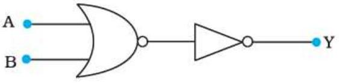
(a)

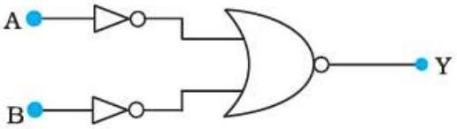
(b)

हल (a) गेट विभाजन
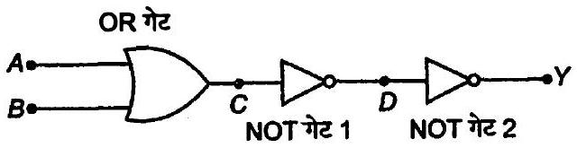

सत्यता सारणी

| A | B | c | D | Y |
| :--- | :--- | :--- | :--- | :--- |
| $0$ | $0$ | $0$ | $1$ | $0$ |
| $0$ | $1$ | $1$ | $0$ | $1$ |
| $1$ | $0$ | $1$ | $0$ | $1$ |
| $1$ | $1$ | $1$ | $0$ | $1$ |

$A$ व $B$ निवेशी है $C$ निर्गत है OR गेट हेतु NOT गेट $1$ का निर्गत $D$ तथा NOT गेट $2$ का निर्गत $Y$ तथा निवेशी $D$ है।

| A | B | Y |
| :--- | :--- | :--- |
| $0$ | $0$ | $0$ |
| $0$ | $1$ | $1$ |
| $1$ | $0$ | $1$ |
| $1$ | $1$ | $1$ |

अतः यह OR गेट के समान है।
(b) गेट विभाजन
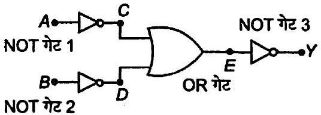

सत्यता सारणी

| A | B | C | D | E | Y |
| :--- | :--- | :--- | :--- | :--- | :--- |
| $0$ | $0$ | $1$ | $1$ | $1$ | $0$ |
| $1$ | $0$ | $0$ | $1$ | $1$ | $0$ |
| $0$ | $1$ | $1$ | $0$ | $1$ | $0$ |
| $1$ | $1$ | $0$ | $0$ | $0$ | $1$ |

यहाँ $A$ व $B$ निवेशी हैं, $C$ निर्गत हैं $A$ के लिए, $D$ निर्गत है $B$ के लिए तथा $E$, OR गेट का निर्गत व NOT गेट $3$ का निवेशी हैं, तो $Y$ अन्तिम निर्गत है।

| A | B | y |
| :--- | :--- | :--- |
| $0$ | $0$ | $0$ |
| $1$ | $0$ | $0$ |
| $0$ | $1$ | $0$ |
| $1$ | $1$ | $1$ |

यह AND गेट के समान है अत: परिपथ AND गेट की भाँति कार्य करता है।
प्रश्न 16.नीचे दिए गए चित्र में संयोजित NAND गेट संयोजित परिपथ की सत्यता सारणी बनाइए।
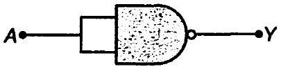
अतः इस परिपथ द्वारा की जाने वाली यथार्थ तर्क संक्रिया
का अभिनिर्धारण कीजिए।
हल गेट विभाजन
हल गेट विभाजन
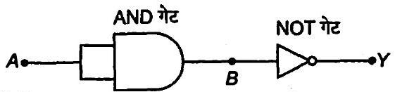
अतः सत्यता सारणी को निम्न प्रकार से बनाया जा सकता है।
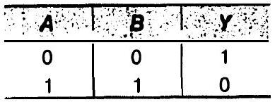
चूँकि AND गेट का निर्गत $B$ है तथा NOT गेट का निवेशी भी $B$ है, तो निवेशी $A$ तथा निर्गत $Y$ हेतु
सत्यता सारणी
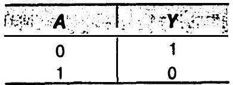
यह NOT गेट के समान है, अतः संक्रिया इसी के द्वारा होती है।
प्रश्न 17.निम्न चित्र के अनुसार परिपथ दिए गए हैं जिनमें NAND गेट जुड़े हैं। इन दोनों परिपथों द्वारा की जाने वाली तर्क संक्रियाओं का अभिनिर्घारण कीजिए।
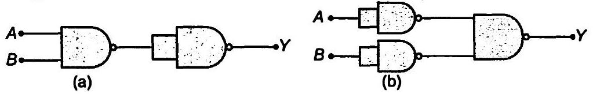
हल (a) गेट विभाजन
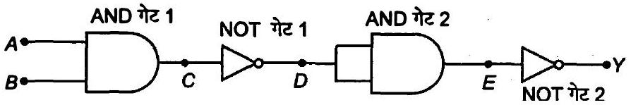

| A | B | C | D | E | Y |
| :--- | :--- | :--- | :--- | :--- | :--- |
| $0$ | $0$ | $0$ | $1$ | $1$ | $0$ |
| $0$ | $1$ | $0$ | $1$ | $1$ | $0$ |
| $1$ | $0$ | $0$ | $1$ | $1$ | $0$ |
| $1$ | $1$ | $1$ | $0$ | $0$ | $1$ |

AND गेट $1$ का निर्गत $C$ है तथा NOT गेट $1$ का निवेशी भी $C$ ही है तथा DNOT गेट $1$ का निर्गत तथा AND गेट $2$ का निवेशी है AND गेट $2$ का निर्गत तथा NOT गेट $2$ का निवेशी $E$ है, $Y$ अन्तिम निर्गत है

|  |  | Y |
| :--- | :--- | :--- |
| $0$ | $0$ | $0$ |
| $0$ | $1$ | $0$ |
| $1$ | $0$ | $0$ |
| $1$ | $1$ |  |

अत: दी गई लोजिक संक्रिया AND गेट की है।
(b) गेट विभाजन
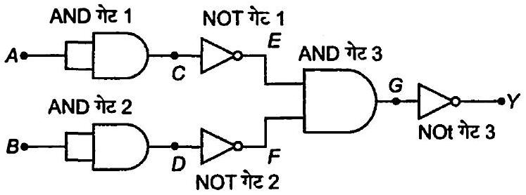

| A | B | C | D | E | F | G | Y |
| :--- | :--- | :--- | :--- | :--- | :--- | :--- | :--- |
| $0$ | $0$ | $0$ | $0$ | $1$ | $1$ | $1$ | $0$ |
| $1$ | $0$ | $1$ | $0$ | $0$ | $1$ | $0$ | $1$ |
| $0$ | $1$ | $0$ | $1$ | $1$ | $0$ | $0$ | $1$ |
| $1$ | $1$ | $1$ | $1$ | $0$ | $0$ | $0$ | $1$ |

AND गेट $1$ का निर्गत $C$ है
AND गेट $2$ का निर्गत $D$ है
NOT गेट $1$ का निर्गत $E$ है
तथा NOT गेट $2$ का निवेशी भी $F$ है।
AND गेट $3$ का निर्गत $G$ है तथा NOT गेट $3$ का निवेशी भी $G$ है।
अत: यह OR गेट के समान है।

सत्यता सारणी

| A | B | Y |
| :--- | :--- | :--- |
| $0$ | $0$ | $0$ |
| $1$ | $0$ | $1$ |
| $0$ | $1$ | $1$ |
| $1$ | $1$ | $1$ |

यह लोजिक संक्रिया OR गेट के समान है।
प्रश्न 18.चित्र में दिए गए NOR गेट युक्त परिपथ की सत्यता सारणी लिखिए और इस परिपथ द्वारा अनुपालित तर्क संक्रियाओं (OR, AND, NOT) को अभिनिर्धारित कीजिए। (संकेत $A=0, B=1$ तब दूसरे NOR गेट के निवेश $A$ और $B, 0$ होंगे और इस प्रकार $Y=1$ होगा। इसी प्रकार $A$ और $B$ के दूसरे संयोजनों के लिए $Y$ के मान प्राप्त कीजिए। OR, AND, NOT द्वारों की सत्यमान सारणी से तुलना कीजिए और सही विकल्प प्राप्त कीजिए।)
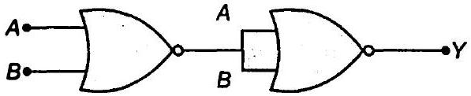
हल गेट विभाजन
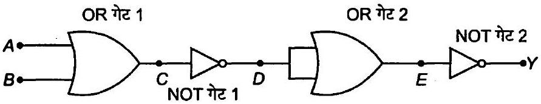
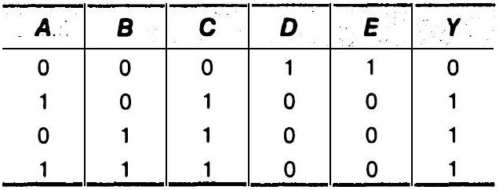
OR गेट $1$ का निर्गत $C$ है तथा NOT गेट $1$ का निर्गत $D$ है तथा NOT गेट $2$ का निवेशी $D$ है, $O R$ गेट $2$ का निर्गत $E$ है तथा NOT गेट $2$ का निवेशी भी $E$ है। $Y$ अन्तिम निर्गत है।

सत्यता सारणी
| $\boldsymbol{A}$ | B | Y |
| :--- | :--- | :--- |
| $0$ | $0$ | $0$ |
| $1$ | $0$ | $1$ |
| $0$ | $1$ | $1$ |
| $1$ | $1$ | $1$ |

अतः यह लोजिक संक्रिया OR गेट के समान है।

प्रश्न 19.चित्र में दर्शाए गए केवल NOR गेटों से बने परिपथ की सत्यमान (सत्यता) सारणी बनाइए। दोनों परिपयों द्वारा अनुपालित तर्क संक्रियाओं (OR, AND, NOT) को अभिनिर्धारित कीजिए।

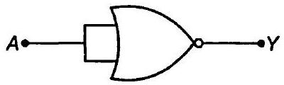
(a)

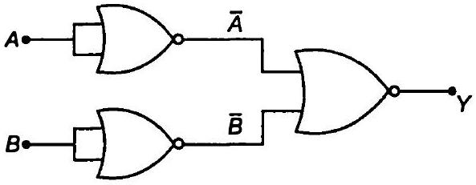
(b)

हल (a) गेट विभाजन
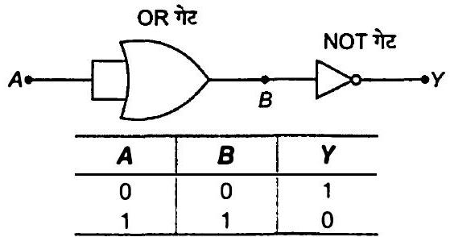
OR गेट का निर्गत $B$ है तथा NOT गेट का निवेशी भी $B$ है। अतः यह गेट NOT गेट के समान है।
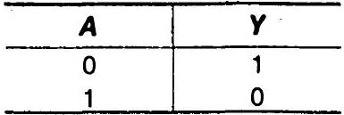
(b) गेट विभाजन
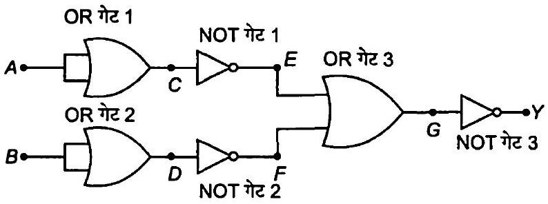
OR गेट $1$ का निर्गत $C$ है तथा NOT गेट $1$ का निवेशी भी $C$ है OR गेट $2$ का निर्गत $D$ है तथा NOT गेट $2$ का निवेशी भी $D$ है NOT गेट $1$ का निर्गत $E$ है तथा NOT गेट $2$ का निर्गत $F$ है OR गेट $3$ का निर्गत $G$ है तथा NOT गेट $3$ का निवेशी भी $G$ है

अतः AND गेट की सत्यता सारणी

| A | B | Y |
| :--- | :--- | :--- |
| $0$ | $0$ | $0$ |
| $1$ | $0$ | $0$ |
| $0$ | $1$ | $0$ |
| $1$ | $1$ | $1$ |

अत: यह संक्रिया AND गेट है।

