Question 2.1:
Two charges $5 \times 10^{-8} \mathrm{C}$ and $-3 \times 10^{-8} \mathrm{C}$ are located 16 cm apart. At what point(s) on the line joining the two charges is the electric potential zero? Take the potential at infinity to be zero.

Answer

There are two charges,

$$
\begin{aligned}
& q_{1}=5 \times 10^{-8} \mathrm{C} \\
& q_{2}=-3 \times 10^{-8} \mathrm{C}
\end{aligned}
$$

Distance between the two charges, $d=16 \mathrm{~cm}=0.16 \mathrm{~m}$
Consider a point P on the line joining the two charges, as shown in the given figure.
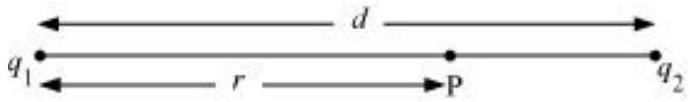
$r=$ Distance of point P from charge $q_{1}$
Let the electric potential ( $V$ ) at point P be zero.
Potential at point P is the sum of potentials caused by charges $q_{1}$ and $q_{2}$ respectively.

$$
\therefore V=\frac{q_{1}}{4 \pi \epsilon_{0} r}+\frac{q_{2}}{4 \pi \epsilon_{0}(d-r)}
$$

Where,

$$
\epsilon_{0}=\text { Permittivity of free space }
$$

For $V=0$, equation (i) reduces to

$$
\begin{aligned}
& \frac{q_{1}}{4 \pi \epsilon_{0} r}=-\frac{q_{2}}{4 \pi \epsilon_{0}(d-r)} \\
& \frac{q_{1}}{r}=\frac{-q_{2}}{d-r} \\
& \frac{5 \times 10^{-8}}{r}=-\frac{\left(-3 \times 10^{-8}\right)}{(0.16-r)} \\
& \frac{0.16}{r}-1=\frac{3}{5} \\
& \frac{0.16}{r}=\frac{8}{5} \\
& \therefore r=0.1 \mathrm{~m}=10 \mathrm{~cm}
\end{aligned}
$$

Therefore, the potential is zero at a distance of 10 cm from the positive charge between the charges.

Suppose point P is outside the system of two charges at a distance $s$ from the negative charge, where potential is zero, as shown in the following figure.
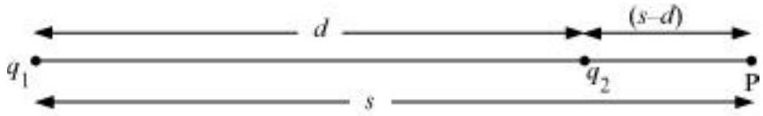
For this arrangement, potential is given by,

$$
V=\frac{q_{1}}{4 \pi \epsilon_{0} s}+\frac{q_{2}}{4 \pi \epsilon_{0}(s-d)}
$$

For $V=0$, equation (ii) reduces to

$$
\begin{aligned}
& \frac{q_{1}}{4 \pi \epsilon_{0} s}=-\frac{q_{2}}{4 \pi \epsilon_{0}(s-d)} \\
& \frac{q_{1}}{s}=\frac{-q_{2}}{s-d} \\
& \frac{5 \times 10^{-8}}{s}=-\frac{\left(-3 \times 10^{-8}\right)}{(s-0.16)} \\
& 1-\frac{0.16}{s}=\frac{3}{5} \\
& \frac{0.16}{s}=\frac{2}{5} \\
& \therefore s=0.4 \mathrm{~m}=40 \mathrm{~cm}
\end{aligned}
$$

Therefore, the potential is zero at a distance of 40 cm from the positive charge outside the system of charges.

Question 2.2:
A regular hexagon of side 10 cm has a charge $5 \mu \mathrm{C}$ at each of its vertices. Calculate the potential at the centre of the hexagon.

Answer

The given figure shows six equal amount of charges, $q$, at the vertices of a regular hexagon.
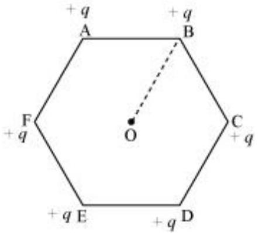
Where,
Charge, $q=5 \mu \mathrm{C}=5 \times 10^{-6} \mathrm{C}$
Side of the hexagon, $l=\mathrm{AB}=\mathrm{BC}=\mathrm{CD}=\mathrm{DE}=\mathrm{EF}=\mathrm{FA}=10 \mathrm{~cm}$
Distance of each vertex from centre $\mathrm{O}, d=10 \mathrm{~cm}$
Electric potential at point O,

$$
V=\frac{6 \times q}{4 \pi \epsilon_{0} d}
$$

Where,
$\epsilon_{0}=$ Permittivity of free space

$$
\begin{aligned}
& \frac{1}{4 \pi \epsilon_{0}}=9 \times 10^{9} \mathrm{~N} \mathrm{C}^{-2} \mathrm{~m}^{-2} \\
& \therefore V=\frac{6 \times 9 \times 10^{9} \times 5 \times 10^{-6}}{0.1} \\
& \quad=2.7 \times 10^{6} \mathrm{~V}
\end{aligned}
$$

Therefore, the potential at the centre of the hexagon is $2.7 \times 10^{6} \mathrm{~V}$.

Question 2.3:
Two charges $2 \mu \mathrm{C}$ and $-2 \mu \mathrm{C}$ are placed at points A and B 6 cm apart.
Identify an equipotential surface of the system.
What is the direction of the electric field at every point on this surface?
Answer

The situation is represented in the given figure.
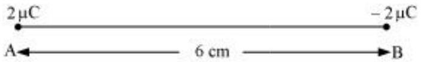
An equipotential surface is the plane on which total potential is zero everywhere. This plane is normal to line AB . The plane is located at the mid-point of line AB because the magnitude of charges is the same.

The direction of the electric field at every point on this surface is normal to the plane in the direction of AB.

Question 2.4:
A spherical conductor of radius 12 cm has a charge of $1.6 \times 10^{-7} \mathrm{C}$ distributed uniformly on its surface. What is the electric field

Inside the sphere
Just outside the sphere

At a point 18 cm from the centre of the sphere?
Answer

Radius of the spherical conductor, $r=12 \mathrm{~cm}=0.12 \mathrm{~m}$
Charge is uniformly distributed over the conductor, $q=1.6 \times 10^{-7} \mathrm{C}$
Electric field inside a spherical conductor is zero. This is because if there is field inside the conductor, then charges will move to neutralize it.

Electric field $E$ just outside the conductor is given by the relation,

$$
E=\frac{q}{4 \pi \epsilon_{0} r^{2}}
$$

Where,

$$
\begin{aligned}
& \epsilon_{0}=\text { Permittivity of free space } \\
& \frac{\frac{1}{4 \pi \epsilon_{0}}}{}=9 \times 10^{9} \mathrm{~N} \mathrm{~m}^{2} \mathrm{C}^{-2} \\
& \therefore E=\frac{1.6 \times 10^{-7} \times 9 \times 10^{-9}}{(0.12)^{2}} \\
& \quad=10^{5} \mathrm{~N} \mathrm{C}^{-1}
\end{aligned}
$$

Therefore, the electric field just outside the sphere is $10^{5} \mathrm{~N} \mathrm{C}^{-1}$.
Electric field at a point 18 m from the centre of the sphere $=E_{1}$
Distance of the point from the centre, $d=18 \mathrm{~cm}=0.18 \mathrm{~m}$

$$
\begin{aligned}
E_{1} & =\frac{q}{4 \pi \epsilon_{0} d^{2}} \\
& =\frac{9 \times 10^{9} \times 1.6 \times 10^{-7}}{\left(18 \times 10^{-2}\right)^{2}} \\
& =4.4 \times 10^{4} \mathrm{~N} / \mathrm{C}
\end{aligned}
$$

Therefore, the electric field at a point 18 cm from the centre of the sphere is
$4.4 \times 10^{4} \mathrm{~N} / \mathrm{C}$.

Question 2.5:
A parallel plate capacitor with air between the plates has a capacitance of $8 \mathrm{pF}(1 \mathrm{pF}=$ $\left.10^{-12} \mathrm{~F}\right)$. What will be the capacitance if the distance between the plates is reduced by half, and the space between them is filled with a substance of dielectric constant 6 ?

Answer

Capacitance between the parallel plates of the capacitor, $\mathrm{C}=8 \mathrm{pF}$
Initially, distance between the parallel plates was $d$ and it was filled with air. Dielectric constant of air, $k=1$

Capacitance, $C$, is given by the formula,

$$
\begin{aligned}
C & =\frac{k \in_{0} A}{d} \\
& =\frac{\in_{0} A}{d}
\end{aligned}
$$

Where,

$$
\begin{aligned}
& A=\text { Area of each plate } \\
& \epsilon_{0}=\text { Permittivity of free space }
\end{aligned}
$$

If distance between the plates is reduced to half, then new distance, $d=\frac{d}{2}$
Dielectric constant of the substance filled in between the plates, $k^{\prime}=6$
Hence, capacitance of the capacitor becomes

$$
C^{\prime}=\frac{k^{\prime} \in_{0} A}{d^{\prime}}=\frac{6 \in_{0} A}{\frac{d}{2}}
$$

Taking ratios of equations (i) and (ii), we obtain

$$
\begin{aligned}
C^{\prime} & =2 \times 6 C \\
& =12 C \\
& =12 \times 8=96 \mathrm{pF}
\end{aligned}
$$

Therefore, the capacitance between the plates is 96 pF.

Question 2.6:
Three capacitors each of capacitance 9 pF are connected in series.
What is the total capacitance of the combination?
What is the potential difference across each capacitor if the combination is connected to a 120 V supply?

Answer

Capacitance of each of the three capacitors, $C=9 \mathrm{pF}$
Equivalent capacitance $\left(C^{\prime}\right)$ of the combination of the capacitors is given by the relation,

$$
\begin{aligned}
\frac{1}{C^{\prime}} & =\frac{1}{C}+\frac{1}{C}+\frac{1}{C} \\
& =\frac{1}{9}+\frac{1}{9}+\frac{1}{9}=\frac{3}{9}=\frac{1}{3} \\
\therefore C^{\prime} & =3 \mu \mathrm{~F}
\end{aligned}
$$

Therefore, total capacitance of the combination is $3 \mu \mathrm{~F}$.
Supply voltage, $V=100 \mathrm{~V}$
Potential difference $\left(V^{\prime}\right)$ across each capacitor is equal to one-third of the supply voltage.

$$
\therefore V^{\prime}=\frac{V}{3}=\frac{120}{3}=40 \mathrm{~V}
$$

Therefore, the potential difference across each capacitor is 40 V .

Question 2.7:
Three capacitors of capacitances 2 pF, 3 pF and 4 pF are connected in parallel.
What is the total capacitance of the combination?
Determine the charge on each capacitor if the combination is connected to a 100 V supply.

Answer

Capacitances of the given capacitors are

$$
\begin{aligned}
& C_{1}=2 \mathrm{pF} \\
& C_{2}=3 \mathrm{pF} \\
& C_{3}=4 \mathrm{pF}
\end{aligned}
$$

For the parallel combination of the capacitors, equivalent capacitor $C^{\prime}$ is given by the algebraic sum,

$$
C^{\prime}=2+3+4=9 \mathrm{pF}
$$

Therefore, total capacitance of the combination is 9 pF.
Supply voltage, $V=100 \mathrm{~V}$
The voltage through all the three capacitors is same $=V=100 \mathrm{~V}$
Charge on a capacitor of capacitance $C$ and potential difference $V$ is given by the relation,

$$
q=V C
$$

For $\mathrm{C}=2 \mathrm{pF}$,

$$
\text { Charge }=V C=100 \times 2=200 \mathrm{pC}=2 \times 10^{-10} \mathrm{C}
$$

For $\mathrm{C}=3 \mathrm{pF}$,

$$
\text { Charge }=V C=100 \times 3=300 \mathrm{pC}=3 \times 10^{-10} \mathrm{C}
$$

For $\mathrm{C}=4 \mathrm{pF}$,
Charge $=V C=100 \times 4=200 \mathrm{pC}=4 \times 10^{-10} \mathrm{C}$

Question 2.8:
In a parallel plate capacitor with air between the plates, each plate has an area of $6 \times 10^{-3}$ $\mathrm{m}^{2}$ and the distance between the plates is 3 mm. Calculate the capacitance of the capacitor. If this capacitor is connected to a 100 V supply, what is the charge on each plate of the capacitor?

Answer

Area of each plate of the parallel plate capacitor, $A=6 \times 10^{-3} \mathrm{~m}^{2}$
Distance between the plates, $d=3 \mathrm{~mm}=3 \times 10^{-3} \mathrm{~m}$
Supply voltage, $V=100 \mathrm{~V}$
Capacitance $C$ of a parallel plate capacitor is given by,

$$
C=\frac{\in_{0} A}{d}
$$

Where,

$$
\begin{aligned}
& \epsilon_{0}=\text { Permittivity of free space } \\
& =8.854 \times 10^{-12} \mathrm{~N}^{-1} \mathrm{~m}^{-2} \mathrm{C}^{-2}
\end{aligned}
$$

$$
\begin{aligned}
\therefore C & =\frac{8.854 \times 10^{-12} \times 6 \times 10^{-3}}{3 \times 10^{-3}} \\
& =17.71 \times 10^{-12} \mathrm{~F} \\
& =17.71 \mathrm{pF}
\end{aligned}
$$

Potential $V$ is related with the charge $q$ and capacitance $C$ as

$$
\begin{aligned}
V= & \frac{q}{C} \\
\therefore q & =V C \\
& =100 \times 17.71 \times 10^{-12} \\
& =1.771 \times 10^{-9} \mathrm{C}
\end{aligned}
$$

Therefore, capacitance of the capacitor is 17.71 pF and charge on each plate is $1.771 \times$ $10^{-9} \mathrm{C}$.

Question 2.9:
Explain what would happen if in the capacitor given in Exercise 2.8, a 3 mm thick mica sheet $($ of dielectric constant $=6)$ were inserted between the plates,

While the voltage supply remained connected.
After the supply was disconnected.
Answer

Dielectric constant of the mica sheet, $k=6$
Initial capacitance, $C=1.771 \times 10^{-11} \mathrm{~F}$
New capacitance, $C^{\prime}=k C=6 \times 1.771 \times 10^{-11}=106 \mathrm{pF}$
Supply voltage, $V=100 \mathrm{~V}$
New charge, $q^{\prime}=C^{\prime} V=6 \times 1.771 \times 10^{-9}=1.06 \times 10^{-8} \mathrm{C}$
Potential across the plates remains 100 V.
Dielectric constant, $k=6$

Initial capacitance, $C=1.771 \times 10^{-11} \mathrm{~F}$
New capacitance, $C^{\prime}=k C=6 \times 1.771 \times 10^{-11}=106 \mathrm{pF}$
If supply voltage is removed, then there will be no effect on the amount of charge in the plates.

Charge $=1.771 \times 10^{-9} \mathrm{C}$
Potential across the plates is given by,

$$
\begin{aligned}
\therefore V^{\prime} & =\frac{q}{C^{\prime}} \\
& =\frac{1.771 \times 10^{-9}}{106 \times 10^{-12}} \\
& =16.7 \mathrm{~V}
\end{aligned}
$$

Question 2.10:
A 12 pF capacitor is connected to a 50V battery. How much electrostatic energy is stored in the capacitor?

Answer

Capacitor of the capacitance, $C=12 \mathrm{pF}=12 \times 10^{-12} \mathrm{~F}$
Potential difference, $V=50 \mathrm{~V}$
Electrostatic energy stored in the capacitor is given by the relation,

$$
\begin{aligned}
E & =\frac{1}{2} C V^{2} \\
& =\frac{1}{2} \times 12 \times 10^{-12} \times(50)^{2} \\
& =1.5 \times 10^{-8} \mathrm{~J}
\end{aligned}
$$

Therefore, the electrostatic energy stored in the capacitor is $1.5 \times 10^{-8} \mathrm{~J}$.

Question 2.11:
A 600 pF capacitor is charged by a 200 V supply. It is then disconnected from the supply and is connected to another uncharged 600 pF capacitor. How much electrostatic energy is lost in the process?

Answer

Capacitance of the capacitor, $C=600 \mathrm{pF}$
Potential difference, $V=200 \mathrm{~V}$
Electrostatic energy stored in the capacitor is given by,

$$
\begin{aligned}
E & =\frac{1}{2} C V^{2} \\
& =\frac{1}{2} \times\left(600 \times 10^{-12}\right) \times(200)^{2} \\
& =1.2 \times 10^{-5} \mathrm{~J}
\end{aligned}
$$

If supply is disconnected from the capacitor and another capacitor of capacitance $C=600$ pF is connected to it, then equivalent capacitance $\left(C^{\prime}\right)$ of the combination is given by,

$$
\begin{aligned}
\frac{1}{C^{\prime}} & =\frac{1}{C}+\frac{1}{C} \\
& =\frac{1}{600}+\frac{1}{600}=\frac{2}{600}=\frac{1}{300} \\
\therefore C^{\prime} & =300 \mathrm{pF}
\end{aligned}
$$

New electrostatic energy can be calculated as

$$
\begin{aligned}
E^{\prime} & =\frac{1}{2} \times C^{\prime} \times V^{2} \\
& =\frac{1}{2} \times 300 \times(200)^{2} \\
& =0.6 \times 10^{-5} \mathrm{~J}
\end{aligned}
$$

Loss in electrostatic energy $=E-E^{\prime}$

$$
\begin{aligned}
& =1.2 \times 10^{-5}-0.6 \times 10^{-5} \\
& =0.6 \times 10^{-5} \\
& =6 \times 10^{-6} \mathrm{~J}
\end{aligned}
$$

Therefore, the electrostatic energy lost in the process is $6 \times 10^{-6} \mathrm{~J}$.

Question 2.12:
A charge of 8 mC is located at the origin. Calculate the work done in taking a small charge of $-2 \times 10^{-9} \mathrm{C}$ from a point $\mathrm{P}(0,0,3 \mathrm{~cm})$ to a point $\mathrm{Q}(0,4 \mathrm{~cm}, 0)$, via a point R (0, 6 cm, 9 cm).

Answer

Charge located at the origin, $q=8 \mathrm{mC}=8 \times 10^{-3} \mathrm{C}$
Magnitude of a small charge, which is taken from a point P to point R to point $\mathrm{Q}, q_{1}=-2$ $\times 10^{-9} \mathrm{C}$

All the points are represented in the given figure.
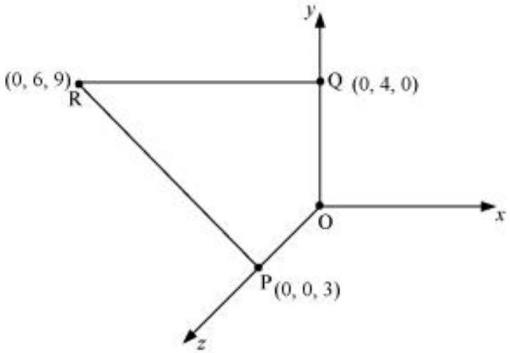
Point P is at a distance, $d_{1}=3 \mathrm{~cm}$, from the origin along $z$-axis.
Point Q is at a distance, $d_{2}=4 \mathrm{~cm}$, from the origin along $y$-axis.

Potential at point $\mathrm{P}, \quad V_{1}=\frac{q}{4 \pi \epsilon_{0} \times d_{1}}$

Potential at point Q ,

$$
V_{2}=\frac{q}{4 \pi \epsilon_{0} d_{2}}
$$

Work done ( $W$ ) by the electrostatic force is independent of the path.

$$
\begin{aligned}
\therefore W & =q_{1}\left[V_{2}-V_{1}\right] \\
& =q_{1}\left[\frac{q}{4 \pi \epsilon_{0} d_{2}}-\frac{q}{4 \pi \epsilon_{0} d_{1}}\right] \\
& =\frac{q q_{1}}{4 \pi \epsilon_{0}}\left[\frac{1}{d_{2}}-\frac{1}{d_{1}}\right]
\end{aligned}
$$

Where, $\frac{1}{4 \pi \epsilon_{0}}=9 \times 10^{9} \mathrm{~N} \mathrm{~m}^{2} \mathrm{C}^{-2}$

$$
\begin{aligned}
\therefore W & =9 \times 10^{9} \times 8 \times 10^{-3} \times\left(-2 \times 10^{-9}\right)\left[\frac{1}{0.04}-\frac{1}{0.03}\right] \\
& =-144 \times 10^{-3} \times\left(\frac{-25}{3}\right) \\
& =1.27 \mathrm{~J}
\end{aligned}
$$

Therefore, work done during the process is 1.27 J.

Question 2.13:
A cube of side $b$ has a charge $q$ at each of its vertices. Determine the potential and electric field due to this charge array at the centre of the cube.

Answer

Length of the side of a cube $=b$
Charge at each of its vertices $=q$
A cube of side $b$ is shown in the following figure.
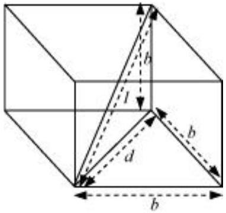
$d=$ Diagonal of one of the six faces of the cube

$$
\begin{aligned}
& d^{2}=\sqrt{b^{2}+b^{2}}=\sqrt{2 b^{2}} \\
& d=b \sqrt{2}
\end{aligned}
$$

$l=$ Length of the diagonal of the cube

$$
\begin{aligned}
l^{2} & =\sqrt{d^{2}+b^{2}} \\
& =\sqrt{(\sqrt{2} b)^{2}}+b^{2}=\sqrt{2 b^{2}+b^{2}}=\sqrt{3 b^{2}} \\
l & =b \sqrt{3}
\end{aligned}
$$

$r=\frac{l}{2}=\frac{b \sqrt{3}}{2}$ is the distance between the centre of the cube and one of the eight vertices

The electric potential ( $V$ ) at the centre of the cube is due to the presence of eight charges at the vertices.

$$
\begin{aligned}
V & =\frac{8 q}{4 \pi \epsilon_{0}} \\
& =\frac{8 q}{4 \pi \epsilon_{0}\left(b \frac{\sqrt{3}}{2}\right)} \\
& =\frac{4 q}{\sqrt{3} \pi \epsilon_{0} b}
\end{aligned}
$$

Therefore, the potential at the centre of the cube is $\frac{4 q}{\sqrt{3} \pi \epsilon_{0} b}$.
The electric field at the centre of the cube, due to the eight charges, gets cancelled. This is because the charges are distributed symmetrically with respect to the centre of the cube. Hence, the electric field is zero at the centre.

Question 2.14:
Two tiny spheres carrying charges $1.5 \mu \mathrm{C}$ and $2.5 \mu \mathrm{C}$ are located 30 cm apart. Find the potential and electric field:
at the mid-point of the line joining the two charges, and
at a point 10 cm from this midpoint in a plane normal to the line and passing through the mid-point.

Answer

Two charges placed at points A and B are represented in the given figure. O is the midpoint of the line joining the two charges.
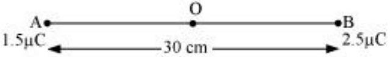

Magnitude of charge located at A, $q_{1}=1.5 \mu \mathrm{C}$
Magnitude of charge located at $\mathrm{B}, q_{2}=2.5 \mu \mathrm{C}$
Distance between the two charges, $d=30 \mathrm{~cm}=0.3 \mathrm{~m}$
Let $V_{1}$ and $E_{1}$ are the electric potential and electric field respectively at O .
$V_{1}=$ Potential due to charge at $\mathrm{A}+$ Potential due to charge at B

$$
V_{1}=\frac{q_{1}}{4 \pi \epsilon_{0}\left(\frac{d}{2}\right)}+\frac{q_{2}}{4 \pi \epsilon_{0}\left(\frac{d}{2}\right)}=\frac{1}{4 \pi \epsilon_{0}\left(\frac{d}{2}\right)}\left(q_{1}+q_{2}\right)
$$

Where,
$\epsilon_{0}=$ Permittivity of free space

$$
\begin{aligned}
& \frac{1}{4 \pi \epsilon_{0}}=9 \times 10^{9} \mathrm{NC}^{2} \mathrm{~m}^{-2} \\
& \therefore V_{1}=\frac{9 \times 10^{9} \times 10^{-6}}{\left(\frac{0.30}{2}\right)}(2.5+1.5)=2.4 \times 10^{5} \mathrm{~V}
\end{aligned}
$$

$E_{1}=$ Electric field due to $q_{2}-$ Electric field due to $q_{1}$

$$
\begin{aligned}
& =\frac{q_{2}}{4 \pi \epsilon_{0}\left(\frac{d}{2}\right)^{2}}-\frac{q_{1}}{4 \pi \epsilon_{0}\left(\frac{d}{2}\right)^{2}} \\
& =\frac{9 \times 10^{9}}{\left(\frac{0.30}{2}\right)^{2}} \times 10^{6} \times(2.5-1.5) \\
& =4 \times 10^{5} \mathrm{~V} \mathrm{~m}^{-1}
\end{aligned}
$$

Therefore, the potential at mid-point is $2.4 \times 10^{5} \mathrm{~V}$ and the electric field at mid-point is $4 \times 10^{5} \mathrm{~V} \mathrm{~m}^{-1}$. The field is directed from the larger charge to the smaller charge.

Consider a point Z such that normal distance $\mathrm{OZ}=10 \mathrm{~cm}=0.1 \mathrm{~m}$, as shown in the following figure.
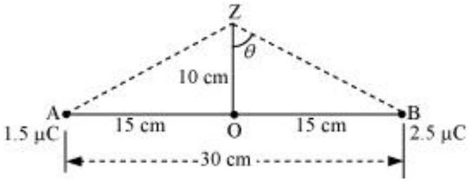
$V_{2}$ and $E_{2}$ are the electric potential and electric field respectively at Z .
It can be observed from the figure that distance,

$$
\mathrm{BZ}=\mathrm{AZ}=\sqrt{(0.1)^{2}+(0.15)^{2}}=0.18 \mathrm{~m}
$$

$V_{2}=$ Electric potential due to $\mathrm{A}+$ Electric Potential due to B

$$
\begin{aligned}
& =\frac{q_{1}}{4 \pi \epsilon_{0}(\mathrm{AZ})}+\frac{q_{1}}{4 \pi \epsilon_{0}(\mathrm{BZ})} \\
& =\frac{9 \times 10^{9} \times 10^{-6}}{0.18}(1.5+2.5) \\
& =2 \times 10^{5} \mathrm{~V}
\end{aligned}
$$

Electric field due to $q$ at Z,

$$
\begin{aligned}
E_{\mathrm{A}} & =\frac{q_{1}}{4 \pi \epsilon_{0}(\mathrm{AZ})^{2}} \\
& =\frac{9 \times 10^{9} \times 1.5 \times 10^{-6}}{(0.18)^{2}} \\
& =0.416 \times 10^{6} \mathrm{~V} / \mathrm{m}
\end{aligned}
$$

Electric field due to $q_{2}$ at $Z$,

$$
\begin{aligned}
E_{\mathrm{B}} & =\frac{q_{2}}{4 \pi \epsilon_{0}(\mathrm{BZ})^{2}} \\
& =\frac{9 \times 10^{9} \times 2.5 \times 10^{-6}}{(0.18)^{2}} \\
& =0.69 \times 10^{6} \mathrm{Vm}^{-1}
\end{aligned}
$$

The resultant field intensity at Z ,

$$
E=\sqrt{E_{\mathrm{A}}^{2}+E_{\mathrm{B}}^{2}+2 E_{\mathrm{A}} E_{\mathrm{B}} \cos 2 \theta}
$$

Where, $2 \theta$ is the angle, $\angle A Z \mathrm{~B}$
From the figure, we obtain

$$
\begin{aligned}
& \cos \theta=\frac{0.10}{0.18}=\frac{5}{9}=0.5556 \\
& \theta=\cos ^{-1} 0.5556=56.25 \\
& \therefore 2 \theta=112.5^{\circ} \\
& \cos 2 \theta=-0.38 \\
& E=\sqrt{\left(0.416 \times 10^{6}\right)^{2} \times\left(0.69 \times 10^{6}\right)^{2}+2 \times 0.416 \times 0.69 \times 10^{12} \times(-0.38)} \\
& =6.6 \times 10^{5} \mathrm{Vm}^{-1}
\end{aligned}
$$

Therefore, the potential at a point 10 cm (perpendicular to the mid-point) is $2.0 \times 10^{5} \mathrm{~V}$ and electric field is $6.6 \times 10^{5} \mathrm{~V} \mathrm{~m}^{-1}$.

Question 2.15:
A spherical conducting shell of inner radius $r 1$ and outer radius $r 2$ has a charge $Q$.
A charge $q$ is placed at the centre of the shell. What is the surface charge density on the inner and outer surfaces of the shell?

Is the electric field inside a cavity (with no charge) zero, even if the shell is not spherical, but has any irregular shape? Explain.

Answer

Charge placed at the centre of a shell is $+q$. Hence, a charge of magnitude $-q$ will be induced to the inner surface of the shell. Therefore, total charge on the inner surface of the shell is $-q$.

Surface charge density at the inner surface of the shell is given by the relation,

$$
\sigma_{1}=\frac{\text { Total charge }}{\text { Inner surface area }}=\frac{-q}{4 \pi r_{1}^{2}}
$$

A charge of $+q$ is induced on the outer surface of the shell. A charge of magnitude $Q$ is placed on the outer surface of the shell. Therefore, total charge on the outer surface of the shell is $Q+q$. Surface charge density at the outer surface of the shell,

$$
\sigma_{2}=\frac{\text { Total charge }}{\text { Outer surface area }}=\frac{Q+q}{4 \pi r_{2}^{2}}
$$

Yes
The electric field intensity inside a cavity is zero, even if the shell is not spherical and has any irregular shape. Take a closed loop such that a part of it is inside the cavity along a field line while the rest is inside the conductor. Net work done by the field in carrying a test charge over a closed loop is zero because the field inside the conductor is zero. Hence, electric field is zero, whatever is the shape.

C
Question 2.16:
Show that the normal component of electrostatic field has a discontinuity from one side of a charged surface to another given by

$$
\left(\overrightarrow{E_{2}}-\overrightarrow{E_{1}}\right) \cdot \hat{n}=\frac{\sigma}{\epsilon_{0}}
$$

Where $\hat{n}$ is a unit vector normal to the surface at a point and $\sigma$ is the surface charge density at that point. (The direction of $\hat{n}$ is from side 1 to side 2.) Hence show that just outside a conductor, the electric field is $\sigma \hat{n} / \epsilon_{0}$

Show that the tangential component of electrostatic field is continuous from one side of a charged surface to another. [Hint: For (a), use Gauss's law. For, (b) use the fact that work done by electrostatic field on a closed loop is zero.]

Answer

Electric field on one side of a charged body is $E_{1}$ and electric field on the other side of the same body is $E_{2}$. If infinite plane charged body has a uniform thickness, then electric field due to one surface of the charged body is given by,

$$
\overrightarrow{E_{1}}=-\frac{\sigma}{2 \epsilon_{0}} \hat{n}
$$

Where,

$$
\hat{n}=\text { Unit vector normal to the surface at a point }
$$

$\sigma=$ Surface charge density at that point
Electric field due to the other surface of the charged body,

$$
\overrightarrow{E_{2}}=-\frac{\sigma}{2 \epsilon_{0}} \hat{n}
$$

Electric field at any point due to the two surfaces,

$$
\begin{aligned}
& \overrightarrow{E_{2}}-\overrightarrow{E_{1}}=\frac{\sigma}{2 \epsilon_{0}} \hat{n}+\frac{\sigma}{2 \epsilon_{0}} \hat{n}=\frac{\sigma}{\epsilon_{0}} \hat{n} \\
& \left(\overrightarrow{E_{2}}-\overrightarrow{E_{1}}\right) \cdot \hat{n}=\frac{\sigma}{\epsilon_{0}}
\end{aligned}
$$

Since inside a closed conductor, $\overrightarrow{E_{1}}=0$,

$$
\vec{E}=\overrightarrow{E_{2}}=-\frac{\sigma}{2 \epsilon_{0}} \hat{n}
$$

Therefore, the electric field just outside the conductor is $\frac{\sigma}{\epsilon_{0}} \hat{n}$.
When a charged particle is moved from one point to the other on a closed loop, the work done by the electrostatic field is zero. Hence, the tangential component of electrostatic field is continuous from one side of a charged surface to the other.

Question 2.17:

A long charged cylinder of linear charged density $\lambda$ is surrounded by a hollow co-axial conducting cylinder. What is the electric field in the space between the two cylinders?

Answer

Charge density of the long charged cylinder of length $L$ and radius $r$ is $\lambda$.
Another cylinder of same length surrounds the pervious cylinder. The radius of this cylinder is $R$.

Let $E$ be the electric field produced in the space between the two cylinders.
Electric flux through the Gaussian surface is given by Gauss's theorem as,

$$
\phi=E(2 \pi d) L
$$

Where, $d=$ Distance of a point from the common axis of the cylinders
Let $q$ be the total charge on the cylinder.
It can be written as

$$
\therefore \phi=E(2 \pi d L)=\frac{q}{\epsilon_{0}}
$$

Where,

$$
\begin{aligned}
& q=\text { Charge on the inner sphere of the outer cylinder } \\
& \in_{0}=\text { Permittivity of free space } \\
& E(2 \pi d L)=\frac{\lambda L}{\in_{0}} \\
& E=\frac{\lambda}{2 \pi \in_{0} d}
\end{aligned}
$$

Therefore, the electric field in the space between the two cylinders is $\frac{\lambda}{2 \pi \epsilon_{0} d}$.

Question 2.18:
In a hydrogen atom, the electron and proton are bound at a distance of about $0.53 \AA$ :
Estimate the potential energy of the system in eV, taking the zero of the potential energy at infinite separation of the electron from proton.

What is the minimum work required to free the electron, given that its kinetic energy in the orbit is half the magnitude of potential energy obtained in (a)?

What are the answers to (a) and (b) above if the zero of potential energy is taken at $1.06 \AA$ separation?

Answer

The distance between electron-proton of a hydrogen atom, $d=0.53 \mathrm{~A}$
Charge on an electron, $q_{1}=-1.6 \times 10^{-19} \mathrm{C}$
Charge on a proton, $q_{2}=+1.6 \times 10^{-19} \mathrm{C}$
Potential at infinity is zero.
Potential energy of the system, $p-e=$ Potential energy at infinity - Potential energy at distance, $d$

$$
=0-\frac{q_{1} q_{2}}{4 \pi \epsilon_{0} d}
$$

Where,
$\epsilon_{0}$ is the permittivity of free space

$$
\begin{aligned}
& \frac{1}{4 \pi \epsilon_{0}}=9 \times 10^{9} \mathrm{Nm}^{2} \mathrm{C}^{-2} \\
& \therefore \text { Potential energy }=0-\frac{9 \times 10^{9} \times\left(1.6 \times 10^{-19}\right)^{2}}{0.53 \times 10^{10}}=-43.7 \times 10^{-19} \mathrm{~J}
\end{aligned}
$$

Since $1.6 \times 10^{-19} \mathrm{~J}=1 \mathrm{eV}$,

$$
\text { ∴ } \text { Potential energy }=-43.7 \times 10^{-19}=\frac{-43.7 \times 10^{-19}}{1.6 \times 10^{-19}}=-27.2 \mathrm{eV}
$$

Therefore, the potential energy of the system is -27.2 eV.
Kinetic energy is half of the magnitude of potential energy.
Kinetic energy $=\frac{1}{2} \times(-27.2)=13.6 \mathrm{eV}$
Total energy $=13.6-27.2=13.6 \mathrm{eV}$
Therefore, the minimum work required to free the electron is 13.6 eV .

When zero of potential energy is taken, $d_{1}=1.06 \mathrm{~A}$
∴ Potential energy of the system = Potential energy at $d_{1}-$ Potential energy at $d$

$$
\begin{aligned}
& =\frac{q_{1} q_{2}}{4 \pi \epsilon_{0} d_{1}}-27.2 \mathrm{eV} \\
& =\frac{9 \times 10^{9} \times\left(1.6 \times 10^{-19}\right)^{2}}{1.06 \times 10^{-10}}-27.2 \mathrm{eV} \\
& =21.73 \times 10^{-19} \mathrm{~J}-27.2 \mathrm{eV} \\
& =13.58 \mathrm{eV}-27.2 \mathrm{eV} \\
& =-13.6 \mathrm{eV}
\end{aligned}
$$

Question 2.19:
If one of the two electrons of a $\mathrm{H}_{2}$ molecule is removed, we get a hydrogen molecular ion $H_{2}^{+}$. In the ground state of an $H_{2}^{+}$, the two protons are separated by roughly $1.5 \AA$, and the electron is roughly 1 Å from each proton. Determine the potential energy of the system. Specify your choice of the zero of potential energy.

Answer

The system of two protons and one electron is represented in the given figure.

Charge on proton $1, q_{1}=1.6 \times 10^{-19} \mathrm{C}$
Charge on proton 2, $q_{2}=1.6 \times 10^{-19} \mathrm{C}$
Charge on electron, $q_{3}=-1.6 \times 10^{-19} \mathrm{C}$
Distance between protons 1 and 2, $d_{1}=1.5 \times 10^{-10} \mathrm{~m}$
Distance between proton 1 and electron, $d_{2}=1 \times 10^{-10} \mathrm{~m}$
Distance between proton 2 and electron, $d_{3}=1 \times 10^{-10} \mathrm{~m}$
The potential energy at infinity is zero.
Potential energy of the system,

$$
V=\frac{q_{1} q_{2}}{4 \pi \epsilon_{0} d_{1}}+\frac{q_{2} q_{3}}{4 \pi \epsilon_{0} d_{3}}+\frac{q_{3} q_{1}}{4 \pi \epsilon_{0} d_{2}}
$$

Substituting $\frac{1}{4 \pi \epsilon_{0}}=9 \times 10^{9} \mathrm{~N} \mathrm{~m}^{2} \mathrm{C}^{-2}$, we obtain

$$
\begin{aligned}
V & =\frac{9 \times 10^{9} \times 10^{-19} \times 10^{-19}}{10^{-10}}\left[-(16)^{2}+\frac{(1.6)^{2}}{1.5}+-(1.6)^{2}\right] \\
& =-30.7 \times 10^{-19} \mathrm{~J} \\
& =-19.2 \mathrm{eV}
\end{aligned}
$$

Therefore, the potential energy of the system is -19.2 eV.

Question 2.20:
Two charged conducting spheres of radii $a$ and $b$ are connected to each other by a wire. What is the ratio of electric fields at the surfaces of the two spheres? Use the result obtained to explain why charge density on the sharp and pointed ends of a conductor is higher than on its flatter portions.

Answer

Let $a$ be the radius of a sphere $\mathrm{A}, Q_{A}$ be the charge on the sphere, and $C_{A}$ be the capacitance of the sphere. Let $b$ be the radius of a sphere $\mathrm{B}, Q_{B}$ be the charge on the sphere, and $C_{B}$ be the capacitance of the sphere. Since the two spheres are connected with a wire, their potential ( $V$ ) will become equal.

Let $E_{A}$ be the electric field of sphere A and $E_{B}$ be the electric field of sphere B . Therefore, their ratio,

$$
\begin{aligned}
& \frac{E_{A}}{E_{B}}=\frac{Q_{A}}{4 \pi \epsilon_{0} \times a_{2}} \times \frac{b^{2} \times 4 \pi \epsilon_{0}}{Q_{B}} \\
& \frac{E_{A}}{E_{B}}=\frac{Q_{A}}{Q_{B}} \times \frac{b^{2}}{a^{2}}
\end{aligned}
$$

However, $\frac{Q_{A}}{Q_{B}}=\frac{C_{A} V}{C_{B} V}$
And, $\frac{C_{A}}{C_{B}}=\frac{a}{b}$

$$
\therefore \frac{Q_{A}}{Q_{B}}=\frac{a}{b}
$$

Putting the value of (2) in (1), we obtain

$$
\therefore \frac{E_{A}}{E_{B}}=\frac{a}{b} \frac{b^{2}}{a^{2}}=\frac{b}{a}
$$

Therefore, the ratio of electric fields at the surface is $\frac{b}{a}$.

Question 2.21:
Two charges $-q$ and $+q$ are located at points $(0,0,-a)$ and $(0,0, a)$, respectively.
What is the electrostatic potential at the points?
Obtain the dependence of potential on the distance $r$ of a point from the origin when $r / a$ $\gg 1$.

How much work is done in moving a small test charge from the point $(5,0,0)$ to (-7, 0, 0 ) along the $x$-axis? Does the answer change if the path of the test charge between the same points is not along the $x$-axis?

Answer

Zero at both the points
Charge $-q$ is located at ( $0,0,-a$ ) and charge $+q$ is located at ( $0,0, a$ ). Hence, they form a dipole. Point $(0,0, z)$ is on the axis of this dipole and point $(x, y, 0)$ is normal to the axis of the dipole. Hence, electrostatic potential at point $(x, y, 0)$ is zero. Electrostatic potential at point $(0,0, z)$ is given by,

$$
\begin{aligned}
V & =\frac{1}{4 \pi \epsilon_{0}}\left(\frac{q}{z-a}\right)+\frac{1}{4 \pi \epsilon_{0}}\left(-\frac{q}{z+a}\right) \\
& =\frac{q(z+a-z+a)}{4 \pi \epsilon_{0}\left(z^{2}-a^{2}\right)} \\
& =\frac{2 q a}{4 \pi \epsilon_{0}\left(z^{2}-a^{2}\right)}=\frac{p}{4 \pi \epsilon_{0}\left(z^{2}-a^{2}\right)}
\end{aligned}
$$

Where,

$$
\begin{aligned}
& \epsilon_{0}=\text { Permittivity of free space } \\
& p=\text { Dipole moment of the system of two charges }=2 q a
\end{aligned}
$$

Distance $r$ is much greater than half of the distance between the two charges. Hence, the potential ( $V$ ) at a distance $r$ is inversely proportional to square of the distance i.e.,

$$
V \propto \frac{1}{r^{2}}
$$

Zero
The answer does not change if the path of the test is not along the $x$-axis.
A test charge is moved from point $(5,0,0)$ to point $(-7,0,0)$ along the $x$-axis.
Electrostatic potential $\left(V_{1}\right)$ at point (5, 0, 0) is given by,

$$
\begin{aligned}
V_{1} & =\frac{-q}{4 \pi \epsilon_{0}} \frac{1}{\sqrt{(5-0)^{2}+(-a)^{2}}}+\frac{q}{4 \pi \epsilon_{0}} \frac{1}{(5-0)^{2}+a^{2}} \\
& =\frac{-q}{4 \pi \epsilon_{0} \sqrt{25^{2}+a^{2}}}+\frac{q}{4 \pi \epsilon_{0} \sqrt{25+a^{2}}} \\
& =0
\end{aligned}
$$

Electrostatic potential, $V_{2}$, at point ( $-7,0,0$ ) is given by,

$$
\begin{aligned}
V_{2} & =\frac{-q}{4 \pi \epsilon_{0}} \frac{1}{\sqrt{(-7)^{2}+(-a)^{2}}}+\frac{q}{4 \pi \epsilon_{0}} \frac{1}{\sqrt{(-7)^{2}+(a)^{2}}} \\
& =\frac{-q}{4 \pi \epsilon_{0} \sqrt{49+a^{2}}}+\frac{q}{4 \pi \epsilon_{0}} \frac{1}{\sqrt{49+a^{2}}} \\
& =0
\end{aligned}
$$

Hence, no work is done in moving a small test charge from point (5, 0, 0) to point (-7, 0, 0 ) along the $x$-axis.

The answer does not change because work done by the electrostatic field in moving a test charge between the two points is independent of the path connecting the two points.

Question 2.22:
Figure 2.34 shows a charge array known as an electric quadrupole. For a point on the axis of the quadrupole, obtain the dependence of potential on $r$ for $r / a \gg 1$, and contrast your results with that due to an electric dipole, and an electric monopole (i.e., a single charge).
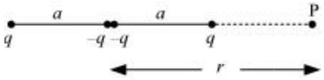

Answer

Four charges of same magnitude are placed at points $\mathrm{X}, \mathrm{Y}, \mathrm{Y}$, and Z respectively, as shown in the following figure.
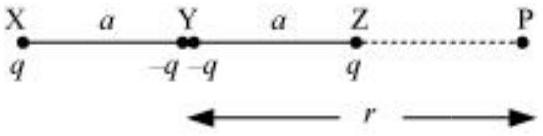

A point is located at P , which is $r$ distance away from point Y .
The system of charges forms an electric quadrupole.
It can be considered that the system of the electric quadrupole has three charges.
Charge $+q$ placed at point X
Charge $-2 q$ placed at point Y
Charge $+q$ placed at point Z

$$
\begin{aligned}
& \mathrm{XY}=\mathrm{YZ}=a \\
& \mathrm{YP}=r \\
& \mathrm{PX}=r+a \\
& \mathrm{PZ}=r-a
\end{aligned}
$$

Electrostatic potential caused by the system of three charges at point P is given by,

$$
\begin{aligned}
V & =\frac{1}{4 \pi \epsilon_{0}}\left[\frac{q}{\mathrm{XP}}-\frac{2 q}{\mathrm{YP}}+\frac{q}{\mathrm{ZP}}\right] \\
& =\frac{1}{4 \pi \epsilon_{0}}\left[\frac{q}{r+a}-\frac{2 q}{r}+\frac{q}{r-a}\right] \\
& =\frac{q}{4 \pi \epsilon_{0}}\left[\frac{r(r-a)-2(r+a)(r-a)+r(r+a)}{r(r+a)(r-a)}\right] \\
& =\frac{q}{4 \pi \epsilon_{0}}\left[\frac{r^{2}-r a-2 r^{2}+2 a^{2}+r^{2}+r a}{r\left(r^{2}-a^{2}\right)}\right]=\frac{q}{4 \pi \epsilon_{0}}\left[\frac{2 a^{2}}{r\left(r^{2}-a^{2}\right)}\right] \\
& =\frac{2 q a^{2}}{4 \pi \epsilon_{0} r^{3}\left(1-\frac{a^{2}}{r^{2}}\right)}
\end{aligned}
$$

Since ${ }^{\frac{r}{a} \gg 1}$,

$$
\begin{aligned}
& \therefore \frac{a}{r} \ll 1 \\
& \frac{a^{2}}{r^{2}} \text { is taken as negligible. }
\end{aligned}
$$

$$
\therefore V=\frac{2 q a^{2}}{4 \pi \epsilon_{0} r^{3}}
$$

It can be inferred that potential, $V \propto \frac{1}{r^{3}}$
However, it is known that for a dipole, $V \propto \frac{1}{r^{2}}$
And, for a monopole, $\quad V \propto \frac{1}{r}$

Question 2.23:
An electrical technician requires a capacitance of $2 \mu \mathrm{~F}$ in a circuit across a potential difference of 1 kV. A large number of $1 \mu \mathrm{~F}$ capacitors are available to him each of which can withstand a potential difference of not more than 400 V. Suggest a possible arrangement that requires the minimum number of capacitors.

Answer

Total required capacitance, $C=2 \mu \mathrm{~F}$
Potential difference, $V=1 \mathrm{kV}=1000 \mathrm{~V}$
Capacitance of each capacitor, $C_{1}=1 \mu \mathrm{~F}$
Each capacitor can withstand a potential difference, $V_{1}=400 \mathrm{~V}$
Suppose a number of capacitors are connected in series and these series circuits are connected in parallel (row) to each other. The potential difference across each row must be 1000 V and potential difference across each capacitor must be 400 V . Hence, number of capacitors in each row is given as

$$
\frac{1000}{400}=2.5
$$

Hence, there are three capacitors in each row.

Capacitance of each row $=\frac{1}{1+1+1}=\frac{1}{3} \mu \mathrm{~F}$
Let there are $n$ rows, each having three capacitors, which are connected in parallel. Hence, equivalent capacitance of the circuit is given as

$$
\begin{aligned}
& \frac{1}{3}+\frac{1}{3}+\frac{1}{3}+\ldots \ldots \ldots \ldots \ldots \ldots n \text { terms } \\
& =\frac{n}{3}
\end{aligned}
$$

However, capacitance of the ciruit is given as $2 \mu \mathrm{~F}$.

$$
\begin{aligned}
& \therefore \frac{n}{3}=2 \\
& n=6
\end{aligned}
$$

Hence, 6 rows of three capacitors are present in the circuit. A minimum of 6 × 3 i.e., 18 capacitors are required for the given arrangement.

OO
Question 2.24:
What is the area of the plates of a 2 F parallel plate capacitor, given that the separation between the plates is 0.5 cm ? [You will realize from your answer why ordinary capacitors are in the range of $\mu \mathrm{F}$ or less. However, electrolytic capacitors do have a much larger capacitance (0.1 F) because of very minute separation between the conductors.]

Answer

Capacitance of a parallel capacitor, $V=2 \mathrm{~F}$
Distance between the two plates, $d=0.5 \mathrm{~cm}=0.5 \times 10^{-2} \mathrm{~m}$
Capacitance of a parallel plate capacitor is given by the relation,

$$
\begin{aligned}
& C=\frac{\epsilon_{0} A}{d} \\
& A=\frac{C d}{\epsilon_{0}}
\end{aligned}
$$

Where,
$\epsilon_{0}=$ Permittivity of free space $=8.85 \times 10^{-12} \mathrm{C}^{2} \mathrm{~N}^{-1} \mathrm{~m}^{-2}$
$\therefore A=\frac{2 \times 0.5 \times 10^{-2}}{8.85 \times 10^{-12}}=1130 \mathrm{~km}^{2}$
Hence, the area of the plates is too large. To avoid this situation, the capacitance is taken in the range of $\mu \mathrm{F}$.

Question 2.25:
Obtain the equivalent capacitance of the network in Fig. 2.35. For a 300 V supply, determine the charge and voltage across each capacitor.
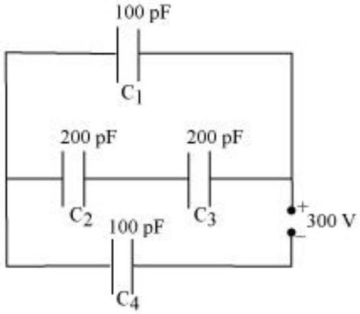

Answer

Capacitance of capacitor $C_{1}$ is 100 pF.
Capacitance of capacitor $C_{2}$ is 200 pF.
Capacitance of capacitor $C_{3}$ is 200 pF.
Capacitance of capacitor $C_{4}$ is 100 pF.
Supply potential, $V=300 \mathrm{~V}$
Capacitors $C_{2}$ and $C_{3}$ are connected in series. Let their equivalent capacitance be $C^{\prime}$.

$$
\begin{aligned}
& \therefore \frac{1}{C^{\prime}}=\frac{1}{200}+\frac{1}{200}=\frac{2}{200} \\
& C^{\prime}=100 \mathrm{pF}
\end{aligned}
$$

Capacitors $C_{1}$ and $C^{\prime}$ are in parallel. Let their equivalent capacitance be $C^{\prime \prime}$.

$$
\begin{aligned}
& \therefore C^{\prime \prime}=C^{\prime}+C_{1} \\
& =100+100=200 \mathrm{pF}
\end{aligned}
$$

$C^{\prime \prime}$ and $\mathrm{C}_{4}$ are connected in series. Let their equivalent capacitance be $C$.

$$
\begin{aligned}
& \therefore \frac{1}{C}=\frac{1}{C^{n}}+\frac{1}{C_{4}} \\
& =\frac{1}{200}+\frac{1}{100}=\frac{2+1}{200} \\
& C=\frac{200}{3} \mathrm{pF}
\end{aligned}
$$

Hence, the equivalent capacitance of the circuit is $\frac{200}{3} \mathrm{pF}$.
Potential difference across $C^{\prime \prime}=V^{\prime \prime}$
Potential difference across $C_{4}=V_{4}$

$$
\therefore V^{\prime \prime}+V_{4}=V=300 \mathrm{~V}
$$

Charge on $C_{4}$ is given by,

$$
\begin{aligned}
& Q_{4}=C V \\
& =\frac{200}{3} \times 10^{-12} \times 300 \\
& =2 \times 10^{-8} \mathrm{C}
\end{aligned}
$$

$$
\begin{aligned}
\therefore V_{4} & =\frac{Q_{4}}{C_{4}} \\
& =\frac{2 \times 10^{-8}}{100 \times 10^{-12}}=200 \mathrm{~V}
\end{aligned}
$$

∴ Voltage across $\mathrm{C}_{1}$ is given by,

$$
\begin{aligned}
V_{1} & =V-V_{4} \\
& =300-200=100 \mathrm{~V}
\end{aligned}
$$

Hence, potential difference, $V_{1}$, across $C_{1}$ is 100 V .
Charge on $C_{1}$ is given by,

$$
\begin{aligned}
Q_{1} & =C_{1} V_{1} \\
& =100 \times 10^{-12} \times 100 \\
& =10^{-8} \mathrm{C}
\end{aligned}
$$

$C_{2}$ and $C_{3}$ having same capacitances have a potential difference of 100 V together. Since $C_{2}$ and $C_{3}$ are in series, the potential difference across $C_{2}$ and $C_{3}$ is given by,

$$
V_{2}=V_{3}=50 \mathrm{~V}
$$

Therefore, charge on $C_{2}$ is given by,

$$
\begin{aligned}
Q_{2} & =C_{2} V_{2} \\
& =200 \times 10^{-12} \times 50 \\
& =10^{-8} \mathrm{C}
\end{aligned}
$$

And charge on $C_{3}$ is given by,

$$
\begin{aligned}
Q_{3} & =C_{3} V_{3} \\
& =200 \times 10^{-12} \times 50 \\
& =10^{-8} \mathrm{C}
\end{aligned}
$$

Hence, the equivalent capacitance of the given circuit is $\frac{200}{3} \mathrm{pF}$ with,

$$
\begin{array}{ll}
Q_{1}=10^{-8} \mathrm{C}, & V_{1}=100 \mathrm{~V} \\
Q_{2}=10^{-8} \mathrm{C}, & V_{2}=50 \mathrm{~V} \\
Q_{3}=10^{-8} \mathrm{C}, & V_{3}=50 \mathrm{~V} \\
Q_{4}=2 \times 10^{-8} \mathrm{C}, & V_{4}=200 \mathrm{~V}
\end{array}
$$

Question 2.26:
The plates of a parallel plate capacitor have an area of $90 \mathrm{~cm}^{2}$ each and are separated by 2.5 mm. The capacitor is charged by connecting it to a 400 V supply.

How much electrostatic energy is stored by the capacitor?
View this energy as stored in the electrostatic field between the plates, and obtain the energy per unit volume $u$. Hence arrive at a relation between $u$ and the magnitude of electric field $E$ between the plates.

## Answer

Area of the plates of a parallel plate capacitor, $A=90 \mathrm{~cm}^{2}=90 \times 10^{-4} \mathrm{~m}^{2}$
Distance between the plates, $d=2.5 \mathrm{~mm}=2.5 \times 10^{-3} \mathrm{~m}$
Potential difference across the plates, $V=400 \mathrm{~V}$
Capacitance of the capacitor is given by the relation,

$$
C=\frac{\in_{0} A}{d}
$$

Electrostatic energy stored in the capacitor is given by the relation, $E_{1}=\frac{1}{2} C V^{2}$

$$
=\frac{1}{2} \frac{\epsilon_{0} A}{d} V^{2}
$$

Where,

$$
\begin{aligned}
& \epsilon_{0}=\text { Permittivity of free space }=8.85 \times 10^{-12} \mathrm{C}^{2} \mathrm{~N}^{-1} \mathrm{~m}^{-2} \\
& \therefore E_{1}=\frac{1 \times 8.85 \times 10^{-12} \times 90 \times 10^{-4} \times(400)^{2}}{2 \times 2.5 \times 10^{-3}}=2.55 \times 10^{-6} \mathrm{~J}
\end{aligned}
$$

Hence, the electrostatic energy stored by the capacitor is $2.55 \times 10^{-6} \mathrm{~J}$.
Volume of the given capacitor,

$$
\begin{aligned}
V^{\prime} & =A \times d \\
& =90 \times 10^{-4} \times 25 \times 10^{-3} \\
& =2.25 \times 10^{-4} \mathrm{~m}^{3}
\end{aligned}
$$

Energy stored in the capacitor per unit volume is given by,

$$
\begin{aligned}
u & =\frac{E_{1}}{V^{\prime}} \\
& =\frac{2.55 \times 10^{-6}}{2.25 \times 10^{-4}}=0.113 \mathrm{~J} \mathrm{~m}^{-3}
\end{aligned}
$$

Again, $u=\frac{E_{1}}{V^{\prime}}$

$$
=\frac{\frac{1}{2} C V^{2}}{A d}=\frac{\frac{\epsilon_{0} A}{2 d} V^{2}}{A d}=\frac{1}{2} \epsilon_{0}\left(\frac{V}{d}\right)^{2}
$$

Where,

$$
\begin{aligned}
& \frac{V}{d}=\text { Electric intensity }=E \\
& \therefore u=\frac{1}{2} \in_{0} E^{2}
\end{aligned}
$$

Question 2.27:
A $4 \mu \mathrm{~F}$ capacitor is charged by a 200 V supply. It is then disconnected from the supply, and is connected to another uncharged $2 \mu \mathrm{~F}$ capacitor. How much electrostatic energy of the first capacitor is lost in the form of heat and electromagnetic radiation?

Answer

Capacitance of a charged capacitor, $C_{1}=4 \mu \mathrm{~F}=4 \times 10^{-6} \mathrm{~F}$
Supply voltage, $V_{1}=200 \mathrm{~V}$
Electrostatic energy stored in $C_{1}$ is given by,

$$
\begin{aligned}
E_{1} & =\frac{1}{2} C_{1} V_{1}^{2} \\
& =\frac{1}{2} \times 4 \times 10^{-6} \times(200)^{2} \\
& =8 \times 10^{-2} \mathrm{~J}
\end{aligned}
$$

Capacitance of an uncharged capacitor, $C_{2}=2 \mu \mathrm{~F}=2 \times 10^{-6} \mathrm{~F}$

When $C_{2}$ is connected to the circuit, the potential acquired by it is $V_{2}$.
According to the conservation of charge, initial charge on capacitor $C_{1}$ is equal to the final charge on capacitors, $C_{1}$ and $C_{2}$.

$$
\begin{aligned}
& \therefore V_{2}\left(C_{1}+C_{2}\right)=C_{1} V_{1} \\
& V_{2} \times(4+2) \times 10^{-6}=4 \times 10^{-6} \times 200 \\
& V_{2}=\frac{400}{3} \mathrm{~V}
\end{aligned}
$$

Electrostatic energy for the combination of two capacitors is given by,

$$
\begin{aligned}
E_{2} & =\frac{1}{2}\left(C_{1}+C_{2}\right) V_{2}^{2} \\
& =\frac{1}{2}(2+4) \times 10^{-6} \times\left(\frac{400}{3}\right)^{2} \\
& =5.33 \times 10^{-2} \mathrm{~J}
\end{aligned}
$$

Hence, amount of electrostatic energy lost by capacitor $C_{1}$

$$
\begin{aligned}
& =E_{1}-E_{2} \\
& =0.08-0.0533=0.0267 \\
& =2.67 \times 10^{-2} \mathrm{~J}
\end{aligned}
$$

OO
Question 2.28:
Show that the force on each plate of a parallel plate capacitor has a magnitude equal to $\left(\frac{1}{2}\right) Q E$, where $Q$ is the charge on the capacitor, and $E$ is the magnitude of electric field between the plates. Explain the origin of the factor $\frac{1}{2}$.

Answer

Let $F$ be the force applied to separate the plates of a parallel plate capacitor by a distance of $\Delta x$. Hence, work done by the force to do so $=F \Delta x$

As a result, the potential energy of the capacitor increases by an amount given as $u A \Delta x$.

Where,
$u=$ Energy density
$A=$ Area of each plate
$d=$ Distance between the plates
$V=$ Potential difference across the plates
The work done will be equal to the increase in the potential energy i.e.,

$$
\begin{aligned}
& F \Delta x=u A \Delta x \\
& F=u A=\left(\frac{1}{2} \in_{0} E^{2}\right) A
\end{aligned}
$$

Electric intensity is given by,

$$
\begin{aligned}
& E=\frac{V}{d} \\
& \therefore F=\frac{1}{2} \epsilon_{0}\left(\frac{V}{d}\right) E A=\frac{1}{2}\left(\epsilon_{0} A \frac{V}{d}\right) E
\end{aligned}
$$

However, capacitance, $C=\frac{\in_{0} A}{d}$

$$
\therefore F=\frac{1}{2}(C V) E
$$

Charge on the capacitor is given by,

$$
\begin{aligned}
& Q=C V \\
& \therefore F=\frac{1}{2} Q E
\end{aligned}
$$

The physical origin of the factor, $\frac{1}{2}$, in the force formula lies in the fact that just outside the conductor, field is $E$ and inside it is zero. Hence, it is the average value, $\frac{E}{2}$, of the field that contributes to the force.

Question 2.29:

A spherical capacitor consists of two concentric spherical conductors, held in position by suitable insulating supports (Fig. 2.36). Show
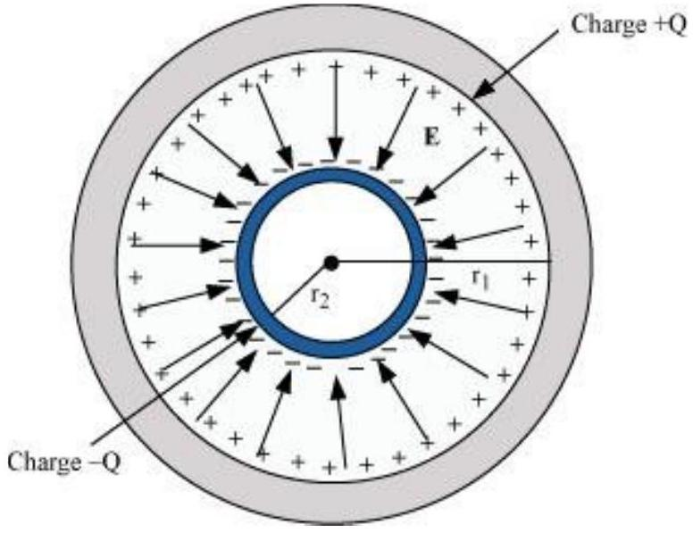
that the capacitance of a spherical capacitor is given by

$$
C=\frac{4 \pi \epsilon_{0} r_{1} r_{2}}{r_{1}-r_{2}}
$$

where $r_{1}$ and $r_{2}$ are the radii of outer and inner spheres, respectively.
Answer

Radius of the outer shell $=r_{1}$
Radius of the inner shell $=r_{2}$
The inner surface of the outer shell has charge $+Q$.
The outer surface of the inner shell has induced charge $-Q$.
Potential difference between the two shells is given by,

$$
V=\frac{Q}{4 \pi \epsilon_{0} r_{2}}-\frac{Q}{4 \pi \epsilon_{0} r_{1}}
$$

Where,

$$
\epsilon_{0}=\text { Permittivity of free space }
$$

$$
\begin{aligned}
V & =\frac{Q}{4 \pi \epsilon_{0}}\left[\frac{1}{r_{2}}-\frac{1}{r_{1}}\right] \\
& =\frac{Q\left(r_{1}-r_{2}\right)}{4 \pi \epsilon_{0} r_{1} r_{2}}
\end{aligned}
$$

Capacitance of the given system is given by,

$$
\begin{aligned}
C & =\frac{\text { Charge }(Q)}{\text { Potential difference }(V)} \\
& =\frac{4 \pi \epsilon_{0} r_{1} r_{2}}{r_{1}-r_{2}}
\end{aligned}
$$

Hence, proved.

Question 2.30:
A spherical capacitor has an inner sphere of radius 12 cm and an outer sphere of radius 13 cm . The outer sphere is earthed and the inner sphere is given a charge of $2.5 \mu \mathrm{C}$. The space between the concentric spheres is filled with a liquid of dielectric constant 32 .

Determine the capacitance of the capacitor.
What is the potential of the inner sphere?
Compare the capacitance of this capacitor with that of an isolated sphere of radius 12 cm. Explain why the latter is much smaller.

Answer

Radius of the inner sphere, $r_{2}=12 \mathrm{~cm}=0.12 \mathrm{~m}$
Radius of the outer sphere, $r_{1}=13 \mathrm{~cm}=0.13 \mathrm{~m}$
Charge on the inner sphere, $q=2.5 \mu \mathrm{C}=2.5 \times 0^{-6} \mathrm{C}$
Dielectric constant of a liquid, $\epsilon_{r}=32$
Capacitance of the capacitor is given by the relation,

$$
C=\frac{4 \pi \in_{0} \in_{r} r_{1} r_{2}}{r_{1}-r_{2}}
$$

Where,

$$
\begin{aligned}
& \epsilon_{0}=\text { Permittivity of free space }=8.85 \times 10^{-12} \mathrm{C}^{2} \mathrm{~N}^{-1} \mathrm{~m}^{-2} \\
& \frac{1}{4 \pi \epsilon_{0}}=9 \times 10^{9} \mathrm{Nm}^{2} \mathrm{C}^{-2} \\
& \therefore C=\frac{32 \times 0.12 \times 0.13}{9 \times 10^{9} \times(0.13-0.12)} \\
& \approx 5.5 \times 10^{-9} \mathrm{~F}
\end{aligned}
$$

Hence, the capacitance of the capacitor is approximately $5.5 \times 10^{-9} \mathrm{~F}$.
Potential of the inner sphere is given by,

$$
\begin{aligned}
V & =\frac{q}{C} \\
& =\frac{2.5 \times 10^{-6}}{5.5 \times 10^{-9}}=4.5 \times 10^{2} \mathrm{~V}
\end{aligned}
$$

Hence, the potential of the inner sphere is $4.5 \times 10^{2} \mathrm{~V}$.
Radius of an isolated sphere, $r=12 \times 10^{-2} \mathrm{~m}$
Capacitance of the sphere is given by the relation,

$$
\begin{aligned}
C^{\prime} & =4 \pi \epsilon_{0} r \\
& =4 \pi \times 8.85 \times 10^{-12} \times 12 \times 10^{-12} \\
& =1.33 \times 10^{-11} \mathrm{~F}
\end{aligned}
$$

The capacitance of the isolated sphere is less in comparison to the concentric spheres. This is because the outer sphere of the concentric spheres is earthed. Hence, the potential difference is less and the capacitance is more than the isolated sphere.

CC
Question 2.31:
Answer carefully:
Two large conducting spheres carrying charges $Q_{1}$ and $Q_{2}$ are brought close to each other.
Is the magnitude of electrostatic force between them exactly given by $Q_{1} Q_{2} / 4 \pi{ }^{\epsilon_{0}} r^{2}$, where $r$ is the distance between their centres?

If Coulomb's law involved $1 / r^{3}$ dependence (instead of $1 / r^{2}$ ), would Gauss's law be still true?

A small test charge is released at rest at a point in an electrostatic field configuration. Will it travel along the field line passing through that point?

What is the work done by the field of a nucleus in a complete circular orbit of the electron? What if the orbit is elliptical?

We know that electric field is discontinuous across the surface of a charged conductor. Is electric potential also discontinuous there?

What meaning would you give to the capacitance of a single conductor?
Guess a possible reason why water has a much greater dielectric constant $(=80)$ than say, mica $(=6)$.

Answer

The force between two conducting spheres is not exactly given by the expression, $Q_{1}$ $Q_{2} / 4 \pi^{\epsilon_{0}} r^{2}$, because there is a non-uniform charge distribution on the spheres.

Gauss's law will not be true, if Coulomb's law involved $1 / r^{3}$ dependence, instead of1 $/ r^{2}$, on $r$.

Yes,
If a small test charge is released at rest at a point in an electrostatic field configuration, then it will travel along the field lines passing through the point, only if the field lines are straight. This is because the field lines give the direction of acceleration and not of velocity.

Whenever the electron completes an orbit, either circular or elliptical, the work done by the field of a nucleus is zero.

No
Electric field is discontinuous across the surface of a charged conductor. However, electric potential is continuous.

The capacitance of a single conductor is considered as a parallel plate capacitor with one of its two plates at infinity.

Water has an unsymmetrical space as compared to mica. Since it has a permanent dipole moment, it has a greater dielectric constant than mica.

Question 2.32:
A cylindrical capacitor has two co-axial cylinders of length 15 cm and radii 1.5 cm and 1.4 cm. The outer cylinder is earthed and the inner cylinder is given a charge of $3.5 \mu \mathrm{C}$. Determine the capacitance of the system and the potential of the inner cylinder. Neglect end effects (i.e., bending of field lines at the ends).

Answer

Length of a co-axial cylinder, $l=15 \mathrm{~cm}=0.15 \mathrm{~m}$
Radius of outer cylinder, $r_{1}=1.5 \mathrm{~cm}=0.015 \mathrm{~m}$
Radius of inner cylinder, $r_{2}=1.4 \mathrm{~cm}=0.014 \mathrm{~m}$
Charge on the inner cylinder, $q=3.5 \mu \mathrm{C}=3.5 \times 10^{-6} \mathrm{C}$
Capacitance of a co-axial cylinder of radii $r_{1}$ and $r_{2}$ is given by the relation,

$$
C=\frac{2 \pi \in_{0} l}{\log _{e} \frac{r_{1}}{r_{2}}}
$$

Where,

$$
\begin{aligned}
& \epsilon_{0}=\text { Permittivity of free space }=8.85 \times 10^{-12} \mathrm{~N}^{-1} \mathrm{~m}^{-2} \mathrm{C}^{2} \\
& \begin{aligned}
\therefore C & =\frac{2 \pi \times 8.85 \times 10^{-12} \times 0.15}{2.3026 \log _{10}\left(\frac{0.15}{0.14}\right)} \\
& =\frac{2 \pi \times 8.85 \times 10^{-12} \times 0.15}{2.3026 \times 0.0299}=1.2 \times 10^{-10} \mathrm{~F}
\end{aligned}
\end{aligned}
$$

Potential difference of the inner cylinder is given by,

$$
\begin{aligned}
V & =\frac{q}{C} \\
& =\frac{3.5 \times 10^{-6}}{1.2 \times 10^{-10}}=2.92 \times 10^{4} \mathrm{~V}
\end{aligned}
$$

Question 2.33:
A parallel plate capacitor is to be designed with a voltage rating 1 kV, using a material of dielectric constant 3 and dielectric strength about $10^{7} \mathrm{Vm}^{-1}$. (Dielectric strength is the maximum electric field a material can tolerate without breakdown, i.e., without starting to conduct electricity through partial ionisation.) For safety, we should like the field never to exceed, say 10\% of the dielectric strength. What minimum area of the plates is required to have a capacitance of 50 pF?

Answer

Potential rating of a parallel plate capacitor, $V=1 \mathrm{kV}=1000 \mathrm{~V}$

Dielectric constant of a material, $\in_{r=3}$
Dielectric strength $=10^{7} \mathrm{~V} / \mathrm{m}$
For safety, the field intensity never exceeds $10 \%$ of the dielectric strength.
Hence, electric field intensity, $E=10 \%$ of $10^{7}=10^{6} \mathrm{~V} / \mathrm{m}$
Capacitance of the parallel plate capacitor, $C=50 \mathrm{pF}=50 \times 10^{-12} \mathrm{~F}$
Distance between the plates is given by,

$$
\begin{aligned}
d & =\frac{V}{E} \\
& =\frac{1000}{10^{6}}=10^{-3} \mathrm{~m}
\end{aligned}
$$

Capacitance is given by the relation,

$$
C=\frac{\epsilon_{0} \epsilon_{r} A}{d}
$$

Where,
$A=$ Area of each plate

$$
\epsilon_{0}=\text { Permittivity of free space }=8.85 \times 10^{-12} \mathrm{~N}^{-1} \mathrm{C}^{2} \mathrm{~m}^{-2}
$$

$$
\begin{aligned}
\therefore A & =\frac{C d}{\epsilon_{0} \epsilon_{r}} \\
& =\frac{50 \times 10^{-12} \times 10^{-3}}{8.85 \times 10^{-12} \times 3} \approx 19 \mathrm{~cm}^{2}
\end{aligned}
$$

Hence, the area of each plate is about $19 \mathrm{~cm}^{2}$.

Question 2.34:
Describe schematically the equipotential surfaces corresponding to a constant electric field in the $z$-direction, a field that uniformly increases in magnitude but remains in a constant (say, $z$ ) direction, a single positive charge at the origin, and a uniform grid consisting of long equally spaced parallel charged wires in a plane.

Answer

Equidistant planes parallel to the $x-y$ plane are the equipotential surfaces.
Planes parallel to the $x-y$ plane are the equipotential surfaces with the exception that when the planes get closer, the field increases.

Concentric spheres centered at the origin are equipotential surfaces.
A periodically varying shape near the given grid is the equipotential surface. This shape gradually reaches the shape of planes parallel to the grid at a larger distance.

Question 2.35:

In a Van de Graaff type generator a spherical metal shell is to be a $15 \times 10^{6} \mathrm{~V}$ electrode. The dielectric strength of the gas surrounding the electrode is $5 \times 10^{7} \mathrm{Vm}^{-1}$. What is the minimum radius of the spherical shell required? (You will learn from this exercise why one cannot build an electrostatic generator using a very small shell which requires a small charge to acquire a high potential.)

Answer

Potential difference, $V=15 \times 10^{6} \mathrm{~V}$
Dielectric strength of the surrounding gas $=5 \times 10^{7} \mathrm{~V} / \mathrm{m}$
Electric field intensity, $E=$ Dielectric strength $=5 \times 10^{7} \mathrm{~V} / \mathrm{m}$
Minimum radius of the spherical shell required for the purpose is given by,

$$
\begin{aligned}
r & =\frac{V}{E} \\
& =\frac{15 \times 10^{6}}{5 \times 10^{7}}=0.3 \mathrm{~m}=30 \mathrm{~cm}
\end{aligned}
$$

Hence, the minimum radius of the spherical shell required is 30 cm .

Question 2.36:
A small sphere of radius $r_{1}$ and charge $q_{1}$ is enclosed by a spherical shell of radius $r_{2}$ and charge $q_{2}$. Show that if $q_{1}$ is positive, charge will necessarily flow from the sphere to the shell (when the two are connected by a wire) no matter what the charge $q_{2}$ on the shell is.

Answer

According to Gauss's law, the electric field between a sphere and a shell is determined by the charge $q_{1}$ on a small sphere. Hence, the potential difference, $V$, between the sphere and the shell is independent of charge $q_{2}$. For positive charge $q_{1}$, potential difference $V$ is always positive.

Question 2.37:
Answer the following:
The top of the atmosphere is at about 400 kV with respect to the surface of the earth, corresponding to an electric field that decreases with altitude. Near the surface of the earth, the field is about $100 \mathrm{Vm}^{-1}$. Why then do we not get an electric shock as we step out of our house into the open? (Assume the house to be a steel cage so there is no field inside!)

A man fixes outside his house one evening a two metre high insulating slab carrying on its top a large aluminium sheet of area $1 \mathrm{~m}^{2}$. Will he get an electric shock if he touches the metal sheet next morning?

The discharging current in the atmosphere due to the small conductivity of air is known to be 1800 A on an average over the globe. Why then does the atmosphere not discharge itself completely in due course and become electrically neutral? In other words, what keeps the atmosphere charged?

What are the forms of energy into which the electrical energy of the atmosphere is dissipated during a lightning? (Hint: The earth has an electric field of about $100 \mathrm{Vm}^{-1}$ at its surface in the downward direction, corresponding to a surface charge density $=-10^{-9}$ $\mathrm{C} \mathrm{m}^{-2}$. Due to the slight conductivity of the atmosphere up to about 50 km (beyond which it is good conductor), about + 1800 C is pumped every second into the earth as a whole. The earth, however, does not get discharged since thunderstorms and lightning occurring continually all over the globe pump an equal amount of negative charge on the earth.)

Answer

We do not get an electric shock as we step out of our house because the original equipotential surfaces of open air changes, keeping our body and the ground at the same potential.

Yes, the man will get an electric shock if he touches the metal slab next morning. The steady discharging current in the atmosphere charges up the aluminium sheet. As a result, its voltage rises gradually. The raise in the voltage depends on the capacitance of the capacitor formed by the aluminium slab and the ground.

The occurrence of thunderstorms and lightning charges the atmosphere continuously. Hence, even with the presence of discharging current of 1800 A, the atmosphere is not discharged completely. The two opposing currents are in equilibrium and the atmosphere remains electrically neutral.

During lightning and thunderstorm, light energy, heat energy, and sound energy are dissipated in the atmosphere.

