## अध्याय $2$

## स्थिरवैद्युत विभव

## तथा धारिता

## $2.1$ भूमिका

अध्याय $5$ तथा $7$（कक्षा 11）में स्थितिज ऊर्जा की धारणा से आपको परिचित कराया गया था। जब कोई बाह्य बल किसी वस्तु को एक बिंदु से दूसरे बिंदु तक，किसी अन्य बल；जैसे－स्प्रिंग बल，गुरुत्वीय बल आदि के विरुद्ध，ले जाता है，तो उस बाह्य बल द्वारा किया गया कार्य उस वस्तु में स्थितिज ऊर्जा के रूप में संचित हो जाता है। जब बाह्य बल हटा लिया जाता है तो वस्तु गति करने लगती है और कुछ गतिज ऊर्जा अर्जित कर लेती है，तथा उस वस्तु की उतनी ही स्थितिज ऊर्जा कम हो जाती है। इस प्रकार वस्तु की स्थितिज ऊर्जा तथा गतिज ऊर्जा का योग संरक्षित रहता है। इस प्रकार के बलों को संरक्षी बल कहते हैं। स्प्रिंग बल तथा गुरुत्वाकर्षण बल संरक्षी बल के उदाहरण हैं।

गुरुत्वाकर्षण बल की भाँति दो स्थिर आवेशों के बीच लगने वाला कूलॉम बल भी संरक्षी बल होता है। यह कोई आश्चर्य की बात नहीं है，क्योंकि गणितीय रूप में यह बल गुरुत्वाकर्षण बल के समान है；दोनों में दूरी की व्युत्क्रम वर्ग निर्भरता है और प्रमुख रूप से आनुपातिकता स्थिरांक में भिन्नता है। गुरुत्वाकर्षण नियम की संहतियाँ कूलॉम नियम में आवेशों द्वारा प्रतिस्थापित हो जाती हैं। इस प्रकार，गुरुत्वीय क्षेत्र में संहतियों की स्थितिज ऊर्जा की ही भाँति हम किसी स्थिरवैद्युत क्षेत्र में आवेश की स्थिरवैद्युत स्थितिज ऊर्जा को परिभाषित कर सकते हैं।

आवेश विन्यास के कारण किसी स्थिरवैद्युत क्षेत्र E पर विचार कीजिए। सरलता की दृष्टि से पहले मूल बिंदु पर स्थित किसी आवेश $Q$ के कारण क्षेत्र $\mathbf{E}$ पर विचार करते हैं। कल्पना कीजिए कि हम कोई परीक्षण आवेश $q$ को आवेश $Q$ के कारण आवेश $q$ पर लगे प्रतिकर्षी बल के विरुद्ध बिंदु R से बिंदु P तक लाते हैं। चित्र $2.1$ के संदर्भ में ऐसा तभी होगा जब $Q$ तथा $q$ दोनों धनात्मक हों अथवा दोनों ऋणात्मक हों। सुनिश्चित करने के लिए，हम $Q, q>0$ मानते हैं।

## स्थिरवैद्युत विभव तथा धारिता

यहाँ दो टिप्पणियाँ की जा सकती हैं। पहली, हम यह मानते हैं कि परीक्षण आवेश $q$ इतना छोटा है कि यह मूल विन्यास को विक्षुब्ध नहीं करता, यानी मूल बिंदु पर स्थित आवेश $Q$ को विक्षुब्ध नहीं करता (अन्यथा हम किसी अनिर्दिष्ट बल द्वारा आवेश $Q$ को मूल बिंदु पर दृढ़ करें)। दूसरी, आवेश $q$ को R से P तक लाने के लिए हम एक बाह्य बल $\mathbf{F}_{\text {ext }}$ आरोपित करते हैं जो प्रतिकर्षी वैद्युत बल $\mathbf{F}_{\mathrm{E}}$ (अर्थात $\mathbf{F}_{\text {ext }}=-\mathbf{F}_{\mathrm{E}}$ ) को यथातथ्य प्रभावहीन कर देता है। इसका अर्थ यह हुआ कि जब आवेश $q$ को R से P तक लाते हैं तो उस पर कोई नेट बल अथवा त्वरण कार्य नहीं करता-इसे अत्यंत धीमी नियत चाल से लाया जाता है। इस स्थिति में, बाह्य बल द्वारा आवेश पर किया गया कार्य वैद्युत बल द्वारा किए गए कार्य का ऋणात्मक होता है, तथा पूर्णतः आवेश $q$ की स्थितिज ऊर्जा के रूप में संचित हो जाता है। यदि P पर पहुँच कर बाह्य बल को हटा दिया जाए तो वैद्युत बल आवेश $q$ को Q से दूर भेज देगा -P पर संचित ऊर्जा (स्थितिज ऊर्जा) आवेश $q$ को गतिज ऊर्जा प्रदान करने में खर्च हो जाती है तथा यह इस ढंग से होता है कि गतिज ऊर्जा तथा स्थितिज ऊर्जा का योग संरक्षित रहता है।

इस प्रकार बाह्य बल द्वारा किसी आवेश $q$ को बिंदु R से P तक ले जाने में किया गया कार्य

$$
\begin{aligned}
\mathrm{W}_{\mathrm{RP}} & =\int_{\mathrm{R}}^{\mathrm{P}} \mathbf{F}_{e x t} \cdot \mathrm{~d} \mathbf{r} \\
& =-\int_{\mathrm{R}}^{\mathrm{P}} \mathbf{F}_{E} \cdot \mathrm{~d} \mathbf{r}
\end{aligned}
$$

यह कार्य स्थिरवैद्युत प्रतिकर्षी बल के विरुद्ध किया गया है, तथा यह स्थितिज ऊर्जा के रूप में संचित हो जाता है।

विद्युत क्षेत्र के प्रत्येक बिंदु पर $q$ आवेश के, किसी कण में एक निश्चित स्थिरवैद्युत स्थितिज ऊर्जा होती है तथा कण पर किया गया यह कार्य इसकी स्थितिज ऊर्जा में इतनी वृद्धि कर देता है जो R तथा P बिंदुओं के बीच स्थितिज ऊर्जा के अंतर के बराबर है।

इस प्रकार, स्थितिज ऊर्जा अंतर

$$
\Delta U=U_{\mathrm{P}}-U_{\mathrm{R}}=W_{\mathrm{RP}}
$$

(ध्यान दीजिए, यहाँ पर यह विस्थापन विद्युत बल के विपरीत है, इसलिए विद्युत क्षेत्र द्वारा किया गया कार्य ऋणात्मक है, अर्थात $-W_{\mathrm{RP}}$ )

अतः, दो बिंदुओं के बीच स्थिरवैद्युत स्थितिज ऊर्जा अंतर को हम इस प्रकार परिभाषित करते हैं - किसी यादृच्छिक आवेश विन्यास के विद्युत बल क्षेत्र में यह अंतर आवेश $q$ को एक बिंदु से दूसरे बिंदु तक ( बिना त्वरित किए ) ले जाने के लिए आवश्यक बाह्य बल द्वारा किए जाने वाले न्यूनतम कार्य के बराबर होता है।
इस घटनाक्रम में दो महत्वपूर्ण टिप्पणियाँ की जा सकती हैं-

(i) समीकरण (2.2) का दायाँ पक्ष केवल आवेश की आरंभिक तथा अंतिम स्थितियों पर निर्भर करता है। इसका अर्थ यह है कि किसी स्थिरवैद्युत क्षेत्र द्वारा किसी आवेश को एक बिंदु से दूसरे बिंदु तक ले जाने में किया गया कार्य केवल आरंभिक तथा अंतिम स्थितियों (बिंदुओं) पर निर्भर करता है, उस पथ पर निर्भर नहीं करता जिससे होकर वह आवेश एक बिंदु से दूसरे बिंदु तक जाता है (चित्र 2.2)। यह किसी संरक्षी बल का मूल अभिलक्षण है। स्थितिज ऊर्जा की धारणा अर्थपूर्ण नहीं रहेगी, यदि किया गया कार्य पथ पर निर्भर हो जाएगा। किसी स्थिरवैद्युत क्षेत्र द्वारा किए गए कार्य का पथ पर निर्भर न होना कूलॉम के नियम द्वारा सिद्ध किया जा सकता है। इसकी उपपत्ति हम यहाँ छोड़ रहे हैं।

## - भौतिकी

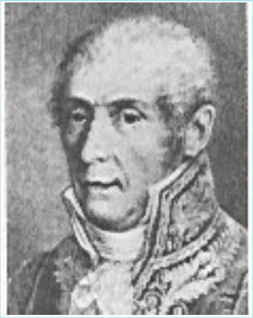

कॉन्ते एलेस्सैंद्रो वोल्टा (1745-1827) इटालियन भौतिकीविद, पविया में प्रोफ़ेसर थे। वोल्टा ने यह स्थापित किया कि लुइगी गैल्वनी 1737-1798, द्वारा, दो असमान धातुओं के संपर्क में लटके मेंढक के मांसपेशीय ऊतकों में देखी गई 'जैव विद्युत' जैव ऊतकों का कोई विशिष्ट गुण नहीं है, बल्कि, तब भी उत्पन्न हो जाती है जब कोई गीली वस्तु दो असमान धातुओं के बीच रखी जाती है। इससे उन्होंने प्रथम, वोल्टीय पुंज या बैटरी का विकास किया जिसमें धातु की चकतियों (विद्युदाग्रों) के बीच गत्ते की नम चकतियाँ (विद्युत अपघट्य) रखकर एक बड़ा पुंज बनाया था। (ii) समीकरण (2.2) स्थितिज ऊर्जा अंतर की परिभाषा भौतिकी के नियमों के अनुसार अर्थपूर्ण राशि कार्य के पदों में करती है। स्पष्टतः, इस प्रकार परिभाषित स्थितिज ऊर्जा किसी योज्यता स्थिरांक के अंतर्गत अनिश्चित होती है। इसका यह अर्थ है कि स्थितिज ऊर्जा का वास्तविक मान भौतिक रूप से महत्वपूर्ण नहीं होता; केवल स्थितिज ऊर्जा के अंतर का ही महत्त्व होता है। हम सदैव ही कोई यादृच्छिक स्थिरांक $\alpha$ हर बिंदु पर स्थितिज ऊर्जा के साथ जोड़ सकते हैं, क्योंकि इससे स्थितिज ऊर्जा अंतर के मान में कोई परिवर्तन नहीं होगा :

$$
\left(U_{\mathrm{P}}+\alpha\right)-\left(U_{\mathrm{R}}+\alpha\right)=U_{\mathrm{P}}-U_{\mathrm{R}}
$$

इसे इस प्रकार से भी व्यक्त कर सकते हैं : स्थितिज ऊर्जा को किस बिंदु पर शून्य मानें, इस बिंदु के चयन की स्वतंत्रता होती है। एक सुविधाजनक चयन यह है कि हम अनंत पर स्थिरवैद्युत स्थितिज ऊर्जा को शून्य मानें। इस चयन के अनुसार यदि हम बिंदु R को अनंत पर लें, तब समीकरण (2.2) से हमें प्राप्त होता है :

$$
W_{\infty \mathrm{P}}=U_{\mathrm{P}}-U_{\infty}=U_{\mathrm{P}}
$$

चूँकि यहाँ पर बिंदु P यादृच्छिक है, समीकरण (2.3) से हमें किसी बिंदु पर आवेश $q$ की स्थितिज ऊर्जा की परिभाषा प्राप्त होती है - किसी बिंदु पर आवेश $q$ की स्थितिज ऊर्जा (किसी आवेश विन्यास के कारण क्षेत्र की उपस्थिति में) बाह्य बल (वैद्युत बल के समान तथा विपरीत) द्वारा आवेश $q$ को अनंत से उस बिंदु तक ले जाने में किए गए कार्य के बराबर होती है।

## $2.2$ स्थिरवैद्युत विभव

किसी व्यापक स्थिर आवेश विन्यास पर विचार कीजिए। हमने किसी परीक्षण आवेश $q$ पर स्थितिज ऊर्जा को किए गए कार्य के पदों में परिभाषित किया था। यह कार्य स्पष्ट रूप से $q$ के अनुक्रमानुपाती है, चूँकि आवेश $q$ पर किसी भी बिंदु पर $q \mathbf{E}$ बल कार्य करता है, यहाँ $\mathbf{E}$ आवेश विन्यास के कारण उस बिंदु पर विद्युत क्षेत्र है। अतः किए गए कार्य को आवेश $q$ से विभाजित करना सुविधाजनक होता है, क्योंकि परिणामस्वरूप जो राशि प्राप्त होती है वह $q$ पर निर्भर नहीं करती। दूसरे शब्दों में, प्रति एकांक आवेश पर किया गया कार्य आवेश विन्यास से संबद्ध विद्युत क्षेत्र का अभिलाक्षणिक गुण होता है। इससे हमें दिए गए आवेश विन्यास के कारण स्थिरवैद्युत विभव $V$ की धारणा प्राप्त होती है। समीकरण (2.1) से हमें प्राप्त होता है-

बाह्य बल द्वारा किसी एकांक धनावेश को बिंदु R से P तक लाने में किया गया कार्य

$$
=V_{\mathrm{P}}-V_{\mathrm{R}}\left(=\frac{U_{\mathrm{P}}-U_{\mathrm{R}}}{q}\right)
$$

यहाँ $V_{\mathrm{P}}$ तथा $V_{\mathrm{R}}$ क्रमशः बिंदु P तथा R के स्थिरवैद्युत विभव हैं। ध्यान दीजिए, यहाँ भी पहले की भाँति विभव का वास्तविक मान उतना महत्वपूर्ण नहीं होता जितना कि भौतिक नियमों के अनुसार विभवांतर महत्वपूर्ण होता है। यदि पहले की भाँति, हम अनंत पर विभव को शून्य चुनें (मानें), तब समीकरण (2.4) से यह उपलक्षित होता है कि-

बाह्य बल द्वारा किसी एकांक धनावेश को अनंत से किसी बिंदु तक लाने में किया गया कार्य = उस बिंदु पर स्थिरवैद्युत विभव $(V)$

## स्थिरवैद्युत विभव तथा धारिता

दूसरे शब्दों में, स्थिरवैद्युत क्षेत्र के प्रदेश के किसी बिंदु पर स्थिरवैद्युत विभव $(V)$ वह न्यूनतम कार्य है जो किसी एकांक धनावेश को अनंत से उस बिंदु तक लाने में किया जाता है।

स्थितिज ऊर्जा के विषय में पहले की गई विशेष टिप्पणी विभव की परिभाषा पर भी लागू होती है। प्रति एकांक परीक्षण आवेश पर किया गया कार्य ज्ञात करने के लिए हमें अत्यल्प परीक्षण आवेश $\delta q$ लेना होता है, इसे अनंत से उस बिंदु तक लाने में किया गया कार्य $\delta W$ ज्ञात करके $\delta W / \delta q$ अनुपात का मान निर्धारित करना होता है। साथ ही पथ के प्रत्येक बिंदु पर बाह्य बल उस बिंदु पर परीक्षण आवेश पर लगने वाले स्थिरवैद्युत बल के बराबर तथा विपरीत होना चाहिए।

## $2.3$ बिंदु आवेश के कारण विभव

मूल बिंदु पर स्थित किसी बिंदु आवेश $Q$ पर विचार कीजिए (चित्र 2.3)। सुस्पष्टता की दृष्टि से $Q$ को धनात्मक लीजिए। हम बिंदु P पर मूल बिंदु से स्थिति सदिश $\mathbf{r}$ के साथ विभव निर्धारित करना चाहते हैं। इसके लिए हमें एकांक धनावेश को अनंत से उस बिंदु तक लाने में किया गया कार्य परिकलित करना चाहिए। $Q>0$ के लिए, परीक्षण आवेश पर प्रतिकर्षण बल के विरुद्ध किया गया कार्य धनात्मक होता है। चूँकि किया गया कार्य पथ पर निर्भर नहीं करता, हम अनंत से बिंदु P तक अरीय दिशा के अनुदिश कोई सुगम पथ का चयन करते हैं।

पथ के किसी मध्यवर्ती बिंदु $\mathrm{P}^{\prime}$ पर, किसी एकांक धनावेश पर स्थिरवैद्युत बल

$$
\frac{Q \times 1}{4 \pi \varepsilon_{o} r^{\prime 2}} \hat{\mathbf{r}}^{\prime}
$$

यहाँ $\hat{\mathbf{r}}^{\prime}, \mathrm{OP}^{\prime}$ के अनुदिश कोई एकांक सदिश है। इस बल के विरुद्ध $r^{\prime}$ से $r^{\prime}+\Delta r^{\prime}$ तक एकांक धनावेश को ले जाने में किया गया कार्य-

$$
\Delta W=-\frac{Q}{4 \pi \varepsilon_{o} r^{\prime 2}} \Delta r^{\prime}
$$

यहाँ ऋणात्मक चिह्न यह दर्शाता है कि $\Delta r^{\prime}<0$, तथा $\Delta W$ धनात्मक है। समीकरण (2.6) को $r^{\prime}=\infty$ से $r^{\prime}=r$ तक समाकलित करने पर बाह्य बल द्वारा किया गया कुल कार्य $(W)$ प्राप्त होगा।

$$
W=-\int_{\infty}^{r} \frac{Q}{4 \pi \varepsilon_{o} r^{\prime 2}} d r^{\prime}=\left.\frac{Q}{4 \pi \varepsilon_{o} r^{\prime}}\right|_{\infty} ^{r}=\frac{Q}{4 \pi \varepsilon_{o} r}
$$

परिभाषा के अनुसार यह आवेश $Q$ के कारण P पर विभव है अतः

$$
V(r)=\frac{Q}{4 \pi \varepsilon_{o} r}
$$

## भौतिकी

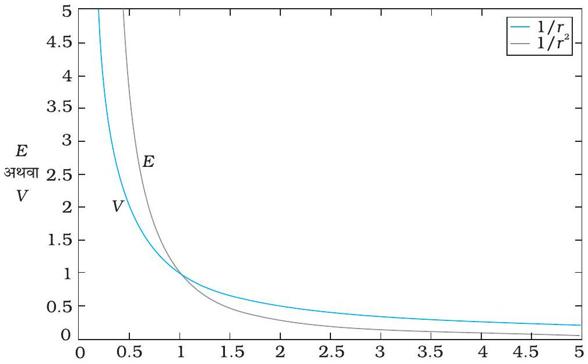
चित्र $2.4$ किसी बिंदु आवेश $Q$ के लिए दूरी $r$ में परिवर्तन के साथ विभव में परिवर्तन ( $Q / 4 \pi \varepsilon_{0}$ ) $\mathrm{m}^{-1}$ के मात्रकों में (नीला वक्र) तथा दूरी $r$ में परिवर्तन के साथ विद्युत क्षेत्र में परिवर्तन $\left(Q / 4 \pi \varepsilon_{0}\right) \mathrm{m}^{-2}$ काला वक्र।

समीकरण (2.8) आवेश $Q$ के किसी भी चिह्न के लिए सत्य है यद्यपि हमने इस संबंध की व्युत्पत्ति के समय $Q>0$ माना था। $Q<0$, $V<0$ के लिए, अर्थात् अनंत से उस बिंदु तक एकांक परीक्षण धनावेश को लाने के लिए किया गया कार्य (बाह्य बल द्वारा) ऋणात्मक है। यह इस कथन के तुल्य है कि एकांक धनावेश को अनंत से बिंदु P तक लाने में स्थिरवैद्युत बल द्वारा किया गया कार्य धनात्मक है [यह ऐसा ही है जैसा कि होना चाहिए, चूँकि $Q<0$ के लिए, एकांक धनावेश पर बल आकर्षी है, अतः स्थिरवैद्युत बल तथा विस्थापन (अनंत से P तक) दोनों एक ही दिशा में हैं]। अंत में यदि हम समीकरण (2.8) पर ध्यान दें, तो पाते हैं कि यह समीकरण हमारे उस चयन से मेल खाता है जिसमें हमने अनंत पर विभव को शून्य माना था।

चित्र (2.4) में यह दर्शाया गया है कि किस प्रकार स्थिरवैद्युत विभव $(\propto 1 / r)$ तथा स्थिरवैद्युत क्षेत्र $\left(\propto 1 / r^{2}\right)$ दूरी $r$ के साथ परिवर्तित होते हैं।

उदाहरण $2.1$

(a) आवेश $4 \times 10^{-7} \mathrm{C}$ के कारण इससे $9 \mathrm{~cm}$ दूरी पर स्थित किसी बिंदु P पर विभव परिकलित कीजिए।
(b) अब, आवेश $2 \times 10^{-9} \mathrm{C}$ को अनंत से बिंदु P तक लाने में किया गया कार्य ज्ञात कीजिए। क्या उत्तर जिस पथ के अनुदिश आवेश को लाया गया है उस पर निर्भर करता है?

हल

(a) $$
\begin{aligned}
V & =\frac{1}{4 \pi \varepsilon_{o}} \frac{Q}{r}=9 \times 10^{9} \mathrm{Nm}^{2} \mathrm{C}^{-2} \times \frac{4 \times 10^{-7} \mathrm{C}}{0.09 \mathrm{~m}} \\
& =4 \times 10^{4} \mathrm{~V}
\end{aligned}
$$
(b) $$
\begin{aligned}
W & =q V=2 \times 10^{-9} \mathrm{C} \times 4 \times 10^{4} \mathrm{~V} \\
& =8 \times 10^{-5} \mathrm{~J}
\end{aligned}
$$

नहीं, कार्य पथ पर निर्भर नहीं होगा। कोई भी यादृच्छिक अत्यल्प पथ दो लंबवत विस्थापनों में वियोजित किया जा सकता है : एक r के अनुदिश तथा दूसरा r के लंबवत। बाद के प्रकरण के तदनुरूपी किया गया कार्य शून्य होगा।

## $2.4$ वैद्युत द्विध्रुव के कारण विभव

जैसा कि हम पिछले अध्याय में जान ही चुके हैं कि वैद्युत द्विध्रुव दो बिंदु आवेशों $q$ तथा $-q$ से मिलकर बनता है तथा इन आवेशों के बीच (लघु) पृथकन $2 a$ होता है। इसका कुल आवेश शून्य होता है तथा यह द्विध्रुव सदिश $\mathbf{p}$ जिसका परिमाण $q \times 2 a$ तथा दिशा $-q$ से $q$ के अनुदिश होती है, के अभिलाक्षणिक गुण द्वारा प्रकट किया जाता है (चित्र 2.5)। हमने यह भी देखा कि किसी बिंदु पर वैद्युत द्विध्रुव का स्थिति सदिश $\mathbf{r}$ सहित विद्युत क्षेत्र मात्र $r$ के परिमाण पर ही निर्भर नहीं

## स्थिरवैद्युत विभव तथा धारिता

करता वरन् r तथा p के बीच के कोण पर भी निर्भर करता है। साथ ही, वैद्युत क्षेत्र की तीव्रता, अधिक दूरियों पर, $1 / r^{2}$ के अनुसार नहीं घटती (जो एकल आवेश के कारण विद्युत क्षेत्र के लिए प्ररूपी है) वरन् $1 / r^{3}$ के अनुसार घटती है। यहाँ हम किसी द्विध्रुव के कारण वैद्युत विभव का निर्धारण करेंगे तथा इसकी तुलना एक आवेश के कारण विभव से करेंगे।

पहले की ही भांति, हम द्विध्रुव के केंद्र को मूल बिंदु पर रखते हैं। अब हम यह जानते हैं कि विद्युत क्षेत्र अध्यारोपण सिद्धांत का पालन करते हैं। चूँकि विभव विद्युत क्षेत्र द्वारा किए गए कार्य से संबंधित है, स्थिरवैद्युत विभव भी अध्यारोपण सिद्धांत का पालन करता है। इस प्रकार किसी वैद्युत द्विध्रुव के कारण विभव आवेशों $q$ तथा $-q$ के कारण विभवों का योग होता है।

$$
V=\frac{1}{4 \pi \varepsilon_{o}}\left(\frac{q}{r_{1}}-\frac{q}{r_{2}}\right)
$$

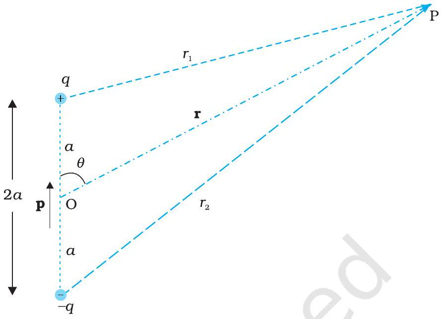
चित्र $2.5$ द्विध्रुव के कारण विभव के परिकलन में सम्मिलित राशियाँ।

यहाँ $r_{1}$ तथा $r_{2}$ बिंदु P की क्रमशः $q$ तथा $-q$ से दूरियाँ हैं। अब, ज्यामिति द्वारा

$$
\begin{aligned}
& r_{1}^{2}=r^{2}+a^{2}-2 a r \cos \theta \\
& r_{2}^{2}=r^{2}+a^{2}+2 a r \cos \theta
\end{aligned}
$$

हम $r$ को $a$ की तुलना में अत्यधिक बड़ा ( $r \gg a$ ) मानते हैं तथा केवल $a / r$ के प्रथम कोटि के पदों को ही सम्मिलित करते हैं :

$$
\begin{aligned}
& r_{1}^{2}=r^{2}\left(1-\frac{2 a \cos \theta}{r}+\frac{a^{2}}{r^{2}}\right) \\
& \cong r^{2}\left(1-\frac{2 a \cos \theta}{r}\right)
\end{aligned}
$$

इसी प्रकार,

$$
r_{2}^{2} \cong r^{2}\left(1+\frac{2 a \cos \theta}{r}\right)
$$

द्विपद समीकरण का उपयोग करके $a / r$ के प्रथम कोटि के पदों को सम्मिलित करने पर

$$
\begin{aligned}
& \frac{1}{r_{1}} \cong \frac{1}{r}\left(1-\frac{2 a \cos \theta}{r}\right)^{-1 / 2} \cong \frac{1}{r}\left(1+\frac{a}{r} \cos \theta\right) \\
& \frac{1}{r_{2}} \cong \frac{1}{r}\left(1+\frac{2 a \cos \theta}{r}\right)^{-1 / 2} \cong \frac{1}{r}\left(1-\frac{a}{r} \cos \theta\right)
\end{aligned}
$$

समीकरणों (2.9) तथा (2.13) तथा $p=2 q a$ का उपयोग करने पर,

$$
V=\frac{q}{4 \pi \varepsilon_{o}} \frac{2 a \cos \theta}{r^{2}}=\frac{p \cos \theta}{4 \pi \varepsilon_{o} r^{2}}
$$

अब, $P \cos \theta=\mathbf{p} \cdot \hat{\mathbf{r}}$

## - भौतिकी

यहाँ $\hat{\mathbf{r}}$ स्थिति सदिश OP के अनुदिश एकांक सदिश है।
तब किसी द्विध्रुव का वैद्युत विभव

$$
V=\frac{1}{4 \pi \varepsilon_{o}} \frac{\mathbf{p} \hat{\mathbf{r}}}{r^{2}} ; \quad(r \gg a)
$$

जैसा कि संकेत दिया गया है, समीकरण (2.15) केवल उन दूरियों के लिए जो द्विध्रुव के आकार की तुलना में अत्यधिक बड़ी हैं, जिसके कारण $a / r$ के उच्च कोटि के पदों की नगण्य मानकर उपेक्षा कर दी गई है, ही सन्निकटतः सत्य है। परंतु, किसी बिंदु द्विध्रुव $\mathbf{p}$ के लिए मूल बिंदु पर समीकरण (2.15) यथार्थ है।

समीकरण (2.15) से, द्विध्रुव अक्ष $(\theta=0, \pi)$ पर विभव

$$
V= \pm \frac{1}{4 \pi \varepsilon_{o}} \frac{p}{r^{2}}
$$

(धनात्मक चिह्न $\theta=0$ के लिए तथा ऋणात्मक चिह्न $\theta=\pi$ के लिए है)। निरक्षीय (विषुवत) समतल ( $\theta=\pi / 2$ ) में विभव शून्य है।

किसी द्विध्रुव के वैद्युत विभव तथा एकल आवेश के वैद्युत विभव के तुलनात्मक महत्वपूर्ण लक्षण समीकरणों (2.8) तथा (2.15) से स्पष्ट हैं :

(i) किसी वैद्युत द्विध्रुव के कारण विभव केवल दूरी $r$ पर ही निर्भर नहीं करता, वरन् स्थिति सदिश $\mathbf{r}$ तथा द्विध्रुव आघूर्ण $\mathbf{p}$ के बीच के कोण पर भी निर्भर करता है। (तथापि यह $\mathbf{p}$ के परितः अक्षतः सममित होता है। अतः यदि आप $\mathbf{p}$ के परितः स्थिति सदिश $\mathbf{r}$ को, कोण $\theta$ को नियत रखते हुए, घूर्णन कराएँ, तो बिंदु P के सदृश घूर्णन के फलस्वरूप बने शंकु पर बिंदुओं पर वही विभव होगा जो बिंदु P पर है।)
(ii) अधिक दूरियों पर वैद्युत द्विध्रुव के कारण विभव $1 / r^{2}$ के अनुपात में घटता है, न कि $1 / r$ के अनुपात में, जो कि एकल आवेश के कारण विभव का एक अभिलाक्षणिक गुण है। (इसके लिए आप चित्र $2.4$ में दर्शाए $r$ व $1 / r^{2}$ तथा $1 / r$ व $r$ के बीच वक्रों का उल्लेख कर सकते हैं जिन्हें किसी अन्य संदर्भ में खींचा गया है)।

## $2.5$ आवेशों के निकाय के कारण विभव

किसी आवेशों $q_{1}, q_{2}, \ldots, q_{n}$ के ऐसे निकाय पर विचार कीजिए जिनके किसी मूल बिंदु के सापेक्ष स्थिति सदिश क्रमशः $\mathbf{r}_{1}, \mathbf{r}_{2}, \ldots, \mathbf{r}_{n}$ हैं (चित्र 2.6)। बिंदु P पर आवेश $q_{1}$ के कारण विभव

$$
V_{1}=\frac{1}{4 \pi \varepsilon_{o}} \frac{q_{1}}{r_{1 \mathrm{p}}}
$$

यहाँ $r_{1 \mathrm{P}}$ बिंदु P तथा आवेश $q_{1}$ के बीच की दूरी है।
इसी प्रकार बिंदु P पर आवेश $q_{2}$ के कारण विभव $V_{2}$ तथा आवेश $q_{3}$ के कारण विभव $V_{3}$ को भी व्यक्त कर सकते हैं

$$
V_{2}=\frac{1}{4 \pi \varepsilon_{o}} \frac{q_{2}}{r_{2 \mathrm{P}}}, V_{3}=\frac{1}{4 \pi \varepsilon_{o}} \frac{q_{3}}{r_{3 \mathrm{P}}}
$$

यहाँ $r_{2 \mathrm{P}}$ तथा $r_{3 \mathrm{P}}$ बिंदु P की क्रमशः $q_{2}$ तथा $q_{3}$ से दूरियाँ हैं। इसी प्रकार हम अन्य आवेशों के कारण बिंदु P पर विभव व्यक्त कर सकते हैं। अध्यारोपण सिद्धांत के अनुसार, समस्त आवेश विन्यास के कारण बिंदु P पर विभव $V$, विन्यास के व्यष्टिगत आवेशों के विभवों के बीजगणितीय योग के बराबर होता है :

$$
\begin{aligned}
& V=V_{1}+V_{2}+\ldots+V_{\mathrm{n}} \\
& =\frac{1}{4 \pi \varepsilon_{o}}\left(\frac{q_{1}}{r_{1 \mathrm{P}}}+\frac{q_{2}}{r_{2 \mathrm{P}}}+\ldots \ldots+\frac{q_{n}}{r_{n \mathrm{P}}}\right)
\end{aligned}
$$

## स्थिरवैद्युत विभव तथा धारिता

यदि हमारे पास आवेश घनत्व $\rho$ के अभिलाक्षणिक गुण का कोई संतत आवेश वितरण है तो पहले की भाँति उसे हम $\Delta v$ साइज़ के $\rho \Delta v$ आवेशयुक्त लघु आयतन अवयवों में विभाजित कर सकते हैं। तब हम प्रत्येक आयतन अवयव के कारण विभव निर्धारित करके और समस्त योगदानों का योग करके（सही शब्दों में，समाकलित करके）समस्त आवेश वितरण के कारण विभव ज्ञात कर सकते हैं।

अध्याय $1$ में हम अध्ययन कर चुके हैं कि किसी एकसमान आवेशित गोलीय खोल के कारण किसी बाहर स्थित बिंदु के लिए विद्युत क्षेत्र इस प्रकार होता है，मानो खोल का समस्त आवेश उसके केंद्र पर संकेंद्रित हो। अतः खोल के बाहर स्थित किसी बिंदु पर आवेशित कोश के कारण विभव

$$
V=\frac{1}{4 \pi \varepsilon_{o}} \frac{q}{r} \quad(r \geq R)
$$

यहाँ $q$ गोलीय खोल पर समस्त आवेश तथा $R$ गोलीय कोश की त्रिज्या है। कोश के भीतर विद्युत क्षेत्र शून्य होता है। इससे यह ध्वनित होता है（देखिए अनुभाग 2．6）कि खोल के भीतर विभव नियत रहता है（क्योंकि खोल के भीतर आवेश को गति कराने से कोई कार्य नहीं होता），और， इसीलिए यह खोल के पृष्ठ के विभव के समान होता है।

$$
V=\frac{1}{4 \pi \varepsilon_{o}} \frac{q}{R}
$$

उदाहरण $2.23 \times 10^{-8} \mathrm{C}$ तथा $-2 \times 10^{-8} \mathrm{C}$ के दो आवेश एक－दूसरे से $15 \mathrm{~cm}$ दूरी पर रखे हैं। इन दोनों आवेशों को मिलाने वाली रेखा के किस बिंदु पर वैद्युत विभव शून्य है？ अनंत पर वैद्युत विभव शून्य लीजिए।

हल मान लीजिए धनावेश मूल बिंदु $O$ पर रखा है। दोनों आवेशों को मिलाने वाली रेखा $x$－अक्ष है；तथा ऋणावेश मूल बिंदु के दाईं ओर रखा है（चित्र $2.7$ देखिए）।

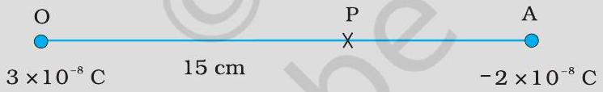
चित्र $2.7$

मान लीजिए $x$－अक्ष पर वह वांछित बिंदु P है जहाँ वैद्युत विभव शून्य है। यदि बिंदु P का $x$－निर्देशांक $x$ है，तो स्पष्ट रूप से $x$ धनात्मक होना चाहिए। $(x<0$ के लिए यह संभव नहीं हो सकता कि दो आवेशों के कारण वैद्युत विभव जुड़कर शून्य हो जाए।） यदि $x$ मूल बिंदु O तथा A के बीच कहीं स्थित है，तो

$$
\frac{1}{4 \pi \varepsilon_{0}}\left[\frac{3 \times 10^{-8}}{x \times 10^{-2}}-\frac{2 \times 10^{-8}}{(15-x) \times 10^{-2}}\right]=0
$$

यहाँ $x$ को cm में लिया गया है। अर्थात

$$
\frac{3}{x}-\frac{2}{15-x}=0
$$

अथवा $x=9 \mathrm{~cm}$
यदि बिंदु $x$ विस्तारित रेखा OA पर है，तो वांछित शर्त के अनुसार

$$
\frac{3}{x}-\frac{2}{x-15}=0
$$

## अथवा

$$
x=45 \mathrm{~cm}
$$

इस प्रकार, धनावेश से $9 \mathrm{~cm}$ तथा $45 \mathrm{~cm}$ दूर ऋणावेश की ओर वैद्युत विभव शून्य है। ही व्युत्पन्न किया गया था। गई हैं

(b) बिंदु Q और $\mathrm{P} ; \mathrm{A}$ और B के बीच एक छोटे से ऋण आवेश की स्थितिज ऊर्जा के अंतर का चिह्न बताइए।
(d) B से A तक एक छोटे से ऋण आवेश को ले जाने के लिए बाह्य साधन द्वारा किए गए कार्य का चिह्न बताइए।

हल

(b) कोई लघु ऋणावेश धनावेश की ओर आकर्षित होगा। ऋणावेश स्थितिज उच्च ऊर्जा से निम्न स्थितिज ऊर्जा की ओर गति करते हैं। अतः Q और P के बीच किसी लघु ॠणावेश की स्थितिज ऊर्जा के अंतर का चिह्न धनात्मक है।
इसी प्रकार, (स्थितिज ऊर्जा) ${ }_{\mathrm{A}}>(\text { स्थितिज ऊर्जा })_{\mathrm{B}}$ है। अतः स्थितिज ऊर्जा अंतर का चिह्न धनात्मक है।
(d) किसी लघु ऋणावेश को B से A तक ले जाने में बाह्य एजेंसी को कार्य करना होता है जो धनात्मक है।

उदाहरण $2.3$ (a) तथा (b) में क्रमशः एकल धन तथा ॠण आवेशों की क्षेत्र रेखाएँ दर्शायी

चित्र $2.8$
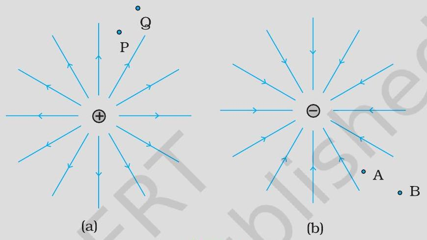

(a) विभवांतर $V_{\mathrm{P}}-V_{\mathrm{B}} ; V_{\mathrm{B}}-V_{\mathrm{A}}$ के चिह्न बताइए।
(c) Q से P तक एक छोटे धनावेश को ले जाने में क्षेत्र द्वारा किए गए कार्य का चिह्न बताइए।
(e) B से A तक जाने में क्या एक छोटे से ऋणावेश की गतिज ऊर्जा बढ़ेगी या घटेगी?
(a) चूँकि $V \propto \frac{1}{r}, V_{P}>V_{Q}$; इस प्रकार, $\left(V_{P}-V_{Q}\right)$ धनात्मक है। तथा $V_{A}$ से $V_{B}$ कम ऋणात्मक है। इसलिए, $V_{B}>V_{A}$ अथवा $\left(V_{B}-V_{A}\right)$ धनात्मक है।
(c) किसी लघु धनावेश को Q से P तक ले जाने में बाह्य एजेंसी को विद्युत क्षेत्र के विरुद्ध कार्य करना होता है। अतः, विद्युत क्षेत्र द्वारा किया गया कार्य ऋणात्मक है।
(e) ऋणावेश पर प्रतिकर्षी बल लगने के कारण वेग घटता है अतः B से A तक जाने में गतिज ऊर्जा घट जाती है।

## स्थिरवैद्युत विभव तथा धारिता

## $2.6$ समविभव पृष्ठ

कोई समविभव पृष्ठ ऐसा पृष्ठ होता है जिसके पृष्ठ के हर बिंदु पर विभव नियत रहता है। किसी एकल आवेश $q$ के लिए, समीकरण (2.8) द्वारा वैद्युत विभव-

$$
V=\frac{1}{4 \pi \varepsilon_{o}} \frac{q}{r}
$$

इससे यह प्रकट होता है कि यदि $r$ नियत है तो $V$ नियत रहता है। इस प्रकार किसी एकल आवेश के लिए समविभव पृष्ठ संकेंद्री गोले होते हैं जिनके केंद्र पर वह आवेश स्थित होता है।

अब किसी एकल आवेश $q$ के लिए विद्युत क्षेत्र रेखाएँ आवेश से आरंभ होने वाली अथवा उस आवेश पर समाप्त होने वाली (यह निर्भर करता है कि आवेश $q$ धनात्मक है अथवा ऋणात्मक) अरीय रेखाएँ होती हैं। स्पष्ट है, किसी समविभव पृष्ठ के किसी भी बिंदु पर विद्युत क्षेत्र सदैव ही उस बिंदु पर अभिलंबवत होता है। यह व्यापक रूप से सत्य है : किसी भी आवेश विन्यास के लिए किसी भी बिंदु से गुजरने वाला समविभव पृष्ठ उस बिंदु पर विद्युत क्षेत्र के अभिलंबवत होता है। इस प्रकथन की व्युत्पत्ति सरल है।

यदि विद्युत क्षेत्र समविभव पृष्ठ के अभिलंबवत नहीं है; तो इस क्षेत्र का पृष्ठ के अनुदिश कोई शून्येतर घटक होगा। किसी एकांक परीक्षण आवेश का क्षेत्र के इस घटक की विरुद्ध दिशा में गति कराने के लिए कुछ कार्य करना आवश्यक होगा। परंतु यह किसी समविभव पृष्ठ की परिभाषा के विरुद्ध है : समविभव पृष्ठ के किन्हीं भी दो बिंदुओं के बीच कोई विभवांतर नहीं होता, तथा इस पृष्ठ पर किसी परीक्षण आवेश को गति कराने के लिए कोई कार्य करना आवश्यक नहीं होता। अतः किसी समविभव पृष्ठ के सभी बिंदुओं पर विद्युत क्षेत्र पृष्ठ के अभिलंबवत होता है। समविभव पृष्ठ किसी आवेश विन्यास के चारों ओर की विद्युत क्षेत्र रेखाओं के दृश्यों के वैकल्पिक दृश्य प्रस्तुत करते हैं।

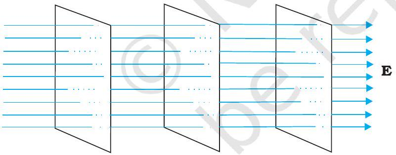
चित्र $2.10$ किसी एकसमान विद्युत क्षेत्र के लिए समविभव पृष्ठ।

किसी अक्ष के अनुदिश, मान लीजिए $x$-अक्ष के अनुदिश किसी एकसमान विद्युत क्षेत्र $\mathbf{E}$ के लिए, समविभव पृष्ठ $x$-अक्ष के अभिलंबवत, अर्थात $y-z$ तल के समांतर तल होते हैं (चित्र 2.10)। चित्र $2.11$ में (a) किसी वैद्युत द्विध्रुव तथा (b) में दो सर्वसम धनावेशों के कारण समविभव पृष्ठ तथा वैद्युत रेखाएँ दर्शाई गई हैं।

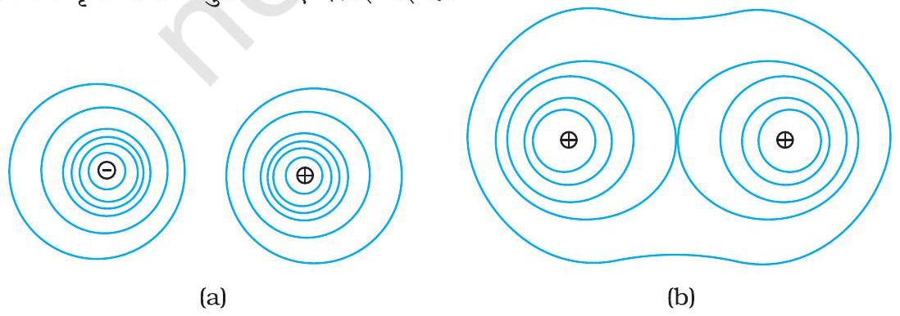
चित्र 2.11(a) किसी वैद्युत द्विध्रुव तथा
(b) दो सर्वसम धनावेशों के क्षेत्र के लिए कुछ समविभव पृष्ठ।

### 2.6.1 विद्युत क्षेत्र तथा वैद्युत विभव में संबंध

एक-दूसरे के पास रखे दो समविभव पृष्ठों A तथा B (चित्र 2.12) जिनके विभवों के मान क्रमश: $V$ तथा $V+\delta V$ हैं, यहाँ $\delta V$ विद्युत क्षेत्र $\mathbf{E}$ की दिशा में $V$ में परिवर्तन है। मान लीजिए पृष्ठ B पर कोई बिंदु P है। मान लीजिए पृष्ठ A की बिंदु P से लंबवत दूरी $\delta l$ है। यह भी मानिए कि विद्युत क्षेत्र के विरुद्ध कोई एकांक धनावेश इस लंब के अनुदिश पृष्ठ B से पृष्ठ A पर ले जाया जाता है। इस प्रक्रिया में किया गया कार्य $|\mathbf{E}| \delta l$ है।

यह कार्य विभवांतर $V_{A}-V_{B}$ के बराबर है। इस प्रकार

$$
|\mathbf{E}| \delta l=V-(V+\delta V)=-\delta V
$$

अर्थात $|\mathbf{E}|=-\frac{\delta V}{\delta l}$
स्पष्ट है कि $\delta V$ ऋणात्मक है, $\delta V=-|\delta V|$ हम समीकरण (2.20) को दुबारा इस प्रकार लिख सकते हैं :

$$
|\mathbf{E}|=-\frac{\delta V}{\delta l}=+\frac{|\delta V|}{\delta l}
$$

इस प्रकार हम विद्युत क्षेत्र तथा वैद्युत विभव से संबंधित दो महत्वपूर्ण निष्कर्षों पर पहुँचते हैं -

(i) विद्युत क्षेत्र उस दिशा में होता है जहाँ विभव में सर्वाधिक ह्रास होता है।
(ii) किसी बिंदु पर विद्युत क्षेत्र का परिमाण, उस बिंदु पर समविभव पृष्ठ के अभिलंबवत विभव के परिमाण में प्रति एकांक विस्थापन परिवर्तन द्वारा व्यक्त किया जाता है।

## $2.7$ आवेशों के निकाय की स्थितिज ऊर्जा

पहले हम एक सरल प्रकरण पर विचार करते हैं जिसमें किसी मूल बिंदु के सापेक्ष $\mathbf{r}_{1}$ तथा $\mathbf{r}_{2}$ स्थिति सदिशों वाले दो आवेश $q_{1}$ तथा $q_{2}$ हैं। आइए इस विन्यास के निर्माण में किए गए कार्य (बाह्य) का परिकलन करें। इसका अर्थ यह है कि पहले आरंभ में हम दोनों आवेशों $q_{1}$ तथा $q_{2}$ को अनंत पर मानें तथा बाद में बाह्य एजेंसी द्वारा उन्हें इनकी वर्तमान स्थितियों तक लाने में किए गए कार्य का परिकलन करें। मान लीजिए, हम पहले आवेश $q_{1}$ को अनंत से बिंदु $\mathbf{r}_{1}$ तक लाते हैं। चूँकि इस स्थिति में कोई बाह्य क्षेत्र नहीं है, जिसके विरुद्ध कार्य करने की आवश्यकता पड़े, अतः $q_{1}$ को अनंत से $\mathbf{r}_{1}$ तक लाने में किया गया कार्य शून्य है। यह आवेश दिक्स्थान में एक विभव $V_{1}$ उत्पन्न करता है

$$
V_{1}=\frac{1}{4 \pi \varepsilon_{o}} \frac{q_{1}}{r_{1 \mathrm{P}}}
$$

यहाँ $r_{1 \mathrm{P}}$ दिक्स्थान के किसी बिंदु P की $q_{1}$ की स्थिति से दूरी है। विभव की परिभाषा से, आवेश $q_{2}$ को अनंत से बिंदु $\mathbf{r}_{2}$ तक लाने में किया गया कार्य $\mathbf{r}_{2}$ पर $q_{1}$ द्वारा विभव का $q_{2}$ गुना होता है-

$$
q_{2} \text { पर किया गया कार्य }=\frac{1}{4 \pi \varepsilon_{o}} \frac{q_{1} q_{2}}{r_{12}}
$$

## स्थिरवैद्युत विभव तथा धारिता

यहाँ $r_{12}$ बिंदु $1$ तथा $2$ के बीच की दूरी है।
चूँकि स्थिरवैद्युत बल संरक्षी है, यह कार्य निकाय की स्थितिज ऊर्जा के रूप में संचित हो जाता है। अतः दो आवेशों $q_{1}$ तथा $q_{2}$ के निकाय की स्थितिज ऊर्जा

$$
U=\frac{1}{4 \pi \varepsilon_{o}} \frac{q_{1} q_{2}}{r_{12}}
$$

स्पष्ट है, कि यदि पहले $q_{2}$ को उसकी वर्तमान स्थिति पर लाया जाता और तत्पश्चात $q_{1}$ को लाया जाता, तो भी स्थितिज ऊर्जा $U$ इतनी ही होती। अधिक व्यापक रूप में, समीकरण (2.22) में दर्शाया गया स्थितिज ऊर्जा के लिए व्यंजक, सदैव ही अपरिवर्तित रहता है, चाहे निर्दिष्ट स्थानों पर आवेशों को किसी भी प्रकार से लाया जाए। यह स्थिरवैद्युत बलों के लिए कार्य की पथ-स्वतंत्रता के कारण होता है।

समीकरण (2.22) $q_{1}$ तथा $q_{2}$ के किसी भी चिह्न के लिए सत्य है। यदि $q_{1} q_{2}>0$ है, तो स्थितिज ऊर्जा धनात्मक होती है। यह अपेक्षित भी है, क्योंकि सजातीय आवेशों $\left(q_{1} q_{2}\right.$ $>0$ ) के लिए, स्थिरवैद्युत बल प्रतिकर्षी होता है तथा आवेशों को अनंत से किसी परिमित दूरी तक इस प्रतिकर्षी बल के विरुद्ध लाने में धनात्मक कार्य करना पड़ता है। इसके विपरीत, विजातीय आवेशों ( $q_{1} q_{2}<0$ ) के लिए स्थिरवैद्युत बल आकर्षी होता है। इस प्रकरण में, आवेशों को उनकी दी गई स्थितियों से अनंत तक इस आकर्षी बल के विरुद्ध ले जाने में धनात्मक कार्य करना पड़ता है। दूसरे शब्दों में, उत्क्रमित पथ (अनंत से वर्तमान स्थितियों तक) के लिए कार्य के ऋणात्मक परिमाण की आवश्यकता होती है जिसके कारण स्थितिज ऊर्जा ऋणात्मक होती है।

समीकरण (2.22) को आसानी से आवेशों के कितनी भी संख्या के निकाय के लिए व्यापक बनाया जा सकता है। आइए, अब हम तीन आवेशों $q_{1}, q_{2}$ तथा $q_{3}$ जो क्रमशः $\mathbf{r}_{1}, \mathbf{r}_{2}$ तथा $\mathbf{r}_{3}$ पर स्थित हैं, के निकाय की स्थितिज ऊर्जा परिकलित करें। पहले $q_{1}$ को अनंत से $\mathbf{r}_{1}$ तक लाने में कोई कार्य नहीं होता। तत्पश्चात हम $q_{2}$ को अनंत से $\mathbf{r}_{2}$ तक लाते हैं। पहले की ही भाँति इस चरण में किया गया कार्य

$$
q_{2} V_{1}\left(\mathbf{r}_{2}\right)=\frac{1}{4 \pi \varepsilon_{o}} \frac{q_{1} q_{2}}{r_{12}}
$$

आवेश $q_{1}$ तथा $q_{2}$ अपने चारों ओर विभव उत्पन्न करते हैं, किसी बिंदु P पर यह विभव

$$
V_{1,2}=\frac{1}{4 \pi \varepsilon_{o}}\left(\frac{q_{1}}{r_{1 \mathrm{P}}}+\frac{q_{2}}{r_{2 \mathrm{P}}}\right)
$$

आवेश $q_{3}$ को अनंत से बिंदु $\mathbf{r}_{3}$ तक लाने में किया गया कार्य $\mathbf{r}_{3}$ पर $V_{1,2}$ का $q_{3}$ गुना होता है।

$$
\text { अत: } q_{3} V_{1,2}\left(\mathbf{r}_{3}\right)=\frac{1}{4 \pi \varepsilon_{o}}\left(\frac{q_{1} q_{3}}{r_{13}}+\frac{q_{2} q_{3}}{r_{23}}\right)
$$

आवेशों को उनकी दी गई स्थितियों पर एकत्र करने में किया गया कुल कार्य विभिन्न चरणों [समीकरण (2.23) तथा समीकरण (2.25)] में किए गए कार्यों का योग करने पर प्राप्त होता है।

$$
U=\frac{1}{4 \pi \varepsilon_{o}}\left(\frac{q_{1} q_{2}}{r_{12}}+\frac{q_{1} q_{3}}{r_{13}}+\frac{q_{2} q_{3}}{r_{23}}\right)
$$

यहाँ फिर, स्थिरवैद्युत बल की संरक्षी प्रकृति के कारण (अथवा तुल्य रूप में, कार्य की पथ-स्वतंत्रता) स्थितिज ऊर्जा $U$ को अंतिम व्यंजक, समीकरण (2.26), विन्यास को किस प्रकार संयोजित किया गया है, उसके क्रम पर निर्भर नहीं करता। स्थितिज ऊर्जा विन्यास की

## - भौतिकी

वर्तमान अवस्था का अभिलाक्षणिक गुण होता है, यह इस बात पर निर्भर नहीं करता कि इस विन्यास को किस प्रकार प्राप्त किया गया है।

उदाहरण $2.4$ चित्र $2.15$ में दर्शाए अनुसार चार आवेश भुजा $d$ वाले किसी वर्ग ABCD के शीर्षों पर व्यवस्थित किए गए हैं। (a) इस व्यवस्था को एक साथ बनाने में किया गया कार्य ज्ञात कीजिए। (b) कोई आवेश $q_{0}$ वर्ग के केंद्र E पर लाया जाता है तथा चारों आवेश अपने शीर्षों पर दृढ़ रहते हैं। ऐसा करने के लिए कितना अतिरिक्त कार्य करना पड़ता है?
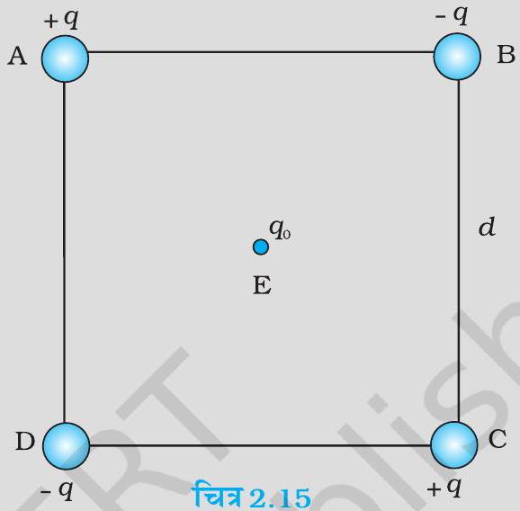

हल

(a) चूँकि किया गया कार्य आवेशों की अंतिम व्यवस्था पर निर्भर करता है, उन्हें किस प्रकार एक साथ लाया गया है, पर निर्भर नहीं करता, हम आवेशों को $\mathrm{A}, \mathrm{B}, \mathrm{C}$, तथा D पर रखने के एक ढंग के लिए आवश्यक कार्य का परिकलन करेंगे। मान लीजिए पहले आवेश $+q$ को A पर लाया जाता है, तत्पश्चात आवेशों $-q,+q$ तथा $-q$ को क्रमशः B, C तथा D पर लाया जाता है। किए गए कुल कार्यों का परिकलन निम्नलिखित चरणों में किया जा सकता है :
(i) आवेश $+q$ को A पर लाने में किया गया कार्य जब कहीं भी कोई आवेश नहीं है: यह शून्य है।
(ii) आवेश $-q$ को B पर लाने में किया गया कार्य जब $+q$ शीर्ष A पर है। यह ( B पर आवेश $) \times(\mathrm{A}$ पर आवेश $+q$ के कारण बिंदु B पर स्थिरवैद्युत विभव)
$$
=-q \times\left(\frac{q}{4 \pi \varepsilon_{o} d}\right)=-\frac{q^{2}}{4 \pi \varepsilon_{o} d}
$$
(iii) आवेश $+q$ को C पर लाने में किया गया कार्य जब $+q$ शीर्ष A पर तथा $-q$ शीर्ष B पर है। यह (C पर आवेश) $\times(\mathrm{A}$ तथा B पर आवेशों के कारण C पर विभव)
$$
\begin{aligned}
& =+q\left(\frac{+q}{4 \pi \varepsilon_{o} d \sqrt{2}}+\frac{-q}{4 \pi \varepsilon_{o} d}\right) \\
& =\frac{-q^{2}}{4 \pi \varepsilon_{o} d} 1-\frac{1}{\sqrt{2}}
\end{aligned}
$$
(iv) आवेश $-q$ को D पर लाने में किया गया कार्य जब $+q$ शीर्ष A पर, $-q$ शीर्ष B पर तथा $+q$ शीर्ष C पर हैं। यह ( D पर आवेश) $\times(\mathrm{A}, \mathrm{B}$ तथा C पर आवेशों के कारण D पर विभव)
$$
\begin{aligned}
& =-q\left(\frac{+q}{4 \pi \varepsilon_{o} d}+\frac{-q}{4 \pi \varepsilon_{o} d \sqrt{2}}+\frac{q}{4 \pi \varepsilon_{o} d}\right) \\
& =\frac{-q^{2}}{4 \pi \varepsilon_{o} d} 2-\frac{1}{\sqrt{2}}
\end{aligned}
$$

## स्थिरवैद्युत विभव तथा धारिता

चारों चरणों (i), (ii), (iii) एवं (iv) के कार्यों को जोड़ने पर, आवश्यक कुल कार्य

$$
\begin{aligned}
& =\frac{-q^{2}}{4 \pi \varepsilon_{o} d}\left\{(0)+(1)+\left(1-\frac{1}{\sqrt{2}}\right)+\left(2-\frac{1}{\sqrt{2}}\right)\right\} \\
& =\frac{-q^{2}}{4 \pi \varepsilon_{o} d}(4-\sqrt{2})
\end{aligned}
$$

यह कार्य केवल आवेशों की व्यवस्था पर निर्भर करता है, इस बात पर निर्भर नहीं करता कि इन्हें कैसे व्यवस्थित किया गया है। परिभाषा के अनुसार यह आवेशों की कुल स्थिरवैद्युत ऊर्जा है।
(विद्यार्थी अपनी इच्छानुसार आवेशों को किसी भी अन्य क्रम में लेकर इसी कार्य/ऊर्जा को परिकलित करने का प्रयास कर सकते हैं और यह देखकर अपने को संतुष्ट कर सकते हैं कि हर प्रकरण में ऊर्जा समान रहती है।)
(b) जबकि चारों आवेश $\mathrm{A}, \mathrm{B}, \mathrm{C}$ तथा D पर हैं, आवेश $q_{0}$ को बिंदु E पर लाने में किया गया अतिरिक्त कार्य $q_{0} \times(\mathrm{A}, \mathrm{B}, \mathrm{C}$ तथा D पर हैं आवेशों के कारण E पर स्थिरवैद्युत विभव) के बराबर है। स्पष्ट रूप से बिंदु E पर स्थिरवैद्युत विभव शून्य है, क्योंकि A तथा C पर आवेशों के कारण विभव B तथा D द्वारा निरस्त हो जाते हैं। अतः बिंदु E तक किसी भी आवेश को लाने में कोई कार्य करना नहीं पड़ता है।

## $2.8$ बाह्य क्षेत्र में स्थितिज ऊर्जा

### 2.8.1 एकल आवेश की स्थितिज ऊर्जा

अनुभाग $2.7$ में विद्युत क्षेत्र के स्रोत का विशेष उल्लेख किया गया-आवेश तथा उनकी स्थितियाँ-तथा उन आवेशों के निकाय की स्थितिज ऊर्जा निर्धारित की गई। इस अनुभाग में हम इससे संबंधित परंतु भिन्न प्रश्न पूछते हैं। किसी दिए गए क्षेत्र में किसी आवेश $q$ की स्थितिज ऊर्जा क्या होती है? वास्तव में, यह प्रश्न आरंभ बिंदु था जो हमें स्थिरवैद्युत विभव की धारणा की ओर ले गया था (देखिए अनुभाग $2.1$ तथा 2.2)। परंतु यही प्रश्न हम फिर दुबारा यह स्पष्ट करने के लिए पूछ रहे हैं कि किस रूप में यह अनुभाग $2.7$ में की गई चर्चा से भिन्न है।

यहाँ प्रमुख अंतर यह है कि अब हम यहाँ पर किसी बाह्य क्षेत्र में आवेश (अथवा आवेशों) की स्थितिज ऊर्जा के विषय में चर्चा कर रहे हैं। इसमें बाह्य क्षेत्र $\mathbf{E}$ उन दिए गए आवेशों द्वारा उत्पन्न नहीं किया जाता जिनकी स्थितिज ऊर्जा का हम परिकलन करना चाहते हैं। विद्युत क्षेत्र $\mathbf{E}$ उस स्रोत द्वारा उत्पन्न किया जाता है जो दिए गए आवेश (आवेशों) की दृष्टि से बाह्य होता है। बाह्य स्रोत ज्ञात हो सकता है परंतु प्राय: ये स्रोत अज्ञात अथवा अनिर्दिष्ट होते हैं, जो कुछ भी यहाँ निर्दिष्ट होता है वह है विद्युत क्षेत्र $\mathbf{E}$ अथवा बाह्य स्रोतों के कारण स्थिरवैद्युत विभव $V$ । हम यह मानते हैं कि आवेश $q$ बाह्य क्षेत्र उत्पन्न करने वाले स्रोतों को सार्थक रूप से प्रभावित नहीं करता। यदि $q$ अत्यधिक छोटा है, तो यह सत्य है अथवा कुछ अनिर्दिष्ट बलों के प्रभाव में बाह्य स्रोतों को दृढ़रखा जा सकता है। यदि $q$ परिमित है तो भी इसके बाह्य स्रोतों पर प्रभाव की उन परिस्थितियों में उपेक्षा की जा सकती है, जिनमें बहुत दूर अनंत पर स्थित अत्यधिक प्रबल स्रोत हमारी रुचि के क्षेत्र में कोई परिमित क्षेत्र $\mathbf{E}$ उत्पन्न करता है। फिर ध्यान दीजिए, हमारी रुचि किसी बाह्य क्षेत्र में, दिए गए आवेश $q$ (तत्पश्चात आवेशों के किसी निकाय) की स्थितिज ऊर्जा निर्धारित करने में है; हमें बाह्य विद्युत क्षेत्र उत्पन्न करने वाले स्रोत की स्थितिज ऊर्जा में कोई रुचि नहीं है।

बाह्य विद्युत क्षेत्र $\mathbf{E}$ तथा तदनुरूपी बाह्य विभव $V$ का मान एक बिंदु से दूसरे बिंदु पर जाने में परिवर्तित हो सकता है। परिभाषा के अनुसार, किसी बिंदु P पर विभव $V$ एकांक धनावेश को अनंत से उस बिंदु P तक लाने में किए गए कार्य के बराबर होता है (हम निरंतर ही अनंत पर विभव

## - भौतिकी

को शून्य मानते रहेंगे)। अतः किसी आवेश $q$ को अनंत से बाह्य क्षेत्र के किसी बिंदु P तक लाने में किया गया कार्य $q V$ होता है। यह कार्य आवेश $q$ में स्थितिज ऊर्जा के रूप में संचित हो जाता है। यदि बिंदु P का किसी मूल बिंदु के सापेक्ष कोई स्थिति सदिश $\mathbf{r}$ है, तो हम यह लिख सकते हैं कि:

किसी बाह्य क्षेत्र में आवेश $q$ की r पर स्थितिज ऊर्जा

$$
=q V(\mathbf{r})
$$

यहाँ $V(\mathbf{r})$ बिंदु $\mathbf{r}$ पर बाह्य विभव है।
इस प्रकार, यदि आवेश $q=e=1.6 \times 10^{-19} \mathrm{C}$ का कोई इलेक्ट्रॉन किसी विभवान्तर $\Delta V=1$ वोल्ट द्वारा त्वरित किया जाता है, तो वह ऊर्जा $q \Delta V=1.6 \times 10^{-19} \mathrm{~J}$ अर्जित करेगा। ऊर्जा के इस मात्रक को $1$ इलेक्ट्रॉन वोल्ट, अर्थात $1 \mathrm{eV}=1.6 \times 10^{-19} \mathrm{~J}$ के रूप में परिभाषित करते हैं। eV पर आधारित मात्रकों का सर्वाधिक उपयोग आण्विक, नाभिकीय तथा कण भौतिकी में किया जाता है, $\left(1 \mathrm{keV}=10^{3} \mathrm{eV}=1.6 \times 10^{-16} \mathrm{~J}, 1 \mathrm{MeV}=10^{6} \mathrm{eV}=1.6 \times 10^{-13} \mathrm{~J}, 1 \mathrm{GeV}=10^{9} \mathrm{eV}\right.$ $=1.6 \times 10^{-10} \mathrm{~J}$ तथा $1 \mathrm{TeV}=10^{12} \mathrm{eV}=1.6 \times 10^{-7} \mathrm{~J}$ ) [इसे भौतिकी भाग I कक्षा $11$ पृष्ठ $119$ सारणी $6.1$ में पहले ही परिभाषित किया जा चुका है।]

### 2.8.2 किसी बाह्य क्षेत्र में दो आवेशों के निकाय की स्थितिज ऊर्जा

अब हम यह पूछते हैं : किसी बाह्य क्षेत्र में क्रमशः $\mathbf{r}_{1}$ तथा $\mathbf{r}_{2}$ पर स्थित दो आवेशों $q_{1}$ तथा $q_{2}$ की स्थितिज ऊर्जा क्या होती है? इस विन्यास का निर्माण करने में किए गए कार्य का परिकलन करने के लिए आइए यह कल्पना करें कि पहले हम आवेश $q_{1}$ को अनंत से $\mathbf{r}_{1}$ तक लाते हैं। समीकरण (2.27) के अनुसार, इस चरण में किया गया कार्य $q_{1} V\left(\mathbf{r}_{1}\right)$ है। अब हम आवेश $q_{2}$ को $\mathbf{r}_{2}$ तक लाने में किए जाने वाले कार्य पर विचार करते हैं। इस चरण में केवल बाह्य क्षेत्र $\mathbf{E}$ के विरुद्ध ही कार्य नहीं होता, वरन् $q_{1}$ के कारण क्षेत्र के विरुद्ध भी कार्य करना होता है। अतः
$q_{2}$ पर बाह्य क्षेत्र के विरुद्ध किया गया कार्य

$$
=q_{2} V\left(\mathbf{r}_{2}\right)
$$

$q_{2}$ पर $q_{1}$ के कारण क्षेत्र के विरुद्ध किया गया कार्य

$$
=\frac{q_{1} q_{2}}{4 \pi \varepsilon_{o} r_{12}}
$$

यहाँ $r_{12}$ आवेशों $q_{1}$ तथा $q_{2}$ के बीच की दूरी है। ऊपर हमने समीकरण (2.27) तथा (2.22) का उपयोग किया है। क्षेत्रों के लिए अध्यारोपण सिद्धांत द्वारा हम $q_{2}$ पर दो क्षेत्रों $(\mathbf{E})$ तथा $q_{1}$ के कारण क्षेत्र) के विरुद्ध किए गए कार्यों को जोड़ते हैं। अतः
$q_{2}$ को $\mathbf{r}_{2}$ तक लाने में किया गया कार्य

$$
=q_{2} V\left(\mathbf{r}_{2}\right)+\frac{q_{1} q_{2}}{4 \pi \varepsilon_{o} r_{12}}
$$

इस प्रकार,
निकाय की स्थितिज ऊर्जा
= विन्यास के निर्माण में किया गया कार्य

$$
=q_{1} V\left(\mathbf{r}_{1}\right)+q_{2} V\left(\mathbf{r}_{2}\right)+\frac{q_{1} q_{2}}{4 \pi \varepsilon_{0} r_{12}}
$$

## उदाहरण $2.5$

(a) दो आवेशों $7 \mu \mathrm{C}$ तथा $-2 \mu \mathrm{C}$ जो क्रमशः $(-9 \mathrm{~cm}, 0,0)$ तथा $(9 \mathrm{~cm}, 0,0)$ पर स्थित हैं, के ऐसे निकाय, जिस पर कोई बाह्य क्षेत्र आरोपित नहीं है, की स्थिरवैद्युत स्थितिज की ऊर्जा ज्ञात कीजिए।
(b) दोनों आवेशों को एक-दूसरे से अनंत दूरी तक पृथक करने के लिए कितने कार्य की आवश्यकता होगी?

## स्थिरवैद्युत विभव   तथा धारिता

(c) माना कि अब इस आवेश निकाय को किसी बाह्य विद्युत क्षेत्र $E=A\left(1 / r^{2}\right)$; $A=9 \times 10^{5} \mathrm{Ne}^{-1} \mathrm{~m}^{2}$ में रखा गया है। इस विन्यास की स्थिरवैद्युत ऊर्जा का परिकलन करें।

हल

(a) $U=\frac{1}{4 \pi \varepsilon_{o}} \frac{q_{1} q_{2}}{r}=9 \times 10^{9} \times \frac{7 \times(-2) \times 10^{-12}}{0.18}=-0.7 \mathrm{~J}$
(b) $W=U_{2}-U_{1}=0-U=0-(-0.7)=0.7 \mathrm{~J}$
(c) दो आवेशों की पारस्परिक अन्योन्य ऊर्जा अपरिवर्तित रहती है। साथ ही यहाँ पर दो आवेशों की बाह्य विद्युत क्षेत्र के साथ अन्योन्य क्रिया की ऊर्जा भी है। अतः हम यह पाते हैं कि
$$
q_{1} V\left(\mathbf{r}_{1}\right)+q_{2} V\left(\mathbf{r}_{2}\right)=A \frac{7 \mu \mathrm{C}}{0.09 \mathrm{~m}}+A \frac{-2 \mu \mathrm{C}}{0.09 \mathrm{~m}}
$$
तथा नेट स्थिरवैद्युत ऊर्जा का मान है
$$
\begin{array}{r}
q_{1} V\left(\mathbf{r}_{1}\right)+q_{2} V\left(\mathbf{r}_{2}\right)+\frac{q_{1} q_{2}}{4 \pi \varepsilon_{0} r_{12}}=A \frac{7 \mu \mathrm{C}}{0.09 \mathrm{~m}}+A \frac{-2 \mu \mathrm{C}}{0.09 \mathrm{~m}}-0.7 \mathrm{~J} \\
=70-20-0.7=49.3 \mathrm{~J}
\end{array}
$$

### 2.8.3 बाह्य क्षेत्र में द्विध्रुव की स्थितिज ऊर्जा

चित्र $2.16$ में दर्शाए अनुसार किसी एकसमान विद्युत क्षेत्र $\mathbf{E}$ में रखे आवेशों $q_{1}=+q$ तथा $q_{2}=-q$ के द्विध्रुव पर विचार कीजिए।

जैसाकि हमने पिछले अध्याय में देखा, एकसमान विद्युत क्षेत्र में द्विध्रुव किसी नेट बल का अनुभव नहीं करता; परंतु एक बल आघूर्ण का अनुभव करता है जो इस प्रकार है :

$$
\tau=\mathbf{p} \times \mathbf{E}
$$

यह इसमें घूर्णन की प्रवृत्ति उत्पन्न करेगा (जब तक $\mathbf{p}$ तथा $\mathbf{E}$ एक-दूसरे के समांतर अथवा प्रतिसमांतर नहीं हैं)। मान लीजिए कोई बाह्य बल आघूर्ण $\tau_{\text {बाह्य }}$ इस प्रकार लगाया जाता है कि वह इस बल आघूर्ण को ठीक-ठीक उदासीन कर देता है और इसे कागज़ के तल बिना किसी कोणीय त्वरण के अत्यंत सूक्ष्म कोणीय चाल से कोण $\theta_{0}$ से कोण $\theta_{1}$ पर घूर्णित कर देता है। इस बाह्य बल आघूर्ण द्वारा किया गया कार्य

$$
\begin{aligned}
& W=\int_{\theta_{0}}^{\theta_{1}} \tau_{\text {बाह्य }}(\theta) d \theta=\int_{\theta_{0}}^{\theta_{1}} p E \sin \theta d \theta \\
& =p E\left(\cos \theta_{0}-\cos \theta_{1}\right)
\end{aligned}
$$

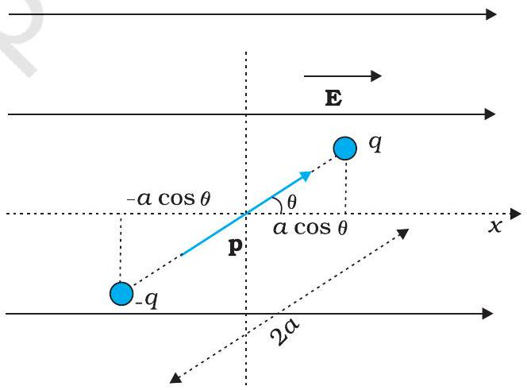
चित्र $2.16$ किसी विद्युत द्विध्रुव की एकसमान बाह्य क्षेत्र में स्थितिज ऊर्जा।

यह कार्य निकाय में स्थितिज ऊर्जा के रूप में संचित हो जाता है। तब हम स्थितिज ऊर्जा $U(\theta)$ को द्विध्रुव के किसी झुकाव $\theta$ से संबद्ध कर सकते हैं। अन्य स्थितिज ऊर्जाओं की भाँति यहाँ हमें उस कोण के चयन की स्वतंत्रता है जिस पर विभव स्थितिज ऊर्जा $U$ शून्य माना जाए। प्राकृतिक चयन के अनुसार $\theta_{0}=\pi / 2$ लिया जाना चाहिए। (इसका स्पष्टीकरण चर्चा के अंत में दिया गया है।) तब हम यह लिख सकते हैं,

$$
U(\theta)=p E\left(\cos \frac{\pi}{2}-\cos \theta\right)=-p E \cos \theta=-\mathbf{p} \cdot \mathbf{E}
$$

## भौतिकी

वैकल्पिक रूप से इस व्यंजक को समीकरण (2.29) से भी समझा जा सकता है। हम समीकरण (2.29) का प्रयोग दो आवेशों $+q$ तथा $-q$ के वर्तमान निकाय के लिए करते हैं। तब स्थितिज ऊर्जा के व्यंजक को इस प्रकार व्यक्त किया जा सकता है :

$$
U^{\prime}(\theta)=q\left[V\left(\mathbf{r}_{1}\right)-V\left(\mathbf{r}_{2}\right)\right]-\frac{q^{2}}{4 \pi \varepsilon_{0} \times 2 a}
$$

यहाँ $\mathbf{r}_{1}$ तथा $\mathbf{r}_{2}$ दो आवेशों $+q$ तथा $-q$ के स्थिति सदिशों को दर्शाते हैं। अब $\mathbf{r}_{1}$ तथा $\mathbf{r}_{2}$ के बीच विभवांतर एकांक धनावेश को क्षेत्र के विरुद्ध $\mathbf{r}_{2}$ से $\mathbf{r}_{1}$ तक लाने में किए गए कार्य के बराबर है। बल के समांतर विस्थापन $2 a \cos \theta$ है। इस प्रकार $\left[V\left(\mathbf{r}_{1}\right)-\mathrm{V}\left(\mathbf{r}_{2}\right)\right]=-E \times 2 a \cos \theta$, इस प्रकार, हमें प्राप्त होता है। चूँकि एक नियतांक स्थितिज ऊर्जा के लिए नगण्य है, हम समीकरण (2.34) में दूसरे पद को छोड़ सकते हैं। तब यह समीकरण (2.32) बन जाता है।

$$
U^{\prime}(\theta)=-p E \cos \theta-\frac{q^{2}}{4 \pi \varepsilon_{0} \times 2 a}=-\mathbf{p} \cdot \mathbf{E}-\frac{q^{2}}{4 \pi \varepsilon_{0} \times 2 a}
$$

ध्यान दीजिए कि $U^{\prime}(\theta)$ तथा $U(\theta)$ में एक राशि का अंतर है जो किसी दिए गए द्विध्रुव के लिए मात्र एक नियतांक है। स्थितिज ऊर्जा के लिए नियतांक महत्वपूर्ण नहीं है, अतः समीकरण (2.34) से हम द्वितीय पद को छोड़ सकते हैं। इस प्रकार से यह समीकरण (2.32) के रूप में आ जाता है।

अब हम यह समझ सकते हैं कि हमने $\theta_{0}=\pi / 2$ क्यों लिया था। इस प्रकरण में $+q$ तथा $-q$ को बाह्य क्षेत्र E के विरुद्ध लाने में किए जाने वाले कार्य समान तथा विपरीत हैं और निरासित हो जाते हैं, अर्थात $q\left[V\left(\mathbf{r}_{1}\right)-V\left(\mathbf{r}_{2}\right)\right]=0$

उदाहरण $2.6$ एक पदार्थ के अणु में $10^{-29} \mathrm{~cm}$ का स्थायी वैद्युत द्विध्रुव आघूर्ण है। $10^{6} \mathrm{~V} \mathrm{~m}^{-1}$ परिमाण के एक शक्तिशाली स्थिरवैद्युत क्षेत्र को लगाकर इस पदार्थ के एक मोल (निम्न ताप पर) को ध्रुवित किया गया है। अचानक क्षेत्र की दिशा $60^{\circ}$ कोण से बदल दी जाती है। क्षेत्र की नयी दिशा में द्विध्रुवों को पंक्तिबद्ध करने में उन्मुक्त ऊष्मा ऊर्जा का आकलन कीजिए। सुविधा के लिए नमूने का ध्रुवण $100 \%$ माना जा सकता है।
हल यहाँ प्रत्येक अणु का द्विध्रुव आघूर्ण $=10^{-29} \mathrm{C} \mathrm{m}$
चूँकि किसी पदार्थ के एक मोल में $6 \times 10^{23}$ अणु होते हैं, अतः सारे अणुओं का कुल द्विध्रुव आघूर्ण, $p=6 \times 10^{23} \times 10^{-29} \mathrm{C} \mathrm{m}=6 \times 10^{-6} \mathrm{C} \mathrm{m}$
आरंभिक स्थितिज ऊर्जा $U_{i}=-p E \cos \theta=-6 \times 10^{-6} \times 10^{6} \cos 0^{\circ}=-6 \mathrm{~J}$
अंतिम स्थितिज ऊर्जा (जब $\theta=60^{\circ}$ ), $U_{f}=-6 \times 10^{-6} \times 10^{6} \cos 60^{\circ}=-3 \mathrm{~J}$
स्थितिज ऊर्जा में अंतर $=-3 \mathrm{~J}-(-6 \mathrm{~J})=3 \mathrm{~J}$
अतः, यहाँ ऊर्जा की हानि होती है। पदार्थ द्वारा द्विध्रुवों को पंक्तिबद्ध करने में ऊष्मा के रूप में यह ऊर्जा मुक्त होनी चाहिए।

## $2.9$ चालक-स्थिरवैद्युतिकी

अध्याय $1$ में चालकों तथा विद्युतरोधी पदार्थों का संक्षेप में वर्णन किया गया था। चालकों में गतिशील आवेश वाहक होते हैं। धात्विक चालकों में ये वाहक इलेक्ट्रॉन होते हैं। धातुओं में, बाह्य (संयोजी) इलेक्ट्रॉन अपने परमाणु से अलग होकर गति करने के लिए मुक्त होते हैं। ये इलेक्ट्रॉन धातु के अंदर गति करने के लिए मुक्त होते हैं परंतु धातु से मुक्त नहीं हो सकते। ये मुक्त इलेक्ट्रॉन एक प्रकार की 'गैस' की भाँति आपस में परस्पर तथा आयनों से टकराते हैं तथा विभिन्न दिशाओं में यादृच्छिक गति करते हैं। किसी बाह्य विद्युत क्षेत्र में, ये क्षेत्र की दिशा के विपरीत बहते हैं। नाभिकों के इस प्रकार धन आयन तथा परिबद्ध इलेक्ट्रॉन अपनी नियत स्थितियों पर ही दृढ़ रहते हैं। अपघटनी चालकों में धनायन तथा ऋणायन दोनों ही आवेश वाहक होते हैं; परंतु इस प्रकरण में स्थिति अधिक जटिल

## स्थिरवैद्युत विभव तथा धारिता

होती है-आवेश वाहकों की गति बाह्य विद्युत क्षेत्र के साथ-साथ रासायनिक बलों (अध्याय $3$ देखिए) द्वारा भी प्रभावित होती है। यहाँ हम अपनी चर्चा ठोस धात्विक चालकों तक ही सीमित रखेंगे। आइए चालक-स्थिरवैद्युतिकी से संबंधित कुछ महत्वपूर्ण परिणामों पर ध्यान दें।

## 1. चालक के भीतर स्थिरवैद्युत क्षेत्र शून्य होता है

किसी उदासीन अथवा आवेशित चालक पर विचार कीजिए। यहाँ कोई बाह्य स्थिरवैद्युत क्षेत्र भी हो सकता है। स्थैतिक स्थिति में, जब चालक के भीतर अथवा उसके पृष्ठ पर कोई विद्युत धारा नहीं होती, तब चालक के भीतर हर स्थान पर स्थिरवैद्युत क्षेत्र शून्य होता है। इस तथ्य को किसी चालक को परिभाषित करने के गुण के रूप में माना जा सकता है। चालक में मुक्त इलेक्ट्रॉन होते हैं। जब तक विद्युत क्षेत्र शून्य नहीं है, मुक्त आवेश वाहक एक बल का अनुभव करेंगे और उनमें बहाव होगा। स्थैतिक स्थिति में मुक्त इलेक्ट्रॉन स्वयं को इस प्रकार वितरित कर लेते हैं कि चालक के भीतर हर स्थान पर विद्युत क्षेत्र शून्य होता है। किसी चालक के भीतर स्थिरवैद्युत क्षेत्र शून्य होता है।

## 2. आवेशित चालक के पृष्ठ पर, पृष्ठ के प्रत्येक बिंदु पर स्थिरवैद्युत क्षेत्र अभिलंबवत होना चाहिए

यदि $\mathbf{E}$ पृष्ठ के अभिलंबवत नहीं है तो उसका पृष्ठ के अनुदिश कोई शून्येतर घटक होगा। तब पृष्ठ के मुक्त इलेक्ट्रॉन पृष्ठ पर किसी बल का अनुभव करेंगे और गति करेंगे। अतः, स्थैतिक स्थिति में $\mathbf{E}$ का कोई स्पर्श रेखीय घटक नहीं होना चाहिए। इस प्रकार, किसी आवेशित चालक के पृष्ठ पर स्थिरवैद्युत क्षेत्र पृष्ठ के हर बिंदु पर पृष्ठ के अभिलंबवत होना चाहिए। (किसी चालक के लिए जिस पर कोई पृष्ठीय आवेश घनत्व नहीं है, उसके पृष्ठ तक पर भी क्षेत्र शून्य होता है।) परिणाम $5$ देखिए।

## 3. स्थैतिक स्थिति में किसी चालक के अभ्यंतर में कोई अतिरिक्त आवेश नहीं हो सकता

किसी उदासीन चालक के प्रत्येक लघु आयतन अथवा पृष्ठीय अवयव में धनात्मक तथा ऋणात्मक आवेश समान मात्रा में होते हैं। जब किसी चालक को आवेशित किया जाता है, तो स्थैतिक स्थिति में अतिरिक्त आवेश केवल उसके पृष्ठ पर विद्यमान रहता है। यह गाउस नियम से स्पष्ट है। किसी चालक के भीतर किसी यादृच्छिक आयतन अवयव $v$ पर विचार कीजिए। आयतन अवयव $v$ को परिबद्ध करने वाले किसी बंद पृष्ठ $S$ पर स्थिरवैद्युत क्षेत्र शून्य होता है। इस प्रकार, $S$ से गुजरने वाला कुल फ्लक्स शून्य है। अतः गाउस नियम के अनुसार $S$ पर परिबद्ध कोई नेट आवेश नहीं है। परंतु पृष्ठ S को आप जितना छोटा चाहें, उतना छोटा बना सकते हैं, अर्थात आयतन $v$ को अत्यल्प (लोपी बिंदु तक छोटा) बनाया जा सकता है। इसका अभिप्राय यह हुआ कि चालक के भीतर कोई नेट आवेश नहीं है तथा यदि कोई अतिरिक्त आवेश है तो उसे पृष्ठ पर विद्यमान होना चाहिए।

## 4. चालक के समस्त आयतन में स्थिरवैद्युत विभव नियत रहता है तथा इसका मान इसके पृष्ठ पर भी समान ( भीतर के बराबर ) होता है

यह उपरोक्त परिणाम $1$ तथा $2$ का अनुवर्ती है। चूँकि किसी चालक के भीतर $\mathbf{E}=0$ तथा इसका पृष्ठ पर कोई स्पर्श रेखीय घटक नहीं होता अतः इसके भीतर अथवा पृष्ठ पर किसी छोटे परीक्षण आवेश को गति कराने में कोई कार्य नहीं होता। अर्थात, चालक के भीतर अथवा उसके पृष्ठ पर दो बिंदुओं के बीच कोई विभवांतर नहीं होता। यही वांछित परिणाम है। यदि चालक आवेशित है तो चालक के पृष्ठ के अभिलंबवत विद्युत क्षेत्र होता है; इसका यह अभिप्राय है कि चालक के पृष्ठ के किसी बिंदु का विभव चालक से तुरंत बाहर के बिंदु के विभव से भिन्न होगा।

## - भौतिकी

किसी यादृच्छिक आकार, आकृति तथा आवेश विन्यास के चालकों के निकाय में प्रत्येक चालक का अपना एक नियत मान का अभिलाक्षणिक विभव होगा, परंतु यह नियत मान एक चालक से दूसरे चालक का भिन्न हो सकता है।

## 5. आवेशित चालक के पृष्ठ पर विद्युत क्षेत्र

$$
\mathbf{E}=\frac{\sigma}{\varepsilon_{0}} \hat{\mathbf{n}}
$$

यहाँ $\sigma$ पृष्ठीय आवेश घनत्व तथा $\hat{\mathbf{n}}$ पृष्ठ के अभिलंबवत बहिर्मुखी दिशा में एकांक सदिश है।
इस परिणाम को व्युत्पन्न करने के लिए, कोई डिबिया (एक छोटा बेलनाकार खोखला बर्तन) चित्र $2.17$ में दर्शाए अनुसार, पृष्ठ के किसी बिंदु P के परितः गाउसीय पृष्ठ के रूप में चुनिए। इस डिबिया का कुछ भाग चालक के पृष्ठ के बाहर तथा कुछ भाग चालक के पृष्ठ के भीतर है। इसकी अनुप्रस्थ काट का क्षेत्रफल $\delta S$ बहुत छोटा तथा इसकी ऊँचाई नगण्य है।

पृष्ठ के तुरंत भीतर स्थिरवैद्युत क्षेत्र शून्य है; पृष्ठ के तुरंत बाहर विद्युत क्षेत्र पृष्ठ के अभिलंबवत है। अतः डिबिया से गुज़रने वाला कुल फ्लक्स केवल डिबिया की बाहरी (वृत्तीय) अनुप्रस्थ काट से आता है। यह $\pm E \delta S$ ( $\sigma>0$ के लिए धनात्मक, $\sigma<0$ के लिए ऋणात्मक) के बराबर है, चूँकि चालक के छोटे क्षेत्र $\delta S$ पर विद्युत क्षेत्र $\mathbf{E}$ को नियत माना जा सकता है तथा $\mathbf{E}$ और $\delta S$ समांतर अथवा प्रतिसमांतर
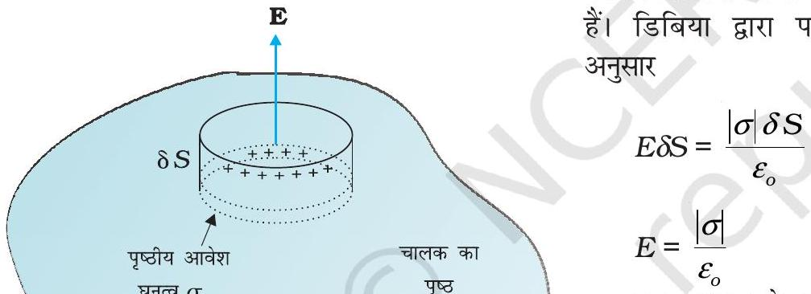
हैं। डिबिया द्वारा परिबद्ध, आवेश $\sigma \delta S$ है। गाउस नियम के

इस तथ्य को सम्मिलित करते हुए कि विद्युत क्षेत्र पृष्ठ के अभिलंबवत है, हम समीकरण (2.35) के रूप में सदिश संबंध पाते हैं। ध्यान दीजिए, समीकरण (2.35) आवेश घनत्व $\sigma$ के दोनों चिह्नों के लिए सत्य है। $\sigma>0$ के लिए, विद्युत क्षेत्र पृष्ठ के बहिर्मुखी अभिलंबवत है; तथा $\sigma<0$ के लिए, विद्युत क्षेत्र पृष्ठ के अंतर्मुखी अभिलंबवत है।

चित्र $2.17$ किसी आवेशित चालक के पृष्ठ पर विद्युत क्षेत्र के लिए समीकरण (2.35) व्युत्पन्न करने के लिए, चुना गया गाउसीय पृष्ठ (कोई डिबिया)।

### 2.9.1 स्थिरवैद्युत परिरक्षण

किसी ऐसे चालक के विषय में विचार कीजिए जिसमें कोई कोटर (गुहा) हो तथा उस कोटर के भीतर कोई आवेश न हो। एक विशिष्ट परिणाम यह देखने को मिलेगा कि चाहे कोटर की कोई भी आकृति एवं आकार क्यों न हो, तथा चाहे उस चालक पर कितने भी परिमाण का आवेश हो और कितनी भी तीव्रता के बाह्य क्षेत्र में उसे क्यों न रखा गया हो, कोटर के भीतर विद्युत क्षेत्र शून्य होता है। इसी परिणाम के एक सरल प्रकरण को हम पहले भी सिद्ध कर चुके हैं : किसी गोलीय कोश के भीतर विद्युत क्षेत्र शून्य होता है। कोश के लिए परिणाम की व्युत्पत्ति में हमने कोश की गोलीय सममिति का उपयोग किया था (अध्याय $1$ देखिए)। परंतु किसी चालक का (आवेश मुक्त) कोटर में विद्युत क्षेत्र का विलोपन, जैसा कि पहले वर्णन किया जा चुका है, एक अत्यधिक व्यापक परिणाम है। इससे संबंधित एक परिणाम यह भी है कि यदि चालक आवेशित भी है, अथवा किसी बाह्य विद्युत क्षेत्र द्वारा उदासीन चालक पर आवेश प्रेरित क्यों न किए गए हों, समस्त आवेश केवल चालक पर कोटर सहित उसके बाह्य पृष्ठ पर विद्यमान रहता है।

## स्थिरवैद्युत विभव तथा धारिता

चित्र $2.18$ में दिए गए परिणामों की व्युत्पत्ति को यहाँ हम छोड़ रहे हैं, परंतु हमें इनकी महत्वपूर्ण उलझनों का ध्यान है। बाहर चाहे कितना भी आवेश तथा कैसा भी विद्युत क्षेत्र विन्यास क्यों न हो, उस चालक में कोई भी कोटर बाह्य विद्युत क्षेत्रों के प्रभाव से सदैव परिरक्षित रहती है; कोटर के भीतर विद्युत क्षेत्र सदैव ही शून्य होता है। इसे स्थिरवैद्युत परिरक्षण कहते हैं। इस प्रभाव का उपयोग संवेदनशील उपकरणों को बाह्य विद्युत प्रभावों से बचाने में किया जाता है। चित्र $2.19$ में किसी चालक के महत्वपूर्ण स्थिरवैद्युत गुणधर्मों का सारांश दिया गया है।

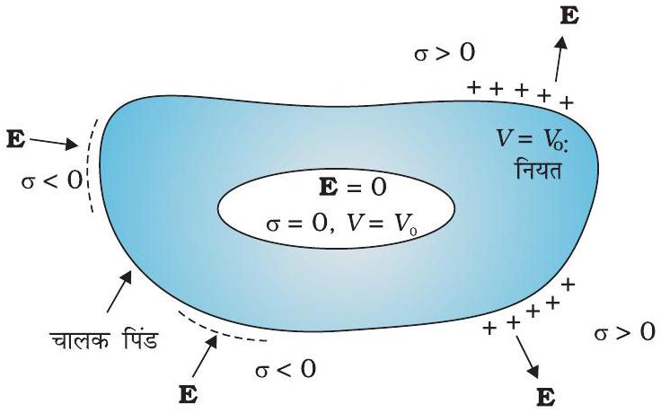
चित्र $2.18$ किसी भी चालक की कोटर (गुहा) के भीतर विद्युत क्षेत्र शून्य होता है। चालक का समस्त आवेश कोटर सहित उस चालक के केवल बाह्य पृष्ठ पर ही विद्यमान रहता है (कोटर के भीतर कोई आवेश नहीं रखे गए हैं)।

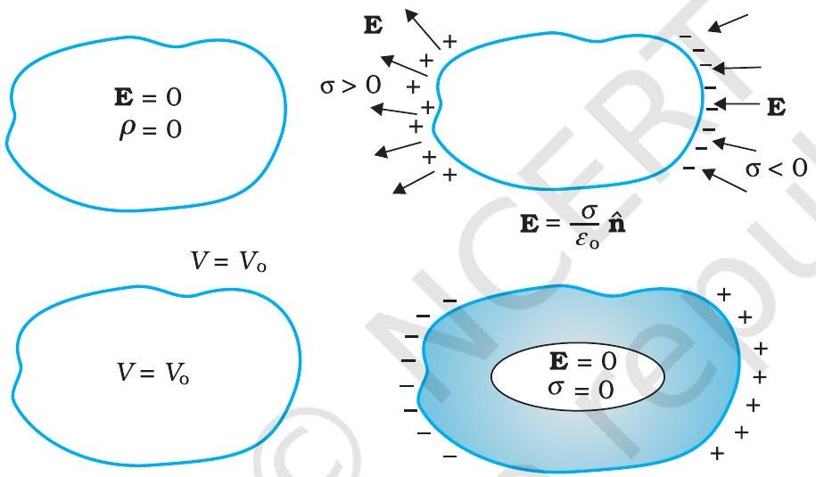
चित्र $2.19$ किसी चालक के कुछ महत्वपूर्ण स्थिरवैद्युत गुणधर्म।

उदाहरण $2.7$

(a) सूखे बालों में कंघा घुमाने के बाद वह कागज़ के टुकड़ों को आकर्षित कर लेता है, क्यों? यदि बाल भीगे हों या वर्षा का दिन हो तो क्या होता है? [ध्यान रहे कि कागज़ विद्युत चालक नहीं है।]
(b) साधारण रबर विद्युतरोधी है। परंतु वायुयान के विशेष रबर के पहिए हलके चालक बनाए जाते हैं। यह क्यों आवश्यक है?
(c) जो वाहन ज्वलनशील पदार्थ ले जाते हैं उनकी धातु की रस्सियाँ (ज़ंजीरें) वाहन के गतिमय होने पर धरती को छूती रहती हैं, क्यों?
(d) एक चिड़िया एक उच्च शक्ति के खुले (अरक्षित) बिजली के तार पर बैठी है, और उसको कुछ नहीं होता। धरती पर खड़ा एक व्यक्ति उसी तार को छूता है और उसे सांघातिक (घातक) धक्का लगता है, क्यों?

हल

(a) इसका कारण यह है कि कंघा घर्षण द्वारा आवेशित होता है। आवेशित कंघे द्वारा कागज़ के अणु ध्रुवित हो जाते हैं, परिणामस्वरूप एक नेट आकर्षी बल प्राप्त होता है। यदि बालों में नमी है अथवा वर्षा का दिन है तो कंघे और बालों के बीच घर्षण कम हो जाता है तथा कंघा आवेशित नहीं होता। अतः वह कागज़ के छोटे टुकड़ों को आकर्षित नहीं करता।

## - भौतिकी

उदाहरण $2.7$
(b) जिससे घर्षण द्वारा उत्पन्न आवेश का भूमि में चालन हो सके। चूँकि स्थिरवैद्युत आवेश अत्यधिक मात्रा में टायरों के पृष्ठ पर संचित होकर चिनगारी (स्पार्क) पैदा करता है जिससे आग लग सकती है।
(c) कारण (b) के समान ही।
(d) विद्युत धारा केवल तब ही प्रवाहित होती है जब विभवांतर होता है।

## $2.10$ परावैद्युत तथा ध्रुवण

परावैद्युत अचालक पदार्थ होते हैं। चालकों की तुलना में इनमें कोई आवेश वाहक नहीं (अथवा नगण्य) होता। अनुभाग (2.9) को याद कीजिए, क्या होता है जब किसी

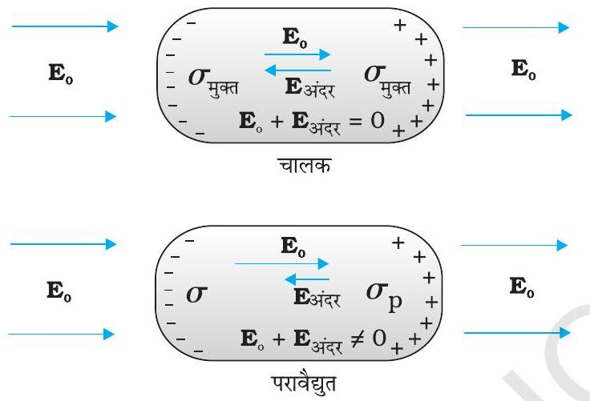
चालक तथा
चित्र $2.20$ किसी बाह्य विद्युत क्षेत्र में किसी चालक तथा
चित्र $2.20$ किसी बाह्य विद्युत क्षेत्र में किसी चालक तथा परावैद्युत के व्यवहार में अंतर। परावैद्युत के व्यवहार में अंतर।

निरक्षित नहीं करता। यह केवल क्षेत्र को घटा देता है। इस प्रभाव की सीमा परावैद्युत की प्रकृति पर निर्भर करती है। इस प्रभाव को समझने के लिए हमें किसी परावैद्युत पदार्थ में आण्विक स्तर पर आवेश वितरण के अध्ययन की आवश्यकता होगी।

किसी पदार्थ के अणु ध्रुवी अथवा अध्रुवी हो सकते हैं। किसी अध्रुवी अणु में धनावेश तथा ऋणावेश के केंद्र संपाती होते हैं। तब अणु का कोई स्थायी (अथवा आंतरिक) द्विध्रुव आघूर्ण नहीं होता। ऑक्सीजन $\left(\mathrm{O}_{2}\right)$ तथा हाइड्रोजन $\left(\mathrm{H}_{2}\right)$ अणु अध्रुवी अणुओं के उदाहरण हैं जिनमें सममिति के कारण कोई द्विध्रुव आघूर्ण नहीं होता। इसके विपरीत कोई ध्रुवी अणु वह होता है जिसमें धनावेशों तथा ॠणावेशों के केंद्र पृथक-पृथक (उस स्थिति में भी जब कोई बाह्य क्षेत्र नहीं है) होते हैं। ऐसे अणुओं में स्थायी द्विध्रुव आघूर्ण होता है। HCl जैसा आयनी अणु अथवा जल $\left(\mathrm{H}_{2} \mathrm{O}\right)$ का कोई अणु ध्रुवी अणुओं के उदाहरण हैं।

किसी बाह्य विद्युत क्षेत्र में अध्रुवी अणु के धनावेश तथा ऋणावेश विपरीत दिशाओं में विस्थापित हो जाते हैं। यह विस्थापन तब रुकता है जब अणु के अवयवी आवेशों पर बाह्य बल प्रत्यानयन बल (अणु में आंतरिक क्षेत्रों के कारण) द्वारा संतुलित हो जाता है। अतः अध्रुवी अणु एक प्रेरित द्विध्रुव संतुलित हो जाता है। अतः अध्रुवी अणु एक प्रेरित द्विध्रुव आघूर्ण विकसित कर लेता है। उस स्थिति में परावैद्युत को बाह्य क्षेत्र द्वारा ध्रुवित कहा जाता है। हम

## स्थिरवैद्युत विभव तथा धारिता

केवल उस सरल स्थिति पर ही विचार करेंगे जिसमें प्रेरित द्विध्रुव आघूर्ण क्षेत्र की दिशा में होता है तथा क्षेत्र की तीव्रता के अनुक्रमानुपाती होता है। (पदार्थ जिनके लिए यह अभिधारणा सत्य है उन्हें रैखिक समदैशिक परावैद्युत कहते हैं) विभिन्न अणुओं के प्रेरित द्विध्रुव आघूर्ण एक-दूसरे से जुड़कर बाह्य क्षेत्र की उपस्थिति में परावैद्युत का नेट द्विध्रुव आघूर्ण प्रदान करते हैं।

ध्रुवी अणुओं का कोई परावैद्युत किसी बाह्य क्षेत्र में एक नेट द्विध्रुव आघूर्ण भी विकसित कर लेता है, परंतु इसका कारण भिन्न होता है। किसी बाह्य क्षेत्र की अनुपस्थिति में, विभिन्न स्थायी द्विध्रुव तापीय विक्षोभ के कारण यादृच्छिक अभिविन्यासित होते हैं; अतः कुल द्विध्रुव आघूर्ण शून्य होता है। जब कोई बाह्य क्षेत्र अनुप्रयुक्त किया जाता है तो व्यष्टिगत द्विध्रुव आघूर्ण क्षेत्र के साथ संरेखित होने लगते हैं। जब सब अणुओं पर इसका योग किया जाता है, तो बाह्य क्षेत्र की दिशा में एक नेट द्विध्रुव आघूर्ण पाया जाता है, अर्थात, परावैद्युत ध्रुवित हो जाता है। ध्रुवण की सीमा दो परस्पर विरोधी कारकों की आपेक्षिक तीव्रता पर निर्भर करती है, जो इस प्रकार हैं : विद्युत क्षेत्र में द्विध्रुव स्थितिज ऊर्जा जो द्विध्रुव को क्षेत्र के साथ संरेखित करने का
प्रयास करती है, तथा तापीय ऊर्जा जो संरेखण को बिगाड़ने का प्रयास करती है। इसके अतिरिक्त अध्रुवी अणुओं की भाँति यहाँ भी प्रेरित द्विध्रुव आघूर्ण प्रभाव हो सकता है, परंतु व्यापक रूप में संरेखण प्रभाव ध्रुवी अणुओं के लिए अधिक महत्वपूर्ण होता है।

इस प्रकार दोनों ही प्रकरणों में, चाहे ध्रुवी हो अथवा अध्रुवी, परावैद्युत किसी बाह्य क्षेत्र की उपस्थिति में एक नेट द्विध्रुव आघूर्ण विकसित कर लेते हैं। किसी पदार्थ का प्रति एकांक आयतन द्विध्रुव आघूर्ण उसका ध्रुवण कहलाता है तथा इसे $\mathbf{P}$ द्वारा निर्दिष्ट किया जाता है। रैखिक समदैशिक परावैद्युतों के लिए

$$
\mathbf{P}=E_{o} \chi_{e} \mathbf{E}
$$

यहाँ $\chi_{\mathrm{e}}$ परावैद्युत का स्थिर अभिलक्षण है जिसे परावैद्युत माध्यम की वैद्युत प्रवृत्ति (electric susceptibility) कहते हैं।

इसको ( $\chi_{\mathrm{e}}$ को) पदार्थ के आण्विक गुण से संबंधित करना संभव है, परंतु हम यहाँ इस पर चर्चा नहीं करेंगे।

अब प्रश्न यह है कि कोई ध्रुवित परावैद्युत अपने भीतर किसी मूल बाह्य क्षेत्र को रूपांतरित कैसे करता है? सरलता की दृष्टि से हम किसी ऐसे आयताकार परावैद्युत गुटके पर विचार करते हैं जो किसी ऐसे एकसमान बाह्य क्षेत्र $\mathbf{E}_{\mathrm{o}}$ में रखा है, जो गुटके के दो फलकों के समांतर है। क्षेत्र के कारण परावैद्युत में एकसमान ध्रुवण P होता है। इस प्रकार गुटके के प्रत्येक आयतन अल्पांश $\Delta v$ का क्षेत्र की दिशा में एक द्विध्रुव आघूर्ण $\mathrm{P} \Delta v$ होता है। स्थूल रूप से आयतन अल्पांश $\Delta v$ छोटा होता है, परंतु इसमें अत्यधिक संख्या में

## - भौतिकी

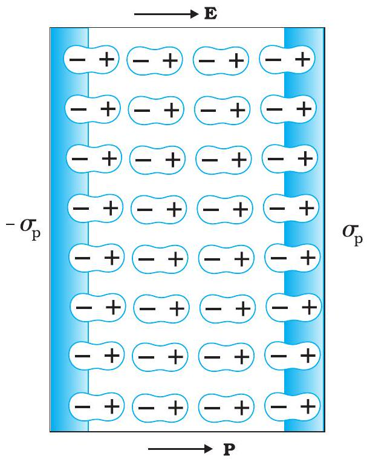
चित्र $2.23$ कोई एकसमान ध्रुवित परावैद्युत पृष्ठीय आवेश घनत्व के समान होता है, परंतु किसी आयतनी आवेश घनत्व के नहीं।

आण्विक द्विध्रुव होते हैं। परावैद्युत के भीतर किसी भी स्थान पर आयतन अल्पांश $\Delta V$ पर कोई नेट आवेश नहीं होता (यद्यपि इसका नेट द्विध्रुव आघूर्ण होता है)। इसका कारण यह है कि एक द्विध्रुव के धनावेश अपने से संलग्न द्विध्रुव के ऋणावेश के निकट होते हैं। परंतु, परावैद्युत के पृष्ठ पर विद्युत क्षेत्र के अभिलंबवत स्पष्ट रूप से एक नेट आवेश घनत्व होता है। जैसा कि चित्र $2.23$ में दर्शाया गया है, दाएँ पृष्ठ पर द्विध्रुवों के धनात्मक सिरे तथा बाएँ पृष्ठ पर द्विध्रुवों के ऋणात्मक सिरे अनुदासित रह जाते हैं। असंतुलित आवेश बाह्य क्षेत्र के कारण प्रेरित आवेश होते हैं।

अतः ध्रुवित परावैद्युत दो आवेशित पृष्ठों के तुल्य होता है, जिनके प्रेरित पृष्ठीय आवेश घनत्व, $\sigma_{p}$ तथा $-\sigma_{p}$ हैं। स्पष्ट है कि इन पृष्ठीय आवेशों द्वारा उत्पन्न विद्युत क्षेत्र बाह्य क्षेत्र का विरोध करते हैं। इस प्रकार परावैद्युत में कुल क्षेत्र, उस प्रकरण की तुलना में जिसमें कोई परावैद्युत नहीं है, कम हो जाता है। यहाँ ध्यान देने योग्य बात यह है कि, पृष्ठीय आवेश घनत्व $\pm \sigma_{p}$ परावैद्युत में मुक्त आवेशों के कारण नहीं वरन् परिबद्ध
आवेशों से उत्पन्न होता है।

## $2.11$ संधारित्र तथा धारिता

कोई संधारित्र विद्युतरोधी द्वारा पृथक दो चालकों का एक निकाय होता है (चित्र 2.24)। चालकों पर आवेश $Q_{1}$ तथा $Q_{2}$ तथा उनके विभव क्रमशः $V_{1}$ तथा $V_{2}$ हैं। प्रायः, व्यवहार में, दो चालकों पर आवेश $Q$ तथा $-Q$ होते हैं तथा उनमें विभवांतर $V=V_{1}-V_{2}$ होता है। हम केवल इसी प्रकार के विन्यास के संधारित्र पर विचार करेंगे। (एक सरल चालक को भी संधारित्र की भाँति प्रयोग किया जा सकता है, यदि दूसरे को अनंत पर माने) दोनों चालकों को किसी बैटरी के दो टर्मिनलों से संयोजित करके आवेशित कराया जा सकता है। $Q$ को संधारित्र का आवेश कहते हैं, यद्यपि, वास्तव में यह संधारित्र के एक चालक पर आवेश होता है-संधारित्र का कुल आवेश शून्य होता है।

चालकों के बीच के क्षेत्र में विद्युत क्षेत्र आवेश $Q$ के अनुक्रमानुपाती होता है। अर्थात, यदि संधारित्र पर आवेश दोगुना कर दिया जाए तो हर बिंदु पर विद्युत क्षेत्र दोगुना हो जाएगा। (यह कूलॉम के नियम तथा अध्यारोपण सिद्धांत द्वारा अंतर्निहित विद्युत क्षेत्र तथा आवेश के बीच अनुक्रमानुपात का अनुगामी है।) अब, विभवांतर $V$ किसी लघु परीक्षण आवेश को क्षेत्र के विरुद्ध चालक $2$ से $1$ तक ले जाने में प्रति एकांक धनावेश द्वारा किए गए कार्य के बराबर होता है। इसके फलस्वरूप, $V$ भी $Q$ के अनुक्रमानुपाती है, तथा अनुपात $Q / V$ एक नियतांक है -

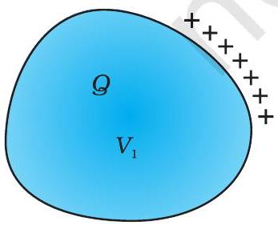
चालक $1$

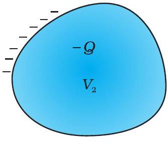
चालक $2$

यहाँ $C$ एक नियतांक है जिसे संधारित्र की धारिता कहते हैं। जैसा कि पहले वर्णन किया जा चुका है धारिता $C$ आवेश $Q$ अथवा विभवांतर $V$ पर निर्भर नहीं करती। धारिता $C$ केवल दो चालकों के निकाय के ज्यामितीय विन्यास (आकार, आकृति, पृथकन) पर निर्भर करती है। [जैसा कि हम आगे देखेंगे, यह दोनों चालकों को पृथक करने वाले माध्यम अर्थात विद्युतरोधी (परावैद्युत) की प्रकृति पर निर्भर
चित्र $2.24$ विद्युतरोधी से पृथक दो चालकों का कोई निकाय करती है]। धारिता का SI एकांक $1$ फैरड $=1$ कूलॉम प्रति वोल्ट संधारित्र का निर्माण करता है। अथवा $1 \mathrm{~F}=1 \mathrm{C} \mathrm{V}^{-1}$ है। नियत धारिता के संधारित्र का प्रतीक $-\mid-$, जबकि परिवर्ती धारिता के संधारित्र का प्रतीक $\mid \nmid$ है।

## स्थिरवैद्युत विभव तथा धारिता

समीकरण (2.38) यह दर्शाती है कि बड़े $C$ के लिए यदि $Q$ नियत है तो $V$ लघु होता है। इसका अर्थ यह है कि बड़ा संधारित्र लघु विभव $V$ पर अपेक्षाकृत आवेश $Q$ के बड़े परिमाण को परिबद्ध कर सकता है। इसकी व्यावहारिक उपयोगिता है। उच्च विभवांतर में चालक के चारों ओर प्रबल विद्युत क्षेत्र की उपस्थिति अंतर्निहित है। कोई प्रबल विद्युत क्षेत्र चारों ओर की वायु को आयनीकृत करके उत्पन्न आवेशों को त्वरित कर सकता है जो विजातीय आवेशित पट्टिकाओं पर पहुँचकर उन्हें आंशिक उदासीन कर सकते हैं। दूसरे शब्दों में, संधारित्र का आवेश दोनों पट्टिकाओं के बीच के माध्यम की विद्युतरोधी क्षमता में ह्रास के कारण क्षरित हो सकता है।

वह अधिकतम विद्युत क्षेत्र जिसे कोई परावैद्युत माध्यम बिना भंजन (उसके विद्युतरोधी गुणधर्म) के सहन कर सकता है, उस माध्यम की परावैद्युत सामर्थ्य कहलाती है। वायु के लिए यह लगभग $3 \times 10^{6} \mathrm{~V} \mathrm{~m}^{-1}$ है। दो चालकों के बीच $1$ cm कोटि के पृथकन के लिए यह क्षेत्र चालकों के बीच $3 \times 10^{4} \mathrm{~V}$ विभवांतर के तदनुरूपी होता है। अतः किसी संधारित्र के लिए बिना किसी क्षरण के अत्यधिक मात्रा में आवेश को संचित करने के लिए उसकी धारिता को इतना अधिक उच्च अवश्य होना चाहिए कि उनके बीच विभवांतर अथवा विद्युत क्षेत्र उसकी भंजन सीमा से अधिक न हो। इसे भिन्न शब्दों में इस प्रकार भी कह सकते हैं कि किसी दिए गए संधारित्र की बिना किसी सार्थक क्षरण के आवेश को संचित करने की एक सीमा होती है। व्यवहार में, $1$ फैरड, धारिता का बहुत बड़ा मात्रक है, धारिता के अधिक सामान्य मात्रक, इस मात्रक (अर्थात फैरड) के अपवर्तक हैं: $1 \mu \mathrm{~F}=$ $10^{-6} \mathrm{~F}, 1 \mathrm{nF}=10^{-9} \mathrm{~F}, 1 \mathrm{pF}=10^{-12} \mathrm{~F}$ आदि। आवेशों को संचित करने के अतिरिक्त संधारित्र अधिकांश प्रत्यावर्ती धारा परिपथों (ac परिपथों) में प्रमुख अवयवों के रूप में उपयोग होते हैं। अध्याय $7$ में ac परिपथों में संधारित्रों के महत्वपूर्ण प्रकार्यों का वर्णन किया गया है।

## $2.12$ समांतर पट्टिका संधारित्र

किसी समांतर पट्टिका संधारित्र में दो बड़ी समतल एक-दूसरे के समांतर चालक पट्टिकाएँ होती हैं, जिनके बीच पृथकन कम होता है (चित्र 2.25)। हम सर्वप्रथम दो पट्टिकाओं के बीच माध्यम के रूप में निर्वात को लेते हैं। अगले अनुभाग में पट्टिकाओं के बीच परावैद्युत माध्यम के प्रभाव का वर्णन किया गया है। मान लीजिए प्रत्येक पट्टिका का क्षेत्रफल $A$ तथा उनके बीच पृथकन $d$ है। दोनों पट्टिकाओं पर आवेश $Q$ तथा $-Q$ है। चूँकि पट्टिकाओं की रैखिक विमाओं की तुलना में $d$ बहुत छोटा है ( $d^{2} \ll A$ ), हम एकसमान आवेशित पृष्ठीय घनत्व $\sigma$ की अनंत समतल चादर के विद्युत क्षेत्र के परिणाम का उपयोग कर सकते हैं (देखिए अनुभाग 1.15)। पट्टिका $1$ का पृष्ठीय आवेश घनत्व $\sigma=\frac{Q}{A}$ तथा पट्टिका $2$ का पृष्ठीय आवेश घनत्व $-\sigma$ है। विभिन्न क्षेत्रों में समीकरण (1.33) का उपयोग करने पर विद्युत क्षेत्र-

बाह्य क्षेत्र I (पट्टिका $1$ के ऊपर का क्षेत्र)

$$
E=\frac{\sigma}{2 \varepsilon_{0}}-\frac{\sigma}{2 \varepsilon_{0}}=0
$$

बाह्य क्षेत्र II (पट्टिका $2$ के नीचे का क्षेत्र)

$$
E=\frac{\sigma}{2 \varepsilon_{0}}-\frac{\sigma}{2 \varepsilon_{0}}=0
$$

पट्टिकाओं $1$ तथा $2$ के भीतरी क्षेत्र में, दो आवेशित पट्टिकाओं के कारण विद्युत क्षेत्र जुड़ जाते हैं और हमें प्राप्त होता है-

$$
E=\frac{\sigma}{2 \varepsilon_{0}}+\frac{\sigma}{2 \varepsilon_{0}}=\frac{\sigma}{\varepsilon_{0}}=\frac{Q}{\varepsilon_{0} A}
$$

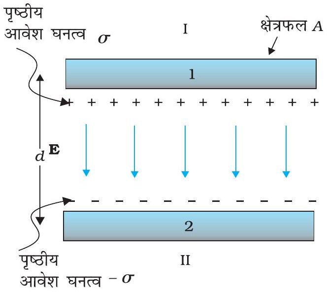
चित्र $2.25$ समांतर पट्टिका संधारित्र।

विद्युत क्षेत्र की दिशा धनावेशित पट्टिका से ऋणावेशित पट्टिका की ओर है।
इस प्रकार, दो पट्टिकाओं के बीच विद्युत क्षेत्र स्थानीकृत हो जाता है तथा यह एक सिरे से दूसरे सिरे तक एकसमान होता है। परिमित क्षेत्रफल की पट्टिकाओं के लिए पट्टिकाओं की बाहरी सीमा के निकट यह लागू नहीं होता। पट्टिकाओं के किनारों पर क्षेत्र रेखाएँ बाहर की ओर मुड़ जाती हैं- इस प्रभाव को 'क्षेत्र का उपांत प्रभाव' कहते हैं। इससे यह संकेत मिलता है कि समस्त पट्टिका पर पृष्ठीय आवेश घनत्व $\sigma$ यथार्थ रूप से एकसमान नहीं होता $[E$ तथा $\sigma$ समीकरण (2.35) द्वारा संबंधित हैं]। तथापि, $d^{2} \ll A$ के लिए ये प्रभाव किनारों से काफी दूर के क्षेत्रों के लिए उपेक्षणीय हैं; तथा वहाँ क्षेत्र समीकरण (2.41) के अनुसार होता है। अब एकसमान विद्युत क्षेत्रों के लिए विभवांतर, विद्युत क्षेत्र तथा पट्टिकाओं के बीच की दूरी के गुणनफल के बराबर होता है। अर्थात

$$
V=E d=\frac{1}{\varepsilon_{0}} \frac{Q d}{A}
$$

तब समांतर पट्टिका संधारित्र $C$ की धारिता $d=1 \mathrm{~mm}$ के लिए
अर्थात पट्टिका की लंबाई व चौड़ाई लगभग $30 \mathrm{~km}$ होनी चाहिए!

$$
C=\frac{8.85 \times 10^{-12} \mathrm{C}^{2} \mathrm{~N}^{-1} \mathrm{~m}^{-2} \times 1 \mathrm{~m}^{2}}{10^{-3} \mathrm{~m}}=8.85 \times 10^{-9} \mathrm{~F}
$$

$$
C=\frac{Q}{V}==\frac{\varepsilon_{0} A}{d}
$$

जो कि, अपेक्षानुसार, निकाय की ज्यामिति पर निर्भर करता है। प्रारूपी मानों, जैसे $A=1 \mathrm{~m}^{2}$,
[आप यह जाँच कर सकते हैं कि $1 \mathrm{~F}=1 \mathrm{CV}^{-1}=1 \mathrm{C}\left(\mathrm{N} \mathrm{C}^{-1} \mathrm{~m}\right)^{-1}=1 \mathrm{C}^{2} \mathrm{~N}^{-1} \mathrm{~m}^{-1}$ ]। इससे प्रकट होता है कि जैसा पहले वर्णन किया जा चुका है कि $1 \mathrm{~F}$ व्यवहार में धारिता का एक बहुत बड़ा एकांक है। $1 \mathrm{~F}$ की 'विशालता' को देखने का एक ढंग और भी है कि हम यह ज्ञात करें कि $1 \mathrm{~F}$ धारिता के समांतर पट्टिका संधारित्र की पट्टिकाओं का क्षेत्रफल, यदि उनके बीच दूरी $1$ cm है, कितना होना चाहिए। अब चूँकि

$$
A=\frac{C d}{\varepsilon_{0}}=\frac{1 \mathrm{~F} \times 10^{-2} \mathrm{~m}}{8.85 \times 10^{-12} \mathrm{C}^{2} \mathrm{~N}^{-1} \mathrm{~m}^{-2}}=10^{9} \mathrm{~m}^{2}
$$

## $2.13$ धारिता पर परावैद्युत का प्रभाव

किसी बाह्य क्षेत्र में परावैद्युतों के व्यवहार के बारे में जानकारी के पश्चात आइए अब हम यह देखें कि किसी समांतर पट्टिका संधारित्र की धारिता किसी परावैद्युत की उपस्थिति द्वारा किस प्रकार रूपांतरित होती है। पहले की ही भाँति यहाँ भी हमारे पास दो बड़ी पट्टिकाएँ, जिनमें प्रत्येक का क्षेत्रफल $A$ है, एक-दूसरे से $d$ दूरी द्वारा पृथक हैं। पट्टिकाओं पर आवेश $\pm Q$ है, जो कि आवेश घनत्व $\pm \sigma$ (जहाँ $\sigma=Q / A$ ) के तदनुरूपी है। जब दोनों पट्टिकाओं के बीच निर्वात है, तब

$$
E_{0}=\frac{\sigma}{\varepsilon_{0}}
$$

तथा विभवांतर $V_{0}$ है,

## स्थिरवैद्युत विभव तथा धारिता

$$
V_{0}=E_{0} d
$$

इस प्रकरण में धारिता $C_{\mathrm{o}}$ है,

$$
C_{0}=\frac{Q}{V_{0}}=\varepsilon_{0} \frac{A}{d}
$$

इसके पश्चात हम उस प्रकरण पर विचार करते हैं जिसमें दोनों पट्टिकाओं के बीच के समस्त क्षेत्र को किसी परावैद्युत द्वारा भर दिया गया है। क्षेत्र द्वारा समस्त परावैद्युत ध्रुवित हो जाता है, तथा जैसा कि ऊपर स्पष्ट किया जा चुका है, यह प्रभाव दो आवेशित चादरों ( परावैद्युत के पृष्ठों पर क्षेत्र के अभिलंबवत) के समतुल्य है जिनके पृष्ठीय आवेश घनत्व $\sigma_{\mathrm{p}}$ तथा $-\sigma_{\mathrm{p}}$ हैं। इस स्थिति में परावैद्युत में विद्युत क्षेत्र उस प्रकरण के तदनुरूपी होता है जिसमें पट्टिकाओं पर नेट आवेश घनत्व $\pm\left(\sigma-\sigma_{\mathrm{p}}\right)$ होता है। अर्थात

$$
E=\frac{\sigma-\sigma_{\mathrm{P}}}{\varepsilon_{0}}
$$

अतः पट्टिकाओं के सिरों पर विभवांतर

$$
V=E d=\frac{\sigma-\sigma_{\mathrm{P}}}{\varepsilon_{0}} d
$$

रैखिक परावैद्युतों के लिए, हम अपेक्षा करते हैं कि $\sigma_{\mathrm{p}}, E_{0}$ अर्थात $\sigma$ के अनुक्रमानुपाती हो। इस प्रकार $\left(\sigma-\sigma_{\mathrm{p}}\right), \sigma$ के अनुक्रमानुपाती है तथा हम लिख सकते हैं कि-

$$
\sigma-\sigma_{\mathrm{P}}=\frac{\sigma}{K}
$$

यहाँ $K$ परावैद्युत का एक स्थिर अभिलक्षण है। स्पष्ट है कि $K>1$, तब

$$
V=\frac{\sigma d}{\varepsilon_{0} K}=\frac{\Theta d}{A \varepsilon_{0} K}
$$

पट्टिकाओं के बीच परावैद्युत होने पर, धारिता $C$

$$
C=\frac{Q}{V}=\frac{\varepsilon_{0} K A}{d}
$$

गुणनफल $\varepsilon_{0} K$ को माध्यम का परावैद्युतांक कहते हैं तथा इसे $\varepsilon$ के द्वारा निर्दिष्ट किया जाता है।

$$
\varepsilon=\varepsilon_{0} K
$$

निर्वात के लिए $K=1$, तथा $\varepsilon=\varepsilon_{0} ; \varepsilon_{0}$ को निर्वात का परावैद्युतांक कहते हैं। विमाहीन अनुपात

$$
K=\frac{\varepsilon}{\varepsilon_{0}}
$$

को पदार्थ का परावैद्युतांक कहते हैं। जैसी कि पहले टिप्पणी की जा चुकी है, समीकरण (2.49) से, यह स्पष्ट है कि $K>1$ अर्थात $K$ का मान $1$ से अधिक है। समीकरणों (2.46) तथा (2.51) से

$$
K=\frac{C}{C_{0}}
$$

इस प्रकार किसी पदार्थ का परावैद्युतांक एक कारक $(>1)$ है जिसके द्वारा जब किसी संधारित्र की पट्टिकाओं के बीच कोई परावैद्युत पदार्थ पूर्णतः भर दिया जाता है, तो उसके धारिता के मान में निर्वात के मान से वृद्धि हो जाती है। यद्यपि हम समांतर पट्टिका संधारित्र के प्रकरण के लिए समीकरण (2.54) पर पहुँचे हैं, तथापि यह हर प्रकार के संधारित्रों पर लागू

## - भौतिकी

होता है तथा वास्तव में इसे व्यापक रूप में किसी पदार्थ के परावैद्युतांक की परिभाषा के रूप में देखा जा सकता है।

उदाहरण $2.8 \mathrm{~K}$ परावैद्युतांक के पदार्थ के किसी गुटके का क्षेत्रफल समांतर पट्टिका संधारित्र की पट्टिकाओं के क्षेत्रफल के समान है परंतु गुटके की मोटाई $(3 / 4) d$ है, यहाँ $d$ पट्टिकाओं के बीच पृथकन है। पट्टिकाओं के बीच गुटके को रखने पर संधारित्र की धारिता में क्या परिवर्तन हो जाएगा?
हल मान लीजिए जब पट्टिकाओं के बीच कोई परावैद्युत नहीं है तो पट्टिकाओं के बीच विद्युत क्षेत्र $E_{0}=V_{0} / d$ है तथा विभवांतर $V_{0}$ है। यदि अब कोई परावैद्युत पदार्थ रख दिया जाता है तो परावैद्युत में विद्युत क्षेत्र $E=E_{0} / K$ होगा। तब विभवांतर होगा

$$
\begin{aligned}
& V=E_{0}\left(\frac{1}{4} d\right)+\frac{E_{0}}{K}\left(\frac{3}{4} d\right) \\
& =E_{0} d\left(\frac{1}{4}+\frac{3}{4 K}\right)=V_{0} \frac{K+3}{4 K}
\end{aligned}
$$

विभवांतर $(K+3) / 4 K$ के गुणज द्वारा कम हो जाता है जबकि पट्टिकाओं पर आवेश $Q_{0}$ अपरिवर्तित रहता है। इस प्रकार संधारित्र की धारिता में वृद्धि हो जाती है

$$
C=\frac{Q_{0}}{V}=\frac{4 K}{K+3} \frac{Q_{0}}{V_{0}}=\frac{4 K}{K+3} C_{0}
$$

## $2.14$ संधारित्रों का संयोजन

हम कई संधारित्रों जिनकी धारिताएँ $C_{1}, C_{2}, \ldots, C_{\mathrm{n}}$ हैं, के संयोजन द्वारा एक प्रभावी धारिता $C$ का निकाय प्राप्त कर सकते हैं। यह प्रभावी धारिता व्यष्टिगत संधारित्रों को संयोजित करने के ढंग पर निर्भर करती है। दो संभावित सरल संयोजन इस प्रकार हैं :

### 2.14.1 संधारित्रों का श्रेणीक्रम संयोजन

चित्र $2.26$ में दो संधारित्र $C_{1}$ तथा $C_{2}$ श्रेणीक्रम में संयोजित दर्शाए गए हैं।
$C_{1}$ की बाईं तथा $C_{2}$ की दाईं पट्टिका बैटरी के दो टर्मिनलों से संयोजित हैं तथा उन पर क्रमशः $Q$ तथा $-Q$ आवेश है। इसका अर्थ यह है कि $C_{1}$ की दाईं पट्टिका

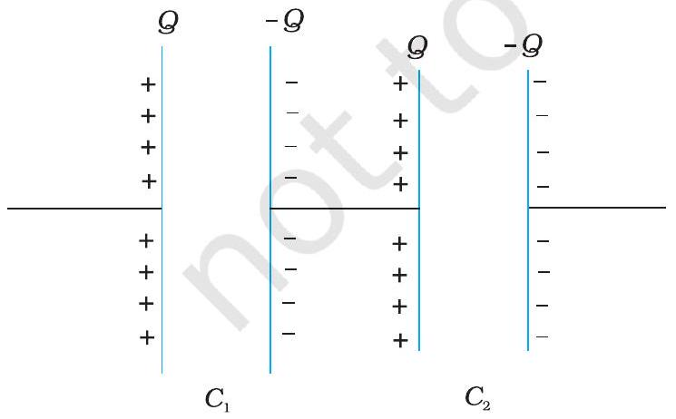
चित्र $2.26$ दो संधारित्रों का श्रेणीक्रम संयोजन।

पर $-Q$ तथा $C_{2}$ की बाईं पट्टिका पर आवेश $+Q$ है। यदि ऐसा नहीं है, तो संधारित्र की दोनों पट्टिकाओं पर नेट आवेश शून्य नहीं होगा। इसके परिणामस्वरूप $C_{1}$ तथा $C_{2}$ को संयोजित करने वाले चालक में कोई विद्युत क्षेत्र होगा तथा $C_{1}$ एवं $C_{2}$ में आवेश उस समय तक प्रवाहित होता रहेगा, जब तक कि प्रत्येक संधारित्र $C_{1}$ तथा $C_{2}$ पर नेट आवेश शून्य नहीं हो जाता तथा $C_{1}$ एवं $C_{2}$ को संयोजित करने वाले चालक में विद्युत क्षेत्र शून्य नहीं होता। अतः श्रेणीक्रम संयोजन में प्रत्येक संधारित्र की दोनों पट्टिकाओं पर आवेश $( \pm \mathrm{Q})$ समान होता है। संयोजन के सिरों पर विभवपात $V$ संधारित्रों $C_{1}$ तथा $C_{2}$ के सिरों पर क्रमशः विभवपातों $V_{1}$ तथा $V_{2}$ का योग होता है-

$$
V=V_{1}+V_{2}=\frac{Q}{C_{1}}+\frac{Q}{C_{2}}
$$

$$
\text { अर्थात, } \frac{V}{Q}=\frac{1}{C_{1}}+\frac{1}{C_{2}} \text {, }
$$

## स्थिरवैद्युत विभव तथा धारिता

हम इस संयोजन को एक ऐसा प्रभावी संधारित्र मान सकते हैं जिस पर आवेश $Q$ तथा जिसके सिरों के बीच विभवांतर $V$ हो। तब संयोजन की प्रभावी धारिता-

$$
C=\frac{Q}{V}
$$

समीकरण (2.57) की समीकरण (2.56) से तुलना करने पर हमें निम्नलिखित संबंध प्राप्त होता है-

$$
\frac{1}{C}=\frac{1}{C_{1}}+\frac{1}{C_{2}}
$$

स्पष्ट है कि इस व्युत्पत्ति को हम कितने भी संधारित्र लेकर, उन्हें इसी प्रकार संयोजित करके $n$ संधारित्रों के लिए समीकरण (2.55) का व्यापकीकरण कर सकते हैं-

$$
V=V_{1}+V_{2}+\ldots+V_{n}=\frac{Q}{C_{1}}+\frac{Q}{C_{2}}+\ldots+\frac{Q}{C_{n}}
$$

जिन चरणों का हमने दो संधारित्रों के प्रकरण में उपयोग किया था, उन्हीं चरणों का उपयोग $n$ संधारित्रों के संयोजन के लिए करके, हम $n$ संधारित्रों के श्रेणीक्रम संयोजन के लिए प्रभावी धारिता का व्यापक सूत्र प्राप्त कर सकते हैं :

$$
\frac{1}{C}=\frac{1}{C_{1}}+\frac{1}{C_{2}}+\frac{1}{C_{3}}+\ldots+\frac{1}{C_{n}}
$$

### 2.14.2 संधारित्रों का पाश्र्वक्रम संयोजन

चित्र 2.28(a) में दो संधारित्र पार्श्वक्रम में संयोजित दर्शाए गए हैं। इस प्रकरण में दोनों संधारित्रों पर समान विभवांतर अनुप्रयुक्त किया गया है। परंतु संधारित्र $1$ की पट्टिकाओं पर आवेश $\left( \pm Q_{1}\right)$ का परिमाण संधारित्र $2$ की पट्टिकाओं पर आवेश ( $\pm Q_{2}$ ) के समान होना आवश्यक नहीं है :

$$
Q_{1}=C_{1} V, Q_{2}=C_{2} V
$$

यदि इस संयोजन के तुल्य किसी संधारित्र पर आवेश

$$
Q=Q_{1}+Q_{2}
$$

तथा विभवांतर $V$ है :

$$
Q=C V=C_{1} V+C_{2} V
$$

तो समीकरण (2.63) से प्रभावी धारिता $C$

$$
C=C_{1}+C_{2}
$$

$n$ संधारित्रों के पाशर्वक्रम संयोजन के लिए प्रभावी धारिता $C$ के लिए व्यापक सूत्र, इसी प्रकार प्राप्त किया जा सकता है [चित्र 2.28(b)] :

$$
Q=Q_{1}+Q_{2}+\ldots+Q_{n}
$$

अर्थात, $C V=C_{1} V+C_{2} V+\ldots C_{n} V$
इससे प्राप्त होता है

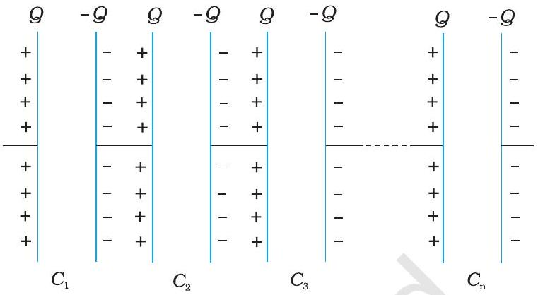
चित्र $2.27 n$ संधारित्रों का श्रेणीक्रम संयोजन।

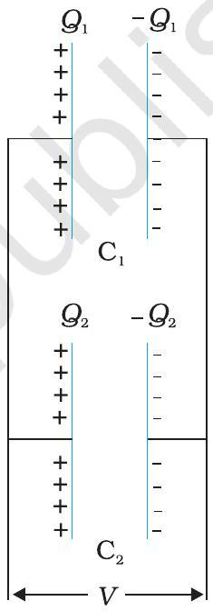
(a)

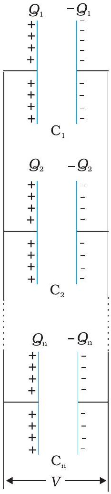
(b)
चित्र $2.28$ (a) दो संधारित्रों, (b) $n$ संधारित्रों का पाश्र्वक्रम संयोजन।

$$
C=C_{1}+C_{2}+\ldots C_{n}
$$

उदाहरण $2.9$ चित्र $2.29$ में दर्शाए अनुसार $10 \mu \mathrm{~F}$ के चार संधारित्रों के किसी नेटवर्क को $500 \mathrm{~V}$ के स्रोत से संयोजित किया गया है। (a) नेटवर्क की तुल्य धारिता, तथा (b) प्रत्येक संधारित्र पर आवेश ज्ञात कीजिए। (नोटः किसी संधारित्र पर आवेश उसकी उच्च

## - भौतिकी

विभव की पट्टिका पर आवेश के बराबर होता है तथा वह आवेश निम्न विभव की पट्टिका पर आवेश के परिमाण में समान, परंतु विजातीय होता है)।

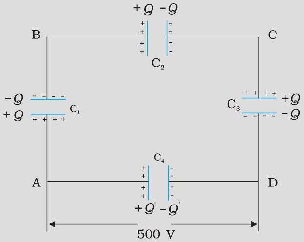
चित्र $2.29$

हल
(a) दिए गए नेटवर्क में तीन संधारित्र $C_{1}, C_{2}$ तथा $C_{3}$ श्रेणीक्रम में संयोजित हैं। इन तीनों संधारित्रों की प्रभावी धारिता $C^{\prime}$ इस प्रकार व्यक्त की जाती है :

$$
\begin{aligned}
& \frac{1}{C^{\prime}}=\frac{1}{C_{1}}+\frac{1}{C_{2}}+\frac{1}{C_{3}} \\
& C_{1}=C_{2}=C_{3}=10 \mu \mathrm{~F}, C^{\prime}=(10 / 3) \mu \mathrm{F}
\end{aligned}
$$

नेटवर्क में $C_{4}$ को $C^{\prime}$ के पाश्र्वक्रम में संयोजित किया गया है। अतः, समस्त नेटवर्क की तुल्य धारिता

$$
C=C^{\prime}+C_{4}=\frac{10}{3}+10 \quad \mu \mathrm{~F}=13.3 \mu \mathrm{~F}
$$

(b) चित्र से स्पष्ट है कि $C_{1}, C_{2}$ तथा $C_{3}$ प्रत्येक पर आवेश समान है, मान लीजिए यह आवेश $Q$ है। मान लीजिए $C_{4}$ पर आवेश $Q^{\prime}$ है। अब चूँकि AB के सिरों के बीच विभवांतर $Q / C_{1}$, BC के सिरों पर $Q / C_{2}$ तथा CD के सिरों पर $Q / C_{3}$ है, अतः

$$
\frac{Q}{C_{1}}+\frac{Q}{C_{2}}+\frac{Q}{C_{3}}=500 \mathrm{~V}
$$

तथा $Q^{\prime} / C_{4}=500 \mathrm{~V}$
इससे हमें संधारित्रों की विभिन्न धारिताओं के दिए गए मानों के लिए

$$
\begin{aligned}
& Q=500 \mathrm{~V} \times \frac{10}{3} \mu \mathrm{~F}=1.7 \times 10^{-3} \mathrm{C} \text { तथा } \\
& Q^{\prime}=500 \mathrm{~V} \times 10 \mu \mathrm{~F}=5.0 \times 10^{-3} \mathrm{C}
\end{aligned}
$$

## $2.15$ संधारित्र में संचित ऊर्जा

जैसा कि हमने ऊपर चर्चा में अध्ययन किया, संधारित्र दो चालकों का एक ऐसा निकाय होता है जिस पर आवेश $Q$ तथा $-Q$ होते हैं तथा जिनमें कुछ पृथकन होता है। इस विन्यास में संचित ऊर्जा ज्ञात करने के लिए आरंभ में दो अनावेशित चालकों $1$ तथा $2$ पर विचार कीजिए। अब चालक $2$ से चालक $1$ पर आवेश को छोटे-छोटे टुकड़ों में स्थानांतरित करने की किसी प्रक्रिया की कल्पना कीजिए, ताकि अंत में चालक $1$ पर $Q$ आवेश आ जाए। आवेश संरक्षण नियम के अनुसार अंत में चालक $2$ पर $-Q$ आवेश होता है (चित्र 2.30)।

## स्थिरवैद्युत विभव तथा धारिता

आवेश को $2$ से $1$ पर स्थानांतरित करने में बाह्य कार्य करना होता है, चूँकि हर चरण में चालक $2$ की तुलना में चालक $1$ अधिक विभव पर होता है। किए गए कुल कार्य का परिकलन करने के लिए पहले हम छोटे-छोटे चरणों में आवेश की अत्यल्प (अर्थात लोप बिंदु तक छोटी) मात्रा को स्थानांतरित करने में किया गया कार्य परिकलित करते हैं। उस माध्य स्थिति पर विचार कीजिए जिसमें चालकों $1$ तथा $2$ पर क्रमशः आवेश $Q^{\prime}$ तथा $-Q^{\prime}$ हैं। इस स्थिति में, चालकों $1$ तथा $2$ के बीच विभवांतर $V^{\prime}=Q^{\prime} / C$ होता है, यहाँ $C$ निकाय की धारिता है। अब यह कल्पना कीजिए कि लघु आवेश $\delta Q^{\prime}$ चालक $2$ से $1$ में स्थानांतरित किया जाता है। इस चरण में किया गया कार्य $(\delta w)$, जिसके परिणामस्वरूप चालक $1$ पर आवेश $Q^{\prime}$ से बढ़कर $Q^{\prime}+\delta Q^{\prime}$ हो जाता है, इस प्रकार व्यक्त किया जाता है :

$$
\delta W=V^{\prime} \delta Q^{\prime}=\frac{Q^{\prime}}{C} \delta Q^{\prime}
$$

समीकरण (2.68) के समाकलन द्वारा

$$
W=\int_{0}^{Q} \frac{Q^{\prime}}{C} \delta Q^{\prime}=\left.\frac{1}{C} \frac{Q^{\prime 2}}{2}\right|_{0} ^{Q}=\frac{Q^{2}}{2 C}
$$

इस परिणाम, को हम भिन्न-भिन्न प्रकार से व्यक्त कर सकते हैं :

$$
W=\frac{Q^{2}}{2 C}=\frac{1}{2} C V^{2}=\frac{1}{2} Q V
$$

चूँकि स्थिरवैद्युत बल संरक्षी बल है, यह कार्य निकाय में स्थितिज ऊर्जा के रूप में संचित हो जाता है। यही कारण है कि स्थितिज ऊर्जा का अंतिम परिणाम, समीकरण (2.69), जिस ढंग से संधारित्र का आवेश विन्यास निर्मित किया गया है, उस ढंग पर निर्भर नहीं करता। जब कोई संधारित्र निरावेशित होता है तो उसमें संचित ऊर्जा मुक्त हो जाती है। संधारित्र की पट्टिकाओं के बीच विद्युत क्षेत्र में 'संचित' हुई स्थितिज ऊर्जा के रूप में समझना संभव है। इसे देखने के लिए, सरलता की दृष्टि से, किसी समांतर पट्टिका (प्रत्येक का क्षेत्रफल $A$ ) संधारित्र जिसकी पट्टिकाओं के बीच पृथकन $d$ है, पर विचार कीजिए।

संधारित्र में संचित ऊर्जा

$$
=\frac{1}{2} \frac{Q^{2}}{C}=\frac{(A \sigma)^{2}}{2} \times \frac{d}{\varepsilon_{0} A}
$$

पृष्ठीय आवेश घनत्व $\sigma$ पट्टिकाओं के बीच विद्युत क्षेत्र $E$ से संबंधित है-

$$
E=\frac{\sigma}{\varepsilon_{0}}
$$

समीकरणों (2.70) तथा (2.71) से प्राप्त होता है-
संधारित्र में संचित ऊर्जा

$$
U=(1 / 2) \varepsilon_{0} E^{2} \times A d
$$

ध्यान दीजिए, $A d$ दोनों पट्टिकाओं के बीच के क्षेत्र का आयतन है (इसी क्षेत्र में केवल विद्युत क्षेत्र होता है)। यदि हम ऊर्जा घनत्व को दिक्स्थान के प्रति एकांक आयतन में संचित ऊर्जा के रूप में परिभाषित करें तो, समीकरण (2.72) के अनुसार

विद्युत क्षेत्र का ऊर्जा घनत्व $u=(1 / 2) \varepsilon_{0} E^{2}$

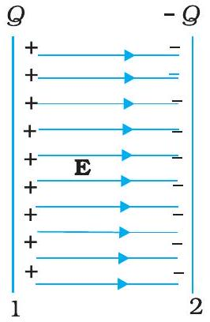
(b)

## - भौतिकी

यद्यपि हमने समीकरण (2.73) समांतर पट्टिका संधारित्र के प्रकरण में व्युत्पन्न की है, किसी विद्युत क्षेत्र का ऊर्जा घनत्व से संबंधित परिणाम वास्तव में, अत्यंत व्यापक है तथा यह किसी भी आवेश विन्यास के कारण विद्युत क्षेत्र पर लागू होता है।

उदाहरण $2.10$ (a) $900 \mathrm{pF}$ के किसी संधारित्र को $100 \mathrm{~V}$ बैटरी से आवेशित किया गया [चित्र 2.31(a)]। संधारित्र में संचित कुल स्थिरवैद्युत ऊर्जा कितनी है? (b) इस संधारित्र को बैटरी से वियोजित करके किसी अन्य $900 \mathrm{pF}$ के संधारित्र से संयोजित किया गया। निकाय द्वारा संचित स्थिरवैद्युत ऊर्जा कितनी है?
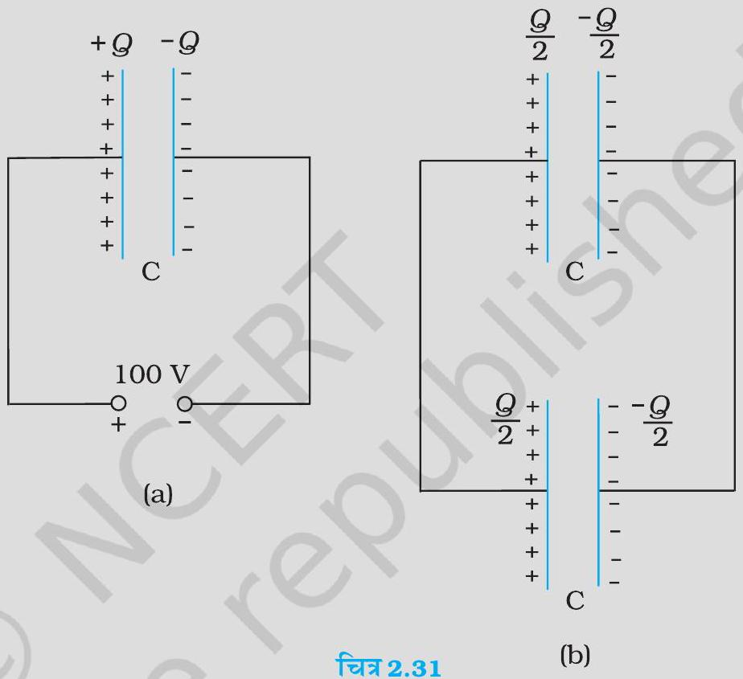

हल

(a) संधारित्र पर आवेश
$$
Q=C V=900 \times 10^{-12} \mathrm{~F} \times 100 \mathrm{~V}=9 \times 10^{-8} \mathrm{C}
$$
संधारित्र द्वारा संचित ऊर्जा
$$
\begin{aligned}
& =(1 / 2) C V^{2}=(1 / 2) Q V \\
& =(1 / 2) \times 9 \times 10^{-8} \mathrm{C} \times 100 \mathrm{~V}=4.5 \times 10^{-6} \mathrm{~J}
\end{aligned}
$$
(b) स्थायी स्थिति में, दोनों संधारित्रों की धनात्मक पट्टिकाएँ समान विभव पर हैं, तथा उनकी ऋणात्मक पट्टिकाएँ उसी समान विभव पर हैं। मान लीजिए उभयनिष्ठ विभवांतर $V^{\prime}$ है। तब, प्रत्येक संधारित्र पर आवेश $Q^{\prime}=C V^{\prime}$ । आवेश संरक्षण द्वारा, $Q^{\prime}=Q /$ 2, इसमें यह अंतर्निहित है कि, $V^{\prime}=\mathrm{V} / 2$ । तब निकाय की कुल ऊर्जा
$$
=2 \times \frac{1}{2} Q^{\prime} V^{\prime}=\frac{1}{4} Q V=2.25 \times 10^{-6} \mathrm{~J}
$$
अतः (a) से (b) में जाने पर यद्यपि आवेश की कोई हानि नहीं होती, तथापि अंतिम ऊर्जा आरंभिक ऊर्जा की केवल आधी होती है। तब शेष ऊर्जा कहाँ चली जाती है? निकाय को स्थिति (b) तक व्यवस्थित होने में कुछ समय लगता है। इस अवधि में पहले संधारित्र से दूसरे संधारित्र में एक अस्थायी विद्युत धारा प्रवाहित होती है। इस अवधि में ऊष्मा तथा विद्युत चुंबकीय विकिरणों के रूप में कुछ ऊर्जा-क्षय हो जाती है।

## स्थिरवैद्युत विभव   तथा धारिता

## सारांश

1. स्थिरवैद्युत बल एक संरक्षी बल है। किसी बाह्य बल (स्थिरवैद्युत बल के समान एवं विपरीत) द्वारा आवेश $q$ को बिंदु R से बिंदु P तक लाने में किया गया कार्य $q\left(V_{\mathrm{P}}-V_{\mathrm{R}}\right)$ होता है, जो कि अंतिम बिंदु तथा प्रारंभिक बिंदु के बीच आवेश की स्थितिज ऊर्जाओं का अंतर होता है।
2. किसी बिंदु पर विभव (किसी बाह्य एजेंसी) प्रति एकांक धनावेश पर किया गया वह कार्य होता है जो उस आवेश को अनंत से उस बिंदु तक लाने में किया जाता है। किसी बिंदु पर विभव किसी योज्यता स्थिरांक के अंतर्गत यादृच्छिक होता है, चूँकि जो राशि भौतिक रूप से महत्वपूर्ण है वह दो बिंदुओं के बीच विभवांतर है। यदि अनंत पर किसी आवेश के कारण विभव को शून्य चुनें (अथवा मानें) तो मूल बिंदु पर रखे किसी आवेश $Q$ के कारण स्थिति सदिश $\mathbf{r}$ वाले बिंदु पर वैद्युत विभव
$$
V(\mathbf{r})=\frac{1}{4 \pi \varepsilon_{o}} \frac{Q}{r}
$$
3. मूल बिंदु पर स्थित $\mathbf{p}$ द्विध्रुव आघूर्ण के बिंदु द्विध्रुव के कारण स्थिति सदिश $\mathbf{r}$ के किसी बिंदु पर स्थिरवैद्युत विभव
$$
V(\mathbf{r})=\frac{1}{4 \pi \varepsilon_{o}} \frac{\mathbf{p} \hat{\mathbf{r}}}{r^{2}}
$$
यह परिणाम किसी द्विध्रुव (जिस पर आवेश $-q$ तथा $q$ एक-दूसरे से $2 a$ दूरी पर हों) के लिए $r \gg a$ शर्त के साथ लागू होता है।
4. स्थिति सदिश $\mathbf{r}_{1}, \mathbf{r}_{2}, \ldots, \mathbf{r}_{\mathrm{n}}$ के आवेशों $q_{1}, q_{2}, \ldots, q_{n}$ के आवेश विन्यास का अध्यारोपण सिद्धांत द्वारा किसी बिंदु $P$ पर विभव
$$
V=\frac{1}{4 \pi \varepsilon_{o}}\left(\frac{q_{1}}{r_{1 \mathrm{P}}}+\frac{q_{2}}{r_{2 \mathrm{P}}}+\ldots+\frac{q_{n}}{r_{n \mathrm{P}}}\right)
$$
यहाँ पर $r_{1 \mathrm{P}}$ आवेश $q_{1}$ तथा P के बीच, $r_{2 \mathrm{P}}$ आवेश $q_{2}$ तथा P के बीच की दूरी है, तथा अन्य दूरियाँ इसी प्रकार हैं।
5. समविभव पृष्ठ एक ऐसा पृष्ठ होता है जिसके सभी बिंदुओं पर विभव का समान मान होता है। किसी बिंदु आवेश के लिए, उस आवेश को केंद्र मानकर खींचे गए संकेंद्री गोले समविभव पृष्ठ होते हैं। समविभव पृष्ठ के किसी बिंदु पर विद्युत क्षेत्र $\mathbf{E}$ उस बिंदु से गुज़रने वाले अभिलंब के अनुदिश होता है। $\mathbf{E}$ की दिशा वही होती है जिस दिशा में वैद्युत विभव तीव्रता से घटता है।
6. किसी आवेशों के निकाय में संचित स्थितिज ऊर्जा (किसी बाह्य बल द्वारा) आवेशों को उनकी स्थितियों पर लाकर एकत्र करने में किए जाने वाले कार्य के बराबर होती है। दो आवेशों $q_{1}$ तथा $q_{2}$ की $\mathbf{r}_{1}$ तथा $\mathbf{r}_{2}$ पर स्थितिज ऊर्जा
$$
U=\frac{1}{4 \pi \varepsilon_{o}} \frac{q_{1} q_{2}}{r_{12}}
$$
यहाँ $r_{12}$ दो आवेशों $q_{1}$ तथा $q_{2}$ के बीच की दूरी है।
7. किसी बाह्य विभव $V(\mathbf{r})$ में आवेश $q$ की स्थितिज ऊर्जा $q V(\mathbf{r})$ होती है। एकसमान विद्युत क्षेत्र $\mathbf{E}$ में किसी द्विध्रुव $\mathbf{p}$ की स्थितिज ऊर्जा $-\mathbf{p} . \mathbf{E}$ होती है।

## - भौतिकी

8. किसी चालक के अभ्यंतर में स्थिरवैद्युत क्षेत्र E शून्य होता है। किसी आवेशित चालक के पृष्ठ के तुरंत बाहर $\mathbf{E}$ पृष्ठ के अभिलंबवत् होता है।
$\mathbf{E}=\frac{\sigma}{\varepsilon_{0}} \hat{\mathbf{n}}$, यहाँ $\hat{\mathbf{n}}$ बहिर्मुखी अभिलंब के अनुदिश एकांक सदिश तथा $\sigma$ पृष्ठीय आवेश घनत्व है। किसी चालक के आवेश केवल उसके पृष्ठ पर ही विद्यमान रह सकते हैं। किसी चालक के अंतर्गत (भीतर) तथा उसके पृष्ठ पर विभव हर बिंदु पर नियत रहता है। चालक के भीतर किसी आवेशविहीन कोटर (गुहा) में विद्युत क्षेत्र शून्य होता है।
9. संधारित्र दो ऐसे चालकों का निकाय होता है जो किसी विद्युतरोधी द्वारा एक-दूसरे से पृथक रहते हैं। इसकी धारिता $C$ को $C=Q / V$ द्वारा परिभाषित किया जाता है, यहाँ $Q$ तथा $-Q$ इसके दो चालकों के आवेश हैं तथा $V$ इन दोनों के बीच विभवांतर है। $C$ का निर्धारण पूर्णतया संधारित्र की ज्यामितीय आकृति, आकार, दो चालकों की आपेक्षिक स्थितियों द्वारा किया जाता है। धारिता का एकांक फैरड है: $1 \mathrm{~F}=1 \mathrm{CV}^{-1}$
किसी समांतर पट्टिका संधारित्र (पट्टिकाओं के बीच निर्वात) के लिए
$$
C=\varepsilon_{\mathrm{o}} A / d
$$
यहाँ $A$ प्रत्येक पट्टिका का क्षेत्रफल तथा $d$ इनके बीच का पृथकन है।
10. यदि किसी संधारित्र की दो पट्टिकाओं के बीच कोई विद्युतरोधी पदार्थ (परावैद्युत) भरा है, तो आवेशित पट्टिकाओं के विद्युत क्षेत्र के कारण परावैद्युत में नेट द्विध्रुव आघूर्ण प्रेरित हो जाता है। इस प्रभाव, जिसे ध्रुवण कहते हैं, के कारण विपरीत दिशा में एक विद्युत क्षेत्र उत्पन्न होता है। इससे परावैद्युत के भीतर नेट विद्युत क्षेत्र, तथा इसीलिए पट्टिकाओं के बीच विभवांतर घट जाता है। परिणामस्वरूप संधारित्र की धारिता $C, C_{0}$ (जबकि पट्टिकाओं के बीच कोई माध्यम नहीं अर्थात निर्वात है) से बढ़ जाती है। $C=K C_{0}$
जहाँ $K$ विद्युतरोधी पदार्थ का परावैद्युतांक है।
11. संधारित्रों के श्रेणीक्रम संयोजन के लिए, कुल धारिता $C$ निम्नलिखित संबंध द्वारा दर्शाई जाती है
$$
\frac{1}{C}=\frac{1}{C_{1}}+\frac{1}{C_{2}}+\frac{1}{C_{3}}+\ldots \ldots \ldots .
$$
पार्श्वक्रम संयोजन के लिए कुल धारिता $C$ होती है-
$$
C=C_{1}+C_{2}+C_{3}+\ldots .
$$
जहाँ $C_{1}, C_{2}, C_{3} \ldots \ldots$ व्यष्टिगत धारिताएँ हैं।
12. आवेश $Q$, वोल्टता $V$ तथा धारिता $C$ के किसी संधारित्र में संचित ऊर्जा $E$ निम्नलिखित संबंधों द्वारा व्यक्त की जाती है-
$$
U=\frac{1}{2} Q V=\frac{1}{2} C V^{2}=\frac{1}{2} \frac{Q^{2}}{C}
$$
किसी विद्युत क्षेत्र के स्थान पर वैद्युत आवेश घनत्व (प्रति एकांक आयतन ऊर्जा) $(1 / 2) \varepsilon_{0} \mathrm{E}^{2}$ होता है।

## स्थिरवैद्युत विभव तथा धारिता

| भौतिक राशि | प्रतीक | विमाएँ | मात्रक | टिप्पणी |
| :--- | :--- | :--- | :--- | :--- |
| विभव | $\phi$ अथवा $V$ | $\left[\mathrm{M}^{1} \mathrm{~L}^{2} \mathrm{~T}^{-3} \mathrm{~A}^{-1}\right]$ | V | विभवांतर भौतिक दृष्टि से महत्वपूर्ण होता है। |
| धारिता | C | $\left[\mathrm{M}^{-1} \mathrm{~L}^{-2} \mathrm{~T}^{-4} \mathrm{~A}^{2}\right]$ | F |  |
| ध्रुवण | P | [L ${ }^{-2}$ AT] | $\mathrm{C} \mathrm{m}^{-2}$ | द्विध्रुव आघूर्ण प्रति एकांक आयतन |
| परावैद्युतांक | $K$ | [ विमाहीन ] |  |  |

## विचारणीय विषय

1. स्थिरवैद्युतिकी में स्थिर आवेशों के बीच लगने वाले बलों का अध्ययन किया जाता है। परंतु जब किसी आवेश पर बल आरोपित है तो वह विराम में कैसे हो सकता है? अतः जब दो आवेशों के बीच लगने वाले स्थिरवैद्युत बल के विषय में चर्चा करते हैं, तो यह समझा जाना चाहिए कि प्रत्येक आवेश कुछ अनिर्दिष्ट बलों, जो उस आवेश पर लगे नेट कूलॉम बल का विरोध करते हैं, के प्रभाव से विराम में है।
2. कोई संधारित्र इस प्रकार विन्यासित होता है कि वह विद्युत क्षेत्र रेखाओं को एक छोटे क्षेत्र तक ही सीमित किए रखता है। इस प्रकार, यद्यपि विद्युत क्षेत्र काफी प्रबल हो सकता है परंतु संधारित्र की दो पट्टिकाओं के बीच विभवांतर कम होता है।
3. किसी गोलीय आवेशित कोश के पृष्ठ के आर-पार विद्युत क्षेत्र संतत नहीं होता। गोले के भीतर यह शून्य तथा बाहर यह $\frac{\sigma}{\varepsilon_{0}} \hat{\mathbf{n}}$ होता है। परंतु वैद्युत विभव पृष्ठ के आर-पार संतत होता है, इसका मान पृष्ठ पर $q / 4 \pi \varepsilon_{0} R$ होता है।
4. किसी द्विध्रुव पर लगा बल आघूर्ण $\mathbf{p} \times \mathbf{E}$ इसमें $\mathbf{E}$ के परितः दोलन उत्पन्न करता है। केवल तभी जब प्रक्रिया क्षयकारी है तो दोलन अवमंदित होते हैं तथा द्विध्रुव अंतः $\mathbf{E}$ के संरेखित हो जाता है।
5. किसी आवेश $q$ के कारण अपनी स्थिति पर विभव अपरिभाषित है-यह अनंत होता है।
6. किसी आवेश $q$ की स्थितिज ऊर्जा के व्यंजक $q V(\mathbf{r})$ में, $V(\mathbf{r})$ बाह्य आवेशों के कारण विभव है तथा $q$ के कारण विभव नहीं है। जैसा कि बिंदु $5$ में देखा, यह व्यंजक उस स्थिति में, जबकि स्वयं आवेश $q$ के कारण विभव को $V(\mathbf{r})$ में सम्मिलित कर लें, सही रूप में परिभाषित नहीं होगा।
7. किसी चालक के भीतर कोटर (गुहा) बाह्य वैद्युत प्रभावों से परिरक्षित रहता है। यहाँ यह बात ध्यान देने योग्य है कि स्थिरवैद्युत परिरक्षण उस परिस्थिति में प्रभावी नहीं रहता जिसमें आप कोटर में भीतर आवेश रख देते हैं, तब तो चालक का बहिर्भाग भीतर के आवेशों के विद्युत क्षेत्रों से परिरक्षित नहीं रहता।

अभ्यास

$2.15 \times 10^{-8} \mathrm{C}$ तथा $-3 \times 10^{-8} \mathrm{C}$ के दो आवेश $16 \mathrm{~cm}$ दूरी पर स्थित हैं। दोनों आवेशों को मिलाने वाली रेखा के किस बिंदु पर वैद्युत विभव शून्य होगा? अनंत पर विभव शून्य लीजिए।
$2.210 \mathrm{~cm}$ भुजा वाले एक सम-षट्भुज के प्रत्येक शीर्ष पर $5 \mu \mathrm{C}$ का आवेश है। षट्भुज के केंद्र पर विभव परिकलित कीजिए।
$2.36 \mathrm{~cm}$ की दूरी पर अवस्थित दो बिंदुओं A एवं B पर दो आवेश $2 \mu \mathrm{C}$ तथा $-2 \mu \mathrm{C}$ रखे हैं।
    (a) निकाय के सम विभव पृष्ठ की पहचान कीजिए।
    (b) इस पृष्ठ के प्रत्येक बिंदु पर विद्युत क्षेत्र की दिशा क्या है?
$2.412 \mathrm{~cm}$ त्रिज्या वाले एक गोलीय चालक के पृष्ठ पर $1.6 \times 10^{-7} \mathrm{C}$ का आवेश एकसमान रूप से वितरित है।
    (a) गोले के अंदर
    (b) गोले के ठीक बाहर
    (c) गोले के केंद्र से $18 \mathrm{~cm}$ पर अवस्थित, किसी बिंदु पर विद्युत क्षेत्र क्या होगा ?
$2.5$ एक समांतर पट्टिका संधारित्र, जिसकी पट्टिकाओं के बीच वायु है, की धारिता $8 \mathrm{pF}$ $\left(1 \mathrm{pF}=10^{-12} \mathrm{~F}\right)$ है। यदि पट्टिकाओं के बीच की दूरी को आधा कर दिया जाए और इनके बीच के स्थान में $6$ परावैद्युतांक का एक पदार्थ भर दिया जाए तो इसकी धारिता क्या होगी?
$2.69 \mathrm{pF}$ धारिता वाले तीन संधारित्रों को श्रेणीक्रम में जोड़ा गया है।
    (a) संयोजन की कुल धारिता क्या है?
    (b) यदि संयोजन को $120$ V के संभरण (सप्लाई) से जोड़ दिया जाए, तो प्रत्येक संधारित्र पर क्या विभवांतर होगा?
$2.72 \mathrm{pF}, 3 \mathrm{pF}$ और $4 \mathrm{pF}$ धारिता वाले तीन संधारित्र पार्श्वक्रम में जोड़े गए हैं।
    (a) संयोजन की कुल धारिता क्या है?
    (b) यदि संयोजन को $100$ V के संभरण से जोड़ दें तो प्रत्येक संधारित्र पर आवेश ज्ञात कीजिए।
$2.8$ पट्टिकाओं के बीच वायु वाले एक समांतर पट्टिका संधारित्र की प्रत्येक पट्टिका का क्षेत्रफल $6 \times 10^{-3} \mathrm{~m}^{2}$ तथा उनके बीच की दूरी $3 \mathrm{~mm}$ है। संधारित्र की धारिता को परिकलित कीजिए। यदि इस संधारित्र को $100$ V के संभरण से जोड़ दिया जाए तो संधारित्र की प्रत्येक पट्टिका पर कितना आवेश होगा?
$2.9$ अभ्यास $2.8$ में दिए गए संधारित्र की पट्टिकाओं के बीच यदि $3 \mathrm{~mm}$ मोटी अश्रक की एक शीट (पत्तर) (परावैद्युतांक $=6$ ) रख दी जाती है तो स्पष्ट कीजिए कि क्या होगा जब
    (a) विभव (वोल्टेज) संभरण जुड़ा ही रहेगा।
    (b) संभरण को हटा लिया जाएगा?
$2.1012 \mathrm{pF}$ का एक संधारित्र $50 \mathrm{~V}$ की बैटरी से जुड़ा है। संधारित्र में कितनी स्थिरवैद्युत ऊर्जा संचित होगी?
$2.11200 \mathrm{~V}$ संभरण (सप्लाई) से एक $600 \mathrm{pF}$ के संधारित्र को आवेशित किया जाता है। फिर इसको संभरण से वियोजित कर देते हैं तथा एक अन्य $600 \mathrm{pF}$ वाले अनावेशित संधारित्र से जोड़ देते हैं। इस प्रक्रिया में कितनी ऊर्जा का ह्रास होता है?
