## $2$   स्थिर वैधुत विभव तथा धारिता   (Electrostatic Potential and Capacitance)

## अभ्यास प्रश्न

प्रश्न 2.1. $5 \times 10^{-8} \mathrm{C}$ और $-3 \times 10^{-} \mathrm{C}$ के दो आवेश $16 \mathrm{~cm}$ दूरी पर स्थित हैं। दोनों आवेशों को मिलाने वाली रेखा के किस बिंदु पर वैद्युत विभव शून्य होता? अनंत पर विभव शून्य लीजिए।

हल : $\because q_{1}=5 \times 10^{-8} \mathrm{C}$ तथा $q_{2}=-3 \times 10^{-8} \mathrm{C}$
और $q_{1}$ तथा $q_{2}$ के बीच दूरी $=r=16 \mathrm{~cm}=0.16 \mathrm{~m}$
माना $q_{1}$ एवं $q_{2}$ बिन्दुओं $A$ एवं $B$ पर हैं।
माना $P$ अभीष्ट बिन्दु है अर्थात् रेखा $A B$ पर $q_{1}$ से $x$ दूरी पर, जिस पर विद्युत-विभव शून्य है। यदि $q_{1}$ एवं $q_{2}$ के कारण $P$ पर क्रमशः विभव $V_{1}$ तथा $V_{2}$ हैं, तब
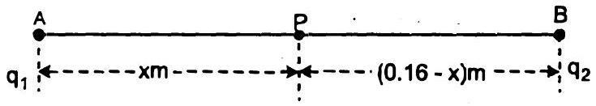
$\because \quad V=\frac{1}{4 \pi \varepsilon_{0}} \cdot \frac{q}{r}$
$\therefore \quad V_{1}=\frac{9 \times 10^{9} \mathrm{Nm}^{2} \mathrm{C}^{-2} \times 5 \times 10^{-8} \mathrm{C}}{x \mathrm{~m}}$
तथा $V_{2}=\frac{9 \times 10^{9} \mathrm{Nm}^{2} \mathrm{C}^{-2} \times\left(-3 \times 10^{-8} \mathrm{C}\right)}{(0.16-x) \mathrm{m}}$
यदि $P$ पर कुल विभव $V$ है, तब

$$
V=V_{1}+V_{2} .
$$

या $\quad V=0$
या $\quad V=\left[\frac{9 \times 10^{9} \times 5 \times 10^{-8}}{x}\right.$

$$
\left.+\frac{9 \times 10^{9} \times\left(-3 \times 10^{-8}\right)}{(0.16-x)}\right] \mathrm{NmC}^{-1}=0
$$

या

$$
9 \times 10^{9} \times 10^{-8}\left[\frac{5}{x}-\frac{3}{0.16-x}\right]=0
$$

या

$$
\frac{5}{x}=\frac{3}{0.16-x}
$$

या $5(0.16-x)=3 x$
या

$$
0.8-5 x=3 x
$$

या

$$
8 x=0.8
$$

या

$$
x=0.1 \mathrm{~m}
$$

या

$$
x=10 \mathrm{~cm}
$$

उत्तर
अब $5 \times 10^{-8} \mathrm{C}$ से $10 \mathrm{~cm}$ दूरी पर यदि $x$ बढ़ी हुई रेखा $A B$ पर स्थित है, तो अभीष्ट शर्त है।
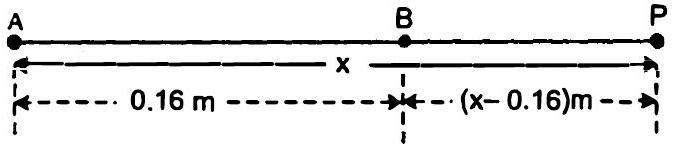
$\frac{5}{x}-\frac{3}{x-0.16}=0$

$$
5(x-0.16)=3 x
$$

या

$$
\begin{aligned}
2 x & =0.8 \mathrm{~m} \\
x & =0.4 \mathrm{~m} \\
x & =40 \mathrm{~cm}
\end{aligned}
$$

अत: $5 \times 10^{-8} \mathrm{C}$ से ऋणावेश की ओर। उत्तर

प्रश्न 2.2. $10 \mathrm{~cm}$ भुजा वाले एक समषट्भुज के प्रत्येक शीर्ष पर $5 \mu \mathrm{C}$ का आवेश है। षट्मुज के केंद्र पर विभव परिकलित कीजिए।

हल : माना $A B C D E F$ एक समषट्भुज है, जिसकी भुजा $10 \mathrm{~cm}$ है तथा इसका केन्द्र $O$ है।
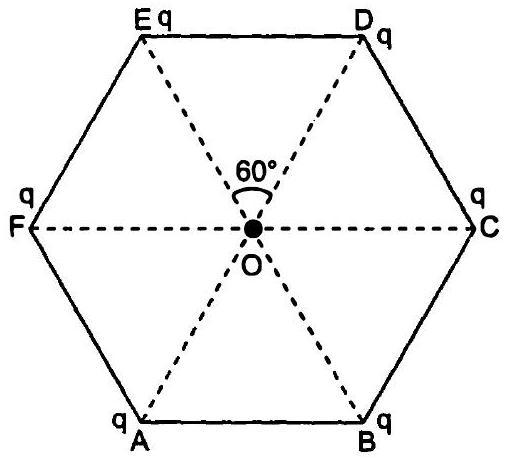
∵ पट्भुज के प्रत्येक शीर्ष पर आवेश $=q$

$$
\begin{aligned}
& =5 \mu \mathrm{C}=5 \times 10^{-6} \mathrm{C} \\
A B & =B C=C D-D E=E F
\end{aligned}
$$

तथा भुजा $=F A=10 \mathrm{~cm}=0.10 \mathrm{~m}$
∵ समषट्भुज में सभी त्रिभुज समत्रिभुज हैं।

$$
\begin{aligned}
\therefore O A=O B & =O C=O D=O E \\
& =O F=A B=0.10 \mathrm{~m}
\end{aligned}
$$

$\because \quad V=\frac{1}{4 \pi \varepsilon_{0}} \cdot \sum_{i=1}^{6} \frac{q_{i}}{r_{i}}$
$\therefore \quad V=\frac{1}{4 \pi \varepsilon_{0}} \times \frac{q}{r} \times 6$
या $\quad V=\frac{6 \times 9 \times 10^{9} \mathrm{Nm}^{2} \mathrm{C}^{-2} \times 5 \times 10^{-6} \mathrm{C}}{0.1 \mathrm{~m}}$
या $V=270 \times 10^{3} \times 10 \mathrm{~V}$
या $V=2.7 \times 10^{6} \mathrm{~V}$
अत: ष्ट्मुज के केंद्र पर विभव

$$
=2.7 \times 10^{6} \mathrm{~V}
$$

उत्तर
प्रश्न 2.3. $6 \mathrm{~cm}$ की दूरी पर अवस्थित दो बिन्दुओं $A$ एवं $B$ पर दो आवेश $2 \mu \mathrm{C}$ तथा $-2 \mu \mathrm{C}$ रखे हैं।
(a) निकाय के सम विभव पृष्ठ की पहचान कीजिए।
(b) इस पृष्ठ के प्रत्येक बिंदु पर विद्युत क्षेत्र की दिशा क्या है? हल : (a) $\because A$ एवं $B$ पर दो आवेश $2 \mu \mathrm{C}$ और $-2 \mu \mathrm{C}$ रखे हैं।

$$
\text { तथा } A B=6 \mathrm{~cm}=0.06 \mathrm{~m}
$$

दो दिए गए आवेशों के निकाय का सम विभव पृष्ठ $A$ एवं $B$ को मिलाने वाली रेखा के अभिलम्ब पर है।

पृष्ठ, $A B$ के मध्य-बिन्दु $C$ से गुजरता है।

$$
\therefore \frac{1}{4 \pi \varepsilon_{0}}\left[\frac{2 \times 10^{-6} \mathrm{C}}{0.03 \mathrm{~m}}+\frac{\left(-2 \times 10^{-6} \mathrm{C}\right)}{0.03 \mathrm{~m}}\right]=0
$$

इस प्रकार, इस पृष्ठ के प्रत्येक बिन्दु पर समान विभव है और वह शून्य है।

अत: यह एक सम विभव पृष्ठ है।
अत: $A B$ के अभिलंबवत् एवं इसके मध्य-बिंदु से होकर जाने वाले तल के प्रत्येक बिंदु पर विभव शून्य है। उत्तर
(b) चूँकि विद्युत क्षेत्र सदैव + से - आवेश की ओर कार्य करता है। इस प्रकार यहाँ विद्युत क्षेत्र धनावेशित (+) बिन्दु $A$ से ऋणावेशित (-) बिन्दु $B$ की ओर कार्य करता है तथा यह सम विभव पृष्ठ के अभिलम्ब है।
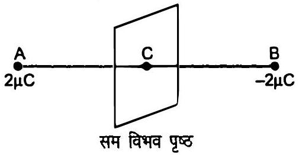

अतः पृष्ठ के प्रत्येक बिंदु पर विद्युत क्षेत्र तल के अभिलंब $A B$ दिशा में है। उत्तर
प्रश्न 2.4. $12 \mathrm{~cm}$ त्रिज्या वाले एक गोलीय चालक के पृष्ठ पर $1.6 \times 10^{-7} \mathrm{C}$ का आवेश एकसमान रूप से वितरित है :
(a) गोले के अन्दर,
(b) गोले के ठीक बाहर,
(c) गोले के केंद्र से $18 \mathrm{~cm}$ पर अवस्थित, किसी बिंदु पर विद्युत क्षेत्र क्या होगा?
हल : ∵ चालक पर आवेश $q=16 \times 10^{-7} \mathrm{C}$
तथा गोलीय चालक की त्रिज्या $r=12 \mathrm{~cm}=0.12 \mathrm{~m}$
(a) ∵ गोलीय चालक का दिया गया आवेश उसके पृष्ठ पर रहता है।
∴ गोलीय चालक के अन्दर विद्युत-क्षेत्र शून्य है।
$\because \quad \boldsymbol{\phi}=\oint_{S} \mathbf{E . d S}$

या

$$
\phi=\frac{q}{\varepsilon_{0}}
$$

∵ $q=0$ चालक के भीतर
$\therefore \quad \phi=0$
या $E . d s=0$
या $\quad \mathbf{E}=0$
अत: गोले के अंदर विद्युत क्षेत्र शून्य है। उत्तर
(b) गोले के ठीक बाहर एक बिन्दु पर अर्थात् पृष्ठ के एक बिन्दु पर, आवेश को गोले के केन्द्र पर संकेन्द्रित माना जा सकता है।
∵

$$
E=\frac{1}{4 \pi \varepsilon_{0}} \cdot \frac{q}{r^{2}}
$$

∴

$$
E=\frac{9 \times 10^{9} \mathrm{Nm}^{2} \mathrm{C}^{-2} \times 16 \times 10^{-7} \mathrm{C}}{(0.12 \mathrm{~m})^{2}}
$$

या

$$
E=\frac{9 \times 16 \times 10^{2}}{144 \times 10^{-2}} \cdot \mathrm{NC}^{-1}
$$

या

$$
E=\frac{14.4 \times 10^{2}}{14.4 \times 10^{-3}} \mathrm{NC}^{-1}
$$

या

$$
E=10^{5} \mathrm{NC}^{-1}
$$

अत: गोले के ठीक बाहर विद्युत क्षेत्र $10^{5} \mathrm{NC}^{-1}$ है। उत्तर
(c) गोले के केन्द्र से बिन्दु की दूरी

$$
=x=18 \mathrm{~cm}=0.18 \mathrm{~m}
$$

∵

$$
E=\frac{1}{4 \pi \varepsilon_{0}} \cdot \frac{q}{x^{2}}
$$

∴

$$
E=9 \times 10^{9} \mathrm{Nm}^{2} \mathrm{C}^{-2} \times \frac{16 \times 10^{-7} \mathrm{C}}{(0.18 \mathrm{~m})^{2}}
$$

या

$$
E=\frac{14.4 \times 10^{2}}{3.24 \times 10^{-2}} \mathrm{NC}^{-1}
$$

या

$$
E=4.44 \times 10^{4} \mathrm{NC}^{-1}
$$

या

$$
E=4.4 \times 10^{4} \mathrm{NC}^{-1}
$$

अत: गोले के केन्द्र से $18 \mathrm{~cm}$ पर विद्युत क्षेत्र $4.4 \times 10^{4} \mathrm{NC}^{-1}$ है। उत्तर
प्रश्न 2.5. एक समान्तर पट्टिका संधारित्र, जिसकी पट्टिकाओं के बीच वायु है, की धारिता $8 \mathrm{pF}$ $\left(1 \mathrm{pF}-10^{-12} \mathrm{~F}\right)$ है। यदि पट्टिकाओं के बीच की दूरी को आधा कर दिया जाए और इनके बीच के स्थान में $6$ परावैद्युतांक का एक पदार्थ कर दिया जाए, तो इसकी धारिता क्या होगी?

हल : ∵ पट्टिकाओं के बीच वायु वाले समान्तर पट्टिका से संधारित्र की धारिता $C_{0}=8 \mathrm{pF}$
या

$$
C_{0}=8 \times 10^{-12} \mathrm{~F}
$$

माना प्रत्येक पट्टिका का क्षेत्रफल $=A$
तथा पट्टिकाओं के बीच दूरी $=d$
इस प्रकार, $C_{0}=\frac{\varepsilon_{0} A}{d}$

पट्टिकाओं के बीच परावैद्युत पदार्थ के साथ उनके बीच की दूरी

$$
\begin{aligned}
d^{\prime} & =\frac{d}{2} \\
\varepsilon & =\varepsilon_{0} K
\end{aligned}
$$

$C=$ संधारित्र की परावैद्युत पदार्थ की उपस्थिति में धारिता
तथा

$$
K=6
$$

इस प्रकार, $C=\frac{\varepsilon A}{d}$
या

$$
C=\frac{\varepsilon_{0} K A}{\left(\frac{d}{2}\right)} .
$$

या

$$
C=2 K \frac{\varepsilon_{0} A}{d} .
$$

समीकरण (ii) को समीकरण (i) से भाग देने पर,

$$
\frac{C}{C_{0}}=2 K
$$

या

$$
C=2 K C_{0}
$$

या

$$
C=2 \times 6 \times 8 \times 10^{-12} \mathrm{~F}
$$

या

$$
C=96 \times 10^{-12} \mathrm{~F}
$$

या

$$
C=96 \mathrm{pF}
$$

अत: अभीष्ट धारिता $=96 \mathrm{pF}$ उत्तर
प्रश्न 2.6. $9 \mathrm{pF}$ धारिता वाले तीन संधारित्रों को श्रेणीक्रम में जोड़ा गया है :
(a) संयोजन की कुल धारिता क्या है?
(b) यदि संयोजन को $120 \mathrm{~V}$ के संभरण ( सप्लाई ) से जोड़ दिया जाए, तो प्रत्येक संथारित्र पर क्या विभवांतर होगा?
हल : ∵ प्रत्येक संधारित्र की धारिता
$C_{1}=C_{2}=C_{3}=9 \mathrm{pF}=9 \times 10^{-12} \mathrm{~F}$
संभरण विभव $V=120 \mathrm{~V}$
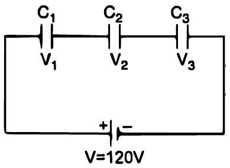
(a) श्रेणी संयोजन की धारिता $=C_{S}$
श्रेणी संयोजन में कुल धारिता
$\because \quad \frac{1}{C_{s}}=\frac{1}{C_{1}}+\frac{1}{C_{2}}+\frac{1}{C_{3}}$
$\therefore \quad \frac{1}{C_{s}}=\frac{1}{9 \times 10^{-12}}+\frac{1}{9 \times 10^{-12}}+\frac{1}{9 \times 10^{-12}}$
या $\frac{1}{C_{s}}=\frac{1+1+1}{9 \times 10^{-12}}$
या $\frac{1}{C_{s}}=\frac{1}{3 \times 10^{-12}}$
या $C_{s}=3 \times 10^{-12} \mathrm{~F}=3 \mathrm{pF}$
अत: संयोजन की कुल धारिता $=3 \mathrm{pF}$ उत्तर
(b) माना संधारित्रों के विभव क्रमश: $V_{1}, V_{2}$ तथा $V_{3}$
$V_{1}, V_{2}$ तथा $V_{3}$ का योग $=V_{1}+V_{2}+V_{3}=120 \mathrm{~V}$
माना प्रत्येक संधारित्र पर $q$ आवेश है, तब
$q=C V$ से,

$$
V_{1}=\frac{q}{C_{1}}
$$

इसी प्रकार,

$$
V_{2}=\frac{q}{C_{2}}
$$

तथा

$$
V_{3}=\frac{q}{C_{3}}
$$

∴

$$
\frac{q}{C_{1}}+\frac{q}{C_{2}}+\frac{q}{C_{3}}=120
$$

$$
\left[\because V_{1}+V_{2}+V_{3}=120 \mathrm{~V}\right]
$$

या

$$
q\left(\frac{1}{C_{1}}+\frac{1}{C_{2}}+\frac{1}{C_{3}}\right)=120 \mathrm{~V}
$$

या

$$
\frac{q}{3 \times 10^{-12}}=120 \mathrm{~V}
$$

या

$$
q=120 \times 3 \times 10^{-12} \mathrm{C}
$$

या

$$
q=360 \times 10^{-12} \mathrm{C}
$$

या

$$
q=0.36 \mu \mathrm{C}
$$

∴

$$
V_{1}+V_{2}+V_{3}=\frac{q}{C}
$$

तथा

$$
V_{1}=V_{2}=V_{3}
$$

∴

$$
V_{s}=\frac{q}{C}
$$

या

$$
V_{s}=\frac{360 \times 10^{-12} \mathrm{C}}{9 \times 10^{-12} \mathrm{~F}}
$$

या

$$
V_{s}=40 \mathrm{~V}
$$

अत: प्रत्येक संधारित्र पर विभवान्तर होगा $=40 \mathrm{~V}$ उत्तर

प्रश्न 2.7. $2 \mathrm{pF}, 3 \mathrm{pF}$ और $4 \mathrm{pF}$ धारिता वाले तीन संधारित्र पाशर्वक्रम में जोड़े गए हैं।
(a) संयोजन की कुल धारिता क्या है?
(b) यदि संयोजन को $100 \mathrm{~V}$ के संभरण से जोड़ दें, तो प्रत्येक संधारित्र पर आवेश ज्ञात कीजिए।
हल : $\because C_{1}=2 \mathrm{pF}=2 \times 10^{-12} \mathrm{~F}$

$$
C_{2}=3 \mathrm{pF}=3 \times 10^{-12} \mathrm{~F}
$$

तथा
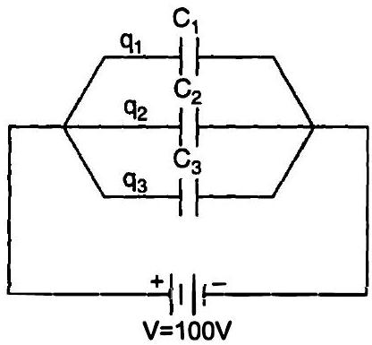
संयोजन को दिया गया विभव $=V$
(a) $C_{p}=$ संयोजन (समांतर) की कुल धारिता

$$
C_{p}=C_{1}+C_{2}+C_{3}
$$

या

$$
C_{p}=\left(2 \times 10^{-12}+3 \times 10^{-12}+4 \times 10^{-12}\right) \mathrm{F}
$$

या

$$
C_{p}=9 \times 10^{-12} \mathrm{~F}
$$

या

$$
C_{p}=9 \mathrm{pF}
$$

अत: संयोजन की कुल धारिता $=9 \mathrm{pF}$ उत्तर
(b) माना संधारित्र $C_{1}, C_{2}$ एवं $C_{3}$ पर आवेश क्रमश:
$q_{1}, q_{2}$ तथा $q_{3}$ हैं।
∵

$$
q=C V \text { तथा } V=100 \mathrm{~V}
$$

∴

$$
q_{1}=C_{1} V
$$

$$
\begin{aligned}
& =2 \times 10^{-12} \mathrm{~F} \times 100 \mathrm{~V} \\
& =2 \times 10^{-10} \mathrm{C} \\
q_{2} & =C_{2} \mathrm{~V} \\
& =3 \times 10^{-12} \mathrm{~F} \times 100 \mathrm{~V} \\
& =3 \times 10^{-10} \mathrm{C}
\end{aligned}
$$

तथा

$$
\begin{aligned}
q_{3} & =C_{3} \mathrm{~V} \\
& =4 \times 10^{-12} \mathrm{~F} \times 100 \mathrm{~V} \\
& =4 \times 10^{-10} \mathrm{C}
\end{aligned}
$$

अत: प्रत्येक संधारित्र पर आवेश क्रमश: $2 \times 10^{-10} \mathrm{C}$, $3 \times 10^{-10} \mathrm{C}$ तथा $4 \times 10^{-10} \mathrm{C}$ हैं। उत्तर

प्रश्न 2.8. पट्टिकाओं के बीच वायु वाले एक समांतर पट्टिका संधारित्र की प्रत्येक पट्टिका का क्षेत्रफल $6 \times 10^{-3} \mathrm{~m}^{2}$ तथा उनके बीच की दूरी $3 \mathrm{~mm}$ है। संधारित्र की धारिता को परिकलित कीजिए। यदि इस संधारित्र को $100 \mathrm{~V}$ के संभरण से जोड़ दिया जाए, तो संधारित्र की प्रत्येक पट्टिका पर कितना आवेश होगा?

हल : ∵ समान्तर पट्टिका संधारित्र की प्रत्येक पट्टिका का क्षेत्रफल, $A=6 \times 10^{-3} \mathrm{~m}^{2}$

पट्टिकाओं के बीच दूरी $=3 \mathrm{~mm}=3 \times 10^{-3} \mathrm{~m}$
तथा $\varepsilon_{0}=8.854 \times 10^{-12} \mathrm{C}^{2} \mathrm{~N}^{-1} \mathrm{~m}^{-2}$
माना पट्टिकाओं के बीच वायु के साथ समान्तर पट्टिका एवं संधारित्र की धारिता $=C_{0}$
$\because \quad C_{0}=\frac{\varepsilon_{0} A}{d}$
$\therefore \quad C_{0}=\frac{8.854 \times 10^{-12} \times 6 \times 10^{-3}}{3 \times 10^{-3}} \mathrm{~F}$
या $C_{0}=17.708 \times 10^{-12} \mathrm{~F}$
या $C_{0}=17.708 \mathrm{pF}$
या $\quad C_{0}=18 \mathrm{pF}$
अत: पट्टिका संधारित्र की धारिता $=18 \mathrm{pF}$ उत्तर
संधारित्र पर लगाया गया संभरण $=V_{0}=100 \mathrm{~V}$
संधारित्र की प्रत्येक पट्टिका पर आवेश $=q_{0}$
$\because \quad q_{0}=C_{0} V_{0}$
$\therefore \quad q_{0}=17.708 \times 10^{-12} \times 100 \mathrm{C}$
या $q_{0}=17.708 \times 10^{-10} \mathrm{C}$
या $q_{0}=1771 \times 10^{-10} \mathrm{C}$
या $q_{0}=18 \times 10^{-9} \mathrm{C}$

अत: संधारित्र की प्रत्येक पट्टिका पर आवेश होगा $=1.8 \times 10^{-9} \mathrm{C}$ उत्तर

प्रश्न 2.9. प्रश्न $2.8$ में दिए गए संधारित्र की पट्टिकाओं के बीच यदि $3 \mathrm{~mm}$ मोटी अभक की एक शीट ( पत्तर ) ( परावैद्युतांक $=6$ ) रख दी जाती है, तो स्पष्ट कीजिए कि क्या होगा, जब :
(a) विभव ( वोल्टेज ) संभरण जुड़ा ही रहेगा।
(b) संभरण को हटा लिया जाएगा।

हल : (a) संधारित्र की वायु माध्यम के साथ धारिता

$$
=C_{0}
$$

∵ पट्रिकाओं के बीच दूरी $=d=3 \times 10^{-3} \mathrm{~m}$
अश्रक (माइका) की पट्टी की मोटाई

$$
=t=3 \times 10^{-3} \mathrm{~m}=d
$$

पट्टी का परावैद्युतांक $K=6$
∵ पट्रिकाओं के बीच के स्थान को अश्रक की पट्टी पूर्ण रूप से घेर लेती है।

तथा संधारित्र की धारिता $=C$
∴

$$
C=K C_{0}
$$

या

$$
C=6 \times 18 \times 10^{-12} \mathrm{~F}
$$

या

$$
C=108 \times 10^{-12} \mathrm{~F}
$$

या

$$
C=108 \mathrm{pF}
$$

इस प्रकार, अश्रक की पट्टी रखने के पश्चात् संधारित्र की धारिता $K$ गुना हो जाती है।
∴ संधारित्र पर विभव $=100 \mathrm{~V}$
संधारित्र में अश्रक की पट्टी के साथ उसके ऊपर आवेश

$$
q^{\prime}=C V
$$

या $q^{\prime}=108 \times 10^{-12} \times 100 \mathrm{C}$
या $q^{\prime}=108 \times 10^{-8} \mathrm{C}$
अत: $q^{\prime}=K C_{0} V$
या $q^{\prime}=K q$
या $q^{\prime}=6 \times 18 \times 19^{-9} \mathrm{C}$
या $q^{\prime}=108 \times 10^{-8} \mathrm{C}$
अत: पट्टिकाओं पर आवेश वायु माध्यम आवेश का $K$ गुना हो जाता है अर्थात् जब संभरण जुड़ा रहता है और अभक की पट्टी माध्यम हो, तो आवेश बढ़ जाता है। उत्तर
(b) संधारित्र की अभ्रक माध्यम के साथ धारिता

$$
C=K C_{0}
$$

या $C=108 \times 10^{-12} \mathrm{~F}$
या $C=108 \mathrm{pF}$
जब संभरण को हटा दिया जाता है (या काट दिया जाता है) अर्थात् $V=0$, तो संधारित्र की पट्टिकाओं पर विभवांतर $V^{\prime} K$ गुना कम हो जाता है।

या

$$
V^{\prime}=\frac{100}{6} \mathrm{~V}=16.67 \mathrm{~V}
$$

अब $C 6$ गुना हो जाता है।
इस प्रकार, यदि संभरण हटाने के बाद आवेश $=q_{1}$
तब $q_{1}=C V^{\prime}$
या $q_{1}=K C_{0} \times \frac{100}{6}$
या $q_{1}=6 \times 18 \times 10^{-12} \times \frac{100}{6}$
या $q_{1}=18 \times 10^{-10} \mathrm{C}$
या $q_{1}=18 \times 10^{-9} \mathrm{C}$
अतः संधारित्र पर आवेश अभक्ष्म माध्यम के साथ उतना ही रहेगा, जितना कि वायु माध्यम के साथ था। उत्तर

प्रश्न 2.10. $12$ pF का एक संधारित्र $50$ V की बैटरी से जुड़ा है। संधारित्र में कितनी स्थिरवैद्युत ऊर्जा संचित होगी?

हल : ∵ संधारित्र की धारिता,

$$
C=12 \mathrm{pF}
$$

या $C=12 \times 10^{-12} \mathrm{~F}$
∵ संधारित्र से जुड़े संभरण की वोल्टता $V=50 \mathrm{~V}$
माना संधारित्र में संग्रहीत स्थिर वैद्युत ऊर्जा $=U$

$$
\begin{array}{ll}
\because & U=\frac{1}{2} C V^{2} \\
\therefore & U=\frac{1}{2} \times 12 \times 10^{-12} \times(50)^{2} \mathrm{~J}
\end{array}
$$

या $U=6 \times 2500 \times 10^{-12} \mathrm{~J}$
या $U=150 \times 10^{-10} \mathrm{~J}$
या $U=15 \times 10^{-8} \mathrm{~J}$.
अत: संधारित्र में स्थिर वैद्युत ऊर्जा संचित होगी

$$
=1.5 \times 10^{-8} \mathrm{~J} \text { उत्तर }
$$

प्रश्न 2.11. $200 \mathrm{~V}$ संभरण (सप्लाई) से एक $500 \mathrm{pF}$ के संधारित्र को आवेशित किया जाता है। फिर इसको संभरण से वियोजित कर देते हैं तथा एक अन्य $600 \mathrm{pF}$ वाले अनावेशित संधारित्र से जोड़ देते हैं। इस प्रक्रिया में कितनी ऊर्जा का ह्रास होता है?

हल : ∵ संधारित्र की धारिता

$$
\begin{aligned}
& =C_{1}=600 \mathrm{pF} \\
& =600 \times 10^{-12} \mathrm{~F} \\
& =6 \times 10^{-10} \mathrm{~F}
\end{aligned}
$$

तथा $V_{1}=$ संभरण वोल्टता $=200 \mathrm{~V}$
माना आरम्भिक संग्रहीत स्थिर वैद्युत ऊर्जा $=U_{1}$
तब $U=\frac{1}{2} C V^{2}$
$\therefore \quad U_{1}=\frac{1}{2} C_{1} V_{1}^{2}$
या $U_{1}=\frac{1}{2} \times 6 \times 10^{-10} \times(200)^{2} \mathrm{~J}$
या $U_{1}=12 \times 10^{-6} \mathrm{~J}$
या $U_{1}=12 \mu \mathrm{~J}$
∵ दूसरे संधारित्र की धारिता $C_{2}=600 \mathrm{pF}$

$$
=6 \times 10^{-10} \mathrm{~F}
$$

तथा दूसरे संधारित्र की धारिता $q_{2}=0$
पहले संधारित्र पर आवेश $=q_{1}=C_{1} V_{1}$
या $q_{1}=6 \times 10^{-10} \times 200 \mathrm{C}$
या $q_{1}=12 \times 10^{-8} \mathrm{C}$
जब पहले संधारित्र को दूसरे अनावेशित संधारित्र से जोड़ दिया जाता है, तो आवेश दोनों संधारित्रों द्वारा बराबर बाँटा जाता है।

जोड़ने पर, यदि प्रत्येक संधारित्र पर आवेश $=q$
तब

$$
q=\frac{q_{1}+q_{2}}{2}
$$

या

$$
q=\frac{12 \times 10^{-8}+0_{\mathrm{C}}}{2}
$$

या

$$
q=6 \times 10^{-8} \mathrm{C}
$$

यदि $C_{1}$ पर अंतिम स्थिर वैद्युत ऊर्जा रह जाती है $=U_{2}$
तब

$$
U_{2}=\frac{1}{2} \times \frac{q^{2}}{C}
$$

या

$$
U_{2}=\frac{1}{2} \times \frac{\left(6 \times 10^{-8}\right)^{2}}{6 \times 10^{-10}}
$$

या

$$
U_{2}=3 \times 10^{-6} \mathrm{~J}
$$

या

$$
U_{2}=3 \mu \mathrm{~J}
$$

यदि प्रक्रम में ऊर्जा ह्रास $=U$
तब

$$
U=U_{1}-U_{2}
$$

∴

$$
U=12 \times 10^{-6} \mathrm{~J}-6 \times 10^{-6} \mathrm{~J}
$$

या

$$
U=6 \times 10^{-6} \mathrm{~J}
$$

अत: इस प्रक्रिया में ऊर्जा का ह्रास होता है $=6 \times 10^{-6} \mathrm{~J}$ उत्तर
द्वितीय विधि-

$$
V_{1}=\frac{1}{2} C_{1} V_{1}^{2}
$$

या

$$
V_{1}=\frac{1}{2} \times 6 \times 10^{-10} \times(200)^{2} \mathrm{~J}
$$

या

$$
V_{1}=12 \times 10^{-6} \mathrm{~J}
$$

तथा

$$
C_{2}=6 \times 10^{-10} \mathrm{~F} \text { एवं } V_{2}=0
$$

माना सम्मिलित विभव $=V$
∴

$$
V=\frac{C_{1} V_{1}+C_{2} V_{2}}{C_{1}+C_{2}}
$$

या

$$
V=\frac{6 \times 10^{-10} \times 200+6 \times 10^{-10} \times 0}{6 \times 10^{-10}+6 \times 10^{-10}} \mathrm{~V}
$$

या

$$
V=-\frac{12 \times 10^{-8}}{12 \times 10^{-10}}
$$

या

$$
V=100 \mathrm{~V}
$$

यदि अंतिम वैद्युत ऊर्जा $=U_{2}$, तब

$$
U_{2}=\frac{1}{2}\left(C_{1}+C_{2}\right) V^{2}
$$

या

$$
U_{2}=\frac{1}{2} \times\left(6 \times 10^{-10}+6 \times 10^{-10}\right) \times(100)^{2} \mathrm{~J}
$$

या

$$
U_{2}=6 \times 10^{-6} \mathrm{~J}
$$

स्थिर वैद्युत ऊर्जा में ह्रास $=U_{1}-U_{2}$

$$
\begin{aligned}
& =12 \times 10^{-6} \mathrm{~J}-6 \times 10^{-6} \mathrm{~J} \\
& =6 \times 10^{-6} \mathrm{~J}
\end{aligned}
$$

अत: इस प्रक्रिया में ऊर्जा का ह्रास होता है

$$
=6 \times 10^{-6} \mathrm{~J}
$$

उत्तर

## अतिरिक्त प्रश्न

प्रश्न 2.12. मूल बिंदु पर एक $8 \mathrm{mC}$ का आवेश अवस्थित है। $-2 \times 10^{-9} \mathrm{C}$ के एक छोटे से आवेश को बिंदु $P(0,0,3 \mathrm{~cm})$ से , बिंदु $R(0,6 \mathrm{~cm}, 9 \mathrm{~cm})$ से होकर, बिंदु $Q(0,4 \mathrm{~cm}, 0)$ तक ले जाने में किया गया कार्य परिकलित कीजिए।

हल : ∵ मूल बिन्दु $O$ पर आवेश $=q=8 \mathrm{mC}$

$$
=8 \times 10^{-3} \mathrm{C}
$$

$R$ से होकर $P$ से $Q$ पर ले जाए जाने वाला आवेश

$$
q_{0}=-2 \times 10^{-9} \mathrm{C}
$$

$P$ की आरम्भिक स्थिति $=\mathrm{r}_{1}=3 \hat{\mathbf{k}} \mathrm{~cm}$
$Q$ की अंतिम स्थिति $=\mathbf{r}_{\mathbf{2}}=4 \hat{\mathbf{j}} \mathrm{~cm}$
तथा

$$
\begin{aligned}
& r_{1}=3 \mathrm{~cm}=3 \times 10^{-2} \mathrm{~m} \\
& r_{2}=4 \mathrm{~cm}=4 \times 10^{-2} \mathrm{~m}
\end{aligned}
$$

∵ स्थिरवैद्युत बल आरक्षी बल है।
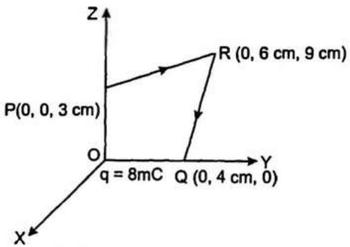
$\therefore q_{0}$ को ले जाने में किया गया कार्य पथ से स्वतन्त्र
अत: बिन्दु $R$ की कोई प्रासंगिकता नहीं है।
माना $q_{0}$ को $P$ से $Q$ पर ले जाने में किया गया कार्य = $W_{P Q}$
तब

$$
W_{P Q}=\frac{1}{4 \pi \varepsilon_{0}} q_{0} q\left(\frac{1}{r_{2}}-\frac{1}{r_{2}}\right)
$$

∴

$$
\begin{aligned}
& W_{P Q}=9 \times 10^{9} \mathrm{Nm}^{2} \mathrm{C}^{-2} \times\left(-2 \times 10^{-9}\right) \mathrm{C} \\
& \quad \times 8 \times 10^{-3} \mathrm{C}\left(\frac{1}{4 \times 10^{-2}}-\frac{1}{3 \times 10^{-2}}\right) \frac{1}{\mathrm{~m}}
\end{aligned}
$$

या

$$
W_{P Q}=-18 \times 8 \times 10^{-3} \times\left(\frac{10^{2}}{4}-\frac{10^{2}}{3}\right) \mathrm{J}
$$

या

$$
W_{P Q}=-144 \times 10^{-3} \times 10^{2}\left(\frac{1}{4}-\frac{1}{3}\right) \mathrm{J}
$$

या $W_{P Q}=-144 \times 10^{-3} \times 100\left(\frac{1}{4}-\frac{1}{3}\right) \mathrm{J}$
या $W_{P Q}=-144 \times 10^{-1}\left(\frac{-1}{12}\right) \mathrm{J}$
या $W_{P Q}=12 \mathrm{~J}$
अत: अभीष्ट कार्य $=12 \mathrm{~J}$ उत्तर

प्रश्न 2.13. $b$ भुजा वाले एक घन के प्रत्येक शीर्ष पर $q$ आवेश है। इस आवेश विन्यास के कारण घन के केन्द्र पर विद्युत-विभव तथा विद्युत क्षेत्र ज्ञात कीजिए।
हल : ∵ घन की भुजा $=b$
तथा घन के प्रत्येक शीर्ष पर आवेश $=q$
अब पृष्ठ $A B G H$ का विकर्ण $=H B$

$$
\begin{aligned}
& =\sqrt{A B^{2}+A H^{2}} \\
& =\sqrt{b^{2}+b^{2}} \\
& =b \sqrt{2}
\end{aligned}
$$

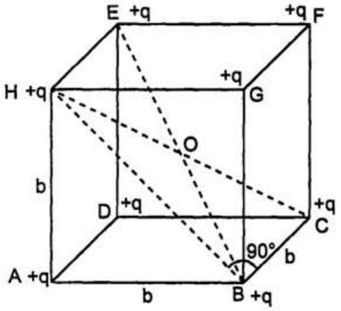
घन का विकर्ण

$$
\begin{aligned}
H C & =\sqrt{H B^{2}+B C^{2}} \\
& =\sqrt{b^{2}+b^{2}+b^{2}} \\
& =b \sqrt{3} \\
H O & =O C=\frac{b \sqrt{3}}{2}
\end{aligned}
$$

इसी प्रकार,

$$
O A=O B=O E=O G=O F=O D=\frac{\sqrt{3}}{2} b
$$

अर्थात् घन के प्रत्येक शीर्ष की उसके केन्द्र से दूरी $=\frac{\sqrt{3}}{2} b$ है।
अत: $O$ से प्रत्येक आवेश की दूरी $=\frac{\sqrt{3}}{2} b$
माना $O$ पर विद्युत विभव $=V$ तथा विद्युत क्षेत्र $E=$ ?
∵

$$
V=\frac{1}{4 \pi \varepsilon_{0}}-\sum_{i=1}^{n} \frac{q_{i}}{r_{i}}
$$

तथा

$$
E=\frac{1}{4 \pi \varepsilon_{0}} \sum_{i=1}^{n} \frac{q_{i}}{r_{1}^{2}}
$$

∴

$$
\begin{aligned}
V=\frac{1}{4 \pi \varepsilon_{0}} & {\left[\frac{q}{O A}+\frac{q}{O B}+\frac{q}{O C}+\frac{q}{O D}\right.} \\
& \left.+\frac{q}{O E}+\frac{q}{O F}+\frac{q}{O G}+\frac{q}{O H}\right]
\end{aligned}
$$

या

$$
V=\frac{1}{4 \pi \varepsilon_{0}}\left[q / \frac{b \sqrt{3}}{2}+q / \frac{b \sqrt{3}}{2}+\ldots .8 \text { बार }\right]
$$

या

$$
V=\frac{1}{4 \pi \varepsilon_{0}} \times \frac{8 \times 2 q}{b \sqrt{3}}
$$

या

$$
V=\frac{1}{4 \pi \varepsilon_{0}} \times \frac{16 q}{b \sqrt{3}}
$$

या

$$
V=\frac{4 q}{\pi \varepsilon_{0} b \sqrt{3}}
$$

या

$$
V=\frac{4 q}{\sqrt{3} \pi \varepsilon_{0} b}
$$

अत: $O$ से प्रत्येक शीर्ष पर आवेश के कारण, विपरीत शीर्षों का विद्युत क्षेत्र परिणाम में समान; परन्तु दिशा में विपरीत है। जैसे $A$ एवं $F, B$ एवं $E, C$ एवं $H, D$ एवं $G$ के क्षेत्र समान परन्तु विपरीत हैं।
अत: विद्युत विभव $\frac{4 q}{\sqrt{3} \pi \varepsilon_{0} b}$ है तथा आवेशों की सममिति के कारण $O$ पर कुल विद्युत-क्षेत्र शून्य है। उत्तर
प्रश्न 2.14. $1.5 \mu \mathrm{C}$ और $2.5 \mu \mathrm{C}$ आवेश वाले दो सूक्ष्म गोले $30 \mathrm{~cm}$ दूर स्थित हैं।
(a) दोनों आवेशों को मिलाने वाली रेखा के मध्य बिंदु पर, और
(b) मध्य बिंदु से होकर जाने वाली रेखा के अभिलंब तल में मध्य बिंदु से $10 \mathrm{~cm}$ दूर स्थित किसी बिंदु पर विभव और विद्युत क्षेत्र ज्ञात कीजिए।

हल : $\because q_{1}=15 \mu \mathrm{C}=15 \times 10^{-6} \mathrm{C}$
तथा $q_{2}=25 \mu \mathrm{C}=25 \times 10^{-6} \mathrm{C}$
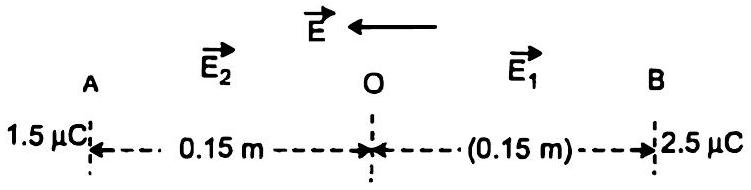
तथा दोनों आवेशों के बीच की दूरी $=r=30 \mathrm{~cm}=0.30 \mathrm{~m}$

माना रेखा $A B$ का मध्य-बिन्दु $O$ है।
(a) यदि आवेशों $15 \mu \mathrm{C}$ एवं $25 \mu \mathrm{C}$ के कारण $O$ पर विभव क्रमशः $V_{1}$ एवं $V_{2}$ हैं, तब

$$
\begin{aligned}
V & =\frac{1}{4 \pi \varepsilon_{0}} \cdot \frac{q}{r} \\
V_{1} & =9 \times 10^{9} \mathrm{Nm}^{2} \mathrm{C}^{-2} \times \frac{15 \times 10^{-6} \mathrm{C}}{0.15 \mathrm{~m}}
\end{aligned}
$$

या $V_{1}=9 \times 10^{4} \mathrm{~V}$
तथा $V_{2}=9 \times 10^{9} \mathrm{Nm}^{2} \mathrm{C}^{-2} \times \frac{25 \times 10^{-6} \mathrm{C}}{0.15 \mathrm{~m}}$
या $V_{2}=15 \times 10^{4} \mathrm{~V}$
यदि दोनों आवेशों के कारण $O$ पर कुल विभव $=V$
तब $\quad V=V_{1}+V_{2}$
या $V=9 \times 10^{4} \mathrm{~V}+15 \times 10^{4} \mathrm{~V}$
या $\quad V=24 \times 10^{4} \mathrm{~V}$
या $V=24 \times 10^{5} \mathrm{~V}$
अब माना $O$ पर कुल विद्युत क्षेत्र $=E$
यदि आवेश $q_{1}$ एवं $q_{2}$ के कारण $O$ पर क्रमशः विद्युत क्षेत्र $E_{1}$ एवं $E_{2}$ हैं, तब

$$
\begin{aligned}
E= & \frac{1}{4 \pi \varepsilon_{0}} \cdot \frac{q}{r^{2}} \\
E_{1}= & 9 \times 10^{9} \mathrm{Nm}^{2} \mathrm{C}^{-2} \\
& \quad \times \frac{15 \times 10^{-6} \mathrm{C}}{(0.15)^{2} \mathrm{~m}^{2}} \text { के अनुदिश }
\end{aligned}
$$

तथा $E_{2}=9 \times 10^{9} \mathrm{Nm}^{2} \mathrm{C}^{-2} \times \frac{25 \times 10^{-6} \mathrm{C}}{(0.15 \mathrm{~m})^{2}}$
$O A$ के अनुदिश
$\because E_{2}>E_{1} O$ पर कुल विद्युत क्षेत्र $O A$ की ओर

$$
\begin{gathered}
E=E_{2}-E_{1} \\
\text { या } E=9 \times 10^{9} \mathrm{Nm}^{2} \mathrm{C}^{-2} \times \frac{25 \times 10^{-6} \mathrm{C}}{(0.15)^{2} \mathrm{~m}^{2}} \\
-9 \times 10^{9} \mathrm{Nm}^{2} \mathrm{C}^{-2} \times \frac{15 \times 10^{-6} \mathrm{C}}{(0.15)^{2} \mathrm{~m}^{2}}
\end{gathered}
$$

या $E \frac{9 \times 10^{9} \times 10^{-6} \mathrm{Nm}^{2} \mathrm{C}^{-2}}{(0.15 \mathrm{~m})^{2}}(25-15) \mathrm{C}$
या $E=\frac{9 \times 10^{3}}{15 \times 15} \times 10^{4} \times 10 \mathrm{NC}^{-1}$
या $E=4.0 \times 10^{5} \mathrm{NC}^{-1} O A$ के अनुदिश $q_{1}$ की ओर
या $E=4.0 \times 10^{5} \mathrm{Vm}^{-1}, 25 \mu \mathrm{C}$ से $15 \mu \mathrm{C}$ की ओर।
अत: विभव $=2.4 \times 10^{5} \mathrm{~V}$ तथा कुल विद्युत क्षेत्र
$=4.0 \times 10^{5} \mathrm{Vm}^{-1}$ ओर आवेश $2.5 \mu \mathrm{C}$ से $1.5 \mu \mathrm{C}$ उत्तर
(b) माना $O$ में से जाने वाले $A B$ पर अभिलम्ब तल में $O$ से $10 \mathrm{~cm}$ दूर बिन्दु $P$ है।
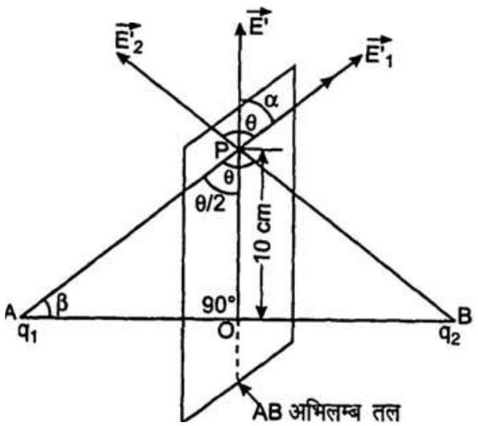
$A O=O B=0.15 \mathrm{~m}$
तथा $O P=10 \mathrm{~cm}=0.10 \mathrm{~m}$
माना $P$ पर कुल विभव $=V^{\prime}$
समकोण त्रिभुज $A O P$ में,
$\begin{aligned} \text { या } \quad A P & =\sqrt{ } A O^{2}+O P^{2} \\ A P & =\sqrt{ }\left[(0.15)^{2}+(0.10)^{2}\right] \mathrm{m}\end{aligned}$
या $A P=0.18 \mathrm{~m}$
इसी प्रकार, $B P=0.18 \mathrm{~m}$
अब $V^{\prime}=V_{1}+V_{2}$
$\therefore \quad V^{\prime}=\frac{1}{4 \pi \varepsilon_{0}} \cdot \frac{q_{1}}{A P}+\frac{1}{4 \pi \varepsilon_{0}} \cdot \frac{q_{2}}{B P}$
या $V^{\prime}=9 \times 10^{9} \mathrm{Nm}^{2} \mathrm{C}^{-2}$
$\times \frac{1.5 \times 10^{-6} \mathrm{C}}{0.18 \mathrm{~m}}+9 \times 10^{9} \mathrm{Nm}^{2} \mathrm{C}^{-2} \times \frac{25 \times 10^{-6} \mathrm{C}}{0.18 \mathrm{~m}}$
या $V^{\prime}=\frac{9 \times 10^{9} \mathrm{Nm}^{2} \mathrm{C}^{-2}}{0.18}[15+25] \times 10^{-6} \mathrm{C}$
या

$$
\begin{aligned}
V^{\prime} & =\frac{9 \times 10^{3} \times 4}{0.18} \mathrm{~V} \\
V & =2 \times 10^{5} \mathrm{~V}
\end{aligned}
$$

माना $q_{1}$ एवं $q_{2}$ के कारण $P$ पर विद्युत क्षेत्र क्रमश: $E_{1}$ एवं $E_{2}$ है।
तब

$$
E_{1}=\frac{1}{4 \pi \varepsilon_{0}} \cdot \frac{q_{1}}{A P^{2}} A P \text { के अनुदिश }
$$

या

$$
E_{1}=9 \times 10^{9} \mathrm{Nm}^{2} \mathrm{C}^{-2} \times \frac{15 \times 10^{-6} \mathrm{C}}{(0.18)^{2} \mathrm{~m}^{2}}
$$

या

$$
E_{1}=0.42 \times 10^{6} \mathrm{NC}^{-1} A P \text { के अनुदिश }
$$

तथा

$$
E_{2}=9 \times 10^{9} \times 10^{9} \mathrm{Nm}^{2} \mathrm{C}^{-2}
$$

$$
\times \frac{25 \times 10^{-6} \mathrm{C}}{(0.18 \mathrm{~m})^{2}}
$$

या

$$
E_{2}=0.69 \times 10^{6} \mathrm{NC}^{-1}
$$

∵

$$
\angle A P B=\theta
$$

∴

$$
\angle A P O=\frac{\theta}{2}
$$

अब समकोण $\triangle A O P$ में,

$$
\cos \left(\frac{\theta}{2}\right)=\frac{O P}{A P}=\frac{0.10}{0.18}
$$

या

$$
\cos \left(\frac{\theta}{2}\right)=\frac{5}{9}=0.556
$$

∴

$$
\frac{\theta}{2}=\cos ^{-1}
$$

∴

$$
\theta=1125^{\circ}
$$

यदि $q_{1}$ एवं $q_{2}$ के कारण $P$ पर परिणामी विद्युत क्षेत्र $=E$
तब

$$
R=\sqrt{P^{2}+Q^{2}+2 P Q \cos \theta}
$$

∵

$$
E=\sqrt{E_{1}^{2}+E_{2}^{2}+2 E_{1} E_{2} \cos \theta}
$$

या

$$
E=\sqrt{\begin{array}{r}
\left(0.42 \times 10^{6}\right)^{2}+\left(0.69 \times 10^{6}\right)^{2}+2 \\
\times 0.42 \times 0.69 \times(-0.38) \times 10^{12} \mathrm{NC}^{-1}
\end{array}}
$$

$\left[\because \cos \left(12.5^{\circ}\right)=-0.38\right]$
या

$$
\begin{array}{r}
E=10^{6} \sqrt{(0.42)^{2}+(0.69)^{2}-2 \times 0.42} \\
\times 0.69 \times 0.38 \mathrm{NC}^{-1}
\end{array}
$$

या $E=10^{6} \sqrt{(0.1764+0.4761-0.2202)} \mathrm{NC}^{-1}$
या $E=10^{6} \sqrt{0.4323} \mathrm{NC}^{-1}$
या $E=10^{6} \times 0.658 \mathrm{NC}^{-1}$
या $E=6.58 \times 10^{5} \mathrm{NC}^{-1}$
या $E=6.6 \times 10^{5} \mathrm{NC}^{-1}$
या $E=6.6 \times 10^{5} \mathrm{Vm}^{-1}$
अब माना $E$ से $\alpha$ कोण बनाता है।
∴

$$
\tan \alpha=\frac{E_{2} \sin \theta}{E_{1}+E_{2} \cos \theta}
$$

या

$$
\tan \alpha=\frac{0.69 \times 10^{6} \times 0.9239}{0.42 \times 10^{6}+0.69 \times 10^{6} \times(-0.38)}
$$

$$
\left[\because \sin \theta=\sin 42.5^{\circ}=0.9239\right]
$$

या

$$
\tan \alpha=\frac{0.64 \times 10^{6}}{(0.42-0.26) \times 10^{6}}
$$

या

$$
\tan \alpha=\frac{0.64}{0.42-0.26}
$$

या

$$
\tan \alpha=\frac{0.64}{0.16}
$$

या

$$
\begin{aligned}
\tan \alpha & =4 \\
\alpha & =\tan ^{-1} 4=75.9^{\circ}
\end{aligned}
$$

पुन: माना $\angle P A B=\beta$
तब समकोण त्रिभुज $A O P$ में,

$$
\beta+\frac{\theta}{2}=90^{\circ}
$$

या

$$
\beta=90^{\circ}-\frac{\theta}{2}
$$

या

$$
\beta=90^{\circ}-56.25^{\circ}
$$

या

$$
\beta=33.75^{\circ}
$$

या

$$
\beta=33.8^{\circ}
$$

$A B$ रेखा से $\mathbf{E}$ द्वारा बनाया कोण $=\beta+\alpha$

$$
=33.8^{\circ}+75.9^{\circ}=109.7^{\circ}
$$

तथा $q_{1}$ एवं $q_{2}$ को मिलाने वाली रेखा अर्थात् $A B$ से $\mathbf{E}$ द्वारा बनाया कोण $=180^{\circ}-109.7^{\circ}=70.3^{\circ}=70^{\circ}$

अत: विभव $=2.0 \times 10^{5} \mathrm{~V}$ तथा नेट विद्युत क्षेत्र
$=6.6 \times 10^{5} \mathrm{Vm}^{-1}$ और आवेश $2.5 \mu \mathrm{C}$ से $1.5 \mu \mathrm{C}$ को मिलाने वाली रेखा से लगभग $70^{\circ}$ के कोण की दिशा में है।

प्रश्न 2.15. आंतरिक त्रिज्या $r_{1}$ तथा बाह्य त्रिज्या $r_{2}$ वाले एक गोलीय चालक स्रोत ( कोश ) पर $Q$ आवेश है।
(a) खोल के केंद्र पर एक आवेश $q$ रखा जाता है। खोल के भीतरी और बाहरी पृष्ठों पर पृष्ठ आवेश घनत्व क्या है?
(b) क्या किसी कोटर ( जो आवेश विहीन है ) में विद्युत क्षेत्र शून्य होता है, चाहे खोल गोलीय न होकर किसी भी अनियमित आकार का हो? स्पष्ट कीजिए।

हल : (a) चूँकि खोखले चालक को दिया गया आवेश चालक के पृष्ठ पर फैल जाता है और चालक के अंदर विद्युत क्षेत्र शून्य होता है।
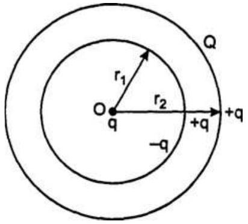

इस प्रकार गोलीय खोखले गोले को दिया गया आवेश $Q$ उसके बाहरी पृष्ठ पर फैल जाएगा। उसी खोखले गोले के केन्द्र पर अन्य आवेश $q$ रखा जाता है और गोले की आंतरिक त्रिज्या $n$ है।

यह खोल के आंतरिक पृष्ठ पर $-q$ और बाह्य पृष्ठ पर $+q$ आवेश उत्प्रेरित करेगा, जो $r_{2}$ त्रिज्या गोले खोल के बाह्य पृष्ठ पर स्थानान्तरित हो जायेगा।

अतः बाह्य पृष्ठ पर कुल आवेश $Q+q$ होगा।
माना आंतरिक एवं बाह्य खोखले पृष्ठों के क्षेत्रफल क्रमशः $A_{1}$ एवं $A_{2}$ हैं।
$\because \quad A_{1}=4 \pi r_{1}^{2}$
तथा $A_{2}=4 \pi r_{2}^{2}$

यदि $-q$ तथा $Q+q$ के कारण विद्युत क्षेत्र क्रमशः $E_{1}$ एवं $E_{2}$ हैं, तब

तथा

$$
\begin{aligned}
& E_{1}=\frac{1}{4 \pi \varepsilon_{0}} \cdot \frac{q}{r_{1}^{2}} \\
& E_{2}=\frac{1}{4 \pi \varepsilon_{0}} \cdot \frac{Q+q}{r_{2}^{2}}
\end{aligned}
$$

माना खोल के आंतरिक एवं बाह्य पृष्ठों को आवेश घनत्व क्रमशः $\sigma_{1}$ तथा $\sigma_{2}$ हैं।
∴

या

$$
\sigma_{1}=\frac{1}{4 \pi} \cdot \frac{q}{r_{1}^{2}}
$$

तथा

$$
\sigma_{2}=\varepsilon_{0} E_{2}
$$

या

$$
\sigma_{2}=\frac{1}{4 \pi} \cdot \frac{Q+q}{r_{2}^{2}}
$$

अत: खोल के भीतरी और बाहरी पृष्ठों पर पृष्ठ आवेश घनत्व क्रमश: $\frac{q}{4 \pi r_{1}^{2}}$ और $\frac{(Q+q)}{4 \pi r_{2}^{2}}$ हैं। उत्तर
(b) हाँ, गाउस के नियमानुसार,

$$
\begin{aligned}
& & \oint \mathbf{E} \cdot d \mathbf{S} & =\frac{q}{\varepsilon_{0}} \\
\therefore & & \mathbf{E} & =0
\end{aligned}
$$

किसी भी यादृच्छिक आकार के कोटर के लिए यह पर्याप्त नहीं है कि उसके लिए कोटर के अंदर $\mathbf{E}=0$ की उपस्थिति को प्रस्तुत किया जाए, कोटर में समान ऋणात्मक तथा घनात्पक आवेश हो सकते हैं, जिससे कुल आवेश शून्य है।
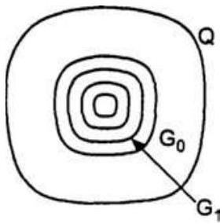

अतः आवेश चालक के बाह्य पृष्ठ पर स्थित रहना चाहता है। यह परिणाम कोटर के आकार एवं आकृति से स्वतन्त्र है।

कोटर को घेरने वाले आंतरिक पृष्ठ, जिस पर कोई आवेश नहीं है, परन्तु गाउस के नियम से नेट आवेश शून्य होना चाहिए।

यादृच्छिक आकृति वाले कोटर के लिए पर्याप्त नहीं है कि यह दावा किया जाए कि उसके अन्दर विद्युत क्षेत्र शून्य होना चाहिए। कोटर पर ॠण एवं धन आवेश हो सकते हैं, जिससे कुल आवेश शून्य हो।

इस संभावना को समाप्त करने के लिए, एक बंद लूप लेते हैं, जिसका एक भाग क्षेत्र रेखाओं के अनुदिश कोटर में हो और शेष भाग चालक के अंदर हो।

चूँकि चालक के अन्दर विद्युत क्षेत्र शून्य है।
यह बंद लूप पर एक परीक्षण आवेश को ले जाने में विद्युत क्षेत्र द्वारा किया गया नेट कार्य देता है।

किसी स्थिर वैद्युत क्षेत्र के लिए यह असंभव है।
अत: कोटर के अंदर क्षेत्र रेखाएँ नहीं हैं ( अर्थात् कोई क्षेत्र नहीं) और चाहे उसकी कैसी भी आकृति हो चालक के भीतरी पृष्ठ पर कोई आवेश नहीं होगा। उत्तर

प्रश्न 2.16. (a) दर्शाइए कि आवेशित पृष्ठ के एक पार्श्व से दूसरे पाश्र्व पर स्थिरवैद्युत क्षेत्र के अभिलंब घटक के असांतत्य होता है, जिसे

$$
\left(E_{2}-E_{1}\right) \cdot \hat{n}=\frac{\sigma}{\varepsilon_{0}}
$$

द्वारा व्यक्त किया जाता है, जहाँ $\hat{n}$ एक बिंदु पर पृष्ठ के अभिलंब एकांक सदिश है तथा $\sigma$ उस बिंदु पर पृष्ठ आवेश घनत्व है ( $\hat{n}$ की दिशा पार्श्व $1$ से पार्श्व $2$ की ओर है)।

अत: दर्शाइए कि चालक के ठीक बाहर विद्युत क्षेत्र $\sigma \hat{n} / \varepsilon_{0}$ है।
(b) दर्शाइए कि आवेशित पृष्ठ के एक पार्श्व से दूसरे पार्श्व पर स्थिरवैद्युत क्षेत्र का स्पर्शीय घटक संतत है।
[संकेत : (a) के लिए गाउस-नियम का उपयोग कीजिए।
(b) के लिए इस सत्य का उपयोग करें कि संवृत पाश पर एक स्थिर वैद्युत क्षेत्र द्वारा किया गया कार्य शून्य होता है।

हल : (a) चित्रानुसार माना $A B$ आवेशित पृष्ठ है, जिसके दो सिरे हैं। आवेशित पृष्ठ का एक छोटा-सा अवयव $\Delta s$ बंद किए हुए बेलन गाउसीय पृष्ठ है।

माना $\sigma=$ पृष्ठीय आवेश घनत्व
गाउसीय बेलन द्वारा आवृत आवेश $=q=\sigma \Delta s$
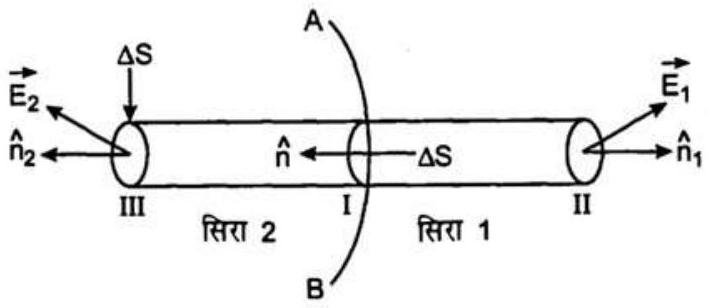

गाउसीय नियम के अनुसार,

$$
\oint_{S} \mathbf{A} \cdot d \mathbf{S}=\oint_{\mathrm{I}} \mathbf{A} \cdot d \mathbf{S}+\oint_{\mathrm{II}} \mathbf{A} \cdot d \mathbf{S}+\oint_{\mathrm{III}} \mathbf{A} \cdot d \mathbf{S}
$$

या $\oint_{s} \mathbf{A} . d \mathbf{S}=\frac{\sigma \Delta S}{\varepsilon_{0}}$
या $\oint_{\text {II }} \mathbf{A} . d \mathbf{S}+\oint_{\text {III }} \mathbf{A} . d \mathbf{S}=\frac{\sigma \Delta S}{\varepsilon_{0}} \quad\left[\because \oint_{\mathrm{I}} \mathbf{A} . d \mathbf{S}=0\right]$

$$
\left[\because \text { जब } \theta=90^{\circ}, \therefore \cos \theta=0^{\circ}\right]
$$

या $\mathrm{E}_{1} \cdot \Delta s \hat{n}_{1}+\mathrm{E}_{2} \cdot \Delta s \hat{n}_{2}=\frac{\sigma}{\varepsilon_{0}} \Delta S$
जहाँ $\mathrm{E}_{1}+\mathrm{E}_{2}$ बेलन के भाग II एवं III है, जहाँ यह वृत्ताकार है, उस पर विद्युत क्षेत्र है।

या $\mathbf{E}_{1} \cdot \hat{n}_{1}+\mathbf{E}_{2} \cdot \hat{n}_{2}=\frac{\sigma}{\varepsilon_{0}}$
या $\mathbf{E}_{1} \cdot\left(-\hat{n}_{2}\right)+\mathbf{E}_{2} \cdot\left(\hat{n}_{2}\right)=\frac{\sigma}{\varepsilon_{0}}\left[\because \hat{n}_{1}=-\hat{n}_{2}\right]$
या $\left(E_{2}-E_{1}\right) \cdot \hat{n}_{2}=\frac{\sigma}{\varepsilon_{0}}$
या $\left(\mathrm{E}_{2}-\mathrm{E}_{1}\right) \cdot \hat{n}=\frac{\sigma}{\varepsilon_{0}}$
( ∵ $\hat{n}_{1}=\hat{n}=$ एकांक सदिश $1$ से $2$ की ओर) ...(i)
$\because \mathrm{E}_{1}$ चालक के अंदर है।
∴ चालक के अंदर विद्युत क्षेत्र शून्य है।
$\therefore \quad \mathrm{E}_{1}=0$
समीकरण (i) से,

$$
\mathbf{E}_{2} \cdot \hat{n}=\frac{\sigma}{\varepsilon_{0}}
$$

या $\left(E_{1} \cdot \hat{n}\right) \cdot \hat{n}=\frac{\sigma}{\varepsilon_{0}} \hat{n}$
या

$$
\mathrm{E}_{2}=\frac{\sigma}{\varepsilon_{0}} \cdot \hat{n} \quad[\because \hat{n} . \hat{n}=1]
$$

अत: चालक के ठीक बाहर विद्युत क्षेत्र $=\frac{\sigma}{\varepsilon_{0}} \cdot \hat{n}$ इति सिद्धम्
(b) माना मूल पर बिन्दु आवेश $q$ के क्षेत्र में $A a B b$ एक पृष्ठ है।

माना बिन्दु $A$ तथा $B$ के स्थिति सदिश क्रमशः $\mathbf{r}_{\mathbf{A}}$ एवं $\mathbf{r}_{\mathbf{B}}$ हैं।

माना बिन्दु $P$ पर विद्युत क्षेत्र $=\mathbf{E}$
इस प्रकार, $E \cos \theta$, विद्युत क्षेत्र $\mathbf{E}$ का स्पर्शीय घटक है।

$$
\therefore \quad \mathbf{E} . \mathbf{D} l=E d l \cos \theta=(E \cos \theta) d l
$$

यह सिद्ध करने के लिए कि आवेशित पृष्ठ एक ओर से दूसरी ओर $E \cos \theta$ संतंत है।

हम $\oint \mathrm{E} . d l$ का मान ज्ञात करते हैं। AaBb
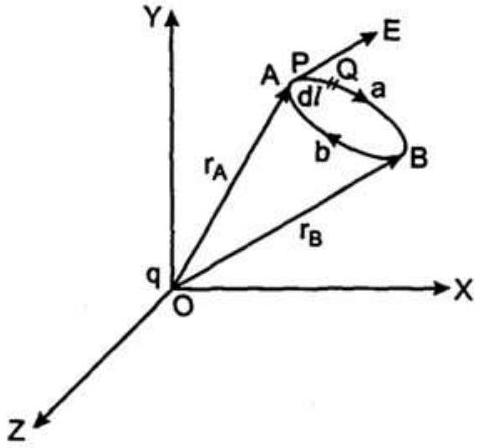

यदि यह मान शून्य आता है, तो $\mathbf{E}$ का स्पर्शीय घटक सतंत है।

$$
\therefore \quad \int_{A}^{B} \mathbf{E} . d l=\frac{1}{4 \pi \varepsilon_{0}} \cdot q\left(\frac{1}{r_{A}}-\frac{1}{r_{B}}\right)
$$

या $\int_{B}^{A} \mathbf{E} . d l=\frac{1}{4 \pi \varepsilon_{0}} \cdot q\left(\frac{1}{r_{B}}-\frac{1}{r_{A}}\right)$

$$
\therefore \quad \int_{A a B b A} \text { E. } d l=\int_{B}^{A} \text { E. } d l+\int_{B}^{A} \text { E. } d l
$$

या $\int_{A a B b A} E . d l=\frac{1}{4 \pi \varepsilon_{0}} q \cdot\left(\frac{1}{r_{A}}-\frac{1}{r_{B}}+\frac{1}{r_{B}}-\frac{1}{r_{A}}\right)$

$$
\begin{aligned}
& =\frac{1}{4 \pi \varepsilon_{0}} q \times 0 \\
& =0
\end{aligned}
$$

अत: आवेशित पृष्ठ के एक पाशर्व से दूसरे पाशर्व पर स्थिर वैद्युत क्षेत्र का स्पर्शयि घटक संतत है। इति सिद्धम्

प्रश्न 2.17. रैखिक आवेश घनत्व $\lambda$ वाला एक लंबा आवेशित बेलन एक खोखले समाक्षीय चालक बेलन द्वारा घिरा है। दोनों बेलनों के बीच के स्थान में विद्युत क्षेत्र कितना है?

हल : दो समकक्षीय प्रत्येक $l$ लम्बाई के दो खोखले बेलन बाह्य एवं आंतरिक त्रिज्या क्रमशः $r_{2}$ एवं $r_{1}\left(r_{2}>r_{1}\right)$ को मानते हैं। आंतरिक बेलन रैखिक आवेश घनत्व $\lambda$ से आवेशित है तथा $r_{2}$ त्रिज्या के बाह्य बेलन से घिरा है।

हमें दोनों बेलनों के बीच के स्थान में विद्युत क्षेत्र E ज्ञात करना है।

यदि आंतरिक बेलन पर $q$ आवेश है, तब $q=\lambda l$ प्रेरण से खोखले बेलन पर $-q$ आवेश उत्प्रेरित होता है और इसके बाह्य पृष्ठ पर $+q$ आवेश उत्प्रेरित होता है, जो स्वयं प्राप्त होता है।

माना दोनों बेलनों के बीच के स्थान में, जिसमें E ज्ञात करना है,
$X X^{\prime}$ अक्ष से $r$ दूरी पर बिन्दु $P$ है।
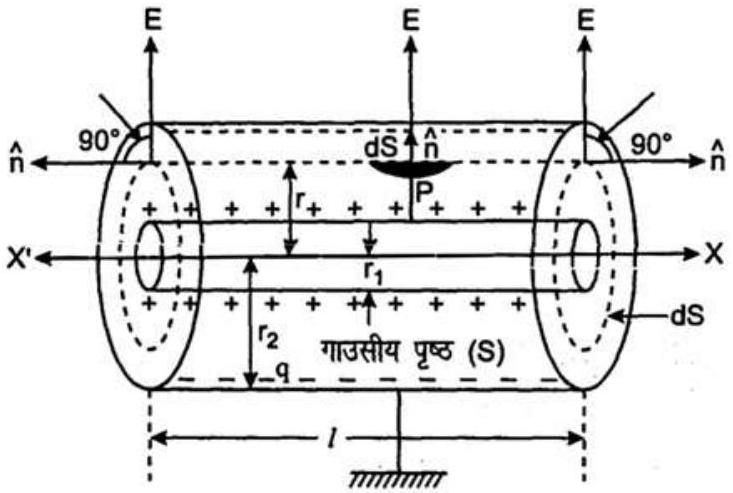

लम्बाई $l$ तथा $r$ त्रिज्या का एक गाउसीय बेलन बनाते हैं। इसके पृष्ठ पर $P$ बिन्दु स्थित हैं।

गाउसीय पृष्ठ पर आवेश $q=\lambda l$
बेलनीय सममिति के कारण बेलन के पृष्ठ के प्रत्येक बिन्दु पर विद्युत क्षेत्र E एकसमान होगा।

इसके परिणाम में और बेलन पर खींचे अभिलम्ब दिशा में बाहर की और होंगे।

गाउसीय पृष्ठ के वक्रीय पृष्ठ के क्षेत्रफल $q=2 \pi r l$
बिन्दु $P$ पर वक्र पृष्ठ के क्षेत्रफल का एक अवयव $d s$ लेते हैं।

यदि $d \mathbf{S}$ में से विद्युत अभिवाह $=d \phi$
परिभाषानुसार,

$$
d \phi=\mathbf{E} . d \mathbf{S}
$$

या $\quad d \phi=E d s \cos 0^{\circ}$
या $d \phi=\mathbf{E} d \mathbf{S}$
$[\because \mathrm{E}$ एवं $d \mathrm{~S} \hat{n}$ के अनुदिश है।]
यदि सभी गाउसीय पृष्ठ में कुल विद्युत अभिवाह $=\phi$,
तब

$$
\phi_{1}=\int d \phi
$$

या

$$
\phi_{1}=\oint_{2 \pi r l} E \cdot d S
$$

या

$$
\phi_{1}=E \oint_{2 \pi r l} d S
$$

या

$$
\phi=2 \pi r l E
$$

∵ $\mathbf{E}$ संपूर्ण गाउसीय पृष्ठ पर अचर है।
इसके अतिरिक्त माना गाउसीय पृष्ठ की दोनों टोपियों में विद्युत अभिवाह $=\phi_{2}$
तब

$$
\phi_{2}=\mathbf{E} \cdot d \mathbf{S}+\mathbf{E} \cdot d \mathbf{S}
$$

या

$$
\phi_{2}=2 \mathrm{E} \cdot d \mathbf{S}
$$

या

$$
\phi_{2}=2 \mathbf{E} \cdot \hat{n} d \mathbf{S}=0
$$

$[\because \mathbf{E} \perp \hat{n}]$
यदि संपूर्ण गाउसीय पृष्ठ में से कुल विद्युत अभिवाह $=\phi$
तब

$$
\phi=\phi_{1}+\phi_{2}
$$

या

$$
\phi=E \times 2 \pi r l+0
$$

या

$$
\phi=2 E \times \pi r l
$$

अब गाउस के नियमानुसार,

$$
\phi=\frac{q}{\varepsilon_{0}}
$$

या

$$
\begin{aligned}
2 E \times \pi r l & =\frac{\lambda l}{\varepsilon_{0}} \\
E & =\frac{\lambda}{2 \pi \varepsilon_{0} r}
\end{aligned}
$$

अत: $E=\frac{\lambda}{2 \pi \varepsilon_{0} r}$, जहाँ बेलनों के समाक्ष से बिंदु की दूरी $r$ है तथा क्षेत्र अक्ष के अभिलंब त्रिज्यीय है। इति सिद्धम्

प्रश्न 2.18. एक हाइड्रोजन परमाणु में इलेक्ट्रॉन तथा प्रोटॉन लगभग $0.53 \AA$ दूरी पर परिबद्ध है :
(a) निकाय की स्थितिज ऊर्जा का eV में परिकलन कीजिए, जबकि प्रोटॉन से इलेक्ट्रॉन के मध्य की अनंत दूरी पर स्थितिज ऊर्जा को शून्य माना गया है।
(b) इलेक्ट्रॉन को स्वतंत्र करने में कितना न्यूनतम कार्य करना पड़ेगा, यदि वह दिया गया है कि इसकी कक्षा में गतिज ऊर्जा (a) में प्राप्त स्थितिज ऊर्जा के परिमाण की आधी है?
(c) यदि स्थितिज ऊर्जा को $1.06 \AA$ पृथक्करण पर शून्य ले लिया जाए, तो उपर्युक्त (a) और (b) के उत्तर क्या होंगे?
हल : प्रोटॉन पर आवेश $q_{1}=16 \times 10^{-19} \mathrm{C}$
इलेक्ट्रॉन पर आवेश $=q_{2}=-16 \times 10^{-19} \mathrm{C}$
तथा हाइड्रोजन परमाणु की त्रिज्या $=r$

$$
\begin{aligned}
& =q_{1} \text { एवं } q_{2} \text { के बीच दूरी } \\
& =0.53 \AA \\
& =0.53 \times 10^{-10} \mathrm{~m}
\end{aligned}
$$

(a) यदि विभव ऊर्जा को अनंत पृथक्कीकरण पर शून्य लिया जाए, तब
विभव ऊर्जा = विभवान्तर अनतंता पर - विभवानतर $r$ पर

$$
\begin{aligned}
& =0-\frac{1}{4 \pi \varepsilon_{0}} \cdot \frac{q_{1} q_{2}}{r} \\
& =\frac{-9 \times 10^{9} \times\left(16 \times 10^{-19}\right)^{2}}{0.53 \times 10^{-10}} \mathrm{~J} \\
& =\frac{-9 \times 2.56 \times 10^{9} \times 10^{-39}}{0.53 \times 10^{-10}} \mathrm{~J} \\
& =-\frac{23.04 \times 10^{-29}}{0.53 \times 10^{-10}} \mathrm{~J} \\
& =-43.47 \times 10^{-19} \mathrm{~J} \\
& =\frac{-43.47 \times 10^{-19}}{16 \times 10^{-19}}-\mathrm{eV} \\
& \quad\left[\because 1 \mathrm{eV}=\mathbf{1 . 6} \times \mathbf{1 0}^{-19} \mathrm{~J}\right] \\
& =-27.17 \mathrm{eV}
\end{aligned}
$$

$$
=-27.2 \mathrm{eV}
$$

अत: निकाय की स्थितिज ऊर्जा $=-27.2 \mathrm{eV}$ उत्तर
(b) माना इलेक्ट्रॉन को स्वतंत्र करने के लिए अभीष्ट न्यूनतम कार्य $=W$
∵ कक्षा में गतिज ऊर्जा $=\frac{1}{2}$
[भाग (a) की विभव ऊर्जा का परिमाण]

$$
\begin{aligned}
\therefore \text { गतिज ऊर्जा } & =\frac{1}{2} \times(+27.2 \mathrm{eV}) \\
& =13.6 \mathrm{eV}
\end{aligned}
$$

[ ∵ संकाय की गतिज ऊर्जा सदैव धनात्मक होती है]
∴ इलेक्ट्रॉन को स्वतंत्र करने के लिए आवश्यक कार्य

$$
=0-(-13.6 \mathrm{eV})=13.6 \mathrm{eV}
$$

अत: इलेक्ट्रॉन को स्वतंत्र करने में न्यूनतम कार्य करना पड़ेगा $=\mathbf{1 3 . 6 ~ e V}$ उत्तर
(c) इलेक्ट्रॉन तथा प्रोट्रॉन के बीच पृथक्कीकरण की दूरी $106 \AA$ पर विभव (स्थितिज ऊर्जा)

$$
\begin{aligned}
& =\frac{-9 \times 10^{9} \mathrm{Nm}^{2} \mathrm{C}^{-2} \times 16 \times 10^{-19} \mathrm{C}}{\times 16 \times 10^{-19} \mathrm{C}} \\
& =\frac{-9 \times 256 \times 10^{-10} \mathrm{~m}}{106 \times 10^{-10}} \mathrm{~J} \\
& =-9 \times 24 \times 10^{-19} \mathrm{~J} \\
& =-13.58 \mathrm{eV} \\
& =-13.6 \mathrm{eV}
\end{aligned}
$$

अत: जब निकाय की विभव ऊर्जा $106 \AA$ पर शून्य ली जाए, तब उसकी विभव स्थितिज ऊर्जा

$$
\begin{aligned}
& =-27.17 \mathrm{eV}-(-13.58 \mathrm{eV}) \\
& =-13.59 \mathrm{eV} \\
& =-13.6 \mathrm{eV}
\end{aligned}
$$

अत: विभव ऊर्जा के शून्य को स्थानान्तरित करने से इलेक्ट्रॉन को स्वतंत्र करने के लिए अभीष्ट ऊर्जा उतनी हीरहती है, जो $-(-13.6) \mathrm{eV}=+13.6 \mathrm{eV}$ है। उत्तर

प्रश्न 2.19. यदि $\mathrm{H}_{2}$ अणु के दो में से एक इलेक्ट्रॉन को हटा दिया जाए, तो हमें हाइड्रोजन आणविक आयन $\left(\mathrm{H}_{2}^{+}\right)$प्राप्त होगा। $\left(\mathrm{H}_{2}^{+}\right)$की निम्नतम अवस्था (ground state) में दो प्रोटॉनों के बीच की दूरी लगभग $1.5 \AA$ है और इलेक्ट्रॉन प्रत्येक प्रोटॉन से लगभग $1 \AA$ की दूरी पर है। निकाय की स्थितिज ऊर्जा ज्ञात कीजिए। स्थितिज ऊर्जा की शून्य स्थिति के चयन का उल्लेख कीजिए।
हल : ∵ इलेक्ट्रॉन पर आवेश $=q_{1}=-16 \times 10^{-19} \mathrm{C}$
प्रत्येक प्रोटॉन पर आवेश $=q_{2}$
तथा $q_{3}=+1.6 \times 10^{19} \mathrm{C}$
दो प्रोटॉनों अर्थात् $q_{2}$ तथा $q_{3}$ के बीच पृथक्कीकरण
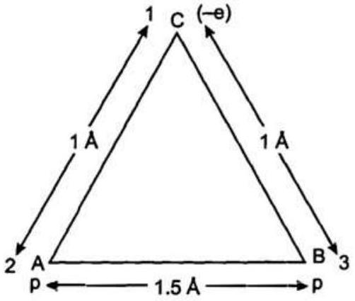

$$
\begin{gathered}
r_{23}=15 \AA \\
r_{23}=15 \times 10^{-10} \mathrm{~m}
\end{gathered}
$$

प्रोटॉन तथा इलेक्ट्रॉन का पृथक्कीकरण

$$
=\eta_{12}=\eta_{13}=1 \AA
$$

या

$$
r_{12}=10^{-10} \mathrm{~m}
$$

यदि विभव ऊर्जा का शून्य अनंत पर लिया जाए, तब विभव (स्थितिज) ऊर्जा

$$
\begin{aligned}
& =\frac{1}{4 \pi \varepsilon_{0}}\left[\frac{q_{1} q_{2}}{\eta_{12}}+\frac{q_{2} q_{3}}{r_{23}}+\frac{q_{1} q_{3}}{r_{13}}\right] \\
= & 9 \times 10^{9} \mathrm{Nm}^{2} \mathrm{C}^{-2}\left[\frac{-\left(16 \times 10^{-19}\right)^{2} \mathrm{C}^{2}}{10^{-10} \mathrm{~m}}\right. \\
& \left.\quad+\frac{\left(16 \times 10^{-19}\right)^{2} \mathrm{C}^{2}}{15 \times 10^{-10} \mathrm{~m}}+\frac{-\left(16 \times 10^{-19}\right)^{2} \mathrm{C}^{2}}{10^{-10} \mathrm{~m}}\right]
\end{aligned}
$$

$$
\begin{aligned}
& =9 \times 10^{9} \frac{\times\left(16 \times 10^{-19}\right)^{2}}{10^{-10}}\left[-1+\frac{1}{15}-1\right] \mathrm{J} \\
& =\frac{9 \times 10^{9} \times\left(16 \times 10^{-19}\right)^{2}}{10^{-10} \times 16 \times 10^{-19}}\left[\frac{2}{3}-2\right] \mathrm{eV} \\
& \quad\left[\because 1 \mathrm{eV}=1.6 \times 10^{-19} \mathrm{~J}\right] \\
& \quad=\frac{9 \times 10^{9} \times 16 \times 10^{-19}}{10^{-10}} \times\binom{-4}{3} \mathrm{eV} \\
& \quad=-19.2 \mathrm{eV}
\end{aligned}
$$

विभव ऊर्जा का शून्य अनन्त पर लिया गया है।
अत: निकाय की स्थितिज ऊर्जा $=-19.2 \mathrm{eV}$ तथा
स्थितिज ऊर्जा का शून्य अनंत पर लिया गया है। उत्तर
प्रश्न 2.20. $a$ और $b$ त्रिज्याओं वाले दो आवेशित चालक गोले एक तार द्वारा एक-दूसरे से जोड़े गए हैं। दोनों गोलों के पृष्ठों पर विद्युत क्षेत्रों में क्या अनुपात है? प्राप्त परिणाम को, यह समझने में प्रयुक्त कीजिए कि किसी एक चालक के तीक्ष्ण और नुकीले सिरों पर आवेश घनत्व, चपटे भागों की अपेक्षा अधिक क्यों होता है?

हल : ∵ चालक गोलों की त्रिज्याएँ $=a, b(a>b)$
$a$ त्रिज्या के गोले पर आवेश $=¢$ ।
तथा $b$ त्रिज्या के गोले पर आवेश $=q_{2}$
यदि $a$ एवं $b$ त्रिज्याओं के गोलों पर विभव क्रमशः $l_{1}$ तथा $V_{2}$ है, तब

$$
V_{1}=\frac{1}{4 \pi \varepsilon_{0}} \cdot \frac{q_{1}}{a}
$$

तथा

$$
V_{2}=\frac{1}{4 \pi \varepsilon_{0}} \cdot \frac{q_{2}}{b}
$$

जब दोनों चालक गोलों को तार द्वारा आपस में जोड़ दिया जाता है, तो उनके विद्युत-विभव समान हो जाते हैं अर्थात्

या

$$
\begin{aligned}
V_{1} & =V_{2} \\
\frac{1}{4 \pi \varepsilon_{0}} \cdot \frac{q_{1}}{a} & =\frac{1}{4 \pi \varepsilon_{\theta}} \cdot \frac{q_{2}}{b}
\end{aligned}
$$

या

$$
\frac{q_{1}}{a}=\frac{q_{2}}{b}
$$

या

$$
\frac{q_{1} / a}{q_{2} / b}=1
$$

अब यदि $a$ एवं $b$ त्रिज्याओं के गोलों के पृष्ठों पर विद्युत क्षेत्र क्रमशः $E_{1}$ एवं $E_{2}$ हों,

$$
E_{1}=\frac{1}{4 \pi \varepsilon_{0}} \cdot \frac{q_{1}}{a^{2}}
$$

तथा

$$
E_{2}=\frac{1}{4 \pi \varepsilon_{0}} \cdot \frac{q_{2}}{b^{2}}
$$

समीकरण (iv) को समीकरण (v) से भाग करने पर,

$$
\frac{E_{1}}{E_{2}}-\frac{\frac{1}{4 \pi \varepsilon_{0}} \cdot \frac{q_{1}}{a^{2}}}{\frac{1}{4 \pi \varepsilon_{0}} \cdot \frac{q_{2}}{b^{2}}}
$$

या

$$
\frac{E_{1}}{E_{2}}=\frac{q_{1} / a^{2}}{q_{2} / b^{2}}
$$

या

$$
\frac{E_{1}}{E_{2}}=\frac{\frac{q_{1}}{a} \cdot \frac{1}{a}}{\frac{q_{2}}{b} \cdot \frac{1}{b}}
$$

या

$$
\frac{E_{1}}{E_{2}}=\frac{b}{a} \cdot \frac{q_{1} / a}{q_{2} / b}
$$

या

$$
\frac{E_{1}}{E_{2}}=\frac{b}{a} \times 1
$$

[समीकरण (iii) से]
या

$$
\frac{E_{1}}{E_{2}}=\frac{b}{a}
$$

अत: पहले गोले से दूसरे चालक गोलों के क्षेत्रों का अनुपात $=\frac{b}{a}$

तीक्ष्ण भाग एक अधिक त्रिज्या के गोले के पृष्ठ को माना जा सकता है तथा नुकीला भाग एक छोटी त्रिज्या के गोले को माना जा सकता है।

इसलिए $E \propto \frac{1}{\text { त्रिज्या }}$
तीक्ष्ण भाग का क्षेत्र नुकीले भाग से कम होगा।

$$
\begin{array}{ll}
\because & E=\frac{\sigma}{\varepsilon_{0}} \\
\therefore & E \propto \sigma
\end{array}
$$

अत: तीक्ष्ण एवं नुकीले भाग का पृष्ठ आवेश घनत्व अधिक होता है। उत्तर

प्रश्न 2.21. बिंदु $(0,0,-a)$ तथा $(0,0, a)$ पर दो आवेश क्रमशः $-q$ और $+q$ स्थित हैं।
(a) बिंदुओं $(0,0, z)$ और $(x, y, 0)$ पर स्थिरवैद्युत विभव क्या है?
(b) मूल बिंदु से किसी बिंदु की दूरी $r$ पर विभव की निर्भरता ज्ञात कीजिए, जबकि $\frac{r}{a} \gg 1$ है।
(c) $x$-अक्ष पर बिंदु $(5,0,0)$ से बिंदु $(-7,0,0)$ तक एक परीक्षण आवेश को ले जाने में कितना कार्य करना होगा? यदि परीक्षण आवेश के उन्हीं बिंदुओं के बीच $x$-अक्ष से होकर न ले जाएँ, तो क्या उत्तर बदल जाएगा?

हल : (a) बिंदु $A(0,0,-a)$ तथा $B(0,0, a)$ पर आवेश क्रमशः $-q$ और $+q$ स्थित हैं।

विद्युत-द्विध्रुव की लम्बाई $=2 a$
यदि द्विध्रुव का वैद्युत द्विध्रुव आघूर्ण $=p$
तब $p=2 a q$
माना $P_{1}(0,0, z)$ बिंदु पर $V$ का मान ज्ञात करना है। यदि द्विध्रुव की अक्षीय रेखा पर स्थित है।
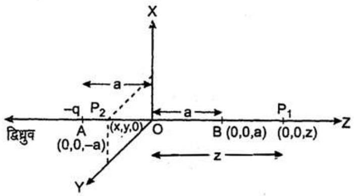

$$
\therefore \quad V=\frac{1}{4 \pi \varepsilon_{0}} \cdot \frac{(-q)}{A P}+\frac{1}{4 \pi \varepsilon_{0}} \cdot \frac{q}{B P}
$$

या $\quad V=\frac{q}{4 \pi \varepsilon_{0}}\left[\frac{1}{z-a}-\frac{1}{z+a}\right]$
या $V=\frac{q}{4 \pi \varepsilon_{0}}\left[\frac{z+a-z+a}{(z-a)(z+a)}\right]$
या $\quad V=\frac{q}{4 \pi \varepsilon_{0}} \cdot \frac{2 a}{z^{2}-a^{2}}$
या $\quad V=\frac{1}{4 \pi \varepsilon_{0}} \cdot \frac{2 a q}{\left(z^{2}-a^{2}\right)}$
या

$$
V=\frac{1}{4 \pi \varepsilon_{0}} \cdot \frac{p}{\left(z^{2}-a^{2}\right)}
$$

अब बिंदु $P_{2}(x, y, 0), x y$ तल में स्थित है, जो द्विध्रुव अक्ष के अभिलम्ब है अर्थात् विषुवत् रेखा जिस पर द्विध्रुव के कारण विभव शून्य होता है, के समान्तर रेखा पर स्थित है।
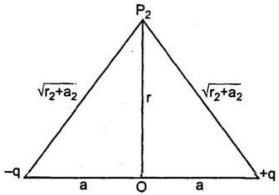

माना $O P_{2}=r$
$\therefore \quad r=\sqrt{x^{2}+y^{2}}$
यदि $P_{2}$ पर विद्युत-विभव $=V^{\prime}$
तब $\quad V^{\prime}=\frac{\mathrm{i}}{4 \pi \varepsilon_{0}}\left(\frac{-q}{\sqrt{r^{2}+a^{2}}}+\frac{q}{\sqrt{r^{2}+a^{2}}}\right)$
या

$$
\begin{aligned}
V^{\prime} & =\frac{1}{4 \pi \varepsilon_{0}} \times 0 \\
V^{\prime} & =0
\end{aligned}
$$

अत: द्विध्रुव के अक्ष पर विभव

$$
= \pm \frac{1}{4 \pi \varepsilon_{0}} \cdot \frac{p}{\left(x^{2}-a^{2}\right)}
$$

जहाँ $p=2 q a$ द्विंध्रुव आघूर्ण का परिमाण है।
धनात्मक चिह्न उस समय जब बिंदु $q$ के समीप है और ॠणात्मक चिह्न वहाँ, जहाँ बिन्दु $-q$ के समीप है।

अत: अक्ष के अभितम्बवत् ( $x, y, 0$ ) बिंदु पर विभव शून्य है। उत्तर
(b) माना द्विध्रुव के केन्द्र $O$ से बिंदु $P$, जहाँ विभव $V$ ज्ञात करना है, की दूरी =. $r$

माना $\angle P O B=\theta$ अर्थात् $O P, \mathbf{P}$ से कोण $\theta$ बनाती है।
माना $-q$ एवं $+q$ से बिंदु $P$ की दूरियाँ क्रमशः $\eta_{1}$ एवं $r_{2}$ हैं। अब $A C$ तथा $B D$ को $O P$ के लम्बवत् खींचते हैं।
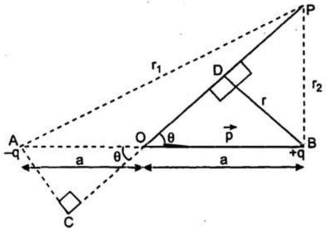
$\triangle A C O$ में,

$$
O C=a \cos \theta
$$

तथा $\triangle B D O$ में,

$$
O D=a \cos \theta
$$

यदि आवेश $=-q$ तथा $+q$ के कारण $P$ पर विभव क्रमशः $V_{1}$ एवं $V_{2}$ हैं, तब $P$ पर कुल विभव

$$
V=V_{1}+V_{2}
$$

या

$$
V=\frac{1}{4 \pi \varepsilon_{0}} \cdot \frac{-q}{A P}+\frac{1}{4 \pi \varepsilon_{0}} \cdot \frac{q}{B P}
$$

या

$$
V=\frac{1}{4 \pi \varepsilon_{0}}\left[\frac{-q}{r_{1}}+\frac{q}{r_{2}}\right]
$$

जहाँ $\eta_{1}=A P=C P=O P+O C=r+a \cos \theta$
तथा $r_{2}=B P=D P=O P-O D=r-a \cos \theta$
समीकरण (i) में $r_{1}$ एवं $r_{2}$ के मान रखने पर,

$$
V=\frac{1}{4 \pi \varepsilon_{0}}\left[\frac{q}{r-a \cos \theta}-\frac{q}{r+a \cos \theta}\right]
$$

या

$$
V=\frac{q}{4 \pi \varepsilon_{0}} \cdot\left(\frac{(r+a \cos \theta)-(r-a \cos \theta)}{r^{2}-a^{2} \cos ^{2} \theta}\right)
$$

या

$$
V=\frac{q}{4 \pi \varepsilon_{0}} \cdot\left(\frac{2 a \cos \theta}{r^{2}-a^{2} \cos ^{2} \theta}\right)
$$

या

$$
V=\frac{1}{4 \pi \varepsilon_{0}} \cdot \frac{p \cos \theta}{r^{2}-a^{2} \cos ^{2} \theta} \quad[\because 2 a q=p]
$$

जब $\frac{r}{a} \gg 0$ या $r^{2} \gg a^{2} \cos ^{2} \theta$ जिसमें $a^{2} \cos ^{2} \theta$ को नगण्य मान सकते हैं, तब

$$
V=\frac{1}{4 \pi \varepsilon_{0}} \cdot \frac{p \cos \theta}{r^{2}}
$$

अत: $V$ की $r$ पर निर्भरता $\frac{1}{r^{2}}$ प्रकार की है अर्थात् $V \propto \frac{1}{r^{2}}$
(c) माना आवेश $+q(0,0, a)$ और $-q(0,0,-a)$ के क्षेत्र में बिंदु $E(5,0,0)$ से $F(-7,0,0)$ तक क्रमश: परीक्षण आवेश $q_{0}$ को ले जाने में किए गए कार्य $W_{1}$ एवं $W_{2}$ हैं।
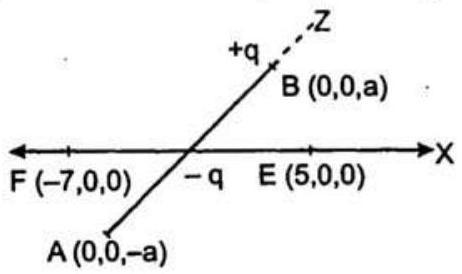
∴

$$
B E=5 \hat{i}-a \hat{k} \text { तथा } B F=-7 \hat{i}-a \hat{k}
$$

इसी प्रकार,
$A E=5 \hat{i}+a \hat{k}$ तथा $\quad A F=-7 \hat{i}+a \hat{k}$
$A E=\sqrt{25+a^{2}}$ तथा $B F=\sqrt{49+a^{2}}$
या

$$
\overline{B E}=\sqrt{25+a^{2}} \text { तथा } A F=\sqrt{49+a^{2}}
$$

$A E=\sqrt{25+a^{2}}$ तथा. $A F=\sqrt{49+a^{2}}$
∵

$$
W_{A B}=\frac{1}{4 \pi \varepsilon_{0}}-q\left(\frac{1}{r_{B}}-\frac{1}{r_{A}}\right)
$$

∴

$$
W_{1}=\frac{1}{4 \pi \varepsilon_{0}} \cdot q\left(\frac{1}{B F}-\frac{1}{B E}\right)
$$

या

$$
W_{1}=\frac{q}{4 \pi \varepsilon_{0}} \cdot\left(\frac{1}{\sqrt{49+a^{2}}}-\frac{1}{\sqrt{25+a^{2}}}\right)
$$

तथा

$$
W_{2}=\frac{1}{4 \pi \varepsilon_{0}} \cdot(-q)\left(\frac{1}{A F}-\frac{1}{A E}\right)
$$

या

$$
W_{2}=\frac{-q}{4 \pi \varepsilon_{0}} \cdot\left(\frac{1}{\sqrt{49+a^{2}}}-\frac{1}{\sqrt{25+a^{2}}}\right)
$$

यदि कुल किया गया कार्य $=W$
तब

$$
W=W_{1}+W_{2}
$$

या

$$
\begin{aligned}
W=\frac{q}{4 \pi \varepsilon_{0}} \cdot[ & \frac{1}{\sqrt{49+a^{2}}}-\frac{1}{\sqrt{25+a^{2}}} \\
& \left.-\frac{1}{\sqrt{49+a^{2}}}+\frac{1}{\sqrt{25+a^{2}}}\right]
\end{aligned}
$$

या

$$
W=\frac{q}{4 \pi \varepsilon_{0}} \times 0
$$

या

$$
W=0
$$

नहीं, चूँकि दो बिन्दुओं के बीच, किसी विद्युत क्षेत्र में किया गया कार्य, उनको मिलाने वाली रेखा से स्वतंत्र होता है।

अत: परीक्षण को किसी भी मार्ग से ले जाया जा सकता है। उत्तर

प्रश्न 2.22. नीचे दिये गये चित्र में एक आवेश विन्यास जिसे विद्युत चतुर्ध्रुवी कहा जाता है, दर्शाया गया है। चतुर्थुवी के अक्ष पर स्थित किसी बिंदु के लिए $r$ पर विभव की निर्भरता प्राप्त कीजिए, जहाँ $r / a \gg 1$ । अपने परिणाम की तुलना एक विद्युत द्विधुव व विद्युत एकल ध्रुव ( अर्थात् किसी एकल आवेश ) के लिए प्राप्त परिणामों से कीजिए।
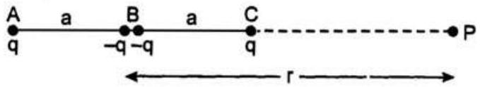

हल : ∵ विद्युत चतुर्ध्रुवी $A$ तथा $C$ पर आवेशों $+q,+q$ तथा $B$ पर आवेशों $-q$ और $-q$ से मिलकर बना है।

माना बिंदु $B$ चतुर्ध्रुवी का केन्द्र है।
माना विद्युत चतुर्ध्रुवी के केन्द्र $B$ से बिंदु $P$ उसके अक्ष पर $r$ दूरी पर है।

$$
\therefore \quad A P=A B+B P
$$

या $A P=a+r$

$$
B P=r \text { तथा } C P=B P-B C
$$

या $C P=r-a$
माना चतुर्ध्रुवी के कारण बिन्दु $P$ पर विद्युत विभव

$$
V=\frac{1}{4 \pi \varepsilon_{0}} \cdot\left[\frac{q}{A P}+\frac{-q}{B P}+\frac{-q}{B P}+\frac{q}{C P}\right]
$$

या

$$
V=\frac{1}{4 \pi \varepsilon_{0}} \cdot\left(\frac{q}{r+a}-\frac{2 q}{r}+\frac{q}{r-a}\right)
$$

या $V=\frac{q}{4 \pi \varepsilon_{0}} \cdot \frac{\left[r(r-a)-2\left(r^{2}-a^{2}\right)+r(r+a)\right]}{r\left(r^{2}-a^{2}\right)}$

$$
\text { या } V=\frac{q}{4 \pi \varepsilon_{0}} \cdot \frac{\left[r^{2}-r a-2 r^{2}+2 a^{2}+r^{2}+r a\right]}{r\left(r^{2}-a^{2}\right)}
$$

या

$$
V=\frac{1}{4 \pi \varepsilon_{0}} \cdot q \cdot \frac{2 a^{2}}{r\left(r^{2}-a^{2}\right)}
$$

या

$$
V=\frac{1}{4 \pi \varepsilon_{0}} \cdot \frac{2 q}{r} \cdot \frac{1}{\left(\frac{r^{2}}{a^{2}}-1\right)}
$$

$\because r$ के लिए,

$$
\begin{aligned}
& \frac{r}{a} \gg 1 \\
\therefore \quad \frac{r^{2}}{a^{2}} & \gg 1
\end{aligned}
$$

अत: $1$ को नगण्य माना जा सकता है।
अब समीकरण (i) से,

$$
V=\frac{1}{4 \pi \varepsilon_{0}} \cdot \frac{2 q}{r} \cdot \frac{1}{\left(\frac{r^{2}}{a^{2}}\right)}
$$

या

$$
V=\frac{1}{4 \pi \varepsilon_{0}} \cdot \frac{2 q a^{2}}{r^{3}}
$$

या

$$
V \propto \frac{1}{r^{3}}
$$

विद्युत द्विध्रुव की अक्षीय रेखा पर विद्युत-विभव

$$
V_{1}=\frac{1}{4 \pi \varepsilon_{0}} \cdot \frac{p}{r^{2}-a^{2}}
$$

जब $r \gg a$,तब

$$
V_{1}=\frac{1}{4 \pi \varepsilon_{0}} \cdot \frac{p}{r^{2}}
$$

या

$$
V_{1} \propto \frac{1}{r^{2}}
$$

अत: एक एकल आवेश $q$ के कारण अर्थात् एक ध्रुवी आवेश तथा $r$ दूरी पर विभव

$$
V^{\prime}=\frac{1}{4 \pi \varepsilon_{0}} \cdot \frac{q}{r}
$$

या

$$
V^{\prime} \propto \frac{1}{r}
$$

अतः अधिक या बड़े $r$ के लिए चतुर्धुवी के कारण विभव दूरी $r$ के घन के व्युत्क्रमानुपाती जब एक द्विधुव के कारण दूरी $r$ के वर्ग के व्युत्क्रमानुपाती तथा एक ध्रुवी के कारण दूरी $r$ के व्युत्क्रमानुपाती होता है। उत्तर

प्रश्न 2.23. एक वैद्युत टैक्नीशियन को $1 \mathrm{kV}$ विभवांतर के परिपथ में $2 \mu \mathrm{~F}$ संधारित्र की आवश्यकता है। $1 \mu \mathrm{~F}$ के संधारित्र उसे प्रचुर संख्या में उपलब्ध हैं, जो $400 \mathrm{~V}$ से अधिक का विभवांतर वहन नहीं कर सकते। कोई संभव विन्यास सुझाइए, जिसमें न्यूनतम संधारित्रों की आवश्यकता हो।

हल : माना टैक्नीशियन द्वारा उपयुक्त संधारित्रों की संख्या $=N$

माना उनको प्रत्येक $n$ संधारित्रों वाली $m$ पंक्तियों में लगाया गया है।
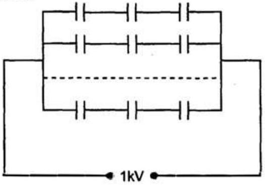

$$
\therefore \quad N=m n
$$

प्रत्येक संधारित्र की धारिता $=C_{1}=1 \mu \mathrm{~F}$
तथा संयोजन की अभीष्ट धारिता $=2 \mu \mathrm{~F}=\mathrm{C}$
प्रत्येक संधारित्र पर अधिकतम विभवांतर $=400 \mathrm{~V}$
सर्किट पर विभवांतर $=1000 \mathrm{~V}=$ प्रत्येक पंक्ति पर विभवांतर
∵ जब संधारित्रों को श्रेणीक्रम में संयोजित किया जाता है, तब उन पर विभवांतर प्रत्येक पर विभवांतर का योग होता है।
∴ एक पंक्ति में $n$ संधारित्र $=400 \times n$

$$
\therefore \quad 400 \times n=1000
$$

या

$$
n=\frac{1000}{400}=25
$$

चूँकि $n$ पूर्णांक होने चाहिए।

$$
\therefore \quad n=3
$$

माना पंक्ति में संधारित्रों की कुल धारिता $=C$

$$
\begin{aligned}
& \therefore \quad \frac{1}{C^{\prime}}=\frac{1}{1}+\frac{1}{1}+\frac{1}{1}=3 \\
& \text { या } \quad C^{\prime}=\frac{1}{3} \mu \mathrm{~F}
\end{aligned}
$$

ऐसे ही समान्तर क्रम में $m$ पंक्तियों की कुल धारिता

$$
C=m \times C^{\prime}
$$

या

$$
m=\frac{C}{C^{\prime}}
$$

या

$$
m=\frac{2 \mu \mathrm{~F}}{\left(\frac{1}{3} \mu \mathrm{~F}\right)}
$$

या

$$
m=2 \times \frac{3}{1} \mu F
$$

या

$$
m=6 \mu \mathrm{~F}
$$

$$
\therefore \quad N=m \times n=3 \times 6=18
$$

अत: हमें कुल $18$ संधारित्रों को $6$ समान्तर पंक्तियों में इस प्रकार जोड़ना पड़ेगा कि प्रत्येक पंक्ति में $3$ संघारित्र हों। उत्तर
प्रश्न 2.24. $2 \mathrm{~F}$ वाले समान्तर पट्टिका संधारित्र की पट्टिका का क्षेत्रफल क्या है, जबकि पट्टिकाओं का पृथक्न $0.5 \mathrm{~cm}$ है? अपने उत्तर से आप यह समझ जाएँगे कि सामान्य संधारित्र $\mu \mathbf{F}$ या कम परिसर के क्यों होते हैं? तथापि विद्युत-अपघटन संधारित्रों (Electrolytic capacitors) की धारिता कहीं अधिक $(0.1 \mathrm{~F})$ होती है, क्योंकि चालकों के बीच अति सूक्ष्म पृथक्न होता है।

हल : ∵ समान्तर पट्टिका संधारित्र की धारिता $=C=2 \mathrm{~F}$

इसकी पट्टिका के बीच पृथ्क्करण या वियोजन

$$
\begin{aligned}
& & d & =0.5 \mathrm{~cm} \\
\text { या } & & d & =5 \times 10^{-3} \mathrm{~m}
\end{aligned}
$$

माना पट्टिका का क्षेत्रफल $=A$
तथा

$$
\begin{aligned}
\varepsilon_{0} & =8854 \times 10^{-12} \mathrm{C}^{2} \mathrm{~N}^{-1} \mathrm{~m}^{-2} \\
C & =\frac{\varepsilon_{0} A}{d} \\
A & =\frac{C d}{\varepsilon_{0}}
\end{aligned}
$$

या

$$
A=\frac{2 \times 5 \times 10^{-3} \mathrm{Fm}}{8.854 \times 10^{-12} \mathrm{C}^{2} \mathrm{~N}^{-1} \mathrm{~m}^{2}}
$$

या

$$
A=1.13 \times 10^{9} \mathrm{~m}^{2}
$$

या

$$
A=1130 \times 10^{6} \mathrm{~m}^{2}
$$

या

$$
A=1130 \mathrm{~km}^{2}
$$

नूँकि यह क्षेत्रफल इतना बड़ा है कि इसे प्राप्त करना असंभव है। यही कारण है कि सामान्य संधारित्र $2 \mathrm{~F}$ संधारिता से बहुत कम परिसर के होते हैं। उत्तर

प्रश्न 2.25. चित्र के नेटवर्क ( जाल ) की तुल्य धारिता प्राप्त कीजिए। $300 \mathrm{~V}$ संभरण ( सप्लाई ) के साथ प्रत्येक संधारित्र का आवेश व उसकी वोल्टता ज्ञात कीजिए।
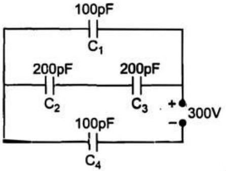

हल : माना जाल की तुल्य धारिता $C$ है।
दिए गए जाल को निम्न चित्रानुसार पुन: बनाते हैं।
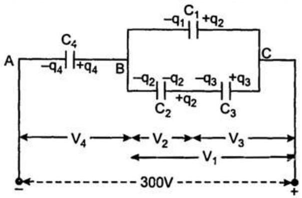
$\because \quad C_{1}=C_{4}=100 \mathrm{pF}=10^{-10} \mathrm{~F}$
तथा $C_{2}$ और $C_{3}$ श्रेणीक्रम में समायोजित हैं।
यदि श्रेणीक्रम में समायोजित $C_{2}$ एवं $C_{3}$ की तुल्य धारिता $C_{23}$ है, तब
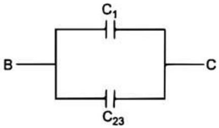
$\frac{1}{C_{23}}=\frac{1}{C_{2}}+\frac{1}{C_{3}}$
या

$$
\frac{1}{C_{23}}=\frac{1}{200}+\frac{1}{200}
$$

या

$$
\frac{1}{C_{23}}=\frac{2}{200}
$$

या

$$
\frac{1}{C_{23}}=\frac{1}{100}
$$

$\therefore \quad C_{23}=100 \mathrm{pF}=10^{-10} \mathrm{~F}$
अब $C_{23}$ एवं $C_{1}$ समान्तर समायोजन में हैं।
यदि $C_{23}$ एवं $C_{1}$ की तुल्य धारिता $C^{\prime}$ है, तब
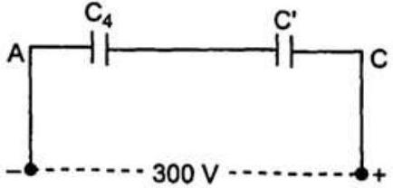

$$
C^{\prime}=C_{23}+C_{1}
$$

या
या

$$
C^{\prime}=100 \mathrm{pF}+100 \mathrm{pF}
$$

या

$$
C^{\prime}=200 \mathrm{pF}=2 \times 10^{-10} \mathrm{~F}
$$

अब $C_{4}$ तथा $C^{\prime}$ श्रेणीक्रम में हैं।
यदि $C_{4}$ और $C^{\prime}$ श्रेणी समायोजन की तुल्य धारिता $C$ है, तब

$$
\frac{1}{C}=\frac{1}{C^{\prime}}+\frac{1}{C_{4}}
$$

या

$$
\frac{1}{C}=\frac{1}{200}+\frac{1}{100}
$$

या

$$
\frac{1}{C}=\frac{1+2}{200}
$$

या

$$
\frac{1}{C}=\frac{3}{200}
$$

∴

$$
C=\frac{200}{3} \mathrm{pF}
$$

उत्तर
अब माना संधारित्रों $C_{1}, C_{2}, C_{3}$ तथा $C_{4}$ पर क्रमश:
$q_{1}, q_{2}, q_{3}$ और $q_{4}$ आवेश हैं।
माना उन पर क्रमश: $V_{1}, V_{2}, V_{3}$ तथा $V_{4}$ विभव हैं। अब चूँकि $C^{\prime}$ तथा $C_{4}$ श्रेणी क्रम में हैं।
इसलिए $C^{\prime}$ पर $q_{4}$ आवेश होगा।
∴

$$
C^{\prime} \text { पर विभव }=\frac{q_{4}}{C^{\prime}}
$$

या

$$
C^{\prime} \text { पर विभव }=\frac{q_{4}}{2 \times 10^{-10}} \mathrm{~V}
$$

तथा

$$
V_{4}=C_{4} \text { पर विभव }=\frac{q_{4}}{C_{4}}
$$

या

$$
V_{4}=\frac{q_{4}}{10^{-10}} \mathrm{~V}
$$

अब $C^{\prime}$ और $C_{4}$ के श्रेणीक्रम पर $300 \mathrm{~V}$ संभरण लगा है।
$\therefore C^{\prime}$ पर विभवांतर $+C_{4}$ पर विभवांतर $=300 \mathrm{~V}$
या

$$
\frac{q_{4}}{2 \times 10^{-10}}+\frac{q_{4}}{10^{-10}}=300
$$

या

$$
\frac{q_{4}+2 q_{4}}{2 \times 10^{-10}}=300
$$

या

$$
\frac{3 q_{4}}{2 \times 10^{-10}}=300
$$

∴

$$
q_{4}=\frac{300 \times 2 \times 10^{-10}}{3} \mathrm{C}
$$

या

$$
q_{4}=2 \times 10^{-8} \mathrm{C}
$$

$\therefore \quad V_{4}=\frac{2 \times 10^{-8}}{10^{-10}} \mathrm{~V} \quad\left[\because V_{4}=\frac{q_{4}}{10^{-10}} \mathrm{~V}\right]$
या $V_{4}=2 \times 10^{2} \mathrm{~V}$
या $V_{4}=200 \mathrm{~V}$
$C^{\prime}$ पर विभवान्तर $=300 \mathrm{~V}-V_{4}$

$$
\begin{aligned}
& =300 \mathrm{~V}-200 \mathrm{~V} \\
& =100 \mathrm{~V}
\end{aligned}
$$

$=C_{1}$ या $C_{23}$ पर विभवान्तर
$\left[\because C_{1}\right.$ तथा $C_{23}$ समान्तर क्रम में हैं]
इस प्रकार, $C_{23}$ पर विभवान्तर $V$
$=C$ पर विभवांतर $=C_{1}$ पर विभवांतर $=100 \mathrm{~V}$
या $V_{1}=100 \mathrm{~V}$
$\therefore \quad q_{1}=C_{1} V_{1}$
या $q_{1}=100 \times 10^{-12} \times 100 \mathrm{C}$
या $q_{1}=10^{-8} \mathrm{C}$
अब चूँकि $C_{2}$ तथा $C_{3}$ की धारिता समान है और यह श्रेणी क्रम में समायोजित है।
अत: प्रत्येक संधारित्र पर समान आवेश होना चाहिए।
या $q_{2}=q_{3}$
या $C_{2} V_{2}=C_{3} V_{3}$
या $V_{2}=V_{3} \quad\left[\because C_{2}=C_{3}\right]$
तथा $V_{2}+V_{3}=100 \mathrm{~V}$
या $V_{2}+V_{2}=100$
या $2 V_{2}=100 \mathrm{~V}$
$\therefore \quad V_{2}=\frac{100}{2} \mathrm{~V}$
या

$$
\begin{aligned}
q_{2}=q_{3} & =200 \times 10^{-12} \times 50 \mathrm{C} \\
& =10^{-8} \mathrm{C}
\end{aligned}
$$

अत: $q_{1}=10^{-8} \mathrm{C}, q_{2}=q_{3}=10^{-8} \mathrm{C}$,

$$
\begin{aligned}
& q_{4}=2 \times 10^{-8} \mathrm{C}, V_{1}=100 \mathrm{~V} \\
& V_{2}=V_{3}=50 \mathrm{~V}
\end{aligned}
$$

तथा $V_{4}=200 \mathrm{~V}$
उत्तर
प्रश्न 2.26. किसी समान्तर पट्टिका संधारित्र की प्रत्येक पट्टिका का क्षेत्रफल $90 \mathrm{~cm}^{2}$ है और उनके बीच पृथक्न $2.5 \mathrm{~mm}$ है। $400 \mathrm{~V}$ संभरण से संधारित्र को आवेशित किया गया है।
(a) संधारित्र कितना स्थिरवैद्युत ऊर्जा संचित करता है?
(b) इस ऊर्जा को पट्टिकाओं के बीच स्थिरवैद्युत क्षेत्र में संचित समझकर प्रति एकांक आयतन ऊर्जा $u$ ज्ञात कीजिए। इस प्रकार, पट्टिकाओं के बीच विद्युत क्षेत्र $E$ के परिमाण और $\boldsymbol{u}$ में सम्बन्य स्थापित कीजिए।
हल : ∵ समान्तर पट्टिका संधारित्र की प्रत्येक पट्टिका का क्षेत्रफल $=A$
∴

$$
A=90 \mathrm{~cm}^{2}
$$

या

$$
A=90 \times 10^{-4} \mathrm{~m}^{2}
$$

पट्टिकाओं के बीच की दूरी $=d=25 \mathrm{~mm}$

$$
=25 \times 10^{-3} \mathrm{~m}
$$

तथा संभरण वोल्टता $=V=400 \mathrm{~V}$
(a) संधारिता द्वारा संचित स्थिर वैद्युत ऊर्जा $=u$
समान्तर पट्टिकाओं की धारिता $=C$
∴

$$
C=\frac{\varepsilon_{0} A}{d}
$$

या $C=\frac{8.854 \times 10^{-12} \mathrm{C}^{2} \mathrm{~N}^{-1} \mathrm{~m}^{-2} \times 90 \times 10^{-4} \mathrm{~m}^{2}}{2.5 \times 10^{-4} \mathrm{~m}^{2}}$
या

$$
C=\frac{7.97 \times 10^{-10}}{25} \mathrm{~F}
$$

या

$$
C=3.186 \times 10^{-10} \mathrm{~F}
$$

∵

$$
u=\frac{1}{2} C V^{2}
$$

∴

$$
u=\frac{1}{2} \times 3.186 \times 10^{-11} \mathrm{~F} \times(400)^{2} \mathrm{~J}
$$

$$
=2.55 \times 10^{-6} \mathrm{~J}
$$

अत: संधारित्र स्थिर वैद्युत ऊर्जा संचित करता है

$$
=2.55 \times 10^{-6} \mathrm{~J}
$$

उत्तर
(b) ∵ संधारित्र द्वारा संचित स्थिर वैद्युत ऊर्जा $=u$

$$
\therefore \quad u=\frac{1}{2} C V^{2}
$$

इसे पट्टिकाओं के बीच संचित स्थिर वैद्युत क्षेत्र ऊर्जा मान सकते हैं।

समान्तर संधारित्र का आयतन
$V=$ पट्टिका का क्षेत्रफल × पट्टिकाओं के बीच की दूरी

$$
=A \times d
$$

संधारित्र के प्रति एकांक आयतन में संचित ऊर्जा, जिसे ऊर्जा घनत्व $(\sigma)$ कहते हैं।

$$
\therefore \quad \sigma=\frac{\text { ऊर्जा }}{\text { आयतन }}=\frac{U}{V}
$$

या

$$
\sigma=\frac{\frac{1}{2} C V^{2}}{A d}
$$

∵

$$
C=\frac{\varepsilon_{0} A}{d} .
$$

तथा

$$
V=\text { विभवांतर }=E d
$$

= पट्टिकाओं के बीच विद्युत क्षेत्र का परिणाम × दूरी समीकरणों (iii) एवं (iv) से,

$$
\sigma=\frac{\frac{1}{2}\left(\frac{\varepsilon_{0} A}{d}\right) \times(E d)^{2}}{A d}
$$

या

$$
\sigma=\frac{1}{2} \times \frac{\varepsilon_{0} A}{d} \times \frac{E^{2} d^{2}}{A d}
$$

या

$$
\sigma=\frac{1}{2} \varepsilon_{0} E^{2}
$$

जो $\sigma$ एवं विद्युत क्षेत्र $E$ के मध्य अभीष्ट सम्बन्ध है।

$$
\therefore \quad \sigma=\frac{\text { स्थिर वैद्युत ऊर्जा }}{\text { आयतन }}=\frac{U}{A d}
$$

या

$$
\sigma=\frac{255 \times 10^{-6}}{90 \times 10^{-4} \times 25 \times 10^{-3}} \mathrm{Jm}^{-3}
$$

या

$$
\sigma=\frac{2.55 \times 10^{-6}}{2.25 \times 10^{-5}} \mathrm{Jm}^{-3}
$$

या

$$
\sigma=0.113 \mathrm{Jm}^{-3}
$$

अत:

$$
\sigma=0.113 \mathrm{Jm}^{-3}
$$

उत्तर
प्रश्न 2.27. एक $4 \mu \mathrm{~F}$ संधारित्र को $200 \mathrm{~V}$ संभरण (सप्लाई) से आवेशित किया गया है। फिर संभरण से हटाकर इसे एक अन्य अनावेशित $2 \mu \mathrm{~F}$ के संधारित्र से जोड़ा जाता है। पहले संधारित्र की कितनी स्थिर वैद्युत ऊर्जा का ऊष्मा और वैद्युत चुम्बकीय विकिरण के रूप में ह्रास होता है?

हल : $\because C_{1}=4 \mu \mathrm{~F}=4 \times 10^{-6} \mathrm{~F}$
तथा $V_{1}=$ संधारित्र से जुड़े संभरण का विभव $=200 \mathrm{~V}$
यदि $C_{1}$ द्वारा संचित प्रारम्भिक ऊर्जा $=U_{1}$
तब

$$
U_{1}=\frac{1}{2} C_{1} V_{1}^{2}
$$

या

$$
U_{1}=\frac{1}{2} \times 4 \times 10^{-6} \times(200)^{2} \mathrm{~J}
$$

या

$$
U_{1}=8 \times 10^{-2} \mathrm{~J}
$$

जब $4 \mu \mathrm{~F}$ का संधारित्र अनावेशित $2 \mu \mathrm{~F}$ के संधारित्र से जोड़ा जाता है, तो संधारित्र समान्तर क्रम में होता है तथा तब तक उनमें आवेश घटता है, जब तक कि दोनों पर एक सम्मिलित विभव नहीं हो जाता अर्थात् प्रत्येक संधारित्र पर समान विभवांतर हो जाता है।
∴ संधारित्रों पर कुल आवेश

$$
\begin{aligned}
q & =C_{1} V_{1}+C_{2} V_{2} \\
& =4 \times 10^{-6} \times 200 \mathrm{C}+0 \mathrm{C} \\
& =8 \times 10^{-4} \mathrm{C} \quad\left[\because q_{2}=0\right]
\end{aligned}
$$

माना दोनों संधारित्रों की कुल धारिता $=C^{\prime}$

$$
\begin{aligned}
\therefore \quad C^{\prime} & =C_{1}+C_{2} \\
& =4 \mu \mathrm{~F}+2 \mu \mathrm{~F}=6 \mu \mathrm{~F} \\
& =6 \times 10^{-6} \mathrm{~F}
\end{aligned}
$$

यदि सम्मिलित विभव $=V=$ उभयनिष्ठ विभव, तब

$$
V=\frac{\text { कुल आवेश }}{\text { कुल धारिता }}
$$

या

$$
V=\frac{8 \times 10^{-4} \mathrm{C}}{6 \times 10^{-6} \mathrm{~F}}
$$

या

$$
V=\frac{800}{6} \mathrm{~V}=\frac{400}{3} \mathrm{~V}
$$

यदि समायोजन में संचित अंतिम ऊर्जा $=U_{2}$
तब

$$
U_{2}=\frac{1}{2}\left(C_{1}+C_{2}\right) V^{2}
$$

या

$$
U_{2}=\frac{1}{2} \times 6 \times 10^{-6} \times\left(\frac{400}{3}\right)^{2} \mathrm{~J}
$$

या

$$
U_{2}=3 \times 10^{-6} \times \frac{16 \times 10^{4}}{9} \mathrm{~J}
$$

या

$$
U_{2}=5.33 \times 10^{-2} \mathrm{~J}
$$

माना $C$, द्वारा ऊष्मा तथा विद्युत-चुम्बकीय ऊर्जा के रूप में ऊर्जा ह्रास $=U$
तब

$$
U=U_{1}-U_{2}
$$

$$
\begin{aligned}
& =8 \times 10^{-2} \mathrm{~J}-5.33 \times 10^{-2} \mathrm{~J} \\
& =267 \times 10^{-2} \mathrm{~J}
\end{aligned}
$$

अत: $C$ द्वारा ऊष्मा तथा विद्युत चुम्बकीय ऊर्जा के रूप में ऊर्जा ह्रास $=2.67 \times 10^{-2} \mathrm{~J}$ उत्तर

प्रश्न 2.28. दर्शाइए कि एक समांतर पट्टिका संधारित्र की प्रत्येक पट्टिका पर बल का परिमाण $\frac{1}{2} Q E$ है, जहाँ, $Q$ संधारित्र पर आवेश है और $E$ पट्टिकाओं के बीच विद्युत क्षेत्र का परिमाण है। घटक $\frac{1}{2}$ के मूल को समझाइए।

हल : माना समान्तर पट्टिका संधारित्र की पट्टिकाएँ $P$ एवं $P^{\prime}$ हैं।

प्रत्येक पट्टिका का क्षेत्रफल $=A$
पट्टिकाओं के बीच की दूरी $=d$ प्रत्येक पट्टिका पर आवेश पर परिणाम $=Q$
$P$ से $P^{\prime}$ की ओर कार्यरत् विद्युत क्षेत्र का पट्टिकाओं के बीच परिणाम $=E$

माना पट्टिकाओं का पृष्ठ आवेश घनत्व $=\sigma$

$$
\therefore \quad E=\frac{\sigma}{\varepsilon_{0}}
$$

माना पट्टिकाओं के बीच आकर्षण के विपरीत पट्टिकाओं के बीच की दूरी को $d x$ बढ़ा देते हैं।
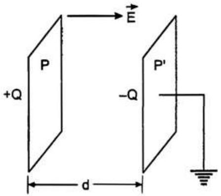

यदि ऐसा करने में किया गया कार्य $d W$ है, तब

$$
d W=F d x
$$

चूँकि किया गया यह कार्य संधारित्र की विभव ऊर्जा बढ़ता है।

इसलिए समांतर पट्टिकाओं वाले संधारित्र की प्रति एकांक आयतन विभव ऊर्जा

$$
u=\frac{1}{2} \varepsilon_{0} \cdot E^{2}
$$

यदि समान्तर पट्टिका संधारित्र में पट्टिकाओं के बीच की दूरी $d$ को $d x$ द्वारा बढ़ाने पर उसकी विभव ऊर्जा $d u$ से बढ़ जाती है, तब

$$
\begin{aligned}
& & d u & =u A d x \\
\text { या } & & d u & =\frac{1}{2} \varepsilon_{0} E^{2} A d x \\
\text { या } & & d u & =\frac{1}{2}\left(\varepsilon_{0} E\right)(E A) d x \\
\text { या } & & d u & =\frac{1}{2}(\sigma A E) d x \quad\left[\because E=\frac{\sigma}{\varepsilon_{0}}\right] \\
\text { या } & & d u & =\frac{1}{2} Q E d x \quad\left[\because \sigma=\frac{Q}{A}\right] \quad \ldots \text { (iv) }
\end{aligned}
$$

समीकरणों (ii) एवं (iv) से,

$$
\begin{aligned}
F d x & =\frac{1}{2} Q E d x \\
\text { या } \quad F & =\frac{1}{2} Q E
\end{aligned}
$$

अत: घटक $\frac{1}{2}$ का भौतिक उदय इस बात में छिपा कि चालक के ठीक बाहर क्षेत्र $E$ एवं अंदर शून्य होता है।

अत: विद्युत क्षेत्र का औसत मान अर्थात् $\frac{E}{2}$ बल में अपना योगदान करता है, जिसके विरुद्ध पट्टिकाओं को खिसकाया जाता है। उत्तर
प्रश्न 2.29. दो संकेद्री गोलीय चालकों जिनको उपयुक्त विद्युतरोधी आलंबों से उनकी स्थिति में रोका गया है, से मिलकर एक गोलीय संधारित्र बना है ( चित्र )। दर्शाइए कि गोलीय संधारित्र की धारिता $\boldsymbol{C}$ इस प्रकार व्यक्त की जाती है :

$$
C=\frac{4 \pi \varepsilon_{0} r_{1} r_{2}}{r_{1}-r_{2}}
$$

यहाँ $r_{1}$ और $r_{2}$ क्रमशः बाहरी तथा भीतरी गोलों की त्रिज्याएँ हैं।

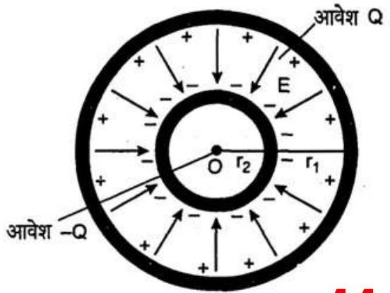
$44$

हल : एक गोलीय संधारित्र त्रिज्याओं $n_{1}$ एवं $r_{2}$ के दो समकेन्द्रीक खोखले गोलों $A$ एवं $B$ से मिलकर बना $\left(\eta_{1}>r_{2}\right)$ है, जिसका केन्द्र $O$ है।

अब आंतरिक खोखले गोले $A$ को $-Q$ आवेश दिया जाता है, तो खोल $B$ के अतिरिक्त पृष्ठ पर $+Q$ एवं बाह्य पृष्ठ पर $-Q$ आवेश उत्प्रेरित होते हैं।

चूँकि खोल $B$ को पृथ्वी से जोड़ा जाता है।
अत: $-Q$ आवेश उसमें चला जाता है। इसलिए $B$ के बाह्य पृष्ठ पर इसका मान शून्य होता है तथा विद्युत क्षेत्र $A$ के अंदर रहता है।
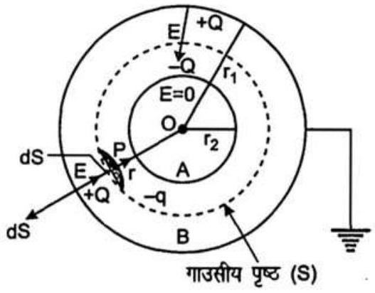

अर्थात् $r<r_{2}$ के लिए $E=0$ और $r>r_{1}$ के लिए भी $E=0$ है।

माना खोलों $A$ एवं $B$ के बीच केन्द्र $O$ पर $r$ त्रिज्या का गाउसीय पृष्ठ $S$ खींचा गया है।

माना गाउसीय पृष्ठ पर बिन्दु $P$ पर यदि विद्युत-क्षेत्र $=E$

तब

$$
E=\frac{1}{4 \pi \varepsilon_{0}} \cdot \frac{Q}{r^{2}}
$$

त्रिज्यीय दिशा में अंदर की ओर कार्य करता है। इसके अतिरिक्त गाउसीय पृष्ठ के अंदर बंद आवेश $=-Q$

माना गाउसीय पृष्ठ के बिन्दु $P$ पर एक क्षेत्रफल अवयव $=d \mathbf{S}$

यदि $d \mathbf{S}$ में से विद्युत-अभिवाह $=d \phi$
तब $d \phi=\mathbf{E} . d \mathbf{S}$
या $\mathbf{d} \phi=\mathbf{E} . d \mathbf{S} \cos 180^{\circ}$
या $d \phi=-\mathbf{E} . d \mathbf{S}$
( ∵ E एवं $d \mathbf{S}$ के बीच $180^{\circ}$ का कोण है।) यदि संपूर्ण गाउसीय पृष्ठ में से विद्युत-अभिवाह $=\phi$,

$$
\phi=\oint_{S} d \phi
$$

या

$$
\phi=-\oint_{S} \mathbf{E} \cdot d \mathbf{S}
$$

या

$$
\phi=-E \oint_{S} d S
$$

या

$$
\phi=-E \cdot 4 \pi r^{2}
$$

जहाँ $\oint d S=4 \pi r^{2}$ गाउसीय पृष्ठ का क्षेत्रफल है।
$s$
अब गाउस सिद्धान्त से,

$$
\phi=\frac{-Q}{\varepsilon_{0}}
$$

या $-E .4 \pi r^{2}=-\frac{Q}{\varepsilon_{0}}$
या

$$
E=\frac{1}{4 \pi \varepsilon_{0}} \cdot \frac{Q}{r^{2}}
$$

अब माना दो गोलीय खोलों $A$ एवं $B$ के बीच विभवांतर $V$ है। यदि गोलीय संधारित्र की धारिता $C$ है, तब

$$
C=\frac{Q}{V}
$$

अब एक समांतर पट्टिका संधारित्र में पट्टिकाओं के बीच स्थान में विद्युत-क्षेत्र एकसमान $E$ होता है तथा विभवांतर केवल $E d$ है, परन्तु गोलीय संधारित्र में दोनों गोलीय खोलों के बीच विद्युत क्षेत्र एकसमान नहीं होता तथा दूरी के साथ

$$
E=\frac{d V}{d r}
$$

या

$$
d V=E d r
$$

इस प्रकार,

$$
V=\int_{A}^{B} d V
$$

या

$$
V=\int_{A}^{B} E \cdot d r
$$

या

$$
V=\frac{1}{4 \pi \varepsilon_{0}} \cdot Q \cdot \int_{r_{2}}^{r_{1}} r^{-2} d r
$$

या

$$
V=\frac{Q}{4 \pi \varepsilon_{0}} \cdot\left[\frac{r^{-2+1}}{-2+1}\right]_{r_{2}}^{r_{1}}
$$

या

$$
V=\frac{Q}{4 \pi \varepsilon_{0}} \cdot\left[\frac{-1}{r}\right]_{r_{2}}^{r_{1}}
$$

या

$$
V=\frac{Q}{4 \pi \varepsilon_{0}} \cdot\left[-\frac{1}{r_{1}}+\frac{1}{r_{2}}\right]
$$

या

$$
V=\frac{Q}{4 \pi \varepsilon_{0}} \cdot \frac{\left(r_{1}-r_{2}\right)}{r_{1} r_{2}}
$$

समीकरणों (v) और (vi) से,

$$
C=\frac{\frac{Q}{1}}{4 \pi \varepsilon_{0}} \times \frac{Q\left(r_{1}-r_{2}\right)}{r_{1} r_{2}}
$$

या

$$
C=4 \pi \varepsilon_{0} \frac{r_{1} r_{2}}{r_{1}-r_{2}}
$$

इति सिद्धम्
प्रश्न 2.30. एक गोलीय संधारित्र के भीतरी गोले की त्रिज्या $12 \mathrm{~cm}$ तथा बाहरी गोले की त्रिज्या $13 \mathrm{~cm}$ है। बाहरी गोला भू-संपर्कित है तथा भीतरी गोले पर $2.5 \mu \mathrm{C}$ का आवेश दिया गया है। संक्रेंद्री गोलों के बीच के स्थान पर $32$ परावैद्युतांक का द्रव भरा है।
(a) संधारित्र की धारिता ज्ञात कीजिए।
(b) भीतरी गोले का विभव क्या है?
(c) इस संधारित्र की धारिता की तुलना एक $12 \mathrm{~cm}$ त्रिज्या वाले किसी वियुक्त गोले की धारिता से कीजिए। व्याख्या कीजिए कि गोले की धारिता इतनी कम क्यों हैं?
हल : ∵ आंतरिक गोले की त्रिज्या $=r_{2}$
या

$$
r_{2}=12 \mathrm{~cm}=12 \times 10^{-2} \mathrm{~m}
$$

बाह्य गोले की त्रिज्या $=r_{1}$
या

$$
r_{1}=13 \mathrm{~cm}=13 \times 10^{-2} \mathrm{~m}
$$

आंतरिक गोले पर आवेश $=25 \mu \mathrm{C}=2.5 \times 10^{-6} \mathrm{C}$
तथा दो गोलों के बीच भरे द्रव का परावैद्युतांक $=K=32$ है।
(a) माना संधारित्र की धारिता $=C$
गोलीय संधारित्र की धारिता

$$
C=4 \pi \varepsilon_{0} K \frac{r_{1} r_{2}}{\left(r_{1}-r_{2}\right)}
$$

या

$$
\begin{aligned}
C=32 \times & \frac{1}{9 \times 10^{9} \mathrm{Nm}^{2} \mathrm{C}^{-2}} \\
& \times \frac{(13 \times 12) 10^{-4} \mathrm{~m}^{2}}{(13-12) \times 10^{-2} \mathrm{~m}}
\end{aligned}
$$

या

$$
C=\frac{32}{9 \times 10^{9}} \times \frac{156 \times 10^{-2} \times 10^{-2}}{1 \times 10^{-2}}
$$

या

$$
C=5.54 \times 10^{-9} \mathrm{~F}
$$

या

$$
C=5.5 \times 10^{-9} \mathrm{~F} .
$$

अत: संधारित्र की धारिता $=5.5 \times 10^{-9} \mathrm{~F}$ उत्तर
(b) माना आंतरिक गोले का विभव $=V$

चूँकि बाह्य गोले को पृथ्वी से जोड़ दिया गया है। इसलिए आंतरिक गोले का विभव ही दोनों गोलों के बीच विभवांतर है।
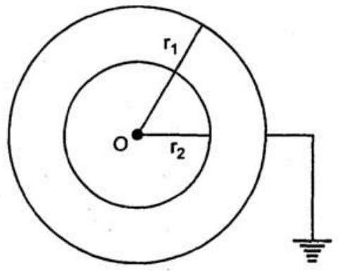
∴

$$
V=\frac{q}{C}
$$

या

$$
V=\frac{25 \times 10^{-6} \mathrm{C}}{5.5 \times 10^{-9} \mathrm{~F}}
$$

या

$$
V=454.5 \mathrm{~V}
$$

या

$$
V=4.5 \times 10^{2} \mathrm{~V}
$$

अत: भीतरी गोले का विभव $=4.5 \times 10^{2} \mathrm{~V}$ उत्तर
(c) ∵ वियुक्त गोले की त्रिज्या $=r=12 \mathrm{~cm}$
या

$$
r=12 \times 10^{-2} \mathrm{~m}
$$

माना वियुक्त गोले की धारिता $=C^{\prime}$
∴

$$
C^{\prime}=4 \pi \varepsilon_{0} r
$$

या

$$
C=\frac{12 \times 10^{-2}}{9 \times 10^{9}} \mathrm{~F}
$$

या

$$
C=133 \times 10^{-11} \mathrm{~F}
$$

उत्तर
∴

$$
\begin{aligned}
\frac{C}{C^{\prime}} & =\frac{5.547 \times 10^{-9} \mathrm{~F}}{1.33 \times 10^{-11} \mathrm{~F}} \\
& =4.17 \times 10^{2}=417
\end{aligned}
$$

उत्तर

प्रश्न 2.31. सावधानीपूर्वक उत्तर दीजिए-
(a) दो बड़े चालक गोले जिन पर आवेश $Q_{1}$ और $Q_{2}$ हैं, एक-दूसरे के समीप लाए जाते हैं, क्या इनके बीच स्थिरवैद्युत बल का मस्पिम तथ्यतः $\frac{Q_{2} \cdot Q_{2}}{4 \pi \varepsilon_{0} r^{2}}$ द्वारा दर्शाया जाता है, जहाँ $r$ इनके केन्द्रों के बीच की दूरी है।
(b) यदि कूलॉम के नियम में $1 / r^{3}$ निर्भरता का समावेश ( $1 / r^{2}$ के स्थान पर ) हो, तो क्या गाउस का नियम अभी भी सत्य होगा?
(c) स्थिर वैद्युत क्षेत्र विन्यास में एक छोटा परीक्षण आवेश किसी बिंदु पर विराम में छोड़ा जाता है। क्या यह उस बिंदु से होकर जाने वाली क्षेत्र रेखा के अनुदिश चलेगा?
(d) इलेक्ट्रॉन द्वारा एक वृत्तीय कक्षा पूरी करने में नाभिक के क्षेत्र द्वारा कितना कार्य किया जाता है? यदि कक्षा दीर्घवृत्ताकार हो, तो क्या होगा?
(e) हमें ज्ञात है कि एक आवेशित चालक के पृष्ठ के आर-पार विद्युत क्षेत्र असंतत होता है। क्या वहाँ वैद्युत विभव भी असंतत होगा?
(f) किसी एकल चालक की धारिता से आपका क्या अभिप्राय है?
(g) एक संभावित उत्तर की कल्पना कीजिए कि पानी का परावैद्युतांक $(=80)$, अभक के परावैद्युतांक $(=6)$ से अधिक क्यों होता है?
हल : (a) दो आवेशों $q_{1}$ एवं $q_{2}$ के बीच स्थिर वैद्युत बल

$$
F=\frac{1}{4 \pi \varepsilon_{0}} \cdot \frac{q_{1} q_{2}}{r^{2}}
$$

जबकि दोनों आवेश $q_{1}$ एवं $q_{2}$ बिंदु आवेश हैं।
उपर्युक्त व्यंजक बड़े गोलीय चालकों के लिए सही नहींहै।
यह इसलिए है कि जब बड़े गोलों को निकट संपर्क में लाया जाता है, तो आवेश आबंटन एकसमान नहीं रहता।

उत्तर
(b) नहीं, यदि कूलम्ब के नियम की निर्भरता $\frac{1}{r^{3}}$ पर है, तो गाउस का नियम लागू नहीं होता है। उत्तर
(c) यदि $\mathbf{E}$ एकसमान है, तो बिन्दु पर रखा परीक्षण आवेश क्षेत्र रेखाओं के अनुदिश चलेगा तथा $\mathbf{E}$ के समान्तर यह छोटा परीक्षण आवेश सरल रेखा पर त्वरित होगा।

यह आवश्यक नहीं कि परीक्षण आवेश बिन्दु से गुजरने वाली क्षेत्र रेखा के अनुदिश चलेगा, क्योकि साधारणतया क्षेत्र रेखा आवेश त्वरण न कि वेग की दिशा देती है। उत्तर
(d) दो बिन्दुओं के बीच एकांक परीक्षण आवेश को चलाने में किया गया कार्य विद्युत क्षेत्र में दोनों बिन्दुओं के बीच विद्युत-क्षेत्र के रेखा समाकलन द्वारा दिया जाता है।

$$
\text { अर्थात् } \quad \int_{A}^{B} \mathbf{E} . d l=W
$$

चूँकि एक बंद पथ पर रेखा समाकलन शून्य होता है।

$$
\text { अत: } \quad \oint \text { E. } d \mathbf{l}=0
$$

इस प्रकार इलेक्ट्रॉन की संपूर्ण वृत्तीय कक्षा पर नाभिक द्वारा क्षेत्र में किया गया कार्य शून्य होगा, क्योकि स्थिर-वैद्युत बल आरक्षी होता है, जो $\oint \mathrm{E} . d l=0$ द्वारा प्रदर्शित है।

$$
\text { अत: } \quad W=0
$$

यही अंडाकार कक्षा के लिए सत्य है अर्थात् अण्डाकार कक्षा में $W=0$ होता है। उत्तर
(e) नहीं, किसी आवेशित चालक के पृष्ठ पर विभव असंतत नहीं होता है। वहाँ यह संतत है। $\mathbf{E}$ शून्य हो सकता है, परन्तु $V$ स्थिर रहता है। उत्तर
(f) एकल चालक की धारिता होती है। यह संधारित्र है, जिसकी एक पट्टिका अनंत पर है। उत्तर
(g) पानी के अणु ध्रुवीय होते हैं, जबकि अभ्रक के अध्रवीय, पानी के अणुओं में स्थायी द्विध्रुव आघूर्ण है।

अत: पानी का परावैद्युतांक, अभक आदि के परावैद्युतांक से कहीं अधिक होता है। उत्तर
प्रश्न 2.32. एक बेलनाकार संधारित्र में $15 \mathrm{~cm}$ लम्बाई एवं त्रिज्याएँ $1.5 \mathrm{~cm}$ तथा $1.4 \mathrm{~cm}$ के दो समाक्ष बेलन हैं। बाहरी बेलन भू-संपर्कित है और भीतर बेलन को $3.5 \mu \mathrm{C}$ का आवेश दिया गया है। निकाय की धारिता और भीतरी बेलन का विभव ज्ञात कीजिए। अंत्य प्रभाव ( अर्थात् सिरों पर क्षेत्र रेखाओं का मुड़ना ) की उपेक्षा कर सकते हैं।
हल : ∵ समाक्षीय बेलन की लम्बाई $=l$

$$
\therefore \quad l=15 \mathrm{~cm}=15 \times 10^{-2} \mathrm{~m}
$$

आंतरिक बेलन की त्रिज्या $=a$
या $a=14 \mathrm{~cm}=14 \times 10^{-2} \mathrm{~m}$

बाह्य बेलन की त्रिज्या $=b$
या $b=15 \mathrm{~cm}=15 \times 10^{-2} \mathrm{~m}$
तथा आंतरिक बेलन पर आवेश $=q$
या $q=3.5 \mu \mathrm{C}=3.5 \times 10^{-6} \mathrm{C}$
माना निकाय की धारिता $=C$
आंतरिक बेलन का विद्युत-विभव $=V$
बेलनाकार संधारित्र की धारिता

$$
C=\frac{2 \pi \varepsilon_{0} l}{2303 \log \left(\frac{b}{a}\right)}
$$

या

$$
\begin{aligned}
C & =\frac{2 \times \frac{22}{7} \times 8.854 \times 10^{-12} \times 15 \times 10^{-2}}{2303 \times \log \left(\frac{15 \times 10^{-2}}{14 \times 10^{-2}}\right)} \mathrm{F} \\
& =\frac{44 \times 8.854 \times 15 \times 10^{-14}}{7 \times 2303 \times 0.03} \mathrm{~F} \\
& =\frac{5.84 \times 10^{-12}}{0.48363} \mathrm{~F} \\
& =121 \times 10^{-10} \mathrm{~F}
\end{aligned}
$$

अत: निकाय की धारिता $=1.2 \times 10^{-10} \mathrm{~F}$ उत्तर चूँकि बाह्य बेलन को पृथ्वी से जोड़ा गया है।
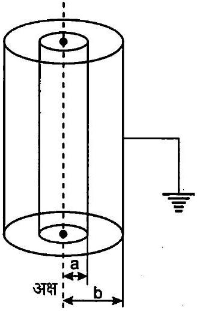

अत: आंतरिक बेलन का विद्युत-विभव दोनों बेलनों के बीच विभवांतर के बराबर होगा।

$$
\begin{array}{ll}
\because & V=\frac{q}{C} \\
\therefore & V=\frac{3.5 \times 10^{-6} \mathrm{C}}{121 \times 10^{-10} \mathrm{~F}}
\end{array}
$$

$$
\begin{array}{ll} 
& V=289 \times 10^{4} \mathrm{~V} \\
\text { या } & V=29 \times 10^{4} \mathrm{~V}
\end{array}
$$

अत: भीतरी बेलन का विभव $=2.9 \times 10^{4} \mathrm{~V}$ उत्तर
प्रश्न 2.33. $3$ परावैद्युतांक तथा $10^{7} \mathrm{Vm}^{-1}$ की परावैद्युत सापर्थ्य वाले एक पदार्थ से $1 \mathrm{kV}$ वोल्टता अनुमतांक के समांतर पट्टिका संधारित्र की अभिकत्पना करनी है। परावैद्युत सापर्थ्य वह अधिकतम विद्युत क्षेत्र है, जिसे कोई पदार्थ बिना भंग हुए अर्थात् आंशिक आयक़न द्वारा बिना वैद्युत संचरण आरम्भ किए सहन कर सकता है। सुरक्षा की दृष्टि से क्षेत्र को कभी भी परावैद्युत सामर्थ्य के $10 \%$ से अधिक नहीं होना चाहिए। $50 \mathrm{pF}$ धारिता के लिए पट्टिकाओं का कितना न्यूनतम क्षेत्रफल होना चाहिए?

हल : ∵ पदार्थ का परावैद्युतांक $K=3$
निर्धारित बिम्ब $=V=1 \mathrm{kV}=10^{3} \mathrm{~V}$
समांतर पट्टिका संधारित्र की धारिता

$$
=C=50 \mathrm{pF}=50 \times 10^{-12} \mathrm{~F}
$$

परावैद्युत शक्ति $=10^{7} \mathrm{Vm}^{-1}=E_{\text {max }}$
चूँकि विद्युत क्षेत्र शक्ति परावैद्युत के $10 \%$ से अधिक नहीं होनी चाहिए, तब

$$
E=10 \% E_{\max }
$$

या

$$
E=\frac{10}{100} \times 10^{7} \mathrm{Vm}^{-1}
$$

या

$$
E=10^{6} \mathrm{Vm}^{-1}
$$

जहाँ $E$ विद्युत क्षेत्र है।
माना संधारित्र आवेश सहन कर सकता है $=q$

$$
\varepsilon_{0}=8.854 \times 10^{-12} \mathrm{C}^{2} \mathrm{~N}^{-1} \mathrm{~m}^{-2}
$$

संधारित्र की पट्टिका का अभीष्ट क्षेत्रफल $=A$
माना संधारित्र की पट्टिकाओं के बीच स्थान $=d$

$$
\begin{array}{ll}
\because & E=\frac{V}{d} \\
\therefore & d=\frac{V}{E}
\end{array}
$$

या

$$
d=\frac{1000}{10^{6}} \mathrm{~m}
$$

या

$$
d=10^{-3} \mathrm{~m}
$$

या

$$
q=C \times \text { निर्धारित विभव }
$$

या

$$
\begin{aligned}
q & =50 \times 10^{-12} \mathrm{~F} \times 10^{3} \mathrm{~V} \\
& =5 \times 10^{-8} \mathrm{C}
\end{aligned}
$$

समांतर पट्टिका वाले संधारित्र की धारिता

$$
\begin{aligned}
& & C & =\frac{\varepsilon_{0} K A}{d} \\
& \therefore & A & =-\frac{C d}{\varepsilon_{0} K}
\end{aligned}
$$

या

$$
A=\left(\frac{q}{V}\right) \cdot \frac{d}{\varepsilon_{0} K} \quad[\because q=C V]
$$

या

$$
A=-\frac{q d}{\varepsilon_{0} K V}
$$

या

$$
A=\frac{q}{\varepsilon_{0} K\left(\frac{V}{d}\right)}
$$

या

$$
A=\frac{q}{\varepsilon_{0} K E}
$$

$$
\left[\because E=\frac{V}{d}\right]
$$

$q, \varepsilon_{0}, K$ एवं $E$ के मान रखने पर,

$$
A=\frac{5 \times 10^{-8} \mathrm{C}}{8.854 \mathrm{C}^{2} \mathrm{~N}^{-1} \mathrm{~m}^{-2} \times 3 \times 10^{6} \mathrm{Vm}^{-1}}
$$

या $A=18.8 \times 10^{-4} \mathrm{~m}^{2}$
या $A=18.8 \mathrm{~cm}^{2}$
या $A=19 \mathrm{~cm}^{2}$
अतः धारिता के लिए पट्टिकाओं का न्यूनतम क्षेत्रफल $=19 \mathrm{~cm}^{2}$

उत्तर
प्रश्न 2.34. व्यवस्थात्मकतः निम्नलिखित में संगत समविभव पृष्ठ का वर्णन कीजिए-
(a) $z$-दिशा में अचर विद्युत क्षेत्र,
(b) एक क्षेत्र जो एकसमान रूप से बढ़ता है, परन्तु एक ही दिशा ( मान लीजिए $z$-दिशा ) में रहता है।
(c) मूल बिंदु पर कोई एकल धनावेश, और
(d) एक समतल में समान दूरी पर समांतर लम्बे आवेशित तारों से बने एकसमान जाल।

उत्तर : (a) $z$-दिशा में कार्यरत् स्थिर विद्युत-क्षेत्र के लिए सम-विभवतल सलग्न चित्रानुसार $X Y$ तल के समान्तर पृष्ठ होंगे।
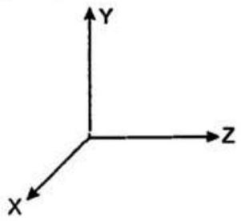
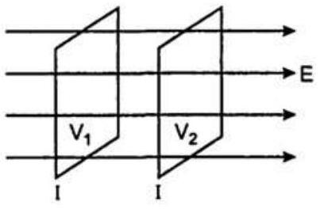
(b) जब क्षेत्र एकसमान रूप से परिमाण में बढ़ता है और एक दिशा में (माना $z$-दिशा), तब समविभव पृष्ठ निश्चित विभवान्तर के अनुरूप, एक-दूसरे के निकट हो जाते हैं और $X Y$ तल के समान्तर होते हैं।
(c) मूल बिन्दु पर एकल धनात्मक आवेश के लिए समविभव पृष्ठ मूल बिन्दु के समकेन्द्रिक गोले होंगे, जिनका केन्द्र मूल बिन्दु पर होगा।
(d) एक एकसमान जाली, जिसमें लम्बे समान्तर आवेशित समान दूरियों पर तार हों, का सम विभव जाली के निकट एक तल में समय-समय पर परिवर्ती आकृति में जाल के निकट होता है, जो धीरे-धीरे बहुत दूरी पर जाल के समान्तर पृष्ठों में बदल जाता है।

प्रश्न 2.35. किसी वान डे ग्राफ के प्रकार के जनित्र में एक गोलीय धातु कोश $15 \times 10^{6} \mathrm{~V}$ का एक इलेक्ट्रोड बनाना है। इलेक्ट्रोड के परिवेश की गैस की परावैद्युत सामर्थ्य $5 \times 10^{7} \mathrm{Vm}^{-1}$ है। गोलीय कोश की आवश्यक न्यूनतम त्रिज्या क्या है? (इस अभ्यास से आपको यह ज्ञान होगा कि एक छोटे गोलीय कोश से आप स्थिरवैद्युत जनित्र, जिसमें उच्च विभव प्राप्त करने के लिए कम आवेश की आवश्यकता होती है, नहीं बना सकते।)

हल : ∵ गोलीय कोश के कारण विभव $=V$
या

$$
V=15 \times 10^{6} \mathrm{~V}
$$

आवेशित गोलीय कोश का विद्युत-क्षेत्र $=E$
या

$$
V=5 \times 10^{7} \mathrm{Vm}^{-1}
$$

माना गोलीय कोश की त्रिज्या $=r$
तथा एक आवेशित कोश के कारण विद्युत-विभव एवं विद्युत क्षेत्र

$$
V=\frac{1}{4 \pi \varepsilon_{0}} \cdot \frac{q}{r}
$$

तथा

$$
E=\frac{1}{4 \pi \varepsilon_{0}} \cdot \frac{q}{r^{2}}
$$

जहाँ $q=$ गोलीय कोश पर आवेश है।
समीकरण (i) को समीकरण (ii) से भाग करने पर,

$$
\frac{V}{E}=r
$$

या

$$
r=\frac{15 \times 10^{6} \mathrm{~V}}{5 \times 10^{7} \mathrm{Vm}^{-1}}
$$

या

$$
r=3 \times 10^{-1} \mathrm{~m}
$$

या

$$
r=30 \mathrm{~cm}
$$

अत: गोलीय कोश की आवश्यक न्यूनतम त्रिज्या $=\mathbf{3 0 ~ c m}$ उत्तर
प्रश्न 2.36. $r_{1}$ त्रिज्या तथा $q_{1}$ आवेश वाला एक छोटा गोला, $r_{2}$ त्रिज्या और $q_{2}$ आवेश के गोलीय खोल (कोश) से घिरा है। दर्शाइए यदि $q_{1}$ धनात्मक है, तो ( जब दोनों को एक तार द्वारा जोड़ दिया जाता है) आवश्यक रूप से आवेश, गोले से खोल की तरफ ही प्रवाहित होगा, चाहे खोल पर आवेश $q_{2}$ कुछ भी हो।

हल : चूँकि $r_{2}$ और $r_{1}$ छोटे गोले और गोलीय खोल की क्रमश: त्रिज्याएँ हैं।
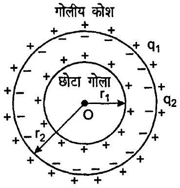

खोल गोले को घेरे हुए है।
$+q_{1}$ आवेश गोले पर है तथा $+q_{2}$ आवेश खोल पर। चूँकि आवेशित चालक के भीतर विद्युत क्षेत्र शून्य होता है।

गाउस के सिद्धान्त से,
इसलिए

$$
\begin{aligned}
& E=0 \\
& \phi=\oint_{S} E \cdot d S
\end{aligned}
$$

या

$$
\phi=\frac{q_{2}}{\varepsilon_{0}}
$$

$\left[\because\right.$ गोलीय खोल में $q_{2}=0, \therefore E=0$ इसके अन्दर॥
चूँकि $q_{2}$ खोल के बाहरी पृष्ठ पर होना चाहिए।
अब $+q_{1}$ आवेश वाला गोला खोल के अन्दर बन्द है।
अत: खोल के आन्तरिक पृष्ठ पर $-q_{1}$ आवेश और बाहरी पृष्ठ पर $+q_{1}$ आवेश उत्प्रेरित होंगे।
∴ खोल के बाहरी पृष्ठ पर कुल आवेश $=q_{2}+q_{1}$
चूँकि आवेश सदैव बाहरी पृष्ठ पर रहता है।
इसलिए $q_{1}$ आवेश गोले के बाहरी पृष्ठ से खोल के बाहरी पृष्ठ की ओर उस समय प्रवाहित होगा, जब उन्हें तार से जोड़ते हैं। उत्तर

प्रश्न 2.37. निम्न का उत्तर दीजिए-
(a) पृथ्वी के पृष्ठ के सापेक्ष वायुमण्डल की ऊपरी परत लगभग $400 \mathrm{kV}$ पर है, जिसके संगत विद्युत क्षेत्र ऊँचाई बढ़ने के साथ कम होता है। पृथ्वी के पृष्ठ के समीप विद्युत क्षेत्र लगभग $100 \mathrm{Vm}^{-1}$ है। तब फिर जब हम घर से बाहर खुले में जाते हैं, तो हमें विद्युत आघात क्यों नहीं लगता? (घर को लोहे के पिंजरा मान लीजिए, अतः उसके अंदर कोई विद्युत क्षेत्र नहीं है! )
(b) एक व्यक्ति शाम के समय अण्ने घर के बाहर $2 \mathrm{~m}$ ऊँचा अवरोधी पट्ट रखता है, जिसके शिखर पर एक $1 \mathrm{~m}^{2}$ क्षेत्रफल की बड़ी ऐलुमिनियम की चादर है। अगली सुबह वह यदि धातु के चादर को छूता है, तो क्या उसे विद्युत आघात लगेगा।
(c) वायु की थोड़ी-सी चालकता के कारण सारे संसार में औसतन वायुमण्डल में विसर्जन धारा $1800$ A मानी जाती है। तब यथासमय वातावरण स्वयं पूर्णतः निरावेशित होकर विद्युत उदासीन क्यों नहीं हो जाता? दूसरे शब्दों में, वातावरण को कौन आवेशित रखता है?
(d) तड़ित के दौरान वातावरण की विद्युत ऊर्जा, ऊर्जा के किन रूपों में क्षयित होती है?

संकेत : पृष्ठ आवेश घनत्व $=10^{-9} \mathrm{~cm}^{-2}$ के अनुरूप पृथ्वी के (पृष्ठ) पर नीचे की दिशा में लगभग $100 \mathrm{Vm}^{-1}$ का विद्युत क्षेत्र होता है। लगभग $50 \mathrm{~km}$ ऊँचाईं तक (जिसके बाहर यह अच्छा चालक है) वातावरण की थोड़ी-सी चालकता के कारण लगभग $+1800 \mathrm{C}$ का आवेश प्रति सेकण्ड समग्र रूप से पृथ्वी में पंप होता रहता है। यथापि, पृथ्वी निरावेशित नहीं होती, क्योंकि संसार में हर समय लगातार तड़ित तथा तड़ित झंझा होती रहती है, जो समान मात्रा में ऋण्पन्वेश पृथ्वी में पंप कर देती है।

उत्तर : (a) हमारा शरीर तथा पृथ्वी सम विभव पृष्ठ बन जाता है, जिसका अर्थ है कि पृथ्वी एवं शरीर का विभव एक ही होता है और उनमें कोई विभवान्तर नहीं होता है। इसलिए जब हम घर से बाहर खुले में आते हैं, तो बाहर की खुली वायु का प्रारम्भिक सम विभव पृष्ठ शरीर को इस प्रकार आवेशित करता है कि सिर तथा धरती एक ही विभव पर होती है। इस प्रकार शरीर में से कोई धारा प्रवाहित नहीं होती और इसीलिए हमें किसी विद्युत झटके का अनुभव नहीं होता है।
(b) हाँ, यदि वह धातु की पट्टी को अगली सुबह छूता है, तो बिजली का झटका लगेगा।

इसका कारण है कि एल्युमिनियम की पट्टी और पृथ्वी एक संधारित्र बनाती हैं, जिसमें अवरोधी पट्टी (स्लैब) एक परावैद्युत बनाती है। आवेश की नीचे की ओर वर्षा से एल्युमिनियम की पट्टी का विभव बढ़ जाता है अर्थात् 1800A की अनावेशित धारा द्वारा यह आवेशित हो जाती है, जो धारा वायुमण्डल से नीचे आ रही है। जब हम एल्युमिनियम की पट्टी को छूते हैं, तो धारा हमारे शरीर से होकर पृथ्वी में चली जाती है। यह आवेश प्रवाह एक विद्युत धरा बनाता है तथा हम झटका अनुभव करते हैं।
(c) सम्पूर्ण पृथ्वी पर लगातार वायुमण्डल तड़ित और इंझावतों से निरन्तर आवेशित होता रहता है तथा इससे सामान्य मौसम की स्थिति में सामंजस्य रहता है।

अत: वायुमण्डल वैद्युतीय रूप से तटस्थ नहीं रह सकता है।
(d) तड़ित के दौरान वायुमण्डल की विद्युत ऊर्जा प्रकाश, ऊष्मा तथा ध्वनि के रूप में बिजली कड़कने के साथ मिश्रित हो जाती है।

