## विद्युत धारा   Current Electricity   अभ्यास प्रश्न

प्रश्न 1. किसी कार की संचायक बैटरी का विद्युत वाहक बल $12 \mathrm{~V}$ है। यदि बैटरी का आन्तरिक प्रतिरोध $0.4 \Omega$ हो, तो बैटरी से ली जाने वाली अधिकतम धारा का मान क्या है?

हल 'प्रश्नानुसार' वि.वा.बल $E=12 \mathrm{~V}$, आन्तरिक प्रतिरोध $=0.4 \Omega$
∴ बैटरी से ली गयी धारा $I=\frac{E}{R+r}$
अधिकतम धारा की अवस्था में $R=0$
∴

$$
\begin{aligned}
\varphi_{\max } & =\frac{E}{r} \\
& =\frac{12}{0.4}=30 \mathrm{~A}
\end{aligned}
$$

प्रश्न 2. $10 \mathrm{~V}$ विद्युत वाहक बल वाली बैटरी जिसका आन्तरिक प्रतिरोध $3 \Omega$ है, किसी प्रतिरोधक से संयोजित है। यदि परिपथ में धारा का मान 0.5 A हो, तो प्रतिरोघक का प्रतिरोध क्या है? जब परिपथ बन्द हो तो सेल की टर्मिनल वोल्टता क्या होगी?
हल प्रश्नानुसार दिया गया वि.वा.बल $E=10 \mathrm{~V}$
आन्तरिक प्रतिरोध $r=3 \Omega$
परिपथ में धारा $\quad l=0.5 \mathrm{~A}$
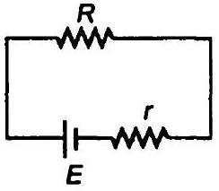
परिपथ में धारा $=\frac{\text { वि. वा. बल }}{\text { परिपथ का कुल प्रतिरोघ }}$

$$
\begin{aligned}
& l=\frac{E}{R+r} \\
\therefore \quad 0.5 & =\frac{10}{R+3} \text { या } R+3=20 \\
R & =17 \Omega
\end{aligned}
$$

जब परिपथ बन्द है तब टर्मिनल विभवान्तर

$$
V=E-I r=10-0.5 \times 3=10-1.5=8.5 \mathrm{~V}
$$

अत: परिपथ में प्रतिरोध $17 \Omega$ है तथा बन्द परिपथ का वोत्टेज $8.5 \mathrm{~V}$ है।
प्रश्न 3. (a) $1 \Omega, 2 \Omega$ और $3 \Omega$ के तीन प्रतियेघ श्रेणी में संयोजित हैं। प्रतिरोघों के संयोजन का कुल प्रतिरोध क्या है?

(b) यदि प्रतिरोधों का संयोजन किस $12 \mathrm{~V}$ की बैटरी जिसका आन्तरिक प्रतिरोघ नगण्य है, से सम्बद्ध है, तो प्रत्येक प्रतिरोधक के सिरो पर वोस्टता ज्ञात कीजिए।

प्रतिरोधों का श्रेणी समायोजन के सूत्र का प्रयोग करें तथा याद रखें कि श्रेणी समायोजन में प्रत्येक प्रतिरोथ में धारा समान होती है तथा विभवान्तर अलग-अलग होता है।

हल (a) दिया है, $R_{1}=1 \Omega, R_{2}=2 \Omega$ और $R_{3}=3 \Omega$
श्रेणी क्रम में परिणामी प्रतिरोध

$$
\begin{aligned}
& R_{S}=R_{1}+R_{2}+R_{3} \\
& R_{S}=1+2+3=6 \Omega
\end{aligned}
$$

(b) प्रत्येक प्रतिरोध का विभव पतन भिन्न-भिन्न हैं (जब दो या अधिक प्रतिरोध श्रेणी क्रम में हैं) माना $V_{1}, V_{2}$ तथा $V_{3}$ प्रतिरोध $R_{1}, R_{2}$ व $R_{3}$ पर विभव पतन है तथा परिपथ में प्रवाहित धारा
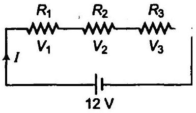

$$
\therefore \quad I=\frac{V}{R_{S}}=\frac{12}{6}=2 \mathrm{~A}
$$

श्रेणी समायोजन में प्रत्येक प्रतिरोध में धारा समान है। $R_{1}$ प्रतिरोध पर विभव पतन, $V_{1}=I R_{1}=2 \times 1=2 \mathrm{~V}$ $R_{2}$ प्रतिरोध पर विमवान्तर $V_{2}=I R_{2}=2 \times 2=4 \mathrm{~V}$ $R_{3}$ प्रतिरोध पर विभवान्तर $V_{3}=\mathbb{R}_{3}=2 \times 3=6 \mathrm{~V}$
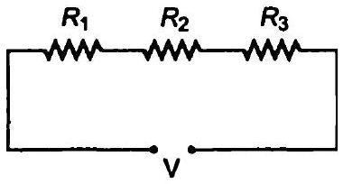
अत: $1 \Omega$ प्रतिरोध में विभव पतन $2 \mathrm{~V}$ है तथा $2 \Omega$ प्रतिरोध में विमव पतन $4 \mathrm{~V}$ है तथा $3 \Omega$ प्रतिरोध में विमव पतन $6 \mathrm{~V}$ है।

प्रश्न 4. (a) $2 \Omega, 4 \Omega$ और $5 \Omega$ के तीन प्रतिरोघक पार्श्व में संयोजित हैं। संयोजन का कुल प्रतिरोध क्या होगा?

(b) यदि संयोजन को $20$ V के विद्युत वाहक बल की बैटरी जिसका आन्तरिक प्रतिरोध नगण्य है, से सम्बन्य किया जाता है, तो प्रत्येक प्रतिरोधक से प्रभावित होने वाली धारा तथा बैटरी से ली गई कुल धारा का मान ज्ञात कीजिए।
समान्तर क्रम में प्रतिरोधों के सूत्र का प्रयोग करें तथा याद रखें कि समान्तर क्रम में प्रत्येक प्रतिरोध पर विभव समान रहता है तथा थारा भिन्न-भिन्न होती है।

हल दिया है, $R_{1}=2 \Omega, R_{2}=4 \Omega$ व $R_{3}=5 \Omega$

(a) समान्तर क्रम में प्रतिरोध
$$
\begin{aligned}
& \frac{1}{R_{P}}=\frac{1}{R_{1}}+\frac{1}{R_{2}}+\frac{1}{R_{3}}=\frac{1}{2}+\frac{1}{4}+\frac{1}{5} \\
& \frac{1}{R_{P}}=\frac{10+5+4}{20}=\frac{19}{20} \\
& R_{P}=\frac{20}{19} \Omega
\end{aligned}
$$

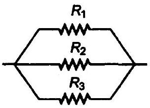

(b) समान्तर क्रम समायोजन में प्रत्येक प्रतिरोघ में प्रवाहित धारा अतगअलग है तथा विभव पतन प्रत्येक प्रतिरोध में समान है। अत: आरोपित विभवान्तर $V=20 V$
प्रतिरोध $R_{1}$ में धारा
$$
I_{1}=\frac{V}{R_{1}}=\frac{20}{2}=10 \mathrm{~A}
$$
प्रतिरोध $R_{2}$ में धारा
$$
I_{2}=\frac{V}{R_{2}}=\frac{20}{4}=5 \mathrm{~A}
$$
प्रतिरोध $R_{3}$ में धारा
$$
I_{3}=\frac{V}{R_{3}}=\frac{20}{5}=4 \mathrm{~A}
$$
कुल धारा $l=l_{1}+l_{2}+l_{3}$
$$
=10+5+4=19 A
$$
अत: $2 \Omega$ के प्रतिरोध में धारा $10 \mathrm{~A}$ है $4 \Omega$ के प्रतिरोध में धारा $5 \mathrm{~A}$ है तथा $5 \Omega$ के प्रतिरोध में घारा $4$ A है। अतः बैटरी से ली गयी धारा $I=I_{1}+I_{2}+I_{3}$
$$
=10+5+4=19 \mathrm{~A}
$$

प्रश्न 5. कमरे का ताप $\left(27.0^{\circ} \mathrm{C}\right)$ पर किसी तापन अवयव का प्रतिरोध $100 \Omega$ है। यदि तापन अवयव का प्रतिरोध $117 \Omega$ हो तो अवयव का ताप क्या होगा? प्रतिरोघक के पदार्थ का ताप-गुणांक $170 \times 10^{-4} /{ }^{\circ} \mathrm{C}$ है।

हल $27^{\circ} \mathrm{C}$ पर प्रतिरोध $=R_{27}=100 \Omega$
ताप $\ell$ पर प्रतिरोध $R_{t}=117 \Omega$
प्रतिरोध ताप गुणांक $\alpha=1.70 \times 10^{-4} /{ }^{\circ} \mathrm{C}$
प्रतिरोध ताप गुणांक

$$
\begin{aligned}
\alpha & =\frac{R_{t}-R_{27}}{R_{27}(t-27)} \\
1.70 \times 10^{-4} & =\frac{117-100}{100(t-27)}
\end{aligned}
$$

या

$$
t-27=\frac{17}{100 \times 1.70 \times 10^{-4}}
$$

या

$$
t=1000+27=1027^{\circ} \mathrm{C}
$$

अत: पदार्थ का $1027^{\circ} \Omega$ ताप पर प्रतिरोध $117 \Omega$ है।

प्रश्न 6. $15 \mathrm{~m}$ लम्बे एवं $6.0 \times 10^{-7} \mathrm{~m}^{2}$ अनुप्रस्य काट वाले तार में ठपेक्षणीय धारा प्रवाहित की गई और इसका प्रतिरोध $5.0 \Omega$ मापा गया। प्रायोगिक ताप पर तार के पदार्थ की प्रतिरोधकता क्या होगी?
हल प्रश्नानुसार तार का क्षेत्रफल $(A)=6.0 \times 10^{-7} \mathrm{~m}^{2}$
तार की लम्बाई $l=15 \mathrm{~m}$, तार का प्रतिरोध $R=5 \Omega$
माना पदार्थ की प्रतिरोधकता $\rho$ है
तार का प्रतिरोध $R=\rho \frac{l}{A}$
या

$$
\rho=\frac{R A}{l}=\frac{5 \times 6.0 \times 10^{-7}}{15}=2 \times 10^{-7} \Omega \cdot \mathrm{~m}
$$

अत: पदार्थ की प्रायोगिक ताप पर प्रतिरोधकता $2 \times 10^{-7} \Omega-\mathrm{m}$ है।
प्रश्न 7. सिल्वर के किसी तार का $27.5^{\circ} \mathrm{C}$ पर प्रतिरोध $2.1 \Omega$ और $100^{\circ} \mathrm{C}$ पर प्रतिरोध $2.7 \Omega$ है। सिल्वर की प्रतिरोधकता ताप गुणांक ज्ञात कीजिए।
हल दिया है सिल्वर तार का $27.5^{\circ} \mathrm{C}$ पर प्रतिरोध $=R_{27.5}=2.1 \Omega$
$100^{\circ} \mathrm{C}$ ताप पर सिल्वर का प्रतिरोध $=R_{100}=2.7 \Omega$
माना सिल्वर का प्रतिरोध ताप गुणांक $\alpha$ है।

$$
\begin{aligned}
\alpha & =\frac{R_{t_{2}}-R_{t_{1}}}{R_{1}\left(t_{2}-t_{1}\right)} \\
& =\frac{R_{100}-R_{27.5}}{R_{27.5}(100-27.5} \\
& =\frac{2.7-2.1}{2.1 \times 72.5} \\
\alpha & =0.0039 /{ }^{\circ} \mathrm{C}
\end{aligned}
$$

अत: सिल्वर का प्रतिरोघ ताप गुणांक $0.0039 /{ }^{\circ} \mathrm{C}$ है।
प्रश्न 8. निक्रोम का एक तापन अवयव $230 \mathrm{~V}$ की सप्लाई से संयोजित है और $3.2 \mathrm{~A}$ की प्रारम्भिक धारा लेता है, जो कुछ सेकण्ड में $2.8 \mathrm{~A}$ पर स्थायी हो जाती है। यदि कमरे का ताप $27.0^{\circ} \mathrm{C}$ है तो तापन अवयव का स्थायी ताप क्या होगा? दिए गए ताप परिसर में निक्रोम का औसत प्रतिरोध का ताप गुणांक $1.70 \times 10^{-4} /{ }^{\circ} \mathrm{C}$ है।
हल दिया है, विभवान्तर $=230 \mathrm{~V}$
प्रारम्भ में $27^{\circ} \mathrm{C}$ पर धारा $=I_{27 \mathrm{C}}=32 \mathrm{~A}$
अन्त में $t$ ताप पर धारा $t^{\circ} \mathrm{C}=4^{\circ} \mathrm{C}=2.8 \mathrm{~A}$
कमरे का ताप $=27^{\circ} \mathrm{C}$
प्रतिरोघ तथा गुणांक $\alpha=1.70 \times 10^{-4} /{ }^{\circ} \mathrm{C}$
$27^{\circ} \mathrm{C}$ पर प्रतिरोध

$$
R_{27^{\circ} \mathrm{C}}=\frac{V}{I_{27^{\circ} \mathrm{C}}}=\frac{230}{32}=\frac{2300}{32} \Omega
$$

${ }^{\circ} \mathrm{C}$ ताप पर प्रतिरोध

$$
R_{t^{\circ} \mathrm{C}}=\frac{V}{l_{{ }^{\circ} \mathrm{C}}}=\frac{230}{2.8}=\frac{2300}{28} \Omega
$$

प्रतिरोध ताप गुणांक

$$
\alpha=\frac{R_{t}-R_{27}}{R_{27}(t-27)_{-}}
$$

⇒

$$
1.7 \times 10^{-4}=\frac{\frac{2300}{28}-\frac{2300}{32}}{\frac{2300}{32}(t-32)}
$$

अथवा

$$
t-27=\frac{82.143-71.875}{71.875 \times 1.7 \times 10^{-4}}=840.347
$$

अथवा

$$
\begin{aligned}
t & =840.3+27 \\
& =867.3^{\circ} \mathrm{C}
\end{aligned}
$$

अतः तापन अवयव का स्थायी ताप $867.3$ °C है।
प्रश्न 9. चित्र में दर्शाए नेटवर्क की प्रत्येक शाखा में प्रवाहित धारा ज्ञात कीजिए।
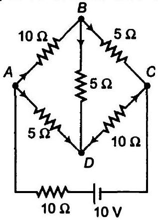
हल किरचॉफ का प्रथम नियम या लूप नियम

$$
\Sigma V=\Sigma / R
$$

लूप $A B D A$ में धारा वितरण

$$
\begin{aligned}
10 I_{1}+5 I_{2}-5\left(I-I_{1}\right) & =0 \\
2 I_{1}+I_{2}-I+I_{1} & =0 \\
3 I_{1}+I_{2} & =I
\end{aligned}
$$

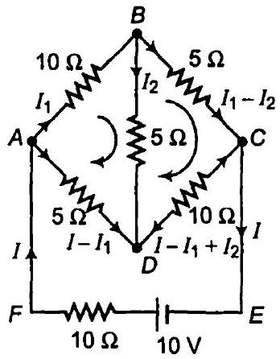
लूप $B C D B$ में

$$
\begin{array}{r}
5\left(I_{1}-I_{2}\right)-10\left(I-I_{1}+I_{2}\right)-5 I_{2}=0 \\
I_{1}-I_{2}-2 I+2 I_{1}-2 I_{2}-I_{2}=0 \\
3 I_{1}-4 I_{2}=2 I
\end{array}
$$

समी (i) व (ii) को हल करने पर

$$
I_{1}=\frac{2 l}{5} \text { तथा } I_{2}=-\frac{1}{5}
$$

लूप ABCEFA में

$$
\begin{aligned}
10 & =10 l+10 l_{1}+5\left(l_{1}-l_{2}\right) \\
2 & =2 l+3 l_{1}-l_{2}
\end{aligned}
$$

$l_{1}$ व $l_{2}$ के मान समीकरण (iii) व (iv) में रखने पर

$$
2=2 l+3\left(\frac{2 l}{5}\right)-\left(-\frac{l}{5}\right)
$$

अथवा

$$
2=\frac{17}{5} / \text { अथवा } /=\frac{10}{17} \mathrm{~A}
$$

ब्रान्च $A B$ में धारा

$$
I_{1}=\frac{2}{5} \times \frac{10}{7}=\frac{4}{17} \mathrm{~A}
$$

और

$$
I_{2}=-\frac{1}{5}=-\frac{2}{17} \mathrm{~A}
$$

$A B$ ब्रान्च में धारा $I_{1}=\frac{4}{17} A$
$B C$ ब्रान्व में धारा $I_{1}-I_{2}=\frac{4}{17}-\left(-\frac{2}{17}\right)=\frac{6}{17} \quad \mathrm{~A}$
$A D$ ब्रान्च में धारा $I-I_{1}=\frac{10}{17}-\frac{4}{17}=\frac{6}{17} \mathrm{~A}$
$D C$ ब्रान्व में धारा $\left(I-I_{1}\right)+I_{2}=\frac{6}{17}+\left(-\frac{2}{17}\right)=\frac{4}{17} \mathrm{~A}$

प्रश्न 10.(a) किसी मीटर सेतु में जब प्रतिरोधक $S=12.5 \Omega$ हो तो सन्तुलन बिन्दु, सिरे $A$ से $39.5 \mathrm{~cm}$ की लम्बाई पर प्राप्त होता है। $X$ का प्रतिरोध ज्ञात कीजिए। क्रीटस्टोन सेतु या मीटर सेतु में प्रतिरोधकों के संयोजन के लिए मोटी कॉपर की पतियाँ क्यों प्रयोग में लाते हैं?

(b) $X$ तथा $Y$ को अंतर्बदल करने पर उपरोक्त सेतु का सन्तुलन बिन्दु ज्ञात कीजिए।
(c) यदि सेतु के सन्तुलन की अवस्था में गैल्वेनोमीटर और सेल को अंतर्बदल कर दिया जाए तब क्या गैल्वेनोमीटर कोई धारा दर्शाएगा?

हल
(a) बिन्दु $A$ से सन्तुलन बिन्दु $l=39.5 \mathrm{~cm}$ रजिस्टर प्रतिरोध $Y=12.5 \Omega$ रजिस्टर $X$ का प्रतिरोध =? सन्तुलित क्हीटस्टोन सेतु की शर्तानुसार
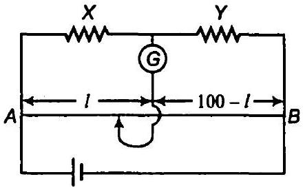

$$
\begin{aligned}
\frac{X}{Y} & =\frac{l}{100-l} \\
X & =\frac{}{100-l} \cdot Y \\
X & =\frac{39.5 \times 12.5}{100-39.5}=8.16 \Omega
\end{aligned}
$$

अतः रजिस्टर $X$ का प्रतिरोध $8.16 \Omega$ है। मीटर सेतु में समायोजन पर लगे प्रतिरोध पर विचार नहीं किया जाता क्योंकि मीटर सेतु का क्हीटस्टोन सेतु में मोटी कॉपर पट्टी लगी होती है तथा मोटाई बढ़ने पर प्रतिरोध घटता है। अतः मोटी कॉपर पट्टी से समायोजन का प्रतिरोध न्यूनतम हो जाता है।

(b) यदि $X$ व $Y$ एक-दूसरे के स्थान पर बदल दिए जाए तो सन्तुलन लम्बाई भी बदल जायेगी। अत: परिवर्तित सन्तुलन लम्बाई $=100-39.5=60.5 \mathrm{~cm}$ हो जाएगी।
(c) यदि गैल्वेनोमीटर तथा सेल बदल दिए जाये, तब सन्तुलन बिन्दु प्राप्त नहीं होता है तथा गैल्वेनोमीटर में कोई विचलन नहीं होता है।

प्रश्न 11. $8 \mathrm{~V}$ विद्युत वाहक बल की एक संचायक बैटरी जिसका आन्तरिक प्रतिरोध $0.5 \Omega$ है, को श्रेणीक्रम में $15.5 \Omega$ के प्रतिरोधक उपयोग करके $120 \mathrm{~V}$ के DC स्रोत द्वारा चार्ज किया जाता है। चार्ज होते समय बैटरी की टर्मिनल वोल्टता क्या है? चार्जकारी परिपथ में प्रतिरोध को श्रेणीक्रम में सम्बद्ध करने का क्या उद्देश्य है?

हल चूँकि बैटरी परिवर्तित कर दी गयी है अत: प्रभावी वि.वा. बल

$$
E=V-e=120-8=112 V
$$

परिपथ में धारा $I=\frac{\text { प्रभावी वि.वा.बल }}{\text { कुल प्रतिरोध }}=\frac{E}{r+R}$

$$
\begin{aligned}
& =\frac{112}{0.5+15.5} \\
& =\frac{112}{16}=7 \mathrm{~A}
\end{aligned}
$$

$8$ V की बैटरी $120$ V की बैटरी द्वारा बदल दी जाती है। अत: $8$ V की बैटरी का टर्मिनल वि.वा.बल इसके वि.वा.बल से अधिक होगा।
टर्मिनल विभवान्तर $V=E+I r=8+7(0.5)=11.5 \mathrm{~V}$
श्रेणीक्रम के प्रतिरोध का मुल उददेश्य बाह्म सप्लाई से ली गयी
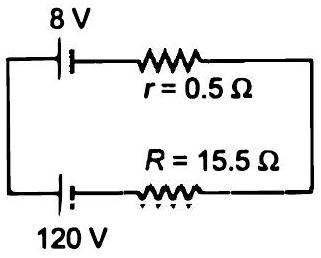
धारा को नियन्त्रित करना है अन्यथा परिपथ में धारा बहुत अधिक हो जायेगी।
प्रश्न 12. किसी पोटैशियोमीटर व्यवस्था में $1.25 \mathrm{~V}$ विद्युत वाहक बल के एक सेल का सन्तुलन बिन्दु तार के $36.0$ सेमी लम्बाई पर प्राप्त होता है। यदि इस सेल को किसी अन्य सेल द्वारा प्रतिस्थापित कर दिया जाए तो सन्तुलन बिन्दु $63.0$ सेमी पर 'स्थानान्तरित' हो जाता है। दूसरे सेल का विद्युत वाहक बल क्या है?

हल दिया है, $E_{1}=125 V_{1} h_{1}=35 \mathrm{~cm}$ तथा $I_{2}=63 \mathrm{~cm}$
हम जानते हैं कि पोटैशियोमीटर की विमव प्रवणता नियत रहती है।

$$
\begin{array}{lrl}
\text { i.e., } & E & \propto l \\
\therefore & \frac{E_{1}}{E_{2}} & =\frac{4}{l_{2}} \\
& \frac{125}{E} & =\frac{35}{63} \\
\text { या } & E & =\frac{125 \times 63}{35}=225 \mathrm{~V}
\end{array}
$$

अत: द्वितीय सेल का वि.वा. बल $25$ V है।
प्रश्न 13. किसी ताँबे के चालक में मुक्त इलेक्ट्रॉनों की संख्या घनत्व प्रश्न $3$ में $8.5 \times 10^{28} \mathrm{~m}^{3}$ आकलित किया गया है। $3 \mathrm{~m}$ लम्बे तार के एक सिरे से दूसरे सिरे तक अपवाह करने में इलेक्ट्रॉन कितना समय लेता है? तार की अनुप्रस्थ काट $2.0 \times 10^{-6} \mathrm{~m}^{2}$ है और इसमें $3.0 \mathrm{~A}$ धारा प्रवाहित हो रही है।

हल इलेक्ट्रॉन की संख्या $n=8.5 \times 10^{28} / \mathrm{m}^{3}$
तार की लम्बाई $l=3 \mathrm{~m}$
तार का क्षेत्रफल $A=2 \times 10^{-6} \mathrm{~m}^{2}$
घारा $I=3 \mathrm{~A}$ व इलेक्ट्रॉन का आवेश $e=1.6 \times 10^{-19} \mathrm{C}$
इलेक्ट्रॉन का एक सिरे से दूसरे सिरे पर अनुगमन करने में लगा समय

$$
\begin{gathered}
t=\frac{\text { तार की लम्बाई }}{\text { अनुगमन वेग }}=\frac{l}{v_{d}} \\
l=\text { ne Av }
\end{gathered}
$$

अथवा

$$
v_{d}=\frac{1}{n e A}
$$

समी (ii) में समी (i) से मान रखने पर

$$
t=\frac{\ln e A}{l}=\frac{3 \times 8.5 \times 10^{28} \times 1.6 \times 10^{-19} \times 2 \times 10^{-6}}{3} .
$$

अथवा

$$
t=2.72 \times 10^{4} \mathrm{~s}=7 \mathrm{~h} 33 \mathrm{~min}
$$

अतः इलेक्ट्रॉन को एक सिरे से दूसरे सिरे तक अनुगमन करने में लगा समय $7 \mathrm{~h} 33 \mathrm{~min}$

## अतिरिक्त प्रश्न

प्रश्न 14. पृथ्वी के पृष्ठ पर ऋणात्मक पृष्ठ-आवेश घनत्व $10^{-9} \mathrm{C}$ सेमी ${ }^{2}$ है। वायुमण्डल के ऊपरी भाग और पृथ्वी के पृष्ठ के बीच $400 \mathrm{kV}$ विभवान्तर (नीचे के वायुमण्डल की कम चालकता के कारण) के परिणामतः समूची पृथ्वी पर केवल $1800 \mathrm{~A}$ की धारा है। यदि वायुमण्डलीय विद्युत क्षेत्र बनाए रखने हेतु कोई प्रक्रिया न हो तो पृथ्वी के पृष्ठ को उदासीन करने हेतु (लगपग) कितना समय लगेगा? (व्यावहारिक रूप में यह कमी नहीं होता है क्योंकि विद्युत आवेशों की पुन: पूर्ति की एक प्रक्रिया है तथा पृथ्वी के विभिन्न भागों में लगातार तडित झंझा एवं तड़ित का होना)।
(पृथ्वी की त्रिज्या $=6.37 \times 10^{6} \mathrm{~m}$ )।
हल दिया है, पृथ्वी की त्रिज्या $A=6.37 \times 10^{6} \mathrm{~m}$
ऋणात्मक सतह घनत्व $\sigma=10^{-9} \mathrm{C} / \mathrm{m}^{2}$
ग्लोव में धारा $V=400 \mathrm{kV}=400 \times 10^{3} \mathrm{~V}$

$$
I=1800 \mathrm{~A}
$$

पृथ्वी का पृष्ठीय क्षेत्रफल $A=4 \pi R^{2}=4 \times 3.14 \times\left(6.37 \times 10^{6}\right)^{2}$

$$
=509.64 \times 10^{12} \mathrm{~m}^{2}
$$

पृथ्वी के पृष्ठ में आवेश परिवर्तन $Q=$ पृथ्वी के पृष्ठ का क्षेत्रफल $\times$ आवेश का पृष्ठ घनत्व

$$
\begin{aligned}
Q & =A \sigma=509.64 \times 10^{12} \times 10^{-9} \\
& =509.64 \times 10^{3} \mathrm{C}
\end{aligned}
$$

हम जानते हैं कि

$$
Q=l t
$$

∴ पृथ्वी के पृष्ठ को उदासीन करने हेतु आवश्यक समय

$$
\begin{aligned}
& t=\frac{Q}{l}=\frac{509.64 \times 10^{3}}{1800} \\
& t=283.1 \mathrm{~s} \text { या } t=4 \mathrm{~min} 43
\end{aligned}
$$

अतः पृथ्वी के पृष्ठ को उदासीन करने में लगा समय $=283.1 \mathrm{~s}$
प्रश्न 15. (a) छ: लेड एसिड संचायक सेलों को जिनमें प्रत्येक का विद्युत वाहक बल $2 \mathrm{~V}$ तथा आन्तरिक प्रतिरोध $0.015 \Omega$ है, के संयोजन से एक बैटरी बनाई जाती है। इस बैटरी का उपयोग $8.5 \Omega$ प्रतिरोधक जो इसके साथ श्रेणी सम्बद्ध है, में धारा की आपूर्ति के लिए किया जाता है। बैटरी से कितनी धारा ली गई है एवं इसकी टर्मिनल वोल्टता क्या है?

(b) एक लम्बे समय तक उपयोग में लाए गए संचायक सेल का विद्युत वाहक बल $1.9 \mathrm{~V}$ और विशाल आन्तरिक प्रतिरोध $380 \Omega$ है। सेल से कितनी अधिकतम धारा ली जा सकती है? क्या सेल से प्राप्त यह धारा किसी कार की प्रवर्तक मोटर को स्टार्ट करने में सक्षम होगी?

हल
(a) सेल श्रेणीक्रम में चित्रानुसार जोड़े गये हैं। प्रत्येक सेल का वि.वा. बल $E=2 \mathrm{~V}$
परिपथ का वि.वा. बल $=n \times E=6 \times 2$

$$
=12 \mathrm{~V}
$$

सेलो की संख्या $n=6$
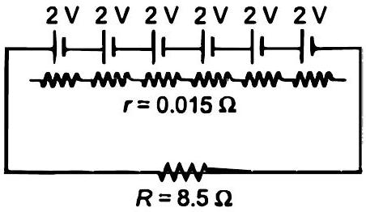
प्रत्येक सेल का आन्तरिक प्रतिरोघ $r=0.015 \Omega$
कुल आन्तरिक प्रतिरोध $=n \times r=6 \times 0.015=0.09 \Omega$
बाह्य लोड $R=8.5 \Omega$
परिपथ में धारा

$$
I=\frac{n E}{n r+R}=\frac{12}{0.09+8.5}=1.4 \mathrm{~A}
$$

बैटरी का टर्मिनल बोल्टेज $V=I R=1.4 \times 8.5=11.9 \mathrm{~V}$

(b) सेल का वि.वा. बल $E=1.9 \mathrm{~V}$
सेल का आन्तरिक प्रतिरोध $r=380 \Omega$
सेल तभी अधिकतम धारा देगा जब बाह्य प्रतिरोध शून्य होगा।

अत:

$$
l_{\max }=\frac{E}{r}=\frac{1.9}{380}=0.005 \mathrm{~A}
$$

अतः हम देखते हैं कि सेल द्वारा दी गयी धारा अति अल्प है अतः सेल कार के मोटर को चलाने में सक्षम नहीं होगा क्योंकि इसके लिए अल्प समय हेतु $100 \mathrm{~A}$ की धारा आवश्यक है।

प्रश्न 16. दो समान लम्बाई की तारों में एक एल्युमीनियम का और दूसरा कॉपर का बना है। इनके प्रतिरोध समान हैं। दोनों तारों में से कौन-सा हल्का है? अतः समझाइये कि ऊपर से जाने वाली बिजली के बिलों में एल्युमीनियम के तारों को क्यों पसन्द किया जाता है?
$\rho_{\mathrm{Al}}=2.63 \times 10^{-8} \Omega-\mathrm{m}, \rho_{\mathrm{Cu}}=1.72 \times 10^{-8} \Omega-\mathrm{m}, \mathrm{Al}$ का आपेक्षिक घनत्व $=2.7$, कॉपर का आपेक्षिक घनत्व = 8.9)
हल AI हेतु घटक राशियाँ,
लम्बाई $l_{\mathrm{Al}}=l$, घनत्व $d_{\mathrm{Al}}=2.7$ और क्षेत्रफल $A_{\mathrm{Al}}=A_{1}$
Cu हेतु घटक राशियाँ
लम्बाई $l_{\mathrm{Cu}}=l$, घनत्व $d_{\mathrm{Cu}}=8.9$ और क्षेत्रफल $A_{\mathrm{Cu}}=A_{2}$
(माना Al की प्रतिरोधकता $\rho_{\mathrm{Al}}$ तथा कॉपर की प्रतिरोधकता $\rho_{\mathrm{Cu}}$ है।

$$
R=\rho \frac{l}{A}
$$

AI तार का प्रतिरोध

$$
R_{A l}=\rho_{A} \cdot \frac{l_{A}}{A_{A l}}=\frac{2.63 \times 15^{-8} \times l}{A_{1}}
$$

Al का द्रव्यमान $m_{\mathrm{Al}}=A_{\mathrm{Al}} \times l_{\mathrm{Al}} \times d_{\mathrm{Al}}=A_{1} \times l \times 2.7$
ताबें का प्रतिरोध

$$
R_{\mathrm{Cu}}=P_{\mathrm{Cu}} \times \frac{l_{\mathrm{Cu}}}{A_{\mathrm{Cu}}}=\frac{1.72 \times 10^{-8} \times 1}{A_{2}}
$$

कॉपर का द्रव्यमान

$$
m_{\mathrm{Cu}}=A_{\mathrm{Cu}} \times l_{\mathrm{Cu}} \times d_{\mathrm{Cu}}=A_{2} \times l \times 8.9
$$

प्रश्नानुसार, Al का प्रतिरोघ Cu के प्रतिरोघ के समान है।
i.e.,

$$
\begin{aligned}
R_{\mathrm{Al}} & =R_{\mathrm{Cu}} \\
\frac{2.63 \times 10^{-8} \times 1}{A_{1}} & =\frac{1.72 \times 10^{-8} \times 1}{A_{2}}
\end{aligned}
$$

समी (i) व (iii) से
अथवा

$$
\frac{A_{1}}{A_{2}}=\frac{2.63}{1.72}
$$

समी (ii) व (iv) से

$$
\frac{m_{\mathrm{Al}}}{m_{\mathrm{Cu}}}=\frac{A_{1} \times 1 \times 2.7}{A_{2} \times 1 \times 8.9}
$$

$$
\frac{m_{\mathrm{Al}}}{m_{\mathrm{Cu}}}=\frac{2.63 \times 2.7}{1.72 \times 8.9}
$$

[समी (v) से]

अथवा

$$
\frac{m_{\mathrm{Cu}}}{m_{\mathrm{Al}}}=2.16
$$

हम देखते हैं कि ताँबे का भार AI के भार का $2.16$ गुना भारी है समान लम्बाई व प्रतिरोघ के लिए AI का तार Cu के तार से हल्का है। अतः Al का तार कम भार के कारण पॉवर केबल में प्रयुक्त होता है क्योंकि भारी केबल टूट जाने का भय होता है।

प्रश्न 17. मिश्र धातु मैंगनिन के बने प्रतिरोधक पर लिए गए निम्नलिखित प्रेक्षणों से आप क्या निष्कर्ष निकाल सकते हैं?
| धारा A | वोल्टता V | धारा A | वोल्टता V |
| :--- | :--- | :--- | :--- |
| $0.2$ | $3.94$ | $3.0$ | $59.2$ |
| $0.4$ | $7.87$ | $4.0$ | $78.8$ |
| $0.6$ | $11.8$ | $5.0$ | $98.6$ |
| $0.8$ | $15.7$ | $6.0$ | $118.5$ |
| $1.0$ | $19.7$ | $7.0$ | $138.2$ |
| $2.0$ | $39.4$ | $8.0$ | $158.0$ |

हल

| धारा (A में) | घोत्टेज (V में) | अनुपात (VI) | घारा (A में) | घोत्टेज (V में) | अनुपात (VII) |
| :--- | :--- | :--- | :--- | :--- | :--- |
| $0.2$ | $3.94$ | $19.7$ | $3.0$ | $59.2$ | $59.2$ |
| $0.4$ | $7.87$ | $19.675$ | $4.0$ | $78.8$ | $78.8$ |
| $0.6$ | $11.8$ | $19.66$ | $5.0$ | $98.6$ | $98.6$ |
| $0.8$ | $15.7$ | $19.625$ | $6.0$ | $718.5$ | $118.5$ |
| $1.0$ | $19.7$ | $19.7$ | $7.0$ | $138.2$ | $138.2$ |
| $2.0$ | $39.4$ | $19.7$ | $8.0$ | $158.0$ | $158.0$ |

चूँकि वोल्टेज तथा धारा का अनुपात समी प्रेक्षणों के लिए समान है अतः ओम का नियम वैध है। मिश्र धातुओं का प्रतिरोध ताप गुणांक नगण्य है अतः मिश्र धातु का प्रतिरोध ताप पर निर्भर नहीं करता है।

प्रश्न 18. निम्नलिखित प्रश्नों के ठत्तर दीजिए

(a) किसी असमान अनुप्रस्थ काट वाले धात्विक चालक से एकसमान धारा प्रवाहित होती है। निम्नलिखित में से चालक में कौन-सी राशि अचर रहती है धारा, धारा घनत्व, विद्युत क्षेत्र, अपवाह चाल?

(b) क्या सभी परिपथीय अवयवों के लिए ओम का नियम सार्वत्रिक रूप से लागू होता है? यदि नहीं तो उन अवयवों के उदाहरण दीजिए जो ओम के नियम का पालन नहीं करते।
(c) किसी निम्न वोल्टता संभरण जिससे उच्च धारा देनी होती है, का आन्तरिक प्रतिरोध बहुत कम होना चाहिए, क्यों?
(d) किसी उच्च विभव (HT) संभरण, मान लीजिए $6$ kV , का आन्तरिक प्रतिरोघ अत्याधिक होना चाहिए क्यों?

हल

(a) चालक की धारा उसके क्षेत्रफल पर निर्भर नहीं करती है अत: धारा नियत होती है, धारा घनत्व क्षेत्र के व्युत्क्रमानुपाती होती है। वैद्युत क्षेत्र तथा अनुगमन वेग, क्षेत्रफल के व्युत्क्रमानुपाती होते हैं। अतः क्षेत्रफल परिवर्तित होने पर $J$ धारा घनत्व, $E$ वैद्युत क्षेत्र, अनुगमन वेग अपरिवर्तित नहीं रहते हैं।
(b) नहीं, ओम का नियम सभी चालकीय पदार्थों के लिए लागू है। निर्वात नलिका अर्द्धचालक, ट्राँजिस्टर, थर्मोस्टर आदि ओम के नियम का पालन नहीं करते हैं।
(c) अति अल्प आन्तरिक प्रतिरोध पर धारा अति उच्च होती है सूत्र $l_{\max }=\frac{V}{R}$ सूत्रानुसार, $R$ का मान कम होने पर धारा का मान बढ़ता है।
(d) हाईटेंशन सप्लाई हेतु आन्तरिक प्रतिरोध बहुत अधिक होता है, यदि परिपथ को विलगित कर दिया जाता है तब आन्तरिक प्रतिरोध पर्याप्त उच्च नहीं रहता तथा धारा सीमा से अधिक बढ़ जाता है, जिससे परिपथ नष्ट हो जाता है।

प्रश्न 19. सही विकल्प छाटिए

(a) धातुओं की मिश्रधातुओं की प्रतिरोधकता प्रायः उनकी अवयव धातुओं की अपेक्षा (अधिक/कम) होती है।
(b) आमतौर पर मिश्रधातुओं के प्रतिरोध का ताप गुणांक, शुद्ध धातुओं के प्रतिरोध के ताप गुणांक से बहुत कम/अधिक होता है।
(c) मिश्रघातु मैगनिन की प्रतिरोधकता ताप में वृद्धि के साथ लगमग (स्वतन्त्र है/तेजी से बढ़ती है)।
(d) किसी प्रारूपी विद्युतरोधी (उदाहरणार्थ, अम्बर) की प्रतिरोधकता किसी धातु की प्रतिरोधकता की तुलना में $\left(10^{22} / 10^{23}\right)$ कोटि के गुणांक से बड़ी होती है।

हल

(a) मिश्र धातु की प्रतिरोधकता उसकी संगत धातुओं की तुलना में अधिक होती है।
(b) मिश्र धातुओं का प्रतिरोध ताप गुणांक संगत धातुओं की तुलना में अति अल्प होता है।
(c) मैग्नीन मिश्र धातु की प्रतिरोघकता ताप बढ़ाने पर अपरिवर्तित रहती है क्योंकि मिश्र धातु का प्रतिरोध ताप गुणांक अतिअल्प होता है। अतः इसकी प्रतिरोधकता बहुत अधिक होती है।
(d) जटिल अचालक की प्रतिरोधकता धातु के सापेक्ष $10^{22}$ गुना अधिक होती है क्योंकि अचालक की प्रतिरोधकता मिश्रधातु के सापेक्ष अधिक होती है।

प्रश्न 20. (a) आपको $R$ प्रतिरोध वाले $n$ प्रतिरोधक दिए गए हैं। (i) अधिकतम (ii) न्यूनतम प्रभावी प्रतिरोध प्राप्त करने के लिए आप इन्हे किस प्रकार संयोजित करेंगे? अधिकतम और न्यूनतम प्रतिरोधों का अनुपात क्या होगा?

(b) यदि $1 \Omega, 2 \Omega, 3 \Omega$ के तीन प्रतिरोध दिए गए हो तो उनको आप किस प्रकार संयोजित करेंगे कि प्राप्त तुल्य प्रतिरोघ हो (i) $(11 / 3) \Omega$, (ii) $(11 / 5) \Omega$, (iii) $6 \Omega$, (iv) $(6 / 11) \Omega$ ?
(c) चित्र में दिखाए गए नेटवर्को का तुल्य प्रतिरोध प्राप्त कीजिए।
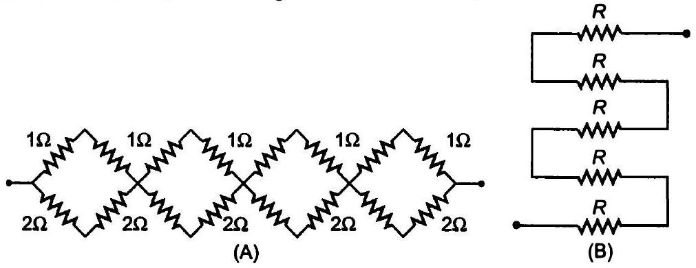

हल
(a) अधिकतम प्रभावी प्रतिरोध प्राप्त करने हेतु हम $n$ रेजिस्टर को श्रेणी क्रम में जोड़ते हैं

$$
R_{\max }=R+R+\ldots+n=n R
$$

न्यूनतम प्रभावी प्रतिरोध प्राप्त करने हेतु $n$ रजिस्टरो को समान्तर क्रम में समावेषित करने पर

$$
\begin{aligned}
& \frac{1}{R_{\min }}=\frac{1}{R}+\frac{1}{R}+\ldots+n=\frac{n}{R} \\
& R_{\min }=\frac{R}{n}
\end{aligned}
$$

अधिकतम तथा न्यूनतम प्रतिरोधों का अनुपात

$$
\begin{array}{ll}
=\frac{R_{\max }}{R_{\min }}=\frac{n R \cdot n}{R} & \text { [समीकरण (i) व (ii) से] } \\
=n^{2} &
\end{array}
$$

अतः अधिकतम व न्यूनतम प्रतिरोध का अनुपात $n^{2}$ है।

(b) दिया है $R_{1}=1 \Omega, R_{2}=2 \Omega$ तथा $R_{3}=3 \Omega$
(i) समतुल्य प्रतिरोध $\frac{11}{3}$ प्राप्त करने हेतु $R_{1}$ व $R_{2}$ समान्तर क्रम में हैं।
$$
\begin{aligned}
& \frac{1}{R_{P}}=\frac{1}{R_{1}}+\frac{1}{R_{2}}=1+\frac{1}{2}=\frac{3}{2} \\
& R_{P}=\frac{2}{3} \Omega
\end{aligned}
$$
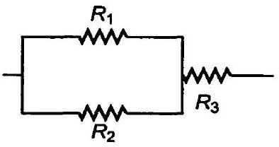

$R_{p}$ व $R_{3}$ श्रेणीक्रम में हैं अतः प्रभावी प्रतिरोध
$$
R=R_{P}+R_{3}=3+\frac{2}{3}=\frac{11}{3} \Omega
$$
(ii) समतुल्य प्रतिरोध $\frac{11}{5} \Omega$, प्राप्त करने के लिए प्रतिरोधों को चित्रानुसार समायोजित करते हैं।
यहाँ प्रतिरोध $R_{2}$ व $R_{3}$ समान्तर क्रम में हैं।
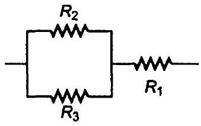
$$
\begin{aligned}
& \frac{1}{R_{P}}=\frac{1}{R_{2}}+\frac{1}{R_{3}}=\frac{1}{2}+\frac{1}{3}=\frac{3+2}{6}=\frac{5}{6} \\
& R_{P}=\frac{6}{5} \Omega
\end{aligned}
$$
$R_{P}$ व $R_{3}$ श्रेणीक्रम में है अतः परिणामी प्रतिरोध
$$
R=R_{P}+R_{3}=\frac{6}{5}+1=\frac{11}{5} \Omega
$$
(iii) समतुल्य प्रतिरोध $6 \Omega$ प्राप्त करने हेतु कम प्रतिरोधों को चित्रानुसार श्रेणीक्रम में जोड़ते हैं।
$$
R_{S}=R_{1}+R_{2}+R_{3}=1+2+3=6 \Omega
$$
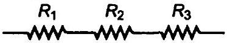
(iv) समतुल्य प्रतिरोध $\frac{6}{11} \Omega$, प्राप्त करने हेतु प्रतिरोध को समान्तर क्रम में समायोजित करते हैं।
$$
\frac{1}{R_{p}}=\frac{1}{1}+\frac{1}{2}+\frac{1}{3}=\frac{6+3+2}{6}=\frac{11}{6}
$$
परिणामी प्रतिरोध
$$
R_{P}=\frac{6}{11} \Omega
$$
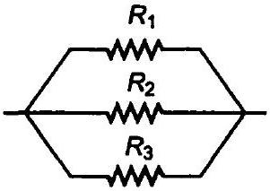
(c) प्रथम खण्ड (A)
यहाँ $1 \Omega$ व $1 \Omega$ श्रेणी में हैं।
$$
\therefore \quad R_{S}=1+1=2 \Omega
$$
$2 \Omega$ व $2 \Omega$ श्रेणी क्रम में हैं।
$$
\therefore \quad R_{S}^{\prime}=2+2=4 \Omega
$$
$R_{S}$ व $R_{S}^{\prime}$ समान्तर क्रम में हैं।
$$
\begin{aligned}
\frac{1}{R^{\prime}} & =\frac{1}{R_{S}}+\frac{1}{R_{S}^{\prime}} \\
& =\frac{1}{2}+\frac{1}{4} \\
& =\frac{2+1}{4}=\frac{3}{4}
\end{aligned}
$$
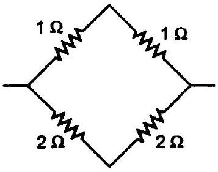
∴ परिणामी प्रतिरोघ, $R^{\prime}=\frac{4}{3} \Omega$

चित्र (A) में चार खण्ड श्रेणीक्रम में समायोजित हैं। अतः प्रभावी प्रतिरोध

$$
R=4 R^{\prime}=4 \times \frac{4}{3}=\frac{16}{3} \Omega
$$

अथवा

$$
R=5.33 \Omega
$$

चित्र (B) में सभी प्रतिरोघ श्रेणीक्रम में हैं अत: प्रभावी प्रतिरोध

$$
R^{\prime}=R+R+R+R+R=5 R
$$

प्रश्न 21. किसी $0.5 \Omega$ आन्तरिक प्रतिरोध वाले $12 \mathrm{~V}$ के एक सम्भरण (Supply) से चित्र में दर्शाए गए अनन्त नेटवर्क द्वारा ली गई धारा का मान ज्ञात कीजिए। प्रत्येक प्रतिरोध का मान $1 \Omega$ है।
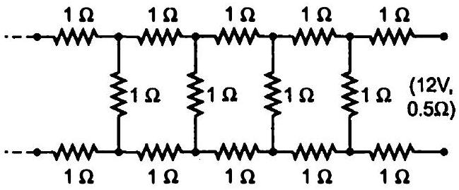
हल माना परिपथ का प्रभावी प्रतिरोध $x$ है, यदि परिपथ के एक भाग में चित्रानुसार प्रतिरोध $(1 \Omega, 1 \Omega, 1 \Omega)$ विलगित हैं। यहाँ $1 \Omega$ व $x$ प्रतिरोध समान्तर क्रम में है।

$$
\begin{aligned}
& \frac{1}{R_{p}}=\frac{1}{x}+\frac{1}{1}=\frac{1+x}{x} \\
& R_{p}=\frac{x}{1+x}
\end{aligned}
$$

प्रतिरोध $R_{p}, 1 \Omega$ व $1 \Omega$ श्रेणी में हैं अतः परिणामी प्रतिरोध

$$
R=R_{p}+1+1=\frac{x}{1+x}+1+1=\frac{x}{1+x}+2
$$

अनन्त प्रतिरोघ की स्थिति में $R$ का मान $x$ ही रहता है।

$$
\therefore \quad \begin{aligned}
x & =\frac{x}{1+x}+2 \\
x(x+1) & =x+2+2 x \\
x^{2}-2 x-2 & =0 \\
x & =\frac{-(-2) \pm \sqrt{4+8}}{2} \\
& =\frac{2 \pm \sqrt{12}}{2}-1 \pm \sqrt{3}
\end{aligned}
$$

प्रतिरोध कभी भी ऋणात्मक नहीं होता है अतः परिपथ का प्रतिरोघ

$$
\begin{aligned}
& x=1+\sqrt{3}=1+1.732 \\
& x=2.732 \Omega
\end{aligned}
$$

परिपथ का कुल प्रतिरोध $=2.732+0.5=3.232 \Omega$ सप्लाई से ली गई धारा $/=\frac{V}{3.232}=\frac{12}{3.232}=3.72 \mathrm{~A}$

प्रश्न 22. चित्र में एक पोटैशियोमीटर दर्शाया गया है जिसमें एक $2.0 \mathrm{~V}$ और आन्तरिक प्रतिरोध $0.40 \Omega$ का कोई सेल, पोटैशियोमीटर के प्रतिरोधक तार $A B$ पर वोल्टता पात बनाए रखता हैं। कोई मानक सेल जो $1.02 \mathrm{~V}$ का अचर विद्युत वाहक बल बनाए रखता है (कुछ mA की बहुत सामान्य धाराओं के लिए) तार की $67.3$ सेमी लम्बाई पर सन्तुलन बिन्दु देता है। मानक सेल से अति न्यून धारा लेना सुनिश्चित करने के लिए इसके साथ परिपथ में श्रेणी $600 \mathrm{k} \Omega$ का एक अति उच्च प्रतिरोध सम्बद्ध किया जाता है, जिसके
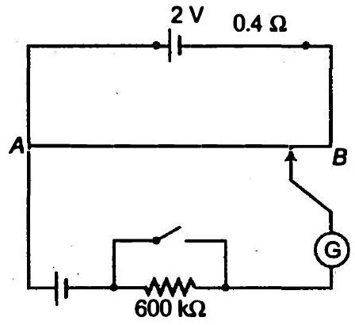
सन्तुलन बिन्दु प्राप्त होने के निकट लघुपधित (shorted) कर दिया जाता है। इसके बाद मानक सेल को किसी अज्ञात विद्युत वाहक बल $E$ के सेल से प्रतिस्थापित कर दिया जाता है। जिससे सन्तुलन बिन्दु तार की $82.3$ सेमी लम्बाई पर प्राप्त होता है।

(a) $E$ का मान क्या है?
(b) $600 \mathrm{k} \Omega$ के उच्च प्रतिरोध का क्या प्रयोजन है?
(c) क्या इस उच्च प्रतिरोध से सन्तुलन बिन्दु प्रभावित होता है?
(d) क्या परिचालक सेल के आन्तरिक प्रतिरोध से सन्तुलन बिन्दु प्रमावित होता है?
(e) उपरोक्त स्थिति में यदि पोटैशियोमीटर के परिचालक सेल का विद्युत वाहक बल 2.0 V के स्थान पर $1.0 \mathrm{~V}$ हो तो क्या यह विघि फिर भी सफल रहेगी?
(f) क्या यह परिपथ कुछ mV की कोटि के अत्यल्प विद्युत वाहक बलों (जैसे की किसी प्रारूपी तापवैद्युत युग्म का विद्युत वाहक बल) के निर्घारण में सफल होगी? यदि नहीं तो आप इसमें किस प्रकार संशोघन करेंगें?

हल

(a) दिया है, $E_{1}=1.02 V_{1} l_{1}=67.3 \mathrm{~cm}, E_{2}=E=?$ व $l_{2}=82.3 \mathrm{~cm}$
$$
E \propto l
$$
∴
$$
\frac{E_{1}}{E_{2}}=\frac{l_{1}}{l_{2}}
$$
⇒
$$
\frac{1.02}{E}=\frac{67.3}{82.3}
$$
या
$$
E=\frac{1.02 \times 82.3}{67.3}=1.247 \mathrm{~V}
$$
सेल का वि.वा. बल $E=1.247 \mathrm{~V}$
(b) $600 \Omega$ के अति उच्च प्रतिरोघ से अति अल्प धारा प्रवाहित होती है जब यह सन्तुलन बिन्दु से अधिक दूर होता है।

(c) नहीं, सन्तुलन बिन्दु उच्च प्रतिरोध $600 \Omega$ से प्रभावित नहीं होगा।
(d) नहीं, सन्तुलन बिन्दु परिचालक सेल के आन्तरिक प्रतिरोध से प्रभावित नहीं होगा।
(e) सम्मव नहीं
(f) नहीं, परिपथ अति अल्प वि.वा. बल (मिलीवोल्ट की कोटि का) को ज्ञात करने में, सुग्राहिता से कार्य नहीं करेगा क्योंकि इस स्थिति में सन्तुलन बिन्दु सिरे $A$ के समीप है। संशोधित करने हेतु हम श्रेणी में उच्च प्रतिरोध (सेल के साथ) लगाते हैं जिससे विभवमापी के तार में धारा घटती है अत: विभव प्रवणता भी घटती है।

प्रश्न 23. चित्र दो प्रतिरोधों की तुलना के लिए विभवमापी परिपथ दर्शाता है। मानक प्रतिरोध $R=100 \Omega$ के साथ सन्तुलन बिन्दु $58.3 \mathrm{~cm}$ पर तथा अज्ञात प्रतिरोध $X$ के साथ $68.5 \mathrm{~cm}$ पर प्राप्त होता है। $X$ का मान ज्ञात कीजिए। यदि आप दिए गए सेल $E$ से सन्तुलन बिन्दु प्राप्त करने में असफल रहते हैं तो आप क्या करेंगे?
हल यहाँ, $l_{1}=58.3 \mathrm{~cm}, l_{2}=68.5 \mathrm{~cm}, R=10 \Omega$, $\boldsymbol{X} \boldsymbol{=}$ ?
माना विमवमापी के तार में धारा । है तथा $A$ व $x$ पर
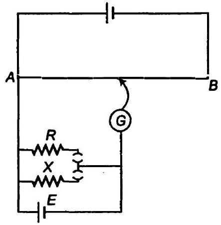
विभव पतन क्रमशः $E_{1}$ व $E_{2}$ हैं।
अथवा

$$
\begin{gathered}
\frac{E_{2}-I X}{E_{1}}=\frac{X}{I R} \\
X=\frac{E_{2}}{E_{1}} \cdot R
\end{gathered}
$$

विभवमापी के सिद्धान्त अनुसार

$$
\frac{E_{2}}{E_{1}}=\frac{l_{2}}{l_{1}}
$$

समी (i) से

$$
\begin{aligned}
X & =\frac{l_{2}}{4} \cdot R \\
& =\frac{68.5}{58.3} \times 10 \\
& =11.75 \Omega
\end{aligned}
$$

यदि हम सेल द्वारा सन्तुलन बिन्दु प्राप्त करने में असफल होते हैं तब इसका अर्थ है कि $R$ व $X$ पर विमव पतन विभवमापी के तार से अधिक है। यह भी सम्मव है कि सेल का विभवान्तर वि.वा. बल से कम है।

प्रश्न 24. चित्र में किसी $1.5 \mathrm{~V}$ के सेल का आन्तरिक प्रतिरोध मापने के लिए एक $2.0 \mathrm{~V}$ का पोटैशियोमीटर दर्शाया गया है। खुले परिपथ में सेल का सन्तुलन बिन्दु $76.3 \mathrm{~cm}$ पर मिलता है। सेल के बाह्मा परिपथ में $9.5 \Omega$ प्रतिरोध का एक प्रतिरोधक संयोजित करने पर सन्तुलन बिन्दु पोटैशियोमीटर के तार की $64.8 \mathrm{~cm}$ लम्बाई पर पहुंच जाता है। सेल के आन्तरिक प्रतिरोध का मान ज्ञात कीजिए।
हल जब सेल खुला परिपथ है, सन्तुलन बिन्दु

$$
4=76.3 \text { सेमी }
$$

सेल के बन्द होने पर सन्तुलन बिन्दु

$$
l_{2}=64.8 \text { सेमी }
$$

और

$$
\text { प्रतिरोध } R=9.5 \Omega
$$

सेल का आन्तरिक प्रतिरोध

$$
\begin{aligned}
r & =\left(\frac{l_{1}}{l_{2}}-1\right) R \\
& =\left(\frac{76.3}{64.8}-1\right) \times 9.5=1.68 \Omega
\end{aligned}
$$

सेल का आन्तरिक )

