## MOVING CHARGES

## AND MAGNETISM

### 4.1 Introduction

Both Electricity and Magnetism have been known for more than 2000 years. However, it was only about 200 years ago, in 1820, that it was realised that they were intimately related. During a lecture demonstration in the summer of 1820, Danish physicist Hans Christian Oersted noticed that a current in a straight wire caused a noticeable deflection in a nearby magnetic compass needle. He investigated this phenomenon. He found that the alignment of the needle is tangential to an imaginary circle which has the straight wire as its centre and has its plane perpendicular to the wire. This situation is depicted in Fig.4.1(a). It is noticeable when the current is large and the needle sufficiently close to the wire so that the earth's magnetic field may be ignored. Reversing the direction of the current reverses the orientation of the needle [Fig. 4.1(b)]. The deflection increases on increasing the current or bringing the needle closer to the wire. Iron filings sprinkled around the wire arrange themselves in concentric circles with the wire as the centre [Fig. 4.1(c)]. Oersted concluded that moving charges or currents produced a magnetic field in the surrounding space.

Following this, there was intense experimentation. In 1864, the laws obeyed by electricity and magnetism were unified and formulated by

James Maxwell who then realised that light was electromagnetic waves. Radio waves were discovered by Hertz, and produced by J.C.Bose and G. Marconi by the end of the $19{ }^{\text {th }}$ century. A remarkable scientific and technological progress took place in the $20{ }^{\text {th }}$ century. This was due to our increased understanding of electromagnetism and the invention of devices for production, amplification, transmission and detection of electromagnetic waves.

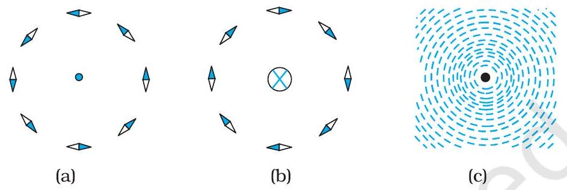
FIGURE 4.1 The magnetic field due to a straight long current-carrying wire. The wire is perpendicular to the plane of the paper. A ring of compass needles surrounds the wire. The orientation of the needles is shown when (a) the current emerges out of the plane of the paper,
(b) the current moves into the plane of the paper. (c) The arrangement of iron filings around the wire. The darkened ends of the needle represent north poles. The effect of the earth's magnetic field is neglected.

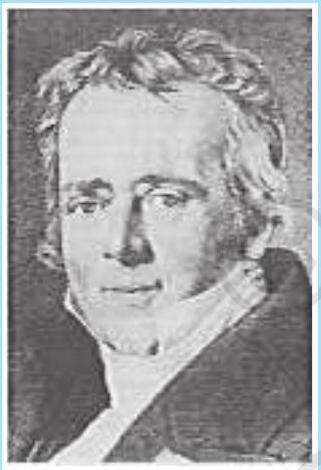
Hans Christian Oersted (1777-1851) Danish physicist and chemist, professor at Copenhagen. He observed that a compass needle suffers a deflection when placed near a wire carrying an electric current. This discovery gave the first empirical evidence of a connection between electric and magnetic phenomena.

In this chapter, we will see how magnetic field exerts forces on moving charged particles, like electrons, protons, and current-carrying wires. We shall also learn how currents produce magnetic fields. We shall see how particles can be accelerated to very high energies in a cyclotron. We shall study how currents and voltages are detected by a galvanometer.

In this and subsequent Chapter on magnetism, we adopt the following convention: A current or a field (electric or magnetic) emerging out of the plane of the paper is depicted by a dot ( $\odot$ ). A current or a field going into the plane of the paper is depicted by a cross $(\otimes)^{*}$. Figures. 4.1(a) and 4.1(b) correspond to these two situations, respectively.

### 4.2 Magnetic Force

### 4.2.1 Sources and fields

Before we introduce the concept of a magnetic field B, we shall recapitulate what we have learnt in Chapter 1 about the electric field E. We have seen that the interaction between two charges can be considered in two stages. The charge Q , the source of the field, produces an electric field $\mathbf{E}$, where

[^0]
## Moving Charges and Magnetism

$$
\mathbf{E}=\mathrm{Q} \hat{\mathbf{r}} /\left(4 \pi \varepsilon_{0}\right) r^{2}
$$

where $\hat{\mathbf{r}}$ is unit vector along r, and the field E is a vector field. A charge $q$ interacts with this field and experiences a force $\mathbf{F}$ given by

$$
\mathbf{F}=q \mathbf{E}=q Q \hat{\mathbf{r}} /\left(4 \pi \varepsilon_{0}\right) r^{2}
$$

As pointed out in the Chapter 1, the field E is not just an artefact but has a physical role. It can convey energy and momentum and is not established instantaneously but takes finite time to propagate. The concept of a field was specially stressed by Faraday and was incorporated by Maxwell in his unification of electricity and magnetism. In addition to depending on each point in space, it can also vary with time, i.e., be a function of time. In our discussions in this chapter, we will assume that the fields do not change with time.

The field at a particular point can be due to one or more charges. If there are more charges the fields add vectorially. You have already learnt in Chapter 1 that this is called the principle of superposition. Once the field is known, the force on a test charge is given by Eq. (4.2).

Just as static charges produce an electric field, the currents or moving charges produce (in addition) a magnetic field, denoted by $\mathbf{B}(\mathbf{r})$, again a vector field. It has several basic properties identical to the electric field. It is defined at each point in space (and can in addition depend on time). Experimentally, it is found to obey the principle of superposition: the magnetic field of several sources is the vector addition of magnetic field of each individual source.

### 4.2.2 Magnetic Field, Lorentz Force

Let us suppose that there is a point charge $q$ (moving with a velocity $\mathbf{v}$ and, located at $\mathbf{r}$ at a given time $t$ ) in presence of both the electric field $\mathbf{E}(\mathbf{r})$ and the magnetic
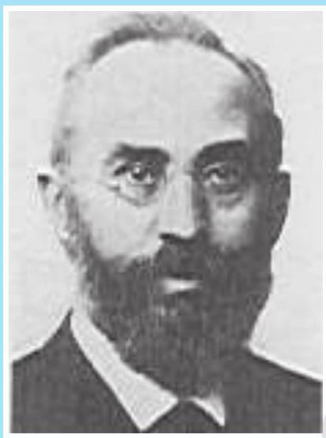

Hendrik Antoon Lorentz
Hendrik Antoon Lorentz (1853 - 1928) Dutch (1853 - 1928) Dutch theoretical physicist, theoretical physicist, professor at Leiden. He professor at Leiden. He investigated the investigated the relationship between relationship between electricity, magnetism, and electricity, magnetism, and mechanics. In order to mechanics. In order to explain the observed effect explain the observed effect of magnetic fields on of magnetic fields on emitters of light (Zeeman emitters of light (Zeeman effect), he postulated the effect), he postulated the existence of electric charges existence of electric charges in the atom, for which he in the atom, for which he was awarded the Nobel Prize was awarded the Nobel Prize in 1902. He derived a set of in 1902. He derived a set of transformation equations transformation equations (known after him, as (known after him, as Lorentz transformation Lorentz transformation equations) by some tangled equations) by some tangled mathematical arguments, mathematical arguments, but he was not aware that but he was not aware that these equations hinge on a these equations hinge on a new concept of space and new concept of space and time. time.
field B (r). The force on an electric charge $q$ due to both

of them can be written as
$$
\mathbf{F}=q[\mathbf{E}(\mathbf{r})+\mathbf{v} \times \mathbf{B}(\mathbf{r})] \equiv \mathbf{F}_{\text {electric }}+\mathbf{F}_{\text {magnetic }}
$$

This force was given first by H.A. Lorentz based on the extensive experiments of Ampere and others. It is called the Lorentz force. You have already studied in detail the force due to the electric field. If we look at the interaction with the magnetic field, we find the following features.

(i) It depends on $q, \mathbf{v}$ and $\mathbf{B}$ (charge of the particle, the velocity and the magnetic field). Force on a negative charge is opposite to that on a positive charge.
(ii) The magnetic force $q[\mathbf{v} \times \mathbf{B}]$ includes a vector product of velocity and magnetic field. The vector product makes the force due to magnetic

field vanish (become zero) if velocity and magnetic field are parallel or anti-parallel. The force acts in a (sideways) direction perpendicular

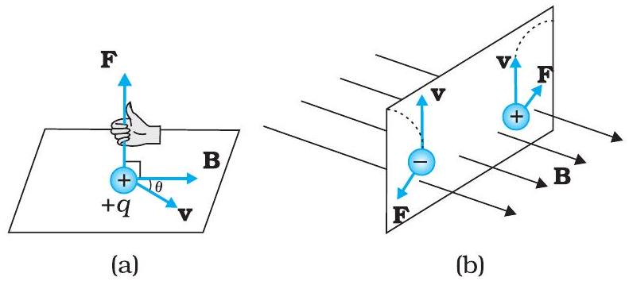
FIGURE 4.2 The direction of the magnetic force acting on a charged particle. (a) The force on a positively charged particle with velocity $\mathbf{v}$ and making an angle $\theta$ with the magnetic field $\mathbf{B}$ is given by the right-hand rule. (b) A moving charged particle $q$ is deflected in an opposite sense to $-q$ in the presence of magnetic field.

to both the velocity and the magnetic field. Its direction is given by the screw rule or right hand rule for vector (or cross) product as illustrated in Fig. 4.2.

(iii) The magnetic force is zero if charge is not moving (as then $|\mathbf{v}|=0$ ). Only a moving charge feels the magnetic force.

The expression for the magnetic force helps us to define the unit of the magnetic field, if one takes $q, \mathbf{F}$ and $\mathbf{v}$, all to be unity in the force equation $\mathbf{F}=q[\mathbf{v} \times \mathbf{B}]=q v B \sin \theta \hat{\mathbf{n}}$, where $\theta$ is the angle between v and B [see Fig. 4.2 (a)]. The magnitude of magnetic field $B$ is 1 SI unit, when the force acting on a unit charge (1 C), moving perpendicular to B with a speed 1m/s, is one newton.
Dimensionally, we have $[B]=[F / q v]$ and the unit of $\mathbf{B}$ are Newton second / (coulomb metre). This unit is called tesla (T) named after Nikola Tesla (1856-1943). Tesla is a rather large unit. A smaller unit (non-SI) called gauss ( $=10^{-4}$ tesla) is also often used. The earth's magnetic field is about $3.6 \times 10^{-5} \mathrm{~T}$.

### 4.2.3 Magnetic force on a current-carrying conductor

We can extend the analysis for force due to magnetic field on a single moving charge to a straight rod carrying current. Consider a rod of a uniform cross-sectional area $A$ and length $l$. We shall assume one kind of mobile carriers as in a conductor (here electrons). Let the number density of these mobile charge carriers in it be $n$. Then the total number of mobile charge carriers in it is $n l A$. For a steady current $I$ in this conducting rod, we may assume that each mobile carrier has an average drift velocity $\mathbf{v}_{d}$ (see Chapter 3). In the presence of an external magnetic field B, the force on these carriers is:

$$
\mathbf{F}=(n l A) q \mathbf{v}_{d} \times \mathbf{B}
$$

where $q$ is the value of the charge on a carrier. Now $n q \mathbf{v}_{\mathrm{d}}$ is the current density $\mathbf{j}$ and $\left|\left(n q \mathbf{v}_{\mathrm{d}}\right)\right| A$ is the current $I$ (see Chapter 3 for the discussion of current and current density). Thus,

$$
\begin{aligned}
\mathbf{F} & =\left[\left(n q \mathbf{v}_{d}\right) l A\right] \times \mathbf{B}=[\mathbf{j} A l] \times \mathbf{B} \\
& =I \boldsymbol{l} \times \mathbf{B}
\end{aligned}
$$

where $\boldsymbol{l}$ is a vector of magnitude $l$, the length of the rod, and with a direction identical to the current $I$. Note that the current $I$ is not a vector. In the last step leading to Eq. (4.4), we have transferred the vector sign from $\mathbf{j}$ to $\boldsymbol{l}$.

Equation (4.4) holds for a straight rod. In this equation, B is the external magnetic field. It is not the field produced by the current-carrying rod. If the wire has an arbitrary shape we can calculate the Lorentz force on it by considering it as a collection of linear strips $\mathrm{d} \boldsymbol{l}_{\mathrm{j}}$ and summing

$$
\mathbf{F}=\sum_{\mathrm{j}} \operatorname{Id} \boldsymbol{l}_{\mathrm{j}} \times \mathbf{B}
$$

This summation can be converted to an integral in most cases.

Example 4.1 A straight wire of mass 200 g and length 1.5 m carries a current of 2 A. It is suspended in mid-air by a uniform horizontal magnetic field B (Fig. 4.3). What is the magnitude of the magnetic field?

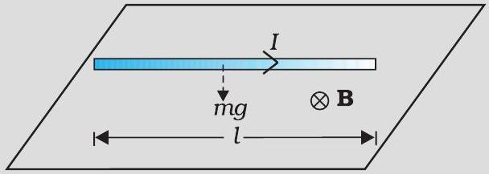
FIGURE 4.3

Solution From Eq. (4.4), we find that there is an upward force F, of magnitude $I l B$,. For mid-air suspension, this must be balanced by the force due to gravity:

$$
\begin{aligned}
m g & =I l B \\
B & =\frac{m g}{I l} \\
& =\frac{0.2 \times 9.8}{2 \times 1.5}=0.65 \mathrm{~T}
\end{aligned}
$$

Note that it would have been sufficient to specify $\mathrm{m} / \mathrm{l}$, the mass per unit length of the wire. The earth's magnetic field is approximately $4 \times 10^{-5} \mathrm{~T}$ and we have ignored it.

Example 4.2 If the magnetic field is parallel to the positive $y$-axis and the charged particle is moving along the positive $x$-axis (Fig. 4.4), which way would the Lorentz force be for (a) an electron (negative charge), (b) a proton (positive charge).

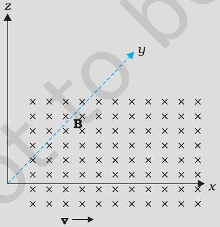
FIGURE 4.4

Solution The velocity $\mathbf{v}$ of particle is along the $x$-axis, while $\mathbf{B}$, the magnetic field is along the $y$-axis, so $\mathbf{v} \times \mathbf{B}$ is along the $z$-axis (screw rule or right-hand thumb rule). So, (a) for electron it will be along - $z$ axis. (b) for a positive charge (proton) the force is along $+z$ axis.

## - Physics

### 4.3 Motion in a Magnetic Field

We will now consider, in greater detail, the motion of a charge moving in a magnetic field. We have learnt in Mechanics (see Class XI book, Chapter 5) that a force on a particle does work if the force has a component along (or opposed to) the direction of motion of the particle. In the case of motion of a charge in a magnetic field, the magnetic force is perpendicular to the velocity of the particle. So no work is done and no change in the magnitude of the velocity is produced (though the direction of momentum may be changed). [Notice that this is unlike the force due to an electric field, $q \mathbf{E}$, which can have a component parallel (or antiparallel) to motion and thus can transfer energy in addition to momentum.]

We shall consider motion of a charged particle in a uniform magnetic field. First consider the case of v perpendicular to B. The perpendicular force, $q \mathbf{v} \times \mathbf{B}$, acts as a centripetal force and produces a circular motion perpendicular to the magnetic field. The particle will describe a circle if v and B are perpendicular to each other (Fig. 4.5).

If velocity has a component along B, this component remains unchanged as the motion along the magnetic field will not be affected by the magnetic field. The motion in a plane perpendicular to B is as before a circular one, thereby producing a helical motion (Fig. 4.6).

You have already learnt in earlier classes (See Class XI, Chapter 3) that if $r$ is the radius of the circular path of a particle, then a force of $m v^{2} / r$, acts perpendicular to the path towards the centre of the circle, and is called the centripetal force. If the velocity $\mathbf{v}$ is perpendicular to the magnetic field $\mathbf{B}$, the magnetic force is perpendicular to both v and B and acts like a centripetal force. It has a magnitude $q v B$.

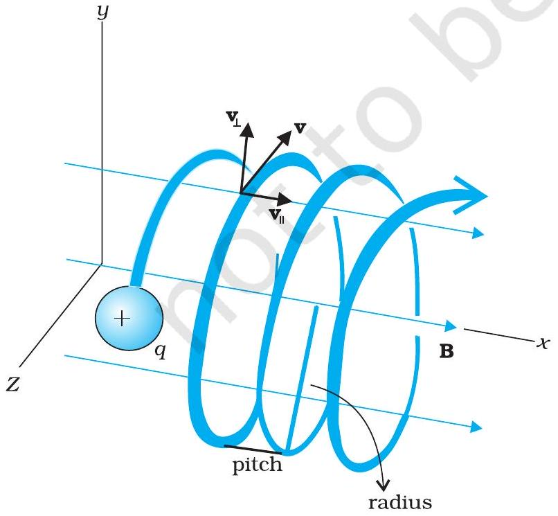
FIGURE 4.6 Helical motion

Equating the two expressions for centripetal force,
$m v^{2} / r=q v B$, which gives

$$
r=m v / q B
$$

for the radius of the circle described by the charged particle. The larger the momentum, the larger is the radius and bigger the circle described. If $\omega$ is the angular frequency, then $v$ $=\omega r$. So,

$$
\omega=2 \pi v=q B / m
$$

which is independent of the velocity or energy . Here $v$ is the frequency of rotation. The independence of $v$ from energy has important application in the design of a cyclotron.

The time taken for one revolution is $T=2 \pi /$ $\omega \equiv 1 / v$. If there is a component of the velocity
parallel to the magnetic field (denoted by $v_{\|}$), it will make the particle move along the field and the path of the
particle would be a helical one (Fig. 4.6). The distance moved along the magnetic field in one rotation is called pitch $p$. Using Eq. [4.6 (a)], we have

$$
p=v_{\|} T=2 \pi m v_{\|} / q B
$$

The radius of the circular component of motion is called the radius of the helix.

Example 4.3 What is the radius of the path of an electron (mass $9 \times 10^{-31} \mathrm{~kg}$ and charge $1.6 \times 10^{-19} \mathrm{C}$ ) moving at a speed of $3 \times 10^{7} \mathrm{~m} / \mathrm{s}$ in a magnetic field of $6 \times 10^{-4} \mathrm{~T}$ perpendicular to it? What is its frequency? Calculate its energy in keV. ( $1 \mathrm{eV}=1.6 \times 10^{-19} \mathrm{~J}$ ).

Solution Using Eq. (4.5) we find

$$
\begin{aligned}
r & =m v /(q B)=9 \times 10^{-31} \mathrm{~kg} \times 3 \times 10^{7} \mathrm{~m} \mathrm{~s}^{-1} /\left(1.6 \times 10^{-19} \mathrm{C} \times 6 \times 10^{-4} \mathrm{~T}\right) \\
& =28 \times 10^{-2} \mathrm{~m}=28 \mathrm{~cm} \\
v & =v /(2 \pi r)=17 \times 10^{6} \mathrm{~s}^{-1}=17 \times 10^{6} \mathrm{~Hz}=17 \mathrm{MHz} \\
E & =(1 / 2) m v^{2}=(1 / 2) 9 \times 10^{-31} \mathrm{~kg} \times 9 \times 10^{14} \mathrm{~m}^{2} / \mathrm{s}^{2}=40.5 \times 10^{-17} \mathrm{~J} \\
& \approx 4 \times 10^{-16} \mathrm{~J}=2.5 \mathrm{keV} .
\end{aligned}
$$

### 4.4 Magnetic Field due to a Current Element, Biot-Savart Law

All magnetic fields that we know are due to currents (or moving charges) and due to intrinsic magnetic moments of particles. Here, we shall study the relation between current and the magnetic field it produces. It is given by the Biot-Savart's law. Fig. 4.7 shows a finite conductor XY carrying current $I$. Consider an infinitesimal element d 1 of the conductor. The magnetic field dB due to this element is to be determined at a point P which is at a distance $r$ from it. Let $\theta$ be the angle between $\mathrm{d} \boldsymbol{l}$ and the displacement vector r. According to Biot-Savart's law, the magnitude of the magnetic field dB is proportional to the current $I$, the element length $|\mathrm{d} \boldsymbol{\imath}|$, and inversely proportional to the square of the distance $r$. Its direction* is perpendicular to the plane containing dl and r. Thus, in vector notation,

$$
\begin{aligned}
d \mathbf{B} & \propto \frac{I d \boldsymbol{l} \times \mathbf{r}}{r^{3}} \\
& =\frac{\mu_{0}}{4 \pi} \frac{I d \boldsymbol{l} \times \mathbf{r}}{r^{3}}
\end{aligned}
$$

where $\mu_{0} / 4 \pi$ is a constant of proportionality. The above expression holds when the medium is vacuum.

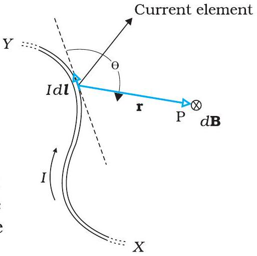
FIGURE 4.7 Illustration of the Biot-Savart law. The current element I d1 produces a field dB at a distance $r$. The ⊗ sign indicates that the field is perpendicular to the plane of this page and directed into it.

[^1]The magnitude of this field is,

$$
|\mathrm{d} \mathbf{B}|=\frac{\mu_{0}}{4 \pi} \frac{I \mathrm{~d} l \sin \theta}{r^{2}}
$$

where we have used the property of cross-product. Equation [4.7 (a)] constitutes our basic equation for the magnetic field. The proportionality constant in SI units has the exact value,

$$
\frac{\mu_{0}}{4 \pi}=10^{-7} \mathrm{Tm} / \mathrm{A}
$$

We call $\mu_{0}$ the permeability of free space (or vacuum).
The Biot-Savart law for the magnetic field has certain similarities, as well as, differences with the Coulomb's law for the electrostatic field. Some of these are:

(i) Both are long range, since both depend inversely on the square of distance from the source to the point of interest. The principle of superposition applies to both fields. [In this connection, note that the magnetic field is linear in the source Idljust as the electrostatic field is linear in its source: the electric charge.]
(ii) The electrostatic field is produced by a scalar source, namely, the electric charge. The magnetic field is produced by a vector source $I \mathrm{~d} \boldsymbol{l}$.
(iii) The electrostatic field is along the displacement vector joining the source and the field point. The magnetic field is perpendicular to the plane containing the displacement vector rand the current element $I \mathrm{~d} \boldsymbol{l}$.
(iv) There is an angle dependence in the Biot-Savart law which is not present in the electrostatic case. In Fig. 4.7, the magnetic field at any point in the direction of $\mathrm{d} \boldsymbol{l}$ (the dashed line) is zero. Along this line, $\theta=0, \sin \theta=0$ and from Eq. [4.7(a)], $|\mathrm{dB}|=0$.

There is an interesting relation between $\varepsilon_{0}$, the permittivity of free space; $\mu_{0}$, the permeability of free space; and $c$, the speed of light in vacuum:

$$
\varepsilon_{0} \mu_{0}=\left(4 \pi \varepsilon_{0}\right) \frac{\mu_{0}}{4 \pi}=\frac{1}{9 \times 10^{9}}\left(10^{-7}\right)=\frac{1}{\left(3 \times 10^{8}\right)^{2}}=\frac{1}{c^{2}}
$$

We will discuss this connection further in Chapter 8 on the electromagnetic waves. Since the speed of light in vacuum is constant, the product $\mu_{0} \varepsilon_{0}$ is fixed in magnitude. Choosing the value of either $\varepsilon_{0}$ or $\mu_{0}$, fixes the value of the other. In SI units, $\mu_{0}$ is fixed to be equal to $4 \pi \times 10^{-7}$ in magnitude.

Example 4.4 An element $\Delta \boldsymbol{l}=\Delta x \hat{\mathbf{i}}$ is placed at the origin and carries a large current $I=10 \mathrm{~A}$ (Fig. 4.8). What is the magnetic field on the $y$ axis at a distance of $0.5 \mathrm{~m} . \Delta x=1 \mathrm{~cm}$.

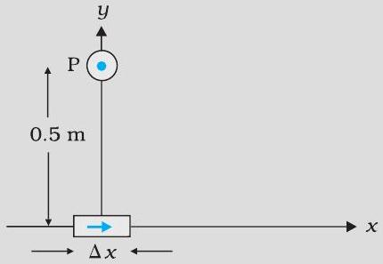
FIGURE 4.8

Solution

$$
\begin{aligned}
& |\mathrm{d} \mathbf{B}|=\frac{\mu_{0}}{4 \pi} \frac{I \mathrm{~d} l \sin \theta}{r^{2}} \text { [using Eq. (4.7)] } \\
& \mathrm{d} l=\Delta x=10^{-2} \mathrm{~m}, I=10 \mathrm{~A}, \quad r=0.5 \mathrm{~m}=\mathrm{y}, \mu_{0} / 4 \pi=10^{-7} \frac{\mathrm{Tm}}{\mathrm{~A}} \\
& \theta=90^{\circ} ; \sin \theta=1 \\
& |\mathrm{~d} \mathbf{B}|=\frac{10^{-7} \times 10 \times 10^{-2}}{25 \times 10^{-2}}=4 \times 10^{-8} \mathrm{~T}
\end{aligned}
$$

The direction of the field is in the $+z$-direction. This is so since,

$$
\mathrm{d} \boldsymbol{l} \times \mathbf{r}=\Delta x \hat{\mathbf{i}} \times y \hat{\mathbf{j}}=y \Delta x(\hat{\mathbf{i}} \times \hat{\mathbf{j}})=y \Delta x \hat{\mathbf{k}}
$$

We remind you of the following cyclic property of cross-products,

$$
\hat{\mathbf{i}} \times \hat{\mathbf{j}}=\hat{\mathbf{k}} ; \hat{\mathbf{j}} \times \hat{\mathbf{k}}=\hat{\mathbf{i}} ; \hat{\mathbf{k}} \times \hat{\mathbf{i}}=\hat{\mathbf{j}}
$$

Note that the field is small in magnitude.
In the next section, we shall use the Biot-Savart law to calculate the magnetic field due to a circular loop.

### 4.5 Magnetic Field on the Axis of a Circular Current Loop

In this section, we shall evaluate the magnetic field due to a circular coil along its axis. The evaluation entails summing up the effect of infinitesimal current elements $(I \mathrm{~d} l)$ mentioned in the previous section. We assume that the current $I$ is steady and that the evaluation is carried out in free space (i.e., vacuum).

Fig. 4.9 depicts a circular loop carrying a steady current $I$. The loop is placed in the $y-z$ plane with its centre at the origin O and has a radius $R$. The $\boldsymbol{x}$-axis is the axis of the loop. We wish to calculate the magnetic field at the point P on this axis. Let $x$ be the distance of P from the centre O of the loop.

Consider a conducting element $\mathrm{d} l$ of the loop. This is shown in Fig. 4.9. The magnitude $\mathrm{d} B$ of the magnetic field due to $\mathrm{d} l$ is given by the Biot-Savart law [Eq. 4.7(a)],

$$
d B=\frac{\mu_{0}}{4 \pi} \frac{I|d \boldsymbol{l} \times \mathbf{r}|}{r^{3}}
$$

Now $r^{2}=x^{2}+R^{2}$. Further, any element of the loop

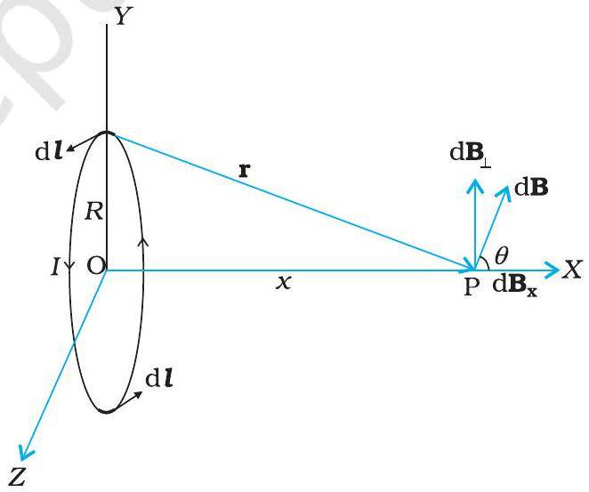
FIGURE 4.9 Magnetic field on the axis of a current carrying circular loop of radius $R$. Shown are the magnetic field $d \mathbb{B}$ (due to a line element $d \boldsymbol{l}$ ) and its components along and perpendicular to the axis.

will be perpendicular to the displacement vector from the element to the axial point. For example, the element $\mathrm{d} l$ in Fig. 4.9 is in the $y-z$ plane, whereas, the displacement vector r from $\mathrm{d} l$ to the axial point P is in the $x-y$ plane. Hence $|d l \times \mathbf{r}|=r d l$. Thus,

$$
\mathrm{d} B=\frac{\mu_{0}}{4 \pi} \frac{I \mathrm{~d} l}{\left(x^{2}+R^{2}\right)}
$$

The direction of dB is shown in Fig. 4.9. It is perpendicular to the plane formed by $\mathrm{d} \boldsymbol{l}$ and $\mathbf{r}$. It has an $x$-component $\mathrm{dB}_{x}$ and a component perpendicular to $x$-axis, $\mathrm{dB}_{\perp}$. When the components perpendicular to the $x$-axis are summed over, they cancel out and we obtain a null result. For example, the $\mathrm{dB}_{\perp}$ component due to $\mathrm{d} \boldsymbol{l}$ is cancelled by the contribution due to the diametrically opposite $\mathrm{d} \boldsymbol{l}$ element, shown in Fig. 4.9. Thus, only the $x$-component survives. The net contribution along $x$-direction can be obtained by integrating $\mathrm{d} B_{x}=\mathrm{d} B \cos \theta$ over the loop. For Fig. 4.9,

$$
\cos \theta=\frac{R}{\left(x^{2}+R^{2}\right)^{1 / 2}}
$$

From Eqs. (4.9) and (4.10),

$$
\mathrm{d} B_{x}=\frac{\mu_{0} \mathrm{Id} l}{4 \pi} \frac{R}{\left(x^{2}+R^{2}\right)^{3 / 2}}
$$

The summation of elements $\mathrm{d} l$ over the loop yields $2 \pi R$, the circumference of the loop. Thus, the magnetic field at P due to entire circular loop is

$$
\mathbf{B}=B_{x} \hat{\mathbf{i}}=\frac{\mu_{0} I R^{2}}{2\left(x^{2}+R^{2}\right)^{3 / 2}} \hat{\mathbf{i}}
$$

As a special case of the above result, we may obtain the field at the centre of the loop. Here $x=0$, and we obtain,

$$
\mathbf{B}_{0}=\frac{\mu_{0} I}{2 R} \hat{\mathbf{i}}
$$

The magnetic field lines due to a circular wire form closed loops and are shown in Fig. 4.10. The direction of the magnetic field is given by (another) right-hand thumb rule stated below:

Curl the palm of your right hand around the circular wire with the fingers pointing in the direction of the current. The right-hand thumb gives the direction of the magnetic field.

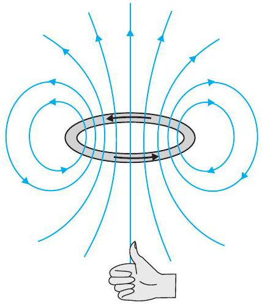
FIGURE 4.10 The magnetic field lines for a current loop. The direction of the field is given by the right-hand thumb rule described in the text. The upper side of the loop may be thought of as the north pole and the lower side as the south pole of a magnet.

Example 4.5 A straight wire carrying a current of 12 A is bent into a semi-circular arc of radius 2.0 cm as shown in Fig. 4.11(a). Consider the magnetic field $\mathbf{B}$ at the centre of the arc. (a) What is the magnetic field due to the straight segments? (b) In what way the contribution to B from the semicircle differs from that of a circular loop and in what way does it resemble? (c) Would your answer be different if the wire were bent into a semi-circular arc of the same radius but in the opposite way as shown in Fig. 4.11(b)?

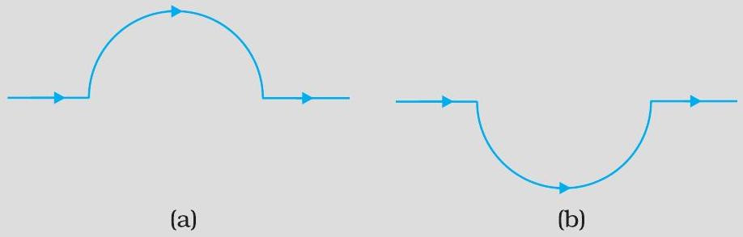
FIGURE 4.11

Solution

(a) dl and r for each element of the straight segments are parallel. Therefore, $\mathrm{d} \boldsymbol{l} \times \mathbf{r}=0$. Straight segments do not contribute to |B|.
(b) For all segments of the semicircular arc, $\mathrm{d} \boldsymbol{l} \times \mathbf{r}$ are all parallel to each other (into the plane of the paper). All such contributions add up in magnitude. Hence direction of B for a semicircular arc is given by the right-hand rule and magnitude is half that of a circular loop. Thus B is $1.9 \times 10^{-4} \mathrm{~T}$ normal to the plane of the paper going into it.
(c) Same magnitude of B but opposite in direction to that in (b).

Example 4.6 Consider a tightly wound 100 turn coil of radius 10 cm, carrying a current of 1 A. What is the magnitude of the magnetic field at the centre of the coil?

Solution Since the coil is tightly wound, we may take each circular element to have the same radius $R=10 \mathrm{~cm}=0.1 \mathrm{~m}$. The number of turns $N=100$. The magnitude of the magnetic field is,

$$
B=\frac{\mu_{0} N I}{2 R}=\frac{4 \pi \times 10^{-7} \times 10^{2} \times 1}{2 \times 10^{-1}}=2 \pi \times 10^{-4}=6.28 \times 10^{-4} \mathrm{~T}
$$

### 4.6 Ampere's Circuital Law

There is an alternative and appealing way in which the Biot-Savart law may be expressed. Ampere's circuital law considers an open surface with a boundary (Fig. 4.12). The surface has current passing through it. We consider the boundary to be made up of a number of small line elements. Consider one such element of length $d l$. We take the value of the tangential component of the magnetic field, $B_{t}$, at this element and multiply it by the

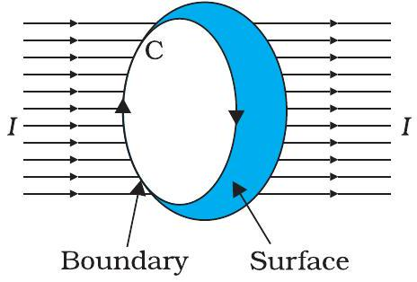
FIGURE 4.12

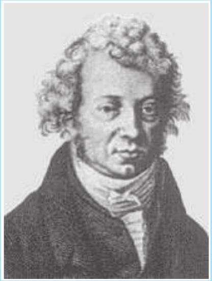
Andre Ampere (1775 - 1836) Andre Marie Ampere was a French physicist, mathematician and chemist who founded the science of electrodynamics. Ampere was a child prodigy who mastered advanced mathematics by the age of 12. Ampere grasped the significance of Oersted's discovery. He carried out a large series of experiments to explore the relationship between current electricity and magnetism. These investigations culminated in 1827 with the publication of the 'Mathematical Theory of Electrodynamic Phenomena Deduced Solely from Experiments'. He hypothesised that all magnetic phenomena are due to circulating electric currents. Ampere was humble and absentminded. He once forgot an invitation to dine with the Emperor Napoleon. He died of pneumonia at the age of 61. His gravestone bears the epitaph: Tandem Felix (Happy at last).

$$
\oint \mathbf{B} \cdot d \boldsymbol{l}=\mu_{0} I
$$

where $I$ is the total current through the surface. The integral is taken over the closed loop coinciding with the boundary C of the surface. The relation above involves a sign-convention, given by the right-hand rule. Let the fingers of the right-hand be curled in the sense the boundary is traversed in the loop integral $\oint \mathbf{B} \cdot d \boldsymbol{l}$. Then the direction of the thumb gives the sense in which the current $I$ is regarded as positive.

For several applications, a much simplified version of Eq. [4.13(a)] proves sufficient. We shall assume that, in such cases, it is possible to choose the loop (called an amperian loop) such that at each point of the loop, either

(i) B is tangential to the loop and is a non-zero constant B, or
(ii) B is normal to the loop, or
(iii) B vanishes.

Now, let $L$ be the length (part) of the loop for which B is tangential. Let $I_{e}$ be the current enclosed by the loop. Then, Eq. (4.13) reduces to,

$$
B L=\mu_{0} I_{e}
$$

When there is a system with a symmetry such as for a straight infinite current-carrying wire in Fig. 4.13, the Ampere's law enables an easy evaluation of the magnetic field, much the same way Gauss' law helps in determination of the electric field. This is exhibited in the Example 4.8 below. The boundary of the loop chosen is a circle and magnetic field is tangential to the circumference of the circle. The law gives, for the left hand side of Eq. [4.13 (b)], B. $2 \pi r$. We find that the magnetic field at a distance $r$ outside the wire is tangential and given by

$$
\begin{aligned}
& B \times 2 \pi r=\mu_{0} I, \\
& B=\mu_{0} I /(2 \pi r)
\end{aligned}
$$

The above result for the infinite wire is interesting from several points of view.

(i) It implies that the field at every point on a circle of radius $r$, (with the wire along the axis), is same in magnitude. In other words, the magnetic field

possesses what is called a cylindrical symmetry. The field that normally can depend on three coordinates depends only on one: $r$. Whenever there is symmetry, the solutions simplify.
(ii) The field direction at any point on this circle is tangential to it. Thus, the lines of constant magnitude of magnetic field form concentric circles. Notice now, in Fig. 4.1(c), the iron filings form concentric circles. These lines called magnetic field lines form closed loops. This is unlike the electrostatic field lines which originate from positive charges and end at negative charges. The expression for the magnetic field of a straight wire provides a theoretical justification to Oersted's experiments.
(iii) Another interesting point to note is that even though the wire is infinite, the field due to it at a non-zero distance is not infinite. It tends to blow up only when we come very close to the wire. The field is directly proportional to the current and inversely proportional to the distance from the (infinitely long) current source.
(iv) There exists a simple rule to determine the direction of the magnetic field due to a long wire. This rule, called the right-hand rule*, is:

Grasp the wire in your right hand with your extended thumb pointing in the direction of the current. Your fingers will curl around in the direction of the magnetic field.

Ampere's circuital law is not new in content from Biot-Savart law. Both relate the magnetic field and the current, and both express the same physical consequences of a steady electrical current. Ampere's law is to Biot-Savart law, what Gauss's law is to Coulomb's law. Both, Ampere's and Gauss's law relate a physical quantity on the periphery or boundary (magnetic or electric field) to another physical quantity, namely, the source, in the interior (current or charge). We also note that Ampere's circuital law holds for steady currents which do not fluctuate with time. The following example will help us understand what is meant by the term enclosed current.

Example 4.7 Figure 4.13 shows a long straight wire of a circular cross-section (radius a) carrying steady current $I$. The current $I$ is uniformly distributed across this cross-section. Calculate the magnetic field in the region $r<a$ and $r>a$.

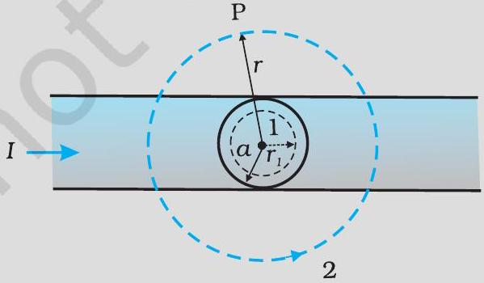
FIGURE 4.13

[^2]
## - Physics

Solution (a) Consider the case $r>a$. The Amperian loop, labelled 2, is a circle concentric with the cross-section. For this loop,

$$
\begin{aligned}
& L=2 \pi r \\
& I_{e}=\text { Current enclosed by the loop }=I
\end{aligned}
$$

The result is the familiar expression for a long straight wire

$$
\begin{aligned}
& B(2 \pi r)=\mu_{0} I \\
& B=\frac{\mu_{0} I}{2 \pi r} \quad[4.15(\mathrm{a})] \\
& B \propto \frac{1}{r} \quad(r>a)
\end{aligned}
$$

Now the current enclosed $I_{e}$ is not $I$, but is less than this value. Since the current distribution is uniform, the current enclosed is,

$$
I_{e}=I \frac{\pi r^{2}}{\pi a^{2}}=\frac{I r^{2}}{a^{2}}
$$

Using Ampere's law, $B(2 \pi r)=\mu_{0} \frac{I r^{2}}{a^{2}}$

$$
\begin{aligned}
& B=\left(\frac{\mu_{0} I}{2 \pi a^{2}}\right) r \\
& B \propto r \quad(r<a)
\end{aligned}
$$

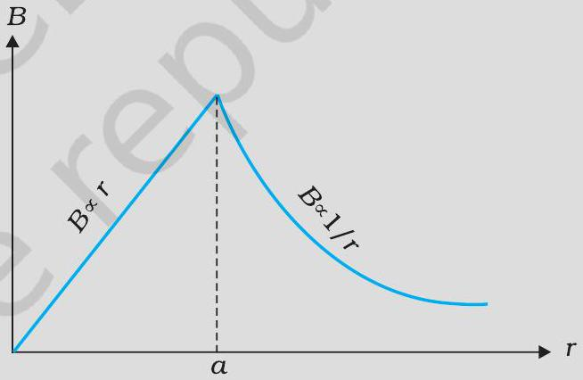
FIGURE 4.14

Figure (4.14) shows a plot of the magnitude of $\mathbf{B}$ with distance $r$ from the centre of the wire. The direction of the field is tangential to the respective circular loop ( 1 or 2 ) and given by the right-hand rule described earlier in this section.

This example possesses the required symmetry so that Ampere's law can be applied readily.

It should be noted that while Ampere's circuital law holds for any loop, it may not always facilitate an evaluation of the magnetic field in every case. For example, for the case of the circular loop discussed in Section 4.5, it cannot be applied to extract the simple expression $B=\mu_{0} I / 2 R$ [Eq. (4.12)] for the field at the centre of the loop. However, there exists a large number of situations of high symmetry where the law can be conveniently applied. We shall use it in the next section to calculate
the magnetic field produced by a commonly used and very useful magnetic system: the solenoid.

### 4.7 The Solenoid

We shall discuss a long solenoid. By long solenoid we mean that the solenoid's length is large compared to its radius. It consists of a long wire wound in the form of a helix where the neighbouring turns are closely spaced. So each turn can be regarded as a circular loop. The net magnetic field is the vector sum of the fields due to all the turns. Enamelled wires are used for winding so that turns are insulated from each other.

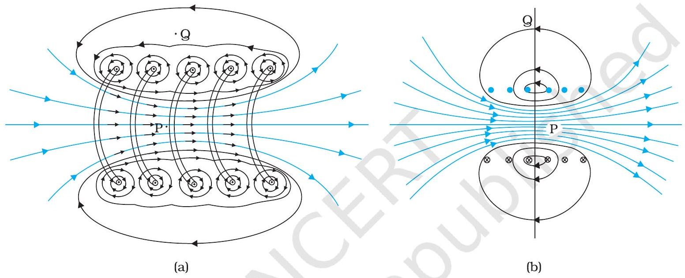
FIGURE 4.15 (a) The magnetic field due to a section of the solenoid which has been stretched out for clarity. Only the exterior semi-circular part is shown. Notice how the circular loops between neighbouring turns tend to cancel.
(b) The magnetic field of a finite solenoid.

Figure 4.15 displays the magnetic field lines for a finite solenoid. We show a section of this solenoid in an enlarged manner in Fig. 4.15(a). Figure 4.15(b) shows the entire finite solenoid with its magnetic field. In Fig. 4.15(a), it is clear from the circular loops that the field between two neighbouring turns vanishes. In Fig. 4.15(b), we see that the field at the interior mid-point P is uniform, strong and along the axis of the solenoid. The field at the exterior mid-point Q is weak and moreover is along the axis of the solenoid with no perpendicular or normal component. As the

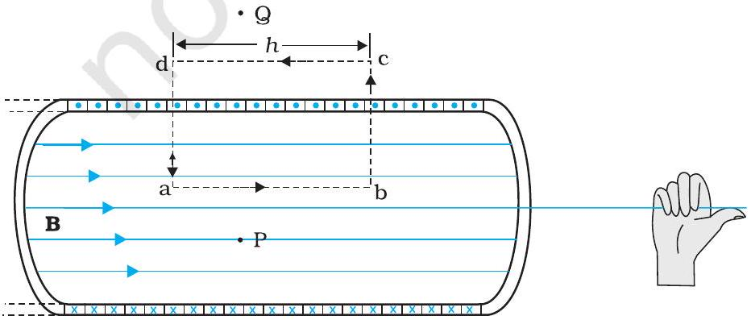
FIGURE 4.16 The magnetic field of a very long solenoid. We consider a rectangular Amperian loop abcd to determine the field.

solenoid is made longer it appears like a long cylindrical metal sheet. Figure 4.16 represents this idealised picture. The field outside the solenoid approaches zero. We shall assume that the field outside is zero. The field inside becomes everywhere parallel to the axis.

Consider a rectangular Amperian loop abcd. Along cd the field is zero as argued above. Along transverse sections bc and ad, the field component is zero. Thus, these two sections make no contribution. Let the field along ab be $B$. Thus, the relevant length of the Amperian loop is, $L=h$.

Let $n$ be the number of turns per unit length, then the total number of turns is $n h$. The enclosed current is, $I_{e}=I(n h)$, where $I$ is the current in the solenoid. From Ampere's circuital law [Eq. 4.13 (b)]

$$
\begin{aligned}
& B L=\mu_{0} I_{e}, \quad B h=\mu_{0} I(n h) \\
& B=\mu_{0} n I
\end{aligned}
$$

The direction of the field is given by the right-hand rule. The solenoid is commonly used to obtain a uniform magnetic field. We shall see in the next chapter that a large field is possible by inserting a soft iron core inside the solenoid.

Example 4.8 A solenoid of length 0.5 m has a radius of 1 cm and is made up of 500 turns. It carries a current of 5 A. What is the magnitude of the magnetic field inside the solenoid?

Solution The number of turns per unit length is,

$$
n=\frac{500}{0.5}=1000 \text { turns } / \mathrm{m}
$$

The length $l=0.5 \mathrm{~m}$ and radius $r=0.01 \mathrm{~m}$. Thus, $l / a=50$ i.e., $l \gg a$. Hence, we can use the long solenoid formula, namely, Eq. (4.20)

$$
\begin{aligned}
B & =\mu_{o} n I \\
& =4 \pi \times 10^{-7} \times 10^{3} \times 5 \\
& =6.28 \times 10^{-3} \mathrm{~T}
\end{aligned}
$$

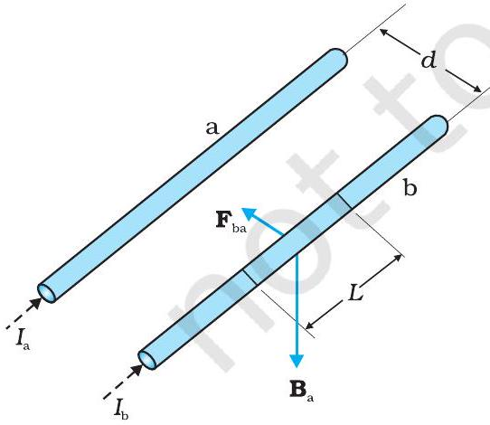
FIGURE 4.17 Two long straight parallel conductors carrying steady currents $I_{a}$ and $I_{b}$ and separated by a distance $\mathrm{d} . \mathbf{B}_{\mathrm{a}}$ is the magnetic field set up by conductor 'a' at conductor 'b'.

### 4.8 Force between Two Parallel Currents, the Ampere

We have learnt that there exists a magnetic field due to a conductor carrying a current which obeys the Biot-Savart law. Further, we have learnt that an external magnetic field will exert a force on a current-carrying conductor. This follows from the Lorentz force formula. Thus, it is logical to expect that two current-carrying conductors placed near each other will exert (magnetic) forces on each other. In the period 1820-25, Ampere studied the nature of this magnetic force and its dependence on the magnitude of the current, on the shape and size of the conductors, as well as, the distances between the conductors. In this section, we shall take the simple example of two parallel current- carrying conductors, which will perhaps help us to appreciate Ampere's painstaking work.

## Moving Charges and Magnetism

Figure 4.17 shows two long parallel conductors a and b separated by a distance $d$ and carrying (parallel) currents $I_{\mathrm{a}}$ and $I_{\mathrm{b}}$, respectively. The conductor 'a' produces, the same magnetic field $\mathbf{B}_{\mathbf{a}}$ at all points along the conductor 'b'. The right-hand rule tells us that the direction of this field is downwards (when the conductors are placed horizontally). Its magnitude is given by Eq. [4.15(a)] or from Ampere's circuital law,

$$
B_{a}=\frac{\mu_{0} I_{a}}{2 \pi d}
$$

The conductor 'b' carrying a current $I_{\mathrm{b}}$ will experience a sideways force due to the field $\mathbf{B}_{\mathrm{a}}$. The direction of this force is towards the conductor 'a' (Verify this). We label this force as $\mathbf{F}_{\mathrm{ba}}$, the force on a segment $L$ of 'b' due to 'a'. The magnitude of this force is given by Eq. (4.4),

$$
\begin{aligned}
F_{b a} & =I_{b} L B_{a} \\
& =\frac{\mu_{0} I_{a} I_{b}}{2 \pi d} L
\end{aligned}
$$

It is of course possible to compute the force on 'a' due to 'b'. From considerations similar to above we can find the force $\mathbf{F}_{\mathrm{ab}}$, on a segment of length $L$ of 'a' due to the current in 'b'. It is equal in magnitude to $F_{\text {ba }}$, and directed towards 'b'. Thus,

$$
\mathbf{F}_{\mathrm{ba}}=-\mathbf{F}_{\mathrm{ab}}
$$

Note that this is consistent with Newton's third Law. Thus, at least for parallel conductors and steady currents, we have shown that the Biot-Savart law and the Lorentz force yield results in accordance with Newton's third Law*.

We have seen from above that currents flowing in the same direction attract each other. One can show that oppositely directed currents repel each other. Thus,

Parallel currents attract, and antiparallel currents repel.
This rule is the opposite of what we find in electrostatics. Like (same sign) charges repel each other, but like (parallel) currents attract each other.

Let $f_{\mathrm{ba}}$ represent the magnitude of the force $\mathbf{F}_{\mathrm{ba}}$ per unit length. Then, from Eq. (4.17),

$$
f_{b a}=\frac{\mu_{0} I_{a} I_{b}}{2 \pi d}
$$

The above expression is used to define the ampere (A), which is one of the seven SI base units.

[^3]
## Physics

The ampere is the value of that steady current which, when maintained in each of the two very long, straight, parallel conductors of negligible cross-section, and placed one metre apart in vacuum, would produce on each of these conductors a force equal to $2 \times 10^{-7}$ newtons per metre of length.

This definition of the ampere was adopted in 1946. It is a theoretical definition. In practice, one must eliminate the effect of the earth's magnetic field and substitute very long wires by multiturn coils of appropriate geometries. An instrument called the current balance is used to measure this mechanical force.

The SI unit of charge, namely, the coulomb, can now be defined in terms of the ampere.

When a steady current of 1A is set up in a conductor, the quantity of charge that flows through its cross-section in 1s is one coulomb (1C).

Example 4.9 The horizontal component of the earth's magnetic field at a certain place is $3.0 \times 10^{-5} \mathrm{~T}$ and the direction of the field is from the geographic south to the geographic north. A very long straight conductor is carrying a steady current of 1A. What is the force per unit length on it when it is placed on a horizontal table and the direction of the current is (a) east to west; (b) south to north?

Solution $\mathbf{F}=I l \times \mathbf{B}$

$$
F=\Pi B \sin \theta
$$

The force per unit length is

$$
f=F / l=I B \sin \theta
$$

(a) When the current is flowing from east to west,
$$
\theta=90^{\circ}
$$
Hence,
$$
\begin{aligned}
f & =I \mathrm{~B} \\
& =1 \times 3 \times 10^{-5}=3 \times 10^{-5} \mathrm{~N} \mathrm{~m}^{-1}
\end{aligned}
$$
This is larger than the value $2 \times 10^{-7} \mathrm{Nm}^{-1}$ quoted in the definition of the ampere. Hence it is important to eliminate the effect of the earth's magnetic field and other stray fields while standardising the ampere.
The direction of the force is downwards. This direction may be obtained by the directional property of cross product of vectors.
(b) When the current is flowing from south to north,
$$
\begin{aligned}
& \theta=0^{\circ} \\
& f=0
\end{aligned}
$$
Hence there is no force on the conductor.

### 4.9 Torgue on Current Loop, Magnetic Dipole

### 4.9.1 Torque on a rectangular current loop in a uniform magnetic field

We now show that a rectangular loop carrying a steady current $I$ and placed in a uniform magnetic field experiences a torque. It does not experience a net force. This behaviour is analogous to that of electric dipole in a uniform electric field (Section 1.11).

## Moving Charges and Magnetism

We first consider the simple case when the rectangular loop is placed such that the uniform magnetic field B is in the plane of the loop. This is illustrated in Fig. 4.18(a).

The field exerts no force on the two arms AD and BC of the loop. It is perpendicular to the arm AB of the loop and exerts a force $\mathbf{F}_{1}$ on it which is directed into the plane of the loop. Its magnitude is,

$$
F_{1}=I b B
$$

Similarly, it exerts a force $\mathbf{F}_{2}$ on the arm CD and $\mathbf{F}_{2}$ is directed out of the plane of the paper.

$$
F_{2}=I b B=F_{1}
$$

Thus, the net force on the loop is zero. There is a torque on the loop due to the pair of forces $\mathbf{F}_{1}$ and $\mathbf{F}_{2}$. Figure 4.18(b) shows a view of the loop from the AD end. It shows that the torque on the loop tends to rotate it anticlockwise. This torque is (in magnitude),

$$
\begin{aligned}
\tau & =F_{1} \frac{a}{2}+F_{2} \frac{a}{2} \\
& =I b B \frac{a}{2}+I b B \frac{a}{2}=I(a b) B \\
& =I A B
\end{aligned}
$$

where $A=a b$ is the area of the rectangle.
We next consider the case when the plane of the loop, is not along the magnetic field, but makes an angle with it. We take the angle between the field and the normal to the coil to be angle $\theta$ (The previous case corresponds to $\theta=\pi / 2$ ). Figure 4.19 illustrates this general case.

The forces on the arms BC and DA are equal, opposite, and act along the axis of the coil, which connects the centres of mass of BC and DA. Being collinear along the axis they cancel each other, resulting in no net force or torque. The forces on arms AB and CD are $\mathrm{F}_{1}$ and $\mathrm{F}_{2}$. They too are equal and opposite, with magnitude,

$$
F_{1}=F_{2}=I b B
$$

But they are not collinear! This results in a couple as before. The torque is, however, less than the earlier case when plane of loop was along the magnetic field. This is because the perpendicular distance between the forces of the couple has decreased. Figure 4.19(b) is a view of the arrangement from the AD end and it illustrates these two forces constituting a couple. The magnitude of the torque on the loop is,

$$
\begin{aligned}
\tau & =F_{1} \frac{a}{2} \sin \theta+F_{2} \frac{a}{2} \sin \theta \\
& =I a b B \sin \theta \\
& =I A B \sin \theta
\end{aligned}
$$

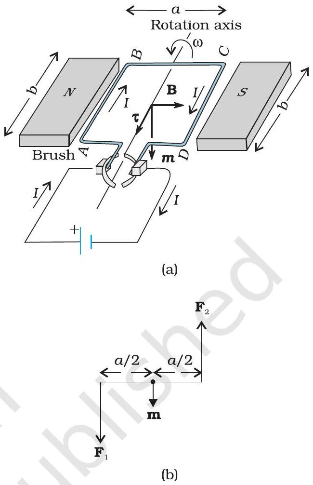
FIGURE 4.18 (a) A rectangular current-carrying coil in uniform magnetic field. The magnetic moment m points downwards. The torque $\tau$ is along the axis and tends to rotate the coil anticlockwise. (b) The couple acting on the coil.

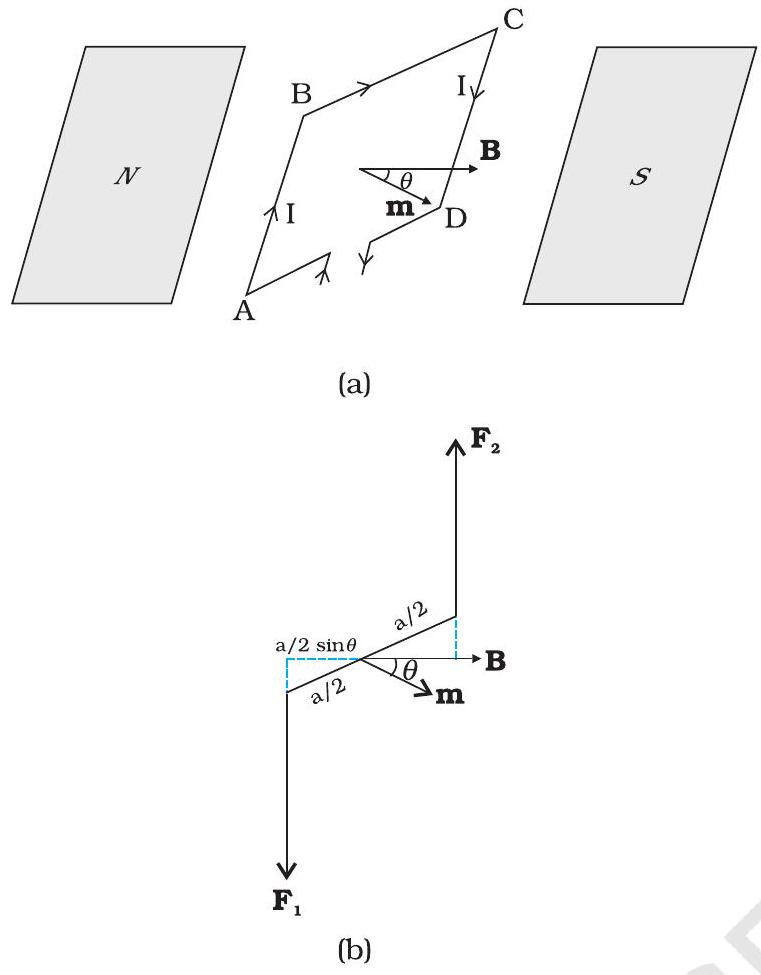
FIGURE 4.19 (a) The area vector of the loop ABCD makes an arbitrary angle $\theta$ with the magnetic field. (b) Top view of the loop. The forces $\mathrm{F}_{1}$ and $\mathrm{F}_{2}$ acting on the arms AB and CD are indicated.

As $\theta \rightarrow 0$, the perpendicular distance between the forces of the couple also approaches zero. This makes the forces collinear and the net force and torque zero. The torques in Eqs. (4.20) and (4.21) can be expressed as vector product of the magnetic moment of the coil and the magnetic field. We define the magnetic moment of the current loop as,

$$
\mathbf{m}=I \mathbf{A}
$$

where the direction of the area vector A is given by the right-hand thumb rule and is directed into the plane of the paper in Fig. 4.18. Then as the angle between $\mathbf{m}$ and $\mathbf{B}$ is $\theta$, Eqs. (4.20) and (4.21) can be expressed by one expression

$$
\tau=\mathbf{m} \times \mathbf{B}
$$

This is analogous to the electrostatic case (Electric dipole of dipole moment $\mathbf{p}_{\mathrm{e}}$ in an electric field E).

$$
\tau=\mathbf{p}_{\mathrm{e}} \times \mathbf{E}
$$

As is clear from Eq. (4.22), the dimensions of the magnetic moment are $[\mathrm{A}]\left[\mathrm{L}^{2}\right]$ and its unit is $\mathrm{Am}^{2}$.

From Eq. (4.23), we see that the torque $\tau$ vanishes when m is either parallel or antiparallel to the magnetic field B. This indicates a state of equilibrium as there is no torque on the coil (this also applies to any object with a magnetic moment m). When m and B are parallel the equilibrium is a stable one. Any small rotation of the coil produces a torque which brings it back to its original position. When they are antiparallel, the equilibrium is unstable as any rotation produces a torque which increases with the amount of rotation. The presence of this torque is also the reason why a small magnet or any magnetic dipole aligns itself with the external magnetic field.

If the loop has $N$ closely wound turns, the expression for torque, Eq. (4.23), still holds, with

$$
\mathbf{m}=N I \mathbf{A}
$$

Example 4.10 A 100 turn closely wound circular coil of radius 10 cm carries a current of 3.2 A. (a) What is the field at the centre of the coil? (b) What is the magnetic moment of this coil?

The coil is placed in a vertical plane and is free to rotate about a horizontal axis which coincides with its diameter. A uniform magnetic field of 2T in the horizontal direction exists such that initially the axis of the coil is in the direction of the field. The coil rotates through an angle of 90° under the influence of the magnetic field. (c) What are the magnitudes of the torques on the coil in the initial and final position? (d) What is the angular speed acquired by the coil when it has rotated by 90°? The moment of inertia of the coil is $0.1 \mathrm{~kg} \mathrm{~m}^{2}$.

Solution

(a) From Eq. (4.12)
$$
B=\frac{\mu_{0} N I}{2 R}
$$
Here, $N=100 ; I=3.2 \mathrm{~A}$, and $R=0.1 \mathrm{~m}$. Hence,
$$
\begin{aligned}
B & =\frac{4 \pi \times 10^{-7} \times 3.2}{2 \times 10^{-1}}=\frac{4 \times 10^{-5} \times 10}{2 \times 10^{-1}} \quad(\text { using } \pi \times 3.2=10) \\
& =2 \times 10^{-3} \mathrm{~T}
\end{aligned}
$$
The direction is given by the right-hand thumb rule.
(b) The magnetic moment is given by Eq. (4.24),
$$
m=N I A=N I \pi r^{2}=100 \times 3.2 \times 3.14 \times 10^{-2}=10 \mathrm{~A} \mathrm{~m}^{2}
$$
The direction is once again given by the right-hand thumb rule.
(c) $\tau=|\mathbf{m} \times \mathbf{B}|$ [from Eq. (4.23)]
$$
=m B \sin \theta
$$
Initially, $\theta=0$. Thus, initial torque $\tau_{i}=0$. Finally, $\theta=\pi / 2$ (or 90°).
Thus, final torque $\tau_{f}=m B=10 \times 2=20 \mathrm{~N} \mathrm{~m}$.
(d) From Newton's second law,
$$
9 \frac{\mathrm{~d} \omega}{\mathrm{~d} t}=m B \sin \theta
$$
where $\mathscr{g}$ is the moment of inertia of the coil. From chain rule,
$$
\frac{\mathrm{d} \omega}{\mathrm{~d} t}=\frac{\mathrm{d} \omega}{\mathrm{~d} \theta} \frac{\mathrm{~d} \theta}{\mathrm{~d} t}=\frac{\mathrm{d} \omega}{\mathrm{~d} \theta} \omega
$$
Using this,
$$
\vartheta \omega \mathrm{d} \omega=m B \sin \theta \mathrm{~d} \theta
$$
Integrating from $\theta=0$ to $\theta=\pi / 2$,
$$
\begin{aligned}
& g \int_{0}^{\omega f} \omega \mathrm{~d} \omega=m B \int_{0}^{\pi / 2} \sin \theta \mathrm{~d} \theta \\
& g \frac{\omega_{f}^{2}}{2}=-\left.m B \cos \theta\right|_{0} ^{\pi / 2}=m B \\
& \omega_{f}=\left(\frac{2 m B}{g}\right)^{1 / 2}=\left(\frac{2 \times 20}{10^{-1}}\right)^{1 / 2}=20 \mathrm{~s}^{-1}
\end{aligned}
$$

Example 4.11

(a) A current-carrying circular loop lies on a smooth horizontal plane. Can a uniform magnetic field be set up in such a manner that the loop turns around itself (i.e., turns about the vertical axis).
(b) A current-carrying circular loop is located in a uniform external magnetic field. If the loop is free to turn, what is its orientation of stable equilibrium? Show that in this orientation, the flux of

## - Physics

the total field (external field + field produced by the loop) is maximum.
(c) A loop of irregular shape carrying current is located in an external magnetic field. If the wire is flexible, why does it change to a circular shape?

Solution

(a) No, because that would require $\tau$ to be in the vertical direction. But $\tau=I \mathbf{A} \times \mathbf{B}$, and since $\mathbf{A}$ of the horizontal loop is in the vertical direction, $\tau$ would be in the plane of the loop for any $\mathbf{B}$.
(b) Orientation of stable equilibrium is one where the area vector A of the loop is in the direction of external magnetic field. In this orientation, the magnetic field produced by the loop is in the same direction as external field, both normal to the plane of the loop, thus giving rise to maximum flux of the total field.
(c) It assumes circular shape with its plane normal to the field to maximise flux, since for a given perimeter, a circle encloses greater area than any other shape.

### 4.9.2 Circular current loop as a magnetic dipole

In this section, we shall consider the elementary magnetic element: the current loop. We shall show that the magnetic field (at large distances) due to current in a circular current loop is very similar in behaviour to the electric field of an electric dipole. In Section 4.5, we have evaluated the magnetic field on the axis of a circular loop, of a radius $R$, carrying a steady current $I$. The magnitude of this field is [(Eq. (4.11)],

$$
B=\frac{\mu_{0} I R^{2}}{2\left(x^{2}+R^{2}\right)^{3 / 2}}
$$

and its direction is along the axis and given by the right-hand thumb rule (Fig. 4.10). Here, $x$ is the distance along the axis from the centre of the loop. For $x \gg R$, we may drop the $R^{2}$ term in the denominator. Thus,

$$
B=\frac{\mu_{0} I R^{2}}{2 x^{3}}
$$

Note that the area of the loop $A=\pi R^{2}$. Thus,

$$
B=\frac{\mu_{0} I A}{2 \pi x^{3}}
$$

As earlier, we define the magnetic moment m to have a magnitude $I A$, $\boldsymbol{m}=I \mathbf{A}$. Hence,

$$
\begin{aligned}
\mathrm{B} & \simeq \frac{\mu_{0} m}{2 \pi x^{3}} \\
& =\frac{\mu_{0}}{4 \pi} \frac{2 \mathbf{m}}{x^{3}}
\end{aligned}
$$

The expression of Eq. [4.25(a)] is very similar to an expression obtained earlier for the electric field of a dipole. The similarity may be seen if we substitute,

$$
\mu_{0} \rightarrow 1 / \varepsilon_{0}
$$

$\mathbf{m} \rightarrow \mathbf{p}_{\mathrm{e}}$ (electrostatic dipole)
B → E (electrostatic field)
We then obtain,

$$
\mathbf{E}=\frac{2 \mathbf{p}_{e}}{4 \pi \varepsilon_{0} x^{3}}
$$

which is precisely the field for an electric dipole at a point on its axis. considered in Chapter 1, Section 1.9 [Eq. (1.20)].

It can be shown that the above analogy can be carried further. We had found in Chapter 1 that the electric field on the perpendicular bisector of the dipole is given by [See Eq.(1.21)],

$$
E \simeq \frac{\mathbf{p}_{e}}{4 \pi \varepsilon_{0} x^{3}}
$$

where $x$ is the distance from the dipole. If we replace $\mathbf{p} \rightarrow \mathbf{m}$ and $\mu_{0} \rightarrow 1 / \varepsilon_{0}$ in the above expression, we obtain the result for B for a point in the plane of the loop at a distance $x$ from the centre. For $x \gg R$,

$$
\mathbf{B} \simeq \frac{\mu_{0}}{4 \pi} \frac{\mathbf{m}}{x^{3}} ; \quad x \gg R
$$

The results given by Eqs. [4.25(a)] and [4.25(b)] become exact for a point magnetic dipole.

The results obtained above can be shown to apply to any planar loop: a planar current loop is equivalent to a magnetic dipole of dipole moment $\mathbf{m}=I \mathbf{A}$, which is the analogue of electric dipole moment p. Note, however, a fundamental difference: an electric dipole is built up of two elementary units - the charges (or electric monopoles). In magnetism, a magnetic dipole (or a current loop) is the most elementary element. The equivalent of electric charges, i.e., magnetic monopoles, are not known to exist.

We have shown that a current loop (i) produces a magnetic field (see Fig. 4.10) and behaves like a magnetic dipole at large distances, and (ii) is subject to torque like a magnetic needle. This led Ampere to suggest that all magnetism is due to circulating currents. This seems to be partly true and no magnetic monopoles have been seen so far. However, elementary particles such as an electron or a proton also carry an intrinsic magnetic moment, not accounted by circulating currents.

### 4.10 The Moving Coil Galvanometer

Currents and voltages in circuits have been discussed extensively in Chapters 3. But how do we measure them? How do we claim that current in a circuit is 1.5 A or the voltage drop across a resistor is 1.2 V? Figure 4.20 exhibits a very useful instrument for this purpose: the moving coil galvanometer (MCG). It is a device whose principle can be understood on the basis of our discussion in Section 4.9.

The galvanometer consists of a coil, with many turns, free to rotate about a fixed axis (Fig. 4.20), in a uniform radial magnetic field. There is a cylindrical soft iron core which not only makes the field radial but also increases the strength of the magnetic field. When a current flows through the coil, a torque acts on it. This torque is given by Eq. (4.20) to be

$$
\tau=N I A B
$$

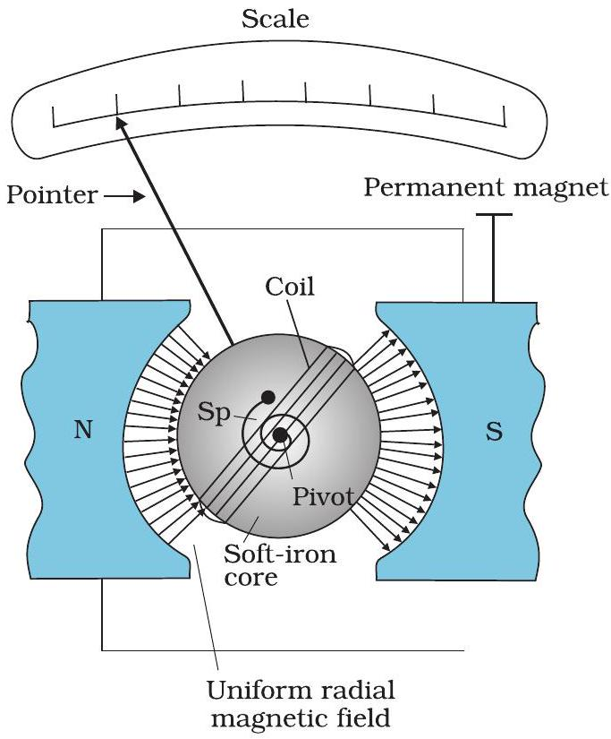
FIGURE 4.20 The moving coil galvanometer. Its elements are described in the text. Depending on the requirement, this device can be used as a current detector or for measuring the value of the current (ammeter) or voltage (voltmeter).

where the symbols have their usual meaning. Since the field is radial by design, we have taken $\sin \theta=1$ in the above expression for the torque. The magnetic torque $N I A B$ tends to rotate the coil. A spring $\mathrm{S}_{\mathrm{p}}$ provides a counter torque $k \phi$ that balances the magnetic torque $N I A B$; resulting in a steady angular deflection $\phi$. In equilibrium

$$
k \phi=N I A B
$$

where $k$ is the torsional constant of the spring; i.e. the restoring torque per unit twist. The deflection $\phi$ is indicated on the scale by a pointer attached to the spring. We have

$$
\phi=\left(\frac{N A B}{k}\right) I
$$

The quantity in brackets is a constant for a given galvanometer.

The galvanometer can be used in a number of ways. It can be used as a detector to check if a current is flowing in the circuit. We have come across this usage in the Wheatstone's bridge arrangement. In this usage the neutral position of the pointer (when no current is flowing through the galvanometer) is in the middle of the scale and not at the left end as shown in Fig.4.20. Depending on the direction of the current, the pointer's deflection is either to the right or the left.

The galvanometer cannot as such be used as an ammeter to measure the value of the current in a given circuit. This is for two reasons: (i) Galvanometer is a very sensitive device, it gives a fullscale deflection for a current of the order of $\mu \mathrm{A}$. (ii) For measuring currents, the galvanometer has to be connected in series, and as it has a large resistance, this will change the value of the current in the circuit. To overcome these difficulties, one attaches a small resistance $r_{s}$, called shunt resistance, in parallel with the galvanometer coil; so that most of the current passes through the shunt. The resistance of this arrangement is,

$$
R_{G} r_{s} /\left(R_{G}+r_{s}\right) \simeq r_{s} \quad \text { if } \quad R_{G} \gg r_{s}
$$

If $r_{s}$ has small value, in relation to the resistance of the rest of the circuit $R_{\mathrm{c}}$, the effect of introducing the measuring instrument is also small and negligible. This arrangement is schematically shown in Fig. 4.21. The scale of this ammeter is calibrated and then graduated to read off the current value with ease. We define the current sensitivity of the galvanometer as the deflection per unit current. From Eq. (4.26) this current sensitivity is,

$$
\frac{\varphi}{I}=\frac{N A B}{k}
$$

A convenient way for the manufacturer to increase the sensitivity is to increase the number of turns $N$. We choose galvanometers having sensitivities of value, required by our experiment.

## Moving Charges and Magnetism

The galvanometer can also be used as a voltmeter to measure the voltage across a given section of the circuit. For this it must be connected in parallel with that section of the circuit. Further, it must draw a very small current, otherwise the voltage measurement will disturb the original set up by an amount which is very large. Usually we like to keep the disturbance due to the measuring device below one per cent. To ensure this, a large resistance $R$ is connected in series with the galvanometer. This arrangement is schematically depicted in Fig.4.22. Note that the resistance of the voltmeter is now,

$$
R_{G}+R \simeq R \text { : large }
$$

The scale of the voltmeter is calibrated to read off the voltage value with ease. We define the voltage sensitivity as the deflection per unit voltage. From Eq. (4.26),

$$
\frac{\phi}{V}=\left(\frac{N A B}{k}\right) \frac{I}{V}=\left(\frac{N A B}{k}\right) \frac{1}{R}
$$

An interesting point to note is that increasing the current sensitivity may not necessarily increase the voltage sensitivity. Let us take Eq. (4.27) which provides a measure of current sensitivity. If $N \rightarrow 2 N$, i.e., we double the number of turns, then

$$
\frac{\varphi}{I} \rightarrow 2 \frac{\varphi}{I}
$$

Thus, the current sensitivity doubles. However, the resistance of the galvanometer is also likely to double, since it is proportional to the length of the wire. In Eq. (4.28), $N \rightarrow 2 N$, and $R \rightarrow 2 R$, thus the voltage sensitivity,

$$
\frac{\varphi}{V} \rightarrow \frac{\varphi}{V}
$$

remains unchanged. So in general, the modification needed for conversion of a galvanometer to an ammeter will be different from what is needed for converting it into a voltmeter.

Example 4.12 In the circuit (Fig. 4.23) the current is to be measured. What is the value of the current if the ammeter shown (a) is a galvanometer with a resistance $R_{G}=60.00 \Omega$; (b) is a galvanometer described in (a) but converted to an ammeter by a shunt resistance $r_{s}=0.02 \Omega$; (c) is an ideal ammeter with zero resistance?

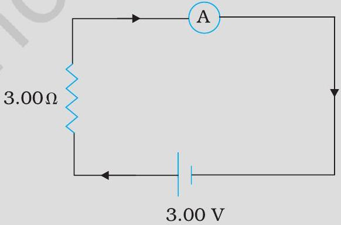
FIGURE 4.23

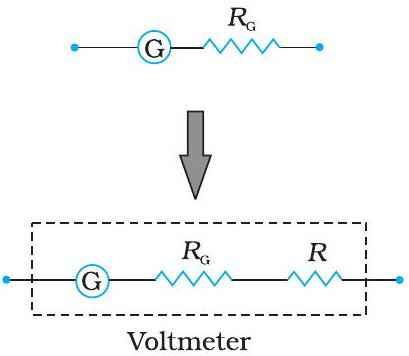
FIGURE 4.22 Conversion of a galvanometer (G) to a voltmeter by the introduction of a resistance $R$ of large value in series.

## - Physics

Solution

(a) Total resistance in the circuit is, $R_{G}+3=63 \Omega$. Hence, $I=3 / 63=0.048 \mathrm{~A}$.
(b) Resistance of the galvanometer converted to an ammeter is, $\frac{R_{G} r_{s}}{R_{G}+r_{s}}=\frac{60 \Omega \times 0.02 \Omega}{(60+0.02) \Omega} \simeq 0.02 \Omega$
Total resistance in the circuit is, $0.02 \Omega+3 \Omega=3.02 \Omega$. Hence, $I=3 / 3.02=0.99 \mathrm{~A}$.
(c) For the ideal ammeter with zero resistance, $I=3 / 3=1.00 \mathrm{~A}$

## SUMMARY

1. The total force on a charge $q$ moving with velocity $\mathbf{v}$ in the presence of magnetic and electric fields B and E, respectively is called the Lorentz force. It is given by the expression: $\mathbf{F}=q(\mathbf{v} \times \mathbf{B}+\mathbf{E})$
The magnetic force $q(\mathbf{v} \times \mathbf{B})$ is normal to $\mathbf{v}$ and work done by it is zero.
2. A straight conductor of length $l$ and carrying a steady current $I$ experiences a force F in a uniform external magnetic field B, $\mathbf{F}=I \mathbf{1} \times \mathbf{B}$
where $|1|=l$ and the direction of 1 is given by the direction of the current.
3. In a uniform magnetic field B, a charge $q$ executes a circular orbit in a plane normal to B. Its frequency of uniform circular motion is called the cyclotron frequency and is given by:
$$
v_{c}=\frac{q B}{2 \pi m}
$$
This frequency is independent of the particle's speed and radius. This fact is exploited in a machine, the cyclotron, which is used to accelerate charged particles.
4. The Biot-Savart law asserts that the magnetic field dB due to an element dl carrying a steady current $I$ at a point P at a distance $r$ from the current element is:
$$
\mathrm{d} \mathbf{B}=\frac{\mu_{0}}{4 \pi} I \frac{\mathrm{~d} \mathbf{l} \times \mathbf{r}}{r^{3}}
$$
To obtain the total field at P, we must integrate this vector expression over the entire length of the conductor.
5. The magnitude of the magnetic field due to a circular coil of radius $R$ carrying a current $I$ at an axial distance $x$ from the centre is

$$
B=\frac{\mu_{0} I R^{2}}{2\left(x^{2}+R^{2}\right)^{3 / 2}}
$$

At the centre this reduces to

$$
B=\frac{\mu_{0} I}{2 R}
$$

6. Ampere's Circuital Law: Let an open surface S be bounded by a loop C. Then the Ampere's law states that $\oint_{C} \mathbf{B} . d \mathbf{l}=\mu_{0} I$ where $I$ refers to the current passing through S. The sign of $I$ is determined from the right-hand rule. We have discussed a simplified form of this law. If B is directed along the tangent to every point on the perimeter $L$ of a closed curve and is constant in magnitude along perimeter then, $B L=\mu_{0} I_{e}$
where $I_{e}$ is the net current enclosed by the closed circuit.
7. The magnitude of the magnetic field at a distance $R$ from a long, straight wire carrying a current $I$ is given by:

$$
B=\frac{\mu_{0} I}{2 \pi R}
$$

The field lines are circles concentric with the wire.
8. The magnitude of the field $B$ inside a long solenoid carrying a current $I$ is

$$
B=\mu_{0} n I
$$

where $n$ is the number of turns per unit length.
9. Parallel currents attract and anti-parallel currents repel.
10. A planar loop carrying a current $I$, having $N$ closely wound turns, and an area $A$ possesses a magnetic moment $\mathbf{m}$ where,

$$
\mathbf{m}=\mathrm{N} I \mathbf{A}
$$

and the direction of m is given by the right-hand thumb rule : curl the palm of your right hand along the loop with the fingers pointing in the direction of the current. The thumb sticking out gives the direction of m (and A)
When this loop is placed in a uniform magnetic field B, the force F on it is: $F=0$
And the torque on it is,

$$
\tau=\mathbf{m} \times \mathbf{B}
$$

In a moving coil galvanometer, this torque is balanced by a countertorque due to a spring, yielding

$$
k \phi=N I A B
$$

where $\phi$ is the equilibrium deflection and $k$ the torsion constant of the spring.
11. A moving coil galvanometer can be converted into a ammeter by introducing a shunt resistance $r_{s}$, of small value in parallel. It can be converted into a voltmeter by introducing a resistance of a large value in series.

## - Physics

| Physical Quantity | Symbol | Nature | Dimensions | Units | Remarks |
| :--- | :--- | :--- | :--- | :--- | :--- |
| Permeability of free space | $\mu_{0}$ | Scalar | $\left[\mathrm{MLT}^{-2} \mathrm{~A}^{-2}\right]$ | $\mathrm{T} \mathrm{m} \mathrm{A}^{-1}$ | $4 \pi \times 10^{-7} \mathrm{~T} \mathrm{~m} \mathrm{~A}^{-1}$ |
| Magnetic Field | B | Vector | [ $\mathrm{M} \mathrm{T}^{-2} \mathrm{~A}^{-1}$ ] | T (telsa) |  |
| Magnetic Moment | m | Vector | $\left[\mathrm{L}^{2} \mathrm{~A}\right]$ | A m ${ }^{2}$ or J/T |  |
| Torsion Constant | $k$ | Scalar | $\left[\mathrm{M} \mathrm{L}^{2} \mathrm{~T}^{-2}\right]$ | $\mathrm{N} \mathrm{m} \mathrm{rad}^{-1}$ | Appears in MCG |

## POINTS TO PONDER

1. Electrostatic field lines originate at a positive charge and terminate at a negative charge or fade at infinity. Magnetic field lines always form closed loops.
2. The discussion in this Chapter holds only for steady currents which do not vary with time.
When currents vary with time Newton's third law is valid only if momentum carried by the electromagnetic field is taken into account.
3. Recall the expression for the Lorentz force,
$\mathbf{F}=q(\mathbf{v} \times \mathbf{B}+\mathbf{E})$
This velocity dependent force has occupied the attention of some of the greatest scientific thinkers. If one switches to a frame with instantaneous velocity $\mathbf{v}$, the magnetic part of the force vanishes. The motion of the charged particle is then explained by arguing that there exists an appropriate electric field in the new frame. We shall not discuss the details of this mechanism. However, we stress that the resolution of this paradox implies that electricity and magnetism are linked phenomena (electromagnetism) and that the Lorentz force expression does not imply a universal preferred frame of reference in nature.
4. Ampere's Circuital law is not independent of the Biot-Savart law. It can be derived from the Biot-Savart law. Its relationship to the Biot-Savart law is similar to the relationship between Gauss's law and Coulomb's law.

## EXERCISES

4.1 A circular coil of wire consisting of 100 turns, each of radius 8.0 cm carries a current of 0.40 A. What is the magnitude of the magnetic field B at the centre of the coil?
4.2 A long straight wire carries a current of 35 A . What is the magnitude of the field B at a point 20 cm from the wire?
4.3 A long straight wire in the horizontal plane carries a current of 50 A in north to south direction. Give the magnitude and direction of B at a point 2.5 m east of the wire.

4.4 A horizontal overhead power line carries a current of 90 A in east to west direction. What is the magnitude and direction of the magnetic field due to the current 1.5 m below the line?
4.5 What is the magnitude of magnetic force per unit length on a wire carrying a current of 8 A and making an angle of 30° with the direction of a uniform magnetic field of 0.15 T?
4.6 A 3.0 cm wire carrying a current of 10 A is placed inside a solenoid perpendicular to its axis. The magnetic field inside the solenoid is given to be 0.27 T. What is the magnetic force on the wire?
4.7 Two long and parallel straight wires A and B carrying currents of 8.0 A and 5.0 A in the same direction are separated by a distance of 4.0 cm. Estimate the force on a 10 cm section of wire A.
4.8 A closely wound solenoid 80 cm long has 5 layers of windings of 400 turns each. The diameter of the solenoid is 1.8 cm. If the current carried is 8.0 A, estimate the magnitude of B inside the solenoid near its centre.
4.9 A square coil of side 10 cm consists of 20 turns and carries a current of 12 A. The coil is suspended vertically and the normal to the plane of the coil makes an angle of 30° with the direction of a uniform horizontal magnetic field of magnitude 0.80 T. What is the magnitude of torque experienced by the coil?
4.10 Two moving coil meters, $\mathrm{M}_{1}$ and $\mathrm{M}_{2}$ have the following particulars:
$$
\begin{aligned}
& R_{1}=10 \Omega, \quad N_{1}=30 \\
& A_{1}=3.6 \times 10^{-3} \mathrm{~m}^{2}, B_{1}=0.25 \mathrm{~T} \\
& R_{2}=14 \Omega, \quad N_{2}=42 \\
& A_{2}=1.8 \times 10^{-3} \mathrm{~m}^{2}, B_{2}=0.50 \mathrm{~T}
\end{aligned}
$$
(The spring constants are identical for the two meters).
Determine the ratio of (a) current sensitivity and (b) voltage sensitivity of $\mathrm{M}_{2}$ and $\mathrm{M}_{1}$.
4.11 In a chamber, a uniform magnetic field of 6.5 $\mathrm{G}\left(1 \mathrm{G}=10^{-4} \mathrm{~T}\right)$ is maintained. An electron is shot into the field with a speed of $4.8 \times 10^{6} \mathrm{~m} \mathrm{~s}^{-1}$ normal to the field. Explain why the path of the electron is a circle. Determine the radius of the circular orbit. ( $e=1.5 \times 10^{-19} \mathrm{C}, m_{e}=9.1 \times 10^{-31} \mathrm{~kg}$ )
4.12 In Exercise 4.11 obtain the frequency of revolution of the electron in its circular orbit. Does the answer depend on the speed of the electron? Explain.
4.13 (a) A circular coil of 30 turns and radius 8.0 cm carrying a current of 6.0 A is suspended vertically in a uniform horizontal magnetic field of magnitude 1.0 T. The field lines make an angle of 60° with the normal of the coil. Calculate the magnitude of the counter torque that must be applied to prevent the coil from turning.
    (b) Would your answer change, if the circular coil in (a) were replaced by a planar coil of some irregular shape that encloses the same area? (All other particulars are also unaltered.)

[^0]:    * A dot appears like the tip of an arrow pointed at you, a cross is like the feathered tail of an arrow moving away from you.

[^1]:    * The sense of $\mathrm{d} \boldsymbol{l} \times \mathbf{r}$ is also given by the Right Hand Screw rule : Look at the plane containing vectors d $\boldsymbol{l}$ and r. Imagine moving from the first vector towards second vector. If the movement is anticlockwise, the resultant is towards you. If it is clockwise, the resultant is away from you.

[^2]:    * Note that there are two distinct right-hand rules: One which gives the direction of B on the axis of current-loop and the other which gives direction of B for a straight conducting wire. Fingers and thumb play different roles in the two.

[^3]:    * It turns out that when we have time-dependent currents and/or charges in motion, Newton's third law may not hold for forces between charges and/or conductors. An essential consequence of the Newton's third law in mechanics is conservation of momentum of an isolated system. This, however, holds even for the case of time-dependent situations with electromagnetic fields, provided the momentum carried by fields is also taken into account.

