## अध्याय $4$

## गतिमान आवेश और

## चुंबकत्व

## $4.1$ भूमिका

$2000$ वर्ष से भी पहले विद्युत तथा चुंबकत्व दोनों ही के बारे में लोगों को ज्ञान था। फिर भी लगभग $200$ वर्ष पूर्व, $1820$ में यह स्पष्ट अनुभव किया गया कि इन दोनों में अटूट संबंध है। $1820$ की ग्रीष्म ऋतु में, डच भौतिकविज्ञानी हैंस क्रिश्चियन ऑर्स्टेड ने, अपने एक भाषण के दौरान प्रयोग प्रदर्शित करते हुए देखा कि एक सीधे तार में विद्युत धारा प्रवाहित करने पर पास रखी हुई चुंबकीय सुई में सुस्पष्ट विक्षेप प्राप्त होता है। उन्होंने इस परिघटना पर शोध आरंभ किया। उन्होंने पाया कि चुंबकीय सुई तार के अभिलंबवत तल में तार की स्थिति के केंद्रतः वृत्त की स्पर्श रेखा के समांतर संरेखित होती है। इस स्थिति को चित्र 4.1(a) में दर्शाया गया है। पर यह देखने के लिए तार में पर्याप्त धारा प्रवाहित होनी चाहिए और चुंबकीय सुई तार के काफी निकट रखी होनी चाहिए ताकि पृथ्वी के चुंबकीय क्षेत्र की उपेक्षा की जा सके। यदि तार में धारा की दिशा विपरीत कर दी जाए तो चुंबकीय सुई भी घूम कर विपरीत दिशा में संरेखित हो जाती है [चित्र 4.1(b) देखिए]। तार में धारा का परिमाण बढ़ाने या सुई को तार के निकट लाने से चुंबकीय सुई का विक्षेप बढ़ जाता है। तार के चारों ओर यदि लौह चूर्ण छिड़कें तो इसके कण तार के चारों ओर संकेंद्री वृत्तों में व्यवस्थित हो जाते हैं [चित्र 4.1(c) देखिए]। इस परिघटना से ऑर्स्टेड ने निष्कर्ष निकाला कि गतिमान आवेश (धारा) अपने चारों ओर एक चुंबकीय क्षेत्र उत्पन्न करते हैं।

इसके पश्चात प्रयोगों की गति तीव्र हो गई। सन $1864$ में विद्युत तथा चुंबकत्व के सर्वमान्य नियमों को जेम्स मैक्सवेल ने एकीकृत करके नए नियम बनाए और यह स्पष्ट अनुभव किया कि प्रकाश वास्तव में विद्युत चुंबकीय तरंगें हैं। हर्ट्ज़ ने रेडियो तरंगों की खोज की तथा 19वीं शताब्दी

## भौतिकी

के अंत तक सर जे.सी. बोस तथा मार्कोनी ने इन तरंगों को उत्पन्न किया। $20$ वीं शताब्दी में विज्ञान तथा प्रौद्योगिकी में आश्चर्यजनक प्रगति हुई है। यह प्रगति विद्युत चुंबकत्व के हमारे बढ़ते ज्ञान तथा विद्युत चुंबकीय तरंगों को उत्पन्न, प्रबर्धित, प्रेषित तथा संसूचित करने वाली युक्तियों की खोज के कारण हुई है।

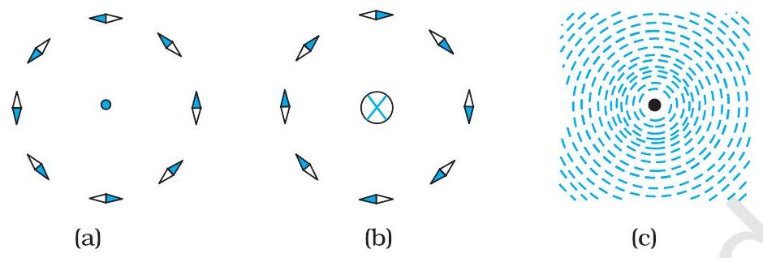
चित्र $4.1$ एक सीधे लंबे धारावाही तार के कारण उत्पन्न चुंबकीय क्षेत्र। तार, कागज़ के तल पर अभिलंबवत है। तार के चारों ओर चुंबकीय सुइयों की एक मुद्रिका बनाई गई है। चुंबकीय सुइयों का अभिविन्यास- (a) जब धारा कागज़ के तल से बाहर की ओर प्रवाहित होती है।
(b) जब धारा कागज़ के तल से अंदर की ओर प्रवाहित होती है। (c) लौह चूर्ण कणों का तार के चारों ओर अभिविन्यास। सुइयों के काले सिरे उत्तरी ध्रुव प्रदर्शित करते हैं। यहाँ भू-चुंबकत्व के प्रभाव की उपेक्षा की गई है।

इस अध्याय में हम यह देखेंगे कि चुंबकीय क्षेत्र किस प्रकार आवेशित कणों; जैसे-इलेक्ट्रॉन, प्रोटॉन तथा विद्युत धारावाही तारों पर बल आरोपित करते हैं। हम यह भी सीखेंगे कि विद्युत धाराएँ किस प्रकार चुंबकीय क्षेत्र उत्पन्न करती हैं। हम यह देखेंगे कि साइक्लोट्रॉन में किस प्रकार कणों को अति उच्च ऊर्जाओं तक त्वरित किया जा सकता है। हम गैल्वेनोमीटर द्वारा विद्युतधाराओं एवं वोल्टताओं के संसूचन के विषय में भी अध्ययन करेंगे।

इस अध्याय तथा आगे आने वाले चुंबकत्व के अध्यायों में हम निम्नलिखित परिपाटी को अपनाएँगे। कागज़ के तल से बाहर की ओर निर्गत विद्युत धारा अथवा क्षेत्र (विद्युत अथवा चुंबकीय) को एक बिंदु ( $\odot$ ) द्वारा व्यक्त किया जाता है। कागज़ के तल में भीतर की ओर जाती विद्युत धारा अथवा विद्युत क्षेत्र को एक क्रॉस $(\otimes)^{*}$ द्वारा व्यक्त किया जाता है। चित्र 4.1(a) तथा 4.1(b) क्रमशः इन दो स्थितियों के तदनुरूपी हैं।

## $4.2$ चुंबकीय बल

### 4.2.1 स्रोत और क्षेत्र

किसी चुंबकीय क्षेत्र B की अभिधारणा को प्रस्तावित करने से पहले हम संक्षेप में यह दोहराएँगे कि हमने अध्याय $1$ के अंतर्गत विद्युत क्षेत्र $\mathbf{E}$ के विषय में क्या सीखा है। हमने यह देखा है कि दो आवेशों के बीच अन्योन्य क्रिया पर दो चरणों में विचार किया जा सकता है। आवेश $Q$ जोकि विद्युत क्षेत्र का स्रोत है, एक विद्युत क्षेत्र $\mathbf{E}$ उत्पन्न करता है-

$$
\mathbf{E}=Q \hat{\mathbf{r}} /\left(4 \pi \varepsilon_{0}\right) r^{2}
$$

[^0]
## गतिमान आवेश और चुंबकत्व

यहाँ $\hat{\mathbf{r}}, \mathbf{r}$ के अनुदिश एकांक सदिश है तथा क्षेत्र $\mathbf{E}$ एक सदिश क्षेत्र है। कोई आवेश $q$ इस क्षेत्र से अन्योन्य क्रिया करके एक बल $\mathbf{F}$ का अनुभव करता है

$$
\mathbf{F}=q \mathbf{E}=q Q \hat{\mathbf{r}} /\left(4 \pi \varepsilon_{0}\right) r^{2}
$$

जैसा कि अध्याय $1$ में निर्दिष्ट किया जा चुका है कि विद्युत क्षेत्र E मात्र शिल्प तथ्य ही नहीं है, परंतु इसकी भौतिक भूमिका भी है। यह ऊर्जा तथा संवेग संप्रेषित कर सकता है तथा यह तत्क्षण ही स्थापित नहीं हो जाता वरन इसके फैलने में परिमित समय लगता है। क्षेत्र की अभिधारणा को फैराडे द्वारा विशेष महत्त्व दिया गया तथा मैक्सवेल ने विद्युत तथा चुंबकत्व को एकीकृत करने में इस अभिधारणा को समावेशित किया। दिक्स्थान में प्रत्येक बिंदु पर निर्भर होने के साथ-साथ यह समय के साथ भी परिवर्तित हो सकता है, अर्थात यह समय का फलन है। इस अध्याय में हम अपनी चर्चा में, यह मानेंगे कि समय के साथ क्षेत्र में परिवर्तन नहीं होता।

किसी विशेष बिंदु पर विद्युत क्षेत्र एक अथवा अधिक आवेशों के कारण हो सकता है। यदि एक से अधिक आवेश हैं तो उनके कारण उत्पन्न क्षेत्र सदिश रूप से संयोजित हो जाते हैं। आप पहले अध्याय में यह सीख ही चुके हैं कि इसे अध्यारोपण का सिद्धांत कहते हैं। एक बार यदि क्षेत्र ज्ञात है तो परीक्षण आवेश पर बल को समीकरण (4.2) द्वारा ज्ञात किया जा सकता है।

जिस प्रकार स्थिर आवेश विद्युत क्षेत्र उत्पन्न करते हैं, विद्युत धाराएँ अथवा गतिमान आवेश (विद्युत क्षेत्र के साथ-साथ) चुंबकीय क्षेत्र उत्पन्न करते हैं जिसे B (r) द्वारा निर्दिष्ट किया जाता है तथा यह भी एक सदिश क्षेत्र है। इसके विद्युत क्षेत्र के समरूप बहुत से मूल गुण हैं। इसे दिक्स्थान के हर बिंदु पर परिभाषित किया जाता है (और साथ ही समय पर निर्भर कर सकता है)। प्रयोगों द्वारा यह पाया गया है कि यह अध्यारोपण के सिद्धांत का पालन करता है। अध्यारोपण का सिद्धांत इस प्रकार है-बहुत से स्रोतों का चुंबकीय क्षेत्र प्रत्येक व्यष्टिगत स्रोत के चुंबकीय क्षेत्रों का सदिश योग होता है।

### 4.2.2 चुंबकीय क्षेत्र, लोरेंज बल

मान लीजिए विद्युत क्षेत्र E (r) तथा चुंबकीय क्षेत्र B (r) दोनों की उपस्थिति में कोई बिंदु आवेश $q$ (वेग $\mathbf{v}$ से गतिमान तथा किसी दिए गए समय $t$ पर r पर स्थित) विद्यमान है। किसी आवेश $q$ पर इन दोनों क्षेत्रों द्वारा आरोपित बल को इस प्रकार व्यक्त किया जा सकता है-

$$
\mathbf{F}=q[\mathbf{E}(\mathbf{r})+\mathbf{v} \times \mathbf{B}(\mathbf{r})]=\mathbf{F}_{\text {विद्युत }}+\mathbf{F}_{\text {चुंबकीय }}
$$

इस बल को सर्वप्रथम एच.ए. लोरेंज ने ऐम्पियर तथा अन्य वैज्ञानिकों द्वारा विस्तृत पैमाने पर किए गए प्रयोगों के आधार पर व्यक्त किया था। इस बल को अब लोरेंज बल कहते हैं। विद्युत क्षेत्र के कारण लगने वाले बल के बारे में तो आप विस्तार से अध्ययन कर ही चुके हैं। यदि हम चुंबकीय क्षेत्र के साथ अन्योन्य क्रिया पर ध्यान दें तो हमें निम्नलिखित विशेषताएँ मिलती हैं-
(i) यह $q, \mathbf{v}$ तथा $\mathbf{B}$ (कण के आवेश, वेग तथा चुंबकीय क्षेत्र) पर निर्भर करता है। ऋणावेश पर लगने वाला बल धनावेश पर लगने वाले बल के विपरीत होता है।

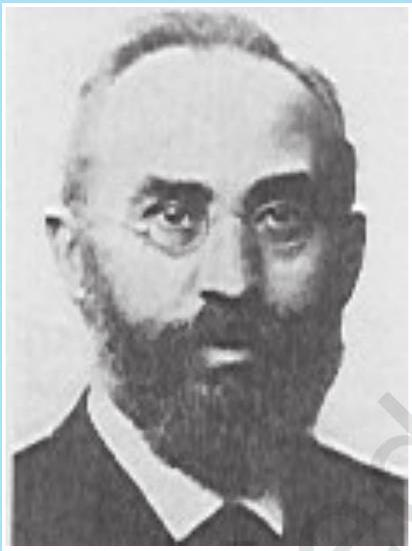
हेंड्रिक ऐंटून लोरेंज़ (1853 - 1928) लोरेंज़ डेनमार्क के सैद्धांतिक भौतिकविज्ञानी, लिडेन में प्रोफ़ेसर थे। उन्होंने विद्युत, चुंबकत्व तथा यांत्रिकी में संबंध की खोज की। प्रकाश उत्सर्जकों पर चुंबकीय क्षेत्र के प्रेक्षित प्रभावों (जीमान प्रभाव) की व्याख्या करने के लिए इन्होंने परमाणु में वैद्युत आवेशों के अस्तित्व होने को अभिगृहीत किया। इसके लिए इन्हें $1902$ में नोबेल पुरस्कार प्रदान किया गया। इन्होंने कुछ जटिल उलझन भरे गणितीय तर्कों के आधार पर कुछ रूपांतरण समीकरणों का एक समुच्चय व्युत्पन्न किया जिसे उनके सम्मान में लोरेंज़ रूपांतरण समीकरण कहते हैं। समीकरणों को व्युत्पन्न करते समय इन्हें इस तथ्य के बारे में यह ज्ञात नहीं था कि ये समीकरण काल तथा दिक्स्थान की नयी अभिधारणा पर अवलंबित हैं।

## भौतिकी

(ii) चुंबकीय बल $q[\mathbf{v} \times \mathbf{B}]$ वेग तथा चुंबकीय क्षेत्र का एक सदिश गुणनफल होता है। सदिश गुणनफल चुंबकीय क्षेत्र के कारण बल को समाप्त (शून्य) कर देता है। यह तब होता है जब बल, वेग तथा चुंबकीय क्षेत्र दोनों के लंबवत होता है (किसी दिशा में)। जब वेग तथा चुंबकीय क्षेत्र की दिशा एक दूसरे के समांतर या प्रतिसमांतर होती है। इसकी दिशा सदिश गुणनफल (क्रास गुणनफल) के लिए चित्र $4.2$ में दर्शाए अनुसार पेंच नियम अथवा दक्षिण हस्त नियम द्वारा प्राप्त होती है।
(iii) यदि आवेश गतिमान नहीं है (तब $|\mathbf{v}|=0$ ) तो चुंबकीय बल शून्य होता है। केवल गतिमान आवेश ही बल का अनुभव करता है।

चुंबकीय क्षेत्र के लिए व्यंजक चुंबकीय क्षेत्र के मात्रक की परिभाषा देने में हमारी सहायता करता है। यदि बल के समीकरण में हल $\mathrm{q}, \mathbf{F}$ तथा $\mathbf{v}$ सभी का मान एकांक मानें तो $\mathbf{F}=q$ $[\mathbf{v} \times \mathbf{B}]=q v B \sin \theta \hat{\mathbf{n}}$, यहाँ $\theta$ वेग $\mathbf{v}$ तथा चुंबकीय क्षेत्र B के बीच का कोण है [चित्र $4.2$ (a) देखिए]। चुंबकीय क्षेत्र $B$ का परिमाण $1$ SI मात्रक होता है, जबकि किसी एकांक आवेश (1 C), जो कि $\mathbf{B}$ के लंबवत $1 \mathrm{~m} / \mathrm{s}$ वेग $\mathbf{v}$ से गतिमान है, पर लगा बल $1$ न्यूटन हो।
विमीय रीति से हम जानते हैं कि $[B]=[F / q v]$ तथा $\mathbf{B}$ का मात्रक न्यूटन सेकंड/कूलॉम मीटर है। इस मात्रक को टेस्ला (T) कहते हैं जिसे निकोला टेस्ला (1856-1943) के नाम पर रखा गया है। टेस्ला एक बड़ा मात्रक है। अतः एक अपेक्षाकृत छोटे मात्रक गाउस ( $=10^{-4}$ टेस्ला) का प्रायः उपयोग किया जाता है।

### 4.2.3 विद्युत धारावाही चालक पर चुंबकीय बल

हम किसी एकल गतिमान आवेश पर चुंबकीय क्षेत्र द्वारा आरोपित बल के विश्लेषण का विस्तार विद्युत धारावाही सीधी छड़ के लिए कर सकते हैं। लंबाई $l$ तथा एकसमान अनुप्रस्थ काट $A$ की किसी छड़ पर विचार करते हैं। हम किसी चालक (जिसमें इलेक्ट्रॉन गतिशील वाहक हैं) की भाँति एक ही प्रकार के गतिशील वाहक मानेंगे। मान लीजिए इन गतिशील आवेश वाहकों का संख्या घनत्व $n$ है तब चालक में कुल गतिशील आवेश वाहकों की संख्या $n l A$ हुई। इस चालक छड़ में अपरिवर्ती विद्युत धारा $I$ के लिए हम यह मान सकते हैं कि प्रत्येक गतिशील वाहक का अपवाह वेग $\mathbf{v}_{d}$ है (अध्याय $3$ देखिए)। किसी बाह्य चुंबकीय क्षेत्र $\mathbf{B}$ की उपस्थिति में इन वाहकों पर बल

$$
\mathbf{F}=(n l A) q \mathbf{v}_{d} \times \mathbf{B}
$$

यहाँ $q$ किसी वाहक के आवेश का मान है। अब यहाँ $n q \mathbf{v}_{\mathrm{d}}$ विद्युत धारा घनत्व $\mathbf{j}$ तथा $\left|\left(n q \mathbf{v}_{\mathrm{d}}\right)\right| A$ विद्युत धारा $I$ है (विद्युत धारा तथा विद्युत धारा घनत्व पर चर्चा के लिए अध्याय $3$ देखिए।) इस प्रकार

$$
\begin{aligned}
\mathbf{F} & =\left[\left(n q \mathbf{v}_{d}\right) l A\right] \times \mathbf{B}=[\mathbf{j} l A] \times \mathbf{B} \\
& =I l \times \mathbf{B}
\end{aligned}
$$

यहाँ $l$ एक सदिश है जिसका परिमाण $l$ है जो कि छड़ की लंबाई है, तथा इसकी दिशा विद्युत धारा $I$ के सर्वसम है। ध्यान दीजिए विद्युत धारा सदिश नहीं है। समीकरण (4.4) के अंतिम चरण में हमने सदिश चिह्न को $\mathbf{j}$ से $\boldsymbol{l}$ पर स्थानांतरित कर दिया है।

## गतिमान आवेश और चुंबकत्व

समीकरण (4.4) सीधी छड़ पर लागू होती है। इस समीकरण में $\mathbf{B}$ बाह्य चुंबकीय क्षेत्र है। यह विद्युत धारावाही छड़ द्वारा उत्पन्न क्षेत्र नहीं है। यदि तार की यादृच्छिक आकृति है, तो हम इस पर लॉरेंज बल का परिकलन, इसे रेखिक पट्टियों $\mathrm{d} \boldsymbol{l}_{\mathrm{j}}$ का समूह मानकर तथा संकलन द्वारा कर सकते हैं

$$
\mathbf{F}=\sum_{j} I \mathrm{~d} \boldsymbol{l}_{j} \times \mathbf{B}
$$

अधिकांश प्रकरणों में संकलन को समाकलन में परिवर्तित कर लेते हैं।
उदाहरण $4.1200 \mathrm{~g}$ द्रव्यमान तथा $1.5 \mathrm{~m}$ लंबाई के किसी सीधे तार से $2 \mathrm{~A}$ विद्युत धारा प्रवाहित हो रही है। यह किसी एकसमान क्षैतिज $\mathbf{B}$ चुंबकीय क्षेत्र द्वारा वायु के बीच में निलंबित है (चित्र 4.3)। चुंबकीय क्षेत्र का परिमाण ज्ञात कीजिए।

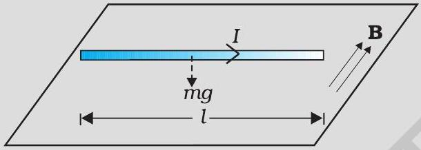
चित्र $4.3$

हल समीकरण (4.4) के अनुसार, तार बीच-वायु में निलंबित है इसके निलंबित रहने के लिए इस पर एक उपरिमुखी बल $\mathbf{F}$ जिसका परिमाण $I l B$ लगना चाहिए जो इसके भार $m g$ को संतुलित कर सके। अतः

$$
\begin{aligned}
m g & =I l B \\
B & =\frac{m g}{I l} \\
& =\frac{0.2 \times 9.81}{2 \times 1.5}=0.65 \mathrm{~T}
\end{aligned}
$$

ध्यान दीजिए, यहाँ पर $\mathrm{m} / l$ अर्थात तार का प्रति एकांक लंबाई द्रव्यमान बताना पर्याप्त है। पृथ्वी के चुंबकीय क्षेत्र का मान लगभग $4 \times 10^{-5} \mathrm{~T}$ है जिसकी हमने यहाँ उपेक्षा की है।

उदाहरण $4.2$ यदि चुंबकीय क्षेत्र धनात्मक $y$-अक्ष के समान्तर है तथा आवेशित कण धनात्मक $x$-अक्ष के अनुदिश गतिमान है (चित्र $4.4$ देखिए), तो लोरेंज बल किस ओर लगेगा जबकि गतिमान कण (a) इलेक्ट्रॉन (ऋण आवेश) (b) प्रोटॉन (धन आवेश) है।

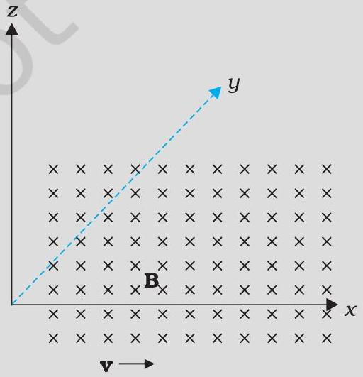
चित्र $4.4$

## - भौतिकी

हल कण के वेग $\mathbf{v}$ की दिशा $x$-अक्ष के अनुदिश है जबकि चुंबकीय क्षेत्र $\mathbf{B}$ की दिशा $y$-अक्ष के अनुदिश है, अतः लोरेंज बल $\mathbf{v} \times \mathbf{B}$ की दिशा $z$-अक्ष के अनुदिश (पेंच नियम अथवा दक्षिण हस्त अंगुष्ठ नियम) है। अतः (a) इलेक्ट्रॉन के लिए यह बल $-z$ अक्ष के अनुदिश तथा (b) धनावेश (प्रोटॉन) के लिए यह $+z$ अक्ष के अनुदिश है।

## $4.3$ चुंबकीय क्षेत्र में गति

अब हम और अधिक विस्तार से चुंबकीय क्षेत्र में गतिशील आवेश के विषय में अध्ययन करेंगे। हमने यांत्रिकी (कक्षा $11$ की पाठ्यपुस्तक का अध्याय $5$ देखिए) में यह सीखा है कि यदि किसी बल का कण की गति की दिशा में (अथवा उसके विपरीत) कोई अवयव है तो वह बल उस कण पर कार्य करता है। चुंबकीय क्षेत्र में आवेश की गति के प्रकरण में, चुंबकीय बल कण के वेग की दिशा के लंबवत होता है। अतः कोई कार्य नहीं होता तथा वेग के परिमाण में भी कोई परिवर्तन नहीं होता (यद्यपि संवेग की दिशा में परिवर्तन हो सकता है। [ध्यान दीजिए, यह विद्युत क्षेत्र के कारण बल, $q \mathbf{E}$, से भिन्न है, जिसका गति के समांतर (अथवा प्रतिसमांतर) अवयव हो सकता है और इस प्रकार संवेग के साथ-साथ ऊर्जा को भी स्थानांतरित कर सकता है।]

हम किसी एकसमान चुंबकीय क्षेत्र में आवेशित कण की गति पर विचार करेंगे। पहले उस स्थिति पर विचार कीजिए जिसमें वेग $\mathbf{v}$ चुंबकीय क्षेत्र $\mathbf{B}$ के लंबवत है। लंबवत बल $q \mathbf{v} \times \mathbf{B}$ अभिकेंद्र बल की भाँति कार्य करता है तथा चुंबकीय क्षेत्र के लंबवत वर्तुल गति उत्पन्न करता है। यदि $\mathbf{v}$ तथा $\mathbf{B}$ एक दूसरे के लंबवत हैं, तो कण (अर्थात किसी वृत्त के अनुदिश) वर्तुल गति करेगा (चित्र 4.5)।

यदि वेग $\mathbf{v}$ का कोई अवयव है, $\mathbf{B}$ के अनुदिश तो यह अवयव अपरिवर्तित रहता है, क्योंकि चुंबकीय क्षेत्र के अनुदिश गति को चुंबकीय क्षेत्र प्रभावित नहीं करेगा। $\mathbf{B}$ के लंबवत किसी तल में गति, पहले की भाँति, वर्तुल गति ही है जिससे यह अवयव कुंडलिनी गति उत्पन्न करता है (चित्र 4.6)।

आपने पिछली कक्षाओं में यह सीख लिया है (देखिए अध्याय $3$ कक्षा 11) कि यदि किसी कण के वृत्ताकार पथ की त्रिज्या $r$ है तो उस कण पर एक बल $m v^{2} / r$ वृत्त के केंद्र की ओर तथा पथ के लंबवत कार्य करता है जिसे अभिकेंद्र बल कहते हैं। यदि वेग $\mathbf{v}$ चुंबकीय क्षेत्र $\mathbf{B}$ के लंबवत है, तो चुंबकीय बल वेग $\mathbf{v}$ तथा चुंबकीय क्षेत्र $\mathbf{B}$ के लंबवत होता है तथा अभिकेंद्र बल की भाँति इसका परिमाण $q v B$ होता है। दोनों अभिकेंद्र बल के व्यंजकों को समीकरण के रूप में लिखने पर

$$
\begin{aligned}
& m v^{2} / r=q v B, \\
& r=m v / q B
\end{aligned}
$$

## गतिमान आवेश और चुंबकत्व

कोणीय आवृत्ति $\omega$ वेग अथवा ऊर्जा पर निर्भर नहीं करती। यहाँ $v$ घूर्णन की आवृत्ति है। $v$ के ऊर्जा पर निर्भर न करने का साइक्लोट्रॉन के डिज़ाइन में एक महत्वपूर्ण अनुप्रयोग है।

एक परिक्रमा पूरी करने में लगा समय $T=2 \pi / \omega \equiv 1 / \nu$, यदि चुंबकीय क्षेत्र के समांतर वेग का कोई अवयव ( $V_{\mathrm{l} \text { I }}$ द्वारा निर्दिष्ट) है, कण का पथ कुंडलिनी (सर्पिलाकार) जैसा होगा। एक घूर्णन में कण द्वारा चुंबकीय क्षेत्र के अनुदिश चली गई दूरी को पिच या चूड़ी अंतराल कहते हैं। समीकरण [4.6 (a)] का उपयोग करने पर हमें प्राप्त होता है।

$$
p=v_{| |} T=2 \pi m v_{| |} / q B
$$

गति के वृत्तीय अवयव की त्रिज्या को कुंडलिनी की त्रिज्या कहते हैं।

उदाहरण $4.36 \times 10^{-4} \mathrm{~T}$ के चुंबकीय क्षेत्र के लंबवत $3 \times 10^{7} \mathrm{~m} / \mathrm{s}$ की चाल से गतिमान किसी इलेक्ट्रॉन (द्रव्यमान $9 \times 10^{-31} \mathrm{~kg}$ तथा आवेश $1.6 \times 10^{-19} \mathrm{C}$ ) के पथ की त्रिज्या क्या है? इसकी क्या आवृत्ति होगी? इसकी ऊर्जा KeV में परिकलित कीजिए। $\left(1 \mathrm{eV}=1.6 \times 10^{-19} \mathrm{~J}\right)$

हल समीकरण (4.5) का उपयोग करने पर हम पाते हैं

$$
\begin{aligned}
r & =m v /(q B)=9 \times 10^{-31} \mathrm{~kg} \times 3 \times 10^{7} \mathrm{~m} \mathrm{~s}^{-1} /\left(1.6 \times 10^{-19} \mathrm{C} \times 6 \times 10^{-4} \mathrm{~T}\right) \\
& =28 \times 10^{-2} \mathrm{~m}=28 \mathrm{~cm} \\
v & =v /(2 \pi r)=17 \times 10^{6} \mathrm{~s}^{-1}=17 \times 10^{6} \mathrm{~Hz}=17 \mathrm{MHz} \\
E & =(1 / 2) m v^{2}=(1 / 2) 9 \times 10^{-31} \mathrm{~kg} \times 9 \times 10^{14} \mathrm{~m}^{2} / \mathrm{s}^{2}=40.5 \times 10^{-17} \mathrm{~J} \\
& \approx 4 \times 10^{-16} \mathrm{~J}=2.5 \mathrm{keV}
\end{aligned}
$$

## $4.4$ विद्युत धारा अवयव के कारण चुंबकीय क्षेत्र, बायो-सावर्ट नियम

जितने चुंबकीय क्षेत्र हमें ज्ञात हैं वे सभी विद्युत धाराओं (अथवा गतिशील आवेशों) तथा कणों के नैज चुंबकीय आघूर्णों के कारण उत्पन्न हुए हैं। यहाँ अब हम विद्युत धारा तथा उसके द्वारा उत्पन्न चुंबकीय क्षेत्र के बीच संबंध के बारे में अध्ययन करेंगे। यह संबंध बायो सावर्ट नियम द्वारा प्राप्त होता है। चित्र $4.7$ में एक परिमित विद्युत धारा चालक XY दर्शाया गया है, जिसमें विद्युत धारा $I$ प्रवाहित हो रही है। चालक के अतिअल्प अवयव $\mathrm{d} l$ पर विचार कीजिए। मान लीजिए हमें इस अवयव द्वारा इससे $\mathbf{r}$ दूरी पर स्थित किसी बिंदु P पर चुंबकीय क्षेत्र dB का मान निर्धारित करना है। मान लीजिए विस्थापन सदिश r तथा $\mathrm{d} 1$ के बीच $\theta$ कोण बनता है। तब बायो-सावर्ट नियम के अनुसार चुंबकीय क्षेत्र dB का परिमाण विद्युत धारा $I$, लंबाई अवयव । $\mathrm{d} 1$ /के अनुक्रमानुपाती तथा दूरी $r$ के वर्ग के व्युत्क्रमानुपाती है। इस क्षेत्र की दिशा* $\mathrm{d} 1$ तथा r के तलों के लंबवत होगी। अतः सदिश संकेत पद्धति में

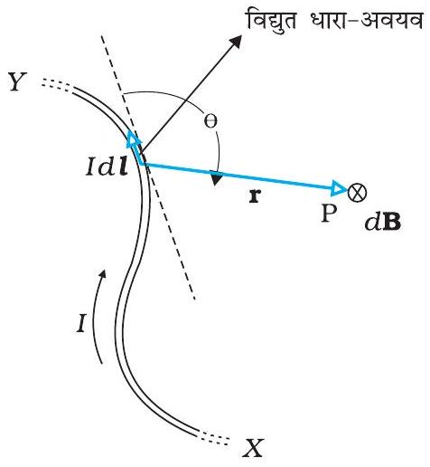
चित्र $4.7$ बायो-सावर्ट नियम का निदर्श चित्र। विद्युतधारा-अवयव $I \mathrm{~d} 1, r$ दूरी पर स्थित बिंदु पर क्षेत्र dB उत्पन्न करता है। ⊗ चिह्न यह इंगित करता है कि क्षेत्र कागज़ के तल के अभिलंबवत नीचे की ओर प्रभावी है।

$$
\begin{aligned}
d \mathbf{B} & \propto \frac{I d \boldsymbol{l} \times \mathbf{r}}{r^{3}} \\
& =\frac{\mu_{0}}{4 \pi} \frac{I d \boldsymbol{l} \times \mathbf{r}}{r^{3}}
\end{aligned}
$$

[^1]यहाँ $\mu_{0} / 4 \pi$ अनुक्रमानुपातिक नियतांक है। उपरोक्त समीकरण तब लागू होता है जबकि माध्यम निर्वात होता है।

इस क्षेत्र का परिमाण

$$
|\mathrm{d} \mathbf{B}|=\frac{\mu_{0}}{4 \pi} \frac{I \mathrm{~d} l \sin \theta}{r^{2}}
$$

यहाँ हमने सदिश-गुणनफल के गुणधर्म $|\mathrm{d} \boldsymbol{l} \quad \mathrm{r}|=\mathrm{d} l r \sin \theta$ का उपयोग किया है। चुंबकीय क्षेत्र के लिए समीकरण [4.7(a)] मूल समीकरण है। अनुक्रमानुपाती नियतांक $\frac{\mu_{0}}{4 \pi}$ का यथार्थ मान है -

$$
\frac{\mu_{0}}{4 \pi}=10^{-7} \mathrm{Tm} / \mathrm{A}
$$

राशि $\mu_{0}$ को मुक्त आकाश (या निर्वात) की चुंबकशीलता नियतांक कहते हैं।
चुंबकीय क्षेत्र के बायो-सावर्ट नियम और स्थिरवैद्युतिकी के कूलॉम नियम में कुछ समानताएँ हैं तथा कुछ असमानताएँ। इसमें से कुछ निम्न प्रकार हैं-

(i) दोनों दीर्घ-परासी हैं, क्योंकि दोनों ही स्रोत से परीक्षण बिंदु तक की दूरी के वर्ग के व्युत्क्रमानुपाती होते हैं। दोनों ही क्षेत्रों पर अध्यारोपण सिद्धांत लागू होता है [इस संबंध में यह ध्यान दीजिए कि स्रोत $I d \boldsymbol{l}$ में चुंबकीय क्षेत्र रैखिक है जैसे कि अपने स्रोत, विद्युत आवेश में स्थिर वैद्युत क्षेत्र रैखिक है।]
(ii) स्थिरवैद्युत क्षेत्र आदिश स्रोत, जैसे वैद्युत आवेश, द्वारा उत्पन्न होता है जबकि चुंबकीय क्षेत्र एक सदिश स्रोत जैसे, $I \mathrm{~d} \boldsymbol{l}$ द्वारा उत्पन्न होता है।
(iii) स्थिरवैद्युत क्षेत्र स्रोत को क्षेत्र के बिंदु से मिलाने वाले विस्थापन सदिश के अनुदिश होता है जबकि चुंबकीय क्षेत्र विस्थापन सदिश r तथा विद्युत धारा अवयव $I \mathrm{~d} \boldsymbol{l}$ दोनों के तलों के लंबवत होता है।
(iv) बायो-सावर्ट नियम में कोण पर निर्भरता है जो स्थिर वैद्युत क्षेत्र में नहीं होती। चित्र $4.7$ में, दिशा $\mathrm{d} \boldsymbol{l}$ (डैश युक्त रेखा में किसी भी बिंदु पर चुंबकीय क्षेत्र शून्य है। इस दिशा के अनुदिश $\theta=0, \sin \theta=0$ तथा समीकरण [4.7(a)], $|\mathrm{dB}|=0$

मुक्त दिक्स्थान की विद्युतशीलता, मुक्त दिक्स्थान की चुंबकशीलता तथा निर्वात में प्रकाश के वेग में एक रोचक संबंध है।

$$
\varepsilon_{0} \mu_{0}=\left(4 \pi \varepsilon_{0}\right) \frac{\mu_{0}}{4 \pi}=\frac{1}{9 \times 10^{9}}\left(10^{-7}\right)=\frac{1}{\left(3 \times 10^{8}\right)^{2}}=\frac{1}{c^{2}}
$$

इस संबंध के विषय में हम विद्युत चुंबकीय तरंगों के अध्याय $8$ में चर्चा करेंगे। चूँकि निर्वात में प्रकाश का वेग नियत है, गुणनफल $\mu_{0} \varepsilon_{0}$ परिमाण में निश्चित है। $\varepsilon_{0}$ तथा $\mu_{0}$ में से किसी भी एक मान का चयन करने पर अन्य का मान स्वतः निश्चित हो जाता है। SI मात्रकों में $\mu_{0}$ का एक निश्चित परिमाण $4 \pi \quad 10^{-7}$ है।

उदाहरण $4.4$ कोई विद्युत धारा अवयव $\Delta \boldsymbol{l}=\Delta x \hat{\mathbf{i}}$ जिससे एक उच्च धारा $I=10 \mathrm{~A}$ प्रवाहित हो रही है, मूल बिंदु पर स्थित है (चित्र $4.8), y$-अक्ष पर $0.5 \mathrm{~m}$ दूरी पर स्थित किसी बिंदु पर इसके कारण चुंबकीय क्षेत्र का क्या मान है। $\Delta x=1 \mathrm{~cm}$

## गतिमान आवेश और चुंबकत्व

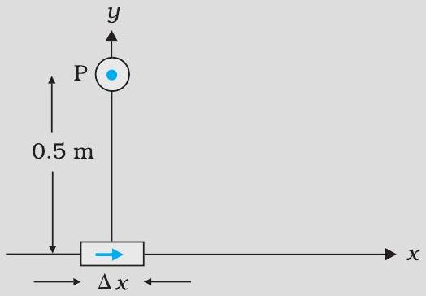
चित्र $4.8$

हल

$$
\begin{aligned}
& |\mathrm{d} \mathbf{B}|=\frac{\mu_{0}}{4 \pi} \frac{I \mathrm{~d} l \sin \theta}{r^{2}} \text { [समीकरण (4.7द्वारा)] } \\
& \mathrm{d} l=\Delta x=10^{-2} \mathrm{~m}, I=10 \mathrm{~A}, r=0.5 \mathrm{~m}=y, \mu_{0} / 4 \pi=10^{-7} \frac{\mathrm{Tm}}{\mathrm{~A}} \\
& \theta=90^{\circ} ; \sin \theta=1 \\
& |\mathrm{~d} \mathbf{B}|=\frac{10^{-7} \times 10 \times 10^{-2}}{25 \times 10^{-2}}=4 \times 10^{-8} \mathrm{~T}
\end{aligned}
$$

इस चुंबकीय क्षेत्र की दिशा $+z$ दिशा में है। इसका कारण यह है कि

$$
\mathrm{d} \boldsymbol{l} \times \mathbf{r}=\Delta x \hat{\mathbf{i}} \times y \hat{\mathbf{j}}=y \Delta x(\hat{\mathbf{i}} \times \hat{\mathbf{j}})=y \Delta x \hat{\mathbf{k}}
$$

यहाँ हम आपको सदिश गुणनफलों के निम्नलिखित चक्रीय गुणों को याद कराते हैं

$$
\hat{\mathbf{i}} \times \hat{\mathbf{j}}=\hat{\mathbf{k}} ; \hat{\mathbf{j}} \times \hat{\mathbf{k}}=\hat{\mathbf{i}} ; \hat{\mathbf{k}} \times \hat{\mathbf{i}}=\hat{\mathbf{j}}
$$

ध्यान दीजिए इस क्षेत्र का परिमाण लघु है।
अगले अनुभाग में हम वृत्ताकार पाश के कारण चुंबकीय क्षेत्र परिकलित करने के लिए बायो-सावर्ट नियम का उपयोग करेंगे।

## $4.5$ विद्युत धारावाही वृत्ताकार पाश के अक्ष पर

## चुंबकीय क्षेत्र

इस अनुभाग में हम विद्युत धारावाही वृत्ताकार पाश के कारण उसके अक्ष के अनुदिश चुंबकीय क्षेत्र का मूल्यांकन करेंगे। इस मूल्यांकन में पिछले अनुभाग में वर्णित अत्यल्प विद्युत धारा अवयवों ( $I \mathrm{~d} l$ ) के प्रभाव को संयोजित किया जाएगा। हम यह मानते हैं कि प्रवाहित विद्युत धारा अपरिवर्ती है तथा मूल्यांकन मुक्त दिक्स्थान (निर्वात) में किया गया है।

चित्र $4.9$ में वृत्ताकार पाश में स्थायी विद्युत धारा $I$ प्रवाहित होते हुए दर्शाई गई है। पाश को मूल बिंदु पर $x y$ तल में स्थित दर्शाया गया है तथा पाश का त्रिज्या $R$ है। $x$-अक्ष ही लूप का अक्ष है। हमें इसी अक्ष के बिंदु P पर चुंबकीय क्षेत्र परिकलित करना है, मान लीजिए बिंदु P पाश के केंद्र से $x$ दूरी पर स्थित है।

पाश के चालक अवयव $\mathrm{d} l$ पर विचार कीजिए, इसे चित्र $4.9$ में दर्शायी गई है। $\mathrm{d} l$ के कारण चुंबकीय क्षेत्र का परिमाण बायो-सावर्ट नियम

चित्र $4.9$ त्रिज्या $R$ विद्युत धारावाही वृत्ताकार पाश के अक्ष पर चुंबकीय क्षेत्र। इस चित्र में रेखा अवयव $d l$ के कारण चुंबकीय क्षेत्र $d \mathbf{B}$ तथा अक्ष के लंबवत कार्यरत इसके अवयवों को दर्शाया गया है।
[समीकरण 4.7(a)] के अनुसार

$$
d B=\frac{\mu_{0}}{4 \pi} \frac{I|d \mathbf{l} \times \mathbf{r}|}{r^{3}}
$$

## - भौतिकी

अब $r^{2}=x^{2}+R^{2}$ । साथ ही, पाश का कोई भी अवयव, इस अवयव से अक्षीय बिंदु के विस्थापन सदिश के लंबवत होगा। उदाहरण के लिए, चित्र $4.9$ में अवयव $\mathrm{d} l y$-z दिशा में है जबकि विस्थापन सदिश $\mathbf{r}$ अवयव $\mathrm{d} \boldsymbol{l}$ से अक्षीय बिंदु P तक $x-y$ तल में है। अतः $|d \boldsymbol{l} \times \mathbf{r}|=r$ $d l$, इस प्रकार

$$
\mathrm{d} B=\frac{\mu_{0}}{4 \pi} \frac{I \mathrm{~d} l}{\left(x^{2}+R^{2}\right)}
$$

dB की दिशा चित्र $4.9$ में दर्शायी गई है। यह $\mathrm{d} \boldsymbol{l}$ तथा $\mathbf{r}$ द्वारा बने तल के लंबवत है। इसका एक $x$-अवयव $\mathrm{dB}_{x}$ तथा $x$-अक्ष के लंबवत अवयव $\mathrm{dB}_{\perp}$ है। जब $x$-अक्ष के लंबवत अवयवों को संयोजित करते हैं तो वे निरस्त हो जाते हैं तथा हमें शून्य परिणाम प्राप्त होता है। उदाहरण के लिए, चित्र $4.9$ में दर्शाए अनुसार $\mathrm{d} \boldsymbol{l}$ के कारण अवयव $\mathrm{dB}_{\perp}$ इसके त्रिज्यतः विपरीत $\mathrm{d} \boldsymbol{l}$ अवयव के कारण योगदान द्वारा निरसित हो जाता है। इस प्रकार केवल $x$-अवयव ही बच पाता है। $x$-दिशा के अनुदिश नेट योगदान पाश के ऊपर $\mathrm{d} B_{x}=\mathrm{d} B \cos \theta$ को समाकलित करके प्राप्त किया जा सकता है।

चित्र $4.9$ के लिए

$$
\cos \theta=\frac{R}{\left(x^{2}+R^{2}\right)^{1 / 2}}
$$

समीकरणों (4.9) और (4.10),

$$
\mathrm{d} B_{x}=\frac{\mu_{0} I \mathrm{~d} l}{4 \pi} \frac{R}{\left(x^{2}+R^{2}\right)^{3 / 2}}
$$

समस्त पाश पर $\mathrm{d} l$ अवयवों का संकलन, $2 \pi R$, प्राप्त होता है जो पाश की परिधि है। इस प्रकार

$$
\mathbf{B}=B_{x} \hat{\mathbf{i}}=\frac{\mu_{0} I R^{2}}{2\left(x^{2}+R^{2}\right)^{3 / 2}} \hat{\mathbf{i}}
$$

उपरोक्त परिणाम की एक विशेष स्थिति के रूप में हम पाश के केंद्र पर चुंबकीय क्षेत्र प्राप्त कर सकते हैं। इस प्रकार यहाँ $x=0$, तथा हमें प्राप्त होता है,

$$
\mathbf{B}_{0}=\frac{\mu_{0} I}{2 R} \hat{\mathbf{i}}
$$

वृत्ताकार तार के कारण चुंबकीय क्षेत्र रेखाएँ बंद वृत्ताकार पाश बनाती हैं जिन्हें चित्र $4.10$ में दर्शाया गया है। चुंबकीय क्षेत्र की दिशा (एक अन्य) दक्षिण हस्त अंगुष्ठ नियम द्वारा होती है। यह नियम नीचे दिया गया है,

वृत्ताकार तार के चारों ओर अपने दाएँ हाथ की हथेली को इस प्रकार मोड़िए कि उँगलियाँ विद्युत धारा की दिशा की ओर संकेत करें, तब इस हाथ का फैला हुआ अँगूठा चुंबकीय क्षेत्र की दिशा बताता है।

## गतिमान आवेश और चुंबकत्व

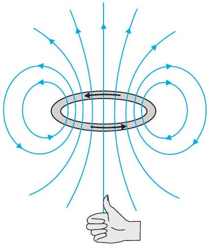

चित्र $4.10$ किसी विद्युतवाही पाश का चुंबकीय क्षेत्र। पाठ की विषय वस्तु में वर्णित दक्षिण हस्त अंगुष्ठ नियम द्वारा उत्पन्न चुंबकीय क्षेत्र की दिशा निर्धारित होती है। पाश के ऊपरी पाशर्व को उत्तर ध्रुव तथा निचले पाशर्व को दक्षिण ध्रुव माना जा सकता है।

उदाहरण $4.5$ चित्र $4.11$ में दर्शाए अनुसार किसी सीधे तार जिसमें $12 \mathrm{~A}$ विद्युत धारा प्रवाहित हो रही है, को $2.0 \mathrm{~cm}$ त्रिज्या के अर्धवृत्ताकार चाप में मोड़ा गया है। इस चाप के केंद्र पर चुंबकीय क्षेत्र B को मानें।

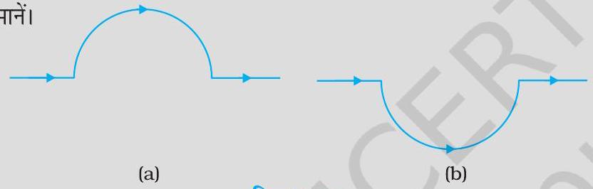
चित्र $4.11$

(a) सीधे खंडों के कारण चुंबकीय क्षेत्र कितना है?
(b) किस रूप में अर्धवृत्त द्वारा $\mathbf{B}$ को दिया गया योगदान वृत्ताकार पाश के योगदान से भिन्न है और किस रूप में ये एक दूसरे के समान हैं।
(c) क्या आपके उत्तर में कोई परिवर्तन होगा यदि तार को उसी त्रिज्या के अर्धवृत्त में पहले की तुलना में चित्र $4.11$ (b) में दर्शाए अनुसार उलटी दिशा में मोड़ दें।

हल

(a) सीधे खंडों के प्रत्येक अवयव के लिए $\mathrm{d} l$ तथा $r$ समांतर हैं। अतः $\mathrm{d} l \times \mathbf{r}=O$ । इस प्रकार सीधे खंड । B। को कोई योगदान नहीं देते।
(b) अर्धवृत्ताकार चाप के सभी खंडों के लिए, $\mathrm{d} l \times \mathbf{r}$ सभी एक दूसरे के समांतर हैं (कागज़ के तल में भीतर को जाते हुए)। इस प्रकार के सभी योगदान परिमाण में संयोजित हो जाते हैं। अतः अर्धवृत्ताकार चाप के लिए $\mathbf{B}$ की दिशा दक्षिण हस्त नियम द्वारा प्राप्त होती है। इसका परिमाण वृत्ताकार पाश के लिए $\mathbf{B}$ का आधा होता है। इस प्रकार $\mathbf{B}$ का मान $1.9 \times 10^{-4} \mathrm{~T}$ है तथा दिशा कागज़ के तल के अभिलंबवत उसके भीतर जाते हुए है।
(c) B का परिमाण तो वही है जो (b) में है पर दिशा विपरीत है।

उदाहरण $4.610 \mathrm{~cm}$ त्रिज्या की $100$ कसकर लपेटे गए फेरों की किसी ऐसी कुंडली पर विचार कीजिए जिससे $1$ A विद्युत धारा प्रवाहित हो रही है। कुंडली के केंद्र पर चुंबकीय क्षेत्र का परिमाण क्या है?

हल चूँकि कुंडली कसकर लपेटी गई है अतः हम प्रत्येक वृत्ताकार अवयव की त्रिज्या $R=10 \mathrm{~cm}$ $=0.1 \mathrm{~m}$ मान सकते हैं। फेरों की संख्या $N=100$ है, अतः चुंबकीय क्षेत्र का परिमाण

$$
B=\frac{\mu_{0} N I}{2 R}=\frac{4 \pi \times 10^{-7} \times 10^{2} \times 1}{2 \times 10^{-1}}=2 \pi \times 10^{-4} \mathrm{~T}=6.28 \times 10^{-4} \mathrm{~T} .
$$

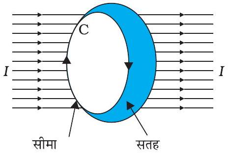
चित्र $4.12$

बायो-सावर्ट नियम को अभिव्यक्त करने का एक अन्य वैकल्पिक तथा रुचिकर उपाय भी है। ऐम्पियर के परिपथीय नियम में किसी खुले पृष्ठ जिसकी कोई सीमा हो, पर विचार किया जाता है। इस पृष्ठ से विद्युत धारा प्रवाहित होती है। हम यह विचार करते हैं कि सीमा रेखा बहुत से अल्प रेखा अवयवों से मिलकर बनी है। ऐसे ही एक रेखा अवयव $\mathrm{d} l$ पर विचार कीजिए। हम इस अवयव पर चुंबकीय क्षेत्र के स्पर्शरेखीय घटक $\mathbf{B}_{\mathrm{t}}$ का मान लेंगे तथा इसे अवयव $\mathrm{d} l$ की लंबाई से गुणा करेंगे। [ध्यान दीजिए $\mathrm{B}_{t} \mathrm{~d} l=\mathbf{B} \cdot \mathrm{d} l$ ]। इस प्रकार के सभी गुणनफल एक दूसरे के साथ संयोजित किए जाते हैं। हम सीमा पर विचार करते हैं क्योंकि जैसे-जैसे अवयवों की लंबाई घटती है इनकी संख्या बढ़ती है। तब इनका योग एक समाकलन बन जाता है। ऐम्पियर का नियम यह कहता है कि यह समाकलन पृष्ठ से प्रवाहित होने वाली कुल विद्युत धारा का $\mu_{0}$ गुना होता है, अर्थात

$$
\int \mathbf{B} d \boldsymbol{l}=\mu_{0} I
$$

यहाँ $I$ पृष्ठ से गुज़रने वाली कुल विद्युत धारा है। इस समाकलन को पृष्ठ की सीमारेखा C के संपाती बंद के ऊपर लिया गया है। उपरोक्त संबंध में दिशा सम्मिलित है जो दक्षिण हस्त नियम से प्राप्त होती है। अपने दाएँ हाथ की उँगलियों को उस दिशा में मोड़िए जिस दिशा में पाश समाकल $\oint \mathbf{B} \cdot d l$ में सीमा रेखा मुड़ी है। तब अँगूठे की दिशा उस दिशा को बताती है जिसमें विद्युत धारा को धनात्मक माना गया है।

बहुत से अनुप्रयोगों के लिए समीकरण [4.13 (a)] का कहीं अधिक सरलीकृत रूप पर्याप्त सिद्ध होता है। हम यह मानेंगे कि, इस प्रकार के प्रकरणों में ऐसे पाश (जिसे ऐम्पियरीय पाश कहते हैं।) का चयन संभव है जो इस प्रकार का है कि पाश के प्रत्येक बिंदु पर या तो
(i) $\mathbf{B}$ पाश के स्पर्शरेखीय है तथा शून्येतर नियतांक $B$ है, अथवा
(ii) B पाश के अभिलंबवत है, अथवा
(iii) $\mathbf{B}$ नष्ट हो जाता है।

अब मान लीजिए $L$ पाश की वह लंबाई (भाग) है जिसके लिए B स्पर्शरेखीय है। मान लीजिए पाश में परिवद्ध विद्युत धारा $I_{e}$ है। तब समीकरण [4.13 (a)] को इस प्रकार व्यक्त कर सकते हैं

$$
B L=\mu_{0} I_{e}
$$

जब किसी निकाय में इस प्रकार की सममिति हो जैसे कि चित्र $4.13$ में सीधे विद्युत धारावाही अनंत तार के लिए है, तब ऐम्पियर का नियम हमें चुंबकीय क्षेत्र का एक सरल मूल्यांकन करने योग्य बनाता है जो ठीक उसी प्रकार है जैसे कि गाउस नियम विद्युत क्षेत्र को निर्धारित करने में हमारी सहायता करता है। इसे नीचे दिए गए उदाहरण $4.8$ में दर्शाया गया है। पाश की सीमा रेखा का चयन एक वृत्त है तथा चुंबकीय क्षेत्र वृत्त की परिधि के स्पर्शरेखीय है। समीकरण [4.13 (b)] के वाम पक्ष के लिए इस नियम से प्राप्त मान B. $2 \pi r$ है। हम यह पाते हैं कि तार के बाहर $r$ दूरी पर चुंबकीय क्षेत्र स्पर्शरेखीय है तथा इसे इस प्रकार व्यक्त किया जा सकता है।

$$
\begin{aligned}
& B \times 2 \pi r=\mu_{0} I, \\
& B=\mu_{0} I /(2 \pi r)
\end{aligned}
$$

## गतिमान आवेश और चुंबकत्व

उपरोक्त परिणाम अनंत लंबाई के तार के लिए है जो कई दृष्टिकोणों से रोचक है-

(i) इसमें यह अंतर्निहित है कि $r$ त्रिज्या के वृत्त के प्रत्येक बिंदु पर (तार को अक्ष के अनुदिश रखते हुए) क्षेत्र का परिमाण समान है। दूसरे शब्दों में चुंबकीय क्षेत्र में बेलनाकार सममिति है जो क्षेत्र सामान्यतः तीन निर्देशांकों पर निर्भर कर सकता है केवल एक ही निर्देशांक $r$ पर निर्भर है। जहाँ कहीं भी सममिति होती है समस्याओं के हल सरल हो जाते हैं।
(ii) इस वृत्त के किसी भी बिंदु पर क्षेत्र की दिशा इसके स्पर्शरेखीय है। इस प्रकार चुंबकीय क्षेत्र की नियत परिमाण की रेखाएँ संकेंद्री वृत्त बनाती हैं। अब चित्र 4.1(c) पर ध्यान दीजिए, लौह चूर्ण वृत्त संकेंद्री में व्यवस्थित हुआ है। ये रेखाएँ जिन्हें हम चुंबकीय क्षेत्र रेखाएँ कहते है, बंद पाश बनाती हैं। यह स्थिरवैद्युत क्षेत्र रेखाओं से भिन्न हैं। स्थिरवैद्युत क्षेत्र रेखाएँ धन आवेशों से आरंभ तथा ऋण आवेशों पर समाप्त होती हैं। सीधे विद्युत धारावाही चालक के चुंबकीय क्षेत्र के लिए व्यंजक ओर्स्टेड प्रयोग का सैद्धांतिक स्पष्टीकरण करता है।
(iii) एक अन्य ध्यान देने योग्य रोचक बात यह है कि यद्यपि तार अनंत लंबाई का है, तथापि शून्येतर दूरी पर इसके कारण चुंबकीय क्षेत्र अनंत नहीं है। यह केवल तार के अत्यधिक पास आने पर विस्फुटित होता है। यह क्षेत्र विद्युत धारा के अनुक्रमानुपाती है तथा विद्युत धारा स्रोत (अनंत लंबाई के) से दूरी के व्युत्क्रमानुपाती है।
(iv) लंबे तार के कारण उत्पन्न चुंबकीय क्षेत्र की दिशा को निर्धारित करने का एक सरल नियम है। इस नियम को दक्षिण हस्त नियम* कहते हैं। यह इस प्रकार है

तार को अपने दाएँ हाथ में इस प्रकार पकड़िए कि आपका तना हुआ अँगूठा विद्युत धारा की दिशा की ओर संकेत करे। तब आपकी अँगुलियों के मुड़ने की दिशा चुंबकीय क्षेत्र की दिशा में होगी।

ऐम्पियर का परिपथीय नियम बायो-सावर्ट नियम से भिन्न नहीं है। दोनों ही नियम विद्युत धारा तथा चुंबकीय क्षेत्र में संबंध व्यक्त करते हैं तथा दोनों ही स्थायी विद्युत धारा के समान भौतिक परिणामों को व्यक्त करते हैं। जो संबंध ऐम्पियर के नियम तथा बायो-सावर्ट नियम के बीच है ठीक वही संबंध गाउस नियम तथा कूलॉम नियम के बीच में है। ऐम्पियर का नियम तथा गाउस का नियम दोनों ही परिरेखा अथवा परिपृष्ठ पर किसी भौतिक राशि (चुंबकीय अथवा विद्युत क्षेत्र) का संबंध किसी अन्य भौतिक राशि जैसे अन्तः क्षेत्र में उपस्थित स्रोत (विद्युत धारा अथवा आवेश) के बीच संबंध व्यक्त करते हैं। यहाँ ध्यान देने योग्य बात यह भी है कि ऐम्पियर का परिपथीय नियम केवल उन स्थायी विद्युत धाराओं पर लागू होता है जो समय के साथ परिवर्तित नहीं होतीं। निम्नलिखित उदाहरण हमें परिबद्ध विद्युत धारा का अर्थ समझने में सहायता करेगा।

[^2]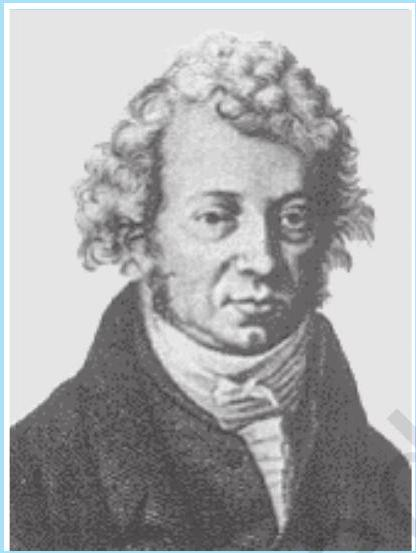

आंद्रे ऐम्पियर (1775-1836) आंद्रे मैरी ऐम्पियर एक फ्रांसीसी भौतिक विज्ञानी, गणितज्ञ एवं रसायनज्ञ थे जिन्होंने विद्युतगतिकी विज्ञान की आधारशिला रखी। ऐम्पियर एक बाल प्रतिभा थे जिसने $12$ वर्ष की आयु में उच्च गणित में महारत हासिल कर ली थी। ऐम्पियर ने ऑर्स्टेड की खोज का महत्त्व समझा और धारा विद्युत एवं चुंबकत्व में संबंध खोजने के लिए प्रयोगों की एक लंबी शृंखला पार की। इन खोजों की परिणति $1827$ में, Mathematical theory of Electrodynamic Phenomena Deduced Solely from Experiments नामक पुस्तक के प्रकाशन के रूप में हुई। उन्होंने परिकल्पना की कि सभी चुंबकीय प्रक्रम, वृत्तवाही विद्युत धाराओं के कारण होते हैं। ऐम्पियर स्वभाव से बहुत विनम्र और भुलक्कड़ थे। एक बार वह सम्राट नेपोलियन का रात्रिभोज का निमंत्रण भी भूल गए थे। $61$ वर्ष की उम्र में न्यूमोनिया से उनकी मृत्यु हो गई। उनकी कब्र के पत्थर पर यह समाधि लेख उत्कीर्णित है - Tandem felix ( अंत में प्रसन्न)।

## - भौतिकी

उदाहरण $4.7$ चित्र $4.13$ में एक लंबा सीधा वृत्ताकार अनुप्रस्थ काट का (जिसकी त्रिज्या $a$ है) विद्युत धारावाही तार जिससे स्थायी विद्युत धारा $I$ प्रवाहित हो रही हो, दर्शाया गया है। स्थायी विद्युत धारा इस अनुप्रस्थ काट पर एकसमान रूप से वितरित है। क्षेत्रों $r<a$ तथा $r>a$ में चुंबकीय क्षेत्र परिकलित कीजिए

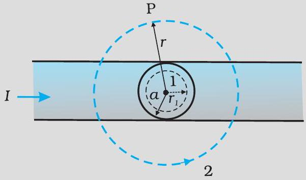
चित्र $4.13$

हल (a) प्रकरण $r>a$ पर विचार कीजिए। जिस पाश पर $2$ अंकित है वह अनुप्रस्थ काट के साथ संकेंद्री वृत्त के रूप में ऐम्पियर पाश है। इस पाश के लिए

$$
\begin{aligned}
& L=2 \pi r \\
& I_{e}=\text { पाश द्वारा परिबद्ध विद्युत धारा }=I
\end{aligned}
$$

यह परिणाम किसी सीधे लंबे तार के लिए सुपरिचित व्यंजक है।

$$
\begin{aligned}
& B(2 \pi r)=\mu_{0} I \\
& B=\frac{\mu_{0} I}{2 \pi r} \quad[4.15(\mathrm{a})] \\
& B \propto \frac{1}{r} \quad(r>a)
\end{aligned}
$$

(b) प्रकरण $r<a$ पर विचार कीजिए। इसके लिए ऐम्पियर पाश वह वृत्त है जिस पर $1$ अंकित है। इस पाश के लिए वृत्त की त्रिज्या $r$ लेने पर,

$$
L=2 \pi r
$$

अब यहाँ परिबद्ध विद्युत धारा $I_{e}$ का मान $I$ नहीं है परंतु यह इस मान से कम है। चूँकि विद्युत धारा का विवरण एकसमान है, परिबद्ध विद्युत धारा के अंश का मान

$$
I_{e}=I\left(\frac{\pi r^{2}}{\pi a^{2}}\right)=\frac{I r^{2}}{a^{2}}
$$

ऐम्पियर के नियम का उपयोग करने पर $B(2 \pi r)=\mu_{0} \frac{I r^{2}}{a^{2}}$

$$
B=\left(\frac{\mu_{0} I}{2 \pi a^{2}}\right) r
$$

$B \propto r \quad(r<a)$

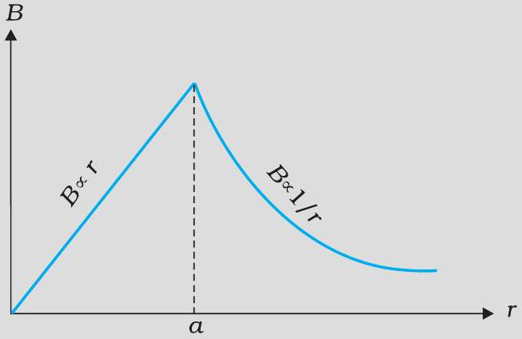
चित्र $4.14$

## गतिमान आवेश और चुंबकत्व

चित्र (4.14) में B के परिमाण तथा तार के केंद्र से दूरी $r$ के बीच ग्राफ दर्शाया गया है। चुंबकीय क्षेत्र की दिशा अपने-अपने वृत्ताकार पाशों ( $1$ अथवा $2$ ) के स्पर्शरेखीय है तथा यह इसी अनुभाग में पहले वर्णन किए जा चुके दक्षिण हस्त नियम से निर्धारित की गई है। इस उदाहरण में आवश्यक सममिति विद्यमान है इसलिए इसी पर ऐम्पियर का नियम आसानी से लागू किया जा सकता है।

यहाँ ध्यान देने योग्य बात यह है कि जबकि ऐम्पियर के परिपथीय नियम को किसी भी पाश पर लागू किया जा सकता है परंतु यह हर प्रकरण में चुंबकीय क्षेत्र का मूल्यांकन सदैव ही आसान नहीं बनाता। उदाहरण के लिए, अनुभाग $4.5$ में वर्णन किए गए वृत्ताकार पाश के प्रकरण में, इसे सरल व्यंजक $B=\mu_{0} I / 2 R$ [समीकरण (4.12)] को, जोकि पाश के केंद्र पर चुंबकीय क्षेत्र के लिए है, प्राप्त करने के लिए लागू नहीं किया जा सकता। तथापि ऐसी बहुत सी परिस्थितियाँ हैं जिनमें उच्च सममिति होती है तथा इस नियम को सुविधापूर्वक लागू किया जा सकता है। अगले अनुभाग में हम इसका उपयोग सामान्यतः उपयोग होने वाले अत्यंत उपयोगी चुंबकीय निकाय-परिनालिका द्वारा उत्पन्न चुंबकीय क्षेत्र को परिकलित करने में करेंगे।

## $4.7$ परिनालिका

हम यहाँ एक लंबी परिनालिका के विषय में चर्चा करेंगे। लंबी परिनालिका से हमारा तात्पर्य यह है कि परिनालिका की लंबाई उसकी त्रिज्या की तुलना में अधिक है। परिनालिका में एक लंबा तार सर्पिल के आकार में लिपटा होता है जिसमें प्रत्येक फेरा अपने निकट के फेरे के साथ काफ़ी सटा होता है। इस प्रकार फेरे को एक वृत्ताकार पाश माना जा सकता है। किसी परिनालिका के सभी फेरों के कारण उत्पन्न कुल चुंबकीय क्षेत्र प्रत्येक फेरे के चुंबकीय क्षेत्रों का सदिश योग होता है। परिनालिका पर लपेटने के लिए इनैमलित तारों का उपयोग किया जाता है ताकि फेरे एक दूसरे से विद्युतरोधी रहें।

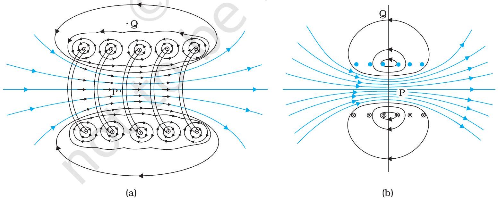
चित्र $4.15$ (a) परिनालिका के किसी भाग जिसे स्पष्टता की दृष्टि से बाहर खींचा दर्शाया गया है , के कारण चुंबकीय क्षेत्र। केवल बाह्य अर्धवृत्ताकार भाग दर्शाया गया है। ध्यान से देखिए, किस प्रकार पास-पास स्थित फेरों के बीच चुंबकीय क्षेत्र एक दूसरे को निरसित कर देते हैं। (b) किसी परिमित परिनालिका का चुंबकीय क्षेत्र।

चित्र $4.15$ में किसी परिमित परिनालिका का चुंबकीय क्षेत्र दर्शाया गया है। चित्र $4.15$ (a) में हमने इस परिनालिका के एक खंड को विस्तारित करके दिखाया है। चित्र $4.15$ (b) में वृत्ताकार पाश से यह स्पष्ट है कि दो पास-पास के फेरों के बीच चुंबकीय क्षेत्र नष्ट हो जाता है। चित्र $4.15$ (b)

## 4 भौतिकी

में हम यह देखते हैं कि अन्तःभाग के मध्य बिंदु P पर चुंबकीय क्षेत्र एकसमान, प्रबल तथा परिनालिका के अक्ष के अनुदिश है। बाह्य भाग के मध्य बिंदु $Q$ पर चुंबकीय क्षेत्र दुर्बल है और साथ ही यह परिनालिका के अक्ष के अनुदिश है तथा इसका लंबवत अथवा अभिलंबवत कोई घटक भी नहीं है। जैसे-जैसे परिनालिका की लंबाई में वृद्धि होती है वह लंबी बेलनाकार धातु के पटल जैसी दिखाई देने लगती है। चित्र $4.16$ में यह आदर्शीकृत चित्रण निरूपित किया गया है। परिनालिका के बाहर चुंबकीय क्षेत्र शून्य होने लगता है। परिनालिका के भीतर हर बिंदु पर चुंबकीय क्षेत्र अक्ष के समांतर होता है।

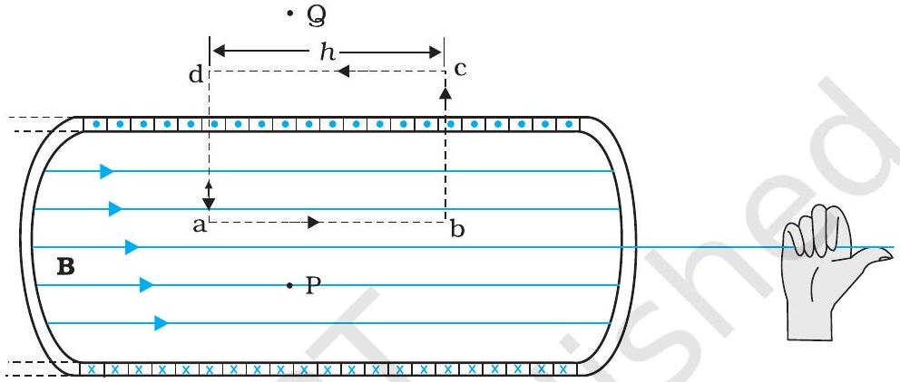
चित्र $4.16$ अत्यधिक लंबी परिनालिका का चुंबकीय क्षेत्र। चुंबकीय क्षेत्र को निर्धारित करने के लिए हम एक आयताकार ऐम्पियर-पाश $a, b, c, d$ पर विचार करते हैं।

किसी आयताकार ऐम्पियर-पाश abcd पर विचार करिए। जैसा कि ऊपर तर्क दिया जा चुका है cd के अनुदिश क्षेत्र शून्य है। अनुप्रस्थ खंडों bc तथा ad के अनुदिश चुंबकीय क्षेत्र का घटक शून्य है। इस प्रकार ये दोनों खंड चुंबकीय क्षेत्र में कोई योगदान नहीं देते। मान लीजिए ab के अनुदिश चुंबकीय क्षेत्र $B$ है, इस प्रकार, ऐम्पियर-पाश की प्रासंगिक लंबाई $L=h$ ।

मान लीजिए प्रति एकांक लंबाई फेरों की संख्या $n$ है, तब फेरों की कुल संख्या $n h$ है। इस प्रकार परिबद्ध विद्युत धारा है $I_{e}=I(n h)$, यहाँ $I$ परिनालिका में प्रवाहित विद्युत धारा है। ऐम्पियर के परिपथीय नियम के अनुसार [समीकरण $4.13$ (b) से]

$$
\begin{aligned}
& B L=\mu_{0} I_{e}, \quad B h=\mu_{0} I(n h) \\
& B=\mu_{0} n I
\end{aligned}
$$

क्षेत्र की दिशा दक्षिण हस्त नियम से प्राप्त होती है। परिनालिका का सामान्यतः उपयोग एकसमान चुंबकीय क्षेत्र प्राप्त करने के लिए किया जाता है। अगले अध्याय में हम यह देखेंगे कि परिनालिका में भीतर नर्म लौह क्रोड रखकर विशाल चुंबकीय क्षेत्र उत्पन्न करना संभव है।

उदाहरण $4.8$ कोई परिनालिका जिसकी लंबाई $0.5 \mathrm{~m}$ तथा त्रिज्या $1 \mathrm{~cm}$ है, में $500$ फेरे हैं। इसमें $5$ A विद्युत धारा प्रवाहित हो रही है। परिनालिका के भीतर चुंबकीय क्षेत्र का परिमाण क्या है?

हल प्रति एकांक लंबाई फेरों की संख्या
$n=\frac{500}{0.5}=1000$ फेरे प्रति मीटर
लंबाई $l=0.5 \mathrm{~m}$ तथा त्रिज्या $r=0.01 \mathrm{~m}$ । इस प्रकार, $l / a=50$ अर्थात $l \gg a$
अतः हम लंबी परिनालिका का सूत्र [समीकरण (4.20)] का उपयोग कर सकते हैं

$$
\begin{aligned}
B & =\mu_{0} n I \\
& =4 \pi \times 10^{-7} \times 10^{3} \times 5 \\
& =6.28 \times 10^{-3} \mathrm{~T}
\end{aligned}
$$

## गतिमान आवेश और चुंबकत्व

## $4.8$ दो समांतर विद्युत धाराओं के बीच बल-ऐम्पियर

हम यह सीख चुके हैं कि किसी विद्युत धारावाही चालक के कारण चुंबकीय क्षेत्र उत्पन्न होता है तो बायो-सावर्ट नियम का पालन करता है। साथ ही हमने यह भी सीखा है कि विद्युत धारावाही चालक पर बाह्य चुंबकीय क्षेत्र बल आरोपित करता है। यह लोरेंज बल सूत्र का अनुगमन करता है। अत: यह आशा करना तर्कसंगत है कि एक-दूसरे के पास स्थित दो विद्युत धारावाही चालक एक दूसरे पर (चुंबकीय) बल आरोपित करेंगे। सन् 1820-25 की अवधि में ऐम्पियर ने इस चुंबकीय बल की प्रकृति, इसकी विद्युत धारा के परिमाण, चालक की आकृति तथा आमाप पर निर्भरता के साथ इन चालकों के बीच की दूरी पर निर्भरता का अध्ययन किया। इस अनुभाग में हम दो समांतर विद्युत धारावाही चालकों के सरल उदाहरण पर ही चर्चा करेंगे जो कदाचित ऐम्पियर के श्रम साध्य कार्यों के प्रति आभार प्रकट करने में हमारी सहायता करेंगे।

चित्र $4.17$ में दो लंबे समांतर चालक a तथा b दर्शाए गए हैं जिनके बीच पृथकन $d$ है तथा जिनसे (समांतर) क्रमशः $I_{\mathrm{a}}$ तथा $I_{\mathrm{b}}$ विद्युत धाराएँ प्रवाहित हो रही हैं। चालक 'a' चालक 'b' के अनुदिश प्रत्येक बिंदु पर

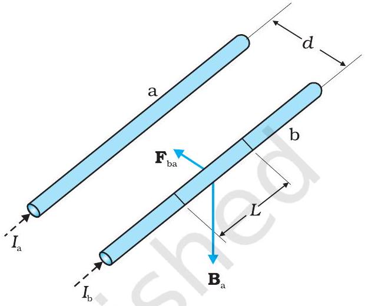
चित्र $4.17$ दो लंबे सीधे, समांतर चालक जिनमें अपरिवर्ती धारा $i_{a}$ एवं $i_{b}$ प्रवाहित हो रही है और जो एक-दूसरे से $d$ दूरी पर रखे हैं। चालक ' $a$ ' के कारण चालक ' $b$ ' पर उत्पन्न चुंबकीय क्षेत्र $\mathbf{B}_{\mathrm{a}}$ है।

समान चुंबकीय क्षेत्र $\mathbf{B}_{\mathrm{a}}$ लगा रहा है। तब दक्षिण हस्त नियम के अनुसार इस चुंबकीय क्षेत्र की दिशा अधोमुखी (जब चालक क्षैतिजतः रखे होते हैं) है। ऐम्पियर के परिपथीय नियम अथवा [समीकरण [4.15 (a)] के अनुसार इस चुंबकीय क्षेत्र का परिमाण

$$
B_{a}=\frac{\mu_{0} I_{a}}{2 \pi d}
$$

चालक 'b' जिससे विद्युत धारा $I_{\mathrm{b}}$ प्रवाहित हो रही है $\mathbf{B}_{\mathrm{a}}$ के कारण पार्श्वतः एक बल का अनुमान करता है। इस बल की दिशा चालक 'a' की ओर होती है। (आप इसकी पुष्टि स्वयं कर सकते हैं) हम इस बल को $\mathbf{F}_{\mathrm{ba}}$ द्वारा नामांकित करते हैं, जोकि 'a' के कारण 'b' के खंड $\mathbf{L}$ पर लगा बल है। समीकरण (4.4) से इस बल का परिमाण

$$
\begin{aligned}
F_{b a} & =I_{b} L B_{a} \\
& =\frac{\mu_{0} I_{a} I_{b}}{2 \pi d} L
\end{aligned}
$$

वास्तव में 'b' के कारण 'a' पर बल को परिकलित करना संभव है। जिस प्रकार हमने ऊपर विचार किया था उसी प्रकार के विचारों के द्वारा हम 'b' में प्रवाहित विद्युत धारा के कारण 'a' के खंड $L$ पर बल $\mathbf{F}_{\mathrm{ab}}$ के बराबर तथा 'b' की ओर निर्दिष्ट ज्ञात कर सकते हैं। यह परिमाण में $\mathbf{F}_{\mathrm{ba}}$ के बराबर तथा 'b' की ओर निर्दिष्ट होता है। इस प्रकार

$$
\mathbf{F}_{\mathrm{ba}}=-\mathbf{F}_{\mathrm{ab}}
$$

## भौतिकी

ध्यान दीजिए, यह न्यूटन के तीसरे गति के नियम के अनुरूप है। इस प्रकार हमने समांतर चालकों तथा अपरिवर्ती विद्युत धाराओं के लिए यह तो दर्शा ही दिया है कि बायो-सावर्ट नियम तथा लोरंज बल द्वारा प्राप्त परिणाम न्यूटन के गति के तीसरे नियम के अनुरूप है।*

हमने ऊपर प्राप्त परिणामों से यह पाया कि समान दिशा में प्रवाहित होने वाली विद्युत धाराएँ एक दूसरे को आकर्षित करती हैं। हम यह भी दर्शा सकते हैं कि विपरीत दिशाओं में प्रवाहित होने वाली विद्युत धाराएँ एक दूसरे को प्रतिकर्षित करती हैं। इस प्रकार

समांतर धाराएँ आकर्षित तथा प्रतिसमांतर धाराएँ प्रतिकर्षित करती हैं।
यह नियम उस नियम के विपरीत है जिसका हमने स्थिरवैद्युतिकी में अध्ययन किया था-"सजातीय आवेशों में प्रतिकर्षण तथा विजातीय आवेशों में आकर्षण होता है।" परंतु सजातीय (समांतर) धाराएँ एक दूसरे को आकर्षित करती हैं।

मान लीजिए $f_{\mathrm{ba}}$ बल $\mathbf{F}_{\mathrm{ba}}$ के प्रति एकांक लंबाई पर आरोपित बल के परिमाण को निरूपित करता है। तब समीकरण (4.17) से,

$$
f_{b a}=\frac{\mu_{0} I_{a} I_{b}}{2 \pi d}
$$

उपरोक्त व्यंजक का उपयोग विद्युत धारा के मात्रक ऐम्पियर (A) की परिभाषा को प्राप्त करने में किया जा सकता है। यह सात SI मूल मात्रकों में से एक है।

एक ऐम्पियर वह अपरिवर्ती विद्युत धारा है जो दो लंबे, सीधे उपेक्षणीय अनुप्रस्थ काट के निर्वात में एक दूसरे से $1 \mathrm{~m}$ दूरी पर स्थित समांतर चालकों में प्रवाहित हो, तो इनमें से प्रत्येक चालक की प्रति मीटर लंबाई पर $2 \times 10^{-7} \mathrm{~N}$ का बल उत्पन्न होता है।
'ऐम्पियर' की यह परिभाषा सन् $1946$ में अपनायी गई थी। यह एक सैद्धांतिक परिभाषा है। व्यवहार में हमें पृथ्वी के चुंबकीय क्षेत्र के प्रभाव को विलुप्त करना चाहिए तथा बहुत लंबे तारों के स्थान पर उचित ज्यामिति की बहुफेरों की कुंडलियाँ लेनी चाहिए। एक उपकरण, जिसे ' धारा तुला' कहते हैं, का उपयोग इस यांत्रिक बल की माप के लिए किया जाता है।

आवेश के SI मात्रक, अर्थात कूलॉम को अब हम ऐम्पियर के पदों में परिभाषित कर सकते हैं।
जब किसी चालक में 1A की अपरिवर्ती विद्युत धारा प्रवाहित होती है तो उसकी अनुप्रस्थ काट से एक सेकंड में प्रवाहित आवेश की मात्रा एक कूलॉम (1C) होती है।

उदाहरण $4.9$ किसी निर्धारित स्थान पर पृथ्वी के चुंबकीय क्षेत्र का क्षैतिज घटक $3.0 \times 10^{-5} \mathrm{~T}$ है, तथा इस क्षेत्र की दिशा भौगोलिक दक्षिण से भौगोलिक उत्तर की ओर है। किसी अत्यधिक लंबे सीधे चालक से $1 \mathrm{~A}$ की अपरिवर्ती धारा प्रवाहित हो रही है। जब यह तार किसी क्षैतिज मेज़ पर रखा है तथा विद्युत धारा के प्रवाह की दिशाएँ (a) पूर्व से पश्चिम की ओर; (b) दक्षिण से उत्तर की ओर हैं तो तार की प्रत्येक एकांक लंबाई पर बल कितना है?

हल $\mathbf{F}=I l \times \mathbf{B}$
$F=I l B \sin \theta$
प्रति एकांक लंबाई पर बल
$f=F / l=I B \sin \theta$

[^3]
## गतिमान आवेश और चुंबकत्व

(a) जब विद्युत धारा पूर्व से पश्चिम की ओर प्रवाहित होती है, तब
$\theta=90^{\circ}$
अतः
$f=I \mathrm{~B}$
$=1 \times 3 \times 10^{-5}=3 \times 10^{-5} \mathrm{~N} \mathrm{~m}^{-1}$
यह ऐम्पियर की परिभाषा में वर्णित बल के मान $2 \times 10^{-7} \mathrm{Nm}^{-1}$ से बड़ा है। अतः ऐम्पियर का मानकीकरण करने के लिए पृथ्वी के चुंबकीय क्षेत्र तथा अन्य भूले-भटके क्षेत्रों के प्रभावों को समाप्त करना महत्वपूर्ण है। बल की दिशा अधोमुखी है।
इस दिशा को 'सदिशों के सदिश गुणनफल' के दैशिक गुण के द्वारा प्राप्त किया जा सकता है।
(b) जब विद्युत धारा के प्रवाह की दिशा दक्षिण से उत्तर की ओर है, तो
$\theta=0^{\circ}$
$f=0$
अतः चालक पर कोई बल कार्य नहीं करता।

## $4.9$ विद्युत धारा पाश पर बल आघूर्ण, चुंबकीय द्विध्रुव

### 4.9.1 एकसमान चुंबकीय क्षेत्र में आयताकार विद्युत धारा पाश पर बल आघूर्ण

अब हम आपको यह दिखाएँगे कि एकसमान चुंबकीय क्षेत्र में स्थित कोई आयताकार पाश जिससे अपरिवर्ती विद्युत धारा $I$ प्रवाहित हो रही है, एक बल आघूर्ण का अनुभव करता है। इस पर कोई नेट बल आरोपित नहीं होता। यह व्यवहार उस द्विध्रुव के व्यवहार के समरूपी है जो यह एकसमान विद्युत क्षेत्र में दर्शाता है (अनुभाग $1.11$ देखिए)।

पहले हम उस सरल प्रकरण पर विचार करते हैं जिसमें आयताकार पाश इस प्रकार स्थित है कि एकसमान चुंबकीय क्षेत्र B पाश के तल में है। इसे चित्र $4.18$ (a) में दर्शाया गया है।

चुंबकीय क्षेत्र पाश की दो भुजाओं AD तथा BC पर कोई बल आरोपित नहीं करता। यह पाश की भुजा AB के लंबवत है तथा इस पर बल $\mathbf{F}_{1}$ आरोपित करता है जिसकी दिशा पाश के तल में भीतर की ओर है। इस बल का परिमाण है :

$$
F_{1}=I b B
$$

इसी प्रकार, चुंबकीय क्षेत्र भुजा CD पर एक बल $\mathbf{F}_{2}$ आरोपित करता है जो पाश के तल के बाहर की ओर है। इस बल का परिमाण है :

$$
F_{2}=I b B=F_{1}
$$

इसी प्रकार पाश पर आरोपित नेट बल शून्य है। बलों $\mathbf{F}_{1}$ तथा $\mathbf{F}_{2}$ के युगल के कारण पाश पर एक बल आघूर्ण कार्य करता है। चित्र $4.18$ (b) में AD सिरे से पाश का एक दृश्य दिखाया गया है। यह स्पष्ट करता है कि यह बल आघूर्ण पाश में वामावर्त घूर्णन की प्रवृत्ति उत्पन्न करता है। इस बल आघूर्ण का परिमाण है :

$$
\tau=F_{1} \frac{a}{2}+F_{2} \frac{a}{2}
$$

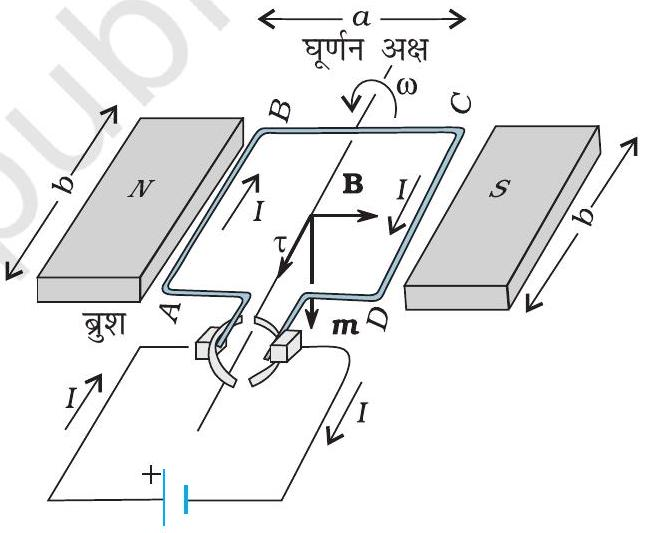
(a)

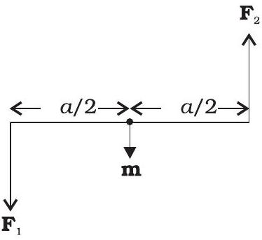
(b)

चित्र $4.18$ (a) एकसमान चुंबकीय क्षेत्र में स्थित कोई विद्युत धारावाही आयताकार कुंडली। चुंबकीय आघूर्ण $m$ अधोमुखी संकेत करता है। बल आघूर्ण $\tau$ अक्ष के अनुदिश है तथा इसकी प्रवृत्ति कुंडली को वामावर्त घूर्णन कराने की है। (b) कुंडली पर बल युग्म कार्य करते हुए।

## - भौतिकी

$$
\begin{aligned}
& =I b B \frac{a}{2}+I b B \frac{a}{2}=I(a b) B \\
& =I A B
\end{aligned}
$$

यहाँ $A=a b$ आयत का क्षेत्रफल है।
अब हम आगे उस प्रकरण पर विचार करेंगे जिसमें पाश का तल चुंबकीय क्षेत्र के अनुदिश नहीं है, परंतु इनके बीच कोई कोण बनता है। हम चुंबकीय क्षेत्र B तथा कुंडली पर अभिलंब के बीच

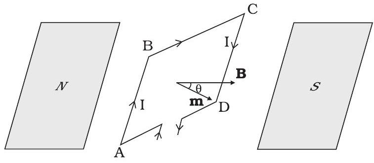
(a)

का कोण $\theta$ लेते हैं (पहला प्रकरण $\theta=\pi / 2$ के तदनुरूपी है)। चित्र
$4.19$ में यह व्यापक प्रकरण दर्शाया गया है।
भुजाओं BC तथा DA पर कार्यरत बल परिमाण में समान दिशा में विपरीत तथा कुंडली के अक्ष के अनुदिश कार्य करते हैं। ये बल BC तथा DA के संहति केंद्रों को संयोजित करते हैं। अक्ष के अनुदिश संरेखित होने के कारण ये एक दूसरे को निरस्त करते हैं, परिणामस्वरूप कोई नेट बल अथवा बल आघूर्ण नहीं है। भुजाओं AB तथा CD पर कार्यरत बल $\mathbf{F}_{\mathbf{1}}$ तथा $\mathbf{F}_{\mathbf{2}}$ हैं। ये भी परिमाण सहित समान एवं विपरीत हैं।

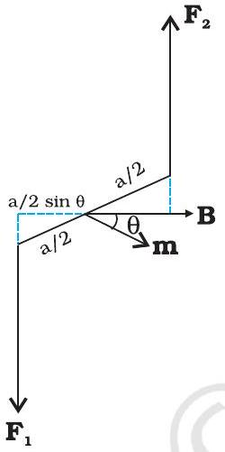
(b)

$$
F_{1}=F_{2}=I b B
$$

परंतु ये संरेख नहीं हैं। इसके परिणामस्वरूप पहले की तरह एक बल युग्म उत्पन्न होता है। तथापि, पिछले प्रकरण जिसमें पाश का तल चुंबकीय क्षेत्र के अनुदिश था, की तुलना में बल आघूर्ण का परिमाण अब कम है। इसका कारण यह है कि बलयुग्म बनाने वाले बलों के बीच की लंबवत दूरी कम हो गई है। चित्र 4.19(b) में सिरे AD से इस व्यवस्था का दृश्य दिखाया गया है। इसमें यह दर्शाया गया है कि ये दो बल एक बलयुग्म बनाते हैं। पाश पर बल आघूर्ण का परिमाण है :

$$
\begin{aligned}
\tau & =F_{1} \frac{a}{2} \sin \theta+F_{2} \frac{a}{2} \sin \theta \\
& =I a b B \sin \theta \\
& =I A B \sin \theta
\end{aligned}
$$

जैसे-जैसे $\theta \rightarrow 0$, बलयुग्म के बलों के बीच लंबवत दूरी भी शून्य की ओर बढ़ती है। इससे बल संरेख बन जाते हैं तथा नेट बल तथा बल आघूर्ण शून्य हो जाते हैं। समीकरणों (4.20) तथा (4.21) के बल आघूर्णों को कुंडली के चुंबकीय आघूर्ण तथा चुंबकीय क्षेत्र के सदिश गुणनफल के रूप में व्यक्त कर सकते हैं। विद्युत धारा पाश के चुंबकीय आघूर्ण को हम इस प्रकार परिभाषित करते हैं

$$
\mathbf{m}=I \mathbf{A}
$$

यहाँ क्षेत्र सदिश $\mathbf{A}$ की दिशा दक्षिण हस्त अंगुष्ठ नियम के अनुसार कागज़ के तल के भीतर की ओर निर्दिष्ट है (चित्र $4.18$ देखिए) चूँकि $\mathbf{m}$ तथा $\mathbf{B}$ के बीच का कोण $\theta$ है, समीकरणों (4.20) तथा (4.21) को केवल एक व्यंजक द्वारा व्यक्त किया जा सकता है

$$
\boldsymbol{\tau}=\mathbf{m} \times \mathbf{B}
$$

यह स्थिरवैद्युतिकी के प्रकरण के सदृश है। [विद्युत क्षेत्र $\mathbf{E}$ में द्विध्रुव आघूर्ण $\mathbf{p}_{\mathrm{e}}$ का वैद्युत द्विध्रुव]

$$
\boldsymbol{\tau}=\mathbf{p}_{\mathrm{e}} \times \mathbf{E}
$$

## गतिमान आवेश और चुंबकत्व

जैसा कि समीकरण (4.22) से स्पष्ट है, चुंबकीय क्षेत्र की विमाएँ [AL ${ }^{2}$ ] हैं तथा इसका मात्रक $\mathrm{Am}^{2}$ है।

समीकरण (4.23) से स्पष्ट है कि जब $\mathbf{m}$ चुंबकीय क्षेत्र $\mathbf{B}$ के समांतर अथवा प्रतिसमांतर होता है तो बल आघूर्ण $\tau$ विलुप्त हो जाता है। जब कुंडली पर बल आघूर्ण नहीं होता तो यह साम्यावस्था की ओर इंगित करता है (यह चुंबकीय आघूर्ण $\mathbf{m}$ की किसी वस्तु पर भी लागू होता है)। जब $\mathbf{m}$ तथा B समांतर होते हैं तो साम्यावस्था स्थायी होती है। कुंडली में कोई भी घूर्णन होने पर बल आघूर्ण उत्पन्न होता है जो कुंडली को वापस उसकी मूल स्थिति में ला देता है। जब ये प्रतिसमांतर होते हैं तो साम्यावस्था अस्थायी होती है क्योंकि कुंडली में कोई घूर्णन होने पर एक बल आघूर्ण उत्पन्न होता है जो इस घूर्णन में वृद्धि कर देता है। इस बल आघूर्ण की उपस्थिति के कारण ही लघु चुंबक अथवा कोई चुंबकीय द्विध्रुव बाह्य चुंबकीय क्षेत्र के साथ स्वयं को संरेखित कर लेता है।

यदि पाश में पास-पास सटे हुए $N$ फेरे हैं तो बल आघूर्ण के लिए व्यंजक, समीकरण (4.23) अब भी लागू होता है। तब यह व्यंजक इस प्रकार व्यक्त किया जाता है

$$
\mathbf{m}=N I \mathbf{A}
$$

उदाहरण $4.1010 \mathrm{~cm}$ त्रिज्या की किसी कुंडली जिसमें पास-पास सटे $100$ फेरे हैं, में $3.2 \mathrm{~A}$ विद्युत धारा प्रवाहित हो रही है। (a) कुंडली के केंद्र पर चुंबकीय क्षेत्र कितना है?
(b) इस कुंडली का चुंबकीय आघूर्ण क्या है?

यह कुंडली ऊध्र्वाधर तल में रखी है तथा किसी क्षैतिज अक्ष जो उसके व्यास से संरेखित है, के परितः घूर्णन करने के लिए स्वतंत्र है। एक $2 \mathrm{~T}$ का एकसमान चुंबकीय क्षेत्र क्षैतिज दिशा में है जो इस प्रकार है कि आरंभ में कुंडली का अक्ष चुंबकीय क्षेत्र की दिशा में है। चुंबकीय क्षेत्र के प्रभाव में कुंडली $90^{\circ}$ के कोण पर घूर्णन कर जाती है। (c) आरंभिक तथा अंतिम स्थिति में कुंडली पर बल आघूर्ण के परिमाण क्या हैं? (d) $90^{\circ}$ पर घूर्णन करने के पश्चात कुंडली द्वारा अर्जित कोणीय चाल कितनी है? कुंडली का जड़त्व आघूर्ण $0.1 \mathrm{~kg} \mathrm{~m}^{2}$ है।

हल

(a) समीकरण (4.12) से
$$
B=\frac{\mu_{0} N I}{2 R}
$$
यहाँ, $N=100 ; I=3.2 \mathrm{~A}$, तथा $R=0.1 \mathrm{~m}$ इसलिए
$$
\begin{aligned}
B & =\frac{4 \pi \times 10^{-7} \times 10^{2} \times 3.2}{2 \times 10^{-1}}=\frac{4 \times 10^{-5} \times 10}{2 \times 10^{-1}} \quad(\pi \times 3.2=10 \text { का उपयोग करने पर }) \\
& =2 \times 10^{-3} \mathrm{~T}
\end{aligned}
$$
B की दिशा दक्षिण हस्त अंगुष्ठ नियम द्वारा प्राप्त होती है।
(b) समीकरण (4.24) से चुंबकीय आघूर्ण
$$
m=N I A=N I \pi r^{2}=100 \times 3.2 \times 3.14 \times 10^{-2}=10 \mathrm{~A} \mathrm{~m}^{2}
$$
इस बार फिर दिशा दक्षिण हस्त अंगुष्ठ नियम द्वारा प्राप्त होती है।
(c) $\tau=|\mathbf{m} \times \mathbf{B}|$ [समीकरण (4.23) से]
$$
=m B \sin \theta
$$
आरंभ में $\theta=0$, इस प्रकार आरंभिक बल आघूर्ण $\tau_{i}=0$, अंत में $\theta=\pi / 2$ (अथवा $90^{\circ}$ ) इस प्रकार अंतिम बल आघूर्ण $\tau_{f}=m B=10 \times 2=20 \mathrm{~N} \mathrm{~m}$

## - भौतिकी

(d) न्यूटन के द्वितीय नियम से
$$
\mathscr{I} \frac{\mathrm{d} \omega}{\mathrm{~d} t}=m \sin \theta
$$
यहाँ $g$ कुंडली का जड़त्व आघूर्ण है। शृंखला नियम के अनुसार
$$
\frac{\mathrm{d} \omega}{\mathrm{~d} t}=\frac{\mathrm{d} \omega}{\mathrm{~d} \theta} \frac{\mathrm{~d} \theta}{\mathrm{~d} t}=\frac{\mathrm{d} \omega}{\mathrm{~d} t} \omega
$$
इसका उपयोग करने पर,
$$
\begin{aligned}
& \mathscr{I} \omega \mathrm{d} \omega=m B \sin \theta \mathrm{~d} \theta \\
& \theta=0 \text { से } \theta=\pi / 2 \text { तक समाकलन करने पर, } \\
& 9 \int_{0}^{\omega_{f}} \omega \mathrm{~d} \omega=m B \int_{0}^{\pi / 2} \sin \theta \mathrm{~d} \theta \\
& 9 \frac{\omega_{f}^{2}}{2}=-\left.m B \cos \theta\right|_{0} ^{\pi / 2}=m B \\
& \omega_{f}=\left(\frac{2 m B}{\mathscr{I}}\right)^{1 / 2}=\left(\frac{2 \times 20}{10^{-1}}\right)^{1 / 2}=20 \mathrm{~s}^{-1}
\end{aligned}
$$

## उदाहरण $4.11$

(a) किसी चिकने क्षैतिज तल पर कोई विद्युत धारावाही वृत्ताकार पाश रखा है। क्या इस पाश के चारों ओर ऐसा चुंबकीय क्षेत्र स्थापित किया जा सकता है कि यह पाश अपने अक्ष के चारों ओर स्वयं चक्कर लगाए (अर्थात ऊर्ध्वाधर अक्ष के चारों ओर)।
(b) कोई विद्युत वाही वृत्ताकार पाश किसी एकसमान बाह्य चुंबकीय क्षेत्र में स्थित है। यदि यह पाश घूमने के लिए स्वतंत्र है, तो इसके स्थायी संतुलन का दिक्विन्यास क्या होगा। यह दर्शाइए कि इसमें कुल क्षेत्र (बाह्य क्षेत्र + पाश द्वारा उत्पन्न क्षेत्र) का फ्लक्स अधिकतम होगा।
(c) अनियमित आकृति का कोई विद्युत धारावाही पाश किसी बाह्य चुंबकीय क्षेत्र में स्थित है। यदि तार लचीला है तो यह वृत्ताकार आकृति क्यों ग्रहण कर लेता है?

## हल

(a) नहीं, क्योंकि इसके लिए ऊधर्वाधर दिशा में बल आघूर्ण $\tau$ की आवश्यकता होगी। परंतु $\tau=I \mathbf{A} \times \mathbf{B}$, और चूँकि क्षैतिज पाश का क्षेत्रफल सदिश $\mathbf{A}$ ऊर्ध्वाधर दिशा में है, $\tau$ को $\mathbf{B}$ के किसी मान के लिए पाश के तल में होना चाहिए।
(b) स्थायी संतुलन वाला दिक्विन्यास वह है जिसमें पाश का क्षेत्रफल सदिश $\mathbf{A}$ बाह्य चुंबकीय क्षेत्र की दिशा में होता है। इस दिक्विन्यास में पाश द्वारा उत्पन्न चुंबकीय क्षेत्र बाह्य क्षेत्र की दिशा में ही है। इस प्रकार, दोनों क्षेत्र पाश के तल के लंबवत होने के कारण कुल क्षेत्र का अधिकतम फ्लक्स प्रदान करते हैं।
(c) यह क्षेत्र के लंबवत तल में वृत्ताकार पाश का रूप इसलिए ग्रहण कर लेता है ताकि इससे होकर अधिकतम फ्लक्स प्रवाहित हो सके। क्योंकि किसी दी गई परिमिति के लिए वृत्त का क्षेत्रफल किसी भी अन्य आकृति की तुलना में अधिकतम होता है।

### 4.9.2 वृत्ताकार विद्युत धारा पाश चुंबकीय द्विध्रुव

इस अनुभाग में हम मौलिक चुंबकीय तत्व के रूप में किसी विद्युत धारा पाश के विषय में विचार करेंगे। हम यह दर्शाएँगे कि वृत्ताकार विद्युत धारा पाश के कारण चुंबकीय क्षेत्र (अधिक दूरियों पर)

## गतिमान आवेश और चुंबकत्व

व्यवहार में वैद्युत द्विध्रुव के विद्युत क्षेत्र से बहुत कुछ समान होता है। अनुभाग $4.5$ में हमने $R$ त्रिज्या के वृत्ताकार पाश जिससे अपरिवर्ती विद्युत धारा $I$ प्रवाहित हो रही है, के कारण पाश के अक्ष चुंबकीय क्षेत्र का मूल्यांकन किया था। इस चुंबकीय क्षेत्र का परिमाण [समीकरण (4.11)],

$$
B=\frac{\mu_{0} I R^{2}}{2\left(x^{2}+R^{2}\right)^{3 / 2}}
$$

तथा इसकी दिशा अक्ष के अनुदिश थी जिसे दक्षिण हस्त अंगुष्ठ नियम द्वारा प्राप्त किया गया था (चित्र 4.10)। यहाँ पर $x$ पाश के केंद्र से उसके अक्ष के अनुदिश दूरी है। यदि $x \gg R$ है, तो हम उपरोक्त व्यंजक के हर से $R^{2}$ की उपेक्षा कर सकते हैं। इस प्रकार

$$
B=\frac{\mu_{0} I R^{2}}{2 x^{3}}
$$

ध्यान दीजिए, पाश का क्षेत्रफल $A=\pi R^{2}$, इस प्रकार

$$
B=\frac{\mu_{0} I A}{2 \pi x^{3}}
$$

जैसा कि पहले हमने चुंबकीय आघूर्ण $\mathbf{m}$ के परिमाण की परिभाषा

$$
\mathbf{m}=I \mathbf{A} \text { के रूप में की थी }
$$

$$
\text { B } \begin{aligned}
& \frac{\mu_{0} \mathbf{m}}{2 \pi x^{3}} \\
= & \frac{\mu_{0}}{4 \pi} \frac{2 \mathbf{m}}{x^{3}}
\end{aligned}
$$

समीकरण [4.25(a)] का यह व्यंजक किसी स्थिरवैद्युत द्विध्रुव के विद्युत क्षेत्र के लिए पहले प्राप्त किए जा चुके व्यंजक से काफ़ी मेल खाता है। इस समानता को देखने के लिए हम प्रतिस्थापित करते हैं

$$
\mu_{0} \rightarrow 1 / \varepsilon_{0}
$$

$\mathbf{m} \rightarrow \mathbf{p}_{\mathrm{e}}$ (स्थिरवैद्युत द्विध्रुव)
$\mathbf{B} \rightarrow \mathbf{E}$ (स्थिरवैद्युतीय क्षेत्र)
तब हमें प्राप्त होता है,

$$
\mathbf{E}=\frac{2 \mathbf{p}_{e}}{4 \pi \varepsilon_{0} x^{3}}
$$

जो कि यथार्थ रूप से किसी वैद्युत द्विध्रुव का उसके अक्ष पर विद्युत क्षेत्र है। इसके विषय में हमने अध्याय $1$ अनुभाग $1.9$ [समीकरण (1.20)] में अध्ययन किया था।

यह दर्शाया जा सकता है कि उपरोक्त सदृशता को आगे भी ले जाया जा सकता है। हमने यह पाया था कि द्विध्रुव के लंबवत द्विविभाजक पर विद्युत क्षेत्र [समीकरण (1.21) देखिए]

$$
\mathbf{E} \approx \frac{\mathbf{p}_{e}}{4 \pi \varepsilon_{0} x^{3}}
$$

यहाँ $x$ द्विध्रुव से दूरी है। यदि हम उपरोक्त संबंध में $\mathbf{p} \rightarrow \mathbf{m}$ तथा $\mu_{0} \rightarrow 1 / \varepsilon_{0}$ से प्रतिस्थापित करें, तो हमें पाश के तल में किसी बिंदु जिसकी केंद्र से दूरी $x$ है, के लिए $\mathbf{B}$ के परिणाम प्राप्त हो सकते हैं। $x \gg R$ के लिए

$$
\mathbf{B} \approx \frac{\mu_{0}}{4 \pi} \frac{\mathbf{m}}{x^{3}} ; \quad x \gg R
$$

## - भौतिकी

किसी बिंदु चुंबकीय द्विध्रुव के लिए समीकरणों [4.25(a)] तथा [4.25(b)] द्वारा दिए गए परिणाम यथार्थ बन जाते हैं।

उपरोक्त परिणाम किसी भी समतल पाश पर लागू होते दर्शाए जा सकते हैं। समतल विद्युत धारा पाश किसी अक्ष चुंबकीय द्विध्रुव के तुल्य होता है जिसका चुंबकीय आघूर्ण $\mathbf{m}=I \mathbf{A}$ है जो कि वैद्युत द्विध्रुव आघूर्ण $\mathbf{p}$ के सदृश है। ध्यान दीजिए, इतना होते हुए भी एक मूल अंतर यह है कि कोई वैद्युत द्विध्रुव दो मूल इकाइयों - आवेशों (अथवा विद्युत एकध्रुवों) से मिलकर बनता है। जबकि चुंबकत्व में कोई चुंबकीय द्विध्रुव (अथवा विद्युत धारा पाश) एक अत्यंत मूल तत्व है। चुंबकत्व में विद्युत आवेशों के समतुल्य अर्थात चुंबकीय एकध्रुवों, का अस्तित्व अब तक अज्ञात है।

हमने यह दर्शाया कि कोई विद्युत धारा पाश (i) चुंबकीय क्षेत्र उत्पन्न करता है (चित्र $4.10$ देखिए) तथा अधिक दूरियों पर एक चुंबकीय द्विध्रुव की तरह व्यवहार करता है तथा (ii) पर एक बल आघूर्ण कार्य करता है जैसे चुंबकीय सुई। इसके आधार पर ऐम्पियर ने यह सुझाव दिया था कि समस्त चुंबकत्व प्रवाहित विद्युत धाराओं के कारण है। यह आंशिक रूप से सत्य प्रतीत होता है तथा अब तक कोई भी चुंबकीय एकध्रुव नहीं देखा जा सका है। तथापि मूल कण जैसे इलेक्ट्रॉन अथवा प्रोटॉन के भी नैज चुंबकीय आघूर्ण हैं जो प्रवाहित विद्युत धराओं के कारण नहीं हैं।

## $4.10$ चल कुंडली गैल्वेनोमीटर

अध्याय $3$ के अंतर्गत विद्युत परिपथों में प्रवाहित धाराओं तथा वोल्टताओं के विषय में विस्तार से चर्चा की जा चुकी है। परंतु हम इन्हें किस प्रकार मापते हैं। हम यह कैसे कहते हैं कि किसी परिपथ में $1.5 \mathrm{~A}$ विद्युत धारा प्रवाहित हो रही है अथवा किसी प्रतिरोधक के सिरों के बीच 1.2 V विभवांतर है। चित्र $4.20$ में इसी उद्देश्य के उपयोग से किया जाने वाला उपयोगी उपकरण दर्शाया गया है जिसे चल कुंडली गैल्वेनोमीटर (moving coil galvanometer-MCG) कहते हैं। यह एक ऐसी युक्ति है जिसके सिद्धांत को हमारे द्वारा अनुभाग में $4.9$ में की गई चर्चा के आधार पर समझा जा सकता है।

चल कुंडली गैल्वेनोमीटर में किसी एकसमान त्रिज्य (अरीय) चुंबकीय क्षेत्र में किसी अक्ष पर घूर्णन करने के लिए अनेक फेरों वाली एक कुंडली होती है (चित्र 4.20)। इस कुंडली के भीतर एक बेलनाकार नर्म लोह क्रोड जो केवल चुंबकीय क्षेत्र को त्रिज्य ही नहीं बनाता वरन चुंबकीय क्षेत्र की प्रबलता में भी वृद्धि कर देता है। जब इस कुंडली से कोई विद्युत धारा प्रवाहित की जाती है तो इस पर एक बल आघूर्ण कार्य करता है। समीकरण (4.20) के अनुसार इस बल आघूर्ण $\tau$ का मान होता है

$$
\tau=N I A B
$$

यहाँ, भौतिक राशियों के प्रतीकों के अपने सामान्य अर्थ हैं। चूँकि डिज़ाइन के अनुसार चुंबकीय क्षेत्र त्रिज्य है, हमने बल आघूर्ण के लिए दिए गए उपरोक्त व्यंजक में $\sin \theta=1$ लिया है। यह चुंबकीय बल आघूर्ण $N I A B$ कुंडली में घूर्णन की प्रवृत्ति उत्पन्न करता है जिसके फलस्वरूप कुंडली अपने अक्ष पर घूर्णन करती है। कुंडली से जुड़ी कमानी $\mathrm{S}_{\mathrm{p}}$ में कुंडली के घूर्णन के विरोध में बल आघूर्ण $k \phi$ उत्पन्न हो जाता है जो कुंडली के बल आघूर्ण $N I A B$ को संतुलित करता है; फलस्वरूप कुंडली में $\phi$ कोण का स्थायी कोणीय विक्षेप आ जाता है। साम्यावस्था में

$$
k \phi=N I A B
$$

## गतिमान आवेश और चुंबकत्व

यहाँ $k$ कमानी का ऐंठन नियतांक है, अर्थात प्रति एकांक ऐंठन प्रत्यानयन बल आघूर्ण है। विक्षेप $\phi$ का पाठ्यांक कमानी के साथ जुड़े संकेतक द्वारा पैमाने पर लिया जा सकता है। उपरोक्त व्यंजक के अनुसार $\phi$ का मान है

$$
\phi=\left(\frac{N A B}{k}\right) I
$$

कोष्ठक की राशि का मान किसी दिए गए गैल्वेनोमीटर के लिए एक नियतांक है। गैल्वेनोमीटर का उपयोग कई प्रकार से किया जा सकता है। इसका उपयोग एक संसूचक के रूप में यह ज्ञात करने के लिए किया जा सकता है कि परिपथ में कोई विद्युत धारा प्रवाहित हो रही है अथवा नहीं। इस प्रकार का उपयोग हमने व्हीटस्टोन सेतु व्यवस्था में किया था। जब गैल्वेनोमीटर का उपयोग संसूचक के रूप में करते हैं तो इसका संकेतक साम्यावस्था (शून्य विक्षेप स्थिति अर्थात जब कुंडली में कोई विद्युत धारा प्रवाहित नहीं होती) पैमाने के मध्य में होता है न कि बाईं ओर जैसा कि चित्र $4.20$ में दर्शाया गया है। प्रवाहित विद्युत धारा के अनुसार गैल्वेनोमीटर का संकेतक विद्युत धारा की दिशा के अनुरूप बाएँ अथवा दाएँ विक्षेपित हो जाता है।

गैल्वेनोमीटर का उपयोग इसी रूप में किसी परिपथ में प्रवाहित विद्युत धारा को मापने के लिए ऐमीटर की भाँति नहीं किया जा सकता। इसके दो कारण हैं (i) गैल्वेनोमीटर एक अत्यंत सुग्राही युक्ति है, यह $\mu \mathrm{A}$ कोटि की विद्युत धारा के लिए पूर्ण पैमाना विक्षेप देती है। (ii) विद्युत धारा को मापने के लिए गैल्वेनोमीटर को परिपथ में श्रेणीक्रम में जोड़ना होता है। क्योंकि इसका प्रतिरोध अधिक होता है जो परिपथ में प्रवाहित होने वाली विद्युत धारा के मान को परिवर्तित कर देता है। इस परेशानी को दूर करने के लिए एक अल्प-मान वाला प्रतिरोध $r_{s}$ जिसे शंट कहते हैं, गैल्वेनोमीटर की कुंडली के पाश्र्वक्रम में संयोजित किया जाता है जिससे अधिकांश विद्युत धारा इस शंट से प्रवाहित हो जाती है। इस प्रकार इस व्यवस्था का प्रतिरोध हो जाता है-

$$
R_{G} r_{s} /\left(R_{G}+r_{s}\right) \sim r_{s} \quad \text { यदि } R_{G} \gg r_{s}
$$

यदि परिपथ के प्रतिरोध $R_{e}$ की तुलना में $r_{s}$ का मान कम है तो मापक यंत्र को परिपथ में जोड़ने का प्रभाव भी कम होगा जिसकी उपेक्षा की जा सकती है। इस व्यवस्था का एक योजना आरेख चित्र $4.21$ में दिखाया गया है। इस प्रकार बने ऐमीटर के पैमाने का अंशांकन कर दिया जाता है ताकि आसानी से धारा का मान पढ़ा जा सके। ऐमीटर की सुग्राहिता की परिभाषा हम विक्षेप प्रति इकाई धारा के रूप में करते हैं। समीकरण (4.26) के अनुसार धारा सुग्राहिता है,

$$
\frac{\phi}{I}=\frac{N A B}{k}
$$

किसी भी उत्पादक के लिए गैल्वेनोमीटर की सुग्राहिता में वृद्धि करने का सरल उपाय यह है कि वह कुंडली में फेरों की संख्या $N$ में वृद्धि कर दे। हम अपने प्रयोग की आवश्यकता के अनुसार गैल्वेनोमीटर का चयन करते हैं।

धारामापी का उपयोग परिपथ के किसी अंश के सिरों के बीच विभवांतर ज्ञात करने के लिए वोल्टतामापी के रूप में भी हो सकता है। इस उद्देश्य के लिए इसको परिपथ के उस अंश के पार्श्वक्रम में लगाना होगा। और फिर, इसमें से अत्यल्प धारा प्रवाहित होनी चाहिए, अन्यथा, वोल्टता की माप मूल व्यवस्था को अत्यधिक विक्षुब्ध कर देगी। प्रायः हम मापक यंत्रों द्वारा उत्पन्न विक्षोभ को एक प्रतिशत से कम रखते हैं। माप की परिशुद्धता बनाए रखने के लिए, गैल्वेनोमीटर के श्रेणीक्रम में एक बड़ा प्रतिरोध $R$ जोड़ा जाता है। इस व्यवस्था का योजना आरेख चित्र $4.22$ में दर्शाया गया है। ध्यान दीजिए कि अब वोल्टमीटर का कुल प्रतिरोध,

$$
R_{G}+R \quad R \text { : अर्थात प्रतिरोध बहुत अधिक है। }
$$

वोल्टमीटर के पैमाने को अंशांकित कर दिया जाता है ताकि आसानी से वोल्टता का मान पढ़ा जा सके। किसी वोल्टमापी की वोल्टता सुग्राहिता की परिभाषा हम विक्षेप प्रति एकांक वोल्टता से करते हैं। समीकरण (4.26) से

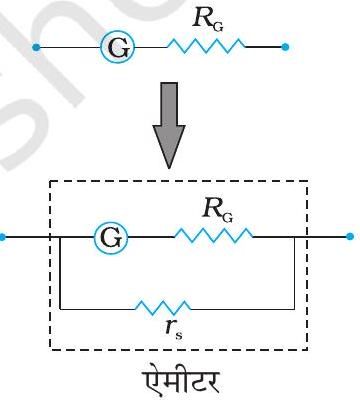
चित्र $4.21$
एक अत्यल्प मान का शंट प्रतिरोध $r_{s}$ पाश्वक्रम में लगाकर किसी गैल्वेनोमीटर (G) को ऐमीटर (A) में रूपांतरित करना।

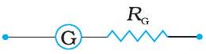
चित्र $4.22$ श्रेणीक्रम में एक बड़ा प्रतिरोध R लगाकर गैल्वेनोमीटर (G) को वोल्टमीटर (V) में परिवर्तित करना।

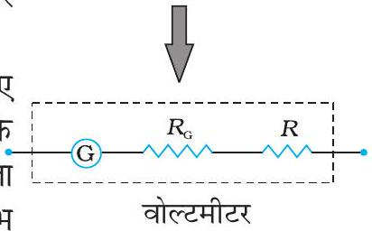
चित्र $4.22$ श्रेणीक्रम में एक बड़ा प्रतिरोध R लगाकर गैल्वेनोमीटर (G) को वोल्टमीटर (V) में परिवर्तित करना।

उदाहरण $4.12$ नीचे दिखाए गए परिपथ में धारा का मान क्या है यदि दिखाया गया ऐमीटर, (a) $R_{G}=60.00 \Omega$ प्रतिरोध का गैल्वेनोमीटर है। (b) भाग (a) में बताया गया गैल्वेनोमीटर ही है परंतु इसको $r_{s}=0.02 \Omega$ का शंट प्रतिरोध लगाकर ऐमीटर में परिवर्तित किया गया है। (c) शून्य प्रतिरोध का एक आदर्श ऐमीटर है।

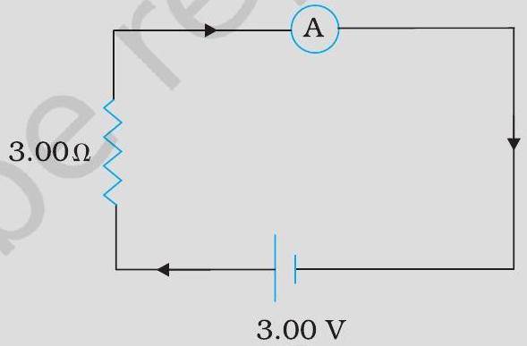
चित्र $4.23$

हल

(a) परिपथ में कुल प्रतिरोध है
$R_{G}+3=63 \Omega$ इसलिए $I=3 / 63=0.048 \mathrm{~A}$
(b) ऐमीटर में रूपांतरित गैल्वेनोमीटर का प्रतिरोध
$\frac{R_{G} r_{s}}{R_{G}+r_{s}}=\frac{60 \Omega \times 0.02 \Omega}{(60+0.02) \Omega}-0.02 \Omega$
परिपथ में कुल प्रतिरोध
$0.02 \Omega+3 \Omega=3.02 \Omega$ अत: $I=3 / 3.02=0.99 \mathrm{~A}$
(c) शून्य प्रतिरोध के आदर्श ऐमीटर के लिए
$I=3 / 3=1.00 \mathrm{~A}$

## गतिमान आवेश और चुंबकत्व

## सारांश

1. चुंबकीय क्षेत्र $\mathbf{B}$ पर विद्युत क्षेत्र $\mathbf{E}$ की उपस्थिति में $\mathbf{v}$ वेग से गतिमान किसी आवेश $q$ पर लगने वाले कुल बल को लोरेंज बल कहते हैं। इसे नीचे दिए गए व्यंजक द्वारा व्यक्त किया जाता है।
$$
\mathbf{F}=q(\mathbf{v} \times \mathbf{B}+\mathbf{E})
$$
चुंबकीय क्षेत्र $q(\mathbf{v} \times \mathbf{B}), \mathbf{v}$ के अभिलंबवत है तथा किया गया कार्य शून्य है।
2. $l$ लंबाई के किसी सीधे चालक जिससे स्थायी विद्युत धारा $I$ प्रवाहित हो रही है, किसी एकसमान बाह्य चुंबकीय क्षेत्र में बल $\mathbf{F}$ का अनुभव करता है,
$$
\mathbf{F}=I \mathbf{1} \times \mathbf{B}
$$
यहाँ $|\mathbf{1}|=l$ तथा $\mathbf{1}$ की दिशा विद्युत धारा की दिशा द्वारा प्रदान की जाती है।
3. किसी एकसमान चुंबकीय क्षेत्र में, कोई आवेश $q, \mathbf{B}$ के अभिलंबवत तल में वृत्ताकार कक्षा में गतिमान है। इसकी एकसमान वर्तुल गति की आवृत्ति को साइक्लोट्रॉन आवृत्ति कहते हैं जिसे इस प्रकार व्यक्त किया जाता है-
$$
v_{c}=\frac{q B}{2 \pi m}
$$
यह आवृत्ति कण की चाल तथा त्रिज्या पर निर्भर नहीं करती। इस तथ्य का उपयोग साइक्लोट्रॉन नामक मशीन में किया जाता है जो आवेशित कणों को त्वरित करने में उपयोगी होता है।
4. बायो-सावर्ट नियम के अनुसार dl लंबाई के किसी अवयव जिससे अपरिवर्ती विद्युत धारा $I$ प्रवाहित हो रही है, के कारण $\mathbf{r}$ सदिश दूरी पर स्थित किसी बिंदु P पर चुंबकीय क्षेत्र dB इस प्रकार व्यक्त किया जाता है-
$$
\mathrm{d} \mathbf{B}=\frac{\mu_{o}}{4 \pi} I \frac{\mathrm{~d} \mathbf{l} \times \mathbf{r}}{r^{3}}
$$
P पर कुल क्षेत्र प्राप्त करने के लिए हमें इस सदिश व्यंजक को चालक की समस्त लंबाई के लिए समाकलित करना चाहिए।
5. त्रिज्या $R$ की वृत्ताकार कुंडली जिससे $I$ धारा प्रवाहित हो रही है, के कारण केंद्र से अक्षीय दूरी $x$ पर चुंबकीय क्षेत्र का परिमाण
$$
B=\frac{\mu_{0} I R^{2}}{2\left(x^{2}+R^{2}\right)^{3 / 2}}
$$
कुंडली के केंद्र पर इस क्षेत्र का परिमाण
$$
B=\frac{\mu_{0} I}{2 R}
$$
6. ऐम्पियर का परिपथीय नियम : मान लीजिए कोई खुला पृष्ठ S किसी पाश C द्वारा परिबद्ध है। तब ऐम्पियर के नियम के अनुसार $\oint_{C} \mathbf{B} \cdot d \mathbf{l}=\mu_{0} I$ यहाँ $I$ पृष्ठ S से प्रवाहित विद्युत धारा है। $I$ का चिह्न दक्षिण हस्त नियम द्वारा निर्धारित किया जाता है। हमने यहाँ इस नियम के सरलीकृत रूप पर चर्चा की है। यदि $\mathbf{B}$ बंद वक्र की परिधि $L$ के हर बिंदु पर स्पर्शी के अनुदिश निर्दिष्ट है तथा परिधि के अनुदिश इसका परिमाण नियत है तो
$$
B L=\mu_{0} I_{e}
$$
यहाँ $I_{e}$ बंद परिपथ द्वारा परिबद्ध नेट विद्युत धारा है।
7. किसी लंबे सीधे तार जिससे $I$ विद्युत धारा प्रवाहित हो रही है, से $R$ दूरी पर स्थित किसी बिंदु पर चुंबकीय क्षेत्र का परिमाण

## - भौतिकी

$B=\frac{\mu_{0} I}{2 \pi R}$
क्षेत्र रेखाएँ तार के साथ संकेंद्री वृत्त होती हैं।
8. किसी लंबी परिनालिका जिससे $I$ विद्युत धारा प्रवाहित हो रही है, के भीतर चुंबकीय क्षेत्र $B$ का परिमाण
$B=\mu_{0} n I$
यहाँ $n$ परिनालिका की प्रति एकांक लंबाई में फेरों की संख्या है।
9. समांतर विद्युत धाराएँ आकर्षित तथा प्रतिसमांतर विद्युत धाराएँ प्रतिकर्षित करती हैं।
10. बहुत पास लिपटे $N$ फेरों तथा $A$ क्षेत्रफल के समतलीय पाश जिससे विद्युत धारा $I$ में प्रवाहित हो रही है, का एक चुंबकीय आघूर्ण $\mathbf{m}$ होता है
$\mathbf{m}=N I \mathbf{A}$
तथा $\mathbf{m}$ की दिशा दक्षिण हस्त अंगुष्ठ नियम से निर्धारित होती है। इस नियम के अनुसार, "अपने दाएँ हाथ की हथेली को इस प्रकार पाश के अनुदिश मोड़िए कि उँगलियाँ विद्युत धारा की दिशा में संकेत करें तो, बाहर की ओर खिंचा अँगूठा $\mathbf{m}$ (और $\mathbf{A}$ ) की दिशा बताता है। जब यह पाश किसी एकसमान चुंबकीय क्षेत्र $\mathbf{B}$ में रखा जाता है तो इस पर आरोपित बल $F=0$
तथा इस पर बल आघूर्ण
$\boldsymbol{\tau}=\mathbf{m} \boldsymbol{\times} \mathbf{B}$
किसी चल कुंडली गैल्वेनोमीटर में इस बल आघूर्ण को कमानी द्वारा लगाया प्रति बल आघूर्ण संतुलित कर लेता है और तब हमें प्राप्त होता है
$k \phi=N I A B$
यहाँ $\phi$ संतुलन विक्षेप है तथा $k$ कमानी का ऐंठन नियतांक है।
11. किसी चल कुंडली गैल्वेनोमीटर को उसकी कुंडली के पार्श्वक्रम में कोई अल्प परिमाण का शंट प्रतिरोध $r_{s}$ संबद्ध करके ऐमीटर में रूपांतरित किया जा सकता है। गैल्वेनोमीटर की कुंडली के साथ श्रेणीक्रम में अधिक परिमाण का प्रतिरोध संबद्ध करके उसे वोल्टमीटर में रूपांतरित किया जा सकता है।

| भौतिक राशि | प्रतीक | प्रकृति | विमाएँ | मात्रक | टिप्पणी |
| :--- | :--- | :--- | :--- | :--- | :--- |
| मुक्त आकाश की चुंबकशीलता | $\mu_{0}$ | अदिश | $\left[\mathrm{MLT}^{-2} \mathrm{~A}^{-2}\right]$ | $\mathrm{T} \mathrm{m} \mathrm{A}^{-1}$ | $4 \pi \times 10^{-7} \mathrm{~T} \mathrm{~m} \mathrm{~A}^{-1}$ |
| चुंबकीय क्षेत्र | B | सदिश | $\left[\mathrm{M} \mathrm{T}^{-2} \mathrm{~A}^{-1}\right]$ | T (टेस्ला) |  |
| चुंबकीय आघूर्ण | m | सदिश | $\left[\mathrm{L}^{2} \mathrm{~A}\right]$ | $\mathrm{A} \mathrm{m}^{2}$ अथवा $\mathrm{J} / \mathrm{T}$ |  |
| ऐंठन नियतांक | $\boldsymbol{k}$ | अदिश | $\left[\mathrm{M} \mathrm{L}^{2} \mathrm{~T}^{-2}\right]$ | $\mathrm{N} \mathrm{m} \mathrm{rad}^{-1}$ | गैल्वेनोमीटर में दृष्टिगोचर |

1. स्थिरवैद्युत क्षेत्र रेखाएँ धनावेश से आरंभ होकर ॠणावेश पर समाप्त हो जाती हैं अथवा अनंत पर लुप्त या विलीन हो जाती हैं। चुंबकीय क्षेत्र रेखाएँ सदैव बंद पाश बनाती हैं।
2. इस अध्याय में वर्णित विचार केवल अपरिवर्ती विद्युत धाराओं (जो समय के साथ परिवर्तित नहीं होती)के लिए ही लागू है।

## गतिमान आवेश और चुंबकत्व

समय के साथ परिवर्तित होने वाली विद्युत धाराओं के लिए न्यूटन का तीसरा नियम वैद्युतचुंबकीय क्षेत्र के संवेग का संज्ञान करने पर ही वैध होता है।
3. लोरेंज बल के समीकरण का स्मरण कीजिए,
$\mathbf{F}=q(\mathbf{v} \times \mathbf{B}+\mathbf{E})$
वेग निर्भर इस बल ने कुछ महानतम वैज्ञानिक विचारकों का ध्यान आकर्षित किया। यदि कोई प्रेक्षक एक ऐसे फ्रेम में पहुँच जाए जहाँ उसका क्षणिक वेग $\mathbf{v}$ हो तो बल का चुंबकीय भाग शून्य हो जाता है। तब आवेशित कण की गति यह मानकर समझाई जा सकती है कि इस नए फ्रेम में एक उचित विद्युत क्षेत्र विद्यमान है। इस यांत्रिकी के विस्तार में हम नहीं जाएँगे। इसके विषय में आप आगे की कक्षाओं में पढ़ंगे। लेकिन इस बात पर हम ज़ोर देना चाहेंगे कि इस विरोधाभास का समाधान इस तथ्य में निहित है कि विद्युत और चुंबकत्व एक-दूसरे से जुड़े हुए प्रक्रम हैं (विद्युतचुंबकत्व) और लोरेंज बल का व्यंजक, प्रकृति में किसी सार्वभौम वरीय संदर्भ फ्रेम में अंतर्निहित नहीं है।
4. ऐम्पियर का परिपथीय नियम, बायो-सावर्ट नियम से अलग नहीं है। यह बायो-सावर्ट नियम से व्युत्पन्न किया जा सकता है। इसका बायो-सावर्ट नियम से वैसा ही संबंध है जैसा कि गाउस नियम का कूलाम नियम से।

## अभ्यास

$4.1$ तार की एक वृत्ताकार कुंडली में $100$ फेरे हैं, प्रत्येक की त्रिज्या $8.0 \mathrm{~cm}$ है और इनमें $0.40 \mathrm{~A}$ विद्युत धारा प्रवाहित हो रही है। कुंडली के केंद्र पर चुंबकीय क्षेत्र का परिमाण क्या है?
$4.2$ एक लंबे, सीधे तार में $35 \mathrm{~A}$ विद्युत धारा प्रवाहित हो रही है। तार से $20 \mathrm{~cm}$ दूरी पर स्थित किसी बिंदु पर चुंबकीय क्षेत्र का परिमाण क्या है?
$4.3$ क्षैतिज तल में रखे एक लंबे सीधे तार में $50 \mathrm{~A}$ विद्युत धारा उत्तर से दक्षिण की ओर प्रवाहित हो रही है। तार के पूर्व में $2.5 \mathrm{~m}$ दूरी पर स्थित किसी बिंदु पर चुंबकीय क्षेत्र B का परिमाण और उसकी दिशा ज्ञात कीजिए।
$4.4$ व्योमस्थ खिंचे क्षैतिज बिजली के तार में $90$ A विद्युत धारा पूर्व से पश्चिम की ओर प्रवाहित हो रही है। तार के $1.5 \mathrm{~m}$ नीचे विद्युत धारा के कारण उत्पन्न चुंबकीय क्षेत्र का परिमाण और दिशा क्या है?
$4.5$ एक तार जिसमें $8 \mathrm{~A}$ विद्युत धारा प्रवाहित हो रही है, $0.15 \mathrm{~T}$ के एकसमान चुंबकीय क्षेत्र में, क्षेत्र से $30^{\circ}$ का कोण बनाते हुए रखा है। इसकी एकांक लंबाई पर लगने वाले बल का परिमाण और इसकी दिशा क्या है?
$4.6$ एक $3.0 \mathrm{~cm}$ लंबा तार जिसमें $10 \mathrm{~A}$ विद्युत धारा प्रवाहित हो रही है, एक परिनालिका के भीतर उसके अक्ष के लंबवत रखा है। परिनालिका के भीतर चुंबकीय क्षेत्र का मान 0.27 T है। तार पर लगने वाला चुंबकीय बल क्या है।
$4.7$ एक-दूसरे से $4.0 \mathrm{~cm}$ की दूरी पर रखे दो लंबे, सीधे, समांतर तारों A एवं B से क्रमश: 8.0 A एवं $5.0 \mathrm{~A}$ की विद्युत धाराएँ एक ही दिशा में प्रवाहित हो रही हैं। तार A के $10 \mathrm{~cm}$ खंड पर बल का आकलन कीजिए।
$4.8$ पास-पास फेरों वाली एक परिनालिका $80$ cm लंबी है और इसमें $5$ परतें हैं जिनमें से प्रत्येक में $400$ फेरे हैं। परिनालिका का व्यास $1.8 \mathrm{~cm}$ है। यदि इसमें $8.0 \mathrm{~A}$ विद्युत धारा प्रवाहित हो रही है तो परिनालिका के भीतर केंद्र के पास चुंबकीय क्षेत्र B के परिमाण परिकलित कीजिए।

## भौतिकी

$4.9$ एक वर्गाकार कुंडली जिसकी प्रत्येक भुजा $10 \mathrm{~cm}$ है, में $20$ फेरे हैं और उसमें $12 \mathrm{~A}$ विद्युत धारा प्रवाहित हो रही है। कुंडली ऊधर्वाधरत: लटकी हुई है और इसके तल पर खींचा गया अभिलंब $0.80 \mathrm{~T}$ के एकसमान चुंबकीय क्षेत्र की दिशा से $30^{\circ}$ का एक कोण बनाता है। कुंडली पर लगने वाले बलयुग्म आघूर्ण का परिमाण क्या है?
$4.10$ दो चल कुंडली गैल्वेनोमीटर मीटरों $\mathrm{M}_{1}$ एवं $\mathrm{M}_{2}$ के विवरण नीचे दिए गए हैं :
$$
\begin{aligned}
& R_{1}=10 \Omega, \quad N_{1}=30 \\
& A_{1}=3.6 \times 10^{-3} \mathrm{~m}^{2}, B_{1}=0.25 \mathrm{~T} \\
& R_{2}=14 \Omega, \quad N_{2}=42
\end{aligned}
$$
$A_{2}=1.8 \times 10^{-3} \mathrm{~m}^{2}, B_{2}=0.50 \mathrm{~T}$ (दोनों मीटरों के लिए स्प्रिंग नियतांक समान हैं)।
    (a) $\mathrm{M}_{2}$ एवं $\mathrm{M}_{1}$ की धारा-सुग्राहिताओं, (b) $\mathrm{M}_{2}$ एवं $\mathrm{M}_{1}$ की वोल्टता-सुग्राहिताओं का अनुपात ज्ञात कीजिए।
$4.11$ एक प्रकोष्ठ में $6.5 \mathrm{G}\left(1 \mathrm{G}=10^{-4} \mathrm{~T}\right)$ का एकसमान चुंबकीय क्षेत्र बनाए रखा गया है। इस चुंबकीय क्षेत्र में एक इलेक्ट्रॉन $4.8 \times 10^{6} \mathrm{~m} \mathrm{~s}^{-1}$ के वेग से क्षेत्र के लंबवत भेजा गया है। व्याख्या कीजिए कि इस इलेक्ट्रॉन का पथ वृत्ताकार क्यों होगा? वृत्ताकार कक्षा की त्रिज्या ज्ञात कीजिए।
$$
\left(e=1.6 \times 10^{-19} \mathrm{C}, m_{e}=9.1 \times 10^{-31} \mathrm{~kg}\right)
$$
$4.12$ प्रश्न $4.11$ में, वृत्ताकार कक्षा में इलेक्ट्रॉन की परिक्रमण आवृत्ति प्राप्त कीजिए। क्या यह उत्तर इलेक्ट्रॉन के वेग पर निर्भर करता है? व्याख्या कीजिए।
$4.13$ (a) $30$ फेरों वाली एक वृत्ताकार कुंडली जिसकी त्रिज्या $8.0 \mathrm{~cm}$ है और जिसमें $6.0 \mathrm{~A}$ विद्युत धारा प्रवाहित हो रही है, $1.0 \mathrm{~T}$ के एकसमान क्षैतिज चुंबकीय क्षेत्र में ऊर्ध्वाधरतः लटकी है। क्षेत्र रेखाएँ कुंडली के अभिलंब से $60^{\circ}$ का कोण बनाती हैं। कुंडली को घूमने से रोकने के लिए जो प्रतिआघूर्ण लगाया जाना चाहिए उसके परिमाण परिकलित कीजिए।
    (b) यदि (a) में बतायी गई वृत्ताकार कुंडली को उसी क्षेत्रफल की अनियमित आकृति की समतलीय कुंडली से प्रतिस्थापित कर दिया जाए ( शेष सभी विवरण अपरिवर्तित रहें) तो क्या आपका उत्तर परिवर्तित हो जाएगा?

[^0]:    * कोई डाट (बिंदु) आपकी ओर संकेत करते तीर की नोंक जैसा प्रतीत होता है तथा क्रॉस किसी तीर की पंखयुक्त पूँछ जैसा प्रतीत होता है।

[^1]:    * $\mathrm{d} \boldsymbol{l} \times \mathrm{r}$ की दिशा दक्षिण हस्त पेंच नियम द्वारा भी प्राप्त होती है। $\mathrm{d} \boldsymbol{l}$ तथा $\mathbf{r}$ के तलों को देखिए। कल्पना कीजिए कि आप पहले सदिश से दूसरे सदिश की ओर गमन कर रहे हैं। यदि गति वामावर्त है तो परिणामी आपकी ओर संकेत करेगा। यदि यह दक्षिणावर्त है तो परिणामी आपसे दूर की ओर होगा।

[^2]:    कृपया ध्यान दीजिए-दो सुस्पष्ट (पृथक) नियम हैं जिन्हें दक्षिण हस्त नियम कहते हैं। इनमें से एक नियम विद्युत धारा पाश के अक्ष पर चुंबकीय क्षेत्र $\mathbf{B}$ की दिशा देता है तथा दूसरा सीधे विद्युत धारावाही चालक तार के लिए $\mathbf{B}$ की दिशा है। इन नियमों में अँगूठे तथा अँगुलियों की भिन्न भूमिका है।

[^3]:    इससे यह अर्थ निकलता है कि जब हमारे पास समय निर्भर विद्युत धाराएँ/अथवा गतिशील आवेश होती हैं तब आवेशों/चालकों के बीच बलों के लिए न्यूटन का तीसरा नियम लागू नहीं होता। न्यूटन के तीसरे नियम का आवश्यक परिणाम यांत्रिकी में किसी वियुक्त निकाय के संवेग का संरक्षण है। तथापि यह विद्युत चुंबकीय क्षेत्रों के साथ समय निर्भर स्थितियों के प्रकरण पर लागू होती है, परंतु इस शर्त के साथ कि क्षेत्रों द्वारा वहन संवेग को भी सम्मिलित किया जाए।

