## $4$ गतिमान आवेश और चुंबकत्व Moving Charges and Magnetism अभ्यास प्रश्न

प्रश्न 1. तार की एक वृताकार कुण्डली में $100$ फेरे हैं, प्रत्येक की त्रिज्या $8.0 \mathrm{~cm}$ है और इनमें 0.40 A की विद्युत धारा प्रवाहित हो रही है। कुण्डली के केन्द्र पर चुम्बकीय क्षेत्र का परिमाण क्या है?
हल यहाँ

$$
n=100, r=8 \mathrm{~cm}=8 \times 10^{-2} \mathrm{~cm}
$$

और

$$
I=0.40 \mathrm{~A}
$$

केन्द्र पर चुम्बकीय क्षेत्र
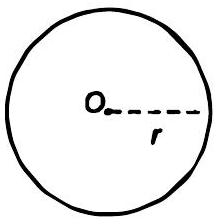

$$
\begin{aligned}
B=\frac{\mu_{0} .2 \pi / n}{4 \pi r} & =\frac{10^{-7} \times 2 \times 3.14 \times 0.4 \times 100}{8 \times 10^{-2}} \\
& =3.1 \times 10^{-4} \mathrm{~T}
\end{aligned}
$$

चुम्बकीय क्षेत्र की दिशा धारा की दिशा पर निर्भर करती है। यदि धारा की दिशा घड़ी की सुईं की दिशा के विपरीत है तब केन्द्र पर चुम्बकीय क्षेत्र की दिशा समतल के लम्बवत बाहर की ओर होगी।

प्रश्न 2. एक लम्बे सीधे तार से $35 \mathrm{~A}$ विद्युत धारा प्रवाहित हो रही है। तार से $20 \mathrm{~cm}$ दूरी पर स्थित किसी बिन्दु पर चुम्बकीय क्षेत्र का परिमाण क्या है?

हल बिन्दु $P$ पर चुम्बकीय क्षेत्र ज्ञात करना है।
दिया है,

$$
I=35 \text { तथा } r=20 \mathrm{~cm}=0.2 \mathrm{~m}
$$

तार अधिक लम्बा है अतः इसे अनन्त लम्बा माना गया है, अतः चुम्बकीय क्षेत्र

$$
B=\frac{\mu_{0}}{4 \pi} \cdot \frac{2 l}{r}=\frac{10^{-7} \times 2 \times 35}{0.2}=3.5 \times 10^{-5} \mathrm{~T}
$$

चुम्बकीय क्षेत्र की दिशा मैक्सवेल के नियम द्वारा दी गयी है यदि धारा की दिशा तार में ऊपर की ओर दी गयी है तब बिन्दु $P$ पर चुम्बकीय क्षेत्र की दिशा समतल के लम्बवत अन्दर की ओर होगी।

प्रश्न 3. क्षैतिज तल में रखे एक लम्बे सीधे तार में $50 \mathrm{~A}$ विद्युत धारा उत्तर से दक्षिण की ओर प्रवाहित हो रही है। तार के पूर्व में $2.5$ मी दूरी पर स्थित किसी बिन्दु पर चुम्बकीय क्षेत्र $B$ का परिमाण और ठसकी दिशा ज्ञात कीजिए।

हल यहाँ तार उत्तर दिशा में है तथा बिन्दु $P$ पूर्व दिशा में है दिया है, $I=50 \mathrm{~A}$ तथा $r=2.5 \mathrm{~m}$
चुम्बकीय क्षेत्र का परिणाम $B=\frac{\mu_{0} .21}{4 \pi r}=10^{-7} \times \frac{2 \times 50}{2.5}$

$$
=4 \times 10^{-6} \mathrm{~T}
$$

बिन्दु $P$ पर चुम्बकीय क्षेत्र की दिशा मैक्सवेल के दाए हाथ के नियम द्वारा दी गयी है। धारा उत्तर से दक्षिण दिशा में प्रवाहित
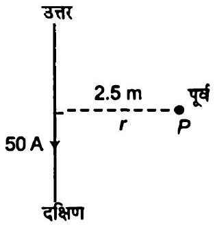
होती है। अतः $P$ पर चुम्बकीय क्षेत्र की दिशा समतल के लम्बवत बाहर की ओर होगी।

प्रश्न 4. व्योमस्य खिचे क्षैतिज बिजली के तार में $90 \mathrm{~A}$ विद्युत धारा पूर्व से पश्चिम की ओर प्रवाहित हो रही है। तार के $1.5$ मी नीचे विद्युत धारा के कारण उत्पन्न चुम्बकीय क्षेत्र का परिमाण और दिशा क्या है?

हल प्रश्नानुसार, $I=90 \mathrm{~A}$ तथा $r=1.5 \mathrm{~m}$
यहाँ बिन्दु $P$ पावर लाइन के नीचे है जहाँ पर चुम्बकीय क्षेत्र तथा उसकी दिशा ज्ञात करनी है।

$$
\begin{aligned}
B & =\frac{\mu_{0}}{4 \pi} \cdot \frac{2 l}{r} \\
& =\frac{10^{-7} \times 2 \times 90}{1.5}=12 \times 10^{-5} \mathrm{~T}
\end{aligned}
$$

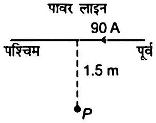
चुम्बकीय क्षेत्र की दिशा मैक्सवेल के दाए हाथ के नियम से दी गयी है अतः चुम्बकीय क्षेत्र की दिशा तल के लम्बवत बाहर की ओर होगी।

प्रश्न 5. एक तार जिसमें $8 \mathrm{~A}$ विद्युत धारा प्रवाहित हो रही है, $0.15 \mathrm{~T}$ के एकसमान चुम्बकीय क्षेत्र में क्षेत्र से $30^{\circ}$ का कोण बनाते हुए रखा है। इसकी एकांक लम्बाई पर लगने वाले बल का परिमाण और इसकी दिशा क्या है?
हल प्रश्नानुसार, $I=8 \mathrm{~A}, \theta=30^{\circ}, B=0.15 \mathrm{~T}, l=1 \mathrm{~m}$
चुम्बकीय बल का परिमाण

$$
\begin{aligned}
\mathbf{F} & =I(I \times \mathbf{B})=I l B \sin \theta \\
& =8 \times 1 \times 0.15 \times \sin 30^{\circ} \\
& =\frac{8 \times 0.15}{2}=0.6 \mathrm{~N} / \mathrm{m}
\end{aligned}
$$

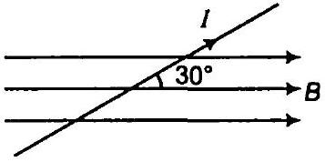
अतः बल की दिशा चुम्बकीय क्षेत्र तथा धारा की दिशा के लम्बवत होती है। यहाँ पर बल की दिशा समतल के लम्बवत अन्दर की ओर है (दौंये हाथ के नियम से)।

प्रश्न 6. एक $3.0 \mathrm{~cm}$ लम्बा तार जिसमें $10 \mathrm{~A}$ विद्युत धारा प्रवाहित हो रही है, एक परिनालिका के भीतर उसके अक्ष के लम्बवत रखा है। परिनालिका के भीतर चुम्बकीय क्षेत्र का मान 0.27 T है। तार पर लगने वाला चुम्बकीय बल क्या है?
हल यहाँ पर चुम्बकीय क्षेत्र तथा धारा की दिशा के मध्य $90^{\circ}$ का कोण है क्योंकि परिनालिका का चुम्बकीय क्षेत्र परिनालिका की अक्ष के अनुदिश है तथा तार अक्ष के लम्बवत है।
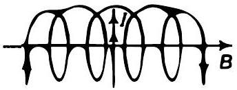
दिया है, $l=3 \mathrm{~cm}=3 \times 10^{-2} \mathrm{~m}, l=10 \mathrm{~A}, B=0.2 \mathrm{~T}$,
तार पर आरोपित चुम्बकीय बल

$$
F=11 B \sin 90^{\circ}=10 \times 3 \times 10^{-2} \times 0.27 \times \sin 90^{\circ}=8.1 \times 10^{-2} \mathrm{~N}
$$

दाएँ हाथ के नियनानुसार, चुम्बकीय क्षेत्र की दिशा समतल के लम्बवत अन्दर की ओर होगी।
प्रश्न 7. एक दूसरे से $4.0$ सेमी की दूरी पर रखे दो लम्बे, सीधे, समान्तर तारों $A$ एवं $B$ से क्रमश: 8.0 A एक 5.0 A की विद्युत धाराएँ एक ही दिशा में प्रवाहित हो रही है। तार $A$ के $10$ सेमी खण्ड पर बल का आकलन कीजिए।
हल दिया है, $l_{1}=8 \mathrm{~A}, l_{2}=5 \mathrm{~A}$ और $r=4$ सेमी $=0.04$ मी

$$
\begin{aligned}
F & =\frac{\mu_{0} .2 l_{1} \cdot I_{2}}{4 \pi} \\
& =\frac{10^{-7} \times 2 \times 8 \times 5}{0.04}=2 \times 10^{-4} \mathrm{~N}
\end{aligned}
$$

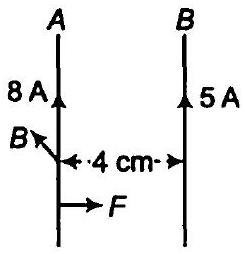
$10$ सेमी लम्बे तार $A$ पर बल, $F^{\prime}=F \times 0.1 \quad(\because 1 \mathrm{~m}=100 \mathrm{~cm})$

$$
\begin{aligned}
\Rightarrow & F^{\prime}=2 \times 10^{-4} \times 0.1 \\
& =2 \times 10^{-5} \mathrm{~N}
\end{aligned}
$$

मैक्सवेल के दाएँ हाथ के नियम से, चुम्बकीय क्षेत्र की दिशा (तार $A$ पर) समतल के लम्बवत बाहर की ओर होगी। फ्लेमिंग के बाएँ हाथ के नियमानुसार बल चुम्बकीय क्षेत्र की दिशा में है तथा बल आकर्षणकारी है।

प्रश्न 8. पास-पास फेरों वाली एक परिनालिका $80 \mathrm{~cm}$ लम्बी है और इसमें $5$ परतें हैं जिनमें से प्रत्येक में $400$ फेरे हैं। परिनालिका का व्यास $1.8 \mathrm{~cm}$ है। यदि इसमें $8.0 \mathrm{~A}$ विद्युत धारा प्रवाहित हो रही हो तो परिनालिका के भीतर केन्द्र के पास चुम्बकीय क्षेत्र $B$ का परिमाण परिकलित कीजिए।
हल परिनालिका की लम्बाई $l=80 \mathrm{~cm}=0.8 \mathrm{~m}$
परतों की संख्या = $5$
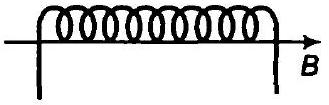
प्रत्येक परत में तार के फेरों की संख्या $=400$
परिनालिका का व्यास $=1.8 \mathrm{~cm}$
परिनालिका में धारा $l=8 \mathrm{~A}$
∴ कुल फेरों की संख्या $N=400 \times 5=2000$
एकांक लम्बाई में तार के फेरों की संख्या $n=\frac{2000}{0.8}=2500$
परिनालिका के अन्दर चुम्बकीय क्षेत्र

$$
\begin{aligned}
B=\mu_{0} n l & =4 \times 3.14 \times 10^{-7} \times 2500 \times 8 \\
& =2.5 \times 10^{-2} \mathrm{~T}
\end{aligned}
$$

चुम्बकीय क्षेत्र की दिशा परिनालिका की अक्ष के अनुदिश है।
प्रश्न 9. एक वर्गाकार कुण्डली जिसकी प्रत्येक भुजा $10 \mathrm{~cm}$ है, में $20$ फेरे हैं और उसमें $12 \mathrm{~A}$ विद्युत धारा प्रवाहित हो रही है। कुण्डली ऊर्ध्वाधरत: लटकी हुई है और इसके तल पर खींचा गया अभिलम्ब $0.80 \mathrm{~T}$ के एकसमान चुम्बकीय क्षेत्र की दिशा से $30^{\circ}$ का एक कोण बनाता है। कुण्डली पर लगने वाले बलयुग्म आघूर्ण का परिमाण क्या है?
हल प्रश्नानुसार, वर्गाकार कुण्डली की भुजा $=10 \mathrm{~cm}=0.1 \mathrm{~m}$
तार के फेरों की संख्या $(n)=20$
वर्गाकार कुण्डली में घारा $I=12 \mathrm{~A}$
कुण्डली द्वारा अन्तरिक कोण $\theta=30^{\circ}$
चुम्बकीय क्षेत्र $B=0.80 \mathrm{~T}$
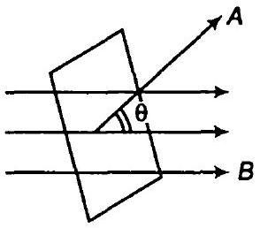
कुण्डली द्वारा अनुभव किया गया बल आघूर्ण का परिमाण

$$
\begin{aligned}
\tau & =N I A B \sin \theta \\
& =20 \times 12 \times\left(10 \times 10^{-2}\right)^{2} \times 0.80 \times \sin 30^{\circ} \\
\tau & =2.4 \times 0.80 \sin 30^{\circ}=\frac{2.4 \times 0.80}{2}=0.96 \mathrm{~N}-\mathrm{m}
\end{aligned}
$$

प्रश्न 10. दो चल कुण्डली मीटरों $M_{1}$ एवं $M_{2}$ के विवरण नीचे दिए गए हैं $R_{1}=10 \Omega$,

$$
\begin{aligned}
& N_{1}=30, A_{1}=3.6 \times 10^{-3} \mathrm{~m}^{2}, B_{1}=0.25 \mathrm{~T} \\
& R_{2}=14 \Omega, N_{2}=42, A_{2}=1.8 \times 10^{-3} \mathrm{~m}^{2}, B_{2}=0.50 \mathrm{~T}
\end{aligned}
$$

(दोनों मीटरों के लिए स्प्रिग नियतांक समान हैं।)

(a) $M_{2}$ एवं $M_{1}$ की धारा सुग्राहिताओं,
(b) $M_{2}$ एवं $M_{1}$ की वोल्टता सुग्राहिताओं का अनुपात ज्ञात कीजिए।

हल दिया है, $R_{1}=10 \Omega, n_{1}=30, A_{1}=3.6 \times 10^{-3} \mathrm{~m}^{2}, B_{1}=0.25 \mathrm{~T}$

$$
R_{2}=14 \Omega, n_{2}=42, A_{2}=1.8 \times 10^{-3} \mathrm{~m}^{2}, B_{2}=0.50 \mathrm{~T}
$$

$k_{1}=k_{2}$ स्प्रिंग नियतांक
(अ) धारा सुग्राहिता के सूत्रानुसार,

$$
L=\frac{N A B}{k}
$$

$$
\therefore \quad \frac{l_{S_{2}}}{l_{S_{1}}}=\frac{n_{2} B_{2} A_{2} . k_{1}}{n_{1} B_{1} A_{1} k_{2}}=\frac{42 \times 0.50 \times 1.8 \times 10^{-3}}{30 \times 0.25 \times 3.6 \times 10^{-3}}=1.4
$$

(ब) वोल्टेज सुग्राहिता के सूत्रानुसार,

$$
\begin{aligned}
& V=\frac{N A B}{k R} \\
\therefore \quad \frac{V_{s_{2}}}{V_{s_{1}}} & =\frac{n_{2} B_{2} A_{2} \cdot k_{1} A_{1}}{k_{2} \cdot R_{2} \cdot n_{1} B_{1} A_{1}} \\
& =\frac{42 \times 0.50 \times 1.8 \times 10^{-3} \times k \times 10}{k \times 14 \times 30 \times 0.25 \times 3.6 \times 10^{-3}}=1
\end{aligned}
$$

प्रश्न 11. एक प्रकोष्ठ में $6.5 \mathrm{G}\left(1 \mathrm{G}=10^{-4} \mathrm{~T}\right)$ का एकसमान चुम्बकीय क्षेत्र बनाए रखा गया है। इस चुम्बकीय क्षेत्र में एक इलेक्ट्रॉन $4.8 \times 10^{6}$ मी/से के वेग से क्षेत्र के लम्बवत भेजा गया है। व्याख्या कीजिए कि इस इलेक्ट्रॉन का पथ वृताकार क्यों होगा? वृताकार कक्षा की त्रिज्या ज्ञात कीजिए। ( $e=16 \times 10^{-19} \mathrm{C}, m_{e}=91 \times 10^{-31}$ किग्रा)

हल दिया है, चुम्बकीय क्षेत्र $B=6.5 \mathrm{G}=6.5 \times 10^{-4} \mathrm{~T}$
आवेश $e=-1.6 \times 10^{-19} \mathrm{C}$
इलेक्ट्रॉन की चाल $v=4.8 \times 10^{6} \mathrm{~m} / \mathrm{s}$
इलेक्ट्रॉन का द्रव्यमान $m_{\mathrm{e}}=9.1 \times 10^{-31} \mathrm{~kg}$
चुम्बकीय क्षेत्र तथा इलेक्ट्रॉन के बीच कोण $\theta=90^{\circ}$
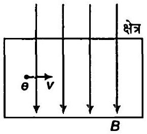
चुम्बकीय क्षेत्र में प्रवेश करने वाले आवेशित कण पर बल लगने वाला

$$
F=q(v \times B)=e(v \times B)
$$

वामहस्त के नियमानुसार, बल की दिशा चुम्बकीय क्षेत्र तथा वेग के लम्बवत है।
अतः बल गति की दिशा बदलता है परिमाण को नहीं इलेक्ट्रॉन वृत्तीय पथ पर गति करता है। अतः चुम्बकीय बल द्वारा प्रदत्त आवश्यक अभिकेन्द्र बल

$$
\therefore \quad e(v \times B)=\frac{m v^{2}}{r}
$$

or

$$
e v B \sin 90^{\circ}=\frac{m v^{2}}{r}
$$

or

$$
\begin{aligned}
r=\frac{m v}{e B \times 1} & =\frac{9.1 \times 10^{-31} \times 4.8 \times 10^{6}}{1.6 \times 10^{-19} \times 6.5 \times 10^{-4}} \\
& =4.2 \times 10^{-2} \mathrm{~m} \\
& =4.2 \mathrm{~cm}
\end{aligned}
$$

प्रश्न 12. प्रश्न $11$ में वृताकार कक्षा में इलेक्ट्रॉन की परिक्रमण आवृति प्राप्त कीजिए। क्या यह उत्तर इलेक्ट्रॉन के वेग पर निर्भर करता है? व्याख्या कीजिए।
हल प्रश्नानुसार,

$$
\begin{aligned}
B=6.5 \mathrm{G} & =6.5 \times 10^{-4} \mathrm{~T} \\
v & =4.8 \times 10^{6} \mathrm{~m} / \mathrm{s}, \mathrm{e}=1.6 \times 10^{-19} \mathrm{C} \\
m_{\mathrm{e}} & =9.1 \times 10^{-31} \mathrm{~kg}
\end{aligned}
$$

हम जानते हैं कि जब इलेक्ट्रॉन एकसमान चुम्बकीय क्षेत्र में वृत्तीय गति करता है तब आवश्यक अभिकेन्द्र बल चुम्बकीय बल द्वारा उत्पन्न होता है।

$$
\frac{m v^{2}}{r}=q v B \Rightarrow \frac{m v}{r}=q B
$$

यदि इलेक्ट्रॉन का कोणीय वेग $\omega$ है तब

$$
\therefore \quad \begin{aligned}
v & =r \omega \\
\frac{m(r \omega)}{r} & =q B \\
\omega & =\frac{q B}{m}
\end{aligned}
$$

(यदि घूर्णन की आवृति $\omega$ है तब $\omega=2 \pi n$ )
∴

$$
2 \pi n=\frac{q B}{m} \Rightarrow n=\frac{q B}{2 \pi m}
$$

इलेक्ट्रॉन की कक्षीय आवृत्ति

$$
\begin{aligned}
v=\frac{B q}{2 \pi m}=\frac{B e}{2 \pi \eta_{e}} & =\frac{6.5 \times 10^{-4} \times 1.6 \times 10^{-19}}{2 \times 3.14 \times 9.1 \times 10^{-31}} \quad(\because \text { इलेक्ट्रॉन के लिए } q=e) \\
& =18.18 \times 10^{6} \mathrm{~Hz}
\end{aligned}
$$

अतः इलेक्ट्रॉन की कक्षीय आवृत्ति इसके वेग पर निर्भर नहीं करती है।
प्रश्न 13.(a) $30$ फेरों वाली एक वृताकार कुण्डली जिसकी त्रिज्या $8.0 \mathrm{~cm}$ है और जिसमें $6.0 \mathrm{~A}$ विद्युत धारा प्रवाहित हो रही है, $1.0 \mathrm{~T}$ के एकसमान क्षैतिज चुम्बकीय क्षेत्र में ऊर्ध्वाधरत: लटकी है। क्षेत्र रेखाएँ कुण्डली के अभिलम्ब से $60^{\circ}$ का कोण बनाती है। कुण्डली को घूमने से रोकने के लिए जो प्रतिआघूर्ण लगाया जाना चाहिए उसके परिमाण का परिकलित कीजिए।

(b) यदि (a) में बतायी गयी वृताकार कुण्डली को उसी क्षेत्रफल की अनियमित आकृति की समतलीय कुण्डली से प्रतिस्थापित कर दिया जाए (शेष सभी विवरण अपरिवर्तित रहें) तो क्या आपका उत्तर परिवर्तित हो जायेगा?

हल

(a) फेरों की संख्या $n=30$, त्रिज्या $(r)=8 \mathrm{~cm}=0.08 \mathrm{~m}$
कुण्डली में घारा $I=6 \mathrm{~A}$
चुम्बकीय क्षेत्र $B=1.0 \mathrm{~T}$
चुम्बकीय क्षेत्र तथा कुण्डली के अभिलम्ब के बीच कोण $\theta=60^{\circ}$
कुण्डली पर आरोपित आघूर्ण (चुम्बकीय क्षेत्र के कारण)
$$
\begin{aligned}
\tau & =n l A B \sin \theta \\
& =30 \times 6 \times \pi(0.08)^{2} \times 1 \times \sin 60^{\circ} \\
& =30 \times 6 \times 3.14 \times 0.08 \times 0.08 \times \sqrt{\frac{3}{2}} \\
& =3.133 \mathrm{~N}-\mathrm{m}
\end{aligned}
$$
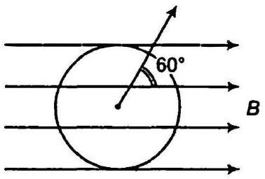
(b) सूत्रानुसार, कुण्डली पर आरोपित आघूर्ण इसकी आकृति पर निर्भर नहीं करता है (यदि क्षेत्रफल नियत है) अतः बल आघूर्ण नियत रहता है।

## अतिरिक्त प्रश्न

प्रश्न 14. दो समकेन्द्रिक वृत्ताकार कुण्डलियाँ $X$ और $Y$ जिनकी त्रिज्याएँ क्रमशः $16$ सेमी एवं $10 \mathrm{~cm}$ हैं, उत्तर दक्षिण दिशा में समान ऊर्ध्वाधर तल में स्थित हैं। कुण्डली $X$ में $20$ फेरे हैं और इसमें $16 \mathrm{~A}$ विद्युत धारा प्रवाहित हो रही है, कुण्डली $Y$ में $25$ फेरे हैं और इसमें $18 \mathrm{~A}$ विद्युत धारा प्रवाहित हो रही है। पश्चिम की ओर मुख करके खड़ा एक प्रेक्षक देखता है कि $X$ में धारा प्रवाह वामावर्त है जबकि $Y$ में दक्षिणावर्त है। कुण्डलियों के केन्द्र पर, उनमें प्रवाहित विद्युत धाराओं के कारण उत्पन्न कुल चुम्बकीय क्षेत्र का परिमाण एवं दिशा ज्ञात कीजिए।

हल $x$ कुण्डली हेतु
कुण्डली की त्रिज्या $r_{x}=16 \mathrm{~cm}=0.16 \mathrm{~m}$
तार के फेरों की संख्या $n_{x}=20$
कुण्डली में घारा $I_{x}=16 \mathrm{~A}$
$Y$ कुण्डली हेतु त्रिज्या $r_{Y}=10 \mathrm{~cm}=0.1 \mathrm{~m}$

तार के फेरों की संख्या $n_{y}=25$
कुण्डली $Y$ में धारा $I_{Y}=18 \mathrm{~A}$ (दक्षिणावर्त)
कुण्डली के केन्द्र पर चुम्बकीय क्षेत्र का परिमाण

$$
\begin{aligned}
B_{x} & =\frac{\mu_{0}}{4 \pi} \cdot \frac{2 l_{x} \pi \Omega_{x}}{r_{x}} \\
& =\frac{10^{-7} \times 2 \times 16 \times 3.14 \times 20}{0.16} \\
& =4 \pi \times 10^{-4} \mathrm{~T}
\end{aligned}
$$

कुण्डली $X$ के केन्द्र पर चुम्बकीय क्षेत्र पूर्व दिशा में है मैक्सवेल के बाएँ हाथ के नियमानुसार कुण्डली $Y$ के केन्द्र पर चुम्बकीय क्षेत्र

$$
B_{y}=\frac{\mu_{0}}{4 \pi} \cdot \frac{2 \pi l_{y} n_{y}}{r_{y}}=\frac{10^{-7} \times 2 \times \pi \times 18 \times 25}{0.1}=9 \pi \times 10^{-4} \mathrm{~T}
$$

मैक्सवेल के वामहस्य नियमानुसार कुण्डली $y$ के केन्द्र पर चुम्बकीय क्षेत्र पश्चिम दिशा में है केन्द्र पर नैट चुम्बकीय क्षेत्र $B=B_{1}-B_{x}=(9 \pi-4 \pi) 10^{-4}=5 \pi \times 10^{-4}$
( ∵ B , व $B_{x}$ विपरीत दिशा में है)

$$
=1.6 \times 10^{-3} \mathrm{~T}
$$

प्रश्न 15. $10$ सेमी लम्बाई और $10^{-3} \mathrm{~m}^{2}$ अनुप्रस्य काट के एक क्षेत्र में $100 \mathrm{G}\left(1 \mathrm{G}=10^{-4} \mathrm{~T}\right)$ का एकसमान चुम्बकीय क्षेत्र चाहिए। जिस तार से परिनालिका का निर्माण करना है उसमें अधिकतम $15 \mathrm{~A}$ विद्युत धारा प्रवाहित हो सकती है और क्रोड पर अधिकतम $1000$ फेरे प्रति मीटर लपेटे जा सकते हैं। इस उद्देश्य के लिए परिनालिका के निर्माण विवरण सुझाइये। यह मान लीजिए कि क्रोड लोह-चुम्बकीय नहीं है।
हल चुम्बकीय क्षेत्र $B=100 \mathrm{G}=100 \times 10^{-4}=10^{-2} \mathrm{~T}$
अधिकतम धारा $I=15 \mathrm{~A}, n=1000 \mathrm{~m}$
परिनालिका हेतु धारा तथा तार के फेरों की संख्या का गुणन परिकलित करते हैं।
चुम्बकीय क्षेत्र का परिमाण $B=\mu_{0} n l$
अथवा

$$
n l=\frac{B}{\mu_{0}}=\frac{10^{-2}}{4 \times 3.14 \times 10^{-7}}
$$

⇒

$$
n l=7961 \approx 8000
$$

यहाँ $n l$ का गुणनफल $8000$ है
धारा $I=8 \mathrm{~A}$
तार के फेरों की संख्या $n=1000$
अन्य संरचना में $l=10 \mathrm{~A}$ तथा $n=800 \mathrm{~m}$ यह सबसे उपयुक्त संरचना है।

प्रश्न 16. $I$ धारावाही, $N$ फेरों और $R$ त्रिज्या वाली वृताकार कुण्डली के लिए इसके अक्ष पर केन्द्र से $x$ दूरी पर स्थित किसी बिन्दु पर चुम्बकीय क्षेत्र के लिए निम्न व्यंजक है।

$$
B=\frac{\mu_{0} I R^{2} N}{2\left(x^{2}+R^{2}\right)^{3 / 2}}
$$

(a) स्पष्ट कीजिए इससे कुण्डली के केन्द्र पर चुम्बकीय क्षेत्र के लिए सुपरिचित परिणाम कैसे प्राप्त किया जा सकता है?
(b) बराबर त्रिज्या $R$ एवं फेरों की संख्या $N$, वाली दो वृताकार कुण्डलियाँ एक-दूसरे से $R$ दूरी पर एक-दूसरे के समान्तर, अक्ष मिला कर रखी गयी है। दोनों में समान विद्युत धारा एक ही दिशा में प्रवाहित हो रही है। दर्शाइये कि कुण्डलियों के अक्ष के लगमग मध्य बिन्दु पर क्षेत्र, एक बहुत छोटी दूरी के लिए जो कि $R$ से कम है, एकसमान है और इस क्षेत्र का लगभग मान निम्न है।
$$
B=0.72 \times \frac{\mu_{0} N 1}{R}
$$
(बहुत छोटे से क्षेत्र पर एकसमान चुम्बकीय क्षेत्र उत्पन्न करने के लिए बनायी गई ऊपर वर्णित व्यवस्था हेल्महोल्ट्ज के नाम से जानी जाती है।)

हल (a) केन्द्र से $x$ दूरी पर चुम्बकीय क्षेत्र

$$
B=\frac{\mu_{0} N I R^{2}}{2\left(x^{2}+R^{2}\right)^{3 / 2}}
$$

कुण्डली के केन्द्र पर चुम्बकीय क्षेत्र प्राप्त करने हेतु $x=0$ रखने पर
∴ अतः केन्द्र पर चुम्बकीय क्षेत्र $B=\frac{\mu_{0} I R^{2} N}{2 R^{3}}$

$$
B=\frac{\mu_{0} I N}{2 R}
$$

यह परिणाम धारा लूप के केन्द्र पर चुम्बकीय क्षेत्र के समान है।

(b) समान अक्षीय दोनों कुण्डलियों की त्रिज्या $=R$
$N=$ तार के फेरों की संख्या

माना $O$ कुण्डलियों के बीच का मध्य बिन्दु है तथा $P$ मध्य बिन्दु के समीपवर्ती बिन्दु है। माना $O P=d \ll R$ कुण्डली $A$ के लिए $O_{A} P=\frac{R}{2}+d$
कुण्डली $A$ के कारण बिन्दु $P$ पर चुम्बकीय क्षेत्र
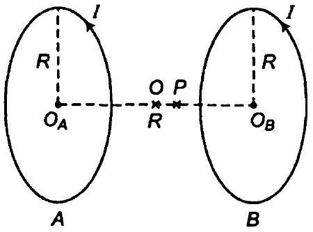

$$
\begin{aligned}
B_{A} & =\frac{\mu_{0}}{4 \pi} \cdot \frac{2 \pi n / R^{2}}{\left(O_{A} P^{2}+R^{2}\right)^{3 / 2}} \\
& =\frac{\mu_{0}}{2} \cdot \frac{N I \cdot R^{2}}{\left\{\left(\frac{R}{2}+d\right)^{2}+R^{2}\right\}^{3 / 2}}=\frac{\mu_{0} N I R^{2}}{2\left[\frac{R^{2}}{4}+d^{2}+R d+R^{2}\right]^{3 / 2}}
\end{aligned}
$$

प्रश्नानुसार, $d \ll R$, अतः $d^{2}$ नगण्य है।

$$
\begin{aligned}
B_{A}=\frac{\mu_{0} N I R^{2}}{2\left[\frac{5 R^{2}}{4}+R d\right]^{3 / 2}} & =\frac{\mu_{0} N I R^{2}}{2 \times\left(\frac{5 R^{2}}{4}\right)^{3 / 2}\left[1+\frac{R \times d \times 4}{5 R^{2}}\right]^{3 / 2}} \\
& =\frac{\mu_{0} N I R^{2}\left(1+\frac{4 d}{5 R}\right)^{-3 / 2}}{2\left(\frac{5 R^{2}}{4}\right)^{3 / 2}}
\end{aligned}
$$

मैक्सवेल के दाएँ हाथ के नियमानुसार, $B_{A}$ की दिशा $P O$ के अनुदिश है
कुण्डली $B$ के लिए

$$
O_{B} P=\left(\frac{R}{2}-d\right)
$$

कुण्डली $B$ के कारण बिन्दु $P$ पर चुम्बकीय क्षेत्र

$$
\begin{aligned}
& B_{B}=\frac{\mu_{0}}{4 \pi} \cdot \frac{2 \pi N I R^{2}}{\left(O_{B} \rho^{2}+R^{2}\right)^{3 / 2}}=\frac{\mu_{0}}{2} \cdot \frac{2 N I R^{2}}{\left[\left(\frac{R}{2}-d\right)^{2}+R^{2}\right]^{3 / 2}} \\
&=\frac{\mu_{0} N I R^{2}}{2\left[\frac{R^{2}}{4}+d^{2}-R d+R^{2}\right]^{3 / 2}} \quad \text { ( } d^{2} \text { नगण्य है) } \\
&=\frac{\mu_{0} n I R^{2}\left(1-\frac{4 d}{5 R}\right)^{-3 / 2}}{2\left[\frac{5 R^{2}}{4}\right]^{3 / 2}}
\end{aligned}
$$

$B_{B}$ की दिशा $P O$ के अनुदिश है अतः कुण्डली $A$ व $B$ के कारण बिन्दु $P$ पर चुम्बकीय क्षेत्र

$$
B=B_{A}+B_{B}=\frac{\mu_{0} \cdot N I R^{2}}{2\left(\frac{5 R^{2}}{4}\right)^{3 / 2}}\left[\left(1+\frac{4 d}{5 R}\right)^{-3 / 2}+\left(1-\frac{4 d}{5 R}\right)^{-3 / 2}\right]
$$

द्विपद प्रमेय के प्रयोग द्वारा उच्चतम घातीय पदों को नगण्य मानते हुए $d \ll R$.

$$
\begin{aligned}
B & =\frac{\mu_{0} N I R^{2}}{2\left(\frac{5 R^{2}}{4}\right)^{3 / 2}}\left[1-\frac{3}{2} \times \frac{4 d}{5 R}+1+\frac{3}{2} \times \frac{4 d}{5 R}\right] \\
& =\frac{\mu_{0} N I R^{2} \cdot 4^{3 / 2}}{2 \times R^{3} \times 5^{3 / 2}} \times 2=\frac{\mu_{0} N I}{2 R}\left(\frac{4}{5}\right)^{3 / 2} \times 2
\end{aligned}
$$

$$
\begin{aligned}
& =\left(\frac{4}{5}\right)^{3 / 2} \cdot \frac{\mu_{0} N 2}{2 R}=\frac{2 \mu_{0} N 1}{(5)^{3 / 2} 2 R}-(4)^{3 / 2} \\
& =0.72 \cdot \frac{\mu_{0} N 1}{R}
\end{aligned}
$$

प्रश्न 17. एक टोरॉइड के (अलौह चुम्बकीय) क्रोड की आन्तरिक त्रिज्या $25$ सेमी और बाह्म त्रिज्या $26$ सेमी है। इसके ऊपर किसी तार के $3500$ फेरे लपेटे गए हैं। यदि तार में प्रवाहित विद्युत धारा $11 \mathrm{~A}$ हो तो चुम्बकीय क्षेत्र का मान क्या होगा। (a) टोरॉइड के बाहर तथा (b) टोरॉइड द्वारा घिरी हुई खाली जगह में?

हल

(a) टोरॉइड के बाहर चुम्बकीय क्षेत्र शून्य है क्योंकि टोरॉइड के कारण चुम्बकीय क्षेत्र केवल टोरॉइड की लम्बाई के अनुदिश अन्त: भाग पर ही होता है।
(b) टोरॉइड के आन्तरिक भाग की त्रिज्या $r_{1}=25 \mathrm{~cm}$ या $0.25$ m
टोरॉइड की बाह्य त्रिज्या $r_{2}=26 \mathrm{~cm}$ या $0.26 \mathrm{~m}$
तार के फेरों की संख्या $N=3500$

तार में धारा $I=11 \mathrm{~A}$
टोरॉइड की माध्य त्रिज्या $r=\left(\frac{r_{1}+r_{2}}{2}\right)=\frac{2}{2} \cdot(0.25+0.26)=0.51$
∴ टोरॉइड की लम्बाई $2 \pi r=2 \pi \times 0.51$
टोरॉइड के कारण चुम्बकीय क्षेत्र $B=\mu_{0} n l$
जहाँ, $n$ एकांक लम्बाई में तार के फेरों की संख्या है

$$
\begin{aligned}
n & =\frac{N}{l} \\
B & =4 \pi \times 10^{-7} \times \frac{3500}{\pi \times 0.51} \times 11 \\
& =3.02 \times 10^{-2} \mathrm{~T}
\end{aligned}
$$

(c) टोरॉइड द्वारा घिरी खाली जगह में चुम्बकीय क्षेत्र शून्य है क्योंकि चुम्बकीय क्षेत्र केवल लम्बाई के अनुदिश कार्य करता है।

प्रश्न 18.निम्नलिखित प्रश्नों के ठतर दीजिए

(a) किसी प्रकोष्ठ में एक ऐसा चुम्बकीय क्षेत्र स्थापित किया गया है जिसका परिमाण तो एक बिन्दु पर बदलता है, पर दिशा निश्चित है (पूर्व से पश्चिम)। इस प्रकोष्ठ में एक आवेशित कण प्रवेश करता है और अविचलित एक सरल रेखा में अचर वेग से चलता रहता है। आप कण के प्रारम्पिक वेग के बारे में क्या कह सकते हैं?
(b) एक आवेशित कण, एक ऐसे शक्तिशाली असमान चुम्बकीय क्षेत्र में प्रवेश करता है जिसका परिमाण एवं दिशा दोनों एक बिन्दु से दूसरे बिन्दु पर बदलते जाते हैं, एक जटिल पथ पर चलते हुए इसके बाहर आ जाता है। यदि यह मान ले कि चुम्बकीय क्षेत्र में इसका किसी भी दूसरे कण से कोई संघट्ट नहीं होता तो क्या इसकी अन्तिम चाल, प्रारम्पिक चाल के बराबर होगी?
(c) पश्चिम से पूर्व की ओर चलता हुआ एक इलेक्ट्रॉन एक ऐसे प्रकोष्ठ में प्रवेश करता है जिसमें उत्तर से दक्षिण की ओर एकसमान एक विद्युत क्षेत्र है। वह दिशा बताइए जिसमें एकसमान चुम्बकीय क्षेत्र स्थापित किया जाए ताकि इलेक्ट्रॉन को अपने सरल रेखीय पथ से विचलित होने से रोका जा सके।

हल

(a) चुम्बकीय क्षेत्र एक नियत दिशा पूर्व से पश्चिम दिशा में है। प्रश्नानुसार आवेशित कण पश्चिम से पूर्व की ओर बिना विचलित हुए सीधी रेखा में गति करता है (नियत गति से) यह तभी सम्मव है जब आवेशित कण पर आरोपित बल शून्य हो। आवेशित कण पर चुम्बकीय क्षेत्र द्वारा आरोपित चुम्बकीय बल $F=q v B \sin \theta$ (जहाँ $\theta, v$ तथा $B$ के बीच का कोण है) $F=0$ यदि $\sin \theta=0(v \neq 0, q \neq 0, B \neq 0)$ अर्थात वेग व चुम्बकीय क्षेत्र के बीच कोण $0$ या $180^{\circ}$ है।

अत: आवेशित कण चुम्बकीय क्षेत्र के अनुदिश या प्रतिदिश गति करता है।

(b) हाँ, अन्तिम चाल प्रारम्भिक चाल के बराबर है क्योंकि कण पर आरोपित चुम्बकीय बल वेग की दिशा वदलता है उसके परिमाण को नहीं बदलता है।
(c) चूँकि विद्युत क्षेत्र उत्तर दक्षिण दिशा में आरोपित है अर्थात् उत्तर दिशा की प्लेट धनात्मक है तथा दक्षिण दिशा की प्लेट ऋणात्मक है। अतः इलेक्ट्रॉन धनात्मक प्लेट की ओर आकर्षित होते हैं, अर्थात उत्तर दिशा की ओर प्रेरित होते हैं। यदि हम यह चाहते हैं कि इलेक्ट्रॉन के पथ में कोई परिवर्तन न हो तब चुम्बकीय क्षेत्र दक्षिण दिशा में होना चाहिए। सूत्र $F=-e[v \times B]$ वेग की दिशा पश्चिम से पूर्व की ओर है तथा बल की दिशा दक्षिण की ओर है। फ्लेमिंग के वाम हस्त के नियम द्वारा चुम्बकीय क्षेत्र की दिशा समतल के लम्बवत अन्दर की ओर है।

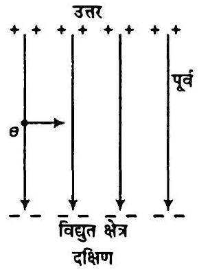

प्रश्न 19. उष्पित कैयोड से उत्सर्जित और $2.0 \mathrm{kV}$ के विभवान्तर पर त्वरित एक इलेक्ट्रॉन $0.15 \mathrm{~T}$ के एकसमान चुम्बकीय क्षेत्र में प्रवेश करता है। इलेक्ट्रॉन का गमन पथ ज्ञात कीजिए यदि चुम्बकीय क्षेत्र (a) प्रारम्पिक वेग के लम्बवत है, (b) प्रारम्पिक वेग की दिशा से $30^{\circ}$ का कोण बनाता है।

हल दिया है, विभवान्तर, $V=2 \mathrm{kV}=2000 \mathrm{~V}$
इलेक्ट्रॉन पर आवेश $e=1.6 \times 10^{-19} \mathrm{C}$
इलेक्ट्रॉन का द्रव्यमान $m_{\theta}=9.1 \times 10^{-31} \mathrm{~kg}$
इलेक्ट्रॉन आरोपित विभवान्तर के कारण त्वरित होता है जो इलेक्ट्रॉन को गतिज ऊर्जा प्रदान करता है। माना इलेक्ट्रॉन का वेग $v$ है। तब
∴

$$
\begin{gathered}
e v=\frac{1}{2} m_{\theta} v^{2} \\
1.6 \times 10^{-19} \times 2000=\frac{1}{2} \times 9.1 \times 10^{-31} v^{2}
\end{gathered}
$$

अथवा

$$
v^{2}=\frac{1.6 \times 10^{-19} \times 2000 \times 2}{9.1 \times 10^{-31}}
$$

अथवा

$$
\begin{aligned}
v & =\frac{8 \times 10^{7}}{3} \mathrm{~m} / \mathrm{s} \\
& =2.7 \times 10^{7} \mathrm{~m} / \mathrm{s}
\end{aligned}
$$

(a) चुम्बकीय क्षेत्र $B=0.15 \mathrm{~T}$ है जिसकी दिशा इलेक्ट्रॉन के प्रारम्भिक वेग के अभितम्बवत है। यहाँ चुम्बकीय बल $F=B e v$ तथा चुम्बकीय बल की दिशा चुम्बकीय क्षेत्र के लम्बवत है। इलेक्ट्रॉन वृत्तीय पथ पर गति करता है। चुम्बकीय बल इलेक्ट्रॉन को अभिकेन्द्र बल प्रदान करता है।
∴
$$
B e v=\frac{m v^{2}}{r}
$$
$$
\begin{aligned}
& \text { जहाँ, } r \text { वृत्तीय पथ की त्रिज्या है } \\
& \qquad \begin{aligned}
\therefore & =\frac{m v}{B e} \\
& =\frac{9.1 \times 10^{-31} \times 8 \times 10^{7}}{3 \times 0.15 \times 1.6 \times 10^{-19}} \\
& =10^{-3} \mathrm{~m}=1 \mathrm{~mm}
\end{aligned}
\end{aligned}
$$
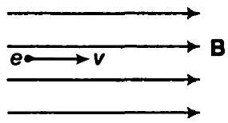

(b) इलेक्ट्रॉन चुम्बकीय क्षेत्र में $30^{\circ}$ के कोण पर प्रवेश करता है ( $B$ की दिशा के सापेक्ष)
माना वेग का क्षैतिज घटक $v_{2}$ तथा ऊर्ध्व घटक $v_{1}$ है।
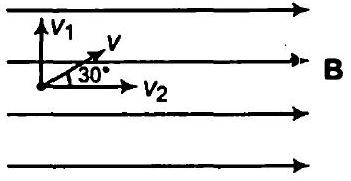
$$
\begin{aligned}
v_{1}=v \sin \theta=v \sin 30^{\circ} & =\frac{8 \times 10^{7} \times 1}{3 \times 2} \\
& =\frac{4 \times 10^{7}}{3} \mathrm{~m} / \mathrm{s}
\end{aligned}
$$
$$
v_{2}=v \cos \theta=v \cos 30^{\circ}=\frac{8 \times 10^{7} \times \sqrt{3}}{3 \times 2}=\frac{4 \sqrt{3} \times 10^{7}}{3} \mathrm{~m} / \mathrm{s}
$$
वेग के क्षैतिज घटक के कारण कण पर कोई बल आरोपित नहीं होता है क्योंकि $v_{2}, B$ के समान्तर है तथा $F=q\left(v_{2} \times B\right)$ शून्य है। अतः इलेक्ट्रॉन पर केवल ऊर्ध्य घटक के कारण ही बल लगता है
$$
F=e\left(v_{1} \times B\right)=e v_{1} B \sin 90^{\circ}
$$
यही बल इलेक्ट्रॉन को अभिकेन्द्र बल प्रदान करता है।
i.e.,
$$
\begin{aligned}
e v_{1} B & =\frac{m v_{1}^{2}}{r^{\prime}} \\
& =\frac{m v_{1}}{e B}=\frac{9.1 \times 10^{-31} \times 4 \times 10^{7}}{3 \times 1.6 \times 10^{-19} \times 0.15} \\
r^{\prime} & =0.5 \times 10^{-3} \mathrm{~m}=0.5 \mathrm{~mm}
\end{aligned}
$$

प्रश्न 20. प्रश्न $16$ में वर्णित हेल्महोल्टज कुण्डलियों का उपयोग करके किसी लघुक्षेत्र में $0.75$ T का एकसमान चुम्बकीय क्षेत्र स्थापित किया गया है। इसी क्षेत्र में कोई एकसमान स्थिरवैद्युत क्षेत्र कुण्डलियों के उभयनिष्ठ अक्ष के लम्बवत लगाया जाता है। (एक ही प्रकार के) आवेशित कणों का $15 \mathrm{kV}$ विभवान्तर पर त्वरित एक संकीर्ण किरण पुंज इस क्षेत्र में दोनों कुण्डलियों के अक्ष तथा स्थिरवैद्युत क्षेत्र की लम्बवत दिशा के अनुदिश प्रवेश करता है। यदि यह किरण पुंज $9.0 \times 10^{-5} \mathrm{Vm}^{-1}$ स्थिरवैद्युत क्षेत्र में अविक्षेपित रहता है तो यह अनुमान लगाइए कि किरण पुंज में कौन से कण हैं? यह स्पष्ट कीजिए कि यह उत्तर एकमात्र उत्तर क्यों नहीं है?
हल दिया है, चुम्बकीय क्षेत्र का परिमाण $B=0.75 \mathrm{~T}$,

$$
\begin{aligned}
& \text { विभवान्तर } V=15 \mathrm{kV}=15 \times 10^{3} \mathrm{~V} \\
& \text { वैद्युत क्षेत्र } E=9 \times 10^{-5} \mathrm{~V} / \mathrm{m}
\end{aligned}
$$

माना कण का आवेश $q$, द्रव्यमान $m$ तथा विभवान्तर $15 \mathrm{kV}$ के कारण त्वरित कणों का वेग $v$ है।
विभवान्तर के कारण उत्पन्न ऊर्जा कण को गतिज ऊर्जा प्रदान करती है अत:

$$
\therefore \quad q v=\frac{1}{2} m v^{2}
$$

चूँकि कण चुम्बकीय क्षेत्र व वैद्युत क्षेत्र में विचलित नहीं होता है। अतः चुम्बकीय बल, वैद्युत क्षेत्र द्वारा उत्पन्न बल से सन्तुलित होता है

$$
q \mathbf{E}=q(\mathbf{v} \times \mathbf{B})
$$

या

$$
q E=q \vee B
$$

या

$$
v=\frac{E}{B}
$$

समीकरण (i) में यह मान स्थापित करने पर

$$
\frac{1}{2} m\left(\frac{E}{B}\right)^{2}=e V
$$

या

$$
\frac{e}{m}=\frac{E^{2}}{2 v B^{2}}=\frac{\left(9 \times 10^{5}\right)^{2}}{2 \times 15000 \times(0.75)^{2}}=4.8 \times 10^{7} \mathrm{C} / \mathrm{kg}
$$

$\frac{e}{m}$ का यह मान डयूटेरॉन के समान है अतः कण डयूटेरॉन आयन हैं। $\frac{e}{m}$ का मान $\mathrm{He}^{2+}$ व $\mathrm{Li}^{3+}$ के भी समान है। अतः कण डयूटेरॉन, $\mathrm{He}^{2+}, \mathrm{Li}^{3+}$ हो सकते हैं।

प्रश्न 21. एक सीधी, क्षैतिज चालक छड़ जिसकी लम्बाई $0.45 \mathrm{~m}$ एवं द्रव्यमान $60 \mathrm{~g}$ है, अपने सिरों पर जुड़े दो ऊध्र्वाधर तारों पर लटकी हुई है। तारों से होकर छड़ से 5.0 A विद्युत धारा प्रवाहित हो रही है।

(a) चालक के लम्बवत कितना चुम्बकीय क्षेत्र लगाया जाए जिससे कि तारों में तनाव शून्य हो जाए?
(b) चुम्बकीय क्षेत्र की दिशा यथावत रखते हुए यदि विद्युत धारा की दिशा उत्क्रमित कर दी जाए तो तारों में कुल तनाव कितना होगा? (तारों के द्रव्यमान की उपेक्षा कीजिए)
$$
\left(g=9.8 \mathrm{~m} / \mathrm{s}^{2}\right)
$$

हल चालक छड़ की लम्बाई $l=0.45 \mathrm{~m}$
चालक की छड़ का द्रव्यमान $m=60 \mathrm{~g}=60 \times 10^{-3} \mathrm{~kg}$

$$
\text { धारा } /=5 \mathrm{~A}
$$

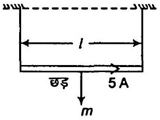

(a) माना आरोपित चुम्बकीय क्षेत्र $B$ है। अतः चुम्बकीय बल तार के भार के द्वारा सन्तुलन प्राप्त करता है तथा तार में तनाव शून्य हो जाता है।
चुम्बकीय बल = चालक की छड़ का भार
$$
\begin{aligned}
I(I \times B) & =m g \quad\left(I \text { तथा } B \text { के बीच कोण } 90^{\circ}\right. \text { है) } \\
I I B \sin 90^{\circ} & =m g \\
B & =\frac{m g \_60 \times 10^{-3} \times 9.8}{I l} \quad\left(\because \sin 90^{\circ}=1\right) \\
& =0.26 \mathrm{~T}
\end{aligned}
$$

(b) जब चुम्बकीय क्षेत्र व्युत्क्रमित होता है तब छड़ पर चुम्बकीय बल तय भार नीचे की ओर दिष्ट होते हैं। अतः तार में तनाव
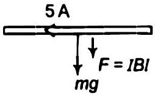
$$
\begin{aligned}
T & =B l l+m g \\
& =(026 \times 5 \times 0.45)+\left(60+10^{-3} \times 9.8\right) \\
& =1.176 \mathrm{~N}
\end{aligned}
$$
प्रश्न 22. एक स्वचालित वाहन की बैटरी से इसकी चाल का मोटर को जोड़ने वाले तारों से $300$ A विद्युत धारा (अल्प काल के लिए) प्रवाहित होती है। तारों के बीच प्रति एकांक लम्बाई पर कितना बल लगता है यदि इनकी लम्बाई $70 \mathrm{~cm}$ एवं बीच की दूरी $1.5 \mathrm{~cm}$ हो, यह बल आकर्षण बल है या प्रतिकर्षण बल।
हल दोनों तारों में धारा $I_{1}=I_{2}=300 \mathrm{~A}$
तारों के बीच की दूरी $r=1.5 \mathrm{~cm}=1.5 \times 10^{-2} \mathrm{~m}$
तार की लम्बाई $l=70 \mathrm{~cm}$
एकांक लम्बाई पर बल $F=\frac{\mu_{0} .2 l_{1} l_{2}}{4 \pi}=\frac{10^{-7} \times 2 \times 300 \times 300}{1.5 \times 10^{-2}}$
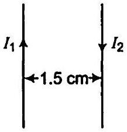
$$
=0.12 \mathrm{~N} / \mathrm{m}
$$
दोनों तारों में घारा की दिशा विपरीत है क्योंकि दोनों बैटरी के धुवों से जुड़े हैं अतः बल प्रतिकर्षी होगा।

प्रश्न 23.1.5 T का एकसमान चुम्बकीय क्षेत्र $10.0 \mathrm{~cm}$ त्रिज्या के बेलनाकार क्षेत्र में विद्यमान है। इसकी दिशा अक्ष के समान्तर पूर्व से पश्चिम की ओर है। एक तार जिसमें $7.0 \mathrm{~A}$ विद्युत धारा प्रवाहित हो रही है इस क्षेत्र में होकर उत्तर से दक्षिण की ओर गुजरता है। तार पर लगने वाले बल का परिमाण और दिशा क्या है, यदि

(a) तार अक्ष को काटता हो,
(b) तार $N-S$ दिशा से घुमाकर उत्तर पूर्व-उत्तर पश्चिम दिशा में कर दिया जाए,
(c) $N-S$ दिशा में रखते हुए ही तार को अक्ष से $6.0 \mathrm{~cm}$ नीचे उतार दिया जाए।

हल (a) एकसमान चुम्बकीय क्षेत्र $B=1.5 T$

$$
\text { त्रिज्या }=10.0 \mathrm{~cm} 0.1 \mathrm{~m}
$$

तार में घारा $I=7.0$
तार पर आरोपित बल

$$
\begin{aligned}
\mathbf{F} & =I(l \times \mathbf{B}) \\
& =I l B \sin 90^{\circ}
\end{aligned}
$$

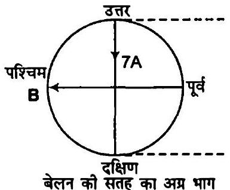
$I$ व $B$ के मध्य $90^{\circ}$ का कोण है तथा तार की लम्बाई बेलन के व्यास के बराबर है
∴ तार पर बल $F=1 \times 2 \mathrm{r} \times B=7 \times 2 \times 0.1 \times 1.5=2.1 \mathrm{~N}$
फ्लेमिंग के बाएँ हाथ के नियमानुसार, बल की दिशा समतल के लम्बवत अन्दर की ओर है।

$$
\Rightarrow \quad F=2.1 \mathrm{~N}
$$

(b) तार की लम्बाई का क्षैतिज घटक कोई बल अनुभव नहीं करता है क्योंकि $B$ लम्बाई के लम्बवत है।
ऊर्ध्व घटक $y=$ बेलन का व्यास
बल $F=I l B \sin 90^{\circ}$
$$
=7 \times 0.1 \times 1.5 \times 2 \times 1=2.1 \mathrm{~N}
$$
फ्लेमिग के बाएँ हाथ के नियमानुसार, बल की दिशा समतल के लम्बवत अन्दर की ओर है।
(c) माना तार $6$ cm स्थान्तरित होता है तार की स्थिति CD है
$$
\begin{aligned}
O E & =6 \mathrm{~cm} \\
O D & =10 \mathrm{~cm} \\
D E & =E C=x \\
\triangle O D E \text { में } \quad O D^{2} & =O E^{2}+D E^{2} \\
100 & =36+D E^{2} \\
D E^{2} & =64
\end{aligned}
$$
अथवा
$$
\begin{aligned}
D E & =8 \mathrm{~cm} \\
l^{\prime} & =C D=2 D E=16 \mathrm{~cm}=0.16 \mathrm{~m}
\end{aligned}
$$
बल का परिमाण $F^{\prime}=I(I \times B)=7\left(0.16 \times 1.5 \times \sin 90^{\circ}\right)$
$$
=1.68 \mathrm{~N}
$$
फ्लेमिंग के बाए हाथ के नियमानुसार' बल की दिशा समतल के लम्बवत अन्दर की ओर है।
प्रश्न 24. घनात्मक $z$-दिशा में $3000 \mathrm{G}$ का एक एकसमान चुम्बकीय क्षेत्र लगाया गया है। एक आयताकार लूप जिसकी भुजाएँ $10 \mathrm{~cm}$ एवं $5 \mathrm{~cm}$ हैं और जिसमें $12 \mathrm{~A}$ धारा प्रवाहित हो रही है इस क्षेत्र में रखा है। चित्र में दिखाई गई लूप के विभिन्न स्थितियों में इस पर लगने वाला बलयुग्म आघूर्ण क्या है? हर स्थिति में बल क्या है? स्थायी सन्तुलन वाली स्थिति कौन-सी है?
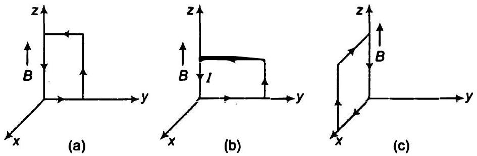

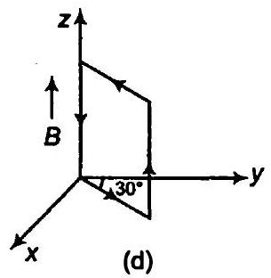
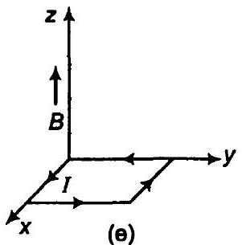
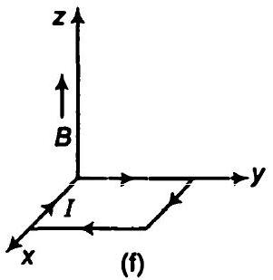

हल दिया है, $z$-अक्ष के अनुदिश चुम्बकीय क्षेत्र

$$
B=3000 \mathrm{G}=3000 \times 10^{-4}=0.3 \mathrm{~T}
$$

वृत्ताकार लूप का क्षेत्रफल $A=10 \times 5=50 \mathrm{~cm}^{2}=50 \times 10^{-4} \mathrm{~m}^{2}$
लूप में धारा $I=12 \mathrm{~A}$
लूप पर बल आघूर्ण, $\tau=I(\mathrm{~A} \times \mathrm{B})$

(a) $B=0.3 k T$ चुम्बकीय क्षेत्र $z$-दिशा में है
$\mathrm{A}=50 \times 10^{-4} \mathrm{im}^{2}$ क्षेत्रफल वेक्टर $x$ दिशा में है
और
$$
I=12 \mathrm{~A}
$$
बल आघूर्ण,
$$
\begin{aligned}
\tau & =12\left(50 \times 10^{-4} \mathrm{i} \times 0.3 \mathrm{k}\right) \\
& =-1.80 \times 10^{-2} \mathrm{j} \mathrm{~N}-\mathrm{m}
\end{aligned}
$$
बल आघूर्ण की दिशा $y$ की ओर है।.
(b) $$
\mathrm{B}=0.3 \mathrm{k} \mathrm{~T}_{1} \mathrm{~A}=50 \times 10^{-4} \mathrm{im}^{2} \text { व } I=12 \mathrm{~A}
$$
आघूर्ण,
$$
\begin{aligned}
\tau & =I(\mathrm{~A} \times \mathrm{B})=12 \times 50 \times 10^{-4} \mathrm{i} \times 0.3 \mathrm{k} \\
& =-1.80 \times 10^{-2} \mathrm{j} \mathrm{~N}-\mathrm{m}
\end{aligned}
$$
आघूर्ण $x$ अक्ष की ऋणात्मक दिशा में है।
(c) $$
B=0.3 k T_{1} A=50 \times 10^{-4}(-j) m^{2} \text { व } l=12 \mathrm{~A}
$$
आघूर्ण,
$$
\begin{aligned}
\tau & =12\left(-50 \times 10^{-4} \mathrm{j} \times\right. \\
& =-1.80 \times 10^{-2} \mathrm{iN}-\mathrm{m}
\end{aligned}
$$
k)
आघूर्ण $x$-अक्ष की ऋणात्मक दिशा में है।
(d) $$
\mathbf{B}=0.3 \mathbf{k} \mathrm{~T}_{1} \mathrm{~A}=50 \times 10^{-4} \mathrm{~m}^{2} \text { व } l=12 \mathrm{~A}
$$
यहाँ क्षेत्रफल वेक्टर $x y$ समतल में है जो $z$-अक्ष के लम्बवत है।
∴ आघूर्ण, $\tau=12 \times 50 \times 10^{-4} \times 0.3=1.80 \times 10^{-2} \mathrm{~N}-\mathrm{m}$
बल आघूर्ण की दिशा $x$-अक्ष की ऋणात्मक दिशा से $120^{\circ}$ के कोण पर है।
(e) $$
\mathbf{B}=0.3 \mathbf{k} T, A=50 \times 10^{-4} \mathbf{k m}^{2} \text { और } I=12 \mathrm{~A}
$$
आघूर्ण,
$$
\tau=12\left(50 \times 10^{-4} \mathrm{k} \times 0.3 \mathrm{k}\right)=0
$$
(f) $$
B=0.3 k T_{1} A=-50 \times 10^{-4} \mathrm{~km}^{2} \text { और } I=12 \mathrm{~A}
$$
आघूर्ण, $\tau=12\left(-50 \times 10^{-4} \mathrm{k} \times 0.3 \mathrm{k}\right)=0$

प्रश्न 25. एक वृत्ताकार कुण्डली जिसमें $20$ फेरे हैं और जिसकी त्रिज्या $10 \mathrm{~cm}$ है, एकसमान चुम्बकीय क्षेत्र में रखी है जिसका परिमाण $0.10 \mathrm{~T}$ है और जो कुण्डली के तल के लम्बवत है। यदि कुण्डली में 5.0 A विद्युत धारा प्रवाहित हो रही हो तो,

(a) कुण्डली पर लगने वाला कुल बलयुग्म आघूर्ण क्या है?
(b) कुण्डली पर लगने वाला कुल परिणामी बल क्या है?
(c) चुम्बकीय क्षेत्र के कारण कुण्डली के प्रत्येक इलेक्ट्रॉन पर लगने वाला कुल औसत बल क्या है?
(कुण्डली $10^{-6} \mathrm{~m}^{2}$ अनुप्रस्थ क्षेत्र वाले ताँबे के तार से बनी है और ताँबे में मुक्त इलेक्ट्रॉन घनत्व $10^{29} \mathrm{~m}^{-3}$ दिया गया है)

हल तार के फेरों की संख्या $n=20$
वृत्ताकार कुण्डली की त्रिज्या $r=10 \mathrm{~cm}$ या $0.10 \mathrm{~m}$

$$
\text { चुम्बकीय क्षेत्र } B=0.1 \mathrm{~T}
$$

चुम्बकीय क्षेत्र तथा क्षेत्रीय वेक्टर के मध्य कोण शून्य है

$$
\Rightarrow \quad \theta=0^{\circ}
$$

कुण्डली में घारा $l=5 \mathrm{~A}$

(a) कुण्डली का आघूर्ण $\tau=n l A B \sin \theta$
$$
=20 \times 5 \times \pi(0.1)^{2} \times 0.1 \times \sin 0^{\circ}=0 \quad\left(\because \sin 0^{\circ}=0\right)
$$
(b) लूप पर बलयुग्मों के रूप में है दोनों आमने सामने की मुजाओं पर बल की दिशा विपरीत है तथा परिमाण समान है अत. लूप पर कुल बल शून्य है।
(c) इलेक्ट्रॉन का घनत्व $N=10^{29} / \mathrm{m}^{3}$
तार का क्षेत्रफल $A=10^{-5} \mathrm{~m}^{2}$.
चुम्बकीय बल $F=e\left(v_{d} \times B\right)$
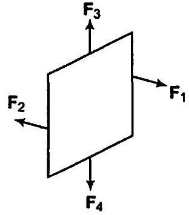
$$
\begin{aligned}
\because & & I & =n e A v_{d} \\
\therefore & & v_{d} & =\frac{I}{n e A l}
\end{aligned}
$$

प्रश्न 26. एक परिनालिका जो $60 \mathrm{~cm}$ लम्बी है, जिसकी त्रिज्या $4.0 \mathrm{~cm}$ है और जिसमें $300$ फेरों वाली $3$ परतें लपेटी गयी हैं। इसके भीतर एक $2.0 \mathrm{~cm}$ लम्बा, $2.5 \mathrm{~g}$ द्रव्यमान का तार इसके (केन्द्र के निकट) अक्ष के लम्बवत रखा है। तार एवं परिनालिका का अक्ष दोनों क्षैतिज तल में हैं। तार को परिनालिका के समान्तर दो वाही संयोजकों द्वारा एक बाह्म बैटरी से जोड़ा गया है जो इसमें $6.0 \mathrm{~A}$ विद्युत धारा प्रदान करती है। किस मान की विद्युत धारा (परिवहन की उचित दिशा के साथ) इस परिनालिका के फेरों में प्रवाहित होने पर तार का भार सम्पाल सकेगी?
$\left(g=9.8 \mathrm{~m} / \mathrm{s}^{2}\right)$
हल परिनालिका के लिए
दिया है, लम्बाई $=60 \mathrm{~cm}$

$$
\text { त्रिज्या }=4 \mathrm{~cm}
$$

परतों की संख्या $=n$
प्रत्येक परत में तार के फेरों की संख्या $=300$
तार के लिए, दिया है, लम्बाई $I_{w}=2 \mathrm{~cm}$
द्रव्यमान $m=2.5$ ग्राम, धारा $I_{w}=6 \mathrm{~A}$
माना परिनालिका में धारा / है, परिनालिका का चुम्बकीय क्षेत्र

$$
\begin{aligned}
B & =\mu_{0} n l \\
& =4 \pi \times 10^{-7} \times \frac{300 \times 3}{0.6} \times 1
\end{aligned} \quad\left(n=\frac{\text { फेरों की संख्या }}{\text { लम्बाई }}=\frac{300 \times 3}{0.6}\right)
$$

तार पर आरोपित बल, $F=l_{w}\left(l_{w} \times B\right) l_{w}\left(l_{w} B \sin \theta\right)$
( $l_{w}$ तथा $B$ के बीच कोण $90^{\circ}$ है) भार द्वारा सन्तुलित बल $=m g$

$$
\begin{aligned}
& l_{w} l_{w} \sin 90^{\circ}=m g \\
& \quad 6 \times 0.02 \times \frac{4 \pi \times 10^{-7} \times 300 \times 3}{0.6} I=2.5 \times 10^{-3} \times 9.8 \quad \text { [समीकरण (i) से] } \\
& \text { धारा } I=\frac{2.5 \times 10^{-3} \times 9.8 \times 0.6}{108 \times 4 \pi \times 10^{-7}} \\
& \quad=108.36 \mathrm{~A}
\end{aligned}
$$

प्रश्न 27. किसी गैल्वेनोमीटर की कुण्डली का प्रतिरोघ $12 \Omega$ है। $3 \mathrm{~mA}$ की विद्युत धारा प्रवाहित होने पर यह पूर्णस्केल विक्षेप दर्शाता है। आप इस गैल्वेनोमीटर को $0$ से $18 \mathrm{~V}$ परास वाले वोल्टमीटर में कैसे रूपान्तरित करेंगे?
हल दिया है, गैल्वेनोमीटर का प्रतिरोध

$$
G=12 \Omega
$$

गैल्वेनोमीटर की धारा $I_{g}=3 \mathrm{~mA}=3 \times 10^{-3} \mathrm{~A}$
तथा

$$
\text { विभवान्तर } V=18 V
$$

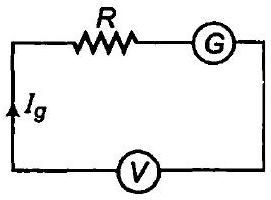

वृहत प्रतिरोध $A$ को गैल्वेनोमीटर के श्रेणीक्रम में जोड़कर वोल्टमीटर में बदल सकते हैं। प्रतिरोध को सूत्र $R=\left(\frac{V}{I_{g}}-G\right)$ से ज्ञात किया जा सकता है।

$$
R=\frac{18}{3 \times 10^{-3}}-12=5988 \Omega
$$

प्रतिरोध $R=5988 \Omega$ गैल्वेनोमीटर के श्रेणीक्रम में जुड़ा है जिससे गैल्वेनोमीटर का प्रतिरोघ बढ़ता है। अतः इससे कोई धारा प्रवाहित नहीं होती है तथा इससे विभवान्तर का सही ज्ञान प्राप्त होता है।
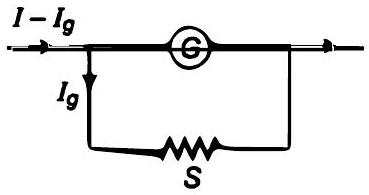
प्रश्न 28. किसी गैल्बेनोमीटर की कुण्डली का प्रतिरोध $15 \Omega$ है। $4 \mathrm{~mA}$ कि विद्युत धारा प्रवाहित होने पर यह पूर्णस्केल विक्षेप दर्शाता है। आप इस गैल्वेनोमीटर को $O$ से $6 \mathrm{~A}$ परास वाले अमीटर में कैसे रूपान्तरित करेंगे?
हल दिया है, गैल्वेनोमीटर का प्रतिरोध $G=15 \Omega$
गैल्वेनोमीटर में धारा $I_{g}=4 \times 10^{-3} \mathrm{~A}$; धारा परिसर $I=6 \mathrm{~A}$
गैल्वेनोमीटर में अल्प प्रतिरोघ (शण्ट) समान्तर क्रम में जोड़ने पर यह अमीटर में बदल जाता है। आवश्यक प्रतिरोध सूत्र द्वारा ज्ञात किया जा सकता है।

$$
\begin{aligned}
S & =\frac{I_{g} \cdot G}{I-I_{g}} \\
& =\frac{4 \times 10^{-3} \times 15}{6-4 \times 10^{-3}}=0.01 \Omega
\end{aligned}
$$

प्रतिरोध $(S=0.01 \Omega)$ गैल्वेनोमीटर से समान्तर क्रम में जुड़ा है यह अल्प प्रतिरोध गैल्वेनोमीटर के प्रतिरोध को घटाता है जिससे इससे होकर अधिक धारा प्रवाहित होती है तथा धारा का सही मान प्राप्त होता है।

