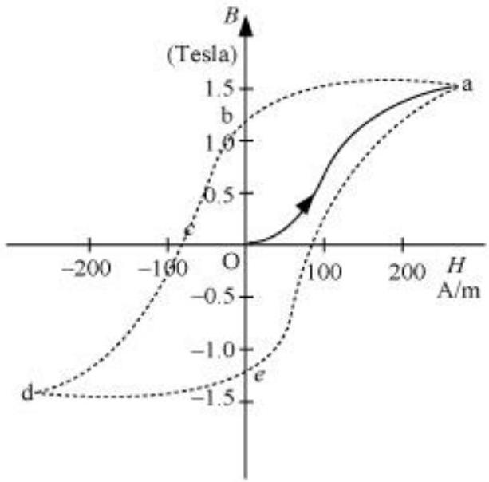

Question 5.1:
Answer the following questions regarding earth's magnetism:
A vector needs three quantities for its specification. Name the three independent quantities conventionally used to specify the earth's magnetic field.

The angle of dip at a location in southern India is about 18°.
Would you expect a greater or smaller dip angle in Britain?
If you made a map of magnetic field lines at Melbourne in Australia, would the lines seem to go into the ground or come out of the ground?

In which direction would a compass free to move in the vertical plane point to, if located right on the geomagnetic north or south pole?

The earth's field, it is claimed, roughly approximates the field due to a dipole of magnetic moment $8 \times 1022 \mathrm{~J} \mathrm{~T}^{-1}$ located at its centre. Check the order of magnitude of this number in some way.
(f ) Geologists claim that besides the main magnetic N-S poles, there are several local poles on the earth's surface oriented in different directions. How is such a thing possible at all?

Answer

The three independent quantities conventionally used for specifying earth's magnetic field are:

Magnetic declination,
Angle of dip, and
Horizontal component of earth's magnetic field
(b)The angle of dip at a point depends on how far the point is located with respect to the North Pole or the South Pole. The angle of dip would be greater in Britain (it is about 70°) than in southern India because the location of Britain on the globe is closer to the magnetic North Pole.
(c)It is hypothetically considered that a huge bar magnet is dipped inside earth with its north pole near the geographic South Pole and its south pole near the geographic North Pole.

Magnetic field lines emanate from a magnetic north pole and terminate at a magnetic south pole. Hence, in a map depicting earth's magnetic field lines, the field lines at Melbourne, Australia would seem to come out of the ground.
(d)If a compass is located on the geomagnetic North Pole or South Pole, then the compass will be free to move in the horizontal plane while earth's field is exactly vertical to the magnetic poles. In such a case, the compass can point in any direction.
(e)Magnetic moment, $M=8 \times 10^{22} \mathrm{~J} \mathrm{~T}^{-1}$

Radius of earth, $r=6.4 \times 10^{6} \mathrm{~m}$
Magnetic field strength, $B=\frac{\mu_{0} M}{4 \pi r^{3}}$
Where,

$$
\begin{aligned}
& \mu_{0}=\text { Permeability of free space }=4 \pi \times 10^{-7} \mathrm{Tm} \mathrm{~A}^{-1} \\
& \therefore B=\frac{4 \pi \times 10^{-7} \times 8 \times 10^{22}}{4 \pi \times\left(6.4 \times 10^{6}\right)^{3}}=0.3 \mathrm{G}
\end{aligned}
$$

This quantity is of the order of magnitude of the observed field on earth.
(f)Yes, there are several local poles on earth's surface oriented in different directions. A magnetised mineral deposit is an example of a local N-S pole.
c
Question 5.2:
Answer the following questions:
The earth's magnetic field varies from point to point in space.
Does it also change with time? If so, on what time scale does it change appreciably?
The earth's core is known to contain iron. Yet geologists do not regard this as a source of the earth's magnetism. Why?

The charged currents in the outer conducting regions of the earth's core are thought to be responsible for earth's magnetism. What might be the 'battery' (i.e., the source of energy) to sustain these currents?

The earth may have even reversed the direction of its field several times during its history of 4 to 5 billion years. How can geologists know about the earth's field in such distant past?

The earth's field departs from its dipole shape substantially at large distances (greater than about $30,000 \mathrm{~km}$ ). What agencies may be responsible for this distortion?
(f) Interstellar space has an extremely weak magnetic field of the order of 10-12 T. Can such a weak field be of any significant consequence? Explain.
[Note: Exercise 5.2 is meant mainly to arouse your curiosity. Answers to some questions above are tentative or unknown. Brief answers wherever possible are given at the end. For details, you should consult a good text on geomagnetism.]

Answer

Earth's magnetic field changes with time. It takes a few hundred years to change by an appreciable amount. The variation in earth's magnetic field with the time cannot be neglected.
(b)Earth's core contains molten iron. This form of iron is not ferromagnetic. Hence, this is not considered as a source of earth's magnetism.
(c)Theradioactivity in earth's interior is the source of energy that sustains the currents in the outer conducting regions of earth's core. These charged currents are considered to be responsible for earth's magnetism.
(d)Earth reversed the direction of its field several times during its history of 4 to 5 billion years. These magnetic fields got weakly recorded in rocks during their solidification. One can get clues about the geomagnetic history from the analysis of this rock magnetism.
(e)Earth's field departs from its dipole shape substantially at large distances (greater than about 30,000 km) because of the presence of the ionosphere. In this region, earth's field gets modified because of the field of single ions. While in motion, these ions produce the magnetic field associated with them.
(f)An extremely weak magnetic field can bend charged particles moving in a circle. This may not be noticeable for a large radius path. With reference to the gigantic interstellar space, the deflection can affect the passage of charged particles.

Question 5.3:
A short bar magnet placed with its axis at 30° with a uniform external magnetic field of 0.25 T experiences a torque of magnitude equal to $4.5 \times 10^{-2} \mathrm{~J}$. What is the magnitude of magnetic moment of the magnet?

## Answer

Magnetic field strength, $B=0.25 \mathrm{~T}$
Torque on the bar magnet, $T=4.5 \times 10^{-2} \mathrm{~J}$
Angle between the bar magnet and the external magnetic field, $\theta=30^{\circ}$
Torque is related to magnetic moment ( $M$ ) as:

$$
\begin{aligned}
T & =M B \sin \theta \\
\therefore M & =\frac{T}{B \sin \theta} \\
& =\frac{4.5 \times 10^{-2}}{0.25 \times \sin 30^{\circ}}=0.36 \mathrm{~J} \mathrm{~T}^{-1}
\end{aligned}
$$

Hence, the magnetic moment of the magnet is $0.36 \mathrm{~J} \mathrm{~T}^{-1}$.

Question 5.4:
A short bar magnet of magnetic moment $\mathrm{m}=0.32 \mathrm{~J} \mathrm{~T}^{-1}$ is placed in a uniform magnetic field of 0.15 T. If the bar is free to rotate in the plane of the field, which orientation would correspond to its (a) stable, and (b) unstable equilibrium? What is the potential energy of the magnet in each case?

Answer

Moment of the bar magnet, $M=0.32 \mathrm{~J} \mathrm{~T}^{-1}$
External magnetic field, $B=0.15 \mathrm{~T}$
(a)The bar magnet is aligned along the magnetic field. This system is considered as being in stable equilibrium. Hence, the angle $\theta$, between the bar magnet and the magnetic field is 0°.

Potential energy of the system $=-M B \cos \theta$

$$
\begin{aligned}
& =-0.32 \times 0.15 \cos 0^{\circ} \\
& =-4.8 \times 10^{-2} \mathrm{~J}
\end{aligned}
$$

(b)The bar magnet is oriented 180° to the magnetic field. Hence, it is in unstable equilibrium.

$$
\theta=180^{\circ}
$$

Potential energy $=-M B \cos \theta$

$$
\begin{aligned}
& =-0.32 \times 0.15 \cos 180^{\circ} \\
& =4.8 \times 10^{-2} \mathrm{~J}
\end{aligned}
$$

Question 5.5:
A closely wound solenoid of 800 turns and area of cross section $2.5 \times 10^{-4} \mathrm{~m}^{2}$ carries a current of 3.0 A. Explain the sense in which the solenoid acts like a bar magnet. What is its associated magnetic moment?

Answer

Number of turns in the solenoid, $n=800$
Area of cross-section, $A=2.5 \times 10^{-4} \mathrm{~m}^{2}$
Current in the solenoid, $I=3.0 \mathrm{~A}$
A current-carrying solenoid behaves as a bar magnet because a magnetic field develops along its axis, i.e., along its length.

The magnetic moment associated with the given current-carrying solenoid is calculated as:

$$
M=n I A
$$

$$
\begin{aligned}
& =800 \times 3 \times 2.5 \times 10^{-4} \\
& =0.6 \mathrm{~J} \mathrm{~T}^{-1}
\end{aligned}
$$

Question 5.6:
If the solenoid in Exercise 5.5 is free to turn about the vertical direction and a uniform horizontal magnetic field of 0.25 T is applied, what is the magnitude of torque on the solenoid when its axis makes an angle of 30° with the direction of applied field?

Answer

Magnetic field strength, $B=0.25 \mathrm{~T}$
Magnetic moment, $M=0.6 \mathrm{~T}^{-1}$
The angle $\theta$, between the axis of the solenoid and the direction of the applied field is $30^{\circ}$.
Therefore, the torque acting on the solenoid is given as:

$$
\begin{aligned}
\tau & =M B \sin \theta \\
& =0.6 \times 0.25 \sin 30^{\circ} \\
& =7.5 \times 10^{-2} \mathrm{~J}
\end{aligned}
$$

OO
Question 5.7:
A bar magnet of magnetic moment $1.5 \mathrm{~J} \mathrm{~T}^{-1}$ lies aligned with the direction of a uniform magnetic field of 0.22 T.

What is the amount of work required by an external torque to turn the magnet so as to align its magnetic moment: (i) normal to the field direction, (ii) opposite to the field direction?

What is the torque on the magnet in cases (i) and (ii)?
Answer

(a) Magnetic moment, $M=1.5 \mathrm{~J} \mathrm{~T}^{-1}$

Magnetic field strength, $B=0.22 \mathrm{~T}$

(i) Initial angle between the axis and the magnetic field, $\theta_{1}=0^{\circ}$

Final angle between the axis and the magnetic field, $\theta_{2}=90^{\circ}$
The work required to make the magnetic moment normal to the direction of magnetic field is given as:

$$
\begin{aligned}
W & =-M B\left(\cos \theta_{2}-\cos \theta_{1}\right) \\
& =-1.5 \times 0.22\left(\cos 90^{\circ}-\cos 0^{\circ}\right) \\
& =-0.33(0-1) \\
& =0.33 \mathrm{~J}
\end{aligned}
$$

(ii) Initial angle between the axis and the magnetic field, $\theta_{1}=0^{\circ}$

Final angle between the axis and the magnetic field, $\theta_{2}=180^{\circ}$
The work required to make the magnetic moment opposite to the direction of magnetic field is given as:

$$
\begin{aligned}
W & =-M B\left(\cos \theta_{2}-\cos \theta_{1}\right) \\
& =-1.5 \times 0.22\left(\cos 180-\cos 0^{\circ}\right) \\
& =-0.33(-1-1) \\
& =0.66 \mathrm{~J}
\end{aligned}
$$

$$
\begin{aligned}
& \text { (b)For case (i): } \theta=\theta_{2}= \\
& \therefore \text { Torque, } \tau=M B \sin \theta \\
& =1.5 \times 0.22 \sin 90^{\circ} \\
& =0.33 \mathrm{~J}
\end{aligned}
$$

For case (ii): $\theta=\theta_{2}=180^{\circ}$

$$
\begin{aligned}
& \therefore \text { Torque }, \tau=M B \sin \theta \\
& =M B \sin 180^{\circ}=0 \mathrm{~J}
\end{aligned}
$$

Question 5.8:
A closely wound solenoid of 2000 turns and area of cross-section $1.6 \times 10^{-4} \mathrm{~m}^{2}$, carrying a current of 4.0 A, is suspended through its centre allowing it to turn in a horizontal plane.

What is the magnetic moment associated with the solenoid?
What is the force and torque on the solenoid if a uniform horizontal magnetic field of 7.5 $\times 10^{-2} \mathrm{~T}$ is set up at an angle of $30^{\circ}$ with the axis of the solenoid?

Answer

Number of turns on the solenoid, $n=2000$
Area of cross-section of the solenoid, $A=1.6 \times 10^{-4} \mathrm{~m}^{2}$
Current in the solenoid, $I=4 \mathrm{~A}$
(a)The magnetic moment along the axis of the solenoid is calculated as:

$$
\begin{aligned}
& M=n A I \\
& =2000 \times 1.6 \times 10^{-4} \times 4 \\
& =1.28 \mathrm{Am}^{2}
\end{aligned}
$$

(b)Magnetic field, $B=7.5 \times 10^{-2} \mathrm{~T}$

Angle between the magnetic field and the axis of the solenoid, $\theta=30^{\circ}$
Torque, $\tau=M B \sin \theta$

$$
\begin{aligned}
& =1.28 \times 7.5 \times 10^{-2} \sin 30^{\circ} \\
& =4.8 \times 10^{-2} \mathrm{Nm}
\end{aligned}
$$

Since the magnetic field is uniform, the force on the solenoid is zero. The torque on the solenoid is $4.8 \times 10^{-2} \mathrm{Nm}$.

Question 5.9:
A circular coil of 16 turns and radius 10 cm carrying a current of 0.75 A rests with its plane normal to an external field of magnitude $5.0 \times 10^{-2} \mathrm{~T}$. The coil is free to turn about an axis in its plane perpendicular to the field direction. When the coil is turned slightly and released, it oscillates about its stable equilibrium with a frequency of $2.0 \mathrm{~s}^{-1}$. What is the moment of inertia of the coil about its axis of rotation?

Answer

Number of turns in the circular coil, $N=16$
Radius of the coil, $r=10 \mathrm{~cm}=0.1 \mathrm{~m}$
Cross-section of the coil, $A=\pi r^{2}=\pi \times(0.1)^{2} \mathrm{~m}^{2}$
Current in the coil, $I=0.75 \mathrm{~A}$
Magnetic field strength, $B=5.0 \times 10^{-2} \mathrm{~T}$
Frequency of oscillations of the coil, $v=2.0 \mathrm{~s}^{-1}$

$$
\begin{aligned}
& \therefore \text { Magnetic moment, } M=N I A=N I \pi r^{2} \\
& =16 \times 0.75 \times \pi \times(0.1)^{2} \\
& =0.377 \mathrm{~J} \mathrm{~T}^{-1}
\end{aligned}
$$

Frequency is given by the relation:

$$
v=\frac{1}{2 \pi} \sqrt{\frac{M B}{I}}
$$

Where,
$I=$ Moment of inertia of the coil

$$
\begin{aligned}
\therefore I & =\frac{M B}{4 \pi^{2} v^{2}} \\
& =\frac{0.377 \times 5 \times 10^{-2}}{4 \pi^{2} \times(2)^{2}} \\
& =1.19 \times 10^{-4} \mathrm{~kg} \mathrm{~m}^{2}
\end{aligned}
$$

Hence, the moment of inertia of the coil about its axis of rotation is $1.19 \times 10^{-4} \mathrm{~kg} \mathrm{~m}^{2}$.

Question 5.10:
A magnetic needle free to rotate in a vertical plane parallel to the magnetic meridian has its north tip pointing down at 22° with the horizontal. The horizontal component of the earth's magnetic field at the place is known to be 0.35 G. Determine the magnitude of the earth's magnetic field at the place.

Answer

Horizontal component of earth's magnetic field, $B_{H}=0.35 \mathrm{G}$
Angle made by the needle with the horizontal plane = Angle of dip $=\delta=22^{\circ}$
Earth's magnetic field strength $=B$
We can relate $B$ and $B_{H}$ as:

$$
\begin{aligned}
B_{H} & =B \cos \theta \\
\therefore B & =\frac{B_{H}}{\cos \delta} \\
& =\frac{0.35}{\cos 22^{\circ}}=0.377 \mathrm{G}
\end{aligned}
$$

Hence, the strength of earth's magnetic field at the given location is 0.377 G.

Question 5.11:
At a certain location in Africa, a compass points 12° west of the geographic north. The north tip of the magnetic needle of a dip circle placed in the plane of magnetic meridian points 60° above the horizontal. The horizontal component of the earth's field is measured to be 0.16 G. Specify the direction and magnitude of the earth's field at the location.

Answer

Angle of declination, $\theta=12^{\circ}$
Angle of dip, $\delta=60^{\circ}$
Horizontal component of earth's magnetic field, $B_{H}=0.16 \mathrm{G}$
Earth's magnetic field at the given location $=B$
We can relate $B$ and $B_{H}$ as:

$$
\begin{aligned}
B_{H} & =B \cos \delta \\
\therefore B & =\frac{B_{H}}{\cos \delta} \\
& =\frac{0.16}{\cos 60^{\circ}}=0.32 \mathrm{G}
\end{aligned}
$$

Earth's magnetic field lies in the vertical plane, 12° West of the geographic meridian, making an angle of $60^{\circ}$ (upward) with the horizontal direction. Its magnitude is 0.32 G.

Question 5.12:
A short bar magnet has a magnetic moment of $0.48 \mathrm{~J} \mathrm{~T}^{-1}$. Give the direction and magnitude of the magnetic field produced by the magnet at a distance of 10 cm from the centre of the magnet on (a) the axis, (b) the equatorial lines (normal bisector) of the magnet.

Answer

Magnetic moment of the bar magnet, $M=0.48 \mathrm{~J} \mathrm{~T}^{-1}$
Distance, $d=10 \mathrm{~cm}=0.1 \mathrm{~m}$
The magnetic field at distance $d$, from the centre of the magnet on the axis is given by the relation:

$$
B=\frac{\mu_{0}}{4 \pi} \frac{2 M}{d^{3}}
$$

Where,

$$
\begin{aligned}
& \mu_{0}=\text { Permeability of free space }=4 \pi \times 10^{-7} \mathrm{Tm} \mathrm{~A}^{-1} \\
& \therefore B=\frac{4 \pi \times 10^{-7} \times 2 \times 0.48}{4 \pi \times(0.1)^{3}} \\
& \quad=0.96 \times 10^{-4} \mathrm{~T}=0.96 \mathrm{G}
\end{aligned}
$$

The magnetic field is along the $\mathrm{S}-\mathrm{N}$ direction.
The magnetic field at a distance of 10 cm (i.e., $d=0.1 \mathrm{~m}$ ) on the equatorial line of the magnet is given as:

$$
\begin{aligned}
B & =\frac{\mu_{0} \times M}{4 \pi \times d^{3}} \\
& =\frac{4 \pi \times 10^{-7} \times 0.48}{4 \pi(0.1)^{3}} \\
& =0.48 \mathrm{G}
\end{aligned}
$$

The magnetic field is along the $\mathrm{N}-\mathrm{S}$ direction.

Question 5.13:

A short bar magnet placed in a horizontal plane has its axis aligned along the magnetic north-south direction. Null points are found on the axis of the magnet at 14 cm from the centre of the magnet. The earth's magnetic field at the place is 0.36 G and the angle of dip is zero. What is the total magnetic field on the normal bisector of the magnet at the same distance as the null-point (i.e., 14 cm ) from the centre of the magnet? (At null points, field due to a magnet is equal and opposite to the horizontal component of earth's magnetic field.)

Answer

Earth's magnetic field at the given place, $H=0.36 \mathrm{G}$
The magnetic field at a distance $d$, on the axis of the magnet is given as:

$$
B_{1}=\frac{\mu_{0}}{4 \pi} \frac{2 M}{d^{3}}=H
$$

Where,

$$
\begin{aligned}
\mu_{0} & =\text { Permeability of free space } \\
M & =\text { Magnetic moment }
\end{aligned}
$$

The magnetic field at the same distance $d$, on the equatorial line of the magnet is given as:

$$
B_{2}=\frac{\mu_{0} M}{4 \pi d^{3}}=\frac{H}{2} \quad[\text { Using equation }(i)]
$$

Total magnetic field, $B=B_{1}+B_{2}$

$$
\begin{aligned}
& =H+\frac{H}{2} \\
& =0.36+0.18=0.54 \mathrm{G}
\end{aligned}
$$

Hence, the magnetic field is 0.54 G in the direction of earth's magnetic field.

Question 5.14:

If the bar magnet in exercise 5.13 is turned around by 180°, where will the new null points be located?

Answer

The magnetic field on the axis of the magnet at a distance $d_{1}=14 \mathrm{~cm}$, can be written as:

$$
B_{1}=\frac{\mu_{0} 2 M}{4 \pi\left(d_{1}\right)^{3}}=H
$$

Where,
$M=$ Magnetic moment
$\mu_{0}=$ Permeability of free space
$H=$ Horizontal component of the magnetic field at $d_{1}$
If the bar magnet is turned through $180^{\circ}$, then the neutral point will lie on the equatorial line.

Hence, the magnetic field at a distance $d_{2}$, on the equatorial line of the magnet can be written as:

$$
B_{2}=\frac{\mu_{0} M}{4 \pi\left(d_{2}\right)^{3}}=H
$$

Equating equations (1) and (2), we get:

$$
\begin{aligned}
& \frac{2}{\left(d_{1}\right)^{3}}=\frac{1}{\left(d_{2}\right)^{3}} \\
& \left(\frac{d_{2}}{d_{1}}\right)^{3}=\frac{1}{2} \\
& \therefore d_{2}=d_{1} \times\left(\frac{1}{2}\right)^{\frac{1}{3}} \\
& \quad=14 \times 0.794=11.1 \mathrm{~cm}
\end{aligned}
$$

The new null points will be located 11.1 cm on the normal bisector.

Question 5.15:
A short bar magnet of magnetic moment $5.25 \times 10^{-2} \mathrm{~J} \mathrm{~T}^{-1}$ is placed with its axis perpendicular to the earth's field direction. At what distance from the centre of the magnet, the resultant field is inclined at 45° with earth's field on
its normal bisector and (b) its axis. Magnitude of the earth's field at the place is given to be 0.42 G. Ignore the length of the magnet in comparison to the distances involved.

Answer

Magnetic moment of the bar magnet, $M=5.25 \times 10^{-2} \mathrm{~J} \mathrm{~T}^{-1}$
Magnitude of earth's magnetic field at a place, $H=0.42 \mathrm{G}=0.42 \times 10^{-4} \mathrm{~T}$
The magnetic field at a distance $R$ from the centre of the magnet on the normal bisector is given by the relation:

$$
B=\frac{\mu_{0} M}{4 \pi R^{3}}
$$

Where,

$$
\mu_{0}=\text { Permeability of free space }=4 \pi \times 10^{-7} \mathrm{Tm} \mathrm{~A}^{-1}
$$

When the resultant field is inclined at 45° with earth's field, $B=H$

$$
\begin{aligned}
& \therefore \frac{\mu_{0} M}{4 \pi R^{3}}=H=0.42 \times 10^{-4} \\
& R^{3}=\frac{\mu_{0} M}{0.42 \times 10^{-4} \times 4 \pi} \\
& \quad=\frac{4 \pi \times 10^{-7} \times 5.25 \times 10^{-2}}{4 \pi \times 0.42 \times 10^{-4}}=12.5 \times 10^{-5} \\
& \therefore R=0.05 \mathrm{~m}=5 \mathrm{~cm}
\end{aligned}
$$

The magnetic field at a distanced $R^{\prime}$ from the centre of the magnet on its axis is given as:

$$
B^{\prime}=\frac{\mu_{0} 2 M}{4 \pi \mathrm{R}^{3}}
$$

The resultant field is inclined at 45° with earth's field.

$$
\begin{aligned}
& \therefore B^{\prime}=H \\
& \frac{\mu_{0} 2 M}{4 \pi\left(R^{\prime}\right)^{3}}=H \\
& \left(R^{\prime}\right)^{3}=\frac{\mu_{0} 2 M}{4 \pi \times H} \\
& \quad=\frac{4 \pi \times 10^{-7} \times 2 \times 5.25 \times 10^{-2}}{4 \pi \times 0.42 \times 10^{-4}}=25 \times 10^{-5} \\
& \therefore R^{\prime}=0.063 \mathrm{~m}=6.3 \mathrm{~cm}
\end{aligned}
$$

Question 5.16:
Answer the following questions:
Why does a paramagnetic sample display greater magnetisation (for the same magnetising field) when cooled?

Why is diamagnetism, in contrast, almost independent of temperature?

If a toroid uses bismuth for its core, will the field in the core be (slightly) greater or (slightly) less than when the core is empty?

Is the permeability of a ferromagnetic material independent of the magnetic field? If not, is it more for lower or higher fields?

Magnetic field lines are always nearly normal to the surface of a ferromagnet at every point. (This fact is analogous to the static electric field lines being normal to the surface of a conductor at every point.) Why?
(f ) Would the maximum possible magnetisation of a paramagnetic sample be of the same order of magnitude as the magnetization of a ferromagnet?

Answer
(a)Owing to therandom thermal motion of molecules, the alignments of dipoles get disrupted at high temperatures. On cooling, this disruption is reduced. Hence, a paramagnetic sample displays greater magnetisation when cooled.
(b)The induced dipole moment in a diamagnetic substance is always opposite to the magnetising field. Hence, the internal motion of the atoms (which is related to the temperature) does not affect the diamagnetism of a material.
(c)Bismuth is a diamagnetic substance. Hence, a toroid with a bismuth core has a magnetic field slightly greater than a toroid whose core is empty.
(d)The permeability of ferromagnetic materials is not independent of the applied magnetic field. It is greater for a lower field and vice versa.
(e)The permeability of a ferromagnetic material is not less than one. It is always greater than one. Hence, magnetic field lines are always nearly normal to the surface of such materials at every point.
(f)The maximum possible magnetisation of a paramagnetic sample can be of the same order of magnitude as the magnetisation of a ferromagnet. This requires high magnetising fields for saturation.

Question 5.17:
Answer the following questions:

Explain qualitatively on the basis of domain picture the irreversibility in the magnetisation curve of a ferromagnet.

The hysteresis loop of a soft iron piece has a much smaller area than that of a carbon steel piece. If the material is to go through repeated cycles of magnetisation, which piece will dissipate greater heat energy?
'A system displaying a hysteresis loop such as a ferromagnet, is a device for storing memory?' Explain the meaning of this statement.

What kind of ferromagnetic material is used for coating magnetic tapes in a cassette player, or for building 'memory stores' in a modern computer?

A certain region of space is to be shielded from magnetic fields.
Suggest a method.
Answer

The hysteresis curve ( $B-H$ curve) of a ferromagnetic material is shown in the following figure.

It can be observed from the given curve that magnetisation persists even when the external field is removed. This reflects the irreversibility of a ferromagnet.
(b)The dissipated heat energy is directly proportional to the area of a hysteresis loop. A carbon steel piece has a greater hysteresis curve area. Hence, it dissipates greater heat energy.
(c)The value of magnetisation is memory or record of hysteresis loop cycles of magnetisation. These bits of information correspond to the cycle of magnetisation. Hysteresis loops can be used for storing information.
(d)Ceramic is used for coating magnetic tapes in cassette players and for building memory stores in modern computers.
(e)A certain region of space can be shielded from magnetic fields if it is surrounded by soft iron rings. In such arrangements, the magnetic lines are drawn out of the region.

Question 5.18:
A long straight horizontal cable carries a current of 2.5 A in the direction $10^{\circ}$ south of west to 10° north of east. The magnetic meridian of the place happens to be 10° west of the geographic meridian. The earth's magnetic field at the location is 0.33 G, and the angle of dip is zero. Locate the line of neutral points (ignore the thickness of the cable). (At neutral points, magnetic field due to a current-carrying cable is equal and opposite to the horizontal component of earth's magnetic field.)

Answer

Current in the wire, $I=2.5 \mathrm{~A}$
Angle of dip at the given location on earth, $\delta=0^{\circ}$
Earth's magnetic field, $H=0.33 \mathrm{G}=0.33 \times 10^{-4} \mathrm{~T}$
The horizontal component of earth's magnetic field is given as:

$$
\begin{aligned}
& H_{H}=H \cos \delta \\
& =0.33 \times 10^{-4} \times \cos 0^{\circ}=0.33 \times 10^{-4} \mathrm{~T}
\end{aligned}
$$

The magnetic field at the neutral point at a distance $R$ from the cable is given by the relation:

$$
H_{H}=\frac{\mu_{0} I}{2 \pi R}
$$

Where,

$$
\begin{aligned}
\mu_{0} & =\text { Permeability of free space }=4 \pi \times 10^{-7} \mathrm{Tm} \mathrm{~A}^{-1} \\
\therefore R & =\frac{\mu_{0} I}{2 \pi H_{H}} \\
& =\frac{4 \pi \times 10^{-7} \times 2.5}{2 \pi \times 0.33 \times 10^{-4}}=15.15 \times 10^{-3} \mathrm{~m}=1.51 \mathrm{~cm}
\end{aligned}
$$

Hence, a set of neutral points parallel to and above the cable are located at a normal distance of 1.51 cm.

Question 5.19:
A telephone cable at a place has four long straight horizontal wires carrying a current of 1.0 A in the same direction east to west. The earth's magnetic field at the place is 0.39 G, and the angle of dip is 35°. The magnetic declination is nearly zero. What are the resultant magnetic fields at points 4.0 cm below the cable?

Answer

Number of horizontal wires in the telephone cable, $n=4$
Current in each wire, $I=1.0 \mathrm{~A}$
Earth's magnetic field at a location, $H=0.39 \mathrm{G}=0.39 \times 10^{-4} \mathrm{~T}$
Angle of dip at the location, $\delta=35^{\circ}$
Angle of declination, $\theta \sim 0^{\circ}$
For a point 4 cm below the cable:
Distance, $r=4 \mathrm{~cm}=0.04 \mathrm{~m}$
The horizontal component of earth's magnetic field can be written as:

$$
H_{h}=H \cos \delta-B
$$

Where,
$B=$ Magnetic field at 4 cm due to current $I$ in the four wires

$$
=4 \times \frac{\mu_{0} I}{2 \pi r}
$$

$\mu_{0}=$ Permeability of free space $=4 \pi \times 10^{-7} \mathrm{Tm} \mathrm{A}^{-1}$

$$
\begin{aligned}
& \therefore B=4 \times \frac{4 \pi \times 10^{-7} \times 1}{2 \pi \times 0.04} \\
& =0.2 \times 10^{-4} \mathrm{~T}=0.2 \mathrm{G} \\
& \therefore H_{h}=0.39 \cos 35^{\circ}-0.2 \\
& =0.39 \times 0.819-0.2 \approx 0.12 \mathrm{G}
\end{aligned}
$$

The vertical component of earth's magnetic field is given as:

$$
\begin{aligned}
& H_{v}=H \sin \delta \\
& =0.39 \sin 35^{\circ}=0.22 \mathrm{G}
\end{aligned}
$$

The angle made by the field with its horizontal component is given as:

$$
\begin{aligned}
\theta & =\tan ^{-1} \frac{H_{v}}{H_{h}} \\
& =\tan ^{-1} \frac{0.22}{0.12}=61.39^{\circ}
\end{aligned}
$$

The resultant field at the point is given as:

$$
\begin{aligned}
H_{1} & =\sqrt{\left(H_{v}\right)^{2}+\left(H_{h}\right)^{2}} \\
& =\sqrt{(0.22)^{2}+(0.12)^{2}}=0.25 \mathrm{G}
\end{aligned}
$$

## For a point 4 cm above the cable:

Horizontal component of earth's magnetic field:

$$
\begin{aligned}
& H_{h}=H \cos \delta+B \\
& =0.39 \cos 35^{\circ}+0.2=0.52 \mathrm{G}
\end{aligned}
$$

Vertical component of earth's magnetic field:

$$
H_{v}=H \sin \delta
$$

$$
=0.39 \sin 35^{\circ}=0.22 \mathrm{G}
$$

Angle, $\theta$

$$
=\tan ^{-1} \frac{H_{v}}{H_{h}}=\tan ^{-1} \frac{0.22}{0.52}=22.9^{\circ}
$$

And resultant field:

$$
\begin{aligned}
H_{2} & =\sqrt{\left(H_{v}\right)^{2}+\left(H_{h}\right)^{2}} \\
& =\sqrt{(0.22)^{2}+(0.52)^{2}}=0.56 \mathrm{~T}
\end{aligned}
$$

Question 5.20:
A compass needle free to turn in a horizontal plane is placed at the centre of circular coil of 30 turns and radius 12 cm. The coil is in a vertical plane making an angle of $45^{\circ}$ with the magnetic meridian. When the current in the coil is 0.35 A, the needle points west to east.

Determine the horizontal component of the earth's magnetic field at the location.
The current in the coil is reversed, and the coil is rotated about its vertical axis by an angle of 90° in the anticlockwise sense looking from above. Predict the direction of the needle. Take the magnetic declination at the places to be zero.

Answer

Number of turns in the circular coil, $N=30$
Radius of the circular coil, $r=12 \mathrm{~cm}=0.12 \mathrm{~m}$
Current in the coil, $I=0.35 \mathrm{~A}$
Angle of dip, $\delta=45^{\circ}$
The magnetic field due to current $I$, at a distance $r$, is given as:

$$
B=\frac{\mu_{0} 2 \pi N I}{4 \pi r}
$$

Where,
$\mu_{0}=$ Permeability of free space $=4 \pi \times 10^{-7} \mathrm{Tm} \mathrm{A}^{-1}$

$$
\begin{aligned}
& \therefore B=\frac{4 \pi \times 10^{-7} \times 2 \pi \times 30 \times 0.35}{4 \pi \times 0.12} \\
& =5.49 \times 10^{-5} \mathrm{~T}
\end{aligned}
$$

The compass needle points from West to East. Hence, the horizontal component of earth's magnetic field is given as:

$$
\begin{aligned}
& B_{H}=B \sin \delta \\
& =5.49 \times 10^{-5} \sin 45^{\circ}=3.88 \times 10^{-5} \mathrm{~T}=0.388 \mathrm{G}
\end{aligned}
$$

When the current in the coil is reversed and the coil is rotated about its vertical axis by an angle of $90{ }^{\circ}$, the needle will reverse its original direction. In this case, the needle will point from East to West.

Question 5.21:
A magnetic dipole is under the influence of two magnetic fields. The angle between the field directions is $60^{\mathrm{o}}$, and one of the fields has a magnitude of $1.2 \times 10^{-2} \mathrm{~T}$. If the dipole comes to stable equilibrium at an angle of $15^{\circ}$ with this field, what is the magnitude of the other field?

Answer

Magnitude of one of the magnetic fields, $B_{1}=1.2 \times 10^{-2} \mathrm{~T}$
Magnitude of the other magnetic field $=B_{2}$
Angle between the two fields, $\theta=60^{\circ}$
At stable equilibrium, the angle between the dipole and field $B_{1}, \theta_{1}=15^{\circ}$
Angle between the dipole and field $B_{2}, \theta_{2}=\theta-\theta_{1}=60^{\circ}-15^{\circ}=45^{\circ}$
At rotational equilibrium, the torques between both the fields must balance each other.
∴ Torque due to field $B_{1}=$ Torque due to field $B_{2}$

$$
M B_{1} \sin \theta_{1}=M B_{2} \sin \theta_{2}
$$

Where,

$$
M=\text { Magnetic moment of the dipole }
$$

$$
\begin{aligned}
\therefore B_{2} & =\frac{B_{1} \sin \theta_{1}}{\sin \theta_{2}} \\
& =\frac{1.2 \times 10^{-2} \times \sin 15^{\circ}}{\sin 45^{\circ}}=4.39 \times 10^{-3} \mathrm{~T}
\end{aligned}
$$

Hence, the magnitude of the other magnetic field is $4.39 \times 10^{-3} \mathrm{~T}$.

Question 5.22:
A monoenergetic (18 keV) electron beam initially in the horizontal direction is subjected to a horizontal magnetic field of 0.04 G normal to the initial direction. Estimate the up or down deflection of the beam over a distance of $30 \mathrm{~cm}\left(m_{e}=9.11 \times 10^{-19} \mathrm{C}\right)$. [Note: Data in this exercise are so chosen that the answer will give you an idea of the effect of earth's magnetic field on the motion of the electron beam from the electron gun to the screen in a TV set.]

Answer

Energy of an electron beam, $E=18 \mathrm{keV}=18 \times 10^{3} \mathrm{eV}$
Charge on an electron, $e=1.6 \times 10^{-19} \mathrm{C}$

$$
E=18 \times 10^{3} \times 1.6 \times 10^{-19} \mathrm{~J}
$$

Magnetic field, $B=0.04 \mathrm{G}$
Mass of an electron, $m_{e}=9.11 \times 10^{-19} \mathrm{~kg}$
Distance up to which the electron beam travels, $d=30 \mathrm{~cm}=0.3 \mathrm{~m}$
We can write the kinetic energy of the electron beam as:

$$
\begin{aligned}
E & =\frac{1}{2} m v^{2} \\
v & =\sqrt{\frac{2 E}{m}} \\
& =\sqrt{\frac{2 \times 18 \times 10^{3} \times 1.6 \times 10^{-19} \times 10^{-15}}{9.11 \times 10^{-31}}}=0.795 \times 10^{8} \mathrm{~m} / \mathrm{s}
\end{aligned}
$$

The electron beam deflects along a circular path of radius, $r$.
The force due to the magnetic field balances the centripetal force of the path.

$$
\begin{aligned}
B e V & =\frac{m v^{2}}{r} \\
\therefore r & =\frac{m v}{B e} \\
& =\frac{9.11 \times 10^{-31} \times 0.795 \times 10^{8}}{0.4 \times 10^{-4} \times 1.6 \times 10^{-19}}=11.3 \mathrm{~m}
\end{aligned}
$$

Let the up and down deflection of the electron beam be $x=r(1-\cos \theta)$
Where,

$$
\theta=\text { Angle of declination }
$$

$$
\begin{aligned}
\sin \theta & =\frac{d}{r} \\
& =\frac{0.3}{11.3}
\end{aligned}
$$

$$
\theta=\sin ^{-1} \frac{0.3}{11.3}=1.521^{\circ}
$$

And $x=11.3\left(1-\cos 1.521^{\circ}\right)$

$$
=0.0039 \mathrm{~m}=3.9 \mathrm{~mm}
$$

Therefore, the up and down deflection of the beam is 3.9 mm.

Question 5.23:
A sample of paramagnetic salt contains $2.0 \times 10^{24}$ atomic dipoles each of dipole moment $1.5 \times 10^{-23} \mathrm{~J} \mathrm{~T}^{-1}$. The sample is placed under a homogeneous magnetic field of 0.64 T , and cooled to a temperature of 4.2 K. The degree of magnetic saturation achieved is equal
to 15\%. What is the total dipole moment of the sample for a magnetic field of 0.98 T and a temperature of 2.8 K? (Assume Curie's law)

Answer

Number of atomic dipoles, $n=2.0 \times 10^{24}$
Dipole moment of each atomic dipole, $M=1.5 \times 10^{-23} \mathrm{~J} \mathrm{~T}^{-1}$
When the magnetic field, $B_{1}=0.64 \mathrm{~T}$
The sample is cooled to a temperature, $T_{1}=4.2^{\circ} \mathrm{K}$
Total dipole moment of the atomic dipole, $M_{\text {tot }}=n \times M$

$$
\begin{aligned}
& =2 \times 10^{24} \times 1.5 \times 10^{-23} \\
& =30 \mathrm{~J} \mathrm{~T}^{-1}
\end{aligned}
$$

Magnetic saturation is achieved at $15 \%$.
Hence, effective dipole moment, $M_{1}=\frac{15}{100} \times 30=4.5 \mathrm{~J} \mathrm{~T}^{-1}$
When the magnetic field, $B_{2}=0.98 \mathrm{~T}$
Temperature, $T_{2}=2.8^{\circ} \mathrm{K}$
Its total dipole moment $=M_{2}$
According to Curie's law, we have the ratio of two magnetic dipoles as:

$$
\begin{aligned}
\frac{M_{2}}{M_{1}} & =\frac{B_{2}}{B_{1}} \times \frac{T_{1}}{T_{2}} \\
\therefore M_{2} & =\frac{B_{2} T_{1} M_{1}}{B_{1} T_{2}} \\
& =\frac{0.98 \times 4.2 \times 4.5}{2.8 \times 0.64}=10.336 \mathrm{~J} \mathrm{~T}^{-1}
\end{aligned}
$$

Therefore, $10.336 \mathrm{~J} \mathrm{~T}^{-1}$ is the total dipole moment of the sample for a magnetic field of 0.98 T and a temperature of 2.8 K.

Question 5.24:
A Rowland ring of mean radius 15 cm has 3500 turns of wire wound on a ferromagnetic core of relative permeability 800 . What is the magnetic field $\mathbf{B}$ in the core for a magnetising current of 1.2 A?

Answer

Mean radius of a Rowland ring, $r=15 \mathrm{~cm}=0.15 \mathrm{~m}$
Number of turns on a ferromagnetic core, $N=3500$
Relative permeability of the core material, $\mu_{r}=800$
Magnetising current, $I=1.2 \mathrm{~A}$
The magnetic field is given by the relation:

$$
B=\frac{\mu_{r} \mu_{0} I N}{2 \pi r}
$$

Where,

$$
\begin{aligned}
& \mu_{0}=\text { Permeability of free space }=4 \pi \times 10^{-7} \mathrm{Tm} \mathrm{~A}^{-1} \\
& B=\frac{800 \times 4 \pi \times 10^{-7} \times 1.2 \times 3500}{2 \pi \times 0.15}=4.48 \mathrm{~T}
\end{aligned}
$$

Therefore, the magnetic field in the core is 4.48 T.

Question 5.25:
The magnetic moment vectors $\mu_{s}$ and $\mu_{l}$ associated with the intrinsic spin angular momentum S and orbital angular momentum I, respectively, of an electron are predicted by quantum theory (and verified experimentally to a high accuracy) to be given by:

$$
\begin{aligned}
& \mu_{s}=-(e / m) \mathbf{S}, \\
& \mu_{l}=-(e / 2 m) \mathbf{I}
\end{aligned}
$$

Which of these relations is in accordance with the result expected classically? Outline the derivation of the classical result.

Answer

The magnetic moment associated with the intrinsic spin angular momentum ( ) is given as

The magnetic moment associated with the orbital angular momentum ( ) is given as For current $i$ and area of cross-section $A$, we have the relation:

Where,

$$
\begin{aligned}
& e=\text { Charge of the electron } \\
& r=\text { Radius of the circular orbit } \\
& T=\text { Time taken to complete one rotation around the circular orbit of radius } r \\
& \text { Angular momentum, } l=m v r
\end{aligned}
$$

Where,

$$
\begin{aligned}
& m=\text { Mass of the electron } \\
& v=\text { Velocity of the electron }
\end{aligned}
$$

Dividing equation (1) by equation (2), we get:

Therefore, of the two relations, is in accordance with classical physics.

