## अध्याय $5$

## चुंबकत्व एवं द्रव्य

## $5.1$ भूमिका

चुंबकीय परिघटना प्रकृति में सार्वभौमिक है। विशाल दूरस्थ गैलेक्सियाँ，अतिसूक्ष्म अदृश्य परमाणु，मनुष्य और जानवर，सबमें भाँति－भाँति के स्रोतों से उत्पन्न भाँति－भाँति के चुंबकीय क्षेत्र व्याप्त हैं। भू－चुंबकत्व，मानवीय विकास से भी पूर्व से अस्तित्व में है।＇चुंबक＇शब्द यूनान के एक द्वीप मैग्नेशिया के नाम से व्युत्पन्न है，जहाँ बहुत पहले $600$ ईसा पूर्व चुंबकीय अयस्कों के भंडार मिले थे।

पिछले अध्याय में हमने सीखा कि गतिशील आवेश या विद्युत धारा चुंबकीय क्षेत्र उत्पन्न करती है। यह खोज जो उन्नीसवीं शताब्दी के पूर्वार्द्ध में की गई थी，इसका श्रेय ऑर्स्टेड，ऐम्पियर，बायो एवं सावर्ट तथा अन्य कुछ लोगों को दिया जाता है।

प्रस्तुत अध्याय में हम चुंबकत्व पर एक स्वतंत्र विषय के रूप में दृष्टि डालेंगे। चुंबकत्व संबंधी कुछ आम विचार इस प्रकार हैं－

（i） पृथ्वी एक चुंबक की भाँति व्यवहार करती है जिसका चुंबकीय क्षेत्र लगभग भौगोलिक दक्षिण से उत्तर की ओर संकेत करता है।
（ii） जब एक छड़ चुंबक को स्वतंत्रतापूर्वक लटकाया या शांत पानी पर तैराया जाता है तो यह उत्तर－दक्षिण दिशा में ठहरता है। इसका वह सिरा जो भौगोलिक उत्तर की ओर संकेत करता है，उत्तरी ध्रुव और जो भौगोलिक दक्षिण की ओर संकेत करता है，चुंबक का दक्षिणी ध्रुव कहलाता है।

## - भौतिकी

(iii) दो पृथक-पृथक चुंबकों के दो उत्तरी ध्रुव (या दो दक्षिणी ध्रुव) जब पास-पास लाए जाते हैं तो वे एक-दूसरे को विकर्षित करते हैं। इसके विपरीत, एक चुंबक के उत्तर और दूसरे के दक्षिण ध्रुव एक-दूसरे को आकर्षित करते हैं।
(iv) किसी चुंबक के उत्तर और दक्षिण ध्रुवों को अलग-अलग नहीं किया जा सकता। यदि किसी छड़ चुंबक को दो भागों में विभाजित किया जाए तो हमें दो छोटे अलग-अलग छड़ चुंबक मिल जाएँगे, जिनका चुंबकत्व क्षीण होगा। वैद्युत आवेशों की तरह, विलगित चुंबकीय उत्तरी तथा दक्षिणी ध्रुवों जिन्हें चुंबकीय एकध्रुव कहते हैं, का अस्तित्व नहीं है।
(v) लौह और इसकी मिश्र-धातुओं से चुंबक बनाने संभव हैं। इस अध्याय में हम एक छड़ चुंबक और एक बाह्य चुंबकीय क्षेत्र में इसके व्यवहार के वर्णन से प्रारंभ करेंगे। हम चुंबकत्व संबंधी गाउस का नियम बताएँगे। उसके बाद यह बताएँगे कि चुंबकीय गुणों के आधार पर पदार्थों का वर्गीकरण कैसे किया जाता है और फिर अनुचुंबकत्व, प्रतिचुंबकत्व तथा लौह-चुंबकत्व का वर्णन करेंगे।

## $5.2$ छड़ चुंबक

हम अपने अध्ययन की शुरुआत लौह रेतन से करते हैं जो एक छोटे छड़ चुंबक के ऊपर रखी गई काँच की शीट पर छिड़का गया है। लौह रेतन की यह व्यवस्था चित्र $5.1$ में दर्शायी गई है। लौह रेतन के पैटर्न यह इंगित करते हैं कि चुंबक के दो ध्रुव होते हैं, वैसे ही जैसे वैद्युत द्विध्रुव के धनात्मक एवं ऋणात्मक आवेश। जैसा कि पहले भूमिका में बताया जा चुका है, एक ध्रुव को उत्तर और दूसरे को दक्षिण ध्रुव कहते हैं। जब छड़ चुंबक को स्वतंत्रतापूर्वक लटकाया जाता है तो ये ध्रुव क्रमशः लगभग भौगोलिक उत्तरी एवं दक्षिणी ध्रुवों की ओर संकेत करते हैं। लौह रेतन का इसी से मिलता-जुलता पैटर्न एक धारावाही परिनालिका के इर्द-गिर्द भी बनता है।

### 5.2.1 चुंबकीय क्षेत्र रेखाएँ

लौह रेतन के बने पैटर्नों के आधार पर हम चुंबकीय क्षेत्र रेखाएँ ं खींच सकते हैं। चित्र $5.2$ में यह छड़ चुंबक और धारावाही परिनालिका, दोनों के लिए दर्शाया गया है। तुलना के लिए अध्याय एक चित्र 1.14(d) देखिए। विद्युत द्विध्रुव की वैद्युत बल रेखाएँ चित्र 5.2(c) में भी दर्शायी गई हैं। चुंबकीय क्षेत्र रेखाएँ, चुंबकीय क्षेत्र का दृश्य और अंतर्दृष्टिपरक प्रस्तुतीकरण हैं। इनके गुण हैं:
\begin{itemize}
\item[(i)] किसी चुंबक (या धारावाही परिनालिका) की चुंबकीय क्षेत्र रेखाएँ संतत बंद लूप बनाती हैं। यह वैद्युत-द्विध्रुव के जैसी नहीं है, जहाँ ये रेखाएँ धनावेश से शुरू होकर ऋणावेश पर खत्म हो जाती हैं [चित्र 5.2(c) देखिए] या फिर अनंत की ओर चली जाती हैं।
\item[(ii)] क्षेत्र रेखा के किसी बिंदु पर खींची गई स्पर्श रेखा उस बिंदु पर परिणामी चुंबकीय क्षेत्र B की दिशा बताती है।
\item[(iii)] क्षेत्र के लंबवत रखे गए तल के प्रति इकाई क्षेत्रफल से जितनी अधिक क्षेत्र रेखाएँ गुजरती हैं, उतना ही अधिक उस स्थान पर चुंबकीय क्षेत्र B का परिमाण होता है। चित्र $5.2$ (a) में, क्षेत्र (ii) के आसपास B का परिमाण क्षेत्र (i) की तुलना में अधिक है।
\item[] [^0]\end{itemize}

## चुंबकत्व एवं द्रव्य

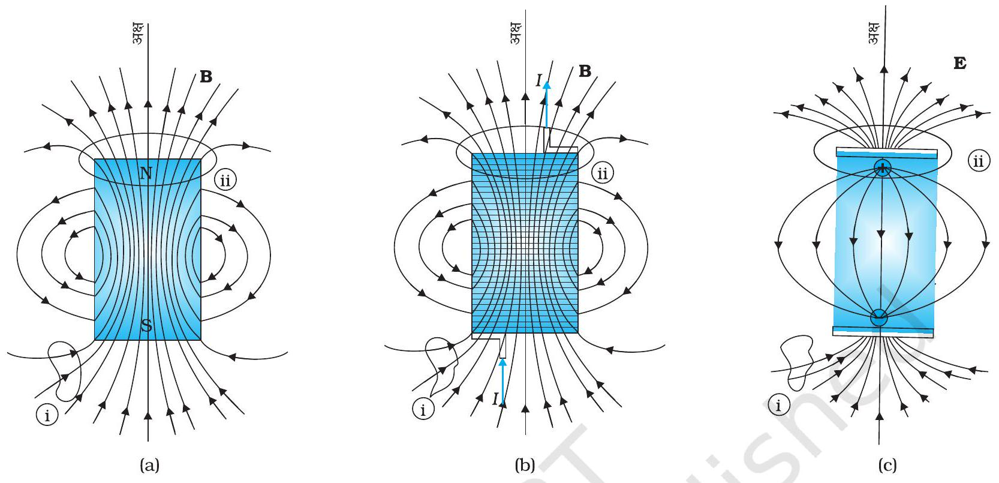
चित्र $5.2$ क्षेत्र रेखाएँ (a) एक छड़ चुंबक की (b) एक सीमित आकार वाली धारावाही परिनालिका की, और (c) एक वैद्युत द्विध्रुव की। बहुत अधिक दूरी पर तीनों रेखा समुच्चय एक से हैं। (i) एवं (ii) अंकित वक्र, बंद गाउसीय पृष्ठ हैं।

(iv) चुंबकीय क्षेत्र रेखाएँ एक-दूसरे को काटती नहीं हैं। ऐसा इसलिए है क्योंकि इस स्थिति में कटान बिंदु पर चुंबकीय क्षेत्र की दिशा एक ही नहीं रह जाती।
आप चाहें तो कई तरह से चुंबकीय क्षेत्र रेखाएँ आलेखित कर सकते हैं। एक तरीका यह है कि भिन्न-भिन्न जगहों पर एक छोटी चुंबकीय कंपास सुई रखिए और इसके दिक्विन्यास को अंकित कीजिए। इस तरह आप चुंबक के आस-पास विभिन्न बिंदुओं पर चुंबकीय क्षेत्र की दिशा जान सकेंगे।

### 5.2.2 छड़ चुंबक का एक धारावाही परिनालिका की तरह व्यवहार

पिछले अध्याय में हमने यह समझाया है कि किस प्रकार एक धारा लूप एक चुंबकीय द्विध्रुव की तरह व्यवहार करता है (अनुभाग $4.9$ देखिए)। हमने ऐम्पियर की इस परिकल्पना का जिक्र भी किया था कि सभी चुंबकीय परिघटनाओं को परिवाही धाराओं के प्रभावों के रूप में समझाया जा सकता है।

एक छड़ चुंबक की चुंबकीय क्षेत्र रेखाओं की, एक धारावाही परिनालिका की चुंबकीय क्षेत्र रेखाओं से साम्यता यह सुझाती है कि जैसे परिनालिका बहुत-सी परिवाही धाराओं का योग है वैसे ही छड़ चुंबक भी बहुत-सी परिसंचारी धाराओं का योग हो सकता है। एक छड़ चुंबक के दो बराबर टुकड़े करना वैसा ही है जैसे एक परिनालिका को काटना। जिससे हमें दो छोटी परिनालिकाएँ मिल जाती हैं जिनके चुंबकीय क्षेत्र अपेक्षाकृत क्षीण होते हैं। क्षेत्र रेखाएँ संतत बनी रहती हैं, एक सिरे से बाहर निकलती हैं और दूसरे सिरे से अंदर प्रवेश करती हैं। एक छोटी चुंबकीय कंपास सुई को एक छड़ चुंबक एवं एक धारावाही सीमित परिनालिका के पास एक जगह से दूसरी जगह ले जाकर यह देखा जा सकता है कि दोनों के लिए चुंबकीय सुई में विक्षेपण एक जैसा है और इस तरह इस साम्यता का परीक्षण आसानी से किया जा सकता है।

इस साम्यता को और अधिक सुदृढ़ करने के लिए हम चित्र $5.3$ (a) में दर्शायी गई सीमित परिनालिका के अक्षीय क्षेत्र की गणना कर सकते हैं। हम यह प्रदर्शित कर सकते हैं कि बहुत

## - भौतिकी

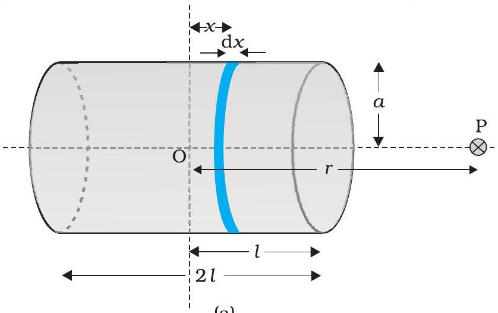
(a)

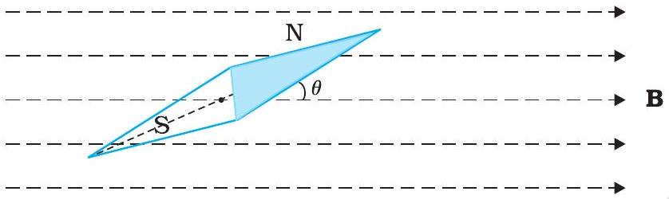
(b)

चित्र $5.3$ (a) एक सीमित परिनालिका के अक्षीय क्षेत्र का परिकलन, ताकि इसकी छड़ चुंबक से साम्यता प्रदर्शित की जा सके। (b) एक समान चुंबकीय क्षेत्र $\mathbf{B}$ में रखी हुई चुंबकीय सूई। यह प्रबंध चुंबकीय क्षेत्र B अथवा चुंबकीय आघूर्ण $\mathbf{m}$ का आकलन करने में सहायक है।
अधिक दूरी पर यह अक्षीय क्षेत्र छड़ चुंबक के अक्षीय क्षेत्र जैसा ही है।

परिनालिका के कारण बिंदु P पर चुंबकीय क्षेत्र का परिमाण

$$
B=\frac{\mu_{0}}{4 \pi} \frac{2 m}{r^{3}}
$$

यही समीकरण छड़ चुंबक की अक्ष पर दूर स्थित बिंदु के लिए भी है जिसे कोई भी प्रयोगात्मक विधि से प्राप्त कर सकता है। इस प्रकार, छड़ चुंबक और धारावाही परिनालिका एक जैसे चुंबकीय क्षेत्र उत्पन्न करते हैं। अतः एक छड़ चुंबक का चुंबकीय आघूर्ण, उतना ही चुंबकीय क्षेत्र उत्पन्न करने वाली समतुल्य धारावाही परिनालिका के चुंबकीय आघूर्ण के बराबर है।

### 5.2.3 एकसमान चुंबकीय क्षेत्र में द्विध्रुव

हम एक पतली चुंबकीय सुई का, जिसका चुंबकीय आघूर्ण $\mathbf{m}$ ज्ञात हों, इस चुंबकीय क्षेत्र में दोलन कराते हैं। यह व्यवस्था चित्र $5.3$ (b) में दर्शायी गई है।

चुंबकीय सुई पर बलआघूर्ण [समीकरण (4.23) देखिए]

$$
\tau=\mathbf{m} \times \mathbf{B}
$$

जिसका परिमाण $\tau=m B \sin \theta$

इस बात को हमने पहले भी काफी जोर देकर कहा था कि स्थितिज ऊर्जा का शून्य हम अपनी सुविधानुसार निर्धारित कर सकते हैं। समाकलन नियंताक को शून्य लेने का अर्थ है कि हमने स्थितिज ऊर्जा का शून्य $\theta=90^{\circ}$ पर, अर्थात उस स्थिति को ले लिया है जिस पर सुई क्षेत्र के लंबवत है। समीकरण (5.3) यह दर्शाती है कि न्यूनतम स्थितिज ऊर्जा $(=-m \mathrm{~B})$ (अर्थात सर्वाधिक स्थायी अवस्था) $\theta=0^{\circ}$ पर होती है एवं अधिकतम स्थितिज ऊर्जा $(=+m \mathrm{~B})$ (अर्थात अधिकतम अस्थायी अवस्था) $\theta=180^{\circ}$ पर होती है।

## उदाहरण $5.1$

(a) क्या होता है जबकि एक चुंबक को दो खंडों में विभाजित करते हैं (i) इसकी लंबाई के लंबवत (ii) लंबाई के अनुदिश?
(b) एकसमान चुंबकीय क्षेत्र में रखी गई किसी चुंबकीय सुई पर बल आघूर्ण तो प्रभावी होता है पर इस पर कोई परिणामी बल नहीं लगता। तथापि, एक छड़ चुंबक के पास रखी लोहे की कील पर बल आघूर्ण के साथ-साथ परिणामी बल भी लगता है। क्यों?

## चुंबकत्व एवं द्रव्य

(c) क्या प्रत्येक चुंबकीय विन्यास का एक उत्तरी और एक दक्षिणी ध्रुव होना आवश्यक है? एक टोरॉयड के चुंबकीय क्षेत्र के संबंध में इस विषय में अपनी टिप्पणी दीजिए।
(d) दो एक जैसी दिखाई पड़ने वाली छड़ें A एवं B दी गई हैं जिनमें कोई एक निश्चित रूप से चुंबकीय है, यह ज्ञात है (पर, कौन सी यह ज्ञात नहीं है)। आप यह कैसे सुनिश्चित करेंगे कि दोनों छड़ें चुंबकित हैं या केवल एक? और यदि केवल एक छड़ चुंबकित है तो यह कैसे पता लगाएँगे कि वह कौन सी है। [आपको छड़ो A एवं B के अतिरिक्त अन्य कोई चीज प्रयोग नहीं करनी है।]

हल

(a) दोनों ही प्रकरणों में आपको दो चुंबक प्राप्त होते हैं जिनमें से प्रत्येक में एक उत्तरी और एक दक्षिणी ध्रुव होता है।
(b) यदि क्षेत्र एकसमान हों केवल तभी चुंबक पर कोई बल नहीं लगता। परंतु छड़ चुंबक के कारण कील पर असमान क्षेत्र आरोपित होता है जिसके कारण कील में चुंबकीय आघूर्ण प्रेरित होता है। अतः इस पर परिणामी बल भी लगता है और बल आघूर्ण भी। परिणामी बल आकर्षण बल होता है, क्योंकि कील में प्रेरित दक्षिण ध्रुव (माना) इसमें प्रेरित उत्तरी ध्रुव की अपेक्षा चुंबक के अधिक निकट होता है।
(c) आवश्यक नहीं है। यह तभी सत्य होगा जब चुंबकीय क्षेत्र के स्रोत का परिणामी चुंबकीय आघूर्ण शून्य नहीं होगा। टोरॉयड या अनंत लंबाई की परिनालिका के लिए ऐसा नहीं होता।
(d) चुंबकों के अलग-अलग सिरों को एक-दूसरे के पास लाने की कोशिश कीजिए। यदि किसी स्थिति में प्रतिकर्षण बल का अनुभव हो तो दोनों छड़ें चुंबकित हैं। यदि हमेशा आकर्षण बल ही लगे तो उनमें से एक छड़ चुंबकित नहीं है। यह देखने के लिए कि कौन-सी छड़ चुंबकित है, एक छड़ A मान लीजिए और इसका एक सिरा नीचे कीजिए; पहले दूसरी छड़ B के सिरे के पास लाइए और फिर बीच में। अगर आप पाएँ कि B के बीच में छड़ A आकर्षण बल अनुभव नहीं करती तो B चुंबकित है। और यदि आप पाएँ कि सिरे पर और बीच में आकर्षण बल बराबर है, तो छड़ A चुंबकित है।

### 5.2.4 स्थिरवैद्युत अनुरूप

समीकरणों (5.1), (5.2) एवं (5.3) के संगत विद्युत द्विध्रुव के समीकरणों (अध्याय $1$ देखिए) से तुलना करने पर हम इस परिणाम पर पहुँचते हैं कि $\mathbf{m}$ चुंबकीय आघूर्ण वाले छड़ चुंबक का चुंबकीय क्षेत्र, इससे बहुत दूरी पर स्थित किसी बिंदु पर ज्ञात करने के लिए, हमें द्विध्रुव आघूर्णों वाले विद्युत द्विध्रुव के कारण उत्पन्न विद्युत क्षेत्र के समीकरण में, केवल निम्नलिखित प्रतिस्थापन करने होंगे-

$$
\mathbf{E} \rightarrow \mathbf{B}, \mathbf{p} \rightarrow \mathbf{m}, \frac{1}{4 \pi \varepsilon_{0}} \rightarrow \frac{\mu_{0}}{4 \pi}
$$

विशेषतः, $r$ दूरी ( $r \gg 1$ के लिए, जहाँ $1$ चुंबक की लंबाई है)पर एक छड़ चुंबक का विषुवतीय चुंबकीय क्षेत्र

$$
\mathbf{B}_{E}=-\frac{\mu_{0} \mathbf{m}}{4 \pi r^{3}}
$$

इसी प्रकार, $r$ दूरी ( $r \gg 1$ के लिए) पर एक छड़ चुंबक का अक्षीय चुंबकीय क्षेत्र

$$
\mathbf{B}_{A}=\frac{\mu_{0}}{4 \pi} \frac{2 \mathbf{m}}{r^{3}}
$$

समीकरण (5.5), समीकरण (5.1) का सदिश रूप है। सारणी $5.1$ विद्युत एवं चुंबकीय द्विध्रुवों के मध्य समानता दर्शाती है।

## सारणी $5.1$ द्विध्रुवों की सादृश्यता

|  | स्थिर वैद्युत | चुंबकीय |
| :--- | :--- | :--- |
|  | $1 / \varepsilon_{0}$ | $\mu_{0}$ |
| द्विध्रुव आघूर्ण | p | m |
| विषुवतीय क्षेत्र | $-\mathbf{p} / 4 \pi \varepsilon_{0} r^{3}$ | $-\mu_{0} \mathbf{m} / 4 \pi r^{3}$ |
| अक्षीय क्षेत्र | $2 \mathbf{p} / 4 \pi \varepsilon_{0} r^{3}$ | $\mu_{0} 2 \mathbf{m} / 4 \pi r^{3}$ |
| बाह्य क्षेत्र-बल आघूर्ण | $\mathbf{p} \times \mathbf{E}$ | $\mathbf{m} \boldsymbol{\times} \mathbf{B}$ |
| बाह्य क्षेत्र-स्थितिज ऊर्जा | $-\mathbf{p} \cdot \mathbf{E}$ | $\boldsymbol{-} \mathbf{m} \boldsymbol{\cdot} \mathbf{B}$ |

उदाहरण $5.2$ चित्र $5.4$ में O बिंदु पर रखी गई एक छोटी चुंबकीय सुई P दिखाई गई है। तीर इसके चुंबकीय आघूर्ण की दिशा दर्शाता है। अन्य तीर, दूसरी समरूप चुंबकीय सुई $Q$ की विभिन्न स्थितियों (एवं चुंबकीय आघूर्ण के दिक्विन्यासों) को प्रदर्शित करते हैं।

(a) किस विन्यास में यह निकाय संतुलन में नहीं होगा?
(b) किस विन्यास में निकाय (i) स्थायी (ii) अस्थायी संतुलन में होंगे?
(c) दिखाए गए सभी विन्यासों में किसमें न्यूनतम स्थितिज ऊर्जा है?

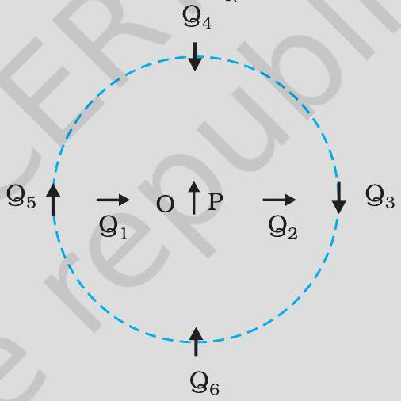
चित्र $5.4$

हल
किसी विन्यास की स्थितिज ऊर्जा, एक चुंबकीय द्विध्रुव (माना Q) की, दूसरे चुंबकीय द्विध्रुव (माना P) के चुंबकीय क्षेत्र के कारण उत्पन्न स्थितिज ऊर्जा है। आप समीकरण (5.4) एवं (5.5) द्वारा व्यक्त निम्नलिखित परिणाम प्रयोग में ला सकते हैं-
$\mathbf{B}_{\mathrm{P}}=-\frac{\mu_{0}}{4 \pi} \frac{\mathbf{m}_{\mathrm{P}}}{r^{3}}$ (लंब समद्विभाजक पर)
$\mathbf{B}_{\mathrm{P}}=\frac{\mu_{0} 2}{4 \pi} \frac{\mathbf{m}_{\mathrm{P}}}{r^{3}} \quad$ (अक्ष पर)
जहाँ $\mathbf{m}_{\mathrm{P}}$ द्विध्रुव P का चुंबकीय आघूर्ण है।
संतुलन तब स्थायी होगा जब $\mathbf{m}_{\mathrm{Q}}$ एवं $\mathbf{B}_{\mathrm{P}}$ एक-दूसरे के समांतर होंगी और संतुलन अस्थायी तब होगा जब वे प्रतिसमांतर होंगी।
उदाहरणार्थ, विन्यास $\mathrm{Q}_{3}$ में, जिसके लिए Q द्विध्रुव P के लंब समद्विभाजक के अनुदिश है , Q का चुंबकीय आघूर्ण, स्थिति $3$ में, चुंबकीय क्षेत्र के समांतर है, अतः $\mathrm{Q}_{3}$ स्थायी है

(a) $\mathrm{PQ}_{1}$ एवं $\mathrm{PO}_{2}$
(b) (i) $\mathrm{PQ}_{3}, \mathrm{PQ}_{6}$ (स्थायी); (ii) $\mathrm{PQ}_{5}, \mathrm{PQ}_{4}$ (अस्थायी)

(c) $\mathrm{PO}_{6}$

## चुंबकत्व एवं द्रव्य

## $5.3$ चुंबकत्व एवं गाउस नियम

अध्याय $1$ में हमने स्थिरवैद्युत के लिए गाउस के नियम का अध्ययन किया था। चित्र $5.2$ (c) में हम देखते हैं कि (i) द्वारा अंकित बंद गाउसीय सतह से क्षेत्र रेखाओं की जितनी संख्या बाहर आती है, उतनी ही इसके अंदर प्रवेश करती है। इस बात की इस तथ्य से संगति बैठती है कि सतह द्वारा परिवेष्ठित कुल आवेश का परिमाण शून्य है। किंतु, उसी चित्र में, बंद सतह (ii) जो किसी धनावेश को घेरती है, के लिए परिणामी निर्गत फ्लक्स होता है।

यह स्थिति उन चुंबकीय क्षेत्रों के लिए पूर्णतः भिन्न है, जो संतत हैं और बंद लूप बनाते हैं। चित्र $5.2$ (a) या $5.2$ (b) में (i) या (ii) द्वारा अंकित गाउसीय सतहों का निरीक्षण कीजिए। आप पाएँगे कि सतह से बाहर आने वाली बल रेखाओं की संख्या इसके अंदर प्रवेश करने वाली संख्या के बराबर है। दोनों ही सतहों के लिए कुल चुंबकीय फ्लक्स शून्य है और यह बात किसी भी बंद सतह के लिए सत्य है।

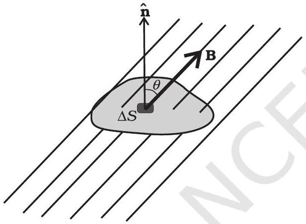
चित्र $5.5$

किसी बंद सतह $S$ का एक छोटा सदिश क्षेत्रफल अवयव $\Delta \mathbf{S}$ लीजिए। जैसा कि चित्र $5.5$ में दर्शाया गया है। $\Delta \mathbf{S}$ से गुजरने वाला चुंबकीय फ्लक्स $\Delta \phi_{\mathrm{B}}=\mathbf{B} . \Delta \mathbf{S}$ है, जहाँ $\mathbf{B}, \Delta \mathbf{S}$ पर चुंबकीय क्षेत्र है। हम $S$ को कई छोटे-छोटे अवयवों में बाँट लेते हैं और उनमें से प्रत्येक से गुजरने वाले फ्लक्सों के मान अलग-अलग निकालते हैं। तब, कुल फ्लक्स $\phi_{\mathrm{B}}$ का मान है,

$$
\phi_{B}=\sum_{\text {'सभी' }} \Delta \phi_{B}=\sum_{\text {'सभी' }} \mathbf{B} \cdot \Delta \mathbf{S}=0
$$

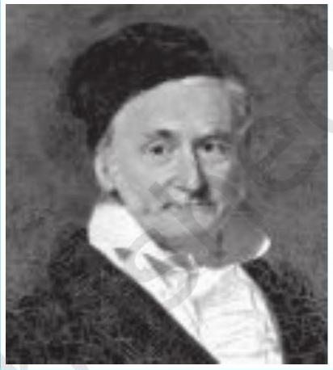
कार्ल प्रेडड्रिक गाउस (1777 - 1855) वे एक विलक्षण बाल-प्रतिभा थे। गणित, भौतिकी, अभियांत्रिकी, खगोलशास्त्र और यहाँ तक कि भू-सर्वेक्षण में भी उनको प्रकृति की अनुपम देन थी। संख्याओं के गुण उनको लुभाते थे और उनके कार्य में उनके बाद आने वाले जमाने के प्रमुख गणितीय विकास का पूर्वाभास होता है। $1833$ में विल्हेम वेलसर के साथ मिलकर उन्होंने पहला विद्युतीय टेलिग्राफ बनाया। वक्र-पृष्ठों से संबंधित उनके गणितीय सिद्धांत ने बाद में रीमन द्वारा किए गए कार्य की आधारशिला रखी।

जहाँ 'सभी' का अर्थ है सभी क्षेत्रफल अवयव $\Delta \mathbf{S}$ । इसकी तुलना वैद्युतस्थितिकी के गाउस के नियम से कीजिए। जहाँ एक बंद सतह से गुजरने वाला वैद्युत फ्लक्स

$$
\sum \mathbf{E} \cdot \Delta \mathbf{S}=\frac{q}{\varepsilon_{0}}
$$

जहाँ $q$ बंद सतह द्वारा परिबद्ध आवेश है।
चुंबकत्व एवं स्थिरवैद्युतिकी के गाउस नियमों के बीच का अंतर इसी तथ्य की अभिव्यक्ति है कि पृथक्कृत चुंबकीय ध्रुवों (जिन्हें एकध्रुव भी कहते हैं) का अस्तित्व नहीं होता। $\mathbf{B}$ का कोई उद्गम या अभिगम नहीं होता है। सरलतम चुंबकीय अवयव एक द्विध्रुव या धारा लूप है। सभी चुंबकीय परिघटनाएँ एक धारा लूप एवं/या द्विध्रुव व्यवस्था के रूप में समझायी जा सकती हैं।

## - भौतिकी

चुंबकत्व के लिए गाउस का नियम है-
किसी भी बंद सतह से गुज़रने वाला कुल चुंबकीय फ्लक्स हमेशा शून्य होता है।

उदाहरण $5.3$ नीचे दिए गए चित्रों में से कई में चुंबकीय क्षेत्र रेखाएँ गलत दर्शायी गई हैं [चित्रों में मोटी रेखाएँ]। पहचानिए कि उनमें गलती क्या है? इनमें से कुछ में वैद्युत क्षेत्र रेखाएँ ठीक-ठीक दर्शायी गई हैं। बताइए, वे कौन से चित्र हैं?

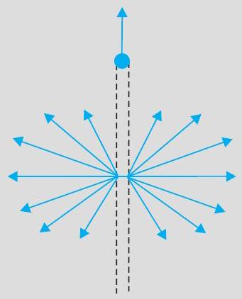
(a)

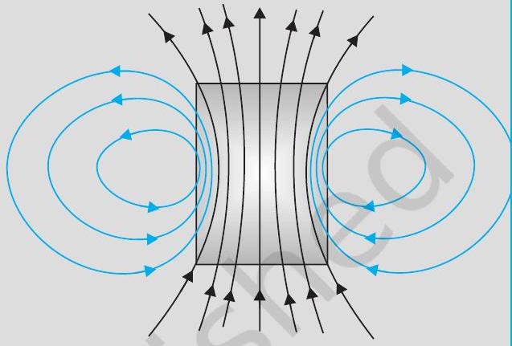
(e)

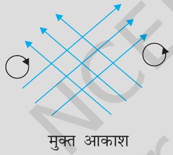
(b)

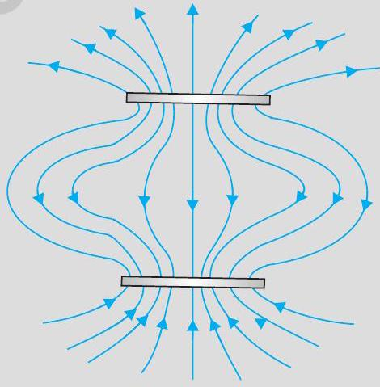

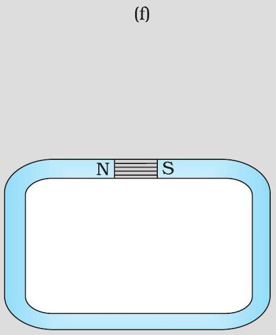
(g)

## चुंबकत्व एवं द्रव्य

हल

(a) गलत है। चुंबकीय बल रेखाएँ एक बिंदु से इस प्रकार नहीं निकल सकतीं जैसा कि चित्र में दिखाया गया है। किसी बंद सतह पर $\mathbf{B}$ का कुल फ्लक्स हमेशा शून्य ही होना चाहिए अर्थात, चित्र में जितनी क्षेत्र रेखाएँ सतह में प्रवेश करें उतनी ही इससे बाहर निकलनी चाहिए। दिखायी गई क्षेत्र रेखाएँ, वास्तव में, एक लंबे धनावेशित तार का विद्युत क्षेत्र प्रदर्शित करती हैं। सही चुंबकीय क्षेत्र रेखाएँ जैसा अध्याय $4$ में बताया गया है, सीधे तार को चारों ओर से घेरने वाले वृत्तों के रूप में हैं।
(b) गलत है। चुंबकीय क्षेत्र रेखाएँ (विद्युत क्षेत्र रेखाओं की तरह ही) कभी भी एक-दूसरे को काट नहीं सकतीं। क्योंकि, अन्यथा कटान बिंदु पर क्षेत्र की दिशा संदिग्ध हो जाएगी। चित्र में एक गलती और भी है। स्थिर-चुंबकीय क्षेत्र रेखाएँ मुक्त आकाश में कभी भी बंद वक्र नहीं बना सकतीं। स्थिर-चुंबकीय क्षेत्र रेखा के बंद लूप को निश्चित रूप से एक ऐसे प्रदेश को घेरना चाहिए जिसमें से होकर धारा प्रवाहित हो रही हो [इसके विपरीत वैद्युत क्षेत्र रेखाएँ कभी भी बंद लूप नहीं बना सकतीं, न तो मुक्त आकाश में और न ही तब जब लूप आवेश को घेरते हैं।]
(c) ठीक है। चुंबकीय रेखाएँ पूर्णतः एक टोरॉइड में समाहित हैं। यहाँ चुंबकीय क्षेत्र रेखाओं द्वारा बंद लूप बनाने में कोई त्रुटि नहीं है, क्योंकि प्रत्येक लूप एक ऐसे क्षेत्र को घेरता है जिसमें से होकर धारा गुजरती है। ध्यान दीजिए कि चित्र में स्पष्टता लाने के लिए ही टोरॉइड के अंदर मात्र कुछ क्षेत्र रेखाएँ दिखायी गई हैं। तथ्य यह है कि टोरॉइड के फेरों के अंदर के संपूर्ण भाग में चुंबकीय क्षेत्र मौजूद रहता है।
(d) गलत है। परिनालिका की क्षेत्र रेखाएँ, इसके सिरों पर और इसके बाहर पूर्णतः सीधी और सिमटी हुई नहीं हो सकती हैं। ऐसा होने से ऐम्पियर का नियम भंग होता है। ये रेखाएँ सिरों पर वक्रित हो जानी चाहिए और इनको अंत में मिल कर बंद पाश बनाने चाहिए।
(e) सही है। एक छड़ चुंबक के अंदर एवं बाहर दोनों ओर चुंबकीय क्षेत्र होता है। अंदर क्षेत्र की दिशा पर अच्छी तरह ध्यान दीजिए। सभी क्षेत्र रेखाएँ उत्तर ध्रुव से नहीं निकलतीं (और न ही दक्षिण ध्रुव पर समाप्त होती हैं)। N-ध्रुव एवं S-ध्रुव के चारों तरफ क्षेत्र के कारण कुल फ्लक्स शून्य होता है।
(f) गलत है। संभावना यही है कि ये क्षेत्र रेखाएँ चुंबकीय क्षेत्र प्रदर्शित नहीं करतीं। ऊपरी भाग को देखिए। सभी क्षेत्र रेखाएँ छायित प्लेट से निकलती जान पड़ती हैं। इस प्लेट को घेरने वाली सतह से गुजरने वाले क्षेत्र का कुल फ्लक्स शून्य नहीं है। चुंबकीय क्षेत्र के संदर्भ में ऐसा होना संभव नहीं है। दिखायी गई क्षेत्र रेखाएँ, वास्तव में, धनावेशित ऊपरी प्लेट एवं ऋणावेशित निचली प्लेट के बीच स्थिरवैद्युत क्षेत्र रेखाएँ हैं। [चित्र 5.6(e) एवं (f)] के बीच के अंतर को ध्यानपूर्वक ग्रहण करना चाहिए।
(g) गलत है। दो ध्रुवों के बीच चुंबकीय क्षेत्र रेखाएँ, सिरों पर, ठीक सरल रेखाएँ नहीं हो सकतीं। रेखाओं में कुछ फैलाव अवश्यम्भावी है अन्यथा, ऐम्पियर का नियम भंग होता है। यह बात वैद्युत क्षेत्र रेखाओं के लिए भी लागू होती है।

उदाहरण $5.4$

(a) चुंबकीय क्षेत्र रेखाएँ (हर बिंदु पर) वह दिशा बताती हैं जिसमें (उस बिंदु पर रखी) चुंबकीय सुई संकेत करती है। क्या चुंबकीय क्षेत्र रेखाएँ प्रत्येक बिंदु पर गतिमान आवेशित कण पर आरोपित बल रेखाएँ भी हैं?
(b) यदि चुंबकीय एकल ध्रुवों का अस्तित्व होता तो चुंबकत्व संबंधी गाउस का नियम क्या रूप ग्रहण करता?

## भौतिकी

(c) क्या कोई छड़ चुंबक अपने क्षेत्र की वजह से अपने ऊपर बल आघूर्ण आरोपित करती है? क्या किसी धारावाही तार का एक अवयव उसी तार के दूसरे अवयव पर बल आरोपित करता है।
(d) गतिमान आवेशों के कारण चुंबकीय क्षेत्र उत्पन्न होते हैं। क्या कोई ऐसी प्रणाली है जिसका चुंबकीय आघूर्ण होगा, यद्यपि उसका नेट आवेश शून्य है?

हल

(a) नहीं। चुंबकीय बल सदैव $\mathbf{B}$ के लंबवत होता है (क्योंकि चुंबकीय बल $=q(\mathbf{v} \times \mathbf{B})$ अतः $\mathbf{B}$ की क्षेत्र रेखाओं को बल रेखाएँ कहना भ्रामक वक्तव्य है।
(b) चुंबकत्व संबंधी गाउस का नियम यह कहता है कि क्षेत्र B के कारण, किसी बंद सतह से गुज़रने वाला कुल फ्लक्स सदैव शून्य होता है। किसी बंद सतह $S$ के लिए $\int_{S} \mathbf{B} . \mathrm{ds}=0$ यदि एकल ध्रुवों का अस्तित्व होता तो (स्थिरवैद्युतिकी के गाउस नियम के अनुरूप) समीकरण के दायीं ओर सतह $S$ से घिरे एकल ध्रुवों (चुंबकीय आवेशों) $q_{m}$ का योग आता। अर्थात समीकरण का रूप होता
$\int_{\mathrm{S}} \mathbf{B} \cdot \mathrm{d} \mathbf{s}=\mu_{0} q_{m}$ जहाँ $q_{m}, S$ से घिरा चुंबकीय आवेश (एकल ध्रुव) है।
(c) नहीं। तार के अल्पांश द्वारा उत्पन्न चुंबकीय क्षेत्र के कारण इसके स्वयं के ऊपर कोई बल या बल आघूर्ण नहीं लगता। लेकिन इसके कारण उसी तार के दूसरे अल्पांश पर बल (या बल आघूर्ण) लगता है। (सीधे तार के विशेष मामले में, यह बल शून्य ही होता है)।
(d) हाँ। संपूर्ण व्यवस्था को देखें तो सभी आवेशों का औसत शून्य हो सकता है। फिर भी, यह हो सकता है कि विभिन्न धारा लूपों के कारण उत्पन्न चुंबकीय आघूर्णों का औसत शून्य न हो। हमारे समक्ष अनुचुंबकीय पदार्थों के संदर्भ में ऐसे कई उदाहरण आएँगे जहाँ परमाणुओं का आवेश शून्य है लेकिन उनका द्विध्रुव-आघूर्ण शून्य नहीं है।

## $5.4$ चुंबकीकरण एवं चुंबकीय तीव्रता

पृथ्वी तत्वों एवं यौगिकों की विस्मयकारी विभिन्नताओं से भरपूर है। इसके अतिरिक्त, हम नए-नए मिश्रधातु, यौगिक, यहाँ तक कि तत्व भी संश्लेषित करते जा रहे हैं। आप इन सब पदार्थों को चुंबकीय गुणों के आधार पर वर्गीकृत करना चाहेंगे। प्रस्तुत अनुभाग में हम ऐसे कुछ पदों की परिभाषा देंगे और उनके बारे में समझाएँगे जो इस वर्गीकरण में हमारी सहायता करेंगे।

हम यह देख चुके हैं कि परमाणु में परिक्रमण करते इलेक्ट्रॉन का एक चुंबकीय आघूर्ण होता है। पदार्थ के किसी बड़े टुकड़े में ये चुंबकीय आघूर्ण सदिश रूप से समाकलित होकर शून्येतर परिणामी चुंबकीय आघूर्ण प्रदान कर सकते हैं। किसी दिए गए नमूने का चुंबकन $\mathbf{M}$ हम इस प्रकार उत्पन्न हुए प्रति इकाई आयतन परिणामी चुंबकीय आघूर्ण के रूप में परिभाषित कर सकते हैं,

$$
\mathbf{M}=\frac{\mathbf{m}_{\text {नेट }}}{V}
$$

$\mathbf{M}$ एक सदिश राशि है जिसका विमीय सूत्र $\mathrm{L}^{-1} \mathrm{~A}$ एवं मात्रक $\mathrm{Am}^{-1}$ है।
एक लंबी परिनालिका लीजिए जिसकी प्रति इकाई लंबाई में $n$ फेरे हों, और जिसमें $I$ धारा प्रवाहित हो रही हो। इस परिनालिका के अंदर चुंबकीय क्षेत्र का परिमाण है,

$$
\mathbf{B}_{0}=\mu_{0} n I
$$

## चुंबकत्व एवं द्रव्य

यदि परिनालिका के अंदर शून्येतर चुंबकन का कोई पदार्थ भरा हो तो यहाँ क्षेत्र $\mathbf{B}_{0}$ से अधिक होगा। परिनालिका के अंदर परिणामी क्षेत्र $\mathbf{B}$ को लिख सकते हैं

$$
\mathbf{B}=\mathbf{B}_{0}+\mathbf{B}_{\mathrm{m}}
$$

जहाँ $\mathbf{B}_{\mathrm{m}}$ क्रोड के पदार्थ द्वारा प्रदत्त क्षेत्र है। यह पाया गया है कि यह अतिरिक्त क्षेत्र $\mathbf{B}_{\mathrm{m}}$ पदार्थ के चुंबकन $\mathbf{M}$ के अनुक्रमानुपाती होता है और इसको हम निम्नवत व्यक्त कर सकते हैं

$$
\mathbf{B}_{\mathrm{m}}=\mu_{0} \mathbf{M}
$$

जहाँ $\mu_{0}$ वही नियंताक है (निर्वात की पारगम्यता) जो बायो-सावर्ट के नियम में उपयोग किया गया था।

सुविधा के लिए हम एक अन्य सदिश क्षेत्र $\mathbf{H}$ की बात करते हैं जिसे चुंबकीय तीव्रता कहा जाता है और जिसको निम्नलिखित समीकरण द्वारा परिभाषित किया जाता है

$$
\mathbf{H}=\frac{\mathbf{B}}{\mu_{0}}-\mathbf{M}
$$

जहाँ $\mathbf{H}$ की विमाएँ वहीं हैं जो $\mathbf{M}$ की और इसका मात्रक भी $\mathrm{Am}^{-1}$ ही है।
इस प्रकार कुल चुंबकीय क्षेत्र $\mathbf{B}$ को लिख सकते हैं

$$
\mathbf{B}=\mu_{0}(\mathbf{H}+\mathbf{M})
$$

उपरोक्त विवरण में आए पदों को व्युत्पन्न करने में हमने जिस पद्धति का प्रयोग किया है उसको दोहराते हैं। परिनालिका के अंदर के कुल चुंबकीय क्षेत्र को हमने दो अलग-अलग योगदानों के रूप में प्रस्तुत किया- पहला बाह्य कारक, जैसे कि परिनालिका में प्रवाहित होने वाली धारा का योगदान। यह H द्वारा व्यक्त किया गया है; और दूसरा चुंबकीय पदार्थ की विशेष प्रकृति के कारण अर्थात M। बाद वाली राशि (M) बाह्य कारकों द्वारा प्रभावित की जा सकती है। यह प्रभाव गणितीय रूप में इस प्रकार व्यक्त कर सकते हैं:

$$
\mathbf{M}=\chi \mathbf{H}
$$

जहाँ $\chi$ एक विमाविहीन राशि है और इसे चुंबकीय प्रवृत्ति कहते हैं। यह किसी चुंबकीय पदार्थ पर बाह्य चुंबकीय क्षेत्र के प्रभाव का माप है। $\chi$ बहुत छोटे परिमाण वाली राशि है। कुछ पदार्थों के लिए इसका मान छोटा और धनात्मक है जिन्हें अनुचुंबकीय पदार्थ कहते हैं। कुछ पदार्थों के लिए इसका मान छोटा एवं ऋणात्मक है जिन्हें प्रतिचुंबकीय पदार्थ कहते हैं। प्रतिचुंबकीय पदार्थों में $\mathbf{M}$ एवं $\mathbf{H}$ विपरीत दिशाओं में होते हैं। समीकरण (5.12) एवं (5.13) से हम पाते हैं,

$$
\begin{aligned}
& \mathbf{B}=\mu_{0}(1+\chi) \mathbf{H} \\
& =\mu_{0} \mu_{\mathrm{r}} \mathbf{H} \\
& =\mu \mathbf{H}
\end{aligned}
$$

जहाँ, $\mu_{r}=(1+\chi)$ एक विमाविहीन राशि है जिसे हम पदार्थ की आपेक्षिक चुंबकशीलता या 'आपेक्ष चुंबकीय पारगम्यता' कहते हैं। यह स्थिरवैद्युतिकी के परावैद्युतांक के समतुल्य राशि है। पदार्थ की चुंबकशीलता $\mu$ है और इसकी विमाएँ तथा मात्रक वही हैं जो $\mu_{0}$ के हैं।

$$
\mu=\mu_{0} \mu_{r}=\mu_{0}(1+\chi)
$$

$\chi, \mu_{\mathrm{r}}$ एवं $\mu$ में तीन राशियाँ परस्पर संबंधित हैं। यदि इनमें से किसी एक का मान ज्ञात हो तो बाकी दोनों के मान ज्ञात किए जा सकते हैं।

## भौतिकी

उदाहरण $5.5$ एक परिनालिका के क्रोड में भरे पदार्थ की आपेक्षिक चुंबकशीलता $400$ है। परिनालिका के विद्युतीय रूप से पृथक्कृत फेरों में 2A की धारा प्रवाहित हो रही है। यदि इसकी प्रति $1 \mathrm{~m}$ लंबाई में फेरों की संख्या $1000$ है तो (a) $H$, (b) $M$, (c) $B$ एवं (d) चुंबककारी धारा $I_{m}$ की गणना कीजिए।
हल

(a) क्षेत्र $H$ क्रोड के पदार्थ पर निर्भर करता है और इसके लिए सूत्र है
$$
H=n I=1000 \times 2.0=2 \times 10^{3} \mathrm{~A} / \mathrm{m}
$$
(b) चुंबकीय क्षेत्र $B$ के लिए सूत्र है
$$
\begin{aligned}
B & =\mu_{r} \mu_{0} \mathrm{H} \\
& =400 \times 4 \pi \times 10^{-7}\left(\mathrm{~N} / \mathrm{A}^{2}\right) \times 2 \times 10^{3}(\mathrm{~A} / \mathrm{m}) \\
& =1.0 \mathrm{~T}
\end{aligned}
$$
(c) चुंबकन
$$
\begin{aligned}
M & =\left(B-\mu_{0} H\right) / \mu_{0} \\
& =\left(\mu_{r} \mu_{0} H-\mu_{0} H\right) / \mu_{0}=\left(\mu_{r}-1\right) H=399 \times H \\
& \cong 8 \times 10^{5} \mathrm{~A} / \mathrm{m}
\end{aligned}
$$
(d) चुंबकन धारा $I_{M}$ वह अतिरिक्त धारा है जो क्रोड की अनुपस्थिति में परिनालिका के फेरों में प्रवाहित किए जाने पर इसके अंदर उतना ही क्षेत्र $B$ उत्पन्न करेगी जितना क्रोड की उपस्थिति में होता। अत: $B=\mu_{r} n\left(I+I_{M}\right)$ लेने पर $I=2 \mathrm{~A}, B=1 \mathrm{~T}$ हमें प्राप्त होता है $I_{M}=794 \mathrm{~A}$

## $5.5$ पदार्थों के चुंबकीय गुण

पिछले अनुभाग में वर्णित विचार हमें पदार्थों को प्रतिचुंबकीय, अनुचुंबकीय एवं लोहचुंबकीय श्रेणियों में वर्गीकृत करने में सहायता प्रदान करते हैं। चुंबकीय प्रवृत्ति $\chi$ की दृष्टि से देखें तो कोई पदार्थ प्रतिचुंबकीय है यदि इसके लिए $\chi$ ॠणात्मक है, अनुचुंबकीय होगा यदि $\chi$ धनात्मक एवं अल्प मान वाला है, और लोहचुंबकीय होगा यदि $\chi$ धनात्मक एवं अधिक मान वाला है।

अधिक मूर्त रूप में सारणी $5.2$ पर एक दृष्टि हमें इन पदार्थों का एक अच्छा अनुभव प्रदान करती है। यहाँ $\varepsilon$ एक छोटी धन संख्या है जो अनुचुंबकत्व का परिमाण निर्धारित करने के लिए लाई गई है। अब हम इन पदार्थों के बारे में कुछ विस्तार से चर्चा करेंगे।

सारणी $5.2$
| प्रतिचुंबकीय | अनुचुंबकीय | लोहचुंबकीय |
| :--- | :--- | :--- |
| $\begin{aligned} & -1 \leq \chi<0 \\ & 0 \leq \mu_{r}<1 \end{aligned}$ | $\begin{aligned} & 0<\chi<\varepsilon \\ & 1<\mu_{r}<1+\varepsilon \end{aligned}$ | $\begin{aligned} & \chi \gg 1 \\ & \mu_{r} \gg 1 \\ & \mu \gg \mu_{0} \end{aligned}$ |

### 5.5.1 प्रतिचुंबकत्व

प्रतिचुंबकीय पदार्थ वह होते हैं जिनमें बाह्य चुंबकीय क्षेत्र में अधिक तीव्रता वाले भाग से कम तीव्रता वाले भाग की ओर जाने की प्रवृत्ति होती है। दूसरे शब्दों में कहें तो चुंबक लोहे जैसी धातुओं को तो अपनी ओर आकर्षित करता है, परंतु यह प्रतिचुंबकीय पदार्थों को विकर्षित करेगा।

## चुंबकत्व एवं द्रव्य

चित्र $5.7$ (a), बाह्य चुंबकीय क्षेत्र में रखी प्रतिचुंबकीय पदार्थ की एक छड़ दर्शाता है। क्षेत्र रेखाएँ विकर्षित होती हैं या दूर हटती हैं इसलिए पदार्थ क अन्दर क्षेत्र कम हो जाता है अधिकांश मामलों में क्षेत्र की तीव्रता में यह कमी अत्यल्प होती है ( $10^{5}$ भागों में एक भाग)। छड़ को किसी असमान चुंबकीय क्षेत्र में रखने पर इसकी प्रवृत्ति अधिक क्षेत्र से कम क्षेत्र की ओर जाने की होती है।

प्रतिचुंबकत्व की सरलतम व्याख्या इस प्रकार है-नाभिक के चारों ओर घूमते इलेक्ट्रॉनों के कारण कक्षीय कोणीय संवेग होता है। ये प्ररिक्रमण करते इलेक्ट्रॉन एक धारावाही लूप के समतुल्य होते हैं और इस कारण इनका कक्षीय चुंबकीय आघूर्ण होता है, प्रतिचुंबकीय पदार्थ वे होते हैं जिनके परमाणु में परिणामी चुंबकीय आघूर्ण शून्य होता है। जब कोई बाह्य चुंबकीय क्षेत्र आरोपित किया जाता है तो जिन इलेक्ट्रॉनों के कक्षीय चुंबकीय आघूर्ण क्षेत्र की दिशा में होते हैं उनकी गति मंद हो जाती है और जिनके चुंबकीय आघूर्ण क्षेत्र के विपरीत दिशा में होते हैं उनकी गति बढ़ जाती है। ऐसा लेंज के नियम के अनुसार प्रेरित धारा के कारण होता है जिसके विषय में आप अध्याय $6$ में अध्ययन करेंगे। इस प्रकार पदार्थ में परिणामी चुंबकीय आघूर्ण आरोपित क्षेत्र के विपरीत दिशा में विकसित होता है और इस कारण यह प्रतिकर्षित होता है।

कुछ प्रतिचुंबकीय पदार्थ हैं- बिस्मथ, ताँबा, सीसा, सिलिकन, नाइट्रोजन (STP पर), पानी एवं सोडियम क्लोराइड। प्रति चुंबकत्व सभी पदार्थों में विद्यमान होता है। परंतु, अधिकांश पदार्थों के लिए यह इतना क्षीण होता है कि अनुचुंबकत्व एवं लौह चुंबकत्व जैसे प्रभाव इस पर हावी हो जाते हैं।

सबसे अधिक असामान्य प्रतिचुंबकीय पदार्थ हैं अति चालक। ये ऐसी धातुएँ हैं, जिनको यदि बहुत निम्न ताप तक ठंडा कर दिया जाता है तो ये पूर्ण चालकता एवं पूर्ण प्रतिचुंबकत्व दोनों प्रदर्शित करती हैं। चुंबकीय क्षेत्र रेखाएँ पूर्णतः इनके बाहर रहती हैं, $\chi=-1$ एवं $\mu_{r}=0$ । एक अतिचालक, एक चुंबक को प्रतिकर्षित करेगा और (न्यूटन के तृतीय नियमानुसार) स्वयं इसके द्वारा प्रतिकर्षित होगा। अतिचालकों में पूर्ण प्रतिचुंबकत्व की यह परिघटना इसके आविष्कारक के नाम पर माइस्नर प्रभाव कहलाती है। अनेक भिन्न परिस्थितियों में जैसे कि, चुंबकीकृत अधरगामी अति तीव्र रेलगाड़ियों को चलाने में अतिचालक चुंबकों का लाभ उठाया जा सकता है।

### 5.5.2 अनुचुंबकत्व

अनुचुंबकीय पदार्थ ऐसे पदार्थ होते हैं जो बाह्य चुंबकीय क्षेत्र में रखे जाने पर क्षीण चुंबकत्व प्राप्त कर लेते हैं। उनमें क्षीण चुंबकीय क्षेत्र से सशक्त चुंबकीय क्षेत्र की ओर जाने की प्रवृत्ति होती है अर्थात ये चुंबक की ओर क्षीण बल द्वारा आकर्षित होते हैं।

किसी अनुचुंबकीय पदार्थ के परमाणुओं (या आयनों या अणुओं) का अपना स्वयं का स्थायी चुंबकीय द्विध्रुव आघूर्ण होता है। परमाणुओं की सतत यादृच्छिक तापीय गति के कारण कोई परिणामी चुंबकीकरण दृष्टिगत नहीं होता। पर्याप्त शक्तिशाली बाह्य चुंबकीय क्षेत्र $\mathbf{B}_{0}$ की उपस्थिति में एवं निम्न तापों पर अलग-अलग परमाणुओं के द्विध्रुव आघूर्ण सरल रेखाओं में और $\mathbf{B}_{0}$ की दिशा के अनुदिश संरेखित किए जा सकते हैं। चित्र $5.7$ (b) बाह्य चुंबकीय क्षेत्र में रखी हुई अनुचुंबकीय पदार्थ की एक छड़ प्रदर्शित करता है। चुंबकीय क्षेत्र रेखाएँ पदार्थ के अंदर संकंद्रित हो जाती हैं और अंदर चुंबकीय क्षेत्र बढ़ जाता है। अधिकतर मामलों में यह वृद्धि अति न्यून है, $10^{5}$ भागों में एक भाग। असमान चुंबकीय क्षेत्र में रखने पर यह छड़ निम्न क्षेत्र से उच्च क्षेत्र की ओर चलने की चेष्टा करेगी।

कुछ अनुचुंबकीय पदार्थ हैं-ऐलुमिनियम, सोडियम, कैल्शियम, ऑक्सीजन (STP पर) एवं कॉपर क्लोराइड। किसी अनुचुंबकीय पदार्थ के लिए $\chi$ एवं $\mu_{r}$ दोनों का मान न केवल पदार्थ पर निर्भर करता है, वरन् (एक सरल रूप में) इसके ताप पर भी निर्भर करता है। बहुत उच्च चुंबकीय क्षेत्रों

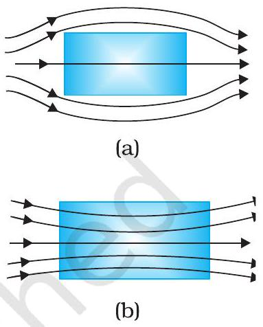
चित्र $5.7$
एक (a) प्रतिचुंबकीय
(b) अनुचुंबकीय पदार्थ के निकट किसी बाह्य चुंबकीय क्षेत्र के कारण चुंबकीय क्षेत्र रेखाओं का व्यवहार।

## - भौतिकी

में या बहुत निम्न ताप पर, चुंबकन अपना अधिकतम मान ग्रहण करने लगता है, जबकि सभी

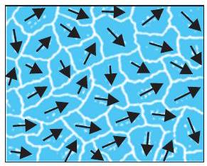
(a)

चुंबकीय पदार्थ, डोमेन आदि
http://www.nde-ed.org/EducationResources/CommunityCollege/
MagParticle/Physics/MagneticMatls.htm परमाण्वीय द्विध्रुव आघूर्ण चुंबकीय क्षेत्र में रेखाओं के अनुदिश संरेखित हो जाते हैं। यह संतृप्त चुंबकन मान कहलाता है।

### 5.5.3 लौह चुंबकत्व

लौह चुंबकीय पदार्थ ऐसे पदार्थ होते हैं जो बाह्य चुंबकीय क्षेत्र में रखे जाने पर शक्तिशाली चुंबक बन जाते हैं। उनमें चुंबकीय क्षेत्र के क्षीण भाग शक्तिशाली भाग की ओर चलने की तीव्र प्रवृत्ति होती है अर्थात वे चुंबक की ओर भारी आकर्षण बल का अनुभव करते हैं। किसी लौह चुंबकीय पदार्थ के एकल परमाणुओं (या आयनों या अणुओं) का भी अनुचुंबकीय पदार्थों की तरह ही चुंबकीय द्विध्रुव आघूर्ण होता है। परंतु, वे एक-दूसरे के साथ इस प्रकार अन्योन्य क्रिया करते हैं कि एक स्थूल आयतन में (जिसे डोमेन कहते हैं) सब एक साथ एक दिशा में संरेखित हो जाते हैं। इस सहकारी प्रभाव की व्याख्या के लिए क्वांटम यांत्रिकी की आवश्यकता होती है, जो इस पाठ्यपुस्तक के क्षेत्र से बाहर है। प्रत्येक डोमेन का अपना परिणामी चुंबकन होता है। प्रारूपी डोमेन का आकार $1 \mathrm{~mm}$ है, और एक डोमेन में लगभग $10^{11}$ परमाणु होते हैं। प्रथमदृष्टया चुंबकन एक डोमेन से दूसरे डोमेन तक जाने पर यादृच्छिक रूप से बदलता है तथा कुल पदार्थ में कोई चुंबकन नहीं होता। यह चित्र $5.8$ (a) में दिखाया गया है। जब हम बाह्य चुंबकीय क्षेत्र $\mathbf{B}_{0}$ लगाते हैं, तो डोमेन $\mathbf{B}_{0}$ के अनुदिश उन्मुख होने लगते हैं और साथ ही वे डोमेन जो $\mathbf{B}_{0}$ की दिशा में हैं, साइज़ में बढ़ने लगते हैं। डोमेनों का अस्तित्व और $\mathbf{B}_{0}$ के अनुदिश उनके होने वाली गति केवल अनुमान नहीं है। लौह चुंबकीय पदार्थ के पाउडर को किसी द्रव में छिड़क कर उसके निलंबन को सूक्ष्मदर्शी के द्वारा उसकी यादृच्छिक गति को देखा जा सकता है। चित्र $5.7$ (b) वह स्थिति दर्शाता है जब सभी डोमेन पंक्तिबद्ध हो गए हैं और उन्होंने घुल-मिलकर एक अकेला विशाल डोमेन बना लिया है।

इस प्रकार एक लौह चुंबकीय पदार्थ में चुंबकीय क्षेत्र रेखाएँ बहुत अधिक संकेंद्रित हो जाती हैं। एक असमान चुंबकीय क्षेत्र में इस पदार्थ का नमूना अधिक शक्तिशाली चुंबकीय क्षेत्र वाले भाग की ओर चलने को प्रवृत्त होता है। हम यह सोच सकते हैं कि बाह्य क्षेत्र हटा लेने पर क्या होगा? कुछ चुंबकीय पदार्थों में चुंबकन बना रह जाता है। ऐसे पदार्थों को कठोर चुंबकीय पदार्थ या कठोर
लौह चुंबक कहा जाता है। एलनिको (लोहे, ऐलुमिनियम, निकल, कोबाल्ट एवं ताँबे का एक

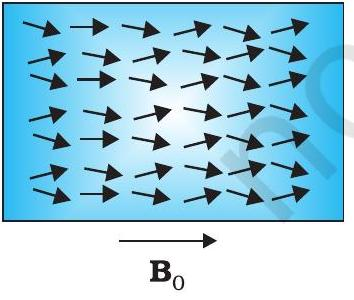
चित्र $5.8$
(a) यादृच्छिक अभिविन्यासित डोमेन, (b) संरेखित डोमेन।

मिश्रातु) ऐसा ही एक पदार्थ है और प्राकृतिक रूप में उपलब्ध लोडस्टोन दूसरा। इन पदार्थों से स्थायी चुंबक बनते हैं और इनका उपयोग चुंबकीय सुई बनाने के अलावा अन्य कार्यों में भी होता है। दूसरी ओर लौह चुंबकीय पदार्थों की एक श्रेणी ऐसी है जिनका चुंबकन बाह्य क्षेत्र को हटाते ही खत्म हो जाता है। नर्म लोहा ऐसा ही एक पदार्थ है। उचित रूप से ही, ऐसे पदार्थों को नर्म लौह चुंबकीय पदार्थ कहा जाता है। बहुत से तत्व लौह चुंबकीय हैं; जैसे-लोहा, कोबाल्ट, निकल, गैडोलिनियम आदि। इनकी आपेक्षिक चुंबकशीलता $1000$ से अधिक है।

लौह चुंबकीय गुण भी ताप पर निर्भर करता है। पर्याप्त उच्च ताप पर एक लौह चुंबक, अनुचुंबक
बन जाता है। ताप बढ़ने पर डोमेन संरचनाएँ विघटित होने लगती हैं। ताप बढ़ने पर चुंबकन का विलोपन धीरे-धीरे होता है।

## चुंबकत्व एवं द्रव्य

## सारांश

1. चुंबकत्व विज्ञान एक प्राचीन विज्ञान है। यह अत्यंत प्राचीन काल से ज्ञात रहा है कि चुंबकीय पदार्थों में उत्तर-दक्षिण दिशा में संकेत करने की प्रवृत्ति होती है। समान ध्रुव एक-दूसरे को प्रतिकर्षित करते हैं और विपरीत ध्रुव आकर्षित। किसी छड़ चुंबक को काटकर दो भागों में विभाजित करें तो दो छोटे चुंबक बन जाते हैं। चुंबक के ध्रुव अलग नहीं किए जा सकते।
2. जब m चुंबकीय द्विध्रुव आघूर्ण वाले छड़ चुंबक को समांग चुंबकीय क्षेत्र B में रखते हैं, तो
    (a) इस पर लगने वाला कुल बल शून्य होता है।
    (b) बल आघूर्ण $\mathbf{m} \times \mathbf{B}$ होता है।
    (c) इसकी स्थितिज ऊर्जा -m.B होती है, जहाँ हमने शून्य ऊर्जा को उस विन्यास में लिया है जब $\mathbf{m}$ चुंबकीय क्षेत्र B के लंबवत है।
3. लंबाई $1$ एवं चुंबकीय आघूर्ण $\mathbf{m}$ का एक छड़ चुंबक लीजिए। इसके मध्य बिंदु से $r$ दूरी पर, जहाँ $r \gg 1$, इस छड़ के कारण चुंबकीय क्षेत्र B का मान होगा,
$$
\begin{aligned}
& \mathbf{B}=\frac{\mu_{0} \mathbf{m}}{2 \pi r^{3}} \\
&=-\frac{\mu_{0} \mathbf{m}}{4 \pi r^{3}} \quad(\text { अक्ष के अनुदिश }) \\
&(\text { विषुवत वृत्त के अनुदिश })
\end{aligned}
$$
4. चुंबकत्व संबंधी गाउस के नियमानुसार, किसी बंद पृष्ठ में से गुजरने वाला कुल चुंबकीय फ्लक्स हमेशा शून्य होता है।
$$
\phi_{\mathrm{B}}=\sum_{\substack{\text { सभी क्षेत्रफल } \\ \text { अंशों } \Delta \mathbf{S} \text { के लिए }}} \mathbf{B} \cdot \Delta \mathbf{S}=0
$$
5. माना कि कोई पदार्थ एक बाह्य चुंबकीय क्षेत्र $\mathbf{B}_{0}$ में रखा है। चुंबकीय तीव्रता की परिभाषा है,
$$
\mathbf{H}=\frac{\mathbf{B}_{0}}{\mu_{0}}
$$
पदार्थ का चुंबकन $\mathbf{M}$ इसका द्विध्रुव आघूर्ण प्रति इकाई आयतन है। पदार्थ के अंदर चुंबकीय क्षेत्र
$$
\mathbf{B}=\mu_{0}(\mathbf{H}+\mathbf{M})
$$
6. रैखिक पदार्थ के लिए,
$\mathbf{M}=\chi \mathbf{H}$ जिससे कि $\mathbf{B}=\mu \mathbf{H}$
एवं $\chi$ पदार्थ की चुंबकीय प्रवृत्ति कहलाती है। राशियों $\chi$, आपेक्षिक चुंबकशीलता $\mu_{r}$ एवं चुंबकशीलता $\mu$ में निम्नलिखित संबंध हैं-
$$
\begin{aligned}
& \mu=\mu_{0} \mu_{r} \\
& \mu_{r}=1+\chi
\end{aligned}
$$
7. चुंबकीय पदार्थों को मोटे तौर पर तीन श्रेणियों में विभाजित करते हैं : प्रतिचुंबकीय, अनुचुंबकीय एवं लौह चुंबकीय। प्रतिचुंबकीय पदार्थों के लिए $\chi$ का मान ऋणात्मक और प्रायः बहुत कम होता है, अनुचुंबकीय पदार्थों के लिए $\chi$ धनात्मक एवं बहुत कम है। लौह चुंबकों के लिए $\chi$ धनात्मक एवं बहुत अधिक मान वाला है।
8. वे पदार्थ जो सामान्य ताप पर लंबे समय के लिए लौह चुंबकीय गुण दर्शाते हैं, स्थायी चुंबक कहलाते हैं।

## - भौतिकी

| भौतिक राशि | प्रतीक | प्रकृति | विमाएँ | मात्रक | टिप्पणी |
| :--- | :--- | :--- | :--- | :--- | :--- |
| निर्वात की चुंबकशीलता | $\mu_{0}$ | अदिश | $\left[\mathrm{M} \mathrm{LT}^{-2} \mathrm{~A}^{-2}\right]$ | $\mathrm{T} \mathrm{m} \mathrm{A}^{-1}$ | $\mu_{0} / 4 \pi=10^{-7}$ |
| चुंबकीय क्षेत्र; चुंबकीय प्रेरण; चुंबकीय फ्लक्स घनत्व | B | सदिश | $\left[\mathrm{M} \mathrm{T}^{-2} \mathrm{~A}^{-1}\right]$ | T (टेस्ला) | $10^{4} \mathrm{G}($ गाउस $)=1 \mathrm{~T}$ |
| चुंबकीय आघूर्ण | m | सदिश | $\left[\mathrm{L}^{-2} \mathrm{~A}\right]$ | $\mathrm{A} \mathrm{m}^{2}$ |  |
| चुंबकीय फ्लक्स | $\phi_{\mathrm{B}}$ | अदिश | $\left[\mathrm{ML}^{2} \mathrm{~T}^{-2} \mathrm{~A}^{-1}\right]$ | W (वेबर) | $\mathrm{W}=\mathrm{T} \mathrm{m}^{2}$ |
| चुंबकन | M | सदिश | $\left[\mathrm{L}^{-1} \mathrm{~A}\right]$ | $\mathrm{A} \mathrm{m}^{-1}$ | चुंबकीय आघूर्ण आयतन |
| चुंबकीय तीव्रता चुंबकीय क्षेत्र सामर्थ्य | H | सदिश | $\left[\mathrm{L}^{-1} \mathrm{~A}\right]$ | $\mathrm{A} \mathrm{m}^{-1}$ | $\mathbf{B}=\mu_{0}(\mathbf{H}+\mathbf{M})$ |
| चुंबकीय प्रवृत्ति | $\chi$ | अदिश |  |  | $\mathbf{M}=\chi \mathbf{H}$ |
| आपेक्षिक चुंबकशीलता | $\mu_{\mathrm{r}}$ | अदिश |  |  | $\mathbf{B}=\mu_{0} \mu_{r} \mathbf{H}$ |
| चुंबकशीलता | $\mu$ | अदिश | $\left[\mathrm{M} \mathrm{LT}^{-2} \mathrm{~A}^{-2}\right]$ | $\mathrm{T} \mathrm{m} \mathrm{A}^{-1} \mathrm{NA}^{-2}$ | $\begin{aligned} & \mu=\mu_{0} \mu_{r} \\ & \mathbf{B}=\mu \mathbf{H} \end{aligned}$ |

## विचारणीय विषय

1. गतिमान आवेशों/धाराओं के माध्यम से चुंबकीय प्रक्रमों की संतोषजनक समझ सन $1800$ ई. के बाद पैदा हुई। लेकिन, चुंबकों के दैशिक गुणों का प्रौद्योगिकीय उपयोग इस वैज्ञानिक समझ से दो हजार वर्ष पूर्व होने लगा था। अतः अभियांत्रिक अनुप्रयोगों के लिए, वैज्ञानिक समझ का होना कोई आवश्यक शर्त नहीं है। आदर्श स्थिति यह है कि विज्ञान और अभियांत्रिकी एक-दूसरे से सहयोग करते हुए चलते हैं। कभी विज्ञान अभियांत्रिकी को आगे बढ़ाता है तो कभी अभियांत्रिकी विज्ञान को।
2. एकल चुंबकीय ध्रुवों का अस्तित्व नहीं होता। यदि आप एक चुंबक को काट कर दो टुकड़े करते हैं तो आपको दो छोटे चुंबक प्राप्त होते हैं। इसके विपरीत पृथक्कृत धनात्मक एवं ऋणात्मक विद्युत आवेशों का अस्तित्व है। एक इलेक्ट्रॉन पर आवेश का परिमाण $|e|=1.6 \times 10^{-19} \mathrm{C}$ होता है जो आवेश का सूक्ष्मतम मान है। अन्य सभी आवेश इस न्यूनतम इकाई आवेश के पूर्ण गुणांक होते हैं। दूसरे शब्दों में, आवेश क्वांटीकृत होते हैं। हमें ज्ञात नहीं है कि एकल चुंबकीय ध्रुवों का अस्तित्व क्यों नहीं है अथवा विद्युत आवेश क्वांटीकृत क्यों होता है?
3. इस तथ्य का कि चुंबकीय एकल ध्रुवों का अस्तित्व नहीं होता, एक परिणाम यह है कि चुंबकीय क्षेत्र रेखाएँ संतत हैं और बंद लूप बनाती हैं। इसके विपरीत, वैद्युत बल रेखाएँ धनावेश से शुरू होकर ऋणावेश पर समाप्त हो जाती हैं (या अनंत में लीन हो जाती हैं)।
4. चुंबकीय प्रवृत्ति $\chi$ के मान में अत्यल्प अंतर से पदार्थ के व्यवहार में मूलभूत अंतर पाया जाता है, जैसे प्रतिचुंबक और अनुचुंबक के व्यवहारों में अंतर। प्रतिचुंबकीय पदार्थों के लिए $\chi=-10^{-5}$ जबकि अनुचुंबकीय पदार्थों के लिए $\chi=+10^{-5}$ ।
5. अतिचालक, परिपूर्ण प्रतिचुंबक (perfect diamagnetic) भी होते हैं। इसके लिए $\chi=-1$, $\mu_{r}=0, \mu=0$ । बाह्य चुंबकीय क्षेत्र पूर्णतः इसके बाहर ही रहता है। एक मनोरंजक तथ्य यह

## चुंबकत्व एवं द्रव्य

है कि यह पदार्थ एक परिपूर्ण चालक भी है। परंतु, ऐसा कोई चिरसम्मत सिद्धांत नहीं है जो इन दोनों गुणों में एक सूत्रता ला सके। बार्डीन, कूपर एवं श्रीफर ने एक क्वांटम यांत्रिकीय सिद्धांत (BCS सिद्धांत) दिया है, जो इन प्रभावों की व्याख्या कर सकता है। BCS सिद्धांत $1957$ में प्रस्तावित किया गया था और बाद में, $1970$ में, भौतिकी के नोबेल पुरस्कार के रूप में इसको मान्यता प्राप्त हुई।

6. प्रतिचुंबकत्व सार्वत्रिक है। यह सभी पदार्थों में विद्यमान है। परंतु अनुचुंबकीय एवं लौह चुंबकीय पदार्थों में यह बहुत क्षीण होता है और इसका पता लगाना बहुत कठिन है।
7. हमने पदार्थों का प्रतिचुंबकीय, अनुचुंबकीय एवं लौह चुंबकीय रूपों में वर्गीकरण किया है। लेकिन चुंबकीय पदार्थों के इनके अलावा भी कुछ प्रकार हैं; जैसे-लघु लौह चुंबकीय (फेरी चुंबकीय), प्रतिलौह चुंबकीय, स्पिन-काँच आदि जिनके गुण बहुत ही असामान्य एवं रहस्यमय हैं।

## अभ्यास

$5.1$ एक छोटा छड़ चुंबक जो एकसमान बाह्य चुंबकीय क्षेत्र $0.25 \mathrm{~T}$ के साथ $30^{\circ}$ का कोण बनाता है, पर $4.5 \times 10^{-2} \mathrm{~J}$ का बल आघूर्ण लगता है। चुंबक के चुंबकीय आघूर्ण का परिमाण क्या है?
$5.2$ चुंबकीय आघूर्ण $\mathrm{m}=0.32 \mathrm{JT}^{-1}$ वाला एक छोटा छड़ चुंबक, $0.15 \mathrm{~T}$ के एकसमान बाह्य चुंबकीय क्षेत्र में रखा है। यदि यह छड़ क्षेत्र के तल में घूमने के लिए स्वतंत्र हो, तो क्षेत्र के किस विन्यास में यह (i) स्थायी संतुलन और (ii) अस्थायी संतुलन में होगा? प्रत्येक स्थिति में चुंबक की स्थितिज ऊर्जा का मान बताइए।
$5.3$ एक परिनालिका में पास-पास लपेटे गए $800$ फेरे हैं, तथा इसका अनुप्रस्थ काट का क्षेत्रफल $2.5 \times 10^{-4} \mathrm{~m}^{2}$ है और इसमें $3.0 \mathrm{~A}$ धारा प्रवाहित हो रही है। समझाइए कि किस अर्थ में यह परिनालिका एक छड़ चुंबक की तरह व्यवहार करती है? इसके साथ जुड़ा हुआ चुंबकीय आघूर्ण कितना है?
$5.4$ यदि प्रश्न $5.3$ में बताई गई परिनालिका ऊर्ध्वाधर दिशा के परितः घूमने के लिए स्वतंत्र हो और इस पर क्षैतिज दिशा में एक $0.25 \mathrm{~T}$ का एकसमान चुंबकीय क्षेत्र लगाया जाए, तो इस परिनालिका पर लगने वाले बल आघूर्ण का परिमाण उस समय क्या होगा, जब इसकी अक्ष आरोपित क्षेत्र की दिशा से $30^{\circ}$ का कोण बना रही हो?
$5.5$ एक छड़ चुंबक जिसका चुंबकीय आघूर्ण $1.5 \mathrm{JT}^{-1}$ है, $0.22 \mathrm{~T}$ के एक एकसमान चुंबकीय क्षेत्र के अनुदिश रखा है।
    (a) एक बाह्य बल आघूर्ण कितना कार्य करेगा यदि यह चुंबक को चुंबकीय क्षेत्र के (i) लंबवत (ii) विपरीत दिशा में संरेखित करने के लिए घुमा दे।
    (b) स्थिति (i) एवं (ii) में चुंबक पर कितना बल आघूर्ण होता है?
$5.6$ एक परिनालिका जिसमें पास-पास $2000$ फेरे लपेटे गए हैं तथा जिसके अनुप्रस्थ काट का क्षेत्रफल $1.6 \times 10^{-4} \mathrm{~m}^{2}$ है और जिसमें $4.0 \mathrm{~A}$ की धारा प्रवाहित हो रही है, इसके केंद्र से इस प्रकार लटकायी गई है कि यह एक क्षैतिज तल में घूम सके।
    (a) परिनालिका के चुंबकीय आघूर्ण का मान क्या है?
    (b) परिनालिका पर लगने वाला बल एवं बल आघूर्ण क्या है, यदि इस पर, इसकी अक्ष से $30^{\circ}$ का कोण बनाता हुआ $7.5 \times 10^{-2} \mathrm{~T}$ का एकसमान क्षैतिज चुंबकीय क्षेत्र लगाया जाए?
$5.7$ किसी छोटे छड़ चुंबक का चुंबकीय आघूर्ण $0.48 \mathrm{JT}^{-1}$ है। चुंबक के केंद्र से $10 \mathrm{~cm}$ की दूरी पर स्थित किसी बिंदु पर इसके चुंबकीय क्षेत्र का परिमाण एवं दिशा बताइए यदि यह बिंदु (i) चुंबक के अक्ष पर स्थित हो (ii) चुंबक के अभिलंब समद्विभाजक पर स्थित हो।

[^0]:    * कुछ पाठ्यपुस्तकों में चुंबकीय क्षेत्र रेखाओं को चुंबकीय बल रेखाएँ कहा गया है। इस नामावली से बचना उचित होगा क्योंकि यह भ्रामक है। स्थिरवैद्युत के विपरीत चुंबकत्व में क्षेत्र रेखाएँ (गतिमान) आवेश पर बल की दिशा की सूचक नहीं हैं।

