## $5$ चुंबकत्व एवं द्रव्य   Magnetism and Matter अभ्यास प्रश्न

प्रश्न 1. भू-चुप्यकत्व सम्बंधी निम्नलिखित प्रश्नों के उत्तर दीजिए

(a) एक सदिश को पूर्ण रूप से व्यक्त करने के लिए तीन राशियों की आवश्यकता होती हैं। उन तीन स्वतन्न राशियों के नाम लिखिए जो परम्परागत रूप से पृथ्वी के चुम्बकीय क्षेत्र को व्यक्त करने के लिए प्रयुक्त होती हैं।
(b) दक्षिण भारत में किसी स्थान पर नति कोण का मान लगभग $18^{\circ}$ है। ब्रिटेन में आप इससे अधिक नति कोण की अपेक्षा करेंगे या कम की?
(c) यदि आप आस्ट्रेलिया के मेल्बोर्न शहर में भू-चुम्बकीय क्षेत्र रेखाओं का नक्शा बनाएँ तो ये रेखाएँ पृथ्वी के अन्दर जाएँगी या इससे बाहर आएँगी?
(d) एक चुम्बकीय सुई जो ऊर्घ्वाधर तल में घूमने के लिए स्वतन्त्र है, यदि भू-नुम्बकीय उत्तर या दक्षिण ध्रुव पर रखी हो तो यह किस दिशा में संकेत करेगी?
(e) यह माना जाता है कि पृथ्वी का चुम्बकीय क्षेत्र लगमग एक चुम्बकीय द्विध्रुव के क्षेत्र जैसा है जो पृथ्वी के केन्द्र पर रखा है और जिसका द्विध्रुर्व आघूर्ण $8 \times 10^{22} \mathrm{JT}^{-1}$ है। कोई ढंग सुझाइये जिससे इस संख्या के परिमाण की कोटि जाँची जा सके।
(f) भू-गर्भशास्त्रियों का मानना है कि मुख्य $N-S$ चुम्बकीय धुर्वों के अतिरिक्त, पृथ्वी की सतह पर कई अन्य स्थानीय धृव भी है, जो विपिन्न दिशाओं में विन्यस्त है। ऐसा होना कैसे सम्मव है?

हल

(a) तीन स्वतन्त्र राशियों द्वारा पृथ्वी के चुम्बकीय क्षेत्र को निर्धारित किया जाता है चुम्बकीय विक्षेपण, अवनति कोण तथा पृथ्वी के चुम्बकीय क्षेत्र का क्षैतिज घटक उपरोक्त तीन राशियाँ पृथ्वी के चुम्बकीय अवयव हैं।
(b) ब्रिटेन में नति कोण उच्चतम होता है क्योंकि ब्रिटेन उत्तरीध्रुव के समीप स्थित है ब्रिटेन में नति कोण लगभग $70^{\circ}$ है।
(c) मेल्बॉर्न दक्षिणी गोलार्द्ध में है दक्षिणी गोलार्द्ध में पृथ्वी के चुम्बकीय क्षेत्र का उत्तरीधुव निहित है। अत: चुम्बकीय बल रेखाएँ उत्तरी ध्रुव से उदगमित होती हैं तथा दक्षिणी धुव पर संग्रहित होती प्रतीत होती हैं।
(d) प्रश्नानुसार ध्रुयों पर पृथ्वी का चुम्बकीय क्षेत्र ठीक ऊर्ध्वाधर होता है, कम्पास सुईं क्षैतिज तल में घुमने के लिए स्वतन्त्र है अतः यह धुवों पर कोई भी दिशा दर्शाती है।
(e) चुम्बकीय द्विध्रुव आघूर्ण $M=8 \times 10^{22} \mathrm{~J} / \mathrm{T}$ पृथ्वी के चुम्बकीय द्विध्रुव पर चुम्बकीय क्षेत्र ज्ञात करते हैं माना विषुवत रेखा पर एक बिन्दु अल्प चुम्बकीय द्विध्रुव है जिसके लिए दूरी $d=R$ (पृथ्वी की त्रिज्या), पृथ्वी की त्रिज्या $R=6400 \mathrm{~km}=6.4 \times 10^{6} \mathrm{~m}$
$$
\begin{aligned}
\text { चुम्बकीय क्षेत्र } B & =\frac{\mu_{0} .}{4 \pi d^{3}}=10^{-7} \times \frac{8 \times 10^{22}}{\left(6.4 \times 10^{6}\right)^{3}} \\
& =0.31 \times 10^{-4} \mathrm{~T}=0.31 \mathrm{G}
\end{aligned}
$$
यह मान पृथ्वी के चुम्बकीय क्षेत्र के समान है।

(f) पृथ्वी का चुम्बकीय क्षेत्र केवल द्विध्रुव क्षेत्र के कारण है भिन्न N-S ध्रुव भिन्न दिशाओं में अवस्थित है तथा एक दूसरे के प्रभाव को निरस्त करते हैं ये स्थानीय N-S ध्रुव केवल चुम्बकित खनिज की अव्यवस्थापन के कारण उत्पन्न होते हैं।

प्रश्न 2. निम्नलिखित प्रश्नों के उत्तर दीजिए

(a) एक जगह से दूसरी जगह जाने पर पृथ्वी का चुम्बकीय क्षेत्र बदलता है। क्या यह समय के साथ भी बदलता है? यदि हाँ, तो कितने समय अन्तराल पर इसमें पर्याप्त परिवर्तन होते हैं?
(b) पृथ्वी के क्रोड में लोहा है, यह ज्ञात है। फिर भी भू-गर्भशास्त्री इसको पृथ्वी के चुम्बकीय क्षेत्र का स्रोत नहीं मानते। क्यों?
(c) पृथ्वी के क्रोड के बाहरी चालक भाग में प्रवाहित होने वाली आवेश धाराएँ भू-चुम्बकीय क्षेत्र के लिए उतरदायी समझी जाती है। इन धाराओं को बनाए रखने वाली बैटरी (ऊर्जा स्रोत) क्या हो सकती है?
(d) अपने $4.5$ अरब वर्षों के इतिहास में पृथ्वी अपने चुम्बकीय क्षेत्र की दिशा कई बार उलट चुकी होगी। भू-गर्भशास्त्री, इतने सुन्दर अतीत के पृथ्वी के चुम्बकीय क्षेत्र के बारे में कैसे जान पाते हैं?
(e) बहुत अधिक दूरियों पर ( $30,000 \mathrm{~km}$ से अधिक) पृथ्वी का चुम्बकीय क्षेत्र अपनी द्विधुवीय आकृति से काफी भिन्न हो जाता है। कौन-से कारक इस विकृति के लिए उत्तरदायी हो सकते हैं?
(f) अंतरातारकीय अंतरिक्ष में $10^{12} \mathrm{~T}$ की कोटि का बहुत ही क्षीण चुम्बकीय क्षेत्र होता है। क्या इस क्षीण चुम्बकीय क्षेत्र के भी कुछ प्रमावी परिणाम हो सकते हैं? समझाइए।

टिप्पणी प्रश्न $2$ का उद्देश्य मुख्यतः आपकी जिज्ञासा जगाना है। उपरोक्त कई प्रश्नों के उत्तर या तो काम चलाऊ हैं या अज्ञात हैं। जितना सम्भव हो सका, प्रश्नों के संक्षिप्त उत्तर पुस्तक के अन्त में दिए गए हैं। विस्तृत उत्तरों के लिए आपको भू-चुम्बकत्व पर कोई अच्छी पाठ्य पुस्तक देखनी होगी।
हल

(a) हाँ, पृथ्वी का चुम्बकीय क्षेत्र प्रत्येक स्थान पर तथा प्रत्येक समय बदलता रहता है यह प्रतिदिन भी बदल सकता है। वार्षिक रूप से भी बदल सकता है तथा $1000$ वर्षो तक बदलता रहता है। चुम्बकीय आँधी के दौरान यह अनियमित रूप से बदलता है। अतः इसमें कुछ सौ वर्षों के अन्तराल पर पर्याप्त परिवर्तन होता है।
(b) पृथ्वी के भू-गर्भीय क्रोड में लोहा है जो अत्यधिक तापमान के कारण द्रवीभूत अवस्था में होता है जिससे वह लौह चुम्बकीय प्रकृति नहीं रख पाता है। अतः यह पृथ्वी के चुम्बकत्व का स्रोत नहीं हो सकता है।
(c) पृथ्वी के क्रोड के बाहरी भाग में प्रवाहित होने वाली आवेश धाराएँ भू-चुम्बकीय क्षेत्र के लिए उत्तरदायी समझी जाती हैं। इन धाराओं का स्रोत पृथ्वी के अन्दर उपस्थित रेडियो एक्टिव पदार्थ हैं।

(d) यह देखा गया है कि पदार्थ के द्रव अवस्था से ठोस अवस्था में परिवर्तन के दौरान चुम्बकीय क्षेत्र बहुत अल्प होता है। चट्टानों का विश्लेषण पृथ्वी के चुम्बकीय क्षेत्र के बारे में दर्शाती है।
(e) पृथ्वी के वातावरण में उपस्थित आयनों की गति विकृति के लिए उत्तरदायी है।
(f) हम जानते हैं कि जब आवेशित कण चुम्बकीय क्षेत्र में अभिलम्बवत् प्रवेश करता है तब यह वृत्तीय पथ का अनुसरण करता है तथा आवश्यक अभिकेन्द्र बल चुम्बकीय बल द्वारा ही उत्पन्न होता है।

अर्थात

$$
B e v=\frac{m v^{2}}{r}
$$

अथवा

$$
r=\frac{m v}{B e}
$$

$B$ अल्प है, $r$ त्रिज्या उच्च है, अतः अन्तरातारकीय आकाश में कण वृहद त्रिज्या के पथ पर गति करता है। अतः उनके पथ में विचलन नगण्य है।

प्रश्न 3. एक छोटा छड़ चुम्बक जो एकसमान बाह्य चुम्बकीय क्षेत्र $0.25 \mathrm{~T}$ के साथ $30^{\circ}$ का कोण बनाता है, पर $45 \times 10^{-2} \mathrm{~J}$ का बल आघूर्ण लगाता है। चुम्बक के चुम्बकीय आघूर्ण का परिमाण क्या है?

हल दिया है, एकसमान चुम्बकीय क्षेत्र

$$
B=0.25 \mathrm{~T}
$$

बल आघूर्ण $\tau=4.5 \times 10^{-2} \mathrm{~J}$
चुम्बकीय आघूर्ण तथा चुम्बकीय क्षेत्र के बीच कोण $\theta=30^{\circ}$ बाह्म चुम्बकीय क्षेत्र में चुम्बक पर बल आघूर्ण

$$
\begin{array}{rlr}
\tau & =M \times B & \\
\tau & =M B \sin \theta & (\because A \times B=A B \sin \theta) \\
4.5 \times 10^{-2} & =M \times 0.25 \times \sin 30^{\circ} & \\
M & =\frac{4.5 \times 10^{-2}}{0.25 \times \sin 30^{\circ}} & \\
& =\frac{4.5 \times 10^{-2} \times 2}{0.25 \times 1} \quad\left(\because \sin 30^{\circ}=\frac{1}{2}\right) \\
& =0.36 \mathrm{~J} / \mathrm{T}
\end{array}
$$

अतः चुम्बकीय आघूर्ण का मान $0.36 \mathrm{~J} / \mathrm{T}$ है।

प्रश्न 4. चुम्बकीय आघूर्ण $m=0.32 \mathrm{JT}^{-1}$ वाला एक छोटा छड़ चुम्बक, $0.15 \mathrm{~T}$ के एकसमान बाह्म चुम्बकीय क्षेत्र में रखा है। यदि यह छड़ क्षेत्र के तल में घूमने के लिए स्वतन्त्र हो, तो क्षेत्र के किस विन्यास में यह (a) स्थायी सन्तुलन और (b) अस्थायी सन्तुलन में होगा? प्रत्येक स्थिति में चुम्बक की स्थितिज ऊर्जा का मान बताइए।
हल चुम्बक का चुम्बकीय आघूर्ण $m=0.32 \mathrm{~J} / \mathrm{T}$

$$
\text { चुम्बकीय क्षेत्र } B=0.15 \mathrm{~T}
$$

(a) स्थायी सन्तुलन हेतु चुम्बकीय आघूर्ण तथा चुम्बकीय क्षेत्र के मध्य कोण $\theta=0^{\circ}$
( ∵ इस अवस्था में यदि द्विधुव चुम्बकीय क्षेत्र की दिशा में है तब द्विधुव पर कोई बल नहीं लगेगा)
∵ चुम्बक की स्थितिज ऊर्जा
$$
\begin{aligned}
U & =-m \cdot B \\
& =-m B \cos \theta \quad(\because A \cdot B=A B \cos \theta) \\
& =-0.32 \times 0.15 \cos 0^{\circ} \\
& =-4.8 \times 10^{-2} \mathrm{~J}
\end{aligned}
$$
अत: स्थायी सन्तुलन हेतु स्थितिज ऊर्जा $-4.8 \times 10^{-2} \mathrm{~J}$ है।
(b) अस्थायी सन्तुलन हेतु चुम्बकीय आघूर्ण तथा चुम्बकीय क्षेत्र के बीच $180^{\circ}$ का कोण है (इस अवस्था में यह चुम्बकीय क्षेत्र के लम्बवत् होगा तथा इस पर अधिकतम बल आघूर्ण लगेगा)
$$
\theta=180^{\circ}
$$
चुम्बक की स्थितिज ऊर्जा
$$
\begin{aligned}
U & =-m B \cos 180^{\circ} \\
& =-0.32 \times 0.15(-1)=4.8 \times 10^{-2} \mathrm{~J}
\end{aligned}
$$
अतः अस्थायी सन्तुलन हेतु स्थितिज ऊर्जा $4.8 \times 10^{-2} \mathrm{~J}$ है।

प्रश्न 5. एक परिनालिका में पास-पास लपेटे गए $800$ फेरे हैं, तथा इसका अनुप्रस्य काट का क्षेत्रफल $2.5 \times 10^{-4}$ मी $^{2}$ है और इसमें $3.0 \mathrm{~A}$ धारा प्रवाहित हो रही है। समझाइए कि किस अर्थ में यह परिनालिका एक छड़ चुम्बक की तरह व्यवहार करती है? इसके साथ जुड़ा हुआ चुम्बकीय आघूर्ण कितना है?
हल प्रश्नानुसार तार के फेरों की संख्या $n=800$
परिनालिका का क्षेत्रफल $A=2.5 \times 10^{-4} \mathrm{~m}^{2}$
परिनालिका में धारा $I=3 \mathrm{~A}$
जब परिनालिका में धारा प्रवाहित होती है, चुम्बकीय क्षेत्र उत्पन्न होता है मैक्सवेल के दाएँ हाथ के नियमानुसार चुम्बकीय क्षेत्र परिनालिका की अक्ष के अनुदिश है चुम्बकीय आघूर्ण के सूत्रानुसार

$$
\begin{aligned}
M & =n / A \\
M & =n / A \\
& =800 \times 3 \times 2.5 \times 10^{-4} \\
& =0.6 \mathrm{~J} / \mathrm{T} \text { परिनालिका की अक्ष के अनुदिश }
\end{aligned}
$$

प्रश्न 6. यदि प्रश्न $5$ में बताई गई परिनालिका ऊर्ध्वाधर दिशा के परितः घूमने के लिए स्वतन्त्र हो और इस पर क्षैतिज दिशा में एक $0.25 \mathrm{~T}$ का एकसमान चुम्बकीय क्षेत्र लगाया जाए, तो इस परिनालिका पर लगने वाले बल आघूर्ण का परिमाण उस समय क्या होगा, जब इसकी अक्ष आरोपित क्षेत्र की दिशा से $30^{\circ}$ का कोण बना रही हो?
हल प्रश्नानुसार चुम्बकीय क्षेत्र $B=0.25 \mathrm{~T}$
चुम्बकीय आघूर्ण तथा चुम्बकीय क्षेत्र के बीच कोण $=30^{\circ}$ प्रश्न $5$ के अनुसार,
चुम्बकीय आघूर्ण $M=0.6 \mathrm{~J} / \mathrm{T}$
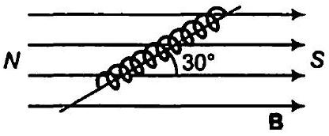
परिनालिका को चुम्बकीय क्षेत्र से $\theta$ कोण पर रखने पर बल आघूर्ण

$$
\begin{aligned}
\tau & =M B \sin \theta=0.6 \times 0.25 \sin 30^{\circ} \\
& =0.6 \times 0.25 \times \frac{1}{2} \\
& =0.075 \mathrm{~N}-\mathrm{m}
\end{aligned}
$$

अतः परिनालिका पर बल आघूर्ण 0.075 N-m है।
प्रश्न 7. एक छड़ चुम्बक जिसका चुम्बकीय आघूर्ण $1.5 \mathrm{~J} / \mathrm{T}$ है, $0.22 \mathrm{~T}$ के एक एकसमान चुम्बकीय क्षेत्र के अनुदिश रखा है।

(a) एक बाह्म बल आघूर्ण कितना कार्य करेगा यदि एक चुम्बक को चुम्बकीय क्षेत्र के
(i) लम्बवत् (ii) विपरीत दिशा में सरेखित करने के लिए घुमा दें।
(b) स्थित (i) एवं (ii) में चुम्बक पर कितना बल आघूर्ण होता है?

हल प्रश्नानुसार, चुम्बक पर चुम्बकीय आघूर्ण

$$
M=1.5 \mathrm{~J} / \mathrm{T}
$$

एकसमान चुम्बकीय क्षेत्र $B=0.22 T$

(a) (i) कोण $\theta_{1}=0^{\circ}$ ( ∵ चुम्बकीय क्षेत्र की दिशा की ओर प्रेरित होती है) तथा $\theta_{2}=90^{\circ}$ ( ∵ चुम्बकीय क्षेत्र के लम्बवत् प्रेरित होती है)

चुम्बक को $\theta_{1}$ कोण से $\theta_{2}$ कोण घुमाने में किया गया कार्य

$$
\begin{aligned}
W & =-M B\left(\cos \theta_{2}-\cos \theta_{1}\right) \\
& =-1.5 \times 0.22\left(\cos 90^{\circ}-\cos 0^{\circ}\right) \\
& =0.33 \mathrm{~J}
\end{aligned}
$$

(ii) कोण $\theta_{1}=0^{\circ}$ तथा $\theta_{2}=180^{\circ}$
( ∵ चुम्बक को चुम्बकीय क्षेत्र के सापेक्ष विपरीत दिशा में रखा गया है)
$$
\begin{aligned}
\text { कृत कार्य } & =-M B\left(\cos \theta_{2}-\cos \theta_{1}\right) \\
& =-1.5 \times 0.22\left(\cos 180^{\circ}-\cos 0^{\circ}\right)=0.66 \mathrm{~J}
\end{aligned}
$$
(b) बल आघूर्ण के सूत्रानुसार
$$
\tau=M B \sin \theta
$$
    (i) $\theta=90^{\circ}$ (जब चुम्बकीय आघूर्ण चुम्बकीय क्षेत्र के लम्बवत् है)
$$
\tau=1.5 \times 0.22 \sin 90^{\circ}=0.33 \mathrm{~N}-\mathrm{m}
$$
    (ii) $\theta=180^{\circ}$ (जब चुम्बकीय आघूर्ण चुम्बकीय क्षेत्र के विपरीत दिशा में है)
$$
\tau=1.5 \times 0.22 \sin 180^{\circ}=0
$$

प्रश्न 8. एक परिनालिका जिसमें पास-पास $2000$ फेरें लपेटे गए हैं तथा जिसके अनुप्रस्य काट का क्षेत्रफल $1.6 \times 10^{-4}$ मी ${ }^{2}$ है और जिसमें $4.0 \mathrm{~A}$ की धारा प्रवाहित हो रही है, इसके केन्द्र से इस प्रकार लटकायी गई है कि यह एक क्षैतिज तल में घूम सके।

(a) परिनालिका के चुम्बकीय आघूर्ण का मान क्या है?
(b) परिनालिका पर लगने वाला बल एवं बल आघूर्ण क्या है, यदि इस पर इसकी अक्ष से उ0° का कोण बनाता हुआ $7.5 \times 10^{-2} \mathrm{~T}$ का एकसमान क्षैतिज चुम्बकीय क्षेत्र लगाया जाए?

हल तार के फेरों की संख्या $n=2000$
परिच्छेद का क्षेत्रफल $A=1.6 \times 10^{-4} \mathrm{~m}^{2}$

$$
\text { धारा } l=4 \mathrm{~A}
$$

(a) परिनालिका के साथ चुम्बकीय आघूर्ण
$$
M=n I A=2000 \times 4 \times 1.6 \times 10^{-4}=1.28 \mathrm{~J} / \mathrm{T}
$$
(b) परिनालिका पर शून्य बल है क्योंकि इसके दोनों सिरों पर समान तथा विपरीत दिशा के बल कार्यरत हैं। अतः वे एक युग्म का निर्माण करते हैं।

अत: परिनालिका पर बल आघूर्ण $\tau=M B \sin \theta$
(दिया है, $\theta=30^{\circ}$ )
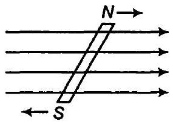

$$
\begin{aligned}
& =1.28 \times 7.5 \times 10^{-2} \sin 30^{\circ} \\
& =1.28 \times 7.5 \times 10^{-2} \times \frac{1}{2} \\
& =4.8 \times 10^{-2} \mathrm{~N}-\mathrm{m}
\end{aligned}
$$

प्रश्न 9. एक वृताकार कुण्डली जिसमें $16$ फेरे हैं, जिसकी त्रिज्या $10$ सेमी है और जिसमें $0.75 \mathrm{~A}$ धारा प्रवाहित हो रही है, इस प्रकार रखी है कि इसका तल, $5.0 \times 10^{-2} \mathrm{~T}$ परिमाण वाले बाह्म क्षेत्र के लम्बवत् है। कुण्डली, चुम्बकीय क्षेत्र के लम्बवत् और इसके अपने तल में स्थित एक अक्ष के चारों तरफ घूमने के लिए स्वतन्त्र हैं। यदि कुष्डली को जरा-सा घुमा कर छोड़ दिया

जाए तो यह अपनी स्थायी सन्तुलनावस्था के इधर-उधर $2.0 \mathrm{~s}^{-1}$ की आवृति से दोलन करती है। कुण्डली का अपने घूर्णन अक्ष के परित: जड़त्व-आघूर्ण क्या है?
हल दिया है, वृत्तीय कुण्डली में तार के फेरों की संख्या $n=16$
वृत्तीय कुण्डली की त्रिज्या $r=10 \mathrm{~cm}=0.1 \mathrm{~m}$
धारा / =0.75 A
चुम्बकीय क्षेत्र $B=5.0 \times 10^{-2} \mathrm{~T}$

$$
\text { आवृति } f=2 s^{-1}
$$

कुण्डली का चुम्बकीय आघूर्ण

$$
\begin{aligned}
M=n I A & =16 \times 0.75 \times p(0.1)^{2} \\
& =16 \times 0.75 \times 3.14 \times 0.1 \times 0.1 \\
& =0.377 \mathrm{~J} / \mathrm{T}
\end{aligned}
$$

कुण्डली के दोलन की आवृत्ति

$$
f=\frac{1}{2 \pi} \sqrt{\frac{M \times B}{l}}
$$

जहाँ, $l=$ कुण्डली का जड़त्व आघूर्ण है।
दोनों ओर का वर्ग करने पर

$$
f^{2}=\frac{1}{4 \pi^{2}} \cdot \frac{M B}{l}
$$

⇒

$$
\begin{aligned}
I & =\frac{M B}{4 \pi^{2} f^{2}}=\frac{0.377 \times 5 \times 10^{-2}}{4 \times 3.14 \times 3.14 \times 2 \times 2} \\
& =1.2 \times 10^{-4} \mathrm{~kg}-\mathrm{m}^{2}
\end{aligned}
$$

अत: कुण्डली का जड़त्व आघूर्ण $1.2 \times 10^{-4} \mathrm{~kg}-\mathrm{m}^{2}$.
प्रश्न 10. एक चुम्बकीय सुई चुम्बकीय याम्योत्तर के समान्तर एक ऊर्ध्वाधर तल में घूमने के लिए स्वतन्त्र है। इसका उत्तरी ध्रुव क्षैतिज से $22^{\circ}$ के कोण पर नीचे की ओर झुका है। इस स्थान पर चुम्बकीय क्षेत्र के क्षैतिज अवयव का मान 0.35 G है। इस स्थान पर पृथ्वी के चुम्बकीय क्षेत्र का परिमाण ज्ञात कीजिए।
हल नति कोण $\delta=22^{\circ}$
पृथ्वी के चुम्बकीय क्षेत्र का क्षैतिज घटक $H=0.35 \mathrm{G}$
माना स्थान विशेष पर पृथ्वी का चुम्बकीय क्षेत्र $A$ है तब सूत्रानुसार

$$
H=R \cos \delta
$$

अथवा

$$
\begin{aligned}
R & =\frac{H}{\cos \delta}=\frac{0.35}{\cos 22^{\circ}} \\
& =\frac{0.35}{0.9272}=0.38 \mathrm{G}
\end{aligned}
$$

अतः इस स्थान पर पृथ्वी का चुम्बकीय क्षेत्र 0.38 G है।

प्रश्न 11.दक्षिण अफ्रीका में किसी स्थान पर एक चुम्बकीय सुई भौगोलिक उत्तर से $12^{\circ}$ पश्चिम की ओर संकेत करती है। चुम्बकीय याम्योतर में सरेखित नति-वृत की चुम्बकीय सुई का उतरी ध्रुव क्षैतिज से $60^{\circ}$ उत्तर की ओर संकेत करता है। पृथ्वी के चुम्बकीय क्षेत्र का क्षैतिज अवयव मापने पर $0.16 \mathrm{G}$ पाया जाता है। इस स्थान पर पृथ्वी के क्षेत्र का परिमाण और दिशा बताइए।
हल अवनति कोण

$$
\theta=12^{\circ} \text { पश्चिम }
$$

नति कोण $\delta=60^{\circ}$
पृथ्वी के चुम्बकीय क्षेत्र का क्षैतिज घटक

$$
H=0.16 \mathrm{G}
$$

माना इस स्थान पर पृथ्वी का चुम्बकीय क्षेत्र $R$ है
सूत्र को प्रयुक्त करने पर $H=R \cos \delta$
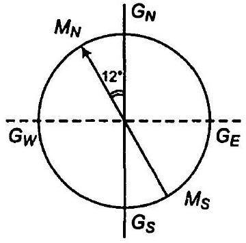

अथवा

$$
\begin{aligned}
R & =\frac{H}{\cos \delta}=\frac{0.16}{\cos 60^{\circ}}=\frac{0.16 \times 2}{1} \\
& =0.32 \mathrm{G}=0.32 \times 10^{-4} \mathrm{~T}
\end{aligned}
$$

पृथ्वी का चुम्बकीय क्षेत्र ऊर्ध्वाधर तल में $12^{\circ}$ पश्चिमी के भौगोलिक याम्यात्तर में है जो क्षैतिज से $60^{\circ}$ कोण पर है।

प्रश्न 12.किसी छोटे छड़ चुम्बक का चुम्बकीय आघूर्ण $0.48 \mathrm{JT}^{-1}$ है। चुम्बक के केन्द्र से $10 \mathrm{~cm}$ की दूरी पर स्थित किसी बिन्दु पर इसके चुम्बकीय क्षेत्र का परिमाण एवं दिशा बताइए। यदि यह बिन्दु (a) चुम्बक के अक्ष पर स्थित हो (b) चुम्बक के अभिलम्ब समद्विभाजक पर स्थित हो।

हल चुम्बक का चुम्बकीय आघूर्ण $M=0.48 \mathrm{~J} / \mathrm{T}$
चुम्बक के केन्द्र से दूरी $d=10 \mathrm{~cm}=0.1 \mathrm{~m}$

(a) जब बिन्दु अक्षीय स्थिति में है तब बिन्दु $P$ पर चुम्बकीय क्षेत्र
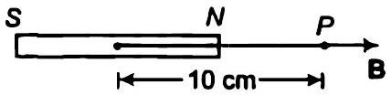
$$
\begin{aligned}
B & =\frac{\mu_{0} 2 M}{4 \pi d^{3}} \\
& =\frac{10^{-7} \times 2 \times 0.48}{(0.1)^{3}}=0.96 \times 10^{-4} \mathrm{~T}
\end{aligned}
$$

चुम्बकीय क्षेत्र की दिशा चुम्बकीय आघूर्ण की दिशा के अनुदिश है हम जानते हैं कि चुम्बकीय आघूर्ण की दिशा $S$ धुव से $P$ धुव की ओर है। अतः चुम्बकीय क्षेत्र की दिशा भी $S$ से $M$ की ओर होगी।

(b) छोटी छड़ चुम्बक के कारण निरक्षीय स्थिति में चुम्बकीय क्षेत्र का सूत्र प्रयुक्त करने पर
$$
\begin{aligned}
B & =\frac{\mu_{0}}{4 \pi} \cdot \frac{M}{d^{3}} \\
& =10^{-7} \times \frac{0.48}{(0.1)^{3}}=0.48 \times 10^{-4} \mathrm{~T}
\end{aligned}
$$
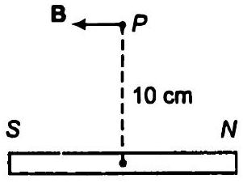
चुम्बकीय क्षेत्र की दिशा (निरक्षीय स्थिति में) चुम्बकीय आघूर्ण के विपरीत दिशा में है अतः चुम्बकीय क्षेत्र की दिशा घुव $S$ से $M$ की ओर है।

प्रश्न 13. क्षैतिज तल में रखे एक छोटे छड़ चुम्बक का अक्ष, चुम्बकीय उत्तर-दक्षिण दिशा के अनुदिश है। सन्तुलन बिन्दु चुम्बक के अक्ष पर, इसके केन्द्र से $14$ सेमी दूर स्थित है। इस स्थान पर पृथ्वी का चुम्बकीय क्षेत्र $0.36 \mathrm{G}$ एवं नति कोण शून्य है। चुम्बक के अभिलम्ब समद्विभाजक पर इसके केन्द्र से ठतनी ही दूर ( $14$ सेमी) स्थित किसी बिन्दु पर परिणामी चुम्बकीय क्षेत्र क्या होगा?
हल चुम्बक के केन्द्र से शून्य बिन्दु की दूरी

$$
d=14 \mathrm{~cm}=0.14 \mathrm{~m}
$$

शून्य नति कोण पर पृथ्वी का चुम्बकीय क्षेत्र पृथ्वी के चुम्बकीय क्षेत्र के क्षैतिज घटक के बराबर है अर्थात्

$$
H=0.36 \mathrm{G}
$$

प्रारम्भ में शून्य बिन्दु चुम्बक के अक्ष पर है अक्षीय स्थिति में चुम्बकीय क्षेत्र का सूत्र प्रयुक्त करने पर

$$
B_{1}=\frac{\mu_{0} \cdot 2 m}{4 \pi \cdot d^{3}}
$$

यह चुम्बकीय क्षेत्र पृथ्वी के चुम्बकीय क्षेत्र के क्षैतिज घटक के बराबर है।
अर्थात्

$$
B_{1}=\frac{\mu_{0}}{4 \pi} \cdot \frac{2 m}{d^{3}}=H
$$

ऊर्ध्वाघर रेखा पर चुम्बक की समान दूरी $d$ पर चुम्बक के कारण चुम्बकीय क्षेत्र

$$
B_{2}=\frac{\mu_{0}}{4 \pi} \cdot \frac{m}{d^{3}}=\frac{B_{1}}{2}-\frac{H}{2}
$$

ऊर्ध्वाघर रेखा पर उपरोक्त बिन्दु पर चुम्बकीय क्षेत्र

$$
\begin{aligned}
B & =B_{2}+H=\frac{H}{2}+H \\
& =\frac{3}{2} H=\frac{3}{2} \times 0.36 \\
& =0.54 \mathrm{G}
\end{aligned}
$$

चुम्बकीय क्षेत्र की दिशा पृथ्वी के चुम्बकीय क्षेत्र की दिशा में है।

प्रश्न 14. यदि प्रश्न $13$ में वर्णित चुम्बक को $180^{\circ}$ से घुमा दिया जाए तो सन्तुलन बिन्दुओं की नयी स्थिति क्या होगी?
हल जब चुम्बक को $180^{\circ}$ कोण पर घुमाया जाता है तब शून्य बिन्दु ऊर्ध्वाधर रेखा पर प्राप्त होता है।
अतः ऊर्ध्वाधर रेखा पर $d$ दूरी पर चुम्बकीय क्षेत्र

$$
B^{\prime}=\frac{\mu_{0}}{4 \pi} \cdot \frac{m}{d^{\prime 3}}
$$

यह चुम्बकीय क्षेत्र पृथ्वी के चुम्बकीय क्षेत्र के क्षैतिज घटक के बराबर है

$$
B^{\prime}=\frac{\mu_{0}}{4 \pi} \cdot \frac{m}{d^{\prime 3}}=H
$$

प्रश्न $13$ के अनुसार
चुम्बकीय क्षेत्र

$$
B_{1}=\frac{\mu_{0}}{4 \pi} \cdot \frac{2 m}{d^{3}}=H
$$

समी (i) व (ii) से

$$
\frac{\mu_{0}}{4 \pi} \cdot \frac{m}{d^{\prime 3}}=\frac{\mu_{0}}{4 \pi} \cdot \frac{2 m}{d^{3}}
$$

अथवा

$$
\frac{1}{d^{\prime 3}}=\frac{2}{d^{3}}
$$

अथवा

$$
d^{\prime 3}=\frac{d^{3}}{2}=\frac{(14)^{3}}{2} .
$$

अथवा
अतः शून्य बिन्दु ऊर्ध्वाधर रेखा पर $11.1 \mathrm{~cm}$ दूरी पर स्थित है (मध्य बिन्दु से)
प्रश्न 15. एक छोटा छड़ चुम्बक जिसका चुम्बकीय आघूर्ण $5.25 \times 10^{-2} \mathrm{~J} / \mathrm{T}$ है, इस प्रकार रखा है कि इसका अक्ष पृथ्वी के क्षेत्र की दिशा के लम्बवत् है। चुम्बक के केन्द्र से कितनी दूरी पर, परिणामी क्षेत्र पृथ्वी के क्षेत्र की दिशा से $45^{\circ}$ का कोण बनाएगा, यदि हम (a) अभिलम्ब समद्विभाजक पर देखें, (b) अक्ष पर देखें? इस स्थान पर पृथ्वी के चुम्बकीय क्षेत्र का परिमाण $0.42 \mathrm{G}$ है। प्रयुक्त दूरियों की तुलना में चुम्बक की लम्बाई की उपेक्षा कर सकते हैं।
हल प्रश्नानुसार चुम्बकीय आघूर्ण $m=5.25 \times 10^{-2} \mathrm{~J} / \mathrm{T}$
माना परिणामी चुम्बकीय क्षेत्र $B_{\text {het }}$ है जो $B_{6}$ से $45^{\circ}$ का कोण बनाता है।

$$
\begin{aligned}
\therefore & & B_{0} & =0.42 \mathrm{G} \\
& & & =0.42 \times 10^{-4} \mathrm{~T}
\end{aligned}
$$

(a) अभिलम्ब समद्विभाजक पर
माना $r$ अक्षीय रेखा तथा बिन्दु $P$ के बीच की दूरी है। छोटी छड़ चुम्बक के कारण बिन्दु $P$ पर चुम्बकीय क्षेत्र
$$
B=\frac{\mu_{0}}{4 \pi} \cdot \frac{m}{r^{3}}
$$
$B$ की दिशा $P A$ के अनुदिश है।
वेक्टर विश्लेषण के अनुसार
$$
\begin{aligned}
\tan 45^{\circ} & =\frac{B \sin 90^{\circ}}{B \cos 90^{\circ}+B_{0}} \\
1 & =\frac{B}{B_{0}}
\end{aligned}
$$
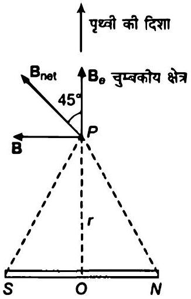
अथवा
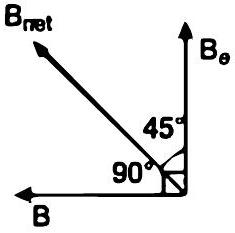
$$
\begin{aligned}
0.42 \times 10^{-4} & =\frac{\mu_{0}}{4 \pi} \cdot \frac{m}{r^{3}} \\
0.42 \times 10^{-4} & =\frac{10^{-7} \times 5.25 \times 10^{-2}}{r^{3}} \\
r^{3} & =\frac{5.25 \times 10^{-9}}{0.42 \times 10^{-4}}=12.5 \times 10^{-5} \\
r & =0.05 \mathrm{~m} \\
r & =5 \mathrm{~cm}
\end{aligned}
$$
(b) जब बिन्दु अक्षीय रेखा पर है।
माना परिणामी चुम्बकीय क्षेत्र $B_{\text {net }}$
$B$ के साथ $45^{\circ}$ का कोण बनाता है अतः
चुम्बक के मध्य बिन्दु से $r$ दूरी पर बिन्दु $P$ अक्षीय स्थिति में चुम्बकीय क्षेत्र
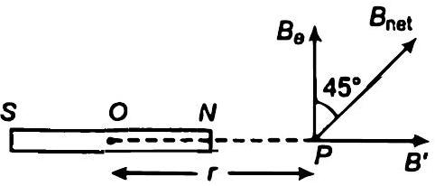
$$
B^{\prime}=\frac{\mu_{0} \cdot 2 m}{4 \pi r^{3}} \quad(S \text { से } N \text { की ओर })
$$
चुम्बकीय क्षेत्र की दिशा $S$ से $N$ की ओर है।
वेक्टर विश्लेषण के अनुसार
$$
\begin{aligned}
\tan 45^{\circ} & =\frac{B^{\prime} \sin 90^{\circ}}{B^{\prime} \cos 90^{\circ}+B_{8}} \\
1 & =\frac{B^{\prime}}{B_{8}}
\end{aligned}
$$
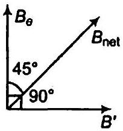
अथवा
$$
B_{\theta}=B^{\prime}
$$
$$
0.42 \times 10^{-4}=\frac{\mu_{0}}{4 \pi} \times \frac{2 m}{r^{3}}
$$

अथवा

$$
\begin{aligned}
0.42 \times 10^{-4} & =\frac{10^{-7} \times 2 \times 5.25 \times 10^{-2}}{r^{3}} \\
r^{3} & =\frac{10^{-9} \times 2 \times 5.25}{0.42 \times 10^{-4}}=2.5 \times 10^{-5} \\
r & =0.063 \mathrm{~m} \text { अथवा } 6.3 \mathrm{~cm}
\end{aligned}
$$

## अतिरिक्त प्रश्न

प्रश्न 16.निम्नलिखित प्रश्नों के ठतर दीजिए

(a) ठण्डा करने पर किसी अनुचुम्बकीय पदार्य का नमूना अधिक दुम्बकन क्यों प्रदर्शित करता है? (एक ही चुम्बककारी क्षेत्र के लिए)
(b) अनुचुम्बकत्व के विपरीत, प्रतिचुम्बकत्व पर ताप का प्रभाव लगमग नहीं होता क्यों?
(c) यदि एक टोरॉइड में बिस्पिय का क्रोड लगाया जाए तो इसके अन्दर चुम्बकीय क्षेत्र उस स्थिति की तुलना में (किंचित) कम होगा या (किंचित) ज्यादा होगा, जबकि क्रोड खाली हो?
(d) क्या किसी लौह चुम्बकीय पदार्थ की चुम्बकशीलता चुम्बकीय क्षेत्र पर निर्मर करती है? यदि हीं, तो उच्च चुम्बकीय क्षेत्रों के लिए इसका मान कम होगा या अधिक?
(e) किसी लौह चुम्बक की सतह के प्रत्येक बिन्दु पर चुम्बकीय क्षेत्र रेखाएँ सदैव लम्बवत होती हैं। (यह तथ्य उन स्थिरवैद्युत क्षेत्र रेखाओं के सदृश है जो कि चालक की सतह के प्रत्येक बिन्दु पर लम्बवत् होती हैं)। क्यों?
(f) क्या किसी अनुचुम्बकीय नमूने का अधिकतम सम्पव चुम्बकन लौह चुम्बक के चुम्बकन के परिमाण की कोटि का होगा?

हल

(a) परमाणवीय या आणविक द्विघुवों का अनियमित अभिविच्यास कम ताप पर घट जाता है क्योंकि उनकी ऊष्मीय गति भी घट जाती है। अतः ठण्डा करने पर अनुचुम्बकीय पदार्थ अधिक चुम्बकन प्रदर्शित करते हैं।
(b) प्रतिचुम्बकीय पदार्थ में प्रत्येक अणु चुम्बकीय द्विघु नहीं होता है अतः अनियमित ऊष्मीय गति चुम्बकत्व को प्रमावित नहीं करती है। अतः प्रतिचुम्बकीय पदार्थ का प्रति चुम्बकत्व ताप पर निर्मर नहीं करता है।
(c) Bi एक प्रतिचुम्बकीय पदार्थ है अत: क्रोड का चुम्बकीय क्षेत्र Bi की उपस्थिति में कम होगा तथा खाली अवस्था में अधिक होगा क्योंकि प्रतिचुम्बकीय पदार्थ चुम्बकीय क्षेत्र के विपरीत दिशा में क्षीणता से चुम्बकित हो जाते हैं।
(d) नहीं लौह चुम्बकीय पदार्थां की चुम्बकशीलता चुम्बकीय क्षेत्र से स्वतन्त्र नहीं है। हिस्टेरिसिस वक्र के अनुसार अल्प क्षेत्र पर चुम्बकशीलता का मान अधिक होता है।

(e) लौह चुम्बक की सतह पर प्रत्येक बिन्दु पर चुम्बकीय क्षेत्र रेखाएँ सदैव लम्बवत होती है क्योंकि लौह चुम्बकीय पदार्थों के लिए चुम्बकशीलता हमेशा अधिक होती है $(\mu \gg 1$ ) (यह तथ्य उन स्थिरवैद्युत क्षेत्र रेखाओं के सदृश है जोकि चालक की सतह के प्रत्येक बिन्दु पर लम्बवत होती है)
(f) हाँ, अनुचुम्बकीय नमूने का अधिकतम सम्भव चुम्बकन लौह चुम्बकीय के चुम्बकन के परिणाम की कोटि का होता है बशर्ते कि चुम्बकीय क्षेत्र बहुत अधिक हो।

प्रश्न 17.निम्नलिखित प्रश्नों के उत्तर दीजिए

(a) लौह चुम्बकीय पदार्थ के चुम्बकन वक्र की अनुत्र्रमणीयता, डोमेनो के आघार पर गुणात्मक दृष्टिकोण से समझाइए।
(b) नर्म लोहे के एक टुकड़े के शैथिल्य लूप का क्षेत्रफल, कार्बन स्टील के टुकड़े के शैथिल्य लूप के क्षेत्रफल से कम होता है। यदि पदार्थ को बार-बार चुम्बकन चक्र से गुजारा जाए तो कौन-सा टुकड़ा अधिक ऊष्मा ऊर्जा का क्षय करेगा?
(c) लौह चुम्बक जैसा शैथिल्य लूप प्रदर्शित करने वाली कोई प्रणाली स्मृति संग्रहण की युक्ति है। इस कथन की व्याख्या कीजिए।
(d) कैसेट के चुम्बकीय फीतों पर पर्त चढ़ाने के लिए या आघुनिक कम्यूटर में स्मृति संग्रहण के लिए, किस तरह के लौह चुम्बकीय पदार्थों का इस्तेमाल होता है?
(e) किसी स्थान को चुम्बकीय क्षेत्र से परिरक्षित करना है। कोई विधि सुझाइए।

हल

(a) लौह चुम्बकीय पदार्थ के चुम्बकन वक्र की अनुत्क्रमणीयता डोमेनो के आघार पर व्याख्यित करने हेतु शैथिल्य वक्र बनाते हैं, जिसमें हम देखते हैं कि बाह्य चुम्बकीय क्षेत्र के हटाये जाने पर भी पदार्थ में चुम्बकत्व शेष रह जाता है जो लौह चुम्बकीय पदार्थ की अनुत्क्रमणीयता दर्शाता है।
(b) हम जानते हैं कि शैथिल्य वक्र के प्रत्येक चक्र में व्यय ऊर्जा शैथिल्य वक्र के क्षेत्रफल के अनुक्रमानुपाती होती है अतः प्रश्नानुसार कार्बन स्टील हेतु शैथिल्य वक्र का क्षेत्रफल अधिक होता है अत: कार्बन स्टील का टुकड़ा अत्यधिक ऊर्जा व्यय करेगा।
(c) लौह चुम्बकीय पदार्थ का चुम्बकन केवल चुम्बकन क्षेत्र पर ही निर्भर नहीं करता है अपितु चुम्बकन की पूर्व स्थितियों पर भी निर्भर करता है। (अर्थात् पूर्व में कितनी बार चुम्बकित किया गया है) अतः लौह चुम्बक जैसा शैथिल्य लूप प्रदर्शित करने वाली कोई प्रणाली स्मृति संग्रहण की युक्ति है।
(d) कैसेट के चुम्बकीय फीतों पर पर्त चढ़ाने के लिए या स्मृति संग्रहण के लिए लौह चुम्बकीय पदार्थों का प्रयोग किया जाता हैं प्रयुक्त किए जाने वाले ये पदार्थ निम्न हैं
$\mathrm{MnFe}_{2} \mathrm{O}_{4}, \mathrm{FeFe}_{2} \mathrm{O}_{4}, \mathrm{CoFe}_{2} \mathrm{O}_{4}, \mathrm{NiFe}_{2} \mathrm{O}_{4}$

(e) किसी स्थान को चुम्बकीय क्षेत्र से मुक्त करने के लिए उस स्थान को नर्म लोहे से वलय के रूप में ढक लेते हैं। जैसे ही चुम्बकीय बल रेखाऍ वलय में प्रवेश करती हैं तब सम्पूर्ण क्षेत्र चुम्बकीय क्षेत्र से मुक्त हो जाता है।

प्रश्न 18. एक लम्बे, सीधे, क्षैतिज केबिल में, $2.5 \mathrm{~A}$ धारा $10^{\circ}$ दक्षिण-पश्चिम से $10^{\circ}$ उत्तर-पूर्व की ओर प्रवाहित हो रही है। इस स्थान पर चुम्बकीय याम्योतर भौगोलिक याम्योतर के $10^{\circ}$ पश्चिम में है। यहाँ पृथ्वी का चुम्बकीय क्षेत्र 0.33 G एवं नति कोण शून्य है। उदासीन बिन्दुओं की रेखा निर्धारित कीजिए। (केबिल की मोटाई की उपेक्षा कर सकते हैं।)
(उदासीन बिन्दुओं पर, धारावाही केबल द्वारा चुम्बकीय क्षेत्र, पृथ्वी के क्षैतिज घटक के चुम्बकीय क्षेत्र के समान एवं विपरीत दिशा में होता है।)
हल केबिल में घारा

$$
I=2.5 \mathrm{~A}
$$

चुम्बकीय याम्योत्तर $M_{N} M_{S}$ मौगोलिक याम्योत्तर
$G_{N} G_{S}$ के $10^{\circ}$ पश्चिमी है
पृथ्वी का चुम्बकीय क्षेत्र $R=0.33 \mathrm{G}$

$$
=0.33 \times 10^{-4} \mathrm{~T}
$$

नति कोण $\boldsymbol{\delta}=0^{\circ}$
शून्य बिन्दु वह बिन्दु है जहाँ धारावाही केबिल के कारण चुम्बकीय क्षेत्र पृथ्वी के चुम्बकीय क्षेत्र के
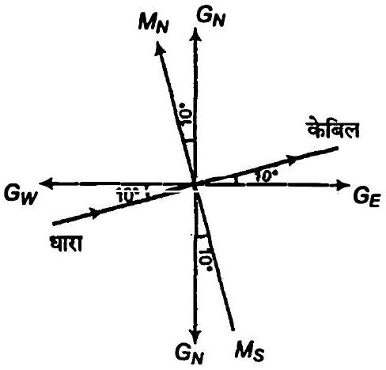
क्षैतिज घटक के बराबर है।
पृथ्वी के चुम्बकीय क्षेत्र का क्षैतिज घटक

$$
H=R \cos \delta=0.33 \times 10^{-4} \cos 0^{\circ}=0.33 \times 10^{-4} \mathrm{~T}
$$

अनन्त लम्बाई के धारावाही चालक के कारण चुम्बकीय क्षेत्र का सूत्र

$$
B=\frac{\mu_{0}}{4 \pi} \cdot \frac{2 l}{r}
$$

उदासीन बिन्दु पर,

$$
H=B
$$

$$
\begin{aligned}
& 0.33 \times 10^{-4}=\frac{\mu_{0}}{4 \pi} \cdot \frac{21}{r} \\
& 0.33 \times 10^{-4}=\frac{10^{-7} \times 2 \times 2.5}{r}
\end{aligned}
$$

अथवा

$$
r=\frac{5 \times 10^{-7}}{0.33 \times 10^{-4}}
$$

अथवा

$$
\begin{aligned}
r & =1.5 \times 10^{-2} \mathrm{~m} \\
& =1.5 \mathrm{~cm}
\end{aligned}
$$

अतः उदासीन बिन्दु रेखा केविल से $1.5 \mathrm{~cm}$ की दूरी पर है।

प्रश्न 19.किसी स्थान पर एक टेलिफोन केबिल में चार लम्बे, सीधे, क्षैतिज तार हैं जिनमें से प्रत्येक में $1.0 \mathrm{~A}$ की धारा पूर्व से पश्चिम की ओर प्रवाहित हो रही है। इस स्थान पर पृथ्वी का चुम्बकीय क्षेत्र $0.39 \mathrm{G}$ एवं नति कोण $35^{\circ}$ हैं। दिक्पात कोण लगभग शून्य है। केबिल के $4.0 \mathrm{~cm}$ नीचे और $4.0 \mathrm{~cm}$ ऊपर परिणामी चुम्बकीय क्षेत्रों के मान क्या होंगे?
हल तारों की संख्या $n=4$
क्षैतिज तार में धारा $I=1 \mathrm{~A}$
(पूर्व-पश्चिम)
पृथ्वी का चुम्बकीय क्षेत्र $R=0.39 \mathrm{G}=0.39 \times 10^{-4} \mathrm{~T}$

$$
\text { नति कोण } \delta=35^{\circ}
$$

चुम्बकीय अवनति $\theta=0^{\circ}$
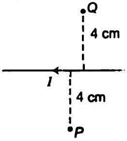

केबिल तार से दूरी $r=4 \mathrm{~cm}=0.04 \mathrm{~m}$
बिन्दु $P$ पर चार केबिल तार के कारण चुम्बकीय क्षेत्र $B$ है।
अनन्त लम्बाई के धारावाही चालक के कारण चुम्बकीय क्षेत्र
अर्थात्

$$
B^{\prime}=\frac{\mu_{0}}{4 \pi} \cdot \frac{2 l}{r}
$$

अतः $4$ सेमी की दूरी पर चार केबिल तारों के द्वारा उत्पन्न चुम्बकीय क्षेत्र

$$
\begin{aligned}
B & =4 \times \frac{\mu_{0}}{4 \pi} \cdot \frac{2 l}{r} \\
& =\frac{4 \times 10^{-7} \times 2 \times 1}{4 \times 10^{-2}}=2 \times 10^{-5} \mathrm{~T}
\end{aligned}
$$

मैक्सवेल के दाएँ हाथ के नियमानुसार चुम्बकीय क्षेत्र की दिशा समतल के लम्बवत् बाहर की ओर है।
चुम्बकीय क्षेत्र का क्षैतिज घटक

$$
\begin{aligned}
H & =R \cos \delta=0.39 \times 10^{-4} \times \cos 35^{\circ} \\
& =3.19 \times 10^{-5} \mathrm{~T}
\end{aligned}
$$

चुम्बकीय क्षेत्र का ऊर्ध्व घटक

$$
\begin{aligned}
V=R \sin \delta & =0.39 \times 10^{-4} \sin 35^{\circ} \\
& =0.39 \times 10^{-4} \times 0.5736 \\
& =2.2 \times 10^{-5} \mathrm{~T}
\end{aligned}
$$

बिन्दु $P$ पर पृथ्वी के चुम्बकीय क्षेत्र का ऊर्ध्व घटक $H^{\circ}$ है

$$
H^{\prime}=H-B
$$

$B$ व $H$ विपरीत दिशा में है

$$
\begin{aligned}
H^{\prime} & =3.19 \times 10^{-5}-2 \times 10^{-5} \\
& =1.19 \times 10^{-5} \mathrm{~T}
\end{aligned}
$$

[समी (i) से]

बिन्दु $P$ पर परिणामी चुम्बकीय क्षेत्र

$$
\begin{gathered}
R^{\prime}=\sqrt{H^{\prime 2}+V^{2}}=\sqrt{\left(1.19 \times 10^{-5}\right)^{2}+\left(2.2 \times 10^{-5}\right)^{2}} \\
R^{\prime}=2.5 \times 10^{-5} \mathrm{~T}
\end{gathered}
$$

केबिल से $4 \mathrm{~cm}$ नीचे परिणामी चुम्बकीय क्षेत्र $2.5 \times 10^{-5} \mathrm{~T}$ है।
बिन्दु $Q$ पर केबिल के कारण चुम्बकीय क्षेत्र

$$
B_{1}=4 \times \frac{\mu_{0}}{4 \pi} \times \frac{2 l}{r}=\frac{4 \times 10^{-7} \times 2 \times 1}{0.04}=2 \times 10^{-5} \mathrm{~T}
$$

$B_{1}$ की दिशा समतल के ऊर्ध्वाधर अन्दर की ओर है।
पृथ्वी के चुम्बकीय क्षेत्र का क्षैतिज घटक

$$
\begin{aligned}
H_{1} & =H+B_{1} \quad \quad \quad\left(B_{1} \text { व } H \text { की दिशा समान है }\right) \\
H_{1} & =3.19 \times 10^{-5}+2 \times 10^{-5} \\
& =5.19 \times 10^{-5} \mathrm{~T}
\end{aligned}
$$

बिन्दु $Q$ पर परिणामी चुम्बकीय क्षेत्र

$$
\begin{aligned}
R^{\prime \prime}=\sqrt{H_{1}^{2}+V^{2}} & =\sqrt{\left(5.19 \times 10^{-5}\right)^{2}+\left(22 \times 10^{-5}\right)^{2}} \\
& =5.54 \times 10^{-5} \mathrm{~T}
\end{aligned}
$$

अतः केबिल से $4 \mathrm{~cm}$ पर चुम्बकीय क्षेत्र $5.54 \times 10^{-5} \mathrm{~T}$ है।
प्रश्न 20. एक चुम्बकीय सुई जो क्षैतिज तल में घूमने के लिए स्वतन्त्र है, $30$ फेरों एवं $12$ सेमी त्रिज्या वाली एक कुण्डली के केन्द्र पर रखी है। कुष्डली एक ऊर्ध्वाघर तल में है और चुम्बकीय याम्योतर से $45^{\circ}$ का कोण बनाती है। जब कुण्डली में 0.35 A धारा प्रवाहित होती है, चुम्बकीय सुईं पश्चिम से पूर्व की ओर संकेत करती है।

(a) इस स्थान पर पृथ्वी के चुम्बकीय क्षेत्र के क्षैतिज अवयव का मान ज्ञात कीजिए।
(b) कुण्डली में धारा की दिशा ठलट दी जाती है और इसको अपनी ऊर्ध्वाधर अक्ष पर वामावर्त दिशा में (ऊपर से देखने पर) $90^{\circ}$ के कोण पर घुमा दिया जाता है। चुम्बकीय सुई किस दिशा में ठहरेगी? इस स्थान पर चुम्बकीय दिक्पात शून्य लीजिए।
हल कुण्डली में तार के फेरों की संख्या $n=30$
कुण्डली में धारा $I=0.35 \mathrm{~A}$
वृत्तीय कुण्डली की त्रिज्या $=12 \mathrm{~cm}=0.12 \mathrm{~m}$
(a) माना N-S चुम्बकीय याम्योत्तर रेखा है कुण्डली चुम्बकीय याम्योत्तर $C_{1}$ तथा $C_{2}$ के सापेक्ष $45^{\circ}$ के कोण पर है सुईं बिन्दु पश्चिम से पूर्व की ओर है कुण्डली के कारण चुम्बकीय क्षेत्र $B$ की दिशा पश्चिम से पूर्व की दिशा से $45^{\circ}$

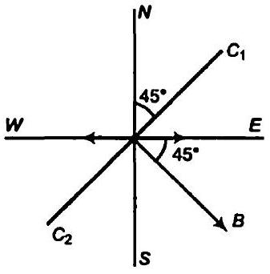

के कोण पर है जैसा कि चित्र में दर्शाया गया है। धारावाही कुण्डली के कारण उत्पन्न चुम्बकीय क्षेत्र

$$
\begin{aligned}
B & =\frac{\mu_{0}}{4 \pi} \cdot \frac{2 \pi J}{r}=\frac{10^{-7} \times 2 \times 3.14 \times 0.35 \times 30}{0.12} \\
& =1.83 \times 10^{-6} \times 30=5.49 \times 10^{-5} \mathrm{~T}
\end{aligned}
$$

चुम्बकीय क्षेत्र का क्षैतिज घटक

$$
\begin{aligned}
H & =B \sin 45^{\circ}=5.49 \times 10^{-5} \times \frac{1}{\sqrt{2}} \\
& =3.9 \times 10^{-5} \mathrm{~T}
\end{aligned}
$$

(b) चूँकि कुण्डली में धारा व्युत्क्रमित है तथा कुण्डली $90^{\circ}$ के कोण पर घड़ी की सुईं के विपरीत दिशा में बदलती है तथा सुईयों की दिशा व्युत्क्रमित होगी अर्थात् पूर्व से पश्चिम की ओर।

प्रश्न 21. एक चुम्बकीय द्विध्रुव दो चुम्बकीय क्षेत्रों के प्रभाव में है। ये क्षेत्र एक-दूसरे से $60^{\circ}$ का कोण बनाते हैं और उनमें से एक क्षेत्र का परिमाण $12 \times 10^{-2} \mathrm{~T}$ है। यदि द्विध्रुव स्थायी सन्तुलन में इस क्षेत्र से $15^{\circ}$ का कोण बनाए, तो दूसरे क्षेत्र का परिमाण क्या होगा?
हल माना प्रथम चुम्बकीय क्षेत्र $B_{1}$ तथा द्वितीय चुम्बकीय क्षेत्र $B_{2}$ है, $B_{1}$ व $B_{2}$ में कोण $60^{\circ}$ है। दिया है,

$$
B_{1}=1.2 \times 10^{-2} \mathrm{~T}
$$

द्विध्रुव $B_{1}$ से $45^{\circ}$ के कोण पर सन्तुलन में है
अर्थात् $60^{\circ}-15^{\circ}=45^{\circ}, B$ से
द्विध्रुव पर चुम्बकीय क्षेत्र $B_{1}$ के कारण आघूर्ण

$$
\tau_{1}=M \times B_{1} \sin 15^{\circ}
$$

जहाँ $M$ चुम्बकीय आघूर्ण है।
द्विघुव पर चुम्बकीय क्षेत्र $B_{2}$ के कारण आघूर्ण

$$
\tau_{2}=M \times B_{2} \sin 45^{\circ}
$$

चूँकि द्विध्रुव सन्तुलन में है

$$
\begin{aligned}
\therefore & \tau_{1}=\tau_{2} \\
& M \times B_{1} \sin 15^{\circ}=M \times B_{2} \sin 45^{\circ}
\end{aligned}
$$

समी (i) तथा (ii) से

$$
\begin{gathered}
\frac{1.2 \times 10^{-2} \times \sin 15^{\circ}}{\sin 45^{\circ}}=B_{2} \\
B_{2}=\frac{1.2 \times 10^{-2} \times 0.2588}{0.7071}=4.4 \times 10^{-3} \mathrm{~T}
\end{gathered}
$$

अतः अन्य चुम्बकीय क्षेत्र $4.4 \times 10^{-3} \mathrm{~T}$ है। .

प्रश्न 22. एक समोर्जी $18 \mathrm{keV}$ वाले इलेक्ट्रॉनों के किरण पुंज पर जो शुरू में क्षैतिज दिशा में गतिमान है, $0.04 \mathrm{G}$ का एक क्षैतिज चुम्बकीय क्षेत्र, जो किरण पुंज की प्रारम्पिक दिशा के लम्बवत् है, लगाया गया है। आकलन कीजिए $30$ सेमी की क्षैतिज दूरी चलने में किरण पुंज कितनी दूरी ऊपर या नीचे विस्थापित होगा? $\left(m_{e}=9.11 \times 10^{-31} \mathrm{~kg}, e=160 \times 10^{-19} \mathrm{C}\right)$ ।

हल यदि आवेशित कण चुम्बकीय क्षेत्र के लम्बवत् प्रवेश करता है तब वह वृत्तीय पथ पर गति करता है। चुम्बकीय बल अभिकेन्द्र का प्रदान करता है।

इलेक्ट्रॉन की ऊर्जा $E=18 \mathrm{keV}$

$$
\begin{aligned}
& =18 \times 10^{3} \times 1.6 \times 10^{-19} \mathrm{~J} \quad\left(\because 1 \mathrm{eV}=1.6 \times 10^{-19} \mathrm{~J}\right) \\
& =18 \times 1.6 \times 10^{-16} \mathrm{~J}
\end{aligned}
$$

माना इलेक्ट्रॉन का वेग $v$ है।
चुम्बकीय क्षेत्र $B=0.4 \mathrm{G}=0.4 \times 10^{-4} \mathrm{~T}$

$$
\text { दूरी }=30 \mathrm{~cm}=0.3 \mathrm{~m}
$$

इलेक्ट्रॉन का द्रव्यमान $m_{0}=9.1 \times 10^{-19} \mathrm{~kg}$
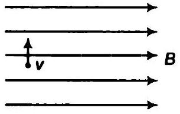
इलेक्ट्रॉन की ऊर्जा $E=\frac{1}{2} m v^{2}$
∴

$$
18 \times 1.6 \times 10^{-16}=\frac{1}{2} \times 9.1 \times 10^{-31} v^{2}
$$

अथवा

$$
v=0.795 \times 10^{8} \mathrm{~m} / \mathrm{s}
$$

माना इलेक्ट्रॉन बीम $r$ त्रिज्या के पथ के अनुदिश विक्षेपित होता है।
इलेक्ट्रॉन पर आरोपित चुम्बकीय बल अभिकेन्द्र बल प्रदान करता है

$$
e v B=\frac{m v^{2}}{r} \quad\left[F=q(v \times B), v \text { तथा } B \text { के बीच कोण } 90^{\circ} \text { है }\right]
$$

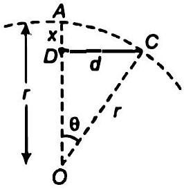
अथवा

$$
\begin{aligned}
O A & =r=O C, D C=d=30 \mathrm{~cm} \\
r & =\frac{m v}{B e}=\frac{9.1 \times 10^{-31} \times 0.795 \times 10^{8}}{0.4 \times 10^{-4} \times 1.6 \times 10^{-19}} .=11.3 \mathrm{~m}
\end{aligned}
$$

माना विक्षेपण $A D=x$
$\triangle D C O$, से

$$
\begin{aligned}
\sin \theta & =\frac{D C}{O C}=\frac{d}{r}=\frac{0.3}{11.3} \\
\theta & =1.521^{\circ}
\end{aligned}
$$

तथा

$$
\cos \theta=\frac{O D}{O C}=\frac{O D}{r}
$$

अथवा

$$
O D=r \cos \theta
$$

पथ के अन्तिम बिन्दु पर विक्षेपण

$$
A D=x=A O-O D=r-r \cos \theta=r(1-\cos \theta)
$$

अथवा

$$
\begin{aligned}
x=11.3\left(1-\cos 1.521^{\circ}\right) & =0.0039 \mathrm{~m} \\
& =3.9 \mathrm{~mm}
\end{aligned}
$$

अथवा

$$
x \approx 4 \mathrm{~mm}
$$

अतः बीम का ऊपरी या निम्न विक्षेपण लगभग $4 \mathrm{~mm}$ है।
प्रश्न 23. अनुचुम्बकीय लवण के एक नमूने में $2.0 \times 10^{24}$ परमाणु द्विध्रुव हैं जिनमें से प्रत्येक का द्विध्रुव आघूर्ण $1.5 \times 10^{-23} \mathrm{~J} / \mathrm{T}$ है। इस नमूने को $0.64 \mathrm{~T}$ के एक एकसमान चुम्बकीय क्षेत्र में रखा गया और $4.2 \mathrm{~K}$ ताप तक ठंण्डा किया गया। इसमें $15 \%$ चुम्बकीय संतृप्तता आ गई। यदि इस नमूने को 0.98 T के चुम्बकीय क्षेत्र में 2.8 K ताप पर रखा हो तो इसका कुल द्विध्रुव आघूर्ण कितना होगा? (यह मान सकते हैं कि क्यूरी नियम लागू होता है।)
हल परमाणुओं पर द्विधुवी की संख्या $n=2 \times 10^{24}$
प्रत्येक द्विध्रुव का द्विध्रुव आघूर्ण $=1.5 \times 10^{-23} \mathrm{~J} / \mathrm{T}$
चुम्बकीय संतृप्ता = 15\%
समांगी चुम्बकीय क्षेत्र $B_{1}=0.64 T$

$$
\text { प्रारम्भिक ताप } T_{1}=4.2 \mathrm{~K}
$$

अन्तिम चुम्बकीय क्षेत्र $B_{2}=0.98 \mathrm{~T}$

$$
\text { अन्तिम ताप } T_{2}=2.8 \mathrm{~K}
$$

चुम्बकीय संतृप्ता की माप $=15 \%$
नमुने $M$ का द्विधुव आघूर्ण

$$
\begin{aligned}
& =\text { द्विधुवों की संख्या × प्रत्येक द्विधुव का आघूर्ण } \\
& =2 \times 10^{24} \times 1.5 \times 10^{-23}=3 \times 10=30
\end{aligned}
$$

संतृप्ता पर प्रभावी चुम्बकीय आघूर्ण $M_{1}=15 \%$ of $M$

$$
M_{1}=\frac{15}{100} \times 30=4.5 \mathrm{~J} / \mathrm{T}
$$

क्यूरी के नियमानुसार

$$
\chi_{m}=\frac{C}{T}=\frac{1}{H}
$$

अत:

$$
\frac{C}{T}=\frac{M}{B}
$$

जहाँ, $M$ चुम्बकीय आघूर्ण है तथा $B$ चुम्बकीय क्षेत्र है।
अथवा

$$
M \propto \frac{B C}{T}
$$

∴

$$
\frac{M_{1}}{M_{2}}=\frac{B_{1}, T_{2}}{T_{1} B_{2}}
$$

अथवा

$$
\begin{gathered}
M_{2}=\frac{B_{2} T_{1}}{B_{1} T_{2}} \times M_{1}=\frac{0.98 \times 4.2 \times 4.5}{0.64 \times 2.8} \\
M_{2}=10.335 \mathrm{~J} / \mathrm{T}
\end{gathered}
$$

अतः नमूने का द्विध्रुव आघूर्ण 2.8 K ताप पर 10.335 J/T है।
प्रश्न 24. एक रोलैप्ड रिंग की औसत त्रिज्या $15$ सेमी है और इसमें $800$ आपेक्षिक चुम्बकशीलता के लौह चुम्बकीय क्रोड पर $3500$ फेरे लिपटे हुए हैं। $1.2 \mathrm{~A}$ की चुम्बकीय धारा के कारण इसके क्रोड में कितना चुम्बकीय क्षेत्र $(B)$ होगा?
हल रोलैण्ड रिंग की औसत त्रिज्या $r=15$ सेमी $=0.15$ मी
तार के फेरों की संख्या $N=3500$
लौह चुम्बकीय क्रोड के लिए आपेक्षिक चुम्बकशीलता
धारा

$$
\begin{aligned}
\mu_{r} & =800 \\
l & =1.2 \mathrm{~A}
\end{aligned}
$$

टोरॉइड के कारण चुम्बकीय क्षेत्र

$$
\begin{aligned}
B & =\mu_{0} n l \quad \\
B & =\mu_{0} \mu_{r} \frac{N}{2 \pi r} . \quad\left(\because n=\frac{\text { तार के फेरों की संख्या }}{\text { लम्बाई }}\right) \\
& =4 \times 3.14 \times 10^{-7} \times 800 \times \frac{3500 \times 1.2}{2 \times 3.14 \times 0.15} \\
& =4.48 \mathrm{~T}
\end{aligned}
$$

प्रश्न 25.किसी इलेक्ट्रॉन के नैज चक्रणी कोणीय संवेग $s$ एवं कक्षीय कोणीय संवेग $l$ के साथ जुड़े चुम्बकीय आघूर्ण क्रमशः $\mu_{s}$ और $\mu_{l}$ है। क्वांटम सिद्धान्त के आधार पर (और 'प्रयोगात्मक रूप से अत्यन्त परिशुद्धतापूर्वक पुष्ट) इनके मान क्रमशः निम्न प्रकार दिए जाते हैं।
$\mu_{s}=-(e / m) s$, एवं $\mu_{i}=-(e / 2 m) l$
इनमें से कौन-सा व्यंजक चिरसम्मत सिद्धान्तों के आधार पर प्राप्त करने की आशा की जा सकती है? उस चिरसम्मत आधार पर प्राप्त होने वाले व्यंजक को व्युत्पन्न कीजिए।
हल दिए गए सम्बन्ध के अनुसार केवल $\mu_{l}$ नूतन भौतकी के अनुरूप है।

$$
\mu_{l}=-\left(\frac{e}{2 m}\right) l
$$

चुम्बकीय आघूर्ण $\mu_{l}=l \times$ क्षेत्रफल $=\left(\frac{\text { आवेश }}{\text { समय }}\right) \pi r^{2}$
अथवा

$$
\mu_{l}=\left(-\frac{e}{T}\right) \pi r^{2}
$$

कोणीय संवेग

$$
l=m v r=m\left(\frac{2 \pi r}{T}\right) r
$$

समी (ii) को (iii) से भाग देने पर

$$
\therefore \quad \begin{aligned}
& \frac{\mu_{l}}{l}=\frac{-e \pi r^{2} \cdot T}{T \cdot m(2 \pi r) r} \text { अश्या } \frac{\mu_{l}}{l}=-\frac{e}{2 m} \\
& \mu_{l}=-\frac{e}{2 m} l
\end{aligned}
$$

यहाँ हम देखते हैं कि $\mu_{l}$ व / दोनों एक-दूसरे के समान्तर तथा विपरीत दिशा में है।

