## $6.1$ भूमिका

विद्युत तथा चुंबकत्व काफी लंबे समय तक अलग-अलग तथा असंबद्ध परिघटनाएँ मानी जाती रही हैं। उन्नीसवीं शताब्दी के प्रारंभिक दशकों में ऑर्स्टेड, ऐम्पियर तथा कुछ अन्य वैज्ञानिकों द्वारा विद्युत धारा पर किए गए प्रयोगों ने यह प्रमाणित किया कि विद्युत तथा चुंबकत्व परस्पर संबंधित हैं। उन्होंने ज्ञात किया कि गतिमान विद्युत आवेश चुंबकीय क्षेत्र उत्पन्न करते हैं। उदाहरण के लिए, विद्युत धारा अपने पास रखी हुई एक चुंबकीय सुई को विक्षेपित करती है। इससे एक स्वाभाविक प्रश्न उत्पन्न होता है - क्या इसका विपरीत प्रभाव संभव है? क्या गतिमान चुंबक विद्युत धारा उत्पन्न कर सकते हैं? क्या प्रकृति विद्युत तथा चुंबकत्व के बीच इस प्रकार के संबंध की अनुमति देती है? इसका उत्तर एक निश्चित 'हाँ' है। लगभग सन $1830$ में माइकल फैराडे द्वारा इंग्लैंड में तथा जोसेफ हेनरी द्वारा अमेरिका में किए गए प्रयोगों ने स्पष्ट रूप से दर्शाया कि परिवर्तनशील चुंबकीय क्षेत्र बंद कुंडलियों में विद्युत धारा उत्पन्न करता है। इस अध्याय में हम परिवर्तनशील चुंबकीय क्षेत्रों से संबंधित परिघटनाओं के बारे में अध्ययन करेंगे तथा इनमें निहित सिद्धांतों को समझेंगे। वह परिघटना जिसमें चुंबकीय क्षेत्रों द्वारा विद्युत धारा उत्पन्न होती है, उसे उचित रूप से ही वैद्युतचुंबकीय प्रेरण कहते हैं।

जब फैराडे ने प्रथम बार अपनी इस खोज को सार्वजनिक किया कि 'चालक तार से बने लूप तथा दंड चुंबक के बीच सापेक्ष गति कराने पर लूप में क्षीण धारा उत्पन्न होती है', तब उनसे पूछा गया कि 'इसका क्या उपयोग है'? फैराडे का उत्तर था, 'नवजात शिशु का क्या उपयोग होता है?'

## वैद्युतचुंबकीय प्रेरण

वैद्युतचुंबकीय प्रेरण केवल सैद्धांतिक या शैक्षिक रूप से ही उपयोगी परिघटना नहीं है वरन व्यावहारिक दृष्टि से विद्युत न हो तो विद्युत प्रकाश न हो, ट्रेन न हो, टेलीफ़ोन न हो और कंप्यूटर न हो। फैराडे एवं हेनरी के इन पुरोगामी (pioneering) प्रयोगों ने ही आधुनिक जनित्रों एवं ट्रांसफार्मरों के विकास को संभव बनाया। आज की सभ्यता के विकास में वैद्युतचुंबकीय प्रेरण की खोज ने एक अहम भूमिका निभाई है।

## $6.2$ फैराडे एवं हेनरी के प्रयोग

वैद्युतचुंबकीय प्रेरण की खोज तथा उसकी समझ फैराडे एवं हेनरी द्वारा किए गए अनेक प्रयोगों पर आधारित है। हम उनमें से कुछ प्रयोगों का वर्णन यहाँ करेंगे।

## प्रयोग $6.1$

चित्र $6.1$ में धारामापी G से जुड़ी हुई एक कुंडली $\mathrm{C}_{1}{ }^{*}$ दर्शायी गई है। जब एक दंड चुंबक के उत्तरी ध्रुव को इस कुंडली की ओर धकेला जाता है तो धारामापी का संकेतक विक्षेपित होता है जो कुंडली में विद्युत धरा की उपस्थिति को दर्शाता है। यह विक्षेप तभी तक रहता है जब तक दंड चुंबक गति में रहता है। जब चुंबक स्थिर होता है तो धारामापी कोई विक्षेप नहीं दर्शाता। जब चुंबक को कुंडली से दूर ले जाते हैं तो धारामापी विपरीत दिशा में विक्षेप दर्शाता है, जो धारा प्रवाह की दिशा के विपरीत होने को दर्शाता है। इसके अतिरिक्त, जब दंड चुंबक के दक्षिणी ध्रुव को कुंडली की ओर या इससे दूर ले जाते हैं तो धारामापी में विक्षेप की दिशाएँ उत्तरी ध्रुव की इसी प्रकार की गति की अपेक्षा विपरीत हो जाती हैं। इसके अतिरिक्त, जब चुंबक को कुंडली की ओर या इससे दूर तेजी से गतिमान किया जाता है तो विक्षेप और इसलिए धारा अधिक प्राप्त होता है। यह भी देखा गया है कि यदि दंड चुंबक को स्थिर रखा जाए तथा इसके बजाय कुंडली $\mathrm{C}_{1}$ को चुंबक की ओर या इससे दूर गतिमान किया जाए तो भी इसी प्रकार का प्रभाव उत्पन्न होता है। यह दर्शाता है कि कुंडली में विद्युत धारा की उत्पत्ति (प्रेरण) चुंबक तथा कुंडली के मध्य सापेक्ष गति का प्रतिफल है।

## प्रयोग $6.2$

चित्र $6.2$ में दंड चुंबक को बैटरी से जुड़ी हुई एक दूसरी कुंडली $\mathrm{C}_{2}$ से प्रतिस्थापित किया गया है। कुंडली $\mathrm{C}_{2}$ में अपरिवर्ती धारा अपरिवर्ती चुंबकीय क्षेत्र उत्पन्न करती है। जैसे ही कुंडली $\mathrm{C}_{2}$ को कुंडली $\mathrm{C}_{1}$ की ओर लाते हैं, धारामापी एक विक्षेप दर्शाता है। यह कुंडली $\mathrm{C}_{1}$ में प्रेरित विद्युत धारा को निदर्शित करता है। जब $\mathrm{C}_{2}$ को दूर ले जाते हैं तो धारामापी फिर से विक्षेप दर्शाता है, लेकिन इस बार यह विक्षेप विपरीत दिशा में होता है। यह विक्षेप तभी तक रहता है जब तक कुंडली $\mathrm{C}_{2}$ गति में रहती है। जब कुंडली $\mathrm{C}_{2}$ को

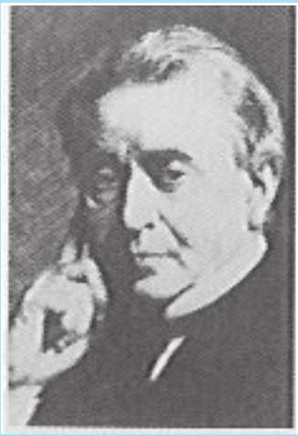
जोसेफ हेनरी [1797-1878]
जोसेफ हेनरी अमेरिकी प्रायोगिक भौतिकशास्त्री, प्रिंस्टन विश्वविद्यालय में प्रोफ़ेसर तथा स्मिथसोनियन इंस्टीट्यूशन के प्रथम निदेशक थे। लोहे के ध्रुवों के चारों ओर पृथक्कृत दंड चुंबक को स्थिर रखकर तथा इसके स्थान पर तार की कुंडलियाँ लपेटकर उन्होंने विद्युत चुंबकों में महत्वपूर्ण सुधार किए एवं एक विद्युत चुंबकीय मोटर तथा एक नए दक्ष टेलीग्राफ़ का आविष्कार किया। उन्होंने स्वप्रेरण की खोज की तथा इस बात का पता लगाया कि कैसे एक परिपथ में प्रवाहित धारा दूसरे परिपथ में धारा प्रेरित करती है।

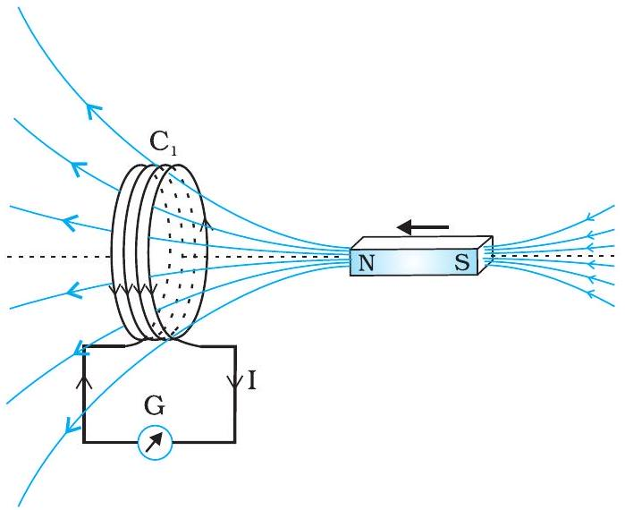
चित्र $6.1$ जब दंड चुंबक को कुंडली की ओर धकेलते हैं, धारामापी G का संकेतक विक्षेपित होता है।

[^0]
## - भौतिकी

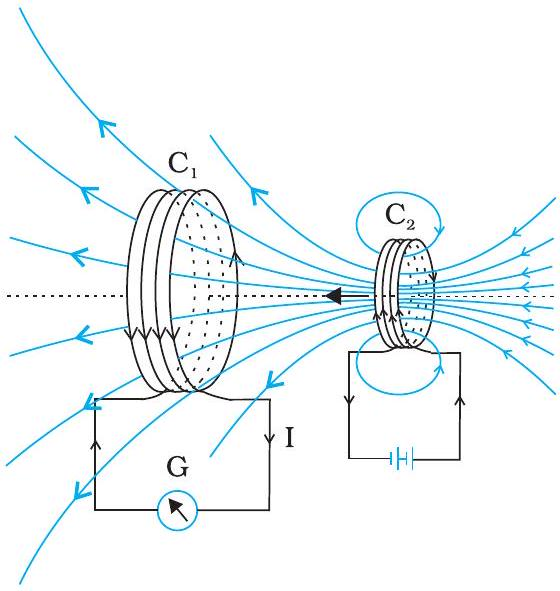
चित्र $6.2$ धारायुक्त कुंडली $\mathrm{C}_{2}$ की गति के कारण कुंडली $\mathrm{C}_{1}$ में प्रेरित धारा उत्पन्न होती है।

स्थिर रखा जाता है तथा $\mathrm{C}_{1}$ गतिमान होता है तो उन्हीं प्रभावों को फिर से देखा जा सकता है। यहाँ भी कुंडलियों के मध्य सापेक्ष गति विद्युत धारा प्रेरित करती है।

प्रयोग $6.3$
उपरोक्त दोनों प्रयोगों में चुंबक तथा कुंडली के बीच तथा दो कुंडलियों के बीच सापेक्ष गति शामिल है। एक अन्य प्रयोग द्वारा फैराडे ने दर्शाया कि यह सापेक्ष गति कोई अति आवश्यक अनिवार्यता नहीं है। चित्र $6.3$ में दो कुंडलियाँ $\mathrm{C}_{1}$ तथा $\mathrm{C}_{2}$ दर्शायी गई हैं जो स्थिर रखी गई हैं। कुंडली $\mathrm{C}_{1}$ को एक धारामापी G से जोड़ा गया है जबकि दूसरी कुंडली $\mathrm{C}_{2}$ को एक दाब-कुंजी K से होकर एक बैटरी से जोड़ा जाता है।

यह देखा जाता है कि दाब-कुंजी K को दबाने पर धारामापी एक क्षणिक विक्षेप दर्शाता है और फिर इसका संकेतक तत्काल शून्य पर वापस आ जाता है। यदि कुंजी
फैराडे एवं लेंज के नियमों से संबंधित प्रभावी एवं सजीव चित्रण http://micro.magnet.fsu.edu/electromage/java/faraday2
फैराडे एवं लेंज के नियमों से संबंधित प्रभावी एवं सजीव चित्रण
http://micro.magnet.fsu.edu/electromage/java/faraday2

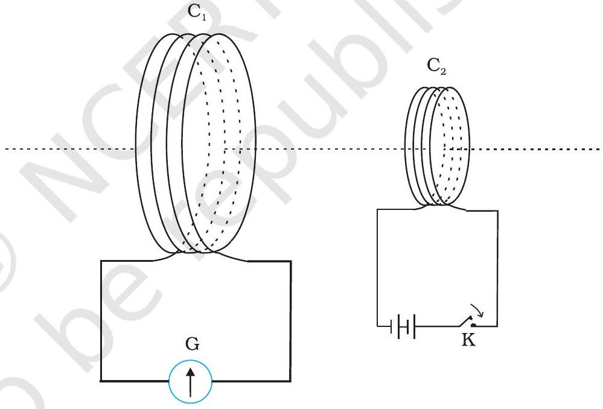
चित्र $6.3$ प्रयोग $6.3$ के लिए प्रयोगात्मक व्यवस्था

को लगातार दबाकर रखा जाए तो धारामापी में कोई विक्षेप नहीं होता। जब कुंजी को छोड़ा जाता है तो फिर से एक क्षणिक विक्षेप देखा जाता है, लेकिन यह विक्षेप विपरीत दिशा में होता है। यह भी देखा गया है कि यदि कुंडलियों में उनके अक्ष के अनुदिश एक लोहे की छड़ रख दी जाए तो विक्षेप नाटकीय रूप से बढ़ जाता है।

## $6.3$ चुंबकीय फ्लक्स

फैराडे की विशाल अंतर्दृष्टि के कारण वैद्युतचुंबकीय प्रेरण पर उनके द्वारा किए गए प्रयोगों की शृंखला की व्याख्या करने वाले एक सरल गणितीय संबंध की खोज करना संभव हुआ। तथापि, इसके पहले कि हम वह नियम बताएँ तथा उसकी प्रशंसा में कुछ कहें, हमें चुंबकीय फ्लक्स $\Phi_{\mathrm{B}}$ की अवधारणा से परिचित हो जाना आवश्यक है। चुंबकीय फ्लक्स को भी ठीक उसी प्रकार
$154$ परिभाषित किया जाता है जिस प्रकार विद्युतीय फ्लक्स को अध्याय $1$ में परिभाषित किया गया है।

## वैद्युतचुंबकीय प्रेरण

यदि क्षेत्रफल $\mathbf{A}$ वाले समतल को एकसमान चुंबकीय क्षेत्र $\mathbf{B}$ (चित्र 6.4) में रखा जाता है तो चुंबकीय फ्लक्स को व्यक्त किया जा सकता है -

$$
\Phi_{\mathrm{B}}=\mathbf{B} \quad \mathbf{A}=B A \cos \theta
$$

जहाँ पर $\theta \mathbf{~ B}$ तथा $\mathbf{A}$ के बीच का कोण है। एक सदिश राशि के रूप में क्षेत्रफल की अवधारणा का विवेचन पहले ही अध्याय $1$ में किया जा चुका है। समीकरण (6.1) को वक्र पृष्ठों एवं असमान क्षेत्रों के लिए विस्तारित किया जा सकता है।

यदि चित्र $6.5$ में दर्शाए अनुसार किसी सतह के विभिन्न भागों पर चुंबकीय क्षेत्र के परिमाण तथा दिशाएँ भिन्न-भिन्न हों, तो सतह से होकर गुजरने वाला चुंबकीय फ्लक्स होगा

$$
\Phi_{B}=\mathbf{B}_{1} \mathrm{~d} \mathbf{A}_{1}+\mathbf{B}_{2} \mathrm{~d} \mathbf{A}_{2}+\cdots=\sum_{\text {सभी }} \mathbf{B}_{i} \mathrm{~d} \mathbf{A}_{i}
$$

जहाँ 'सभी' का अर्थ है सतह के सभी सूक्ष्म क्षेत्र अवयवों $\mathrm{d} \mathbf{A}_{i}$ के लिए योग तथा $\mathbf{B}_{i}$ क्षेत्र अवयव $\mathrm{d} \mathbf{A}_{\mathrm{i}}$ पर चुंबकीय क्षेत्र है। चुंबकीय फ्लक्स का SI मात्रक वेबर (Wb) है। इसे टेस्ला वर्ग मीटर ( $\mathrm{T} \mathrm{m}^{2}$ ) द्वारा भी व्यक्त किया जाता है। चुंबकीय फ्लक्स एक अदिश राशि है।

## $6.4$ फैराडे का प्रेरण का नियम

प्रायोगिक प्रेक्षणों के आधार पर फैराडे इस निष्कर्ष पर पहुँचे कि जब किसी कुंडली में चुंबकीय फ्लक्स समय के साथ परिवर्तित होता है तब कुंडली में विद्युत वाहक बल प्रेरित होता है। अनुभाग $6.2$ में चर्चित प्रायोगिक प्रेक्षणों की इस अवधारणा का उपयोग करके व्याख्या कर सकते हैं।

प्रयोग $6.1$ में कुंडली $\mathrm{C}_{1}$ की ओर अथवा इससे दूर चुंबक की गति तथा प्रयोग $6.2$ में कुंडली $\mathrm{C}_{1}$ की ओर अथवा इससे दूर एक धारा वाहक कुंडली $\mathrm{C}_{2}$ की गति, कुंडली $\mathrm{C}_{1}$ की ओर अथवा इससे दूर एक धारा वाहक कुंडली $\mathrm{C}_{2}$ की गति, कुंडली $\mathrm{C}_{1}$ से संबद्ध चुंबकीय फ्लक्स को परिवर्तित करती है। चुंबकीय फ्लक्स में परिवर्तन से कुंडली $\mathrm{C}_{1}$ में विद्युत वाहक बल प्रेरित होता है। इसी प्रेरित विद्युत वाहक बल के कारण कुंडली $\mathrm{C}_{1}$ तथा धारामापी में विद्युत धारा प्रवाहित होती है। प्रयोग $6.3$ में किए गए प्रेक्षणों का एक युक्तियुक्त स्पष्टीकरण निम्न प्रकार है- जब दाब कुंजी K को दबाते हैं तो कुंडली $\mathrm{C}_{2}$ में विद्युत धारा (तथा इसके कारण चुंबकीय क्षेत्र)अल्प समय में शून्य से अधिकतम मान तक बढ़ती है। परिणामस्वरूप, समीपस्थ कुंडली $\mathrm{C}_{1}$ में भी चुंबकीय फ्लक्स बढ़ता है। कुंडली $\mathrm{C}_{1}$ में होने वाले चुंबकीय फ्लक्स के इस परिवर्तन के कारण कुंडली $\mathrm{C}_{1}$ में प्रेरित विद्युत वाहक बल उत्पन्न होता है। जब कुंजी को दबाकर रखा जाता है तो कुंडली $\mathrm{C}_{2}$ में धारा स्थिर रहती है। इसीलिए कुंडली $\mathrm{C}_{1}$ में चुंबकीय फ्लक्स में कोई परिवर्तन नहीं होता तथा कुंडली $\mathrm{C}_{1}$ में धारा शून्य हो जाती है। जब कुंजी को छोड़ते हैं तो कुंडली $\mathrm{C}_{2}$ में विद्युत धारा तथा इसके कारण उत्पन्न होने वाला चुंबकीय क्षेत्र अल्प समय में अधिकतम मान से घटकर शून्य हो जाता है। इसके परिणामस्वरूप कुंडली $\mathrm{C}_{1} *$ में चुंबकीय फ्लक्स घटता है और इस प्रकार कुंडली $\mathrm{C}_{1}$ में पुनः प्रेरित विद्युत धारा उत्पन्न होती है। इन सभी प्रेक्षणों में एक सर्वनिष्ठ बात यह है कि किसी परिपथ में चुंबकीय फ्लक्स के परिवर्तन दर के कारण प्रेरित विद्युत वाहक बल उत्पन्न होता है। फैराडे ने प्रायोगिक प्रेक्षणों को एक नियम के रूप में व्यक्त किया जिसे फैराडे का वैद्युतचुंबकीय

[^1]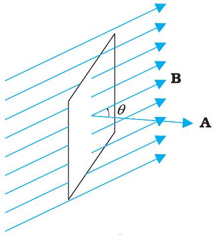
चित्र $6.4$ एकसमान चुंबकीय क्षेत्र $\mathbf{B}$ में रखा पृष्ठ क्षेत्रफल $\mathbf{A}$ वाला एक समतल।

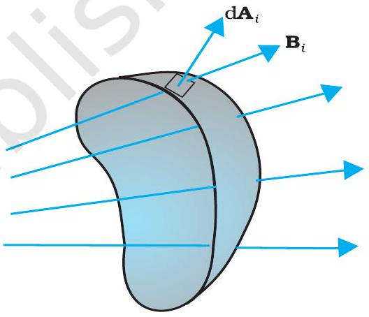
चित्र $6.5$ वे अवयव क्षेत्र पर चुंबकीय क्षेत्र $\mathrm{B}_{i} । \mathrm{dA}_{i}$, $i$ वें क्षेत्र अवयव का क्षेत्र सदिश निरूपित करता है।

## 4 भौतिकी

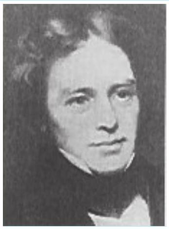

माइकल फैराडे [1791-1867] माइकल फैराडे ने विज्ञान के क्षेत्र में महत्वपूर्ण योगदान किया, उदाहरण के लिए वैद्युतचुंबकीय प्रेरण की खोज, विद्युत अपघटन के नियम, बेंजीन तथा यह तथ्य कि ध्रुवण तल विद्युत क्षेत्र में घूर्णन कर सकता है। विद्युत मोटर, विद्युत जनित्र तथा ट्रांसफार्मर की खोज का श्रेय भी फैराडे को ही जाता है। उन्हें उन्नीसवीं शताब्दी का महानतम प्रयोगात्मक वैज्ञानिक माना जाता है। प्रेरण का नियम कहते हैं। इस नियम को निम्न प्रकार से अभिव्यक्त किया गया है।

प्रेरित विद्युत वाहक बल का परिमाण चुंबकीय फ्लक्स में समय के साथ होने वाले परिवर्तन की दर के बराबर होता है।

गणितीय रूप में प्रेरित विद्युत धारा बल को

$$
\varepsilon=-\frac{\mathrm{d} \Phi_{B}}{\mathrm{~d} t}
$$

ऋण चिह्न $\varepsilon$ की दिशा तथा परिणामतः बंद लूप में धारा की दिशा व्यक्त करता है। इसकी विस्तृत चर्चा हम अगले अनुच्छेद में करेंगे।

पास-पास लपेटे हुए $N$ फेरों वाली किसी कुंडली के प्रत्येक फेरे से संबद्ध फ्लक्स में एकसमान परिवर्तन होता है। इसलिए कुल प्रेरित विद्युत वाहक बल का व्यंजक होगा-

$$
\varepsilon=-N \frac{\mathrm{~d} \Phi_{B}}{\mathrm{~d} t}
$$

बंद कुंडली में फेरों की संख्या $N$ बढ़ा कर प्रेरित विद्युत वाहक बल को बढ़ाया जा सकता है।

समीकरण (6.1) तथा (6.2), से हमें ज्ञात होता है कि फ्लक्स में परिवर्तन $\mathbf{B}, \mathbf{A}$ तथा $\theta$ में से किसी एक या अधिक पदों को बदल कर किया जा सकता है। अनुच्छेद $6.2$ के प्रयोगों $6.1$ तथा $6.2$ में फ्लक्स को $\mathbf{B}$ में परिवर्तित करके बदला गया है। फ्लक्स में परिवर्तन चुंबकीय क्षेत्र में इसी कुंडली के आकार में परिवर्तन करके (जैसे इसे सिकोड़ कर या खींच कर) या कुंडली को चुंबकीय क्षेत्र में इस प्रकार घूर्णन कराकर कि $\mathbf{B}$ तथा $\mathbf{A}$ के बीच में कोण $\theta$ बदल जाए, भी किया जा सकता है। इन अवस्थाओं में भी क्रमानुसार कुंडलियों में एक विद्युत वाहक बल प्रेरित होता है।

उदाहरण $6.1$ प्रयोग $6.2$ पर विचार करें। (a) धारामापी में अधिक विक्षेप प्राप्त करने के लिए आप क्या करेंगे? (b) धारामापी की अनुपस्थिति में आप प्रेरित धारा की उपस्थिति किस प्रकार दर्शाएँगे?

हल

(a) अधिक विक्षेप प्राप्त करने के लिए निम्न में से एक या अधिक उपाय किए जा सकते हैं- (i) कुंडली $C_{2}$ के अंदर नर्म लोहे की छड़ का उपयोग करेंगे, (ii) कुंडली को एक उच्च शक्ति की बैटरी से जोड़ेंगे, (iii) परीक्षण कुंडली $C_{1}$ की ओर संयोजन को अधिक तेजी से ले जाएँगे।
(b) धारामापी को टॉर्च में उपयोग किए जाने वाले छोटे बल्ब से बदल देंगे। दोनों कुंडलियों के बीच सापेक्ष गति से बल्ब क्षणिक अवधि के लिए चमकेगा जो प्रेरित धारा के उत्पन्न होने का द्योतक है। प्रयोगात्मक भौतिकी में हमें नवीनता लाने का प्रयास करना चाहिए। उच्चतम श्रेणी के प्रयोग वैज्ञानिक माइकल फैराडे प्रयोगों में विविधता लाने के लिए प्रसिद्ध हैं।

उदाहरण $6.2$ एक वर्गाकार लूप जिसकी एक भुजा $10 \mathrm{~cm}$ लंबी है तथा जिसका प्रतिरोध $0.5 \Omega$ है, पूर्व-पश्चिम तल में ऊर्ध्वाधर रखा गया है। $0.10 \mathrm{~T}$ के एक एकसमान चुंबकीय क्षेत्र को उत्तर-पूर्व दिशा में तल के आर-पार स्थापित किया गया है। चुंबकीय क्षेत्र को एकसमान दर से $0.70 \mathrm{~s}$ में घटाकर शून्य तक लाया जाता है। इस समय अंतराल में प्रेरित विद्युत वाहक बल तथा धारा का मान ज्ञात कीजिए।

हल कुंडली का क्षेत्रफल-सदिश, चुंबकीय क्षेत्र के साथ $\theta=45^{\circ}$ कोण बनाता है। समीकरण (6.1) से, प्रारंभिक चुंबकीय फ्लक्स है

$$
\begin{aligned}
& \Phi=B A \cos \theta \\
& =\frac{0.1 \times 10^{-2}}{\sqrt{2}} \mathrm{~Wb}
\end{aligned}
$$

अंतिम फ्लक्स, $\Phi_{\text {न्यूनतम }}=0$
फ्लक्स में परिवर्तन $0.70$ s में हुआ। समीकरण (6.3) से, प्रेरक विद्युत वाहक बल होगा

$$
\varepsilon=\frac{\left|\Delta \Phi_{B}\right|}{\Delta t}=\frac{|(\Phi-0)|}{\Delta t}=\frac{10^{-3}}{\sqrt{2} \times 0.7}=1.0 \mathrm{mV}
$$

और धारा का परिमाण होगा

$$
I=\frac{\varepsilon}{R}=\frac{10^{-3} \mathrm{~V}}{0.5 \Omega}=2 \mathrm{~mA}
$$

ध्यान दें कि पृथ्वी का चुंबकीय क्षेत्र भी लूप में कुछ फ्लक्स उत्पन्न करता है। किन्तु पृथ्वी का चुंबकीय क्षेत्र स्थिर है (जो कि प्रयोग की अल्प अवधि में परिवर्तित नहीं होता) और कोई विद्युत वाहक बल प्रेरित नहीं करता।

उदाहरण $6.3$
$10 \mathrm{~cm}$ त्रिज्या, $500$ फेरों तथा $2 \Omega$ प्रतिरोध की एक वृत्ताकार कुंडली को इसके तल के लंबवत पृथ्वी के चुंबकीय क्षेत्र के क्षैतिज घटक में रखा गया है। इसे अपने ऊर्ध्व व्यास के परितः $0.25$ s में $180^{\circ}$ से घुमाया गया कुंडली में प्रेरित विद्युत वाहक बल तथा विद्युत धारा का आकलन कीजिए। दिए गए स्थान पर पृथ्वी के चुंबकीय क्षेत्र के क्षैतिज घटक का मान $3.0 \times 10^{-5} \mathrm{~T}$ है।

हल
कुंडली में प्रारंभिक फ्लक्स,

$$
\begin{aligned}
\Phi_{\mathrm{B} \text { (प्रारंभिक) }} & =B A \cos \theta \\
& =3.0 \times 10^{-5} \times\left(\pi \times 10^{-2}\right) \times \cos 0^{\circ} \\
& =3 \pi \times 10^{-7} \mathrm{~Wb} .
\end{aligned}
$$

घूर्णन के पश्चात अंतिम फ्लक्स,

$$
\begin{aligned}
\Phi_{\mathrm{B} \text { (अंतिम) }} & =3.0 \times 10^{-5} \times\left(\pi \times 10^{-2}\right) \times \cos 180^{\circ} \\
& =-3 \pi \times 10^{-7} \mathrm{~Wb}
\end{aligned}
$$

इसलिए प्रेरित विद्युत वाहक बल का आकलित मान है ,

$$
\begin{aligned}
\varepsilon & =N \frac{\Delta \Phi}{\Delta t} \\
& =500 \times\left(6 \pi \times 10^{-7}\right) / 0.25 \\
& =3.8 \times 10^{-3} \mathrm{~V} \\
I & =\varepsilon / R=1.9 \times 10^{-3} \mathrm{~A}
\end{aligned}
$$

ध्यान दें कि ये $\varepsilon$ तथा $I$ के परिमाणों के आकलित मान हैं। इनके तात्क्षणिक मान भिन्न हैं तथा वे किसी विशेष समय पर घूर्णन गति पर निर्भर करते हैं।

## - भौतिकी

## $6.5$ लेंज का नियम तथा ऊर्जा संरक्षण

सन $1834$ में जर्मन भौतिकविद हेनरिक फ्रेडरिच लेंज (1804-1865) ने एक नियम का निगमन किया जिसे लेंज का नियम के नाम से जाना जाता है। यह नियम प्रेरित विद्युत वाहक बल की ध्रुवता (दिशा) का स्पष्ट एवं संक्षिप्त रूप में वर्णन करता है। इस नियम का प्रकथन है-

प्रेरित विद्युत वाहक बल की ध्रुवता (polarity) इस प्रकार होती है कि वह उस दिशा में धारा प्रवाह प्रवृत्त करे जो उसे उत्पन्न करने वाले कारक (चुंबकीय क्षेत्र परिवर्तन) का विरोध करे।

समीकरण (6.3) में ऋण चिह्न इस प्रभाव को निरूपित करता है। अनुच्छेद 6.2.1 के प्रयोग $6.1$ का निरीक्षण करके हम लेंज के नियम को समझ सकते हैं। चित्र $6.1$ में हम देखते हैं कि दंड चुंबक का उत्तरी-ध्रुव बंद कुंडली की ओर ले जाया जा रहा है। जब दंड चुंबक का उत्तरी ध्रुव कुंडली की ओर गति करता है तब कुंडली में चुंबकीय फ्लक्स बढ़ता है। इस प्रकार कुंडली में प्रेरित धारा ऐसी दिशा में उत्पन्न होती है जिससे कि यह फ्लक्स के बढ़ने का विरोध कर सके। यह तभी संभव है जब चुंबक की ओर स्थित प्रेक्षक के सापेक्ष कुंडली में धारा वामावर्त दिशा में हो। ध्यान दीजिए, इस धारा से संबद्ध चुंबकीय आघूर्ण की ध्रुवता उत्तरी है जबकि इसकी ओर चुंबक का उत्तरी ध्रुव आ रहा हो। इसी प्रकार, यदि कुंडली में चुंबकीय फ्लक्स घटेगा। चुंबकीय फ्लक्स के इस घटने का विरोध करने के लिए कुंडली में प्रेरित धारा दक्षिणावर्त दिशा में बहती है तथा इसका दक्षिणी ध्रुव दूर हटते दंड चुंबक के उत्तरी ध्रुव की ओर होता है। इसके फलस्वरूप एक आकर्षण बल काम करेगा जो चुंबक की गति तथा इससे संबद्ध फ्लक्स के घटने का विरोध करेगा।

उपरोक्त उदाहरण में यदि बंद लूप के स्थान पर एक खुला परिपथ उपयोग किया जाए तो क्या होगा? इस दशा में भी, परिपथ के खुले सिरों पर एक प्रेरित विद्युत वाहक बल उत्पन्न होगा। प्रेरित विद्युत वाहक बल की दिशा लेंज के नियम का उपयोग करके ज्ञात की जा सकती है। चित्र $6.6$ (a) तथा (b) पर विचार करें। ये प्रेरित धाराओं की दिशा को समझने के लिए एक सरल विधि सुझाते हैं। ध्यान दीजिए कि तथा द्वारा दर्शायी गई दिशाएँ प्रेरित धारा की दिशाएँ निरूपित करती हैं।

इस विषय पर थोड़े से गंभीर चिंतन से हम लेंज के नियम की सत्यता को स्वीकार कर सकते हैं। माना कि प्रेरित विद्युत धारा की दिशा चित्र 6.6(a) में दर्शायी गई दिशा के विपरीत है। उस दशा में, प्रेरित धारा के कारण दक्षिणी ध्रुव पास आते हुए चुंबक के उत्तरी ध्रुव की ओर होगा। इसके कारण दंड चुंबक कुंडली की ओर लगातार बढ़ते हुए त्वरण से आकर्षित होगा। चुंबक को दिया गया हलका-सा धक्का इस प्रक्रिया को प्रारंभ कर देगा तथा बिना किसी ऊर्जा निवेश के इसका वेग एवं गतिज ऊर्जा सतत रूप से बढ़ती जाएगी। यदि ऐसा हो सके तो उचित प्रबंध द्वारा एक शाश्वत गतिक मशीन (perpetual motion machine) का निर्माण किया जा सकता है। यह ऊर्जा के संरक्षण नियम का उल्लंघन है और इसीलिए ऐसा नहीं हो सकता।

चित्र $6.6$
लेंज के नियम का चित्रण

## वैद्युतचुंबकीय प्रेरण

उदाहरण $6.4$
चित्र $6.7$ में विभिन्न आकार के समतल लूप जो चुंबकीय क्षेत्र में प्रवेश कर रहे हैं अथवा क्षेत्र से बाहर निकल रहे हैं, दिखाए गए हैं। चुंबकीय क्षेत्र लूप के तल के अभिलंबवत किंतु प्रेक्षक से दूर जाते हुए हैं। लेंज के नियम का उपयोग करते हुए प्रत्येक लूप में प्रेरित विद्युत धारा की दिशा ज्ञात कीजिए।

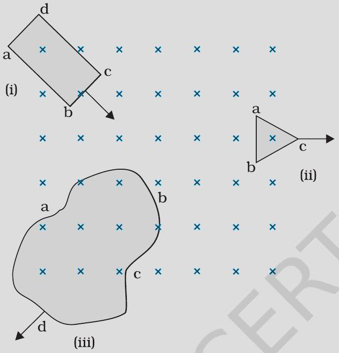
चित्र $6.7$

हल

(i) आयताकार लूप abcd में चुंबकीय फ्लक्स, लूप के चुंबकीय क्षेत्र के भाग की ओर गति करने के कारण बढ़ता है। प्रेरित धारा पथ bcdab के अनुदिश प्रवाहित होनी चाहिए जिससे कि यह बढ़ते हुए फ्लक्स का विरोध कर सके।
(ii) बाहर की ओर गति करने के कारण, त्रिभुजाकार लूप abc में चुंबकीय फ्लक्स घटता है जिसके कारण प्रेरित धारा bacb के अनुदिश प्रवाहित होती है, जिससे कि यह फ्लक्स परिवर्तन का विरोध कर सके।
(iii) चुंबकीय क्षेत्र से बाहर की ओर गति करने के कारण अनियमित आकार के लूप abcd में चुंबकीय फ्लक्स घटता है जिसके कारण प्रेरित धारा cdabc के अनुदिश प्रवाहित होती है जिससे कि यह फ्लक्स का विरोध कर सके।
नोट कीजिए कि जब तक लूप पूरी तरह से चुंबकीय क्षेत्र के अंदर या इससे बाहर रहता है तब कोई प्रेरित धारा उत्पन्न नहीं होती।

उदाहरण $6.5$

(a) एक बंद लूप, दो स्थिर रखे गए स्थायी चुंबकों के उत्तरी तथा दक्षिणी ध्रुवों के बीच चुंबकीय क्षेत्र में स्थिर रखा गया है। क्या हम अत्यंत प्रबल चुंबकों का उपयोग करके लूप में धारा उत्पन्न होने की आशा कर सकते हैं।
(b) एक बंद लूप विशाल संधारित्र की प्लेटों के बीच स्थिर विद्युत क्षेत्र के अभिलंबवत गति करता है। क्या लूप में प्रेरित धारा उत्पन्न होगी (i) जब लूप संधारित्र की प्लेटों के पूर्णतः अंदर हो (ii) जब लूप आंशिक रूप से प्लेटों के बाहर हो? विद्युत क्षेत्र लूप के तल के अभिलंबवत है।
(c) एक आयताकार लूप एवं एक वृत्ताकार लूप एकसमान चुंबकीय क्षेत्र में से (चित्र 6.8) क्षेत्र विहीन भाग में एकसमान वेग $\mathbf{v}$ से निकल रहे हैं। चुंबकीय क्षेत्र से बाहर निकलते समय, आप

## - भौतिकी

किस लूप में प्रेरित विद्युत वाहक बल के स्थिर होने की अपेक्षा करते हैं? क्षेत्र, लूपों के तल के अभिलंबवत है।

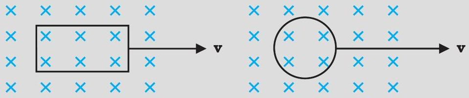
चित्र $6.8$

(d)चित्र $6.9$ में वर्णित स्थिति के लिए संधारित्र की ध्रुवता की प्रागुक्ति (Predict) कीजिए।

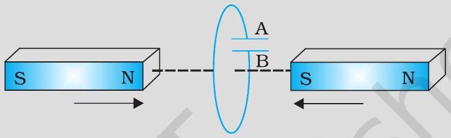
चित्र $6.9$

हल

(a) नहीं। चुंबक चाहे कितना भी प्रबल हो, प्रेरित धारा तभी उत्पन्न होगी जब लूप में से चुंबकीय फ्लक्स परिवर्तित हो।
(b) नहीं। विद्युत फ्लक्स परिवर्तित करके प्रेरित धारा प्राप्त नहीं हो सकती।
(c) आयताकार लूप के लिए प्रेरित विद्युत वाहक बल के स्थिर रहने की अपेक्षा कर सकते हैं। वृत्ताकार लूप में क्षेत्र के प्रभाव से बाहर निकलते समय लूप के क्षेत्रफल के परिवर्तन की दर स्थिर नहीं है, अतः प्रेरित विद्युत वाहक बल तदनुसार बदलेगा।
(d) संधारित्र की प्लेट 'A' की ध्रुवता प्लेट 'B' के सापेक्ष धनात्मक होगी।

## $6.6$ गतिक विद्युत वाहक बल

किसी एकसमान, काल स्वतंत्र (time independent) चुंबकीय क्षेत्र में एक गतिमान ऋजु चालक पर विचार कीजिए। चित्र $6.10$ में एक आयताकार चालक PQRS दर्शाया गया है जिसमें चालक

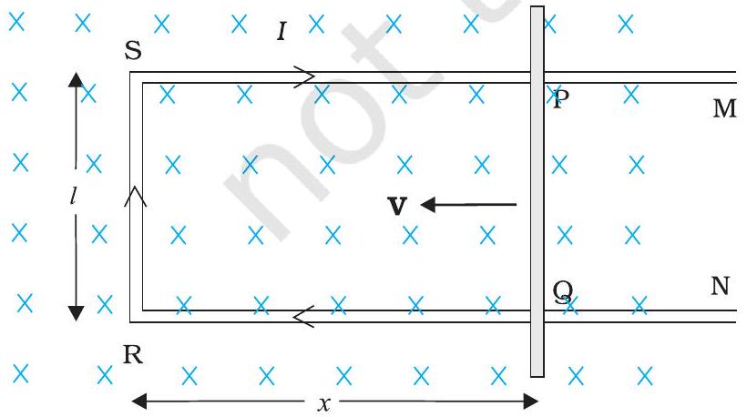
चित्र $6.10$ भुजा PQ बाईं ओर गतिमान है जिससे आयताकार लूप का क्षेत्रफल घट जाता है। इस गति के कारण दर्शाए अनुसार प्रेरित धारा $I$ उत्पन्न होती है।

PQ स्वतंत्र रूप से गति कर सकता है। छड़ PQ को स्थिर वेग v से बाईं ओर, चित्र में दर्शाए अनुसार, चलाया जाता है। मान लीजिए कि घर्षण के कारण किसी प्रकार का ऊर्जा का क्षय नहीं हो रहा है। PQRS एक बंद परिपथ बनाता है जिससे घिरा क्षेत्रफल PQ की गति के कारण परिवर्तित होता है। इसे एकसमान चुंबकीय क्षेत्र B में इस प्रकार रखा जाता है कि इसका तल चुंबकीय क्षेत्र के अभिलंबवत हो। यदि लंबाई $\mathrm{RQ}=x$ तथा $\mathrm{RS}=l$, तो लूप PQRS से घिरा चुंबकीय फ्लक्स $\Phi_{\mathrm{B}}$ होगा

$$
\Phi_{\mathrm{B}}=B l x
$$

क्योंकि $x$ समय के साथ बदल रहा है, फ्लक्स $\Phi_{\mathrm{B}}$ के परिवर्तन की दर के कारण एक प्रेरित विद्युत वाहक बल उत्पन्न होगा जिसका मान होगा

## वैद्युतचुंबकीय प्रेरण

$$
\begin{aligned}
& \varepsilon=\frac{-\mathrm{d} \Phi_{B}}{\mathrm{~d} t}=-\frac{\mathrm{d}}{\mathrm{~d} t}(B l x) \\
& =-B l \frac{\mathrm{~d} x}{\mathrm{~d} t}=B l v
\end{aligned}
$$

जहाँ हमने $\mathrm{d} x / \mathrm{d} t=-v$ लिया है जो कि चालक PQ की चाल है। प्रेरित विद्युत वाहक बल $B l v$ को गतिक विद्युत वाहक बल कहते हैं। इस प्रकार हम चुंबकीय क्षेत्र को परिवर्तित करने की बजाय किसी चालक को गतिमान करके, किसी परिपथ द्वारा घिरे चुंबकीय फ्लक्स में परिवर्तन करके प्रेरित विद्युत वाहक बल उत्पन्न कर सकते हैं।

समीकरण (6.5) में दर्शाए गए गतिक विद्युत वाहक बल के व्यंजक को चालक PQ के स्वतंत्र आवेशों पर कार्य करने वाले लोरेंज बल की सहायता से भी समझाना संभव है। चालक PQ में कोई यादृच्छिक (arbitrary) आवेश $q$ पर विचार करें। जब छड़ चाल $v$ से गति करती है तो आवेश भी चुंबकीय क्षेत्र B में चाल $v$ से गति करेगा। इस आवेश पर लोरेंज बल का परिमाण $q v B$ है तथा इसकी दिशा Q के अनुदिश होगी। प्रत्येक आवेश परिमाण तथा दिशा में, छड़ PQ में उनकी स्थिति के निरपेक्ष, समान बल का अनुभव करेंगे।

आवेश को P से Q तक ले जाने में किया गया कार्य है, $\mathrm{W}=q v \mathrm{~B} l$
चूँकि प्रति इकाई आवेश पर किया गया कार्य ही विद्युत वाहक बल है, अतः

$$
\varepsilon=\frac{W}{q}=B l v
$$

यह समीकरण छड़ PQ के सिरों के बीच प्रेरण द्वारा उत्पन्न हुए विद्युत वाहक बल का मान बताती है तथा समीकरण (6.5) के तुल्य है। हम इस बात को जोर देकर कहना चाहते हैं कि हमारी यह प्रस्तुति पूर्णतः यथार्थ नहीं है। परंतु यह किसी एकसमान एवं समय के साथ न बदलने वाले चुंबकीय क्षेत्र में गतिमान चालक के लिए फैराडे के नियम का आधार समझने में हमारी सहायता करती है।

दूसरी ओर, यह स्पष्ट नहीं होता है कि जब चालक स्थिर हो और चुंबकीय क्षेत्र परिवर्तित हो रहा हो तो इसमें emf कैसे प्रेरित होता है - जो एक ऐसा तथ्य है जो फैराडे के अनेक प्रयोग द्वारा पुष्ट होता है। स्थिर चालक के लिए इसके आवेशों पर लगने वाला बल,

$$
\mathbf{F}=q(\mathbf{E}+\mathbf{v} \times \mathbf{B})=q \mathbf{E}
$$

क्योंकि $\mathbf{v}=0$ है, अतः आवेश पर लगने वाला कोई भी बल केवल विद्युत क्षेत्र $\mathbf{E}$ के कारण होगा। इसलिए प्रेरित विद्युत वाहक बल या प्रेरित धारा के अस्तित्व की व्याख्या करने के लिए हमें यह मान लेना चाहिए कि समय के साथ परितवर्तनशील चुंबकीय क्षेत्र एक विद्युतीय क्षेत्र भी उत्पन्न करता है। तथापि, साथ ही हम यह भी कहना चाहेंगे कि स्थिर विद्युत आवेशों द्वारा उत्पन्न विद्युत क्षेत्र समय के साथ बदलते चुंबकीय क्षेत्रों द्वारा उत्पन्न विद्युत क्षेत्रों से भिन्न गुण रखते हैं। अध्याय $4$ में हमने अध्ययन किया कि गतिमान आवेश (विद्युत धारा) स्थिर चुंबक पर बल/बल युग्म आरोपित कर सकते हैं। इसके विपरीत एक गतिमान दंड चुंबक (या अधिक व्यापक रूप में कहें तो एक परिवर्तनशील चुंबकीय क्षेत्र) स्थिर आवेश पर एक बल आरोपित कर सकता है। यही फैराडे की खोज की मूलभूत महत्ता है। विद्युत एवं चुंबकत्व परस्पर संबंधित होते हैं।

> उदाहरण $6.6$ एक मीटर लंबी धातु की एक छड़ को $50$ चक्कर/सेंकड की आवृत्ति से घुमाया गया है। छड़ का एक सिरा वृत्ताकार धात्विक वलय जिसकी त्रिज्या $1$ मीटर है, के केन्द्र पर तथा दूसरा सिरा वलय की परिधि पर कब्ज़े से इस प्रकार जुड़ा है कि छड़ की गति वलय के केन्द्र से जाने वाले तथा वलय के तल में अभिलंबवत अक्ष के परितः है (चित्र 6.11)। अक्ष के अनुदिश एक स्थिर तथा एकसमान चुंबकीय क्षेत्र $1 \mathrm{~T}$ सर्वत्र उपस्थित है। केन्द्र तथा धात्विक वलय के बीच विद्युत वाहक बल क्या होगा?

## - भौतिकी

| × | × | × | × | × | × | × | × | × |
| :--- | :--- | :--- | :--- | :--- | :--- | :--- | :--- | :--- |
| × | × | × | ××× | x | X | $\mathrm{Q}^{\times}$ | × | × |
| × | × | × | × | × | × | X | × | × |
| × | x | × | $\times_{\omega}$ |  | × | × | × | × |
| × | × | × | × | OX | x | x | X | × |
| × | x | × | × | × | × | × | × | × |
| × | × | × | x | × | × | × | × | × |
| × | × | × | x | x | × | × | × | × |
| × | × | × | × | × | × | × | × | × |

चित्र $6.11$

हल
प्रथम विधि :
जब छड़ घूर्णन करती है तो छड़ में मुक्त इलेक्ट्रॉन लोरेंज बल के कारण बाहरी सिरे की ओर गति करते हैं तथा वलय के ऊपर वितरित हो जाते हैं। इस प्रकार, आवेशों के परिणामी पृथक्करण के कारण छड़ के सिरों के बीच एक विद्युत वाहक बल उत्पन्न होता है। विद्युत वाहक बल के एक निश्चित मान के लिए इलेक्ट्रॉनों का और अधिक प्रवाह नहीं होता तथा एक स्थायी दशा पहुँच जाती है। समीकरण (6.5) का उपयोग करने पर, जब छड़ चुंबकीय क्षेत्र के लंबवत गतिमान है तो इसकी लंबाई $\mathrm{d} r$ के आर-पार उत्पन्न विद्युत वाहक बल का परिमाण प्राप्त होगा $\mathrm{d} \varepsilon=B v \mathrm{~d} r$ अतः,
$\varepsilon=\int \mathrm{d} \varepsilon=\int_{0}^{R} B v \mathrm{~d} r=\int_{0}^{R} B \omega r \mathrm{~d} r=\frac{B \omega R^{2}}{2}$
नोट कीजिए कि हमने $v=\omega r$ उपयोग किया है। इससे प्राप्त होता है

$$
\begin{aligned}
& \varepsilon=\frac{1}{2} \times 1.0 \times 2 \pi \times 50 \times\left(1^{2}\right) \\
& =157 \mathrm{~V}
\end{aligned}
$$

द्वितीय विधि-
विद्युत वाहक बल की गणना करने के लिए हम एक बंद लूप OPQ की कल्पना करते हैं जिसमें बिंदु O तथा P को प्रतिरोध $R$ से जोड़ा गया है तथा OQ घूमती हुई छड़ है। प्रतिरोध के आर-पार विभवान्तर प्रेरित विद्युत वाहक बल के बराबर होगा तथा ये $B \times$ (लूप के क्षेत्रफल परिवर्तन की दर) के बराबर होगा। यदि $t$ समय पर छड़ तथा P पर वृत्त की त्रिज्या के बीच का कोण $\theta$ है, तो खंड OPQ का क्षेत्रफल प्राप्त होगा
$\pi R^{2} \times \frac{\theta}{2 \pi}=\frac{1}{2} R^{2} \theta$
जहाँ पर $R$ वृत्त की त्रिज्या है। अतः प्रेरित विद्युत वाहक बल है
[नोट कीजिए : $\frac{\mathrm{d} \theta}{\mathrm{d} t}=\omega=2 \pi v$ ]
$\varepsilon=B \times \frac{\mathrm{d}}{\mathrm{d} t}\left[\frac{1}{2} R^{2} \theta\right]=\frac{1}{2} B R^{2} \frac{\mathrm{~d} \theta}{\mathrm{~d} t}=\frac{B \omega R^{2}}{2}$
यह व्यंजक प्रथम विधि द्वारा प्राप्त व्यंजक के अनुरूप ही है और हम $\varepsilon$ का समान मान पाते हैं।

## वैद्युतचुंबकीय प्रेरण

उदाहरण $6.7$
एक पहिया जिसमें $0.5 \mathrm{~m}$ लंबे $10$ धात्विक स्पोक (spokes) हैं, को $120$ चक्र प्रति मिनट की दर से घुमाया जाता है। पहिये का घूर्णन तल उस स्थान पर पृथ्वी के चुंबकीय क्षेत्र के क्षैतिज घटक $H_{E}$ के अभिलंबवत है। उस स्थान पर यदि $H_{E}=0.4 \mathrm{G}$ है तो पहिये की धुरी (axle) तथा रिम के मध्य स्थापित प्रेरित विद्युत वाहक बल का मान क्या होगा? नोट कीजिए $1 \mathrm{G}=10^{-4} \mathrm{~T}$

हल
प्रेरित विद्युत वाहक बल $=(1 / 2) \omega B R^{2}$

$$
\begin{aligned}
& =(1 / 2) \times 4 \pi \times 0.4 \times 10^{-4} \times(0.5)^{2} \\
& =6.28 \times 10^{-5} \mathrm{~V}
\end{aligned}
$$

क्योंकि स्पोक के आरपार विद्युत वाहक बल समांतर हैं इसलिए उनकी संख्या का कोई प्रभाव नहीं पड़ता।

## $6.7$ प्रेरकत्व

एक कुंडली के निकट रखी दूसरी कुंडली में फ्लक्स परिवर्तन से अथवा उसी कुंडली में फ्लक्स परिवर्तन से, उस कुंडली में विद्युत धारा प्रेरित हो सकती है। ये दोनों स्थितियाँ अगले दो उपखंडों में अलग-अलग वर्णित की गई हैं। तथापि, इन दोनों स्थितियों में, कुंडली में फ्लक्स धारा के समानुपाती है। अर्थात् $\Phi_{\mathrm{B}} \propto I$

इसके अतिरिक्त यदि समय के साथ कुंडली की ज्यामिति नहीं बदलती, तब

$$
\frac{\mathrm{d} \Phi_{B}}{\mathrm{~d} t} \alpha \frac{\mathrm{~d} I}{\mathrm{~d} t}
$$

समीप-समीप लिपटे $N$ फेरों (turns) वाली कुंडली के सभी फेरों से समान चुंबकीय फ्लक्स संबद्ध होता है। जब कुंडली में फ्लक्स $\Phi_{\mathrm{B}}$ परिवर्तित होता है तो प्रत्येक फेस प्रेरित विद्युत वाहक बल में योगदान करता है। इसलिए एक पद फ्लक्स-बंधता (flux linkage) का उपयोग होता है जो कि पास-पास लिपटी कुंडली के लिए $N \Phi_{\mathrm{B}}$ के बराबर है तथा इस स्थिति में

$$
N \Phi_{\mathrm{B}} \propto I
$$

इस संबंध में समानुपातिक स्थिरांक को प्रेरकत्व कहते हैं। हम देखेंगे कि प्रेरकत्व का मान कुंडली की ज्यामिति तथा उसके पदार्थ के नैज (intrinsic) गुणधर्मों पर निर्भर करता है। यह पक्ष धारिता की प्रकृति के समान है जो समांतर प्लेट संधारित्र के लिए प्लेट के क्षेत्रफल तथा प्लेट-पृथक्करण (ज्यामिति) तथा उनके बीच उपस्थित माध्यम के परावैद्युतांक $K$ (पदार्थ के नैज गुणधर्म) पर निर्भर करती है।

प्रेरकत्व एक अदिश राशि है। इसकी विमाएँ [ $\mathrm{ML}^{2} \mathrm{~T}^{-2} \mathrm{~A}^{-2}$ ] हैं जो कि फ्लक्स की विमाओं तथा धारा की विमाओं के अनुपात द्वारा व्यक्त की जाती हैं। प्रेरकत्व की SI मात्रक हेनरी है तथा इसे H द्वारा व्यक्त किया जाता है। यह नाम जोसेफ हेनरी के सम्मान में रखा गया है जिन्होंने इंग्लैंड के वैज्ञानिक फैराडे से अलग अमेरिका में वैद्युत चुंबकीय प्रेरण की खोज की।

### 6.7.1 अन्योन्य प्रेरकत्व

चित्र $6.12$ में दर्शायी गई दो लंबी समाक्षी (co-axial) परिनालिकाओं (solenoids) जिनकी प्रत्येक की लंबाई $l$ है, पर विचार कीजिए। हम अंतः परिनालिका $\mathrm{S}_{1}$ की त्रिज्या $r_{1}$ तथा उसकी इकाई लंबाई में फेरों की संख्या को $n_{1}$ द्वारा व्यक्त करते हैं। बाह्य परिनालिका $S_{2}$ के लिए संगत राशियाँ

## - भौतिकी

क्रमशः $r_{2}$ तथा $n_{2}$ हैं। मान लीजिए $N_{1}$ तथा $N_{2}$ क्रमशः कुंडलियों $S_{1}$ तथा $S_{2}$ में फेरों की कुल संख्या है।

जब $\mathrm{S}_{2}$ में धारा $I_{2}$ प्रवाहित करते हैं तो यह $\mathrm{S}_{1}$ में एक चुंबकीय फ्लक्स स्थापित करती है। हम इसे $\Phi_{1}$ से निर्दिष्ट करते हैं। परिनालिका $S_{1}$ में संगत फ्लक्स-बंधता है

$$
N_{1} \Phi_{1}=M_{12} I_{2}
$$

$M_{12}$ को परिनालिका $S_{1}$ का परिनालिका $S_{2}$ के सापेक्ष अन्योन्य प्रेरकत्व कहते हैं। इसे अन्योन्य प्रेरक गुणांक भी कहा जाता है।

इन सरल समाक्षी परिनालिकाओं के लिए $M_{12}$ की गणना संभव है। परिनालिका $S_{2}$ में स्थापित विद्युत धारा $I_{2}$ द्वारा उत्पन्न चुंबकीय क्षेत्र है $\mu_{0} n_{2} I_{2}$ । कुंडली $S_{1}$ के साथ परिणामी फ्लक्स-बंधता है

$$
\begin{aligned}
N_{1} \Phi_{1} & =\left(n_{1} l\right)\left(\pi r_{1}^{2}\right)\left(\mu_{0} n_{2} I_{2}\right) \\
& =\mu_{0} n_{1} n_{2} \pi r_{1}^{2} l I_{2}
\end{aligned}
$$

जहाँ $n_{1} l$ परिनालिका $\mathrm{S}_{1}$ में कुल फेरों की संख्या है। इस प्रकार, समीकरण (6.7) तथा समीकरण (6.8) से

$$
M_{12}=\mu_{0} n_{1} n_{2} \pi r_{1}^{2} l
$$

ध्यान दीजिए कि हमने यहाँ पर कोर-प्रभावों को नगण्य मान लिया है तथा चुंबकीय क्षेत्र $\mu_{0} n_{2} I_{2}$ को परिनालिका $S_{2}$ को लंबाई तथा चौड़ाई में सर्वत्र एकसमान माना है। यह ध्यान रखते हुए कि परिनालिका लंबी है, जिसका अर्थ है $l \gg r_{2}$ यह एक अच्छा सन्निकटन (approximation) है।

अब हम विपरीत स्थिति पर विचार करते हैं। परिनालिका $S_{1}$ से एक विद्युत धारा $I_{1}$ प्रवाहित की जाती है तथा परिनालिका $\mathrm{S}_{2}$ से फ्लक्स-बंधता है,

$$
N_{2} \Phi_{2}=M_{21} I_{1}
$$

$M_{21}$ को परिनालिका $S_{2}$ का परिनालिका $S_{1}$ के सापेक्ष अन्योन्य प्रेरकत्व कहते हैं।
$\mathrm{S}_{1}$ में धारा $I_{1}$ के कारण फ्लक्स पूरी तरह $\mathrm{S}_{1}$ के अंदर सीमित माना जा सकता है क्योंकि परिनालिकाएँ बहुत लंबी हैं। अतः, परिनालिका $S_{2}$ के साथ फ्लक्स-बंधता है

$$
N_{2} \Phi_{2}=\left(n_{2} l\right)\left(\pi r_{1}^{2}\right)\left(\mu_{0} n_{1} I_{1}\right)
$$

यहाँ पर $n_{2} l, S_{2}$ में फेरों की कुल संख्या है। समीकरण (6.10) से,

$$
M_{21}=\mu_{0} n_{1} n_{2} \pi r_{1}^{2} l
$$

समीकरण (6.9) तथा समीकरण (6.10) का उपयोग करके हमें प्राप्त होता है

$$
M_{12}=M_{21}=M(\text { माना })
$$

हमने यह समानता दीर्घ लंबाई की समाक्षी परिनालिकाओं के लिए दर्शायी है। तथापि, यह संबंध व्यापक रूप से सत्य है। नोट कीजिए कि यदि अंतःपरिनालिका बाह्य परिनालिका से बहुत छोटी होती (तथा बाह्य परिनालिका में ठीक प्रकार अंदर रखी होती) तब भी हम फ्लक्स ग्रंथिका $N_{1} \Phi_{1}$ की गणना कर पाते, क्योंकि अंतःपरिनालिका बाह्य परिनालिका के कारण प्रभावी ढंग से एकसमान चुंबकीय क्षेत्र में निमज्जित है। इस स्थिति में, $M_{12}$ की गणना सरल होगी। तथापि, बाह्य परिनालिका से आबद्ध फ्लक्स की गणना करना अत्यंत कठिन होगा क्योंकि अंतःपरिनालिका के कारण चुंबकीय क्षेत्र बाह्य परिनालिका की लंबाई तथा साथ-ही-साथ अनुप्रस्थ काट के आर-पार परिवर्तित होगा।

इसीलिए इस स्थिति में $M_{21}$ की गणना भी अत्यंत कठिन होगी। ऐसी स्थितियों में $M_{12}=M_{21}$ जैसी समानता अत्यंत लाभकारी होगी।

उपरोक्त उदाहरण की व्याख्या हमने यह मान कर की है कि परिनालिकाओं के अंदर माध्यम वायु है। इसके स्थान पर यदि $\mu_{\mathrm{r}}$ सापेक्ष चुंबकशीलता का माध्यम मौजूद होता तो अन्योन्य प्रेरकत्व का मान होता

$$
M=\mu_{r} \mu_{0} n_{1} n_{2} \pi r_{1}^{2} l
$$

यह जानना भी महत्वपूर्ण है कि कुंडलियों, परिनालिकाओं आदि के युग्म का अन्योन्य प्रेरकत्व उनके पृथक्करण एवं साथ-ही-साथ उनके सापेक्ष दिक्विन्यास (orientation) पर निर्भर है।

उदाहरण $6.8$ दो संकेन्द्री वृत्ताकार कुंडलियाँ, एक कम त्रिज्या $r_{1}$ की तथा दूसरी अधिक त्रिज्या $r_{2}$ की, ऐसी कि $r_{1} \ll r_{2}$, समाक्षी रखी हैं तथा दोनों के केन्द्र संपाती हैं। इस व्यवस्था के लिए अन्योन्य प्रेरकत्व ज्ञात कीजिए।

हल माना कि बाह्य वृत्ताकार कुंडली में से $I_{2}$ धारा प्रवाहित होती है। कुंडली के केन्द्र पर चुंबकीय क्षेत्र है $B_{2}=\mu_{0} I_{2} / 2 r_{2}$ । क्योंकि दूसरी समाक्षी कुंडली की त्रिज्या अत्यंत अल्प है, उसके अनुप्रस्थ काट क्षेत्रफल पर $B_{2}$ का मान स्थिर माना जा सकता है। अतः,

$$
\begin{aligned}
\Phi_{1} & =\pi r_{1}^{2} B_{2} \\
& =\frac{\mu_{0} \pi r_{1}^{2}}{2 r_{2}} I_{2} \\
& =M_{12} I_{2}
\end{aligned}
$$

इस प्रकार,

$$
M_{12}=\frac{\mu_{0} \pi r_{1}^{2}}{2 r_{2}}
$$

समीकरण (6.12) से

$$
M_{12}=M_{21}=\frac{\mu_{0} \pi r_{1}^{2}}{2 r_{2}}
$$

ध्यान दीजिए कि हमने $M_{12}$ की गणना $\Phi_{1}$ के सन्निकट मान से यह मानते हुए की है कि चुंबकीय क्षेत्र $B_{2}$ का मान क्षेत्रफल $\pi r_{1}^{2}$ पर एकसमान है। तथापि, हम इस मान को स्वीकार कर सकते हैं क्योंकि $r_{1} \ll r_{2}$ ।

अब, अनुच्छेद $6.2$ के प्रयोग $6.3$ को स्मरण करें। उस प्रयोग में, जब भी कुंडली $C_{2}$ में धारा परिवर्तित होती है, कुंडली $C_{1}$ में विद्युत वाहक बल प्रेरित होता है। मान लीजिए कुंडली $C_{1}$ (माना $N_{1}$ फेरों वाली) में फ्लक्स $\Phi_{1}$ है, जबकि कुंडली $C_{2}$ में धारा $I_{2}$ है।

तब समीकरण (6.7) से हमें प्राप्त होगा

$$
N_{1} \Phi_{1}=M I_{2}
$$

समय के साथ परिवर्तनशील धाराओं के लिए

$$
\frac{\mathrm{d}\left(N_{1} \Phi_{1}\right)}{\mathrm{d} t}=\frac{\mathrm{d}\left(M I_{2}\right)}{\mathrm{d} t}
$$

क्योंकि कुंडली $C_{1}$ में प्रेरक विद्युत वाहक बल का मान है

$$
\varepsilon_{1}=-\frac{\mathrm{d}\left(N_{1} \Phi_{1}\right)}{\mathrm{d} t}
$$

हमें प्राप्त होगा,

$$
\varepsilon_{1}=-M \frac{\mathrm{~d} I_{2}}{\mathrm{~d} t}
$$

यह दर्शाता है कि किसी कुंडली में परिवर्ती धारा समीपस्थ कुंडली में विद्युत वाहक बल प्रेरित कर सकती है। प्रेरक विद्युत वाहक बल का परिमाण धारा परिवर्तन की दर तथा दोनों कुंडलियों के अन्योन्य प्रेरकत्व पर निर्भर है।

### 6.7.2 स्व-प्रेरकत्व

पिछले उप-परिच्छेद में हमने एक परिनालिका में बहने वाली धारा के कारण दूसरी परिनालिका में उत्पन्न होने वाले फ्लक्स के बारे में विचार किया। किसी एकल वियुक्त कुंडली में भी उसी कुंडली में धारा परिवर्तित करने पर कुंडली में होने वाले फ्लक्स परिवर्तन के कारण, विद्युत वाहक बल प्रेरित करना संभव है। इस परिघटना को स्व-प्रेरण कहते हैं। इस स्थिति में, $N$ फेरों वाली कुंडली में फ्लक्स-बंधता, कुंडली में बहने वाली धारा के समानुपातिक है तथा इसे व्यक्त कर सकते हैं,

$$
\begin{aligned}
& N \Phi_{B} \propto I \\
& N \Phi_{B}=L I
\end{aligned}
$$

यहाँ समानुपातिक स्थिरांक $L$ को कुंडली का स्व-प्रेरकत्व कहते हैं। इसे कुंडली का स्व-प्रेरण गुणांक भी कहते हैं। जब धारा परिवर्तित होती है, कुंडली से संबद्ध फ्लक्स भी परिवर्तित होता है। समीकरण (6.13) का उपयोग करने पर प्रेरित विद्युत वाहक बल होगा

$$
\begin{aligned}
& \varepsilon=-\frac{\mathrm{d}\left(N \Phi_{\mathrm{B}}\right)}{\mathrm{d} t} \\
& \varepsilon=-L \frac{\mathrm{~d} I}{\mathrm{~d} t}
\end{aligned}
$$

इस प्रकार, स्व-प्रेरित विद्युत वाहक बल सदैव कुंडली में किसी भी धारा परिवर्तन (बढ़ना या घटना) का विरोध करता है।

सरल ज्यामितियों से किसी परिपथ के लिए स्व-प्रेरकत्व की गणना करना संभव है। आइए एक लंबी परिनालिका के स्व-प्रेरकत्व की गणना करें, जिसके अनुप्रस्थ काट का क्षेत्रफल $A$ तथा लंबाई $l$ है, तथा इसी एकांक लंबाई में फेरों की संख्या $n$ है। परिनालिका में प्रवाहित होने वाली धारा $I$ के कारण चुंबकीय क्षेत्र $B=\mu_{0} n I$ है (पहले की भाँति कोर प्रभावों को नगण्य मानते हुए)। परिनालिका से संबद्ध कुल फ्लक्स हैं

$$
\begin{aligned}
& N \Phi_{B}=(n l)\left(\mu_{0} n I\right)(A) \\
& =\mu_{0} n^{2} A l I
\end{aligned}
$$

यहाँ पर $n l$ फेरों की कुल संख्या है। अतः, स्व-प्रेरकत्व है,

$$
\begin{aligned}
L & =\frac{N \Phi_{B}}{I} \\
& =\mu_{0} n^{2} A l
\end{aligned}
$$

यदि हम परिनालिका की अंतःधारा को $\mu_{r}$ आपेक्षिक चुंबकशीलता वाले पदार्थ से भर दें (उदाहरण के लिए नर्म लोहा, जिसकी आपेक्षिक चुंबकशीलता का मान उच्च है), तब,

$$
L=\mu_{r} \mu_{0} n^{2} A l
$$

कुंडली का स्वप्रेरकत्व उसकी ज्यामितीय संरचना तथा माध्यम की चुंबकशीलता पर निर्भर है।

## वैद्युतचुंबकीय प्रेरण

स्वप्रेरित विद्युत वाहक बल को विरोधी विद्युत वाहक बल (backemf) भी कहते हैं क्योंकि यह परिपथ में किसी भी धारा-परिवर्तन का विरोध करता है। भौतिक दृष्टि से स्व-प्रेरकत्व जड़त्व का कार्य करता है। यह यांत्रिकी में द्रव्यमान का विद्युतचुंबकीय अनुरूप है। अतः, धारा स्थापित करने के लिए, विरोधी विद्युत वाहक बल $(\varepsilon)$ के विरुद्ध कार्य करना पड़ता है। यह किया गया कार्य चुंबकीय स्थितिज ऊर्जा के रूप में संचित हो जाता है। किसी परिपथ में किसी क्षण धारा $I$ के लिए कार्य करने की दर है,

$$
\frac{\mathrm{d} W}{\mathrm{~d} t}=|\varepsilon| I
$$

यदि हम प्रतिरोधक क्षयों को नगण्य मान लें तथा केवल प्रेरणिक प्रभाव पर ही विचार करें, तब समीकरण (6.14) का उपयोग करने पर,

$$
\frac{\mathrm{d} W}{\mathrm{~d} t}=L I \frac{\mathrm{~d} I}{\mathrm{~d} t}
$$

धारा $I$ स्थापित करने में किया गया कुल कार्य है,

$$
W=\int \mathrm{d} W=\int_{0}^{1} L I \mathrm{~d} I
$$

अतः, धारा I स्थापित करने में आवश्यक ऊर्जा होगी,

$$
W=\frac{1}{2} L I^{2}
$$

यह व्यंजक हमें $m$ द्रव्यमान के किसी कण की गतिज ऊर्जा (यांत्रिक) के व्यंजक $m v^{2} / 2$ की याद दिलाता है तथा दर्शाता है कि $L, m$ के अनुरूप है (अर्थात $L$ विद्युत जड़त्व है तथा किसी परिपथ में जिसमें यह संयोजित है, धारा के बढ़ने तथा घटने का विरोध करता है)।

दो समीपस्थ कुंडलियों में साथ-साथ प्रवाहित होने वाली धाराओं की सामान्य स्थिति पर विचार करें। एक कुंडली के साथ संबद्ध फ्लक्स, स्वतंत्र रूप से विद्यमान दो फ्लक्सों के योग के बराबर होगा। समीकरण (6.7) निम्न रूप में रूपातंरित हो जाएगी।

$$
N_{1} \Phi_{1}=M_{11} I_{1}+M_{12} I_{2}
$$

यहाँ $M_{11}$ उसी कुंडली के प्रेरकत्व को निरूपित करता है।
अतः, फैराडे का नियम उपयोग करने पर,

$$
\varepsilon_{1}=-M_{11} \frac{\mathrm{~d} I_{1}}{\mathrm{~d} t}-M_{12} \frac{\mathrm{~d} I_{2}}{\mathrm{~d} t}
$$

$M_{11}$ स्व-प्रेरकत्व है तथा इसे $L_{1}$ द्वारा लिखा जाता है। इसलिए,

$$
\varepsilon_{1}=-L_{1} \frac{\mathrm{~d} I_{1}}{\mathrm{~d} t}-M_{12} \frac{\mathrm{~d} I_{2}}{\mathrm{~d} t}
$$

उदाहरण $6.9$ (a) परिनालिका में संचित चुंबकीय ऊर्जा का व्यंजक परिनालिका के चुंबकीय क्षेत्र $B$, क्षेत्रफल $A$ तथा लंबाई $l$ के पदों में ज्ञात कीजिए। (b) यह चुंबकीय ऊर्जा तथा संधारित्र में संचित स्थिरवैद्युत ऊर्जा किस रूप में तुलनीय है?

हल
(a) समीकरण (6.17) से, चुंबकीय ऊर्जा है

$$
U_{B}=\frac{1}{2} L I^{2}
$$

## - भौतिकी

प्रत्यावर्ती धारा जनित्र का प्रभावी सजीव चित्रण
http://micro.magnet.fsu.edu/electromag/java/generator/ac.html

$$
\begin{aligned}
& =\frac{1}{2} L\left(\frac{B}{\mu_{0} n}\right)^{2} \\
& =\frac{1}{2}\left(\mu_{0} n^{2} A l\right)\left(\frac{B}{\mu_{0} n}\right)^{2} \\
& =\frac{1}{2 \mu_{0}} B^{2} A l
\end{aligned}
$$

(क्योंकि परिनालिका के लिए, $B=\mu_{0} n I$ )
[समीकरण (6.15) से]

(b) प्रति एकांक आयतन चुंबकीय ऊर्जा है ,
$$
\begin{aligned}
u_{B} & =\frac{U_{B}}{V} \quad \text { (यहाँ } V \text { आयतन है जिसमें फ्लक्स विद्यमान है) } \\
& =\frac{U_{B}}{A l} \\
& =\frac{B^{2}}{2 \mu_{0}}
\end{aligned}
$$

हम पहले ही समांतर प्लेट संधारित्र के एकांक आयतन में संचित स्थिरवैद्युत ऊर्जा का संबंध प्राप्त कर चुके हैं [अध्याय $2$ समीकरण $2.73$ देखिए]।

$$
u_{E}=\frac{1}{2} \varepsilon_{0} E^{2}
$$

दोनों दशाओं में ऊर्जा क्षेत्र की तीव्रता के समानुपाती है। समीकरण (6.18) तथा (2.73) विशेष स्थितियों क्रमशः एक परिनालिका तथा एक समांतर प्लेट संधारित्र के लिए व्युत्पन्न किए गए हैं। लेकिन वे व्यापक हैं तथा विश्व के किसी भी ऐसे स्थान के लिए सत्य है जिसमें कोई चुंबकीय क्षेत्र अथवा/और विद्युतीय क्षेत्र विद्यमान है।

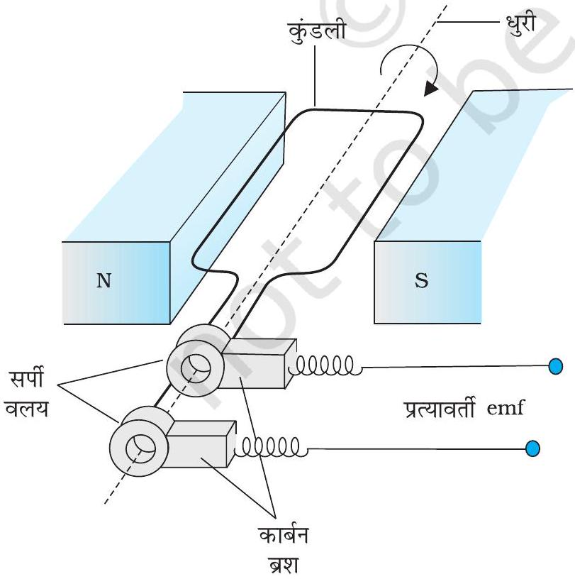
चित्र $6.13$ प्रत्यावर्ती धारा जनित्र।

## $6.8$ प्रत्यावर्ती धारा जनित्र

विद्युत चुंबकीय प्रेरण परिघटना का प्रौद्योगिक रूप से कई प्रकार से उपयोग किया गया है। एक असाधारण तथा महत्वपूर्ण उपयोग प्रत्यावर्ती धारा (ac) उत्पादन है। $100 \mathrm{MW}$ सामर्थ्य का आधुनिक प्रत्यावर्ती धारा जनित्र एक अत्यंत विकसित मशीन है। इस अनुच्छेद में, हम इस मशीन के मूल सिद्धांतों का वर्णन करेंगे। इस मशीन के विकास का श्रेय यूगोस्लाव वैज्ञानिक निकोला टेस्ला को जाता है। जैसा कि अनुच्छेद $6.3$ में संकेत किया गया था, किसी लूप में विद्युत वाहक बल या धारा प्रेरित करने के लिए, एक विधि यह है कि लूप के अभिविन्यास में अथवा इसके प्रभावी क्षेत्रफल में परिवर्तन किया जाए। जब कुंडली एक चुंबकीय क्षेत्र B में घूर्णन करती है तो लूप का (क्षेत्र के अभिलंबवत) प्रभावी क्षेत्रफल $A \cos \theta$ है, यहाँ $\theta, \mathbf{A}$ तथा $\mathbf{B}$ के बीच का कोण है। फ्लक्स परिवर्तन करने की यह विधि, एक सरल प्रत्यावर्ती धारा जनित्र का कार्य सिद्धांत है। जनित्र यांत्रिक
ऊर्जा को विद्युत ऊर्जा में परिवर्तित करता है।

प्रत्यावर्ती धारा जनित्र के मूल अवयव चित्र $6.13$ में दर्शाए गए हैं। इसमें एक कुंडली होती है जो रोटर शैफ्ट (roter shaft) पर

## वैद्युतचुंबकीय प्रेरण

आरोपित होती है। कुंडली का घूर्णन अक्ष चुंबकीय क्षेत्र की दिशा के लंबवत है। कुंडली (जिसे आर्मेचर कहते हैं) को किसी एकसमान चुंबकीय क्षेत्र में किसी बाह्य साधन द्वारा यांत्रिक विधि से घूर्णन कराया जाता है। कुंडली के घूमने से, इसमें चुंबकीय फ्लक्स परिवर्तित होता है, जिससे कि कुंडली में एक विद्युत वाहक बल प्रेरित होता है। कुंडली के सिरों को सर्पी वलयों (slip rings) तथा ब्रुशों (brushes) की सहायता से एक बाह्य परिपथ से जोड़ा जाता है।

जब कुंडली को एकसमान कोणीय चाल $\omega$ से घूर्णन कराया जाता है तो चुंबकीय क्षेत्र सदिश $\mathbf{B}$ तथा क्षेत्रफल सदिश $\mathbf{A}$ के बीच कोण $\theta$ का मान किसी समय $t$ पर $\theta=\omega t$ है (यह मानते हुए कि जब $t=0, \theta=0^{\circ}$ ) है। परिणामस्वरूप, कुंडली का प्रभावी क्षेत्रफल, जिसमें चुंबकीय क्षेत्र रेखाएँ होकर गुजरती हैं, समय के साथ परिवर्तित होता है। समीकरण (6.1) के अनुसार किसी समय $t$ पर फ्लक्स है :

$$
\Phi_{\mathrm{B}}=B A \cos \theta=B A \cos \omega t
$$

फैराडे के नियम से, $N$ फेरों वाली घूर्णी कुंडली के लिए प्रेरित विद्युत वाहक बल होगा

$$
\varepsilon=-N \frac{\mathrm{~d} \Phi_{B}}{\mathrm{dt}}=-N B A \frac{\mathrm{~d}}{\mathrm{~d} t}(\cos \omega t)
$$

अतः, विद्युत वाहक बल का तात्क्षणिक मान है

$$
\varepsilon=N B A \omega \sin \omega t
$$

यहाँ $N B A \omega$ विद्युत वाहक बल का अधिकतम मान है, जो $\sin \omega t= \pm 1$ पर प्राप्त होता है। यदि हम $N B A \omega$ को $\varepsilon_{0}$ से दर्शाएँ, तब

$$
\varepsilon=\varepsilon_{0} \sin \omega t
$$

क्योंकि ज्या फलन (sine function) का मान +1 से-1 के बीच बदलता है, विद्युत वाहक बल का चिह्न या ध्रुवता समय के साथ परिवर्तित होता है। चित्र $6.14$ से नोट कीजिए कि जब $\theta=90^{\circ}$ या $\theta=270^{\circ}$ होता है तो विद्युत वाहक बल अपने चरम मान पर होता है क्योंकि इन बिंदुओं पर फ्लक्स में परिवर्तन अधिकतम है।

चरण $2$
चरण $1$ आर्मेचर का तल चुंबकीय क्षेत्र के अभिलंबवत है
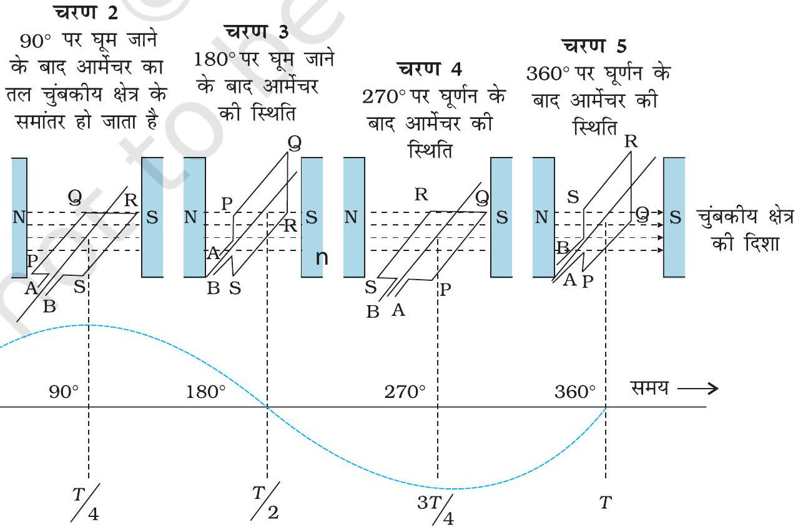

चित्र $6.14$ एक चुंबकीय क्षेत्र में घूर्णन करते तार के लूप में एक प्रत्यावर्ती विद्युत वाहक बल उत्पन्न होता है।

## भौतिकी

क्योंकि धारा की दिशा आवर्ती रूप से परिवर्तित होती है इसलिए धारा को प्रत्यावर्ती धारा (ac) कहते हैं। क्योंकि $\omega=2 \pi \nu$, समीकरण (6.20) को हम निम्न प्रकार से लिख सकते हैं-

$$
\varepsilon=\varepsilon_{0} \sin 2 \pi \nu t
$$

यहाँ, $\nu$, जनित्र की कुंडली (आर्मेचर) के परिक्रमण की आवृत्ति है।
ध्यान रखिए कि समीकरण (6.20) तथा (6.21) विद्युत वाहक बल का तात्क्षणिक मान बतलाते हैं तथा $\varepsilon,+\varepsilon_{0}$ तथा $-\varepsilon_{0}$ के बीच आवर्ती रूप से परिवर्तित होता है। हम अध्याय $7$ में सीखेंगे कि प्रत्यावर्ती वोल्टता तथा धारा का काल औसत मान कैसे ज्ञात करते हैं।

व्यावसायिक जनित्रों में, आर्मेचर को घुमाने के लिए आवश्यक यांत्रिक ऊर्जा ऊँचाई से गिरते हुए पानी द्वारा प्राप्त की जाती है, उदाहरण के लिए, बाँधों द्वारा। इन्हें जल-विद्युत जनित्र (hydroelectric generator) कहते हैं। विकल्पतः, कोयला या अन्य स्रोतों का उपयोग करके, पानी को गर्म करके भाप पैदा करते हैं। उच्च दाब पर भाप को आर्मेचर को घुमाने के लिए प्रयोग में लाते हैं। इन्हें तापीय जनित्र (thermal generator) कहते हैं। कोयले के स्थान पर यदि नाभिकीय ईंधन का प्रयोग किया जाता है तो हमें नाभिकीय शक्ति प्राप्त होती है। आधुनिक जनित्र $500 \mathrm{MW}$ उच्च विद्युत शक्ति उत्पन्न कर सकते हैं, अर्थात् इनसे $100 \mathrm{~W}$ के $50$ लाख बल्ब एक साथ जलाए जा सकते हैं। अधिकांश जनित्रों में कुंडलियों को अचर रखा जाता है तथा विद्युत चुंबकों को घुमाया जाता है। भारत में जनित्रों में घूर्णन आवृत्ति $50 \mathrm{~Hz}$ है। कुछ देशों में, जैसे अमेरिका (USA) में यह आवृत्ति $60 \mathrm{~Hz}$ है।

उदाहरण $6.10$ कमला एक स्थिर साइकिल के पैडल को घुमाती है। पैडल का संबंध $100$ फेरों तथा $0.10 \mathrm{~m}^{2}$ क्षेत्रफल वाली एक कुंडली से है। कुंडली प्रति सेकंड आधा परिक्रमण (चक्कर) कर पाती है तथा यह एक $0.01 \mathrm{~T}$ तीव्रता वाले एकसमान चुंबकीय क्षेत्र में, जो कुंडली के घूर्णन अक्ष के लंबवत है, रखी है। कुंडली में उत्पन्न होने वाली अधिकतम वोल्टता क्या होगी?
हल यहाँ $v=0.5 \mathrm{~Hz} ; N=100, A=0.1 \mathrm{~m}^{2}$ तथा $B=0.01 \mathrm{~T}$ । समीकरण (6.19) लगाने पर

$$
\begin{aligned}
\varepsilon_{0} & =N B A(2 \pi v) \\
& =100 \times 0.01 \times 0.1 \times 2 \times 3.14 \times 0.5 \\
& =0.314 \mathrm{~V}
\end{aligned}
$$

अधिकतम वोल्टता $0.314 \mathrm{~V}$ है।
हम आपसे आग्रह करते हैं कि विद्युत शक्ति उत्पादन के लिए वैकल्पिक संभावनाओं का पता लगाएँ।

## सारांश

1. क्षेत्रफल A की किसी सतह को एकसमान चुंबकीय क्षेत्र B में रखने पर उसमें से गुजरने वाले चुंबकीय फ्लक्स को निम्न प्रकार परिभाषित कर सकते हैं।
$$
\Phi_{\mathrm{B}}=\mathbf{B} \cdot \mathbf{A}=B A \cos \theta
$$
यहाँ $\theta, \mathrm{B}$ एवं A के बीच का कोण है।
2. फैराडे के विद्युत चुंबकीय प्रेरण के नियम के अनुसार $N$ फेरे युक्त कुंडली में प्रेरित विद्युत वाहक बल उससे गुजरने वाले चुंबकीय फ्लक्स में परिवर्तन की दर के तुल्य होता है
$$
\varepsilon=-N \frac{\mathrm{~d} \Phi_{\mathrm{B}}}{\mathrm{~d} t}
$$
यहाँ $\Phi_{\mathrm{B}}$ एक फेरे से संबद्ध चुंबकीय फ्लक्स है। यदि परिपथ एक बंद परिपथ हो तो उसमें एक धारा $I=\varepsilon / R$ स्थापित हो जाती है, जहाँ $R$ परिपथ का प्रतिरोध है।
3. लेंज के नियम के अनुसार, प्रेरित विद्युत वाहक बल की ध्रुवता इस प्रकार होती है कि वह उस दिशा में धारा प्रवाहित करे, जो उसी परिवर्तन का विरोध करे जिसके कारण उसकी उत्पत्ति हुई है। फैराडे द्वारा निष्पादित व्यंजक में ऋण चिह्न इसी बात का द्योतक है।

## वैद्युतचुंबकीय प्रेरण

4. यदि एक $l$ लंबाई की धात्विक छड़ को एकसमान चुंबकीय क्षेत्र $B$ के लंबवत रखें तथा इसे क्षेत्र के लंबवत $v$ वेग से चलाएँ तो इसके सिरों के बीच प्रेरित विद्युत वाहक बल (जिसे गतिक विद्युत वाहक बल कहते हैं) का मान है
$$
\varepsilon=B l v
$$
5. प्रेरकत्व, फ्लक्स बंधता तथा धारा का अनुपात है। इसका मान $N \Phi / I$ होता है।
6. किसी कुंडली (कुंडली 2) में धारा परिवर्तन निकट स्थित कुंडली (कुंडली 1) में प्रेरित विद्युत वाहक बल उत्पन्न कर सकता है। इस संबंध को
$$
\varepsilon_{1}=-M_{12} \frac{\mathrm{~d} I_{2}}{\mathrm{~d} t}
$$
द्वारा व्यक्त करते हैं। यहाँ राशि $M_{12}$ कुंडली $1$ का कुंडली $2$ के सापेक्ष अन्योन्य प्रेरकत्व है। $M_{21}$ को भी इसी प्रकार परिभाषित किया जा सकता है। इन दो प्रेरकत्वों में एक सामान्य तुल्यता होती है।
$$
M_{12}=M_{21}
$$
7. जब किसी कुंडली में धारा परिवर्तन होता है तो वह परिवर्तन कुंडली में एक विरोधी विद्युत वाहक बल को उत्पन्न करता है। इस स्व-प्रेरित विद्युत वाहक बल का मान निम्नलिखित समीकरण द्वारा व्यक्त किया जाता है :
$$
\varepsilon=-L \frac{\mathrm{~d} I}{\mathrm{~d} t}
$$
यहाँ $L$ कुंडली का स्व-प्रेरकत्व है। यह कुंडली के जड़त्व की माप है जो परिपथ में किसी भी धारा परिवर्तन का विरोध करता है।
8. किसी लंबी परिनालिका जिसकी क्रोड $\mu_{\mathrm{r}}$ सापेक्ष चुंबकशीलता के पदार्थ की है, का स्व-प्रेरकत्व निम्नलिखित समीकरण द्वारा व्यक्त किया जाता है,
$$
L=\mu_{r} \mu_{0} n^{2} A l
$$
यहाँ $A$ परिनालिका का अनुप्रस्थ काट, $l$ उसकी लंबाई तथा $n$ उसकी इकाई लंबाई में लपेटों की संख्या को व्यक्त करते हैं।
9. किसी प्रत्यावर्ती धारा जनित्र में विद्युत चुंबकीय प्रेरण द्वारा यांत्रिक ऊर्जा को विद्युत ऊर्जा में रूपांतरित करते हैं। यदि $N$ फेरों वाली तथा $A$ अनुप्रस्थ काट वाली कुंडली एकसमान चुंबकीय क्षेत्र $B$ में प्रति सेकंड $v$ चक्कर लगाए तो गतिक विद्युत वाहक बल का मान
$$
\varepsilon=N B A(2 \pi v) \sin (2 \pi v t)
$$
द्वारा व्यक्त किया जाता है। यहाँ हमने मान लिया है कि $t=0 \mathrm{~s}$, पर कुंडली चुंबकीय क्षेत्र के अभिलंबवत है।

| राशि | प्रतीक | मात्रक | विमाएँ | समीकरण |
| :--- | :--- | :--- | :--- | :--- |
| चुंबकीय फ्लक्स | $\Phi_{\mathrm{B}}$ | Wb (वेबर) | $\left[\mathrm{M} \mathrm{L}^{2} \mathrm{~T}^{-2} \mathrm{~A}^{-1}\right]$ | $\Phi_{\mathrm{B}}=\mathbf{B} \quad \mathbf{A}$ |
| विद्युत वाहक बल (emf) | $\varepsilon$ | V (वोल्ट) | $\left[\mathrm{M} \mathrm{L}^{2} \mathrm{~T}^{-3} \mathrm{~A}^{-1}\right]$ | $\varepsilon=-\mathrm{d}\left(N \Phi_{\mathrm{B}}\right) / \mathrm{d} t$ |
| अन्योन्य प्रेरकत्व | $M$ | H (हेनरी) | $\left[\mathrm{M} \mathrm{L}^{2} \mathrm{~T}^{-2} \mathrm{~A}^{-2}\right]$ | $\varepsilon_{1}=-M_{12}\left(\mathrm{~d} I_{2} / \mathrm{d} t\right)$ |
| स्व-प्रेरकत्व | $L$ | H (हेनरी) | $\left[\mathrm{M} \mathrm{L}^{2} \mathrm{~T}^{-2} \mathrm{~A}^{-2}\right]$ | $\varepsilon=-L(\mathrm{~d} I / \mathrm{d} t)$ |

## विचारणीय विषय

1. विद्युत एवं चुंबकत्व का एक-दूसरे के साथ घनिष्ठ संबंध है। उन्नीसवीं शताब्दी के प्रारंभ में आर्स्टेड, ऐम्पियर एवं अन्य द्वारा किए गए प्रयोगों ने सिद्ध कर दिया कि गतिमान आवेश (धारा) चुंबकीय क्षेत्र की उत्पत्ति करते हैं। कुछ समय पश्चात सन $1830$ के आसपास फैराडे तथा हेनरी

## 4 भौतिकी

द्वारा किए गए प्रयोगों ने स्पष्ट रूप से प्रदर्शित किया कि गतिमान चुंबक विद्युत धारा प्रेरित (उत्पन्न) करते हैं। गुरुत्वीय, विद्युत चुंबकीय, क्षीण तथा प्रबल नाभिकीय बल एक-दूसरे से संबंधित हैं?
2. किसी बंद परिपथ में, विद्युत धारा इस प्रकार उत्पन्न होती है जिससे कि यह परिवर्ती चुंबकीय फ्लक्स का विरोध कर सके। यह ऊर्जा संरक्षण के सिद्धांत के अनुरूप है। तथापि, एक खुले परिपथ में प्रेरित विद्युत वाहक बल इसके सिरों पर उत्पन्न होता है। यह फ्लक्स परिवर्तन से किस प्रकार संबंधित है।
3. अनुच्छेद $6.5$ में गतिक विद्युत वाहक बल की विवेचना की गई है। इस अवधारणा का निष्पादन हम गतिमान आवेश पर लगने वाले लोरेंज़ बल का प्रयोग करते हुए फैराडे के नियम से भी स्वतंत्रतापूर्वक कर सकते हैं। तथापि, यदि आवेश स्थिर भी हों [तथा लोरेंज़ बल का $q(v \times B)$ पद क्रियात्मक नहीं है] तब भी समय के साथ परिवर्ती चुंबकीय क्षेत्र के कारण एक प्रेरित विद्युत वाहक बल उत्पन्न होता है। अतः स्थिर चुंबकीय क्षेत्र में गतिमान आवेश एवं समय के साथ परिवर्ती चुंबकीय क्षेत्र में स्थिर आवेश फैराडे के नियम के लिए सममित स्थिति में प्रतीत होते हैं। यह फैराडे के नियम के लिए सापेक्षता के सिद्धांत की प्रासंगिकता पर ललचाने वाला संकेत देता है।

## अभ्यास

$6.1$ चित्र $6.15$ (a) से (f) में वर्णित स्थितियों के लिए प्रेरित धारा की दिशा की प्रागुक्ति (predict) कीजिए।
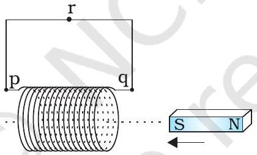
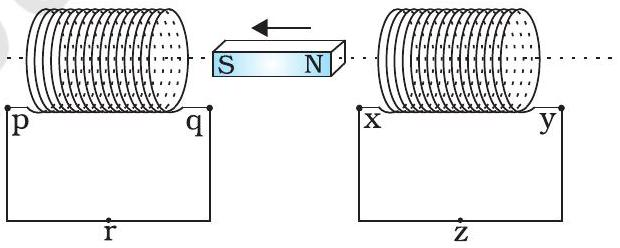
(a)
(a)
(b)
(b)
(b)
(दाब कुंजी तुरंत बंद करने के बाद स्थिति)
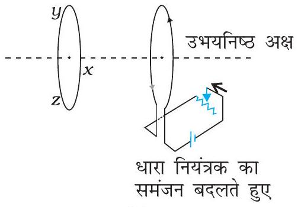
(c)
(d)
(d)
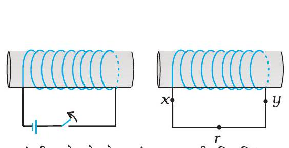
(e)
(f)

## वैद्युतचुंबकीय प्रेरण

$6.2$ चित्र $6.16$ में वर्णित स्थितियों के लिए लेंज के नियम का उपयोग करते हुए प्रेरित विद्युत धारा की दिशा ज्ञात कीजिए।
    (a) जब अनियमित आकार का तार वृत्ताकार लूप में बदल रहा हो;
    (b) जब एक वृत्ताकार लूप एक सीधे बारीक तार में विरूपित किया जा रहा हो।

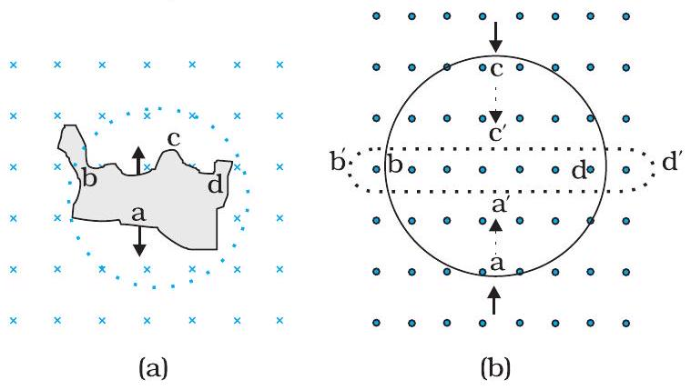
चित्र $6.16$

$6.3$ एक लंबी परिनालिका के इकाई सेंटीमीटर लंबाई में $15$ फेरे हैं। उसके अंदर $2.0 \mathrm{~cm}^{2}$ का एक छोटा-सा लूप परिनालिका की अक्ष के लंबवत रखा गया है। यदि परिनालिका में बहने वाली धारा का मान $2.0 \mathrm{~A}$ में $4.0 \mathrm{~A}$ से $0.1 \mathrm{~s}$ कर दिया जाए तो धारा परिवर्तन के समय प्रेरित विद्युत वाहक बल कितना होगा?
$6.4$ एक आयताकार लूप जिसकी भुजाएँ $8 \mathrm{~cm}$ एवं $2 \mathrm{~cm}$ हैं, एक स्थान पर थोड़ा कटा हुआ है। यह लूप अपने तल के अभिलंबवत $0.3 \mathrm{~T}$ के एकसमान चुंबकीय क्षेत्र से बाहर की ओर निकल रहा है। यदि लूप के बाहर निकलने का वेग $1 \mathrm{~cm} \mathrm{~s}^{-1}$ है तो कटे भाग के सिरों पर उत्पन्न विद्युत वाहक बल कितना होगा, जब लूप की गति अभिलंबवत हो (a) लूप की लंबी भुजा के (b) लूप की छोटी भुजा के। प्रत्येक स्थिति में उत्पन्न प्रेरित वोल्टता कितने समय तक टिकेगी?
$6.51 .0 \mathrm{~m}$ लंबी धातु की छड़ उसके एक सिरे से जाने वाले अभिलंबवत अक्ष के परितः $400 \mathrm{rad} \mathrm{s}^{-1}$ की कोणीय आवृत्ति से घूर्णन कर रही है। छड़ का दूसरा सिरा एक धात्विक वलय से संपर्कित है। अक्ष के अनुदिश सभी जगह $0.5 \mathrm{~T}$ का एकसमान चुंबकीय क्षेत्र उपस्थित है। वलय तथा अक्ष के बीच स्थापित विद्युत वाहक बल की गणना कीजिए।
$6.6$ पूर्व से पश्चिम दिशा में विस्तृत एक $10 \mathrm{~m}$ लंबा क्षैतिज सीधा तार $0.30 \times 10^{-4} \mathrm{~Wb} \mathrm{~m}^{-2}$ तीव्रता वाले पृथ्वी के चुंबकीय क्षेत्र के क्षैतिज घटक से लंबवत $5.0 \mathrm{~m} \mathrm{~s}^{-1}$ की चाल से गिर रहा है। (a) तार में प्रेरित विद्युत वाहक बल का तात्क्षणिक मान क्या होगा?
    (b) विद्युत वाहक बल की दिशा क्या है?
    (c) तार का कौन-सा सिरा उच्च विद्युत विभव पर है?
$6.7$ किसी परिपथ में $0.1$ s में धारा 5.0 A से 0.0 A तक गिरती है। यदि औसत प्रेरित विद्युत वाहक बल $200$ V है तो परिपथ में स्वप्रेरकत्व का आकलन कीजिए।
$6.8$ पास-पास रखे कुंडलियों के एक युग्म का अन्योन्य प्रेरकत्व $1.5 \mathrm{H}$ है। यदि एक कुंडली में $0.5 \mathrm{~s}$ में धारा $0$ से $20$ A परिवर्तित हो, तो दूसरी कुंडली की फ्लक्स बंधता में कितना परिवर्तन होगा?

[^0]:    * जब भी कुंडली या 'लूप' शब्द का उपयोग किया जाता है तो यह मान लिया जाता है कि वे चालक पदार्थों से बने हैं तथा इन्हें जिन तारों से बनाया गया है उन पर अवरोधक पदार्थों की परत चढ़ी है।

[^1]:    * नोट कीजिए कि विद्युत चुंबक के समीप रखे सुग्राही विद्युत यंत्र विद्युत चुंबक को ऑन (ON) या ऑफ़ (OFF) करने पर उत्पन्न होने वाली धाराओं के कारण क्षतिग्रस्त हो जाते हैं।

