## $6$ वैद्युत चुंबकीय प्रेरण   Electromagnetic Induction   अभ्यास प्रश्न

प्रश्न 1. चित्र (a) से (f) में वर्णित स्थितियों के लिए प्रेरित धारा की दिशा की प्रागुक्ति (predict) कीजिए।

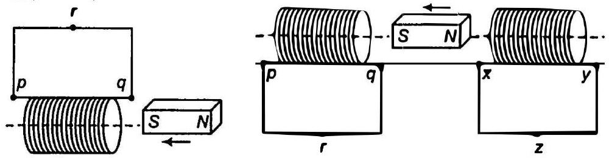
(b)

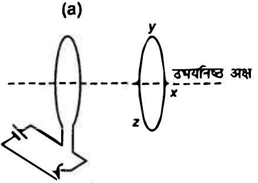
(c) दाब कुन्जी तुरन्त बन्द करने के वाद स्थिति

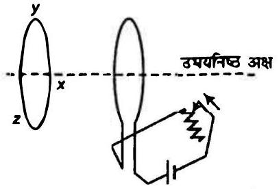
दाब कुन्जी खोलने के तुरन्त बाद की स्थिति (e) (f)

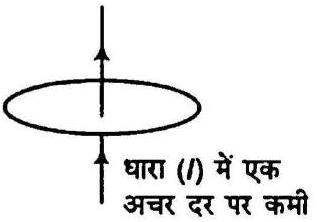
दाब कुन्जी खोलने के तुरन्त बाद की स्थिति (e) (f)

लेन्ज के नियमानुसार, प्रेरित धारा की दिशा सदैव उस कारण का विरोध करती है जिसके कारण वह स्वयं उत्पन्न होती है।

हल

(a) यहाँ दक्षिणी धुव कुण्डली की ओर गतिमान है अतः लेन्ज के नियमानुसार यह सिरा उतरी धुव बन जाता है (दक्षिणी ध्रुव की गति प्रतिकर्षण द्वारा रोकने हेतु) अतः धारा की दिशा ऊर्जा की सुईयों के अनुरूप है तथा घारा $p$ से $q$ की दिशा में है।
(b) कुण्डती $p q$ में $q$ सिरे पर $\rightarrow S$ धुव $q$ सिरे की ओर गतिमान है अतः यह दक्षिणी धुव की तरह कार्य करता है। धारा की दिशा वामावर्त है अर्थात् $p$ से $q$ की ओर दक्षिणी धुव दूर की ओर गतिमान है। अत: यह सिरा दक्षिणी धुव की मौंति कार्य करता है (गति का विरोघ करने हेतु) $x y$ कुण्डती में $S$ घुव प्रेरित होता है (लेन्ज के नियमानुसार) तथा धारा की दिशा $x$ से $y$ की ओर है।

(c) जब कुन्जी को बन्द किया जाता है, तब कुण्डली में धारा के मान में वृद्धि होती है अतः चुम्बकीय फ्लक्स और चुम्बकीय क्षेत्र भी बढ़ता है, मैक्सवेल के दाएँ हाथ के नियमानुसार चुम्बकीय क्षेत्र की दिशा दक्षिणावर्त है अतः समीपवर्ती कुण्डली में प्रेरित धारा की दिशा इस प्रकार होती है कि चुम्बकीय क्षेत्र को कम करने का प्रयास करती है तथा समीपवर्ती कुण्डली में धारा वामावर्त दिशा में होती है मैक्सवेल के दाएँ हाथ के नियमानुसार प्रेरित धारा की दिशा दक्षिणावर्ती है अर्थात $x y z$ तल में।
(d) रियोस्टेट समायोजन को परिवर्तित करने पर धारा भी परिवर्तित होती है। मैक्सवेल के वामावर्त नियमानुसार, चुम्बकीय क्षेत्र की दिशा बायीं ओर है बायीं ओर की कुण्डली में प्रेरित धारा की दिशा इस प्रकार है कि इसके द्वारा उत्पन्न चुम्बकीय क्षेत्र दायीं दिशा में है। अत: धारा की दिशा बायीं कुण्डली में घड़ी की सुईयों के विपरीत दिशा में है।
(e) जैसे ही कुन्जी को विमुक्त करते हैं, घड़ी की सुईंयों के विपरीत दिशा में बहने वाली धारा घटती है अत: प्रेरित धारा इस प्रकार उत्पन्न होती है कि बायीं ओर की कुण्डली के कारण उत्पन्न चुम्बकीय क्षेत्र बढ़ता है, अत: दायीं ओर की कुण्डली के कारण चुम्बकीय क्षेत्र दायीं दिशा में होना चाहिए तथा प्रेरित धारा घड़ी की सुईयों के विपरीत दिशा में।
(f) धारावाही तार के कारण चुम्बकीय बल रेखाएँ लूप के समतल में हैं अतः लूप में कोई प्रेरित धारा नहीं होगी (क्योंकि लूप में $\phi=0$ )

प्रश्न 2. चित्र में वर्णित स्थितियों के लिए, लेन्ज के नियम का उपयोग करते हुए प्रेरित विद्युत धारा की दिशा ज्ञात कीजिए।

(a) जब अनियमित आकार का तार वृताकार लूप में बदल रहा हो।
(b)जब एक वृत्ताकार लूप एक सीधे बारीक तार में विरूपित किया जा रहा हो।

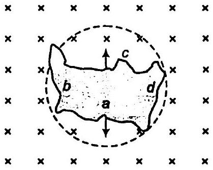
(a)

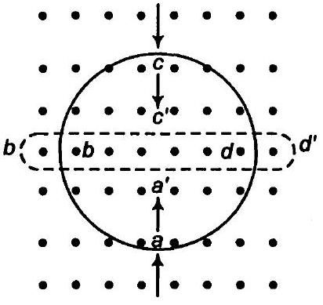
(b)

हल

(a) यहाँ पर चुम्बकीय क्षेत्र की दिशा समतल के लम्बवत अन्दर की ओर है यदि अनियमित आकृति का तार वृत्तीय आकृति में बदल जाता है तब इसका क्षेत्रफल बढ़ जाता है (क्योंकि वृत्तीय लूप का क्षेत्रफल अन्य आकृति से अधिक होता है) अत चुम्बकीय फलक्स भी बढ़ता है अब उत्पन्न प्रेरित धारा की दिशा इस प्रकार है कि वह चुम्बकीय क्षेत्र को कम करती है। अर्थात् धारा घड़ी की सूईयों के विपरीत दिशा में है।

(b) जब वृत्तीय लूप सीधे तार में विकृत होता है तब इससे समबद्ध चुम्बकीय क्षेत्र भी घटता है फ्लक्स परिवर्तन के कारण उत्पन्न प्रेरित धारा फ्लक्स परिवर्तन की कमी का विरोघ करती है। अत: यह प्रेरित धारा दक्षिणावर्त दिशा में प्रवाहित होगी अर्थात् a'd'c'b'a' के अनुदिश तथा उत्पन्न चुम्बकीय क्षेत्र समतल के बाहर की ओर होगा।

प्रश्न 3. एक लम्बी परिनालिका के इकाई सेन्टीमीटर लम्बाई में $15$ फेरें हैं। उसके अन्दर $2.0 \mathrm{~cm}^{2}$ का एक छोटा-सा लूप परिनालिका की अक्ष के लम्बवत् रखा गया है। यदि परिनालिका में बहने वाली धारा का मान 2.0 A में 4.0 A से 0.1 s कर दिया जाए तो धारा परिवर्तन के समय प्रेरित विद्युत वाहक बल कितना होगा?
हल दिया है, तार के फेरों की संख्या $n=15 / \mathrm{cm}=1500 \mathrm{~m}$
छोटे लूप का क्षेत्रफल $A=2 \mathrm{~cm}^{2}=2 \times 10^{-4} \mathrm{~m}^{2}$
धारा परिवर्तन $\frac{d l}{d t}=\frac{4-2}{0.1}=\frac{2}{0.1}=20 \mathrm{~A} / \mathrm{s}$
माना $e$ प्रेरित वि.वा. बल है।
फैराडे के नियमानुसार,

$$
e=\frac{d \phi}{d t}=\frac{d}{d t}(B A)
$$

अथवा

$$
e=A \frac{d B}{d t}=A \frac{d}{d t}\left(\mu_{0} n l\right)
$$

( ∵ परिनालिका के अन्दर चुम्बकीय क्षेत्र $B=\mu_{0} n l$ )
अथवा

$$
\begin{aligned}
& e=A \mu_{0} n \frac{d l}{d t} \\
& e=2 \times 10^{-4} \times 4 \times 3.14 \times 10^{-7} \times 1500 \times 20 \\
& \quad\left(\because \mu_{0}=4 \pi \times 10^{-7}\right) \\
& e=7.5 \times 10^{6} \mathrm{~V}
\end{aligned}
$$

अतः प्रेरित वि.वा. बल $7.5 \times 10^{6}$ है।
प्रश्न 4. एक आयताकार लूप जिसकी भुजाएँ $8 \mathrm{~cm}$ एवं $2 \mathrm{~cm}$ हैं, एक स्थान पर थोड़ा कटा हुआ है। यह लूप अपने तल के अभिलम्बवत $0.3 \mathrm{~T}$ के एकसमान चुम्बकीय क्षेत्र से बाहर की ओर निकल रहा है। यदि लूप के बाहर निकलने का वेग $1 \mathrm{~cm} \mathrm{~s}^{-1}$ है तो कटे भाग के सिरों पर उत्पन्न विद्युत वाहक बल कितना होगा, जल लूप की गति अभिलम्बवत हो (a) लूप की लम्बी भुजा के (b) लूप की छोटी भुजा के। प्रत्येक स्थिति में उत्पन्न प्रेरित वोल्टता कितने समय तक टिकेगी?

हल दिया है, लूप की लम्बाई $l=8 \mathrm{~cm}=8 \times 10^{-2} \mathrm{~m}$
लूप की चौड़ाई $b=2 \mathrm{~cm}=2 \times 10^{-2} \mathrm{~m}$
लूप का वेग $=1 \mathrm{~cm} / \mathrm{s}=0.01 \mathrm{~m} / \mathrm{s}$
चुम्बकीय क्षेत्र $B=0.3 \mathrm{~T}$
(a) जब वेग लम्बी भुजा के लम्बवत् है ( $l=8 \mathrm{~cm}=8 \times 10^{-2} \mathrm{~m}$ )
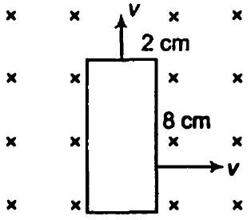
गतिमान वि.वा. बल की स्थिति में
$$
\begin{aligned}
& e=B l v=0.3 \times 8 \times 10^{-2} \times 0.01=2.4 \times 10^{-4} \mathrm{~V} \\
& \text { समय }=\frac{\text { दूरी } \_ \text {छोटी भुजा की लम्बाई }}{\text { वेग }} \text { केम } \\
& t=\frac{2 \times 10^{-2}}{0.01}=2 \mathrm{~s}
\end{aligned}
$$
(b) जव वेग छोटी मुजा के लम्बवत् है
$$
\left(l=2 \mathrm{~cm}=2 \times 10^{-2} \mathrm{~m}\right)
$$
इस अवस्था में उत्पन्न वि.वा. बल
$$
\begin{aligned}
e & =B l v=0.3 \times 2 \times 10^{-2} \times 0.01 \\
e & =0.6 \times 10^{-4} \mathrm{~V} \\
\text { समय } & =\frac{\text { लम्बी भुजा की लम्बाई }}{\text { वेग }}=\frac{8 \times 10^{-2}}{0.01} \\
t & =8 \mathrm{~s}
\end{aligned}
$$

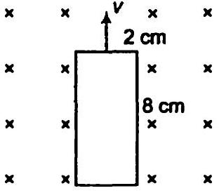
प्रश्न 5. $1.0$ मी लम्बी धातु की छड़ उसके एक सिरे से जाने वाले अभिलम्बवत् अक्ष के परितः $400 \mathrm{rad} / \mathrm{s}$ की कोणीय आवृति से घूर्णन कर रही है। छड़ का दूसरा सिरा एक धात्विक वलय से सम्पर्कित है। अक्ष के अनुदिश सभी जगह $0.5 \mathrm{~T}$ का एकसमान चुम्बकीय क्षेत्र उपस्थित है। वलय तथा अक्ष के बीच स्थापित विद्युत वाहक बल की गणना कीजिए।
हल छड़ की लम्बाई $l=1$ मी
छड़ का कोणीय वेग $\omega=400 \mathrm{rad} / \mathrm{s}$
चुम्बकीय क्षेत्र $B=0.5 T$
दृढ़ सिरे का रेखीय वेग $=0$
अन्य सिरे का रेखीय वेग $=l \omega \quad(\because v=r \omega)$

$$
v=\frac{0+l \omega}{2}=\frac{l \omega}{2}
$$

$$
e=B v l=\frac{B J \omega}{2} \cdot l
$$

[समीकरण (i) से]

$$
\begin{aligned}
& e=\frac{0.5 \times 1 \times 400 \times 1}{2} \\
& e=100 \mathrm{~V}
\end{aligned}
$$

अतः केन्द्र तथा वलय के बीच उत्पन्न वि.वा. बल $100 \mathrm{~V}$ है।
प्रश्न 6. एक वृताकार कुण्डली जिसकी त्रिज्या $8.0$ सेमी तथा फेरों की संख्या $20$ है अपने ऊर्ध्वाधर व्यास के परितः $50 \mathrm{rad} / \mathrm{s}$ की कोणीय आवृति से $3.0 \times 10^{-2} \mathrm{~T}$ के एकसमान चुम्बकीय क्षेत्र में घूम रही है। कुण्डली में ठत्पन्न अधिकतम तथा औसत प्रेरित विद्युत वाहक बल का मान ज्ञात कीजिए। यदि कुष्डली $10 \Omega$ प्रतिरोघ का एक बन्द लूप बनाए तो कुण्डली में धारा के अधिकतम मान की गणना कीजिए। जूल ऊष्मन के कारण क्षयित औसत शक्ति की गणना कीजिएा यह शक्ति कहाँ से प्राप्त होती है?
हल दिया है, कुण्डली की त्रिज्या $=8 \mathrm{~cm}=0.08 \mathrm{~m}$
तार के फेरों की संख्या = $20$
बन्द लूप का प्रतिरोध $=10 \Omega$
कोणीय वेग $\omega=50 \mathrm{rad} / \mathrm{s}$
चुम्बकीय क्षेत्र $B=3 \times 10^{-2} \mathrm{~T}$
कुण्डली में प्रेरित वि.वा. बल $e=N B A \omega \sin \omega t$
अधिकतम वि.वा. बल हेतु

$$
\sin \omega t=1
$$

∴ अधिकतम वि. वा. बल $e_{0}=N B A \omega=20 \times 3 \times 10^{-2} \times 3.14(0.08)^{2} \times 50$

$$
e_{0}=0.603 \mathrm{~V}
$$

कुण्डली में अधिकतम धारा $I_{0}=\frac{e_{0}}{R}=\frac{0.603}{10}=0.0603 \mathrm{~A}$
औसत प्रेरित वि.वा. बल

$$
\begin{aligned}
e & =\frac{1}{T} \int_{0}^{2 \pi} e d t=\frac{1}{T} \int_{0}^{2 \pi} N B A \omega \sin \omega t d t \\
e & =\frac{1}{T} \cdot N A B \omega\left[\frac{\cos \omega t}{\omega}\right]_{0}^{2 \pi} \\
& =\frac{N B A}{T}\left[\cos 2 \pi-\cos 0^{\circ}\right] \\
e & =\frac{N B A}{T}[1-1]=0
\end{aligned}
$$

सम्पूर्ण चक्र हेतु प्रेरित वि.वा. बल $e=0$
तापन के कारण औसत शक्ति क्षय

$$
=\frac{E_{0} I_{0}}{2}=\frac{0.603 \times 0.0603}{2}=0.018 \mathrm{~W}
$$

कुण्डली में ऊष्मा के रूप में व्यय शक्ति का बाह्य स्रोत बाहा रोटर है। कुण्डली में प्रेरित धारा कुण्डली पर बल आघूर्ण उत्पन्न करती है जो कुण्डली के घूर्णन का विरोध करता है अतः बाह्य रोटर इस स्थिति में शक्ति प्रदान करते हुए एकसमान घूर्णन को बनाये रखता है।

प्रश्न 7. पूर्व से पश्चिम दिशा में विस्तृत एक $10$ मी लम्बा क्षैतिज सीधा तार $a 30 \times 10^{-4} \mathrm{~Wb} / \mathrm{m}^{2}$ तीव्रता वाले पृथ्वी के चुम्बकीय क्षेत्र के क्षैतिज घटक से लम्बवत् $5.0 \mathrm{~m} / \mathrm{s}$ की चाल से गिर रहा है।

(a) तार में प्रेरित विद्युत वाहक बल का तात्क्षणिक मान क्या होगा?
(b) विद्युत वाहक बल की दिशा क्या है?
(c) तार का कौन-सा सिरा उच्च विद्युत विभव पर है?
हल दिया है, सीधे तार का वेग $=5 \mathrm{~m} / \mathrm{s}$
सीधे तार का चुम्बकीय क्षेत्र
$$
B=0.30 \times 10^{-4} \mathrm{~Wb} / \mathrm{m}^{2}
$$
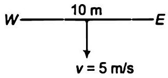
तार की लम्बाई
$$
l=10 \mathrm{~m}
$$
(a) तार में उत्पन्न प्रेरित वि.वा. बल $e=B I v \sin \theta$
यहाँ, $\theta=90^{\circ}$
$$
\therefore \quad \sin \theta=1
$$
(∵ तार पृथ्वी के चुम्बकीय क्षेत्र के क्षैतिज घटक के सापेक्ष अभिलम्बवत् दिशा में गिर रहा है)
$$
=0.3 \times 10^{-4} \times 10 \times 5=1.5 \times 10^{-3} \mathrm{~V}
$$
(b) फ्लेर्मिंग के दाएँ हाथ के नियमानुसार, यदि बल नीचे की ओर है तब प्रेरित वि. वा. बल की दिशा पश्चिम से पूर्व की ओर होगी।
(c) चूँकि प्रेरित वि.वा. बल या धारा की दिशा पश्चिम से पूर्व की ओर है, अतः पश्चिमी सिरा उच्चतम विभव पर है।
(घारा हमेशा उच्च विभव से निम्न विभव की ओर बहती है)

प्रश्न 8. किसी परिपथ में $0.1 \mathrm{~s}$ में धारा $5.0 \mathrm{~A}$ से $0.0 \mathrm{~A}$ तक गिरती है। यदि औसत प्रेरित विद्युत वाहक बल $200$ V है तो परिपथ में स्वप्रेरकत्व का आकलन कीजिए।
हल धारा में परिवर्तन $d l=5-0=5 \mathrm{~A}$
धारा परिवर्तन में लिया गया समय

$$
d t=0.1 \mathrm{~s}
$$

प्रेरित औसत वि.वा. बल

$$
e=200 \mathrm{~V}
$$

परिपथ में प्रेरित वि.वा. बल

$$
e=L \frac{d l}{d t}
$$

$$
200=L\left(\frac{5}{0.1}\right) \text { या } L=\frac{200}{50}=4 \mathrm{H}
$$

प्रश्न 9. पास-पास रखे कुण्डलियों के एक युग्म का अन्योन्य प्रेरकत्व $1.5 \mathrm{H}$ है। यदि एक कुण्डली में $0.5$ s में धारा $0$ से $20 \mathrm{~A}$ परिवर्तित हो, तो दूसरी कुण्डली की फलक्स, बन्यता में कितना परिवर्तन होगा?

हल दिया है, कुण्डली का प्रेरण गुणांक

$$
M=1.5 \mathrm{H}
$$

कुण्डली में धारा परिवर्तन $d l=20-0=20 \mathrm{~A}$
परिवर्तन में लिया गया समय $d t=0.5 \mathrm{~s}$
कुण्डली में प्रेरित वि.वा. बल $e=M \frac{d l}{d t}=\frac{d \phi}{d t}$
अथवा

$$
\begin{aligned}
d \phi & =M . d l \\
& =1.5 \times 20 \\
d \phi & =30 \mathrm{~Wb}
\end{aligned}
$$

अतः फलक्स परिवर्तन $30$ Wb है।
प्रश्न 10. एक जेट प्लेन पश्चिम की ओर $1800 \mathrm{~km} / \mathrm{h}$ वेग से गतिमान है। प्लेन के पंख $25 \mathrm{~m}$ लम्बे हैं। इनके सिरों पर कितना विभवान्तर उत्पन्न होगा? पृथ्वी के 'जुम्बकीय क्षेत्र का मान उस स्थान पर $5 \times 10^{-4} \mathrm{~T}$ तथा नति कोण (dip angle) $30^{\circ}$ है।
हल जेट यान का वेग $v=1800 \mathrm{~km} / \mathrm{h}=1800 \times \frac{5}{18}=500 \mathrm{~m} / \mathrm{s}$
$l=$ पंखों के बीच की दूरी $=25 \mathrm{~m}$
चुम्बकीय क्षेत्र $B=5 \times 10^{-4} \mathrm{~T}$
नति कोण $\boldsymbol{\delta}=\mathbf{3 0}^{\boldsymbol{\circ}}$
वि.वा. बल की गति का सूत्र प्रयुक्त करने पर

$$
\begin{aligned}
& e=B_{v} v l \\
& e=B \sin \delta v l
\end{aligned}
$$

(जहाँ, $B_{v}$ पृथ्वी के चुम्बकीय क्षेत्र का ऊर्ध्व घटक है $\therefore B_{v}=B \sin \delta$ )

$$
e=5 \times 10^{-4} \sin 30^{\circ} \times 500 \times 25=3.1 \mathrm{~V}
$$

अतः सिरों के बीच उत्पन्न विभवान्तर $3.1 \mathrm{~V}$ है।

## अतिरिक्त प्रश्न

प्रश्न 11. मान लीजिए कि प्रश्न $4$ में उल्लिखत लूप स्थिर है किन्तु चुम्बकीय क्षेत्र उत्पन्न करने वाले विद्युत चुम्बक में धारा का मान कम किया जाता है। जिससे चुम्बकीय क्षेत्र का मान अपने प्रारम्पिक मान $0.3 \mathrm{~T}$ से $0.02 \mathrm{~T} \mathrm{~s}^{-1}$ की दर से घटता है। अब यदि लूप का कटा भाग जोड़ दें जिससे प्राप्त बन्द लूप का प्रतिरोध $1.6 \Omega$ हो तो इस लूप में ऊष्पन के रूप में शक्ति ह्रास क्या है? इस शक्ति का स्रोत क्या है?
हल लूप का क्षेत्रफल $=8 \times 2=16 \mathrm{~cm}^{2}=16 \times 10^{-4} \mathrm{~m}^{2}$ (प्रश्न $4$ में)
चुम्बकीय फलक्स के परिवर्तन की दर $\frac{d B}{d t}=0.02 \mathrm{~T} / \mathrm{s}$
लूप का प्रतिरोध $R=1.6 \Omega$
प्रेरित वि.वा. बल $e=\frac{d \phi}{d t}=\frac{d}{d t}=\frac{d}{d t}(B A)$ $(\because \phi=B A)$

$$
\begin{aligned}
& e-\frac{A d B}{d t} \\
& e=16 \times 10^{-4} \times 0.02=0.32 \times 10^{-4} \mathrm{~V}
\end{aligned}
$$

लूप में प्रेरित धारा

$$
I=\frac{e}{R}=\frac{0.32 \times 10^{-4}}{1.6}=0.2 \times 10^{-4} \mathrm{~A}
$$

स्रोत की शक्ति (ऊष्मन के रूप में)

$$
\begin{aligned}
& P=I^{2} R=\left(0.2 \times 10^{-4}\right)^{2} \times 1.6=6.4 \times 10^{-10} \mathrm{~W} \\
& P=6.4 \times 10^{-10} \mathrm{~W}
\end{aligned}
$$

अत: फ्लक्स परिवर्तन की दर इस शक्ति का बाह्य स्रोत है।
प्रश्न $12.12 \mathrm{~cm}$ भुजा वाला वर्गाकार लूप जिसकी भुजाएँ $X$ एवं $Y$ अक्षों के समान्तर हैं, $x$-दिशा में $8 \mathrm{~cm} / \mathrm{s}$ की गति से चलाया जा रहा है। लूप तथा उसकी गति का परिवेश धनात्मक $z$-दिशा के चुम्बकीय क्षेत्र का है। चुम्बकीय क्षेत्र न तो एकसमान है और न ही समय के साथ नियत है। इस क्षेत्र की ऋणात्मक दिशा में प्रवणता $10^{-3} \mathrm{~T} / \mathrm{cm}$ है (अर्थात ऋणात्मक $x$-अक्ष की दिशा में इकाई सेन्टीमीटर दूरी पर क्षेत्र के मान में $10^{-3} \mathrm{~T} / \mathrm{cm}$ की वृद्धि होती है), तथा क्षेत्र के मान में $10^{-3} \mathrm{~T} / \mathrm{s}$ की दर से कमी भी हो रही है। यदि कुण्डली का प्रतिरोध $4.50 \mathrm{~m} \Omega$ हो तो प्रेरित धारा का परिमाण एवं दिशा ज्ञात कीजिए।
हल दिया है, लूप की भुजा $=12 \mathrm{~cm}$
∴ लूप का क्षेत्रफल $\quad A=a^{2}=(12)^{2}=144 \mathrm{~cm}^{2}=144 \times 10^{-4} \mathrm{~m}^{2}$
( $\therefore$ लूप का क्षेत्रफल = भुजा $^{2}$ )
वेग $v=8 \mathrm{~cm} / \mathrm{s}=8 \times 10^{-2} \mathrm{~m}$ (x-अक्ष)
दूरी के सापेक्ष चुम्बकीय क्षेत्र परिवर्तन की दर

$$
\frac{d B}{d x}=10^{-3} \mathrm{~T} / \mathrm{cm}
$$

(-x-अक्ष)
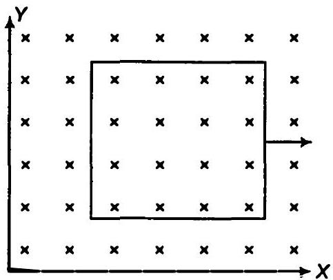
दूरी के सापेक्ष चुम्बकीय क्षेत्र परिवर्तन की दर

$$
\frac{d B}{d t}=10^{-3} \mathrm{~T} / \mathrm{s}
$$

लूप का प्रतिरोध $R=4.5 \mathrm{~m} \Omega=4.5 \times 10^{-3} \Omega$
समय के सापेक्ष फ्लक्स परिवर्तन की दर

$$
\begin{aligned}
\frac{d \phi}{d t} & =\frac{d(B A)}{d t}=\left(\frac{d B}{d t}\right)_{A} \\
& =10^{-3} \times 144 \times 10^{-4} \\
& =1.44 \times 10^{-5} \mathrm{~Wb} / \mathrm{s}
\end{aligned}
$$

$(\because \phi=B A)$
लूप की गति के कारण फ्लक्स परिवर्तन की दर

$$
\begin{aligned}
\frac{d \phi}{d t} & =\frac{d B}{d x} A \cdot \frac{d x}{d t}=10^{-3} \times 144 \times 10^{-4} \times 8 \quad\left(\because \frac{d x}{d t}=\frac{\text { वेग }}{}\right) \\
& =11.52 \times 10^{-5} \mathrm{~Wb} / \mathrm{s}
\end{aligned}
$$

दोनों प्रभाव $z$-अक्ष की घनात्मक दिशा में चुम्बकीय फ्लक्स को घटाते हैं।
लूप में कुल प्रेरित वि.वा. बल

$$
\begin{aligned}
& e=1.44 \times 10^{-5}+11.52 \times 10^{-5} \\
& e=12.96 \times 10^{-5} \mathrm{~V}
\end{aligned}
$$

लूप में प्रेरित धारा $=\frac{e}{R}=\frac{12.96 \times 10^{-5}}{4.5 \times 10^{-3}}=2.88 \times 10^{-2} \mathrm{~A}$
लूप में प्रेरित धारा की दिशा $+z$ है जो फ्लक्स के मान में वृद्धि करती है।
प्रश्न 13. एक शक्तिशाली लाउडस्पीकर के चुम्बक के घुर्वों के बीच चुम्बकीय क्षेत्र की तीव्रता के परिमाण का मापन किया जाना है। इस हेतु एक छोटी चपटी $2 \mathrm{~cm}^{2}$ क्षेत्रफल की अन्वेषी कुण्डली (search coil) का प्रयोग किया गया है। इस कुण्डली में पास-पास लिपटे $25$ फेरे हैं तथा इसे चुम्बकीय क्षेत्र के लम्बवत व्यवस्थित किया गया है और तब इसे द्वुत गति से क्षेत्र के बाहर निकाला जाता है। तुल्यत: एक अन्य विघि में अन्वेषी कुण्डली को $90^{\circ}$ से तेजी से घुमा देते हैं जिससे कुण्डली का तल चुम्बकीय क्षेत्र के समान्तर हो जाए। इन दोनों घटनाओं में कुल $7.5$ mC आवेश का प्रवाह होता है जिसे परिपथ में प्रक्षेप धारामापी (ballistic galvanometer] लगाकर ज्ञात किया जा सकता है। कुण्डली तथा धारामापी का संयुक्त प्रतिरोध $0.50 \Omega$ है। चुम्बक की क्षेत्र तीव्रता का आकलन कीजिए।

हल कुण्डली का क्षेत्रफल $A=2 \mathrm{~cm}^{2}=2 \times 10^{-4} \mathrm{~m}^{2}$
तार के फेरों की संख्या $N=25$
कुण्डली में कुल आवेश $Q=7.5 \mathrm{mC}=7.5 \times 10^{-3} \mathrm{C}$ $\left(1 \mathrm{mC}=10^{-3} \mathrm{C}\right)$
कुण्डली का प्रतिरोध $R=0.5 \Omega$
जब कुण्डली को चुम्बकीय क्षेत्र से हटा लिया जाता है तब $\phi_{l}=0$.
कुण्डली में प्रेरित धारा

$$
\begin{aligned}
I & =\frac{e}{R}=-\frac{N d \phi / d t}{R} \quad\left(\because e=-N \frac{d \phi}{d t}\right) \\
I d t & =-\frac{N}{R} \cdot d \phi
\end{aligned}
$$

कुण्डली में आवेश

$$
\begin{array}{ll}
Q=\int / d t=\int_{\phi_{i}}^{\phi_{i}}-\frac{N}{R} d \phi=-\frac{N}{R}\left(\phi_{i}-\phi_{i}\right) & \\
Q=\frac{N}{R}\left(\phi_{i}-\phi_{f}\right)=\frac{N}{R} \phi_{i} & \left(\because \phi_{f}=0\right) \\
Q=\frac{N}{R}(B A) & \left(\because \phi_{i}=B A\right)
\end{array}
$$

कुण्डली में चुम्बकीय क्षेत्र

$$
B=\frac{Q R}{N A}=\frac{7.5 \times 10^{-3} \times 0.5}{25 \times 2 \times 10^{-4}}=0.75 \mathrm{~T}
$$

अतः कुण्डली में चुम्बकीय क्षेत्र $0.75 \mathrm{~T}$ है।
प्रश्न 14. चित्र में एक धातु की छड़ $P Q$ को दर्शाया गया है जो पटरियों $A B$ पर रखी है तथा एक स्थायी चुम्बक के धुवों के मध्य स्थित हैं। पटरियाँ, छड़ एवं चुम्बकीय क्षेत्र परस्पर अभिलम्बवत् दिशाओं में है। एक गैल्वेनोमीटर (धारामापी) $G$ को पटरियों से एक स्विच $K$ की सहायता से संयोजित किया गया है। छड़ की लम्बाई $=15 \mathrm{~cm}, B=0.50 \mathrm{~T}$ तथा पटरियों, छड़ तथा घारामापी से बने बन्द लूप का प्रतिरोघ $=9.0 \mathrm{~m} \Omega$ है। क्षेत्र को एकसमान मान लें।
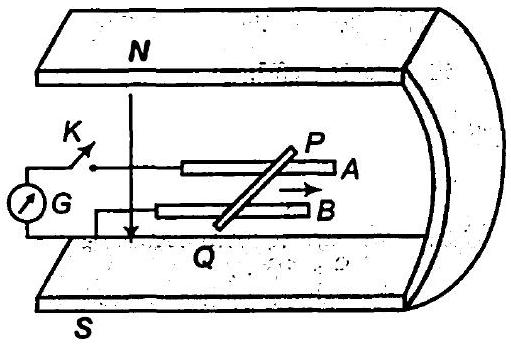

(a) माना कुन्जी $K$ खुली (open) है तथा छड़ $12 \mathrm{~cm} / \mathrm{s}$ की चाल से दर्शायी गई दिशा में गतिमान है। प्रेरित विद्युत वाहक बल का मान एवं ध्रुवणता (polarity) बताइए।

(b) क्या कुन्जी $K$ खुली होने पर छड़ के सिरों पर आवेश का आधिक्य हो जाएगा? क्या होगा यदि कुन्जी $K$ बन्द (close) कर दी जाए?
(c) जब कुन्जी $K$ खुली हो तथा छड़ एकसमान वेग से गति में हो तब भी इलेक्ट्रॉनों पर कोई परिणामी बल कार्य नहीं करता यद्यपि उन पर छड़ की गति के कारण चुम्बकीय बल कार्य करता है। कारण स्पष्ट कीजिए।
(d) कुन्जी बन्द होने की स्थिति में छड़ पर लगने वाले अवमंदन बल का मान क्या होगा?
(e) इस बन्द लूप में ऊष्मा के रूप में कितनी शक्ति उत्पन्न होगी? इस शक्ति का स्रोत क्या है?
(f) किसी गतिशील छड़ में प्रेरित विद्युत वाहक बल क्या होगा यदि चुम्बकीय क्षेत्र पटरियों के लम्बवत् होने के बजाय समान्तर हो?

हल दिया है, छड़ की लम्बाई $l=15 \mathrm{~cm}=15 \times 10^{-2} \mathrm{~m}$
चुम्बकीय क्षेत्र $B=0.50 \mathrm{~T}$,
छड़ के साथ बन्द लूप का प्रतिरोध

$$
R=9 \mathrm{~m} \Omega=9 \times 10^{-3} \Omega
$$

छड़ का वेग $v=12 \mathrm{~cm} / \mathrm{s}=12 \times 10^{-2} \mathrm{~m} / \mathrm{s}$

(a) गतिमान प्रेरित वि.वा. बल
$$
\begin{aligned}
& e=B v l=0.50 \times 12 \times 10^{-2} \times 15 \times 10^{-2} \\
& e=9 \times 10^{-3} \mathrm{~V}
\end{aligned}
$$
फ्लेमिंग के बाएँ हाथ के नियमानुसार, लॉरेन्ज बल की दिशा $[=-e(\times)]$ बिन्दु $P$ से $Q$ की ओर है अतः $P$ धनात्मक आवेशित होगा तथा $Q$ ॠणात्मक आवेशित होगा।
(b) हाँ, जैसे ही कुन्जी खोली जाती है $P$ पर धनावेश तथा $Q$ पर उतना ही ऋणावेश उत्पन्न हो जाता है। जब कुन्जी बन्द की जाती है प्रेरित धारा उत्पन्न होती है तथा आवेश को अधिकतम बनाये रखती है।
(c) जब कुन्जी खोली जाती है तब इलेक्ट्रॉन पर कोई नैट बल नहीं लगता है क्योंकि $P$ व $Q$ पर उत्पन्न आवेश वैद्युत क्षेत्र उत्पन्न करता है जिससे चुम्बकीय बल वैद्युत बल द्वारा सन्तुलित होता है अत: नैट बल शून्य होता है।
(d) जब कुन्जी बन्द की जाती है, वलय में धारा बहती है तथा तार में अवमदंक बल लगता है (चुम्बकीय क्षेत्र में)
$$
\text { बल }=B I l=B \cdot \frac{e}{R} l=\frac{0.5 \times 9 \times 10^{-3} \times 15 \times 10^{-2}}{9 \times 10^{-3}}=7.5 \times 10^{-2} \mathrm{~N}
$$
(e) छड़ को समान गति से गतिमान बनाये रखने हेतु आवश्यक शक्ति
$$
\begin{aligned}
& =\text { अवमंदित बल } \times \text { वेग } \\
& =7.5 \times 10^{-2} \times 12 \times 10^{-2} \\
& =9 \times 10^{-3} \mathrm{~W}
\end{aligned}
$$

(f) अल्पघारा के कारण परिपथ में व्यय शक्ति
$$
\begin{aligned}
& =I^{2} R=\left(\frac{\mathrm{e}}{R}\right)^{2} \times R=\frac{\mathrm{e}^{2}}{R}=\frac{\left(9 \times 10^{-3}\right)^{2}}{9 \times 10^{-3}} . \\
& =9 \times 10^{-3} \mathrm{~W}
\end{aligned}
$$
इस शक्ति का स्रोत बाहय वाहक है।
(g) जब क्षेत्र रेल की लम्बाई के समान्तर है $\theta=0$ तब प्रेरित वि.वा. बल $e=B v / \sin \theta$ इस प्रश्न में गतिमान छड़ बल रेखाओं को नहीं काटेगी। अत: फ्लक्स परिवर्तन शून्य है तथा प्रेरित वि.वा. बल भी शून्य है।

प्रश्न 15. वायु-कोरड परिनालिका की लम्बाई $30 \mathrm{~cm}$ है तथा परिच्छेद का क्षेत्रफल $25 \mathrm{~cm}^{2}$ है। परिनालिका में तार के फेरों की संख्या $500$ है तथा धारा $2.5 \mathrm{~A}$ है। धारा अल्प समय $10^{-3} \mathrm{~s}$ के लिए बन्द कर दी जाती है।
तब निकाय में कितना विपरीत प्रेरित वि.वा. बल उत्पन्न होगा यदि परिनालिका के सिरों पर चुम्बकीय क्षेत्र के परिवर्तन को नगण्य मानते हुए।
हल दिया है, परिनालिका की लम्बाई $l=30 \mathrm{~cm}=30 \times 10^{-2} \mathrm{~m}$
परिच्छेद का क्षेत्रफल $A=25 \mathrm{~cm}^{2}=25 \times 10^{-4} \mathrm{~m}^{2}$
तार के फेरों की संख्या $N=500$

$$
\begin{array}{r}
\text { धारा } l_{1}=2.5 \mathrm{~A}, l_{2}=0 \\
\text { समयान्तराल } d t=10^{-3} \mathrm{~s}
\end{array}
$$

परिनालिका के अन्दर प्रेरित वि.वा. बल

$$
e=\frac{d \phi}{d t}=\frac{d}{d t}(B A) \quad(\because \phi=B A)
$$

$1$ धारा वाली परिनालिका के अन्दर किसी बिन्दु पर चुम्बकीय क्षेत्र

$$
\begin{aligned}
& B=\mu_{0} n l \quad \text { (जहाँ } n=\text { एकांक लम्बाई में तार के फेरों की संख्या }=\frac{N}{l} \text { ) } \\
& e=N A \frac{d B}{d t}=A \frac{d}{d t}\left(\mu_{0} \frac{N}{l} l\right)=A \frac{\mu_{0} N}{l} \cdot \frac{d l}{d t} \\
& e=500 \times 25 \times 10^{-4} \times 4 \times 3.14 \times 10^{-7} \times \frac{500}{30 \times 10^{-2}} \times \frac{2.5}{10^{-3}} \\
& e=6.5 \mathrm{~V}
\end{aligned}
$$

प्रश्न 16. (a) चित्रानुसार तार तथा $a$ भुजा के वर्ग के बीच अन्योन्य प्रेरण गुणांक का सम्बन्य ज्ञात करो?
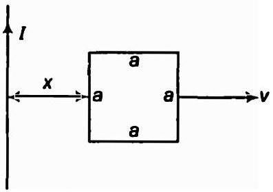
    (b) माना सीधे तार में $50 \mathrm{~A}$ धारा है तथा लूप दाई ओर $v=10 \mathrm{~m} / \mathrm{s}$ के वेग से गतिमान है $x=0.2 \mathrm{~m}$ पर लूप में प्रेरित वि.वा. बल ज्ञात करो?
$a=0.1 \mathrm{~m}$ लें तथा यह मानते हुए कि लूप का प्रतिरोध बहुत अधिक है।
सर्वप्रथम निकाय के अल्प भाग को लेते हैं तत्पश्चात् चुम्बकीय फ्लक्स ज्ञात करने हेतु समाकलन करते हैं।

हल

(a) माना $i$ धारा के तार से $x$ दूरी पर $d x$ मोटाई की अल्प पट्टी है वर्ग की भुजा $a$ है तार से $x$ दूरी पर चुम्बकीय क्षेत्र
$$
B=\frac{\mu_{0}}{4 \pi} \cdot \frac{2 l}{x}
$$
(अनन्त लम्बाई के धारावाही तार के चुम्बकीय क्षेत्र का सूत्र प्रयुक्त करने पर $B=\frac{\mu_{0}}{4 \pi} \cdot \frac{2 l}{x}$ )

अल्प पट्टी से होकर गुजरने वाला चुम्बकीय फ्लक्स

$$
d \phi=B \cdot d A=\frac{\mu_{0}}{4 \pi} \cdot \frac{21}{x} \cdot a d x
$$

$[\because d A=$ पट्टी का क्षेत्रफल $=a d x$ समी (i) से $]$

$$
d \phi=\frac{\mu_{0}}{4 \pi} \cdot \frac{l a}{x} \cdot d x
$$

दी गई सीमाओं के अन्दर समाकलन करने पर

$$
\begin{aligned}
& \phi=\frac{\mu_{0}}{4 \pi} \cdot l a \int_{x}^{(x+a)} \frac{1}{x} d x=\frac{\mu_{0}}{4 \pi} \cdot l a[\ln x]_{x}^{x+a} \\
& \phi=\frac{\mu_{0}}{4 \pi} \cdot l a[\ln (x+a)-\ln (x)]=\frac{\mu_{0} / a}{2 \pi} \ln \left(\frac{x+a}{x}\right) \\
& \phi=\frac{\mu_{0} / a}{2 \pi} \ln \left(\frac{a}{x}+1\right)
\end{aligned}
$$

हम जानते हैं कि

$$
\phi=M I
$$

जहाँ, $M$ अन्योन्य प्रेरण गुणांक है।

समी (ii) तथा (iii) से

$$
\begin{aligned}
& M I=\frac{\mu_{0} l a}{2 \pi} \ln \left(\frac{a}{x}+1\right) \\
& M=\frac{\mu_{0} a}{2 \pi} \log _{e}\left(\frac{a}{x}+1\right)
\end{aligned}
$$

अत: यह तार तथा वर्गाकार लूप के मध्य अन्योन्य प्रेरण का सम्बन्ध है।
(b) दिया है, धारा/ $=50 \mathrm{~A}$
वेग

$$
v=10 \mathrm{~m} / \mathrm{s}
$$

प्रेरित वि.वा. बल

$$
\begin{aligned}
x & =0.2 \mathrm{~m} \text { और } a=0.1 \mathrm{~m} \\
e & =-\frac{d \phi}{d t}=-\frac{d}{d t}\left[\frac{\mu_{0} a}{2 \pi} \log _{e}\left(\frac{a+x}{x}\right)\right] \\
& =-\frac{\mu_{0} a l}{2 \pi} \frac{d}{d t}[\log (x+a)-\log x] \\
& =-\frac{\mu_{0} a l}{2 \pi}\left[\frac{1}{(x+a)} \frac{d}{d t}(x+a)-\frac{1}{x} \frac{d}{d t}(x)\right] \\
& =-\frac{\mu_{0} a l}{2 \pi}\left[\frac{1}{(x+a)} \frac{d x}{d t}-\frac{1 d x}{x d t}\right] \quad\left[\because \frac{d x}{d t}=v\right] \\
& =-\frac{\mu_{0} a l}{2 \pi}\left[\frac{v}{(x+a)}-\frac{v}{x}\right] \\
e & =\frac{\mu_{0}}{2 \pi} \cdot \frac{a^{2} / v}{x(a+x)} \\
e & =\frac{4 \pi \times 10^{-7}}{2 \pi} \times \frac{(0.1)^{2} \times(50) \times(10)}{02 \times(0.1+0.2)} \\
& =\frac{2 \times 10^{-7} \times 50 \times 10^{-2} \times 10}{0.2 \times 0.3} \\
& =1.67 \times 10^{-5} \mathrm{~V}
\end{aligned}
$$

प्रश्न 17. $M$ द्रव्यमान तथा $R$ त्रिज्या के रिम में रेखीय आवेश $\lambda$ एकसमान रूप से वितरित है लूप में हल्की अचालकीय छड़े है तथा अक्षों के अनुरूप स्वतन्त्र रूप से घूर्णन कर सकती है (घषर्णरहित) वृताकार क्षेत्र में एक एंकसमान चुम्बकीय क्षेत्र वितरित है। जहाँ

$$
\begin{aligned}
B & =-B_{0} \mathbf{k}[r \leq a, a<R] \\
& =0 \text { (अथवा) }
\end{aligned}
$$

चुम्बकीय क्षेत्र अचानक हटाने पर रिम का कोणीय वेग ज्ञात करो?
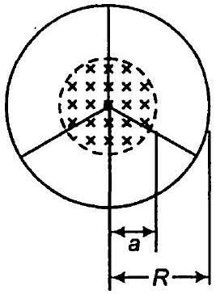

हल दिया है, रेखीय आवेश घनत्व $\lambda=\frac{\text { कुल आवेश }}{\text { लम्बाई }}=\frac{Q}{2 \pi R}$

$$
\begin{aligned}
& \text { रिम की त्रिज्या }=R \\
& \text { रिम का द्रव्यमान }=m
\end{aligned}
$$

वृत्तीय क्षेत्र के बाहर चुम्बकीय क्षेत्र

$$
\begin{aligned}
=-B_{0}{ }^{\wedge} & (r \leq a, a<R) \\
& =0 \quad \text { (अन्यथा) }
\end{aligned}
$$

माना व्हील का कोणीय वेग $\omega$ है तब
प्रेरित वि.वा. बल

$$
e=-\frac{d \phi}{d t}
$$

अत: वैद्युत क्षेत्र तथा वैद्युत फ्लक्स परिवर्तन की दर के मध्य सम्बन्ध

$$
e=-\int \cdot d l=-\frac{d \phi}{d t}
$$

चुम्बकीय फ्लक्स में परिवर्तन के कारण $E_{1}$ त्रिज्या की परिधि के अनुदिश अवस्थित है।

$$
\begin{aligned}
e \int d l & =-\frac{d}{d t}\left(\pi a^{2} B\right) \\
E \times 2 \pi a & =-\pi a^{2} \frac{d B}{d t} \\
E & =-\frac{a}{2} \frac{d B}{d t}
\end{aligned}
$$

आवेश पर बल $F=Q E=(2 \pi a \times \lambda)\left(-\frac{a}{2} \frac{d B}{d t}\right)=-\pi a^{2} \lambda \frac{d B}{d t}$
किन्तु बल

$$
(F)=\frac{d \rho}{d t}=\frac{d(m v)}{d t}=m \frac{d v}{d t}
$$

$$
\begin{aligned}
\therefore \quad \frac{d v}{d t} & =-\pi a^{2} \lambda \frac{d B}{d t} \\
m R(d \omega) & =-\pi a^{2} \lambda \frac{d B}{d t} \quad(\because v=R \omega) \\
d \omega & =-\frac{\pi a^{2} \lambda}{m R} d B
\end{aligned}
$$

दोनों ओर समाकलन करने पर

$$
\omega=-\frac{\pi a^{2} \lambda B}{m R}
$$

चूँकि कोणीय वेग की दिशा अक्षों के अनुदिश है

$$
\omega=-\frac{\lambda a^{2} \pi}{m R} B v
$$

