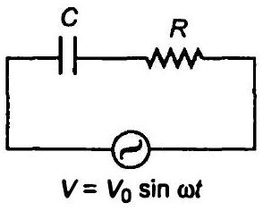
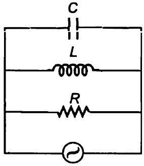
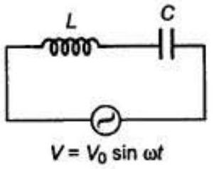

## $7$ प्रत्यावर्ती धारा   Alternating Current   अभ्यास प्रश्न

प्रश्न 1. एक $100 \Omega$ का प्रतिरोधक $220 \mathrm{~V}, 50 \mathrm{~Hz}$ आपूर्ति से संयोजित है।

(a) परिपथ में धारा का rms मान कितना है?
(b) एक पूरे चक्र में कितनी नेट शक्ति व्यय होती है?

हल प्रतिरोध $R=100 \Omega$

$$
V_{\mathrm{ms}}=220 \mathrm{~V}
$$

जब कभी सप्लाई दी होती है, इसका अर्थ है कि वह वर्ग माध्य मूल मान है।

$$
\text { आवृत्ति }(f)=50 \mathrm{~Hz}
$$

(a) परिपथ में धारा
$$
l_{\mathrm{rms}}=\frac{V_{\mathrm{ms}}}{R}=\frac{220}{100}=2.2 \mathrm{~A}
$$
(b) पूर्ण चक्र में शक्ति व्यय
$$
\begin{aligned}
P & =V_{\mathrm{rms}} \times l_{\mathrm{rms}} \\
& =220 \times 2.2=484 \mathrm{~W}
\end{aligned}
$$

प्रश्न 2. (a) $A C$ आपूर्ति का शिखर मान $300 \mathrm{~V}$ है। rms वोल्टता कितनी है?

(b) AC परिपथ में धारा का rms मान $10$ A है। शिखर धारा कितनी है?

हल दिया है.

(a) वोल्टेज का उच्चतम मान $V_{0}=300 \mathrm{~V}$
धारा का वर्ग माध्य मूल मान $I_{\mathrm{ms}}=10 \mathrm{~A}$
वोल्टेज का वर्ग माध्य मूल मान $V_{\mathrm{rms}}=\frac{V_{0}}{\sqrt{2}}=\frac{300}{\sqrt{2}}=212.1 \mathrm{~V}$
(b) सूत्र $l_{\mathrm{ms}}=\frac{l_{0}}{\sqrt{2}}$ प्रयुक्त करने पर
धारा का उच्चतम मान $l_{0}=\sqrt{2} l_{\text {mrs }}=\sqrt{2} \times 10=14.14 \mathrm{~A}$

प्रश्न 3. एक $44 \mathrm{mH}$ का प्रेरक $220 \mathrm{~V}, 50 \mathrm{~Hz}$ आपूर्ति से जोड़ा गया है। परिपथ में धारा के rms मान को ज्ञात कीजिए।
हल दिया है, प्रेरकत्व $L=44 \mathrm{mH}=44 \times 10^{-3} \mathrm{H}$

$$
V_{\mathrm{rms}}=220 \mathrm{~V}
$$

प्रेरक की आवृत्ति $f=50 \mathrm{~Hz}$
प्रेरणिक प्रतिघात $X_{L}=2 \pi f L$

$$
\begin{aligned}
& =2 \times 3.14 \times 50 \times 44 \times 10^{-3} \\
& =13.83 \Omega
\end{aligned}
$$

परिपथ में धारा का rms मान

$$
l_{\mathrm{rms}}=\frac{V_{\mathrm{rms}}}{X_{L}}=\frac{220}{13.83}=15.9 \mathrm{~A}
$$

प्रश्न 4. एक $60 \mu \mathrm{~F}$ का संधारित्र $110 \mathrm{~V}, 60 \mathrm{~Hz} \mathrm{AC}$ आपूर्ति से जोड़ा गया है। परिपथ में धारा के rms मान को ज्ञात कीजिए।
हल दिया है, संधारित्र की धारिता $C=60 \mu \mathrm{~F}=60 \times 10^{-6} \mathrm{~F}$

$$
V_{\mathrm{rms}}=110 \mathrm{~V}
$$

AC परिपथ की आवृत्ति $f=60 \mathrm{~Hz}$
धारितीय प्रतिघात $X_{C}=\frac{1}{2 \pi f C}=\frac{1}{2 \times 3.14 \times 60 \times 60 \times 10^{-6}}$

$$
=44.23 \Omega
$$

परिपथ में धारा का वर्ग माघ्य मूल मान

$$
\begin{aligned}
I_{\mathrm{ms}} & =\frac{V_{\mathrm{rms}}}{X_{c}} \\
& =\frac{110}{44.23}=2.49 \mathrm{~A}
\end{aligned}
$$

प्रश्न 5. प्रश्न $3$ व $4$ में एक पूरे चक्र की अवधि में प्रत्येक परिपथ में कितनी नेट शक्ति अवशोषित होती है? अपने उत्तर का विवरण दीजिए।
हल प्रश्न $3$ में औसत शक्ति $P=V_{\mathrm{rms}} I_{\mathrm{rms}} \cos \phi$
हम जानते हैं कि धारा तथा वोल्टेज के बीच कलान्तर $90^{\circ}$ है।

$$
P=V_{\mathrm{rms}} I_{\mathrm{rms}} \cos 90^{\circ}=0
$$

प्रश्न $4$ में औसत शक्ति $P=V_{\mathrm{ms}} \cdot I_{\mathrm{ms}} \cos \phi$
हम जानते हैं कि धारा तथा वोल्टेज के बीच कलान्तर $90^{\circ}$ है।

$$
P=V_{\mathrm{rms}} I_{\mathrm{rms}} \cos 90^{\circ}=0
$$

प्रश्न 6. एक $L-C-R$ परिपथ की, जिसमें $L=2.0 \mathrm{H}, C=32 \mu \mathrm{~F}$ तथा $R=10 \Omega$ अनुनाद आवृति $\omega_{r}$ परिकलित कीजिए। इस परिपथ के लिए $Q$ का क्या मान है?
हल दिया है,

$$
L=2 \mathrm{H}, C=32 \mu \mathrm{~F}, R=10 \Omega
$$

अनुनादीय कोणीय आवृत्ति

$$
\omega_{r}=\frac{1}{\sqrt{L C}}=\frac{1}{\sqrt{2 \times 32 \times 10^{-6}}}=125 \mathrm{rad} / \mathrm{s}
$$

इस परिपथ का गुणता कारक

$$
Q=\frac{1}{R} \sqrt{\frac{L}{C}}=\frac{1}{10} \sqrt{\frac{2}{32 \times 10^{-5}}}=\frac{10^{3}}{40}=25
$$

प्रश्न 7. $30 \mu \mathrm{~F}$ का एक आवेशित संधारित्र $27 \mathrm{mH}$ के प्रेरक से जोड़ा गया है। परिपथ के मुक्त दोलनों की कोणीय आवृति कितनी है?
हल संधारित्र की धारिता $\mathrm{C}=30 \mu \mathrm{~F}=30 \times 10^{-6} \mathrm{~F}$
प्रेरकत्व $L=27 \mathrm{mH}=27 \times 10^{-3} \mathrm{H}$
स्वतन्त्र दोलन हेतु कोणीय आवृति

$$
\begin{aligned}
\omega_{r} & =\frac{1}{\sqrt{L C}} \\
& =\frac{1}{\sqrt{27 \times 10^{-3} \times 30 \times 10^{-6}}}=\frac{10^{4}}{9} \\
& =1.1 \times 10^{3} \mathrm{rad} / \mathrm{s}
\end{aligned}
$$

प्रश्न 8. कल्पना कीजिए कि प्रश्न $7$ में संधारित्र पर प्रारम्पिक आवेश $6 \mathrm{mC}$ है। प्रारम्भ में परिपथ में कुल कितनी ऊर्जा संचित होती है? बाद में कुल ऊर्जा कितनी होगी?
हल दिया है, संधारित्र का आवेश

$$
\begin{aligned}
Q & =6 \mathrm{mC}=6 \times 10^{-3} \mathrm{C} \\
C & =30 \mu \mathrm{~F} \\
& =30 \times 10^{-6} \mathrm{~F}
\end{aligned}
$$

(मश्न $7$ से)
परिपथ में संचित ऊर्जा

$$
\begin{aligned}
E & =\frac{Q^{2}}{2 C}=\frac{\left(6 \times 10^{-3}\right)^{2}}{2 \times 30 \times 10^{-2}} \\
& =\frac{36}{60}=0.6 \mathrm{~J}
\end{aligned}
$$

कुछ समय पश्चात् ऊर्जा $C$ तथा $L$ के मध्य वितरित होती है तथा कुल ऊर्जा नियत रहती है अतः हम कह सकते हैं कि ऊर्जा का क्षय नहीं होता है।

प्रश्न 9. एक श्रेणीवद्ध $L-C-R$ परिपथ को, जिसमें $R=20 \Omega, L=1.5 \mathrm{H}$ तथा $C=35 \mu \mathrm{~F}$, एक परिवर्ती आवृति की $200 \mathrm{~V} \mathrm{AC}$ आपूर्ति से जोड़ा गया है। जब आपूर्ति की आवृति परिपथ की मूल आवृति के बराबर होती है तो एक पूरे चक्र में परिपथ को स्थानान्तरित की गई माध्य शक्ति कितनी होगी?
हल दिया है, प्रतिरोध $R=20 \Omega$, प्रेरकत्व $L=1.5 \mathrm{H}$, धारिता $C=35 \mu \mathrm{~F}=35 \times 10^{-6} \mathrm{~F}$ तथा वोल्टेज $V_{\mathrm{ms}}=200 \mathrm{~V}$
जब परिपथ की आवृति आरोपित वोल्टेज की आवृत्ति के बराबर है तब यह अवस्था अनुनाद की अवस्था कहलाती है।
प्रतिबाधा $Z=R=20 \Omega$
परिपथ में धारा का rms मान

$$
\begin{aligned}
l_{\mathrm{ms}}=\frac{V_{\mathrm{rms}}}{Z} & =\frac{200}{20}=10 \mathrm{~A} \\
\phi & =0^{\circ}
\end{aligned}
$$

(अनुनाद हेतु)
एक चक्र में परिपथ में स्थानान्तरित शक्ति

$$
\begin{aligned}
P=I_{\mathrm{ms}} \cdot V_{\mathrm{ms}} \cos \phi & =10 \times 200 \times \cos 0^{\circ}=2000 \mathrm{~W} \\
& =2 \mathrm{~kW}
\end{aligned}
$$

प्रश्न 10. एक रेडियो को MW प्रसारण बैण्ड के एक खण्ड के आवृति परास के एक ओर से दूसरी ओर (800 kHz से $1200$ kHz) तक समस्वरित किया जा सकता है। यदि इसके L-C परिपथ का प्रभावकारी प्रेरकत्व $200 \mu \mathrm{H}$ हो, तो उसके परिवर्ती संधारित्र की परास कितनी होनी चाहिए?
[संकेत समस्वरित करने के लिए मूल आवृति अर्थात् L-C परिपथ के मुक्त दोलनों की आवृति रेडियों तरंग की आवृति के समान होनी चाहिए)
हल दिया है, न्यूनतम आवृत्ति $f_{1}=800 \mathrm{kHz}=8 \times 10^{5} \mathrm{~Hz}$

$$
\text { प्रेरकत्व } L=200 \mu \mathrm{H}=200 \times 10^{-6} \mathrm{H}=2 \times 10^{-4} \mathrm{H}
$$

अधिकतम आवृत्ति $f_{2}=1200 \mathrm{kHz}=12 \times 10^{5} \mathrm{~Hz}$
आरोपित वोल्टेज की आवृत्ति तथा परिपथ की आवृत्ति बराबर होने पर अनुनाद की अवस्था होती है।
दोलनों की आवृति $f=\frac{1}{2 \pi \sqrt{L C}}$
धारिता $C_{1}$ के लिए $f_{1}=\frac{1}{2 \pi \sqrt{L C_{4}}}$

$$
\begin{aligned}
C_{1}=\frac{1}{4 \pi^{2} f_{1}^{2} L} & =\frac{1}{4 \times 3.14 \times 3.14 \times\left(8 \times 10^{5}\right)^{2} \times 2 \times 10^{-4}} \\
& =197.7 \times 10^{-12} \mathrm{~F} \\
& =197.7 \mathrm{pF}
\end{aligned}
$$

धारिता $C_{2}$ हेतु, $f_{2}=\frac{1}{2 \pi \sqrt{L C_{2}}}$

$$
\begin{aligned}
C_{2} & =\frac{1}{4 \pi^{2} f_{2}^{2} L}=\frac{1}{4 \times 3.14 \times 3.14 \times\left(12 \times 10^{5}\right)^{2} \times 2 \times 10^{-4}} \\
& =87.8 \times 10^{-12} \mathrm{~F} \\
& =87.8 \mathrm{pF}
\end{aligned}
$$

अतः संधारित्र का धारिता परिसर $87.8$ pF से $197.7$ pF है।
प्रश्न 11. चित्र में एक श्रेणीबद्ध L-C-R परिपथ दिखलाया गया है जिसे परिवर्ती आवृत्ति के $230 \mathrm{~V}$ के स्रोत से जोड़ा गया है।

$$
L=5.0 \mathrm{H}, C=80 \mu \mathrm{~F}, R=40 \Omega .
$$

(a) स्रोत की आवृति निकालिए जो परिपथ में अनुनाद उत्पन्न करे।
(b) परिपथ की प्रतिबाघा तथा अनुनादी आवृत्ति पर धारा का आयाम निकालिए।
(c) परिपथ के तीनों अवयवों के सिरों पर विभवपात के rms मानों को निकालिए। दिखलाइए कि अनुनादी आवृति पर L-C संयोग के सिरों पर विभवपात शून्य है।
हल दिया है, वोल्टेज का rms मान $V_{\mathrm{ms}}=230 \mathrm{~V}$
$$
\text { प्रेरकत्व } L=5 \mathrm{H}
$$

$$
\text { धारिता } C=80 \mu \mathrm{~F}=80 \times 10^{-6} \mathrm{~F}
$$
प्रतिरोध $R=40 \Omega$
(a) परिपथ की अनुनाद आवृत्ति
$$
\omega_{r}=\frac{1}{\sqrt{L C}}=\frac{1}{\sqrt{5 \times 80 \times 10^{-6}}}=50 \mathrm{rad} / \mathrm{s}
$$
अनुनाद में स्रोत की आवृत्ति
$$
\begin{aligned}
v_{0}=\frac{\omega_{0}}{2 \pi} & =\frac{50}{2 \times 3.14} \\
& =7.76 \mathrm{~Hz}
\end{aligned}
$$
(b) अनुनादीय अवस्था में, $X_{L}=X_{C}$
परिपथ की प्रतिबाधा $Z=R$
$$
\therefore \quad \text { प्रतिबाघा } Z=40 \Omega
$$
परिपथ में धारा का rms मान
$$
l_{\mathrm{ms}}=\frac{V_{\mathrm{rms}}}{Z}=\frac{230}{40}=5.75 \mathrm{~A}
$$
धारा का आयाम $I_{0}=I_{\mathrm{ms}} \sqrt{2}$
$$
=5.75 \times \sqrt{2}=8.13 \mathrm{~A}
$$
(c) $L$ में rms विभव पतन
$$
\begin{aligned}
V_{L} & =I_{\mathrm{rms}} \times X_{L}=I_{\mathrm{rms}} \times \omega_{r} L \\
& =5.75 \times 50 \times 5=1437.5 \mathrm{~V}
\end{aligned}
$$
$R$ में rms विभव पतन
$$
V_{R}=I_{\mathrm{rms}} R=5.75 \times 40=230 \mathrm{~V}
$$
C में rms विभव पतन
$$
\begin{aligned}
V_{C} & =I_{\mathrm{rms}} \times X_{C}=I_{\mathrm{rms}} \times \frac{1}{\omega_{r}} \\
& =5.75 \times \frac{1}{50 \times 80 \times 10^{-6}} \\
& =1437.5 \mathrm{~V}
\end{aligned}
$$
L-C समायोजन में विभव पतन
$$
\begin{aligned}
& =I_{\text {rms }}\left(X_{L}-X_{C}\right) \\
& =I_{\text {rms }}\left(X_{L}-X_{L}\right)=0 \quad\left(\because X_{L}=X_{C} \text { अनुनाद में }\right)
\end{aligned}
$$

## अतिरिक्त प्रश्न

प्रश्न 12. किसी $L-C$ परिपथ में $20 \mathrm{mH}$ का एक प्रेरक तथा $50 \mu \mathrm{~F}$ का एक संधारित्र है जिस पर प्रारम्पिक आवेश $10 \mathrm{mC}$ है। परिपथ का प्रतिरोघ नगण्य है। मान लीजिए कि वह क्षण जिस पर परिपथ बन्द किया जाता है $t=0$ है।

(a) प्रारम्भ में कुल कितनी ऊर्जा संचित है? क्या वह L-C दोलनों की अवधि में संरक्षित है?
(b) परिपथ की मूल आवृति क्या है?
(c) किसी समय पर संचित ऊर्जा
    (i) पूरी तरह से वैद्युत है (अर्थात् वह संधारित्र में संचित है)?
    (ii) पूरी तरह से चुम्बकीय है (अर्थात् प्रेरक में संचित है)?
(ii) किन समयों पर सम्पूर्ण ऊर्जा प्रेरक एवं संधारित्र के मध्य समान रूप से विपाजित है?
(e) यदि एक प्रतिरोधक को परिपथ में लगाया जाए तो कितनी ऊर्जा अंततः ऊष्मा के रूप में क्षयित होगी?

हल दिया है, प्रेरकत्व $L=20 \mathrm{mH}=20 \times 10^{-3} \mathrm{H}$
संधारित्र की धारिता $C=50 \mu \mathrm{~F}=50 \times 10^{-6} \mathrm{~F}$
संधारित्र पर प्रारम्भ में आवेश, $Q_{i}=10 \mathrm{mC}=10 \times 10^{-3} \mathrm{C}$

(a) प्रारम्भ में कुल संचित ऊर्जा $E=\frac{q^{2}}{2 C}$
∴
$$
E_{i}=\frac{Q_{i}^{2}}{2 C}=\frac{\left(10 \times 10^{-3}\right)^{2}}{2 \times 50 \times 10^{-6}}=\frac{10^{-4}}{10^{-4}}
$$
अংগ্রে
$$
E_{i}=1 \mathrm{~J}
$$
हाँ, यह ऊर्जा L-C दोलनों के दौरान संरक्षित रहती है।
(b) अनुनाद आवृत्ति ज्ञात करने हेतु
$$
\begin{aligned}
f_{r}=\frac{1}{2 \pi \sqrt{L C}} & =\frac{1}{2 \times 3.14 \times \sqrt{20 \times 10^{-3} \times 50 \times 10^{-6}}} \\
& =\frac{7 \times 10^{3}}{44}=159.2 \mathrm{~Hz}
\end{aligned}
$$
परिपथ की मूलभूत आवृत्ति
$$
\begin{aligned}
\omega & =2 \pi v=2 \pi \times 159.2 \\
& =999.78 \approx 1000=10^{3} \mathrm{rad} / \mathrm{s}
\end{aligned}
$$
(c) (i) माना किसी क्षण संचित ऊर्जा पूर्ण रूप से इलैक्ट्रिकल हो जाती है। संधारित्र पर आवेश $Q=Q_{0} \cos \omega t$
$$
Q=Q_{0} \cos \frac{2 \pi}{T} t
$$

$Q$ का अधिकतम मान $Q_{0}$ तब होगा यदि
∴
$$
\begin{gathered}
\cos \frac{2 \pi}{T} t= \pm 1=\cos n \pi \text { या } t=\frac{n T}{2}, \\
t=0, \frac{T}{2}, T, \frac{3 T}{2}, \cdots
\end{gathered}
$$
अत: परिपथ में संचित पूर्ण ऊर्जा $t=0, \frac{T}{2}, T, \frac{3 T}{2}, \ldots$ समय पर होगी।
(ii) माना किसी क्षण संचित ऊर्जा पूर्णत: चुम्बकीय है।
चूँकि संधारित्र में वैद्युत ऊर्जा शून्य होती है
$$
\begin{aligned}
& q=0 \\
& Q=Q_{0} \cos \frac{2 \pi t}{T}=0 \\
\therefore & \cos \frac{2 \pi}{T} t=0=\cos \frac{n \pi}{2} \text { अथवा } t=\frac{n T}{4},
\end{aligned}
$$
[समी (i) से]
जहाँ $n=0,1,2,3, \ldots$
यह तभी सम्भव है जब $t=\frac{T}{4}, \frac{3 T}{4}, \frac{5 T}{4}, \ldots$ है
अत: संचित ऊर्जा पूर्णतः चुम्बकीय है जबकि $t=\frac{T}{4}, \frac{3 T}{4}, \frac{5 T}{4}, \ldots$ है।
(d) संधारित्र तथा कुण्डली के बीच ऊर्जा का समान वितरण का अर्थ है कि संधारित्र में संचित ऊर्जा $=\frac{1}{2} \times$ अधिकतम ऊर्जा
$$
\begin{aligned}
\frac{Q^{2}}{2 C} & =\frac{1}{2} \cdot \frac{Q_{0}^{2}}{2 C} \\
Q & =\frac{Q_{0}}{\sqrt{2}}
\end{aligned}
$$
$Q=Q_{0} \cos \omega t=Q_{0} \cos \frac{2 \pi}{T} . t$
$$
\begin{aligned}
& \frac{Q_{0}}{\sqrt{2}}=Q_{0} \cos \frac{2 \pi t}{T} \\
& \frac{1}{\sqrt{2}}=\cos \frac{2 \pi t}{T}
\end{aligned}
$$
[समी (ii) से]
अथवा
$$
\begin{aligned}
\cos (2 n+1) \frac{\pi}{4} & =\cos \frac{2 \pi t}{T} \\
\frac{(2 n+1) \pi}{4} & =\frac{2 \pi t}{T} \\
t & =\frac{T}{8}(2 n+1) \quad(n=0,1,2,3, \ldots)
\end{aligned}
$$

अतः ऊर्जा का आधा अंश संधारित्र में तथा आधा कुण्डली में होगा जबकि

$$
t=\frac{T}{8}, \frac{3 T}{8}, \frac{5 T}{8}, \ldots
$$

(e) यदि प्रतिरोधक को परिपथ में लगाया जाता है तब सम्पूर्ण ऊर्जा ऊष्मन में व्यय हो जाती है व्यय ऊर्जा $=1 \mathrm{~J}$ तथा दोलनों का आयाम अवमंदित होने लगता है तथा अन्त में अति अल्प हो जाता है।

प्रश्न 13. एक कुण्डली को जिसका प्रेरकत्व $0.50 \mathrm{H}$ तथा प्रतिरोध $100 \Omega$ है, $240 \mathrm{~V}$ व $50 \mathrm{~Hz}$ की एक आपूर्ति से जोड़ा गया है।

(a) कुण्डली में अधिकतम धारा कितनी है?
(b) वोल्टेज शीर्ष व धारा शीर्ष के बीच समय-पश्चता (time lag) कितनी है?

हल दिया है, प्रेरकत्व $L=0.50 \mathrm{H}$
प्रतिरोघ $R=100 \Omega$
वोल्टेज का rms मान $V_{\mathrm{rms}}=240 \mathrm{~V}, f=50 \mathrm{~Hz}$

(a) परिपथ में प्रतिबाधा
$$
\begin{aligned}
Z & =\sqrt{R^{2}+X_{L}^{2}}=\sqrt{R^{2}+(2 \pi f L)^{2}} \\
& =\sqrt{(100)^{2}+(2 \times 3.14 \times 50 \times 0.50)^{2}} \\
& =186.14 \Omega
\end{aligned}
$$
धारा का rms मान $I_{\mathrm{rms}}=\frac{V_{\mathrm{rms}}}{Z}=\frac{240}{186.14}=1.29 \mathrm{~A}$
परिपथ में अधिकतम धारा
$$
I_{0}=\sqrt{2} I_{\mathrm{rms}}=1.414 \times 1.29=1.824 \mathrm{~A}
$$
(b) समय पश्चता का सूत्र
$$
\begin{aligned}
t & =\frac{\phi}{\omega} \\
\tan \phi=\frac{X_{L}}{R}=\frac{\omega L}{R}=\frac{2 \pi f L}{R} & =\frac{2 \times 3.14 \times 50 \times 0.50}{100} \\
\phi & =\tan ^{-1}(1.571)=57.5^{\circ} \\
& =\frac{57.5}{180} \pi \mathrm{rad} \\
\text { पश्चता समय } t & =\frac{\phi}{\omega}=\frac{57.5 \pi}{180 \times 2 \pi f} \\
& =\frac{57.5}{180 \times 2 \times 50} \\
& =3.19 \times 10^{-3} \mathrm{~s}
\end{aligned}
$$

अतः अधिकतम वोल्टेज तथा अधिकतम धारा के मध्य समय पश्चता $3.19 \times 10^{-3} \mathrm{~s}$ है।

प्रश्न 14. यदि परिपथ को उच्च आवृत्ति की आपूर्ति $(240 \mathrm{~V}, 10 \mathrm{kHz})$ से जोड़ा जाता है तो प्रश्न $13$ (a) तथा (b) के उत्तर निकालिए। इससे इस कथन की व्याख्या कीजिए कि अति उच्च आवृति पर किसी परिपथ में प्रेरक लगभग खुले परिपथ के तुल्य होता है। स्थिर अवस्था के पश्चात् किसी DC परिपथ में प्रेरक किस प्रकार का व्यवहार करता है।
हल दिया है, आवृत्ति $f=10 \mathrm{kHz}=10^{4} \mathrm{~Hz}$
वोल्टेज का rms मान $V_{\text {ms }}=240 \mathrm{~V}$
प्रश्न $13$ से
प्रतिरोध $R=100 \Omega$
प्रेरकत्व $L=0.5 \mathrm{H}$
प्रतिबाधा $Z=\sqrt{R^{2}+X_{L}^{2}}=\sqrt{R^{2}+(2 \pi i L)^{2}}$

$$
=\sqrt{(100)^{2}+\left(2 \times 3.14 \times 10^{4} \times 0.5\right)^{2}}=31400.15 \Omega
$$

धारा का rms मान

$$
h_{\mathrm{ms}}=\frac{V_{\mathrm{rms}}}{Z}=\frac{240}{31400.15}=0.00764 \mathrm{~A}
$$

धारा का अधिकतम मान
तथा

$$
\begin{aligned}
I_{0}=\sqrt{2} I_{\mathrm{rms}} & =1.414 \times 0.00764=0.01080 \mathrm{~A} \\
\tan \phi & =\frac{X_{L}}{R}=\frac{2 \times \pi \times 10000 \times 0.5}{100} \\
\tan \phi & =100 \pi
\end{aligned}
$$

(बहुत अधिक)
तुलना करने पर हम देखते हैं कि निम्न आवृत्ति पर $l_{0}=1.82 \mathrm{~A}$ तथा उच्च आवृत्ति पर $I_{0}=0.0108 \mathrm{~A}$ इसका अर्थ हैं कि अति उच्च आवृत्ति पर कुण्डली अति उच्च प्रतिरोघ प्रदान करती है तथा परिपथ एक खुले परिपथ के समक्ष व्यवहार करता है DC परिपथ में स्थायी अवस्था में $\omega=0$
अत: $X_{L}=\omega L=0$ अत: $L$ एक नगण्य प्रेरकत्व प्रतिघात के चालक की भाँति व्यवहार करता है।
प्रश्न 15. $40 \Omega$ प्रतिरोघ के श्रेणी क्रम में एक $100 \mu \mathrm{~F}$ के संघारित्र को $110 \mathrm{~V}, 60 \mathrm{~Hz}$ की आपूर्ति से जोड़ा गया है।

(a) परिपथ में अधिकतम धारा कितनी है?
(b) धारा शीर्ष व वोल्टेज शीर्ष के बीच समय-पश्चता कितनी है?

हल दिया है, संधारित्र की धारिता $\mathrm{C}=100 \mu \mathrm{~F}=100 \times 10^{-6} \mathrm{~F}$
प्रतिरोध $R=40 \Omega$
वोल्टेज का rms मान $V_{\text {rms }}=110 \mathrm{~V}$
आवृत्ति $f=60 \mathrm{~Hz}$

(a) प्रतिबाधा $Z=\sqrt{R^{2}+X_{C}^{2}}=\sqrt{R^{2}+\left(\frac{1}{2 \pi f C}\right)^{2}}$

$$
\begin{aligned}
& =\sqrt{(40)^{2}+\left(\frac{1}{2 \times 3.14 \times 60 \times 10^{-6} \times 100}\right)^{2}} \\
& =\sqrt{1600+704.33}=48 \Omega
\end{aligned}
$$

धारा का rms मान

$$
l_{\mathrm{ms}}=\frac{V_{\mathrm{ms}}}{Z}=\frac{110}{48}
$$

परिपथ में अधिकतम धारा

$$
I_{0}=\sqrt{2} I_{\mathrm{ms}}=1.414 \times \frac{110}{48}=3.24 \mathrm{~A}
$$

(b) समय पश्चता $(t)=\frac{\phi}{\omega}$

$$
\begin{aligned}
\tan \phi & =\frac{X_{c}}{R}=\frac{1}{2 \pi C R}=\frac{1}{2 \times 3.14 \times 60 \times 10^{-4} \times 40} \\
\phi & =\tan ^{-1}(0.6628)=33.5^{\circ}=\frac{33.5 \pi}{180} \\
\text { समय पश्चता } & =\frac{33.5 \pi}{180 \times 2 \pi \times 60}=1.55 \times 10^{-3} \mathrm{~s}
\end{aligned}
$$

अतः अधिकतम वोल्टेज तथा अधिकतम धारा के मघ्य समय पश्चता $1.55 \times 10^{-3} \mathrm{~s}$ है।
प्रश्न 16. यदि परिपथ को $110 \mathrm{~V}, 12 \mathrm{kHz}$ आवृति से जोड़ा जाए तो प्रश्न (a) व (b) का उत्तर निकालिए। इससे इस कथन की व्याख्या कीजिए कि अति उच्च आवृतियों पर एक संधारित्र चालक होता है। इसकी तुलना उस व्यवहार से कीजिए जो किसी DC परिपथ में एक संघारित्र प्रदर्शित करता है।
हल दिया है, वोल्टेज का rms मान $V_{\mathrm{rms}}=110 \mathrm{~V}$
संघारित्र की आवृत्ति $f=12 \mathrm{kHz}=12000 \mathrm{~Hz}$
संधारित्र की धारिता $\mathrm{C}=10^{-4} \mathrm{~F}$
प्रतिरोध $R=40 \Omega$
धारितीय प्रतिघात $X_{C}=\frac{1}{2 \pi C}=\frac{1}{2 \times 3.14 \times 12000 \times 10^{-4}}=0.133 \Omega$
धारा का rms मान $l_{\mathrm{ms}}=\frac{V_{\mathrm{ms}}}{\sqrt{X_{\mathrm{C}}^{2}+R^{2}}}=\frac{110}{\sqrt{(40)^{2}+(0.133)^{2}}}=2.75 \mathrm{~A}$
धारा का अधिकतम मान $I_{0}=\sqrt{2} I_{\text {ms }}=1.414 \times 2.75=3.9 \mathrm{~A}$
अतः $X_{C}$ का मान बहुत कम तथा $C$ नगण्य लेने पर

$$
\tan \phi=\frac{1}{\omega C B}=\frac{1}{2 \times 3.14 \times 12000 \times 10^{-4} \times 40}=\frac{1}{96 \pi}
$$

यह अति अल्प है।
अति उच्च आवृति पर $\phi \rightarrow 0$
तुलना करने पर अति उच्च आवृति पर संघारित्र की धारिता नगण्य है अतः यह एक शुद्ध घारिता वाला संधारित्र है जिसकी धारितीय प्रतिघात नगण्य है।
DC परिपथ में, $\omega=0$ (स्थायी अवस्था में)

$$
X_{C}=\frac{1}{\omega C}=\infty
$$

अतः यह खुले परिपथ की भाँति कार्य करता है।
प्रश्न 17. स्रोत की आवृति को एक श्रेणीबद्ध L-C-R परिपथ की अनुनादी आवृति के बराबर रखते हुए तीन अवयवों $L, C$ तथा $R$ को समान्तर क्रम में लगाते हैं। यह दर्शाइए कि समान्तर $L-C-R$ परिपय में इस आवृति पर कुल धारा न्यूनतम है। इस आवृति के लिए प्रश्न $11$ में निर्दिष्ट स्रोत तथा अवयवों के लिए परिपथ की हर शाखा में धारा के rms मान को परिकलित कीजिए। हल चूँकि संधारित्र समान्तर समायोजन में है

$$
\frac{1}{Z}=\frac{1}{R}+\left(\frac{1}{X_{L}}-\frac{1}{X_{C}}\right)
$$

चूँकि प्रतिघात $\left(X_{C}-X_{L}\right)$ ओमीय प्रतिरोध $R$ के लम्बवत् है अत:

$$
\frac{1}{Z}=\sqrt{\frac{1}{R^{2}}+\left(\frac{1}{X_{L}}-\frac{1}{X_{C}}\right)^{2}}=\sqrt{\frac{1}{R^{2}}+\left(\frac{1}{\omega L}-\omega C\right)^{2}}
$$

अनुनाद की अवस्या में $\omega=\omega_{r}=\frac{1}{\sqrt{L C}}$
अर्थात् $\frac{1}{Z}$ न्यूनतम तथा $Z=$ अधिकतम चूँकि $Z$ अधिकतम है, धारा न्यूनतम होगी।
प्रेरक में धारा

$$
\begin{aligned}
& I_{\mathrm{ms}_{L}}=\frac{V_{\mathrm{rms}}}{X_{L}}=\frac{230}{50 \times 5} \\
& I_{\mathrm{ms}_{L}}=\frac{230}{250}=0.92 \mathrm{~A}
\end{aligned}
$$

संधारित्र में धारा

$$
\begin{aligned}
I_{\mathrm{rms}} & =\frac{V_{\mathrm{rms}}}{X_{c}}=\frac{V_{\mathrm{rms}} \times \omega C}{1} \\
& =230 \times 50 \times 80 \times 10^{-6} \\
& =0.92 \mathrm{~A}
\end{aligned}
$$

प्रतिरोधक में धारा

$$
l_{\mathrm{ms}_{A}}=\frac{l_{\mathrm{ms}}}{R}=\frac{230}{40}=5.75 \mathrm{~A}
$$

नूँकि हम देखते हैं कि संघारित्र तथा कुण्डली में धारा समान है तथा उनका कलान्तर $180^{\circ}$ है। अतः वे एक्टूसरे के प्रमाव को निरस्त करेंगे। अतः कुल धारा $i_{m s}=$ प्रतिरोधक में घारा $=5.75 \mathrm{~A}$

प्रश्न 18. एक परिपथ को जिसमें $80 \mathrm{mH}$ का एक प्रेरक तथा $60 \mu \mathrm{~F}$ का संघारित्र श्रेणीक्रम में है, $230 \mathrm{~V}, 50 \mathrm{~Hz}$ की आपूर्ति से जोड़ा गया है। परिपथ का प्रतिरोध नगण्य है।

(a) धारा का आयाम तथा rms मानों को निकालिए।
(b) हर अवयव के सिरों पर विभवपात के rms मानों को निकालिए।
(c) प्रेरक में स्थानान्तरित माध्य शक्ति कितनी है?
(d) संधारित्र में स्थानान्तरित माध्य शक्ति कितनी है?
(e) परिपथ द्वारा अवशोषित कुल माध्य शक्ति कितनी है?

[माध्य में यह समाविष्ट हैं कि इसे 'पूरे चक्र' के लिए लिया गया है]।
हल दिया है, प्रेरकत्व $L=80 \mathrm{mH}=80 \times 10^{-3} \mathrm{H}$
संधारित्र की धारिता $\mathrm{C}=60 \mu \mathrm{~F}=60 \times 10^{-6} \mathrm{~F}$
वोल्टेज का rms मान $V_{\text {rms }}=230 \mathrm{~V}$

$$
\begin{aligned}
& \text { आवृति } f=50 \mathrm{~Hz} \\
& \text { प्रतिरोघ } R=0
\end{aligned}
$$

(a) परिपथ की प्रतिबाघा

$$
\begin{aligned}
Z & =\sqrt{R^{2}+\left(X_{L}-X_{C}\right)^{2}} \\
& =\sqrt{0+\left(2 \pi f L-\frac{1}{2 \pi f C}\right)^{2}} \\
& =\left(2 \pi f L-\frac{1}{2 \pi f C}\right) \\
& =\sqrt{\left(2 \times 3.14 \times 50 \times 80 \times 10^{-3}-\frac{1}{2 \times 3.14 \times 50 \times 60 \times 10^{-6}}\right)^{2}} \\
& =25.12-53.07=-27.95 \Omega
\end{aligned}
$$

चूँकि $Z<0, X_{L}<X_{C}$, अत: वि.वा. बल धारा से कला में $90^{\prime}$ पीछे है।
धारा का rms

$$
I_{\mathrm{rms}}=\frac{V_{\mathrm{rms}}}{Z}=\frac{230}{27.95}=8.29 \mathrm{~A}
$$

धारा का अधिकतम मान

$$
I_{0}=\sqrt{2} I_{\mathrm{ms}}=1.414 \times 8.29=11.64 \mathrm{~A}
$$

(b) $L$ पर विमव पतन
$$
\begin{aligned}
V_{\mathrm{ms} L}=I_{\mathrm{rms}} \times X_{L} & =8.29 \times 2 \times 3.14 \times 50 \times 80 \times 10^{-3} \\
& =208.25 \mathrm{~V}
\end{aligned}
$$
$C$ पर विभव पतन
$$
\begin{aligned}
V_{\mathrm{ms}}=l_{\mathrm{ms}} \times X_{C} & =8.29 \times \frac{1}{2 \times 3.14 \times 50 \times 60 \times 10^{-6}} \\
& =440.02 \mathrm{~V}
\end{aligned}
$$
चूँकि कुण्डली व संधारित्र में विभव पतन में कलान्तर $180^{\circ}$ है अतः $V_{L}$ व $V_{C}$ को घटाकर आरोपित वोल्टेज ज्ञात करते हैं।
$$
\begin{aligned}
\therefore \text { आरोपित rms वोल्टेज } & =V_{C}-V_{L} \\
& =440-208.25=231.75 \mathrm{~V}
\end{aligned}
$$
(c) प्रेरक को स्थानान्तरित औसत शक्ति
$$
P=l_{\mathrm{ms}} \cdot V_{\mathrm{ms}} \cdot \cos \phi
$$
चूँकि $\phi=0$ अत: $P=0$
(d) संधारित्र को स्थानान्तरित शक्ति
$$
P=I_{\text {rms }} \cdot V_{\text {rms. }} \cos \phi
$$
चूँकि $\phi=0$ अत: $P=0$
(e) चूँकि परिपथ में प्रतिरोध नहीं है अतः कुल औसत शक्ति प्रेरक तथा संघारित्र की औसत शक्तियों के योग के बराबर होगी। इसका अर्थ है कि औसत शक्ति व्यय शून्य होगी।

प्रश्न 19. कल्पना कीजिए कि प्रश्न $18$ में प्रतिरोध $15 \Omega$ है। परिपथ के हर अवयव को स्थानान्तरित माध्य शक्ति तथा सम्पूर्ण अवशोषित शक्ति को परिकलित कीजिए।
हल दिया है, वोल्टेज का rms मान $V_{\mathrm{rms}}=230 \mathrm{~V}$

$$
\begin{aligned}
& \text { प्रतिरोध } R=15 \Omega \\
& \text { आवृत्ति } f=50 \mathrm{~Hz}
\end{aligned}
$$

कुण्डली तथा संधारित्र में औसत शक्ति शून्य है चूँकि $v$ व $i$ में कलान्तर $90^{\circ}$ है। कुल शोषित शक्ति = प्रतिरोधक द्वारा ग्रहण की गई शक्ति $P_{\mathrm{av}}=V_{\mathrm{rms}} I_{\mathrm{rms}}$

$$
\begin{aligned}
Z & =\sqrt{R^{2}+\left(X_{L}-X_{C}\right)^{2}} \\
& =\sqrt{15^{2}+\left(2 \times 3.14 \times 50 \times 80 \times 10^{-3}-\frac{1}{2 \times 3.14 \times 50 \times 60 \times 10^{-6}}\right)^{2}} \\
& =\sqrt{1002.85}=31.67 \Omega
\end{aligned}
$$

$$
I_{\mathrm{rms}}=\frac{V_{\mathrm{rms}}}{Z}=\frac{230}{31.67}=7.26 \mathrm{~A}
$$

कुल ग्रहण की गई शक्ति

$$
\begin{aligned}
P_{\mathrm{av}} & =V_{\mathrm{mns}} \cdot l_{\mathrm{ms}} \\
& =l_{\mathrm{mns}} \cdot R \cdot l_{\mathrm{ms}} \\
& =(7.26)^{2} \times 15 \\
& =790.6 \mathrm{~W}
\end{aligned}
$$

अतः कुल ग्रहण की गई शक्ति $790.6 \mathrm{~W}$ है।
प्रश्न 20. एक श्रेणीबद्ध $L-C-R$ परिपथ को जिसमें $L=0.12 \mathrm{H}, C=480 \mathrm{nF}, R=23 \Omega$, $230$ V परिवर्ती आवृति वाले स्रोत से जोड़ा गया है।

(a) स्रोत की वह आवृति कितनी है जिस पर धारा आयाम अधिकतम है। इस अधिकतम मान को निकालिए।
(b) स्रोत की वह आवृति कितनी है जिसके लिए परिपथ द्वारा अवशोषित माध्य शक्ति अधिकतम है।
(c) स्रोत की किस आवृति के लिए परिपथ को स्थानान्तरित शक्ति अनुनादी आवृति की शक्ति की आधी है?
(d) दिए गए परिपथ के लिए गुणता कारक कितना है?

हल प्रेरकत्व $L=0.12 \mathrm{H}$
धारिता $C=480 \mathrm{nF}=480 \times 10^{-9} \mathrm{~F}$
प्रतिरोध $R=23 \Omega$
वोल्टेज का rms मान $V_{\text {ms }}=230 \mathrm{~V}$
(a) अनुनाद में धारा अधिकतम है।
अनुनाद की अवस्था में $Z=R=23 \Omega$
धारा का rms मान

$$
t_{\mathrm{rms}}=\frac{V_{\mathrm{rms}}}{Z}=\frac{230}{23}=10 \mathrm{~A}
$$

धारा का अधिकतम मान

$$
I_{0}=\sqrt{2} I_{\mathrm{rms}}=1.414 \times 10=14.14 \mathrm{~A}
$$

साधारण आवृत्ति पर, धारा आयाम अधिकतम है।

$$
\begin{aligned}
\omega=\frac{1}{\sqrt{L C}} & =\frac{1}{2 \pi \sqrt{0.12 \times 480 \times 10^{-9}}} \\
& =4166.6=4167 \mathrm{rad} / \mathrm{s}
\end{aligned}
$$

स्रोत की आवृत्ति

$$
v_{0}=\frac{\omega}{2 \pi}=\frac{4167}{2 \pi}=663.48 \mathrm{~Hz}
$$

(b) अनुनाद में औसत शक्ति अधिकतम है।

$$
P_{\mathrm{av}_{(\text {max })}}=I_{\mathrm{ms}}^{2} \cdot R=10 \times 10 \times 23=2300 \mathrm{~W}
$$

(c) परिपथ की स्थानान्तरित शक्ति अनुनाद में परिपथ की शक्ति की आधी है।

$$
\begin{aligned}
& \Delta \omega=\frac{R}{2 L}=\frac{23}{2 \times 0.12}=95.83 \mathrm{rad} / \mathrm{s} \\
& \Delta v=\frac{\Delta \omega}{2 \pi}=15.2 \mathrm{~Hz}
\end{aligned}
$$

स्थानान्तरित शक्ति पर आवृत्ति आधी है।

$$
v=v_{0} \pm \Delta v=663.48 \pm 15.26
$$

अतः आवृत्तियाँ $448.3 \mathrm{~Hz}$ तथा $678.2 \mathrm{~Hz}$ हैं।
अधिकतम धारा

$$
I=\frac{I_{0}}{\sqrt{2}}=\frac{14.14}{\sqrt{2}}=10 \mathrm{~A}
$$

(d) गुणता कारक $=\frac{\omega_{r} L}{R}=\frac{4166.7 \times 0.12}{23}=21.74$

प्रश्न 21. एक श्रेणीबद्ध $L-C-R$ परिपथ के लिए जिसमें $L=30 \mathrm{H}, C=27 \mu \mathrm{~F}$ तथा $R=7.4 \Omega$ अनुनादी आवृति तथा गुणता कारक निकालिए। परिपथ के अनुनाद की तीक्ष्णता को सुघारने की इच्छा से "अर्ध उच्चिष्ठ पर पूर्ण चौड़ाई" को $2$ गुणंक द्वारा घटा दिया जाता है। इसके लिए उचित उपाय सुझाइए।
हल दिया है, प्रेरकत्व $L=3 \mathrm{H}$
संधारित्र की धारिता $C=27 \mu \mathrm{~F}=27 \times 10^{-6} \mathrm{~F}$

$$
\text { प्रतिरोध } R=7.4 \Omega
$$

परिपथ की अनुनाद आवृति

$$
\omega_{r}=\frac{1}{\sqrt{L C}}=\frac{1}{\sqrt{3 \times 27 \times 10^{-6}}}=\frac{1000}{9}=111.1 \mathrm{rad} / \mathrm{s}
$$

L-C-R परिपथ का गुणता कारक

$$
=\frac{\omega_{r} L}{R}=\frac{111.1 \times 3}{7.4}=45.04
$$

सम्पूर्ण चौड़ाई को घटाने हेतु, आधे गुणता कारक पर हमे $R$ का मान घटाकर $\frac{R}{2}$ करना होगा।

Q गुणोत्तर कारक

$$
\frac{R}{2}=\frac{7.4}{2}=3.7 \Omega
$$

अत: हम $3.7 \Omega$ का प्रतिरोध का प्रयोग करके अनुनाद की तीक्ष्णता को बनाये रखने के लिए अर्द्ध उच्चिष्ठ पर पूर्ण चौड़ाई को कम करेंगे।

प्रश्न 22. निम्नलिखित प्रश्नों के उत्तर दीजिए

(a) क्या किसी AC परिपथ में प्रयुक्त तात्क्षणिक वोल्टता परिपथ में श्रेणीक्रम में जोड़े गए अवयवों के सिरों पर तात्क्शणिक वोल्टताओं के बीजगणितीय योग के बराबर होता है? क्या यही बात rms वोल्टताओं में भी लागू होती है?
(b) प्रेरण कुण्डली के प्रायमिक परिपथ में एक संघारित्र का उपयोग करते हैं।
(c) एक प्रयुक्त वोल्टता संकेत एक $D C$ वोल्टता तथा उच्च आवृति के एक $A C$ वोल्टता के अध्यारोपण से निर्मित है। परिपथ एक श्रेणीबद्ध प्रेरक तथा संघारित्र से निर्मित है। दर्शाइए कि DC संकेत $C$ तथा AC संकेत $L$ के सिरे पर प्रकट होगा।
(d) एक लेम्प से श्रेणी क्रम में जुड़ी चोक को एक DC लाइन से जोड़ा गया है। लेम्प तेजी से चमकता है। चोक में लोहे के क्रोड को प्रवेश कराने पर लेम्प की दीप्ति में कोई अन्तर नहीं पड़ता है। यदि एक AC लाइन से लेम्प का संयोजन किया जाए तो तद्नुसार प्रेक्षणों की प्रागुक्ति कीजिए।
(e) AC मेंस के साथ कार्य करने वाली 'फ्लोरोसेंट' ट्यूब में प्रयुक्त चोक कुण्डली की आवश्यकता क्यों होती है? चोक कुण्डली के स्थान पर सामान्य प्रतिरोधक का उपयोग क्यों नहीं होता?

हल हाँ,

(a) किसी क्षण प्रयुक्त वोल्टेज परिपथ में श्रेणी क्रम में जोड़े गए अवयवों के सिरों पर वोल्टताओं के बीजगणितीय योग के बराबर होता है। यह बात rms वोल्टताओं पर लागू नहीं है क्योंकि विभिन्न अवयवों पर कला अलगअलग होती है।
(b) प्रेरण कुण्डली के प्राथमिक परिपथ में संघारित्र प्रयुक्त होता है क्योंकि जब परिपथ टूटता है तब वृहद प्रेरण वोल्टेज संघारित्र को आवेशित करने में प्रयुक्त होता है अतः स्पार्क के नुकसान से बचा जा सकता है।
(c) हम जानते हैं कि
$$
X_{C}=\frac{1}{2 \pi f C}, X_{L}=2 \pi f L
$$
DC हेतु
$$
f=0, X_{C}=\infty, X_{L}=0
$$
$A C$ हेतु उच्च आवृत्ति पर $X_{L}=$ उच्च
$$
x_{C}=0
$$
अत: $D C$ संकेत $C$ पर तथा $A C$ संकेत $L$ पर प्रकट होगा।

(d) जब चोक कुण्डली DC से जोड़ी जाती है तब चमक में परिवर्तन नहीं होता है क्योंकि $i=0, X_{L}=0$
AC में, कुण्डली प्रेरण प्रतिघात उत्पन्न हो जाता है अतः इसकी बहुत कम हो जाती है चोक में लोहे का क्रोड जाड़ने पर चुम्बकीय क्षेत्र में वृद्धि हो जाती है अतः प्रेरण के मान में वृद्धि हो जाती है।
$$
\begin{gathered}
B A=U=\phi \\
L \propto B
\end{gathered}
$$
$X_{L}$ भी बढ़ता है अतः चमक घटती है।
(e) हम चोक कुण्डली का प्रतिरोध के स्थान पर प्रयोग करते है क्योंकि प्रतिरोधक में शक्ति क्षय अधिकतम तथा चोक में न्यूनतम होता है।
प्रतिरोधक हेतु,
$$
\phi=0
$$
प्रेरक हेतु,
$$
\phi=90^{\circ}, P=I_{\mathrm{ms}} V_{\mathrm{ms}} \cos 90^{\circ}=0
$$

प्रश्न 23. एक शक्ति संप्रेषण लाइन अपचायी ट्रांसफॉर्मर में जिसकी प्राथमिक कुण्डली में $4000$ फेरें हैं $2300$ वोल्ट पर शक्ति निवेशित करती है। $230 \mathrm{~V}$ की निर्गत शक्ति प्राप्त करने के लिए दितीयक में कितने फेरें होने चाहिए?
हल दिया है, प्राथमिक वोत्टेज $V_{p}=2300 \mathrm{~V}$

$$
N_{p}=4000 \text { फेरें }
$$

द्वितीयक वोत्टेज $V_{S}=230 \mathrm{~V}$
चूँकि ट्रांसफॉर्मर आदर्श है अत: इसमें ऊष्मन के रूप में शक्ति क्षय शून्य है।
सूत्र प्रयुक्त करने पर

$$
\begin{aligned}
\frac{V_{S}}{V_{P}} & =\frac{N_{S}}{N_{P}} \\
\frac{230}{2300} & =\frac{N_{S}}{4000} \\
N_{S} & =400
\end{aligned}
$$

अतः द्वितीयक कुण्डली में तार के फेरों की संख्या $400$ है।
प्रश्न 24. एक जल विद्युत शक्ति संयन्त्र में जल दाब शीर्ष $300 \mathrm{~m}$ की ऊँचाई पर है तथा उपलब्ध जल प्रवाह $100 \mathrm{~m}^{3} \mathrm{~s}^{-1}$ है। यदि टर्बाइन जनित्र की दक्षता $60 \%$ हो तो संयन्त्र से उपलब्ध विद्युत शक्ति का आकलन कीजिए, $g=9.8$ मी/से ${ }^{2}$ ।
हल दिया है, जल की ऊँचाई $h=300 \mathrm{~m}$
जल के प्रवाह की दर $V=100 \mathrm{~m}^{3} / \mathrm{s}$

$$
\text { दक्षता } \begin{aligned}
\eta & =60 \% \\
g & =9.8 \mathrm{~m} / \mathrm{s}^{2}
\end{aligned}
$$

हम जानते हैं कि जल को $300$ मीटर ऊँचाई तक उठाने हेतु निवेशी शक्ति

$$
\begin{aligned}
\text { शक्ति }=\frac{m \times g \times h}{t} & =\frac{\text { आयतन } \times \text { घनत्व } \times g \times h}{t} \\
P_{\text {in }} & =100 \times 1000 \times 9.8 \times 300 \\
& =2.94 \times 10^{8} \mathrm{~W}
\end{aligned}
$$

( ∵ आयतन $/$ सेकण्ड $=100 \mathrm{~m}^{3} / \mathrm{s}$, घनत्व $=1000 \mathrm{~kg} / \mathrm{m}^{3}$ )
माना आउटपुट की शक्ति $P_{\text {out }}$ है जो प्लान्ट से प्राप्त शक्ति के बराबर है।

$$
\begin{aligned}
& \text { जेनरेटर की दक्षता } \quad \eta=\frac{P_{\text {out }}}{P_{\text {in }}} \\
& \begin{aligned}
\frac{60}{100} & =\frac{P_{\text {out }}}{2.94 \times 10^{8}} \\
P_{\text {out }} & =\frac{60}{100} \times 2.94 \times 10^{8}=1764 \times 10^{5} \mathrm{~W} \\
& =176.4 \mathrm{MW}
\end{aligned}
\end{aligned}
$$

प्रश्न 25. $440$ V पर शक्ति उत्पादन करने वाले किसी विद्युत संयन्त्र से $15$ किमी दूर स्थित एक छोटे से कस्बे में $220$ V पर $800$ kW शक्ति की आवश्यकता है। विद्युत शक्ति ले जाने वाली दोनों तार की लाइनों का प्रतिरोध $0.5 \Omega$ प्रति किलोमीटर है। कस्बे को उप-स्टेशन में लगे $4000-220 \mathrm{~V}$ अपचायी ट्रांसफॉर्मर से लाइन द्वारा शक्ति पहुँचती है।

(a) ऊष्मा के रूप में लाइन से होने वाली शक्ति के क्षय का आकलन कीजिए।
(b) संयन्त्र से कितनी शक्ति की आपूर्ति की जानी चाहिए, यदि क्षरण द्वारा शक्ति का क्षय नगण्य है।
(c) संयन्त्र के उच्चायी ट्रांसफॉर्मर की विशेषता बतलाइए।

हल इलैक्ट्रिक प्लान्ट की उदगमित शक्ति $=800 \mathrm{~kW}, \mathrm{~V}=220 \mathrm{~V}$ पर

$$
\begin{aligned}
\text { दूरी } & =15 \mathrm{~km} \\
\text { उत्पादित वोल्टेज } & =440 \mathrm{~V} \\
\text { प्रतिरोघ/लम्बाई } & =0.5 \Omega / \mathrm{km} \\
\text { प्राथमिक वोल्टेज } V_{P} & =4000 \mathrm{~V} \\
\text { द्वितीयक वोत्टेज } V_{s} & =220 \mathrm{~V}
\end{aligned}
$$

(a) शक्ति $=I_{p} \cdot V_{p}$
$$
\begin{aligned}
800 \times 1000 & =I_{P} \times 4000 \\
I_{P} & =200 \mathrm{~A}
\end{aligned}
$$
ऊष्मा के रूप में व्यय शक्ति $=\left(l_{p}\right)^{2} \times$ लाइन का प्रतिरोध (2 लाइन)
$$
=\left(I_{p}\right)^{2} \times 0.5 \times 15 \times 2
$$

$$
\begin{aligned}
& =(200)^{2} \times 0.5 \times 15 \times 2 \\
& =60 \times 10^{4} \mathrm{~W}=600 \mathrm{~kW}
\end{aligned}
$$

(b) यदि लीकेज के कारण शक्ति का क्षय शून्य है।

$$
\begin{aligned}
\text { प्लान्ट की सप्लाई } & =800+600 \\
& =1400 \mathrm{~kW}
\end{aligned}
$$

(c) लाइन में विभव पतन $=I_{P} \cdot R$ (2 लाइनों)

$$
\begin{aligned}
& =200 \times 0.5 \times 15 \times 2 \\
& =300.0 \mathrm{~V}
\end{aligned}
$$

ट्रांसमिशन से ली गई वोत्टेज $=3000+4000=7000 \mathrm{~V}$
अतः उपयुक्त शक्ति उत्पादन हेतु उच्चायी ट्रांसफॉर्मर की आवश्यकता होगी जो $440$ V-7000 V पर कार्यरत होगा।

प्रश्न 26. ऊपर किए गए प्रश्न को पुन: कीजिए। इसमें पहले के ट्रांसफॉर्मर के स्थान पर 40000-220 V का अपचयी ट्रांसफॉर्मर है। (पूर्व की भौंति क्षरण के कारण हानियों को नगण्य मानिए यद्यपि वह सन्निकटन उचित नहीं है क्योकि इसमें उच्च वोल्टता पर संप्रेषण होता है) अत: समझाइए कि क्यों उच्च वोल्टता संप्रेषण अधिक वरीय है?
हल दिया है, प्राथमिक वोल्टेज $V_{P}=40000 V$
माना प्राथमिक कुण्डली में घारा $I_{p} . \therefore \quad V_{p} \cdot I_{p}=P$

$$
\begin{aligned}
800 \times 1000 & =40000 \times I_{p} \\
I_{p} & =20 \mathrm{~A}
\end{aligned}
$$

(a) लाइन ऊर्जा क्षय $\quad=I_{p}^{2} \times R \quad$ (2 लाइन)

$$
=(20)^{2} \times 2 \times 0.5 \times 15=6000 \mathrm{~W}=6 \mathrm{~kW}
$$

(b) प्लान्ट द्वारा दी गयी शक्ति $=800+6=806 \mathrm{~kW}$
लाइन पर विभव पतन $=I_{P} \cdot R$ (2 लाइन)

$$
=20 \times 2 \times 0.5 \times 15=300 \mathrm{~V}
$$

ट्रांसमिशन हेतु वोत्टेज $=40000+300=40300 \mathrm{~V}$
प्लान्ट पर आवश्यक उच्चायी ट्रांसफॉर्मर का परिसर $=440 \mathrm{~V}-40300 \mathrm{~V}$
उच्चतम वोत्टेज पर शक्ति क्षय (प्रश्न 25)

$$
=\frac{6}{800} \times 100=0.74 \%
$$

निम्नतम वोल्टेज पर शक्ति (प्रश्न 25)

$$
=\frac{600}{1400} \times 100=42.8 \%
$$

अतः उच्चतम वोल्टेज पर शक्ति क्षय न्यूनतम है अतः उच्चतम वोत्टेज पर ट्रांसमिशन अधिक उपयोगी है।

