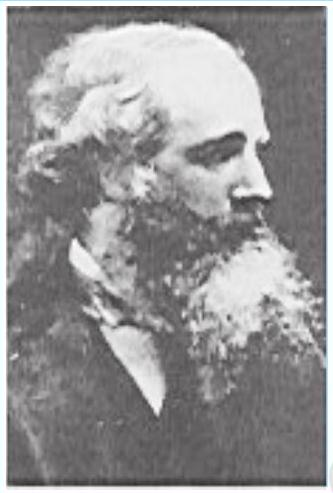
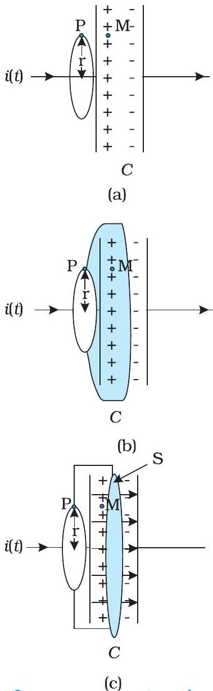
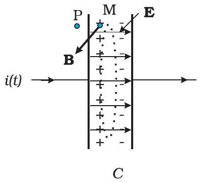
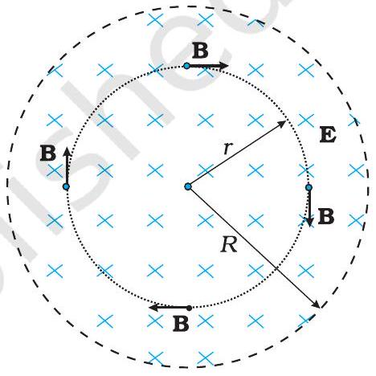
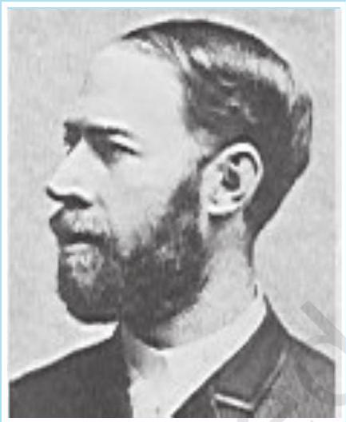
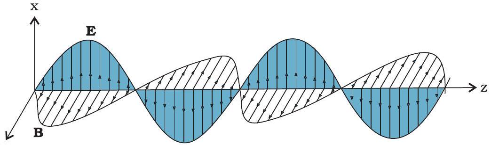
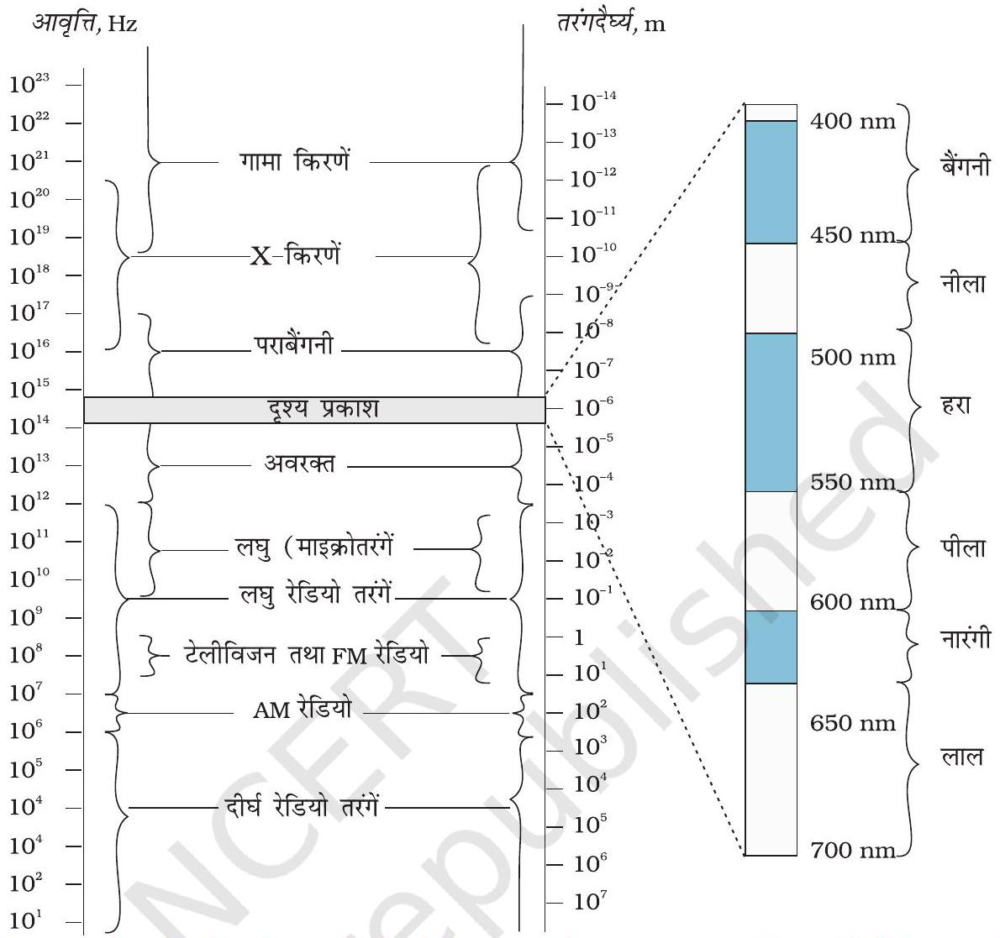
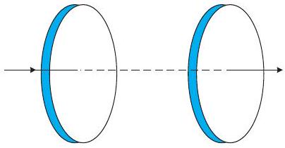
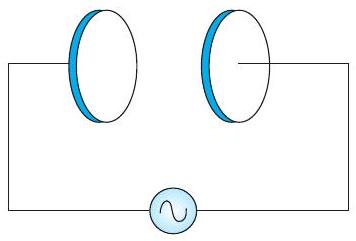

## अध्याय $8$

## वैद्युतचुंबकीय

## तरंगें

## $8.1$ भूमिका

अध्याय $4$ में हमने सीखा है कि विद्युत धारा चुंबकीय क्षेत्र उत्पन्न करती है तथा दो धारावाही तार परस्पर एक-दूसरे पर चुंबकीय बल आरोपित करते हैं। इसके अतिरिक्त, अध्याय $6$ में हम यह देख चुके हैं कि समय के साथ परिवर्तनशील चुंबकीय क्षेत्र विद्युत क्षेत्र उत्पन्न करता है। परंतु, क्या इसका विलोम भी सत्य है? क्या समय के साथ परिवर्तित होता हुआ विद्युत क्षेत्र चुंबकीय क्षेत्र को उत्पन्न करता है? जेम्स क्लार्क मैक्सवेल (1831-1879) ने यह तर्क प्रस्तुत किया कि वास्तव में ऐसा ही होता है। न केवल विद्युत धारा वरन समय के साथ परिवर्तनशील विद्युत क्षेत्र भी चुंबकीय क्षेत्र उत्पन्न करता है। समय के साथ परिवर्तनशील धारा से जुड़े संधारित्र के बाहर किसी बिंदु पर चुंबकीय क्षेत्र ज्ञात करने के लिए ऐम्पियर का नियम लगाते समय, मैक्सवेल का ध्यान इस नियम संबंधी एक असंगति की ओर गया। इस असंगति को दूर करने के लिए उन्होंने एक अतिरिक्त धारा के अस्तित्व का सुझाव दिया जिसको उन्होंने विस्थापन धारा नाम दिया।

उन्होंने विद्युत व चुंबकीय क्षेत्रों तथा उनके स्रोतों-आवेश एवं धारा-घनत्व को सम्मिलित कर, समीकरणों का एक समुच्चय सूत्रबद्ध किया। इन समीकरणों को मैक्सवेल समीकरण कहते हैं। लोरेंज का बल सूत्र (अध्याय 4) और मिला लें तो ये समीकरण विद्युत-चुंबकत्व के सभी आधारभूत नियमों को गणितीय रूप में व्यक्त करते हैं।

मैक्सवेल के समीकरणों से उभरने वाली सबसे महत्वपूर्ण प्रागुक्ति वैद्युतचुंबकीय तरंगों का अस्तित्व होना है जो अंतरिक्ष में संचरित समय के साथ बदलते (युग्मित) विद्युतीय एवं चुंबकीय क्षेत्र हैं। मैक्सवेल के समीकरणों के अनुसार, इन तरंगों की चाल, प्रकाशीय मापन द्वारा प्राप्त प्रकाश

## वैद्युतचुंबकीय तरंगें

की चाल ( $3 \times 10^{8} \mathrm{~m} / \mathrm{s}$ ) के लगभग बराबर होती है। इससे हम इस महत्वपूर्ण निष्कर्ष पर पहुँचे कि प्रकाश एक वैद्युतचुंबकीय तरंग है। इस प्रकार, मैक्सवेल के कार्य ने विद्युत, चुंबकत्व एवं प्रकाश के क्षेत्रों को एकीकृत कर दिया। $1885$ में, हर्ट्ज़ ने प्रयोग द्वारा वैद्युतचुंबकीय तरंगों के अस्तित्व को प्रदर्शित किया। मार्कोनी एवं अन्य आविष्कर्ताओं ने यथासमय, इसके तकनीकी उपयोग में संचार के क्षेत्र में जो क्रांति की, उसके आज हम प्रत्यक्षदर्शी हैं।

इस अध्याय में, पहले हम विस्थापन धारा की आवश्यकता एवं उसके परिणामों के विषय में चर्चा करेंगे। फिर हम वैद्युतचुंबकीय तरंगों का एक विवरणात्मक चित्र प्रस्तुत करेंगे। वैद्युतचुंबकीय तरंगों का संपूर्ण वर्णक्रम, जो गामा किरणों (तरंगदैर्घ्य $\sim 10^{-12} \mathrm{~m}$ ) से दीर्घ रेडियो तरंगों (तरंगदैर्घ्य $\sim 10^{6} \mathrm{~m}$ ) तक फैला है, उसके विषय में चर्चा की जाएगी।

## $8.2$ विस्थापन धारा

अध्याय $4$ में हम देख चुके हैं कि विद्युत धारा अपने चारों ओर एक चुंबकीय क्षेत्र उत्पन्न करती है। मैक्सवेल ने दर्शाया कि तार्किक संगति के लिए यह आवश्यक है कि परिवर्तनशील विद्युत क्षेत्र भी चुंबकीय क्षेत्र उत्पन्न करे। यह प्रभाव बहुत ही महत्त्व का है, क्योंकि यह रेडियो तरंगों, गामा किरणों, एवं दृश्य प्रकाश के अतिरिक्त भी अन्य सभी वैद्युतचुंबकीय तरंगों के अस्तित्व की व्याख्या करता है।

यह देखने के लिए कि परिवर्तनशील विद्युत क्षेत्र किस प्रकार चुंबकीय क्षेत्र के उद्भव का कारण बनता है। आइए हम किसी संधारित्र के आवेशन की प्रक्रिया पर विचार करें और संधारित्र के बाहर किसी बिंदु पर चुंबकीय क्षेत्र ज्ञात करने के लिए ऐम्पियर के परिपथीय नियम (अध्याय 4)

$$
\oint \mathbf{B} . \mathrm{d} \mathbf{l}=\mu_{0} i(t)
$$

का उपयोग करें।
[चित्र 8.1(a)] में एक समांतर प्लेट संधारित्र $C$ दर्शाया गया है जो एक ऐसे परिपथ का भाग है जिसमें समय के साथ परिवर्तनशील धारा $i(t)$ प्रवाहित हो रही है। आइए, समांतर प्लेट संधारित्र के बाह्य क्षेत्र में स्थित किसी बिंदु जैसे कि P पर चुंबकीय क्षेत्र ज्ञात करें। इसके लिए, हम $r$ त्रिज्या का एक समतल वृत्ताकार लूप लेते हैं जिसका तल धारावाही तार की दिशा के लंबवत है और जिसका केंद्र तार के ऊपर है [चित्र 8.1(a)]। सममिति के आधार पर हम कह सकते हैं कि चुंबकीय क्षेत्र की दिशा वृत्ताकार लूप की परिधि के अनुदिश है और लूप के प्रत्येक बिंदु पर इसका परिमाण समान है। इस कारण, यदि क्षेत्र का परिमाण $B$ है तो समीकरण (8.1) का वाम पक्ष $B(2 \pi r)$ है।

$$
B(2 \pi r)=\mu_{0} i(t)
$$

अब इसी परिसीमा वाली एक अन्य सतह पर विचार कीजिए। यह घड़े के आकार की एक सतह है जो धारा को कहीं भी नहीं छूती है [चित्र 8.1(b)] पर

जेम्स क्लार्क मैक्सवेल (1831-1879) स्कॉटलैंड के एडिनबर्ग में जन्मे, उन्नीसवीं शती के महानतम भौतिकविदों में से एक। उन्होंने गैस के अणुओं की तापीय गतियों के वितरण के लिए व्यंजक व्युत्पन्न किया और वे उन पहले लोगों में से एक थे जिन्होंने श्यानता आदि मापन योग्य राशियों का उपयोग कर आण्विक प्राचलों के विश्वसनीय आकलन प्राप्त किए। मैक्सवेल की सबसे बड़ी उपलब्धि, विद्युत एवं चुंबकत्व के (कूलॉम, ऑर्स्टेड, ऐम्पियर एवं फैराडे द्वारा खोजे गए) नियमों के एकीकरण द्वारा संगत समीकरणों का एक समुच्चय प्रस्तुत करना था, जिन्हें आज हम मैक्सवेल के समीकरणों के नाम से जानते हैं। इनके आधार पर वे इस सर्वाधिक महत्वपूर्ण निष्कर्ष पर पहुँचे कि प्रकाश, वैद्युतचुंबकीय तरंग ही है। मजे की बात यह है कि मैक्सवेल, फैराडे के वैद्युत अपघटन के नियमों से उत्पन्न इस विचार से सहमत नहीं थे कि विद्युत की प्रकृति कण रूप में है।

## - भौतिकी

चित्र $8.1$ एक समांतर प्लेट संधारित्र $C$, जो एक ऐसे परिपथ का भाग है जिसमें समय के साथ परिवर्तनशील धारा $i(t)$ प्रवाहित हो रही है; तथा, (a) में $r$ त्रिज्या का एक लूप दर्शाया गया है जो लूप पर स्थित P बिंदु पर चुंबकीय क्षेत्र ज्ञात करने के लिए बनाया गया है; (b) में एक घट-आकार, सतह दर्शायी गई है जो संधारित्र के अंदर इसकी प्लेटों के बीच से गुजरती है एवं (a) में दर्शाया गया लूप इसका रिम है; (c) में (टिफिन की आकृति की) एक अन्य सतह दर्शायी गई है, वृत्ताकार लूप जिसका रिम है एवं समतल वृत्ताकार तली $S$ संधारित्र की प्लेटों के बीच में है। तीर संधारित्र प्लेटों के बीच एक समय विद्युत क्षेत्र दर्शाते हैं।

यदि हम चित्र 8.1(c) को ध्यानपूर्वक देखें तो छूटे हुए पद का अनुमान लगाया जा सकता है। क्या संधारित्र की प्लेटों के बीच की सतह $S$ से गुजरती हुई किसी राशि के मान में परिवर्तन हो रहा है। जी हाँ, वास्तव में उनके बीच विद्युत क्षेत्र बदल रहा है। यदि संधारित्र की प्लेटों का क्षेत्रफल $A$ हो एवं इस पर कुल आवेश $Q$ हो तो प्लेटों के बीच विद्युत क्षेत्र $\mathbf{E}$ का परिमाण $(Q / A) / \varepsilon_{0}$ होता है [देखिए समीकरण (2.41)]। यह क्षेत्र चित्र 8.1(c) की सतह $S$ के लंबवत होता है। इसका परिमाण संधारित्र की प्लेटों के क्षेत्रफल $A$ पर समान रहता है पर इनके बाहर शून्य हो जाता है। इसलिए, सतह $S$ से गुजरने वाला विद्युत फ्लक्स, गाउस के नियम के उपयोग से होता है

$$
\Phi_{\mathrm{E}}=|\mathbf{E}| A=\frac{1}{\varepsilon_{0}} \frac{Q}{A} A=\frac{Q}{\varepsilon_{0}}
$$

अब यदि संधारित्र की प्लेटों पर आवेश $Q$ समय के साथ परिवर्तित हो तो यहाँ एक धारा $i=(\mathrm{d} Q / \mathrm{d} t)$ होगी। इसलिए समीकरण (8.3) से

$$
\frac{\mathrm{d} \Phi_{E}}{\mathrm{~d} t}=\frac{\mathrm{d}}{\mathrm{~d} t}\left(\frac{Q}{\varepsilon_{0}}\right)=\frac{1}{\varepsilon_{0}} \frac{\mathrm{~d} Q}{\mathrm{~d} t}
$$

यह निर्दिष्ट करता है कि ऐम्पियर के नियम में संगति के लिए,

$$
\varepsilon_{0}\left(\frac{\mathrm{~d} \Phi_{E}}{\mathrm{~d} t}\right)=i
$$

यही ऐम्पियर के परिपथीय नियम का छूटा हुआ पद है। यदि हम किसी भी सतह से होकर चालकों द्वारा वाहित कुल धारा में, $\varepsilon_{0}$ गुणा विद्युत फ्लक्स के परिवर्तन की दर जोड़ें तो हम ऐम्पियर के परिपथीय नियम का सामान्यीकरण कर सकते हैं। तब सभी सतहों के लिए धारा का मान $i$ समान होगा। तब कहीं पर भी ऐम्पियर का सामान्यीकृत नियम लगाने पर $B$ के प्राप्त मान में कोई विसंगति नहीं आएगी। बिंदु P पर, B का मान शून्येतर ही होगा चाहे इसकी गणना करने के लिए हम कोई भी सतह लें। प्लेटों के बाहर, किसी बिंदु P पर $B$ का मान वही होगा जो ठीक इसके अंदर बिंदु M पर होना चाहिए [चित्र 8.1(a)]। आवेशों के प्रवाह के कारण चालकों में जो धारा प्रवाहित होती है उसे चालन धारा कहा जाता है। समीकरण (8.4) द्वारा व्यक्त धारा एक नवीन पद है। जो परिवर्तनशील विद्युत क्षेत्र (या विद्युतीय विस्थापन, जो अभी भी कभी उपयोग में आता है) के कारण अस्तित्व में आता है। इसको इसलिए विस्थापन धारा अथवा मैक्सवेल की विस्थापन धारा कहा जाता है। चित्र 8.2, आगे वर्णित समांतर प्लेट संधारित्र के अंदर विद्युत एवं चुंबकीय क्षेत्र दर्शाता है।

मैक्सवेल द्वारा किया गया व्यापकीकरण निम्न है। चुंबकीय क्षेत्र का स्रोत केवल प्रवाहमान आवेशों से निर्मित चालन विद्युत धारा ही नहीं होती, अपितु समय के सापेक्ष विद्युत क्षेत्र में परिवर्तन

## वैद्युतचुंबकीय तरंगें

की दर भी इसका कारण बन सकती है। अधिक स्पष्टता से इस बात को कहें तो कुल धारा $i, i_{c}$ द्वारा निर्दिष्ट चालन धारा एवं $i_{\mathrm{d}}\left(=\varepsilon_{0}\left(\mathrm{~d} \Phi_{E} / \mathrm{d} t\right)\right)$ द्वारा निर्दिष्ट विस्थापन धारा के योग के बराबर होती है। अतः

$$
i=i_{c}+i_{d}=i_{c}+\varepsilon_{0} \frac{\mathrm{~d} \Phi_{E}}{\mathrm{~d} t}
$$

सुस्पष्ट शब्दों में इसका अर्थ है कि संधारित्र की प्लेटों के बाहर केवल चालन धारा $i_{\mathrm{c}}=i$ होती है, तथा कोई विस्थापन धारा नहीं होती, अर्थात् $i_{d}=0$ । दूसरी ओर संधारित्र के अंदर कोई चालन धारा नहीं होती, अर्थात् $i_{\mathrm{c}}=0$ और केवल विस्थापन धारा होती है जिससे $i_{d}=i$ ।

व्यापकीकृत (एवं यथार्थ) ऐम्पियर के परिपथीय नियम का स्वरूप समीकरण (8.1) जैसा है। बस केवल एक अंतर है "ऐसी किसी भी सतह, जिसकी परिमिति बंद लूप है से गुजरने वाली कुल धारा चालन धारा एवं विस्थापन धारा का योग होती है।" व्यापक रूप में यह नियम

$$
\oint \mathbf{B} \cdot \mathrm{d} \mathbf{l}=\mu_{0} i_{c}+\mu_{0} \varepsilon_{0} \frac{\mathrm{~d} \Phi_{E}}{\mathrm{~d} t}
$$

तथा इसे ऐम्पियर मैक्सवेल नियम कहते हैं।
किसी भी दृष्टि से विस्थापन धारा के भौतिक प्रभाव चालन धारा के समान हैं। कुछ स्थितियों में, उदाहरणार्थ, किसी चालक तार में नियत विद्युत क्षेत्र के लिए विस्थापन धारा का मान शून्य हो सकता है क्योंकि किसी विद्युत क्षेत्र E समय के साथ परिवर्तित नहीं होता। कुछ दूसरी स्थितियों में, जैसे कि ऊपर बताए गए आवेशित होते संधारित्र में चालन एवं विस्थापन धारा दोनों ही उपस्थित हो सकते हैं पर अलग-अलग दिक्स्थानों में। परंतु अधिकतर स्थितियों में दोनों एक ही स्थान पर विद्यमान हो सकते हैं क्योंकि कोई भी माध्यम पूर्ण चालक या पूर्ण विद्युतरोधी नहीं होता। सर्वाधिक रोचक तथ्य यह है कि किसी विशाल क्षेत्र में जहाँ कोई भी चालन धारा नहीं होती, समय के साथ परिवर्तनशील विद्युत क्षेत्र के कारण केवल विस्थापन धारा ही होती है। ऐसे क्षेत्र में, आसपास कोई (चालन) धारा स्रोत नहीं होने पर भी चुंबकीय क्षेत्र विद्यमान होगा। इस विस्थापन धारा के अस्तित्व की प्रागुक्ति प्रयोग द्वारा पुष्ट की जा सकती है। उदाहरण के लिए, चित्र 8.2(a) के संधारित्र की प्लेटों के बीच (माना बिंदु M पर) चुंबकीय क्षेत्र मापा जा सकता है। यह ठीक उतना ही पाया जाएगा जितना कि बाहर के किसी बिंदु ( माना P ) पर।

विस्थापन धारा के (शब्दशः) दूरगामी परिणाम हैं। एक तथ्य जिसकी ओर हमारा ध्यान एकदम आकर्षित होता है, वह यह है कि विद्युत एवं चुंबकत्व अब और अधिक सममितीय* हो गए हैं। फैराडे का प्रेरण संबंधी नियम यह बताता है कि प्रेरित विद्युत वाहक बल चुंबकीय फ्लक्स परिवर्तन की दर के बराबर होता है। अब, चूँकि दो बिंदुओं $1$ एवं $2$ के बीच विद्युत वाहक बल, बिंदु $1$ से बिंदु $2$ तक इकाई आवेश को ले जाने में किया गया कार्य है। विद्युत वाहक बल की उपस्थिति एक विद्युत क्षेत्र की उपस्थिति को इंगित करती है। फैराडे के विद्युत चुंबकीय प्रेरण संबंधी नियम को हम दूसरे शब्दों में इस प्रकार भी कह सकते हैं कि समय के साथ परिवर्तनशील चुंबकीय क्षेत्र, विद्युत क्षेत्र उत्पन्न करता है। यह तथ्य कि समय के साथ परिवर्तनशील विद्युत क्षेत्र, चुंबकीय क्षेत्र उत्पन्न करता है, फैराडे के नियम का सममितीय प्रतिरूप है और विस्थापन धारा के चुंबकीय क्षेत्र का स्रोत होने का परिणाम है। अतः समय पर निर्भर वैद्युत एवं चुंबकीय क्षेत्र एक-दूसरे की उत्पत्ति के कारण हैं।

[^0]
(a)

(b)
चित्र $8.2$ (a) संधारित्र की प्लेटों के बीच स्थित बिंदु M पर विद्युत क्षेत्र E एवं चुंबकीय क्षेत्र B (b) चित्र (a) का परिच्छेदीय आरेख।

## भौतिकी

फैराडे का विद्युत चुंबकीय प्रेरण का नियम एवं मैक्सवेल-ऐम्पियर का परिपथीय नियम इस कथन की परिमाणात्मक अभिव्यक्ति है। जहाँ धारा, कुल धारा है जैसा कि समीकरण (8.5) से स्पष्ट है। इस सममिति की एक अत्यंत महत्वपूर्ण निष्पत्ति विद्युत चुंबकीय तरंगों का अस्तित्व है जिसके विषय में हम अगले अनुभाग में चर्चा करेंगे।

## निर्वात में मैक्सवेल के समीकरण

1. $\oint \mathbf{E} \cdot \mathrm{d} \mathbf{A}=Q / \varepsilon_{0}$
(विद्युत संबंधी गाउस नियम)
2. $\oint \mathbf{B} \cdot \mathrm{d} \mathbf{A}=0$ (चुंबकत्व संबंधी गाउस नियम)
3. $\oint \mathbf{E} \cdot \mathrm{d} \mathbf{l}=\frac{-\mathrm{d} \Phi_{B}}{\mathrm{~d} t}$ (फैराडे नियम)
4. $\oint \mathbf{B} \cdot \mathrm{d} \mathbf{l}=\mu_{0} i_{c}+\mu_{0} \varepsilon_{0} \frac{\mathrm{~d} \Phi_{E}}{\mathrm{~d} t}$ (ऐम्पियर-मैक्सवेल नियम)

## $8.3$ वैद्युतचुंबकीय तरंगें

### 8.3.1 तरंगों के स्रोत

वैद्युतचुंबकीय (electromagnetic, संक्षेप में em) तरंगें उत्पन्न कैसे होती हैं? न तो स्थिर आवेश, न ही एकसमान गति से चलते हुए आवेश (स्थिर धारा), वैद्युतचुंबकीय तरंगों के स्रोत हो सकते हैं। क्योंकि, स्थिर आवेश तो केवल स्थिरवैद्युत क्षेत्र उत्पन्न करते हैं जबकि गतिमान आवेश चुंबकीय क्षेत्र भी उत्पन्न करते हैं पर वह समय के साथ परिवर्तित नहीं होता। मैक्सवेल के सिद्धांत की यह एक महत्वपूर्ण निष्पत्ति है कि त्वरित आवेश वैद्युतचुंबकीय तरंगें विकिरित करते हैं। इस मौलिक निष्पत्ति का प्रमाण प्रस्तुत पुस्तक के विस्तार क्षेत्र से परे है, परंतु हम इसको एक अपरिष्कृत, गुणात्मक विवेचन के आधार पर स्वीकार कर सकते हैं। मान लीजिए कि एक आवेश है जो किसी निश्चित आवृत्ति से दोलन कर रहा है (कोई दोलन करता हुआ आवेश भी एक त्वरित आवेश का उदाहरण है)। यह उस क्षेत्र में एक दोलित विद्युत क्षेत्र उत्पन्न करता है जो पुनः एक दोलित चुंबकीय क्षेत्र को जन्म देता है जो पुनः एक दोलित विद्युत क्षेत्र की उत्पत्ति का कारण बनता है और यह प्रक्रिया चलती रहती है। अतः दोलित विद्युत एवं चुंबकीय क्षेत्र एक-दूसरे को संपोषित करते हैं या कहें कि तरंग गमन करती है। स्वाभाविक रूप से वैद्युतचुंबकीय तरंगों की आवृत्ति, आवेश के दोलनों की आवृत्ति के बराबर होती है। गमनकारी तरंगों से जुड़ी ऊर्जा, स्रोत अर्थात त्वरित आवेश की ऊर्जा से ही प्राप्त होती है।

पूर्वोक्त चर्चा के आधार पर हो सकता है कि इस प्रागुक्ति का परीक्षण कि प्रकाश विद्युत चुंबकीय तरंग है, सहज हो सकता है। हम विचार कर सकते हैं कि दृश्य प्रकाश (माना कि पीला) उत्पन्न करने के लिए हमें बस एक आवेश को उस प्रकाश की आवृत्ति से दोलन कराने के लिए एक ac परिपथ की आवश्यकता है। लेकिन अफसोस की बात यह है कि ऐसा संभव नहीं है। पीले प्रकाश की आवृत्ति लगभग $6 \times 10^{14} \mathrm{~Hz}$ है जबकि अत्यधिक आधुनिक इलैक्ट्रॉनिक परिपथों से भी जो अधिकतम आवृत्ति हम प्राप्त कर पाते हैं वह लगभग $10^{11} \mathrm{~Hz}$ होती है। यही कारण है कि जब वैद्युतचुंबकीय तरंगों का प्रायोगिक प्रदर्शन हुआ तो वह निम्न आवृत्ति की तरंगों (रेडियो तरंगों के परिसर में) के लिए ही हुआ, जैसा कि हर्ट्ज़ के प्रयोग (1887) के प्रकरण में देख सकते हैं।

## वैद्युतचुंबकीय तरंगें

मैक्सवेल के सिद्धांत के परीक्षण के लिए किए गए हर्ट्ज़ के सफल प्रयोग ने सनसनी फैला दी तथा ये प्रयोग इस क्षेत्र में अन्य महत्वपूर्ण कार्यों के लिए प्रेरणा का आधार बने। इस संबंध में दो महत्वपूर्ण उपलब्धियाँ उल्लेख किए जाने योग्य हैं। हर्ट्ज़ के प्रयोग के सात साल बाद, जगदीश चंद्र बसु ने कलकत्ता में कार्य करते हुए काफी कम तरंगदैर्घ्य ( $25 \mathrm{~mm}$ से $5 \mathrm{~mm}$ ) की वैद्युतचुंबकीय तरंगें उत्पन्न करने और उन्हें प्रेक्षित करने में सफलता प्राप्त की। उनका प्रयोग भी हर्ट्ज़ के प्रयोग की भाँति ही प्रयोगशाला तक ही सीमित रहा।

लगभग उसी समय इटली में गुगलीओ मार्कोनी ने हर्ट्ज़ के कार्य का अनुसरण करते हुए कई किलोमीटर तक की दूरियों तक वैद्युतचुंबकीय तरंगे संप्रेषित करने में सफलता प्राप्त की। मार्कोनी के प्रयोग से संचार के क्षेत्र में वैद्युतचुंबकीय तरंगों के उपयोग का प्रारंभ हुआ।

### 8.3.2 वैद्युतचुंबकीय तरंगों की प्रकृति

मैक्सवेल के समीकरणों के आधार पर यह दर्शाया जा सकता है कि किसी वैद्युतचुंबकीय तरंग में विद्युतीय एवं चुंबकीय क्षेत्र एक-दूसरे के लंबवत होते हैं और इसके गमन की दिशा के भी। विस्थापन धारा पर दिए गए विवेचन के आधार पर भी यह तर्कसंगत प्रतीत होता है। चित्र $8.2$ पर विचार कीजिए। संध रित्र में प्लेटों के बीच विद्युत क्षेत्र प्लेटों के लंबवत है। विस्थापन धारा के द्वारा उत्पन्न चुंबकीय क्षेत्र संधारित्र की प्लेटों के समांतर वृत्त के अनुदिश है। अतः इस स्थिति में $\mathbf{B}$ तथा $\mathbf{E}$ परस्पर लंबवत हैं। यह एक सामान्य लक्षण है।

चित्र (8.3) में हमने $z$ दिशा में गमन करती हुई एक समतल वैद्युतचुंबकीय तरंग का प्रारूपिक उदाहरण प्रदर्शित किया है (किसी क्षण $t$ पर, क्षेत्रों को $z$ -निर्देशांक के फलन के रूप में दर्शाया गया है)। विद्युत क्षेत्र $E_{x}, x$-अक्ष के अनुदिश है और किसी क्षण $t$ पर $z$ के साथ ज्यावक्रीय रूप में परिवर्तित होता है। चुंबकीय क्षेत्र $B_{y}, y$-अक्ष के अनुदिश है और यह भी $z$ के साथ ज्यावक्रीय रूप में परिवर्तित होता है। विद्युत क्षेत्र $E_{x}$ एवं चुंबकीय क्षेत्र $B_{y}$ एक दूसरे के लंबवत हैं एवं गमन दिशा, $z$ के भी लंबवत है। $E_{x}$ एवं $B_{y}$ को हम निम्नवत लिख सकते हैं :

$$
\begin{aligned}
& E_{x}=E_{0} \sin (k z-\omega t) \\
& B_{y}=B_{0} \sin (k z-\omega t)
\end{aligned}
$$

यहाँ $k$ एवं तरंग की तरंगदैर्घ्य $\lambda$ में निम्नलिखित सामान्य संबंध है

$$
k=\frac{2 \pi}{\lambda}
$$

तथा यहाँ $\omega$ कोणीय आवृत्ति है, $k$ तरंग सदिश (या गमन सदिश) $\mathbf{k}$ का परिमाण है। $k$ की दिशा तरंग के गमन की दिशा निर्दिष्ट करती है। तरंग की गमन चाल $(\omega / k)$ है। $E_{x}$ एवं $B_{y}$ के लिए समीकरणों [8.7(a) एवं (b)] तथा मैक्सवेल के समीकरणों का उपयोग करके आप निम्न परिणाम पर पहुँच सकते हैं -

हेनरिच रूडोल्फ हर्ट्ज़
(1857 - 1894) जर्मन भौतिकविद, जिन्होंने पहली बार रेडियो तरंगों को प्रसारित किया और ग्रहण किया। उन्होंने वैद्युतचुंबकीय तरंगें पैदा कीं, उन्हें आकाश में भेजा और उनका तरंगदैर्घ्य तथा चाल ज्ञात किया। उन्होंने दर्शाया कि वैद्युतचुंबकीय तरंगों के कपनों की प्रकृति, परावर्तन एवं अपवर्तन ठीक वैसे ही थे जैसे प्रकाश एवं ऊष्मा तरंगों में, और इस प्रकार पहली बार इनकी अभिन्नता सिद्ध की। उन्होंने गैसों में विद्युत विसर्जन संबंधी शोध की अगुवाई की और प्रकाश-विद्युत प्रभाव की खोज की।

चित्र $8.3$ एक रेखीय ध्रुवित वैद्युतचुंबकीय तरंग जो $z$-दिशा में गमन कर रही है और जिसका दोलनकारी विद्युत क्षेत्र $\mathbf{E}, x$-दिशा के अनुदिश एवं दोलनकारी चुंबकीय क्षेत्र $\mathbf{B}, y$-दिशा के अनुदिश है।

## - भौतिकी

$$
\omega=c k, \text { यहाँ, } c=1 / \sqrt{\mu_{0} \varepsilon_{0}}
$$

समीकरण $\omega=c k$, सभी तरंगों के लिए प्रामाणिक संबंध है (देखिए कक्षा $11$ भौतिकी पाठ्यपुस्तक, अनुभाग 14.4)। प्रायः इस संबंध को आवृत्ति, $v(=\omega / 2 \pi)$ एवं तरंगदैर्घ्य, $\lambda(=2 \pi / k)$ के पदों में इस रूप में लिखा जाता है-

$$
\begin{aligned}
& 2 \pi v=c \frac{2 \pi}{\lambda} \quad \text { अथवा } \\
& v \lambda=c
\end{aligned}
$$

मैक्सवेल के समीकरणों के आधार पर इस निष्कर्ष पर भी पहुँचा जा सकता है कि किसी वैद्युतचुंबकीय तरंग में विद्युत एवं चुंबकीय क्षेत्र परस्पर निम्नलिखित समीकरण द्वारा संबंधित है -

$$
B_{O}=\left(E_{O} / c\right)
$$

अब हम वैद्युतचुंबकीय तरंगों के कुछ अभिलक्षणों पर टिप्पणियाँ करते हैं। वे मुक्त स्थान या निर्वात में, विद्युत एवं चुंबकीय क्षेत्रों के स्व:संपोषित दोलन हैं। वे इस अर्थ में अभी तक हमारे द्वारा अध्ययन की गई अन्य तरंगों से भिन्न हैं कि इनमें विद्युत एवं चुंबकीय क्षेत्रों के दोलनों के लिए किसी भौतिक माध्यम की आवश्यकता नहीं होती।

लेकिन, अगर एक भौतिक माध्यम वास्तव में विद्यमान हो तो उदाहरण के लिए हम जानते हैं कि प्रकाश जो वैद्युतचुंबकीय तरंगें ही हैं; काँच में से गमन करता है। यह हम पहले ही देख चुके हैं कि किसी माध्यम में कुल विद्युत एवं चुंबकीय क्षेत्रों को उस माध्यम की आपेक्षिक विद्युतशीलता $\varepsilon$ एवं आपेक्षिक चुंबकशीलता $\mu$ के पदों में वर्णित किया जाता है (यह राशियाँ बताती हैं कि बाह्य क्षेत्र की तुलना में कुल क्षेत्र कितने गुना है)। मैक्सवेल समीकरणों में विद्युत एवं चुंबकीय क्षेत्रों के विवरण में $\varepsilon_{0}$ एवं $\mu_{0}$ का स्थान यह राशियाँ ले लेती हैं। आपेक्षिक विद्युतशीलता $\varepsilon$ एवं आपेक्षिक चुंबकशीलता $\mu$ वाले किसी माध्यम में, प्रकाश का वेग हो जाता है

$$
v=\frac{1}{\sqrt{\mu \varepsilon}}
$$

अतः किसी माध्यम में प्रकाश का वेग उस माध्यम के वैद्युत एवं चुंबकीय गुणों पर निर्भर करता है। अगले अध्याय में हम देखेंगे कि एक माध्यम के सापेक्ष दूसरे माध्यम का अपवर्तनांक इन दो माध्यमों में प्रकाश के वेग के अनुपात में होता है।

मुक्त आकाश अथवा निर्वात में वैद्युतचुंबकीय तरंगों का वेग एक महत्वपूर्ण, मौलिक नियतांक है। विभिन्न तरंगदैर्घ्य की वैद्युतचुंबकीय तरंगों पर किए गए प्रयोगों ने यह दर्शाया है कि यह वेग (जो तरंगदैर्घ्य पर निर्भर नहीं है) सभी के लिए समान होता है और इसका मान $3 \times 10^{8} \mathrm{~m} / \mathrm{s}$ से कुछ मीटर प्रति सेकंड कम या अधिक होता है। निर्वात में वैद्युतचुंबकीय तरंगों के वेग का नियत होना, प्रयोगों द्वारा इतनी दृढ़ता से पुष्ट हो चुका है और इसका मान इतनी अधिक यथार्थता से ज्ञात किया जा चुका है कि इसको लंबाई के मानक के रूप में स्वीकार कर लिया गया है।

वैद्युतचुंबकीय तरंगों का बड़ा प्रौद्योगिकीय महत्त्व, इनके द्वारा एक स्थान से दूसरे स्थान तक ऊर्जा वहन करने की क्षमता से ही प्रस्फुटित होता है। रेडियो एवं टीवी सिग्नलों के रूप में प्रसारण स्टेशनों से यही ऊर्जा अभिग्राहकों तक पहुँच कर उन्हें क्रियाशील बनाती है। प्रकाश के रूप में सूर्य से ऊर्जा पृथ्वी तक पहुँचती है जिसके कारण पृथ्वी पर जीवन संभव हुआ है।

## वैद्युतचुंबकीय तरंगें

उदाहरण 8.1 $25 \mathrm{MHz}$ आवृत्ति की एक समतल वैद्युतचुंबकीय तरंग निर्वात में $x$-दिशा के अनुदिश गतिमान है। दिक्काल (space) में किसी विशिष्ट बिंदु पर इसका $\mathbf{E}=6.3 \hat{\mathbf{j}} \mathrm{~V} / \mathrm{m}$ है। इस बिंदु पर $\mathbf{B}$ का मान क्या है?
हल $\mathbf{B}$ एवं $\mathbf{E}$ के परिमाण एक-दूसरे से निम्नलिखित समीकरण द्वारा संबंधित हैं-

$$
\begin{aligned}
B & =\frac{E}{c} \\
& =\frac{6.3 \mathrm{~V} / \mathrm{m}}{3 \times 10^{8} \mathrm{~m} / \mathrm{s}}=2.1 \times 10^{-8} \mathrm{~T}
\end{aligned}
$$

इसकी दिशा के संबंध में हम जानते हैं कि $\mathbf{E} y$-दिशा के अनुदिश है और तरंग $x$-दिशा के अनुदिश गमन कर रही है। अत: $\mathbf{B} x$ - एवं $y$-अक्षों दोनों के लंबवत दिशा में होना चाहिए। सदिश बीजगणित का उपयोग करने पर, $\mathbf{E} \times \mathbf{B}$ को x -दिशा में होना चाहिए। चूँकि $(+\hat{\mathbf{j}}) \times(+\hat{\mathbf{k}})=\hat{\mathbf{i}}, \mathbf{B} z$-दिशा के अनुदिश है।
अत: $\mathbf{B}=2.1 \times 10^{-8} \hat{\mathbf{k}} \mathrm{~T}$

उदाहरण $8.2$ किसी समतल वैद्युतचुंबकीय तरंग में चुंबकीय क्षेत्र
$B_{y}=\left(2 \times 10^{-7}\right) \mathrm{T} \sin \left(0.5 \times 10^{3} x+1.5 \times 10^{11} t\right)$ है
(a) तरंग की आवृत्ति तथा तरंगदैर्घ्य क्या है?
(b) विद्युत क्षेत्र के लिए व्यंजक लिखिए।

हल

(a) दिए गए समीकरण की निम्न समीकरण
$$
B_{y}=B_{0} \sin \left[2 \pi\left(\frac{x}{\lambda}+\frac{t}{T}\right)\right]
$$
से तुलना करने पर
$$
\lambda=\frac{2 \pi}{0.5 \times 10^{3}} \mathrm{~m}=1.26 \mathrm{~cm}
$$
तथा $\frac{1}{T}=v=\left(1.5 \times 10^{11}\right) / 2 \pi=23.9 \mathrm{GHz}$
(b) $E_{0}=B_{0} c=2 \times 10^{-7} \mathrm{~T} \times 3 \times 10^{8} \mathrm{~m} / \mathrm{s}=6 \times 10^{1} \mathrm{~V} / \mathrm{m}$
विद्युत क्षेत्र घटक तरंग की गमन दिशा एवं चुंबकीय क्षेत्र की दिशा के लंबवत होता है। अतः, विद्युत क्षेत्र घटक z -अक्ष के अनुदिश निम्नलिखित समीकरण द्वारा व्यक्त होगा
$$
E_{z}=60 \sin \left(0.5 \times 10^{3} x+1.5 \times 10^{11} t\right) \mathrm{V} / \mathrm{m}
$$

## $8.4$ वैद्युतचुंबकीय स्पेक्ट्रम

जिस समय मैक्सवेल ने वैद्युतचुंबकीय तरंगों संबंधी अपना सिद्धांत प्रस्तुत किया था तो दृश्य प्रकाश तरंगें ही एक मात्र सुपरिचित वैद्युतचुंबकीय (em) तरंगें थीं। पराबैगनी एवं अवरक्त तरंगों का अस्तित्व अभी मुश्किल से साबित हो पाया था। उन्नीसवीं शताब्दी के अंत तक X- किरणें एवं गामा किरणें भी खोज ली गई थीं। अब हम जानते हैं कि दृश्य प्रकाश तरंगें, X- किरणें, गामा किरणें, रेडियो तरंगें, सूक्ष्म (माइक्रो) तरंगें, पराबैंगनी एवं अवरक्त तरंगें ये सभी em तरंगें हैं। तरंगों का आवृत्ति के क्रम में वर्गीकरण (चित्र 8.4) वैद्युतचुंबकीय स्पेक्ट्रम कहलाता है। एक प्रकार की तरंग और उसके निकटवर्ती दूसरे प्रकार की तरंग के बीच कोई स्पष्ट विभाजन रेखा नहीं है। वर्गीकरण मोटे तौर पर इस बात पर आधारित है कि तरंगें किस प्रकार उत्पन्न एवं/अथवा संसूचित की जाती हैं।

अब हम वैद्युतचुंबकीय तरंगों के इन विभिन्न प्रकारों का उनकी घटती हुई तरंगदैर्घ्यों के क्रम में वर्णन करेंगे।

चित्र $8.4$ वैद्युतचुंबकीय स्पेक्ट्रम जिसके विभिन्न भागों के सामान्य नाम दर्शाए गए हैं। विभिन्न भागों के बीच कोई स्पष्ट विभाजन रेखा नहीं है।

हम इन विभिन्न प्रकार की वैद्युतचुंबकीय तरंगों का अवरोही तरंगदैर्घ्य के क्रम में, संक्षेप में वर्णन कर रहे हैं।

### 8.4.1 रेडियो तरंगें

रेडियो तरंगें चालक तारों में आवेशों की त्वरित गति से उत्पन्न होती हैं। इनका उपयोग रेडियो एवं दूरदर्शन की संचार प्रणालियों में किया जाता है। इनका आवृत्ति परास सामान्यतः $500 \mathrm{kHz}$ से लगभग $1000 \mathrm{MHz}$ के बीच होता है। AM (आयाम मॉड्यूलित) बैंड $530 \mathrm{kHz}$ से $1710 \mathrm{kHz}$ के बीच होता है। इससे उच्चतर $54 \mathrm{MHz}$ तक की आवृत्तियाँ लघुतंरंग बैंडों के रूप में उपयोग की जाती हैं। टी.वी. तरंगों का परास $54 \mathrm{MHz}$ से $890 \mathrm{MHz}$ के बीच होता है। FM (आवृत्ति माॅड्यूलित) रेडियो बैंड $88 \mathrm{MHz}$ से $108 \mathrm{MHz}$ के बीच फैला होता है। सेल्यूलर फोनों में अत्युच्च आवृत्ति ( UHF ) बैंड की रेडियो तरंगों का उपयोग करके ध्वनि संदेशों के आदान-प्रदान की व्यवस्था की जाती है। ये तरंगें किस प्रकार प्रसारित एवं अभिगृहित की जाती है, इसका वर्णन अध्याय $15$ में किया गया है।

### 8.4.2 सूक्ष्म तरंगें

सूक्ष्म तरंगों (लघु तरंगदैर्घ्य की रेडियो तरंगें) की आवृत्तियाँ गिगा हर्ट्ज़ (GHz) के परास में होती हैं ये विशेष प्रकार की निर्वात नलिकाओं (vacuum tubes) जिन्हें क्लाइस्ट्रॉन, मेगनेट्रॉन अथवा गन डायोड कहते हैं, द्वारा उत्पन्न होती हैं। अपने लघु तरंगदैर्घ्य के कारण विमान संचालन में रडार प्रणाली के लिए उपयुक्त हैं। रडार, तेज गेदों जैसे कि टेनिस में सर्व की गई गेंदों या वाहनों की गति ज्ञात करने के लिए उपयोग में लाए जाने वाले यंत्र, चाल-गनों (speed guns), गनों की कार्य

## वैद्युतचुंबकीय तरंगें

प्रणाली का भी आधार हैं। माइक्रोवेव ऑवन इन तरंगों का एक रोचक घरेलू अनुप्रयोग है। इन ऑवनों में सूक्ष्म तरंगों की आवृत्ति इस प्रकार चुनी जाती है कि वे जल के अणुओं की अनुनाद आवृत्ति से मेल खा सकें, ताकि तरंगों की ऊर्जा प्रभावी रूप से अणुओं की गतिज ऊर्जा बढ़ाने के लिए स्थानांतरित की जा सके। इससे किसी भी जलयुक्त खाद्य पदार्थ का ताप बढ़ जाता है।

### 8.4.3 अवरक्त तरंगें

अवरक्त तरंगें (Infrared Waves) गर्म पिंडों एवं अणुओं से उत्पन्न होती हैं। यह बैंड दृश्य स्पेक्ट्रम के निम्न आवृत्ति या दीर्घ तरंगदैर्घ्य सिरे से संलग्नित होता है। अवरक्त तरंगों को कभी-कभी ऊष्मा तरंगें भी कहा जाता है। ऐसा इसलिए है क्योंकि अधिकांश पदार्थों में विद्यमान जल के अणु अवरक्त तरंगों को तुरंत अवशोषित कर लेते हैं (कई अन्य अणु, जैसे, $\mathrm{CO}_{2}, \mathrm{NH}_{3}$, आदि भी अवरक्त तरंगों को अवशोषित कर लेते हैं।) अवशोषण के पश्चात उनकी तापीय गति बढ़ जाती है, अर्थात वे गर्म हो जाते हैं और अपने परिवेश को गर्म करने लगते हैं। अवरक्त लैम्पों का उपयोग कायचिकित्सा में किया जाता है। अवरक्त विकिरण की पृथ्वी की गर्मी अर्थात माध्य ताप बनाए रखने में भी हरित गृह प्रभाव के द्वारा एक अहम भूमिका है। पृथ्वी पर आने वाला दृश्य प्रकाश (जो अपेक्षाकृत सरलतापूर्वक वायुमंडल से गुजर जाता है, पृथ्वी के पृष्ठ द्वारा अवशोषित हो जाता है और दीर्घ तरंगदैर्घ्य की अवरक्त तरंगों के रूप में पुनर्विकिरित हो जाता है। यह विकिरण, कार्बन डाइऑक्साइड एवं जल वाष्प जैसे हरित गृह प्रभावकारी गैसों के द्वारा वायुमंडल में रोक लिया जाता है। उपग्रहों में लगे अवरक्त संसूचकों का उपयोग सैनिक उद्देश्यों एवं फसलों की वृद्धि का प्रेक्षण करने के लिए किया जाता है। इलैक्ट्रॉनिक युक्तियाँ (उदाहरण के लिए प्रकाश उत्सर्जक डायोड) भी अवरक्त तरंगें उत्सर्जित करती हैं और घरेलू इलैक्ट्रॉनिक प्रणालियों जैसे टी.वी. सैट, वीडियो रिकॉर्डर एवं हाई-फाई प्रणालियों के रिमोट नियंत्रकों में ये बहुलता से प्रयोग की जाती हैं।

### 8.4.4 दृश्य प्रकाश तरंगें

यह वैद्युतचुंबकीय तरंगों का सर्वाधिक सुपरिचित रूप है। यह उस स्पेक्ट्रम का भाग है जिसके लिए मानवीय नेत्र संवेदनशील होते हैं। इसका आवृत्ति परास लगभग $4 \times 10^{14}$ हर्ट्ज़ से $7 \times 10^{14}$ हर्ट्ज़ या तरंगदैर्ध्य परास लगभग $700-400 \mathrm{~nm}$ होता है। हमारे चारों ओर की वस्तुओं से उत्सर्जित या परावर्तित होने वाला दृश्य प्रकाश जगत के विषय में सभी सूचनाएँ हमें उपलब्ध कराता है। हमारे नेत्र तरंगदैर्घ्यों के इस परास के लिए संवेदनशील हैं। विभिन्न जंतु तरंगदैर्घ्यों के विभिन्न परासों के लिए संवेदनशील हैं। उदाहरणार्थ, सर्प अवरक्त तरंगों को संसूचित कर सकते हैं। कई कीटों का दृश्य परास पराबैंगनी तरंगों तक पहुँचता है।

### 8.4.5 पराबैंगनी तरंगें

इसमें लगभग $4 \times 10^{-7} \mathrm{~m}(400 \mathrm{~nm})$ से $6 \times 10^{-10} \mathrm{~m}(0.6 \mathrm{~nm})$ तरंगदैर्घ्य परास की तरंगें सम्मिलित हैं। पराबैंगनी (UV) विकिरण विशिष्ट लैंपों एवं बहुत गर्म पिंडों से उत्पन्न होते हैं। सूर्य पराबैंगनी प्रकाश का एक महत्वपूर्ण स्रोत है। परंतु, सौभाग्य से इसका अधिकांश भाग वायुमंडल की लगभग $40-50 \mathrm{~km}$ की ऊँचाई पर स्थित ओजोन परत में अवशोषित हो जाता है। अधिक परिमाण में UV प्रकाश के संपर्क में आने का मानवों पर हानिकारक प्रभाव होता है। UV विकिरणों के पड़ने से त्वचा में अधिक मेलानिन का उत्पादन होता है जिससे त्वचा ताम्र रंग की हो जाती है। UV विकिरण सामान्य काँच द्वारा अवशोषित हो जाते हैं। अतः काँच लगी खिड़कियों से छन कर आने वाले प्रकाश के कारण धूप-ताम्रता (sunburn) नहीं होती है।

वेल्डिंग करने वाले लोग, वेल्डिंग चिनगारियों से निकलने वाली UV किरणों से अपनी आँखों की सुरक्षा के लिए विशिष्ट काँच युक्त धूप के चश्मे पहनते हैं या काँच की खिड़कियों से युक्त मुखौटे अपने चेहरे पर लगाते हैं। अपनी छोटी तरंगदैर्घ्यों के कारण, पराबैंगनी किरणों को अति परिशुद्ध अनुप्रयोगों, जैसे लासिक (LASIK-Laser-assisted in situ keratomileusis) नेत्र शल्यता में उपयोग हेतु अत्यंत संकीर्ण किरण-पुंजों में फ़ोकसित किया जा सकता है। जल शोधक में पराबैंगनी (UV) लैंपों का उपयोग जीवाणुओं को मारने में होता है।

## - भौतिकी

चूँकि ओजोन परत एक संरक्षक की भूमिका अदा करती है इसलिए क्लोरोफ्लोरो-कार्बन (CFCs) गैसों (जैसे फ्रीऑन) द्वारा इसका ह्रास अंतर्राष्ट्रीय स्तर पर चिंता का विषय है।

### 8.4.6 X-किरणों

वैद्युतचुंबकीय स्पेक्ट्रम के UV भाग के पश्चात X-किरणों का क्षेत्र है। चिकित्सीय उपयोगिता के कारण हम X-किरणों से परिचित हैं। इसका परास तरंगदैर्घ्य $10^{-8} \mathrm{~m}(10 \mathrm{~nm})$ से लेकर नीचे $10^{-13} \mathrm{~m}\left(10^{-4} \mathrm{~nm}\right)$ तक फैला है। X-किरणों के उत्पादन की एक सामान्य विधि किसी धात्वीय लक्ष्य पर उच्च ऊर्जा के इलेक्ट्रॉनों की बौछार करना है। चिकित्सा में X-किरणों को नैदानिक साधन के रूप में तथा कुछ प्रकार के कैंसर के उपचार के लिए उपयोग में लाते हैं। चूँकि X -किरणें सजीव ऊतकों तथा जीवों को हानि पहुँचाती हैं या नष्ट कर देती हैं इसलिए इनसे अनावश्यक अथवा अधिक उद्भासन (exposure) से बचने की सावधानी बरतनी चाहिए।

### 8.4.7 गामा किरणों

ये वैद्युतचुंबकीय स्पेक्ट्र्म के ऊपरी आवृत्ति के क्षेत्र में होती हैं तथा इनकी तरंगदैर्घ्य लगभग $10^{-10} \mathrm{~m}$ से लेकर $10^{-14} \mathrm{~m}$ से भी कम होती है। उच्च आवृत्ति का यह विकिरण नाभिकीय अभिक्रियाओं में उत्पन्न होता है। यह रेडियोधर्मी नाभिकों द्वारा भी उत्सर्जित होता है। ये चिकित्सा में कैंसर कोशिकाओं को नष्ट करने के लिए भी उपयोगी हैं।

सारणी $8.1$ में विभिन्न प्रकार की वैद्युतचुंबकीय तरंगों, उनके उत्पादन एवं संसूचन को सार रूप में प्रस्तुत किया गया है। जैसा कि पहले बताया गया है, विभिन्न किरणों के क्षेत्रों के मध्य कोई तीक्ष्ण सीमाएँ नहीं हैं तथा ये दूसरे क्षेत्रों में भी व्यापित होते हैं।

सारणी $8.1$ विभिन्न वैद्युतचुंबकीय तरंगों के अभिलक्षण
| प्रकार | तरंगदैर्घ्य का परास | उत्पादन | संसूचन |
| :--- | :--- | :--- | :--- |
| रेडियो तरंगें | $>0.1 \mathrm{~m}$ | एरियल (aerial) में इलेक्ट्रॉनों का द्रुत त्वरण या मंदन | अभिग्राहक के एरियल |
| सूक्ष्म तरंगें | $0.1 \mathrm{~m}$ से $1 \mathrm{~mm}$ | क्लेस्ट्रॉन या मेग्नाट्रॉन वाल्व | बिंदु संपर्क डायोड |
| अवरक्त तरंगें | $1 \mathrm{~mm}$ से $700 \mathrm{~nm}$ | परमाणुओं एवं अणुओं के कंपन | थर्मोपाइल, बोलोमीटर, अवरक्त फोटोग्राफिक फिल्म |
| प्रकाश तरंगें | $700 \mathrm{~nm}$ से $400 \mathrm{~nm}$ | परमाणु में इलेक्ट्रॉन, जब उच्चतर ऊर्जा स्तर से निम्नतर ऊर्जा स्तर पर संक्रमण करते हैं | मानवीय नेत्र, फोटो सेल, फोटोग्राफिक फिल्म |
| पराबैंगनी प्रकाश तरंगें | $400$ nm से $1$ nm | परमाणु के आंतरिक शैलों में इलेक्ट्रॉनों का एक ऊर्जा स्तर से दूसरे ऊर्जा स्तर पर संक्रमण | फोटो सेल फोटोग्राफिक फिल्म |
| X-किरणें | $1 \mathrm{~nm}$ से $10^{-3} \mathrm{~nm}$ | X -किरण नलिका अथवा आंतरिक शैलों के इलेक्ट्रॉन | फोटोग्राफिक फिल्म, गीगर ट्यूब, आयनीकरण प्रकोष्ठ |
| गामा किरणें | $<10^{-3} \mathrm{~nm}$ | नाभिकों का रेडियोऐक्टिव क्षय | फोटोग्राफिक फिल्म, गीगर ट्यूब, आयनीकरण प्रकोष्ठ |

## वैद्युतचुंबकीय तरंगें

## सारांश

1. मैक्सवेल ने ऐम्पियर के नियम में एक विसंगति पाई तथा इस विसंगति को दूर करने के लिए एक अतिरिक्त धारा के अस्तित्व का सुझाव दिया जिसे विस्थापन धारा कहते हैं। विस्थापन धारा समय के साथ परिवर्तित होने वाले विद्युत क्षेत्र के कारण उत्पन्न होती है और इसको इस प्रकार लिख सकते हैं
$$
i_{d}=\varepsilon_{0} \frac{\mathrm{~d} \Phi_{\mathrm{E}}}{\mathrm{~d} t}
$$
यह ठीक उसी प्रकार चुंबकीय क्षेत्र के स्रोत का कार्य करती है जैसे कि चालन धारा।
2. एक त्वरित आवेश वैद्युतचुंबकीय तरंगें उत्पन्न करता है। आवर्तीय रूप से, $v$ आवृत्ति से दोलन करता एक विद्युत आवेश उसी आवृत्ति $v$ की वैद्युतचुंबकीय तरंगों को उत्पन्न करता है। एक वैद्युत द्विध्रुव वैद्युतचुंबकीय तरंगों का मौलिक स्रोत है।
3. कुछ मीटर कोटि तरंगदैर्घ्य वाली वैद्युतचुंबकीय तरंगें प्रयोगशाला में सबसे पहले $1887$ में हर्ट्ज़ द्वारा उत्पन्न व संसूचित की गईं। इस प्रकार उन्होंने मैक्सवेल की मौलिक भविष्यवाणी की पुष्टि की।
4. किसी वैद्युतचुंबकीय तरंग में विद्युत तथा चुंबकीय क्षेत्र, दिक्काल में ज्यावक्रीय ढंग से दोलन करते हैं। दोलनशील विद्युत व चुंबकीय क्षेत्र $\mathbf{E}$ तथा $\mathbf{B}$ परस्पर तथा वैद्युतचुंबकीय तरंग के संचरण की दिशा के लंबवत होते हैं। $z$-अक्ष के अनुदिश संचरित आवृत्ति $v$ तथा तरंगदैर्घ्य $\lambda$ की किसी तरंग के लिए हमें निम्नलिखित सूत्र उपलब्ध है :
$$
\begin{aligned}
E & =E_{x}(t)=E_{0} \sin (k z-\omega t) \\
& =E_{0} \sin \quad\left[2 \pi\left(\frac{z}{\lambda}-v t\right)\right]=E_{0} \sin \left[2 \pi\left(\frac{z}{\lambda}-\frac{t}{T}\right)\right] \\
B & =B_{y}(t)=B_{0} \sin (k z-\omega t) \\
& =B_{0} \sin \left[2 \pi\left(\frac{z}{\lambda}-v t\right)\right]=B_{0} \sin \left[2 \pi\left(\frac{z}{\lambda}-\frac{t}{T}\right)\right]
\end{aligned}
$$
ये परस्पर निम्नलिखित सूत्र द्वारा संबंधित हैं : $E_{0} / B_{0}=c$
5. निर्वात में वैद्युतचुंबकीय तरंग की चाल $c, \mu_{0}$ तथा $\varepsilon_{0}$ (चुंबकशीलता तथा विद्युतशीलता) से इस प्रकार संबंधित हैं : $c=1 / \sqrt{\mu_{0} \varepsilon_{0}}$ । $c$ का मान प्रकाशीय मापों द्वारा प्राप्त प्रकाश की चाल के बराबर होता है।
प्रकाश एक वैद्युतचुंबकीय तरंग है इसलिए $c$ प्रकाश की भी चाल है। प्रकाश के अतिरिक्त सभी वैद्युतचुंबकीय तरंगों की मुक्त आकाश में वही चाल $c$ है।
प्रकाश या वैद्युतचुंबकीय तरंगों की किसी भौतिक माध्यम में चाल $v=1 / \sqrt{\mu \varepsilon}$ होती है। यहाँ $\mu$ माध्यम की चुंबकशीलता तथा $\varepsilon$ विद्युतशीलता है।
6. वैद्युतचुंबकीय तरंगों का स्पेक्ट्रम सिद्धांततः तरंगों के अनंत परिसर में विस्तृत होता है। $10^{-2} \AA$ या $10^{-12} \mathrm{~m}$ से $10^{6} \mathrm{~m}$ तक तरंगदैर्घ्य के बढ़ते हुए क्रम में समायोजित करने पर विभिन्न भाग अलग-अलग नाम से इस प्रकार जाने जाते हैं, $\gamma$-किरणें, X -किरणें, पराबैंगनी किरणें, दृश्य प्रकाश, अवरक्त प्रकाश, सूक्ष्म तरंगें तथा रेडियो तरंगें।
ये द्रव्य से विद्युत तथा चुंबकीय क्षेत्रों के द्वारा पारस्परिक क्रिया करती हैं जिससे सभी द्रव्यों में विद्यमान आवेश दोलन प्रारंभ कर देते हैं। विस्तृत पारस्परिक क्रिया तथा इस प्रकार अवशोषण, प्रकीर्णन आदि की क्रिया विधि em तरंग की तरंगदैर्घ्य तथा माध्यम के परमाणु एवं अणुओं की प्रकृति पर निर्भर करती है।

## विचारणीय विषय

1. विभिन्न प्रकार की वैद्युतचुंबकीय तरंगों का मौलिक अंतर उनकी तरंगदैर्घ्यों अथवा आवृत्तियों में निहित है क्योंकि ये सभी निर्वात में एक ही चाल से गुजरती हैं। परिणामस्वरूप, तरंगें पदार्थ से अपनी पारस्परिक क्रिया करने की विधि में बहुत भिन्न हैं।
2. त्वरित आवेशित कण वैद्युतचुंबकीय ऊर्जा विकिरित करते हैं। वैद्युतचुंबकीय तरंग की तरंगदैर्घ्य प्रायः तरंग विकीर्णक निकाय के आमाप (साइज़) पर निर्भर करती है। इस प्रकार से $\gamma$-किरण जिसकी तरंगदैर्घ्य $10^{-14} \mathrm{~m}$ से $10^{-15} \mathrm{~m}$ के मध्य है, विशिष्ट रूप से परमाणु-नाभिक से उत्पन्न होती है। X-किरणें भारी परमाणुओं से उत्सर्जित होती हैं। किसी परिपथ में त्वरित इलेक्ट्रॉनों से रेडियो तरंगें उत्पन्न होती हैं। एक संप्रेषक ऐंटीना अति दक्षतापूर्वक उन तरंगों को विकिरित कर सकता है जिनकी तरंगदैर्घ्य उसी परिमाण की हैं, जिस परिमाण का ऐंटीना है तथापि परमाणुओं द्वारा उत्सर्जित दृश्य विकिरण की तरंगदैर्घ्य परमाणु के आकार से काफी अधिक होती है।
3. अवरक्त तरंगें जिनकी आवृत्ति दृश्य प्रकाश से कम होती है, न केवल इलेक्ट्रॉनों को कंपित करती हैं वरन् पदार्थ के सभी परमाणुओं अथवा अणुओं को भी कंपित करती हैं। यह कंपन आंतरिक ऊर्जा को बढ़ाता है तथा परिणामस्वरूप ताप को भी। यही कारण है कि अवरक्त तरंगों को प्रायः ऊष्णता तरंगें कहते हैं।
4. हमारी आँख की संवेदनशीलता का केंद्र सूर्य के तरंगदैर्घ्य वितरण के केंद्र पर पड़ता है। ऐसा इसलिए हुआ है क्योंकि मानव इस प्रकार विकसित हुआ है कि उसकी दृष्टि उन तरंगदैर्घ्यों के प्रति सबसे अधिक संवेदनशील है जो सूर्य के विकिरणों में सर्वाधिक प्रबल हैं।

## अभ्यास

$8.1$ चित्र $8.5$ में एक संधारित्र दर्शाया गया है जो $12 \mathrm{~cm}$ त्रिज्या की दो वृत्ताकार प्लेटों को $5.0 \mathrm{~cm}$ की दूरी पर रखकर बनाया गया है। संधारित्र को एक बाह्य स्रोत (जो चित्र में नहीं दर्शाया गया है) द्वारा आवेशित किया जा रहा है। आवेशकारी धारा नियत है और इसका मान 0.15A है।
    (a) धारिता एवं प्लेटों के बीच विभवांतर परिवर्तन की दर का परिकलन कीजिए।
    (b) प्लेटों के बीच विस्थापन धारा ज्ञात कीजिए।
    (c) क्या किरखोफ का प्रथम नियम संधारित्र की प्रत्येक प्लेट पर लागू होता है? स्पष्ट कीजिए।

चित्र $8.5$

$8.2$ एक समांतर प्लेट संधारित्र (चित्र $8.6$ ), $R=6.0 \mathrm{~cm}$ त्रिज्या की दो वृत्ताकार प्लेटों से बना है और इसकी धारिता $C=100 \mathrm{pF}$ है। संधारित्र को $230 \mathrm{~V}, 300 \mathrm{rad} \mathrm{s}^{-1}$ की (कोणीय) आवृत्ति के किसी स्रोत से जोड़ा गया है।

## वैद्युतचुंबकीय तरंगें

(a) चालन धारा का rms मान क्या है?
(b) क्या चालन धारा विस्थापन धारा के बराबर है?
(c) प्लेटों के बीच, अक्ष से $3.0 \mathrm{~cm}$ की दूरी पर स्थित बिंदु पर $\mathbf{B}$ का आयाम ज्ञात कीजिए।

चित्र $8.6$

$8.310^{-10} \mathrm{~m}$ तरंगदैर्घ्य की X -किरणों, $6800 \AA$ तरंगदैर्घ्य के प्रकाश, तथा $500 \mathrm{~m}$ की रेडियो तरंगों के लिए किस भौतिक राशि का मान समान है?
$8.4$ एक समतल वैद्युतचुंबकीय तरंग निर्वात में $z$-अक्ष के अनुदिश चल रही है। इसके विद्युत तथा चुंबकीय क्षेत्रों के सदिश की दिशा के बारे में आप क्या कहेंगे? यदि तरंग की आवृत्ति $30 \mathrm{MHz}$ हो तो उसकी तरंगदैर्घ्य कितनी होगी?
8.5 एक रेडियो 7.5 MHz से $12 \mathrm{MHz}$ बैंड के किसी स्टेशन से समस्वरित हो सकता है। संगत तरंगदैर्घ्य बैंड क्या होगा?
$8.6$ एक आवेशित कण अपनी माध्य साम्यावस्था के दोनों ओर $10^{9} \mathrm{~Hz}$ आवृत्ति से दोलन करता है। दोलक द्वारा जनित वैद्युतचुंबकीय तरंगों की आवृत्ति कितनी है?
$8.7$ निर्वात में एक आवर्त वैद्युतचुंबकीय तरंग के चुंबकीय क्षेत्र वाले भाग का आयाम $B_{0}=510 \mathrm{nT}$ है। तरंग के विद्युत क्षेत्र वाले भाग का आयाम क्या है?
$8.8$ कल्पना कीजिए कि एक वैद्युतचुंबकीय तरंग के विद्युत क्षेत्र का आयाम $E_{0}=120 \mathrm{~N} / \mathrm{C}$ है तथा इसकी आवृत्ति $v=50.0 \mathrm{MHz}$ है। (a) $B_{0}, \omega, k$ तथा $\lambda$ ज्ञात कीजिए, (b) $\mathbf{E}$ तथा $\mathbf{B}$ के लिए व्यंजक प्राप्त कीजिए।
$8.9$ वैद्युतचुंबकीय स्पेक्ट्रम के विभिन्न भागों की पारिभाषिकी पाठ्यपुस्तक में दी गई है। सूत्र $E=h v$ (विकिरण के एक क्वांटम की ऊर्जा के लिए : फोटॉन) का उपयोग कीजिए तथा em वर्णक्रम के विभिन्न भागों के लिए eV के मात्रक में फोटॉन की ऊर्जा निकालिए। फोटॉन ऊर्जा के जो विभिन्न परिमाण आप पाते हैं वे वैद्युतचुंबकीय विकिरण के स्रोतों से किस प्रकार संबंधित हैं?
$8.10$ एक समतल em तरंग में विद्युत क्षेत्र, $2.0 \times 10^{10} \mathrm{~Hz}$ आवृत्ति तथा $48 \mathrm{~V} \mathrm{~m}^{-1}$ आयाम से ज्यावक्रीय रूप से दोलन करता है।
    (a) तरंग की तरंगदैर्घ्य कितनी है?
    (b) दोलनशील चुंबकीय क्षेत्र का आयाम क्या है?
    (c) यह दर्शाइए कि $\mathbf{E}$ क्षेत्र का औसत ऊर्जा घनत्व, $\mathbf{B}$ क्षेत्र के औसत ऊर्जा घनत्व के बराबर है। $\left[c=3 \times 10^{8} \mathrm{~m} \mathrm{~s}^{-1}\right]$

[^0]:    * ये अभी भी पूर्णतः सममितीय नहीं हैं। विद्युत क्षेत्र को उत्पन्न करने के लिए विद्युत आवेशों के सादृश्य चुंबकीय क्षेत्र के स्रोत (चुंबकीय एकल ध्रुव, magnetic monopole) ज्ञात नहीं हैं।

