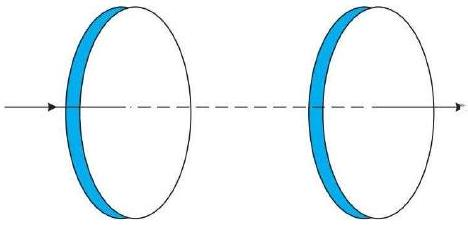

## वैद्युत चुंबकीय तरंग   $8$ Electromagnetic Waves अभ्यास प्रश्न

प्रश्न 1. चित्र में एक संघारित्र दर्शाया गया है जो $12 \mathrm{~cm}$ त्रिज्या की दो वृताकार प्लेटों को $5.0 \mathrm{~cm}$ की दूरी पर रखकर बनाया गया हैं संधारित्र को एक बाह्म स्रोत (जो चित्र में नहीं दर्शाया गया है) द्वारा आवेशित किया जा रहा है। आवेशकारी धारा नियत है और इसका मान 0.15 A है।

(a) धारिता एवं प्लेटों के बीच विभवान्तर परिवर्तन की दर का परिकलन कीजिए।
(b) ल्लेटों के बीच विस्थापन धारा ज्ञात कीजिए।
(c) क्या किर्वांफ का प्रथम नियम संधारित्र की प्रत्येक प्लेट पर लागू होता है? स्पष्ट कीजिए।

हल प्लेट की त्रिज्या $r=12 \mathrm{~cm}=12 \times 10^{-2} \mathrm{~m}$
दो वृत्तीय प्लेटों के बीच की दूरी

$$
\begin{aligned}
d & =5 \mathrm{~cm}=5 \times 10^{-2} \mathrm{~m} \\
\text { घारा } I & =0.15 \mathrm{~A}
\end{aligned}
$$

(a) समान्तर पट्ट संघारित्र की धारिता

$$
C=\frac{\varepsilon_{0} A}{d}
$$

जहाँ, $A$ प्लेटों का क्षेत्रफल

$$
\begin{aligned}
& C=\frac{8.854 \times 10^{-12} \times 3.14\left(12 \times 10^{-2}\right)^{2}}{5 \times 10^{-2}} \\
& C=\frac{8.854 \times 3.14 \times 144 \times 10^{-12-4+2}}{5} \\
& C=8.01 \times 10^{-14} \mathrm{~F}=8.01 \mathrm{pF}
\end{aligned}
$$

संधारित्र की प्लेटों पर आवेश

$$
\begin{aligned}
q & =C V \\
\frac{d q}{d t} & =C \cdot \frac{d V}{d t} \\
l & =C \cdot \frac{d V}{d t} \\
\frac{d V}{d t}=\frac{l}{C} & =\frac{0.15}{8.01 \times 10^{-12}}=18.7 \times 10^{9} \mathrm{~V} / \mathrm{s} \quad\left[\because \frac{d q}{d t}=l\right]
\end{aligned}
$$

अत: विमव परिवर्तन की दर $18.7 \times 10^{9} \mathrm{~V} / \mathrm{s}$ है।

(b) विस्थापन धारा चालन धारा के बराबर है $l_{d}=0.15 \mathrm{~A}$
(c) हों किरचॉफ का प्रथम नियम वैद्य है क्योंकि हम संयुक्त धारा विस्थापन धारा तथा चालन धारा के योग के बराबर लेते हैं।

प्रश्न 2. एक समान्तर प्लेट संघारित्र (चित्र में) $R=60 \mathrm{~cm}$ त्रिज्या की दो वृताकार प्लेटों से बना है और इसकी धारिता $C=100 \mathrm{pF}$ है। संधारित्र को $230 \mathrm{~V}$, $300 \mathrm{rad} / \mathrm{s}$ की (कोणीय) आवृति के किसी स्रोत से जोड़ा गया है।
(a) चालन धारा का rms मान क्या है?
(b) क्या चालन धारा विस्थापन धारा के बराबर है?
(c) प्लेटों के बीच, अक्ष से $3.0 \mathrm{~cm}$ की दूरी पर स्थित बिन्दु पर $B$ का आयाम ज्ञात कीजिए। हल प्लेटों की त्रिज्या $R=6 \mathrm{~cm}=6 \times 10^{-2} \mathrm{~m}$ संधारित्र की धारिता

$$
C=100 \mathrm{pF}=100 \times 10^{-12} \mathrm{~F}=10^{-10} \mathrm{~F}
$$

संधारित्र का वोल्टेज $V=230 V$
संधारित्र की आवृत्ति $\omega=300 \mathrm{rad} / \mathrm{s}$
(a) धारा का rms मान $I_{\text {ms }}=\frac{V_{\text {ms }}}{X_{c}}$

$$
\begin{array}{rlrl}
\therefore & & X_{C} & =\frac{1}{\omega C}=\frac{1}{300 \times 10^{-10}}=\frac{10^{10}}{300} \Omega \\
\therefore & & l_{\mathrm{ms}} & =\frac{230 \times 300}{10^{10}}=3 \times 23 \times 1000 \times 10^{-10} \\
& & =69 \times 10^{-7}=6.9 \times 10^{-6} \mathrm{~A} \\
& & l_{\mathrm{ms}} & =6.9 \mu \mathrm{~A}
\end{array}
$$

(b) हाँ, विस्थापन धारा चालन धारा के बराबर है

$$
\begin{aligned}
& l_{d}=\varepsilon_{0} \frac{d \phi_{E}}{d t} \quad \text { (विस्यापन धारा की परिभाषानुसार) } \\
& l_{d}=\varepsilon_{0} \frac{d}{d t}(E A) \\
& l_{d}=\varepsilon_{0} A \frac{d E}{d t} \quad\left(E=\frac{\sigma}{\varepsilon_{0}}=\frac{Q}{\varepsilon_{0} A}\right) \\
& l_{d}=\varepsilon_{0} A \frac{d}{d t}\left(\frac{Q}{\varepsilon_{0} A}\right) \\
& l_{d}=\varepsilon_{0} A \cdot \frac{1}{\varepsilon_{0} A} \cdot \frac{d Q}{d t}=\frac{d Q}{d t}=I \\
& l_{d}=I
\end{aligned}
$$

(c) प्लेटों के बीच अक्ष से बिन्दु की दूरी

$$
r=3 \mathrm{~cm}=3 \times 10^{-2} \mathrm{~m}
$$

प्लेटों की त्रिज्या $R=6$ सेमी $=6 \times 10^{-2}$ मी
प्लेटों के बीच स्थित बिन्दु पर चुम्बकीय क्षेत्र

$$
\begin{aligned}
& B=\frac{\mu_{0}}{2 \pi R^{2}} \cdot r \cdot l_{\sigma} \\
& B=\frac{\mu_{0} r}{2 \pi R^{2}} l \quad\left(\because l_{\sigma}=l\right)
\end{aligned}
$$

यदि $l=l_{0}$ घारा का अधिकतम मान है तब $l=\sqrt{2} l_{\mathrm{ms}}$

$$
\begin{aligned}
& B=\frac{\mu_{0} r}{2 \pi R^{2}} \sqrt{2} l \\
& B=\frac{4 \pi \times 10^{-7} \times 0.03 \times \sqrt{2} \times 6.9 \times 10^{-6}}{2 \pi \times 0.06 \times 0.06} \\
& B=1.63 \times 10^{-11} \mathrm{~T}
\end{aligned}
$$

प्रश्न 3. $10^{-10} \mathrm{~m}$ तरंगदैर्घ्य की X-किरणों, $6800 \AA$ तरंगदैर्घ्य के प्रकाश, तथा $500 \mathrm{~m}$ की रेडियों तरंगों के लिए किस भौतिक राशि का मान समान है?
हल यहाँ X-तरंगें लाल प्रकाश तथा रेडियों तरंगें सभी वैद्युत चुम्बकीय तरंगें हैं हम जानते हैं कि सभी वैद्युत चुम्बकीय तरंगें प्रकाश के वेग से गति करती हैं अत: सभी तरंगों की चाल समान हैं।

प्रश्न 4. एक समतल वैद्युत चुम्बकीय तरंग निर्वात् में $z$-अक्ष के अनुदिश चल रही है। इसके विद्युत तथा चुम्बकीय क्षेत्रों के सदिश की दिशा के बारे में आप क्या कहेंगे? यदि तरंग की आवृति $30$ MHz हो तो उसकी तरंगदैर्घ्य कितनी होगी?
हल हम जानते हैं कि वैद्युत चुम्बकीय तरंगें वैद्युत तथा चुम्बकीय क्षेत्र के लम्बवत् होती हैं यहाँ वैद्युत चुम्बकीय तरंग $z$ दिशा में गतिमान है, तब वैद्युत व चुम्बकीय क्षेत्र $x-y$ दिशा में हैं तथा एक दूसरे के लम्बवत् हैं।
तरंगों की आवृति $f=30 \mathrm{MHz}=30 \times 10^{6} \mathrm{~Hz}$

$$
\text { चाल } c=3 \times 10^{8} \mathrm{~m} / \mathrm{s}
$$

सूत्र

$$
c=f \lambda
$$

वैद्युत चुम्बकीय तरंग का तरंगदैर्घ्य

$$
\begin{aligned}
\lambda & =\frac{c}{f}=\frac{3 \times 10^{8}}{30 \times 10^{6}} \\
& =\frac{300}{30}=10 \mathrm{~m}
\end{aligned}
$$

अतः वैद्युत चुम्बकीय तरंग की आवृति $10 \mathrm{~m}$ है।

प्रश्न 5. एक रेडियो $7.5 \mathrm{MHz}$ से $12 \mathrm{MHz}$ बैंड के किसी स्टेशन से समस्वरित हो सकता है। संगत तरंगदैर्य बैंड क्या होगा?
हल आवृति $f_{1}=7.5 \mathrm{MHz}$
आघूर्ण $f_{2}=12 \mathrm{MHz}$
EM तरंग की चाल $c=3 \times 10^{8} \mathrm{~m} / \mathrm{s}$
$f_{1}$ के संगत EM का तरंगदैर्घ्य

$$
\lambda_{1}=\frac{c}{t_{1}}=\frac{3 \times 10^{8}}{7.5 \times 10^{6}}=3000=40 \mathrm{~m}
$$

$f_{2}$ के संगत EM तरंग का तरंगदैर्ध्य

$$
\lambda_{2}=\frac{c}{f_{2}}=\frac{3 \times 10^{8}}{12 \times 10^{6}}=\frac{300}{12}=25 \mathrm{~m}
$$

अत: संगत तरंगदैर्घ्य बैण्ड $25 \mathrm{~m}$ से $40 \mathrm{~m}$ तक है।
प्रश्न 6. एक आवेशित कण अपनी माध्य साम्यावस्था के दोनों ओर $10^{9} \mathrm{~Hz}$ आवृति से दोलन करता है। दोलक द्वारा जनित वैद्युत चुम्बकीय तरंगों की आवृति कितनी है?
हल प्रश्नानुसार, EM तरंग की आवृत्ति $=10^{9} \mathrm{~Hz}$
दोलक द्वारा जनित वैद्युत चुम्बकीय तरंग की आवृत्ति आवेशित कण के दोलनों की आवृत्ति के समान है (सन्तुलन की अवस्था के सापेक्ष)।

प्रश्न 7. निर्वात् में एक आवर्त वैद्युत 'चुम्बकीय तरंग के चुम्बकीय क्षेत्र वाले भाग का आयाम $B_{0}=510 \mathrm{nT}$ है। तरंग के वैद्युत क्षेत्र वाले भाग का आयाम क्या है?
हल वैद्युत चुम्बकीय तरंग का चुम्बकीय अंश

$$
B_{0}=510 \mathrm{nT}
$$

निर्वात् में प्रकाश की चाल $c=\frac{E_{0}}{B_{0}}$
तरंग वैद्युत अंश $E_{0}$ है।
अथवा

$$
\begin{aligned}
3 \times 10^{8} & =\frac{E_{0}}{510 \times 10^{-9}} \\
E_{0} & =153 \mathrm{~N} / \mathrm{C}
\end{aligned}
$$

अतः तरंग का वैद्युत क्षेत्र का आयाम $153$ N/C है।
प्रश्न 8. कल्पना कीजिए कि एक वैद्युत चुम्बकीय तरंग के विद्युत क्षेत्र का आयाम $E_{0}=120 \mathrm{~N} / \mathrm{C}$ है तथा इसकी आवृति $v=50.0 \mathrm{MHz}$ है। (a) $B_{0}, \omega, K$ तथा $\lambda$ ज्ञात कीजिए, (b) $E$ तथा $B$ के लिए व्यंजक प्राप्त कीजिए।
हल $E M$ तरंग के वैद्युत अंश का आयाम $E_{0}=120 \mathrm{~N} / \mathrm{C}$
तरंग की आवृति $f=50 \mathrm{MHz}=50 \times 10^{6} \mathrm{~Hz}$
(a) निर्वात् में प्रकाश की चाल

$$
\begin{aligned}
c & =\frac{E_{0}}{B_{0}} \\
B_{0} & =\frac{E_{0}}{c}=\frac{120}{3 \times 10^{8}}=40 \times 10^{-8}
\end{aligned}
$$

अथवा

$$
B_{0}=400 \times 10^{-9} \mathrm{~T}=400 \mathrm{nT}
$$

तरंग की कोणीय आवृत्ति

$$
\begin{aligned}
& \omega=2 \pi f=2 \times 3.14 \times 50 \times 10^{6} \\
& \omega=3.14 \times 10^{8} \mathrm{rad} / \mathrm{s}
\end{aligned}
$$

वैद्युत चुम्बकीय तरंग की तरंग संख्या

$$
K=\frac{\omega}{c}=\frac{3.14 \times 10^{8}}{3 \times 10^{8}}=1.05 \mathrm{rad} / \mathrm{m}
$$

वैद्युत चुम्बकीय तरंग का तरंगदैर्घ्य

$$
\lambda=\frac{c}{f}=\frac{3 \times 10^{8}}{50 \times 10^{6}} \quad 6.00 \mathrm{~m}
$$

(b) वैद्युत क्षेत्र का निगमन $E=E_{0} \sin (k x-\omega t)$

$$
E=120 \sin \left(1.05 x-3.14 \times 10^{8} t\right)
$$

चुम्बकीय क्षेत्र $B$ का निगमन

$$
\begin{aligned}
& B=B_{0} \sin (k x-\omega t) \\
& B=4 \times 10^{-7} \sin \left(1.05 x-3.14 \times 10^{8} t\right)
\end{aligned}
$$

प्रश्न 9. वैद्युत चुम्बकीय स्पेक्ट्रम के विभिन्न भार्गों की परिभाषिकी पाठ्यपुस्तक में दी गई है सूत्र $E=h v$ (विकिरण के एक क्वांटम की ऊर्जा के लिए फोटॉन) का उपयोग कीजिए तथा समी वर्णक्रम के विभिन्न भागों के लिए eV के मात्रक में फोटॉन की ऊर्जा निकालिए फोटौन ऊर्जा के जो विभिन्न परिमाण प्राप्त होते हैं वे वैद्युत चुम्बकीय विकिरण के स्रोतों से किस प्रकार सम्बन्धित हैं?
हल फोटॉन की ऊर्जा $E=h v$
$\gamma$ किरण हेतु
$\gamma$ तरंग की आवृत्ति $v=3 \times 10^{20} \mathrm{~Hz}$
$\gamma$ तरंग की ऊर्जा $E=h v=6.6 \times 10^{-34} \times 3 \times 10^{20}=19.8 \times 10^{-14} \mathrm{~J}$
अथवा

$$
E=\frac{19.8 \times 10^{-14}}{1.6 \times 10^{-19}}=124 \times 10^{6} \mathrm{eV}
$$

$\gamma$ तरंगें नाभिक से उद्गमित होती हैं।

X-तरंगों हेतु
$X$-तरंगों की आवृत्ति $v=3 \times 10^{18} \mathrm{~Hz}$
X-तरंगों की ऊर्जा

$$
E=h v=6.6 \times 10^{-34} \times 3 \times 10^{18}=19.8 \times 10^{-16} \mathrm{~J}
$$

अथवा

$$
E=\frac{19.8 \times 10^{-16}}{1.6 \times 10^{-19}}=1.24 \times 10^{4} \mathrm{eV}
$$

उच्च ऊर्जित इलेक्ट्रॉन $X$-तरंगें उत्पन्न करते हैं।
अल्ट्रावायलेट तरंग हेतु
अल्ट्रावायलेट तरंगों की आवृत्ति $v=10^{15} \mathrm{~Hz}$
अल्ट्रावायलेट तरंगों की ऊर्जा $E=h v=6.6 \times 10^{-34} \times 10^{15}=6.6 \times 10^{-19} \mathrm{~J}$
अथवा

$$
E=\frac{6.6 \times 10^{-19}}{1.6 \times 10^{-19}}=4.125 \mathrm{eV}
$$

परमाणु के उत्तेजन से अल्ट्रावायलेट तरंग उत्पन्न होती है।
दृश्य तरंग हेतु
दृश्य तरंग की आवृत्ति $v=6 \times 10^{14} \mathrm{~Hz}$
दृश्य तरंगों की ऊर्जा $E=h v=6.6 \times 10^{-34} \times 6 \times 10^{14}=39.6 \times 10^{-20} \mathrm{~J}$
अथवा

$$
E=\frac{39.6 \times 10^{-20}}{1.6 \times 10^{-19}}=2.475 \mathrm{eV}
$$

अत: दृश्य तरंगें वेलेन्सी इलेक्ट्रॉन के उत्तेजन से उत्पन्न होती हैं।
अवरक्त तरंग हेतु
अवरक्त तरंग की आवृति $v=10^{13} \mathrm{~Hz}$
अवरक्त तरंग की ऊर्जा $E=h v=6.6 \times 10^{-34} \times 10^{13}=6.6 \times 10^{-21} \mathrm{~J}$
अथवा

$$
E=\frac{6.6 \times 10^{-21}}{1.6 \times 10^{-19}}=4.125 \times 10^{-2} \mathrm{eV}
$$

परमाणु के उत्तेजन से इनका उद्गमन होता है।
माइक्रो तरंगों हेतु
माइक्रो तरंगों की आवृत्ति $v=10^{10} \mathrm{~Hz}$
माइक्रो तरंगों की ऊर्जा $E=h v=6.6 \times 10^{-34} \times 10^{10}=6.6 \times 1 \sigma^{-24} \mathrm{~J}$
अथवा

$$
E=\frac{6.6 \times 10^{-24}}{1.6 \times 10^{-19}}=4.125 \times 10^{-5} \mathrm{eV}
$$

ये तरंग निर्वात् नलिका में दोलित धारा में उत्पन्न होती हैं।
रेखियो तरगों हेतु
रेडियो तरंगों की आवृत्ति $v=3 \times 10^{8} \mathrm{~Hz}$

रेडियो तरंगों की ऊर्जा $E=h v=6.6 \times 10^{-34} \times 3 \times 10^{8}=19.8 \times 10^{-26} \mathrm{~J}$
अथवा

$$
E=\frac{19.8 \times 10^{-26}}{1.6 \times 10^{-19}}=1.24 \times 10^{-6} \mathrm{eV}
$$

ये दोलित धारा से उत्पन्न होती हैं।

| विकिरण का प्रकार | फोटॉन ऊर्जा |
| :--- | :--- |
| $\gamma$-किरणें | $1.24 \times 10^{6} \mathrm{eV}$ |
| X-किरणें | $1.24 \times 10^{4} \mathrm{eV}$ |
| पराबैंगनी तरंगें | $4.12 \mathrm{eV}$ |
| दृश्य तरंगें | $2.475$ eV |
| अवरक्त तरंगें | $4.125 \times 10^{-2} \mathrm{eV}$ |
| माइक्रो तरंगें | $4.125 \times 10^{-5} \mathrm{eV}$ |
| रेडियो तरंगें | $1.24 \times 10^{-6} \mathrm{eV}$ |

प्रश्न 10. एक समतल इलेक्ट्रोमैग्नेटिक तरंग में वैद्युत क्षेत्र, $2.0 \times 10^{10}$ हर्ट्ज आवृति तथा $48$ V/m आयाम से ज्यावक्रीय रूप से दोलन करता है।

(a) तरंग की तरंगदैर्घ्य क्या है?
(b) दोलनकारी चुम्बकीय क्षेत्र का आयाम क्या है?
(c) सिद्ध करो वैद्युत क्षेत्र E का औसत ऊर्जा घनत्व चुम्बकीय क्षेत्र B के औसत ऊर्जा घनत्व के बराबर होगा।
$$
\left(c=3 \times 10^{8} \mathrm{~m} / \mathrm{s}\right)
$$

हल दोलनों की आवृत्ति $=2 \times 10^{10} \mathrm{~Hz}$
दिया है,

$$
c=3 \times 10^{8} \mathrm{~m} / \mathrm{s}
$$

वैद्युत क्षेत्र आयाम $E_{0}=48 \mathrm{~V} / \mathrm{m}$

(a) तरंगों की तरंगदैर्घ्य $\lambda=\frac{c}{f}=\frac{3 \times 10^{8}}{2 \times 10^{10}}=1.5 \times 10^{-2} \mathrm{~m}$
(b) सूत्रानुसार $c=\frac{E_{0}}{B_{0}}$

दोलनकारी चुम्बकीय क्षेत्र का आयाम

$$
B_{0}=\frac{E_{0}}{c}=\frac{48}{3 \times 10^{8}}=1.6 \times 10^{-7} \mathrm{~T}
$$

(c) वैद्युत क्षेत्र का औसत ऊर्जा घनत्व
$$
u_{E}=\frac{1}{4} \varepsilon_{0} E_{0}^{2}
$$
हम जानते हैं कि $\frac{E_{0}}{B_{0}}=c$

समी (i) में रखने पर

$$
\therefore \quad u_{E}=\frac{1}{4} \varepsilon_{0} \cdot c^{2} B_{0}^{2}
$$

EM तरंगों की चाल $c=\frac{1}{\sqrt{\mu_{0} \varepsilon_{0}}}$
समी (ii) में रखने पर

$$
\begin{aligned}
& u_{E}=\frac{1}{4} \varepsilon_{0} B_{0}^{2} \cdot \frac{1}{\mu_{0} \varepsilon_{0}} \\
& u_{E}=\frac{1}{4} \cdot \frac{B_{0}^{2}}{\mu_{0}}=\frac{B_{0}^{2}}{2 \mu_{0}}=\mu_{B}
\end{aligned}
$$

अत: वैद्युत क्षेत्र की औसत ऊर्जा घनत्व चुम्बकीय क्षेत्र की औसत ऊर्जा घनत्व के बराबर होती है।

## अतिरिक्त प्रश्न

प्रश्न 11. कल्पना कीजिए कि निर्वात् में एक वैद्युत चुम्बकीय तरंग का विद्युत क्षेत्र $\mathbf{E}=\left[(3.1 \mathrm{~N} / \mathrm{C}) \cos \left[(1.8 \mathrm{rad} / \mathrm{m}) y+\left(5.4 \times 10^{6} \mathrm{rad} / \mathrm{s}\right) t\right)\right] \mathrm{i}$ है।

(a) तरंग संचरण की दिशा क्या है?
(b) तरंगदैर्घ्य $\lambda$ कितनी है?
(c) आवृति $v$ कितनी है?
(d) तरंग के चुम्बकीय क्षेत्र सदिश का आयाम कितना है?
(e) तरंग के चुम्बकीय क्षेत्र के लिए व्यंजक लिखिए।

हल

(a) प्रश्नानुसार यह $y$-अक्ष की ऋणात्मक दिशा में गतिमान है। यह -j दिशा में गतिमान है।
(b) यह निर्वात् में वैद्युत चुम्बकीय तरंग का अंश है
$$
E=3.1 \cos \left(1.8 y+5.4 \times 10^{6} t\right) \hat{\mathbf{i}}
$$
मानक समीकरण $E=E_{0} \cos (k y+\omega t)$ से तुलना करने पर कोणीय आवृत्ति $\omega=5.4 \times 10^{6} \mathrm{rad} / \mathrm{s}$ है।
तरंग संख्या $k=1.8 \mathrm{rad} / \mathrm{m}$
वैद्युत क्षेत्र का आयाम
$$
\begin{aligned}
E_{0} & =3.1 \mathrm{~N} / \mathrm{C} \\
\lambda & =\frac{2 \pi}{k}=\frac{2 \pi}{1.8}=3.492 \mathrm{~m}
\end{aligned}
$$

$$
\lambda=3.5 \mathrm{~m}
$$
(c)
(c)
    $$
\begin{aligned}
& \omega=2 \pi v \\
& v=\frac{\omega}{2 \pi}=\frac{5.4 \times 10^{6} \times 7}{2 \times 22}=0.86 \times 10^{6} \mathrm{~Hz} \\
& c=\frac{E_{0}}{B_{0}}
\end{aligned}
$$
(d) चुम्बकीय क्षेत्र का आयाम
$$
B_{0}=\frac{E_{0}}{c}=\frac{3.1}{3 \times 10^{8}}=1.03 \times 10^{-8} \mathrm{~T}
$$
(e) चुम्बकीय क्षेत्र हेतु चुम्बकीय तरंग समीकरण
$$
\begin{aligned}
& B=B_{0} \cos (k y+\omega t) \hat{k} \\
& B=1.03 \times 10^{-8} \cos \left(1.8 y+5.4 \times 10^{8} t\right) \hat{k}
\end{aligned}
$$

प्रश्न 12.100 W विद्युत बल्ब की शक्ति का लगमग 5\% दृश्य विकिरण में बदल जाता है।

(a) बल्ज से $1 \mathrm{~m}$ की दूरी पर
(b) $10 \mathrm{~m}$ की दूरी पर दृश्य विकिरण की औसत तीव्रता कितनी है?

यह मानिए कि विकिरण समदैशिकत: ठत्सर्जित होती है और परावर्तन की ठपेक्षा कीजिए।
हल कुल शक्ति $=100 \mathrm{~W}$
दृश्य विकिरण शक्ति = कुल शक्ति का 5\%

$$
=\frac{5}{100} \times 100=5 \mathrm{~W}
$$

(a) $1$ m की दूरी पर सम्पूर्ण ऊर्जा गोले के रूप में वितरित हो जाती है गोले का क्षेत्रफल $=4 \pi(\text { त्रिज्या })^{2}$
दृश्य विकिरण की तीव्रता
$$
=\frac{\text { शक्ति }}{\text { क्षेत्रफल }}=\frac{5}{4 \times 3.14 \times(1)^{2}}=0.4 \mathrm{~W} / \mathrm{m}^{2}
$$
(b) $10 \mathrm{~m}$ की दूरी पर दृश्य विकिरण की तीव्रता
$$
=\frac{5}{4 \times 3.14(10)^{2}}=4 \times 10^{-3} \mathrm{~W} / \mathrm{m}^{2}
$$

प्रश्न 13. विद्युत चुम्बकीय वर्णक्रम के विभिन्न भार्गों के लिए लाक्षणिक ताप परिसरों को ज्ञात करने के लिए $\lambda_{m} T=0.29 \mathrm{~cm}-\mathrm{K}$ सूत्र का उपयोग कीजिए। जो संख्याएँ आपको मिलती हैं वे क्या बतलाती हैं?

हल

$$
\lambda_{m} T=0.29 \mathrm{~cm}-\mathrm{K}
$$

$$
\lambda_{m}=\frac{0.29}{T \times 100} \mathrm{~m}
$$

माना
आवश्यक तापमान

$$
T=\frac{0.29}{100 \times 10^{-6}}=2900 \mathrm{~K}
$$

माना

$$
\lambda_{m}=5 \times 10^{-5} \mathrm{~m}
$$

आवश्यक तापमान $T=\frac{0.29}{100 \times 5 \times 10^{-5}}=6000 \mathrm{~K}$
विद्युत चुम्बकीय तरंग के अन्य भाग का तापमान ज्ञात कर सकते हैं। यह संख्या हमें विद्युत चुम्बकीय तरंग के ताप परिसर का परिकलन कराती है।

प्रश्न 14. वैद्युत चुम्बकीय विकिरण से सम्बन्धित नीचे कुछ प्रसिद्ध अंक, भौतिकी में किसी अन्य प्रसंग में वैद्युत चुम्बकीय दिए गए हैं। स्पेक्ट्रम के उस भाग का ठल्लेख कीजिए जिससे इनमें से प्रत्येक सम्बन्धित है।

(a) $21 \mathrm{~m}$ (अन्तरातारकीय आकाश में परमाण्वीय हाइड्रोजन द्वारा उत्सर्जित तरंगदैर्घ्य)
(b) $1057 \mathrm{MHz}$ (लैब-विचलन नाम से प्रसिद्ध हाइड्रोजन में, पास जाने वाले दो समीपस्य ऊर्जा स्तरों से उत्पन्न विकिरण की आवृति)
(c) $2.7 \mathrm{~K}$ (सम्पूर्ण अन्तरिक्ष को भरने वाले समदैशिक विकिरण से सम्बन्धित ताप ऐसा विचार जो विश्व में बड़े धमाके 'बिग बैग' के उद्‌मव का अवशेष माना जाता है)।
(d) $5890 \AA-5896 \AA$ (सोडियम की द्विक् रेखाए)
(e) $14.4 \mathrm{keV}$ [ ${ }^{57} \mathrm{Fe}$ नाभिक के एक विशिष्ट संक्रमण की ऊर्जा जो प्रसिद्ध उच्च विमेदन की स्पेक्ट्रमी विधि से सम्बन्धित है (मॉसबौर 'स्पेक्ट्रोस्कॉपी)]।

हल

(a) यह तरंगदैर्य (21 cm) रेडियो तरंग के तरंगदैर्घ्य के संगत है।
(b) यह आवृति $(1057 \mathrm{MHz})$ रेडियो तरंग की आवृति के संगत है (छोटी तरंगदैर्घ्य)
(c) $$
T=2.7 \mathrm{~K}
$$
सूत्रानुसार, $\lambda_{m} T=b=0.29 \mathrm{~cm}-\mathrm{K}$
$$
\lambda_{m}=\frac{0.29}{2.7} \mathrm{~cm}=0.11 \mathrm{~cm}
$$
यह तरंगदैर्घ्य सूक्ष्मतरंगों के तरंगदैर्घ्य के संगत है।
(d) यह तरंगदैर्घ्य वैद्युत चुम्बकीय तरंग के दृश्य भाग में है।
(e) ऊर्जा $E=14.4 \mathrm{keV}=14.4 \times 10^{3} \times 1.6 \times 10^{-19} \mathrm{~J}$
तरंग की आवृति $v=\frac{E}{h}=\frac{14.4 \times 1.6 \times 10^{-16}}{6.6 \times 10^{-34}}=3 \times 10^{11} \mathrm{MHz}$
यह आवृत्ति EM तरंग के X-किरण के तरंग परिसर में स्थित है।

प्रश्न 15.निम्नलिखित प्रश्नों का उत्तर दीजिए

(a) लम्बी दूरी के रेडियो प्रेषित्र लघु तरंग बैंड का उपयोग करते हैं। क्यों?
(b) लम्बी दूरी के TV प्रेषण के लिए उपग्रहों का ठपयोग आवश्यक है। क्यों?
(c) प्रकाशीय तथा रेडियो दूरदर्शी पृथ्वी पर निर्मित किए जाते हैं किन्तु X-किरण खगोलविज्ञान का अध्ययन पृथ्वी का परिप्रमण कर रहे उपग्रहों द्वारा ही सम्मव है। क्यों?
(d) समतापीयमण्डल के ऊपरी छोर पर छोटी-सी ओजोन की परत मानव जीवन के लिए जीवनदायी है। क्यों?
(e) यदि पृथ्वी पर वायुमण्डल नहीं होता, तो उसके धरातल का औसत ताप वर्तमान ताप से अधिक होता या कम?
(f) कुछ वैज्ञानिकों ने भविष्यवाणी की है कि पृथ्वी पर नामिकीय विश्व युद्ध के बाद 'प्रचण्ड नाभिकीय शीतकाल' होगा जिसका पृथ्वी के जीवों पर विध्वंसकारी प्रभाव पड़ेगा। इस भविष्यवाणी का क्या आधार होगा?

हल

(a) लम्बी दूरी के रेडियो प्रेषित लघु तरंग बैण्ड का उपयोग करते हैं क्योंकि वे आयनमण्डल से परावर्तित होती हैं।
(b) यह आवश्यक है कि TV ट्रांसमिशन के लिए उपग्रह का प्रयोग किया जाता है क्योंकि TV सिग्नल उच्च आवृत्ति के होते हैं जो आयनमण्डल से परावर्तित नहीं होते हैं। अतः परावर्तन हेतु उपग्रह प्रयुक्त होते हैं।
(c) प्रकाशीय तथा रेडियो दूरदर्शी में प्रकाशीय रेडियो तरंगें प्रयुक्त होती है जो वायुमण्डल को भेद जाती हैं जबकि $x$-किरणें अति अल्प तरंगदैर्घ्य की होती हैं तथा ये वायुमण्डल द्वारा ग्रहण कर ली जाती हैं। अतः हम पृथ्वी पर हम प्रकाशीय तथा रेडियो दूरदर्शी के साथ कार्य कर सकते हैं किन्तु X-तरंग तथा खगोलीय दूरदर्शी उपग्रह पर प्रयुक्त होते हैं जो परिभ्रमण कर रहे उपग्रह द्वारा ही सम्भव है।
(d) समतापीयमण्डल के ऊपरी छोर पर ओजोन मण्डल मानव के लिए जीवनदायी है क्योंकि ओजोन परत हानिकारक अवरक्त किरणों को पृथ्वी पर आने से रोकती है। अतः ओजोन जीवनदायी बेल्ट है।
(e) यदि पृथ्वी पर वायुमण्डल नहीं होता, तब पृथ्वी पर पृष्ठीय ताप अधिक होता क्योंकि तब वायुमण्डल में ग्रीन हाऊस प्रभाव नहीं होता।
(f) नाभिकीय युद्ध के पश्चात् पृथ्वी का अधिकांश भाग नाभिकीय विकिरण से ढक जायेगा तथा सूर्य विकिरण पृथ्वी पर कम पहुँचेगा तथा शीत युग आरम्म होगा।
