## अध्याय $9$

## किरण प्रकाशिकी एवं

## प्रकाशिक यंत्र

## $9.1$ भूमिका

प्रकृति ने मानव नेत्र (दृष्टि पटल) को वैद्युतचुंबकीय स्पेक्ट्रम के एक छोटे परिसर में वैद्युत चुंबकीय तरंगों को सुग्राहिता सहित संसूचित कर सकने योग्य बनाया है। इस वैद्युतचुंबकीय स्पेक्ट्रम से संबंधित विकिरणों (तरंगदैर्घ्य लगभग $400$ nm से $750$ nm ) को प्रकाश कहते हैं। मुख्य रूप से प्रकाश एवं दृष्टि की संवेदना के कारण ही हम अपने चारों ओर के संसार को समझते एवं उसकी व्याख्या करते हैं।

अपने सामान्य अनुभव से हम प्रकाश के विषय में अपनी अंतर्दृष्टि द्वारा दो बातों का उल्लेख कर सकते हैं। पहली, यह अत्यधिक तीव्र चाल से गमन करता है तथा, दूसरी, यह सरल रेखा में गमन करता है। इस तथ्य को पूर्ण रूप से समझने में लोगों को कुछ समय लगा कि प्रकाश की चाल (c) परिमित है तथा इसे मापा जा सकता है। वर्तमान में, इसका निर्वात में मान्य मान $c=2.99792458 \times 10^{8} \mathrm{~m} \mathrm{~s}^{-1}$ है। अनेक प्रयोजनों के लिए, इसका मान $c=3 \times 10^{8} \mathrm{~m} \mathrm{~s}^{-1}$ पर्याप्त है। निर्वात में प्रकाश की चाल प्रकृति में प्राप्य उच्चतम चाल है।

हमारी अंतर्दर्शी धारणा कि प्रकाश सरल रेखा में गमन करता है, (जो कुछ हमने अध्याय $8$ में सीखा था) का खंडन करती प्रतीत होती है क्योंकि वहाँ हमने प्रकाश को वैद्युतचुंबकीय तरंग माना था जिसकी तरंगदैर्घ्य स्पेक्ट्रम के दृश्य भाग में होती है। इन दोनों तथ्यों में सामंजस्य कैसे स्थापित किया जाए? इसका उत्तर यह है कि दैनिक जीवन की सामान्य वस्तुओं के साइज़ (व्यापक रूप में कुछ सेंटीमीटर की कोटि अथवा इससे अधिक) की तुलना में प्रकाश की तरंगदैर्घ्य काफ़ी कम होती है। जैसा कि आप अध्याय $10$ में सीखेंगे, इस स्थिति में, प्रकाश तरंग को एक बिंदु से दूसरे

## भौतिकी

बिंदु तक किसी सरल रेखा के अनुदिश गमन करते हुए माना जा सकता है। इस पथ को प्रकाश किरण कहते हैं तथा इसी प्रकार की किरणों के समूह से प्रकाश-पुंज बनता है।

इस अध्याय में, हम प्रकाश के किरण रूप का उपयोग करते हुए, प्रकाश के परावर्तन, अपवर्तन तथा विक्षेपण की परिघटनाओं के बारे में विचार करेंगे। परावर्तन तथा अपवर्तन के मूल नियमों का उपयोग करते हुए हम समतल तथा गोलीय परावर्ती एवं अपवर्ती पृष्ठों द्वारा प्रतिबिंबों की रचना का अध्ययन करेंगे। तत्पश्चात हम मानव नेत्र सहित कुछ महत्वपूर्ण प्रकाशिक यंत्रों की रचना एवं कार्य विधि का वर्णन करेंगे।

## $9.2$ गोलीय दर्पणों द्वारा प्रकाश का परावर्तन

हम परावर्तन के नियमों से परिचित हैं। परावर्तन कोण (अर्थात, परावर्तित किरण तथा परावर्तक पृष्ठ अथवा दर्पण के आपतन बिंदु पर अभिलंब के बीच का कोण),

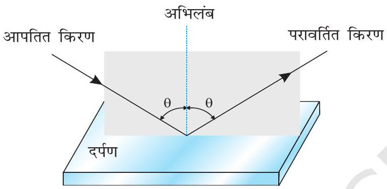
चित्र $9.1$ आपतित किरण, परावर्तित किरण तथा परावर्तक पृष्ठ के आपतन बिंदु पर अभिलंब एक ही तल में होते हैं।

आपतन कोण (आपतित किरण तथा दर्पण के आपतन बिंदु अभिलंब के बीच का कोण) के बराबर होता है। इसके अतिरिक्त, आपतित किरण, परावर्तित किरण तथा परावर्तक पृष्ठ के आपतन बिंदु पर अभिलंब एक ही समतल में होते हैं (चित्र 9.1)। ये नियम किसी भी परावर्तक पृष्ठ, चाहे वह समतल हो या वक्रित हो, के प्रत्येक बिंदु के लिए वैध हैं। तथापि, हम अपने विवेचन को वक्रित पृष्ठों की विशेष स्थिति, अर्थात गोलीय पृष्ठों तक ही सीमित रखेंगे। इस स्थिति में अभिलंब खींचने का तात्पर्य, पृष्ठ के आपतन बिंदु पर खींचे गए स्पर्शी पर लंब खींचना है। इसका अर्थ यह हुआ कि अभिलंब वक्रता त्रिज्या के अनुदिश अर्थात आपतन बिंदु को दर्पण के वक्रता केंद्र से मिलाने वाली रेखा पर है।
हम पहले ही अध्ययन कर चुके हैं कि गोलीय दर्पण का ज्यामितीय केंद्र इसका ध्रुव कहलाता है, जबकि गोलीय लेंस के ज्यामितीय केंद्र को प्रकाशिक केंद्र कहते हैं। गोलीय दर्पण के ध्रुव तथा वक्रता केंद्र को मिलाने वाली सरल रेखा मुख्य अक्ष कहलाती है। गोलीय लेंसों में जैसा कि आप बाद में देखेंगे, प्रकाशिक केंद्र को मुख्य फोकस से मिलाने वाली रेखा मुख्य अक्ष कहलाती है। गोलीय दर्पणों द्वारा परावर्तन तथा गोलीय लेंसों द्वारा अपवर्तन के लिए प्रासंगिक सूत्र व्युत्पन्न करने के लिए, सर्वप्रथम हमें दूरियाँ मापने के लिए कोई चिह्न परिपाटी अपनानी होगी। इस पुस्तक में हम कार्तीय चिह्न परिपाटी (cartesian sign convention) का पालन करेंगे। इस परिपाटी के अनुसार वस्तु को दर्पण/लेंस के बायीं ओर रखते हैं तथा सभी दूरियाँ दर्पण के ध्रुव अथवा लेंस के प्रकाशिक केंद्र से मापी जाती हैं। आपतित प्रकाश की दिशा में मापी गई दूरियाँ धनात्मक मानी जाती हैं तथा जो दूरियाँ आपतित प्रकाश की दिशा के विपरीत दिशा में मापी जाती हैं वे ऋणात्मक मानी जाती हैं (चित्र 9.2)। $x$-अक्ष के सापेक्ष तथा दर्पण/लेंस के मुख्य अक्ष ( $x$-अक्ष) के अभिलंबवत, उपरिमुखी मापित ऊँचाइयाँ धनात्मक मानी जाती हैं (चित्र 9.2)। अधोमुखी मापित ऊँचाइयों को ऋणात्मक लिया जाता है।

## किरण प्रकाशिकी एवं   प्रकाशिक यंत्र

सामान्य मान्य परिपाटी के साथ हमें गोलीय दर्पणों के लिए एकल सूत्र तथा गोलीय लेंसों के लिए एकल सूत्र मिल जाते हैं तथा इन सूत्रों द्वारा हम विभिन्न स्थितियों का निपटान कर सकते हैं।

### 9.2.2 गोलीय दर्पणों की फोकस दूरी

चित्र $9.3$ में दर्शाया गया है कि जब कोई समांतर प्रकाश-पुंज किसी (a) अवतल दर्पण तथा (b) उत्तल दर्पण, पर आपतित होता है तो क्या होता है। हम यहाँ यह मानते हैं कि किरणें उपाक्षीय (paraxial) हैं, अर्थात वे दर्पण के ध्रुव P के निकट के बिंदुओं पर आपतित हैं तथा मुख्य अक्ष से छोटे कोण बनाती हैं। परावर्तित किरणें अवतल दर्पण के मुख्य अक्ष पर बिंदु F पर अभिसरित होती हैं [चित्र $9.3$ (a)]। उत्तल दर्पण के लिए, परावर्तित किरणें इसके मुख्य अक्ष पर बिंदु $F$ से अपसरित होती प्रतीत होती हैं [चित्र $9.3$ (b)]। बिंदु $F$ दर्पण का मुख्य फ़ोकस कहलाता है। यदि समांतर उपाक्षीय प्रकाश-पुंज अक्ष से कोई कोण बनाते हुए दर्पण पर आपतित होता है तो परावर्तित किरणें मुख्य अक्ष के बिंदु $F$ से गुज़रने वाले तथा मुख्य अक्ष के अभिलंबवत तल के किसी बिंदु पर अभिसरित (अथवा उस बिंदु से अपसरित होती प्रतीत) होंगी। इस तल को दर्पण का फ़ोकस समतल कहते हैं [चित्र $9.3$ (c)]।

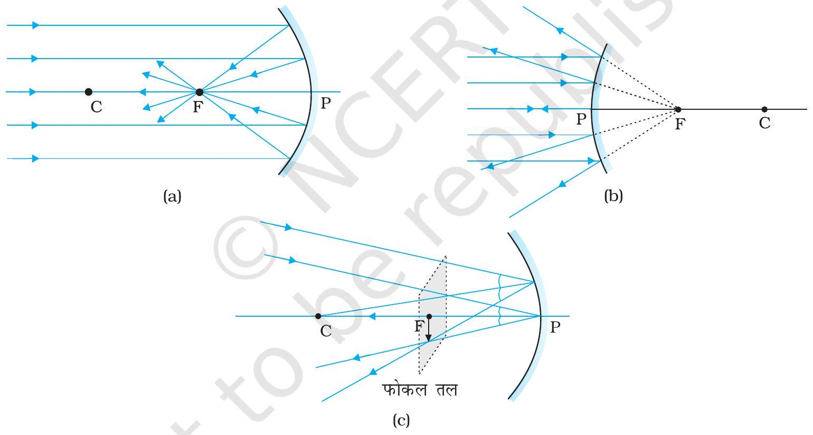
चित्र $9.3$ अवतल तथा उत्तल दर्पण के फोकस।

दर्पण के फ़ोकस F तथा ध्रुव P के बीच की दूरी दर्पण की फ़ोकस दूरी कहलाती है तथा इसे $f$ द्वारा निर्दिष्ट किया जाता है। अब हम यह दर्शाते हैं कि $f=R / 2$, यहाँ $R$ दर्पण की वक्रता त्रिज्या है। किसी आपतित प्रकाश किरण के परावर्तन की ज्यामिति चित्र $9.4$ में दर्शायी गई है।

मान लीजिए C दर्पण का वक्रता केंद्र है। मुख्य अक्ष के समांतर एक प्रकाश किरण पर विचार कीजिए जो दर्पण से M पर टकराती है। तब CM बिंदु M पर दर्पण पर अभिलंब होगा। मान लीजिए $\theta$ आपतन कोण है तथा MD बिंदु M से मुख्य अक्ष पर लंब है। तब,

$$
\angle \mathrm{MCP}=\theta \text { तथा } \angle \mathrm{MFP}=2 \theta
$$

अब, $\tan \theta=\frac{\mathrm{MD}}{\mathrm{CD}}$ तथा $\tan 2 \theta=\frac{\mathrm{MD}}{\mathrm{FD}}$

## □ भौतिकी

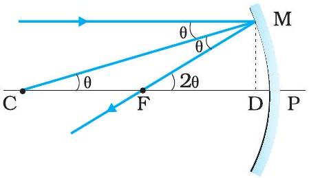
(a)

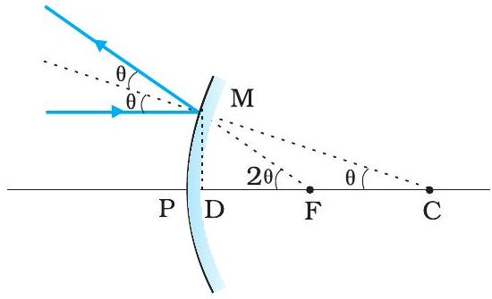
(b)

चित्र $9.4$ (a) अवतल गोलीय दर्पण, तथा

(b) उत्तल गोलीय दर्पण, पर किसी आपतित किरण के परावर्तन की ज्यामिति।

चित्र $9.5$ किसी अवतल दर्पण द्वारा प्रतिबिंब रचना का किरण आरेख
$\theta$ के लघु मानों के लिए, जो कि उपाक्षीय किरणों के लिए सत्य है, $\tan \theta \approx \theta, \tan 2 \theta \approx 2 \theta$
इसलिए समीकरण (9.1) से प्राप्त होता है

$$
\frac{M D}{F D}=2 \frac{M D}{C D}
$$

अथवा, $\mathrm{FD}=\frac{\mathrm{CD}}{2}$

अथवा, $\theta$ के लघु मान के लिए, बिंदु D बिंदु P के बहुत निकट है, इसलिए $\mathrm{FD}=f$ तथा $\mathrm{CD}=R$ । अतः समीकरण (9.2) से प्राप्त होता है

$$
f=R / 2
$$

### 9.2.3 दर्पण समीकरण

यदि किसी बिंदु से आरंभ होकर प्रकाश किरणें परावर्तन तथा/अथवा अपवर्तन के पश्चात किसी अन्य बिंदु पर मिलती हैं तो वह बिंदु पहले बिंदु का प्रतिबिंब कहलाता है। यदि किरणें वास्तव में इस बिंदु पर अभिसरित होती हैं तो प्रतिबिंब वास्तविक होता है। इसके विपरीत, यदि किरणें वास्तव में नहीं मिलतीं, परंतु पीछे की ओर बढ़ाए जाने पर उस बिंदु से अपसरित होती प्रतीत होती हैं तो वह प्रतिबिंब आभासी होता है। इस प्रकार किसी वस्तु का परावर्तन तथा/अथवा अपवर्तन द्वारा स्थापित प्रतिबिंब उस वस्तु का बिंदु-दर-बिंदु तदनुरूप होता है।
सिद्धांत रूप में, हम वस्तु के किसी बिंदु से निकलने वाली कोई दो किरणें ले सकते हैं, उनके पथ अनुरेखित करते हैं, उनका प्रतिच्छेद बिंदु ज्ञात करते हैं और इस प्रकार, किसी गोलीय दर्पण द्वारा परावर्तन के कारण बना किसी बिंदु का प्रतिबिंब प्राप्त करते हैं। तथापि, व्यवहार में निम्नलिखित किरणों में से कोई सी दो किरणें लेना सुविधाजनक होता है:

(i) किसी बिंदु से आने वाली वह किरण जो मुख्य अक्ष के समांतर है। परावर्तित किरण दर्पण के फ़ोकस से गुज़रती है।
(ii) वह किरण जो किसी अवतल दर्पण के वक्रता केंद्र से गुज़रती है अथवा उत्तल दर्पण के वक्रता केंद्र से जाती प्रतीत होती है। परावर्तित किरण केवल अपना पथ पुन: अनुरेखित करती है।
(iii) वह किरण जो किसी अवतल दर्पण के मुख्य फ़ोकस से गुज़रती है अथवा उत्तल दर्पण के मुख्य फ़ोकस से गुज़रती (की ओर दिष्ट) प्रतीत होती है। परावर्तित किरण मुख्य अक्ष के समांतर गमन करती है।
(iv) कोई किरण जो ध्रुव पर किसी भी कोण पर आपतित होती है। परावर्तित किरण, परावर्तन के नियमों का पालन करती है।

चित्र $9.5$ बिंब के बिंदु A से निकलने वाली तीन किरणों को ध्यान में रखकर किरण-आरेख दर्शाता है। इसमें अवतल दर्पण द्वारा बनाया गया बिंब AB का प्रतिबिंब A'B' (इस स्थिति में वास्तविक) दर्शाया गया है। इसका यह अर्थ नहीं है कि बिंदु A से केवल तीन किरणें ही निकलती हैं। किसी भी स्रोत से सभी दिशाओं में अनंत किरणें निकलती हैं। अतः यदि बिंदु A से निकलने वाली प्रत्येक किरण, अवतल दर्पण द्वारा परावर्तन के पश्चात बिंदु A' से होकर गुज़रती है तो बिंदु A' बिंदु A का वास्तविक प्रतिबिंब है।

अब हम दर्पण समीकरण अथवा बिंब दूरी ( $u$ ), प्रतिबिंब दूरी ( $v$ ) तथा फ़ोकस दूरी ( $f$ ) के बीच संबंध व्युत्पन्न करेंगे।

चित्र $9.5$ से, दोनों समकोण त्रिभुज $\mathrm{A}^{\prime} \mathrm{B}^{\prime} \mathrm{F}$ तथा MPF समरूप हैं। (उपाक्षीय किरणों के लिए, MP को सरल रेखा CP के लंबवत माना जा सकता है।) अतः

$$
\frac{\mathrm{B}^{\prime} \mathrm{A}^{\prime}}{\mathrm{PM}}=\frac{\mathrm{B}^{\prime} \mathrm{F}}{\mathrm{FP}}
$$

## किरण प्रकाशिकी एवं प्रकाशिक यंत्र

अथवा $\frac{\mathrm{B}^{\prime} \mathrm{A}^{\prime}}{\mathrm{BA}}=\frac{\mathrm{B}^{\prime} \mathrm{F}}{\mathrm{FP}}(\mathrm{Q} \mathrm{PM}=\mathrm{AB})$

क्योंकि $\angle \mathrm{APB}=\angle \mathrm{A}^{\prime} \mathrm{PB}^{\prime}$, समकोण त्रिभुज $\mathrm{A}^{\prime} \mathrm{B}^{\prime} \mathrm{P}$ तथा ABP भी समरूप हैं। अतः

$$
\frac{\mathrm{B}^{\prime} \mathrm{A}^{\prime}}{\mathrm{BA}}=\frac{\mathrm{B}^{\prime} \mathrm{P}}{\mathrm{BP}}
$$

समीकरण (9.4) तथा (9.5) की तुलना करने पर हमें प्राप्त होगा

$$
\frac{B^{\prime} F}{F P}=\frac{B^{\prime} P-F P}{F P}=\frac{B^{\prime} P}{B P}
$$

समीकरण (9.6) में दूरियों के परिमाण सम्मिलित हैं। अब हम चिह्न परिपाटी को लागू करते हैं। हम नोट करते हैं कि प्रकाश बिंब से दर्पण MPN की ओर गमन करता है। इस प्रकार इस दिशा को धनात्मक लिया जाता है। ध्रुव P से बिंब AB , प्रतिबिंब $\mathrm{A}^{\prime} \mathrm{B}^{\prime}$ तथा फ़ोकस F तक पहुँचने के लिए हमें आपतित प्रकाश की दिशा के विपरीत दिशा में गमन करना पड़ता है। इसलिए, इन तीनों के चिह्न ऋणात्मक होंगे। अतः

$$
\mathrm{B}^{\prime} \mathrm{P}=-v, \mathrm{FP}=-f, \mathrm{BP}=-u
$$

समीकरण (9.6) में इनका उपयोग करने पर प्राप्त होता है

$$
\frac{-v+f}{-f}=\frac{-v}{-u}
$$

अथवा $\frac{v-f}{f}=\frac{v}{u}$

$$
\frac{v}{f}=1+\frac{v}{u}
$$

इसे $v$ से भाग देने पर हमें प्राप्त होगा

$$
\frac{1}{v}+\frac{1}{u}=\frac{1}{f}
$$

यह संबंध दर्पण समीकरण कहलाता है।
वस्तु के साइज़ के सापेक्ष प्रतिबिंब का साइज़ भी एक महत्वपूर्ण विचारणीय राशि है। हम किसी दर्पण के रैखिक आवर्धन $(m)$ को प्रतिबिंब के साइज़ $\left(h^{\prime}\right)$ तथा बिंब के साइज़ $(h)$ के अनुपात के रूप में परिभाषित करते हैं। अतः

$$
m=\frac{h^{\prime}}{h}
$$

$h$ तथा $h^{\prime}$ को मान्य चिह्न परिपाटी के अनुसार धनात्मक अथवा ऋणात्मक लिया जाएगा। त्रिभुजों $\mathrm{A}^{\prime} \mathrm{B}^{\prime} \mathrm{P}$ तथा ABP, में हमें मिलता है,

$$
\frac{\mathrm{B}^{\prime} \mathrm{A}^{\prime}}{\mathrm{BA}}=\frac{\mathrm{B}^{\prime} \mathrm{P}}{\mathrm{BP}}
$$

चिह्न परिपाटी लगाने पर, यह हो जाएगा

$$
\frac{-h^{\prime}}{h}=\frac{-v}{-u}
$$

इस प्रकार

$$
m=\frac{h^{\prime}}{h}=-\frac{v}{u}
$$

यहाँ पर हमने दर्पण समीकरण [समीकरण (9.7)] तथा आवर्धन सूत्र [समीकरण (9.9)] अवतल दर्पण द्वारा बने वास्तविक तथा उलटे प्रतिबिंब के लिए व्युत्पन्न किए हैं। परंतु वास्तव में उचित चिह्न परिपाटी का उपयोग करने पर, ये संबंध गोलीय दर्पणों (अवतल तथा उत्तल) द्वारा परावर्तन के सभी उदाहरणों (चाहे प्रतिबिंब वास्तविक बने या आभासी) पर लागू होते हैं। चित्र $9.6$ में अवतल तथा उत्तल दर्पण द्वारा आभासी प्रतिबिबों की रचना के किरण-आरेख दर्शाए गए हैं। आप स्वयं यह सत्यापित कर सकते हैं कि समीकरण (9.7) तथा (9.9) इन उदाहरणों के लिए भी मान्य हैं।

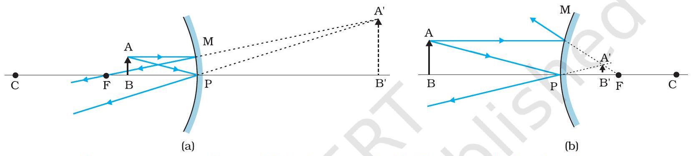
चित्र $9.6$ (a) अवतल दर्पण द्वारा प्रतिबिंब की रचना जबकि बिंब बिंदु P तथा F के बीच स्थित है, तथा (b) उत्तल दर्पण द्वारा प्रतिबिंब की रचना।

उदाहरण $9.1$ मान लीजिए चित्र $9.5$ में दर्शाए अवतल दर्पण के परावर्तक पृष्ठ के नीचे का आधा भाग किसी अपारदर्शी (अपरावर्ती) पदार्थ से ढक दिया गया है। दर्पण के सामने स्थित किसी बिंब के दर्पण द्वारा बने प्रतिबिंब पर इसका क्या प्रभाव पड़ेगा?
हल
आप सोच सकते हैं कि प्रतिबिंब में बिंब का आधा भाग दिखाई देगा। परंतु यह मानते हुए कि परावर्तन के नियम दर्पण के शेष भाग पर भी लागू होते हैं, अतः दर्पण द्वारा बिंब का पूर्ण प्रतिबिंब बनेगा। तथापि, क्योंकि परावर्ती पृष्ठ का क्षेत्रफल कम हो गया है। इसलिए प्रतिबिंब की तीव्रता कम हो जाएगी (इस उदाहरण में आधी)।

उदाहरण $9.2$ किसी अवतल दर्पण के मुख्य अक्ष पर एक मोबाइल फोन रखा है। उचित किरण आरेख द्वारा प्रतिबिंब की रचना दर्शाइए। व्याख्या कीजिए कि आवर्धन एकसमान क्यों नहीं है। क्या प्रतिबिंब की विकृति दर्पण के सापेक्ष फोन की स्थिति पर निर्भर करती है?

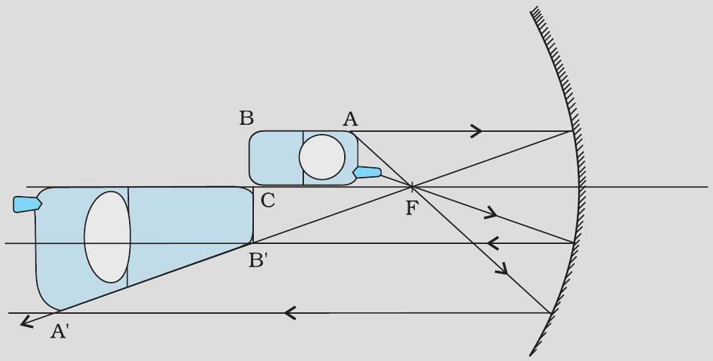
चित्र $9.7$

## किरण प्रकाशिकी एवं   प्रकाशिक यंत्र

हल
चित्र $9.7$ में फ़ोन के प्रतिबिंब की रचना का प्रकाश-किरण आरेख दर्शाया गया है। मुख्य अक्ष के लंबवत समतल में स्थित भाग का प्रतिबिंब उसी समतल में होगा। यह उसी साइज़ का होगा, अर्थात $\mathrm{B}^{\prime} \mathrm{C}=\mathrm{BC}$ । आप स्वयं ही पूर्ण रूप से समझ सकते हैं कि प्रतिबिंब में विकृति क्यों है?

उदाहरण $9.3$ कोई वस्तु $15 \mathrm{~cm}$ वक्रता त्रिज्या के अवतल दर्पण से (i) $10 \mathrm{~cm}$ तथा (ii) $5 \mathrm{~cm}$ दूरी पर रखी है। प्रत्येक स्थिति में प्रतिबिंब की स्थिति, प्रकृति तथा आवर्धन परिकलित कीजिए।

हल
फोकस दूरी $f=-15 / 2 \mathrm{~cm}=-7.5 \mathrm{~cm}$

(i) बिंब दूरी $u=-10 \mathrm{~cm}$ । तब समीकरण (9.7) से प्राप्त होगा
$$
\frac{1}{v}+\frac{1}{-10}=\frac{1}{-7.5}
$$
अथवा
$$
v=\frac{10 \times 7.5}{-2.5}=-30 \mathrm{~cm}
$$
प्रतिबिंब बिंब की दिशा में दर्पण से $30 \mathrm{~cm}$ दूरी पर बनेगा।
आवर्धन $m=-\frac{v}{u}=-\frac{(-30)}{(-10)}=-3$

प्रतिबिंब आवर्धित, वास्तविक तथा उलटा है।

(ii) बिंब दूरी $u=-5 \mathrm{~cm}$ तब समीकरण (9.7) से
$$
\frac{1}{v}+\frac{1}{-5}=\frac{1}{-7.5}
$$
अथवा $\quad v=\frac{5 \times 7.5}{(7.5-5)}=15 \mathrm{~cm}$

प्रतिबिंब दर्पण के पीछे $15 \mathrm{~cm}$ दूरी पर बनता है। यह प्रतिबिंब आभासी है।
आवर्धन $m=-\frac{v}{u}=-\frac{15}{(-5)}=3$
यह प्रतिबिंब आवर्धित, आभासी तथा सीधा है।

उदाहरण $9.4$ मान लीजिए कि आप किसी स्थिर कार में बैठे हैं। आप $2 \mathrm{~m}$ वक्रता त्रिज्या के पाशर्व दृश्य दर्पण में किसी धावक को अपनी ओर आता हुआ देखते हैं। यदि धावक $5 \mathrm{~m} \mathrm{~s}^{-1}$ की चाल से दौड़ रहा हो, तो उसका प्रतिबिंब कितनी चाल से दौड़ता प्रतीत होगा जबकि धावक (a) $39 \mathrm{~m}$, (b) $29 \mathrm{~m}$, (c) $19 \mathrm{~m}$, तथा (d) $9 \mathrm{~m}$ दूर है।

हल
दर्पण समीकरण (9.7), से हमें प्राप्त होता है

$$
v=\frac{f u}{u-f}
$$

उत्तल दर्पण के लिए, क्योंकि $R=2 \mathrm{~m}, f=1 \mathrm{~m}$. तब

$$
u=-39 \mathrm{~m}, v=\frac{(-39) \times 1}{-39-1}=\frac{39}{40} \mathrm{~m}
$$

क्योंकि धावक $5 \mathrm{~m} \mathrm{~s}^{-1}$ की अपरिवर्ती चाल से चलता है, $1 \mathrm{~s}$ के पश्चात ( $u=-39+5=-34 \mathrm{~m}$ ) के लिए प्रतिबिंब की स्थिति $v$ होगी ( $34 / 35$ )m,
अतः $1 \mathrm{~s}$ में प्रतिबिंब की स्थिति में विस्थापन होगा

$$
\frac{39}{40}-\frac{34}{35}=\frac{1365-1360}{1400}=\frac{5}{1400}=\frac{1}{280} \mathrm{~m}
$$

इसलिए जब धावक दर्पण से $39 \mathrm{~m}$ तथा $34 \mathrm{~m}$ के बीच में है, तो प्रतिबिंब की औसत चाल है $(1 / 280) \mathrm{m} \mathrm{s}^{-1}$
इसी प्रकार यह देखा जा सकता है कि जब $u=-29 \mathrm{~m},-19 \mathrm{~m}$ तथा $-9 \mathrm{~m}$ है तब जिस चाल से प्रतिबिंब गति करता प्रतीत होगा वह क्रमश:

$$
\frac{1}{150} \mathrm{~m} \mathrm{~s}^{-1}, \frac{1}{60} \mathrm{~m} \mathrm{~s}^{-1} \text { तथा } \frac{1}{10} \mathrm{~m} \mathrm{~s}^{-1} \text { होंगी। }
$$

यद्यपि धावक एक अपरिवर्ती चाल से गतिमान है तथापि धावक दर्पण के जैसे-जैसे निकट आएगा उसके प्रतिबिंब की चाल में पर्याप्त वृद्धि प्रतीत होती जाएगी। यह परिघटना किसी स्थिर कार अथवा स्थिर बस में बैठा कोई भी व्यक्ति देख सकता है। यदि पीछे से आने वाला वाहन एक अपरिवर्ती चाल से लगातार पास आ रहा हो तो, चलते हुए वाहनों में इसी प्रकार की परिघटना देखी जा सकती है।

## $9.3$ अपवर्तन

जब किसी पारदर्शी माध्यम में गमन करता कोई प्रकाश किरण-पुंज किसी दूसरे पारदर्शी माध्यम से टकराता है, तो प्रकाश का एक भाग पहले माध्यम में वापस परावर्तित हो जाता है। जबकि शेष भाग दूसरे माध्यम में प्रवेश करता है। हम प्राय: किसी किरण-पुंज को प्रकाश की किरण द्वारा निरूपित करते हैं। जब कोई प्रकाश की किरण

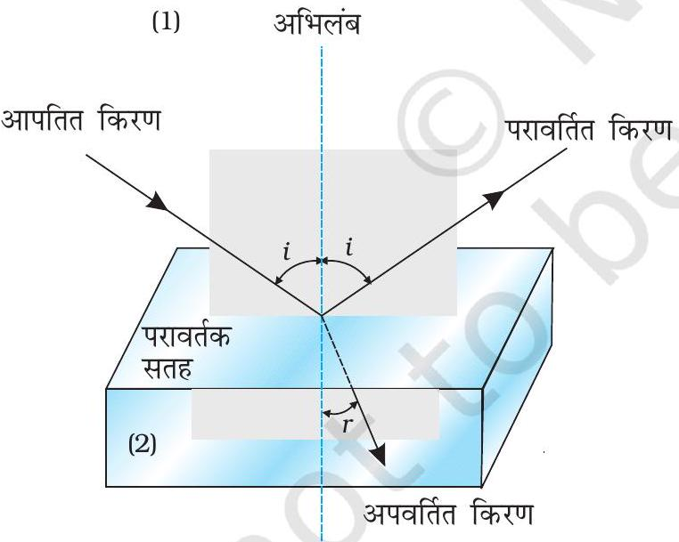
चित्र $9.8$ प्रकाश का अपवर्तन तथा परावर्तन।

एक माध्यम से दूसरे माध्यम में तिर्यक आपतित $\left(0^{\circ}<\mathrm{i}<90^{\circ}\right)$ होकर गमन करती है तो दोनों माध्यमों के अंतरापृष्ठ पर इसके संचरण की दिशा परिवर्तित हो जाती है। इस परिघटना को प्रकाश का अपवर्तन कहते हैं। स्नेल ने प्रयोगों द्वारा अपवर्तन के निम्नलिखित नियम प्रतिपादित किए।

(i) आपतित किरण, अपवर्तित किरण तथा अंतरापृष्ठ के आपतन बिंदु पर अभिलंब, एक ही समतल में होते हैं।
(ii) किन्हीं दो माध्यमों के युगल के लिए, आपतन कोण की ज्या (sine) तथा अपवर्तन कोण की ज्या का अनुपात एक स्थिरांक होता है।

याद रखिए, आपतन कोण $(i)$ तथा अपवर्तन कोण $(r)$ वे कोण हैं जो आपतित किरण तथा अपवर्तित किरण क्रमशः अभिलंब के साथ बनाती हैं। अतः

$$
\frac{\sin i}{\sin r}=n_{21}
$$

यहाँ $n_{21}$ एक स्थिरांक है, जिसे पहले माध्यम के सापेक्ष दूसरे माध्यम का अपवर्तनांक कहते हैं। समीकरण (9.10) अपवर्तन के स्नेल के नियम के नाम से जानी जाती है। ध्यान देने योग्य बात यह है कि $n_{21}$ दो माध्यम के युगल का अभिलक्षण है (तथा यह प्रकाश की तरंगदैर्घ्य पर भी निर्भर करता है), परंतु यह आपतन कोण पर निर्भर नहीं करता।

## किरण प्रकाशिकी एवं प्रकाशिक यंत्र

समीकरण (9.10) से यदि $n_{21}>1, r<i$, अर्थात अपवर्तित किरण अभिलंब की ओर मुड़ जाती है। इस दशा में माध्यम $2$ को माध्यम $1$ की तुलना में प्रकाशतः सघन (अथवा संक्षेप में, सघन) माध्यम कहते हैं। इसके विपरीत यदि $n_{21}<1, r>i$, तो अपवर्तित किरण अभिलंब से दूर मुड़ती है। यह वह स्थिति है जिसमें आपतित किरण किसी सघन माध्यम से गमन करती हुई विरल माध्यम में अपवर्तित होती है।

नोट : प्रकाशिक घनत्व तथा द्रव्यमान घनत्व के बीच भ्रम उत्पन्न नहीं होना चाहिए। द्रव्यमान घनत्व एकांक आयतन का द्रव्यमान है। यह संभव है कि किसी प्रकाशिक सघन माध्यम का द्रव्यमान घनत्व प्रकाशिक विरल माध्यम के द्रव्यमान घनत्व से कम हो (प्रकाशिक घनत्व दो माध्यमों में प्रकाश की चाल का अनुपात है)। उदाहरण के लिए, तारपीन का तेल तथा जल। तारपीन के तेल का द्रव्यमान घनत्व जल के द्रव्यमान घनत्व से कम होता है। लेकिन इसका प्रकाशिक घनत्व अधिक होता है।

यदि $n_{21}$ माध्यम $2$ का माध्यम $1$ के सापेक्ष अपवर्तनांक है तथा $n_{12}$ माध्यम $1$ का माध्यम $2$ के सापेक्ष अपवर्तनांक है, तब यह स्पष्ट है कि

$$
n_{12}=\frac{1}{n_{21}}
$$

यदि $n_{32}$ माध्यम $3$ का माध्यम $2$ के सापेक्ष अपवर्तनांक है तो यह भी स्पष्ट है कि $n_{32}=n_{31} \times n_{12}$, यहाँ $n_{31}$ माध्यम $3$ का माध्यम $1$ के सापेक्ष अपवर्तनांक है।

अपवर्तन के नियमों पर आधारित कुछ प्रारंभिक परिणाम तुरंत प्राप्त किए जा सकते हैं। किसी आयताकार स्लैब में, अपवर्तन दो अंतरापृष्ठों पर होता है (वायु-काँच तथा काँच-वायु)। चित्र $9.9$ द्वारा यह आसानी से देखा जा सकता है कि $r_{2}=i_{1}$, अर्थात निर्गत किरण आपतित किरण के समांतर होती है-आपतित किरण के सापेक्ष निर्गत किरण में कोई विचलन नहीं होता, परंतु इसमें आपतित किरण के सापेक्ष पार्श्विक विस्थापन हो जाता है। एक दूसरा सुपरिचित प्रेक्षण यह भी है कि जल से भरे किसी तालाब की पेंदी ऊपर उठी प्रतीत होती है (चित्र 9.10)। अभिलंबवत दिशा के निकट से देखने पर यह दर्शाया जा सकता है कि आभासी गहराई $\left(h_{1}\right)$ वास्तविक गहराई $\left(h_{2}\right)$ को माध्यम (जल) के अपवर्तनांक से विभाजित करने पर प्राप्त होती है।

## $9.4$ पूर्ण आंतरिक परावर्तन

जब प्रकाश किसी प्रकाशतः सघन माध्यम से प्रकाशतः विरल माध्यम में गमन करता है, तब अंतरापृष्ठ पर वह अंशतः वापस उसी माध्यम में परावर्तित हो जाता है तथा अंशतः दूसरे माध्यम में अपवर्तित हो जाता है। इस परावर्तन को आंतरिक परावर्तन कहते हैं।

जब कोई प्रकाश किरण सघन माध्यम से विरल माध्यम में प्रवेश

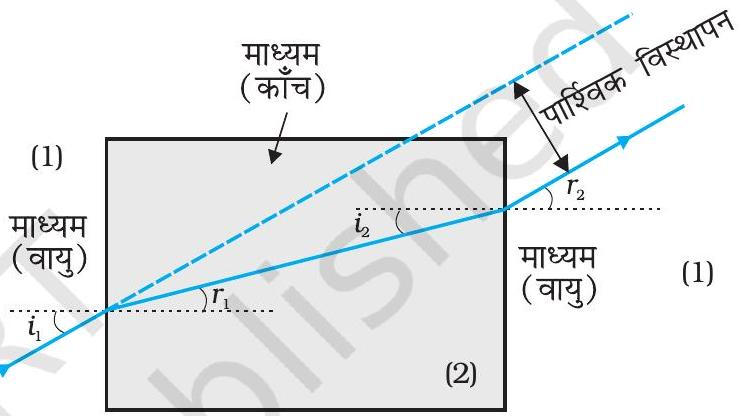
चित्र $9.9$ समांतर फलकों के स्लैब से अपवर्तित किसी प्रकाश किरण का पार्शिवक विस्थापन।

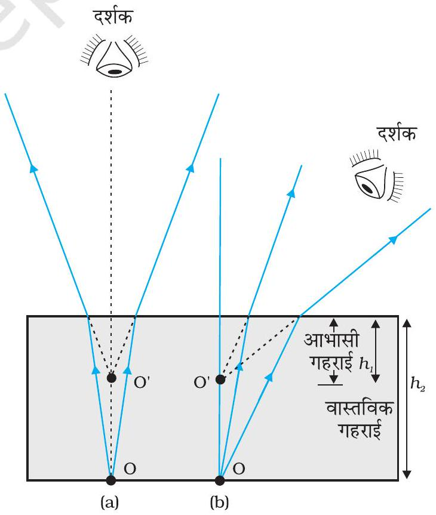
चित्र $9.10$ (a) अभिलंबवत, तथा (b) तिर्यक दर्शन के लिए आभासी गहराई।

करती है तो यह अभिलंब से दूर मुड़ जाती है, उदाहरणार्थ, चित्र $9.11$ में किरण $\mathrm{AO}_{1} \mathrm{~B}$ आपतित किरण $\mathrm{AO}_{1}$ अंशतः परावर्तित ( $\mathrm{O}_{1} \mathrm{C}$ ) तथा अंशतः पारगमित अथवा अपवर्तित ( $\mathrm{O}_{1} \mathrm{~B}$ ) होती है, तथा

## भौतिकी

अपवर्तन कोण (r) आपतन कोण (i) से अधिक होता है। जैसे-जैसे आपतन कोण में वृद्धि होती है, अपवर्तन कोण में भी वृद्धि होती है, जब तक कि किरण $\mathrm{AO}_{3}$ के लिए अपवर्तन कोण का मान $\pi / 2$ ( $90^{\circ}$ ) हो जाए। अपवर्तित किरण अभिलंब से इतनी अधिक मुड़ जाती है कि वह दोनों माध्यमों के अंतरापृष्ठ को छूने लगती है। इसे चित्र $9.11$ में किरण $\mathrm{AO}_{3} \mathrm{D}$ द्वारा दर्शाया गया है। यदि आपतन कोण में इससे अधिक वृद्धि की जाती है (उदाहरण के लिए किरण $\mathrm{AO}_{4}$ ) तो अपवर्तन संभव नहीं होता तथा आपतित किरण पूर्णतः परावर्तित हो जाती है। इसे पूर्ण आंतरिक परावर्तन कहते हैं। जब किसी पृष्ठ द्वारा प्रकाश परावर्तित होता है तो सामान्यतः इसका कुछ भाग पारगमित हो जाता है। इसलिए परावर्तक पृष्ठ चाहे जितना भी चिकना क्यों न हो, परावर्तित किरण सदैव आपतित किरण से कम तीव्रता की होती है। दूसरी ओर पूर्ण आंतरिक परावर्तन में प्रकाश का कोई पारगमन नहीं होता।

वह आपतन कोण जिसका तदनुरूपी अपवर्तन कोण $90^{\circ}$ होता है, जैसे $\angle \mathrm{AO}_{3} \mathrm{~N}$, दिए हुए माध्यमों के युगल के लिए क्रांतिक कोण $\left(i_{c}\right)$ कहलाता है। स्नेल के नियम [समीकरण (9.10)] के अनुसार हम देखते हैं कि यदि अपवर्तक माध्यम का आपेक्षिक अपवर्तनांक एक से कम है, तो क्योंकि $\sin r$ का अधिकतम मान एक होता है, अतः $\sin i$ के मान की कोई ऊपरी सीमा है जिस तक यह नियम लागू किया जा सकता है। यह है $i=i_{c}$ इस प्रकार
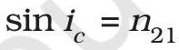
$i$ के $i_{c}$ से अधिक मानों के लिए स्नेल के अपवर्तन के नियम को लागू नहीं किया जा सकता, अतः कोई अपवर्तन संभव नहीं होता।

सघन माध्यम $1$ का विरल माध्यम $2$ के सापेक्ष अपवर्तनांक होगा $n_{12}=1 / \sin i_{\mathrm{c}}$ । सारणी $9.1$ में कुछ प्रसूपी क्रांतिक कोणों को सूचीबद्ध किया गया है।

सारणी $9.1$ कुछ पारदर्शी माध्यमों का वायु के सापेक्ष क्रांतिक कोण
| पदार्थ माध्यम | अपवर्तनांक | क्रांतिक कोण |
| :--- | :--- | :--- |
| जल | $1.33$ | $48.75^{\circ}$ |
| क्राउन काँच | $1.52$ | $41.14^{\circ}$ |
| सघन फ्लिंट काँच | $1.62$ | $37.31^{\circ}$ |
| हीरा | $2.42$ | $24.41^{\circ}$ |

## पूर्ण आंतरिक परावर्तन के लिए एक प्रदर्शन

सभी प्रकाशिक परिघटनाओं को आजकल आसानी से उपलब्ध लेसर टॉर्च या संकेतक का प्रयोग करके बड़ी सरलता से प्रदर्शित किया जा सकता है। एक काँच का बीकर लीजिए जिसमें स्वच्छ जल भरा हो। जल में दूध या किसी अन्य निलंबन की कुछ बूँदें मिलाकर हिलाइए जिससे जल थोड़ा आविल हो जाए। एक लेसर संकेतक लीजिए और इसके किरण-पुंज को आविल जल से गुज़ारिए। आप देखेंगे कि जल के अंदर किरण-पुंज का पथ चमकीला दिखाई देता है।

किरण-पुंज को बीकर के नीचे से इस प्रकार डालिए कि यह दूसरे सिरे पर जल के ऊपरी पृष्ठ पर टकराए। क्या आप देख पाते हैं कि इसमें आंशिक परावर्तन (जो मेज़ के नीचे एक बिंदु के रूप में दिखाई देगा) तथा आंशिक अपवर्तन (जो वायु में निकलकर छत पर एक बिंदु के रूप

## किरण प्रकाशिकी एवं   प्रकाशिक यंत्र

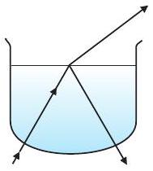
(a)

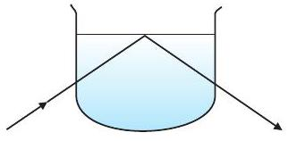
(b)

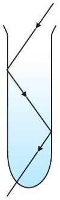
(c)

चित्र $9.12$ लेसर किरण-पुंज से जल में पूर्ण आंतरिक परावर्तन का प्रेक्षण करना (काँच का बीकर अत्यंत पतला होने के कारण इसमें होने वाले अपवर्तन को नगण्य माना गया है)।

में दिखाई देगा) तथा आंशिक अपवर्तन (जो वायु में निकलकर छत पर एक बिंदु के रूप में दिखाई देता है) होता है [चित्र $9.12$ (a)] ? अब लेसर किरण-पुंज को बीकर के एक ओर से इस प्रकार डालिए कि यह जल के ऊपरी पृष्ठ पर तिर्यक टकराए [चित्र $9.12$ (b)]। लेसर किरण-पुंज की दिशा को इस प्रकार समायोजित कीजिए कि आपको ऐसा कोण प्राप्त हो जाए जिससे जल के पृष्ठ के ऊपर अपवर्तन पूर्ण रूप से समाप्त हो जाए तथा किरण-पुंज पूर्ण रूप से जल में वापस परावर्तित हो जाए। यह सरलतम रूप में पूर्ण आंतरिक परावर्तन है।

इस जल को एक लंबी परखनली में उलटिए तथा लेसर प्रकाश को इसके ऊपर से डालिए जैसा कि चित्र $9.12$ (c) में दर्शाया गया है। लेसर किरण-पुंज की दिशा को इस प्रकार समायोजित कीजिए कि प्रत्येक बार जब यह परखनली की दीवारों से टकराए तो इसका पूर्ण आंतरिक परावर्तन हो। यह दृश्य ऐसा ही है जैसा कि प्रकाशिक तंतुओं में होता है।

ध्यान रखिए कि लेसर किरण-पुंज में कभी भी सीधा न देखें और न ही इसे किसी के चेहरे पर डालें।

## 9.4. $1$ प्रकृति में पूर्ण आंतरिक परावर्तन तथा इसके प्रौद्योगिकीय अनुप्रयोग

(i) प्रिज़्म : प्रकाश को $90^{\circ}$ अथवा $180^{\circ}$ पर मोड़ने के लिए डिज़ाइन किए गए प्रिज्मों में पूर्ण आंतरिक परावर्तन का उपयोग किया जाता है [चित्र $9.13$ (a) तथा (b)]। ऐसे प्रिज़्म को प्रतिबिंब के साइज़ में बिना कोई परिवर्तन किए उलटने के लिए भी प्रयोग किया जाता है [चित्र $9.13$ (c)]। पहली दो स्थितियों के लिए, प्रिज़्म के पदार्थ के क्रांतिक कोण $i_{c}$ को $45^{\circ}$ से कम होना चाहिए। सारणी $9.1$ देखने पर हम यह पाते हैं कि दोनों ही प्रकार के काँच क्राउन तथा फ़्लिंट के लिए यह सत्य है।

(ii) प्रकाशिक तंतु : आजकल प्रकाशिक तंतुओं का, श्रव्य तथा दृश्य संकेतों को लंबी दूरी तक संचरित करने के लिए व्यापक रूप से उपयोग किया जाता है। प्रकाशिक तंतुओं में भी पूर्ण आंतरिक परावर्तन की परिघटना का उपयोग किया जाता है। प्रकाशिक तंतु उच्च गुणता के संयुक्त काँच/क्वार्ट्ज़ तंतुओं से रचित किया जाता है। प्रत्येक तंतु में एक क्रोड

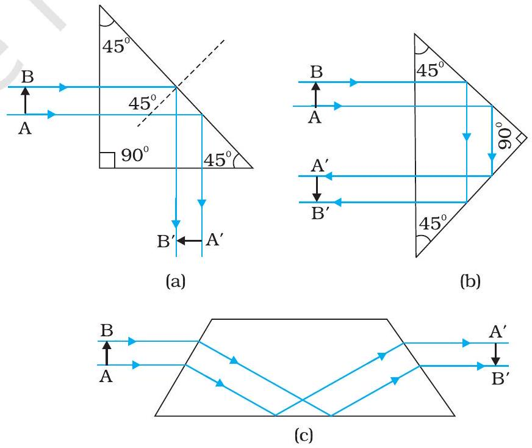
चित्र $9.13$ किरणों को $\pi / 2$ तथा $\pi$ पर मोड़ने के लिए या प्रतिबिंब के साइज़ में परिवर्तन किए बगैर उलटने के लिए डिज़ाइन किए गए प्रिज्मों में पूर्ण आंतरिक परावर्तन का उपयोग किया जाता है।

(core) तथा आच्छद (cladding) होता है। क्रोड के पदार्थ का अपवर्तनांक आच्छद के अपवर्तनांक की तुलना में अधिक होता है।

## भौतिकी

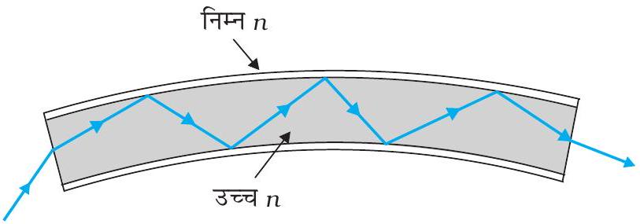
चित्र $9.14$ जब प्रकाश किसी प्रकाशिक तंतु में चलता है तो इसका क्रमिक पूर्ण आंतरिक परावर्तन होता है।

जब प्रकाश के रूप में कोई संकेत उचित कोण पर तंतु के एक सिरे पर दिष्ट होता है तब यह उसकी लंबाई के अनुदिश बार-बार पूर्ण आंतरिक परावर्तित होता है तथा अंततः दूसरे सिरे से बाहर निकल आता है (चित्र 9.14)। क्योंकि प्रत्येक चरण में प्रकाश का पूर्ण आंतरिक परावर्तन होता है इसलिए प्रकाश संकेत की तीव्रता में कोई विशेष हानि नहीं होती। प्रकाश तंतु इस प्रकार बनाए जाते हैं कि एक ओर के आंतरिक पृष्ठ पर परावर्तित होने के पश्चात दूसरे पृष्ठ पर प्रकाश क्रांतिक कोण से अधिक कोण पर आपतित होता है। यहाँ तक कि तंतु में मुड़ाव होने पर भी प्रकाश तंतु के भीतर उसकी लंबाई के अनुदिश सरलतापूर्वक गमन कर सकता है। इस प्रकार एक प्रकाश तंतु प्रकाशित पाइप (लाइट पाइप) के रूप में प्रयोग किया जा सकता है।

प्रकाशिक तंतुओं के बंडल (गुच्छ) का कई प्रकार से उपयोग किया जा सकता है। प्रकाशिक तंतुओं का बड़े पैमाने पर वैद्युत संकेतों, जिन्हें उचित ट्रांसड्यूरों द्वारा प्रकाश में परिवर्तित कर लेते हैं, के प्रेषण तथा अभिग्रहण में उपयोग किया जाता है। स्पष्ट है कि प्रकाशिक तंतुओं का उपयोग प्रकाशिक संकेत प्रेषण के लिए भी किया जा सकता है। उदाहरण के लिए, इन्हें आंतरिक अंगों; जैसे- ग्रसिका, आमाशय तथा आंत्रों के दृश्य अवलोकन के लिए 'लाइट पाइप' के रूप में प्रयोग किया जाता है। आपने सामान्य रूप से उपलब्ध महीन प्लास्टिक तंतुओं से बने सजावटी लैंप देखे होंगे। इन प्लास्टिक के तंतुओं के स्वतंत्र सिरे एक फव्वारे जैसी संरचना बनाते हैं। इन तंतुओं का दूसरा सिरा एक विद्युत लैंप के ऊपर जुड़ा होता है। जब लैंप के स्विच को 'ऑन' करते हैं, तो प्रकाश प्रत्येक तंतु के नीचे से चलता हुआ इसके स्वतंत्र सिरे की नोक पर एक प्रकाश बिंदु के रूप में दिखाई देता है। इस प्रकार के सजावटी लैंपों के तंतु प्रकाशिक तंतु हैं।

प्रकाशिक तंतुओं के निर्माण में प्रमुख आवश्यकता यह है कि इनके भीतर लंबी दूरियाँ तय करते समय प्रकाश का अवशोषण बहुत कम होना चाहिए। इसे क्वार्ट्ज़ जैसे पदार्थों के शोधन तथा विशिष्ट विरचन द्वारा बनाया जाता है। सिलिका काँच तंतुओं में $1$ km लंबे तंतु में प्रकाश के 95\% से भी अधिक भाग को संचरित करना संभव है। (इसकी तुलना $1 \mathrm{~km}$ मोटाई के खिड़की के काँच के ब्लॉक में जितने प्रतिशत प्रकाश के संचरण की आप अपेक्षा करते हैं, से कीजिए।)

## $9.5$ गोलीय पृष्ठों तथा लेंसों द्वारा अपवर्तन

अब तक हमने समतल अंतरापृष्ठों पर अपवर्तन के विषय में विचार किया है। अब हम दो पारदर्शी माध्यमों के गोलीय अंतरापृष्ठों पर अपवर्तन के विषय में विचार करेंगे। किसी गोलीय पृष्ठ के अत्यंत सूक्ष्म भाग को समतलीय माना जा सकता है तथा उसके पृष्ठ के प्रत्येक बिंदु पर समान अपवर्तन के नियमों का अनुप्रयोग किया जा सकता है। गोलीय दर्पण द्वारा परावर्तन की ही भाँति आपतन बिंदु पर अभिलंब पृष्ठ के उस बिंदु पर स्पर्शी तल के लंबवत होता है, तथा वह इसीलिए पृष्ठ के वक्रता केंद्र से गुज़रता है। हम पहले एकल गोलीय पृष्ठ द्वारा अपवर्तन पर विचार करेंगे तथा इसके पश्चात पतले लेंसों की चर्चा करेंगे। कोई पतला लेंस दो गोलीय पृष्ठों से घिरा पारदर्शी माध्यम होता है; जिसका कम से कम एक पृष्ठ अवश्य गोलीय होना चाहिए। एक गोलीय पृष्ठ द्वारा निर्मित प्रतिबिंब के लिए सूत्र का अनुप्रयोग, किसी लेंस के दो पृष्ठों पर, क्रमिक रूप में करके हम पतले लेंसों के लिए लेंस मेकर सूत्र तथा उसके पश्चात लेंस सूत्र प्राप्त करेंगे।

### 9.5.1 किसी गोलीय पृष्ठ पर अपवर्तन

चित्र $9.15$ में वक्रता त्रिज्या $R$ तथा वक्रता केंद्र $C$ के गोलीय पृष्ठ के मुख्य अक्ष पर स्थित किसी वस्तु के बिंदु O के प्रतिबिंब $I$ की रचना की ज्यामिति दर्शायी गई है। प्रकाश किरणें $n_{1}$ अपवर्तनांक के किसी माध्यम से आपतित होकर $n_{2}$ अपवर्तनांक के किसी अन्य माध्यम में जाती हैं। पहले की भाँति, हम पृष्ठ का द्वारक (अथवा पाश्र्व साइज़) अन्य संबद्ध दूरियों की तुलना में काफ़ी छोटा लेते हैं ताकि आवश्यकतानुसार लघु कोण सन्निकटन किया जा सके। विशेष रूप से हम NM को N से मुख्य अक्ष पर लंब की लंबाई के लगभग बराबर लेंगे। यहाँ पर

किरण प्रकाशिकी एवं
प्रकाशिक यंत्र

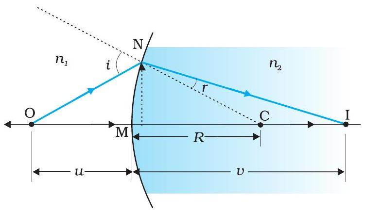
चित्र $9.15$ दो माध्यमों को पृथक करने वाले किसी गोलीय पृष्ठ पर अपवर्तन।

$$
i=\frac{\mathrm{MN}}{\mathrm{OM}}+\frac{\mathrm{MN}}{\mathrm{MC}}
$$

इसी प्रकार

$$
r=\angle \mathrm{NCM}-\angle \mathrm{NIM}
$$

अर्थात $r=\frac{\mathrm{MN}}{\mathrm{MC}}-\frac{\mathrm{MN}}{\mathrm{MI}}$
अब स्नेल के नियम के अनुसार

$$
n_{1} \sin i=n_{2} \sin r
$$

अथवा कोणों के छोटे मानों के लिए

$$
n_{1} i=n_{2} r
$$

समीकरणों (9.13) तथा (9.14) से $i$ तथा $r$ के मान रखने पर हमें प्राप्त होता है

$$
\frac{n_{1}}{\mathrm{OM}}+\frac{n_{2}}{\mathrm{MI}}=\frac{n_{2}-n_{1}}{\mathrm{MC}}
$$

यहाँ OM, MI तथा MC दूरियों के परिमाणों को निरूपित करते हैं। कार्तीय चिह्न परिपाटी का अनुप्रयोग करने पर,

$$
\mathrm{OM}=-u, \mathrm{MI}=+v, \mathrm{MC}=+R
$$

इनका मान समीकरण (9.15) में रखने पर हमें प्राप्त होता है,

$$
\frac{n_{2}}{v}-\frac{n_{1}}{u}=\frac{n_{2}-n_{1}}{R}
$$

समीकरण (9.16) से हमें बिंब तथा प्रतिबिंब के बीच में माध्यम के अपवर्तनांक तथा गोलीय वक्रित पृष्ठ की वक्रता त्रिज्या के पदों के रूप में संबंध प्राप्त होता है। समीकरण (9.16) किसी भी प्रकार के वक्रित गोलीय पृष्ठ के लिए मान्य है।

उदाहरण $9.5$ वायु में रखे किसी बिंदु स्रोत से प्रकाश काँच के किसी गोलीय पृष्ठ पर पड़ता है। $(n=1.5$ तथा वक्रता त्रिज्या $=20 \mathrm{~cm})$ । प्रकाश स्रोत की काँच के पृष्ठ से दूरी $100 \mathrm{~cm}$ है। प्रतिबिंब कहाँ बनेगा?

हल
यहाँ पर, समीकरण (9.16) में दिए सूत्र में
$u=-100 \mathrm{~cm}, v=?, R=+20 \mathrm{~cm}, n_{1}=1$, तथा $n_{2}=1.5$ रखने पर

## □ भौतिकी

हमें प्राप्त होता है

$$
\frac{1.5}{v}+\frac{1}{100}=\frac{0.5}{20}
$$

अथवा $v=+100 \mathrm{~cm}$
प्रतिबिंब आपतित प्रकाश की दिशा में काँच के पृष्ठ से $100 \mathrm{~cm}$ की दूरी पर बनेगा।

### 9.5.2 किसी लेंस द्वारा अपवर्तन

चित्र $9.16$ (a) में किसी उभयोत्तल लेंस द्वारा प्रतिबिंब-रचना की ज्यामिति दर्शायी गई है। इस प्रतिबिंब की रचना को दो चरणों में देखा जा सकता है : (i) पहला अपवर्ती पृष्ठ बिंब O का प्रतिबिंब $\mathrm{I}_{1}$ बनाता है [चित्र $9.16$ (b)]। प्रतिबिंब $\mathrm{I}_{1}$ दूसरे पृष्ठ द्वारा प्रतिबिंब I बनने के लिए आभासी बिंब की भाँति कार्य करता है [चित्र $9.16$ (c)]। समीकरण (9.15)

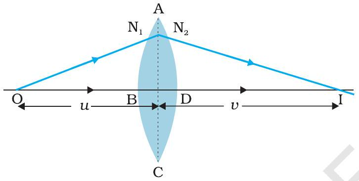
(a)

का उपयोग पहले अंतरापृष्ठ ABC पर करने पर हमें प्राप्त होता है :

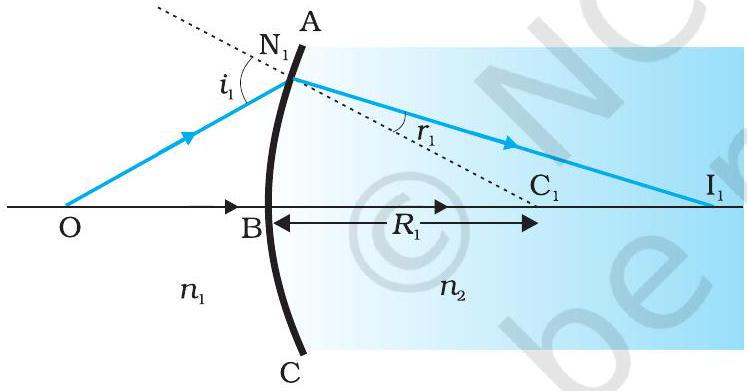
(b)

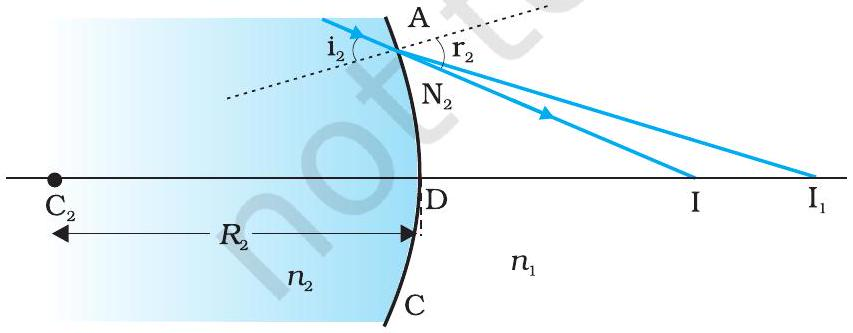
(c)

चित्र $9.16$ (a) बिंब की स्थिति तथा उभयोत्तल लेंस द्वारा निर्मित प्रतिबिंब (b) पहले गोलीय पृष्ठ पर अपवर्तन (c) दूसरे गोलीय पृष्ठ पर अपवर्तन।
$\frac{n_{1}}{\mathrm{OB}}+\frac{n_{2}}{\mathrm{BI}_{1}}=\frac{n_{2}-n_{1}}{\mathrm{BC}_{1}}$ दूसरे अंतरापृष्ठ* ADC के लिए भी समान प्रक्रिया का अनुप्रयोग करने पर हमें प्राप्त होता है :

$$
-\frac{n_{2}}{\mathrm{DI}_{1}}+\frac{n_{1}}{\mathrm{DI}}=\frac{n_{2}-n_{1}}{\mathrm{DC}_{2}}
$$

किसी पतले लेंस के लिए $\mathrm{BI}_{1}=\mathrm{DI}_{1}$ । समीकरणों (9.17) तथा (9.18) को जोड़ने पर हमें प्राप्त होता है :

$$
\frac{n_{1}}{\mathrm{OB}}+\frac{n_{1}}{\mathrm{DI}}=\left(n_{2}-n_{1}\right)\left(\frac{1}{\mathrm{BC}_{1}}+\frac{1}{\mathrm{DC}_{2}}\right)
$$

मान लीजिए बिंब अनंत पर है तो, $\mathrm{OB} \rightarrow \infty$ तथा $\mathrm{DI}=f$, तब समीकरण (9.19) से प्राप्त होगा :

$$
\frac{n_{1}}{f}=\left(n_{2}-n_{1}\right)\left(\frac{1}{\mathrm{BC}_{1}}+\frac{1}{\mathrm{DC}_{2}}\right)
$$

वह बिंदु जहाँ अनंत पर रखे बिंब का प्रतिबिंब बनता है, लेंस का फ़ोकस F कहलाता है तथा दूरी $f$ द्वारा इसकी फ़ोकस दूरी प्राप्त होती है। किसी लेंस के इसके दोनों ओर दो फ़ोकस होते हैं F तथा F'। चिह्न परिपाटी द्वारा

$$
\begin{array}{ll}
\mathrm{BC}_{1}=+R_{1} & {[\text { चित्र 9.16(b)] }} \\
\mathrm{DC}_{2}=-R_{2} & {[\text { चित्र 9.16(c)] }}
\end{array}
$$

इसलिए समीकरण (9.20) को लिखा जा सकता है :

$$
\frac{1}{f}=\left(n_{21}-1\right)\left(\frac{1}{R_{1}}-\frac{1}{R_{2}}\right) \quad\left(\because n_{21}=\frac{n_{2}}{n_{1}}\right)
$$

* नोट कीजिए अब ADC के दायीं ओर के माध्यम का अपवर्तनांक $n_{1}$ है जबकि इसके बायीं ओर यह $n_{2}$ है। इसके अतिरिक्त $\mathrm{DI}_{1}$ ॠणात्मक है क्योंकि दूरी आपतित प्रकाश की दिशा के विपरीत दिशा में मापी गई है।

## किरण प्रकाशिकी एवं   प्रकाशिक यंत्र

समीकरण (9.21) को लेंस-मेकर सूत्र के रूप में जाना जाता है। स्पष्ट रूप से यह सूत्र उचित वक्रता त्रिज्याओं के पृष्ठों के उपयोग द्वारा वांछित फोकस दूरी के लेंसों की अभिकल्पना (डिज़ाइन) करने में उपयोगी है। ध्यान देने योग्य बात यह है कि यही सूत्र अवतल लेंसों पर भी समान रूप से लागू होता है। उस स्थिति में $R_{1}$ ॠणात्मक तथा $R_{2}$ धनात्मक होता है, इसलिए $f$ ॠणात्मक होता है।

समीकरण (9.19) तथा (9.20) से हमें प्राप्त होता है :

$$
\frac{n_{1}}{\mathrm{OB}}+\frac{n_{1}}{\mathrm{DI}}=\frac{n_{1}}{f}
$$

पुनः पतले लेंस-सन्निकटन में बिंदु B तथा D दोनों ही लेंस के प्रकाशिक केंद्र के बहुत निकट माने जाते हैं। चिह्न परिपाटी का उपयोग करने पर $\mathrm{BO}=-u, \mathrm{DI}=+v$ । इन मानों को (9.22) में रखने पर हमें प्राप्त होता है

$$
\frac{1}{v}-\frac{1}{u}=\frac{1}{f}
$$

समीकरण (9.23) लेंसों के लिए परिचित पतले लेंस सूत्र है। यद्यपि यहाँ हमने इसे उत्तल लेंस द्वारा निर्मित वास्तविक प्रतिबिंब के लिए व्युत्पन्न किया है, तथापि यह सूत्र दोनों ही लेंसों अर्थात, उत्तल तथा अवतल तथा दोनों ही प्रकार के प्रतिबिंबों, वास्तविक तथा आभासी के लिए मान्य है।

यह बताना आवश्यक है कि किसी उभयोत्तल अथवा उभयावतल लेंस के दो फ़ोकस F तथा $\mathrm{F}^{\prime}$ लेंस के प्रकाशिक केंद्र से समान दूरी पर हैं। प्रकाश के स्रोत की ओर स्थित फ़ोकस को प्रथम फ़ोकस बिंदु कहते हैं जबकि दूसरा द्वितीय फ़ोकस बिंदु कहलाता है।

लेंसों द्वारा बने किसी बिंब के प्रतिबिंब की स्थिति ज्ञात करने के लिए सिद्धांत रूप में हम बिंब के किसी बिंदु से आने वाली कोई भी दो किरणें लेकर तथा अपवर्तन के नियमों द्वारा उनके पथ अनुरेखित करके उस बिंदु की स्थिति ज्ञात करते हैं, जहाँ अपवर्तित किरणें वास्तव में मिलती हैं (अथवा मिलती प्रतीत होती हैं)। तथापि, व्यवहार में निम्नलिखित में से कोई सी दो किरणों का चयन करना कार्य को सहज बना देता है।

(i) बिंब से निकलने वाली वह किरण जो लेंस के मुख्य अक्ष के समांतर होती है, अपवर्तन के पश्चात (उत्तल लेंस में) लेंस के दूसरे मुख्य फ़ोकस $\mathrm{F}^{\prime}$ से गुज़रती है, अथवा (अवतल लेंस में) लेंस के प्रथम मुख्य फ़ोकस F से अपसरित प्रतीत होती है।
(ii) लेंस के प्रकाशिक केंद्र से गुज़रने वाली प्रकाश किरण अपवर्तन के पश्चात् बिना किसी विचलन के निर्गत होती है।
(iii) (a) किसी उत्तल लेंस के प्रथम मुख्य फ़ोकस से होकर गुज़रने वाली कोई प्रकाश की किरण अपवर्तन के पश्चात् मुख्य अक्ष के समांतर गमन करती है। [चित्र 9.17(a)]

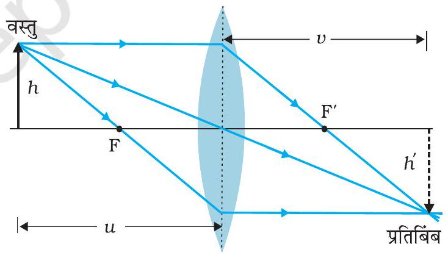
(a)

(b) किसी अवतल लेंस पर उसके द्वितीय फ़ोकस बिंदु की ओर आती प्रतीत होती हुई कोई प्रकाश की किरण अपवर्तन के पश्चात् मुख्य अक्ष के समांतर गमन करती है। [चित्र 9.17(b)]

चित्र $9.17$ (a) तथा (b) में इन नियमों को क्रमशः उत्तल तथा अवतल लेंसों के लिए दर्शाया गया है। आपको लेंस से विभिन्न दूरियों पर बिंब को रखकर इस प्रकार के किरण आरेख खींचने का अभ्यास करना चाहिए तथा यह भी सत्यापित करना चाहिए कि लेंस सूत्र, समीकरण (9.23), सभी उदाहरणों में समान रूप से लागू होता है।

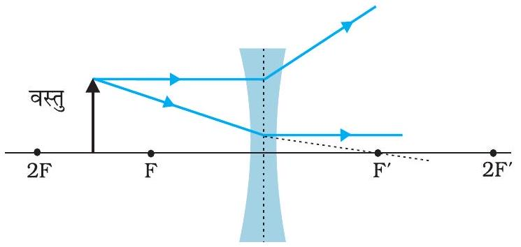
(b)

यहाँ पर यह अवश्य याद रखना चाहिए कि किसी बिंब के प्रत्येक बिंदु से अनंत किरणें उत्सर्जित होती हैं। ये सभी किरणें लेंस से

चित्र $9.17$ (a) उत्तल लेंस, (b) अवतल लेंस से गुज़रने अपवर्तन के पश्चात एक ही प्रतिबिंब बिंदु से गुज़रती हैं। वाली प्रकाश किरणों का अनुरेखण।

दर्पण की भाँति लेंसों के लिए भी, किसी लेंस द्वारा उत्पन्न आवर्धन $(m)$ को प्रतिबिंब के साइज़ $\left(h^{\prime}\right)$ तथा बिंब के साइज़ $(h)$ के अनुपात के रूप में परिभाषित किया जाता है। गोलीय दर्पणों की भाँति यहाँ भी किसी लेंस के लिए यह सरलता से देखा जा सकता है कि

## भौतिकी

$$
m=\frac{h^{\prime}}{h}=\frac{v}{u}
$$

चिह्न परिपाटी का पालन करने पर हम यह पाते हैं कि उत्तल अथवा अवतल लेंस द्वारा बने सीधे (तथा आभासी) प्रतिबिंब के लिए $m$ धनात्मक होता है, जबकि किसी उलटे (तथा वास्तविक) प्रतिबिंब के लिए $m$ ॠणात्मक होता है।

उदाहरण $9.6$ कोई जादूगर खेल दिखाते समय $n=1.47$ अपवर्तनांक के काँच के लेंस को किसी द्रव से भरी द्रोणिका में डालकर अदृश्य कर देता है। द्रव का अपवर्तनांक क्या है? क्या यह द्रव जल हो सकता है?

हल
द्रव में लेंस के अदृश्य होने के लिए द्रव का अपवर्तनांक, लेंस के काँच के अपवर्तनांक के बराबर होना चाहिए; $n_{1}=n_{2}$ । अर्थात द्रव का अपवर्तनांक $1.47$ है। इस प्रकरण में $1 / f=0$ या $f \rightarrow \infty$ प्राप्त होगा। द्रव के अंदर लेंस काँच की एक समतल शीट की भाँति कार्य करेगा। द्रोणिका में भरा द्रव जल (अपवर्तनांक $=1.33$ ) नहीं हो सकता। यह द्रव ग्लिसरीन हो सकता है।

### 9.5.3 लेंस की क्षमता

किसी लेंस की क्षमता उस पर पड़ने वाले प्रकाश को अभिसरित अथवा अपसरित करने की कोटि की माप होती है। स्पष्टतः कम फ़ोकस दूरी का कोई लेंस आपतित प्रकाश को अधिक मोड़ता है, उत्तल लेंस में अपवर्तित किरण अभिसरित होती है तथा अवतल लेंस में अपवर्तित किरण अपसरित होती है। किसी लेंस की क्षमता $P$ को उस कोण की स्पर्शज्या से परिभाषित करते हैं, जिससे यह किसी मुख्य अक्ष के समांतर प्रकाश पुंज को जो प्रकाशिक केंद्र से एकांक दूरी पर आकर गिरता है, अभिसरित या अपसरित करता है। (चित्र 9.18)।

$$
\tan \delta=\frac{h}{f} ; \text { यदि } h=1 \quad \tan \delta=\frac{1}{f}
$$

अथवा $\delta=\frac{1}{f}$ ( $\delta$ के लघु मान के लिए)।

$$
\text { अत : } P=\frac{1}{f}
$$

लेंस की क्षमता का SI मात्रक डाइऑप्टर (D) : $1 \mathrm{D}=1 \mathrm{~m}^{-1}$ है। अतः $1 \mathrm{~m}$ फोकस दूरी के लेंस की क्षमता एक डाइऑप्टर है। अभिसारी लेंसों की क्षमता धनात्मक तथा अपसारी लेंस की क्षमता ॠणात्मक होती है। इस प्रकार जब कोई नेत्र चिकित्सक + 2.5 D क्षमता का संशोधक लेंस निर्धारित करता है, तब $+40 \mathrm{~cm}$ फ़ोकस दूरी के उत्तल लेंस की आवश्यकता होती है। $-4.0 \mathrm{D}$ क्षमता के लेंस से तात्पर्य $-25 \mathrm{~cm}$ फ़ोकस दूरी का अवतल लेंस होता है।

उदाहरण $9.7$ (i) यदि $f=+0.5 \mathrm{~m}$ है तो लेंस की क्षमता क्या है ? (ii) किसी उभयोत्तल लेंस के दो फलकों की वक्रता त्रिज्याएँ $10 \mathrm{~cm}$ तथा $15 \mathrm{~cm}$ हैं। उसकी फ़ोकस दूरी $12 \mathrm{~cm}$ है। लेंस के काँच का अपवर्तनांक ज्ञात कीजिए। (iii) किसी उत्तल लेंस की वायु में फ़ोकस दूरी $20 \mathrm{~cm}$ है। जल में इसकी फ़ोकस दूरी क्या है? [वायु-जल का अपवर्तनांक $1.33$ तथा वायु-काँच का अपवर्तनांक $1.5$ है।]

हल

(i) लेंस की क्षमता = +2D
(ii) यहाँ $f=+12 \mathrm{~cm}, R_{1}=+10 \mathrm{~cm}, R_{2}=-15 \mathrm{~cm}$ वायु का अपवर्तनांक $1$ माना जाता है।

## किरण प्रकाशिकी एवं   प्रकाशिक यंत्र

समीकरण (9.22) के लेंस सूत्र का प्रयोग करने के लिए $f, R_{1}$ तथा $R_{2}$ के लिए चिह्न परिपाटी के अनुसार विभिन्न राशियों के मान रखने पर हमें

$$
\begin{aligned}
& \frac{1}{12}=(n-1)\left(\frac{1}{10}-\frac{1}{-15}\right) \\
& n=1.5 \text { प्राप्त होगा। }
\end{aligned}
$$

(iii) वायु में काँच के लेंस के लिए, $n_{2}=1.5, n_{1}=1, f=+20 \mathrm{~cm}$ इस प्रकार लेंस सूत्र से प्राप्त होगा
$$
\frac{1}{20}=0.5\left[\frac{1}{R_{1}}-\frac{1}{R_{2}}\right]
$$
उसी काँच के लेंस के लिए जल में, $n_{2}=1.5, n_{1}=1.33$. इसलिए
$$
\frac{1.33}{f}=(1.5-1.33)\left[\frac{1}{R_{1}}-\frac{1}{R_{2}}\right]
$$
इन दोनों समीकरणों को संयोजित करने पर हमें मिलेगा
$$
f=+78.2 \mathrm{~cm}
$$

### 9.5.4 संपर्क में रखे पतले लेंसों का संयोजन

एक-दूसरे के संपर्क में रखे $f_{1}$ तथा $f_{2}$ फ़ोकस दूरियों के दो पतले लेंसों A तथा B पर विचार कीजिए। मान लीजिए कोई बिंब पहले लेंस A के फ़ोकस से दूर किसी बिंदु O पर स्थित है (चित्र 9.19)। पहला लेंस बिंदु $\mathrm{I}_{1}$ पर प्रतिबिंब बनाता है। क्योंकि प्रतिबिंब $\mathrm{I}_{1}$ वास्तविक है, अतः यह दूसरे लेंस B के लिए आभासी बिंब की भाँति कार्य करता है तथा अंतिम प्रतिबिंब I पर बनता है। हमें इस बात को समझ लेना चाहिए कि पहले लेंस से प्रतिबिंब का बनना, केवल अंतिम प्रतिबिंब की स्थिति निर्धारित करने के लिए, माना गया है। वास्तव में पहले लेंस से निकलने वाली किरणों की दिशा, उनके दूसरे लेंस से टकराने वाले कोण के अनुसार परिवर्तित हो जाती है। क्योंकि लेंस पतले हैं, हम दोनों लेंसों के प्रकाशिक केंद्रों को संपाती मान सकते हैं। मान लीजिए यह केंद्रीय बिंदु P द्वारा निर्दिष्ट होता है।

पहले लेंस $A$ द्वारा बने प्रतिबिंब के लिए

$$
\frac{1}{v_{1}}-\frac{1}{u}=\frac{1}{f_{1}}
$$

दूसरे लेंस B द्वारा बने प्रतिबिंब के लिए

$$
\frac{1}{v}-\frac{1}{v_{1}}=\frac{1}{f_{2}}
$$

समीकरण (9.27) तथा (9.28) को जोड़ने पर,

$$
\frac{1}{v}-\frac{1}{u}=\frac{1}{f_{1}}+\frac{1}{f_{2}}
$$

इन दो लेंसों के तंत्र को $f$ फ़ोकस दूरी के किसी एकल लेंस के तुल्य मानने पर,

$$
\frac{1}{v}-\frac{1}{u}=\frac{1}{f}
$$

अर्थात

$$
\frac{1}{f}=\frac{1}{f_{1}}+\frac{1}{f_{2}}
$$

यह व्युत्पत्ति संपर्क में रखे कई पतले लेंसों के निकाय के लिए भी मान्य है। यदि $f_{1}, f_{2}$, $f_{3}, \ldots$ फ़ोकस दूरियों के बहुत से लेंस एक-दूसरे के संपर्क में रखे हैं, तो इस संयोजन की प्रभावी फ़ोकस दूरी होगी :

$$
\frac{1}{f}=\frac{1}{f_{1}}+\frac{1}{f_{2}}+\frac{1}{f_{3}}+\ldots
$$

क्षमता के पदों में समीकरण (9.31) को इस प्रकार भी लिखा जा सकता है

$$
P=P_{1}+P_{2}+P_{3}+\ldots
$$

यहाँ $P$ इस लेंस संयोजन की नेट क्षमता है। ध्यान दीजिए, समीकरण (9.32) में अलग-अलग क्षमताओं का बीजगणितीय योग दिया गया है, अर्थात समीकरण के दक्षिण पक्ष में कुछ पद धनात्मक (उत्तल लेंसों के लिए) तथा कुछ पद ऋणात्मक (अवतल लेंसों के लिए) हो सकते हैं। लेंसों के संयोजन हमें व्युत्पन्न आवर्धन क्षमता के अपसारित अथवा अभिसारित लेंस प्राप्त करने में सहायक होते हैं तथा ये प्रतिबिंब की तीक्ष्णता में भी वृद्धि कर देते हैं। क्योंकि पहले लेंस द्वारा बना प्रतिबिंब दूसरे लेंस के लिए बिंब बन जाता है, समीकरण (9.25) में यह अंतर्निहित है कि संयोजन का कुल आवर्धन $m$, अलग-अलग आवर्धनों $\left(m_{1}, m_{2}, m_{3}, ..\right)$ के गुणनफल के बराबर होता है।

$$
m=m_{1} m_{2} m_{3} \ldots
$$

इस प्रकार के लेंसों के संयोजन सामान्यतः कैमरों, सूक्ष्मदर्शियों, दूरबीनों तथा अन्य प्रकाशिक यंत्रों के लेंसों के डिज़ाइन में उपयोग किए जाते हैं।

उदाहरण $9.8$ चित्र $9.20$ में दिए गए लेंसों के संयोजन द्वारा निर्मित प्रतिबिंब की स्थिति ज्ञात कीजिए।

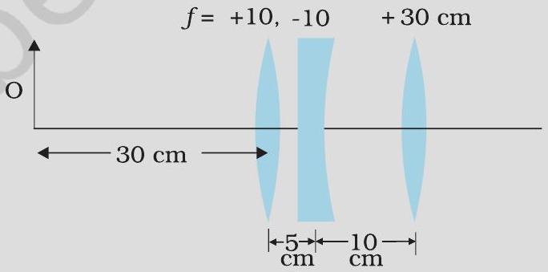
चित्र $9.20$

हल पहले लेंस द्वारा निर्मित प्रतिबिंब

$$
\begin{aligned}
& \frac{1}{v_{1}}-\frac{1}{u_{1}}=\frac{1}{f_{1}} \\
& \frac{1}{v_{1}}-\frac{1}{-30}=\frac{1}{10}
\end{aligned}
$$

पहले लेंस द्वारा निर्मित प्रतिबिंब दूसरे लेंस के लिए बिंब की भाँति कार्य करता है। यह दूसरे लेंस
अथवा $v_{1}=15 \mathrm{~cm}$ के दायीं ओर $(15-5) \mathrm{cm}=10 \mathrm{~cm}$ दूरी पर है। यद्यपि प्रतिबिंब वास्तविक है परंतु यह दूसरे

## किरण प्रकाशिकी एवं   प्रकाशिक यंत्र

लेंस के लिए आभासी बिंब का कार्य करता है। अर्थात इससे दूसरे लेंस के लिए किरणें आती हुई प्रतीत होती हैं।

$$
\frac{1}{v_{2}}-\frac{1}{10}=\frac{1}{-10}
$$

या $v_{2}=\infty$
यह आभासी प्रतिबिंब दूसरे लेंस के बायीं ओर अनंत दूरी पर बनता है। यह तीसरे लेंस के लिए बिंब की भाँति कार्य करता है।

$$
\frac{1}{v_{3}}-\frac{1}{u_{3}}=\frac{1}{f_{3}}
$$

अथवा $\frac{1}{v_{3}}=\frac{1}{\infty}+\frac{1}{30}$
या $v_{3}=30 \mathrm{~cm}$
अंतिम प्रतिबिंब तीसरे लेंस के दायीं ओर $30 \mathrm{~cm}$ दूरी पर बनता है।

## $9.6$ प्रिज़्म में अपवर्तन

चित्र $9.21$ में किसी प्रिज़्म ABC से प्रकाश किरण को गुज़रते हुए दर्शाया गया है। पहले फलक AB पर आपतन कोण तथा अपवर्तन कोण क्रमशः $i$ तथा $r_{1}$ हैं, जबकि दूसरे फलक (काँच से वायु में) AC पर आपतन कोण $r_{2}$ तथा अपवर्तन कोण या निर्गत कोण $e$ हैं। निर्गत किरण RS तथा आपतित किरण की दिशा PQ के बीच के कोण को विचलन कोण $\delta$ कहते हैं।

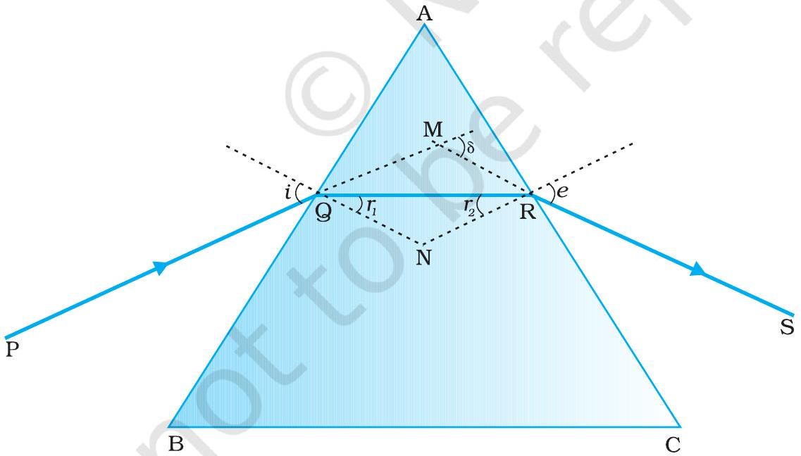
चित्र $9.21$ काँच के त्रिभुजाकार प्रिज़्म से किसी प्रकाश किरण का गुज़रना।

चतुर्भुज AQNR में दो कोण (Q तथा R शीर्षों पर) समकोण हैं। इसलिए इस भुजा के अन्य दो कोणों का योग $180^{0}$ है।

$$
\angle A+\angle Q N R=180^{\circ}
$$

त्रिभुज QNR से

$$
r_{1}+r_{2}+\angle \mathrm{GNR}=180^{\mathrm{o}}
$$

इन दोनों समीकरणों की तुलना करने पर, हमें प्राप्त होगा

$$
r_{1}+r_{2}=A
$$

कुल विचलन $\delta$ दोनों फलकों पर विचलनों का योग है:

$$
\delta=\left(i-r_{1}\right)+\left(e-r_{2}\right)
$$

अर्थात, $\delta=i+e-A$

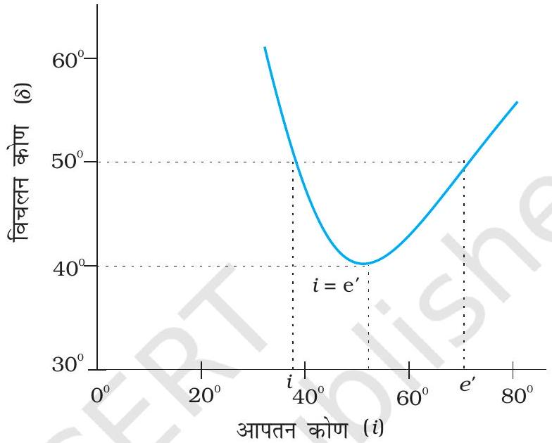
चित्र $9.22$ किसी त्रिभुजाकार प्रिज़्म के लिए आपतन कोण $(i)$ तथा विचलन कोण $(\delta)$ के बीच एक ग्राफ़।

इस प्रकार विचलन कोण आपतन कोण पर निर्भर करता है। चित्र $9.22$ में आपतन कोण तथा विचलन कोण के बीच ग्राफ़ दर्शाया गया है। आप यह देख सकते हैं कि व्यापक रूप से, केवल $i=e$ को छोड़कर, प्रत्येक विचलन कोण $\delta$ के तदनुरूपी $i$ के तथा इस प्रकार $e$ के दो मान हैं। यह तथ्य समीकरण (9.35) में $i$ तथा $e$ की सममिति से अपेक्षित है, अर्थात, यदि $i$ तथा $e$ को आपस में बदल दिया जाए तो $\delta$ अपरिवर्तित रहता है। भौतिक रूप में यह इस तथ्य से संबंधित है कि चित्र $9.21$ में प्रकाश किरण के पथ को वापस आरेखित करने पर वही विचलन कोण प्राप्त होता है। न्यूनतम विचलन $D_{m}$ पर, प्रिज़्म के अंदर अपवर्तित किरण इसके आधार के समांतर हो जाती है। हमें प्राप्त होता है

$$
\delta=D_{m}, i=e \text { जिसका तात्पर्य है कि } r_{1}=r_{2}
$$

समीकरण (9.34) से हमें प्राप्त होता है

$$
2 r=A \text { अथवा } r=\frac{A}{2}
$$

इसी प्रकार समीकरण (9.35) से हमें प्राप्त होता है

$$
D_{\mathrm{m}}=2 i-A, \text { अथवा } i=\left(A+D_{\mathrm{m}}\right) / 2
$$

यदि प्रिज़्म के पदार्थ का अपवर्तनांक $n_{21}$ है तो

$$
n_{21}=\frac{\sin i}{\sin r}=\frac{\sin \left[\left(A+D_{m}\right) / 2\right]}{\sin [A / 2]}
$$

## किरण प्रकाशिकी एवं प्रकाशिक यंत्र

कोण $A$ तथा $D_{m}$ की माप प्रयोग द्वारा की जा सकती है। इस प्रकार समीकरण (9.38) प्रिज़्म के पदार्थ के अपवर्तनांक के मापन की विधि है।

छोटे कोण के प्रिज़्म अर्थात पहले प्रिज़्म के लिए $D_{m}$ भी काफ़ी छोटा होता है तथा हमें प्राप्त होगा

$$
\begin{aligned}
& n_{21}=\frac{\sin \left[\left(A+D_{m}\right) / 2\right]}{\sin [A / 2]} \simeq \frac{\left(A+D_{m}\right) / 2}{A / 2} \\
& D_{m}=\left(n_{21}-1\right) A
\end{aligned}
$$

इसका तात्पर्य है कि पतले प्रिज़्म में प्रकाश का विचलन काफ़ी कम होता है।

## $9.7$ प्रकाशिक यंत्र

दर्पणों, लेंसों तथा प्रिज़्मों के परावर्ती तथा अपवर्ती गुणों का उपयोग करके अनेक प्रकाशिक युक्तियाँ एवं यंत्र डिज़ाइन किए गए हैं। परिदर्शी, बहुमूर्तिदर्शी, द्विनेत्री, दूरदर्शक, सूक्ष्मदर्शी कुछ ऐसी प्रकाशिक युक्तियों तथा यंत्रों के उदाहरण हैं जिन्हें हम सामान्य रूप से उपयोग में लाते हैं। वास्तव में हमारे नेत्र सबसे महत्वपूर्ण प्रकाशिक युक्तियों में से एक हैं जिनसे प्रकृति ने हमें संपन्न किया है। कक्षा X में हम मानव नेत्र के बारे में पढ़ चुके हैं। अब हम सूक्ष्मदर्शी तथा दूरबीन के कार्य करने के सिद्धांत का वर्णन करेंगे।

### 9.7.1 सूक्ष्मदर्शी

सरल आवर्धक अथवा सरल सूक्ष्मदर्शी कम फ़ोकस दूरी का एक अभिसारी लेंस होता है (चित्र 9.23)। इस प्रकार के लेंस को सूक्ष्मदर्शी के रूप में प्रयोग करने के लिए, लेंस को बिंब के निकट उससे एक फ़ोकस दूरी अथवा उससे कम दूरी पर रखा जाता है तथा लेंस के दूसरी ओर नेत्र को लेंस से सटाकर रखा जाता है। ऐसा करने का लक्ष्य है कि बिंब का सीधा, आवर्धित तथा आभासी प्रतिबिंब किसी ऐसी दूरी पर बने कि नेत्र उसे सरलतापूर्वक देख सकें, अर्थात प्रतिबिंब $25 \mathrm{~cm}$ अथवा कुछ अधिक दूरी पर बनना चाहिए। यदि बिंब $f$ पर स्थित है तो उसका प्रतिबिंब अनंत पर बनता है। तथापि, यदि बिंब $f$ से कम दूरी पर रखा हो, तो प्रतिबिंब आभासी तथा अनंत की तुलना में कम दूरी पर बनता है। यद्यपि देखने के लिए निकटतम आरामदेह दूरी, निकट बिंदु (दूरी $D \cong 25 \mathrm{~cm}$ ) पर होती है, परंतु इससे नेत्रों पर कुछ तनाव पड़ता है। इसीलिए, प्राय: अनंत पर बना प्रतिबिंब शिथिल नेत्रों द्वारा देखने के लिए उचित माना जाता है। यहाँ पर दोनों स्थितियाँ दर्शायी गई हैं, पहली चित्र $9.23$ (a), में तथा दूसरी चित्र $9.23$ (b) तथा (c) में।

सरल सूक्ष्मदर्शी द्वारा निकट बिंदु $D$ पर बने प्रतिबिंब के लिए रैखिक आवर्धन $m$ का परिकलन निम्न संबंध द्वारा किया जा सकता है।

$$
m=\frac{v}{u}=v\left(\frac{1}{v}-\frac{1}{f}\right)=\left(1-\frac{v}{f}\right)
$$

## □ भौतिकी

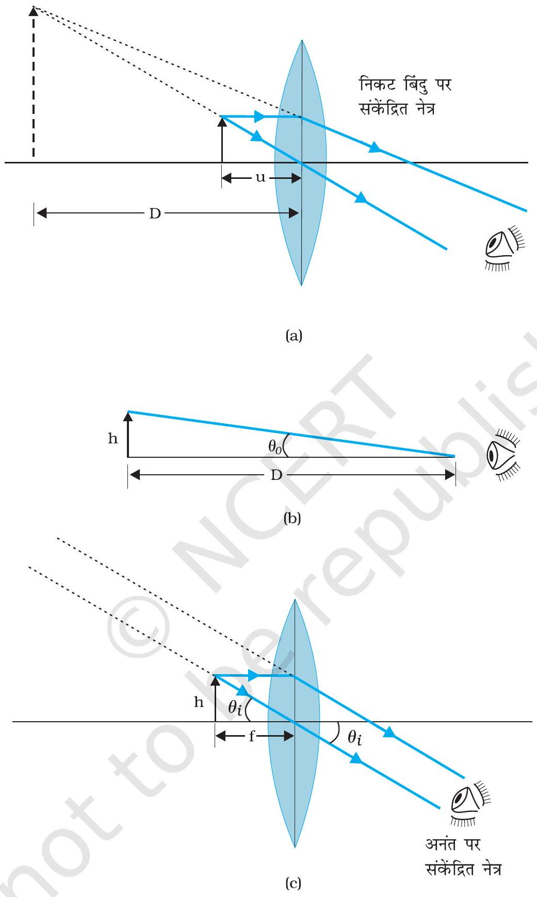

चित्र $9.23$ सरल सूक्ष्मदर्शी (a) आवर्धक लेंस इस प्रकार स्थित है कि प्रतिबिंब निकट बिंदु पर बनता है, (b) बिंब द्वारा अंतरित कोण, निकट बिंदु पर अंतरित कोण के समान है तथा (c) बिंब लेंस के फ़ोकस बिंदु पर, प्रतिबिंब बहुत दूर है लेकिन अनंत से पास है।

## किरण प्रकाशिकी एवं   प्रकाशिक यंत्र

अब हमारी चिह्न परिपाटी के अनुसार $v$ ॠणात्मक है तथा परिमाण में $D$ के बराबर है। अतः आवर्धन,

$$
m=\left(1+\frac{D}{f}\right)
$$

क्योंकि $D$ लगभग $25 \mathrm{~cm}$ है। अतः आवर्धन $6$ प्राप्त करने के लिए फ़ोकस दूरी $f=5 \mathrm{~cm}$ के उत्तल लेंस की आवश्यकता होती है।

ध्यान दीजिए, $m=h^{\prime} / h$, यहाँ $h$ बिंब का साइज़ तथा $h^{\prime}$ प्रतिबिंब का साइज़ है। यह प्रतिबिंब द्वारा अंतरित कोण तथा बिंब द्वारा अंतरित कोण का भी अनुपात होता है, जबकि उन्हें आराम से देखने के लिए $D$ पर रखा जाता है। (नोट कीजिए कि यह वास्तव में बिंब द्वारा नेत्र पर अंतरित कोण नहीं है, जिसे $h / u$ द्वारा व्यक्त किया गया है।) एकल-लेंस सरल आवर्धक की उपलब्धि यह है कि वस्तु को $D$ की तुलना में काफ़ी निकट रखकर देखना संभव हो जाता है।

अब जब प्रतिबिंब अनंत पर बनता है तो हम आवर्धन ज्ञात करेंगे। इस स्थिति में हमें कोणीय आवर्धन का परिकलन करना होगा। मान लीजिए बिंब की ऊँचाई $h$ है। इस बिंब द्वारा नेत्र पर अंतरित अधिकतम कोण, जबकि बिंब स्पष्ट भी दिखाई देता हो (बिना किसी लेंस के), तब होता है जब हम बिंब को निकट अर्थात दूरी $D$ पर रखते हैं। तब अंतरित कोण प्राप्त होगा

$$
\tan \theta_{0}=\left(\frac{h}{D}\right) \approx \theta_{0}
$$

अब हम प्रतिबिंब द्वारा नेत्र पर अंतरित कोण, जबकि बिंब $u$ पर रखा है, ज्ञात करते हैं।
संबंध $\frac{h^{\prime}}{h}=m=\frac{v}{u}$ से प्रतिबिंब द्वारा नेत्र पर अंतरित कोण
$\tan \theta_{i}=\frac{h^{\prime}}{-v}=\frac{h}{-v} \cdot \frac{v}{u}=\frac{h}{-u} \approx \theta$; बिंब द्वारा अंतरित कोण, जबकि बिंब अब $u=-f$ पर है

$$
\theta_{i}=\left(\frac{h}{f}\right)
$$

जैसा कि चित्र $9.23$ (c) से स्पष्ट है। अतः कोणीय आवर्धन (आवर्धन क्षमता) है

$$
m=\left(\frac{\theta_{i}}{\theta_{0}}\right)=\frac{D}{f}
$$

यह उस स्थिति के आवर्धन की तुलना में एक कम है, जिसमें प्रतिबिंब निकट बिंदु पर बनता है, समीकरण (9.39), परंतु प्रतिबिंब देखना अपेक्षाकृत अधिक आरामदायक होता है तथा आवर्धन में अंतर भी अपेक्षाकृत कम है। प्रकाशिक यंत्रों (सूक्ष्मदर्शी तथा दूरबीन) से संबंधित आगामी चर्चाओं में हम यह मानेंगे कि प्रतिबिंब अनंत पर बने हैं।

वास्तविक फ़ोकस दूरियों के लेंसों के लिए किसी सरल सूक्ष्मदर्शी का अधिकतम आवर्धन $(\leq 9)$ होता है। अधिक आवर्धन के लिए दो लेंसों का उपयोग किया जाता है, जिनमें एक लेंस दूसरे लेंस के प्रभाव को संयुक्त (बढ़ाता) करता है। इसे संयुक्त सूक्ष्मदर्शी कहते हैं। चित्र $9.24$ में संयुक्त सूक्ष्मदर्शी का व्यवस्था आरेख दर्शाया गया है। बिंब के सबसे निकट के लेंस को अभिदृश्यक (objective) कहते हैं जो बिंब का वास्तविक, उलटा, आवर्धित प्रतिबिंब बनाता है। यह प्रतिबिंब

## भौतिकी

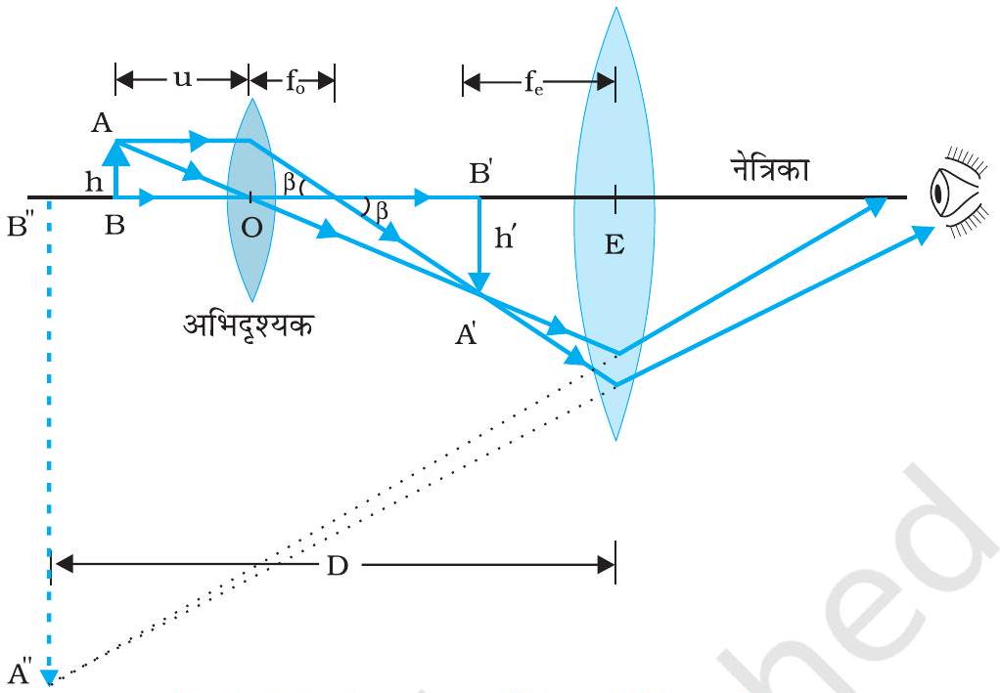
चित्र $9.24$ संयुक्त सूक्ष्मदर्शी द्वारा प्रतिबिंब बनने का किरण आरेख।

दूसरे लेंस के लिए बिंब का कार्य करता है। इस दूसरे लेंस को नेत्रिका (eye-piece) कहते हैं, जो वास्तविक रूप से सरल सूक्ष्मदर्शी अथवा आवर्धक के रूप में कार्य करके अंतिम आवर्धित आभासी प्रतिबिंब बनाता है। इस प्रकार पहला उलटा प्रतिबिंब नेत्रिका के फोकस बिंदु के निकट (फ़ोकस पर या इसके अंदर) होता है, यह नेत्रिका से इतनी दूरी पर होता है जो अंतिम प्रतिबिंब को अनंत पर बनाने के लिए उपयुक्त होती है तथा उस स्थिति के भी काफ़ी निकट होती है जिस पर यदि प्रतिबिंब स्थित हो तो अंतिम निकट बिंदु पर बने। स्पष्टतः, अंतिम प्रतिबिंब मूल बिंब के सापेक्ष उलटा बनता है।

अब हम संयुक्त सूक्ष्मदर्शी के कारण आवर्धन प्राप्त करेंगे। चित्र $9.24$ का किरण आरेख यह दर्शाता है कि अभिदृश्यक के कारण (रैखिक) आवर्धन, अर्थात $h^{\prime} / h$, बराबर है

$$
m_{0}=\frac{h^{\prime}}{h}=\frac{L}{f_{0}}
$$

यहाँ हमने इस परिमाण का उपयोग किया है

$$
\tan \beta=\left(\frac{h}{f_{0}}\right)=\left(\frac{h^{\prime}}{L}\right)
$$

यहाँ $h^{\prime}$ पहले प्रतिबिंब का साइज़ है तथा बिंब का साइज़ $h$ एवं अभिदृश्यक की फ़ोकस दूरी $f_{0}$ है। पहला प्रतिबिंब नेत्रिका के फ़ोकस बिंदु के निकट बनता है। दूरी $L$, अर्थात, अभिदृश्यक के द्वितीय फ़ोकस बिंदु तथा नेत्रिका (फ़ोकस दूरी $f_{e}$ ) के पहले फ़ोकस बिंदु के बीच की दूरी को संयुक्त सूक्ष्मदर्शी की ट्यूब लंबाई कहते हैं।

क्योंकि पहला उलटा प्रतिबिंब नेत्रिका के फ़ोकस बिंदु के निकट बनता है, उपरोक्त चर्चा से प्राप्त परिणाम का उपयोग हम सरल सूक्ष्मदर्शी के लिए करके इसके कारण (कोणीय) आवर्धन $m_{e}$ प्राप्त करते हैं [समीकरण 9.39], जबकि अंतिम प्रतिबिंब किसी निकट बिंदु पर बनता है। यह है

$$
m_{e}=\left(1+\frac{D}{f_{e}}\right)
$$

## किरण प्रकाशिकी एवं प्रकाशिक यंत्र

जब प्रतिबिंब अनंत पर बनता है तो नेत्रिका के कारण कोणीय आवर्धन [समीकरण (9.42)] है

$$
m_{e}=\left(D / f_{e}\right)
$$

अतः कुल आवर्धन [समीकरण (9.33) के अनुसार], जबकि प्रतिबिंब अनंत पर बनता है, है

$$
m=m_{0} m_{e}=\left(\frac{L}{f_{0}}\right) \quad\left(\frac{D}{f_{e}}\right)
$$

स्पष्ट है कि किसी छोटी वस्तु का बड़ा आवर्धन प्राप्त करने के लिए (इसीलिए सूक्ष्मदर्शी नाम रखा गया है) अभिदृश्यक तथा नेत्रिका की फ़ोकस दूरी कम होनी चाहिए। व्यवहार में, $1 \mathrm{~cm}$ से कम फ़ोकस दूरी का लेंस बनाना अत्यंत कठिन कार्य है। इसी के साथ $L$ को बड़ा करने के लिए बड़े लेंसों की आवश्यकता होती है।

उदाहरण के लिए, किसी $f_{o}=1.0 \mathrm{~cm}$ के अभिदृश्यक $f_{e}=2.0 \mathrm{~cm}$ की नेत्रिका तथा ट्यूब लंबाई $(L)=20 \mathrm{~cm}$ के लिए संयुक्त सूक्ष्मदर्शी का आवर्धन

$$
\begin{aligned}
m=m_{0} m_{e}= & \left(\frac{L}{f_{0}}\right)\left(\frac{D}{f_{e}}\right) \\
& =\frac{20}{1} \times \frac{25}{2}=250
\end{aligned}
$$

अन्य विभिन्न कारक जैसे वस्तु की प्रदीप्ति भी प्रतिबिंब की दृश्यता एवं गुणता में महत्वपूर्ण योगदान देते हैं। आधुनिक सूक्ष्मदर्शियों में, अभिदृश्यक तथा नेत्रिका बहुअवयवी लेंसों द्वारा बनाए जाते हैं, जिनके कारण लेंसों के प्रकाशिक विपथनों (दोष) को कम करके प्रतिबिंबों की गुणता में सुधार किया जाता है।

### 9.7.2 दूरदर्शक

दूरदर्शक अथवा दूरबीन (चित्र 9.25) का उपयोग दूर की वस्तुओं को कोणीय आवर्धन प्रदान करने के लिए किया जाता है। इसमें भी एक अभिदृश्यक तथा एक नेत्रिका होती है। परंतु यहाँ पर, नेत्रिका की अपेक्षा अभिदृश्यक की फ़ोकस दूरी अधिक तथा इसका द्वारक भी काफ़ी अधिक होता है। किसी दूरस्थ बिंब से चलकर प्रकाश अभिदृश्यक में प्रवेश करता है तथा ट्यूब के अंदर इसके द्वितीय फ़ोकस पर वास्तविक प्रतिबिंब बनता है। नेत्रिका इस प्रतिबिंब को आवर्धित करके अंतिम उलटा प्रतिबिंब बनाती है। आवर्धन क्षमता $m$, प्रतिबिंब द्वारा नेत्र पर अंतरित कोण $\beta$ तथा बिंब द्वारा नेत्र पर अथवा लेंस पर अंतरित कोण $\alpha$ के अनुपात द्वारा परिभाषित किया जाता है। अतः

$$
m \approx \frac{\beta}{\alpha} \approx \frac{h}{f_{e}} \cdot \frac{f_{0}}{h}=\frac{f_{0}}{f_{e}}
$$

इस स्थिति में, दूरदर्शक की ट्यूब की लंबाई है $f_{o}+f_{e}$
पार्थिव दूरदर्शकों में, इन लेंसों के अतिरिक्त, प्रतिलोमी लेंसों का एक युगल होता है जो अंतिम प्रतिबिंब को सीधा बना देता है। अपवर्ती दूरदर्शक का उपयोग पार्थिव एवं खगोलीय दोनों प्रकार के प्रेक्षणों के लिए किया जा सकता है। उदाहरण के लिए, किसी ऐसे दूरदर्शक पर विचार कीजिए जिसके अभिदृश्यक की फ़ोकस दूरी $100 \mathrm{~cm}$ तथा नेत्रिका की फ़ोकस दूरी $1 \mathrm{~cm}$ है। इस दूरबीन की आवर्धन क्षमता

$$
\mathrm{m}=100 / 1=100
$$

## भौतिकी

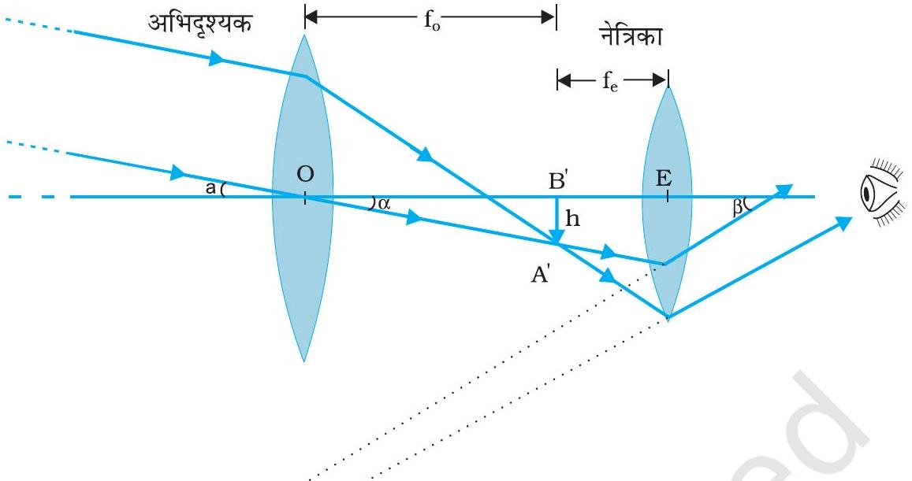
चित्र $9.25$ परावर्ती दूरदर्शक (कैसेग्रेन) का व्यवस्था आरेख

अब किन्हीं दो तारों के युगल पर विचार कीजिए जिनका वास्तविक पृथकन 1' ( $1$ मिनट का चाप) है। ये तारे उपरोक्त दूरदर्शक से देखने पर इस प्रकार प्रतीत होते हैं जैसे कि इनके बीच के पृथकन-कोण $100 \times 1^{\prime}=100^{\prime}=1.67^{\circ}$ है।

किसी खगोलीय दूरदर्शक के बारे में ध्यान देने योग्य मुख्य बातें उसकी प्रकाश संग्रहण क्षमता तथा इसकी विभेदन क्षमता अथवा विभेदन है। प्रकाश संग्रहण क्षमता स्पष्ट रूप से दूरदर्शक के अभिदृश्यक के क्षेत्रफल पर निर्भर करती है। यदि अभिदृश्यक का व्यास बड़ा है तो धुँधले पिंडों का भी प्रेक्षण किया जा सकता है। विभेदन क्षमता अथवा एक ही दिशा में दो अत्यधिक निकट की वस्तुओं को सुस्पष्टतः भिन्न प्रेक्षित करने की योग्यता भी अभिदृश्यक के व्यास पर निर्भर करती है। अतः प्रकाशिक दूरदर्शक में वांछित उद्देश्य यह होता है। कि अभिदृश्यक का व्यास अधिकतम हो। आजकल उपयोग होने वाले अभिदृश्यक लेंस का अधिकतम व्यास $40$ इंच (~1.02 m) है। यह दूरदर्शक यर्केज वेधशाला, विस्कॉनसिन, संयुक्त राज्य अमेरिका में है। इतने बड़े लेंस अत्यधिक भारी होते हैं, अतः इन्हें बनाना तथा किनारों के सहारे टिकाकर रखना कठिन कार्य है। इसके अतिरिक्त इतने बड़े साइज़ के लेंसों को इस प्रकार बनाना कि प्रतिबिंबों में वर्ण विपथन तथा अन्य विरूपण न आएँ, बहुत कठिन तथा महँगा कार्य है।

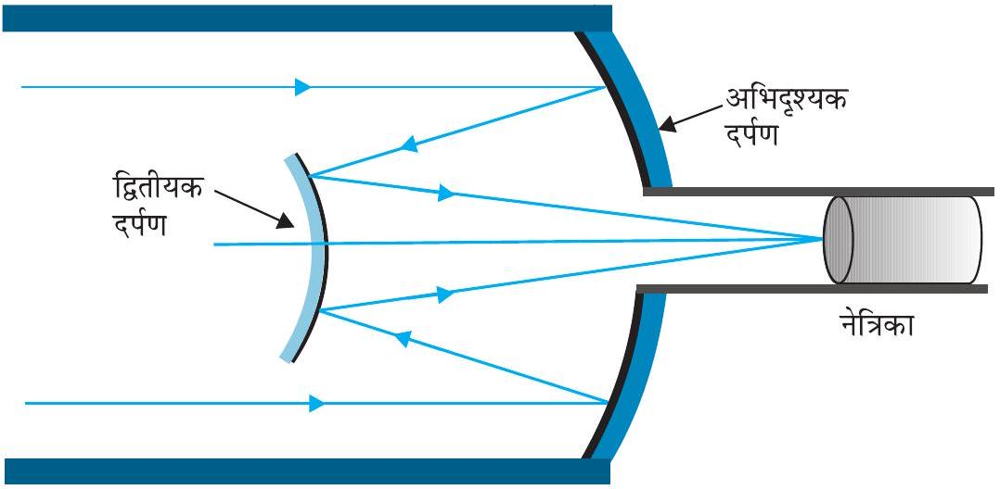
चित्र $9.26$ परावर्ती दूरदर्शक (कैसेग्रेन) का व्यवस्था आरेख।

## किरण प्रकाशिकी एवं प्रकाशिक यंत्र

यही कारण है कि आधुनिक दूरदर्शकों में अभिदृश्यक के रूप में लेंस के स्थान पर अवतल दर्पण का उपयोग किया जाता है। ऐसे दूरदर्शकों को जिनमें अभिदृश्यक दर्पण होता है, परावर्ती दूरदर्शक (दूरबीन) कहते हैं। दर्पण में कोई वर्ण विपथन नहीं होता। यांत्रिक सहारा देने की समस्या भी काफ़ी कम होती है क्योंकि लेंस की तुलना में, तुल्य प्रकाशिक गुणता का दर्पण अपेक्षाकृत कम भारी होता है तथा दर्पण को केवल रिम पर ही सहारा देने की बजाय उसके समस्त पीछे के पृष्ठ को सहारा प्रदान किया जा सकता है। परावर्ती दूरबीन की एक सुस्पष्ट समस्या यह होती है कि अभिदृश्यक दर्पण दूरदर्शक की नली के भीतर प्रकाश को फ़ोकसित करता है। अतः नेत्रिका तथा प्रेक्षक को उसी स्थान पर होना चाहिए जिससे प्रकाश के मार्ग में अवरोध के कारण कुछ प्रकाश कम हो जाता है (यह अवरोध प्रेक्षक के बैठने के लिए बनाए गए पिंजरेनुमा कमरे के साइज़ पर निर्भर करता है)। ऐसा ही प्रयोग अति विशाल $200$ इंच (~5.08 m) व्यास के माउंट पेलोमर दूरदर्शक, कैलिफ़ोर्निया में किया गया है। प्रेक्षक एक छोटे पिंजरे में दर्पण के फ़ोकस बिंदु के निकट बैठता है। इस समस्या का एक अन्य समाधान यह है कि फोकसित होने वाले प्रकाश को किसी अन्य दर्पण द्वारा विक्षेपित कर दिया जाए। ऐसी ही एक व्यवस्था चित्र $9.26$ में दर्शायी गई है, जिसमें आपतित प्रकाश को फ़ोकसित करने के लिए किसी उत्तल द्वितीयक दर्पण का उपयोग किया जाता है जो अब अभिदृश्यक (प्राथमिक दर्पण) के छिद्र से गुज़रता है। इस दूरदर्शक को इसके आविष्कारक के नाम पर कैसेग्रेन दूरदर्शक (Cassegrain telescope) कहते हैं। इसका एक लाभ यह है कि छोटे दूरदर्शक में बड़ी फ़ोकस दूरी होती है। भारतवर्ष में सबसे बड़ा दूरदर्शक कवलूर, तमिलनाडु में है। यह $2.34 \mathrm{~m}$ व्यास की कैसेग्रेन परावर्ती दूरदर्शक है। इसे घर्षित किया गया, फिर पॉलिश की गई और व्यवस्थित किया गया तथा अब इसे भारतीय खगोल भौतिकी संस्थान, बंगलुरू द्वारा प्रयोग किया जा रहा है। संसार का सबसे बड़ा परावर्ती दूरदर्शक हवाई, संयुक्त राज्य अमेरिका में कैक दूरदर्शकों का युगल है जिसके परावर्तक का व्यास $10$ मीटर है।

## सारांश

1. परावर्तन समीकरण $\angle i=\angle r^{\prime}$ द्वारा तथा अपवर्तन स्नेल के नियम $\sin i / \sin r=n$ द्वारा अभिनियंत्रित होता है, जहाँ आपतित किरण, परावर्तित किरण, अपवर्तित किरण तथा अभिलंब एक ही समतल में होते हैं। यहाँ पर कोण $i, r^{\prime}$ तथा $r$, क्रमशः आपतन कोण, परावर्तन कोण तथा अपवर्तन कोण हैं।
2. सघन माध्यम से विरल माध्यम में आपतित किरण के लिए क्रांतिक आपतन कोण $i_{c}$ वह कोण है जिसके लिए अपवर्तन कोण $90^{\circ}$ है। $i>i_{c}$ होने पर पूर्ण आंतरिक परावर्तन होता है। हीरे में बहुगुणित आंतरिक परावर्तन ( $i_{c} \cong 24.4^{\circ}$ ), पूर्ण परावर्तक प्रिज़्म तथा मरीचिका, पूर्ण आंतरिक परावर्तन के कुछ उदाहरण हैं। प्रकाशिक तंतु, काँच के तंतुओं के बने होते हैं जिन पर अपेक्षाकृत कम अपवर्तनांक के पदार्थ की पतली परत का लेपन होता है। प्रकाशिक तंतु के किसी एक सिरे पर आपतित प्रकाश, बहुगुणित आंतरिक परावर्तन द्वारा दूसरे सिरे से निकलता है, प्रकाशिक तंतु के मुड़ा होने पर भी ऐसा होता है।
3. कार्तीय चिह्न परिपाटी-आपतित प्रकाश की दिशा में मापी गई दूरियाँ धनात्मक तथा इसके विपरीत दिशा में मापी गई दूरियाँ ऋणात्मक ली जाती हैं। सभी दूरियाँ मुख्य अक्ष पर दर्पण के ध्रुव/लेंस के प्रकाशिक केंद्र से मापी जाती हैं। $x$-अक्ष के उपरिमुखी तथा दर्पण/लेंस के

## भौतिकी

मुख्य अक्ष के अभिलंबवत मापी गई ऊँचाइयाँ धनात्मक ली जाती हैं। अधोमुखी दिशा में मापी गई ऊँचाइयाँ ऋणात्मक ली जाती हैं।
4. दर्पण समीकरण
$$
\frac{1}{v}+\frac{1}{u}=\frac{1}{f}
$$
यहाँ $u$ तथा $v$ क्रमशः बिंब दूरी तथा प्रतिबिंब दूरी हैं तथा $f$ दर्पण की फ़ोकस दूरी है। $f$ (सन्निकटतः) वक्रता त्रिज्या $R$ की आधी होती है। अवतल दर्पण के लिए $f$ ॠणात्मक तथा उत्तल दर्पण के लिए $f$ धनात्मक होता है।
5. प्रिज़्म कोण $A$, अपवर्तनांक $n_{2}$ के किसी प्रिज़्म के लिए जो $n_{1}$ अपवर्तनांक के किसी माध्यम में रखा है।
$$
n_{21}=\frac{n_{2}}{n_{1}}=\frac{\sin \left[\left(A+D_{m}\right) / 2\right]}{\sin (A / 2)}
$$
यहाँ $D_{m}$ न्यूनतम विचलन कोण है।
6. किसी गोलीय अंतरापृष्ठ से अपवर्तन [माध्यम $1$ (अपवर्तनांक $n_{1}$ ) से माध्यम $2$ (अपवर्तनांक $n_{2}$ ) की ओर]
$$
\frac{n_{2}}{v}-\frac{n_{1}}{u}=\frac{n_{2}-n_{1}}{R}
$$
पतले लेंस के लिए सूत्र
$$
\frac{1}{v}-\frac{1}{u}=\frac{1}{f}
$$
लेंस-मेकर सूत्र
$$
\frac{1}{f}=\frac{\left(n_{2}-n_{1}\right)}{n_{1}}\left(\frac{1}{R_{1}}-\frac{1}{R_{2}}\right)
$$
$R_{1}$ तथा $R_{2}$ लेंस के पृष्ठों की वक्रता त्रिज्याएँ हैं। अभिसारी लेंस के लिए $f$ धनात्मक है; अपसारी लेंस के लिए $f$ ॠणात्मक है। लेंस की क्षमता $P=1 / f$ ।
लेंस की क्षमता का SI मात्रक डाइऑप्टर (D) है; $1 \mathrm{D}=1 \mathrm{~m}^{-1}$ ।
यदि $f_{1}, f_{2}, f_{3}, .$. फ़ोकस दूरी के कई पतले लेंस संपर्क में रखे हों तो इस संयोजन की प्रभावी फ़ोकस दूरी होगी
$$
\frac{1}{f}=\frac{1}{f_{1}}+\frac{1}{f_{2}}+\frac{1}{f_{3}}+\ldots
$$
अनेक लेंसों के संयोजन की कुल क्षमता
$$
P=P_{1}+P_{2}+P_{3}+\ldots
$$
7. प्रकाश का परिक्षेपण, प्रकाश का अपने संघटक वर्णों में विपाटन (विघटन) होता है।

## किरण प्रकाशिकी एवं प्रकाशिक यंत्र

8. किसी सरल सूक्ष्मदर्शी की आवर्धन क्षमता के परिमाण $m$ को $m=1+(D / f)$ द्वारा व्यक्त किया जाता है, यहाँ $D=25 \mathrm{~cm}$, स्पष्ट दर्शन की अल्पतम दूरी है तथा $f$ उत्तल लेंस की फोकस दूरी है। यदि प्रतिबिंब अनंत पर बने तब $m=D / f$ होगा। किसी संयुक्त सूक्ष्मदर्शी के लिए आवर्धन क्षमता $m$ को $m=m_{e} \times m_{0}$ के द्वारा व्यक्त किया जाता है, यहाँ $m_{e}=1+\left(D / f_{e}\right)$ नेत्रिका का आवर्धन तथा $m_{0}$ अभिदृश्यक द्वारा उत्पन्न आवर्धन है। सन्निकटतः
$$
m=\frac{L}{f_{0}} \times \frac{D}{f_{e}}
$$
यहाँ $f_{\mathrm{o}}$ तथा $f_{e}$ क्रमशः अभिदृश्यक तथा नेत्रिका की फ़ोकस दूरियाँ हैं तथा $L$ इन दोनों के फ़ोकस बिंदुओं के बीच की दूरी है।
9. किसी दूरबीन की आवर्धन क्षमता, प्रतिबिंब द्वारा नेत्र पर अंतरित कोण $\beta$ तथा बिंब द्वारा नेत्र पर अंतरित कोण $\alpha$ का अनुपात होती है।
$$
m=\frac{\beta}{\alpha}=\frac{f_{0}}{f_{e}},
$$
यहाँ $f_{0}$ तथा $f_{e}$ क्रमशः अभिदृश्यक तथा नेत्रिका की फ़ोकस दूरियाँ हैं।

## विचारणीय विषय

1. आपतन बिंदु पर परावर्तन तथा अपवर्तन के नियम सभी पृष्ठों तथा माध्यमों के युगलों के लिए मान्य हैं।
2. किसी उत्तल लेंस से $f$ तथा $2 f$ के बीच रखे किसी बिंब के वास्तविक प्रतिबिंब को प्रतिबिंब-स्थिति पर रखे पर्दे पर देखा जा सकता है। यदि पर्दे को हटा दें तो क्या फिर भी प्रतिबिंब वहाँ रहता है? यह प्रश्न बहुतों को दुविधा में डालता है, क्योंकि हमें स्वयं को भी यह समझा पाना कठिन होता है कि कोई प्रतिबिंब बिना किसी पर्दे के वायु में निलंबित कैसे रह सकता है। परंतु प्रतिबिंब तो वहाँ रहता ही है। बिंब के किसी बिंदु से निर्गत प्रकाश किरणें दिक्स्थान में किसी प्रतिबिंब बिंदु पर अभिसरित होकर अपसरित हो जाती हैं। परदा केवल इन किरणों को विसरित करता है जिनमें से कुछ किरणें हमारे नेत्रों तक पहुँचती हैं और हम प्रतिबिंब देख पाते हैं। किसी लेज़र प्रदर्शन के समय बने प्रतिबिंबों द्वारा इसे देखा जा सकता है।
3. प्रतिबिंब बनने के लिए नियमित परावर्तन/अपवर्तन की आवश्यकता होती है। सिद्धांत रूप में, किसी बिंदु से निर्गत सभी किरणें एक ही प्रतिबिंब बिंदु पर पहुँचनी चाहिए। यही कारण है कि आप किसी अनियमित परावर्ती पृष्ठ, जैसे किसी पुस्तक के पृष्ठ में अपना प्रतिबिंब नहीं देखते।
4. मोटे लेंस परिक्षेपण के कारण रंगीन प्रतिबिंब बनाते हैं। हमारे चारों ओर की वस्तुओं के रंगों में विविधता उन पर आपतित प्रकाश के रंगों के संघटकों के कारण होती है। किसी वस्तु को एकवर्णी प्रकाश में देखने पर तथा श्वेत प्रकाश में देखने पर उस वस्तु के विषय में बिलकुल ही अलग बोध होता है।

5. किसी सरल सूक्ष्मदर्शी के लिए बिंब का कोणीय साइज़, प्रतिबिंब के कोणीय साइज़ के बराबर होता है। फिर भी वह आवर्धन प्रदान करता है क्योंकि आप सूक्ष्मदर्शी का उपयोग करते समय किसी छोटी वस्तु को अपने नेत्रों के बहुत निकट ( $25 \mathrm{~cm}$ से भी कम दूरी पर) रख सकते हैं, जिसके फलस्वरूप वह नेत्र पर बड़ा कोण अंतरित करता है। प्रतिबिंब, जिसे हम देख सकते हैं, $25 \mathrm{~cm}$ दूरी पर है। बिना सूक्ष्मदर्शी के आपको उस छोटी वस्तु को स्पष्ट देख पाने के लिए $25 \mathrm{~cm}$ दूरी पर रखना होगा और तब वह आपके नेत्र पर बहुत छोटा कोण अंतरित करेगा।

## अभ्यास

$9.12 .5 \mathrm{~cm}$ साइज़ की कोई छोटी मोमबत्ती $36 \mathrm{~cm}$ वक्रता त्रिज्या के किसी अवतल दर्पण से $27$ cm दूरी पर रखी है। दर्पण से किसी परदे को कितनी दूरी पर रखा जाए कि उसका सुस्पष्ट प्रतिबिंब परदे पर बने। प्रतिबिंब की प्रकृति और साइज़ का वर्णन कीजिए। यदि मोमबत्ती को दर्पण की ओर ले जाएँ, तो परदे को किस ओर हटाना पड़ेगा?
$9.24 .5 \mathrm{~cm}$ साइज़ की कोई सुई $15 \mathrm{~cm}$ फोकस दूरी के किसी उत्तल दर्पण से $12 \mathrm{~cm}$ दूर रखी है। प्रतिबिंब की स्थिति तथा आवर्धन लिखिए। क्या होता है जब सुई को दर्पण से दूर ले जाते हैं? वर्णन कीजिए।
$9.3$ कोई टैंक $12.5 \mathrm{~cm}$ ऊँचाई तक जल से भरा है। किसी सूक्ष्मदर्शी द्वारा बीकर की तली पर पड़ी किसी सुई की आभासी गहराई $9.4 \mathrm{~cm}$ मापी जाती है। जल का अपवर्तनांक क्या है? बीकर में उसी ऊँचाई तक जल के स्थान पर किसी $1.63$ अपवर्तनांक के अन्य द्रव से प्रतिस्थापन करने पर सुई को पुनः फ़ोकसित करने के लिए सूक्ष्मदर्शी को कितना ऊपर/नीचे ले जाना होगा?
$9.4$ चित्र $9.27$ (a) तथा (b) में किसी आपतित किरण का अपवर्तन दर्शाया गया है जो वायु में क्रमशः काँच-वायु तथा जल-वायु अंतरापृष्ठ के अभिलंब से $60^{\circ}$ का कोण बनाती है। उस आपतित किरण का अपवर्तन कोण ज्ञात कीजिए, जो जल में जल-काँच अंतरापृष्ठ के अभिलंब से $45^{\circ}$ का कोण बनाती है [चित्र $9.27$ (c)]।

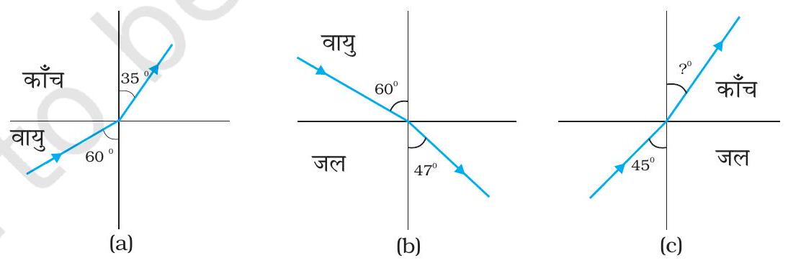
चित्र $9.27$

$9.5$ जल से भरे $80 \mathrm{~cm}$ गहराई के किसी टैंक की तली पर कोई छोटा बल्ब रखा गया है। जल के पृष्ठ का वह क्षेत्र ज्ञात कीजिए जिससे बल्ब का प्रकाश निर्गत हो सकता है। जल का अपवर्तनांक $1.33$ है। (बल्ब को बिंदु प्रकाश स्रोत मानिए।)
$9.6$ कोई प्रिज़्म अज्ञात अपवर्तनांक के काँच का बना है। कोई समांतर प्रकाश-पुंज इस प्रिज़्म के किसी फलक पर आपतित होता है। प्रिज़्म का न्यूनतम विचलन कोण $40^{\circ}$ मापा गया। प्रिज़्म के पदार्थ का अपवर्तनांक क्या है? प्रिज़्म का अपवर्तन कोण $60^{\circ}$ है। यदि प्रिज़्म को जल (अपवर्तनांक 1.33) में रख दिया जाए तो प्रकाश के समांतर पुंज के लिए नए न्यूनतम विचलन कोण का परिकलन कीजिए।

## किरण प्रकाशिकी एवं प्रकाशिक यंत्र

$9.7$ अपवर्तनांक $1.55$ के काँच से दोनों फलकों की समान वक्रता त्रिज्या के उभयोत्तल लेंस निर्मित करने हैं। यदि $20 \mathrm{~cm}$ फ़ोकस दूरी के लेंस निर्मित करने हैं तो अपेक्षित वक्रता त्रिज्या क्या होगी?
$9.8$ कोई प्रकाश-पुंज किसी बिंदु P पर अभिसरित होता है। कोई लेंस इस अभिसारी पुंज के पथ में बिंदु P से $12 \mathrm{~cm}$ दूर रखा जाता है। यदि यह (a) $20 \mathrm{~cm}$ फ़ोकस दूरी का उत्तल लेंस है, (b) $16 \mathrm{~cm}$ फ़ोकस दूरी का अवतल लेंस है, तो प्रकाश-पुंज किस बिंदु पर अभिसरित होगा?
$9.93 .0 \mathrm{~cm}$ ऊँची कोई बिंब $21 \mathrm{~cm}$ फ़ोकस दूरी के अवतल लेंस के सामने $14 \mathrm{~cm}$ दूरी पर रखी है। लेंस द्वारा निर्मित प्रतिबिंब का वर्णन कीजिए। क्या होता है जब बिंब लेंस से दूर हटती जाती है?
$9.10$ किसी $30 \mathrm{~cm}$ फ़ोकस दूरी के उत्तल लेंस के संपर्क में रखे $20 \mathrm{~cm}$ फ़ोकस दूरी के अवतल लेंस के संयोजन से बने संयुक्त लेंस (निकाय) की फ़ोकस दूरी क्या है? यह तंत्र अभिसारी लेंस है अथवा अपसारी? लेंसों की मोटाई की उपेक्षा कीजिए।
$9.11$ किसी संयुक्त सूक्ष्मदर्शी में $2.0 \mathrm{~cm}$ फ़ोकस दूरी का अभिदृश्यक लेंस तथा $6.25 \mathrm{~cm}$ फ़ोकस दूरी का नेत्रिका लेंस एक-दूसरे से $15 \mathrm{~cm}$ दूरी पर लगे हैं। किसी बिंब को अभिदृश्यक से कितनी दूरी पर रखा जाए कि अंतिम प्रतिबिंब (a) स्पष्ट दर्शन की अल्पतम दूरी (25 cm) तथा (b) अनंत पर बने? दोनों स्थितियों में सूक्ष्मदर्शी की आवर्धन क्षमता ज्ञात कीजिए।
$9.1225 \mathrm{~cm}$ के सामान्य निकट बिंदु का कोई व्यक्ति ऐसे संयुक्त सूक्ष्मदर्शी जिसका अभिदृश्यक $8.0 \mathrm{~mm}$ फ़ोकस दूरी तथा नेत्रिका $2.5 \mathrm{~cm}$ फ़ोकस दूरी की है, का उपयोग करके अभिदृश्यक से $9.0$ mm दूरी पर रखे बिंब को सुस्पष्ट फ़ोकसित कर लेता है। दोनों लेंसों के बीच पृथकन दूरी क्या है? सूक्ष्मदर्शी की आवर्धन क्षमता क्या है?
$9.13$ किसी छोटी दूरबीन के अभिदृश्यक की फ़ोकस दूरी $144 \mathrm{~cm}$ तथा नेत्रिका की फ़ोकस दूरी $6.0$ cm है। दूरबीन की आवर्धन क्षमता कितनी है? अभिदृश्यक तथा नेत्रिका के बीच पृथकन दूरी क्या है?
$9.14$ (a) किसी वेधशाला की विशाल दूरबीन के अभिदृश्यक की फ़ोकस दूरी $15 \mathrm{~m}$ है। यदि $1.0 \mathrm{~cm}$ फ़ोकस दूरी की नेत्रिका प्रयुक्त की गयी है, तो दूरबीन का कोणीय आवर्धन क्या है?
    (b) यदि इस दूरबीन का उपयोग चंद्रमा का अवलोकन करने में किया जाए तो अभिदृश्यक लेंस द्वारा निर्मित चंद्रमा के प्रतिबिंब का व्यास क्या है? चंद्रमा का व्यास $3.48 \times 10^{6} \mathrm{~m}$ तथा चंद्रमा की कक्षा की त्रिज्या $3.8 \times 10^{8} \mathrm{~m}$ है।
$9.15$ दर्पण-सूत्र का उपयोग यह व्युत्पन्न करने के लिए कीजिए कि
    (a) किसी अवतल दर्पण के $f$ तथा $2 f$ के बीच रखे बिंब का वास्तविक प्रतिबिंब $2 f$ से दूर बनता है।
    (b) उत्तल दर्पण द्वारा सदैव आभासी प्रतिबिंब बनता है जो बिंब की स्थिति पर निर्भर नहीं करता।
    (c) उत्तल दर्पण द्वारा सदैव आकार में छोटा प्रतिबिंब, दर्पण के ध्रुव व फ़ोकस के बीच बनता है।
    (d) अवतल दर्पण के ध्रुव तथा फ़ोकस के बीच रखे बिंब का आभासी तथा बड़ा प्रतिबिंब बनता है।

(नोट : यह अभ्यास आपकी बीजगणितीय विधि द्वारा उन प्रतिबिंबों के गुण व्युत्पन्न करने में सहायता करेगा जिन्हें हम किरण आरेखों द्वारा प्राप्त करते हैं।)

$9.16$ किसी मेज के ऊपरी पृष्ठ पर जड़ी एक छोटी पिन को $50 \mathrm{~cm}$ ऊँचाई से देखा जाता है। $15 \mathrm{~cm}$ मोटे आयताकार काँच के गुटके को मेज़ के पृष्ठ के समांतर पिन व नेत्र के बीच रखकर उसी बिंदु से देखने पर पिन नेत्र से कितनी दूर दिखाई देगी? काँच का अपवर्तनांक $1.5$ है। क्या उत्तर गुटके की अवस्थिति पर निर्भर करता है?
$9.17$ निम्नलिखित प्रश्नों के उत्तर लिखिए :
    (a) चित्र $9.28$ में अपवर्तनांक $1.68$ के तंतु काँच से बनी किसी 'प्रकाश नलिका' (लाइट पाइप) का अनुप्रस्थ परिच्छेद दर्शाया गया है। नलिका का बाह्य आवरण $1.44$ अपवर्तनांक के पदार्थ का बना है। नलिका के अक्ष से आपतित किरणों के कोणों का परिसर, जिनके लिए चित्र में दर्शाए अनुसार नलिका के भीतर पूर्ण परावर्तन होते हैं, ज्ञात कीजिए।
    (b)यदि पाइप पर बाह्य आवरण न हो तो क्या उत्तर होगा?

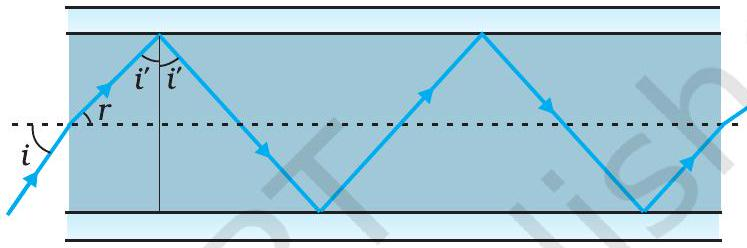
चित्र $9.28$
$9.18$ किसी कमरे की एक दीवार पर लगे विद्युत बल्ब का किसी बड़े आकार के उत्तल लेंस द्वारा $3 \mathrm{~m}$ दूरी पर स्थित सामने की दीवार पर प्रतिबिंब प्राप्त करना है। इसके लिए उत्तल लेंस की अधिकतम फ़ोकस दूरी क्या होनी चाहिए?
$9.19$ किसी परदे को बिंब से $90 \mathrm{~cm}$ दूर रखा गया है। परदे पर किसी उत्तल लेंस द्वारा उसे एक-दूसरे से $20 \mathrm{~cm}$ दूर स्थितियों पर रखकर, दो प्रतिबिंब बनाए जाते हैं। लेंस की फ़ोकस दूरी ज्ञात कीजिए।
$9.20$ (a) प्रश्न $9.10$ के दो लेंसों के संयोजन की प्रभावी फ़ोकस दूरी उस स्थिति में ज्ञात कीजिए जब उनके मुख्य अक्ष संपाती हैं, तथा ये एक-दूसरे से $8 \mathrm{~cm}$ दूरी पर रखे हैं। क्या उत्तर आपतित समांतर प्रकाश पुंज की दिशा पर निर्भर करेगा? क्या इस तंत्र के लिए प्रभावी फ़ोकस दूरी किसी भी रूप में उपयोगी है?
    (b) उपरोक्त व्यवस्था (a) में $1.5 \mathrm{~cm}$ ऊँचा कोई बिंब उत्तल लेंस की ओर रखा है। बिंब की उत्तल लेंस से दूरी $40 \mathrm{~cm}$ है। दो लेंसों के तंत्र द्वारा उत्पन्न आवर्धन तथा प्रतिबिंब का आकार ज्ञात कीजिए।
$9.2160^{\circ}$ अपवर्तन कोण के प्रिज़्म के फलक पर किसी प्रकाश किरण को किस कोण पर आपतित कराया जाए कि इसका दूसरे फलक से केवल पूर्ण आंतरिक परावर्तन ही हो? प्रिज़्म के पदार्थ का अपवर्तनांक $1.524$ है।
$9.22$ कोई कार्ड शीट जिसे $1 \mathrm{~mm}^{2}$ साइज़ के वर्गों में विभाजित किया गया है, को $9 \mathrm{~cm}$ दूरी पर रखकर किसी आवर्धक लेंस (9 cm फ़ोकस दूरी का अभिसारी लेंस) द्वारा उसे नेत्र के निकट रखकर देखा जाता है।
    (a) लेंस द्वारा उत्पन्न आवर्धन (प्रतिबिंब-साइज़/वस्तु-साइज़) क्या है? आभासी प्रतिबिंब में प्रत्येक वर्ग का क्षेत्रफल क्या है?
    (b) लेंस का कोणीय आवर्धन (आवर्धन क्षमता) क्या है?
    (c) क्या (a) में आवर्धन क्षमता (b) में आवर्धन के बराबर है? स्पष्ट कीजिए।

## किरण प्रकाशिकी एवं प्रकाशिक यंत्र

$9.23$ (a) अभ्यास $9.22$ में लेंस को कार्ड शीट से कितनी दूरी पर रखा जाए ताकि वर्गों को अधिकतम संभव आवर्धन क्षमता के साथ सुस्पष्ट देखा जा सके?
    (b) इस उदाहरण में आवर्धन (प्रतिबिंब-साइज़/वस्तु-साइज़) क्या है?
    (c) क्या इस प्रक्रम में आवर्धन, आवर्धन क्षमता के बराबर है? स्पष्ट कीजिए।
$9.24$ अभ्यास $9.23$ में वस्तु तथा आवर्धक लेंस के बीच कितनी दूरी होनी चाहिए ताकि आभासी प्रतिबिंब में प्रत्येक वर्ग $6.25 \mathrm{~mm}^{2}$ क्षेत्रफल का प्रतीत हो? क्या आप आवर्धक लेंस को नेत्र के अत्यधिक निकट रखकर इन वर्गों को सुस्पष्ट देख सकेंगे?
[नोट - अभ्यास $9.22$ से $9.24$ आपको निरपेक्ष साइज़ में आवर्धन तथा किसी यंत्र की आवर्धन क्षमता (कोणीय आवर्धन) के बीच अंतर को स्पष्टतः समझने में सहायता करेंगे।
$9.25$ निम्नलिखित प्रश्नों के उत्तर दीजिए-
    (a) किसी वस्तु द्वारा नेत्र पर अंतरित कोण आवर्धक लेंस द्वारा उत्पन्न आभासी प्रतिबिंब द्वारा नेत्र पर अंतरित कोण के बराबर होता है। तब फिर किन अर्थों में कोई आवर्धक लेंस कोणीय आवर्धन प्रदान करता है?
    (b) किसी आवर्धक लेंस से देखते समय प्रेक्षक अपने नेत्र को लेंस से अत्यधिक सटाकर रखता है। यदि प्रेक्षक अपने नेत्र को पीछे ले जाए तो क्या कोणीय आवर्धन परिवर्तित हो जाएगा?
    (c) किसी सरल सूक्ष्मदर्शी की आवर्धन क्षमता उसकी फ़ोकस दूरी के व्युत्क्रमानुपाती होती है। तब हमें अधिकाधिक आवर्धन क्षमता प्राप्त करने के लिए कम से कम फ़ोकस दूरी के उत्तल लेंस का उपयोग करने से कौन रोकता है?
    (d) किसी संयुक्त सूक्ष्मदर्शी के अभिदृश्यक लेंस तथा नेत्रिका लेंस दोनों ही की फ़ोकस दूरी कम क्यों होनी चाहिए?
    (e) संयुक्त सूक्ष्मदर्शी द्वारा देखते समय सर्वोत्तम दर्शन के लिए हमारे नेत्र, नेत्रिका पर स्थित न होकर उससे कुछ दूरी पर होने चाहिए। क्यों? नेत्र तथा नेत्रिका के बीच की यह अल्प दूरी कितनी होनी चाहिए?
$9.261 .25 \mathrm{~cm}$ फोकस दूरी का अभिदृश्यक तथा $5 \mathrm{~cm}$ फ़ोकस दूरी की नेत्रिका का उपयोग करके वांछित कोणीय आवर्धन (आवर्धन क्षमता) $30 \mathrm{X}$ होता है। आप संयुक्त सूक्ष्मदर्शी का समायोजन कैसे करेंगे?
$9.27$ किसी दूरबीन के अभिदृश्यक की फोकस दूरी $140 \mathrm{~cm}$ तथा नेत्रिका की फोकस दूरी $5.0 \mathrm{~cm}$ है। दूर की वस्तुओं को देखने के लिए दूरबीन की आवर्धन क्षमता क्या होगी जब-
    (a) दूरबीन का समायोजन सामान्य है (अर्थात अंतिम प्रतिबिंब अनंत पर बनता है)।
    (b) अंतिम प्रतिबिंब स्पष्ट दर्शन की अल्पतम दूरी $(25 \mathrm{~cm})$ पर बनता है।
$9.28$ (a) अभ्यास 9.27(a) में वर्णित दूरबीन के लिए अभिदृश्यक लेंस तथा नेत्रिका के बीच पृथकन दूरी क्या है?
    (b) यदि इस दूरबीन का उपयोग $3 \mathrm{~km}$ दूर स्थित $100 \mathrm{~m}$ ऊँची मीनार को देखने के लिए किया जाता है तो अभिदृश्यक द्वारा बने मीनार के प्रतिबिंब की ऊँचाई क्या है?
    (c) यदि अंतिम प्रतिबिंब $25 \mathrm{~cm}$ दूर बनता है तो अंतिम प्रतिबिंब में मीनार की ऊँचाई क्या है?

## भौतिकी

$9.29$ किसी कैसेग्रेन दूरबीन में चित्र $9.26$ में दर्शाए अनुसार दो दर्पणों का प्रयोग किया गया है। इस दूरबीन में दोनों दर्पण एक-दूसरे से $20 \mathrm{~mm}$ दूर रखे गए हैं। यदि बड़े दर्पण की वक्रता त्रिज्या $220 \mathrm{~mm}$ हो तथा छोटे दर्पण की वक्रता त्रिज्या $140 \mathrm{~mm}$ हो तो अनंत पर रखे किसी बिंब का अंतिम प्रतिबिंब कहाँ बनेगा?
$9.30$ किसी गैल्वेनोमीटर की कुंडली से जुड़े समतल दर्पण पर लंबवत आपतित प्रकाश (चित्र 9.29), दर्पण से टकराकर अपना पथ पुनः अनुरेखित करता है। गैल्वेनोमीटर की कुंडली में प्रवाहित कोई धारा दर्पण में $3.5^{\text {o }}$ का परिक्षेपण उत्पन्न करती हैं। दर्पण के सामने $1.5 \mathrm{~m}$ दूरी पर रखे परदे पर प्रकाश के परावर्ती चिह्न में कितना विस्थापन होगा?

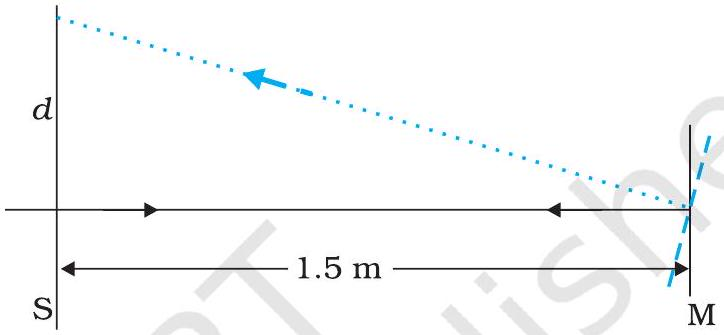
चित्र $9.29$
$9.31$ चित्र $9.30$ में कोई समोत्तल लेंस (अपवर्तनांक 1.50) किसी समतल दर्पण के फलक पर किसी द्रव की परत के संपर्क में दर्शाया गया है। कोई छोटी सुई जिसकी नोंक मुख्य अक्ष पर है, अक्ष के अनुदिश ऊपर-नीचे गति कराकर इस प्रकार समायोजित की जाती है कि सुई की नोंक का उलटा प्रतिबिंब सुई की स्थिति पर ही बने। इस स्थिति में सुई की लेंस से दूरी $45.0 \mathrm{~cm}$ है। द्रव को हटाकर प्रयोग को दोहराया जाता है। नयी दूरी $30.0 \mathrm{~cm}$ मापी जाती है। द्रव का अपवर्तनांक क्या है?

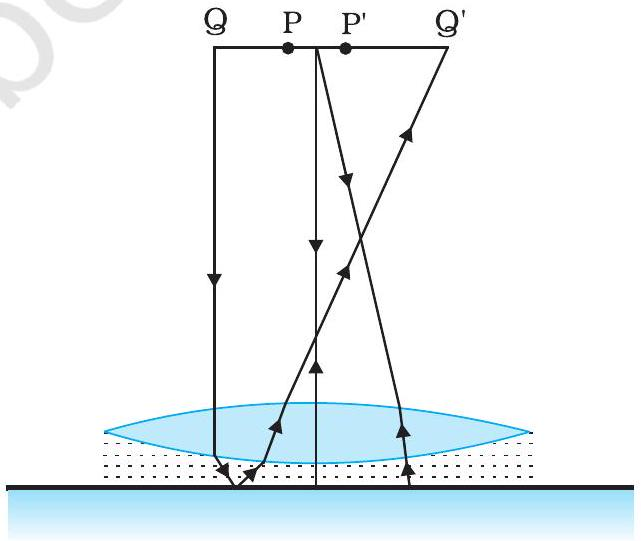
चित्र $9.30$
