## अध्याय $9$

## किरण प्रकाशिकी एवं प्रकाशिक यंत्र   (Ray Optics and Optical Instruments)

## प्रश्नावली

प्रश्न 1. $2.5 \mathrm{~cm}$ साइज़ की कोई छोटी मोमबत्ती $36 \mathrm{~cm}$ वक्रता त्रिज्या के किसी अवतल दर्पण से $27 \mathrm{~cm}$ दूरी पर रखी है। दर्पण से किसी परदे को कितनी दूरी पर रखा जाए कि उसका सुस्पष्ट प्रतिबिम्ब परदे पर बने। प्रतिबिम्ब की प्रकृति और साइज़ का वर्णन कीजिए। यदि मोमबत्ती को दर्पण की ओर ले जाएँ, तो परदे को किस ओर हटाना पड़ेगा?
हल-दिया है, $u=-27$ सेमी, $O=2.5$ सेमी

$$
|r|=|2 f|=36 \text { सेमी } \Rightarrow|f|=\frac{36}{2}=18 \text { सेमी }
$$

चिह्न परिपाटी से, $f=-18$ सेमी
दर्पण सूत्र $\frac{1}{f}=\frac{1}{v}+\frac{1}{u}$ से,

$$
\frac{1}{v}=\frac{1}{f}-\frac{1}{u}=\frac{1}{-18}-\frac{1}{(-27)}=\frac{-1}{18}+\frac{1}{27}
$$

⇒

$$
v=-54 \text { सेमी }
$$

अर्थात् प्रतिबिम्ब दर्पण के सामने दर्पण से $54$ सेमी की दूरी पर बनेगा, अत: पर्दा दर्पण के सामने $54$ सेमी की दूरी पर रखना होगा।
प्रतिबिम्ब का आकार, $I=\frac{-v}{u} O=-\left(\frac{-54 \text { सेमी }}{-27 \text { सेमी }}\right) \times 2.5$ सेमी $=5$ सेमी
अत: प्रतिबिम्ब वास्तविक, उल्टा तथा $\mathbf{5}$ सेमी ऊँचा है।
यदि मोमबत्ती को पर्दे की ओर ले जायें, तो पर्दे को दर्पण से दूर ले जाना होगा। यदि मोमबत्ती को $18$ सेमी से कम दूरी तक खिसकायें, तो प्रतिबिम्ब आभासी बनेगा तथा पर्दे पर प्राप्त नहीं होगा।
प्रंश्न 2. $4.5 \mathrm{~cm}$ साइज़ की कोई सुई $15 \mathrm{~cm}$ फोकस दूरी के किसी उत्तल दर्पण से $12 \mathrm{~cm}$ दूर रखी है। प्रतिबिम्बं की स्थिति तथा आवर्धन लिखिए। क्या होता है जब सुई को दर्पण से दूर ले जाते हैं? वर्णन कीजिए।
हल-यहाँ सुई का आकार $O=4.5$ सेमी; उत्तल दर्पण की फोकस दूरी $f=15$ सेमी। दर्पण से वस्तु (सुई) की दूरी $u=-12$ सेमी
अत: दर्पण के सूत्र $\frac{1}{v}+\frac{1}{u}=\frac{1}{f}$ में ज्ञात मान रखने पर,

$$
\frac{1}{v}+\frac{1}{-12}=\frac{1}{15} \Rightarrow \frac{1}{v}=\frac{1}{15}+\frac{1}{12}=\frac{4+5}{60}=\frac{3}{20}
$$

$\therefore$ दर्पण से सुई के प्रतिबिम्ब की दूरी $v=\left(\frac{20}{3}\right)$ सेमी $=6.67$ सेमी अर्थात् प्रतिबिम्ब दर्पण के पीछे दर्पण से $6.67$ सेमी दूरी पर बनेगा।

दर्पण के आवर्धन सूत्र $m=\frac{I}{O}=-\left(\frac{v}{u}\right)$ से,
प्रतिबिम्ब का आकार

$$
I=-\left(\frac{v}{u}\right) \cdot O=-\left[\frac{20 / 3}{-12}\right] \times 4.5 \text { सेमी }=2.5 \text { सेमी }
$$

अर्थात् प्रतिबिम्ब सीधा (आभासी ) तथा $2.5$ सेमी लम्बा ( ऊँचा ) बनेगा।
जब सुई को दर्पण से दूर ले जाते हैं तो इसका प्रतिबिम्ब दर्पण से दूर फोकस की ओर खिसकेगा तथा. इसका आकार घटता जायेगा।

प्रश्न 3. कोई टैंक $12.5 \mathrm{~cm}$ ऊँचाई तक जल से भरा है। किसी सूक्ष्मदर्शी द्वारा बीकर की तली पर पड़ी किसी सुई की आभासी गहराई $9.4 \mathrm{~cm}$ मापी जाती है। जल का अपवर्तनांक क्या है? बीकर में उसी ऊँचाई तक जल के स्थान पर किसी $1.63$ अपवर्तनांक के अन्य द्रव से प्रतिस्थापन करने पर सुई को पुन: फोकसित करने के लिए सूक्ष्मदर्शी को कितना ऊपर/नीचे ले जाना होगा?
हल-सुई की वास्तविक गहराई $h=12.5$ सेमी

$$
\text { आभासी गहराई } h^{\prime}=9.4 \text { सेमी }
$$

जल का अपवर्तनांक ${ }_{a} n_{w}=\frac{\text { वास्तविक गहराई }}{\text { आभासी गहराई }}=\frac{h}{h^{\prime}}=\frac{12.5 \text { सेमी }}{9.4 \text { सेमी }}$

$$
=1.329 \approx 1.33
$$

द्रव का अपवर्तनांक ${ }_{a} n_{l}=1.63 \Rightarrow{ }_{a} n_{l}=\frac{h}{h^{\prime}}$ से,

$$
h^{\prime}=\frac{h}{{ }_{a} n_{l}}=\frac{12.5 \text { सेमी }}{1.63 \text { सेमी }}=7.67 \text { सेमी } \approx 7.7 \text { सेमी }
$$

पहले सूक्ष्मदर्शी $9.4$ सेमी पर फोकस़ था अतः इसका नीचे की ओर विस्थापन $=(9.4-7.7)$ सेमी $=1.7$ सेमी

प्रश्न 4. चित्र $9.1$ (a) तथाँ (b) में किसी आपतित किरण का अपवर्तन दर्शाया गया है जो वायु में क्रमश: काँच-वायु तथा जल-वायु अन्तरापृष्ठ के अभितम्ब से $\mathbf{6 0}$ का कोण बनाती है। उस आपतित किरण का अपवर्तन कोण ज्ञात कीजिए, जो जल में जल-काँच अन्तरापृष्ठ के अभितम्ब से $45^{\circ}$ का कोण बनाती है [चित्र 9.1(c)]।

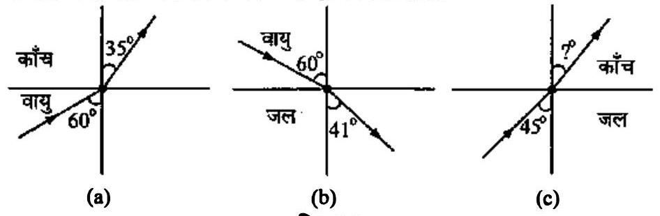
चित्र $9.1$

हल-स्नेल के नियम $\sin i / \sin r={ }_{1} n_{2}$ का प्रयोग करते हुए,
चित्र $9.1(\mathrm{a})$ से, ${ }_{a} n_{g}=\frac{\sin 60^{\circ}}{\sin 35^{\circ}}=\left(\frac{0.8660}{0.5736}\right)=1.51$
चित्र $9.1$ (b) से, ${ }_{a} n_{w}=\frac{\sin 60^{\circ}}{\sin 41^{\circ}}=\left(\frac{0.8660}{0.6561}\right)=1.32$

परन्तु ${ }_{a} n_{w} \times{ }_{w} n_{g}={ }_{a} n_{g}$
⇒

$$
{ }_{w} n_{g}={ }_{a} n_{g} /_{a} n_{w}
$$

∴

$$
{ }_{w} n_{g}=\frac{1.51}{1.32} ;
$$

परन्तु चित्र $9.1$ (c) से ${ }_{w} n_{g}=\frac{\sin 45^{\circ}}{\sin r}$
अत:

$$
\frac{1.51}{1.32}=\frac{\sin 45^{\circ}}{\sin r}
$$

⇒

$$
\sin r=\left(\frac{1.32}{1.51}\right) \sin 45^{\circ}=\left(\frac{1.32}{1.51}\right) \times 0.7071=0.6181
$$

∴

$$
\text { कोण } r=\sin ^{-1}(0.6181)=38^{\circ}
$$

प्रश्न 5. जल से भरे $80$ cm गहराई के किसी टैंक की तली पर कोई छोटा बल्ब रखा गया है। जल के पृष्ठ का वह क्षेत्र ज्ञात कीजिए जिससे बल्ब का प्रकाश निर्गत हो सकता है। जल का अपवर्तनांक $1.33$ है। (बल्ब को बिन्दु प्रकाश स्रोत मानिए)
हल-टैंक की तली सें रखे बल्ब से निकलने वाली प्रकाश किरणें जल के पृष्ठ से तभी निर्गत होगी, जबकि आपतन कोण जल-वायु अन्तरापृष्ठ के लिए क्रान्तिक कोण $C$ से कम अथवा उसके बराबर हो। यदि उस पृष्ठ के क्षेत्रफल की त्रिज्या $r$ हो जिससे बल्ब का प्रकाश निकल रहा है, तो यह स्थिति चित्र $9.2$ की भाँति होगी जहाँ $h$ बल्ब की जल के तल से गहराई है।

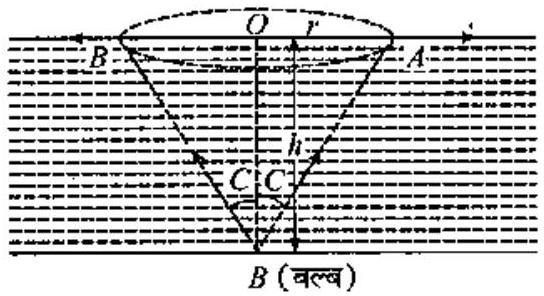
चित्र $9.2$

∵

$$
{ }_{a} n_{w}=\frac{1}{\sin C}
$$

⇒

$$
\sin C=\frac{1}{{ }_{\alpha} n_{w}}
$$

परन्तु यहाँ

$$
{ }_{a} n_{w}=1.33
$$

अत:

$$
\sin C=\frac{1}{1.33}=\frac{1}{4 / 3}=\frac{3}{4}
$$

∴

$$
\tan C=\frac{\sin C}{\cos C}=\frac{\sin C}{\sqrt{1-\sin ^{2} C}}=\frac{3 / 4}{\sqrt{1-(3 / 4)^{2}}}=\frac{3}{\sqrt{7}}
$$

परन्तु चित्र से, $\frac{r}{h}=\tan C$
∴

$$
r=h \quad \tan C \text {; परन्तु यहाँ } h=80 \text { सेमी }
$$

अत:

$$
r=80 \text { सेमी } \times \frac{3}{\sqrt{7}}=\frac{240}{2.645} \text { सेमी }=90.74 \text { सेमी }
$$

$$
=0.9074 \text { मी } \approx 0.907 \text { मी }
$$

$\therefore \quad$ क्षेत्रफल $=\pi r^{2}=3.14 \times(0.907 \text { मी })^{2}=2.58$ मी $^{2} \approx 2.6$ मी $^{2}$

प्रश्न 6. कोई प्रिज्म अज्ञात अपवर्तनांक के काँच का बना है। कोई समान्तर प्रकाश-पुंज इस प्रिज़्म के किसी फलक पर आपतित होता है । प्रिज्म का न्यूनतम विचतन कोण $40^{\circ}$ मापा गया। प्रिज्म के पदार्थ का अपवर्तनांक क्या है? प्रिज़्म का अपवर्तन कोण $60^{\circ}$ है। यदि प्रिज़्म को जल (अपवर्तनांक 1.33) में रख दिया जाए तो प्रकाश के समान्तर पुंज के लिए नए न्यूनतम विचलन कोण का परिकलन कीजिए।
हल-दिया है, प्रिज़्म के लिए $A=60^{\circ}, \quad$ वायु में $D_{m}=40^{\circ}$
∴ वायु के सापेक्ष प्रिज़्म के पदार्थ का अपवर्तनांक

$$
{ }_{a} n_{g}=\frac{\sin \left(\frac{A+D_{m}}{2}\right)}{\sin \frac{A}{2}}=\frac{\sin 50^{\circ}}{\sin 30^{\circ}}=1.53
$$

वायु के सापेक्ष जल का अपवर्तनांक ${ }_{a} n_{w}=1.33$
∴ जल के सापेक्ष काँच का अपवर्तनांक ${ }_{w} n_{g}=\frac{a^{n} g}{{ }_{a} n_{w}}=\frac{1.53}{1.33}=1.15$
यदि जल में डुबाने पर न्यूनतम विचलन कोण $D_{m}^{\prime}$ है तो

$$
\omega^{n}{ }_{g}=\frac{\sin \left(\frac{A+D_{m}^{\prime}}{2}\right)}{\sin \frac{A}{2}} \Rightarrow 1.15=\frac{\sin \left(\frac{A+D_{m}^{\prime}}{2}\right)}{\sin 30^{\circ}}
$$

या

$$
\sin \left(\frac{60^{\circ}+}{2} \frac{D_{m}^{\prime}}{2}\right)=1.15 \times \frac{1}{2}=-0.575
$$

⇒

$$
\frac{60^{\circ}+D_{m}^{\prime}}{2}=\sin ^{-1}(0.575)=35.1^{\circ}
$$

न्यूनतम विचलन कोण $D_{m}^{\prime}=2 \times 35.1^{\circ}-60^{\circ}=10.2^{\circ} \approx 10^{\circ}$
प्रश्न 7. अपवर्तनांक $1.55$ के काँच से दोनों फलकों की समानदक्रता त्रिज्या के उभयोतत लेन्स निर्मित करने हैं। यदि $20 \mathrm{~cm}$ फोकस दूरी के लेन्स निर्मित करने हैं तो अपेक्षित वक्रता त्रिज्या क्या होगी?
हल-दिया है, $n=1.55$, लेन्स की फोकस दूरी $f=+20 \mathrm{~cm}$
माना अभीष्ट वक्रता त्रिज्या $=R$
तब उत्तल लेन्स हेतु $R_{1}=+R, \quad R_{2}=-R$
∴

$$
\frac{1}{f}=(n-1)\left(\frac{1}{R_{1}}+\frac{1}{R_{2}}\right) \text { से, }
$$

या

$$
\frac{1}{20}=0.55\left(\frac{1}{R}+\frac{1}{R}\right)=\frac{0.55 \times 2}{R}
$$

⇒

$$
R=2 \times 0.55 \times 20=22 \mathrm{~cm}
$$

अत: प्रत्येक पृष्ठ की वक्रता त्रिज्या $22 \mathrm{~cm}$ होनी चाहिए।
प्रश्न 8. कोई प्रकाश-पुंज किसी बिन्दु $P$ पर अभिसरित होता है। कोई लेन्स इस अभिसारी पुंज के पथ में बिन्दु $P$ से $12 \mathrm{~cm}$ दूर रखा जाता है। यदि यह (a) $20 \mathrm{~cm}$ फोकस दूरी का उत्तल लेन्स है, (b) $16 \mathrm{~cm}$ फोकस दूरी का अवतल लेन्स है तो प्रकाश-पुंज किस बिन्दु पर अभिसरित होगा?

हल-(a) स्पष्ट है कि इस स्थिति में बिन्दु $P$ लेन्स के लिए आभासी वस्तु (बिम्ब) है। $\therefore \quad u=+12 \mathrm{~cm}$
(लेन्स के दायीं ओर है)

$$
f=+20 \mathrm{~cm}
$$

∴ लेन्स के सूत्र से,

$$
\frac{1}{v}-\frac{1}{u}=\frac{1}{f}
$$

अत:

$$
\frac{1}{v}=\frac{1}{f}+\frac{1}{u}=\frac{1}{20}+\frac{1}{12}=\frac{3+5}{60}=\frac{8}{60}
$$

⇒

$$
v=\frac{60}{8}=7.5 \mathrm{~cm}
$$

अत: प्रकाश पुंज लेन्स के पीछे (दाहिनी ओर) लेन्स से $\mathbf{7 . 5 ~ c m}$ दूरी पर अभिसरित होगा।
(b) इस स्थिति में, $f=-16 \mathrm{~cm}$
∴

$$
\frac{1}{v}=\frac{1}{f}+\frac{1}{u}=-\frac{1}{16}+\frac{1}{12}=\frac{-3+4}{48}=\frac{1}{48}
$$

⇒

$$
v=+48 \mathrm{~cm}
$$

अत: प्रकाश पुंज लेन्स के दाहिनी ओर लेन्स से $\mathbf{4 8 ~ c m}$ दूरी पर अभिसरित होगा।
प्रश्न 9. $3.0 \mathrm{~cm}$ ऊँची कोई बिम्ब $21 \mathrm{~cm}$ फोकस दूरी के अवतल लेन्स के सामने $14 \mathrm{~cm}$ दूरी पर रखी है। लेन्स द्वारा निर्मित प्रतिबिम्ब का वर्णन कीजिए। क्या होता है जब बिम्ब लेन्स से दूर हटती जाती है?
हल-दिया है, $u=-14 \mathrm{~cm}$,

$$
f=-21 \mathrm{~cm}, \quad h=3.0 \mathrm{~cm}
$$

लेन्स के सूत्र से,

$$
\frac{1}{v}-\frac{1}{u}=\frac{1}{f}
$$

⇒

$$
\frac{1}{v}=\frac{1}{f}+\frac{1}{u}=-\frac{1}{21}-\frac{1}{14}=\frac{-2-3}{42}=-\frac{5}{42}
$$

⇒

$$
v=-\frac{42}{5}=-8.4 \mathrm{~cm}
$$

तथा लेन्स के लिए

$$
m=\frac{v}{u}=\frac{(-8.4)}{-14}=\frac{3}{5}
$$

$\therefore \quad \frac{h^{\prime}}{h}=m=\frac{3}{5}$ से,

$$
h^{\prime}=\frac{3}{5} \times h=\frac{3}{5} \times 3.0=1.8 \mathrm{~cm}
$$

अत: प्रतिबिम्ब $1.8 \mathrm{~cm}$ लम्बा आभासी तथा सीथा होगा, जो लेन्स के बायीं ओर उससे $8.4 \mathrm{~cm}$ की दूरी पर बनेगा।
जैसे-जैसे बिम्ब लेन्स से दूर हटती है, $(u \rightarrow \infty)$ वैसे-वैसे प्रतिबिम्ब फोकस के समीप खिसकता जाता है ( $v \rightarrow f$ )।
प्रश्न 10. किसी $30 \mathrm{~cm}$ फोकस दूरी के उत्तल लेन्स के सम्पर्क में रखे $20 \mathrm{~cm}$ फोकस दूरी के अवतल लेन्स के संयोजन से बने संयुक्त लेन्स (निकाय) की फोकस दूरी क्या है? यह तन्त्र अभिसारी लेन्स है अथवा अपसारी? लेन्सों की मोटाई की उपेक्षा कीजिए।

हल-दिया है, $f_{1}=+30 \mathrm{~cm}, f_{2}=-20 \mathrm{~cm}$
$\therefore \quad \frac{1}{F}=\frac{1}{f_{1}}+\frac{1}{f_{2}}=\frac{1}{30}-\frac{1}{20}=\frac{2-3}{60}=-\frac{1}{60}$
∴ संयुक्त लेन्स की फोकस दूरी $\boldsymbol{F}=-\mathbf{6 0 ~ c m}$
यह लेन्स अपसारी है।
प्रश्न 11. किसी संयुक्त सूक्ष्मदर्शी में $2.0 \mathrm{~cm}$ फोकस दूरी का अभिदृश्यक लेन्स तथा $6.25 \mathrm{~cm}$ फोकस दूरी का नेत्रिका लेन्स एक-दूसरे से $15 \mathrm{~cm}$ दूरी पर लगे हैं। किसी बिम्ब को अभिदृश्यक से कितनी दूरी पर रखा जाए कि अन्तिम प्रतिबिम्ब (a) स्पष्ट दृष्टि की अल्पतम दूरी (25 cm), तथा (b) अनन्त पर बने? दोनों स्थितियों में सूक्ष्मदर्शी की आवर्धन क्षमता ज्ञात कीजिए।
हल-दिया है, अभिदृश्यक लेन्स की फोकस दूरी $f_{e}=2.0$ सेमी नेत्रिका लेन्स की फोकस दूरी $f_{o}=6.25$ सेमी
दोनों लेन्सों के बीच की दूरी $L=15$ सेमी
स्पष्ट दृष्टि की अल्पतम दूरी $D=25$ सेमी

(a)नेत्रिका लेन्स के लिये $v_{e}=-25$ सेमी अतः सूत्र $\frac{1}{f}=\frac{1}{v}-\frac{1}{u}$ में $v$ तथा $f$ के मान रखने पर

$$
\frac{1}{6.25}=\frac{1}{-25}-\frac{1}{u_{e}}
$$

अथवा

$$
\begin{aligned}
-\frac{1}{u_{e}} & =\frac{1}{6.25}+\frac{1}{25} \\
& =\frac{4+1}{25} \quad=\frac{1}{5}
\end{aligned}
$$

अथवा

$$
u_{e}=-5 \text { सेमी }
$$

अब

$$
L=v_{o}+u_{e}
$$

अथवा

$$
15=v_{o}+5
$$

∴

$$
\begin{aligned}
v_{0} & =15-5 \\
& =10 \text { सेमी }
\end{aligned}
$$

अभिदृश्यक लेन्स के लिये,
सूत्र $\frac{1}{f}=\frac{1}{v}-\frac{1}{u}$ में $v_{o}$ तथा $f_{o}$ के मान रखने पर,

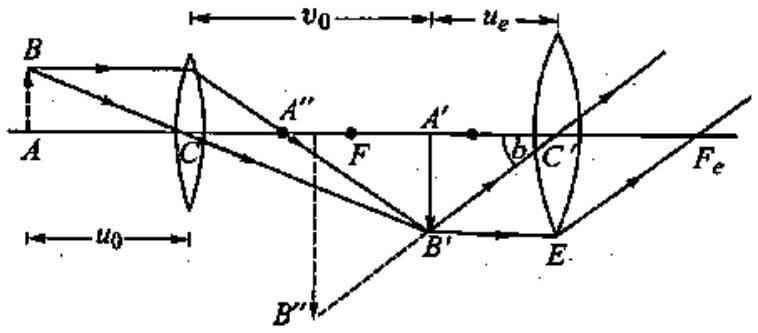
चित्र $9.4$

अथवा

$$
\begin{aligned}
\frac{1}{2.0} & =\frac{1}{10}-\frac{1}{u} \\
-\frac{1}{u_{o}} & =\frac{1}{20}-\frac{1}{10}=\frac{5-1}{10}=\frac{2}{5} \\
u_{o} & =-\frac{5}{2}=-2.5 \text { सेमी }
\end{aligned}
$$

संयुक्त सूक्ष्मदर्शी की आवर्धन क्षमता
अथवा

$$
M=\frac{10}{-2.5}\left(1+\frac{25}{6.25}\right)
$$

$$
M=-4 \times(1+4)=-20
$$

(b) यदि अन्तिम प्रतिबिम्ब अनन्त $(v=\infty)$ पर बनता है, अत: सूत्र $\frac{1}{f}=\frac{1}{v}-\frac{1}{u}$ से नेत्रिका के लिए,
$$
\frac{1}{6.25}=\frac{1}{\infty}-\frac{1}{u_{e}}
$$
अथवा
$$
u_{e}=-6.25 \text { सेमी }
$$
∵
$$
L=v_{o}+u_{e}
$$
∴
$$
15=v_{o}+6.25
$$
अथवा
$$
\begin{aligned}
v_{0} & =15-6.25 \\
& =8.75 \text { सेमी }
\end{aligned}
$$
अभिदृश्यक लेन्स के लिये सूत्र $\frac{1}{f_{o}}=\frac{1}{v_{o}}-\frac{1}{u_{0}}$ में $f_{o}$ तथा $v_{0}$ के मान रखने पर
$$
\frac{1}{2.0}=\frac{1}{8.75}-\frac{1}{u_{0}}
$$
अथवा
$$
\begin{aligned}
-\frac{1}{u_{\sigma}} & =\frac{1}{2.0}-\frac{1}{8.75} \\
& =\frac{35-8}{70}=\frac{27}{70}
\end{aligned}
$$
∴
$$
u_{o}=-\frac{70}{27}=-2.59 \text { सेमी }
$$
संयुक्त सूक्ष्मदर्शी की आवर्धन क्षमता $M=\frac{v_{o}}{u_{o}} \times \frac{D}{f_{e}}$
इसमें $v_{0}, u_{0}, D$ तथा $f_{e}$ के मान रखने पर
$$
M=\frac{8.75}{-2.59} \times \frac{25}{6.25}=-13.51
$$
प्रश्न $12.25 \mathrm{~cm}$ के सामान्य निकट बिन्दु का कोई व्यक्ति ऐसे संयुक्त सूक्ष्मदर्शी जिसका अभिदृश्यक $8.0 \mathrm{~mm}$ फोकस दूरी तथा नेत्रिका $2.5 \mathrm{~cm}$ फोकस दूरी की है, का उपयोग करके अभिदृशयक से $9.0 \mathrm{~mm}$ दूरी पर रखे बिम्ब की सुस्पष्ट फोकसित कर लेता है। दोनों लेन्सों के बीच पृथक्कन दूरी क्या है? सूक्ष्मदर्शी की आवर्धन क्षमता क्या है?

हल-यहाँ $f_{0}=8$ मिमी, $f_{e}=2.5$ सेमी $=25$ मिमी, $u_{0}=9.0$ मिमी
अभिदृश्यक के लिए $\frac{1}{f_{o}}=\frac{1}{v_{o}}-\frac{1}{u_{o}}$ से

⇒

$$
\begin{aligned}
& \frac{1}{v_{o}}=\frac{1}{f_{o}}-\frac{1}{u_{o}}=\frac{1}{8}-\frac{1}{9}=\frac{1}{72} \\
& v_{o}=72 \text { मिमी }
\end{aligned}
$$

नेत्रिका के लिए जब अन्तिम प्रतिबिम्ब स्पष्ट दृष्टि की दूरी पर बन रहा हो, तो $v_{e}=-D$ $=-25$ सेमी $=-250$ मिमी
∴

$$
\begin{aligned}
& \frac{1}{f_{e}}=\frac{1}{v_{e}}-\frac{1}{u_{e}} \text { से, } \\
& \frac{1}{u_{e}}=\frac{1}{v_{e}}-\frac{1}{f_{e}}=\frac{1}{-250}-\frac{1}{25}=\frac{-11}{250} \\
& u_{e}=-\left(\frac{250}{11}\right) \text { मिमी }=-227 \text { मिमी }
\end{aligned}
$$

∴ दोनों लेन्सों के बीच पृथक्कन दूरी

$$
\begin{aligned}
I & =\left|v_{o}\right|+\left|u_{e}\right|=72 \text { मिमी }+22.7 \text { मिमी } \\
& =94.7 \text { मिमी }=9.47 \text { सेमी }
\end{aligned}
$$

आवर्धन क्षमता

$$
M=-\left[\frac{v_{o}}{u_{o}}\left(1+\frac{D}{f_{e}}\right)\right]=\left[\frac{-72}{9}\left(1+\frac{25 \text { सेमी }}{2.5 \text { सेमी }}\right)\right]=-\mathbf{8 8}
$$

प्रश्न 13. किसी छोटी दूरबीन के अभिदृश्यक की फोकस़ दूरी $\mathbf{1 4 4} \mathbf{~ c m}$ तथा नेत्रिका की फोकस दूरी $6.0 \mathrm{~cm}$ है। दूरबीन की आवर्धन क्षमता कितनी है? अभिदृश्यक तथा नेत्रिका के बीच पृथक्कन दूरी क्या है?
हल-दिया है, $f_{o}=144$ सेमी, $f_{e}=6.0$ सेमी
दूरबीन की आवर्धन क्षमता, $M=-\frac{f_{0}}{f_{e}}=-\frac{144}{6.0}=-24$
ॠणात्मक चिह्न यह प्रकट करता है कि अन्तिम प्रतिबिम्ब उल्टा है। अभिदृश्यक तथा नेत्रिका के बीच दूरी,

$$
d=f_{o}+f_{e}=144+6.0=150 \text { सेमी }
$$

प्रश्न 14. (a) किसी वेधशाला की विशाल दूरबीन के अभिदृश्यक की फोकस दूरी $15 \mathrm{~m}$ है। यदि $1.0 \mathrm{~cm}$ फोकस दूरी की नेत्रिका प्रयुक्त की गयी है तो दूरबीन का कोणीय आवर्धन क्या है?

(b) यदि इस दूरबीन का उपयोग चन्द्रमा का अवलोकन करने में किया जाए तो अभिदृश्यक लेन्स द्वारा निर्मित चन्द्रमा के प्रतिबिम्ब का व्यास क्या है? चन्द्रमा का व्यास $3.48 \times 10^{6} \mathrm{~m}$ तथा चन्द्रमा की कक्षा की त्रिज्या $3.8 \times 10^{8} \mathrm{~m}$ है।

हल-दिया है, दूरबीन के अभिदृश्यक लेन्स की फोकस दूरी $f_{o}=15$ मीटर नेत्रिका की फोकस दूरी $f_{e}=1.0$ सेमी $=1.0 \times 10^{-2}$ मीटर

(a) कोणीय आवर्धन
$$
M=-\frac{f_{o}}{f_{e}}=-\frac{15}{1.0 \times 10^{-2}}=-1500
$$
(b) यदि अभिदृश्यक लेन्स द्वारा बने चन्द्रमा के प्रतिबिम्ब का व्यास $d$ हो, तो प्रतिबिम्ब द्वारा बनाया गया कोण $\theta=\frac{d}{f_{o}}=\frac{d}{15}$
लेकिन चन्द्रमा के व्यास द्वारा दूरदर्शी पर बनाया गया कोण

$$
\begin{aligned}
\theta & =\frac{\text { चन्द्रमा का व्यास }}{\text { दूरदर्शी से चन्द्रमा की दूरी }} \\
& =\frac{\text { चन्द्रमा का व्यास }}{\text { चन्द्रमा की कक्षा की त्रिज्या }} \\
& =\frac{3.48 \times 10^{6}}{3.8 \times 10^{8}}
\end{aligned}
$$

अत: समीकरण (1) व (2) से,

$$
\frac{d}{15}=\frac{3.48 \times 10^{6}}{3.8 \times 10^{8}}
$$

अथवा

$$
\begin{aligned}
d & =\frac{15 \times 3.48 \times 10^{-2}}{3.8} \\
& =13.73 \times 10^{-2} \text { मीटर }=13.73 \text { सेमी }
\end{aligned}
$$

प्रश्न 15. दर्पण-सूत्र का उपयोग यह व्युत्पन्न करने के लिए कीजिए कि

(a) किसी अवतल दर्पण के $f$ तथा $2 f$ के बीच रखे बिम्ब का वास्तविक प्रतिबिम्ब $2 f$ से दूर बनता है।
(b) उत्तल दर्पण द्वारा सदैव आभासी प्रतिबिम्ब बनता है जो बिम्ब की स्थिति पर निर्भर नहीं करता।
(c) उत्तल दर्पण द्वारा सदैव आकार में छोटा प्रतिबिम्ब, दर्पण के ध्रुव व फोकस के बीच बनता है।
(d) अवतल दर्पण के ध्रुव तथा फोकस के बीच रखे बिम्ब का आभासी तथा बड़ा प्रतिबिम्ब बनता है।
[नोट : यह अभ्यास आपकी बीजगणितीय विधि द्वारा उन प्रतिबिंबों के गुण व्युत्पन्न करने में सहायता करेगा जिन्हें हम किरण आरेखों द्वारा प्राप्त करते हैं।]

हल-(a) दर्पण के सूत्र से, $\frac{1}{v}+\frac{1}{u}=\frac{1}{f}$
⇒

$$
\frac{1}{v}=\frac{1}{f}-\frac{1}{u}=\frac{u-f}{u f}
$$

⇒

$$
v=\frac{u f}{u-f}
$$

अवतल दर्पण के लिए $f$ ऋणात्मक होता है जबकि $u$ सभी दर्पणों के लिए ऋणात्मक है; अतः उक्त सूत्र से $u$ व $f$ को चिह्न सहित रखने पर,

$$
v=\frac{(-u)(-f)}{-u-(-f)}=\frac{u f}{f-u}
$$

दिया है, $f<u<2 f$
दिया है, $f<u<2 f$

$$
\Rightarrow \quad f-u<0 \text { या } u-f>0
$$

∴

$$
v=\frac{u f}{-(u-f)} \quad \Rightarrow \quad v=-\frac{u f}{u-f}
$$

इससे स्पष्ट है कि $v$ का मान ऋणात्मक है अर्थात् प्रतिबिम्ब दर्पण के सामने बनता है; अत: वास्तविक है। पुन: $v=\frac{u f}{u-f}$ से,

$$
v=\frac{f}{1-\frac{f}{u}}
$$

(आंकिक मान, $u$ से अंश व हर को भाग देने पर)

$$
\because \quad u<2 f \quad \Rightarrow \frac{u}{f}<2 \quad \text { या } \quad \frac{f}{u}>\frac{1}{2}
$$

∴

$$
\begin{aligned}
-\frac{f}{u} & <-\frac{1}{2} \quad \text { या } \quad 1-\frac{f}{u}<1-\frac{1}{2}=\frac{1}{2} \\
\frac{1}{1-\frac{f}{u}} & >\frac{1}{1 / 2}
\end{aligned}
$$

दोनों ओर $f$ से गुणा करने पर,

$$
\frac{f}{1-f / u}>2 f \quad \text { या } \quad v>2 f
$$

अर्थात् प्रतिबिम्ब $2 f$ से दूर बनेगा।
(b) भाग (a) से,

$$
v=\frac{u f}{u-f}
$$

उत्तल दर्पण के लिए $f$ धनात्मक होता है जबकि $u$ प्रत्येक दर्पण के लिए ॠणात्मक होता है; अत:
चिह्न सहित मान रखने पर,

$$
v=\frac{(-u) f}{-u-f} \quad \Rightarrow \quad v=\frac{u f}{u+f}
$$

इससे स्पष्ट है कि $v$ धनात्मक है अर्थात् प्रतिबिम्ब दर्पण के पीछे की ओर बनता है; अत: आभासी है।
इस प्रकार उत्तल दर्पण सदैव आभासी प्रतिबिम्ब बनाता है, जो बिम्ब की स्थिति पर निर्भर नहीं करता।
(c) पुन: भाग (b) के परिणाम से,

$$
v=\frac{u f}{u+f}
$$

∴ प्रतिबिम्ब का रेखीय आवर्धन $m=\frac{v}{u}=\frac{u+f}{u}$
⇒

$$
m=\frac{f}{u+f}<1
$$

$$
(\because f<u+f)
$$

∵ रेखीय आवर्धन $1$ से कम है; अत: स्पष्ट है कि प्रतिबिम्ब का आकार सदैव बिम्ब के आकार से छोटा है।
पुन:

$$
v=\frac{u f}{u+f}=\frac{f}{1+\frac{f}{u}} \text { ( } u \text { से अंश व हर को भाग देने पर) }
$$

स्पष्ट है कि

$$
v=\frac{f}{1+f / u}<f
$$

$$
\left(\because 1+\frac{f}{u}>1\right)
$$

अर्थात् प्रतिबिम्ब दर्पण के ध्रुव तथा फोकस के बीच बनता है।
(d) पुनः भाग (a) से,

$$
v=\frac{u f}{u-f}
$$

अवतल दर्पण के लिए चिन्न सहित मान रखने पर,

$$
v=\frac{(-u)(-f)}{(-u)-(-f)} \quad \Rightarrow \quad v=\frac{u f}{f-u}
$$

∵ बिम्ब ध्रुव तथा फोकस के बीच स्थित है; अत: $0<u<f$
$\Rightarrow f-u>0$
$\therefore v=\frac{u f}{f-u}$ धनात्मक है।

इसका अर्थ यह है कि प्रतिबिम्ब दर्पण के पीछे तथा सीधा बनता है; अत: आभासी है। प्रतिबिम्ब का रेखीय आवर्धन

$$
m=\frac{v}{u} \quad \Rightarrow \quad m=\frac{f}{f-u}>1 \quad(\because f-u<f)
$$

∵ आवर्धन $1$ से अधिक है, अर्थात् प्रतिबिम्ब का आकार वस्तु के आकार से बड़ा है।
प्रश्न 16. किसी मेज के ऊपरी पृष्ठ पर जड़ी एक छोटी पिन को $50 \mathrm{~cm}$ ऊँचाई से देखा जाता है। $15 \mathrm{~cm}$ मोटे आयताकार काँच के गुटके को मेज के पृष्ठ के समान्तर पिन व नेत्र के बीच रखकर उसी बिन्दु से देखने पर पिन नेत्र से कितनी दूर दिखाई देगी? काँच का अपवर्तनांक $1.5$ है। क्या उत्तर गुटके की अवस्थिति पर निर्भर करता है?
हल-काँच का अपवर्तनांक

$$
{ }_{a} n_{g}=\frac{\text { गुटके की वास्तविक मोटाई }}{\text { गुटके की आभासी मोटाई }}=\frac{H}{h}
$$

$\therefore \quad$ आभासी मोटाई $h=\frac{H}{{ }_{a} n_{g}}=\frac{15 \text { सेमी }}{1.5}=10$ सेमी
अत: पिन का विस्थापन $x=H-h=15$ सेमी $-10$ सेमी $=5$ सेमी अर्थात् पिन $5$ सेमी उठी प्रतीत होगी।
उत्तर गुटके की अक्ष की.स्थिति पर निर्भर नहीं करता।
प्रश्न 17. निम्नलिखित प्रश्नों के उत्तर लिखिए-

(a) चित्र $9.5$ में अपवर्तनांक $1.68$ के तन्तु काँच से बनी किसी प्रकाश नलिका (लाइट पाइप) का अनुप्रस्थ परिच्छेद दर्शाया गया है। नलिका का बाह्य आवरण $1.44$ अपवर्तनांक के पदार्थ का बना है। नतिका के अक्ष से आपतित किरणों के कोणों का परिसर, जिनके लिए चित्र में दर्शाए अनुसार नतिका के भीतर पूर्ण परावर्तन होते है, ज्ञात कीजिए।
(b)यदि पाइप पर बाह्म आवरण न हो तो क्या उत्तर होगा?

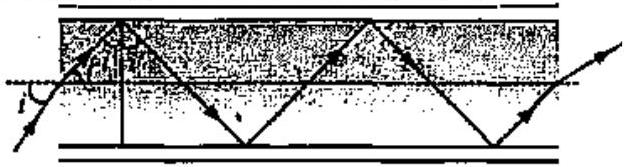
चित्र $9.5$

हल-(a) दिया है, वायु के सापेक्ष काँच का अपवर्तनांक

$$
{ }_{a} n_{g}=1.68
$$

तथा वायु के सापेक्ष आवरण के पदार्थ का अपवर्तनांक

$$
{ }_{a} n_{c}=1.44
$$

अत: आवरण के पदार्थ के सापेक्ष काँच का अपवर्तनांक

$$
\begin{aligned}
{ }_{c} n_{g} & =\frac{{ }_{a} n_{g}}{{ }_{a} n_{c}} \\
& =\frac{1.68}{1.44}=1.167
\end{aligned}
$$

यदि काँच-आवरण अन्तरापृष्ठ का क्रान्तिक कोण $C$ हो, तो

$$
\begin{aligned}
& & \sin C & =\frac{1}{{ }_{c} n_{g}}=\frac{1}{1.167} \\
& \therefore & C & =0.8569 \\
& \therefore & \sin ^{-1}(0.8569) & =58.97^{\circ}
\end{aligned}
$$

जब $i>C$ अर्थात् $i<58.97$, तब पूर्ण आन्तरिक परावर्तन होगा।
अत: पूर्ण आन्तरिक परावर्तन के लिये चित्र $9.5$ से,

$$
\therefore \quad \begin{aligned}
r+i^{\prime} & =90^{\circ} \\
r & =90^{\circ}-i^{\prime} \\
& =90^{\circ}-58.97^{\circ}=31.03^{\circ}
\end{aligned}
$$

सूत्र ${ }_{a} n_{g}=\frac{\sin i}{\sin r}$ से,

$$
1.68=\frac{\sin i}{\sin 31.03}=\frac{\sin i}{0.5155}
$$

अत:

$$
\begin{aligned}
\sin i & =1.68 \times 0.5155=0.8660 \\
i & =60^{\circ}
\end{aligned}
$$

अत: $0<i<60^{\circ}$ परास में आपतित सभी किरणों का तन्तु में पूर्ण आन्तरिक परावर्तन होगा।

(b) तन्तु पर आवरण की अनुपस्थिति में तन्तु के बाहर का माध्यम वायु होगा।
$$
\therefore \quad \sin C^{\prime}=\frac{1}{{ }^{a} n_{g}}
$$
अथवा
$$
\sin C^{\prime}=\frac{1}{1.68}=0.5952
$$
∴
$$
C^{\prime}=36.5^{\circ}
$$
अत:
$$
r^{\prime}=90^{\circ}-C^{\prime}=90^{\circ}-36.5^{\circ}=53.5^{\circ}
$$
अब ${ }_{a} n_{g}=\frac{\sin }{\sin } \frac{i}{r}$ से,
$$
\sin i={ }_{a} n_{g} \times \sin r^{\prime}=1.68 \times 36.5^{\circ}=53.5^{\circ}
$$
यह $C^{\prime}$ से अधिक है।
अत: अक्ष से 0° से 90° के परास में आपतित सभी किरणों का तन्तु में पूर्ण आन्तरिक परावर्तन होगा।

प्रश्न 18. निम्नलिखित प्रश्नों के उत्तर लिखिए-

(a) आपने सीखा है कि समतत तथा उत्तल दर्पण सदैव आभासी प्रतिबिम्ब बनाते हैं। क्या ये दर्पण किन्हीं परिस्थितियों में वास्तविक प्रतिबिम्ब बना सकते है? स्पष्ट कीजिए।
(b) हम सदैव कहते हैं कि आभासी प्रतिबिम्ब को परदे पर केन्द्रित नहीं किया जा सकता। यदuि जब हम किसी आभासी प्रतिबिम्ब को देखते हैं तो हम इसे स्वाभाविक रूप में अपनी आँख की स्क्रीन (अर्थात् रेटिना) पर लेते हैं। क्या इसमें कोई विरोधाभास है?
(c) किसी झील के तट पर खड़ा मछाआरा झील के भीतर किसी गोताखोर द्वारा तिरछा देखने पर अपनी वास्तविक लम्बाई का तुलना में केसा प्रतीत होगा-छोटा अथवा लम्बा?
(d) क्या तिरछा देखने पर किसी जल के टैंक की आभासी गहराई परिवर्तित हो जाती है? यदि हाँ, तो आभासी गहराई घटती है अथवा बढ़ जाती है।
(e) सामान्य काँच की तुलना में हीरे का अपवर्तनांक काफी अधिक होता है? क्या हीरे को तराशने वालों के लिए इस तथ्य का कोई उपयोग होता है?

उत्तर-(a) यह सही है कि समतल दर्पण तथा उत्तल दर्पण अपने सामने स्थित बिम्ब का आभासी प्रतिबिम्ब बनाते हैं। परन्तु ये दर्पण अपने पीछे स्थित किसी बिन्दु (आभासी बिम्ब) की ओर अभिसरित किरण पुंज को परावर्तित करके अपने सामने स्थित किसी बिन्दु पर अभिसरित कर सकते हैं अर्थात् आभासी बिम्ब का वास्तविक प्रतिबिम्ब बना सकते हैं (देखें चित्र)।

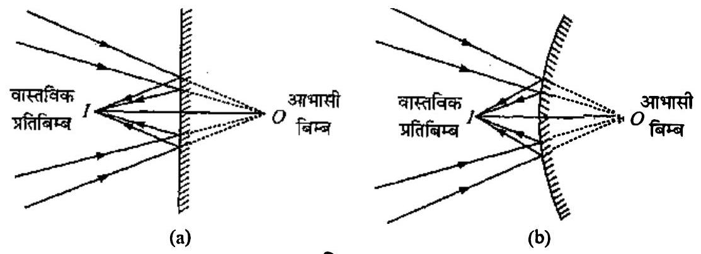
चित्र $9.6$

(b) जब किसी दर्पण से परावर्तन अथवा लेन्स से अपवर्तन के पश्चात् किरणें अपसरित होती हैं तो प्रतिबिम्ब को आभासी कहा जाता है। इस प्रतिबिम्ब को परदे पर प्राप्त नहीं किया जा सकता। यदि इन अपसारी किरणों के मार्ग में कोई अन्य दर्पण अथवा लेन्स रखकर इन्हें किसी बिन्दु पर अभिसरित किया जा सकता तो वहाँ वास्तविक प्रतिबिम्ब बनेगा जिसे परदे पर प्राप्त किया जा सकता है। नेत्र लेन्स वास्तव में यही कार्य करता है। यंह आभासी प्रतिबिम्ब बनाने वाली अपसारी किरणों को रेटिना पर अभिसरित कर देता है, जहाँ वास्तविक प्रतिबिम्ब बन जाता है। अत: इसमें कोई विरोधाभास नहीं है।
(c) चूँकि इस दशा में अपवंर्तन वायु (विरल माध्यम) से पानी (सघन माध्यम) में होता है। अत: झील में डूबे हुए गोताखोर को मछुआरे की लम्बाई अधिक प्रतीत होगी।
(d) हाँ, परिवर्तित हो जाती है। आभासी गहराई घट जाती है।
(e) वायु के सापेक्ष हीरे का अपवर्तनांक $2.42$ (काफी अधिक) है तथा क्रान्तिक कोण $24^{\circ}$ (बहुत कम) है। हीरा तराशने में दक्ष कारीगर इस तथ्य का उपयोग करते हुए हीरे को इस प्रकार तराशता है कि एक बार हीरे में प्रवेश करने वाली प्रकाश किरण हीरे के विभिन्न फलकों पर बार-बार परावर्तित होने के बाद ही किसी फलक से बाहर निकल पाए। इसके लिए हीरे की आन्तरिक सतह पर आपतन कोण $24^{\circ}$ से अधिक होना चाहिए। इससे हीरा अत्यधिक चमकीला दिखाई पड़ता है।

प्रश्न 19. किसी कमरे की एक दीवार पर लगे विद्युत बल्ब का किसी बड़े आकार के उत्तल लेन्स द्वारा $3 \mathrm{~m}$ दूरी पर स्थित सामने की दीवार पर प्रतिबिम्ब प्राप्त करना है। इसके लिए उत्तल लेन्स की अधिकतम फोकस दूरी क्या होनी चाहिए?
हल-माना किसी उत्तल लेन्स की फोकस दूरी $\boldsymbol{f}$ है तथा यह बल्ब का प्रतिबिम्ब दूसरी दीवार पर बनाता है।
माना बल्ब की लेन्स से दूरी $u$ (आंकिक मान) तथा दूसरी दीवार की लेन्स से दूरी $v$ है, तब

$$
u+v=3 \quad \Rightarrow \quad u=3-v
$$

लेन्स के सूत्र में चिह्न सहित मान रखने पर,

$$
\frac{1}{v}-\frac{1}{-u}=\frac{1}{f} \quad \text { या } \quad \frac{1}{v}+\frac{1}{(3-v)}=\frac{1}{f}
$$

या

$$
\frac{3-v+v}{v(3-v)}=\frac{1}{f}
$$

या

$$
3 f=v(3-v)
$$

⇒

$$
v^{2}-3 v+3 f=0
$$

उक्त समीकरण $v$ के वास्तविंक मान देगा यदि

$$
B^{2} \geq 4 A C \quad \text { या } \quad(-3)^{2} \geq 4 \times 3 f
$$

या

$$
9 \geq 12 f \quad \Rightarrow
$$

$$
f \leq \frac{9}{12}=\frac{3}{4}
$$

∴ लेन्स की अधिकतम फोकस दूरी $f_{\text {max }}=\frac{3}{4} \mathrm{~m}=75 \mathrm{~cm}$

प्रश्न 20. किसी परदे को बिम्ब से $90 \mathrm{~cm}$ दूर रखा गया है। परदे पर किसी उत्तल लेन्स द्वारा उसे एक-दूसरे से $20 \mathrm{~cm}$ दूर स्थितियों पर रखकर, दो प्रतिबिम्ब बनाए जाते हैं। लेन्स की फोकस दूरी ज्ञात कीजिए।
हल-माना बिम्ब की लेन्स से दूरी $u$ (आंकिक मान) है तथा प्रतिबिम्ब (परदे) की लेन्स से दूरी $v$ है। तब

$$
u+v=90 \quad \Rightarrow \quad v=90-u
$$

लेन्स के सूत्र में चिह्न सहित मान रखने पर,

$$
\frac{1}{v}-\frac{1}{-u}=\frac{1}{f} \quad \text { या } \quad \frac{1}{90-u}+\frac{1}{u}=\frac{1}{f}
$$

या

$$
\frac{u+90-u}{(90-u) u}=\frac{1}{f} \quad \Rightarrow \quad 90 f=(90-u) u
$$

या

$$
u^{2}-90 u+90 f=0
$$

चूँकि लेन्स दो स्थितियों में वस्तु का प्रतिबिम्ब परदे पर बनाता है तथा दो स्थितियों के बीच की दूरी $20 \mathrm{~cm}$ है; अत: समीकरण (1) में $u$ में दो मूल (माना $u_{1}$ व $u_{2}$ ) होंगे जिनका अन्तर $20 \mathrm{~cm}$ होगा। अर्थात्

$$
\left(u_{1}-u_{2}\right)^{2}=(20)^{2}=400
$$

समीकरण (1) से,

$$
\begin{aligned}
u_{1}+u_{2} & =90 \\
u_{1} u_{2} & =90 \mathrm{f}
\end{aligned}
$$

∴

$$
\left(u_{1}-u_{2}\right)^{2}=\left(u_{1}+u_{2}\right)^{2}-4 u_{1} u_{2}
$$

⇒

$$
400=(90)^{2}-4 \times 90 f
$$

⇒

$$
360 f=8100-400=7700
$$

∴ फोकस दूरी $f=\frac{7700}{360}=21.38 \approx 21.4 \mathrm{~cm}$
अन्य विधि-विस्थापन विधि के सूत्र से,

$$
f=\frac{a^{2}-d^{2}}{4 a}
$$

यहाँ $a=$ बिम्ब तथा प्रतिबिम्ब के बीच की दूरी $=90 \mathrm{~cm}$
$d=$ लेन्स की दो स्थितियों के बीच की दूरी $=20 \mathrm{~cm}$
$\therefore \quad$ फोकस दूरी $f=\frac{(90)^{2}-(20)^{2}}{4 \times 90}=\frac{8100-400}{360}=\frac{7700}{360}=\mathbf{2 1 . 4 ~ c m}$
प्रश्न 21. (a) प्रश्न $10$ के दो लेन्सों के संयोजन की प्रभावी फोकस दूरी उस स्थिति में ज्ञात कीजिए जब उनके मुख्य अक्ष संपाती हैं तथा ये एक-दूसरे से $8 \mathrm{~cm}$ दूरी पर रखे है। क्या उत्तर आपतित समान्तर प्रकाश पुंज की दिशा पर निर्भर करेगा? क्या इस तन्त्र के लिए प्रभावी फोकस दूरी किसी भी रूप में उपयोगी है ?

(b) उपर्युक्त व्यवस्था (a) में $1.5 \mathrm{~cm}$ ऊँचा कोई बिम्ब उत्तल लेन्स की ओर रखा है। बिम्ब की उत्तल लेन्स से दूरी $40 \mathrm{~cm}$ है। दो लेन्सों के तन्त्र द्वारा उत्पन्न आवर्धन तथा प्रतिबिम्ब का आकार ज्ञात कीजिए।

हल-(a) लेन्सों की फोकस दूरियाँ

$$
f_{1}=+30 \mathrm{~cm}, f_{2}=-20 \mathrm{~cm}
$$

कल्पना करें कि एक समान्तर किरण पुंज बाईं ओर से उत्तल लेन्स पर आपतित होता है, तब उत्तल लेन्स हेतु

$$
\therefore \quad \frac{1}{v}-\frac{1}{-\infty}=\frac{1}{f_{1}}
$$

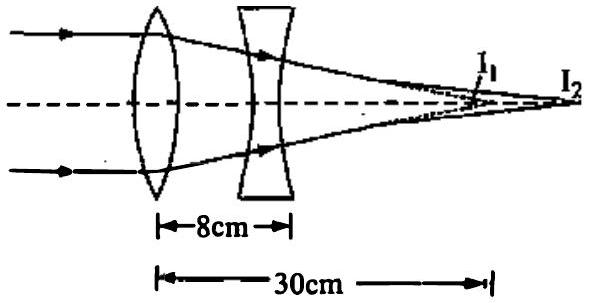
चित्र $9.7$

⇒

$$
v=f_{1}=+30 \mathrm{~cm}
$$

अर्थात् उत्तल लेन्स इन किरणों को $30 \mathrm{~cm}$ की दूरी पर बिन्दु $I$ पर मिलाता है। बिन्दु $I_{1}$ अवतल लेन्स के लिए आभासी बिम्ब है।
∴ अवतल लेन्स हेतु,

$$
\begin{aligned}
u & =(30-8)=+22 \mathrm{~cm} \\
\frac{1}{v}-\frac{1}{u} & =\frac{1}{f} \quad \Rightarrow \quad \frac{1}{v}=\frac{1}{u}+\frac{1}{f}
\end{aligned}
$$

या

$$
\frac{1}{v}=\frac{1}{22}-\frac{1}{20}=\frac{10-11}{220}=-\frac{1}{220}
$$

⇒

$$
v=-220 \mathrm{~cm}
$$

अर्थात् अन्तिम प्रतिबिम्ब, अवतल लेन्स के बाईं ओर इससे $220 \mathrm{~cm}$ दूर बनता है। इस प्रतिबिम्ब की लेन्सों के केन्द्र से दूरी $220-\frac{8}{2}=216 \mathrm{~cm}$ है।
अर्थात् अवतल लेन्स की ओर से देखने पर यह किरण पुंज लेन्सों के केन्द्र से $216 \mathrm{~cm}$ बाईं ओर स्थित बिन्दु से अपसरित प्रतीत होता है।
इस प्रकार यदि इस युग्म की फोकस दूरी अर्थपूर्ण है तो यह फोकस दूरी - $216 \mathrm{~cm}$ होनी चाहिए। दूसरी दशा में कल्पना कीजिए कि समान्तर किरण पुंज दाई ओर से चलता हुआ पहले अवतल लेन्स पर आपतित होता है।
∴ अवतल लेन्स हेतु $u=-\infty$
∴

$$
\frac{1}{v}-\frac{1}{-\infty}=\frac{1}{-20} \quad \Rightarrow \quad v=-20 \mathrm{~cm}
$$

अर्थात् अवतल लेन्स से अपवर्तन के कारण ये किरणें उसके पीछे $20 \mathrm{~cm}$ दूरी पर स्थित बिन्दु से आती प्रतीत होती हैं। यह बिन्दु उत्तल लेन्स हेतु आभासी बिम्ब का कार्य करेगा।
$\therefore$ उत्तल लेन्स हेतु $u=-(20+8)=-28$
∴

$$
\begin{array}{rlrl}
\frac{1}{v}-\frac{1}{u} & =\frac{1}{f} & & \Rightarrow \\
\frac{1}{v} & =\frac{14-15}{420}=-\frac{1}{420} & & \Rightarrow \\
& & v=-420 \mathrm{~cm}
\end{array}
$$

अर्थात् उत्तल लेन्स की ओर से देखने पर किरणें इससे पीछे की ओर $420 \mathrm{~cm}$ दूरी पर स्थित बिन्दु से आती प्रतीत होती हैं।
इस बिन्दु की निकाय के केन्द्र से दूरी $420-\frac{8}{2}=416 \mathrm{~cm}$ है।
∴ निकाय की फोकस दूरी - $416 \mathrm{~cm}$ होनी चाहिए।
इस प्रकार हम देखते हैं कि इस निकाय की फोकस दूरी आपतित किरण पुंज की दिशा पर निर्भर करती हैं; अत: यह फोकस दूरी किसी भी रूप में उपयोगी नहीं है।
(b) उत्तल लेन्स हेतु $u_{1}=-40 \mathrm{~cm}$,

$$
f_{1}=+30 \mathrm{~cm}, \quad h=1.5 \mathrm{~cm}
$$

∴

$$
\begin{aligned}
\frac{1}{v_{1}}-\frac{1}{u_{1}} & =\frac{1}{f_{1}} \quad \Rightarrow \quad \frac{1}{v_{1}}=\frac{1}{f_{1}}+\frac{1}{u_{1}}=\frac{1}{30}-\frac{1}{40}=\frac{4-3}{120} \\
\frac{1}{v_{1}} & =\frac{1}{120} \quad \Rightarrow \quad v_{1}=+120 \mathrm{~cm}
\end{aligned}
$$

∴ अवतल लेन्स हेतु $u_{2}=+\left(v_{1}-8\right)=+112 \mathrm{~cm}$
जबकि

$$
\begin{aligned}
f_{2} & =-20 \mathrm{~cm} \\
\frac{1}{v_{2}}-\frac{1}{u_{2}} & =\frac{1}{f_{2}} \Rightarrow \frac{1}{v_{2}}=\frac{1}{f_{2}}+\frac{1}{u_{2}}=\frac{1}{-20}+\frac{1}{112}=\frac{-28+5}{560}
\end{aligned}
$$

⇒

$$
v_{2}=-\frac{560}{23} \mathrm{~cm}
$$

∴ तन्त्र द्वारा उत्पन्न आवर्धन
$$
m=m_{1} \times m_{2}=\frac{v_{1}}{u_{1}} \times \frac{v_{2}}{u_{2}}=\frac{+120}{-40} \times \frac{-560 / 23}{112}
$$
⇒
$$
m=\frac{15}{23}=0.652
$$
$\therefore m=\frac{h^{\prime}}{h}$ से,
$$
h^{\prime}=h \times m=1.5 \times 0.652=0.98 \mathrm{~cm}
$$
अत: प्रतिबिम्ब का आकार $=0.98 \mathrm{~cm}$
प्रश्न 22. $\mathbf{6 0}^{\circ}$ अपवर्तन कोण के प्रिज़्म के फलक पर किसी प्रकाश किरण को किस कोण पर आपतित कराया जाए कि इसका दूसरे फतक से केवल पूर्ण आन्तरिक परावर्तन ही हो? प्रिज़्म के पदार्थ का अपवर्तनांक $1.524$ है।
हल- $A=60^{\circ}$,

$$
{ }_{a} n_{g}=1.524
$$

चित्र से, $90^{\circ}-r+90^{\circ}-\theta+60^{\circ}=180^{\circ}(\triangle A B C$ में $)$

$$
r=60^{\circ}-\theta
$$

यदि $\theta=i_{c}$ हो तो

$$
r=60^{\circ}-i_{c}
$$

जबकि $\sin i_{c}=\frac{1}{{ }_{a} n_{g}}=\frac{1}{1.524}=0.656$
⇒

$$
i_{c}=\sin ^{-1}(0.656)=41^{\circ}
$$

अत:

$$
r=60^{\circ}-41^{\circ}=19^{\circ}
$$

अत: बिन्दु $B$ पर अपवर्तन हेतु

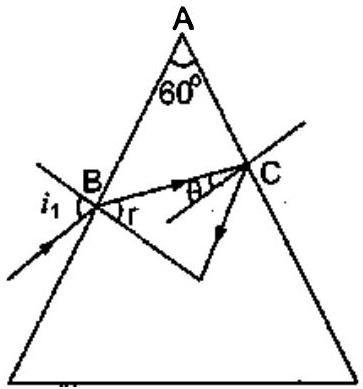
चित्र $9.8$

$$
{ }_{a} n_{g}=\frac{\sin i}{\sin r} \Rightarrow \sin i={ }_{a} n_{g} \times \sin r
$$

या

$$
\sin i=1.524 \times \sin 19^{\circ}=0.5=\frac{1}{2}=\sin 30^{\circ}
$$

अत:

$$
i=30^{\circ}
$$

दूसरे फलक से पूर्ण आन्तरिक परावर्तन के लिए आवश्यक है कि किरण इस फलक पर क्रान्तिक कोण $i_{c}$ से बड़े कोण पर गिरे।

$$
\because \quad r=60^{\circ}-\theta
$$

तथा $\theta=i_{c}$ के लिए

$$
r=19^{\circ}, \quad i=30^{\circ}
$$

$\therefore \theta>i_{c}$ के लिए

$$
r<19^{\circ} \quad \Rightarrow
$$

$$
i<30^{\circ}
$$

अत: दूसरे फलक से पूर्ण आन्तरिक परावर्तन हेतु आपतन कोण $i \leq 30^{\circ} ।$
प्रश्न 23. आपको विविध कोणों के क्राउन काँच व फ्लिंट काँच के प्रिज़्म दिए गए हैं। प्रिज्मों का कोई ऐसा संयोजन सुझाइए जो-
    (a) श्वेत प्रकाश के संकीर्ण पुंज को बिना अधिक परिक्षेपित किए विचलित कर दे।
    (b) श्वेत प्रकाश के संकीर्ण पुंज को अधिक विचलित किए बिना परिक्षेपित (तथा विस्थापित) कर दे।

उत्तर-हम जानते हैं कि फ्लिण्ट काँच, क्राउन काँच की तुलना में अधिक विक्षेपण उत्पन्न करता है।

(a) बिना विक्षेपण के विचलन उत्पन्न करने हेतु क्राउन काँच का एक प्रिज़्म लीजिए तथा एक फ्लिण्ट काँच का प्रिज़्म लीजिए जिसका अपवर्तक कोण अपेक्षाकृत कम हो। अब इन्हें एक-दूसरे के सापेक्ष उल्टा रखते हुए सम्पर्क में रखिए। इस प्रकार बना संयोजन श्वेत प्रकाश को बिना अधिक परिक्षेपित किए विचलित कर देगा।
(b) पुराने संयोजन में लिए गए फ्लिण्ट काँच के प्रिज़्म के अपवर्तक कोण में वृद्धि कीजिए (परन्तु अभी भी यह कोण दूसरे प्रिज़्म की तुलना में कम ही रहेगा)। यह व्यवस्था पुंज को बिना अधिक विचलित किए परिक्षेपण उत्पन्न करेगी।

प्रश्न 24. सामान्य नेत्र के लिए दूर बिन्दु अनन्त पर तथा स्पष्ट दर्शन का निकट बिन्दु नेत्र के सामने लगभग $25 \mathrm{~cm}$ पर होता है। नेत्र का स्वच्छ मण्डल (कार्निया) लगभग $40$ डायोप्टर की अभिसरण क्षमता प्रदान करता है तथा स्वच्छ मण्डल के पीछे नेत्र लेन्स की अल्पतम अभिसरण क्षमता लगभग $20$ डायोप्टर होती है। इस स्थूल आँकड़े से सामान्य नेत्र के परास (अर्थात् नेत्र लेन्स की अभिसरण क्षमता का परिसर) का अनुमान लगाइए।
हल-दिया है, कार्निया की अभिसरण क्षमता $=+40 \mathrm{D}$
नेत्र लेन्स की अभिसरण क्षमता $=+20 \mathrm{D}$
अत: कार्निया तथा नेत्र लेन्स की कुल अभिसरण क्षमता

$$
P=(40+20) \mathrm{D}=60 \mathrm{D}
$$

अनन्त पर स्थित वस्तुओं के लिए नेत्र न्यूनतम अभिसरण क्षमता का प्रयोग करता है। अतः उपर्युक्त क्षमता न्यूनतम अभिसरण क्षमता होगी। इसलिए नेत्र लेन्स की अधिकतम फोकस़ दूरी

$$
f=\frac{1}{P}=\left(\frac{1}{60}\right) \text { मीटर }=\frac{5}{3} \text { सेमी }
$$

श्रांत अवस्था में

$$
\begin{array}{ll}
\therefore & \frac{1}{f}=\frac{1}{v}-\frac{1}{u} \text { से, } \frac{1}{f}=\frac{1}{v}-\frac{1}{-\infty} \\
\Rightarrow & v=f=(5 / 3) \text { सेमी }
\end{array}
$$

निकट बिन्दु पर स्थित वस्तु को फोकस करने के लिए $u=-25$ सेमी, $v=5 / 3$ सेमी

$$
\therefore \quad \begin{aligned}
& \frac{1}{f}=\frac{1}{v}-\frac{1}{u} \text { से, } \\
& \frac{1}{f}=\frac{1}{5 / 3}-\frac{1}{-25}=\frac{3}{5}+\frac{1}{25}=\frac{16}{25}
\end{aligned}
$$

$$
\Rightarrow \quad f=\left(\frac{25}{16}\right) \text { सेमी }
$$

$$
\text { ∴ इसकी संगत अभिसारी क्षमता } P=\frac{100}{f}=\frac{100}{(25 / 16)}=+64 \mathrm{D}
$$

∴ नेत्र लेन्स की क्षमता $=64 \mathrm{D}-40 \mathrm{D}=24 \mathrm{D}$
अत: नेत्र लेन्स का अनुमानित परास $=20 \mathrm{D}$ से $24 \mathrm{D}$
प्रश्न 25. क्या निकट दृष्टिदोष अथवा दीर्घ दृष्टिदोष आवश्यक रूप से यह ध्वनित होता है कि नेत्र ने अपनी समंजन क्षमता आंशिक रूप से खो दी है? यदि नहीं, तो इन दृष्टिदोषों का क्या कारण हो सकता है?
हल-यह आवश्यक नहीं है कि निकट दृष्टिदोष अथवा दूर दृष्टिदोष केवल नेत्र के आंशिक रूप से अपनी समंजन क्षमता खो देने के कारण ही उत्पन्न होता है। यह नेत्र गोलक के सामान्य आकार से बड़ा अथवा छोटा होने के कारण भी उत्पन्न हो सकता है।
प्रश्न 26. निकट दृष्टिदोष का कोई व्यक्ति दूर दृष्टि के लिए - 1.0 D क्षमता का चशमा उपयोग कर रहा है । अधिक आयु होने पर उसे पुस्तक पढ़ने के लिए अलग से $+2.0 \mathrm{D}$ क्षमता के चशमे की आवश्यकता होती है। स्पष्ट कीजिए ऐसा क्यों हुआ?
हल- $-1.0 \mathrm{D}$ क्षमता के संगत फोकस दूरी

$$
f=\frac{1}{P}=\left(\frac{1}{-1.0}\right) \text { मीटर }=-10 \text { मीटर }
$$

अत: प्रारम्भ में नेत्र की स्वस्य अवस्था में व्यक्ति $1.00$ मीटर दूरी तक की वस्तुओं को स्पष्ट देख सकता है।
अधिक आयु होने पर नेत्र की समंजन क्षमता कम हो जाने के कारण नेत्र लेन्स का निकट बिन्दु और दूर विस्थापित हो जाता है। अत: व्यक्ति में जरा दृष्टि दोष है। इस दशा में प्रयुक्त उत्तल लेन्स की क्षमता

$$
P=+2 \mathrm{D}
$$

अत: फोकस दूरी $f=1 / P=(1 / 2)$ मीटर $=50$ सेमी, $u=-25$ सेमी

$$
\begin{aligned}
\frac{1}{v}-\frac{1}{u} & =\frac{1}{f} \text { से, } \\
\frac{1}{v} & \equiv \frac{1}{u}+\frac{1}{f}=\frac{1}{-25}+\frac{1}{50}=-\frac{1}{50}
\end{aligned}
$$

⇒

$$
v=-50 \text { सेमी }
$$

चूँकि निकट बिन्दु $25$ सेमी से $50$ सेमी पर विस्थापित हो गया है, अत: जरा दृष्टि दोष से पीड़ित व्यक्ति $50$ सेमी से $100$ सेमी तक के बीच की वस्तु देख सकता है।
प्रश्न 27. कोई व्यक्ति ऊध्र्वाधर तथा क्षैतिज धारियों की कमीज पहने किसी दूसरे व्यक्ति को देखता है। वह क्षैतिज धारियों की तुलना में ऊर्ध्वाधर धारियों को अधिक स्पष्ट देख पाता है। ऐसा किस दृष्टिदोष के कारण होता है? इस दृष्टिदोष का संशोधन कैसे किया जाता है?
हल-यह घटना अबिन्दुकता नामक दृष्टिदोष के कारण होती है। सामान्य नेत्र पूर्णत: गोलीय होता है तथा इसके विभिन्न तलों की वक्रता सर्वत्र समान होती है। परन्तु अबिन्दुकता दोष में कॉर्निया पूर्णत: गोलीय नहीं रह जाता तथा इसके विभिन्न तलों की वक्रताएँ समान नहीं रह पातीं। प्रश्नानुसार व्यक्ति ऊर्ध्वाधर धारियों को स्पष्ट देख पाता है परन्तु क्षैतिज धारियों को नहीं। इससे स्पष्ट है कि नेत्र में ऊध्र्वाधर तल में पर्याप्त वक्रता है जिसके कारण ऊधर्वाधर रेखाएँ दृष्टि पटल पर स्पष्ट फोकस हो रही हैं। परन्तु क्षैतिज तल की वक्रता पर्याप्त नहीं है।
इस दोष को सिलिण्डरी लेन्स की सहायता से दूर किया जा सकता है।
प्रश्न 28. कोई सामान्य निकट बिन्दु ( $25 \mathrm{~cm}$ ) का व्यक्ति छोटे अक्षरों में छपी वस्तु को $5 \mathrm{~cm}$ फोकस दूरी के पतले उत्तल लेन्स के आवर्धक लेन्स का उपयोग करके पढ़ता है।

(a) वह निकटतम तथा अधिकतम दूरियाँ ज्ञात कीजिए जहाँ वह उस पुस्तक को आवर्धक लेन्स द्वारा पढ़ सकता है।
(b) उपर्युक्त सरल सूक्ष्मदर्शी के उपयोग द्वारा संभावित अधिकतम तथा न्यूनतम कोणीय आवर्धन (आवर्धन क्षमता) क्या है?

हल-(a) वस्तु को निकटतम दूरी से देखने के लिए वस्तु का प्रतिबिम्ब स्पष्ट दृष्टि की न्यूनतम दूरी अर्थात् निकट बिन्दु पर बनना चाहिए। अत: $v=-25$ सेमी
यहाँ

$$
f=5 \text { सेमी }
$$

∴ सूत्र

$$
\frac{1}{f}=\frac{1}{v}-\frac{1}{u} \text { से, } \frac{1}{u_{\min }}=\frac{1}{v}-\frac{1}{f}=\frac{1}{-25}-\frac{1}{5}=\frac{-6}{25}
$$

∴

$$
u_{\min }=-\left(\frac{25}{6}\right) \text { सेमी }=-4.2 \text { सेमी }
$$

अधिकतम दूरी के लिए $v=\infty$
अत: पुन: लेन्स सूत्र से, $\frac{1}{u_{\text {max }}}=\frac{1}{-5}+\frac{1}{\infty}$
⇒

$$
u_{\max }=-5 \text { सेमी }
$$

(b) ∵ कोणीय आवर्धन $M=\frac{\mathrm{D}}{|u|}$
∴
$$
M_{\max }=\frac{\mathrm{D}}{\left|u_{\min }\right|}=\frac{25}{\left(\frac{25}{6}\right)}=6
$$
तथा
$$
M_{\min }=\frac{\mathrm{D}}{\left|u_{\max }\right|}=\left(\frac{25}{5}\right)=5
$$
प्रश्न 29. कोई कार्ड शीट जिसे $1 \mathrm{~mm}^{2}$ साइज़ के वर्गों में विभाजित किया गया है, को $9 \mathrm{~cm}$ दूरी पर रखकर किसी आवर्धक लेन्स ( $\mathbf{1 0 ~ c m}$ फोकस दूरी का अभिसारी लेन्स) द्वारा उसे नेत्र के निकट रखकर देखा जाता है।
    (a) लेन्स द्वारा उत्पन्न आवर्धन (प्रतिबिम्ब-साइज़/वस्तु-साइज़) क्या है? आभासी प्रतिबिम्ब में प्रत्येक वर्ग का क्षेत्रफल क्या है?
    (b) लेन्स का कोणीय आवर्धन (आवर्धन क्षमता) क्या है?
    (c) क्या (a) में आवर्धन क्षमता (b) में आवर्धन के बराबर है? स्पष्ट कीजिए।

हल-(a) दिया है, $u=-9$ सेमी, $f=+10$ सेमी
लेन्स के सूत्र $\frac{1}{f}=\frac{1}{v}-\frac{1}{u}$ से

$$
\begin{aligned}
& \frac{1}{v}=\frac{1}{f}+\frac{1}{u}=\frac{1}{10}-\frac{1}{9}=-\frac{1}{90} \\
& v=-90 \text { सेमी }
\end{aligned}
$$

आवर्धन,

$$
m=\frac{v}{n}=\frac{-90}{-9}=10
$$

आभासी प्रतिबिम्ब में प्रत्येक वर्ग का क्षेत्रफल

$$
\begin{aligned}
A_{l} & =m^{2} \times \text { वस्तु के प्रत्येक वर्ग का क्षेत्रफल } \\
& =(10)^{2} \times 1 \mathrm{~mm}^{2}=100 \mathrm{~mm}^{2}
\end{aligned}
$$

(b) लेन्स की आवर्धन क्षमता, $M=\frac{D}{f}=\frac{-25}{-9} \frac{\mathrm{~cm}}{\mathrm{~cm}}=2.8$
(c) बराबर नहीं है; क्योकि लेन्स द्वारा उत्पन्न आवर्धन तथा लेन्स की आवर्धन क्षमता अलग-अलग भौतिक राशियाँ हैं। ये तभी बराबर होंगी यदि प्रतिबिम्ब नेत्र के निकट बिन्दु ( $=25$ सेमी) पर बने।
प्रश्न 30. (a) प्रश्न 29.में लेन्स को चित्र से कितनी दूरी पर रखा जाए ताकि वर्गों को अधिकतम संभव आवर्धन क्षमता के साथ सुस्पष्ट देखा जा सके।
    (b) इस उदाहरण में आवर्धन (प्रतिबिम्ब-साइज़/वस्तु-साइज़) क्या है?
    (c) क्या इस प्रक्रम में आवर्धन, आवर्धन क्षमता के बराबर है? स्पष्ट कीजिए।

हल-(a) अधिकतम आवर्धन क्षमता के लिए, $v=D=-25 \mathrm{~cm}, f=10$ सेमी लेन्स के सूत्र $\frac{1}{f}=\frac{1}{v}-\frac{1}{u}$ से

$$
\begin{aligned}
\Rightarrow \quad \frac{1}{u} & =\frac{1}{v}-\frac{1}{f}=-\frac{1}{25}-\frac{1}{10}=-\frac{7}{50} \\
u & =-\frac{50}{7} \text { सेमी } \\
& =-7.14 \text { सेमी }
\end{aligned}
$$

(b) आवर्धन, $m=\frac{v}{u}=\frac{-25}{(-50 / 7)}=3.5$
(c) आवर्धन क्षमता, $M=\frac{D}{u}=\frac{(-25)}{(-50 / 7)}=3.5$

हाँ, इस स्थिति में आवर्धन, आवर्धन क्षमता के बराबर है, क्योकि प्रतिबिम्ब नेत्र के निकट बिन्दु $\dot{D}=$ $25$ सेमी पर बनता है।
प्रश्न 31. प्रश्न $30$ में वस्तु तथा आवर्धक लेन्स के बीच कितनी दूरी होनी चाहिए ताकि आभासी प्रतिबिम्ब में प्रत्येक वर्ग $6.25 \mathrm{~mm}^{2}$ क्षेत्रफत का प्रतीत हो? क्या आप आवर्धक लेन्स को नेत्र के अत्यधिक निकट रखकर इन वर्गों को सुस्पष्ट देख सकेंगे।
[नोट : अभ्यास $9.29$ से $9.31$ आपको निरपेक्ष साइज में आवर्धन तथा किसी यन्त्र की आवर्धन क्षमता (कोणीय आवर्धन) के बीच अन्तर को स्पष्टतः समझने में सहायता करेंगे।]
हल-दिया है, $f=10$ सेमी,
वस्तु के प्रत्येक वर्ग का क्षेत्रफल $A_{0}=1$ मिमी, ${ }^{2}$
प्रतिबिम्ब के प्रत्येक वर्ग का क्षेत्रफल, $A_{l}=6.25$ मिमी ${ }^{2}$
क्षेत्रीय आवर्धन,

$$
M_{A}=\frac{\text { प्रतिबिम्ब का क्षेत्रफल }}{\text { वस्तु का क्षेत्रफल }}=\frac{6.25 \text { मिमी }^{2}}{1 \text { मिमी }^{2}}=6.25
$$

रेखीय आवर्धन, $m=\sqrt{\text { क्षेत्रीय आवर्धन }}=\sqrt{6.25}=2.5$
चूँकि

$$
\begin{aligned}
m & =\frac{v}{u} \\
v & =m u=2.5 u
\end{aligned}
$$

लेन्स के सूत्र, $\frac{1}{f}=\frac{1}{v}-\frac{1}{u}$ से

$$
\frac{1}{10}=\frac{1}{2.5 u}-\frac{1}{u}
$$

⇒

$$
\begin{aligned}
u & =-6 \text { सेमी } \\
v & =2.5 u=-2.5 \times 6 \\
& =-15 \text { सेमी }
\end{aligned}
$$

चूँकि आभासी प्रतिबिम्ब $15$ सेमी पर है तथा स्पष्ट दृष्टि की न्यूनतम दूरी $25$ सेमी है। अत: प्रतिबिम्ब नेत्र को सुस्पष्ट दिखाई नहीं देगा।
प्रश्न 32. निम्नलिखित प्रश्नों के उत्तर दीजिए-

(a) किसी वस्तु द्वारा नेत्र पर अन्तरित कोण आवर्धक लेन्स द्वारा उत्पन्न आभासी प्रतिबिम्ब द्वारा नेत्र पर अन्तरित कोण के बराबर होता है। तब फिर किन अर्थों में कोई आवर्धक लेन्स कोणीय आवर्धन प्रदान करता है?
(b) किसी आवर्धक लेन्स से देखते समय प्रेक्षक अपने नेत्र को लेन्स से अत्यधिक सटाकर रखता है। यदि प्रेक्षक अपने नेत्र को पीछे ले जाए तो क्या कोणीय आवर्धन परिवर्तित हो जाएगा?
(c) किसी सरल सूक्ष्मदर्शी की आवर्धन क्षमता उसकी फोकस दूरी के व्युत्क्रमानुपाती होती है। तब हमें अधिकाधिक आवर्धन क्षमता प्राप्त करने के लिए कम-से-कम फोकस दूरी के उत्तल लेन्स का उपयोग करने से कौन रोकता है?

(d) किसी संयुक्त सूक्ष्मदर्शी के अभिदृश्यक लेन्स तथा नेत्रिका लेन्स दोनों ही की फोकस दूरी कम क्यों होनी चाहिए?
(e) संयुक्त सूक्ष्मदर्शी द्वारा देखते समय सर्वोत्तम दर्शन के लिए हमारे नेत्र, नेत्रिका पर स्थित न होकर उससे कुछ दूरी पर होने चाहिए। क्यों? नेत्र तथा नेत्रिका के बीच की यह अल्प दूरी कितनी होनी चाहिए?

उत्तर-(a) आवर्धक लेन्स के बिना वस्तु को देखते समय उसे नेत्र से $25 \mathrm{~cm}$ से कम दूरी पर नहीं रखा जा सकता, परन्तु लेन्स की सहायता से वस्तु को देखते समय वस्तु को अपेक्षाकृत नेत्र के अधिक समीप रखा जा सकता है जिससे कि अन्तिम प्रतिबिम्ब स्पष्ट दृष्टि की न्यूनतम दूरी पर बने। इस प्रकार कोणीय साइज में वृद्धि वस्तु को नेत्र के समीप रखने के कारण होती है।

(b) हाँ, क्योंकि इस स्थिति में प्रतिब्रिम्ब द्वारा नेत्र पर बना दर्शन कोण, उसके द्वारा लेन्स पर बने दर्शन कोण से कुछ छोटा हो जाएगा।
(c) एक-तो अत्यन्त कम फोकस दूरी के लेन्सों (मोटे लेन्सों) को बनाने की प्रक्रिया आसान नहीं है, दूसरे फोकस दूरी घटने के साथ लेन्सों में विपथन का दोष बढ़ने लगता है। इससे उनके द्वारा बने प्रतिबिम्ब अस्पष्ट हो जाते हैं।
व्यवहार में किसी एकल उत्तल लेन्स द्वारा $3$ से अधिक आवर्धन प्राप्त करना सम्भव नहीं है परन्तु विपथन के दोष से मुक्त लेन्स द्वारा कहीं अधिक आवर्धन (लगभग 10) प्राप्त किया जा सकता है।
(d) सूक्ष्मदर्शी के अभिदृश्यक का आवर्धन $\frac{v_{o}}{\left|u_{o}\right|}=\frac{1}{\left(\frac{\left|u_{o}\right|}{f_{o}}-1\right)}$ होता है। इससे स्पष्ट है कि इस आवर्धन को बढ़ाने के लिए $\left|u_{o}\right|$ का मान $f_{o}$ से कुछ अधिक होना चाहिए। परन्तु सूक्ष्मदर्शी समीप की वस्तुओं को देखने के लिए प्रयोग किया जाता है जो अभिदृश्यक के समीप रखी जाती हैं। अत: इन वस्तुओं के लिए $\left|u_{o}\right|$ का मान कम होता है, इसलिए $f_{o}$ का मान और भी कम रखना पड़ता है।
नेत्रिका का आवर्धन $\left(1+\frac{D}{f_{e}}\right)$ होता है; अत: स्पष्ट है कि इसे बढ़ाने के लिए $f_{e}$ का मान कम रखा जाता है।
(e) संयुक्त सूक्ष्मदर्शी में वस्तु से चलने वाला प्रकाश अभिदृश्यक से गुजरने के बाद नेत्रिका से गुजरकर आँख तक पहुँचता है। वस्तु का प्रतिबिम्ब स्पष्ट देखने के लिए आवश्यक है कि वस्तु से चलने वाला अधिकतम प्रकाश नेत्र में पहुँचे। वस्तु से चलने वाले प्रकाश को अधिकतम मात्रा में ग्रहण करने के लिए ही नेत्र को नेत्रिका से अत्यल्प दूरी पर रखा जाता है। यह अत्यल्प दूरी यन्त्र की संरचना पर निर्भर करती है तथा उस पर लिखी गई होती है।

प्रश्न 33. $1.25 \mathrm{~cm}$ फोकस दूरी का अभिदृश्यक तथा $5 \mathrm{~cm}$ फोकस दूरी की नेत्रिका का उपयोग करके वांछित कोणीय आवर्धन (आवर्धन क्षमता) $30 \mathrm{X}$ होता है। आप संयुक्त सूक्ष्मदर्शी का समायोजन कैसे करेंगे?
हल-जब अन्तिम प्रतिबिम्ब स्पष्ट दृष्टि की न्यूनतम दूरी पर बनता है तो यह संयुक्त सूक्ष्मदर्शी का सामान्य समायोजन होता है। इसमें
नेत्रिका का कोणीय आवर्धन $m_{e}=\left(1+\frac{D}{f_{e}}\right)=\left(1+\frac{25}{5}\right)=6$
दिया है, कुल आवर्धन $M=30$

$$
\because \quad M=m_{o} \times m_{e}
$$

⇒ अभिदृश्यक का आवर्धन $m_{o}=M / m_{e}$
$\therefore m_{o}=\frac{30}{6}=5$ (यह आवर्धन ऋणात्मक होगा चूँकि अभिदृश्यक द्वारा बना प्रतिबिम्ब उल्टा होगा अर्थात्

$$
\left.m_{o}=-5\right)
$$

अत:

$$
m_{0}=v_{0} / u_{0}
$$

⇒

$$
v_{o}=m_{o} \times u_{o}=-5 u_{o}
$$

∴

$$
\frac{1}{f_{o}}=\frac{1}{v_{o}}-\frac{1}{u_{o}}
$$

⇒

$$
\frac{1}{-1.25}=\frac{1}{-5 u_{0}}-\frac{1}{u_{0}}=\frac{-6}{5 u_{0}}
$$

⇒

$$
u_{o}=-\frac{-1.25 \times 6}{5}=-1.5 \text { सेमी }
$$

∴

$$
v_{o}=-5 u_{o}=-5 \times 1.5 \text { सेमी }=7.5 \text { सेमी }
$$

नेत्रिका के लिए सूत्र $\frac{1}{f_{e}}=\frac{1}{v_{e}}-\frac{1}{u}$ का प्रयोग करते हुए

$$
\frac{1}{u_{e}}=\frac{1}{v_{e}}-\frac{1}{f_{e}}=\frac{1}{-25}-\frac{1}{5}=-\frac{6}{25}
$$

⇒

$$
u_{e}=-\left(\frac{25}{6}\right) \text { सेमी }=-.4 .17 \text { सेमी }
$$

अब लेन्सों के बीच की दूरी $l=\left|v_{o}\right|+\left|u_{e}\right|=7.5$ सेमी + $4.17$ सेमी

$$
\text { = } 11.67 \text { सेमी }
$$

अत: संयुक्त सूक्ष्मदर्शी के समायोजन में अभिदृश्यक तथा नेत्रिका को परस्पर $11.67$ सेमी दूरी पर रखना होगा तथा वस्तु को अभिदृश्यक के सामने इससे $1.5$ सेमी की दूरी पर रखना होगा।
प्रश्न 34. किसी दूरबीन के अभिदृश्यक की फोकस दूरी $\mathbf{1 4 0 ~ c m}$ तथा नेत्रिका की फोकस दूरी $5.0 \mathrm{~cm}$ है। दूर की वस्तुओं को देखने के लिए दूरबीन की आवर्थन क्षमता क्या होगी जब-

(a) दूरबीन का समायोजन सामान्य है (अर्थात् अन्तिम प्रतिबिम्ब अनन्त पर बनता है)।
(b) अन्तिम प्रतिबिम्ब स्पष्ट दर्शन की अल्पतम दूरी ( $25 \mathrm{~cm}$ ) पर बनता है।

हल-दूरदर्शी हेतु $f_{o}=140 \mathrm{~cm}, f_{e}=5.0 \mathrm{~cm}$

(a) जब अन्तिम प्रतिबिम्ब अनन्त पर है तब आवर्धन क्षमता
$$
M=\frac{f_{o}}{f_{e}}=\frac{140}{5}=28
$$
(b) जब अन्तिम प्रतिबिम्ब निकट बिन्दु पर है तब आवर्धन क्षमता
$$
M=\frac{f_{o}}{f_{e}}\left(1+\frac{f_{e}}{D}\right)=\frac{140}{5}\left(1+\frac{5.0}{25}\right)=33.6
$$

प्रश्न 35. (a) प्रश्न $34$ (a) में वर्णित दूरबीन के लिए अभिदृश्यक लेन्स तथा नेत्रिका के बीच पृथक्कन दूरी क्या है?

(b) यदि इस दूरबीन का उपयोग $3 \mathrm{~km}$ दूर स्थित $100 \mathrm{~m}$ ऊँची मीनार को वेखने के लिए किया जाता है तो अभिदृश्यक द्वारा बने मीनार के प्रतिबिम्ब की ऊँचाई क्या है?
(c) यदि अन्तिम प्रतिबिम्ब $25 \mathrm{~cm}$ दूर बनता है तो अन्तिम प्रतिबिम्ब में मीनार की ऊँचाई क्या है?

हल-(a) यदि अन्तिम प्रतिबिम्ब अनन्त पर है तो $\left|v_{o}\right|=f_{o},\left|u_{e}\right|=f_{e}$ ∴ नेत्रिका व अभिदृश्यक के बीच दूरी

(b) इस दशा में
$$
\begin{array}{rlrl}
L & =\left|v_{0}\right|+\left|u_{e}\right|=f_{o}+f_{e} & =140+5.0=145.0 \mathrm{~cm} \\
u_{o} & =3000 \mathrm{~m}, & h & =100 \mathrm{~m} \\
f_{o} & =140 \mathrm{~cm}, & h^{\prime} & =?
\end{array}
$$
अभिदृश्यक पर वस्तु द्वारा बना कोण $=\frac{h}{u_{o}}$
जबकि प्रतिबिम्ब द्वारा बना कोण $=\frac{h^{\prime}}{f_{o}}$
$$
\therefore \quad \frac{h^{\prime}}{f_{o}}=\frac{h}{u_{o}} \Rightarrow h^{\prime}=\frac{h}{u_{o}} \times f_{o}=\left(\frac{10}{3000}\right) \times 140 \mathrm{~cm}
$$
⇒ प्रतिबिम्ब की लम्बाई $h^{\prime}=4.7 \mathrm{~cm}$
(c) ∵ इस दशा में
$$
\begin{aligned}
v_{e} & =-D=-25 \mathrm{~cm}, \quad f_{e}=5 \mathrm{~cm} \\
\frac{1}{-25}-\frac{1}{u_{e}} & =\frac{1}{5} \quad \Rightarrow \quad \frac{1}{u_{e}}
\end{aligned}=\frac{1}{25}+\frac{1}{5}
$$
या
$$
\frac{1}{u_{e}}=\frac{1+5}{25} \quad \Rightarrow \quad u_{e}=\frac{25}{6} \mathrm{~cm}
$$
$\therefore$ नेत्रिका का आवर्धन $=\frac{v_{e}}{u_{e}}=\frac{25}{25 / 6}=6$
यदि नेत्रिका द्वारा बने अन्तिम प्रतिबिम्ब की लम्बाई $h^{\prime \prime}$ है तब
$$
\frac{h^{\prime \prime}}{h^{\prime}}=6 \quad \Rightarrow \quad h^{\prime \prime}=6 h^{\prime}=6 \times 4.7 \approx 28 \mathrm{~cm}
$$

प्रश्न 36. किसी कैसेग्रेन दूरबीन में चित्र $9.9$ में दर्शाए अनुसार दो दर्पणों का प्रयोग किया गया है। इस दूरबीन में दोनों दर्पण एक-दूसरे से $20 \mathrm{~mm}$ दूर रखे गए है। यदि बड़े दर्पण की वक्रता त्रिज्या $220 \mathrm{~mm}$ हो तथा छोटे दर्पण की वक्रता त्रिज्या $140 \mathrm{~mm}$ हो तो अनन्त पर रखे

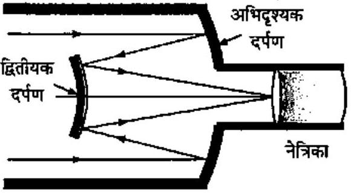
ি묵丷ㅈㅎ $9.9$

किसी बिम्ब का अन्तिम प्रतिबिम्ब कहाँ बनेगा?
हल-दिया है, बड़े दर्पण की वक्रता त्रिज्या $R_{1}=-22$ सेमी छोटे दर्पण की वक्रता त्रिज्या $R_{2}=14$ सेमी
अत: बड़े दर्पण (अभिदृश्यक) की फोकस दूरी $f_{1}=\frac{R_{1}}{2}=-11$ सेमी तथा छोटे दर्पण की फोकस दूरी $f_{2}=\frac{R_{2}}{2}=7$ सेमी दर्पणों के बीच की दूरी $d=20$ मिमी $=2$ सेमी

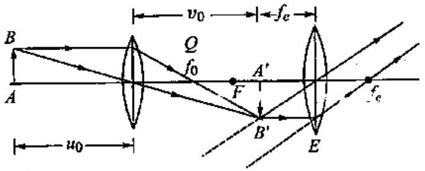
चित्र $9.10$

चूँकि वस्तु अनन्त पर है, अत: $u=\infty$
जैसा कि रेखाचित्र में प्रदर्शित है, वस्तु का अन्तिम प्रतिबिम्ब अभिदृश्यक दर्पण के पीछे बनता है जिसे नेत्रिका में से देखते हैं।
अनन्त पर स्थित वस्तु से आती किरणें अभिदृश्यक के मुख्य फोकस पर मिलने को होती हैं, परन्तु इससे पहले ही कम फोकस दूरी का अवतल दर्पण बीच में आ जाता है।
अभिदृश्यक के लिए- $u=-\infty, f=f_{1}=11$ सेमी $v=$ ?
गोलीय दर्पण के सूत्र $\frac{1}{u}+\frac{1}{v}=\frac{1}{f}$ से

$$
\begin{aligned}
\frac{1}{v} & =\frac{1}{f}-\frac{1}{u} \\
& =-\frac{1}{11}+\frac{1}{\infty}=-\frac{1}{11}
\end{aligned}
$$

अथवा

$$
\begin{aligned}
v & =-11 \text { सेमी } \\
& =\text { अभिदृश्यक से दूरी }
\end{aligned}
$$

∴ उत्तल दर्पण से दूरी $x=-(v+d)=-(-11+2)=+9$ सेमी
यह उत्तल दर्पण के लिए आभासी वस्तु का कार्य करता है।

$$
\begin{array}{ll}
\therefore & u^{\prime}=9 \text { सेमी } \\
& f^{\prime}=f_{2}=7 \text { सेमी }
\end{array}
$$

$v^{\prime}=$ अन्तिम प्रतिबिम्ब की दूरी = ?
पुन: गोलीय दर्पण के सूत्र $\frac{1}{f}=\frac{1}{v}+\frac{1}{u}$ से

$$
\frac{1}{7}=\frac{1}{v^{\prime}}+\frac{1}{9}
$$

अथवा

$$
\frac{1}{v^{\prime}}=\frac{1}{7}-\frac{1}{9}=\frac{9-7}{63}=\frac{2}{63}
$$

∴

$$
v^{\prime}=\frac{63}{2}=31.5 \text { सेमी }
$$

अर्थात् प्रतिबिम्ब छोटे (उत्तल) दर्पण के सामने दर्पण से $31.5$ सेमी दूर बनता है।
अतः इस प्रतिबिम्ब की अभिदृश्यक से दूरी $=31.5-2=29.5$ सेमी होगी।
प्रश्न 37. किसी गैल्वेनोमीटर की कुण्डली से जुड़े समतल वर्पण पर लम्बवत् आपतित प्रकाश (चित्र 9.11) दर्पण से टकराकर अपना पथ पुनः अनुरेखित करता है। गैल्वेनोमीटर की कुण्डली में प्रवाहित कोई धारा दर्पण में 3.5° का परिक्षेपण उत्पन्न करती है। दर्पण के सामने $1.5$ m की दूरी पर रखे परवे पर प्रकाश के परावर्ती चिह्न में कितना विस्थापन होगा?

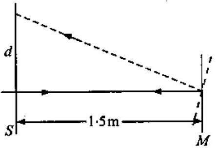
चित्र $9.11$

हल-जब दर्पण में $\theta=3.5^{\circ}$ का विक्षेप उत्पन्न होता है, तब प्रकाश किरण दुगने कोण (अर्थात् $\left.2 \theta=2 \times 3.5^{\circ}=7^{\circ}\right)$ मे घूमती हैं।
अत: $R=1.5 \mathrm{~m}$ दूरी पर रखे परदे पर प्रकाश चिह्न का विस्थापन

$$
d=R \times 2 \theta \quad(\because \text { चाप }=\text { कोण } \text { × } \text { त्रिज्या })
$$

⇒

$$
d=1.5 \times \frac{7^{\circ} \times \pi}{180^{\circ}}=0.184 \mathrm{~m}=18.4 \mathrm{~m}
$$

प्रश्न 38. चित्र $9.12$ में कोई समोत्तल लेन्स (अपवर्तनांक 1.50) किसी समतल दर्पण के फलक पर किसी द्रव की परत के सम्पर्क में दर्शाया गया है। कोई छोटी सुई जिसकी नोक मुख्य अक्ष पर है, अक्ष के अनुदिश ऊपर-नीचे गति कराकर इस प्रकार समायोजित की जाती है कि सुई की नोक का उल्टा प्रतिबिम्ब सुईं की स्थिति पर ही बने। इस स्थिति में सुई की लेन्स से दूरी $45.0 \mathrm{~cm}$ है। द्रव को हटाकर प्रयोग को दोहराया जाता है। नयी दूरी $30.0 \mathrm{~cm}$ मापी जाती है। द्रव का अपवर्तनांक क्या है?

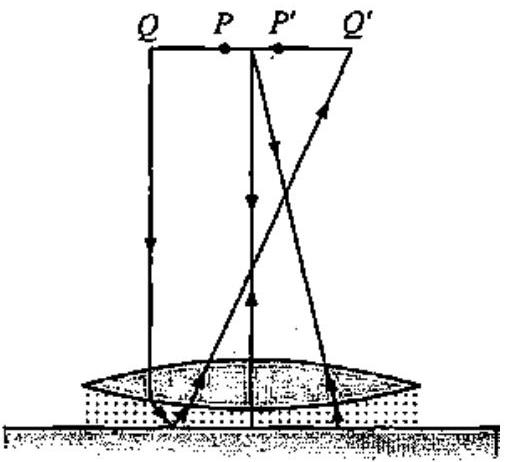
चित्र $9.12$

हल-द्रव को हटाकर प्रयोग करते समय
इस स्थिति में सुई से चलने वाली किरणें काँच के लेन्स से अपवर्तित होकर समतल दर्पण पर अभिलम्बवत् आपतित होती हैं। दर्पण इन किरणों को वापस उन्हीं के मार्ग पर लौटा देता है जिससे किरणें वापस सुई की स्थिति में ही प्रतिबिम्ब बनाती हैं।
यह स्पष्ट है कि दर्पण की अनुपस्थिति में लेन्स से अपवर्तित किरणें अनन्त पर मिलती हैं।
$\therefore \quad$ काँच के लेन्स हेतु, $u=-30 \mathrm{~cm}, \dot{v}=\infty$
माना फोकस दूरी $=f_{1}$

$$
\therefore \quad \frac{1}{v}-\frac{1}{u}=\frac{1}{f_{1}} \text { से, } \quad \frac{1}{\infty}-\frac{1}{-30}=\frac{1}{f_{1}}
$$

$\therefore \quad$ लेन्स की फोकस दूरी $f_{1}=30 \mathrm{~cm}$
यदि इसके प्रत्येक तल की वक्रता त्रिज्या $R$ है, तब

$$
R_{1}=+R, R_{2}=-R, \quad n=1.5
$$

∴

$$
\frac{1}{f_{1}}=(n-1)\left(\frac{1}{R_{1}}-\frac{1}{R_{2}}\right)
$$

⇒

$$
\frac{1}{30}=(1.5-1)\left(\frac{1}{R}+\frac{1}{R}\right)=0.5 \times \frac{2}{R}
$$

⇒

$$
R=30 \mathrm{~cm}
$$

द्रव के साथ प्रयोग करते समय
इस स्थिति में काँच के लेन्स तथा समतल दर्पण के बीच एक द्रव का लेन्स भी बना है। माना इस द्रव लेन्स की फोकस दूरी $f_{2}$ है, तब
संयुक्त लेन्स हेतु,

$$
\frac{1}{F}=\frac{1}{f_{1}}+\frac{1}{f_{2}}
$$

परन्तु संयुक्त लेन्स हेतु;

$$
\begin{aligned}
v & =-45.0 \mathrm{~cm}, \\
\frac{1}{v}-\frac{1}{u} & =\frac{1}{F} \quad \Rightarrow \quad \frac{1}{\infty}-\frac{1}{-45}
\end{aligned}=\frac{1}{F}
$$

⇒

$$
F=45 \mathrm{~cm}
$$

∴ समीकरण (1) से,

$$
\frac{1}{45}=\frac{1}{30}+\frac{1}{f_{2}} \quad \Rightarrow \quad \frac{1}{f_{2}}=\frac{1}{45}-\frac{1}{30}=\frac{2-3}{90}
$$

⇒

$$
f_{2}=-90 \mathrm{~cm}
$$

स्पष्ट है कि द्रव लेन्स के प्रथम तल की वक्रता त्रिज्या काँच लेन्स के वक्र तल की वक्रता-त्रिज्या के बराबर है।
$\therefore \quad$ द्रव लेन्स हेतु $R_{1}=-30 \mathrm{~cm}, \quad R_{2}=\infty$
माना द्रव का अपवर्तनांक $n$ है, तब

$$
\frac{1}{f_{2}}=(n-1)\left(\frac{1}{R_{1}}-\frac{1}{R_{2}}\right)
$$

⇒

$$
\frac{1}{-90}=(n-1)\left(\frac{1}{-30}-\frac{1}{\infty}\right) \quad \text { या } \quad-\frac{1}{90}=-\frac{(n-1)}{30}
$$

⇒

$$
n-1=\frac{30}{90}=0.33
$$

∴ द्रव का अपवर्तनांक $n=1.33$

